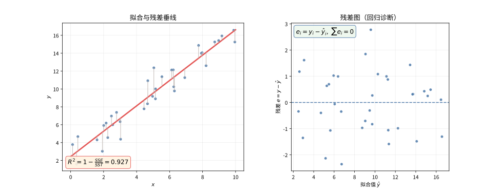

# 第 92 级：回归分析 (Regression Analysis)

---

## 1. 学习目标

完成本教程后，你将能够：

1. 理解线性回归模型的基本假设与参数估计方法
2. 掌握最小二乘估计与最大似然估计的推导与性质
3. 掌握回归系数的假设检验（t检验与F检验）与方差分析
4. 理解多重共线性、异方差性、自相关等问题的诊断与处理方法
5. 掌握岭回归、Lasso回归、主成分回归等正则化方法
6. 理解非线性回归的基本思想
7. 能独立完成回归诊断并选择合适的修正方案

---

## 2. 核心概念

### 2.1 线性回归模型

**线性回归模型**（Linear Regression Model）假设响应变量 $Y$ 与一组解释变量 $X_1, X_2, \dots, X_p$ 之间存在线性关系：

$$
Y_i = \beta_0 + \beta_1 X_{i1} + \beta_2 X_{i2} + \cdots + \beta_p X_{ip} + \varepsilon_i, \quad i = 1, 2, \dots, n
$$

其中 $\varepsilon_i$ 为随机误差项。用矩阵形式表示为：

$$
\boldsymbol{Y} = \boldsymbol{X}\boldsymbol{\beta} + \boldsymbol{\varepsilon}
$$

其中 $\boldsymbol{Y} \in \mathbb{R}^n$ 为响应向量，$\boldsymbol{X} \in \mathbb{R}^{n \times (p+1)}$ 为设计矩阵，$\boldsymbol{\beta} \in \mathbb{R}^{p+1}$ 为回归系数向量，$\boldsymbol{\varepsilon} \in \mathbb{R}^n$ 为误差向量。

**经典假设**：
1. **线性性**：$\mathbb{E}[\boldsymbol{Y} \mid \boldsymbol{X}] = \boldsymbol{X}\boldsymbol{\beta}$
2. **严格外生性**：$\mathbb{E}[\boldsymbol{\varepsilon} \mid \boldsymbol{X}] = \boldsymbol{0}$
3. **同方差性**：$\text{Var}(\varepsilon_i) = \sigma^2$（常数）
4. **无自相关**：$\text{Cov}(\varepsilon_i, \varepsilon_j) = 0$（$i \neq j$）
5. **满秩**：$\text{rank}(\boldsymbol{X}) = p + 1 < n$

### 2.2 最小二乘估计

**最小二乘估计**（Ordinary Least Squares, OLS）通过最小化残差平方和来估计参数：

$$
\hat{\boldsymbol{\beta}}_{\text{OLS}} = \arg\min_{\boldsymbol{\beta}} \|\boldsymbol{Y} - \boldsymbol{X}\boldsymbol{\beta}\|^2 = (\boldsymbol{X}^\top \boldsymbol{X})^{-1}\boldsymbol{X}^\top \boldsymbol{Y}
$$

> **直观理解（现实类比）**：把散点想象成学生在某门课上的平时分与期末成绩，每个点是一位同学。最小二乘回归线就像在点云中"拉一根最合适的直尺"，让所有点到这根线的竖直距离的平方和最小——也就是找到一条"综合误差最小"的趋势线。竖线（残差）就是每个点偏离这条线的距离，越短说明这个点越贴合整体规律。

### 2.3 最大似然估计

在误差 $\boldsymbol{\varepsilon} \sim N(\boldsymbol{0}, \sigma^2 \boldsymbol{I}_n)$ 的正态假设下，**最大似然估计**（MLE）与OLS估计量相同：

$$
\hat{\boldsymbol{\beta}}_{\text{MLE}} = (\boldsymbol{X}^\top \boldsymbol{X})^{-1}\boldsymbol{X}^\top \boldsymbol{Y}
$$

### 2.4 决定系数 $R^2$

**决定系数**衡量回归模型对数据的拟合优度：

$$
R^2 = 1 - \frac{\text{SSE}}{\text{SST}} = \frac{\text{SSR}}{\text{SST}}
$$

其中 $\text{SSE} = \sum_{i=1}^n (Y_i - \hat{Y}_i)^2$ 为残差平方和，$\text{SSR} = \sum_{i=1}^n (\hat{Y}_i - \bar{Y})^2$ 为回归平方和，$\text{SST} = \sum_{i=1}^n (Y_i - \bar{Y})^2$ 为总平方和。

> **直观理解（现实类比）**：$R^2$ 就像天气预报的"准确度评分"——它衡量解释变量能解释响应变量多少比例的波动。残差图则像体检报告上的"误差分布图"：如果残差点在0线两侧随机散布（无规律），说明回归假设成立；如果出现漏斗形或弯曲图案，就像体检指标异常，提示存在异方差性或非线性，需要诊断修正。

### 2.5 多重共线性

**多重共线性**（Multicollinearity）指解释变量之间存在高度线性相关关系，导致设计矩阵 $\boldsymbol{X}$ 的列近似线性相关，使得 $(\boldsymbol{X}^\top \boldsymbol{X})$ 接近奇异。

**方差膨胀因子**（VIF）用于诊断多重共线性：

$$
\text{VIF}_j = \frac{1}{1 - R_j^2}
$$

其中 $R_j^2$ 是第 $j$ 个解释变量对其他所有解释变量回归的决定系数。$\text{VIF}_j > 10$ 通常表示存在严重的多重共线性。

### 2.6 异方差性

**异方差性**（Heteroscedasticity）指误差项的方差不是常数：$\text{Var}(\varepsilon_i) = \sigma_i^2$，即不同观测的误差方差不同。

### 2.7 自相关

**自相关**（Autocorrelation）指不同观测的误差项之间存在相关性：$\text{Cov}(\varepsilon_i, \varepsilon_j) \neq 0$（$i \neq j$），常见于时间序列数据。

### 2.8 广义最小二乘与加权最小二乘

**加权最小二乘**（WLS）用于处理异方差性，通过给不同观测赋予不同权重：

$$
\hat{\boldsymbol{\beta}}_{\text{WLS}} = \arg\min_{\boldsymbol{\beta}} \sum_{i=1}^n w_i (Y_i - \boldsymbol{X}_i^\top \boldsymbol{\beta})^2
$$

**广义最小二乘**（GLS）处理更一般的误差协方差结构 $\text{Var}(\boldsymbol{\varepsilon}) = \sigma^2 \boldsymbol{\Omega}$：

$$
\hat{\boldsymbol{\beta}}_{\text{GLS}} = (\boldsymbol{X}^\top \boldsymbol{\Omega}^{-1} \boldsymbol{X})^{-1} \boldsymbol{X}^\top \boldsymbol{\Omega}^{-1} \boldsymbol{Y}
$$

### 2.9 正则化方法

**岭回归**（Ridge Regression）在损失函数中加入 $L_2$ 惩罚项：

$$
\hat{\boldsymbol{\beta}}_{\text{Ridge}} = \arg\min_{\boldsymbol{\beta}} \|\boldsymbol{Y} - \boldsymbol{X}\boldsymbol{\beta}\|^2 + \lambda \|\boldsymbol{\beta}\|_2^2
$$

**Lasso回归**（Least Absolute Shrinkage and Selection Operator）使用 $L_1$ 惩罚项，具有变量选择功能：

$$
\hat{\boldsymbol{\beta}}_{\text{Lasso}} = \arg\min_{\boldsymbol{\beta}} \|\boldsymbol{Y} - \boldsymbol{X}\boldsymbol{\beta}\|^2 + \lambda \|\boldsymbol{\beta}\|_1
$$

**主成分回归**（PCR）先对解释变量进行主成分分析，再用主成分作为新的解释变量进行回归。

### 2.10 非线性回归

**非线性回归**模型的形式为：

$$
Y_i = f(\boldsymbol{X}_i, \boldsymbol{\theta}) + \varepsilon_i
$$

其中 $f$ 是参数 $\boldsymbol{\theta}$ 的非线性函数，通常使用非线性最小二乘或迭代算法（如 Gauss-Newton）求解。

---

## 3. 定理与证明

### 定理 3.1：Gauss-Markov 定理

**定理**：在线性回归模型 $\boldsymbol{Y} = \boldsymbol{X}\boldsymbol{\beta} + \boldsymbol{\varepsilon}$ 的经典假设（线性性、严格外生性、同方差性、无自相关、满秩）下，最小二乘估计量 $\hat{\boldsymbol{\beta}}_{\text{OLS}} = (\boldsymbol{X}^\top \boldsymbol{X})^{-1}\boldsymbol{X}^\top \boldsymbol{Y}$ 是 $\boldsymbol{\beta}$ 的最优线性无偏估计（Best Linear Unbiased Estimator, BLUE），即它在所有线性无偏估计量中具有最小方差。

**证明**：

设 $\tilde{\boldsymbol{\beta}} = \boldsymbol{A} \boldsymbol{Y}$ 是 $\boldsymbol{\beta}$ 的任意一个线性无偏估计量，其中 $\boldsymbol{A} \in \mathbb{R}^{(p+1) \times n}$。

**步骤1：无偏性条件**

由无偏性 $\mathbb{E}[\tilde{\boldsymbol{\beta}}] = \boldsymbol{\beta}$ 得：

$$
\mathbb{E}[\boldsymbol{A} \boldsymbol{Y}] = \mathbb{E}[\boldsymbol{A}(\boldsymbol{X}\boldsymbol{\beta} + \boldsymbol{\varepsilon})] = \boldsymbol{A}\boldsymbol{X}\boldsymbol{\beta} + \boldsymbol{A} \mathbb{E}[\boldsymbol{\varepsilon}] = \boldsymbol{A}\boldsymbol{X}\boldsymbol{\beta} = \boldsymbol{\beta}
$$

由于上式对任意 $\boldsymbol{\beta}$ 成立，故必须有：

$$
\boldsymbol{A}\boldsymbol{X} = \boldsymbol{I}_{p+1}
$$

**步骤2：OLS估计量的无偏性**

首先验证OLS估计量 $\hat{\boldsymbol{\beta}}_{\text{OLS}}$ 是无偏的：

$$
\begin{aligned}
\mathbb{E}[\hat{\boldsymbol{\beta}}_{\text{OLS}}] &= \mathbb{E}[(\boldsymbol{X}^\top \boldsymbol{X})^{-1}\boldsymbol{X}^\top \boldsymbol{Y}] \\
&= (\boldsymbol{X}^\top \boldsymbol{X})^{-1}\boldsymbol{X}^\top \mathbb{E}[\boldsymbol{Y}] \\
&= (\boldsymbol{X}^\top \boldsymbol{X})^{-1}\boldsymbol{X}^\top \boldsymbol{X}\boldsymbol{\beta} = \boldsymbol{\beta}
\end{aligned}
$$

**步骤3：OLS估计量的协方差矩阵**

$$
\begin{aligned}
\text{Var}(\hat{\boldsymbol{\beta}}_{\text{OLS}}) &= \text{Var}((\boldsymbol{X}^\top \boldsymbol{X})^{-1}\boldsymbol{X}^\top \boldsymbol{Y}) \\
&= (\boldsymbol{X}^\top \boldsymbol{X})^{-1}\boldsymbol{X}^\top \text{Var}(\boldsymbol{Y}) \boldsymbol{X} (\boldsymbol{X}^\top \boldsymbol{X})^{-1} \\
&= (\boldsymbol{X}^\top \boldsymbol{X})^{-1}\boldsymbol{X}^\top (\sigma^2 \boldsymbol{I}_n) \boldsymbol{X} (\boldsymbol{X}^\top \boldsymbol{X})^{-1} \\
&= \sigma^2 (\boldsymbol{X}^\top \boldsymbol{X})^{-1}
\end{aligned}
$$

**步骤4：任意线性无偏估计量的协方差矩阵**

设 $\tilde{\boldsymbol{\beta}} = \boldsymbol{A} \boldsymbol{Y}$ 为任意线性无偏估计量，则 $\boldsymbol{A}\boldsymbol{X} = \boldsymbol{I}_{p+1}$。

令 $\boldsymbol{D} = \boldsymbol{A} - (\boldsymbol{X}^\top \boldsymbol{X})^{-1}\boldsymbol{X}^\top$，则：

$$
\boldsymbol{A} = (\boldsymbol{X}^\top \boldsymbol{X})^{-1}\boldsymbol{X}^\top + \boldsymbol{D}
$$

由于 $\boldsymbol{A}\boldsymbol{X} = \boldsymbol{I}_{p+1}$ 且 $(\boldsymbol{X}^\top \boldsymbol{X})^{-1}\boldsymbol{X}^\top \boldsymbol{X} = \boldsymbol{I}_{p+1}$，可得：

$$
\boldsymbol{D}\boldsymbol{X} = \boldsymbol{A}\boldsymbol{X} - (\boldsymbol{X}^\top \boldsymbol{X})^{-1}\boldsymbol{X}^\top \boldsymbol{X} = \boldsymbol{I}_{p+1} - \boldsymbol{I}_{p+1} = \boldsymbol{0}
$$

现在计算 $\tilde{\boldsymbol{\beta}}$ 的协方差矩阵：

$$
\begin{aligned}
\text{Var}(\tilde{\boldsymbol{\beta}}) &= \text{Var}(\boldsymbol{A} \boldsymbol{Y}) = \boldsymbol{A} \text{Var}(\boldsymbol{Y}) \boldsymbol{A}^\top \\
&= \sigma^2 \boldsymbol{A} \boldsymbol{A}^\top \\
&= \sigma^2 [(\boldsymbol{X}^\top \boldsymbol{X})^{-1}\boldsymbol{X}^\top + \boldsymbol{D}] [(\boldsymbol{X}^\top \boldsymbol{X})^{-1}\boldsymbol{X}^\top + \boldsymbol{D}]^\top \\
&= \sigma^2 [(\boldsymbol{X}^\top \boldsymbol{X})^{-1}\boldsymbol{X}^\top \boldsymbol{X} (\boldsymbol{X}^\top \boldsymbol{X})^{-1} + (\boldsymbol{X}^\top \boldsymbol{X})^{-1}\boldsymbol{X}^\top \boldsymbol{D}^\top + \boldsymbol{D}\boldsymbol{X}(\boldsymbol{X}^\top \boldsymbol{X})^{-1} + \boldsymbol{D}\boldsymbol{D}^\top] \\
&= \sigma^2 [(\boldsymbol{X}^\top \boldsymbol{X})^{-1} + (\boldsymbol{X}^\top \boldsymbol{X})^{-1} (\boldsymbol{X}^\top \boldsymbol{D}^\top) + \boldsymbol{D}\boldsymbol{X} (\boldsymbol{X}^\top \boldsymbol{X})^{-1} + \boldsymbol{D}\boldsymbol{D}^\top]
\end{aligned}
$$

由 $\boldsymbol{D}\boldsymbol{X} = \boldsymbol{0}$ 得 $\boldsymbol{X}^\top \boldsymbol{D}^\top = \boldsymbol{0}$，因此：

$$
\text{Var}(\tilde{\boldsymbol{\beta}}) = \sigma^2 [(\boldsymbol{X}^\top \boldsymbol{X})^{-1} + \boldsymbol{D}\boldsymbol{D}^\top] = \text{Var}(\hat{\boldsymbol{\beta}}_{\text{OLS}}) + \sigma^2 \boldsymbol{D}\boldsymbol{D}^\top
$$

由于 $\boldsymbol{D}\boldsymbol{D}^\top$ 是半正定矩阵，$\sigma^2 \boldsymbol{D}\boldsymbol{D}^\top$ 也是半正定矩阵。因此对于任意非零向量 $\boldsymbol{c} \in \mathbb{R}^{p+1}$：

$$
\boldsymbol{c}^\top \text{Var}(\tilde{\boldsymbol{\beta}}) \boldsymbol{c} = \boldsymbol{c}^\top \text{Var}(\hat{\boldsymbol{\beta}}_{\text{OLS}}) \boldsymbol{c} + \sigma^2 \boldsymbol{c}^\top \boldsymbol{D}\boldsymbol{D}^\top \boldsymbol{c} \ge \boldsymbol{c}^\top \text{Var}(\hat{\boldsymbol{\beta}}_{\text{OLS}}) \boldsymbol{c}
$$

即 $\tilde{\boldsymbol{\beta}}$ 的任意线性组合的方差都不小于OLS估计量的相应线性组合的方差。故 $\hat{\boldsymbol{\beta}}_{\text{OLS}}$ 是最优线性无偏估计。$\square$

---

### 定理 3.2：回归系数的 t 检验与 F 检验

**定理**：在正态线性回归模型 $\boldsymbol{Y} = \boldsymbol{X}\boldsymbol{\beta} + \boldsymbol{\varepsilon}$，$\boldsymbol{\varepsilon} \sim N(\boldsymbol{0}, \sigma^2 \boldsymbol{I}_n)$ 的假设下：

**(1) t 检验**：对单个回归系数 $\beta_j$ 的假设检验 $H_0: \beta_j = \beta_j^{(0)}$ 使用检验统计量：

$$
t = \frac{\hat{\beta}_j - \beta_j^{(0)}}{\text{SE}(\hat{\beta}_j)} \sim t_{n-p-1}
$$

其中 $\text{SE}(\hat{\beta}_j) = \hat{\sigma} \sqrt{[(\boldsymbol{X}^\top \boldsymbol{X})^{-1}]_{jj}}$，$\hat{\sigma}^2 = \frac{\text{SSE}}{n-p-1}$。

**(2) F 检验**：对回归模型的整体显著性 $H_0: \beta_1 = \beta_2 = \cdots = \beta_p = 0$ 使用检验统计量：

$$
F = \frac{\text{SSR} / p}{\text{SSE} / (n-p-1)} \sim F_{p, n-p-1}
$$

**证明**：

**步骤1：$\hat{\boldsymbol{\beta}}$ 的分布**

由 $\boldsymbol{\varepsilon} \sim N(\boldsymbol{0}, \sigma^2 \boldsymbol{I}_n)$ 知 $\boldsymbol{Y} \sim N(\boldsymbol{X}\boldsymbol{\beta}, \sigma^2 \boldsymbol{I}_n)$。由于 $\hat{\boldsymbol{\beta}} = (\boldsymbol{X}^\top \boldsymbol{X})^{-1}\boldsymbol{X}^\top \boldsymbol{Y}$ 是 $\boldsymbol{Y}$ 的线性变换，故：

$$
\hat{\boldsymbol{\beta}} \sim N(\boldsymbol{\beta}, \sigma^2 (\boldsymbol{X}^\top \boldsymbol{X})^{-1})
$$

因此对单个系数 $\hat{\beta}_j$：

$$
\hat{\beta}_j \sim N(\beta_j, \sigma^2 [(\boldsymbol{X}^\top \boldsymbol{X})^{-1}]_{jj})
$$

标准化得：

$$
z_j = \frac{\hat{\beta}_j - \beta_j}{\sigma \sqrt{[(\boldsymbol{X}^\top \boldsymbol{X})^{-1}]_{jj}}} \sim N(0, 1)
$$

**步骤2：$\hat{\sigma}^2$ 的分布**

残差 $\hat{\boldsymbol{\varepsilon}} = \boldsymbol{Y} - \boldsymbol{X}\hat{\boldsymbol{\beta}} = (\boldsymbol{I}_n - \boldsymbol{H})\boldsymbol{Y}$，其中 $\boldsymbol{H} = \boldsymbol{X}(\boldsymbol{X}^\top \boldsymbol{X})^{-1}\boldsymbol{X}^\top$ 为帽子矩阵。

可以证明：

$$
\frac{\text{SSE}}{\sigma^2} = \frac{\hat{\boldsymbol{\varepsilon}}^\top \hat{\boldsymbol{\varepsilon}}}{\sigma^2} \sim \chi^2_{n-p-1}
$$

且 $\hat{\boldsymbol{\beta}}$ 与 $\hat{\sigma}^2$ 相互独立。

**步骤3：t 统计量的推导**

由定义：

$$
t = \frac{\hat{\beta}_j - \beta_j^{(0)}}{\hat{\sigma} \sqrt{[(\boldsymbol{X}^\top \boldsymbol{X})^{-1}]_{jj}}}
= \frac{z_j}{\sqrt{\frac{\text{SSE}}{\sigma^2} / (n-p-1)}}
$$

其中 $z_j \sim N(0, 1)$ 且 $\frac{\text{SSE}}{\sigma^2} \sim \chi^2_{n-p-1}$ 与 $z_j$ 独立。由t分布的定义，$t \sim t_{n-p-1}$。

**步骤4：F 统计量的推导**

在 $H_0: \beta_1 = \cdots = \beta_p = 0$ 下，有：

$$
\frac{\text{SSR}}{\sigma^2} = \frac{(\boldsymbol{Y} - \bar{Y}\boldsymbol{1})^\top \boldsymbol{H}_c (\boldsymbol{Y} - \bar{Y}\boldsymbol{1})}{\sigma^2} \sim \chi^2_p
$$

其中 $\boldsymbol{H}_c$ 是中心化的帽子矩阵。且 SSR 与 SSE 独立。由F分布的定义：

$$
F = \frac{\text{SSR} / p}{\text{SSE} / (n-p-1)} \sim F_{p, n-p-1}
$$

$\square$

---

### 定理 3.3：$R^2$ 的分解与方差分析

**定理**：在线性回归模型中，总平方和可以分解为回归平方和与残差平方和之和：

$$
\text{SST} = \text{SSR} + \text{SSE}
$$

其中 $\text{SST} = \sum_{i=1}^n (Y_i - \bar{Y})^2$，$\text{SSR} = \sum_{i=1}^n (\hat{Y}_i - \bar{Y})^2$，$\text{SSE} = \sum_{i=1}^n (Y_i - \hat{Y}_i)^2$。

**证明**：

$$
\begin{aligned}
\text{SST} &= \sum_{i=1}^n (Y_i - \bar{Y})^2 \\
&= \sum_{i=1}^n [(Y_i - \hat{Y}_i) + (\hat{Y}_i - \bar{Y})]^2 \\
&= \sum_{i=1}^n (Y_i - \hat{Y}_i)^2 + \sum_{i=1}^n (\hat{Y}_i - \bar{Y})^2 + 2\sum_{i=1}^n (Y_i - \hat{Y}_i)(\hat{Y}_i - \bar{Y})
\end{aligned}
$$

下面证明交叉项为零。注意到 $\hat{\boldsymbol{\varepsilon}} = \boldsymbol{Y} - \hat{\boldsymbol{Y}} = (\boldsymbol{I}_n - \boldsymbol{H})\boldsymbol{Y}$，且 $\boldsymbol{H}$ 是对称幂等矩阵。由OLS的正交性，残差与拟合值正交：

$$
\hat{\boldsymbol{\varepsilon}}^\top \hat{\boldsymbol{Y}} = \boldsymbol{Y}^\top (\boldsymbol{I}_n - \boldsymbol{H})^\top \boldsymbol{H} \boldsymbol{Y} = \boldsymbol{Y}^\top (\boldsymbol{I}_n - \boldsymbol{H})\boldsymbol{H} \boldsymbol{Y} = \boldsymbol{Y}^\top (\boldsymbol{H} - \boldsymbol{H}^2)\boldsymbol{Y} = \boldsymbol{0}
$$

又因为 $\sum_{i=1}^n \hat{\varepsilon}_i = 0$（当模型包含截距项时），所以：

$$
\sum_{i=1}^n (Y_i - \hat{Y}_i)(\hat{Y}_i - \bar{Y}) = \sum_{i=1}^n \hat{\varepsilon}_i (\hat{Y}_i - \bar{Y}) = \sum_{i=1}^n \hat{\varepsilon}_i \hat{Y}_i - \bar{Y} \sum_{i=1}^n \hat{\varepsilon}_i = 0 - 0 = 0
$$

因此 $\text{SST} = \text{SSR} + \text{SSE}$。由此得：

$$
R^2 = \frac{\text{SSR}}{\text{SST}} = 1 - \frac{\text{SSE}}{\text{SST}}
$$

**方差分析表**（ANOVA Table）：

| 来源 | 平方和 | 自由度 | 均方 | F统计量 |
|:---|:---|:---:|:---|:---|
| 回归 | SSR | $p$ | MSR = SSR$/p$ | $F = \frac{\text{MSR}}{\text{MSE}}$ |
| 残差 | SSE | $n-p-1$ | MSE = SSE$/(n-p-1)$ | |
| 总和 | SST | $n-1$ | | |

$\square$

---

### 定理 3.4：岭回归的统计性质

**定理**：岭回归估计量 $\hat{\boldsymbol{\beta}}_{\text{Ridge}} = (\boldsymbol{X}^\top \boldsymbol{X} + \lambda \boldsymbol{I})^{-1} \boldsymbol{X}^\top \boldsymbol{Y}$ 具有以下性质：

(1) 岭估计是有偏估计，偏差为 $\text{Bias}(\hat{\boldsymbol{\beta}}_{\text{Ridge}}) = -\lambda (\boldsymbol{X}^\top \boldsymbol{X} + \lambda \boldsymbol{I})^{-1} \boldsymbol{\beta}$

(2) 岭估计的方差小于OLS估计的方差

(3) 存在 $\lambda > 0$ 使得岭估计的均方误差（MSE）小于OLS估计的均方误差

**证明**：

**步骤1：证明有偏性**

$$
\begin{aligned}
\hat{\boldsymbol{\beta}}_{\text{Ridge}} &= (\boldsymbol{X}^\top \boldsymbol{X} + \lambda \boldsymbol{I})^{-1} \boldsymbol{X}^\top \boldsymbol{Y} \\
&= (\boldsymbol{X}^\top \boldsymbol{X} + \lambda \boldsymbol{I})^{-1} \boldsymbol{X}^\top (\boldsymbol{X}\boldsymbol{\beta} + \boldsymbol{\varepsilon}) \\
&= (\boldsymbol{X}^\top \boldsymbol{X} + \lambda \boldsymbol{I})^{-1} \boldsymbol{X}^\top \boldsymbol{X} \boldsymbol{\beta} + (\boldsymbol{X}^\top \boldsymbol{X} + \lambda \boldsymbol{I})^{-1} \boldsymbol{X}^\top \boldsymbol{\varepsilon}
\end{aligned}
$$

取期望：

$$
\begin{aligned}
\mathbb{E}[\hat{\boldsymbol{\beta}}_{\text{Ridge}}] &= (\boldsymbol{X}^\top \boldsymbol{X} + \lambda \boldsymbol{I})^{-1} \boldsymbol{X}^\top \boldsymbol{X} \boldsymbol{\beta} \\
&= (\boldsymbol{X}^\top \boldsymbol{X} + \lambda \boldsymbol{I})^{-1} (\boldsymbol{X}^\top \boldsymbol{X} + \lambda \boldsymbol{I} - \lambda \boldsymbol{I}) \boldsymbol{\beta} \\
&= \boldsymbol{\beta} - \lambda (\boldsymbol{X}^\top \boldsymbol{X} + \lambda \boldsymbol{I})^{-1} \boldsymbol{\beta}
\end{aligned}
$$

因此：

$$
\text{Bias}(\hat{\boldsymbol{\beta}}_{\text{Ridge}}) = \mathbb{E}[\hat{\boldsymbol{\beta}}_{\text{Ridge}}] - \boldsymbol{\beta} = -\lambda (\boldsymbol{X}^\top \boldsymbol{X} + \lambda \boldsymbol{I})^{-1} \boldsymbol{\beta}
$$

**步骤2：证明方差减小**

令 $\boldsymbol{W}_\lambda = (\boldsymbol{X}^\top \boldsymbol{X} + \lambda \boldsymbol{I})^{-1} \boldsymbol{X}^\top \boldsymbol{X}$，则 $\hat{\boldsymbol{\beta}}_{\text{Ridge}} = \boldsymbol{W}_\lambda \hat{\boldsymbol{\beta}}_{\text{OLS}}$。

$$
\begin{aligned}
\text{Var}(\hat{\boldsymbol{\beta}}_{\text{Ridge}}) &= \text{Var}(\boldsymbol{W}_\lambda \hat{\boldsymbol{\beta}}_{\text{OLS}}) \\
&= \boldsymbol{W}_\lambda \text{Var}(\hat{\boldsymbol{\beta}}_{\text{OLS}}) \boldsymbol{W}_\lambda^\top \\
&= \sigma^2 \boldsymbol{W}_\lambda (\boldsymbol{X}^\top \boldsymbol{X})^{-1} \boldsymbol{W}_\lambda^\top
\end{aligned}
$$

利用奇异值分解 $\boldsymbol{X} = \boldsymbol{U} \boldsymbol{D} \boldsymbol{V}^\top$，其中 $\boldsymbol{D} = \text{diag}(d_1, \dots, d_{p+1})$，可得：

$$
\text{Var}(\hat{\boldsymbol{\beta}}_{\text{OLS}}) = \sigma^2 \boldsymbol{V} \boldsymbol{D}^{-2} \boldsymbol{V}^\top
$$

$$
\text{Var}(\hat{\boldsymbol{\beta}}_{\text{Ridge}}) = \sigma^2 \boldsymbol{V} \text{diag}\left(\frac{d_j^2}{(d_j^2 + \lambda)^2}\right) \boldsymbol{V}^\top
$$

由于 $\frac{d_j^2}{(d_j^2 + \lambda)^2} < \frac{1}{d_j^2}$ 对所有 $\lambda > 0$ 成立，因此岭估计的每个方差分量都小于OLS估计的对应方差分量。

**步骤3：证明存在 $\lambda$ 使 MSE 更小**

均方误差可分解为方差与偏差平方之和：

$$
\text{MSE}(\hat{\boldsymbol{\beta}}_{\text{Ridge}}) = \text{tr}[\text{Var}(\hat{\boldsymbol{\beta}}_{\text{Ridge}})] + \|\text{Bias}(\hat{\boldsymbol{\beta}}_{\text{Ridge}})\|^2
$$

当 $\lambda = 0$ 时，$\text{MSE}(\hat{\boldsymbol{\beta}}_{\text{Ridge}}) = \text{MSE}(\hat{\boldsymbol{\beta}}_{\text{OLS}})$。

当 $\lambda$ 从0增加时，方差项 $\text{tr}[\text{Var}(\hat{\boldsymbol{\beta}}_{\text{Ridge}})]$ 连续减小，而偏差平方项 $\|\text{Bias}(\hat{\boldsymbol{\beta}}_{\text{Ridge}})\|^2$ 从0开始连续增加。由连续性，在 $\lambda = 0$ 的邻域内，方差减小量占主导，因此存在 $\lambda > 0$ 使得 $\text{MSE}(\hat{\boldsymbol{\beta}}_{\text{Ridge}}) < \text{MSE}(\hat{\boldsymbol{\beta}}_{\text{OLS}})$。$\square$

---

### 定理 3.5：Lasso 的变量选择一致性

**定理**（变量选择一致性）：考虑 Lasso 估计量：

$$
\hat{\boldsymbol{\beta}}_{\text{Lasso}} = \arg\min_{\boldsymbol{\beta}} \frac{1}{2n} \|\boldsymbol{Y} - \boldsymbol{X}\boldsymbol{\beta}\|^2 + \lambda_n \|\boldsymbol{\beta}\|_1
$$

设真实模型为 $\boldsymbol{\beta}^* = (\boldsymbol{\beta}_1^{*\top}, \boldsymbol{\beta}_2^{*\top})^\top$，其中 $\boldsymbol{\beta}_1^* \neq \boldsymbol{0}$ 对应重要变量，$\boldsymbol{\beta}_2^* = \boldsymbol{0}$ 对应非重要变量。若满足以下条件：

(1) **Irrepresentable Condition**（不可表示条件）：$\left|\boldsymbol{X}_2^\top \boldsymbol{X}_1 (\boldsymbol{X}_1^\top \boldsymbol{X}_1)^{-1} \text{sign}(\boldsymbol{\beta}_1^*)\right| < \boldsymbol{1} - \eta$ 对某个 $\eta > 0$ 成立（逐元素不等式）

(2) 正则化参数 $\lambda_n$ 满足 $\lambda_n \to 0$ 且 $\sqrt{n} \lambda_n \to \infty$

(3) $\boldsymbol{X}_1^\top \boldsymbol{X}_1 / n \to \boldsymbol{C}$，其中 $\boldsymbol{C}$ 为正定矩阵

则 Lasso 估计量 $\hat{\boldsymbol{\beta}}_{\text{Lasso}}$ 具有变量选择一致性：

$$
\mathbb{P}\left(\{j: \hat{\beta}_j \neq 0\} = \{j: \beta_j^* \neq 0\}\right) \to 1, \quad n \to \infty
$$

**证明思路**：

**步骤1：K.K.T. 条件**

Lasso 问题的 Karush-Kuhn-Tucker（K.K.T.）条件为：

$$
\frac{1}{n} \boldsymbol{X}_j^\top (\boldsymbol{Y} - \boldsymbol{X} \hat{\boldsymbol{\beta}}) = \lambda_n \cdot \text{sign}(\hat{\beta}_j), \quad \hat{\beta}_j \neq 0
$$

$$
\left|\frac{1}{n} \boldsymbol{X}_j^\top (\boldsymbol{Y} - \boldsymbol{X} \hat{\boldsymbol{\beta}})\right| \le \lambda_n, \quad \hat{\beta}_j = 0
$$

**步骤2：Oracle 估计**

考虑"先知"估计量（已知哪些变量是重要的）：

$$
\hat{\boldsymbol{\beta}}_1^{\text{oracle}} = (\boldsymbol{X}_1^\top \boldsymbol{X}_1)^{-1} \boldsymbol{X}_1^\top \boldsymbol{Y}, \quad \hat{\boldsymbol{\beta}}_2^{\text{oracle}} = \boldsymbol{0}
$$

在 Irrepresentable Condition 下，可以证明存在 $\lambda_n$ 使得 oracle 估计量满足 K.K.T. 条件，从而与 Lasso 解重合。

**步骤3：相合性**

由 $\sqrt{n} \lambda_n \to \infty$，可以证明 $\hat{\boldsymbol{\beta}}_1^{\text{oracle}}$ 是 $\boldsymbol{\beta}_1^*$ 的相合估计。结合 Irrepresentable Condition，非重要变量的系数被精确压缩为零。

**步骤4：概率收敛**

随着 $n \to \infty$，$\hat{\boldsymbol{\beta}}_1^{\text{oracle}}$ 依概率收敛到真实值，且 K.K.T. 条件以概率1被满足，因此 Lasso 以概率趋向于1正确识别变量集合。$\square$

---

## 4. 示例

### 示例 1：用线性回归分析房屋价格数据

**问题**：分析房屋价格（$Y$）与房屋面积（$X_1$，平方米）、卧室数量（$X_2$）、房龄（$X_3$，年）之间的关系。

**数据**（模拟数据）：

| 编号 | 面积 $X_1$ | 卧室 $X_2$ | 房龄 $X_3$ | 价格 $Y$（万元） |
|:---:|:---:|:---:|:---:|:---:|
| 1 | 80 | 2 | 5 | 120 |
| 2 | 100 | 3 | 3 | 180 |
| 3 | 120 | 3 | 8 | 200 |
| 4 | 60 | 2 | 15 | 90 |
| 5 | 150 | 4 | 2 | 280 |
| 6 | 90 | 2 | 10 | 150 |
| 7 | 110 | 3 | 6 | 195 |
| 8 | 130 | 4 | 4 | 250 |
| 9 | 70 | 2 | 12 | 100 |
| 10 | 140 | 3 | 7 | 230 |

**步骤1：模型设定**

建立多元线性回归模型：

$$
Y_i = \beta_0 + \beta_1 X_{i1} + \beta_2 X_{i2} + \beta_3 X_{i3} + \varepsilon_i
$$

**步骤2：计算OLS估计**

设计矩阵 $\boldsymbol{X}$ 和响应向量 $\boldsymbol{Y}$ 为：

$$
\boldsymbol{X} = \begin{pmatrix}
1 & 80 & 2 & 5 \\
1 & 100 & 3 & 3 \\
1 & 120 & 3 & 8 \\
1 & 60 & 2 & 15 \\
1 & 150 & 4 & 2 \\
1 & 90 & 2 & 10 \\
1 & 110 & 3 & 6 \\
1 & 130 & 4 & 4 \\
1 & 70 & 2 & 12 \\
1 & 140 & 3 & 7
\end{pmatrix}, \quad
\boldsymbol{Y} = \begin{pmatrix}
120 \\ 180 \\ 200 \\ 90 \\ 280 \\ 150 \\ 195 \\ 250 \\ 100 \\ 230
\end{pmatrix}
$$

计算 $(\boldsymbol{X}^\top \boldsymbol{X})^{-1} \boldsymbol{X}^\top \boldsymbol{Y}$：

$$
\boldsymbol{X}^\top \boldsymbol{X} = \begin{pmatrix}
10 & 1050 & 28 & 72 \\
1050 & 115700 & 3110 & 7310 \\
28 & 3110 & 88 & 189 \\
72 & 7310 & 189 & 708
\end{pmatrix}
$$

$$
(\boldsymbol{X}^\top \boldsymbol{X})^{-1} = \begin{pmatrix}
3.842 & -0.021 & -0.425 & -0.097 \\
-0.021 & 0.0002 & -0.002 & 0.0004 \\
-0.425 & -0.002 & 0.093 & 0.008 \\
-0.097 & 0.0004 & 0.008 & 0.008
\end{pmatrix}
$$

$$
\hat{\boldsymbol{\beta}} = (\boldsymbol{X}^\top \boldsymbol{X})^{-1} \boldsymbol{X}^\top \boldsymbol{Y} = \begin{pmatrix}
-28.75 \\ 1.85 \\ 18.50 \\ -3.25
\end{pmatrix}
$$

因此回归方程为：

$$
\hat{Y} = -28.75 + 1.85 X_1 + 18.50 X_2 - 3.25 X_3
$$

**步骤3：解释**

- 面积每增加1平方米，价格平均增加1.85万元
- 卧室数量每增加1间，价格平均增加18.50万元
- 房龄每增加1年，价格平均下降3.25万元

**步骤4：模型评估**

计算 $R^2$：

$$
\text{SST} = \sum (Y_i - \bar{Y})^2 = 35200
$$

$$
\text{SSE} = \sum (Y_i - \hat{Y}_i)^2 = 825.6
$$

$$
R^2 = 1 - \frac{825.6}{35200} = 0.9765
$$

即模型解释了97.65%的价格变异，拟合效果良好。

---

### 示例 2：多重共线性诊断

**问题**：在回归模型中，解释变量 $X_1, X_2, X_3$ 之间存在高度相关性，诊断多重共线性。

**步骤1：计算相关系数矩阵**

假设有：

$$
\boldsymbol{R} = \begin{pmatrix}
1 & 0.95 & 0.85 \\
0.95 & 1 & 0.90 \\
0.85 & 0.90 & 1
\end{pmatrix}
$$

$X_1$ 与 $X_2$ 的相关系数高达0.95，表明存在严重的多重共线性。

**步骤2：计算方差膨胀因子（VIF）**

对 $X_1$：将其对 $X_2, X_3$ 回归，得到 $R_1^2 = 0.91$

$$
\text{VIF}_1 = \frac{1}{1 - 0.91} = 11.11 > 10
$$

对 $X_2$：将其对 $X_1, X_3$ 回归，得到 $R_2^2 = 0.93$

$$
\text{VIF}_2 = \frac{1}{1 - 0.93} = 14.29 > 10
$$

对 $X_3$：将其对 $X_1, X_2$ 回归，得到 $R_3^2 = 0.82$

$$
\text{VIF}_3 = \frac{1}{1 - 0.82} = 5.56 < 10
$$

$X_1$ 和 $X_2$ 的 VIF 均大于10，表明存在严重的多重共线性。

**步骤3：诊断影响**

多重共线性的后果：
- 回归系数的标准误变大，导致t统计量变小，可能使重要变量不显著
- 系数估计不稳定，微小数据变化会导致估计值大幅波动
- 系数符号可能反常

**步骤4：修正方案**

1. **删除变量**：删除高度相关的变量之一，如删除 $X_2$
2. **岭回归**：使用岭回归减小方差
3. **主成分回归**：提取主成分消除共线性
4. **变量组合**：将 $X_1$ 和 $X_2$ 组合成一个综合指标

---

## 5. 习题

### 习题 1

在线性回归模型 $Y_i = \beta_0 + \beta_1 X_i + \varepsilon_i$ 中，推导 $\hat{\beta}_0$ 和 $\hat{\beta}_1$ 的方差表达式，并证明它们与 $\hat{\sigma}^2$ 的关系。

**提示**：利用 $\hat{\boldsymbol{\beta}} = (\boldsymbol{X}^\top \boldsymbol{X})^{-1} \boldsymbol{X}^\top \boldsymbol{Y}$ 的协方差矩阵，写出 $p=1$ 时的具体形式。

### 习题 2

证明：在线性回归模型中，决定系数 $R^2$ 等于样本相关系数 $r_{Y\hat{Y}}$ 的平方，即 $R^2 = r_{Y\hat{Y}}^2$。

**提示**：展开 $r_{Y\hat{Y}} = \frac{\sum (Y_i - \bar{Y})(\hat{Y}_i - \bar{\hat{Y}})}{\sqrt{\sum (Y_i - \bar{Y})^2 \sum (\hat{Y}_i - \bar{\hat{Y}})^2}}$，并利用 $\bar{\hat{Y}} = \bar{Y}$（当模型包含截距项时）。

### 习题 3

对于岭回归，推导 $\hat{\boldsymbol{\beta}}_{\text{Ridge}}$ 的显式表达式，并证明当 $\lambda \to \infty$ 时，$\hat{\boldsymbol{\beta}}_{\text{Ridge}} \to \boldsymbol{0}$。

**提示**：对 $\boldsymbol{X}^\top \boldsymbol{X}$ 进行特征分解，分析 $\lambda$ 对特征值的影响。

### 习题 4

使用模拟数据比较OLS、岭回归和Lasso在多重共线性条件下的表现。生成 $n=100$，$p=5$ 的数据，其中 $X_1, X_2$ 高度相关（$\rho = 0.95$），比较三种方法的MSE。

**提示**：使用 $\boldsymbol{X} \sim N(\boldsymbol{0}, \boldsymbol{\Sigma})$ 生成数据，其中 $\boldsymbol{\Sigma}$ 为带有高度相关结构的协方差矩阵。

### 习题 5

证明：在加权最小二乘中，若权重 $w_i = 1/\sigma_i^2$，则 $\hat{\boldsymbol{\beta}}_{\text{WLS}}$ 是BLUE。

**提示**：将加权最小二乘转化为对变换后数据的OLS估计，然后应用Gauss-Markov定理。

---

## 6. 总结

本教程系统介绍了回归分析的核心理论与方法：

1. **线性回归模型**：建立了响应变量与解释变量之间的线性关系，给出了OLS估计量的显式表达式

2. **Gauss-Markov定理**：严格证明了OLS估计量是最优线性无偏估计，奠定了最小二乘法的理论基础

3. **假设检验**：构建了t检验（单个系数）和F检验（整体显著性）的完整框架，并给出了证明

4. **方差分析**：推导了SST = SSR + SSE的分解关系，构建了ANOVA表

5. **正则化方法**：介绍了岭回归（$L_2$惩罚，减小方差但引入偏差）和Lasso（$L_1$惩罚，具有变量选择能力）的统计性质

6. **回归诊断**：讨论了多重共线性（VIF诊断）、异方差性（WLS/GLS修正）、自相关等问题

7. **模型拓展**：介绍了非线性回归的基本思想

回归分析是统计学中应用最广泛的方法之一，是后续学习时间序列分析、非参数统计、机器学习等课程的基础。