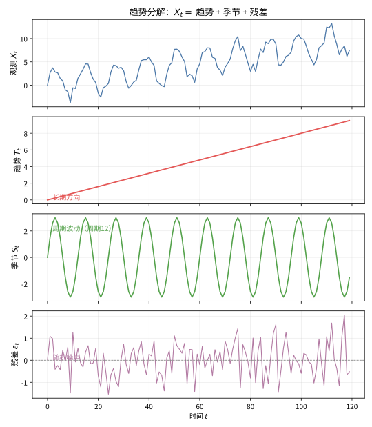

# 第 93 级：时间序列分析 (Time Series Analysis)

---

## 1. 学习目标

完成本教程后，你将能够：

1. 理解时间序列的平稳性概念及其重要性
2. 掌握自相关函数（ACF）与偏自相关函数（PACF）的定义与性质
3. 掌握AR、MA、ARMA、ARIMA、SARIMA等经典模型的识别、估计与诊断
4. 理解Box-Jenkins方法论的完整流程
5. 掌握指数平滑与Holt-Winters方法
6. 理解状态空间模型与Kalman滤波的递推原理
7. 掌握GARCH模型在金融时间序列中的应用
8. 能独立完成时间序列的建模、估计与预测

---

## 2. 核心概念

### 2.1 平稳性

**严平稳**（Strict Stationarity）：时间序列 $\{X_t\}$ 的有限维分布对时间平移不变，即对任意 $t_1, t_2, \dots, t_k$ 和任意 $h$，有：

$$
(X_{t_1}, X_{t_2}, \dots, X_{t_k}) \stackrel{d}{=} (X_{t_1+h}, X_{t_2+h}, \dots, X_{t_k+h})
$$

**弱平稳**（Weak Stationarity / Covariance Stationarity）：时间序列 $\{X_t\}$ 满足：
1. $\mathbb{E}[X_t] = \mu$（常数，与 $t$ 无关）
2. $\text{Var}(X_t) = \sigma^2 < \infty$（常数，与 $t$ 无关）
3. $\text{Cov}(X_t, X_{t+h}) = \gamma(h)$（仅依赖滞后 $h$，与 $t$ 无关）

### 2.2 自相关函数（ACF）

**自相关函数**（Autocorrelation Function）定义：

$$
\rho(h) = \frac{\gamma(h)}{\gamma(0)} = \frac{\text{Cov}(X_t, X_{t+h})}{\text{Var}(X_t)}
$$

性质：
- $\rho(0) = 1$
- $|\rho(h)| \le 1$
- $\rho(h) = \rho(-h)$

> **直观理解（现实类比）**：平稳序列好比平静湖面上均匀扩散的涟漪——无论看哪一段，波动幅度和"摇摆习惯"都差不多，没有越晃越大的趋势。ACF 则像"记忆曲线"：$\rho(h)$ 衡量当前值与 $h$ 个时间单位前的值有多"像"，平稳序列的记忆随时间渐行渐远（衰减到0），而含趋势的序列（如逐年上涨的GDP）记忆永不消退，ACF 拖尾不衰减，这正是判断平稳性的关键线索。

### 2.3 偏自相关函数（PACF）

**偏自相关函数**（Partial Autocorrelation Function）衡量在剔除 $X_{t+1}, \dots, X_{t+h-1}$ 的影响后，$X_t$ 与 $X_{t+h}$ 之间的相关性：

$$
\phi_{hh} = \text{Corr}(X_t, X_{t+h} \mid X_{t+1}, \dots, X_{t+h-1})
$$

### 2.4 白噪声

**白噪声**（White Noise）序列 $\{\varepsilon_t\}$ 满足：

$$
\mathbb{E}[\varepsilon_t] = 0, \quad \text{Var}(\varepsilon_t) = \sigma^2, \quad \text{Cov}(\varepsilon_t, \varepsilon_s) = 0 \ (t \neq s)
$$

若进一步假设 $\varepsilon_t \sim \text{i.i.d.} \ N(0, \sigma^2)$，则称为**高斯白噪声**。

### 2.5 AR模型

**自回归模型** AR($p$)：

$$
X_t = \phi_1 X_{t-1} + \phi_2 X_{t-2} + \cdots + \phi_p X_{t-p} + \varepsilon_t
$$

其中 $\varepsilon_t$ 为白噪声。

### 2.6 MA模型

**滑动平均模型** MA($q$)：

$$
X_t = \varepsilon_t + \theta_1 \varepsilon_{t-1} + \theta_2 \varepsilon_{t-2} + \cdots + \theta_q \varepsilon_{t-q}
$$

### 2.7 ARMA模型

**自回归滑动平均模型** ARMA($p, q$)：

$$
X_t = \phi_1 X_{t-1} + \cdots + \phi_p X_{t-p} + \varepsilon_t + \theta_1 \varepsilon_{t-1} + \cdots + \theta_q \varepsilon_{t-q}
$$

用滞后算子 $B$（$B^k X_t = X_{t-k}$）表示为：

$$
\phi(B) X_t = \theta(B) \varepsilon_t
$$

其中 $\phi(B) = 1 - \phi_1 B - \cdots - \phi_p B^p$，$\theta(B) = 1 + \theta_1 B + \cdots + \theta_q B^q$。

### 2.8 ARIMA模型

**差分自回归滑动平均模型** ARIMA($p, d, q$) 对非平稳序列进行 $d$ 阶差分后拟合 ARMA($p, q$)：

$$
\phi(B)(1-B)^d X_t = \theta(B) \varepsilon_t
$$

> **直观理解（现实类比）**：把一条时间序列想象成一首复杂的交响乐——趋势是整首乐曲"越来越洪亮"的主线，季节是"每12小节重复一次"的固定旋律，残差则是演奏中细微的即兴杂音。ARIMA 建模就像先"抽丝剥茧"把这三层分开：抽出趋势（差分消除）、剥出季节（周期差分），剩下的残差被当作平稳的白噪声来处理，这样就能对原本很难预测的序列做出可靠的预报。

### 2.9 SARIMA模型

**季节性ARIMA模型** SARIMA($p, d, q$) $\times$ ($P, D, Q$)$_S$：

$$
\phi(B) \Phi(B^S) (1-B)^d (1-B^S)^D X_t = \theta(B) \Theta(B^S) \varepsilon_t
$$

其中 $S$ 为季节周期长度。

### 2.10 单位根检验与ADF检验

**Augmented Dickey-Fuller（ADF）检验**用于检验序列是否存在单位根（即是否非平稳）。检验回归方程：

$$
\Delta X_t = \alpha + \beta t + \gamma X_{t-1} + \sum_{i=1}^{p} \delta_i \Delta X_{t-i} + \varepsilon_t
$$

原假设 $H_0: \gamma = 0$（存在单位根）。若ADF统计量小于临界值，则拒绝原假设，认为序列平稳。

### 2.11 Box-Jenkins方法

**Box-Jenkins方法**是时间序列建模的系统方法论，包括四个步骤：
1. **模型识别**：通过ACF和PACF确定 $p, d, q$ 的阶数
2. **参数估计**：使用最大似然估计或条件最小二乘估计
3. **模型诊断**：检验残差是否为白噪声
4. **预测**：使用拟合的模型进行预测

### 2.12 指数平滑与Holt-Winters方法

**简单指数平滑**：

$$
\hat{X}_{t+1|t} = \alpha X_t + (1-\alpha) \hat{X}_{t|t-1}
$$

**Holt-Winters方法**（含趋势和季节性的指数平滑）：
- 水平方程：$L_t = \alpha (X_t - S_{t-S}) + (1-\alpha)(L_{t-1} + T_{t-1})$
- 趋势方程：$T_t = \beta (L_t - L_{t-1}) + (1-\beta) T_{t-1}$
- 季节方程：$S_t = \gamma (X_t - L_t) + (1-\gamma) S_{t-S}$
- 预测：$\hat{X}_{t+k|t} = L_t + k T_t + S_{t+k-S}$

### 2.13 状态空间模型与Kalman滤波

**状态空间模型**：

$$
\begin{aligned}
\text{状态方程：} &\quad \boldsymbol{\alpha}_t = \boldsymbol{T}_t \boldsymbol{\alpha}_{t-1} + \boldsymbol{R}_t \boldsymbol{\eta}_t \\
\text{观测方程：} &\quad \boldsymbol{Y}_t = \boldsymbol{Z}_t \boldsymbol{\alpha}_t + \boldsymbol{\varepsilon}_t
\end{aligned}
$$

**Kalman滤波**通过递推方式估计隐藏状态 $\boldsymbol{\alpha}_t$。

### 2.14 GARCH模型

**GARCH($p, q$)模型**（Generalized Autoregressive Conditional Heteroscedasticity）：

$$
\begin{aligned}
X_t &= \sigma_t \varepsilon_t, \quad \varepsilon_t \sim \text{i.i.d.}, \ \mathbb{E}[\varepsilon_t]=0, \ \text{Var}(\varepsilon_t)=1 \\
\sigma_t^2 &= \omega + \sum_{i=1}^{q} \alpha_i X_{t-i}^2 + \sum_{j=1}^{p} \beta_j \sigma_{t-j}^2
\end{aligned}
$$

---

## 3. 定理与证明

### 定理 3.1：ARMA过程的平稳性条件

**定理**：考虑 ARMA($p, q$) 过程 $\phi(B) X_t = \theta(B) \varepsilon_t$，其中 $\varepsilon_t$ 为白噪声。该过程为平稳过程的**充分必要条件**是特征多项式 $\phi(z) = 1 - \phi_1 z - \phi_2 z^2 - \cdots - \phi_p z^p$ 的所有根的模都大于1，即所有根都在单位圆外。

**证明**：

**步骤1：将ARMA过程表示为线性滤波**

ARMA($p, q$) 过程可以写成：

$$
X_t = \frac{\theta(B)}{\phi(B)} \varepsilon_t = \psi(B) \varepsilon_t = \sum_{j=0}^{\infty} \psi_j \varepsilon_{t-j}
$$

其中 $\psi(B) = \sum_{j=0}^{\infty} \psi_j B^j$，$\psi_0 = 1$。这个表示称为过程的 **MA($\infty$) 表示**。

**步骤2：平稳性条件与MA($\infty$)表示的收敛性**

对于线性过程 $X_t = \sum_{j=0}^{\infty} \psi_j \varepsilon_{t-j}$，$X_t$ 为平稳过程的充分条件是系数序列 $\{\psi_j\}$ 绝对可和：

$$
\sum_{j=0}^{\infty} |\psi_j| < \infty
$$

此时 $\mathbb{E}[X_t] = 0$（假设无截距项），且协方差函数为：

$$
\gamma(h) = \text{Cov}(X_t, X_{t+h}) = \sigma^2 \sum_{j=0}^{\infty} \psi_j \psi_{j+h}
$$

**步骤3：特征根与$\psi_j$的衰减性**

多项式 $\phi(z)$ 可分解为：

$$
\phi(z) = \prod_{k=1}^{p} (1 - \lambda_k z)
$$

其中 $\lambda_k^{-1}$ 是 $\phi(z) = 0$ 的根。

若所有根的模大于1，即 $|\lambda_k^{-1}| > 1$，则 $|\lambda_k| < 1$。此时 $\psi_j$ 可表示为：

$$
\psi_j = \sum_{k=1}^{p} c_k \lambda_k^j
$$

其中 $c_k$ 为常数。由于 $|\lambda_k| < 1$，$\psi_j$ 以几何级数速度衰减，即存在常数 $C > 0$ 和 $0 < r < 1$ 使得 $|\psi_j| \le C r^j$，从而 $\sum_{j=0}^{\infty} |\psi_j| < \infty$。

**步骤4：必要性**

若存在某个根的模小于等于1，不妨设 $|\lambda_1| \ge 1$，则 $\psi_j$ 不衰减，$\sum_{j=0}^{\infty} |\psi_j| = \infty$，过程可能发散或非平稳。特别地，当存在单位根（$|\lambda_1| = 1$）时，过程为$I(1)$过程，其方差随时间趋于无穷。

**步骤5：可逆性条件**

类似地，MA($\infty$) 多项式 $\theta(z) = 1 + \theta_1 z + \cdots + \theta_q z^q$ 的所有根模大于1时，过程可逆，即可以表示为 AR($\infty$) 形式：

$$
\pi(B) X_t = \varepsilon_t, \quad \pi(B) = \frac{\phi(B)}{\theta(B)} = \sum_{j=0}^{\infty} \pi_j B^j
$$

$\square$

---

### 定理 3.2：Yule-Walker 方程的推导与解的存在性

**定理**：对于 AR($p$) 过程 $X_t = \phi_1 X_{t-1} + \cdots + \phi_p X_{t-p} + \varepsilon_t$，自协方差函数 $\gamma(h)$ 满足 Yule-Walker 方程：

$$
\gamma(h) = \phi_1 \gamma(h-1) + \phi_2 \gamma(h-2) + \cdots + \phi_p \gamma(h-p), \quad h \ge 1
$$

特别地，当 $h = 1, 2, \dots, p$ 时，矩阵形式为：

$$
\begin{pmatrix}
\gamma(0) & \gamma(1) & \cdots & \gamma(p-1) \\
\gamma(1) & \gamma(0) & \cdots & \gamma(p-2) \\
\vdots & \vdots & \ddots & \vdots \\
\gamma(p-1) & \gamma(p-2) & \cdots & \gamma(0)
\end{pmatrix}
\begin{pmatrix}
\phi_1 \\ \phi_2 \\ \vdots \\ \phi_p
\end{pmatrix}
=
\begin{pmatrix}
\gamma(1) \\ \gamma(2) \\ \vdots \\ \gamma(p)
\end{pmatrix}
$$

该方程组的解存在且唯一，当且仅当自协方差矩阵 $\boldsymbol{\Gamma}_p$ 正定。

**证明**：

**步骤1：推导Yule-Walker方程**

将 AR($p$) 方程两边同乘以 $X_{t-h}$（$h \ge 1$）并取期望：

$$
\mathbb{E}[X_t X_{t-h}] = \phi_1 \mathbb{E}[X_{t-1} X_{t-h}] + \cdots + \phi_p \mathbb{E}[X_{t-p} X_{t-h}] + \mathbb{E}[\varepsilon_t X_{t-h}]
$$

由于 $\varepsilon_t$ 与 $X_{t-1}, X_{t-2}, \dots$ 无关（过程的因果性），且 $h \ge 1$，故 $\mathbb{E}[\varepsilon_t X_{t-h}] = 0$。因此：

$$
\gamma(h) = \phi_1 \gamma(h-1) + \phi_2 \gamma(h-2) + \cdots + \phi_p \gamma(h-p), \quad h \ge 1
$$

**步骤2：矩阵形式**

将 $h = 1, 2, \dots, p$ 代入，得：

$$
\begin{cases}
\gamma(1) = \phi_1 \gamma(0) + \phi_2 \gamma(1) + \cdots + \phi_p \gamma(p-1) \\
\gamma(2) = \phi_1 \gamma(1) + \phi_2 \gamma(0) + \cdots + \phi_p \gamma(p-2) \\
\vdots \\
\gamma(p) = \phi_1 \gamma(p-1) + \phi_2 \gamma(p-2) + \cdots + \phi_p \gamma(0)
\end{cases}
$$

写成矩阵形式即 $\boldsymbol{\Gamma}_p \boldsymbol{\phi} = \boldsymbol{\gamma}_p$。

**步骤3：解的存在性与唯一性**

$\boldsymbol{\Gamma}_p$ 是平稳过程的自协方差矩阵，它是正定矩阵（除非过程是退化的）。正定矩阵可逆，因此 $\boldsymbol{\phi} = \boldsymbol{\Gamma}_p^{-1} \boldsymbol{\gamma}_p$ 存在且唯一。

**步骤4：$\gamma(0)$ 的确定**

还需确定 $\gamma(0)$。将 AR($p$) 方程两边同乘以 $X_t$ 并取期望：

$$
\begin{aligned}
\gamma(0) &= \mathbb{E}[X_t^2] \\
&= \phi_1 \mathbb{E}[X_t X_{t-1}] + \cdots + \phi_p \mathbb{E}[X_t X_{t-p}] + \mathbb{E}[X_t \varepsilon_t] \\
&= \phi_1 \gamma(1) + \phi_2 \gamma(2) + \cdots + \phi_p \gamma(p) + \sigma^2
\end{aligned}
$$

其中 $\mathbb{E}[X_t \varepsilon_t] = \sigma^2$（因为 $X_t = \phi_1 X_{t-1} + \cdots + \phi_p X_{t-p} + \varepsilon_t$，且 $\varepsilon_t$ 与 $X_{t-1}, \dots, X_{t-p}$ 无关）。结合 Yule-Walker 方程，可解出 $\gamma(0)$。$\square$

---

### 定理 3.3：Wold 分解定理

**定理**（Wold Decomposition）：任何零均值协方差平稳过程 $\{X_t\}$ 可以唯一地分解为：

$$
X_t = \sum_{j=0}^{\infty} \psi_j \varepsilon_{t-j} + V_t
$$

其中：
1. $\{\varepsilon_t\}$ 是白噪声序列，称为**新息**（innovation）
2. $\psi_0 = 1$，$\sum_{j=0}^{\infty} \psi_j^2 < \infty$
3. $V_t$ 是**确定性分量**（deterministic component），与 $\{\varepsilon_t\}$ 的过去和未来均不相关
4. 对任意 $t$，$\varepsilon_t$ 与 $V_s$ 对任意 $s$ 不相关
5. 分解是唯一的

**证明**：

**步骤1：构造新息序列**

令 $\mathcal{H}_t = \overline{\text{span}}\{X_s: s \le t\}$ 为 $X_s$（$s \le t$）张成的 Hilbert 空间（闭线性子空间）。定义一步预测误差：

$$
\varepsilon_t = X_t - \mathcal{P}_{\mathcal{H}_{t-1}} X_t
$$

其中 $\mathcal{P}_{\mathcal{H}_{t-1}}$ 表示到 $\mathcal{H}_{t-1}$ 上的正交投影。则 $\varepsilon_t$ 与 $\mathcal{H}_{t-1}$ 中的所有元素正交，即 $\mathbb{E}[\varepsilon_t X_s] = 0$ 对所有 $s \le t-1$ 成立。因此 $\{\varepsilon_t\}$ 是白噪声，因为对 $k > 0$：

$$
\mathbb{E}[\varepsilon_t \varepsilon_{t-k}] = \mathbb{E}[\varepsilon_t (X_{t-k} - \mathcal{P}_{\mathcal{H}_{t-k-1}} X_{t-k})] = 0
$$

**步骤2：构建MA($\infty$)表示**

由构造，$X_t$ 可表示为：

$$
X_t = \mathcal{P}_{\mathcal{H}_{t-1}} X_t + \varepsilon_t
$$

进一步，$\mathcal{P}_{\mathcal{H}_{t-1}} X_t$ 可分解为 $\varepsilon_{t-1}, \varepsilon_{t-2}, \dots$ 的线性组合。通过反复投影，可得：

$$
X_t = \sum_{j=0}^{\infty} \psi_j \varepsilon_{t-j} + V_t
$$

其中 $\psi_0 = 1$，且 $V_t$ 是 $X_t$ 中与所有 $\varepsilon_s$（$-\infty < s < \infty$）正交的部分。

**步骤3：系数的平方可和性**

由于 $\{X_t\}$ 是平稳过程，$\text{Var}(X_t) = \gamma(0) < \infty$。由正交性：

$$
\gamma(0) = \text{Var}\left(\sum_{j=0}^{\infty} \psi_j \varepsilon_{t-j}\right) + \text{Var}(V_t) = \sigma^2 \sum_{j=0}^{\infty} \psi_j^2 + \text{Var}(V_t)
$$

由于 $\gamma(0) < \infty$，必有 $\sum_{j=0}^{\infty} \psi_j^2 < \infty$。

**步骤4：确定性分量的性质**

$V_t$ 是确定性的，意味着 $V_t \in \mathcal{H}_{-\infty} = \bigcap_{t} \mathcal{H}_t$（即可以由无限过去的观测精确预测）。$V_t$ 与所有 $\varepsilon_s$ 正交，且 $\{V_t\}$ 本身也是平稳过程。

**步骤5：唯一性**

若存在两种分解 $X_t = \sum_{j=0}^{\infty} \psi_j \varepsilon_{t-j} + V_t = \sum_{j=0}^{\infty} \psi_j' \varepsilon_{t-j}' + V_t'$，则相减可得两个MA($\infty$)过程之差等于两个确定性分量之差。由正交性可推出 $\psi_j = \psi_j'$，$\varepsilon_t = \varepsilon_t'$，$V_t = V_t'$。$\square$

---

### 定理 3.4：Box-Jenkins 方法的一步预测

**定理**：对于 ARMA($p, q$) 过程 $\phi(B) X_t = \theta(B) \varepsilon_t$，给定观测值 $X_1, \dots, X_t$，最小均方误差一步预测为：

$$
\hat{X}_{t+1|t} = \phi_1 X_t + \phi_2 X_{t-1} + \cdots + \phi_p X_{t-p+1} + \theta_1 \hat{\varepsilon}_t + \cdots + \theta_q \hat{\varepsilon}_{t-q+1}
$$

其中 $\hat{\varepsilon}_s = X_s - \hat{X}_{s|s-1}$ 为预测残差。预测误差的方差为 $\sigma^2$。

**证明**：

**步骤1：将ARMA过程写成预测形式**

ARMA($p, q$) 过程：

$$
X_{t+1} = \phi_1 X_t + \phi_2 X_{t-1} + \cdots + \phi_p X_{t-p+1} + \varepsilon_{t+1} + \theta_1 \varepsilon_t + \cdots + \theta_q \varepsilon_{t-q+1}
$$

**步骤2：最优预测的表达式**

在均方误差准则下，$X_{t+1}$ 的最优预测是条件期望：

$$
\hat{X}_{t+1|t} = \mathbb{E}[X_{t+1} \mid \mathcal{F}_t]
$$

其中 $\mathcal{F}_t = \{X_1, \dots, X_t\}$ 为直到 $t$ 时刻的信息集。由于 $\varepsilon_{t+1}$ 与 $\mathcal{F}_t$ 独立，且 $\mathbb{E}[\varepsilon_{t+1} \mid \mathcal{F}_t] = 0$，而 $X_t, X_{t-1}, \dots, \varepsilon_t, \varepsilon_{t-1}, \dots$ 均可由 $\mathcal{F}_t$ 确定，因此：

$$
\begin{aligned}
\hat{X}_{t+1|t} &= \mathbb{E}[\phi_1 X_t + \cdots + \phi_p X_{t-p+1} + \varepsilon_{t+1} + \theta_1 \varepsilon_t + \cdots + \theta_q \varepsilon_{t-q+1} \mid \mathcal{F}_t] \\
&= \phi_1 X_t + \cdots + \phi_p X_{t-p+1} + \theta_1 \varepsilon_t + \cdots + \theta_q \varepsilon_{t-q+1}
\end{aligned}
$$

**步骤3：用可观测量表示**

由于 $\varepsilon_s$ 不可直接观测，用递推方式估计：

$$
\hat{\varepsilon}_s = X_s - \hat{X}_{s|s-1}
$$

代入得：

$$
\hat{X}_{t+1|t} = \phi_1 X_t + \cdots + \phi_p X_{t-p+1} + \theta_1 \hat{\varepsilon}_t + \cdots + \theta_q \hat{\varepsilon}_{t-q+1}
$$

**步骤4：预测误差方差**

一步预测误差为：

$$
e_{t+1|t} = X_{t+1} - \hat{X}_{t+1|t} = \varepsilon_{t+1}
$$

因此预测误差方差为 $\text{Var}(e_{t+1|t}) = \text{Var}(\varepsilon_{t+1}) = \sigma^2$。

**步骤5：多步预测**

对于 $k$ 步预测，将 $X_{t+k}$ 的表达式代入，利用条件期望的线性性质，得到：

$$
\hat{X}_{t+k|t} = \phi_1 \hat{X}_{t+k-1|t} + \cdots + \phi_p \hat{X}_{t+k-p|t} + \theta_1 \hat{\varepsilon}_{t+k-1|t} + \cdots + \theta_q \hat{\varepsilon}_{t+k-q|t}
$$

其中当 $s > t$ 时 $\hat{\varepsilon}_{s|t} = 0$，当 $s \le t$ 时 $\hat{\varepsilon}_{s|t} = \hat{\varepsilon}_s$。$\square$

---

### 定理 3.5：Kalman 滤波的递推公式

**定理**：考虑状态空间模型：

$$
\begin{aligned}
\boldsymbol{\alpha}_t &= \boldsymbol{T}_t \boldsymbol{\alpha}_{t-1} + \boldsymbol{R}_t \boldsymbol{\eta}_t, \quad \boldsymbol{\eta}_t \sim N(\boldsymbol{0}, \boldsymbol{Q}_t) \\
\boldsymbol{Y}_t &= \boldsymbol{Z}_t \boldsymbol{\alpha}_t + \boldsymbol{\varepsilon}_t, \quad \boldsymbol{\varepsilon}_t \sim N(\boldsymbol{0}, \boldsymbol{H}_t)
\end{aligned}
$$

其中 $\boldsymbol{\eta}_t$ 与 $\boldsymbol{\varepsilon}_t$ 独立。Kalman 滤波的递推公式为：

**预测步骤**：

$$
\begin{aligned}
\boldsymbol{a}_{t|t-1} &= \boldsymbol{T}_t \boldsymbol{a}_{t-1} \\
\boldsymbol{P}_{t|t-1} &= \boldsymbol{T}_t \boldsymbol{P}_{t-1} \boldsymbol{T}_t^\top + \boldsymbol{R}_t \boldsymbol{Q}_t \boldsymbol{R}_t^\top
\end{aligned}
$$

**更新步骤**：

$$
\begin{aligned}
\boldsymbol{v}_t &= \boldsymbol{Y}_t - \boldsymbol{Z}_t \boldsymbol{a}_{t|t-1} \\
\boldsymbol{F}_t &= \boldsymbol{Z}_t \boldsymbol{P}_{t|t-1} \boldsymbol{Z}_t^\top + \boldsymbol{H}_t \\
\boldsymbol{K}_t &= \boldsymbol{P}_{t|t-1} \boldsymbol{Z}_t^\top \boldsymbol{F}_t^{-1} \\
\boldsymbol{a}_t &= \boldsymbol{a}_{t|t-1} + \boldsymbol{K}_t \boldsymbol{v}_t \\
\boldsymbol{P}_t &= (\boldsymbol{I} - \boldsymbol{K}_t \boldsymbol{Z}_t) \boldsymbol{P}_{t|t-1}
\end{aligned}
$$

其中 $\boldsymbol{a}_{t|t-1} = \mathbb{E}[\boldsymbol{\alpha}_t \mid \boldsymbol{Y}_{1:t-1}]$，$\boldsymbol{a}_t = \mathbb{E}[\boldsymbol{\alpha}_t \mid \boldsymbol{Y}_{1:t}]$。

**证明**：

**步骤1：预测步骤的推导**

由状态方程，条件于 $\boldsymbol{Y}_{1:t-1}$ 取期望：

$$
\boldsymbol{a}_{t|t-1} = \mathbb{E}[\boldsymbol{T}_t \boldsymbol{\alpha}_{t-1} + \boldsymbol{R}_t \boldsymbol{\eta}_t \mid \boldsymbol{Y}_{1:t-1}] = \boldsymbol{T}_t \boldsymbol{a}_{t-1}
$$

因为 $\boldsymbol{\eta}_t$ 与 $\boldsymbol{Y}_{1:t-1}$ 独立且均值为0。

预测误差协方差矩阵：

$$
\begin{aligned}
\boldsymbol{P}_{t|t-1} &= \mathbb{E}[(\boldsymbol{\alpha}_t - \boldsymbol{a}_{t|t-1})(\boldsymbol{\alpha}_t - \boldsymbol{a}_{t|t-1})^\top \mid \boldsymbol{Y}_{1:t-1}] \\
&= \mathbb{E}[(\boldsymbol{T}_t(\boldsymbol{\alpha}_{t-1} - \boldsymbol{a}_{t-1}) + \boldsymbol{R}_t \boldsymbol{\eta}_t)(\boldsymbol{T}_t(\boldsymbol{\alpha}_{t-1} - \boldsymbol{a}_{t-1}) + \boldsymbol{R}_t \boldsymbol{\eta}_t)^\top \mid \boldsymbol{Y}_{1:t-1}] \\
&= \boldsymbol{T}_t \boldsymbol{P}_{t-1} \boldsymbol{T}_t^\top + \boldsymbol{R}_t \boldsymbol{Q}_t \boldsymbol{R}_t^\top
\end{aligned}
$$

其中交叉项为零，因为 $\boldsymbol{\alpha}_{t-1} - \boldsymbol{a}_{t-1}$ 与 $\boldsymbol{\eta}_t$ 独立且 $\mathbb{E}[\boldsymbol{\eta}_t] = \boldsymbol{0}$。

**步骤2：新息及其协方差**

新息（预测误差）为：

$$
\boldsymbol{v}_t = \boldsymbol{Y}_t - \boldsymbol{Z}_t \boldsymbol{a}_{t|t-1} = \boldsymbol{Z}_t (\boldsymbol{\alpha}_t - \boldsymbol{a}_{t|t-1}) + \boldsymbol{\varepsilon}_t
$$

新息的协方差矩阵：

$$
\begin{aligned}
\boldsymbol{F}_t &= \mathbb{E}[\boldsymbol{v}_t \boldsymbol{v}_t^\top \mid \boldsymbol{Y}_{1:t-1}] \\
&= \boldsymbol{Z}_t \mathbb{E}[(\boldsymbol{\alpha}_t - \boldsymbol{a}_{t|t-1})(\boldsymbol{\alpha}_t - \boldsymbol{a}_{t|t-1})^\top] \boldsymbol{Z}_t^\top + \mathbb{E}[\boldsymbol{\varepsilon}_t \boldsymbol{\varepsilon}_t^\top] \\
&= \boldsymbol{Z}_t \boldsymbol{P}_{t|t-1} \boldsymbol{Z}_t^\top + \boldsymbol{H}_t
\end{aligned}
$$

**步骤3：Kalman 增益的推导**

更新步骤通过联合正态分布的条件分布公式推导。$(\boldsymbol{\alpha}_t, \boldsymbol{Y}_t)$ 的条件联合分布为：

$$
\begin{pmatrix}
\boldsymbol{\alpha}_t \\ \boldsymbol{Y}_t
\end{pmatrix}
\Bigg| \boldsymbol{Y}_{1:t-1} \sim
N\left(
\begin{pmatrix}
\boldsymbol{a}_{t|t-1} \\ \boldsymbol{Z}_t \boldsymbol{a}_{t|t-1}
\end{pmatrix},
\begin{pmatrix}
\boldsymbol{P}_{t|t-1} & \boldsymbol{P}_{t|t-1} \boldsymbol{Z}_t^\top \\
\boldsymbol{Z}_t \boldsymbol{P}_{t|t-1} & \boldsymbol{F}_t
\end{pmatrix}
\right)
$$

由多元正态分布的条件分布公式，$\boldsymbol{\alpha}_t$ 给定 $\boldsymbol{Y}_t$ 和 $\boldsymbol{Y}_{1:t-1}$ 的条件分布为：

$$
\mathbb{E}[\boldsymbol{\alpha}_t \mid \boldsymbol{Y}_{1:t}] = \boldsymbol{a}_{t|t-1} + \boldsymbol{P}_{t|t-1} \boldsymbol{Z}_t^\top \boldsymbol{F}_t^{-1} \boldsymbol{v}_t
$$

$$
\text{Var}[\boldsymbol{\alpha}_t \mid \boldsymbol{Y}_{1:t}] = \boldsymbol{P}_{t|t-1} - \boldsymbol{P}_{t|t-1} \boldsymbol{Z}_t^\top \boldsymbol{F}_t^{-1} \boldsymbol{Z}_t \boldsymbol{P}_{t|t-1}
$$

定义 Kalman 增益 $\boldsymbol{K}_t = \boldsymbol{P}_{t|t-1} \boldsymbol{Z}_t^\top \boldsymbol{F}_t^{-1}$，得：

$$
\boldsymbol{a}_t = \boldsymbol{a}_{t|t-1} + \boldsymbol{K}_t \boldsymbol{v}_t
$$

$$
\boldsymbol{P}_t = (\boldsymbol{I} - \boldsymbol{K}_t \boldsymbol{Z}_t) \boldsymbol{P}_{t|t-1}
$$

**步骤4：递推的初始化**

递推从 $\boldsymbol{a}_{0}$ 和 $\boldsymbol{P}_{0}$ 开始。对于平稳过程，取无条件均值和协方差；对于非平稳过程，使用扩散先验。$\square$

---

## 4. 示例

### 示例 1：用 ARIMA 模型拟合和预测 GDP 数据

**问题**：使用ARIMA模型对某国家季度GDP数据进行拟合和预测（模拟数据）。

**数据**（模拟季度GDP，单位：亿元）：

| 季度 | GDP | 季度 | GDP | 季度 | GDP | 季度 | GDP |
|:---:|:---:|:---:|:---:|:---:|:---:|:---:|:---:|
| 2019Q1 | 1000 | 2019Q2 | 1020 | 2019Q3 | 1035 | 2019Q4 | 1050 |
| 2020Q1 | 1060 | 2020Q2 | 1040 | 2020Q3 | 1070 | 2020Q4 | 1090 |
| 2021Q1 | 1110 | 2021Q2 | 1130 | 2021Q3 | 1150 | 2021Q4 | 1170 |
| 2022Q1 | 1190 | 2022Q2 | 1210 | 2022Q3 | 1230 | 2022Q4 | 1250 |
| 2023Q1 | 1270 | 2023Q2 | 1290 | 2023Q3 | 1310 | 2023Q4 | 1330 |

**步骤1：平稳性检验**

绘制序列图，发现GDP呈明显上升趋势，非平稳。进行ADF检验：

$$
\text{ADF统计量} = -0.85, \quad p\text{-值} = 0.80 > 0.05
$$

不能拒绝原假设，序列存在单位根。

**步骤2：差分**

一阶差分 $\Delta X_t = X_t - X_{t-1}$：

| 季度 | 差分值 |
|:---:|:---:|
| 2019Q2 | 20 |
| 2019Q3 | 15 |
| 2019Q4 | 15 |
| 2020Q1 | 10 |
| 2020Q2 | -20 |
| 2020Q3 | 30 |
| ... | ... |

对差分后序列进行ADF检验：

$$
\text{ADF统计量} = -4.23, \quad p\text{-值} = 0.005 < 0.05
$$

序列平稳，故 $d = 1$。

**步骤3：模型识别（确定 $p, q$）**

计算差分后序列的ACF和PACF：

- ACF：在滞后1处显著，之后截尾 → 提示 MA(1)
- PACF：在滞后1处显著，之后截尾 → 提示 AR(1)

综合判断，候选模型为 ARIMA(1,1,1) 或 ARIMA(1,1,0)。

**步骤4：参数估计**

使用最大似然估计拟合 ARIMA(1,1,1)：

$$
(1 - \hat{\phi}_1 B)(1-B) X_t = (1 + \hat{\theta}_1 B) \varepsilon_t
$$

估计结果：

$$
\hat{\phi}_1 = 0.62, \quad \hat{\theta}_1 = 0.35, \quad \hat{\sigma}^2 = 85.3
$$

**步骤5：模型诊断**

检验残差是否为白噪声：

- Ljung-Box检验：$Q(10) = 12.5$，$p\text{-值} = 0.25 > 0.05$，残差为白噪声
- 残差ACF图：无显著自相关

模型诊断通过。

**步骤6：预测**

对未来4个季度（2024年）的预测：

| 季度 | 预测值 | 95%置信区间 |
|:---:|:---:|:---:|
| 2024Q1 | 1350 | (1320, 1380) |
| 2024Q2 | 1371 | (1332, 1410) |
| 2024Q3 | 1392 | (1345, 1439) |
| 2024Q4 | 1413 | (1358, 1468) |

---

### 示例 2：GARCH模型拟合金融时间序列

**问题**：使用GARCH(1,1)模型拟合某股票日收益率序列。

**数据特征**：某股票500个交易日的日收益率 $r_t$，呈现明显的波动聚集现象（volatility clustering）。

**步骤1：均值方程建模**

首先对收益率序列拟合 AR(1) 模型：

$$
r_t = \mu + \phi r_{t-1} + \varepsilon_t
$$

估计结果：

$$
\hat{\mu} = 0.0002, \quad \hat{\phi} = 0.05
$$

**步骤2：ARCH效应检验**

对残差 $\hat{\varepsilon}_t$ 进行 ARCH-LM 检验：

$$
\text{LM统计量} = 45.6, \quad p\text{-值} < 0.001
$$

拒绝"无异方差性"的原假设，存在 ARCH 效应。

**步骤3：GARCH(1,1)模型设定**

设定条件方差方程：

$$
\sigma_t^2 = \omega + \alpha \varepsilon_{t-1}^2 + \beta \sigma_{t-1}^2
$$

使用最大似然估计：

| 参数 | 估计值 | 标准误 | z统计量 | p值 |
|:---:|:---:|:---:|:---:|:---:|
| $\omega$ | $2.5 \times 10^{-6}$ | $1.2 \times 10^{-6}$ | 2.08 | 0.037 |
| $\alpha$ | 0.12 | 0.03 | 4.00 | < 0.001 |
| $\beta$ | 0.85 | 0.03 | 28.33 | < 0.001 |

**步骤4：模型解释**

- $\alpha + \beta = 0.97 < 1$，满足平稳性条件
- $\beta = 0.85$ 较大，表明波动冲击具有长记忆性
- 半衰期：$\frac{\ln(0.5)}{\ln(\alpha + \beta)} = \frac{\ln(0.5)}{\ln(0.97)} \approx 22.7$ 个交易日

**步骤5：条件波动率预测**

预测未来条件方差：

$$
\hat{\sigma}_{T+1}^2 = \hat{\omega} + \hat{\alpha} \hat{\varepsilon}_T^2 + \hat{\beta} \hat{\sigma}_T^2
$$

长期平均波动率：

$$
\bar{\sigma}^2 = \frac{\hat{\omega}}{1 - \hat{\alpha} - \hat{\beta}} = \frac{2.5 \times 10^{-6}}{1 - 0.97} = 8.33 \times 10^{-5}
$$

日波动率：$\sqrt{8.33 \times 10^{-5}} = 0.00913$（约0.913%），年化波动率：$0.00913 \times \sqrt{252} \approx 14.5\%$。

---

## 5. 习题

### 习题 1

证明：AR(1)过程 $X_t = \phi X_{t-1} + \varepsilon_t$ 在 $|\phi| < 1$ 时是平稳的，并推导其自相关函数 $\rho(h)$。

**提示**：将AR(1)表示为MA($\infty$)形式 $X_t = \sum_{j=0}^{\infty} \phi^j \varepsilon_{t-j}$，然后计算 $\gamma(h)$ 和 $\rho(h)$。

### 习题 2

推导MA(1)过程 $X_t = \varepsilon_t + \theta \varepsilon_{t-1}$ 的ACF和PACF，并说明为什么MA(1)的PACF是拖尾的。

**提示**：ACF可通过 $\gamma(h)$ 直接计算；PACF可通过Yule-Walker方程得到。

### 习题 3

证明：ARMA($p, q$)过程的PACF在滞后 $p$ 之后截尾，而ACF在滞后 $q$ 之后截尾，反之则拖尾。

**提示**：利用AR($\infty$)和MA($\infty$)的表示形式，分析 $\phi_{hh}$ 和 $\rho(h)$ 的表达式。

### 习题 4

对于ARIMA(0,1,1)过程 $X_t = X_{t-1} + \varepsilon_t + \theta \varepsilon_{t-1}$，推导其一阶差分后的自相关函数，并证明该过程等价于指数平滑。

**提示**：令 $W_t = (1-B)X_t$，则 $W_t$ 为MA(1)过程。将 $\hat{X}_{t+1|t}$ 的表达式与指数平滑公式比较。

### 习题 5

证明：GARCH(1,1)过程 $\sigma_t^2 = \omega + \alpha \varepsilon_{t-1}^2 + \beta \sigma_{t-1}^2$ 在 $\alpha + \beta < 1$ 时是协方差平稳的，且无条件方差为 $\omega / (1 - \alpha - \beta)$。

**提示**：对 $\sigma_t^2$ 取期望，利用 $\mathbb{E}[\varepsilon_{t-1}^2] = \mathbb{E}[\sigma_{t-1}^2]$ 建立递推关系。

---

## 6. 总结

本教程系统介绍了时间序列分析的核心理论与方法：

1. **平稳性**：定义了严平稳与弱平稳，是时间序列分析的基础

2. **核心模型**：从AR、MA到ARMA、ARIMA、SARIMA，逐步构建了处理不同类型时间序列的模型体系

3. **ARMA平稳性条件**：严格证明了特征多项式根在单位圆外是平稳的充要条件

4. **Yule-Walker方程**：给出了AR模型自协方差与参数之间的关系，为参数估计提供了理论基础

5. **Wold分解定理**：揭示了任何平稳过程都可以分解为确定性部分与随机性部分

6. **Box-Jenkins方法**：提供了从识别、估计、诊断到预测的完整建模流程

7. **Kalman滤波**：建立了状态空间模型下的递推估计框架，是处理动态系统的基础工具

8. **GARCH模型**：捕捉了金融时间序列的波动聚集现象，是风险管理的重要工具

时间序列分析是经济学、金融学、工程学等领域不可或缺的分析工具，为后续学习随机过程、计量经济学等课程奠定基础。