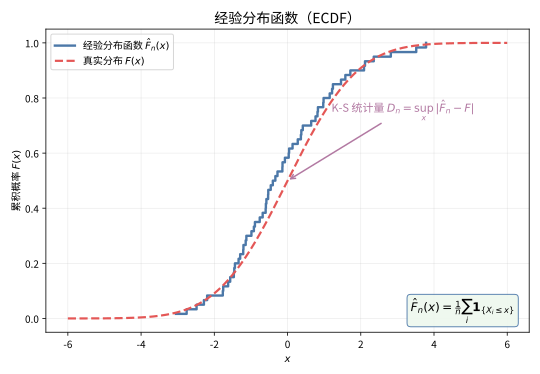

# 第 94 级：非参数统计 (Nonparametric Statistics)

---

## 1. 学习目标

完成本教程后，你将能够：

1. 理解非参数统计的基本思想及其与参数统计的区别
2. 掌握符号检验、Wilcoxon符号秩检验、Mann-Whitney U检验等经典秩检验方法
3. 掌握Kruskal-Wallis检验、Friedman检验等多组比较方法
4. 理解Kolmogorov-Smirnov检验、Cramér-von Mises检验等分布检验方法
5. 掌握秩相关系数（Spearman、Kendall）的计算与推断
6. 理解核密度估计的原理与带宽选择方法
7. 掌握非参数回归与样条光滑的基本思想
8. 能独立选择合适的非参数方法解决实际问题

---

## 2. 核心概念

### 2.1 非参数统计的基本思想

**非参数统计**（Nonparametric Statistics）不假定总体分布的具体形式，而是基于数据的秩（rank）或经验分布进行推断。与参数统计相比，非参数方法具有以下特点：

- **分布自由**：不依赖正态分布等具体分布假设
- **稳健性**：对异常值不敏感
- **适用范围广**：适用于各类数据类型（定序、定距、定比）
- **效率**：在数据满足参数假设时，效率略低于参数方法

### 2.2 符号检验

**符号检验**（Sign Test）是最简单的非参数检验，仅考虑数据差值的符号（正或负）。用于检验中位数是否等于某个特定值。

检验统计量：$S = \sum_{i=1}^n \mathbf{1}_{\{X_i > m_0\}}$，其中 $m_0$ 是假设的中位数。在 $H_0$ 下，$S \sim \text{Binomial}(n, 0.5)$。

### 2.3 Wilcoxon符号秩检验

**Wilcoxon符号秩检验**（Wilcoxon Signed-Rank Test）同时考虑差值的符号和大小，比符号检验更有效。

检验统计量：

$$
W = \sum_{i=1}^n \text{sign}(X_i - m_0) \cdot R_i
$$

其中 $R_i$ 是 $|X_i - m_0|$ 的秩。

### 2.4 Mann-Whitney U检验

**Mann-Whitney U检验**（也称为 Wilcoxon-Mann-Whitney 检验）用于比较两个独立样本是否来自同一分布。

检验统计量：

$$
U = \sum_{i=1}^{n_1} \sum_{j=1}^{n_2} \mathbf{1}_{\{X_i > Y_j\}}
$$

等价于对混合样本秩和的计算。

### 2.5 Kruskal-Wallis检验

**Kruskal-Wallis检验**是Mann-Whitney U检验向多组比较的推广，相当于非参数的单因素方差分析。

检验统计量：

$$
H = \frac{12}{N(N+1)} \sum_{k=1}^{K} \frac{R_k^2}{n_k} - 3(N+1)
$$

其中 $R_k$ 是第 $k$ 组的秩和，$N$ 为总样本量。

### 2.6 Friedman检验

**Friedman检验**是配伍组设计的非参数检验，相当于非参数的随机区组方差分析。

### 2.7 Kolmogorov-Smirnov检验

**Kolmogorov-Smirnov检验**（K-S检验）基于经验分布函数与假设分布之间的最大差异：

$$
D_n = \sup_{x} |\hat{F}_n(x) - F_0(x)|
$$

用于单样本的分布拟合检验或两样本的分布等同检验。

### 2.8 Cramér-von Mises检验

**Cramér-von Mises检验**使用平方积分度量经验分布与理论分布之间的差异：

$$
W_n^2 = n \int_{-\infty}^{\infty} (\hat{F}_n(x) - F_0(x))^2 \, dF_0(x)
$$

### 2.9 秩相关系数

**Spearman秩相关系数**：

$$
r_S = 1 - \frac{6 \sum_{i=1}^n d_i^2}{n(n^2 - 1)}
$$

其中 $d_i$ 是第 $i$ 对观测值在两个变量上的秩差。

**Kendall秩相关系数**（$\tau$）：

$$
\tau = \frac{2}{n(n-1)} \sum_{i < j} \text{sign}(X_i - X_j) \cdot \text{sign}(Y_i - Y_j)
$$

### 2.10 核密度估计

**核密度估计**（Kernel Density Estimation, KDE）是估计概率密度函数的非参数方法：

$$
\hat{f}_h(x) = \frac{1}{nh} \sum_{i=1}^n K\left(\frac{x - X_i}{h}\right)
$$

其中 $K(\cdot)$ 是核函数（通常为对称概率密度函数），$h > 0$ 是带宽。

常见核函数：

| 核函数 | 公式 |
|:---|:---|
| 均匀核 | $K(u) = \frac{1}{2} \mathbf{1}_{\{|u| \le 1\}}$ |
| 高斯核 | $K(u) = \frac{1}{\sqrt{2\pi}} e^{-u^2/2}$ |
| Epanechnikov核 | $K(u) = \frac{3}{4}(1-u^2) \mathbf{1}_{\{|u| \le 1\}}$ |

> **直观理解（现实类比）**：直方图就像把数据"按箱分装"的条形柜，每个箱子里的数量一目了然，但箱子的宽度和起始位置会强烈影响形状。核密度估计则像在每个数据点周围"铺一层柔和的沙丘"，再把所有沙丘叠加起来得到一条平滑曲线——它不预设数据的形状，完全由数据自己"长"出来。带宽 $h$ 就像沙丘的宽窄：$h$ 太小曲线毛刺丛生（过拟合），太大又会把双峰等细节磨平（欠拟合）。

### 2.11 经验分布函数

**经验分布函数**（Empirical Distribution Function, EDF）：

$$
\hat{F}_n(x) = \frac{1}{n} \sum_{i=1}^n \mathbf{1}_{\{X_i \le x\}}
$$

> **直观理解（现实类比）**：经验分布函数就像"抽样民意调查的累积支持率曲线"——把 $n$ 个样本从小到大排好，$\hat{F}_n(x)$ 表示"小于等于 $x$ 的样本占多大比例"，每遇到一个样本就往上跳一小格，形成一条楼梯状的曲线。当样本足够多时，这条"楼梯"会无限逼近真实的平滑分布曲线 $F(x)$（Glivenko-Cantelli 定理），而两条曲线之间缝隙的最大高度，正是 K-S 检验用来判断"数据是否来自该分布"的标尺。

### 2.12 Brown桥

**Brown桥**（Brownian Bridge）是条件于 $B(0) = B(1) = 0$ 的布朗运动。定义为 $B^0(t) = B(t) - tB(1)$，其中 $B(t)$ 为标准布朗运动。

### 2.13 非参数回归与样条光滑

**非参数回归**不假设回归函数的具体形式：

$$
Y_i = m(X_i) + \varepsilon_i
$$

其中 $m(x)$ 是未知的平滑函数。

**样条光滑**（Spline Smoothing）通过最小化惩罚残差平方和来估计 $m$：

$$
\hat{m} = \arg\min_{m} \sum_{i=1}^n (Y_i - m(X_i))^2 + \lambda \int [m''(x)]^2 dx
$$

---

## 3. 定理与证明

### 定理 3.1：Glivenko-Cantelli 定理

**定理**（Glivenko-Cantelli）：设 $X_1, X_2, \dots, X_n$ 是独立同分布于分布函数 $F$ 的随机变量，$\hat{F}_n(x) = \frac{1}{n} \sum_{i=1}^n \mathbf{1}_{\{X_i \le x\}}$ 为经验分布函数。则 $\hat{F}_n(x)$ 一致收敛到 $F(x)$ 几乎必然成立：

$$
\sup_{x \in \mathbb{R}} |\hat{F}_n(x) - F(x)| \xrightarrow{\text{a.s.}} 0, \quad n \to \infty
$$

**证明**：

**步骤1：逐点收敛**

由强大数定律，对每个固定的 $x \in \mathbb{R}$，有：

$$
\hat{F}_n(x) = \frac{1}{n} \sum_{i=1}^n \mathbf{1}_{\{X_i \le x\}} \xrightarrow{\text{a.s.}} \mathbb{E}[\mathbf{1}_{\{X_1 \le x\}}] = F(x)
$$

即 $\hat{F}_n(x)$ 逐点几乎必然收敛到 $F(x)$。

**步骤2：构造有限网格**

对任意 $\varepsilon > 0$，选择 $k$ 个点 $-\infty = x_0 < x_1 < \cdots < x_k = \infty$，使得：

$$
F(x_j-) \le \frac{j\varepsilon}{3} \le F(x_j), \quad j = 1, 2, \dots, k-1
$$

其中 $F(x_j-)$ 表示左极限。这样的网格存在，因为 $F$ 是单调不减函数，最多有可数个间断点。事实上，我们可以选择 $x_1, x_2, \dots, x_{k-1}$ 为 $F$ 的 $\varepsilon/3$ 分位数点。

**步骤3：在网格点上的收敛**

由步骤1，对每个网格点 $x_j$，存在几乎必然收敛的零测集 $N_j$，使得对 $\omega \notin N_j$，有 $\hat{F}_n(x_j, \omega) \to F(x_j)$。令 $N = \bigcup_{j=1}^{k-1} N_j$，则对 $\omega \notin N$，对所有 $j$ 同时成立收敛。

**步骤4：控制网格点之间的偏差**

对任意 $x \in \mathbb{R}$，存在 $j$ 使得 $x_{j-1} \le x < x_j$。则：

$$
\hat{F}_n(x) - F(x) \le \hat{F}_n(x_j-) - F(x_{j-1}) \le \hat{F}_n(x_j-) - F(x_j) + \frac{\varepsilon}{3}
$$

$$
\hat{F}_n(x) - F(x) \ge \hat{F}_n(x_{j-1}) - F(x_j-) \ge \hat{F}_n(x_{j-1}) - F(x_{j-1}) - \frac{\varepsilon}{3}
$$

因此：

$$
\sup_{x} |\hat{F}_n(x) - F(x)| \le \max_{j} |\hat{F}_n(x_j) - F(x_j)| + \frac{\varepsilon}{3}
$$

**步骤5：一致收敛**

对 $\omega \notin N$，当 $n$ 充分大时，$\max_j |\hat{F}_n(x_j) - F(x_j)| < \varepsilon/3$，从而：

$$
\sup_{x} |\hat{F}_n(x) - F(x)| < \frac{2\varepsilon}{3}
$$

由于 $\varepsilon$ 任意，得 $\sup_x |\hat{F}_n(x) - F(x)| \to 0$ 几乎必然成立。$\square$

---

### 定理 3.2：Kolmogorov-Smirnov 检验的渐近分布

**定理**：设 $X_1, \dots, X_n$ 独立同分布于连续分布函数 $F_0$，$D_n = \sup_x |\hat{F}_n(x) - F_0(x)|$ 为K-S统计量。则当 $n \to \infty$ 时：

$$
\sqrt{n} D_n \xrightarrow{d} \sup_{t \in [0,1]} |B^0(t)|
$$

其中 $B^0(t)$ 是 $[0,1]$ 上的 Brown 桥，即 $B^0(t) = B(t) - tB(1)$，$B(t)$ 为标准布朗运动。

K-S检验的渐近分布函数为：

$$
\lim_{n \to \infty} \mathbb{P}(\sqrt{n} D_n \le d) = 1 - 2 \sum_{k=1}^{\infty} (-1)^{k-1} e^{-2k^2 d^2}
$$

**证明**：

**步骤1：概率积分变换**

由概率积分变换，令 $U_i = F_0(X_i)$，则 $U_i \sim \text{Uniform}[0,1]$ 独立同分布。经验分布函数为：

$$
\hat{F}_n(x) = \frac{1}{n} \sum_{i=1}^n \mathbf{1}_{\{X_i \le x\}} = \frac{1}{n} \sum_{i=1}^n \mathbf{1}_{\{U_i \le F_0(x)\}}
$$

定义 $t = F_0(x)$，则 $t \in [0,1]$，且：

$$
\hat{F}_n(F_0^{-1}(t)) = \frac{1}{n} \sum_{i=1}^n \mathbf{1}_{\{U_i \le t\}} := \mathbb{G}_n(t)
$$

因此 $D_n = \sup_{t \in [0,1]} |\mathbb{G}_n(t) - t|$，其中 $\mathbb{G}_n(t)$ 是 $U[0,1]$ 的经验分布函数。

**步骤2：经验过程**

定义经验过程（Empirical Process）：

$$
\alpha_n(t) = \sqrt{n}(\mathbb{G}_n(t) - t), \quad t \in [0,1]
$$

则 $\sqrt{n} D_n = \sup_{t \in [0,1]} |\alpha_n(t)|$。

**步骤3：有限维收敛**

对任意固定的 $t_1, \dots, t_k \in [0,1]$，由多维中心极限定理：

$$
(\alpha_n(t_1), \dots, \alpha_n(t_k)) \xrightarrow{d} N(\boldsymbol{0}, \boldsymbol{\Sigma})
$$

其中 $\Sigma_{ij} = \min(t_i, t_j) - t_i t_j$，这正是 Brown 桥的协方差函数。

**步骤4：紧性（Tightness）**

经验过程 $\alpha_n$ 在 Skorokhod 空间 $D[0,1]$ 上是紧的。这可以通过验证以下条件得到：

对任意 $\varepsilon > 0$，存在 $\delta > 0$ 和 $n_0$，使得：

$$
\mathbb{P}\left(\sup_{|s-t| < \delta} |\alpha_n(s) - \alpha_n(t)| > \varepsilon\right) < \varepsilon, \quad \forall n \ge n_0
$$

该条件可由经验过程的矩不等式（如 Dvoretzky-Kiefer-Wolfowitz 不等式）证明。

**步骤5：Donsker定理**

由有限维收敛和紧性，经验过程 $\alpha_n$ 在 $D[0,1]$ 上弱收敛到 Brown 桥 $B^0$：

$$
\alpha_n \xrightarrow{d} B^0 \quad \text{in } D[0,1]
$$

**步骤6：连续映射定理**

由连续映射定理，$\sup$ 泛函是连续的，因此：

$$
\sqrt{n} D_n = \sup_{t \in [0,1]} |\alpha_n(t)| \xrightarrow{d} \sup_{t \in [0,1]} |B^0(t)|
$$

**步骤7：渐近分布函数**

Brown 桥的 $\sup$ 的分布由 Kolmogorov 给出：

$$
\mathbb{P}\left(\sup_{t \in [0,1]} |B^0(t)| \le d\right) = 1 - 2 \sum_{k=1}^{\infty} (-1)^{k-1} e^{-2k^2 d^2}
$$

该级数收敛很快，实际中取前几项即可获得高精度近似。$\square$

---

### 定理 3.3：Wilcoxon 符号秩检验的渐近正态性

**定理**：设 $X_1, \dots, X_n$ 独立同分布于连续对称分布（关于中位数 $m$ 对称）。$W = \sum_{i=1}^n \text{sign}(X_i - m) \cdot R_i$ 为 Wilcoxon 符号秩统计量，其中 $R_i$ 是 $|X_i - m|$ 的秩。则在 $H_0: m = m_0$ 下，当 $n \to \infty$ 时：

$$
\frac{W}{\sqrt{n(n+1)(2n+1)/6}} \xrightarrow{d} N(0, 1)
$$

**证明**：

**步骤1：Wilcoxon统计量的等价形式**

Wilcoxon 符号秩统计量可以写成：

$$
W = \sum_{i=1}^n \sum_{j=1}^n \mathbf{1}_{\{X_i + X_j > 2m_0\}} \mathbf{1}_{\{i \le j\}} - \frac{n(n+1)}{2}
$$

更常用的等价形式是：

$$
W_+ = \sum_{i=1}^n R_i \mathbf{1}_{\{X_i > m_0\}}
$$

即正差值的秩和。$W_+$ 与 $W$ 的关系为 $W = 2W_+ - \frac{n(n+1)}{2}$。

**步骤2：$W_+$ 的期望与方差**

在 $H_0$ 下，$X_i$ 关于 $m_0$ 对称，因此 $\mathbb{P}(X_i > m_0) = 1/2$，且符号与绝对值大小独立。故：

$$
\mathbb{E}[W_+] = \sum_{i=1}^n i \cdot \frac{1}{2} = \frac{n(n+1)}{4}
$$

$$
\text{Var}(W_+) = \sum_{i=1}^n i^2 \cdot \frac{1}{4} = \frac{n(n+1)(2n+1)}{24}
$$

**步骤3：$U$ 统计量表示**

$W_+$ 可以表示为 $U$ 统计量的形式：

$$
W_+ = \sum_{i=1}^n \sum_{j=1}^n \frac{1}{2} \left[ \mathbf{1}_{\{X_i + X_j > 2m_0\}} + \mathbf{1}_{\{X_i > m_0\}} \right] - \frac{n}{2}
$$

这种表示将 $W_+$ 与核函数 $h(x, y) = \frac{1}{2}[\mathbf{1}_{\{x + y > 2m_0\}} + \mathbf{1}_{\{x > m_0\}}]$ 的 $U$ 统计量联系起来。

**步骤4：Hájek 投影**

对 $U$ 统计量应用 Hájek 投影。投影后的统计量为：

$$
\hat{W}_+ = \sum_{i=1}^n \mathbb{E}[W_+ \mid X_i] - (n-1)\mathbb{E}[W_+]
$$

计算投影得分函数：

$$
g(X_i) = \mathbb{E}[W_+ \mid X_i] - \mathbb{E}[W_+]
$$

可以证明 $g(X_i)$ 是独立随机变量且 $\mathbb{E}[g(X_i)] = 0$。

**步骤5：中心极限定理**

由 Hájek 投影定理，$W_+$ 与 $\hat{W}_+$ 的差是 $o_p(\sqrt{n})$。而 $\hat{W}_+$ 是独立随机变量之和，由经典中心极限定理：

$$
\frac{\hat{W}_+ - \mathbb{E}[W_+]}{\sqrt{\text{Var}(W_+)}} \xrightarrow{d} N(0, 1)
$$

因此 $W_+$ 也渐近正态，且均值为 $\frac{n(n+1)}{4}$，方差为 $\frac{n(n+1)(2n+1)}{24}$。

**步骤6：$W$ 的渐近分布**

由 $W = 2W_+ - \frac{n(n+1)}{2}$，得 $W$ 的均值为0，方差为：

$$
\text{Var}(W) = 4 \cdot \text{Var}(W_+) = \frac{n(n+1)(2n+1)}{6}
$$

因此：

$$
\frac{W}{\sqrt{n(n+1)(2n+1)/6}} \xrightarrow{d} N(0, 1)
$$

$\square$

---

### 定理 3.4：核密度估计的均方误差与最优带宽

**定理**：设 $X_1, \dots, X_n$ 独立同分布于密度 $f$，$f$ 在 $x$ 处二阶连续可导且 $f''(x) \neq 0$。核函数 $K$ 满足：$\int K(u) du = 1$，$\int u K(u) du = 0$，$\int u^2 K(u) du = \mu_2(K) \neq 0$，$\int K(u)^2 du = \|K\|_2^2$。则核密度估计 $\hat{f}_h(x)$ 的均方误差为：

$$
\text{MSE}(\hat{f}_h(x)) = \frac{1}{4} h^4 \mu_2(K)^2 [f''(x)]^2 + \frac{1}{nh} \|K\|_2^2 f(x) + o(h^4 + (nh)^{-1})
$$

最优带宽（最小化渐近均方误差的带宽）为：

$$
h_{\text{opt}}(x) = \left( \frac{\|K\|_2^2 f(x)}{n \mu_2(K)^2 [f''(x)]^2} \right)^{1/5}
$$

全局最优带宽（最小化渐近均方积分误差）为：

$$
h_{\text{opt}} = \left( \frac{\|K\|_2^2}{n \mu_2(K)^2 \int [f''(x)]^2 dx} \right)^{1/5}
$$

**证明**：

**步骤1：偏差的计算**

核密度估计的期望为：

$$
\begin{aligned}
\mathbb{E}[\hat{f}_h(x)] &= \mathbb{E}\left[\frac{1}{nh} \sum_{i=1}^n K\left(\frac{x - X_i}{h}\right)\right] \\
&= \frac{1}{h} \int K\left(\frac{x - y}{h}\right) f(y) dy \\
&= \int K(u) f(x - hu) du \quad (\text{变量代换 } u = (x-y)/h)
\end{aligned}
$$

对 $f(x - hu)$ 在 $x$ 处进行二阶Taylor展开：

$$
f(x - hu) = f(x) - hu f'(x) + \frac{1}{2} h^2 u^2 f''(x) + o(h^2)
$$

代入得：

$$
\begin{aligned}
\mathbb{E}[\hat{f}_h(x)] &= \int K(u) [f(x) - hu f'(x) + \frac{1}{2} h^2 u^2 f''(x) + o(h^2)] du \\
&= f(x) \int K(u) du - h f'(x) \int u K(u) du + \frac{1}{2} h^2 f''(x) \int u^2 K(u) du + o(h^2)
\end{aligned}
$$

由核函数条件 $\int K = 1$，$\int uK = 0$，$\int u^2 K = \mu_2(K)$，得：

$$
\mathbb{E}[\hat{f}_h(x)] = f(x) + \frac{1}{2} h^2 \mu_2(K) f''(x) + o(h^2)
$$

因此偏差为：

$$
\text{Bias}(\hat{f}_h(x)) = \mathbb{E}[\hat{f}_h(x)] - f(x) = \frac{1}{2} h^2 \mu_2(K) f''(x) + o(h^2)
$$

**步骤2：方差的计算**

$$
\begin{aligned}
\text{Var}(\hat{f}_h(x)) &= \text{Var}\left(\frac{1}{nh} \sum_{i=1}^n K\left(\frac{x - X_i}{h}\right)\right) \\
&= \frac{1}{n} \text{Var}\left(\frac{1}{h} K\left(\frac{x - X_1}{h}\right)\right) \\
&= \frac{1}{n} \left[ \mathbb{E}\left[\frac{1}{h^2} K^2\left(\frac{x - X_1}{h}\right)\right] - \left(\mathbb{E}\left[\frac{1}{h} K\left(\frac{x - X_1}{h}\right)\right]\right)^2 \right]
\end{aligned}
$$

计算第一项：

$$
\begin{aligned}
\mathbb{E}\left[\frac{1}{h^2} K^2\left(\frac{x - X_1}{h}\right)\right] &= \frac{1}{h^2} \int K^2\left(\frac{x - y}{h}\right) f(y) dy \\
&= \frac{1}{h} \int K^2(u) f(x - hu) du \\
&= \frac{1}{h} \int K^2(u) [f(x) + o(1)] du \\
&= \frac{1}{h} \|K\|_2^2 f(x) + o\left(\frac{1}{h}\right)
\end{aligned}
$$

第二项 $(\mathbb{E}[\hat{f}_h(x)])^2 = f(x)^2 + o(1)$，相对于第一项阶数更低（因为 $1/h \to \infty$），故：

$$
\text{Var}(\hat{f}_h(x)) = \frac{1}{nh} \|K\|_2^2 f(x) + o\left(\frac{1}{nh}\right)
$$

**步骤3：均方误差**

$$
\begin{aligned}
\text{MSE}(\hat{f}_h(x)) &= \text{Bias}^2(\hat{f}_h(x)) + \text{Var}(\hat{f}_h(x)) \\
&= \frac{1}{4} h^4 \mu_2(K)^2 [f''(x)]^2 + \frac{1}{nh} \|K\|_2^2 f(x) + o(h^4 + (nh)^{-1})
\end{aligned}
$$

**步骤4：最优带宽**

最小化渐近MSE（忽略高阶项），对 $h$ 求导：

$$
\frac{\partial}{\partial h} \left[ \frac{1}{4} h^4 \mu_2(K)^2 [f''(x)]^2 + \frac{1}{nh} \|K\|_2^2 f(x) \right] = h^3 \mu_2(K)^2 [f''(x)]^2 - \frac{1}{nh^2} \|K\|_2^2 f(x) = 0
$$

解得：

$$
h_{\text{opt}}(x) = \left( \frac{\|K\|_2^2 f(x)}{n \mu_2(K)^2 [f''(x)]^2} \right)^{1/5}
$$

**步骤5：最优收敛速度**

代入最优带宽，得最小MSE的收敛速度为：

$$
\text{MSE}_{\text{opt}} = O(n^{-4/5})
$$

即核密度估计的收敛速度比参数估计的 $n^{-1}$ 慢，但这是非参数估计中不可避免的。$\square$

---

### 定理 3.5：非参数回归的收敛速度

**定理**：考虑非参数回归模型 $Y_i = m(X_i) + \varepsilon_i$，其中 $X_i$ 独立同分布于密度 $f_X$，$\varepsilon_i$ 独立同分布于 $N(0, \sigma^2)$，且与 $X_i$ 独立。设 $m$ 在 $[0,1]$ 上 $p$ 阶连续可导。若使用 $p$ 阶局部多项式估计，且带宽 $h \to 0$，$nh \to \infty$，则：

$$
\mathbb{E}[\hat{m}(x) - m(x)]^2 = O(h^{2p} + (nh)^{-1})
$$

最优带宽 $h_{\text{opt}} = O(n^{-1/(2p+1)})$，此时：

$$
\mathbb{E}[\hat{m}(x) - m(x)]^2 = O(n^{-2p/(2p+1)})
$$

**证明**：

**步骤1：局部多项式估计的定义**

$p$ 阶局部多项式估计通过求解以下加权最小二乘问题得到：

$$
\hat{\boldsymbol{\beta}}(x) = \arg\min_{\boldsymbol{\beta}} \sum_{i=1}^n \left[ Y_i - \sum_{j=0}^p \beta_j (X_i - x)^j \right]^2 K\left(\frac{X_i - x}{h}\right)
$$

其中 $\hat{m}(x) = \hat{\beta}_0(x)$。

**步骤2：估计的显式表达式**

令 $\boldsymbol{X}_x$ 为 $n \times (p+1)$ 矩阵，第 $i$ 行为 $(1, X_i - x, \dots, (X_i - x)^p)$，$\boldsymbol{W}_x = \text{diag}(K((X_i - x)/h))$。则：

$$
\hat{\boldsymbol{\beta}}(x) = (\boldsymbol{X}_x^\top \boldsymbol{W}_x \boldsymbol{X}_x)^{-1} \boldsymbol{X}_x^\top \boldsymbol{W}_x \boldsymbol{Y}
$$

**步骤3：偏差的渐近展开**

使用 Taylor 展开 $m(X_i) = \sum_{j=0}^p \frac{m^{(j)}(x)}{j!} (X_i - x)^j + \frac{m^{(p+1)}(\xi_i)}{(p+1)!} (X_i - x)^{p+1}$。

在适当的正则条件下，偏差的主项为：

$$
\text{Bias}(\hat{m}(x)) = \frac{m^{(p+1)}(x)}{(p+1)!} h^{p+1} \int u^{p+1} K(u) du \cdot \boldsymbol{e}_1^\top \boldsymbol{S}^{-1} \boldsymbol{c} + o(h^{p+1})
$$

其中 $\boldsymbol{e}_1 = (1, 0, \dots, 0)^\top$，$\boldsymbol{S}$ 是 $(p+1) \times (p+1)$ 矩阵，其 $(i,j)$ 元为 $\int u^{i+j-2} K(u) du$，$\boldsymbol{c}$ 是向量，其第 $i$ 个分量为 $\int u^{p+i} K(u) du$。

因此偏差的阶数为 $O(h^{p+1})$。

**步骤4：方差的渐近展开**

方差的主项为：

$$
\text{Var}(\hat{m}(x)) = \frac{\sigma^2 \int K(u)^2 du}{nh f_X(x)} + o\left(\frac{1}{nh}\right)
$$

因此方差阶数为 $O((nh)^{-1})$。

**步骤5：均方误差与最优带宽**

$$
\mathbb{E}[\hat{m}(x) - m(x)]^2 = O(h^{2(p+1)} + (nh)^{-1})
$$

最小化 $h^{2(p+1)} + (nh)^{-1}$，得最优带宽 $h_{\text{opt}} = O(n^{-1/(2p+3)})$。

代入得最优收敛速度：

$$
\mathbb{E}[\hat{m}(x) - m(x)]^2 = O(n^{-2(p+1)/(2p+3)})
$$

对于局部线性估计（$p=1$），收敛速度为 $O(n^{-4/5})$；对于局部常数估计（Nadaraya-Watson估计，$p=0$），收敛速度为 $O(n^{-2/3})$。

**步骤6：维数诅咒**

当解释变量为 $d$ 维时，收敛速度降为 $O(n^{-2(p+1)/(2p+2+d)})$，即随着维数增加，收敛速度急剧下降，这就是所谓的**维数诅咒**（Curse of Dimensionality）。$\square$

---

## 4. 示例

### 示例 1：用 Wilcoxon 检验比较两组数据

**问题**：比较两种药物（A和B）对降低血压的效果。数据如下（收缩压降低值，mmHg）：

| 药物A | 12, 15, 8, 20, 10, 18, 14, 16 |
|:---|:---|
| 药物B | 7, 9, 5, 11, 6, 8, 10, 4 |

**步骤1：混合排序与赋秩**

将两组数据合并，从小到大排序并赋秩：

| 数值 | 组别 | 秩 |
|:---:|:---:|:---:|
| 4 | B | 1 |
| 5 | B | 2 |
| 6 | B | 3 |
| 7 | B | 4 |
| 8 | A | 5 |
| 8 | B | 5 |
| 9 | B | 7 |
| 10 | A | 8 |
| 10 | B | 8 |
| 11 | B | 10 |
| 12 | A | 11 |
| 14 | A | 12 |
| 15 | A | 13 |
| 16 | A | 14 |
| 18 | A | 15 |
| 20 | A | 16 |

（注：并列值取平均秩）

**步骤2：计算秩和**

A组秩和：$R_A = 5 + 8 + 11 + 12 + 13 + 14 + 15 + 16 = 94$

B组秩和：$R_B = 1 + 2 + 3 + 4 + 5 + 7 + 8 + 10 = 40$

**步骤3：计算U统计量**

$$
U_A = R_A - \frac{n_A(n_A+1)}{2} = 94 - \frac{8 \times 9}{2} = 94 - 36 = 58
$$

$$
U_B = R_B - \frac{n_B(n_B+1)}{2} = 40 - \frac{8 \times 9}{2} = 40 - 36 = 4
$$

取 $U = \min(U_A, U_B) = 4$。

**步骤4：检验**

查 Mann-Whitney U 检验临界值表（$n_1 = n_2 = 8$，$\alpha = 0.05$，双尾），临界值为 $U_{\text{crit}} = 13$。

由于 $U = 4 < 13$，拒绝 $H_0$，认为两组药物的降压效果存在显著差异。

**步骤5：正态近似**

当 $n_1, n_2$ 较大时，可使用正态近似：

$$
Z = \frac{U - \frac{n_1 n_2}{2}}{\sqrt{\frac{n_1 n_2 (n_1 + n_2 + 1)}{12}}} = \frac{4 - 32}{\sqrt{\frac{8 \times 8 \times 17}{12}}} = \frac{-28}{\sqrt{90.67}} = -2.94
$$

$p = 2 \times \Phi(-2.94) = 0.0033 < 0.05$，结论一致。

---

### 示例 2：核密度估计的带宽选择

**问题**：给定100个观测数据，使用核密度估计其概率密度函数，并选择最优带宽。

**数据**（模拟数据，来自混合正态分布 $0.5N(-2, 1) + 0.5N(2, 1)$）：

生成100个数据点，部分数据如下：$-2.1, -1.8, -0.5, 1.2, 2.3, \dots$

**步骤1：选择核函数**

使用高斯核 $K(u) = \frac{1}{\sqrt{2\pi}} e^{-u^2/2}$。

**步骤2：经验法则带宽**

使用 Silverman 的经验法则（Rule of Thumb）：

$$
h_{\text{rot}} = 1.06 \hat{\sigma} n^{-1/5}
$$

其中 $\hat{\sigma}$ 是样本标准差。计算得 $\hat{\sigma} = 2.15$，$n = 100$：

$$
h_{\text{rot}} = 1.06 \times 2.15 \times 100^{-1/5} = 1.06 \times 2.15 \times 0.398 = 0.907
$$

**步骤3：交叉验证带宽**

使用最小化积分平方误差（ISE）的交叉验证方法：

$$
\text{CV}(h) = \int \hat{f}_h(x)^2 dx - \frac{2}{n} \sum_{i=1}^n \hat{f}_{h,-i}(X_i)
$$

其中 $\hat{f}_{h,-i}$ 是去掉第 $i$ 个观测的核密度估计。

计算不同 $h$ 下的 CV 值：

| $h$ | CV值 |
|:---:|:---:|
| 0.3 | 0.068 |
| 0.5 | 0.052 |
| 0.7 | 0.041 |
| 0.9 | 0.038 |
| 1.1 | 0.040 |
| 1.3 | 0.045 |

最优带宽 $h_{\text{CV}} = 0.9$。

**步骤4：比较不同带宽的估计效果**

取三个不同的带宽值进行比较：

- **$h = 0.3$（过小）**：曲线出现过多毛刺，方差过大，过拟合
- **$h = 0.9$（最优）**：曲线平滑，较好地捕捉了双峰结构
- **$h = 2.0$（过大）**：曲线过于平滑，掩盖了双峰特征

**步骤5：最终估计**

使用最优带宽 $h = 0.9$ 的核密度估计：

$$
\hat{f}_{0.9}(x) = \frac{1}{100 \times 0.9} \sum_{i=1}^{100} \frac{1}{\sqrt{2\pi}} \exp\left(-\frac{(x - X_i)^2}{2 \times 0.9^2}\right)
$$

该估计成功捕捉到了数据的双峰分布特征，两个峰值分别在 $x \approx -2$ 和 $x \approx 2$ 处，与真实分布一致。

---

## 5. 习题

### 习题 1

证明：对于连续分布，符号检验统计量 $S = \sum_{i=1}^n \mathbf{1}_{\{X_i > m_0\}}$ 在 $H_0: m = m_0$ 下服从二项分布 $\text{Binomial}(n, 0.5)$。

**提示**：由对称性，$\mathbb{P}(X_i > m_0) = \mathbb{P}(X_i < m_0) = 0.5$（连续分布不考虑相等的情况）。

### 习题 2

对于两个独立样本 $X_1, \dots, X_m$ 和 $Y_1, \dots, Y_n$，证明 Mann-Whitney U 统计量 $U = \sum_{i=1}^m \sum_{j=1}^n \mathbf{1}_{\{X_i > Y_j\}}$ 的期望为 $\mathbb{E}[U] = \frac{mn}{2}$（在 $H_0$：两分布相同下）。

**提示**：利用 $\mathbb{P}(X_i > Y_j) = \mathbb{P}(X_i < Y_j) = 1/2$（连续分布）。

### 习题 3

推导 Spearman 秩相关系数 $r_S$ 的期望和方差，并证明在 $H_0: X$ 与 $Y$ 独立下，$\mathbb{E}[r_S] = 0$，$\text{Var}(r_S) = 1/(n-1)$。

**提示**：利用秩的排列性质，计算 $\mathbb{E}[d_i^2]$ 和 $\mathbb{E}[d_i d_j]$（$i \neq j$）。

### 习题 4

证明 Epanechnikov 核 $K(u) = \frac{3}{4}(1-u^2) \mathbf{1}_{\{|u| \le 1\}}$ 在均方误差意义下是最优核函数，即在满足 $\int K = 1$，$\int uK = 0$ 的对称核中，它最小化 $\|K\|_2^4 \cdot \mu_2(K)$。

**提示**：这是一个变分问题，在约束条件下使用 Euler-Lagrange 方程求解。

### 习题 5

对于非参数回归模型 $Y_i = m(X_i) + \varepsilon_i$，使用 Nadaraya-Watson 估计量 $\hat{m}_h(x) = \frac{\sum_{i=1}^n K((x-X_i)/h) Y_i}{\sum_{i=1}^n K((x-X_i)/h)}$，证明其偏差的渐近表达式为：

$$
\text{Bias}(\hat{m}_h(x)) = \frac{h^2}{2} \left[ m''(x) + 2m'(x) \frac{f_X'(x)}{f_X(x)} \right] \mu_2(K) + o(h^2)
$$

**提示**：分别对分子和分母进行 Taylor 展开，然后使用比值展开公式。

---

## 6. 总结

本教程系统介绍了非参数统计的核心理论与方法：

1. **基本思想**：非参数方法不依赖具体分布假设，基于数据的秩或经验分布进行推断，具有稳健性

2. **秩检验**：从符号检验、Wilcoxon符号秩检验到Mann-Whitney U检验，再到Kruskal-Wallis和Friedman检验，构成了完整的非参数假设检验体系

3. **Glivenko-Cantelli定理**：证明了经验分布函数一致收敛到真实分布，是经验过程理论的基础

4. **Kolmogorov-Smirnov检验**：基于经验分布与理论分布的最大偏差，其渐近分布由Brown桥的上确界给出

5. **Wilcoxon检验的渐近正态性**：通过 Hájek 投影定理证明了秩统计量的渐近正态性

6. **核密度估计**：给出了偏差-方差平衡的完整分析，推导了最优带宽的显式表达式（$h_{\text{opt}} = O(n^{-1/5})$），收敛速度为 $O(n^{-4/5})$

7. **非参数回归**：建立了局部多项式估计的理论框架，分析了收敛速度，指出了维数诅咒问题

非参数统计是现代统计学的重要分支，在数据科学、计量经济学、生物统计等领域有广泛应用，为后续学习机器学习、统计学习理论等课程奠定基础。