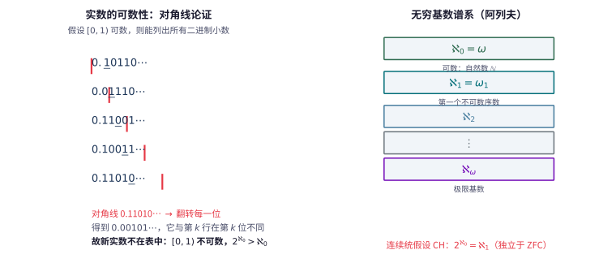

# 第 122 级：公理集合论 (Axiomatic Set Theory)

> 公理集合论是数学的基石之一，它将整个数学建立在严格的公理化基础之上。ZFC 公理系统是目前最广泛使用的集合论公理系统，它不仅为数学对象提供了统一的表示框架，还揭示了数学真理的相对性和独立性。

---

## 1. 学习目标

完成本教程后，你应当能够：

1. **理解 ZFC 公理系统**——掌握 ZFC 九条公理（外延、空集、对集、并集、幂集、无穷、分离、替换、正则）以及选择公理的内容与意义。
2. **掌握序数理论**——理解 von Neumann 序数的定义、序数的传递性与良序性，掌握超穷归纳与超穷递归原理。
3. **理解基数理论**——掌握基数的定义、Cantor-Bernstein 定理、共尾性与基数算术的基本定理。
4. **了解 Gödel 可构造宇宙 L 与力迫法**——理解相对一致性证明的基本思想和连续统假设独立性的证明思路。
5. **掌握选择公理的等价形式**——理解 Zorn 引理、良序定理与选择公理之间的等价关系。
6. **通过示例与习题巩固理论**——完成至少 6 个详细示例和 8 道习题。

---

## 2. 核心概念

### 2.1 ZFC 公理系统

ZFC 公理系统（Zermelo-Fraenkel Set Theory with Choice）是数学中最常用的集合论公理化系统。它在一阶逻辑的语言中表述，仅使用一个二元关系符号 $\in$（属于）。

**ZFC 公理列表**：

1. **外延公理 (Axiom of Extensionality)**：
   $$
   \forall A \forall B (\forall x (x \in A \leftrightarrow x \in B) \to A = B)
   $$
   两个集合相等当且仅当它们包含相同的元素。这定义了集合的外延性本质。

2. **空集公理 (Axiom of Empty Set)**：
   $$
   \exists \varnothing \forall x (x \notin \varnothing)
   $$
   存在一个不含任何元素的集合，记作 $\varnothing$ 或 $\{\}$。

3. **对集公理 (Axiom of Pairing)**：
   $$
   \forall a \forall b \exists C \forall x (x \in C \leftrightarrow x = a \lor x = b)
   $$
   对任意两个集合 $a, b$，存在一个集合 $\{a, b\}$ 恰好以它们为元素。

4. **并集公理 (Axiom of Union)**：
   $$
   \forall \mathcal{F} \exists A \forall x (x \in A \leftrightarrow \exists Y (Y \in \mathcal{F} \land x \in Y))
   $$
   对任意集合族 $\mathcal{F}$，存在其所有元素的并集 $\bigcup \mathcal{F}$。

5. **幂集公理 (Axiom of Power Set)**：
   $$
   \forall A \exists P \forall x (x \in P \leftrightarrow x \subseteq A)
   $$
   对任意集合 $A$，存在其所有子集构成的集合 $\mathcal{P}(A)$。

6. **无穷公理 (Axiom of Infinity)**：
   $$
   \exists I (\varnothing \in I \land \forall x (x \in I \to x \cup \{x\} \in I))
   $$
   存在一个归纳集，即包含 $\varnothing$ 且对后继运算封闭的集合。这保证了自然数集的存在。

7. **分离公理模式 (Axiom Schema of Separation)**：
   $$
   \forall A \exists B \forall x (x \in B \leftrightarrow x \in A \land \varphi(x))
   $$
   对任意集合 $A$ 和性质 $\varphi$（$B$ 不在 $\varphi$ 中自由出现），存在 $A$ 中满足 $\varphi$ 的元素构成的子集。

8. **替换公理模式 (Axiom Schema of Replacement)**：
   $$
   \forall A (\forall x \in A \exists! y \varphi(x,y) \to \exists B \forall x \in A \exists y \in B \varphi(x,y))
   $$
   若 $\varphi$ 在 $A$ 上定义了一个函数，则 $A$ 在该函数下的像构成一个集合。

9. **正则公理 (Axiom of Regularity / Foundation)**：
   $$
   \forall A (A \neq \varnothing \to \exists x \in A (x \cap A = \varnothing))
   $$
   每个非空集合都有一个 $\in$-极小元。这排除了 $x \in x$ 或无限下降链 $\dots \in x_2 \in x_1 \in x_0$ 的存在。

10. **选择公理 (Axiom of Choice, AC)**：
    $$
    \forall \mathcal{F} (\varnothing \notin \mathcal{F} \to \exists f: \mathcal{F} \to \bigcup \mathcal{F} \;\forall A \in \mathcal{F} (f(A) \in A))
    $$
    对任意由非空集合组成的族 $\mathcal{F}$，存在一个选择函数 $f$ 从每个 $A \in \mathcal{F}$ 中选出一个元素。

> **直观理解（现实类比）**：ZFC 公理就像"数学宇宙的宪法"——九条公理（外加选择公理）规定了这个宇宙里集合能做什么、不能做什么。外延公理是"身份法"（元素相同即同一集合），空集公理保证宇宙有起点，幂集和替换公理是"造物法"（能造出更大的集合），正则公理是"禁令法"（禁止集合包含自己、禁止无穷下降链）。正如宪法条款有限却能治理整个国家，这十条公理虽少，却足以推导出几乎全部经典数学。

> **直观理解（现实类比）**：选择公理像"无限投票"——面对无穷多个非空集合（每个集合是一群人），要从每组各选一个代表，需要一条"选择函数"作为投票规则。有限组时随手就能选，但组数无穷时，没有明确规则就无法具体操作。这条公理看似理所当然却引发百年争议：它蕴含良序定理（任何集合都能被良序化），却又推出 Banach-Tarski 那样"反直觉"的结论（一个实心球能拆成有限份再拼成两个同样大的球）。

### 2.2 序数 (Ordinals)

**von Neumann 序数**的定义是集合论中最优雅的序数表示方式：

**定义**：一个集合 $\alpha$ 称为 **序数**，如果它满足：
1. $\alpha$ 是传递的：$\forall x \in \alpha \forall y \in x (y \in \alpha)$，即 $x \in \alpha \implies x \subseteq \alpha$。
2. $\alpha$ 在 $\in$ 关系下是良序的。

**有限序数**：
$$
\begin{aligned}
0 &= \varnothing \\
1 &= \{\varnothing\} = \{0\} \\
2 &= \{\varnothing, \{\varnothing\}\} = \{0, 1\} \\
3 &= \{0, 1, 2\} \\
&\vdots \\
n &= \{0, 1, 2, \dots, n-1\}
\end{aligned}
$$

**后继序数**：$\alpha + 1 = \alpha \cup \{\alpha\}$。

**极限序数**：若 $\alpha$ 不是后继序数且 $\alpha \neq 0$，则 $\alpha$ 是极限序数。

**第一个无穷序数**：$\omega = \{0, 1, 2, 3, \dots\}$，即自然数集。

> **直观理解（现实类比）**：这就像俄罗斯套娃——每个自然数 $n$ 都是一个"套娃"，里面装着所有比它小的自然数（$n=\{0,1,\dots,n-1\}$）。空集 $\varnothing$ 是起点，每一次后继运算 $n+1=n\cup\{n\}$ 就是往里套进一个更大的套娃。无穷公理保证了我们能一直套下去，最终得到装下所有自然数的 $\omega$。

**序数的分类**：
- $0$：最小的序数
- 后继序数：形如 $\alpha + 1$ 的序数
- 极限序数：$0$ 以外的非后继序数，如 $\omega, \omega + \omega, \omega^2, \omega^\omega, \omega_1$（第一个不可数序数）

### 2.3 超穷归纳 (Transfinite Induction)

**超穷归纳定理**：设 $\varphi(x)$ 是集合论公式。若对任意序数 $\alpha$，从 $\forall \beta < \alpha \varphi(\beta)$ 可推出 $\varphi(\alpha)$，则 $\forall \alpha \varphi(\alpha)$ 对所有序数成立。

### 2.4 超穷递归 (Transfinite Recursion)

**超穷递归定理**：设 $G$ 是定义在全体集合上的函数（或泛函），则存在唯一的函数 $F$ 定义在全体序数上，使得对每个序数 $\alpha$ 有：
$$
F(\alpha) = G(F \upharpoonright \alpha)
$$
其中 $F \upharpoonright \alpha$ 是 $F$ 在 $\alpha$ 上的限制。

### 2.5 基数 (Cardinals)

**定义**：集合 $A$ 的**基数**记作 $|A|$，是最小的与 $A$ 等势的序数。一个序数 $\kappa$ 称为**基数**，如果对任意 $\alpha < \kappa$，$\alpha$ 与 $\kappa$ 不等势。

**可数基数**：$\aleph_0 = \omega$。

**不可数基数**：$\aleph_1 = \omega_1$（第一个不可数序数），$\aleph_2, \dots, \aleph_\alpha, \dots$。

**阿列夫函数**：$\aleph_\alpha$ 由超穷递归定义：
- $\aleph_0 = \omega$
- $\aleph_{\alpha+1} = \omega_{\alpha+1}$（$\aleph_\alpha$ 的后继基数）
- 对极限序数 $\lambda$，$\aleph_\lambda = \bigcup_{\alpha < \lambda} \aleph_\alpha$

> **直观理解（现实类比）**：想象一家旅馆给"无穷多个房间"编号（可数 $\aleph_0$），但来了比房间还多的"旅客"（实数）。对角线论证就像检查旅客名单时总能"插队"造出一个不在名单上的新旅客——无论名单怎么排都排不完，说明实数比自然数"更多"（$2^{\aleph_0}>\aleph_0$）。阿列夫 $\aleph_0,\aleph_1,\aleph_2,\dots$ 就是无穷大小的"阶梯"，每一级都严格大于上一级。

### 2.6 共尾性 (Cofinality)

**定义**：设 $\kappa$ 是极限序数。$\kappa$ 的**共尾性** $\operatorname{cf}(\kappa)$ 是最小的 $\lambda$，使得存在一个共尾映射 $f: \lambda \to \kappa$（即 $\kappa = \bigcup_{\alpha < \lambda} f(\alpha)$）。

**正则基数**：若 $\operatorname{cf}(\kappa) = \kappa$，则 $\kappa$ 是正则的。

**奇异基数**：若 $\operatorname{cf}(\kappa) < \kappa$，则 $\kappa$ 是奇异的。

### 2.7 Gödel 可构造宇宙 L

**可构造宇宙** $L$ 是 Gödel 提出的一个内模型，在其中 $V = L$（所有集合都是可构造的）。

**定义**（超穷递归）：
$$
\begin{aligned}
L_0 &= \varnothing \\
L_{\alpha+1} &= \operatorname{Def}(L_\alpha) \quad (\text{在 } L_\alpha \text{ 中一阶可定义的子集}) \\
L_\lambda &= \bigcup_{\alpha < \lambda} L_\alpha \quad (\lambda \text{ 为极限序数}) \\
L &= \bigcup_{\alpha \in \operatorname{Ord}} L_\alpha
\end{aligned}
$$

**Gödel 定理**：在 $L$ 中，连续统假设 (CH) 和选择公理 (AC) 都成立。因此，如果 ZF 是一致的，则 ZFC + CH 也是一致的。

### 2.8 力迫法 (Forcing)

力迫法是 Cohen 发明的用于证明独立性结果的技术。

**基本思想**：给定一个可数传递模型 $M$ 和 $M$ 中的一个偏序集 $\mathbb{P}$（称为力迫概念），通过添加一个 $\mathbb{P}$-generic 滤 $G$，构造一个更大的模型 $M[G]$，使得 $M[G]$ 满足特定的性质。

**Cohen 定理**：如果 ZFC 是一致的，则 ZFC + $\neg$CH 也是一致的。结合 Gödel 的结果，CH 独立于 ZFC。

### 2.9 连续统假设的独立性

**连续统假设 (CH)**：$2^{\aleph_0} = \aleph_1$。

- **Gödel (1938)**：$L \models \text{ZFC} + \text{CH}$，故 CH 与 ZFC 相对一致。
- **Cohen (1963)**：通过力迫法构造了 $\neg$CH 的模型，故 $\neg$CH 与 ZFC 相对一致。
- 结论：CH 在 ZFC 中既不可证明也不可否证——**独立于 ZFC**。

> **直观理解（现实类比）**：连续统假设像"无穷的阶层"——已知自然数是"最低层"无穷 $\aleph_0$，实数是"更高一层"无穷 $2^{\aleph_0}$。问题是：这两层之间还有没有"中间层"无穷？CH 断言没有，实数刚好是"第二层" $\aleph_1$。Gödel 和 Cohen 联手证明这条假设在 ZFC 中既不能证实也不能证伪——就像问"宇宙是有限还是无限"在某种物理理论中无法判定一样，ZFC 这部"宪法"对此保持沉默，需要"立法补充"（增加新公理）才能定夺。

> **直观理解（现实类比）**：可构造宇宙 $L$ 像"最小模型"——它只包含 ZFC 公理能强制生成的集合，仿佛一位极简主义建筑师只用必要材料搭起的最简房屋。$L_0=\varnothing$ 是空地，$L_{\alpha+1}=\operatorname{Def}(L_\alpha)$ 是每层从下层"一阶可定义"地长出的新集合，$L=\bigcup_\alpha L_\alpha$ 是全部楼层。Gödel 发现这个最简模型里 CH 自动成立，就好比"最节俭的构造方式"恰好让实数正好填到 $\aleph_1$ 这一层。$L$ 之外更"奢华"的宇宙里则可能出现更多实数，从而让 CH 失效——这正是 Cohen 力迫法所展示的另一种可能。

---

## 3. 定理与证明

### 3.1 超穷归纳定理

> **定理（超穷归纳）**：设 $\varphi(x)$ 是集合论公式。若对任意序数 $\alpha$ 有
> $$
> (\forall \beta < \alpha \varphi(\beta)) \implies \varphi(\alpha)
> $$
> 则对所有序数 $\alpha$ 都有 $\varphi(\alpha)$ 成立。

**证明**：

用反证法。假设存在序数 $\alpha$ 使得 $\neg\varphi(\alpha)$。考虑所有使 $\neg\varphi(\alpha)$ 成立的序数构成的类：
$$
C = \{\alpha \in \operatorname{Ord} \mid \neg\varphi(\alpha)\}
$$
由假设 $C$ 非空。由于序数在 $\in$ 关系下是良序的，$C$ 有最小元，记作 $\alpha_0$。

由最小性，对所有 $\beta < \alpha_0$，$\varphi(\beta)$ 成立（因为 $\beta < \alpha_0$ 意味着 $\beta \notin C$）。

但归纳假设说：
$$
(\forall \beta < \alpha_0 \varphi(\beta)) \implies \varphi(\alpha_0)
$$
因此 $\varphi(\alpha_0)$ 成立，与 $\alpha_0 \in C$ 矛盾。故 $C$ 必须为空，即对所有序数 $\alpha$ 都有 $\varphi(\alpha)$ 成立。

$\square$

**关键点**：证明利用了序数的良序性质——任何非空序数类都有最小元。这种良序性来源于序数的传递性和 $\in$ 关系的严格良序性。

### 3.2 Cantor-Bernstein 定理

> **定理（Cantor-Bernstein）**：若存在单射 $f: A \to B$ 和单射 $g: B \to A$，则存在双射 $h: A \to B$。换言之，若 $|A| \leq |B|$ 且 $|B| \leq |A|$，则 $|A| = |B|$。

**证明**（使用逆向迭代法 / 不动点方法）：

定义集合序列：令 $C_0 = A \setminus g[B]$（即 $A$ 中不被 $g$ 的像覆盖的元素）。然后递归定义：
$$
C_{n+1} = g[f[C_n]]
$$
即先对 $C_n$ 中的元素应用 $f$ 得到 $B$ 中的子集，再用 $g$ 映射回 $A$。

令 $C = \bigcup_{n=0}^\infty C_n$。定义 $h: A \to B$ 如下：
$$
h(x) = \begin{cases}
f(x) & \text{若 } x \in C \\
g^{-1}(x) & \text{若 } x \notin C
\end{cases}
$$
注意当 $x \notin C$ 时 $x \in g[B]$（因为 $C_0 = A \setminus g[B]$，若 $x \notin C$ 则 $x \notin C_0$，故 $x \in g[B]$），因此 $g^{-1}(x)$ 有定义且唯一。

**验证 $h$ 是双射**：

1. **单射性**：设 $h(x_1) = h(x_2)$。分情况讨论：
   - 若 $x_1, x_2 \in C$，则 $f(x_1) = f(x_2)$，由 $f$ 的单射性得 $x_1 = x_2$。
   - 若 $x_1, x_2 \notin C$，则 $g^{-1}(x_1) = g^{-1}(x_2)$，故 $x_1 = x_2$。
   - 若 $x_1 \in C$ 且 $x_2 \notin C$，则 $h(x_1) = f(x_1) \in f[C]$，$h(x_2) = g^{-1}(x_2)$。假设 $f(x_1) = g^{-1}(x_2)$，则 $g(f(x_1)) = x_2$。但 $x_1 \in C$ 意味着 $x_1 \in C_n$ 对某个 $n$，于是 $g(f(x_1)) \in C_{n+1} \subseteq C$，这与 $x_2 \notin C$ 矛盾。因此 $h(x_1) \neq h(x_2)$。

2. **满射性**：对任意 $y \in B$，需要找到 $x \in A$ 使得 $h(x) = y$。
   - 若 $g(y) \in C$，设 $g(y) \in C_n$。若 $n = 0$，则 $g(y) \in C_0 = A \setminus g[B]$，这与 $g(y) \in g[B]$ 矛盾。故 $n \geq 1$，于是存在 $x \in C_{n-1}$ 使得 $g(f(x)) = g(y)$，由 $g$ 的单射性得 $f(x) = y$。此时 $h(x) = f(x) = y$。
   - 若 $g(y) \notin C$，则 $h(g(y)) = g^{-1}(g(y)) = y$，所以 $x = g(y)$ 满足要求。

因此 $h$ 是双射，$A$ 与 $B$ 等势。

$\square$

### 3.3 序数的比较定理

> **定理（序数的比较定理）**：对任意两个序数 $\alpha$ 和 $\beta$，以下三种情况恰好成立一种：
> $$
> \alpha \in \beta,\quad \alpha = \beta,\quad \beta \in \alpha
> $$
> 换言之，序数在 $\in$ 关系下构成全序（且是良序）。

**证明**：

首先证明一个引理：若 $\alpha$ 和 $\beta$ 是序数且 $\alpha \subsetneq \beta$，则 $\alpha \in \beta$。

**引理证明**：因为 $\alpha \subsetneq \beta$，$\beta \setminus \alpha$ 非空。由 $\beta$ 的良序性，取 $\gamma = \min(\beta \setminus \alpha)$。需证 $\alpha = \gamma$。
- 若 $\delta \in \gamma$，则 $\delta \in \beta$（$\beta$ 的传递性），且 $\delta \notin \beta \setminus \alpha$（因为 $\gamma$ 是最小元），故 $\delta \in \alpha$。所以 $\gamma \subseteq \alpha$。
- 若 $\delta \in \alpha$，则 $\delta \in \beta$（$\alpha \subseteq \beta$）。由 $\in$ 在 $\beta$ 上的三歧性，要么 $\delta \in \gamma$，要么 $\delta = \gamma$，要么 $\gamma \in \delta$。若 $\gamma \in \delta$，则 $\gamma \in \delta \in \alpha$，由 $\alpha$ 的传递性得 $\gamma \in \alpha$，矛盾。若 $\delta = \gamma$，则 $\gamma \in \alpha$，矛盾。故 $\delta \in \gamma$。所以 $\alpha \subseteq \gamma$。
因此 $\alpha = \gamma \in \beta$。引理证毕。

**定理证明**：设 $\alpha$ 和 $\beta$ 是序数。考虑 $\alpha \cap \beta$。由于 $\alpha$ 和 $\beta$ 都是传递的，$\alpha \cap \beta$ 也是传递的，且在 $\in$ 下良序，因此 $\alpha \cap \beta$ 是一个序数，记作 $\gamma$。

我们有 $\gamma \subseteq \alpha$ 且 $\gamma \subseteq \beta$。若 $\gamma \subsetneq \alpha$，由引理 $\gamma \in \alpha$。类似地，若 $\gamma \subsetneq \beta$，则 $\gamma \in \beta$。

现在用超穷归纳证明三歧性。假设对某个序数 $\alpha$ 和所有 $\beta < \alpha$，三歧性成立。对任意 $\beta$，考虑 $\alpha \cap \beta$：
- 若 $\alpha \cap \beta = \alpha$，则 $\alpha \subseteq \beta$，即 $\alpha \in \beta$ 或 $\alpha = \beta$。
- 若 $\alpha \cap \beta = \beta$，则 $\beta \subseteq \alpha$，即 $\beta \in \alpha$ 或 $\beta = \alpha$。
- 若 $\alpha \cap \beta \subsetneq \alpha$ 且 $\alpha \cap \beta \subsetneq \beta$，则 $\alpha \cap \beta \in \alpha$ 且 $\alpha \cap \beta \in \beta$。由 $\alpha \cap \beta \in \alpha$，$\alpha \cap \beta \in \beta$ 以及 $\alpha$ 的传递性，可以推出矛盾（因为 $\alpha \cap \beta$ 是 $\alpha$ 和 $\beta$ 中最大的公共序数，而 $\alpha \cap \beta \in \alpha \cap \beta$ 违反正则公理）。

因此，前两种情况必居其一，三歧性得证。

$\square$

### 3.4 König 定理

> **定理（König）**：若对每个 $i \in I$ 有 $\kappa_i < \lambda_i$，则
> $$
> \sum_{i \in I} \kappa_i < \prod_{i \in I} \lambda_i
> $$

**证明**：

首先证明 $\sum_{i \in I} \kappa_i \leq \prod_{i \in I} \lambda_i$。对每个 $i$，因为 $\kappa_i < \lambda_i$，存在单射 $f_i: \kappa_i \to \lambda_i$。定义函数：
$$
F: \bigcup_{i \in I} (\kappa_i \times \{i\}) \to \prod_{i \in I} \lambda_i
$$
对 $(x, i) \in \kappa_i \times \{i\}$，令 $F(x, i)$ 为这样的函数 $g: I \to \bigcup_{i \in I} \lambda_i$，使得 $g(j) = 0$ 对 $j \neq i$，且 $g(i) = f_i(x)$。这给出了一个单射，故 $\sum \kappa_i \leq \prod \lambda_i$。

现在证明不能相等。假设存在双射 $h: \bigcup_{i \in I} (\kappa_i \times \{i\}) \to \prod_{i \in I} \lambda_i$。对每个 $i \in I$，考虑集合：
$$
S_i = \{h(\alpha, i)(i) \mid \alpha < \kappa_i\} \subseteq \lambda_i
$$
由于 $\kappa_i < \lambda_i$，$|S_i| \leq \kappa_i < \lambda_i$，故 $S_i \subsetneq \lambda_i$。因此存在 $\beta_i \in \lambda_i \setminus S_i$。

定义函数 $g \in \prod_{i \in I} \lambda_i$ 为 $g(i) = \beta_i$。由于 $h$ 是满射，存在 $(\alpha, i) \in \bigcup_{j \in I} (\kappa_j \times \{j\})$ 使得 $h(\alpha, i) = g$。于是 $g(i) = h(\alpha, i)(i) \in S_i$，但由构造 $g(i) = \beta_i \notin S_i$，矛盾。

因此 $\sum \kappa_i < \prod \lambda_i$。

$\square$

**推论**：$\kappa < 2^\kappa$（Cantor 定理），且 $\operatorname{cf}(2^{\aleph_0}) > \aleph_0$（即连续统的共尾性不可数）。

### 3.5 选择公理的等价形式

> **定理**：以下命题在 ZF 中两两等价：
> 1. **选择公理 (AC)**：每个非空集合族都有选择函数。
> 2. **Zorn 引理**：若非空偏序集 $P$ 的每条链都有上界，则 $P$ 有极大元。
> 3. **良序定理**：每个集合都可以被良序化。

**证明**：

**(1) $\implies$ (2): AC 推出 Zorn 引理**

设 $(P, \leq)$ 是非空偏序集，其中每条链都有上界。用反证法，假设 $P$ 没有极大元。

对每个 $x \in P$，定义 $U_x = \{y \in P \mid y > x\}$（严格大于 $x$ 的元素）。由于 $P$ 没有极大元，每个 $U_x$ 非空。由 AC，存在选择函数 $f: P \to P$ 使得 $f(x) \in U_x$，即 $f(x) > x$。

现在用超穷递归构造一个严格递增链。设 $x_0$ 是 $P$ 中任意元素。对序数 $\alpha$，定义：
$$
x_\alpha = \begin{cases}
f(x_\beta) & \text{若 } \alpha = \beta + 1 \\
\text{链 } \{x_\beta\}_{\beta < \alpha} \text{ 的上界} & \text{若 } \alpha \text{ 是极限序数}
\end{cases}
$$
由假设，每条链都有上界，故极限步骤可行。这样，我们构造了一个严格递增的序数长度的链，与 Hartogs 引理（存在一个不能嵌入 $P$ 的序数）矛盾。因此 $P$ 必须有极大元。

**(2) $\implies$ (3): Zorn 引理推出良序定理**

设 $A$ 是任意集合。考虑所有 $(B, <_B)$ 的集合 $W$，其中 $B \subseteq A$ 且 $<_B$ 是 $B$ 上的良序。在 $W$ 上定义偏序：$(B, <_B) \preceq (C, <_C)$ 如果 $B \subseteq C$，$<_C$ 限制在 $B$ 上等于 $<_B$，且 $B$ 是 $C$ 的初始段。

对 $W$ 中的任意链 $\{(B_i, <_{B_i})\}_{i \in I}$，取 $B = \bigcup_i B_i$，并在 $B$ 上定义序：$x <_B y$ 当且仅当存在 $i$ 使得 $x, y \in B_i$ 且 $x <_{B_i} y$。可以验证 $(B, <_B)$ 是良序的，且是链中每个元素的上界。

由 Zorn 引理，$W$ 有极大元 $(M, <_M)$。若 $M \neq A$，取 $a \in A \setminus M$，将 $a$ 添加到 $M$ 的末端得到 $M \cup \{a\}$ 上的良序，这与极大性矛盾。因此 $M = A$，$A$ 被良序化。

**(3) $\implies$ (1): 良序定理推出 AC**

设 $\mathcal{F}$ 是非空集合族。由良序定理，$\bigcup \mathcal{F}$ 可以被良序化。对每个 $A \in \mathcal{F}$，$A$ 作为 $\bigcup \mathcal{F}$ 的子集，在良序下有最小元。定义 $f(A) = \min(A)$，则 $f$ 是 $\mathcal{F}$ 上的选择函数。

$\square$

---

## 4. 示例

### 示例 1：von Neumann 序数的构造

构造前几个 von Neumann 序数并验证它们的传递性。

**解**：

$$
\begin{aligned}
0 &= \varnothing \\
1 &= \{\varnothing\} = \{0\} \\
2 &= \{\varnothing, \{\varnothing\}\} = \{0, 1\} \\
3 &= \{0, 1, 2\} \\
4 &= \{0, 1, 2, 3\} \\
&\vdots \\
n &= \{0, 1, 2, \dots, n-1\}
\end{aligned}
$$

验证传递性：
- $0 = \varnothing$：空集的传递性平凡成立。
- $1 = \{0\}$：$0$ 的唯一元素是 $0$，而 $0 \subseteq 1$（因为 $0 = \varnothing \subseteq 1$）。
- $2 = \{0, 1\}$：$0 \subseteq 2$（因为 $0 = \varnothing$），$1 = \{0\} \subseteq 2$（因为 $0 \in 2$）。
- 一般地，若 $\alpha$ 是传递的，则 $\alpha + 1 = \alpha \cup \{\alpha\}$ 也是传递的，因为对任意 $x \in \alpha + 1$，要么 $x \in \alpha$（此时 $x \subseteq \alpha \subseteq \alpha + 1$），要么 $x = \alpha$（此时 $x = \alpha \subseteq \alpha + 1$）。

### 示例 2：利用超穷递归构造 Borel 集族

在实直线 $\mathbb{R}$ 上，Borel 集族 $\mathcal{B}$ 是包含所有开集并在可数并和补运算下封闭的最小 $\sigma$-代数。我们可以用超穷递归构造它。

**解**：

设 $\mathcal{O}$ 是 $\mathbb{R}$ 上的所有开集构成的族。对序数 $\alpha < \omega_1$（第一个不可数序数），递归定义：

$$
\begin{aligned}
\mathcal{B}_0 &= \mathcal{O} \\
\mathcal{B}_{\alpha+1} &= \left\{ \bigcup_{n=1}^\infty A_n \;\middle|\; A_n \in \mathcal{B}_\alpha \right\} \cup \left\{ \mathbb{R} \setminus A \;\middle|\; A \in \mathcal{B}_\alpha \right\} \\
\mathcal{B}_\lambda &= \bigcup_{\alpha < \lambda} \mathcal{B}_\alpha \quad (\lambda \text{ 为极限序数})
\end{aligned}
$$

则 Borel 集族为 $\mathcal{B} = \bigcup_{\alpha < \omega_1} \mathcal{B}_\alpha$。

验证：$\omega_1$ 步后过程停止，因为每一步的基数在增加，而 $\mathcal{P}(\mathbb{R})$ 的基数有上界 $2^{\mathfrak{c}}$。实际上，可以证明 $\mathcal{B}_{\omega_1} = \mathcal{B}_{\omega_1+1}$，即过程在 $\omega_1$ 步后达到不动点。

### 示例 3：Cantor-Bernstein 定理的应用

证明 $[0, 1]$ 与 $(0, 1)$ 等势。

**解**：

定义单射 $f: [0, 1] \to (0, 1)$ 为 $f(x) = \frac{1}{2}x + \frac{1}{4}$，即 $f$ 将 $[0, 1]$ 映到 $[\frac{1}{4}, \frac{3}{4}] \subseteq (0, 1)$。

定义单射 $g: (0, 1) \to [0, 1]$ 为恒等映射 $g(x) = x$。

由 Cantor-Bernstein 定理，$|[0, 1]| = |(0, 1)|$。

### 示例 4：利用 Zorn 引理证明基数的可比性

**命题**：对任意两个集合 $A$ 和 $B$，要么 $|A| \leq |B|$，要么 $|B| \leq |A|$。

**证明**：

考虑所有部分单射 $f: A' \to B$（其中 $A' \subseteq A$）构成的集合 $P$。在 $P$ 上定义偏序：$f \leq g$ 当且仅当 $g$ 是 $f$ 的扩张。

$P$ 中每条链 $\{f_i\}_{i \in I}$ 都有上界：取 $f = \bigcup_i f_i$（将定义域取并集，值也取并集），$f$ 是单射。

由 Zorn 引理，$P$ 有极大元 $f^*$。设 $f^*$ 的定义域为 $A^* \subseteq A$，值域为 $B^* \subseteq B$。

若 $A^* \neq A$ 且 $B^* \neq B$，则可取 $a \in A \setminus A^*$ 和 $b \in B \setminus B^*$，扩张 $f^*$ 为 $f^*(a) = b$，与极大性矛盾。因此要么 $A^* = A$（此时 $|A| \leq |B|$），要么 $B^* = B$（此时 $|B| \leq |A|$）。

### 示例 5：计算共尾性

计算 $\operatorname{cf}(\aleph_\omega)$。

**解**：

$\aleph_\omega = \bigcup_{n < \omega} \aleph_n$，映射 $n \mapsto \aleph_n$ 是 $\omega \to \aleph_\omega$ 的共尾映射。因此 $\operatorname{cf}(\aleph_\omega) \leq \omega$。

另一方面，$\operatorname{cf}(\aleph_\omega) \geq \omega$（因为 $\aleph_\omega$ 是极限序数，共尾性至少为 $\omega$）。故 $\operatorname{cf}(\aleph_\omega) = \omega$。

因此 $\aleph_\omega$ 是奇异的（因为 $\operatorname{cf}(\aleph_\omega) = \omega < \aleph_\omega$）。

### 示例 6：可构造宇宙中的层次

描述 $L_0, L_1, L_2$ 的内容。

**解**：

- $L_0 = \varnothing$。
- $L_1 = \operatorname{Def}(L_0) = \operatorname{Def}(\varnothing)$。在空集中，所有一阶公式的满足集只可能是 $\varnothing$ 本身（因为 $\varnothing$ 没有元素）。因此 $L_1 = \{\varnothing\} = \{0\} = 1$。
- $L_2 = \operatorname{Def}(L_1) = \operatorname{Def}(\{0\})$。在 $\{0\}$ 中，可定义的子集有 $\varnothing$ 和 $\{0\}$。因此 $L_2 = \{\varnothing, \{\varnothing\}\} = \{0, 1\} = 2$。

可见在可构造宇宙的底层，$L_\alpha$ 与 von Neumann 序数 $\alpha$ 一致（对有限 $\alpha$）。

---

## 5. 习题

### 习题 1
**证明**：若 $\alpha$ 是序数，则 $\alpha \notin \alpha$。

**提示**：使用正则公理，考虑集合 $\{\alpha\}$。

### 习题 2
**证明**：$\omega + 1$ 是可数序数，但 $\omega_1$ 是不可数序数。

**提示**：$\omega + 1 = \omega \cup \{\omega\}$，构造 $\omega$ 与 $\omega + 1$ 之间的双射。对于 $\omega_1$，回忆 $\omega_1$ 是所有可数序数的集合。

### 习题 3
**证明**：对任意序数 $\alpha$，$\alpha$ 是传递的当且仅当 $\alpha \subseteq \mathcal{P}(\alpha)$。

**提示**：传递性定义为 $x \in \alpha \implies x \subseteq \alpha$，而 $\mathcal{P}(\alpha)$ 是 $\alpha$ 的所有子集的集合。

### 习题 4
**证明**：若 $\kappa$ 是无穷基数，则 $\kappa < \kappa^{\operatorname{cf}(\kappa)}$。

**提示**：使用 König 定理，取 $I = \operatorname{cf}(\kappa)$，$\kappa_i < \kappa$ 且 $\lambda_i = \kappa$。

### 习题 5
**证明**：Zorn 引理等价于良序定理（在 ZF 中）。

**提示**：参考 3.5 节的证明，但尝试给出更直接的证明。

### 习题 6
**证明**：$\mathbb{R}$ 与 $\mathcal{P}(\mathbb{N})$ 等势。

**提示**：用二进制表示构造 $[0, 1]$ 与 $\mathcal{P}(\mathbb{N})$ 之间的双射，再说明 $\mathbb{R}$ 与 $[0, 1]$ 等势。

### 习题 7
**证明**：$V = L$ 蕴含连续统假设。

**提示**：在 $L$ 中，$\mathcal{P}(\omega) \subseteq L_{\omega_1}$，且 $|L_{\omega_1}| = \aleph_1$。

### 习题 8
**证明**：若 $\kappa$ 是正则基数，则 $\kappa$ 的任意小于 $\kappa$ 个小于 $\kappa$ 的序数的并仍小于 $\kappa$。

**提示**：使用共尾性的定义和正则性的定义。

---

## 6. 总结

公理集合论为数学提供了严格的逻辑基础。本教程覆盖了以下核心内容：

1. **ZFC 公理系统**：十条公理构成了集合论的形式基础，每条公理都有其特定的作用——外延公理定义了集合的同一性，空集公理保证了数学的起点，无穷公理保证了自然数的存在，替换公理模式保证了强大构造能力，正则公理排除了病态集合，选择公理则是数学论证中不可或缺的工具。

2. **序数理论**：von Neumann 序数给出了序数的具体实现，超穷归纳和超穷递归是集合论中最强大的证明和构造工具。

3. **基数理论**：Cantor-Bernstein 定理是基数比较的基本工具，König 定理揭示了基数和与积的深刻关系，共尾性则刻画了基数逼近极限的方式。

4. **选择公理**：Zorn 引理和良序定理是选择公理最常用的等价形式，它们在数学的各个分支中都有广泛应用。

5. **集合论宇宙**：Gödel 的可构造宇宙 $L$ 和 Cohen 的力迫法展示了集合论宇宙的丰富性，连续统假设的独立性是 20 世纪数学最深刻的成果之一。

公理集合论不仅是一门数学分支，更是数学哲学的思辨场。它迫使我们思考：数学对象是什么？数学真理意味着什么？"存在"在数学中是什么意思？这些问题的探索推动着数学基础研究的不断深入。