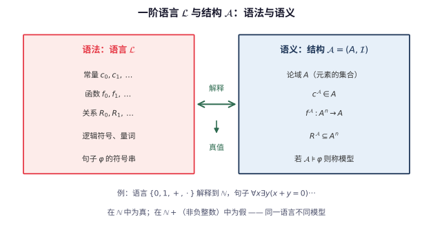

# 第 123 级：模型论 (Model Theory)

> 模型论是数理逻辑的一个分支，研究形式语言与数学结构之间的关系。它探讨什么样的理论有模型、模型的大小如何变化、以及不同模型之间的结构关系。模型论的核心思想是"语法"（形式语言中的句子）与"语义"（数学结构中的真值）之间的相互作用。

---

## 1. 学习目标

完成本教程后，你应当能够：

1. **理解模型论的基本概念**——掌握一阶语言、结构、模型、满足、可定义性等基本概念。
2. **掌握核心定理**——理解紧致性定理、Löwenheim-Skolem 定理、Morgan 定理、量词消去定理和省略类型定理的陈述与证明。
3. **理解类型与饱和模型**——掌握类型的概念、饱和模型的性质以及其在模型构造中的应用。
4. **了解超积与初等嵌入**——理解超积构造、初等嵌入、初等链等概念。
5. **理解范畴性与模型完备性**——掌握范畴性的概念和模型完备性的含义。
6. **通过示例与习题巩固理论**——完成至少 6 个详细示例和 8 道习题。

---

## 2. 核心概念

### 2.1 一阶语言 (First-Order Language)

**定义**：一个**一阶语言** $\mathcal{L}$ 由以下部分组成：
- **逻辑符号**：变元 $x_0, x_1, x_2, \dots$，逻辑联结词 $\neg, \land, \lor, \to$，量词 $\forall, \exists$，等号 $\approx$，括号。
- **非逻辑符号**：
  - **常量符号**：$c_0, c_1, \dots$
  - **函数符号**：$f_0, f_1, \dots$，每个有固定的元数 $\operatorname{ar}(f_i)$
  - **关系符号**：$R_0, R_1, \dots$，每个有固定的元数 $\operatorname{ar}(R_i)$

**$\mathcal{L}$-项**递归定义：
1. 每个变元是项。
2. 每个常量符号是项。
3. 若 $t_1, \dots, t_n$ 是项且 $f$ 是 $n$ 元函数符号，则 $f(t_1, \dots, t_n)$ 是项。

**$\mathcal{L}$-公式**递归定义：
1. 若 $t_1, t_2$ 是项，则 $t_1 \approx t_2$ 是原子公式。
2. 若 $R$ 是 $n$ 元关系符号且 $t_1, \dots, t_n$ 是项，则 $R(t_1, \dots, t_n)$ 是原子公式。
3. 所有原子公式是公式。
4. 若 $\varphi, \psi$ 是公式，则 $\neg\varphi, \varphi \land \psi, \varphi \lor \psi, \varphi \to \psi$ 是公式。
5. 若 $\varphi$ 是公式且 $x$ 是变元，则 $\forall x \varphi$ 和 $\exists x \varphi$ 是公式。

### 2.2 结构与模型 (Structures and Models)

**定义**：一个 $\mathcal{L}$-**结构** $\mathfrak{A} = (A, \mathcal{I})$ 包含：
- 一个非空集合 $A$（论域）。
- 一个解释函数 $\mathcal{I}$，将每个常量符号 $c$ 映射到 $A$ 中的元素 $c^{\mathfrak{A}}$，每个 $n$ 元函数符号 $f$ 映射到函数 $f^{\mathfrak{A}}: A^n \to A$，每个 $n$ 元关系符号 $R$ 映射到 $A^n$ 上的关系 $R^{\mathfrak{A}} \subseteq A^n$。

**定义**：若 $\mathfrak{A}$ 是 $\mathcal{L}$-结构，$\varphi$ 是 $\mathcal{L}$-句子（无自由变元的公式），且 $\mathfrak{A} \models \varphi$（$\varphi$ 在 $\mathfrak{A}$ 中为真），则称 $\mathfrak{A}$ 是 $\varphi$ 的**模型**。若 $T$ 是一组 $\mathcal{L}$-句子（理论），且 $\mathfrak{A}$ 满足 $T$ 中所有句子，则称 $\mathfrak{A}$ 是 $T$ 的模型，记作 $\mathfrak{A} \models T$。

> **直观理解（现实类比）**：语言就像一套"乐高说明书"（符号、函数、关系），结构则是实际搭出来的"积木模型"。同一个说明书可以搭出不同的模型——比如"$+$"在自然数里是加法，在布尔代数里可能是 $\lor$。只有当说明书里的每个句子在积木模型里"成立"（$\mathfrak{A}\models\varphi$）时，我们才说这个积木是一个"模型"。

> **直观理解（现实类比）**：模型像"理论的实现"——一组符号加解释等于一个具体世界，就像小说设定加具体小说。同一套公理（设定）可以被不同的结构（小说）所满足：群公理既可以被整数加法群实现，也可以被对称群实现。模型论研究的就是"哪些设定能被实现"、"同一个设定能有多少种不同的实现"。$\mathfrak{A}\models T$ 这一记号，正是在说"这个世界（结构 $\mathfrak{A}$）忠实演绎了这套剧本（理论 $T$）"。

### 2.3 满足与可定义性 (Satisfaction and Definability)

**Tarski 满足定义**：对 $\mathcal{L}$-结构 $\mathfrak{A}$ 和赋值 $s: \text{Var} \to A$，递归定义 $\mathfrak{A} \models \varphi[s]$（$\varphi$ 在赋值 $s$ 下被满足）。

**可定义集**：设 $\mathfrak{A}$ 是 $\mathcal{L}$-结构，$X \subseteq A^n$ 称为**可定义的**，如果存在 $\mathcal{L}$-公式 $\varphi(x_1, \dots, x_n)$ 使得：
$$
X = \{(a_1, \dots, a_n) \in A^n \mid \mathfrak{A} \models \varphi(a_1, \dots, a_n)\}
$$

### 2.4 紧致性定理 (Compactness Theorem)

> **定理（紧致性）**：设 $T$ 是一阶理论。若 $T$ 的每个有限子集都有模型，则 $T$ 本身有模型。

紧致性定理是一阶逻辑的核心性质之一，它深刻地区分了一阶逻辑与高阶逻辑。

> **直观理解（现实类比）**：就像一个"无限大的拼图"——只要任何**有限**部分都能拼好（每个有限子集有模型），那么整张无限拼图也能拼好（整个理论有模型）。直觉上"无限"往往比"有限"危险，但一阶逻辑的紧致性恰恰告诉我们：有限部分的兼容性能自动推出整体的一致性。超积 $\prod_i\mathfrak{A}_i/\mathcal{U}$ 正是用超滤 $\mathcal{U}$"投票"拼出一个初等模型的工具。

> **直观理解（现实类比）**：紧致性定理像"有限检查"——判断一个无穷理论是否有模型，只需逐个检查它的每个有限片段。这就像海关无法一次查验整艘货轮的所有集装箱，但只要任意有限个箱子的组合都合规，就能放行整船。这一定理是一阶逻辑独有的"特权"：高阶逻辑中存在有限可满足却整体无模型的理论，正是因为缺少这种"有限推整体"的紧致性。它也是构造非标准模型的钥匙——加入无穷多条"$c>n$"后，任何有限子集都被 $\mathbb{N}$ 满足，于是整体有模型，从而诞生了含无穷大自然数的非标准模型。

### 2.5 Löwenheim-Skolem 定理

> **定理（Löwenheim-Skolem）**：
> - **下降版本**：若 $\mathcal{L}$-理论 $T$ 有无限模型，则对任意基数 $\kappa \geq |\mathcal{L}|$，$T$ 有基数为 $\kappa$ 的模型。
> - **上升版本**：若 $T$ 有无限模型，则对任意基数 $\kappa \geq \max(|\mathcal{L}|, |T|)$，$T$ 有基数为 $\kappa$ 的模型。

> **直观理解（现实类比）**：Löwenheim-Skolem 定理像"大小不变"——一阶理论一旦有了无穷模型，就拥有任意基数大小的模型，无论可数、连续统还是更大的无穷。这好比一套"剧本设定"既能被小剧团演出，也能被万人剧团演出，剧情逻辑完全一致。这揭示了一阶逻辑的根本局限：它无法用公式限定模型的"大小"。Skolem 悖论正是由此而来——ZFC 虽是描述"全部集合"的理论，却有可数模型，仿佛"从外面看"整个集合宇宙只有可数多对象，但"从模型内部"却感受不到这种"缩水"。

### 2.6 类型 (Types)

**定义**：设 $\mathfrak{A}$ 是 $\mathcal{L}$-结构，$A$ 是其论域，$B \subseteq A$。一组 $\mathcal{L}(B)$-公式 $\Sigma(x)$（其中 $x$ 是自由变元）称为一个**类型**，如果 $\Sigma(x)$ 在 $\mathfrak{A}$ 中有限可满足（即对任意有限子集 $\Sigma_0 \subseteq \Sigma$，存在 $a \in A$ 使得 $\mathfrak{A} \models \Sigma_0(a)$）。

**完全类型**：若对每个 $\mathcal{L}(B)$-公式 $\varphi(x)$，要么 $\varphi(x) \in \Sigma(x)$ 要么 $\neg\varphi(x) \in \Sigma(x)$，则 $\Sigma(x)$ 是完全类型。

**实现与省略**：若存在 $a \in A$ 使得 $\mathfrak{A} \models \Sigma(a)$，则称 $\Sigma$ 在 $\mathfrak{A}$ 中**实现**，否则称**省略**。

### 2.7 饱和模型 (Saturated Models)

**定义**：$\mathcal{L}$-结构 $\mathfrak{A}$ 称为 $\kappa$-**饱和**的，如果对任意 $A_0 \subseteq A$ 且 $|A_0| < \kappa$，每个在 $A_0$ 上有限可满足的 $\mathcal{L}(A_0)$-类型都在 $\mathfrak{A}$ 中实现。

### 2.8 超积 (Ultraproducts)

**定义**：设 $\{\mathfrak{A}_i\}_{i \in I}$ 是一族 $\mathcal{L}$-结构，$\mathcal{U}$ 是 $I$ 上的超滤。**超积** $\prod_{i \in I} \mathfrak{A}_i / \mathcal{U}$ 的定义如下：
- 论域：$\prod_{i \in I} A_i$ 模等价关系 $\sim_\mathcal{U}$，其中 $f \sim_\mathcal{U} g$ 当且仅当 $\{i \in I \mid f(i) = g(i)\} \in \mathcal{U}$
- 对每个关系符号 $R$：$R([f_1], \dots, [f_n])$ 当且仅当 $\{i \in I \mid R^{\mathfrak{A}_i}(f_1(i), \dots, f_n(i))\} \in \mathcal{U}$
- 对每个函数符号和常量符号类似定义

**Łoś 定理**：对任意 $\mathcal{L}$-公式 $\varphi(x_1, \dots, x_n)$ 和 $[f_1], \dots, [f_n] \in \prod A_i / \mathcal{U}$，
$$
\prod_{i \in I} \mathfrak{A}_i / \mathcal{U} \models \varphi([f_1], \dots, [f_n]) \iff \{i \in I \mid \mathfrak{A}_i \models \varphi(f_1(i), \dots, f_n(i))\} \in \mathcal{U}
$$

### 2.9 初等嵌入与初等链 (Elementary Embeddings and Elementary Chains)

**定义**：映射 $f: \mathfrak{A} \to \mathfrak{B}$ 称为**初等嵌入**，如果对任意 $\mathcal{L}$-公式 $\varphi(x_1, \dots, x_n)$ 和 $a_1, \dots, a_n \in A$，
$$
\mathfrak{A} \models \varphi(a_1, \dots, a_n) \iff \mathfrak{B} \models \varphi(f(a_1), \dots, f(a_n))
$$

**定义**：一族 $\mathcal{L}$-结构 $\{\mathfrak{A}_\alpha\}_{\alpha < \delta}$ 称为**初等链**，如果对 $\alpha < \beta < \delta$，$\mathfrak{A}_\alpha \preccurlyeq \mathfrak{A}_\beta$（即 $\mathfrak{A}_\alpha$ 是 $\mathfrak{A}_\beta$ 的初等子结构）。

**初等链定理**：若 $\{\mathfrak{A}_\alpha\}_{\alpha < \delta}$ 是初等链，则对任意 $\alpha < \delta$，
$$
\mathfrak{A}_\alpha \preccurlyeq \bigcup_{\alpha < \delta} \mathfrak{A}_\alpha
$$

### 2.10 范畴性 (Categoricity)

**定义**：理论 $T$ 称为 $\kappa$-**范畴性**的，如果 $T$ 的所有基数为 $\kappa$ 的模型都同构。

**Vaught 猜想**：可数完备理论不可能恰好有 $\aleph_1$ 个可数模型（当前仍为猜想）。

### 2.11 量词消去 (Quantifier Elimination)

**定义**：理论 $T$ 具有**量词消去**性质，如果对每个公式 $\varphi(\bar{x})$，存在一个无量词公式 $\psi(\bar{x})$ 使得 $T \models \forall \bar{x} (\varphi(\bar{x}) \leftrightarrow \psi(\bar{x}))$。

### 2.12 模型完备性 (Model Completeness)

**定义**：理论 $T$ 称为**模型完备**的，如果对 $T$ 的任意两个模型 $\mathfrak{A} \subseteq \mathfrak{B}$，$\mathfrak{A} \preccurlyeq \mathfrak{B}$。

---

## 3. 定理与证明

### 3.1 紧致性定理

> **定理（紧致性定理）**：设 $T$ 是一阶 $\mathcal{L}$-理论。若 $T$ 的每个有限子集都有模型，则 $T$ 有模型。

**证明**（使用 Henkin 构造和完备性定理）：

**第一步：扩展语言和理论**

对每个 $\mathcal{L}$-公式 $\varphi(x)$，引入一个新的常量符号 $c_\varphi$（称为 Henkin 常量）。扩展后的语言记为 $\mathcal{L}^* = \mathcal{L} \cup \{c_\varphi \mid \varphi \in \operatorname{Form}(\mathcal{L})\}$。

构造 $T$ 的扩展理论 $T^*$，使得 $T^*$ 包含以下 Henkin 公理：
$$
\exists x \varphi(x) \to \varphi(c_\varphi)
$$
对每个 $\mathcal{L}^*$-公式 $\varphi(x)$ 成立。

**第二步：证明 $T^*$ 有限可满足**

对 $T^*$ 的任意有限子集 $\Delta$，$\Delta$ 只涉及有限个 Henkin 常量 $c_{\varphi_1}, \dots, c_{\varphi_n}$ 和 $T$ 的有限子集 $T_0$。由于 $T_0$ 有模型 $\mathfrak{A}$，可以在 $\mathfrak{A}$ 中为 $c_{\varphi_i}$ 选择适当的解释（若 $\mathfrak{A} \models \exists x \varphi_i(x)$，则选择 $c_{\varphi_i}$ 为某个满足 $\varphi_i$ 的元素；否则任意选择），使得 $\mathfrak{A}$ 成为 $\Delta$ 的模型。因此 $T^*$ 的每个有限子集都有模型。

**第三步：使用 Zorn 引理扩展到极大一致集**

考虑所有 $T^*$ 的一致扩展的集合，由 Zorn 引理，存在一个极大一致集 $T^*_\infty \supseteq T^*$。

**第四步：构造项模型**

在 $\mathcal{L}^*$ 的闭项集合上定义等价关系：
$$
t_1 \sim t_2 \iff T^*_\infty \vdash t_1 \approx t_2
$$
令 $M$ 为所有等价类的集合。在 $M$ 上定义 $\mathcal{L}^*$-结构：
- 常量符号 $c$ 解释为 $[c]$
- 函数符号 $f$：$f^{\mathfrak{M}}([t_1], \dots, [t_n]) = [f(t_1, \dots, t_n)]$
- 关系符号 $R$：$R^{\mathfrak{M}}([t_1], \dots, [t_n])$ 当且仅当 $T^*_\infty \vdash R(t_1, \dots, t_n)$

**第五步：证明 $\mathfrak{M} \models T^*_\infty$（从而 $\mathfrak{M} \models T$）**

使用公式复杂度归纳证明：对任意 $\mathcal{L}^*$-句子 $\varphi$，
$$
\mathfrak{M} \models \varphi \iff T^*_\infty \vdash \varphi
$$
归纳步骤中，关键点是 Henkin 公理保证了存在量词的正确处理。

$\square$

### 3.2 Löwenheim-Skolem 定理

> **定理（Löwenheim-Skolem）**：
> 1. **下降 Löwenheim-Skolem**：设 $\mathfrak{A}$ 是 $\mathcal{L}$-结构，$X \subseteq A$，则存在 $\mathfrak{A}$ 的初等子结构 $\mathfrak{B}$ 使得 $X \subseteq B$ 且 $|B| \leq \max(|X|, |\mathcal{L}|, \aleph_0)$。
> 2. **上升 Löwenheim-Skolem**：若 $\mathfrak{A}$ 是无限 $\mathcal{L}$-结构，则对任意基数 $\kappa \geq \max(|A|, |\mathcal{L}|)$，存在 $\mathfrak{A}$ 的初等扩张 $\mathfrak{B}$ 使得 $|B| = \kappa$。

**证明**：

**下降版本（Skolem 函数方法）**：

定义 Skolem 函数：对每个 $\mathcal{L}$-公式 $\varphi(x, y_1, \dots, y_n)$，选择一个 Skolem 函数 $f_\varphi: A^n \to A$，使得若 $\mathfrak{A} \models \exists x \varphi(x, a_1, \dots, a_n)$，则 $\mathfrak{A} \models \varphi(f_\varphi(a_1, \dots, a_n), a_1, \dots, a_n)$。

令 $B_0 = X$。递归定义 $B_{m+1}$ 为 $B_m$ 中所有元素在 $\mathcal{L}$ 中所有 Skolem 函数下的像的闭包。令 $B = \bigcup_{m < \omega} B_m$。

由于 $|\mathcal{L}|$ 个公式，每个公式对应一个 Skolem 函数，且 $|B_{m+1}| \leq |B_m| \cdot |\mathcal{L}| \cdot \aleph_0$，故 $|B| \leq \max(|X|, |\mathcal{L}|, \aleph_0)$。

验证 $\mathfrak{B}$（以 $B$ 为论域的限制结构）是 $\mathfrak{A}$ 的初等子结构：使用 Tarski-Vaught 判别法，对任意 $\exists x \varphi(x, \bar{b})$（其中 $\bar{b} \in B$），若 $\mathfrak{A} \models \exists x \varphi(x, \bar{b})$，则 $\mathfrak{A} \models \varphi(f_\varphi(\bar{b}), \bar{b})$，而 $f_\varphi(\bar{b}) \in B$，故 $\mathfrak{B} \models \exists x \varphi(x, \bar{b})$。

**上升版本（紧致性方法）**：

设 $\mathfrak{A}$ 是无限 $\mathcal{L}$-结构，$\kappa$ 是给定基数。扩展语言 $\mathcal{L}' = \mathcal{L} \cup \{c_a \mid a \in A\} \cup \{d_\alpha \mid \alpha < \kappa\}$，其中 $c_a$ 是表示 $A$ 中元素的新常量，$d_\alpha$ 是表示新元素的新常量。

考虑理论：
$$
T = \operatorname{Th}(\mathfrak{A}_A) \cup \{d_\alpha \not\approx d_\beta \mid \alpha < \beta < \kappa\}
$$
其中 $\mathfrak{A}_A$ 是 $\mathfrak{A}$ 扩展到 $\mathcal{L} \cup \{c_a\}$ 的结构（$c_a$ 解释为 $a$）。

对 $T$ 的任意有限子集 $T_0$，$T_0$ 只涉及有限个 $d_\alpha$。由于 $\mathfrak{A}$ 是无限的，可以在 $\mathfrak{A}$ 中解释这些 $d_\alpha$ 为互不相同的元素，使得 $T_0$ 成立。因此 $T_0$ 有模型。

由紧致性定理，$T$ 有模型 $\mathfrak{B}^*$。限制回 $\mathcal{L}$ 得到 $\mathfrak{B}$，则 $\mathfrak{A} \preccurlyeq \mathfrak{B}$（因为 $\mathfrak{B} \models \operatorname{Th}(\mathfrak{A}_A)$ 意味着 $\mathfrak{A}$ 与 $\mathfrak{B}$ 初等等价，且每个 $a \in A$ 由 $c_a$ 的参数表示），且 $|B| \geq \kappa$（因为 $d_\alpha$ 互异）。再用下降 Löwenheim-Skolem 定理从 $\mathfrak{B}$ 中取出基数为 $\kappa$ 的初等子结构，即得所需模型。

$\square$

### 3.3 Morgan 定理（初等链定理）

> **定理（Morgan 定理 / 初等链定理）**：设 $\{\mathfrak{A}_\alpha\}_{\alpha < \delta}$ 是初等链（即对 $\alpha < \beta < \delta$ 有 $\mathfrak{A}_\alpha \preccurlyeq \mathfrak{A}_\beta$），$\mathfrak{A} = \bigcup_{\alpha < \delta} \mathfrak{A}_\alpha$。则对任意 $\alpha < \delta$，$\mathfrak{A}_\alpha \preccurlyeq \mathfrak{A}$。

**证明**：

用公式复杂度归纳证明：对任意 $\mathcal{L}$-公式 $\varphi(\bar{x})$ 和任意 $\bar{a} \in A_\alpha$，
$$
\mathfrak{A} \models \varphi(\bar{a}) \iff \mathfrak{A}_\alpha \models \varphi(\bar{a})
$$

**基础步**：对原子公式，结论成立，因为 $\mathfrak{A}$ 是 $\mathfrak{A}_\alpha$ 的扩张，原子公式的真值仅依赖于论域中元素的解释，在扩张后保持不变。

**归纳步**：
- 若 $\varphi = \neg\psi$，由归纳假设直接可得。
- 若 $\varphi = \psi \land \theta$，由归纳假设直接可得。
- 若 $\varphi = \exists x \psi(x, \bar{a})$：
  - 若 $\mathfrak{A}_\alpha \models \exists x \psi(x, \bar{a})$，则存在 $b \in A_\alpha$ 使得 $\mathfrak{A}_\alpha \models \psi(b, \bar{a})$。由归纳假设，$\mathfrak{A} \models \psi(b, \bar{a})$，故 $\mathfrak{A} \models \exists x \psi(x, \bar{a})$。
  - 若 $\mathfrak{A} \models \exists x \psi(x, \bar{a})$，则存在 $b \in A$ 使得 $\mathfrak{A} \models \psi(b, \bar{a})$。由于 $\mathfrak{A} = \bigcup_{\beta < \delta} \mathfrak{A}_\beta$，存在 $\beta$ 使得 $b \in A_\beta$。不妨设 $\beta \geq \alpha$，则 $\mathfrak{A}_\beta \models \psi(b, \bar{a})$（归纳假设，因为 $\mathfrak{A} \models \psi(b, \bar{a})$ 且 $\mathfrak{A}_\beta \preccurlyeq \mathfrak{A}$ 对 $\bar{a} \in A_\alpha \subseteq A_\beta$ 成立... 这里需要更仔细地处理）。

实际上，证明需要更精细的归纳。标准的证明使用 Tarski-Vaught 判别法：

**Tarski-Vaught 判别法**：$\mathfrak{B} \subseteq \mathfrak{A}$ 是初等子结构当且仅当对任意 $\mathcal{L}$-公式 $\varphi(x, \bar{y})$ 和 $\bar{b} \in B$，若 $\mathfrak{A} \models \exists x \varphi(x, \bar{b})$，则存在 $c \in B$ 使得 $\mathfrak{A} \models \varphi(c, \bar{b})$。

现在对 $\mathfrak{A}_\alpha \subseteq \mathfrak{A}$ 应用此判别法。设 $\varphi(x, \bar{y})$ 是 $\mathcal{L}$-公式，$\bar{b} \in A_\alpha$，且 $\mathfrak{A} \models \exists x \varphi(x, \bar{b})$。则存在某个 $\beta$ 和 $c \in A_\beta$ 使得 $\mathfrak{A} \models \varphi(c, \bar{b})$。取 $\beta \geq \alpha$，由于 $\mathfrak{A}_\beta \preccurlyeq \mathfrak{A}$（对 $\mathfrak{A}_\beta$ 中的元素成立），我们有 $\mathfrak{A}_\beta \models \exists x \varphi(x, \bar{b})$。

但 $\mathfrak{A}_\alpha \preccurlyeq \mathfrak{A}_\beta$，所以 $\mathfrak{A}_\alpha \models \exists x \varphi(x, \bar{b})$，即存在 $c' \in A_\alpha$ 使得 $\mathfrak{A}_\alpha \models \varphi(c', \bar{b})$。再由 $\mathfrak{A}_\alpha \preccurlyeq \mathfrak{A}$（对 $\mathfrak{A}_\alpha$ 中的元素），$\mathfrak{A} \models \varphi(c', \bar{b})$。因此 Tarski-Vaught 条件满足，$\mathfrak{A}_\alpha \preccurlyeq \mathfrak{A}$。

$\square$

**注**：上述证明中，对 $\mathfrak{A}_\beta \preccurlyeq \mathfrak{A}$ 的归纳使用需要超穷归纳。标准的做法是对公式复杂度进行归纳，同时对 $\delta$ 进行超穷归纳。

### 3.4 量词消去定理

> **定理（量词消去定理）**：设 $T$ 是一阶 $\mathcal{L}$-理论。若对每个无量词公式 $\varphi(x, \bar{y})$ 和原子公式 $\psi(\bar{y})$，存在无量词公式 $\theta(\bar{y})$ 使得
> $$
> T \models \forall \bar{y} (\exists x (\varphi(x, \bar{y}) \land \psi(x, \bar{y})) \leftrightarrow \theta(\bar{y}))
> $$
> 则 $T$ 具有量词消去性质。

**证明**：

我们证明每个公式 $\alpha(\bar{y})$ 在 $T$ 下等价于某个无量词公式。对 $\alpha$ 的复杂度进行归纳。

**基础**：若 $\alpha$ 是原子公式，则它本身是无量词的。

**归纳步**：考虑 $\alpha = \neg \beta$。由归纳假设，$\beta$ 等价于无量词公式 $\beta'$，则 $\alpha$ 等价于 $\neg\beta'$，也是无量词的。

$\alpha = \beta \land \gamma$：类似处理。

$\alpha = \exists x \beta(x, \bar{y})$：由归纳假设，$\beta$ 等价于一个无量词公式 $\beta'(x, \bar{y})$。将 $\beta'$ 写成析取范式（DNF）：
$$
\beta' \equiv \bigvee_{i=1}^n \bigwedge_{j=1}^{m_i} \gamma_{ij}(x, \bar{y})
$$
其中每个 $\gamma_{ij}$ 是原子公式或其否定。则：
$$
\exists x \beta'(x, \bar{y}) \equiv \bigvee_{i=1}^n \exists x \bigwedge_{j=1}^{m_i} \gamma_{ij}(x, \bar{y})
$$

对每个 $i$，考虑 $\bigwedge_{j=1}^{m_i} \gamma_{ij}(x, \bar{y})$。它是原子公式和原子公式的否定的合取。通过反复应用定理的条件（将 $\exists x$ 与单个原子公式的合取消去），我们可以将 $\exists x \bigwedge_{j=1}^{m_i} \gamma_{ij}(x, \bar{y})$ 替换为无量词公式。

更精确地说，对每个 $i$，我们反复使用条件：若存在原子公式 $\psi(x, \bar{y})$ 在 $\bigwedge$ 中，则 $\exists x(\varphi(x, \bar{y}) \land \psi(x, \bar{y}))$ 可替换为无量词公式，其中 $\varphi$ 是其余部分的合取。通过有限次迭代，消去所有存在量词。

因此 $\alpha$ 等价于无量词公式的析取，即无量词公式。

$\square$

### 3.5 省略类型定理

> **定理（省略类型定理）**：设 $T$ 是可数完备的一阶 $\mathcal{L}$-理论，$\Sigma(x)$ 是 $T$ 中的非孤立类型（即对任意公式 $\varphi(x)$，若 $\Sigma \vdash \varphi(x)$，则存在 $\psi(x)$ 使得 $\Sigma \vdash \psi(x)$ 且 $\varphi(x)$ 不孤立 $\Sigma$）。则 $T$ 有一个可数模型省略 $\Sigma(x)$。

**证明**（Henkin 构造方法）：

**第一步：构造 Henkin 理论**

扩展语言 $\mathcal{L}^* = \mathcal{L} \cup \{c_0, c_1, c_2, \dots\}$，其中 $c_i$ 是新常量符号。

构造一个 $\mathcal{L}^*$-理论 $T^*$ 的递增序列 $T_0 \subseteq T_1 \subseteq T_2 \subseteq \dots$，使得：
1. $T_0 = T$。
2. 对每个 $n$，$T_n$ 是 Henkin 理论（即包含 Henkin 公理）。
3. 对每个 $n$，$T_n$ 不蕴含 $\Sigma(c_m)$ 对任意 $m$（即 $T_n \not\vdash \sigma(c_m)$ 对任意 $\sigma \in \Sigma$）。
4. 对每个 $\mathcal{L}^*$-句子 $\varphi$，存在 $n$ 使得 $T_n$ 决定 $\varphi$（即 $T_n \vdash \varphi$ 或 $T_n \vdash \neg\varphi$）。

**第二步：归纳构造**

设 $\{\varphi_n\}_{n < \omega}$ 是 $\mathcal{L}^*$ 中所有句子的枚举。同时设 $\{c_{n_k}\}_{k < \omega}$ 是所有 Henkin 常量的列举。

在 $T_n$ 已知时，构造 $T_{n+1}$：

- 若 $\varphi_n$ 与 $T_n$ 一致，且 $\varphi_n$ 不是形如 $\exists x \psi(x) \to \psi(c)$ 的 Henkin 公理，则考虑 $T_n \cup \{\varphi_n\}$。
- 关键是保证类型 $\Sigma$ 被省略：对每个 $m$，需要确保存在某个 $\sigma \in \Sigma$ 使得 $\neg\sigma(c_m) \in T_{n+1}$。由于 $\Sigma$ 不是孤立类型，总可以做到这一点。

**第三步：构造模型**

令 $T_\infty = \bigcup_{n < \omega} T_n$。$T_\infty$ 是极大一致 Henkin 理论。构造项模型 $\mathfrak{M}$ 如紧致性定理证明中所示。

**第四步：验证 $\mathfrak{M}$ 省略 $\Sigma$**

对任意 $a \in M$，$a$ 是某个闭项 $t$ 的等价类。由于 $T_\infty$ 是 Henkin 理论，存在某个常量 $c$ 使得 $T_\infty \vdash c \approx t$。由构造，存在 $\sigma \in \Sigma$ 使得 $\neg\sigma(c) \in T_\infty$，故 $\mathfrak{M} \not\models \sigma(a)$。因此 $\Sigma$ 在 $\mathfrak{M}$ 中被省略。

$\square$

---

## 4. 示例

### 示例 1：实数域的量词消去

证明实数域 $\mathbb{R}$ 在语言 $\mathcal{L} = \{+, \cdot, -, 0, 1, <\}$ 中具有量词消去性质。

**解**：

实数域的理论 $\operatorname{Th}(\mathbb{R})$ 是实闭域理论 $\operatorname{RCF}$。Tarski 证明了 RCF 具有量词消去性质。

作为示例，消去公式 $\exists x (ax^2 + bx + c = 0)$ 中的量词：

$$
\exists x (ax^2 + bx + c = 0)
$$

等价于（在实闭域中）：
$$
(a = 0 \land b = 0 \land c = 0) \lor (a = 0 \land b \neq 0) \lor (a \neq 0 \land b^2 - 4ac \geq 0)
$$

因此，存在量词被消去，得到一个无量词公式。

更一般地，对任意实闭域 $F$，$\exists x (p(x) = 0)$ 等价于某个关于 $p$ 的系数的无量词条件（由 Sturm 定理或柱形代数分解给出）。

### 示例 2：代数闭域的理论

代数闭域 $\operatorname{ACF}$ 的理论具有量词消去性质。

**解**：

在 $\operatorname{ACF}$ 中，每个公式等价于一个无量词公式。例如，公式 $\exists x (x^n + a_{n-1}x^{n-1} + \cdots + a_0 = 0)$ 在代数闭域中总是真（因为代数闭域中每个非常数多项式都有根），因此等价于 $1 = 1$（若 $n \geq 1$）。

更一般地，$\operatorname{ACF}$ 中每个公式等价于一个关于多项式等式和不等式的布尔组合。

**推论**：$\operatorname{ACF}$ 是完备的（因为 $\operatorname{ACF}$ 的所有模型都是无穷的，且量词消去意味着完备性）。

### 示例 3：紧致性定理的应用

证明存在非标准自然数模型。

**解**：

考虑自然数结构 $\mathbb{N} = (\mathbb{N}, +, \cdot, 0, 1, <)$。扩展语言 $\mathcal{L}' = \mathcal{L} \cup \{c\}$，其中 $c$ 是新常量符号。考虑理论：
$$
T = \operatorname{Th}(\mathbb{N}) \cup \{c > n \mid n \in \mathbb{N}\}
$$
对任意有限子集 $T_0 \subseteq T$，$T_0$ 只包含有限个 $c > n$ 语句。在 $\mathbb{N}$ 中取 $c$ 为大于这些 $n$ 的最大值的自然数，即得模型。由紧致性定理，$T$ 有模型 $\mathfrak{N}^*$。

$\mathfrak{N}^*$ 的元素 $c^{\mathfrak{N}^*}$ 大于所有自然数，故 $\mathfrak{N}^*$ 是一个非标准自然数模型。

> **直观理解（现实类比）**：非标准模型像"平行宇宙"——它们满足相同的一阶公理，结构却与标准模型截然不同。标准自然数 $\mathbb{N}$ 里每个数都有限，但非标准模型 $\mathfrak{N}^*$ 里却藏着比所有标准自然数都大的"无穷大"元素，而且从模型内部根本无法把它们和标准数区分开来。这就像两部小说遵循完全相同的世界观设定，角色行为逻辑一致，但一个是发生在地球的故事，另一个却发生在平行宇宙——一阶语言无法表达"第几个位置之后才算非标准"，因此公理无法排除这些平行宇宙的存在。

### 示例 4：有理数域 $\mathbb{Q}$ 的模型

证明 $\mathbb{Q}$ 不是 $\aleph_1$-饱和的。

**解**：

考虑类型 $\Sigma(x) = \{x > q \mid q \in \mathbb{Q}\} \cup \{x < \infty\}$。在 $\mathbb{Q}$ 中，$\Sigma(x)$ 是有限可满足的（对任意有限个 $q$，取 $x$ 为它们的最大值加 1），但 $\Sigma(x)$ 在 $\mathbb{Q}$ 中没有实现（因为 $\mathbb{Q}$ 中没有无限大的元素）。

因此 $\mathbb{Q}$ 不是 $\aleph_1$-饱和的（因为 $\aleph_1$ 个参数 $q \in \mathbb{Q}$ 定义了一个不可实现的类型）。

### 示例 5：超积构造非标准实数

用超积构造非标准实数模型。

**解**：

设 $\mathcal{U}$ 是 $\mathbb{N}$ 上的一个非主超滤。考虑超积 $\mathbb{R}^* = \mathbb{R}^\mathbb{N} / \mathcal{U}$。

由 Łoś 定理，$\mathbb{R}^*$ 是 $\mathbb{R}$ 的初等扩张（即 $\mathbb{R} \preccurlyeq \mathbb{R}^*$）。在 $\mathbb{R}^*$ 中，存在无穷小元素（如 $[1/n]$）和无限大元素（如 $[n]$）。

例如，$[n]$ 表示序列 $(1, 2, 3, \dots)$ 的等价类。对任意标准实数 $r \in \mathbb{R}$，序列 $(r, r, r, \dots)$ 表示 $r$ 在 $\mathbb{R}^*$ 中的像。由于 $\{n \in \mathbb{N} \mid n > r\}$ 是余有限的（属于 $\mathcal{U}$），$\mathbb{R}^* \models [n] > r$，故 $[n]$ 是无限大元素。

### 示例 6：代数闭域 $\operatorname{ACF}_p$ 的范畴性

证明 $\operatorname{ACF}_p$（特征 $p$ 的代数闭域理论）是 $\kappa$-范畴性的，对任意不可数基数 $\kappa$。

**解**：

设 $F$ 和 $K$ 是特征 $p$ 的代数闭域，且 $|F| = |K| = \kappa > \aleph_0$。

取 $F$ 的超越基 $B_F$ 和 $K$ 的超越基 $B_K$。由于 $F$ 是代数闭的，$F$ 同构于 $\overline{\mathbb{Q}_p(B_F)}$（其中 $\mathbb{Q}_p$ 是特征 $p$ 的素域）。类似地，$K \cong \overline{\mathbb{Q}_p(B_K)}$。

由于 $|F| = \kappa$，$|B_F| = \kappa$（因为 $|B_F| = \operatorname{trdeg}(F) = \kappa$，且 $F$ 是 $B_F$ 上多项式的代数闭包，基数为 $\max(\aleph_0, |B_F|) = \kappa$）。同理 $|B_K| = \kappa$。

取 $B_F$ 与 $B_K$ 之间的双射，它唯一扩展为 $\mathbb{Q}_p(B_F)$ 与 $\mathbb{Q}_p(B_K)$ 之间的同构，再扩展为它们代数闭包之间的同构。因此 $F \cong K$。

故 $\operatorname{ACF}_p$ 是 $\kappa$-范畴性的（对 $\kappa > \aleph_0$），但不是 $\aleph_0$-范畴性的（因为存在不同超越次数的可数代数闭域）。

---

## 5. 习题

### 习题 1
**证明**：紧致性定理蕴含 $\aleph_0$-范畴性理论 $T$ 的任意两个可数模型同构。

**提示**：使用 Ehrenfeucht-Mostowski 模型或反向使用紧致性。

### 习题 2
**证明**：若 $T$ 是完备理论且具有量词消去，则 $T$ 是模型完备的。

**提示**：模型完备性定义为 $\mathfrak{A} \subseteq \mathfrak{B} \models T$ 蕴含 $\mathfrak{A} \preccurlyeq \mathfrak{B}$。利用量词消去性质，将 $\mathfrak{A} \preccurlyeq \mathfrak{B}$ 的条件转化为无量词公式的条件。

### 习题 3
**证明**：若 $T$ 是 $\kappa$-范畴性的（$\kappa \geq |\mathcal{L}|$），则 $T$ 是完备的。

**提示**：若 $T$ 不完备，则存在句子 $\varphi$ 使得 $T \not\vdash \varphi$ 且 $T \not\vdash \neg\varphi$。考虑 $T \cup \{\varphi\}$ 和 $T \cup \{\neg\varphi\}$ 的模型。

### 习题 4
**证明**：若 $T$ 是完备理论且具有量词消去，则 $T$ 是 $\aleph_0$-范畴性的当且仅当 $T$ 的每个可数模型都是 $\aleph_0$-饱和的。

**提示**：利用 Ryll-Nardzewski 定理。

### 习题 5
**构造**：给出一个省略非孤立类型的可数模型的例子。

**提示**：考虑语言 $\mathcal{L} = \{<\}$ 和稠密线性序理论 $DLO$。类型 $\Sigma(x) = \{x > n \mid n \in \mathbb{N}\}$ 在 $\mathbb{Q}$ 中是非孤立的，且 $\mathbb{Q}$ 省略此类型。

### 习题 6
**证明**：$\operatorname{ACF}_0$（特征 0 的代数闭域理论）具有量词消去性质。

**提示**：使用 Chevalley 定理——代数闭域上构造集射影下的像仍是构造集，或直接使用量词消去判别法。

### 习题 7
**证明**：超积 $\prod \mathfrak{A}_i / \mathcal{U}$ 中，对任意公式 $\varphi$，$\prod \mathfrak{A}_i / \mathcal{U} \models \varphi$ 当且仅当 $\{i \mid \mathfrak{A}_i \models \varphi\} \in \mathcal{U}$（Łoś 定理）。

**提示**：对公式复杂度进行归纳。

### 习题 8
**证明**：实闭域理论 $\operatorname{RCF}$ 不是 $\aleph_0$-范畴性的。

**提示**：$\mathbb{Q}$ 的实闭包 $\mathbb{R} \cap \overline{\mathbb{Q}}$ 与 $\mathbb{R}$ 都是 $\operatorname{RCF}$ 的可数模型（在适当的语言中），但它们不同构。

---

## 6. 总结

模型论是一门研究形式语言与数学结构之间关系的学科。本教程覆盖了以下核心内容：

1. **基本概念**：一阶语言、结构、模型、满足关系构成了模型论的基石。Tarski 的满足定义是模型论的起点。

2. **核心定理**：
   - **紧致性定理**是一阶逻辑最深刻的性质之一，它表明一阶逻辑的有限性条件足以保证整个理论的一致性。其证明使用 Henkin 构造，将语法的一致性与语义的模型存在性联系起来。
   - **Löwenheim-Skolem 定理**揭示了一阶逻辑无法控制无限模型的大小，这既是其局限（无法唯一确定不可数结构），也是其优势（可用于构造非标准模型）。
   - **Morgan 定理**（初等链定理）是构造初等扩张的基本工具。
   - **量词消去定理**给出了判断理论是否具有量词消去性质的充分条件，是研究理论结构性质的重要工具。
   - **省略类型定理**是紧致性定理的深化，它精确刻画了哪些类型可以被省略。

3. **应用**：模型论在代数中有着深刻的应用——代数闭域理论、实闭域理论、代数几何中的构造集等。量词消去在这些理论中提供了强有力的工具。

4. **现代发展**：稳定性理论、单纯性理论、$\operatorname{o}$-极小理论等是模型论在现代的发展方向，它们与代数、数论、几何等数学分支有着深刻的联系。