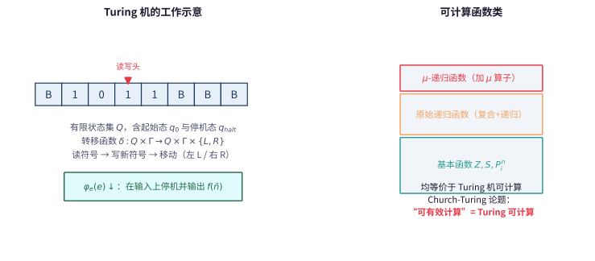

# 第 124 级：递归论 (Recursion Theory)

> 递归论，又称可计算性理论，研究哪些问题是可以机械计算的，哪些问题本质上是不可计算的。它起源于 20 世纪 30 年代 Gödel、Church、Turing 等人的开创性工作，为数学划定了"可计算"的边界。递归论不仅是理论计算机科学的基石，也深刻影响了数理逻辑和数学哲学。

---

## 1. 学习目标

完成本教程后，你应当能够：

1. **理解可计算性的基本概念**——掌握部分递归函数、原始递归函数、μ-递归函数、Turing 机的定义及 Church-Turing 论题。
2. **理解不可判定性**——掌握停机问题的不可判定性、Rice 定理和递归定理。
3. **掌握归约与度**——理解多一归约、Turing 归约、递归可枚举集、Turing 度的概念。
4. **理解 Post 问题与算术层次**——掌握算术层次定理（Post 定理）和解析层次的基本概念。
5. **了解优先方法**——理解 Turing 度稠密性的证明，掌握优先方法的基本思想。
6. **通过示例与习题巩固理论**——完成至少 6 个详细示例和 8 道习题。

---

## 2. 核心概念

### 2.1 可计算函数 (Computable Functions)

**定义**：一个部分函数 $f: \mathbb{N}^k \dashrightarrow \mathbb{N}$ 称为**部分可计算**的，如果存在一个 Turing 机 $M$ 使得对任意输入 $\bar{n}$，$M$ 在输入 $\bar{n}$ 上停机当且仅当 $\bar{n} \in \operatorname{dom}(f)$，且停机时输出 $f(\bar{n})$。

若 $f$ 是部分可计算的且定义域为 $\mathbb{N}^k$，则称 $f$ 是**全可计算**的（或简称可计算的）。

### 2.2 原始递归函数 (Primitive Recursive Functions)

**定义**：原始递归函数由以下基本函数通过复合和原始递归生成：

**基本函数**：
1. 零函数：$Z(x) = 0$
2. 后继函数：$S(x) = x + 1$
3. 投影函数：$P_i^n(x_1, \dots, x_n) = x_i$

**基本运算**：
1. **复合**：若 $g$ 和 $h_1, \dots, h_m$ 是原始递归的，则 $f(\bar{x}) = g(h_1(\bar{x}), \dots, h_m(\bar{x}))$ 是原始递归的。
2. **原始递归**：若 $g$ 和 $h$ 是原始递归的，则由以下定义的 $f$ 是原始递归的：
   $$
   \begin{aligned}
   f(0, \bar{x}) &= g(\bar{x}) \\
   f(n+1, \bar{x}) &= h(n, f(n, \bar{x}), \bar{x})
   \end{aligned}
   $$

### 2.3 μ-递归函数 (μ-Recursive Functions)

**定义**：μ-递归函数是在原始递归函数的基础上添加**μ-算子**（最小化算子）得到的函数类。

μ-算子：若 $g$ 是 $(k+1)$ 元函数，则 $f(\bar{x}) = \mu y [g(y, \bar{x}) = 0]$ 定义为最小的 $y$ 使得 $g(y, \bar{x}) = 0$ 且对所有 $z < y$，$g(z, \bar{x})$ 有定义且不为 0。若不存在这样的 $y$，则 $f(\bar{x})$ 无定义。

**Kleene 正规形定理**：每个部分可计算函数都可以表示为 $f(\bar{x}) \simeq U(\mu y [T(e, \bar{x}, y)])$，其中 $T$ 是原始递归谓词，$U$ 是原始递归函数。

### 2.4 Turing 机 (Turing Machines)

**定义**：一个 Turing 机 $M$ 由以下组成：
- 一个无限长的磁带，被划分为单元格，每个单元格包含一个符号。
- 一个读写头，可以读取和写入磁带上的符号，并可以向左或向右移动。
- 一个有限状态集 $Q$，包含起始状态 $q_0$ 和停机状态 $q_{\text{halt}}$。
- 一个转移函数 $\delta: Q \times \Gamma \to Q \times \Gamma \times \{L, R\}$。

**Church-Turing 论题**：任何直观上"可有效计算"的函数都可以用 Turing 机计算。这一论题不是数学定理，而是对可计算性概念的哲学确认。

> **直观理解（现实类比）**：Turing 机就像一位"一格格走纸带的文员"——他一次只能看一个格子、写一个符号、向左或向右移动一步，靠一张写着"当前状态+看到的符号 → 新状态+写什么+往哪走"的规则表（转移函数 $\delta$）工作。原始递归函数、$\mu$-递归函数和 Turing 机这三套定义最后都算出同一类函数，所以"可计算"这个概念是稳健的（Church-Turing 论题）。

### 2.5 可计算集与可枚举集 (Computable and Computably Enumerable Sets)

**定义**：
- 集合 $A \subseteq \mathbb{N}$ 称为**可计算**的（递归的），如果其特征函数 $\chi_A(x) = 1$ 若 $x \in A$，$0$ 若 $x \notin A$ 是可计算的。
- 集合 $A \subseteq \mathbb{N}$ 称为**可计算可枚举**的 (c.e.)，如果存在可计算函数 $f: \mathbb{N} \to \mathbb{N}$ 使得 $A = \operatorname{ran}(f)$，即 $A$ 是可计算函数的值域。等价地，$A$ 是某个部分可计算函数的定义域。

**基本性质**：
- $A$ 是可计算的当且仅当 $A$ 和 $\mathbb{N} \setminus A$ 都是 c.e. 的。
- 可计算集一定是 c.e. 的，但反之不成立（如停机集 $K$ 是 c.e. 但不可计算）。

### 2.6 归约 (Reductions)

**多一归约 ($\leq_m$)**：$A \leq_m B$ 如果存在可计算函数 $f: \mathbb{N} \to \mathbb{N}$ 使得 $x \in A \iff f(x) \in B$。

**Turing 归约 ($\leq_T$)**：$A \leq_T B$ 如果 $A$ 相对于 $B$ 是可计算的，即存在一个以 $B$ 为 oracle 的 Turing 机可以计算 $A$ 的特征函数。

**性质**：
- $\leq_m$ 蕴含 $\leq_T$（即 $A \leq_m B \implies A \leq_T B$），但反之不成立。
- 若 $A \leq_m B$ 且 $B$ 是可计算的，则 $A$ 是可计算的。
- 若 $A \leq_m B$ 且 $B$ 是 c.e. 的，则 $A$ 是 c.e. 的。

### 2.7 递归可枚举集 / 计算可枚举集 (C.E. Sets)

**定义**：$A \subseteq \mathbb{N}$ 是**计算可枚举**的 (c.e.)，如果存在可计算函数 $f$ 使得 $A = \operatorname{dom}(f)$（即 $f$ 恰好在 $A$ 的元素上停机）。

**标准枚举**：设 $\{W_e\}_{e \in \mathbb{N}}$ 是 c.e. 集的标准枚举，其中 $W_e = \operatorname{dom}(\varphi_e)$，$\varphi_e$ 是第 $e$ 个部分可计算函数。

### 2.8 停机问题 (Halting Problem)

**定义**：停机问题是判定给定 Turing 机在给定输入上是否停机的问题：
$$
K = \{e \mid \varphi_e(e) \downarrow\}
$$
即 $K$ 是第 $e$ 个部分可计算函数在输入 $e$ 上收敛的 $e$ 的集合。

> **直观理解（现实类比）**：停机问题好比"有没有一台万能验票机，能提前判断任何机器会不会永远转下去"。证明用对角线法假设有这样一台机器 $h$，再用它造出一台"故意和它对着干"的机器 $g$——$h$ 说它会停它就不停，$h$ 说它不停它就停，怎么都矛盾。就像"理发师只给不给自己刮胡子的人刮胡子"：到底他给不给自己刮，都说不通，所以万能验票机根本不存在。

### 2.9 Rice 定理

> **定理（Rice）**：设 $\mathcal{C}$ 是部分可计算函数的非平凡类（即 $\mathcal{C}$ 非空且不是全体部分可计算函数）。则集合 $\{e \mid \varphi_e \in \mathcal{C}\}$ 是不可计算的。

### 2.10 递归定理 (Recursion Theorem)

> **定理（Kleene 递归定理）**：对任意可计算函数 $f$，存在 $n$ 使得 $\varphi_n = \varphi_{f(n)}$。

### 2.11 Post 问题与 Turing 度

**Post 问题**：是否存在一个 c.e. 集 $A$ 使得 $\varnothing <_T A <_T K$（即 $A$ 不是可计算的，也不是 Turing 等价于停机问题的）？

**Turing 度**：Turing 归约的等价类。$A \equiv_T B$ 如果 $A \leq_T B$ 且 $B \leq_T A$。Turing 度记作 $\mathbf{a} = \deg_T(A)$。

**Turing 度的结构**：
- $\mathbf{0}$：可计算集的度
- $\mathbf{0}'$：$K$ 的度（完备 c.e. 度）
- 在 $\mathbf{0}$ 和 $\mathbf{0}'$ 之间存在稠密的 c.e. 度结构

### 2.12 算术层次 (Arithmetic Hierarchy)

**定义**：公式的算术层次按量词交替分类：
- $\Sigma^0_0 = \Pi^0_0$：所有有界量词公式（即 $\Delta^0_0$ 公式）
- $\Sigma^0_{n+1}$：形如 $\exists x_1 \cdots \exists x_k \varphi$ 的公式，其中 $\varphi \in \Pi^0_n$
- $\Pi^0_{n+1}$：形如 $\forall x_1 \cdots \forall x_k \varphi$ 的公式，其中 $\varphi \in \Sigma^0_n$
- $\Delta^0_n = \Sigma^0_n \cap \Pi^0_n$

**集合的算术层次**：$A \subseteq \mathbb{N}$ 属于 $\Sigma^0_n$（$\Pi^0_n$）如果 $A$ 可由一个 $\Sigma^0_n$（$\Pi^0_n$）公式定义。

### 2.13 解析层次 (Analytic Hierarchy)

**定义**：解析层次在算术层次上添加集合量词：
- $\Sigma^1_0 = \Pi^1_0$：所有算术公式
- $\Sigma^1_{n+1}$：形如 $\exists X_1 \cdots \exists X_k \varphi$ 的公式，其中 $\varphi \in \Pi^1_n$
- $\Pi^1_{n+1}$：形如 $\forall X_1 \cdots \forall X_k \varphi$ 的公式，其中 $\varphi \in \Sigma^1_n$

### 2.14 Oracle 机 (Oracle Machines)

**定义**：Oracle Turing 机是具有额外 oracle 带的 Turing 机，可以查询给定集合 $A$ 的成员关系。Oracle 机 $M^A$ 计算的函数称为相对于 $A$ 可计算的。

---

## 3. 定理与证明

### 3.1 停机问题的不可判定性

> **定理（停机问题的不可判定性）**：停机集 $K = \{e \mid \varphi_e(e) \downarrow\}$ 不是可计算的。

**证明**（对角线法）：

假设 $K$ 是可计算的。则存在一个可计算函数 $h: \mathbb{N} \to \{0, 1\}$ 使得：
$$
h(e) = \begin{cases}
1 & \text{若 } \varphi_e(e) \downarrow \\
0 & \text{若 } \varphi_e(e) \uparrow
\end{cases}
$$

利用 $h$，构造一个函数 $g: \mathbb{N} \to \mathbb{N}$：
$$
g(n) = \begin{cases}
1 & \text{若 } h(n) = 0 \\
\uparrow & \text{若 } h(n) = 1
\end{cases}
$$

$g$ 是部分可计算的：给定 $n$，先计算 $h(n)$，若 $h(n) = 0$ 则输出 1，否则进入无限循环。

由于 $g$ 是部分可计算的，存在某个索引 $e_0$ 使得 $\varphi_{e_0} = g$。

现在问：$e_0 \in K$ 吗？

- 若 $e_0 \in K$，则 $\varphi_{e_0}(e_0) \downarrow$，即 $g(e_0) \downarrow$，由 $g$ 的定义知 $h(e_0) = 0$，即 $\varphi_{e_0}(e_0) \uparrow$，矛盾。
- 若 $e_0 \notin K$，则 $\varphi_{e_0}(e_0) \uparrow$，即 $g(e_0) \uparrow$，由 $g$ 的定义知 $h(e_0) = 1$，即 $\varphi_{e_0}(e_0) \downarrow$，矛盾。

两种情况都导致矛盾，故假设不成立，$K$ 不可计算。

$\square$

**讨论**：证明的核心是**对角线法**——通过假设 $K$ 可计算构造一个与自身矛盾的部分函数。这是递归论中经典的论证方式。

### 3.2 Rice 定理

> **定理（Rice 定理）**：设 $\mathcal{C}$ 是部分可计算函数的非平凡类（即 $\varnothing \subsetneq \mathcal{C} \subsetneq \{\text{所有部分可计算函数}\}$）。则集合 $I(\mathcal{C}) = \{e \mid \varphi_e \in \mathcal{C}\}$ 是不可计算的。

**证明**（通过停机问题的归约）：

设 $\mathcal{C}$ 是非平凡的部分可计算函数类。不失一般性，假设 $f_\bot$（处处无定义的函数）不在 $\mathcal{C}$ 中（否则考虑 $\mathcal{C}$ 的补集）。

由于 $\mathcal{C}$ 非空，存在某个函数 $g \in \mathcal{C}$。令 $e_g$ 是 $g$ 的一个索引。

我们证明 $K \leq_m I(\mathcal{C})$，即存在可计算函数 $f$ 使得 $x \in K \iff f(x) \in I(\mathcal{C})$。由于 $K$ 不可计算，$I(\mathcal{C})$ 也不可计算。

定义可计算函数 $f$ 如下：对输入 $x$，$f(x)$ 是某个部分可计算函数 $\varphi_{f(x)}$ 的索引，其中：
$$
\varphi_{f(x)}(y) \simeq \begin{cases}
g(y) & \text{若 } \varphi_x(x) \downarrow \\
\uparrow & \text{若 } \varphi_x(x) \uparrow
\end{cases}
$$

即 $\varphi_{f(x)}$ 的行为是：模拟 $\varphi_x(x)$ 的计算，若它停机，则运行 $g(y)$；若不停机，则永远不停机。

**验证**：
- 若 $x \in K$，则 $\varphi_x(x) \downarrow$，故 $\varphi_{f(x)} = g \in \mathcal{C}$，即 $f(x) \in I(\mathcal{C})$。
- 若 $x \notin K$，则 $\varphi_x(x) \uparrow$，故 $\varphi_{f(x)} = f_\bot \notin \mathcal{C}$，即 $f(x) \notin I(\mathcal{C})$。

因此 $x \in K \iff f(x) \in I(\mathcal{C})$，即 $K \leq_m I(\mathcal{C})$。由于 $K$ 不可计算，$I(\mathcal{C})$ 也不可计算。

$\square$

**推论**：以下集合都是不可计算的：
- $\{e \mid \varphi_e \text{ 是全函数}\}$
- $\{e \mid \varphi_e \text{ 是常数函数}\}$
- $\{e \mid \operatorname{dom}(\varphi_e) \text{ 是无限的}\}$

### 3.3 递归定理 (Kleene 递归定理)

> **定理（Kleene 递归定理 / 不动点定理）**：对任意可计算函数 $f: \mathbb{N} \to \mathbb{N}$，存在 $n$ 使得 $\varphi_n = \varphi_{f(n)}$。

**证明**（使用 smn 定理和不动点构造）：

**第一步：smn 定理**

回忆 smn 定理：存在可计算函数 $s: \mathbb{N}^2 \to \mathbb{N}$ 使得对任意部分可计算函数 $\varphi_e(x, y)$ 有：
$$
\varphi_{s(e, x)}(y) \simeq \varphi_e(x, y)
$$
即 $s$ 将参数 $x$ 固化到函数中。

**第二步：构造对角线函数**

定义函数 $d: \mathbb{N} \to \mathbb{N}$：
$$
d(x) = f(s(x, x))
$$
$d$ 是可计算的（因为 $f$ 和 $s$ 都是可计算的）。设 $d$ 的索引为 $e_d$，即 $\varphi_{e_d} = d$。

**第三步：不动点**

令 $n = s(e_d, e_d)$。则：
$$
\varphi_n(y) = \varphi_{s(e_d, e_d)}(y) \simeq \varphi_{e_d}(e_d, y) \simeq d(e_d) = f(s(e_d, e_d)) = f(n)
$$
其中第二步使用了 smn 定理。

因此 $\varphi_n = \varphi_{f(n)}$，$n$ 即为所求的不动点。

$\square$

**讨论**：递归定理是递归论中最深刻的定理之一。它表明在部分可计算函数的索引中，任何可计算变换都有不动点。这类似于某些不动点定理（如 Banach 不动点定理）在递归论中的类比。

### 3.4 Post 定理（算术层次定理）

> **定理（Post 定理）**：
> 1. $A \in \Sigma^0_{n+1}$ 当且仅当 $A$ 是某个 $\Pi^0_n$ 集合的 c.e. 投影（即 $A = \{x \mid \exists y \langle x, y \rangle \in B\}$ 对某个 $B \in \Pi^0_n$）。
> 2. $A \in \Delta^0_{n+1}$ 当且仅当 $A \leq_T \varnothing^{(n)}$，其中 $\varnothing^{(n)}$ 是空集的 $n$ 次 Turing 跳变。
> 3. $\Sigma^0_{n+1}$ 恰好是相对于 $\varnothing^{(n)}$ 的 c.e. 集构成的类。

**证明**（对 $n = 0$ 的情况，即层次定理的基础步）：

**第一部分的证明**：

$A \in \Sigma^0_1$ 当且仅当存在可计算谓词 $R(x, y)$ 使得 $A = \{x \mid \exists y R(x, y)\}$。

($\Rightarrow$) 若 $A \in \Sigma^0_1$，则 $A$ 可由 $\exists y R(x, y)$ 定义，其中 $R$ 是 $\Delta^0_0$（即可计算）谓词。令 $B = \{\langle x, y \rangle \mid R(x, y)\}$，则 $B \in \Delta^0_0 \subseteq \Pi^0_0$，且 $A$ 是 $B$ 的投影。

($\Leftarrow$) 若 $A = \{x \mid \exists y \langle x, y \rangle \in B\}$ 且 $B \in \Pi^0_0 = \Delta^0_0$，则 $B$ 由可计算谓词 $R(x, y)$ 定义，故 $A$ 由 $\exists y R(x, y)$ 定义，即 $A \in \Sigma^0_1$。

**第二部分的证明**（$n = 0$）：

需证 $A \in \Delta^0_1$ 当且仅当 $A$ 是可计算的。

($\Rightarrow$) 若 $A \in \Delta^0_1 = \Sigma^0_1 \cap \Pi^0_1$，则 $A$ 和 $\mathbb{N} \setminus A$ 都是 $\Sigma^0_1$ 的，即 $A$ 和其补集都是 c.e. 的，故 $A$ 是可计算的。

($\Leftarrow$) 若 $A$ 是可计算的，则其特征函数 $\chi_A$ 可计算，$A$ 可由 $\chi_A(x) = 1$ 定义（这是一个 $\Delta^0_0$ 公式），故 $A \in \Delta^0_0 \subseteq \Delta^0_1$。

**对一般 $n$ 的归纳证明**：

假设定理对 $n$ 成立。考虑 $n+1$ 的情况：

$A \in \Sigma^0_{n+1}$ 当且仅当 $A = \{x \mid \exists y \langle x, y \rangle \in B\}$ 对某个 $B \in \Pi^0_n$。

由归纳假设，$B \in \Pi^0_n$ 当且仅当 $\mathbb{N} \setminus B \in \Sigma^0_n$，且 $B \leq_T \varnothing^{(n)}$。

对 $A$ 的判定：$x \in A$ 当且仅当 $\exists y \langle x, y \rangle \in B$。由于 $B \leq_T \varnothing^{(n)}$，$A$ 是相对于 $\varnothing^{(n)}$ 的 c.e. 集，即 $A$ 是 $\Sigma^{0,\varnothing^{(n)}}_1$ 的。由 $n = 0$ 时的结果，$\Sigma^{0,\varnothing^{(n)}}_1 = \Sigma^0_{n+1}$。

$\square$

**推论**：算术层次严格递增——对每个 $n$，$\Sigma^0_n \subsetneq \Sigma^0_{n+1}$ 且 $\Pi^0_n \subsetneq \Pi^0_{n+1}$。

### 3.5 Turing 度的稠密性

> **定理（Turing 度的稠密性）**：在 c.e. Turing 度中，若 $\mathbf{a} < \mathbf{b}$（严格小于），则存在 c.e. 度 $\mathbf{c}$ 使得 $\mathbf{a} < \mathbf{c} < \mathbf{b}$。

**证明**（使用优先方法，Sacks 定理的证明概要）：

设 $A$ 和 $B$ 是 c.e. 集，$\deg_T(A) = \mathbf{a}$，$\deg_T(B) = \mathbf{b}$，且 $A <_T B$。需要构造一个 c.e. 集 $C$ 使得 $A <_T C <_T B$。

**构造策略**：

我们将 $C$ 构造为 $B$ 的相对可计算集，同时确保 $C$ 不是 $A$ 可计算的，且 $B$ 不是 $C$ 可计算的。

**具体要求**：
1. $C \leq_T B$（通过构造保证）
2. $A \leq_T C$（通过构造保证，实际上更强的 $A \leq_T C$ 自动成立）
3. $C \not\leq_T A$（即 $C$ 不是 $A$ 可计算的）
4. $B \not\leq_T C$（即 $B$ 不是 $C$ 可计算的）

**需求**：
- $R_{2e}$：$\Phi^A_e \neq \chi_C$（第 $e$ 个 $A$-oracle 机不能计算 $C$ 的特征函数）
- $R_{2e+1}$：$\Phi^C_e \neq \chi_B$（第 $e$ 个 $C$-oracle 机不能计算 $B$ 的特征函数）

**优先方法**：给需求分配优先级 $R_0 > R_1 > R_2 > \dots$。

**构造步骤**：在阶段 $s$，对每个需求 $R_i$ 尝试满足它。若一个需求被满足，它可能被更高优先级的需求破坏（injure）。

**以 $R_{2e}$ 为例**（使 $C \neq \Phi^A_e$）：

在阶段 $s$，寻找一个 $x$ 使得 $\Phi^{A_s}_e(x) \downarrow = 0$ 且 $x \notin C_s$，则将 $x$ 加入 $C$（即 $C_{s+1} = C_s \cup \{x\}$）。这样，$\Phi^A_e(x) = 0$ 但 $x \in C$，故 $R_{2e}$ 满足。

**以 $R_{2e+1}$ 为例**（使 $B \neq \Phi^C_e$）：

在阶段 $s$，寻找一个 $x$ 使得 $\Phi^{C_s}_e(x) \downarrow = 0$ 且 $x \notin B_s$，则限制 $x$ 不被加入 $B$（但 $B$ 是给定的，我们无法控制 $B$）。实际上，我们通过控制 $C$ 来影响 $\Phi^C_e$ 的计算。

更精确的策略是：当 $R_{2e+1}$ 需要保护一个计算 $\Phi^{C_s}_e(x) \downarrow$ 时，它"冻结"所有在计算中使用到的 $C$ 的 oracle 查询，阻止更高优先级的需求修改这些位置。

**验证**：通过优先方法的精细构造，可以证明所有需求最终都被满足，从而 $A <_T C <_T B$。

$\square$

**注**：上述证明是 Sacks 稠密性定理的高度简化版本。完整的证明需要细致的优先方法论证，包括需求树、损伤控制、有限损伤引理等复杂技术。

---

## 4. 示例

### 示例 1：构造不可判定问题

证明集合 $A = \{e \mid \varphi_e(0) \downarrow\}$ 是不可计算的。

**解**：

使用 Rice 定理。令 $\mathcal{C} = \{f \mid f(0) \downarrow\}$，即所有在输入 0 上收敛的部分可计算函数构成的类。

$\mathcal{C}$ 是非平凡的（处处无定义的函数不在 $\mathcal{C}$ 中，而常数函数 $f(x) = 0$ 在 $\mathcal{C}$ 中）。由 Rice 定理，$I(\mathcal{C}) = \{e \mid \varphi_e \in \mathcal{C}\} = \{e \mid \varphi_e(0) \downarrow\} = A$ 是不可计算的。

### 示例 2：判断集合的算术层次

判断以下集合的算术层次：
1. $A = \{e \mid \varphi_e \text{ 是全函数}\}$
2. $B = \{e \mid W_e \text{ 是无限的}\}$
3. $C = \{e \mid \varphi_e = \varphi_{e+1}\}$

**解**：

1. $A = \{e \mid \forall x \exists y T(e, x, y)\}$，其中 $T$ 是 Kleene 谓词（表示第 $e$ 个 Turing 机在输入 $x$ 上在第 $y$ 步停机）。这是一个 $\forall \exists$ 公式，故 $A \in \Pi^0_2$。实际上，$A$ 是 $\Pi^0_2$-完备的。

2. $B = \{e \mid \forall x \exists y > x \; y \in W_e\}$。$W_e$ 是 c.e. 的，故 $y \in W_e$ 是 $\Sigma^0_1$ 的。因此 $B$ 是 $\forall \exists$ 公式，即 $B \in \Pi^0_2$。实际上，$B$ 是 $\Pi^0_2$-完备的。

3. $C = \{e \mid \forall x (\varphi_e(x) \simeq \varphi_{e+1}(x))\}$。$\varphi_e(x) \simeq \varphi_{e+1}(x)$ 意味着要么两者都收敛且值相等，要么两者都发散。这可以表示为：
   $$
   \forall x ((\exists y T(e, x, y) \land \exists z T(e+1, x, z) \land U(y) = U(z)) \lor (\neg\exists y T(e, x, y) \land \neg\exists z T(e+1, x, z)))
   $$
   这个公式是 $\Pi^0_2$ 的（因为 $\exists y T(e, x, y)$ 是 $\Sigma^0_1$ 的，其否定是 $\Pi^0_1$ 的，所以整体是 $\Pi^0_2$ 的）。实际上，$C \in \Pi^0_2$。

### 示例 3：利用递归定理构造自指程序

使用递归定理构造一个程序 $e$，使得 $\varphi_e(x) = e$ 对所有 $x$ 成立（即输出自己的程序编号）。

**解**：

由 smn 定理，存在可计算函数 $s$ 使得 $\varphi_{s(e, x)}(y) \simeq \varphi_e(x, y)$。

定义可计算函数 $f$ 如下：$f(e)$ 是某个程序 $p$ 的编号，使得 $\varphi_p(x) = e$（即不管输入 $x$ 是什么，都输出常量 $e$）。$f$ 显然是可计算的。

由递归定理，存在 $n$ 使得 $\varphi_n = \varphi_{f(n)}$。而 $\varphi_{f(n)}(x) = n$，故 $\varphi_n(x) = n$ 对所有 $x$ 成立。

### 示例 4：构造一个 $\Sigma^0_2$ 但非 $\Pi^0_2$ 的集合

证明 $A = \{e \mid W_e \text{ 是有限的}\}$ 是 $\Sigma^0_2$ 但非 $\Pi^0_2$ 的。

**解**：

首先，$W_e$ 是有限的当且仅当存在一个上界 $N$，使得对任意 $x > N$，$x \notin W_e$。即：
$$
A = \{e \mid \exists N \forall x (x > N \to x \notin W_e)\}
$$
由于 $x \notin W_e$ 是 $\Pi^0_1$ 的（因为 $W_e$ 是 $\Sigma^0_1$ 的），$A$ 是 $\Sigma^0_2$ 的。

为了证明 $A$ 不是 $\Pi^0_2$ 的，假设 $A$ 是 $\Pi^0_2$ 的，则 $\mathbb{N} \setminus A = \{e \mid W_e \text{ 是无限的}\}$ 是 $\Sigma^0_2$ 的。但无限集 $\{e \mid W_e \text{ 是无限的}\}$ 是 $\Pi^0_2$-完备的（已知结果），因此它不能是 $\Sigma^0_2$ 的（否则算术层次会坍缩）。故 $A$ 不是 $\Pi^0_2$ 的。

### 示例 5：多一归约与 Turing 归约的区别

构造集合 $A$ 和 $B$，使得 $A \leq_T B$ 但 $A \not\leq_m B$。

**解**：

取 $A = K$（停机集），$B = \overline{K}$（停机集的补集）。

由于 $K$ 是 c.e. 但非可计算的，$\overline{K}$ 不是 c.e. 的，故 $K \not\leq_m \overline{K}$（因为若 $K \leq_m \overline{K}$，则 $K$ 作为 $\overline{K}$ 的归约像，$\overline{K}$ 是 co-c.e. 的，而 $K$ 是 c.e. 的，这会导致 $K$ 可计算，矛盾）。

但 $K \leq_T \overline{K}$：因为 $\overline{K}$ 的 oracle 可以回答 $x \in K$ 的问题（只需查询 $x \in \overline{K}$ 的答案并取反）。因此 $K \leq_T \overline{K}$ 且 $K \not\leq_m \overline{K}$。

### 示例 6：Turing 跳变

计算 $\varnothing'$（空集的 Turing 跳变）。

**解**：

Turing 跳变的定义：$A' = \{e \mid \Phi^A_e(e) \downarrow\}$，即相对于 $A$ 的停机集。

$\varnothing' = \{e \mid \Phi^\varnothing_e(e) \downarrow\} = \{e \mid \varphi_e(e) \downarrow\} = K$。

因此，空集的一次跳变就是停机集。$\varnothing'' = K'$ 是相对于 $K$ 的停机集，它是 $\Sigma^0_2$-完备的。

---

## 5. 习题

### 习题 1
**证明**：集合 $\{e \mid \varphi_e \text{ 是常数函数}\}$ 是不可计算的。

**提示**：使用 Rice 定理，或直接将停机问题归约到它。

### 习题 2
**证明**：存在一个不可计算的 c.e. 集 $A$ 使得 $A <_T K$。

**提示**：使用优先方法，构造一个 c.e. 集 $A$ 满足 $A \not\leq_T \varnothing$ 且 $K \not\leq_T A$。这是 Friedberg-Muchnik 定理的内容。

### 习题 3
**证明**：$\{e \mid W_e \text{ 是无限的}\}$ 是 $\Pi^0_2$-完备的。

**提示**：先证明它是 $\Pi^0_2$ 的，再证明任意 $\Pi^0_2$ 集都可以归约到它。

### 习题 4
**证明**：$\{e \mid \varphi_e = \varphi_e\}$（即所有 $e$ 的集合）是可计算的，但 $\{e \mid \varphi_e = \varphi_{e+1}\}$ 是不可计算的。

**提示**：第一个集合是 $\mathbb{N}$ 本身，显然是可计算的。对第二个集合，使用 Rice 定理的推广。

### 习题 5
**证明**：若 $A$ 是 c.e. 的且 $A$ 是无限的，则 $A$ 包含一个无限的可计算子集。

**提示**：由于 $A$ 是 c.e. 的，存在可计算函数 $f$ 枚举 $A$。构造一个递增的可计算子序列。

### 习题 6
**证明**：递归定理蕴含存在 $e$ 使得 $\varphi_e(0) = e$。

**提示**：定义 $f(e)$ 为某个程序，使得 $\varphi_{f(e)}(0) = e$。然后应用递归定理。

### 习题 7
**证明**：若 $A \leq_m B$ 且 $B$ 是 c.e. 的，则 $A$ 是 c.e. 的。

**提示**：设 $f$ 是归约函数。$x \in A \iff f(x) \in B$。由于 $B$ 是 c.e. 的，$B$ 是某个可计算函数 $g$ 的值域。则 $A = \{x \mid \exists y g(y) = f(x)\}$。

### 习题 8
**证明**：$\varnothing'$ 是 $\Sigma^0_1$-完备的。

**提示**：对任意 $\Sigma^0_1$ 集 $A$，存在 $e$ 使得 $A = W_e$。构造归约函数 $f(x) = s(e, x)$ 使得 $x \in A \iff f(x) \in \varnothing'$。

---

## 6. 总结

递归论为"可计算性"这一概念提供了精确的数学定义和深刻的理论分析。本教程覆盖了以下核心内容：

1. **可计算性模型**：从原始递归函数到 μ-递归函数再到 Turing 机，多个等价的数学模型刻画了同一类可计算函数。Church-Turing 论题确认了这些模型捕捉了"有效可计算性"的直观概念。

2. **不可判定性**：停机问题的不可判定性是递归论的基础性结果，它揭示了存在本质上不可计算的问题。Rice 定理将这一结论推广到了一类广泛的问题——任何关于部分可计算函数的非平凡性质都是不可判定的。

3. **递归定理**：Kleene 递归定理是递归论中最深刻的结果之一，它揭示了计算过程中自指的可能性，类似于 Gödel 不完备定理中的自指构造。

4. **归约与度**：多一归约和 Turing 归约提供了比较问题"难度"的工具。Turing 度结构的研究揭示了可计算性谱系的丰富性——在可计算集和停机问题之间存在一个稠密的度结构。

5. **算术层次**：Post 定理将集合的复杂性与算术公式的量词交替联系起来，给出了判定集合复杂性的一种精确方法。

6. **优先方法**：Friedberg-Muchnik 定理和 Sacks 稠密性定理展示了优先方法在构造具有特定性质的 c.e. 集时的强大威力。这种方法已成为递归论中最基本的构造技术。

递归论与计算机科学有着深刻的联系——复杂性理论、可计算性理论、形式语言理论等都受到递归论的深刻影响。同时，递归论在数学的其他分支（如模型论、集合论、代数）也有重要应用。