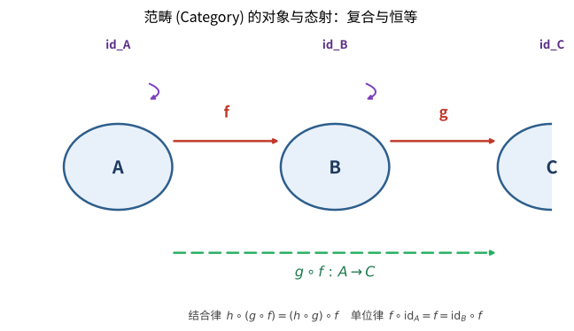

# 第126级 范畴论

## 学习目标

1. 理解范畴的基本定义和常见例子
2. 掌握函子、自然变换和伴随函子的概念
3. 理解Yoneda引理及其在范畴论中的核心地位
4. 掌握极限与余极限的概念及其表示定理
5. 理解Cartesian闭范畴和topos的基本概念
6. 掌握单子理论及其与Kleisli范畴、Eilenberg-Moore范畴的关系
7. 理解Kan扩张和双范畴的概念
8. 了解同调代数中的范畴论方法

---

## 核心概念

### 范畴的定义

一个**范畴** $\mathcal{C}$ 由以下要素构成：

- **对象**（Objects）：$\text{Ob}(\mathcal{C})$ 的全体
- **态射**（Morphisms/Arrows）：对任意 $A, B \in \text{Ob}(\mathcal{C})$，有一个集合 $\text{Hom}_{\mathcal{C}}(A, B)$（或 $\mathcal{C}(A, B)$），称为从 $A$ 到 $B$ 的态射集
- **恒等态射**（Identity）：对每个对象 $A$，存在 $\text{id}_A \in \text{Hom}_{\mathcal{C}}(A, A)$
- **复合**（Composition）：对任意 $f \in \text{Hom}_{\mathcal{C}}(A, B)$，$g \in \text{Hom}_{\mathcal{C}}(B, C)$，存在 $g \circ f \in \text{Hom}_{\mathcal{C}}(A, C)$

满足以下公理：

1. **结合律**：$h \circ (g \circ f) = (h \circ g) \circ f$
2. **单位律**：$f \circ \text{id}_A = f = \text{id}_B \circ f$

> **直观理解（现实类比）**：把范畴想象成一座城市的交通网——对象是"地点"（A、B、C），态射是"路线"（f：A→B，g：B→C）。恒等态射是"原地不动"的路线（id_A），复合则是"先走f再走g"连成一条新路线（g∘f）。结合律就像"先到B再到C再到D，无论怎么分组，最终到达的地点都一样"；单位律则说明"原地不动不会改变你的行程"。正是这种"路线可以连接、可以原地停留"的规则，让范畴成为描述一切关联结构的通用语言。

> **直观理解（现实类比）**：范畴像"数学结构的家族照"——它只关心对象之间有什么态射（道路），而不关心对象内部长什么样。集合、群、拓扑空间、向量空间各自构成一个范畴，它们共享同一套"家族照构图规则"（对象+态射+复合+恒等）。这种"只看关系不看本质"的抽象反而带来力量：一旦某个定理只依赖范畴公理，它就自动适用于所有范畴，从集合论到代数几何一网打尽。范畴论因此被誉为"数学的数学"，提供了一种跨分支的统一语言。

### 基本范畴的例子

- **Set**：集合为对象，函数为态射
- **Grp**：群为对象，群同态为态射
- **Ab**：Abel群为对象，群同态为态射
- **Top**：拓扑空间为对象，连续函数为态射
- **Vect$_k$**：域 $k$ 上的向量空间为对象，线性映射为态射
- **Rng**：环为对象，环同态为态射
- **Pos**：偏序集为对象，单调函数为态射

### 函子

**函子**（Functor）$F: \mathcal{C} \to \mathcal{D}$ 是范畴之间的映射，由以下两部分组成：

- 对象映射：$F: \text{Ob}(\mathcal{C}) \to \text{Ob}(\mathcal{D})$
- 态射映射：$F: \text{Hom}_{\mathcal{C}}(A, B) \to \text{Hom}_{\mathcal{D}}(F(A), F(B))$

满足：
1. $F(\text{id}_A) = \text{id}_{F(A)}$
2. $F(g \circ f) = F(g) \circ F(f)$

**反变函子**（Contravariant Functor）$F: \mathcal{C}^{\text{op}} \to \mathcal{D}$ 将态射方向反转：$F: \text{Hom}_{\mathcal{C}}(A, B) \to \text{Hom}_{\mathcal{D}}(F(B), F(A))$。

> **直观理解（现实类比）**：函子像"翻译官"——它把一个范畴 $\mathcal{C}$ 的对象和态射系统地映射到另一个范畴 $\mathcal{D}$，并保证"路线的连接方式不变"（$F(g\circ f)=F(g)\circ F(f)$）和"原地不动还是原地不动"（$F(\text{id}_A)=\text{id}_{F(A)}$）。这就像把一座城市的地铁图画成另一座城市的地铁图：站点（对象）和线路（态射）一一对应，换乘关系（复合）保持一致。反变函子则是"倒着画"的翻译官，把箭头方向整体翻转，常见于"取对偶"的构造（如 $V\mapsto V^*$ 把向量空间映到其对偶空间）。

### 自然变换

**自然变换**（Natural Transformation）$\eta: F \Rightarrow G$（其中 $F, G: \mathcal{C} \to \mathcal{D}$ 是函子）是一族态射 $\{\eta_A: F(A) \to G(A)\}_{A \in \text{Ob}(\mathcal{C})}$，使得对任意 $f: A \to B$ 在 $\mathcal{C}$ 中，以下交换图成立：

$$
\begin{CD}
F(A) @>{F(f)}>> F(B) \\
@V{\eta_A}VV @VV{\eta_B}V \\
G(A) @>>{G(f)}> G(B)
\end{CD}
$$

即 $\eta_B \circ F(f) = G(f) \circ \eta_A$。

> **直观理解（现实类比）**：函子就像一个"翻译器"——它把范畴 $\mathcal{C}$ 里的每个对象和每条路线不动声色地搬到另一个范畴 $\mathcal{D}$，并且保证"路线的连接方式不变"（$F(g \circ f) = F(g) \circ F(f)$），就像把一本中文棋谱翻译成英文棋谱，棋子走法依然对应。而自然变换则是"两个翻译器之间的统一调整"：它同时把每个对象在两种翻译下的结果连起来，且保证途中任意两条路线都"殊途同归"（交换图成立）。好比两个翻译风格不同的版本，但你能在每页之间找到一致的对照箭头，整体读起来依然连贯。

> **直观理解（现实类比）**：自然变换像"函子间的翻译"——给两个函子 $F,G:\mathcal{C}\to\mathcal{D}$ 之间提供一族系统化的映射 $\eta_A:F(A)\to G(A)$，并要求这族映射与原范畴的态射"协同工作"（交换图 $\eta_B\circ F(f)=G(f)\circ\eta_A$）。这好比两套翻译系统（两个函子）各自把中文原典译成英文，而自然变换是"逐页对照表"：每页（每个对象）给出从一种译本到另一种译本的改写箭头，且任何一段原文无论从哪本译本切入、再改写到另一本，结果都一致。这种"系统性协同"正是"自然"二字的含义——不是零散的拼凑，而是整体协调的转换。

### 伴随函子

**伴随**（Adjunction）是一对函子 $F: \mathcal{C} \to \mathcal{D}$ 和 $G: \mathcal{D} \to \mathcal{C}$，记为 $F \dashv G$，满足对任意 $A \in \mathcal{C}$，$B \in \mathcal{D}$，有自然同构：

$$ \text{Hom}_{\mathcal{D}}(F(A), B) \cong \text{Hom}_{\mathcal{C}}(A, G(B)) $$

伴随由**单位**（unit）$\eta: \text{Id}_{\mathcal{C}} \Rightarrow G \circ F$ 和**余单位**（counit）$\varepsilon: F \circ G \Rightarrow \text{Id}_{\mathcal{D}}$ 完全刻画，满足三角恒等式：

$$ (\varepsilon_F \circ F\eta)_A = \text{id}_{F(A)}, \quad (G\varepsilon \circ \eta_G)_B = \text{id}_{G(B)} $$

### 函子范畴

**函子范畴**（Functor Category）$[\mathcal{C}, \mathcal{D}]$ 或 $\mathcal{D}^{\mathcal{C}}$ 以函子 $F: \mathcal{C} \to \mathcal{D}$ 为对象，以自然变换为态射。

### 可表函子

**可表函子**（Representable Functor）：对任意对象 $A \in \mathcal{C}$，定义共变Hom函子 $\text{Hom}_{\mathcal{C}}(A, -): \mathcal{C} \to \textbf{Set}$ 和反变Hom函子 $\text{Hom}_{\mathcal{C}}(-, A): \mathcal{C}^{\text{op}} \to \textbf{Set}$。

一个函子 $F: \mathcal{C} \to \textbf{Set}$ 称为**可表的**，如果存在 $A \in \mathcal{C}$ 使得 $F \cong \text{Hom}_{\mathcal{C}}(A, -)$。

### 极限与余极限

**极限**（Limit）和**余极限**（Colimit）是范畴论中统一处理各种构造的框架。

给定一个图表 $D: \mathcal{J} \to \mathcal{C}$（$\mathcal{J}$ 是指标范畴）：

- **极限** $\lim D$ 是一个对象连同投影态射 $\pi_j: \lim D \to D(j)$，满足对任意 $f: j \to k$ 在 $\mathcal{J}$ 中，$D(f) \circ \pi_j = \pi_k$，且具有普适性质。
- **余极限** $\text{colim} D$ 是对偶概念。

特殊情形：
- 积（Product）：$\mathcal{J}$ 是离散范畴
- 等化子（Equalizer）：$\mathcal{J} = \bullet \rightrightarrows \bullet$
- 拉回（Pullback）：$\mathcal{J} = \bullet \to \bullet \leftarrow \bullet$
- 终对象（Terminal Object）：$\mathcal{J}$ 为空范畴

> **直观理解（现实类比）**：泛性质像"唯一最佳"——用最简性质定义对象，而不描述它的内部构造。比如积 $A\times B$ 是"最通用的配对"：任何能同时投影到 $A$ 和 $B$ 的对象，都唯一地通过它中转。这就像"最通用的插座转换器"——只要你的设备能插进去，就一定能分流到 $A$、$B$ 两个接口，而且这种分流方式是唯一确定的。泛性质的威力在于"用关系定义本质"：积、拉回、极限、自由对象都各自有独特的普适性质，对象本身长什么样反而不重要——只要满足这套"最佳中转站"的规范，它就是被定义的对象（在同构意义下唯一）。

### Cartesian闭范畴

**Cartesian闭范畴**（Cartesian Closed Category, CCC）是满足以下条件的范畴 $\mathcal{C}$：

1. 存在终对象 $1$
2. 对任意 $A, B \in \mathcal{C}$，存在积 $A \times B$
3. 对任意 $A, B \in \mathcal{C}$，存在指数对象 $B^A$（即态射集 $\text{Hom}_{\mathcal{C}}(A, B)$ 的对象版本），使得 $\text{Hom}_{\mathcal{C}}(A \times B, C) \cong \text{Hom}_{\mathcal{C}}(A, C^B)$

### Topos

**Topos**（拓扑斯）是一种特殊的Cartesian闭范畴，具有子对象分类器（subobject classifier）$\Omega$。Topos可以被视为"广义的集合范畴"，在其中可以发展内蕴的数学结构。

### Abel范畴

**Abel范畴**（Abelian Category）是满足以下条件的范畴：
1. 有零对象
2. 有二元积和二元余积（且它们一致，即双积）
3. 每个态射有核和余核
4. 每个单态射是核，每个满态射是余核

Abel范畴是同调代数的自然框架。

### 单子

**单子**（Monad）在范畴 $\mathcal{C}$ 上是一个三元组 $(T, \eta, \mu)$，其中：
- $T: \mathcal{C} \to \mathcal{C}$ 是一个函子
- $\eta: \text{Id}_{\mathcal{C}} \Rightarrow T$ 是单位自然变换
- $\mu: T^2 \Rightarrow T$ 是乘法自然变换

满足：
1. $\mu \circ T\eta = \text{id}_T = \mu \circ \eta_T$（单位律）
2. $\mu \circ T\mu = \mu \circ \mu_T$（结合律）

### Kleisli范畴

给定单子 $(T, \eta, \mu)$ 在 $\mathcal{C}$ 上，**Kleisli范畴** $\mathcal{C}_T$ 是：
- 对象：与 $\mathcal{C}$ 相同
- 态射 $f: A \to B$ 在 $\mathcal{C}_T$ 中对应于 $\mathcal{C}$ 中的态射 $f: A \to T(B)$
- 恒等态射：$\eta_A: A \to T(A)$
- 复合：$g \circ_T f = \mu_C \circ T(g) \circ f$，其中 $f: A \to T(B)$，$g: B \to T(C)$

### Eilenberg-Moore范畴

**Eilenberg-Moore范畴** $\mathcal{C}^T$（或 $T$-代数范畴）是：
- 对象：$T$-代数 $(A, \alpha)$，其中 $\alpha: T(A) \to A$ 满足 $\alpha \circ \eta_A = \text{id}_A$ 和 $\alpha \circ T(\alpha) = \alpha \circ \mu_A$
- 态射 $f: (A, \alpha) \to (B, \beta)$ 是 $\mathcal{C}$ 中的态射 $f: A \to B$，满足 $f \circ \alpha = \beta \circ T(f)$

### Kan扩张

**Kan扩张**（Kan Extension）是函子沿函子的某种"最佳逼近"：

- 左Kan扩张 $\text{Lan}_F(G)$：给定 $F: \mathcal{A} \to \mathcal{B}$，$G: \mathcal{A} \to \mathcal{C}$，$\text{Lan}_F(G): \mathcal{B} \to \mathcal{C}$ 是沿 $F$ 对 $G$ 的最佳左逼近。
- 右Kan扩张 $\text{Ran}_F(G)$ 是对偶概念。

### 双范畴

**双范畴**（Bicategory / 2-Category）是范畴的推广，其中：
- 有对象、1-态射（对象间的态射）和2-态射（1-态射间的态射）
- 结合律和单位律只满足到同构（在严格2-范畴中则是等式）

### 同调代数中的范畴论方法

同调代数在Abel范畴的框架下研究：
- 链复形和同调
- 正合序列和长正合序列
- 导出函子（Ext, Tor）
- 谱序列

---

## 定理与证明

### 定理1：Yoneda引理

**定理**（Yoneda Lemma）：令 $\mathcal{C}$ 是一个范畴，$F: \mathcal{C} \to \textbf{Set}$ 是一个共变函子。对任意对象 $A \in \mathcal{C}$，存在双射：

$$ \text{Nat}(\text{Hom}_{\mathcal{C}}(A, -), F) \cong F(A) $$

其中 $\text{Nat}$ 表示自然变换的集合。而且这个双射在 $A$ 和 $F$ 中是自然的。

**证明**：

**步骤1：构造映射 $\Phi: \text{Nat}(\text{Hom}_{\mathcal{C}}(A, -), F) \to F(A)$**

对任意自然变换 $\eta: \text{Hom}_{\mathcal{C}}(A, -) \Rightarrow F$，定义 $\Phi(\eta) = \eta_A(\text{id}_A)$。

由于 $\eta_A$ 是 $\text{Hom}_{\mathcal{C}}(A, A)$ 到 $F(A)$ 的函数，且 $\text{id}_A \in \text{Hom}_{\mathcal{C}}(A, A)$，所以 $\eta_A(\text{id}_A) \in F(A)$。

**步骤2：构造逆映射 $\Psi: F(A) \to \text{Nat}(\text{Hom}_{\mathcal{C}}(A, -), F)$**

对任意 $x \in F(A)$，定义自然变换 $\Psi(x): \text{Hom}_{\mathcal{C}}(A, -) \Rightarrow F$ 如下：对任意对象 $B \in \mathcal{C}$ 和任意 $f \in \text{Hom}_{\mathcal{C}}(A, B)$，定义：

$$ \Psi(x)_B(f) = F(f)(x) $$

我们需要验证 $\Psi(x)$ 确实是自然变换。即对任意 $g: B \to C$ 在 $\mathcal{C}$ 中，下图交换：

$$
\begin{CD}
\text{Hom}_{\mathcal{C}}(A, B) @>{\text{Hom}_{\mathcal{C}}(A, g)}>> \text{Hom}_{\mathcal{C}}(A, C) \\
@V{\Psi(x)_B}VV @VV{\Psi(x)_C}V \\
F(B) @>>{F(g)}> F(C)
\end{CD}
$$

对任意 $f: A \to B$，左边路径为 $F(g) \circ \Psi(x)_B(f) = F(g) \circ F(f)(x) = F(g \circ f)(x)$，右边路径为 $\Psi(x)_C \circ \text{Hom}_{\mathcal{C}}(A, g)(f) = \Psi(x)_C(g \circ f) = F(g \circ f)(x)$。两者相等，因此 $\Psi(x)$ 是自然变换。

**步骤3：验证 $\Phi$ 和 $\Psi$ 互逆**

首先，对任意 $\eta \in \text{Nat}(\text{Hom}_{\mathcal{C}}(A, -), F)$，证明 $\Psi(\Phi(\eta)) = \eta$。

对任意 $B \in \mathcal{C}$ 和 $f: A \to B$，我们需要证明 $\Psi(\eta_A(\text{id}_A))_B(f) = \eta_B(f)$。

由自然性，对 $f: A \to B$，以下图交换：

$$
\begin{CD}
\text{Hom}_{\mathcal{C}}(A, A) @>{\text{Hom}_{\mathcal{C}}(A, f)}>> \text{Hom}_{\mathcal{C}}(A, B) \\
@V{\eta_A}VV @VV{\eta_B}V \\
F(A) @>>{F(f)}> F(B)
\end{CD}
$$

因此 $\eta_B(f) = \eta_B \circ \text{Hom}_{\mathcal{C}}(A, f)(\text{id}_A) = F(f) \circ \eta_A(\text{id}_A) = F(f)(\Phi(\eta)) = \Psi(\Phi(\eta))_B(f)$。

其次，对任意 $x \in F(A)$，$\Phi(\Psi(x)) = \Psi(x)_A(\text{id}_A) = F(\text{id}_A)(x) = \text{id}_{F(A)}(x) = x$。

因此 $\Phi$ 和 $\Psi$ 互逆，构成双射。

**步骤4：自然性**

双射在 $A$ 和 $F$ 中的自然性意味着对任意 $h: A' \to A$ 和自然变换 $\theta: F \Rightarrow F'$，相应的图交换，这可以通过直接验证得到。$\square$

**米田嵌入**（Yoneda Embedding）：作为推论，函子 $Y: \mathcal{C} \to \textbf{Set}^{\mathcal{C}^{\text{op}}}$，$Y(A) = \text{Hom}_{\mathcal{C}}(-, A)$ 是满忠实嵌入（fully faithful embedding），即范畴 $\mathcal{C}$ 可嵌入到其反变函子范畴中。

### 定理2：极限与余极限的表示定理

**定理**：令 $\mathcal{C}$ 是一个范畴，$\mathcal{J}$ 是一个小范畴。函子 $\lim: [\mathcal{J}, \mathcal{C}] \to \mathcal{C}$（如果存在）是函子 $\Delta: \mathcal{C} \to [\mathcal{J}, \mathcal{C}]$ 的右伴随，其中 $\Delta$ 是**对角函子**（$\Delta(A)(j) = A$，$\Delta(A)(f) = \text{id}_A$）。即 $\lim \dashv \Delta$。

类似地，$\text{colim} \dashv \Delta$（如果存在）。

**证明**：

**步骤1：定义对角函子**

定义 $\Delta: \mathcal{C} \to [\mathcal{J}, \mathcal{C}]$ 如下：
- 对对象 $A \in \mathcal{C}$，$\Delta(A): \mathcal{J} \to \mathcal{C}$ 是常函子：$\Delta(A)(j) = A$，对任意 $f: j \to k$ 在 $\mathcal{J}$ 中，$\Delta(A)(f) = \text{id}_A$
- 对态射 $g: A \to B$ 在 $\mathcal{C}$ 中，$\Delta(g): \Delta(A) \Rightarrow \Delta(B)$ 是自然变换，其分量均为 $g$

**步骤2：定义极限函子**

假设 $\mathcal{C}$ 有所有 $\mathcal{J}$-极限。对每个图表 $D: \mathcal{J} \to \mathcal{C}$，选取极限 $\lim D$ 连同投影 $\pi_j: \lim D \to D(j)$。

**步骤3：建立伴随关系**

我们需要证明对任意 $A \in \mathcal{C}$ 和 $D \in [\mathcal{J}, \mathcal{C}]$，有自然同构：

$$ \text{Hom}_{[\mathcal{J}, \mathcal{C}]}(\Delta(A), D) \cong \text{Hom}_{\mathcal{C}}(A, \lim D) $$

**从左到右**：给定自然变换 $\alpha: \Delta(A) \Rightarrow D$。对每个 $j \in \mathcal{J}$，$\alpha_j: A \to D(j)$。由极限的普适性质，存在唯一的态射 $\bar{\alpha}: A \to \lim D$ 使得 $\pi_j \circ \bar{\alpha} = \alpha_j$ 对所有 $j$ 成立。

**从右到左**：给定 $f: A \to \lim D$，定义自然变换 $\beta = \Delta \text{-}\lim\text{ 的伴随}$：对每个 $j$，$\beta_j = \pi_j \circ f: A \to D(j)$。这构成自然变换，因为对任意 $g: j \to k$，$D(g) \circ \beta_j = D(g) \circ \pi_j \circ f = \pi_k \circ f = \beta_k$。

这两个映射互逆，且自然性容易验证。因此 $\lim \dashv \Delta$。

对偶地，$\text{colim} \dashv \Delta$（左伴随是余极限）。$\square$

### 定理3：Freyd的伴随函子存在定理

**定理**（Freyd's Adjoint Functor Theorem）：设 $\mathcal{C}$ 是完备的（有所有小极限），且局部小范畴。函子 $G: \mathcal{D} \to \mathcal{C}$ 有左伴随当且仅当 $G$ 保持所有小极限且满足**溶液集条件**（Solution Set Condition）：

对任意 $A \in \mathcal{C}$，存在集合 $S \subseteq \text{Ob}(\mathcal{D})$ 和态射族 $\{f_i: A \to G(D_i)\}_{i \in I}$，使得任意 $f: A \to G(D)$ 可分解为 $f = G(g) \circ f_i$ 对某个 $i$ 和 $g: D_i \to D$。

**证明**：

**必要性**：如果 $G$ 有左伴随 $F$，则 $G$ 保持所有极限。对任意 $A \in \mathcal{C}$，态射 $A \to G(D)$ 对应于 $F(A) \to D$。取 $S = \{F(A)\}$ 和 $f_A = \eta_A: A \to G(F(A))$（单位），则溶液集条件自动满足。

**充分性**：假设 $G$ 保持极限且满足溶液集条件。

**步骤1：构造左伴随 $F(A)$**

对给定的 $A \in \mathcal{C}$，考虑所有 $A \to G(D)$ 的态射。由溶液集条件，存在集合 $\{f_i: A \to G(D_i)\}_{i \in I}$ 使得任何 $A \to G(D)$ 都通过某个 $f_i$ 分解。

考虑所有 $D_i$ 的积（在 $\mathcal{D}$ 中），记为 $W = \prod_{i \in I} D_i$（如果 $\mathcal{D}$ 有积）。由于 $G$ 保持极限，$G(W) = \prod_i G(D_i)$。

由积的普适性质，存在唯一的 $h: A \to G(W)$ 使得 $\pi_i \circ h = f_i$。

**步骤2：取等化子**

考虑所有 $W$ 上的**核对**（即所有平行态射 $u, v: W \rightrightarrows X$ 使得 $G(u) \circ h = G(v) \circ h$）。取所有这样的核对的等化子 $e: F(A) \to W$，使得 $u \circ e = v \circ e$ 对所有核对成立。

由于 $G$ 保持等化子，$G(e): G(F(A)) \to G(W)$ 是相应的等化子。由构造，$h$ 通过 $G(e)$ 分解，即存在唯一的 $\eta_A: A \to G(F(A))$ 使得 $G(e) \circ \eta_A = h$。

**步骤3：验证普适性质**

对任意 $f: A \to G(D)$，由溶液集条件，存在 $i$ 和 $g: D_i \to D$ 使得 $f = G(g) \circ f_i$。由积的性质，$f_i = \pi_i \circ h = \pi_i \circ G(e) \circ \eta_A = G(\pi_i \circ e) \circ \eta_A$。

因此 $f = G(g \circ \pi_i \circ e) \circ \eta_A = G(\bar{g}) \circ \eta_A$，其中 $\bar{g} = g \circ \pi_i \circ e: F(A) \to D$。

**步骤4：唯一性**

如果 $g_1, g_2: F(A) \to D$ 都满足 $f = G(g_1) \circ \eta_A = G(g_2) \circ \eta_A$，则 $G(g_1) \circ \eta_A = G(g_2) \circ \eta_A$。由等化子的构造，$g_1 = g_2$。

因此 $F(A)$ 是 $A$ 的"自由对象"（即左伴随在 $A$ 上的值），且 $\eta_A$ 是单位。$\square$

### 定理4：伴随函子保持极限

**定理**：如果 $F: \mathcal{C} \to \mathcal{D}$ 有右伴随 $G: \mathcal{D} \to \mathcal{C}$，则 $F$ 保持所有余极限，$G$ 保持所有极限。

**证明**：

**步骤1：$G$ 保持极限**

设 $D: \mathcal{J} \to \mathcal{D}$ 是一个图表，且 $\lim D$ 存在（在 $\mathcal{D}$ 中）。我们需要证明 $G(\lim D)$ 是 $G \circ D$ 的极限。

对任意 $A \in \mathcal{C}$，由伴随关系：

$$ \text{Hom}_{\mathcal{C}}(A, G(\lim D)) \cong \text{Hom}_{\mathcal{D}}(F(A), \lim D) $$

由极限的表示定理，$\text{Hom}_{\mathcal{D}}(F(A), \lim D) \cong \lim \text{Hom}_{\mathcal{D}}(F(A), D(-))$（Hom函子保持极限）。

而 $\text{Hom}_{\mathcal{D}}(F(A), D(j)) \cong \text{Hom}_{\mathcal{C}}(A, G(D(j)))$，因此：

$$ \text{Hom}_{\mathcal{C}}(A, G(\lim D)) \cong \lim \text{Hom}_{\mathcal{C}}(A, G(D(j))) $$

由Yoneda引理，这意味着 $G(\lim D) \cong \lim (G \circ D)$，且同构由投影态射的像给出。因此 $G$ 保持极限。

**步骤2：$F$ 保持余极限**

对偶地，由伴随关系和对偶的Yoneda引理可证。$\square$

### 定理5：单子的基本定理

**定理**（Basic Theorem of Monads / Comparison Theorem）：给定一个单子 $(T, \eta, \mu)$ 在范畴 $\mathcal{C}$ 上，存在伴随 $F^T \dashv U^T$：

- **Eilenberg-Moore构造**：$F^T: \mathcal{C} \to \mathcal{C}^T$（自由代数函子）和 $U^T: \mathcal{C}^T \to \mathcal{C}$（遗忘函子）构成伴随，且 $T = U^T \circ F^T$。
- **Kleisli构造**：$F_T: \mathcal{C} \to \mathcal{C}_T$ 和 $U_T: \mathcal{C}_T \to \mathcal{C}$ 构成伴随，且 $T = U_T \circ F_T$。

而且，Kleisli范畴是初始的，Eilenberg-Moore范畴是终端的——即任何将 $T$ 分解为伴随的范畴都唯一地通过Kleisli范畴和Eilenberg-Moore范畴的函子。

**证明**：

**Eilenberg-Moore构造**：

定义 $F^T: \mathcal{C} \to \mathcal{C}^T$ 如下：
- 对对象 $A \in \mathcal{C}$，$F^T(A) = (T(A), \mu_A)$，其中 $\mu_A: T(T(A)) \to T(A)$ 是乘法
- 对态射 $f: A \to B$，$F^T(f) = T(f): T(A) \to T(B)$

验证 $F^T(A)$ 是 $T$-代数：
- $\mu_A \circ \eta_{T(A)} = \text{id}_{T(A)}$（由单子单位律）
- $\mu_A \circ T(\mu_A) = \mu_A \circ \mu_{T(A)}$（由单子结合律）

定义 $U^T: \mathcal{C}^T \to \mathcal{C}$ 为遗忘函子：$U^T(A, \alpha) = A$，$U^T(f) = f$。

定义伴随的单位 $\eta': \text{Id}_{\mathcal{C}} \Rightarrow U^T \circ F^T$ 为 $\eta'_A = \eta_A: A \to T(A) = U^T(F^T(A))$。

定义余单位 $\varepsilon': F^T \circ U^T \Rightarrow \text{Id}_{\mathcal{C}^T}$ 为 $\varepsilon'_{(A, \alpha)} = \alpha: (T(A), \mu_A) \to (A, \alpha)$。验证 $\varepsilon'_{(A, \alpha)}$ 是 $T$-代数态射：$\alpha \circ \mu_A = \alpha \circ T(\alpha)$ 由代数条件保证。

验证三角恒等式：
- $U^T(\varepsilon') \circ \eta'_{U^T} = \alpha \circ \eta_A = \text{id}_A$（由代数条件）
- $\varepsilon'_{F^T} \circ F^T(\eta') = \mu_A \circ T(\eta_A) = \text{id}_{T(A)}$（由单子单位律）

因此 $F^T \dashv U^T$，且 $U^T \circ F^T = T$。

**Kleisli构造**：

定义 $F_T: \mathcal{C} \to \mathcal{C}_T$ 如下：
- 对对象 $A$，$F_T(A) = A$
- 对态射 $f: A \to B$，$F_T(f) = \eta_B \circ f: A \to T(B)$（在 $\mathcal{C}_T$ 中）

定义 $U_T: \mathcal{C}_T \to \mathcal{C}$ 如下：
- 对对象 $A$，$U_T(A) = T(A)$
- 对态射 $g: A \to B$ 在 $\mathcal{C}_T$ 中（即 $g: A \to T(B)$ 在 $\mathcal{C}$ 中），$U_T(g) = \mu_B \circ T(g): T(A) \to T(B)$

定义伴随：
- 单位 $\eta'': \text{Id}_{\mathcal{C}} \Rightarrow U_T \circ F_T$：$\eta''_A = \eta_A: A \to T(A)$
- 余单位 $\varepsilon'': F_T \circ U_T \Rightarrow \text{Id}_{\mathcal{C}_T}$：对对象 $A$，$\varepsilon''_A = \text{id}_{T(A)}: T(A) \to T(A)$（在 $\mathcal{C}_T$ 中，即 $\text{id}_{T(A)}: T(A) \to T(T(A))$ 在 $\mathcal{C}$ 中）

验证三角恒等式并确认 $U_T \circ F_T = T$。

**比较定理的陈述**：

对任意伴随 $F \dashv G$ 且 $G \circ F = T$，存在唯一的比较函子 $K: \mathcal{C}_T \to \mathcal{D}$ 和 $L: \mathcal{D} \to \mathcal{C}^T$，使得相应的图交换。Kleisli范畴是"最自由的"分解，Eilenberg-Moore范畴是"最保守的"分解。$\square$

---

## 示例

### 示例1：基本范畴

**Set范畴**：
- 对象：所有集合
- 态射：所有函数
- 积：笛卡尔积 $A \times B$
- 余积：无交并 $A \sqcup B$
- 终对象：单点集 $\{*\}$
- 始对象：空集 $\varnothing$

**Grp范畴**：
- 对象：所有群
- 态射：群同态
- 积：群的直积
- 余积：群的自由积

**Top范畴**：
- 对象：所有拓扑空间
- 态射：连续函数
- 积：乘积拓扑
- 余积：无交并拓扑

### 示例2：伴随函子

**自由-遗忘伴随**：
- $F: \textbf{Set} \to \textbf{Grp}$：将集合映射到其生成的自由群
- $U: \textbf{Grp} \to \textbf{Set}$：遗忘群结构，仅保留底集
- 伴随关系：$F \dashv U$
- 单位 $\eta_X: X \to U(F(X))$：将集合 $X$ 嵌入到自由群中
- 余单位 $\varepsilon_G: F(U(G)) \to G$：自由群到原群的满同态

**积-对角伴随**：
- $\Delta: \mathcal{C} \to \mathcal{C} \times \mathcal{C}$：$\Delta(A) = (A, A)$
- $(- \times -): \mathcal{C} \times \mathcal{C} \to \mathcal{C}$：积函子
- 伴随关系：$\Delta \dashv (- \times -)$

**指数伴随**（在CCC中）：
- $(- \times A): \mathcal{C} \to \mathcal{C}$：乘以 $A$
- $(-)^A: \mathcal{C} \to \mathcal{C}$：指数函子
- 伴随关系：$(- \times A) \dashv (-)^A$
- 即 $\text{Hom}_{\mathcal{C}}(X \times A, B) \cong \text{Hom}_{\mathcal{C}}(X, B^A)$

### 示例3：Yoneda引理的应用

**情况**：$\mathcal{C} = \textbf{Set}$，$A = \{0\}$（单点集），$F = \text{Id}_{\textbf{Set}}$。

Yoneda引理给出：

$$ \text{Nat}(\text{Hom}_{\textbf{Set}}(\{0\}, -), \text{Id}_{\textbf{Set}}) \cong \text{Id}_{\textbf{Set}}(\{0\}) = \{0\} $$

这意味着唯一从 $\text{Hom}_{\textbf{Set}}(\{0\}, -)$ 到 $\text{Id}_{\textbf{Set}}$ 的自然变换是"求值"自然变换。

---

## 习题

### 习题1：范畴的定义

验证以下是否构成范畴：
1. 以自然数为对象，态射 $n \to m$ 为所有 $n \times m$ 实矩阵，复合为矩阵乘法
2. 以所有拓扑空间为对象，态射为同伦类

**提示**：检查结合律和单位律。

### 习题2：函子

证明幂集函子 $P: \textbf{Set} \to \textbf{Set}$ 的两种定义方式：
1. $P(A) = 2^A$（$A$ 的幂集），对 $f: A \to B$，$P(f)(S) = f(S)$（像集）
2. $P(A) = 2^A$，对 $f: A \to B$，$P(f)(T) = f^{-1}(T)$（原像集）

哪个是共变函子？哪个是反变函子？

**提示**：验证 $P(g \circ f) = P(g) \circ P(f)$ 或 $P(g \circ f) = P(f) \circ P(g)$。

### 习题3：自然变换

令 $\text{id}_{\textbf{Set}}: \textbf{Set} \to \textbf{Set}$ 是恒等函子，$P: \textbf{Set} \to \textbf{Set}$ 是幂集函子（共变）。定义 $\eta: \text{id}_{\textbf{Set}} \Rightarrow P$ 为 $\eta_A(a) = \{a\}$（单点集）。验证 $\eta$ 是自然变换。

**提示**：验证对任意 $f: A \to B$，$P(f) \circ \eta_A = \eta_B \circ f$。

### 习题4：Yoneda引理

利用Yoneda引理证明：如果 $\text{Hom}_{\mathcal{C}}(A, -) \cong \text{Hom}_{\mathcal{C}}(B, -)$（作为函子 $\mathcal{C} \to \textbf{Set}$），则 $A \cong B$（在 $\mathcal{C}$ 中同构）。

**提示**：在Yoneda引理中取 $F = \text{Hom}_{\mathcal{C}}(B, -)$，得到 $\text{Nat}(\text{Hom}_{\mathcal{C}}(A, -), \text{Hom}_{\mathcal{C}}(B, -)) \cong \text{Hom}_{\mathcal{C}}(B, A)$。

### 习题5：极限

证明在 $\textbf{Set}$ 中，拉回（pullback）$A \times_C B$ 等于集合 $\{(a, b) \in A \times B \mid f(a) = g(b)\}$，其中 $f: A \to C$，$g: B \to C$。

**提示**：验证普适性质——对任意 $X$ 和 $p: X \to A$，$q: X \to B$ 使得 $f \circ p = g \circ q$，存在唯一的 $u: X \to A \times_C B$。

### 习题6：单子

证明幂集函子 $P: \textbf{Set} \to \textbf{Set}$ 构成一个单子：
- 单位 $\eta_X: X \to P(X)$，$\eta_X(x) = \{x\}$
- 乘法 $\mu_X: P(P(X)) \to P(X)$，$\mu_X(\mathcal{S}) = \bigcup \mathcal{S}$
验证单子律。

**提示**：验证 $\mu_X \circ P(\eta_X) = \text{id}_{P(X)} = \mu_X \circ \eta_{P(X)}$ 和 $\mu_X \circ P(\mu_X) = \mu_X \circ \mu_{P(X)}$。

---

## 总结

在这一级中，我们深入学习了范畴论的核心内容：

1. **范畴与函子**：掌握了范畴的基本定义和常见的范畴例子（Set、Grp、Top等），理解了函子作为范畴间结构保持映射的概念。

2. **自然变换与Yoneda引理**：自然变换是函子之间的映射，Yoneda引理是范畴论中最基本的定理之一，它表明每个函子由其Hom函子唯一确定。米田嵌入将范畴嵌入到其函子范畴中。

3. **伴随函子**：伴随是范畴论中最重要的概念之一，它统一了数学中大量的"自由-遗忘"构造。Freyd的伴随函子存在定理给出了存在左伴随的充要条件。

4. **极限与余极限**：极限统一了积、等化子、拉回等概念，余极限统一了余积、余等化子、推出等概念。极限保持定理表明伴随函子自动保持极限。

5. **单子**：单子源于伴随，但自成体系。Kleisli范畴和Eilenberg-Moore范畴分别给出了单子的最自由和最保守的分解。

6. **Cartesian闭范畴与Topos**：CCC是函数空间存在的范畴框架，topos是更一般的"集合宇宙"。

范畴论被誉为"数学的数学"，它提供了跨越数学各分支的统一语言和视角。在计算机科学中，范畴论在类型论、函数式编程、语义学等领域有着深刻的应用。