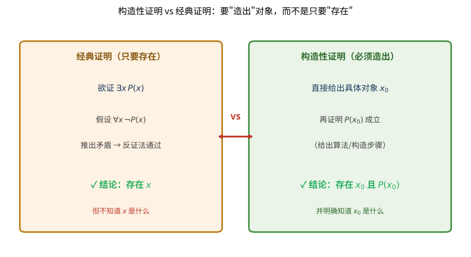

# 第128级 构造性数学

## 学习目标

1. 理解构造性数学的基本哲学立场及其与经典数学的根本区别
2. 掌握构造性逻辑的核心原则，特别是BHK解释和排中律的拒绝
3. 掌握构造性实数的Cauchy序列构造及其基本性质
4. 理解构造性中间值定理与经典版本的差异
5. 掌握构造性代数基本定理的逼近证明方法
6. 理解Brouwer不动点定理的构造性版本
7. 了解构造性分析在连续性和极值问题上的独特处理方式

---

## 核心概念

### 构造性数学的哲学立场

构造性数学（Constructive Mathematics）是数学的一个分支，它要求所有数学存在性证明都必须提供具体的构造方法。与经典数学不同，构造性数学不接受"纯存在性"证明——即通过反证法证明某对象存在却不给出如何找到它的方法。

构造性数学的核心原则是：

- **存在性即构造性**：要证明 $\exists x P(x)$，必须给出一个具体的 $x$ 以及 $P(x)$ 的证明
- **拒绝排中律**：$\phi \lor \neg\phi$ 不被普遍接受，因为对于某些命题，我们既没有 $\phi$ 的证明也没有 $\neg\phi$ 的证明
- **双重否定消去不成立**：$\neg\neg\phi \Rightarrow \phi$ 不被接受

> **直观理解（现实类比）**：经典证明就像有人告诉你"宝藏一定藏在岛上某处"——他通过"如果不在任何地方就矛盾"说服你宝藏存在，却给不出地图。构造性证明则像探险家真的把宝藏挖出来摆在你面前，还附上"它确实在这里"的证据。日常生活中的"找钥匙"最能说明区别：经典方法会证明"钥匙必然在屋里"（因为不在任何一处会矛盾），而构造性方法要求你真正把钥匙从沙发缝里掏出来。数学上这两者常常能给出不同的结论——这正是构造性数学与经典数学划界的核心。

> **直观理解（现实类比）**：构造性证明像"给出实例"——证明存在性必须给出具体例子，不能只用反证法。经典数学允许"假设没有就矛盾，所以必有"这种间接论证，构造性数学却要求你直接拿出一个 $x_0$ 并证明 $P(x_0)$ 成立。这就像法官判案：经典逻辑接受"如果被告不在场就矛盾，所以被告在场"这种间接推理，构造性逻辑却要求出示监控录像这种"直接证据"。代价是某些经典定理（如代数基本定理的精确版本）在构造性框架下不再成立，或只能弱化为"任意逼近"的版本；收益是每个构造性证明都自带"算法"——把证明翻译成程序，就能实际计算出那个被断言存在的对象。

### 构造性逻辑与BHK解释

Brouwer-Heyting-Kolmogorov（BHK）解释为构造性逻辑提供了语义基础：

| 命题类型 | 构造性证明的含义 |
|:---:|:---|
| $\phi \land \psi$ | 一个证明 $p$ 和一个证明 $q$，其中 $p$ 证明 $\phi$，$q$ 证明 $\psi$ |
| $\phi \lor \psi$ | 一个指示 $i$ 和一个证明 $p$，使得如果 $i=0$ 则 $p$ 证明 $\phi$，如果 $i=1$ 则 $p$ 证明 $\psi$ |
| $\phi \to \psi$ | 一个函数 $f$，它将 $\phi$ 的每个证明映射为 $\psi$ 的一个证明 |
| $\exists x \phi(x)$ | 一个对象 $a$ 和一个证明 $p$，使得 $p$ 证明 $\phi(a)$ |
| $\forall x \phi(x)$ | 一个函数 $f$，它将每个对象 $a$ 映射为 $\phi(a)$ 的一个证明 |
| $\neg\phi$ | 一个函数 $f$，它将 $\phi$ 的每个证明映射为矛盾 $\bot$ 的证明 |

### 直觉主义逻辑

直觉主义逻辑是构造性数学的基础逻辑系统，它保留了经典逻辑的大部分规则，但去掉了排中律和双重否定消去。其推理规则包括：

- **引入规则**和**消去规则**（自然演绎风格）
- **爆炸原理**：$\bot \to \phi$（从矛盾可推出任何命题）

直觉主义逻辑中的重言式不一定在经典逻辑中成立，反之亦然。例如，$\neg\neg\phi \to \phi$ 在直觉主义逻辑中不成立。

> **直观理解（现实类比）**：排中律失效，就像即使面对一个悬而未决的科学难题（比如"宇宙中是否存在外星生命"），经典逻辑也坚称"要么是、要么不是"必居其一；而直觉主义逻辑则说"在真正找到证据之前，我既不能断定是，也不能断定不是"。更生活化的例子是"明天是否下雨"：经典逻辑断言"明天要么下雨要么不下雨"，直觉主义者却反问——在我还没查看天气预报之前，凭什么要我在这两个都未证实的选择里选边站？直觉主义把"可证明"当作"真"的门槛，这正是它与经典逻辑最根本的分歧。

> **直观理解（现实类比）**：排中律的拒绝像"不站队"——构造性数学不假设 $P$ 或 $\lnot P$ 必有一真，除非你能证明其中一个。经典逻辑把"未被证伪"等同于"可接受为真"，构造性逻辑则要求"已被证明"才算真。这就像法庭上的无罪推定：经典逻辑说"要么有罪要么无罪"，构造性逻辑说"在出示有罪证据或无罪证据之前，两者都不成立"。这种谨慎带来的代价是某些经典推理失效（如双重否定消去 $\lnot\lnot P\Rightarrow P$），收益是所有被构造性证明的命题都附带"构造方法"——真，就意味着"可被构造"，数学真理与可计算性牢牢绑定。

> **直观理解（现实类比）**：Brouwer 直觉主义像"数学是心智构造"——数学对象只在能被心智构造时才存在，独立于任何外在"客观实在"。Brouwer 认为，自然数不是"早已存在"等待发现的客体，而是"心智一次次执行后继运算"的过程产物；实数不是"完备的连续统"，而是"可以无限逼近的构造序列"。这就像音乐不是"早已写好的乐谱"，而是"演奏者一次次发声的进行时"——没有演奏，就没有音乐；没有构造，就没有数学对象。这种立场把数学从"发现"重新定义为"创造"，也解释了为什么直觉主义者拒绝排中律：对于一个尚未被构造的对象，"它存在或不存在"这种二选一没有意义。

### 构造性实数

在构造性数学中，实数不能通过Dedekind分割来定义（因为分割通常涉及不可判定的条件），而必须通过Cauchy序列来构造。

**定义**：一个构造性实数是一个有理数序列 $(x_n)_{n \in \mathbb{N}}$，满足：
$$\forall m,n \geq N,\ |x_m - x_n| < \frac{1}{k}$$

即，存在一个明确的模函数（modulus of convergence）$M: \mathbb{N} \to \mathbb{N}$，使得：
$$\forall k \in \mathbb{N},\ \forall m,n \geq M(k),\ |x_m - x_n| < \frac{1}{k}$$

两个构造性实数 $(x_n)$ 和 $(y_n)$ 相等，如果：
$$\forall k \in \mathbb{N},\ \exists N \in \mathbb{N},\ \forall n \geq N,\ |x_n - y_n| < \frac{1}{k}$$

### 构造性选择

构造性数学中的选择公理需要谨慎处理。可数选择（Countable Choice）在大多数构造性数学流派中被接受，但完全选择公理通常不被接受，因为它能推出排中律。

**Bishop的构造性数学**接受可数选择和依赖选择，但拒绝一般选择公理。

### 连续性原理

构造性分析中，一个重要的原理是**连续性原理**：所有从 $\mathbb{R}$ 到 $\mathbb{R}$ 的函数都是连续的。这一原理在Brouwer的直觉主义数学中成立，但在Bishop的构造性数学中不假设（但也不否认）。

> **直观理解（现实类比）**：可计算性像"算法可实现"——构造性数学中每个存在性证明都对应一个算法，证明 $\exists x\,P(x)$ 就等于给出一个能算出 $x$ 的程序。这把"存在"和"可计算"焊接在一起：经典数学里"存在但不可计算的对象"在构造性框架里根本不存在。连续性原理也是同一思路的延伸——所有能被构造的函数必然连续，因为"构造"意味着能从输入的有限信息算出输出的任意精度，而不连续函数需要"精确知道一个实数"才能决定输出值跳到哪一侧，这种"全知"无法被任何有限算法实现。Bishop 的构造性数学更温和，不强加连续性，但依然坚持"存在即算法可构造"的核心信条。

---

## 定理与证明

### 定理1：构造性实数的基本性质

**定理**：构造性实数在加法、乘法、序关系下构成一个交换域，但序关系是"不可判定"的——即对于构造性实数 $a$ 和 $b$，$a \leq b$ 或 $b \leq a$ 不一定可判定。

**证明**（用Cauchy序列构造）：

**步骤1：构造性实数的加法**

设 $a = (a_n)$ 和 $b = (b_n)$ 是两个构造性实数，定义它们的和为：
$$a + b = (a_n + b_n)$$

我们需要验证 $(a_n + b_n)$ 是Cauchy序列。给定 $k \in \mathbb{N}$，设 $N = \max(M_a(2k), M_b(2k))$，其中 $M_a$ 和 $M_b$ 分别是 $a$ 和 $b$ 的模函数。则对于任意 $m,n \geq N$：
$$|(a_m + b_m) - (a_n + b_n)| \leq |a_m - a_n| + |b_m - b_n| < \frac{1}{2k} + \frac{1}{2k} = \frac{1}{k}$$

**步骤2：构造性实数的乘法**

设 $a = (a_n)$ 和 $b = (b_n)$ 是两个构造性实数，且已知它们有界（即存在 $B$ 使得 $|a_n|, |b_n| \leq B$ 对所有 $n$ 成立）。定义：
$$a \cdot b = (a_n b_n)$$

验证Cauchy性质：对于 $m,n \geq N$，
$$|a_m b_m - a_n b_n| \leq |a_m b_m - a_m b_n| + |a_m b_n - a_n b_n|$$
$$\leq |a_m| \cdot |b_m - b_n| + |b_n| \cdot |a_m - a_n|$$
$$< B \cdot \frac{1}{2kB} + B \cdot \frac{1}{2kB} = \frac{1}{k}$$

其中 $N$ 选择使得 $|a_m - a_n|, |b_m - b_n| < \frac{1}{2kB}$ 对所有 $m,n \geq N$ 成立。

**步骤3：构造性实数的序关系**

在构造性数学中，序关系 $a < b$ 定义为存在 $k$ 和 $N$ 使得对任意 $n \geq N$，$a_n + \frac{1}{k} < b_n$。而 $a \leq b$ 定义为 $\neg(b < a)$。

关键在于，$a \leq b$ 或 $a \geq b$ 不一定可判定。例如，考虑序列 $a_n = \sum_{i=0}^n \frac{(-1)^i}{2^i}$（收敛到 $\frac{2}{3}$）和 $b_n = 0$。虽然我们可以证明 $a > 0$，但如果 $a$ 和 $b$ 非常接近，我们可能无法在有限步内判定大小关系。

**步骤4：构造性实数域的结构**

构造性实数在加法下构成交换群（零元为 $(0,0,0,\ldots)$，负元为 $(-a_n)$），在乘法下构成交换半群（单位元为 $(1,1,1,\ldots)$），且满足分配律。因此，构造性实数构成一个交换环。对于 $a \neq 0$（即存在 $k$ 和 $N$ 使得 $|a_n| > \frac{1}{k}$ 对 $n \geq N$ 成立），可定义乘法逆元。

因此，构造性实数构成一个域，但序关系是部分序而非全序——这正是构造性数学的本质特征。

### 定理2：构造性中间值定理

**定理**：设 $f: [a,b] \to \mathbb{R}$ 是构造性连续函数，且 $f(a) < 0 < f(b)$。则对于任意 $\varepsilon > 0$，存在 $x \in [a,b]$ 使得 $|f(x)| < \varepsilon$。

**注意**：经典中间值定理断言存在精确的 $x$ 使得 $f(x) = 0$，但在构造性数学中，我们只能保证可以任意逼近零点。

**证明**（用二分法）：

**步骤1：构造二分序列**

定义区间序列 $[a_n, b_n]$ 如下：
- 初始：$a_0 = a$，$b_0 = b$
- 对 $n \geq 0$，设 $c_n = \frac{a_n + b_n}{2}$

现在，我们需要判断 $f(c_n)$ 的符号。在构造性数学中，由于 $f(c_n)$ 是一个构造性实数，我们不能直接判定 $f(c_n) < 0$、$f(c_n) = 0$ 或 $f(c_n) > 0$——这是一个不可判定问题。

**步骤2：构造性逼近策略**

给定 $\varepsilon > 0$，我们使用以下策略：
- 由于 $f$ 是构造性连续的，存在模函数 $\omega$ 使得：
  $$|x - y| < \delta 时，|f(x) - f(y)| < \varepsilon$$
- 选择 $N$ 使得 $\frac{b-a}{2^N} < \delta$

**步骤3：构造性二分过程**

对于 $n = 0, 1, 2, \ldots, N$：
- 如果 $f(c_n) < 0$，设 $a_{n+1} = c_n$，$b_{n+1} = b_n$
- 如果 $f(c_n) > 0$，设 $a_{n+1} = a_n$，$b_{n+1} = c_n$

在构造性数学中，我们可以在有限步内判定 $f(c_n)$ 是否远离零，因为 $f(c_n)$ 是一个构造性实数，我们可以计算其有理逼近到足够精度。

**步骤4：收敛性**

经过 $N$ 步后，区间长度 $b_N - a_N = \frac{b-a}{2^N} < \delta$。由连续性，对任意 $x \in [a_N, b_N]$：
$$|f(x) - f(a_N)| < \varepsilon$$

由于 $f(a_N) < 0$ 且 $f(b_N) > 0$，由中间值性质（在构造性数学中，连续函数在区间上的值会覆盖一个区间），我们可以取 $x = \frac{a_N + b_N}{2}$，则存在 $x$ 使得 $|f(x)| < \varepsilon$。

**步骤5：构造性意义**

这个证明是构造性的，因为它给出了一个明确的计算程序：给定所需的精度 $\varepsilon$，我们可以通过有限步二分法找到满足条件的 $x$。但精确的零点可能不存在——这正是构造性数学与经典数学的关键区别。

### 定理3：构造性代数基本定理

**定理**（构造性版本）：每个非常数复系数多项式 $p(z) = a_n z^n + a_{n-1} z^{n-1} + \cdots + a_0$（$a_n \neq 0$，$n \geq 1$）都有任意精度的近似根。即，对于任意 $\varepsilon > 0$，存在 $z \in \mathbb{C}$ 使得 $|p(z)| < \varepsilon$。

**证明**（用构造性方法逼近根）：

**步骤1：最小模原理的构造性版本**

设 $p(z)$ 为非常数多项式。考虑函数 $f(z) = |p(z)|$。$f$ 在 $\mathbb{C}$ 上连续，且当 $|z| \to \infty$ 时 $f(z) \to \infty$。因此，$f$ 在某个紧致区域 $D_R = \{z \in \mathbb{C} : |z| \leq R\}$ 上达到最小值。

在构造性数学中，我们首先需要找到这样一个 $R$。由于 $p(z) = a_n z^n + \cdots$，当 $|z|$ 足够大时，$|p(z)| \geq \frac{|a_n|}{2}|z|^n$。取 $R$ 使得 $\frac{|a_n|}{2}R^n > |p(0)| = |a_0|$，则最小值一定在 $D_R$ 内部达到。

**步骤2：构造最小值逼近序列**

我们构造一个序列 $z_k$，使得 $|p(z_k)|$ 单调递减。从 $z_0 = 0$ 开始。假设已经得到 $z_k$，我们在 $z_k$ 附近搜索更优的点。

设 $p(z_k) = r_k e^{i\theta_k}$。如果 $r_k = 0$，则 $z_k$ 已经是精确根。否则，考虑方向 $d$ 使得 $p(z_k + t d)$ 的模减小。由多项式展开：
$$p(z_k + t d) = p(z_k) + p'(z_k) t d + O(t^2)$$

选择 $d$ 使得 $p'(z_k) d$ 指向 $-p(z_k)$ 的方向，即取 $d = -\overline{p'(z_k)} p(z_k)$。

**步骤3：构造性下降**

对于充分小的 $t > 0$：
$$|p(z_k + t d)|^2 = |p(z_k)|^2 - 2t|p(z_k)|^2|p'(z_k)|^2 + O(t^2)$$

由于 $p$ 非常数，$p'(z_k)$ 不可能在所有点都为零（否则 $p$ 是常数）。我们可以通过搜索找到 $t$ 使得 $|p(z_k + t d)| < |p(z_k)|$。

**步骤4：收敛性证明**

序列 $\{|p(z_k)|\}$ 是单调递减且有下界（$0$）的实数序列，因此收敛到某个极限 $L \geq 0$。

假设 $L > 0$，则存在 $z_k$ 使得 $|p(z_k)|$ 接近 $L$。在 $z_k$ 处，上述下降过程会给出一个更小的值，与 $L$ 是下确界矛盾。因此 $L = 0$。

**步骤5：构造性逼近**

给定 $\varepsilon > 0$，通过上述过程，在有限步内我们可以找到 $z$ 使得 $|p(z)| < \varepsilon$。这给出了一个构造性算法，可以在任意精度下逼近多项式的根。

### 定理4：Brouwer不动点定理的构造性版本

**定理**（构造性版本）：设 $f: D^n \to D^n$ 是单位闭球 $D^n$ 上的构造性一致连续函数。则对于任意 $\varepsilon > 0$，存在 $x \in D^n$ 使得 $|f(x) - x| < \varepsilon$。

**注意**：经典Brouwer不动点定理断言存在精确的不动点（$f(x) = x$），而在构造性版本中，我们只能保证存在 $\varepsilon$-近似不动点。

**证明思路**：

**步骤1：单纯形逼近**

将单位球 $D^n$ 三角剖分为足够小的单纯形网格。对于每个顶点 $v$，计算 $f(v)$。如果 $f(v)$ 与 $v$ 足够接近，则 $v$ 就是所需的近似不动点。

**步骤2：Sperner引理的构造性版本**

Sperner引理在构造性数学中成立：对于带有适当标记的单纯形剖分，存在一个完全标记的单纯形。这个证明是构造性的——通过有限步搜索可以找到这样的单纯形。

**步骤3：构造性搜索**

沿着Sperner引理给出的路径，我们可以构造一个序列，其极限点就是近似不动点。由于我们只要求 $\varepsilon$-近似，有限步搜索即可完成。

**步骤4：收敛性分析**

给定 $\varepsilon > 0$，选择剖分足够细（网格直径 $< \delta$，其中 $\delta$ 由 $f$ 的一致连续性模给出），使得每个完全标记的单纯形中的点 $x$ 满足 $|f(x) - x| < \varepsilon$。

这个证明是构造性的，因为它给出了一个有限算法来找到近似不动点。

### 定理5：构造性极值定理

**定理**：设 $f: [a,b] \to \mathbb{R}$ 是构造性连续函数。则对于任意 $\varepsilon > 0$，存在 $x \in [a,b]$ 使得 $f(x) > \sup f - \varepsilon$。

**注意**：经典极值定理断言 $f$ 在闭区间上达到最大值，但在构造性数学中，我们只能保证可以任意逼近上确界。

**证明**：

**步骤1：构造上确界逼近序列**

由于 $f$ 是构造性连续函数，它在 $[a,b]$ 上有界且一致连续。设 $M = \sup\{f(x) : x \in [a,b]\}$。虽然在构造性数学中我们不能直接处理 $M$ 作为实数，但我们可以构造一个有理数序列来逼近它。

**步骤2：网格搜索**

将 $[a,b]$ 等分为 $N$ 个子区间，$a = x_0 < x_1 < \cdots < x_N = b$，其中 $x_i = a + \frac{i(b-a)}{N}$。

计算 $f(x_i)$ 的足够精确的有理逼近。设 $m_N = \max\{f(x_0), f(x_1), \ldots, f(x_N)\}$。

**步骤3：误差分析**

由一致连续性，存在 $\delta > 0$ 使得 $|x - y| < \delta$ 时 $|f(x) - f(y)| < \varepsilon$。选择 $N$ 使得 $\frac{b-a}{N} < \delta$。

则对于任意 $x \in [a,b]$，存在某个 $x_i$ 使得 $|x - x_i| < \delta$，从而 $|f(x) - f(x_i)| < \varepsilon$。因此：
$$\sup f - m_N < \varepsilon$$

**步骤4：构造性逼近**

取 $x$ 为达到 $m_N$ 的那个网格点。则 $f(x) = m_N > \sup f - \varepsilon$。这给出了一个构造性算法，可以在任意精度下逼近最大值点。

---

## 示例

### 示例1：构造性实数运算

**问题**：设 $a = (1, \frac{1}{2}, \frac{1}{3}, \ldots, \frac{1}{n}, \ldots)$ 和 $b = (0, \frac{1}{2}, \frac{2}{3}, \ldots, \frac{n-1}{n}, \ldots)$ 是两个构造性实数。计算 $a + b$ 和 $a \cdot b$ 的前5项。

**解**：

$a$ 的Cauchy序列：$a_n = \frac{1}{n}$，收敛到 $0$。
$b$ 的Cauchy序列：$b_n = \frac{n-1}{n} = 1 - \frac{1}{n}$，收敛到 $1$。

$a + b$ 的序列：$a_n + b_n = \frac{1}{n} + \frac{n-1}{n} = 1$，收敛到 $1$。

$a \cdot b$ 的序列：$a_n \cdot b_n = \frac{1}{n} \cdot \frac{n-1}{n} = \frac{n-1}{n^2}$。

前5项：$0, \frac{1}{4}, \frac{2}{9}, \frac{3}{16}, \frac{4}{25}$。当 $n \to \infty$ 时，$\frac{n-1}{n^2} \to 0$。

### 示例2：构造性连续函数的性质

**问题**：证明函数 $f(x) = x^2$ 在 $[0,1]$ 上是构造性一致连续的。

**解**：

对于任意 $x, y \in [0,1]$：
$$|f(x) - f(y)| = |x^2 - y^2| = |x - y| \cdot |x + y| \leq 2|x - y|$$

因此，给定 $\varepsilon > 0$，取 $\delta = \frac{\varepsilon}{2}$，则当 $|x - y| < \delta$ 时：
$$|f(x) - f(y)| \leq 2|x - y| < 2\delta = \varepsilon$$

这给出了一个明确的模函数 $\omega(\varepsilon) = \frac{\varepsilon}{2}$，因此 $f$ 是构造性一致连续的。

### 示例3：构造性存在性证明与非构造性证明的对比

**经典证明**：证明存在无理数 $a, b$ 使得 $a^b$ 是有理数。
- 考虑 $\sqrt{2}^{\sqrt{2}}$。如果它是有理数，则取 $a = b = \sqrt{2}$，结论成立。
- 如果它是无理数，则取 $a = \sqrt{2}^{\sqrt{2}}$，$b = \sqrt{2}$，则 $a^b = (\sqrt{2}^{\sqrt{2}})^{\sqrt{2}} = \sqrt{2}^2 = 2$，是有理数。
- 这个证明使用了排中律，没有给出具体的 $a, b$。

**构造性证明**：取 $a = \sqrt{2}$，$b = \log_2 9$。由于 $\log_2 9$ 是无理数（否则存在 $p/q$ 使得 $2^{p/q} = 9$，即 $2^p = 9^q$，矛盾），且 $a^b = 2^{\log_2 9} = 9$ 是有理数。这个证明直接给出了具体的构造。

---

## 习题

### 习题1：构造性逻辑

证明在直觉主义逻辑中，$\neg\neg\neg\phi \to \neg\phi$ 是定理，但 $\neg\neg\phi \to \phi$ 不是定理。

**提示**：使用BHK解释。对于前者，假设有 $f: \neg\neg\neg\phi$（即 $f$ 将 $\neg\neg\phi$ 的每个证明映射为矛盾），构造一个将 $\phi$ 的每个证明映射为矛盾的函数。对于后者，考虑命题 $\phi = \exists x (x > 0 \land x^2 < 2)$ 在有理数域中的情况。

### 习题2：构造性实数

证明：如果 $(a_n)$ 和 $(b_n)$ 是构造性实数，且 $a_n \leq b_n$ 对所有 $n$ 成立，则 $a \leq b$。

**提示**：使用 $a \leq b$ 的构造性定义 $\neg(b < a)$。假设 $b < a$，导出矛盾。

### 习题3：构造性中间值定理

设 $f(x) = x^3 - 2$ 在区间 $[1, 2]$ 上。给定 $\varepsilon = 0.001$，用构造性二分法求出 $x$ 使得 $|f(x)| < \varepsilon$。

**提示**：手动执行二分法，计算每一步的 $f(c_n)$，判断符号，直到区间长度小于 $\delta$ 使得 $f$ 的变化小于 $\varepsilon$。

### 习题4：构造性存在性

在构造性数学中，证明：如果 $A$ 是有限集且 $B \subseteq A$，则 $B$ 也是有限集。这个证明在经典数学中平凡，但在构造性数学中需要小心。

**提示**：使用数学归纳法。关键在于构造性地确定 $B$ 的元素个数。

### 习题5：构造性代数基本定理

对于多项式 $p(z) = z^2 + 1$，用构造性方法寻找一个 $\varepsilon = 0.1$ 的近似根。

**提示**：从 $z_0 = 0$ 开始，计算 $p(z_0) = 1$，$p'(z_0) = 0$。由于 $p'(0) = 0$，需要改用 $z_0 = 1$ 重新开始。

---

## 总结

构造性数学代表了数学基础研究中的一个重要流派，它通过要求所有存在性证明都提供具体的构造方法，重塑了我们对数学真理的理解。本级别涵盖的核心内容总结如下：

| 主题 | 核心内容 |
|:---|:---|
| **构造性逻辑** | BHK解释为构造性证明提供了语义基础，排中律和双重否定消去不被接受 |
| **构造性实数** | 通过Cauchy序列构造，序关系不可判定，构成交换域但不具备全序性质 |
| **构造性中间值定理** | 只能保证任意逼近零点，不能保证精确存在 |
| **构造性代数基本定理** | 多项式存在任意精度的近似根，可通过下降法构造 |
| **Brouwer不动点定理** | 构造性版本保证 $\varepsilon$-近似不动点的存在性 |
| **构造性极值定理** | 可以任意逼近上确界，但不保证达到精确最大值 |

构造性数学的核心洞见在于：**数学存在性必须有构造性含义**。这一立场不仅具有哲学意义，还对计算科学产生了深远影响——构造性证明可以直接转化为算法，构造性数学与计算理论、类型论有着天然的联系。

在下一级别中，我们将探讨非标准分析——另一种对经典数学的重新诠释，它通过引入无限小和无限大来简化分析学。