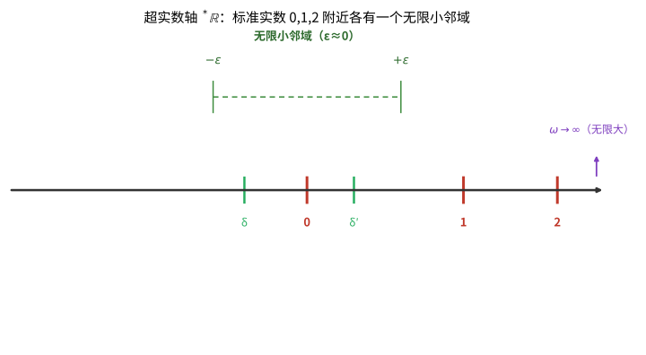

# 第129级 非标准分析

## 学习目标

1. 理解非标准分析的基本思想：引入无限小和无限大来简化分析学
2. 掌握超实数的超幂构造方法和Loś定理
3. 掌握标准部分定理及其在微积分中的应用
4. 理解转移原理的表述和意义
5. 掌握非标准微积分基本定理的证明
6. 理解Loeb测度的构造及其在测度论中的应用
7. 了解非标准分析在泛函分析、概率论等领域的拓展

---

## 核心概念

### 非标准分析的基本思想

非标准分析（Nonstandard Analysis）由Abraham Robinson在20世纪60年代创立，其核心思想是：通过模型论的方法，构造一个包含"无限小"和"无限大"实数的**超实数系**$^*\mathbb{R}$，使得经典数学中的每个定理在超实数系中都有一个"非标准版本"，同时可以通过**转移原理**在标准与非标准之间自由切换。

非标准分析的核心优势在于：许多经典分析中的 $\varepsilon-\delta$ 论证可以被简化为更直观的无限小推理。

### 超实数

超实数系 $^*\mathbb{R}$ 是实数系 $\mathbb{R}$ 的一个真扩张，它包含：
- **标准实数**：$\mathbb{R}$ 中的每个元素
- **无限小**：绝对值小于所有正标准实数的超实数，记为 $\varepsilon \approx 0$
- **无限大**：绝对值大于所有标准实数的超实数，记为 $\omega$（即 $|\omega| > n$ 对所有 $n \in \mathbb{N}$ 成立）

**性质**：
- 无限小的倒数（如果非零）是无限大
- 有限超实数可以表示为：标准实数 + 无限小
- 超实数系是实数域的初等扩张

> **直观理解（现实类比）**：把超实数轴想象成一条"放大了无数倍"的实数轴。在普通实数轴上，0 附近被看作一个点；但在超实数轴上，0 周围有一圈肉眼看不见的"绒毛"——这就是无限小邻域，里面挤满了与 0 相差一个无限小 $\varepsilon$ 的超实数。就好比在显微镜下，一个看似光滑的桌面上其实布满了细小的凹凸。无限小不是"零"，却比任何正实数都小；它的倒数就是比任何实数都大的无限大 $\omega$。有了这些"绒毛"，微积分中"趋近"的极限思想就变成了直接在邻域内取标准部分的直观运算。

### 超幂构造

超实数系 $^*\mathbb{R}$ 可以通过超幂构造得到：

$$^*\mathbb{R} = \mathbb{R}^{\mathbb{N}} / \mathcal{U}$$

其中 $\mathcal{U}$ 是 $\mathbb{N}$ 上的一个自由超滤（free ultrafilter）。具体来说：
- $\mathbb{R}^{\mathbb{N}}$ 是所有实数序列 $(a_1, a_2, a_3, \ldots)$ 的集合
- 两个序列 $(a_n)$ 和 $(b_n)$ 在超滤 $\mathcal{U}$ 下等价，如果 $\{n : a_n = b_n\} \in \mathcal{U}$
- 超实数 $[a_n]$ 是序列 $(a_n)$ 在等价关系下的等价类

### Loś定理

Loś定理（也称超幂基本定理）是超幂构造的核心定理，它告诉我们哪些命题在超幂结构中成立。

**定理**：对于任意一阶公式 $\phi(x_1, \ldots, x_k)$ 和超实数 $[a^1_n], \ldots, [a^k_n]$：
$$^*\mathbb{R} \models \phi([a^1_n], \ldots, [a^k_n]) \iff \{n \in \mathbb{N} : \mathbb{R} \models \phi(a^1_n, \ldots, a^k_n)\} \in \mathcal{U}$$

即，超实数系中一个命题成立，当且仅当在超滤 $\mathcal{U}$ 中的几乎所有标准实数中该命题成立。

### 转移原理

转移原理（Transfer Principle）是非标准分析的核心工具：

**原理**：如果一个一阶命题 $\phi$ 在标准实数系 $\mathbb{R}$ 中成立，那么它在超实数系 $^*\mathbb{R}$ 中也成立；反之亦然。

这意味着，任何可以用一阶语言表述的数学定理，在标准和非标准框架下是等价的。转移原理保证了我们可以用非标准方法证明标准结论。

### 标准部分定理

标准部分定理（Standard Part Theorem）建立了有限超实数与标准实数之间的联系。

**定理**：每个有限超实数 $x \in ^*\mathbb{R}$ 都可以唯一地表示为 $x = \text{st}(x) + \varepsilon$，其中 $\text{st}(x) \in \mathbb{R}$ 是标准实数，$\varepsilon$ 是无限小。

$\text{st}(x)$ 称为 $x$ 的**标准部分**。

> **直观理解（现实类比）**：标准部分函数 $\text{st}(x)$ 就像"四舍五入到整数"的精确版——只不过它舍去的是无限小那部分 $\varepsilon$，保留下唯一的"标准"主体 $\text{st}(x)$。打个比方：称体重时，读数 $x = 60$ 千克再加一根头发的重量（无限小），$\text{st}(x) = 60$ 就是"去掉那根头发"后的确切体重。在非标准微积分里，导数就是这样算出来的：差商 $\frac{f(x+\Delta x)-f(x)}{\Delta x}$ 里含无限小 $\Delta x$，直接取标准部分 $\text{st}$ 就把无限小"抹平"，得到精确的导数——如同把测量误差剥掉，露出真正的物理量。

### 内部集与外集

在非标准分析中，集合分为两类：
- **内部集**（Internal Sets）：可以通过超幂构造从标准集合得到的集合，满足转移原理
- **外集**（External Sets）：不是内部集的集合，如 $\mathbb{R}$（标准实数集）在 $^*\mathbb{R}$ 中是一个外集

内部集是超结构中的"好"集合，它们满足转移原理；外集则可能违反某些经典性质。

### Loeb测度

Loeb测度是非标准分析中构造测度的重要工具。给定一个内部测度空间 $(X, \mathcal{A}, \mu)$，其中 $\mu$ 是有限内部测度，可以定义：
- **Loeb测度** $\mu_L$：对所有 $A \in \mathcal{A}$，$\mu_L(A) = \text{st}(\mu(A))$
- 通过Carathéodory扩张，$\mu_L$ 可以扩张到更大的 $\sigma$-代数上

Loeb测度在概率论、随机分析中有广泛应用。

---

## 定理与证明

### 定理1：标准部分定理

**定理**：每个有限超实数 $x \in ^*\mathbb{R}$ 都存在唯一的标准化部分 $\text{st}(x) \in \mathbb{R}$，使得 $x - \text{st}(x)$ 是无限小。

**证明**（用超实数的Dedekind分割）：

**步骤1：构造下界集合**

设 $x = [a_n]$ 是一个有限超实数。定义集合：
$$L = \{r \in \mathbb{R} : r < x \text{ 在 } ^*\mathbb{R} \text{ 中成立}\}$$

由于 $x$ 是有限的，存在 $M \in \mathbb{R}$ 使得 $|x| < M$，因此 $L$ 是非空且有上界的（$M$ 是一个上界）。

**步骤2：证明 $\sup L$ 存在**

由实数完备性，$\sup L$ 在 $\mathbb{R}$ 中存在。记 $s = \sup L$。

**步骤3：证明 $x - s$ 是无限小**

假设 $x - s$ 不是无限小，则存在标准正实数 $\varepsilon > 0$ 使得 $|x - s| \geq \varepsilon$。

分两种情况：
- 如果 $x - s \geq \varepsilon$，则 $s + \frac{\varepsilon}{2} < x$，所以 $s + \frac{\varepsilon}{2} \in L$，但这与 $s = \sup L$ 矛盾。
- 如果 $s - x \geq \varepsilon$，则 $s - \frac{\varepsilon}{2} > x$，但 $s - \frac{\varepsilon}{2} \in \mathbb{R}$ 且 $s - \frac{\varepsilon}{2} < s$，由 $s$ 的定义，$s - \frac{\varepsilon}{2} \in L$，即 $s - \frac{\varepsilon}{2} < x$，矛盾。

因此 $x - s$ 必须是无限小。

**步骤4：证明唯一性**

如果 $s_1$ 和 $s_2$ 都是 $x$ 的标准部分，则 $s_1 - s_2 = (s_1 - x) + (x - s_2)$ 是两个无限小的和，因而是无限小。但 $s_1 - s_2$ 是标准实数，标准实数中只有 $0$ 是无限小，故 $s_1 = s_2$。

### 定理2：Loś定理

**定理**（Loś定理，超幂基本定理）：设 $\mathcal{U}$ 是 $I$ 上的超滤，$M$ 是一个结构。对于超幂 $M^I / \mathcal{U}$ 中的元素 $[f_1], \ldots, [f_k]$ 和任意一阶公式 $\phi(v_1, \ldots, v_k)$：
$$M^I / \mathcal{U} \models \phi([f_1], \ldots, [f_k]) \iff \{i \in I : M \models \phi(f_1(i), \ldots, f_k(i))\} \in \mathcal{U}$$

**证明**（对公式的结构进行归纳）：

**步骤1：原子公式**

对于原子公式，如 $v_1 = v_2$ 或 $R(v_1, \ldots, v_k)$，定理的结论直接由超幂的构造定义给出。

例如，$[f_1] = [f_2]$ 当且仅当 $\{i : f_1(i) = f_2(i)\} \in \mathcal{U}$，这正是超幂中相等的定义。

**步骤2：逻辑连接词**

对于 $\neg\phi$：
$$M^I/\mathcal{U} \models \neg\phi([f_1], \ldots, [f_k]) \iff M^I/\mathcal{U} \not\models \phi([f_1], \ldots, [f_k])$$
$$\iff \{i : M \models \phi(f_1(i), \ldots, f_k(i))\} \notin \mathcal{U}$$
$$\iff I \setminus \{i : M \models \phi(f_1(i), \ldots, f_k(i))\} \in \mathcal{U} \quad (\text{因为 } \mathcal{U} \text{ 是超滤})$$
$$\iff \{i : M \models \neg\phi(f_1(i), \ldots, f_k(i))\} \in \mathcal{U}$$

对于 $\phi \land \psi$：
$$M^I/\mathcal{U} \models \phi \land \psi \iff M^I/\mathcal{U} \models \phi \text{ 且 } M^I/\mathcal{U} \models \psi$$
由归纳假设，$\{i : M \models \phi(f_1(i), \ldots)\} \in \mathcal{U}$ 且 $\{i : M \models \psi(f_1(i), \ldots)\} \in \mathcal{U}$。
由于超滤对有限交封闭，这两个集合的交也在 $\mathcal{U}$ 中，即：
$$\{i : M \models \phi \land \psi\} = \{i : M \models \phi\} \cap \{i : M \models \psi\} \in \mathcal{U}$$

**步骤3：存在量词**

对于 $\exists v \phi(v, [f_1], \ldots, [f_k])$：

（$\Rightarrow$）假设 $M^I/\mathcal{U} \models \exists v \phi(v, [f_1], \ldots, [f_k])$，则存在 $[g] \in M^I/\mathcal{U}$ 使得 $M^I/\mathcal{U} \models \phi([g], [f_1], \ldots, [f_k])$。
由归纳假设，$A = \{i : M \models \phi(g(i), f_1(i), \ldots, f_k(i))\} \in \mathcal{U}$。
但 $A \subseteq \{i : M \models \exists v \phi(v, f_1(i), \ldots, f_k(i))\} = B$，由于 $\mathcal{U}$ 是滤，$B \in \mathcal{U}$。

（$\Leftarrow$）假设 $B = \{i : M \models \exists v \phi(v, f_1(i), \ldots, f_k(i))\} \in \mathcal{U}$。
对于每个 $i \in B$，选择 $g(i) \in M$ 使得 $M \models \phi(g(i), f_1(i), \ldots, f_k(i))$。对于 $i \notin B$，任意选择 $g(i)$。
则 $[g]$ 在超幂中满足 $M^I/\mathcal{U} \models \phi([g], [f_1], \ldots, [f_k])$，因此 $M^I/\mathcal{U} \models \exists v \phi(v, [f_1], \ldots)$。

**步骤4：全称量词**

全称量词 $\forall v \phi$ 等价于 $\neg\exists v \neg\phi$，由步骤2和步骤3可推出。

**步骤5：归纳完成**

通过对公式的复杂度进行归纳，Loś定理得证。

**推论（转移原理）**：如果 $\phi$ 是一个闭语句（无自由变量的一阶句子），则：
$$\mathbb{R} \models \phi \iff ^*\mathbb{R} \models \phi$$

### 定理3：非标准微积分基本定理

**定理**：设 $f: [a,b] \to \mathbb{R}$ 是连续函数，$F(x) = \int_a^x f(t) dt$ 是 $f$ 的积分函数。则 $F$ 在 $[a,b]$ 上可导，且 $F'(x) = f(x)$ 对所有 $x \in (a,b)$ 成立。

**证明**（用无限小和标准部分）：

**步骤1：非标准表述**

我们需要证明：对于任意 $x \in (a,b)$ 和任意无限小 $\Delta x \neq 0$（使得 $x + \Delta x \in ^*[a,b]$）：
$$\text{st}\left(\frac{^*F(x + \Delta x) - ^*F(x)}{\Delta x}\right) = f(x)$$

其中 $^*F$ 是 $F$ 的非标准扩张。

**步骤2：用积分表示差商**

由 $F$ 的定义，在标准分析中：
$$F(x + h) - F(x) = \int_x^{x+h} f(t) dt$$

由转移原理，在非标准框架下：
$$^*F(x + \Delta x) - ^*F(x) = \int_x^{x+\Delta x} ^*f(t) dt$$

其中 $^*f$ 是 $f$ 的非标准扩张，$\int$ 是非标准积分。

**步骤3：积分估值**

由于 $f$ 在 $[a,b]$ 上连续，它在 $[a,b]$ 上一致连续。由转移原理，$^*f$ 在 $^*[a,b]$ 上一致连续（在非标准意义下）。

特别地，对于无限小 $\Delta x$，$^*f$ 在区间 $[x, x+\Delta x]$ 上的变化是无限小的。因此，存在无限小 $\varepsilon$ 使得：
$$\min_{t \in [x, x+\Delta x]} ^*f(t) \leq \frac{1}{\Delta x} \int_x^{x+\Delta x} ^*f(t) dt \leq \max_{t \in [x, x+\Delta x]} ^*f(t)$$

且：
$$\max_{t \in [x, x+\Delta x]} ^*f(t) - \min_{t \in [x, x+\Delta x]} ^*f(t) = \varepsilon$$

**步骤4：取标准部分**

由积分中值定理（转移后的版本），存在 $\xi \in [x, x+\Delta x]$ 使得：
$$\frac{1}{\Delta x} \int_x^{x+\Delta x} ^*f(t) dt = ^*f(\xi)$$

由于 $\xi \approx x$（$\xi$ 与 $x$ 相差无限小），且 $f$ 在 $x$ 处连续，有 $^*f(\xi) \approx f(x)$（即 $^**f(\xi) - f(x)$ 是无限小）。

因此：
$$\text{st}\left(\frac{^*F(x + \Delta x) - ^*F(x)}{\Delta x}\right) = \text{st}(^*f(\xi)) = f(x)$$

**步骤5：结论**

由标准部分定理，$F'(x) = f(x)$ 在标准意义下成立。

### 定理4：非标准拓展的饱和性

**定理**：设 $^*\mathbb{R}$ 是 $\mathbb{R}$ 的 $\kappa$-饱和超幂扩张（$\kappa$ 为不可数基数）。则对于任意基数小于 $\kappa$ 的、具有有限交性质的内部集族，它们的交非空。

**证明**：

**步骤1：回忆超幂构造**

设 $^*\mathbb{R} = \mathbb{R}^{\mathbb{N}} / \mathcal{U}$，其中 $\mathcal{U}$ 是 $\mathbb{N}$ 上的自由超滤。

**步骤2：有限交性质**

设 $\{A_\alpha : \alpha < \lambda\}$ 是内部集族，$\lambda < \kappa$，且任意有限子集有非空交。

每个内部集 $A_\alpha$ 可以表示为 $A_\alpha = [A_{\alpha,n}]$，其中每个 $A_{\alpha,n} \subseteq \mathbb{R}$。

**步骤3：构造超滤中的集合**

对于每个有限子集 $F \subseteq \lambda$，由于 $\bigcap_{\alpha \in F} A_\alpha \neq \emptyset$，存在 $[a_n] \in \bigcap_{\alpha \in F} A_\alpha$。这意味着：
$$\{n : a_n \in \bigcap_{\alpha \in F} A_{\alpha,n}\} \in \mathcal{U}$$

设 $S_F = \{n : \bigcap_{\alpha \in F} A_{\alpha,n} \neq \emptyset\}$，则 $S_F \in \mathcal{U}$。

**步骤4：利用超滤的 $\kappa$-完备性**

族 $\{S_F : F \subseteq \lambda, F \text{ 有限}\}$ 具有有限交性质（因为 $\mathcal{U}$ 对有限交封闭），且基数小于 $\kappa$。

由于 $\mathcal{U}$ 是 $\kappa$-完备的（$\kappa$ 为不可数基数时，$\mathbb{N}$ 上的超滤不可能是 $\kappa$-完备的，这里需要更一般的构造——实际上，我们需要在更大的基数上构造超滤），存在 $n_0$ 属于所有这些 $S_F$。

**步骤5：构造公共交点**

对于每个 $n$，设 $B_n = \bigcap\{A_{\alpha,n} : \alpha < \lambda, \text{ 且 } n \in S_{\{\alpha\}}\}$。如果对某个 $n$，$B_n = \emptyset$，则存在有限个 $\alpha_1, \ldots, \alpha_k$ 使得 $\bigcap_{i=1}^k A_{\alpha_i,n} = \emptyset$，但这与 $n \in S_{\{\alpha_1,\ldots,\alpha_k\}}$ 矛盾。

因此每个 $B_n \neq \emptyset$。选择 $a_n \in B_n$，则 $[a_n] \in \bigcap_{\alpha < \lambda} A_\alpha$。

**步骤6：结论**

我们证明了 $\bigcap_{\alpha < \lambda} A_\alpha \neq \emptyset$，即饱和性成立。

### 定理5：非标准测度论中的Loeb测度构造

**定理**：设 $(X, \mathcal{A}, \mu)$ 是一个内部测度空间，其中 $\mu$ 是有限内部测度（即 $\mu(X)$ 是有限超实数）。则存在一个标准测度空间 $(X, \mathcal{A}_L, \mu_L)$，称为Loeb测度空间，使得：
1. $\mathcal{A}_L$ 是包含 $\mathcal{A}$ 的 $\sigma$-代数
2. $\mu_L$ 是 $(\mathcal{A}_L)$ 上的 $\sigma$-有限测度
3. 对任意 $A \in \mathcal{A}$，$\mu_L(A) = \text{st}(\mu(A))$

**证明**：

**步骤1：定义前测度**

在 $\mathcal{A}$ 上定义 $\mu_L^0(A) = \text{st}(\mu(A))$，其中 $\text{st}$ 是标准部分函数。

**步骤2：验证有限可加性**

对于不相交的 $A, B \in \mathcal{A}$，由于 $\mu$ 是内部测度，$\mu(A \cup B) = \mu(A) + \mu(B)$。取标准部分：
$$\mu_L^0(A \cup B) = \text{st}(\mu(A) + \mu(B)) = \text{st}(\mu(A)) + \text{st}(\mu(B)) = \mu_L^0(A) + \mu_L^0(B)$$

因为 $\mu(A)$ 和 $\mu(B)$ 都是有限超实数，且两个无限小的和仍然是无限小。

**步骤3：验证 $\sigma$-可加性**

这是证明的关键。我们需要证明：如果 $\{A_n\}_{n \in \mathbb{N}}$ 是 $\mathcal{A}$ 中两两不相交的集合序列，且 $\bigcup_{n=1}^\infty A_n \in \mathcal{A}$，则：
$$\mu_L^0\left(\bigcup_{n=1}^\infty A_n\right) = \sum_{n=1}^\infty \mu_L^0(A_n)$$

注意这里的并集是 $\sigma$-代数中的可数并，而 $\mu$ 只是有限可加的（内部测度）。因此，我们需要利用超滤的性质。

**步骤4：单调性论证**

对于任意 $N \in \mathbb{N}$，$\bigcup_{n=1}^N A_n \subseteq \bigcup_{n=1}^\infty A_n$，因此：
$$\mu\left(\bigcup_{n=1}^N A_n\right) \leq \mu\left(\bigcup_{n=1}^\infty A_n\right)$$

取标准部分：
$$\sum_{n=1}^N \mu_L^0(A_n) \leq \mu_L^0\left(\bigcup_{n=1}^\infty A_n\right)$$

令 $N \to \infty$，得：
$$\sum_{n=1}^\infty \mu_L^0(A_n) \leq \mu_L^0\left(\bigcup_{n=1}^\infty A_n\right)$$

**步骤5：反向不等式**

设 $B = \bigcup_{n=1}^\infty A_n$。考虑集合：
$$S = \{n \in ^*\mathbb{N} : \mu(B \setminus \bigcup_{k=1}^n A_k) > 0\}$$

如果 $S$ 包含所有标准自然数，则存在无限大自然数 $\nu$ 使得 $\mu(B \setminus \bigcup_{k=1}^\nu A_k) > 0$。但由内部测度的性质，$\mu(B \setminus \bigcup_{k=1}^\nu A_k)$ 是无限小的（因为 $B \setminus \bigcup_{k=1}^\nu A_k$ 是无限小集合），矛盾。

因此，$\mu_L^0(B \setminus \bigcup_{k=1}^n A_k) \to 0$，即：
$$\mu_L^0\left(\bigcup_{n=1}^\infty A_n\right) = \lim_{N \to \infty} \sum_{n=1}^N \mu_L^0(A_n) = \sum_{n=1}^\infty \mu_L^0(A_n)$$

**步骤6：Carathéodory扩张**

由Carathéodory扩张定理，$\mu_L^0$ 可以唯一地扩张到由 $\mathcal{A}$ 生成的 $\sigma$-代数 $\mathcal{A}_L = \sigma(\mathcal{A})$ 上，得到 $\mu_L$。扩张后的 $\mu_L$ 是 $\mathcal{A}_L$ 上的 $\sigma$-有限测度。

**步骤7：Loeb测度的性质**

Loeb测度具有以下重要性质：
- $\mu_L$ 是完备的（包含所有 $\mu_L$-零测集的子集）
- 对任意内部可测集 $A$，$\mu_L(A) = \text{st}(\mu(A))$
- 外集可以是Loeb可测的，尽管它们不是内部集

---

## 示例

### 示例1：用非标准方法证明微积分基本定理

**问题**：用非标准分析证明 $f(x) = x^2$ 在 $[0,1]$ 上的积分 $\int_0^1 x^2 dx = \frac{1}{3}$。

**解**：

**非标准方法**：将 $[0,1]$ 分割成 $N$ 等份，其中 $N$ 是无限大自然数。每个子区间长度为 $\Delta x = \frac{1}{N}$，这是一个无限小。

右端点Riemann和为：
$$S_N = \sum_{k=1}^N \left(\frac{k}{N}\right)^2 \cdot \frac{1}{N} = \frac{1}{N^3} \sum_{k=1}^N k^2 = \frac{1}{N^3} \cdot \frac{N(N+1)(2N+1)}{6}$$

$$= \frac{2N^3 + 3N^2 + N}{6N^3} = \frac{1}{3} + \frac{1}{2N} + \frac{1}{6N^2}$$

由于 $N$ 是无限大，$\frac{1}{N}$ 和 $\frac{1}{N^2}$ 都是无限小，因此：
$$\int_0^1 x^2 dx = \text{st}(S_N) = \frac{1}{3}$$

### 示例2：用非标准分析处理测度

**问题**：设 $X = \{0,1\}^{\mathbb{N}}$ 是所有二进制序列的空间，$\mu$ 是均匀乘积测度（每个坐标为0或1的概率各为1/2）。用非标准分析构造 $X$ 上的Loeb测度。

**解**：

**非标准构造**：取 $N$ 为无限大自然数，考虑有限二进制序列空间 $X_N = \{0,1\}^N$，其上的均匀测度 $\mu_N$（每个点测度为 $2^{-N}$）。

对于任意内部集 $A \subseteq X_N$，定义 $\mu(A) = \frac{|A|}{2^N}$（这是一个超实数）。Loeb测度 $\mu_L$ 满足：
- 对任意标准柱集 $C = \{x : x_1 = a_1, \ldots, x_k = a_k\}$，$\mu_L(C) = 2^{-k}$
- Loeb测度是标准乘积测度的非标准表示

### 示例3：用无限小理解导数

**问题**：用非标准分析计算 $f(x) = x^3$ 在 $x = 2$ 处的导数。

**解**：

取无限小 $\Delta x$：
$$f(2 + \Delta x) = (2 + \Delta x)^3 = 8 + 12\Delta x + 6(\Delta x)^2 + (\Delta x)^3$$

差商：
$$\frac{f(2 + \Delta x) - f(2)}{\Delta x} = \frac{12\Delta x + 6(\Delta x)^2 + (\Delta x)^3}{\Delta x} = 12 + 6\Delta x + (\Delta x)^2$$

由于 $\Delta x$ 是无限小，$6\Delta x$ 和 $(\Delta x)^2$ 也是无限小，因此：
$$f'(2) = \text{st}\left(\frac{f(2 + \Delta x) - f(2)}{\Delta x}\right) = \text{st}(12 + 6\Delta x + (\Delta x)^2) = 12$$

---

## 习题

### 习题1：超实数的运算

设 $x = [a_n]$ 和 $y = [b_n]$ 是超实数，其中 $a_n = \frac{1}{n}$，$b_n = n$。判断 $x$ 和 $y$ 是否为无限小或无限大，并计算 $x + y$、$x \cdot y$ 和 $\frac{x}{y}$ 的性质。

**提示**：$a_n = \frac{1}{n} \to 0$，所以 $x$ 是无限小。$b_n = n \to \infty$，所以 $y$ 是无限大。考虑它们的乘积 $a_n b_n = 1$，所以 $x \cdot y = 1$（标准实数）。

### 习题2：标准部分定理的应用

证明：如果 $x$ 和 $y$ 都是有限超实数，则 $\text{st}(x + y) = \text{st}(x) + \text{st}(y)$ 且 $\text{st}(x \cdot y) = \text{st}(x) \cdot \text{st}(y)$。

**提示**：设 $x = \text{st}(x) + \varepsilon$，$y = \text{st}(y) + \delta$，其中 $\varepsilon, \delta$ 是无限小。计算 $x + y$ 和 $x \cdot y$ 的表达式，然后取标准部分。

### 习题3：非标准微积分

用非标准方法证明 $f(x) = \sin x$ 的导数是 $\cos x$。

**提示**：对无限小 $\Delta x$，计算 $\frac{\sin(x + \Delta x) - \sin x}{\Delta x}$，使用三角恒等式 $\sin(A+B) = \sin A \cos B + \cos A \sin B$，以及当 $\Delta x$ 是无限小时 $\sin(\Delta x) \approx \Delta x$，$\cos(\Delta x) \approx 1$。

### 习题4：Loeb测度

设 $\mu$ 是 $[0,1]$ 上的Lebesgue测度。构造一个非标准扩张 $^*[0,1]$，并在其上定义Loeb测度。证明标准Lebesgue测度可以通过Loeb测度恢复。

**提示**：考虑 $[0,1]$ 的 $N$ 等分（$N$ 无限大），每个子区间长度为 $\frac{1}{N}$。定义内部测度 $\mu_N$ 为 $\frac{1}{N}$ 乘以区间个数，然后取Loeb测度。

### 习题5：转移原理的应用

用转移原理证明：如果 $f$ 是 $[0,1]$ 上的连续函数，则 $f$ 在 $[0,1]$ 上一致连续。

**提示**：在标准分析中，$f$ 在 $[0,1]$ 上连续的定义是 $\forall x \in [0,1] \forall \varepsilon > 0 \exists \delta > 0 \forall y \in [0,1] (|x-y| < \delta \to |f(x)-f(y)| < \varepsilon)$。使用转移原理将其转换到非标准框架，然后利用非标准分析中的连续性质（$x \approx y$ 蕴含 $f(x) \approx f(y)$ 对所有 $x,y \in ^*[0,1]$ 成立）推导一致连续性。

---

## 总结

非标准分析通过引入无限小和无限大，为经典分析学提供了一种全新的视角。本级别涵盖的核心内容总结如下：

| 主题 | 核心内容 |
|:---|:---|
| **超实数系** | 通过超幂构造得到实数系的真扩张，包含无限小和无限大 |
| **Loś定理** | 超幂结构中命题的真值由超滤中"几乎所有"标准结构中的真值决定 |
| **转移原理** | 一阶命题在标准和非标准框架下等价，是桥梁工具 |
| **标准部分定理** | 每个有限超实数唯一地表示为标准实数加无限小 |
| **非标准微积分** | 差商中的无限小在取标准部分后消失，得到精确导数 |
| **Loeb测度** | 从内部测度构造标准测度的方法，在概率论中广泛应用 |

非标准分析的核心思想是：**通过扩大论域来简化推理**。在超实数系中，无限小和无限大是"合法"的数学对象，这使得 $\varepsilon-\delta$ 论证被简化为直观的无限小计算。同时，转移原理保证了非标准方法的合法性——任何用非标准方法证明的结论，都可以转化为标准结论。

非标准分析在测度论、概率论、泛函分析、数理经济学等领域都有重要应用。它与构造性数学形成了有趣的对比：构造性数学通过限制逻辑来获得确定性，而非标准分析通过扩展论域来获得简洁性。

在下一级别中，我们将探讨数学教育——将数学的视角从数学本身转向数学的传播与学习。