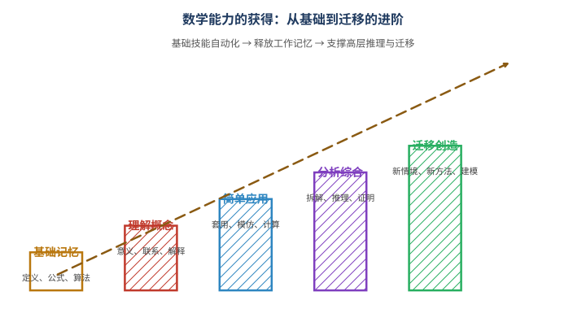

# 第130级 数学教育

## 学习目标

1. 理解数学教育作为一门研究领域的基本框架和核心问题
2. 掌握数学学习的主要认知理论（Piaget、Vygotsky）
3. 理解Polya问题解决理论及其对数学教学的启示
4. 掌握数学论证与证明的Toulmin模型
5. 理解数学学习中的概念转变和认知冲突理论
6. 了解认知负荷理论在数学教育中的应用
7. 掌握建构主义理论对数学教育的指导意义
8. 了解数学教育中的社会文化视角、公平与多样性议题

---

## 核心概念

### 数学教育心理学

数学教育心理学（Psychology of Mathematics Education）研究数学学习与教学中的认知、情感和社会过程。其核心问题包括：
- 学生如何理解数学概念？
- 数学思维的发展规律是什么？
- 数学学习中的困难和障碍如何产生？
- 有效的数学教学策略是什么？

### 认知发展理论

#### Piaget的认知发展理论

Jean Piaget提出了认知发展的四个阶段：
1. **感觉运动阶段**（0-2岁）：通过感官和动作认识世界
2. **前运算阶段**（2-7岁）：发展语言和符号思维，但缺乏守恒概念
3. **具体运算阶段**（7-11岁）：掌握守恒、分类、排序等逻辑运算，但需要具体对象支持
4. **形式运算阶段**（11岁+）：能够进行抽象推理、假设-演绎推理

> **直观理解（现实类比）**：认知层级像一座由下而上的金字塔，也像学做菜的过程——先亲眼看着、亲手摸到食材（具象），再在脑海中形成"步骤画面"（表象），最后熟练到能看着菜谱符号就自动完成（抽象）。学几何正是如此：先用小棒拼出三角形（具象），再画图并在脑中旋转图形（表象），最后只用符号和公理就能推理（抽象）。Piaget 提醒我们：跳过底层直接上高层，就像让还没学会数数的小孩背公式，往往事倍功半。**把抽象概念落到足够的具象与表象，学习才会真正发生。**

> **直观理解（现实类比）**：数学认知发展像"思维的阶梯"——从具体运算到形式运算呈阶梯式攀升，而非一蹴而就。小学生（具体运算阶段）需要掰着手指、画着图才能理解"3+5=8"，如同刚学走路的孩子必须扶着沙发；而中学生（形式运算阶段）已能在脑中操纵符号 $x, y$，进行"假设 $x>0$ 则……"的演绎，如同跑步者可以腾空飞跃。Piaget 提醒教师：让 7 岁孩子直接理解"变量"就像让他没学会走就跑——阶梯不可逾越，但可以借助教具（积木、数轴）搭好每一级台阶。教学的艺术在于：**识别学生当前在哪一级阶梯，再为他铺设通往下一级的脚手架**。

Piaget的理论对数学教育的影响在于：数学学习需要与学生的认知发展阶段相匹配，新概念的引入应考虑学生当前的认知结构。

#### Vygotsky的社会文化理论

Lev Vygotsky强调社会互动在认知发展中的核心作用：
- **最近发展区（ZPD）**：学生独立完成任务的水平与在他人帮助下能达到的水平之间的差距
- **脚手架（Scaffolding）**：在ZPD中提供适当支持，随着学生能力增长逐渐撤除
- **内化（Internalization）**：社会互动中的知识逐渐转化为个体内部的心理工具

Vygotsky的理论启示数学教育应重视：合作学习、师生对话、适时的教学支持。

### 数学学习障碍

数学学习障碍（Dyscalculia）是指尽管智力正常且有适当的教育机会，学生在数学学习上仍表现出显著困难。常见障碍包括：
- 数感缺失（无法理解数量关系）
- 计算困难（基本算术运算）
- 空间关系理解困难（几何）
- 数学语言理解困难

> **直观理解（现实类比）**：数学焦虑像"思维的绊脚石"——情绪上的紧张、恐惧会直接阻断认知通道，如同考试时面对一道题，越想"我肯定做不出来"就越头脑空白。这并非"不聪明"，而是工作记忆被焦虑情绪占用：本来用于推理的"内存"被"我好怕"的念头塞满，自然算不下去。Ashcraft 的研究表明，数学焦虑者的工作记忆容量在压力下可下降 20% 以上，相当于电脑开了太多后台程序而卡顿。破局之道不是"再努力一点"，而是降低情绪负荷——限时测试改为不限时、错题不罚分、允许使用计算器辅助基本运算，把"内存"还给思考本身。**情绪先稳，认知才能跟上**，这是数学教育常被忽视的一条铁律。

### 数学教学法

主要数学教学法包括：
- **讲授式教学**：教师直接讲解概念和程序
- **探究式学习**：学生通过探索和发现来学习数学
- **问题解决教学**：以问题为中心组织教学
- **合作学习**：小组协作完成数学任务
- **差异化教学**：根据学生差异调整教学内容和方式

### 数学素养

数学素养（Mathematical Literacy）是指个体在多样化情境中理解、运用和解释数学的能力。PISA（国际学生评估项目）将数学素养定义为：
- 在不同情境中表述、运用和解释数学的能力
- 包括数学推理和运用数学概念、程序、事实和工具来描述、解释和预测现象的能力

> **直观理解（现实类比）**：数学能力像一步步登楼梯，也像学骑自行车——先记住"刹车、踏板"的规则（基础），理解"为什么会倒"的原理（理解），能在平路上骑（应用），再学会应对转弯和突发状况（分析），最后能自由穿行在各种路况中、甚至自创骑法（迁移创造）。图中台阶逐级升高寓意：**基础技能只有自动化，才能腾出"工作记忆"去进行高层推理**。正如认知负荷理论所说，如果每道加法都要停下来想，就无暇思考更复杂的数学问题。从"会算"到"会迁移"，正是数学素养从根基到顶端的进阶之路。

### 数学教育的社会文化视角

社会文化视角强调数学学习是嵌入在特定文化、历史和社会情境中的过程：
- 数学知识是社会建构的
- 不同文化中的数学实践各有特色（民族数学，Ethnomathematics）
- 数学课堂是一个微型文化社区
- 语言、权力关系、身份认同影响数学学习

### 数学教育中的公平与多样性

公平与多样性关注：
- 不同性别、种族、社会经济背景的学生在数学学习中的机会差异
- 消除数学学习中的系统性障碍
- 为所有学生提供高质量的数学教育
- 尊重和包容多元的数学学习方式和思维方式

---

## 定理与证明

### 定理1：Polya问题解决理论

**定理**：数学问题解决遵循一个四阶段启发式框架：理解问题、制定计划、执行计划、回顾反思。每个阶段都有特定的启发式策略，系统训练这些策略可以显著提高问题解决能力。

**论证**（用启发式策略和认知分析）：

**阶段1：理解问题（Understanding the Problem）**

Polya强调，解决问题的第一步是彻底理解问题。学生需要能够回答：
- 未知量是什么？已知数据是什么？条件是什么？
- 条件是否充分？是否矛盾？是否多余？

**启发式策略**：
- 画图：将问题可视化
- 引入适当符号：用变量表示未知量
- 用自己的话复述问题
- 将条件分解为更小的部分

**认知分析**：这一阶段对应认知心理学中的**问题表征**（Problem Representation）。研究表明，成功的解题者比不成功的解题者花更多时间理解问题，建立更丰富、更准确的问题表征。Chi等人（1981）的研究发现，专家在问题解决中首先进行定性分析（理解问题类型和深层结构），而新手则急于寻找公式。

**阶段2：制定计划（Devising a Plan）**

找到已知量与未知量之间的联系。如果找不到直接联系，考虑辅助问题。

**启发式策略**：
- 寻找类似问题：以前见过类似的问题吗？
- 类比：能否想到一个相关的定理？
- 分解：能否将问题分解为若干子问题？
- 特殊化：能否先解决一个特殊情况？
- 一般化：问题是否是某个更一般问题的特例？
- 逆向思考：从目标出发逆向推理

**研究证据**：Schoenfeld（1985）的研究表明，优秀的数学问题解决者拥有丰富的启发式策略库，能够根据问题类型灵活选择策略。通过明确的策略教学，学生的解题能力可以得到显著提升。

**阶段3：执行计划（Carrying Out the Plan）**

执行解题计划，每一步都要检查：
- 每一步是否正确？
- 能否清晰地证明每一步的合理性？

**认知分析**：执行阶段需要**程序性知识**（Procedural Knowledge）的支撑。Sweller的认知负荷理论指出，工作记忆容量有限，因此自动化基本技能（如算术运算、代数变换）可以减少认知负荷，释放工作记忆用于更高层次的推理。

**阶段4：回顾反思（Looking Back）**

完成解答后，进行回顾和反思：
- 能否验证结果？能否用不同方法验证？
- 能否将结果推广？
- 能否用不同方法得到相同结果？
- 从这个问题中学到了什么？

**研究证据**：Silver（1982）的研究发现，高成就学生在解题后会自发地进行回顾和反思，而低成就学生则很少这样做。反思过程有助于形成更深入的概念理解，并将新知识与已有知识建立联系。

**Polya框架的实证支持**：多项元分析研究（如Hembree, 1992）表明，系统教授问题解决策略可以显著提高学生的数学成绩，效应量在中等以上。Polya框架的四个阶段在数学教育中被广泛采用，成为问题解决教学的理论基础。

### 定理2：数学学习中的概念转变

**定理**：学生在数学学习中常常持有与标准数学概念不一致的"先有概念"（preconceptions）或"迷思概念"（misconceptions）。有效的数学教学需要引发认知冲突，促使学生经历概念转变（Conceptual Change），从而重构原有的认知结构。

> **直观理解（现实类比）**：概念意象 vs 概念定义像"心中所想 vs 书上所写"——学生对概念形成的心智图像（概念意象）往往与教材中给出的形式定义（概念定义）存在差距。例如，问学生"什么是函数"，他脑中浮现的是"一条曲线"（意象），而书上写的是"两个集合间的对应关系"（定义）。这就像问"什么是水"——脑中想到的是流动的液体（意象），化学课本却写"$\text{H}_2\text{O}$"（定义）。Vinner 等人指出，学生在解题时常常调用意象而非定义：看到"数列"就以为"递增的数"（意象偏差），而忽略了震荡或常值数列。**好的教学要不断让意象与定义对话**，让学生意识到脑中图像的局限，逐步修正意象以贴合定义。

**论证**（用认知冲突理论）：

**步骤1：先有概念的存在性**

学生并非带着空白大脑进入数学课堂。他们在日常生活和早期学习中积累了大量的直觉知识和朴素概念。

**数学中的典型迷思概念**：
- 几何中的"图形越大，面积越大"（忽略了形状的影响）
- 概率中的"赌徒谬误"（认为独立事件有"补偿"机制）
- 代数中的"等号表示计算结果"（而非等价关系）
- 函数中的"函数必须由公式表示"
- 极限中的"极限就是永远达不到的值"

**研究证据**：Fischbein（1987）对直觉在数学学习中的作用进行了系统研究，发现直觉概念往往与形式数学概念冲突，且直觉概念非常顽固，难以改变。

**步骤2：认知冲突的机制**

Piaget的认知发展理论提供了概念转变的基本机制：
- **同化（Assimilation）**：将新信息纳入已有认知结构
- **顺应（Accommodation）**：调整认知结构以适应新信息
- **平衡（Equilibration）**：在同化和顺应之间达到平衡

当新信息无法被已有认知结构同化时，就产生了**认知冲突**（Cognitive Conflict）。认知冲突是概念转变的驱动力——它迫使学习者重新审视和调整自己的认知结构。

**步骤3：概念转变的条件**

Posner等人（1982）提出了概念转变的四个条件：
1. **对现有概念的不满**：学习者意识到现有概念无法解释某些现象
2. **新概念的可理解性**：新概念对学习者来说是有意义的
3. **新概念的合理性**：新概念与学习者的其他信念一致
4. **新概念的有效性**：新概念能解决现有概念无法解决的问题

**数学教育中的应用**：
- 设计能引发认知冲突的教学情境（如"错误的"但直觉上合理的推理导致矛盾）
- 提供充分的讨论和反思机会
- 帮助学生在多种表征之间建立联系

**步骤4：概念转变的类型**

概念转变可以是：
- **弱转变**：在原有框架内补充和修正，如同化
- **强转变**：改变核心假设和信念体系，如从"算术思维"到"代数思维"的转变

**研究证据**：Vosniadou（1994）对科学概念转变的研究表明，概念转变是一个渐进过程，而不是一次性事件。学习者可能同时持有新旧两种概念框架，在特定情境中使用不同的框架。数学教育中的概念转变研究（如关于极限、无穷等概念的研究）也证实了类似模式。

**步骤5：教学启示**

概念转变理论对数学教学的启示：
- 诊断学生的先有概念是教学的第一步
- 有效的教学需要创造认知冲突情境
- 概念转变需要时间和反复的认知冲突
- 社会互动（同伴讨论、师生对话）促进概念转变
- 多种表征的运用有助于新概念的理解和巩固

### 定理3：数学论证的Toulmin模型

**定理**：数学论证可以按照Toulmin模型进行分析，该模型包含六个要素：主张（Claim）、数据（Data）、理据（Warrant）、支援（Backing）、限定词（Qualifier）和反驳（Rebuttal）。在数学教育中，使用Toulmin模型分析学生的论证可以帮助教师理解学生的推理结构，并促进更有效的数学论证教学。

**论证**（用论证结构分析）：

**步骤1：Toulmin模型的基本结构**

英国哲学家Stephen Toulmin在其著作《论证的使用》（The Uses of Argument, 1958）中提出了论证分析的一般模型。在数学语境中，六个要素的含义如下：

- **主张（Claim）**：需要被证明的数学陈述，如"三角形ABC是等腰三角形"
- **数据（Data）**：支持主张的事实或证据，如"边AB = 边AC"
- **理据（Warrant）**：从数据到主张的推理规则，如"如果三角形有两边相等，则它是等腰三角形"
- **支援（Backing）**：理据的进一步支持，如"等腰三角形的定义"
- **限定词（Qualifier）**：主张的确定性程度，如"必然地"、"很可能"
- **反驳（Rebuttal）**：反驳主张的条件，如"除非三角形退化为线段"

**步骤2：数学论证的特殊性**

数学论证与其他领域论证的区别在于：
- 数学论证的理据通常是定义、公理、定理
- 数学论证可以追求确定性（演绎证明）
- 数学论证的支援是公理系统中的基础假设

**步骤3：Toulmin模型在数学教育中的应用**

Krummheuer（1995）将Toulmin模型引入数学教育研究，用于分析数学课堂中的论证过程。

**示例分析**：

考虑一个几何证明问题：证明"如果三角形有两边相等，则两底角相等"。

学生论证的Toulmin分析：
- **主张**：∠B = ∠C
- **数据**：AB = AC，且∠A是公共角（在三角形ABD和ACD中，作中线AD）
- **理据**：如果两个三角形的两边及其夹角相等，则这两个三角形全等（SAS）
- **支援**：三角形全等定理
- **限定词**：必然地
- **反驳**：除非AD不是中线（但由AB = AC，可证明AD是中线）

**步骤4：Toulmin模型的教学价值**

- **诊断功能**：教师可以分析学生论证中的缺失环节。例如，如果学生只给出了数据（'AB = AC'）和主张（'∠B = ∠C'），但没有给出理据（'等腰三角形底角相等定理'），教师可以有针对性地提问。
- **发展功能**：通过Toulmin模型的训练，学生可以学会更完整、更严谨的论证结构。
- **评价功能**：为评估学生的论证能力提供了结构化框架。

**研究证据**：Weber等人（2008）的研究表明，使用Toulmin模型分析数学论证可以揭示学生推理中的隐含假设和逻辑跳跃，有助于教师设计针对性的教学干预。Yackel和Cobb（1996）的研究发现，在数学课堂中建立"社会数学规范"（Socio-mathematical Norms）——即什么样的论证在数学课堂上被认为是可接受的——对学生的数学论证能力发展至关重要。

**步骤5：Toulmin模型在数学证明教学中的应用**

数学证明教学中的Toulmin模型应用：
- 帮助学生理解证明不仅是陈述事实，更是建立从数据到主张的逻辑推理链
- 训练学生识别和补充论证中的缺失环节
- 促进学生对"什么是好的数学论证"的元认知反思

### 定理4：数学教育的认知负荷理论

**定理**：数学学习过程受到工作记忆容量限制的影响。认知负荷理论（Cognitive Load Theory）将学习中的认知负荷分为三类：内在认知负荷（Intrinsic Cognitive Load）、外在认知负荷（Extraneous Cognitive Load）和关联认知负荷（Germane Cognitive Load）。优化数学教学设计需要减少外在认知负荷，控制内在认知负荷，并促进关联认知负荷。

**论证**（用工作记忆模型）：

**步骤1：认知架构的基本假设**

根据Sweller（1988）的认知负荷理论，人类认知架构包括：
- **工作记忆**：容量有限（Miller的7±2个组块，但更准确地说，处理新信息时只能同时处理2-3个元素），持续时间短
- **长时记忆**：容量无限，存储知识以图式（Schema）的形式组织

**数学学习的核心挑战**：数学问题的解决通常需要在工作记忆中同时处理多个信息元素，而工作记忆容量的限制使得这一过程非常困难。

**步骤2：三种认知负荷**

**内在认知负荷**（Intrinsic Cognitive Load）：
- 由学习材料本身的内在复杂度决定
- 取决于元素交互性（Element Interactivity）——即需要同时处理的元素数量
- 例如，学习单个数字的加法（低元素交互性）vs. 解一道复杂的多步方程（高元素交互性）

**外在认知负荷**（Extraneous Cognitive Load）：
- 由教学材料的呈现方式和教学设计引起
- 不必要的信息呈现方式会增加外在认知负荷
- 例如，分散注意力的图表、不一致的符号系统、不清晰的说明

**关联认知负荷**（Germane Cognitive Load）：
- 与建构和自动化图式相关的认知负荷
- 是"有益的"认知负荷，促进深度学习
- 例如，比较不同解题策略、反思解题过程

**步骤3：认知负荷理论在数学教育中的应用**

**减少外在认知负荷的策略**：
- **分散注意效应**：避免将相互引用的信息分开呈现（如将图示和文字说明整合在一起）
- **模态效应**：使用听觉和视觉双通道呈现信息（如用语音讲解配合图示）
- **冗余效应**：避免同时呈现相同信息的多种形式
- **示例效应**：在学习初期，使用已解决的例题（worked examples）比让学习者独立解决问题更有效

**管理内在认知负荷的策略**：
- **分块策略**：将复杂问题分解为更小的子问题
- **逐步推进**：从简单到复杂，逐步增加元素的交互性
- **先备知识激活**：在学习新内容前，确保学生具备必要的先备知识

**促进关联认知负荷的策略**：
- **变式练习**：提供不同形式的练习，帮助学生抽象出一般模式
- **自我解释**：鼓励学生解释自己的推理过程
- **比较策略**：比较不同解题方法的优劣

**步骤4：研究证据**

大量实证研究支持认知负荷理论在数学教育中的应用：

- **示例效应**：Sweller和Cooper（1985）的研究表明，学习代数方程时，先学习已解决的例题再进行练习的学生，比直接进行练习的学生学得更好。
- **分散注意效应**：Tarmizi和Sweller（1988）在几何学习中证实，整合了图形和文字说明的教学材料比分开呈现的材料更有效。
- **模态效应**：Mousavi等人（1995）在几何学习中发现，使用听觉解说配合视觉图示比纯视觉呈现效果更好。

**元分析证据**：Cierniak等人（2009）的元分析研究表明，基于认知负荷理论的教学设计原则在数学和科学教育中具有稳定且显著的效果。

**步骤5：数学教育中的认知负荷管理**

**具体教学建议**：
- 在引入新概念时，使用已解决的例题而非问题解决任务
- 将复杂的数学问题分解为多个可管理的步骤
- 使用整合的图文呈现，避免分割注意
- 提供充分的练习以实现基本技能的自动化
- 在不同的问题情境中应用相同概念，促进图式建构

### 定理5：数学教育中的建构主义理论

**定理**：数学知识不是被动接收的，而是由学习者基于已有知识和经验主动建构的。有效的数学教学应基于两个核心原则：1）数学学习是主动的意义建构过程（Piaget的认知建构主义）；2）数学学习是在社会互动和文化工具的中介下发生的（Vygotsky的社会建构主义）。

> **直观理解（现实类比）**：APOS 理论像"概念发展的四阶段"——Action 操作 → Process 过程 → Object 对象 → Schema 图式，刻画了学生掌握一个数学概念必经的心路历程。以"函数"为例：**Action（操作）**——学生只能按指令代入计算，如 $f(2)=2^2+1=5$，离开公式就束手无策；**Process（过程）**——内化了操作，能在脑中想象"输入 $x$ 经过变换得到 $f(x)$"，无需纸笔也能推理；**Object（对象）**——把函数本身当作一个可操作的实体，能对它求导、积分、复合，如 $(f \circ g)(x)$；**Schema（图式）**——把函数与其他概念（方程、图像、变化率）织成网，灵活调用。Dubinsky 认为，**教学的任务就是搭好 A→P→O→S 的脚手架**，让学生在每一阶段充分沉淀，而非跳过操作直接背定义——那只会让概念沦为空壳。

**论证**（用Piaget和Vygotsky的理论分析）：

**步骤1：认知建构主义的数学教育观**

Piaget的认知建构主义（Cognitive Constructivism）强调：

**核心原则**：数学知识是学习者通过主动操作和反思建构的，而不是被动接收的。

**机制**：
- 数学概念通过同化和顺应过程建构
- 认知发展遵循从具体到抽象的路径
- 数学理解需要经历不同的发展阶段

**数学教育中的应用**：
- 动手操作：使用具体教具（如Cuisenairre棒、几何拼图）帮助建构数学概念
- 发现学习：让学生在探索中发现数学规律
- 认知冲突：创造认知冲突促进概念转变

**研究证据**：Kamii（1985）在小学数学教学中应用Piaget的理论，发现通过动手操作和同伴讨论学习算术的学生，对数学概念的理解比接受传统讲授的学生更深刻。

**步骤2：社会建构主义的数学教育观**

Vygotsky的社会建构主义（Social Constructivism）强调：

**核心原则**：数学学习首先是社会性的，然后才是个体性的。高层次的数学思维通过社会互动内化。

**关键概念**：
- **最近发展区**：数学教学应在学生的最近发展区内进行
- **脚手架**：教师或同伴提供适当的支持
- **内化**：社会层面的数学对话转化为个体层面的数学思维

**数学教育中的应用**：
- 数学讨论：鼓励学生在小组中讨论数学问题
- 合作学习：学生通过协作解决数学问题
- 教师引导的对话：教师通过提问引导学生思考

**研究证据**：Cobb等人（1992）的课堂研究表明，在数学课堂中建立"数学讨论社区"——即学生被鼓励表达和辩护自己的数学观点——可以显著提高学生的数学推理能力。

**步骤3：两种建构主义的整合**

数学教育中的建构主义不是二选一的问题，而是两种视角的互补：

**认知建构主义的贡献**：
- 强调学生的主动性和已有知识
- 关注数学概念的心理建构过程
- 提供具体到抽象的发展路径

**社会建构主义的贡献**：
- 强调社会互动和语言的作用
- 关注数学课堂的文化和规范
- 提供教学支持的框架（ZPD、脚手架）

**整合框架**：数学学习是学生在社会文化环境中，通过主动操作和反思，借助文化工具（符号、语言、图表）和他人帮助，建构数学知识的过程。

**步骤4：建构主义教学的设计原则**

基于建构主义理论的数学教学设计原则：

1. **真实性**：学习任务应嵌入在真实或有意义的数学情境中
2. **主动性**：学生应积极参与数学活动，而非被动接收
3. **建构性**：新知识应与已有知识建立联系
4. **社会性**：提供合作学习和讨论的机会
5. **反思性**：鼓励学生反思自己的学习过程和数学思维
6. **支架性**：提供适时的教学支持，并逐渐撤除

**步骤5：建构主义与"新数学"运动**

历史教训：20世纪60年代的"新数学"运动试图将现代数学的严谨结构引入中小学数学课程，但由于过度强调形式化而忽视了学生的认知发展水平，最终以失败告终。这一历史教训表明，建构主义教学需要谨慎平衡学科结构与学生的认知发展。

**建构主义不是"放任自流"**：建构主义教学并不意味着教师完全放手让学生自己发现一切。相反，它要求教师成为"促进者"——设计合适的学习环境，提供适时的引导和支持。

**步骤6：建构主义在数学教育中的影响**

建构主义对数学教育的影响深远：
- 推动了从"教师中心"到"学生中心"的转变
- 促进了问题解决教学和探究式学习的发展
- 影响了数学课程标准和教材的设计
- 为数学教育研究提供了理论框架

---

## 示例

### 示例1：Polya问题解决策略在代数教学中的应用

**问题**：两个数的和是20，它们的积是96，求这两个数。

**Polya四阶段分析**：

**阶段1：理解问题**
- 未知量：两个数，设为 $x$ 和 $y$
- 已知条件：$x + y = 20$，$xy = 96$
- 条件是否充分？两个方程，两个未知数，通常可解

**阶段2：制定计划**
- 方法1（代入法）：由 $y = 20 - x$，代入 $xy = 96$
- 方法2（韦达定理）：$x$ 和 $y$ 是二次方程 $t^2 - 20t + 96 = 0$ 的根
- 选择方法2，因为计算更简洁

**阶段3：执行计划**
$$t^2 - 20t + 96 = 0$$
$$(t - 8)(t - 12) = 0$$
$$t = 8 \text{ 或 } t = 12$$
所以两个数是8和12。

**阶段4：回顾反思**
- 验证：$8 + 12 = 20$，$8 \times 12 = 96$ ✓
- 推广：一般地，已知和 $s$ 与积 $p$，求两数，相当于解 $t^2 - st + p = 0$
- 判别式条件：当 $s^2 - 4p \geq 0$ 时，存在实数解

### 示例2：数学论证在几何证明教学中的应用

**问题**：证明"平行四边形的对角线互相平分"。

**Toulmin模型分析**：

**主张**：平行四边形ABCD的对角线AC和BD互相平分，即AO = OC，BO = OD（其中O是AC和BD的交点）。

**数据**：
- 四边形ABCD是平行四边形（已知）
- AB ∥ CD，AD ∥ BC（平行四边形定义）

**理据**：
- 由AB ∥ CD，得∠BAO = ∠DCO（内错角相等）
- 由AD ∥ BC，得∠ABO = ∠CDO（内错角相等）
- AB = CD（平行四边形对边相等）
- 由ASA，得△ABO ≅ △CDO

**支援**：平行线性质定理、平行四边形性质定理、三角形全等定理

**限定词**：必然地

**反驳**：除非四边形ABCD不是平行四边形（但已知条件已排除此情况）

**完整的论证链条**：
1. 因为ABCD是平行四边形，所以AB ∥ CD且AB = CD
2. 因为AB ∥ CD，所以∠BAO = ∠DCO
3. 因为AD ∥ BC，所以∠ABO = ∠CDO
4. 由2、3和AB = CD，得△ABO ≅ △CDO（ASA）
5. 由全等，得AO = OC，BO = OD
6. 因此，对角线互相平分

### 示例3：认知冲突教学设计

**情境**：在分数比较教学中引发认知冲突

**设计**：

**步骤1：引出先有概念**
提问：比较 $\frac{2}{3}$ 和 $\frac{3}{4}$ 的大小。
学生常见回答：$\frac{2}{3} > \frac{3}{4}$，因为"2比3大"（即使分子分母分别比较）。

**步骤2：创造认知冲突**
教师：$\frac{2}{3}$ 的2比3小，$\frac{3}{4}$ 的3比4小，但我们可以用具体的图形来比较。

展示两个同样大小的圆，一个被分为3等份，涂色2份；另一个被分为4等份，涂色3份。

学生直观看到：$\frac{3}{4}$ 的涂色部分大于 $\frac{2}{3}$ 的涂色部分。

**步骤3：引导学生解决冲突**
教师：为什么直观上 $\frac{3}{4}$ 更大，但直觉告诉我们 $\frac{2}{3}$ 更大？我们需要怎样的方法来比较分数？

引导学生发现通分的方法：
$$\frac{2}{3} = \frac{8}{12}, \quad \frac{3}{4} = \frac{9}{12}, \quad \frac{8}{12} < \frac{9}{12}$$

**步骤4：反思与巩固**
讨论：为什么"分子分母分别比较"的方法不可靠？分数比较的正确方法是什么？

---

## 习题

### 习题1：Polya问题解决策略

用Polya的四阶段框架解决以下问题：
"一个农夫有鸡和兔子共30只，共有94条腿，问鸡和兔子各有多少只？"

**提示**：
- 理解阶段：设鸡有 $x$ 只，兔子有 $y$ 只，则 $x + y = 30$，$2x + 4y = 94$
- 计划阶段：可以用代入法或消元法
- 执行阶段：解方程组
- 回顾阶段：验证结果是否满足条件

### 习题2：概念转变分析

学生在学习概率时，常认为"如果硬币连续5次抛出国徽面，第6次更容易抛出数字面"。请分析：
1. 这是什么类型的迷思概念？
2. 如何设计认知冲突情境来纠正这一概念？
3. 概念转变的四个条件如何满足？

**提示**：这是"赌徒谬误"。认知冲突设计可以让学生实际抛硬币（或模拟）大量实验，观察频率的稳定性。概念转变条件：对现有概念的不满（观察到实际频率与预期不符），新概念的可理解性（独立性概念），新概念的合理性（与概率公理一致），新概念的有效性（能正确预测未来结果）。

### 习题3：Toulmin模型分析

用Toulmin模型分析以下学生论证的六个要素：
"因为三角形ABC中，∠A = 60°，∠B = 60°，所以三角形ABC是等边三角形。"

**提示**：
- 主张：三角形ABC是等边三角形
- 数据：∠A = 60°，∠B = 60°
- 理据：三角形内角和为180°，所以∠C = 60°；三个角都相等，所以三边相等
- 支援：等边三角形的判定定理
- 限定词：必然地
- 反驳：无（在欧氏几何中）

### 习题4：认知负荷理论应用

一名数学教师想教授"一元二次方程的求根公式"。请根据认知负荷理论，设计一个教学序列，说明如何：
1. 控制内在认知负荷（如何分解复杂内容）
2. 减少外在认知负荷（如何设计教学材料）
3. 促进关联认知负荷（如何促进图式建构）

**提示**：
- 内在负荷管理：先复习配方法，再推导求根公式，分步进行
- 外在负荷减少：使用逐步推导的板书，避免信息分散；先展示已解决的例题
- 关联负荷促进：提供变式练习，让学生比较不同解法

### 习题5：建构主义教学设计

设计一个基于建构主义的"三角形内角和"教学方案（适用于初中生），包括：
1. 如何激活学生的已有知识
2. 如何设计动手操作活动
3. 如何组织社会互动（讨论、合作）
4. 如何促进概念建构

**提示**：
- 激活已有知识：复习角的度量、三角形的分类
- 动手操作：让学生剪下三角形的三个角，拼成一个平角
- 社会互动：小组讨论不同的验证方法（测量、拼角、折纸）
- 概念建构：引导学生从具体操作中抽象出"三角形内角和为180°"的结论，并尝试给出推理证明

---

## 总结

数学教育是关于数学的学习与教学的科学研究，它连接了数学本身与学习者的认知发展。本级别涵盖的核心内容总结如下：

| 主题 | 核心内容 |
|:---|:---|
| **Polya问题解决理论** | 四阶段框架（理解、计划、执行、回顾），启发式策略的系统训练 |
| **概念转变理论** | 认知冲突驱动概念转变，需要满足四个条件（不满、可理解、合理、有效） |
| **Toulmin论证模型** | 六要素分析框架（主张、数据、理据、支援、限定词、反驳） |
| **认知负荷理论** | 三种认知负荷（内在、外在、关联），通过教学设计优化学习效率 |
| **建构主义理论** | 认知建构主义（Piaget）与社会建构主义（Vygotsky）的整合 |

数学教育作为一门学科，其核心洞见在于：**数学学习不是简单的知识传递，而是学习者主动建构意义的过程**。有效的数学教学需要理解学生的认知发展水平、诊断学生的先有概念、设计引发认知冲突的学习情境、提供适当的脚手架支持，并在社会互动中促进数学思维的发展。

本级别也为整个"数学天梯攀爬教程"画上了句号。从第1级到第130级，我们穿越了从算术到微积分、从线性代数到抽象代数、从几何到拓扑、从概率统计到数学基础、从应用数学到数学教育的广阔领域。数学不仅是一套知识体系，更是一种思维方式、一种文化传承、一种人类智慧的结晶。