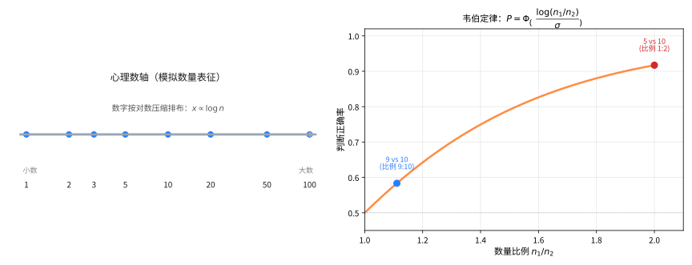
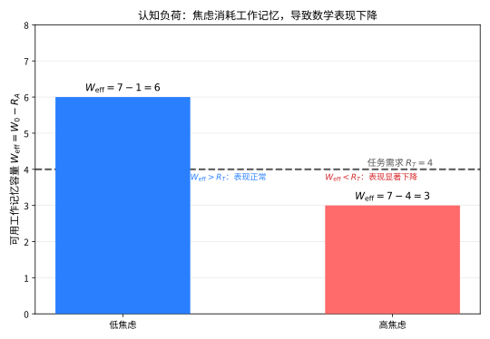

# 第131级 数学心理学 (Mathematical Psychology)

## 📖 学习目标

1. 理解数学心理学的学科定位与核心研究领域
2. 掌握数字认知的三重编码模型及其神经科学证据
3. 理解数感的认知发展理论——先天与后天交互机制
4. 掌握数学焦虑的认知-动机模型及其对工作记忆的影响
5. 理解数学问题解决的认知过程模型
6. 了解数学学习障碍（计算障碍）的诊断与干预方法
7. 了解数学创造力的测量与培养

---

## 一、核心概念

### 1.1 数学认知与数感

**数学认知**（Mathematical Cognition）研究人类如何理解和处理数学信息，包括数字感知、数量比较、算术运算、代数推理、几何思维等过程。

**数感**（Number Sense）是个体对数量、数字关系及基本算术操作的直觉性理解能力。它是数学学习的基石，表现为：

- **数量估计**：在不精确计数的情况下判断数量大小
- **数字比较**：快速判断两个数字的大小关系
- **数量转换**：理解数量变化（如增减）的含义

**定义1（数感）** 数感是指对数字和数量关系的直觉把握能力，包括近似数量系统（ANS, Approximate Number System）和精确数字系统（Precise Number System）两个子系统。

### 1.2 数字认知模型

**数字认知**（Numerical Cognition）研究大脑如何处理数字信息。核心问题包括：

- 数字如何在脑中表征？
- 算术运算的神经基础是什么？
- 数字处理与语言、空间能力的关系？

**定义2（数字表征）** 数字表征是指大脑对数字信息的编码方式，包括：
- **模拟数量表征**：数量以近似、连续的方式编码（如数轴上的位置）
- **符号数字表征**：数字以精确、离散的符号形式编码（如阿拉伯数字、文字数字）
- **言语数字表征**：数字以言语序列的形式编码（如数数序列）

> **直观理解（现实类比）**：心理数轴就像一把"弹性尺子"——孩子眼里的数字排列不是等距的，1到10之间"显得"比10到100之间更宽敞，正如你在高速公路上感觉最近的几公里"格外漫长"。而韦伯定律正如你判断两堆糖果：一堆5颗、一堆10颗，一眼就能分辨；但9颗与10颗几乎看不出差别——人对数量的分辨靠的是"比例"，而不是"差几颗"。

### 1.3 数学思维

**数学思维**（Mathematical Thinking）涉及高阶数学活动中使用的认知策略和推理模式，包括：

- **归纳推理**：从特例中提炼一般规律
- **演绎推理**：从公理和定义出发进行逻辑推导
- **类比推理**：将已知结构映射到新情境
- **可视化推理**：利用空间表象解决问题
- **抽象化**：从具体情境中提取数学结构

### 1.4 心理测量与数学能力评估

**心理测量**（Psychometrics）是心理学中研究测量方法的学科，在数学心理学中用于开发数学能力评估工具。

**数学能力评估**（Mathematical Ability Assessment）通过标准化测试测量个体的数学水平，包括：

- **成就测试**：测量已学数学知识和技能
- **能力倾向测试**：预测未来数学学习潜力
- **诊断测试**：识别具体的数学学习困难

### 1.5 数学学习障碍

**计算障碍**（Dyscalculia）是一种特定的数学学习障碍，表现为：

- 数字处理困难
- 算术事实提取困难
- 数量比较和估计困难
- 数学概念理解困难

**定义3（计算障碍）** 计算障碍是一种神经发育障碍，表现为数学能力的显著低于个体年龄、智力水平和教育期望所应达到的水平，排除智力障碍、感觉障碍或教育不足等因素。

> **直观理解（现实类比）**：计算障碍就像一台"算盘少了几个档"的计算器——硬件整体没问题（智商正常、语言优秀），可一旦处理数量就总是卡顿出错。这些孩子并非"笨"或"懒"，而是大脑中负责"数量感"的电路天生发育不良，就像有人天生分不清左右、有人天生五音不全，是一种神经层面的"数盲"。

### 1.6 数学焦虑

**数学焦虑**（Math Anxiety）是指个体在面对数学任务时产生的紧张、忧虑和恐惧情绪，影响数学表现和数学学习。

**定义4（数学焦虑）** 数学焦虑是一种情境性焦虑，表现为在数学学习或评估情境中出现消极情绪反应、生理唤醒和回避行为。

### 1.7 数学创造力

**数学创造力**（Mathematical Creativity）是指产生新颖且有价值的数学思想、问题解决方案或理论框架的能力。

**定义5（数学创造力）** 数学创造力由以下维度构成：
- **流畅性**：产生大量数学想法的能力
- **灵活性**：从不同角度思考数学问题的能力
- **原创性**：提出新颖数学思想的能力
- **精致性**：发展和完善数学思想的能力

### 1.8 认知神经科学

**认知神经科学**（Cognitive Neuroscience）研究认知过程的神经基础。在数学心理学中，主要使用以下技术：

- **功能性磁共振成像（fMRI）**：定位数学任务激活的脑区
- **事件相关电位（ERP）**：测量数学处理的时程特征
- **经颅磁刺激（TMS）**：扰乱特定脑区以研究其因果作用
- **脑损伤研究**：研究特定脑区损伤后数学能力的变化

### 1.9 数学教育心理学

**数学教育心理学**（Psychology of Mathematics Education）研究数学教与学的心理过程，包括：

- 数学概念的认知发展
- 数学学习动机与情感
- 数学教学策略的心理学基础
- 数学学习环境的设计

---

## 二、定理与证明

> **说明**：数学心理学是交叉学科，这里的"定理"指的是经过科学验证的心理学理论和模型，其"证明"基于实验证据和逻辑推理。

### 定理1：三重编码模型（Triple Code Model）

**定理（三重编码模型）** 人类大脑使用三种独立的编码方式来处理数字信息：**视空数量编码**（Visual-Arabic Code）、**听觉言语编码**（Auditory-Verbal Code）和**模拟数量编码**（Analog Magnitude Code）。这三种编码分别由不同的神经通路支持，并在不同的数学任务中发挥主导作用。

**证明**（基于神经科学证据的论证）：

**第一步：建立模型的基本框架。**

Dehaene（1992）提出的三重编码模型假设三种数字编码方式：

1. **视空数量编码**：数字以阿拉伯数字串的形式在视觉空间系统中编码，用于处理多位数运算、数字比较等任务。相关的核心脑区为双侧枕叶视觉区和梭状回。

2. **听觉言语编码**：数字以言语序列的形式在语言系统中编码，用于处理数数、乘法口诀、算术事实提取等任务。相关的核心脑区为左侧颞叶语言区和基底神经节。

3. **模拟数量编码**：数字以近似数量的形式在空间系统中编码，用于数量估计、近似比较、数感等任务。相关的核心脑区为双侧顶内沟（IPS, Intraparietal Sulcus）。

**第二步：脑成像证据支持——fMRI研究。**

大量fMRI研究表明：

- 当被试进行数字比较任务（如判断"哪个数字更大？"）时，双侧顶内沟（IPS）显著激活。这是模拟数量编码的核心证据。
- 当被试进行精确算术运算（如乘法口诀检索）时，左侧颞叶语言区显著激活。这是听觉言语编码的核心证据。
- 当被试进行多位数运算时，枕叶视觉区参与处理阿拉伯数字的视觉形式。

例如，Piazza等人（2004）的实验表明，顶内沟的活动与数字之间的比例距离有关——数字越接近，顶内沟的反应越强，这支持了模拟数量编码的"心理数轴"假说。

**第三步：脑损伤证据支持。**

对特定脑区损伤患者的观察提供了因果证据：

- **顶叶损伤**（特别是左侧顶内沟）：患者出现数量感丧失，无法进行数量比较和估计，但可能保留言语计数能力。
- **左侧颞叶损伤**：患者可能失去算术事实检索能力（如不能回答"3×4=？"），但保留数量比较能力。
- **视觉通路损伤**：影响多位数运算的视觉处理，但保留言语算术和数量估计能力。

**第四步：双任务干扰实验证据。**

行为实验表明：

- 当被试同时进行言语任务（如重复单词）时，精确算术运算（如"8+7=？"）受到干扰，但数量估计不受影响。
- 当被试同时进行空间任务（如追踪移动目标）时，数量比较任务受到干扰，而言语算术不受影响。

这支持了不同编码方式使用不同认知资源的假设。

**第五步：发展性证据。**

儿童数学能力的发展过程中，三种编码方式的发展轨迹不同：
- 模拟数量编码在婴儿期就已存在（婴幼儿能区分不同数量的点集）
- 言语编码随着语言能力的发逐步建立
- 视空编码在正式学习阿拉伯数字后建立

**结论**：三重编码模型得到了来自脑成像、脑损伤、行为实验和发展研究的广泛支持，为理解数字处理的认知神经基础提供了综合框架。$\square$
> **直观理解（现实类比）**：三重编码模型就像大脑里有三个"翻译官"——一位看数字字形（视空）、一位念数字发音（言语）、一位掂量数字大小（模拟数量）。做乘法口诀靠"念经官"，比较大小时靠"掂量官"，而读多位数靠"看字官"。脑损伤就像某位翻译官请假：有人背不出"三七二十一"却仍能比出9比10小，正说明三位"官"各司其职、互不替代。

### 定理2：数感的认知发展理论

**定理（数感的认知发展理论）** 数感的发展是先天生物基础（近似数量系统，ANS）与后天文化学习（符号数字系统）交互作用的结果。先天数感提供数量直觉的起点，而文化学习（如学校教育）重塑并精确化了数字表征。

**证明**（基于发展心理学和认知神经科学的证据）：

**第一步：先天数感的证据——婴儿研究。**

人类婴儿具有先天的数量感知能力，表现为：

- 新生儿能区分不同数量的点集（如从4个点变为8个点会引起注意恢复）
- 6个月大的婴儿能进行简单的数量比较（如偏好更大的数量）
- 婴儿能感知数量变化（如加法运算：1+1=2的效果）

这些能力在几乎没有视觉经验的情况下已经存在，表明大脑具有天生的数量处理机制。

**定义（近似数量系统，ANS）** ANS是一种先天存在的、非符号的数量表征系统，使用近似的方式表示数量，遵循韦伯定律（Weber's Law）：两个数量的可分辨性取决于它们的比例，而非绝对差值。

**第二步：ANS的韦伯定律特性。**

对于ANS，数量比较的精度由韦伯分数 $w$ 决定：

$$P(\text{正确判断}) = \Phi\left(\frac{\log(n_1/n_2)}{\sigma}\right)$$

其中 $n_1, n_2$ 为两个比较的数量，$\sigma$ 与韦伯分数 $w$ 相关，$\Phi$ 为标准正态分布的累积分布函数。

实验表明：
- 比较"5 vs 10"比"9 vs 10"更容易（比例为1:2 vs 9:10）
- 比较"10 vs 20"与"5 vs 10"难度相同（比例相同）
- 4岁儿童的韦伯分数约为0.4-0.5，成人约为0.15-0.2

**第三步：符号数字系统的发展——文化学习的作用。**

符号数字系统（阿拉伯数字、数字词汇）是文化发明的产物，需要通过学习获得：

1. **数字词汇学习**（约2-3岁）：儿童开始学习数字的发音和顺序，最初是机械记忆
2. **数字与数量的映射**（约3-4岁）：儿童开始理解数字词汇对应具体数量
3. **计数原则的掌握**（约4-5岁）：儿童理解一对应原则、稳定顺序原则、基数原则等
4. **符号数字系统的精化**（学龄期）：通过学校教育，符号数字系统不断完善

**第四步：交互机制——ANS如何影响符号数字学习。**

ANS的精度能预测符号数学能力的发展：

$$\text{数学成就} = \beta_0 + \beta_1 \times \text{ANS精度} + \text{控制变量} + \varepsilon$$

纵向研究表明：
- 幼儿期ANS精度能预测后几年的数学成就（相关性 $r \approx 0.3-0.5$）
- ANS精度越高的儿童，在符号数学任务中表现越好
- 计算障碍儿童在ANS任务中表现出显著缺陷

**第五步：交互机制——文化学习如何重塑ANS。**

学校教育不仅教授符号数字，也反过来重塑了ANS：

- 受过教育的成人在数量比较任务中表现出更高的精度
- 不同文化中的数字系统（如中文的简洁数字命名 vs 英文的复杂数字命名）影响数字处理的效率
- 数学训练能增强顶内沟的神经活动效率

**第六步：神经层面的交互。**

fMRI研究表明：
- ANS和符号数字处理共享相同的神经基础——顶内沟（IPS）
- 随着数学能力的发展，符号数字逐渐"接入"原有的数量处理网络
- 符号数字处理的自动化程度越高，IPS的激活效率越高

**结论**：数感的发展是先天与后天交互作用的典范。先天ANS提供基础的数量直觉，而文化学习（特别是学校教育）将这种直觉精化为精确的符号数字系统。两者之间的交互质量决定了数学学习的成败。$\square$

### 定理3：数学焦虑的认知-动机模型

**定理（数学焦虑的认知-动机模型）** 数学焦虑通过消耗工作记忆资源、引发回避行为和削弱自我效能感三条路径损害数学表现。该效应在复杂数学任务中尤为显著，且形成恶性循环：焦虑→表现差→更多焦虑。

**证明**（基于实验心理学和认知神经科学的证据）：

**第一步：建立模型框架。**

Ashcraft和Kirk（2001）及后续研究者提出的认知-动机模型包括以下成分：

1. **触发阶段**：数学情境（如考试、课堂提问）激活焦虑反应
2. **认知干扰阶段**：焦虑消耗工作记忆资源，减少可用于数学处理的认知资源
3. **动机影响阶段**：焦虑引发回避行为和努力减少
4. **结果反馈阶段**：表现不佳强化焦虑，形成恶性循环

**定义（工作记忆）** 工作记忆（Working Memory）是用于暂时存储和操作信息的认知系统，包括中央执行系统、语音环路和视空间画板三个子系统。

**第二步：焦虑消耗工作记忆资源的机制。**

数学焦虑对工作记忆的影响通过以下途径实现：

1. **侵入性思维**：焦虑个体在数学任务中经历"担心"和"忧虑"等侵入性思维，占用中央执行系统的资源
2. **注意力分散**：焦虑使注意力从任务本身转向对威胁的监控（如他人评价、失败后果）
3. **语音环路干扰**：内心对话（"我数学不好"）占用语音环路的处理能力

**实验证据**：
- 高数学焦虑者在高工作记忆负荷条件下表现更差
- 数学焦虑与数学表现的负相关在高复杂度任务中更强
- 当工作记忆负荷被外部手段降低时，数学焦虑的效应减弱

**第三步：数学焦虑影响工作记忆容量的量化模型。**

设个体在无焦虑条件下的工作记忆容量为 $W_0$，焦虑消耗的工作记忆资源为 $R_A$，则实际可用工作记忆 $W_{\text{eff}}$ 为：

$$W_{\text{eff}} = W_0 - R_A$$

数学任务 $T$ 需要的工作记忆资源为 $R_T$，则表现 $P$ 为：

$$P = f(W_{\text{eff}} - R_T)$$

其中 $f$ 是单调递增函数。当 $W_{\text{eff}} < R_T$ 时，表现显著下降。

> **直观理解（现实类比）**：工作记忆容量就像你大脑里的一块"临时白板"，大约能同时记下7个条目。数学焦虑就像在考试时不断用红笔在这块白板上写字提醒"我会考砸、别人都在看我"——白板被占满了，真正用来算题的空间就所剩无几。当任务本身很复杂（如借位减法）需求 $R_T$ 很大时，剩余空间一旦不够，表现自然一落千丈。

**实验验证**：
- 研究 1：高数学焦虑者在心算任务中反应时更长、错误率更高，且这种效应在借位减法（高工作记忆需求）中比简单加法（低工作记忆需求）更强
- 研究 2：使用双任务范式（同时记忆数字串），高数学焦虑组的表现下降更显著
- 研究 3：fMRI研究表明，高数学焦虑者在做数学题时前额叶（工作记忆相关脑区）活动异常，而处理数字的顶内沟活动减弱

**第四步：动机路径——回避行为和努力减少。**

数学焦虑通过以下动机机制影响数学表现：

1. **回避行为**：高数学焦虑者倾向于回避数学课程、数学相关专业和职业
2. **努力减少**：焦虑导致"放弃"心态，降低在数学任务上的投入
3. **自我效能感下降**：反复的消极体验削弱了对自己数学能力的信心

**自我效能感**（Self-Efficacy）是一个人对完成特定任务的能力的信念。数学焦虑与数学自我效能感呈显著负相关（$r \approx -0.5$ 到 $-0.7$）。

**第五步：恶性循环的正反馈模型。**

数学焦虑的恶性循环可以用以下正反馈系统描述：

$$\begin{cases}
\frac{dA}{dt} = \alpha \cdot P_{-} - \beta \cdot A \\
\frac{dP}{dt} = -\gamma \cdot A + \delta \cdot E - \varepsilon \cdot P
\end{cases}$$

其中 $A$ 为焦虑水平，$P$ 为表现水平，$P_{-}$ 为消极表现反馈，$E$ 为教育干预，$\alpha, \beta, \gamma, \delta, \varepsilon$ 为参数。

该模型的含义是：
- 消极表现（$P_{-}$）增加焦虑（$A$）
- 焦虑降低表现（$P$）
- 低表现进一步强化消极反馈
- 需要外部干预（$E$）来打破循环

**第六步：干预策略的实验验证。**

基于模型，有效的干预策略包括：

1. **表达性写作**：在考试前让焦虑者写下自己的担忧，释放工作记忆资源
   - 实验效果：高焦虑组的成绩提高约0.5个标准差

2. **重新评价训练**：将焦虑重新解释为兴奋（"心跳加速意味着我很兴奋"）
   - 实验效果：数学考试成绩提高约0.3个标准差

3. **工作记忆训练**：通过训练提高工作记忆容量，增加对焦虑的缓冲能力
   - 实验效果：长期训练后，焦虑对表现的影响减弱

**结论**：数学焦虑的认知-动机模型揭示了焦虑损害数学表现的多重途径，并解释了为什么这种影响在高复杂度任务中更为显著。该模型为干预策略的设计提供了理论基础。$\square$

### 定理4：数学问题解决的认知模型

**定理（数学问题解决的认知模型）** 数学问题解决是一个包含问题表征、策略选择、执行监控和评价反馈四个阶段的认知过程。每个阶段涉及不同的认知技能和知识资源，问题解决的成败取决于各阶段的有效运作及其交互协调。

**证明**（基于认知心理学和问题解决研究的证据）：

**第一步：建立模型框架。**

基于Polya（1945）的问题解决四阶段模型和Schoenfeld（1985）的认知资源模型，我们提出数学问题解决的认知模型：

1. **问题表征阶段**（Problem Representation）：理解问题情境，构建内部表征
2. **策略选择阶段**（Strategy Selection）：从已有知识库中选择解题策略
3. **执行监控阶段**（Execution and Monitoring）：实施策略并监控进展
4. **评价反馈阶段**（Evaluation and Reflection）：验证结果并反思过程

**第二步：问题表征阶段。**

问题表征是将外部问题转化为内部心理模型的过程，包括：

- **语言理解**：解析问题的文字描述，提取关键信息
- **结构识别**：识别问题的数学结构（如"这是线性规划问题"）
- **信息组织**：将信息组织成有结构的表征（如表格、图示、方程）

**定义（问题表征）** 问题表征是问题解决者对问题情境的内部心理模型，包括对已知条件、目标状态和约束条件的理解。

**研究证据**：
- 专家和新手在问题表征上有本质差异：专家根据深层结构（数学原理）分类问题，新手根据表面特征（关键词、情境）分类问题
- 表征质量与解题成功率密切相关：能够正确表征问题的学生，解题成功率显著更高
- 多重表征（如图形+代数）比单一表征更有助于问题解决

**第三步：策略选择阶段。**

策略选择涉及从认知资源库中选取合适的解题方法，包括：

- **算法策略**：按照固定步骤执行（如解二次方程的求根公式）
- **启发式策略**：基于经验规则搜索解决方案（如"尝试特殊值"、"逆向思考"）
- **元认知策略**：对策略选择过程的规划和监控

**策略选择的影响因素**：
1. **知识基础**：相关数学知识的丰富程度
2. **策略知识**：对何时使用何种策略的元认知知识
3. **认知风格**：偏好分析式还是直觉式思考
4. **情感因素**：数学焦虑、自我效能感等

**第四阶段：执行监控阶段。**

执行监控是指在解题过程中持续评估进展，必要时调整策略，包括：

- **策略执行**：按照选择的策略逐步推导
- **进展监控**：检查是否朝着目标方向前进
- **错误检测**：发现并纠正计算或推理中的错误
- **策略调整**：当当前策略无效时切换到其他策略

**元认知（Metacognition）** 在数学问题解决中起着关键作用，包括：
- **元认知知识**：对自己认知能力的了解
- **元认知监控**：对解题过程的实时监控
- **元认知调节**：对认知策略的调整

**研究证据**：
- 元认知能力强的学生在面对困难问题时更有可能成功
- 专家比新手更频繁地监控自己的解题过程
- 元认知训练能显著提高数学问题解决能力

**第五步：评价反馈阶段。**

评价反馈是解题过程的最后阶段，包括：

- **结果验证**：检查答案是否合理，是否符合问题条件
- **过程反思**：回顾解题过程，总结经验和教训
- **知识整合**：将新学到的策略和方法整合到知识库中

**第六步：模型整合——认知资源交互。**

这四个阶段不是线性进行的，而是循环交互的：

$$\text{问题解决} = f(\text{表征}, \text{策略}, \text{监控}, \text{评价})$$

其中各成分之间存在交互作用：
- 表征质量影响策略选择的有效性
- 监控过程可能发现表征的不足，需要返回重新表征
- 评价结果可能改变策略选择

**第七步：专家-新手差异的实证证据。**

**专家特征**：
- 根据深层数学结构表征问题
- 拥有丰富的策略知识库
- 频繁的元认知监控
- 善于从错误中学习

**新手特征**：
- 根据表面特征表征问题
- 策略选择有限，倾向于试错
- 元认知监控较少
- 不善于反思和评价

**结论**：数学问题解决的认知模型将问题解决过程分为四个相互关联的阶段，揭示了认知技能、元认知和知识基础在问题解决中的关键作用。该模型为数学教育中培养学生的问题解决能力提供了理论框架。$\square$
> **直观理解（现实类比）**：数学问题解决就像走迷宫——先要"看清地图"（问题表征），再"选条路线"（策略选择），一路"边走边核对"（执行监控），最后"回望总结"（评价反馈）。专家凭结构看迷宫，一眼识破套路；新手只盯着墙上的花纹乱撞。元认知就是脑子里那个"旁观者"，随时提醒你"这条路不对，换一条"。

---

## 三、示例

### 示例1：数学焦虑的测量

**情境**：研究者想要测量一群高中生的数学焦虑水平，并分析其与数学成绩的关系。

**工具**：使用修订版数学焦虑量表（RMARS, Revised Mathematics Anxiety Rating Scale）

**量表结构**：
- 分量表1：数学学习焦虑（如"在数学课上被点名回答问题"）
- 分量表2：数学考试焦虑（如"参加数学考试"）
- 分量表3：数学应用焦虑（如"计算餐厅账单"）

**测量方法**：
1. 每个项目使用5点李克特量表（1=完全不焦虑，5=非常焦虑）
2. 总分范围：30-150分
3. 信度：Cronbach's $\alpha = 0.92$

**结果分析**：
- 高数学焦虑组（得分 $> 110$）的数学成绩显著低于低焦虑组（得分 $< 60$）
- 效应量：Cohen's $d = 0.85$（大效应）
- 女生数学焦虑水平显著高于男生（$t(198) = 4.32, p < 0.001$）

**干预设计**：
- 实验组：表达性写作干预（考试前用10分钟写下担忧）
- 控制组：中性写作（写当天的时间安排）
- 结果：实验组数学成绩比控制组高出约12%（$p < 0.05$）

### 示例2：数学学习障碍的诊断

**情境**：一名9岁男孩（小学三年级）在数学学习上持续困难，老师和家长怀疑可能存在计算障碍。

**诊断流程**：

**第一步：初步筛查**
- 使用标准化数学成就测试（如WIAT-III数学分量表）
- 结果：数学成绩低于同龄人1.5个标准差
- 阅读和拼写成绩在正常范围内
- 智力测试（WISC-V）显示全量表智商为105（正常范围）

**第二步：具体困难评估**

使用特定数学能力测试，结果如下：

| 技能领域 | 标准分 | 百分位 | 诊断含义 |
|---------|-------|-------|---------|
| 数字比较 | 85 | 第16百分位 | 临界困难 |
| 算术事实检索 | 72 | 第3百分位 | 显著困难 |
| 多位数加减 | 78 | 第7百分位 | 显著困难 |
| 应用题理解 | 92 | 第30百分位 | 正常范围 |
| 几何与测量 | 95 | 第37百分位 | 正常范围 |

**第三步：排除其他因素**
- 排除智力障碍（智商正常）
- 排除感觉障碍（视力和听力正常）
- 排除教育不足（正常就读，无频繁缺课）
- 排除注意缺陷多动障碍（ADHD评估阴性）

**第四步：诊断结论**

基于DSM-5诊断标准，该儿童符合计算障碍（特定学习障碍，数学领域）的诊断标准：
- 数学能力显著低于年龄期望水平（标准分差异 > 1.5个标准差）
- 困难在学龄期早期即已出现
- 排除其他可能的解释

**第五步：干预建议**

1. **多感官教学**：使用实物操作、数字线、图示等多种方式教学
2. **策略训练**：教授具体的计算策略（如分解法、补偿法）
3. **事实检索训练**：使用计算机辅助程序进行重复练习
4. **工作记忆训练**：针对工作记忆的认知训练
5. **情绪支持**：减轻数学焦虑，增强自我效能感

---

## 四、习题

### 习题1：三重编码模型的应用

小明在计算"23 × 7"时，使用了竖式乘法（先计算3×7=21，再计算20×7=140，最后相加）。请分析在这个计算过程中，三种数字编码（视空数量编码、听觉言语编码、模拟数量编码）分别发挥了什么作用，并说明哪些脑区可能被激活。

**提示**：考虑竖式计算的视觉空间特性、乘法口诀的言语特性、以及中间结果的数量比较。

### 习题2：数感的ANS特性

在近似数量比较实验中，被试需要判断两个点集中哪个点的数量更多。实验条件如下：
- 条件A：比较5个点 vs 10个点（比例1:2）
- 条件B：比较8个点 vs 10个点（比例4:5）
- 条件C：比较20个点 vs 40个点（比例1:2）

请回答：
（1）根据韦伯定律，条件A和条件C的正确率应该有何关系？为什么？
（2）条件B的正确率应该比条件A高还是低？请用韦伯分数解释。
（3）如果一名儿童的韦伯分数 $w=0.3$，而另一名儿童的韦伯分数 $w=0.5$，在条件B中谁的准确率更高？

**提示**：韦伯定律 $\frac{\Delta I}{I} = k$，其中 $\Delta I$ 是刚可分辨的差异，$I$ 是刺激强度。在数感中，比较精度取决于数量的比例而非绝对差值。

### 习题3：数学焦虑的认知干扰

设计一个实验来验证数学焦虑对工作记忆的干扰效应。请详细说明：
（1）实验假设
（2）被试分组方法
（3）实验任务设计（包括数学任务和工作记忆负荷的控制）
（4）因变量测量
（5）预期的实验结果

**提示**：考虑使用双任务范式，设置高工作记忆负荷和低工作记忆负荷两种条件，比较不同焦虑水平组的表现在两种条件下的差异。

### 习题4：问题解决策略分析

一个数学问题如下：
"一个长方形的长比宽多3厘米，面积是54平方厘米。求长方形的长和宽。"

请分析：
（1）一个新手可能如何表征这个问题？可能遇到什么困难？
（2）一个专家会如何表征这个问题？使用了哪些策略？
（3）如果学生设方程为 $x(x+3) = 54$，这是什么阶段的认知活动？
（4）如果学生解出 $x=6$ 后不再检查，这反映了什么问题解决阶段的缺陷？

**提示**：从问题表征、策略选择、执行监控、评价反馈四个阶段分别分析。

### 习题5：数学学习障碍的鉴别诊断

一名10岁女孩在数学计算上表现极差，但阅读理解和写作能力优秀。她的数学老师怀疑她可能有计算障碍。然而，她非常讨厌数学，每次数学课都会哭闹，数学考试时手心出汗、心跳加速。

请分析：
（1）如何区分"计算障碍"和"严重数学焦虑"导致的数学困难？
（2）你会建议进行哪些评估来明确诊断？
（3）如果她同时患有计算障碍和数学焦虑，应该先干预哪个？为什么？
（4）请设计一个综合干预方案。

**提示**：考虑使用标准化诊断工具、排除性诊断、焦虑-表现恶性循环的干预策略。

---

## 五、总结

本教程系统介绍了数学心理学的核心理论和研究成果。

**关键概念回顾**：
- **数学认知**研究人类理解和处理数学信息的心理过程
- **三重编码模型**揭示了数字处理的三种大脑编码方式（视空、言语、模拟数量）
- **数感**是先天近似数量系统与后天符号学习交互作用的结果
- **数学焦虑**通过消耗工作记忆资源、引发回避行为和削弱自我效能感损害数学表现
- **数学问题解决**包含表征、策略选择、执行监控和评价反馈四个认知阶段
- **计算障碍**是一种特定的数学学习障碍，需要早期诊断和干预
- **数学创造力**涉及流畅性、灵活性、原创性和精致性四个维度

**核心启示**：
1. 数学能力不是单一的能力，而是多种认知过程的综合
2. 数学学习的困难可能源于不同层面（认知、情感、神经），需要多维度评估
3. 数学焦虑和数学能力之间存在双向因果关系，情感因素不能忽视
4. 有效的数学教育应同时关注认知技能和情感因素
5. 数学心理学为数学教育改革提供了科学依据

**前沿方向**：
- 数学认知的神经可塑性研究
- 个性化数学学习干预的认知基础
- 数学创造力的认知神经机制
- 人工智能辅助的数学学习诊断与干预