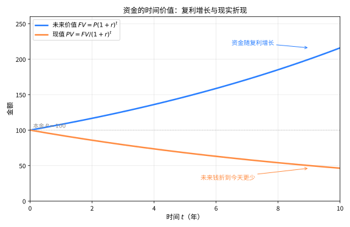

# 第132级 金融数学 (Financial Mathematics)

## 📖 学习目标

1. 理解金融数学的基本框架——随机微积分在金融中的应用
2. 掌握资产定价基本定理及其深刻含义
3. 掌握Black-Scholes公式的推导方法与实际应用
4. 理解Feynman-Kac公式在金融中的桥梁作用
5. 掌握Markowitz投资组合优化理论
6. 了解期权定价的二叉树方法及其收敛性
7. 了解风险管理的核心工具（VaR、CVaR）及信用风险模型

---

## 一、核心概念

### 1.1 金融市场与衍生品

**金融市场**（Financial Market）是进行金融资产交易的场所，核心资产包括：

- **股票**（Stock）：代表公司所有权的证券
- **债券**（Bond）：代表债务的证券
- **衍生品**（Derivative）：价值依赖于基础资产（标的资产）的金融合约

**期权**（Option）是最重要的衍生品之一，分为：
- **看涨期权**（Call Option）：赋予持有者在到期日以行权价 $K$ 买入标的资产的权利
- **看跌期权**（Put Option）：赋予持有者在到期日以行权价 $K$ 卖出标的资产的权利

**定义1（欧式期权）** 欧式看涨期权在到期日 $T$ 的收益为 $\max(S_T - K, 0)$，欧式看跌期权在到期日 $T$ 的收益为 $\max(K - S_T, 0)$，其中 $S_T$ 是标的资产在到期日的价格。

> **直观理解（现实类比）**：钱的"时值"就像放在冰箱里的冰块会慢慢融化——今天的100元比十年后的100元更值钱，因为你可以把它存起来生息。复利让钱像滚雪球一样越滚越大（向上曲线），而折现则是把远期的钱"打折"回今天（向下曲线）。正因如此，期权卖方把行权价 $K$ 的支付折现 $Ke^{-r(T-t)}$，才能与今天的价格公平比较。

### 1.2 Black-Scholes模型

**Black-Scholes模型**（Black-Scholes Model）是期权定价的基石模型，假设：

1. 标的资产价格服从几何布朗运动：
   $$dS_t = \mu S_t dt + \sigma S_t dW_t$$
   其中 $\mu$ 为漂移率（预期收益率），$\sigma$ 为波动率，$W_t$ 为标准布朗运动

2. 无风险利率 $r$ 为常数
3. 无交易成本、无税收、资产可无限分割
4. 不存在套利机会
5. 允许卖空

### 1.3 随机微积分在金融中的应用

**Ito引理**（Ito's Lemma）是随机微积分的核心工具，在金融中用于推导衍生品价格满足的偏微分方程。

**引理（Ito引理）** 设 $X_t$ 满足 $dX_t = \mu_t dt + \sigma_t dW_t$，$f(t, x)$ 为二阶连续可微函数，则：

$$df(t, X_t) = \left(\frac{\partial f}{\partial t} + \mu_t \frac{\partial f}{\partial x} + \frac{1}{2}\sigma_t^2 \frac{\partial^2 f}{\partial x^2}\right)dt + \sigma_t \frac{\partial f}{\partial x} dW_t$$

### 1.4 风险中性定价与鞅测度

**风险中性定价**（Risk-Neutral Pricing）是期权定价的核心方法。在风险中性测度 $\mathbb{Q}$ 下，所有资产的价格过程在贴现后成为鞅（Martingale），期权的价格为：

$$V_t = e^{-r(T-t)} \mathbb{E}^{\mathbb{Q}}[\text{Payoff} \mid \mathcal{F}_t]$$

**鞅测度**（Martingale Measure）是一个使得贴现资产价格过程成为鞅的概率测度。

### 1.5 Delta对冲

**Delta对冲**（Delta Hedging）是一种风险管理策略，通过持有数量为 $\Delta = \frac{\partial V}{\partial S}$ 的标的资产来对冲期权价格对标的资产价格变动的敏感度。

### 1.6 波动率曲面

**波动率曲面**（Volatility Surface）是隐含波动率关于行权价 $K$ 和到期时间 $T$ 的三维曲面，反映了市场对Black-Scholes模型的修正——不同行权价和到期时间的期权隐含波动率不同。

### 1.7 利率模型

**Vasicek模型**：$dr_t = a(b - r_t)dt + \sigma dW_t$，其中 $r_t$ 为短期利率，$a$ 为均值回复速度，$b$ 为长期均值。

**Cox-Ingersoll-Ross（CIR）模型**：$dr_t = a(b - r_t)dt + \sigma \sqrt{r_t} dW_t$，保证利率始终非负。

### 1.8 Copula

**Copula** 是连接多个随机变量边缘分布的联结函数，用于建模金融资产间的相依结构。Sklar定理指出，对于联合分布函数 $F$，存在Copula $C$ 使得：

$$F(x_1, \ldots, x_n) = C(F_1(x_1), \ldots, F_n(x_n))$$

### 1.9 风险管理

**VaR（Value at Risk）**：在给定置信水平 $\alpha$ 和时间区间 $T$ 下，预期的最大损失：

$$\text{VaR}_\alpha = \inf\{x \in \mathbb{R} \mid P(L > x) \leq 1 - \alpha\}$$

其中 $L$ 为损失随机变量。

**CVaR（Conditional VaR）**：损失超过VaR的条件期望：

$$\text{CVaR}_\alpha = \mathbb{E}[L \mid L > \text{VaR}_\alpha]$$

---

## 二、定理与证明

### 定理1：资产定价第一基本定理

**定理（资产定价第一基本定理，First Fundamental Theorem of Asset Pricing）** 在无摩擦市场中，不存在套利机会（No-Arbitrage）当且仅当存在一个等价鞅测度（Equivalent Martingale Measure），即存在一个与客观概率测度 $\mathbb{P}$ 等价的概率测度 $\mathbb{Q}$，使得所有贴现资产价格过程在 $\mathbb{Q}$ 下为鞅。

**证明**：

**第一步：建立市场模型。**

考虑一个离散时间、有限状态的经济，时间 $t = 0, 1, \ldots, T$。设市场中有 $d+1$ 种资产：

- 第0种资产为无风险资产（债券），价格过程 $B_t$ 满足 $B_0 = 1$，$B_t = (1+r)^t$（$r$ 为无风险利率）
- 第 $i$ 种资产（$i = 1, \ldots, d$）为风险资产，价格过程为 $S_t^i$

设 $\Omega$ 为有限状态空间，$\mathcal{F}_t$ 为信息流，$\mathbb{P}$ 为客观概率测度。

**定义（贴现价格）** 定义贴现价格过程 $\tilde{S}_t^i = S_t^i / B_t$。

**定义（套利机会）** 一个套利策略是可容许的自融资交易策略 $\phi = (\phi_t^0, \phi_t^1, \ldots, \phi_t^d)$，满足：
1. 初始财富 $V_0 = 0$
2. 最终财富 $V_T \geq 0$ 且 $\mathbb{P}(V_T > 0) > 0$

其中 $V_t = \phi_t^0 B_t + \sum_{i=1}^d \phi_t^i S_t^i$ 为时刻 $t$ 的财富。

**第二步：证明充分性（等价鞅测度存在 $\Rightarrow$ 无套利）。**

假设存在等价鞅测度 $\mathbb{Q}$。设 $\phi$ 为任意自融资策略，其贴现财富过程为 $\tilde{V}_t = V_t / B_t$。由于 $\tilde{V}_t$ 是贴现金资产组合，在 $\mathbb{Q}$ 下是鞅：

$$\tilde{V}_t = \mathbb{E}^{\mathbb{Q}}[\tilde{V}_T \mid \mathcal{F}_t]$$

特别地，$\tilde{V}_0 = \mathbb{E}^{\mathbb{Q}}[\tilde{V}_T]$。

若 $\phi$ 是套利策略，则 $V_0 = 0$，故 $\tilde{V}_0 = 0$。因此 $\mathbb{E}^{\mathbb{Q}}[\tilde{V}_T] = 0$。

由于 $\tilde{V}_T \geq 0$（因为 $V_T \geq 0$），且 $\mathbb{Q}$ 与 $\mathbb{P}$ 等价（即 $\mathbb{Q}(A) = 0 \iff \mathbb{P}(A) = 0$），由 $\mathbb{E}^{\mathbb{Q}}[\tilde{V}_T] = 0$ 和 $\tilde{V}_T \geq 0$ 可得 $\tilde{V}_T = 0$ $\mathbb{Q}$-a.s.，从而 $\mathbb{P}$-a.s.。因此 $\mathbb{P}(V_T > 0) = 0$，与套利定义矛盾。故不存在套利机会。

**第三步：证明必要性（无套利 $\Rightarrow$ 等价鞅测度存在）。**

这是更困难的方向，需要用到凸分析和分离超平面定理。我们使用线性规划方法。

设 $\Omega = \{\omega_1, \ldots, \omega_m\}$，$\mathbb{P}$ 为客观概率测度，$\mathbb{P}(\omega_j) > 0$ 对所有 $j$。

考虑所有可能的自融资交易策略，其贴现财富的集合为：

$$\mathcal{W} = \{\tilde{V}_T \in \mathbb{R}^m \mid \exists \text{自融资策略使最终贴现财富为 } \tilde{V}_T\}$$

注意 $\mathcal{W}$ 是 $\mathbb{R}^m$ 中的一个线性子空间（因为自融资策略的集合是线性空间）。

**定义（无套利条件）** 无套利意味着 $\mathcal{W} \cap \mathbb{R}^m_+ = \{0\}$，其中 $\mathbb{R}^m_+ = \{x \in \mathbb{R}^m \mid x_j \geq 0, \forall j\}$。

**引理** 若 $\mathcal{W} \cap \mathbb{R}^m_+ = \{0\}$，则存在一个向量 $q \in \mathbb{R}^m_{++}$（即所有分量严格为正）使得 $q \perp \mathcal{W}$（即 $q$ 与 $\mathcal{W}$ 中的所有向量正交）。

**证明**：考虑凸集 $C = \mathcal{W} + \mathbb{R}^m_+ = \{x \in \mathbb{R}^m \mid \text{存在 } w \in \mathcal{W}, y \in \mathbb{R}^m_+ \text{ 使得 } x = w + y\}$。无套利条件意味着 $C$ 是一个尖锥（即 $C \cap (-C) = \{0\}$）。由凸集分离定理，存在一个超平面严格分离 $C$ 和 $-C \setminus \{0\}$，该超平面的法向量即为所需的 $q$。

**第四步：构造等价鞅测度。**

由上述引理，存在严格正向量 $q = (q_1, \ldots, q_m)$ 使得对所有自融资策略，$\sum_{j=1}^m q_j \tilde{V}_T(\omega_j) = 0$。

定义概率测度 $\mathbb{Q}$ 为 $\mathbb{Q}(\omega_j) = \frac{q_j}{\sum_{k=1}^m q_k}$。由于 $q_j > 0$，$\mathbb{Q}$ 与 $\mathbb{P}$ 等价。

现在需要验证 $\mathbb{Q}$ 是鞅测度，即所有贴现资产价格在 $\mathbb{Q}$ 下是鞅。对任意风险资产 $i$，考虑策略：在时刻 $t$ 买入1单位资产 $i$，在时刻 $t+1$ 卖出。该策略的贴现财富变化为 $\tilde{S}_{t+1}^i - \tilde{S}_t^i$。由于该策略的初始财富为0，其最终贴现财富必须正交于 $q$，即：

$$\mathbb{E}^{\mathbb{Q}}[\tilde{S}_{t+1}^i - \tilde{S}_t^i \mid \mathcal{F}_t] = 0$$

因此 $\mathbb{E}^{\mathbb{Q}}[\tilde{S}_{t+1}^i \mid \mathcal{F}_t] = \tilde{S}_t^i$，即 $\tilde{S}_t^i$ 在 $\mathbb{Q}$ 下是鞅。

**第五步：扩展到连续时间。**

在连续时间框架下，需要更复杂的鞅表示定理和Girsanov定理。基本思路相同：

1. 无套利条件等价于存在一个等价局部鞅测度
2. 使用Girsanov定理通过变换漂移项构造等价鞅测度
3. Novikov条件保证变换的良定性

**结论**：资产定价第一基本定理建立了无套利与等价鞅测度存在性之间的等价关系，为金融资产定价提供了理论基础。$\square$

### 定理2：资产定价第二基本定理

**定理（资产定价第二基本定理，Second Fundamental Theorem of Asset Pricing）** 在无套利市场中，市场是完备的（Complete Market）当且仅当等价鞅测度是唯一的。

**定义**：市场是完备的，如果每个未定权益（Contingent Claim）都可以通过自融资策略复制，即对任意 $\mathcal{F}_T$-可测且满足适当可积性的随机变量 $X$，存在自融资策略 $\phi$ 使得 $V_T(\phi) = X$ a.s.。

**证明**：

**第一步：证明完备性 $\Rightarrow$ 唯一性。**

假设市场完备，且 $\mathbb{Q}_1$ 和 $\mathbb{Q}_2$ 是两个等价鞅测度。对任意 $\mathcal{F}_T$-可测的未定权益 $X$，由于市场完备，存在自融资策略 $\phi$ 复制 $X$，即 $V_T(\phi) = X$ a.s.。

由于 $\mathbb{Q}_1$ 和 $\mathbb{Q}_2$ 都是鞅测度，贴现财富过程 $\tilde{V}_t$ 在两者下都是鞅，因此：

$$\mathbb{E}^{\mathbb{Q}_1}[X / B_T] = \tilde{V}_0 = \mathbb{E}^{\mathbb{Q}_2}[X / B_T]$$

其中 $\tilde{V}_0$ 是策略的初始财富（与测度无关）。

由于 $X$ 是任意的 $\mathcal{F}_T$-可测随机变量，由 $\mathbb{E}^{\mathbb{Q}_1}[X/B_T] = \mathbb{E}^{\mathbb{Q}_2}[X/B_T]$ 对所有 $X$ 成立，可得 $\mathbb{Q}_1 = \mathbb{Q}_2$（事实上，取 $X = B_T \cdot \mathbf{1}_A$ 可得 $\mathbb{Q}_1(A) = \mathbb{Q}_2(A)$ 对所有 $A \in \mathcal{F}_T$ 成立）。

**第二步：证明唯一性 $\Rightarrow$ 完备性。**

反证法。假设等价鞅测度唯一但市场不完备。则存在某个未定权益 $X$ 不能被任何自融资策略复制。

定义 $\mathcal{W}$ 为所有可复制未定权益的集合（即 $\mathcal{W} = \{V_T(\phi) \mid \phi \text{ 自融资策略}\}$）。由于 $X \notin \mathcal{W}$，$X$ 在 $L^2$（或适当空间）中与 $\mathcal{W}$ 有非零距离。

由Hahn-Banach定理，存在一个非零线性泛函 $l$ 使得 $l(X) \neq 0$ 但 $l(W) = 0$ 对所有 $W \in \mathcal{W}$。

在离散时间有限状态空间中，这意味着存在一个与 $\mathcal{W}$ 正交的向量，从而可以构造另一个等价鞅测度，与唯一性矛盾。

**连续时间框架下的论证**：

在连续时间框架下，若市场完备，则鞅表示定理成立：任何鞅都可以表示为关于布朗运动的随机积分。等价鞅测度的唯一性源于鞅表示定理的适用性。

具体来说，设 $\mathbb{Q}$ 是一个等价鞅测度。若市场不完备，则存在与 $\mathbb{Q}$ 等价的另一个鞅测度 $\mathbb{Q}'$。通过Radon-Nikodym导数 $\frac{d\mathbb{Q}'}{d\mathbb{Q}}$ 可以构造一个与所有鞅正交的随机变量，从而与鞅表示定理矛盾。

**结论**：资产定价第二基本定理揭示了市场完备性与等价鞅测度唯一性之间的深刻联系。完备市场中，每个未定权益都有唯一的价格（由唯一鞅测度给出）；不完备市场中，存在多个合理价格，需要额外的经济假设来定价。$\square$

### 定理3：Black-Scholes公式

**定理（Black-Scholes公式）** 在Black-Scholes模型假设下，到期日为 $T$、行权价为 $K$ 的欧式看涨期权在时刻 $t$ 的价格为：

$$C(S_t, t) = S_t \Phi(d_1) - Ke^{-r(T-t)} \Phi(d_2)$$

其中

$$d_1 = \frac{\ln(S_t/K) + (r + \sigma^2/2)(T-t)}{\sigma\sqrt{T-t}}$$
$$d_2 = d_1 - \sigma\sqrt{T-t} = \frac{\ln(S_t/K) + (r - \sigma^2/2)(T-t)}{\sigma\sqrt{T-t}}$$

$\Phi$ 为标准正态分布的累积分布函数。

**证明**（PDE方法）：

**第一步：建立偏微分方程。**

设 $V(S, t)$ 为期权价格。在Black-Scholes模型 $dS = \mu S dt + \sigma S dW$ 下，由Ito引理：

$$dV = \left(\frac{\partial V}{\partial t} + \mu S \frac{\partial V}{\partial S} + \frac{1}{2}\sigma^2 S^2 \frac{\partial^2 V}{\partial S^2}\right)dt + \sigma S \frac{\partial V}{\partial S} dW$$

构造对冲组合 $\Pi = V - \Delta S$，其中 $\Delta$ 为持有的标的资产数量。选择 $\Delta = \frac{\partial V}{\partial S}$，则：

$$d\Pi = dV - \Delta dS = \left(\frac{\partial V}{\partial t} + \frac{1}{2}\sigma^2 S^2 \frac{\partial^2 V}{\partial S^2}\right)dt$$

由于该组合不含随机项（$dW$ 项被消除），根据无套利原理，其收益率应等于无风险利率：

$$d\Pi = r\Pi dt = r\left(V - \frac{\partial V}{\partial S} S\right)dt$$

联立两式，得到**Black-Scholes偏微分方程**：

$$\frac{\partial V}{\partial t} + rS\frac{\partial V}{\partial S} + \frac{1}{2}\sigma^2 S^2 \frac{\partial^2 V}{\partial S^2} - rV = 0$$

**第二步：边界条件。**

对于欧式看涨期权，终端条件为：

$$V(S, T) = \max(S - K, 0)$$

边界条件：
- 当 $S = 0$ 时，$V(0, t) = 0$
- 当 $S \to \infty$ 时，$V(S, t) \sim S - Ke^{-r(T-t)}$

**第三步：化为热传导方程。**

做变量代换简化。令：

$$\tau = T - t, \quad x = \ln S, \quad V(S, t) = e^{-r\tau} u(x, \tau)$$

计算偏导数：

$$\frac{\partial V}{\partial t} = -\frac{\partial V}{\partial \tau} = -e^{-r\tau}\left(-r u + \frac{\partial u}{\partial \tau}\right)$$
$$\frac{\partial V}{\partial S} = e^{-r\tau} \frac{1}{S} \frac{\partial u}{\partial x}$$
$$\frac{\partial^2 V}{\partial S^2} = e^{-r\tau}\left(-\frac{1}{S^2}\frac{\partial u}{\partial x} + \frac{1}{S^2}\frac{\partial^2 u}{\partial x^2}\right)$$

代入Black-Scholes方程：

$$-e^{-r\tau}\left(-r u + \frac{\partial u}{\partial \tau}\right) + rS \cdot e^{-r\tau}\frac{1}{S}\frac{\partial u}{\partial x} + \frac{1}{2}\sigma^2 S^2 \cdot e^{-r\tau}\left(-\frac{1}{S^2}\frac{\partial u}{\partial x} + \frac{1}{S^2}\frac{\partial^2 u}{\partial x^2}\right) - r e^{-r\tau} u = 0$$

化简：

$$-\frac{\partial u}{\partial \tau} + \left(r - \frac{1}{2}\sigma^2\right)\frac{\partial u}{\partial x} + \frac{1}{2}\sigma^2\frac{\partial^2 u}{\partial x^2} = 0$$

即：

$$\frac{\partial u}{\partial \tau} = \frac{1}{2}\sigma^2\frac{\partial^2 u}{\partial x^2} + \left(r - \frac{1}{2}\sigma^2\right)\frac{\partial u}{\partial x}$$

再做变量代换 $y = x + \left(r - \frac{1}{2}\sigma^2\right)\tau$，$w(y, \tau) = u(x, \tau)$，得到标准热传导方程：

$$\frac{\partial w}{\partial \tau} = \frac{1}{2}\sigma^2 \frac{\partial^2 w}{\partial y^2}$$

初始条件转化为：

$$w(y, 0) = \max(e^y - K, 0)$$

**第四步：求解热传导方程。**

热传导方程的基本解（Green函数）为：

$$G(y, \tau) = \frac{1}{\sqrt{2\pi\sigma^2\tau}} \exp\left(-\frac{y^2}{2\sigma^2\tau}\right)$$

解为初始条件与基本解的卷积：

$$w(y, \tau) = \int_{-\infty}^{\infty} G(y - \xi, \tau) \max(e^\xi - K, 0) d\xi$$

$$= \int_{\ln K}^{\infty} \frac{1}{\sqrt{2\pi\sigma^2\tau}} \exp\left(-\frac{(y - \xi)^2}{2\sigma^2\tau}\right) (e^\xi - K) d\xi$$

**第五步：计算积分。**

将积分分为两部分：

$$w(y, \tau) = I_1 - I_2$$

其中

$$I_1 = \int_{\ln K}^{\infty} \frac{1}{\sqrt{2\pi\sigma^2\tau}} \exp\left(-\frac{(y - \xi)^2}{2\sigma^2\tau}\right) e^\xi d\xi$$
$$I_2 = K \int_{\ln K}^{\infty} \frac{1}{\sqrt{2\pi\sigma^2\tau}} \exp\left(-\frac{(y - \xi)^2}{2\sigma^2\tau}\right) d\xi$$

对于 $I_2$，令 $z = \frac{\xi - y}{\sigma\sqrt{\tau}}$，则：

$$I_2 = K \int_{\frac{\ln K - y}{\sigma\sqrt{\tau}}}^{\infty} \frac{1}{\sqrt{2\pi}} e^{-z^2/2} dz = K \Phi\left(\frac{y - \ln K}{\sigma\sqrt{\tau}}\right)$$

对于 $I_1$，合并指数项：

$$\exp\left(-\frac{(y - \xi)^2}{2\sigma^2\tau} + \xi\right) = \exp\left(-\frac{(\xi - y - \sigma^2\tau)^2}{2\sigma^2\tau} + y + \frac{1}{2}\sigma^2\tau\right)$$

因此：

$$I_1 = e^{y + \frac{1}{2}\sigma^2\tau} \int_{\ln K}^{\infty} \frac{1}{\sqrt{2\pi\sigma^2\tau}} \exp\left(-\frac{(\xi - y - \sigma^2\tau)^2}{2\sigma^2\tau}\right) d\xi$$
$$= e^{y + \frac{1}{2}\sigma^2\tau} \Phi\left(\frac{y + \sigma^2\tau - \ln K}{\sigma\sqrt{\tau}}\right)$$

**第六步：代回原变量。**

回代 $\tau = T - t$，$y = \ln S + \left(r - \frac{1}{2}\sigma^2\right)(T-t)$：

$$e^{y + \frac{1}{2}\sigma^2\tau} = S e^{r(T-t)}$$

$$V(S, t) = e^{-r\tau} w(y, \tau) = S \Phi\left(\frac{y + \sigma^2\tau - \ln K}{\sigma\sqrt{\tau}}\right) - Ke^{-r\tau} \Phi\left(\frac{y - \ln K}{\sigma\sqrt{\tau}}\right)$$

计算：

$$\frac{y + \sigma^2\tau - \ln K}{\sigma\sqrt{\tau}} = \frac{\ln S + (r - \frac{1}{2}\sigma^2)\tau + \sigma^2\tau - \ln K}{\sigma\sqrt{\tau}} = \frac{\ln(S/K) + (r + \frac{1}{2}\sigma^2)\tau}{\sigma\sqrt{\tau}} = d_1$$

$$\frac{y - \ln K}{\sigma\sqrt{\tau}} = \frac{\ln S + (r - \frac{1}{2}\sigma^2)\tau - \ln K}{\sigma\sqrt{\tau}} = \frac{\ln(S/K) + (r - \frac{1}{2}\sigma^2)\tau}{\sigma\sqrt{\tau}} = d_2$$

因此得到Black-Scholes公式：

$$C(S, t) = S\Phi(d_1) - Ke^{-r(T-t)}\Phi(d_2)$$

**第七步：看跌期权定价。**

由看跌-看涨平价关系（Put-Call Parity）：

$$C - P = S - Ke^{-r(T-t)}$$

可得欧式看跌期权价格为：

$$P(S, t) = Ke^{-r(T-t)}\Phi(-d_2) - S\Phi(-d_1)$$

**结论**：Black-Scholes公式给出了欧式期权在连续时间框架下的解析定价公式，是金融数学中最具影响力的成果之一。$\square$

### 定理4：Feynman-Kac公式在金融中的应用

**定理（Feynman-Kac公式）** 设 $X_t$ 满足随机微分方程 $dX_t = \mu(X_t, t)dt + \sigma(X_t, t)dW_t$，$f(x, t)$ 为满足多项式增长条件的函数。则函数

$$V(x, t) = \mathbb{E}\left[e^{-\int_t^T r(X_s, s)ds} f(X_T, T) \;\Big|\; X_t = x\right]$$

满足偏微分方程：

$$\frac{\partial V}{\partial t} + \mu(x, t)\frac{\partial V}{\partial x} + \frac{1}{2}\sigma(x, t)^2\frac{\partial^2 V}{\partial x^2} - r(x, t)V = 0$$

终端条件为 $V(x, T) = f(x, T)$。

**证明**：

**第一步：建立鞅过程。**

定义过程：

$$M_s = e^{-\int_t^s r(X_u, u)du} V(X_s, s)$$

其中 $t \leq s \leq T$。由风险中性定价理论，在适当的条件下，$M_s$ 是一个鞅。

**第二步：应用Ito引理。**

对 $M_s$ 应用Ito引理。首先计算 $dV$：

$$dV = \left(\frac{\partial V}{\partial s} + \mu\frac{\partial V}{\partial x} + \frac{1}{2}\sigma^2\frac{\partial^2 V}{\partial x^2}\right)ds + \sigma\frac{\partial V}{\partial x} dW_s$$

然后计算 $dM_s$：

$$dM_s = -r e^{-\int_t^s r du} V ds + e^{-\int_t^s r du} dV$$

$$= e^{-\int_t^s r du}\left[\left(\frac{\partial V}{\partial s} + \mu\frac{\partial V}{\partial x} + \frac{1}{2}\sigma^2\frac{\partial^2 V}{\partial x^2} - rV\right)ds + \sigma\frac{\partial V}{\partial x} dW_s\right]$$

**第三步：鞅条件导出PDE。**

由于 $M_s$ 是鞅，其漂移项必须为零：

$$\frac{\partial V}{\partial s} + \mu\frac{\partial V}{\partial x} + \frac{1}{2}\sigma^2\frac{\partial^2 V}{\partial x^2} - rV = 0$$

代入 $s = t$ 即得Feynman-Kac公式中的PDE。

**第四步：验证终端条件。**

当 $s = T$ 时：

$$V(X_T, T) = \mathbb{E}\left[e^{-\int_T^T r du} f(X_T, T) \;\Big|\; \mathcal{F}_T\right] = f(X_T, T)$$

因此 $V(x, T) = f(x, T)$。

**金融应用：**

Feynman-Kac公式建立了PDE与期望值之间的联系，是风险中性定价的数学基础：

1. **期权定价**：到期权价格 $V$ 满足的PDE（Black-Scholes方程）和风险中性期望公式
2. **信用风险**：违约概率可以用PDE方法或蒙特卡洛方法计算
3. **利率衍生品**：债券价格满足的PDE可以从短期利率模型导出

**示例**：在Black-Scholes模型中，$\mu = rS$，$\sigma = \sigma S$，$r$ 为常数，则Feynman-Kac公式给出：

$$V(S, t) = e^{-r(T-t)}\mathbb{E}^{\mathbb{Q}}[f(S_T) \mid S_t = S]$$

这正是风险中性定价公式。$\square$

### 定理5：投资组合的Markowitz有效前沿

**定理（Markowitz有效前沿）** 在均值-方差框架下，所有最优投资组合（给定风险水平下预期收益最大，或给定预期收益下风险最小）构成一条曲线，称为有效前沿（Efficient Frontier）。有效前沿上的组合满足：

$$\sigma_p = \sqrt{\frac{(E[R_p] - r_f)^2}{a}}$$

其中 $a = \boldsymbol{\mu}' \Sigma^{-1} \boldsymbol{\mu}$，$\boldsymbol{\mu}$ 为超额收益向量，$\Sigma$ 为协方差矩阵。

**证明**：

**第一步：建立优化问题。**

考虑 $n$ 种风险资产，预期收益向量为 $\mathbf{R} = (R_1, \ldots, R_n)'$，协方差矩阵为 $\Sigma$（正定）。设投资组合权重向量为 $\mathbf{w} = (w_1, \ldots, w_n)'$，满足 $\sum_{i=1}^n w_i = 1$。

组合预期收益为 $E[R_p] = \mathbf{w}' \mathbf{R}$，方差为 $\sigma_p^2 = \mathbf{w}' \Sigma \mathbf{w}$。

Markowitz优化问题：给定目标收益 $\mu_0$，最小化方差：

$$\min_{\mathbf{w}} \frac{1}{2} \mathbf{w}' \Sigma \mathbf{w}$$

约束条件：
1. $\mathbf{w}' \mathbf{R} = \mu_0$（目标收益）
2. $\mathbf{w}' \mathbf{1} = 1$（权重和为1）

其中 $\mathbf{1} = (1, 1, \ldots, 1)'$。

**第二步：Lagrange乘子法。**

构造Lagrange函数：

$$\mathcal{L} = \frac{1}{2}\mathbf{w}' \Sigma \mathbf{w} - \lambda_1(\mathbf{w}' \mathbf{R} - \mu_0) - \lambda_2(\mathbf{w}' \mathbf{1} - 1)$$

一阶条件：

$$\frac{\partial \mathcal{L}}{\partial \mathbf{w}} = \Sigma \mathbf{w} - \lambda_1 \mathbf{R} - \lambda_2 \mathbf{1} = 0$$

解得：

$$\mathbf{w} = \lambda_1 \Sigma^{-1} \mathbf{R} + \lambda_2 \Sigma^{-1} \mathbf{1}$$

**第三步：求解Lagrange乘子。**

将解代入约束条件：

$$\mathbf{w}' \mathbf{R} = \lambda_1 \mathbf{R}' \Sigma^{-1} \mathbf{R} + \lambda_2 \mathbf{1}' \Sigma^{-1} \mathbf{R} = \mu_0$$
$$\mathbf{w}' \mathbf{1} = \lambda_1 \mathbf{R}' \Sigma^{-1} \mathbf{1} + \lambda_2 \mathbf{1}' \Sigma^{-1} \mathbf{1} = 1$$

定义常数：

$$A = \mathbf{R}' \Sigma^{-1} \mathbf{R}, \quad B = \mathbf{R}' \Sigma^{-1} \mathbf{1}, \quad C = \mathbf{1}' \Sigma^{-1} \mathbf{1}$$

则方程组为：

$$\begin{cases}
A\lambda_1 + B\lambda_2 = \mu_0 \\
B\lambda_1 + C\lambda_2 = 1
\end{cases}$$

解得：

$$\lambda_1 = \frac{C\mu_0 - B}{AC - B^2}, \quad \lambda_2 = \frac{A - B\mu_0}{AC - B^2}$$

**第四步：最小方差组合的表达式。**

将 $\lambda_1, \lambda_2$ 代入 $\mathbf{w}$ 的表达式，得到最优权重：

$$\mathbf{w}^* = \frac{C\mu_0 - B}{AC - B^2} \Sigma^{-1} \mathbf{R} + \frac{A - B\mu_0}{AC - B^2} \Sigma^{-1} \mathbf{1}$$

最小方差为：

$$\sigma_p^2 = \mathbf{w}^{*'} \Sigma \mathbf{w}^* = \lambda_1 \mathbf{w}^{*'} \mathbf{R} + \lambda_2 \mathbf{w}^{*'} \mathbf{1} = \lambda_1 \mu_0 + \lambda_2$$

代入 $\lambda_1, \lambda_2$：

$$\sigma_p^2 = \frac{C\mu_0^2 - 2B\mu_0 + A}{AC - B^2}$$

**第五步：有效前沿的解析形式。**

有效前沿是 $\sigma_p^2$ 作为 $\mu_0$ 的函数，在 $\mu_0 \geq \mu_{\text{min}}$ 的部分（$\mu_{\text{min}}$ 为全局最小方差组合的收益）。

整理得：

$$\frac{\sigma_p^2}{1/C} - \frac{(\mu_0 - B/C)^2}{(AC - B^2)/C^2} = 1$$

这是双曲线方程，在 $(\sigma_p, \mu_0)$ 平面上表现为一条抛物线（均值-方差）或双曲线（均值-标准差）。

**第六步：引入无风险资产。**

引入无风险资产后，有效前沿变成一条直线——**资本市场线**（Capital Market Line, CML）：

$$E[R_p] = r_f + \frac{E[R_m] - r_f}{\sigma_m} \sigma_p$$

其中 $R_m$ 为市场组合（切点组合）的收益。

**结论**：Markowitz有效前沿为投资者提供了风险-收益权衡的理论框架，是现代投资组合理论的基石。$\square$

---

## 三、示例

### 示例1：用Black-Scholes公式计算期权价格

**问题**：假设某股票当前价格 $S = 100$，行权价 $K = 105$，到期时间 $T = 1$ 年，无风险利率 $r = 5\%$，波动率 $\sigma = 20\%$。计算欧式看涨期权和看跌期权的价格。

**计算**：

首先计算 $d_1$ 和 $d_2$：

$$d_1 = \frac{\ln(100/105) + (0.05 + 0.20^2/2) \times 1}{0.20 \times \sqrt{1}} = \frac{-0.04879 + 0.07}{0.20} = 0.10605$$

$$d_2 = d_1 - 0.20 \times 1 = 0.10605 - 0.20 = -0.09395$$

查标准正态分布表：

$$\Phi(d_1) = \Phi(0.10605) \approx 0.5422$$
$$\Phi(d_2) = \Phi(-0.09395) \approx 0.4626$$
$$\Phi(-d_1) = 1 - \Phi(d_1) \approx 0.4578$$
$$\Phi(-d_2) = 1 - \Phi(d_2) \approx 0.5374$$

看涨期权价格：

$$C = 100 \times 0.5422 - 105 \times e^{-0.05 \times 1} \times 0.4626$$
$$= 54.22 - 105 \times 0.9512 \times 0.4626$$
$$= 54.22 - 46.21 = 8.01$$

看跌期权价格：

$$P = 105 \times e^{-0.05 \times 1} \times 0.5374 - 100 \times 0.4578$$
$$= 105 \times 0.9512 \times 0.5374 - 45.78$$
$$= 53.67 - 45.78 = 7.89$$

**验证看跌-看涨平价**：

$$C - P = 8.01 - 7.89 = 0.12$$
$$S - Ke^{-rT} = 100 - 105 \times e^{-0.05} = 100 - 99.88 = 0.12$$

两者相等，验证了公式的正确性。

### 示例2：二叉树期权定价

**问题**：用一步二叉树模型为欧式看涨期权定价。参数：$S = 100$，$K = 105$，$T = 1$ 年，$r = 5\%$，$\sigma = 20\%$。

**第一步：构造二叉树。**

设上涨因子 $u = e^{\sigma\sqrt{\Delta t}} = e^{0.20} = 1.2214$，下跌因子 $d = 1/u = 0.8187$。

风险中性概率：

$$p = \frac{e^{r\Delta t} - d}{u - d} = \frac{e^{0.05} - 0.8187}{1.2214 - 0.8187} = \frac{1.0513 - 0.8187}{0.4027} = 0.5775$$

![一步二叉树期权定价：股价按上涨因子 $u=1.2214$ 与下跌因子 $d=0.8187$ 分支，期权价格 $C=e^{-rT}[pC_u+(1-p)C_d]=9.42$](images/132_二叉树期权定价.svg)

> **直观理解（现实类比）**：二叉树模型就像一场"石头剪刀布"的猜涨跌——明天股价要么上涨到 $S_u$、要么下跌到 $S_d$，只有两条路。期权定价就像在下注前先在心里给这两条路各"估个价"（$C_u$ 和 $C_d$），再按风险中性概率 $p$ 加权平均并折现回今天。把时间切得越细（步数越多），这个"分叉树"就越接近连续变化的真实股价，最终收敛到 Black-Scholes 公式。

**第二步：计算期末价格和期权收益。**

$$S_u = 100 \times 1.2214 = 122.14$$
$$S_d = 100 \times 0.8187 = 81.87$$

看涨期权收益：
$$C_u = \max(122.14 - 105, 0) = 17.14$$
$$C_d = \max(81.87 - 105, 0) = 0$$

**第三步：计算期权价格。**

$$C = e^{-rT}[p C_u + (1-p) C_d] = e^{-0.05}[0.5775 \times 17.14 + 0.4225 \times 0]$$
$$= 0.9512 \times 9.90 = 9.42$$

**与Black-Scholes公式的比较**：

一步二叉树给出的价格为9.42，而Black-Scholes公式给出的价格为8.01。随着二叉树步数增加，二叉树价格收敛到Black-Scholes价格。当步数 $n \to \infty$ 时，二叉树价格收敛到连续时间价格。

---

## 四、习题

### 习题1：风险中性测度的构造

考虑一个单期经济，有两个状态 $\omega_1, \omega_2$，概率分别为 $\mathbb{P}(\omega_1) = 0.6$，$\mathbb{P}(\omega_2) = 0.4$。无风险利率 $r = 5\%$。一只股票当前价格为 $S_0 = 100$，在状态 $\omega_1$ 下为 $S_1(\omega_1) = 120$，在状态 $\omega_2$ 下为 $S_1(\omega_2) = 90$。

（1）验证当前市场是否存在套利机会。
（2）构造等价鞅测度 $\mathbb{Q}$。
（3）用风险中性定价法计算一个行权价为 $K=105$ 的欧式看涨期权的价格。
（4）验证该期权价格是否可以通过复制策略得到。

**提示**：风险中性测度 $\mathbb{Q}$ 满足 $\mathbb{E}^{\mathbb{Q}}[S_1] = S_0(1+r)$，由此可解出 $\mathbb{Q}(\omega_1)$ 和 $\mathbb{Q}(\omega_2)$。

### 习题2：Black-Scholes公式的敏感性分析（希腊字母）

对于Black-Scholes公式中的欧式看涨期权，计算以下希腊字母：

（1）Delta：$\Delta = \frac{\partial C}{\partial S} = \Phi(d_1)$
（2）Gamma：$\Gamma = \frac{\partial^2 C}{\partial S^2} = \frac{\phi(d_1)}{S\sigma\sqrt{T-t}}$
（3）Vega：$\mathcal{V} = \frac{\partial C}{\partial \sigma} = S\phi(d_1)\sqrt{T-t}$
（4）Theta：$\Theta = \frac{\partial C}{\partial t} = -\frac{S\phi(d_1)\sigma}{2\sqrt{T-t}} - rKe^{-r(T-t)}\Phi(d_2)$
（5）Rho：$\rho = \frac{\partial C}{\partial r} = K(T-t)e^{-r(T-t)}\Phi(d_2)$

其中 $\phi(x) = \frac{1}{\sqrt{2\pi}}e^{-x^2/2}$ 为标准正态概率密度函数。

给定 $S=100, K=105, T=1, r=0.05, \sigma=0.20$，计算上述希腊字母的具体数值。

**提示**：先用示例1中计算的 $d_1, d_2$ 值，再代入公式计算。

### 习题3：二叉树模型的收敛性

编写一个多步二叉树模型（用数学推导而非编程），分析当步数 $n$ 增加时，二叉树期权价格如何收敛到Black-Scholes价格。

（1）写出 $n$ 步二叉树中看涨期权的价格公式。
（2）证明当 $n \to \infty$ 时，二叉树价格收敛到Black-Scholes公式。
（3）说明收敛速度与哪些因素有关。

**提示**：使用Cox-Ross-Rubinstein参数化 $u = e^{\sigma\sqrt{\Delta t}}$，$d = e^{-\sigma\sqrt{\Delta t}}$，$p = \frac{e^{r\Delta t} - d}{u - d}$，其中 $\Delta t = T/n$。利用中心极限定理证明收敛性。

### 习题4：Markowitz有效前沿的构建

现有三种资产，预期收益和协方差矩阵如下：

$$\mathbf{R} = \begin{pmatrix} 0.10 \\ 0.12 \\ 0.08 \end{pmatrix}, \quad \Sigma = \begin{pmatrix} 0.20 & 0.05 & 0.02 \\ 0.05 & 0.30 & 0.04 \\ 0.02 & 0.04 & 0.15 \end{pmatrix}$$

（1）计算全局最小方差组合的权重、预期收益和标准差。
（2）计算目标收益为 $\mu_0 = 11\%$ 时的有效前沿组合。
（3）加入无风险资产 $r_f = 3\%$，求资本市场线和切点组合。
（4）若投资者风险厌恶系数 $A = 3$，求最优组合（最大化 $U = E[R_p] - \frac{1}{2}A\sigma_p^2$）。

**提示**：先计算 $A = \mathbf{R}'\Sigma^{-1}\mathbf{R}$，$B = \mathbf{R}'\Sigma^{-1}\mathbf{1}$，$C = \mathbf{1}'\Sigma^{-1}\mathbf{1}$，再代入公式。

### 习题5：Feynman-Kac公式的应用

考虑一个简化的利率模型 $dr_t = a(b - r_t)dt + \sigma dW_t$（Vasicek模型）。零息债券价格 $P(t, T)$ 满足：

$$P(t, T) = \mathbb{E}^{\mathbb{Q}}\left[e^{-\int_t^T r_s ds} \;\Big|\; \mathcal{F}_t\right]$$

（1）写出 $P(t, T)$ 满足的PDE（使用Feynman-Kac公式）。
（2）假设 $P(t, T) = e^{A(t, T) - B(t, T)r_t}$，代入PDE求解 $A(t, T)$ 和 $B(t, T)$。
（3）给出债券价格的显式表达式。

**提示**：在风险中性测度下，$dr_t = a(b^* - r_t)dt + \sigma dW_t^{\mathbb{Q}}$，其中 $b^*$ 是风险中性下的长期均值。代入Feynman-Kac公式得到PDE，再假设指数仿射形式求解。

---

## 五、总结

本教程系统介绍了金融数学的核心理论和方法。

**关键概念回顾**：
- **资产定价基本定理**建立了无套利与风险中性测度之间的等价关系
- **Black-Scholes公式**给出了欧式期权的解析定价公式，是金融数学的标志性成果
- **Feynman-Kac公式**连接了随机微分方程和偏微分方程，是风险中性定价的数学基础
- **Markowitz有效前沿**为投资组合优化提供了理论框架
- **风险管理工具**（VaR、CVaR）为金融机构提供了量化风险的方法

**核心方法**：
1. **风险中性定价**：在等价鞅测度下，资产价格等于贴现后的期望收益
2. **对冲复制**：通过构造复制组合为衍生品定价
3. **PDE方法**：将期权定价问题转化为偏微分方程的求解
4. **数值方法**：二叉树、蒙特卡洛、有限差分等方法用于复杂衍生品定价

**前沿方向**：
- 随机波动率模型（Heston模型）
- 跳跃扩散模型
- 利率期限结构模型（HJM框架）
- 信用风险与信用衍生品定价
- 机器学习在金融中的应调用
- 高频交易与市场微观结构
- 金融科技（FinTech）与去中心化金融（DeFi）