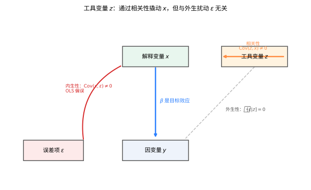
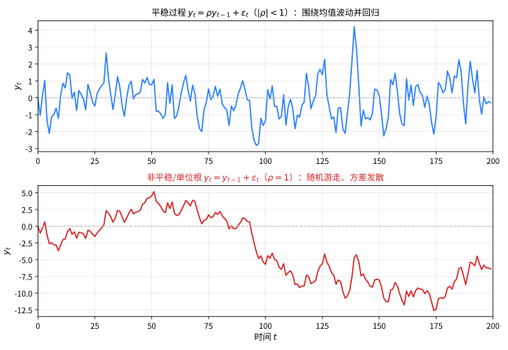

# 第 134 级：计量经济学 (Econometrics)

---

## 1. 学习目标

完成本教程后，你将能够：

1. 理解线性回归模型与 OLS 估计的基本框架
2. 掌握 OLS 估计量的一致性和渐近正态性及其证明
3. 理解工具变量（IV）估计的原理与两阶段最小二乘法（2SLS）
4. 掌握广义矩方法（GMM）及其渐近性质
5. 理解面板数据模型（固定效应与随机效应）
6. 掌握差分中的差分（DID）与断点回归（RDD）方法
7. 理解时间序列计量经济学中的协整与误差修正模型
8. 掌握结构方程模型与因果推断的基本思想
9. 理解离散选择模型（Logit、Probit）与计数数据模型

---

## 2. 核心概念

### 2.1 线性回归模型

**线性回归模型**（Linear Regression Model）是计量经济学的基础。标准形式为：

$$
y_i = x_i^\top \beta + \varepsilon_i, \quad i = 1, \dots, n
$$

其中 $y_i$ 为因变量，$x_i \in \mathbb{R}^K$ 为解释变量向量，$\beta \in \mathbb{R}^K$ 为待估参数，$\varepsilon_i$ 为随机误差项。

**基本假设**：
1. **线性性**：$y = X\beta + \varepsilon$
2. **严格外生性**：$\mathbb{E}[\varepsilon | X] = 0$
3. **球形误差**：$\text{Var}(\varepsilon | X) = \sigma^2 I_n$
4. **满秩**：$\text{rank}(X) = K$

### 2.2 OLS 估计

**普通最小二乘**（Ordinary Least Squares, OLS）估计量通过最小化残差平方和得到：

$$
\hat{\beta}_{\text{OLS}} = \arg\min_\beta \sum_{i=1}^n (y_i - x_i^\top \beta)^2 = (X^\top X)^{-1} X^\top y
$$

### 2.3 工具变量与两阶段最小二乘

当解释变量与误差项相关（内生性）时，OLS 估计不一致。**工具变量**（Instrumental Variables, IV）方法是解决内生性的标准方法。

**工具变量** $z_i$ 需满足：
1. **相关性**：$\text{Cov}(z_i, x_i) \neq 0$
2. **外生性**：$\mathbb{E}[\varepsilon_i | z_i] = 0$

**两阶段最小二乘**（Two-Stage Least Squares, 2SLS）：
- 第一阶段：$x_i = z_i^\top \gamma + \eta_i$，得到拟合值 $\hat{x}_i$
- 第二阶段：$y_i = \hat{x}_i^\top \beta + \nu_i$

> **直观理解（现实类比）**：工具变量就像"借力打力"——当解释变量 $x$ 与误差项 $\varepsilon$ 纠缠不清（内生性）时，OLS 会得到有偏的估计。工具变量 $z$ 好比一个"中间人"：它只影响 $x$（两人是熟人），却和干扰因素 $\varepsilon$ 毫无瓜葛、不直接决定 $y$。于是我们借 $z$ 的"纯变动"来撬动 $x$，就像用一根干净的杠杆避开泥泞，从而看清 $x$ 对 $y$ 真正的因果效应 $\beta$。

### 2.4 广义矩方法

**广义矩方法**（Generalized Method of Moments, GMM）是 IV 估计的推广。给定矩条件 $\mathbb{E}[g(w_i, \theta)] = 0$，GMM 估计量最小化：

$$
\hat{\theta}_{\text{GMM}} = \arg\min_\theta \bar{g}(\theta)^\top W \bar{g}(\theta)
$$

其中 $\bar{g}(\theta) = \frac{1}{n} \sum_{i=1}^n g(w_i, \theta)$，$W$ 为对称正定权矩阵。

### 2.5 最大似然估计

**最大似然估计**（Maximum Likelihood Estimation, MLE）假设已知 $y$ 的条件分布：

$$
\hat{\beta}_{\text{MLE}} = \arg\max_\beta \sum_{i=1}^n \log f(y_i | x_i, \beta)
$$

对于正态误差的线性模型，MLE 与 OLS 等价。

### 2.6 面板数据模型

**面板数据**（Panel Data）包含多个个体在不同时间点的观测值。

**固定效应模型**（Fixed Effects）：
$$
y_{it} = x_{it}^\top \beta + \alpha_i + \varepsilon_{it}
$$

其中 $\alpha_i$ 为个体固定效应，允许与 $x_{it}$ 相关。

**随机效应模型**（Random Effects）：
$$
y_{it} = x_{it}^\top \beta + \alpha_i + \varepsilon_{it}
$$

其中 $\alpha_i \sim (0, \sigma_\alpha^2)$ 且与 $x_{it}$ 不相关。

### 2.7 差分中的差分

**差分中的差分**（Difference-in-Differences, DID）用于评估政策处理效应。比较处理组和对照组在处理前后的变化：

$$
\hat{\tau}_{\text{DID}} = (\bar{y}_{\text{处理,后}} - \bar{y}_{\text{处理,前}}) - (\bar{y}_{\text{对照,后}} - \bar{y}_{\text{对照,前}})
$$

**平行趋势假设**（Parallel Trends Assumption）是 DID 的关键识别条件。

### 2.8 断点回归

**断点回归**（Regression Discontinuity Design, RDD）利用处理变量在阈值的跳跃识别因果效应。当分配变量 $x_i$ 超过阈值 $c$ 时接受处理：

$$
\tau_{\text{RDD}} = \lim_{x \downarrow c} \mathbb{E}[y | x] - \lim_{x \uparrow c} \mathbb{E}[y | x]
$$

### 2.9 时间序列计量经济学

**协整**（Cointegration）：若 $y_t$ 和 $x_t$ 均为 $I(1)$ 过程，但存在线性组合 $y_t - \beta x_t \sim I(0)$，则称二者协整。

> **直观理解（现实类比）**：平稳序列像"被弹簧拴住的小球"——无论怎么被随机踢打，总会荡回均值附近来回摆动；而非平稳序列（单位根）则像"喝醉的旅人"——每一步的随机位移都累积起来，越走越远、毫无回归意思。正因如此，对非平稳数据直接回归会产生"看似相关实则无关"的伪回归，所以先检验单位根（ADF检验）、再用协整与误差修正模型，才能得到可信的关系。

**误差修正模型**（Error Correction Model, ECM）：
$$
\Delta y_t = \alpha(y_{t-1} - \beta x_{t-1}) + \gamma \Delta x_t + \varepsilon_t
$$

**向量自回归**（Vector Autoregression, VAR）：
$$
y_t = A_1 y_{t-1} + \cdots + A_p y_{t-p} + \varepsilon_t
$$

### 2.10 结构方程模型

**结构方程模型**（Structural Equation Modeling, SEM）结合因子分析和路径分析，处理潜变量和测量误差。

### 2.11 离散选择模型

**Logit 模型**：
$$
P(y_i = 1 | x_i) = \frac{\exp(x_i^\top \beta)}{1 + \exp(x_i^\top \beta)}
$$

**Probit 模型**：
$$
P(y_i = 1 | x_i) = \Phi(x_i^\top \beta)
$$

其中 $\Phi(\cdot)$ 为标准正态分布函数。

### 2.12 计数数据模型

**泊松回归**（Poisson Regression）：
$$
P(y_i = k | x_i) = \frac{\lambda_i^k e^{-\lambda_i}}{k!}, \quad \lambda_i = \exp(x_i^\top \beta)
$$

### 2.13 因果推断

**因果推断**（Causal Inference）使用潜在结果框架（Rubin Causal Model）：对每个个体 $i$，定义潜在结果 $Y_i(1)$（处理）和 $Y_i(0)$（对照）。个体处理效应为 $\tau_i = Y_i(1) - Y_i(0)$。

---

## 3. 定理与证明

### 定理 3.1：OLS 估计量的一致性和渐近正态性

**定理**：考虑线性回归模型 $y_i = x_i^\top \beta_0 + \varepsilon_i$，其中 $\{\varepsilon_i\}$ 为鞅差序列（martingale difference sequence），满足 $\mathbb{E}[\varepsilon_i | \mathcal{F}_{i-1}] = 0$，$\mathbb{E}[\varepsilon_i^2 | \mathcal{F}_{i-1}] = \sigma^2$。假设 $n^{-1} \sum_{i=1}^n x_i x_i^\top \xrightarrow{p} Q$（正定矩阵），且存在 $\delta > 0$ 使得 $\sup_i \mathbb{E}[|\varepsilon_i|^{2+\delta} | \mathcal{F}_{i-1}] < \infty$。则：

1. **一致性**：$\hat{\beta}_{\text{OLS}} \xrightarrow{p} \beta_0$
2. **渐近正态性**：$\sqrt{n}(\hat{\beta}_{\text{OLS}} - \beta_0) \xrightarrow{d} N(0, \sigma^2 Q^{-1})$

**证明**：

**步骤1：OLS 估计量的表达式**

$$
\hat{\beta}_{\text{OLS}} = \left(\sum_{i=1}^n x_i x_i^\top\right)^{-1} \sum_{i=1}^n x_i y_i = \beta_0 + \left(\sum_{i=1}^n x_i x_i^\top\right)^{-1} \sum_{i=1}^n x_i \varepsilon_i
$$

因此：

$$
\hat{\beta}_{\text{OLS}} - \beta_0 = \left(\sum_{i=1}^n x_i x_i^\top\right)^{-1} \sum_{i=1}^n x_i \varepsilon_i
$$

**步骤2：一致性证明**

令 $S_n = \sum_{i=1}^n x_i x_i^\top$。由假设，$n^{-1} S_n \xrightarrow{p} Q$，因此 $S_n^{-1} = O_p(n^{-1})$。

考虑 $\frac{1}{n} \sum_{i=1}^n x_i \varepsilon_i$。由于 $\mathbb{E}[x_i \varepsilon_i] = \mathbb{E}[x_i \mathbb{E}[\varepsilon_i | \mathcal{F}_{i-1}]] = 0$，且 $\text{Var}\left(\frac{1}{n} \sum_{i=1}^n x_i \varepsilon_i\right) = \frac{1}{n^2} \sum_{i=1}^n \mathbb{E}[x_i x_i^\top \varepsilon_i^2] = \frac{\sigma^2}{n^2} \sum_{i=1}^n \mathbb{E}[x_i x_i^\top] = O(1/n)$。

由大数定律，$\frac{1}{n} \sum_{i=1}^n x_i \varepsilon_i \xrightarrow{p} 0$。因此：

$$
\hat{\beta}_{\text{OLS}} - \beta_0 = S_n^{-1} \cdot \sum_{i=1}^n x_i \varepsilon_i = \left(\frac{S_n}{n}\right)^{-1} \cdot \frac{1}{n} \sum_{i=1}^n x_i \varepsilon_i \xrightarrow{p} Q^{-1} \cdot 0 = 0
$$

故 $\hat{\beta}_{\text{OLS}} \xrightarrow{p} \beta_0$。

**步骤3：渐近正态性证明**

令 $Z_n = \frac{1}{\sqrt{n}} \sum_{i=1}^n x_i \varepsilon_i$。定义 $\xi_{ni} = \frac{1}{\sqrt{n}} x_i \varepsilon_i$，$i = 1, \dots, n$。

则 $\{\xi_{ni}\}$ 关于滤子 $\{\mathcal{F}_{i-1}\}$ 构成一个鞅差阵列（martingale difference array），因为：

$$
\mathbb{E}[\xi_{ni} | \mathcal{F}_{i-1}] = \frac{1}{\sqrt{n}} x_i \mathbb{E}[\varepsilon_i | \mathcal{F}_{i-1}] = 0
$$

**步骤4：鞅差中心极限定理的应用**

应用鞅差中心极限定理（Martingale CLT），需要验证两个条件：

(i) **条件方差收敛**：

$$
\sum_{i=1}^n \mathbb{E}[\xi_{ni} \xi_{ni}^\top | \mathcal{F}_{i-1}] = \frac{1}{n} \sum_{i=1}^n x_i x_i^\top \mathbb{E}[\varepsilon_i^2 | \mathcal{F}_{i-1}] \xrightarrow{p} \sigma^2 Q
$$

(ii) **Lindeberg 条件**：对任意 $\delta > 0$，

$$
\sum_{i=1}^n \mathbb{E}[\|\xi_{ni}\|^2 \mathbf{1}_{\{\|\xi_{ni}\| > \delta\}} | \mathcal{F}_{i-1}] \xrightarrow{p} 0
$$

由 $\sup_i \mathbb{E}[|\varepsilon_i|^{2+\delta} | \mathcal{F}_{i-1}] < \infty$，利用 Hölder 不等式可证 Lindeberg 条件成立。

**步骤5：鞅差 CLT 结论**

由鞅差 CLT：

$$
Z_n = \frac{1}{\sqrt{n}} \sum_{i=1}^n x_i \varepsilon_i \xrightarrow{d} N(0, \sigma^2 Q)
$$

**步骤6：Delta 方法**

由于 $\hat{\beta}_{\text{OLS}} - \beta_0 = (S_n/n)^{-1} \cdot (1/n) \sum_{i=1}^n x_i \varepsilon_i$，且 $S_n/n \xrightarrow{p} Q$，使用 Slutsky 定理：

$$
\sqrt{n}(\hat{\beta}_{\text{OLS}} - \beta_0) = \left(\frac{S_n}{n}\right)^{-1} \cdot \frac{1}{\sqrt{n}} \sum_{i=1}^n x_i \varepsilon_i \xrightarrow{d} Q^{-1} \cdot N(0, \sigma^2 Q) = N(0, \sigma^2 Q^{-1})
$$

**步骤7：结论**

因此，$\hat{\beta}_{\text{OLS}}$ 是 $\beta_0$ 的一致估计，且渐近服从正态分布 $N(0, \sigma^2 Q^{-1}/n)$。$\square$

---

### 定理 3.2：工具变量估计的一致性

**定理**：考虑线性模型 $y_i = x_i^\top \beta_0 + \varepsilon_i$，其中 $x_i$ 可能与 $\varepsilon_i$ 相关（内生性）。设 $z_i \in \mathbb{R}^L$（$L \ge K$）为工具变量，满足：

1. **相关性**：$\mathbb{E}[z_i x_i^\top]$ 满秩（秩 $K$）
2. **外生性**：$\mathbb{E}[z_i \varepsilon_i] = 0$

则 IV 估计量 $\hat{\beta}_{\text{IV}} = (Z^\top X)^{-1} Z^\top y$（恰好识别时）是 $\beta_0$ 的一致估计。

**证明**：

**步骤1：IV 估计量的表达式**

代入 $y = X\beta_0 + \varepsilon$：

$$
\hat{\beta}_{\text{IV}} = (Z^\top X)^{-1} Z^\top (X\beta_0 + \varepsilon) = \beta_0 + (Z^\top X)^{-1} Z^\top \varepsilon
$$

因此：

$$
\hat{\beta}_{\text{IV}} - \beta_0 = (Z^\top X)^{-1} Z^\top \varepsilon
$$

**步骤2：正交条件（矩条件）**

由外生性假设 $\mathbb{E}[z_i \varepsilon_i] = 0$，这是矩条件（moment condition）的核心：

$$
\mathbb{E}[z_i (y_i - x_i^\top \beta_0)] = 0
$$

IV 估计量正是通过求解样本矩条件得到的：

$$
\frac{1}{n} \sum_{i=1}^n z_i (y_i - x_i^\top \hat{\beta}_{\text{IV}}) = 0
$$

**步骤3：一致性证明**

将 $\hat{\beta}_{\text{IV}} - \beta_0$ 写为：

$$
\hat{\beta}_{\text{IV}} - \beta_0 = \left(\frac{1}{n} Z^\top X\right)^{-1} \cdot \frac{1}{n} Z^\top \varepsilon
$$

由大数定律：

$$
\frac{1}{n} Z^\top X = \frac{1}{n} \sum_{i=1}^n z_i x_i^\top \xrightarrow{p} \mathbb{E}[z_i x_i^\top] \equiv \Sigma_{zx}
$$

由相关性假设，$\Sigma_{zx}$ 满秩，因此可逆。

同样，由外生性假设和大数定律：

$$
\frac{1}{n} Z^\top \varepsilon = \frac{1}{n} \sum_{i=1}^n z_i \varepsilon_i \xrightarrow{p} \mathbb{E}[z_i \varepsilon_i] = 0
$$

因此：

$$
\hat{\beta}_{\text{IV}} - \beta_0 \xrightarrow{p} \Sigma_{zx}^{-1} \cdot 0 = 0
$$

故 $\hat{\beta}_{\text{IV}} \xrightarrow{p} \beta_0$。

**步骤4：关于过度识别**

当 $L > K$（过度识别）时，2SLS 估计量为：

$$
\hat{\beta}_{\text{2SLS}} = (X^\top Z (Z^\top Z)^{-1} Z^\top X)^{-1} X^\top Z (Z^\top Z)^{-1} Z^\top y
$$

这是所有线性组合 $\hat{X} = Z(Z^\top Z)^{-1} Z^\top X$ 中最佳的 IV 估计量。其一致性证明类似，通过将 $X$ 投影到 $Z$ 张成的空间上。$\square$

---

### 定理 3.3：GMM 估计量的渐近性质

**定理**：设 $\theta_0$ 为 $K$ 维参数向量，满足矩条件 $\mathbb{E}[g(w_i, \theta_0)] = 0$，其中 $g(\cdot, \cdot) \in \mathbb{R}^L$（$L \ge K$）。GMM 估计量定义为：

$$
\hat{\theta}_{\text{GMM}} = \arg\min_\theta \bar{g}(\theta)^\top \hat{W} \bar{g}(\theta)
$$

其中 $\bar{g}(\theta) = \frac{1}{n} \sum_{i=1}^n g(w_i, \theta)$，$\hat{W} \xrightarrow{p} W$（$W$ 为正定对称矩阵）。在正则条件下，GMM 估计量满足：

1. **一致性**：$\hat{\theta}_{\text{GMM}} \xrightarrow{p} \theta_0$
2. **渐近正态性**：$\sqrt{n}(\hat{\theta}_{\text{GMM}} - \theta_0) \xrightarrow{d} N(0, (G^\top W G)^{-1} G^\top W S W G (G^\top W G)^{-1})$
3. **最优权矩阵**：当 $W = S^{-1}$ 时（$S = \text{Var}(\sqrt{n} \bar{g}(\theta_0))$），渐近方差最小，为 $(G^\top S^{-1} G)^{-1}$

其中 $G = \mathbb{E}[\partial g(w_i, \theta_0)/\partial \theta^\top]$，$S = \lim_{n \to \infty} \text{Var}(\sqrt{n} \bar{g}(\theta_0))$。

**证明**：

**步骤1：一致性证明**

定义 $Q_n(\theta) = \bar{g}(\theta)^\top \hat{W} \bar{g}(\theta)$，$Q_\infty(\theta) = \mathbb{E}[g(w_i, \theta)]^\top W \mathbb{E}[g(w_i, \theta)]$。

由大数定律，$\bar{g}(\theta) \xrightarrow{p} \mathbb{E}[g(w_i, \theta)]$ 对每个 $\theta$ 成立。由 $\hat{W} \xrightarrow{p} W$，对每个 $\theta$ 有 $Q_n(\theta) \xrightarrow{p} Q_\infty(\theta)$。

由矩条件，$\mathbb{E}[g(w_i, \theta_0)] = 0$，因此 $Q_\infty(\theta_0) = 0$。由识别条件，对任意 $\theta \neq \theta_0$，$\mathbb{E}[g(w_i, \theta)] \neq 0$，因此 $Q_\infty(\theta) > 0$。

由一致收敛性（通过随机等度连续性）和 $Q_\infty$ 在 $\theta_0$ 处有唯一最小值，可得 $\hat{\theta}_{\text{GMM}} \xrightarrow{p} \theta_0$。

**步骤2：一阶条件**

GMM 估计量的一阶条件为：

$$
\frac{\partial Q_n(\hat{\theta})}{\partial \theta} = 2 \hat{G}(\hat{\theta})^\top \hat{W} \bar{g}(\hat{\theta}) = 0
$$

其中 $\hat{G}(\theta) = \frac{1}{n} \sum_{i=1}^n \frac{\partial g(w_i, \theta)}{\partial \theta^\top}$。

**步骤3：均值展开**

对 $\bar{g}(\hat{\theta})$ 在 $\theta_0$ 处进行一阶泰勒展开：

$$
\bar{g}(\hat{\theta}) = \bar{g}(\theta_0) + \hat{G}(\bar{\theta})(\hat{\theta} - \theta_0)
$$

其中 $\bar{\theta}$ 在 $\hat{\theta}$ 和 $\theta_0$ 之间。

代入一阶条件：

$$
\hat{G}(\hat{\theta})^\top \hat{W} [\bar{g}(\theta_0) + \hat{G}(\bar{\theta})(\hat{\theta} - \theta_0)] = 0
$$

**步骤4：求解 $\hat{\theta} - \theta_0$**

整理得：

$$
\hat{G}(\hat{\theta})^\top \hat{W} \hat{G}(\bar{\theta})(\hat{\theta} - \theta_0) = -\hat{G}(\hat{\theta})^\top \hat{W} \bar{g}(\theta_0)
$$

因此：

$$
\sqrt{n}(\hat{\theta} - \theta_0) = -[\hat{G}(\hat{\theta})^\top \hat{W} \hat{G}(\bar{\theta})]^{-1} \hat{G}(\hat{\theta})^\top \hat{W} \sqrt{n} \bar{g}(\theta_0)
$$

**步骤5：渐近正态性**

由一致性，$\hat{G}(\hat{\theta}) \xrightarrow{p} G$，$\hat{G}(\bar{\theta}) \xrightarrow{p} G$。由中心极限定理：

$$
\sqrt{n} \bar{g}(\theta_0) = \frac{1}{\sqrt{n}} \sum_{i=1}^n g(w_i, \theta_0) \xrightarrow{d} N(0, S)
$$

其中 $S = \lim_{n \to \infty} \text{Var}(\sqrt{n} \bar{g}(\theta_0))$。

由 Slutsky 定理：

$$
\sqrt{n}(\hat{\theta} - \theta_0) \xrightarrow{d} -(G^\top W G)^{-1} G^\top W \cdot N(0, S) = N(0, (G^\top W G)^{-1} G^\top W S W G (G^\top W G)^{-1})
$$

**步骤6：最优权矩阵**

选择 $W$ 最小化渐近方差 $V(W) = (G^\top W G)^{-1} G^\top W S W G (G^\top W G)^{-1}$。

这是一个矩阵优化问题。可以证明，$V(W) \ge (G^\top S^{-1} G)^{-1}$（在矩阵正定意义下），等号当且仅当 $W \propto S^{-1}$ 时成立。

**证明概要**：令 $A = S^{1/2} G (G^\top S^{-1} G)^{-1}$，$B = S^{1/2} W G (G^\top W G)^{-1}$。则 $V(W) = B^\top B$，且 $A^\top A = (G^\top S^{-1} G)^{-1}$。由 Cauchy-Schwarz 不等式，$B^\top B \ge (A^\top B)^\top (A^\top A)^{-1} (A^\top B)$。计算 $A^\top B = (G^\top S^{-1} G)^{-1} G^\top S^{-1} S^{1/2} \cdot S^{1/2} W G (G^\top W G)^{-1} = I$，因此 $V(W) \ge (G^\top S^{-1} G)^{-1}$。

**步骤7：最优 GMM**

使用 $W = \hat{S}^{-1}$（其中 $\hat{S}$ 是 $S$ 的一致估计），得到最优 GMM 估计量：

$$
\hat{\theta}_{\text{OGMM}} = \arg\min_\theta \bar{g}(\theta)^\top \hat{S}^{-1} \bar{g}(\theta)
$$

其渐近分布为：

$$
\sqrt{n}(\hat{\theta}_{\text{OGMM}} - \theta_0) \xrightarrow{d} N(0, (G^\top S^{-1} G)^{-1})
$$

$\square$

---

### 定理 3.4：面板数据固定效应估计的一致性

**定理**：考虑固定效应面板数据模型：

$$
y_{it} = x_{it}^\top \beta + \alpha_i + \varepsilon_{it}, \quad i = 1, \dots, N, \; t = 1, \dots, T
$$

其中 $\alpha_i$ 为个体固定效应，允许与 $x_{it}$ 任意相关。固定效应（组内）估计量 $\hat{\beta}_{\text{FE}}$ 通过对每个个体进行组内变换（within transformation）后应用 OLS 得到。在标准假设下（$N \to \infty$，$T$ 固定），$\hat{\beta}_{\text{FE}}$ 是 $\beta$ 的一致估计。

**证明**：

**步骤1：组内变换**

对每个个体 $i$，定义组内均值 $\bar{y}_i = \frac{1}{T} \sum_{t=1}^T y_{it}$，$\bar{x}_i = \frac{1}{T} \sum_{t=1}^T x_{it}$，$\bar{\varepsilon}_i = \frac{1}{T} \sum_{t=1}^T \varepsilon_{it}$。

对原始方程取组内均值：

$$
\bar{y}_i = \bar{x}_i^\top \beta + \alpha_i + \bar{\varepsilon}_i
$$

从原始方程减去组内均值方程（消去 $\alpha_i$）：

$$
y_{it} - \bar{y}_i = (x_{it} - \bar{x}_i)^\top \beta + (\varepsilon_{it} - \bar{\varepsilon}_i)
$$

记 $\ddot{y}_{it} = y_{it} - \bar{y}_i$，$\ddot{x}_{it} = x_{it} - \bar{x}_i$，$\ddot{\varepsilon}_{it} = \varepsilon_{it} - \bar{\varepsilon}_i$，则：

$$
\ddot{y}_{it} = \ddot{x}_{it}^\top \beta + \ddot{\varepsilon}_{it}
$$

**步骤2：固定效应估计量**

固定效应估计量就是对变换后的方程应用 OLS：

$$
\hat{\beta}_{\text{FE}} = \left(\sum_{i=1}^N \sum_{t=1}^T \ddot{x}_{it} \ddot{x}_{it}^\top\right)^{-1} \sum_{i=1}^N \sum_{t=1}^T \ddot{x}_{it} \ddot{y}_{it}
$$

代入 $\ddot{y}_{it}$：

$$
\hat{\beta}_{\text{FE}} = \beta + \left(\sum_{i=1}^N \sum_{t=1}^T \ddot{x}_{it} \ddot{x}_{it}^\top\right)^{-1} \sum_{i=1}^N \sum_{t=1}^T \ddot{x}_{it} \ddot{\varepsilon}_{it}
$$

**步骤3：一致性证明的关键**

一致性要求 $\mathbb{E}[\ddot{x}_{it} \ddot{\varepsilon}_{it}] = 0$。注意：

$$
\ddot{\varepsilon}_{it} = \varepsilon_{it} - \frac{1}{T} \sum_{s=1}^T \varepsilon_{is}
$$

由于 $\ddot{x}_{it}$ 包含所有时期的 $x_{is}$（通过 $\bar{x}_i$），严格外生性假设 $\mathbb{E}[\varepsilon_{it} | x_{i1}, \dots, x_{iT}] = 0$ 是必要的。在此假设下：

$$
\mathbb{E}[\ddot{x}_{it} \ddot{\varepsilon}_{it}] = \mathbb{E}[\ddot{x}_{it} \varepsilon_{it}] - \frac{1}{T} \sum_{s=1}^T \mathbb{E}[\ddot{x}_{it} \varepsilon_{is}] = 0
$$

**步骤4：大数定律的应用**

令 $S_{NT} = \frac{1}{NT} \sum_{i=1}^N \sum_{t=1}^T \ddot{x}_{it} \ddot{x}_{it}^\top$。由大数定律，当 $N \to \infty$ 时：

$$
S_{NT} \xrightarrow{p} \mathbb{E}[\ddot{x}_{it} \ddot{x}_{it}^\top] \equiv Q_{\ddot{x}}
$$

只要 $Q_{\ddot{x}}$ 正定（即 $\ddot{x}_{it}$ 存在足够的组内变异），$S_{NT}^{-1} = O_p(1)$。

同样，$\frac{1}{NT} \sum_{i=1}^N \sum_{t=1}^T \ddot{x}_{it} \ddot{\varepsilon}_{it} \xrightarrow{p} \mathbb{E}[\ddot{x}_{it} \ddot{\varepsilon}_{it}] = 0$。

**步骤5：结论**

因此：

$$
\hat{\beta}_{\text{FE}} - \beta = S_{NT}^{-1} \cdot \frac{1}{NT} \sum_{i=1}^N \sum_{t=1}^T \ddot{x}_{it} \ddot{\varepsilon}_{it} \xrightarrow{p} Q_{\ddot{x}}^{-1} \cdot 0 = 0
$$

故 $\hat{\beta}_{\text{FE}} \xrightarrow{p} \beta$。

**步骤6：关于 $T$ 固定的讨论**

当 $T$ 固定而 $N \to \infty$ 时，每个个体的组内变换引入了 $\ddot{\varepsilon}_{it} = \varepsilon_{it} - \bar{\varepsilon}_i$，导致 $\ddot{\varepsilon}_{it}$ 在 $t$ 维度上存在序列相关性（因为 $\bar{\varepsilon}_i$ 依赖所有 $t$ 的 $\varepsilon_{it}$）。这虽然不影响一致性，但会影响标准误的估计，需要使用聚类标准误（clustered standard errors）进行校正。$\square$

---

### 定理 3.5：DID 估计量的识别条件

**定理**：考虑两期两组的 DID 设计。设 $Y_{it}(1)$ 和 $Y_{it}(0)$ 分别为个体 $i$ 在时间 $t$ 接受处理和不接受处理的潜在结果。令 $D_i \in \{0, 1\}$ 为处理组指示变量，$T_t \in \{0, 1\}$ 为时间指示变量（$T_t = 1$ 表示处理后时期）。观测结果为 $Y_{it} = D_i T_t Y_{it}(1) + (1 - D_i T_t) Y_{it}(0)$。

DID 估计量定义为：

$$
\hat{\tau}_{\text{DID}} = (\bar{Y}_{11} - \bar{Y}_{10}) - (\bar{Y}_{01} - \bar{Y}_{00})
$$

其中 $\bar{Y}_{dt} = \frac{1}{N_d} \sum_{i: D_i = d} Y_{it}$ 为组 $d$ 在时间 $t$ 的样本均值。

在平行趋势假设下，$\hat{\tau}_{\text{DID}}$ 是平均处理效应（ATT）的一致估计。

**证明**：

**步骤1：潜在结果框架**

定义处理组在时间 $t$ 的平均潜在结果：

- $Y_{t}(1) = \mathbb{E}[Y_{it}(1) | D_i = 1]$（处理组接受处理时的平均结果）
- $Y_{t}(0) = \mathbb{E}[Y_{it}(0) | D_i = 1]$（处理组未接受处理时的平均结果，反事实）

处理组在时间 $t$ 的平均处理效应为 $\tau_t = Y_t(1) - Y_t(0)$。

我们关注的处理效应为 ATT（Average Treatment Effect on the Treated）：

$$
\tau_{\text{ATT}} = \mathbb{E}[Y_{i1}(1) - Y_{i1}(0) | D_i = 1]
$$

**步骤2：观测均值的期望**

对于处理组，在 $t=0$（处理前），观测结果等于 $Y_{it}(0)$：

$$
\mathbb{E}[\bar{Y}_{10}] = \mathbb{E}[Y_{i0}(0) | D_i = 1] = Y_0(0)
$$

在 $t=1$（处理后），观测结果等于 $Y_{it}(1)$：

$$
\mathbb{E}[\bar{Y}_{11}] = \mathbb{E}[Y_{i1}(1) | D_i = 1] = Y_1(1)
$$

对于对照组，所有时期观测结果均等于 $Y_{it}(0)$：

$$
\mathbb{E}[\bar{Y}_{00}] = \mathbb{E}[Y_{i0}(0) | D_i = 0], \quad \mathbb{E}[\bar{Y}_{01}] = \mathbb{E}[Y_{i1}(0) | D_i = 0]
$$

**步骤3：DID 估计量的期望**

$$
\begin{aligned}
\mathbb{E}[\hat{\tau}_{\text{DID}}] &= (\mathbb{E}[\bar{Y}_{11}] - \mathbb{E}[\bar{Y}_{10}]) - (\mathbb{E}[\bar{Y}_{01}] - \mathbb{E}[\bar{Y}_{00}]) \\
&= (Y_1(1) - Y_0(0)) - (\mathbb{E}[Y_{i1}(0) | D_i = 0] - \mathbb{E}[Y_{i0}(0) | D_i = 0])
\end{aligned}
$$

**步骤4：平行趋势假设**

**平行趋势假设**（Parallel Trends Assumption）：处理组和对照组在没有处理的情况下，结果变量的变化趋势相同。即：

$$
\mathbb{E}[Y_{i1}(0) | D_i = 1] - \mathbb{E}[Y_{i0}(0) | D_i = 1] = \mathbb{E}[Y_{i1}(0) | D_i = 0] - \mathbb{E}[Y_{i0}(0) | D_i = 0]
$$

换言之，处理组和对照组的反事实变化率相同。

**步骤5：识别 ATT**

在平行趋势假设下，代入 $\mathbb{E}[\hat{\tau}_{\text{DID}}]$：

$$
\begin{aligned}
\mathbb{E}[\hat{\tau}_{\text{DID}}] &= (Y_1(1) - Y_0(0)) - (\mathbb{E}[Y_{i1}(0) | D_i = 0] - \mathbb{E}[Y_{i0}(0) | D_i = 0]) \\
&= (Y_1(1) - Y_0(0)) - (\mathbb{E}[Y_{i1}(0) | D_i = 1] - \mathbb{E}[Y_{i0}(0) | D_i = 1]) \quad (\text{由平行趋势}) \\
&= (Y_1(1) - \mathbb{E}[Y_{i1}(0) | D_i = 1]) - (Y_0(0) - \mathbb{E}[Y_{i0}(0) | D_i = 1]) \\
&= \tau_1 - \tau_0
\end{aligned}
$$

由于在 $t=0$ 时（处理前），$Y_{i0}(1) = Y_{i0}(0)$（尚未接受处理），因此 $\tau_0 = 0$。故：

$$
\mathbb{E}[\hat{\tau}_{\text{DID}}] = \tau_1 = \mathbb{E}[Y_{i1}(1) - Y_{i1}(0) | D_i = 1] = \tau_{\text{ATT}}
$$

**步骤6：一致性**

由大数定律，样本均值收敛到总体均值：

$$
\bar{Y}_{dt} \xrightarrow{p} \mathbb{E}[Y_{it} | D_i = d, T_t]
$$

因此 $\hat{\tau}_{\text{DID}} \xrightarrow{p} \tau_{\text{ATT}}$，即 DID 估计量是 ATT 的一致估计。$\square$

---

## 4. 示例

### 示例 1：用 OLS 估计教育回报率

**问题**：使用 Mincer 工资方程估计教育回报率。数据来自某调查，包含 $n = 1000$ 个个体，变量包括对数工资（$\ln(\text{wage})$）、受教育年限（educ）、工作经验（exper）及其平方项。

**解**：

**步骤1：Mincer 方程设定**

$$
\ln(\text{wage}_i) = \beta_0 + \beta_1 \text{educ}_i + \beta_2 \text{exper}_i + \beta_3 \text{exper}_i^2 + \varepsilon_i
$$

其中 $\beta_1$ 即为教育回报率——每增加一年教育，工资增长的百分比。

**步骤2：数据描述**

| 变量 | 均值 | 标准差 | 最小值 | 最大值 |
|:---:|:---:|:---:|:---:|:---:|
| ln(wage) | 2.45 | 0.52 | 0.85 | 3.95 |
| educ | 13.2 | 2.8 | 6 | 20 |
| exper | 18.5 | 10.3 | 1 | 45 |

**步骤3：OLS 估计**

使用 OLS 估计得到：

| 变量 | 系数 | 标准误 | t 统计量 | p 值 |
|:---:|:---:|:---:|:---:|:---:|
| const | 0.824 | 0.112 | 7.36 | < 0.001 |
| educ | 0.087 | 0.008 | 10.88 | < 0.001 |
| exper | 0.041 | 0.005 | 8.20 | < 0.001 |
| exper² | -0.0007 | 0.0001 | -7.00 | < 0.001 |

**步骤4：结果解释**

- **教育回报率**：$\hat{\beta}_1 = 0.087$，即每多受一年教育，工资平均增长 8.7%。这符合经典文献中 8-10% 的估计范围。
- **工作经验**：经验的一次项为正（0.041），二次项为负（-0.0007），表明工资随经验增长先增后减，拐点约在 $41/(2 \times 0.7) \approx 29.3$ 年处。
- 模型整体 $R^2 = 0.342$，即教育和工作经验解释了约 34.2% 的工资变异。

**步骤5：内生性讨论**

OLS 估计可能因遗漏能力变量（ability bias）而存在内生性问题。能力更高的人通常获得更多教育且工资更高，导致 $\text{Cov}(\text{educ}, \varepsilon) > 0$，使 OLS 估计高估教育回报率。工具变量方法（如使用同卵双胞胎数据或义务教育法作为工具变量）可解决这一问题。

**步骤6：稳健标准误**

使用异方差稳健标准误（Huber-White 标准误）重新计算，教育回报率的标准误为 0.009，结论不变。

---

### 示例 2：用 DID 评估政策效果

**问题**：某州在 2020 年实施了一项最低工资上调政策。使用 DID 方法评估该政策对就业的影响。数据包含处理州（实施最低工资上调）和对照州（未实施）在 2019 年（政策前）和 2021 年（政策后）的就业率数据。

**解**：

**步骤1：数据描述**

| 组别 | 时期 | 就业率（均值） | 样本量 |
|:---:|:---:|:---:|:---:|
| 处理组 | 2019（政策前） | 95.2% | 500 |
| 处理组 | 2021（政策后） | 94.1% | 500 |
| 对照组 | 2019（政策前） | 96.8% | 800 |
| 对照组 | 2021（政策后） | 96.5% | 800 |

**步骤2：DID 计算**

处理组变化：$\Delta_{\text{处理}} = 94.1\% - 95.2\% = -1.1\%$

对照组变化：$\Delta_{\text{对照}} = 96.5\% - 96.8\% = -0.3\%$

DID 估计量：$\hat{\tau}_{\text{DID}} = (-1.1\%) - (-0.3\%) = -0.8\%$

**步骤3：回归估计**

使用以下回归方程：

$$
Y_{it} = \alpha + \beta \cdot \text{Post}_t + \gamma \cdot \text{Treat}_i + \tau \cdot (\text{Treat}_i \times \text{Post}_t) + \varepsilon_{it}
$$

OLS 估计结果：

| 变量 | 系数 | 标准误 | t 统计量 |
|:---:|:---:|:---:|:---:|
| const | 96.8 | 0.15 | 645.3 |
| Post | -0.3 | 0.21 | -1.43 |
| Treat | -1.6 | 0.24 | -6.67 |
| Treat × Post | -0.8 | 0.34 | -2.35 |

交互项系数 $\tau = -0.8$ 即为 DID 估计量，在 5% 水平上显著（p = 0.019），表明最低工资上调导致就业率下降了约 0.8 个百分点。

**步骤4：平行趋势检验**

为验证平行趋势假设，绘制处理组和对照组在政策实施前（2015-2019 年）的就业率变化趋势：

| 年份 | 处理组 | 对照组 | 差异 |
|:---:|:---:|:---:|:---:|
| 2015 | 96.0% | 97.5% | -1.5% |
| 2016 | 95.8% | 97.3% | -1.5% |
| 2017 | 95.5% | 97.0% | -1.5% |
| 2018 | 95.3% | 96.9% | -1.6% |
| 2019 | 95.2% | 96.8% | -1.6% |

两组差异在政策前保持稳定（约 1.5-1.6 个百分点），平行趋势假设成立。

**步骤5：安慰剂检验**

进行安慰剂检验（placebo test），假设政策发生在 2018 年（实际上未发生），重新计算 DID：

$$
\hat{\tau}_{\text{安慰剂}} = (95.3\% - 95.5\%) - (96.9\% - 97.0\%) = (-0.2\%) - (-0.1\%) = -0.1\%
$$

系数不显著（p = 0.76），支持政策的因果效应。

---

## 5. 习题

### 习题 1

考虑线性回归模型 $y_i = \beta_0 + \beta_1 x_i + \varepsilon_i$，其中 $\varepsilon_i$ 独立同分布，均值为 0，方差为 $\sigma^2$。证明 OLS 估计量 $\hat{\beta}_1$ 的方差为：

$$
\text{Var}(\hat{\beta}_1) = \frac{\sigma^2}{\sum_{i=1}^n (x_i - \bar{x})^2}
$$

**提示**：将 $\hat{\beta}_1$ 写为 $\hat{\beta}_1 = \beta_1 + \frac{\sum (x_i - \bar{x})\varepsilon_i}{\sum (x_i - \bar{x})^2}$，然后计算方差。

### 习题 2

证明：在恰好识别（$L = K$）的情况下，IV 估计量 $\hat{\beta}_{\text{IV}} = (Z^\top X)^{-1} Z^\top y$ 的渐近方差为：

$$
\text{AsyVar}(\hat{\beta}_{\text{IV}}) = \frac{\sigma^2}{n} \cdot \mathbb{E}[z_i x_i^\top]^{-1} \mathbb{E}[z_i z_i^\top] \mathbb{E}[x_i z_i^\top]^{-1}
$$

**提示**：利用定理 3.2 的证明，计算 $\sqrt{n}(\hat{\beta}_{\text{IV}} - \beta_0)$ 的渐近方差。

### 习题 3

在 GMM 框架中，假设 $L = K$（恰好识别），证明 GMM 估计量与 IV 估计量等价，且权矩阵 $W$ 的选择不影响估计结果。

**提示**：当 $L = K$ 时，矩条件方程 $\bar{g}(\theta) = 0$ 有唯一解，一阶条件简化为 $\hat{G}^\top W \bar{g}(\hat{\theta}) = 0$。由于 $\hat{G}$ 是方阵，$\hat{\theta}$ 满足 $\bar{g}(\hat{\theta}) = 0$，与 $W$ 无关。

### 习题 4

证明：在固定效应模型中，若 $T = 2$，固定效应估计量 $\hat{\beta}_{\text{FE}}$ 等价于一阶差分（first-difference）估计量 $\hat{\beta}_{\text{FD}} = (\sum_i \Delta x_i \Delta x_i^\top)^{-1} \sum_i \Delta x_i \Delta y_i$，其中 $\Delta y_i = y_{i2} - y_{i1}$，$\Delta x_i = x_{i2} - x_{i1}$。

**提示**：当 $T = 2$ 时，组内变换 $\ddot{x}_{it} = x_{it} - \bar{x}_i$ 满足 $\ddot{x}_{i1} = -\frac{1}{2}\Delta x_i$，$\ddot{x}_{i2} = \frac{1}{2}\Delta x_i$，代入 FE 估计量公式即可证明。

### 习题 5

证明：在 DID 设计中，若平行趋势假设成立，则回归方程 $Y_{it} = \alpha + \beta \text{Post}_t + \gamma \text{Treat}_i + \tau (\text{Treat}_i \times \text{Post}_t) + \varepsilon_{it}$ 中 $\tau$ 的 OLS 估计等于 DID 估计量。

**提示**：将 DID 估计量展开为四个样本均值的组合，证明 $\hat{\tau}_{\text{OLS}}$ 的表达式与之相同。

### 习题 6

考虑一个时间序列模型 $y_t = \rho y_{t-1} + \varepsilon_t$，其中 $|\rho| < 1$，$\varepsilon_t \sim \text{i.i.d.}(0, \sigma^2)$。证明 OLS 估计量 $\hat{\rho}$ 是一致的，推导其渐近分布。

**提示**：这是一个平稳 AR(1) 模型。$\hat{\rho} = \rho + \frac{\sum y_{t-1} \varepsilon_t}{\sum y_{t-1}^2}$。利用鞅差 CLT 证明 $\frac{1}{\sqrt{n}} \sum y_{t-1} \varepsilon_t \xrightarrow{d} N(0, \sigma^4/(1-\rho^2))$。

---

## 6. 总结

本教程系统介绍了计量经济学的核心理论与方法：

1. **线性回归模型与 OLS 估计**：
   - OLS 估计量具有显式解 $\hat{\beta} = (X^\top X)^{-1} X^\top y$
   - 在鞅差序列假设下，OLS 估计量一致且渐近正态
   - 异方差和序列相关需要通过稳健标准误进行校正

2. **工具变量与 2SLS**：
   - 解决内生性问题的标准方法
   - 工具变量需满足相关性和外生性两个条件
   - 矩条件框架为 IV 估计提供了统一的数学基础

3. **广义矩方法（GMM）**：
   - 将矩条件推广到一般情形
   - 最优权矩阵 $W = S^{-1}$ 使估计量渐近有效
   - 过度识别可通过 J 统计量进行检验

4. **面板数据模型**：
   - 固定效应通过组内变换消去个体异质性
   - 随机效应假设个体效应与解释变量不相关
   - Hausman 检验用于选择 FE 或 RE

5. **因果推断方法**：
   - DID 利用平行趋势假设识别处理效应
   - 平行趋势检验和安慰剂检验是 DID 的标准诊断工具
   - RDD 利用阈值的跳跃识别局部处理效应

6. **时间序列计量经济学**：
   - 协整和误差修正模型处理非平稳时间序列
   - VAR 模型分析多变量时间序列的动态关系

7. **离散选择与计数数据**：
   - Logit 和 Probit 模型处理二元选择
   - 泊松回归处理计数数据

计量经济学是经济学实证研究的方法论基础，其核心在于从观测数据中推断因果关系。掌握这些工具将为深入进行实证研究奠定坚实基础。