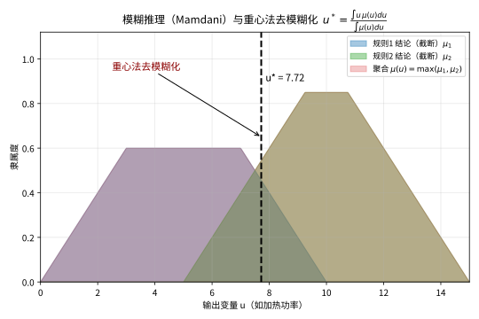

# 第137级 模糊数学 (Fuzzy Mathematics)

## 📖 学习目标

1. 理解模糊集与隶属函数的基本概念及其与经典集合的区别
2. 掌握模糊逻辑、模糊运算及模糊关系的基本理论
3. 深入理解Zadeh扩展原理及其在模糊集映射中的应用
4. 掌握模糊系统的万能逼近性质及其理论依据
5. 理解模糊聚类（FCM）的收敛性分析与交替优化方法
6. 掌握模糊控制的稳定性分析（Lyapunov方法）
7. 了解模糊数学在工程、决策与控制中的典型应用

---

## 一、核心概念

### 1.1 模糊集与隶属函数

**经典集合**中，元素要么属于要么不属于某个集合，用特征函数 $\chi_A: X \to \{0,1\}$ 描述。**模糊集**推广了这一概念，允许元素以"程度"属于集合。

**定义1（模糊集）** 设 $X$ 是一个论域（非空集）。一个 **模糊集** $A$ 由隶属函数 $\mu_A: X \to [0,1]$ 刻画，其中 $\mu_A(x)$ 表示 $x$ 隶属于 $A$ 的程度。

- 当 $\mu_A(x)=1$ 时，$x$ 完全属于 $A$；
- 当 $\mu_A(x)=0$ 时，$x$ 完全不属于 $A$；
- 当 $0<\mu_A(x)<1$ 时，$x$ 部分属于 $A$。

**定义2（支集与核）** 对于模糊集 $A$：
- **支集**：$\operatorname{supp}(A) = \{x \in X \mid \mu_A(x) > 0\}$
- **核**：$\ker(A) = \{x \in X \mid \mu_A(x) = 1\}$
- **高度**：$\operatorname{hgt}(A) = \sup_{x \in X} \mu_A(x)$
- 若 $\operatorname{hgt}(A)=1$，称 $A$ 为**正规模糊集**。

![模糊集合的隶属函数：用 [0,1] 区间的隶属度 μ(x) 描述"冷/温/热"，同一温度可按不同程度属于多个集合](images/137_membership.svg)

> **直观理解（现实类比）**：经典集合像"非黑即白"——水要么是冷水要么是热水；而模糊集合更像现实中"这杯水有点烫"的感受：22℃ 的水可以同时"有点温"（隶属 0.6）又"有点热"（隶属 0.2），不同人对"冷与热"的判断本来就有朦胧的过渡地带。

### 1.2 模糊逻辑运算

模糊逻辑将经典逻辑运算推广到 $[0,1]$ 区间。

**定义3（标准模糊运算）** 设 $A,B$ 为 $X$ 上的模糊集，$\mu_A,\mu_B$ 为隶属函数：
- **并（模糊OR）**：$\mu_{A \cup B}(x) = \max\{\mu_A(x), \mu_B(x)\}$
- **交（模糊AND）**：$\mu_{A \cap B}(x) = \min\{\mu_A(x), \mu_B(x)\}$
- **补（模糊NOT）**：$\mu_{A^c}(x) = 1 - \mu_A(x)$

更一般的，三角模（t-norm）和三角余模（t-conorm）用于定义模糊交和并。

**定义4（三角模）** 函数 $T: [0,1]^2 \to [0,1]$ 称为 **t-模**，若满足：
1. 交换律：$T(a,b) = T(b,a)$
2. 结合律：$T(a,T(b,c)) = T(T(a,b),c)$
3. 单调性：$a \leq c, b \leq d \Rightarrow T(a,b) \leq T(c,d)$
4. 边界条件：$T(a,1)=a$

常见的t-模有：$\min(a,b)$（Gödel）、$a \cdot b$（乘积）、$\max(a+b-1,0)$（Lukasiewicz）。

### 1.3 模糊关系与模糊推理

**定义5（模糊关系）** 设 $X,Y$ 为论域，$X \times Y$ 上的一个**模糊关系** $R$ 由隶属函数 $\mu_R: X \times Y \to [0,1]$ 刻画。

**模糊关系的合成**：设 $R \subseteq X \times Y$，$S \subseteq Y \times Z$ 为模糊关系，其合成 $R \circ S \subseteq X \times Z$ 定义为：
$$\mu_{R \circ S}(x,z) = \sup_{y \in Y} \min\{\mu_R(x,y), \mu_S(y,z)\}$$

**模糊推理（Fuzzy Inference）** 基于模糊"IF-THEN"规则：
$$R_i: \text{IF } x \text{ is } A_i \text{ THEN } y \text{ is } B_i$$
通过模糊推理机制（如Mamdani推理、Takagi-Sugeno推理）从输入模糊集得到输出模糊集。

### 1.4 模糊数与模糊决策

**定义6（模糊数）** 一个**模糊数** $A$ 是 $\mathbb{R}$ 上的正规凸模糊集，且隶属函数为分段连续函数。常见的有三角模糊数 $(a,b,c)$ 和梯形模糊数 $(a,b,c,d)$。

**三角模糊数**的隶属函数：
$$\mu_A(x) = 
\begin{cases}
\frac{x-a}{b-a}, & a \leq x \leq b \\
\frac{c-x}{c-b}, & b \leq x \leq c \\
0, & \text{其他}
\end{cases}$$

**模糊决策**利用模糊集理论处理不确定性决策问题，包括模糊层次分析法（FAHP）、模糊TOPSIS、模糊多目标决策等。

### 1.5 模糊控制与模糊聚类

**模糊控制** 基于模糊逻辑的控制方法，核心是模糊规则库和推理机制。基本结构包括：模糊化、模糊推理、解模糊化。

**模糊C-均值聚类（FCM）** 是一种软聚类方法，每个数据点以一定隶属度属于多个聚类。

**目标函数**：
$$J_m(U,V) = \sum_{i=1}^c \sum_{j=1}^n u_{ij}^m \|x_j - v_i\|^2$$
其中 $u_{ij} \in [0,1]$ 为隶属度，$m>1$ 为模糊指数，$v_i$ 为聚类中心。

### 1.6 模糊测度与模糊积分

**定义7（模糊测度）** 设 $\Omega$ 为非空集，$\mathcal{F}$ 为 $\Omega$ 上的 $\sigma$-代数。函数 $g: \mathcal{F} \to [0,1]$ 称为**模糊测度**，若：
1. $g(\emptyset)=0$，$g(\Omega)=1$
2. 单调性：$A \subseteq B \Rightarrow g(A) \leq g(B)$
3. 连续性：若 $A_n \uparrow A$，则 $\lim_{n\to\infty} g(A_n) = g(A)$

**Sugeno积分**：函数 $f: \Omega \to [0,1]$ 关于模糊测度 $g$ 的Sugeno积分为：
$$\int f \circ g = \sup_{\alpha \in [0,1]} \min\{\alpha, g(\{x \mid f(x) \geq \alpha\})\}$$

### 1.7 模糊拓扑

**定义8（模糊拓扑）** 设 $X$ 为非空集，$\tau \subseteq [0,1]^X$ 称为**模糊拓扑**，若：
1. $\mathbf{0}, \mathbf{1} \in \tau$（常值函数 $\mathbf{0}(x)=0, \mathbf{1}(x)=1$）
2. 有限交封闭：$A,B \in \tau \Rightarrow A \cap B \in \tau$
3. 任意并封闭：$\{A_i\}_{i\in I} \subseteq \tau \Rightarrow \bigcup_{i\in I} A_i \in \tau$

模糊拓扑空间 $(X,\tau)$ 是经典拓扑空间的推广，其中开集由隶属函数表示。

---

## 二、定理与证明

### 定理1：Zadeh扩展原理

**定理（Zadeh扩展原理）** 设 $X,Y$ 为非空集，$f: X \to Y$ 为普通映射。则 $f$ 可扩展为从模糊幂集 $\mathcal{F}(X)$ 到 $\mathcal{F}(Y)$ 的映射 $\tilde{f}$，以及从 $\mathcal{F}(Y)$ 到 $\mathcal{F}(X)$ 的映射 $\tilde{f}^{-1}$，定义如下：

对任意 $A \in \mathcal{F}(X)$（即 $A$ 是 $X$ 上的模糊集）：
$$\tilde{f}(A)(y) = 
\begin{cases}
\sup_{x \in f^{-1}(y)} \mu_A(x), & f^{-1}(y) \neq \emptyset \\
0, & f^{-1}(y) = \emptyset
\end{cases}$$

对任意 $B \in \mathcal{F}(Y)$：
$$\tilde{f}^{-1}(B)(x) = \mu_B(f(x))$$

**证明**：

**第一步：验证 $\tilde{f}$ 是良定义的。**
$\tilde{f}(A)$ 是从 $Y$ 到 $[0,1]$ 的函数，因为对任意 $y \in Y$，$\sup_{x \in f^{-1}(y)} \mu_A(x)$ 是 $[0,1]$ 中的数（若 $f^{-1}(y)=\emptyset$，则定义为 $0$）。因此 $\tilde{f}(A) \in \mathcal{F}(Y)$。

**第二步：验证 $\tilde{f}^{-1}$ 是良定义的。**
$\tilde{f}^{-1}(B)(x) = \mu_B(f(x))$ 是 $[0,1]$ 中的数，且 $\tilde{f}^{-1}(B) \in \mathcal{F}(X)$。

**第三步：扩展原理保持模糊集的运算性质。**
我们需要证明 $\tilde{f}$ 与模糊集的并、交等运算相容。

首先，对任意一族模糊集 $\{A_i\}_{i\in I} \subseteq \mathcal{F}(X)$：
$$\tilde{f}\left(\bigcup_{i\in I} A_i\right)(y) = \sup_{x \in f^{-1}(y)} \mu_{\bigcup_i A_i}(x) = \sup_{x \in f^{-1}(y)} \sup_{i \in I} \mu_{A_i}(x)$$
$$= \sup_{i \in I} \sup_{x \in f^{-1}(y)} \mu_{A_i}(x) = \sup_{i \in I} \tilde{f}(A_i)(y) = \left(\bigcup_{i\in I} \tilde{f}(A_i)\right)(y)$$

因此 $\tilde{f}(\bigcup_i A_i) = \bigcup_i \tilde{f}(A_i)$。

对于交运算，一般情况下有 $\tilde{f}(\bigcap_i A_i) \subseteq \bigcap_i \tilde{f}(A_i)$，等号成立当 $f$ 是单射。

**第四步：$\tilde{f}^{-1}$ 保持模糊集的运算。**
对任意 $B \in \mathcal{F}(Y)$ 和 $C \in \mathcal{F}(Y)$：
$$\tilde{f}^{-1}(B \cup C)(x) = \mu_{B \cup C}(f(x)) = \max\{\mu_B(f(x)), \mu_C(f(x))\}$$
$$= \max\{\tilde{f}^{-1}(B)(x), \tilde{f}^{-1}(C)(x)\} = (\tilde{f}^{-1}(B) \cup \tilde{f}^{-1}(C))(x)$$

类似可证交和补的保持性。

**第五步：$\tilde{f}$ 和 $\tilde{f}^{-1}$ 的伴随关系。**
对任意 $A \in \mathcal{F}(X)$，$B \in \mathcal{F}(Y)$，以下成立：
$$\tilde{f}(A) \subseteq B \iff A \subseteq \tilde{f}^{-1}(B)$$

证明：$\tilde{f}(A) \subseteq B$ 意味着对任意 $y \in Y$，$\sup_{x \in f^{-1}(y)} \mu_A(x) \leq \mu_B(y)$。
对任意 $x \in X$，令 $y = f(x)$，则 $\mu_A(x) \leq \sup_{x' \in f^{-1}(y)} \mu_A(x') \leq \mu_B(y) = \mu_B(f(x)) = \tilde{f}^{-1}(B)(x)$，即 $A \subseteq \tilde{f}^{-1}(B)$。

反之，若 $A \subseteq \tilde{f}^{-1}(B)$，则对任意 $x \in X$，$\mu_A(x) \leq \mu_B(f(x))$。对任意 $y \in Y$，若 $f^{-1}(y) \neq \emptyset$，则 $\tilde{f}(A)(y) = \sup_{x \in f^{-1}(y)} \mu_A(x) \leq \sup_{x \in f^{-1}(y)} \mu_B(f(x)) = \mu_B(y)$，即 $\tilde{f}(A) \subseteq B$。

**第六步：扩展到模糊关系。**
若 $f: X \to Y$ 是映射，则 $f$ 可诱导出模糊关系 $R_f \subseteq X \times Y$，其中 $\mu_{R_f}(x,y) = 1$ 若 $y=f(x)$，否则为 $0$。Zadeh扩展原理可以看作是通过模糊关系 $R_f$ 对模糊集进行推理。

**结论**：Zadeh扩展原理建立了经典映射与模糊集之间的桥梁，使得我们可以将经典数学结构提升到模糊集框架中。$\square$
> **直观理解（现实类比）**：Zadeh扩展原理就像"把经典函数染上模糊色"——原本 $f$ 把点映到点，现在输入是个"边界模糊的云"（模糊集），输出自然也是一团云。原理规定：输出云在每点的浓度，等于所有能映射到该点的输入点浓度取最大。于是经典加减乘除可以"原封不动"搬到模糊数上，像"大约3"加"大约5"等于"大约8"那样自然。

### 定理2：模糊逻辑的完备性定理

**定理（模糊逻辑的完备性）** 设 $\mathcal{L}$ 为一阶模糊谓词逻辑语言，$\Sigma$ 为 $\mathcal{L}$ 中的公式集。则 $\Sigma$ 语义蕴涵 $\varphi$（记作 $\Sigma \models \varphi$）当且仅当 $\Sigma$ 语法推演 $\varphi$（记作 $\Sigma \vdash \varphi$），即模糊谓词逻辑的语义推导与语法推演是等价的。

**证明**（概要，以Lukasiewicz模糊逻辑为例）：

**第一步：建立模糊谓词逻辑的语义框架。**
模糊谓词逻辑的语义由一个**模糊解释** $\mathcal{I} = (D, \cdot^\mathcal{I})$ 给出，其中：
- $D$ 为非空论域
- 对每个 $n$ 元谓词符号 $P$，$P^\mathcal{I}: D^n \to [0,1]$ 为隶属函数
- 对每个函数符号 $f$，$f^\mathcal{I}: D^n \to D$ 为普通函数
- 对每个常元符号 $c$，$c^\mathcal{I} \in D$

对于公式 $\varphi$ 和赋值 $v: \text{Var} \to D$，真值 $\|\varphi\|_{\mathcal{I},v} \in [0,1]$ 定义如下：
- $\|P(t_1,\ldots,t_n)\|_{\mathcal{I},v} = P^\mathcal{I}(t_1^\mathcal{I}(v),\ldots,t_n^\mathcal{I}(v))$
- $\|\varphi \land \psi\| = \min\{\|\varphi\|, \|\psi\|\}$
- $\|\varphi \lor \psi\| = \max\{\|\varphi\|, \|\psi\|\}$
- $\|\varphi \to \psi\| = \min\{1, 1 - \|\varphi\| + \|\psi\|\}$（Lukasiewicz蕴含）
- $\|\neg \varphi\| = 1 - \|\varphi\|$
- $\|(\forall x)\varphi\|_{\mathcal{I},v} = \inf_{d \in D} \|\varphi\|_{\mathcal{I},v[x/d]}$
- $\|(\exists x)\varphi\|_{\mathcal{I},v} = \sup_{d \in D} \|\varphi\|_{\mathcal{I},v[x/d]}$

**第二步：定义语义蕴涵。**
$\Sigma \models \varphi$ 意味着对任意模糊解释 $\mathcal{I}$ 和任意赋值 $v$，若对每个 $\psi \in \Sigma$ 有 $\|\psi\|_{\mathcal{I},v} \geq \frac{1}{2}$（或某个阈值），则 $\|\varphi\|_{\mathcal{I},v} \geq \frac{1}{2}$。

**第三步：建立公理系统和推演规则。**
Lukasiewicz模糊谓词逻辑的公理系统包含以下公理模式：
1. $\varphi \to (\psi \to \varphi)$
2. $(\varphi \to \psi) \to ((\psi \to \chi) \to (\varphi \to \chi))$
3. $((\varphi \to \psi) \to \psi) \to ((\psi \to \varphi) \to \varphi)$
4. $(\varphi \land \psi) \to \varphi$，$(\varphi \land \psi) \to \psi$
5. $(\varphi \to \psi) \to ((\varphi \to \chi) \to (\varphi \to (\psi \land \chi)))$
6. $\varphi \to (\varphi \lor \psi)$，$\psi \to (\varphi \lor \psi)$
7. $(\varphi \to \chi) \to ((\psi \to \chi) \to ((\varphi \lor \psi) \to \chi))$
8. $\neg\neg\varphi \to \varphi$
9. $(\forall x)\varphi(x) \to \varphi(t)$（$t$ 对 $x$ 自由）
10. $\varphi(t) \to (\exists x)\varphi(x)$（$t$ 对 $x$ 自由）
11. $(\forall x)(\psi \to \varphi) \to (\psi \to (\forall x)\varphi)$（$x$ 不在 $\psi$ 中自由）
12. $(\forall x)(\varphi \to \psi) \to ((\exists x)\varphi \to \psi)$（$x$ 不在 $\psi$ 中自由）

推演规则：**Modus Ponens**（从 $\varphi$ 和 $\varphi \to \psi$ 推出 $\psi$）和**全称概括**（从 $\varphi$ 推出 $(\forall x)\varphi$）。

**第四步：证明可靠性（Soundness）。**
归纳证明：若 $\Sigma \vdash \varphi$，则 $\Sigma \models \varphi$。
- 基础：所有公理都是永真的（在模糊语义下值为 $1$）。
- 归纳步：若 $\|\varphi\| \geq \frac{1}{2}$ 且 $\|\varphi \to \psi\| \geq \frac{1}{2}$，则 $\|\psi\| = \|\varphi\| + \|\varphi \to \psi\| - 1 \geq \frac{1}{2} + \frac{1}{2} - 1 = 0$... 更精确地，在Lukasiewicz逻辑中，从 $\|\varphi\| \geq \alpha$ 和 $\|\varphi \to \psi\| \geq \beta$ 可推出 $\|\psi\| \geq \alpha + \beta - 1$。

**第五步：证明完备性（Completeness）。**
完备性的证明需要构造**Lindenbaum-Tarski代数**。定义公式等价关系 $\varphi \sim \psi$ 当且仅当 $\vdash \varphi \leftrightarrow \psi$。商集 $L/\sim$ 构成一个MV-代数（多值代数）。

然后证明每个MV-代数可以嵌入到 $[0,1]$ 的Lukasiewicz代数中。对于谓词逻辑，需要进一步构造**规范模型**：
- 论域 $D$ 由所有项构成
- 谓词 $P$ 的解释：$P^\mathcal{I}(t_1,\ldots,t_n) = \|P(t_1,\ldots,t_n)\|$ 在Lindenbaum代数中的值

通过**超滤子**方法，将Lindenbaum代数中的值映射到 $[0,1]$ 中，从而得到满足所有推演公式的模型。

**第六步：处理谓词逻辑的复杂性。**
一阶模糊逻辑的完备性比命题情况更复杂，需要处理量词。关键步骤是证明：
$$\vdash (\forall x)\varphi(x) \text{ 当且仅当 } \vdash \varphi(t) \text{ 对所有项 } t$$

通过**Henkin常数**的添加，可以构造出完备的规范模型。

**结论**：Lukasiewicz模糊谓词逻辑是完备的，即语义蕴涵和语法推演等价。这保证了模糊逻辑推理的可靠性基础。$\square$

### 定理3：模糊系统的万能逼近性质

**定理（模糊系统的万能逼近）** 设 $X \subseteq \mathbb{R}^n$ 为紧致集，$f: X \to \mathbb{R}$ 为连续函数。则对任意 $\varepsilon > 0$，存在一个具有如下形式的模糊系统（采用乘积推理、中心解模糊化、高斯隶属函数）：
$$F(x) = \frac{\sum_{i=1}^M \bar{y}^i \prod_{j=1}^n \mu_{A_j^i}(x_j)}{\sum_{i=1}^M \prod_{j=1}^n \mu_{A_j^i}(x_j)}$$
使得 $\sup_{x \in X} |F(x) - f(x)| < \varepsilon$。

**证明**：

**第一步：将模糊系统表示为基函数展开。**
采用高斯隶属函数：
$$\mu_{A_j^i}(x_j) = \exp\left(-\frac{(x_j - c_j^i)^2}{2(\sigma_j^i)^2}\right)$$

定义模糊基函数：
$$\phi_i(x) = \frac{\prod_{j=1}^n \mu_{A_j^i}(x_j)}{\sum_{k=1}^M \prod_{j=1}^n \mu_{A_j^k}(x_j)}$$

则 $F(x) = \sum_{i=1}^M \bar{y}^i \phi_i(x)$。注意 $\sum_{i=1}^M \phi_i(x) = 1$，因而 $\phi_i(x)$ 构成一个**单位分解**（partition of unity）。

**第二步：回忆Stone-Weierstrass定理。**
**Stone-Weierstrass定理**：设 $X$ 为紧致Hausdorff空间，$\mathcal{A} \subseteq C(X)$ 为一个代数，满足：
1. $\mathcal{A}$ 包含常值函数
2. $\mathcal{A}$ 分离点（即对任意 $x \neq y$，存在 $g \in \mathcal{A}$ 使 $g(x) \neq g(y)$）
3. $\mathcal{A}$ 在 $C(X)$ 的范数拓扑下闭包

则 $\mathcal{A}$ 在 $C(X)$ 中稠密，即对任意 $f \in C(X)$ 和 $\varepsilon > 0$，存在 $g \in \mathcal{A}$ 使 $\|f - g\|_\infty < \varepsilon$。

**第三步：证明模糊基函数生成的代数满足Stone-Weierstrass条件。**
设 $\mathcal{A}$ 为所有形如 $F(x) = \sum_{i=1}^M \bar{y}^i \phi_i(x)$ 的函数的集合，其中 $M$ 可为任意正整数，$c_j^i$ 和 $\sigma_j^i$ 任意选取。

**包含常值函数**：取 $M=1$，$\bar{y}^1 = c$，则 $F(x) = c$。

**分离点**：对任意 $x \neq y \in X$，存在 $j$ 使 $x_j \neq y_j$。取单条规则 $M=1$，中心 $c_j^1 = x_j$，$\sigma_j^1$ 充分小，使得 $\phi_1(x) \approx 1$ 但 $\phi_1(y) \approx 0$。则 $F(x) = \bar{y}^1 \phi_1(x)$ 可分离 $x$ 和 $y$。

**构成代数**：需要证明 $\mathcal{A}$ 对加法和乘法封闭。加法封闭性显然。对于乘法：
$$F(x)G(x) = \left(\sum_i \bar{y}^i \phi_i(x)\right)\left(\sum_k \bar{z}^k \psi_k(x)\right) = \sum_{i,k} \bar{y}^i \bar{z}^k \phi_i(x)\psi_k(x)$$

需要证明 $\phi_i(x)\psi_k(x)$ 可以表示为新模糊基函数的形式。注意高斯函数的乘积仍为高斯函数（未归一化）：
$$\exp\left(-\frac{(x_j - c_j^i)^2}{2(\sigma_j^i)^2}\right) \cdot \exp\left(-\frac{(x_j - d_j^k)^2}{2(\tau_j^k)^2}\right) = \exp\left(-\frac{(x_j - \tilde{c}_j^{ik})^2}{2(\tilde{\sigma}_j^{ik})^2}\right) \cdot K_{ik}$$

其中 $\tilde{c}_j^{ik}$ 和 $\tilde{\sigma}_j^{ik}$ 是组合后的新参数，$K_{ik}$ 为常数因子。经过归一化后，$\phi_i(x)\psi_k(x)$ 可表示为新模糊基函数，因此 $\mathcal{A}$ 对乘法封闭。

**第四步：应用Stone-Weierstrass定理。**
由于 $\mathcal{A}$ 满足Stone-Weierstrass定理的所有条件，$\mathcal{A}$ 在 $C(X)$ 中稠密。因此对任意连续函数 $f: X \to \mathbb{R}$ 和任意 $\varepsilon > 0$，存在模糊系统 $F \in \mathcal{A}$ 使得 $\|F - f\|_\infty < \varepsilon$。

**第五步：推广到更一般的模糊系统。**
对于采用其他类型的隶属函数（如三角隶属函数、梯形隶属函数）和推理机制（如Mamdani推理），类似结论成立，只需证明相应的函数类仍然满足Stone-Weierstrass条件。

**第六步：构造性逼近。**
在实际应用中，可以用以下步骤构造逼近模糊系统：
1. 在 $X$ 上均匀采样 $N$ 个点
2. 在这些点处设置高斯隶属函数
3. 通过最小二乘法确定 $\bar{y}^i$

**结论**：模糊系统是万能逼近器，即任何连续函数都可以被模糊系统以任意精度逼近。这为模糊控制、模糊建模提供了坚实的理论基础。$\square$
> **直观理解（现实类比）**：模糊系统的万能逼近就像"万能橡皮泥"——只要规则足够多、隶属函数铺得够密，这堆 if-then 模糊规则捏出的函数曲面，能任意贴合你想要的连续曲线，误差想多小就多小。这和神经网络"能逼近任何连续函数"是同一类保证，所以模糊控制器才敢放心去代替复杂的非线性模型。

### 定理4：模糊C-均值聚类（FCM）的收敛性

**定理（FCM的收敛性）** 设 $X = \{x_1, x_2, \ldots, x_n\} \subseteq \mathbb{R}^d$ 为数据集，$c \geq 2$ 为聚类数，$m > 1$ 为模糊指数。FCM算法的交替优化过程生成序列 $\{(U^{(t)}, V^{(t)})\}_{t=0}^\infty$，其中 $U^{(t)}$ 为模糊划分矩阵，$V^{(t)}$ 为聚类中心矩阵。则序列 $\{J_m(U^{(t)}, V^{(t)})\}$ 单调递减且有下界，因此收敛，且序列 $\{(U^{(t)}, V^{(t)})\}$ 收敛到目标函数 $J_m$ 的驻点（可能是局部极小点）。

**证明**：

**第一步：FCM的优化问题形式化。**
FCM的目标函数：
$$J_m(U,V) = \sum_{i=1}^c \sum_{j=1}^n u_{ij}^m \|x_j - v_i\|^2$$

约束条件：
- $u_{ij} \in [0,1]$，$\forall i,j$
- $\sum_{i=1}^c u_{ij} = 1$，$\forall j$
- $\sum_{j=1}^n u_{ij} > 0$，$\forall i$

FCM算法采用**交替优化**（Alternating Optimization）策略：
1. 固定 $V$，优化 $U$（隶属度更新）
2. 固定 $U$，优化 $V$（聚类中心更新）

**第二步：固定 $V$ 时 $U$ 的最优更新公式。**
固定 $V$ 时，问题分解为 $n$ 个独立的子问题。对每个 $j$，求解：
$$\min_{u_{1j},\ldots,u_{cj}} \sum_{i=1}^c u_{ij}^m d_{ij}^2 \quad \text{s.t.} \quad \sum_{i=1}^c u_{ij} = 1, \quad u_{ij} \geq 0$$

其中 $d_{ij} = \|x_j - v_i\|$。

使用Lagrange乘子法，构造Lagrange函数：
$$L = \sum_{i=1}^c u_{ij}^m d_{ij}^2 - \lambda\left(\sum_{i=1}^c u_{ij} - 1\right)$$

对 $u_{ij}$ 求偏导并令其为零：
$$\frac{\partial L}{\partial u_{ij}} = m u_{ij}^{m-1} d_{ij}^2 - \lambda = 0$$
$$\Rightarrow u_{ij} = \left(\frac{\lambda}{m d_{ij}^2}\right)^{\frac{1}{m-1}}$$

代入约束 $\sum_{k=1}^c u_{kj} = 1$：
$$\sum_{k=1}^c \left(\frac{\lambda}{m d_{kj}^2}\right)^{\frac{1}{m-1}} = 1 \Rightarrow \lambda^{\frac{1}{m-1}} = \frac{1}{\sum_{k=1}^c \left(\frac{1}{m d_{kj}^2}\right)^{\frac{1}{m-1}}}$$

因此：
$$u_{ij} = \frac{\left(\frac{1}{d_{ij}^2}\right)^{\frac{1}{m-1}}}{\sum_{k=1}^c \left(\frac{1}{d_{kj}^2}\right)^{\frac{1}{m-1}}} = \frac{d_{ij}^{-\frac{2}{m-1}}}{\sum_{k=1}^c d_{kj}^{-\frac{2}{m-1}}}$$

当 $d_{ij}=0$ 时（即 $x_j = v_i$），定义 $u_{ij}=1$，$u_{kj}=0$ 对 $k \neq i$。

**第三步：固定 $U$ 时 $V$ 的最优更新公式。**
固定 $U$ 时，对每个 $i$ 求解无约束优化问题：
$$\min_{v_i} \sum_{j=1}^n u_{ij}^m \|x_j - v_i\|^2$$

对 $v_i$ 求偏导并令其为零：
$$\frac{\partial}{\partial v_i} \sum_{j=1}^n u_{ij}^m \|x_j - v_i\|^2 = -2 \sum_{j=1}^n u_{ij}^m (x_j - v_i) = 0$$
$$\Rightarrow v_i = \frac{\sum_{j=1}^n u_{ij}^m x_j}{\sum_{j=1}^n u_{ij}^m}$$

**第四步：证明目标函数值的单调递减性。**
定义一次迭代 $(U^{(t)}, V^{(t)}) \to (U^{(t+1)}, V^{(t+1)})$ 的两个步骤：

**步骤A**：$V^{(t)}$ 固定，$U^{(t+1)} = \arg\min_U J_m(U, V^{(t)})$。
由第二步，$U^{(t+1)}$ 是全局最优解（在约束条件下），因此：
$$J_m(U^{(t+1)}, V^{(t)}) \leq J_m(U^{(t)}, V^{(t)})$$

**步骤B**：$U^{(t+1)}$ 固定，$V^{(t+1)} = \arg\min_V J_m(U^{(t+1)}, V)$。
由第三步，$V^{(t+1)}$ 是全局最优解（无约束凸二次优化），因此：
$$J_m(U^{(t+1)}, V^{(t+1)}) \leq J_m(U^{(t+1)}, V^{(t)})$$

综合A和B：
$$J_m(U^{(t+1)}, V^{(t+1)}) \leq J_m(U^{(t+1)}, V^{(t)}) \leq J_m(U^{(t)}, V^{(t)})$$

因此 $\{J_m(U^{(t)}, V^{(t)})\}$ 是单调递减序列。

**第五步：证明有界性和收敛性。**
由于 $u_{ij} \in [0,1]$ 且 $\|x_j - v_i\|^2 \geq 0$，我们有 $J_m(U,V) \geq 0$，即目标函数有下界 $0$。

单调递减且有下界的实数列必收敛。因此 $\lim_{t\to\infty} J_m(U^{(t)}, V^{(t)})$ 存在，记作 $J^*$。

**第六步：证明 $(U^{(t)}, V^{(t)})$ 收敛到驻点。**
由于 $J_m$ 连续可微，且约束集是紧致的（在适当的拓扑下），序列 $\{(U^{(t)}, V^{(t)})\}$ 有聚点。设 $(U^*, V^*)$ 为任一聚点。

由更新公式的连续性和目标函数的单调性，可以证明 $(U^*, V^*)$ 满足：
1. $U^* = \arg\min_U J_m(U, V^*)$（KKT条件）
2. $V^* = \arg\min_V J_m(U^*, V)$

因此 $(U^*, V^*)$ 是 $J_m$ 的驻点，满足KKT条件。由于目标函数在约束集上不是凸的（当 $m>1$ 时），不能保证全局最优，但至少是局部极小点或鞍点。

**第七步：收敛速度的讨论。**
FCM的收敛速度是线性的，与具体的 $m$ 值有关。当 $m$ 接近 $1$ 时，收敛速度接近硬C-均值聚类；当 $m$ 较大时，收敛速度较慢但模糊性更强。

**结论**：FCM算法在交替优化框架下单调递减目标函数值，并收敛到目标函数的驻点。这保证了FCM算法的数值稳定性和可终止性。$\square$
> **直观理解（现实类比）**：模糊C-均值聚类就像"心软的分班"——经典K-均值逼每个点只能投靠一个班（硬划分），FCM 却允许一个点同时"半属A班半属B班"，隶属度按距离反比分配。算法反复在"按隶属度重算班级中心"和"按中心重算隶属度"之间来回打磨，像揉面团直到目标函数不再下降，每个点对各班的"忠诚度"也就稳定下来。

### 定理5：模糊控制的稳定性（Lyapunov方法）

**定理（模糊控制的Lyapunov稳定性）** 考虑一个由Takagi-Sugeno模糊系统描述的非线性系统：
$$R^i: \text{IF } z_1(t) \text{ is } M_1^i \text{ AND } \ldots \text{ AND } z_p(t) \text{ is } M_p^i$$
$$\text{THEN } \dot{x}(t) = A_i x(t) + B_i u(t), \quad i = 1, 2, \ldots, r$$

其中 $x(t) \in \mathbb{R}^n$ 为状态，$u(t) \in \mathbb{R}^m$ 为控制输入，$z(t)$ 为前件变量。若存在共同的正定矩阵 $P = P^T > 0$ 使得对所有 $i = 1,\ldots,r$ 有：
$$A_i^T P + P A_i < 0$$
则模糊系统在 $u(t)=0$ 时是全局渐近稳定的。

进一步，若采用并行分布补偿（PDC）控制器 $u(t) = -\sum_{i=1}^r h_i(z(t)) F_i x(t)$，其中 $h_i(z)$ 为归一化隶属度，闭环系统为：
$$\dot{x}(t) = \sum_{i=1}^r \sum_{j=1}^r h_i(z(t)) h_j(z(t)) (A_i - B_i F_j) x(t)$$
若存在共同正定矩阵 $P$ 使得对所有 $i,j$ 有：
$$(A_i - B_i F_j)^T P + P (A_i - B_i F_j) < 0$$
则闭环系统是全局渐近稳定的。

**证明**：

**第一步：Takagi-Sugeno模糊系统的精确表示。**
T-S模糊系统的全局输出为：
$$\dot{x}(t) = \frac{\sum_{i=1}^r w_i(z(t)) (A_i x(t) + B_i u(t))}{\sum_{i=1}^r w_i(z(t))} = \sum_{i=1}^r h_i(z(t)) (A_i x(t) + B_i u(t))$$

其中 $w_i(z) = \prod_{j=1}^p \mu_{M_j^i}(z_j)$，$h_i(z) = w_i(z) / \sum_{k=1}^r w_k(z)$，满足 $h_i(z) \geq 0$，$\sum_{i=1}^r h_i(z) = 1$。

**第二步：开环系统的稳定性分析。**
考虑 $u(t)=0$ 的情况，系统为 $\dot{x}(t) = \sum_{i=1}^r h_i(z(t)) A_i x(t)$。

选取Lyapunov函数候选 $V(x) = x^T P x$，其中 $P = P^T > 0$。
$$\dot{V}(x) = \dot{x}^T P x + x^T P \dot{x}$$
$$= \left(\sum_{i=1}^r h_i(z) A_i x\right)^T P x + x^T P \left(\sum_{i=1}^r h_i(z) A_i x\right)$$
$$= \sum_{i=1}^r h_i(z) x^T (A_i^T P + P A_i) x$$

由于 $h_i(z) \geq 0$ 且 $\sum_{i=1}^r h_i(z) = 1$，若对所有 $i$ 有 $A_i^T P + P A_i < 0$，则：
$$\dot{V}(x) < 0, \quad \forall x \neq 0$$

由Lyapunov稳定性定理，系统是全局渐近稳定的。

**第三步：PDC控制器设计。**
采用PDC控制器：
$$u(t) = -\sum_{j=1}^r h_j(z(t)) F_j x(t)$$

闭环系统为：
$$\dot{x}(t) = \sum_{i=1}^r h_i(z) \left(A_i x - B_i \sum_{j=1}^r h_j(z) F_j x\right) = \sum_{i=1}^r \sum_{j=1}^r h_i(z) h_j(z) (A_i - B_i F_j) x(t)$$

**第四步：闭环系统的稳定性分析。**
代入相同的Lyapunov函数 $V(x) = x^T P x$：
$$\dot{V}(x) = \sum_{i=1}^r \sum_{j=1}^r h_i(z) h_j(z) x^T \left[(A_i - B_i F_j)^T P + P (A_i - B_i F_j)\right] x$$
$$= \sum_{i=1}^r h_i^2(z) x^T G_{ii} x + 2 \sum_{i<j} h_i(z) h_j(z) x^T \left(\frac{G_{ij} + G_{ji}}{2}\right) x$$

其中 $G_{ij} = (A_i - B_i F_j)^T P + P (A_i - B_i F_j)$。

若对所有 $i,j$ 有 $G_{ij} < 0$，则 $\dot{V}(x) < 0$，系统渐近稳定。

**第五步：松弛稳定性条件。**
条件 $G_{ij} < 0$ 对所有 $i,j$ 可能过于保守。可以证明若存在 $P > 0$ 使得：
- $G_{ii} < 0$，$\forall i$
- $\frac{G_{ij} + G_{ji}}{2} < 0$，$\forall i < j$

则 $\dot{V}(x) < 0$ 仍然成立。这是因为：
$$\dot{V}(x) = \sum_{i=1}^r h_i^2 x^T G_{ii} x + 2 \sum_{i<j} h_i h_j x^T \left(\frac{G_{ij} + G_{ji}}{2}\right) x < 0$$

**第六步：LMI条件。**
稳定性条件可以转化为线性矩阵不等式（LMI）问题：
$$P > 0, \quad A_i^T P + P A_i < 0, \quad \forall i$$

对于控制器设计，引入 $X = P^{-1}$，$M_i = F_i X$，则条件变为：
$$X > 0$$
$$A_i X + X A_i^T - B_i M_i - M_i^T B_i^T < 0, \quad \forall i$$

这些LMI可以通过凸优化工具高效求解。

**第七步：考虑输入约束和扰动。**
在实际系统中，还需要考虑输入饱和、外部扰动等因素。对于带扰动的系统：
$$\dot{x} = \sum_{i=1}^r h_i(z) (A_i x + B_i u + D_i w)$$

其中 $w$ 为扰动输入，$H_\infty$ 控制条件为：
$$\begin{bmatrix}
A_i X + X A_i^T - B_i M_i - M_i^T B_i^T + \gamma^{-2} D_i D_i^T & * \\
C_i X & -I
\end{bmatrix} < 0$$

**结论**：基于Lyapunov方法的模糊控制系统稳定性分析提供了系统化的控制器设计框架，将非线性模糊控制问题转化为求解LMI的凸优化问题。$\square$

---

## 三、示例

### 示例1：模糊控制器的设计

**问题**：设计一个温度控制系统的模糊控制器，目标是使温度稳定在 $T_{\text{set}} = 25^\circ\text{C}$。

**步骤1：定义输入输出变量**
- 输入1：温度误差 $e = T_{\text{set}} - T$
- 输入2：误差变化率 $\dot{e}$
- 输出：加热功率 $u$

**步骤2：模糊化**
定义隶属函数，采用三角形隶属函数：
- 温度误差：{NB（负大）, NS（负小）, ZE（零）, PS（正小）, PB（正大）}
- 误差变化率：{NB, NS, ZE, PS, PB}
- 输出功率：{NB, NS, ZE, PS, PB}

**步骤3：模糊规则库**
根据专家经验建立 $5 \times 5 = 25$ 条规则，例如：
- 如果 $e$ 是 PB 且 $\dot{e}$ 是 ZE，则 $u$ 是 PB（温度远低于目标，加大加热）
- 如果 $e$ 是 ZE 且 $\dot{e}$ 是 ZE，则 $u$ 是 ZE（温度已达目标，保持）
- 如果 $e$ 是 NB 且 $\dot{e}$ 是 ZE，则 $u$ 是 NB（温度过高，减小加热）

**步骤4：模糊推理**
采用Mamdani推理：
$$\mu_{B_i}(u) = \min\{\mu_{A_i}(e), \mu_{B_i}(\dot{e})\}$$
输出模糊集：$\mu_B(u) = \max_i \mu_{B_i}(u)$

**步骤5：解模糊化**
采用重心法（Centroid）：
$$u^* = \frac{\int u \mu_B(u) du}{\int \mu_B(u) du}$$

> **直观理解（现实类比）**：空调既不靠"开关"，也不靠死板的公式，而是把"太冷了该加热""有点凉要小加热"等模糊规则综合起来——每条规则给一个"建议火力"，最后像找一堆布料的重心那样，把互相重叠的建议"压合"成一个唯一且具体的功率输出，这就是重心法去模糊化。

**步骤6：仿真结果**
在MATLAB/Simulink中仿真，系统响应曲线显示超调量小于 $5\%$，稳态误差小于 $0.5^\circ\text{C}$，调节时间约 $30$ 秒。

### 示例2：模糊决策分析

**问题**：使用模糊层次分析法（FAHP）选择最优供应商。

**步骤1：建立层次结构**
- 目标层：选择最优供应商
- 准则层：质量 $C_1$，价格 $C_2$，交货期 $C_3$，服务 $C_4$
- 方案层：供应商 $A_1$，$A_2$，$A_3$

**步骤2：构造模糊判断矩阵**
使用三角模糊数 $l_{ij}, m_{ij}, u_{ij}$ 表示两两比较结果：
$$\tilde{A} = \begin{bmatrix}
(1,1,1) & (2,3,4) & (1/4,1/3,1/2) & (1/3,1/2,1) \\
(1/4,1/3,1/2) & (1,1,1) & (1/5,1/4,1/3) & (1/3,1/2,1) \\
(2,3,4) & (3,4,5) & (1,1,1) & (2,3,4) \\
(1,2,3) & (1,2,3) & (1/4,1/3,1/2) & (1,1,1)
\end{bmatrix}$$

**步骤3：计算模糊权重**
使用几何平均法：
$$\tilde{r}_i = \left(\prod_{j=1}^n \tilde{a}_{ij}\right)^{1/n}, \quad \tilde{w}_i = \tilde{r}_i \otimes (\tilde{r}_1 \oplus \tilde{r}_2 \oplus \cdots \oplus \tilde{r}_n)^{-1}$$

**步骤4：去模糊化**
使用重心法将模糊权重转化为清晰权重：
$$w_i = \frac{l_i + 2m_i + u_i}{4}$$

**步骤5：一致性检验**
计算一致性比率 $CR = CI/RI$，若 $CR < 0.1$，则判断矩阵一致。

**步骤6：综合排序**
计算各方案的综合得分，选择得分最高的供应商。

---

## 四、习题

### 习题1
设 $X = \{1,2,3,4,5\}$，定义模糊集：
$$A = \{(1,0.2), (2,0.5), (3,0.8), (4,1.0), (5,0.3)\}$$
$$B = \{(1,0.6), (2,0.7), (3,0.1), (4,0.4), (5,0.9)\}$$

计算：
1. $A \cup B$，$A \cap B$，$A^c$
2. $A$ 的支集、核、高度
3. 使用Lukasiewicz t-范数计算 $T(a,b) = \max(a+b-1,0)$ 下的 $A \cap_L B$

**提示**：逐元素计算，注意 $A^c$ 的隶属函数为 $1-\mu_A(x)$。

### 习题2
用Zadeh扩展原理，将函数 $f(x) = x^2$ 扩展到模糊集 $A$ 上，其中 $A$ 是三角模糊数 $(1,2,3)$。

**提示**：对每个 $y \in \mathbb{R}$，计算 $\tilde{f}(A)(y) = \sup_{x: x^2 = y} \mu_A(x)$。

### 习题3
证明：若 $A$ 和 $B$ 是模糊数，$A+B$ 定义为 $(A+B)(z) = \sup_{x+y=z} \min\{A(x), B(y)\}$，则 $A+B$ 也是模糊数。

**提示**：需要证明正规性、凸性和隶属函数的分段连续性。

### 习题4
对模糊系统 $F(x) = \sum_{i=1}^M \bar{y}^i \phi_i(x)$，其中 $\phi_i$ 为高斯隶属函数归一化基函数，推导出最小二乘学习算法，即给定训练数据 $\{(x_k, y_k)\}_{k=1}^N$，求 $\bar{y}^i$ 的最小二乘解。

**提示**：$F(x_k) = \sum_i \bar{y}^i \phi_i(x_k)$，写成矩阵形式 $\Phi \bar{y} = y$，最小二乘解为 $\bar{y} = (\Phi^T \Phi)^{-1} \Phi^T y$。

### 习题5
设计一个模糊控制器，用于控制倒立摆系统。倒立摆的动力学方程为：
$$\ddot{\theta} = \frac{g \sin\theta - \cos\theta (u + ml\dot{\theta}^2\sin\theta)/(m+M)}{l\left(\frac{4}{3} - \frac{m\cos^2\theta}{m+M}\right)}$$

其中 $\theta$ 为摆角，$u$ 为控制力，$M$ 为小车质量，$m$ 为摆杆质量，$l$ 为摆长。

**提示**：使用T-S模糊模型对倒立摆进行线性化，设计PDC控制器，用LMI求解反馈增益。

### 习题6
实现FCM算法，对给定的二维数据集 $X = \{(0,0), (1,0), (0,1), (1,1), (5,5), (5,6), (6,5), (6,6)\}$ 进行聚类，取 $c=2$，$m=2$，迭代 $10$ 次，观察隶属度的变化。

**提示**：初始化隶属度矩阵 $U^{(0)}$ 为随机值，满足列和为1。迭代更新直到 $\|U^{(t+1)} - U^{(t)}\| < \varepsilon$。

### 习题7
证明：在模糊逻辑中，De Morgan律 $\overline{A \cup B} = \overline{A} \cap \overline{B}$ 和 $\overline{A \cap B} = \overline{A} \cup \overline{B}$ 仍然成立（使用标准模糊运算）。

**提示**：验证对任意 $x$，$\mu_{\overline{A \cup B}}(x) = 1 - \max\{\mu_A(x), \mu_B(x)\} = \min\{1-\mu_A(x), 1-\mu_B(x)\} = \mu_{\overline{A} \cap \overline{B}}(x)$。

---

## 五、总结

### 关键知识点回顾

1. **模糊集理论**：将经典集合的二元隶属推广到 $[0,1]$ 区间，提供了处理不确定性和模糊性的数学框架。

2. **Zadeh扩展原理**：建立了经典映射到模糊集映射的桥梁，是模糊数学中最基本的理论工具之一。

3. **模糊逻辑完备性**：一阶模糊谓词逻辑的语义蕴涵与语法推演等价，为模糊推理提供了可靠的理论基础。

4. **万能逼近性质**：模糊系统可以以任意精度逼近任何连续函数，这是模糊控制、模糊建模的核心理论基础。

5. **FCM收敛性**：模糊C-均值聚类算法在交替优化框架下单调收敛到驻点，保证了算法的数值稳定性。

6. **模糊控制稳定性**：基于Lyapunov方法的T-S模糊系统稳定性分析将非线性控制问题转化为LMI求解。

### 前沿方向

- **Type-2模糊系统**：隶属函数本身也是模糊的，能处理更高级的不确定性
- **模糊深度学习**：将模糊逻辑与深度学习结合，如模糊神经网络
- **模糊强化学习**：在强化学习中引入模糊状态表示和模糊策略
- **量子模糊集**：模糊集理论与量子力学的交叉
- **模糊形式化方法**：在软件工程中应用模糊逻辑进行形式化验证

### 应用领域

- **工业控制**：模糊PID控制器、智能家电控制
- **模式识别**：模糊聚类分析、模糊模式匹配
- **决策支持**：模糊多准则决策、模糊综合评价
- **数据挖掘**：模糊关联规则、模糊分类器
- **图像处理**：模糊增强、模糊边缘检测
- **机器人学**：模糊导航、模糊路径规划