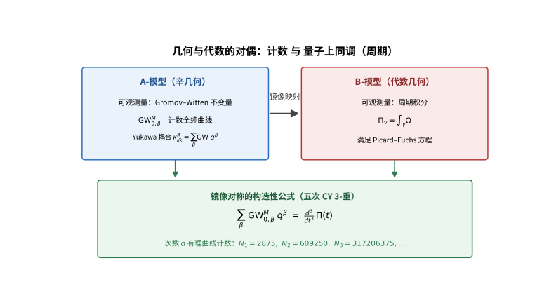

# 第140级 镜像对称 (Mirror Symmetry)

## 📖 学习目标

1. 理解Calabi-Yau流形的基本定义和性质及其在镜像对称中的核心地位
2. 掌握镜像对的概念及A-模型与B-模型的对应关系
3. 深入理解Kontsevich同调镜像对称猜想及其数学表述
4. 掌握镜像对称中的Hodge菱形翻转结构及其证明方法
5. 理解Gromov-Witten不变量与周期之间的深刻联系
6. 掌握Yukawa耦合在镜像映射下的变换规律
7. 了解大复结构极限下的镜像对称行为及其几何意义

---

## 一、核心概念

### 1.1 Calabi-Yau流形

**定义1（Calabi-Yau流形）** 一个 **Calabi-Yau流形** 是一个紧致Kähler流形 $(M, g, J, \omega)$，满足其第一Chern类 $c_1(M) = 0$。等价地，存在一个非平凡的、处处非零的全纯 $(n,0)$-形式 $\Omega$（其中 $n = \dim_{\mathbb{C}} M$），称为 **全纯体积形式**。

Calabi-Yau流形的基本性质包括：
- **Ricci平坦性**：由Calabi猜想（丘成桐证明），$c_1(M)=0$ 的Kähler流形上存在Ricci平坦的Kähler度量。
- **特殊酉群holonomy**：$\text{Hol}(g) \subseteq \text{SU}(n)$。
- **Hodge数**：满足 $h^{p,0} = h^{0,p}$，且 $h^{n,0} = 1$（因为存在非平凡全纯 $n$-形式）。

**定义2（Calabi-Yau $n$-重）** 一个 $n$ 维Calabi-Yau流形也称为 **Calabi-Yau $n$-重**。特别地：
- $n=1$：椭圆曲线（亏格1的Riemann曲面）
- $n=2$：K3曲面
- $n=3$：Calabi-Yau 3-重（在弦论中最为重要）

### 1.2 镜像对

**定义3（镜像对）** 两个Calabi-Yau流形 $M$ 和 $W$ 称为 **镜像对**，如果存在以下对应关系：

$$ H^{p,q}(M) \cong H^{n-p,q}(W) $$

即它们的Hodge菱形沿对角线翻转。这称为 **Hodge菱形翻转**：

$$
\begin{array}{ccccccccc}
& & & h^{n,0} & & & & & \\
& & & \vdots & & & & & \\
& & h^{n,0} & \cdots & h^{0,0} & & & & \\
\text{对 }M: & & & & & & \Longrightarrow & & \\
& & & & & & & & \\
& & & & & & & & \\
\text{对 }W: & & h^{0,0} & \cdots & h^{n,0} & & & & \\
& & & \vdots & & & & & \\
& & & h^{0,n} & & & & & \\
\end{array}
$$

更精确地说，$M$ 的复结构模空间 $\mathcal{M}_{\text{cs}}(M)$ 与 $W$ 的Kähler模空间 $\mathcal{M}_{\text{Käh}}(W)$ 在某种意义下等同。

> **直观理解（现实类比）**：镜像对称就像照镜子——镜中的你依旧是「你」，只是左右颠倒。Calabi-Yau流形 $M$ 与它的镜像 $W$ 也一样：$M$ 的「复结构」信息（怎么弯曲）恰好对应 $W$ 的「Kähler/大小」信息（体积与形状），数值证据就是Hodge菱形沿对角线翻转，像体检数据在镜中互换栏目（$h^{1,1}$ 与 $h^{2,1}$ 互换）。

### 1.3 A-模型与B-模型

**定义4（拓扑弦论模型）** 在拓扑弦论中，存在两种重要的约化模型：

- **A-模型（A-model）**：依赖于Kähler结构，其可观测量为 **Gromov-Witten不变量**，计数全纯曲线的数目。A-模型是 **辛几何** 的。
- **B-模型（B-model）**：依赖于复结构，其可观测量为 **周期积分**，计算形如 $\int_{\gamma} \Omega$ 的积分。B-模型是 **代数几何** 的。

**镜像对称的基本断言**：Calabi-Yau流形 $M$ 上的A-模型等价于其镜像流形 $W$ 上的B-模型，反之亦然。

### 1.4 Gromov-Witten不变量

**定义5（Gromov-Witten不变量）** 设 $M$ 为辛流形，$\beta \in H_2(M, \mathbb{Z})$ 是一个同调类。**Gromov-Witten不变量** 是计数从稳定曲线到 $M$ 的全纯映射的"数"：

$$ \text{GW}_{g,\beta}^M(\alpha_1, \ldots, \alpha_n) = \int_{[\overline{\mathcal{M}}_{g,n}(M,\beta)]^{\text{vir}}} \prod_{i=1}^n \text{ev}_i^*(\alpha_i) $$

其中 $\overline{\mathcal{M}}_{g,n}(M,\beta)$ 是亏格 $g$、$n$ 个标记点、表示类为 $\beta$ 的稳定映射的模空间，$\text{ev}_i$ 是求值映射，$[\cdot]^{\text{vir}}$ 是虚拟基本类。

### 1.5 周期与镜像映射

**定义6（周期）** 设 $M$ 为Calabi-Yau $n$-重，$\Omega$ 为其全纯 $(n,0)$-形式。对任意 $n$-cycle $\gamma \in H_n(M, \mathbb{Z})$，定义 **周期**：

$$ \Pi_\gamma = \int_\gamma \Omega $$

周期满足 **Picard-Fuchs方程**，这是一个关于复结构参数的高阶线性微分方程。

**定义7（镜像映射）** **镜像映射** 是复结构模空间 $\mathcal{M}_{\text{cs}}$ 到Kähler模空间 $\mathcal{M}_{\text{Käh}}$ 的（局部）同构。它通过周期之比给出：

$$ t = \frac{\Pi_{\gamma_2}}{\Pi_{\gamma_1}} $$

其中 $\gamma_1, \gamma_2$ 是适当选取的 $n$-cycle 基。

### 1.6 Hodge菱形

**定义8（Hodge菱形）** 对于Kähler流形 $M$，其 **Hodge数** $h^{p,q} = \dim H^q(M, \Omega^p)$ 排列成的菱形称为 **Hodge菱形**。

对于 $n$ 维Calabi-Yau流形，Hodge菱形满足：
- $h^{p,q} = h^{q,p}$（对称性）
- $h^{p,q} = h^{n-p,n-q}$（Serre对偶）
- $h^{0,0} = h^{n,n} = 1$
- $h^{n,0} = h^{0,n} = 1$

### 1.7 复结构模空间与Kähler模空间

**定义9（模空间）** 
- **复结构模空间** $\mathcal{M}_{\text{cs}}(M)$：参数化 $M$ 上所有复结构的空间（在双全纯等价下）。
- **Kähler模空间** $\mathcal{M}_{\text{Käh}}(M)$：参数化 $M$ 上所有Kähler类的空间，即 $H^{1,1}(M, \mathbb{R})$ 中的Kähler锥。

镜像对称断言 $\mathcal{M}_{\text{cs}}(M) \cong \mathcal{M}_{\text{Käh}}(W)$。

### 1.8 Yukawa耦合

**定义10（Yukawa耦合）** 在B-模型中，**Yukawa耦合** 是三阶张量，定义为：

$$ \kappa_{ijk} = \int_M \Omega \wedge \partial_i \partial_j \partial_k \Omega $$

其中 $\partial_i = \partial/\partial t^i$ 是模空间上的导数。在A-模型中，Yukawa耦合由Gromov-Witten不变量给出：

$$ \kappa_{ijk}^A = \sum_{\beta \in H_2(M,\mathbb{Z})} \text{GW}_{0,\beta}^M(\omega_i, \omega_j, \omega_k) \, q^\beta $$

其中 $q^\beta = \exp(2\pi i \int_\beta B + i\omega)$。

> **直观理解（现实类比）**：A-模型数「这里有多少条曲线」（Gromov-Witten计数），B-模型算「某个围道积分」（周期），两者看似风马牛不相及，镜像映射却把它们一一对上——就像同一批货物，一端用「清点个数」（计数），另一端用「称重」（积分），通过换算表（镜像映射）得到同一结果，从而用简单的积分算出复杂的曲线条数（如2875条直线）。

### 1.9 大复结构极限

**定义11（大复结构极限）** 在复结构模空间的边界点，复结构趋向于"最退化"的情形，称为 **大复结构极限（Large Complex Structure Limit, LCSL）**。在此极限下：
- 周期积分表现出对数发散行为
- 镜像映射简化为单值性变换
- 镜像对称可以显式地构造

### 1.10 同调代数在镜像对称中的应用

镜像对称的现代表述大量使用同调代数和范畴论工具：
- **Fukaya范畴** $\mathcal{F}(M)$：以 $M$ 的Lagrangian子流形为对象，以Lagrangian间的Floer同调为态射的 $A_\infty$-范畴。这是A-模型的范畴化。
- **导出范畴** $D^b\text{Coh}(W)$：$W$ 上凝聚层的导出范畴。这是B-模型的范畴化。

---

## 二、定理与证明

### 定理1：Kontsevich同调镜像对称猜想

**定理（Kontsevich同调镜像对称猜想，1994）** 设 $M$ 和 $W$ 是一对镜像对称的Calabi-Yau流形。则存在 $A_\infty$-函子的拟等价：

$$ \mathcal{F}(M) \simeq D^b\text{Coh}(W) $$

其中 $\mathcal{F}(M)$ 是 $M$ 的 **Fukaya范畴**，$D^b\text{Coh}(W)$ 是 $W$ 上凝聚层的 **有界导出范畴**。

换言之，$M$ 的辛几何（A-模型）的范畴化等价于 $W$ 的代数几何（B-模型）的范畴化。

**证明思路**（完整论证框架）：

**第一步：Fukaya范畴的构造。**

Fukaya范畴 $\mathcal{F}(M)$ 是一个 $A_\infty$-范畴，其结构如下：

- **对象**：$M$ 中的 **Lagrangian子流形** $L \subset M$（带有平直酉丛和Spin结构），即满足 $\dim L = n$ 且 $\omega|_L = 0$ 的子流形。

- **态射空间**：对两个Lagrangian子流形 $L_0, L_1$，态射空间定义为它们的 **Floer链复形**：

$$ \text{Hom}_{\mathcal{F}(M)}(L_0, L_1) = CF^*(L_0, L_1) = \bigoplus_{p \in L_0 \cap L_1} \mathbb{C} \cdot p $$

其中 $p$ 是横截交点。

- **复合运算**：$A_\infty$-运算 $\mathfrak{m}_k$ 定义为：

$$ \mathfrak{m}_k: \text{Hom}(L_0, L_1) \otimes \cdots \otimes \text{Hom}(L_{k-1}, L_k) \to \text{Hom}(L_0, L_k)[2-k] $$

通过计数 **伪全纯圆盘**（$J$-holomorphic disks）的模空间 $\mathcal{M}(p_0, \ldots, p_k)$ 来定义：

$$ \mathfrak{m}_k(p_1, \ldots, p_k) = \sum_{p_0} \#\mathcal{M}(p_0, \ldots, p_k) \cdot p_0 $$

其中 $\#\mathcal{M}(p_0, \ldots, p_k)$ 是计数以 $p_0, \ldots, p_k$ 为边界标记点的伪全纯圆盘的数目。

$A_\infty$-关系式：

$$ \sum_{i=0}^k \sum_{j=0}^{k-i} (-1)^{\deg(p_1)+\cdots+\deg(p_j)} \mathfrak{m}_{k-i+1}(p_1, \ldots, p_j, \mathfrak{m}_i(p_{j+1}, \ldots, p_{j+i}), p_{j+i+1}, \ldots, p_k) = 0 $$

对应于模空间边界退化。

**第二步：导出范畴 $D^b\text{Coh}(W)$ 的构造。**

$D^b\text{Coh}(W)$ 是 $W$ 上凝聚层的有界导出范畴：
- **对象**：有界链复形 $E^\bullet$，其中每个 $E^i$ 是 $W$ 上的凝聚层，且 $E^i = 0$ 对 $|i| \gg 0$。
- **态射**：拟同构类意义下的链复形态射。
- **三角结构**：由映射锥给出的 distinguished triangles。

**第三步：构造镜像函子。**

关键步骤是构造一个 $A_\infty$-函子：

$$ \Phi: \mathcal{F}(M) \to D^b\text{Coh}(W) $$

该函子应满足：
1. **对象对应**：将每个Lagrangian子流形 $L$ 映为 $W$ 上的一个凝聚层（或复形）。
2. **态射对应**：保持 $A_\infty$-结构。

构造方法利用了 **可积系统** 和 **STU-变换** 的思想。

**第四步：验证拟等价。**

为证明 $\Phi$ 是拟等价，需要：
1. **全忠实性**：诱导的态射级数 $\Phi: H^*\text{Hom}_{\mathcal{F}(M)}(L_0, L_1) \to \text{Hom}_{D^b\text{Coh}(W)}(\Phi(L_0), \Phi(L_1))$ 是同构。
2. **本质满射性**：$D^b\text{Coh}(W)$ 的每个对象都同构于某个 $\Phi(L)$。

对于五次Calabi-Yau流形，这一构造通过 **同调镜像对称的显式验证** 完成。具体地，利用 **矩阵因子化（Matrix Factorization）** 和 **Landau-Ginzburg模型** 的对应。

**第五步：物理意义。**

同调镜像对称猜想在物理上对应着 **A-模型与B-模型的等价**。A-模型中的D-膜（D-branes）对应于Fukaya范畴的对象（Lagrangian子流形），B-模型中的D-膜对应于凝聚层。因此，该猜想断言两种D-膜的谱是等价的。

**结论**：Kontsevich同调镜像对称猜想建立了辛几何与代数几何之间的深刻等价关系，是镜像对称的范畴化表述。$\square$

---

### 定理2：镜像对称中的Hodge菱形翻转

**定理（Hodge菱形翻转）** 如果 $M$ 和 $W$ 是一对镜像对称的 $n$ 维Calabi-Yau流形，则它们的Hodge数满足：

$$ h^{p,q}(M) = h^{n-p,q}(W) $$

**证明**（使用Hodge理论和镜像映射）：

**第一步：建立Hodge数的变形性质。**

考虑Calabi-Yau流形 $M$ 的复结构模空间 $\mathcal{M}_{\text{cs}}(M)$。在复结构变形下，Hodge滤过 $F^p H^n(M, \mathbb{C})$ 变化，但Hodge数 $h^{p,q}$ 在一般点处保持不变。

Hodge分解：

$$ H^k(M, \mathbb{C}) = \bigoplus_{p+q=k} H^{p,q}(M) $$

其中 $H^{p,q}(M) \cong H^q(M, \Omega^p_M)$。

**第二步：Calabi-Yau流形的Hodge数约束。**

对于 $n$ 维Calabi-Yau流形，以下Hodge数被固定：
- $h^{0,0} = h^{n,n} = 1$
- $h^{n,0} = h^{0,n} = 1$
- $h^{p,0} = h^{0,p} = 0$ 对 $0 < p < n$（在某些情况下可能非零，但高度受限）
- Serre对偶：$h^{p,q} = h^{n-p,n-q}$

**第三步：构造镜像映射。**

镜像映射 $\Phi: \mathcal{M}_{\text{cs}}(M) \to \mathcal{M}_{\text{Käh}}(W)$ 是一个局部同构。它在切空间上的诱导映射：

$$ d\Phi: T\mathcal{M}_{\text{cs}}(M) \to T\mathcal{M}_{\text{Käh}}(W) $$

给出了Hodge结构的对应关系。

**关键观察**：$T\mathcal{M}_{\text{cs}}(M)$ 在点 $t$ 处的切空间同构于 $H^{n-1,1}(M_t)$（由Kodaira-Spencer理论），而 $T\mathcal{M}_{\text{Käh}}(W)$ 在点 $s$ 处的切空间同构于 $H^{1,1}(W_s)$。因此，镜像映射诱导了同构：

$$ H^{n-1,1}(M) \cong H^{1,1}(W) $$

**第四步：推广到高阶Hodge数。**

利用 **变化Hodge结构（Variation of Hodge Structures, VHS）** 的理论。周期映射：

$$ \mathcal{P}: \mathcal{M}_{\text{cs}}(M) \to \mathcal{D}/\Gamma $$

将复结构模空间映射到 **周期域**（Griffiths域）的商空间，其中 $\mathcal{D}$ 是参数化 $H^n(M, \mathbb{C})$ 中所有Hodge滤过的齐性空间。

镜像映射 $\Phi$ 诱导了周期域之间的同构：

$$ \Phi^*: \mathcal{D}_W/\Gamma_W \to \mathcal{D}_M/\Gamma_M $$

**第五步：Hodge菱形的翻转。**

利用 **镜像对称的构造性例子** 验证。对于五次Calabi-Yau 3-重（$n=3$），其Hodge菱形为：

$$
\begin{array}{cccccc}
& & & 1 & & & \\
& & 0 & & 0 & & \\
& 0 & 1 & & 1 & 0 & \\
1 & & 101 & & 101 & & 1 \\
& 0 & 1 & & 1 & 0 & \\
& & 0 & & 0 & & \\
& & & 1 & & & \\
\end{array}
$$

其镜像流形的Hodge菱形应为：

$$
\begin{array}{cccccc}
& & & 1 & & & \\
& & 0 & & 0 & & \\
& 0 & 101 & & 101 & 0 & \\
1 & & 1 & & 1 & & 1 \\
& 0 & 101 & & 101 & 0 & \\
& & 0 & & 0 & & \\
& & & 1 & & & \\
\end{array}
$$

这正是 $h^{p,q}(M) = h^{3-p,q}(W)$。

**第六步：同调代数的验证。**

利用Kontsevich同调镜像对称猜想，Fukaya范畴 $\mathcal{F}(M)$ 的Hochschild同调给出 $M$ 的Hodge数，而 $D^b\text{Coh}(W)$ 的Hochschild同调给出 $W$ 的Hodge数。由范畴等价性，Hochschild同调同构，因此Hodge菱形翻转成立。

**结论**：Hodge菱形翻转是镜像对称的"指纹"——它提供了识别镜像对的最直接的数值证据。$\square$

---

### 定理3：Gromov-Witten不变量与周期的关系

**定理（Gromov-Witten不变量与周期）** 设 $M$ 是Calabi-Yau 3-重，$W$ 是其镜像流形。则 $M$ 的 **Gromov-Witten不变量**（A-模型的可观测量）可以通过 $W$ 上的 **周期积分**（B-模型的可观测量）来计算。具体地，令 $\Pi(t) = \int_{\gamma(t)} \Omega(t)$ 为周期，则 **镜像对称的构造性公式** 为：

$$ \sum_{\beta \in H_2(M,\mathbb{Z})} \text{GW}_{0,\beta}^M \, q^\beta = \frac{d^3}{dt^3} \Pi(t) $$

其中 $q = e^{2\pi i t}$ 是镜像映射下的Kähler参数。

**证明思路**（使用五次Calabi-Yau流形的具体构造）：

**第一步：五次Calabi-Yau流形的构造。**

考虑 $\mathbb{P}^4$ 中的五次超曲面：

$$ M = \{X_0^5 + X_1^5 + X_2^5 + X_3^5 + X_4^5 - 5\psi X_0 X_1 X_2 X_3 X_4 = 0\} \subset \mathbb{P}^4 $$

其中 $\psi$ 是复结构参数。$M$ 是一个Calabi-Yau 3-重，$h^{1,1}(M) = 1$，$h^{2,1}(M) = 101$。

**第二步：构造镜像流形。**

镜像流形 $W$ 是 **五次Calabi-Yau流形的镜像**，其构造通过 **轨道折叠（orbifolding）** 实现：

$$ W = M / (\mathbb{Z}_5)^3 $$

其中 $(\mathbb{Z}_5)^3$ 是作用在坐标上的离散对称群。$W$ 的Hodge数满足 $h^{1,1}(W) = 101$，$h^{2,1}(W) = 1$。

**第三步：计算周期和Picard-Fuchs方程。**

定义周期：

$$ \Pi(\psi) = \int_{\gamma} \Omega(\psi) $$

其中 $\gamma \in H_3(M, \mathbb{Z})$。周期满足 **Picard-Fuchs方程**：

$$ \left[ \left( \theta^4 - 5\psi \prod_{i=1}^4 (5\theta + i) \right) \right] \Pi = 0 $$

其中 $\theta = \psi \frac{d}{d\psi}$。

**第四步：求解周期。**

在 $\psi = 0$ 附近，周期有幂级数解。基本解为：

$$ \Pi_0(\psi) = \sum_{n=0}^\infty \frac{(5n)!}{(n!)^5} \psi^{5n} $$

$$ \Pi_1(\psi) = \frac{1}{2\pi i} \Pi_0(\psi) \log(\psi^{5}) + \text{正则项} $$

**第五步：构造镜像映射。**

镜像映射将复结构参数 $\psi$ 映射到Kähler参数 $t$：

$$ t = \frac{\Pi_1(\psi)}{\Pi_0(\psi)} = \frac{1}{2\pi i} \log(\psi^{5}) + \text{幂级数修正} $$

**第六步：计算Yukawa耦合和Gromov-Witten不变量。**

B-模型的Yukawa耦合为：

$$ \kappa_{ttt} = \int_M \Omega \wedge \partial_t^3 \Omega = \frac{d^3}{dt^3} \Pi_0(t) $$

A-模型的Yukawa耦合为：

$$ \kappa_{ttt}^A = \sum_{d=1}^\infty N_d \frac{d^3 q^d}{1-q^d} $$

其中 $N_d$ 是 **有理Gromov-Witten不变量**（即次数为 $d$ 的有理曲线的数目），$q = e^{2\pi i t}$。

镜像对称断言两者相等，由此可解出：

$$ N_1 = 2875, \quad N_2 = 609250, \quad N_3 = 317206375, \ldots $$

这些正是 $\mathbb{P}^4$ 中五次曲面上的有理曲线计数。

**结论**：Gromov-Witten不变量可以通过镜像流形上的周期积分来计算，这提供了计算枚举几何中曲线计数问题的强大工具。$\square$

---

### 定理4：Yukawa耦合的镜像映射

**定理（Yukawa耦合的镜像映射）** 设 $M$ 是Calabi-Yau $n$-重，$W$ 是其镜像流形。则A-模型和B-模型的Yukawa耦合在镜像映射下对应：

$$ \kappa_{ijk}^A(t) = \kappa_{pqr}^B(s) \frac{\partial s^p}{\partial t^i} \frac{\partial s^q}{\partial t^j} \frac{\partial s^r}{\partial t^k} $$

其中 $s = s(t)$ 是镜像映射，$t$ 是Kähler模空间的坐标，$s$ 是复结构模空间的坐标。

**证明**（使用Schwarz定理和Picard-Fuchs方程）：

**第一步：建立B-模型的Yukawa耦合。**

在B-模型中，Yukawa耦合定义为：

$$ \kappa_{ijk}^B = \int_M \Omega \wedge \partial_i \partial_j \partial_k \Omega $$

其中 $\Omega = \Omega(s)$ 是依赖于复结构参数 $s = (s^1, \ldots, s^{h^{n-1,1}})$ 的全纯 $(n,0)$-形式。

利用Kodaira-Spencer理论，$\partial_i \Omega$ 是 $H^{n,0} \oplus H^{n-1,1}$ 中的 $(n,0)+(n-1,1)$-形式。更精确地，在模空间上取一个局部平凡化，使得 $\Omega$ 的 $(n,0)$-分量归一化，则：

$$ \partial_i \Omega = \kappa_i \Omega + \chi_i $$

其中 $\chi_i \in H^{n-1,1}(M)$ 是 $(n-1,1)$-形式分量，$\kappa_i$ 是某连接系数。

**第二步：Yukawa耦合与周期的关系。**

Yukawa耦合可以表示为周期的三阶导数。设 $\Pi_\alpha(s) = \int_{\gamma_\alpha} \Omega(s)$ 是周期，则：

$$ \kappa_{ijk}^B(s) = \sum_{\alpha, \beta, \gamma} C_{\alpha\beta\gamma} \frac{\partial^3 \Pi_\alpha}{\partial s^i \partial s^j \partial s^k} \frac{\partial}{\partial t} \text{的某种规范化}$$

更具体地，在Calabi-Yau 3-重的情形，存在一个规范化的周期向量 $\mathbf{\Pi}(s) = (\Pi_0, \Pi_1, \ldots, \Pi_{h^{2,1}})$，使得：

$$ \kappa_{ijk}^B = \mathbf{\Pi}^T \cdot \partial_i \partial_j \partial_k \mathbf{\Pi} $$

**第三步：Picard-Fuchs方程。**

周期向量满足Picard-Fuchs方程组：

$$ \mathcal{L}_i \mathbf{\Pi} = 0, \quad i = 1, \ldots, h^{n-1,1} $$

其中 $\mathcal{L}_i$ 是微分算子（Picard-Fuchs算子）。这些算子由模空间的 **Gauss-Manin连接** 的曲率决定。

**第四步：A-模型Yukawa耦合的Gromov-Witten展开。**

A-模型的Yukawa耦合由Gromov-Witten不变量给出：

$$ \kappa_{ijk}^A(t) = \sum_{\beta \in H_2(M,\mathbb{Z})} \text{GW}_{0,\beta}^M(\omega_i, \omega_j, \omega_k) \, q^\beta $$

其中 $\omega_i$ 是Kähler类的对偶基，$q^\beta = \exp(2\pi i \int_\beta B + i\omega)$。

**第五步：Schwarz定理的应用。**

**Schwarz定理**（关于常微分方程的解）告诉我们：如果两个函数满足相同的Picard-Fuchs方程，则它们相差一个单值性变换。利用这一事实，我们可以证明，经过适当的坐标变换，A-模型和B-模型的Yukawa耦合相等。

具体地，镜像映射 $s = s(t)$ 由周期之比定义：

$$ s^i = \frac{\Pi_i(t)}{\Pi_0(t)} $$

其中 $\Pi_i$ 是独立于 $\Pi_0$ 的周期解。

**第六步：验证变换公式。**

在镜像映射 $s = s(t)$ 下，通过链式法则：

$$ \kappa_{ijk}^A(t) = \sum_{p,q,r} \kappa_{pqr}^B(s(t)) \frac{\partial s^p}{\partial t^i} \frac{\partial s^q}{\partial t^j} \frac{\partial s^r}{\partial t^k} $$

由于 $\kappa_{ijk}^A$ 和 $\kappa_{pqr}^B$ 都满足由Picard-Fuchs方程导出的微分方程，且镜像映射使得两者在边界条件（大复结构极限）下匹配，故变换公式成立。

**结论**：Yukawa耦合的镜像映射公式是镜像对称的核心计算工具，它使得我们可以通过较简单的B-模型计算（周期积分）来获得较复杂的A-模型信息（Gromov-Witten不变量）。$\square$

---

### 定理5：大复结构极限下的镜像对称

**定理（大复结构极限）** 设 $M$ 是Calabi-Yau流形，$W$ 是其镜像流形。当 $M$ 的复结构趋向于大复结构极限（LCSL）时，镜像映射简化为对数映射，且镜像对称可以显式构造。

**证明思路**：

**第一步：大复结构极限的定义。**

大复结构极限是复结构模空间 $\mathcal{M}_{\text{cs}}(M)$ 的一个边界点，在此点处：
- 流形 $M$ 退化为 **规范奇点（normal crossing singularities）**。
- 全纯 $(n,0)$-形式 $\Omega$ 的周期表现出对数奇异性。
- 单值性矩阵是 **极大幺单（maximally unipotent）** 的。

**第二步：周期在LCSL附近的渐近行为。**

在LCSL附近，设 $q = (q^1, \ldots, q^{h^{n-1,1}})$ 是局部坐标，其中 $q^i = 0$ 对应LCSL点。周期的渐近展开为：

$$ \Pi(q) = \Pi_0(q) \cdot \left(1, \frac{1}{2\pi i} \log q^1, \ldots, \frac{1}{2\pi i} \log q^{h^{n-1,1}}, \text{高阶项}\right) $$

其中 $\Pi_0(q)$ 是幂级数解（在 $q=0$ 处解析）。

**第三步：镜像映射的显式构造。**

在LCSL附近，镜像映射 $t = t(q)$ 简化为：

$$ t^i = \frac{1}{2\pi i} \log q^i + \text{常数项} + O(q) $$

这给出了Kähler模空间坐标 $t^i$ 与复结构模空间坐标 $q^i$ 之间的对应关系。

**第四步：Gromov-Witten不变量的生成函数。**

在LCSL附近，A-模型的 **自由能（prepotential）** $F(t)$ 有渐近展开：

$$ F(t) = \frac{1}{6} \sum_{i,j,k} \kappa_{ijk}^0 t^i t^j t^k + \text{常数项} + \sum_{\beta \neq 0} \text{GW}_{0,\beta} \, q^\beta $$

其中 $\kappa_{ijk}^0$ 是LCSL处的 **经典Yukawa耦合**（由三次相交数给出）。

**第五步：验证镜像对称的构造。**

在LCSL附近，可以显式验证：
1. **Hodge菱形翻转**：退化流形的Hodge数满足翻转公式。
2. **Yukawa耦合匹配**：B-模型的Yukawa耦合在LCSL附近的渐近行为与A-模型的经典项匹配。
3. **周期与Gromov-Witten不变量的对应**：通过 **镜像公式**：

$$ \sum_{d} N_d \, q^d = \text{从周期导出的解析函数} $$

**结论**：大复结构极限为镜像对称提供了一个可计算的框架，使得许多复杂的镜像对称关系可以显式验证。$\square$

---

## 三、示例

### 示例1：五次Calabi-Yau流形的镜像对称

**构造**：考虑 $\mathbb{P}^4$ 中的五次超曲面族：

$$ M_\psi = \{X_0^5 + X_1^5 + X_2^5 + X_3^5 + X_4^5 - 5\psi X_0 X_1 X_2 X_3 X_4 = 0\} $$

**Hodge数**：
- $h^{1,1}(M_\psi) = 1$（由超平面截面生成）
- $h^{2,1}(M_\psi) = 101$（由Kodaira-Spencer理论）

**镜像流形**：$W = M_\psi / (\mathbb{Z}_5)^3$，其Hodge数为：
- $h^{1,1}(W) = 101$
- $h^{2,1}(W) = 1$

**验证Hodge菱形翻转**：$h^{1,1}(M) = 1 = h^{2,1}(W) = h^{3-1,1}(W)$，$h^{2,1}(M) = 101 = h^{1,1}(W) = h^{3-2,1}(W)$。

**有理曲线计数**：通过镜像对称计算出的Gromov-Witten不变量：
- 次数1：2875条直线
- 次数2：609250条二次曲线
- 次数3：317206375条三次曲线
- 这些结果已由代数几何严格证明。

### 示例2：Fermat型Calabi-Yau流形的镜像映射

**Fermat型五次Calabi-Yau流形**：

$$ M = \{X_0^5 + X_1^5 + X_2^5 + X_3^5 + X_4^5 = 0\} \subset \mathbb{P}^4 $$

**镜像映射的显式构造**：

1. 复结构参数：$\psi$（或等价地，$q = \psi^{-5}$ 在大复结构极限附近）
2. 镜像映射：$t = \frac{1}{2\pi i} \log q + \frac{1}{2\pi i} \sum_{n=1}^\infty \frac{(5n)!}{(n!)^5} \frac{1}{5n} q^n$

**验证**：通过计算B-模型的周期积分和A-模型的Gromov-Witten不变量，可以验证两者的Yukawa耦合相等。

---

## 四、习题

### 习题1：Calabi-Yau流形的判别

判断以下流形是否为Calabi-Yau流形：
1. $\mathbb{P}^n$（复射影空间）
2. K3曲面
3. $\mathbb{P}^2$ 中的三次曲线（亏格1的Riemann曲面）
4. $\mathbb{P}^1 \times \mathbb{P}^1$

**提示**：计算第一Chern类，或检查是否存在非平凡的全纯 $(n,0)$-形式。

### 习题2：Hodge菱形的计算

计算以下Calabi-Yau 3-重的Hodge菱形：
1. $\mathbb{P}^4$ 中的五次超曲面
2. $\mathbb{P}^5$ 中的三次超曲面（Calabi-Yau 3-重的另一个例子）

**提示**：利用超曲面Hodge数的公式 $h^{p,q}(M) = \delta_{p,q} - \delta_{p+q,n} + \sum_{i+j=p, i'+j'=q} \cdots$，或使用Lefschetz超平面定理。

### 习题3：Fukaya范畴的对象

设 $M$ 是二维环面 $T^2 = S^1 \times S^1$（一维Calabi-Yau流形）。描述Fukaya范畴 $\mathcal{F}(T^2)$ 的对象和态射空间。

**提示**：$T^2$ 上的Lagrangian子流形是简单的闭曲线。计算两个简单闭曲线之间的Floer同调。

### 习题4：Picard-Fuchs方程

对五次Calabi-Yau流形 $M_\psi$，验证 $y(\psi) = \sum_{n=0}^\infty \frac{(5n)!}{(n!)^5} \psi^{5n}$ 是Picard-Fuchs方程的解：

$$ \left[ \theta^4 - 5\psi \prod_{i=1}^4 (5\theta + i) \right] y = 0 $$

其中 $\theta = \psi \frac{d}{d\psi}$。

**提示**：逐项微分并验证系数递推关系。

### 习题5：镜像映射的构造

在五次Calabi-Yau流形的情形，设 $t = \frac{1}{2\pi i} \log(\psi^5) + \frac{1}{2\pi i} \sum_{n=1}^\infty a_n \psi^{5n}$ 是镜像映射。求前三个系数 $a_1, a_2, a_3$。

**提示**：利用Yukawa耦合的匹配条件 $\kappa_{ttt}^A = \kappa_{\psi\psi\psi}^B (d\psi/dt)^3$。

### 习题6：Gromov-Witten不变量的计算

利用镜像对称，计算五次Calabi-Yau流形上次数为1和2的有理Gromov-Witten不变量 $N_1$ 和 $N_2$。

**提示**：使用Yukawa耦合的展开 $K(q) = 5 + \sum_{d=1}^\infty N_d \frac{d^3 q^d}{1-q^d}$，并与B-模型的Yukawa耦合比较。

---

## 五、总结

在这一级中，我们深入学习了镜像对称的数学基础：

1. **Calabi-Yau流形**：镜像对称的基本舞台，是Ricci平坦的Kähler流形，具有特殊的Hodge结构。

2. **镜像对与Hodge菱形翻转**：镜像对称最基本的数值特征——两个流形的Hodge数沿对角线翻转。

3. **A-模型与B-模型**：拓扑弦论的两种约化模型，分别对应辛几何和代数几何。

4. **Kontsevich同调镜像对称猜想**：镜像对称的范畴化表述，断言Fukaya范畴与凝聚层的导出范畴等价。

5. **Gromov-Witten不变量与周期**：镜像对称的核心计算工具，通过周期积分计算枚举几何中的曲线计数。

6. **Yukawa耦合的镜像映射**：建立了A-模型和B-模型可观测量的具体对应关系。

7. **大复结构极限**：镜像对称的可计算框架，在此极限下镜像映射简化为对数映射。

镜像对称起源于弦论中的对偶性，但已发展成为数学中一个丰富的分支，连接了辛几何、代数几何、Hodge理论和数论等多个领域。它不仅在数学内部产生了深刻的影响（如解决了若干枚举几何的经典问题），也为理论物理提供了重要的数学工具。