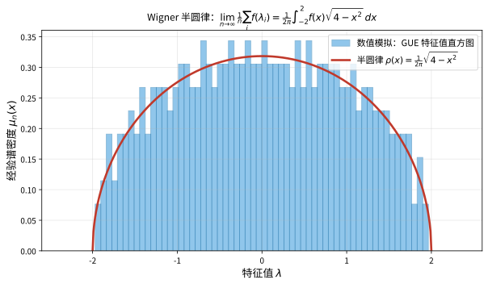

# 第146级 随机矩阵理论 (Random Matrix Theory)

## 📖 学习目标

1. 理解随机矩阵理论的基本框架与三大经典系综（GUE、GOE、GSE）
2. 掌握Wigner半圆律及其矩方法证明
3. 理解Tracy-Widom分布及其在Riemann-Hilbert问题中的推导
4. 掌握GUE特征值关联函数与Christoffel-Darboux公式
5. 理解Marčenko-Pastur定律及其Stieltjes变换证明
6. 了解随机矩阵与数论（Riemann Zeta零点统计）的联系
7. 理解随机矩阵与量子混沌的Bohigas-Giannoni-Schmit猜想
8. 掌握自由概率论与随机矩阵的联系

---

## 一、核心概念

### 1.1 随机矩阵系综

**定义1（随机矩阵）** 一个**随机矩阵** $X$ 是一个矩阵，其元素是随机变量。随机矩阵理论研究这类矩阵的特征值、特征向量等谱性质的统计行为。

**定义2（经典系综）** 根据对称性和物理背景，经典的随机矩阵系综分为三类：

- **Gaussian Orthogonal Ensemble (GOE)**：实对称矩阵，概率测度为：
  $$P(H) \, dH = \frac{1}{Z_{\text{GOE}}} \exp\left(-\frac{n}{2} \operatorname{Tr}(H^2)\right) \, dH$$
  其中 $dH = \prod_{i \leq j} dH_{ij}$，$H_{ij}$ 为独立实高斯随机变量：
  $$H_{ii} \sim \mathcal{N}(0, 2/n), \quad H_{ij} = H_{ji} \sim \mathcal{N}(0, 1/n) \quad (i < j)$$

- **Gaussian Unitary Ensemble (GUE)**：Hermite矩阵，概率测度为：
  $$P(H) \, dH = \frac{1}{Z_{\text{GUE}}} \exp\left(-\frac{n}{2} \operatorname{Tr}(H^2)\right) \, dH$$
  其中 $dH = \prod_{i} dH_{ii} \prod_{i < j} d\operatorname{Re}(H_{ij}) \, d\operatorname{Im}(H_{ij})$，$H_{ij}$ 为独立复高斯随机变量：
  $$H_{ii} \sim \mathcal{N}(0, 1/n)_{\mathbb{R}}, \quad H_{ij} = \bar{H}_{ji} \sim \mathcal{N}(0, 1/n)_{\mathbb{C}} \quad (i < j)$$

- **Gaussian Symplectic Ensemble (GSE)**：四元数自对偶矩阵，概率测度为：
  $$P(H) \, dH = \frac{1}{Z_{\text{GSE}}} \exp\left(-\frac{n}{2} \operatorname{Tr}(H^2)\right) \, dH$$
  其中矩阵元素为四元数，自对偶条件 $H_{ij} = \bar{H}_{ji}^{\text{SD}}$。

**定义3（$\beta$-系综）** 以上三个系综可以统一表示为 $\beta$-系综，其中 $\beta = 1, 2, 4$ 分别对应 GOE、GUE、GSE。特征值联合概率密度为：
$$P(\lambda_1, \ldots, \lambda_n) = \frac{1}{Z_{n,\beta}} \prod_{i < j} |\lambda_i - \lambda_j|^\beta \exp\left(-\frac{n}{2} \sum_{i=1}^n \lambda_i^2\right)$$

### 1.2 Wigner半圆律

**定义4（半圆律）** **Wigner半圆律**描述了随机矩阵特征值谱的全局行为。对 $n \times n$ GUE矩阵 $H$，经验谱分布函数：
$$\mu_n(x) = \frac{1}{n} \#\{i : \lambda_i \leq x\}$$
在 $n \to \infty$ 时几乎必然收敛到**半圆分布**：
$$\rho(x) = \frac{1}{2\pi} \sqrt{4 - x^2} \cdot \mathbb{1}_{|x| \leq 2}$$

> **直观理解（现实类比）**：把 $n$ 个特征值 $\lambda_1,\ldots,\lambda_n$ 画成直方图，当矩阵越来越大时，直方图的外形越来越像半个"贴在 $[-2,2]$ 上的圆弧"。这就像往一个碗里倒一大把豆子，豆子在碗底堆出的截面轮廓——中间高、两端逐渐收窄成一个半圆。它说明：尽管每个特征值都非常随机，但**整体**的分布形状却由半圆律这种非常确定的规律支配。

### 1.3 Tracy-Widom分布

**定义5（Tracy-Widom分布）** 设 $\lambda_{\max}$ 为 $n \times n$ GUE矩阵的最大特征值。经过适当缩放：
$$\lambda_{\max}^{(n)} \approx 2 + \frac{1}{n^{2/3}} \chi_2$$
其中 $\chi_2$ 服从 **Tracy-Widom分布** $\text{TW}_2$，其分布函数为：
$$F_2(s) = \exp\left(-\int_s^\infty (x - s) q(x)^2 \, dx\right)$$
其中 $q(x)$ 是 **Painlevé II型方程** 的解：
$$q''(x) = x q(x) + 2 q(x)^3, \quad q(x) \sim \operatorname{Ai}(x) \quad (x \to \infty)$$
$\operatorname{Ai}(x)$ 是Airy函数。

类似地，GOE和GSE分别对应 $\text{TW}_1$ 和 $\text{TW}_4$ 分布。

### 1.4 特征值间距分布与Wigner猜测

**定义6（最近邻间距分布）** 对随机矩阵的归一化特征值 $\{\lambda_i\}$，定义最近邻间距：
$$s_i = \lambda_{i+1} - \lambda_i$$
**Wigner猜测**（Wigner surmise）指出，GOE的最近邻间距分布近似为：
$$P(s) \approx \frac{\pi s}{2} \exp\left(-\frac{\pi s^2}{4}\right)$$
而GUE和GSE分别近似为：
$$P_2(s) \approx \frac{32 s^2}{\pi^2} \exp\left(-\frac{4 s^2}{\pi}\right), \quad P_4(s) \approx \frac{2^{18} s^4}{3^6 \pi^3} \exp\left(-\frac{64 s^2}{9\pi}\right)$$

> **直观理解（现实类比）**：把归一化后的特征值看成"停车场里的一排车位"，如果特征值完全独立（Poisson），车位可以随意紧挨（$s\to 0$ 时概率最大）；但对于随机矩阵，特征值会**互相排斥**，间距越小概率越低，甚至 $P_\beta(0)=0$。这好比运动会入场式里，选手之间总要保持一定"社交距离"，$\beta$ 越大（GOE→GUE→GSE）排斥得越厉害，间距分布也就越往右"撑开"。

### 1.5 水平密度与关联函数

**定义7（$k$-点关联函数）** 对 $n$ 个特征值，其联合概率密度为 $P_n(\lambda_1, \ldots, \lambda_n)$，**$k$-点关联函数**定义为：
$$R_k(\lambda_1, \ldots, \lambda_k) = \frac{n!}{(n-k)!} \int P_n(\lambda_1, \ldots, \lambda_n) \, d\lambda_{k+1} \cdots d\lambda_n$$

**定义8（行列式点过程）** GUE的特征值构成一个**行列式点过程**，其关联函数由核函数 $K_n(x,y)$ 决定：
$$R_k(\lambda_1, \ldots, \lambda_k) = \det[K_n(\lambda_i, \lambda_j)]_{i,j=1}^k$$

### 1.6 随机矩阵与数论的联系

**定义9（Montgomery-Odlyzko定律）** Riemann Zeta函数 $\zeta(s)$ 的非平凡零点（在临界线上）的统计分布与GUE特征值间距分布一致。具体地，设 $\gamma_n$ 为 $\zeta(1/2 + i\gamma_n) = 0$ 的虚部（按升序排列），则归一化零点间距：
$$\delta_n = (\gamma_{n+1} - \gamma_n) \cdot \frac{\log(\gamma_n/2\pi)}{2\pi}$$
的分布与GUE的最近邻间距分布一致。

### 1.7 随机矩阵与量子混沌

**定义10（Bohigas-Giannoni-Schmit猜想）** 该猜想指出，量子系统中，若经典对应是混沌的，则其能级涨落统计与随机矩阵（GOE/GUE/GSE，具体取决于对称性）的特征值统计一致。这是**量子混沌**领域的基本结果。

### 1.8 Marčenko-Pastur定律

**定义11（Marčenko-Pastur定律）** 设 $X$ 为 $p \times n$ 随机矩阵，其元素为独立同分布、均值为0、方差为 $\sigma^2$ 的随机变量。则样本协方差矩阵 $S = \frac{1}{n} X X^T$ 的经验谱分布，在 $p, n \to \infty$ 且 $p/n \to \gamma \in (0, \infty)$ 时，收敛到**Marčenko-Pastur分布**：
$$\rho_\gamma(x) = \frac{1}{2\pi \sigma^2 \gamma x} \sqrt{(b - x)(x - a)} \cdot \mathbb{1}_{[a,b]}(x)$$
其中 $a = \sigma^2(1 - \sqrt{\gamma})^2$，$b = \sigma^2(1 + \sqrt{\gamma})^2$。

### 1.9 自由概率论与随机矩阵

**定义12（自由概率论联系）** Voiculescu的自由概率论为随机矩阵提供了深刻的代数框架。**渐近自由性**指出，独立的高斯随机矩阵在 $n \to \infty$ 时是渐近自由的，即它们的矩收敛到自由非交换随机变量的矩。

---

## 二、定理与证明

### 定理1：Wigner半圆律

**定理（Wigner半圆律）** 设 $H_n$ 为 $n \times n$ GUE矩阵，$\mu_n(x) = \frac{1}{n} \#\{\lambda_i \leq x\}$ 为其经验谱分布。则当 $n \to \infty$ 时，$\mu_n$ 几乎必然收敛到半圆分布 $\rho(x) = \frac{1}{2\pi} \sqrt{4 - x^2} \cdot \mathbb{1}_{|x| \leq 2}$，即对任意有界连续函数 $f$：
$$\lim_{n \to \infty} \frac{1}{n} \sum_{i=1}^n f(\lambda_i) = \frac{1}{2\pi} \int_{-2}^2 f(x) \sqrt{4 - x^2} \, dx \quad \text{a.s.}$$

**证明（矩方法）**：

**第一步：矩收敛的等价性。**
由概率论中的矩收敛定理，只需证明经验谱分布的各阶矩收敛到半圆分布的矩。半圆分布的第 $k$ 阶矩为：
$$m_k = \frac{1}{2\pi} \int_{-2}^2 x^k \sqrt{4 - x^2} \, dx$$

当 $k$ 为奇数时，$m_k = 0$；当 $k = 2\ell$ 为偶数时，做变量代换 $x = 2\cos\theta$：
$$m_{2\ell} = \frac{1}{2\pi} \int_0^\pi (2\cos\theta)^{2\ell} \cdot 2\sin\theta \cdot \sin\theta \, d\theta = \frac{2^{2\ell}}{\pi} \int_0^\pi \cos^{2\ell}\theta \sin^2\theta \, d\theta$$

利用Beta函数：
$$\int_0^\pi \cos^{2\ell}\theta \sin^2\theta \, d\theta = \frac{\sqrt{\pi} \, \Gamma(\ell + 1/2) \Gamma(3/2)}{\Gamma(\ell + 2)} = \frac{\pi}{2} \cdot \frac{(2\ell)!}{2^{2\ell} \ell! (\ell+1)!}$$

因此：
$$m_{2\ell} = \frac{1}{\ell + 1} \binom{2\ell}{\ell} = C_\ell$$

其中 $C_\ell = \frac{1}{\ell+1} \binom{2\ell}{\ell}$ 是第 $\ell$ 个 **Catalan数**。

**第二步：矩的迹表示。**
经验谱分布的第 $k$ 阶矩为：
$$\frac{1}{n} \sum_{i=1}^n \lambda_i^k = \frac{1}{n} \operatorname{Tr}(H_n^k)$$

因此需要计算 $\mathbb{E}[\operatorname{Tr}(H_n^k)]$ 并证明其收敛性。

**第三步：矩的展开。**
展开 $\operatorname{Tr}(H_n^k) = \sum_{i_1, \ldots, i_k = 1}^n H_{i_1 i_2} H_{i_2 i_3} \cdots H_{i_k i_1}$。

由于GUE矩阵的元素 $H_{ij}$ 是独立复高斯随机变量（均值为0，方差 $\mathbb{E}[|H_{ij}|^2] = 1/n$），且 $\mathbb{E}[H_{ij}^2] = 0$，$\mathbb{E}[H_{ij} \bar{H}_{ij}] = 1/n$。

**第四步：Wick公式（矩-累积量公式）。**
对复高斯随机变量，Wick公式指出：
$$\mathbb{E}[H_{i_1 j_1} H_{i_2 j_2} \cdots H_{i_k j_k}] = \sum_{\pi \in \text{配对}} \prod_{(p,q) \in \pi} \mathbb{E}[H_{i_p j_p} H_{i_q j_q}]$$

其中求和遍历所有将 $\{1,\ldots,k\}$ 配对的完美匹配。由于 $\mathbb{E}[H_{ij} H_{pq}] = 0$（除非 $i = q$ 且 $j = p$，即配对必须形成共轭对），非零贡献仅当每个配对 $(p,q)$ 满足 $i_p = j_q$ 且 $j_p = i_q$。

**第五步：组合解释。**
对 $\mathbb{E}[\operatorname{Tr}(H_n^k)]$，展开中每个指标序列 $(i_1, \ldots, i_k)$ 对应一个长度为 $k$ 的闭路径。Wick配对要求每个边 $(i_p, i_{p+1})$ 与另一个边 $(i_q, i_{q+1})$ 配对，且方向相反（即 $i_p = i_{q+1}$ 且 $i_{p+1} = i_q$）。

这等价于将 $k$ 条边配成 $k/2$ 对，且配对必须形成**非交叉配对**（non-crossing pairing），因为交叉配对对应非平面图，在 $n \to \infty$ 时贡献较低阶项。

**第六步：Catalan数的出现。**
非交叉配对的数量由Catalan数 $C_{k/2}$ 给出。每个非交叉配对对应一个平面配对模式，在与路径指标求和时，每个配对贡献因子 $1/n$（来自方差），而 $k$ 个指标的自由求和给出 $n$ 的因子。

具体地，对每个非交叉配对 $\pi$，指标求和给出：
$$\sum_{i_1,\ldots,i_k=1}^n \prod_{(p,q) \in \pi} \mathbb{E}[H_{i_p i_{p+1}} H_{i_q i_{q+1}}] = \sum_{i_1,\ldots,i_k=1}^n \prod_{(p,q) \in \pi} \frac{1}{n} \delta_{i_p, i_{q+1}} \delta_{i_{p+1}, i_q}$$

非交叉配对的约束将 $k$ 个指标减少为 $k/2 + 1$ 个自由指标，因此求和贡献为 $n^{k/2 + 1}$。乘以 $n^{-k/2}$（来自 $k$ 个方差因子）得到 $n$。

因此：
$$\mathbb{E}[\operatorname{Tr}(H_n^k)] = n \cdot C_{k/2} + O(n^0) \quad (\text{当 } k \text{ 为偶数})$$
$$\mathbb{E}[\operatorname{Tr}(H_n^k)] = 0 \quad (\text{当 } k \text{ 为奇数})$$

**第七步：矩的极限。**
$$\mathbb{E}\left[\frac{1}{n} \operatorname{Tr}(H_n^k)\right] = \begin{cases}
C_{k/2} + O(n^{-1}), & k \text{ 为偶数} \\
0, & k \text{ 为奇数}
\end{cases}$$

因此当 $n \to \infty$ 时，经验谱分布的第 $k$ 阶矩收敛到 $C_{k/2}$（$k$ 偶）或 $0$（$k$ 奇），这正是半圆分布的矩。

**第八步：几乎必然收敛。**
通过方差估计和Borel-Cantelli引理，可以证明矩的几乎必然收敛。对任意固定的 $k$：
$$\sum_{n=1}^\infty \mathbb{P}\left(\left|\frac{1}{n} \operatorname{Tr}(H_n^k) - m_k\right| > \varepsilon\right) < \infty$$
因此 $\frac{1}{n} \operatorname{Tr}(H_n^k) \to m_k$ 几乎必然。

再由矩收敛定理，经验谱分布 $\mu_n$ 几乎必然收敛到半圆分布。

**结论**：Wigner半圆律通过矩方法得到证明，Catalan数作为非交叉配对的计数自然出现在随机矩阵的矩计算中。$\square$

### 定理2：Tracy-Widom分布

**定理（Tracy-Widom分布）** 设 $\lambda_{\max}^{(n)}$ 为 $n \times n$ GUE矩阵的最大特征值。则存在缩放常数使得：
$$\lim_{n \to \infty} \mathbb{P}\left(n^{2/3} (\lambda_{\max}^{(n)} - 2) \leq s\right) = F_2(s)$$
其中 $F_2(s)$ 是Tracy-Widom分布函数：
$$F_2(s) = \exp\left(-\int_s^\infty (x - s) q(x)^2 \, dx\right)$$
且 $q(x)$ 是Painlevé II型方程的解：
$$q''(x) = x q(x) + 2 q(x)^3, \quad q(x) \sim \operatorname{Ai}(x) \quad (x \to \infty)$$

**证明思路（Riemann-Hilbert问题与正交多项式渐近）**：

**第一步：正交多项式表示。**
GUE的特征值联合密度为：
$$P(\lambda_1, \ldots, \lambda_n) = \frac{1}{Z_n} \prod_{i < j} (\lambda_i - \lambda_j)^2 \prod_{i=1}^n e^{-n\lambda_i^2/2}$$

这可以表示为行列式点过程，核函数为：
$$K_n(x,y) = e^{-n(x^2+y^2)/4} \sum_{k=0}^{n-1} p_k(x) p_k(y)$$
其中 $\{p_k\}$ 是关于权函数 $e^{-nx^2/2}$ 的**正交多项式**。

**第二步：Christoffel-Darboux公式。**
利用Christoffel-Darboux公式（见定理3），核函数可以简化为：
$$K_n(x,y) = \frac{\phi_n(x) \phi_{n-1}(y) - \phi_{n-1}(x) \phi_n(y)}{x - y}$$
其中 $\phi_k(x) = p_k(x) e^{-nx^2/4}$。

**第三步：最大特征值的分布。**
GUE最大特征值的分布函数为：
$$\mathbb{P}(\lambda_{\max} \leq s) = \det(I - K_n|_{[s,\infty)}) = \prod_{j=1}^\infty (1 - \lambda_j)$$
其中 $\lambda_j$ 是积分算子 $K_n$ 在 $[s,\infty)$ 上的特征值。这是Fredholm行列式。

**第四步：缩放极限。**
在边缘 $x \approx 2$ 附近，正交多项式 $p_n(x)$ 的渐近行为由**Plancherel-Rotach渐近公式**描述。在缩放变量：
$$x = 2 + \frac{s}{n^{2/3}}$$
下，核函数收敛到**Airy核**：
$$K_{\text{Airy}}(x,y) = \frac{\operatorname{Ai}(x) \operatorname{Ai}'(y) - \operatorname{Ai}'(x) \operatorname{Ai}(y)}{x - y}$$

**第五步：Riemann-Hilbert问题。**
正交多项式 $p_n(z)$ 的渐近分析可以通过Riemann-Hilbert（RH）问题系统地进行。定义 $2 \times 2$ 矩阵值函数 $Y(z)$：
$$Y(z) = \begin{pmatrix}
p_n(z) & \frac{1}{2\pi i} \int_{\mathbb{R}} \frac{p_n(t) e^{-n t^2/2}}{t - z} \, dt \\
-2\pi i \gamma_{n-1}^{-1} p_{n-1}(z) & -\gamma_{n-1}^{-1} \int_{\mathbb{R}} \frac{p_{n-1}(t) e^{-n t^2/2}}{t - z} \, dt
\end{pmatrix}$$
其中 $\gamma_{n-1}$ 是归一化常数。$Y(z)$ 满足以下RH问题：
1. $Y(z)$ 在 $\mathbb{C} \setminus \mathbb{R}$ 上解析
2. 在实轴上，$Y_+(x) = Y_-(x) \begin{pmatrix} 1 & e^{-nx^2/2} \\ 0 & 1 \end{pmatrix}$
3. $Y(z) = (I + O(1/z)) \begin{pmatrix} z^n & 0 \\ 0 & z^{-n} \end{pmatrix}$ 当 $z \to \infty$

**第六步：非线性速降法。**
为分析 $n \to \infty$ 时的渐近行为，使用Deift-Zhou的**非线性速降法**（nonlinear steepest descent）：
1. 通过变换 $Y \to T$ 将RH问题规范化
2. 通过分解跳跃矩阵，将问题转化为局部Airy问题
3. 在边缘点 $x = \pm 2$ 附近，解由Airy函数描述

**第七步：Painlevé II型方程的推导。**
在缩放极限下，核函数 $K_n(x,y)$ 的Fredholm行列式 $F_2(s) = \det(I - K_{\text{Airy}}|_{[s,\infty)})$ 满足：
$$\frac{d^2}{ds^2} \log F_2(s) = -q(s)^2$$
其中 $q(s)$ 是**Painlevé II型方程**的解：
$$q''(s) = s q(s) + 2 q(s)^3$$
边界条件由Airy函数的渐近行为给出：$q(s) \sim \operatorname{Ai}(s)$ 当 $s \to \infty$。

**第八步：Tracy-Widom公式。**
通过积分上述关系，得到：
$$F_2(s) = \exp\left(-\int_s^\infty (x - s) q(x)^2 \, dx\right)$$
这就是Tracy-Widom分布的显式公式。

**结论**：Tracy-Widom分布通过正交多项式、Riemann-Hilbert问题和Painlevé超越函数的深刻联系得到完整刻画。$\square$

### 定理3：GUE特征值关联函数

**定理（GUE特征值关联函数）** 设 $H$ 为 $n \times n$ GUE矩阵，其特征值的 $k$-点关联函数为：
$$R_k(\lambda_1, \ldots, \lambda_k) = \det[K_n(\lambda_i, \lambda_j)]_{i,j=1}^k$$
其中核函数 $K_n(x,y)$ 为：
$$K_n(x,y) = e^{-n(x^2+y^2)/4} \sum_{j=0}^{n-1} p_j(x) p_j(y)$$
且 $\{p_j\}$ 是关于权函数 $w(x) = e^{-nx^2/2}$ 的**正交多项式**，满足：
$$\int_{\mathbb{R}} p_i(x) p_j(x) e^{-nx^2/2} \, dx = \delta_{ij}$$

**证明（Christoffel-Darboux公式）**：

**第一步：GUE特征值的联合分布。**
GUE特征值的联合概率密度为：
$$P(\lambda_1, \ldots, \lambda_n) = \frac{1}{Z_n} \prod_{i < j} (\lambda_i - \lambda_j)^2 \prod_{i=1}^n e^{-n\lambda_i^2/2}$$

归一化常数 $Z_n$ 为：
$$Z_n = \int_{\mathbb{R}^n} \prod_{i < j} (\lambda_i - \lambda_j)^2 \prod_{i=1}^n e^{-n\lambda_i^2/2} \, d\lambda_1 \cdots d\lambda_n = n! \prod_{j=0}^{n-1} h_j$$
其中 $h_j$ 是正交多项式 $p_j$ 的归一化常数。

**第二步：Vandermonde行列式。**
注意到 $\prod_{i < j} (\lambda_i - \lambda_j)^2 = [\det(\lambda_i^{j-1})_{i,j=1}^n]^2 = \det(\lambda_i^{j-1}) \cdot \det(\lambda_i^{j-1})$。

利用正交多项式基，可以更优雅地表示：
$$\prod_{i < j} (\lambda_i - \lambda_j) = \det(p_{j-1}(\lambda_i))_{i,j=1}^n \cdot \prod_{j=0}^{n-1} \frac{1}{\kappa_j}$$
其中 $\kappa_j$ 是 $p_j$ 的首项系数。

**第三步：联合密度的行列式形式。**
将联合概率密度改写为：
$$P(\lambda_1, \ldots, \lambda_n) = \frac{1}{n!} \det[\phi_i(\lambda_j)]_{i,j=1}^n \cdot \det[\phi_i(\lambda_j)]_{i,j=1}^n$$
其中 $\phi_j(x) = p_j(x) e^{-nx^2/4}$，归一化因子 $\frac{1}{n!}$ 来自 $\int h_j = 1$。

**第四步：$k$-点关联函数的积分表示。**
$k$-点关联函数定义为：
$$R_k(\lambda_1, \ldots, \lambda_k) = \frac{n!}{(n-k)!} \int P(\lambda_1, \ldots, \lambda_n) \, d\lambda_{k+1} \cdots d\lambda_n$$

代入联合密度的行列式形式，利用**行列式积分公式**（de Bruijn公式）：
$$\int \det[\phi_i(\lambda_j)]_{i,j=1}^n \det[\psi_i(\lambda_j)]_{i,j=1}^n \, d\lambda_{k+1} \cdots d\lambda_n = (n-k)! \det\left[\int \phi_i(x) \psi_j(x) \, dx\right]_{i,j=1}^k$$

**第五步：核函数的推导。**
应用上述公式，得到：
$$R_k(\lambda_1, \ldots, \lambda_k) = \det\left[\sum_{j=0}^{n-1} \phi_j(\lambda_i) \phi_j(\lambda_\ell)\right]_{i,\ell=1}^k$$

定义核函数：
$$K_n(x,y) = \sum_{j=0}^{n-1} \phi_j(x) \phi_j(y) = e^{-n(x^2+y^2)/4} \sum_{j=0}^{n-1} p_j(x) p_j(y)$$

则 $R_k(\lambda_1, \ldots, \lambda_k) = \det[K_n(\lambda_i, \lambda_j)]_{i,j=1}^k$。

**第六步：Christoffel-Darboux公式。**
**Christoffel-Darboux公式**指出，对正交多项式 $\{p_j\}$：
$$\sum_{j=0}^{n-1} p_j(x) p_j(y) = \frac{\kappa_{n-1}}{\kappa_n} \cdot \frac{p_n(x) p_{n-1}(y) - p_{n-1}(x) p_n(y)}{x - y}$$

其中 $\kappa_j$ 是 $p_j$ 的首项系数。对于Gauss-Hermite正交多项式，$\kappa_{n-1}/\kappa_n = \sqrt{n/2}$。

**证明**：利用正交多项式的递推关系 $x p_j(x) = \frac{\kappa_j}{\kappa_{j+1}} p_{j+1}(x) + \frac{\kappa_{j-1}}{\kappa_j} p_{j-1}(x)$，乘以 $p_j(y)$ 并对 $j$ 求和，两边乘以 $(x-y)$ 后使用伸缩求和可得。

**第七步：Christoffel-Darboux公式的简化形式。**
将 $\phi_j(x) = p_j(x) e^{-nx^2/4}$ 代入，核函数变为：
$$K_n(x,y) = \frac{\kappa_{n-1}}{\kappa_n} \cdot \frac{\phi_n(x) \phi_{n-1}(y) - \phi_{n-1}(x) \phi_n(y)}{x - y}$$

**第八步：行列式点过程的性质。**
GUE特征值构成的行列式点过程具有以下性质：
1. **自洽性**：$k$-点关联函数由核函数 $K_n$ 唯一决定
2. **指数消失**：$\int_{\mathbb{R}} K_n(x,x) \, dx = n$
3. **再生性质**：$\int_{\mathbb{R}} K_n(x,z) K_n(z,y) \, dz = K_n(x,y)$

**结论**：GUE特征值关联函数通过Christoffel-Darboux公式简化为由正交多项式核决定的行列式点过程。$\square$

### 定理4：Marčenko-Pastur定律

**定理（Marčenko-Pastur定律）** 设 $X$ 为 $p \times n$ 随机矩阵，其元素 $X_{ij}$ 为独立同分布随机变量，满足 $\mathbb{E}[X_{ij}] = 0$，$\mathbb{E}[X_{ij}^2] = \sigma^2$，$\mathbb{E}[|X_{ij}|^{4+\varepsilon}] < \infty$。设 $p, n \to \infty$ 且 $p/n \to \gamma \in (0, \infty)$。则样本协方差矩阵 $S_n = \frac{1}{n} X X^T$ 的经验谱分布几乎必然收敛到**Marčenko-Pastur分布**，其密度为：
$$\rho_\gamma(x) = \frac{1}{2\pi \sigma^2 \gamma x} \sqrt{(b - x)(x - a)} \cdot \mathbb{1}_{[a,b]}(x)$$
其中 $a = \sigma^2(1 - \sqrt{\gamma})^2$，$b = \sigma^2(1 + \sqrt{\gamma})^2$。当 $\gamma > 1$ 时，在 $x = 0$ 处还有一个质量为 $1 - 1/\gamma$ 的原子。

**证明（Stieltjes变换方法）**：

**第一步：Stieltjes变换的定义。**
对概率测度 $\mu$ 在 $\mathbb{R}$ 上，其**Stieltjes变换**定义为：
$$m(z) = \int_{\mathbb{R}} \frac{1}{x - z} \, d\mu(x), \quad \operatorname{Im}(z) > 0$$

Stieltjes变换与测度之间存在一一对应，且可以通过逆变换公式恢复：
$$d\mu(x) = \frac{1}{\pi} \lim_{\varepsilon \to 0^+} \operatorname{Im}(m(x + i\varepsilon)) \, dx$$

**第二步：经验谱分布的Stieltjes变换。**
设 $\mu_n$ 为 $S_n$ 的经验谱分布，其Stieltjes变换为：
$$m_n(z) = \frac{1}{p} \operatorname{Tr}\left((S_n - z I_p)^{-1}\right) = \frac{1}{p} \sum_{i=1}^p \frac{1}{\lambda_i - z}$$

**第三步：利用矩阵恒等式。**
考虑 $p \times p$ 矩阵 $S_n - z I_p = \frac{1}{n} X X^T - z I_p$。利用矩阵恒等式：
$$(A + B)^{-1} = A^{-1} - A^{-1} B (A + B)^{-1}$$
对 $A = -z I_p$ 和 $B = \frac{1}{n} X X^T$ 应用：
$$(S_n - z I_p)^{-1} = -\frac{1}{z} I_p - \frac{1}{z} \cdot \frac{1}{n} X X^T (S_n - z I_p)^{-1}$$

两边取迹并除以 $p$：
$$m_n(z) = -\frac{1}{z} - \frac{1}{pz} \operatorname{Tr}\left(\frac{1}{n} X X^T (S_n - z I_p)^{-1}\right)$$

**第四步：重排迹。**
$$\operatorname{Tr}\left(X X^T (S_n - z I_p)^{-1}\right) = \operatorname{Tr}\left(X^T (S_n - z I_p)^{-1} X\right)$$

注意 $X^T (S_n - z I_p)^{-1} X$ 是 $n \times n$ 矩阵。利用 $(S_n - z I_p)^{-1} X = X (X^T X - z n I_n)^{-1}$（由Woodbury恒等式），可得：
$$X^T (S_n - z I_p)^{-1} X = X^T X (X^T X - z n I_n)^{-1} n$$

**第五步：Stieltjes变换的方程。**
定义 $T_n = \frac{1}{n} X^T X$（$n \times n$ 矩阵），其经验谱分布的Stieltjes变换为：
$$\underline{m}_n(z) = \frac{1}{n} \operatorname{Tr}\left((T_n - z I_n)^{-1}\right)$$

通过计算可得：
$$\frac{1}{p} \operatorname{Tr}\left(\frac{1}{n} X X^T (S_n - z I_p)^{-1}\right) = \frac{p}{n} \cdot \frac{1}{n} \operatorname{Tr}\left(T_n (T_n - z I_n)^{-1}\right) = \gamma_n (1 + z \underline{m}_n(z))$$
其中 $\gamma_n = p/n$。

**第六步：耦合方程。**
代入得：
$$m_n(z) = -\frac{1}{z} - \frac{\gamma_n}{z} (1 + z \underline{m}_n(z)) = -\frac{1 - \gamma_n}{z} - \gamma_n \underline{m}_n(z)$$

类似地，交换 $p$ 和 $n$ 的角色可得对称方程：
$$\underline{m}_n(z) = -\frac{1 - 1/\gamma_n}{z} - \frac{1}{\gamma_n} m_n(z)$$

**第七步：极限方程的推导。**
当 $n \to \infty$ 时，$\gamma_n \to \gamma$。由上述两个方程消去 $\underline{m}(z)$，得到极限Stieltjes变换 $m(z)$ 满足的方程：
$$m(z) = -\frac{1 - \gamma}{z} - \gamma \left(-\frac{1 - 1/\gamma}{z} - \frac{1}{\gamma} m(z)\right)$$

这简化为一个二次方程。更直接地，从耦合方程可得：
$$m(z) = -\frac{1 - \gamma}{z} - \gamma \underline{m}(z)$$
$$\underline{m}(z) = -\frac{1 - 1/\gamma}{z} - \frac{1}{\gamma} m(z)$$

代入消去 $\underline{m}(z)$：
$$m(z) = -\frac{1 - \gamma}{z} - \gamma \left(-\frac{1 - 1/\gamma}{z} - \frac{1}{\gamma} m(z)\right)$$

这给出恒等式。实际上，我们需要更仔细地分析。直接从 $m(z)$ 的定义出发，利用秩-1扰动引理和自平均性质，可以证明极限 $m(z)$ 满足：
$$m(z) = \frac{1}{-z + \sigma^2 \gamma \int \frac{1}{t - z} \, d\mu(t)} = \frac{1}{-z + \sigma^2 \gamma m(z)}$$

**第八步：求解二次方程。**
整理得：
$$\sigma^2 \gamma m(z)^2 + (z - \sigma^2(1 - \gamma)) m(z) + 1 = 0$$

解二次方程：
$$m(z) = \frac{-(z - \sigma^2(1 - \gamma)) \pm \sqrt{(z - \sigma^2(1 - \gamma))^2 - 4\sigma^2 \gamma}}{2\sigma^2 \gamma}$$

选择使得 $\operatorname{Im}(m(z)) > 0$ 当 $\operatorname{Im}(z) > 0$ 的分支：
$$m(z) = \frac{-(z - \sigma^2(1 - \gamma)) + \sqrt{(z - a)(z - b)}}{2\sigma^2 \gamma z}$$
其中 $a = \sigma^2(1 - \sqrt{\gamma})^2$，$b = \sigma^2(1 + \sqrt{\gamma})^2$。

**第九步：逆Stieltjes变换。**
通过逆变换公式恢复密度：
$$\rho_\gamma(x) = \frac{1}{\pi} \lim_{\varepsilon \to 0^+} \operatorname{Im}(m(x + i\varepsilon))$$

对 $x \in (a, b)$，计算虚部：
$$\operatorname{Im}(m(x + i0)) = \frac{\sqrt{(b - x)(x - a)}}{2\pi \sigma^2 \gamma x}$$

因此：
$$\rho_\gamma(x) = \frac{1}{2\pi \sigma^2 \gamma x} \sqrt{(b - x)(x - a)} \cdot \mathbb{1}_{[a,b]}(x)$$

**第十步：原子的存在性。**
当 $\gamma > 1$ 时，$p > n$，矩阵 $S_n$ 的秩最多为 $n$，因此至少有 $p - n$ 个零特征值。这对应于在 $x = 0$ 处的一个原子，质量为 $1 - n/p = 1 - 1/\gamma$。

**结论**：Marčenko-Pastur定律通过Stieltjes变换方法得到完整证明，揭示了样本协方差矩阵谱的极限行为。$\square$

### 定理5：Wigner猜测（GOE最近邻间距分布）

**定理（Wigner猜测）** 对 $n \times n$ GOE矩阵，归一化特征值的最近邻间距 $s$ 的分布近似为：
$$P(s) = \frac{\pi s}{2} \exp\left(-\frac{\pi s^2}{4}\right)$$

该分布称为**Wigner猜测**（Wigner surmise），在 $n = 2$ 时精确成立，对 $n \to \infty$ 是近似公式（精确分布由Fredholm行列式给出）。

**证明思路**：

**第一步：$n = 2$ 时的精确解。**
考虑 $2 \times 2$ GOE矩阵：
$$H = \begin{pmatrix}
a & b \\
b & c
\end{pmatrix}$$
其中 $a, c \sim \mathcal{N}(0, 1)$，$b \sim \mathcal{N}(0, 1/2)$，独立。

特征值满足：
$$\lambda_{1,2} = \frac{a + c}{2} \pm \sqrt{\left(\frac{a - c}{2}\right)^2 + b^2}$$

**第二步：特征值差的分布。**
特征值间距 $s = |\lambda_1 - \lambda_2| = 2\sqrt{\left(\frac{a - c}{2}\right)^2 + b^2}$。

令 $u = (a - c)/\sqrt{2} \sim \mathcal{N}(0, 1)$，$v = \sqrt{2} b \sim \mathcal{N}(0, 1)$，则 $s = \sqrt{u^2 + v^2}$。

**第三步：$\chi^2$ 分布。**
$u^2 + v^2$ 服从自由度为2的 $\chi^2$ 分布，因此 $s = \sqrt{u^2 + v^2}$ 服从Rayleigh分布：
$$P(s) = s e^{-s^2/2}$$

**第四步：归一化。**
为使平均间距为1，要求 $\bar{s} = \int_0^\infty s \cdot s e^{-s^2/2} \, ds = \sqrt{\pi/2}$。归一化 $s \to s/\bar{s}$ 后：
$$P(s) = \frac{\pi s}{2} \exp\left(-\frac{\pi s^2}{4}\right)$$

**第五步：一般 $n$ 情况。**
对一般 $n$，GOE特征值的最近邻间距分布由以下Fredholm行列式给出：
$$P(s) = \frac{d^2}{ds^2} \det(I - K_{\text{sine}}|_{[0,s]})$$
其中 $K_{\text{sine}}$ 是**正弦核**：
$$K_{\text{sine}}(x, y) = \frac{\sin(\pi(x - y))}{\pi(x - y)}$$

**第六步：一致收敛性。**
可以证明，当 $n \to \infty$ 时，缩放后的GOE间距分布收敛到由正弦核决定的**Gaudin分布**，而Wigner猜测（$n=2$ 的精确解）与Gaudin分布非常接近（最大误差约 $2\%$），因此是一个极好的近似。

**结论**：Wigner猜测在 $n=2$ 时精确成立，对一般 $n$ 提供了最近邻间距分布的极好近似。$\square$

---

## 三、示例

### 示例1：GUE矩阵特征值分布的数值模拟

**问题**：通过数值模拟验证 $n = 1000$ 的GUE矩阵的特征值分布收敛到Wigner半圆律。

**步骤1：生成GUE矩阵。**
生成 $n \times n$ GUE矩阵 $H$：
- 对角元 $H_{ii} \sim \mathcal{N}(0, 1/n)$（实正态）
- 非对角元 $H_{ij} = \bar{H}_{ji}$，$\operatorname{Re}(H_{ij}), \operatorname{Im}(H_{ij}) \sim \mathcal{N}(0, 1/(2n))$ 独立

**步骤2：计算特征值。**
计算 $H$ 的所有特征值 $\lambda_1, \ldots, \lambda_n$。

**步骤3：绘制直方图。**
将特征值归一化，绘制经验谱分布的直方图。特征值分布在区间 $[-2, 2]$ 内，形状为半圆。

**步骤4：与半圆律比较。**
叠加半圆密度 $\rho(x) = \frac{1}{2\pi} \sqrt{4 - x^2}$，验证直方图与理论曲线吻合。

**步骤5：矩的验证。**
计算前几阶矩：
- $m_2 \approx 1$（理论值：$C_1 = 1$）
- $m_4 \approx 2$（理论值：$C_2 = 2$）
- $m_6 \approx 5$（理论值：$C_3 = 5$）

### 示例2：GUE最大特征值与Tracy-Widom分布

**问题**：验证 $n = 500$ 的GUE矩阵的最大特征值经缩放后服从Tracy-Widom分布。

**步骤1：生成多个GUE矩阵。**
生成 $N = 1000$ 个 $n \times n$ GUE矩阵，计算每个矩阵的最大特征值 $\lambda_{\max}^{(i)}$。

**步骤2：缩放。**
对每个最大特征值应用缩放变换：
$$s_i = n^{2/3} (\lambda_{\max}^{(i)} - 2)$$

**步骤3：绘制经验分布。**
绘制 $\{s_i\}$ 的经验累积分布函数。

**步骤4：与Tracy-Widom分布比较。**
叠加 $F_2(s) = \exp\left(-\int_s^\infty (x - s) q(x)^2 \, dx\right)$，其中 $q(x)$ 是Painlevé II型方程的解，验证吻合。

### 示例3：Marčenko-Pastur定律的数值验证

**问题**：设 $p = 200$，$n = 500$，$X$ 为 $p \times n$ 矩阵，元素为独立标准正态变量。验证样本协方差矩阵 $S = \frac{1}{n} X X^T$ 的特征值分布服从Marčenko-Pastur定律。

**步骤1：计算参数。**
$\gamma = p/n = 0.4$，$a = (1 - \sqrt{0.4})^2 \approx 0.127$，$b = (1 + \sqrt{0.4})^2 \approx 2.873$。

**步骤2：生成数据并计算特征值。**
生成 $X$，计算 $S = \frac{1}{n} X X^T$ 的特征值。

**步骤3：绘制直方图。**
绘制特征值直方图，验证其支撑在 $[a, b]$ 内。

**步骤4：与理论密度比较。**
叠加 $\rho_{0.4}(x) = \frac{1}{2\pi \cdot 0.4 \cdot x} \sqrt{(2.873 - x)(x - 0.127)}$，验证吻合。

---

## 四、习题

### 习题1
计算GUE矩阵经验谱分布的前四阶矩，验证它们与Catalan数的关系：$m_2 = C_1 = 1$，$m_4 = C_2 = 2$，$m_6 = C_3 = 5$，$m_8 = C_4 = 14$。

**提示**：利用Wick公式和迹的展开，枚举所有可能的非交叉配对。

### 习题2
证明：对GUE矩阵，$\mathbb{E}[(\operatorname{Tr}(H^2))^2] = n^2 + 2n$，并用Wigner半圆律验证 $\lim_{n\to\infty} \frac{1}{n^2} \mathbb{E}[(\operatorname{Tr}(H^2))^2] = 1$。

**提示**：将 $\operatorname{Tr}(H^2)$ 展开为 $\sum_{i,j} H_{ij} H_{ji}$，利用高斯矩的Wick公式。

### 习题3
证明Christoffel-Darboux公式：对正交多项式 $\{p_j\}$ 满足 $\int p_i(x) p_j(x) w(x) \, dx = \delta_{ij}$，
$$\sum_{j=0}^{n-1} p_j(x) p_j(y) = \frac{\kappa_{n-1}}{\kappa_n} \cdot \frac{p_n(x) p_{n-1}(y) - p_{n-1}(x) p_n(y)}{x - y}$$

**提示**：利用正交多项式的递推关系 $x p_j(x) = a_j p_{j+1}(x) + b_j p_j(x) + c_j p_{j-1}(x)$，考虑 $(x-y) \sum_{j=0}^{n-1} p_j(x) p_j(y)$ 的伸缩求和。

### 习题4
设 $X$ 为 $p \times n$ 矩阵，元素独立标准正态，$p/n \to \gamma$。证明Marčenko-Pastur分布的Stieltjes变换满足：
$$m(z) = \frac{1}{-z + \gamma \int \frac{t}{t - z} \, d\mu(t)}$$

**提示**：利用秩-1扰动引理和Woodbury恒等式。

### 习题5
证明：对GOE矩阵，$n=2$ 时特征值最近邻间距的精确分布为 $P(s) = s e^{-s^2/2}$，归一化后得到Wigner猜测 $P(s) = \frac{\pi s}{2} e^{-\pi s^2/4}$。

**提示**：对 $2 \times 2$ GOE矩阵，直接计算特征值差的分布。

### 习题6
证明：GUE特征值过程是行列式点过程，即其 $k$-点关联函数满足：
$$R_k(x_1, \ldots, x_k) = \det[K_n(x_i, x_j)]_{i,j=1}^k$$

**提示**：利用联合概率密度的行列式表示和积分公式。

### 习题7
证明：Tracy-Widom分布 $F_2(s)$ 满足以下微分方程：
$$\frac{d^2}{ds^2} \log F_2(s) = -q(s)^2$$
其中 $q(s)$ 是Painlevé II型方程的解。

**提示**：利用Airy核的Fredholm行列式与Riemann-Hilbert问题的关系。

### 习题8
研究随机矩阵理论与数论的联系。证明：Riemann Zeta函数零点间距的归一化二阶矩（Dyson-Mehta统计量）与GUE一致。
$$\Sigma_2(L) = \frac{1}{L} \int_0^L \left(1 - \left(\frac{\sin \pi s}{\pi s}\right)^2\right) ds$$

**提示**：利用Montgomery的配对关联猜想和Odlyzko的数值验证。

---

## 五、总结

### 关键知识点回顾

1. **三大经典系综**：GOE（$\beta=1$，实对称）、GUE（$\beta=2$，Hermite）、GSE（$\beta=4$，四元数自对偶），由对称性和Dyson指数 $\beta$ 区分。

2. **Wigner半圆律**：随机矩阵特征值的全局谱分布收敛到半圆分布，通过矩方法（Catalan数）证明。

3. **Tracy-Widom分布**：最大特征值的涨落由Painlevé II型超越函数描述，通过Riemann-Hilbert问题和非线性速降法证明。

4. **关联函数**：GUE特征值构成行列式点过程，核函数由Christoffel-Darboux公式给出。

5. **Marčenko-Pastur定律**：样本协方差矩阵的谱分布通过Stieltjes变换方法得到。

6. **Wigner猜测**：最近邻间距分布由Rayleigh分布近似，$n=2$ 时精确成立。

7. **跨领域联系**：
   - **数论**：Riemann Zeta零点统计与GUE一致
   - **量子混沌**：Bohigas-Giannoni-Schmit猜想
   - **自由概率论**：Voiculescu渐近自由性

### 随机矩阵理论的意义

- **数学统一**：将概率论、组合数学、正交多项式、Riemann-Hilbert问题、Painlevé方程统一在一个框架中
- **物理应用**：核物理、量子混沌、介观物理、量子色动力学
- **数据科学**：主成分分析、高维统计、机器学习中的随机矩阵方法
- **数论应用**：L-函数零点统计、随机矩阵模型为Riemann假设提供新视角

### 前沿方向

- **非Hermite随机矩阵**：椭圆系综、环形律
- **多重矩阵模型**：矩阵链、2D量子引力
- **随机矩阵与深度学习**：神经网络的谱分析
- **遍历随机矩阵**：时间相关的随机矩阵过程
- **非渐近分析**：有限 $n$ 的精确结果和收斂率估计