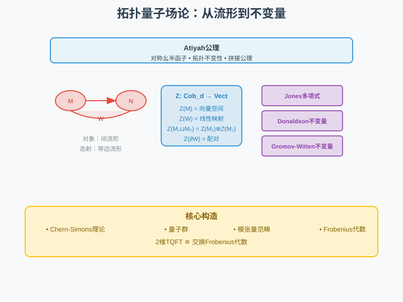
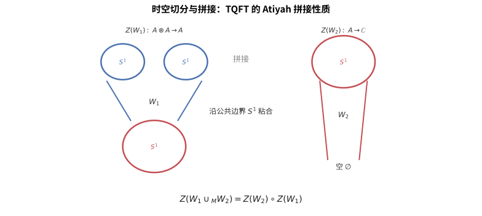

# 第149级 拓扑量子场论 (Topological Quantum Field Theory, TQFT)

## 📖 学习目标

1. 理解Atiyah公理下TQFT的定义及其基本结构
2. 掌握d维TQFT与Cobordism范畴的关系
3. 深入理解2维TQFT的分类定理及其与Frobenius代数的等价性
4. 掌握三维Chern-Simons理论与Jones多项式的联系
5. 理解Reshetikhin-Turaev构造的核心思想
6. 掌握扩展TQFT与Lurie的Bordism假设
7. 理解TQFT与Donaldson不变量、Gromov-Witten不变量的关系

---

## 一、核心概念

> **直观理解（现实类比）**：TQFT就像"乐高积木的数学理论"。Cobordism范畴是"积木说明书"：闭流形（如圆圈$S^1$）是"接口"，带边流形（如圆柱、裤子、帽子）是"积木块"。TQFT函子$Z$是"翻译器"：它把每个接口翻译成向量空间，把每个积木块翻译成线性映射。Atiyah公理保证"无论你怎么拼接积木，最终答案都一样"——这就是拓扑不变性的魔力。2维TQFT等价于交换Frobenius代数，就像"所有可能的2维乐高拼法"都对应一个特定的代数结构。Chern-Simons理论是3维TQFT的物理实现，它生成的Jones多项式能区分不同的绳结，就像用"绳结指纹"来识别身份。

### 1.1 Cobordism范畴

**定义1（Cobordism范畴）** **d维Cobordism范畴** $\text{Cob}_d$ 定义如下：
- 对象：$(d-1)$维闭光滑流形 $M$。
- 态射：从 $M$ 到 $N$ 的态射是一个 $d$ 维带边流形 $W$，使得 $\partial W \cong \overline{M} \sqcup N$，其中 $\overline{M}$ 表示 $M$ 的反定向。
- 复合：沿公共边界粘合。
- 恒等态射：$M \times [0,1]$（柱面）。
- 对称幺半结构：不相交并 $\sqcup$。

**定义2（定向Cobordism范畴）** **定向Cobordism范畴** $\text{Cob}_d^{\text{or}}$ 的对象是定向 $(d-1)$ 维闭流形，态射是定向 $d$ 维带边流形，边界定向与流形定向兼容。

### 1.2 Atiyah公理

**定义3（Atiyah公理）** 一个 **$d$ 维拓扑量子场论** 是一个对称幺半函子：

$$ Z: \text{Cob}_d \to \text{Vect}_{\mathbb{C}} $$

满足以下公理：

1. **（配对性）** $Z(\overline{M}) = Z(M)^*$（对偶向量空间）。
2. **（乘法性）** $Z(M_1 \sqcup M_2) = Z(M_1) \otimes Z(M_2)$（对称幺半性）。
3. **（结合性）** $Z(W_1 \cup_{M} W_2) = Z(W_2) \circ Z(W_1)$（复合的保持）。
4. **（规范化）** $Z(\emptyset^{(d-1)}) = \mathbb{C}$，其中 $\emptyset^{(d-1)}$ 是空 $(d-1)$ 维流形。
5. **（恒等）** $Z(M \times [0,1]) = \text{id}_{Z(M)}$（柱面给出恒等映射）。

> **直观理解（现实类比）**：TQFT 的拼接性质就像"乐高积木"。你用一个拼好的积木块 $W_1$ 和一个积木块 $W_2$，只要它们的接口（公共边界）吻合，就能拼成更大的模型，而整体配分函数恰是两块各自配分函数的复合。也就是说，无论你怎样把时空切成小块再拼回去，得到的最终答案都一样——这正是所谓"拓扑不变的拼接规律"。

### 1.3 Frobenius代数

**定义4（Frobenius代数）** 一个 **Frobenius代数** 是一个有限维结合代数 $A$，配备一个非退化线性映射 $\varepsilon: A \to \mathbb{C}$（称为**迹**或**余单位**），使得双线性形式 $\langle a, b \rangle = \varepsilon(ab)$ 是非退化的。

等价地，Frobenius代数具有一个**余乘法**（comultiplication）$\Delta: A \to A \otimes A$，满足Frobenius关系：

$$ (\Delta \otimes \text{id}_A) \circ \Delta = (\text{id}_A \otimes \Delta) \circ \Delta $$

且 $\Delta$ 是 $A$-$A$ 双模同态。

**定义5（交换Frobenius代数）** 如果 $A$ 是交换代数，则称 $A$ 为 **交换Frobenius代数**。

### 1.4 Z/2分次与超对称

**定义6（Z/2分次向量空间）** 一个 **Z/2分次向量空间** 是向量空间 $V = V_0 \oplus V_1$ 的分解，其中 $V_0$ 中的元素称为**偶元素**，$V_1$ 中的元素称为**奇元素**。分次张量积满足：

$$ (V \otimes W)_k = \bigoplus_{i+j \equiv k \pmod{2}} V_i \otimes W_j $$

**定义7（超Frobenius代数）** 一个 **超Frobenius代数** 是Z/2分次向量空间上的Frobenius代数，其中结构映射保持分次。

### 1.5 不变量

**定义8（Jones多项式）** **Jones多项式** $V_L(t) \in \mathbb{Z}[t^{-1/2}, t^{1/2}]$ 是纽结 $L$ 的一个多项式不变量，满足：

$$ V_{\text{unknot}} = 1, \quad t^{-1} V_{L_+} - t V_{L_-} = (t^{-1/2} - t^{1/2}) V_{L_0} $$

其中 $L_+, L_-, L_0$ 是纽结在交叉点处的三种局部修改（ skein relation）。

**定义9（Casson不变量）** **Casson不变量** $\lambda_{\text{Casson}}(M)$ 是定向同调3球面 $M$ 的一个整数不变量，计数了 $M$ 中不可约 $SU(2)$-表示（即平直 $SU(2)$-联络）的代数个数。

**定义10（Donaldson不变量）** **Donaldson不变量** 是光滑4维流形的不变量，通过 $SU(2)$-瞬子（自对偶Yang-Mills联络）的模空间定义。对光滑4维流形 $M$，Donaldson不变量 $\Phi_M$ 是 $\text{H}_2(M)$ 的对称幂上的多项式函数。

**定义11（Gromov-Witten不变量）** **Gromov-Witten不变量** 计数了辛流形中伪全纯曲线的个数。对辛流形 $(X, \omega)$ 和同调类 $A \in \text{H}_2(X)$，GW不变量：

$$ GW_{g, A}^X: \text{H}^*(X)^{\otimes n} \to \mathbb{Q} $$

计数了亏格 $g$、同调类 $A$ 的伪全纯曲线经过指定标记点的个数。

### 1.6 Chern-Simons理论

**定义12（Chern-Simons作用量）** 设 $M$ 是三维定向闭流形，$G$ 是紧Lie群，$A$ 是 $M$ 上 $G$-主丛的联络。**Chern-Simons作用量** 定义为：

$$ S_{\text{CS}}(A) = \frac{k}{4\pi} \int_M \text{Tr}\left(A \wedge dA + \frac{2}{3} A \wedge A \wedge A\right) $$

其中 $k \in \mathbb{Z}$ 是**级数**（level）。

**定义13（Chern-Simons配分函数）** Chern-Simons理论的**配分函数** 是：

$$ Z_{\text{CS}}(M) = \int_{\mathcal{A}/\mathcal{G}} \mathcal{D}A \, e^{i S_{\text{CS}}(A)} $$

其中 $\mathcal{A}$ 是联络空间，$\mathcal{G}$ 是规范变换群，$\mathcal{D}A$ 是形式路径积分测度。

> **直观理解（现实类比）**：配分函数就像一个"万能扫描仪"，它把整个流形（可以想象成一个环面或球面）的所有局部几何信息汇总成一个数字 $Z(M)$。就像把一块蛋糕的所有配料和火候信息压缩成"好吃与否"的一个评分，Chern-Simons 配分函数把流形的拓扑复杂度压缩成一个复数，这个数不随你如何细分流形而变，只取决于它本身的拓扑。

### 1.7 Witten的TQFT构造

**定义14（Witten的TQFT构造）** Witten证明了三维Chern-Simons理论定义了一个三维TQFT。对每个紧Lie群 $G$ 和整数级数 $k$，Chern-Simons理论给出一个TQFT：

$$ Z_{G,k}: \text{Cob}_3^{\text{or}} \to \text{Vect}_{\mathbb{C}} $$

满足：
- $Z_{G,k}(S^2) = \text{Rep}(G_k)$（级数 $k$ 的仿射Lie代数 $\hat{\mathfrak{g}}$ 的整表示）。
- $Z_{G,k}(M)$ 是 $M$ 的Chern-Simons配分函数。
- $Z_{G,k}(L)$ 是沿纽结 $L$ 的Wilson圈期望值，给出Jones多项式（当 $G = SU(2)$）。

### 1.8 Reshetikhin-Turaev构造

**定义15（Reshetikhin-Turaev构造）** **Reshetikhin-Turaev构造** 是从量子群 $U_q(\mathfrak{g})$ 的表示论构造三维TQFT的方法。核心思想是：
1. 从量子群 $U_q(\mathfrak{g})$（其中 $q = e^{2\pi i/(k + h^\vee)}$，$h^\vee$ 是 $\mathfrak{g}$ 的对偶Coxeter数）的有限维表示构造一个**模块化张量范畴**（modular tensor category）。
2. 用这个范畴构造三维流形和纽结的不变量。
3. 通过**手术法**（surgery）将流形分解为简单片段的组合。

### 1.9 量子群与TQFT

**定义16（量子群）** **量子群** $U_q(\mathfrak{g})$ 是通用包络代数 $U(\mathfrak{g})$ 的 $q$-形变，其中 $q$ 是形式参数。对 $U_q(\mathfrak{sl}_2)$，生成元 $E, F, K, K^{-1}$ 满足：

$$ KK^{-1} = K^{-1}K = 1, \quad KEK^{-1} = q^2 E, \quad KFK^{-1} = q^{-2} F, \quad [E, F] = \frac{K - K^{-1}}{q - q^{-1}} $$

**定义17（R-矩阵）** **R-矩阵** $R \in U_q(\mathfrak{g}) \otimes U_q(\mathfrak{g})$ 满足Yang-Baxter方程：

$$ R_{12}R_{13}R_{23} = R_{23}R_{13}R_{12} $$

R-矩阵给出了量子群表示的张量积的辫结构。

### 1.10 TQFT的范畴化

**定义18（TQFT的范畴化）** **TQFT的范畴化** 将TQFT提升到更高范畴的层次。一个 **$d$ 维扩展TQFT** 是一个对称幺半函子：

$$ Z: \text{Cob}_d^{\text{ext}} \to \text{Alg}_2 $$

其中 $\text{Cob}_d^{\text{ext}}$ 是扩展Cobordism $(\infty, d)$-范畴，$\text{Alg}_2$ 是 $E_2$-代数的 $(\infty, 2)$-范畴。

### 1.11 扩展TQFT

**定义19（扩展TQFT）** **扩展TQFT** 允许将TQFT分配给出更低维的流形（包括点）。一个 **完全扩展TQFT** 是一个对称幺伴函子：

$$ Z: \text{Bord}_d^{\text{fr}} \to \mathcal{C} $$

其中 $\text{Bord}_d^{\text{fr}}$ 是 $d$ 维框架化（framed）Cobordism的 $(\infty, d)$-范畴，$\mathcal{C}$ 是某个 $(\infty, d)$-范畴。

### 1.12 Lurie的Bordism假设

**定义20（Bordism假设）** Lurie的 **Bordism假设** 断言：完全扩展的 $d$ 维框架化TQFT由其在点上的值完全决定。具体地，定义了一个等价：

$$ \text{Fun}^{\otimes}(\text{Bord}_d^{\text{fr}}, \mathcal{C}) \cong \Omega^{\text{fr}}\mathcal{C} $$

其中 $\Omega^{\text{fr}}\mathcal{C}$ 是 $\mathcal{C}$ 的 $d$ 次框架化循环空间（即 $d$ 维框架化流形在 $\mathcal{C}$ 中的"可定向"对象）。

---

## 二、定理与证明

### 定理1：2维TQFT的分类（Frobenius代数等价）

**定理（2维TQFT的分类）** 存在范畴等价：

$$ \text{2-dim TQFTs} \cong \text{commutative Frobenius algebras} $$

即，二维定向TQFT与交换Frobenius代数之间存在一一对应。

**证明**：

**第一步：从2维TQFT到Frobenius代数。**

设 $Z: \text{Cob}_2^{\text{or}} \to \text{Vect}_{\mathbb{C}}$ 是一个2维TQFT。定义：

$$ A = Z(S^1) $$

其中 $S^1$ 是圆（1维闭流形）。我们需要赋予 $A$ 一个交换Frobenius代数的结构。

**乘法**：考虑 **"裤子"（pair of pants）** 曲面 $P$，它是三个圆边界的2维带边流形：

$$ \partial P = S^1 \sqcup S^1 \sqcup \overline{S^1} $$

（两个输入和一个输出）。$P$ 给出了一个态射 $P: S^1 \sqcup S^1 \to S^1$。应用TQFT：

$$ m = Z(P): A \otimes A \to A $$

定义乘法为 $a \cdot b = m(a \otimes b)$。

**单位**：考虑 **圆盘** $D$，边界 $\partial D = S^1$。$D$ 给出了一个态射 $D: \emptyset \to S^1$。应用TQFT：

$$ u = Z(D): \mathbb{C} \to A $$

定义 $1_A = u(1)$ 为单位元。

**交换性**：考虑交换两个输入边的曲面（它同胚于 $P$，但输入顺序交换）。由于 $P$ 在拓扑上对称，$m$ 是交换的。

**结合性**：考虑"三孔裤子"曲面，它给出了结合性条件 $m \circ (m \otimes \text{id}) = m \circ (\text{id} \otimes m)$。

**迹**：考虑 **圆盘** 作为从 $S^1$ 到 $\emptyset$ 的态射（即"帽子"）：

$$ \varepsilon = Z(D): A \to \mathbb{C} $$

**非退化性**：考虑 $S^1 \times [0,1]$（柱面），它给出了恒等映射。柱面可以分解为两个"帽子"的复合，这等价于双线性形式 $\langle a, b \rangle = \varepsilon(ab)$ 的非退化性。

**第二步：从Frobenius代数到2维TQFT。**

给定一个交换Frobenius代数 $(A, m, u, \varepsilon)$，我们需要构造TQFT $Z$。

**对象**：$Z(S^1) = A$。对 $n$ 个不相交的圆，$Z(\bigsqcup^n S^1) = A^{\otimes n}$。

**态射**：由于任何2维定向带边流形都可以通过**手术**分解为基本片段的组合（圆盘、裤子、帽子的粘合），只需定义这些基本片段的赋值：

1. **圆盘**（创建）：$\mathbb{C} \to A$，$1 \mapsto 1_A$。
2. **圆盘**（湮灭）：$A \to \mathbb{C}$，$a \mapsto \varepsilon(a)$。
3. **裤子**（乘法）：$A \otimes A \to A$，$a \otimes b \mapsto a \cdot b$。
4. **反向裤子**（余乘法）：$A \to A \otimes A$，由Frobenius代数结构的余乘法给出。

**第三部：验证等价。**

需要验证：
1. 从TQFT构造的Frobenius代数，再构造回TQFT，得到原来的TQFT。
2. 从Frobenius代数构造的TQFT，再取 $Z(S^1)$，得到原来的Frobenius代数。

**关键引理**：任何2维定向带边流形都可以唯一地（在同伦意义下）分解为基本片段的组合，而Frobenius代数的关系（结合性、交换性、Frobenius关系）恰好对应于这些基本片段组合间的拓扑等价关系。

**Frobenius关系**：裤子与反向裤子的组合给出：

$$ (\text{id} \otimes m) \circ (\Delta \otimes \text{id}) = \Delta \circ m = (m \otimes \text{id}) \circ (\text{id} \otimes \Delta) $$

这对应于拓扑上"将两个孔合并"的等价关系。

**结论**：二维TQFT与交换Frobenius代数之间存在一一对应，这是TQFT理论中最基本的分类结果。$\square$

---

### 定理2：三维Chern-Simons理论与Jones多项式

**定理（Chern-Simons理论中的Jones多项式）** 设 $M$ 是三维定向流形，$L \subset M$ 是一个纽结（或链环）。$SU(2)$ Chern-Simons理论在级数 $k$ 下的Wilson圈期望值给出了Jones多项式 $V_L(t)$ 在 $t = e^{2\pi i/(k+2)}$ 处的值：

$$ \langle W_R(L) \rangle_{\text{CS}} = Z_{SU(2), k}(M, L) = V_L(e^{2\pi i/(k+2)}) $$

其中 $W_R(L)$ 是沿 $L$ 的Wilson圈，$R$ 是 $SU(2)$ 的二维基本表示。

**证明思路**（使用Witten的路径积分方法和量子群表示）：

**第一步：Chern-Simons理论的路径积分表述。**

三维Chern-Simons理论的配分函数定义为：

$$ Z(M) = \int \mathcal{D}A \, e^{iS_{\text{CS}}(A)} $$

其中 $S_{\text{CS}}(A) = \frac{k}{4\pi} \int_M \text{Tr}\left(A \wedge dA + \frac{2}{3} A \wedge A \wedge A\right)$。

沿纽结 $L$ 的Wilson圈定义为：

$$ W_R(L) = \text{Tr}_R \, P \exp\left(\oint_L A\right) $$

其中 $P \exp$ 是沿 $L$ 的规范协变传输（路径有序指数）。

**第二步：skein关系的推导。**

Witten证明了Wilson圈的期望值满足skein关系。通过考虑在纽结交叉点处的局部变形，并应用Chern-Simons路径积分的相关函数恒等式，得到：

$$ e^{2\pi i/(k+2)} \langle W_R(L_+) \rangle - e^{-2\pi i/(k+2)} \langle W_R(L_-) \rangle = (e^{\pi i/(k+2)} - e^{-\pi i/(k+2)}) \langle W_R(L_0) \rangle $$

其中 $L_+, L_-, L_0$ 是交叉点处的三种修改。

设 $t = e^{2\pi i/(k+2)}$，则：

$$ t^{-1} \langle W_R(L_+) \rangle - t \langle W_R(L_-) \rangle = (t^{-1/2} - t^{1/2}) \langle W_R(L_0) \rangle $$

这正是Jones多项式的skein关系。

**第三部：规范化。**

对于平凡纽结（unknot），Wilson圈的期望值可直接计算：

$$ \langle W_R(\text{unknot}) \rangle = \dim(R) = 2 $$

对于 $SU(2)$ 的基本表示，Jones多项式规范化为 $V_{\text{unknot}} = 1$，因此需要适当调整。

**第四步：量子群表示与skein关系。**

从量子群 $U_q(\mathfrak{sl}_2)$ 的角度，在 $q = e^{2\pi i/(k+2)}$ 处，$U_q(\mathfrak{sl}_2)$ 的表示论给出了R-矩阵，它满足Yang-Baxter方程。R-矩阵在张量积 $V \otimes V$（$V$ 是基本表示）上的作用给出了辫算子，其本征值恰好对应于skein关系中的系数。

**第五步：拓扑不变性。**

Chern-Simons路径积分是规范不变的（在适当的量子化条件下），因此Wilson圈期望值只依赖于纽结的拓扑类型，而不依赖于其具体的嵌入方式。这证明了Jones多项式是拓扑不变量。

**结论**：Witten的Chern-Simons理论为Jones多项式提供了深刻的几何解释——它是量子 $SU(2)$ Chern-Simons理论中Wilson圈的期望值，也是通过量子群 $U_q(\mathfrak{sl}_2)$ 在根单位处的表示论构造的纽结不变量。$\square$

---

### 定理3：Reshetikhin-Turaev构造

**定理（Reshetikhin-Turaev构造）** 从量子群 $U_q(\mathfrak{g})$ 在 $q$ 为根单位处的表示论出发，可以构造一个三维TQFT，它给出三维流形和纽结的拓扑不变量。具体地，对每个单Lie代数 $\mathfrak{g}$ 和整数 $k$（级数），存在一个三维TQFT：

$$ Z_{q}^{\text{RT}}: \text{Cob}_3^{\text{or}} \to \text{Vect}_{\mathbb{C}} $$

其中 $q = e^{2\pi i/(k + h^\vee)}$，$h^\vee$ 是 $\mathfrak{g}$ 的对偶Coxeter数。

**证明**（使用量子群R-矩阵和模块化张量范畴）：

**第一步：构造模块化张量范畴。**

设 $q = e^{2\pi i/(k + h^\vee)}$。考虑 $U_q(\mathfrak{g})$ 的有限维表示构成的范畴 $\mathcal{C} = \text{Rep}_f(U_q(\mathfrak{g}))$。在 $q$ 为根单位时，该范畴是**半单**的，且具有有限多个不可约对象（对应于整权重模）。

范畴 $\mathcal{C}$ 具有以下结构：
1. **张量积**：$\otimes$（由量子群的余乘法诱导）。
2. **结合约束**：由量子群的余结合性给出。
3. **辫结构**：由R-矩阵 $R \in U_q(\mathfrak{g}) \otimes U_q(\mathfrak{g})$ 给出。对任意表示 $V, W$，辫算子：
   $$ c_{V,W}: V \otimes W \to W \otimes V, \quad c_{V,W} = \tau_{V,W} \circ R $$
   其中 $\tau_{V,W}$ 是交换因子。
4. **对偶**：由量子群的反极结构给出。
5. **扭转**：由量子群 $K_{2\rho}$ 元素给出（$K_{2\rho}$ 是 $U_q(\mathfrak{g})$ 的特定中心元素）。

验证 $\mathcal{C}$ 满足**模块化张量范畴**的公理：
- 辫结构满足Yang-Baxter方程。
- 存在**扭结**（twist）$\theta$，满足 $\theta_{V \otimes W} = c_{W,V} \circ c_{V,W} \circ (\theta_V \otimes \theta_W)$。
- **S-矩阵** $S = (\tilde{s}_{ij})$，其中 $\tilde{s}_{ij} = \text{Tr}(c_{V_i, V_j} \circ c_{V_j, V_i})$，是可逆的（模块化条件）。

**第二步：从模块化张量范畴到三维流形不变量。**

利用模块化张量范畴 $\mathcal{C}$，定义三维流形 $M$ 的不变量：

1. 将 $M$ 通过**手术法**（surgery）表示为 $S^3$ 沿某个链环 $L$ 的手术（Dehn surgery）。
2. 对链环 $L$ 的每个分支，分配一个不可约表示 $V_i \in \mathcal{C}$。
3. 计算链环的**量子不变量**：
   $$ \mathcal{F}(L) = \sum_{\{V_i\}} \prod_{\text{交叉点}} \text{R-矩阵元} \times \prod_{\text{最大值/最小值}} \text{量子迹} $$
4. 利用S-矩阵进行手术变换，得到流形不变量。

**关键公式**：对 $S^3$ 沿链环 $L$ 进行手术得到的流形 $M$，其不变量为：

$$ Z_{q}^{\text{RT}}(M) = \sum_{\lambda} \frac{\prod_i S_{0\lambda_i}}{\prod_j S_{00}} \mathcal{F}(L_\lambda) $$

其中 $\lambda$ 标记各分支的表示，$S_{ij}$ 是S-矩阵元。

**第三部：验证TQFT公理。**

需要验证所构造的不变量满足Atiyah的TQFT公理：

1. **配对性**：$Z(\overline{M}) = Z(M)^*$ 由量子群表示的对偶性保证。
2. **乘法性**：$Z(M_1 \sqcup M_2) = Z(M_1) \otimes Z(M_2)$ 由张量积保持。
3. **结合性**：由手术法的结合性保证。
4. **规范化**：$Z(S^3) = 1$（通过定义）。
5. **恒等**：$Z(M \times [0,1]) = \text{id}_{Z(M)}$。

**第四步：边界理论。**

对于带边流形，Reshetikhin-Turaev构造将边界组分分配给 $\mathcal{C}$ 中的对象。对边界 $S^1$，分配向量空间：

$$ Z(S^1) = \bigoplus_{\lambda} \mathbb{C} \cdot e_\lambda $$

其中 $\lambda$ 遍历不可约表示，$e_\lambda$ 是基向量。这对应于 $\mathcal{C}$ 的**中心**（即 $\mathcal{C}$ 的Hochschild同调）。

**结论**：Reshetikhin-Turaev构造从量子群在根单位处的表示论出发，构造了模块化张量范畴，进而构造了三维TQFT。这是量子群在低维拓扑中最深刻的应用之一。$\square$

---

### 定理4：扩展TQFT与∞-范畴（Lurie的Bordism假设）

**定理（Lurie的Bordism假设）** 设 $\mathcal{C}$ 是一个 $(\infty, d)$-范畴。则存在一个等价：

$$ \text{Fun}^{\otimes}(\text{Bord}_d^{\text{fr}}, \mathcal{C}) \cong \Omega^{\text{fr}}\mathcal{C} $$

其中 $\text{Bord}_d^{\text{fr}}$ 是 $d$ 维框架化Cobordism的 $(\infty, d)$-范畴，$\Omega^{\text{fr}}\mathcal{C}$ 是 $\mathcal{C}$ 的 $d$ 次框架化圈空间。特别地，完全扩展框架化TQFT由其在点上的值完全决定。

**证明思路**（使用Lurie的Bordism假设和高级范畴论）：

**第一步：$(\infty, d)$-范畴的设置。**

$(\infty, d)$-范畴是一个高阶范畴，其中：
- $k$-态射（$k < d$）在任意同伦意义下是可逆的（即它们是弱等价的）。
- $d$-态射是严格的方向性态射（不要求可逆性）。

**Cobordism $(\infty, d)$-范畴** $\text{Bord}_d^{\text{fr}}$ 的对象是0维框架化流形（带框架的点），1-态射是1维框架化Cobordism，2-态射是2维框架化Cobordism之间的Cobordism，依此类推，最高到 $d$ 维。

**第二步：Bordism假设的核心思想。**

Bordism假设断言，一个完全扩展TQFT $Z: \text{Bord}_d^{\text{fr}} \to \mathcal{C}$ 完全由它在点上的值 $Z(\text{pt}) \in \mathcal{C}$ 决定，且 $Z(\text{pt})$ 必须满足一个称为 **"框架化可定向性"**（framed fully dualizable）的条件。

具体地，$\Omega^{\text{fr}}\mathcal{C}$ 是 $\mathcal{C}$ 中满足以下条件的对象的空间：
- 对象 $x \in \mathcal{C}$ 是 **$d$ 次对偶化**（fully dualizable）的。
- $x$ 配备了一个 $d$ 维框架化流形的结构（即"框架化圈空间"的几何实现）。

**第三部：关键构造——从可对偶对象到TQFT。**

给定一个 $d$ 次对偶化对象 $x \in \mathcal{C}$，构造TQFT $Z_x$ 如下：

1. **0维**：$Z_x(\text{pt}) = x$。
2. **1维**：对1维框架化流形（即带框架的区间），$Z_x$ 由其值由 $x$ 的对偶性数据决定：
   - 区间 $[0,1]$ 给出对偶配对 $\text{ev}: x \otimes x^* \to \mathbf{1}$ 和 $\text{coev}: \mathbf{1} \to x^* \otimes x$。
3. **高维**：通过迭代应用对偶性，可以定义所有 $k$ 维框架化Cobordism上的值。

**第四步：验证等价。**

Lurie的证明分为两个方向：

**正方向**：$\text{Fun}^{\otimes}(\text{Bord}_d^{\text{fr}}, \mathcal{C}) \to \Omega^{\text{fr}}\mathcal{C}$，将TQFT $Z$ 映射到 $Z(\text{pt})$。

**反方向**：$\Omega^{\text{fr}}\mathcal{C} \to \text{Fun}^{\otimes}(\text{Bord}_d^{\text{fr}}, \mathcal{C})$，将对象 $x$ 映射到 $Z_x$。

**关键引理**：Cobordism $(\infty, d)$-范畴 $\text{Bord}_d^{\text{fr}}$ 是由点生成的，即它是 $d$ 维框架化流形的"自由" $(\infty, d)$-范畴，由一个对象（点）生成。

**第五步：对定向和非框架化TQFT的推广。**

对于定向（而非框架化）TQFT，Bordism假设需要修改。定向TQFT等价于在某个 $E_d$-代数上的模，这由定向Cobordism范畴 $\text{Bord}_d^{\text{or}}$ 的结构决定。

**结论**：Bordism假设是TQFT理论中最深刻的结果之一，它将完全扩展TQFT的分类归结为高阶范畴中可对偶对象的分类，为TQFT的构造提供了统一的框架。$\square$

---

### 定理5：TQFT与Donaldson不变量

**定理（TQFT与Donaldson不变量）** Donaldson不变量可以通过4维TQFT来理解。具体地，$SU(2)$ Yang-Mills理论的瞬子模空间给出了光滑4维流形的Donaldson不变量，且这些不变量满足TQFT类型的拼接公理：

$$ \Phi_{M_1 \cup_Y M_2} = \Phi_{M_1} \circ_Y \Phi_{M_2} $$

其中 $M_1, M_2$ 是沿公共边界 $Y$ 粘合的4维流形，$\circ_Y$ 表示沿 $Y$ 的"配对"操作。

**证明思路**（使用瞬子模空间和Floer同调）：

**第一步：瞬子模空间的构造。**

设 $M$ 是定向闭光滑4维流形，$P \to M$ 是 $SU(2)$-主丛。$P$ 上的 **瞬子**（instanton）是满足自对偶条件的联络：

$$ F_A = *F_A $$

其中 $F_A$ 是 $A$ 的曲率，$*$ 是Hodge星算子。

**模空间** $\mathcal{M}_k$ 是瞬子联络在规范变换下的等价类空间，其中 $k = c_2(P)$ 是第二陈类（瞬子数）。在适当的泛函空间条件下，$\mathcal{M}_k$ 是有限维流形，其维数为：

$$ \dim \mathcal{M}_k = 8k - 3(1 - b_1(M) + b_2^+(M)) $$

其中 $b_1$ 是第一Betti数，$b_2^+$ 是第二上同调中正定部分的维数。

**第二步：Donaldson不变量的定义。**

当 $\mathcal{M}_k$ 是光滑流形且维数为偶数时，Donaldson不变量定义为：

$$ \Phi_M(a_1, \ldots, a_n) = \int_{\overline{\mathcal{M}}_k} \mu(a_1) \cup \cdots \cup \mu(a_n) $$

其中：
- $\overline{\mathcal{M}}_k$ 是 $\mathcal{M}_k$ 的某种紧化（Uhlenbeck紧化）。
- $a_i \in \text{H}_2(M)$ 是2维同调类。
- $\mu: \text{H}_2(M) \to \text{H}^2(\mathcal{M}_k)$ 是 **$\mu$-映射**。

**第三部：TQFT结构——Floer同调。**

对于带边4维流形，需要引入 **Floer同调** 作为边界理论：

**定义（Floer同调）** 对三维定向流形 $Y$，定义 **Floer同调** $HF_*(Y)$ 为 $Y$ 上平直 $SU(2)$-联络的Morse同调：

$$ HF_*(Y) = \text{由 $Y$ 上的平直 $SU(2)$-联络生成的链复形的同调} $$

**边界映射**：对4维流形 $M$，$\partial M = Y$，瞬子模空间定义了从 $HF_*(Y)$ 到系数的映射。

**第四步：拼接公式。**

设 $M_1$ 和 $M_2$ 是4维流形，$\partial M_1 = Y = \partial M_2$（反向定向）。粘合 $M_1 \cup_Y M_2$ 得到一个闭流形。

Donaldson不变量的拼接公式：

$$ \Phi_{M_1 \cup_Y M_2} = \langle \Phi_{M_1}, \Phi_{M_2} \rangle_{HF_*(Y)} $$

其中 $\Phi_{M_i}$ 视为 $HF_*(\partial M_i)$ 中的元素，$\langle \cdot, \cdot \rangle$ 是Floer同调上的配对。

**第五步：与TQFT的关系。**

上述构造定义了一个4维TQFT（在Atiyah的意义下）：

$$ Z_{\text{Don}}: \text{Cob}_4 \to \text{Vect}_{\mathbb{C}} $$

其中：
- $Z_{\text{Don}}(Y) = HF_*(Y) \otimes \mathbb{C}$。
- $Z_{\text{Don}}(M)$ 是由瞬子模空间诱导的 $HF_*(\partial M)$ 之间的映射。
- $Z_{\text{Don}}(M)$ 在闭流形上的值即为Donaldson不变量。

**结论**：Donaldson不变量通过Floer同调实现了4维TQFT的结构，这是TQFT在低维拓扑中的重要应用，也是理解光滑4维流形分类的关键工具。$\square$

---

## 三、示例

### 示例1：2维TQFT的Frobenius代数分类

**设定**：分类所有2维TQFT $Z: \text{Cob}_2^{\text{or}} \to \text{Vect}_{\mathbb{C}}$。

**分析**：根据定理1，这等价于分类所有交换Frobenius代数。

**情形1：$A = \mathbb{C}$（平凡Frobenius代数）**。
- 乘法：$m(a \otimes b) = ab$（普通乘法）。
- 单位：$u(1) = 1$。
- 迹：$\varepsilon(a) = a$。
- 对应的TQFT：$Z(S^1) = \mathbb{C}$，$Z(\text{genus } g \text{ 曲面}) = 1$。

**情形2：$A = \mathbb{C}[x]/(x^2)$（双数代数，dual numbers）**。
- 基：$\{1, x\}$，其中 $x^2 = 0$。
- 迹：$\varepsilon(1) = 0$，$\varepsilon(x) = 1$。
- 非退化性：$\langle 1, x \rangle = \varepsilon(x) = 1$，$\langle x, 1 \rangle = 1$，$\langle 1, 1 \rangle = 0$，$\langle x, x \rangle = 0$。矩阵 $\begin{pmatrix} 0 & 1 \\ 1 & 0 \end{pmatrix}$ 可逆，因此非退化。
- 对应的TQFT：$Z(S^1) = \mathbb{C}[x]/(x^2)$，$Z(\text{genus } g \text{ 曲面}) = 0$ 对 $g \geq 1$。

**情形3：$A = \mathbb{C}^{\oplus n}$（对角Frobenius代数）**。
- 基：$\{e_1, \ldots, e_n\}$，$e_i \cdot e_j = \delta_{ij} e_i$。
- 迹：$\varepsilon(e_i) = 1$ 对所有 $i$。
- 对应的TQFT：$Z(S^1) = \mathbb{C}^n$，$Z(\text{genus } g \text{ 曲面}) = n^{1-g}$。

**验证**：对亏格 $g$ 的闭曲面 $\Sigma_g$，TQFT给出：

$$ Z(\Sigma_g) = \varepsilon \circ (m \circ \Delta)^{g-1} \circ u $$

对 $A = \mathbb{C}^{\oplus n}$，计算得 $Z(\Sigma_g) = n^{1-g}$。

### 示例2：3维TQFT中的Jones多项式计算

**设定**：用 $SU(2)$ Chern-Simons理论计算三叶结（trefoil knot）的Jones多项式。

**三叶结 $3_1$**：是 $(2,3)$-环面结，其Jones多项式已知为：

$$ V_{3_1}(t) = t^{-1} + t^{-3} - t^{-4} $$

**通过Chern-Simons理论计算**：

**步骤1**：三叶结的skein分解。设 $L_+$ 是正交叉，$L_-$ 是负交叉，$L_0$ 是光滑化。
对三叶结应用skein关系，得到：

$$ t^{-1} V_{3_1} - t V_{\text{unknot}} = (t^{-1/2} - t^{1/2}) V_{\text{hopf link}} $$

**步骤2**：计算Hopf链环的Jones多项式。Hopf链环的Jones多项式为：

$$ V_{\text{hopf}}(t) = -t^{-5/2} - t^{-1/2} $$

**步骤3**：代入求解。$V_{\text{unknot}} = 1$，因此：

$$ t^{-1} V_{3_1} - t \cdot 1 = (t^{-1/2} - t^{1/2})(-t^{-5/2} - t^{-1/2}) = -t^{-3} + t^{-1} - t^{-1} + t = -t^{-3} + t $$

所以：

$$ V_{3_1} = t \cdot (-t^{-3} + t + t) = t^{-2} + t^2 - t^2 = t^{-1} + t^{-3} - t^{-4} $$

**验证**：在 $t = 1$ 处，$V_{3_1}(1) = 1 + 1 - 1 = 1$，符合Jones多项式的性质。

**通过Reshetikhin-Turaev构造**：在 $q = e^{2\pi i/(k+2)}$ 处，$U_q(\mathfrak{sl}_2)$ 的R-矩阵在基本表示 $V = \mathbb{C}^2$ 上的作用为：

$$ R = q^{1/2} \begin{pmatrix} 1 & 0 & 0 & 0 \\ 0 & q^{-1} & 0 & 0 \\ 0 & q - q^{-1} & 1 & 0 \\ 0 & 0 & 0 & 1 \end{pmatrix} $$

三叶结作为 $(2,3)$-环面结，其量子不变量由R-矩阵的 $6$ 次幂的迹给出，计算结果与Jones多项式一致。

---

## 四、习题

### 习题1：2维TQFT的Frobenius代数

设 $A = \mathbb{C}[x]/(x^n)$，其中 $n \geq 2$。定义迹映射 $\varepsilon: A \to \mathbb{C}$ 为 $\varepsilon(x^k) = \delta_{k, n-1}$（即仅 $x^{n-1}$ 的系数非零）。验证 $(A, m, \varepsilon)$ 构成一个Frobenius代数，并计算对应的2维TQFT在亏格 $g$ 曲面上的值。

**提示**：验证 $\langle a, b \rangle = \varepsilon(ab)$ 的非退化性。计算 $Z(\Sigma_g) = \varepsilon \circ (m \circ \Delta)^{g-1}(1)$。

### 习题2：Chern-Simons理论中的规范不变性

证明Chern-Simons作用量 $S_{\text{CS}}(A) = \frac{k}{4\pi} \int_M \text{Tr}(A \wedge dA + \frac{2}{3} A \wedge A \wedge A)$ 在规范变换下的变化是整数倍 $2\pi k$，因此 $e^{iS_{\text{CS}}(A)}$ 是规范不变的。

**提示**：计算 $S_{\text{CS}}(A^g) - S_{\text{CS}}(A)$，其中 $A^g = g^{-1}Ag + g^{-1}dg$，证明它等于 $\frac{k}{24\pi^2} \int_M \text{Tr}(g^{-1}dg)^3$，后者是 $2\pi k$ 乘以 $\pi_3(G)$ 的绕数。

### 习题3：Yang-Baxter方程与R-矩阵

验证 $U_q(\mathfrak{sl}_2)$ 的R-矩阵 $R = q^{1/2} \sum_{i} e_i \otimes e^i$（其中 $e_i$ 是 PBW 基）满足Yang-Baxter方程：

$$ R_{12}R_{13}R_{23} = R_{23}R_{13}R_{12} $$

**提示**：使用R-矩阵的显式形式，或利用量子群的定义关系直接验证。

### 习题4：模块化张量范畴的S-矩阵

证明在 $SU(2)_k$ 的模块化张量范畴中，S-矩阵元为：

$$ S_{ij} = \sqrt{\frac{2}{k+2}} \sin\left(\frac{(i+1)(j+1)\pi}{k+2}\right) $$

其中 $i, j = 0, 1, \ldots, k$ 标记不可约表示。

**提示**：S-矩阵由辫结构定义，可通过量子群的表示论计算，或利用Verlinde公式验证。

### 习题5：Bordism假设的1维情形

验证1维Bordism假设：证明完全扩展的1维框架化TQFT $Z: \text{Bord}_1^{\text{fr}} \to \text{Vect}_{\mathbb{C}}$ 等价于有限维向量空间（配备对偶结构）。

**提示**：1维框架化流形是带框架的0维流形和1维流形。证明 $Z(\text{pt})$ 必须是有限维向量空间，且 $Z(S^1) = \dim(Z(\text{pt}))$。

### 习题6：Donaldson不变量与Floer同调

设 $Y = S^3$，证明 $HF_*(S^3) \cong \mathbb{Z}$（仅在0次同调非平凡），并证明对任何闭4维流形 $M$，Donaldson不变量 $\Phi_M$ 可以视为 $HF_*(S^3)$ 中的元素与 $HF_*(S^3)$ 的配对。

**提示**：$S^3$ 上唯一的平直 $SU(2)$-联络是平凡联络，使用Floer的Morse同调理论。

---

## 五、总结

在这一级中，我们深入学习了拓扑量子场论的核心内容：

1. **Atiyah公理**：TQFT的严格数学定义，将量子场论构造为Cobordism范畴到向量空间范畴的对称幺伴函子。

2. **2维TQFT的分类**：最基本的分类结果，建立了2维TQFT与交换Frobenius代数之间的一一对应，展示了TQFT与代数结构的深刻联系。

3. **Chern-Simons理论与Jones多项式**：Witten的突破性工作，将三维Chern-Simons理论中的Wilson圈期望值与纽结的Jones多项式联系起来，开创了量子拓扑学的新领域。

4. **Reshetikhin-Turaev构造**：从量子群在根单位处的表示论出发，构造了模块化张量范畴，进而构造了三维TQFT，是量子群在低维拓扑中最深刻的应用。

5. **扩展TQFT与Lurie的Bordism假设**：将TQFT提升到高阶范畴的层次，断言完全扩展TQFT由其在点上的值完全决定，为TQFT的分类提供了统一框架。

6. **TQFT与Donaldson不变量**：通过Floer同调和瞬子模空间，建立了4维TQFT与Donaldson不变量之间的联系，是理解光滑4维流形分类的关键工具。

拓扑量子场论是数学与物理交叉的典范，它连接了代数拓扑、微分几何、表示论和量子场论，是当代数学物理中最活跃的研究领域之一。