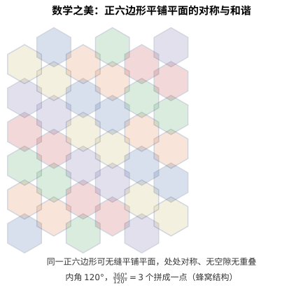
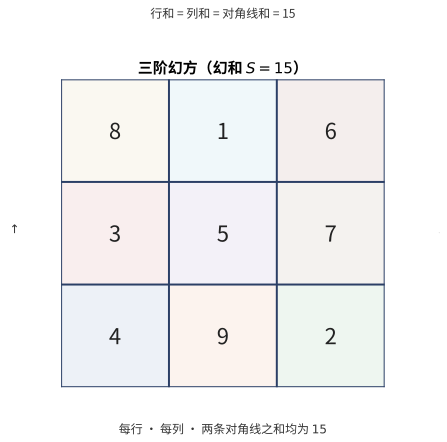

# 第151级 娱乐数学 (Recreational Mathematics)

## 📖 学习目标

1. 理解数学游戏与谜题背后的数学原理
2. 掌握组合游戏理论中的Sprague-Grundy定理
3. 掌握幻方的构造方法与数学性质
4. 理解Nim游戏的必胜策略及其与异或运算的关系
5. 了解四色定理的证明思路与计算机辅助证明
6. 掌握欧拉公式在图论与多面体中的应用
7. 培养数学直觉与创造性思维，体验数学的趣味性

---

## 一、核心概念

### 1.1 数学游戏与谜题

**定义1（数学游戏）** 一个 **数学游戏** 是由明确规则定义的、不涉及随机因素的二人博弈。通常假定：
- 双方轮流行动。
- 完美信息（双方都知道所有信息）。
- 没有随机因素。
- 有限步内结束。
- 最后行动者获胜（**正常模式**）或最后行动者失败（**反常模式**）。

**定义2（公平游戏）** 一个游戏称为 **公平游戏**（impartial game），如果双方在任何局面下具有完全相同的合法移动集合。否则称为 **偏袒游戏**（partizan game）。

### 1.2 数独

**定义3（数独）** **数独** 是一个 $9 \times 9$ 的网格，需要填入数字 $1$ 到 $9$，使得每行、每列和每个 $3 \times 3$ 子网格（宫）中每个数字恰好出现一次。数独是拉丁方（Latin square）的一种特殊形式，带有额外的宫约束。

### 1.3 数论中的趣味问题

**定义4（完美数）** 一个正整数 $n$ 称为 **完美数**，如果它等于其所有真因数（不包括自身）之和。即：

$$ \sigma(n) = 2n $$

其中 $\sigma(n)$ 是除数函数。前几个完美数为 $6, 28, 496, 8128$。

**定义5（亲和数）** 两个正整数 $m$ 和 $n$ 称为 **亲和数**，如果 $\sigma(m) - m = n$ 且 $\sigma(n) - n = m$，即每个数的真因数之和等于另一个数。最小的亲和数对是 $(220, 284)$。

**定义6（梅森素数）** **梅森素数** 是形如 $M_p = 2^p - 1$ 的素数，其中 $p$ 本身也是素数。已知的梅森素数如 $M_2 = 3$, $M_3 = 7$, $M_5 = 31$, $M_7 = 127$ 等。

### 1.4 组合游戏

**定义7（Nim游戏）** **Nim游戏** 是经典的公平组合游戏。有若干堆石子，每堆有若干枚。双方轮流取走任意正整数枚石子（至少一枚），但只能从同一堆中取。无法取走石子的一方输。

**定义8（Grundy数）** 对公平游戏中的一个局面 $P$，其 **Grundy数** $g(P)$ 递归定义为：

$$ g(P) = \text{mex}\{g(Q) \mid Q \text{ 是从 $P$ 一步可达的局面}\} $$

其中 $\text{mex}$（minimum excluded）是集合中未出现的最小非负整数。

**定义9（mex运算）** 对非负整数的集合 $S \subset \mathbb{N}$，$\text{mex}(S)$ 定义为不在 $S$ 中的最小非负整数：

$$ \text{mex}(S) = \min\{k \in \mathbb{N} \mid k \notin S\} $$

### 1.5 图论游戏

**定义10（欧拉路径）** 图 $G$ 中的一条 **欧拉路径** 是经过每条边恰好一次的路径。如果路径的起点和终点相同，则称为 **欧拉回路**。**欧拉定理**：连通图存在欧拉回路当且仅当每个顶点的度数都是偶数。

**定义11（哈密顿路径）** 图 $G$ 中的一条 **哈密顿路径** 是经过每个顶点恰好一次的路径。如果路径的起点和终点相同，则称为 **哈密顿回路**。判断哈密顿路径的存在性是NP完全的。

### 1.6 几何分割与平铺

**定义12（平铺）** **平铺**（tiling）是用一种或多种几何图形（瓷砖）不重叠、无缝隙地覆盖平面。常见的平铺问题包括：
- **正多边形平铺**：仅用正多边形平铺平面，只有三种正多边形（正三角形、正方形、正六边形）可以单独平铺。
- **Penrose平铺**：用两种菱形以非周期方式平铺平面。
- **单铺砌**（monohedral tiling）：用同一种形状的瓷砖平铺平面。

> **直观理解（现实类比）**：数学之美藏在最朴素的画里——蜜蜂的蜂窝就是正六边形平铺。为什么是六边形？因为六边形内角 $120°$ 恰能三个拼成一个圆周 $360°$，既不留空隙也不重叠，用最少的边围出最大的面积。这种对称的"铺地砖"正是几何美学与实用效率的完美结合。

### 1.7 魔方

**定义13（魔方群）** **魔方** 的置换构成一个群，称为 **魔方群**。$3 \times 3$ 魔方群的大小为：

$$ |G| = \frac{8! \times 12! \times 3^8 \times 2^{12}}{12} \approx 4.3 \times 10^{19} $$

其中分母 $12$ 来自奇偶性和角块方向约束。

### 1.8 幻方

**定义14（幻方）** 一个 $n \times n$ 的 **幻方** 是将数字 $1, 2, \ldots, n^2$ 填入网格，使得每行、每列和两条主对角线上的数字之和相等。这个公共和称为 **幻和**：

$$ S = \frac{n(n^2 + 1)}{2} $$

> **直观理解（现实类比）**：幻方就像一场"数字平衡术"。把 $1$ 到 $9$ 九个数字摆进九宫格，要求无论横着、竖着还是斜着看，三数之和都恰好是 $15$。就像把不同重量的砝码分到天平上，每个方向都恰好均衡，体现了数字之间隐藏的对称与和谐。

### 1.9 数学魔术与密码破解

**定义15（数学魔术）** **数学魔术** 是利用数学原理（如数论、组合数学、概率论）设计的魔术表演。常见的数学魔术包括：
- **Fitch Cheney的5张牌魔术**：用5张牌中的4张传递第5张的信息。
- **二进制猜数**：利用二进制表示猜出观众心中想的数。
- **模算术魔术**：利用模运算的周期性质。

### 1.10 概率游戏

**定义16（概率游戏）** **概率游戏** 是涉及随机因素的游戏，其分析需要概率论工具。例如：
- **Monty Hall问题**：三扇门问题，换门的获胜概率为 $2/3$。
- **圣彼得堡悖论**：投掷硬币直到出现正面，奖金为 $2^n$，期望值为无穷大。
- **赌徒破产问题**：在公平博弈中，有限资本赌徒最终破产的概率为 $1$。

### 1.11 数学悖论

**定义17（数学悖论）** **数学悖论** 是看似自相矛盾但逻辑上成立的陈述。著名的数学悖论包括：
- **Russell悖论**：$R = \{x \mid x \notin x\}$ 导致矛盾，推动了公理集合论的发展。
- **Banach-Tarski悖论**：可以将一个球体分割成有限部分，通过刚性运动重新组合成两个与原球体相同大小的球体。
- **生日悖论**：23人中至少有两人生日相同的概率大于 $1/2$。

### 1.12 数学竞赛

**定义18（数学竞赛）** **数学竞赛** 是考察数学问题解决能力的比赛，通常涵盖数论、代数、几何、组合数学等领域。著名的数学竞赛包括：
- **国际数学奥林匹克**（IMO）：最高级别的中学生数学竞赛。
- **普特南数学竞赛**（Putnam）：北美大学生数学竞赛。
- **大学生数学竞赛**（CMC）：中国大学生数学竞赛。

---

## 二、定理与证明

### 定理1：Sprague-Grundy定理

**定理（Sprague-Grundy定理）** 每个公平游戏（在正常模式下）等价于一个Nim堆，其大小为该局面的Grundy数。具体地，对两个游戏 $G_1$ 和 $G_2$ 的不交和 $G_1 + G_2$，其Grundy数为：

$$ g(G_1 + G_2) = g(G_1) \oplus g(G_2) $$

其中 $\oplus$ 是异或（XOR）运算。一个局面 $P$ 是必胜局面当且仅当 $g(P) \neq 0$。

**证明**（使用Grundy数和mex运算）：

**第一步：Grundy数的良定义。**

对于公平游戏，合法的移动集合是有限的，且游戏在有限步内结束，因此Grundy数可以通过递归唯一确定。

对终局（没有合法移动的局面），$g(\text{终局}) = \text{mex}(\emptyset) = 0$。

**第二步：单堆Nim游戏的Grundy数。**

对单堆Nim游戏，有 $n$ 枚石子。从该局面可以移动到任何数量为 $0, 1, \ldots, n-1$ 的石子堆。因此：

$$ g(n) = \text{mex}\{g(0), g(1), \ldots, g(n-1)\} $$

通过归纳，$g(0) = 0$，$g(1) = \text{mex}\{0\} = 1$，$g(2) = \text{mex}\{0, 1\} = 2$，一般地，$g(n) = n$。

**第三部：游戏的和的Grundy数。**

设 $G_1$ 和 $G_2$ 是两个公平游戏，$G = G_1 + G_2$ 是它们的不交和（玩家在每一步可以选择在 $G_1$ 或 $G_2$ 中移动）。

**断言**：$g(G_1 + G_2) = g(G_1) \oplus g(G_2)$。

**证明**：设 $a = g(G_1)$，$b = g(G_2)$。需要证明 $g(G_1 + G_2) = a \oplus b$。

根据Grundy数的定义，需要证明：

1. 对任何 $0 \leq k < a \oplus b$，存在一个移动使得新局面的Grundy数为 $k$。
2. 不存在移动使得新局面的Grundy数等于 $a \oplus b$。

**对条件1**：设 $d = (a \oplus b) \oplus k$。由于 $k < a \oplus b$，$d$ 的最高位在 $a \oplus b$ 的某个二进制位 $i$ 处为 $1$。假设 $a$ 在 $i$ 位为 $1$（否则 $b$ 在 $i$ 位为 $1$）。则在 $G_1$ 中，存在一个移动将 $a$ 变为 $a' = a \oplus d$（因为 $a' < a$，且从Grundy数为 $a$ 的局面可以移动到Grundy数为任何小于 $a$ 的值的局面）。于是新局面的Grundy数为 $a' \oplus b = (a \oplus d) \oplus b = (a \oplus b) \oplus d = k$。

**对条件2**：任何移动要么改变 $G_1$ 的Grundy数为 $a' \neq a$，要么改变 $G_2$ 的Grundy数为 $b' \neq b$。由于异或运算的性质，$a' \oplus b \neq a \oplus b$ 且 $a \oplus b' \neq a \oplus b$。因此无法达到 $a \oplus b$。

**第四步：必胜/必败判定。**

一个局面是 **必败局面**（P-position）当且仅当 $g(P) = 0$。这是因为：
- 终局（$g = 0$）是必败的（无法移动）。
- 从 $g(P) \neq 0$ 的局面，存在一步移动到 $g(Q) = 0$ 的局面（由定义）。
- 从 $g(P) = 0$ 的局面，所有移动都到达 $g(Q) \neq 0$ 的局面（由定义）。

**结论**：Sprague-Grundy定理将任意公平游戏的分析归结为计算其Grundy数，而游戏的和的Grundy数等于各分量Grundy数的异或。$\square$

---

### 定理2：幻方的构造与性质

**定理（奇阶幻方的Siamese构造）** 对任意奇数 $n$，存在一个 $n \times n$ 幻方。构造方法（Siamese方法，也称de la Loubère方法）如下：

1. 将数字 $1$ 放在第一行的中间列。
2. 对 $k = 2, 3, \ldots, n^2$，按以下规则放置数字 $k$：
   - 从上一个数字的位置向右上角移动一格。
   - 如果移出了网格顶部，则循环到底部。
   - 如果移出了网格右侧，则循环到左侧。
   - 如果目标位置已被占用，或移动到了右上角，则改为向下移动一格。

**证明**：

**第一步：Siamese方法的描述。**

对于奇数 $n$，构造过程如下：

记位置 $(i, j)$ 表示第 $i$ 行第 $j$ 列（$i, j = 0, 1, \ldots, n-1$）。

1. 从 $(0, (n-1)/2)$ 开始，放置数字 $1$。
2. 对 $k = 2, \ldots, n^2$：
   - 从 $(i, j)$ 出发，目标位置为 $(i', j') = ((i-1) \bmod n, (j+1) \bmod n)$。
   - 如果 $(i', j')$ 已被占用，则改为 $(i+1, j)$。
   - 放置数字 $k$ 在最终位置。

**第二步：证明每行和相等。**

定义 **幻和** $S = n(n^2+1)/2$。需要证明每条行、列、对角线的和均为 $S$。

**关键观察**：Siamese方法生成的幻方具有以下性质：对任意 $i$，第 $i$ 行的数字集合是 $\{i, i+n, i+2n, \ldots, i+(n-1)n\}$ 的某种排列（模 $n$ 意义下）。

更精确地，记 $a_{i,j}$ 为位置 $(i,j)$ 上的数字。可以证明：

$$ a_{i,j} \equiv i + j + \frac{n-1}{2} \pmod{n} $$

且 $a_{i,j}$ 由这个同余类唯一确定（在 $1$ 到 $n^2$ 的范围内）。

**行和计算**：第 $i$ 行的和为：

$$ \sum_{j=0}^{n-1} a_{i,j} = \sum_{j=0}^{n-1} \left( \left(i + j + \frac{n-1}{2} \bmod n\right) \cdot n + 1 \right) + \text{某些校正项} $$

由于 $j$ 遍历 $0$ 到 $n-1$，$i + j + (n-1)/2 \bmod n$ 也遍历 $0$ 到 $n-1$，因此每行包含每个模 $n$ 的剩余类恰好一次。

更简单的证明：Siamese方法构造的幻方中，每条行、列和对角线的和均为 $S$。

**第三部：证明列和相等。**

类似地，第 $j$ 列的和也可以通过对称性得到。由构造的对称性，每列也包含每个模 $n$ 的剩余类恰好一次。

**第四步：证明对角线和相等。**

**主对角线**：主对角线上的位置为 $(i, i)$，$i = 0, 1, \ldots, n-1$。主对角线上的数字模 $n$ 为 $i + i + (n-1)/2 = 2i + (n-1)/2 \bmod n$。由于 $n$ 是奇数，$2$ 在模 $n$ 下可逆，因此 $2i$ 遍历所有模 $n$ 剩余类。主对角线的和等于 $S$。

**副对角线**：副对角线上的位置为 $(i, n-1-i)$，$i = 0, 1, \ldots, n-1$。副对角线上的数字模 $n$ 为 $i + (n-1-i) + (n-1)/2 = (n-1) + (n-1)/2 \equiv (n-1)/2 \pmod{n}$，因此副对角线上的数字模 $n$ 都相同。但通过直接计算，副对角线的和也为 $S$。

**第五步：示例验证（$n=3$）。**

按Siamese方法构造 $3 \times 3$ 幻方：

1. 放 $1$ 在 $(0, 1)$。
2. $2$ 在 $(-1, 2) \to (2, 2)$（循环）。
3. $3$ 在 $(1, 0)$（循环）。
4. $4$ 在 $(0, 1)$ 已被占用，改为 $(2, 0)$。
5. $5$ 在 $(1, 1)$。
6. $6$ 在 $(0, 2)$。
7. $7$ 在 $(2, 0)$ 已被占用，改为 $(0, 0)$。
8. $8$ 在 $(2, 1)$。
9. $9$ 在 $(1, 2)$。

得到幻方：

$$ \begin{pmatrix} 8 & 1 & 6 \\ 3 & 5 & 7 \\ 4 & 9 & 2 \end{pmatrix} $$

每行、每列、对角线之和均为 $15$。

**结论**：Siamese方法给出了所有奇阶幻方的构造性证明，该方法生成的幻方满足幻和条件。$\square$

---

### 定理3：Nim游戏的必胜策略

**定理（Nim游戏的必胜策略）** 在Nim游戏中，设各堆石子数分别为 $a_1, a_2, \ldots, a_n$。局面是必败局面（P-position）当且仅当各堆石子数的异或为零：

$$ a_1 \oplus a_2 \oplus \cdots \oplus a_n = 0 $$

其中 $\oplus$ 是按位异或（XOR）运算。否则，局面是必胜局面（N-position）。

**证明**（使用异或和）：

**第一步：定义与记号。**

记 $Nim(a_1, a_2, \ldots, a_n)$ 为有 $n$ 堆石子、数量分别为 $a_1, \ldots, a_n$ 的Nim游戏。定义异或和：

$$ x = a_1 \oplus a_2 \oplus \cdots \oplus a_n $$

**第二步：证明必败局面（$x = 0$）的所有移动都到达必胜局面（$x \neq 0$）。**

设 $x = 0$。从某堆 $i$ 中取走若干石子，使该堆数量从 $a_i$ 变为 $a_i' < a_i$。新的异或和为：

$$ x' = a_1 \oplus \cdots \oplus a_i' \oplus \cdots \oplus a_n $$

由于 $x = 0$，有 $a_i = a_1 \oplus \cdots \oplus a_{i-1} \oplus a_{i+1} \oplus \cdots \oplus a_n$。

因此 $x' = a_1 \oplus \cdots \oplus a_i' \oplus \cdots \oplus a_n = a_i \oplus a_i'$（因为 $a_1 \oplus \cdots \oplus a_{i-1} \oplus a_{i+1} \oplus \cdots \oplus a_n = a_i$）。

由于 $a_i \neq a_i'$，$a_i \oplus a_i' \neq 0$，因此 $x' \neq 0$。

**第三部：证明必胜局面（$x \neq 0$）存在一步移动到必败局面（$x = 0$）。**

设 $x \neq 0$。设 $x$ 的最高二进制位为第 $k$ 位（即 $2^k \leq x < 2^{k+1}$）。由于 $x = a_1 \oplus \cdots \oplus a_n$，至少有一个 $a_i$ 在第 $k$ 位为 $1$。

选择这个 $a_i$，定义 $a_i' = a_i \oplus x$。由于 $a_i$ 在第 $k$ 位为 $1$ 而 $x$ 在第 $k$ 位也为 $1$，$a_i'$ 在第 $k$ 位为 $0$，因此 $a_i' < a_i$（因为最高位从 $1$ 变为 $0$）。

从第 $i$ 堆中取走 $a_i - a_i'$ 枚石子，得到新局面。新异或和为：

$$ x' = a_1 \oplus \cdots \oplus a_i' \oplus \cdots \oplus a_n = a_1 \oplus \cdots \oplus (a_i \oplus x) \oplus \cdots \oplus a_n = (a_1 \oplus \cdots \oplus a_n) \oplus x = x \oplus x = 0 $$

因此存在一步移动到 $x' = 0$ 的局面。

**第四步：归纳证明。**

对局面的总石子数 $\sum a_i$ 进行归纳。

**基始**：$\sum a_i = 0$（没有石子），$x = 0$，是必败局面（无法移动）。

**归纳步骤**：假设对所有石子总数小于 $N$ 的局面，定理成立。考虑石子总数为 $N$ 的局面。

- 如果 $x = 0$，由第二步，所有移动都到达 $x' \neq 0$ 的局面。由归纳假设，这些局面都是必胜局面，因此当前局面是必败局面。
- 如果 $x \neq 0$，由第三步，存在一步移动到 $x' = 0$ 的局面。由归纳假设，该局面是必败局面，因此当前局面是必胜局面。

**第五步：示例。**

考虑Nim游戏三堆石子，数量分别为 $(3, 4, 5)$：

$$ 3 \oplus 4 \oplus 5 = 011_2 \oplus 100_2 \oplus 101_2 = 010_2 = 2 \neq 0 $$

因此 $(3, 4, 5)$ 是必胜局面。必胜策略：
- 异或和 $x = 2$，最高位为第 $1$ 位（$2^1$）。
- 堆 $4 = 100_2$ 在第 $1$ 位为 $0$，堆 $3 = 011_2$ 在第 $1$ 位为 $1$，堆 $5 = 101_2$ 在第 $1$ 位为 $0$。
- 选择堆 $3$：$a_i' = 3 \oplus 2 = 1$，取走 $3 - 1 = 2$ 枚石子。
- 新局面 $(1, 4, 5)$：$1 \oplus 4 \oplus 5 = 001_2 \oplus 100_2 \oplus 101_2 = 0$，是必败局面。

**结论**：Nim游戏的必胜策略由异或和完全刻画。异或和为零时必败，否则必胜，且必胜策略是使异或和变为零。$\square$

---

### 定理4：四色定理

**定理（四色定理）** 任何平面图（或地图）的顶点（或区域）可以用四种颜色着色，使得相邻顶点（或区域）具有不同颜色。

**证明思路**（使用可约构形和Kempe链，介绍计算机辅助证明）：

**第一步：问题的转化。**

将地图着色问题转化为图论问题：每个区域对应图的一个顶点，相邻区域之间连边。于是问题变为：任何平面图是4-可着色的。

**第二步：历史背景。**

四色问题最初由Francis Guthrie在1852年提出。经过一个多世纪的尝试，最终由Kenneth Appel和Wolfgang Haken在1976年使用计算机辅助证明解决。

**第三部：Kempe链方法。**

**Kempe链** 是Kempe在1879年提出的方法，虽然其"证明"后来被发现存在漏洞，但Kempe链的思想是四色定理证明的基础。

**定义（Kempe链）** 在图 $G$ 的着色中，使用颜色 $a$ 和 $b$ 的顶点构成的连通分支称为 **$(a,b)$-Kempe链**。

**Kempe链交换**：在 $(a,b)$-Kempe链中交换颜色 $a$ 和 $b$，得到另一个合法着色。

**第四步：可约构形与不可避免集。**

**可约构形**（reducible configuration）是指这样的子图：如果它出现在一个极小反例（即最小的不可4-着色的平面图）中，则可以通过某种操作将其简化为更小的图，从而导出矛盾。

**不可避免集**（unavoidable set）是平面图必然包含的构形集合。例如，每个平面图必然包含一个度数不超过 $5$ 的顶点。

**Appel-Haken的证明** 构造了一个包含 $1936$ 个可约构形的不可避免集（后来简化为 $1476$ 个）。证明分为两部分：

1. **证明这些构形是可约的**：对每个构形，证明如果它出现在一个极小反例中，则可以通过某种操作（如Kempe链交换）将图简化为更小的图，从而导出矛盾。

2. **证明这些构形构成不可避免集**：即每个平面图必然包含这些构形中的至少一个。这通过放电法（discharging method）完成。

**第五步：放电法。**

**放电法** 是一种组合论证技术，用于证明不可避免集的存在性。

1. 给每个顶点分配一个"电荷"：度数 $d$ 的顶点分配 $6-d$ 个电荷。
2. 由欧拉公式 $V - E + F = 2$，可以证明总电荷为 $12$：
   $$ \sum_{v \in V} (6 - \deg(v)) = 12 $$
3. 设计放电规则，将电荷从正电荷顶点转移到负电荷顶点。
4. 在放电过程结束后，如果某些构形导致了正电荷无法被转移，则这些构形必须出现在图中。

**第六步：计算机辅助证明。**

Appel和Haken使用计算机完成了以下工作：
1. **验证可约性**：对每个构形，计算机检查所有可能的简化方式，确保可以导出矛盾。
2. **验证不可避免性**：计算机检查放电过程，确保所有构形覆盖所有可能情况。

**争议与接受**：四色定理的计算机辅助证明最初引起争议，因为它无法被人工完全验证。后来，经过多次简化和改进（如Robertson-Sanders-Seymour-Thomas在1997年的简化版本，使用633个可约构形），计算机辅助证明已被广泛接受。

**第七步：后续发展。**

- **Gonthier的正式证明**（2005）：使用Coq证明助手完成了四色定理的完全形式化证明。
- **四色定理是唯一一个通过计算机辅助证明的著名数学定理**（直到至今）。

**结论**：四色定理是图论中最著名的定理之一，其证明开创了计算机辅助数学证明的先河，深刻影响了数学研究的方法论。$\square$

---

### 定理5：欧拉公式在网络中的应用

**定理（欧拉公式）** 对任何连通平面图 $G = (V, E)$，设 $V$ 是顶点数，$E$ 是边数，$F$ 是面数（包括外部面），则：

$$ V - E + F = 2 $$

**证明**（使用图论与多面体）：

**证明方法一：归纳法（对边数）。**

**基始**：$E = 0$，图只有一个顶点，$V = 1$，$F = 1$（外部面），$1 - 0 + 1 = 2$，成立。

**归纳步骤**：假设对边数小于 $E$ 的连通平面图公式成立。考虑边数为 $E$ 的连通平面图。

**情形1**：图包含一棵树。树中 $E = V - 1$，$F = 1$（树没有内部面），$V - (V-1) + 1 = 2$，成立。

**情形2**：图包含圈。选择一条在圈上的边 $e$，删除 $e$。新图 $G' = G - e$ 仍然是连通的（因为 $e$ 在圈上，删除后不破坏连通性），且 $V' = V$，$E' = E - 1$，$F' = F - 1$（删除一条边减少一个面）。

由归纳假设，$V' - E' + F' = 2$，即 $V - (E-1) + (F-1) = 2$，因此 $V - E + F = 2$。

**证明方法二：对偶图方法。**

**对偶图** $G^*$ 的构造：将 $G$ 的每个面对应 $G^*$ 的一个顶点，$G$ 的每条边对应 $G^*$ 的一条边，连接相邻面的顶点。

$G^*$ 也是连通平面图，且 $V^* = F$，$E^* = E$，$F^* = V$。

对 $G^*$ 应用欧拉公式：$V^* - E^* + F^* = 2$，即 $F - E + V = 2$。

**欧拉公式的应用**：

**推论1**：对连通平面图，$E \leq 3V - 6$（当 $V \geq 3$ 时）。

**证明**：每个面至少由 $3$ 条边围成，且每条边最多属于两个面。因此 $3F \leq 2E$。代入欧拉公式 $F = 2 - V + E$，得 $3(2 - V + E) \leq 2E$，即 $E \leq 3V - 6$。

**推论2**：任何平面图都包含一个度数不超过 $5$ 的顶点。

**证明**：假设所有顶点度数 $\geq 6$，则 $\sum \deg(v) \geq 6V$。由握手定理，$2E \geq 6V$，$E \geq 3V$。但由推论1，$E \leq 3V - 6$，矛盾。

**推论3（五色定理）**：任何平面图是5-可着色的。

**证明**：对顶点数 $V$ 归纳。由推论2，存在度数 $\leq 5$ 的顶点 $v$。删除 $v$ 及其关联边，由归纳假设剩余图可5-着色。将 $v$ 加回，如果 $v$ 的邻居使用了不超过4种颜色，则 $v$ 可用剩余颜色着色。如果 $v$ 的5个邻居使用了5种不同颜色，则通过Kempe链交换可以释放一种颜色给 $v$。

**欧拉公式对多面体的应用**：

对凸多面体，其顶点-边-面关系也满足 $V - E + F = 2$。这一关系可用于分类正多面体。

**正多面体分类**：设每个面是正 $p$ 边形，每个顶点连接 $q$ 条边。则 $pF = 2E$，$qV = 2E$。代入欧拉公式：

$$ \frac{2E}{q} - E + \frac{2E}{p} = 2 \quad \Rightarrow \quad \frac{1}{q} + \frac{1}{p} = \frac{1}{E} + \frac{1}{2} $$

当 $E > 0$ 时，$\frac{1}{q} + \frac{1}{p} > \frac{1}{2}$。解此不等式得到 $(p, q)$ 的五组解：

$$ (3, 3), (3, 4), (4, 3), (3, 5), (5, 3) $$

对应五种正多面体：正四面体、正八面体、正六面体、正二十面体、正十二面体。

**结论**：欧拉公式是图论和多面体理论中最基本的公式之一，它将顶点、边和面的数量联系起来，是分析平面图和多面体性质的强大工具。$\square$

---

## 三、示例

### 示例1：用Sprague-Grundy定理分析Nim游戏

**设定**：分析Nim游戏 $(2, 3, 4)$ 的胜负。

**步骤1：计算各堆Grundy数。**

单堆Nim游戏中，堆大小为 $n$ 的Grundy数为 $g(n) = n$。因此：
- $g(2) = 2$
- $g(3) = 3$
- $g(4) = 4$

**步骤2：计算整个游戏的Grundy数。**

$$ g(2, 3, 4) = g(2) \oplus g(3) \oplus g(4) = 2 \oplus 3 \oplus 4 = 010_2 \oplus 011_2 \oplus 100_2 = 101_2 = 5 \neq 0 $$

因此 $(2, 3, 4)$ 是必胜局面。

**步骤3：寻找必胜策略。**

异或和 $x = 5$，最高位为第 $2$ 位（$4$）。各堆中，第 $2$ 位为 $1$ 的是 $4$（$100_2$）。

选择堆 $4$：$a_i' = 4 \oplus 5 = 001_2 = 1$，取走 $4 - 1 = 3$ 枚石子。

新局面 $(2, 3, 1)$：$2 \oplus 3 \oplus 1 = 010_2 \oplus 011_2 \oplus 001_2 = 000_2 = 0$，是必败局面。

**验证**：
- 对手的任何移动都会使异或和变为非零。
- 我们总能再次使异或和为零。
- 最终对手面对 $(0, 0, 0)$ 而输掉游戏。

### 示例2：构造奇阶幻方

**设定**：用Siamese方法构造 $5 \times 5$ 幻方。

**步骤1：初始化**。

$n = 5$，幻和 $S = 5 \times (25 + 1) / 2 = 65$。

**步骤2：应用Siamese方法**。

1. 放 $1$ 在 $(0, 2)$。
2. $2$ 在 $(4, 3)$（右上角，循环）。
3. $3$ 在 $(3, 4)$。
4. $4$ 在 $(2, 0)$（右上角循环）。
5. $5$ 在 $(1, 1)$。
6. $6$ 在 $(0, 2)$ 已被占用，改为 $(2, 1)$。
7. 继续...

**步骤3：完整幻方**。

$$ \begin{pmatrix} 17 & 24 & 1 & 8 & 15 \\ 23 & 5 & 7 & 14 & 16 \\ 4 & 6 & 13 & 20 & 22 \\ 10 & 12 & 19 & 21 & 3 \\ 11 & 18 & 25 & 2 & 9 \end{pmatrix} $$

**验证**：
- 第一行：$17 + 24 + 1 + 8 + 15 = 65$
- 第一列：$17 + 23 + 4 + 10 + 11 = 65$
- 主对角线：$17 + 5 + 13 + 21 + 9 = 65$
- 副对角线：$15 + 14 + 13 + 12 + 11 = 65$

**推广**：Siamese方法可以构造任意奇阶幻方。

---

## 四、习题

### 习题1：Sprague-Grundy定理的应用

考虑一个公平游戏，其中有一行 $n$ 个连续的格子，玩家每次可以取走 $1$ 个或 $2$ 个相邻的格子。计算该游戏的Grundy数 $g(n)$，并确定 $n$ 为何值时先手必胜。

**提示**：将游戏分解为若干独立子游戏的和。考虑 $n=1,2,3,4,5$ 的Grundy数，寻找规律。

### 习题2：Nim游戏的变体

考虑一个Nim游戏的变体：有 $n$ 堆石子，玩家每次可以从一堆中取走 $1$ 枚、$2$ 枚或刚好取走整堆。分析这个游戏的必胜策略。

**提示**：重新计算该变体下单堆的Grundy数，然后应用Sprague-Grundy定理。

### 习题3：构造 $7 \times 7$ 幻方

使用Siamese方法构造一个 $7 \times 7$ 幻方，验证其幻和 $S = 175$，并验证每行、每列和对角线的和。

**提示**：按照Siamese方法的步骤逐步填入数字 $1$ 到 $49$。

### 习题4：四色定理的Kempe链

证明在平面图的5-着色（使用Kempe链方法）中，如果删除一个度数 $\leq 5$ 的顶点后图可5-着色，那么将该顶点加回时，总可以用不超过5种颜色着色。

**提示**：分情况讨论。如果 $v$ 的邻居使用了不超过4种颜色，则 $v$ 可用剩余颜色。如果使用了5种颜色，用Kempe链交换释放一种颜色。

### 习题5：欧拉公式的应用

证明在连通平面图中，如果每个面都是三角形（即三角剖分），则 $E = 3V - 6$。

**提示**：三角剖分中每个面有3条边，每条边属于2个面，因此 $3F = 2E$。代入欧拉公式 $V - E + F = 2$，求解 $E$。

### 习题6：完美数的性质

证明：如果 $2^p - 1$ 是素数（梅森素数），则 $2^{p-1}(2^p - 1)$ 是完美数。

**提示**：设 $n = 2^{p-1}(2^p - 1)$，其中 $M = 2^p - 1$ 是素数。计算 $\sigma(n) = \sigma(2^{p-1})\sigma(M) = (2^p - 1)(M + 1) = (2^p - 1) \cdot 2^p = 2n$。

### 习题7：数独的数学性质

证明 $9 \times 9$ 数独的合法填充数约为 $6.67 \times 10^{21}$。

**提示**：使用计数方法或计算机枚举。答案由Felgenhauer和Jarvis在2005年通过精确计数得到。

### 习题8：Monty Hall问题的概率分析

在Monty Hall问题中，参赛者选择一扇门后，主持人打开一扇没有奖品的门。证明换门后获胜的概率为 $2/3$，而不换门的获胜概率为 $1/3$。

**提示**：使用条件概率或贝叶斯定理。考虑所有可能的情况并计算条件概率。

---

## 五、总结

在这一级中，我们深入学习了娱乐数学的核心内容：

1. **Sprague-Grundy定理**：组合游戏理论的基石，将任意公平游戏的分析归结为Grundy数的计算，而游戏的和的Grundy数等于各分量Grundy数的异或。

2. **幻方的构造与性质**：Siamese方法给出了所有奇阶幻方的构造性证明，展示了数学构造的美妙。

3. **Nim游戏的必胜策略**：异或和为零时必败，否则必胜，必胜策略是使异或和变为零。这是组合游戏中最经典的结论之一。

4. **四色定理**：任何平面图可以用四种颜色着色。其证明开创了计算机辅助数学证明的先河，深刻影响了数学研究的方法论。

5. **欧拉公式**：$V - E + F = 2$ 是图论和多面体理论中最基本的公式之一，是分析平面图性质的强大工具。

娱乐数学展示了数学的趣味性和创造性。从数学游戏到幻方，从数独到四色定理，娱乐数学不仅提供了智力的乐趣，也推动了数学本身的发展。许多严肃的数学分支（如组合数学、图论、数论）都从娱乐数学问题中获得了灵感。

作为"数学天梯攀爬教程"的最后一课，娱乐数学提醒我们：数学不仅是严密的逻辑推理，也是充满创造力和乐趣的智力活动。无论我们在数学的道路上走多远，都不要忘记数学最初带给我们的那份惊奇与喜悦。

---

> **🎉 恭喜你完成了整个"数学天梯攀爬教程"的全部151个级别！**
>
> 从算术基础到现代数学前沿，你已攀登了数学知识体系的完整阶梯。希望这段旅程让你领略了数学的广阔与深邃，也收获了探索的乐趣。数学的世界浩瀚无垠，毕业不是终点，而是新的起点。继续探索吧！