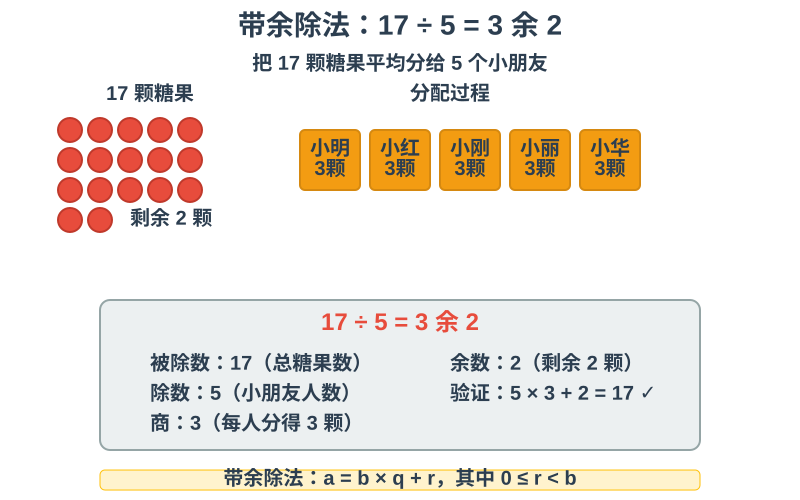
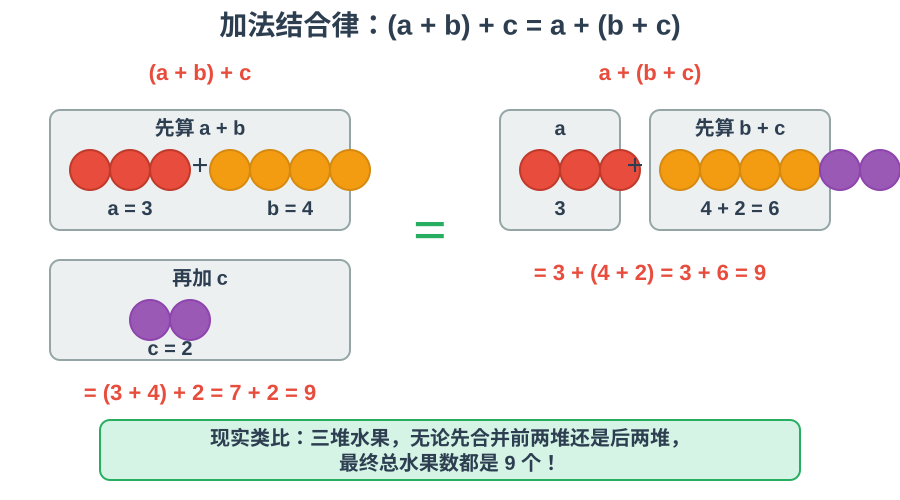
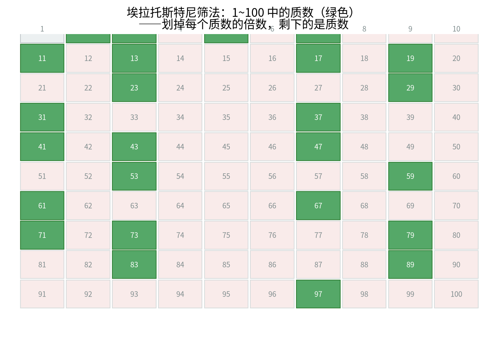
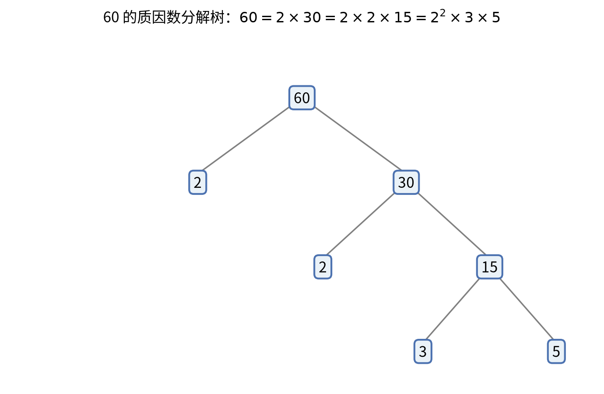

# 第 1 级：算术基础 (Basic Arithmetic)

> 算术是数学的起点，也是人类最古老的数学分支之一。从远古时代结绳计数到今天高速计算机中的二进制运算，算术始终是一切数学的根基。本教程将带你从零开始，系统性地建立对算术的完整理解。

---

## 1. 学习目标

完成本教程后，你应当能够：

- 理解自然数、整数、有理数的概念及其关系
- 掌握十进制位值系统与数位表示
- 熟练进行四则运算（加、减、乘、除）
- 理解并运用运算律（交换律、结合律、分配律）
- 理解质数与合数，掌握质因数分解
- 理解并运用算术基本定理
- 理解并运用科学计数法、有效数字与估算
- 熟练进行小数、分数与百分数的互化，并解决打折、占比等应用问题
- 理解进位制系统，掌握二进制（及八进制、十六进制）与十进制的互转
- 掌握负数的四则运算法则，并能解释"负负得正"
- 掌握系统的整除性判定法则
- 能够独立解决基础的算术应用问题

---

## 开始之前

**本章在讲什么**：算术基础是整套数学学习的第一块基石。它从最原始的"数东西"讲起，一步步把自然数、整数、有理数搭起来，再把加减乘除和运算律讲清楚，最后介绍质数与算术基本定理。整章的目标只有一个：让你对"数"和"算"有一幅完整、严谨的地图。

**为什么要学它**：这是第 1 级，也是后面所有等级的地基。第 2 级初等代数要用字母代替数字、列方程、解方程——如果连"什么是自然数、什么是整数、加减乘除到底遵循哪些律"都说不清，代数式与方程就会变成一堆没有根的符号游戏。本章把数系、运算、运算律一次打牢，后面每一级都会反复用到这里打下的底子。

**开始前请确认你还记得**：
- 数数（生活常识）：能把一堆东西一个一个点清，说出"一共几个"——这就是自然数最原始的样子。
- 多少的比较（生活常识）：知道"3 个苹果比 5 个苹果少"，能在数轴上把小的放左边、大的放右边。
- 分东西的经验（生活常识）：把 12 颗糖平均分给 3 个小朋友，每人 4 颗——这就是除法最朴素的含义。
- "借位"与"进位"（生活常识）：算钱时知道"10 个一元可以换成 1 个十元"，这就是十进制位值系统的日常原型。
- 找规律（生活常识）：看到 2, 4, 6, 8, … 能猜到下一个是 10——这种"按规则往下排"的感觉，就是后面质数、数列的共同起点。

---

## 2. 核心概念

### 2.1 自然数 (Natural Numbers)

自然数是最初用来计数的数：$1, 2, 3, 4, 5, \dots$。自然数集通常记作 $\mathbb{N}$。

关于自然数是否包含 0，数学界有两种惯例。在初等数学中，我们通常取 $\mathbb{N} = \{1, 2, 3, \dots\}$；在集合论中，常取 $\mathbb{N} = \{0, 1, 2, 3, \dots\}$。本教程中，我们采用包含 0 的约定，即：

$$
\mathbb{N} = \{0, 1, 2, 3, 4, \dots\}
$$

自然数具有以下基本性质：
- **有序性**：任意两个自然数可以比较大小
- **良序性**：自然数的任何非空子集都有最小元素
- **无限性**：自然数没有最大值，可以无限延伸

> **🧠 思考历程：自然数的"身份证明"，为什么等了上千年才补齐？**
>
> "1、2、3……"人人会数，可"自然数到底是什么"这个看似无聊的问题，数学家认真追究过两千年。它其实逼出了一个终极问题：**我们该不该信直觉？**
>
> - **从"数"到"符号"**。远古人类用石子、绳结、刻痕来"记录数量"，并没有抽象的数。巴比伦人发明了位置记号，印度人引入"零"和十进制符号，阿拉伯人把这些符号带到欧洲——这才有了今天我们笔下轻巧的"$1,2,3$"。**"数"是你出生前就替你叠好的符号城堡。**
> - **皮亚诺：给自然数开一张"出生证明"**。1889 年，意大利数学家皮亚诺（Giuseppe Peano）提出五条公理：有第一个数 $1$；每个数都有"后继"（$n+1$）；$1$ 不是任何数的后继；不同数的后继不同（$n\neq m\Rightarrow n+1\neq m+1$）；以及"归纳原理"。**这五条就把"数数"这件本能的事，变成了一套禁得起推敲的形式规则。**
> - **为什么要这么较真？** 因为若不给出公理，很多漂亮的结论（如数学归纳法、良序性）都只是"姑且信之"。**一旦把它们写进公理，数学就有了坚固的地基**——这正是"自然数不经证明就能用，却正因为被公理化才能放心地用"的辩证法。
> - **心路**：自然数的故事提醒你：**越是觉得"显然"的东西，越值得追问"凭什么"**。人类花了几千年才敢给"最简单的数"立户口，你要学的这种"怀疑+建构"的节奏，正是整个现代数学起步时的样子。

### 2.2 整数 (Integers)

整数是自然数的推广，引入了负数的概念：

| 符号 | 名称 | 含义 | 直观解释 |
|:---:|:---:|:---|:---|
| $\mathbb{Z}$ | 整数集 | 全体正整数、零、负整数组成的集合 | "能加减不产生新数的数" |

$$
\mathbb{Z} = \{\dots, -3, -2, -1, 0, 1, 2, 3, \dots\}
$$

其中 $\mathbb{Z}$ 来自德语 "Zahlen"（数字）。整数包括：
- 正整数：$1, 2, 3, \dots$（即自然数 $\mathbb{N}$ 去掉 0）
- 零：$0$
- 负整数：$-1, -2, -3, \dots$

引入负数使得减法运算在数系中封闭——任意两个整数相减，结果仍然是整数。


> **直观理解（现实类比）**：整数就像楼房的楼层。**自然数**是地面以上的楼层（$1, 2, 3, \dots$），**0** 是地面，**负整数**则是地下车库（$-1, -2, -3, \dots$）。有了"地下楼层"，我们才能回答"从 3 楼往下走 5 层到几楼"这样的问题（$3 - 5 = -2$）——这就是引入负数的意义：**让减法永远可以执行**。

> **🧠 思考历程：一个"比零还少"的数，是怎么被数学界接受的？**
>
> 今天连学龄前儿童都知道"欠 5 元就是 $-5$"，但负数在被承认之前，人类与之搏斗了上千年。奇怪的是：**大家每天都在"用"它，却长期"不认"它。**
>
> - **算盘与账本先"摸"到了负数**。中国人很早就用"正负算筹"表示账目：红筹为收入（正）、黑筹为支出（负）——所以今天仍说"赤字（in the red）"。**负数的出生证，其实是商人的账本先签发的。** 但这只是"记账符号"，还谈不上"数"。
> - **"讨厌它，却离不开它"**。数学本是用来计量的，减出一个"比没有还少"的东西，让欧几里得以后的几何学家很难下咽。著名例子是 11 世纪中国数学家**贾宪/杨辉**时代，人们已会用"负数"解方程；而欧洲人直到 16 世纪，数学家**卡尔达诺**解方程 $x^3=px+q$（即负数根）时，仍感叹"负数是'无解'的荒谬之物"。**几百年里，负数在解题中被反复使用，却在哲学上被人嫌弃。**
> - **数轴把它"洗白"了**。真正让负数体面入籍的，是 18 世纪的**约翰·沃利斯**与欧拉等人逐步推广"数轴"：把负数和正数、零并列铺在一条直线上，负数不过是"零左边的对称点"。**一旦数字可以"排队"在数轴上，负数的合理性就不证自明**——它是数轴上关于 0 的镜像。
> - **心路**：负数的故事告诉你：**一个"不合直觉"的对象，数学界接受它往往不是靠讲理，而是靠它"有用+能自洽"**。当一个新的"怪数"（后面还有无理数、复数）登场时，也几乎总是走"先艰难地用起来，再慢慢给出合理解释"这条路。

### 2.3 有理数 (Rational Numbers)

有理数是能表示为两个整数之比的数：

| 符号 | 名称 | 含义 | 直观解释 |
|:---:|:---:|:---|:---|
| $\mathbb{Q}$ | 有理数集 | 全体能写成两整数之比的数 | "能写成分数的数" |
| $p$ | 分子 | 任意整数 | 分子随便取 |
| $q$ | 分母 | 任意非零整数 | 分母不能是 0 |
| $\in$ | 属于 | 左边的元素属于右边集合 | "是……的一员" |
| $\mid$ | 条件分隔 | "其中/满足" | 竖线读作"满足" |

$$
\mathbb{Q} = \left\{\frac{p}{q} \;\middle|\; p, q \in \mathbb{Z},\; q \neq 0 \right\}
$$

其中 $\mathbb{Q}$ 来自英语 "quotient"（商）。有理数包括：
- 整数（分母为 1 的特殊情形）
- 有限小数，如 $0.5 = \frac{1}{2}$、$0.125 = \frac{1}{8}$
- 无限循环小数，如 $0.\overline{3} = \frac{1}{3}$、$0.\overline{142857} = \frac{1}{7}$

> **🧠 思考历程：把一块蛋糕"分下去"，怎么就分出了更大的数系？**
>
> "$\frac{1}{3}$"今天写在纸上毫不费力，可这个符号背后，是一套让古人颇费周折的"分东西"思维——它把一个"能不能整除"的问题，硬生生逼成了一个新的数系。
>
> - **从分地、分粮到"分数"**。远古记账只需整数，可一旦"一头牛只能分成两份给两个人"、"一块地三人平分"，整数就不够用了。古埃及用单位分数（如 $\frac{1}{2},\frac{1}{3}$）拼任何分数；巴比伦用六十进制小数；中国《九章算术》（约公元前 1 世纪）里已有相当成熟的分数四则运算。**分数的雏形，是"分东西"这个生活刚需逼出来的。**
> - **"有理数"名字里的误会**。"ratio"（比）可译为"有理"，但其实它既不更"有道理"，也不更"合理"，它只是**两个整数的比**（quotient，故记作 $\mathbb{Q}$）。当初把这个 $\mathbb{Q}$ 命名下来时，大家已默认"能写成两个整数之比"就是"说得清的数"。
> - **为什么非要有你？** 引入有理数，是为了让**除法也封闭**：任取两个整数相除（分母非零），结果都能写成分数而不再是"除不尽的麻烦"。它和自然数→整数的那一步动机一模一样——**每扩一个数系，就多让一种运算"永远做得完"**（见 2.4 节那句"每一次向外扩展，都是为了解决前一层无法完成的一种运算"）。
> - **但有理数还不是"全部"**。古希腊人发现 $\sqrt{2}$ 无法写成任何两个整数之比，震惊了毕达哥拉斯学派（见后续无理数章节）。**有理数虽多，却在数轴上仍留"空隙"**——这为第 10 级补全"实数"埋下了伏笔。
> - **心路**：有理数提醒你：**数学的每一次"让步"（接受更多种类的数），都不是退让，而是为了让运算永不停摆**。当你觉得"分数麻烦"时，想想正是它让"任何两个数都能相除"这件小事成了可能。

### 2.4 数系的扩展关系

几种数系之间存在包含关系：

$$
\mathbb{N} \subseteq \mathbb{Z} \subseteq \mathbb{Q}
$$

即：自然数都是整数，整数都是有理数。反之则不成立，例如 $-3$ 是整数但不是自然数，$\frac{2}{3}$ 是有理数但不是整数。


> **直观理解（现实类比）**：把数系想象成层层包含的俄罗斯套娃。最里层是"自然数"，人类最初只会用它计数；为了做减法引入了"整数"；为了做除法引入了"有理数"。**每一次向外扩展，都是为了解决前一层无法完成的一种运算**——这正是数系发展的内在逻辑。
>
> 唯一的"遗憾"是：整数和有理数虽然能定义，但在**数轴上并不连续**（有理数之间有空隙），这将在第 10 级的实数系与极限中补全。

### 2.5 位值系统 (Place Value System)

我们日常使用的是**十进制位值系统**，这是一种用位置来表示数值大小的计数方法。每个数位上的数字乘以其位值（10 的幂），再求和即得到该数的值。

**十进制数位表**：

| 数位 | 亿位 | 千万位 | 百万位 | 十万位 | 万位 | 千位 | 百位 | 十位 | 个位 |
|:---:|:---:|:---:|:---:|:---:|:---:|:---:|:---:|:---:|:---:|
| 位值 | $10^8$ | $10^7$ | $10^6$ | $10^5$ | $10^4$ | $10^3$ | $10^2$ | $10^1$ | $10^0$ |

**示例**：数字 $3,702$ 表示：

$$
3,702 = 3 \times 10^3 + 7 \times 10^2 + 0 \times 10^1 + 2 \times 10^0
$$


> **直观理解（现实类比）**：位值系统就像**积木塔**。千位是大立方体（每块代表1000），百位是中等方块（每块代表100），十位是小长条（每块代表10），个位是小方块（每块代表1）。数字 3,702 就是 3 块大立方体 + 7 块中等方块 + 0 块小长条 + 2 块小方块的总和。这种"位置决定价值"的思想，是现代计数的核心智慧。

> **🧠 思考历程：一个"0"，凭什么被称为人类最伟大的发明之一？**
>
> 你会写 $3702$ 而不觉得奇怪，是因为你从小生活在"位值系统"里。可要让人**仅凭一串符号就准确记录任何大小的数**，人类花了几千年——而撬动这场革命的支点，竟是一个曾被嫌弃的"空位"记号：**0**。
>
> - **没有位值之前，记数有多累？** 古罗马人会写 MCMXCVI（表示 1996），可那样一个数就有 7 个字母，还得分清"加减位"。**没有"位"，就没有位置；没有位置，做起笔算就寸步难行。** 古埃及的象形计数、古罗马的累加计数，都是把数"一个一个摆出来"，大数记录非常笨重。
> - **印度人迈出关键一步：分位 + 留空**。约 5-7 世纪，印度人发明了十进制位值和"零"（shunya，意为"空"）。用"零"来占位，就能区分 $70$ 和 $700$——否则这两者写成"$7$"根本无法分辨。**一个"什么都不代表"的符号，反而让"所有数"都能被准确代表，这是记数史上最妙的转折。**
> - **它经由阿拉伯传入欧洲，成为"阿拉伯数字"**。阿拉伯人吸收了印度的位值记数法并加以推广，欧洲人于是见到了这套十个数码 + 0 的系统，统称"阿拉伯数字"。而欧洲广泛采用这种"算位"记法（13 世纪斐波那契《算盘书》大力介绍），才让**笔算取代了算盘**，近代商业与科学计算由此起飞。
> - **心路**：位值系统告诉你：**进步常常不来自"再加一个数"，而来自"给已有的数找个不满的位置"**。一个"占位的空"，撬动了整个计算的革命。下次你写冗长数字时记一下：每一个数位，都是几千年前"留一格空"的智慧的遗产。

更一般地，任何十进制数可以写作：

| 符号 | 名称 | 含义 | 直观解释 |
|:---:|:---:|:---|:---|
| $a_k$ | 第 $k$ 位上的数字 | $0$ 到 $9$ 之间的一个数字 | "这一位写几" |
| $k$ | 位序 | 从右往左第几位（从 $0$ 起） | "第几层积木" |
| $\sum$ | 求和记号 | 把一串式子依次加起来 | "全部合在一起" |
| $10^k$ | 第 $k$ 位的位值 | $10$ 自乘 $k$ 次 | "这一位值多少" |

$$
a_n a_{n-1} \dots a_1 a_0 = \sum_{k=0}^{n} a_k \times 10^k
$$

其中 $a_k$ 是 $0$ 到 $9$ 之间的数字，且 $a_n \neq 0$。

> **拓展知识**：除了十进制，计算机科学中常用的还有二进制（基数为 2）、八进制（基数为 8）和十六进制（基数为 16）。二进制中只有数字 0 和 1，例如 $(1011)_2 = 1 \times 2^3 + 0 \times 2^2 + 1 \times 2^1 + 1 \times 2^0 = 8 + 0 + 2 + 1 = 11$。

### 2.6 进位制系统与进制转换 (Numeral Systems and Base Conversion)

**直觉与生活场景（为什么会"逢十进一"）**：我们从小数数，一个数一个数往下加，可一旦超过十个，就得"进位"。为什么要逢十进一？最自然的解释是——**人类有十根手指**。伸出十根手指正好表示 10，满了就"进一位"，于是 10 写成了"1 和 0"两个数字。但请你想一想：

> 如果把"逢十进一"换成"逢二进一""逢八进一""逢十六进一"，还能不能表示任何一个整数？它们又各自有什么用处？

**要解决的问题**：生活里"十根手指"很顺手，可有些场合**只有两种状态**。电风扇的开关只有"开/关"，一盏灯只有"亮/灭"；计算机的每个存储单元本质上也只有"有电/没电"两种状态——恰好对应两个符号 0 和 1。于是我们很需要一套**只用 0 和 1 两个符号就能表示任何整数**的记数法，这就是二进制。

**正式定义（进位制）**：给定一个不小于 2 的整数 $b$（称为**基数**，base），用 $b$ 个符号 $0,1,2,\dots,b-1$ 表示数字，且从右往左第 $k$ 位（$k=0,1,2,\dots$）的位值是 $b^k$。此时一个数写成
$$
(a_n a_{n-1}\cdots a_1 a_0)_b = \sum_{k=0}^{n} a_k \times b^k, \qquad 0 \le a_k \le b-1
$$
这种记法就是**基数 $b$ 的进位制**。特别地：
- $b=10$ 就是十进制的位值系统（见 2.5 节）；
- $b=2$ 是二进制，只用 0 和 1；
- $b=8$ 是八进制，只用 $0,1,\dots,7$；
- $b=16$ 是十六进制，除 $0$ 到 $9$ 外，还用 a、b、c、d、e、f 分别表示 $10,11,12,13,14,15$。

**来龙去脉（历史）**：
- **六十分钟、六十秒，是"六十进制"的遗产**。古巴比伦人用六十进制（基数 60）记时、量角，所以今天一小时仍是 60 分钟、一分钟仍是 60 秒，一个圆一圈仍是 $360^\circ$（$6\times60$）。
- **玛雅人用二十进制**。玛雅人用手指再加脚趾来数数，于是多数场合以 20 为基数。
- **计算机与二进制**。20 世纪电子计算机高速发展，工程师发现用"有电/没电"、即 0/1 两个符号来表示一切最稳定可靠，二进制由此成了现代计算的根基。今天你看到的文字、图片、声音，在机器内部统统只是一长串 0 和 1。

**解决了什么问题**：让"只有两种状态"的计算机也能表示、存储并运算一切整数与数据；也让同一位值思想在不同基数下得以统一，大数在各进制间的变换有了统一的位值规则。

**二进制与十进制的转换（例题）**

**例 1（二进制 → 十进制）**：把 $(1011)_2$ 化成十进制数。

**解**：按位值展开——
$$
(1011)_2 = 1\times 2^3 + 0\times 2^2 + 1\times 2^1 + 1\times 2^0 = 8 + 0 + 2 + 1 = 11
$$

**例 2（十进制 → 二进制）**：把 $35$ 化成二进制数。

**解**：用"除 2 取余，倒序排列"：
```
2 | 35   …… 余 1
2 | 17   …… 余 1
2 |  8   …… 余 0
2 |  4   …… 余 0
2 |  2   …… 余 0
2 |  1   …… 余 1
  |  0
```
从下往上读余数，得 $35 = (100011)_2$。验算：$1\times2^5+0\times2^4+0\times2^3+0\times2^2+1\times2^1+1\times2^0 = 32+2+1 = 35$ ✓

**为什么这个转换算法有效**：把 $N$ 写成 $N = 2q_0 + r_0$（$r_0$ 是 $N$ 除以 2 的余数，恰是二进制的最低位 $a_0$），再对商 $q_0$ 重复同样操作得到次低位……直到商为 0。每一轮都"劈下"二进制的一位，所以把余数倒序连起来就是结果。

### 2.7 科学计数法与有效数字、估算 (Scientific Notation, Significant Figures, Estimation)

**直觉与生活场景**：光在真空中每秒大约走 $300,000,000$ 米；一粒细沙的直径大约只有 $0.0005$ 米。把这样**极大或极小**的数"一个数字一个数字地写出来"，又长、又费眼、还特别容易数错位数。

**要解决的问题**：如何只用短短几个符号，就**既准确又清楚地**表示"非常大的数"和"非常小的数"，并且让人一眼就看出它大致是 10 的多少次方、可靠到哪几位？

**正式定义（科学计数法）**：把一个数写成
$$
a \times 10^n
$$
其中 $1 \le |a| < 10$，$n$ 为整数。这种记法称为**科学计数法**。指数 $n$ 的正负与大小，直接告诉我们数的量级（10 的几次方）。

**示例**：
- $300{,}000{,}000 = 3 \times 10^8$（光速的近似值，米/秒）
- $8{,}000{,}000 = 8 \times 10^6$（800 万）
- $0.0005 = 5 \times 10^{-4}$（一粒沙的直径，约）
- $0.0000001 = 1 \times 10^{-7}$（一百万分之一）

**常用量级参考**：$10^3$ 千、$10^6$ 百万、$10^9$ 十亿、$10^{-3}$ 千分之一、$10^{-6}$ 百万分之一。

**有效数字（significant figures）**：从左边第一个**非零**数字开始，到最右边的数字为止的全体数字，都称为**有效数字**。它告诉我们这个数"可靠到哪一位"。
- $3.0 \times 10^8$：有 2 位有效数字（$3$ 和 $0$）；
- $5.30 \times 10^{-7}$：有 3 位有效数字；
- $5 \times 10^{-4}$：有 1 位有效数字。

明白了有效数字，**估算**就顺理成章：

**正式定义（估算，estimation）**：把复杂的数换成相近的整十、整百、整千，或换成"只有一位有效数字"的数，再做心算，得到一个大致正确的结果，用来快速判断数量级、检验答案是否合理。

**示例（估算）**：一箱矿泉水有 24 瓶，每瓶约 0.55 千克，一箱大约多重？
估算：$24 \approx 25$，$0.55 \approx 0.5$，$25 \times 0.5 = 12.5$（约 13 千克）；精确值 $24 \times 0.55 = 13.2$ 千克。估算与精确值相差很小，足够判断数量级。

**来龙去脉**：近代科学从天文学起步后，数据迅速变得"大到日常记账无法容忍"。把数写成"一位整数的小数 $\times$ 10 的若干次方"，本质上是十进制位值系统（2.5 节）的顺势延伸——它把注意力从"数写了多少个 0"转移到"这个数大约是 10 的几次方"，使不同量级的比较、乘除与估算都变得轻松。

**解决了什么问题**：让极大极小的数可以简洁书写与交流；让"先取首位数、再对 10 的幂次做加减"成为系统方法；并为估算与误差分析提供了语言。

### 2.8 百分数、小数与分数的互化及应用 (Percent, Decimals, Fractions)

**直觉与生活场景**：逛街看到"八折""降价 20%"，看新闻听到"某厂产量同比增长 12%"，做统计算出"命中率 87%"……**生活里天天在说"每 100 份里有几份"**。可同一个比例，有人说 50%，有人说 0.5，有人说 $\frac{1}{2}$——它们其实是同一个数的三种写法。

**要解决的问题**：既然百分数、小数、分数描述的是**同一个比例**，我们就应当能在三者之间**熟练互化**，并在打折、占比、增长率等应用里正确使用。

**正式定义**：**百分数**表示"一个数是另一个数的百分之几"，记号 $\%$ 读作"百分之"，有时也叫"百分比"。例如
$$
45\% = \frac{45}{100} = 0.45
$$
**互化规则**：
- **小数 → 百分数**：小数点向右移两位，再添 $\%$。例如 $0.45 \to 45\%$。
- **百分数 → 小数**：去掉 $\%$，小数点向左移两位。例如 $45\% \to 0.45$。
- **分数 → 百分数**：先化成小数（分子除以分母），再化成百分数；或把分母改写成 100。例如 $\frac{3}{5} = 0.6 = 60\%$。
- **百分数 → 分数**：写成 $\dfrac{\text{百分数}}{100}$ 再约分。例如 $60\% = \frac{60}{100} = \frac{3}{5}$。

**例题（应用——打折）**：一件毛衣原价 200 元，打八折（即按原价的 80% 出售），售价是多少？
$$
200 \times 80\% = 200 \times 0.8 = 160 \ (\text{元})
$$

**例题（应用——占比）**：一班 40 人，其中女生 18 人，女生占了百分之几？
$$
\frac{18}{40} = 0.45 = 45\%
$$

**例题（应用——增长率）**：某店上月营业额 5 万元，本月增长 20%，本月营业额是多少？
$$
5 \times (1 + 20\%) = 5 \times 1.2 = 6 \ (\text{万元})
$$

**来龙去脉**："percent" 来自拉丁文 **per centum**，原意"每百"（per 意为"每一"，centum 意为"百"）。中世纪的商人和银行家在记账、算利息时频繁碰到"每一百份里取几份"，于是把"分母为 100 的分数"专门特化出来，慢慢演变成今天的 $\%$ 记号。它本质上是"分母为 100 的分数"的一种简便写法，只因为生活中出现得太多，才被单独立成一种记法。

**解决了什么问题**：让"比例、相对大小"的表达与比较直观化——把各种分母统一成 100，不同比例立刻可以互相比较大小；同时为利率、税率、折扣、增长率等日常场景提供了一套统一的计算语言。

---

## 3. 基本运算

### 3.1 加法 (Addition)

> **来龙去脉（加法是怎么"生"出来的）**：加法对应人类最古老也最本质的动作——**把两堆东西放在一起数**。远古的结绳计数、记账，本质上都是累加。它要解决的正是"合在一起一共有多少"这个最基本的问题：没有加法，"数"就只能被"数出来"，却无法被"演算"。今天我们能够随手写出 $3+5$ 与 $5+3$ 而毫不在意先后，这个看似平淡的事实，恰是 4.1 节加法交换律的直觉来源。

加法是最基本的运算，表示将两个或多个数量合并在一起。

**符号**：$a + b$，读作 "a 加 b"。

**术语**：
- $a$ 和 $b$ 称为**加数** (addends) 或**项** (terms)
- 结果称为**和** (sum)

**竖式计算**：将数位对齐，从个位开始逐位相加，满十进一。

```
  3 7 2
+ 4 5 8
-------
  8 3 0
```

**示例**：$372 + 458 = 830$

计算过程：
1. 个位：$2 + 8 = 10$，写 0 进 1
2. 十位：$7 + 5 + 1 = 13$，写 3 进 1
3. 百位：$3 + 4 + 1 = 8$，写 8

### 3.2 减法 (Subtraction)

> **来龙去脉（减法解决什么问题）**：减法回应的是"剩下了多少、少了多少、相差多少"——分给别人之后还剩什么、两队各有多少相差几个。它本是加法的"逆动作"。真正让减法必须被单独讲清楚之处在于：**它的结果可能越减越小，甚至减成负数**。正是这种"减不完还会欠"的情形，促使人们把数从自然数扩展到整数（见 2.2 节），让"会减过头"的问题从此有了答案。

减法可以理解为加法的逆运算，表示从一个数量中移除一部分。

**符号**：$a - b$，读作 "a 减 b"。

**术语**：
- $a$ 称为**被减数** (minuend)
- $b$ 称为**减数** (subtrahend)
- 结果称为**差** (difference)

**竖式计算**：将数位对齐，从个位开始逐位相减。如果某一位不够减，向前一位借 1 当 10。

```
  5 0 2
- 3 4 7
-------
  1 5 5
```

**示例**：$502 - 347 = 155$

计算过程：
1. 个位：$2$ 不够减 $7$，向十位借 1，$12 - 7 = 5$
2. 十位：已被借走 1，剩 $0$，不够减 $4$，向百位借 1，$10 - 4 - 1 = 5$（注意减去借走的 1）
3. 百位：已被借走 1，剩 $4$，$4 - 3 = 1$

### 3.3 乘法 (Multiplication)

> **来龙去脉（乘法是为什么而生的）**：当你要数"3 排 4 列"的点阵，或者店里进了 5 天、每天各 12 箱货时，一个一个相加实在太慢。乘法就是为了**让"同数连加"变得简短**而生的。它的早期用途遍布土地丈量（长 $\times$ 宽得面积）、商品计价、人口统计等"同样的事情反复出现"的场景。一旦把"加多少遍"抽象成"乘一个数"，很多原来算到手酸的问题就一步到位了。

乘法是加法的简便运算——多个相同数的连加可以写成乘法。

**符号**：$a \times b$ 或 $a \cdot b$ 或 $ab$，读作 "a 乘以 b"。

**术语**：
- $a$ 和 $b$ 称为**因数** (factors)
- 结果称为**积** (product)

**从加法到乘法**：

$$
3 + 3 + 3 + 3 + 3 = 5 \times 3 = 15
$$

即 $5$ 个 $3$ 相加等于 $5$ 乘以 $3$。

**竖式计算（多位数乘法）**：

```
    2 4
×   3 7
-------
  1 6 8   (24 × 7)
+ 7 2     (24 × 30)
-------
  8 8 8
```

**示例**：$24 \times 37 = 888$

计算过程：
1. 用 $7$ 乘 $24$：$24 \times 7 = 168$
2. 用 $3$（代表 30）乘 $24$：$24 \times 30 = 720$
3. 将两部分相加：$168 + 720 = 888$

### 3.4 除法 (Division)

> **来龙去脉（除法解决什么问题）**：把东西分给一组人——12 颗糖平均分给 3 个小朋友，是"平均分"；把一堆糖按 5 颗一袋来数、看能装几袋，是"包含除"。除法正是这两种生活动作的数学化。而当分不干净、余下一点时，写"商 + 余数"的**带余除法**就成了必须讲完整的答案——它还顺带带出了"余数必须小于除数"这条重要约束（见下方 3.4 节）。

除法是乘法的逆运算，表示将一个数量平均分成若干份。

**符号**：$a \div b$ 或 $\frac{a}{b}$ 或 $a/b$，读作 "a 除以 b"。

**术语**：
- $a$ 称为**被除数** (dividend)
- $b$ 称为**除数** (divisor)
- 结果称为**商** (quotient)

**余数**：当除法不能整除时，剩余的部分称为**余数** (remainder)。

**带余除法**：对于任意整数 $a$ 和正整数 $b$，存在唯一的整数 $q$ 和 $r$ 使得：

$$
a = b \times q + r, \quad 0 \leq r < b
$$

其中 $q$ 是商，$r$ 是余数。



**竖式计算（长除法）**：

```
      2 7 3
   ────────
5 ) 1 3 6 5
    1 0
   ────
      3 6
      3 5
     ────
        1 5
        1 5
       ────
          0
```

**示例**：$1365 \div 5 = 273$

### 3.5 运算优先级

> **直觉（为什么要讲"先后"）**：一张菜谱写"3 个苹果加 4 盒蛋、每盒装 2 个"，到底先加还是先乘，结果完全不同（见下方示例）。为了让大家对同一个算式**永远算出同一个答案**，数学家约定了一套统一的先后顺序，这就是运算优先级。它要解决的根本问题是：**一个含多种运算的式子，究竟该按什么顺序算，才能让"约定一致"成为可能。**

当多个运算混合出现时，需要遵循运算优先级规则：

1. 先算括号内的内容
2. 再算乘法和除法（从左到右）
3. 最后算加法和减法（从左到右）

记忆口诀：**先乘除，后加减，有括号先算括号里**。

**示例**：

$$
3 + 4 \times 2 = 3 + 8 = 11 \quad (\text{不是 } 14)
$$

$$
(3 + 4) \times 2 = 7 \times 2 = 14
$$

### 3.6 负数的四则运算规则 (Arithmetic with Negative Numbers)

**直觉与生活场景**：冰箱冷藏室调到 $-3^\circ$，再从这一温度往上升 $5^\circ$，会到几度？电梯停在地下的 $-2$ 层再上 5 层，又到了哪一层？我们早就认识了负数（见 2.2 节），可一旦要跟它"加一加、减一减、乘一乘、除一除"，就必须先说清楚按什么规律来算。

**要解决的问题**：负数进来之后，我们的加减乘除必须重新给出**一套既前后自洽、又跟现实吻合**的运算法则——否则"负三度往上走五度到几度""盈利变亏损怎么乘"这类日常问题就无解了。

**正式定义（负数的加法与减法）**：
- **同号相加**：取相同的符号，绝对值相加。例如 $(-3)+(-5) = -8$。
- **异号相加**：取绝对值较大一方的符号，用较大的绝对值减较小的绝对值。例如 $(-3)+5 = 2$，$3+(-5) = -2$。
- **减法统一化为加法**：减去一个数，等于加上它的相反数
$$
a - b = a + (-b), \qquad a - (-b) = a + b
$$
例如 $(-6)-(-4) = (-6)+4 = -2$。

**正式定义（负数的乘法与除法）**：
- **同号相乘/除为正**：$(-3)\times(-2) = 6$，$\dfrac{-6}{-2} = 3$。
- **异号相乘/除为负**：$3\times(-2) = -6$，$\dfrac{-6}{2} = -3$。
- 除数仍然不能为 0（理由见第 8 章探究题 3）。

**来龙去脉（这些规则是谁定下、为什么"负负得正"）**：印度数学家**婆罗摩笈多**（约 7 世纪）最早写下负数加减乘除的完整规则；阿拉伯与欧洲的数学则把负数用于求解方程与记录商业盈亏账目。至于"负负得正"，真正让它**非如此不可**的，是分配律——负数的乘法必须与整栋正数的运算大厦保持自洽。请看：
$$
(-1)\times(-1) + (-1)\times 1 = (-1)\times\big[(-1)+1\big] = (-1)\times 0 = 0
$$
因为 $(-1)\times 1 = -1$，代回上式左边即得 $(-1)\times(-1) + (-1) = 0$，于是
$$
(-1)\times(-1) = 1
$$
整个推导只用到了我们已经同意的分配律、$a\times0=0$ 与 $(-1)\times1=-1$，就逼出了"负负得正"。它解决的根本问题是：让负数的四则运算既有统一规则、又不与已有的正数运算法则冲突。

**解决了什么问题**：让负数在加减乘除里"永远有结果、且与现实一致"——温度变化、楼层升降、盈亏、海拔、银行存取等带方向或带符号的量，从此都能直接参与完整的四则运算。

> **直观理解（负负得正）**：把"乘以 $-1$"想象成"转身 180°"。一个朝向的人被转 180°，脸朝向相反方向；再转一次 180°，又转回来。**转两次身 = 转回原方向**，这就是 $(-1)\times(-1)=1$ 的直觉。把它放大到 $(-a)\times(-b)=ab$，同样成立。

---

## 4. 运算律

运算律是算术运算中遵循的基本规则，它们是整个数学推理的基础。下面我们逐一陈述并证明。

### 4.1 加法交换律

**定理**：对于任意两个数 $a$ 和 $b$，有：

$$
a + b = b + a
$$

**解释**：两个数相加，交换加数的位置，和不变。

**证明**（直观证明）：

加法本质上是对两个集合进行合并。设有 $a$ 个苹果和 $b$ 个橘子，把它们放在一起，总共有 $a + b$ 个水果。无论你先数苹果还是先数橘子，总数不变。因此 $a + b = b + a$。

**示例**：$3 + 5 = 5 + 3 = 8$

### 4.2 加法结合律

**定理**：对于任意三个数 $a$、$b$ 和 $c$，有：

$$
(a + b) + c = a + (b + c)
$$

**解释**：三个数相加，先把前两个数相加，或者先把后两个数相加，和不变。

**证明**（直观证明）：

设有 $a$ 个红球、$b$ 个蓝球和 $c$ 个绿球。$(a + b) + c$ 表示先把红球和蓝球合并，再与绿球合并；$a + (b + c)$ 表示先把蓝球和绿球合并，再与红球合并。两种方式的总球数显然相同。

**示例**：$(2 + 3) + 4 = 5 + 4 = 9$，$2 + (3 + 4) = 2 + 7 = 9$



### 4.3 乘法交换律

**定理**：对于任意两个数 $a$ 和 $b$，有：

$$
a \times b = b \times a
$$

**解释**：两个数相乘，交换因数的位置，积不变。

**证明**（直观证明）：

使用矩形面积模型。一个 $a$ 行 $b$ 列的矩形点阵，总点数为 $a \times b$。将这个矩形旋转 $90^\circ$，就变成了 $b$ 行 $a$ 列，总点数为 $b \times a$。由于旋转不改变点的数量，所以 $a \times b = b \times a$。

**示例**：$3 \times 4 = 4 \times 3 = 12$


> **直观理解（现实类比）**：想象一个整齐的**阅兵方阵**——无论你按"3 排 4 列"还是"4 排 3 列"来数，总人数都是 12，只是站立的方向变了。这就是交换律的含义：**乘法只看"总共有多少"，不关心"谁在前谁在后"**。

### 4.4 乘法结合律

**定理**：对于任意三个数 $a$、$b$ 和 $c$，有：

$$
(a \times b) \times c = a \times (b \times c)
$$

**解释**：三个数相乘，先把前两个数相乘，或者先把后两个数相乘，积不变。

**证明**（直观证明）：

考虑一个 $a \times b \times c$ 的三维长方体（长 $a$、宽 $b$、高 $c$）。$(a \times b) \times c$ 表示先计算底面积再乘以高；$a \times (b \times c)$ 表示先计算一个侧面的面积再乘以另一条边。体积相同，因此等式成立。

**示例**：$(2 \times 3) \times 4 = 6 \times 4 = 24$，$2 \times (3 \times 4) = 2 \times 12 = 24$

### 4.5 分配律

**定理**：对于任意三个数 $a$、$b$ 和 $c$，有：

$$
a \times (b + c) = a \times b + a \times c
$$

**解释**：乘法对加法的分配——一个数乘以两个数的和，等于这个数分别乘以这两个数再相加。

**证明**（直观证明）：

使用矩形面积模型。考虑一个矩形，宽为 $a$，长为 $b + c$。它的总面积是 $a \times (b + c)$。如果把矩形分成两个小矩形，左边面积为 $a \times b$，右边面积为 $a \times c$。总面积等于两部分面积之和，因此 $a \times (b + c) = a \times b + a \times c$。

**示例**：$3 \times (4 + 5) = 3 \times 9 = 27$，$3 \times 4 + 3 \times 5 = 12 + 15 = 27$


> **直观理解（现实类比）**：想象你有一块长条形的**巧克力板**，宽 3 格；它被分包装机从中间切成了两段，一段长 4 格，一段长 5 格。整块巧克力的格数，既可以是"宽 $3\times$ 全长 $9$"，也可以是"左段 $3\times4$ + 右段 $3\times5$"。两种算法结果一定相同——这就是分配律。

**推论——提取公因数**：分配律也可以反过来使用：

$$
a \times b + a \times c = a \times (b + c)
$$

这称为**提取公因数**，在后续的代数学习中非常重要。

### 4.6 运算律之间的关系

运算律之间存在深层联系。交换律和结合律保证了加法或乘法运算中，**任意重新排列和分组都不会改变结果**。分配律则是连接加法和乘法的桥梁。

| 运算律 | 加法 | 乘法 |
|:---:|:---:|:---:|
| 交换律 | $a+b = b+a$ | $a \times b = b \times a$ |
| 结合律 | $(a+b)+c = a+(b+c)$ | $(a \times b) \times c = a \times (b \times c)$ |
| 分配律 | 不适用 | $a \times (b+c) = a \times b + a \times c$ |

> **注意**：减法**不满足**交换律和结合律。例如 $5 - 3 \neq 3 - 5$，$(5 - 3) - 2 \neq 5 - (3 - 2)$。除法同样**不满足**交换律和结合律。例如 $6 \div 3 \neq 3 \div 6$，$(12 \div 6) \div 2 \neq 12 \div (6 \div 2)$。

### 4.7 运算性质的总结表 (Summary Table of Operation Properties)

上面把每一条运算性质都单独讲通了。真正做算术乃至后续代数时，最有用的是把它们**放进一张对照表一起看**——既不遗漏，又便于对比。这张表按"加法/乘法"两条线索，把它们的各种性质罗列出来：

| 性质 | 加法 | 乘法 |
|:---|:---|:---|
| **交换律** | $a+b = b+a$ | $a \times b = b \times a$ |
| **结合律** | $(a+b)+c = a+(b+c)$ | $(a \times b) \times c = a \times (b \times c)$ |
| **分配律**（乘法对加法） | — | $a \times (b+c) = a \times b + a \times c$ |
| **单位元**（identity） | $0$，满足 $a+0 = a$ | $1$，满足 $a \times 1 = a$ |
| **都有"抵消"（逆元）** | $a + (-a) = 0$ | $a \times \dfrac{1}{a} = 1\ (a \neq 0)$ |

> **这张表到底解决什么问题**：一是帮你记住"加减乘除里，哪些可以自由换位置、自由分组"；二是为后面第 2 级起的代数学习，备好一张"哪些变形永远合法、哪些不合法"的清单。请格外注意——**交换律与结合律只属于加法、乘法**；减法和除法既无交换律，也无结合律，绝不能把它们的两个数随意对调或随便加括号。

> **为什么减法、除法没有交换律**：因为"倒过来"之后含义变了——$3-5$ 与 $5-3$ 表示"谁比谁多"完全不同的两件事；$a \div b$ 与 $b \div a$ 也通常不相等。只有加法和乘法在"合并多少、一共多少个"这个层面天然对调无差别，这正是它们独占交换律的道理。

---

## 5. 质数与算术基本定理

### 5.1 质数与合数

**质数（素数）**：一个大于 1 的自然数，如果除了 1 和它本身之外没有其他正因数，称为质数。

**合数**：一个大于 1 的自然数，如果不是质数，则称为合数（即除了 1 和它本身之外还有其他正因数）。

**特别的**：1 既不是质数也不是合数。

**前 20 个质数**：

$$
2, 3, 5, 7, 11, 13, 17, 19, 23, 29, 31, 37, 41, 43, 47, 53, 59, 61, 67, 71
$$

**质数的判定方法**（试除法）：

要判断一个数 $n$ 是否为质数，只需用 $2$ 到 $\sqrt{n}$ 之间的所有整数去试除 $n$。如果都不能整除，则 $n$ 是质数。

**示例**：判断 $29$ 是否为质数。

$\sqrt{29} \approx 5.38$，所以只需试除 $2, 3, 5$：
- $29 \div 2 = 14.5$（不能整除）
- $29 \div 3 \approx 9.67$（不能整除）
- $29 \div 5 = 5.8$（不能整除）

因此 $29$ 是质数。



> **直观理解（现实类比）**：想象一张 1 到 100 的**号码牌**。从 2 开始，把 2 的所有倍数划掉；接着划掉 3 的倍数、5 的倍数、7 的倍数……最后**没被划掉的数**就是质数。这个方法叫"筛法"——像用筛子把合数筛掉，只留下质数的"粗粒"。
>
> 图中绿色格子就是 1 到 100 里的质数。细心的你会发现：**质数越往后似乎越稀疏**，但没有人能找到一个"最后一个质数"——因为质数有无限多个（欧几里得的经典证明详见本章 5.5 节）。

> **🧠 思考历程：质数，为什么被称作"数的原子"？**
>
> 质数看起来只是"不能被约分的数"，可数学家却坚信它们是整个算术世界的地基。这种信念从哪来？答案藏在那个朴素却深远的"唯一分解"里。
>
> - **艾拉托斯特尼先"筛"了一遍**。古希腊的埃拉托斯特尼（Eratosthenes）想出"筛法"：写下一串数，划掉 2、3、5……的倍数，剩下划不掉的就是质数。**他的"筛"不仅是在找质数，更是在暗示：每个合数都能由更小的质数"拼"出来。**
> - **欧几里得证明了两个"核弹级"事实**。他在《几何原本》(约公元前 300 年)里证明了：**(1) 质数有无穷多个**——假设质数有限，把它们乘起来再加 1，得到的数不被任何已知质数整除，必有新的质因子，矛盾；**(2) "算术基本定理"**：任一大 1 的数都能唯一地分解成质数的乘积（不计顺序）。**这两条合起来，等于宣布"整数世界的原子"不仅存在，而且可以被系统地"拆开"。**
> - **为什么要信"唯一"？** "能分解"相对好说，"唯一分解"才是关键——若同一个数能有两种不同的质因子组合，那整个数论就乱套了。而**唯一性依赖一个深刻事实"欧几里得引理"：质数 p 若整除 a×b，则 p 必整除 a 或 b**。正是这条引理保证了分解唯一，它也是解决 $a^b \bmod m$ 等问题的基石。
> - **心路**：质数告诉我们，**"不可分解"的极小对象，往往藏着最大的解释力**。质数在现代密钥（RSA 加密）、哈希等背后的"大质数难以分解"问题里，仍是整个数字安全的柱石。你学的"唯一分解"，其实是在靠近数学最深层的"拆解开源"。

### 5.2 算术基本定理

**定理（算术基本定理，Fundamental Theorem of Arithmetic）**：

每个大于 1 的自然数，要么本身就是质数，要么可以唯一地分解为质数的乘积（不考虑相乘的顺序）。

**定理的正式陈述**：

$$
\forall n \in \mathbb{N}, n > 1 \quad \exists! \prod_{i=1}^{k} p_i^{a_i} = n
$$

其中 $p_1 < p_2 < \dots < p_k$ 是质数，$a_i \in \mathbb{Z}^+$ 是正整数指数。

**示例**：

$$
\begin{aligned}
6936 &= 2^3 \times 3 \times 17^2 \\
1200 &= 2^4 \times 3 \times 5^2 \\
100 &= 2^2 \times 5^2 \\
97 &= 97 \quad (\text{97 本身就是质数})
\end{aligned}
$$

### 5.3 算术基本定理的证明

#### 存在性证明（反证法）

假设存在大于 1 的自然数不能写成质数的乘积，取其中最小的一个记为 $n$。

- 如果 $n$ 是质数，则 $n = n$ 本身就是一种质数乘积，矛盾。
- 因此 $n$ 一定是合数，即 $n = a \times b$，其中 $1 < a < n$，$1 < b < n$。
- 由于 $n$ 是"不能写成质数乘积"的最小数，$a$ 和 $b$ 都小于 $n$，因此 $a$ 和 $b$ 都能写成质数的乘积：
  $$a = p_1 p_2 \dots p_j, \quad b = q_1 q_2 \dots q_k$$
- 于是 $n = a \times b = p_1 p_2 \dots p_j \times q_1 q_2 \dots q_k$ 也能写成质数的乘积，与假设矛盾。

因此，假设不成立，每个大于 1 的自然数都能写成质数的乘积。∎

#### 唯一性证明（使用欧几里得引理）

**欧几里得引理**：如果质数 $p$ 整除 $a \times b$（即 $p \mid ab$），那么 $p \mid a$ 或 $p \mid b$。

**证明**：

由于 $p$ 是质数，$a$ 与 $p$ 只有两种关系：要么 $p \mid a$，要么 $\gcd(a, p) = 1$。

- **若 $p \mid a$**，结论已经成立。
- **若 $\gcd(a, p) = 1$**，由贝祖定理（Bézout's identity，此处证明见下方注记），存在整数 $x, y$ 使得：
  $$
  a x + p y = 1
  $$
  等式两边同时乘以 $b$，得：
  $$
  a b x + p b y = b
  $$
  由条件 $p \mid ab$ 可知 $p \mid abx$；又 $p \mid pby$（显然）。因此 $p$ 整除右边两项之和，即 $p \mid b$。

综合两种情况，$p \mid a$ 或 $p \mid b$ 必有一个成立。∎

> **注记（贝祖定理）**：若两个整数 $\gcd(a, p) = 1$，则存在整数 $x, y$ 使 $a x + p y = 1$。这是辗转相除法（欧几里得算法）的逆过程：用欧几里得算法求出最大公因数 1，再把每一步的余数一步步代回去，就能把 1 表示成 $a$ 与 $p$ 的整数线性组合。这个"逆向回溯"的写法保证了 $x, y$ 一定存在。

假设 $n$ 可以写成两种不同的质因数分解方式：

$$
n = p_1 p_2 \dots p_r = q_1 q_2 \dots q_s
$$

不妨设 $p_1 \leq p_2 \leq \dots \leq p_r$，$q_1 \leq q_2 \leq \dots \leq q_s$。

由于 $p_1 \mid n = q_1 q_2 \dots q_s$，根据欧几里得引理，$p_1$ 必然整除某个 $q_j$。由于 $q_j$ 是质数，其正因数只有 1 和自身，因此 $p_1 = q_j$。

将 $p_1$ 和 $q_j$ 约去，对剩下的部分重复上述过程。最终可得 $r = s$ 且每个 $p_i = q_i$（排序后）。因此分解是唯一的。∎

### 5.4 质因数分解的方法

**方法：短除法**

1. 用最小的质数（从 2 开始）去除待分解的数
2. 如果能整除，记录这个质数作为因数，用商替换原数
3. 重复步骤 1-2，直到商为 1
4. 所有记录的质数就是原数的质因数

**示例**：分解 $60$

```
2 | 60
2 | 30
3 | 15
5 | 5
  | 1
```

因此 $60 = 2 \times 2 \times 3 \times 5 = 2^2 \times 3 \times 5$。



> **直观理解（现实类比）**：质因数分解就像**拆解一台机器**——把整机拆成部件，部件再拆成零件，直到每个零件都"不可再拆"（质数）。短除法是"从下往上"记录，而分解树是"从上往下"层层拆开，两者得到的是同一个结果，印证了算术基本定理的**唯一性**。
>
> **一个巧妙应用**：判断一个数能否被另一个数整除，只需比较它们的质因数集合。例如 $60 = 2^2 \cdot 3 \cdot 5$，$12 = 2^2 \cdot 3$，因为 $12$ 的质因数都能在 $60$ 中找到，所以 $60$ 能被 $12$ 整除。

### 5.5 质数有无穷多个（欧几里得证明）

欧几里得（Euclid）在《几何原本》第 9 卷第 20 个命题中，用数学史上最经典的**反证法**证明了**质数有无穷多个**。这个方法简洁而优雅，核心思路是：**假设质数有限，再构造出一个超出假设范围的新质数（或新质因数），从而推翻假设。**

**第一步（反证假设）**：假设质数的个数是有限的，只有 $n$ 个，把它们全部列出来：

$$
p_1, p_2, p_3, \dots, p_n
$$

（例如假设全体质数只有 $2, 3, 5, 7$ 这 4 个。）

**第二步（构造新数）**：把这些质数全部相乘再加 1，构造一个新数 $N$：

$$
N = p_1 \times p_2 \times p_3 \times \dots \times p_n + 1
$$

（在例子中，$N = 2 \times 3 \times 5 \times 7 + 1 = 211$。）

**第三步（分析 $N$ 的性质）**：这个新数 $N$ 有一个关键特征：**它不能被列表中的任何一个质数整除**。因为用任意一个 $p_i$ 去除 $N$，都会余下 1：

$$
N \div p_i = (\text{整数}) \cdots \text{余 } 1
$$

（例如 211 除以 2、3、5、7，都余 1。）

**第四步（导出矛盾）**：现在考察 $N$ 本身的质因数分解。由算术基本定理（每个大于 1 的整数都可唯一分解为质数的乘积），$N$ 至少有一个质因数：
- **情况一**：若 $N$ 本身就是质数，则它是一个不在原假设列表中的新质数，矛盾。
- **情况二**：若 $N$ 是合数，则它必有质因数。但这些质因数不可能是假设列表中的任何一个（因为 $N$ 除以它们都余 1），所以它们也必然是列表之外的新质数，矛盾。

**第五步（结论）**：无论哪种情况，都找到了假设列表中不存在的质数。因此，最初的假设（质数有限）不成立。于是，质数必定有无穷多个（自然也就不存在"最大的质数"）。

> **关键澄清：$N$ 不一定是质数**
>
> 很多人初次学习这个证明时，容易误以为"欧几里得证明了 $N$ 一定是质数"。**这是不对的。** 欧几里得的高明之处在于，他**不依赖 $N$ 是质数**，而是利用"$N$ 要么是质数，要么含有质因数"这个必然事实，来保证矛盾总会发生。
>
> 反例：假设我们只已知质数有 $2, 3, 5, 7, 11, 13$，构造 $N = 2 \times 3 \times 5 \times 7 \times 11 \times 13 + 1 = 30031$。实际上 $30031 = 59 \times 509$，它本身不是质数，但它的质因数 $59$ 和 $509$ 都是新的质数，同样证明了质数的无限性。

**为什么这个证明如此经典？**

1. **逻辑极简**：只用了乘法、加法和除法，无需任何高级数论工具。
2. **构造性强**：明确给出了从任意有限质数列表中"生成"新质数的方法——虽然生成的不一定是质数，但过程本身具有启发意义（与第 8.4 节探究题 1 对 $n!+1$ 的考察思路相通）。
3. **反证法的典范**：展示了如何通过"假设反面 + 构造对象 + 逻辑矛盾"来证明一个无限性命题。

**总结**：欧几里得的证明可浓缩为一句核心思想：

> 把所有已知质数乘起来再加 1，这个新数必然含有"全新"的质因数。

> 这好比一台永动机式的"质数制造机"——你给出任意有限个质数，它总能逼出一个新的来，从而保证了质数的无穷无尽。

### 5.6 系统的整除性判定法则 (Divisibility Rules)

**直觉与生活场景**：把 45 人按 9 人一组分，能正好分完吗？判断 3672 能不能被 9 整除，非得老老实实做一次除法吗？其实**不用做除法，看一眼就好**。

**要解决的问题**：碰到大的数，直接做除法既慢又容易出错。我们想要一套"只需看末几位，或看各位数字之和"的**整除性判定法则**，让"能不能整除"瞬间可判。

**正式定义（常用判定法则表）**：

| 除以 | 判定方法 | 例 |
|:---:|:---|:---|
| 2 | 末位是 0、2、4、6、8 | $254$ ✓ |
| 3 | 各位数字之和能被 3 整除 | $123$：$1+2+3=6$ ✓ |
| 4 | 末两位能被 4 整除 | $232$：$32\div4=8$ ✓ |
| 5 | 末位是 0 或 5 | $470$ ✓ |
| 6 | 同时能被 2 且能被 3（2 与 3 互质） | $120$ ✓ |
| 8 | 末三位能被 8 整除 | $5120$：$120\div8=15$ ✓ |
| 9 | 各位数字之和能被 9 整除 | $3672$：$3+6+7+2=18$ ✓ |
| 10 | 末位是 0 | $470$ ✓ |
| 11 | 奇位数字和与偶位数字和之差能被 11 整除（含 0） | $1234$：$(1+3)-(2+4)=-2$，否 |
| 12 | 同时能被 3 且能被 4（3 与 4 互质） | $120$ ✓ |
| 25 | 末两位能被 25 整除 | $375$：$75$ ✓ |

（注：除以 7 时没有特别简单的位数法则，通常直接试除或做长除法即可。）

**这些判定为什么能成立（来龙去脉 + 解释）**：它们的根据，正是位值表示（见 2.5 节）。把 $n = a_n a_{n-1}\cdots a_1 a_0$ 展开，记 $n' = a_0 + 10a_1 + 100a_2 + \cdots$，那么：
- 因为 $2 \mid 10$、$5 \mid 10$，所有 $10^k\ (k\ge1)$ 都能被 2、5 整除，所以 $n$ 除以 2（或 5）的余数只由**个位 $a_0$** 决定——这就是"看末位"；
- 因为 $4 \mid 100$、$8 \mid 1000$、$25 \mid 100$，所以判定能否被 4、8、25 分别只需看**末两位、末三位、末两位**；
- 因为 $10 \equiv 1 \pmod 9$，且 $10 \equiv 1 \pmod 3$，所以 $10^k \equiv 1$，整个数 $\equiv$ 各位数字之和（这就是第 8 章探究题 5、21 追问的道理）——于是看**各位数字之和**。
- 当除数不是质数（如 6、12）时，把它拆成**互质的**两个因子逐条判定：$6 \mid n \Leftrightarrow (2\mid n$ 且 $3\mid n)$，因为 $2$ 与 $3$ 互质。这套"分别判定"的依据，正是 5.3 节的欧几里得引理，以及第 8 章探究题 2 所讲的互质判定原理。

这套"看末几位 / 数数字和"的判定，其实是中国古人很早就掌握的**"弃九法"** 验算技巧在现代的数论表达。

**解决了什么问题**：把"判断能否整除"从昂贵的除法，降级成"看个位、看末几位、或加一加各位数字"的快速眼算，极大方便了约分、找最大公约数/最小公倍数，以及做完长除法后的验算。

---

## 6. 综合示例

### 示例 1：四则运算混合

计算：$15 + 3 \times (8 - 6) \div 2$

**解**：

$$
\begin{aligned}
15 + 3 \times (8 - 6) \div 2 &= 15 + 3 \times 2 \div 2 \quad (\text{先算括号}) \\
&= 15 + 6 \div 2 \quad (\text{从左到右算乘除}) \\
&= 15 + 3 \\
&= 18
\end{aligned}
$$

- 第 1 个等号：计算括号内 $8-6=2$，依据运算优先级"先算括号里"，目的是把括号消掉；
- 第 2 个等号：从左到右算乘除，$3\times 2=6$，依据同级运算从左到右的约定，目的是把乘除做完；
- 第 3 个等号：继续算 $6\div 2=3$，依据仍是同级从左到右，目的是把除法也做完；
- 第 4 个等号：最后算加法 $15+3=18$，依据"先乘除后加减"，目的是得出最终结果。

### 示例 2：利用运算律简化计算

计算：$25 \times 17 \times 4$

**解**：利用乘法交换律和结合律：

$$
25 \times 17 \times 4 = (25 \times 4) \times 17 = 100 \times 17 = 1700
$$

- 第 1 个等号：把 $25$ 和 $4$ 先结合，依据乘法交换律（交换 $17$ 和 $4$ 的位置）与结合律（把 $25$ 和 $4$ 括在一起），目的是凑出 $25\times 4=100$ 这个整百数；
- 第 2 个等号：计算 $25\times 4=100$，依据乘法定义，目的是把括号内的值算出来；
- 第 3 个等号：计算 $100\times 17=1700$，依据乘法定义，目的是得出最终结果。

### 示例 3：利用分配律简化计算

计算：$85 \times 102$

**解**：

$$
85 \times 102 = 85 \times (100 + 2) = 85 \times 100 + 85 \times 2 = 8500 + 170 = 8670
$$

- 第 1 个等号：把 $102$ 拆成 $100+2$，依据是加法的分解，目的是凑出整百数方便心算；
- 第 2 个等号：把 $85$ 分别乘进括号里的两项，依据分配律 $a\times(b+c)=a\times b+a\times c$，目的是把一个大乘法拆成两个小乘法；
- 第 3 个等号：分别算出 $85\times 100=8500$ 与 $85\times 2=170$，依据乘法定义，目的是得到两个部分积；
- 第 4 个等号：把两个部分积相加 $8500+170=8670$，依据加法定义，目的是得出最终结果。

### 示例 4：带余除法

一个数除以 7 得商 12，余数为 3，求这个数。

**解**：

$$
a = 7 \times 12 + 3 = 84 + 3 = 87
$$

### 示例 5：质因数分解

分解 $420$。

**解**：

```
2 | 420
2 | 210
3 | 105
5 | 35
7 | 7
  | 1
```

因此 $420 = 2^2 \times 3 \times 5 \times 7$。

### 示例 6：应用题

小明有 3 盒铅笔，每盒 12 支，他把这些铅笔平均分给 4 个同学，每人分得几支？

**解**：

$$
\begin{aligned}
\text{铅笔总数} &= 3 \times 12 = 36 \text{ 支} \\
\text{每人分得} &= 36 \div 4 = 9 \text{ 支}
\end{aligned}
$$

答：每人分得 9 支铅笔。

---

## 7. 解题技巧

本节针对算术基础中的高频问题，总结可直接套用的解题方法与易错点。每条技巧都给出**适用场景**、**关键步骤**与**常见误区**，并配一个精讲示例。

### 7.1 运算优先级与简便计算

**适用场景**：含加、减、乘、除、括号的混合算式，或需要优化计算量的题目。

**关键步骤**：
1. 先处理括号（由内到外）；
2. 再从左到右计算乘、除；
3. 最后从左到右计算加、减。
4. 如需简化，优先考虑「凑整」：把能凑成 $10, 100, 1000$ 的项先合并（交换律/结合律），或把接近整十整百的因数拆分（分配律）。

**常见误区**：
- 误以为「乘除同时出现时先乘后除」，实际是**从左到右**依次算；
- 忘记 `75 × a + 25 × a` 可提取公因数为 `a × (75+25)`，硬算导致容易出错；
- 去括号时符号搞错（这里主要是指先算括号内）。

**精讲示例**：计算 $35 \times 14 + 65 \times 14$。

繁琐做法：$35 \times 14 = 490$，$65 \times 14 = 910$，再相加 $= 1400$。

简便做法（提取公因数）：
$$
35 \times 14 + 65 \times 14 = (35 + 65) \times 14 = 100 \times 14 = 1400
$$

- 第 1 个等号：把公因数 $14$ 提到括号外面，依据分配律的反向使用 $a\times c+b\times c=(a+b)\times c$，目的是把两次乘法合并成一次；
- 第 2 个等号：计算括号内 $35+65=100$，依据加法定义，目的是凑出整百数；
- 第 3 个等号：计算 $100\times 14=1400$，依据乘法定义，目的是得出最终结果。

### 7.2 质数与质因数分解（短除法）

**适用场景**：判断质数/合数、求约数个数、求最大公约数与最小公倍数、判断整除性。

**关键步骤**：
1. 判断 $n$ 是否质数：只需用 $2$ 到 $\lfloor \sqrt{n} \rfloor$ 的所有质数试除，都不能整除即为质数；
2. 分解质因数：用短除法从小到大除以质因数，直到商为 $1$；
3. 表示为规范形式（质因子从小到大、合并同底数幂）。

**常见误区**：
- 用所有 $2 \sim n-1$ 的数试除，效率低且易漏；应只试除到 $\sqrt{n}$；
- 忘记 $1$ 既不是质数也不是合数；
- 分解结果漏写某质因子的幂，或未按底数幂并（如写成 $2 \times 2 \times 3$ 而非 $2^2 \times 3$）。

**精讲示例**：判断 $97$ 是否质数并分解 $360$。

$\sqrt{97} \approx 9.8$，试除 $2,3,5,7$：均不能整除，所以 $97$ 是质数。

$360$ 短除法：$360=2\cdot180=2\cdot180$，$180=2\cdot90$，$90=2\cdot45$，$45=3\cdot15$，$15=3\cdot5$，$5=5\cdot1$，故
$$
360 = 2^3 \times 3^2 \times 5
$$

### 7.3 带余除法与"逆运算反解"

**适用场景**：形如"求满足带余关系的最小整数""已知余数求原数"等整除与余数问题。

**关键步骤**：
1. 把文字转成算式：被除数 $= \text{除数} \times \text{商} + \text{余数}$，且 $0 \leq \text{余数} < \text{除数}$；
2. 若求原数，直接代入公式反算；
3. 若求最小解，把可取商从 $0$ 开始逐一代入检验余数条件。

**常见误区**：
- 忘写余数必须小于除数；
- 求"最小数"时从商为 $0$ 的情形开始考虑，而非只枚举商为正数的情况；
- 把"商"和"余数"对调。

**精讲示例**：某数除以 7 商 12 余 3，求该数。

$$
a = 7 \times 12 + 3 = 84 + 3 = 87
$$

### 7.4 整除性三角形判定

**适用场景**：判断较大整数能否被某个数整除，或证明可除性。

**关键步骤**：
1. 对因数 $2,5$：看末位；对 $4$：看末两位；对 $8$：看末三位；对 $3,9$：看各位数字之和；对 $11$：奇偶位数字之和之差；
2. 对较复杂除数，可分解为互斥的因数逐一判定；
3. 也可用质因数集合判断：甲整除于乙当且仅当甲的所有质因子（含幂次）都能在乙中找到。

**常见误区**：
- 用末位判断能否被 $3/9$ 整除；
- 判定被 $6$ 整除时只验 $2$ 或只验 $3$（须同时满足 $2$ 且 $3$）。

**精讲示例**：判断 $3672$ 是否被 $9$ 整除。

数字和 $= 3+6+7+2=18$，$18$ 能被 $9$ 整除，故 $3672$ 被 $9$ 整除。事实上 $3672 = 408 \times 9$。

### 7.5 整数应用题的"设-列-验"三步法

**适用场景**：涉及计数、分配、比较的应用题。

**关键步骤**：
1. **设**：明确要求的量，用字母表示（或分步厘清中间量）；
2. **列**：根据题目数量关系列出算式（多用运算律简化）；
3. **验**：把结果代回题意检查是否符合实际。

**常见误区**：
- 读题漏掉隐藏条件（如"平均""剩余"）；
- 直接给出算式而忘记写单位与答句。

**精讲示例**：一箱苹果按盒出售，3 盒共 36 个，平均分给 4 个小朋友每人几个？

先求每盒：$36 \div 3 = 12$；每人：$12 \div 4 = 3$（个）；每人 3 个。验算：$3\times 4 = 12$ 符合。

---

## 8. 习题

> 习题按难度分为 **基础题 / 进阶题 / 挑战题 / 探究题** 四级，覆盖本章全部内容。探究题无唯一答案，故附参考答案与思路提示。

### 8.1 基础题

**1.** 计算下列各式：

$$
\text{(a)}\; 345 + 267 \qquad \text{(b)}\; 803 - 456 \qquad \text{(c)}\; 56 \times 23 \qquad \text{(d)}\; 840 \div 7
$$

**2.** 先说出运算顺序，再计算：

$$
\text{(a)}\; 18 + 27 \div 9 \qquad \text{(b)}\; 6 \times (15 - 7) \qquad \text{(c)}\; 100 - 4 \times 5
$$

**3.** 利用运算律简便计算：

$$
\text{(a)}\; 125 \times 37 \times 8 \qquad \text{(b)}\; 99 \times 45 \qquad \text{(c)}\; 102 \times 36
$$

**4.** 回答下列问题（整数与有理数概念）：

(a) $-5$ 是自然数吗？是整数吗？是有理数吗？

(b) $0.75$ 可以表示为哪个分数？它属于哪类数？

(c) 将 $0.\overline{3}$ 化为分数。

(d) 在数轴上标出 $-2,\; 0,\; \dfrac{3}{2},\; 3$ 的位置，并用 "$<$" 连接它们。

**5.** 判断下列等式是否成立，并说明理由（运算律辨析）：

$$
\text{(a)}\; 8 - 3 = 3 - 8 \qquad \text{(b)}\; 12 \div 4 = 4 \div 12
$$

$$
\text{(c)}\; (10 - 5) - 2 = 10 - (5 - 2) \qquad \text{(d)}\; (24 \div 6) \div 2 = 24 \div (6 \div 2)
$$

**6.** 将下列各数填入对应的集合中（数系分类）：

$$
-3,\quad 0,\quad \frac{2}{7},\quad 5,\quad -1.2,\quad 0.\overline{6},\quad \frac{22}{7},\quad 0.121221222\dots\text{（相邻两个1之间2的个数逐次加1）}
$$

自然数集 $\mathbb{N}$：$\{\qquad\qquad\}$；整数集 $\mathbb{Z}$：$\{\qquad\qquad\}$；有理数集 $\mathbb{Q}$：$\{\qquad\qquad\}$

（提示：注意 $0.\overline{6}$ 是循环小数，而 $0.121221222\dots$ 的规律不是循环。）

**7.** 判断下列说法的正误，并改正错误项：
(a) 0 是自然数；(b) 负数是整数；(c) 所有的整数都是自然数。

**8.** 在数 $15,\; -8,\; 0,\; \frac{3}{5},\; -2.3,\; \frac{22}{7}$ 中，属于自然数的是哪些？属于整数的是哪些？

**9.** 用 "<" 或 ">" 填空：$-7 \;\square\; -3$；$-\dfrac{1}{2} \;\square\; 0$。

**10.** 数轴上点 A 表示 $-3$，点 B 表示 $4$，两点间的距离是多少个单位？

**11.** 在 $\square$ 处填适当的数：$3.7 = 3 + \dfrac{\square}{10}$。

**12.** 在 $2025$ 中，数字 $2$ 所在的数位是什么？它表示的数值是多少？

**13.** 写出一个七位数，使它的最高位是百万位。

**14.** 将 $0.75$ 化为分数；将 $\dfrac{3}{8}$ 化为小数。

**15.** 将 $0.\overline{6}$ 化为分数。

**16.** 判断 $0.5$ 与 $\dfrac{1}{2}$ 是否相等，并说明理由。

**17.** 用简便方法计算 $87 + 129 + 13$。

**18.** 计算 $245 + 100 - 45$。

**19.** 用简便方法计算 $12 \times 15 \times 4$。

**20.** 计算 $125 \times 32$。

**21.** 计算 $250 \times 43 \times 4$。

**22.** 计算 $78 \times 99$。

**23.** 计算 $37 \times 101$。

**24.** 计算 $15 + 6 \div 2 - 3$。

**25.** 计算 $(20 - 5) \times 3 + 8$。

**26.** 计算 $36 \div 6 \times 2$（注意同级运算从左到右）。

**27.** 计算 $100 - (25 + 35) \div 6$。

**28.** 计算 $48 \div (2 \times 3)$。

**29.** 计算 $7 + 3 \times 4 - 5$，并写出运算顺序。

**30.** 用竖式加法计算 $462 + 359$。

**31.** 用竖式减法计算 $701 - 389$。

**32.** 计算 $25 \times 48$。

**33.** 计算 $864 \div 24$。

**34.** 计算带余除法 $53 \div 7$，写出商 $q$ 和余数 $r$。

**35.** 一个数除以 8 余 3，这个数最小是多少？

**36.** 求 $15 \div 4$ 的商与余数。

**37.** 指出下列各数中的质数：$2,\; 1,\; 9,\; 11,\; 15,\; 23$。

**38.** 判断 17 是否为质数。

**39.** 判断 27 是否为质数。

**40.** 1 是质数还是合数？说明理由。

**41.** 将 $12$ 分解为质因数的乘积。

**42.** 将 $18$ 分解为质因数的乘积。

**43.** 将 $30$ 分解为质因数的乘积。

**44.** 将 $72$ 分解为质因数的乘积（用含 $2^a$ 的形式）。

**45.** 填空：$81 = 3^{\square}$。

**46.** 按从小到大的顺序写出前 6 个质数。

**47.** 判断 $232$ 是否能被 $4$ 整除。

**48.** 判断 $470$ 是否能被 $5$ 整除。

**49.** 判断 $123$ 是否能被 $3$ 整除。

**50.** 判断 $207$ 是否能被 $9$ 整除。

**51.** 判断 $254$ 是否能被 $2$ 整除。

**52.** 个位数字是几的数一定能被 $5$ 整除？

**53.** 能被 $2$ 整除的数的个位数字可能是哪些？

**54.** 求 $2 \times 3 \times 5$ 的值。

**55.** 一个数的质因数分解为 $2^2 \times 3$，求这个数。

**56.** 若 $n = 2^3 \times 5$，求 $n$ 的值。

**57.** 写出 $6$ 的所有正因数。

**58.** 写出 $28$ 的所有正因数。

**59.** 能被 $6$ 整除的数需同时满足能被几和几整除？（只考虑互质的两因数）

**60.** 计算 $\dfrac{1}{2} + \dfrac{1}{3}$。

**61.** 计算 $\dfrac{2}{5} \times \dfrac{5}{4}$。

**62.** 计算 $\dfrac{3}{4} - \dfrac{1}{4}$。

**63.** 计算 $\dfrac{3}{8} \div \dfrac{3}{8}$。

**64.** 把 $\dfrac{6}{8}$ 约成最简分数。

**65.** 比较 $\dfrac{2}{3}$ 与 $\dfrac{3}{5}$ 的大小。

**66.** 用带余除法表示 $100 \div 9$。

**67.** 简便计算 $4 \times 25 \times 7$。

**68.** 计算 $16 + 84 \div 7$。

**69.** 计算 $(18 - 9) \times 4$。

**70.** 一个两位数，十位是 $7$，个位是 $3$，这个数是多少？

**71.** 个位是 $0$ 的三位数中，最大的是多少？

**72.** 最小的三位数是多少？最大的三位数是多少？

**73.** 若把自然数从 $0$ 开始数，则第 $5$ 个自然数（$0$ 是第 $1$ 个）是多少？

**74.** 整数中，$-10$ 与 $-2$ 哪一个更小？

**75.** $(-3)$ 的相反数，即 $-(-3)$，等于多少？

**76.** 将 $\dfrac{9}{12}$ 化为最简分数。

**77.** 判断 $0.3$ 是不是有理数，并说明理由。

**78.** 三个连续自然数可表示为 $n,\; n+1,\; n+2$。若中间一个是 $10$，则这三个数分别是多少？

**79.** 分解 $2024$ 的质因数，并判断它是否为 $2$ 的倍数。

**80.** 判断 $1008$ 能否分别被 $2,\;3,\;9$ 整除。

**81.** 一个整数除以 $5$，余数可能取哪些值？

**82.** 一个偶数与一个奇数相乘，积是奇数还是偶数？

**83.** 两个奇数之和是奇数还是偶数？

**84.** 若 $a$ 是自然数，用乘法表示 $a + a + a$。

**85.** 用分配律计算 $9 \times 7 + 9 \times 3$。

**86.** 用分配律计算 $6 \times 13 + 6 \times 17$。

**87.** 提取公因数：$25 \times 37 + 25 \times 63$。

**88.** 用分配律计算 $101 \times 55$。

**89.** 用分配律计算 $102 \times 48$。

**90.** 用试除法判断 $39$ 是否为质数。

**91.** 求质数 $2,3,5,7$ 的乘积。

**92.** 已知 $360 = 2^3 \times 3^2 \times 5$，验算这个等式是否成立。

**93.** $92$ 的个位是 $2$，它能被 $2$ 整除吗？能被 $5$ 整除吗？

**94.** 写出能同时被 $2$ 和 $3$ 整除的最小的两位正整数。

**95.** 验证 $47 \div 6 = 7 \cdots 5$，即验证 $6 \times 7 + 5 = 47$。

**96.** 三位数 $325$ 各数位上数字之和是多少？

**97.** 用有限小数表示 $\dfrac{1}{4}$。

**98.** 将 $0.\overline{1}$ 化为分数。

**99.** 判断 $22$ 是否为质数。

**100.** 将 $45$ 表示为 $3^{a} \times 5$ 的形式，求 $a$。

**101.** 求 $n$ 的值：$n = 2^2 \times 3$。

**102.** 数轴上 $-2$ 位于 $0$ 的左侧还是右侧？

**103.** 比 $-3$ 大 $1$ 的整数是多少？

**104.** 温度从 $-2^\circ$ 上升到 $4^\circ$，上升了多少度？

**105.** 小明有 $3$ 个苹果，又买了 $5$ 个，再送出去 $2$ 个，最后剩下多少个？

**106.** $72$ 支铅笔平均分给 $8$ 个同学，每人分得几支？

**107.** 一本书共 $96$ 页，每天看 $12$ 页，几天能看完？

**108.** 计算 $5 \times (7 + 3)$ 与 $5 \times 7 + 5 \times 3$，它们相等吗？依据哪个运算律？

**109.** 哪个数既不是质数也不是合数？

**110.** 最小的质数是多少？最小的合数是多少？

**111.** 判断 $91$ 是否为质数（提示：$91 = 7 \times 13$）。

**112.** 分解 $84$ 的质因数。

**113.** 五个连续整数，最大的一个是 $5$，那么这五个数分别是多少？

**114.** 用数字 $4$ 和 $7$ 各一次组成两位数，能组成几个不同的两位数？

**115.** 填空：$8 + 8 + 8 + 8 + 8 = 8 \times \square$。

**116.** 计算 $35 \div 5 \times 2$。

**117.** 带余除法中，若被除数 $=13$、除数 $=5$，商和余数分别是多少？

**118.** 判断 $4104$ 是否能被 $3$ 整除。

**119.** 计算 $7 \times 9 + 7$（可先把 $7$ 看作 $7 \times 1$）。

**120.** 判断 $33$ 是质数还是合数。

---

### 8.2 进阶题

**1.** 将下列各数分解为质因数的乘积：

$$
\text{(a)}\; 84 \qquad \text{(b)}\; 126 \qquad \text{(c)}\; 360 \qquad \text{(d)}\; 2025
$$

**2.** 一个数除以 9 余 4，除以 11 余 6，这个数最小是多少？

**3.** 判断下列各数是否为质数，并说明理由：

$$
\text{(a)}\; 51 \qquad \text{(b)}\; 97 \qquad \text{(c)}\; 143 \qquad \text{(d)}\; 199
$$

**4.** 证明：两个连续自然数的乘积一定是偶数。

**5.** 计算 $1 + 2 + 3 + \dots + 100$ 的值。（提示：考虑加法交换律和结合律）

**6.** 用数字 $2, 3, 5$ 各一次组成一个三位数：
(a) 组成的最大数是多少？(b) 要使该数能被 $3$ 整除，是否无论怎样排列都可以？说明理由。

（关注知识点：位值系统、整除判定）

**7.** 将 $5040$ 分解为质因数的乘积。

**8.** 求 $2^{10}$ 的值。

**9.** 一个数的质因数分解为 $2^5 \times 3^2$，求这个数。

**10.** 求 $72$ 的正因数个数。

**11.** 求 $100$ 的正因数个数。

**12.** 求 $30$ 与 $45$ 的最大公约数。

**13.** 求 $24$ 与 $36$ 的最大公约数。

**14.** 求 $15$ 与 $20$ 的最小公倍数。

**15.** 求 $8$ 与 $12$ 的最小公倍数。

**16.** 一个数除以 $6$ 余 $2$，除以 $8$ 也余 $2$，这样的最小正整数是多少？

**17.** 从 $1$ 到 $100$ 的自然数中，能被 $2$ 整除的有多少个？

**18.** 从 $1$ 到 $100$ 的自然数中，既能被 $2$ 又能被 $3$ 整除的有多少个？

**19.** 求 $1 + 2 + 3 + \dots + 50$ 的和。

**20.** 求 $2 + 4 + 6 + \dots + 20$（偶数和）。

**21.** 求 $1 + 3 + 5 + \dots + 19$（奇数和）。

**22.** 用数字 $1,2,3$ 各一次，能组成多少个不同的三位数？其中最大的是多少？

**23.** 一个两位数的个位比十位大 $5$，且个位是 $7$，这个两位数是多少？

**24.** 已知 $n = 2 \times 3^{a} \times 5$ 且 $n = 270$，求 $a$。

**25.** 判断 $1234$ 是否能被 $4$ 整除（看末两位）。

**26.** 判断 $1234$ 是否能被 $11$ 整除。

**27.** 能同时被 $2,3,5$ 整除的最小的三位数是多少？

**28.** 一个数能被 $12$ 整除，已知它能被 $3$ 整除，还需满足能被几整除？

**29.** 电梯从 $-2$ 层上升到 $5$ 层，上升了多少层？

**30.** 温度从 $-5^\circ$ 降到 $-12^\circ$，下降了多少度？

**31.** 除以 $7$ 时，可能的余数有哪些？

**32.** 用凑整法计算 $999 \times 8$。

**33.** 计算 $45 \times 28 + 55 \times 28$。

**34.** 计算 $37 \times 27 + 37 \times 73$。

**35.** $1 \times 2 \times 3 \times \dots \times 10$ 的末尾有几个 $0$？

**36.** $100!$ 的末尾有几个 $0$？（提示：统计因数中 $5$ 的个数）

**37.** 三个质数之和是 $20$，且其中有一个质数是 $2$，求另外两个质数。

**38.** 质数 $p$ 满足 $p + 1$ 也是质数，求 $p$。

**39.** 两个质数之和是 $30$，要使它们的积最大，这两个质数应分别是多少？

**40.** 求 $120$ 的正因数个数。

**41.** 若 $2^a = 32$ 且 $2^b = 8$，求 $a + b$。

**42.** $\dfrac{3}{7}$ 化成的小数，是有限小数还是循环小数？

**43.** 将 $\dfrac{5}{8}$ 化为小数。

**44.** 将 $\dfrac{2}{9}$ 化为小数（用循环小数的写法）。

**45.** 将 $0.\overline{2}$ 化为分数。

**46.** 将 $0.\overline{45}$ 化为分数。

**47.** $9$ 的倍数中，最小的三位数是多少？

**48.** 能同时被 $4$ 和 $5$ 整除的最小正整数是多少？

**49.** 能被 $9$ 整除的三位数中，最大的是多少？

**50.** 某数除以 $13$ 商 $7$ 余 $5$，求这个数。

**51.** 若 $n$ 能被 $3$ 整除且能被 $4$ 整除，则 $n$ 的最小正整数值是多少？

**52.** 三个连续偶数的和是 $36$，求这三个数。

**53.** 三个连续奇数的和是 $33$，求这三个数。

**54.** 一本 $200$ 页的书，页码 $1,2,\dots,200$ 中，数字 $2$ 一共出现多少次？

**55.** 求所有个位是 $3$ 的两位数之和。

**56.** 用试除法判断 $181$ 是否为质数。

**57.** 分解 $195$ 的质因数。

**58.** 用短除法分解 $2646$。

**59.** 求 $560$ 的正因数个数。

**60.** 个位是 $0$ 的数一定能被哪两个数整除？为什么？

**61.** 一个数若能同时被 $2$ 和 $5$ 整除，那么它的个位一定是 $0$，这个判断对吗？

**62.** $48 = 2^4 \times 3$，另有写法 $48 = 2 \times 2 \times 2 \times 2 \times 3$，两者一致吗？依据哪个定理说明？

**63.** 求 $90$ 与 $135$ 的最大公约数。

**64.** 求 $14$ 与 $35$ 的最小公倍数。

**65.** $0.125$ 是有理数吗？若是，把它化为分数。

**66.** 王阿姨买 $3$ 斤苹果每斤 $8$ 元，又买 $2$ 斤梨每斤 $6$ 元，一共要付多少钱？

**67.** 用两种不同的方法计算 $25 \times 32$，比较结果。

**68.** 用两种方法计算 $20 \times 5 + 20 \times 3$，说明分配律的作用。

**69.** 一辆车先以每小时 $60$ 千米行驶 $2$ 小时，再以每小时 $40$ 千米行驶半小时，共行驶多少千米？

**70.** 甲、乙两地相距 $150$ 千米，去时用 $3$ 小时到达。返回时速度是去时的一半，返回需要几小时？

**71.** 每本笔记本 $5$ 元，买 $3$ 送 $1$，买 $12$ 本至少付多少钱？

**72.** 一个数除以 $7$ 商 $9$ 余 $3$，这个数的 $\dfrac{1}{6}$ 是多少？

**73.** 从 $200$ 里连续减去 $3$ 个 $45$，还剩多少？

**74.** 计算 $18 \times 25 + 18 \times 74 + 18$（提公因数）。

**75.** $1$ 到 $50$ 之间共有多少个质数？

**76.** 用分解法判断 $343$ 是否为质数。

**77.** 一个数的 $\dfrac{2}{5}$ 是 $20$，求这个数。

**78.** 求 $15$ 和 $25$ 的最小公倍数，并验证。

**79.** $25$ 与 $40$ 的最大公约数与最小公倍数的乘积是多少？

**80.** 若 $a = 2 \times 3 \times 3$，$b = 2 \times 2 \times 3$，求 $\gcd(a,b)$ 与 $\operatorname{lcm}(a,b)$。

**81.** 判断 $2026$ 能否被 $2$ 整除、能否被 $3$ 整除。

**82.** 从 $1$ 到 $30$，能被 $3$ 整除但不能被 $9$ 整除的数有多少个？

**83.** 口算 $50 \times 4 + 50 \times 6$。

**84.** 某班有 $45$ 人，男生占 $\dfrac{2}{5}$，男生有几人？女生有几人？

**85.** 一项工程 $12$ 天完成，平均每天完成几分之几？

**86.** 把 $\dfrac{12}{18}$ 化成最简分数。

**87.** 把 $\dfrac{24}{36}$ 约分。

**88.** 求 $\dfrac{5}{6}$ 与 $\dfrac{3}{4}$ 的最小公分母。

**89.** 通分后比较 $\dfrac{5}{6}$ 与 $\dfrac{7}{8}$ 的大小。

**90.** 计算 $\dfrac{2}{3} + \dfrac{1}{4}$。

**91.** 计算 $\dfrac{3}{5} - \dfrac{1}{3}$。

**92.** 计算 $\dfrac{4}{7} \times \dfrac{21}{16}$。

**93.** 计算 $\dfrac{5}{9} \div \dfrac{5}{12}$。

**94.** 一只蜗牛白天爬上 $3$ 米，晚上滑下 $2$ 米，井深 $10$ 米，它几天能爬到井口？

**95.** 求 $48$ 与 $60$ 的最大公约数。

**96.** 用 $2,3,4$ 各一次组成一个能被 $9$ 整除的三位数，并说明依据。

**97.** $7^1, 7^2, 7^3, 7^4$ 的个位数字依次是什么？

**98.** 判断 $2^{100}$ 是奇数还是偶数。

**99.** 求 $3^{10}$ 的个位数字。

**100.** 有一列数 $1, 4, 7, 10, \dots$（每次加 $3$），第 $10$ 项是多少？

---

### 8.3 挑战题

**1.** 将 $1$ 到 $9$ 这九个数字各用一次，组成一个三位数乘两位数的算式，使积最大。

**2.** 质数 $p$ 和 $q$ 满足 $p + q = 99$，求 $p \times q$ 的值。

**3.** 一个三位数恰好等于它各位数字之和的 $24$ 倍，求这个三位数。

（关注知识点：位值系统、带余除法反解）

**4.** 证明：对任意整数 $n$，$n^2 + n$ 一定是偶数。

**5.** 将 $999$ 分解为质因数的乘积。

**6.** 找出小于 $100$ 的、质因数分解中 $2$ 的指数最大的自然数。

**7.** 是否存在两个不同的自然数，它们的最大公约数是 $1$，最小公倍数是 $24$？若存在，写出这样的两个数。

**8.** 一个数除以 $2$ 余 $1$，除以 $3$ 余 $1$，除以 $4$ 余 $1$，这样的最小正整数是多少？

**9.** 判断 $101$ 是否质数。

**10.** 证明：任意 $5$ 个连续整数中必有一个是 $5$ 的倍数。

**11.** 求 $3^{200}$ 的个位数字。

**12.** 求 $7^{2024}$ 的个位数字。

**13.** 一个两位数的个位是 $3$，十位比个位大 $2$，交换十位与个位后所得数比原数小多少？

**14.** 求所有满足"各位数字之积等于各位数字之和"的两位数。

**15.** 设甲 $= 2^3 \times 3^2$，乙 $= 2^2 \times 3 \times 5$，写出甲与乙的最小公倍数的质因数分解。

**16.** 能否用 $1,2,3,5$ 各一次组成一个能被 $5$ 整除的四位数？能被 $4$ 整除的四位数呢？请说明。

**17.** 求 $5^{100}$ 的个位数字。

**18.** 求 $4^{50}$ 的个位数字。

**19.** 证明：三个连续整数的乘积能被 $6$ 整除。

**20.** 证明：若 $p$ 是大于 $3$ 的质数，则 $p^2 - 1$ 能被 $24$ 整除。

**21.** 由 $72$ 个 $3$ 组成的数除以 $9$ 的余数是多少？

**22.** 由 $1000$ 个 $1$ 组成的数除以 $9$ 的余数是多少？

**23.** 两个两位数互为倒序，且它们的和是 $33$（如 $ab$ 与 $ba$）。求原数。

**24.** 对任意整数 $x$，$x(x-1)$ 一定是什么性质的数？

**25.** 求所有能被 $7$ 整除的两位数共有多少个。

**26.** 一列数 $2, 4, 8, 16, 32, \dots$ 第 $8$ 项是多少？

**27.** 求 $1^2 + 2^2 + 3^2$ 的值。

**28.** 判断 $2^4 - 1$ 是否为质数。

**29.** 求最小的自然数 $n$，使 $n(n+1)(n+2)$ 恰好等于 $6$。

**30.** 判断 $4211$ 能否被 $9$ 整除，并求它除以 $9$ 的余数。

**31.** 由 $50$ 个 $9$ 组成的数除以 $9$，结果怎样？

**32.** 若 $a$、$b$ 是两个不同的质数，问 $ab$ 共有几个正因数，分别是什么？

**33.** 判断 $2^3 \times 3^2 \times 5$ 是否等于 $6^2 \times 10$。

**34.** 求两个互质且最小公倍数为 $36$ 的数。

**35.** 判断 $2197$ 是否为质数（提示：$2197 = 13^3$）。

**36.** 能否找到五个连续正整数，使它们的和是质数？说明理由。

**37.** 求 $1$ 到 $200$ 中恰有 $3$ 个正因数的数有多少个。

**38.** 能同时被 $2, 6, 15$ 整除的最小的数是多少？

**39.** $101$ 个连续整数之和可能是什么奇偶性？请说明。

**40.** 分解 $12321$ 的质因数（提示：$12321 = 111^2$）。

**41.** 若 $\gcd(a, b) = 12$ 且 $a = 60$，求 $b$ 的最小可能值（$b$ 为正整数且 $b > 12$）。

**42.** 提取公因数计算 $2^{20} + 2^{21}$ 的结果数量级（写出因式分解表达式）。

**43.** 证明：任何奇数的平方除以 $8$ 余 $1$。

**44.** 求所有满足 $a + b = ab$ 的正整数对 $(a,b)$。

**45.** 判断 $2021$ 是否为质数。

**46.** 三个连续奇数若都是质数，是否只有 $3,5,7$ 一组？说明理由。

**47.** 求 $99!$ 的末尾有多少个 $0$。

**48.** 甲、乙两数的最大公约数为 $6$，最小公倍数为 $72$，且两数都不等于 $6$，求这两数。

**49.** 个位是 $7$ 的三位数共有多少个？

**50.** 判断 $\dfrac{5}{7}$ 化成的小数是有限小数还是循环小数，并说明理由。

**51.** 求最小的正整数 $n$，使 $n! > 1{,}000{,}000$。

**52.** 从 $1$ 到 $100$ 共有多少个奇数？

---

### 8.4 探究题

**1.** 设 $n$ 是一个不小于 $2$ 的自然数。观察 $n! + 1$（$n!$ 表示 $1\cdot 2\cdot 3 \cdots n$）是否为质数。分别取 $n = 2, 3, 4, 5, 6$ 试验，并提出你的猜想；再思考为什么 $n! + 1$ 的任何质因子一定大于 $n$。

**2.** 有人说"一个数能被 $6$ 整除当且仅当它能同时被 $2$ 和 $3$ 整除"。请先判断这句话是否正确；再仿照它，写出一个能被某个合数整除的"充分且必要"判定，并举反例说明只满足其中一条判定是不够的。

**3.** 探究：为什么 $0$ 不能作除数？请分别从"乘法的逆运算"和"带余除法"两个角度说明。

**4.** 探究：一个数乘 $10$、乘 $100$ 与位值系统有何关系？用 $45 \times 10 = 450$ 观察各位数字位值的变化，并总结"小数点移动"的实际意义。

**5.** 探究：为什么判断能否被 $9$ 整除要看各位数字之和？请用 $10 \equiv 1 \pmod 9$ 的事实给出提示，并说明理由。

**6.** 探究：在自然数集合中，是否存在最大的自然数？是否存在最小的自然数？请说明理由。

**7.** 探究：任意大于 $2$ 的偶数是否都能表示成两个质数之和？取若干偶数试验并提出猜想（这即是哥德巴赫猜想）。再想想为什么这个猜想"尚未被完全证明"。

**8.** 探究：在埃拉托斯特尼筛法中，为什么把某个质数划到 $\sqrt{n}$ 就足以判定 $n$ 是否为质数？请用"因子成对出现"说明。

**9.** 探究：用"短除法"与"质因数分解"两种方法求最大公约数、最小公倍数，它们有何联系与各自优劣？

**10.** 探究：能否找到一个十进制是无限不循环、却又有理数的数？请通过有理数化为小数的规律说明不可能。

**11.** 探究：斐波那契数列 $1, 1, 2, 3, 5, 8, \dots$（从第 3 项起每项等于前两项之和）中，任意相邻两项是否都互质？请列出若干项验证并联想法证明。

**12.** 探究：为什么任意两个相邻的自然数一定互质？请说明理由。

**13.** 探究：为什么约定 $0! = 1$ 是合理的？请从"空乘积"与公式一致性的角度解释。

**14.** 探究：为什么"分数除以分数等于乘以它的倒数"？请用 $\dfrac{3}{4} \div \dfrac{2}{5}$ 为例说明其合理性。

**15.** 探究：在带余除法 $a = bq + r$ 中，为什么必须要求 $0 \le r < b$？如果不这样规定会有什么问题？

**16.** 探究：是否存在既是完全平方数又是完全立方数的自然数？请构造并说明能否得到无穷多个。

**17.** 探究：若改用"逢五进一"（五进制）来表示 $12$，应如何表示？想想位值系统对"进制基数"的依赖。

**18.** 探究：二进制数 $(10011)_2$ 等于十进制多少？请反过来把 $35$ 写成二进制。

**19.** 探究：为什么判断能否被 $2$、$5$ 整除看个位，而判断能否被 $3$、$9$ 整除却要看各位数字之和？两者判断方式的差异根源是什么？

**20.** 探究：欧几里得用反证法证明"质数有无穷多个"。请复述该证明的核心步骤，并思考它为什么能说明"不存在最大的质数"。

**21.** 探究：一个数除以 $3$ 的余数，是否等于它的各位数字之和除以 $3$ 的余数？请验证并说明理由（提示：$10 \equiv 1 \pmod 3$）。

**22.** 探究：把 $1+2+3+\dots+n$ 用"搭三角形"的方式（几何图形）说明其求和公式，体会数形结合的思想。

**23.** 探究：观察 $3^n$ 的个位数字循环规律（$3,9,7,1,3,9,\dots$），思考为什么会出现周期为 $4$ 的循环，末位数字的种类由什么决定。

**24.** 探究：任意 $3$ 个整数中，是否必能找到两个它们的差为偶数？请用"奇偶性"知识（相当于测验被 $2$ 整除性）说明。

**25.** 探究：若两个数的最大公约数为 $1$（互质），那么它们的最小公倍数是多少？请验证并说明理由。

**26.** 探究：怎样的分数能化为有限小数？请归纳规律（提示：约分后分母是否只含质因数 $2$ 或 $5$）。

**27.** 探究：为什么数学上刻意约定"$1$ 不是质数"？如果把 $1$ 算作质数，会对算术基本定理的唯一性造成什么破坏？

**28.** 探究：用位值系统与分配律解释"乘法竖式"在做什么（以 $24 \times 37$ 为例，说明它为何把个位乘与十位乘的结果相加）。

### 8.5 补充知识点巩固练习

> 本节练习对应本章新增的内容：科学计数法与估算、百分数与小数/分数的互化、进位制与进制转换、负数的四则运算、整除性判定。按**基础 / 进阶**两档编排，答案在 9.5 节。

#### 8.5.1 基础档

**1.** 用科学计数法表示：$38{,}000{,}000$；$0.000042$。

**2.** 判断 $5.2 \times 10^4$ 等于 $52{,}000$ 还是 $520{,}000$？

**3.** 把 $780\%$ 写成小数；把 $34\%$ 写成最简分数。

**4.** 把 $0.625$ 写成百分数；把 $\dfrac{7}{20}$ 写成百分数。

**5.** 把二进制数 $(110101)_2$ 化为十进制。

**6.** 把十进制数 $19$ 化为二进制。

**7.** 计算：$(-6) + (-4)$；$(-6) - (-4)$；$(-3)\times(-7)$；$(-20)\div 5$。

**8.** 判断 $3672$ 能否被 $9$ 整除；能否被 $3$ 整除？

**9.** 一件衣服原价 240 元，打八五折（按原价的 $85\%$ 出售）后售价多少？

**10.** 一班有 50 人，其中女生 18 人，女生占全班的百分之几？

#### 8.5.2 进阶档

**1.** 用科学计数法并保留 2 位有效数字，表示光速 $299{,}792{,}458$ 米/秒。

**2.** 估算：每个苹果约 0.18 千克，38 个苹果大约有多重？

**3.** 某数的一半，等于它的 $40\%$ 还多 5，求这个数。

**4.** 把十六进制数 $(2A)_{16}$（A 表示 $10$）化为十进制；再把 $36$ 化为十六进制。

**5.** 计算：$(-2)\times(-3) - (-1)\times 4$。

**6.** 判断 $6048$ 能否被 $12$ 整除，并写出你的判断依据。

**7.** 已知 $n = 2^3 \times 3 \times 5$，求 $n$ 的值，并判断它能否被 $18$ 整除。

---

## 9. 习题答案与解析

> 每题均给出推导与解题思路；探究题提供参考答案。

### 9.1 基础题答案

**1.** (a) $612$ (b) $347$ (c) $1288$ (d) $120$

**2.** (a) $18 + 3 = 21$（先除法）(b) $6 \times 8 = 48$（先括号）(c) $100 - 20 = 80$（先乘法）

**3.** (a) $125 \times 8 \times 37 = 1000 \times 37 = 37000$
(b) $(100 - 1) \times 45 = 4500 - 45 = 4455$
(c) $(100 + 2) \times 36 = 3600 + 72 = 3672$

**4.** (a) $-5$ 不是自然数（自然数是非负整数 $0,1,2,\dots$），$-5$ 是整数，$-5 = \frac{-5}{1}$ 是有理数。
(b) $0.75 = \frac{3}{4}$，它是有理数（有限小数必为有理数）。
(c) 设 $x = 0.\overline{3}$，则 $10x = 3.\overline{3}$，两式相减得 $9x = 3$，故 $x = \frac{1}{3}$。
(d) 数轴上从左到右依次为 $-2 < 0 < \frac{3}{2} < 3$。

**5.** (a) 不成立。$8-3=5$，$3-8=-5$。减法不满足交换律。
(b) 不成立。$12 \div 4 = 3$，$4 \div 12 = \frac{1}{3}$。除法不满足交换律。
(c) 不成立。$(10-5)-2 = 5-2 = 3$，$10-(5-2) = 10-3 = 7$。减法不满足结合律。
(d) 不成立。$(24 \div 6) \div 2 = 4 \div 2 = 2$，$24 \div (6 \div 2) = 24 \div 3 = 8$。除法不满足结合律。

**6.** 自然数集 $\mathbb{N}$：$\{0, 5\}$；整数集 $\mathbb{Z}$：$\{-3, 0, 5\}$；
有理数集 $\mathbb{Q}$：$\{-3, 0, \frac{2}{7}, 5, -1.2, 0.\overline{6}, \frac{22}{7}\}$。
$0.121221222\dots$ 不是循环小数，因此不是有理数（它是无理数）。

**7.** (a) 对，0 是自然数。(b) 对，负数是整数，如 $-3$。(c) 错，整数还包括 0 和负整数，并非所有整数都是自然数。

**8.** 自然数：$15, 0$；整数：$15, -8, 0$。

**9.** $-7 < -3$；$-\dfrac{1}{2} < 0$。

**10.** 距离 $= |4-(-3)| = 7$ 个单位。

**11.** $\square = 7$，即 $3.7 = 3 + \dfrac{7}{10}$。

**12.** 数字 $2$ 在千位，表示 $2 \times 10^3 = 2000$。

**13.** 例如 $1{,}000{,}000$（最高位是百万位）。

**14.** $0.75 = \dfrac{3}{4}$；$\dfrac{3}{8} = 0.375$。

**15.** 设 $x = 0.\overline{6}$，则 $10x = 6.\overline{6}$，两式相减 $9x = 6$，得 $x = \dfrac{2}{3}$。

**16.** 相等，因为 $\dfrac{1}{2} = 0.5$。

**17.** 利用结合律：$87 + 129 + 13 = (87 + 13) + 129 = 100 + 129 = 229$。

**18.** $245 + 100 - 45 = (245-45) + 100 = 200 + 100 = 300$。

**19.** $12 \times 15 \times 4 = (12 \times 4) \times 15 = 48 \times 15 = 720$。

**20.** $125 \times 32 = 125 \times 8 \times 4 = 1000 \times 4 = 4000$。

**21.** $250 \times 43 \times 4 = (250 \times 4) \times 43 = 1000 \times 43 = 43000$。

**22.** $78 \times 99 = 78 \times (100 - 1) = 7800 - 78 = 7722$。

**23.** $37 \times 101 = 37 \times (100 + 1) = 3700 + 37 = 3737$。

**24.** $15 + 3 - 3 = 15$。

**25.** $(20 - 5) \times 3 + 8 = 15 \times 3 + 8 = 45 + 8 = 53$。

**26.** $36 \div 6 \times 2 = 6 \times 2 = 12$（同级从左到右）。

**27.** $100 - (25 + 35) \div 6 = 100 - 60 \div 6 = 100 - 10 = 90$。

**28.** $48 \div (2 \times 3) = 48 \div 6 = 8$。

**29.** $7 + 3 \times 4 - 5 = 7 + 12 - 5 = 14$（先乘后加减）。

**30.** $462 + 359 = 821$。

**31.** $701 - 389 = 312$。

**32.** $25 \times 48 = 1200$。

**33.** $864 \div 24 = 36$。

**34.** $53 = 7 \times 7 + 4$，$q = 7$，$r = 4$。

**35.** $8 \times 1 + 3 = 11$。

**36.** $15 = 4 \times 3 + 3$，商 $3$，余 $3$。

**37.** 质数：$2, 11, 23$。

**38.** 质数（$\sqrt{17}\approx4.1$，试除 $2,3$ 均不能整除）。

**39.** 合数，$27 = 3^3$。

**40.** 既不是质数也不是合数，它只有 $1$ 个正因数。

**41.** $12 = 2^2 \times 3$。

**42.** $18 = 2 \times 3^2$。

**43.** $30 = 2 \times 3 \times 5$。

**44.** $72 = 2^3 \times 3^2$。

**45.** $81 = 3^4$。

**46.** $2, 3, 5, 7, 11, 13$。

**47.** 末两位是 $32$，$32 \div 4 = 8$，能被 $4$ 整除。

**48.** 末位是 $0$，能被 $5$ 整除。

**49.** 数字和 $1+2+3=6$，$6$ 能被 $3$ 整除，能。

**50.** 数字和 $2+0+7=9$，$9$ 能被 $9$ 整除，能。

**51.** 末位 $4$ 是偶数，能被 $2$ 整除。

**52.** 个位是 $0$ 或 $5$。

**53.** $0, 2, 4, 6, 8$。

**54.** $2 \times 3 \times 5 = 30$。

**55.** $2^2 \times 3 = 4 \times 3 = 12$。

**56.** $n = 2^3 \times 5 = 8 \times 5 = 40$。

**57.** $1, 2, 3, 6$。

**58.** $1, 2, 4, 7, 14, 28$。

**59.** 同时被 $2$ 和 $3$ 整除（因为 $2,3$ 互质且 $6=2\times3$）。

**60.** $\dfrac{3}{6} + \dfrac{2}{6} = \dfrac{5}{6}$。

**61.** $\dfrac{2\times5}{5\times4} = \dfrac{10}{20} = \dfrac{1}{2}$。

**62.** $\dfrac{2}{4} = \dfrac{1}{2}$。

**63.** 任何非零数除以自身等于 $1$。

**64.** $\dfrac{6}{8} = \dfrac{3}{4}$（分子分母同除以 $2$）。

**65.** $\dfrac{2}{3} = \dfrac{10}{15}$，$\dfrac{3}{5} = \dfrac{9}{15}$，故 $\dfrac{2}{3} > \dfrac{3}{5}$。

**66.** $100 = 9 \times 11 + 1$，商 $11$ 余 $1$。

**67.** $(4 \times 25) \times 7 = 100 \times 7 = 700$。

**68.** $16 + 84 \div 7 = 16 + 12 = 28$。

**69.** $(18 - 9) \times 4 = 9 \times 4 = 36$。

**70.** $73$。

**71.** $990$。

**72.** 最小 $100$，最大 $999$。

**73.** $0,1,2,3,4$，第 $5$ 个是 $4$。

**74.** $-10$ 更小（两个负数，绝对值大的更小）。

**75.** $-(-3) = 3$（负负得正）。

**76.** $\dfrac{9}{12} = \dfrac{3}{4}$。

**77.** 是有理数，因为 $0.3 = \dfrac{3}{10}$（有限小数必为有理数）。

**78.** $9, 10, 11$。

**79.** $2024 = 2^3 \times 11 \times 23$，末位 $4$ 为偶数，是 $2$ 的倍数。

**80.** 末位 $8$ 可被 $2$ 整除；数字和 $1+0+0+8=9$，故能被 $3$ 和 $9$ 整除。三者都能。

**81.** $0, 1, 2, 3, 4$。

**82.** 偶数（偶数含因数 $2$，任意乘积仍含 $2$）。

**83.** 偶数（两个奇数之和为偶数，如 $3+5=8$）。

**84.** $a + a + a = 3a$。

**85.** $9 \times (7+3) = 9 \times 10 = 90$。

**86.** $6 \times (13+17) = 6 \times 30 = 180$。

**87.** $25 \times (37+63) = 25 \times 100 = 2500$。

**88.** $(100+1) \times 55 = 5500 + 55 = 5555$。

**89.** $(100+2) \times 48 = 4800 + 96 = 4896$。

**90.** $39 = 3 \times 13$，是合数。

**91.** $2 \times 3 \times 5 \times 7 = 210$。

**92.** $2^3 = 8, 3^2 = 9$，$8 \times 9 \times 5 = 360$，成立。

**93.** 能被 $2$ 整除（末位为偶数），不能被 $5$ 整除（末位非 $0$ 或 $5$）。

**94.** $12$。

**95.** $6 \times 7 + 5 = 42 + 5 = 47$，成立。

**96.** $3 + 2 + 5 = 10$。

**97.** $\dfrac{1}{4} = 0.25$。

**98.** 设 $x = 0.\overline{1}$，$10x = 1.\overline{1}$，$9x = 1$，$x = \dfrac{1}{9}$。

**99.** 合数，$22 = 2 \times 11$。

**100.** $45 = 3^2 \times 5$，$a = 2$。

**101.** $n = 4 \times 3 = 12$。

**102.** 左侧（负数在原点左侧）。

**103.** $-3 + 1 = -2$。

**104.** $4 - (-2) = 6$ 度。

**105.** $3 + 5 - 2 = 6$ 个。

**106.** $72 \div 8 = 9$ 支。

**107.** $96 \div 12 = 8$ 天。

**108.** 相等，$5 \times 10 = 50$，$35 + 15 = 50$，依据分配律。

**109.** $1$。

**110.** 最小质数是 $2$，最小合数是 $4$。

**111.** 合数，$91 = 7 \times 13$。

**112.** $84 = 2^2 \times 3 \times 7$。

**113.** $1, 2, 3, 4, 5$。

**114.** $2$ 个：$47$ 和 $74$。

**115.** $8 \times 5$，填 $5$。

**116.** $35 \div 5 \times 2 = 7 \times 2 = 14$。

**117.** $13 = 5 \times 2 + 3$，商 $2$，余 $3$。

**118.** 数字和 $4+1+0+4 = 9$，能被 $3$ 整除，能。

**119.** $7 \times 9 + 7 \times 1 = 7 \times 10 = 70$。

**120.** 合数，$33 = 3 \times 11$。

### 9.2 进阶题答案

**1.** (a) $84 = 2^2 \times 3 \times 7$ (b) $126 = 2 \times 3^2 \times 7$
(c) $360 = 2^3 \times 3^2 \times 5$ (d) $2025 = 3^4 \times 5^2 = 45^2$

**2.** 满足条件的数可表示为 $9k + 4$，逐一代入 $k$ 检验：
$k=1$: $13$，$13 \div 11 = 1 \cdots 2$（不符）
$k=2$: $22$，$22 \div 11 = 2 \cdots 0$（不符）
$k=3$: $31$，$31 \div 11 = 2 \cdots 9$（不符）
$k=4$: $40$，$40 \div 11 = 3 \cdots 7$（不符）
$k=5$: $49$，$49 \div 11 = 4 \cdots 5$（不符）
$k=6$: $58$，$58 \div 11 = 5 \cdots 3$（不符）
$k=7$: $67$，$67 \div 11 = 6 \cdots 1$（不符）
$k=8$: $76$，$76 \div 11 = 6 \cdots 10$（不符）
$k=9$: $85$，$85 \div 11 = 7 \cdots 8$（不符）
$k=10$: $94$，$94 \div 11 = 8 \cdots 6$（符合）

因此这个数最小是 $94$。

**3.** (a) $51 = 3 \times 17$，合数 (b) $97$，质数（试除到 $\sqrt{97} \approx 9.8$，2,3,5,7 都不能整除）
(c) $143 = 11 \times 13$，合数 (d) $199$，质数（试除到 $\sqrt{199} \approx 14.1$，2,3,5,7,11,13 都不能整除）

**4.** 两个连续自然数中必有一个是偶数，偶数的乘积一定是偶数。因此两个连续自然数的乘积一定是偶数。

**5.** 利用加法交换律和结合律配对：

$$
\begin{aligned}
1 + 2 + 3 + \dots + 100 &= (1 + 100) + (2 + 99) + \dots + (50 + 51) \\
&= 50 \times 101 \\
&= 5050
\end{aligned}
$$

**6.** (a) 从大到小排列得最大数 $532$。
(b) 可以，无论怎么排列都满足。因为数字和为 $2+3+5=10$，而 $10$ 不能被 $3$ 整除——注意这里三个数的数字和 $10$ 不能被 $3$ 整除，所以其实**任一排列都不能**被 $3$ 整除。仅当数字和能被 $3$ 整除时排列才恒被 $3$ 整除；本例给出了"排列顺序不影响被 $3$ 整除性"的典型判断依据。

**7.** $5040 = 7 \times 720 = 2^4 \times 3^2 \times 5 \times 7$。

**8.** $2^{10} = 1024$。

**9.** $2^5 \times 3^2 = 32 \times 9 = 288$。

**10.** $72 = 2^3 \times 3^2$，因数个数 $(3+1)(2+1) = 12$。

**11.** $100 = 2^2 \times 5^2$，因数个数 $(2+1)(2+1) = 9$。

**12.** $30 = 2\times3\times5$，$45 = 3^2 \times 5$，最大公约数 $3 \times 5 = 15$。

**13.** $24 = 2^3 \times 3$，$36 = 2^2 \times 3^2$，最大公约数 $2^2 \times 3 = 12$。

**14.** $15 = 3\times5$，$20 = 2^2\times5$，最小公倍数 $2^2\times3\times5 = 60$。

**15.** $8 = 2^3$，$12 = 2^2\times3$，最小公倍数 $2^3\times3 = 24$。

**16.** 该数减 $2$ 后同时是 $6$、$8$ 的倍数，$\operatorname{lcm}(6,8)=24$，故数为 $24+2=26$。

**17.** $100 \div 2 = 50$ 个。

**18.** 既要能被 $2$ 又 $3$ 整除即被 $6$ 整除，$\left\lfloor 100/6 \right\rfloor = 16$ 个。

**19.** $(1+50)\times50\div2 = 51\times25 = 1275$。

**20.** $2+4+\dots+20 = 2(1+2+\dots+10) = 2\times55 = 110$。

**21.** $1,3,\dots,19$ 共 $10$ 项，平均 $10$，和 $= 10\times10 = 100$。

**22.** $3! = 6$ 个；最大 $321$。

**23.** 十位 $= 7 - 5 = 2$，这个两位数是 $27$。

**24.** $270 = 2 \times 3^3 \times 5$，故 $a = 3$。

**25.** 末两位 $34$，$34$ 不能被 $4$ 整除，不能。

**26.** 奇位和 $1+3=4$，偶位和 $2+4=6$，差 $2$ 不能被 $11$ 整除，不能。

**27.** 能同时被 $2,3,5$ 整除即被 $30$ 整除，最小三位数是 $120$。

**28.** $12 = 3 \times 4$，$3$ 与 $4$ 互质，还需满足被 $4$ 整除。

**29.** $5 - (-2) = 7$ 层。

**30.** $|-12 - (-5)| = 7$ 度。

**31.** $0,1,2,3,4,5,6$。

**32.** $999\times8 = (1000-1)\times8 = 8000-8 = 7992$。

**33.** $28 \times (45+55) = 28 \times 100 = 2800$。

**34.** $37 \times (27+73) = 37 \times 100 = 3700$。

**35.** 因数中 $5$ 的个数：$5$ 和 $10$，共 $2$ 个，末尾 $2$ 个 $0$。

**36.** $\lfloor 100/5 \rfloor + \lfloor 100/25 \rfloor = 20 + 4 = 24$，末尾 $24$ 个 $0$。

**37.** $20 - 2 = 18$，另两个质数之和为 $18$：$7$ 和 $11$（或 $5$ 和 $13$）。

**38.** $p=2$（$2+1=3$ 为质数；其余质数 $p$ 为奇数，$p+1$ 为偶数 $\ge 4$，不是质数）。

**39.** 和为 $30$ 的质数对：$13$ 与 $17$。$13\times17=221$ 最大。

**40.** $120 = 2^3 \times 3 \times 5$，因数个数 $(3+1)(1+1)(1+1) = 16$。

**41.** $2^a = 32$ 得 $a=5$，$2^b = 8$ 得 $b=3$，$a+b = 8$。

**42.** 循环小数（分母 $7$ 不是 $2$ 或 $5$）。

**43.** $\dfrac{5}{8} = 0.625$。

**44.** $\dfrac{2}{9} = 0.\overline{2}$。

**45.** $x = 0.\overline{2}$，$10x = 2.\overline{2}$，$9x = 2$，$x = \dfrac{2}{9}$。

**46.** $x = 0.\overline{45}$，$100x = 45.\overline{45}$，$99x = 45$，$x = \dfrac{45}{99} = \dfrac{5}{11}$。

**47.** $9$ 的倍数最小三位数是 $108$。

**48.** $20$。

**49.** $999$（$9\times111=999$）。

**50.** $13\times7+5 = 91+5 = 96$。

**51.** $12$（$3,4$ 互质，须同时被 $3$、$4$ 整除）。

**52.** 设中间为 $n$，$(n-2)+n+(n+2)=36$，$3n=36$，$n=12$，得 $10,12,14$。

**53.** 设中间为 $n$，$3n=33$，$n=11$，得 $9,11,13$。

**54.** 个位为 $2$ 的：$2,12,\dots,192$ 共 $20$ 个；十位为 $2$ 的：$20$ 到 $29$、$120$ 到 $129$ 共 $20$ 个；百位为 $2$ 的：$200$ 一个。合计 $20+20+1=41$ 次。

**55.** 个位是 $3$ 的两位数：$13,23,\dots,93$，共 $9$ 个（不含 $3$）。和 $= 10(1+2+\dots+9) + 3\times9 = 450+27 = 477$。

**56.** $\sqrt{181}\approx13.45$，试除 $2,3,5,7,11,13$ 均不能整除，故为质数。

**57.** $195 = 3 \times 5 \times 13$。

**58.** $2646 = 2 \times 3^3 \times 7^2$。

**59.** $560 = 2^4 \times 5 \times 7$，因数个数 $(4+1)(1+1)(1+1) = 20$。

**60.** 一定能被 $2$ 和 $5$ 整除，因为 $10 = 2 \times 5$，个位为 $0$ 即 $10$ 的倍数。

**61.** 对。被 $2$ 整除须末位为偶数，被 $5$ 整除须末位为 $0$ 或 $5$，同时满足则末位只能是 $0$。

**62.** 一致。两种写法都是 $48$ 的质因数分解，只是后者未合并幂，属于同一分解（算术基本定理唯一性）。

**63.** $90 = 2\times3^2\times5$，$135 = 3^3\times5$，最大公约数 $3^2\times5 = 45$。

**64.** $14 = 2\times7$，$35 = 5\times7$，最小公倍数 $2\times5\times7 = 70$。

**65.** 是有理数，$0.125 = \dfrac{125}{1000} = \dfrac{1}{8}$。

**66.** $3\times8 + 2\times6 = 24 + 12 = 36$ 元。

**67.** 法一：$25\times32 = 800$；法二：$25\times4\times8 = 100\times8 = 800$。结果相同。

**68.** 法一直接算 $= 100+60 = 160$；法二 $20\times(5+3) = 20\times8 = 160$。分配律保证了两种算法的结果一致。

**69.** $60\times2 + 40\times0.5 = 120 + 20 = 140$ 千米。

**70.** 去时速度 $= 150\div3 = 50$ 千米/时，返回速度 $= 25$ 千米/时，返回时间 $= 150\div25 = 6$ 小时。

**71.** 买 $3$ 送 $1$，即花 $3$ 本的钱得 $4$ 本。买 $12$ 本相当于买 $9$ 本的钱，付 $9\times5 = 45$ 元。

**72.** 数 $= 7\times9+3 = 66$，其 $\dfrac{1}{6}$ 为 $11$。

**73.** $200 - 3\times45 = 200 - 135 = 65$。

**74.** $18\times(25+74+1) = 18\times100 = 1800$。

**75.** $2,3,5,7,11,13,17,19,23,29,31,37,41,43,47$，共 $15$ 个。

**76.** $343 = 7^3$，合数。

**77.** 设该数为 $x$，$\dfrac{2}{5}x = 20$，$x = 20 \times \dfrac{5}{2} = 50$。

**78.** $15 = 3\times5$，$25 = 5^2$，最小公倍数 $3\times5^2 = 75$。验证：$75\div15=5$，$75\div25=3$。

**79.** $\gcd(25,40)=5$，$\operatorname{lcm}=200$，乘积 $= 1000 = 25\times40$。

**80.** $a = 18$，$b = 12$。$\gcd = 2\times3 = 6$，$\operatorname{lcm} = 2^2\times3^2 = 36$。

**81.** 末位 $6$ 为偶数，能被 $2$ 整除；数字和 $2+0+2+6=10$ 不能被 $3$ 整除，不能被 $3$ 整除。

**82.** 能被 $3$ 整除的有 $10$ 个（$3,6,\dots,30$），其中也可被 $9$ 整除的有 $3$ 个（$9,18,27$），故有 $7$ 个。

**83.** $50\times(4+6) = 50\times10 = 500$。

**84.** 男生 $= 45\times\dfrac{2}{5} = 18$ 人，女生 $= 45-18 = 27$ 人。

**85.** $\dfrac{1}{12}$。

**86.** $\dfrac{12}{18} = \dfrac{2}{3}$（分子分母同除以 $6$）。

**87.** $\dfrac{24}{36} = \dfrac{2}{3}$。

**88.** $\operatorname{lcm}(6,4) = 12$。

**89.** $\dfrac{5}{6} = \dfrac{20}{24}$，$\dfrac{7}{8} = \dfrac{21}{24}$，故 $\dfrac{7}{8} > \dfrac{5}{6}$。

**90.** $\dfrac{8}{12} + \dfrac{3}{12} = \dfrac{11}{12}$。

**91.** $\dfrac{9}{15} - \dfrac{5}{15} = \dfrac{4}{15}$。

**92.** $\dfrac{4\times21}{7\times16} = \dfrac{84}{112} = \dfrac{3}{4}$。

**93.** $\dfrac{5}{9} \times \dfrac{12}{5} = \dfrac{12}{9} = \dfrac{4}{3}$。

**94.** 每天净上 $3-2=1$ 米，前 $8$ 天后到第 $8$ 米（尚未到口）；第 $9$ 天白天再上 $3$ 米到达并超过井口。故需 $9$ 天。

**95.** $48 = 2^4\times3$，$60 = 2^2\times3\times5$，最大公约数 $2^2\times3 = 12$。

**96.** 数字和 $2+3+4 = 9$ 能被 $9$ 整除，故任一排列都能被 $9$ 整除（如 $432 = 48\times9$）。

**97.** $7^1=7,\ 7^2=49(9),\ 7^3=343(3),\ 7^4=2401(1)$，个位依次为 $7,9,3,1$。

**98.** 偶数（$2$ 的任何正整数次幂都是偶数）。

**99.** $3^n$ 个位循环 $3,9,7,1$（周期 $4$），$10 \div 4$ 余 $2$，故个位为 $9$。

**100.** 第 $n$ 项 $= 1 + 3(n-1)$，第 $10$ 项 $= 1 + 27 = 28$。

### 9.3 挑战题答案

**1.** 【解题思路】为使积最大，两个乘数应尽量"大且接近"，并优先把较大的数字安排在高位，同时两个乘数的数位对应要平衡。逐组比较：

$84 \times 965 = 81060$、$96 \times 854 = 81984$、$95 \times 864 = 82080$、$87 \times 964 = 83868$。

经比较，最大为 $87 \times 964 = 83868$。

**2.** 【解题思路】两质数之和为 99（奇数），则必为一奇一偶。偶质数只有 2，因此其中一个质数是 2。设 $p=2$，则 $q = 99 - 2 = 97$（97 是质数）。故 $p \times q = 2 \times 97 = 194$。

**3.** 【解题思路】设三位数为 $100a+10b+c$（$a\in\{1,\dots,9\}$，$b,c\in\{0,\dots,9\}$）。由题意
$$
100a+10b+c = 24(a+b+c)
$$
整理得 $76a = 14b + 23c$。因 $b,c\le 9$，右边最大值 $=14\cdot9+23\cdot9 = 333$，故 $76a\le 333$，$a\le 4$。逐一试 $a$：
- $a=1$：$14b+23c=76$，逐取 $c$ 无整数解；
- $a=2$：$14b+23c=152$，取 $c=6$ 得 $23c=138$，则 $14b=14$，$b=1$ ✓；
- $a=3$：$14b+23c=228$，$b,c\in[0,9]$ 无整数解；
- $a=4$：$14b+23c=304>333$ 不可能。

所以唯一解 $a=2,b=1,c=6$，即 **$\mathbf{216}$**。验算：$2+1+6=9$，$9\times24=216$ ✓。

**4.** $n^2 + n = n(n+1)$，连续两整数必一奇一偶，故乘积为偶数。

**5.** $999 = 9 \times 111 = 3^2 \times 3 \times 37 = 3^3 \times 37$。

**6.** 小于 $100$ 的 $2$ 的最高幂是 $2^6 = 64$，即指数最大的数是 $64$。

**7.** 存在，如 $3$ 和 $8$（$\gcd(3,8)=1$，$\operatorname{lcm}(3,8)=24$）。

**8.** 该数减 $1$ 后是 $\operatorname{lcm}(2,3,4) = 12$ 的倍数，最小数为 $12+1 = 13$。

**9.** $\sqrt{101}\approx10$，试除 $2,3,5,7$ 均不能整除，是质数。

**10.** 任意 $5$ 个连续整数中恰有一个是 $5$ 的倍数，故其中必有一个是 $5$ 的倍数。

**11.** $3^n$ 个位周期 $3,9,7,1$，$200 \div 4 = 50$ 余 $0$，个位为 $1$。

**12.** $7^n$ 个位周期 $7,9,3,1$，$2024 \div 4 = 506$ 余 $0$，个位为 $1$。

**13.** 原数为 $53$，交换后为 $35$，小 $18$。

**14.** 设数十位 $a$、个位 $b$，$ab = a+b$，即 $(a-1)(b-1)=1$，得 $a=b=2$，数为 $22$。

**15.** 甲 $=2^3\cdot3^2$，乙 $=2^2\cdot3\cdot5$，最小公倍数为 $2^3\times3^2\times5$。

**16.** 被 $5$ 整除：末位 $5$（因为是 $1,2,3,5$），如 $1235$，能。被 $4$ 整除：看末两位是 $4$ 的倍数，可取末两位 $12$（如 $5312$）等，能。

**17.** $5$ 的任何正整数次幂个位都是 $5$。

**18.** $4^n$ 个位周期 $4,6$，$50 \div 2 = 25$ 余 $0$，个位为 $6$。

**19.** 三个连续整数中含一个 $3$ 的倍数和一个 $2$ 的倍数（偶数），故乘积被 $2$、$3$ 整除；$2,3$ 互质，故被 $6$ 整除。

**20.** $p$ 为奇质数，$p-1,p+1$ 是两个连续偶数，其中一个是 $4$ 的倍数，故 $(p-1)(p+1)$ 被 $8$ 整除；又 $p\equiv\pm1\pmod3$，故 $(p-1)(p+1)$ 被 $3$ 整除；$8,3$ 互质，故 $p^2-1$ 被 $24$ 整除。

**21.** 数字和 $= 72 \times 3 = 216$，$216$ 能被 $9$ 整除，余 $0$。

**22.** 数字和 $= 1000$，$1000 = 9\times111 + 1$，余数为 $1$。

**23.** $\overline{ab}+\overline{ba} = 11(a+b) = 33$，$a+b = 3$，故为 $12$ 或 $21$。

**24.** 偶数（$x$ 与 $x-1$ 连续，必一奇一偶，乘积为偶）。

**25.** $14,21,\dots,98$，共 $\dfrac{98-14}{7}+1 = 13$ 个。

**26.** 第 $8$ 项 $= 2^8 = 256$。

**27.** $1+4+9 = 14$。

**28.** $2^4-1 = 15$，$15 = 3\times5$，是合数。

**29.** $n=1$ 时 $1\times2\times3 = 6$，故最小 $n=1$。

**30.** 数字和 $4+2+1+1 = 8$ 不能被 $9$ 整除，所以不能；余数为 $8$。

**31.** $50$ 个 $9$，数字和 $= 50\times9 = 450$ 能被 $9$ 整除，故能整除，商为 $50$ 个 $1$。

**32.** $4$ 个正因数：$1, a, b, ab$。

**33.** 左 $= 8\times9\times5 = 360$，右 $= 36\times10 = 360$，相等。

**34.** $4$ 和 $9$（$\gcd=1$，$\operatorname{lcm}=36$）。

**35.** $2197 = 13^3$，是合数。

**36.** 不能。五个连续正整数之和 $= 5\times$（中间数），是 $5$ 的倍数且大于 $5$（最小为 $1+2+3+4+5=15$），故必为合数。

**37.** 恰有 $3$ 个正因数的数形如 $p^2$（$p$ 为质数）。$p^2 \le 200$ 即 $p \le \sqrt{200}\approx14.1$，质数 $p$ 为 $2,3,5,7,11,13$，共 $6$ 个。

**38.** $\operatorname{lcm}(2,6,15) = 30$。

**39.** $101$ 个连续整数之和 $= 101\times$（中位数），$101$ 为奇数，故奇偶性取决于中位数，可奇可偶。

**40.** $12321 = 111^2 = (3\times37)^2 = 3^2 \times 37^2$。

**41.** $b = 12k$，由 $\gcd(60,b)=12$ 得 $\gcd(5,k)=1$。$b>12$ 即 $k>1$，取最小与 $5$ 互质的 $k=2$，得 $b=24$。

**42.** $2^{20}+2^{21} = 2^{20}(1+2) = 3\times2^{20} = 3\times1048576 = 3145728$。

**43.** 设奇数为 $2k+1$，$(2k+1)^2 = 4(k^2+k)+1$，$k(k+1)$ 为偶数，故 $4\times$ 偶数 $= 8$ 的倍数，余 $1$。

**44.** $ab = a+b \Rightarrow (a-1)(b-1) = 1$，故 $a-1=b-1=1$，得 $(a,b)=(2,2)$。

**45.** $2021 = 43 \times 47$，是合数。

**46.** 是。三个连续奇数中必有一个是 $3$ 的倍数；若三个都是质数，这个 $3$ 的倍数只能是 $3$，故只能是 $3,5,7$ 这一组。

**47.** $\lfloor 99/5 \rfloor + \lfloor 99/25 \rfloor = 19 + 3 = 22$ 个 $0$。

**48.** 设两数为 $6a,6b$（$\gcd(a,b)=1$），则 $\operatorname{lcm}=6ab=72$，$ab=12$，取 $(3,4)$（都不等于 $6$ 的情形），两数为 $18,24$。

**49.** 三位数 $100$ 到 $999$ 共 $900$ 个，个位为 $7$ 的每 $10$ 个出现 $1$ 个，共 $90$ 个。

**50.** 循环小数。$\dfrac{5}{7}$ 约分后分母 $7$ 含非 $2$、$5$ 的质因数，不能化为有限小数。

**51.** $9! = 362880 < 1000000$，$10! = 3628800 > 1000000$，最小 $n = 10$。

**52.** $1$ 到 $100$ 中奇数 $50$ 个。

### 9.4 探究题答案

**1.** 【参考答案】$2!+1=3$（质）、$3!+1=7$（质）、$4!+1=25$（合，$5^2$）、$5!+1=121=11^2$（合）、$6!+1=721=7\times103$（合）。猜想：$n!+1$ 不一定总是质数（$n\ge 4$ 时往往为合数）。
关于"$n!+1$ 的质因子大于 $n$"：设 $p$ 是 $n!+1$ 的一个质因子，即 $p \mid (n!+1)$。若 $p\le n$，则 $p \mid n!$，于是 $p\mid (n!+1)-n!=1$，矛盾。故 $p>n$。

> **通俗理解（反证法拆解）**：想证明"$p>n$"，就反过来假设 $p\le n$，看它会不会出问题。
>
> 1. 因为 $p\le n$，所以 $p$ 本身就落在 $1,2,3,\dots,n$ 这一串数里，而 $n! = 1\times2\times3\times\cdots\times n$ 正好把这些数全乘在一起，所以 **$p$ 一定是 $n!$ 的一个因子**（记作 $p\mid n!$）。
> 2. 题目开头已给定 $p \mid (n!+1)$。于是 $p$ **同时整除 $n!$ 和 $n!+1$**。
> 3. 整除有一个基本性质：如果一个数 $p$ 同时整除两个数 $A,B$，那么它也整除它们的差 $A-B$。**这个性质的本质是"倍数"**：$p\mid A$ 表示存在整数 $q_1$ 使 $A=pq_1$，$p\mid B$ 表示存在整数 $q_2$ 使 $B=pq_2$，于是 $A-B=pq_1-pq_2=p(q_1-q_2)$，右边是 $p$ 乘一个整数，所以 $p\mid(A-B)$。这里取 $A=n!+1,\ B=n!$，便得
>    $$p \mid \big[(n!+1)-n!\big]，\quad\text{即}\quad p\mid 1$$
> 4. 可是 $p$ 是质数（至少 $\ge 2$），而能整除 $1$ 的正数只有 $1$，**任何质数都不可能整除 $1$**。这就矛盾了。
>
> 于是"$p\le n$"的假设不成立，只能有 $p>n$。一句话直觉：$n!+1$ 就像"$n!$ 的下一个邻居"，所有 $\le n$ 的数都在 $n!$ 里当过因子，再去除 $n!+1$ 就总会余下 $1$（整除不了）；只有比 $n$ 更大的质数，才可能成为 $n!+1$ 的质因子。

**2.** 【参考答案】"能被 $6$ 整除 $\Leftrightarrow$ 能被 $2$ 且被 $3$ 整除"**正确**，因为 $2,3$ 互质，$6=2\times3$，且 $2|n$ 与 $3|n$ 合起来等价于 $6|n$。反例说明不充分：$6|n$ 要求同时满足；只满足一条（如 $n=10$ 被 $2$ 整除但不被 $3$ 整除）则不能被 $6$ 整除。推广：一般地，若 $m=a\times b$ 且 $\gcd(a,b)=1$，则 $m|n \Leftrightarrow a|n$ 且 $b|n$（如"$12|n\Leftrightarrow 3|n$ 且 $4|n$"）。

**3.** 【参考答案/思路提示】从乘法逆看：若 $b\div0=x$，则 $0\times x = b$；当 $b\neq0$ 时无解，当 $b=0$ 时任意 $x$ 都行，无法得到唯一结果。从带余除法看：$a = 0\times q + r$ 且要求 $0\le r<0$ 不可能满足，故 $0$ 不能作除数。

**4.** 【参考答案/思路提示】$45\times10 = 450$：每位数字都向左移动一位，右端补 $0$，对应位值由 $10^k$ 变为 $10^{k+1}$。小数乘 $10$ 就是小数点右移一位，这正是位值系统的直接应用。

**5.** 【参考答案/思路提示】设数字为 $a_n a_{n-1}\dots a_0$，则其值 $= \sum a_k 10^k$。因 $10\equiv1\pmod9$，故 $10^k\equiv1\pmod9$，整个数 $\equiv \sum a_k \pmod9$。所以看各位数字之和即可判断被 $9$（或被 $3$）整除。

**6.** 【参考答案/思路提示】没有最大自然数：对任意自然数 $n$，$n+1$ 更大，故不存在最大的。存在最小自然数：按本教程约定为 $0$（若约定从 $1$ 起则为 $1$）。

**7.** 【参考答案/思路提示】如 $4=2+2$、$6=3+3$、$8=3+5$、$10=5+5$、$12=5+7$ 等，均能成立，此即哥德巴赫猜想。它是数论中著名未解问题，目前只证明了"充分大的偶数可表为两质数之和"及"1+2"等阶段性成果。

**8.** 【参考答案/思路提示】若 $n=ab$ 为合数，则 $a,b$ 中较小的一个必 $\le\sqrt{n}$。因此只要用 $2$ 到 $\sqrt{n}$ 的数试除，若都不整除 $n$ 必为质数。

**9.** 【参考答案/思路提示】两者同源于算术基本定理。短除法（辗转相除）步骤固定、适合大数；质因数分解直观、能同时得 gcd 与 lcm，但对大数进行质因数分解很困难（这正是现代密码学的安全基础之一）。

**10.** 【参考答案/思路提示】不能。任何有理数都是分数，约到最简后：若分母只含质因数 $2$、$5$ 则是有限小数；否则一定是从某位开始循环的无限循环小数，绝不出现无限不循环的小数（无限不循环小数是无理数）。

**11.** 【参考答案/思路提示】互质。反证：若相邻两项 $F_k,F_{k+1}$ 有公因数 $d>1$，则由 $F_{k-1}=F_{k+1}-F_k$ 知 $d\mid F_{k-1}$，递推下去 $d\mid F_1=1$，矛盾。故相邻两项互质。

**12.** 【参考答案/思路提示】设相邻数为 $n,n+1$。若它们有公因数 $d>1$，则 $d\mid(n+1)-n=1$，矛盾。故最大公约数只能为 $1$，即一定互质。

**13.** 【参考答案/思路提示】$n!$ 表示 $n$ 个连续正整数的乘积。当 $n=0$ 时是"空乘积"，数学约定空乘积为 $1$；同时由 $n! = n\cdot(n-1)!$，取 $n=1$ 得 $1! = 1\times0!$，故 $0!=1$ 与公式兼容。

**14.** 【参考答案/思路提示】$\dfrac{3}{4}\div\dfrac{2}{5}$ 可用通分法：$\dfrac{\frac{3}{4}}{\frac{2}{5}} = \dfrac{\frac{3}{4}\times\frac52}{\frac{2}{5}\times\frac52} = \dfrac{3}{4}\times\dfrac{5}{2}$（分母化为 $1$），故除以一个分数等于乘以它的倒数。

**15.** 【参考答案/思路提示】$0\le r<b$ 保证商、余数唯一。若允许 $r\ge b$，例如 $17=5\times2+7$ 也可写成 $17=5\times3+2$，表示不唯一，失去意义。故规定余数小于除数以保证唯一性。

**16.** 【参考答案/思路提示】存在且有无穷多。$n^6 = (n^3)^2 = (n^2)^3$，既是完全平方数又是完全立方数；取 $n=1,2,3,\dots$ 得到无穷多个。

**17.** 【参考答案/思路提示】$12 = 2\times5 + 2 = (22)_5$。五位制中每位位值是 $5$ 的幂，与十进制的 $10$ 的幂同理，这说明位值系统的核心是"进制基数"。

**18.** 【参考答案/思路提示】$(10011)_2 = 1\times2^4+0\times2^3+0\times2^2+1\times2+1 = 16+2+1 = 19$。$35 = 32+2+1 = (100011)_2$。

**19.** 【参考答案/思路提示】由位值展开，整个数 $\equiv a_0\pmod2$（因 $2|10^k,k\ge1$），故只需看个位即可判断被 $2$、$5$ 整除；而 $10\equiv1\pmod3,9$，各 $10^k$ 都等价于 $1$，故需把各位数字相加来判断。差异根源在于 10 对各模数的余数不同。

**20.** 【参考答案/思路提示】设质数有限，依次为 $p_1,\dots,p_k$。构造 $N = p_1p_2\cdots p_k + 1$。$N$ 不被任一 $p_i$ 整除，但 $N>1$ 必有质因子，该质因子不在列表中，矛盾。故质数无限，也就不存在最大的质数。

**21.** 【参考答案/思路提示】是。因 $10\equiv1\pmod3$，$10^k\equiv1\pmod3$，故整个数 $\equiv$ 各位数字之和 $\pmod3$，余数相同。

**22.** 【参考答案/思路提示】把 $1,2,\dots,n$ 当作由小到大共 $n$ 层的"三角形"；再取一个同样的三角形倒置拼成 $n\times(n+1)$ 矩形，原三角形为一半，故 $1+\dots+n = \dfrac{n(n+1)}{2}$。

**23.** 【参考答案/思路提示】$3,9,7,1$ 循环，周期 $4$，因为 $3^4=81\equiv1\pmod{10}$（底数 $3$ 与 $10$ 互质），模 $10$ 的单位群阶为 $\varphi(10)=4$。末位种类由底数与 $10$ 是否互质决定：互质则循环，含因数 $2$ 或 $5$ 时最终固定。

**24.** 【参考答案/思路提示】任意整数只有"奇""偶"两类（被 $2$ 整除性或否）。3 个整数按鸽巢原理，至少两个同类，它们同为奇数或同为偶数，差均为偶数。

**25.** 【参考答案/思路提示】若 $\gcd(a,b)=1$，则 $\operatorname{lcm}(a,b) = a\times b$。因为公倍数须含 $a$ 的全部质因子和 $b$ 的全部质因子，互质时二者无重复因子，直接相乘即可。

**26.** 【参考答案/思路提示】约分后分母只含质因数 $2$ 或 $5$ 的分数能化为有限小数；分母含有 $2,5$ 以外的质因数的分数化为无限循环小数。

**27.** 【参考答案/思路提示】质数定义为"恰有两个不同正因数"的数，$1$ 只有 $1$ 个因数故排除。若把 $1$ 算作质数，则分解不再唯一，如 $6=2\times3=1\times2\times3=1\times1\times2\times3$，破坏了算术基本定理的唯一性。

**28.** 【参考答案/思路提示】$24\times37 = (2\times10+4)\times(3\times10+7)$，按分配律展开为 $4\times7 + 2\times7\times10 + 4\times3\times10 + 2\times3\times100$；竖式正是先把 $37$ 的个位 $7$ 与十位 $3$（即 $30$）分别乘 $24$，再把两个部分积按位对齐相加，即各位值分别相乘后求和。

### 9.5 补充知识点练习答案

#### 9.5.1 基础档答案

**1.** $38{,}000{,}000 = 3.8\times10^7$；$0.000042 = 4.2\times10^{-5}$。

**2.** $52{,}000$（$5.2\times10^4 = 5.2\times10000 = 52{,}000$）。

**3.** $780\% = 7.8$（去掉 $\%$，小数点左移两位）；$34\% = \dfrac{34}{100} = \dfrac{17}{50}$。

**4.** $0.625 = 62.5\%$；$\dfrac{7}{20} = \dfrac{35}{100} = 35\%$。

**5.** $(110101)_2 = 1\times2^5+1\times2^4+0\times2^3+1\times2^2+0\times2^1+1\times2^0 = 32+16+0+4+0+1 = 53$。

**6.** $19$ 化成二进制：$19 = 16+2+1 = (10011)_2$。

**7.** $(-6)+(-4) = -10$；$(-6)-(-4) = (-6)+4 = -2$；$(-3)\times(-7) = 21$；$(-20)\div5 = -4$。

**8.** 数字和 $3+6+7+2 = 18$，18 能被 9 整除，故能被 9 整除；既然能被 9 整除，也一定能被 3 整除。

**9.** $240 \times 85\% = 240 \times 0.85 = 204$（元）。

**10.** $\dfrac{18}{50} = 0.36 = 36\%$。

#### 9.5.2 进阶档答案

**1.** 保留 2 位有效数字：$3.0\times10^8$ 米/秒。

**2.** 估算：$0.18\approx0.2$，$38\approx40$，$0.2\times40 = 8$ 千克左右；精确值 $0.18\times38 = 6.84$ 千克，估算用于判断数量级已足够。

**3.** 设这个数为 $x$，则 $\dfrac{1}{2}x = 0.4x + 5$，移项得 $\dfrac{1}{2}x - 0.4x = 5$，即 $0.1x = 5$，$x = 50$。

**4.** $(2A)_{16} = 2\times16 + 10 = 32+10 = 42$；$36 = 2\times16 + 4 = (24)_{16}$。

**5.** $(-2)\times(-3) - (-1)\times4 = 6 + 4 = 10$。

**6.** 能被 $12$ 整除。判断依据：$12 = 3\times4$ 且 $3$ 与 $4$ 互质。看整除性——被 3：数字和 $6+0+4+8 = 18$ 能被 3 整除；被 4：末两位 $48$ 能被 4 整除。故 $6048$ 能被 $12$ 整除（$6048 = 12\times504$）。

**7.** $n = 2^3 \times 3 \times 5 = 8\times3\times5 = 120$。$18 = 2\times3^2$ 需要质因子 $2$ 和两个 $3$；而 $120 = 2^3\times3\times5$ 只含一个 $3$，故 $120$ 不能被 $18$ 整除。

---

## 10. 总结

本教程涵盖了算术基础的核心内容，以下是关键要点：

### 核心概念
- **自然数** $\mathbb{N}$：计数的数，包含 0, 1, 2, 3, ...
- **整数** $\mathbb{Z}$：自然数加上负整数
- **有理数** $\mathbb{Q}$：能表示为 $\frac{p}{q}$ 的数
- **位值系统**：每个数位的值取决于其位置（10 的幂）
- **科学计数法**：$a\times10^n$（$1\le|a|<10$），用于简洁地表示极大或极小的数
- **百分数**：百分比即"每 100 份里的份数"，可与小数、分数互相换算
- **进位制**：把位值思想推广到任意基数 $b$；二进制（只用 0 和 1）是现代计算机的基础

### 四则运算
- **加法**：合并数量，满足交换律和结合律
- **减法**：加法的逆运算
- **乘法**：加法的简便运算，满足交换律、结合律和分配律
- **除法**：乘法的逆运算，带余除法 $a = b \times q + r$
- **负数运算**：同号得正、异号得负；减法按 $a-b = a + (-b)$ 化为加法

### 运算律
| 名称 | 公式 | 作用 |
|:---:|:---|:---:|
| 加法交换律 | $a + b = b + a$ | 任意交换加数位置 |
| 加法结合律 | $(a+b)+c = a+(b+c)$ | 任意分组相加 |
| 乘法交换律 | $a \times b = b \times a$ | 任意交换因数位置 |
| 乘法结合律 | $(a \times b) \times c = a \times (b \times c)$ | 任意分组相乘 |
| 分配律 | $a \times (b+c) = a \times b + a \times c$ | 乘法"分配"到加法上 |

### 算术基本定理
每个大于 1 的自然数都可以**唯一地**分解为质因数的乘积（不考虑顺序）。这是数论的基石，也是理解整数的关键。

### 整除性判定
判断能否被 2、5 看末位，被 4、8、25 看末几位，被 3、9 看各位数字之和，被 6、12 等拆成互质的因子分别判断——这些法则让"能否整除"可以一眼看出，也为约分、找最大公约数/最小公倍数和验算提供了便利。

---

> **下一级预告**：第 2 级——初等代数。我们将学习用字母表示数、方程与不等式的解法，正式进入"用符号思考"的数学世界。

---

## 常见误区

### 误区 1：把"自然数"等同于"正整数"
**为什么错**：本教程明确约定自然数包含 0，即 $\mathbb{N}=\{0,1,2,3,\dots\}$；把"自然数"只看成 $1,2,3,\dots$，会把 0 漏掉。
**正确理解**：按本教程约定，0 也是自然数，自然数就是"非负整数"。

### 误区 2：以为包含关系能反过来读
**为什么错**：$\mathbb{N}\subseteq\mathbb{Z}\subseteq\mathbb{Q}$ 只表示"从左到右越来越大"这个方向成立；反过来（例如"所有整数都是自然数"）并不成立，$-3$ 是整数却不是自然数。
**正确理解**：方向是自然数 $\subseteq$ 整数 $\subseteq$ 有理数；越往外能解决的问题越多，但不能倒着画等号。

### 误区 3：写带余除法时忘了余数必须小于除数
**为什么错**：丢掉约束 $0\le r<b$，就可能写出 $17=5\times2+7$ 这类"余数不小于除数"的写法，导致商和余数变得不唯一。
**正确理解**：带余除法要求余数满足 $0\le r<b$，这样商和余数才有唯一结果。

### 误区 4：以为减法、除法也像加法乘法那样能随便换顺序
**为什么错**：交换律、结合律只对加法和乘法成立；减法和除法并不满足，例如 $5-3\ne3-5$、$6\div3\ne3\div6$。
**正确理解**：交换律与结合律只适用于加法和乘法；减法和除法必须严格按照从左到右的顺序算。

### 误区 5：把"乘法是连加"推广到分数、小数的乘法
**为什么错**：对整数而言 $5\times3$ 确实是 $5$ 个 $3$ 相加，但像 $\dfrac{2}{3}\times\dfrac{3}{4}$ 这样的分数乘法，并不能用"加多少遍"来解释，类比在这里失效。
**正确理解**：乘法不只是"连加"；当数扩大到分数或小数时，要理解成"取几分之几"或面积比例这类更一般的意思。