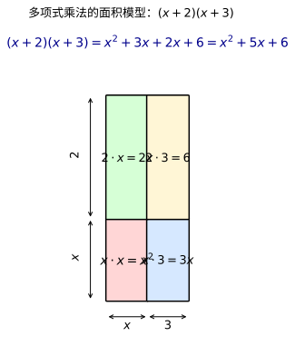
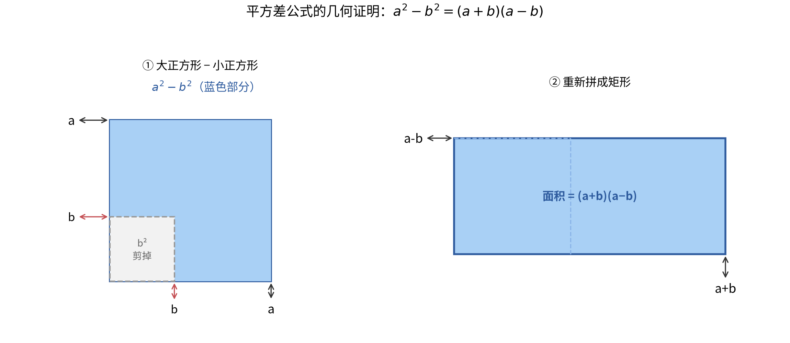
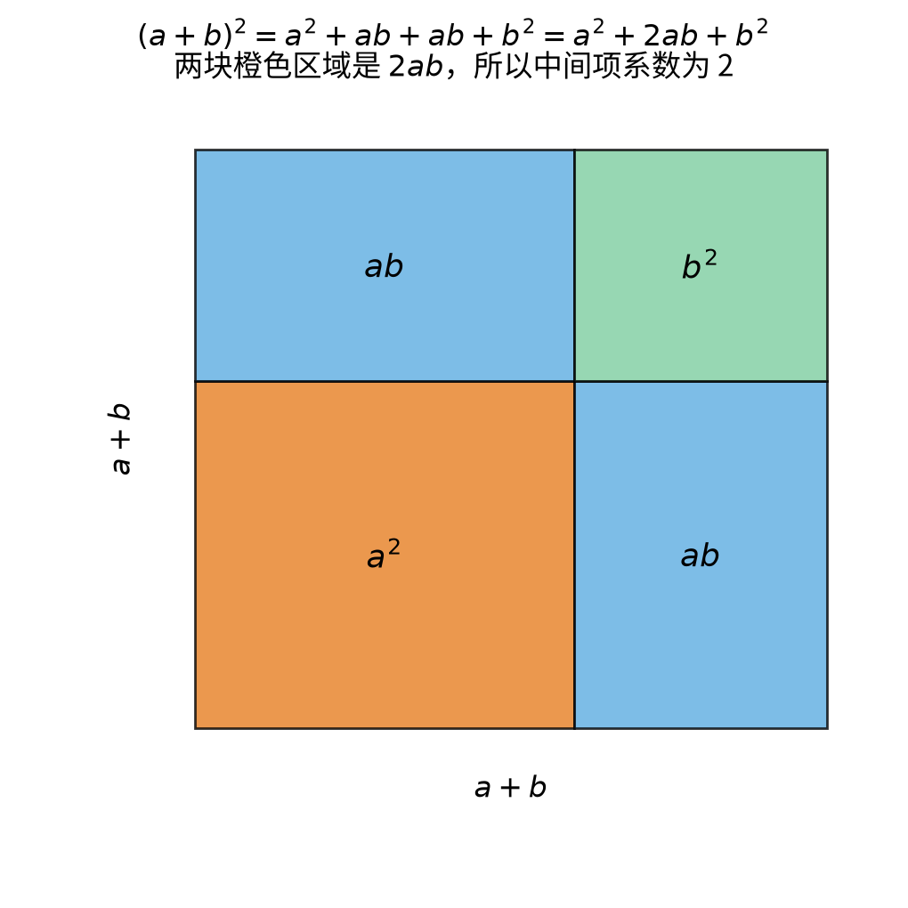
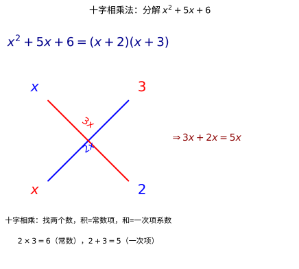
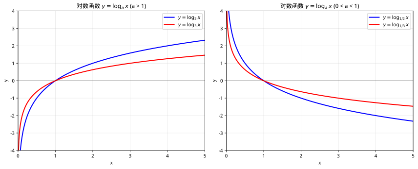
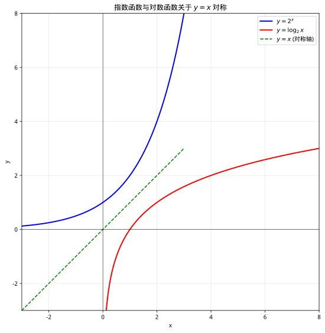
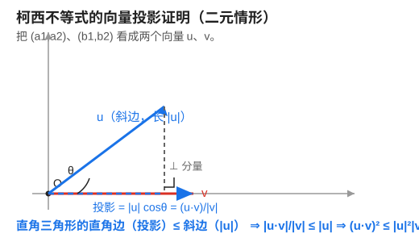
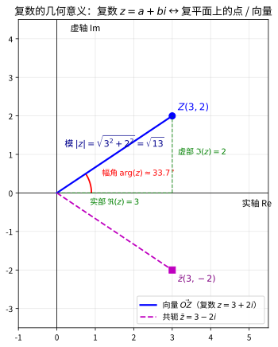
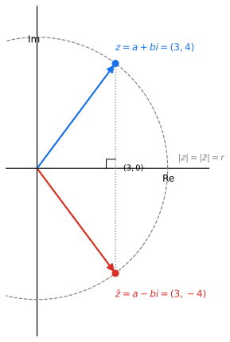
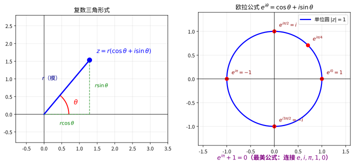

# 第 2 级：初等代数 (Elementary Algebra)

> 从算术迈向代数的关键一步——用字母表示数，用符号推演世界。

---

## 📖 学习目标

完成本教程后，你将能够：

1. 理解**变量**与**代数式**的概念，能用字母表示未知数和数量关系
2. 掌握**多项式**的基本运算（加、减、乘）
3. 掌握**因式分解**的常用方法（提取公因式、公式法、十字相乘法）
4. 熟练求解**一元一次方程**和**一元二次方程**
5. 理解并推导**二次方程求根公式**
6. 掌握**韦达定理**并利用它解决根与系数关系的问题
7. 理解**二项式定理**及其在展开中的应用

---

## 开始之前

**本章在讲什么**：初等代数是"用字母代替数字"的一章。你会学会用变量和代数式描述数量关系，对多项式做加减乘和因式分解，进而解开一元一次、一元二次方程，把只算具体数字的算术，升级成可以推理、可以推演的代数系统。

**为什么要学它**：第 1 级的算术只能处理具体数字（比如算出 $3+5=8$），却无法表达"未知量"和"一般规律"。本章引入字母后，未知数第一次有了归宿。这里练熟的一切——方程、函数、不等式、复数——都是后续所有等级共用的语言：它为平面几何乃至更高级别的数学铺路。

**开始前请确认你还记得**：
- 有理数与整数（见第 1 级）：能写成两个整数之比（分母不为 0）的数叫有理数，整数里含正整数、0 与负整数。
- 四则运算顺序（见第 1 级）：先乘方、再乘除、最后加减，有括号先算括号。
- 正负数的大小（见第 1 级）：负数小于 0，也小于任何正数；负数的绝对值表示它到 0 的距离。

---

## 一、核心概念

### 1.1 变量与代数式

**变量**是用字母（如 $x, y, a, b$ 等）表示的数，它可以代表未知数，也可以代表可变化的量。

**代数式**是由数字、变量和运算符号（$+$、$-$、$\times$、$\div$、乘方等）组成的数学表达式。例如：

- $x + 3$
- $2x - 5$
- $y^2 + 2x - 3$
- $\frac{a + b}{2}$

> **代数与算术的区别**：算术中只有具体的数字，如 $3 + 5 = 8$；代数中则引入字母，如 $x + 5 = 8$，我们需要求出 $x$ 的值。

> **🧠 思考历程：字母"变量"是怎么来的？**
>
> 今天我们用 $x, y$ 写方程，天经地义；但在数学史上，这一步用了近千年才算真正走通。
>
> - **最早只是"藏起来的数"**：公元 9 世纪的花拉子米（al-Khwārizmī）在《代数学》（Al-jabr）里解二次方程时，并没有字母，而是用"根""平方""数"这样的**词语**去指代未知量。为什么？因为当时"符号"被认为是记账密语，数学还停留在"用自然语言叙述过程"的阶段。
> - **转变的契机是"封装"**：后来的代数学家（尤其是 15–16 世纪意大利数学家）发现，反复出现"某个待定的量"，每次都用一句话描述实在太笨拙。**先给它一个名字**，运算就能从"一个个算出来"升级成"对名字本身做变形"——字母本质上是一次**心理上的抽象**：把一个会说很多话的未知数，压缩成一个符号。
> - **韦达与笛卡尔的加冕**：16 世纪法国人韦达（François Viète）第一个系统用字母表示已知量与未知量，把"解特定的题"变成"解一类题"。17 世纪笛卡尔（Descartes）更进一步，把变量写成可加可乘的"数"，并引入 $x, y, z$ 的记号，使代数从"算术的简写"真正独立成一门**关于符号自身的学问**。
> - **心路**：所以"变量"不是有人某天"发明"出来的，而是代数学家们在被繁琐的语言折磨后，**逐步把"过程"封装成"符号"**的必然结果。你现在写下的 $x + 5 = 8$，背后站着的是整整一代人从"描述"走向"抽象"的努力。

### 1.2 代数式的值

给定代数式中变量的具体数值，代入计算得到的结果称为**代数式的值**。

**示例**：求代数式 $2x^2 - 3x + 1$ 在 $x = 2$ 时的值。

$$
2(2)^2 - 3(2) + 1 = 2 \times 4 - 6 + 1 = 8 - 6 + 1 = 3
$$

### 1.3 单项式与多项式

#### 严格定义

**单项式**：由常数与变量的**有限次乘积**组成的代数式，其中每个变量的指数必须是**非负整数**（即 $0, 1, 2, 3, \dots$）。单独一个常数或一个变量也是单项式。

用形式化的语言描述：单项式是形如

| 符号 | 名称 | 含义 | 直观解释 |
|:---:|:---:|:---|:---|
| $c$ | 系数 | 常数，可正、可负、可为零 | "最前面的数字" |
| $x_1, x_2, \dots, x_k$ | 变量 | 一共 $k$ 个不同字母 | "待定的字" |
| $n_1, n_2, \dots, n_k$ | 指数 | 每个变量的非负整数次幂 | "乘了几遍" |

$$
c \cdot x_1^{n_1} \cdot x_2^{n_2} \cdots x_k^{n_k}
$$

的表达式，其中 $c$ 是常数（称为**系数**），$x_1, x_2, \dots, x_k$ 是变量，$n_1, n_2, \dots, n_k$ 是非负整数。

- **系数**：单项式中的常数因数。例如 $-2a^2b$ 的系数是 $-2$。
- **次数**：单项式中所有变量的指数之和 $n_1 + n_2 + \cdots + n_k$。例如 $3x^2y$ 的次数是 $2 + 1 = 3$；常数项（如 $5$）的次数为 $0$。

**多项式**：若干个单项式的**有限和**。用形式化的语言描述：多项式是形如

$$
a_n x^n + a_{n-1} x^{n-1} + \cdots + a_1 x + a_0
$$

的表达式，其中 $a_0, a_1, \dots, a_n$ 是常数，$x$ 是变量，各变量的指数均为非负整数。

- **项**：多项式中的每个单项式称为一项。例如 $x^2 + 2x - 3$ 有三项：$x^2$、$2x$、$-3$（常数项）。
- **次数**：多项式中次数最高的项的次数。例如 $x^3 + 2x^2 - 5$ 是三次多项式。

> **🧠 思考历程：为什么把式子"定格"成整式？**
>
> 这个定义初看只是"规定"，其实藏着一次深刻的**抽象与约束**。
>
> - **从"∞种写法"到"一种标准"**：同样一个量，可以用 $2x$、$x+x$、$\frac{4x}{2}$ 写成无数种样子。代数学家们真正想要的是"**一种能比较、能相加、能因式分解的标准形态**"。把"变量只能做非负整数次幂的乘积再求和"框成**整式**，本质上是在众多可能的表达式里，**圈定了一块"好操作的区域"**。
> - **迪奥芬图斯的"算术"烙印**：古希腊亚历山大城的迪奥芬图斯（Diophantus，约 3 世纪）《算术》里就有了多项式运算的雏形，但他是用缩写记号硬算。后人（韦达、牛顿等）意识到：与其被"具体系数"牵着走，不如**先做好这个抽象架构**，把一次函数、二次函数这些具体对象都放进去研究。
> - **罚则在"边界"**：定义里特意列举 $x^{-1}$、$x^{1/2}$、$2^x$ 不是整式，不是因为它们"不配"，而是因为一旦允许负指数、分数指数、变量在指数上，**乘法公式、次数、因式分解这些漂亮的运算规则就全线失效**。定义其实是"哪些形态能保住运算法则"的回答。
> - **心路**：整式不是从天上掉下来的清单，而是代数学家们**反复尝试哪些运算能自洽、哪些会崩坏之后，划出的一条安全线**。你把 $2^x$ 归为"指数表达式"，正是这条安全线的体现。

#### 关键约束：什么不是单项式/多项式

单项式和多项式统称为**整式**。整式有一个核心约束：**变量只能出现在底数位置，且指数必须是非负整数**。变量不能出现在以下位置：

| 表达式 | 是否为单项式/多项式 | 原因 |
|:------:|:------------------:|:-----|
| $3x^2$ | ✅ 是（单项式） | 变量 $x$ 的指数 $2$ 是非负整数 |
| $-5a^3b^2$ | ✅ 是（单项式） | 变量指数 $3, 2$ 均为非负整数 |
| $x^2 + 2x - 3$ | ✅ 是（多项式） | 各项变量指数均为非负整数 |
| $\dfrac{1}{x}$（即 $x^{-1}$） | ❌ 否 | 变量指数为 $-1$，不是非负整数（属于**分式**） |
| $\sqrt{x}$（即 $x^{1/2}$） | ❌ 否 | 变量指数为 $\frac{1}{2}$，不是非负整数（属于**无理式**） |
| $2^x$ | ❌ 否 | **变量出现在指数位置**（属于**指数表达式**，不是整式） |
| $\log_2 x$ | ❌ 否 | **变量出现在对数的真数位置**（属于**对数表达式**，不是整式） |
| $\sin x$ | ❌ 否 | 变量出现在三角函数中（属于**三角表达式**，不是整式） |

> **核心区分**：$3x^2$ 是单项式（常数 $\times$ 变量的非负整数次幂），而 $2^x$ 不是单项式（变量在指数位置，底数是常数）。类似地，$\log_2 x$ 不是多项式，因为对数运算不属于"常数与变量的有限次乘积"。

#### 代数式的分类

根据运算结构，代数式可以按如下层次分类：

$$
\text{代数式} \begin{cases}
\textbf{整式} \begin{cases}
\text{单项式} & \text{如 } 3x^2,\; -5,\; 2ab^3 \\
\text{多项式} & \text{如 } x^2 + 2x - 3
\end{cases} \\[1em]
\textbf{分式} \;\dfrac{P(x)}{Q(x)}\text{（分母含变量）} & \text{如 } \dfrac{1}{x},\; \dfrac{x+1}{x-2} \\[1em]
\textbf{无理式} \text{（含根号下变量）} & \text{如 } \sqrt{x},\; \sqrt{x^2 + 1}
\end{cases}
$$

指数表达式（如 $2^x$）和对数表达式（如 $\log_2 x$）不属于上述分类中的整式、分式或无理式，它们属于**超越表达式**，将在本节的"指数与对数"部分（第六章）详细学习。

---

## 二、基本运算

### 2.1 多项式的加减法

**规则**：合并同类项（同类项是指所含字母相同且相同字母的指数也相同的项）。

**示例 1**：计算 $(3x^2 + 2x - 5) + (x^2 - 4x + 3)$

$$
\begin{aligned}
& (3x^2 + 2x - 5) + (x^2 - 4x + 3) \\
&= 3x^2 + x^2 + 2x - 4x - 5 + 3 \\
&= 4x^2 - 2x - 2
\end{aligned}
$$

**示例 2**：计算 $(5a^2 - 3ab + 2b^2) - (2a^2 + ab - b^2)$

$$
\begin{aligned}
& (5a^2 - 3ab + 2b^2) - (2a^2 + ab - b^2) \\
&= 5a^2 - 3ab + 2b^2 - 2a^2 - ab + b^2 \\
&= (5a^2 - 2a^2) + (-3ab - ab) + (2b^2 + b^2) \\
&= 3a^2 - 4ab + 3b^2
\end{aligned}
$$

### 2.2 多项式的乘法

#### 单项式乘多项式

**规则**：用单项式乘以多项式的每一项，再将结果相加。

$$
a(b + c) = ab + ac
$$

**示例**：$2x(3x^2 - 4x + 1) = 2x \cdot 3x^2 - 2x \cdot 4x + 2x \cdot 1 = 6x^3 - 8x^2 + 2x$

#### 多项式乘多项式

**规则**：用一个多项式的每一项乘以另一个多项式的每一项，再合并同类项。

$$
(a + b)(c + d) = ac + ad + bc + bd
$$

**示例**：$(2x + 1)(x - 3)$

$$
\begin{aligned}
(2x + 1)(x - 3) &= 2x \cdot x + 2x \cdot (-3) + 1 \cdot x + 1 \cdot (-3) \\
&= 2x^2 - 6x + x - 3 \\
&= 2x^2 - 5x - 3
\end{aligned}
$$



> **直观理解（现实类比）**：多项式乘法像**计算长方形面积**——长和宽都是复合长度 $(x+a)(x+b)$，把整块大地按"两条切割线"分成四块小矩形，总面积就是四块之和。
> - 例如 $(x+a)(x+b)$ 切成四块：$x\cdot x=x^2$、$x\cdot b=bx$、$a\cdot x=ax$、$a\cdot b=ab$，合并后得 $x^2+(a+b)x+ab$。
> - "交叉项" $ax+bx=(a+b)x$ 就是中间两条长条的面积之和，这正是分配律的几何来源。
> - 当 $a$、$b$ 异号时，某一块面积为负，相当于"挖去"一部分——这解释了平方差公式中交叉项为何相消。

#### 常用乘法公式

##### 公式一：平方差公式

$$
(a + b)(a - b) = a^2 - b^2
$$

**推导**：直接用多项式乘法展开（分配律）：

$$
(a + b)(a - b) = a \cdot a + a \cdot (-b) + b \cdot a + b \cdot (-b) = a^2 - ab + ab - b^2 = a^2 - b^2
$$

**思考过程——怎么想到这个公式的？**

> 第一步：从"对称结构"出发。我们注意到 $(a+b)$ 和 $(a-b)$ 是一对"对称"的因式——它们只有中间一项的符号不同。一个自然的疑问是：这两个因式相乘，结果会怎样？
>
> 第二步：展开后观察规律。展开得到四项 $a^2 - ab + ab - b^2$，其中 $-ab$ 和 $+ab$ 恰好**互为相反数**，互相抵消。这不是巧合——因为 $(a+b)$ 和 $(a-b)$ 的"差异"仅在于一个符号，展开时交叉项必然一正一负、大小相等，所以必然抵消。
>
> 第三步：几何直觉验证。想象一个边长为 $a$ 的大正方形，从中挖去一个边长为 $b$ 的小正方形（$b < a$），剩余面积为 $a^2 - b^2$。将剩余部分沿对角线切开，可以重新拼成一个长为 $(a+b)$、宽为 $(a-b)$ 的矩形，面积为 $(a+b)(a-b)$。两种算法得到同一面积，因此 $a^2 - b^2 = (a+b)(a-b)$。
>
> **核心洞察**：两个"和与差"相乘，交叉项必然抵消，结果就是"平方之差"。



> **直观理解（现实类比）**：想象一块边长为 $a$ 的**大地毯**，角落被剪掉一块边长为 $b$ 的小方块。剩下的部分面积当然是 $a^2 - b^2$。这些剩余布料的形状虽然不规则，但只要沿折线剪开再拼一拼，就能拼成一个长为 $(a+b)$、宽为 $(a-b)$ 的矩形——面积不变，于是 $a^2-b^2=(a+b)(a-b)$。**"和与差相乘"恰好就是"剪下来再拼回去"的数学表达。**

**示例**：$(x + 3)(x - 3) = x^2 - 9$

---

##### 公式二：完全平方公式

$$
(a + b)^2 = a^2 + 2ab + b^2
$$
$$
(a - b)^2 = a^2 - 2ab + b^2
$$

**推导**：$(a+b)^2$ 就是 $(a+b)(a+b)$，用分配律展开：

$$
(a + b)(a + b) = a \cdot a + a \cdot b + b \cdot a + b \cdot b = a^2 + ab + ab + b^2 = a^2 + 2ab + b^2
$$

$(a-b)^2$ 同理：

$$
(a - b)(a - b) = a^2 - ab - ab + b^2 = a^2 - 2ab + b^2
$$

**思考过程——怎么想到这个公式的？**

> 第一步：从"自己乘自己"出发。$(a+b)^2$ 意味着两个完全相同的因式相乘。展开后得到四项，其中 $a \cdot b$ 和 $b \cdot a$ 是**相同的**（都等于 $ab$），所以合并为 $2ab$。
>
> 第二步：为什么是 $2ab$ 而不是 $ab$？因为 $(a+b)$ 和 $(a+b)$ 完全一样，交叉项 $a \cdot b$ 出现了**两次**（第一个括号的 $a$ 配第二个括号的 $b$，以及第一个括号的 $b$ 配第二个括号的 $a$）。这就是"完全"二字的含义——两项完全相同，交叉贡献翻倍。
>
> 第三步：为什么 $(a-b)^2$ 的结果也是正的 $b^2$？因为 $(-b) \times (-b) = b^2$（负负得正）。所以无论加减，完全平方展开后的首项和末项**永远是正的**。
>
> 第四步：几何直觉。边长为 $(a+b)$ 的正方形可以分成四块：一个 $a \times a$ 的大正方形、一个 $b \times b$ 的小正方形、两个 $a \times b$ 的矩形。总面积 = $a^2 + ab + ab + b^2 = a^2 + 2ab + b^2$。
>
> **核心洞察**：两个相同因式相乘，交叉项出现两次，所以中间项系数为 $2$。



> **直观理解（现实类比）**：想象铺设一块边长为 $a+b$ 的**正方形花砖**。整块面积是 $(a+b)^2$。但若把它按"大方块 $a^2$ + 两条长条 $ab$ 和 $ab$ + 小方块 $b^2$"来分，就得到 $a^2 + 2ab + b^2$。**图中的中间项 $2ab$ 正是那两块完全相同的长条**——这就是"为什么中间项系数是 2"的几何答案。

**示例**：
- $(2x + 5)^2 = 4x^2 + 20x + 25$
- $(3a - 2b)^2 = 9a^2 - 12ab + 4b^2$

---

##### 公式三：立方和与立方差公式

$$
a^3 + b^3 = (a + b)(a^2 - ab + b^2)
$$
$$
a^3 - b^3 = (a - b)(a^2 + ab + b^2)
$$

**推导**（以立方和为例）：用分配律展开右边验证：

$$
\begin{aligned}
(a + b)(a^2 - ab + b^2) &= a \cdot a^2 + a \cdot (-ab) + a \cdot b^2 + b \cdot a^2 + b \cdot (-ab) + b \cdot b^2 \\
&= a^3 - a^2b + ab^2 + a^2b - ab^2 + b^3 \\
&= a^3 + b^3
\end{aligned}
$$

中间四项 $-a^2b + a^2b$ 和 $ab^2 - ab^2$ 互相抵消。立方差同理可证。

**思考过程——这个公式是怎么被发现的？**

> 第一步：从平方差公式类比。我们已经知道 $a^2 - b^2 = (a+b)(a-b)$。一个自然的推广问题是：$a^3 - b^3$ 能不能也分解因式？$a^3 + b^3$ 呢？
>
> 第二步：猜测因式的结构。如果 $a^3 - b^3$ 能分解，其中一个因式很可能是 $(a - b)$（因为当 $a = b$ 时，$a^3 - b^3 = 0$，说明 $(a-b)$ 应该是一个因式——这就是**因式分解定理**的思想，见 3.4 节）。
>
> 第三步：确定另一个因式。$a^3 - b^3$ 是三次式，$(a-b)$ 是一次式，所以另一个因式必须是**二次式**。设：
> $$a^3 - b^3 = (a - b)(a^2 + \square \cdot ab + \square \cdot b^2)$$
> 展开右边并与左边对比系数：
> - $a^3$ 项：$a \cdot a^2 = a^3$ ✅ 已匹配
> - $b^3$ 项：$(-b) \cdot (\square \cdot b^2) = -b^3$，所以 $\square = 1$，即 $b^2$ 的系数为 $1$
> - $a^2b$ 项：$a \cdot (\square \cdot ab) + (-b) \cdot a^2 = 0$（因为左边没有 $a^2b$ 项），所以 $\square - 1 = 0$，即 $ab$ 的系数为 $1$
>
> 因此另一个因式为 $a^2 + ab + b^2$，即：
> $$a^3 - b^3 = (a - b)(a^2 + ab + b^2)$$
>
> 第四步：立方和怎么办？用同样的思路——当 $a = -b$ 时，$a^3 + b^3 = (-b)^3 + b^3 = 0$，所以 $(a + b)$ 是一个因式。设 $a^3 + b^3 = (a + b)(a^2 + \square \cdot ab + b^2)$，对比系数可得 $\square = -1$：
> $$a^3 + b^3 = (a + b)(a^2 - ab + b^2)$$
>
> 第五步：记忆规律。对比两个公式：
> - 立方**和** $a^3 + b^3$ → 因式 $(a+b)$，括号内符号为 "$-+-$"（减、加）
> - 立方**差** $a^3 - b^3$ → 因式 $(a-b)$，括号内符号为 "$+++$"（全加）
>
> 规律：**一次因式的符号与原始运算一致**，括号内的中间项符号**总是与原始运算相反**。
>
> **核心洞察**：从已知的平方差公式出发，通过"猜测因式 → 待定系数 → 对比验证"的方法，自然推导出立方和/差公式。这个方法（待定系数法）是发现新公式的通用策略。

> **🧠 思考历程：这些公式为什么"天然该存在"？**
>
> 上面的是"你会怎么证"，这里说的是**人类最早是怎么撞见它们的**。
>
> - **先有几何，后有代数**：平方差、完全平方这些恒等式的原型，早在字母诞生前就出现在"算地"里。巴比伦泥板（约公元前 1800 年）与古埃及的谷仓体积计算，都用"长乘宽、边成正方形"的**面积语言**处理问题：正方形"（a+b）²"被拆成两块田加两个角落，这就是完全平方公式的最早雏形。
> - **欧几里得的"无字图式"**：古希腊《几何原本》（约公元前 300 年）把这些关系登堂入室——它用"把一块地剪开重拼面积不变"来证明恒等式，没有用一个字母。数学家当时不叫它"公式"，而叫"几何构造"。所以平方差的拼图证明（见前文图），其实是**希腊几何两千多年的余晖**。
> - **为什么立方和差等得更久**：因为"立方"对应的是**体积**，而古希腊人相信所有量都能写成"线段之比"，三次方在几何里找不到直观位置。于是 $a^3 \pm b^3$ 这类公式长期以来只在代数薄弱的角落流传，是**花拉子米等人在《代数学》守的代数传统**才把它接住、规范化的。
> - **心路**：由此可见，这些公式不是某个人一个晚上"发明"的，而是**几何直觉（面积/体积）与符号代数互相成就**的产物。你今天背成的三个"公式"，其实是"人类先会用眼睛看见四面八方的面积，后来才用字母把它写成了口诀"。

### 2.3 多项式运算规则（定理与证明）

**定理 1（多项式加法交换律）**：两个多项式相加，交换加数的位置，和不变。

$$
P(x) + Q(x) = Q(x) + P(x)
$$

**定理 2（多项式加法结合律）**：三个多项式相加，先把前两个相加，或先把后两个相加，和不变。

$$
(P(x) + Q(x)) + R(x) = P(x) + (Q(x) + R(x))
$$

**定理 3（多项式乘法分配律）**：多项式乘法对加法满足分配律。

$$
P(x) \cdot (Q(x) + R(x)) = P(x) \cdot Q(x) + P(x) \cdot R(x)
$$

**证明思路**：以上定理均可由实数的运算律直接推广得到，因为多项式中的变量 $x$ 在代入具体数值时，运算归结为实数的运算。

---

## 三、因式分解

**因式分解**是把一个多项式分解为两个或多个因式的乘积的过程。它是多项式乘法的逆运算。

### 3.1 提取公因式法

找出各项的公因式，将其提取到括号外面。

**示例**：因式分解 $6x^3 + 9x^2 - 3x$

$$
6x^3 + 9x^2 - 3x = 3x(2x^2 + 3x - 1)
$$


> **直观理解（现实类比）**：提取公因式像把两个矩形（$ab$ 和 $ac$）合并成一个大矩形 $a(b+c)$——公共边 $a$ 提到外面，剩下的 $(b+c)$ 放进括号。
> - 把 $6x^3$、$9x^2$、$-3x$ 想成三块"并列的矩形"，它们共享的"宽度"是 $3x$，把它抽出来后，里面只剩各自不同的"长度" $2x^2$、$3x$、$-1$。
> - 几何上相当于把三块矩形重新拼成"宽 $3x$、长 $(2x^2+3x-1)$"的一个大矩形——面积不变，只是换了一种摆放方式。
> - 这正是分配律 $a(b+c)=ab+ac$ 的**逆向操作**：乘法把"一个矩形切成多块"，因式分解把"多块拼回一个矩形"。

### 3.2 公式法

利用乘法公式反过来进行因式分解。

**平方差公式**：
$$
a^2 - b^2 = (a + b)(a - b)
$$

**完全平方公式**：
$$
a^2 + 2ab + b^2 = (a + b)^2
$$
$$
a^2 - 2ab + b^2 = (a - b)^2
$$

**立方和与立方差公式**：
$$
a^3 + b^3 = (a + b)(a^2 - ab + b^2)
$$
$$
a^3 - b^3 = (a - b)(a^2 + ab + b^2)
$$

**示例**：
- $x^2 - 25 = (x + 5)(x - 5)$
- $4x^2 - 12x + 9 = (2x - 3)^2$
- $8x^3 + 27 = (2x + 3)(4x^2 - 6x + 9)$

### 3.3 十字相乘法

对于二次三项式 $x^2 + (a+b)x + ab$，可分解为 $(x + a)(x + b)$。

更一般地，对于 $ax^2 + bx + c$，若能将 $a$ 分解为 $a_1 \cdot a_2$，$c$ 分解为 $c_1 \cdot c_2$，且 $a_1c_2 + a_2c_1 = b$，则：

$$
ax^2 + bx + c = (a_1x + c_1)(a_2x + c_2)
$$

**示例**：因式分解 $x^2 + 5x + 6$

寻找两个数 $a$、$b$，使得 $a + b = 5$，$a \cdot b = 6$。显然 $a = 2$，$b = 3$。

$$
x^2 + 5x + 6 = (x + 2)(x + 3)
$$

**示例**：因式分解 $2x^2 + 7x + 3$

$$
2x^2 + 7x + 3 = (2x + 1)(x + 3)
$$



> **直观理解（现实类比）**：十字相乘像"**相亲配对**"——把二次项 $ax^2$ 和常数项 $c$ 各拆成两个因子，画十字交叉相乘，看哪对组合相加恰好等于一次项 $bx$。
> - 对 $2x^2+7x+3$：把 $2x^2$ 拆成 $2x\cdot x$，把 $3$ 拆成 $3\cdot 1$，交叉相乘得 $2x\cdot1+x\cdot3=5x$（不对）和 $2x\cdot3+x\cdot1=7x$（对！），所以配对成功。
> - "十字"的两条对角线就是在试两种配对方案，哪条线上的乘积之和等于 $b$，就选那条。
> - 这比死记公式更灵活：当 $a\neq1$ 时，十字相乘把"拆二次项"和"拆常数项"两件事并列处理，一眼就能看出答案。

### 3.4 因式分解定理（Factor Theorem）

**定理**：设 $f(x)$ 是一个多项式，$c$ 是一个常数。若 $f(c) = 0$，则 $(x - c)$ 是 $f(x)$ 的一个因式。反之，若 $(x - c)$ 是 $f(x)$ 的一个因式，则 $f(c) = 0$。

**证明**：

由多项式除法，用 $(x - c)$ 除 $f(x)$，可得商式 $q(x)$ 和余数 $r$（$r$ 为常数）：
$$
f(x) = (x - c)q(x) + r
$$
将 $x = c$ 代入上式：
$$
f(c) = (c - c)q(c) + r = 0 + r = r
$$

因此，$f(c) = 0$ 当且仅当 $r = 0$，即 $(x - c)$ 整除 $f(x)$。这就证明了定理。

**示例**：判断 $x - 2$ 是否是 $f(x) = x^3 - 3x^2 + 4$ 的因式。

计算 $f(2) = 2^3 - 3 \cdot 2^2 + 4 = 8 - 12 + 4 = 0$，所以 $(x - 2)$ 是 $f(x)$ 的因式。

验证：$x^3 - 3x^2 + 4 = (x - 2)(x^2 - x - 2)$

> **🧠 思考历程：一个"等于零就有因式"的关系，威力为什么这么大？**
>
> 因式分解定理看似不过是一条"整除性判据"，但它其实是**把"根"和"因式"两件事焊在一起**的枢纽，人类摸索了很久才看清。
>
> - **古老的"试数"本能**。古人做整除时早就隐约有个习惯：一个数被除以另一个数望整除，往往先猜几个小数试试。取一个"候选根 $c$"，代入看是否为 0——这种**试根**直觉在东方开方术和西方代数中都很古老，但长期只是"技巧"，没有上升为"定理"。
> - **从余数看本质**。真正让关系变得清晰的是"**多项式除法与余数**"观念的成熟：把 $f(x)$ 除以 $(x-c)$，余数 $r$ 恰好就是 $f(c)$。这样一来，**"整除"和"代进去得零"成了一回事**——不需要展开因式，只要代一个数就能判断。这一类"余数/因式"关系的早期步骤，常见归功于 17 世纪的英国数学家托马斯·哈里奥特（Thomas Harriot）等人逐步整理。
> - **为什么它"好用得吓人"**。有了它，解高次方程瞬间获得一条生路：试出一个小整数根 $c$，就能剥离一个因式 $(x-c)$，把问题降阶。**它把"不知道有没有因式"变成"带个数字试一试"**——这也是前面分解 $x^3-3x^2+4$ 那一步走下来顺手的原因。
> - **心路**：因式分解定理最值得品味的是它把**"值域里的 0"**和**"结构上的因式"**联系了起来——一个廉价的代入计算，等价于一次精确的除法还原。它提醒我们：**很多表面上的"深刻定理"，本质上是把人们天天在用的小技巧，用除法的语言正式地承认了一遍。**

---

## 四、方程

### 4.1 一元一次方程

形如 $ax + b = 0$（$a \neq 0$）的方程称为一元一次方程。

**解法**：移项、合并同类项、系数化为 1。

**示例**：解方程 $3x - 7 = 2x + 5$

$$
\begin{aligned}
3x - 7 &= 2x + 5 \\
3x - 2x &= 5 + 7 \\
x &= 12
\end{aligned}
$$

### 4.2 一元二次方程

形如 $ax^2 + bx + c = 0$（$a \neq 0$）的方程称为一元二次方程。

#### 解法一：因式分解法

若方程可分解为 $a(x - x_1)(x - x_2) = 0$，则 $x = x_1$ 或 $x = x_2$。

**示例**：解方程 $x^2 - 5x + 6 = 0$

因式分解：$(x - 2)(x - 3) = 0$，所以 $x_1 = 2$，$x_2 = 3$。

#### 解法二：配方法

**示例**：解方程 $x^2 + 6x + 7 = 0$

$$
\begin{aligned}
x^2 + 6x + 7 &= 0 \\
x^2 + 6x &= -7 \\
x^2 + 6x + 9 &= -7 + 9 \\
(x + 3)^2 &= 2 \\
x + 3 &= \pm \sqrt{2} \\
x &= -3 \pm \sqrt{2}
\end{aligned}
$$

#### 解法三：求根公式法

**定理（二次方程求根公式）**：对于一元二次方程 $ax^2 + bx + c = 0$（$a \neq 0$），其根为：

| 符号 | 名称 | 含义 | 直观解释 |
|:---:|:---:|:---|:---|
| $a, b, c$ | 系数 | $x^2$、$x$、常数项的系数 | "固定的三个数" |
| $\Delta$ | 判别式 | $b^2 - 4ac$ | "判断有几个根" |
| $\pm$ | 正负号 | 同时取加号和减号 | "一正一负两种答案" |
| $\sqrt{\ }$ | 根号 | 开平方运算 | "哪个数平方得它" |

$$
x = \frac{-b \pm \sqrt{b^2 - 4ac}}{2a}
$$

**推导（配方法）**：

$$
\begin{aligned}
ax^2 + bx + c &= 0 \quad (a \neq 0) \\
x^2 + \frac{b}{a}x + \frac{c}{a} &= 0 \quad \text{（两边同除以 } a \text{）} \\
x^2 + \frac{b}{a}x &= -\frac{c}{a} \\
x^2 + \frac{b}{a}x + \left(\frac{b}{2a}\right)^2 &= \left(\frac{b}{2a}\right)^2 - \frac{c}{a} \quad \text{（配方）} \\
\left(x + \frac{b}{2a}\right)^2 &= \frac{b^2}{4a^2} - \frac{c}{a} = \frac{b^2 - 4ac}{4a^2}
\end{aligned}
$$

- 第 1 行到第 2 行（同除以 $a$）：依据是 $a \neq 0$ 时等式两边可同除以非零数，目的是把二次项系数化为 1，为配方做准备。
- 第 2 行到第 3 行（移项）：依据是等式两边同加 $\frac{c}{a}$ 不改变相等关系，目的是把常数项搬到右边，让左边只留含 $x$ 的项。
- 第 3 行到第 4 行（配方）：依据是完全平方公式 $x^2 + 2px + p^2 = (x+p)^2$，这里一次项 $2p = \frac{b}{a}$，故两边同加 $\left(\frac{b}{2a}\right)^2$，目的是把左边凑成完全平方 $(x+\frac{b}{2a})^2$。
- 第 4 行到第 5 行（合并）：把 $\frac{b^2}{4a^2} - \frac{c}{a}$ 通分为 $\frac{b^2-4ac}{4a^2}$，依据是分数减法，目的是让分子中出现判别式 $\Delta = b^2-4ac$，好供下一步开方。

令 $\Delta = b^2 - 4ac$，称为**判别式**。则：

$$
x + \frac{b}{2a} = \pm \sqrt{\frac{b^2 - 4ac}{4a^2}} = \pm \frac{\sqrt{b^2 - 4ac}}{2|a|}
$$

由于 $|a|$ 的符号可以并入 $\pm$ 中，因此：

$$
x = \frac{-b \pm \sqrt{b^2 - 4ac}}{2a}
$$

**判别式的意义**：
- 当 $\Delta > 0$ 时，方程有两个不相等的实数根
- 当 $\Delta = 0$ 时，方程有两个相等的实数根（重根）
- 当 $\Delta < 0$ 时，方程没有实数根，有一对共轭复数根

**示例**：用公式法解方程 $2x^2 - 4x - 3 = 0$

$$
\begin{aligned}
a &= 2, \quad b = -4, \quad c = -3 \\
\Delta &= b^2 - 4ac = (-4)^2 - 4 \cdot 2 \cdot (-3) = 16 + 24 = 40 \\
x &= \frac{-(-4) \pm \sqrt{40}}{2 \cdot 2} = \frac{4 \pm 2\sqrt{10}}{4} = \frac{2 \pm \sqrt{10}}{2}
\end{aligned}
$$

所以 $x_1 = \frac{2 + \sqrt{10}}{2}$，$x_2 = \frac{2 - \sqrt{10}}{2}$。

> **🧠 思考历程：求根公式是怎么被"逼"出来的？**
>
> 这串看似冰冷的分式，背后是人类两千多年"**给二次方程找一个万能解法**"的执念。
>
> - **最早根本不是公式，是"画图"**：花拉子米（约 820 年）在他的《代数学》里解 $x^2 + 10x = 39$ 时，没有代数符号，而是把它画成正方形：把一个 $x \times x$ 的方块摆中间，四边各补一个 $\frac{10}{4}$ 宽的小条，再把四角补上小方块，就凑出一个完整的 $(x+5)^2 = 64$。**今天你写的"配方"，本质就是他当年在沙盘上补的那一小块地**。
> - **印度的"接龙"**：印度数学家婆罗摩笈多（Brahmagupta，约 628 年）和后来的婆什迦罗（Bhāskara II）把这种几何配方**程序化**成一步步的算术规则，甚至遇到负数、无理根也照算不误。这关键的一步是：**把"个案的构图"抽成"每类方程都管用的步骤"**。
> - **判别式与"看不见的根"**：当 $b^2 - 4ac < 0$ 时根号里是负数。古代数学家看到这个只会说"无解"，因为"不能开平方的负数"在他们头脑里不存在。直到 16 世纪意大利人在解三次方程时**被迫走投无路地接受了"虚数"**（见第九节复数），人们才反过来懂得：配方开方时那一步 $\sqrt{\Delta}$，其实早就把"数会不会跑出实数世界"写在了脸上——这就是判别式后来被如此重视的原因。
> - **心路**：求根公式不是被"发现"的瞬间奇迹，而是**"几何构图 → 逐步算术化 → 系数通文化 → 承认虚根"**四连跳的结果。它告诉你：**一个看起来"死记硬背"的公式，其实是几代人把'画画烦恼'翻译成'符号语言'后才到手的。**

### 4.3 韦达定理（Vieta's Formulas）

**定理**：设一元二次方程 $ax^2 + bx + c = 0$（$a \neq 0$）的两个根为 $x_1$ 和 $x_2$，则：

$$
x_1 + x_2 = -\frac{b}{a}
$$
$$
x_1 \cdot x_2 = \frac{c}{a}
$$

**证明**：

设 $x_1$、$x_2$ 是方程 $ax^2 + bx + c = 0$ 的两个根，则多项式可分解为：

$$
ax^2 + bx + c = a(x - x_1)(x - x_2)
$$

- 【第 1 步】依据：因式分解定理——$x_1, x_2$ 是根，故 $f(x_1)=f(x_2)=0$，$(x-x_1)$、$(x-x_2)$ 都是因式，再乘上次项系数 $a$ 对齐首项；目的：把二次式改写成"以根为零件"的乘积形式。

展开右边：

$$
a(x - x_1)(x - x_2) = a[x^2 - (x_1 + x_2)x + x_1x_2] = ax^2 - a(x_1 + x_2)x + a x_1 x_2
$$

- 【第 2 步】依据：多项式乘法展开与分配律；目的：把 $a(x - x_1)(x - x_2)$ 展开成 $ax^2 - a(x_1+x_2)x + ax_1x_2$，好与左边逐项对照。
- 【第 3 步】依据：两个恒等的多项式，对应项系数必须相等；目的：由一次项系数相等得 $b = -a(x_1+x_2)$，由常数项系数相等得 $c = ax_1x_2$，从而倒推出根的和与积。

比较两边对应项的系数：

$$
\begin{cases}
b = -a(x_1 + x_2) \\
c = a x_1 x_2
\end{cases}
\Rightarrow
\begin{cases}
x_1 + x_2 = -\dfrac{b}{a} \\[1em]
x_1 x_2 = \dfrac{c}{a}
\end{cases}
$$

**示例**：已知方程 $x^2 - 5x + 6 = 0$，不解方程求两根之和与两根之积。

$$
x_1 + x_2 = -\frac{-5}{1} = 5, \quad x_1 \cdot x_2 = \frac{6}{1} = 6
$$

（验证：该方程的两根为 $2$ 和 $3$，确实 $2 + 3 = 5$，$2 \times 3 = 6$。）

**示例**：已知方程 $2x^2 + 3x - 4 = 0$ 的两根为 $x_1$、$x_2$，求 $x_1^2 + x_2^2$ 的值。

$$
\begin{aligned}
x_1 + x_2 &= -\frac{3}{2}, \quad x_1x_2 = \frac{-4}{2} = -2 \\
x_1^2 + x_2^2 &= (x_1 + x_2)^2 - 2x_1x_2 \\
&= \left(-\frac{3}{2}\right)^2 - 2 \cdot (-2) \\
&= \frac{9}{4} + 4 = \frac{25}{4}
\end{aligned}
$$


> **直观理解（现实类比）**：韦达定理像"通过两个孩子的总和与乘积反推他们各自是谁"——只要知道根之和 $x_1+x_2=-b/a$ 与根之积 $x_1x_2=c/a$，就能重建整个二次方程 $x^2-(x_1+x_2)x+x_1x_2=0$。
> - 根之和告诉你两根的"重心"，根之积告诉你两根的"整体规模"。
> - 二次方程 $ax^2+bx+c=0$ 的全部信息，其实只藏在两个数（和、积）里，系数 $a,b,c$ 只是它们的"伪装"。
> - 这也是为什么求 $x_1^2+x_2^2$ 时不必先解出两根，只用 $(x_1+x_2)^2-2x_1x_2$ 即可——韦达定理把"解方程"翻译成了"算对称式"。

> **🧠 思考历程：韦达为什么要"绕开解方程"？**
>
> 韦达定理表面是"根与系数的关系"，但它诞生的动机，来自一位律师兼密码学家对"**再利用**"的执念。
>
> - **韦达其人**：弗朗索瓦·韦达（François Viète，1540–1603）本职是法国国王的参政官和破译敌方密信的专家。他心里想的不是"又解一道新题"，而是：**解完一道题之后留下的副产品（根的和、根之积）到底还能干什么？**
> - **从"解出来"到"不解就知道"**：在韦达之前，人们为了某个对称式（如 $x_1^2+x_2^2$）往往先硬解两根再代进去。韦达观察到：方程组 $ax^2+bx+c=0$ 的信息量，其实**压缩**在"两根之和、两根之积"两个量里。于是他把眼光从"根"转移到"根所形成的结构"上——这是代数从"求值"走向"结构"的关键一步。
> - **时代背景的助推**：他的符号代数改革（第一个用字母表示已知量与未知量）恰好提供了"系数"这个概念。有了"系数也是符号"，他才能在 $a(x-x_1)(x-x_2)$ 与 $ax^2+bx+c$ 之间按对应项系数对比——**系数对比法**由此而来。今天证明里的"待定系数、对照系数"，源头正是韦达这个"把式子展开再逐项对齐"的习惯。
> - **心路**：韦达定理的诞生，是一位破译者把"解方程"当成"信息压缩"来看待的结果。它告诉你：**好的数学不是多算几步，而是找到一个更省力、更能看穿结构的视角**。当你能"不解方程就说出两根的和与积"，你就踩在韦达两百年才走到的地方了。

### 5.1 定理陈述

**二项式定理**：对于任意非负整数 $n$，有：

| 符号 | 名称 | 含义 | 直观解释 |
|:---:|:---:|:---|:---|
| $\sum_{k=0}^{n}$ | 求和号 | 让 $k$ 从 0 一路取到 $n$，把每项加起来 | "把一带串加起来" |
| $\binom{n}{k}$ | 组合数 | 从 $n$ 个东西里挑 $k$ 个的选法数 | "n 选 k" |
| $n!$ | 阶乘 | $n \times (n-1) \times \cdots \times 2 \times 1$ | "从 n 连乘到 1" |
| $a^{n-k}$ | 幂 | 底数 $a$ 连乘 $n-k$ 遍 | "a 乘 n-k 遍" |

$$
(a + b)^n = \sum_{k=0}^{n} \binom{n}{k} a^{n-k} b^k
$$

其中 $\displaystyle \binom{n}{k} = \frac{n!}{k!(n-k)!}$ 称为**二项式系数**，$n! = n \times (n-1) \times \cdots \times 2 \times 1$ 表示 $n$ 的阶乘。

### 5.2 从排列组合理解二项式定理

#### 核心问题：为什么展开式的系数是组合数 $\binom{n}{k}$？

二项式定理的公式中出现了组合数 $\binom{n}{k}$，这看起来并不自然——展开一个代数式，跟"从 $n$ 个东西中选 $k$ 个"有什么关系？下面我们从最基本的乘法原理出发，一步步揭示这个联系。

#### 第一步：从具体例子入手——展开 $(a + b)^3$

$(a + b)^3 = (a + b)(a + b)(a + b)$，即三个括号相乘。

根据乘法原理，展开的过程是：**从每个括号中各选一项（选 $a$ 或选 $b$），然后把选出的三项乘在一起**。所有可能的选法汇总起来，就是展开式的全部项。

列出所有选法：

| 选法 | 从第1个括号选 | 从第2个括号选 | 从第3个括号选 | 乘积 |
|:----:|:----------:|:----------:|:----------:|:----:|
| 1 | $a$ | $a$ | $a$ | $a^3$ |
| 2 | $a$ | $a$ | $b$ | $a^2b$ |
| 3 | $a$ | $b$ | $a$ | $a^2b$ |
| 4 | $a$ | $b$ | $b$ | $ab^2$ |
| 5 | $b$ | $a$ | $a$ | $a^2b$ |
| 6 | $b$ | $a$ | $b$ | $ab^2$ |
| 7 | $b$ | $b$ | $a$ | $ab^2$ |
| 8 | $b$ | $b$ | $b$ | $b^3$ |

合并同类项：

$$
(a + b)^3 = a^3 + 3a^2b + 3ab^2 + b^3
$$

#### 第二步：观察规律——组合数的出现

观察上面的表格，关键发现是：

- **$a^3$** 出现了 $1$ 次：3 个括号都选 $a$，即从 3 个括号中选 0 个取 $b$ → $\binom{3}{0} = 1$
- **$a^2b$** 出现了 $3$ 次：3 个括号中有 1 个选了 $b$，即从 3 个括号中选 1 个取 $b$ → $\binom{3}{1} = 3$
- **$ab^2$** 出现了 $3$ 次：3 个括号中有 2 个选了 $b$，即从 3 个括号中选 2 个取 $b$ → $\binom{3}{2} = 3$
- **$b^3$** 出现了 $1$ 次：3 个括号都选 $b$，即从 3 个括号中选 3 个取 $b$ → $\binom{3}{3} = 1$

> **本质原因**：展开 $(a+b)^3$ 时，$a^2b$ 这一项的含义是"3 个括号中有 1 个贡献了 $b$，其余 2 个贡献了 $a$"。而"从 3 个括号中选 1 个取 $b$"恰好就是一个**组合问题**，方案数为 $\binom{3}{1} = 3$。

#### 第三步：推广到一般情况——$(a + b)^n$

$(a + b)^n$ 是 $n$ 个括号相乘。展开时，从每个括号中各选 $a$ 或 $b$。

要得到 $a^{n-k} b^k$ 这一项，需要**从 $n$ 个括号中恰好选出 $k$ 个取 $b$**（其余 $n - k$ 个自然取 $a$）。从 $n$ 个括号中选 $k$ 个的方案数就是组合数：

$$
\binom{n}{k} = \frac{n!}{k!(n-k)!}
$$

因此 $a^{n-k} b^k$ 的系数恰好是 $\binom{n}{k}$，对所有 $k = 0, 1, 2, \dots, n$ 求和就得到二项式定理：

$$
(a + b)^n = \sum_{k=0}^{n} \binom{n}{k} a^{n-k} b^k
$$

#### 第四步：用组合视角重新理解展开式的结构

有了组合解释，展开式的每个特点都不再是"规定"，而是"必然"：

| 结构特点 | 组合解释 |
|:--------:|:---------|
| 共有 $n + 1$ 项 | $k$ 可以取 $0, 1, 2, \dots, n$，共 $n + 1$ 个值 |
| $a$ 的指数从 $n$ 递减到 $0$ | 选了 $k$ 个 $b$，剩下的 $n - k$ 个都是 $a$ |
| $b$ 的指数从 $0$ 递增到 $n$ | $k$ 从 $0$ 增加到 $n$ |
| 系数为 $\binom{n}{k}$ | 从 $n$ 个括号中选 $k$ 个取 $b$ 的方案数 |
| 系数对称 $\binom{n}{k} = \binom{n}{n-k}$ | "选 $k$ 个取 $b$"等价于"选 $n-k$ 个取 $a$"——选法数相同 |
| 所有系数之和为 $2^n$ | 每个括号有 2 种选法（$a$ 或 $b$），$n$ 个括号共 $2^n$ 种选法 |

#### 第五步：一个直观的类比

> 想象 $n$ 个人排成一排，每个人手里有两个球：一个红球（代表 $a$）和一个蓝球（代表 $b$）。每个人从自己手里的两个球中选一个举起来。
>
> - 如果 $k$ 个人举蓝球、$n-k$ 个人举红球，那么场上就是 $a^{n-k} b^k$ 的局面。
> - "哪些人举了蓝球"的不同选法有 $\binom{n}{k}$ 种，所以 $a^{n-k} b^k$ 的系数就是 $\binom{n}{k}$。
>
> 这就是二项式定理的组合本质：**展开式的系数就是在描述"选择方案数"**。

### 5.3 杨辉三角（帕斯卡三角）

二项式系数可以排成如下三角形（杨辉三角）：

```
n=0:        1
n=1:       1 1
n=2:      1 2 1
n=3:     1 3 3 1
n=4:    1 4 6 4 1
n=5:   1 5 10 10 5 1
```

每个数等于它上方两数之和。


> **直观理解（现实类比）**：杨辉三角像一棵**家谱树**——每个数都是它"双亲"（上方相邻两个数）之和，例如第 4 行的 $6=3+3$、$4=3+1$，子代的"血统"完全由上一代决定。
> - 二项式展开 $(a+b)^n$ 像"把 $n$ 个括号拆成所有可能的 $a$ 与 $b$ 组合"：每一项 $a^{n-k}b^k$ 对应"从 $n$ 个括号中挑 $k$ 个取 $b$"的方案数 $\binom{n}{k}$。
> - 三角形第 $n$ 行的第 $k$ 个数恰好就是 $\binom{n}{k}$，所以杨辉三角本身就是"二项式系数的可视化家谱"。
> - 家谱的左右对称（$\binom{n}{k}=\binom{n}{n-k}$）对应"选 $k$ 个 $b$"和"选 $n-k$ 个 $a$"本质相同。

### 5.4 证明（数学归纳法）

**基础情况**：当 $n = 0$ 时，$(a + b)^0 = 1$，而 $\sum_{k=0}^{0} \binom{0}{k} a^{0-k} b^k = \binom{0}{0} a^0 b^0 = 1$，成立。

**归纳步骤**：假设 $n = m$ 时定理成立，即：

$$
(a + b)^m = \sum_{k=0}^{m} \binom{m}{k} a^{m-k} b^k
$$

则当 $n = m + 1$ 时：

$$
\begin{aligned}
(a + b)^{m+1} &= (a + b)(a + b)^m \\
&= (a + b) \sum_{k=0}^{m} \binom{m}{k} a^{m-k} b^k \\
&= a \sum_{k=0}^{m} \binom{m}{k} a^{m-k} b^k + b \sum_{k=0}^{m} \binom{m}{k} a^{m-k} b^k \\
&= \sum_{k=0}^{m} \binom{m}{k} a^{m+1-k} b^k + \sum_{k=0}^{m} \binom{m}{k} a^{m-k} b^{k+1}
\end{aligned}
$$

令第二个求和中的 $j = k + 1$，则 $k = j - 1$，$j$ 从 $1$ 到 $m+1$：

$$
\begin{aligned}
(a + b)^{m+1} &= \sum_{k=0}^{m} \binom{m}{k} a^{m+1-k} b^k + \sum_{j=1}^{m+1} \binom{m}{j-1} a^{m+1-j} b^j \\
&= \binom{m}{0} a^{m+1} + \sum_{k=1}^{m} \left[\binom{m}{k} + \binom{m}{k-1}\right] a^{m+1-k} b^k + \binom{m}{m} b^{m+1}
\end{aligned}
$$

由组合恒等式 $\binom{m}{k} + \binom{m}{k-1} = \binom{m+1}{k}$，且 $\binom{m}{0} = \binom{m+1}{0}$，$\binom{m}{m} = \binom{m+1}{m+1}$，得：

$$
(a + b)^{m+1} = \sum_{k=0}^{m+1} \binom{m+1}{k} a^{m+1-k} b^k
$$

因此 $n = m + 1$ 时定理也成立。由数学归纳法，二项式定理对所有非负整数 $n$ 成立。∎

> **🧠 思考历程：牛顿当年差点没敢把它写下来**
>
> 二项式系数早在古代就有迹可循，但把这堆系数"统一成一个定理"的，是牛顿——而他的心路比想象中曲折。
>
> - **东方先行者**：中国的贾宪（约 11 世纪）、杨辉（13 世纪，故称"杨辉三角"）已经把这个三角形摆得清清楚楚，并用来求开方、解高次方程；阿拉伯与印度的学者也有类似图。但他们多数把它当作"一张算表"，没有追问"第 $n$ 行第 $k$ 个数为什么恰好是 $\binom{n}{k}$"。
> - **帕斯卡的"证明执念"**：17 世纪帕斯卡（Pascal）重新系统地研究它（西方因此叫"帕斯卡三角"），并给出了组合恒等式 $\binom{m}{k}+\binom{m}{k-1}=\binom{m+1}{k}$ 的严格证明——上面 5.4 节的推演，本质就是帕斯卡当年的思路。他要的不仅是"规律"，而是"为什么永远成立"。
> - **牛顿的"大胆越界"**：牛顿并不满足于非负整数次幂。他问：如果指数不是正整数，比如 $(1+x)^{1/2}$ 或 $(1+x)^{-1}$，这套系数还有意义吗？他把二项式系数 $\binom{n}{k}$ 里的 $n$ 从"正整数"放宽到"任意数"（用 $\frac{n(n-1)\cdots}{k!}$），由此得到一个**无穷级数**——这就是牛顿后来微积分里求解许多问题的"法宝"（广义二项式定理）。当年这招既让他尝到甜头，也因为"级数算到什么时候停？"的风险让他心存犹豫。
> - **心路**：从杨辉的"表"，到帕斯卡的"证明"，再到牛顿的"推广"，二项式定理走过了"看到规律 → 证明规律 → 突破规矩"三部曲。它提醒我们：**一个看似只属于正整数的公式，数学家往往忍不住问——如果条件放宽，它还成立吗？** 这一问，常常就是新数学的起点。

### 5.5 示例

**示例 1**：展开 $(x + 2)^3$

$$
\begin{aligned}
(x + 2)^3 &= \binom{3}{0} x^3 \cdot 2^0 + \binom{3}{1} x^2 \cdot 2^1 + \binom{3}{2} x^1 \cdot 2^2 + \binom{3}{3} x^0 \cdot 2^3 \\
&= 1 \cdot x^3 \cdot 1 + 3 \cdot x^2 \cdot 2 + 3 \cdot x \cdot 4 + 1 \cdot 1 \cdot 8 \\
&= x^3 + 6x^2 + 12x + 8
\end{aligned}
$$

**示例 2**：展开 $(1 - x)^4$

$$
\begin{aligned}
(1 - x)^4 &= \sum_{k=0}^{4} \binom{4}{k} 1^{4-k} (-x)^k \\
&= \binom{4}{0} \cdot 1 + \binom{4}{1} (-x) + \binom{4}{2} (-x)^2 + \binom{4}{3} (-x)^3 + \binom{4}{4} (-x)^4 \\
&= 1 - 4x + 6x^2 - 4x^3 + x^4
\end{aligned}
$$

**示例 3**：求 $(2x + 3y)^5$ 展开式中 $x^3y^2$ 项的系数。

通项公式：$\binom{5}{k} (2x)^{5-k} (3y)^k$

要求 $x^3y^2$，即 $5 - k = 3$，$k = 2$。

系数为：
$$
\binom{5}{2} \cdot 2^{3} \cdot 3^{2} = 10 \cdot 8 \cdot 9 = 720
$$

---

## 六、指数与对数

### 6.1 指数运算法则

**定义**：设 $a > 0$，$m, n$ 为实数，则以下法则成立：

| 法则 | 公式 | 说明 |
|:----:|:----:|:-----|
| 同底数幂相乘 | $a^m \cdot a^n = a^{m+n}$ | 指数相加 |
| 同底数幂相除 | $\dfrac{a^m}{a^n} = a^{m-n}$ | 指数相减 |
| 幂的乘方 | $(a^m)^n = a^{mn}$ | 指数相乘 |
| 积的乘方 | $(ab)^n = a^n b^n$ | 分别乘方 |
| 零指数幂 | $a^0 = 1$ | 任何非零数的零次幂为1 |
| 负指数幂 | $a^{-n} = \dfrac{1}{a^n}$ | 负指数取倒数 |
| 分数指数幂 | $a^{\frac{m}{n}} = \sqrt[n]{a^m}$ | 根式与幂的转换 |

**证明（同底数幂相乘）**：由正整数指数的定义，$a^m$ 表示 $m$ 个 $a$ 相乘，$a^n$ 表示 $n$ 个 $a$ 相乘。因此 $a^m \cdot a^n$ 共有 $m+n$ 个 $a$ 相乘，即 $a^{m+n}$。

**证明（零指数幂）**：为使 $a^m \cdot a^0 = a^{m+0} = a^m$ 成立，必须有 $a^0 = 1$。

**证明（负指数幂）**：为使 $a^n \cdot a^{-n} = a^{n-n} = a^0 = 1$ 成立，定义 $a^{-n} = \dfrac{1}{a^n}$。

**示例**：计算 $2^3 \cdot 2^5$。

$$
2^3 \cdot 2^5 = 2^{3+5} = 2^8 = 256
$$

### 6.2 指数函数

**定义**：形如 $f(x) = a^x$（$a > 0$，$a \neq 1$）的函数称为**指数函数**，其中 $a$ 称为**底数**。

**图像特征**：

| 性质 | $a > 1$（如 $y = 2^x$） | $0 < a < 1$（如 $y = \left(\dfrac{1}{2}\right)^x$） |
|:----:|:------------------------:|:---------------------------------------------------:|
| 定义域 | $\mathbb{R}$（全体实数） | $\mathbb{R}$ |
| 值域 | $(0, +\infty)$ | $(0, +\infty)$ |
| 过定点 | $(0, 1)$ | $(0, 1)$ |
| 单调性 | 单调递增 | 单调递减 |
| 渐近线 | $y = 0$（$x$ 轴） | $y = 0$（$x$ 轴） |

**指数函数的图像**：


**重要性质**：
1. **指数增长**：当 $a > 1$ 时，$x$ 增大，$y$ 急剧增大（如细菌繁殖、复利增长）
2. **指数衰减**：当 $0 < a < 1$ 时，$x$ 增大，$y$ 急剧减小（如放射性衰变、药物代谢）
3. **恒正性**：$a^x > 0$ 对所有实数 $x$ 成立

**示例**：比较 $2^{3.5}$ 和 $2^{4}$ 的大小。

因为底数 $2 > 1$，指数函数 $y = 2^x$ 单调递增，且 $3.5 < 4$，所以 $2^{3.5} < 2^4$。

### 6.3 对数的概念

**定义**：若 $a^b = N$（$a > 0$，$a \neq 1$），则 $b = \log_a N$，称为**以 $a$ 为底 $N$ 的对数**。

其中：
- $a$ 称为**底数**
- $N$ 称为**真数**
- $b$ 称为**对数**

**特殊对数**：
- **常用对数**：以 10 为底，记作 $\lg N$ 或 $\log_{10} N$
- **自然对数**：以 $e \approx 2.71828$ 为底，记作 $\ln N$ 或 $\log_e N$

**对数与指数的关系**：

$$
a^b = N \iff b = \log_a N
$$

**示例**：
- $2^3 = 8 \iff \log_2 8 = 3$
- $10^2 = 100 \iff \lg 100 = 2$
- $e^1 = e \iff \ln e = 1$

> **🧠 思考历程：对数是一个"不情愿的发明"**
>
> 今天我们把对数当作数学里的"反函数"，但它诞生时毫无数学之美，纯粹是被**计算之苦**逼出来的。
>
> - **问题的源头：天文计算的崩溃**。16 世纪，天文家和航海家要反复做极其繁难的大数乘法、除法、乘方来推算星象。第谷（Tycho Brahe）和开普勒（Kepler）的资料浩如烟海，一次计算要花几天、且极容易出错。数学家们痛到极点，才会想"能不能把乘法降级成加法"。
> - **纳皮尔的"二十二年"（John Napier，1555–1617）**。苏格兰男爵纳皮尔花了约 20 年，从"指数与幂之间的对应关系"出发，构造出一张把乘法变成加法的巨大**对数表**。他的思路是：让每个数 $N$ 对应一个"位置"$L$，使得 $a^L=N$；那么两个数相乘，只要把它们的"位置"相加再查回来即可。**他心里最关心的不是定义是否漂亮，而是这张表好不好用、误差能不能接受。**
> - **一句话的启发**：纳皮尔后来用一句话概括初衷——"**把繁难的计算变成加法**"。曾对开普勒帮助巨大的《奇妙的对数规律的描述》(1614) 一出版，欧洲计算界近乎疯狂地欢迎。开普勒甚至不无调侃地说："纳皮尔先生对数的帮助，令我这样一个做观测的人如虎添翼。"
> - **心路**：对数最动人之处在于：一位没那么想"搞理论"的贵族，仅仅因为**被琐碎计算反复折磨**，就阴差阳错地发明了一个未来百年都不可替代的工具。它告诉我们：**数学史上很多最"深"的发明，最初的动机往往朴素得可怕——就是"省点力"。** 当你写下 $\log_2 8 = 3$ 时，那里面藏着的，是百年前天文学家在纸堆里熬红眼的解脱。

### 6.4 对数运算法则

设 $a > 0$，$a \neq 1$，$M, N > 0$，$n$ 为实数，则：

| 法则 | 公式 | 说明 |
|:----:|:----:|:-----|
| 积的对数 | $\log_a(MN) = \log_a M + \log_a N$ | 乘法变加法 |
| 商的对数 | $\log_a \dfrac{M}{N} = \log_a M - \log_a N$ | 除法变减法 |
| 幂的对数 | $\log_a M^n = n \log_a M$ | 幂运算变乘法 |
| 换底公式 | $\log_a b = \dfrac{\log_c b}{\log_c a}$ | 统一底数 |
| 对数恒等式 | $a^{\log_a N} = N$ | 指数与对数互逆 |
| 1的对数 | $\log_a 1 = 0$ | 任何底数的1的对数为0 |
| 底数的对数 | $\log_a a = 1$ | 底数的对数为1 |

**证明（积的对数）**：设 $\log_a M = x$，$\log_a N = y$，则 $a^x = M$，$a^y = N$。于是：

$$
MN = a^x \cdot a^y = a^{x+y}
$$

由对数定义得 $\log_a(MN) = x + y = \log_a M + \log_a N$。∎

**证明（换底公式）**：设 $\log_a b = x$，则 $a^x = b$。两边取以 $c$ 为底的对数：

$$
\log_c(a^x) = \log_c b \implies x \log_c a = \log_c b
$$

解得 $x = \dfrac{\log_c b}{\log_c a}$，即 $\log_a b = \dfrac{\log_c b}{\log_c a}$。∎

**示例**：计算 $\log_2 8 + \log_2 4$。

$$
\log_2 8 + \log_2 4 = \log_2(8 \times 4) = \log_2 32 = 5
$$

验证：$\log_2 8 = 3$，$\log_2 4 = 2$，$3 + 2 = 5$。✓

### 6.5 对数函数

**定义**：形如 $f(x) = \log_a x$（$a > 0$，$a \neq 1$）的函数称为**对数函数**，其中 $a$ 称为**底数**。

**图像特征**：

| 性质 | $a > 1$（如 $y = \log_2 x$） | $0 < a < 1$（如 $y = \log_{\frac{1}{2}} x$） |
|:----:|:----------------------------:|:--------------------------------------------:|
| 定义域 | $(0, +\infty)$ | $(0, +\infty)$ |
| 值域 | $\mathbb{R}$ | $\mathbb{R}$ |
| 过定点 | $(1, 0)$ | $(1, 0)$ |
| 单调性 | 单调递增 | 单调递减 |
| 渐近线 | $x = 0$（$y$ 轴） | $x = 0$（$y$ 轴） |

**对数函数的图像**：



**重要性质**：
1. **对数增长**：当 $a > 1$ 时，$x$ 增大，$y$ 缓慢增大（增长越来越慢）
2. **对数衰减**：当 $0 < a < 1$ 时，$x$ 增大，$y$ 缓慢减小
3. **定义域限制**：$x > 0$，对数函数只在正实数上有定义

### 6.6 指数函数与对数函数的关系

**互为反函数**：指数函数 $y = a^x$ 与对数函数 $y = \log_a x$ 互为反函数。

**关系式**：

$$
y = a^x \iff x = \log_a y
$$

**图像关系**：两个函数的图像关于直线 $y = x$ 对称。



**示例**：已知 $f(x) = 2^x$，求 $f^{-1}(x)$。

设 $y = 2^x$，则 $x = \log_2 y$。交换 $x, y$ 得 $y = \log_2 x$，即 $f^{-1}(x) = \log_2 x$。

### 6.7 指数与对数的综合示例

**示例 1**：解方程 $2^x = 8$。

**解法一**：因为 $8 = 2^3$，所以 $2^x = 2^3$，得 $x = 3$。

**解法二**：两边取以 2 为底的对数：$\log_2(2^x) = \log_2 8$，即 $x = 3$。

**示例 2**：解方程 $\log_3(x + 1) = 2$。

由对数定义，$3^2 = x + 1$，即 $9 = x + 1$，得 $x = 8$。

**示例 3**：计算 $\log_2 5 \cdot \log_5 2$。

利用换底公式：

$$
\log_2 5 \cdot \log_5 2 = \frac{\ln 5}{\ln 2} \cdot \frac{\ln 2}{\ln 5} = 1
$$

**示例 4**：已知 $\lg 2 = a$，$\lg 3 = b$，求 $\lg 12$。

$$
\lg 12 = \lg(4 \times 3) = \lg 4 + \lg 3 = \lg 2^2 + \lg 3 = 2\lg 2 + \lg 3 = 2a + b
$$

**示例 5**：比较 $\log_2 3$ 和 $\log_3 2$ 的大小。

因为 $\log_2 3 > \log_2 2 = 1$，而 $\log_3 2 < \log_3 3 = 1$，所以 $\log_2 3 > \log_3 2$。

### 6.8 指数与对数的解题技巧

> 指数对数题目"想不到"的根源，往往是没有掌握**换底、恒等式、换元**这几把钥匙。下面按题型系统梳理。

#### 技巧 1：换底公式——统一底数

遇到不同底的对数相乘、比较，先用换底公式统一：

$$
\log_a b = \frac{\ln b}{\ln a} = \frac{\log_c b}{\log_c a}
$$

> **思路示范**：计算 $\log_2 3 \cdot \log_3 4 \cdot \log_4 8$。
>
> $$
> \log_2 3 \cdot \log_3 4 \cdot \log_4 8 = \frac{\ln 3}{\ln 2} \cdot \frac{\ln 4}{\ln 3} \cdot \frac{\ln 8}{\ln 4} = \frac{\ln 8}{\ln 2} = \log_2 8 = 3
> $$
>
> **要点**：换底后分子分母"首尾相消"，化为一层对数。

#### 技巧 2：对数恒等式——指数与对数互逆

$$
a^{\log_a N} = N, \qquad \log_a(a^x) = x
$$

> **思路示范**：计算 $2^{\log_2 5} + 3^{\log_3 4}$。
>
> 由恒等式 $2^{\log_2 5} = 5$，$3^{\log_3 4} = 4$，故原式 $= 5 + 4 = 9$。

#### 技巧 3：指数方程与对数方程的解法

- **指数方程**：先化成同底，再令指数相等；否则两边取对数。
- **对数方程**：化为同底后脱去对数；**最后必须检验定义域**（真数 > 0）。

> **思路示范**：解方程 $4^x - 2^{x+1} - 3 = 0$。
>
> **经典换元**：令 $t = 2^x$（$t > 0$），则 $4^x = t^2$，$2^{x+1} = 2t$。方程化为：
> $$
> t^2 - 2t - 3 = 0 \implies (t - 3)(t + 1) = 0
> $$
> 因为 $t > 0$，取 $t = 3$，即 $2^x = 3$，得 $x = \log_2 3$。**（若不限定 $t > 0$ 会误取 $t = -1$）**

#### 技巧 4：比较大小（对数的常用手段）

| 情形 | 方法 |
|:-----|:-----|
| 同底 | 直接看单调性 |
| 同真数 | 换底后比较，或借助图像 |
| 底数、真数都不同 | 找中间值（$0$、$1$、$\pm 1$） |
| 指数型 | 化为同底或用单调性 |

> **思路示范**：比较 $\log_2 3$ 与 $\log_3 4$ 的大小。
>
> 都大于 $1$，需找更细的中间值。$\log_2 3 > \log_2 2\sqrt{2} = \frac{3}{2}$，而 $\log_3 4 < \log_3 3\sqrt{3} = \frac{3}{2}$，故 $\log_2 3 > \log_3 4$。

#### 技巧 5：复合函数的单调性（同增异减）

对 $y = \log_a[g(x)]$ 或 $y = a^{g(x)}$，单调性取决于**外层与内层单调性的"同增同减"关系**：

- 外层增（$a > 1$）时，$y$ 与 $g(x)$ 同增减；
- 外层减（$0 < a < 1$）时，$y$ 与 $g(x)$ 反增减。

> **思路示范**：求 $y = \log_2(x^2 - 2x)$ 的单调递增区间。
>
> 先求定义域 $x^2 - 2x > 0 \Rightarrow x < 0$ 或 $x > 2$。外层 $\log_2$ 递增，故 $y$ 在 $g(x) = x^2 - 2x$ 递增的区间上递增。$g(x)$ 在 $x > 1$ 时递增，结合定义域得递增区间为 $(2, +\infty)$。**（必须先求定义域！）**

#### 技巧 6：换元求值域

含 $a^x$ 或 $\log_a x$ 的分式、二次结构，常用换元化为二次函数求值域，并**牢记换元后变量的取值范围**。

> **思路示范**：求 $y = \left(\frac{1}{2}\right)^{x^2 - 2x}$ 的值域。
>
> 设 $u = x^2 - 2x = (x-1)^2 - 1$，则 $u \geqslant -1$。$y = \left(\frac12\right)^u$ 在 $u \geqslant -1$ 上递减，故 $0 < y \leqslant \left(\frac12\right)^{-1} = 2$，值域为 $(0, 2]$。

### 6.9 微积分中的指数与对数使用技巧

> 进入微积分后，指数与对数因**求导、积分形式最简洁**而成为主角。核心是：**一切指数对数都向 $e$ 和 $\ln$ 靠拢**。

#### 技巧 1：$e$ 为什么如此重要

$$
(e^x)' = e^x, \qquad \int e^x\, dx = e^x + C
$$

$e^x$ 是**唯一导数为自身的函数**，这就是自然常数的"自然"之处。所有指数函数 $a^x$ 求导时都会出现 $\ln a$：

$$
(a^x)' = a^x \ln a
$$

#### 技巧 2：对数求导的万能写法

$$
\ln x \text{ 的导数简单：} (\ln x)' = \frac{1}{x}, \qquad (\log_a x)' = \frac{1}{x \ln a}
$$

**因此微积分中把一切对数都写成 $\ln$**（换底公式是桥梁）。

> **思路示范**：求 $y = \log_2 x$ 的导数。
>
> $$
> y = \frac{\ln x}{\ln 2}, \quad y' = \frac{1}{\ln 2} \cdot \frac{1}{x} = \frac{1}{x \ln 2}
> $$

#### 技巧 3：取对数求导法（对数微分法）

对 $y = f(x)^{g(x)}$ 型或含幂指函数的式子，两边取 $\ln$ 再求导：

> **思路示范**：求 $y = x^x$ 的导数。
>
> $$
> \ln y = x \ln x \implies \frac{y'}{y} = \ln x + 1 \implies y' = x^x (\ln x + 1)
> $$

#### 技巧 4：$\displaystyle\int \frac{1}{x}\, dx = \ln|x| + C$

对数函数最初正是为"幂函数积分砸到 $x^{-1}$"而生。这是连接代数与微积分的关键积分：

$$
\int x^n\, dx = \frac{x^{n+1}}{n+1} + C \ (n \neq -1), \qquad \int x^{-1}\, dx = \ln|x| + C
$$

#### 技巧 5：指数增长与衰减模型

微分方程 $y' = ky$ 的解就是指数函数 $y = Ce^{kx}$，用于复利、放射衰变、人口增长：

- $k > 0$：指数增长；$k < 0$：指数衰减
- 半衰期 $T$ 满足 $e^{kT} = \frac{1}{2}$

#### 技巧 6：含指数对数的积分常用手法

| 被积结构 | 手法 |
|:---------|:-----|
| $xe^x$ | 分部积分 |
| $x e^{x^2}$ | 凑微分（$e^{x^2}$ 的导数是 $2xe^{x^2}$） |
| $\dfrac{f'(x)}{f(x)}$ | 凑成 $\ln|f(x)|$ |
| $e^x \sin x$ | 分部积分（两次） |

> **思路示范**：求 $\displaystyle\int xe^{x^2}\, dx$。
>
> 令 $u = x^2$，$du = 2x\, dx$，则
> $$
> \int xe^{x^2}\, dx = \frac{1}{2}\int e^u\, du = \frac{1}{2}e^{x^2} + C
> $$

#### 微积分指数对数速查表

| 对象 | 导数 | 积分 | 关键点 |
|:-----|:-----|:-----|:-------|
| $e^x$ | $e^x$ | $e^x + C$ | 导数不变 |
| $a^x$ | $a^x\ln a$ | $\dfrac{a^x}{\ln a} + C$ | 出现 $\ln a$ |
| $\ln x$ | $\dfrac{1}{x}$ | $x\ln x - x + C$ | 定义域 $x>0$ |
| $\log_a x$ | $\dfrac{1}{x\ln a}$ | $\dfrac{x\ln x - x}{\ln a} + C$ | 换底为 $\ln$ |

---

## 七、不等式

**不等式**是表示两个数（或代数式）之间大小关系的式子，通常用符号 $>$、$<$、$\geqslant$、$\leqslant$ 连接。不等式是描述数量关系、刻画取值范围、求解优化问题的重要工具。

### 7.1 不等式的定义与基本性质

**定义**：用不等号（$>$、$<$、$\geqslant$、$\leqslant$、$\neq$）表示大小关系的式子称为**不等式**。例如 $2x + 1 > 5$、$x^2 \geqslant 0$。

实数的大小关系具有**三歧性**：对任意实数 $a, b$，下列三种关系有且只有一种成立：

$$
a > b, \quad a = b, \quad a < b
$$

不等式满足以下**基本性质**：

| 性质 | 内容 | 说明 |
|:----|:-----|:-----|
| **三歧性** | 对任意 $a, b$，恰有一个成立：$a > b$、$a = b$、$a < b$ | 总可以比较大小 |
| **传递性** | 若 $a > b$ 且 $b > c$，则 $a > c$ | 大小的链条关系 |
| **加法性质** | 若 $a > b$，则 $a + c > b + c$（同加同减不改变方向） | 两边同加一个数 |
| **乘法性质（正数）** | 若 $a > b$ 且 $c > 0$，则 $ac > bc$ | 乘正数不变号 |
| **乘法性质（负数）** | 若 $a > b$ 且 $c < 0$，则 $ac < bc$ | 乘负数要变号 |
| **同向相加** | 若 $a > b$ 且 $c > d$，则 $a + c > b + d$ | 同向不等式可相加 |
| **倒数性质** | 若 $a > b > 0$，则 $\frac{1}{a} < \frac{1}{b}$ | 正数取倒数方向反转 |

> **示例 1**：解不等式 $3x - 2 > 4$。
>
> 两边同加 $2$：$3x > 6$；两边同除以正数 $3$：$x > 2$。

> **示例 2**：解不等式 $-2x + 1 \geqslant 5$。
>
> 两边同加 $-1$：$-2x \geqslant 4$；两边同除以负数 $-2$，**方向改变**：$x \leqslant -2$。

**证明（乘法性质）**：若 $a > b$ 且 $c < 0$，则 $ac < bc$。

**证明**：因为 $a > b$，所以 $a - b > 0$。又 $c < 0$，故 $(a - b)c < 0$（正数乘负数为负数），即 $ac - bc < 0$，所以 $ac < bc$。$\blacksquare$

**证明（传递性）**：若 $a > b$ 且 $b > c$，则 $a > c$。

**证明**：由条件得 $a - b > 0$ 且 $b - c > 0$。两正数之和仍为正数，故 $(a - b) + (b - c) > 0$，即 $a - c > 0$，所以 $a > c$。$\blacksquare$

**证明（加法性质）**：若 $a > b$，则 $a + c > b + c$。

**证明**：$(a + c) - (b + c) = a - b$。由 $a > b$ 知 $a - b > 0$，故 $a + c > b + c$。$\blacksquare$

**证明（乘法性质·正数）**：若 $a > b$ 且 $c > 0$，则 $ac > bc$。

**证明**：$ac - bc = (a - b)c$。由 $a - b > 0$ 且 $c > 0$，两正数之积为正，故 $ac - bc > 0$，即 $ac > bc$。$\blacksquare$

**证明（同向相加）**：若 $a > b$ 且 $c > d$，则 $a + c > b + d$。

**证明**：由加法性质，$a > b \Rightarrow a + c > b + c$；又 $c > d \Rightarrow b + c > b + d$。由传递性得 $a + c > b + d$。$\blacksquare$

**证明（倒数性质）**：若 $a > b > 0$，则 $\dfrac{1}{a} < \dfrac{1}{b}$。

**证明**：$\dfrac{1}{a} - \dfrac{1}{b} = \dfrac{b - a}{ab}$。由 $a > b$ 知 $b - a < 0$，又 $a, b > 0$ 故 $ab > 0$，所以 $\dfrac{b - a}{ab} < 0$，即 $\dfrac{1}{a} < \dfrac{1}{b}$。$\blacksquare$

> **说明**：以上证明均从"正数之和（积）为正、负数之和（积）为负"这一实数基本事实出发，体现了不等式性质与数轴视图中"大小"的对应关系。

### 7.2 一元一次不等式及其解法

**定义**：只含一个未知数，且未知数的最高次数为 1 的不等式称为**一元一次不等式**，标准形式为：

$$
ax + b > 0 \quad (\text{或 } <, \geqslant, \leqslant, \text{其中 } a \neq 0)
$$

**解法步骤**：

1. 去分母、去括号（若乘负数，改变不等号方向）
2. 移项（变号）
3. 合并同类项，化为 $ax > b$（或 $<, \geqslant, \leqslant$）的形式
4. 两边同除以 $a$（注意 $a$ 的符号决定是否变号）
5. 用**数轴**表示解集

> **示例 3**：解不等式 $\frac{2x - 1}{3} \geqslant \frac{x + 2}{2}$。

两边同乘以 $6$：$2(2x - 1) \geqslant 3(x + 2)$，去括号：$4x - 2 \geqslant 3x + 6$，移项：$4x - 3x \geqslant 6 + 2$，得 $x \geqslant 8$。

**数轴表示**：在数轴上，从 $8$ 处向右画实心箭头（含端点 $8$，用实心点），表示解集 $\{x \mid x \geqslant 8\} = [8, +\infty)$。

| 解集类型 | 数轴画法 | 区间表示 |
|:---------|:---------|:---------|
| $x > a$ | 从 $a$ 向右，$a$ 用空心点 | $(a, +\infty)$ |
| $x \geqslant a$ | 从 $a$ 向右，$a$ 用实心点 | $[a, +\infty)$ |
| $x < a$ | 从 $a$ 向左，$a$ 用空心点 | $(-\infty, a)$ |
| $x \leqslant a$ | 从 $a$ 向左，$a$ 用实心点 | $(-\infty, a]$ |

### 7.3 一元二次不等式及其解法

**定义**：只含一个未知数，且最高次数为 2 的不等式称为**一元二次不等式**，标准形式为：

$$
ax^2 + bx + c > 0 \quad (\text{或 } <, \geqslant, \leqslant, \text{其中 } a \neq 0)
$$

**解法**：一元二次不等式的解集与二次函数 $y = ax^2 + bx + c$ 的图像、判别式 $\Delta = b^2 - 4ac$ 密切相关。设 $a > 0$ 且方程 $ax^2 + bx + c = 0$ 的两实根为 $x_1 < x_2$：

- 当 $\Delta > 0$ 时，$ax^2 + bx + c > 0$ 的解集为 $(-\infty, x_1) \cup (x_2, +\infty)$；$< 0$ 的解集为 $(x_1, x_2)$
- 当 $\Delta = 0$ 时，$ax^2 + bx + c \geqslant 0$ 的解集为 $\mathbb{R}$，$> 0$ 的解集为 $\mathbb{R} \setminus \{x_1\}$，$< 0$ 无解
- 当 $\Delta < 0$ 时，若 $a > 0$，则 $ax^2 + bx + c > 0$ 的解集为 $\mathbb{R}$，$< 0$ 无解

**数轴标根法（穿根法）**：画数轴，标出各根，从右上方开始穿线，遵循"奇穿偶不穿"（奇数次根穿过数轴，偶数次根不穿过），数轴上方的区间为正，下方的为负。

| $\Delta$ 值 | 图像（$a>0$） | $ax^2+bx+c>0$ 解集 | $ax^2+bx+c<0$ 解集 |
|:------------|:--------------|:------------------|:------------------|
| $\Delta > 0$ | 与 $x$ 轴交于两点 | $(-\infty, x_1) \cup (x_2, +\infty)$ | $(x_1, x_2)$ |
| $\Delta = 0$ | 与 $x$ 轴切于一点 | $(-\infty, x_1) \cup (x_1, +\infty)$ | 无解 |
| $\Delta < 0$ | 与 $x$ 轴无交点 | $\mathbb{R}$ | 无解 |


> **直观理解（现实类比）**：解 $ax^2+bx+c>0$，本质是问"二次函数的图像**在哪一段跑到了地面（$x$ 轴）以上**"。上图绿色阴影就是"跑在地面上方"的部分：
>
> - 绿色 = "$y>0$"，即解集；
> - 图像与 $x$ 轴的交点 = 方程的根，恰好是解集的**分界点**。
>
> 所以只要会画抛物线的草图像，不等式的解集就能**直接看图读出**，完全不用死记硬背三种情况。

**证明（$\Delta > 0$ 时解集的推导）**：设 $a > 0$，方程 $ax^2 + bx + c = 0$ 的两实根为 $x_1 < x_2$，则二次三项式可因式分解为：

$$
ax^2 + bx + c = a(x - x_1)(x - x_2)
$$

因为 $a > 0$，所以 $ax^2 + bx + c$ 的符号完全由 $(x - x_1)(x - x_2)$ 决定。可在数轴上把 $x_1, x_2$ 分成三个区间讨论：

| 区间 | $(x-x_1)$ 的符号 | $(x-x_2)$ 的符号 | $(x-x_1)(x-x_2)$ 的符号 |
|:-----|:----------------:|:----------------:|:----------------------:|
| $x < x_1$ | $-$ | $-$ | $+$ |
| $x_1 < x < x_2$ | $+$ | $-$ | $-$ |
| $x > x_2$ | $+$ | $+$ | $+$ |

故 $ax^2 + bx + c > 0$ 的解集为 $(-\infty, x_1) \cup (x_2, +\infty)$，$< 0$ 的解集为 $(x_1, x_2)$。$\blacksquare$

**证明（$\Delta < 0$ 时解集为 $\mathbb{R}$）**：设 $a > 0$。由配方法：

$$
ax^2 + bx + c = a\left(x + \frac{b}{2a}\right)^2 + \frac{4ac - b^2}{4a} = a\left(x + \frac{b}{2a}\right)^2 - \frac{\Delta}{4a}
$$

当 $\Delta < 0$ 时 $-\dfrac{\Delta}{4a} > 0$，且 $a\left(x + \frac{b}{2a}\right)^2 \geqslant 0$，故对一切 $x$，$ax^2 + bx + c > 0$ 恒成立，解集为 $\mathbb{R}$。$\blacksquare$

> **示例 4**：解不等式 $x^2 - 5x + 6 > 0$。

对应方程 $x^2 - 5x + 6 = 0$ 的根为 $x_1 = 2$，$x_2 = 3$。因为 $a = 1 > 0$，开口向上，所以不等式解集为 $(-\infty, 2) \cup (3, +\infty)$。

> **示例 5**：用穿根法解不等式 $x^3 - 2x^2 - x + 2 > 0$。

因式分解：$x^3 - 2x^2 - x + 2 = (x - 2)(x^2 - 1) = (x - 2)(x - 1)(x + 1)$，根为 $-1, 1, 2$。在数轴上标出三个根，从右上方穿线，得解集为 $(-1, 1) \cup (2, +\infty)$。

### 7.4 分式不等式

**定义**：分母中含有未知数的不等式称为**分式不等式**，如 $\frac{x - 1}{x + 2} > 0$。

**解法**：将分式不等式化为整式不等式，注意分母不能为 0。由于 $\frac{f(x)}{g(x)}$ 与 $f(x)g(x)$ 同号，故：

$$
\frac{f(x)}{g(x)} > 0 \iff f(x)g(x) > 0 \quad (\text{需排除 } g(x) = 0)
$$

**证明（同号转化）**：$\dfrac{f(x)}{g(x)}$ 的符号由分子 $f(x)$ 与分母 $g(x)$ 的符号决定：同号时比值为正，异号时比值为负。而 $f(x)g(x)$ 的符号同样由两者的符号决定：同号时积为正，异号时积为负。因此 $\dfrac{f(x)}{g(x)}$ 与 $f(x)g(x)$ 恒同号，故 $\dfrac{f(x)}{g(x)} > 0 \iff f(x)g(x) > 0$。分母 $g(x) = 0$ 处分式无定义，须排除。$\blacksquare$

> **示例 6**：解不等式 $\frac{x - 1}{x + 2} \geqslant 0$。

等价于 $(x - 1)(x + 2) \geqslant 0$ 且 $x \neq -2$。二次不等式 $(x - 1)(x + 2) \geqslant 0$ 的解集为 $(-\infty, -2] \cup [1, +\infty)$，排除 $x = -2$ 后得解集为 $(-\infty, -2) \cup [1, +\infty)$。

### 7.5 绝对值不等式

**定义**：含有绝对值符号的不等式称为**绝对值不等式**。对 $a > 0$，有：

$$
|x| < a \iff -a < x < a
$$

$$
|x| > a \iff x < -a \ \text{或} \ x > a
$$

| 不等式 | 解集 |
|:-------|:-----|
| $|x| < a\ (a>0)$ | $(-a, a)$ |
| $|x| \leqslant a\ (a>0)$ | $[-a, a]$ |
| $|x| > a\ (a>0)$ | $(-\infty, -a) \cup (a, +\infty)$ |
| $|x| \geqslant a\ (a>0)$ | $(-\infty, -a] \cup [a, +\infty)$ |

**证明（$|x| < a \iff -a < x < a$）**：由绝对值定义，$|x| = x$（当 $x \geqslant 0$）或 $|x| = -x$（当 $x < 0$）。分两种情形：
- 若 $x \geqslant 0$，则 $|x| < a$ 即 $x < a$，结合 $x \geqslant 0$ 得 $0 \leqslant x < a$；
- 若 $x < 0$，则 $|x| < a$ 即 $-x < a$，解得 $x > -a$，结合 $x < 0$ 得 $-a < x < 0$。

合并两情形得 $-a < x < a$。反之，若 $-a < x < a$，则无论 $x$ 正负，$|x| < a$ 均成立。故等价。$\blacksquare$

**证明（$|x| > a \iff x < -a \ \text{或} \ x > a$）**：类似地分两种情形：
- 若 $x \geqslant 0$，则 $|x| > a$ 即 $x > a$；
- 若 $x < 0$，则 $|x| > a$ 即 $-x > a$，解得 $x < -a$。

合并得 $x < -a$ 或 $x > a$。反之显然成立。$\blacksquare$

一般的绝对值不等式 $|ax + b| < c$ 可令 $t = ax + b$，先解 $|t| < c$，再回代解 $ax + b$。

> **示例 7**：解不等式 $|2x - 1| < 3$。

由 $-3 < 2x - 1 < 3$，各边同加 $1$：$-2 < 2x < 4$，同除以 $2$：$-1 < x < 2$，解集为 $(-1, 2)$。

### 7.6 均值不等式、柯西不等式与三角不等式

#### 均值不等式（AM-GM）

**定义**：对任意非负实数 $a, b$，有：

$$
\frac{a + b}{2} \geqslant \sqrt{ab}
$$

等号当且仅当 $a = b$ 时成立。$\frac{a + b}{2}$ 称为 $a, b$ 的**算术平均**，$\sqrt{ab}$ 称为**几何平均**，故称"算术平均不小于几何平均"（AM-GM）。

**$n$ 元情形**：对任意非负实数 $a_1, a_2, \dots, a_n$，有：

$$
\frac{a_1 + a_2 + \cdots + a_n}{n} \geqslant \sqrt[n]{a_1 a_2 \cdots a_n}
$$

等号当且仅当 $a_1 = a_2 = \cdots = a_n$ 时成立。

**证明（二元情形，代数方法）**：因为 $(\sqrt{a} - \sqrt{b})^2 \geqslant 0$，展开得 $a - 2\sqrt{ab} + b \geqslant 0$，即 $a + b \geqslant 2\sqrt{ab}$，两边除以 $2$ 即得 $\frac{a + b}{2} \geqslant \sqrt{ab}$。等号当且仅当 $\sqrt{a} = \sqrt{b}$，即 $a = b$ 时成立。$\blacksquare$

**证明（二元情形，图形证明——半圆构造）**：不必死记代数推导，用一幅图就能"看"出均值不等式。取线段 $AB$ 使 $AB = a + b$，在其上取点 $C$ 使 $AC = a$、$CB = b$，以 $AB$ 为直径作半圆，圆心为 $M$、半径为 $AM = \frac{a+b}{2}$（这正是**算术平均**）。再过 $C$ 作 $AB$ 的垂线，交半圆于点 $D$：


由于 $AB$ 是半圆的直径，由泰勒斯定理知 $\angle ADB = 90^\circ$，故 $CD$ 恰是直角三角形 $ADB$ 斜边上的高。由射影定理（由相似三角形可直接推出）得：

$$
CD^2 = AC \cdot CB = a \cdot b
$$

因此垂直弦长的一半 $CD = \sqrt{ab}$，即**几何平均 GM**。

现在比较两条线段的长度：所有与 $AB$ 垂直的弦中，**最长的是过圆心 $M$ 的直径（长 $2AM = a+b$）**；而过 $C$ 的那条垂直弦 $2CD$ 当然不会比直径更长，于是

$$
2CD \leqslant 2AM \quad\Longrightarrow\quad CD \leqslant AM \quad\Longrightarrow\quad \sqrt{ab} \leqslant \frac{a+b}{2}
$$

图上最直观的读法就是：**垂直弦的长度总不超过直径**——也就是"几何平均总不超过算术平均"。等号当且仅当 $C$ 与圆心 $M$ 重合，即 $AC = CB$、$a = b$ 时成立，此时垂直弦恰好就是直径。$\blacksquare$

**证明（$n$ 元情形，数学归纳法）**：记 $G_n = \dfrac{a_1 + \cdots + a_n}{n}$。先证当 $n = 2^k$ 时成立：反复对两两均值用二元 AM-GM，
$G_{2^k} \geqslant \sqrt[2^k]{a_1 \cdots a_{2^k}}$，故对 $n = 2^k$ 成立。

对一般 $n$，设 $2^{k-1} < n \leqslant 2^k$，令
$\bar{a} = \dfrac{a_1 + \cdots + a_n}{n}$，并补 $m = 2^k - n$ 个 $\bar{a}$ 使其个数为 $2^k$。对 $2^k$ 个数用 AM-GM：

$$
\frac{n\bar{a} + m\bar{a}}{2^k} = \bar{a} \geqslant \sqrt[2^k]{a_1 \cdots a_n \cdot \bar{a}^m}
$$

两边取 $2^k$ 次方得 $\bar{a}^{2^k} \geqslant a_1 \cdots a_n \cdot \bar{a}^m$，即 $\bar{a}^{2^k - m} \geqslant a_1 \cdots a_n$。因 $2^k - m = n$，故 $\bar{a}^n \geqslant a_1 \cdots a_n$，即 $\bar{a} \geqslant \sqrt[n]{a_1 \cdots a_n}$。等号当且仅当所有 $a_i$ 相等时成立。$\blacksquare$

> **🧠 思考历程：为什么"算术平均 ≥ 几何平均"如此重要？**
>
> 这条不等式今天看起来不过是"化一句话"，但古代数学家用了上千年才意识到它的威力。
>
> - **"平均"其实有好多候选**。古人早就知道"几个数的平均"不止一种：把数加一加除以个数叫**算术平均**，把数乘一乘开方叫**几何平均**。问题是：它们谁大谁小？古希腊的几何学家在丈量、分割土地时早就隐隐觉得"几何平均更小"，却一直停留在直觉层面。
> - **它的"用武之地"是"限制"**。真正让它发光的是数论与不等式研究中的"整体估計"：当你只知道一堆积的总和、想知道它们的乘积有多大、或者反过来——这时候算术平均与几何平均的关系就成了"天花板"。**它告诉你：给定总量之后，乘积有上限；想取到这个上限，只有各数相等这一条路。** 无穷多个"求最大值"的问题因此有了现成的工具。
> - **名字背后的历史**：这套思想的雏形见于古代开方与比例论；欧几里得《几何原本》已讨论了算术平均、几何平均（以及调和平均）的大小顺序。"AM–GM 不等式"这个名字，正是对"算术均值（A）≥ 几何均值（G），且等号当且仅当各数相等"这一事实的缩写。
> - **心路**：如果你是 18 世纪前的一位数学家，你很可能**根本不会把"哪种平均更大"当作一个正儿八经的定理**。它被郑重其事地写出来、给出一系列优美证明（上面就是其一），是因为人们慢慢认识到：**很多不等式，其实都只是"什么时候取等号"的细节问题**——而 AM–GM 正是这一整族不等式里最容易入门的那个源头。

#### 柯西不等式（Cauchy-Schwarz）

**定义**：对任意实数 $a_1, a_2, \dots, a_n$ 和 $b_1, b_2, \dots, b_n$，有：

$$
(a_1^2 + a_2^2 + \cdots + a_n^2)(b_1^2 + b_2^2 + \cdots + b_n^2) \geqslant (a_1 b_1 + a_2 b_2 + \cdots + a_n b_n)^2
$$

等号当且仅当 $\frac{a_1}{b_1} = \frac{a_2}{b_2} = \cdots = \frac{a_n}{b_n}$（或对应成比例）时成立。

**证明（柯西不等式，判别式法）**：设 $A = \sum_{i=1}^{n} a_i^2$，$B = \sum_{i=1}^{n} b_i^2$，$C = \sum_{i=1}^{n} a_i b_i$。考虑关于 $t$ 的二次函数：

$$
f(t) = \sum_{i=1}^{n} (a_i t - b_i)^2 = A t^2 - 2C t + B
$$

- 【第 1 步】依据：平方和恒非负，构造 $f(t) = \sum_{i=1}^{n}(a_i t - b_i)^2 \geqslant 0$；目的：把要证的不等式"翻译"成本来恒非负的二次函数，从而可套用判别式这个现成工具。

因为平方和 $f(t) \geqslant 0$ 对一切 $t$ 恒成立，故其判别式不大于 0：

$$
(-2C)^2 - 4AB \leqslant 0 \quad\Longrightarrow\quad C^2 \leqslant AB
$$

- 【第 2 步】依据：二次项系数 $A>0$ 且 $f(t)$ 恒非负，故判别式 $\leqslant 0$；目的：由判别式直接推出 $C^2 \leqslant AB$，用 $A, B, C$ 的定义展开后正好还原出 $(a_1b_1+\cdots+a_nb_n)^2 \leqslant (a_1^2+\cdots+a_n^2)(b_1^2+\cdots+b_n^2)$。

即 $C^2 \leqslant AB$，这正是 $(a_1 b_1 + \cdots + a_n b_n)^2 \leqslant (a_1^2 + \cdots + a_n^2)(b_1^2 + \cdots + b_n^2)$。等号当且仅当 $f(t)$ 有实根，即存在 $t$ 使 $a_i t = b_i$ 对一切 $i$ 成立，亦即 $\dfrac{a_1}{b_1} = \cdots = \dfrac{a_n}{b_n}$。$\blacksquare$

**证明（二元情形，图形证明——向量投影）**：除了判别式法，一幅图也能"看"出柯西不等式。把二元情形看成两个平面向量 $\vec{u} = (a_1, a_2)$、$\vec{v} = (b_1, b_2)$，它们夹角为 $\theta$，由内积公式：

$$
\vec{u} \cdot \vec{v} = a_1 b_1 + a_2 b_2 = |\vec{u}|\,|\vec{v}|\cos\theta
$$

把 $\vec{u}$ 向 $\vec{v}$ 的方向作**正交投影**。如上图，$\vec{u}$ 是那个直角三角形的**斜边**，而投影长 $\,|\vec{u}|\cos\theta = \dfrac{\vec{u}\cdot\vec{v}}{|\vec{v}|}\,$ 恰好是它的**直角边**（另一个直角边就是垂直分量）。直角三角形的任一直角边都不会比斜边长，因此：



$$
\frac{|\vec{u}\cdot\vec{v}|}{|\vec{v}|} \leqslant |\vec{u}| \quad\Longrightarrow\quad |\vec{u}\cdot\vec{v}| \leqslant |\vec{u}|\,|\vec{v}|
$$

两边平方即还原出二元柯西不等式：

$$
(a_1 b_1 + a_2 b_2)^2 \leqslant (a_1^2 + a_2^2)(b_1^2 + b_2^2)
$$

图上最直白的读法：**投影（直角边）总不超过斜边**，而投影恰好编码了"两向量点积的大小"，于是点积的绝对值被两向量长度之积锁住。等号当且仅当 $\cos\theta = \pm 1$，即 $\vec{u}$ 与 $\vec{v}$ 共线（对应成比例），此时投影就等于 $\vec{u}$ 本身。$\blacksquare$

> **🧠 思考历程：一条被三个人"接力"修完的不等式**
>
> 柯西不等式的名字里有一位"柯西"，但它其实是几代人不断"改进推广"的结果——这在数学史上非常典型。
>
> - **前提：从"和的平方"到"平方的和"。** 二元情形 $\left(\sum a_i b_i\right)^2 \le \left(\sum a_i^2\right)\left(\sum b_i^2\right)$ 很容易从"完全平方式恒非负"看出来。18–19 世纪初，法国数学家柯西（Augustin-Louis Cauchy, 1789–1857）把这种观察严格地写成了定理，用于数学分析中估界。**他当时关心的是"怎么给一个很大的和找一个上界"**——这在证明收敛、估计误差时至关重要。
> - **两次"接力"**：后来俄国数学家布尼亚科夫斯基（Bunyakovsky）在研究积分时把"有限和"推广到"积分"形式，俄国人由此称它为"柯西–布尼亚科夫斯基不等式"；再往后德国数学家施瓦茨（Hermann Schwarz）独立给出等价而更简洁的形式。所以西方世界统一称"Cauchy–Schwarz"，俄国则习惯叫"柯西–布尼亚科夫斯基不等式"。**同一个结论，三个国家、三个名字，恰恰说明它有多重要。**
> - **它为什么无处不在**：柯西不等式本质是一条"**内积不等式**"——它说两个向量的"夹角的余弦绝对值永远不大于 1"。正因为从它出发能推出向量三角不等式、能度量"两个信号/两组数据有多像"，它在几何、统计、信号处理里遍地开花。
> - **心路**：柯西不等式最值得玩味的是：它的现代证明（上面用判别式那套）干净利落，但历史上它是**从"我在算东西时老需要上界"这种朴素的痛感里长出来的**。它提醒我们：**一个看似抽象的不等式，往往因为'总能用上'才被反复打磨、反复命名。**

#### 三角不等式

**定义**：对任意实数 $x, y$，有：

$$
|x + y| \leqslant |x| + |y|
$$

它可推广到任意有限项：$|x_1 + x_2 + \cdots + x_n| \leqslant |x_1| + |x_2| + \cdots + |x_n|$。其几何意义是"三角形两边之和大于第三边"。

**证明（三角不等式）**：两边都是非负数，平方后比较：

$$
|x + y|^2 = (x + y)^2 = x^2 + 2xy + y^2 \leqslant x^2 + 2|xy| + y^2 = |x|^2 + 2|x||y| + |y|^2 = (|x| + |y|)^2
$$

上式中 $xy \leqslant |xy|$ 恒成立。两边取平方根（$|x + y|$ 与 $|x| + |y|$ 均为非负）即得 $|x + y| \leqslant |x| + |y|$。等号当且仅当 $x, y$ 同号（$xy \geqslant 0$）时成立。$\blacksquare$

**证明（有限项推广）**：由二元三角不等式，用数学归纳法：$|x_1 + x_2 + \cdots + x_n| \leqslant |x_1 + \cdots + x_{n-1}| + |x_n| \leqslant \cdots \leqslant \sum_{i=1}^{n} |x_i|$。$\blacksquare$

> **示例 8**：已知 $x, y > 0$ 且 $x + y = 8$，求 $xy$ 的最大值。

由均值不等式 $\sqrt{xy} \leqslant \frac{x + y}{2} = 4$，得 $xy \leqslant 16$，等号当 $x = y = 4$ 时成立。故 $xy$ 的最大值为 $16$。

### 7.7 不等式证明的基本方法

1. **比较法**：作差（作商）后判断正负（与 1 比较）。若 $a - b > 0$，则 $a > b$；若 $\frac{a}{b} > 1$（$b > 0$），则 $a > b$。
2. **综合法**：从已知条件出发，利用不等式性质逐步推导到结论（由因导果）。
3. **分析法**：从要证明的结论出发，寻找使它成立的充分条件，逐步追溯到已知条件（执果索因）。
4. **反证法**：假设结论不成立，推出矛盾，从而证明原结论成立。

> **示例 9**（比较法）：证明对任意实数 $a, b$，有 $a^2 + b^2 \geqslant 2ab$。
>
> 作差：$a^2 + b^2 - 2ab = (a - b)^2 \geqslant 0$，故 $a^2 + b^2 \geqslant 2ab$，等号当且仅当 $a = b$ 时成立。

> **示例 10**（反证法）：证明 $\sqrt{2}$ 是无理数。
>
> 假设 $\sqrt{2}$ 是有理数，则可写成既约分数 $\sqrt{2} = \frac{p}{q}$（$p, q$ 互质）。两边平方得 $2q^2 = p^2$，故 $p^2$ 为偶数，$p$ 为偶数，设 $p = 2k$，则 $2q^2 = 4k^2$，即 $q^2 = 2k^2$，故 $q$ 也为偶数，这与 $p, q$ 互质矛盾。故假设不成立，$\sqrt{2}$ 是无理数。$\blacksquare$

### 7.8 综合示例

> **示例 11**：解不等式组 $\begin{cases} 2x - 1 > 3 \\ x + 2 \leqslant 7 \end{cases}$。

解第一个：$2x > 4$，$x > 2$；解第二个：$x \leqslant 5$。取交集得解集为 $(2, 5]$。

> **示例 12**：解关于 $x$ 的不等式 $x^2 - 3x + 2 < 0$。

方程 $x^2 - 3x + 2 = 0$ 的根为 $1$ 和 $2$，开口向上，故解集为 $(1, 2)$。

> **示例 13**：已知 $x > 0$，求 $x + \frac{4}{x}$ 的最小值。

由均值不等式，$x + \frac{4}{x} \geqslant 2\sqrt{x \cdot \frac{4}{x}} = 2\sqrt{4} = 4$，等号当 $x = \frac{4}{x}$ 即 $x = 2$ 时成立。故最小值为 $4$。

> **示例 14**：求满足 $\frac{x + 3}{x - 1} \leqslant 0$ 的整数解。

等价于 $(x + 3)(x - 1) \leqslant 0$ 且 $x \neq 1$，解集为 $[-3, 1)$，整数解为 $-3, -2, -1, 0$。

> **示例 15**：已知 $a + b = 1$（$a, b > 0$），求 $\frac{1}{a} + \frac{1}{b}$ 的最小值。

$$
\frac{1}{a} + \frac{1}{b} = \frac{a + b}{ab} = \frac{1}{ab}
$$

由均值不等式 $ab \leqslant \left(\frac{a + b}{2}\right)^2 = \frac{1}{4}$，故 $\frac{1}{ab} \geqslant 4$，等号当 $a = b = \frac{1}{2}$ 时成立。故最小值为 $4$。

---

## 八、初等函数

**函数**是描述变量之间依赖关系的核心工具。初等函数包括一次函数、二次函数、反比例函数、幂函数、指数函数、对数函数等，它们共同构成了研究客观世界变化规律的基本模型。

### 8.1 函数的概念

**定义**：设 $A, B$ 是两个非空数集，如果按照某种确定的对应关系 $f$，对于集合 $A$ 中的任意一个数 $x$，在集合 $B$ 中都有唯一确定的数 $y$ 与之对应，那么称 $f$ 为从 $A$ 到 $B$ 的一个**函数**，记作 $y = f(x)$，$x \in A$。

**函数的三要素**：

| 要素 | 含义 | 记号 |
|:-----|:-----|:-----|
| **定义域** | 自变量 $x$ 的取值范围 | $A$ |
| **值域** | 因变量 $y$ 的取值范围 | $\{f(x) \mid x \in A\}$ |
| **对应关系** | 从 $x$ 到 $y$ 的映射规则 | $f$ |

**函数图像**：在平面直角坐标系中，满足 $y = f(x)$ 的所有点 $(x, f(x))$ 构成的曲线称为函数 $y = f(x)$ 的图像。图像是函数性质的直观反映。

> **🧠 思考历程："函数"这个词，一开始根本不是你想的那个意思**
>
> 我们今天把函数当"输入输出关系"，但历史上"function"一词的边界被重新划定了好几次。
>
> - **莱布尼茨最初的"权宜词"（Leibniz, 1694）**。历史上第一次用 "function" 的人正是微积分发明者之一的莱布尼茨。他并不想定义什么严格概念，只是顺手用它指代"**跟着一条曲线走、会随之变化的那些量**"（比如坐标、斜率、面积）。**"函数"原本几乎等于"曲线上的某个量"**。
> - **欧拉的两重摇摆（Euler）**。18 世纪的欧拉一方面把"函数"严格靠向"**由一个式子表达的运算**"（如 $ax^2$、$\sin x$），另一方面，他的工作（尤其研究弦振动）又逼他承认"函数"可以不是任何一个式子、而仅仅是一条**随手画出来的曲线**。**是"式子"还是"曲线"？欧拉自己都在犹豫**——这暴露了那时"函数"还停留在"与几何曲线绑定"的水平。
> - **从"曲线"到"对应"**。19 世纪，随着傅里叶、狄利克雷（Dirichlet）等人在研究**什么都能展开成三角级数**时，他们被迫接受：函数不必有任何公式，只要"每个 $x$ 有一个确定的 $y$"就是一种函数。于是"函数"从"曲线"彻底抽象为"**从数集到数集的对应**"——这就是你今天三要素（定义域、值域、对应关系）的由来。
> - **心路**：函数概念的三次变身（"曲线上的量" → "一个式子" → "一种对应"）说明：**数学概念的真正成熟，往往是被全新问题逼着重新审视边界的结果**。你觉得显然的"$y=f(x)$"，其实是几代顶尖人物为"到底盛不盛得下一条怪曲线"反复争吵后才定下来的。

> **示例 1**：求 $f(x) = \sqrt{x - 1}$ 的定义域。
>
> 需 $x - 1 \geqslant 0$，即 $x \geqslant 1$，定义域为 $[1, +\infty)$。

### 8.2 一次函数

**定义**：形如 $y = kx + b$（$k \neq 0$，$k, b$ 为常数）的函数称为**一次函数**。当 $b = 0$ 时，$y = kx$ 称为**正比例函数**。

**基本量**：

- **斜率 $k$**：刻画直线的倾斜程度，$k$ 越大直线越陡；$k > 0$ 时直线上升，$k < 0$ 时直线下降
- **截距 $b$**：直线与 $y$ 轴交点的纵坐标，即图像过点 $(0, b)$

**图像特征**：一次函数的图像是一条**直线**，只需确定两个点即可画出。当 $k > 0$ 时，函数在定义域上单调递增；当 $k < 0$ 时，单调递减。


> **直观理解（现实类比）**：一次函数的图像像一座**山坡**——斜率 $k$ 就是坡度：$k>0$ 上坡、$k<0$ 下坡、$k=0$ 水平地面。
> - 截距 $b$ 是山坡与 $y$ 轴的交点高度，相当于"山坡的起点海拔"。
> - $|k|$ 越大，山坡越陡峭；直线越倾斜，单位 $x$ 变化引起的 $y$ 变化越大。
> - 平移直线（改变 $b$）相当于"整座山坡上下移动"，但不改变坡度；改变 $k$ 则相当于"调整坡度"，但不改变起点海拔。

> **示例 2**：画出 $y = 2x - 1$ 的图像并求其性质。
>
> 取两点：当 $x = 0$ 时 $y = -1$，当 $x = 1$ 时 $y = 1$，连接两点即得直线。斜率 $k = 2 > 0$，单调递增，过点 $(0, -1)$。

### 8.3 二次函数

**定义**：形如 $y = ax^2 + bx + c$（$a \neq 0$）的函数称为**二次函数**。

**基本量**：

- **开口方向**：由 $a$ 决定。$a > 0$ 开口向上，$a < 0$ 开口向下
- **顶点坐标**：$\left(-\frac{b}{2a}, \frac{4ac - b^2}{4a}\right)$
- **对称轴**：直线 $x = -\frac{b}{2a}$

**性质**：当 $a > 0$ 时，在 $(-\infty, -\frac{b}{2a})$ 上单调递减，在 $(-\frac{b}{2a}, +\infty)$ 上单调递增，在 $x = -\frac{b}{2a}$ 处取得最小值 $\frac{4ac - b^2}{4a}$；当 $a < 0$ 时，单调性与最值相反（取最大值）。

**与一元二次方程、不等式的关系**：二次函数的零点（与 $x$ 轴交点）即对应一元二次方程 $ax^2 + bx + c = 0$ 的根；函数值符号对应一元二次不等式的解集（见 7.3 节）。

> **示例 3**：求 $y = x^2 - 4x + 3$ 的顶点、对称轴和单调区间。
>
> 对称轴 $x = -\frac{-4}{2 \cdot 1} = 2$，顶点纵坐标 $y = 2^2 - 4 \cdot 2 + 3 = -1$，顶点为 $(2, -1)$。开口向上，在 $(-\infty, 2)$ 递减，在 $(2, +\infty)$ 递增，最小值 $-1$。


> **直观理解（现实类比）**：二次函数开口向上的图像，像一只**碗**（或滑板的 U 形滑道）。碗底就是**顶点**（最低点）；"碗"的左右对称轴把它分成相等两半；"碗"与地面的交点就是**零点**（方程的根）。
>
> 把 $y=x^2-4x+3$ 配方成 $y=(x-2)^2-1$ 后，一眼就能读出：顶点 $(2,-1)$、对称轴 $x=2$。**配方法的作用，就是把"抛物线公式"翻译成"我一抬眼就能报出答案"的形式。**

#### 🎬 动画演示：二次函数图像随系数变化


> 这个动画直观展示了二次函数 $y=ax^2$ 的图像如何随系数 $a$ 变化，抛物线的开口方向与宽窄随 $a$ 的正负和大小清晰可见。它通过动画的方式帮助理解本节核心概念。

### 8.4 反比例函数

**定义**：形如 $y = \frac{k}{x}$（$k \neq 0$）的函数称为**反比例函数**。

**图像特征**：图像是双曲线，由两支组成，分别位于第一、三象限（$k > 0$）或第二、四象限（$k < 0$）。

**渐近线**：双曲线无限接近 $x$ 轴和 $y$ 轴，但永不相交。故 $x$ 轴（$y = 0$）和 $y$ 轴（$x = 0$）是它的两条**渐近线**。

**性质**：当 $k > 0$ 时，在每个象限内 $y$ 随 $x$ 增大而减小；当 $k < 0$ 时，在每个象限内 $y$ 随 $x$ 增大而增大。定义域为 $\{x \mid x \neq 0\}$，值域为 $\{y \mid y \neq 0\}$。


> **直观理解（现实类比）**：反比例函数像"**此消彼长**"的跷跷板——$xy=k$ 固定，$x$ 变大 $y$ 就变小，两者永远守恒。
> - 也像一个**面积固定的矩形**：长 $x$ 和宽 $y$ 变来变去，但面积 $xy=k$ 永远不变。
> - 当 $x\to\infty$ 时 $y\to 0$，当 $x\to 0$ 时 $y\to\infty$——这就是双曲线无限靠近坐标轴却永不相交（渐近线）的几何含义。
> - $k>0$ 时图像在一、三象限（同号相乘为正），$k<0$ 时在二、四象限（异号相乘为负）。

> **示例 4**：$y = \frac{2}{x}$ 的图像在第一、三象限，两支分别单调递减，以坐标轴为渐近线。

### 8.5 幂函数

**定义**：形如 $y = x^\alpha$（$\alpha$ 为常数）的函数称为**幂函数**。

**常见幂函数的图像与性质**：

| 函数 | 定义域 | 值域 | 单调性 | 图像特征 |
|:-----|:-------|:-----|:-------|:---------|
| $y = x$ | $\mathbb{R}$ | $\mathbb{R}$ | 递增 | 过原点的直线 |
| $y = x^2$ | $\mathbb{R}$ | $[0, +\infty)$ | 先减后增 | 开口向上的抛物线 |
| $y = x^3$ | $\mathbb{R}$ | $\mathbb{R}$ | 递增 | 单调上升的 S 形 |
| $y = x^{-1} = \frac{1}{x}$ | $\mathbb{R} \setminus \{0\}$ | $\mathbb{R} \setminus \{0\}$ | 各象限内递减 | 双曲线 |
| $y = x^{1/2} = \sqrt{x}$ | $[0, +\infty)$ | $[0, +\infty)$ | 递增 | 右半支抛物线 |

所有幂函数都过点 $(1, 1)$。当 $\alpha > 0$ 时，图像过原点 $(0, 0)$；当 $\alpha < 0$ 时，图像不过原点，且以坐标轴为渐近线。


> **直观理解（现实类比）**：幂函数族像一个**大家族**——指数 $\alpha$ 决定每个成员的"性格"，但所有成员都共享"过点 $(1,1)$"这一家族徽章。
> - $\alpha$ 为正整数（如 $x^2$、$x^3$）像**抛物线 / 立方曲线**：温和成长，过原点。
> - $\alpha$ 为负数（如 $x^{-1}$）像**反比例**：$x$ 越大 $y$ 越小，以坐标轴为渐近线。
> - $\alpha$ 为分数（如 $x^{1/2}=\sqrt{x}$）像**开方曲线**：只在第一象限生长，起步快后变缓。
> - $\alpha$ 越大，曲线在 $x>1$ 处"抬升"越猛；$\alpha$ 越小（甚至为负），曲线越"低伏"。

### 8.6 函数的基本性质

1. **单调性**：若对定义域内任意 $x_1 < x_2$，都有 $f(x_1) < f(x_2)$，则 $f$ 单调递增；若 $f(x_1) > f(x_2)$，则单调递减。单调递增与单调递减合称**单调性**。
2. **奇偶性**：若对定义域内任意 $x$，有 $f(-x) = f(x)$，则 $f$ 为**偶函数**（图像关于 $y$ 轴对称）；若 $f(-x) = -f(x)$，则 $f$ 为**奇函数**（图像关于原点对称）。
3. **周期性**：若存在非零常数 $T$ 使对任意 $x$ 有 $f(x + T) = f(x)$，则 $f$ 为**周期函数**，$T$ 为周期（最小正周期常用 $T$ 表示）。
4. **有界性**：若存在常数 $M$，使对任意 $x$ 有 $f(x) \leqslant M$，则 $f$ 有上界；若存在 $m$ 使 $f(x) \geqslant m$，则 $f$ 有下界；既有上界又有下界称有界。

| 性质 | 定义条件 | 图像特征 |
|:-----|:---------|:---------|
| 偶函数 | $f(-x) = f(x)$ | 关于 $y$ 轴对称 |
| 奇函数 | $f(-x) = -f(x)$ | 关于原点对称 |
| 周期函数 | $f(x + T) = f(x)$ | 图像周期性重复 |

> **示例 5**：判断 $f(x) = x^2$ 与 $g(x) = x^3$ 的奇偶性。
>
> $f(-x) = (-x)^2 = x^2 = f(x)$，为偶函数；$g(-x) = (-x)^3 = -x^3 = -g(x)$，为奇函数。

### 8.7 综合示例

> **示例 6**：求 $f(x) = x^2 - 2x$ 在 $[0, 3]$ 上的最大值与最小值。
>
> 对称轴 $x = 1$。在 $x = 1$ 处取最小值 $1 - 2 = -1$；在端点 $x = 3$ 处取最大值 $9 - 6 = 3$。故最小值为 $-1$，最大值为 $3$。

> **示例 7**：已知 $f(x) = kx + 1$ 过点 $(2, 5)$，求 $k$。
>
> 代入得 $2k + 1 = 5$，$k = 2$。

> **示例 8**：判断 $f(x) = x^3$ 的单调性。
>
> 对任意 $x_1 < x_2$，$x_1^3 - x_2^3 = (x_1 - x_2)(x_1^2 + x_1 x_2 + x_2^2)$。因 $x_1 - x_2 < 0$ 且 $x_1^2 + x_1 x_2 + x_2^2 \geqslant 0$（等号仅当 $x_1 = x_2 = 0$，此时 $x_1 \neq x_2$ 故为正），故 $f(x_1) < f(x_2)$，$f(x) = x^3$ 在 $\mathbb{R}$ 上单调递增。

---

## 九、复数

**复数**是实数概念的推广，它引入了虚数单位 $i$，使得所有一元二次方程都有解，从而保证代数方程论的完备性。

### 9.1 复数的概念

**虚数单位**：规定 $i^2 = -1$，称 $i$ 为**虚数单位**。

**复数的代数形式**：形如 $a + bi$ 的数称为**复数**，其中 $a, b$ 为实数，$a$ 称为**实部**（记 $\operatorname{Re}(z)$），$b$ 称为**虚部**（记 $\operatorname{Im}(z)$）。

- 当 $b = 0$ 时，$a + bi = a$ 为**实数**
- 当 $b \neq 0$ 时，$a + bi$ 为**虚数**
- 当 $a = 0$ 且 $b \neq 0$ 时，$bi$ 为**纯虚数**

**复数相等**：两个复数相等当且仅当它们的实部与虚部分别相等，即 $a + bi = c + di \iff a = c$ 且 $b = d$。

**复平面**：用直角坐标系表示复数的平面，横轴（实轴）表示实部，纵轴（虚轴）表示虚部，点 $(a, b)$ 对应复数 $a + bi$。

**复数的发展历程（大事年表）**

从"负数能不能开平方"这个禁区，到 $i$ 成为现代科学的引擎，复数走了四百多年，是被数学家一步步从"被迫使用"带到"几何化"，再到"严格化"的。

| 年代 | 人物 | 贡献 |
|:---|:---|:---|
| 古代 — 16 世纪 | 历代数学家 | 负数开平方长期被视为"不可能"，古希腊、阿拉伯与中世纪欧洲均回避 $\sqrt{-1}$ |
| 1545 | 卡尔达诺 Cardano | 在《大术》(Ars Magna) 解三次方程时首次写下 $\sqrt{-15}$，却称其为"既无实用也无逻辑的负数" |
| 1572 | 邦贝利 Bombelli | 在《代数》(L'Algebra) 中对"负数开方"做四则运算，成功算回 $x^3=15x+4$ 的实根 $4$，虚数开始"被当数来用" |
| 1637 | 笛卡尔 Descartes | 在《几何学》首用术语 imaginary（虚数）形容这类根，"虚数"由此得名，但被明确否定"非真数" |
| 1748 — 1777 | 欧拉 Euler | 引入记号 $i$ 表示 $\sqrt{-1}$，提出欧拉公式 $e^{i\theta}=\cos\theta+i\sin\theta$，系统普及代数形式 $a+bi$ |
| 1797 | 韦塞尔 Wessel | 首次把 $a+bi$ 对应到平面上的点，并解释复数加减法的向量几何意义 |
| 1806 | 阿尔冈 Argand | 独立给出复平面图，把复数视为有向线段，阐明乘法即旋转（该图一度被称为"阿尔冈图"） |
| 1831 | 高斯 Gauss | 正式命名"复数"与"复平面"，用代数基本定理证明复系数多项式必有根，复数获得无可辩驳的地位 |
| 1833 | 哈密顿 Hamilton | 把复数严格定义为实数序对 $(a,b)$，为其奠定纯代数基础，并由此启发四元数 |

> **🧠 关键转折：是三次方程，而不是二次方程，逼出了虚数**
>
> 人们早就知道 $x^2+1=0$ 无实数解，也习惯了说"无解"。真正的转折在 16 世纪意大利：解三次方程 $x^3=15x+4$ 时，求根公式里出现了**根号负数**，可方程明明有实数解 4——"明明有解，公式却逼我去面对根号负数"。
>
> 卡尔达诺在《大术》里写下 $\sqrt{-15}$，称之为"既用不下、也无用的负数"，只当它是计算中的应急记号；而工程师邦贝利却大胆地对这种记号做四则运算，竟精确算回了实数解 4。数学家先是勉强容忍它，后被它救场，最后在高斯那里获得几何与代数意义上的"正名"。
>
> **心路**：虚数最深刻的一点是——**重要的有时不是"它是否存在"，而是"它能不能让运算自洽并帮我们算对"。** 怀疑它、用用它、然后才信任它，正是数学最真实的心路。

### 9.2 复数的四则运算

设 $z_1 = a + bi$，$z_2 = c + di$，则：

**加法**：$(a + bi) + (c + di) = (a + c) + (b + d)i$（实部、虚部分别相加）

**减法**：$(a + bi) - (c + di) = (a - c) + (b - d)i$

**乘法**：$(a + bi)(c + di) = (ac - bd) + (ad + bc)i$

**除法**：$\frac{a + bi}{c + di} = \frac{(a + bi)(c - di)}{(c + di)(c - di)} = \frac{ac + bd}{c^2 + d^2} + \frac{bc - ad}{c^2 + d^2}i$（利用共轭复数将分母实数化）

> **示例 1**：计算 $(3 + 2i) + (1 - 4i)$。
>
> $(3 + 1) + (2 - 4)i = 4 - 2i$。

> **示例 2**：计算 $(1 + i)(2 - i)$。
>
> $2 - i + 2i - i^2 = 2 + i + 1 = 3 + i$。

> **示例 3**：计算 $\frac{1 + i}{1 - i}$。
>
> 分子分母同乘共轭 $1 + i$：$\frac{(1 + i)^2}{(1 - i)(1 + i)} = \frac{1 + 2i + i^2}{1 - i^2} = \frac{2i}{2} = i$。

### 9.3 复数的几何意义

**复平面上的点与向量**：复数 $z = a + bi$ 对应复平面上的点 $Z(a, b)$，也可看作从原点出发的向量 $\overrightarrow{OZ}$。

**模**：复数 $z = a + bi$ 的**模**为 $|z| = \sqrt{a^2 + b^2}$，即向量 $\overrightarrow{OZ}$ 的长度，表示点到原点的距离。

**幅角**：向量 $\overrightarrow{OZ}$ 与实轴正方向的夹角 $\theta$ 称为复数 $z$ 的**幅角**，满足：

$$
\tan\theta = \frac{b}{a}, \quad \cos\theta = \frac{a}{|z|}, \quad \sin\theta = \frac{b}{|z|}
$$

通常取 $0 \leqslant \theta < 2\pi$ 为主幅角。

**i 的几何意义：乘以 $i$ 就是绕原点逆时针旋转 $90^\circ$**

虚数单位 $i$ 之所以"虚"，恰恰是因为它代表一种**旋转指令**，而不是沿数轴的长度：

- 看 $1 \times i = i$：点 $1 = (1,0)$（在实轴上）被送到 $i = (0,1)$（在虚轴上），正好逆时针转了 $90^\circ$。
- 看 $i \times i = i^2 = -1$：点 $i$ 再转 $90^\circ$ 就落到 $-1$。所以 $i^2=-1$ 的几何含义是"**连转两次 $90^\circ$ = 转 $180^\circ$，落到实轴负方向的 $-1$**"。
- 一般地，$i(a+bi) = -b + ai$：点 $(a,b)$ 被整体逆时针旋转到 $(-b,a)$，到原点的距离（模）不变。
- 于是 $i$ 的幂 $i, i^2, i^3, i^4 = i, -1, -i, 1$ 正好对应"每乘一次 $i$ 就转 $90^\circ$，转满一圈回到自己"——这就是 $i^n$ 以 4 为周期的几何来源。
- 结合欧拉公式：$i = e^{i\pi/2}$，即是"模为 1、幅角 $\pi/2$ 的纯旋转"，乘它即转 $90^\circ$。

> **直观理解（现实类比）**：把复平面的乘法想成**方向盘**。乘以一个模为 1 的复数，只是把向量转个角度而不改变长度；乘以 $i$ 就是原地"打 $\frac14$ 圈方向盘"。所以 $i$ 不是一个"需要量出来的数"，而是一个"需要转过去的方向"——这解释了为什么它同时既是数又是旋转。

> **示例 4**：求 $z = 1 + \sqrt{3}i$ 的模和主幅角。
>
> $|z| = \sqrt{1^2 + (\sqrt{3})^2} = \sqrt{4} = 2$；$\cos\theta = \frac{1}{2}$，$\sin\theta = \frac{\sqrt{3}}{2}$，故主幅角 $\theta = \frac{\pi}{3}$。



> **直观理解（现实类比）**：复数像 GPS 坐标——实部是东西向的经度，虚部是南北向的纬度，任何一个复数 $a+bi$ 都能在复平面上找到唯一的"地点"$(a,b)$。
> - 两个复数相加，像两个力合成：实部、虚部分别相加，对应"先向东走 $a$ 步、再向北走 $b$ 步"与"向东 $c$ 步、向北 $d$ 步"合成后的总位移 $(a+c)+(b+d)i$。
> - 共轭复数 $\overline{z}=a-bi$ 像关于 $x$ 轴的镜像反射——"地点"南北方向翻转，但与原点的距离（模）保持不变。
> - 模 $|z|=\sqrt{a^2+b^2}$ 就是这个"地点"到原点的直线距离，幅角 $\theta$ 是从正东方向逆时针转到的方位角。

### 9.4 共轭复数及其性质

**定义**：复数 $z = a + bi$ 的**共轭复数**为 $\overline{z} = a - bi$（虚部变号）。共轭复数在复平面上关于实轴对称。

**共轭复数的性质**（设 $z_1, z_2$ 为复数）：

| 性质 | 公式 |
|:-----|:-----|
| 共轭的共轭 | $\overline{\overline{z}} = z$ |
| 模的关系 | $\overline{z} \cdot z = a^2 + b^2 = |z|^2$ |
| 加减 | $\overline{z_1 \pm z_2} = \overline{z_1} \pm \overline{z_2}$ |
| 乘除 | $\overline{z_1 z_2} = \overline{z_1} \cdot \overline{z_2}$，$\overline{(z_1 / z_2)} = \overline{z_1} / \overline{z_2}$ |
| 实虚部 | $z + \overline{z} = 2\operatorname{Re}(z)$，$z - \overline{z} = 2i\operatorname{Im}(z)$ |
| 实数判定 | $z$ 为实数 $\iff z = \overline{z}$ |



> **直观理解（其中一条性质就等于一个几何事实）**
>
> - 共轭复数最重要的几何意义就是**关于实轴的镜像对称**：把点 $z=(a,b)$ 沿实轴翻折（$b\to -b$），得到的就是 $\overline{z}=(a,-b)$。这条结论从 9.3 节的"复平面"一眼就能看出。
> - 因为翻折不改变到原点的距离，所以它们**模相等**：$|z|=|\overline{z}|$。（上面表格里 $\overline{z}\cdot z=|z|^2$ 就来自这两个长度相等。）
> - $\overline{z}$ 关于实轴的镜像，反过来再取共轭又回到 $z$，正是表格里第一条"共轭的共轭"$\overline{\overline{z}}=z$ 的几何含义——**翻折两次回到原处**。
> - 用欧拉公式看更清楚：若 $z=re^{i\theta}$，则 $\overline{z}=re^{-i\theta}$——共轭就是把幅角 $\theta$ 改成 $-\theta$，即**关于实轴翻转角度**。
> - 现实类比：共轭就像水面倒影——岸上的点 $z$ 与湖面上的倒影 $\overline{z}$ 关于"水面（实轴）"对称，且两者到岸边的距离一样。

> **示例 5**：已知 $z = 3 + 4i$，求 $z \cdot \overline{z}$。
>
> $z \cdot \overline{z} = (3 + 4i)(3 - 4i) = 9 - 16i^2 = 9 + 16 = 25 = |z|^2$。

### 9.5 复数的三角形式与欧拉公式

**三角形式**：设复数 $z = a + bi$ 的模为 $r = |z|$，幅角为 $\theta$，则 $a = r\cos\theta$，$b = r\sin\theta$，于是：

$$
z = r(\cos\theta + i\sin\theta)
$$

这称为复数的**三角形式**，记 $r \operatorname{cis} \theta$。

**欧拉公式**：对任意实数 $\theta$，有：

$$
e^{i\theta} = \cos\theta + i\sin\theta
$$

由此复数的三角形式可写成指数形式 $z = re^{i\theta}$。当 $\theta = \pi$ 时得欧拉恒等式：

$$
e^{i\pi} + 1 = 0
$$

它把数学中最重要的五个常数 $0, 1, e, i, \pi$ 联系在了一起。

**棣莫弗定理**：$(r\operatorname{cis}\theta)^n = r^n \operatorname{cis}(n\theta)$，是复数乘方的有力工具。



> **直观理解（现实类比）**：复数三角形式像**极坐标 GPS**——不再用"东西向 $a$ + 南北向 $b$"，而是用"距离 $r$ + 方向角 $\theta$"来定位，更适合描述旋转。
> - 欧拉公式 $e^{i\theta}=\cos\theta+i\sin\theta$ 像把"**旋转**"翻译成"**指数**"：乘以 $e^{i\theta}$ 就等于在复平面上逆时针旋转 $\theta$ 角度。
> - 两个复数相乘 $r_1e^{i\theta_1}\cdot r_2e^{i\theta_2}=r_1r_2e^{i(\theta_1+\theta_2)}$，相当于"模相乘、角相加"——长度按比例缩放，方向角叠加。
> - 最美公式 $e^{i\pi}+1=0$ 把五大常数 $0,1,e,i,\pi$ 联系在一起：转 $\pi$ 弧度（180°）就走到对面的 $-1$，加 $1$ 后归零。

> **🧠 思考历程：欧拉如何"看见"了 $e^{i\theta}=\cos\theta+i\sin\theta$？**
>
> 这个公式美到被称为"最伟大的公式"，但欧拉更像是**顺水推舟地"整理"出来**，而不是凭空而跳。
>
> - **他手里的两张"无穷表"**：18 世纪的欧拉（Leonhard Euler）是无穷级数的顶尖高手。他早就熟练掌握两个展开：指数 $e^x = 1 + x + \frac{x^2}{2!} + \cdots$，以及三角函数 $\sin x = x - \frac{x^3}{3!}+\cdots$、$\cos x = 1-\frac{x^2}{2!}+\cdots$。**把 $x$ 换成 $i\theta$，代入指数级数，再用 $i^2=-1$、$i^3=-i$ 一类事实逐项整理……**
> - **整理出来的"突然统一"**。展开 $e^{i\theta}$ 后会得到一大堆项，奇数次项带着 $i$，偶数次项不带 $i$。一对比，正好是"$\cos\theta$ 的那些项 + $i\cdot(\sin\theta$ 的那些项)"。欧拉由此看到：**指数、三角函数、虚数单位，其实是同一个东西在复数世界的不同投影。**
> - **关键是他不怕"形式化"**。当时把"指数"用在虚数上，很多人觉得"指数只对实数有意义"，凭什么对虚数也成立？欧拉的作风是：**先算，只要结果自洽而且能解释复数乘法（模相乘、角相加），就大胆写下来**。这种"让我们先看看数值对不对"的实验精神，让他跑在了很多人前面。
> - **心路**：欧拉公式提醒我们，**伟大的公式常常不是"发明"出来的，而是在一个人同时深谙指数、三角、复数之后，自然"认出来"的**。它教给学生的方法就是：**多掌握几件工具，分类、代入、整理——很多惊人结论，其实是被'对话'出来的。**

> **示例 6**：将 $z = 1 + i$ 化为三角形式。
>
> $r = \sqrt{1^2 + 1^2} = \sqrt{2}$，$\theta = \frac{\pi}{4}$，故 $z = \sqrt{2}\left(\cos\frac{\pi}{4} + i\sin\frac{\pi}{4}\right)$。

### 9.6 综合示例

> **示例 7**：已知 $(x + yi)(2 - i) = 5 + 3i$，求 $x$ 和 $y$。
>
> 展开：$(2x + y) + (2y - x)i = 5 + 3i$。由复数相等，$\begin{cases} 2x + y = 5 \\ -x + 2y = 3 \end{cases}$。解方程组得 $x = \frac{7}{5}$，$y = \frac{11}{5}$。

> **示例 8**：求 $|z|$ 若 $z = \frac{3 - 4i}{1 + i}$。
>
> $$
> z = \frac{(3 - 4i)(1 - i)}{(1 + i)(1 - i)} = \frac{3 - 3i - 4i + 4i^2}{2} = \frac{-1 - 7i}{2}
> $$
>
> $|z| = \sqrt{\left(-\frac{1}{2}\right)^2 + \left(-\frac{7}{2}\right)^2} = \sqrt{\frac{1 + 49}{4}} = \frac{\sqrt{50}}{2} = \frac{5\sqrt{2}}{2}$。

> **示例 9**：计算 $(1 + i)^{10}$。
>
> $1 + i = \sqrt{2}\operatorname{cis}\frac{\pi}{4}$，由棣莫弗定理：
>
> $$
> (1 + i)^{10} = (\sqrt{2})^{10}\operatorname{cis}\left(10 \cdot \frac{\pi}{4}\right) = 32 \operatorname{cis}\frac{5\pi}{2} = 32 \cdot i = 32i
> $$

> **示例 10**：解方程 $x^2 + 1 = 0$。
>
> $x^2 = -1$，故 $x = \pm i$。这说明引入虚数单位 $i$ 后，一元二次方程在复数范围内总有解。

---

## 十、解题技巧

本节针对初等代数中的高频题型，归纳可直接套用的方法与易错点。每条技巧均含**适用场景**、**关键步骤**与**常见误区**，并配一个精讲示例，覆盖本章学习目标中的代数式、多项式、因式分解、方程、韦达定理、二项式定理、不等与复数等能力项。

### 7.1 因式分解的策略顺序

**适用场景**：对二次三项式或更高次多项式进行因式分解。

**关键步骤**：
1. **先提公因式**，看各项是否有公共代数因子；
2. 再看项数与结构：两项考虑平方差、立方和/差；三项考虑完全平方与十字相乘；
3. 对高次或不易观察的多项式，用**因式分解定理（试根）**：取常数项因数的试除数 $c$，若 $f(c)=0$ 则 $(x-c)$ 是因式，长除后降次继续分解。

**常见误区**：
- 跳过"提公因式"直接套公式，导致漏解或分解不彻底；
- 分解后没有分解到底（多因式可再分而未分，如 $x^4-1$ 到 $x^2-1$ 就停手）；
- 符号混淆，如把 $a^2-b^2$ 误写成 $(a-b)^2$。

**精讲示例**：在实数范围内分解 $x^4-16$。

$$
x^4-16=(x^2)^2-4^2=(x^2-4)(x^2+4)=(x-2)(x+2)(x^2+4)
$$

其中 $x^2+4$ 在实数范围内不可再分。若换作 $x^4-1=(x^2-1)(x^2+1)=(x-1)(x+1)(x^2+1)$，关键在于**"提公因式→套公式→继续降次"层层到底**。

### 7.2 解一元二次方程的"三选一"策略

**适用场景**：解 $ax^2+bx+c=0$（$a\neq 0$）。

**关键步骤**：
1. **优先因式分解**：能凑出整数根（十字相乘）就分解；
2. 一次项系数是偶数，或题目要求配方法时用**配方**；
3. 否则**求根公式**：先算判别式 $\Delta=b^2-4ac$ 判断根的性质，再代入 $x=\frac{-b\pm\sqrt{\Delta}}{2a}$。

**常见误区**：
- 忘记 $a\neq 0$ 的前提（两边除以 $a$）；
- 代入公式时 $-b$、$\pm$ 与 $2a$ 出错，或漏写判别式符号；
- 判别式 $\Delta<0$ 时误判"无解"，正确说法是**无实数根**（在复数范围内有一对共轭复根）。

**精讲示例**：解 $3x^2+5x-2=0$。

$\Delta=5^2-4\cdot3\cdot(-2)=25+24=49$，故
$$
x=\frac{-5\pm\sqrt{49}}{2\cdot3}=\frac{-5\pm7}{6}
$$
得 $x_1=\frac{2}{6}=\frac13$，$x_2=\frac{-12}{6}=-2$。验证代入 $3\cdot\frac19+5\cdot\frac13-2=\frac13+\frac53-2=0$ ✓。

### 7.3 韦达定理处理对称式

**适用场景**：已知方程两根分别为 $x_1,x_2$，不解方程求含两根的对称式之值。

**关键步骤**：
1. 由系数写出 $x_1+x_2=-\frac{b}{a}$，$x_1x_2=\frac{c}{a}$；
2. 把目标对称式用"和与积"表示：
$$
x_1^2+x_2^2=(x_1+x_2)^2-2x_1x_2,\qquad \frac1{x_1}+\frac1{x_2}=\frac{x_1+x_2}{x_1x_2}
$$
$$
x_1^3+x_2^3=(x_1+x_2)^3-3x_1x_2(x_1+x_2),\qquad (x_1-x_2)^2=(x_1+x_2)^2-4x_1x_2
$$
3. 代入计算。

**常见误区**：
- 符号错：把 $x_1+x_2=-\frac ba$ 误写成 $+\frac ba$，或漏掉分母 $a$；
- 用平方和公式时漏掉 $-2x_1x_2$ 项。

**精讲示例**：已知 $2x^2-4x+1=0$ 的根为 $x_1,x_2$，求 $\frac1{x_1}+\frac1{x_2}$。

$$
x_1+x_2=\frac{4}{2}=2,\quad x_1x_2=\frac12 \;\Rightarrow\; \frac1{x_1}+\frac1{x_2}=\frac{x_1+x_2}{x_1x_2}=\frac{2}{1/2}=4
$$

### 7.4 二项式定理求特定项

**适用场景**：求 $(a+b)^n$ 展开式中某项的系数、常数项或不含 $x$ 的项。

**关键步骤**：
1. 写出通项 $T_{k+1}=\binom{n}{k}a^{n-k}b^k$；
2. 把 $a,b$ 各自的 $x$ 幂次整理，令 $x$ 的指数等于目标（常数项令指数为 $0$），解出 $k$；
3. 代回通项求系数，注意底数的**系数与符号**都要算入。

**常见误区**：
- 漏掉底数自身的系数，如 $(2x)^3$ 忘了加 $2^3$；
- 求常数项时未令 $x$ 的指数为 $0$；
- 若 $k$ 解出非整数，说明该项**不存在**，不要硬凑。

**精讲示例**：求 $\left(x-\dfrac{2}{x^2}\right)^8$ 展开式中含 $x^2$ 的系数。

通项：
$$
T_{k+1}=\binom{8}{k}x^{8-k}\left(-\frac{2}{x^2}\right)^k=\binom{8}{k}(-2)^k x^{8-k-2k}=\binom{8}{k}(-2)^k x^{8-3k}
$$
令 $8-3k=2$，得 $k=2$，系数为 $\binom{8}{2}(-2)^2=28\times4=112$。

### 7.5 均值不等式求最值（"一正二定三相等"）

**适用场景**：求两个或多个正数和式的最小值、积式的最大值。

**关键步骤**：
1. **一正**：确认参与的数（或其可折成部分）非负为正；
2. **二定**：凑出"和为定值"或"积为定值"后应用 $\frac{a+b}{2}\geqslant\sqrt{ab}$；
3. **三相等**：令取等条件成立（如 $a=b$），验证可取到再下结论。

**常见误区**：
- 忽略了正数的前提直接使用；
- 和或积不是定值就套用，导致结论错误；
- 单边下界成立但取等点不可达，实际最小值更大。

**精讲示例**：已知 $x>0$, $y>0$ 且 $xy=16$，求 $x+y$ 的最小值。

$$
x+y\geqslant2\sqrt{xy}=2\sqrt{16}=8
$$
等号当 $x=y=4$ 时取到，故最小值为 $8$。

### 7.6 复数运算"实数化"技巧

**适用场景**：复数的四则运算、把分式写为 $a+bi$ 标准形式、求模。

**关键步骤**：
1. 加减乘直接按实部、虚部展开，**牢记 $i^2=-1$**；
2. 除法乘以分母的共轭，使分母化为实数 $c^2+d^2$；
3. 标准形式下直接读出模 $|z|=\sqrt{a^2+b^2}$。

**常见误区**：
- 忘记 $i^2=-1$（把它当作 $1$ 或直接忽略 $i^2$ 项）；
- 除法只乘以共轭一次而未同时乘分子，或漏乘；
- 求模时把虚部平方误写成 $(bi)^2=-b^2$（正确是 $b^2$）。

**精讲示例**：把 $\dfrac{2+3i}{1-i}$ 化为标准形式。

$$
\frac{2+3i}{1-i}=\frac{(2+3i)(1+i)}{(1-i)(1+i)}
=\frac{2+2i+3i+3i^2}{1-i^2}
=\frac{-1+5i}{2}=-\frac12+\frac52 i
$$

---

## 十一、综合示例

### 示例 1：代数式化简与求值

化简 $3(2x - 1) - 2(3 - x)$，并求 $x = -2$ 时的值。

$$
\begin{aligned}
3(2x - 1) - 2(3 - x) &= 6x - 3 - 6 + 2x \\
&= 8x - 9
\end{aligned}
$$

当 $x = -2$ 时，$8(-2) - 9 = -16 - 9 = -25$。

### 示例 2：解方程并验证

解方程 $3x^2 - 5x + 2 = 0$，并用韦达定理验证。

**解法一（因式分解）**：
$$
3x^2 - 5x + 2 = (3x - 2)(x - 1) = 0
$$
所以 $x_1 = \frac{2}{3}$，$x_2 = 1$。

**解法二（公式法）**：
$$
\Delta = (-5)^2 - 4 \cdot 3 \cdot 2 = 25 - 24 = 1
$$
$$
x = \frac{5 \pm \sqrt{1}}{2 \cdot 3} = \frac{5 \pm 1}{6}
$$
$x_1 = \frac{5 + 1}{6} = 1$，$x_2 = \frac{5 - 1}{6} = \frac{2}{3}$。✓

**韦达定理验证**：
$$
x_1 + x_2 = 1 + \frac{2}{3} = \frac{5}{3} = -\frac{-5}{3} = -\frac{b}{a} \quad ✓
$$
$$
x_1 \cdot x_2 = 1 \cdot \frac{2}{3} = \frac{2}{3} = \frac{c}{a} \quad ✓
$$

### 示例 3：利用韦达定理构造方程

已知两数之和为 7，两数之积为 12，求这两个数。

设这两个数为 $x_1$、$x_2$，则它们满足方程 $x^2 - 7x + 12 = 0$。

因式分解：$(x - 3)(x - 4) = 0$，所以这两个数为 3 和 4。

### 示例 4：二项式定理的应用

求 $(1 + x)^6$ 的展开式中 $x^4$ 的系数。

$$
\binom{6}{4} \cdot 1^{6-4} \cdot x^4 = \binom{6}{2} x^4 = 15x^4
$$

系数为 15。

---

## 十二、习题

> 习题按难度分为 **基础题 / 进阶题 / 挑战题 / 探究题** 四级，覆盖本章全部内容（代数式与多项式、因式分解、方程与求根公式、韦达定理、二项式定理、指数对数、不等式、初等函数、复数）。探究题为开放题，附参考答案与思路提示。

### 基础题

**1.** 化简下列各式：
   - (a) $(4x^2 - 3x + 2) + (2x^2 + 5x - 7)$
   - (b) $(3a + 2b) - (a - 3b)$
   - (c) $2x(3x^2 - 4x + 1)$

**2.** 因式分解：
   - (a) $x^2 - 9$
   - (b) $x^2 + 6x + 9$
   - (c) $x^2 - 7x + 12$
   - (d) $2x^2 + 5x - 3$

**3.** 解下列方程：
   - (a) $4x - 7 = 3x + 5$
   - (b) $x^2 - 4x + 3 = 0$
   - (c) $2x^2 + 3x - 2 = 0$

**4.** （指数与对数）计算下列各式：
   - (a) $2^3 \cdot 2^{-2} \cdot 4^2$
   - (b) $\log_2 5 \cdot \log_5 2$
   - (c) $2^{\log_2 5} + \lg 1000$

**5.** 解下列方程：
   - (a) $3^{x+1} = 27$
   - (b) $\log_2(x^2 - 3) = 2$
   - (c) $4^x - 3 \cdot 2^x + 2 = 0$（提示：换元）

**6.** 解一元二次不等式 $x^2 - 5x + 6 > 0$，并在数轴上表示解集。

**7.** 解绝对值不等式 $|x - 2| < 3$。

**8.** 已知 $x > 0$，利用均值不等式求 $x + \frac{4}{x}$ 的最小值，并指出取等号的条件。

**9.** 求函数 $f(x) = \sqrt{x - 1}$ 的定义域。

**10.** 判断 $f(x) = x^3$ 的奇偶性，并说明理由。

**11.** 计算 $(1 + 2i)(3 - i)$。


**12.** 求代数式 $3x^2 - 2xy + y^2$ 在 $x = -1$，$y = 2$ 时的值。

**13.** 展开并化简：
   - (a) $(2x + 3)(x - 5)$
   - (b) $(a + b + c)^2$

**14.** 利用乘法公式计算：
   - (a) $(x + 7)(x - 7)$
   - (b) $(3a - 2b)^2$
   - (c) $8x^3 + 27$（立方和公式因式分解）

**15.** 判断 $x - 3$ 是否是 $f(x) = x^3 - 2x^2 - 5x + 6$ 的因式，并说明理由。

**16.** 用配方法解方程 $x^2 + 4x - 5 = 0$。

**17.** 合并同类项：$5a^2 - 3a + 2a^2 + 7a - a^2$。

**18.** 化简：$4(x - 2) - 3(2x + 1)$。

**19.** 求代数式 $2x^2 - x + 3$ 在 $x = -1$ 时的值。

**20.** 计算：$(-2)^3 \times 2^2$。

**21.** 计算：$8 \times 2^0 \times 3^{-1}$。

**22.** 单项式乘法：$(3x^2y) \cdot (-2xy^3)$。

**23.** 化简：$\dfrac{6a^3b^2}{2ab}$。

**24.** 展开：(a) $(x + 5)(x + 2)$；(b) $(x + 4)^2$。

**25.** 展开：$(2x - 1)(x + 3)$。

**26.** 用平方差公式计算：$(2x + 3)(2x - 3)$。

**27.** 因式分解：$x^2 - 2x$（提取公因式）。

**28.** 因式分解：$9 - x^2$（平方差）。

**29.** 因式分解：$x^2 + 10x + 25$。

**30.** 因式分解：$x^2 - x - 6$（十字相乘）。

**31.** 因式分解：$x^3 + 8$（立方和）。

**32.** 因式分解：$x^3 - 27$（立方差）。

**33.** 解方程：$5x - 3 = 2x + 12$。

**34.** 解方程：$2(x - 1) = 4$。

**35.** 解方程：$x^2 - 9 = 0$。

**36.** 解方程：$x^2 - 6x + 8 = 0$（因式分解）。

**37.** 解方程：$x^2 + 2x + 1 = 0$。

**38.** 解方程：$2x^2 - 8 = 0$。

**39.** 用求根公式解方程 $x^2 - 3x + 1 = 0$。

**40.** 判断方程 $x^2 - 4x + 4 = 0$ 有几个实数根。

**41.** 计算：$(a^2)^3$。

**42.** 计算：$(2a^2b)^3$。

**43.** 计算：$\dfrac{a^5}{a^2}$。

**44.** 计算：$3^{-2}$。

**45.** 计算：$\left(\dfrac{1}{2}\right)^0$。

**46.** 计算：$16^{\frac{3}{4}}$。

**47.** 计算：$\sqrt{9} + \sqrt{16}$。

**48.** 化简：$\sqrt{18}$。

**49.** 计算：$\log_2 32$。

**50.** 计算：$\lg 1000$。

**51.** 计算：$\log_3 \frac{1}{9}$。

**52.** 计算：$\log_5 25 - \log_5 5$。

**53.** 计算：$2^{\log_2 7}$。

**54.** 解指数方程：$2^x = 16$。

**55.** 解对数方程：$\log_3 x = 2$。

**56.** 解不等式：$2x - 6 > 0$。

**57.** 解不等式：$-3x \leqslant 6$。

**58.** 解不等式：$3x + 2 \geqslant x + 6$。

**59.** 解绝对值不等式：$|x| < 4$。

**60.** 解绝对值不等式：$|x| \geqslant 3$。

**61.** 解二次不等式：$x^2 - 4 < 0$。

**62.** 解二次不等式：$x^2 - x - 2 > 0$。

**63.** 求函数 $f(x) = \dfrac{1}{x - 2}$ 的定义域。

**64.** 求函数 $f(x) = \sqrt{4 - x}$ 的定义域。

**65.** 求反比例函数 $y = \dfrac{1}{x}$ 的定义域。

**66.** 已知 $f(x) = 3x + 1$，求 $f(2)$。

**67.** 判断 $f(x) = x^2$ 的奇偶性。

**68.** 判断 $f(x) = x^3 + x$ 的奇偶性。

**69.** 求 $y = x^2 - 2x + 1$ 的对称轴与顶点。

**70.** 求一次函数 $y = 2x + 3$ 的斜率与 y 轴截距。

**71.** 已知反比例函数 $y = \frac{k}{x}$ 过点 $(2, 3)$，求 $k$。

**72.** 计算：$(2 + 3i) + (1 - 4i)$。

**73.** 计算：$(1 - i)(1 + i)$。

**74.** 计算虚数单位幂：$i^4$。

**75.** 求复数 $3 + 4i$ 的模。

**76.** 计算：$\dfrac{1}{i}$。

**77.** 求 $2 - 5i$ 的共轭复数。

**78.** 计算：$(1 + i)^2$。

**79.** 展开 $(x + 2)^3$。

**80.** 展开 $(1 - x)^3$。

**81.** 求 $(x + y)^6$ 展开式中 $x^4y^2$ 的系数。

**82.** 求 $(1 + x)^7$ 展开式中 $x$ 的系数。

**83.** 展开：$(a - b)^2$。

**84.** 计算组合数：$\binom{7}{3}$。

**85.** 已知判别式 $\Delta = -4$，判断方程 $ax^2 + bx + c = 0$ 的实根情况。

**86.** 用韦达定理求 $x^2 - 7x + 10 = 0$ 的两根之和与两根之积。

**87.** 已知 $x^2 + x - 6 = 0$，求两根之和。

**88.** 化简：$\sqrt{12} \div \sqrt{3}$。

**89.** 计算：$\log_2 4 + \log_2 8$。

**90.** 计算：$2^5 \cdot 2^{-3}$。

**91.** 展开：$(x - 3)^2$。

**92.** 因式分解：$2x^2 - 2x$。

**93.** 比较 $2^3$ 与 $3^2$ 的大小。

**94.** $y = x^3$（$x > 0$ 时）的图像位于第几象限？

**95.** 解分式不等式：$\dfrac{1}{x} > 0$。

**96.** 计算：$\lg 1$。

**97.** 计算：$\log_4 16$。

**98.** 判断点 $(2, 4)$ 是否在 $y = x^2$ 的图像上。

**99.** 计算：$a^2 \cdot a^3$。

**100.** 计算：$\sqrt{(-3)^2}$。

**101.** 解方程：$x^2 - 1 = 0$。

**102.** 指出 $(-1)^n$ 在 $n$ 为正偶数时的符号。

**103.** 判断 $f(x) = x^3 + x^2$ 的奇偶性（可能既非奇也非偶，说明理由）。

**104.** 单项式乘法：$(x^2y) \cdot (xy^3)$。

**105.** 因式分解：$x^3 - 6x^2 + 9x$。

**106.** 计算：$\log_2 6 - \log_2 3$。

### 进阶题

**1.** 已知 $x^2 - 3x + 1 = 0$，求 $x + \frac{1}{x}$ 的值。

**2.** 利用韦达定理，已知方程 $3x^2 - 6x + 2 = 0$ 的两根为 $x_1$、$x_2$，求：
   - (a) $x_1^2 + x_2^2$
   - (b) $\frac{1}{x_1} + \frac{1}{x_2}$

**3.** 展开 $(2x - 1)^4$，并写出各项系数。

**4.** 求 $(x + \frac{1}{x})^5$ 的展开式中的常数项。

**5.** 已知二次方程 $x^2 - (k + 2)x + 2k = 0$ 的两根相等，求 $k$ 的值。

**6.** 比较 $\log_2 3$ 与 $\log_3 2$ 的大小，并说明理由。

**7.** 求复数 $\dfrac{2 + i}{1 - i}$ 的共轭复数。


**8.** 求 $(1 + x)^8$ 展开式中 $x^3$ 的系数。

**9.** 已知 $f(x) = 2^x$，求 $f(x)$ 的反函数 $f^{-1}(x)$，并说明两函数图像的关系。

**10.** 计算 $\log_3 9 + \log_3 27 - \log_3 81$。

**11.** 解分式不等式 $\dfrac{x - 3}{x + 1} > 0$。

**12.** 解绝对值不等式 $|2x + 1| \geqslant 5$。

**13.** 已知 $a, b > 0$ 且 $a + b = 6$，利用均值不等式求 $ab$ 的最大值。

**14.** 已知 $x + \frac{1}{x} = 3$，求 $x^2 + \frac{1}{x^2}$ 的值。

**15.** 已知 $x^2 - 3x + 1 = 0$，求 $x^3 + \frac{1}{x^3}$ 的值。

**16.** 求 $\left(x + \frac{1}{x}\right)^4$ 展开式中的常数项。

**17.** 求 $\left(2x^2 - \frac{1}{x}\right)^6$ 展开式中不含 $x$ 的常数项。

**18.** 已知 $x_1, x_2$ 是方程 $x^2 - 4x + 2 = 0$ 的两根，求 $\frac{x_1}{x_2} + \frac{x_2}{x_1}$。

**19.** 已知 $x_1, x_2$ 是方程 $2x^2 - 5x + 1 = 0$ 的两根，求 $(x_1 - 2)(x_2 - 2)$。

**20.** 已知 1 是方程 $x^2 + kx - 3 = 0$ 的一根，求 $k$ 及另一根。

**21.** 构造一个以 $3 \pm \sqrt{2}$ 为两根的一元二次方程。

**22.** 方程 $x^2 + kx + 9 = 0$ 有两个相等的实数根，求 $k$。

**23.** 解指数方程：$9^x - 4 \cdot 3^x + 3 = 0$。

**24.** 解指数方程：$4^x = 2^{x+1}$。

**25.** 解对数方程：$\log_2(x + 1) - \log_2 x = 1$。

**26.** 计算：$\log_2 3 \cdot \log_3 8$。

**27.** 用换底公式计算 $\log_4 8$。

**28.** 已知 $\log_a 2 = m$，求 $\log_a 4$ 关于 $m$ 的表达式。

**29.** 化简：$\lg \frac{5}{2} + \lg 4$。

**30.** 比较 $0.3^{0.2}$ 与 $0.3^{0.3}$ 的大小。

**31.** 指出函数 $y = \left(\frac{1}{2}\right)^x$ 的单调性。

**32.** 指出 $y = \log_{\frac{1}{3}} x$ 的单调性及图像过哪个定点。

**33.** 求 $y = \log_2(x + 3)$ 的定义域。

**34.** 解二次不等式：$x^2 + 2x - 3 < 0$。

**35.** 解二次不等式：$x^2 - 4x + 4 > 0$。

**36.** 解分式不等式：$\frac{x - 2}{x + 3} \leqslant 0$。

**37.** 用穿根法解：$(x + 1)(x - 2)(x - 4) > 0$。

**38.** 已知 $x > 0$，用均值不等式求 $x + \frac{9}{x}$ 的最小值。

**39.** 已知 $x, y > 0$ 且 $xy = 100$，求 $x + y$ 的最小值。

**40.** 已知 $x, y > 0$ 且 $x + y = 2$，求 $\frac{1}{x} + \frac{1}{y}$ 的最小值。

**41.** 已知 $a > 0$，求 $\frac{a}{4} + \frac{1}{a}$ 的最小值。

**42.** 用柯西不等式求 $a^2 + b^2$ 的最小值（其中 $a + b = 4$）。

**43.** 用三角不等式验证：$|x| - |y| \leqslant |x + y|$。

**44.** 求 $|x - 2| + |x + 1|$ 的最小值。

**45.** 把 $\frac{1}{3 - 2i}$ 化为标准形式 $a + bi$。

**46.** 若 $z = i$，计算 $\frac{z + 1}{z - 1}$。

**47.** 用棣莫弗定理计算 $(2 + 2i)^6$。

**48.** 把 $z = \frac{1 + i}{\sqrt{2}}$ 写成三角形式，并求 $z^2$。

**49.** 在复数范围内解 $x^2 + 4 = 0$。

**50.** 已知 $(x + yi)(1 + i) = 4 + 2i$，求实数 $x, y$。

**51.** 求 $|(3 + 4i)(1 - i)|$（利用模的乘积性质）。

**52.** 求 $\left(x + \frac{2}{x}\right)^6$ 的展开式中的常数项。

**53.** 求 $(1 - 2x)^5$ 展开式中 $x^2$ 的系数。

**54.** 求 $\left(x^2 + \frac{1}{x}\right)^9$ 展开式中的常数项。

**55.** 写出杨辉三角第 6 行（即 $(a + b)^6$ 的系数）的 7 个系数。

**56.** 计算 $\sum_{k=0}^{8} \binom{8}{k}$。

**57.** 说明 $(a + b)^2$ 与 $(b + a)^2$ 为什么相等。

**58.** 因式分解：$x^4 - 1$。

**59.** 因式分解：$x^3 + 3x^2 + 3x + 1$（利用完全立方公式）。

**60.** 验证恒等式 $x^2 + (a + b)x + ab = (x + a)(x + b)$。

**61.** 用因式分解定理说明 $x + 1$ 是 $x^3 + 1$ 的因式。

**62.** 多项式除法：$(x^3 - 8) \div (x - 2)$。

**63.** 若 $x^2 + mx + 6$ 可分解为 $(x + 2)(x + 3)$，求 $m$。

**64.** 已知 $x^2 + ax + b$ 含因式 $(x + 1)$ 和 $(x - 2)$，求 $a, b$。

**65.** 已知二次函数 $y = x^2 + bx + c$ 的顶点为 $(1, -4)$，求 $b, c$。

**66.** 二次函数 $y = ax^2 + bx + 3$ 过点 $(1, 0)$ 且对称轴为 $x = 2$，求 $a, b$。

**67.** 反比例函数 $y = \frac{6}{x}$ 当 $x = 3$ 时，$y$ 的值为多少？

**68.** 一次函数 $y = kx + b$ 过点 $(1, 3)$ 和 $(2, 5)$，求其解析式。

**69.** 求抛物线 $y = x^2$ 与直线 $y = x$ 的交点。

**70.** 判断 $y = x^2 + 1$ 是否为偶函数，并写出其值域。

**71.** 求 $y = x^2 - 2x + 3$ 在区间 $[0, 3]$ 上的最大值与最小值。

**72.** 解不等式组：$\begin{cases} x - 1 > 0 \\ x + 2 \leqslant 5 \end{cases}$。

**73.** 解含参不等式 $ax + b > 0$（$a < 0$）。

**74.** 计算 $i^{2023}$。

**75.** 比较 $\log_2 5$ 与 3 的大小。

**76.** 解对数方程：$\log_x 8 = 3$。

**77.** 指数函数 $y = a^x$（$a > 1$）的图像恒过哪个定点？

**78.** 求 $y = \lg x$ 的定义域与图像所过定点。

**79.** 化简 $\sqrt{x^2}$（其中 $x \geqslant 0$）。

**80.** 计算：$8^{\frac{1}{3}}$。

**81.** 计算：$\log_2\left(16^{\frac{1}{2}}\right)$。

**82.** 计算：$\left(\frac{1}{16}\right)^{-\frac{1}{2}}$。

**83.** 已知 $x, y > 0$ 且 $x + 2y = 6$，求 $xy$ 的最大值。

**84.** 当 $x = 1$ 时，计算 $2^x - 2^{-x}$。

**85.** 因式分解：$3x^2 - 12$。

**86.** 因式分解：$x^3 - x$。

**87.** 解方程：$2x^2 + x - 6 = 0$。

**88.** 解方程：$(x - 1)^2 = 9$。

**89.** 解方程：$x^2 = 7$。

**90.** 已知 $x^2 + px + q = 0$ 的两根为 $2$ 和 $-3$，求 $p, q$。

**91.** 构造一个以 $-1$ 和 $\frac{1}{2}$ 为两根的一元二次方程。

**92.** 求函数 $y = \sqrt{2x - 3}$ 的定义域。

**93.** 求函数 $y = \log_2(x^2 - 1)$ 的定义域。

**94.** 已知 $x \neq 0$，用均值不等式求 $x^2 + \frac{1}{x^2}$ 的最小值。

**95.** 求 $y = (x - 1)^2 + 2$ 的最小值。

**96.** $y = x^2$ 的图像向右平移 1 个单位后，对应什么函数解析式？

**97.** 已知 $|z| = 3$，问复数 $z$ 在复平面上对应的点组成的图形是什么？

**98.** 计算：$\frac{2 + 3i}{i}$。

**99.** 计算：$(2 + i)^2$。

**100.** 展开并化简：$(x - 1)(x + 1)(x^2 + 1)$。

**101.** 因式分解：$x^4 - 81$。

**102.** 利用平方差公式简便计算 $99^2$（提示：$99 = 100 - 1$）。

**103.** 已知 $x > 2$，用均值不等式求 $x + \frac{1}{x - 2}$ 的最小值。

### 挑战题

**1.** 求证：$(a + b + c)^2 = a^2 + b^2 + c^2 + 2ab + 2bc + 2ca$。

**2.** 已知 $x_1$、$x_2$ 是方程 $x^2 - 5x + 3 = 0$ 的两个根，不解方程，求 $x_1^3 + x_2^3$ 的值。

**3.** 求 $(a + b)^6$ 展开式中含 $a^3b^3$ 项的系数，并求所有（7 个）系数之和。

**4.** 已知复数 $z = 1 + i$，利用复数的三角形式与棣莫弗定理计算 $z^8$，并说明主幅角如何随乘方次数变化。


**5.** 已知 $x_1, x_2$ 是方程 $2x^2 + 3x - 5 = 0$ 的两个根，不解方程，求 $(x_1 - x_2)^2$ 的值。

**6.** 利用柯西不等式证明：对任意实数 $a, b, c, d$，有 $(a^2 + b^2)(c^2 + d^2) \geqslant (ac + bd)^2$，并求等号成立的条件。

**7.** 已知 $\lg 2 = a$，$\lg 3 = b$，用 $a, b$ 表示 $\lg 12$ 和 $\lg 1.5$。

**8.** 求 $\left(2x - \dfrac{1}{x}\right)^{10}$ 展开式中的常数项。

**9.** 因式分解：$x^3 - 3x^2 - 4x + 12$（分组分解）。

**10.** 因式分解：$x^4 + 4$（配完全平方）。

**11.** 证明：对任意实数 $a, b, c$，有 $a^2 + b^2 + c^2 \geqslant ab + bc + ca$。

**12.** 证明：对 $a, b > 0$，有 $\frac{a + b}{2} \geqslant \frac{2ab}{a + b}$。

**13.** 已知 $x \neq 0$，求 $x^2 + \frac{16}{x^2}$ 的最小值。

**14.** 若 $a, b, c > 0$ 且 $abc = 1$，证明 $a + b + c \geqslant 3$。

**15.** 用柯西不等式求 $(1^2 + 2^2)(x^2 + y^2)$ 的最小值（其中 $x + 2y = 5$）。

**16.** 求 $\left(x^2 + \frac{1}{x}\right)^8$ 展开式的常数项。

**17.** 求 $\left(\sqrt{x} + \frac{1}{x^2}\right)^9$ 展开式中不含 $x$ 的项。

**18.** 计算二项式系数偶项和 $\binom{10}{0} + \binom{10}{2} + \binom{10}{4} + \cdots + \binom{10}{10}$。

**19.** 验证组合恒等式 $\binom{n}{k} + \binom{n}{k-1} = \binom{n+1}{k}$（取 $n = 5, k = 3$ 验算）。

**20.** 已知 $x_1, x_2$ 是 $2x^2 - 4x + 1 = 0$ 的根，求 $x_1^4 + x_2^4$。

**21.** 若 $x_1, x_2$ 是 $x^2 - x - 1 = 0$ 的根，求 $\frac{x_1}{x_2} + \frac{x_2}{x_1}$。

**22.** 构造一个二次方程，使其两根之和为 $-\frac{3}{2}$，两根之积为 $1$。

**23.** 在复数范围内解方程 $x^2 + x + 1 = 0$。

**24.** 确定 $\left(\frac{1 + i}{1 - i}\right)^n$ 取值为实数的最小正整数 $n$。

**25.** 求方程 $z^4 = 1$ 在复数范围内的四个根。

**26.** 解分式不等式：$\frac{3x - 2}{x - 4} \geqslant 1$。

**27.** 关于 $x$ 的不等式 $x^2 + kx + 4 > 0$ 对所有实数 $x$ 恒成立，求 $k$ 的范围。

**28.** 化简 $\sqrt{7 + 4\sqrt{3}}$（写成 $a + b\sqrt{3}$ 形式）。

**29.** 化简 $\sqrt{8 - 2\sqrt{15}}$。

**30.** 计算 $(2 + \sqrt{3})(2 - \sqrt{3})$。

**31.** 若 $a, b > 0$，化简 $\sqrt{\frac{a}{b}} + \sqrt{\frac{b}{a}}$。

**32.** 比较 $2^{30}$ 与 $3^{20}$ 的大小。

**33.** 证明：$\log_a b \cdot \log_b c = \log_a c$（用换底公式）。

**34.** 解对数方程：$\log_2(x - 1) = \log_4 x$。

**35.** 解指数方程：$2^{2x} - 3 \cdot 2^x + 2 = 0$。

**36.** 求函数 $y = 2^{x^2 - 2x}$ 的值域。

**37.** 求函数 $y = \log_{\frac{1}{2}}(x^2 - 2x + 3)$ 的值域。

**38.** 证明：对 $a, b > 0$，有 $\frac{a^2}{b} + \frac{b^2}{a} \geqslant a + b$。

**39.** 若 $a, b, c > 0$ 且 $a + b + c = 3$，用三元均值不等式求 $abc$ 的最大值。

**40.** 用反证法证明 $\sqrt{3}$ 是无理数。

**41.** 证明（并说明等号条件）：$a^2 + b^2 \geqslant 2ab$，进而推广到 $a^2 + b^2 + c^2 \geqslant ab + bc + ca$。

**42.** 求 $|x + 1| + |x - 3|$ 的最小值。

**43.** 解绝对值不等式：$|x + 1| \leqslant |x - 2|$。

**44.** 已知 $x + \frac{1}{x} = 4$，求 $x^3 + \frac{1}{x^3}$。

**45.** 一元二次方程的两根分别为 $2m$ 与 $m$，且两根之和为 6，求 $m$。

**46.** 求 $(x - 1)^{10}$ 展开式所有系数之和。

**47.** 求 $(2x^2 - y)^7$ 展开式中 $x^4 y^3$ 的系数。

**48.** 计算 $\binom{5}{0} + \binom{5}{2} + \binom{5}{4}$。

**49.** 计算 $\sum_{k=0}^{10} k \binom{10}{k}$。

**50.** 因式分解：$x^3 + y^3 + z^3 - 3xyz$。

**51.** 用试根法因式分解：$x^3 + 2x^2 - 5x - 6$。

**52.** 已知 $a + b + c = 0$，利用上题公式化简 $a^3 + b^3 + c^3$。

**53.** 写出复数 $z = i$ 的模与主幅角。

**54.** 求模：$\left|\frac{1}{\cos\theta - i\sin\theta}\right|$。

**55.** 用三角形式证明：$|z_1 z_2| = |z_1||z_2|$。

**56.** 解关于 $z$ 的复数方程：$z(2 - i) = 1 + i$。

**57.** 验证三元均值不等式 $a + b + c \geqslant 3\sqrt[3]{abc}$ 在 $(a, b, c) = (1, 2, 4)$ 时成立。

**58.** 关于 $x$ 的方程 $kx^2 + 2x + 1 = 0$ 有实数根，求 $k$ 的范围。

**59.** 二次不等式 $x^2 + bx + b > 0$ 对一切 $x$ 恒成立，求 $b$ 的范围。

**60.** 求 $\log_x 2 \cdot \log_2 x$ 的值，并说明它是否为常数。

### 探究题

**1.** 【指引】观察杨辉三角第 $n$ 行的二项式系数 $\binom{n}{0},\binom{n}{1},\dots,\binom{n}{n}$。验证对称性 $\binom{n}{k}=\binom{n}{n-k}$，并探究 $\sum_{k=0}^{n}\binom{n}{k}=2^n$ 与 $\sum_{k=0}^{n}k\binom{n}{k}=n2^{n-1}$ 的组合解释（提示：分别从"选不选"的乘法原理与"选一个特殊元素"两个角度说理）。

**2.** 【指引】由韦达定理，给定两根之和 $S$ 与两根之积 $P$，总可构造出二次方程 $x^2-Sx+P=0$。请思考：两个数之和为定值 $S$ 时，其乘积何时最大？再尝试把"根与系数关系"推广到一元三次方程 $x^3+ax^2+bx+c=0$ 的根 $x_1,x_2,x_3$，说出 $x_1+x_2+x_3$，$x_1x_2+x_2x_3+x_3x_1$ 与 $x_1x_2x_3$ 应满足的形式（提示：对比 $(x-x_1)(x-x_2)(x-x_3)$ 展开式）。

**3.** 【指引】计算 $1,\;1+i,\;(1+i)^2,\;(1+i)^3,\;\dots$ 在复平面上的对应点，观察其位置变化规律；再验证 $(1+i)^2 = 2i$、$(1+i)^4 = -4$ 等，进而求 $(1+i)^8$。你能解释"乘以 $1+i$"相当于"旋转 $45^\circ$ 并放大 $\sqrt{2}$ 倍"吗？

---


**4.** 【指引】利用因式分解定理，对 $f(x) = x^3 - 6x^2 + 11x - 6$ 进行完全因式分解。提示：先尝试 $x = 1, 2, 3$ 等整数值，找到使 $f(x) = 0$ 的根，然后用长除法降次。

**5.** 【指引】探究多项式因式分解的一般策略。请对 $x^6 - 1$ 依次用"先平方差再立方差/和"逐步分解，说明为什么"先提公因式 → 套公式 → 降次到底"是分解高次多项式的普适流程。

**6.** 【指引】从几何与代数两个角度解释完全平方公式 $(a + b)^2 = a^2 + 2ab + b^2$：一边用"边长 $a+b$ 的正方形切成四块"的几何类比，一边用分配律展开说明中间项 $2ab$ 的来源。

**7.** 【指引】把韦达定理推广到一元三次方程 $x^3 + ax^2 + bx + c = 0$：对比 $(x - x_1)(x - x_2)(x - x_3)$ 的展开式，找出 $x_1 + x_2 + x_3$、$x_1x_2 + x_2x_3 + x_3x_1$ 与 $x_1x_2x_3$ 分别等于什么，并验证方程 $x^3 - 6x^2 + 11x - 6 = 0$。

**8.** 【指引】观察 $x^2 - x_1x_2$、$x^3 - \cdots$ 等展开式中根与系数的规律，探究：二次方程根之和、积；三次方程根之和、两两积之和、三重积之间是否存在可类比的结构？

**9.** 【指引】杨辉三角第 $n$ 行恰好是二项式系数。探究 $\sum_{k=0}^n \binom{n}{k} = 2^n$ 的"每个元素选不选"解释，以及 $\sum_{k=0}^n k\binom{n}{k} = n2^{n-1}$ 的"先选代表"解释，并用 $n = 3$ 手工验证。

**10.** 【指引】在复数范围内因式分解 $x^4 - 1$ 和 $x^2 + 1$。探究"实数域不可分解"的式子（如 $x^2 + 1$）引入复数后为何可以分解，说明数域扩大对因式分解的影响。

**11.** 【指引】由 $y = x^2 - 4x + 3$ 配方为 $y = (x - 2)^2 - 1$，探究二次函数的一切几何信息（顶点、对称轴、最值、零点）如何从配方法形式中"一眼读出"。

**12.** 【指引】探究常用对数 $\lg x$ 的标尺特性：为什么 $\lg 10a = 1 + \lg a$？据此说明"对数把乘法变成加法"，并动手画一个简易对数刻度。

**13.** 【指引】放射性物质满足 $N(t) = N_0 \cdot 2^{-t/T}$（$T$ 为半衰期）。探究：当 $t = T, 2T, 3T$ 时 $N$ 与 $N_0$ 的关系，并解释半衰期为何与初始量无关。

**14.** 【指引】一笔本金 $P$ 以年利率 $r$ 复利计息，$t$ 年后本息和为 $P(1+r)^t$。探究：若 $P = 1000,\ r = 0.05$，多少年后翻倍？（用 $\log$ 求解，并核对数值。）

**15.** 【指引】探究 $2^n$ 与 $n^2$ 的增长速度：通过比较 $n = 1, 2, 3, \dots, 10$ 时的取值，指出当 $n$ 超过某个临界值后 $2^n$ 永远大于 $n^2$，并用对数或图像解释"指数增长后发制人"。

**16.** 【指引】探究对数函数的图像性质：为什么 $y = \log_2 x$ 与 $y = 2^x$ 关于直线 $y = x$ 对称？取若干对应点验证，并说明"互为反函数"在图像上的体现。

**17.** 【指引】从 $y = \frac{1}{x}$ 出发，探究反比例函数的"渐近线"概念：说明当 $x$ 趋近于 $0$ 时 $y$ 急剧增大、当 $x$ 趋近于无穷时 $y$ 趋近于 $0$，从而理解双曲线无限接近坐标轴却不相交的含义。

**18.** 【指引】欧拉恒等式 $e^{i\pi} + 1 = 0$ 联系了五个常数 $0, 1, e, i, \pi$。请查阅并用自己的话解释为何 $e^{i\pi} = -1$（可结合旋转 $\pi$ 弧度的直观理解）。

**19.** 【指引】把柯西不等式从二维推广到 $n$ 维：$(a_1^2 + \cdots + a_n^2)(b_1^2 + \cdots + b_n^2) \geqslant (a_1b_1 + \cdots + a_nb_n)^2$。尝试用 $f(t) = \sum(a_i t - b_i)^2$ 的判别式法给出一致证明，并比较与二维证明的异同。

**20.** 【指引】均值不等式可推广为"调和平均 $\leqslant$ 几何平均 $\leqslant$ 算术平均"，即 $\frac{2ab}{a+b} \leqslant \sqrt{ab} \leqslant \frac{a+b}{2}$。请用数例与几何说明三者的大小关系，并解释等号条件 $a = b$。

**21.** 【指引】给定两根之和 $S$ 与两根之积 $P$，方程 $x^2 - Sx + P = 0$ 的两根在什么条件下为整数？请构造 3 组不同的 $(S, P)$ 使两根都为整数，并总结规律。

**22.** 【指引】判别式 $\Delta = b^2 - 4ac$ 的符号决定二次方程实根个数。探究：从抛物线与 $x$ 轴交点的几何角度，解释 $\Delta > 0,\ = 0,\ < 0$ 三种情况分别对应"两个交点、相切、无交点"。

**23.** 【指引】观察 $i$ 的幂的循环 $i^1, i^2, i^3, i^4 = i, 1, -i, -1$。探究 $i^n$ 的取值只取决于 $n$ 除以 4 的余数，据此快速计算 $i^{2024}$，并说明为什么虚数单位第 4 次方回到 1。

**24.** 【指引】用"对比系数法"恒等两个多项式：若 $2x^2 + bx + c = 2(x - 1)(x + 7)$，直接展开右端即可解得 $b, c$。请用这种方法说明系数比较法是处理多项式恒等问题的通用工具。

**25.** 【指引】探究"完全平方数"的代数特征：一个整数 $n$ 满足 $n = x^2$（$x$ 为整数）。请用平方差/因式分解分析：$x^2 - y^2 = 35$ 有哪些整数解对 $(x, y)$？（提示：分解 $(x-y)(x+y) = 35$）

**26.** 【指引】换元法是解指数/对数方程的利器。回顾 $9^x - 4\cdot 3^x + 3 = 0$ 的换元 $t = 3^x$，探究：换元后为何必须限定 $t > 0$？若忽略此限制会得到什么错误结果？

**27.** 【指引】探究指数方程的"同底化"思路：方程 $2^{x+1} = 8$ 可化成同底 $2^3$。请说明化同底是求解指数方程的第一策略，并给出一个无法直接同底、必须两边取对数的例子。

**28.** 【指引】三角不等式 $|x + y| \leqslant |x| + |y|$ 的几何意义是"三角形两边之和大于第三边"。请用复平面上的向量解释这一点，并说明等号何时成立（$x, y$ 同向）。

**29.** 【指引】给出数列 $1,\ 2,\ 4,\ 8,\ 16,\ \dots$，探究它对应 $y = 2^{n-1}$ 的指数规律。请寻找一个实际增长过程（如折叠纸张、细菌繁殖），说明其为何符合指数模型。

**30.** 【指引】综合探究题：设计一个实际问题，它同时用到"二次函数求最值"与"均值不等式"，并说明你如何选择使用哪种工具。（开放题：给出问题、建模与解法步骤即可。）

**31.** 【指引】反思本章知识体系：列举"代数式与多项式——因式分解——方程（一次、二次）——韦达定理——二项式定理——指数对数——不等式——初等函数——复数"之间的逻辑依赖关系，说明每个主题如何建立在前面主题之上。（开放题：画出或描述一张知识树。）

## 习题答案与解析

> 每题均给出推导与解题思路；探究题为开放题，仅给参考答案与提示。

### 基础题答案

**1.** (a) $(4x^2-3x+2)+(2x^2+5x-7)=6x^2+2x-5$（合并同类项）
(b) $(3a+2b)-(a-3b)=3a+2b-a+3b=2a+5b$（注意去括号变号）
(c) $2x(3x^2-4x+1)=6x^3-8x^2+2x$（单项式乘多项式，分配律）

**2.** (a) $x^2-9=(x+3)(x-3)$（平方差）
(b) $x^2+6x+9=(x+3)^2$（完全平方）
(c) $x^2-7x+12=(x-3)(x-4)$（找两数和为 $-7$、积为 $12$）
(d) $2x^2+5x-3=(2x-1)(x+3)$（十字相乘：$2x\cdot3+x\cdot(-1)=5x$）

**3.** (a) $4x-7=3x+5\Rightarrow x=12$
(b) $x^2-4x+3=(x-1)(x-3)=0\Rightarrow x_1=1,\;x_2=3$
(c) $2x^2+3x-2=0$，因式分解得 $(2x-1)(x+2)=0\Rightarrow x_1=\frac12,\;x_2=-2$

**4.** (a) $2^3\cdot2^{-2}\cdot4^2=2^{3-2}\cdot(2^2)^2=2^1\cdot2^4=2^5=32$
(b) $\log_2 5\cdot\log_5 2=\dfrac{\ln 5}{\ln 2}\cdot\dfrac{\ln 2}{\ln 5}=1$（换底公式，分子分母相消）
(c) $2^{\log_2 5}=5$（对数恒等式），$\lg1000=3$，故为 $5+3=8$。

**5.** (a) $3^{x+1}=27=3^3\Rightarrow x+1=3\Rightarrow x=2$
(b) $\log_2(x^2-3)=2\Rightarrow x^2-3=4\Rightarrow x^2=7\Rightarrow x=\pm\sqrt7$（检验 $x^2-3=4>0$，均符合定义域）
(c) 令 $t=2^x>0$，则 $4^x=t^2$，$2^x=t$，得 $t^2-3t+2=0\Rightarrow(t-1)(t-2)=0$，故 $t=1$ 或 $2$，即 $x=0$ 或 $x=1$（换元后必须限定 $t>0$）。

**6.** $x^2-5x+6=(x-2)(x-3)>0$。对应方程两根为 $2,3$，开口向上，故解集为 $(-\infty,2)\cup(3,+\infty)$。数轴上在 $2$、$3$ 之间为负，两侧为正。

**7.** $|x-2|<3\Rightarrow-3<x-2<3\Rightarrow-1<x<5$，解集为 $(-1,5)$。

**8.** $x+\frac4x\geqslant2\sqrt{x\cdot\frac4x}=4$，等号当 $x=\frac4x$ 即 $x=2$（$x>0$）时取到，故最小值为 $4$。

**9.** 由 $x-1\geqslant0$ 得 $x\geqslant1$，定义域为 $[1,+\infty)$。

**10.** $f(-x)=(-x)^3=-x^3=-f(x)$，故 $f(x)=x^3$ 是奇函数，图像关于原点对称。

**11.** $(1+2i)(3-i)=3-i+6i-2i^2=3+5i+2=5+5i$（注意 $i^2=-1$）。

**12.** 代入 $x = -1$，$y = 2$：$3(-1)^2 - 2(-1)(2) + 2^2 = 3 + 4 + 4 = 11$。

**13.** (a) $(2x+3)(x-5) = 2x^2 - 10x + 3x - 15 = 2x^2 - 7x - 15$
(b) $(a+b+c)^2 = a^2 + b^2 + c^2 + 2ab + 2bc + 2ca$（逐项相乘合并）

**14.** (a) $(x+7)(x-7) = x^2 - 49$（平方差公式）
(b) $(3a-2b)^2 = 9a^2 - 12ab + 4b^2$（完全平方公式）
(c) $8x^3 + 27 = (2x)^3 + 3^3 = (2x + 3)(4x^2 - 6x + 9)$（立方和公式）

**15.** 计算 $f(3) = 27 - 18 - 15 + 6 = 0$，由因式分解定理，$f(3) = 0$，故 $(x - 3)$ 是 $f(x)$ 的因式。

**16.** $x^2 + 4x - 5 = 0 \Rightarrow x^2 + 4x = 5 \Rightarrow x^2 + 4x + 4 = 9 \Rightarrow (x+2)^2 = 9$，故 $x + 2 = \pm 3$，$x_1 = 1$，$x_2 = -5$。

**17.** $5a^2 - 3a + 2a^2 + 7a - a^2 = (5 + 2 - 1)a^2 + (-3 + 7)a = 6a^2 + 4a$。

**18.** $4(x - 2) - 3(2x + 1) = 4x - 8 - 6x - 3 = -2x - 11$。

**19.** $2(-1)^2 - (-1) + 3 = 2 + 1 + 3 = 6$。

**20.** $(-2)^3 \times 2^2 = -8 \times 4 = -32$。

**21.** $8 \times 2^0 \times 3^{-1} = 8 \times 1 \times \frac13 = \frac83$。

**22.** $(3x^2y) \cdot (-2xy^3) = -6x^3y^4$（系数相乘、同底数幂指数相加）。

**23.** $\frac{6a^3b^2}{2ab} = 3a^2b$。

**24.** (a) $x^2 + 7x + 10$；(b) $(x + 4)^2 = x^2 + 8x + 16$。

**25.** $(2x - 1)(x + 3) = 2x^2 + 6x - x - 3 = 2x^2 + 5x - 3$。

**26.** $(2x + 3)(2x - 3) = (2x)^2 - 3^2 = 4x^2 - 9$（平方差公式）。

**27.** $x^2 - 2x = x(x - 2)$。

**28.** $9 - x^2 = (3 - x)(3 + x) = (x + 3)(3 - x)$（平方差）。

**29.** $x^2 + 10x + 25 = (x + 5)^2$（完全平方）。

**30.** $x^2 - x - 6 = (x - 3)(x + 2)$（两数和 $-1$、积 $-6$）。

**31.** $x^3 + 8 = (x + 2)(x^2 - 2x + 4)$（立方和）。

**32.** $x^3 - 27 = (x - 3)(x^2 + 3x + 9)$（立方差）。

**33.** $5x - 3 = 2x + 12 \Rightarrow 3x = 15 \Rightarrow x = 5$。

**34.** $2(x - 1) = 4 \Rightarrow x - 1 = 2 \Rightarrow x = 3$。

**35.** $x^2 = 9 \Rightarrow x = \pm 3$。

**36.** $(x - 2)(x - 4) = 0 \Rightarrow x_1 = 2$，$x_2 = 4$。

**37.** $(x + 1)^2 = 0 \Rightarrow x = -1$（重根）。

**38.** $2x^2 = 8 \Rightarrow x^2 = 4 \Rightarrow x = \pm 2$。

**39.** $\Delta = 9 - 4 = 5$，$x = \dfrac{3 \pm \sqrt{5}}{2}$。

**40.** $\Delta = 16 - 16 = 0$，故方程有两个相等的实数根（重根 $-2$）。

**41.** $(a^2)^3 = a^{2 \times 3} = a^6$（幂的乘方）。

**42.** $(2a^2b)^3 = 8a^6b^3$。

**43.** $\frac{a^5}{a^2} = a^{5-2} = a^3$。

**44.** $3^{-2} = \frac{1}{3^2} = \frac19$。

**45.** $\left(\frac12\right)^0 = 1$（非零数的零次幂为 1）。

**46.** $16^{3/4} = (16^{1/4})^3 = 2^3 = 8$。

**47.** $\sqrt9 + \sqrt{16} = 3 + 4 = 7$。

**48.** $\sqrt{18} = \sqrt{9 \times 2} = 3\sqrt2$。

**49.** $\log_2 32 = 5$（因为 $2^5 = 32$）。

**50.** $\lg 1000 = 3$（因为 $10^3 = 1000$）。

**51.** $\log_3 \frac19 = -2$（因为 $3^{-2} = \frac19$）。

**52.** $\log_5 25 - \log_5 5 = 2 - 1 = 1$。

**53.** $2^{\log_2 7} = 7$（对数恒等式 $a^{\log_a N} = N$）。

**54.** $2^x = 16 = 2^4 \Rightarrow x = 4$。

**55.** $\log_3 x = 2 \Rightarrow x = 3^2 = 9$。

**56.** $2x - 6 > 0 \Rightarrow 2x > 6 \Rightarrow x > 3$。

**57.** $-3x \leqslant 6$，两边除以负数 $-3$ 变号，$x \geqslant -2$。

**58.** $3x + 2 \geqslant x + 6 \Rightarrow 2x \geqslant 4 \Rightarrow x \geqslant 2$。

**59.** $|x| < 4 \Rightarrow -4 < x < 4$。

**60.** $|x| \geqslant 3 \Rightarrow x \leqslant -3$ 或 $x \geqslant 3$。

**61.** $x^2 - 4 = (x - 2)(x + 2) < 0$，两根 $-2, 2$，开口向上，解集为 $(-2, 2)$。

**62.** $x^2 - x - 2 = (x - 2)(x + 1) > 0$，两根 $-1, 2$，解集为 $(-\infty, -1) \cup (2, +\infty)$。

**63.** 需 $x - 2 \neq 0$，即 $x \neq 2$，定义域 $(-\infty, 2) \cup (2, +\infty)$。

**64.** 需 $4 - x \geqslant 0$，即 $x \leqslant 4$，定义域 $(-\infty, 4]$。

**65.** 需 $x \neq 0$，定义域 $(-\infty, 0) \cup (0, +\infty)$。

**66.** $f(2) = 3 \times 2 + 1 = 7$。

**67.** $f(-x) = (-x)^2 = x^2 = f(x)$，为偶函数。

**68.** $f(-x) = (-x)^3 + (-x) = -x^3 - x = -f(x)$，为奇函数。

**69.** 配方 $y = (x - 1)^2$，对称轴 $x = 1$，顶点 $(1, 0)$。

**70.** 斜率 $k = 2$，y 轴截距 $b = 3$。

**71.** $3 = \frac{k}{2} \Rightarrow k = 6$。

**72.** $(2 + 1) + (3 - 4)i = 3 - i$。

**73.** $(1 - i)(1 + i) = 1 - i^2 = 1 + 1 = 2$。

**74.** $i^4 = (i^2)^2 = (-1)^2 = 1$。

**75.** $|3 + 4i| = \sqrt{3^2 + 4^2} = 5$。

**76.** $\frac1i = \frac{i}{i^2} = \frac{i}{-1} = -i$。

**77.** $2 - 5i$ 的共轭为 $2 + 5i$。

**78.** $(1 + i)^2 = 1 + 2i + i^2 = 2i$。

**79.** $(x + 2)^3 = x^3 + 6x^2 + 12x + 8$。

**80.** $(1 - x)^3 = 1 - 3x + 3x^2 - x^3$。

**81.** 令 $6 - k = 4$，$k = 2$，系数 $\binom64 = 15$。

**82.** $x$ 项系数为 $\binom71 = 7$。

**83.** $(a - b)^2 = a^2 - 2ab + b^2$。

**84.** $\binom73 = \frac{7 \times 6 \times 5}{3 \times 2 \times 1} = 35$。

**85.** $\Delta < 0$，方程没有实数根（有一对共轭复数根）。

**86.** $x_1 + x_2 = 7$，$x_1x_2 = 10$。

**87.** $x_1 + x_2 = -\frac{1}{1} = -1$。

**88.** $\frac{\sqrt{12}}{\sqrt3} = \sqrt{\frac{12}{3}} = \sqrt4 = 2$。

**89.** $\log_2 4 + \log_2 8 = 2 + 3 = 5$。

**90.** $2^5 \cdot 2^{-3} = 2^{2} = 4$。

**91.** $(x - 3)^2 = x^2 - 6x + 9$。

**92.** $2x^2 - 2x = 2x(x - 1)$。

**93.** $2^3 = 8$，$3^2 = 9$，故 $2^3 < 3^2$。

**94.** $x > 0$ 时 $x^3 > 0$，点在第一象限。

**95.** $\frac1x > 0$ 等价于 $x > 0$，解集为 $(0, +\infty)$。

**96.** $\lg 1 = 0$（$10^0 = 1$）。

**97.** $\log_4 16 = 2$（$4^2 = 16$）。

**98.** 代入 $x = 2$ 得 $y = 2^2 = 4$，故点 $(2, 4)$ 在图像上。

**99.** $a^2 \cdot a^3 = a^5$（同底数幂相乘指数相加）。

**100.** $\sqrt{(-3)^2} = \sqrt9 = 3$（先平方再开方取正）。

**101.** $x^2 = 1 \Rightarrow x = \pm 1$。

**102.** $(-1)^\text{偶数} = 1$，符号为正。

**103.** $f(-x) = -x^3 + x^2$，既不等于 $f(x)$ 也不等于 $-f(x)$，故既非偶函数也非奇函数。

**104.** $(x^2y) \cdot (xy^3) = x^3y^4$。

**105.** $x^3 - 6x^2 + 9x = x(x^2 - 6x + 9) = x(x - 3)^2$。

**106.** $\log_2 6 - \log_2 3 = \log_2 \frac63 = \log_2 2 = 1$。

### 进阶题答案

**1.** 由 $x^2-3x+1=0$，因 $x\neq0$ 两边同除以 $x$：$x-3+\frac1x=0$，故 $x+\frac1x=3$。

**2.** $x_1+x_2=\frac{6}{3}=2$，$x_1x_2=\frac23$。
(a) $x_1^2+x_2^2=(x_1+x_2)^2-2x_1x_2=4-\frac43=\frac83$
(b) $\frac1{x_1}+\frac1{x_2}=\frac{x_1+x_2}{x_1x_2}=\frac{2}{2/3}=3$

**3.** $(2x-1)^4=\binom40(2x)^4-\binom41(2x)^3+\binom42(2x)^2-\binom43(2x)+\binom44$
$=16x^4-32x^3+24x^2-8x+1$，系数依次为 $16,-32,24,-8,1$。

**4.** 通项 $\binom5k x^{5-k}\left(\frac1x\right)^k=\binom5k x^{5-2k}$。令 $5-2k=0$ 得 $k=2.5$，非整数，故展开式**不含常数项**。

**5.** 两根相等 $\Rightarrow\Delta=0$：$\Delta=(k+2)^2-4\cdot1\cdot2k=k^2-4k+4=(k-2)^2=0$，故 $k=2$。

**6.** $\log_2 3>\log_2 2=1$，而 $\log_3 2<\log_3 3=1$，以中间值 $1$ 为界，故 $\log_2 3>\log_3 2$。

**7.** $\dfrac{2+i}{1-i}=\dfrac{(2+i)(1+i)}{(1-i)(1+i)}=\dfrac{2+2i+i+i^2}{1-i^2}=\dfrac{1+3i}{2}=\dfrac12+\dfrac32i$，其共轭复数为 $\dfrac12-\dfrac32i$。

**8.** 通项 $\binom{8}{k} x^k$，令 $k = 3$，系数为 $\binom{8}{3} = 56$。

**9.** 设 $y = 2^x$，则 $x = \log_2 y$，交换 $x, y$ 得 $f^{-1}(x) = \log_2 x$。两函数图像关于直线 $y = x$ 对称。

**10.** $\log_3 9 = 2$，$\log_3 27 = 3$，$\log_3 81 = 4$，故原式 $= 2 + 3 - 4 = 1$。

**11.** 等价于 $(x - 3)(x + 1) > 0$ 且 $x \neq -1$。两根为 $-1, 3$，开口向上，解集为 $(-\infty, -1) \cup (3, +\infty)$。

**12.** $|2x + 1| \geqslant 5 \Rightarrow 2x + 1 \geqslant 5$ 或 $2x + 1 \leqslant -5$，解得 $x \geqslant 2$ 或 $x \leqslant -3$，解集为 $(-\infty, -3] \cup [2, +\infty)$。

**13.** 由均值不等式 $\sqrt{ab} \leqslant \frac{a+b}{2} = 3$，故 $ab \leqslant 9$，等号当 $a = b = 3$ 时取到，最大值为 $9$。

**14.** $\left(x + \frac1x\right)^2 = x^2 + 2 + \frac1{x^2} = 9$，故 $x^2 + \frac1{x^2} = 7$。

**15.** 由 $x^2 - 3x + 1 = 0$ 两边同除以 $x$ 得 $x + \frac1x = 3$。则 $x^3 + \frac1{x^3} = \left(x+\frac1x\right)^3 - 3\left(x+\frac1x\right) = 27 - 9 = 18$。

**16.** 通项 $\binom4k x^{4-k}\left(\frac1x\right)^k = \binom4k x^{4-2k}$，令 $4-2k=0$，$k=2$，常数项 $\binom42 = 6$。

**17.** 通项 $\binom6k (2x^2)^{6-k}\left(-\frac1x\right)^k = \binom6k 2^{6-k}(-1)^k x^{12-3k}$，令 $12-3k=0$，$k=4$，常数项 $\binom64 \cdot 2^2 \cdot (-1)^4 = 15 \times 4 = 60$。

**18.** $x_1 + x_2 = 4$，$x_1x_2 = 2$。$\frac{x_1}{x_2} + \frac{x_2}{x_1} = \frac{(x_1+x_2)^2 - 2x_1x_2}{x_1x_2} = \frac{16 - 4}{2} = 6$。

**19.** $x_1+x_2=\frac52$，$x_1x_2=\frac12$。$(x_1-2)(x_2-2)=x_1x_2-2(x_1+x_2)+4=\frac12-5+4=-\frac12$。

**20.** 代入 $1$：$1+k-3=0 \Rightarrow k=2$。两根积为 $-3$，故另一根为 $-3$。

**21.** 和$(3+\sqrt2)+(3-\sqrt2)=6$，积$=(9-2)=7$，方程为 $x^2-6x+7=0$。

**22.** $\Delta = k^2 - 36 = 0 \Rightarrow k = \pm 6$。

**23.** 令 $t=3^x>0$，则 $t^2-4t+3=0 \Rightarrow (t-1)(t-3)=0$，即 $t=1$ 或 $3$，故 $x=0$ 或 $x=1$。

**24.** $2^{2x} = 2^{x+1} \Rightarrow 2x = x+1 \Rightarrow x = 1$（同底令指数相等）。

**25.** 化为 $\log_2\frac{x+1}{x}=1$，即 $\frac{x+1}{x}=2 \Rightarrow x+1=2x \Rightarrow x=1$（检验 $x=1>0$ ✓）。

**26.** 换底：$\frac{\ln3}{\ln2}\cdot\frac{\ln8}{\ln3}=\frac{\ln8}{\ln2}=\log_2 8 = 3$。

**27.** $\log_4 8 = \frac{\log_2 8}{\log_2 4} = \frac32$。

**28.** $\log_a 4 = \log_a 2^2 = 2\log_a 2 = 2m$。

**29.** $\lg \frac52 + \lg 4 = \lg\left(\frac52 \times 4\right) = \lg 10 = 1$。

**30.** 底数 $0.3<1$，指数函数 $y=0.3^x$ 递减，$0.2<0.3$，故 $0.3^{0.2} > 0.3^{0.3}$。

**31.** 底数 $\frac12<1$，$y=\left(\frac12\right)^x$ 在 $\mathbb R$ 上单调递减。

**32.** 底数 $\frac13<1$，单调递减，恒过定点 $(1, 0)$。

**33.** $x+3>0 \Rightarrow x>-3$，定义域 $(-3, +\infty)$。

**34.** $(x+3)(x-1)<0$，两根 $-3, 1$，解集 $(-3, 1)$。

**35.** $(x-2)^2>0$，仅排除 $x=2$，解集 $(-\infty, 2)\cup(2,+\infty)$。

**36.** 等价于 $(x-2)(x+3)\le0$ 且 $x\ne-3$，解集 $(-3, 2]$。

**37.** 根 $-1, 2, 4$，三次项系数为正，依穿根法（奇穿偶不穿）得解集 $(-1, 2)\cup(4,+\infty)$。

**38.** $x + \frac9x \geqslant 2\sqrt{x\cdot\frac9x} = 6$，等号当 $x=3$，最小值为 $6$。

**39.** $x + y \geqslant 2\sqrt{xy} = 20$，等号当 $x=y=10$，最小值为 $20$。

**40.** $\frac1x + \frac1y \geqslant \frac{4}{x+y} = \frac42 = 2$，等号当 $x=y=1$，最小值为 $2$。

**41.** $\frac a4 + \frac1a \geqslant 2\sqrt{\frac a4\cdot\frac1a} = 2\sqrt{\frac14} = 1$，等号当 $\frac a4=\frac1a$ 即 $a=2$，最小值为 $1$。

**42.** 由柯西 $(1^2+1^2)(a^2+b^2)\ge(a+b)^2$，即 $2(a^2+b^2)\ge16$，故 $a^2+b^2\ge8$，等号当 $a=b=2$。

**43.** 由 $|x| = |(x+y)-y| \leqslant |x+y| + |y|$，移项得 $|x|-|y| \leqslant |x+y|$。

**44.** $|x-2|+|x+1|$ 表示 $x$ 到 $2$ 与到 $-1$ 的距离之和，最小值为 $|2-(-1)|=3$（$x\in[-1,2]$ 处取到）。

**45.** $\frac{1}{3-2i}=\frac{3+2i}{(3-2i)(3+2i)}=\frac{3+2i}{13}=\frac3{13}+\frac2{13}i$。

**46.** $\frac{1+i}{i-1}=\frac{(1+i)(i+1)}{(i-1)(i+1)}=\frac{(1+i)^2}{i^2-1}=\frac{2i}{-2}=-i$。

**47.** $2+2i=2\sqrt2\operatorname{cis}45^\circ$，故 $(2+2i)^6=(2\sqrt2)^6\operatorname{cis}(270^\circ)=512\cdot(-i)=-512i$。

**48.** $z$ 的模 $=1$，幅角 $45^\circ$，故 $z=\operatorname{cis}45^\circ$，$z^2=\operatorname{cis}90^\circ=i$。

**49.** $x^2=-4 \Rightarrow x=\pm 2i$。

**50.** 展开得 $(x-y)+(x+y)i=4+2i$，于是 $x-y=4$、$x+y=2$，解得 $x=3$，$y=-1$。

**51.** $|(3+4i)(1-i)|=|3+4i|\cdot|1-i|=5\cdot\sqrt2=5\sqrt2$。

**52.** 通项 $\binom6k x^{6-k}\left(\frac2x\right)^k=\binom6k 2^k x^{6-2k}$，令 $6-2k=0$，$k=3$，常数项 $\binom63\cdot2^3=20\times8=160$。

**53.** $x^2$ 系数为 $\binom52(-2)^2=10\times4=40$。

**54.** 通项 $\binom9k x^{18-2k}(x^{-1})^k=\binom9k x^{18-3k}$，令 $18-3k=0$，$k=6$，常数项 $\binom96=84$。

**55.** 第 6 行系数为 $1, 6, 15, 20, 15, 6, 1$。

**56.** $\sum_{k=0}^{8}\binom8k = 2^8 = 256$。

**57.** 由于加法满足交换律 $a+b=b+a$，$(a+b)^2=(b+a)^2$ 恒成立。

**58.** $x^4-1=(x^2-1)(x^2+1)=(x-1)(x+1)(x^2+1)$。

**59.** $x^3+3x^2+3x+1=(x+1)^3$（完全立方公式）。

**60.** 展开 $(x+a)(x+b)=x^2+(a+b)x+ab$，与原式一致，恒等式成立 ✓。

**61.** $f(-1)=(-1)^3+1=0$，由因式分解定理，$(x+1)$ 是 $x^3+1$ 的因式。

**62.** $x^3-8=(x-2)(x^2+2x+4)$，商式为 $x^2+2x+4$。

**63.** $(x+2)(x+3)=x^2+5x+6$，故 $m=5$。

**64.** $(x+1)(x-2)=x^2-x-2$，故 $a=-1$，$b=-2$。

**65.** 顶点式 $y=(x-1)^2-4=x^2-2x-3$，故 $b=-2$，$c=-3$。

**66.** 对称轴 $x=-\frac{b}{2a}=2 \Rightarrow b=-4a$；过 $(1,0)$：$a+b+3=0 \Rightarrow a-4a+3=0 \Rightarrow a=1$，$b=-4$。

**67.** $y=\frac{6}{3}=2$。

**68.** $\begin{cases} k+b=3 \\ 2k+b=5 \end{cases}$，相减得 $k=2$，$b=1$，解析式 $y=2x+1$。

**69.** $x^2=x \Rightarrow x(x-1)=0$，交点 $(0,0)$、$(1,1)$。

**70.** $f(-x)=x^2+1=f(x)$，偶函数；值域 $[1,+\infty)$。

**71.** 配方 $y=(x-1)^2+2$，$x\in[0,3]$ 时最小值 $y(1)=2$，最大值 $y(3)=6$。

**72.** $x>1$ 且 $x\le3$，交集 $(1,3]$。

**73.** $a<0$，两边同除以负数 $a$ 得 $x<\frac{-b}{a}$（方向反转）。

**74.** $2023 \div 4$ 余 $3$，故 $i^{2023}=i^3=-i$。

**75.** $3=\log_2 8$，因 $5<8$ 且 $y=\log_2 x$ 递增，故 $\log_2 5<\log_2 8=3$，即 $\log_2 5<3$。

**76.** $x^3=8 \Rightarrow x=2$（底数 $x>0$ 且 $x\ne1$，符合）。

**77.** $x=0$ 时 $y=a^0=1$，恒过定点 $(0,1)$。

**78.** 定义域 $(0,+\infty)$，当 $x=1$ 时 $y=0$，过点 $(1,0)$。

**79.** $x\ge0$ 时 $\sqrt{x^2}=|x|=x$。

**80.** $8^{1/3}=\sqrt[3]{8}=2$。

**81.** $16^{1/2}=4$，$\log_2 4=2$。

**82.** $\left(\frac{1}{16}\right)^{-1/2}=(16)^{1/2}=4$。

**83.** $xy=\frac12 x\cdot 2y \le \frac12\left(\frac{x+2y}{2}\right)^2=\frac12\cdot\left(\frac62\right)^2=\frac92$，等号当 $x=2y=3$，最大值为 $\frac92$。

**84.** $2^1-2^{-1}=2-\frac12=\frac32$。

**85.** $3x^2-12=3(x^2-4)=3(x-2)(x+2)$。

**86.** $x^3-x=x(x^2-1)=x(x-1)(x+1)$。

**87.** $(2x-3)(x+2)=0$，故 $x=\frac32$ 或 $x=-2$。

**88.** $x-1=\pm3$，故 $x=4$ 或 $x=-2$。

**89.** $x=\pm\sqrt7$。

**90.** 和 $=2+(-3)=-1=-p \Rightarrow p=1$；积 $=2\cdot(-3)=-6=q$，故 $p=1,q=-6$。

**91.** 和 $=-1+\frac12=-\frac12$，积 $=-\frac12$，方程为 $x^2-\left(-\frac12\right)x+\left(-\frac12\right)=0$，即 $2x^2-x-1=0$。

**92.** $2x-3\ge0 \Rightarrow x\ge\frac32$，定义域 $\left[\frac32,+\infty\right)$。

**93.** $x^2-1>0 \Rightarrow x<-1$ 或 $x>1$。

**94.** $x^2+\frac1{x^2}\ge2\sqrt{x^2\cdot\frac1{x^2}}=2$，等号当 $x^2=1$ 即 $x=\pm1$，最小值为 $2$。

**95.** $(x-1)^2\ge0$，故 $y\ge2$，最小值 $2$（$x=1$ 处）。

**96.** 右移 1 个单位为 $y=(x-1)^2$。

**97.** 对应点到原点距离恒为 3，故图形是以原点为圆心、半径 3 的圆。

**98.** 用 $\frac1i=-i$：$\frac{2+3i}{i}=(2+3i)(-i)=-2i-3i^2=3-2i$。

**99.** $(2+i)^2=4+4i+i^2=3+4i$。

**100.** $(x-1)(x+1)(x^2+1)=(x^2-1)(x^2+1)=x^4-1$。

**101.** $x^4-81=(x^2-9)(x^2+9)=(x-3)(x+3)(x^2+9)$。

**102.** $99^2=(100-1)^2=100^2-2\cdot100\cdot1+1^2=10000-200+1=9801$。

**103.** 令 $t=x-2>0$，则 $x+\frac1{x-2}=t+2+\frac1t\ge2+2\sqrt{t\cdot\frac1t}=4$，等号当 $t=1$ 即 $x=3$，最小值为 $4$。

### 挑战题答案

**1.** $(a+b+c)^2=(a+b+c)(a+b+c)$ 展开：$a^2+ab+ac+ab+b^2+bc+ac+bc+c^2=a^2+b^2+c^2+2ab+2bc+2ca$ ✓。

**2.** $x_1+x_2=5$，$x_1x_2=3$。由 $x_1^3+x_2^3=(x_1+x_2)^3-3x_1x_2(x_1+x_2)=125-45=80$。

**3.** 通项 $\binom6k a^{6-k}b^k$，令 $6-k=3,\,k=3$，含 $a^3b^3$ 项的系数为 $\binom63=20$。令 $a=b=1$，所有系数之和为 $(1+1)^6=64$。

**4.** $z=1+i$ 的模 $r=\sqrt{2}$、主幅角 $\theta=45^\circ$，即 $z=\sqrt2\operatorname{cis}45^\circ$。由棣莫弗定理：
$$
z^8=(\sqrt2)^8\operatorname{cis}(8\times45^\circ)=16\operatorname{cis}360^\circ=16
$$
每乘方一次主幅角增加 $45^\circ$，8 次后累计 $360^\circ$ 回到实轴正方向。

**5.** $x_1 + x_2 = -\frac{3}{2}$，$x_1 x_2 = -\frac{5}{2}$。$(x_1 - x_2)^2 = (x_1 + x_2)^2 - 4x_1 x_2 = \frac{9}{4} + 10 = \frac{49}{4}$。

**6.** 设 $f(t) = (at - c)^2 + (bt - d)^2 = (a^2 + b^2)t^2 - 2(ac + bd)t + (c^2 + d^2) \geqslant 0$ 恒成立，故判别式 $\Delta = 4(ac+bd)^2 - 4(a^2+b^2)(c^2+d^2) \leqslant 0$，即 $(a^2+b^2)(c^2+d^2) \geqslant (ac+bd)^2$。等号当 $\frac{a}{c} = \frac{b}{d}$ 时成立。

**7.** $\lg 12 = \lg(4 \times 3)$ = \lg 4 + \lg 3 = 2\lg 2 + \lg 3 = 2a + b$。
$\lg 1.5 = \lg \frac{3}{2} = \lg 3 - \lg 2 = b - a$。

**8.** 通项 $T_{k+1} = \binom{10}{k}(2x)^{10-k}$\left(-\frac{1}{x}\right)^k = \binom{10}{k} 2^{10-k}(-1)^k x^{10-2k}$。令 $10 - 2k = 0$，$k = 5$。常数项为 $\binom{10}{5} \cdot 2^5 \cdot (-1)^5 = 252 \times 32 \times (-1) = -8064$。

**9.** $x^3-3x^2-4x+12=x^2(x-3)-4(x-3)=(x-3)(x^2-4)=(x-3)(x-2)(x+2)$。

**10.** $x^4+4=(x^4+4x^2+4)-4x^2=(x^2+2)^2-(2x)^2=(x^2+2x+2)(x^2-2x+2)$。

**11.** $a^2+b^2+c^2-ab-bc-ca=\frac12\left[(a-b)^2+(b-c)^2+(c-a)^2\right]\ge0$，故不等式成立。

**12.** $\frac{a+b}{2}\ge\frac{2ab}{a+b} \iff (a+b)^2\ge4ab \iff (a-b)^2\ge0$，恒成立 ✓。

**13.** $x^2+\frac{16}{x^2}\ge2\sqrt{x^2\cdot\frac{16}{x^2}}=8$，等号当 $x^2=4$ 即 $x=\pm2$，最小值为 $8$。

**14.** 由三元均值不等式 $a+b+c\ge3\sqrt[3]{abc}=3\sqrt[3]{1}=3$，等号当 $a=b=c=1$。

**15.** 由柯西 $(1^2+2^2)(x^2+y^2)\ge(x+2y)^2=25$，即 $5(x^2+y^2)\ge25$，$x^2+y^2\ge5$，等号当 $x:y=1:2$ 时，最小值为 $5$。

**16.** 通项 $\binom8k x^{2(8-k)}x^{-k}=\binom8k x^{16-3k}$，令 $16-3k=0$ 得 $k=\frac{16}{3}$ 非整数，故展开式不含常数项。

**17.** 通项 $\binom9k x^{(9-k)/2}x^{-2k}=\binom9k x^{(9-5k)/2}$，令 $9-5k=0$ 得 $k=\frac95$ 非整数，故不含 $x$ 的项不存在。

**18.** 令 $x=1$ 得 $2^{10}=1024$ 为全部系数和，奇偶项系数和相等，故偶项和 $=2^{9}=512$。

**19.** $\binom53+\binom52=10+10=20=\binom64$，故 $\binom{n}{k}+\binom{n}{k-1}=\binom{n+1}{k}$ 验证成立。

**20.** $x_1+x_2=2$，$x_1x_2=\frac12$。$x_1^2+x_2^2=4-1=3$，故 $x_1^4+x_2^4=3^2-2\left(\frac12\right)^2=9-\frac12=\frac{17}{2}$。

**21.** $x_1+x_2=1$，$x_1x_2=-1$。$\frac{x_1}{x_2}+\frac{x_2}{x_1}=\frac{(x_1+x_2)^2-2x_1x_2}{x_1x_2}=\frac{1+2}{-1}=-3$。

**22.** 和 $=-\frac32$、积 $=1$，方程为 $x^2+\frac32x+1=0$，即 $2x^2+3x+2=0$。

**23.** $\Delta=1-4=-3$，$x=\frac{-1\pm\sqrt{-3}}{2}=\frac{-1\pm\sqrt3\,i}{2}$。

**24.** $\frac{1+i}{1-i}=\frac{(1+i)^2}{2}=i$，故 $\left(\frac{1+i}{1-i}\right)^n=i^n$。使 $i^n$ 为实数的最小正整数为 $n=2$。

**25.** $z^4=1$ 的四个根为 $z=e^{ik\pi/2}$，即 $1, i, -1, -i$。

**26.** $\frac{3x-2}{x-4}\ge1 \Rightarrow\frac{3x-2}{x-4}-1\ge0 \Rightarrow\frac{2(x+1)}{x-4}\ge0$，且 $x\ne4$，解集 $(-\infty,-1]\cup(4,+\infty)$。

**27.** $x^2+kx+4$ 开口向上且恒正，需判别式小于 0：$\Delta=k^2-16<0$，故 $-4<k<4$。

**28.** $7+4\sqrt3=(2+\sqrt3)^2$，故 $\sqrt{7+4\sqrt3}=2+\sqrt3$。

**29.** $8-2\sqrt{15}=(\sqrt5-\sqrt3)^2$，故 $\sqrt{8-2\sqrt{15}}=\sqrt5-\sqrt3$。

**30.** $(2+\sqrt3)(2-\sqrt3)=4-3=1$（平方差）。

**31.** $\sqrt{\frac ab}+\sqrt{\frac ba}=\frac{\sqrt a}{\sqrt b}+\frac{\sqrt b}{\sqrt a}=\frac{a+b}{\sqrt{ab}}$。

**32.** $2^{30}=(2^3)^{10}=8^{10}$，$3^{20}=(3^2)^{10}=9^{10}$，因 $8^{10}<9^{10}$，故 $2^{30}<3^{20}$。

**33.** 由换底：$\log_a b\cdot\log_b c=\frac{\ln b}{\ln a}\cdot\frac{\ln c}{\ln b}=\frac{\ln c}{\ln a}=\log_a c$，成立。

**34.** 化为 $\log_2(x-1)=\frac12\log_2 x$，即 $(x-1)^2=x$，解得 $x=\frac{3\pm\sqrt5}{2}$。因需 $x>1$，取 $x=\frac{3+\sqrt5}{2}$。

**35.** 令 $t=2^x>0$：$t^2-3t+2=0\Rightarrow t=1,2\Rightarrow x=0,1$。

**36.** $u=x^2-2x=(x-1)^2-1\ge-1$，$y=2^u\ge2^{-1}=\frac12$，值域 $\left[\frac12,+\infty\right)$。

**37.** $u=x^2-2x+3=(x-1)^2+2\ge2$，底数 $\frac12<1$ 递减，$y\le\log_{\frac12}2=-1$，值域 $(-\infty,-1]$。

**38.** $\frac{a^2}{b}+\frac{b^2}{a}-(a+b)=\frac{(a+b)(a-b)^2}{ab}\ge0$，故不等式成立（等号当 $a=b$）。

**39.** $abc\le\left(\frac{a+b+c}{3}\right)^3=1$，等号当 $a=b=c=1$，最大值为 $1$。

**40.** 假设 $\sqrt3=\frac pq$（$p,q$ 互质），则 $3q^2=p^2$，$p^2$ 被 3 整除故 $p$ 被 3 整除，设 $p=3k$，得 $q^2=3k^2$，$q$ 也被 3 整除，与互质矛盾。故 $\sqrt3$ 是无理数。

**41.** $a^2+b^2-2ab=(a-b)^2\ge0$，等号当 $a=b$。将 $a^2+b^2\ge2ab$、$b^2+c^2\ge2bc$、$c^2+a^2\ge2ca$ 三式相加除以 2 即得 $a^2+b^2+c^2\ge ab+bc+ca$。

**42.** 表示数轴上 $x$ 到 $-1$ 与到 $3$ 的距离之和，最小值 $=|3-(-1)|=4$（$x\in[-1,3]$）。

**43.** 两边平方：$(x+1)^2\le(x-2)^2\Rightarrow 6x\le3\Rightarrow x\le\frac12$，解集 $\left(-\infty,\frac12\right]$。

**44.** $x^3+\frac1{x^3}=\left(x+\frac1x\right)^3-3\left(x+\frac1x\right)=64-12=52$。

**45.** 两根为 $2m$ 与 $m$，和为 $3m=6\Rightarrow m=2$。

**46.** 令 $x=1$：$(1-1)^{10}=0$，故所有系数之和为 $0$（交替抵消）。

**47.** $x$ 的指数为 $2(7-k)$，要 $x^4$ 需 $k=5$，此时 $y$ 指数为 5，故展开式中 $x^4y^3$ 项不存在。

**48.** $\binom50+\binom52+\binom54=1+10+5=16$。

**49.** $\sum_{k=0}^{10}k\binom{10}{k}=10\cdot2^{9}=10\times512=5120$。

**50.** $x^3+y^3+z^3-3xyz=(x+y+z)(x^2+y^2+z^2-xy-yz-zx)$。

**51.** 试根 $x=2$：$8+8-10-6=0$，故 $(x-2)$ 为因式，长除得 $(x-2)(x^2+4x+3)=(x-2)(x+1)(x+3)$。

**52.** 若 $a+b+c=0$，由 263 恒等式得 $a^3+b^3+c^3=3abc$。

**53.** $z=0+i$，模 $=1$，主幅角 $=\frac{\pi}{2}$。

**54.** $|\cos\theta-i\sin\theta|=\sqrt{\cos^2\theta+\sin^2\theta}=1$，故 $\left|\frac{1}{\cos\theta-i\sin\theta}\right|=1$。

**55.** 设 $z_1=r_1\operatorname{cis}\theta_1$，$z_2=r_2\operatorname{cis}\theta_2$，则 $z_1z_2=r_1r_2\operatorname{cis}(\theta_1+\theta_2)$，其模为 $r_1r_2=|z_1||z_2|$，得证。

**56.** $z=\frac{1+i}{2-i}=\frac{(1+i)(2+i)}{5}=\frac{1+3i}{5}=\frac15+\frac35i$。

**57.** 左边 $a+b+c=1+2+4=7$，右边 $3\sqrt[3]{abc}=3\sqrt[3]{8}=6$，$7\ge6$ 成立 ✓（等号需 $a=b=c$）。

**58.** 若 $k=0$，方程化为 $2x+1=0$ 有一实根；若 $k\ne0$，需 $\Delta=4-4k\ge0\Rightarrow k\le1$。综合 $k\le1$。

**59.** 开口向上且恒正需判别式小于 0：$\Delta=b^2-4b<0$，故 $0<b<4$。

**60.** 因 $\log_x2\cdot\log_2x$ 中两个对数互为倒数（由换底），其积恒等于 $1$，是常数。

### 探究题答案

**1.** 【参考答案】杨辉三角第 $n$ 行的数是 $\binom nk$（$k=0..n$）。对称性 $\binom nk=\binom{n}{n-k}$ 源于"选 $k$ 个"等价于"不选 $n-k$ 个"。$\sum_{k=0}^n\binom nk=2^n$：对 $n$ 个元素每个都有"选/不选"两种，共 $2^n$ 个 $k$ 元子集总数。$\sum_{k=0}^n k\binom nk=n2^{n-1}$：从 $n$ 个元素中先选出一个"代表"，其余 $n-1$ 个任意选，得 $n\cdot2^{n-1}$。

**2.** 【参考答案】和为 $S$ 的两数乘积 $xy\leqslant(\frac{x+y}{2})^2=\frac{S^2}{4}$，等号当 $x=y=\frac S2$。三次情形：对比 $(x-x_1)(x-x_2)(x-x_3)=x^3-(x_1+x_2+x_3)x^2+(x_1x_2+x_2x_3+x_3x_1)x-x_1x_2x_3$ 与 $x^3+ax^2+bx+c$，得 $x_1+x_2+x_3=-a$、$x_1x_2+x_2x_3+x_3x_1=b$、$x_1x_2x_3=-c$。这就是三次方程的韦达定理。

**3.** 【参考答案】$1,\ (1+i)=1+i,\ (1+i)^2=2i,\ (1+i)^3=-2+2i,\ (1+i)^4=-4$。每乘一次 $1+i$，模放大 $\sqrt2$ 倍、幅角增加 $45^\circ$，故每 8 次回到实轴正方向、每 4 次成为 $-4=-4\cdot1$。$(1+i)^8=16$。由 $(1+i)=\sqrt2\operatorname{cis}45^\circ$ 解释了"旋转 $45^\circ$、放大 $\sqrt2$"。可用命题 $(1+i)^{4n}=(-4)^n$，例如 $(1+i)^8=16$ 与 $(1+i)^4=-4$ 相符 ✓。

---

**4.** 【参考答案】$f(1) = 1 - 6 + 11 - 6 = 0$，故 $(x - 1)$ 是因式。长除：$f(x) = (x - 1)(x^2 - 5x + 6) = (x - 1)(x - 2)(x - 3)$。完全因式分解为 $(x-1)(x-2)(x-3)$，三个根为 $1, 2, 3$。

**5.** 【参考答案】$x^6-1=(x^3)^2-1^2=(x^3-1)(x^3+1)=(x-1)(x^2+x+1)(x+1)(x^2-x+1)$。流程说明"先平方差 → 再立方差/和 → 分到底"，每一步都套一条公式，把高次逐层降下来，是普适方法。

**6.** 【参考答案】几何：边长 $a+b$ 的正方形切成 $a\times a$、$a\times b\times2$、$b\times b$ 四块，面积和即 $a^2+2ab+b^2$；代数：$(a+b)(a+b)$ 分配律展开，交叉项 $ab$ 出现两次得 $2ab$。两种解释相互印证。

**7.** 【参考答案】对比 $(x-x_1)(x-x_2)(x-x_3)=x^3-(x_1+x_2+x_3)x^2+(x_1x_2+x_2x_3+x_3x_1)x-x_1x_2x_3$ 与 $x^3+ax^2+bx+c$，得 $x_1+x_2+x_3=-a$、$x_1x_2+x_2x_3+x_3x_1=b$、$x_1x_2x_3=-c$。验证 $x^3-6x^2+11x-6$：和 $=6-(-6)$ ✓，积 $=-(-6)=6$（实根 $1,2,3$）。

**8.** 【参考答案】二次：和为 $-\frac b a$、积为 $\frac ca$；三次：和为 $-a$、两两积之和为 $b$、三重积为 $-c$。规律是：$k$ 次积之和的系数与次数交替变换，符号随奇偶交替——可从 $(x-x_1)\cdots(x-x_n)$ 展开左式直接读出。

**9.** 【参考答案】$n$ 个元素每个"选/不选"共 $2^n$ 种，对应 $\sum\binom nk=2^n$；先选出一个"代表"乘其出现次数，整理得 $\sum k\binom nk=n2^{n-1}$。$n=3$：$\sum\binom3k=8=(1+1)^3$，$\sum k\binom3k=0+3+6+3=12=3\cdot4$ ✓。

**10.** 【参考答案】$x^4-1=(x^2-1)(x^2+1)=(x-1)(x+1)(x-i)(x+i)$；$x^2+1=(x-i)(x+i)$。实数域内 $x^2+1$ 无实根不可分解，引入复数后每个二次式都有根，故可彻底分解——数域扩大使"无解/不可约"问题得以解决。

**11.** 【参考答案】由 $(x-2)^2-1$ 立读：顶点 $(2,-1)$、对称轴 $x=2$、最小值 $-1$；由 $(x-2)^2-1=0$ 得零点 $x=1,3$。配方法的顶点式把全部几何信息集中到"$(x-h)^2+k$"中。

**12.** 【参考答案】$\lg(10a)=\lg10+\lg a=1+\lg a$。因此把数每放大 10 倍，其对数加 1，乘法被翻译成加法游标——这是计算尺与对数刻度的原理。

**13.** 【参考答案】$t=T$ 时 $N=N_0/2$；$t=2T$ 时 $N=N_0/4$；$t=3T$ 时 $N=N_0/8$。每过一个半衰期衰减一半，$N/N_0$ 只由 $t/T$ 决定，与 $N_0$ 无关，故半衰期是物质的固有属性。

**14.** 【参考答案】需 $(1.05)^t=2$，取对数 $t=\frac{\ln2}{\ln1.05}\approx\frac{0.6931}{0.0488}\approx14.2$ 年。核对：$(1.05)^{14}\approx1.98$，$(1.05)^{15}\approx2.08$，介于 14–15 年，与对数解吻合。

**15.** 【参考答案】$n=1..10$：$2^n=2,4,8,16,32,64,128,256,512,1024$，$n^2=1,4,9,16,25,36,49,64,81,100$。$n=2,4$ 时相等，$n\ge5$ 后 $2^n$ 反超并永远领先（$n=10$ 时 1024>100）。指数函数整体增长最终压倒多项式，对数视角即 $\ln$ 增长更快。

**16.** 【参考答案】验证：$y=2^x$ 过 $(1,2)$、$(3,8)$，$y=\log_2x$ 过 $(2,1)$、$(8,3)$，坐标互换对应。互为反函数，故图像关于直线 $y=x$ 对称。

**17.** 【参考答案】$x\to0^+$ 时 $\frac1x\to+\infty$；$x\to+\infty$ 时 $\frac1x\to0$。双曲线两支无限靠近 $x=0$ 与 $y=0$ 两条渐近线但永不相交，正是"此消彼长、$xy=1$ 恒定"的几何体现。

**18.** 【参考答案】指数函数把"加角"对应到"旋转"：$e^{i\theta}$ 是单位圆上幅角为 $\theta$ 的点。$e^{i\pi}$ 即转 $\pi$ 弧度落到 $-1$，故 $e^{i\pi}=-1$，移项得 $e^{i\pi}+1=0$。

**19.** 【参考答案】同样取 $f(t)=\sum(a_1t-b_i)^2$，这是关于 $t$ 的二次式且恒 $\ge0$，判别式 $\le0$ 即 $(a_1b_1+\cdots)^2\le(\sum a_i^2)(\sum b_i^2)$。与二维证明完全同构，说明判别式法是普适的。

**20.** 【参考答案】如 $a=2,b=8$：调和 $=\frac{32}{10}=3.2$，几何 $=\sqrt{16}=4$，算术 $=5$，有 3.2<4<5。几何意义可用"半圆直径上垂线段"（射影定理）解释，等号当且仅当 $a=b$ 三者重合。

**21.** 【参考答案】两根 $\frac{S\pm\sqrt{S^2-4P}}2$ 为整数需 $S$ 与 $\sqrt{S^2-4P}$ 同奇偶且 $S^2-4P$ 为完全平方。例：$(S,P)=(5,6)\Rightarrow$ 根 2,3；$(7,12)\Rightarrow$ 根 3,4；$(3,2)\Rightarrow$ 根 1,2。规律：先找整数因子对 $(r,t)$，令 $S=r+t$、$P=rt$。

**22.** 【参考答案】$\Delta>0$：抛物线与 $x$ 轴有两个不同交点；$\Delta=0$：相切于一个点；$\Delta<0$：无交点、图像整体在轴的一侧。判别式的符号正是根与顶点纵坐标关系的代数投影。

**23.** 【参考答案】$i^n$ 按 $n\bmod 4$ 循环：余 0→1、余 1→i、余 2→-1、余 3→-i。$2024\bmod4=0$，故 $i^{2024}=1$。原因是 $i^4=(i^2)^2=1$，每 4 次乘 $i$ 相当于转一整圈。

**24.** 【参考答案】展开右端 $2(x-1)(x+7)=2x^2+12x-14$，对比系数得 $b=12,c=-14$。系数比较法把"两个多项式恒等"转化为"对应项系数相等"，是处理恒等式、待定系数、拆分项的通用工具。

**25.** 【参考答案】$(x-y)(x+y)=35$，$x,y$ 同奇偶，因子 $(1,35)$、$(5,7)$ 及负组合。由 $x-y=5,x+y=7$ 得 $x=6,y=1$；由 $(1,35)$ 得 $x=18,y=17$。故 $(6,1)$、$(18,17)$ 等为解对。

**26.** 【参考答案】$t=3^x>0$。换元得 $t^2-4t+3=0$，解出 $t=1,3$（均正可行）；若忽略 $t>0$，会误取 $t=-1$ 之类负根，但 $3^x$ 不可能为负，故必须舍弃。限定取值范围是换元法的关键一步。

**27.** 【参考答案】同底化后令指数相等直接得解，如 $2^{x+1}=2^3\Rightarrow x=2$。无法同底的例子：$2^x=3$，无便捷同底可化，须两边取对数 $x=\log_2 3$——此时对数记号本身就是"解"。

**28.** 【参考答案】在复平面 $|x+y|$ 是 $\overrightarrow{OX}$ 与 $\overrightarrow{OY}$ 矢量和的长，$|x|+|y|$ 是两段折线总长，由"两点间直线最短"即三角形两边之和大于第三边。等号当 $x,y$ 同向（共线同号）时取到。

**29.** 【参考答案】数列 $1,2,4,8,16$ 即 $2^{n-1}=2^{n}\big/2$，每一项是前一项的 2 倍。折纸对折 n 次得 $2^n$ 层（7 次约 128 层）、细菌倍增等均符合"每步按固定倍数增长"的结构，故是指数模型。

**30.** 【参考答案】（示例）围一块长为 $x$、宽为 $y$、周长 20 米的矩形绿地，问最大面积。二次函数法：$S=x(10-x)=-(x-5)^2+25$ 得 25；均值法：$x+y=10$ 固定，$S=xy\le(\frac{x+y}2)^2=25$。两种工具结论一致，均值更简洁、二次法更直观。

**31.** 【参考答案】知识树：代数式/多项式（语言与运算）→ 因式分解（整式乘法逆运算、为方程铺路）→ 一元一次/二次方程（求根公式+判别式）→ 韦达定理（根与系数的对称关系）→ 二项式定理（多项式乘法的组合本质）→ 指数对数（整式向超越式的扩展、互逆）→ 不等式（大小关系与取值范围、均值/柯西）→ 初等函数（一次/二次/反比例/幂，研究变化规律）→ 复数（数系扩充使二次方程必有解）。后一主题均建立在前面运算与结构之上，形成层层递进的完整体系。
## 十三、总结

### 关键知识点回顾

| 知识点 | 核心内容 | 示例 |
|:------|---------|:----:|
| **变量与代数式** | 用字母表示数，代入求值 | $x + 3$，$2x^2 - 5$ |
| **多项式** | 单项式的和，可按次数分类 | $x^2 + 3x - 5$ 是二次三项式 |
| **多项式运算** | 合并同类项（加减），分配律（乘法） | $(x+1)(x+2) = x^2 + 3x + 2$ |
| **因式分解** | 提取公因式、公式法、十字相乘法 | $x^2 - 9 = (x+3)(x-3)$ |
| **因式分解定理** | $f(c) = 0 \iff (x-c)$ 是因式 | 判断整除性 |
| **一元一次方程** | $ax + b = 0$，$x = -b/a$ | $2x - 3 = 0 \Rightarrow x = 3/2$ |
| **一元二次方程** | $ax^2 + bx + c = 0$，求根公式 | $x = \frac{-b \pm \sqrt{b^2 - 4ac}}{2a}$ |
| **韦达定理** | 根与系数的关系 | $x_1 + x_2 = -b/a$，$x_1x_2 = c/a$ |
| **二项式定理** | $(a + b)^n = \sum \binom{n}{k} a^{n-k} b^k$ | $(x+1)^3 = x^3 + 3x^2 + 3x + 1$ |
| **指数运算法则** | $a^m \cdot a^n = a^{m+n}$，$(a^m)^n = a^{mn}$ | $2^3 \cdot 2^5 = 2^8 = 256$ |
| **指数函数** | $f(x) = a^x$（$a > 0$，$a \neq 1$） | $y = 2^x$，过定点 $(0,1)$ |
| **对数概念** | $a^b = N \iff b = \log_a N$ | $2^3 = 8 \iff \log_2 8 = 3$ |
| **对数运算法则** | $\log_a(MN) = \log_a M + \log_a N$ | $\log_2 8 + \log_2 4 = 5$ |
| **对数函数** | $f(x) = \log_a x$（$a > 0$，$a \neq 1$） | $y = \log_2 x$，过定点 $(1,0)$ |
| **指数与对数的关系** | 互为反函数，图像关于 $y = x$ 对称 | $y = 2^x \iff x = \log_2 y$ |
| **不等式性质** | 三歧性、传递性、同加、乘正负数的变号法则 | $a > b, c < 0 \Rightarrow ac < bc$ |
| **一元一次不等式** | $ax + b > 0$ 的解集，数轴表示 | $3x - 2 > 4 \Rightarrow x > 2$ |
| **一元二次不等式** | 借助判别式与二次函数图像求解 | $x^2 - 5x + 6 > 0$ 解集为 $(-\infty,2)\cup(3,+\infty)$ |
| **均值不等式** | $\frac{a+b}{2} \geqslant \sqrt{ab}$，等号当 $a=b$ | $x + \frac{4}{x} \geqslant 4$ |
| **函数的概念** | 定义域、值域、对应关系三要素 | $f(x) = \sqrt{x-1}$ 定义域 $[1,+\infty)$ |
| **一次函数** | $y = kx + b$，斜率、截距 | $y = 2x - 1$ 单调递增 |
| **二次函数** | $y = ax^2+bx+c$，顶点、对称轴、最值 | $y = x^2 - 4x + 3$ 顶点 $(2,-1)$ |
| **幂函数与反比例函数** | $y = x^\alpha$、$y = \frac{k}{x}$ 的图像与性质 | $y = x^{-1}$ 为双曲线 |
| **函数基本性质** | 单调性、奇偶性、周期性、有界性 | $f(-x) = f(x)$ 为偶函数 |
| **复数概念** | $a + bi$、虚数单位 $i$、实部虚部、复平面 | $i^2 = -1$ |
| **复数运算** | 加减乘除，用共轭复数实数化分母 | $\frac{1+i}{1-i} = i$ |
| **复数几何与欧拉公式** | 模、幅角、$e^{i\theta} = \cos\theta + i\sin\theta$ | $e^{i\pi} + 1 = 0$ |

### 学习路径建议

1. **先掌握变量和代数式**——这是代数的语言基础
2. **再练习多项式运算**——加减乘要熟练
3. **因式分解是核心技能**——它是解方程和化简的关键
4. **解方程是代数的灵魂**——一元一次和一元二次方程必须熟练掌握
5. **韦达定理和二项式定理**是重要的进阶内容
6. **指数与对数**是函数学习的核心，理解它们的互逆关系，为微积分奠定基础
7. **不等式**是刻画取值范围的工具——掌握其性质、解法与均值不等式等，为最值问题打基础
8. **初等函数**（一次、二次、反比例、幂函数）及其性质，是研究变化规律的基石
9. **复数**将数系从实数扩展到复数，理解其运算与三角形式，为后续方程与解析几何铺路

### 下一步学习

完成本教程后，你可以进入**第 3 级：平面几何**，学习几何的基本概念和推理方法。代数和几何相辅相成，共同构成了初等数学的核心。

---

> **"代数不过是书写的几何，几何不过是图画的代数。"** —— 索菲·热尔曼

---

## 常见误区

### 误区 1：把平方差公式当成"差的平方"
**为什么错**：$a^2-b^2=(a+b)(a-b)$ 是"两平方相减"；而 $(a-b)^2=a^2-2ab+b^2$ 是"一个式子整体平方"，两者展开相差 $-2ab$，并不相等。
**正确理解**：看到"平方减平方"用平方差公式；看到"括号的平方"才用完全平方公式。

### 误区 2：完全平方的交叉项忘了乘 2
**为什么错**：展开时只保留首末项，把 $2ab$ 漏掉，写出 $(a+b)^2=a^2+b^2$，导致后续因式分解与解方程全盘出错。
**正确理解**：$(a+b)^2=a^2+2ab+b^2$，因为 $a\cdot b$ 与 $b\cdot a$ 各出现一次、合并为 $2ab$，中间项系数始终是 2。

### 误区 3：解不等式乘负数时忘了变号
**为什么错**：把 $-2x\geqslant4$ 两边同乘以 $-1$，直接得到 $x\geqslant-2$，方向没有反转。
**正确理解**：不等号两边同乘（或同除）一个负数时，不等号方向必须颠倒，故 $-2x\geqslant4$ 应化为 $x\leqslant -2$。

### 误区 4：把 $\Delta<0$ 说成"方程无解"
**为什么错**：判别式 $\Delta<0$ 时，一元二次方程确实没有**实数**根，但笼统说"无解"并不准确。
**正确理解**：$\Delta<0$ 时无实数根，但在复数范围内仍有一对互为共轭的虚根；"无解"应改成"无实数根"。

### 误区 5：把积的对数拆成对数的积
**为什么错**：有人写成 $\log_a(MN)=\log_a M \cdot \log_a N$，与正确法则混淆。
**正确理解**：积的对数拆成两个对数的**和**：$\log_a(MN)=\log_a M+\log_a N$；"乘法变加法、除法变减法、次数变倍数"才是关于乘除幂的对数口诀。