# 第 3 级：平面几何 (Plane Geometry)

> 从点、线、面出发，构建对平面图形性质与关系的系统理解，掌握几何证明的基本方法。

---

## 学习目标

1. 理解平面几何的基本概念：点、线、角、三角形、四边形、圆
2. 掌握三角形内角和定理、勾股定理及其证明
3. 掌握平行线的性质与判定方法
4. 掌握三角形全等与相似的判定定理及其应用
5. 掌握圆的基本性质，包括圆周角定理和泰勒斯定理
6. 能够运用所学定理进行简单的几何证明与计算

---

## 核心概念

### 1. 点、线、面

- **点 (Point)**：几何中最基本的元素，没有大小，只有位置。通常用大写字母 $A, B, C$ 表示。
- **直线 (Line)**：向两端无限延伸的线，没有粗细。过两点有且仅有一条直线。
- **线段 (Segment)**：直线上两点间的有限部分，可以度量长度。
- **射线 (Ray)**：直线上一点及其一侧的部分，向一个方向无限延伸。
- **平面 (Plane)**：无限延伸的二维平面，没有厚度。

> **直观理解（现实类比）**：
> - **点**就像夜空中的一颗星——你只关心它的位置，不关心它有多大。GPS定位、地图上的标记点都是"点"。
> - **直线**像一条拉到无限远的细丝——只有方向，没有尽头。激光束、地平线是它的现实近似。
> - **线段**是一段有头有尾的绳子——可以拿尺子量出长度。两根电线杆之间的电线就是线段。
> - **射线**像手电筒发出的光——从一个点出发，朝一个方向无限延伸。
> - **平面**像一块无限大、完全平整的玻璃板——没有厚度，向四面八方无限延展。平静的湖面是它的现实近似。

### 2. 角 (Angle)

角是由两条有公共端点的射线组成的图形。公共端点称为**顶点**，两条射线称为**边**。

**角的分类**：

| 类型 |               范围               |          描述          |
| :--: | :-------------------------------: | :--------------------: |
| 锐角 |  $0^\circ < \theta < 90^\circ$  |      小于直角的角      |
| 直角 |       $\theta = 90^\circ$       |      等于直角的角      |
| 钝角 | $90^\circ < \theta < 180^\circ$ | 大于直角且小于平角的角 |
| 平角 |      $\theta = 180^\circ$      |    构成一条直线的角    |
| 周角 |      $\theta = 360^\circ$      |    旋转一周所得的角    |

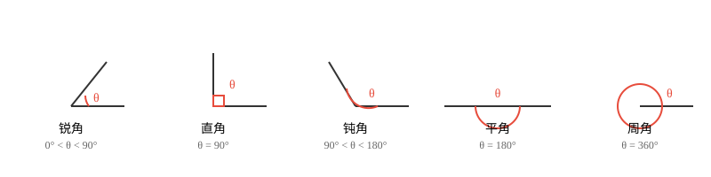

**特殊角关系**：

- **余角**：两个角之和为 $90^\circ$，则互为余角。
- **补角**：两个角之和为 $180^\circ$，则互为补角。
- **对顶角**：两条直线相交，相对的两个角相等。

> **直观理解（现实类比）**：
> - **余角**像拼图的两块——拼起来正好凑成一个直角($90^\circ$)。$30^\circ$ 和 $60^\circ$ 是常见的一对余角，就像钟面上 1 点整时分针与时针的夹角。
> - **补角**像敞开的书本——两页摊平合成一个平角($180^\circ$)。相邻的两块地砖拼起来就是一对补角。
> - **对顶角**像两根交叉的筷子——你夹起筷子交叉时，对面两个夹角永远一样大。剪刀张开时两侧的角也是对顶角。

### 3. 三角形 (Triangle)

三角形是由三条线段首尾相连围成的封闭图形，记作 $\triangle ABC$。

**按角分类**：

- **锐角三角形**：三个内角均为锐角
- **直角三角形**：有一个内角为 $90^\circ$
- **钝角三角形**：有一个内角为钝角

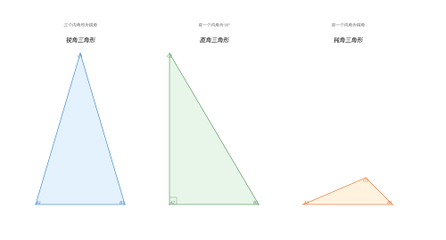

**按边分类**：

- **不等边三角形**：三边各不相等
- **等腰三角形**：有两边相等（腰），底边所对的角为顶角
- **等边三角形**：三边相等，三个内角均为 $60^\circ$

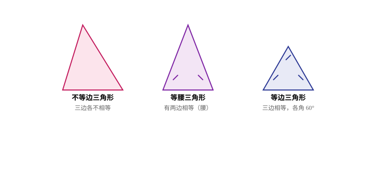

**三角形的重要线段**：

- **中线**：连接顶点和对边中点的线段。三条中线交于**重心**。
- **高线**：从顶点向对边（或延长线）作垂线。三条高线交于**垂心**。
- **角平分线**：平分内角的射线。三条角平分线交于**内心**。
- **中垂线**：垂直平分线段的直线。三条中垂线交于**外心**。

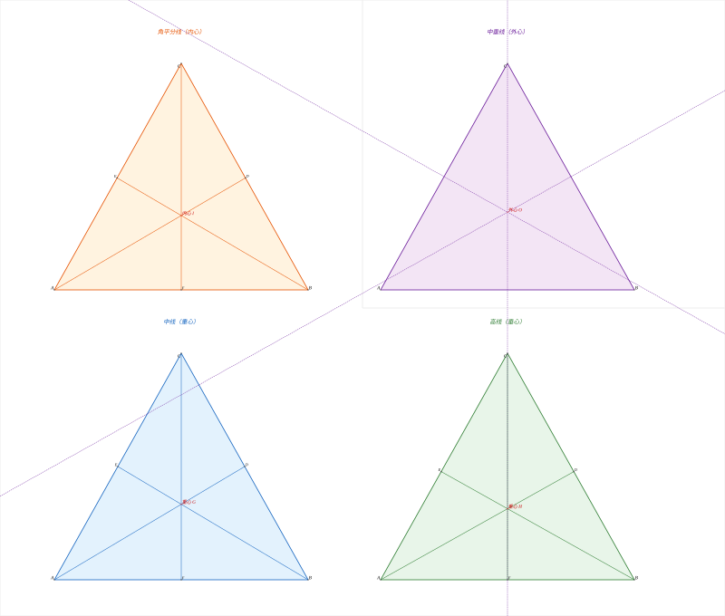

> **直观理解（现实类比）**：三角形的四条重要线段都指向一个"心"，这些心在现实中各有用处：
> - **重心**（中线交点）：是三角形的"平衡点"。用一根针顶住重心，三角形能水平平衡——就像杂技演员用杆子顶住盘子的中心。重心把每条中线分成 $2:1$ 的两段，靠顶点的部分更长。
> - **垂心**（高线交点）：是三个顶点向对边"垂直下落"的汇合点。锐角三角形的垂心在内部，直角三角形的垂心恰好在直角顶点，钝角三角形的垂心跑到外面——这像三个人分别从三个山顶向对面山脚垂直放绳子，绳子的交汇点会随山形变化位置。
> - **内心**（角平分线交点）：到三边距离相等，是三角形内切圆的圆心。就像在三角形地块里修一个圆形花坛，内心是能让花坛同时"贴住"三边的唯一位置。
> - **外心**（中垂线交点）：到三个顶点距离相等，是三角形外接圆的圆心。就像在三个村庄之间建一个水塔，外心是到三个村庄距离相等的位置。

### 4. 四边形 (Quadrilateral)

四边形是由四条线段首尾相连围成的封闭图形。

**常见四边形**：

| 类型       | 定义                       | 性质                               |
| :--------- | :------------------------- | :--------------------------------- |
| 平行四边形 | 两组对边分别平行           | 对边相等、对角相等、对角线互相平分 |
| 矩形       | 有一个角是直角的平行四边形 | 对角线相等，四个角均为$90^\circ$ |
| 菱形       | 一组邻边相等的平行四边形   | 对角线互相垂直平分，各边相等       |
| 正方形     | 既是矩形又是菱形           | 所有边相等，所有角为$90^\circ$   |
| 梯形       | 只有一组对边平行           | 平行边称为上底和下底               |

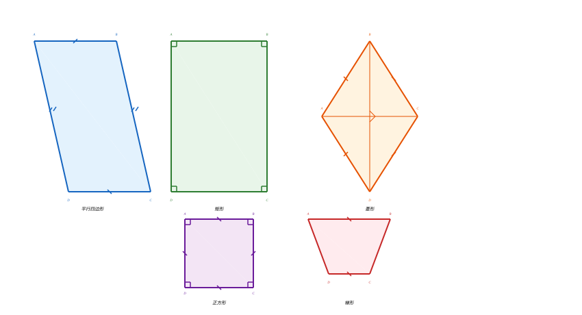

> **直观理解（现实类比）**：四边形家族是一个层层嵌套的"特权圈"：
> - **平行四边形**是最基础的特殊四边形——对边平行且相等，像一张被斜着推变形的长方形相框。它的对角线互相平分（在中心点交叉）。
> - **矩形**是"所有角都被掰正成 $90^\circ$"的平行四边形——像标准的窗户框、书本封面。对角线相等是它的额外特权。
> - **菱形**是"四条边都一样长"的平行四边形——像钻石的一面，对角线互相垂直且平分对角。
> - **正方形**是矩形和菱形的"完美结合体"——所有边等长、所有角为直角、对角线既相等又垂直，是四边形中对称性最高的一种，像棋盘格。
> - **梯形**只有一组对边平行——像常用的梯子，上下两条平行边是"底"。
>
> 这就像一个家族树：正方形 ⊂ 矩形 ⊂ 平行四边形 ⊂ 四边形；正方形 ⊂ 菱形 ⊂ 平行四边形 ⊂ 四边形。

### 5. 圆 (Circle)

圆是平面上到定点（圆心）距离等于定长（半径）的所有点的集合。

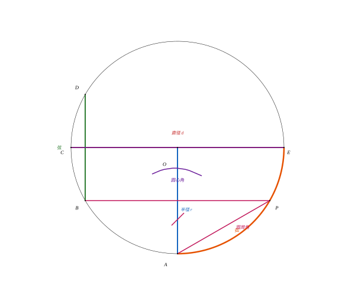

**圆的要素**：

- **圆心 $O$**：确定圆的位置
- **半径 $r$**：圆心到圆上任意一点的距离
- **直径 $d = 2r$**：过圆心且两端在圆上的线段
- **弦**：连接圆上任意两点的线段
- **弧**：圆上任意两点间的部分
- **圆心角**：顶点在圆心的角
- **圆周角**：顶点在圆上、两边与圆相交的角

> **直观理解（现实类比）**：圆的定义"到定点距离等于定长的所有点的集合"看似抽象，其实它描述的就是**圆规画圆的原理**——把圆规的针固定在圆心，铅笔尖到针尖的距离就是半径，铅笔尖旋转一周画出的轨迹就是圆。车轮、硬币、披萨、钟表表面，所有这些圆形物体都满足"边缘每一点到中心的距离相同"。这个性质让圆成为唯一一个"无论从哪个方向看都对称"的图形，也是轮子能平稳滚动的原因——车轴到地面的距离始终等于半径。

### 6. 全等与相似

- **全等 (Congruence)**：两个图形形状和大小完全相同，可以完全重合。记作 $\cong$。
- **相似 (Similarity)**：两个图形形状相同但大小可能不同，对应边成比例、对应角相等。记作 $\sim$。

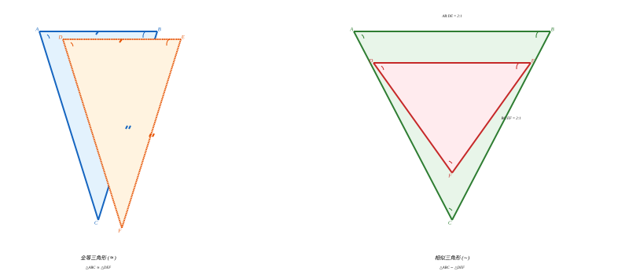

> **直观理解（现实类比）**：
> - **全等**像"双胞胎"——两个图形完全一模一样，叠在一起能严丝合缝地重合。复印一份文件得到的就是与原件全等的副本；同一模具生产出的零件彼此全等。
> - **相似**像"同款不同尺寸"——形状一样，大小可以不同。一张照片放大或缩小后与原图相似；同一品牌不同尺寸的电视机屏幕彼此相似；地图与实际地形也是相似关系（比例尺就是相似比）。
>
> 关键区别：全等要求所有对应边、对应角都相等；相似只要求对应角相等且对应边成比例。全等是相似比 $k=1$ 的特殊情况。

---

## 基本性质

### 1. 线段与角的基本性质

- 两点之间，线段最短。
- 过一点有且只有一条直线与已知直线垂直。
- 垂线段最短：从直线外一点到直线上各点的所有线段中，垂线段最短。

### 2. 三角形的基本性质

- **三角形三边关系**：任意两边之和大于第三边，任意两边之差小于第三边。
- **三角形外角定理**：三角形的外角等于与它不相邻的两个内角之和。
- 三角形具有**稳定性**——三边确定后，形状唯一确定。

> **直观理解（现实类比）**：
> - **三边关系**就是"两地之间走直线最短"——从 A 走到 B，再从 B 走到 C，总路程一定比直接从 A 到 C 远，所以 $AB+BC>AC$。这就是为什么GPS导航总是给你推荐直线段路线。
> - **三角形稳定性**是工程学的福音——三根木棍钉成三角形框架后，无论怎么用力推拉都不会变形；而四边形框架一推就垮。这就是为什么桥梁桁架、屋顶钢架、起重机吊臂全都布满三角形结构。自行车车架、高压电塔也都是三角形的天下。

### 3. 多边形内角和

$n$ 边形的内角和为：

$$
S = (n - 2) \times 180^\circ
$$

> **直观理解（现实类比）**：想象你站在 $n$ 边形的一个顶点，向所有"不相邻"的顶点连线（画对角线），这会把 $n$ 边形切成 $(n-2)$ 个三角形。每个三角形内角和是 $180^\circ$，所以总和是 $(n-2)\times180^\circ$。这像切披萨——从一块披萨的一个顶点下刀，切到所有非相邻顶点，得到的全是三角形切片。

### 4. 圆的对称性

圆是轴对称图形（任何直径所在直线都是对称轴），也是中心对称图形（圆心是对称中心）。

> **直观理解（现实类比）**：圆是"对称之王"——它有**无穷多条对称轴**（每条直径都是），而三角形最多 3 条、矩形只有 2 条。把圆沿任何一条直径对折，两半都能完全重合，就像把披萨沿过中心的任意一刀切开，两半总是一模一样。把圆绕圆心旋转任意角度（哪怕是 $1^\circ$ 或 $0.001^\circ$），它都和原来重合——这就是为什么车轮、齿轮、钟表都做成圆形：旋转任何角度都不影响功能。

---

## 定理与证明

### 定理 1：三角形内角和定理

> **定理**：三角形的三个内角之和等于 $180^\circ$。

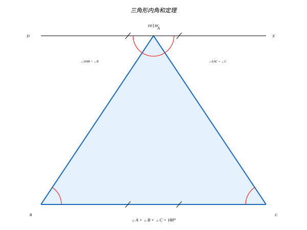

**证明**：

设 $\triangle ABC$，过点 $A$ 作直线 $DE \parallel BC$。

$$
\begin{array}{c}
\text{ } \\
\because DE \parallel BC \\
\therefore \angle DAB = \angle B \quad (\text{两直线平行，内错角相等}) \\
\angle EAC = \angle C \quad (\text{两直线平行，内错角相等}) \\
\because \angle DAB + \angle BAC + \angle EAC = 180^\circ \quad (\text{平角为 } 180^\circ) \\
\therefore \angle B + \angle BAC + \angle C = 180^\circ
\end{array}
$$

即 $\angle A + \angle B + \angle C = 180^\circ$。

> **直观理解（现实类比）**：把三角形的三个角"剪下来"拼在一起，它们总能拼成一个完美的半圆（平角 $180^\circ$）。你可以拿一张纸剪个三角形，撕下三个角，然后把三个顶点对齐拼在一起——无论是锐角、直角还是钝角三角形，结果都一样。这就像三块形状各异的拼图碎片，碰巧总能拼成同一条直线。

#### 🎬 动画演示：三角形内角和等于 180°

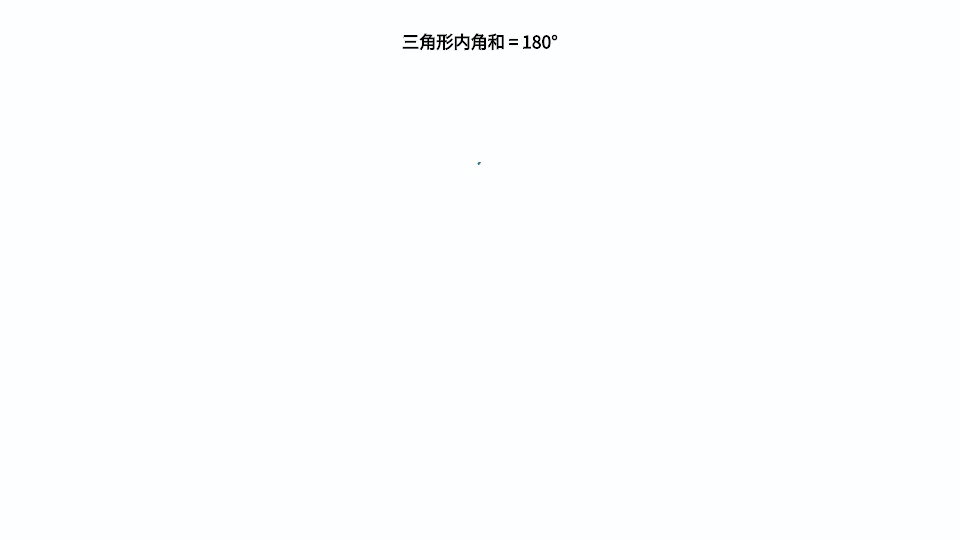

> 这个动画直观展示了任意三角形的三个内角拼在一起正好构成一个平角，即内角和恒等于 $180^\circ$。它通过动画的方式帮助理解本节核心概念。

**示例**：在 $\triangle ABC$ 中，若 $\angle A = 50^\circ$，$\angle B = 65^\circ$，求 $\angle C$。

解：$\angle C = 180^\circ - 50^\circ - 65^\circ = 65^\circ$，故该三角形为等腰三角形。

---

### 定理 2：勾股定理

> **定理**：在直角三角形中，两条直角边的平方和等于斜边的平方。
>
> $$
> a^2 + b^2 = c^2
> $$
>
> 其中 $a, b$ 为直角边，$c$ 为斜边。

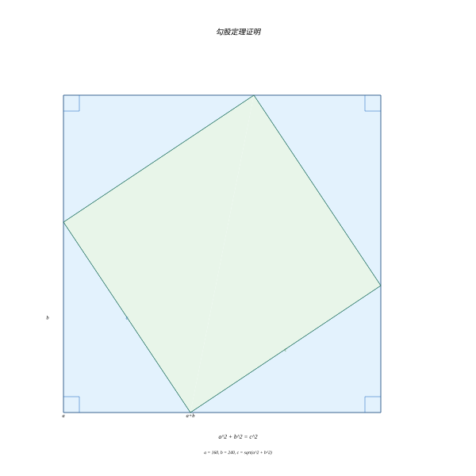

**几何证明（面积法）**：

构造一个边长为 $a + b$ 的大正方形，将其分割为两种方式：

**方式一**：四个全等的直角三角形（直角边 $a, b$，斜边 $c$）围成一个边长为 $c$ 的小正方形。

大正方形面积 = $4 \times \frac{1}{2}ab + c^2 = 2ab + c^2$

**方式二**：四个全等的直角三角形拼成两个矩形。

大正方形面积 = $(a+b)^2 = a^2 + 2ab + b^2$

两种方式计算的是同一个大正方形的面积，因此：

$$
a^2 + 2ab + b^2 = 2ab + c^2
$$

化简得：

$$
a^2 + b^2 = c^2
$$

> **直观理解（现实类比）**：想象把直角三角形的三条边分别向外**铺三块正方形地板**。勾股定理说的是：**两块直角边正方形能拼出的面积，恰好等于斜边那块正方形的面积**。比如 $a=3, b=4$，两块正方形面积是 $9+16=25$，正好等于斜边 $5$ 的正方形面积 $25$。
>
> 更深一层：$a^2, b^2, c^2$ 可以不是"正方形面积"，而是"以三条边为边的**任意相似图形**的面积"——比如三个半圆、三座相似的小山。只要相似，它们的面积之比都是 $a^2:b^2:c^2$，所以**勾股定理其实是"直角意味着 $a^2+b^2=c^2$ 这个恒定的比例关系"**。这解释了为什么它能推广成"余弦定理"（非直角时右边要减去 $2ab\cos C$）。

#### 🎬 动画演示：勾股定理 a²+b²=c²

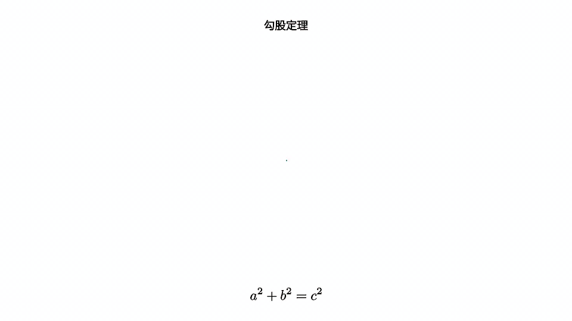

> 这个动画直观展示了直角三角形三边上的三个正方形面积关系：两直角边正方形面积之和恰好等于斜边正方形面积，即 $a^2+b^2=c^2$。它通过动画的方式帮助理解本节核心概念。

**示例**：已知直角三角形的两条直角边分别为 $3$ 和 $4$，求斜边长度。

解：$c = \sqrt{3^2 + 4^2} = \sqrt{9 + 16} = \sqrt{25} = 5$

**勾股定理的逆定理**：若三角形的三边 $a, b, c$ 满足 $a^2 + b^2 = c^2$，则该三角形是直角三角形（$c$ 为斜边）。

---

### 定理 3：平行线性质与判定定理

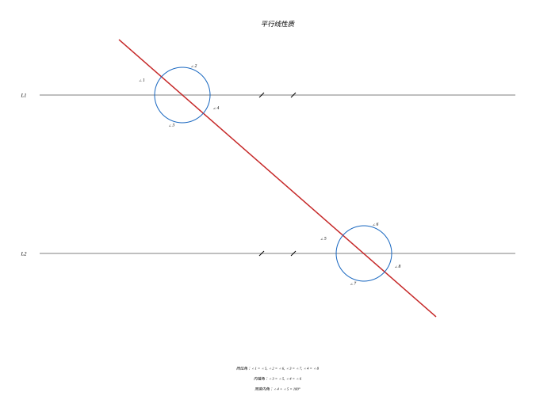

#### 平行线性质定理

当两条平行线被第三条直线（截线）所截时：

1. **同位角相等**：$\angle 1 = \angle 2$
2. **内错角相等**：$\angle 2 = \angle 3$
3. **同旁内角互补**：$\angle 2 + \angle 4 = 180^\circ$

#### 平行线判定定理

如果两条直线被第三条直线所截：

1. **同位角相等** $\Rightarrow$ 两直线平行
2. **内错角相等** $\Rightarrow$ 两直线平行
3. **同旁内角互补** $\Rightarrow$ 两直线平行

**额外的判定方法**：

- 平行于同一条直线的两条直线互相平行
- 垂直于同一条直线的两条直线互相平行

> **直观理解（现实类比）**：把两条平行直线想象成**铁轨的两根钢轨**，第三条直线（截线）是横跨铁轨的枕木。
> - **同位角**是枕木与两根钢轨在同一侧形成的角——像两个朝同一方向的"F"角，它们必然相等。
> - **内错角**是枕木与两根钢轨在铁轨内侧形成的一对"Z"形角，像字母 Z 的两个内角。
> - **同旁内角**是枕木与两根钢轨在铁轨内侧同一旁的两个角，它们加起来正好铺满半个平面（$180^\circ$）。
>
> 反过来也成立：看到同位角相等，就知道两根钢轨一定平行——不会交汇。这就是铁轨永远保持等距的几何原因。

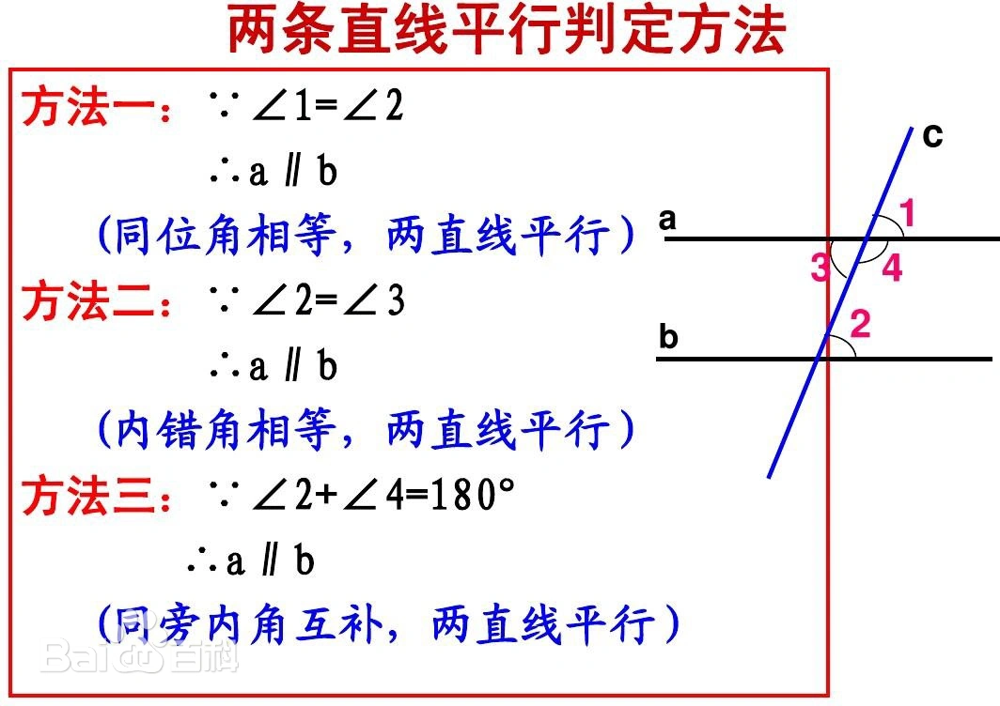

**示例**：如图，$AB \parallel CD$，$\angle 1 = 120^\circ$，求 $\angle 2$ 和 $\angle 3$。

解：

- $\angle 2 = \angle 1 = 120^\circ$（两直线平行，同位角相等）
- $\angle 3 = 180^\circ - \angle 1 = 60^\circ$（两直线平行，同旁内角互补）

---

### 定理 4：三角形全等判定定理

全等三角形：对应边相等、对应角相等的两个三角形。

#### 五种判定方法

|     判定     | 条件                                     | 说明       |
| :-----------: | :--------------------------------------- | :--------- |
| **SSS** | 三边对应相等                             | 边边边     |
| **SAS** | 两边及其夹角对应相等                     | 边角边     |
| **ASA** | 两角及其夹边对应相等                     | 角边角     |
| **AAS** | 两角及其中一角的对边对应相等             | 角角边     |
| **HL** | 斜边和一条直角边对应相等（仅直角三角形） | 斜边直角边 |

**注**：**SSA**（两边及其中一边的对角对应相等）不能判定全等，因为可能有两种不同的三角形。

> **直观理解（现实类比）**：判定三角形全等就像"验证两个人是否是同一个人"——需要足够的特征：
> - **SSS**（三边相等）：身高、腰围、臂长都一样——基本能确定是同一人。
> - **SAS**（两边夹角）：两条腿的长度和它们之间的角度（站姿的开合度）一样——姿势确定，人也确定。
> - **ASA**（两角夹边）：两个朝向的角度和中间夹的一段距离确定——像 GPS 三角定位，两点方向加距离锁定目标。
> - **HL**（斜边直角边）：直角三角形专属——斜边和一条直角边对应，另一条直角边由勾股定理唯一确定。
>
> 为什么 **SSA** 不行？想象一根固定长度的斜杆，一端固定在墙上某点，另一端连一根绳子（另一边）。绳子和墙的夹角（对角）给定后，绳子末端可能落在墙上的两个不同位置——这就是"歧义情况"，所以 SSA 不能保证唯一。

#### 全等三角形的性质

- 对应边相等
- 对应角相等
- 对应中线、高线、角平分线相等
- 面积相等

**示例**：已知 $AB = DE$，$AC = DF$，$\angle A = \angle D$，求证 $\triangle ABC \cong \triangle DEF$。

证明：

$$
\begin{array}{c}
\because AB = DE,\; AC = DF,\; \angle A = \angle D \\
\therefore \triangle ABC \cong \triangle DEF \quad (\text{SAS})
\end{array}
$$

---

### 定理 5：三角形相似判定定理

相似三角形：对应角相等、对应边成比例的两个三角形。

#### 三种判定方法

|     判定     | 条件                     | 说明                           |
| :-----------: | :----------------------- | :----------------------------- |
| **AA** | 两个角对应相等           | 角角（两角相等即第三角也相等） |
| **SAS** | 两边对应成比例且夹角相等 | 边角边                         |
| **SSS** | 三边对应成比例           | 边边边                         |

#### 相似三角形的性质

- 对应角相等
- 对应边成比例（比例系数 $k$ 称为相似比）
- 对应中线、高线、角平分线的比等于相似比
- 周长比等于相似比
- 面积比等于相似比的平方 $k^2$

> **直观理解（现实类比）**：相似三角形就像**同一张底片洗出不同尺寸的照片**——形状一模一样，只是放大或缩小了 $k$ 倍。
> - 所有"长度"（边、中线、高、周长）都按 $k$ 倍缩放，因为长度是一维的。
> - 但"面积"按 $k^2$ 倍缩放——因为面积是二维的，长宽各缩放 $k$ 倍，面积就缩放 $k \times k = k^2$ 倍。
> - 这解释了为什么**地图比例尺**是长度比，而**实际土地面积**要用比例尺的平方：$1:1000$ 的地图上 $1\text{cm}^2$ 对应实际 $1000^2 = 1000000\text{cm}^2 = 100\text{m}^2$。
> - 体积是三维的，所以相似三维物体的体积比是 $k^3$。

**示例**：在 $\triangle ABC$ 中，$DE \parallel BC$ 交 $AB$ 于 $D$，交 $AC$ 于 $E$。若 $AD = 2$，$DB = 3$，$AE = 3$，求 $EC$。

解：

$$
\because DE \parallel BC \quad \therefore \triangle ADE \sim \triangle ABC \quad (\text{AA})
$$

$$
\therefore \frac{AD}{AB} = \frac{AE}{AC} \quad \Rightarrow \quad \frac{2}{2+3} = \frac{3}{3+EC}
$$

$$
\frac{2}{5} = \frac{3}{3+EC} \quad \Rightarrow \quad 2(3+EC) = 15 \quad \Rightarrow \quad EC = 4.5
$$

---

### 定理 6：圆周角定理

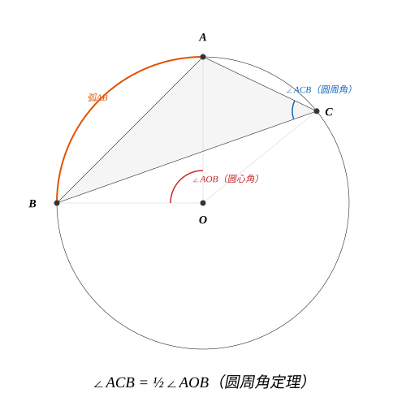

> **定理**：同弧所对的圆周角等于圆心角的一半。

**证明**：

设 $O$ 为圆心，$A, B, C$ 在圆上，$\angle AOB$ 为圆心角，$\angle ACB$ 为圆周角，它们所对的弧同为 $\widehat{AB}$。

**情况一**：圆心在圆周角的一条边上。

连接 $OC$，则 $OA = OC = r$（半径）。

$$
\because OA = OC \quad \therefore \angle OAC = \angle OCA
$$

又 $\angle AOB = \angle OAC + \angle OCA = 2\angle OCA$

$$
\therefore \angle ACB = \frac{1}{2}\angle AOB
$$

**情况二**：圆心在圆周角内部，**情况三**：圆心在圆周角外部，均可通过作辅助线转化为情况一证明。

**推论**：

- 同弧或等弧所对的圆周角相等
- 半圆（直径）所对的圆周角是直角

> **直观理解（现实类比）**：想象圆心是舞台中央的乐队，圆周上的点是观众。同一段弧（舞台的同一侧）所对的圆周角，相当于不同位置观众看乐队的"视角"。
> - 圆心角是"上帝视角"——乐队正上方俯瞰，看到的范围最大。
> - 圆周角是"观众视角"——站在圆周上看，视角只有圆心角的一半。
> - **关键神奇之处**：无论观众站在圆周的哪个位置（只要在同一段弧上），他们看乐队的视角都相同！这就是"同弧所对圆周角相等"。这像剧场设计——半圆形观众席上每个座位看舞台的视角都一样，这是古希腊剧场设计的几何原理。

---

### 定理 7：泰勒斯定理 (Thales' Theorem)

> **定理**：直径所对的圆周角是直角。

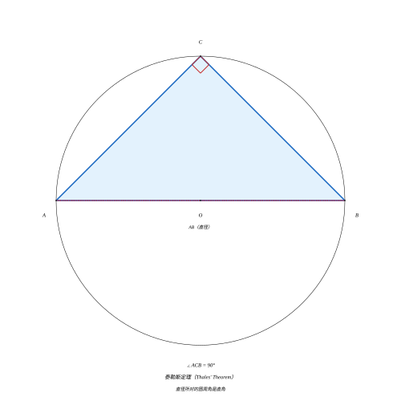

**证明**：

设 $AB$ 是圆 $O$ 的直径，$C$ 是圆上不同于 $A, B$ 的任意一点。求证 $\angle ACB = 90^\circ$。

连接 $OC$。因为 $OA = OB = OC = r$，所以：

$$
\angle OAC = \angle OCA,\quad \angle OBC = \angle OCB
$$

在 $\triangle ABC$ 中：

$$
\angle OAC + \angle OCA + \angle OBC + \angle OCB = 180^\circ
$$

$$
2\angle OCA + 2\angle OCB = 180^\circ
$$

$$
\angle OCA + \angle OCB = 90^\circ
$$

即 $\angle ACB = 90^\circ$。

**几何意义**：以 $AB$ 为直径作圆，圆上任意一点 $C$ 与 $A, B$ 构成的三角形均为直角三角形。

> **直观理解（现实类比）**：泰勒斯定理有一个优美的现实应用——它是**直角尺的几何原理**。古代木匠想要画一个精确的直角，只需在一条线段（直径）上滑动一个点，让这个点始终与两端连成的角是直角即可。这像在半圆形的铁路弯道上，火车头的方向始终与弯道两端连线垂直。也是**三角形外接圆**的关键性质：直角三角形的斜边就是外接圆的直径，外心恰好在斜边中点。

---

## 垂径定理

> **定理**：垂直于弦的直径平分这条弦，并且平分弦所对的两条弧。

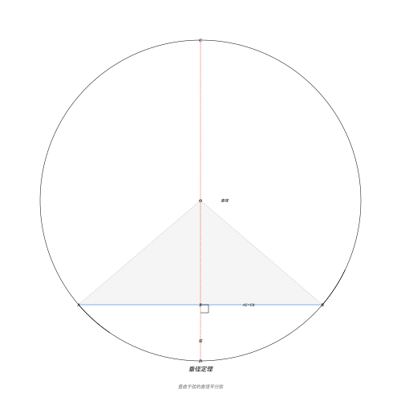

**证明**：

设 $AB$ 是圆 $O$ 的一条弦，$CD$ 是直径，$CD \perp AB$ 于 $E$。连接 $OA, OB$。

$$
\because OA = OB = r \quad \therefore \triangle OAB \text{ 是等腰三角形}
$$

又 $OE \perp AB$（三线合一），$\therefore AE = EB$。

且 $\angle AOD = \angle BOD$，$\angle AOC = \angle BOC$（等腰三角形底边上的高也是顶角的角平分线）。

因此 $\widehat{AD} = \widehat{BD}$，$\widehat{AC} = \widehat{BC}$。

> **直观理解（现实类比）**：垂径定理的现实模型是**对称折叠**——把圆沿直径 $CD$ 对折，弦 $AB$ 被对称地折成两半重合（因为 $CD \perp AB$），所以 $AE = EB$，对应的弧也对称相等。这就像把一个圆形披萨沿过中心且垂直于某条切口的线对折，切口被一分为二且两段相等。它是"圆的轴对称性"的直接推论，也是计算弓形高度、弦长与半径关系的核心工具。

---

## 示例

### 示例 1：三角形内角和的应用

在 $\triangle ABC$ 中，$\angle A = 2\angle B$，$\angle C = 3\angle B$，求各角度数。

解：设 $\angle B = x$，则 $\angle A = 2x$，$\angle C = 3x$。

由三角形内角和定理：

$$
2x + x + 3x = 180^\circ \quad \Rightarrow \quad 6x = 180^\circ \quad \Rightarrow \quad x = 30^\circ
$$

因此 $\angle A = 60^\circ$，$\angle B = 30^\circ$，$\angle C = 90^\circ$，该三角形为直角三角形。

---

### 示例 2：勾股定理的应用

一架梯子长 $10$ 米，斜靠在一面墙上，梯子底部距墙脚 $6$ 米。问梯子顶端距地面多高？

解：设梯子顶端距地面 $h$ 米。梯子、地面和墙壁构成直角三角形。

由勾股定理：

$$
h^2 + 6^2 = 10^2
$$

$$
h^2 = 100 - 36 = 64
$$

$$
h = 8 \text{ 米}
$$

---

### 示例 3：全等三角形的证明

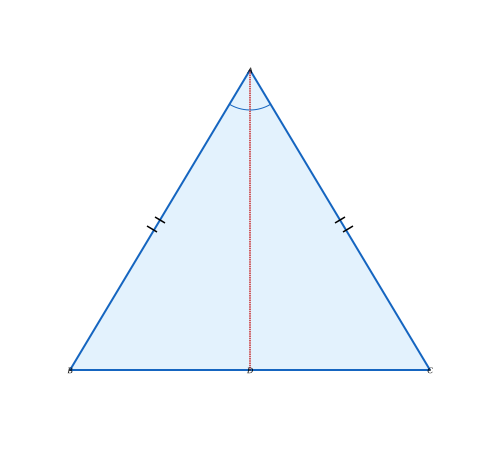

如图，$AB = AC$，$AD$ 是 $\angle BAC$ 的平分线。求证 $\triangle ABD \cong \triangle ACD$。

证明：

$$
\begin{array}{c}
\because AB = AC \quad (\text{已知}) \\
\angle BAD = \angle CAD \quad (\text{角平分线定义}) \\
AD = AD \quad (\text{公共边}) \\
\therefore \triangle ABD \cong \triangle ACD \quad (\text{SAS})
\end{array}
$$

---

### 示例 4：圆周角定理的应用

在圆 $O$ 中，$\widehat{AB}$ 所对的圆心角 $\angle AOB = 80^\circ$，求 $\widehat{AB}$ 所对的圆周角 $\angle ACB$ 的大小。

解：由圆周角定理：

$$
\angle ACB = \frac{1}{2}\angle AOB = \frac{1}{2} \times 80^\circ = 40^\circ
$$

---

### 示例 5：相似三角形的应用

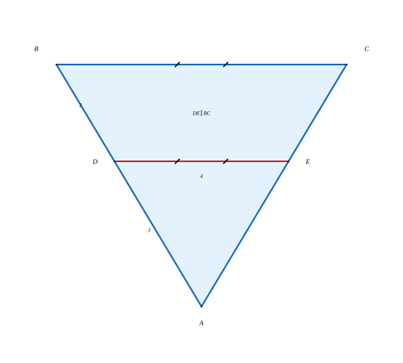

如图，在 $\triangle ABC$ 中，$DE \parallel BC$，$AD = 3$，$DB = 2$，$DE = 4$，求 $BC$ 的长度。

解：

$$
\because DE \parallel BC \quad \therefore \triangle ADE \sim \triangle ABC \quad (\text{AA})
$$

$$
\frac{DE}{BC} = \frac{AD}{AB} = \frac{AD}{AD + DB}
$$

$$
\frac{4}{BC} = \frac{3}{3 + 2} = \frac{3}{5}
$$

$$
BC = 4 \times \frac{5}{3} = \frac{20}{3}
$$

---

## 习题

### 基础题

**1.** 在 $\triangle ABC$ 中，$\angle A = 70^\circ$，$\angle B = 50^\circ$，求 $\angle C$ 的度数，并判断该三角形的类型。

**2.** 直角三角形的两条直角边分别为 $5$ 和 $12$，求斜边的长度。

**3.** 

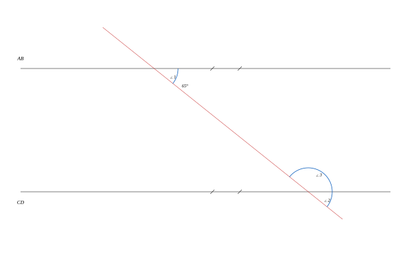

如图，$AB \parallel CD$，$\angle 1 = 65^\circ$，求 $\angle 2$ 和 $\angle 3$ 的度数。（$\angle 2$ 为 $\angle 1$ 的同位角，$\angle 3$ 为与 $\angle 1$ 同旁内角的角）

**4.** 判断以下各组条件能否判定 $\triangle ABC \cong \triangle DEF$：

- (a) $AB = DE$，$BC = EF$，$AC = DF$
- (b) $AB = DE$，$BC = EF$，$\angle A = \angle D$
- (c) $\angle A = \angle D$，$\angle B = \angle E$，$AB = DE$

### 中等题

**5.** 在 $\triangle ABC$ 中，$AB = AC$，$\angle A = 40^\circ$，$BD$ 是 $\angle B$ 的平分线交 $AC$ 于 $D$。求 $\angle BDC$ 的度数。

**6.** 圆 $O$ 的半径为 $5$，弦 $AB$ 的长为 $8$，求圆心 $O$ 到弦 $AB$ 的距离。

**7.** 

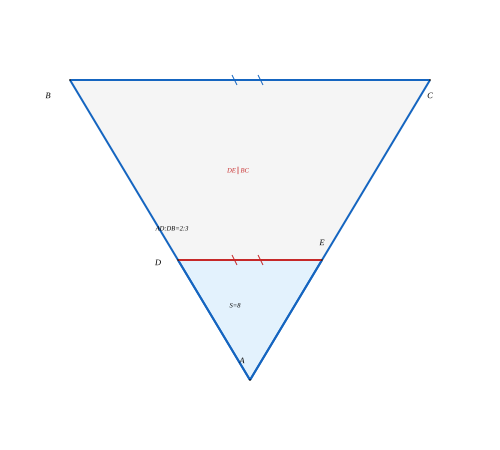

如图，$\triangle ABC$ 中，$DE \parallel BC$，$AD:DB = 2:3$，$\triangle ADE$ 的面积为 $8$，求 $\triangle ABC$ 的面积。

**8.** 已知 $\triangle ABC$ 的三边分别为 $6$、$8$、$10$，判断该三角形是否为直角三角形，并求其面积。

### 挑战题

**9.** 在 $\triangle ABC$ 中，$AD$ 是 $BC$ 边上的高，$AB = 13$，$BC = 14$，$AC = 15$。求 $AD$ 的长度。

**提示**：设 $BD = x$，则 $DC = 14 - x$，利用勾股定理列方程。

**10.** 

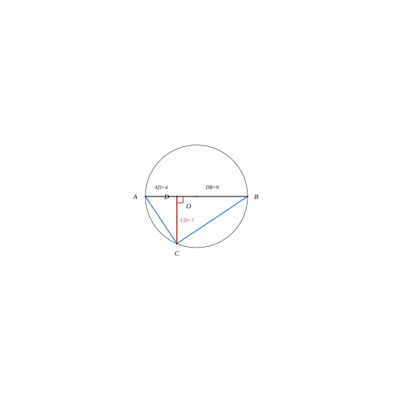

如图，$AB$ 是圆 $O$ 的直径，$C$ 是圆上一点，$CD \perp AB$ 于 $D$。若 $AD = 4$，$DB = 9$，求 $CD$ 的长度。

**提示**：连接 $AC$ 和 $BC$，利用泰勒斯定理和射影定理（或相似三角形）。

---

## 总结

### 关键定理回顾

| 定理             | 公式 / 表述                                    |      用途      |
| :--------------- | :--------------------------------------------- | :-------------: |
| 三角形内角和定理 | $\angle A + \angle B + \angle C = 180^\circ$ |     求角度     |
| 勾股定理         | $a^2 + b^2 = c^2$（直角三角形）              |     求边长     |
| 平行线性质       | 同位角相等、内错角相等、同旁内角互补           |    角度计算    |
| 全等判定         | SSS、SAS、ASA、AAS、HL                         | 证明线段/角相等 |
| 相似判定         | AA、SAS、SSS                                   |    比例计算    |
| 圆周角定理       | 圆周角$= \frac{1}{2}$ 圆心角                 |  圆中角度计算  |
| 泰勒斯定理       | 直径所对圆周角为$90^\circ$                   | 构造直角三角形 |

### 核心思想

1. **几何证明**：从已知条件出发，运用定理和公理，通过逻辑推理得出结论。这是平面几何的灵魂。
2. **辅助线**：在证明中合理添加辅助线（如平行线、垂线、连接圆心等）是解题的关键技巧。
3. **数形结合**：将几何图形与代数计算相结合（如勾股定理、相似比），是解决几何问题的有力工具。

### 进阶方向

掌握平面几何之后，可以继续学习：

- **第 4 级：立体几何** — 将平面几何的知识推广到三维空间
- **第 5 级：三角函数** — 用代数方法研究角度关系
- **第 6 级：平面解析几何** — 用坐标系和代数方程研究几何图形

---

> **学习建议**：平面几何是培养逻辑思维和空间想象能力的最佳途径。建议在学习过程中多动手画图，多尝试独立完成证明，不要只看不练。每道习题至少尝试 $15$ 分钟后再查看解答。
