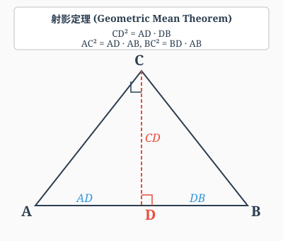

# 第 3 级：平面几何 (Plane Geometry)

> 从点、线、面出发，构建对平面图形性质与关系的系统理解，掌握几何证明的基本方法。

---

## 学习目标

1. 理解平面几何的基本概念：点、线、角、三角形、四边形、圆
2. 掌握三角形内角和定理、勾股定理及其证明
3. 掌握平行线的性质与判定方法
4. 掌握三角形全等与相似的判定定理及其应用
5. 掌握圆的基本性质，包括圆周角定理和泰勒斯定理
6. 能够运用所学定理进行简单的几何证明与计算

---

## 开始之前

**本章在讲什么**：平面几何研究的是"画在纸上的图形"——点、线、角、三角形、四边形、圆，以及它们之间的位置关系和数量关系。你会学会用逻辑推理证明图形的性质（比如"三角形内角和为什么是180度"），而不是只靠测量或直觉。

**为什么要学它**：第 2 级的代数让你学会了用字母表示数、解方程，但那些都是"数"的世界。本章第一次让你进入"形"的世界——从具体的图形中抽象出定理，再用定理去推导新的结论。这是后续所有几何内容的基础：第 4 级立体几何把这里的结论推广到三维空间，第 6 级解析几何用坐标系和代数方程重新研究这些图形。

**开始前请确认你还记得**：
- 整数与有理数（见第 1 级）：整数包括正整数、0、负整数；有理数是可以写成两个整数之比的数。
- 线段与角（见第 1 级）：线段有长度可以度量，角用度数表示大小，直角是90度，平角是180度。
- 代数式与方程（见第 2 级）：用字母表示数，能解一元一次方程和一元二次方程。
- 全等的直观概念（见第 1 级）：两个图形"完全一样"叫全等，本章会给它严格的数学定义和判定方法。

---

## 核心概念

### 1. 点、线、面

- **点 (Point)**：几何中最基本的元素，没有大小，只有位置。通常用大写字母 $A, B, C$ 表示。
- **直线 (Line)**：向两端无限延伸的线，没有粗细。过两点有且仅有一条直线。
- **线段 (Segment)**：直线上两点间的有限部分，可以度量长度。
- **射线 (Ray)**：直线上一点及其一侧的部分，向一个方向无限延伸。
- **平面 (Plane)**：无限延伸的二维平面，没有厚度。

> **直观理解（现实类比）**：
> - **点**就像夜空中的一颗星——你只关心它的位置，不关心它有多大。GPS定位、地图上的标记点都是"点"。
> - **直线**像一条拉到无限远的细丝——只有方向，没有尽头。激光束、地平线是它的现实近似。
> - **线段**是一段有头有尾的绳子——可以拿尺子量出长度。两根电线杆之间的电线就是线段。
> - **射线**像手电筒发出的光——从一个点出发，朝一个方向无限延伸。
> - **平面**像一块无限大、完全平整的玻璃板——没有厚度，向四面八方无限延展。平静的湖面是它的现实近似。

> **🧠 思考历程：为什么数学要"先规定点、线、面"？**
>
> 你第一次看到"点没有大小、只有位置"这样绕口的话，多半会不耐烦。但它背后是一个影响整个西方思想史的抉择。
>
> - **一个"什么都不定义"的起点**。古希腊的欧几里得（Euclid，约公元前 300 年）在《几何原本》里，先把"点、线、面、直角、圆"这些字眼**当作不可再分的前提**摆出来——他知道：如果把每个词都去解释，会陷入永无穷尽的"解释之解释"。**于是他做了个惊人决定：选几个最基本的东西先"认了"，不去解释它们。**
> - **"公设"与"公理"的分工**。他进一步把所有结论分成两类：先承认的（公设，如"过两点可作一条直线"）和逻辑推理得来的（定理）。这样一来，几何学第一次拥有了"**从明确前提一步步推出全部大厦**"的严格结构——这与现代数学、现代科学"先假设后推理"的风格一脉相承。
> - **这件小事后来"放了卫星"**。最有意思的是：他对平行线的第五条公设（简称"平行公设"）说得虽简单，后人却几百年都想证明它是"铁律"，最终在 19 世纪发现**换掉它同样能自洽**——由此诞生了非欧几何（罗巴切夫斯基、黎曼）。**一个看似无聊的基本设定，后来竟打开了全新的数学宇宙。**
> - **心路**：给你讲"点线面"，不是要你背定义，而是想让你看到欧几里得那套"**先无条件信任最小基础，再靠逻辑盖大厦**"的思维方式。它是"严格"与"想象"的分界——**数学家敢在天花板上盖楼，前提是先把地基的几条假设想得足够清楚。**

### 2. 角 (Angle)

角是由两条有公共端点的射线组成的图形。公共端点称为**顶点**，两条射线称为**边**。

**角的分类**：

| 类型 |               范围               |          描述          |
| :--: | :-------------------------------: | :--------------------: |
| 锐角 |  $0^\circ < \theta < 90^\circ$  |      小于直角的角      |
| 直角 |       $\theta = 90^\circ$       |      等于直角的角      |
| 钝角 | $90^\circ < \theta < 180^\circ$ | 大于直角且小于平角的角 |
| 平角 |      $\theta = 180^\circ$      |    构成一条直线的角    |
| 周角 |      $\theta = 360^\circ$      |    旋转一周所得的角    |

**特殊角关系**：

- **余角**：两个角之和为 $90^\circ$，则互为余角。
- **补角**：两个角之和为 $180^\circ$，则互为补角。
- **对顶角**：两条直线相交，相对的两个角相等。

> **直观理解（现实类比）**：
> - **余角**像拼图的两块——拼起来正好凑成一个直角($90^\circ$)。$30^\circ$ 和 $60^\circ$ 是常见的一对余角，就像钟面上 1 点整时分针与时针的夹角。
> - **补角**像敞开的书本——两页摊平合成一个平角($180^\circ$)。相邻的两块地砖拼起来就是一对补角。
> - **对顶角**像两根交叉的筷子——你夹起筷子交叉时，对面两个夹角永远一样大。剪刀张开时两侧的角也是对顶角。

### 3. 三角形 (Triangle)

| 符号 | 名称 | 含义 | 直观解释 |
|:---:|:---:|:---|:---|
| $\triangle$ | 三角形符号 | 表示一个三角形 | "三角形"的简写 |
| $ABC$ | 顶点标记 | 三角形的三个顶点 | 三个角的"名字" |

三角形是由三条线段首尾相连围成的封闭图形，记作 $\triangle ABC$。

**按角分类**：

- **锐角三角形**：三个内角均为锐角
- **直角三角形**：有一个内角为 $90^\circ$
- **钝角三角形**：有一个内角为钝角

**按边分类**：

- **不等边三角形**：三边各不相等
- **等腰三角形**：有两边相等（腰），底边所对的角为顶角
- **等边三角形**：三边相等，三个内角均为 $60^\circ$

**三角形的重要线段**：

- **中线**：连接顶点和对边中点的线段。三条中线交于**重心**。
- **高线**：从顶点向对边（或延长线）作垂线。三条高线交于**垂心**。
- **角平分线**：平分内角的射线。三条角平分线交于**内心**。
- **中垂线**：垂直平分线段的直线。三条中垂线交于**外心**。

> **直观理解（现实类比）**：三角形的四条重要线段都指向一个"心"，这些心在现实中各有用处：
> - **重心**（中线交点）：是三角形的"平衡点"。用一根针顶住重心，三角形能水平平衡——就像杂技演员用杆子顶住盘子的中心。重心把每条中线分成 $2:1$ 的两段，靠顶点的部分更长。
> - **垂心**（高线交点）：是三个顶点向对边"垂直下落"的汇合点。锐角三角形的垂心在内部，直角三角形的垂心恰好在直角顶点，钝角三角形的垂心跑到外面——这像三个人分别从三个山顶向对面山脚垂直放绳子，绳子的交汇点会随山形变化位置。
> - **内心**（角平分线交点）：到三边距离相等，是三角形内切圆的圆心。就像在三角形地块里修一个圆形花坛，内心是能让花坛同时"贴住"三边的唯一位置。
> - **外心**（中垂线交点）：到三个顶点距离相等，是三角形外接圆的圆心。就像在三个村庄之间建一个水塔，外心是到三个村庄距离相等的位置。

### 4. 四边形 (Quadrilateral)

四边形是由四条线段首尾相连围成的封闭图形。

**常见四边形**：

| 类型       | 定义                       | 性质                               |
| :--------- | :------------------------- | :--------------------------------- |
| 平行四边形 | 两组对边分别平行           | 对边相等、对角相等、对角线互相平分 |
| 矩形       | 有一个角是直角的平行四边形 | 对角线相等，四个角均为$90^\circ$ |
| 菱形       | 一组邻边相等的平行四边形   | 对角线互相垂直平分，各边相等       |
| 正方形     | 既是矩形又是菱形           | 所有边相等，所有角为$90^\circ$   |
| 梯形       | 只有一组对边平行           | 平行边称为上底和下底               |

> **直观理解（现实类比）**：四边形家族是一个层层嵌套的"特权圈"：
> - **平行四边形**是最基础的特殊四边形——对边平行且相等，像一张被斜着推变形的长方形相框。它的对角线互相平分（在中心点交叉）。
> - **矩形**是"所有角都被掰正成 $90^\circ$"的平行四边形——像标准的窗户框、书本封面。对角线相等是它的额外特权。
> - **菱形**是"四条边都一样长"的平行四边形——像钻石的一面，对角线互相垂直且平分对角。
> - **正方形**是矩形和菱形的"完美结合体"——所有边等长、所有角为直角、对角线既相等又垂直，是四边形中对称性最高的一种，像棋盘格。
> - **梯形**只有一组对边平行——像常用的梯子，上下两条平行边是"底"。
>
> 这就像一个家族树：正方形 ⊂ 矩形 ⊂ 平行四边形 ⊂ 四边形；正方形 ⊂ 菱形 ⊂ 平行四边形 ⊂ 四边形。

### 5. 圆 (Circle)

圆是平面上到定点（圆心）距离等于定长（半径）的所有点的集合。

**圆的要素**：

- **圆心 $O$**：确定圆的位置
- **半径 $r$**：圆心到圆上任意一点的距离
- **直径 $d = 2r$**：过圆心且两端在圆上的线段
- **弦**：连接圆上任意两点的线段
- **弧**：圆上任意两点间的部分
- **圆心角**：顶点在圆心的角
- **圆周角**：顶点在圆上、两边与圆相交的角

> **直观理解（现实类比）**：圆的定义"到定点距离等于定长的所有点的集合"看似抽象，其实它描述的就是**圆规画圆的原理**——把圆规的针固定在圆心，铅笔尖到针尖的距离就是半径，铅笔尖旋转一周画出的轨迹就是圆。车轮、硬币、披萨、钟表表面，所有这些圆形物体都满足"边缘每一点到中心的距离相同"。这个性质让圆成为唯一一个"无论从哪个方向看都对称"的图形，也是轮子能平稳滚动的原因——车轴到地面的距离始终等于半径。

> **🧠 思考历程：圆周率 $\pi$ 是怎么被"追"出来的？**
>
> 圆的周长 $C$ 与直径 $d$ 之比总是一个固定常数 $\pi$，这个"固定"本身平平无奇，但人类为了把它算精确，花了两千多年。
>
> - **最早只需要"大约"**。古巴比伦人取 $\pi\approx 3$，埃及人用 $3\frac{1}{8}$，都够盖房子、算粮仓用了。那时候大家关心的不是"准"而是"够用"。
> - **阿基米德的"夹逼"（Archimedes，约公元前 250 年）**。真正让方法升级的是阿基米德：他把圆塞进正多边形的"夹层"里——内接一个多边形求"至少多少"，外切一个多边形求"最多多少"，让两者越来越挤向圆，从而**把 $\pi$ 夹在一薄一厚两层之间**。这是极限思想的萌芽，他借它得到 $\pi \in \left(\frac{223}{71}, \frac{22}{7}\right)$。
> - **祖冲之的"一步到位"（公元 5 世纪）**。中国数学家祖冲之沿用多边形法，把边数算到两万四千多边，得到领先世界近千年的身价：$\pi$ 在 $3.1415926$ 与 $3.1415927$ 之间，并给出约率 $\frac{22}{7}$ 与密率 $\frac{355}{113}$。**他靠的是惊人的耐心与细心，把每一条边都一丝不苟地算下去。**
> - **心路**：$\pi$ 的故事告诉我们：**一个数学常数是由无数次的"逼近"累积出来的，而不是一次顿悟**。今天你写"$\pi=3.14$"，背后是好几代人在几乎没有任何计算工具的条件下，用"画多边形、逐边算"这种笨办法，硬生生把精度一级一级顶上去的。真正优雅的，常常不是那个数，而是**人们为了摸到它而逼出来的耐心与巧思**。

### 6. 全等与相似

| 符号 | 名称 | 含义 | 直观解释 |
|:---:|:---:|:---|:---|
| $\cong$ | 全等号 | 两个图形形状大小完全相同 | "一模一样" |
| $\sim$ | 相似号 | 两个图形形状相同大小可不同 | "放大缩小版" |
| $\triangle ABC \cong \triangle DEF$ | 全等记法 | 三角形ABC与DEF全等 | 顶点按顺序对应 |
| $\triangle ABC \sim \triangle DEF$ | 相似记法 | 三角形ABC与DEF相似 | 对应角相等、边成比例 |

- **全等 (Congruence)**：两个图形形状和大小完全相同，可以完全重合。记作 $\cong$。
- **相似 (Similarity)**：两个图形形状相同但大小可能不同，对应边成比例、对应角相等。记作 $\sim$。

> **直观理解（现实类比）**：
> - **全等**像"双胞胎"——两个图形完全一模一样，叠在一起能严丝合缝地重合。复印一份文件得到的就是与原件全等的副本；同一模具生产出的零件彼此全等。
> - **相似**像"同款不同尺寸"——形状一样，大小可以不同。一张照片放大或缩小后与原图相似；同一品牌不同尺寸的电视机屏幕彼此相似；地图与实际地形也是相似关系（比例尺就是相似比）。
>
> 关键区别：全等要求所有对应边、对应角都相等；相似只要求对应角相等且对应边成比例。全等是相似比 $k=1$ 的特殊情况。

---

## 基本性质

### 1. 线段与角的基本性质

- 两点之间，线段最短。
- 过一点有且只有一条直线与已知直线垂直。
- 垂线段最短：从直线外一点到直线上各点的所有线段中，垂线段最短。

### 2. 三角形的基本性质

- **三角形三边关系**：任意两边之和大于第三边，任意两边之差小于第三边。
- **三角形外角定理**：三角形的外角等于与它不相邻的两个内角之和。
- 三角形具有**稳定性**——三边确定后，形状唯一确定。

> **直观理解（现实类比）**：
> - **三边关系**就是"两地之间走直线最短"——从 A 走到 B，再从 B 走到 C，总路程一定比直接从 A 到 C 远，所以 $AB+BC>AC$。这就是为什么GPS导航总是给你推荐直线段路线。
> - **三角形稳定性**是工程学的福音——三根木棍钉成三角形框架后，无论怎么用力推拉都不会变形；而四边形框架一推就垮。这就是为什么桥梁桁架、屋顶钢架、起重机吊臂全都布满三角形结构。自行车车架、高压电塔也都是三角形的天下。

### 3. 多边形内角和

$n$ 边形的内角和为：

$$
S = (n - 2) \times 180^\circ
$$

> **直观理解（现实类比）**：想象你站在 $n$ 边形的一个顶点，向所有"不相邻"的顶点连线（画对角线），这会把 $n$ 边形切成 $(n-2)$ 个三角形。每个三角形内角和是 $180^\circ$，所以总和是 $(n-2)\times180^\circ$。这像切披萨——从一块披萨的一个顶点下刀，切到所有非相邻顶点，得到的全是三角形切片。

### 4. 圆的对称性

圆是轴对称图形（任何直径所在直线都是对称轴），也是中心对称图形（圆心是对称中心）。

> **直观理解（现实类比）**：圆是"对称之王"——它有**无穷多条对称轴**（每条直径都是），而三角形最多 3 条、矩形只有 2 条。把圆沿任何一条直径对折，两半都能完全重合，就像把披萨沿过中心的任意一刀切开，两半总是一模一样。把圆绕圆心旋转任意角度（哪怕是 $1^\circ$ 或 $0.001^\circ$），它都和原来重合——这就是为什么车轮、齿轮、钟表都做成圆形：旋转任何角度都不影响功能。

---

## 定理与证明

### 定理 1：三角形内角和定理

> **定理**：三角形的三个内角之和等于 $180^\circ$。

**证明**：

设 $\triangle ABC$，过点 $A$ 作直线 $DE \parallel BC$。

$$
\begin{array}{c}
\text{ } \\
\because DE \parallel BC \\
\therefore \angle DAB = \angle B \quad (\text{两直线平行，内错角相等}) \\
\angle EAC = \angle C \quad (\text{两直线平行，内错角相等}) \\
\because \angle DAB + \angle BAC + \angle EAC = 180^\circ \quad (\text{平角为 } 180^\circ) \\
\therefore \angle B + \angle BAC + \angle C = 180^\circ
\end{array}
$$

- 第 1 步：作辅助线 $DE \parallel BC$，目的是构造一组内错角，把三角形的三个角"搬"到同一条直线上。
- 第 2 步（第 1 个等号）：由"两直线平行，内错角相等"，把 $\angle B$ 替换为 $\angle DAB$，目的是把角从三角形内部转移到直线上。
- 第 3 步（第 2 个等号）：同理，把 $\angle C$ 替换为 $\angle EAC$，目的是让三个角都落在直线 $DE$ 上。
- 第 4 步（第 3 个等号）：利用"平角为 $180^\circ$"，把三个角加起来，目的是把几何关系转化为数量关系。
- 第 5 步（结论）：把替换后的角代回，得到三角形内角和公式，目的是完成从辅助线到原三角形的逻辑闭环。

即 $\angle A + \angle B + \angle C = 180^\circ$。

> **直观理解（现实类比）**：把三角形的三个角"剪下来"拼在一起，它们总能拼成一个完美的半圆（平角 $180^\circ$）。你可以拿一张纸剪个三角形，撕下三个角，然后把三个顶点对齐拼在一起——无论是锐角、直角还是钝角三角形，结果都一样。这就像三块形状各异的拼图碎片，碰巧总能拼成同一条直线。

> **🧠 思考历程：$180^\circ$ 背后藏着"尺规做平行的执念"**
>
> "三角形内角和是 $180^\circ$"人人会说，但它其实是建立在一条古老却又悬而未决的公设之上的。
>
> - **最早的"丈地直觉"**。古埃及、巴比伦人测量田地时早就知道，把一个三角形的三个角拼起来，总能拼成半圈——这个"碰巧"在土里被反复确认。但那时它只是"经验"，没人追问"为什么一定如此"。
> - **给出证明，却留下一个"尾巴"**。欧几里得在《几何原本》里给出了证明：过顶点作对边的一条平行线，利用"内错角相等"，把三个角搬到同一条直线上——这正是本节证明用辅助线的由来。但关键在于，他的证明悄悄用到了**第五公设（平行公设）**：即"过直线外一点恰有一条平行线"。
> - **为什么这是个"震撼"**。因为平行公设不像其他公设那样"一眼为真"，后人花了两千多年试图证明它，都失败了。直到 19 世纪，人们终于想通：**如果把"那一条"换成"无数条"或"一条都没有"，照样能建出一套自洽的几何**——这就是非欧几何（罗巴切夫斯基、黎曼）。而"内角和是否是 $180^\circ$"也因此成了"你身处哪种几何"的检测器：在球面上，三角形的内角和会**大于** $180^\circ$！
> - **心路**：三角形内角和是最平凡也最容易被忽略的一条定理，但它的证明"赖"在平行公设上，而平行公设又牵引出整个非欧几何。它提醒你：**一个看似理所当然的常数，往往因为某个基础假设而成立；换一个假设，答案可能完全变样。** 你剪角拼纸得到的 $180^\circ$，其实是一个更宏大故事的注脚。

#### 🎬 动画演示：三角形内角和等于 180°

> 这个动画直观展示了任意三角形的三个内角拼在一起正好构成一个平角，即内角和恒等于 $180^\circ$。它通过动画的方式帮助理解本节核心概念。

**示例**：在 $\triangle ABC$ 中，若 $\angle A = 50^\circ$，$\angle B = 65^\circ$，求 $\angle C$。

解：$\angle C = 180^\circ - 50^\circ - 65^\circ = 65^\circ$，故该三角形为等腰三角形。

---

### 定理 2：勾股定理

> **定理**：在直角三角形中，两条直角边的平方和等于斜边的平方。
>
> $$
> a^2 + b^2 = c^2
> $$
>
> 其中 $a, b$ 为直角边，$c$ 为斜边。

**几何证明（面积法）**：

构造一个边长为 $a + b$ 的大正方形，将其分割为两种方式：

**方式一**：四个全等的直角三角形（直角边 $a, b$，斜边 $c$）围成一个边长为 $c$ 的小正方形。

大正方形面积 = $4 \times \frac{1}{2}ab + c^2 = 2ab + c^2$

**方式二**：四个全等的直角三角形拼成两个矩形。

大正方形面积 = $(a+b)^2 = a^2 + 2ab + b^2$

两种方式计算的是同一个大正方形的面积，因此：

$$
a^2 + 2ab + b^2 = 2ab + c^2
$$

- 第 1 步：列出两个面积表达式，目的是用不同的分割方式表示同一个大正方形的面积。
- 第 2 步（等号）：令两种算法相等，目的是建立关于 $a, b, c$ 的方程。

化简得：

$$
a^2 + b^2 = c^2
$$

- 第 3 步：两边同时减去 $2ab$，目的是消去交叉项，得到勾股定理的标准形式。

> **直观理解（现实类比）**：想象把直角三角形的三条边分别向外**铺三块正方形地板**。勾股定理说的是：**两块直角边正方形能拼出的面积，恰好等于斜边那块正方形的面积**。比如 $a=3, b=4$，两块正方形面积是 $9+16=25$，正好等于斜边 $5$ 的正方形面积 $25$。
>
> 更深一层：$a^2, b^2, c^2$ 可以不是"正方形面积"，而是"以三条边为边的**任意相似图形**的面积"——比如三个半圆、三座相似的小山。只要相似，它们的面积之比都是 $a^2:b^2:c^2$，所以**勾股定理其实是"直角意味着 $a^2+b^2=c^2$ 这个恒定的比例关系"**。这解释了为什么它能推广成"余弦定理"（非直角时右边要减去 $2ab\cos C$）。

> **🧠 思考历程：勾股定理，一门全世界都"各自发现一遍"的定理**
>
> 这大概是数学史上被不同文明重复发现次数最多的一条定理，而它最初的"发现"多半是被地面的泥潭逼出来的。
>
> - **"绳子上的直角"**。古埃及人和巴比伦人盖金字塔、量地时，早发现用一个边长比 $3:4:5$ 的绳圈拉紧，就能得到一个直角。**他们并不在乎"为什么"，只要"好用"**——这个实用背景，是勾股定理最早的、谈不上证明的胚胎。
> - **毕达哥拉斯派的"信仰危机"**（公元前 6 世纪，古希腊）。传说毕达哥拉斯（Pythagoras）学派发现 $a^2+b^2=c^2$ 后，还撞上一个更麻烦的东西：等腰直角三角形的斜边 $c=\sqrt2$ 竟然"写不成两个整数之比"。这在坚信"万物皆数（有理数）"的学派里如同晴天霹雳，据说因此有人被扔进海里。**一个看似美好的定理，反而动摇了他们整个宇宙观**——这个"无理数危机"正是数学第一次被迫承认"有些数无法用分数表达"的见证。
> - **中国叫"勾股"（约公元前 1 世纪《周髀算经》）**。中国这边，早就用"勾三股四弦五"描述直角三角形的关系，后来赵爽（三国）还画出了著名的"弦图"来证明——中间的图，正是本章讲的"面积法"的雏形。**名字不同，道理相通：各文明在测量、建筑中反复"撞见"同一条规律。**
> - **心路**：勾股定理之所以在多个文明独立涌现，是因为它**太"落地"了**——只要有直角、有长度，就会冒出来。而它最深刻的遗产反而不是"关系式"本身，而是那场"确认 $\sqrt2$ 是无理数"的思想震动：**它第一次证明了有些真理必须靠逻辑，而不是靠量尺和目测。** 你今天背的 $a^2+b^2=c^2$，是一项被无数双手反复发现、又被逻辑重新锻造过的古老智慧。

#### 🎬 动画演示：勾股定理 a²+b²=c²

> 这个动画直观展示了直角三角形三边上的三个正方形面积关系：两直角边正方形面积之和恰好等于斜边正方形面积，即 $a^2+b^2=c^2$。它通过动画的方式帮助理解本节核心概念。

**示例**：已知直角三角形的两条直角边分别为 $3$ 和 $4$，求斜边长度。

解：$c = \sqrt{3^2 + 4^2} = \sqrt{9 + 16} = \sqrt{25} = 5$

**勾股定理的逆定理**：若三角形的三边 $a, b, c$ 满足 $a^2 + b^2 = c^2$，则该三角形是直角三角形（$c$ 为斜边）。

---

### 定理 3：平行线性质与判定定理

| 符号 | 名称 | 含义 | 直观解释 |
|:---:|:---:|:---|:---|
| $\parallel$ | 平行符号 | 两条直线不相交 | "永远不碰面" |
| $\perp$ | 垂直符号 | 两条直线成90度角 | "十字交叉" |
| $\Rightarrow$ | 推出符号 | 由左边可得右边 | "因为…所以…" |

#### 平行线性质定理

当两条平行线被第三条直线（截线）所截时：

1. **同位角相等**：$\angle 1 = \angle 2$
2. **内错角相等**：$\angle 2 = \angle 3$
3. **同旁内角互补**：$\angle 2 + \angle 4 = 180^\circ$

#### 平行线判定定理

如果两条直线被第三条直线所截：

1. **同位角相等** $\Rightarrow$ 两直线平行
2. **内错角相等** $\Rightarrow$ 两直线平行
3. **同旁内角互补** $\Rightarrow$ 两直线平行

**额外的判定方法**：

- 平行于同一条直线的两条直线互相平行
- 垂直于同一条直线的两条直线互相平行

> **直观理解（现实类比）**：把两条平行直线想象成**铁轨的两根钢轨**，第三条直线（截线）是横跨铁轨的枕木。
> - **同位角**是枕木与两根钢轨在同一侧形成的角——像两个朝同一方向的"F"角，它们必然相等。
> - **内错角**是枕木与两根钢轨在铁轨内侧形成的一对"Z"形角，像字母 Z 的两个内角。
> - **同旁内角**是枕木与两根钢轨在铁轨内侧同一旁的两个角，它们加起来正好铺满半个平面（$180^\circ$）。
>
> 反过来也成立：看到同位角相等，就知道两根钢轨一定平行——不会交汇。这就是铁轨永远保持等距的几何原因。

**示例**：如图，$AB \parallel CD$，$\angle 1 = 120^\circ$，求 $\angle 2$ 和 $\angle 3$。

解：

- $\angle 2 = \angle 1 = 120^\circ$（两直线平行，同位角相等）
- $\angle 3 = 180^\circ - \angle 1 = 60^\circ$（两直线平行，同旁内角互补）

---

### 定理 4：三角形全等判定定理

全等三角形：对应边相等、对应角相等的两个三角形。

#### 五种判定方法

|     判定     | 条件                                     | 说明       |
| :-----------: | :--------------------------------------- | :--------- |
| **SSS** | 三边对应相等                             | 边边边     |
| **SAS** | 两边及其夹角对应相等                     | 边角边     |
| **ASA** | 两角及其夹边对应相等                     | 角边角     |
| **AAS** | 两角及其中一角的对边对应相等             | 角角边     |
| **HL** | 斜边和一条直角边对应相等（仅直角三角形） | 斜边直角边 |

**注**：**SSA**（两边及其中一边的对角对应相等）不能判定全等，因为可能有两种不同的三角形。

> **直观理解（现实类比）**：判定三角形全等就像"验证两个人是否是同一个人"——需要足够的特征：
> - **SSS**（三边相等）：身高、腰围、臂长都一样——基本能确定是同一人。
> - **SAS**（两边夹角）：两条腿的长度和它们之间的角度（站姿的开合度）一样——姿势确定，人也确定。
> - **ASA**（两角夹边）：两个朝向的角度和中间夹的一段距离确定——像 GPS 三角定位，两点方向加距离锁定目标。
> - **HL**（斜边直角边）：直角三角形专属——斜边和一条直角边对应，另一条直角边由勾股定理唯一确定。
>
> 为什么 **SSA** 不行？想象一根固定长度的斜杆，一端固定在墙上某点，另一端连一根绳子（另一边）。绳子和墙的夹角（对角）给定后，绳子末端可能落在墙上的两个不同位置——这就是"歧义情况"，所以 SSA 不能保证唯一。

#### 全等三角形的性质

- 对应边相等
- 对应角相等
- 对应中线、高线、角平分线相等
- 面积相等

**示例**：已知 $AB = DE$，$AC = DF$，$\angle A = \angle D$，求证 $\triangle ABC \cong \triangle DEF$。

证明：

$$
\begin{array}{c}
\because AB = DE,\; AC = DF,\; \angle A = \angle D \\
\therefore \triangle ABC \cong \triangle DEF \quad (\text{SAS})
\end{array}
$$

---

### 定理 5：三角形相似判定定理

相似三角形：对应角相等、对应边成比例的两个三角形。

#### 三种判定方法

|     判定     | 条件                     | 说明                           |
| :-----------: | :----------------------- | :----------------------------- |
| **AA** | 两个角对应相等           | 角角（两角相等即第三角也相等） |
| **SAS** | 两边对应成比例且夹角相等 | 边角边                         |
| **SSS** | 三边对应成比例           | 边边边                         |

#### 相似三角形的性质

- 对应角相等
- 对应边成比例（比例系数 $k$ 称为相似比）
- 对应中线、高线、角平分线的比等于相似比
- 周长比等于相似比
- 面积比等于相似比的平方 $k^2$

> **直观理解（现实类比）**：相似三角形就像**同一张底片洗出不同尺寸的照片**——形状一模一样，只是放大或缩小了 $k$ 倍。
> - 所有"长度"（边、中线、高、周长）都按 $k$ 倍缩放，因为长度是一维的。
> - 但"面积"按 $k^2$ 倍缩放——因为面积是二维的，长宽各缩放 $k$ 倍，面积就缩放 $k \times k = k^2$ 倍。
> - 这解释了为什么**地图比例尺**是长度比，而**实际土地面积**要用比例尺的平方：$1:1000$ 的地图上 $1\text{cm}^2$ 对应实际 $1000^2 = 1000000\text{cm}^2 = 100\text{m}^2$。
> - 体积是三维的，所以相似三维物体的体积比是 $k^3$。

**示例**：在 $\triangle ABC$ 中，$DE \parallel BC$ 交 $AB$ 于 $D$，交 $AC$ 于 $E$。若 $AD = 2$，$DB = 3$，$AE = 3$，求 $EC$。

解：

$$
\because DE \parallel BC \quad \therefore \triangle ADE \sim \triangle ABC \quad (\text{AA})
$$

$$
\therefore \frac{AD}{AB} = \frac{AE}{AC} \quad \Rightarrow \quad \frac{2}{2+3} = \frac{3}{3+EC}
$$

$$
\frac{2}{5} = \frac{3}{3+EC} \quad \Rightarrow \quad 2(3+EC) = 15 \quad \Rightarrow \quad EC = 4.5
$$

---

### 定理 6：圆周角定理

> **定理**：同弧所对的圆周角等于圆心角的一半。

**证明**：

设 $O$ 为圆心，$A, B, C$ 在圆上，$\angle AOB$ 为圆心角，$\angle ACB$ 为圆周角，它们所对的弧同为 $\widehat{AB}$。

**情况一**：圆心在圆周角的一条边上。

连接 $OC$，则 $OA = OC = r$（半径）。

$$
\because OA = OC \quad \therefore \angle OAC = \angle OCA
$$

- 第 1 步：连接 $OC$ 构造等腰三角形 $OAC$，目的是利用"等边对等角"的性质。

又 $\angle AOB = \angle OAC + \angle OCA = 2\angle OCA$

- 第 2 步：利用"三角形外角等于不相邻两内角之和"，把圆心角 $\angle AOB$ 表示为 $2\angle OCA$，目的是建立圆心角与圆周角的关系。

$$
\therefore \angle ACB = \frac{1}{2}\angle AOB
$$

- 第 3 步：注意到 $\angle ACB = \angle OCA$（因为 $C$ 在 $OA$ 上），代入得圆周角是圆心角的一半，目的是完成证明。

**情况二**：圆心在圆周角内部，**情况三**：圆心在圆周角外部，均可通过作辅助线转化为情况一证明。

**推论**：

- 同弧或等弧所对的圆周角相等
- 半圆（直径）所对的圆周角是直角

> **直观理解（现实类比）**：想象圆心是舞台中央的乐队，圆周上的点是观众。同一段弧（舞台的同一侧）所对的圆周角，相当于不同位置观众看乐队的"视角"。
> - 圆心角是"上帝视角"——乐队正上方俯瞰，看到的范围最大。
> - 圆周角是"观众视角"——站在圆周上看，视角只有圆心角的一半。
> - **关键神奇之处**：无论观众站在圆周的哪个位置（只要在同一段弧上），他们看乐队的视角都相同！这就是"同弧所对圆周角相等"。这像剧场设计——半圆形观众席上每个座位看舞台的视角都一样，这是古希腊剧场设计的几何原理。

> **🧠 思考历程：一个由"量测"催生的视角定理**
>
> 圆周角定理初看很漂亮、很纯粹，可它最早的动机，很可能是测量天空和大地时的"实战经验"。
>
> - **"目光所及的角"与航海、天文**。古人观测天体、在海上辨认方位时，反复遇到"同一段弧、从不同角度看过去，角度居然一样"。这种"视觉上的稳定不变"对导航至关重要——它让人们在长途航行中能够依靠星象复现同样的航向。古人或许没总结出定理的文字，却早已在用这条"规律"。
> - **从"利用它"到"证明它"**。古希腊几何学家（常归功于欧几里得及其学派在《几何原本》中的整理）把这个经验固化成定理："在同弧上，圆周角处处相等，且等于圆心角的一半。"关键的一步，是**把"怎么会一样"翻译成"半径相等 → 等腰三角 → 外角关系"的纯逻辑链条**——也就是本节证明里那套连半径、找等腰的步骤。
> - **它与泰勒斯定理的"血亲"**。本节的泰勒斯定理（直径所对圆周角是直角），正是把圆周角定理"同弧角相等"推到极限的结果：当弧拉平成直径时，视角恰好是平角的一半，也就是直角。**一条定理的极端情形，往往就"蹦"出另一条定理。**
> - **心路**：圆周角定理提醒我们：**很多几何"铁律"其实是从肉眼观察、实战测量里"爬"进数学的**。它的高贵之处不在于"信息量大"，而在于：一旦你用逻辑证明"视角处处相等"，就再也不用担心"某个观众的位置恰好特殊"。从依赖眼睛，到依赖推理——这正是从工匠到数学家的一步。

---

### 定理 7：泰勒斯定理 (Thales' Theorem)

> **定理**：直径所对的圆周角是直角。

**证明**：

设 $AB$ 是圆 $O$ 的直径，$C$ 是圆上不同于 $A, B$ 的任意一点。求证 $\angle ACB = 90^\circ$。

连接 $OC$。因为 $OA = OB = OC = r$，所以：

$$
\angle OAC = \angle OCA,\quad \angle OBC = \angle OCB
$$

- 第 1 步：连接 $OC$ 构造两个等腰三角形 $OAC$ 和 $OBC$，目的是利用"等边对等角"得到两组相等的角。

在 $\triangle ABC$ 中：

$$
\angle OAC + \angle OCA + \angle OBC + \angle OCB = 180^\circ
$$

- 第 2 步：利用三角形内角和定理，把三个内角用四个小角表示，目的是建立关于这些角的方程。

$$
2\angle OCA + 2\angle OCB = 180^\circ
$$

- 第 3 步：代入第 1 步的等量关系（$\angle OAC = \angle OCA$，$\angle OBC = \angle OCB$），目的是化简方程。

$$
\angle OCA + \angle OCB = 90^\circ
$$

- 第 4 步：两边除以 2，目的是得到 $\angle ACB$ 的度数。

即 $\angle ACB = 90^\circ$。

- 第 5 步：注意到 $\angle ACB = \angle OCA + \angle OCB$，代入即得结论，目的是完成证明。

**几何意义**：以 $AB$ 为直径作圆，圆上任意一点 $C$ 与 $A, B$ 构成的三角形均为直角三角形。

> **直观理解（现实类比）**：泰勒斯定理有一个优美的现实应用——它是**直角尺的几何原理**。古代木匠想要画一个精确的直角，只需在一条线段（直径）上滑动一个点，让这个点始终与两端连成的角是直角即可。这像在半圆形的铁路弯道上，火车头的方向始终与弯道两端连线垂直。也是**三角形外接圆**的关键性质：直角三角形的斜边就是外接圆的直径，外心恰好在斜边中点。

> **🧠 思考历程："让埃及人目瞪口呆"的测量巧思**
>
> 泰勒斯定理本身不复杂，但它的精神来源，是一个关于"量"与"验"的古老传奇。
>
> - **人名的由来**。传说公元前 6 世纪的米利都人泰勒斯（Thales）是古希腊第一个"预言日食、测金字塔高"的思想者。他虽然未必亲手完成我们今天的所有推理，但后人把他"善于从一条几何事实里引出惊人结论"的风格记在了这条定理名下。"直径所对圆周角是直角"因此得名泰勒斯定理。
> - **从测量反推定理**。一种广为流传的说法是：泰勒斯想量出金字塔的高度，提出"当你的影子长度等于身高时，塔的影子长度就等于塔高"。这类"利用相似与直角"的实践，让他深谙"直角藏在圆里"这一事实的实用价值。**定理的"感觉"先来自丈量，后来才被写成严格证明。**
> - **它为什么"承上启下"**。严格来说，泰勒斯定理是"圆周角定理"的极限特例（当弧变成半圆时，圆周角正好是直角）。但它带给古希腊几何另一个关键礼物——**"直角充盈在圆中"**：以后凡是遇到"已知某点在一段直径上滑动"，都可以放心断言它是直角。这为后面大量几何构造提供了便利的支点。
> - **心路**：泰勒斯定理提醒我们：**一条定理价值的大小，往往不取决于它本身多深奥，而取决于它能在多少地方被"顺手用上"**。一句"直径对直角"，背后是古人对"只要成直角，就能保证几何正确"的高度信任——这份信任，是要靠证明去守护的。

### 定理 8：射影定理（Euclid's Geometric Mean Theorem）

> **定理**：在直角三角形 $ABC$ 中，$\angle C = 90^\circ$，$CD$ 是斜边 $AB$ 上的高（$D$ 在 $AB$ 上），则：
>
> **1. 高的射影定理**：斜边上的高是两条直角边在斜边上射影的比例中项
> $$CD^2 = AD \cdot DB$$
>
> **2. 直角边的射影定理**：每条直角边是它在斜边上的射影与斜边的比例中项
> $$AC^2 = AD \cdot AB$$
> $$BC^2 = BD \cdot AB$$

**证明**：

在直角三角形 $ABC$ 中，$CD \perp AB$，则 $\triangle ACD$、$\triangle CBD$、$\triangle ABC$ 三个三角形两两相似：

$$\triangle ACD \sim \triangle ABC \sim \triangle CBD$$

**证高的射影定理**：由 $\triangle ACD \sim \triangle CBD$，对应边成比：

$$\frac{CD}{DB} = \frac{AD}{CD} \implies CD^2 = AD \cdot DB$$

**证直角边的射影定理**：由 $\triangle ACD \sim \triangle ABC$，对应边成比：

$$\frac{AC}{AB} = \frac{AD}{AC} \implies AC^2 = AD \cdot AB$$

由 $\triangle CBD \sim \triangle ABC$，对应边成比：

$$\frac{BC}{AB} = \frac{BD}{BC} \implies BC^2 = BD \cdot AB$$

**注**：三个公式也可以由勾股定理直接推出。例如 $CD^2 = AC^2 - AD^2 = (AD \cdot AB) - AD^2 = AD(AB - AD) = AD \cdot DB$。

> **直观理解（现实类比）**：射影定理描述的是"直角三角形被高切开后，三块相似三角形之间的比例关系"。可以把它想象成**照片放大缩小**：大三角形（$\triangle ABC$）被高分成两个小三角形（$\triangle ACD$ 和 $\triangle CBD$），它们形状完全相同只是大小不同，因此对应边长成固定比例。$CD^2 = AD \cdot DB$ 意味着"高"恰好是两段"射影"的几何平均数——就像说"中间那个数"恰好是"两边两个数"的几何平均。这在测量中非常实用：只要知道斜边被高分成的两段长度，就能直接算出高。

> **🧠 思考历程：一条"藏了几千年"的比例关系**
>
> 射影定理的证明不难，但它的发现和流传，反映了古希腊几何"用比例说话"的风格。
>
> - **它其实早就在《几何原本》里**。虽然名叫"射影定理"，但它的内容本质是"直角三角形中，三块小三角形相似、对应边成比例"，这在欧几里得《几何原本》第六卷（讨论相似形面积比）里已经齐备。**古代人是靠"比例"说话的——他们不太写等式，而是把同样的话说成"某条线段是另两条线段的比例中项"。**
> - **"比例中项"是当时的"公共焦点"**。希腊人特别痴迷"用直尺圆规作一个数是另两个数的比例中项"——因为它直接通向"开平方"和后来的**黄金分割**。$CD^2 = AD\cdot DB$ 里那个$CD$，正是"$AD$ 与 $DB$ 的比例中项"，也即它们的**几何平均**。所以射影定理不只是几个等式，更是"几何平均"这个现代概念的早期化身。
> - **名称里藏着"投影"**。所谓"射影"，是说两条直角边$AC$、$BC$各在斜边上的**垂直投影**分别是$AD$、$BD$。"$\frac{AC}{AB}=\frac{AD}{AC}$" 读起来，就是"边$AC$是它自身投影与整个斜边的比例中项"。当19世纪"射影几何"崛起后，这些老式子被人用"投影"这个新词重新命名，成了熟悉的"射影定理"。
> - **心路**：射影定理提醒我们：**同一道几何事实可以有很多"面孔"——相似构成的比例、几何平均数、射影的长度**。它之所以被反复传，是因为在测量(如何用一段已知线去推算另一条线)里太好用了。你看懂那三个$CD^2$、$AC^2$、$BC^2$，等于同时握住了"相似"、"开平方"和"投影"三条线。

---

## 垂径定理

> **定理**：垂直于弦的直径平分这条弦，并且平分弦所对的两条弧。

**证明**：

设 $AB$ 是圆 $O$ 的一条弦，$CD$ 是直径，$CD \perp AB$ 于 $E$。连接 $OA, OB$。

$$
\because OA = OB = r \quad \therefore \triangle OAB \text{ 是等腰三角形}
$$

又 $OE \perp AB$（三线合一），$\therefore AE = EB$。

且 $\angle AOD = \angle BOD$，$\angle AOC = \angle BOC$（等腰三角形底边上的高也是顶角的角平分线）。

因此 $\widehat{AD} = \widehat{BD}$，$\widehat{AC} = \widehat{BC}$。

> **直观理解（现实类比）**：垂径定理的现实模型是**对称折叠**——把圆沿直径 $CD$ 对折，弦 $AB$ 被对称地折成两半重合（因为 $CD \perp AB$），所以 $AE = EB$，对应的弧也对称相等。这就像把一个圆形披萨沿过中心且垂直于某条切口的线对折，切口被一分为二且两段相等。它是"圆的轴对称性"的直接推论，也是计算弓形高度、弦长与半径关系的核心工具。

> **🧠 思考历程：一则藏在"找圆心"手艺里的定理**
>
> 垂径定理听起来像抽象结论，但它的用处，古代工匠做梦都在用。
>
> - **圆是"最对称"的图形**。圆拥有无数条对称轴——任意过圆心的直线都能把圆折成两半。垂径定理"垂直平分弦"这一点，本质就是这条对称性的量化：**一旦你沿某条直径对折，弦的两半和两条弧的两半就必然重合。**所以古人明白：想平分一条弦，让它"垂直"就够了。
> - **它的头号用途：找到圆心**。试想一个工匠捡到一块残缺的圆木桌边，想知道它的圆心在哪——只要作两条弦，各作它们的垂直平分线，交点就是圆心。为什么？因为垂径定理保证"垂直平分弦的线**过圆心**"。**把"垂直平分弦"当作圆心携带的指纹**，是以此找圆心、修补破损圆的传统手艺。
> - **圆规与直尺的"顺位"**。垂径定理也解释了为什么"弦的中点与圆心连线必垂直"这类构造总能成立：它和"等面积、等弧"这些对称语言本来就是一回事。古希腊和后来的几何作图体系里，它被当成读圆的基础。
> - **心路**：垂径定理提醒我们：**有些定理看似只是"对折一下"的废话，却是实用几何的脚手架**。你每用一次"垂直平分弦 → 得圆心"，都是在这个被对称折叠压出来的古老事实上盖楼。圆之所以好用，正因为它的对称太丰富——而人类学会"利用对称"这件事本身，就是从垂径定理这类小规则开始的。

---

## 解题技巧

本节针对平面几何中的高频题型，总结可直接套用的解题方法与易错点。每条技巧均含**适用场景**、**关键步骤**与**常见误区**，并配一个精讲示例，覆盖本章学习目标中的角度计算、勾股定理、平行线、全等、相似与圆等能力项。

### 7.1 角度计算的"设元列方程"法

**适用场景**：三角形、平行线、相交线中的角度未知量求值。

**关键步骤**：
1. 把未知角设为一个变量（如 $\angle B=x$）；
2. 用内角和定理（三角形 $=180^\circ$、$n$ 边形 $=(n-2)\cdot180^\circ$）、平角 $180^\circ$、对顶角相等、余角/补角关系表示其余角；
3. 列出关于 $x$ 的方程并求解。

**常见误区**：
- 用错内角和公式（三角形与四边形混用）；
- 未用对顶角相等，重复设了多余的未知数；
- 漏掉"外角等于不相邻两内角之和"的隐含关系。

**精讲示例**：在 $\triangle ABC$ 中，$\angle A=2\angle B$，$\angle C=3\angle B$，求各角。

设 $\angle B=x$，则 $\angle A=2x$、$\angle C=3x$。由内角和 $2x+x+3x=180^\circ$，得 $6x=180^\circ$，$x=30^\circ$。故 $\angle A=60^\circ$、$\angle B=30^\circ$、$\angle C=90^\circ$（直角三角形）。

### 7.2 直角求边：勾股定理"设"的思想

**适用场景**：直角三角形中已知两边求第三边，或已知部分边、部分关系求未知边。

**关键步骤**：
1. 确认斜边最长；对直角三角形使用 $a^2+b^2=c^2$；
2. 当某条边未知且关系复杂时，设该边为 $x$，再由已知线段关系把另一条边也用 $x$ 表示，列出方程；
3. 解方程后注意**舍去负值**（边长为正）。

**常见误区**：
- 把直角边误当斜边代入公式；
- 用勾股定理列方程解出两个值时不判断正负；
- 直接开方时漏掉平方关系（习惯先求 $c^2$）。

**精讲示例**：直角三角形两直角边为 $5$ 和 $12$，求斜边。

$$
c=\sqrt{5^2+12^2}=\sqrt{25+144}=\sqrt{169}=13
$$

### 7.3 证线段/角相等的工具选择

**适用场景**：证明两条线段相等或两个角相等。

**关键步骤**：
1. 判断是否可直接用已知（如等腰三角形"等边对等角"、三线合一）；
2. 否则找两个三角形，用**全等判定**（SSS/SAS/ASA/AAS/HL），先明确要证哪三组对应元素相等；
3. 优先找"公共边""角平分线角相等""垂直直角相等"这三种易得条件。

**常见误区**：
- 证全等时罗列的三组条件不构成有效判定（如"SSA"）——SSA**不能**唯一确定三角形；
- 直接用未知要证的结论当条件；
- 两三角形对应顶点写乱，导致对应边配错。

**精讲示例**：已知 $\triangle ABC$ 中 $AB=AC$，$AD$ 平分 $\angle BAC$，证 $BD=DC$。

在 $\triangle ABD$ 与 $\triangle ACD$ 中：$AB=AC$（已知）、$\angle BAD=\angle CAD$（角平分线）、$AD$ 公共，故 $\triangle ABD\cong\triangle ACD$（SAS），得 $BD=DC$。

### 7.4 判定相似：找准对应边

**适用场景**：平行线截三角形内两线段成比例，或已知条件判断三角形相似。

**关键步骤**：
1. 用 AA（两角对应相等）判定相似最省事，优先找平行线带来的等角（同位角、内错角）；
2. 写比例式时**顶点一一对应**：$\triangle ADE\sim\triangle ABC$ 表示 $A\leftrightarrow A,\ D\leftrightarrow B,\ E\leftrightarrow C$；
3. 利用比例式求未知边。

**常见误区**：
- 对应顶点顺序写错，导致比例错误；
- 把相邻边混为一谈（如把 $DE/BC=AD/AB$ 错写为 $DE/BC=AD/DB$）；
- 忘记面积比 $=$ 相似比的平方（详见进阶题第 9 题）。

**精讲示例**：$\triangle ABC$ 中 $DE\parallel BC$，$AD=3$，$DB=2$，$DE=4$，求 $BC$。

由 $DE\parallel BC$ 得 $\triangle ADE\sim\triangle ABC$（AA），故
$$
\frac{DE}{BC}=\frac{AD}{AB}=\frac{3}{3+2}=\frac35 \Rightarrow BC=4\times\frac53=\frac{20}{3}
$$

### 7.5 圆中求线段：过圆心作弦的垂线

**适用场景**：已知半径与弦或圆心到弦距离，求弦长、距离或半径。

**关键步骤**：
1. **过圆心向弦作垂线**（这是垂径定理的自然辅助线）；
2. 构造三角形（圆心 $O$ + 弦端点 $A$ + 垂足 $E$），其中 $O A=r$，$AE$ 为弦长一半，$OE$ 为所求；
3. 用勾股定理 $r^2=AE^2+OE^2$ 求解。

**常见误区**：
- 忘记垂足平分弦（$AE=EB$），把弦长误当一半；
- 辅助线不作 $OE\perp AB$ 就直接套勾股定理。

**精讲示例**：圆 $O$ 半径 $5$，弦 $AB=8$，求圆心到弦的距离。

作 $OE\perp AB$，由垂径定理 $AE=\frac12 AB=4$。在 $\text{Rt}\triangle OAE$ 中：
$$
OE=\sqrt{OA^2-AE^2}=\sqrt{5^2-4^2}=3
$$

### 7.6 圆中求角度：圆心角、圆周角与直径直角

**适用场景**：圆内由弧、弦、直径构成的夹角求值。

**关键步骤**：
1. **同弧所对的圆周角是圆心角的一半**；
2. 直径所对圆周角是直角（泰勒斯定理），遇到直径优先连圆周上一点构直角；
3. 结合三角形内角和继续求解。

**常见误区**：
- 把圆周角与圆心角混淆方向（说成圆周角是圆心角的 2 倍）；
- 未识别出直径，错过泰勒斯定理的直角；
- 忘记"同弧上的圆周角相等"。

**精讲示例**：圆 $O$ 中，$\widehat{AB}$ 所对圆心角 $\angle AOB=80^\circ$，求圆周角 $\angle ACB$。

由圆周角定理：$\angle ACB=\frac12\angle AOB=\frac12\times80^\circ=40^\circ$。

---

## 示例

### 示例 1：三角形内角和的应用

在 $\triangle ABC$ 中，$\angle A = 2\angle B$，$\angle C = 3\angle B$，求各角度数。

解：设 $\angle B = x$，则 $\angle A = 2x$，$\angle C = 3x$。

由三角形内角和定理：

$$
2x + x + 3x = 180^\circ \quad \Rightarrow \quad 6x = 180^\circ \quad \Rightarrow \quad x = 30^\circ
$$

因此 $\angle A = 60^\circ$，$\angle B = 30^\circ$，$\angle C = 90^\circ$，该三角形为直角三角形。

---

### 示例 2：勾股定理的应用

一架梯子长 $10$ 米，斜靠在一面墙上，梯子底部距墙脚 $6$ 米。问梯子顶端距地面多高？

解：设梯子顶端距地面 $h$ 米。梯子、地面和墙壁构成直角三角形。

由勾股定理：

$$
h^2 + 6^2 = 10^2
$$

$$
h^2 = 100 - 36 = 64
$$

$$
h = 8 \text{ 米}
$$

---

### 示例 3：全等三角形的证明

如图，$AB = AC$，$AD$ 是 $\angle BAC$ 的平分线。求证 $\triangle ABD \cong \triangle ACD$。

证明：

$$
\begin{array}{c}
\because AB = AC \quad (\text{已知}) \\
\angle BAD = \angle CAD \quad (\text{角平分线定义}) \\
AD = AD \quad (\text{公共边}) \\
\therefore \triangle ABD \cong \triangle ACD \quad (\text{SAS})
\end{array}
$$

---

### 示例 4：圆周角定理的应用

在圆 $O$ 中，$\widehat{AB}$ 所对的圆心角 $\angle AOB = 80^\circ$，求 $\widehat{AB}$ 所对的圆周角 $\angle ACB$ 的大小。

解：由圆周角定理：

$$
\angle ACB = \frac{1}{2}\angle AOB = \frac{1}{2} \times 80^\circ = 40^\circ
$$

---

### 示例 5：相似三角形的应用

如图，在 $\triangle ABC$ 中，$DE \parallel BC$，$AD = 3$，$DB = 2$，$DE = 4$，求 $BC$ 的长度。

解：

$$
\because DE \parallel BC \quad \therefore \triangle ADE \sim \triangle ABC \quad (\text{AA})
$$

$$
\frac{DE}{BC} = \frac{AD}{AB} = \frac{AD}{AD + DB}
$$

$$
\frac{4}{BC} = \frac{3}{3 + 2} = \frac{3}{5}
$$

$$
BC = 4 \times \frac{5}{3} = \frac{20}{3}
$$

---

## 习题

> 习题按难度分为 **基础题 / 进阶题 / 挑战题 / 探究题** 四级，覆盖本章全部内容（角、三角形、四边形、圆、全等、相似等）。探究题为开放题，附参考答案与思路提示。

### 基础题

**1.** 在 $\triangle ABC$ 中，$\angle A = 70^\circ$，$\angle B = 50^\circ$，求 $\angle C$ 的度数，并判断该三角形的类型。

**2.** 直角三角形的两条直角边分别为 $5$ 和 $12$，求斜边的长度。

**3.** 

如图，$AB \parallel CD$，$\angle 1 = 65^\circ$，求 $\angle 2$ 和 $\angle 3$ 的度数。（$\angle 2$ 为 $\angle 1$ 的同位角，$\angle 3$ 为与 $\angle 1$ 同旁内角的角）

**4.** 判断以下各组条件能否判定 $\triangle ABC \cong \triangle DEF$：

- (a) $AB = DE$，$BC = EF$，$AC = DF$
- (b) $AB = DE$，$BC = EF$，$\angle A = \angle D$
- (c) $\angle A = \angle D$，$\angle B = \angle E$，$AB = DE$

**5.** 两条直线相交，其中一角 $\angle 1 = 65^\circ$，试求其余三个角的大小，并指出它们与 $\angle 1$ 的相互（对顶角、邻补角）关系。

**6.** 在圆 $O$ 中，$\widehat{AB}$ 所对的圆心角 $\angle AOB = 80^\circ$，求 $\widehat{AB}$ 所对的圆周角 $\angle ACB$。

**7.** 填空（余角与补角）：
(a) $35^\circ$ 的余角是 ______，补角是 ______。
(b) 一个角的补角是它的余角的 $3$ 倍，求这个角的度数。

**8.** 在平行四边形 $ABCD$ 中，对角线 $AC$ 与 $BD$ 交于点 $O$，$AC = 10$，$BD = 12$。
(a) $OA = $ ______，$OB = $ ______。
(b) 利用三角形三边关系，求边 $AB$ 的取值范围。

**9.** 菱形的两条对角线长分别为 $6$ 和 $8$，求菱形的边长。（提示：菱形对角线互相垂直平分）

**10.** 圆 $O$ 的半径为 $5$，弦 $AB = 6$，弦 $CD = 8$。分别求两条弦的弦心距（圆心到弦的距离），并判断哪条弦离圆心更近。

**11.** 点 $C$ 在线段 $AB$ 上，$AC:CB = 1:3$，且 $AB = 12$，求 $AC$ 的长。

**12.** 一个角的余角是 $28^\circ$，求这个角及其补角的度数。

**13.** 一个角的补角比这个角大 $40^\circ$，求这个角。

**14.** 两条直线相交，其中一组对顶角之和为 $140^\circ$，求四个角各为多少度。

**15.** 一个九边形（9 条边）的内角和是多少？外角和是多少？

**16.** 一个正多边形的每个内角为 $120^\circ$，求它的边数。

**17.** 在 $\triangle ABC$ 中，$\angle A:\angle B:\angle C = 2:3:4$，求最大内角。

**18.** 等腰三角形的一个底角为 $70^\circ$，求顶角。

**19.** 等腰三角形的顶角为 $36^\circ$，求每个底角。

**20.** 直线 $a \parallel b$ 被直线 $c$ 所截，其中一个内错角 $\angle 1 = 65^\circ$，求与 $\angle 1$ 构成同旁内角的那个角的度数。

**21.** 有三根木条，长分别为 $3$、$4$、$7$，能否用它们围成三角形？为什么？

**22.** 三角形的两边长分别为 $5$ 和 $9$，求第三边 $x$ 的取值范围。

**23.** 直角三角形的两条直角边分别为 $6$ 和 $8$，求斜边。

**24.** 直角三角形的斜边为 $13$，一条直角边为 $5$，求另一条直角边。

**25.** 判断三边长 $5$、$12$、$13$ 能否构成直角三角形。

**26.** 平行四边形的相邻两边长分别为 $4$ 和 $7$，求它的周长。

**27.** 矩形的一条对角线长为 $10$，一边长为 $6$，求另一边长。

**28.** 正方形的面积为 $36$，求它的对角线长。

**29.** 菱形的边长为 $5$，求它的周长。

**30.** 梯形的上底为 $4$、下底为 $9$、高为 $6$，求它的面积。

**31.** 圆的半径为 $4$，求它的直径。

**32.** 圆的直径为 $10$，求它的半径与周长。

**33.** 圆 $O$ 中，圆心角 $\angle AOB = 110^\circ$，求同弧所对的圆周角 $\angle ACB$。

**34.** $AB$ 是圆 $O$ 的直径，$C$ 是圆上一点（异于 $A,B$），求 $\angle ACB$ 的度数。

**35.** 已知 $\triangle ABC \cong \triangle DEF$，且 $AB=6$，$BC=8$，$AC=7$，求 $DE$、$EF$、$DF$。

**36.** 已知 $\triangle ABC \sim \triangle DEF$，相似比为 $2:3$，若 $AB=4$，求 $DE$ 的长。

**37.** 在 $\triangle ABC$ 中，$\angle A = 40^\circ$，$\angle B = 70^\circ$，求 $\angle C$ 并判断三角形类型。

**38.** 直角三角形的一个锐角为 $35^\circ$，求另一个锐角。

**39.** 正三角形（等边三角形）的每个内角是多少度？

**40.** 三角形的一个外角为 $120^\circ$，与它不相邻的两个内角相等，求这两个内角。

**41.** 判断三边长 $8$、$15$、$17$ 能否构成直角三角形。

**42.** 直角三角形的两条直角边分别为 $3$ 和 $4$，求斜边。

**43.** 边长为 $a$ 的正方形，对角线长是多少？

**44.** 平行四边形 $ABCD$ 中，$\angle A = 70^\circ$，求 $\angle B$、$\angle C$、$\angle D$ 的度数。

**45.** 平行四边形的相邻两边长为 $3$ 和 $4$，求它的周长。

**46.** 矩形的两条邻边长为 $3$ 和 $4$，求对角线的长。

**47.** 菱形两条对角线长分别为 $6$ 和 $8$，求它的面积。

**48.** 正方形的周长为 $20$，求它的面积。

**49.** 梯形的上底为 $4$、下底为 $10$，求它的中位线长。

**50.** 半径为 $5$ 的圆，面积是多少？

**51.** 直径为 $8$ 的圆，周长是多少？（取 $\pi$ 表示）

**52.** 同弧所对的圆周角为 $40^\circ$，求它所对的圆心角。

**53.** 半径分别为 $3$ 和 $5$ 的两个圆，它们的直径之比是多少？

**54.** 已知 $\triangle ABC \cong \triangle DEF$，$\angle A = 50^\circ$，求 $\angle D$。

**55.** 两个全等三角形的面积有什么关系？

**56.** $\triangle ABC \sim \triangle DEF$，相似比为 $1:2$，若 $S_{\triangle ABC} = 5$，求 $S_{\triangle DEF}$。

**57.** 已知 $\triangle ABC \sim \triangle DEF$，$AB = 6$，$DE = 9$，求相似比。

**58.** 在 $\triangle ABC$ 中，$AB=5$，$BC=7$，$AC=6$。若 $\triangle ABC \cong \triangle DEF$，求 $\triangle DEF$ 的周长。

**59.** 一个角与它的补角相等，求这个角。

**60.** 一个角与它的余角相等，求这个角。

**61.** 两条直线相交，$\angle 1 = 70^\circ$，$\angle 2$ 是 $\angle 1$ 的对顶角，求 $\angle 2$。

**62.** 在 $\triangle ABC$ 中，$\angle A = 60^\circ$，$\angle B = 80^\circ$，求 $\angle C$ 处的外角（即 $BC$ 延长线上与 $\angle C$ 相邻的角）。

**63.** $\triangle ABC$ 的周长为 $20$，$D,E,F$ 分别是三边的中点，求 $\triangle DEF$ 的周长。

**64.** 直角三角形的斜边长为 $10$，求斜边上的中线长。

**65.** 圆心角 $\angle AOB = 90^\circ$，求同弧所对的圆周角。

**66.** $AB$ 是圆的直径，$C$ 是圆上一点（异于 $A,B$），求 $\angle ACB$。

**67.** $\triangle ABC$ 中 $DE \parallel BC$ 交 $AB$、$AC$ 分别于 $D$、$E$，$AD=4$，$DB=2$，$AE=5$，求 $EC$。

**68.** $\triangle ADE \sim \triangle ABC$，$AD=3$，$AB=9$，$DE=2$，求 $BC$。

**69.** 两个相似三角形的相似比为 $3:5$，求它们的面积比。

**70.** 两个相似三角形的相似比为 $2:3$，求它们的周长比。

**71.** 直角三角形的一条直角边为 $40$，斜边为 $41$，求另一条直角边。

**72.** 判断三边长 $9$、$12$、$15$ 能否构成直角三角形。

**73.** 等腰三角形的腰长为 $10$，底为 $12$，求底边上的高。

**74.** 等腰三角形的腰长为 $5$，底为 $6$，求它的面积。

**75.** 圆半径为 $5$，圆心到弦的距离为 $4$，求弦长。

**76.** 一条弦的长为 $6$，圆半径 $5$，求弦心距。

**77.** 半径分别为 $2$ 和 $5$ 的两个圆内切，求圆心距。

**78.** 点 $A$ 到圆心 $O$ 的距离为 $7$，圆半径为 $5$，点 $A$ 在圆内还是圆外？

**79.** 正方形对角线长为 $4\sqrt{2}$，求它的边长。

**80.** 菱形的面积为 $24$，一条对角线为 $6$，求另一条对角线。

**81.** 平行四边形的底为 $5$、高为 $8$，求面积。

**82.** 三角形的底为 $6$、高为 $9$，求面积。

**83.** 梯形的面积为 $30$，上底为 $4$、高为 $6$，求下底。

**84.** 直角三角形的斜边长为 $12$，一个锐角为 $30^\circ$，求 $30^\circ$ 所对的直角边。

**85.** 圆中 $\angle ACB$ 与 $\angle ADB$ 所对的弧相同，$\angle ACB = 50^\circ$，求 $\angle ADB$。

**86.** 过圆心的弦叫做什么？

**87.** 半径为 $4$ 的圆，求它的周长和面积。

**88.** 一个锐角的补角是锐角还是钝角？

**89.** 三角形的三条中线交于一点，这个点叫做什么？

**90.** 三角形的外心是哪三条直线的交点？

**91.** 点 $P$ 在 $\angle AOB$ 的平分线上，$PC \perp OA$ 于 $C$，$PD \perp OB$ 于 $D$。$PC$ 与 $PD$ 有什么关系？

**92.** 线段 $AB$ 的垂直平分线上有一点 $P$，$PA$ 与 $PB$ 有什么关系？

**93.** 在 $\triangle ABC$ 中，$\angle A = 90^\circ$，$AB=3$，$AC=4$，求 $BC$。

**94.** 一根斜拉的绳子长 $13$ 米，底端距旗杆 $5$ 米，绳子顶端固定在旗杆上，求旗杆上固定点距地面多高。

**95.** 两个直角三角形，斜边和一条直角边分别对应相等，可用哪种全等判定？

**96.** 三边对应相等的两个三角形全等，这是全等的哪种判定方法？

**97.** 在 $\triangle ABC$ 与 $\triangle DEF$ 中，$AB=DE$，$\angle B=\angle E$，$BC=EF$，用哪种判定可得全等？

**98.** 等腰三角形的一个底角为 $65^\circ$，求顶角。

**99.** 等边三角形的边长为 $6$，求它的高。

**100.** 等边三角形的边长为 $4$，求它的面积。

**101.** $\triangle ABC \sim \triangle DEF$，$\frac{AB}{DE}=2$，$S_{\triangle ABC}=12$，求 $S_{\triangle DEF}$。

**102.** $\triangle ABC$ 中 $DE \parallel BC$，$AD=2$，$AB=6$，求 $\frac{DE}{BC}$。

**103.** 十二边形的内角和是多少？

**104.** 正八边形的每个内角是多少度？

**105.** 五边形的内角和是多少？

**106.** $\angle 1 = 110^\circ$，$\angle 2$ 是 $\angle 1$ 的对顶角，求 $\angle 2$。

**107.** 半径为 $3$ 的圆，求它的面积与周长。

**108.** 圆心角为 $180^\circ$ 的弧是什么弧？它所对的圆周角是多少度？

**109.** 既是矩形又是菱形的四边形是什么图形？

**110.** 一组对边平行且相等的四边形是什么图形？

**111.** 三角形具有稳定性，四边形的形状是否可以由四边唯一确定？

**112.** 两个三角形有两组角对应相等，它们是否一定相似？

**113.** 两边对应成比例且夹角对应相等的两个三角形，用哪种判定可得相似？

**114.** 若三角形的三边 $a,b,c$ 满足 $a^2+b^2=c^2$，则该三角形是什么三角形？

### 进阶题

**1.** 在 $\triangle ABC$ 中，$AB = AC$，$\angle A = 40^\circ$，$BD$ 是 $\angle B$ 的平分线交 $AC$ 于 $D$。求 $\angle BDC$ 的度数。

**2.** 圆 $O$ 的半径为 $5$，弦 $AB$ 的长为 $8$，求圆心 $O$ 到弦 $AB$ 的距离。

**3.** 

如图，$\triangle ABC$ 中，$DE \parallel BC$，$AD:DB = 2:3$，$\triangle ADE$ 的面积为 $8$，求 $\triangle ABC$ 的面积。

**4.** 已知 $\triangle ABC$ 的三边分别为 $6$、$8$、$10$，判断该三角形是否为直角三角形，并求其面积。

**5.** 一个四边形的四个内角之比为 $3:4:5:6$，求各内角的度数。（关注：多边形内角和公式 $S=(n-2)\cdot180^\circ$）

**6.** 圆 $O$ 的半径为 $5$，圆心 $O$ 到弦 $AB$ 的距离为 $3$，求弦 $AB$ 的长。（考察垂径定理）

**7.** 在 $\triangle ABC$ 中，$BD$ 是 $\angle B$ 的平分线，过 $D$ 作 $DE \parallel BC$ 交 $AB$ 于 $E$。求证 $BE = DE$。

**8.** 已知 $a, b, c$ 是 $\triangle ABC$ 的三边，化简：$|a - b + c| + |a + b - c| - |b + c - a|$。

**9.** 证明：矩形的两条对角线相等。（提示：用勾股定理分别计算两条对角线的长度）

**10.** 矩形的两条对角线交角为 $60^\circ$，对角线长为 $10$，求矩形的长和宽。

**11.** 等腰三角形 $ABC$ 中 $AB=AC$，$\angle A = 50^\circ$，求底角和 $\angle A$ 处的外角。

**12.** 在 $\triangle ABC$ 中，$AD$ 既是 $BC$ 边上的中线又是 $BC$ 上的高，求证 $AB = AC$。

**13.** 判断三边长 $7$、$24$、$25$ 能否构成直角三角形，若能求其面积。

**14.** 直角三角形的两直角边之和为 $14$，斜边为 $10$，求它的面积。

**15.** 矩形 $ABCD$ 中 $AB=5$，$BC=12$，对角线 $AC$ 与 $BD$ 交于 $O$，求 $AC$ 与 $AO$ 的长。

**16.** 菱形的边长为 $5$，一条对角线长为 $6$，求另一条对角线及面积。

**17.** 正方形 $ABCD$ 的边长为 $2$，$E$ 是 $AD$ 的中点，求 $BE$ 的长。

**18.** $\angle 1$ 与 $\angle 2$ 互为邻补角，且 $\angle 1 = 2\angle 2$，求 $\angle 1$ 与 $\angle 2$。

**19.** 直线 $a \parallel b$，$\angle 1$ 与 $\angle 2$ 是同旁内角，且 $\angle 1 = 3\angle 2$，求 $\angle 1$ 与 $\angle 2$。

**20.** 点 $O$ 在 $\angle BAC$ 的平分线上，过 $O$ 作 $OD \perp AB$ 于 $D$、$OE \perp AC$ 于 $E$，求证 $OD = OE$。

**21.** 求证：等腰三角形两腰上的高相等。

**22.** 求证：等腰三角形底边上的中线也就是底边上的高（三线合一）。

**23.** 在 $30^\circ$–$60^\circ$–$90^\circ$ 的直角三角形中，斜边长为 $8$，求两条直角边。

**24.** 两个相似三角形的周长比为 $2:5$，求它们的面积比。

**25.** 两个相似三角形的面积比为 $4:9$，求它们的相似比。

**26.** $\triangle ABC$ 中 $DE \parallel BC$ 交 $AB$、$AC$ 于 $D$、$E$，$AD=6$，$DB=4$，$DE=9$，求 $BC$。

**27.** 在 $\triangle ABC$ 中 $AD \perp BC$ 于 $D$，$AB=13$，$AC=15$，$BD=5$，求 $DC$ 与 $BC$。

**28.** 圆 $O$ 的半径为 $13$，弦 $AB$ 的长为 $24$，求圆心到弦 $AB$ 的距离。

**29.** 圆 $O$ 的半径为 $10$，圆心到弦 $AB$ 的距离为 $6$，求弦 $AB$ 的长。

**30.** 圆 $O$ 中 $AB$ 是直径，$C$ 是圆上一点，$\angle ABC = 30^\circ$，求 $\angle A$。

**31.** 圆 $O$ 中，弦 $AB = CD$，$OM \perp AB$ 于 $M$，$ON \perp CD$ 于 $N$，求证 $OM = ON$。

**32.** 圆 $O$ 中 $AB$ 是直径，$C$ 是圆上一点，$\angle CBA = 40^\circ$，求 $\angle CAB$。

**33.** 求七边形的内角和。

**34.** 一个正多边形的每个外角为 $40^\circ$，求它的边数。

**35.** 等腰梯形的上底为 $6$、下底为 $14$、腰长为 $5$，求它的面积。

**36.** 求证：对角线互相平分的四边形是平行四边形。

**37.** 求证：对角线互相垂直的平行四边形是菱形。

**38.** 平行四边形 $ABCD$ 中，$\angle A : \angle B = 5:4$，求各内角。

**39.** 矩形 $ABCD$ 中 $AB=6$，$BC=8$，求对角线长和面积。

**40.** 等腰三角形的顶角为 $120^\circ$，腰长 $8$，求底边长。

**41.** 等边三角形的边长为 $6$，求它的高与外接圆半径。

**42.** 一个三角形的两个内角为 $40^\circ$ 和 $80^\circ$，求它的最小外角。

**43.** 圆 $O$ 半径 $5$，两条平行弦 $AB\parallel CD$ 在圆心同侧，圆心到 $AB$ 的距离为 $4$、到 $CD$ 的距离为 $3$，求 $AB$ 与 $CD$ 的长。

**44.** 从直线外一点向该直线引线段，什么时候最短？

**45.** 三角形的三边为三个连续整数，周长为 $12$，求各边并判断其类型。

**46.** 等腰直角三角形的斜边为 $6\sqrt{2}$，求腰长。

**47.** 判断三边长 $5$、$6$、$8$ 构成的三角形是锐角、直角还是钝角三角形。

**48.** 两个相似三角形的对应高之比为 $3:4$，求面积比。

**49.** 边长为 $3$ 的正方形，求它的外接圆半径。

**50.** 圆中圆心角为 $60^\circ$，求同弧所对的圆周角。

**51.** 半径为 $5$ 的圆中，$60^\circ$ 的圆心角所对的弦长是多少？

**52.** 三边长分别为 $13$、$14$、$15$ 的三角形，求它的面积。

**53.** 圆 $O$ 中弦 $AB$ 的长为 $8$，圆心到弦距离为 $3$，求圆的半径。

**54.** 求证：平行四边形的对角相等。

**55.** 求证：等腰三角形的两个底角相等。

**56.** 梯形的两底之差为 $4$，中位线长为 $7$，求两底的长。

**57.** 直角三角形的两条直角边为 $6$ 和 $8$，求斜边上的高。

**58.** 一个多边形的内角和为 $1440^\circ$，求它的边数。

**59.** 菱形的一条对角线长为 $10$，面积为 $30$，求它的边长。

**60.** $\triangle ABC \sim \triangle DEF$，$AB=6$，$DE=9$，求周长比与面积比。

**61.** 圆 $O$ 中有两平行弦 $AB\parallel CD$，求证 $\widehat{AC} = \widehat{BD}$。

**62.** 圆 $O$ 中，$\widehat{AB}$ 所对圆心角为 $90^\circ$，半径 $6$，求弦 $AB$ 的长。

**63.** 半径为 $10$ 的圆，求内接正方形的边长。

**64.** 求半径为 $5$ 的圆内接等边三角形的边长。

**65.** $\triangle ABC$ 中，$D$、$E$ 分别为 $AB$、$AC$ 的中点，$DE=5$，求 $BC$。

**66.** 直角三角形斜边长为 $20$，求斜边上的中线长。

**67.** 菱形的一个角为 $60^\circ$，边长为 $4$，求两条对角线及面积。

**68.** 矩形的一条对角线与之交角为 $60^\circ$，短边为 $5$，求长边。

**69.** 两个相似三角形的面积分别为 $9$ 和 $25$，求它们对应边的比。

**70.** $\triangle ABC$ 中 $DE\parallel BC$，$AD:AB=2:5$，若 $\triangle ADE$ 的周长为 $8$，求 $\triangle ABC$ 的周长。

**71.** 边长为 $12$ 的等边三角形，求它的面积。

**72.** 直角三角形的一条直角边比另一条小 $1$，斜边比长的直角边大 $1$，求三边的长。

**73.** 圆 $O$ 中直径 $AB=10$，弦 $AC=6$，连接 $BC$，求 $BC$。

**74.** 圆 $O$ 中弧 $AB:BC:CA=2:3:5$，求各弧所对的圆心角。

**75.** 求证：直径是圆中最长的弦。

**76.** 圆内接四边形 $ABCD$ 中 $\angle A=80^\circ$，求 $\angle C$。

**77.** 圆的半径从 $3$ 增加到 $4$，面积增加多少？

**78.** 正多边形每个外角为 $45^\circ$，求边数。

**79.** $\triangle ABC$ 中 $AD$ 平分 $\angle BAC$，$\angle BAD = 30^\circ$，求 $\angle BAC$。

**80.** 任意四边形各边中点的连线构成什么图形？

**81.** 直角三角形的两个锐角之和是多少度？

**82.** 两个相似三角形的相似比为 $4:5$，求它们对应角平分线的比。

**83.** 直角三角形的一条直角边为 $7$，斜边为 $25$，求另一条直角边。

**84.** 圆内接四边形的两对对角之和分别是多少？

**85.** 矩形的面积为 $48$，对角线长为 $10$，求长和宽。

**86.** 求证：三角形的三个内角中最多只有一个钝角。

**87.** 利用"两点之间线段最短"，说明三角形两边之和大于第三边。

**88.** 等腰三角形的顶角处外角为 $110^\circ$，求顶角和底角。

**89.** 直角三角形斜边为 $13$，一条直角边为 $5$，求另一条直角边和面积。

**90.** 判断三边长 $5$、$11$、$13$ 构成的三角形是锐角、直角还是钝角三角形。

**91.** 半径为 $5$ 的圆中，最长弦的长度是多少？

**92.** 圆 $O$ 中 $AB$ 是直径，弦 $CD \perp AB$ 于 $E$，若 $CD=8$、$AE=2$，求圆的半径。

**93.** $\triangle ABC$ 中 $\angle A=70^\circ$，$BD$、$CE$ 是高，$H$ 为垂心，求 $\angle BHC$。

**94.** $\triangle ABC$ 中 $\angle A=60^\circ$，$I$ 为内心，求 $\angle BIC$。

**95.** 直角三角形 $ABC$ 中 $\angle C=90^\circ$，$CD \perp AB$ 于 $D$，$AD=3$，$DB=12$，求 $CD$。

**96.** 直角三角形中一直角边为 $\sqrt{3}$，另一直角边为 $1$，求斜边。

**97.** 两个等腰三角形相似，一个的腰为 $5$、底为 $6$，另一个的底为 $12$，求另一个的腰。

**98.** 正方形的对角线与边长之比是多少？

**99.** 菱形的两条对角线长为 $8$ 和 $15$，求它的面积。

**100.** 圆 $O$ 中弦 $AB$、$CD$ 相交于 $E$，$AE=4$，$EB=6$，$CE=3$，求 $ED$。

**101.** 从圆外一点 $P$ 引切线 $PA$（切点 $A$），割线交圆于 $B$、$C$ 两点，$PA=6$，$PB=4$，求 $BC$。

**102.** 圆外一点到圆心的距离为 $5$，圆半径 $3$，求从该点所引切线的长。

**103.** 判断三边长 $3$、$4$、$6$ 能否构成三角形，若能判断其类型。

**104.** $\triangle ABC$ 中 $AD$ 平分 $\angle A$ 交 $BC$ 于 $D$，$AB=6$，$AC=9$，$BD=4$，求 $DC$。

**105.** 求证：等边三角形每条边的中线、高和角平分线是同一条线段。

**106.** 梯形中位线长为 $9$、高为 $6$，求它的面积。

**107.** 等腰三角形的两条边长分别为 $5$ 和 $12$，求它的周长。

**108.** 圆 $O$ 中 $\angle AOB=140^\circ$，求劣弧 $\widehat{AB}$ 所对的圆周角。

**109.** 求证：直角三角形斜边上的中线等于斜边的一半。

**110.** $\triangle ABC \sim \triangle DEF$，面积比 $4:9$，$\triangle ABC$ 周长为 $8$，求 $\triangle DEF$ 的周长。

### 挑战题

**1.** 在 $\triangle ABC$ 中，$AD$ 是 $BC$ 边上的高，$AB = 13$，$BC = 14$，$AC = 15$。求 $AD$ 的长度。

**提示**：设 $BD = x$，则 $DC = 14 - x$，利用勾股定理列方程。

**2.** 

如图，$AB$ 是圆 $O$ 的直径，$C$ 是圆上一点，$CD \perp AB$ 于 $D$。若 $AD = 4$，$DB = 9$，求 $CD$ 的长度。

**提示**：连接 $AC$ 和 $BC$，利用泰勒斯定理和射影定理（或相似三角形）。

**3.** 菱形的两条对角线长分别为 $6$ 和 $8$，求菱形的周长与面积。（关注：菱形对角线互相垂直平分）

**4.** 正方形 $ABCD$ 的边长为 $s$，等边 $\triangle ABE$ 的边长为 $a$，且两者面积相等。求 $a : s$ 的值。

**5.** 在 $\triangle ABC$ 中，$D, E, F$ 分别是 $AB, BC, CA$ 的中点。
(a) 证明：四边形 $DECF$ 是平行四边形。
(b) 若 $AB = 6$，$BC = 8$，$CA = 10$，求四边形 $DECF$ 的周长。

**6.** 求三边长 $13$、$14$、$15$ 的三角形中，$14$ 边上的高。

**7.** 等腰三角形的顶角为 $120^\circ$、腰长 $4$，求它的面积和底边长。

**8.** 直角三角形的两条直角边为 $7$ 和 $24$，求斜边。

**9.** 直角三角形两直角边之比为 $3:4$，斜边为 $20$，求两条直角边。

**10.** 半径为 $5$ 的圆内接正方形，求它的面积。

**11.** 从圆外一点 $P$ 引两条切线 $PA$、$PB$，圆半径 $5$，$OP=13$，求切线长。

**12.** 求证：等腰三角形底边中点到两腰的距离相等。

**13.** 圆 $O$ 中直径 $AB=10$，点 $P$ 在圆内距圆心 $3$，求过 $P$ 的最短弦长。

**14.** 求证：三角形的三条角平分线交于一点（即存在内心）。

**15.** 求边长为 $1$ 的等边三角形的内切圆半径与外接圆半径。

**16.** 求证：在直角三角形中，$30^\circ$ 角所对的直角边等于斜边的一半。

**17.** 圆 $O$ 中直径 $AB$、$CD$ 相互垂直，求 $\widehat{AC}$ 的度数及四边形 $ACBD$ 的形状。

**18.** 矩形 $ABCD$ 中 $AB=6$，$BC=8$，从顶点 $B$ 向对角线 $AC$ 作垂线 $BE$，求 $BE$ 的长。

**19.** 判断三边长 $10$、$24$、$26$ 是否构成直角三角形并求面积。

**20.** 圆 $O$ 半径 $5$，弦 $AB=8$，求弦 $AB$ 到劣弧的距离（弓形高）。

**21.** 等腰三角形 $AB=AC=13$，$BC=10$，求底边上的高和面积。

**22.** 正方形 $ABCD$ 边长 $6$，$E$ 为 $BC$ 中点，连接 $AE$，求 $\triangle ABE$ 的面积。

**23.** 小明的身高为 $1.6$ 米，影长为 $2$ 米；同时旗杆影长为 $9$ 米，求旗杆高度。

**24.** 圆 $O$ 中弦 $AB$ 的中点到圆心距离为 $12$，半径为 $13$，求 $AB$。

**25.** 直角三角形两直角边为 $6$ 和 $8$，求它的外接圆半径。

**26.** 直角三角形两直角边为 $6$ 和 $8$，求它的内切圆半径。

**27.** 正六边形的边长为 $6$，求它的面积和外接圆半径。

**28.** 直角三角形 $ABC$ 中 $\angle B=90^\circ$，$AB=6$，$BC=8$，$BD \perp AC$ 于 $D$，求 $AD$。

**29.** 圆 $O$ 中弧 $\widehat{AB}$ 的度数为 $120^\circ$，求该弧所对的优弧上的圆周角。

**30.** 三边长 $6$、$8$、$10$ 的三角形，求它的面积。

**31.** 判断三边长 $10$、$24$、$26$ 是否为直角三角形，并求外接圆半径。

**32.** 圆 $O$ 半径 $6$，从圆外一点 $P$（$PO=10$）引切线 $PT$ 切圆于 $T$，求 $PT$。

**33.** 求证：从圆外一点引圆的两条切线，两切线长相等。

**34.** 圆内切于四边形 $ABCD$，$AB=7$，$BC=8$，$CD=9$，求 $DA$。

**35.** 求正五边形的每个内角。

**36.** 求证：等腰梯形的两条对角线相等。

**37.** 在 $\triangle ABC$ 中，$\angle A = \angle B + \angle C$，判断三角形的类型。

**38.** $\triangle ABC$ 中 $D,E,F$ 分别是三边中点，$\triangle DEF$ 的面积是 $\triangle ABC$ 面积的几分之几？

**39.** 半径为 $4$ 的圆内接正三角形，求它的面积。

**40.** 求证：平行于三角形一边的直线截其他两边，所得的对应线段成比例。

**41.** 直角三角形的斜边为 $17$，两直角边之差为 $7$，求两直角边。

**42.** 半径分别为 $3$ 和 $8$ 的两个圆内切，求圆心距。

**43.** 圆 $O$ 半径 $13$，弦 $AB=24$，求弦 $AB$ 到较近弧的距离（弓形高）。

**44.** 直角三角形两直角边为 $5$ 和 $12$，求内切圆半径。

**45.** 一根电线杆的影长为 $12$ 米，同时一位身高 $1.8$ 米的人影长为 $1.2$ 米，求电线杆高度。

**46.** 求证：对顶角相等。

### 探究题

**1.** 【指引】勾股定理有上千种证明，其中"赵爽弦图"用面积法证明：构造边长为 $c$ 的大正方形，内部留着边长为 $b-a$ 的小正方形，周围是四个直角边分别为 $a,b$ 的直角三角形。请按照这一图形列出面积等式，进而推出 $a^2+b^2=c^2$；思考"同一个图形的两种面积算法相等"这一思想还能用在哪些几何问题中。

**2.** 【指引】三角形的三条内角平分线交于一点（内心），且内心到三边距离相等。请说明：内心为什么是"到三边距离都相等"的唯一一点？再考察：内心把三角形分成的三个小三角形 $\triangle IAB$、$\triangle IBC$、$\triangle ICA$ 的面积与三边 $AB,BC,CA$ 有什么关系？

---

**3.** 【指引】在圆 $O$ 中，$AB$ 和 $CD$ 是两条弦，且 $AB = CD$。利用圆的轴对称性和垂径定理，证明：$AB$ 和 $CD$ 到圆心 $O$ 的距离相等。进一步思考：其逆命题"到圆心距离相等的弦长度相等"是否成立？请给出证明。

**4.** 【指引】海伦公式：三边为 $a,b,c$ 的三角形，半周长 $p=\frac{a+b+c}{2}$，面积 $S=\sqrt{p(p-a)(p-b)(p-c)}$。请用该公式验证三边 $13,14,15$ 的三角形面积为 $84$，并思考它与勾股定理、射影定理的联系。

**5.** 【指引】勾股定理的"总统证法"：把直角边分别为 $a,b$、斜边为 $c$ 的两个全等直角三角形，与直角边为 $b-a$ 的等腰直角三角形拼成一个直角梯形。请写出两种面积算法并列成等式，推出 $a^2+b^2=c^2$。

**6.** 【指引】圆的对称性：为什么圆有无数条对称轴？请说明"绕圆心旋转任意角度都与自身重合"的旋转对称性与"沿任意直径对折重合"的轴对称性，并与正三角形、矩形、正六边形的对称轴数量作比较。

**7.** 【指引】三角形的"四心"：请比较等腰三角形与等边三角形中，重心、垂心、内心、外心这四个点的位置，判断它们是否重合，并说明理由（等边三角形的情况尤其重要）。

**8.** 【指引】地图比例尺：在地图上量得 $A$、$B$ 两城相距 $4$ cm，比例尺为 $1:500000$，求实际距离（km）；并说明为什么地图上量得的面积要乘以比例尺的平方才等于实际面积。

**9.** 【指引】用"对称折叠"证明垂径定理：把圆沿直径 $CD$ 对折，说明弦 $AB$（当 $CD \perp AB$ 时）的两半为何重合，从而得出 $AE=EB$ 及两段弧相等，最终证明垂径定理。

**10.** 【指引】泰勒斯定理与画直角：请说明木工如何"用圆规先找一条线段的中点，再以中点为圆心、线段一半为半径画半圆，在半圆上任取一点"，得到该点与线段两端连线的夹角为直角。请用泰勒斯定理证明。

**11.** 【指引】勾股数：请找两组新的互质勾股数（如 $8,15,17$、$7,24,25$ 之外），并说明用公式 $a=m^2-n^2,\ b=2mn,\ c=m^2+n^2$（$m>n$ 为正整数）可以产生无穷多组勾股数。

**12.** 【指引】同高的三角形面积比等于底之比：请证明这一结论，并由此说明"内心把三角形分成的三个小三角形面积之比等于三边之比 $AB:BC:CA$"。

**13.** 【指引】圆内接四边形对角互补：请用圆周角定理证明"圆内接四边形的一组对角之和为 $180^\circ$"，并探究其逆定理在什么条件下成立。

**14.** 【指引】中点四边形：请用中位线定理证明"任意四边形各边中点连成的四边形是平行四边形"，并讨论：当原四边形是矩形、菱形、正方形时，中点四边形分别是什么？

**15.** 【指引】弦长与弦心距：圆中被圆心垂距更近的弦更长。请用勾股定理说明理由，并思考为什么直径（过圆心的弦）是圆中最长的弦、对应弦心距为 $0$。

**16.** 【指引】对称轴统计：等腰三角形、等边三角形、矩形、正方形、圆各有多少条对称轴？请列出对称轴数量，并用"对称轴越多越规则"总结规律，举例说明对称在建筑、自然与工程中的体现。

**17.** 【指引】勾股定理的面积法：用"四个全等直角三角形拼成边长为 $a+b$ 的大正方形，中间留下边长为 $c$ 的小正方形"这一图形，写出两种面积算法并推出 $a^2+b^2=c^2$。

**18.** 【指引】相似测距：请设计一种利用相似三角形测量"河宽"或"一栋楼高"的方案（如标杆法、影长法），说明所需测量的量以及用到的几何定理（如 $AA$ 相似、对应边成比例）。

**19.** 【指引】等弦对等角：在圆 $O$ 中，若两条弦 $AB=CD$，证明它们所对的圆心角相等、圆周角相等，从而体会圆中"弦 $\leftrightarrow$ 弧 $\leftrightarrow$ 圆心角 $\leftrightarrow$ 圆周角"的对应关系。

**20.** 【指引】勾股定理逆定理：谈谈如何用 $a^2+b^2=c^2$ 判断一个三角形是否为直角三角形（把最长边作为 $c$），并说明逆定理为什么成立（边长的代数关系唯一确定三角形的角）。

**21.** 【指引】尺规作图：请用文字描述"作一个已知角的平分线"的作图步骤（圆规 + 无刻度直尺），并说明该作图依据了"到角两边距离相等的点、又在角内，则必在角平分线上"的性质。

**22.** 【指引】综合回顾：请从本章定理（勾股定理、平行线性质、全等判定、相似判定、圆周角定理、泰勒斯定理、垂径定理、射影定理）中任选两个，说明各自的证明思路，并各举一个现实应用场景。

## 习题答案与解析

> 每题均给出推导与解题思路；探究题提供参考答案。

### 基础题答案

**1.** $\angle C = 180^\circ - 70^\circ - 50^\circ = 60^\circ$。三个角均小于 $90^\circ$，为锐角三角形。

**2.** 由勾股定理，$c=\sqrt{5^2+12^2}=\sqrt{25+144}=\sqrt{169}=13$，斜边为 $13$。

**3.** 由 $AB\parallel CD$：$\angle 2$ 与 $\angle 1$ 是同位角，故 $\angle 2=\angle 1=65^\circ$；$\angle 3$ 与 $\angle 1$ 是同旁内角，故 $\angle 3=180^\circ-65^\circ=115^\circ$。

**4.** (a) 三组边对应相等（SSS），**可判定**全等；(b) 已知两边及其中一边所对的角（SSA），**不能**唯一确定三角形，故不可判定；(c) 两角及其夹边对应相等（ASA），**可判定**全等。

**5.** 对顶角相等：$\angle 3=\angle 1=65^\circ$；$\angle 2$、$\angle 4$ 与 $\angle 1$ 相邻，为邻补角，各为 $180^\circ-65^\circ=115^\circ$。

**6.** 由圆周角定理，$\angle ACB=\frac12\angle AOB=\frac12\times80^\circ=40^\circ$。

**7.** (a) $35^\circ$ 的余角 $= 90^\circ - 35^\circ = 55^\circ$；补角 $= 180^\circ - 35^\circ = 145^\circ$。
(b) 设这个角为 $x$。由题意 $180^\circ - x = 3(90^\circ - x)$，即 $180^\circ - x = 270^\circ - 3x$，$2x = 90^\circ$，$x = 45^\circ$。

**8.** (a) 平行四边形对角线互相平分：$OA = \frac{AC}{2} = 5$，$OB = \frac{BD}{2} = 6$。
(b) 在 $\triangle OAB$ 中，由三边关系 $|OA - OB| < AB < OA + OB$，即 $1 < AB < 11$。

**9.** 菱形对角线互相垂直平分，半对角线长为 $3$ 和 $4$。边长 $= \sqrt{3^2 + 4^2} = \sqrt{9 + 16} = \sqrt{25} = 5$。

**10.** 作 $OM \perp AB$ 于 $M$，由垂径定理 $AM = \frac{AB}{2} = 3$。$OM = \sqrt{OA^2 - AM^2} = \sqrt{25 - 9} = 4$。
作 $ON \perp CD$ 于 $N$，$CN = \frac{CD}{2} = 4$。$ON = \sqrt{OC^2 - CN^2} = \sqrt{25 - 16} = 3$。
$ON < OM$，故弦 $CD$ 离圆心更近（弦越长，弦心距越小）。

**11.** 设 $AC=x$，则 $CB=3x$，$x+3x=12$，$x=3$，故 $AC=3$。

**12.** 这个角 $=90^\circ-28^\circ=62^\circ$；补角 $=180^\circ-62^\circ=118^\circ$。

**13.** 设这个角为 $x$，$180^\circ-x=x+40^\circ$，解得 $x=70^\circ$。

**14.** 对顶角相等：$2x=140^\circ$，$x=70$；邻补角各为 $180^\circ-70^\circ=110^\circ$。四个角为 $70^\circ,110^\circ,70^\circ,110^\circ$。

**15.** 内角和 $=(9-2)\times180^\circ=1260^\circ$；任意多边形外角和恒为 $360^\circ$。

**16.** $\frac{(n-2)\times180^\circ}{n}=120^\circ\Rightarrow n=6$（正六边形）。

**17.** 设三内角分别为 $2k,3k,4k$，$2k+3k+4k=180^\circ$，$k=20^\circ$，最大角 $=4k=80^\circ$。

**18.** 顶角 $=180^\circ-2\times70^\circ=40^\circ$。

**19.** 底角 $=\frac{180^\circ-36^\circ}{2}=72^\circ$。

**20.** 由内错角相等 $\angle1=65^\circ$；所求为与 $\angle1$ 同旁的内角 $=180^\circ-65^\circ=115^\circ$。

**21.** 不能。因为 $3+4=7$ 不大于第三边 $7$，不满足"两边之和大于第三边"。

**22.** 由三边关系 $|9-5|<x<9+5$，即 $4<x<14$。

**23.** $c=\sqrt{6^2+8^2}=\sqrt{100}=10$。

**24.** $b=\sqrt{13^2-5^2}=\sqrt{169-25}=\sqrt{144}=12$。

**25.** $5^2+12^2=25+144=169=13^2$，满足勾股定理，能构成直角三角形。

**26.** 周长 $=2(4+7)=22$。

**27.** 另一边 $=\sqrt{10^2-6^2}=\sqrt{100-36}=8$。

**28.** 边长为 $6$，对角线 $=6\sqrt2$。

**29.** 周长 $=4\times5=20$。

**30.** 面积 $=\frac{(4+9)\times6}{2}=39$。

**31.** 直径 $=2r=8$。

**32.** 半径 $=5$，周长 $=2\pi r=10\pi$。

**33.** 由圆周角定理，圆周角 $=\frac12\times110^\circ=55^\circ$。

**34.** 由泰勒斯定理（直径所对圆周角是直角），$\angle ACB=90^\circ$。

**35.** 全等三角形对应边相等：$DE=6$，$EF=8$，$DF=7$。

**36.** $\frac{AB}{DE}=\frac23\Rightarrow DE=\frac32\times4=6$。

**37.** $\angle C=180^\circ-40^\circ-70^\circ=70^\circ$，三角均小于 $90^\circ$，为锐角三角形。

**38.** 另一锐角 $=90^\circ-35^\circ=55^\circ$。

**39.** 等边三角形每个内角为 $60^\circ$。

**40.** 外角等于不相邻两内角和，设两内角各 $x$，$2x=120^\circ$，$x=60^\circ$。

**41.** $8^2+15^2=64+225=289=17^2$，能构成直角三角形。

**42.** 斜边 $=\sqrt{3^2+4^2}=5$。

**43.** 对角线 $=\sqrt{a^2+a^2}=a\sqrt2$。

**44.** 对角相等：$\angle C=\angle A=70^\circ$；同旁内角互补：$\angle B=\angle D=180^\circ-70^\circ=110^\circ$。

**45.** 周长 $=2(3+4)=14$。

**46.** 对角线 $=\sqrt{3^2+4^2}=5$。

**47.** 面积 $=\frac12\times6\times8=24$。

**48.** 边长 $=20\div4=5$，面积 $=5^2=25$。

**49.** 中位线 $=\frac{4+10}{2}=7$。

**50.** 面积 $=\pi\times5^2=25\pi$。

**51.** 半径 $=4$，周长 $=2\pi\times4=8\pi$。

**52.** 由圆周角定理，圆心角 $=2\times40^\circ=80^\circ$。

**53.** 直径之比 $=6:10=3:5$（与半径比相同）。

**54.** 全等三角形对应角相等，$\angle D=\angle A=50^\circ$。

**55.** 面积相等。

**56.** 面积比 $=$ 相似比的平方 $=\left(\frac12\right)^2=\frac14$，$S_{\triangle DEF}=5\times4=20$。

**57.** 相似比 $=AB:DE=6:9=2:3$。

**58.** $\triangle ABC$ 周长 $=5+7+6=18$，全等三角形周长相等，故 $\triangle DEF$ 周长为 $18$。

**59.** 设角为 $x$，$x=180^\circ-x$，$x=90^\circ$。

**60.** 设角为 $x$，$x=90^\circ-x$，$x=45^\circ$。

**61.** 对顶角相等，$\angle2=70^\circ$。

**62.** $\angle C=180^\circ-60^\circ-80^\circ=40^\circ$；$\angle C$ 处外角 $=\angle A+\angle B=140^\circ$。

**63.** $D,E,F$ 是中点，$\triangle DEF$ 各边为 $\triangle ABC$ 中位线（长等于对边一半），故其周长 $=\frac12\times20=10$。

**64.** 直角三角形斜边上的中线等于斜边的一半，故为 $5$。

**65.** 圆周角 $=\frac12$ 圆心角 $=\frac12\times90^\circ=45^\circ$。

**66.** 直径所对圆周角是直角，$\angle ACB=90^\circ$。

**67.** $DE\parallel BC\Rightarrow\triangle ADE\sim\triangle ABC$，$\frac{AD}{AB}=\frac{AE}{AC}$，$\frac{4}{6}=\frac{5}{5+EC}$，解得 $EC=2.5$。

**68.** $\frac{DE}{BC}=\frac{AD}{AB}=\frac{3}{9}=\frac13$，$BC=3\times2=6$。

**69.** 面积比 $=$ 相似比平方 $=3^2:5^2=9:25$。

**70.** 周长比 $=$ 相似比 $=2:3$。

**71.** 另一条直角边 $=\sqrt{41^2-40^2}=\sqrt{1681-1600}=\sqrt{81}=9$。

**72.** $9^2+12^2=81+144=225=15^2$，能构成直角三角形。

**73.** 高线平分底边，高 $=\sqrt{10^2-6^2}=\sqrt{100-36}=8$。

**74.** 高 $=\sqrt{5^2-3^2}=4$，面积 $=\frac12\times6\times4=12$。

**75.** 半弦 $=\sqrt{5^2-4^2}=3$，弦长 $=2\times3=6$。

**76.** 半弦 $=3$，弦心距 $=\sqrt{5^2-3^2}=\sqrt{16}=4$。

**77.** 内切时圆心距 $=$ 半径差 $=5-2=3$。

**78.** $7>5$，点 $A$ 到圆心距离大于半径，故 $A$ 在圆外。

**79.** 设边长 $a$，$a\sqrt2=4\sqrt2$，$a=4$。

**80.** 面积 $=\frac12 d_1d_2$：$24=\frac12\times6\times d_2$，$d_2=8$。

**81.** 面积 $=$ 底 $\times$ 高 $=5\times8=40$。

**82.** 面积 $=\frac12\times6\times9=27$。

**83.** 面积 $=\frac{(a+b)h}{2}$：$30=\frac{(4+b)\times6}{2}$，$4+b=10$，$b=6$。

**84.** $30^\circ$ 所对直角边 $=$ 斜边一半 $=6$。

**85.** 同弧所对圆周角相等，$\angle ADB=\angle ACB=50^\circ$。

**86.** 直径。

**87.** 周长 $=2\pi r=8\pi$；面积 $=\pi r^2=16\pi$。

**88.** 钝角（锐角的补角 $=180^\circ-$ 锐角 $>90^\circ$）。

**89.** 重心。

**90.** 三条边垂直平分线（中垂线）的交点。

**91.** 相等。角平分线上的点到角两边距离相等。

**92.** 相等。垂直平分线上的点到线段两端距离相等。

**93.** $BC=\sqrt{3^2+4^2}=\sqrt{25}=5$。

**94.** 高 $=\sqrt{13^2-5^2}=\sqrt{169-25}=12$（米）。

**95.** HL（斜边直角边）。

**96.** SSS。

**97.** SAS（两边及其夹角相等）。

**98.** 顶角 $=180^\circ-2\times65^\circ=50^\circ$。

**99.** 高 $=\frac{\sqrt3}{2}\times6=3\sqrt3$。

**100.** 面积 $=\frac{\sqrt3}{4}\times4^2=4\sqrt3$。

**101.** 面积比 $=$ 相似比平方 $=4$，$S_{\triangle DEF}=12\div4=3$。

**102.** $\frac{DE}{BC}=\frac{AD}{AB}=\frac{2}{6}=\frac13$。

**103.** 内角和 $=(12-2)\times180^\circ=1800^\circ$。

**104.** $\frac{(8-2)\times180^\circ}{8}=135^\circ$。

**105.** $(5-2)\times180^\circ=540^\circ$。

**106.** 对顶角相等，$\angle2=110^\circ$。

**107.** 面积 $=\pi\times3^2=9\pi$，周长 $=2\pi\times3=6\pi$。

**108.** 半圆；所对圆周角 $=\frac12\times180^\circ=90^\circ$。

**109.** 正方形。

**110.** 平行四边形。

**111.** 不能。四边形不稳定（四边确定但形状不唯一）。

**112.** 一定相似（AA 判定，第三角也由内角和确定）。

**113.** SAS（相似判定）。

**114.** 直角三角形（勾股定理逆定理）。

### 进阶题答案

**1.** 由 $AB=AC$ 得 $\angle B=\angle C=\frac{180^\circ-40^\circ}{2}=70^\circ$。$BD$ 平分 $\angle B$，故 $\angle ABD=35^\circ$。在 $\triangle ABD$ 中 $\angle ADB=180^\circ-40^\circ-35^\circ=105^\circ$；$\angle BDC$ 与 $\angle ADB$ 为邻补角，故 $\angle BDC=180^\circ-105^\circ=75^\circ$。

**2.** 作 $OE\perp AB$ 于 $E$，由垂径定理 $AE=\frac12 AB=4$。在 $\text{Rt}\triangle OAE$ 中，$OE=\sqrt{OA^2-AE^2}=\sqrt{25-16}=3$。

**3.** $DE\parallel BC\Rightarrow\triangle ADE\sim\triangle ABC$。由 $AD:DB=2:3$ 得 $AD:AB=2:5$，故相似比 $k=\frac25$。面积比为 $k^2=\frac{4}{25}$，所以 $S_{\triangle ABC}=8\times\frac{25}{4}=50$。

**4.** $6^2+8^2=36+64=100=10^2$，满足勾股定理，故为直角三角形，$10$ 是斜边，面积 $S=\frac12\cdot6\cdot8=24$。

**5.** 四边形内角和为 $(4-2)\times180^\circ=360^\circ$。设四角为 $3x,4x,5x,6x$，则 $18x=360^\circ$，$x=20^\circ$，四角分别为 $60^\circ,80^\circ,100^\circ,120^\circ$。

**6.** 作 $OE\perp AB$，由垂径定理 $AE=\frac12 AB$。在 $\text{Rt}\triangle OAE$ 中 $AE=\sqrt{OA^2-OE^2}=\sqrt{25-9}=4$，故 $AB=2AE=8$。

**7.** $BD$ 平分 $\angle B$，故 $\angle EBD = \angle DBC$。又 $DE \parallel BC$，故 $\angle EDB = \angle DBC$（内错角相等）。因此 $\angle EBD = \angle EDB$，所以 $BE = DE$（等角对等边）。

**8.** 由三角形三边关系：$a + c > b \Rightarrow a - b + c > 0$；$a + b > c \Rightarrow a + b - c > 0$；$b + c > a \Rightarrow b + c - a > 0$。
原式 $= (a - b + c) + (a + b - c) - (b + c - a) = a - b + c + a + b - c - b - c + a = 3a - b - c$。

**9.** 设矩形 $ABCD$ 的长为 $a$，宽为 $b$。在 $\text{Rt}\triangle ABC$ 中，$AC = \sqrt{a^2 + b^2}$。在 $\text{Rt}\triangle ABD$ 中，$BD = \sqrt{a^2 + b^2}$。故 $AC = BD$。

**10.** 设矩形长为 $a$，宽为 $b$，对角线 $= \sqrt{a^2 + b^2} = 10$，故 $a^2 + b^2 = 100$。对角线交角为 $60^\circ$，由对称性，较短边对应的半角为 $30^\circ$，故 $\frac{b}{a} = \tan 30^\circ = \frac{1}{\sqrt{3}}$，即 $a = b\sqrt{3}$。代入：$3b^2 + b^2 = 100$，$b^2 = 25$，$b = 5$，$a = 5\sqrt{3}$。矩形的长为 $5\sqrt{3}$，宽为 $5$。

**11.** 底角 $=\frac{180^\circ-50^\circ}{2}=65^\circ$；$\angle A$ 处外角 $=180^\circ-50^\circ=130^\circ$。

**12.** $AD\perp BC$ 且 $BD=DC$。在 $\text{Rt}\triangle ABD$ 与 $\text{Rt}\triangle ACD$ 中：$BD=DC$、$AD$ 公共、$\angle ADB=\angle ADC=90^\circ$，由 SAS（或 HL）得全等，故 $AB=AC$。

**13.** $7^2+24^2=49+576=625=25^2$，是直角三角形；面积 $=\frac12\times7\times24=84$。

**14.** 设两直角边为 $a,b$，$a+b=14$，$a^2+b^2=100$。$(a+b)^2=196=a^2+b^2+2ab=100+2ab$，得 $ab=48$，面积 $=\frac{ab}{2}=24$。

**15.** $AC=\sqrt{5^2+12^2}=13$；矩形对角线互相平分，$AO=\frac{13}{2}=6.5$。

**16.** 半对角线为 $3$ 和 $4$（$4=\sqrt{5^2-3^2}$），故另一条对角线 $=8$；面积 $=\frac12\times6\times8=24$。

**17.** $BE=\sqrt{AB^2+AE^2}=\sqrt{2^2+1^2}=\sqrt5$。

**18.** 设 $\angle2=x$，$\angle1=2x$，$x+2x=180^\circ$，$x=60^\circ$；$\angle1=120^\circ,\angle2=60^\circ$。

**19.** 同旁内角互补，设 $\angle2=x$，$\angle1=3x$，$4x=180^\circ$，$x=45^\circ$；$\angle1=135^\circ$。

**20.** 在 $\triangle AOD$ 与 $\triangle AOE$ 中：$\angle ODA=\angle OEA=90^\circ$、$\angle OAD=\angle OAE$、$AO$ 公共，由 AAS 得全等，$OD=OE$。

**21.** $AB=AC$，作 $BD\perp AC$、$CE\perp AB$。$\text{Rt}\triangle ABD$ 与 $\text{Rt}\triangle ACE$ 中 $\angle A$ 公共、$AB=AC$，由 AAS 全等，$BD=CE$。

**22.** $\triangle ABD$ 与 $\triangle ACD$：$AB=AC$、$BD=DC$（中线）、$AD$ 公共，SSS 全等，得 $\angle ADB=\angle ADC$ 且互补，故各为 $90^\circ$，即中线即高。

**23.** 短直角边 $=\frac12\times8=4$；另一直角边 $=4\sqrt3$。

**24.** 面积比 $=$ 相似比平方 $=2^2:5^2=4:25$。

**25.** 相似比 $=\sqrt{\frac49}=\frac23$。

**26.** $\triangle ADE\sim\triangle ABC$，$\frac{DE}{BC}=\frac{AD}{AB}=\frac{6}{10}$，$BC=\frac{10}{6}\times9=15$。

**27.** $AD=\sqrt{13^2-5^2}=12$；$DC=\sqrt{15^2-12^2}=9$；$BC=BD+DC=14$。

**28.** 半弦 $=12$，弦心距 $=\sqrt{13^2-12^2}=\sqrt{25}=5$。

**29.** 半弦 $=\sqrt{10^2-6^2}=8$，$AB=16$。

**30.** 直径所对圆周角 $90^\circ$：$\angle ACB=90^\circ$，$\angle A=180^\circ-90^\circ-30^\circ=60^\circ$。

**31.** 垂径定理：$AM=\frac12AB$、$CN=\frac12CD$；因 $AB=CD$，$AM=CN$。又 $OA=OC=r$，勾股定理 $OM=\sqrt{r^2-AM^2}=\sqrt{r^2-CN^2}=ON$。

**32.** $\angle ACB=90^\circ$，$\angle CAB=180^\circ-90^\circ-40^\circ=50^\circ$。

**33.** $(7-2)\times180^\circ=900^\circ$。

**34.** 外角和 $360^\circ$，边数 $n=\frac{360}{40}=9$。

**35.** 高 $=\sqrt{5^2-\left(\frac{14-6}{2}\right)^2}=\sqrt{25-16}=3$；面积 $=\frac{(6+14)\times3}{2}=30$。

**36.** 四边形 $AC$、$BD$ 交于 $O$ 且均互相平分：$AO=CO$、$BO=DO$，$\angle AOB=\angle COD$（对顶角），$\triangle AOB\cong\triangle COD$（SAS），$\angle OAB=\angle OCD$，$AB\parallel CD$；同理 $AD\parallel BC$，故为平行四边形。

**37.** 平行四边形 $ABCD$ 对角线互相平分，又 $AC\perp BD$。在 $\text{Rt}\triangle AOB$、$\text{Rt}\triangle BOC$ 中 $AO=CO$：$AB^2=AO^2+BO^2=CO^2+BO^2=BC^2$，$AB=BC$，邻边相等的平行四边形是菱形。

**38.** 相邻角互补，$5k+4k=180^\circ$，$k=20^\circ$；$\angle A=\angle C=100^\circ$，$\angle B=\angle D=80^\circ$。

**39.** 对角线 $=\sqrt{6^2+8^2}=10$；面积 $=6\times8=48$。

**40.** 作高：高 $=8\cos60^\circ=4$，底 $=2\times8\sin60^\circ=8\sqrt3$。

**41.** 高 $=\frac{\sqrt3}{2}\times6=3\sqrt3$；外接圆半径 $=\frac23$ 高 $=2\sqrt3$。

**42.** 第三内角 $=180^\circ-40^\circ-80^\circ=60^\circ$（最大内角），其补角外角最小 $=180^\circ-60^\circ=120^\circ$。

**43.** 半弦$_{AB}=\sqrt{5^2-4^2}=3$，$AB=6$；半弦$_{CD}=\sqrt{5^2-3^2}=4$，$CD=8$。

**44.** 作垂线段（垂线段最短）时最短。

**45.** 设三边为 $n-1,n,n+1$，$3n=12$，$n=4$，三边 $3,4,5$，满足勾股定理，为直角三角形。

**46.** 腰 $=\frac{6\sqrt2}{\sqrt2}=6$。

**47.** $5^2+6^2=25+36=61<64=8^2$，最大边平方较大，为钝角三角形。

**48.** 面积比 $=$ 高比平方 $=3^2:4^2=9:16$。

**49.** 对角线 $=3\sqrt2$，外接圆半径 $=\frac{3\sqrt2}{2}$。

**50.** 圆周角 $=\frac12\times60^\circ=30^\circ$。

**51.** 半径为 $5$、$60^\circ$ 圆心角所对弦，作高后半弦 $=5\sin30^\circ=2.5$，弦长 $=5$。

**52.** 作 $14$ 边上的高，由两勾股方程解得高 $=12$，面积 $=\frac12\times14\times12=84$；亦可用海伦公式得 $84$。

**53.** 半径 $=\sqrt{3^2+4^2}=5$。

**54.** $\triangle ABD\cong\triangle CDB$（$AB=CD$、$AD=CB$、$BD$ 公共，SSS），得 $\angle A=\angle C$；$\angle B=\angle D$ 同理。

**55.** 作底边 $BC$ 上的中线 $AD$，$\triangle ABD\cong\triangle ACD$（SSS），$\angle B=\angle C$。

**56.** 中位线 $=\frac{a+b}{2}=7$，故 $a+b=14$；又 $a-b=4$，解得 $a=9,b=5$。

**57.** 斜边 $=10$，面积 $\frac12\times6\times8=24$，斜边上高 $=\frac{2\times24}{10}=4.8$。

**58.** $(n-2)\times180^\circ=1440^\circ$，$n-2=8$，$n=10$。

**59.** 面积 $=\frac12 d_1d_2$：$30=\frac12\times10\times d_2$，$d_2=6$；边长 $=\sqrt{5^2+3^2}=\sqrt{34}$。

**60.** 周长比 $=$ 相似比 $=2:3$；面积比 $=$ 相似比平方 $=4:9$。

**61.** 作直径 $MN\perp AB$，因 $AB\parallel CD$，$MN\perp CD$。垂径定理：$MN$ 平分两弦及对应弧，故 $\widehat{AC}=\widehat{BD}$。

**62.** 弦 $AB=2r\sin\frac{90^\circ}{2}=2\times6\times\sin45^\circ=6\sqrt2$。

**63.** 内接正方形的对角线即直径 $20$，边长 $=\frac{20}{\sqrt2}=10\sqrt2$。

**64.** 圆内接等边三角形边长 $a=\sqrt3\,r=5\sqrt3$。

**65.** $DE$ 是中位线，$DE=\frac12 BC$，$BC=10$。

**66.** 斜边中线 $=\frac12\times20=10$。

**67.** 较短对角线（过 $60^\circ$ 角）$=4$；较长对角线 $=4\sqrt3$；面积 $=\frac12\times4\times4\sqrt3=8\sqrt3$。

**68.** 对角线交角 $60^\circ$，短边对半角 $30^\circ$。由 $\tan30^\circ=\frac{5}{a}$ 得 $a=\frac{5}{\tan30^\circ}=5\sqrt3$。

**69.** 面积比 $=9:25$，对应边比 $=$ 相似比 $=\sqrt{9:25}=3:5$。

**70.** 周长比 $=$ 相似比 $=2:5$，$\triangle ABC$ 周长 $=8\times\frac52=20$。

**71.** 面积 $=\frac{\sqrt3}{4}\times12^2=36\sqrt3$。

**72.** 设短直角边 $x$：$x^2+(x+1)^2=(x+2)^2$，即 $x^2-2x-3=0$，$x=3$，三边为 $3,4,5$。

**73.** $AB$ 为直径，$\angle ACB=90^\circ$，$BC=\sqrt{10^2-6^2}=8$。

**74.** $2k+3k+5k=360^\circ$，$k=36^\circ$，圆心角分别为 $72^\circ,108^\circ,180^\circ$。

**75.** 任意非直径弦 $AB$，在 $\triangle AOB$ 中 $OA+OB=2r>AB$；而直径 $=2r$，故直径最长。

**76.** 圆内接四边形对角互补，$\angle C=180^\circ-\angle A=100^\circ$。

**77.** 面积增加 $=16\pi-9\pi=7\pi$。

**78.** $n=\frac{360^\circ}{45^\circ}=8$（正八边形）。

**79.** $AD$ 平分 $\angle BAC$，$\angle BAC=2\times30^\circ=60^\circ$。

**80.** 平行四边形（四边形各边中点连线，对边为对角线方向的中位线，分别平行且相等）。

**81.** $90^\circ$（两锐角互余）。

**82.** $4:5$（对应角平分线的比等于相似比）。

**83.** 另一条直角边 $=\sqrt{25^2-7^2}=\sqrt{625-49}=24$。

**84.** 均互补：$\angle A+\angle C=180^\circ$，$\angle B+\angle D=180^\circ$。

**85.** 设长 $a$、宽 $b$：$ab=48$，$a^2+b^2=100$。$(a+b)^2=a^2+b^2+2ab=196$，$a+b=14$；解得 $a=8,b=6$。

**86.** 若有两个内角为钝角 $\alpha,\beta>90^\circ$，则 $\alpha+\beta>180^\circ$，与内角和 $180^\circ$ 矛盾，故最多只有一个钝角。

**87.** 在 $\triangle ABC$ 中，$B$、$C$ 间的线段 $BC$ 是两类路径中最短的：$BC<BA+AC$（折线 $B\to A\to C$ 更长）。同理得 $BA+BC>AC$、$CA+CB>AB$。

**88.** 顶角处外角$=110^\circ$，故顶角$=180^\circ-110^\circ=70^\circ$；底角 $=\frac{180^\circ-70^\circ}{2}=55^\circ$。

**89.** $b=\sqrt{13^2-5^2}=12$；面积 $=\frac12\times5\times12=30$。

**90.** $5^2+11^2=25+121=146<169=13^2$，为钝角三角形。

**91.** 最长弦为直径 $=10$。

**92.** 设半径 $r$，则 $OE=r-AE=r-2$，$CE=4$。$(r-2)^2+4^2=r^2\Rightarrow r=5$。

**93.** 垂心 $H$，四边形 $AEHD$ 中两直角对角互补，故 $\angle EHD=180^\circ-\angle A$；$\angle BHC$ 与 $\angle EHD$ 对顶 $\angle BHC=180^\circ-70^\circ=110^\circ$。

**94.** $\angle BIC=90^\circ+\frac{\angle A}{2}=90^\circ+30^\circ=120^\circ$。

**95.** 射影定理：$CD^2=AD\cdot DB=3\times12=36$，$CD=6$。

**96.** $c=\sqrt{(\sqrt3)^2+1^2}=\sqrt4=2$。

**97.** 相似比 $=\frac{6}{12}=\frac12$，另一腰 $=5\times2=10$。

**98.** $\sqrt2:1$。

**99.** 面积 $=\frac12\times8\times15=60$。

**100.** 相交弦定理：$AE\cdot EB=CE\cdot ED$，$4\times6=3\times ED$，$ED=8$。

**101.** 切割线定理：$PA^2=PB\cdot PC$，$36=4\times PC$，$PC=9$，$BC=PC-PB=5$。

**102.** 切线长 $=\sqrt{PO^2-r^2}=\sqrt{25-9}=4$。

**103.** $3+4=7>6$ 能构成三角形；$3^2+4^2=25<36=6^2$，为钝角三角形。

**104.** 角平分线定理：$\frac{BD}{DC}=\frac{AB}{AC}$，$\frac{4}{DC}=\frac{6}{9}$，$DC=6$。

**105.** 等边三角形任一边的两端等腰：以 $AB$ 上的中线为例，由"三线合一"，其中线、高、角平分线重合；对三边同理。

**106.** 面积 $=$ 中位线 $\times$ 高 $=9\times6=54$。

**107.** $5$ 不能作腰（$5+5<12$ 不构成三角形），故腰为 $12$，周长 $=12+12+5=29$。

**108.** 劣弧 $\widehat{AB}$ 圆心角 $140^\circ$，它所对的圆周角（顶点在优弧上）$=\frac12\times140^\circ=70^\circ$。

**109.** 设 $\triangle ABC$ 中 $\angle C=90^\circ$，$O$ 为斜边 $AB$ 中点，在 $CO$ 延长线上取 $OC'=OC$，则 $O$ 平分 $AB$、$CC'$，四边形 $ACBC'$ 对角线互相平分，是平行四边形；又 $\angle C=90^\circ$，故为矩形，对角线相等 $CC'=AB$，所以 $OC=\frac12 AB$。

**110.** 面积比 $4:9$，相似比 $=2:3$，周长比 $=2:3$，$\triangle DEF$ 周长 $=8\times\frac32=12$。

### 挑战题答案

**1.** 设 $BD=x$，则 $DC=14-x$。由勾股定理：
$$
AD^2=13^2-x^2=15^2-(14-x)^2
$$
即 $169-x^2=225-(196-28x+x^2)=29+28x-x^2$，化简得 $169=29+28x$，$x=5$。故 $AD=\sqrt{13^2-5^2}=\sqrt{144}=12$。

**2.** 由泰勒斯定理 $\angle ACB=90^\circ$，又 $CD\perp AB$，得 $\text{Rt}\triangle ACD\sim\text{Rt}\triangle ABC\sim\text{Rt}\triangle CBD$。由射影定理 $CD^2=AD\cdot DB=4\times9=36$，故 $CD=6$。

**3.** 菱形对角线互相垂直平分，故其 $\frac14$ 对角线长为 $3,4$，边长为 $\sqrt{3^2+4^2}=5$，周长 $4\times5=20$；面积 $=\frac12d_1d_2=\frac12\times6\times8=24$。

**4.** 正方形面积 $s^2$，等边三角形面积 $\frac{\sqrt{3}}{4}a^2$。由 $s^2 = \frac{\sqrt{3}}{4}a^2$，得 $\frac{a^2}{s^2} = \frac{4}{\sqrt{3}}$，故 $\frac{a}{s} = \frac{2}{\sqrt[4]{3}} = \frac{2\sqrt[4]{27}}{3}$。

**5.** (a) $D, E$ 分别为 $AB, BC$ 中点，由中位线定理 $DE \parallel AC$ 且 $DE = \frac{1}{2}AC$。同理 $DF \parallel BC$ 且 $DF = \frac{1}{2}BC$。四边形 $DECF$ 中 $DE \parallel FC$ 且 $DE = FC$，故为平行四边形。
(b) $DE = \frac{1}{2}CA = 5$，$DF = \frac{1}{2}BC = 4$。周长 $= 2(DE + DF) = 2(5 + 4) = 18$。

**6.** 作 $14$ 边上的高，设高把 $14$ 边分成 $x$ 和 $14-x$：$13^2-x^2=15^2-(14-x)^2$，解得 $x=5$，高 $=\sqrt{13^2-5^2}=12$。

**7.** 高 $=4\cos60^\circ=2$，底 $=2\times4\sin60^\circ=4\sqrt3$；面积 $=\frac12\times4\sqrt3\times2=4\sqrt3$。

**8.** $c=\sqrt{7^2+24^2}=\sqrt{625}=25$。

**9.** 设直角边 $3k,4k$，斜边 $5k=20$，$k=4$，直角边为 $12,16$。

**10.** 内接正方形对角线 $=$ 直径 $10$，面积 $=\frac12\times10^2=50$（或边长 $5\sqrt2$，面积 $50$）。

**11.** 切线长 $=\sqrt{PO^2-r^2}=\sqrt{13^2-5^2}=12$。

**12.** $M$ 为 $BC$ 中点，作 $MD\perp AB$、$ME\perp AC$。$\text{Rt}\triangle MDB$ 与 $\text{Rt}\triangle MEC$ 中 $MB=MC$、$\angle B=\angle C$，AAS 全等，$MD=ME$。

**13.** 过 $P$ 的最短弦垂直于 $OP$，半弦 $=\sqrt{5^2-3^2}=4$，弦长 $=8$。

**14.** 设 $\angle B$、$\angle C$ 的角平分线交于 $I$。$I$ 在 $\angle B$ 平分线上，到 $BA、BC$ 距离相等；又在 $\angle C$ 平分线上，到 $BC、CA$ 距离相等，故到三边等距，因此在 $\angle A$ 平分线上，三线共点（内心）。

**15.** 面积 $S=\frac{\sqrt3}{4}$，半周长 $\frac32$，内切圆半径 $r=\frac{S}{p}=\frac{\sqrt3}{6}$；外接圆半径 $R=\frac13 a\sqrt3$（$=\frac{a}{\sqrt3}=\frac{\sqrt3}{3}$）。

**16.** 在 $30^\circ$–$90^\circ$ 三角形中，延长一条直角边取全等，或以斜边为一边构造等边三角形，由等腰/等边角关系可证 $30^\circ$ 对边 $=$ 斜边一半。常见做法：取斜边中点 $O$，$CO=\frac12 AB$，作等边 $\triangle$ 得 $30^\circ$ 对边 $=$ 中点到 … 结论：$30^\circ$ 对边 $=\frac12$ 斜边。

**17.** $\widehat{AC}$ 度数 $=90^\circ$；$ACBD$ 对角线相等且互相垂直平分，是正方形。

**18.** $AC=\sqrt{6^2+8^2}=10$，$S_{\triangle ABC}=\frac12\times6\times8=\frac12\times AC\times BE$，$BE=\frac{48}{10}=4.8$。

**19.** $10^2+24^2=100+576=676=26^2$，是直角三角形，面积 $=\frac12\times10\times24=120$。

**20.** 弦心距 $=\sqrt{5^2-4^2}=3$，弓形高 $=5-3=2$。

**21.** 高 $=\sqrt{13^2-5^2}=12$，面积 $=\frac12\times10\times12=60$。

**22.** $E$ 为 $BC$ 中点，$BE=3$，$S_{\triangle ABE}=\frac12\times6\times3=9$。

**23.** 影子相似：$\frac{1.6}{2}=\frac{h}{9}$，$h=7.2$ 米。

**24.** 半弦 $=\sqrt{13^2-12^2}=5$，$AB=10$。

**25.** 斜边 $=10$，外接圆半径 $=\frac12\times10=5$。

**26.** 内切圆半径 $r=\frac{a+b-c}{2}=\frac{6+8-10}{2}=2$。

**27.** 外接圆半径 $=$ 边长 $=6$；面积 $=6\times\frac{\sqrt3}{4}\times6^2=54\sqrt3$。

**28.** $\angle B=90^\circ$，$AC=\sqrt{6^2+8^2}=10$。射影定理 $AB^2=AD\cdot AC$，$36=AD\times10$，$AD=3.6$。

**29.** 顶点在优弧上的圆周角，所对的是劣弧 $\widehat{AB}$（$120^\circ$），故 $\angle=\frac12\times120^\circ=60^\circ$。

**30.** $6^2+8^2=100=10^2$，直角三角形，面积 $=\frac12\times6\times8=24$。

**31.** $10^2+24^2=676=26^2$，是直角三角形；斜边 $26$，外接圆半径 $=13$。

**32.** $PT=\sqrt{PO^2-r^2}=\sqrt{10^2-6^2}=\sqrt{64}=8$。

**33.** 设 $P$ 引两切线 $PA,PB$ 切于 $A,B$。$\text{Rt}\triangle PAO$ 与 $\text{Rt}\triangle PBO$ 中 $OA=OB=r$、$PO$ 公共，HL 全等，$PA=PB$。

**34.** 由切线长相等：$AE+AB$ 一侧与另一侧，四边形对面和相等，$AB+CD=BC+DA$，$7+9=8+DA$，$DA=8$。

**35.** 内角和 $=(5-2)\times180^\circ=540^\circ$，每个内角 $=\frac{540}{5}=108^\circ$。

**36.** 等腰梯形 $AB=CD$，作高，两底投影相等。设上下底和为相关量，计算对角线：$AC^2=BC^2+h^2$，$BD^2=BC^2+h^2$，故 $AC=BD$。

**37.** $\angle A+\angle B+\angle C=180^\circ$ 且 $\angle A=\angle B+\angle C$，故 $2\angle A=180^\circ$，$\angle A=90^\circ$，直角三角形。

**38.** $\triangle DEF$ 各边是 $\triangle ABC$ 的中位线，相似比 $\frac12$，面积比 $=\left(\frac12\right)^2=\frac14$。

**39.** 边长 $a=\sqrt3\,r=4\sqrt3$，$S=\frac{\sqrt3}{4}\times(4\sqrt3)^2=12\sqrt3$。

**40.** $DE\parallel BC$ 交 $AB$、$AC$ 于 $D,E$，则 $\angle ADE=\angle ABC$、$\angle AED=\angle ACB$（同位角），$\triangle ADE\sim\triangle ABC$（AA），故 $\frac{AD}{AB}=\frac{AE}{AC}=\frac{DE}{BC}$，对应线段成比例。

**41.** 设较长直角边 $a$、较短 $b$，$a-b=7$，$a^2+b^2=289$。由 $(a-b)^2+2ab=289$ 并试探，得 $a=15,b=8$（$15^2+8^2=289$）。

**42.** 内切时圆心距 $=$ 半径差 $=8-3=5$。

**43.** 弦心距 $=\sqrt{13^2-12^2}=5$，弓形高 $=13-5=8$。

**44.** $r=\frac{a+b-c}{2}=\frac{5+12-13}{2}=2$。

**45.** $\frac{1.8}{1.2}=\frac{h}{12}$，$h=\frac{1.8}{1.2}\times12=18$ 米。

**46.** 设两条直线交于 $O$，$\angle1$ 与 $\angle3$（邻角）、$\angle2$ 与 $\angle3$ 均互补，$\angle1+\angle3=180^\circ$、$\angle2+\angle3=180^\circ$，同角的补角相等，$\angle1=\angle2$，对顶角相等。

### 探究题答案

**1.** 【参考答案】大正方形面积为 $c^2$，它由四个直角边为 $a,b$ 的直角三角形（每个面积 $\tfrac12 ab$）与中间边长为 $b-a$ 的小正方形组成：
$$
c^2=(b-a)^2+4\cdot\frac12ab=b^2-2ab+a^2+2ab=a^2+b^2
$$
即得 $a^2+b^2=c^2$。核心思想是"同一图形的两种面积算法必然相等"，可用于证明各类恒等式。

**2.** 【参考答案】角平分线上的点到角两边距离相等：交点 $I$（两条角平分线的交点）在 $\angle A$ 的平分线上，故到 $AB,AC$ 距离相等；又在其对应各条角平分线上，故到三边距离都相等，且唯一（若有另一个点也到三边等距，则它必在每条角平分线上，只能是 $I$）。以内心 $I$ 为圆心、到边距离 $r$ 为半径可作内切圆。此外 $S_{\triangle IAB}:S_{\triangle IBC}:S_{\triangle ICA}=AB:BC:CA$（三者同高 $r$，面积比等于底边比）。

**3.** 【参考答案】作 $OM \perp AB$ 于 $M$，$ON \perp CD$ 于 $N$。由垂径定理 $AM = \frac{1}{2}AB$，$CN = \frac{1}{2}CD$。因 $AB = CD$，故 $AM = CN$。在 $\text{Rt}\triangle OMA$ 和 $\text{Rt}\triangle ONC$ 中：$OA = OC = r$，$AM = CN$，由勾股定理 $OM = \sqrt{r^2 - AM^2} = \sqrt{r^2 - CN^2} = ON$。即两弦到圆心距离相等。
逆命题成立：若 $OM = ON$，则 $AM = \sqrt{r^2 - OM^2} = \sqrt{r^2 - ON^2} = CN$，故 $AB = 2AM = 2CN = CD$。

**4.** 【参考答案】$p=\frac{13+14+15}{2}=21$，$S=\sqrt{21\times8\times7\times6}=\sqrt{7056}=84$。与"作高+勾股求高=12"的结果一致，说明同一三角形面积不因算法而变，体现解析式与几何量的统一。

**5.** 【参考答案】直角梯形面积 $=\frac{(a+b)^2}{2}$；另一算法：两个直角三角形面积 $\frac12ab$ 各一，加等腰直角三角形 $\frac12c^2$，即 $ab+\frac12c^2$。令相等：$\frac{(a+b)^2}{2}=ab+\frac{c^2}{2}\Rightarrow a^2+b^2=c^2$。

**6.** 【参考答案】圆沿过圆心的任意直径对折都重合（方向无限多），且绕圆心旋转任意角度不变，故对称轴有无数条；正三角形 $3$ 条、矩形 $2$ 条、正六边形 $6$ 条，圆在对称性上达到完全的"各向同性"。

**7.** 【参考答案】等腰三角形中四心都在对称轴上（不重合）；等边三角形因三边三对称轴完全相同，重心、垂心、内心、外心四点完全重合为同一点（即"中心"）。

**8.** 【参考答案】$\frac{4\text{cm}}{实际}=\frac{1}{500000}$，实际 $=4\times500000=2000000\text{cm}=20$ km；面积是二维量，长、宽各乘比例尺，故面积乘比例尺的平方，即 $1:500000$ 时面积比 $1:2.5\times10^{11}$。

**9.** 【参考答案】沿直径 $CD$ 对折，$A$ 与 $B$ 重合、$E$ 不动，$\widehat{AC}$ 与 $\widehat{BC}$、$\widehat{AD}$ 与 $\widehat{BD}$ 重合，故 $AE=EB$、两段弧分别相等，即为垂径定理（轴对称的直接推论）。

**10.** 【参考答案】木工以线段中点为圆心画半圆，半圆上点 $C$ 使 $AB$ 为直径；由泰勒斯定理，$AB$ 所对圆周角 $\angle ACB=90^\circ$，即两连线垂直，得到精确直角。

**11.** 【参考答案】例：$m=4,n=3$：$a=7,b=24,c=25$；$m=5,n=2$：$a=21,b=20,c=29$。因 $m>n$ 可取无限多组，而 $a^2+b^2=(m^2-n^2)^2+(2mn)^2=(m^2+n^2)^2=c^2$，故勾股数无穷多。

**12.** 【参考答案】同高三角形面积与底成正比：$S_1:S_2=\frac12 b_1h:\frac12 b_2h=b_1:b_2$。内心 $I$ 到三边等距 $r$，故 $S_{\triangle IAB}:S_{\triangle IBC}:S_{\triangle ICA}=\frac12 AB\,r:\frac12 BC\,r:\frac12 CA\,r=AB:BC:CA$。

**13.** 【参考答案】$\angle A$、$\angle C$ 分别对弧 $\widehat{BCD}$、$\widehat{BAD}$，两弧合成整圆，$\angle A+\angle C=\frac12(360^\circ)=180^\circ$。逆定理（对角互补则四顶点共圆）成立，可用"同弧圆周角相等"反证。

**14.** 【参考答案】$E,F,G,H$ 为各边中点，中位线 $EF\parallel AC$、$GH\parallel AC$ 且各 $=\frac{AC}{2}$，故 $EF\parallel GH$、$EF=GH$，为平行四边形。原矩形 $\rightarrow$ 菱形；原菱形 $\rightarrow$ 矩形；原正方形 $\rightarrow$ 正方形。

**15.** 【参考答案】弦心距 $d$，半弦 $=\sqrt{r^2-d^2}$，弦长 $=2\sqrt{r^2-d^2}$，$d$ 越小弦越长；$d=0$ 时弦过圆心为直径，$2r$ 为最长。

**16.** 【参考答案】等腰三角形 $1$ 条、等边三角形 $3$ 条、矩形 $2$ 条、正方形 $4$ 条、圆无数条。对称轴越多图形越规则、越接近圆；例：蜂巢正六边形、圆形齿轮、对称的桥塔与建筑。

**17.** 【参考答案】大正方形面积 $(a+b)^2=a^2+2ab+b^2$，又 $=c^2+4\times\frac12ab=c^2+2ab$，两式相等：$a^2+2ab+b^2=c^2+2ab\Rightarrow a^2+b^2=c^2$。

**18.** 【参考答案】示例（测楼高）：竖标杆 $CD$，其影长与楼影长成比例，由影长相似直接用 $AA$ 相似测高；或（测河宽）在两岸取点，用标杆与测角构造相似三角形，由已知边按比例推出河宽。核心是"相似三角形对应边成比例"。

**19.** 【参考答案】弦 $AB=CD$，连圆心得 $OA=OB=OC=OD=r$，$\triangle AOB$ 与 $\triangle COD$ 三边相等（SSS）全等，$\angle AOB=\angle COD$；圆心角相等 $\Rightarrow$ 所对弧相等 $\Rightarrow$ 圆周角相等。故等弦 $\leftrightarrow$ 等圆心角 $\leftrightarrow$ 等弧 $\leftrightarrow$ 等圆周角。

**20.** 【参考答案】取最长边作 $c$，验 $a^2+b^2=c^2$：满足则直角、$c$ 为斜边；若 $a^2+b^2>c^2$ 为锐角、$<c^2$ 为钝角。逆定理可经余弦定理（$\cos C=\frac{a^2+b^2-c^2}{2ab}$，当平方和相等时 $\cos C=0$）证明，故唯一性成立。

**21.** 【参考答案】步骤：以 $O$ 为圆心画弧交两边于 $M,N$；分别以 $M,N$ 为圆心、大于 $\frac{MN}{2}$ 的半径画弧交于 $P$；连接 $OP$ 即角平分线。理由：$\triangle OMP\cong\triangle ONP$（SSS），$\angle MOP=\angle NOP$。

**22.** 【参考答案】（开放，任选二并说明思路）示例：勾股定理——把"边长的平方和"与"面积"对应，用面积法推证，应用于测量斜边、建筑直角；圆周角/泰勒斯定理——把"角"化为"半圆"的直角判定，应用于画直角、剧场观众视角。凡能说明证明思路并给出合理应用即可，无唯一答案。

> 每题均给出推导与解题思路；探究题为开放题，仅给参考答案与提示。

**1.** $\angle C = 180^\circ - 70^\circ - 50^\circ = 60^\circ$。三个角均小于 $90^\circ$，为锐角三角形。

**2.** 由勾股定理，$c=\sqrt{5^2+12^2}=\sqrt{25+144}=\sqrt{169}=13$，斜边为 $13$。

**3.** 由 $AB\parallel CD$：$\angle 2$ 与 $\angle 1$ 是同位角，故 $\angle 2=\angle 1=65^\circ$；$\angle 3$ 与 $\angle 1$ 是同旁内角，故 $\angle 3=180^\circ-65^\circ=115^\circ$。

**4.** (a) 三组边对应相等（SSS），**可判定**全等；(b) 已知两边及其中一边所对的角（SSA），**不能**唯一确定三角形，故不可判定；(c) 两角及其夹边对应相等（ASA），**可判定**全等。

**5.** 对顶角相等：$\angle 3=\angle 1=65^\circ$；$\angle 2$、$\angle 4$ 与 $\angle 1$ 相邻，为邻补角，各为 $180^\circ-65^\circ=115^\circ$。

**6.** 由圆周角定理，$\angle ACB=\frac12\angle AOB=\frac12\times80^\circ=40^\circ$。

**7.** (a) $35^\circ$ 的余角 $= 90^\circ - 35^\circ = 55^\circ$；补角 $= 180^\circ - 35^\circ = 145^\circ$。
(b) 设这个角为 $x$。由题意 $180^\circ - x = 3(90^\circ - x)$，即 $180^\circ - x = 270^\circ - 3x$，$2x = 90^\circ$，$x = 45^\circ$。

**8.** (a) 平行四边形对角线互相平分：$OA = \frac{AC}{2} = 5$，$OB = \frac{BD}{2} = 6$。
(b) 在 $\triangle OAB$ 中，由三边关系 $|OA - OB| < AB < OA + OB$，即 $1 < AB < 11$。

**9.** 菱形对角线互相垂直平分，半对角线长为 $3$ 和 $4$。边长 $= \sqrt{3^2 + 4^2} = \sqrt{9 + 16} = \sqrt{25} = 5$。

**10.** 作 $OM \perp AB$ 于 $M$，由垂径定理 $AM = \frac{AB}{2} = 3$。$OM = \sqrt{OA^2 - AM^2} = \sqrt{25 - 9} = 4$。
作 $ON \perp CD$ 于 $N$，$CN = \frac{CD}{2} = 4$。$ON = \sqrt{OC^2 - CN^2} = \sqrt{25 - 16} = 3$。
$ON < OM$，故弦 $CD$ 离圆心更近（弦越长，弦心距越小）。

**11.** 由 $AB=AC$ 得 $\angle B=\angle C=\frac{180^\circ-40^\circ}{2}=70^\circ$。$BD$ 平分 $\angle B$，故 $\angle ABD=35^\circ$。在 $\triangle ABD$ 中 $\angle ADB=180^\circ-40^\circ-35^\circ=105^\circ$；$\angle BDC$ 与 $\angle ADB$ 为邻补角，故 $\angle BDC=180^\circ-105^\circ=75^\circ$。

**12.** 作 $OE\perp AB$ 于 $E$，由垂径定理 $AE=\frac12 AB=4$。在 $\text{Rt}\triangle OAE$ 中，$OE=\sqrt{OA^2-AE^2}=\sqrt{25-16}=3$。

**13.** $DE\parallel BC\Rightarrow\triangle ADE\sim\triangle ABC$。由 $AD:DB=2:3$ 得 $AD:AB=2:5$，故相似比 $k=\frac25$。面积比为 $k^2=\frac{4}{25}$，所以 $S_{\triangle ABC}=8\times\frac{25}{4}=50$。

**14.** $6^2+8^2=36+64=100=10^2$，满足勾股定理，故为直角三角形，$10$ 是斜边，面积 $S=\frac12\cdot6\cdot8=24$。

**15.** 四边形内角和为 $(4-2)\times180^\circ=360^\circ$。设四角为 $3x,4x,5x,6x$，则 $18x=360^\circ$，$x=20^\circ$，四角分别为 $60^\circ,80^\circ,100^\circ,120^\circ$。

**16.** 作 $OE\perp AB$，由垂径定理 $AE=\frac12 AB$。在 $\text{Rt}\triangle OAE$ 中 $AE=\sqrt{OA^2-OE^2}=\sqrt{25-9}=4$，故 $AB=2AE=8$。

**17.** $BD$ 平分 $\angle B$，故 $\angle EBD = \angle DBC$。又 $DE \parallel BC$，故 $\angle EDB = \angle DBC$（内错角相等）。因此 $\angle EBD = \angle EDB$，所以 $BE = DE$（等角对等边）。

**18.** 由三角形三边关系：$a + c > b \Rightarrow a - b + c > 0$；$a + b > c \Rightarrow a + b - c > 0$；$b + c > a \Rightarrow b + c - a > 0$。
原式 $= (a - b + c) + (a + b - c) - (b + c - a) = a - b + c + a + b - c - b - c + a = 3a - b - c$。

**19.** 设矩形 $ABCD$ 的长为 $a$，宽为 $b$。在 $\text{Rt}\triangle ABC$ 中，$AC = \sqrt{a^2 + b^2}$。在 $\text{Rt}\triangle ABD$ 中，$BD = \sqrt{a^2 + b^2}$。故 $AC = BD$。

**20.** 设矩形长为 $a$，宽为 $b$，对角线 $= \sqrt{a^2 + b^2} = 10$，故 $a^2 + b^2 = 100$。对角线交角为 $60^\circ$，由对称性，较短边对应的半角为 $30^\circ$，故 $\frac{b}{a} = \tan 30^\circ = \frac{1}{\sqrt{3}}$，即 $a = b\sqrt{3}$。代入：$3b^2 + b^2 = 100$，$b^2 = 25$，$b = 5$，$a = 5\sqrt{3}$。矩形的长为 $5\sqrt{3}$，宽为 $5$。

**21.** 设 $BD=x$，则 $DC=14-x$。由勾股定理：
$$
AD^2=13^2-x^2=15^2-(14-x)^2
$$
即 $169-x^2=225-(196-28x+x^2)=29+28x-x^2$，化简得 $169=29+28x$，$x=5$。故 $AD=\sqrt{13^2-5^2}=\sqrt{144}=12$。

**22.** 由泰勒斯定理 $\angle ACB=90^\circ$，又 $CD\perp AB$，得 $\text{Rt}\triangle ACD\sim\text{Rt}\triangle ABC\sim\text{Rt}\triangle CBD$。由射影定理 $CD^2=AD\cdot DB=4\times9=36$，故 $CD=6$。

**23.** 菱形对角线互相垂直平分，故其 $\frac14$ 对角线长为 $3,4$，边长为 $\sqrt{3^2+4^2}=5$，周长 $4\times5=20$；面积 $=\frac12d_1d_2=\frac12\times6\times8=24$。

**24.** 正方形面积 $s^2$，等边三角形面积 $\frac{\sqrt{3}}{4}a^2$。由 $s^2 = \frac{\sqrt{3}}{4}a^2$，得 $\frac{a^2}{s^2} = \frac{4}{\sqrt{3}}$，故 $\frac{a}{s} = \frac{2}{\sqrt[4]{3}} = \frac{2\sqrt[4]{27}}{3}$。

**25.** (a) $D, E$ 分别为 $AB, BC$ 中点，由中位线定理 $DE \parallel AC$ 且 $DE = \frac{1}{2}AC$。同理 $DF \parallel BC$ 且 $DF = \frac{1}{2}BC$。四边形 $DECF$ 中 $DE \parallel FC$ 且 $DE = FC$，故为平行四边形。
(b) $DE = \frac{1}{2}CA = 5$，$DF = \frac{1}{2}BC = 4$。周长 $= 2(DE + DF) = 2(5 + 4) = 18$。

**26.** 【参考答案】大正方形面积为 $c^2$，它由四个直角边为 $a,b$ 的直角三角形（每个面积 $\tfrac12 ab$）与中间边长为 $b-a$ 的小正方形组成：
$$
c^2=(b-a)^2+4\cdot\frac12ab=b^2-2ab+a^2+2ab=a^2+b^2
$$
即得 $a^2+b^2=c^2$。核心思想是"同一图形的两种面积算法必然相等"，可用于证明各类恒等式。

**27.** 【参考答案】角平分线上的点到角两边距离相等：交点 $I$（两条角平分线的交点）在 $\angle A$ 的平分线上，故到 $AB,AC$ 距离相等；又在其对应各条角平分线上，故到三边距离都相等，且唯一（若有另一个点也到三边等距，则它必在每条角平分线上，只能是 $I$）。以内心 $I$ 为圆心、到边距离 $r$ 为半径可作内切圆。此外 $S_{\triangle IAB}:S_{\triangle IBC}:S_{\triangle ICA}=AB:BC:CA$（三者同高 $r$，面积比等于底边比）。

**28.** 【参考答案】作 $OM \perp AB$ 于 $M$，$ON \perp CD$ 于 $N$。由垂径定理 $AM = \frac{1}{2}AB$，$CN = \frac{1}{2}CD$。因 $AB = CD$，故 $AM = CN$。在 $\text{Rt}\triangle OMA$ 和 $\text{Rt}\triangle ONC$ 中：$OA = OC = r$，$AM = CN$，由勾股定理 $OM = \sqrt{r^2 - AM^2} = \sqrt{r^2 - CN^2} = ON$。即两弦到圆心距离相等。
逆命题成立：若 $OM = ON$，则 $AM = \sqrt{r^2 - OM^2} = \sqrt{r^2 - ON^2} = CN$，故 $AB = 2AM = 2CN = CD$。

**29.** 设 $AC=x$，则 $CB=3x$，$x+3x=12$，$x=3$，故 $AC=3$。

**30.** 这个角 $=90^\circ-28^\circ=62^\circ$；补角 $=180^\circ-62^\circ=118^\circ$。

**31.** 设这个角为 $x$，$180^\circ-x=x+40^\circ$，解得 $x=70^\circ$。

**32.** 对顶角相等：$2x=140^\circ$，$x=70$；邻补角各为 $180^\circ-70^\circ=110^\circ$。四个角为 $70^\circ,110^\circ,70^\circ,110^\circ$。

**33.** 内角和 $=(9-2)\times180^\circ=1260^\circ$；任意多边形外角和恒为 $360^\circ$。

**34.** $\frac{(n-2)\times180^\circ}{n}=120^\circ\Rightarrow n=6$（正六边形）。

**35.** 设三内角分别为 $2k,3k,4k$，$2k+3k+4k=180^\circ$，$k=20^\circ$，最大角 $=4k=80^\circ$。

**36.** 顶角 $=180^\circ-2\times70^\circ=40^\circ$。

**37.** 底角 $=\frac{180^\circ-36^\circ}{2}=72^\circ$。

**38.** 由内错角相等 $\angle1=65^\circ$；所求为与 $\angle1$ 同旁的内角 $=180^\circ-65^\circ=115^\circ$。

**39.** 不能。因为 $3+4=7$ 不大于第三边 $7$，不满足"两边之和大于第三边"。

**40.** 由三边关系 $|9-5|<x<9+5$，即 $4<x<14$。

**41.** $c=\sqrt{6^2+8^2}=\sqrt{100}=10$。

**42.** $b=\sqrt{13^2-5^2}=\sqrt{169-25}=\sqrt{144}=12$。

**43.** $5^2+12^2=25+144=169=13^2$，满足勾股定理，能构成直角三角形。

**44.** 周长 $=2(4+7)=22$。

**45.** 另一边 $=\sqrt{10^2-6^2}=\sqrt{100-36}=8$。

**46.** 边长为 $6$，对角线 $=6\sqrt2$。

**47.** 周长 $=4\times5=20$。

**48.** 面积 $=\frac{(4+9)\times6}{2}=39$。

**49.** 直径 $=2r=8$。

**50.** 半径 $=5$，周长 $=2\pi r=10\pi$。

**51.** 由圆周角定理，圆周角 $=\frac12\times110^\circ=55^\circ$。

**52.** 由泰勒斯定理（直径所对圆周角是直角），$\angle ACB=90^\circ$。

**53.** 全等三角形对应边相等：$DE=6$，$EF=8$，$DF=7$。

**54.** $\frac{AB}{DE}=\frac23\Rightarrow DE=\frac32\times4=6$。

**55.** $\angle C=180^\circ-40^\circ-70^\circ=70^\circ$，三角均小于 $90^\circ$，为锐角三角形。

**56.** 另一锐角 $=90^\circ-35^\circ=55^\circ$。

**57.** 等边三角形每个内角为 $60^\circ$。

**58.** 外角等于不相邻两内角和，设两内角各 $x$，$2x=120^\circ$，$x=60^\circ$。

**59.** $8^2+15^2=64+225=289=17^2$，能构成直角三角形。

**60.** 斜边 $=\sqrt{3^2+4^2}=5$。

**61.** 对角线 $=\sqrt{a^2+a^2}=a\sqrt2$。

**62.** 对角相等：$\angle C=\angle A=70^\circ$；同旁内角互补：$\angle B=\angle D=180^\circ-70^\circ=110^\circ$。

**63.** 周长 $=2(3+4)=14$。

**64.** 对角线 $=\sqrt{3^2+4^2}=5$。

**65.** 面积 $=\frac12\times6\times8=24$。

**66.** 边长 $=20\div4=5$，面积 $=5^2=25$。

**67.** 中位线 $=\frac{4+10}{2}=7$。

**68.** 面积 $=\pi\times5^2=25\pi$。

**69.** 半径 $=4$，周长 $=2\pi\times4=8\pi$。

**70.** 由圆周角定理，圆心角 $=2\times40^\circ=80^\circ$。

**71.** 直径之比 $=6:10=3:5$（与半径比相同）。

**72.** 全等三角形对应角相等，$\angle D=\angle A=50^\circ$。

**73.** 面积相等。

**74.** 面积比 $=$ 相似比的平方 $=\left(\frac12\right)^2=\frac14$，$S_{\triangle DEF}=5\times4=20$。

**75.** 相似比 $=AB:DE=6:9=2:3$。

**76.** $\triangle ABC$ 周长 $=5+7+6=18$，全等三角形周长相等，故 $\triangle DEF$ 周长为 $18$。

**77.** 设角为 $x$，$x=180^\circ-x$，$x=90^\circ$。

**78.** 设角为 $x$，$x=90^\circ-x$，$x=45^\circ$。

**79.** 对顶角相等，$\angle2=70^\circ$。

**80.** $\angle C=180^\circ-60^\circ-80^\circ=40^\circ$；$\angle C$ 处外角 $=\angle A+\angle B=140^\circ$。

**81.** $D,E,F$ 是中点，$\triangle DEF$ 各边为 $\triangle ABC$ 中位线（长等于对边一半），故其周长 $=\frac12\times20=10$。

**82.** 直角三角形斜边上的中线等于斜边的一半，故为 $5$。

**83.** 圆周角 $=\frac12$ 圆心角 $=\frac12\times90^\circ=45^\circ$。

**84.** 直径所对圆周角是直角，$\angle ACB=90^\circ$。

**85.** $DE\parallel BC\Rightarrow\triangle ADE\sim\triangle ABC$，$\frac{AD}{AB}=\frac{AE}{AC}$，$\frac{4}{6}=\frac{5}{5+EC}$，解得 $EC=2.5$。

**86.** $\frac{DE}{BC}=\frac{AD}{AB}=\frac{3}{9}=\frac13$，$BC=3\times2=6$。

**87.** 面积比 $=$ 相似比平方 $=3^2:5^2=9:25$。

**88.** 周长比 $=$ 相似比 $=2:3$。

**89.** 另一条直角边 $=\sqrt{41^2-40^2}=\sqrt{1681-1600}=\sqrt{81}=9$。

**90.** $9^2+12^2=81+144=225=15^2$，能构成直角三角形。

**91.** 高线平分底边，高 $=\sqrt{10^2-6^2}=\sqrt{100-36}=8$。

**92.** 高 $=\sqrt{5^2-3^2}=4$，面积 $=\frac12\times6\times4=12$。

**93.** 半弦 $=\sqrt{5^2-4^2}=3$，弦长 $=2\times3=6$。

**94.** 半弦 $=3$，弦心距 $=\sqrt{5^2-3^2}=\sqrt{16}=4$。

**95.** 内切时圆心距 $=$ 半径差 $=5-2=3$。

**96.** $7>5$，点 $A$ 到圆心距离大于半径，故 $A$ 在圆外。

**97.** 设边长 $a$，$a\sqrt2=4\sqrt2$，$a=4$。

**98.** 面积 $=\frac12 d_1d_2$：$24=\frac12\times6\times d_2$，$d_2=8$。

**99.** 面积 $=$ 底 $\times$ 高 $=5\times8=40$。

**100.** 面积 $=\frac12\times6\times9=27$。

**101.** 面积 $=\frac{(a+b)h}{2}$：$30=\frac{(4+b)\times6}{2}$，$4+b=10$，$b=6$。

**102.** $30^\circ$ 所对直角边 $=$ 斜边一半 $=6$。

**103.** 同弧所对圆周角相等，$\angle ADB=\angle ACB=50^\circ$。

**104.** 直径。

**105.** 周长 $=2\pi r=8\pi$；面积 $=\pi r^2=16\pi$。

**106.** 钝角（锐角的补角 $=180^\circ-$ 锐角 $>90^\circ$）。

**107.** 重心。

**108.** 三条边垂直平分线（中垂线）的交点。

**109.** 相等。角平分线上的点到角两边距离相等。

**110.** 相等。垂直平分线上的点到线段两端距离相等。

**111.** $BC=\sqrt{3^2+4^2}=\sqrt{25}=5$。

**112.** 高 $=\sqrt{13^2-5^2}=\sqrt{169-25}=12$（米）。

**113.** HL（斜边直角边）。

**114.** SSS。

**115.** SAS（两边及其夹角相等）。

**116.** 顶角 $=180^\circ-2\times65^\circ=50^\circ$。

**117.** 高 $=\frac{\sqrt3}{2}\times6=3\sqrt3$。

**118.** 面积 $=\frac{\sqrt3}{4}\times4^2=4\sqrt3$。

**119.** 面积比 $=$ 相似比平方 $=4$，$S_{\triangle DEF}=12\div4=3$。

**120.** $\frac{DE}{BC}=\frac{AD}{AB}=\frac{2}{6}=\frac13$。

**121.** 内角和 $=(12-2)\times180^\circ=1800^\circ$。

**122.** $\frac{(8-2)\times180^\circ}{8}=135^\circ$。

**123.** $(5-2)\times180^\circ=540^\circ$。

**124.** 对顶角相等，$\angle2=110^\circ$。

**125.** 面积 $=\pi\times3^2=9\pi$，周长 $=2\pi\times3=6\pi$。

**126.** 半圆；所对圆周角 $=\frac12\times180^\circ=90^\circ$。

**127.** 正方形。

**128.** 平行四边形。

**129.** 不能。四边形不稳定（四边确定但形状不唯一）。

**130.** 一定相似（AA 判定，第三角也由内角和确定）。

**131.** SAS（相似判定）。

**132.** 直角三角形（勾股定理逆定理）。

**133.** 底角 $=\frac{180^\circ-50^\circ}{2}=65^\circ$；$\angle A$ 处外角 $=180^\circ-50^\circ=130^\circ$。

**134.** $AD\perp BC$ 且 $BD=DC$。在 $\text{Rt}\triangle ABD$ 与 $\text{Rt}\triangle ACD$ 中：$BD=DC$、$AD$ 公共、$\angle ADB=\angle ADC=90^\circ$，由 SAS（或 HL）得全等，故 $AB=AC$。

**135.** $7^2+24^2=49+576=625=25^2$，是直角三角形；面积 $=\frac12\times7\times24=84$。

**136.** 设两直角边为 $a,b$，$a+b=14$，$a^2+b^2=100$。$(a+b)^2=196=a^2+b^2+2ab=100+2ab$，得 $ab=48$，面积 $=\frac{ab}{2}=24$。

**137.** $AC=\sqrt{5^2+12^2}=13$；矩形对角线互相平分，$AO=\frac{13}{2}=6.5$。

**138.** 半对角线为 $3$ 和 $4$（$4=\sqrt{5^2-3^2}$），故另一条对角线 $=8$；面积 $=\frac12\times6\times8=24$。

**139.** $BE=\sqrt{AB^2+AE^2}=\sqrt{2^2+1^2}=\sqrt5$。

**140.** 设 $\angle2=x$，$\angle1=2x$，$x+2x=180^\circ$，$x=60^\circ$；$\angle1=120^\circ,\angle2=60^\circ$。

**141.** 同旁内角互补，设 $\angle2=x$，$\angle1=3x$，$4x=180^\circ$，$x=45^\circ$；$\angle1=135^\circ$。

**142.** 在 $\triangle AOD$ 与 $\triangle AOE$ 中：$\angle ODA=\angle OEA=90^\circ$、$\angle OAD=\angle OAE$、$AO$ 公共，由 AAS 得全等，$OD=OE$。

**143.** $AB=AC$，作 $BD\perp AC$、$CE\perp AB$。$\text{Rt}\triangle ABD$ 与 $\text{Rt}\triangle ACE$ 中 $\angle A$ 公共、$AB=AC$，由 AAS 全等，$BD=CE$。

**144.** $\triangle ABD$ 与 $\triangle ACD$：$AB=AC$、$BD=DC$（中线）、$AD$ 公共，SSS 全等，得 $\angle ADB=\angle ADC$ 且互补，故各为 $90^\circ$，即中线即高。

**145.** 短直角边 $=\frac12\times8=4$；另一直角边 $=4\sqrt3$。

**146.** 面积比 $=$ 相似比平方 $=2^2:5^2=4:25$。

**147.** 相似比 $=\sqrt{\frac49}=\frac23$。

**148.** $\triangle ADE\sim\triangle ABC$，$\frac{DE}{BC}=\frac{AD}{AB}=\frac{6}{10}$，$BC=\frac{10}{6}\times9=15$。

**149.** $AD=\sqrt{13^2-5^2}=12$；$DC=\sqrt{15^2-12^2}=9$；$BC=BD+DC=14$。

**150.** 半弦 $=12$，弦心距 $=\sqrt{13^2-12^2}=\sqrt{25}=5$。

**151.** 半弦 $=\sqrt{10^2-6^2}=8$，$AB=16$。

**152.** 直径所对圆周角 $90^\circ$：$\angle ACB=90^\circ$，$\angle A=180^\circ-90^\circ-30^\circ=60^\circ$。

**153.** 垂径定理：$AM=\frac12AB$、$CN=\frac12CD$；因 $AB=CD$，$AM=CN$。又 $OA=OC=r$，勾股定理 $OM=\sqrt{r^2-AM^2}=\sqrt{r^2-CN^2}=ON$。

**154.** $\angle ACB=90^\circ$，$\angle CAB=180^\circ-90^\circ-40^\circ=50^\circ$。

**155.** $(7-2)\times180^\circ=900^\circ$。

**156.** 外角和 $360^\circ$，边数 $n=\frac{360}{40}=9$。

**157.** 高 $=\sqrt{5^2-\left(\frac{14-6}{2}\right)^2}=\sqrt{25-16}=3$；面积 $=\frac{(6+14)\times3}{2}=30$。

**158.** 四边形 $AC$、$BD$ 交于 $O$ 且均互相平分：$AO=CO$、$BO=DO$，$\angle AOB=\angle COD$（对顶角），$\triangle AOB\cong\triangle COD$（SAS），$\angle OAB=\angle OCD$，$AB\parallel CD$；同理 $AD\parallel BC$，故为平行四边形。

**159.** 平行四边形 $ABCD$ 对角线互相平分，又 $AC\perp BD$。在 $\text{Rt}\triangle AOB$、$\text{Rt}\triangle BOC$ 中 $AO=CO$：$AB^2=AO^2+BO^2=CO^2+BO^2=BC^2$，$AB=BC$，邻边相等的平行四边形是菱形。

**160.** 相邻角互补，$5k+4k=180^\circ$，$k=20^\circ$；$\angle A=\angle C=100^\circ$，$\angle B=\angle D=80^\circ$。

**161.** 对角线 $=\sqrt{6^2+8^2}=10$；面积 $=6\times8=48$。

**162.** 作高：高 $=8\cos60^\circ=4$，底 $=2\times8\sin60^\circ=8\sqrt3$。

**163.** 高 $=\frac{\sqrt3}{2}\times6=3\sqrt3$；外接圆半径 $=\frac23$ 高 $=2\sqrt3$。

**164.** 第三内角 $=180^\circ-40^\circ-80^\circ=60^\circ$（最大内角），其补角外角最小 $=180^\circ-60^\circ=120^\circ$。

**165.** 半弦$_{AB}=\sqrt{5^2-4^2}=3$，$AB=6$；半弦$_{CD}=\sqrt{5^2-3^2}=4$，$CD=8$。

**166.** 作垂线段（垂线段最短）时最短。

**167.** 设三边为 $n-1,n,n+1$，$3n=12$，$n=4$，三边 $3,4,5$，满足勾股定理，为直角三角形。

**168.** 腰 $=\frac{6\sqrt2}{\sqrt2}=6$。

**169.** $5^2+6^2=25+36=61<64=8^2$，最大边平方较大，为钝角三角形。

**170.** 面积比 $=$ 高比平方 $=3^2:4^2=9:16$。

**171.** 对角线 $=3\sqrt2$，外接圆半径 $=\frac{3\sqrt2}{2}$。

**172.** 圆周角 $=\frac12\times60^\circ=30^\circ$。

**173.** 半径为 $5$、$60^\circ$ 圆心角所对弦，作高后半弦 $=5\sin30^\circ=2.5$，弦长 $=5$。

**174.** 作 $14$ 边上的高，由两勾股方程解得高 $=12$，面积 $=\frac12\times14\times12=84$；亦可用海伦公式得 $84$。

**175.** 半径 $=\sqrt{3^2+4^2}=5$。

**176.** $\triangle ABD\cong\triangle CDB$（$AB=CD$、$AD=CB$、$BD$ 公共，SSS），得 $\angle A=\angle C$；$\angle B=\angle D$ 同理。

**177.** 作底边 $BC$ 上的中线 $AD$，$\triangle ABD\cong\triangle ACD$（SSS），$\angle B=\angle C$。

**178.** 中位线 $=\frac{a+b}{2}=7$，故 $a+b=14$；又 $a-b=4$，解得 $a=9,b=5$。

**179.** 斜边 $=10$，面积 $\frac12\times6\times8=24$，斜边上高 $=\frac{2\times24}{10}=4.8$。

**180.** $(n-2)\times180^\circ=1440^\circ$，$n-2=8$，$n=10$。

**181.** 面积 $=\frac12 d_1d_2$：$30=\frac12\times10\times d_2$，$d_2=6$；边长 $=\sqrt{5^2+3^2}=\sqrt{34}$。

**182.** 周长比 $=$ 相似比 $=2:3$；面积比 $=$ 相似比平方 $=4:9$。

**183.** 作直径 $MN\perp AB$，因 $AB\parallel CD$，$MN\perp CD$。垂径定理：$MN$ 平分两弦及对应弧，故 $\widehat{AC}=\widehat{BD}$。

**184.** 弦 $AB=2r\sin\frac{90^\circ}{2}=2\times6\times\sin45^\circ=6\sqrt2$。

**185.** 内接正方形的对角线即直径 $20$，边长 $=\frac{20}{\sqrt2}=10\sqrt2$。

**186.** 圆内接等边三角形边长 $a=\sqrt3\,r=5\sqrt3$。

**187.** $DE$ 是中位线，$DE=\frac12 BC$，$BC=10$。

**188.** 斜边中线 $=\frac12\times20=10$。

**189.** 较短对角线（过 $60^\circ$ 角）$=4$；较长对角线 $=4\sqrt3$；面积 $=\frac12\times4\times4\sqrt3=8\sqrt3$。

**190.** 对角线交角 $60^\circ$，短边对半角 $30^\circ$。由 $\tan30^\circ=\frac{5}{a}$ 得 $a=\frac{5}{\tan30^\circ}=5\sqrt3$。

**191.** 面积比 $=9:25$，对应边比 $=$ 相似比 $=\sqrt{9:25}=3:5$。

**192.** 周长比 $=$ 相似比 $=2:5$，$\triangle ABC$ 周长 $=8\times\frac52=20$。

**193.** 面积 $=\frac{\sqrt3}{4}\times12^2=36\sqrt3$。

**194.** 设短直角边 $x$：$x^2+(x+1)^2=(x+2)^2$，即 $x^2-2x-3=0$，$x=3$，三边为 $3,4,5$。

**195.** $AB$ 为直径，$\angle ACB=90^\circ$，$BC=\sqrt{10^2-6^2}=8$。

**196.** $2k+3k+5k=360^\circ$，$k=36^\circ$，圆心角分别为 $72^\circ,108^\circ,180^\circ$。

**197.** 任意非直径弦 $AB$，在 $\triangle AOB$ 中 $OA+OB=2r>AB$；而直径 $=2r$，故直径最长。

**198.** 圆内接四边形对角互补，$\angle C=180^\circ-\angle A=100^\circ$。

**199.** 面积增加 $=16\pi-9\pi=7\pi$。

**200.** $n=\frac{360^\circ}{45^\circ}=8$（正八边形）。

**201.** $AD$ 平分 $\angle BAC$，$\angle BAC=2\times30^\circ=60^\circ$。

**202.** 平行四边形（四边形各边中点连线，对边为对角线方向的中位线，分别平行且相等）。

**203.** $90^\circ$（两锐角互余）。

**204.** $4:5$（对应角平分线的比等于相似比）。

**205.** 另一条直角边 $=\sqrt{25^2-7^2}=\sqrt{625-49}=24$。

**206.** 均互补：$\angle A+\angle C=180^\circ$，$\angle B+\angle D=180^\circ$。

**207.** 设长 $a$、宽 $b$：$ab=48$，$a^2+b^2=100$。$(a+b)^2=a^2+b^2+2ab=196$，$a+b=14$；解得 $a=8,b=6$。

**208.** 若有两个内角为钝角 $\alpha,\beta>90^\circ$，则 $\alpha+\beta>180^\circ$，与内角和 $180^\circ$ 矛盾，故最多只有一个钝角。

**209.** 在 $\triangle ABC$ 中，$B$、$C$ 间的线段 $BC$ 是两类路径中最短的：$BC<BA+AC$（折线 $B\to A\to C$ 更长）。同理得 $BA+BC>AC$、$CA+CB>AB$。

**210.** 顶角处外角$=110^\circ$，故顶角$=180^\circ-110^\circ=70^\circ$；底角 $=\frac{180^\circ-70^\circ}{2}=55^\circ$。

**211.** $b=\sqrt{13^2-5^2}=12$；面积 $=\frac12\times5\times12=30$。

**212.** $5^2+11^2=25+121=146<169=13^2$，为钝角三角形。

**213.** 最长弦为直径 $=10$。

**214.** 设半径 $r$，则 $OE=r-AE=r-2$，$CE=4$。$(r-2)^2+4^2=r^2\Rightarrow r=5$。

**215.** 垂心 $H$，四边形 $AEHD$ 中两直角对角互补，故 $\angle EHD=180^\circ-\angle A$；$\angle BHC$ 与 $\angle EHD$ 对顶 $\angle BHC=180^\circ-70^\circ=110^\circ$。

**216.** $\angle BIC=90^\circ+\frac{\angle A}{2}=90^\circ+30^\circ=120^\circ$。

**217.** 射影定理：$CD^2=AD\cdot DB=3\times12=36$，$CD=6$。

**218.** $c=\sqrt{(\sqrt3)^2+1^2}=\sqrt4=2$。

**219.** 相似比 $=\frac{6}{12}=\frac12$，另一腰 $=5\times2=10$。

**220.** $\sqrt2:1$。

**221.** 面积 $=\frac12\times8\times15=60$。

**222.** 相交弦定理：$AE\cdot EB=CE\cdot ED$，$4\times6=3\times ED$，$ED=8$。

**223.** 切割线定理：$PA^2=PB\cdot PC$，$36=4\times PC$，$PC=9$，$BC=PC-PB=5$。

**224.** 切线长 $=\sqrt{PO^2-r^2}=\sqrt{25-9}=4$。

**225.** $3+4=7>6$ 能构成三角形；$3^2+4^2=25<36=6^2$，为钝角三角形。

**226.** 角平分线定理：$\frac{BD}{DC}=\frac{AB}{AC}$，$\frac{4}{DC}=\frac{6}{9}$，$DC=6$。

**227.** 等边三角形任一边的两端等腰：以 $AB$ 上的中线为例，由"三线合一"，其中线、高、角平分线重合；对三边同理。

**228.** 面积 $=$ 中位线 $\times$ 高 $=9\times6=54$。

**229.** $5$ 不能作腰（$5+5<12$ 不构成三角形），故腰为 $12$，周长 $=12+12+5=29$。

**230.** 劣弧 $\widehat{AB}$ 圆心角 $140^\circ$，它所对的圆周角（顶点在优弧上）$=\frac12\times140^\circ=70^\circ$。

**231.** 设 $\triangle ABC$ 中 $\angle C=90^\circ$，$O$ 为斜边 $AB$ 中点，在 $CO$ 延长线上取 $OC'=OC$，则 $O$ 平分 $AB$、$CC'$，四边形 $ACBC'$ 对角线互相平分，是平行四边形；又 $\angle C=90^\circ$，故为矩形，对角线相等 $CC'=AB$，所以 $OC=\frac12 AB$。

**232.** 面积比 $4:9$，相似比 $=2:3$，周长比 $=2:3$，$\triangle DEF$ 周长 $=8\times\frac32=12$。

**233.** 作 $14$ 边上的高，设高把 $14$ 边分成 $x$ 和 $14-x$：$13^2-x^2=15^2-(14-x)^2$，解得 $x=5$，高 $=\sqrt{13^2-5^2}=12$。

**234.** 高 $=4\cos60^\circ=2$，底 $=2\times4\sin60^\circ=4\sqrt3$；面积 $=\frac12\times4\sqrt3\times2=4\sqrt3$。

**235.** $c=\sqrt{7^2+24^2}=\sqrt{625}=25$。

**236.** 设直角边 $3k,4k$，斜边 $5k=20$，$k=4$，直角边为 $12,16$。

**237.** 内接正方形对角线 $=$ 直径 $10$，面积 $=\frac12\times10^2=50$（或边长 $5\sqrt2$，面积 $50$）。

**238.** 切线长 $=\sqrt{PO^2-r^2}=\sqrt{13^2-5^2}=12$。

**239.** $M$ 为 $BC$ 中点，作 $MD\perp AB$、$ME\perp AC$。$\text{Rt}\triangle MDB$ 与 $\text{Rt}\triangle MEC$ 中 $MB=MC$、$\angle B=\angle C$，AAS 全等，$MD=ME$。

**240.** 过 $P$ 的最短弦垂直于 $OP$，半弦 $=\sqrt{5^2-3^2}=4$，弦长 $=8$。

**241.** 设 $\angle B$、$\angle C$ 的角平分线交于 $I$。$I$ 在 $\angle B$ 平分线上，到 $BA、BC$ 距离相等；又在 $\angle C$ 平分线上，到 $BC、CA$ 距离相等，故到三边等距，因此在 $\angle A$ 平分线上，三线共点（内心）。

**242.** 面积 $S=\frac{\sqrt3}{4}$，半周长 $\frac32$，内切圆半径 $r=\frac{S}{p}=\frac{\sqrt3}{6}$；外接圆半径 $R=\frac13 a\sqrt3$（$=\frac{a}{\sqrt3}=\frac{\sqrt3}{3}$）。

**243.** 在 $30^\circ$–$90^\circ$ 三角形中，延长一条直角边取全等，或以斜边为一边构造等边三角形，由等腰/等边角关系可证 $30^\circ$ 对边 $=$ 斜边一半。常见做法：取斜边中点 $O$，$CO=\frac12 AB$，作等边 $\triangle$ 得 $30^\circ$ 对边 $=$ 中点到 … 结论：$30^\circ$ 对边 $=\frac12$ 斜边。

**244.** $\widehat{AC}$ 度数 $=90^\circ$；$ACBD$ 对角线相等且互相垂直平分，是正方形。

**245.** $AC=\sqrt{6^2+8^2}=10$，$S_{\triangle ABC}=\frac12\times6\times8=\frac12\times AC\times BE$，$BE=\frac{48}{10}=4.8$。

**246.** $10^2+24^2=100+576=676=26^2$，是直角三角形，面积 $=\frac12\times10\times24=120$。

**247.** 弦心距 $=\sqrt{5^2-4^2}=3$，弓形高 $=5-3=2$。

**248.** 高 $=\sqrt{13^2-5^2}=12$，面积 $=\frac12\times10\times12=60$。

**249.** $E$ 为 $BC$ 中点，$BE=3$，$S_{\triangle ABE}=\frac12\times6\times3=9$。

**250.** 影子相似：$\frac{1.6}{2}=\frac{h}{9}$，$h=7.2$ 米。

**251.** 半弦 $=\sqrt{13^2-12^2}=5$，$AB=10$。

**252.** 斜边 $=10$，外接圆半径 $=\frac12\times10=5$。

**253.** 内切圆半径 $r=\frac{a+b-c}{2}=\frac{6+8-10}{2}=2$。

**254.** 外接圆半径 $=$ 边长 $=6$；面积 $=6\times\frac{\sqrt3}{4}\times6^2=54\sqrt3$。

**255.** $\angle B=90^\circ$，$AC=\sqrt{6^2+8^2}=10$。射影定理 $AB^2=AD\cdot AC$，$36=AD\times10$，$AD=3.6$。

**256.** 顶点在优弧上的圆周角，所对的是劣弧 $\widehat{AB}$（$120^\circ$），故 $\angle=\frac12\times120^\circ=60^\circ$。

**257.** $6^2+8^2=100=10^2$，直角三角形，面积 $=\frac12\times6\times8=24$。

**258.** $10^2+24^2=676=26^2$，是直角三角形；斜边 $26$，外接圆半径 $=13$。

**259.** $PT=\sqrt{PO^2-r^2}=\sqrt{10^2-6^2}=\sqrt{64}=8$。

**260.** 设 $P$ 引两切线 $PA,PB$ 切于 $A,B$。$\text{Rt}\triangle PAO$ 与 $\text{Rt}\triangle PBO$ 中 $OA=OB=r$、$PO$ 公共，HL 全等，$PA=PB$。

**261.** 由切线长相等：$AE+AB$ 一侧与另一侧，四边形对面和相等，$AB+CD=BC+DA$，$7+9=8+DA$，$DA=8$。

**262.** 内角和 $=(5-2)\times180^\circ=540^\circ$，每个内角 $=\frac{540}{5}=108^\circ$。

**263.** 等腰梯形 $AB=CD$，作高，两底投影相等。设上下底和为相关量，计算对角线：$AC^2=BC^2+h^2$，$BD^2=BC^2+h^2$，故 $AC=BD$。

**264.** $\angle A+\angle B+\angle C=180^\circ$ 且 $\angle A=\angle B+\angle C$，故 $2\angle A=180^\circ$，$\angle A=90^\circ$，直角三角形。

**265.** $\triangle DEF$ 各边是 $\triangle ABC$ 的中位线，相似比 $\frac12$，面积比 $=\left(\frac12\right)^2=\frac14$。

**266.** 边长 $a=\sqrt3\,r=4\sqrt3$，$S=\frac{\sqrt3}{4}\times(4\sqrt3)^2=12\sqrt3$。

**267.** $DE\parallel BC$ 交 $AB$、$AC$ 于 $D,E$，则 $\angle ADE=\angle ABC$、$\angle AED=\angle ACB$（同位角），$\triangle ADE\sim\triangle ABC$（AA），故 $\frac{AD}{AB}=\frac{AE}{AC}=\frac{DE}{BC}$，对应线段成比例。

**268.** 设较长直角边 $a$、较短 $b$，$a-b=7$，$a^2+b^2=289$。由 $(a-b)^2+2ab=289$ 并试探，得 $a=15,b=8$（$15^2+8^2=289$）。

**269.** 内切时圆心距 $=$ 半径差 $=8-3=5$。

**270.** 弦心距 $=\sqrt{13^2-12^2}=5$，弓形高 $=13-5=8$。

**271.** $r=\frac{a+b-c}{2}=\frac{5+12-13}{2}=2$。

**272.** $\frac{1.8}{1.2}=\frac{h}{12}$，$h=\frac{1.8}{1.2}\times12=18$ 米。

**273.** 设两条直线交于 $O$，$\angle1$ 与 $\angle3$（邻角）、$\angle2$ 与 $\angle3$ 均互补，$\angle1+\angle3=180^\circ$、$\angle2+\angle3=180^\circ$，同角的补角相等，$\angle1=\angle2$，对顶角相等。

**274.** 【参考答案】$p=\frac{13+14+15}{2}=21$，$S=\sqrt{21\times8\times7\times6}=\sqrt{7056}=84$。与"作高+勾股求高=12"的结果一致，说明同一三角形面积不因算法而变，体现解析式与几何量的统一。

**275.** 【参考答案】直角梯形面积 $=\frac{(a+b)^2}{2}$；另一算法：两个直角三角形面积 $\frac12ab$ 各一，加等腰直角三角形 $\frac12c^2$，即 $ab+\frac12c^2$。令相等：$\frac{(a+b)^2}{2}=ab+\frac{c^2}{2}\Rightarrow a^2+b^2=c^2$。

**276.** 【参考答案】圆沿过圆心的任意直径对折都重合（方向无限多），且绕圆心旋转任意角度不变，故对称轴有无数条；正三角形 $3$ 条、矩形 $2$ 条、正六边形 $6$ 条，圆在对称性上达到完全的"各向同性"。

**277.** 【参考答案】等腰三角形中四心都在对称轴上（不重合）；等边三角形因三边三对称轴完全相同，重心、垂心、内心、外心四点完全重合为同一点（即"中心"）。

**278.** 【参考答案】$\frac{4\text{cm}}{实际}=\frac{1}{500000}$，实际 $=4\times500000=2000000\text{cm}=20$ km；面积是二维量，长、宽各乘比例尺，故面积乘比例尺的平方，即 $1:500000$ 时面积比 $1:2.5\times10^{11}$。

**279.** 【参考答案】沿直径 $CD$ 对折，$A$ 与 $B$ 重合、$E$ 不动，$\widehat{AC}$ 与 $\widehat{BC}$、$\widehat{AD}$ 与 $\widehat{BD}$ 重合，故 $AE=EB$、两段弧分别相等，即为垂径定理（轴对称的直接推论）。

**280.** 【参考答案】木工以线段中点为圆心画半圆，半圆上点 $C$ 使 $AB$ 为直径；由泰勒斯定理，$AB$ 所对圆周角 $\angle ACB=90^\circ$，即两连线垂直，得到精确直角。

**281.** 【参考答案】例：$m=4,n=3$：$a=7,b=24,c=25$；$m=5,n=2$：$a=21,b=20,c=29$。因 $m>n$ 可取无限多组，而 $a^2+b^2=(m^2-n^2)^2+(2mn)^2=(m^2+n^2)^2=c^2$，故勾股数无穷多。

**282.** 【参考答案】同高三角形面积与底成正比：$S_1:S_2=\frac12 b_1h:\frac12 b_2h=b_1:b_2$。内心 $I$ 到三边等距 $r$，故 $S_{\triangle IAB}:S_{\triangle IBC}:S_{\triangle ICA}=\frac12 AB\,r:\frac12 BC\,r:\frac12 CA\,r=AB:BC:CA$。

**283.** 【参考答案】$\angle A$、$\angle C$ 分别对弧 $\widehat{BCD}$、$\widehat{BAD}$，两弧合成整圆，$\angle A+\angle C=\frac12(360^\circ)=180^\circ$。逆定理（对角互补则四顶点共圆）成立，可用"同弧圆周角相等"反证。

**284.** 【参考答案】$E,F,G,H$ 为各边中点，中位线 $EF\parallel AC$、$GH\parallel AC$ 且各 $=\frac{AC}{2}$，故 $EF\parallel GH$、$EF=GH$，为平行四边形。原矩形 $\rightarrow$ 菱形；原菱形 $\rightarrow$ 矩形；原正方形 $\rightarrow$ 正方形。

**285.** 【参考答案】弦心距 $d$，半弦 $=\sqrt{r^2-d^2}$，弦长 $=2\sqrt{r^2-d^2}$，$d$ 越小弦越长；$d=0$ 时弦过圆心为直径，$2r$ 为最长。

**286.** 【参考答案】等腰三角形 $1$ 条、等边三角形 $3$ 条、矩形 $2$ 条、正方形 $4$ 条、圆无数条。对称轴越多图形越规则、越接近圆；例：蜂巢正六边形、圆形齿轮、对称的桥塔与建筑。

**287.** 【参考答案】大正方形面积 $(a+b)^2=a^2+2ab+b^2$，又 $=c^2+4\times\frac12ab=c^2+2ab$，两式相等：$a^2+2ab+b^2=c^2+2ab\Rightarrow a^2+b^2=c^2$。

**288.** 【参考答案】示例（测楼高）：竖标杆 $CD$，其影长与楼影长成比例，由影长相似直接用 $AA$ 相似测高；或（测河宽）在两岸取点，用标杆与测角构造相似三角形，由已知边按比例推出河宽。核心是"相似三角形对应边成比例"。

**289.** 【参考答案】弦 $AB=CD$，连圆心得 $OA=OB=OC=OD=r$，$\triangle AOB$ 与 $\triangle COD$ 三边相等（SSS）全等，$\angle AOB=\angle COD$；圆心角相等 $\Rightarrow$ 所对弧相等 $\Rightarrow$ 圆周角相等。故等弦 $\leftrightarrow$ 等圆心角 $\leftrightarrow$ 等弧 $\leftrightarrow$ 等圆周角。

**290.** 【参考答案】取最长边作 $c$，验 $a^2+b^2=c^2$：满足则直角、$c$ 为斜边；若 $a^2+b^2>c^2$ 为锐角、$<c^2$ 为钝角。逆定理可经余弦定理（$\cos C=\frac{a^2+b^2-c^2}{2ab}$，当平方和相等时 $\cos C=0$）证明，故唯一性成立。

**291.** 【参考答案】步骤：以 $O$ 为圆心画弧交两边于 $M,N$；分别以 $M,N$ 为圆心、大于 $\frac{MN}{2}$ 的半径画弧交于 $P$；连接 $OP$ 即角平分线。理由：$\triangle OMP\cong\triangle ONP$（SSS），$\angle MOP=\angle NOP$。

**292.** 【参考答案】（开放，任选二并说明思路）示例：勾股定理——把"边长的平方和"与"面积"对应，用面积法推证，应用于测量斜边、建筑直角；圆周角/泰勒斯定理——把"角"化为"半圆"的直角判定，应用于画直角、剧场观众视角。凡能说明证明思路并给出合理应用即可，无唯一答案。

## 总结

### 关键定理回顾

| 定理             | 公式 / 表述                                    |      用途      |
| :--------------- | :--------------------------------------------- | :-------------: |
| 三角形内角和定理 | $\angle A + \angle B + \angle C = 180^\circ$ |     求角度     |
| 勾股定理         | $a^2 + b^2 = c^2$（直角三角形）              |     求边长     |
| 平行线性质       | 同位角相等、内错角相等、同旁内角互补           |    角度计算    |
| 全等判定         | SSS、SAS、ASA、AAS、HL                         | 证明线段/角相等 |
| 相似判定         | AA、SAS、SSS                                   |    比例计算    |
| 圆周角定理       | 圆周角$= \frac{1}{2}$ 圆心角                 |  圆中角度计算  |
| 泰勒斯定理       | 直径所对圆周角为$90^\circ$                   | 构造直角三角形 |

### 核心思想

1. **几何证明**：从已知条件出发，运用定理和公理，通过逻辑推理得出结论。这是平面几何的灵魂。
2. **辅助线**：在证明中合理添加辅助线（如平行线、垂线、连接圆心等）是解题的关键技巧。
3. **数形结合**：将几何图形与代数计算相结合（如勾股定理、相似比），是解决几何问题的有力工具。

### 进阶方向

掌握平面几何之后，可以继续学习：

- **第 4 级：立体几何** — 将平面几何的知识推广到三维空间
- **第 5 级：三角函数** — 用代数方法研究角度关系
- **第 6 级：平面解析几何** — 用坐标系和代数方程研究几何图形

---

> **学习建议**：平面几何是培养逻辑思维和空间想象能力的最佳途径。建议在学习过程中多动手画图，多尝试独立完成证明，不要只看不练。每道习题至少尝试 $15$ 分钟后再查看解答。

---

## 常见误区

### 误区 1：「全等符号 $\cong$ 和相似符号 $\sim$ 混用」
**为什么错**：全等要求形状和大小都相同，相似只要求形状相同。把 $\triangle ABC \cong \triangle DEF$ 写成 $\triangle ABC \sim \triangle DEF$，意味着你忽略了"大小相等"这个条件。
**正确理解**：全等是相似的特例（相似比 $k=1$），但相似不一定是全等。

### 误区 2：「勾股定理适用于所有三角形」
**为什么错**：勾股定理 $a^2 + b^2 = c^2$ 只对直角三角形成立。对锐角三角形，$a^2 + b^2 > c^2$；对钝角三角形，$a^2 + b^2 < c^2$（其中 $c$ 是最长边）。
**正确理解**：使用勾股定理前必须先确认三角形是直角三角形，且 $c$ 是斜边。

### 误区 3：「SSA 能判定三角形全等」
**为什么错**：两边及其中一边的对角对应相等（SSA）不能唯一确定三角形，因为可能存在两种不同的三角形满足条件（"歧义情况"）。
**正确理解**：全等判定只有 SSS、SAS、ASA、AAS、HL（直角三角形专属）五种，SSA 不在其中。

### 误区 4：「圆周角是圆心角的两倍」
**为什么错**：圆周角定理说的是"同弧所对的圆周角等于圆心角的一半"，不是两倍。把方向搞反了。
**正确理解**：圆周角 $= \frac{1}{2} \times$ 圆心角，不是圆心角 $= \frac{1}{2} \times$ 圆周角。

### 误区 5：「相似三角形的面积比等于相似比」
**为什么错**：相似三角形的周长比等于相似比 $k$，但面积比等于相似比的平方 $k^2$。因为面积是二维量，长和宽各缩放 $k$ 倍，面积就缩放 $k \times k = k^2$ 倍。
**正确理解**：长度比是 $k$，面积比是 $k^2$，体积比是 $k^3$。
