# 第 5 级：三角函数 (Trigonometry)

> 从直角三角形的边长比出发，将角度与函数联系起来，构建描述周期性现象的数学工具。

---

## 学习目标

1. 理解角度度量体系：度与弧度及其相互转换
2. 掌握六种基本三角函数的定义（直角三角形定义与单位圆定义）
3. 掌握三角函数的基本恒等式及其推导
4. 掌握和角公式、倍角公式、半角公式、和差化积公式
5. 掌握正弦定理和余弦定理及其在解三角形中的应用
6. 理解三角函数的图像特征：周期性、振幅、相位
7. 了解反三角函数的基本概念

---

## 开始之前

**本章在讲什么**：三角函数是一类“看角度大小、读出边长比值”的函数。你会从直角三角形出发认识正弦、余弦、正切等六种函数，再把它们的定义从锐角推广到任意角，并得到一整套由角度关系推出的恒等式，最终用它“解三角形”——由一部分已知的边角反推出其余的边角。

**为什么要学它**：第 3 级平面几何只讨论了角度、弦与三角形本身，缺少把“角度”精确换算成“边长比例”的工具，更无法刻画旋转和周期性现象。本章补齐这块能力后，第 6 级平面解析几何里圆的参数表示、交角与距离计算都要直接调用三角函数；更高等级的微积分以及振动、波动等应用，也同样处处离不开它。

**开始前请确认你还记得**：

- 函数与变量（见第 2 级）：一个输入 $x$ 对应唯一输出 $y$ 的对应关系，如 $y=f(x)$。
- 三角形与勾股定理（见第 3 级）：直角三角形两直角边的平方和等于斜边平方，即 $a^2+b^2=c^2$。
- 平面直角坐标系（见第 2 级）：用一对有序坐标 $(x,y)$ 表示平面上某个点的位置。
- 圆与圆心角（见第 1 级）：圆心角对应一段弧长，弧长相等则圆心角相等。

---

## 核心概念

### 1. 角的度量：度与弧度

**度 (Degree)**

将圆周等分为 360 份，每一份所对的圆心角为 1 度（$1^\circ$）。

- $1^\circ = 60'$（1 度 = 60 分）
- $1' = 60''$（1 分 = 60 秒）

**弧度 (Radian)**

弧度的定义是：当圆弧的长度等于半径时，该圆弧所对的圆心角为 1 弧度（1 rad）。

设圆的半径为 $r$，弧长为 $l$，则圆心角 $\theta$ 的弧度数为：

$$
\theta = \frac{l}{r}
$$

由于整个圆周的弧长为 $2\pi r$，因此：

$$
360^\circ = 2\pi \text{ rad}
$$

由此得到度与弧度的转换公式：

$$
1^\circ = \frac{\pi}{180} \text{ rad}, \quad 1 \text{ rad} = \frac{180^\circ}{\pi}
$$

**弧长与扇形面积公式**（$\theta$ 为圆心角的弧度数）：

$$
\boxed{l = r\theta, \qquad S = \frac{1}{2}r^2\theta = \frac{1}{2}lr}
$$

> **💡 直观理解（类比）**：把扇形想象成一块**披萨**。圆心角 $\theta$ 占整个圆（$2\pi$）的比例是 $\dfrac{\theta}{2\pi}$，所以弧长 $l$ 就是整圈周长 $2\pi r$ 的这一比例份：$l = 2\pi r \cdot \dfrac{\theta}{2\pi} = r\theta$；面积同理，是整圆面积 $\pi r^2$ 的同一比例份：$S = \pi r^2 \cdot \dfrac{\theta}{2\pi} = \dfrac{1}{2}r^2\theta$。**"占比"一份，弧长和面积就都一份**——这正是弧度制（$\theta = l/r$）与扇形公式天然配套的原因。

**常用特殊角的弧度值**：

| 角度 | $0^\circ$ |    $30^\circ$    |    $45^\circ$    |    $60^\circ$    |    $90^\circ$    | $180^\circ$ |    $270^\circ$    | $360^\circ$ |
| :--: | :---------: | :----------------: | :----------------: | :----------------: | :----------------: | :-----------: | :-----------------: | :-----------: |
| 弧度 |    $0$    | $\dfrac{\pi}{6}$ | $\dfrac{\pi}{4}$ | $\dfrac{\pi}{3}$ | $\dfrac{\pi}{2}$ |    $\pi$    | $\dfrac{3\pi}{2}$ |   $2\pi$   |

> **🧠 思考历程：为什么要"抛弃 360°，改用 $\pi$"？**
>
> "为什么一整个圆不是 360 弧度，而是 $2\pi$ 弧度？"这件事如果没人解释，你多半会一直觉得"麻烦"。其实这是数学史上一次经典的"换单位"革命。
>
> - **360° 来自古代天象与商业**。把圆周分 360 份，据说是古巴比伦人从"一年大约 360 天"和"六十进制"的方便里延续来的。它能整除很多数字（2、3、4、5、6、8、9、10……），对做贸易、分东西极其好用，于是沿用了上千年。**它的优点是"整除方便"，弱点却是"与几何本身没有自然联系"。**
> - **弧度的思路：让角度"还原成长度"**。弧度制的点子很朴素却也很大胆：**既然角是和圆长在一起的东西，不如就用"弧长比上半径"来量角。** 一个必为定长的比值（$l/r$），就顺手当成了角的大小。这样一改，"边"和"角"第一次被统一进了同一个度量系统。
> - **为什么得手的是 $2\pi$**。因为"整个圆"的弧长是 $2\pi r$，比上半径 $r$ 刚好是 $2\pi$。于是圆满角 = $2\pi$ 弧度，周而复始。其实"弧度"这个新词和符号，直到 19 世纪才逐渐定型；而**把角度写成 $\pi$ 的倍数、让三角函数变成纯数值函数**，正是欧拉等 18 世纪数学家极力推行后，才成为今天的标准。
> - **心路**：弧度制看似"反直觉、难换算"，实际上是数学家换了一个**更贴合几何本质的尺子**。它让微积分里 $\sin' x=\cos x$、弧长、极坐标这些结果变得干净利落，摆脱了 360 进制里一堆恼人的系数。**一个单位的更换，往往隐藏着一次对"什么才是自然的量"的重新定义。**

> **示例 1：角度与弧度转换**
>
> 将 $60^\circ$ 转换为弧度，将 $\dfrac{5\pi}{6}$ 转换为角度。
>
> **解**：

$$
60^\circ = 60 \times \frac{\pi}{180} = \frac{\pi}{3} \text{ rad}
$$

$$
\frac{5\pi}{6} \text{ rad} = \frac{5\pi}{6} \times \frac{180^\circ}{\pi} = 150^\circ
$$

---

### 2. 直角三角形中的三角函数

在直角三角形中，对于一个锐角 $\theta$，定义以下六种三角函数：

设 $\theta$ 的对边为 $a$，邻边为 $b$，斜边为 $h$：

|      函数      | 名称             | 定义             |                倒数关系                |
| :------------: | :--------------- | :--------------- | :------------------------------------: |
| $\sin\theta$ | 正弦 (sine)      | $\dfrac{a}{h}$ | $\csc\theta = \dfrac{1}{\sin\theta}$ |
| $\cos\theta$ | 余弦 (cosine)    | $\dfrac{b}{h}$ | $\sec\theta = \dfrac{1}{\cos\theta}$ |
| $\tan\theta$ | 正切 (tangent)   | $\dfrac{a}{b}$ | $\cot\theta = \dfrac{1}{\tan\theta}$ |
| $\cot\theta$ | 余切 (cotangent) | $\dfrac{b}{a}$ | $\tan\theta = \dfrac{1}{\cot\theta}$ |
| $\sec\theta$ | 正割 (secant)    | $\dfrac{h}{b}$ | $\cos\theta = \dfrac{1}{\sec\theta}$ |
| $\csc\theta$ | 余割 (cosecant)  | $\dfrac{h}{a}$ | $\sin\theta = \dfrac{1}{\csc\theta}$ |

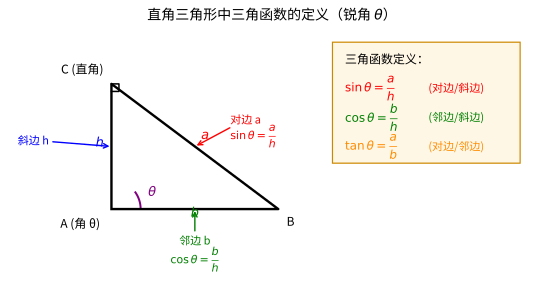

> **直观理解（现实类比）**：直角三角形定义是三角函数最原始的"出身"。想象你站在山脚下用测角仪测出山顶的**仰角 θ**，再量出你到山脚的水平距离（**邻边 b**）——就能由 $\tan\theta=\dfrac{a}{b}$ 算出山高（**对边 a**）。这正是工程测量、楼高测量、炮兵测距的原理。
>
> 三个比值本质上只是**直角三角形三边的两两之比**：$\sin$ 是"对边比斜边"（越高越接近 1），$\cos$ 是"邻边比斜边"（越平越接近 1），$\tan$ 是"对边比邻边"（陡峭程度）。只要记住"对、邻、斜"三个字，六种函数不过是它们的排列组合。

> **🧠 思考历程：$\sin$ 是怎么从"一根弦"变成"一个函数"的？**
>
> "正弦、余弦"这两个别扭的名字里，藏着一整部从天文到函数的演化史。今天的 $\sin\theta$ 是"直角三角形/单位圆里的一个数"，可它最早的祖先，其实是一根**弦**。
>
> - **天文观测催生了"弦"**。古希腊天文学家，尤其是托勒密（Ptolemy，约公元 2 世纪）的《天文学大成》，为了计算行星位置，需要一张"**给定圆心角、查出对应弦长**"的表。这张"弦表"就是正弦表的早期祖先——不过那时人们用的是"弦（chord）"，而不是半弦。**一切从观测星象的"量角查表"开始。**
> - **印度人把"全弦"换成"半弦"**。到了印度，天文学家阿耶波多（Āryabhaṭa，约公元 500）意识到：很多计算用"半弦"更顺手。半弦（semi-chord）其实就是今天直角三角形里的"对边"。他们的词语"半弦"辗转经阿拉伯语传入欧洲，被糊里糊涂地误拼成了拉丁词 **sinus（sinus = 半弓/褶）**——拉丁语的"sinus"本义是"胸脯的弧度"，于是我们有了"正弦（sine）"。**余弦（cosine）其实是"补角的 sine"（sine of the complementary angle）**，由"补"（co-）冠名而来。
> - **从天文工具到纯数学函数（18 世纪）**。真正让正弦、余弦从"查表工具"升级成"独立的函数"，归功于 18 世纪的欧拉与瑞士等数学家：他们不再把 $\sin\theta$ 看作一条弦、一个比值，而是把它当作**一个实数 $\theta$ 的数值函数**，并用单位圆把它与坐标轴联系起来（见下一节）——从此"三角函数"摆脱天文，成为分析学的主角。
> - **心路**：$\sin$ 的故事说明，**数学符号的名字往往是"旅行事故"的产物**（一个被误译的"半弦"），但它的数学本质却是被天文、测量一步步磨出来的。今天你念"正弦"，其实是在念一段跨越中、印、阿拉伯、欧洲的千年接力。

> **示例 2：已知直角三角形三边求三角函数值**
>
> 在直角三角形中，$\angle A = 30^\circ$，对边 $a = 1$，斜边 $h = 2$，求 $\sin 30^\circ$、$\cos 30^\circ$、$\tan 30^\circ$。
>
> **解**：
>
> 由勾股定理，邻边 $b = \sqrt{2^2 - 1^2} = \sqrt{3}$。

$$
\sin 30^\circ = \frac{a}{h} = \frac{1}{2}
$$

$$
\cos 30^\circ = \frac{b}{h} = \frac{\sqrt{3}}{2}
$$

$$
\tan 30^\circ = \frac{a}{b} = \frac{1}{\sqrt{3}} = \frac{\sqrt{3}}{3}
$$

---

### 3. 单位圆与三角函数

**单位圆** 是半径为 1、圆心在原点的圆，方程为 $x^2 + y^2 = 1$。

在单位圆上，角度 $\theta$ 从正 $x$ 轴出发逆时针旋转，与单位圆交于点 $P(x, y)$，则：

|      符号      |  名称  | 含义                   | 直观解释         |
| :------------: | :----: | :--------------------- | :--------------- |
| $\sin\theta$ |  正弦  | 点$P$ 的纵坐标       | “上下高度”     |
| $\cos\theta$ |  余弦  | 点$P$ 的横坐标       | “左右幅度”     |
| $\tan\theta$ |  正切  | 纵坐标与横坐标之比     | “高度除以宽度” |
|     $x$     | 横坐标 | 点$P$ 水平方向的位置 | “左右到哪里”   |
|     $y$     | 纵坐标 | 点$P$ 竖直方向的位置 | “上下到哪里”   |

$$
\sin\theta = y, \quad \cos\theta = x, \quad \tan\theta = \frac{y}{x} \;(x \neq 0)
$$

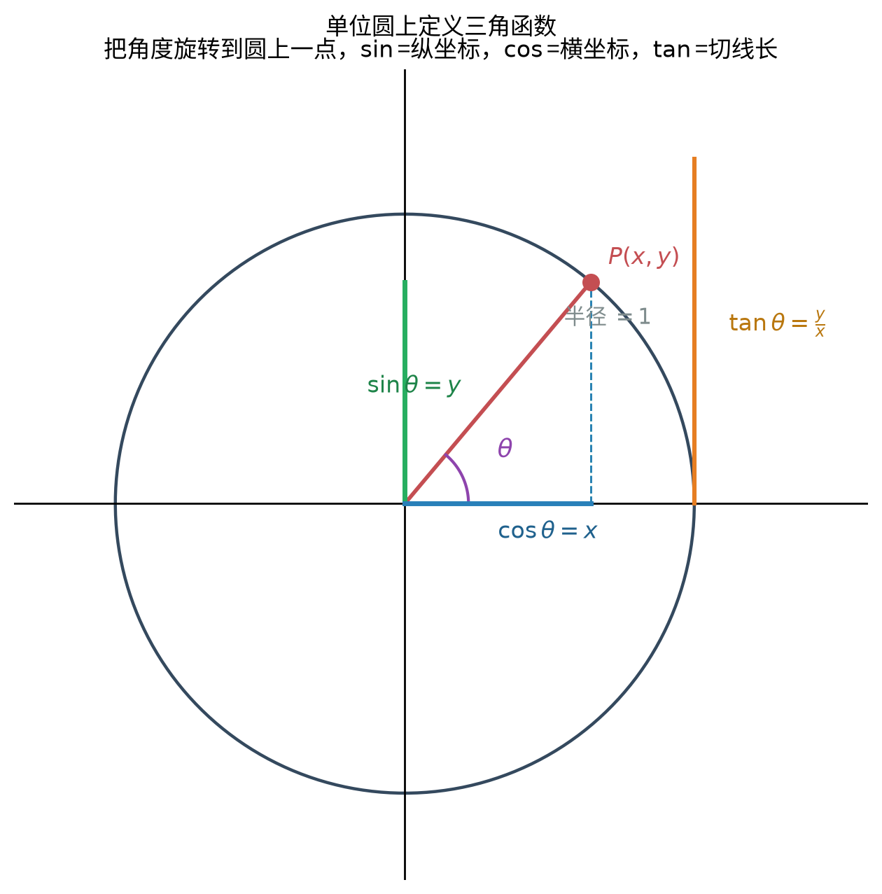

> **直观理解（现实类比）**：把角度想象成**手电筒**绕原点旋转，光斑落在单位圆上某点 $P(x,y)$。这个点的**纵坐标**就是 $\sin\theta$（上下高度），**横坐标**就是 $\cos\theta$（左右幅度），而 $\tan\theta$ 则是切线上的长度。**三角函数不是抽象公式，而是"圆上一点"的坐标投影。**
>
> 正因为这是"坐标"，所以一旦角度转到第二、三、四象限，坐标变号，三角函数的符号也随之改变——上表"各象限符号"就水到渠成，无需死记口诀背后的"为什么"。

#### 🎬 动画演示：单位圆与正弦曲线生成

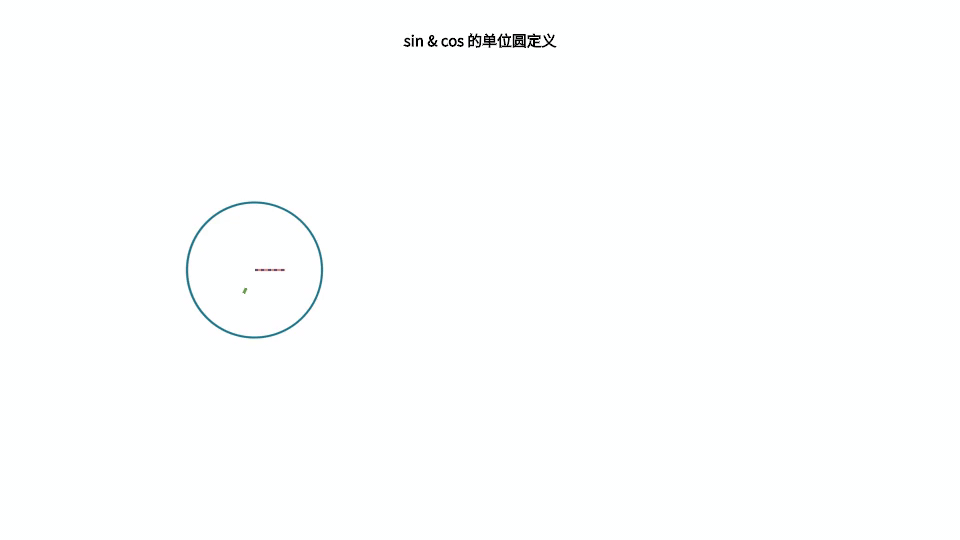

> 这个动画直观展示了在单位圆上角度 $\theta$ 与 $\sin\theta$、$\cos\theta$ 的对应关系，并把圆上一点随角度旋转的纵坐标"展开"成正弦曲线。它通过动画的方式帮助理解本节核心概念。

单位圆将三角函数的定义从锐角推广到任意角：

**各象限的三角函数符号**：

|   象限   |              角度范围              | $\sin\theta$ | $\cos\theta$ | $\tan\theta$ |
| :------: | :---------------------------------: | :------------: | :------------: | :------------: |
| 第一象限 |   $0 < \theta < \dfrac{\pi}{2}$   |     $+$     |     $+$     |     $+$     |
| 第二象限 |  $\dfrac{\pi}{2} < \theta < \pi$  |     $+$     |     $-$     |     $-$     |
| 第三象限 | $\pi < \theta < \dfrac{3\pi}{2}$ |     $-$     |     $-$     |     $+$     |
| 第四象限 | $\dfrac{3\pi}{2} < \theta < 2\pi$ |     $-$     |     $+$     |     $-$     |

记忆口诀：**"一全正，二正弦，三正切，四余弦"**（即第一象限全正，第二象限正弦正，第三象限正切正，第四象限余弦正）。

**特殊角的三角函数值**：

|   $\theta$   | $0$ |   $\dfrac{\pi}{6}$   |   $\dfrac{\pi}{4}$   |   $\dfrac{\pi}{3}$   | $\dfrac{\pi}{2}$ | $\pi$ | $\dfrac{3\pi}{2}$ |
| :------------: | :---: | :---------------------: | :---------------------: | :---------------------: | :----------------: | :-----: | :-----------------: |
| $\sin\theta$ | $0$ |    $\dfrac{1}{2}$    | $\dfrac{\sqrt{2}}{2}$ | $\dfrac{\sqrt{3}}{2}$ |       $1$       |  $0$  |       $-1$       |
| $\cos\theta$ | $1$ | $\dfrac{\sqrt{3}}{2}$ | $\dfrac{\sqrt{2}}{2}$ |    $\dfrac{1}{2}$    |       $0$       | $-1$ |        $0$        |
| $\tan\theta$ | $0$ | $\dfrac{\sqrt{3}}{3}$ |          $1$          |      $\sqrt{3}$      |       不存在       |  $0$  |       不存在       |

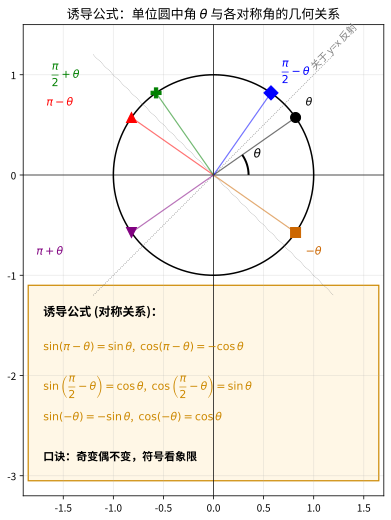

> **直观理解（现实类比）**：诱导公式本质是**镜面反射**的数学表达。把单位圆想象成一面**十字镜面**：
>
> - **$\pi-\theta$** 是关于 **$y$ 轴**的反射（左右翻），所以纵坐标 $\sin$ 不变、横坐标 $\cos$ 变号；
> - **$\dfrac{\pi}{2}-\theta$** 是关于 **$y=x$** 的反射（对角翻），所以 $\sin$ 与 $\cos$ **互换**（这正是"奇变"的几何根源）；
> - **$-\theta$** 是关于 **$x$ 轴**的反射（上下翻），所以 $\sin$ 变号、$\cos$ 不变。
>
> 口诀"**奇变偶不变，符号看象限**"中："奇/偶"指 $\dfrac{\pi}{2}$ 的倍数——奇数倍要**弦变弦**（sin↔cos），偶数倍**弦不变**；"符号看象限"则是把 θ 暂时当作锐角，看原角落在哪个象限，原函数在该象限的符号就是结果符号。

**诱导公式完整表**（设 $\theta$ 为任意角）：

**① 负角（偶不变，符号看象限）**

| 公式 | 结果 | 公式 | 结果 |
| :--- | :--- | :--- | :--- |
| $\sin(-\theta)$ | $-\sin\theta$ | $\cos(-\theta)$ | $\cos\theta$ |
| $\tan(-\theta)$ | $-\tan\theta$ | $\cot(-\theta)$ | $-\cot\theta$ |

**② $\pi-\theta$、$\pi+\theta$（围绕 $y$ 轴/原点，偶不变）**

| 公式 | 结果 | 公式 | 结果 |
| :--- | :--- | :--- | :--- |
| $\sin(\pi-\theta)$ | $\sin\theta$ | $\sin(\pi+\theta)$ | $-\sin\theta$ |
| $\cos(\pi-\theta)$ | $-\cos\theta$ | $\cos(\pi+\theta)$ | $-\cos\theta$ |
| $\tan(\pi-\theta)$ | $-\tan\theta$ | $\tan(\pi+\theta)$ | $\tan\theta$ |
| $\cot(\pi-\theta)$ | $-\cot\theta$ | $\cot(\pi+\theta)$ | $\cot\theta$ |

**③ $2\pi-\theta$（补一整个圆的负角）**

| 公式 | 结果 | 公式 | 结果 |
| :--- | :--- | :--- | :--- |
| $\sin(2\pi-\theta)$ | $-\sin\theta$ | $\cos(2\pi-\theta)$ | $\cos\theta$ |
| $\tan(2\pi-\theta)$ | $-\tan\theta$ | $\cot(2\pi-\theta)$ | $-\cot\theta$ |

**④ 余角与补角（$\dfrac{\pi}{2}-\theta$、$\dfrac{\pi}{2}+\theta$，奇变——弦互换）**

| 公式 | 结果 | 公式 | 结果 |
| :--- | :--- | :--- | :--- |
| $\sin\left(\dfrac{\pi}{2}-\theta\right)$ | $\cos\theta$ | $\sin\left(\dfrac{\pi}{2}+\theta\right)$ | $\cos\theta$ |
| $\cos\left(\dfrac{\pi}{2}-\theta\right)$ | $\sin\theta$ | $\cos\left(\dfrac{\pi}{2}+\theta\right)$ | $-\sin\theta$ |
| $\tan\left(\dfrac{\pi}{2}-\theta\right)$ | $\cot\theta$ | $\tan\left(\dfrac{\pi}{2}+\theta\right)$ | $-\cot\theta$ |

**⑤ $\dfrac{3\pi}{2} \pm \theta$（半圈再 ±θ，奇变——弦互换）**

| 公式 | 结果 | 公式 | 结果 |
| :--- | :--- | :--- | :--- |
| $\sin\left(\dfrac{3\pi}{2}-\theta\right)$ | $-\cos\theta$ | $\sin\left(\dfrac{3\pi}{2}+\theta\right)$ | $-\cos\theta$ |
| $\cos\left(\dfrac{3\pi}{2}-\theta\right)$ | $-\sin\theta$ | $\cos\left(\dfrac{3\pi}{2}+\theta\right)$ | $\sin\theta$ |
| $\tan\left(\dfrac{3\pi}{2}-\theta\right)$ | $\cot\theta$ | $\tan\left(\dfrac{3\pi}{2}+\theta\right)$ | $-\cot\theta$ |

**⑥ 周期延拓（$\theta$ 或 $\theta \pm \pi$，同角同名）**

$$
\sin(\theta + 2k\pi) = \sin\theta,\quad \cos(\theta + 2k\pi) = \cos\theta,\quad \tan(\theta + k\pi) = \tan\theta \ (k \in \mathbb{Z})
$$

> **💡 直观理解（类比）**：以上所有公式只需抓住两句"约定"即可全部推出：①**偶不变**——$\pi$ 的整数倍（如 $\pi、2\pi$）翻开角度时 sin/cos 名字不变；**奇变**——$\dfrac{\pi}{2}$ 的奇数倍才让 sin↔cos 互换；②**符号看象限**——先把 $\theta$ 当作第一象限锐角，看原角 $\theta$ 加上/减去的那个角落在第几象限，原函数在该象限的符号就是答案符号。**你并不需要背下 20+ 条，只要能画单位圆、记得两句口诀就够了。**

---

## 基本定理与公式

### 1. 基本恒等式

**1.1 平方关系**

由单位圆方程 $x^2 + y^2 = 1$，即 $\cos^2\theta + \sin^2\theta = 1$：

$$
\boxed{\sin^2\theta + \cos^2\theta = 1}
$$

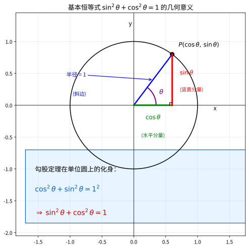

> **直观理解（现实类比）**：这个恒等式不是凭空规定的，而是**勾股定理在单位圆上的化身**。单位圆上任意一点 $P(\cos\theta, \sin\theta)$ 到原点的距离（半径）= 1，把它和原点、投影点连成直角三角形：水平直角边是 $\cos\theta$，竖直直角边是 $\sin\theta$，斜边是半径 1。
>
> 由勾股定理 $\text{水平}^2 + \text{竖直}^2 = \text{斜边}^2$，立刻得到 $\cos^2\theta + \sin^2\theta = 1^2 = 1$。所以这个公式本质就是说：**单位圆上点的"水平分量² + 垂直分量² = 半径²"**——它是勾股定理穿上"三角函数"外衣后的样子，难怪无论 θ 取何值都成立。

将上式两边同时除以 $\cos^2\theta$（$\cos\theta \neq 0$）：

$$
\boxed{1 + \tan^2\theta = \sec^2\theta}
$$

将上式两边同时除以 $\sin^2\theta$（$\sin\theta \neq 0$）：

$$
\boxed{1 + \cot^2\theta = \csc^2\theta}
$$

**1.2 商数关系**

$$
\tan\theta = \frac{\sin\theta}{\cos\theta}, \quad \cot\theta = \frac{\cos\theta}{\sin\theta}
$$

**1.3 倒数关系**

$$
\csc\theta = \frac{1}{\sin\theta}, \quad \sec\theta = \frac{1}{\cos\theta}, \quad \cot\theta = \frac{1}{\tan\theta}
$$

> **示例 3：利用恒等式求值**
>
> 已知 $\sin\theta = \dfrac{3}{5}$，且 $\theta$ 在第二象限，求 $\cos\theta$ 和 $\tan\theta$。
>
> **解**：
>
> 由 $\sin^2\theta + \cos^2\theta = 1$：

$$
\cos^2\theta = 1 - \sin^2\theta = 1 - \left(\frac{3}{5}\right)^2 = 1 - \frac{9}{25} = \frac{16}{25}
$$

> 由于 $\theta$ 在第二象限，$\cos\theta < 0$，所以 $\cos\theta = -\dfrac{4}{5}$。

$$
\tan\theta = \frac{\sin\theta}{\cos\theta} = \frac{3/5}{-4/5} = -\frac{3}{4}
$$

---

### 2. 和角公式

**2.1 正弦的和角与差角公式**

|          符号          |     名称     | 含义                   | 直观解释         |
| :---------------------: | :----------: | :--------------------- | :--------------- |
|       $\alpha$       | 角$\alpha$ | 参与运算的第一个角度   | “第一个待加角” |
|        $\beta$        | 角$\beta$ | 参与运算的第二个角度   | “第二个待加角” |
| $\sin\alpha\cos\beta$ |   交叉乘积   | 第一角正弦乘第二角余弦 | “一正一余相乘” |
| $\cos\alpha\sin\beta$ |   交叉乘积   | 第一角余弦乘第二角正弦 | “一余一正相乘” |

$$
\boxed{\sin(\alpha + \beta) = \sin\alpha\cos\beta + \cos\alpha\sin\beta}
$$

$$
\boxed{\sin(\alpha - \beta) = \sin\alpha\cos\beta - \cos\alpha\sin\beta}
$$

**2.2 余弦的和角与差角公式**

$$
\boxed{\cos(\alpha + \beta) = \cos\alpha\cos\beta - \sin\alpha\sin\beta}
$$

$$
\boxed{\cos(\alpha - \beta) = \cos\alpha\cos\beta + \sin\alpha\sin\beta}
$$

**2.3 正切的和角与差角公式**

$$
\boxed{\tan(\alpha + \beta) = \frac{\tan\alpha + \tan\beta}{1 - \tan\alpha\tan\beta}}
$$

$$
\boxed{\tan(\alpha - \beta) = \frac{\tan\alpha - \tan\beta}{1 + \tan\alpha\tan\beta}}
$$

**推论（正切的和差化弦）**：由和差角正弦公式两边同除以 $\cos\alpha\cos\beta$ 即得：

$$
\boxed{\tan\alpha \pm \tan\beta = \frac{\sin(\alpha \pm \beta)}{\cos\alpha\cos\beta}}
$$

**2.4 余切、正割与余割的和差角公式**

余切公式可由 $\cot = \dfrac{\cos}{\sin}$ 对正弦和差角公式分子分母同除以 $\sin\alpha\sin\beta$ 得到；正割、余割是余弦、正弦的倒数，其和差角公式由余弦、正弦和差角公式取倒数即得：

$$
\boxed{\cot(\alpha + \beta) = \frac{\cot\alpha\cot\beta - 1}{\cot\alpha + \cot\beta}}, \qquad \boxed{\cot(\alpha - \beta) = \frac{\cot\alpha\cot\beta + 1}{\cot\beta - \cot\alpha}}
$$

$$
\sec(\alpha \pm \beta) = \frac{\sec\alpha\sec\beta}{1 \mp \tan\alpha\tan\beta}, \qquad \csc(\alpha \pm \beta) = \frac{\sec\alpha\sec\beta}{\tan\alpha \pm \tan\beta}
$$

**证明（余弦和角公式）**：在单位圆上，设 $A$ 点对应角度 $\alpha$ 坐标为 $(\cos\alpha, \sin\alpha)$，$B$ 点对应角度 $-\beta$ 坐标为 $(\cos\beta, -\sin\beta)$。则 $\angle AOB = \alpha + \beta$。由向量点积公式：

$$
\cos(\alpha + \beta) = \overrightarrow{OA} \cdot \overrightarrow{OB} = \cos\alpha\cos\beta + \sin\alpha(-\sin\beta) = \cos\alpha\cos\beta - \sin\alpha\sin\beta
$$

**证明（正弦和角公式）**：利用 $\sin(\alpha + \beta) = \cos\left(\frac{\pi}{2} - (\alpha + \beta)\right) = \cos\left((\frac{\pi}{2} - \alpha) - \beta\right)$，展开即得。

**几何证明（单位圆法）**：

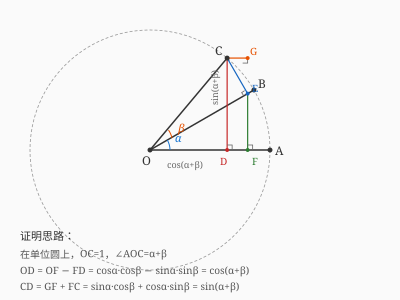

如图所示，在单位圆上取点 $C$，使 $\angle AOC = \alpha + \beta$。作以下辅助线：

- $CD \perp OA$，垂足为 $D$
- $CE \perp OB$，垂足为 $E$
- $EF \perp OA$，垂足为 $F$

**第一步：求 $OE$ 和 $CE$**

在直角三角形 $OCE$ 中，$OC=1$（单位圆半径），$\angle COE = \beta$，故：

$$
OE = \cos\beta, \quad CE = \sin\beta
$$

- 【第 1 步】依据：在直角三角形 $OCE$ 中 $OC=1$（单位圆半径），$\beta$ 的余弦等于邻边比斜边、正弦等于对边比斜边；目的：先把半径 $OC$ 沿 $OB$ 方向分解，得到 $E$ 到 $O$ 的距离 $OE$，作为后续继续分解的“底料”。

**第二步：求 $OF$ 和 $EF$**

在直角三角形 $OEF$ 中，$\angle EOF = \alpha$，斜边为 $OE = \cos\beta$，故：

$$
OF = OE\cos\alpha = \cos\alpha\cos\beta
$$

$$
EF = OE\sin\alpha = \sin\alpha\cos\beta
$$

- 【第 2 步】依据：在直角三角形 $OEF$ 中，斜边恰是上一步求得的 $OE=\cos\beta$，再用 $\alpha$ 的余弦、正弦做第二次分解；目的：把斜向的 $OE$ 再拆成水平 $OF$ 与竖直 $EF$，让横纵两段长度显形。

**第三步：分解 $CE$ 的方向**

$CE \perp OB$，而 $OB$ 与水平方向（$OA$）夹角为 $\alpha$，因此 $CE$ 与竖直方向夹角为 $\alpha$。将 $CE$ 分解为水平和竖直两个分量：

- 水平分量（向左）：$CE\sin\alpha = \sin\alpha\sin\beta$
- 竖直分量（向上）：$CE\cos\alpha = \cos\alpha\sin\beta$
- 【第 3 步】依据：$CE\perp OB$ 而 $OB$ 与 $OA$ 夹角为 $\alpha$，因此可用 $\alpha$ 的正弦、余弦把 $CE=\sin\beta$ 再分解；目的：得到 $C$ 相对于 $E$ 向左、向上的两份偏移，为累加 $OD$ 与 $CD$ 准备好各个零件。

**第四步：证明 $\cos(\alpha+\beta)$**

$D$ 和 $F$ 分别是 $C$ 和 $E$ 在 $OA$ 上的投影。由于 $C$ 相对于 $E$ 向左偏移了 $CE$ 的水平分量 $\sin\alpha\sin\beta$，所以 $D$ 在 $F$ 左侧，且：

$$
FD = \sin\alpha\sin\beta
$$

因此：

$$
OD = OF - FD = \cos\alpha\cos\beta - \sin\alpha\sin\beta
$$

又因为 $OC=1$，$\angle AOC = \alpha+\beta$，所以 $OD = \cos(\alpha+\beta)$，即：

$$
\boxed{\cos(\alpha+\beta) = \cos\alpha\cos\beta - \sin\alpha\sin\beta}
$$

**第五步：证明 $\sin(\alpha+\beta)$**

$CD$ 是 $C$ 到 $OA$ 的竖直距离。由于 $C$ 相对于 $E$ 向上偏移了 $CE$ 的竖直分量 $\cos\alpha\sin\beta$，所以：

$$
CD = EF + CE\cos\alpha = \sin\alpha\cos\beta + \cos\alpha\sin\beta
$$

又因为 $CD = \sin(\alpha+\beta)$，即：

$$
\boxed{\sin(\alpha+\beta) = \sin\alpha\cos\beta + \cos\alpha\sin\beta}
$$

> **示例 4：利用和角公式计算 $75^\circ$ 的三角函数值**
>
> 求 $\sin 75^\circ$ 和 $\cos 75^\circ$。
>
> **解**：

$$
75^\circ = 45^\circ + 30^\circ
$$

$$
\sin 75^\circ = \sin(45^\circ + 30^\circ) = \sin 45^\circ\cos 30^\circ + \cos 45^\circ\sin 30^\circ
$$

$$
= \frac{\sqrt{2}}{2} \cdot \frac{\sqrt{3}}{2} + \frac{\sqrt{2}}{2} \cdot \frac{1}{2} = \frac{\sqrt{6} + \sqrt{2}}{4}
$$

$$
\cos 75^\circ = \cos(45^\circ + 30^\circ) = \cos 45^\circ\cos 30^\circ - \sin 45^\circ\sin 30^\circ
$$

$$
= \frac{\sqrt{2}}{2} \cdot \frac{\sqrt{3}}{2} - \frac{\sqrt{2}}{2} \cdot \frac{1}{2} = \frac{\sqrt{6} - \sqrt{2}}{4}
$$

---

### 3. 倍角公式

**3.1 二倍角公式**

由和角公式令 $\alpha = \beta = \theta$ 可得：

$$
\boxed{\sin 2\theta = 2\sin\theta\cos\theta}
$$

$$
\boxed{\cos 2\theta = \cos^2\theta - \sin^2\theta = 2\cos^2\theta - 1 = 1 - 2\sin^2\theta}
$$

$$
\boxed{\tan 2\theta = \frac{2\tan\theta}{1 - \tan^2\theta}}
$$

**余切、正割与余割的二倍角公式**（由上式取倒数或平方关系导出）：

$$
\cot 2\theta = \frac{\cot^2\theta - 1}{2\cot\theta}, \qquad \sec 2\theta = \frac{\sec^2\theta}{2 - \sec^2\theta}, \qquad \csc 2\theta = \frac{\sec\theta\csc\theta}{2}
$$

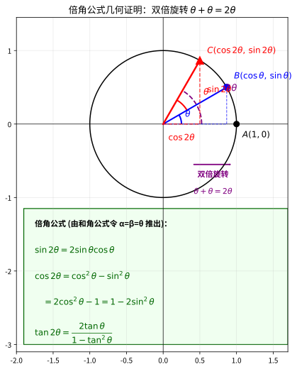

> **直观理解（现实类比）**：倍角公式像一次**"双倍旋转"**。在单位圆上，从起点 $A(1,0)$ 出发，先旋转角 $\theta$ 到达 $B$ 点，再继续旋转角 $\theta$ 到达 $C$ 点——这两次旋转的"合计效果"，就等同于从 $A$ 一次性旋转 $2\theta$。
>
> 所以 $C$ 点的坐标既可以用 $\sin 2\theta, \cos 2\theta$ 表示，也可以由"旋转 $\theta$ 后再旋转 $\theta$"的复合公式（和角公式 $\alpha=\beta=\theta$）推出。**倍角公式 = 和角公式的"双胞胎特例"**：它不是新东西，而是"旋转两次 θ = 旋转一次 2θ"这个几何事实的代数记录。

**3.2 三倍角公式**

$$
\sin 3\theta = 3\sin\theta - 4\sin^3\theta
$$

$$
\cos 3\theta = 4\cos^3\theta - 3\cos\theta
$$

$$
\tan 3\theta = \frac{3\tan\theta - \tan^3\theta}{1 - 3\tan^2\theta}
$$

**证明（二倍角正弦公式）**：

由 $\sin(\alpha + \beta) = \sin\alpha\cos\beta + \cos\alpha\sin\beta$，令 $\alpha = \beta = \theta$：

$$
\sin 2\theta = \sin\theta\cos\theta + \cos\theta\sin\theta = 2\sin\theta\cos\theta
$$

> **示例 5：利用二倍角求值**
>
> 已知 $\cos\theta = \dfrac{3}{5}$，且 $\theta$ 在第四象限，求 $\sin 2\theta$ 和 $\cos 2\theta$。
>
> **解**：
>
> 由 $\sin^2\theta + \cos^2\theta = 1$，$\sin^2\theta = 1 - \frac{9}{25} = \frac{16}{25}$。
>
> 由于 $\theta$ 在第四象限，$\sin\theta < 0$，所以 $\sin\theta = -\dfrac{4}{5}$。

$$
\sin 2\theta = 2\sin\theta\cos\theta = 2 \cdot \left(-\frac{4}{5}\right) \cdot \frac{3}{5} = -\frac{24}{25}
$$

$$
\cos 2\theta = 2\cos^2\theta - 1 = 2 \cdot \frac{9}{25} - 1 = \frac{18}{25} - 1 = -\frac{7}{25}
$$

---

### 4. 半角公式

由二倍角公式 $\cos 2\alpha = 2\cos^2\alpha - 1 = 1 - 2\sin^2\alpha$，令 $\alpha = \dfrac{\theta}{2}$ 可得：

$$
\boxed{\sin^2\frac{\theta}{2} = \frac{1 - \cos\theta}{2}}
$$

$$
\boxed{\cos^2\frac{\theta}{2} = \frac{1 + \cos\theta}{2}}
$$

$$
\boxed{\tan\frac{\theta}{2} = \frac{1 - \cos\theta}{\sin\theta} = \frac{\sin\theta}{1 + \cos\theta}}
$$

开方时需注意 $\frac{\theta}{2}$ 所在象限以确定符号：

$$
\sin\frac{\theta}{2} = \pm\sqrt{\frac{1 - \cos\theta}{2}}, \quad \cos\frac{\theta}{2} = \pm\sqrt{\frac{1 + \cos\theta}{2}}
$$

半角正切的开方形式（由 $\tan\frac{\theta}{2} = \pm\sqrt{\dfrac{\sin^2\frac{\theta}{2}}{\cos^2\frac{\theta}{2}}}$ 得，符号同样由 $\frac{\theta}{2}$ 所在象限确定）：

$$
\boxed{\tan\frac{\theta}{2} = \pm\sqrt{\frac{1 - \cos\theta}{1 + \cos\theta}}}
$$

> **示例 6：利用半角公式求 $15^\circ$ 的三角函数值**
>
> 求 $\sin 15^\circ$ 和 $\cos 15^\circ$。
>
> **解**：
>
> $15^\circ = \dfrac{30^\circ}{2}$，且 $\cos 30^\circ = \dfrac{\sqrt{3}}{2}$。

$$
\sin^2 15^\circ = \frac{1 - \cos 30^\circ}{2} = \frac{1 - \frac{\sqrt{3}}{2}}{2} = \frac{2 - \sqrt{3}}{4}
$$

> 由于 $15^\circ$ 在第一象限，$\sin 15^\circ > 0$，所以：

$$
\sin 15^\circ = \sqrt{\frac{2 - \sqrt{3}}{4}} = \frac{\sqrt{2 - \sqrt{3}}}{2} = \frac{\sqrt{6} - \sqrt{2}}{4}
$$

$$
\cos^2 15^\circ = \frac{1 + \cos 30^\circ}{2} = \frac{1 + \frac{\sqrt{3}}{2}}{2} = \frac{2 + \sqrt{3}}{4}
$$

$$
\cos 15^\circ = \frac{\sqrt{2 + \sqrt{3}}}{2} = \frac{\sqrt{6} + \sqrt{2}}{4}
$$

---

### 5. 和差化积公式

和差化积公式将三角函数的和差形式转化为乘积形式：

$$
\boxed{\sin\alpha + \sin\beta = 2\sin\frac{\alpha + \beta}{2}\cos\frac{\alpha - \beta}{2}}
$$

$$
\boxed{\sin\alpha - \sin\beta = 2\cos\frac{\alpha + \beta}{2}\sin\frac{\alpha - \beta}{2}}
$$

$$
\boxed{\cos\alpha + \cos\beta = 2\cos\frac{\alpha + \beta}{2}\cos\frac{\alpha - \beta}{2}}
$$

$$
\boxed{\cos\alpha - \cos\beta = -2\sin\frac{\alpha + \beta}{2}\sin\frac{\alpha - \beta}{2}}
$$

**证明（以 $\sin\alpha + \sin\beta$ 为例）**：

令 $A = \dfrac{\alpha + \beta}{2}$，$B = \dfrac{\alpha - \beta}{2}$，则 $\alpha = A + B$，$\beta = A - B$。

- 【第 1 步】依据：引入新记号 $A=\frac{\alpha+\beta}{2}$、$B=\frac{\alpha-\beta}{2}$，从而把 $\alpha$ 表成 $A+B$、$\beta$ 表成 $A-B$；目的：把两个不同角度统一成“同一中心 $A$ 加减半个差”，得以套用正弦和角公式。

由和角公式：

$$
\sin\alpha = \sin(A + B) = \sin A\cos B + \cos A\sin B
$$

$$
\sin\beta = \sin(A - B) = \sin A\cos B - \cos A\sin B
$$

- 【第 2 步】依据：分别对 $\sin(A+B)$ 与 $\sin(A-B)$ 使用正弦和角、差角公式展开；目的：两个展开式中 $\sin A\cos B$ 与 $\cos A\sin B$ 互为镜像，相加时只剩加号项。

两式相加：

$$
\sin\alpha + \sin\beta = 2\sin A\cos B = 2\sin\frac{\alpha + \beta}{2}\cos\frac{\alpha - \beta}{2}
$$

- 【第 3 步】依据：两式相加后 $\sin A\cos B$ 合并为 $2\sin A\cos B$、$\cos A\sin B$ 抵消，再把 $A$、$B$ 换回 $\frac{\alpha\pm\beta}{2}$；目的：把“正弦之和”转成“和角半角之正弦乘差角半角之余弦”的乘积形式，完成化积。

**积化和差公式**（和差化积的逆用）：

$$
\sin\alpha\cos\beta = \frac{1}{2}[\sin(\alpha + \beta) + \sin(\alpha - \beta)]
$$

$$
\cos\alpha\sin\beta = \frac{1}{2}[\sin(\alpha + \beta) - \sin(\alpha - \beta)]
$$

$$
\cos\alpha\cos\beta = \frac{1}{2}[\cos(\alpha + \beta) + \cos(\alpha - \beta)]
$$

$$
\sin\alpha\sin\beta = -\frac{1}{2}[\cos(\alpha + \beta) - \cos(\alpha - \beta)]
$$

> **示例 7：和差化积求值**
>
> 化简 $\sin 75^\circ + \sin 15^\circ$。
>
> **解**：

$$
\sin 75^\circ + \sin 15^\circ = 2\sin\frac{75^\circ + 15^\circ}{2}\cos\frac{75^\circ - 15^\circ}{2}
$$

$$
= 2\sin 45^\circ\cos 30^\circ = 2 \cdot \frac{\sqrt{2}}{2} \cdot \frac{\sqrt{3}}{2} = \frac{\sqrt{6}}{2}
$$

---

### 6. 正弦定理

**定理**：在任意三角形 $ABC$ 中，各边与其对角的正弦之比相等，且等于该三角形外接圆直径 $2R$：

|     符号     |    名称    | 含义                           | 直观解释           |
| :----------: | :--------: | :----------------------------- | :----------------- |
| $a, b, c$ |    三边    | 三条边的长度                   | “三根边的长度”   |
| $\angle A$ |  角$A$  | 顶点$A$ 的内角，对边是 $a$ | “顶点 A 的张角”  |
| $\angle B$ |  角$B$  | 顶点$B$ 的内角，对边是 $b$ | “顶点 B 的张角”  |
| $\angle C$ |  角$C$  | 顶点$C$ 的内角，对边是 $c$ | “顶点 C 的张角”  |
|    $R$    | 外接圆半径 | 过三顶点圆的半径               | “外圈包的圆半径” |

$$
\boxed{\frac{a}{\sin A} = \frac{b}{\sin B} = \frac{c}{\sin C} = 2R}
$$

其中 $a, b, c$ 分别为 $\angle A, \angle B, \angle C$ 的对边，$R$ 为外接圆半径。

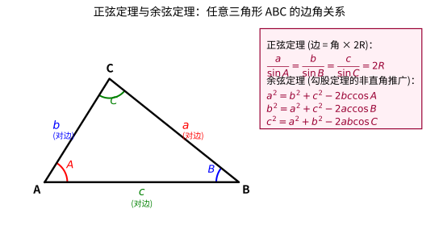

> **直观理解（现实类比）**：
>
> - **正弦定理**是"**大边对大角**"的量化版本。在三角形里，长边一定对着大角——但"大多少"？正弦定理精确告诉你：边的长度与对角正弦之比是同一个常数 $2R$。所以已知角能算边，已知边能算角，这是"边角互译"的桥梁。
> - **余弦定理**则是**勾股定理的"非直角推广版"**。当夹角 $A=90^\circ$ 时，$\cos A=0$，公式 $a^2=b^2+c^2-2bc\cos A$ 立刻退化为 $a^2=b^2+c^2$（勾股定理）。那个多出来的 $-2bc\cos A$ 项，正是对"非直角"的修正：角越接近 $180^\circ$（$\cos A$ 越接近 $-1$），$a$ 边越长；角越锐（$\cos A$ 越接近 $1$），$a$ 边越短——完全符合直觉。

> **🧠 思考历程：把三角形"翻译"成外接圆，是古人射箭想到的**
>
> 正弦定理最漂亮的一点，是它把一个三角形接进它的**外接圆**去证明。这个思路不是空穴来风，而是从比值守恒里"逼"出来的。
>
> - **需求来自"算边角"的苦**。无论是航海定距、测量山高，还是工匠画图，人们都反复遇到"只知道两个角和一条边，却要算出另一条边"的情形。古人很想要一个"只要边和角存在固定换算关系，就直接套"的速成工具——正弦定理就是这个"边角互译器"。
> - **"同弧等角"的父亲**。关键的证明巧思（作三角形外接圆、构造直径、利用"直径对直角"和"同弧圆周角相等"）并非为了炫技，而是古希腊人早已熟稔的圆的性质。**把一个不是直角三角形的对象，硬生生"放进"一个直角三角形里去**——这种"转化思维"是几何最经典的招数。
> - **历史归属**。正弦定理在东方和西方经历了漫长的酝酿：穆斯林天文学家纳西尔丁（Naṣīr al-Dīn al-Ṭūsī，13 世纪）及更早的天象计算者们系统地使用它；而西方把它确立为解三角形的标准工具，则要等到 16 世纪韦达等人的推广。它之所以得名"正弦定理"，正是因为把"$\frac{a}{\sin A}$"这组不变比值推到了高处。
> - **心路**：正弦定理提醒我们：**很多"好定理"诞生时，是为了给某个天天要算的苦差事找"快捷键"**。它把三角形的边角放进同一个以正弦为尺的"比例世界"，从此"知道啥求啥"都不必每次从头推。你看出来的那条 $2R$ 常数，其实是整个三角形和外接圆之间的"汇率"。

**证明**：

如图，作三角形 $ABC$ 的外接圆，圆心为 $O$，半径为 $R$。连接 $BO$ 并延长交圆于 $A'$，则 $BA'$ 为直径，$BA' = 2R$。

$\angle A' = \angle A$（同弧所对的圆周角相等），且 $\angle BCA' = 90^\circ$（直径所对的圆周角为直角）。

在直角三角形 $BCA'$ 中：

$$
\sin A' = \frac{a}{2R}
$$

即 $\sin A = \dfrac{a}{2R}$，所以 $\dfrac{a}{\sin A} = 2R$。同理可证 $\dfrac{b}{\sin B} = 2R$，$\dfrac{c}{\sin C} = 2R$。

**应用**：正弦定理用于以下两种情况解三角形：

1. 已知两角一边（AAS 或 ASA）
2. 已知两边及其中一边的对角（SSA，可能有两解）

> **示例 8：正弦定理的应用**
>
> 在 $\triangle ABC$ 中，已知 $A = 30^\circ$，$B = 45^\circ$，$a = 10$，求 $b$ 和外接圆半径 $R$。
>
> **解**：
>
> 由正弦定理 $\dfrac{a}{\sin A} = \dfrac{b}{\sin B}$：

$$
b = \frac{a\sin B}{\sin A} = \frac{10 \cdot \sin 45^\circ}{\sin 30^\circ} = \frac{10 \cdot \frac{\sqrt{2}}{2}}{\frac{1}{2}} = 10\sqrt{2}
$$

> 由 $\dfrac{a}{\sin A} = 2R$：

$$
R = \frac{a}{2\sin A} = \frac{10}{2 \cdot \frac{1}{2}} = 10
$$

---

### 7. 余弦定理

**定理**：在任意三角形 $ABC$ 中，任意一边的平方等于其他两边平方和减去这两边与其夹角余弦乘积的两倍：

$$
\boxed{a^2 = b^2 + c^2 - 2bc\cos A}
$$

$$
\boxed{b^2 = a^2 + c^2 - 2ac\cos B}
$$

$$
\boxed{c^2 = a^2 + b^2 - 2ab\cos C}
$$

**证明**：

在 $\triangle ABC$ 中，以 $A$ 为原点，$AB$ 为 $x$ 轴建立平面直角坐标系，则：

$A(0,0)$，$B(c,0)$，$C(b\cos A, b\sin A)$。

由两点间距离公式：

$$
a^2 = |BC|^2 = (c - b\cos A)^2 + (0 - b\sin A)^2
$$

$$
= c^2 - 2bc\cos A + b^2\cos^2 A + b^2\sin^2 A
$$

$$
= b^2 + c^2 - 2bc\cos A
$$

- 第 1 个等号：把点 $C$ 的坐标代入两点间距离公式 $|BC|^2=(\text{横差})^2+(\text{纵差})^2$，依据是平面直角坐标系里距离公式的定义；目的：把边长平方 $a^2$ 改写为只含 $b, c, A$ 的代数式。
- 第 2 个等号：用完全平方公式展开 $(c-b\cos A)^2$ 与 $(b\sin A)^2$，依据是 $(m\pm n)^2=m^2\pm 2mn+n^2$；目的：拆出含 $\cos A$ 的一次项，为稍后的合并做铺垫。
- 第 3 个等号：利用平方关系 $\sin^2 A+\cos^2 A=1$ 把 $b^2(\cos^2 A+\sin^2 A)$ 合成为 $b^2$，依据是恒等式；目的：约平高次项里的三角函数束，得到余弦定理的简洁标准形。

当 $A = 90^\circ$ 时，$\cos A = 0$，余弦定理退化为勾股定理 $a^2 = b^2 + c^2$。

**应用**：余弦定理用于以下两种情况解三角形：

1. 已知两边及其夹角（SAS）
2. 已知三边（SSS）

> **示例 9：余弦定理的应用**
>
> 在 $\triangle ABC$ 中，已知 $a = 7$，$b = 8$，$c = 5$，求 $\angle A$。
>
> **解**：
>
> 由余弦定理 $a^2 = b^2 + c^2 - 2bc\cos A$：

$$
7^2 = 8^2 + 5^2 - 2 \cdot 8 \cdot 5 \cdot \cos A
$$

$$
49 = 64 + 25 - 80\cos A
$$

$$
49 = 89 - 80\cos A
$$

$$
\cos A = \frac{89 - 49}{80} = \frac{40}{80} = \frac{1}{2}
$$

> 所以 $A = 60^\circ$。

> **🧠 思考历程：当三角形"不含"直角时，勾股定理该怎么补？**
>
> 余弦定理看起来是"平方和再减一项"，但它的精神，其实是一次对勾股定理的"抢救与改造"。
>
> - **从勾股的遗憾出发**。勾股定理只在直角三角形里好用，一到斜三角形（锐角或钝角）就抓瞎。古人做梦都想要一个"非直角也能直接算"的版本。两个方向并行探索了几百年：用三角函数把它代数化（也就是余弦定理），或用几何补图（比如作斜边上的高来辅助）。
> - **"多出来的一项"从哪来**。直觉提醒我们：把计算过程用几何想清楚，就有意思了——当夹角不是 90° 时，本来是"两边的平方和"，但因为这两边有夹角，投影产生了"多算"或"少算"，多出来的部分恰好是 $2bc\cos A$（即 $2$ 倍的"夹边投影乘积"）。**不是"凭空扣减"，而是"我们该把夹角的偏移量补上"。**
> - **为什么偏偏是"余弦"在负责修正**。$a^2=b^2+c^2-2bc\cos A$ 里，当 $A=90^\circ$ 时 $\cos A=0$，又回到了 $a^2=b^2+c^2$；当 $A>90^\circ$ 时，$\cos A<0$，"减去负"等于"加上"，$a$ 自然更长——完美符合"钝角对应长边"的直观。**这个"退化的干净"，正说明它不是拼凑，而是勾股定理的自然延伸。** 历史上，韦达等 16 世纪代数学家与 18 世纪的欧拉都推动了它的形式化，欧洲人因此也常称它"韦达–欧拉公式"。
> - **心路**：余弦定理告诉你的不只是"一个公式"，而是一种"**退化的统一**"：把直角当作夹角为 90° 的特殊情形，勾股定理就成为它的特例。今天你每次用余弦定理，其实都在说"让我把不够直的三角形，用三角函数补直"。这正是"把旧结论推广到新世界"最常见的姿态。

**定理（三角形面积公式）**：在 $\triangle ABC$ 中，任意两边与其夹角正弦乘积的一半等于三角形面积 $S$：

$$
S = \frac{1}{2}ab\sin C = \frac{1}{2}bc\sin A = \frac{1}{2}ca\sin B
$$

**推导**：以底边 $b$（即 $CA$）为准，作顶点 $B$ 到底边的高，高 $h = a\sin C$（$a=BC$ 与底边夹角为 $C$）。于是 $\displaystyle S = \frac12 \times \text{底} \times \text{高} = \frac12 b \cdot a\sin C$。选择不同的边作底，即得三个等价表达式。

> **💡 直观理解（类比）**：面积公式是把"底×高÷2"用三角函数改写成"两边夹一角"。想求三角形面积，只要知道**两条边的长度**和**它们夹的那个角**，$\frac12 ab\sin C$ 一步到位，无需先求出高。特别地，当 $C=90^\circ$ 时 $\sin C=1$，退化为 $\frac12 ab$——直角三角形面积，又一次完美退化。

> **善用海伦公式**：若已知三条边而不知夹角，可用海伦（Heron）公式 $S=\sqrt{p(p-a)(p-b)(p-c)}$，其中 $p=\frac{a+b+c}{2}$ 为半周长，同样能求面积。

**定理（正切定理）**：在任意三角形 $ABC$ 中，任意两边的和与差之比等于其对角半角正切之比：

$$
\boxed{\frac{a+b}{a-b} = \frac{\tan\dfrac{A+B}{2}}{\tan\dfrac{A-B}{2}}}
$$

（同理对 $b, c$ 与 $a, c$ 成立。）

**推导**：由正弦定理 $a=2R\sin A$、$b=2R\sin B$，故

$$
\frac{a+b}{a-b} = \frac{\sin A + \sin B}{\sin A - \sin B}
$$

对分子分母分别使用和差化积 $\sin A + \sin B = 2\sin\frac{A+B}{2}\cos\frac{A-B}{2}$ 与 $\sin A - \sin B = 2\cos\frac{A+B}{2}\sin\frac{A-B}{2}$，约去因子即得结论。

> **💡 直观理解（类比）**：正切定理是**正弦定理的"和差版本"**。正弦定理单独处理一条边与一个角，而正切定理把**两条边合并成"和与差"**，把**两个角合并成"半角和与半角差"**。当题目给的是"两边之和/差"而非单独的边时，它比正弦定理更直接。由于 $A+B = \pi - C$，半角和 $\frac{A+B}{2} = \frac{\pi-C}{2}$ 常常可进一步化简，这是它常用的突破口。

**定理（内切圆半径与面积）**：设 $\triangle ABC$ 的内切圆半径为 $r$，半周长 $p=\dfrac{a+b+c}{2}$，则：

$$
\boxed{S = p \cdot r}
$$

即 $r = \dfrac{S}{p}$。结合海伦公式还可写成 $r = \sqrt{\dfrac{(p-a)(p-b)(p-c)}{p}}$。

**推导**：连接内心与三个顶点，三角形被分成三个以 $r$ 为高的小三角形，面积之和为 $\frac12 ar + \frac12 br + \frac12 cr = \frac12(a+b+c)r = p\cdot r$。

> **💡 直观理解（类比）**：把三角形看成由三个顶点向内心连线分出的三块"披肩"，每块都以某条边为底、以内切圆半径 $r$ 为高。三块面积加起来就是 $\frac12 \times \text{周长} \times r = p \cdot r$。**知道面积和周长就能立刻求出内切圆半径**，特别地，直角三角形还有更简洁的结论 $r = \dfrac{a+b-c}{2}$（$c$ 为斜边）。

---

### 8. 射影定理与三角形内角恒等式

**射影定理**：三角形中任意一边等于其余两边分别在该边上的射影之和：

$$
\boxed{a = b\cos C + c\cos B}
$$

同理：$b = c\cos A + a\cos C$，$c = a\cos B + b\cos A$。

**推导**：将 $\cos C = \dfrac{a^2+b^2-c^2}{2ab}$ 与 $\cos B = \dfrac{a^2+c^2-b^2}{2ac}$（余弦定理的变形）代入：

$$
b\cos C + c\cos B = \frac{a^2+b^2-c^2}{2a} + \frac{a^2+c^2-b^2}{2a} = \frac{2a^2}{2a} = a
$$

> **💡 直观理解（类比）**：把边 $b$ 和 $c$ 想成两根**斜靠在 $a$ 边上的筷子**，各自在 $a$ 所在直线上投下一段"影子"（$b\cos C$ 与 $c\cos B$）。射影定理说的是：**两段影子首尾相接，恰好铺满整条边 $a$**。它本质上是余弦定理的"分解版"：余弦定理从平方层面统一处理三边，射影定理则从一次层面直接给出边的线性关系。

**三角形内角恒等式**：当 $A + B + C = \pi$ 且各角的正切均有定义时：

$$
\boxed{\tan A + \tan B + \tan C = \tan A \tan B \tan C}
$$

**推导**：由 $C = \pi - (A+B)$，得 $\tan C = -\tan(A+B) = -\dfrac{\tan A + \tan B}{1 - \tan A\tan B}$，即：

$$
\tan C(1 - \tan A\tan B) = -(\tan A + \tan B)
$$

整理即得 $\tan A + \tan B + \tan C = \tan A\tan B\tan C$。

> **💡 直观理解（类比）**：这个恒等式是**"三个角拼成一平角"的代数签名**。只要三个角的和是 $\pi$，它们的正切就必然满足这种"和等于积"的特殊关系——反过来，它也常被用来**判定或利用 $A+B+C=\pi$ 这一隐藏条件**。做题时看到 $\tan A + \tan B + \tan C$ 与 $\tan A\tan B\tan C$ 同时出现，应立即联想到三角拼成平角。

---

## 三角函数图像

> **直观理解（现实类比）**：三角函数图像为什么是**波浪**？因为本质是"**旋转**"。想象一个**摩天轮**的座位匀速转圈——座位在水平地面上的"高度"随角度上下起伏，把每个时刻的高度画出来，就是一条正弦波。**周期 $2\pi$ 就是旋转一整圈，最大值/最小值就是座位升到最高/降到最低点。**
>
> 记住这个直觉，你就能理解为什么 $y=\sin x$ 是周期为 $2\pi$ 的波浪、值域不超过 $[-1,1]$——这些都只是"旋转"的必然结果，而不是需要背诵的结论。

### 1. 正弦函数 $y = \sin x$

**基本性质**：

- 定义域：$\mathbb{R}$
- 值域：$[-1, 1]$
- 周期：$2\pi$
- 奇函数：$\sin(-x) = -\sin x$
- 零点：$x = k\pi, k \in \mathbb{Z}$
- 最大值：$y = 1$ 在 $x = \dfrac{\pi}{2} + 2k\pi$
- 最小值：$y = -1$ 在 $x = \dfrac{3\pi}{2} + 2k\pi$

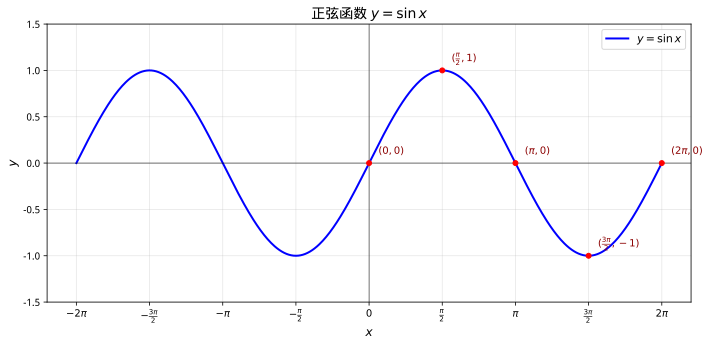

### 2. 余弦函数 $y = \cos x$

**基本性质**：

- 定义域：$\mathbb{R}$
- 值域：$[-1, 1]$
- 周期：$2\pi$
- 偶函数：$\cos(-x) = \cos x$
- 零点：$x = \dfrac{\pi}{2} + k\pi, k \in \mathbb{Z}$
- 最大值：$y = 1$ 在 $x = 2k\pi$
- 最小值：$y = -1$ 在 $x = \pi + 2k\pi$

### 3. 正切函数 $y = \tan x$

**基本性质**：

- 定义域：$x \neq \dfrac{\pi}{2} + k\pi, k \in \mathbb{Z}$
- 值域：$\mathbb{R}$
- 周期：$\pi$
- 奇函数：$\tan(-x) = -\tan x$
- 零点：$x = k\pi, k \in \mathbb{Z}$
- 渐近线：$x = \dfrac{\pi}{2} + k\pi$

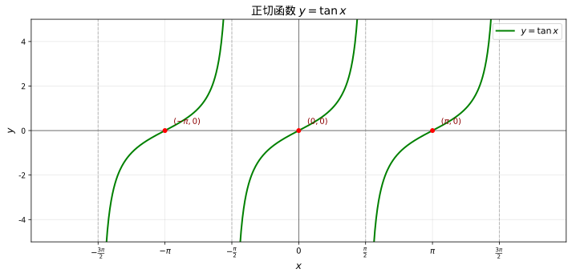

### 4. 余切、正割与余割函数

**$y = \sec x = \dfrac{1}{\cos x}$（正割）**

- 定义域：$x \neq \dfrac{\pi}{2} + k\pi, k \in \mathbb{Z}$（即 $\cos x \neq 0$）
- 值域：$(-\infty, -1] \cup [1, +\infty)$（因 $|\cos x| \le 1$，故 $|\sec x| \ge 1$）
- 周期：$2\pi$；偶函数：$\sec(-x) = \sec x$
- 渐近线：$x = \dfrac{\pi}{2} + k\pi$；与 $\cos$ 图像同零点、开口方向相反

**$y = \csc x = \dfrac{1}{\sin x}$（余割）**

- 定义域：$x \neq k\pi, k \in \mathbb{Z}$（即 $\sin x \neq 0$）
- 值域：$(-\infty, -1] \cup [1, +\infty)$
- 周期：$2\pi$；奇函数：$\csc(-x) = -\csc x$
- 渐近线：$x = k\pi$

**$y = \cot x = \dfrac{\cos x}{\sin x}$（余切）**

- 定义域：$x \neq k\pi, k \in \mathbb{Z}$
- 值域：$\mathbb{R}$
- 周期：$\pi$；奇函数：$\cot(-x) = -\cot x$
- 零点：$x = \dfrac{\pi}{2} + k\pi$；渐近线：$x = k\pi$

> **💡 直观理解（类比）**：$\sec、\csc、\cot$ 是 $\cos、\sin、\tan$ 的"**倒数基因**"：它们的图像就是把"本家函数"的图像整体倒扣（取倒数）而成的——$\cos$ 越接近 $0$，$\sec$ 越冲向 $\pm\infty$；$\cos$ 取到 $\pm1$ 时，$\sec$ 也正好是 $\pm1$。而 $\cot = \dfrac{\cos}{\sin} = \dfrac{1}{\tan}$，本质上就是正切图像的"本家倒影"，所以它和 $\tan$ 一样周期为 $\pi$、有渐近线，只是零点与渐近线的位置刚好互换。**记住"倒来倒去"三个字，就不用死背这三条曲线。**

### 5. 一般形式 $y = A\sin(\omega x + \varphi) + B$

参数含义：

- $A$——**振幅**（amplitude）：函数值偏离平衡位置的最大距离，$|A|$
- $B$——**垂直平移**（vertical shift）：平衡位置
- $\omega$——**角频率**（angular frequency）：周期 $T = \dfrac{2\pi}{\omega}$
- $\varphi$——**初相**（initial phase）：相位偏移
- 相位（phase）：$\omega x + \varphi$
- 频率（frequency）：$f = \dfrac{1}{T} = \dfrac{\omega}{2\pi}$

**图像变换**：

从 $y = \sin x$ 到 $y = A\sin(\omega x + \varphi) + B$：

1. 水平平移：$\varphi$ 左加右减
2. 水平伸缩：$\omega$ 使周期变为 $\dfrac{2\pi}{\omega}$
3. 垂直伸缩：$A$ 使振幅变为 $|A|$
4. 垂直平移：$B$ 上加下减

> **示例 10：分析三角函数图像**
>
> 求函数 $y = 3\sin(2x - \dfrac{\pi}{3}) + 1$ 的振幅、周期、初相和值域。
>
> **解**：
>
> 振幅 $A = 3$，角频率 $\omega = 2$，周期 $T = \dfrac{2\pi}{2} = \pi$，
>
> 初相 $\varphi = -\dfrac{\pi}{3}$，垂直平移 $B = 1$，
>
> 值域为 $[1 - 3, 1 + 3] = [-2, 4]$。

---

## 反三角函数

反三角函数是三角函数的反函数，用于已知三角函数值求角度。

### 1. 反正弦函数 $y = \arcsin x$

- 定义：$x = \sin y$，$y \in \left[-\dfrac{\pi}{2}, \dfrac{\pi}{2}\right]$
- 定义域：$[-1, 1]$
- 值域：$\left[-\dfrac{\pi}{2}, \dfrac{\pi}{2}\right]$
- 奇函数：$\arcsin(-x) = -\arcsin x$
- 性质：$\sin(\arcsin x) = x$，$\arcsin(\sin x) = x$（当 $x \in \left[-\frac{\pi}{2}, \frac{\pi}{2}\right]$）

### 2. 反余弦函数 $y = \arccos x$

- 定义：$x = \cos y$，$y \in [0, \pi]$
- 定义域：$[-1, 1]$
- 值域：$[0, \pi]$
- 性质：$\arccos(-x) = \pi - \arccos x$
- 恒等式：$\arcsin x + \arccos x = \dfrac{\pi}{2}$

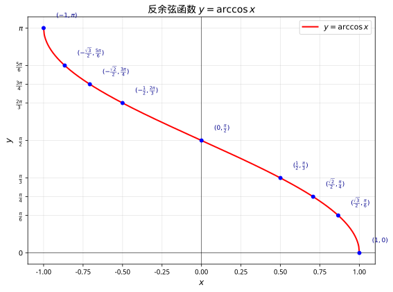

### 3. 反正切函数 $y = \arctan x$

- 定义：$x = \tan y$，$y \in \left(-\dfrac{\pi}{2}, \dfrac{\pi}{2}\right)$
- 定义域：$\mathbb{R}$
- 值域：$\left(-\dfrac{\pi}{2}, \dfrac{\pi}{2}\right)$
- 奇函数：$\arctan(-x) = -\arctan x$
- 渐近线：$y = \pm\dfrac{\pi}{2}$
- 互余恒等式：$\arctan x + \arctan\dfrac{1}{x} = \dfrac{\pi}{2}\ (x > 0)$；当 $x < 0$ 时该和为 $-\dfrac{\pi}{2}$

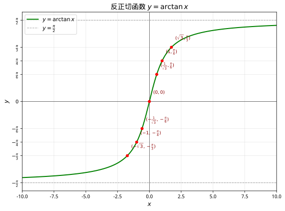

### 4. 反余切函数 $y = \operatorname{arccot} x$

- 定义：$x = \cot y$，$y \in (0, \pi)$
- 定义域：$\mathbb{R}$
- 值域：$(0, \pi)$
- 性质：$\operatorname{arccot}(-x) = \pi - \operatorname{arccot} x$
- 互余恒等式：$\operatorname{arccot} x + \arctan x = \dfrac{\pi}{2}$（$x \in \mathbb{R}$）

> **💡 直观理解（类比）**：反余切与反正弦、反余弦、反正切一样，都是给三角函数"截取一段单调区间"再求反函数。由于 $\cot x$ 的单调递减区间不止一个，惯例上选取 $(0, \pi)$ 这一段作为主值区间，这样定义域是全体实数、值域是 $(0,\pi)$，与 $\arctan$ 的值域 $\left(-\dfrac{\pi}{2}, \dfrac{\pi}{2}\right)$ 恰好"错开半个圆周"，两者相加正好是 $\dfrac{\pi}{2}$。

### 5. 反三角函数的和角公式

由正切的和角公式可导出反正切之和公式：

$$
\boxed{\arctan x + \arctan y = \arctan\frac{x+y}{1-xy} + \varepsilon\pi}
$$

其中修正项按 $\arctan x + \arctan y$ 的和所在区间确定：

$$
\arctan x + \arctan y =
\begin{cases}
\arctan\dfrac{x+y}{1-xy}, & xy < 1 \\[6pt]
\dfrac{\pi}{2}, & xy = 1,\ x > 0 \\[6pt]
\arctan\dfrac{x+y}{1-xy} + \pi, & xy > 1,\ x > 0 \\[6pt]
\arctan\dfrac{x+y}{1-xy} - \pi, & xy > 1,\ x < 0
\end{cases}
$$

> **💡 直观理解（类比）**：两个锐角的正切值相加，对应的"角和"要用 $\dfrac{x+y}{1-xy}$ 来还原——但当和超过 $\dfrac{\pi}{2}$ 时，$\arctan$ 的主值范围装不下，必须加 $\pi$ 把角度"送回"正确象限。这个 $\varepsilon\pi$ 修正项正是"主值区间"带来的必然代价。经典结论 $\arctan 1 + \arctan 2 + \arctan 3 = \pi$ 正是该公式的著名应用。

> **示例 11：反三角函数求值**
>
> 求 $\arcsin\left(\dfrac{\sqrt{3}}{2}\right)$ 和 $\arctan(1)$。
>
> **解**：
>
> 因为 $\sin\dfrac{\pi}{3} = \dfrac{\sqrt{3}}{2}$ 且 $\dfrac{\pi}{3} \in \left[-\dfrac{\pi}{2}, \dfrac{\pi}{2}\right]$，所以 $\arcsin\left(\dfrac{\sqrt{3}}{2}\right) = \dfrac{\pi}{3}$。
>
> 因为 $\tan\dfrac{\pi}{4} = 1$ 且 $\dfrac{\pi}{4} \in \left(-\dfrac{\pi}{2}, \dfrac{\pi}{2}\right)$，所以 $\arctan(1) = \dfrac{\pi}{4}$。

---

## 解题思路与技巧

> 三角函数题目"想不到怎么做"的根源，往往是没有掌握**观察式子的"结构"**和**选用公式的时机**。本节按题型系统梳理核心技巧与思考路径。

### 技巧 1：遇"切"化"弦"，遇"1"化"角"

**核心思想**：$\tan\theta = \dfrac{\sin\theta}{\cos\theta}$，把正切、余切换成弦函数后，往往能露出通分、约分的结构。

**常用等式**：

- $1 = \sin^2\theta + \cos^2\theta$（可代换任何 $1$）
- $1 = \tan 45^\circ$（构造 $45^\circ$ 角）
- $\sec^2\theta = 1 + \tan^2\theta$，$\csc^2\theta = 1 + \cot^2\theta$

> **思路示范**：证明 $\dfrac{\cos\theta}{1 - \sin\theta} = \dfrac{1 + \sin\theta}{\cos\theta}$。
>
> **思考路径**：左边式子含 $1 - \sin\theta$，可乘 $1 + \sin\theta$ 用平方关系消去分母。

$$
\frac{\cos\theta}{1 - \sin\theta} \cdot \frac{1 + \sin\theta}{1 + \sin\theta} = \frac{\cos\theta(1 + \sin\theta)}{1 - \sin^2\theta} = \frac{\cos\theta(1 + \sin\theta)}{\cos^2\theta} = \frac{1 + \sin\theta}{\cos\theta}
$$

> $\blacksquare$

### 技巧 2：处理 $1 \pm \sin\theta$ 与 $1 \pm \cos\theta$

**常用手段**：分子分母同乘"共轭式"，构造平方差。

- $1 - \sin\theta$ 的共轭是 $1 + \sin\theta$，且 $(1 - \sin\theta)(1 + \sin\theta) = \cos^2\theta$
- $1 + \cos\theta$ 的共轭是 $1 - \cos\theta$，且 $(1 + \cos\theta)(1 - \cos\theta) = \sin^2\theta$

> **思路示范**：化简 $\sqrt{1 - \sin 2x}$。
>
> **思考路径**：$\sin 2x = 2\sin x\cos x$，与 $1$（即 $\sin^2x + \cos^2x$）配成完全平方。

$$
\sqrt{1 - \sin 2x} = \sqrt{\sin^2x + \cos^2x - 2\sin x\cos x} = \sqrt{(\sin x - \cos x)^2} = |\sin x - \cos x|
$$

### 技巧 3：辅助角公式（$a\sin x + b\cos x$）

**核心公式**：$a\sin x + b\cos x = \sqrt{a^2 + b^2}\sin(x + \varphi)$，其中 $\varphi$ 满足 $\cos\varphi = \dfrac{a}{\sqrt{a^2+b^2}}$，$\sin\varphi = \dfrac{b}{\sqrt{a^2+b^2}}$。

**何时想到**：求 $a\sin x + b\cos x$ 型函数的最值、值域、单调性、周期时，**首选**辅助角公式化为单一正弦。

**记忆技巧**：$\sqrt{a^2+b^2}$ 是振幅，$\varphi$ 是相位平移，$\tan\varphi = \dfrac{b}{a}$。

> **思路示范**：求 $y = \sin x - \sqrt{3}\cos x$ 的最大值。

$$
y = 2\left(\frac{1}{2}\sin x - \frac{\sqrt{3}}{2}\cos x\right) = 2\sin\left(x - \frac{\pi}{3}\right)
$$

> 故最大值为 $2$。（注意 $\cos\varphi = \frac{1}{2}$，$\sin\varphi = -\frac{\sqrt{3}}{2}$，故 $\varphi = -\frac{\pi}{3}$）

### 技巧 4：倍角公式的"三选一"

$\cos 2\theta$ 有三种等价形式，按需选用：

- $\cos 2\theta = \cos^2\theta - \sin^2\theta$（消弦）
- $\cos 2\theta = 2\cos^2\theta - 1$（**降幂**：$\cos^2\theta = \frac{1+\cos 2\theta}{2}$）
- $\cos 2\theta = 1 - 2\sin^2\theta$（**降幂**：$\sin^2\theta = \frac{1-\cos 2\theta}{2}$）

**何时想到**：题目出现 $\sin^2\theta$ 或 $\cos^2\theta$ 时，常**降幂**化为 $\cos 2\theta$ 以统一角、求周期。

> **思路示范**：求 $y = \sin^2x + \cos^2x$ 的周期（先降幂）。

$$
y = \frac{1 - \cos 2x}{2} + \frac{1 + \cos 2x}{2} = 1
$$

> 常数函数，无周期（或任意实数都是其周期）。

### 技巧 5：拆角法（用已知角表示待求角）

**核心思想**：把待求角写成已知角的**和、差、倍、半**。例如 $\beta = (\alpha + \beta) - \alpha$，$\alpha = \frac{\alpha + \beta}{2} + \frac{\alpha - \beta}{2}$。

**何时想到**：题目给出几个角的三角函数值，要求另一个"组合角"的三角函数值，且已知角之间能通过加减乘除凑出待求角。

> **思路示范**：已知 $\sin(\alpha + \beta) = \frac{3}{5}$，$\sin(\alpha - \beta) = \frac{4}{5}$，求 $\tan\alpha \tan\beta$。
>
> **思考路径**：$\cos2\alpha = \cos[(\alpha+\beta)+(\alpha-\beta)]$。由和角公式展开后，利用两式构造 $\sin\alpha\sin\beta$ 与 $\cos\alpha\cos\beta$。
>
> 展开两式相减：$\sin(\alpha+\beta) - \sin(\alpha-\beta) = 2\cos\alpha\sin\beta = -\frac{1}{5}$；两式相加：$2\sin\alpha\cos\beta = \frac{7}{5}$。两式相除得 $\tan\alpha\tan\beta = \dfrac{\sin\alpha\sin\beta}{\cos\alpha\cos\beta} = \dfrac{-1/10}{7/10} = -\dfrac{1}{7}$。

### 技巧 6：给值求值、给值求角

**给值求值**：由已知三角函数值，用同角关系或公式求另一值，**务必先判象限定符号**。

**给值求角**：先求该角的某三角函数值（通常用余弦，因为余弦在 $[0,\pi]$ 单调，可唯一确定角），再结合角的范围确定角。

> **思路示范**：已知 $\alpha, \beta$ 为锐角，$\cos\alpha = \frac{3}{5}$，$\sin\beta = \frac{5}{13}$，求 $\cos(\alpha + \beta)$。
>
> **思考路径**：用和角公式需要 $\sin\alpha$ 与 $\cos\beta$，先由同角关系求。
>
> $\sin\alpha = \frac{4}{5}$（锐角），$\cos\beta = \frac{12}{13}$（锐角）。于是

$$
\cos(\alpha+\beta) = \cos\alpha\cos\beta - \sin\alpha\sin\beta = \frac{3}{5}\cdot\frac{12}{13} - \frac{4}{5}\cdot\frac{5}{13} = \frac{36 - 20}{65} = \frac{16}{65}
$$

### 技巧 7：解三角形的边角互化与多解判断

**边角互化**：利用正弦定理 $\frac{a}{\sin A} = \frac{b}{\sin B} = \frac{c}{\sin C} = 2R$ 可实现边与角的互换，常用于化简 $\dfrac{a}{b}$ 型或 $\sin A$ 型混合式子。

**多解的判断（难点）**：已知两边及其中一边对角（SSA）时，用正弦定理求角可能有两解。判断技巧：

- **大边对大角**：$a > b \Rightarrow A > B$
- 求出的 $\sin B$ 若有两个可能角（锐角、钝角），需检验是否满足内角和 $< 180^\circ$

> **思路示范**：在 $\triangle ABC$ 中，$a = 2$，$b = \sqrt{6}$，$A = 45^\circ$，求 $B$。

$$
\sin B = \frac{b\sin A}{a} = \frac{\sqrt{6}\cdot\frac{\sqrt{2}}{2}}{2} = \frac{\sqrt{3}}{2}
$$

> 故 $B = 60^\circ$ 或 $120^\circ$。检验：若 $B = 120^\circ$，则 $C = 15^\circ$，合理；若 $B = 60^\circ$，则 $C = 75^\circ$，也合理。故两解都成立。

### 技巧 8：恒等式证明的"方向感"

| 待证目标                                                   | 常用策略                       |
| :--------------------------------------------------------- | :----------------------------- |
| 边、角、次数不统一                                         | **化切为弦**、降幂统一角 |
| 分式结构                                                   | 通分、约分、乘共轭             |
| 右端是"最简式"                                             | 从复杂的一端往简单的一端化     |
| 含$\tan$ 的出现  | 考虑$\tan(\alpha+\beta)$ 公式或化弦 |                                |

**基本原则**：**从复杂端出发，朝简单端化简**；中间若卡住，尝试"切化弦"或"1 的代换"。

### 技巧 9：三角比大小的常用方法

1. **单位圆法**：在单位圆中比较正弦线、余弦线、正切线。
2. **图象法**：画出函数图象比较。
3. **单调性法**：利用正弦、余弦在相应区间的单调性。
4. **中间值法**：与 $0$、$1$、$\pm 1$ 等特殊值比较。
5. **化同名**：利用诱导公式把角化到同一单调区间。

### 技巧 10：齐次式"统一化切"

**核心思想**：若已知 $\tan\theta$ 的值，而待求式是 $\sin\theta$、$\cos\theta$ 的**齐次有理式**（各项次数相同），将分子分母同除以 $\cos\theta$ 的适当次幂，全部化为 $\tan\theta$。

**常见形式**：

- 一次齐次：$\dfrac{a\sin\theta + b\cos\theta}{c\sin\theta + d\cos\theta}$，分子分母同除以 $\cos\theta$
- 二次齐次：$\dfrac{\sin^2\theta + \sin\theta\cos\theta}{\sin^2\theta + \cos^2\theta}$，分母用 $1 = \sin^2\theta + \cos^2\theta$ 补齐后同除以 $\cos^2\theta$

> **思路示范**：已知 $\tan\theta = 2$，求 $\dfrac{\sin\theta + \cos\theta}{\sin\theta - \cos\theta}$。
>
> **思考路径**：分子分母均为一次齐次，同除以 $\cos\theta$。

$$
\frac{\sin\theta + \cos\theta}{\sin\theta - \cos\theta} = \frac{\tan\theta + 1}{\tan\theta - 1} = \frac{2 + 1}{2 - 1} = 3
$$

### 技巧 11：$\sin\theta \pm \cos\theta$ 与 $\sin\theta\cos\theta$ 的联立换元

**核心思想**：三个量 $\sin\theta + \cos\theta$、$\sin\theta - \cos\theta$、$\sin\theta\cos\theta$ 由恒等式

$$
(\sin\theta \pm \cos\theta)^2 = 1 \pm 2\sin\theta\cos\theta
$$

两两关联——**知一可求二**。设 $t = \sin\theta + \cos\theta$，则 $\sin\theta\cos\theta = \dfrac{t^2 - 1}{2}$。

**易错点**：$t = \sin\theta + \cos\theta = \sqrt{2}\sin\left(\theta + \dfrac{\pi}{4}\right) \in [-\sqrt{2}, \sqrt{2}]$，换元后**必须带上 $t$ 的范围**；且由判别式知 $|\sin\theta\cos\theta| \le \dfrac{1}{2}$，超出此范围的值应舍去。

> **思路示范**：已知 $\sin\theta + \cos\theta = \dfrac{1}{5}$，$\theta \in \left(-\dfrac{\pi}{2}, 0\right)$，求 $\sin\theta\cos\theta$ 与 $\sin\theta - \cos\theta$。

$$
(\sin\theta + \cos\theta)^2 = 1 + 2\sin\theta\cos\theta \Rightarrow \sin\theta\cos\theta = \frac{\frac{1}{25} - 1}{2} = -\frac{12}{25}
$$

> 第四象限内 $\sin\theta < 0 < \cos\theta$，故 $\sin\theta\cos\theta < 0$，结果合理。再求差：

$$
(\sin\theta - \cos\theta)^2 = 1 - 2\sin\theta\cos\theta = 1 + \frac{24}{25} = \frac{49}{25}
$$

> 由 $\theta$ 在第四象限，$\sin\theta - \cos\theta < 0$，故 $\sin\theta - \cos\theta = -\dfrac{7}{5}$。**开方前务必先用象限定符号**，这正是本技巧的精髓。

### 技巧 12：值域与最值问题（分式型的处理）

对 $y = \dfrac{a\sin x + b}{c\sin x + d}$ 型，**反解出 $\sin x$**，利用 $|\sin x| \le 1$ 建立关于 $y$ 的不等式：

$$
y(c\sin x + d) = a\sin x + b \Rightarrow \sin x = \frac{b - dy}{cy - a} \Rightarrow \left|\frac{b - dy}{cy - a}\right| \le 1
$$

对 $y = a\sin x + b\cos x$ 型，直接用辅助角公式；对含 $\sin^2 x$ 的，先降幂或换元 $t = \sin x \in [-1,1]$ 化为二次函数求最值（**注意区间端点与对称轴的位置**）。

> **思路示范**：求 $y = \sin^2 x + \sin x - 1$ 的值域。
>
> **思考路径**：令 $t = \sin x \in [-1, 1]$，化为 $y = t^2 + t - 1$ 在 $[-1,1]$ 上的最值问题。对称轴 $t = -\dfrac{1}{2}$ 在区间内，故 $y_{\min} = \dfrac{1}{4} - \dfrac{1}{2} - 1 = -\dfrac{5}{4}$；端点 $t = 1$ 处 $y_{\max} = 1$。值域为 $\left[-\dfrac{5}{4}, 1\right]$。

### 技巧 13：三角方程的通解与区间解

三类基本方程的通解（$k \in \mathbb{Z}$）：

| 方程 | 通解 |
| :--- | :--- |
| $\sin x = a$（$\|a\| \le 1$） | $x = k\pi + (-1)^k \arcsin a$ |
| $\cos x = a$（$\|a\| \le 1$） | $x = 2k\pi \pm \arccos a$ |
| $\tan x = a$ | $x = k\pi + \arctan a$ |

**求指定区间内的解**：先写通解，再解出 $k$ 的取值范围逐个检验，**切勿漏解**（正弦方程在一个周期内通常有两解）。

> **思路示范**：解 $\sin 2x = \dfrac{1}{2}$，$x \in [0, \pi]$。
>
> **思考路径**：$2x \in [0, 2\pi]$，$\sin 2x = \dfrac{1}{2}$ 得 $2x = \dfrac{\pi}{6}$ 或 $\dfrac{5\pi}{6}$，故 $x = \dfrac{\pi}{12}$ 或 $\dfrac{5\pi}{12}$。**先换元统一角度，再回代**，可避免漏解。

### 技巧 14：由图像确定解析式（五点法反用）

对 $y = A\sin(\omega x + \varphi) + B$，按三步从图像读出参数：

1. **定 $A$ 与 $B$**：$A = \dfrac{y_{\max} - y_{\min}}{2}$，$B = \dfrac{y_{\max} + y_{\min}}{2}$
2. **定 $\omega$**：由相邻最高点与最低点的水平距离（半周期）或相邻两个同类零点得 $T$，$\omega = \dfrac{2\pi}{T}$
3. **定 $\varphi$**：代入图像上一个已知点（优先选"最值点"），解出 $\varphi$ 后按约定范围（常为 $|\varphi| < \dfrac{\pi}{2}$ 或 $[0, 2\pi)$）取舍

**关键区分**：代入**上升零点**时 $\omega x_0 + \varphi = 2k\pi$；代入**下降零点**时 $\omega x_0 + \varphi = \pi + 2k\pi$——这是学生最常出错的一步。

> **思路示范**：某图像最高点为 $\left(\dfrac{\pi}{6}, 2\right)$，相邻最低点为 $\left(\dfrac{2\pi}{3}, -2\right)$，求解析式。
>
> $A = 2$，$B = 0$；半周期 $\dfrac{2\pi}{3} - \dfrac{\pi}{6} = \dfrac{\pi}{2}$，故 $T = \pi$，$\omega = 2$。代入最高点：$2 \times \dfrac{\pi}{6} + \varphi = \dfrac{\pi}{2} \Rightarrow \varphi = \dfrac{\pi}{6}$。故 $y = 2\sin\left(2x + \dfrac{\pi}{6}\right)$。

### 技巧 15：解三角形中的面积与最值问题

**两条主路线**：

- **边角统一为角**：用正弦定理 $a = 2R\sin A$ 把边全部换成角的正弦，化为关于某一角的三角函数，再用辅助角公式求最值。
- **边角统一为边**：用余弦定理把角换成边，用基本不等式 $ab \le \left(\dfrac{a+b}{2}\right)^2$ 求面积或周长最值。

**面积的两个常用形式**：$S = \dfrac{1}{2}ab\sin C$（已知两边夹角）；结合内切圆半径 $S = pr$（已知三边）。

> **思路示范**：在 $\triangle ABC$ 中，$A = \dfrac{\pi}{3}$，$a = \sqrt{3}$，求 $b + c$ 的最大值。
>
> **思考路径**：余弦定理 $a^2 = b^2 + c^2 - 2bc\cos A$ 得 $3 = b^2 + c^2 - bc$。由 $b^2 + c^2 \ge \dfrac{(b+c)^2}{2}$ 与 $bc \le \dfrac{(b+c)^2}{4}$：

$$
3 = b^2 + c^2 - bc \ge \frac{(b+c)^2}{2} - \frac{(b+c)^2}{4} = \frac{(b+c)^2}{4}
$$

> 故 $(b+c)^2 \le 12$，$b + c \le 2\sqrt{3}$，当 $b = c = \sqrt{3}$（等边三角形）时取等。

### 技巧 16：诱导公式的口诀化使用——"奇变偶不变，符号看象限"

**操作步骤**：把任意角写成 $\dfrac{k\pi}{2} \pm \alpha$ 的形式（$\alpha$ 看作锐角），则：

- **奇变偶不变**：$k$ 为**奇**数时函数名改变（正弦$\leftrightarrow$余弦、正切$\leftrightarrow$余切）；$k$ 为**偶**数时函数名不变
- **符号看象限**：结果的符号由**原函数**在角 $\dfrac{k\pi}{2} \pm \alpha$（视 $\alpha$ 为锐角时）**所在象限的符号**决定

> **思路示范**：化简 $\sin\left(\dfrac{3\pi}{2} + \alpha\right)$。
>
> **思考路径**：$k = 3$ 为奇数，"正弦变余弦"；视 $\alpha$ 为锐角时 $\dfrac{3\pi}{2} + \alpha$ 在第四象限，正弦为负，故

$$
\sin\left(\frac{3\pi}{2} + \alpha\right) = -\cos\alpha
$$

> 常用推论（$k$ 为偶数的情形）：$\sin(\pi - \alpha) = \sin\alpha$，$\cos(\pi - \alpha) = -\cos\alpha$，$\tan(\pi + \alpha) = \tan\alpha$。口诀把几十个诱导公式压缩成一条规则，**不必逐条记忆**。

### 技巧 17：图像变换的顺序——"先伸缩后平移"还是"先平移后伸缩"

从 $y = \sin x$ 变换到 $y = A\sin(\omega x + \varphi)$ 有两条路线，**平移量不同**，这是最容易出错的地方：

- **路线一（先伸缩后平移）**：横坐标变为原来的 $\dfrac{1}{\omega}$（得 $y = \sin\omega x$），**再向左平移 $\dfrac{\varphi}{\omega}$** 个单位
- **路线二（先平移后伸缩）**：**向左平移 $\varphi$** 个单位（得 $y = \sin(x + \varphi)$），再横坐标变为原来的 $\dfrac{1}{\omega}$

**根源**：平移是"对 $x$ 本身"做的，而伸缩会把平移量一并压缩。建议先把解析式**写成 $y = A\sin\left(\omega\left(x + \dfrac{\varphi}{\omega}\right)\right)$**，"括号里对 $x$ 加了多少"就是路线一的平移量。

> **思路示范**：说明 $y = \sin x \to y = \sin\left(2x + \dfrac{\pi}{3}\right)$ 的两种变换路径。
>
> 写成 $y = \sin 2\left(x + \dfrac{\pi}{6}\right)$：路线一是"横坐标减半，再左移 $\dfrac{\pi}{6}$"；路线二是"左移 $\dfrac{\pi}{3}$，再横坐标减半"。两条路线的平移量 $\dfrac{\pi}{6} \ne \dfrac{\pi}{3}$，**做题时必须指明针对哪条路线**。

### 技巧 18：性质分析"三件套"——周期、对称轴、对称中心

对 $y = A\sin(\omega x + \varphi)$（设 $A, \omega > 0$），三条性质都有"解方程"式求法：

| 性质 | 求法 | 几何解释 |
| :--- | :--- | :--- |
| 周期 | $T = \dfrac{2\pi}{\omega}$ | 相邻两个最高点的水平距离 |
| 对称轴 | 令 $\omega x + \varphi = k\pi + \dfrac{\pi}{2}$ | **对称轴经过最值点** |
| 对称中心 | 令 $\omega x + \varphi = k\pi$ | **零点就是对称中心** |

**注意**：求单调区间前**必须保证 $\omega > 0$**；若 $\omega < 0$，先用诱导公式化正（如 $\sin(-2x) = -\sin 2x$），否则单调区间会反向。

> **思路示范**：求 $y = \sin\left(2x - \dfrac{\pi}{3}\right)$ 的对称轴与对称中心。
>
> 对称轴：$2x - \dfrac{\pi}{3} = k\pi + \dfrac{\pi}{2} \Rightarrow x = \dfrac{k\pi}{2} + \dfrac{5\pi}{12}$；对称中心：$2x - \dfrac{\pi}{3} = k\pi \Rightarrow x = \dfrac{k\pi}{2} + \dfrac{\pi}{6}$，即 $\left(\dfrac{k\pi}{2} + \dfrac{\pi}{6},\ 0\right)$。

### 技巧 19：三角不等式放缩——$\sin x \le x \le \tan x$

当 $0 \le x < \dfrac{\pi}{2}$ 时：

$$
\sin x \le x \le \tan x
$$

（用单位圆中三角函数线或扇形面积可以证明。）**派生结论**：$|\sin x| \le |x|$ 对一切实数成立；$\cos x \le 1 \le \dfrac{x}{\sin x}$ 等。这是证明不等式、放缩估计和夹逼准则的基础工具。

> **思路示范**：比较 $\sin 1$、$1$、$\tan 1$ 的大小（$1$ 弧度 $\in \left(0, \dfrac{\pi}{2}\right)$）。
>
> 直接由 $\sin x \le x \le \tan x$ 得 $\sin 1 \le 1 \le \tan 1$。**不需要计算具体值**——放缩的意义就在于避开计算。

### 技巧 20：三角数列的裂项相消

三角数列求和的两大"裂项源"，本质都是**差角公式的逆用**：

- $\cot A - \cot B = \dfrac{\sin(B - A)}{\sin A\sin B}$，故 $\dfrac{1}{\sin A\sin B} = \dfrac{\cot A - \cot B}{\sin(B-A)}$（角为**等差**时逐项相消）
- $\tan A - \tan B = \dfrac{\sin(A - B)}{\cos A\cos B}$（同理裂 $\dfrac{1}{\cos A\cos B}$）
- 反三角版：$\arctan\dfrac{1}{n^2+n+1} = \arctan(n+1) - \arctan n$（由 $\tan(A-B)$ 公式逆推）

> **思路示范**：求 $S_n = \displaystyle\sum_{k=1}^{n} \dfrac{1}{\sin k\theta\sin(k+1)\theta}$。
>
> **思考路径**：相邻分母的角差恒为 $\theta$，用裂项源。

$$
\frac{1}{\sin k\theta\sin(k+1)\theta} = \frac{\cot k\theta - \cot(k+1)\theta}{\sin\theta}
$$

$$
S_n = \frac{1}{\sin\theta}\left[(\cot\theta - \cot 2\theta) + (\cot 2\theta - \cot 3\theta) + \cdots + (\cot n\theta - \cot(n+1)\theta)\right] = \frac{\cot\theta - \cot(n+1)\theta}{\sin\theta}
$$

> **识别信号**：分母是**两个等差角的正弦（余弦）之积**时，优先考虑裂项相消。

### 技巧 21：$\arcsin(\sin x)$ 型"去外层"运算

**核心原则**：$\arcsin$ 的值域是 $\left[-\dfrac{\pi}{2}, \dfrac{\pi}{2}\right]$，$\arccos$ 的值域是 $[0, \pi]$。只有内层角**恰好落在值域内**时才能直接抵消：

$$
\arcsin(\sin x) = x \iff x \in \left[-\frac{\pi}{2}, \frac{\pi}{2}\right]
$$

否则**先用诱导公式把内层角"搬"进值域**，再去外层。

> **思路示范**：求 $\arccos(\cos 4)$（$4$ 为弧度制）。
>
> **思考路径**：$4 \in \left(\pi, \dfrac{3\pi}{2}\right)$ 不在 $[0, \pi]$ 内，需找 $\beta \in [0, \pi]$ 使 $\cos\beta = \cos 4$。由 $\cos x = \cos(-x) = \cos(2\pi - x)$，取 $\beta = 2\pi - 4$。

$$
\arccos(\cos 4) = 2\pi - 4
$$

> **易错点**：直接写 $\arcsin(\sin x) = x$ 而不检查范围，是反三角章节最高频的错误。

### 技巧 22：构造对偶式——"平方相加/相减"消元

当条件是 $\sin\alpha + \sin\beta$ 与 $\cos\alpha + \cos\beta$（或含 $\pm$ 的对称形式）时，**先和差化积**，发现两式共享因子后**平方相加**（用 $\sin^2 + \cos^2 = 1$ 消元）。

> **思路示范**：已知 $\sin\alpha + \sin\beta = a$，$\cos\alpha + \cos\beta = b$，求 $\cos(\alpha - \beta)$。
>
> **思考路径**：和差化积后发现两式都含 $\cos\dfrac{\alpha-\beta}{2}$，平方相加即可分离出它。

$$
2\sin\frac{\alpha+\beta}{2}\cos\frac{\alpha-\beta}{2} = a, \qquad 2\cos\frac{\alpha+\beta}{2}\cos\frac{\alpha-\beta}{2} = b
$$

$$
4\cos^2\frac{\alpha-\beta}{2}\left(\sin^2\frac{\alpha+\beta}{2} + \cos^2\frac{\alpha+\beta}{2}\right) = a^2 + b^2 \ \Rightarrow\ \cos^2\frac{\alpha-\beta}{2} = \frac{a^2+b^2}{4}
$$

> 由倍角公式：$\cos(\alpha-\beta) = 2\cos^2\dfrac{\alpha-\beta}{2} - 1 = \dfrac{a^2+b^2}{2} - 1$。**全程无需知道 $\alpha, \beta$ 本身**——这正是对偶式构造的威力。

---

## 微积分中的三角函数变换技巧

> 三角函数在微积分中频繁出现，难点在于**把复杂的三角式子化成便于求导、求积分的标准形式**。本节针对微积分场景，系统梳理最常用的十七类三角变换与对应套路。

### 变换一：降幂公式（二次化一次）

微积分中 $\sin^2 x$、$\cos^2 x$ 无法直接积分，需用倍角公式**降幂**：

$$
\sin^2 x = \frac{1 - \cos 2x}{2}, \qquad \cos^2 x = \frac{1 + \cos 2x}{2}
$$

> **思路示范**：求 $\displaystyle\int \sin^2 x\, dx$。

$$
\int \sin^2 x\, dx = \int \frac{1 - \cos 2x}{2}\, dx = \frac{x}{2} - \frac{\sin 2x}{4} + C
$$

### 变换二：积化和差 / 和差化积（乘积化加减）

两个不同角的正弦、余弦**相乘**时，用积化和差化为加减，便于积分：

$$
\sin\alpha\cos\beta = \frac{1}{2}\big[\sin(\alpha+\beta) + \sin(\alpha-\beta)\big]
$$

$$
\cos\alpha\cos\beta = \frac{1}{2}\big[\cos(\alpha+\beta) + \cos(\alpha-\beta)\big]
$$

$$
\sin\alpha\sin\beta = \frac{1}{2}\big[\cos(\alpha-\beta) - \cos(\alpha+\beta)\big]
$$

> **思路示范**：求 $\displaystyle\int \sin 2x\cos 3x\, dx$。

$$
\sin 2x\cos 3x = \frac{1}{2}\big[\sin 5x + \sin(-x)\big] = \frac{1}{2}(\sin 5x - \sin x)
$$

$$
\int \sin 2x\cos 3x\, dx = \frac{1}{2}\left(-\frac{\cos 5x}{5} + \cos x\right) + C
$$

### 变换三：三角代换（处理根号）

被积函数含根号时，用三角代换消去根号。这是**微积分中最核心的三角技巧**：

| 根号形式             | 代换                | 化简结果        |
| :------------------- | :------------------ | :-------------- |
| $\sqrt{a^2 - x^2}$ | $x = a\sin\theta$ | $a\cos\theta$ |
| $\sqrt{a^2 + x^2}$ | $x = a\tan\theta$ | $a\sec\theta$ |
| $\sqrt{x^2 - a^2}$ | $x = a\sec\theta$ | $a\tan\theta$ |

> **思路示范**：求 $\displaystyle\int \frac{dx}{\sqrt{1 - x^2}}$。
>
> 令 $x = \sin\theta$，$dx = \cos\theta\, d\theta$，则

$$
\int \frac{dx}{\sqrt{1 - x^2}} = \int \frac{\cos\theta\, d\theta}{\cos\theta} = \int d\theta = \theta = \arcsin x + C
$$

### 变换四：奇偶次幂的积分策略

对 $\displaystyle\int \sin^n x\cos^m x\, dx$，按幂的奇偶选择策略：

- **$m$ 为奇数**：令 $t = \sin x$（留一个 $\cos x\, dx$ 作 $dt$）
- **$n$ 为奇数**：令 $t = \cos x$（留一个 $\sin x\, dx$ 作 $dt$）
- **$m, n$ 均为偶数**：反复用降幂公式降幂

> **思路示范**：求 $\displaystyle\int \sin^3 x\, dx$（$n=3$ 为奇数）。
>
> 令 $t = \cos x$，$dt = -\sin x\, dx$，$\sin^2 x = 1 - \cos^2 x = 1 - t^2$：

$$
\int \sin^3 x\, dx = \int (1 - t^2)(-dt) = -t + \frac{t^3}{3} + C = -\cos x + \frac{\cos^3 x}{3} + C
$$

### 变换五：对称性与定积分

- 奇函数在 $[-a, a]$ 上的积分为 $0$：$\displaystyle\int_{-a}^{a} f(x)\, dx = 0$（$f$ 为奇函数）
- $\displaystyle\int_0^{\pi/2} \sin^n x\, dx = \int_0^{\pi/2} \cos^n x\, dx$（华里士公式的思想）
- 周期函数在一个周期上的积分与起点选择无关

> **思路示范**：利用对称性求 $\displaystyle\int_{-\pi}^{\pi} \sin x\cos x\, dx$。
>
> 因为 $\sin x\cos x = \frac{1}{2}\sin 2x$ 是奇函数，对称区间上积分为 $0$，故直接得 $\displaystyle\int_{-\pi}^{\pi} \sin x\cos x\, dx = 0$。

### 变换六：链式法则中的三角

复合函数求导是微积分中三角变换的高频场景，务必乘上内层导数：

$$
(\sin u)' = \cos u \cdot u', \qquad (\cos u)' = -\sin u \cdot u', \qquad (\tan u)' = \sec^2 u \cdot u'
$$

> **思路示范**：求 $y = \sin(x^2)$ 的导数。
>
> 内层 $u = x^2$，$u' = 2x$，故 $y' = \cos(x^2) \cdot 2x = 2x\cos(x^2)$。

### 变换七：万能公式（三角→有理式）

令 $t = \tan\dfrac{x}{2}$，可将任意三角函数化为关于 $t$ 的有理式：

$$
\sin x = \frac{2t}{1 + t^2}, \qquad \cos x = \frac{1 - t^2}{1 + t^2}, \qquad \tan x = \frac{2t}{1 - t^2}, \qquad dx = \frac{2\, dt}{1 + t^2}
$$

主要用于某些含 $\sin x, \cos x$ 的有理化积分，是"万不得已"的兜底手段。

### 变换八：三角函数的完整导数表

除 $\sin$、$\cos$、$\tan$ 外，$\sec$、$\csc$、$\cot$ 的导数在对数微分、级数展开中同样高频：

| 函数 | 导数 | 函数 | 导数 |
| :--- | :--- | :--- | :--- |
| $\sin x$ | $\cos x$ | $\csc x$ | $-\csc x\cot x$ |
| $\cos x$ | $-\sin x$ | $\sec x$ | $\sec x\tan x$ |
| $\tan x$ | $\sec^2 x$ | $\cot x$ | $-\csc^2 x$ |

**记忆要点**：带 "c" 开头（$\cos$、$\csc$、$\cot$）的导数都带负号；$\sec$ 与 $\csc$ 的导数都是"本身 $\times$ 正切类函数"。

> **思路示范**：求 $y = \ln|\sec x + \tan x|$ 的导数。

$$
y' = \frac{\sec x\tan x + \sec^2 x}{\sec x + \tan x} = \sec x
$$

> 这正是 $\displaystyle\int \sec x\, dx = \ln|\sec x + \tan x| + C$ 的由来——**正割的积分公式就是"求导验证"的逆过程**，无需死记。

### 变换九：华里士公式（Wallis 公式）

$\dfrac{\pi}{2}$ 区间上正弦（余弦）幂的定积分有统一的递推结果：

$$
I_n = \int_0^{\pi/2} \sin^n x\, dx = \int_0^{\pi/2} \cos^n x\, dx =
\begin{cases}
\dfrac{(n-1)!!}{n!!} \cdot \dfrac{\pi}{2}, & n \text{ 为偶数} \\[8pt]
\dfrac{(n-1)!!}{n!!}, & n \text{ 为奇数}
\end{cases}
$$

其中 $n!!$ 表示双阶乘（$6!! = 6 \cdot 4 \cdot 2$，$5!! = 5 \cdot 3 \cdot 1$）。

> **思路示范**：求 $\displaystyle\int_0^{\pi/2} \sin^4 x\, dx$。
>
> $n = 4$ 为偶数：$I_4 = \dfrac{3!!}{4!!} \cdot \dfrac{\pi}{2} = \dfrac{3 \cdot 1}{4 \cdot 2} \cdot \dfrac{\pi}{2} = \dfrac{3\pi}{16}$。

### 变换十：分部积分的"循环法"与递推公式

**循环分部积分**：分部积分后原积分"转回来了"，把它当未知数解方程。典型对象：$\displaystyle\int e^{ax}\sin bx\, dx$、$\displaystyle\int \sec^3 x\, dx$。

> **思路示范**：求 $\displaystyle\int \sec^3 x\, dx$。

$$
\int \sec^3 x\, dx = \int \sec x\, d(\tan x) = \sec x\tan x - \int \tan x \cdot \sec x\tan x\, dx
$$

$$
= \sec x\tan x - \int \sec x(\sec^2 x - 1)\, dx = \sec x\tan x - \int \sec^3 x\, dx + \int \sec x\, dx
$$

> 原积分出现在两边，移项解得：

$$
\int \sec^3 x\, dx = \frac{1}{2}\sec x\tan x + \frac{1}{2}\ln|\sec x + \tan x| + C
$$

**递推公式**：$I_n = \displaystyle\int \sin^n x\, dx$ 满足 $I_n = -\dfrac{\sin^{n-1} x\cos x}{n} + \dfrac{n-1}{n}I_{n-2}$，可把高次幂逐步降到低次（与变换四配合使用）。

### 变换十一：简化代换 $t = \tan x$（万能公式的轻量版）

当被积函数是 $\sin^2 x$、$\cos^2 x$、$\tan x$ 的有理式（即 $R(\sin^2 x, \cos^2 x)$ 或 $R(\tan x)$ 型）时，令 $t = \tan x$ 比万能公式更简洁：

$$
\sin^2 x = \frac{t^2}{1 + t^2}, \qquad \cos^2 x = \frac{1}{1 + t^2}, \qquad dx = \frac{dt}{1 + t^2}
$$

> **思路示范**：求 $\displaystyle\int \frac{dx}{1 + \sin^2 x}$。
>
> 令 $t = \tan x$：

$$
\int \frac{dx}{1 + \sin^2 x} = \int \frac{\dfrac{dt}{1+t^2}}{1 + \dfrac{t^2}{1+t^2}} = \int \frac{dt}{1 + 2t^2} = \frac{1}{\sqrt{2}}\arctan(\sqrt{2}\,t) + C = \frac{1}{\sqrt{2}}\arctan(\sqrt{2}\tan x) + C
$$

### 变换十二：反三角函数的导数与基本积分

反三角函数的导数本身含根号与分式，是"三角代换 + 隐函数求导"的产物，同时给出了一批基本积分公式：

| 导数 | 对应积分 |
| :--- | :--- |
| $(\arcsin x)' = \dfrac{1}{\sqrt{1 - x^2}}$ | $\displaystyle\int \frac{dx}{\sqrt{a^2 - x^2}} = \arcsin\dfrac{x}{a} + C$ |
| $(\arctan x)' = \dfrac{1}{1 + x^2}$ | $\displaystyle\int \frac{dx}{a^2 + x^2} = \dfrac{1}{a}\arctan\dfrac{x}{a} + C$ |
| $(\operatorname{arccot} x)' = -\dfrac{1}{1 + x^2}$ | $\displaystyle\int \frac{dx}{\sqrt{x^2 \pm a^2}} = \ln\left|x + \sqrt{x^2 \pm a^2}\right| + C$ |

**使用信号**：被积函数出现 $\dfrac{1}{\sqrt{a^2-x^2}}$、$\dfrac{1}{a^2+x^2}$ 结构时，**不要代换**，直接写成反三角函数；出现 $\dfrac{1}{\sqrt{x^2 \pm a^2}}$ 时，结果是对数式（可令 $x = a\tan\theta$ 或 $x = a\sec\theta$ 验证）。

> **思路示范**：求 $\displaystyle\int_0^1 \frac{dx}{1 + x^2}$。

$$
\int_0^1 \frac{dx}{1 + x^2} = \arctan x\Big|_0^1 = \frac{\pi}{4}
$$

### 变换十三：重要极限与等价无穷小替换

三角函数贡献了**最重要的一族等价无穷小**（$x \to 0$）：

$$
\sin x \sim x, \qquad \tan x \sim x, \qquad 1 - \cos x \sim \frac{x^2}{2}, \qquad x - \sin x \sim \frac{x^3}{6}, \qquad \arcsin x \sim x, \qquad \arctan x \sim x
$$

其源头是重要极限 $\lim\limits_{x\to 0}\dfrac{\sin x}{x} = 1$（由夹逼 $\sin x \le x \le \tan x$ 证明，见技巧 19）。

**使用规则**：

- **乘除因子可以放心整体替换**（如 $\dfrac{\sin 3x}{\tan 5x} \to \dfrac{3x}{5x} = \dfrac{3}{5}$）
- **加减项禁止随意替换**——会把误差（高阶小量）一起扔掉，必须提公因式或用泰勒展开（变换十四）

> **思路示范**：求 $\lim\limits_{x\to 0}\dfrac{\tan x - \sin x}{x^3}$。
>
> **错误做法**：把 $\tan x$ 和 $\sin x$ 都换成 $x$，得 $\lim\dfrac{x-x}{x^3} = 0$——两式相减时一阶精度全部抵消，扔掉的恰好是决定结果的高阶项。
>
> **正确做法**：先提出公因式，把差变成乘积结构再替换：

$$
\frac{\tan x - \sin x}{x^3} = \frac{\tan x\,(1 - \cos x)}{x^3} \to \frac{x \cdot \dfrac{x^2}{2}}{x^3} = \frac{1}{2}
$$

### 变换十四：泰勒展开（高精度求极限与近似计算）

当等价无穷小"精度不够"（加减抵消）时，展开到**首个不相消的阶**为止：

$$
\sin x = x - \frac{x^3}{3!} + \frac{x^5}{5!} - \cdots, \qquad \cos x = 1 - \frac{x^2}{2!} + \frac{x^4}{4!} - \cdots
$$

> **思路示范**：求 $\lim\limits_{x\to 0}\dfrac{\sin x - x}{x^3}$。
>
> **思考路径**：分子中 $x$ 与 $\sin x$ 的一阶项抵消，展开到三阶即可。

$$
\sin x - x = -\frac{x^3}{6} + O(x^5) \ \Rightarrow\ \lim_{x\to 0}\frac{\sin x - x}{x^3} = -\frac{1}{6}
$$

> 这正是 $x - \sin x \sim \dfrac{x^3}{6}$ 的来源——**等价无穷小都可以从泰勒展开中"读"出来**，无需单独记忆。

### 变换十五：定积分的"区间再现"（换元翻转区间）

两个高频换元公式，本质是让 $x$ 与"翻转/平移后的自己"会合：

$$
\int_0^{\pi/2} f(\sin x)\,dx = \int_0^{\pi/2} f(\cos x)\,dx \quad\left(\text{令 } x \to \frac{\pi}{2} - x\right)
$$

$$
\int_0^{\pi} x f(\sin x)\,dx = \frac{\pi}{2}\int_0^{\pi} f(\sin x)\,dx \quad(\text{令 } x \to \pi - x)
$$

第二个公式专治**积分号下带 $x$**（且 $x$ 乘的是 $\sin x$ 的函数）的题目——硬算分部积分繁琐，区间再现一步消去 $x$。

> **思路示范**：求 $\displaystyle\int_0^{\pi} x\sin x\,dx$。

$$
\int_0^{\pi} x\sin x\,dx = \frac{\pi}{2}\int_0^{\pi}\sin x\,dx = \frac{\pi}{2}\cdot 2 = \pi
$$

### 变换十六：级数收敛判别中的三角放缩

判断含三角的级数 $\sum a_n$（如 $\sum \sin\dfrac{1}{n}$）时，先用两条基本放缩转化为 $p$-级数：

- $\left|\sin a_n\right| \le |a_n|$（由 $|\sin x| \le |x|$，见技巧 19）
- $|\sin a_n| \le 1$，$|\cos a_n| \le 1$

用**比较判别法**或**极限形式比较法**（配合等价无穷小 $\sin x \sim x$）。

> **思路示范**：判断 $\displaystyle\sum_{n=1}^{\infty}\sin\frac{1}{n^2}$ 与 $\displaystyle\sum_{n=1}^{\infty}\sin\frac{1}{n}$ 的敛散性。
>
> - $\left|\sin\dfrac{1}{n^2}\right| \le \dfrac{1}{n^2}$，而 $\sum\dfrac{1}{n^2}$ 收敛，故 $\sum\sin\dfrac{1}{n^2}$ **收敛**
> - $\lim\limits_{n\to\infty}\dfrac{\sin\frac{1}{n}}{\frac{1}{n}} = 1$，与调和级数同敛散，故 $\sum\sin\dfrac{1}{n}$ **发散**

> **识别信号**：级数通项是三角函数且角度趋于 $0$ 时，**放缩成 $p$-级数**是最快的路线。

### 变换十七：三角代换后的"回代"——构造直角三角形读边

三角代换（变换三）求出关于 $\theta$ 的结果后，还需回代成 $x$。**画直角三角形**是最不易错的方法：由代换式确定两条边，第三边用勾股定理，其余三角函数全部"读边"得出。

> **思路示范**：设 $x = a\sin\theta$（$0 < \theta < \dfrac{\pi}{2}$），写出 $\cos\theta$、$\tan\theta$、$\theta$ 关于 $x$ 的表达式。
>
> 由 $\sin\theta = \dfrac{x}{a}$，构造直角三角形：**对边 $x$，斜边 $a$，邻边 $\sqrt{a^2 - x^2}$**，于是

$$
\cos\theta = \frac{\sqrt{a^2-x^2}}{a}, \qquad \tan\theta = \frac{x}{\sqrt{a^2-x^2}}, \qquad \theta = \arcsin\frac{x}{a}
$$

> 例如用变换三求出 $\displaystyle\int\sqrt{a^2-x^2}\,dx = \frac{a^2}{2}\left(\theta + \sin\theta\cos\theta\right) + C$ 后，按上表回代即得 $\dfrac{x}{2}\sqrt{a^2-x^2} + \dfrac{a^2}{2}\arcsin\dfrac{x}{a} + C$——**不必"解出 $\theta$"，直接读边即可**。

### 微积分三角变换速查表

| 场景                      | 变换                | 目的               |
| :------------------------ | :------------------ | :----------------- |
| $\sin^2 x, \cos^2 x$    | 降幂公式            | 二次化一次，可积分 |
| $\sin mx \cdot \cos nx$ | 积化和差            | 乘积化加减         |
| $\sqrt{a^2 - x^2}$      | $x = a\sin\theta$ | 消根号             |
| $\sqrt{a^2 + x^2}$      | $x = a\tan\theta$ | 消根号             |
| $\sqrt{x^2 - a^2}$      | $x = a\sec\theta$ | 消根号             |
| $\sin^n x\cos^m x$      | 奇留偶降            | 换元或降幂         |
| 对称区间积分              | 奇偶性              | 直接得结果         |
| 复合函数                  | 链式法则            | 乘内层导数         |
| $\sec$、$\csc$、$\cot$ | 完整导数表          | 对数微分、积分验证 |
| $\displaystyle\int_0^{\pi/2}\sin^n x$ | 华里士公式 | 一步定值           |
| $\sec^3 x$、$e^{ax}\sin bx$ | 循环分部积分 | 解方程得积分       |
| $R(\sin^2 x, \cos^2 x)$ | $t = \tan x$      | 轻量有理化         |
| $R(\sin x, \cos x)$ 一般型 | 万能公式 $t = \tan\dfrac{x}{2}$ | 兜底有理化 |
| $\dfrac{1}{\sqrt{a^2-x^2}}$、$\dfrac{1}{a^2+x^2}$ | 反三角导数 | 直接写积分，无需代换 |
| $\dfrac{\sin 3x}{\tan 5x}$ 型极限 | 等价无穷小替换 | 乘除可换，加减慎换 |
| 加减型极限（如 $\dfrac{\tan x - \sin x}{x^3}$） | 泰勒展开 | 补足等价无穷小的精度 |
| $\displaystyle\int_0^\pi x f(\sin x)\,dx$ | 区间再现 $x \to \pi - x$ | 消去积分号下的 $x$ |
| 级数 $\sum\sin a_n$ 的敛散性 | 放缩 $\|\sin a_n\| \le \vert a_n\vert$ | 比较判别法化 $p$-级数 |
| 三角代换后的回代 | 构造直角三角形读边 | 避免"解出 $\theta$" |

---

## 综合示例

> **示例 12：解三角形（综合应用）**
>
> 在 $\triangle ABC$ 中，已知 $a = 2\sqrt{3}$，$b = 2$，$C = 30^\circ$，求 $c$ 及 $\angle A$。
>
> **解**：
>
> **第一步**：用余弦定理求 $c$。

$$
c^2 = a^2 + b^2 - 2ab\cos C = (2\sqrt{3})^2 + 2^2 - 2 \cdot 2\sqrt{3} \cdot 2 \cdot \cos 30^\circ
$$

$$
= 12 + 4 - 8\sqrt{3} \cdot \frac{\sqrt{3}}{2} = 16 - 12 = 4
$$

> 所以 $c = 2$。
>
> **第二步**：用正弦定理求 $\angle A$。

$$
\frac{a}{\sin A} = \frac{c}{\sin C} \Rightarrow \frac{2\sqrt{3}}{\sin A} = \frac{2}{\sin 30^\circ} = \frac{2}{1/2} = 4
$$

$$
\sin A = \frac{2\sqrt{3}}{4} = \frac{\sqrt{3}}{2}
$$

> 所以 $A = 60^\circ$ 或 $A = 120^\circ$。
>
> 检验：由于 $C = 30^\circ$，若 $A = 120^\circ$，则 $B = 30^\circ$，$b = c = 2$，符合题意。若 $A = 60^\circ$，则 $B = 90^\circ$，也合理。所以本题有两解。

> **示例 13：恒等式证明**
>
> 证明：$\dfrac{\sin 2\theta}{1 + \cos 2\theta} = \tan\theta$。
>
> **证明**：
>
> 左边 $= \dfrac{2\sin\theta\cos\theta}{1 + (2\cos^2\theta - 1)} = \dfrac{2\sin\theta\cos\theta}{2\cos^2\theta} = \dfrac{\sin\theta}{\cos\theta} = \tan\theta =$ 右边。

> **示例 14：求函数的最值**
>
> 求函数 $f(x) = \sin x + \cos x$ 的最大值和最小值。
>
> **解**：

$$
f(x) = \sin x + \cos x = \sqrt{2}\left(\frac{\sqrt{2}}{2}\sin x + \frac{\sqrt{2}}{2}\cos x\right)
$$

$$
= \sqrt{2}\sin\left(x + \frac{\pi}{4}\right)
$$

> 所以最大值 $f_{\max} = \sqrt{2}$（当 $x + \frac{\pi}{4} = \frac{\pi}{2} + 2k\pi$，即 $x = \frac{\pi}{4} + 2k\pi$），
>
> 最小值 $f_{\min} = -\sqrt{2}$（当 $x + \frac{\pi}{4} = \frac{3\pi}{2} + 2k\pi$，即 $x = \frac{5\pi}{4} + 2k\pi$）。

> **示例 15：求给定区间上的最值（易错）**
>
> 求 $y = \sin x + \cos x$ 在 $x \in [0, \frac{\pi}{2}]$ 上的最大值与最小值。
>
> **思路**：先辅助角化为 $y = \sqrt{2}\sin\left(x + \frac{\pi}{4}\right)$。此时注意 $x$ 有范围，**不能直接说最大值是 $\sqrt{2}$**，要看 $x + \frac{\pi}{4}$ 的范围。
>
> **解**：$x \in [0, \frac{\pi}{2}] \Rightarrow x + \frac{\pi}{4} \in [\frac{\pi}{4}, \frac{3\pi}{4}]$。在该区间内，$\sin$ 先增后减，最大值在 $\frac{\pi}{2}$ 处取到：

$$
y_{\max} = \sqrt{2}\sin\frac{\pi}{2} = \sqrt{2}，\quad y_{\min} = \sqrt{2}\sin\frac{\pi}{4} = 1
$$

> **易错提醒**：若忽视定义域，误取 $y_{\min} = -\sqrt{2}$ 则错。

> **示例 16：利用辅助角公式求值域**
>
> 求 $y = 3\sin x - 4\cos x$ 的值域。
>
> **思路**：辅助角公式 $y = \sqrt{3^2 + 4^2}\sin(x + \varphi) = 5\sin(x + \varphi)$。
>
> **解**：因为 $|\sin(x + \varphi)| \leqslant 1$，所以值域为 $[-5, 5]$。

> **示例 17：给值求角（确定范围）**
>
> 已知 $\sin\alpha = \frac{\sqrt{2}}{2}$，$\cos\beta = \frac{1}{2}$，且 $\alpha, \beta \in (0, \frac{\pi}{2})$，求 $\alpha + \beta$。
>
> **思路**：先算 $\cos(\alpha + \beta)$，利用余弦在 $(0, \pi)$ 单调确定角。
>
> **解**：$\alpha = \frac{\pi}{4}$，$\beta = \frac{\pi}{3}$，故 $\alpha + \beta = \frac{7\pi}{12}$。
>
> ---
>
> **更一般的做法**：也可以不算出具体角，直接算 $\cos(\alpha+\beta)$。$\sin\alpha = \frac{\sqrt2}{2},\cos\alpha = \frac{\sqrt2}{2}$；$\sin\beta = \frac{\sqrt3}{2},\cos\beta = \frac12$。于是 $\cos(\alpha+\beta) = \frac{\sqrt2}{2}\cdot\frac12 - \frac{\sqrt2}{2}\cdot\frac{\sqrt3}{2} = \frac{\sqrt2 - \sqrt6}{4} < 0$。又 $\alpha+\beta \in (0, \pi)$，故 $\alpha+\beta = \frac{7\pi}{12}$（余弦为负，说明角在第二象限）。

> **示例 18：三角形中的边角互化**
>
> 在 $\triangle ABC$ 中，$\sin^2 A = \sin^2 B + \sin^2 C$，判断三角形形状。
>
> **思路**：出现"一边的长度平方等于另两边平方和"的结构，联想到余弦定理/勾股定理，用正弦定理化角为边。
>
> **解**：由正弦定理 $\frac{a}{\sin A} = \frac{b}{\sin B} = \frac{c}{\sin C} = 2R$，得 $\sin A = \frac{a}{2R}$，代入得

$$
\left(\frac{a}{2R}\right)^2 = \left(\frac{b}{2R}\right)^2 + \left(\frac{c}{2R}\right)^2 \Rightarrow a^2 = b^2 + c^2
$$

> 由勾股定理逆定理，$\triangle ABC$ 为直角三角形，且 $A = 90^\circ$。

---

## 习题

### 基础题

1. 将 $135^\circ$ 转换为弧度，将 $\dfrac{7\pi}{4}$ 转换为角度。
2. 已知 $\sin\theta = \dfrac{12}{13}$，且 $\theta$ 在第一象限，求 $\cos\theta$ 和 $\tan\theta$。
3. 求下列各式的值：

   - $\sin 120^\circ$
   - $\cos 210^\circ$
   - $\tan(-45^\circ)$
4. 化简：$\dfrac{\cos\theta}{1 - \sin\theta} + \dfrac{\cos\theta}{1 + \sin\theta}$。
5. 利用三倍角公式 $\cos 3\theta = 4\cos^3\theta - 3\cos\theta$，求 $\cos 3\theta$ 的值，已知 $\cos\theta = \dfrac{1}{3}$。
6. 将 $300^\circ$ 化为弧度；将 $\dfrac{5\pi}{3}$ 化为角度。
7. 将 $\dfrac{11\pi}{6}$ 化为角度，将 $720^\circ$ 化为弧度。
8. 一扇形的圆心角为 $120^\circ$，半径为 $3$，求其弧长与面积。
9. 求 $\sin\dfrac{5\pi}{6}$ 的值。
10. 求 $\cos\dfrac{4\pi}{3}$ 的值。
11. 求 $\tan\dfrac{7\pi}{4}$ 的值。
12. 求 $\sin 330^\circ$ 的值。
13. 求 $\cos(-60^\circ)$ 的值。
14. 已知 $\tan\theta = \dfrac{3}{4}$ 且 $\theta$ 在第三象限，求 $\sin\theta$ 与 $\cos\theta$。
15. 已知 $\cos\theta = \dfrac{8}{17}$，$\theta$ 在第四象限，求 $\sin\theta$ 与 $\tan\theta$。
16. 求 $\sin^2 25^\circ + \cos^2 25^\circ$ 的值。
17. 化简：$\sec\theta \cdot \sin\theta$。
18. 已知 $\sin\theta = \dfrac{1}{2}$ 且 $\theta$ 为锐角，用弧度表示 $\theta$ 并求 $\cos\theta$。
19. 求 $\tan 45^\circ \cdot \cot 45^\circ$ 的值。
20. 求 $\sin\dfrac{\pi}{4}\cos\dfrac{\pi}{4}$ 的值。
21. 求 $\arcsin\dfrac{\sqrt{3}}{2}$ 与 $\arccos\dfrac{\sqrt{2}}{2}$。
22. 判断符号：$\sin 2$, $\cos 3$, $\tan 4$（弧度制，填正或负）。
23. 在 $\triangle ABC$ 中，$\angle C = 90^\circ$，$b = 8$，$c = 17$，求 $\sin A$ 与 $\tan A$。
24. 求 $\sin 180^\circ \cos 90^\circ + \tan 0^\circ$。
25. 化简：$\dfrac{\sin 40^\circ}{\cos 40^\circ}$。
26. 已知 $\cos\theta = \dfrac{3}{5}$，求 $\sec\theta$ 与 $\csc\theta$。
27. 求 $\sin 120^\circ\cos 150^\circ$ 的值。
28. 求 $\arcsin 1$、$\arcsin 0$、$\arctan\sqrt{3}$。
29. 求 $\arccos\left(-\dfrac{\sqrt{2}}{2}\right)$ 的值。
30. 将 $1$ 弧度近似化为角度（精确到整数度）。
31. 一扇形弧长为 $4$，半径为 $2$，求圆心角的弧度数。
32. 求 $\cos 0^\circ + 2\sin 30^\circ$ 的值。
33. 求 $\cot 60^\circ$ 的值（用分数与根号表示）。

### 应用题

1. 计算 $\sin 15^\circ$（利用半角公式或差角公式）。
2. 在 $\triangle ABC$ 中，$A = 45^\circ$，$B = 60^\circ$，$a = 10$，求 $b$。
3. 在 $\triangle ABC$ 中，$a = 6$，$b = 8$，$c = 10$，求最大角的度数。
4. 已知 $\cos\theta = -\dfrac{3}{5}$，$\theta$ 在第三象限，求 $\sin 2\theta$ 和 $\cos 2\theta$。
5. （物理应用）一质点做简谐运动，其位移满足 $x(t) = 3\sin(2\pi t) + 3\sqrt{3}\cos(2\pi t)$（单位：cm）。

   - (a) 利用辅助角公式将 $x(t)$ 化为 $A\sin(2\pi t + \varphi)$ 的形式；
   - (b) 求该简谐运动的振幅、周期和初相。
6. 在 $\triangle ABC$ 中，$A = 60^\circ$，$B = 75^\circ$，$a = 6$，求 $b$ 与 $c$。
7. 在 $\triangle ABC$ 中，三边 $a = 7$，$b = 8$，$c = 5$，求 $\cos A$ 与三角形的面积。
8. 在 $\triangle ABC$ 中，$A = 30^\circ$，$a = 6$，$b = 8$，求 $\sin B$ 并判断解的情况。
9. 在 $\triangle ABC$ 中，$b = 4$，$c = 5$，$A = 60^\circ$，求边 $a$。
10. 在 $\triangle ABC$ 中，$a = 13$，$b = 14$，$c = 15$，求三角形的面积。
11. 在 $\triangle ABC$ 中，$B = 120^\circ$，$a = 3$，$c = 5$，求边 $b$。
12. 在 $\triangle ABC$ 中，$\angle C = 90^\circ$，$A = 30^\circ$，$b = 6$，求 $a$ 与 $c$。
13. 在 $\triangle ABC$ 中，$A = 45^\circ$，$B = 60^\circ$，外接圆半径 $R = 2$，求 $a$ 与 $b$。
14. 在 $\triangle ABC$ 中，$a = 2$，$b = 2\sqrt{3}$，$A = 30^\circ$，求 $B$ 并判断解的情况。
15. 一斜坡长为 $10$ m，与水平地面成 $30^\circ$，求其垂直高度。
16. 在 $\triangle ABC$ 中，$AB = 5$，$AC = 7$，$A = 60^\circ$，求 $BC$ 与三角形面积。
17. 在 $\triangle ABC$ 中，三边之比 $a : b : c = 3 : 4 : 5$，判断三角形形状并求最大角。
18. 在 $\triangle ABC$ 中，满足 $\sin A = \sin B$，试判断三角形形状。
19. 在 $\triangle ABC$ 中，满足 $a\cos B = b\cos A$，试判断三角形形状。
20. 利用面积公式 $S = \dfrac{1}{2}ab\sin C$，求 $a = 6$，$b = 8$，$C = 30^\circ$ 时的三角形面积。
21. 在 $\triangle ABC$ 中，$B = 45^\circ$，$C = 60^\circ$，$a = 10$，求边 $c$。
22. 在 $\triangle ABC$ 中，$a = 4$，$b = 5$，$c = 6$，求 $\cos A$。
23. 等边三角形边长为 $4$，求其面积与外接圆半径 $R$。
24. 在 $\triangle ABC$ 中，$\sqrt{3}\,a = 2b\sin A$，求角 $B$。
25. 在 $\triangle ABC$ 中，$\sin^2 A + \sin^2 B = \sin^2 C$，判断三角形形状。
26. 从地面一点测得楼顶仰角 $45^\circ$，向前走 $30$ m 后再测，仰角为 $60^\circ$，求楼高 $H$。
27. 在 $\triangle ABC$ 中，$a = 8$，$b = 10$，$C = 120^\circ$，求边 $c$。
28. 在 $\triangle ABC$ 中，$A = 75^\circ$，$B = 45^\circ$，$c = 4$，求 $a$ 与 $b$。
29. 在 $\triangle ABC$ 中，$b = 12$，$c = 15$，$A = 30^\circ$，求三角形面积。
30. 在 $\triangle ABC$ 中，$\dfrac{a}{\cos A} = \dfrac{b}{\cos B} = \dfrac{c}{\cos C}$，判断三角形形状。
31. 在 $\triangle ABC$ 中，$AB = 4$，$AC = 3$，$A = 60^\circ$，求 $BC$ 与 $\sin B$。
32. 在 $\triangle ABC$ 中，$\cos A = \dfrac{1}{2}$，$a = 2\sqrt{3}$，$b = 2$，求角 $B$。
33. 在 $\triangle ABC$ 中，$a = 5$，$b = 6$，$c = 7$，求 $\cos A$ 与最大角的余弦值。

### 提高题

1. 化简：$\dfrac{\sin 3x + \sin x}{\cos 3x + \cos x}$。
2. 求函数 $y = 2\sin(3x + \dfrac{\pi}{6}) - 1$ 的振幅、周期、值域，并求当 $x \in [0, \pi]$ 时函数的最大值。
3. 证明恒等式：$\dfrac{1 - \cos 2\theta}{\sin 2\theta} = \tan\theta$。
4. 在 $\triangle ABC$ 中，已知 $a = 2$，$b = \sqrt{6}$，$A = 45^\circ$，求 $\angle B$ 和 $\angle C$。
5. 利用积化和差公式，求 $\cos 20^\circ \cos 40^\circ \cos 80^\circ$ 的值。
   **提示**：先用积化和差公式将 $\cos 20^\circ \cos 40^\circ$ 化为和差形式，再乘以 $\cos 80^\circ$ 并继续化简。
6. 求 $\sin 65^\circ\cos 25^\circ + \cos 65^\circ\sin 25^\circ$。
7. 求 $\cos 40^\circ\cos 20^\circ - \sin 40^\circ\sin 20^\circ$。
8. 化简：$\sin(x+y)\cos y - \cos(x+y)\sin y$。
9. 求 $\tan 105^\circ$ 的值。
10. 已知 $\cos\alpha = -\dfrac{4}{5}$，$\alpha$ 在第三象限，求 $\sin\left(\alpha + \dfrac{\pi}{3}\right)$。
11. 已知 $\tan\theta = 2$，用"万能代换"求 $\sin 2\theta$。
12. 化简：$\cos^2\theta - \sin^2\theta$。
13. 用半角公式求 $\cos 15^\circ$ 的精确值。
14. 化简：$\sin^2\theta - \cos^2\theta + 1$。
15. 用和角公式求 $\sin 105^\circ$ 的值。
16. 化简：$\dfrac{\sin 2\theta}{1 + \cos 2\theta}$。
17. 已知 $\sin\theta = \dfrac{3}{5}$，$\theta$ 为锐角，求 $\sin\dfrac{\theta}{2}$ 与 $\cos\dfrac{\theta}{2}$。
18. 化简：$\cos 2\theta\cos\theta + \sin 2\theta\sin\theta$。
19. 已知 $\sin\theta = \dfrac{1}{2}$，用三倍角公式求 $\sin 3\theta$。
20. 已知 $\tan\theta = \dfrac{1}{3}$，求 $\tan 2\theta$。
21. 求函数 $y = 3\sin x - 4\cos x$ 的最大值。
22. 化简：$\sin(x+45^\circ) + \sin(x-45^\circ)$。
23. 用半角公式求 $\sin 67.5^\circ$ 的值。
24. 化简：$\dfrac{1 + \cos 2\theta}{\sin 2\theta}$。
25. 求 $\cos 20^\circ\cos 70^\circ - \sin 20^\circ\sin 70^\circ$。
26. 已知 $\sin\theta\cos\theta = \dfrac{1}{4}$，求 $\sin 2\theta$。
27. 化简：$(\sin\theta + \cos\theta)^2 - \sin 2\theta$。
28. 求函数 $f(x) = \sqrt{3}\sin x + \cos x$ 的值域。
29. 已知 $\cos\theta = \dfrac{5}{13}$，$\theta$ 在第四象限，求 $\cos 2\theta$。
30. 求 $\tan\dfrac{\pi}{8}$ 的值（用半角公式或直接求解）。
31. 化简：$\sin\left(\dfrac{\pi}{3}+\theta\right) + \sin\left(\dfrac{\pi}{3}-\theta\right)$。
32. 已知 $\tan\theta = 2$，求 $\cos 2\theta$。
33. 化简：$\dfrac{\cos 3x + \cos x}{\cos 2x}$。
34. 求函数 $y = 2\sin\left(3x + \dfrac{\pi}{4}\right)$ 的周期、振幅与值域。
35. 求函数 $y = \cos\left(2x - \dfrac{\pi}{3}\right)$ 的单调递减区间。
36. 求函数 $y = 3\sin x + 4\cos x$ 的振幅与最大值。
37. 试求 $f(x) = \sin x + \sin 3x$ 的最小正周期。
38. 函数 $y = \sin(\omega x)$（$\omega > 0$）的周期为 $\dfrac{4\pi}{3}$，求 $\omega$。
39. 求函数 $y = 2\cos^2 x - 1$ 的值域。
40. 化简 $y = \sin x\cos x$ 并求其周期与值域。
41. 求函数 $y = \tan\left(x - \dfrac{\pi}{4}\right)$ 的定义域。
42. 求 $y = \sin x - \cos x$ 的最大值及取得最大值时 $x$ 的取值。
43. 将 $y = \sin x$ 经过怎样的变换得到 $y = \sin\left(2x + \dfrac{\pi}{3}\right)$？
44. 求 $y = \cos 2x + \sin 2x$ 的最大值。
45. 证明恒等式：$\dfrac{1}{\cos\theta} - \cos\theta = \sin\theta\tan\theta$。
46. 证明恒等式：$\sin^4\theta - \cos^4\theta = \sin^2\theta - \cos^2\theta$。
47. 证明恒等式：$\tan\theta + \dfrac{1}{\tan\theta} = \dfrac{1}{\sin\theta\cos\theta}$。
48. 证明恒等式：$\dfrac{\sin\theta}{1+\cos\theta} = \dfrac{1-\cos\theta}{\sin\theta}$。
49. 已知 $\arcsin x = \dfrac{\pi}{6}$，求 $x$。
50. 求 $\arcsin\left(-\dfrac{1}{2}\right)$ 与 $\arccos\dfrac{1}{2}$。
51. 求 $\tan(\arctan 3)$。
52. 求 $\cos\left(\arcsin\dfrac{3}{5}\right)$。
53. 求 $\sin\left(\arctan\dfrac{3}{4}\right)$。
54. 求 $\arcsin\left(\cos\dfrac{\pi}{4}\right)$。
55. 求 $y = 2\sin x + 3$ 的最大值、最小值与周期。
56. 函数 $y = A\sin(\omega x)$，$A > 0$，最大值 $4$，最小正周期 $\pi$，求 $A \cdot \omega$。
57. 求 $\sin\left(\arcsin\dfrac12 + \arccos\dfrac12\right)$。
58. 判断函数 $f(x) = x\sin x$ 的奇偶性。
59. 求 $\cos\left(2\arctan 1\right)$。
60. 求 $y = \sin x\cos x$ 在 $x \in \left[0, \dfrac{\pi}{2}\right]$ 上的最大值。
61. 求 $f(x) = \sin x + \sqrt{3}\cos x$ 的最大值及取得最大值时 $x$ 的最小正解。

### 挑战题

1. 已知 $\cos(\alpha-\beta) = \dfrac{3}{5}$，$\cos(\alpha+\beta) = -\dfrac{3}{5}$，求 $\cos\alpha\cos\beta$ 与 $\sin\alpha\sin\beta$。
2. 已知 $\tan(\alpha+\beta) = \dfrac{1}{2}$，$\tan\alpha = \dfrac{1}{3}$，求 $\tan\beta$。
3. 化简：$\cos 3x\cos x - \sin 3x\sin x$。
4. 已知 $\sin\alpha + \sin\beta = \dfrac{1}{2}$，$\cos\alpha + \cos\beta = \dfrac{\sqrt{3}}{2}$，求 $\cos(\alpha-\beta)$。
5. 求 $\dfrac{\sin 13^\circ\cos 17^\circ + \cos 13^\circ\sin 17^\circ}{\cos 15^\circ}$ 的值。
6. 已知 $\sin\alpha\cos\beta = \dfrac14$，$\cos\alpha\sin\beta = \dfrac13$，求 $\sin(\alpha+\beta)$ 与 $\sin(\alpha-\beta)$。
7. 求 $\tan 70^\circ - \tan 25^\circ - \tan 70^\circ\tan 25^\circ$ 的值。
8. 已知 $\cos 2\theta = \dfrac13$，求 $\sin^4\theta + \cos^4\theta$。
9. 已知 $\sin\theta\cos\theta = \dfrac18$，$\theta \in (0,\pi)$，求 $\sin\theta + \cos\theta$。
10. 化简：$\sin\left(\theta+\dfrac{\pi}{6}\right) - \sin\left(\theta-\dfrac{\pi}{6}\right)$。
11. 已知锐角 $\alpha,\beta$ 满足 $\sin\alpha = \dfrac45$，$\cos\beta = \dfrac{5}{13}$，求 $\cos(\alpha-\beta)$。
12. 求 $\cos 42^\circ\cos 18^\circ - \sin 42^\circ\sin 18^\circ$。
13. 已知 $\tan\theta = -\dfrac43$，$\theta$ 在第二象限，求 $\sin 2\theta$ 与 $\cos 2\theta$。
14. 化简：$\dfrac{1 - \cos 2x}{1 + \cos 2x}$。
15. 已知 $\sin\alpha + \cos\alpha = \dfrac12$，求 $\sin 2\alpha$。
16. 求 $\sin 105^\circ - \sin 15^\circ$ 的值。
17. 已知 $\alpha,\beta$ 为锐角，$\tan\alpha = \dfrac17$，$\tan\beta = \dfrac34$，求 $\alpha + \beta$。
18. 解方程：$\sin 2x = \dfrac{\sqrt{3}}{2}$，$x \in [0, 2\pi]$。
19. 解方程：$\cos 2x = \dfrac12$，$x \in [0, 2\pi]$。
20. 求函数 $f(x) = \sin^2 x - \cos^2 x$ 的周期与值域。
21. 在 $\triangle ABC$ 中，$a = 4$，$\sin A = \dfrac23$，求外接圆半径 $R$。
22. 已知 $\sin\theta + \cos\theta = \dfrac75$，求 $\tan\theta + \dfrac{1}{\tan\theta}$。
23. 化简：$\dfrac{\sin 5x + \sin 3x}{\cos 5x - \cos 3x}$。
24. 已知 $\cos\alpha = \dfrac13$ 且 $\dfrac{3\pi}{2} < \alpha < 2\pi$，求 $\sin\dfrac{\alpha}{2}$ 与 $\cos\dfrac{\alpha}{2}$。
25. 化简 $y = -\sin x + \cos x$ 并求其最大值。
26. 已知 $\tan\theta = -\dfrac12$，求 $\sin 2\theta$ 与 $\cos 2\theta$。
27. 已知 $\sin\alpha = \dfrac35$，$\alpha \in \left(\dfrac{\pi}{2}, \pi\right)$，求 $\sin 2\alpha$ 与 $\cos 2\alpha$。
28. 化简：$\cos 5x\cos x - \sin 5x\sin x$。
29. 已知 $\sin\alpha = \dfrac{5}{13}$，$\cos\beta = \dfrac{3}{5}$，$\alpha,\beta$ 均为锐角，求 $\cos(\alpha+\beta)$。
30. 求 $\cos 20^\circ\cos 40^\circ\cos 80^\circ$ 的值。
31. 化简：$\dfrac{\sin 2x + \sin 4x}{\cos 2x + \cos 4x}$。
32. 已知 $\cos\alpha = -\dfrac35$，$\alpha \in \left(\pi, \dfrac{3\pi}{2}\right)$，求 $\tan\dfrac{\alpha}{2}$。
33. 求函数 $y = 2\sin^2 x + 1$ 的周期与值域。
34. 已知 $\tan\theta = \dfrac12$，求 $\sin 2\theta$ 与 $\cos 2\theta$。
35. 化简：$2\sin x\cos x + \cos 2x$。
36. 解不等式：$\sin x > \dfrac12$，$x \in [0, 2\pi]$。
37. 解方程：$\cos 2\theta + \cos\theta = 0$，$\theta \in [0, \pi]$。
38. 解方程：$\sin x - \cos x = 1$，$x \in [0, 2\pi]$。
39. 已知 $\tan\theta = \dfrac13$，求 $\tan\left(\dfrac{\pi}{4}+\theta\right)$。
40. 已知 $\sin\alpha = \dfrac35$，$\alpha$ 为钝角，求 $\cos\dfrac{\alpha}{2}$。
41. 化简：$\dfrac{\sin 4x + \sin 6x}{\cos 4x + \cos 6x}$。
42. 求 $y = \sqrt{3}\sin x - \cos x$ 的振幅、周期与最大值。
43. 已知 $f(x) = A\sin(\omega x) + B$ 的最大值为 $5$，最小值为 $1$，最小正周期为 $\dfrac{\pi}{2}$，求 $A$、$B$、$\omega$。
44. 求 $\sin 75^\circ\sin 15^\circ$（用积化和差）。
45. 已知 $\tan\theta = 2$，求 $\tan 2\theta$。
46. 解方程：$\cos x = \cos 2x$，$x \in [0, \pi]$。
47. 求函数 $f(x) = \cos x\sin x$ 的最小正周期。
48. 化简：$\sin\left(2x+\dfrac{\pi}{6}\right) + \sin\left(2x-\dfrac{\pi}{6}\right)$。
49. 已知 $\tan\theta = -3$，$\theta$ 在第四象限，求 $\sin 2\theta$ 与 $\cos 2\theta$。
50. 解不等式：$\cos 2x \le \dfrac12$，$x \in [0, \pi]$。
51. 求 $\cos 75^\circ\cos 15^\circ$ 的值。
52. 求 $\tan\dfrac{\pi}{12}$ 的值。
53. 已知 $\cos x = -\dfrac{\sqrt{2}}{2}$，$x \in [0, 2\pi]$，求 $x$。
54. 在 $\triangle ABC$ 中，$a = 3$，$b = \sqrt{3}$，$A = 60^\circ$，求角 $B$。
55. 化简：$\sin x\cos 30^\circ + \cos x\sin 30^\circ$。
56. 求 $y = 1 + 2\sin x$ 在 $x \in \left[0, \dfrac{\pi}{2}\right]$ 上的最大值与最小值。

### 探究题

1. 判断并说明：是否存在角 $\theta$ 使 $\sin\theta = \dfrac{\sqrt{5}}{2}$？
2. 探究 $y = \sin x$ 与 $y = \cos x$ 的图像在 $[0, 2\pi]$ 上有几个交点？
3. 证明：$\dfrac{\tan\alpha + \tan\beta}{\tan\alpha - \tan\beta} = \dfrac{\sin(\alpha+\beta)}{\sin(\alpha-\beta)}$。
4. 用 $\sin x$ 与 $\cos x$ 表示 $\sin 4x$（两次使用二倍角公式）。
5. 求定积分 $\displaystyle\int_0^{\pi} \sin x\, dx$（利用 $\int\sin x\,dx = -\cos x + C$）。
6. 已知 $\tan x = 2$，用万能代换求 $\sin 2x$、$\cos 2x$，并验证满足 $\sin^2 2x + \cos^2 2x = 1$。
7. 说明 $y = \cos x$ 为偶函数可从图像关于 $y$ 轴对称观察得出。
8. 已知 $\tan\alpha + \cot\alpha = k$，用 $k$ 表示 $\sin 2\alpha$。
9. 解方程：$\sqrt{3}\sin x + \cos x = 2$，$x \in [0, 2\pi]$。
10. 用两种方法证明：$\dfrac{\sin 2\theta}{1 + \cos 2\theta} = \tan\theta$。
11. 求 $y = \sin x + \cos x$ 的周期并说明理由。
12. 港口水深近似 $d(t) = 6 + 3\sin\dfrac{\pi t}{6}$（米，$t$ 为小时），求最大水深及第一次达到最大水深的时刻。
13. 探究：$\arcsin(\sin x) = x$ 恒成立的 $x$ 的范围。
14. 已知 $\cos 2x = \dfrac13$，用三倍角公式求 $\cos 6x$。
15. 证明：$\cos\alpha\cos(60^\circ+\alpha)\cos(60^\circ-\alpha) = \dfrac14\cos 3\alpha$。
16. 求 $\sin 2\theta$ 的最大值及取得最大值时 $\theta$ 的取值。
17. 已知 $x\in(0,\pi)$，$\sin x + \cos x = \dfrac15$，求 $\sin x - \cos x$。
18. 求 $\cos\dfrac{\pi}{12}$ 的值。
19. 证明：$\sin 2\alpha\sin 2\beta = \dfrac12\left[\cos 2(\alpha-\beta) - \cos 2(\alpha+\beta)\right]$。
20. 求不定积分 $\displaystyle\int \sin^2 x\, dx$（用降幂公式）。
21. 求不定积分 $\displaystyle\int \cos 3x\cos x\, dx$（用积化和差）。
22. 求定积分 $\displaystyle\int_{-\pi}^{\pi} \cos x\, dx$。
23. 求函数 $y = \sin^2 x - \dfrac12$ 的周期与零点。
24. 说明：$\sin\dfrac{\pi}{6} = \cos\dfrac{\pi}{3}$ 揭示了哪条诱导公式（余角公式）？
25. 证明：$\dfrac{1 - \cos\theta}{1 + \cos\theta} = \tan^2\dfrac{\theta}{2}$。
26. 化简：$\sin 2\theta\cos 2\theta$。
27. 说明面积公式 $S = \dfrac12 ab\sin C$ 如何从 $S = \dfrac12 \times 底 \times 高$ 推出。
28. 化简：$\sqrt{1 - \sin 2x}$（提示：配完全平方）。
29. 化简并研究：$y = \sin x\cos x + \cos^2 x$ 的周期与最大值、最小值。
30. 在 $\triangle ABC$ 中，$a = 2$，$b = 3$，$c = 4$，判断三角形是锐角、直角还是钝角三角形。
31. 求边长为 $5$ 的等边三角形的面积。
32. 已知 $\sin\theta = \dfrac12$，$\theta$ 为锐角，用三倍角公式求 $\cos 3\theta$。
33. 化简：$\dfrac{1 + \tan\theta}{1 - \tan\theta}$。
34. 求 $y = 2\sin\left(2x - \dfrac{\pi}{3}\right)$ 在 $x\in[0,\pi]$ 上的最大值与最小值。
35. 在 $\triangle ABC$ 中，$\dfrac{a}{\cos A} = \dfrac{b}{\cos B}$，判断三角形形状。
36. 求 $\sin^2 15^\circ$ 的精确值（用降幂公式）。
37. 一人站在河边测得对岸树顶仰角 $30^\circ$，向后退 $20$ m 后仰角变为 $15^\circ$，求树高。
38. 求 $\tan 70^\circ\tan 20^\circ$ 的值。
39. 在 $\triangle ABC$ 中，$a = 6$，$A = 45^\circ$，$B = 30^\circ$，求边 $b$。
40. 求 $f(x) = \sin x\cos x$ 在 $x\in\left[0,\dfrac{\pi}{2}\right]$ 上的最大值。
41. 已知 $\sin\alpha = \dfrac{3}{5}$，$\sin\beta = \dfrac{12}{13}$，$\alpha,\beta$ 均为锐角，求 $\cos(\alpha-\beta)$。
42. 求 $y = \cos x - \sqrt{3}\sin x$ 的振幅与最大值。
43. 解方程：$\tan x = -1$，$x\in[0,2\pi]$。
44. 在 $\triangle ABC$ 中，$\sqrt{3}\,b = 2a\sin B$，求角 $A$。
45. 将 $\cos 2\theta + \sin 2\theta$ 化为 $A\sin(\omega\theta + \varphi)$ 的形式。
46. 解方程：$\sin 3x = \dfrac12$，$x\in[0,\pi]$。
47. 在 $\triangle ABC$ 中，$a = 7$，$c = 8$，$A = 60^\circ$，求 $\sin C$。
48. 求 $f(x) = \sin^4 x + \cos^4 x$ 的周期与值域。
49. 化简：$\sin\left(x+\dfrac{\pi}{3}\right) - \cos\left(x+\dfrac{\pi}{6}\right)$。
50. 在 $\triangle ABC$ 中，说明 $a\cos C + c\cos A = b$ 是否恒成立（射影定理）。
51. 求 $y = \sqrt{3}\sin 2x + \cos 2x$ 的最大值与周期。
52. 已知 $\cos\theta = \dfrac13$，$\theta$ 为锐角，用半角公式求 $\sin\dfrac{\theta}{2}$。
53. 在 $\triangle ABC$ 中，三边比 $a:b:c = 2:3:4$，求最小角的正弦与余弦。
54. 化简：$\dfrac{\sin 3x - \sin x}{\cos 3x + \cos x}$。
55. 求 $g(x) = \sin x - \sqrt{3}\cos x$ 在 $x\in[0,\pi]$ 上的最大值与最小值。
56. 证明恒等式：$\sin\alpha\cos\beta = \dfrac12\left[\sin(\alpha+\beta) + \sin(\alpha-\beta)\right]$。
57. 求 $\cot 15^\circ$ 的值。
58. 在 $\triangle ABC$ 中，$\cos A : \cos B = b : a$，判断三角形形状。
59. 求定积分 $\displaystyle\int_{-\frac{\pi}{2}}^{\frac{\pi}{2}} \sin^3 x\, dx$（利用奇偶性）。
60. 求 $\tan\dfrac{\pi}{6} + \cot\dfrac{\pi}{6}$ 的值。

### 综合拓展题

1. 化简：$\sin^2\theta - \sin^4\theta + \cos^4\theta$。
2. 在 $\triangle ABC$ 中，$a = 1$，$b = 2$，$c = \sqrt{5}$，判断三角形形状。
3. 求函数 $y = \tan 2x$ 的周期。
4. 求 $\sin 43^\circ\cos 13^\circ - \cos 43^\circ\sin 13^\circ$。
5. 已知 $\sin\alpha = \dfrac35$，$\cos\alpha = \dfrac45$，求 $\tan\alpha + \cot\alpha$。
6. 化简：$\dfrac{\cos x}{1 - \sin x}$。
7. 已知 $\cos 2\theta = -\dfrac12$ 且 $\theta$ 为锐角，求 $\sin 2\theta$。
8. 在 $\triangle ABC$ 中，$B = 30^\circ$，$c = 2\sqrt{3}$，$b = 2$，求 $\sin C$。
9. 求 $y = \sin 2x\cos 2x$ 的值域。
10. 解方程：$\cos x = 0$，$x\in[0,2\pi]$。
11. 化简：$\cos(30^\circ+\theta)\cos(30^\circ-\theta)$。
12. 求 $\arctan\sqrt{3} + \arctan 1$。
13. 在 $\triangle ABC$ 中，$a = 3$，$c = 5$，$A = 45^\circ$，求 $\sin C$。
14. 求 $f(x) = \sin 2x + \sqrt{3}\cos 2x$ 的振幅与周期。
15. 化简：$\dfrac{\sin\theta}{1 + \cos\theta}$。
16. 已知 $\tan\alpha = 2$，$\tan\beta = 3$，求 $\tan(\alpha-\beta)$。
17. 求 $\sin 75^\circ\cos 15^\circ$（用积化和差）。
18. 在 $\triangle ABC$ 中，$a = 6$，$b = 8$，$c = 10$，求外接圆半径 $R$ 与内切圆半径 $r$。
19. 化简：$\dfrac{\tan\theta}{1 + \tan^2\theta}$。
20. 求 $\arcsin\dfrac{\sqrt{2}}{2} + \arccos\dfrac{\sqrt{2}}{2}$。
21. 化简：$\sin\left(\dfrac{\pi}{2}-x\right)\cos x + \cos\left(\dfrac{\pi}{2}-x\right)\sin x$。
22. 求 $y = \cos^2 x + \dfrac12$ 的周期与值域。

## 习题答案与解析

### 基础题答案

1. $135^\circ = \dfrac{3\pi}{4}$，$\dfrac{7\pi}{4} = 315^\circ$
2. $\cos\theta = \dfrac{5}{13}$，$\tan\theta = \dfrac{12}{5}$
3. $\sin 120^\circ = \dfrac{\sqrt{3}}{2}$，$\cos 210^\circ = -\dfrac{\sqrt{3}}{2}$，$\tan(-45^\circ) = -1$
4. $\dfrac{\cos\theta}{1 - \sin\theta} + \dfrac{\cos\theta}{1 + \sin\theta} = \dfrac{\cos\theta(1 + \sin\theta) + \cos\theta(1 - \sin\theta)}{(1 - \sin\theta)(1 + \sin\theta)} = \dfrac{2\cos\theta}{1 - \sin^2\theta} = \dfrac{2\cos\theta}{\cos^2\theta} = \dfrac{2}{\cos\theta} = 2\sec\theta$
5. $\cos 3\theta = 4\cos^3\theta - 3\cos\theta = 4\left(\dfrac{1}{3}\right)^3 - 3 \cdot \dfrac{1}{3} = 4 \cdot \dfrac{1}{27} - 1 = \dfrac{4}{27} - 1 = -\dfrac{23}{27}$
6. $300^\circ = \dfrac{5\pi}{3}$；$\dfrac{5\pi}{3} = 300^\circ$。
7. $\dfrac{11\pi}{6} = 330^\circ$；$720^\circ = 4\pi$。
8. $120^\circ = \dfrac{2\pi}{3}$，弧长 $l = r\theta = 3\cdot\dfrac{2\pi}{3} = 2\pi$；面积 $S = \dfrac{1}{2}r^2\theta = \dfrac{1}{2}\cdot9\cdot\dfrac{2\pi}{3} = 3\pi$。
9. $\sin\dfrac{5\pi}{6} = \sin\dfrac{\pi}{6} = \dfrac{1}{2}$。
10. $\cos\dfrac{4\pi}{3} = -\cos\dfrac{\pi}{3} = -\dfrac{1}{2}$。
11. $\tan\dfrac{7\pi}{4} = -\tan\dfrac{\pi}{4} = -1$。
12. $\sin 330^\circ = -\sin 30^\circ = -\dfrac{1}{2}$。
13. $\cos(-60^\circ) = \cos 60^\circ = \dfrac{1}{2}$。
14. $\theta$ 在第三象限，$\sin\theta=-\dfrac{3}{5}$，$\cos\theta=-\dfrac{4}{5}$（勾三股四弦五）。
15. $\theta$ 在第四象限，$\sin\theta = -\dfrac{15}{17}$，$\tan\theta = -\dfrac{15}{8}$。
16. $\sin^2 25^\circ + \cos^2 25^\circ = 1$（平方关系恒等）。
17. $\sec\theta\sin\theta = \dfrac{1}{\cos\theta}\cdot\sin\theta = \tan\theta$。
18. $\theta = \dfrac{\pi}{6}$，$\cos\theta = \dfrac{\sqrt{3}}{2}$。
19. $\tan 45^\circ \cot 45^\circ = 1\cdot1 = 1$。
20. $\sin\dfrac{\pi}{4}\cos\dfrac{\pi}{4} = \dfrac{\sqrt2}{2}\cdot\dfrac{\sqrt2}{2} = \dfrac{1}{2}$。
21. $\arcsin\dfrac{\sqrt3}{2} = \dfrac{\pi}{3}$，$\arccos\dfrac{\sqrt2}{2} = \dfrac{\pi}{4}$。
22. $\dfrac{\pi}{2}<2<\pi$ 故 $\sin 2>0$；$\dfrac{\pi}{2}<3<\pi$ 故 $\cos 3<0$；$\pi<4<\dfrac{3\pi}{2}$ 故 $\tan 4>0$。
23. $a = \sqrt{17^2-8^2} = 15$，$\sin A = \dfrac{a}{c} = \dfrac{15}{17}$，$\tan A = \dfrac{a}{b} = \dfrac{15}{8}$。
24. 原式 $= 0\cdot0 + 0 = 0$。
25. $\dfrac{\sin 40^\circ}{\cos 40^\circ} = \tan 40^\circ$。
26. $\sec\theta = \dfrac{1}{\cos\theta} = \dfrac{5}{3}$；$\csc\theta = \pm\dfrac{5}{4}$（$\sin\theta = \pm\dfrac{4}{5}$，符号由象限决定）。
27. $\sin 120^\circ\cos 150^\circ = \dfrac{\sqrt3}{2}\cdot\left(-\dfrac{\sqrt3}{2}\right) = -\dfrac{3}{4}$。
28. $\arcsin 1 = \dfrac{\pi}{2}$，$\arcsin 0 = 0$，$\arctan\sqrt3 = \dfrac{\pi}{3}$。
29. $\arccos\left(-\dfrac{\sqrt2}{2}\right) = \pi - \arccos\dfrac{\sqrt2}{2} = \pi - \dfrac{\pi}{4} = \dfrac{3\pi}{4}$。
30. $1$ 弧度 $= \dfrac{180^\circ}{\pi} \approx 57^\circ$。
31. $\theta = \dfrac{l}{r} = \dfrac{4}{2} = 2$ 弧度。
32. $\cos 0^\circ + 2\sin 30^\circ = 1 + 2\cdot\dfrac{1}{2} = 2$。
33. $\cot 60^\circ = \dfrac{\cos 60^\circ}{\sin 60^\circ} = \dfrac{1/2}{\sqrt3/2} = \dfrac{\sqrt3}{3}$。

### 应用题答案

1. $\sin 15^\circ = \dfrac{\sqrt{6} - \sqrt{2}}{4}$
2. $b = \dfrac{a\sin B}{\sin A} = \dfrac{10 \cdot \sin 60^\circ}{\sin 45^\circ} = \dfrac{10 \cdot \frac{\sqrt{3}}{2}}{\frac{\sqrt{2}}{2}} = 5\sqrt{6}$
3. 最大边 $c = 10$ 所对角 $C$ 最大，$\cos C = \dfrac{6^2 + 8^2 - 10^2}{2 \cdot 6 \cdot 8} = \dfrac{36 + 64 - 100}{96} = 0$，$C = 90^\circ$
4. $\sin\theta = -\dfrac{4}{5}$，$\sin 2\theta = 2 \cdot \left(-\dfrac{4}{5}\right) \cdot \left(-\dfrac{3}{5}\right) = \dfrac{24}{25}$，$\cos 2\theta = 2 \cdot \dfrac{9}{25} - 1 = -\dfrac{7}{25}$
5. (a) $x(t) = 3\sin(2\pi t) + 3\sqrt{3}\cos(2\pi t) = 6\left(\dfrac{1}{2}\sin(2\pi t) + \dfrac{\sqrt{3}}{2}\cos(2\pi t)\right) = 6\sin\left(2\pi t + \dfrac{\pi}{3}\right)$。
   (b) 振幅 $A = 6$ cm，周期 $T = \dfrac{2\pi}{2\pi} = 1$ s，初相 $\varphi = \dfrac{\pi}{3}$。
6. $C = 45^\circ$。由正弦定理 $\dfrac{a}{\sin A}=\dfrac{b}{\sin B}=\dfrac{c}{\sin C}$，$b = a\dfrac{\sin 75^\circ}{\sin 60^\circ}$。$\sin 75^\circ=\dfrac{\sqrt6+\sqrt2}{4}$，$b = 6\cdot\dfrac{\frac{\sqrt6+\sqrt2}{4}}{\frac{\sqrt3}{2}} = 3\sqrt2(\sqrt2+1)\cdot\dfrac{1}{\sqrt3} = \sqrt3(2+\sqrt2) \approx 5.1$；同理 $c = a\dfrac{\sin 45^\circ}{\sin 60^\circ} = 6\cdot\dfrac{\sqrt2/2}{\sqrt3/2} = 2\sqrt6$。（化简 $b = 2\sqrt3+\sqrt6$）
7. $\cos A = \dfrac{b^2+c^2-a^2}{2bc} = \dfrac{64+25-49}{2\cdot8\cdot5} = \dfrac{40}{80} = \dfrac{1}{2}$，$A = 60^\circ$。面积 $S = \dfrac12 bc\sin A = \dfrac12\cdot8\cdot5\cdot\dfrac{\sqrt3}{2} = 10\sqrt3$。
8. $\sin B = \dfrac{b\sin A}{a} = \dfrac{8\cdot\frac12}{6} = \dfrac{2}{3}$。因 $b > a\sin A$ 且 $b$ 可取 $\arcsin\frac23$ 或 $180^\circ-\arcsin\frac23$，检验两者 $C>0$ 均成立，故有两解。
9. $a^2 = b^2+c^2-2bc\cos A = 16+25-2\cdot4\cdot5\cdot\dfrac12 = 41-20 = 21$，$a = \sqrt{21}$。
10. 半周长 $p = 21$，海伦公式 $S = \sqrt{21\cdot8\cdot7\cdot6} = \sqrt{7056} = 84$。
11. $b^2 = a^2+c^2-2ac\cos B = 9+25-2\cdot3\cdot5\cdot(-\dfrac12) = 34+15 = 49$，$b = 7$。
12. $B = 60^\circ$。$\tan A = \dfrac{a}{b} \Rightarrow a = b\tan 30^\circ = 6\cdot\dfrac{\sqrt3}{3} = 2\sqrt3$；$c = \sqrt{a^2+b^2} = \sqrt{12+36} = 4\sqrt3$。
13. $\dfrac{a}{\sin A}=2R=4$，$a = 4\sin 45^\circ = 2\sqrt2$；$b = 4\sin 60^\circ = 2\sqrt3$。
14. $\sin B = \dfrac{b\sin A}{a} = \dfrac{2\sqrt3\cdot\frac12}{2} = \dfrac{\sqrt3}{2}$，$B = 60^\circ$ 或 $120^\circ$。$B=60^\circ$ 时 $C=90^\circ$；$B=120^\circ$ 时 $C=30^\circ$，均合理，两解都成立。
15. 高度 $h = 10\sin 30^\circ = 10\cdot\dfrac12 = 5$ m。
16. $BC^2 = AB^2+AC^2-2\cdot AB\cdot AC\cos A = 25+49-2\cdot5\cdot7\cdot\dfrac12 = 74-35 = 39$，$BC = \sqrt{39}$；$S = \dfrac12\cdot5\cdot7\cdot\dfrac{\sqrt3}{2} = \dfrac{35\sqrt3}{4}$。
17. 设 $a=3k,b=4k,c=5k$。最长度边 $c$，$\cos C = \dfrac{9k^2+16k^2-25k^2}{2\cdot3k\cdot4k} = 0$，$C = 90^\circ$，直角三角形。
18. 由正弦定理 $\sin A=\dfrac{a}{2R}$，$\sin B=\dfrac{b}{2R}$，$\sin A=\sin B \Rightarrow a = b$，故等腰三角形。
19. 由余弦定理 $\cos B = \dfrac{a^2+c^2-b^2}{2ac}$，$\cos A = \dfrac{b^2+c^2-a^2}{2bc}$，代入 $a\cos B = b\cos A$ 整理得 $a^2 = b^2$，$a=b$，等腰三角形。
20. $S = \dfrac12\cdot6\cdot8\cdot\sin 30^\circ = 24\cdot\dfrac12 = 12$。
21. $A = 75^\circ$。$\dfrac{a}{\sin A}=\dfrac{c}{\sin C}$，$c = a\dfrac{\sin 60^\circ}{\sin 75^\circ} = 10\cdot\dfrac{\sqrt3/2}{(\sqrt6+\sqrt2)/4} = \dfrac{20\sqrt3}{\sqrt6+\sqrt2} = 10(\sqrt3-1)$（约 $7.3$）。
22. $\cos A = \dfrac{b^2+c^2-a^2}{2bc} = \dfrac{25+36-16}{2\cdot5\cdot6} = \dfrac{45}{60} = \dfrac34$。
23. 面积 $S = \dfrac{\sqrt3}{4}\cdot4^2 = 4\sqrt3$；$R = \dfrac{a}{2\sin A} = \dfrac{4}{2\cdot\frac{\sqrt3}{2}} = \dfrac{4\sqrt3}{3}$。
24. $\sqrt3 a = 2b\sin A$，由正弦定理 $a = 2R\sin A$, $b = 2R\sin B$ 代入得 $\sqrt3\sin A = 2\sin B\sin A$，$\sin B = \dfrac{\sqrt3}{2}$，$B = 60^\circ$ 或 $120^\circ$。
25. 正弦定理得 $a^2 = b^2+c^2$（除以 $(2R)^2$），由勾股逆定理为直角三角形且 $A = 90^\circ$。
26. 设离楼 $x$ 处仰角 $45^\circ$ 则 $x = H$；前进后 $(x-30)\tan 60^\circ = H$，即 $x-30 = \dfrac{H}{\sqrt3}$，联立 $H = \dfrac{H}{\sqrt3}+30$，$H\left(1-\dfrac{1}{\sqrt3}\right) = 30$，$H = 45 + 15\sqrt3 \approx 71$ m。
27. $c^2 = a^2+b^2-2ab\cos C = 64+100-2\cdot8\cdot10\cdot(-\dfrac12) = 164+80 = 244$，$c = 2\sqrt{61}$。
28. $C = 60^\circ$。$\dfrac{a}{\sin A}=\dfrac{c}{\sin C}$，$a = 4\dfrac{\sin 75^\circ}{\sin 60^\circ} = 2\sqrt2(1+\dfrac{1}{\sqrt3}) = \dfrac{2\sqrt2(3+\sqrt3)}{3}$；$b = 4\dfrac{\sin 45^\circ}{\sin 60^\circ} = \dfrac{4\sqrt6}{3}$。
29. $S = \dfrac12 bc\sin A = \dfrac12\cdot12\cdot15\cdot\dfrac12 = 45$。
30. 设比值为 $\lambda$，则 $a = \lambda\cos A$ 等，由正弦定理 $a:b:c = \sin A:\sin B:\sin C$，得 $\dfrac{\sin A}{\cos A}=\dfrac{\sin B}{\cos B}$ 即 $\tan A=\tan B$，同理 $\tan A=\tan B=\tan C$，$A=B=C=60^\circ$，等边三角形。
31. $BC^2 = 16+9-2\cdot4\cdot3\cdot\dfrac12 = 25-12 = 13$，$BC = \sqrt{13}$；$\sin B = \dfrac{AC\sin A}{BC} = \dfrac{3\cdot\frac{\sqrt3}{2}}{\sqrt{13}} = \dfrac{3\sqrt3}{2\sqrt{13}} = \dfrac{3\sqrt{39}}{26}$。
32. $\cos A = \dfrac12$ 即 $A = 60^\circ$。$\dfrac{a}{\sin A}=\dfrac{b}{\sin B}$，$\sin B = \dfrac{b\sin A}{a} = \dfrac{2\cdot\frac{\sqrt3}{2}}{2\sqrt3} = \dfrac12$，$B = 30^\circ$（因 $b<a$，$B<90^\circ$）。
33. $\cos A = \dfrac{b^2+c^2-a^2}{2bc} = \dfrac{36+49-25}{2\cdot6\cdot7} = \dfrac{60}{84} = \dfrac57$；最大角为 $C$ 的对边 $c=7$，$\cos C = \dfrac{25+36-49}{2\cdot5\cdot6} = \dfrac{12}{60} = \dfrac15$。

### 提高题答案

1. $\dfrac{\sin 3x + \sin x}{\cos 3x + \cos x} = \dfrac{2\sin 2x\cos x}{2\cos 2x\cos x} = \tan 2x$
2. 振幅 $A = 2$，周期 $T = \dfrac{2\pi}{3}$，值域 $[-3, 1]$。当 $x = \dfrac{\pi}{9}$ 时，$y_{\max} = 1$
3. $\dfrac{1 - \cos 2\theta}{\sin 2\theta} = \dfrac{1 - (1 - 2\sin^2\theta)}{2\sin\theta\cos\theta} = \dfrac{2\sin^2\theta}{2\sin\theta\cos\theta} = \dfrac{\sin\theta}{\cos\theta} = \tan\theta$
4. 由正弦定理 $\dfrac{a}{\sin A} = \dfrac{b}{\sin B}$，$\sin B = \dfrac{b\sin A}{a} = \dfrac{\sqrt{6} \cdot \frac{\sqrt{2}}{2}}{2} = \dfrac{\sqrt{3}}{2}$，所以 $B = 60^\circ$ 或 $120^\circ$。

   - 若 $B = 60^\circ$，则 $C = 75^\circ$
   - 若 $B = 120^\circ$，则 $C = 15^\circ$
5. 先用积化和差：$\cos 20^\circ \cos 40^\circ = \dfrac{1}{2}[\cos 60^\circ + \cos 20^\circ] = \dfrac{1}{4} + \dfrac{1}{2}\cos 20^\circ$。
   再乘以 $\cos 80^\circ$：原式 $= \dfrac{1}{4}\cos 80^\circ + \dfrac{1}{2}\cos 20^\circ \cos 80^\circ$。
   对第二项再用积化和差：$\cos 20^\circ \cos 80^\circ = \dfrac{1}{2}[\cos 100^\circ + \cos 60^\circ] = \dfrac{1}{2}\left(-\cos 80^\circ + \dfrac{1}{2}\right)$。
   代入：原式 $= \dfrac{1}{4}\cos 80^\circ + \dfrac{1}{4}\left(-\cos 80^\circ + \dfrac{1}{2}\right) = \dfrac{1}{4}\cos 80^\circ - \dfrac{1}{4}\cos 80^\circ + \dfrac{1}{8} = \dfrac{1}{8}$。
6. 原式 $= \sin(65^\circ+25^\circ) = \sin 90^\circ = 1$。
7. 原式 $= \cos(40^\circ+20^\circ) = \cos 60^\circ = \dfrac12$。
8. 原式 $= \sin[(x+y)-y] = \sin x$。
9. $\tan 105^\circ = \tan(60^\circ+45^\circ) = \dfrac{\tan 60^\circ+\tan 45^\circ}{1-\tan 60^\circ\tan 45^\circ} = \dfrac{\sqrt3+1}{1-\sqrt3} = -(2+\sqrt3)$。
10. $\alpha$ 在第三象限，$\sin\alpha = -\dfrac35$。$\sin(\alpha+\dfrac{\pi}{3}) = \sin\alpha\cos\dfrac{\pi}{3}+\cos\alpha\sin\dfrac{\pi}{3} = -\dfrac35\cdot\dfrac12 + (-\dfrac45)\cdot\dfrac{\sqrt3}{2} = -\dfrac{3+4\sqrt3}{10}$。
11. 万能公式 $\sin 2\theta = \dfrac{2\tan\theta}{1+\tan^2\theta} = \dfrac{2\cdot2}{1+4} = \dfrac45$。
12. $\cos^2\theta - \sin^2\theta = \cos 2\theta$。
13. $\cos 15^\circ = \sqrt{\dfrac{1+\cos 30^\circ}{2}} = \sqrt{\dfrac{1+\frac{\sqrt3}{2}}{2}} = \dfrac{\sqrt{2+\sqrt3}}{2} = \dfrac{\sqrt6+\sqrt2}{4}$。
14. $\sin^2\theta-\cos^2\theta+1 = \sin^2\theta-\cos^2\theta+(\sin^2\theta+\cos^2\theta) = 2\sin^2\theta$。
15. $\sin 105^\circ = \sin(60^\circ+45^\circ) = \dfrac{\sqrt3}{2}\cdot\dfrac{\sqrt2}{2}+\dfrac12\cdot\dfrac{\sqrt2}{2} = \dfrac{\sqrt6+\sqrt2}{4}$。
16. $\dfrac{\sin 2\theta}{1+\cos 2\theta} = \dfrac{2\sin\theta\cos\theta}{2\cos^2\theta} = \tan\theta$。
17. $\cos\theta = \dfrac45$。$\sin\dfrac{\theta}{2} = \sqrt{\dfrac{1-4/5}{2}} = \sqrt{\dfrac{1}{10}} = \dfrac{\sqrt{10}}{10}$；$\cos\dfrac{\theta}{2} = \sqrt{\dfrac{1+4/5}{2}} = \dfrac{3\sqrt{10}}{10}$。
18. 原式 $= \cos(2\theta-\theta) = \cos\theta$。
19. $\sin 3\theta = 3\sin\theta - 4\sin^3\theta = 3\cdot\dfrac12 - 4\cdot\dfrac18 = \dfrac32 - \dfrac12 = 1$。
20. $\tan 2\theta = \dfrac{2\tan\theta}{1-\tan^2\theta} = \dfrac{2\cdot\frac13}{1-\frac19} = \dfrac{\frac23}{\frac89} = \dfrac34$。
21. $y = 5\left(\dfrac35\sin x - \dfrac45\cos x\right) = 5\sin(x+\varphi)$，最大值 $5$。
22. 原式 $= 2\sin x\cos 45^\circ = 2\sin x\cdot\dfrac{\sqrt2}{2} = \sqrt2\sin x$。
23. $\sin 67.5^\circ = \sin\dfrac{135^\circ}{2} = \sqrt{\dfrac{1-\cos 135^\circ}{2}} = \sqrt{\dfrac{1+\frac{\sqrt2}{2}}{2}} = \dfrac{\sqrt{2+\sqrt2}}{2}$。
24. $\dfrac{1+\cos 2\theta}{\sin 2\theta} = \dfrac{2\cos^2\theta}{2\sin\theta\cos\theta} = \cot\theta$。
25. 原式 $= \cos(20^\circ+70^\circ) = \cos 90^\circ = 0$。
26. $\sin 2\theta = 2\sin\theta\cos\theta = 2\cdot\dfrac14 = \dfrac12$。
27. $(\sin\theta+\cos\theta)^2 - \sin 2\theta = \sin^2+\cos^2+2\sin\cos - 2\sin\cos = 1$。
28. $f(x) = 2\sin\left(x+\dfrac{\pi}{6}\right)$，值域 $[-2,2]$。
29. $\cos 2\theta = 2\cos^2\theta - 1 = 2\cdot\dfrac{25}{169} - 1 = -\dfrac{119}{169}$。
30. $\tan\dfrac{\pi}{8} = \dfrac{1-\cos\frac{\pi}{4}}{\sin\frac{\pi}{4}} = \dfrac{1-\frac{\sqrt2}{2}}{\frac{\sqrt2}{2}} = \sqrt2 - 1$。
31. 原式 $= 2\sin\dfrac{\pi}{3}\cos\theta = 2\cdot\dfrac{\sqrt3}{2}\cos\theta = \sqrt3\cos\theta$。
32. $\cos 2\theta = \dfrac{1-\tan^2\theta}{1+\tan^2\theta} = \dfrac{1-4}{1+4} = -\dfrac35$。
33. $\dfrac{\cos 3x+\cos x}{\cos 2x} = \dfrac{2\cos 2x\cos x}{\cos 2x} = 2\cos x$。
34. 周期 $T = \dfrac{2\pi}{3}$，振幅 $A = 2$，值域 $[-2, 2]$。
35. 令 $2x-\dfrac{\pi}{3} \in [0+2k\pi, \pi+2k\pi]$，得 $x \in \left[\dfrac{\pi}{6}+k\pi, \dfrac{2\pi}{3}+k\pi\right]$。
36. 振幅 $\sqrt{3^2+4^2}=5$，最大值 $5$。
37. 因为 $\sin x$ 与 $\sin 3x$ 周期分别为 $2\pi$ 与 $\dfrac{2\pi}{3}$，公周期为 $2\pi$，最小正周期 $2\pi$。
38. $T = \dfrac{2\pi}{\omega} = \dfrac{4\pi}{3} \Rightarrow \omega = \dfrac32$。
39. $y = 2\cos^2 x - 1 = \cos 2x$，值域 $[-1,1]$。
40. $y = \dfrac12\sin 2x$，周期 $\pi$，值域 $\left[-\dfrac12, \dfrac12\right]$。
41. 令 $x-\dfrac{\pi}{4} \neq \dfrac{\pi}{2}+k\pi$，$x \neq \dfrac{3\pi}{4} + k\pi$，定义域为 $\left\{x\,|\,x\neq\dfrac{3\pi}{4}+k\pi\right\}$。
42. $y = \sqrt2\sin\left(x-\dfrac{\pi}{4}\right)$，最大值 $\sqrt2$，当 $x-\dfrac{\pi}{4}=\dfrac{\pi}{2}+2k\pi$，即 $x = \dfrac{3\pi}{4}+2k\pi$。
43. 将横坐标压缩为原来的 $\dfrac12$ 得 $\sin 2x$，再向左平移 $\dfrac{\pi}{6}$ 得 $\sin\left(2(x+\tfrac{\pi}{6})\right) = \sin\left(2x+\tfrac{\pi}{3}\right)$。
44. $y = \sqrt2\sin\left(2x+\dfrac{\pi}{4}\right)$，最大值 $\sqrt2$。
45. 左边 $= \dfrac{1-\cos^2\theta}{\cos\theta} = \dfrac{\sin^2\theta}{\cos\theta} = \sin\theta\cdot\tan\theta$ $=$ 右边。
46. 左边 $= (\sin^2-\cos^2)(\sin^2+\cos^2) = \sin^2\theta-\cos^2\theta =$ 右边。
47. 左边 $= \dfrac{\sin\theta}{\cos\theta}+\dfrac{\cos\theta}{\sin\theta} = \dfrac{\sin^2+\cos^2}{\sin\theta\cos\theta} = \dfrac{1}{\sin\theta\cos\theta}$ $=$ 右边。
48. 展开验证：$\sin^2\theta = (1+\cos\theta)(1-\cos\theta) = 1-\cos^2\theta$，两边同除 $(1+\cos\theta)\sin\theta$ 得等式成立。
49. $x = \sin\dfrac{\pi}{6} = \dfrac12$。
50. $\arcsin\left(-\dfrac12\right) = -\dfrac{\pi}{6}$；$\arccos\dfrac12 = \dfrac{\pi}{3}$。
51. $\tan(\arctan 3) = 3$（反函数性质）。
52. 设 $\alpha = \arcsin\dfrac35$，$\sin\alpha=\dfrac35$ 且 $\alpha\in[-\frac{\pi}2,\frac{\pi}2]$，$\cos\alpha = \dfrac45$。
53. 设 $\beta = \arctan\dfrac34$，$\tan\beta=\dfrac34$，$\sin\beta = \dfrac{3}{5}$。
54. $\cos\dfrac{\pi}{4} = \dfrac{\sqrt2}{2}$，$\arcsin\left(\cos\dfrac{\pi}{4}\right) = \arcsin\dfrac{\sqrt2}{2} = \dfrac{\pi}{4}$。
55. 最大值 $5$，最小值 $1$，周期 $2\pi$。
56. $A = 4$，$T=\dfrac{2\pi}{\omega}=\pi \Rightarrow \omega=2$，$A\omega = 8$。
57. $\arcsin\dfrac12=\dfrac{\pi}{6}$，$\arccos\dfrac12=\dfrac{\pi}{3}$，$\sin\left(\dfrac{\pi}{6}+\dfrac{\pi}{3}\right)=\sin\dfrac{\pi}{2}=1$。
58. $f(-x) = -x\sin(-x) = -x(-\sin x) = x\sin x = f(x)$，为偶函数。
59. $\arctan 1 = \dfrac{\pi}{4}$，$\cos\left(2\cdot\dfrac{\pi}{4}\right)=\cos\dfrac{\pi}{2}=0$。
60. $y = \dfrac12\sin 2x$，$2x \in [0,\pi]$，最大值 $\dfrac12$。
61. $f(x) = 2\sin\left(x+\dfrac{\pi}{3}\right)$，最大值 $2$，当 $x+\dfrac{\pi}{3}=\dfrac{\pi}{2}+2k\pi$，$x = \dfrac{\pi}{6}+2k\pi$，最小正解 $x=\dfrac{\pi}{6}$。

### 挑战题答案

1. $\cos(\alpha-\beta)=\cos\alpha\cos\beta+\sin\alpha\sin\beta=\dfrac35$，$\cos(\alpha+\beta)=\cos\alpha\cos\beta-\sin\alpha\sin\beta=-\dfrac35$。相加得 $2\cos\alpha\cos\beta = 0$，$\cos\alpha\cos\beta=0$；相减得 $2\sin\alpha\sin\beta=\dfrac65$，$\sin\alpha\sin\beta=\dfrac35$。
2. $\tan\beta = \tan[(\alpha+\beta)-\alpha] = \dfrac{\tan(\alpha+\beta)-\tan\alpha}{1+\tan(\alpha+\beta)\tan\alpha} = \dfrac{\frac12-\frac13}{1+\frac12\cdot\frac13} = \dfrac{\frac16}{\frac76} = \dfrac17$。
3. 原式 $= \cos(3x+x) = \cos 4x$。
4. 两式平方相加：$(\sin^2+\cos^2)+(\sin^2+\cos^2)+2(\sin\alpha\sin\beta+\cos\alpha\cos\beta) = \dfrac14+\dfrac34 = 1$，即 $2+2\cos(\alpha-\beta)=1$，$\cos(\alpha-\beta) = -\dfrac12$。
5. 分子 $= \sin(13^\circ+17^\circ) = \sin 30^\circ = \dfrac12$；分母为 $\cos 15^\circ = \dfrac{\sqrt6+\sqrt2}{4}$，原式 $= \dfrac{1/2}{(\sqrt6+\sqrt2)/4} = \dfrac{2}{\sqrt6+\sqrt2} = \dfrac{\sqrt6-\sqrt2}{2}$。
6. $\sin(\alpha+\beta) = \sin\alpha\cos\beta+\cos\alpha\sin\beta = \dfrac14+\dfrac13 = \dfrac{7}{12}$；$\sin(\alpha-\beta) = \dfrac14-\dfrac13 = -\dfrac{1}{12}$。
7. 由 $\tan(70^\circ-25^\circ)=\tan45^\circ=1$，得 $\dfrac{\tan70^\circ-\tan25^\circ}{1+\tan70^\circ\tan25^\circ}=1$，故 $\tan70^\circ-\tan25^\circ-\tan70^\circ\tan25^\circ = 1$。
8. $\sin^4\theta+\cos^4\theta = (\sin^2+\cos^2)^2 - 2\sin^2\cos^2 = 1-\dfrac12\sin^22\theta = 1-\dfrac12(1-\cos^22\theta) = 1-\dfrac12\left(1-\dfrac19\right) = 1-\dfrac49 = \dfrac59$。
9. $(\sin+\cos)^2 = 1+2\sin\theta\cos\theta = 1+\dfrac14 = \dfrac54$。由 $\sin\theta\cos\theta=\dfrac18>0$ 知 $\theta\in(0,\frac{\pi}2)$，$\sin+\cos>0$，故 $\sin\theta+\cos\theta = \dfrac{\sqrt5}{2}$。
10. 原式 $= 2\cos\theta\sin\dfrac{\pi}{6} = 2\cos\theta\cdot\dfrac12 = \cos\theta$。
11. $\cos\alpha = \dfrac35$，$\sin\beta = \dfrac{12}{13}$。$\cos(\alpha-\beta) = \cos\alpha\cos\beta+\sin\alpha\sin\beta = \dfrac35\cdot\dfrac{5}{13}+\dfrac45\cdot\dfrac{12}{13} = \dfrac{15+48}{65} = \dfrac{63}{65}$。
12. 原式 $= \cos(42^\circ+18^\circ) = \cos 60^\circ = \dfrac12$。
13. $\theta$ 在第二象限，$\sin\theta=\dfrac35$，$\cos\theta=-\dfrac45$。$\sin2\theta=2\cdot\dfrac35\cdot(-\dfrac45)=-\dfrac{24}{25}$；$\cos2\theta = \cos^2-\sin^2 = \dfrac{16}{25}-\dfrac{9}{25} = \dfrac{7}{25}$。
14. $\dfrac{1-\cos 2x}{1+\cos 2x} = \dfrac{2\sin^2x}{2\cos^2x} = \tan^2x$。
15. $(\sin\alpha+\cos\alpha)^2 = 1+\sin2\alpha = \dfrac14$，故 $\sin2\alpha = -\dfrac34$。
16. $\sin105^\circ-\sin15^\circ = 2\cos60^\circ\sin45^\circ = 2\cdot\dfrac12\cdot\dfrac{\sqrt2}{2} = \dfrac{\sqrt2}{2}$。
17. $\tan(\alpha+\beta) = \dfrac{\frac17+\frac34}{1-\frac17\cdot\frac34} = \dfrac{\frac{4+21}{28}}{1-\frac3{28}} = \dfrac{25/28}{25/28} = 1$，因 $\alpha,\beta$ 锐角且 $\alpha+\beta<\pi$，$\alpha+\beta = \dfrac{\pi}{4}$。
18. $\sin 2x=\dfrac{\sqrt3}2$ 得 $2x = \dfrac{\pi}3 + 2k\pi$ 或 $\dfrac{2\pi}3+2k\pi$，即 $x = \dfrac{\pi}6+k\pi$ 或 $\dfrac{\pi}3+k\pi$。在 $[0,2\pi]$ 上 $x = \dfrac{\pi}6, \dfrac{\pi}3, \dfrac{7\pi}6, \dfrac{4\pi}3$。
19. $\cos 2x=\dfrac12$ 得 $2x = \dfrac{\pi}3+2k\pi$ 或 $-\dfrac{\pi}3+2k\pi$，即 $x=\dfrac{\pi}6+k\pi$ 或 $-\dfrac{\pi}6+k\pi$。在 $[0,2\pi]$ 上 $x=\dfrac{\pi}6,\dfrac{11\pi}6,\dfrac{5\pi}6,\dfrac{7\pi}6$。
20. $f(x) = -(\cos^2x-\sin^2x) = -\cos2x$，周期 $\pi$，值域 $[-1,1]$。
21. 由正弦定理 $\dfrac{a}{\sin A}=2R$，$R = \dfrac{a}{2\sin A} = \dfrac{4}{2\cdot\frac23} = 3$。
22. $(\sin\theta+\cos\theta)^2 = 1 + \sin2\theta = \dfrac{49}{25}$，$\sin2\theta = \dfrac{24}{25}$，故 $\sin\theta\cos\theta = \dfrac{12}{25}$。$\tan\theta+\dfrac{1}{\tan\theta} = \dfrac{\sin}{\cos}+\dfrac{\cos}{\sin} = \dfrac{1}{\sin\cos} = \dfrac{25}{12}$。
23. $\dfrac{\sin5x+\sin3x}{\cos5x-\cos3x} = \dfrac{2\sin4x\cos x}{-2\sin4x\sin x} = -\cot x$。
24. $\alpha \in(\frac{3\pi}2,2\pi)$，$\alpha/2 \in (\frac{3\pi}4,\pi)$，$\sin\frac{\alpha}2>0,\cos\frac{\alpha}2<0$。$\sin\frac{\alpha}2 = \sqrt{\frac{1-\frac13}2} = \sqrt{\frac13} = \dfrac{\sqrt3}{3}$；$\cos\frac{\alpha}2 = -\sqrt{\frac{1+\frac13}2} = -\sqrt{\frac23} = -\dfrac{\sqrt6}{3}$。
25. $y = -\sin x+\cos x = \sqrt2\cos\left(x+\dfrac{\pi}{4}\right)$，最大值 $\sqrt2$。
26. $\sin2\theta = \dfrac{2\tan\theta}{1+\tan^2\theta} = \dfrac{2\cdot(-\frac12)}{1+\frac14} = \dfrac{-1}{5/4} = -\dfrac45$；$\cos2\theta = \dfrac{1-\tan^2\theta}{1+\tan^2\theta} = \dfrac{1-\frac14}{1+\frac14} = \dfrac35$。
27. $\alpha\in(\frac{\pi}2,\pi)$，$\cos\alpha = -\dfrac45$。$\sin2\alpha = 2\cdot\dfrac35\cdot(-\dfrac45) = -\dfrac{24}{25}$；$\cos2\alpha = \dfrac{16}{25}-\dfrac{9}{25} = \dfrac{7}{25}$。
28. 原式 $= \cos(5x+x) = \cos 6x$。
29. $\cos\alpha = \dfrac{12}{13}$，$\sin\beta = \dfrac45$。$\cos(\alpha+\beta) = \cos\alpha\cos\beta - \sin\alpha\sin\beta = \dfrac{12}{13}\cdot\dfrac35 - \dfrac{5}{13}\cdot\dfrac45 = \dfrac{36-20}{65} = \dfrac{16}{65}$。
30. $\cos80^\circ = \sin10^\circ\neq$ 特殊角，用连乘技巧：记 $P=\cos20^\circ\cos40^\circ\cos80^\circ$，乘以 $2^3\cdot\sin20^\circ$ 反复用 $\sin2\theta=2\sin\theta\cos\theta$，得 $P = \dfrac{\sin160^\circ}{8\sin20^\circ} = \dfrac18$。
31. $\dfrac{\sin2x+\sin4x}{\cos2x+\cos4x} = \dfrac{2\sin3x\cos x}{2\cos3x\cos x} = \tan 3x$。
32. $\alpha\in(\pi,\frac{3\pi}2)$ 故 $\alpha/2\in(\frac{\pi}2,\frac{3\pi}4)$，$\tan\dfrac{\alpha}{2}<0$。$\tan\dfrac{\alpha}{2} = -\sqrt{\dfrac{1-\cos\alpha}{1+\cos\alpha}} = -\sqrt{\dfrac{1-(-3/5)}{1+(-3/5)}} = -\sqrt{\dfrac{8/5}{2/5}} = -\sqrt4 = -2$。
33. $y = 2\sin^2x+1 = 1 - \cos2x + 1 = 2 - \cos2x$，周期 $\pi$，值域 $[1,3]$。
34. $\sin2\theta = \dfrac{2\tan\theta}{1+\tan^2\theta} = \dfrac{2\cdot\frac12}{1+\frac14} = \dfrac{1}{5/4} = \dfrac45$；$\cos2\theta = \dfrac{1-\frac14}{1+\frac14} = \dfrac35$。
35. $2\sin x\cos x + \cos2x = \sin2x + \cos2x = \sqrt2\sin\left(2x+\dfrac{\pi}{4}\right)$。
36. $\sin x > \dfrac12$ 在 $[0,2\pi]$ 上解为 $x \in \left(\dfrac{\pi}{6}, \dfrac{5\pi}{6}\right)$。
37. $\cos2\theta = 2\cos^2\theta-1$，方程化为 $2\cos^2\theta + \cos\theta - 1 = 0$，$(2\cos\theta-1)(\cos\theta+1)=0$，$\cos\theta=\dfrac12$ 或 $-1$。在 $[0,\pi]$ 上 $\theta = \dfrac{\pi}{3}$ 或 $\pi$。
38. $\sin x - \cos x = \sqrt2\sin\left(x-\dfrac{\pi}{4}\right)=1$，$\sin\left(x-\dfrac{\pi}{4}\right)=\dfrac{\sqrt2}{2}$。$x-\dfrac{\pi}{4}=\dfrac{\pi}{4}$ 或 $\dfrac{3\pi}{4}$，在 $[0,2\pi]$ 上 $x=\dfrac{\pi}{2}$ 或 $\pi$。
39. $\tan\left(\dfrac{\pi}{4}+\theta\right) = \dfrac{1+\tan\theta}{1-\tan\theta} = \dfrac{1+\frac13}{1-\frac13} = \dfrac{4/3}{2/3} = 2$。
40. $\alpha$ 钝角，$\cos\alpha = -\dfrac45$，$\alpha/2\in(\frac{\pi}4,\frac{\pi}2)$，$\cos\dfrac{\alpha}{2} = \sqrt{\dfrac{1+\cos\alpha}{2}} = \sqrt{\dfrac{1/5}{2}} = \dfrac{\sqrt{10}}{10}$。
41. $\dfrac{\sin4x+\sin6x}{\cos4x+\cos6x} = \dfrac{2\sin5x\cos x}{2\cos5x\cos x} = \tan5x$。
42. $y = \sqrt3\sin x - \cos x = 2\sin\left(x - \dfrac{\pi}{6}\right)$，振幅 $2$，周期 $2\pi$，最大值 $2$。
43. $A = \dfrac{5-1}{2} = 2$，$B = \dfrac{5+1}{2} = 3$，$T=\dfrac{2\pi}{\omega}=\dfrac{\pi}{2}$，$\omega = 4$。
44. $\sin75^\circ\sin15^\circ = \dfrac12[\cos(75^\circ-15^\circ)-\cos(75^\circ+15^\circ)] = \dfrac12[\cos60^\circ-\cos90^\circ] = \dfrac12\cdot\dfrac12 = \dfrac14$。
45. $\tan2\theta = \dfrac{2\tan\theta}{1-\tan^2\theta} = \dfrac{4}{1-4} = -\dfrac43$。
46. $\cos x = 2\cos^2x-1$，$2\cos^2x-\cos x-1=0$，$(2\cos x+1)(\cos x-1)=0$，$\cos x=-\dfrac12$ 或 $1$。在 $[0,\pi]$ 上 $x = \dfrac{2\pi}{3}$ 或 $0$。
47. $f(x) = \dfrac12\sin2x$，最小正周期 $\pi$。
48. 原式 $= 2\sin2x\cos\dfrac{\pi}{6} = 2\sin2x\cdot\dfrac{\sqrt3}{2} = \sqrt3\sin2x$。
49. $\theta$ 在第四象限，$\sin\theta=-\dfrac{3}{\sqrt{10}}$，$\cos\theta=\dfrac{1}{\sqrt{10}}$（$\tan=-3$）。$\sin2\theta = 2\cdot(-\dfrac{3}{\sqrt{10}})\cdot\dfrac{1}{\sqrt{10}} = -\dfrac35$；$\cos2\theta = \dfrac{1-9}{1+9} = -\dfrac45$。
50. $\cos2x \le \dfrac12$，$2x\in[0,2\pi]$，解 $2x\in[\dfrac{\pi}{3},\dfrac{5\pi}{3}]$，即 $x\in[\dfrac{\pi}{6},\dfrac{5\pi}{6}]$。
51. $\cos75^\circ\cos15^\circ = \dfrac12[\cos60^\circ+\cos90^\circ] = \dfrac12\cdot\dfrac12 = \dfrac14$。
52. $\tan\dfrac{\pi}{12} = \tan15^\circ = 2-\sqrt3$。
53. $\cos x = -\dfrac{\sqrt2}{2}$，$x\in[0,2\pi]$ 得 $x = \dfrac{3\pi}{4}$ 或 $\dfrac{5\pi}{4}$。
54. $\sin B = \dfrac{b\sin A}{a} = \dfrac{\sqrt3\cdot\frac{\sqrt3}{2}}{3} = \dfrac{3/2}{3} = \dfrac12$，因 $b<a$ 故 $B<A$，$B = 30^\circ$。
55. 原式 $= \sin(x+30^\circ)$。
56. $x\in[0,\frac{\pi}2]$ 时 $\sin x \in [0,1]$，$y\in[1,3]$，最大值 $3$（$x=\frac{\pi}2$），最小值 $1$（$x=0$）。

### 探究题答案

1. 不存在。因正弦函数值域为 $[-1,1]$，而 $\dfrac{\sqrt5}{2}\approx 1.12 > 1$。
2. 交点处 $\sin x=\cos x$，即 $\tan x=1$，在 $[0,2\pi]$ 上 $x=\dfrac{\pi}{4},\dfrac{5\pi}{4}$，共 $2$ 个交点。
3. 左边 $= \dfrac{\frac{\sin\alpha}{\cos\alpha}+\frac{\sin\beta}{\cos\beta}}{\frac{\sin\alpha}{\cos\alpha}-\frac{\sin\beta}{\cos\beta}} = \dfrac{\sin\alpha\cos\beta+\cos\alpha\sin\beta}{\sin\alpha\cos\beta-\cos\alpha\sin\beta} = \dfrac{\sin(\alpha+\beta)}{\sin(\alpha-\beta)}$ $=$ 右边。
4. $\sin4x = 2\sin2x\cos2x = 2(2\sin x\cos x)(\cos^2x-\sin^2x) = 4\sin x\cos x\cos2x$。
5. $\displaystyle\int_0^{\pi}\sin x\,dx = [-\cos x]_0^{\pi} = -\cos\pi + \cos 0 = 1+1 = 2$。
6. $\tan x=2$，$\sin2x=\dfrac{2\cdot2}{1+4}=\dfrac45$，$\cos2x=\dfrac{1-4}{1+4}=-\dfrac35$。$\left(\dfrac45\right)^2+\left(-\dfrac35\right)^2 = \dfrac{16+9}{25}=1$ ✓。
7. 对任意 $x$，$\cos(-x)=\cos x$，故 $\cos x$ 图像关于 $y$ 轴对称，即偶函数。由余弦函数偶函数性质可直接说明。
8. $\tan\alpha+\cot\alpha = \dfrac{\sin}{\cos}+\dfrac{\cos}{\sin} = \dfrac{\sin^2+\cos^2}{\sin\cos} = \dfrac{1}{\sin\cos} = \dfrac{2}{\sin2\alpha} = k$，故 $\sin2\alpha = \dfrac2k$。
9. $\sqrt3\sin x+\cos x = 2\sin\left(x+\dfrac{\pi}{6}\right)=2$，$\sin\left(x+\dfrac{\pi}{6}\right)=1$，$x+\dfrac{\pi}{6}=\dfrac{\pi}{2}+2k\pi$，$x=\dfrac{\pi}{3}$。
10. 方法一（用倍角）：左边 $= \dfrac{2\sin\theta\cos\theta}{1+(2\cos^2\theta-1)} = \dfrac{2\sin\theta\cos\theta}{2\cos^2\theta} = \tan\theta$。方法二（同上均可）恒等成立。
11. $y = \sqrt2\sin\left(x+\dfrac{\pi}{4}\right)$，故周期为 $2\pi$。
12. $-1 \le \sin\frac{\pi t}6 \le 1$，$d\in[3,9]$，最大水深 $9$ m。$\sin\frac{\pi t}6=1$ 即 $\frac{\pi t}6=\frac{\pi}{2}$，$t=3$ 小时，第一次达到。
13. 由反函数性质，$\arcsin(\sin x)=x$ 仅在 $x\in\left[-\dfrac{\pi}{2},\dfrac{\pi}{2}\right]$ 时成立（此区间 $\arcsin$ 与 $\sin$ 互为反函数）。
14. $\cos6x = \cos(3\cdot2x) = 4\cos^3(2x)-3\cos(2x) = 4\cdot\dfrac{1}{27} - 3\cdot\dfrac13 = \dfrac4{27}-1 = -\dfrac{23}{27}$。
15. $\cos(60^\circ+\alpha)\cos(60^\circ-\alpha) = \cos^2 60^\circ - \sin^2\alpha = \dfrac14 - \sin^2\alpha$。于是左边 $= \cos\alpha\left(\dfrac14-\sin^2\alpha\right) = \dfrac14\cos\alpha - \cos\alpha\sin^2\alpha = \cos^3\alpha - \dfrac34\cos\alpha = \dfrac14(4\cos^3\alpha-3\cos\alpha) = \dfrac14\cos3\alpha$。
16. $\sin2\theta = 2\sin\theta\cos\theta$，$|\sin\theta\cos\theta|\le\dfrac12$，故 $\sin2\theta$ 最大值为 $1$，当 $\theta=\dfrac{\pi}{4}+k\pi$（此时 $\sin2\theta=1$）。
17. $(\sin+\cos)^2=1+\sin2x = \dfrac1{25}$，$\sin2x = -\dfrac{24}{25}$。$(\sin x-\cos x)^2 = 1-\sin2x = \dfrac{49}{25}$。又 $x\in(0,\pi)$ 且 $\sin x+\cos x=\dfrac15>0$，故 $x$ 为钝角附近，$\sin x-\cos x>0$，$\sin x-\cos x = \dfrac75$。
18. $\cos\dfrac{\pi}{12} = \cos15^\circ = \dfrac{\sqrt6+\sqrt2}{4}$。
19. 由积化和差 $\sin A\sin B = \dfrac12[\cos(A-B)-\cos(A+B)]$，令 $A=2\alpha,B=2\beta$ 即得 $\sin2\alpha\sin2\beta = \dfrac12[\cos2(\alpha-\beta)-\cos2(\alpha+\beta)]$。
20. $\sin^2x = \dfrac{1-\cos2x}{2}$，$\displaystyle\int\sin^2x\,dx = \dfrac{x}{2} - \dfrac{\sin2x}{4} + C$。
21. $\cos3x\cos x = \dfrac12[\cos4x+\cos2x]$，$\displaystyle\int\cos3x\cos x\,dx = \dfrac{\sin4x}{8} + \dfrac{\sin2x}{4} + C$。
22. $\cos x$ 为偶函数，$\displaystyle\int_{-\pi}^{\pi}\cos x\,dx = 2\int_0^{\pi}\cos x\,dx = 2[\sin x]_0^{\pi} = 0$。
23. $y = \dfrac{1-\cos2x}{2}-\dfrac12 = -\dfrac{\cos2x}{2}$，周期 $\pi$；零点 $\cos2x=0$，$x=\dfrac{\pi}{4}+\dfrac{k\pi}{2}$。
24. 揭示诱导公式 $\sin\left(\dfrac{\pi}{2}-\theta\right)=\cos\theta$（余角公式，两角互余时正弦等于余弦）。
25. 左边 $= \dfrac{2\sin^2\frac\theta2}{2\cos^2\frac\theta2} = \tan^2\dfrac{\theta}{2} =$ 右边。
26. $\sin2\theta\cos2\theta = \dfrac12\sin4\theta$。
27. 以 $a$ 为底，高为 $b\sin C$（从顶点向底作高，$C$ 为底边与另边夹角），故 $S = \dfrac12\cdot a\cdot b\sin C = \dfrac12 ab\sin C$。
28. $\sqrt{1-\sin2x} = \sqrt{\sin^2x - 2\sin x\cos x + \cos^2x} = \sqrt{(\sin x-\cos x)^2} = |\sin x-\cos x|$。
29. $y = \dfrac12\sin2x + \dfrac{1+\cos2x}{2} = \dfrac12 + \dfrac12(\sin2x+\cos2x) = \dfrac12 + \dfrac{\sqrt2}{2}\sin\left(2x+\dfrac{\pi}{4}\right)$，周期 $\pi$，最大值 $\dfrac{1+\sqrt2}{2}$，最小值 $\dfrac{1-\sqrt2}{2}$。
30. 最大边 $c=4$，$c^2=16 > a^2+b^2 = 4+9 = 13$，故为钝角三角形。
31. $S = \dfrac{\sqrt3}{4}\cdot5^2 = \dfrac{25\sqrt3}{4}$。
32. $\cos\theta = \dfrac{\sqrt3}{2}$，$\cos3\theta = 4\cos^3\theta - 3\cos\theta = 4\cdot\dfrac{3\sqrt3}{8} - \dfrac{3\sqrt3}{2} = 0$。
33. $\dfrac{1+\tan\theta}{1-\tan\theta} = \dfrac{\tan\frac{\pi}{4}+\tan\theta}{1-\tan\frac{\pi}{4}\tan\theta} = \tan\left(\dfrac{\pi}{4}+\theta\right)$。
34. $2x-\dfrac{\pi}{3}\in\left[-\dfrac{\pi}{3},\dfrac{5\pi}{3}\right]$，$\sin$ 在该区间可达 $-1$ 与 $1$，故最大值 $2$、最小值 $-2$。
35. 由正弦定理 $\dfrac{a}{\cos A}=\dfrac{b}{\cos B}$ 及 $\dfrac{a}{b}=\dfrac{\sin A}{\sin B}$，得 $\dfrac{\sin A}{\cos A}=\dfrac{\sin B}{\cos B}$，$\tan A=\tan B$，$A=B$，等腰三角形。
36. $\sin^2 15^\circ = \dfrac{1-\cos30^\circ}{2} = \dfrac{1-\frac{\sqrt3}{2}}{2} = \dfrac{2-\sqrt3}{4}$。
37. 设树高 $h$，初距 $x$：$\tan30^\circ=\dfrac{h}{x}$，$\tan15^\circ=\dfrac{h}{x+20}$。由 $x=\sqrt3 h$ 与 $h=(x+20)\tan15^\circ=(x+20)(2-\sqrt3)$，代入 $h = (\sqrt3 h+20)(2-\sqrt3)$，解得 $h=10$ m。
38. $20^\circ+70^\circ=90^\circ$，$\tan20^\circ = \cot70^\circ$，故 $\tan70^\circ\tan20^\circ = 1$。
39. $b = \dfrac{a\sin B}{\sin A} = \dfrac{6\cdot\frac12}{\frac{\sqrt2}{2}} = \dfrac{3}{\sqrt2/2} = 3\sqrt2$。
40. $f(x)=\dfrac12\sin2x$，$2x\in[0,\pi]$，最大值 $\dfrac12$。
41. $\cos\alpha=\dfrac45$，$\cos\beta=\dfrac{5}{13}$。$\cos(\alpha-\beta)=\dfrac45\cdot\dfrac{5}{13}+\dfrac35\cdot\dfrac{12}{13} = \dfrac{20+36}{65} = \dfrac{56}{65}$。
42. $y = \cos x-\sqrt3\sin x = 2\cos\left(x+\dfrac{\pi}{3}\right)$，振幅 $2$，最大值 $2$。
43. $\tan x=-1$，$x\in[0,2\pi]$，$x = \dfrac{3\pi}{4}$ 或 $\dfrac{7\pi}{4}$。
44. 由正弦定理 $\dfrac{a}{\sin A}=\dfrac{b}{\sin B}=2R$，$\sqrt3 b = 2a\sin B$ 化为 $\dfrac{\sqrt3}{\sin A} = 2$，即 $\sin A = \dfrac{\sqrt3}{2}$，$A = 60^\circ$ 或 $120^\circ$。
45. $\cos2\theta+\sin2\theta = \sqrt2\sin\left(2\theta+\dfrac{\pi}{4}\right)$。
46. $3x = \dfrac{\pi}{6}+\dfrac{5\pi}{6}$ 的一般形式 $3x = \dfrac{\pi}{6}+2k\pi$ 或 $\dfrac{5\pi}{6}+2k\pi$，$x = \dfrac{\pi}{18}+\dfrac{2k\pi}{3}$ 或 $\dfrac{5\pi}{18}+\dfrac{2k\pi}{3}$。在 $[0,\pi]$ 上 $x = \dfrac{\pi}{18},\dfrac{5\pi}{18},\dfrac{13\pi}{18},\dfrac{17\pi}{18}$。
47. $\sin C = \dfrac{c\sin A}{a} = \dfrac{8\cdot\frac{\sqrt3}{2}}{7} = \dfrac{4\sqrt3}{7}$。
48. $\sin^4+\cos^4 = 1-2\sin^2\cos^2 = 1-\dfrac12\sin^22x = 1-\dfrac12\cdot\dfrac{1-\cos4x}{2} = \dfrac34 + \dfrac{\cos4x}{4}$，周期 $\dfrac{\pi}{2}$，值域 $\left[\dfrac12,1\right]$。
49. $\cos\left(x+\dfrac{\pi}{6}\right)=\sin\left(\dfrac{\pi}{3}-x\right)$，原式 $= \sin\left(x+\dfrac{\pi}{3}\right)-\sin\left(\dfrac{\pi}{3}-x\right) = 2\cos\dfrac{\pi}{3}\sin x = \sin x$。
50. 恒成立（射影定理）。验证：$a\cos C+c\cos A = a\cdot\dfrac{a^2+b^2-c^2}{2ab} + c\cdot\dfrac{b^2+c^2-a^2}{2bc} = \dfrac{a^2+b^2-c^2}{2b} + \dfrac{b^2+c^2-a^2}{2b} = b$。
51. $y = 2\sin\left(2x+\dfrac{\pi}{6}\right)$，最大值 $2$，周期 $\pi$。
52. $\sin\dfrac{\theta}{2} = \sqrt{\dfrac{1-\frac13}{2}} = \sqrt{\dfrac13} = \dfrac{\sqrt3}{3}$（$\theta$ 锐角，$\theta/2$ 锐角取正）。
53. 最小边 $a=2k$，对应最小角 $A$。$\cos A = \dfrac{b^2+c^2-a^2}{2bc} = \dfrac{9+16-4}{2\cdot3\cdot4} = \dfrac{21}{24} = \dfrac78$；$\sin A = \sqrt{1-\dfrac{49}{64}} = \dfrac{\sqrt{15}}{8}$。
54. $\dfrac{\sin3x-\sin x}{\cos3x+\cos x} = \dfrac{2\cos2x\sin x}{2\cos2x\cos x} = \tan x$。
55. $g(x) = 2\sin\left(x-\dfrac{\pi}{3}\right)$，$x-\dfrac{\pi}{3}\in\left[-\dfrac{\pi}{3},\dfrac{2\pi}{3}\right]$。最大值 $2\sin\dfrac{\pi}{2}=2$（$x=\frac{5\pi}6$）；最小值 $2\sin(-\dfrac{\pi}{3}) = -\sqrt3$（$x=0$）。
56. 由和角公式 $\sin(\alpha+\beta)=\sin\alpha\cos\beta+\cos\alpha\sin\beta$，$\sin(\alpha-\beta)=\sin\alpha\cos\beta-\cos\alpha\sin\beta$，两式相加除以 $2$ 即得。
57. $\cot15^\circ = \dfrac{1}{\tan15^\circ} = \dfrac{1}{2-\sqrt3} = 2+\sqrt3$。
58. $\dfrac{\cos A}{\cos B}=\dfrac{b}{a}=\dfrac{\sin B}{\sin A}$，得 $\sin A\cos A=\sin B\cos B$，$\sin2A=\sin2B$，$2A=2B$ 或 $2A=\pi-2B$，故 $A=B$（等腰）或 $A+B=\dfrac{\pi}{2}$（直角）。
59. $\sin^3x$ 为奇函数，在对称区间上积分为 $0$，故 $\displaystyle\int_{-\frac{\pi}{2}}^{\frac{\pi}{2}}\sin^3x\,dx = 0$。
60. $\tan\dfrac{\pi}{6} = \dfrac{\sqrt3}{3}$，$\cot\dfrac{\pi}{6}=\sqrt3$，和 $= \dfrac{\sqrt3}{3}+\sqrt3 = \dfrac{4\sqrt3}{3}$。

### 综合拓展题答案

1. $\sin^2\theta-\sin^4\theta+\cos^4\theta = \sin^2\theta-\sin^4\theta+(1-\sin^2\theta)^2 = \sin^2-\sin^4+1-2\sin^2+\sin^4 = 1-\sin^2\theta = \cos^2\theta$。
2. $c^2 = 5 = a^2+b^2 = 1+4$，由勾股逆定理为直角三角形。
3. $y = \tan 2x$ 的周期为 $\dfrac{\pi}{2}$。
4. 原式 $= \sin(43^\circ-13^\circ) = \sin 30^\circ = \dfrac12$。
5. $\tan\alpha+\cot\alpha = \dfrac{\sin\alpha}{\cos\alpha}+\dfrac{\cos\alpha}{\sin\alpha} = \dfrac{3/5}{4/5} + \dfrac{4/5}{3/5} = \dfrac34 + \dfrac43 = \dfrac{9+16}{12} = \dfrac{25}{12}$。
6. $\dfrac{\cos x}{1-\sin x} = \dfrac{\cos x(1+\sin x)}{1-\sin^2x} = \dfrac{\cos x(1+\sin x)}{\cos^2x} = \dfrac{1+\sin x}{\cos x} = \sec x + \tan x$。
7. $\theta$ 锐角，$2\theta\in(0,\pi)$，$\cos2\theta=-\dfrac12$ 得 $2\theta=\dfrac{2\pi}{3}$，$\sin2\theta = \sin\dfrac{2\pi}{3} = \dfrac{\sqrt3}{2}$。
8. $\sin C = \dfrac{c\sin B}{b} = \dfrac{2\sqrt3\cdot\frac12}{2} = \dfrac{\sqrt3}{2}$，故 $C = 60^\circ$ 或 $120^\circ$。
9. $y = \dfrac12\sin4x$，值域 $\left[-\dfrac12,\dfrac12\right]$。
10. $\cos x = 0$，$x\in[0,2\pi]$，$x = \dfrac{\pi}{2}$ 或 $\dfrac{3\pi}{2}$。
11. $\cos(30^\circ+\theta)\cos(30^\circ-\theta) = \cos^2 30^\circ - \sin^2\theta = \dfrac34 - \sin^2\theta$。
12. $\arctan\sqrt3 = \dfrac{\pi}{3}$，$\arctan 1 = \dfrac{\pi}{4}$，和 $= \dfrac{7\pi}{12}$。
13. $\sin C = \dfrac{c\sin A}{a} = \dfrac{5\cdot\frac{\sqrt2}{2}}{3} = \dfrac{5\sqrt2}{6}$。
14. $f(x) = 2\sin\left(2x+\dfrac{\pi}{3}\right)$，振幅 $2$，周期 $\pi$。
15. $\dfrac{\sin\theta}{1+\cos\theta} = \tan\dfrac{\theta}{2}$（或用 $\dfrac{2\sin\frac\theta2\cos\frac\theta2}{2\cos^2\frac\theta2}$）。
16. $\tan(\alpha-\beta) = \dfrac{2-3}{1+2\cdot3} = \dfrac{-1}{7} = -\dfrac17$。
17. $\sin75^\circ\cos15^\circ = \dfrac12[\sin90^\circ + \sin60^\circ] = \dfrac12\left(1+\dfrac{\sqrt3}{2}\right) = \dfrac{2+\sqrt3}{4}$。
18. $c=10$ 为斜边，$R=\dfrac{c}{2}=5$；直角三角形内切圆半径 $r = \dfrac{a+b-c}{2} = \dfrac{6+8-10}{2} = 2$。
19. $\dfrac{\tan\theta}{1+\tan^2\theta} = \dfrac{\tan\theta}{\sec^2\theta} = \dfrac{\sin\theta}{\cos\theta}\cdot\cos^2\theta = \sin\theta\cos\theta = \dfrac12\sin2\theta$。
20. $\arcsin\dfrac{\sqrt2}{2} = \dfrac{\pi}{4}$，$\arccos\dfrac{\sqrt2}{2} = \dfrac{\pi}{4}$，和 $= \dfrac{\pi}{2}$（亦可用恒等式 $\arcsin x+\arccos x=\dfrac{\pi}{2}$）。
21. 原式 $= \sin\left[\left(\dfrac{\pi}{2}-x\right)+x\right] = \sin\dfrac{\pi}{2} = 1$。
22. $y = \cos^2x+\dfrac12 = \dfrac{1+\cos2x}{2}+\dfrac12 = 1+\dfrac{\cos2x}{2}$，周期 $\pi$，值域 $\left[\dfrac12,\dfrac32\right]$。

## 强化训练

> 以下习题覆盖本章全部核心知识点，按难度递进组织。建议先独立完成，再对照答案检查；做错的题目建议整理进错题本，并回到对应章节复习相关公式。

### 训练一：弧度制与角度互化

1. 将下列角度化为弧度：
   - $30^\circ,\ 45^\circ,\ 60^\circ,\ 90^\circ,\ 120^\circ,\ 150^\circ$
2. 将下列弧度化为角度：
   - $\dfrac{\pi}{6},\ \dfrac{2\pi}{3},\ \dfrac{5\pi}{4},\ \dfrac{11\pi}{6}$
3. 判断 $\theta$ 所在的象限：
   - $\theta = \dfrac{3\pi}{4},\ \theta = -\dfrac{\pi}{3},\ \theta = \dfrac{7\pi}{6}$
4. 扇形半径为 $2$，圆心角为 $60^\circ$，求弧长和扇形面积。

### 训练二：同角三角函数关系

5. 已知 $\sin\theta = \dfrac{3}{5}$，且 $\theta$ 在第二象限，求 $\cos\theta$ 和 $\tan\theta$。
6. 已知 $\tan\theta = 2$，求 $\dfrac{\sin\theta + \cos\theta}{\sin\theta - \cos\theta}$ 的值。
7. 已知 $\cos\theta = \dfrac{4}{5}$，且 $\theta$ 在第四象限，求 $\sin\theta$ 和 $\tan\theta$。
8. 化简：$\dfrac{1}{1 + \sin\theta} + \dfrac{1}{1 - \sin\theta}$。

### 训练三：诱导公式与特殊角

9. 求下列各式的值：
   - $\sin 150^\circ,\ \cos 225^\circ,\ \tan 240^\circ,\ \sin(-210^\circ)$
10. 化简：$\sin\left(\dfrac{\pi}{2} - \theta\right) + \cos\left(\dfrac{\pi}{2} + \theta\right)$。
11. 已知 $\sin\theta = \dfrac{1}{3}$，求 $\sin(\pi - \theta) + \cos\left(\dfrac{\pi}{2} - \theta\right)$ 的值。

### 训练四：和角与差角公式

12. 求 $\sin 75^\circ$、$\cos 105^\circ$ 的值。
13. 已知 $\sin\alpha = \dfrac{3}{5}$（$\alpha$ 为锐角），$\cos\beta = \dfrac{5}{13}$（$\beta$ 为锐角），求 $\sin(\alpha + \beta)$。
14. 化简：$\sin(x + 30^\circ) + \sin(x - 30^\circ)$。
15. 求 $\tan 15^\circ$ 的值。

### 训练五：倍角公式

16. 已知 $\sin\theta = \dfrac{1}{3}$，且 $\theta$ 为锐角，求 $\sin 2\theta$、$\cos 2\theta$、$\tan 2\theta$。
17. 化简：$\dfrac{\sin 2\theta}{2\cos\theta}$。
18. 已知 $\cos 2\theta = \dfrac{3}{5}$，且 $\theta$ 为锐角，求 $\sin\theta$ 和 $\cos\theta$。

### 训练六：半角公式

19. 求 $\sin 22.5^\circ$、$\cos 22.5^\circ$ 的值。
20. 已知 $\cos\theta = \dfrac{4}{5}$ 且 $\dfrac{\pi}{2} < \theta < \pi$，求 $\sin\dfrac{\theta}{2}$ 和 $\cos\dfrac{\theta}{2}$。

### 训练七：积化和差与和差化积

21. 将 $\sin 3\theta\cos\theta$ 化为和差形式。
22. 求 $\cos 75^\circ - \cos 15^\circ$ 的值。
23. 化简：$\dfrac{\sin 5x + \sin 3x}{\cos 5x + \cos 3x}$。

### 训练八：辅助角公式

24. 将 $f(x) = \sin x - \sqrt{3}\cos x$ 化为辅助角形式，并求其周期和值域。
25. 求函数 $y = 5\sin x + 12\cos x$ 的最大值和最小值。

### 训练九：三角函数图像与性质

26. 求函数 $y = 3\sin\left(2x - \dfrac{\pi}{3}\right)$ 的振幅、周期、初相、单调递增区间与值域。
27. 求函数 $y = \cos\left(\dfrac{x}{2} + \dfrac{\pi}{4}\right)$ 的周期和值域。
28. 由函数 $y = \sin x$ 的图像，经过怎样的平移和伸缩得到 $y = 2\sin\left(3x - \dfrac{\pi}{6}\right)$？

### 训练十：反三角函数

29. 求下列各式的值：

- $\arcsin\dfrac{\sqrt{3}}{2},\ \arccos\left(-\dfrac{1}{2}\right),\ \arctan 1$

30. 求 $\arcsin\left(\sin\dfrac{5\pi}{6}\right)$ 的值。

### 训练十一：解三角形

31. 在 $\triangle ABC$ 中，$A = 30^\circ$，$B = 45^\circ$，$a = 10$，求 $b$、$c$。
32. 在 $\triangle ABC$ 中，$a = 5$，$b = 7$，$C = 60^\circ$，求 $c$。
33. 在 $\triangle ABC$ 中，三边 $a = 13$，$b = 14$，$c = 15$，求最大角的余弦值。
34. 在 $\triangle ABC$ 中，$\sin A = 2\sin B\cos C$，判断三角形形状。

### 训练十二：综合提高

35. 求函数 $f(x) = \sin x + \sqrt{3}\cos x$ 在 $x \in \left[0, \dfrac{\pi}{2}\right]$ 上的最大值与最小值。
36. 证明恒等式：$\dfrac{1 + \sin 2\theta - \cos 2\theta}{1 + \sin 2\theta + \cos 2\theta} = \tan\theta$。
37. 已知 $\tan\alpha = \dfrac{1}{2}$，$\tan\beta = \dfrac{1}{3}$，求 $\tan(\alpha + \beta)$ 及 $\alpha + \beta$（$\alpha, \beta$ 为锐角）。
38. 在 $\triangle ABC$ 中，$B = 60^\circ$，$b^2 = ac$，判断三角形形状。

### 强化训练答案

**训练一**

1. $30^\circ = \dfrac{\pi}{6}$，$45^\circ = \dfrac{\pi}{4}$，$60^\circ = \dfrac{\pi}{3}$，$90^\circ = \dfrac{\pi}{2}$，$120^\circ = \dfrac{2\pi}{3}$，$150^\circ = \dfrac{5\pi}{6}$。
2. $\dfrac{\pi}{6} = 30^\circ$，$\dfrac{2\pi}{3} = 120^\circ$，$\dfrac{5\pi}{4} = 225^\circ$，$\dfrac{11\pi}{6} = 330^\circ$。
3. $\dfrac{3\pi}{4}$ 在第二象限；$-\dfrac{\pi}{3}$ 在第四象限；$\dfrac{7\pi}{6}$ 在第三象限。
4. $60^\circ = \dfrac{\pi}{3}$，弧长 $l = r\theta = 2 \cdot \dfrac{\pi}{3} = \dfrac{2\pi}{3}$；面积 $S = \dfrac{1}{2}r^2\theta = \dfrac{1}{2} \cdot 4 \cdot \dfrac{\pi}{3} = \dfrac{2\pi}{3}$。

**训练二**

5. $\theta$ 在第二象限，$\cos\theta < 0$。$\cos\theta = -\sqrt{1 - \sin^2\theta} = -\sqrt{1 - \dfrac{9}{25}} = -\dfrac{4}{5}$；$\tan\theta = \dfrac{\sin\theta}{\cos\theta} = \dfrac{3/5}{-4/5} = -\dfrac{3}{4}$。
6. $\tan\theta = 2$，分子分母同除以 $\cos\theta$：$\dfrac{\tan\theta + 1}{\tan\theta - 1} = \dfrac{2 + 1}{2 - 1} = 3$。
7. $\theta$ 在第四象限，$\sin\theta < 0$。$\sin\theta = -\sqrt{1 - \dfrac{16}{25}} = -\dfrac{3}{5}$；$\tan\theta = \dfrac{\sin\theta}{\cos\theta} = \dfrac{-3/5}{4/5} = -\dfrac{3}{4}$。
8. $\dfrac{1}{1 + \sin\theta} + \dfrac{1}{1 - \sin\theta} = \dfrac{1 - \sin\theta + 1 + \sin\theta}{1 - \sin^2\theta} = \dfrac{2}{\cos^2\theta} = 2\sec^2\theta$。

**训练三**

9. $\sin 150^\circ = \sin 30^\circ = \dfrac{1}{2}$；$\cos 225^\circ = -\cos 45^\circ = -\dfrac{\sqrt{2}}{2}$；$\tan 240^\circ = \tan 60^\circ = \sqrt{3}$；$\sin(-210^\circ) = -\sin 210^\circ = -\left(-\dfrac{1}{2}\right) = \dfrac{1}{2}$。
10. $\sin\left(\dfrac{\pi}{2} - \theta\right) = \cos\theta$，$\cos\left(\dfrac{\pi}{2} + \theta\right) = -\sin\theta$，所以原式 $= \cos\theta - \sin\theta$。
11. $\sin(\pi - \theta) = \sin\theta = \dfrac{1}{3}$，$\cos\left(\dfrac{\pi}{2} - \theta\right) = \sin\theta = \dfrac{1}{3}$，所以原式 $= \dfrac{1}{3} + \dfrac{1}{3} = \dfrac{2}{3}$。

**训练四**

12. $\sin 75^\circ = \sin(45^\circ + 30^\circ) = \dfrac{\sqrt{2}}{2}\cdot\dfrac{\sqrt{3}}{2} + \dfrac{\sqrt{2}}{2}\cdot\dfrac{1}{2} = \dfrac{\sqrt{6} + \sqrt{2}}{4}$；$\cos 105^\circ = \cos(60^\circ + 45^\circ) = \dfrac{1}{2}\cdot\dfrac{\sqrt{2}}{2} - \dfrac{\sqrt{3}}{2}\cdot\dfrac{\sqrt{2}}{2} = \dfrac{\sqrt{2} - \sqrt{6}}{4}$。
13. $\cos\alpha = \dfrac{4}{5}$，$\sin\beta = \dfrac{12}{13}$，$\sin(\alpha + \beta) = \dfrac{3}{5}\cdot\dfrac{5}{13} + \dfrac{4}{5}\cdot\dfrac{12}{13} = \dfrac{15 + 48}{65} = \dfrac{63}{65}$。
14. $\sin(x + 30^\circ) + \sin(x - 30^\circ) = 2\sin x\cos 30^\circ = 2\sin x \cdot \dfrac{\sqrt{3}}{2} = \sqrt{3}\sin x$。
15. $\tan 15^\circ = \tan(45^\circ - 30^\circ) = \dfrac{1 - \frac{\sqrt{3}}{3}}{1 + \frac{\sqrt{3}}{3}} = 2 - \sqrt{3}$。

**训练五**

16. $\theta$ 为锐角，$\cos\theta = \sqrt{1 - \dfrac{1}{9}} = \dfrac{2\sqrt{2}}{3}$。$\sin 2\theta = 2\cdot\dfrac{1}{3}\cdot\dfrac{2\sqrt{2}}{3} = \dfrac{4\sqrt{2}}{9}$；$\cos 2\theta = 1 - 2\cdot\dfrac{1}{9} = \dfrac{7}{9}$；$\tan 2\theta = \dfrac{\sin 2\theta}{\cos 2\theta} = \dfrac{4\sqrt{2}}{7}$。
17. $\dfrac{\sin 2\theta}{2\cos\theta} = \dfrac{2\sin\theta\cos\theta}{2\cos\theta} = \sin\theta$。
18. $\sin^2\theta = \dfrac{1 - \cos 2\theta}{2} = \dfrac{1 - 3/5}{2} = \dfrac{1}{5}$，$\theta$ 为锐角，$\sin\theta = \dfrac{\sqrt{5}}{5}$；$\cos\theta = \sqrt{1 - \dfrac{1}{5}} = \dfrac{2\sqrt{5}}{5}$。

**训练六**

19. $\sin 22.5^\circ = \sqrt{\dfrac{1 - \cos 45^\circ}{2}} = \sqrt{\dfrac{1 - \frac{\sqrt{2}}{2}}{2}} = \dfrac{\sqrt{2 - \sqrt{2}}}{2}$；$\cos 22.5^\circ = \sqrt{\dfrac{1 + \cos 45^\circ}{2}} = \dfrac{\sqrt{2 + \sqrt{2}}}{2}$。
20. $\dfrac{\pi}{2} < \theta < \pi$，则 $\dfrac{\pi}{4} < \dfrac{\theta}{2} < \dfrac{\pi}{2}$，$\sin\dfrac{\theta}{2}, \cos\dfrac{\theta}{2}$ 均为正。$\sin\dfrac{\theta}{2} = \sqrt{\dfrac{1 - 4/5}{2}} = \sqrt{\dfrac{1}{10}} = \dfrac{\sqrt{10}}{10}$；$\cos\dfrac{\theta}{2} = \sqrt{\dfrac{1 + 4/5}{2}} = \sqrt{\dfrac{9}{10}} = \dfrac{3\sqrt{10}}{10}$。

**训练七**

21. $\sin 3\theta\cos\theta = \dfrac{1}{2}[\sin(3\theta + \theta) + \sin(3\theta - \theta)] = \dfrac{1}{2}(\sin 4\theta + \sin 2\theta)$。
22. $\cos 75^\circ - \cos 15^\circ = -2\sin\dfrac{75^\circ + 15^\circ}{2}\sin\dfrac{75^\circ - 15^\circ}{2} = -2\sin 45^\circ\sin 30^\circ = -2\cdot\dfrac{\sqrt{2}}{2}\cdot\dfrac{1}{2} = -\dfrac{\sqrt{2}}{2}$。
23. $\dfrac{\sin 5x + \sin 3x}{\cos 5x + \cos 3x} = \dfrac{2\sin 4x\cos x}{2\cos 4x\cos x} = \tan 4x$。

**训练八**

24. $f(x) = \sin x - \sqrt{3}\cos x = 2\left(\dfrac{1}{2}\sin x - \dfrac{\sqrt{3}}{2}\cos x\right) = 2\sin\left(x - \dfrac{\pi}{3}\right)$。周期 $T = 2\pi$，值域 $[-2, 2]$。
25. $y = 5\sin x + 12\cos x = \sqrt{5^2 + 12^2}\sin(x + \varphi) = 13\sin(x + \varphi)$，最大值 $13$，最小值 $-13$。

**训练九**

26. 振幅 $A = 3$，周期 $T = \dfrac{2\pi}{2} = \pi$，初相 $\varphi = -\dfrac{\pi}{3}$，值域 $[-3, 3]$。单调递增区间：$2x - \dfrac{\pi}{3} \in \left[-\dfrac{\pi}{2} + 2k\pi, \dfrac{\pi}{2} + 2k\pi\right]$，即 $x \in \left[-\dfrac{\pi}{12} + k\pi, \dfrac{5\pi}{12} + k\pi\right]$。
27. 周期 $T = 2\pi \cdot 2 = 4\pi$，值域 $[-1, 1]$。
28. 由 $y = \sin x$ 到 $y = 2\sin\left(3x - \dfrac{\pi}{6}\right)$：先向右平移 $\dfrac{\pi}{6}$ 得 $y = \sin\left(x - \dfrac{\pi}{6}\right)$，再横坐标压缩为原来的 $\dfrac{1}{3}$ 得 $y = \sin\left(3x - \dfrac{\pi}{6}\right)$，最后纵坐标拉伸为原来的 $2$ 倍。注意平移量应从 $\varphi$ 中提取：$3x - \dfrac{\pi}{6} = 3\left(x - \dfrac{\pi}{18}\right)$，即也可先压缩再向右平移 $\dfrac{\pi}{18}$。

**训练十**

29. $\arcsin\dfrac{\sqrt{3}}{2} = \dfrac{\pi}{3}$；$\arccos\left(-\dfrac{1}{2}\right) = \dfrac{2\pi}{3}$；$\arctan 1 = \dfrac{\pi}{4}$。
30. $\arcsin\left(\sin\dfrac{5\pi}{6}\right)$：$\dfrac{5\pi}{6}$ 不在 $\arcsin$ 的值域 $\left[-\dfrac{\pi}{2}, \dfrac{\pi}{2}\right]$ 内，需先化简。$\sin\dfrac{5\pi}{6} = \dfrac{1}{2}$，所以 $\arcsin\left(\sin\dfrac{5\pi}{6}\right) = \arcsin\dfrac{1}{2} = \dfrac{\pi}{6}$。

**训练十一**

31. 由正弦定理 $\dfrac{a}{\sin A} = \dfrac{b}{\sin B}$，$b = \dfrac{a\sin B}{\sin A} = \dfrac{10\cdot\frac{\sqrt{2}}{2}}{\frac{1}{2}} = 10\sqrt{2}$。$C = 180^\circ - 30^\circ - 45^\circ = 105^\circ$，$c = \dfrac{a\sin C}{\sin A} = \dfrac{10\sin 105^\circ}{\frac{1}{2}} = 20\sin 105^\circ$。$\sin 105^\circ = \dfrac{\sqrt{6} + \sqrt{2}}{4}$，所以 $c = 5(\sqrt{6} + \sqrt{2})$。
32. 由余弦定理 $c^2 = a^2 + b^2 - 2ab\cos C = 25 + 49 - 2\cdot 5 \cdot 7 \cdot \dfrac{1}{2} = 74 - 35 = 39$，$c = \sqrt{39}$。
33. 最大边 $c = 15$，最大角为 $C$。$\cos C = \dfrac{a^2 + b^2 - c^2}{2ab} = \dfrac{169 + 196 - 225}{2\cdot 13 \cdot 14} = \dfrac{140}{364} = \dfrac{5}{13}$。
34. 由正弦定理 $\sin A = \dfrac{a}{2R}$，$\sin B = \dfrac{b}{2R}$，$\sin C = \dfrac{c}{2R}$，代入 $\sin A = 2\sin B\cos C$ 得 $\dfrac{a}{2R} = 2\cdot\dfrac{b}{2R}\cdot\cos C$，即 $a = 2b\cos C$。由余弦定理 $\cos C = \dfrac{a^2 + b^2 - c^2}{2ab}$，代入 $a = 2b\cdot\dfrac{a^2 + b^2 - c^2}{2ab} = \dfrac{a^2 + b^2 - c^2}{a}$，得 $a^2 = a^2 + b^2 - c^2$，即 $b^2 = c^2$，$b = c$。所以 $\triangle ABC$ 为等腰三角形。

**训练十二**

35. $f(x) = \sin x + \sqrt{3}\cos x = 2\sin\left(x + \dfrac{\pi}{3}\right)$。$x \in \left[0, \dfrac{\pi}{2}\right]$，则 $x + \dfrac{\pi}{3} \in \left[\dfrac{\pi}{3}, \dfrac{5\pi}{6}\right]$。$\sin$ 在该区间先增后减，最大值在 $\dfrac{\pi}{2}$ 处取到：$f_{\max} = 2\sin\dfrac{\pi}{2} = 2$；最小值在端点处取到：$f_{\min} = 2\sin\dfrac{5\pi}{6} = 1$。
36. 左边 $= \dfrac{(1 - \cos 2\theta) + \sin 2\theta}{(1 + \cos 2\theta) + \sin 2\theta}$。用 $1 - \cos 2\theta = 2\sin^2\theta$，$1 + \cos 2\theta = 2\cos^2\theta$，$\sin 2\theta = 2\sin\theta\cos\theta$：
    左边 $= \dfrac{2\sin^2\theta + 2\sin\theta\cos\theta}{2\cos^2\theta + 2\sin\theta\cos\theta} = \dfrac{2\sin\theta(\sin\theta + \cos\theta)}{2\cos\theta(\cos\theta + \sin\theta)} = \dfrac{\sin\theta}{\cos\theta} = \tan\theta$。∎
37. $\tan(\alpha + \beta) = \dfrac{\tan\alpha + \tan\beta}{1 - \tan\alpha\tan\beta} = \dfrac{\frac{1}{2} + \frac{1}{3}}{1 - \frac{1}{2}\cdot\frac{1}{3}} = \dfrac{\frac{5}{6}}{\frac{5}{6}} = 1$。$\alpha, \beta$ 为锐角且 $\tan\alpha, \tan\beta < 1$，故 $\alpha + \beta \in \left(0, \dfrac{\pi}{2}\right)$，$\alpha + \beta = \dfrac{\pi}{4}$。
38. 由余弦定理 $b^2 = a^2 + c^2 - 2ac\cos B$，代入 $B = 60^\circ$：$b^2 = a^2 + c^2 - ac$。又 $b^2 = ac$，所以 $ac = a^2 + c^2 - ac$，即 $a^2 + c^2 - 2ac = 0$，$(a - c)^2 = 0$，$a = c$。所以 $\triangle ABC$ 为等边三角形。

---

## 总结

### 关键公式速查表

**基本恒等式**：

$$
\sin^2\theta + \cos^2\theta = 1,\quad 1 + \tan^2\theta = \sec^2\theta,\quad 1 + \cot^2\theta = \csc^2\theta
$$

**和角公式**：

$$
\sin(\alpha \pm \beta) = \sin\alpha\cos\beta \pm \cos\alpha\sin\beta
$$

$$
\cos(\alpha \pm \beta) = \cos\alpha\cos\beta \mp \sin\alpha\sin\beta
$$

$$
\tan(\alpha \pm \beta) = \frac{\tan\alpha \pm \tan\beta}{1 \mp \tan\alpha\tan\beta}
$$

**二倍角公式**：

$$
\sin 2\theta = 2\sin\theta\cos\theta
$$

$$
\cos 2\theta = \cos^2\theta - \sin^2\theta = 2\cos^2\theta - 1 = 1 - 2\sin^2\theta
$$

$$
\tan 2\theta = \frac{2\tan\theta}{1 - \tan^2\theta}
$$

**半角公式**：

$$
\sin^2\frac{\theta}{2} = \frac{1 - \cos\theta}{2},\quad \cos^2\frac{\theta}{2} = \frac{1 + \cos\theta}{2},\quad \tan\frac{\theta}{2} = \frac{1 - \cos\theta}{\sin\theta} = \frac{\sin\theta}{1 + \cos\theta}
$$

**和差化积**：

$$
\sin\alpha + \sin\beta = 2\sin\frac{\alpha + \beta}{2}\cos\frac{\alpha - \beta}{2}
$$

$$
\cos\alpha + \cos\beta = 2\cos\frac{\alpha + \beta}{2}\cos\frac{\alpha - \beta}{2}
$$

**正弦定理**：

$$
\frac{a}{\sin A} = \frac{b}{\sin B} = \frac{c}{\sin C} = 2R
$$

**余弦定理**：

$$
a^2 = b^2 + c^2 - 2bc\cos A
$$

**弧长与扇形面积**：

$$
l = r\theta, \qquad S = \frac{1}{2}r^2\theta = \frac{1}{2}lr
$$

**射影定理**：

$$
a = b\cos C + c\cos B
$$

**三角形内角恒等式**（$A + B + C = \pi$）：

$$
\tan A + \tan B + \tan C = \tan A \tan B \tan C
$$

### 核心要点

1. **弧度制**是三角函数的自然度量，$\pi$ rad $= 180^\circ$
2. **单位圆**将三角函数定义从锐角推广到任意角，是理解三角函数性质的核心工具
3. **三角恒等式**可以通过基本恒等式推导，形成完整的公式体系
4. **正弦定理和余弦定理**是解三角形的两大基本工具
5. **三角函数图像**具有周期性，参数 $A, \omega, \varphi, B$ 控制图像的形状和位置
6. **反三角函数**用于从三角函数值反求角度，注意其值域限制

---

## 常见误区

### 误区 1：把 $\arcsin x$ 当成 $\dfrac{1}{\sin x}$

**为什么错**：其他地方 $f^{-1}$ 常表示“取倒数”，但在三角函数里它专指**反函数**，问的是“正弦值等于某个数的那个角”，并非求倒数。
**正确理解**：$\arcsin x$（即 $\sin^{-1}x$）表示“正弦值为 $x$ 的角”；要求倒数应写成 $\csc x=\dfrac{1}{\sin x}$。

### 误区 2：半角公式开方时忘了定符号

**为什么错**：由 $\sin^2\dfrac{\theta}{2}=\dfrac{1-\cos\theta}{2}$ 开方时直接写成 $\sin\dfrac{\theta}{2}=\sqrt{\dfrac{1-\cos\theta}{2}}$，把正负号丢掉。
**正确理解**：开方前先看 $\dfrac{\theta}{2}$ 所在象限以取正负，写作 $\sin\dfrac{\theta}{2}=\pm\sqrt{\dfrac{1-\cos\theta}{2}}$。

### 误区 3：把余弦定理当成勾股定理随手套用

**为什么错**：在非直角三角形里直接写 $a^2=b^2+c^2$，漏掉 $-2bc\cos A$ 这一修正项。
**正确理解**：勾股定理只在直角（$\cos A=0$）时成立；一般三角形须用 $a^2=b^2+c^2-2bc\cos A$，夹角越大、修正项拖得越狠。

### 误区 4：解三角形时漏掉正弦定理的多解

**为什么错**：已知两边及其中一边对角（SSA）时，由 $\sin B=\dfrac{b\sin A}{a}$ 求出的 $B$ 可能是锐角也可能为钝角，只取一个角便会错。
**正确理解**：先求 $\sin B$ 得到候选角，再逐一验证是否满足内角和小于 $180^\circ$，必要时保留两解。

### 误区 5：诱导公式“符号看象限”方向看反

**为什么错**：口诀要求先把 $\theta$ 当成锐角，但有同学却用“锐角 $\theta$ 所在象限”的符号，而忘看**原角整体**落在第几象限，正负取反。
**正确理解**：把 $\theta$ 想象成锐角后，判断**原角**所在象限，用原函数在该象限的符号作为结果符号。

---

## 综合习题精练（300 题，含答案）

> 本题库共 300 题，分三编各 100 题，均匀覆盖三大专题：
> - **第一编：基本公式**（第 1–100 题）——弧度角度互化、同角关系、诱导公式、和差角、倍角、半角、和差化积/积化和差、三倍角、辅助角、正弦&余弦定理、反三角函数
> - **第二编：解题技巧**（第 101–200 题）——遇切化弦、拆角、给值求值、齐次式化切、换元、最值与值域、三角方程、图像性质、多解判断、恒等式证明
> - **第三编：微积分三角变换技巧**（第 201–300 题）——降幂、和差化积、三角代换、奇偶性定积分、万能公式、导数积分表、华里士公式、分部积分递推、重要极限、泰勒展开
>
> 题目编号全局连续，第三部分末附全 300 题答案。建议先填答案再核对。

### 🅰 第一编：基本公式（第 1–100 题）

1. 将 $225^\circ$ 化为弧度。
2. 将 $\dfrac{7\pi}{6}$ 化为角度。
3. 将 $36^\circ$ 化为弧度。
4. 将 $\dfrac{5\pi}{12}$ 化为角度。
5. 一扇形的弧长为 $6$，半径为 $3$，求其圆心角（弧度）与面积。
6. 一扇形的圆心角为 $\dfrac{2\pi}{3}$，面积为 $3\pi$，求其半径。
7. 已知 $\sin\theta = \dfrac{5}{13}$，$\theta$ 在第一象限，求 $\cos\theta$ 与 $\tan\theta$。
8. 已知 $\cos\theta = -\dfrac{7}{25}$，$\theta$ 在第三象限，求 $\sin\theta$ 与 $\tan\theta$。
9. 已知 $\tan\theta = 3$，且 $\theta$ 在第三象限，求 $\sin\theta$ 与 $\cos\theta$。
10. 化简：$\sin^2 10^\circ + \cos^2 10^\circ$。
11. 化简：$\sec\theta\cos\theta$ 与 $\csc\theta\sin\theta$。
12. 化简：$\tan\theta\cot\theta$。
13. 化简：$\dfrac{\sin\theta}{\tan\theta}$。
14. 化简：$\dfrac{1}{\sec^2\theta} - \sin^2\theta$。
15. 化简：$\sqrt{1-\cos^2\theta}$（$\theta$ 为锐角）。
16. 化简：$\cos^4\theta - \sin^4\theta$。
17. 化简：$1 + \tan^2\theta$。
18. 化简：$\dfrac{\tan\theta\sin\theta}{1-\cos\theta}$。
19. 求值：$\sin 210^\circ$。
20. 求值：$\cos 300^\circ$。
21. 求值：$\tan(-240^\circ)$。
22. 求值：$\sin\dfrac{11\pi}{6}$。
23. 求值：$\cos\left(-\dfrac{\pi}{3}\right)$。
24. 化简：$\sin(90^\circ+\theta) + \cos(180^\circ-\theta)$。
25. 化简：$\dfrac{\sin(\pi-\theta)}{\cos(\frac{\pi}{2}+\theta)}$。
26. 化简：$\sin(\pi+\theta)\cos(\pi-\theta)$。
27. 化简：$\cos(270^\circ+\theta) + \cos(270^\circ-\theta)$。
28. 已知 $\sin\theta = \dfrac13$，求 $\cos\left(\dfrac{\pi}{2}-\theta\right)$。
29. 化简：$\dfrac{\sin(2\pi-\theta)}{\cos\left(\frac{3\pi}{2}-\theta\right)}$。
30. 求值：$\sin 15^\circ$。
31. 求值：$\cos 105^\circ$。
32. 求值：$\tan 15^\circ$。
33. 求值：$\sin 165^\circ$。
34. 利用和角公式化简：$\sin(x+45^\circ) - \sin(x-45^\circ)$。
35. 化简：$\cos(\alpha+\beta)\cos\beta + \sin(\alpha+\beta)\sin\beta$。
36. 化简：$\sin(\alpha-\beta)\cos\beta + \cos(\alpha-\beta)\sin\beta$。
37. 化简：$\sin 20^\circ\cos 40^\circ + \cos 20^\circ\sin 40^\circ$。
38. 已知 $\sin\alpha = \dfrac{4}{5}$，$\cos\beta = \dfrac{5}{13}$，$\alpha,\beta$ 均为锐角，求 $\sin(\alpha+\beta)$。
39. 已知 $\tan\alpha = 2$，$\tan\beta = 3$，求 $\tan(\alpha+\beta)$。
40. 求值：$\cos 75^\circ\cos 15^\circ - \sin 75^\circ\sin 15^\circ$。
41. 化简：$\cos 2x = \cos^2x - \sin^2x = 1 - 2\sin^2x$，若 $\sin x = \dfrac13$，求 $\cos 2x$。
42. 已知 $\sin\theta = \dfrac{2}{3}$，$\theta$ 为锐角，求 $\sin 2\theta$。
43. 已知 $\tan\theta = 2$，求 $\tan 2\theta$ 与 $\cot 2\theta$。
44. 化简：$\dfrac{2\tan 15^\circ}{1-\tan^2 15^\circ}$。
45. 已知 $\cos\theta = \dfrac{3}{5}$，且 $\theta$ 在第四象限，求 $\sin 2\theta$ 与 $\cos 2\theta$。
46. 化简：$\sqrt{\dfrac{1-\cos 40^\circ}{2}}$。
47. 求值：$\cos 22.5^\circ$（用半角公式）。
48. 求值：$\tan 22.5^\circ$。
49. 已知 $\cos\theta = \dfrac{7}{25}$，$\theta$ 为锐角，求 $\sin\dfrac{\theta}{2}$。
50. 化简：$\dfrac{1-\cos 60^\circ}{\sin 60^\circ}$。
51. 用三倍角公式：$\sin 3\alpha = 3\sin\alpha - 4\sin^3\alpha$，若 $\sin\alpha = \dfrac12$，求 $\sin 3\alpha$。
52. $\cos 3\beta = 4\cos^3\beta - 3\cos\beta$，若 $\cos\beta = \dfrac{\sqrt3}{2}$，求 $\cos 3\beta$。
53. 化简：$\sin 3x\cos x + \cos 3x\sin x$。
54. 化简：$\cos 5x\cos x + \sin 5x\sin x$。
55. 用积化和差：将 $\sin 3\theta\cos 2\theta$ 化为和差形式。
56. 用积化和差：将 $\cos 4\theta\cos\theta$ 化为和差形式。
57. 用和差化积：将 $\sin 70^\circ + \sin 20^\circ$ 化为乘积形式。
58. 用和差化积：将 $\cos 50^\circ - \cos 10^\circ$ 化为乘积形式。
59. 化简：$\dfrac{\sin 3x + \sin x}{\cos 3x + \cos x}$。
60. 用辅助角公式：将 $\sqrt3\sin x + \cos x$ 化为 $A\sin(x+\varphi)$ 的形式。
61. 用辅助角公式：将 $\sin x - \cos x$ 化为 $A\cos(x+\varphi)$ 的形式。
62. 求 $3\sin x + 4\cos x$ 的最大值与最小值。
63. 在 $\triangle ABC$ 中，$A = 30^\circ$，$B = 45^\circ$，$a = 6$，求 $b$。
64. 在 $\triangle ABC$ 中，$a = 8$，$b = 6$，$A = 60^\circ$，求 $\sin B$。
65. 在 $\triangle ABC$ 中，$A = 120^\circ$，$B = 30^\circ$，$b = 4$，求外接圆半径 $R$。
66. 在 $\triangle ABC$ 中，$a = 2$，$b = \sqrt3$，$A = 45^\circ$，求 $B$。
67. 在 $\triangle ABC$ 中，$a = 5$，$b = 7$，$C = 60^\circ$，求 $c$。
68. 在 $\triangle ABC$ 中，$a = 6$，$b = 8$，$c = 10$，求最大角的余弦值。
69. 在 $\triangle ABC$ 中，$A = 60^\circ$，$b = 4$，$c = 5$，求边 $a$。
70. 已知三角形三边 $a=7,b=8,c=9$，求 $\cos A$。
71. 在 $\triangle ABC$ 中，$\cos A = \dfrac35$，$b = 5$，$c = 6$，求边 $a$。
72. 等边三角形边长为 $6$，求其面积与外接圆半径 $R$。
73. 在 $\triangle ABC$ 中，$b = 4$，$c = 5$，$A = 120^\circ$，求三角形面积 $S$。
74. 在 $\triangle ABC$ 中，外接圆半径 $R = 3$，$a = 5$，求 $\sin A$。
75. 在 $\triangle ABC$ 中，三边之比 $a:b:c = 5:6:7$，求 $\cos A$。
76. 在 $\triangle ABC$ 中，$a = 9$，$b = 10$，$c = 17$，判断三角形类型。
77. 在 $\triangle ABC$ 中，$\dfrac{a}{\sin A} = \dfrac{b}{\sin B} = 2R$，其 "$2R$" 表示什么？
78. 在 $\triangle ABC$ 中，$\sin^2 A = \sin^2 B + \sin^2 C$，判断三角形形状。
79. 求 $\arcsin\dfrac{1}{2}$。
80. 求 $\arccos\left(-\dfrac{\sqrt3}{2}\right)$。
81. 求 $\arctan(-1)$。
82. 求 $\arcsin\left(\sin\dfrac{3\pi}{4}\right)$。
83. 求 $\cos\left(\arcsin\dfrac{3}{5}\right)$。
84. 求 $\sin\left(\arctan\dfrac{4}{3}\right)$。
85. 求 $\tan\left(\arcsin\dfrac{5}{13}\right)$。
86. 求 $\arcsin\dfrac{\sqrt3}{2} + \arccos\dfrac{\sqrt3}{2}$。
87. 化简：$\arcsin x + \arccos x = \_\_$（给出恒等关系）。
88. 用公式求 $\cos 36^\circ$ 的精确值（利用黄金三角形）。
89. 求 $\sin 18^\circ$ 与 $\cos 72^\circ$ 的关系。
90. 利用半角：求 $\sin\dfrac{\pi}{12}$ 的精确值。
91. 已知 $\tan\theta = \dfrac{1}{\sqrt3}$ 且 $\theta$ 为锐角，用弧度表示 $\theta$。
92. 求 $1$ 弧度所对的圆心角约等于多少度（取整数）。
93. 半径为 $5$ 的圆，圆心角 $60^\circ$ 对应弧长。
94. 一圆周被分成 $n$ 等份，每等份所对圆心角（弧度）为 $\dfrac{2\pi}{n}$，$n=6$ 时求之。
95. 化简：$\dfrac{\cos^2\theta}{1-\sin\theta} - \dfrac{\cos^2\theta}{1+\sin\theta}$。
96. 化简：$\sin\theta\cos\theta\tan\theta\cot\theta\sec\theta\csc\theta$。
97. 化简：$\dfrac{1-\sin\theta}{1+\sin\theta}$（用各项同乘 $1-\sin\theta$）。
98. 化简：$\dfrac{\sec\theta + \tan\theta}{\sec\theta - \tan\theta}$。
99. 化简：$\cos\theta\tan\theta + \sin\theta\cot\theta$。
100. 化简：$\sin^2\theta + \cos^2\theta + \tan^2\theta - \sec^2\theta$。

#### 第一编答案（第 1–100 题）

1. $225^\circ = \dfrac{5\pi}{4}$。
2. $\dfrac{7\pi}{6} = 210^\circ$。
3. $36^\circ = \dfrac{\pi}{5}$（因 $1^\circ = \dfrac{\pi}{180^\circ}$）。
4. $\dfrac{5\pi}{12} = 75^\circ$。
5. $\theta = \dfrac{l}{r} = \dfrac{6}{3} = 2$（弧度）；$S = \dfrac12 lr = \dfrac12 \cdot 6 \cdot 3 = 9$。
6. $S = \dfrac12 r^2\theta = \dfrac12 r^2 \cdot \dfrac{2\pi}{3} = 3\pi \Rightarrow r^2 = 9$，$r = 3$。
7. $\cos\theta = \dfrac{12}{13}$，$\tan\theta = \dfrac{5}{12}$。
8. $\sin\theta = -\dfrac{24}{25}$，$\tan\theta = \dfrac{24}{7}$。
9. $\theta$ 在第三象限，$\sin\theta = -\dfrac{3}{\sqrt{10}} = -\dfrac{3\sqrt{10}}{10}$，$\cos\theta = -\dfrac{\sqrt{10}}{10}$。
10. $1$（平方关系）。
11. $\sec\theta\cos\theta = 1$；$\csc\theta\sin\theta = 1$。
12. $\tan\theta\cot\theta = 1$。
13. $\dfrac{\sin\theta}{\tan\theta} = \sin\theta \cdot \dfrac{\cos\theta}{\sin\theta} = \cos\theta$。
14. $\dfrac{1}{\sec^2\theta} - \sin^2\theta = \cos^2\theta - \sin^2\theta = \cos 2\theta$。
15. $\sqrt{1-\cos^2\theta} = \sin\theta$（$\theta$ 锐角取正）。
16. $\cos^4\theta - \sin^4\theta = (\cos^2\theta+\sin^2\theta)(\cos^2\theta-\sin^2\theta) = \cos 2\theta$。
17. $1 + \tan^2\theta = \sec^2\theta$。
18. $\dfrac{\tan\theta\sin\theta}{1-\cos\theta} = \dfrac{\sin^2\theta}{\cos\theta(1-\cos\theta)} = \dfrac{(1-\cos\theta)(1+\cos\theta)}{\cos\theta(1-\cos\theta)} = \dfrac{1+\cos\theta}{\cos\theta} = \sec\theta + 1$。
19. $\sin 210^\circ = -\dfrac{1}{2}$。
20. $\cos 300^\circ = \dfrac{1}{2}$。
21. $\tan(-240^\circ) = \tan 120^\circ = -\sqrt3$。
22. $\sin\dfrac{11\pi}{6} = -\dfrac{1}{2}$。
23. $\cos\left(-\dfrac{\pi}{3}\right) = \dfrac{1}{2}$。
24. $\sin(90^\circ+\theta) + \cos(180^\circ-\theta) = \cos\theta - \cos\theta = 0$。
25. $\dfrac{\sin(\pi-\theta)}{\cos(\frac{\pi}{2}+\theta)} = \dfrac{\sin\theta}{-\sin\theta} = -1$。
26. $\sin(\pi+\theta)\cos(\pi-\theta) = (-\sin\theta)(-\cos\theta) = \sin\theta\cos\theta$。
27. $\cos(270^\circ+\theta) + \cos(270^\circ-\theta) = \sin\theta + (-\sin\theta) = 0$。
28. $\cos\left(\dfrac{\pi}{2}-\theta\right) = \sin\theta = \dfrac{1}{3}$。
29. $\dfrac{\sin(2\pi-\theta)}{\cos(\frac{3\pi}{2}-\theta)} = \dfrac{-\sin\theta}{-\sin\theta} = 1$。
30. $\sin 15^\circ = \dfrac{\sqrt6 - \sqrt2}{4}$。
31. $\cos 105^\circ = \cos(60^\circ+45^\circ) = \dfrac{\sqrt2 - \sqrt6}{4}$。
32. $\tan 15^\circ = 2 - \sqrt3$。
33. $\sin 165^\circ = \sin 15^\circ = \dfrac{\sqrt6 - \sqrt2}{4}$。
34. $\sin(x+45^\circ) - \sin(x-45^\circ) = 2\cos x \sin 45^\circ = \sqrt2\cos x$。
35. $\cos(\alpha+\beta)\cos\beta + \sin(\alpha+\beta)\sin\beta = \cos[(\alpha+\beta)-\beta] = \cos\alpha$。
36. $\sin(\alpha-\beta)\cos\beta + \cos(\alpha-\beta)\sin\beta = \sin[(\alpha-\beta)+\beta] = \sin\alpha$。
37. $\sin 20^\circ\cos 40^\circ + \cos 20^\circ\sin 40^\circ = \sin 60^\circ = \dfrac{\sqrt3}{2}$。
38. $\cos\alpha=\dfrac35$，$\sin\beta=\dfrac{12}{13}$，$\sin(\alpha+\beta) = \dfrac45\cdot\dfrac5{13} + \dfrac35\cdot\dfrac{12}{13} = \dfrac{56}{65}$。
39. $\tan(\alpha+\beta) = \dfrac{2+3}{1-2\cdot3} = \dfrac{5}{-5} = -1$。
40. $\cos 75^\circ\cos 15^\circ - \sin 75^\circ\sin 15^\circ = \cos 90^\circ = 0$。
41. $\cos 2x = 1 - 2\sin^2x = 1 - \dfrac{2}{9} = \dfrac79$。
42. $\cos\theta = \dfrac{\sqrt5}{3}$，$\sin 2\theta = 2\cdot\dfrac23\cdot\dfrac{\sqrt5}{3} = \dfrac{4\sqrt5}{9}$。
43. $\tan 2\theta = \dfrac{2\cdot2}{1-4} = -\dfrac43$，$\cot 2\theta = -\dfrac34$。
44. $\dfrac{2\tan 15^\circ}{1-\tan^2 15^\circ} = \tan 30^\circ = \dfrac{\sqrt3}{3}$。
45. $\sin\theta = -\dfrac45$，$\sin 2\theta = -\dfrac{24}{25}$，$\cos 2\theta = \dfrac{9-16}{25} = -\dfrac{7}{25}$。
46. $\sqrt{\dfrac{1-\cos 40^\circ}{2}} = \sin 20^\circ$。
47. $\cos 22.5^\circ = \sqrt{\dfrac{1+\cos 45^\circ}{2}} = \dfrac{\sqrt{2+\sqrt2}}{2}$。
48. $\tan 22.5^\circ = \sqrt2 - 1$。
49. $\sin\dfrac{\theta}{2} = \sqrt{\dfrac{1-7/25}{2}} = \sqrt{\dfrac{9}{25}} = \dfrac35$。
50. $\dfrac{1-\cos 60^\circ}{\sin 60^\circ} = \dfrac{1/2}{\sqrt3/2} = \dfrac{1}{\sqrt3} = \dfrac{\sqrt3}{3}$。
51. $\sin 3\alpha = 3\cdot\dfrac12 - 4\cdot\dfrac18 = \dfrac32 - \dfrac12 = 1$。
52. $\cos 3\beta = 4\left(\dfrac{\sqrt3}{2}\right)^3 - 3\cdot\dfrac{\sqrt3}{2} = \dfrac{3\sqrt3}{2} - \dfrac{3\sqrt3}{2} = 0$。
53. $\sin 3x\cos x + \cos 3x\sin x = \sin 4x$。
54. $\cos 5x\cos x + \sin 5x\sin x = \cos 4x$。
55. $\sin 3\theta\cos 2\theta = \dfrac12[\sin 5\theta + \sin\theta]$。
56. $\cos 4\theta\cos\theta = \dfrac12[\cos 5\theta + \cos 3\theta]$。
57. $\sin 70^\circ + \sin 20^\circ = 2\sin 45^\circ\cos 25^\circ = \sqrt2\cos 25^\circ$。
58. $\cos 50^\circ - \cos 10^\circ = -2\sin 30^\circ\sin 20^\circ = -\sin 20^\circ$。
59. $\dfrac{\sin 3x+\sin x}{\cos 3x+\cos x} = \dfrac{2\sin 2x\cos x}{2\cos 2x\cos x} = \tan 2x$。
60. $\sqrt3\sin x + \cos x = 2\sin\left(x+\dfrac{\pi}{6}\right)$。
61. $\sin x - \cos x = \sqrt2\cos\left(x+\dfrac{3\pi}{4}\right)$（因 $\cos\frac{3\pi}{4}=-\frac{\sqrt2}{2}$，$\sin\frac{3\pi}{4}=\frac{\sqrt2}{2}$）。
62. 振幅 $\sqrt{3^2+4^2}=5$，最大值 $5$，最小值 $-5$。
63. $b = \dfrac{a\sin B}{\sin A} = \dfrac{6\cdot\frac{\sqrt2}{2}}{\frac12} = 6\sqrt2$。
64. $\sin B = \dfrac{b\sin A}{a} = \dfrac{6\cdot\frac{\sqrt3}{2}}{8} = \dfrac{3\sqrt3}{8}$。
65. $R = \dfrac{b}{2\sin B} = \dfrac{4}{2\cdot\frac12} = 4$。
66. $\sin B = \dfrac{\sqrt3\cdot\frac{\sqrt2}{2}}{2} = \dfrac{\sqrt6}{4}$，因 $b<a$ 故 $B<A=45^\circ$ 为锐角，$B = \arcsin\dfrac{\sqrt6}{4}$（约 $38^\circ$）。
67. $c^2 = 25+49-2\cdot5\cdot7\cdot\frac12 = 74-35 = 39$，$c = \sqrt{39}$。
68. 最大边 $c=10$，$\cos C = \dfrac{36+64-100}{2\cdot6\cdot8} = 0$。
69. $a^2 = 16+25-2\cdot4\cdot5\cdot\frac12 = 21$，$a = \sqrt{21}$。
70. $\cos A = \dfrac{64+81-49}{2\cdot8\cdot9} = \dfrac{96}{144} = \dfrac23$。
71. $a^2 = 25+36-2\cdot5\cdot6\cdot\frac35 = 61-36 = 25$，$a = 5$。
72. $S = \dfrac{\sqrt3}{4}\cdot36 = 9\sqrt3$；$R = \dfrac{6}{2\sin 60^\circ} = \dfrac{6}{\sqrt3} = 2\sqrt3$。
73. $S = \dfrac12 bc\sin A = \dfrac12\cdot4\cdot5\cdot\frac{\sqrt3}{2} = 5\sqrt3$。
74. $\sin A = \dfrac{a}{2R} = \dfrac{5}{6}$。
75. 设 $a=5k,b=6k,c=7k$，$\cos A = \dfrac{36+49-25}{2\cdot6\cdot7} = \dfrac{60}{84} = \dfrac57$。
76. 最大边 $c=17$，$17^2=289 > 9^2+10^2=181$，为钝角三角形。
77. 表示三角形**外接圆的直径** $2R$。
78. 正弦定理得 $a^2 = b^2 + c^2$，由勾股逆定理为直角三角形（直角在 $A$）。
79. $\arcsin\dfrac12 = \dfrac{\pi}{6}$。
80. $\arccos\left(-\dfrac{\sqrt3}{2}\right) = \dfrac{5\pi}{6}$。
81. $\arctan(-1) = -\dfrac{\pi}{4}$。
82. $\sin\dfrac{3\pi}{4} = \dfrac{\sqrt2}{2}$，故 $\arcsin\dfrac{\sqrt2}{2} = \dfrac{\pi}{4}$。
83. 设 $\alpha=\arcsin\frac35$，$\cos\alpha = \dfrac45$。
84. 设 $\beta=\arctan\frac43$，$\sin\beta = \dfrac{4}{5}$。
85. 设 $\gamma=\arcsin\frac{5}{13}$，$\tan\gamma = \dfrac{5}{12}$。
86. $\dfrac{\pi}{3} + \dfrac{\pi}{6} = \dfrac{\pi}{2}$。
87. $\arcsin x + \arccos x = \dfrac{\pi}{2}$。
88. $\cos 36^\circ = \dfrac{\sqrt5+1}{4}$（黄金三角形）。
89. $\sin 18^\circ = \cos 72^\circ$（互余），且 $\sin 18^\circ = \dfrac{\sqrt5-1}{4}$。
90. $\sin\dfrac{\pi}{12} = \sin 15^\circ = \dfrac{\sqrt6-\sqrt2}{4}$。
91. $\tan\theta = \dfrac{1}{\sqrt3} = \tan\dfrac{\pi}{6}$，$\theta = \dfrac{\pi}{6}$。
92. $1$ 弧度 $\approx 57^\circ$。
93. $l = r\theta = 5\cdot\dfrac{\pi}{3} = \dfrac{5\pi}{3}$。
94. $\dfrac{2\pi}{6} = \dfrac{\pi}{3}$。
95. $\cos^2\theta\left[\dfrac{1}{1-\sin\theta} - \dfrac{1}{1+\sin\theta}\right] = \cos^2\theta\cdot\dfrac{2\sin\theta}{1-\sin^2\theta} = \cos^2\theta\cdot\dfrac{2\sin\theta}{\cos^2\theta} = 2\sin\theta$。
96. 全部约分得 $1$。
97. $\dfrac{1-\sin\theta}{1+\sin\theta} = \dfrac{(1-\sin\theta)^2}{1-\sin^2\theta} = \left(\dfrac{1-\sin\theta}{\cos\theta}\right)^2$（亦 $=(\sec\theta-\tan\theta)^2$）。
98. $\dfrac{\sec\theta+\tan\theta}{\sec\theta-\tan\theta} = \dfrac{(\sec\theta+\tan\theta)^2}{\sec^2\theta-\tan^2\theta} = (\sec\theta+\tan\theta)^2$（因 $\sec^2\theta-\tan^2\theta=1$）。
99. $\cos\theta\cdot\tan\theta + \sin\theta\cdot\cot\theta = \sin\theta + \cos\theta$。
100. $\sin^2+\cos^2 + \tan^2-\sec^2 = 1 - 1 = 0$。

### 🅱 第二编：解题技巧（第 101–200 题）

101. 用 $\sin\theta,\cos\theta$ 表示并化简：$\tan\theta + \dfrac{1}{\tan\theta}$。
102. （齐次化切）已知 $\tan\theta = 2$，求 $\dfrac{\sin\theta-3\cos\theta}{2\sin\theta+\cos\theta}$ 的值。
103. （齐次化切）已知 $\tan\theta = 2$，求 $\dfrac{\sin^2\theta + \sin\theta\cos\theta}{\cos^2\theta}$ 的值。
104. （齐次化切）已知 $\tan\theta = 3$，求 $\sin^2\theta - 3\sin\theta\cos\theta$ 的值。
105. （拆角）已知 $\tan(\alpha+\beta) = 3$，$\tan\alpha = 1$，求 $\tan\beta$。
106. （拆角）用拆角法验证 $\sin 75^\circ = \dfrac{\sqrt6+\sqrt2}{4}$。
107. （拆角）已知 $\cos\alpha = \dfrac35$，$\alpha$ 为锐角，求 $\cos\left(\alpha+\dfrac{\pi}{3}\right)$。
108. （拆角互余）已知 $\sin(30^\circ-\theta)=\dfrac13$，求 $\cos(60^\circ+\theta)$。
109. （给值求角）已知 $\sin\theta = \dfrac{\sqrt3}{2}$，$\theta\in(0,\pi)$，求 $\theta$。
110. （给值求角）已知 $\tan\theta = -1$，$\theta\in[0,2\pi]$，求 $\theta$。
111. （给值求值）已知 $\cos\theta = \dfrac{1}{3}$，$\theta$ 在第二象限，求 $\tan\theta$ 与 $\sin\theta$。
112. 已知 $\sin\theta\cos\theta = \dfrac{1}{8}$，$\theta\in\left(0,\dfrac{\pi}{2}\right)$，求 $\sin\theta+\cos\theta$。
113. 已知 $\sin\theta+\cos\theta=\sqrt2$，求 $\sin\theta\cos\theta$。
114. （换元）设 $t=\sin\theta+\cos\theta$，用 $t$ 表示 $\sin\theta\cos\theta$。
115. 已知 $\sin\theta-\cos\theta = \dfrac12$，求 $\sin 2\theta$。
116. 已知 $\sin\theta+\cos\theta = \dfrac75$，求 $\tan\theta+\dfrac{1}{\tan\theta}$。
117. 求 $y=\sin x+\cos x$（$x\in\mathbb{R}$）的最大值、最小值与周期。
118. 求 $y = 2\sin x + 3\cos x$ 的最大值与最小值。
119. （分式型值域）求 $y = \dfrac{\sin x}{2+\sin x}$ 的值域。
120. 求 $y = \sin^2 x + 2\cos^2 x$ 的值域。
121. 求 $y = \sin x\cos x + 1$ 的最大值。
122. 求 $f(x) = \sin 2x + \cos 2x$ 的最小正周期。
123. 求 $y = \tan \dfrac{x}{2}$ 的最小正周期。
124. 判断 $f(x) = \sin^2 x$ 的最小正周期。
125. 求 $y = \cos(2\sin x)$ 的值域与周期。
126. 解方程：$\sin x = \dfrac{\sqrt2}{2}$，$x\in[0,2\pi]$。
127. 解方程：$\cos x = -\dfrac12$，$x\in[0,2\pi]$。
128. 解方程：$\tan x = \sqrt3$，$x\in[0,2\pi]$。
129. 解方程：$2\sin^2 x - \sin x - 1 = 0$，$x\in[0,2\pi]$。
130. 解方程：$\sin x = \cos x$，$x\in[0,2\pi]$。
131. 解方程：$\sin 2x = \cos x$，$x\in[0,2\pi]$。
132. 解不等式：$\cos x > \dfrac12$，$x\in[0,2\pi]$。
133. 解不等式：$\tan x \ge 1$，$x\in[0,\pi)$。
134. 求 $y=\sin\left(2x+\dfrac{\pi}{3}\right)$ 的对称轴。
135. 求 $y=\cos\left(x-\dfrac{\pi}{4}\right)$ 的对称中心。
136. 求 $y = 2\sin 3x$ 的单调递增区间。
137. $y=\sin x$ 先向右平移 $\dfrac{\pi}{3}$ 再横坐标压缩为 $\dfrac12$，得到什么函数？
138. $y=\sin x$ 先横坐标压缩为 $\dfrac12$ 再向右平移 $\dfrac{\pi}{6}$，得到什么？与上题结果比较。
139. 五点法反用：$f(x)=A\sin(\omega x)$，$A>0,\omega>0$，$f(0)=0$，$f(\pi)=2$，求 $A,\omega$。
140. 诱导公式：用 $\alpha$ 表示 $\sin\left(\dfrac{\pi}{2}+\alpha\right)$。
141. 诱导公式：用 $\alpha$ 表示 $\sin\left(\dfrac{3\pi}{2}+\alpha\right)$。
142. 复合反三角：求 $\arcsin\left(\sin\dfrac{2\pi}{3}\right)$。
143. 复合反三角：求 $\arccos\left(\cos\dfrac{5\pi}{6}\right)$。
144. 复合反三角：求 $\arctan\left(\tan\dfrac{3\pi}{4}\right)$。
145. 对偶式：化简 $(\sin\theta+\cos\theta)^2 + (\sin\theta-\cos\theta)^2$。
146. 对偶式：已知 $\sin x\cos x = \dfrac15$，求 $\sin^4 x + \cos^4 x$。
147. 证明恒等式：$1+\sin 2\theta = (\sin\theta+\cos\theta)^2$。
148. 证明恒等式：$\dfrac{\sin 2\theta}{1-\cos 2\theta} = \cot\theta$。
149. 证明恒等式：$\cos^4\theta + \sin^4\theta = 1 - 2\sin^2\theta\cos^2\theta$。
150. 证明恒等式：$\dfrac{1+\sin 2\theta}{1-\sin 2\theta} = \left(\dfrac{1+\tan\theta}{1-\tan\theta}\right)^2$。
151. 已知 $\tan\theta + \dfrac{1}{\tan\theta} = 4$，求 $\sin 2\theta$。
152. 已知 $\sin\alpha = \dfrac35$，$\cos\beta = -\dfrac{5}{13}$，$\alpha$ 锐角、$\beta$ 钝角，求 $\cos(\alpha-\beta)$。
153. 解三角形判定：$a=5,b=6,A=30^\circ$ 时 $\triangle ABC$ 有几解？
154. 已知 $a=2,b=3,A=30^\circ$（$b\sin A<a<b$），判定解的个数并求 $\sin B$。
155. 在 $\triangle ABC$ 中，$B=60^\circ$，$b=2$，求 $\dfrac{a+b+c}{\sin A+\sin B+\sin C}$ 的值。
156. 求 $\tan 15^\circ + \tan 75^\circ$ 的值。
157. 化简求值：$\dfrac{1+\tan 15^\circ}{1-\tan 15^\circ}$。
158. 化简：$\cos^2 x - \sin^2 x$ 与 $\cos 2x$ 的关系并求 $\cos 15^\circ\cos 75^\circ$。
159. 已知 $\tan\alpha=2$，$\tan\beta=1$，求 $\tan(\alpha+\beta)$ 的值。
160. 求满足 $2\sin^2 x - \cos x = 1$ 的所有 $x\in[0,2\pi]$。
161. 用 $\sin x+\cos x$ 表示 $y=(\sin x+\cos x)^2-1$ 并化简。
162. 求 $y = 3\sin\left(2x-\dfrac{\pi}{4}\right)+1$ 在 $[0,\pi]$ 上的最大值与最小值。
163. 已知 $\csc\theta = \dfrac{13}{5}$，$\theta$ 在第二象限，求 $\tan\theta$。
164. 化简：$\dfrac{1-\tan^2\theta}{1+\tan^2\theta}$。
165. 化简：$\dfrac{2\sin\theta\cos\theta}{2\cos^2\theta-1}$。
166. 已知 $\cos\theta = \dfrac{1}{\sqrt5}$，$\theta$ 为锐角，求 $\tan 2\theta$ 与 $\cot 2\theta$。
167. 化简：$\sin(\theta+60^\circ)\cos\theta - \cos(\theta+60^\circ)\sin\theta$。
168. 求 $y=\sqrt{1-\sin 2x}$（$x\in[0,\pi]$）的最简形式。
169. 化简：$\dfrac{\sin(\alpha+\beta)-\sin(\alpha-\beta)}{\cos(\alpha+\beta)+\cos(\alpha-\beta)}$。
170. 已知 $\sin x = \dfrac{2t}{1+t^2}$（万能代换），若 $t=\tan\dfrac{x}{2}=2$，求 $\sin x$。
171. 已知 $t=\tan\dfrac{x}{2}=3$，用万能代换求 $\cos x$。
172. 已知 $t=\tan\dfrac{x}{2}=1$，用万能代换求 $\tan x$。
173. 化简：$\dfrac{\cos x - \cos 3x}{\sin x + \sin 3x}$。
174. 求 $f(x)=\sin x + \cos x$ 当 $x\in\left[-\dfrac{\pi}{4},\dfrac{\pi}{4}\right]$ 时的值域。
175. 已知 $\cot\theta = 2$，$\theta$ 为锐角，求 $\sin\theta$ 与 $\cos\theta$。
176. 化简：$\sin x \sin(60^\circ-x)\sin(60^\circ+x)$（提示：积化和差）。
177. 求 $y = \cos^2 x - \sin^2 x$（即 $\cos 2x$）在 $[0,\pi]$ 上的最大值。
178. 判断并求解：$\arcsin x = \dfrac{\pi}{3}$ 的 $x$。
179. 若 $\arccos y = \dfrac{2\pi}{3}$，求 $y$。
180. 化简：$\sin(\arctan 2) + \cos(\arctan 2)$（用直角三角形求）。
181. 求 $\tan\left(\arctan\dfrac13 + \arctan\dfrac12\right)$ 的精确值。
182. 已知 $\cos 2\theta = \dfrac{1}{4}$，$\theta$ 为锐角，求 $\cos^2\theta$ 与 $\cos\theta$。
183. 解方程：$\cos 2x = \sin x$，$x\in[0,2\pi]$。
184. 解方程：$3\tan^2 x - 1 = 0$，$x\in[0,\pi]$。
185. 比较大小：$\sin 1,\sin 2,\sin 3$ 的排序。
186. 比较大小：$\cos 1,\cos 2,\cos 3$ 的排序。
187. 求 $y = \sin\left(x+\dfrac{\pi}{6}\right)$ 的对称中心（$x\in\mathbb{R}$）。
188. 求 $y=2\cos 2x$ 的单调递减区间。
189. 已知 $y=A\sin x+B\cos x$ 在 $x=\dfrac{\pi}{4}$ 处取最大值 $\sqrt{10}$，求 $A,B$ 的一组解。
190. 化简：$\dfrac{\sin 4x}{1+\cos 4x}$。
191. 化简：$\tan^2\theta - \sec^2\theta$。
192. 化简：$\dfrac{\cos 2\theta+1}{\sin 2\theta}$。
193. 在 $\triangle ABC$ 中，$a=2,\ A=45^\circ$，$b=\sqrt2$，求 $B$ 及三角形解的个数。
194. 由 $y=\sin x$ 得到 $y=3\sin(2x)$，写出变换步骤。
195. 由 $y=\cos x$ 向右平移 $\dfrac{\pi}{6}$ 得 $y=\cos\left(x-\dfrac{\pi}{6}\right)$；再纵坐标拉伸 $2$ 倍得什么？
196. 证明：$\dfrac{\tan\alpha-\tan\beta}{1+\tan\alpha\tan\beta}=\tan(\alpha-\beta)$。
197. 证明：$\cos(\alpha+\beta)\cos(\alpha-\beta)=\cos^2\alpha-\sin^2\beta$。
198. 化简：$\sin 10^\circ\sin 50^\circ\sin 70^\circ$（用三倍角/连乘技巧）。
199. 求函数 $y=\sin x + \cos x$ 的对称轴。
200. 求 $\tan 42^\circ \tan 45^\circ \tan 48^\circ$ 的值（利用互余）。

#### 第二编答案（第 101–200 题）

101. $\tan\theta+\dfrac{1}{\tan\theta} = \dfrac{\sin\theta}{\cos\theta}+\dfrac{\cos\theta}{\sin\theta} = \dfrac{1}{\sin\theta\cos\theta} = \dfrac{2}{\sin 2\theta}$。
102. 分子分母同除 $\cos\theta$：$\dfrac{\tan\theta-3}{2\tan\theta+1} = \dfrac{2-3}{4+1} = -\dfrac15$。
103. 同除 $\cos^2\theta$：$\tan^2\theta+\tan\theta = 4+2 = 6$。
104. $\sin^2-3\sin\cos = \cos^2(\tan^2-3\tan) = \dfrac{1}{1+9}(9-9) = 0$。
105. $\tan\beta = \tan[(\alpha+\beta)-\alpha] = \dfrac{3-1}{1+3\cdot1} = \dfrac{2}{4} = \dfrac12$。
106. $\sin 75^\circ = \sin(45^\circ+30^\circ) = \dfrac{\sqrt2}{2}\cdot\dfrac{\sqrt3}{2} + \dfrac{\sqrt2}{2}\cdot\dfrac12 = \dfrac{\sqrt6+\sqrt2}{4}$ ✓。
107. $\sin\alpha = \dfrac45$，$\cos\left(\alpha+\dfrac{\pi}{3}\right) = \dfrac35\cdot\dfrac12 - \dfrac45\cdot\dfrac{\sqrt3}{2} = \dfrac{3-4\sqrt3}{10}$。
108. $\cos(60^\circ+\theta) = \cos(90^\circ-(30^\circ-\theta)) = \sin(30^\circ-\theta) = \dfrac13$。
109. $\theta = \dfrac{\pi}{3}$ 或 $\dfrac{2\pi}{3}$。
110. $\theta = \dfrac{3\pi}{4}$ 或 $\dfrac{7\pi}{4}$。
111. $\sin\theta = \dfrac{2\sqrt2}{3}$（第二象限为正），$\tan\theta = -2\sqrt2$。
112. $\sin\theta+\cos\theta = \sqrt{1+2\cdot\dfrac18} = \sqrt{\dfrac54} = \dfrac{\sqrt5}{2}$。
113. 两边平方：$1+2\sin\theta\cos\theta = 2$，$\sin\theta\cos\theta = \dfrac12$。
114. $\sin\theta\cos\theta = \dfrac{t^2-1}{2}$。
115. 平方：$1-2\sin\theta\cos\theta = \dfrac14$，$\sin 2\theta = \dfrac34$。
116. $\sin\theta\cos\theta = \dfrac{(7/5)^2-1}{2} = \dfrac{12}{25}$，$\tan\theta+\cot\theta = \dfrac{1}{\sin\theta\cos\theta} = \dfrac{25}{12}$。
117. $y = \sqrt2\sin\left(x+\dfrac{\pi}{4}\right)$，最大值 $\sqrt2$，最小值 $-\sqrt2$，周期 $2\pi$。
118. 振幅 $\sqrt{13}$，最大值 $\sqrt{13}$，最小值 $-\sqrt{13}$。
119. $y = 1 - \dfrac{2}{2+\sin x}$，$\sin x\in[-1,1]$，$y\in\left[-1,\dfrac13\right]$。
120. $y = 1+\cos^2 x$，$\cos^2 x\in[0,1]$，值域 $[1,2]$。
121. $y = \dfrac12\sin 2x + 1$，最大值 $\dfrac32$。
122. $f = \sqrt2\sin\left(2x+\dfrac{\pi}{4}\right)$，最小正周期 $\dfrac{2\pi}{2} = \pi$。
123. $y=\tan\dfrac{x}{2}$ 的周期为 $\dfrac{\pi}{1/2} = 2\pi$。
124. $\sin^2 x = \dfrac{1-\cos2x}{2}$，最小正周期 $\pi$。
125. $2\sin x\in[-2,2]$，$\cos(2\sin x)\in[\cos 2,1]$（$\cos 2\approx-0.42$），周期 $\pi$。
126. $x = \dfrac{\pi}{4}$ 或 $\dfrac{3\pi}{4}$。
127. $x = \dfrac{2\pi}{3}$ 或 $\dfrac{4\pi}{3}$。
128. $x = \dfrac{\pi}{3}$ 或 $\dfrac{4\pi}{3}$。
129. $(2\sin x+1)(\sin x-1)=0$，$\sin x=-\dfrac12$ 或 $1$，$x = \dfrac{7\pi}{6},\dfrac{11\pi}{6},\dfrac{\pi}{2}$。
130. $\tan x = 1$，$x = \dfrac{\pi}{4}$ 或 $\dfrac{5\pi}{4}$。
131. $2\sin x\cos x = \cos x$，$\cos x(2\sin x-1)=0$，$x = \dfrac{\pi}{2},\dfrac{3\pi}{2},\dfrac{\pi}{6},\dfrac{5\pi}{6}$。
132. $x \in \left(0,\dfrac{\pi}{3}\right)\cup\left(\dfrac{5\pi}{3},2\pi\right)$。
133. $x \in \left[\dfrac{\pi}{4},\dfrac{\pi}{2}\right)$。
134. $2x+\dfrac{\pi}{3} = \dfrac{\pi}{2}+k\pi$，对称轴 $x = \dfrac{\pi}{12}+\dfrac{k\pi}{2}$。
135. $x-\dfrac{\pi}{4} = \dfrac{\pi}{2}+k\pi$，对称中心 $\left(\dfrac{3\pi}{4}+k\pi,\ 0\right)$。
136. $3x\in\left[-\dfrac{\pi}{2}+2k\pi,\ \dfrac{\pi}{2}+2k\pi\right]$，$x\in\left[-\dfrac{\pi}{6}+\dfrac{2k\pi}{3},\ \dfrac{\pi}{6}+\dfrac{2k\pi}{3}\right]$。
137. $\sin x \xrightarrow{\text{右移} \frac{\pi}{3}} \sin\left(x-\dfrac{\pi}{3}\right) \xrightarrow{\times\frac12} \sin\left(2x-\dfrac{\pi}{3}\right)$。
138. $\sin x \xrightarrow{\times\frac12} \sin 2x \xrightarrow{\text{右移} \frac{\pi}{6}} \sin 2\left(x-\dfrac{\pi}{6}\right) = \sin\left(2x-\dfrac{\pi}{3}\right)$。结果与上题相同（可见"先伸缩后平移"更直观）。
139. $f(0)=0$ 恒成立；取 $\omega=\dfrac12$，则由 $f(\pi)=A\sin\dfrac{\pi}{2}=A=2$ 得 $A=2$（另有 $\omega,k$ 多解；此为一组简单解）。
140. $\sin\left(\dfrac{\pi}{2}+\alpha\right) = \cos\alpha$。
141. $\sin\left(\dfrac{3\pi}{2}+\alpha\right) = -\cos\alpha$。
142. $\sin\dfrac{2\pi}{3}=\dfrac{\sqrt3}{2}$，故 $\arcsin\dfrac{\sqrt3}{2} = \dfrac{\pi}{3}$。
143. $\cos\dfrac{5\pi}{6}=-\dfrac{\sqrt3}{2}$，故 $\arccos\left(-\dfrac{\sqrt3}{2}\right) = \dfrac{5\pi}{6}$。
144. $\tan\dfrac{3\pi}{4}=-1$，$\arctan(-1) = -\dfrac{\pi}{4}$。
145. $(\sin\theta+\cos\theta)^2+(\sin\theta-\cos\theta)^2 = 1+1 = 2$。
146. $\sin^4+\cos^4 = 1-2\sin^2\cos^2 = 1-2\cdot\dfrac{1}{25} = \dfrac{23}{25}$。
147. $(\sin\theta+\cos\theta)^2 = \sin^2+\cos^2+2\sin\theta\cos\theta = 1+\sin 2\theta$ ✓。
148. $\dfrac{\sin 2\theta}{1-\cos 2\theta} = \dfrac{2\sin\theta\cos\theta}{2\sin^2\theta} = \cot\theta$ ✓。
149. $\cos^4+\sin^4 = (\sin^2+\cos^2)^2 - 2\sin^2\cos^2 = 1-2\sin^2\cos^2$ ✓。
150. $\dfrac{1+\sin2\theta}{1-\sin2\theta} = \dfrac{(\sin\theta+\cos\theta)^2}{(\cos\theta-\sin\theta)^2} = \left(\dfrac{1+\tan\theta}{1-\tan\theta}\right)^2$ ✓。
151. $\tan\theta+\cot\theta = \dfrac{2}{\sin 2\theta} = 4$，$\sin 2\theta = \dfrac12$。
152. $\cos\alpha=\dfrac45$，$\sin\beta=\dfrac{12}{13}$，$\cos(\alpha-\beta)=\dfrac45\cdot\left(-\dfrac{5}{13}\right)+\dfrac35\cdot\dfrac{12}{13} = \dfrac{16}{65}$。
153. $b\sin A = 3 < a = 5 < b = 6$，故有两解。
154. $b\sin A = \dfrac32 < a=2 < b=3$，两解；$\sin B = \dfrac{b\sin A}{a} = \dfrac{3\cdot\frac12}{2} = \dfrac34$。
155. $\dfrac{a+b+c}{\sin A+\sin B+\sin C} = 2R = \dfrac{b}{\sin B} = \dfrac{2}{\sqrt3/2} = \dfrac{4\sqrt3}{3}$。
156. $\tan 75^\circ = \cot 15^\circ$，故 $\tan 15^\circ+\tan 75^\circ = 2-\sqrt3+2+\sqrt3 = 4$。
157. $\dfrac{1+\tan15^\circ}{1-\tan15^\circ} = \tan(45^\circ+15^\circ) = \tan 60^\circ = \sqrt3$。
158. $\cos^2x-\sin^2x=\cos2x$；$\cos15^\circ\cos75^\circ = \cos15^\circ\sin15^\circ = \dfrac12\sin30^\circ = \dfrac14$。
159. $\tan(\alpha+\beta) = \dfrac{2+1}{1-2\cdot1} = -3$。
160. $2-2\cos^2x-\cos x-1=0$，$2\cos^2x+\cos x-1=0$，$\cos x=\dfrac12$ 或 $-1$，$x=\dfrac{\pi}{3},\dfrac{5\pi}{3},\pi$。
161. $y = 1+\sin 2x - 1 = \sin 2x$。
162. $2x-\dfrac{\pi}{4}\in\left[-\dfrac{\pi}{4},\dfrac{7\pi}{4}\right]$，$\sin$ 可达 $-1\sim1$，故最小值 $-2$、最大值 $4$。
163. $\sin\theta=\dfrac{5}{13}$，第二象限 $\cos\theta=-\dfrac{12}{13}$，$\tan\theta=-\dfrac{5}{12}$。
164. $\dfrac{1-\tan^2\theta}{1+\tan^2\theta} = \cos 2\theta$。
165. $\dfrac{2\sin\theta\cos\theta}{2\cos^2\theta-1} = \dfrac{\sin2\theta}{\cos2\theta} = \tan2\theta$。
166. $\sin\theta=\dfrac{2}{\sqrt5}$（$\tan\theta=2$），$\tan2\theta = \dfrac{4}{1-4}=-\dfrac43$，$\cot2\theta=-\dfrac34$。
167. $\sin[(\theta+60^\circ)-\theta] = \sin 60^\circ = \dfrac{\sqrt3}{2}$。
168. $\sqrt{1-\sin2x} = \sqrt{(\sin x-\cos x)^2} = |\sin x-\cos x|$。
169. $\dfrac{2\cos\alpha\sin\beta}{2\cos\alpha\cos\beta} = \tan\beta$。
170. $\sin x = \dfrac{2\cdot2}{1+4} = \dfrac45$。
171. $\cos x = \dfrac{1-t^2}{1+t^2} = \dfrac{1-9}{1+9} = -\dfrac45$。
172. $t=1$ 时 $x=\dfrac{\pi}{2}$，$\tan x$ 无定义；故此时万能代换公式无意义（分母为 $0$）。
173. $\dfrac{\cos x-\cos3x}{\sin x+\sin3x} = \dfrac{2\sin2x\sin x}{2\sin2x\cos x} = \tan x$。
174. $f(x)=\sqrt2\sin\left(x+\dfrac{\pi}{4}\right)$，$x+\dfrac{\pi}{4}\in\left[0,\dfrac{\pi}{2}\right]$，值域 $[0,\sqrt2]$。
175. $\tan\theta=\dfrac12$，$\sin\theta=\dfrac1{\sqrt5}$，$\cos\theta=\dfrac2{\sqrt5}$。
176. $\sin x\sin(60^\circ-x)\sin(60^\circ+x) = \dfrac14\sin 3x$。
177. $y=\cos2x$，$x\in[0,\pi]$ 时最大值为 $1$（$x=0$ 或 $\pi$）。
178. $x = \sin\dfrac{\pi}{3} = \dfrac{\sqrt3}{2}$。
179. $y = \cos\dfrac{2\pi}{3} = -\dfrac12$。
180. 设 $\theta=\arctan2$，$\sin\theta=\dfrac2{\sqrt5}$，$\cos\theta=\dfrac1{\sqrt5}$，和 $= \dfrac{3}{\sqrt5}$。
181. $\tan\left(\arctan\dfrac13+\arctan\dfrac12\right) = \dfrac{\frac13+\frac12}{1-\frac16} = 1$。
182. $\cos^2\theta = \dfrac{1+\cos2\theta}{2} = \dfrac58$，$\cos\theta = \sqrt{\dfrac58} = \dfrac{\sqrt{10}}4$。
183. $1-2\sin^2x=\sin x$，$2\sin^2x+\sin x-1=0$，$\sin x=\dfrac12$ 或 $-1$，$x=\dfrac{\pi}{6},\dfrac{5\pi}{6},\dfrac{3\pi}{2}$。
184. $\tan x = \pm\dfrac{1}{\sqrt3}$，$x\in[0,\pi]$：$x=\dfrac{\pi}{6}$ 或 $\dfrac{5\pi}{6}$。
185. $\sin 3 < \sin 1 < \sin 2$（$\sin3\approx0.14,\sin1\approx0.84,\sin2\approx0.91$）。
186. $\cos 3 < \cos 2 < \cos 1$（$\cos3\approx-0.99,\cos2\approx-0.42,\cos1\approx0.54$）。
187. $x+\dfrac{\pi}{6}=k\pi$，对称中心 $\left(k\pi-\dfrac{\pi}{6},\ 0\right)$。
188. $2x\in[0+2k\pi,\ \pi+2k\pi]$，单调递减区间 $x\in\left[k\pi,\ \dfrac{\pi}{2}+k\pi\right]$。
189. $A\sin x+B\cos x = \sqrt{A^2+B^2}\sin(x+\varphi)$。最大值 $\sqrt{A^2+B^2}=\sqrt{10}$，且在 $x=\frac{\pi}{4}$ 处最大需 $y'\rvert_{x=\frac{\pi}{4}}=0$ 即 $A=B$，得 $A=B=\sqrt5$。
190. $\dfrac{\sin4x}{1+\cos4x} = \tan 2x$。
191. $\tan^2\theta-\sec^2\theta = -1$。
192. $\dfrac{\cos2\theta+1}{\sin2\theta} = \dfrac{2\cos^2\theta}{2\sin\theta\cos\theta} = \cot\theta$。
193. $\sin B = \dfrac{b\sin A}{a} = \dfrac{\sqrt2\cdot\frac{\sqrt2}{2}}{2} = \dfrac12$，且 $b<a$ 故 $B<A$，$B=30^\circ$，只有一解。
194. 先将横坐标压缩为 $\dfrac12$ 得 $\sin 2x$，再将纵坐标拉伸 $3$ 倍得 $3\sin 2x$。
195. $y = 2\cos\left(x-\dfrac{\pi}{6}\right)$。
196. 两角和正切公式的直接应用，令 $(\alpha-\beta)$ 视角即得。
197. 左边 $= (\cos\alpha\cos\beta-\sin\alpha\sin\beta)(\cos\alpha\cos\beta+\sin\alpha\sin\beta) = \cos^2\alpha\cos^2\beta-\sin^2\alpha\sin^2\beta = \cos^2\alpha-\sin^2\beta$（用 $\cos^2\beta=1-\sin^2\beta$、$\sin^2\alpha=1-\cos^2\alpha$）✓。
198. $\sin10^\circ\sin50^\circ\sin70^\circ = \dfrac18$。
199. $y=\sqrt2\sin\left(x+\dfrac{\pi}{4}\right)$，对称轴 $x+\dfrac{\pi}{4}=\dfrac{\pi}{2}+k\pi$，即 $x=\dfrac{\pi}{4}+k\pi$。
200. $48^\circ+42^\circ=90^\circ$，$\tan48^\circ=\cot42^\circ$，故 $\tan42^\circ\tan48^\circ=1$，再乘 $\tan45^\circ=1$，结果 $1$。

### 🅲 第三编：微积分三角变换技巧（第 201–300 题）

201. （降幂）求不定积分 $\displaystyle\int \sin^2 x\, dx$。
202. 求 $\displaystyle\int \cos^2 x\, dx$。
203. 求 $\displaystyle\int \sin^2 3x\, dx$。
204. （积化和差）求 $\displaystyle\int \sin 2x\cos 5x\, dx$。
205. 求 $\displaystyle\int \cos 3x\cos x\, dx$。
206. 求 $\displaystyle\int \sin 4x\sin 2x\, dx$。
207. 求 $\dfrac{d}{dx}\sin 3x$。
208. （链式法则）求 $\dfrac{d}{dx}\sin^2 x$。
209. 求 $\dfrac{d}{dx}\cos(x^2)$。
210. 求 $\dfrac{d}{dx}\tan 2x$。
211. 求 $\dfrac{d}{dx}\sin(\cos x)$。
212. （链式换元 $u=2x$）求 $\displaystyle\int \sin 2x\, dx$。
213. 求 $\displaystyle\int \cos(3x+1)\, dx$。
214. 求 $\displaystyle\int \tan x\, dx$。
215. 求 $\displaystyle\int \cot x\, dx$。
216. 求 $\displaystyle\int \sec^2 x\, dx$。
217. 求定积分 $\displaystyle\int_0^{\pi}\sin x\, dx$。
218. 求 $\displaystyle\int_0^{\frac{\pi}{2}}\cos x\, dx$。
219. （奇偶性）求 $\displaystyle\int_{-a}^{a}\sin x\, dx$。
220. （奇偶性）求 $\displaystyle\int_{-\pi}^{\pi}\sin x\cos x\, dx$。
221. （区间再现）求 $\displaystyle\int_0^{\pi} x\sin x\, dx$。
222. （区间再现公式）写出 $\displaystyle\int_0^a f(x)\,dx = \displaystyle\int_0^a f(\_)\,$ 的推广。
223. （三角代换）求 $\displaystyle\int \dfrac{dx}{\sqrt{1-x^2}}$。
224. 求 $\displaystyle\int \dfrac{dx}{1+x^2}$。
225. （代换 $x=\sin\theta$）求 $\displaystyle\int \sqrt{1-x^2}\, dx$。
226. （换元 $u=\sin x$）求 $\displaystyle\int \sin x\cos x\, dx$。
227. 求 $\displaystyle\int \sin^3 x\, dx$（拆 $\sin^2 x\,\sin x$ 用降幂）。
228. 求 $\displaystyle\int \cos^3 x\, dx$。
229. 求 $\displaystyle\int \sin^2 x\cos x\, dx$（$u=\sin x$）。
230. 求 $\displaystyle\int \sin x\cos^3 x\, dx$（$u=\cos x$）。
231. （华里士公式）设 $W_n=\displaystyle\int_0^{\frac{\pi}{2}}\sin^n x\, dx$，求 $W_0$ 与 $W_2$。
232. 用华里士求 $\displaystyle\int_0^{\frac{\pi}{2}}\sin^2 x\, dx$。
233. 用华里士求 $\displaystyle\int_0^{\frac{\pi}{2}}\cos^3 x\, dx$。
234. （分部积分）求 $\displaystyle\int x\sin x\, dx$。
235. 求 $\displaystyle\int x\cos x\, dx$。
236. （分部积分循环）求 $I=\displaystyle\int e^x\sin x\, dx$。
237. 求 $\displaystyle\int \arcsin x\, dx$。
238. 求 $\dfrac{d}{dx}\arcsin x$。
239. 求 $\dfrac{d}{dx}\arctan x$。
240. 求 $\dfrac{d}{dx}\arccos x$。
241. 求一般式 $\displaystyle\int \dfrac{dx}{\sqrt{a^2-x^2}}$。
242. （重要极限）求 $\displaystyle\lim_{x\to 0}\dfrac{\sin x}{x}$。
243. 求 $\displaystyle\lim_{x\to 0}\dfrac{\tan x}{x}$。
244. 求 $\displaystyle\lim_{x\to 0}\dfrac{1-\cos x}{x^2}$。
245. （等价无穷小）当 $x\to0$ 时 $\sin 2x \sim \_\_$。
246. 求 $\displaystyle\lim_{x\to 0}\dfrac{\sin 3x}{\sin 2x}$。
247. （泰勒展开）写出 $\sin x$ 在 $0$ 处的 $3$ 阶展开。
248. （泰勒展开）写出 $\cos x$ 在 $0$ 处的 $2$ 阶展开。
249. 用泰勒求 $\displaystyle\lim_{x\to0}\dfrac{1-\cos x}{x^2}$。
250. 用 $3$ 阶泰勒近似计算 $\sin 0.1$。
251. （万能公式 $t=\tan\frac{x}{2}$）求 $\displaystyle\int\dfrac{dx}{1+\sin x}$。
252. 求 $\displaystyle\int\dfrac{dx}{1+\cos x}$。
253. 用 $t=\tan\frac{x}{2}$ 表示 $\sin x$。
254. 求 $\displaystyle\int\dfrac{dx}{\sin^2 x}$。
255. 求 $\displaystyle\int\csc^2 x\, dx$。
256. 求 $\displaystyle\int \sec x\tan x\, dx$。
257. 求 $\displaystyle\int \csc x\cot x\, dx$。
258. 求 $\displaystyle\int_0^{\pi}\cos 2x\, dx$。
259. 求 $\dfrac{d}{dx}\ln|\sec x+\tan x|$。
260. 求 $\displaystyle\int \sec x\, dx$。
261. 求 $\displaystyle\int (\sin 5x+\sin 3x)\, dx$。
262. 求 $\displaystyle\int_0^{\frac{\pi}{2}}\sin x\cos 2x\, dx$。
263. （周期函数积分）求 $\displaystyle\int_0^{2\pi}\sin^2 x\, dx$。
264. 求 $\displaystyle\int_0^{2\pi}\cos^2 x\, dx$。
265. 求 $\displaystyle\int_0^{\frac{\pi}{2}}\sin x\cos x\, dx$。
266. （分部积分两次）求 $\displaystyle\int x^2\cos x\, dx$。
267. （循环分部）求 $\displaystyle\int e^x\cos x\, dx$。
268. 求 $\displaystyle\int_0^{1}\dfrac{x}{\sqrt{1-x^2}}\, dx$。
269. 求 $\displaystyle\int_0^{1}\dfrac{dx}{\sqrt{1-x^2}}$。
270. 求 $\displaystyle\int_0^{1}\dfrac{dx}{1+x^2}$。
271. （代换 $x=\tan\theta$）求 $\displaystyle\int\dfrac{dx}{\sqrt{x^2+1}}$。
272. 求 $\displaystyle\int_0^{\pi} x\sin x\, dx$。
273. 求 $\displaystyle\int_0^{\frac{\pi}{2}} x^2\sin x\, dx$。
274. 求 $\dfrac{d}{dx}\sin^4 x$。
275. 求 $\displaystyle\int \sin^2 x\cos^2 x\, dx$。
276. 求 $\displaystyle\int \sin 4x\, dx$。
277. 用泰勒求 $\displaystyle\lim_{x\to0}\dfrac{1-\cos x}{x^2}$。
278. 求 $\displaystyle\lim_{x\to0}\dfrac{\sin 2x}{3x}$。
279. 求 $\displaystyle\lim_{x\to0} x\sin\dfrac1x$。
280. 求 $\displaystyle\lim_{x\to\infty} x\sin\dfrac1x$。
281. （换元 $u=\tan x$）求 $\displaystyle\int \tan x\sec^2 x\, dx$。
282. 求 $\displaystyle\int_0^{\frac{\pi}{4}}\sec^2 x\, dx$。
283. 求 $\displaystyle\int_0^{\frac{\pi}{4}}\tan x\, dx$。
284. 求 $\displaystyle\int \cot^2 x\, dx$。
285. 求 $\displaystyle\int (1+\cos 2x)\, dx$。
286. （二次降幂）求 $\displaystyle\int \cos^4 x\, dx$。
287. 求 $\displaystyle\int \sin^4 x\, dx$。
288. 用华里士求 $\displaystyle\int_0^{\frac{\pi}{2}}\sin^4 x\, dx$。
289. 求 $\displaystyle\int_0^{1}\arcsin x\, dx$。
290. （奇偶性判定）求 $\displaystyle\int_{-1}^{1}x\cos x\, dx$。
291. 求 $\displaystyle\int_{-\pi}^{\pi}\cos x\, dx$。
292. 求 $\dfrac{d}{dx}\arcsin(x^2)$。
293. 求 $\dfrac{d}{dx}\arctan\dfrac{x}{2}$。
294. 求 $\displaystyle\int\dfrac{dx}{a^2+x^2}$。
295. （泰勒求极限）求 $\displaystyle\lim_{x\to0}\dfrac{\sin x-x}{x^3}$。
296. 求 $\displaystyle\lim_{x\to0}\dfrac{\tan x-\sin x}{x^3}$。
297. （区间再现）说明 $\displaystyle\int_0^{\pi}x\sin x\,dx$ 与 $\displaystyle\int_0^{\pi}(\pi-x)\sin x\,dx$ 的关系。
298. 求 $\displaystyle\int e^{-x}\sin x\, dx$。
299. 求 $\displaystyle\int\dfrac{x}{\sqrt{1-x^2}}\, dx$。
300. （综合）求 $\displaystyle\int_0^{\frac{\pi}{2}}\sin^3 x\cos^2 x\, dx$。

#### 第三编答案（第 201–300 题）

201. $\sin^2x=\dfrac{1-\cos2x}{2}$，$\displaystyle\int\sin^2x\,dx = \dfrac{x}{2}-\dfrac{\sin2x}{4}+C$。
202. $\dfrac{x}{2}+\dfrac{\sin2x}{4}+C$。
203. $\dfrac{x}{2}-\dfrac{\sin6x}{12}+C$。
204. $\sin2x\cos5x=\dfrac12[\sin7x-\sin3x]$，原式 $= -\dfrac{\cos7x}{14}+\dfrac{\cos3x}{6}+C$。
205. $\cos3x\cos x=\dfrac12[\cos4x+\cos2x]$，原式 $= \dfrac{\sin4x}{8}+\dfrac{\sin2x}{4}+C$。
206. $\sin4x\sin2x=\dfrac12[\cos2x-\cos6x]$，原式 $= \dfrac{\sin2x}{4}-\dfrac{\sin6x}{12}+C$。
207. $3\cos3x$。
208. $2\sin x\cos x = \sin2x$。
209. $-2x\sin(x^2)$。
210. $2\sec^2 2x$。
211. $\cos(\cos x)\cdot(-\sin x) = -\sin x\cos(\cos x)$。
212. $\displaystyle\int\sin2x\,dx = -\dfrac{\cos2x}{2}+C$。
213. $\dfrac{\sin(3x+1)}{3}+C$。
214. $-\ln|\cos x|+C$。
215. $\ln|\sin x|+C$。
216. $\tan x+C$。
217. $[-\cos x]_0^{\pi} = 1+1 = 2$。
218. $[\sin x]_0^{\pi/2} = 1$。
219. $\sin x$ 为奇函数，对称区间积分为 $0$。
220. $\sin x\cos x$ 为奇函数，对称区间积分为 $0$。
221. 分部积分或区间再现：$\displaystyle\int_0^{\pi}x\sin x\,dx = \pi$（可用 $\int_0^\pi x\sin x dx=\frac{\pi}{2}\int_0^\pi\sin x dx=\pi$）。
222. $\displaystyle\int_0^a f(x)\,dx = \displaystyle\int_0^a f(a-x)\,dx$。
223. $\arcsin x + C$。
224. $\arctan x + C$。
225. 令 $x=\sin\theta$，$\dfrac12\left(x\sqrt{1-x^2}+\arcsin x\right)+C$。
226. $\dfrac{\sin^2 x}{2}+C$。
227. $\displaystyle\int\sin x(1-\cos^2x)\,dx = -\cos x+\dfrac{\cos^3x}{3}+C$。
228. $\sin x-\dfrac{\sin^3x}{3}+C$。
229. $\dfrac{\sin^3x}{3}+C$。
230. $-\dfrac{\cos^4x}{4}+C$。
231. $W_0=\dfrac{\pi}{2}$，$W_2=\dfrac12\cdot\dfrac{\pi}{2}=\dfrac{\pi}{4}$。
232. $W_2=\dfrac12\cdot\dfrac{\pi}{2}=\dfrac{\pi}{4}$。
233. $W_3=\dfrac23$。
234. $-x\cos x+\sin x+C$。
235. $x\sin x+\cos x+C$。
236. 循环：$I=e^x\sin x-\displaystyle\int e^x\cos x\,dx$，$J=\displaystyle\int e^x\cos x\,dx=e^x\cos x+I$，得 $I=\dfrac12e^x(\sin x-\cos x)+C$。
237. $x\arcsin x+\sqrt{1-x^2}+C$。
238. $\dfrac{1}{\sqrt{1-x^2}}$。
239. $\dfrac{1}{1+x^2}$。
240. $-\dfrac{1}{\sqrt{1-x^2}}$。
241. $\arcsin\dfrac{x}{a}+C$。
242. $1$。
243. $1$。
244. $\dfrac12$。
245. $\sin2x\sim 2x$。
246. $\dfrac{3}{2}$（$\sin3x\sim3x$，$\sin2x\sim2x$）。
247. $\sin x \approx x-\dfrac{x^3}{6}$。
248. $\cos x \approx 1-\dfrac{x^2}{2}$。
249. 用 $\cos x\approx1-\dfrac{x^2}{2}$ 得极限 $\dfrac{1}{2}$。
250. $\sin0.1 \approx 0.1-\dfrac{(0.1)^3}{6}\approx0.1-0.0001667=0.099833$。
251. 令 $t=\tan\frac{x}{2}$：$\sin x=\frac{2t}{1+t^2}$，$dx=\frac{2dt}{1+t^2}$，$1+\sin x=\frac{(t+1)^2}{1+t^2}$，原式 $= \displaystyle\int\dfrac{2\,dt}{(t+1)^2} = -\dfrac{2}{1+\tan\frac{x}{2}}+C$。
252. $1+\cos x=2\cos^2\frac{x}{2}$，原式 $=\dfrac12\displaystyle\int\sec^2\frac{x}{2}\,dx = \tan\dfrac{x}{2}+C$。
253. $\sin x = \dfrac{2t}{1+t^2}$。
254. $-\cot x+C$。
255. $-\cot x+C$。
256. $\sec x+C$。
257. $-\csc x+C$。
258. $\left[\dfrac{\sin2x}{2}\right]_0^{\pi}=0$。
259. $\sec x$。
260. $\ln|\sec x+\tan x|+C$。
261. $-\dfrac{\cos5x}{5}-\dfrac{\cos3x}{3}+C$。
262. $\sin x\cos2x=\frac12(\sin3x-\sin x)$，原式 $=\dfrac12\left[-\dfrac{\cos3x}{3}+\cos x\right]_0^{\pi/2}=\dfrac12\left[(0+0)-\left(-\dfrac13+1\right)\right]=-\dfrac13$。
263. 由降幂 $\sin^2x=\dfrac{1-\cos2x}{2}$，$\left[\dfrac{x}{2}-\dfrac{\sin2x}{4}\right]_0^{2\pi}=\pi$。
264. $\pi$。
265. $\dfrac12\sin^2x\big|_0^{\pi/2}=\dfrac12$。
266. 两次分部：$x^2\sin x+2x\cos x-2\sin x+C$。
267. 循环：$\displaystyle\int e^x\cos x\,dx = \dfrac12e^x(\sin x+\cos x)+C$。
268. 令 $u=1-x^2$：$\left[-\sqrt{1-x^2}\right]_0^1=0-(-1)=1$。
269. $[\arcsin x]_0^1=\dfrac{\pi}{2}$。
270. $[\arctan x]_0^1=\dfrac{\pi}{4}$。
271. $\ln|x+\sqrt{x^2+1}|+C$（或 $\operatorname{arcsinh} x+C$）。
272. $\pi$。
273. 两次分部：$[-x^2\cos x+2x\sin x+2\cos x]_0^{\pi/2}=\pi-2$。
274. $4\sin^3x\cos x$。
275. $\sin^2x\cos^2x=\dfrac14\sin^22x=\dfrac{1-\cos4x}{8}$，原式 $=\dfrac{x}{8}-\dfrac{\sin4x}{32}+C$。
276. $-\dfrac{\cos4x}{4}+C$。
277. $\dfrac12$。
278. $\dfrac{2}{3}$。
279. $0$（$|\sin\frac1x|\le1$，有界 $\times$ 无穷小）。
280. $1$（$\dfrac{\sin(1/x)}{1/x}\to1$）。
281. 令 $u=\tan x$，原式 $= \dfrac{\tan^2x}{2}+C$。
282. $[\tan x]_0^{\pi/4}=1$。
283. $[-\ln|\cos x|]_0^{\pi/4}=\ln\sqrt2$。
284. $\displaystyle\int(\csc^2x-1)dx = -\cot x-x+C$。
285. $x+\dfrac{\sin2x}{2}+C$。
286. $\cos^4x=\dfrac{3}{8}+\dfrac12\cos2x+\dfrac18\cos4x$，原式 $=\dfrac{3x}{8}+\dfrac{\sin2x}{4}+\dfrac{\sin4x}{32}+C$。
287. $\dfrac{3x}{8}-\dfrac{\sin2x}{4}+\dfrac{\sin4x}{32}+C$。
288. $W_4=\dfrac{3}{4}\cdot\dfrac12\cdot\dfrac{\pi}{2}=\dfrac{3\pi}{16}$。
289. $\left[x\arcsin x+\sqrt{1-x^2}\right]_0^1=\dfrac{\pi}{2}-1$。
290. $x\cos x$ 为奇函数，对称区间积分为 $0$。
291. $[\sin x]_{-\pi}^{\pi}=0$。
292. $\dfrac{2x}{\sqrt{1-x^4}}$。
293. $\dfrac{\frac12}{1+\frac{x^2}{4}}=\dfrac{2}{x^2+4}$。
294. $\dfrac1a\arctan\dfrac{x}{a}+C$。
295. $\sin x\approx x-\dfrac{x^3}{6}$，极限 $=-\dfrac16$。
296. $\tan x-\sin x\approx \dfrac12x^3$，极限 $=\dfrac12$。
297. 令 $t=\pi-x$：$\displaystyle\int_0^{\pi}x\sin x\,dx = \displaystyle\int_0^{\pi}(\pi-x)\sin x\,dx$，二者相等（区间再现）。
298. 循环分部：$\displaystyle\int e^{-x}\sin x\,dx = -\dfrac12e^{-x}(\sin x+\cos x)+C$。
299. $-\sqrt{1-x^2}+C$。
300. 令 $u=\cos x$：原式 $=\displaystyle\int(1-u^2)u^2\,du\Big|_{u=1}^{0}=\left.\dfrac{u^5}{5}-\dfrac{u^3}{3}\right|_1^0=\dfrac13-\dfrac15=\dfrac{2}{15}$。

---

**📊 本题库小结**：第一编（基本公式，1–100）、第二编（解题技巧，101–200）、第三编（微积分三角变换技巧，201–300）合计 300 题，每题均附简明答案。建议按编依次完成，错题回看章节对应公式并整理错题本。
