# 第 6 级：平面解析几何 (Plane Analytic Geometry)

> 用代数的方法研究几何，通过坐标系架起"数"与"形"之间的桥梁，为后续学习微积分奠定基础。

---

## 学习目标

1. 理解平面直角坐标系的概念，掌握两点间距离公式和中点公式
2. 掌握直线的斜率、各种方程形式及其相互转化
3. 理解两条直线平行与垂直的条件，掌握点到直线的距离公式
4. 掌握四种圆锥曲线（圆、椭圆、双曲线、抛物线）的标准方程和基本性质
5. 理解圆锥曲线的统一定义（用离心率）
6. 了解坐标变换（平移和旋转）的基本思想
7. 能够运用解析几何方法解决综合问题

---

## 核心概念

### 1. 平面直角坐标系

平面直角坐标系（笛卡尔坐标系）由两条互相垂直的数轴构成：水平的称为 **x 轴**（横轴），竖直的称为 **y 轴**（纵轴）。两轴的交点称为 **原点**，记为 $O$。

- 平面上任意一点 $P$ 对应一对有序实数 $(x, y)$，称为 $P$ 的坐标
- $x$ 称为横坐标，$y$ 称为纵坐标
- 坐标轴将平面分为四个象限（第一、二、三、四象限）

> **直观理解（现实类比）**：平面直角坐标系就像一张带经纬度的地图——经度是 $x$ 坐标，纬度是 $y$ 坐标，原点是地图的中心。地球上每个城市都能用"经度+纬度"两个数字定位，平面上每个点也能用 $(x, y)$ 唯一确定。GPS 给你指路时说的"前方 200 米右转"，本质就是在坐标系里算出你的位置和目标位置之间的差。
> - **棋盘**也是天然的坐标系：横排是 $x$，纵列是 $y$，每格的交叉点就是一个点。国际象棋记谱法（如 e4、d5）就是坐标表示。
> - 四个象限就像地图的四个方位（东北、西北、西南、东南），由 $x$、$y$ 的正负决定。

### 2. 两点间距离公式

平面上两点 $P_1(x_1, y_1)$ 和 $P_2(x_2, y_2)$ 之间的距离为：

$$
|P_1P_2| = \sqrt{(x_2 - x_1)^2 + (y_2 - y_1)^2}
$$

### 3. 中点公式

连接 $P_1(x_1, y_1)$ 和 $P_2(x_2, y_2)$ 的线段的中点坐标为：

$$
M\left(\frac{x_1 + x_2}{2},\ \frac{y_1 + y_2}{2}\right)
$$

### 4. 定比分点公式

若点 $P$ 分有向线段 $P_1P_2$ 的比为 $\lambda = \dfrac{P_1P}{PP_2}$（$\lambda \neq -1$），则 $P$ 的坐标为：

$$
P\left(\frac{x_1 + \lambda x_2}{1 + \lambda},\ \frac{y_1 + \lambda y_2}{1 + \lambda}\right)
$$

特别地，当 $\lambda = 1$ 时即为中点公式。

---

## 直线

### 1. 直线的斜率

一条直线与 $x$ 轴正方向所成的最小正角 $\alpha$（$0 \leq \alpha < \pi$）称为直线的**倾斜角**。倾斜角 $\alpha$ 的正切值称为直线的**斜率**，记为 $k$：

$$
k = \tan \alpha \quad (\alpha \neq \frac{\pi}{2})
$$

过两点 $P_1(x_1, y_1)$ 和 $P_2(x_2, y_2)$ 的直线的斜率为：

$$
k = \frac{y_2 - y_1}{x_2 - x_1} \quad (x_1 \neq x_2)
$$

> **直观理解（现实类比）**：斜率就像山坡的**陡峭程度**——坡越陡，斜率的绝对值越大；坡越缓，斜率越接近 $0$。上山时你会感到吃力，正是因为斜率大。
> - **楼梯**的倾斜度就是斜率：每阶楼梯的"高度/水平宽度"就是斜率 $k=\dfrac{\Delta y}{\Delta x}$。陡峭的消防滑梯斜率大，平缓的无障碍坡道斜率小。
> - 斜率为正：上坡（向右上方）；斜率为负：下坡（向右下方）；斜率为 $0$：平路；斜率不存在：直立的悬崖。
> - 楼梯扶手、屋顶坡面、滑梯都是直线的现实原型。建筑规范要求楼梯坡度不超过约 $38°$（$k \le 0.8$），就是为了保证行走安全。

### 2. 直线的方程

#### 点斜式

已知直线过点 $P_0(x_0, y_0)$，斜率为 $k$，则方程为：

$$
y - y_0 = k(x - x_0)
$$

#### 斜截式

已知直线斜率为 $k$，在 $y$ 轴上的截距为 $b$，则方程为：

$$
y = kx + b
$$

#### 两点式

已知直线过两点 $P_1(x_1, y_1)$ 和 $P_2(x_2, y_2)$（$x_1 \neq x_2,\ y_1 \neq y_2$），则方程为：

$$
\frac{y - y_1}{y_2 - y_1} = \frac{x - x_1}{x_2 - x_1}
$$

#### 截距式

已知直线在 $x$ 轴上的截距为 $a$（$a \neq 0$），在 $y$ 轴上的截距为 $b$（$b \neq 0$），则方程为：

$$
\frac{x}{a} + \frac{y}{b} = 1
$$

#### 一般式

所有直线方程都可化为一般式：

$$
Ax + By + C = 0 \quad (A, B \text{ 不同时为 } 0)
$$

其中斜率为 $k = -\dfrac{A}{B}$（$B \neq 0$）。

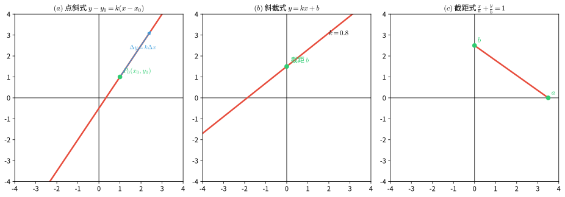

> **直观理解（现实类比）**：直线方程的不同形式就像用不同的"已知条件"去描述同一条山路。
> - **点斜式**：已知山坡上某一点的位置和坡度，就能写出整条路面方程——就像告诉测绘员"从山门（$x_0,y_0$）开始按 $k$ 的坡度铺路"。
> - **斜截式**：直接告诉你坡度 $k$ 和路面在山脚（$y$ 轴）的高度 $b$，是 $y=kx+b$ 的"截到地面"版本，是最常见的路面对应方程。
> - **两点式**：已知山坡上两个里程碑的位置，就能确定整条路——两点定一线。
> - **截距式**：告诉你这条路在 $x$ 轴、$y$ 轴上的两个交点，就像桥两端落在两岸的位置。
> - **一般式**：把所有形式统一打包成 $Ax+By+C=0$，是"通用的快递包装"，便于判断平行、垂直、求交点。

#### 直线的法向量与方向向量

对于直线 $l: Ax + By + C = 0$（$A, B$ 不同时为 $0$），由方程本身可立即读出两个关键向量：

- **法向量** $\vec{n} = (A, B)$：与直线 $l$ **垂直**的向量。它刻画了直线的"朝向"。
- **方向向量** $\vec{d} = (B, -A)$（或 $(-B, A)$）：与直线 $l$ **平行**的向量。它刻画了直线的"走向"。

两者满足 $\vec{n} \cdot \vec{d} = AB + B(-A) = 0$，即法向量与方向向量互相垂直。直线的斜率 $k = -\dfrac{A}{B}$ 正是方向向量 $(B, -A)$ 的纵坐标与横坐标之比 $k = \dfrac{-A}{B}$。

> 法向量与方向向量是研究直线位置关系（平行、垂直）与点到直线距离的常用工具，下面"两条直线的位置关系"一节将直接用到。

### 3. 两条直线的位置关系

设两条直线 $l_1: A_1x + B_1y + C_1 = 0$，$l_2: A_2x + B_2y + C_2 = 0$。

#### 平行

$$
l_1 \parallel l_2 \iff \frac{A_1}{A_2} = \frac{B_1}{B_2} \neq \frac{C_1}{C_2}
$$

若斜率存在，则 $k_1 = k_2$ 且截距不等。

**证明**：直线 $l: Ax + By + C = 0$ 的法向量为 $\vec{n} = (A, B)$，方向向量为 $\vec{d} = (-B, A)$。故 $l_1$ 的方向向量 $\vec{d}_1 = (-B_1, A_1)$，$l_2$ 的方向向量 $\vec{d}_2 = (-B_2, A_2)$。

两条直线平行当且仅当方向向量共线，即

$$
\vec{d}_1 \parallel \vec{d}_2 \iff (-B_1)A_2 - A_1(-B_2) = 0 \iff A_1B_2 - A_2B_1 = 0
$$

当 $A_2, B_2 \neq 0$ 时，$A_1B_2 = A_2B_1 \iff \dfrac{A_1}{A_2} = \dfrac{B_1}{B_2}$。

但方向向量共线只保证两直线平行或重合。若 $\dfrac{A_1}{A_2} = \dfrac{B_1}{B_2} = \dfrac{C_1}{C_2}$，则两方程成比例，表示同一直线（**重合**）。因此平行（不重合）还须排除该情形，即

$$
l_1 \parallel l_2 \iff \frac{A_1}{A_2} = \frac{B_1}{B_2} \neq \frac{C_1}{C_2}
$$

当斜率存在时，$k = -\dfrac{A}{B}$。$k_1 = k_2 \iff -\dfrac{A_1}{B_1} = -\dfrac{A_2}{B_2} \iff \dfrac{A_1}{B_1} = \dfrac{A_2}{B_2}$，与 $A_1B_2 = A_2B_1$ 等价；"截距不等"正是排除重合情形。$\square$

#### 垂直

$$
l_1 \perp l_2 \iff A_1A_2 + B_1B_2 = 0
$$

若斜率存在，则 $k_1 \cdot k_2 = -1$。

**证明**：两条直线垂直当且仅当它们的法向量垂直（法向量方向相差 $90°$），即

$$
\vec{n}_1 \perp \vec{n}_2 \iff \vec{n}_1 \cdot \vec{n}_2 = 0 \iff A_1A_2 + B_1B_2 = 0
$$

当斜率都存在（$B_1, B_2 \neq 0$）时，

$$
k_1 \cdot k_2 = \left(-\frac{A_1}{B_1}\right)\left(-\frac{A_2}{B_2}\right) = \frac{A_1A_2}{B_1B_2}
$$

由垂直条件 $A_1A_2 + B_1B_2 = 0$ 得 $A_1A_2 = -B_1B_2$，代入得

$$
k_1 \cdot k_2 = \frac{-B_1B_2}{B_1B_2} = -1
$$

反之，若 $k_1k_2 = -1$，则 $A_1A_2 = -B_1B_2$，即 $A_1A_2 + B_1B_2 = 0$。$\square$

#### 相交

两条直线相交，交点坐标由方程组解出：

$$
\begin{cases}
A_1x + B_1y + C_1 = 0 \\
A_2x + B_2y + C_2 = 0
\end{cases}
$$

**证明（唯一性）**：两条直线相交当且仅当它们不平行（且不重合），即方向向量不共线，等价于

$$
\Delta = \begin{vmatrix} A_1 & B_1 \\ A_2 & B_2 \end{vmatrix} = A_1B_2 - A_2B_1 \neq 0
$$

此时该二元一次方程组有**唯一解**（由克莱姆法则）：

$$
x = \frac{\begin{vmatrix} -C_1 & B_1 \\ -C_2 & B_2 \end{vmatrix}}{\Delta}
= \frac{(-C_1)B_2 - B_1(-C_2)}{A_1B_2 - A_2B_1}
= \frac{B_1C_2 - B_2C_1}{A_1B_2 - A_2B_1}
$$

$$
y = \frac{\begin{vmatrix} A_1 & -C_1 \\ A_2 & -C_2 \end{vmatrix}}{\Delta}
= \frac{A_1(-C_2) - (-C_1)A_2}{A_1B_2 - A_2B_1}
= \frac{C_1A_2 - C_2A_1}{A_1B_2 - A_2B_1}
$$

$(x, y)$ 即为两条直线的交点坐标。$\square$

**克莱姆法则（Cramer's rule）附注**：求解二元一次方程组

$$
\begin{cases}
a_1x + b_1y = c_1 \\
a_2x + b_2y = c_2
\end{cases}
$$

记系数行列式 $D = \begin{vmatrix} a_1 & b_1 \\ a_2 & b_2 \end{vmatrix} = a_1b_2 - a_2b_1$。若 $D \neq 0$，则方程组有唯一解：

$$
x = \frac{D_x}{D} = \frac{\begin{vmatrix} c_1 & b_1 \\ c_2 & b_2 \end{vmatrix}}{D}, \qquad
y = \frac{D_y}{D} = \frac{\begin{vmatrix} a_1 & c_1 \\ a_2 & c_2 \end{vmatrix}}{D}
$$

即把系数行列式中**欲求未知数所对应的那一列**替换为常数项列得到 $D_x$、$D_y$，再除以系数行列式 $D$。此处直线方程 $A_1x+B_1y+C_1=0$ 移项为 $A_1x+B_1y=-C_1$，常数项 $c_1=-C_1$，代入即得上式。

该法则由瑞士数学家**克莱姆（Gabriel Cramer）**于 1750 年提出，可推广到 $n$ 元一次方程组：当系数行列式不为零时有唯一解，且每个未知数等于"把对应列替换为常数项后的行列式"除以系数行列式。

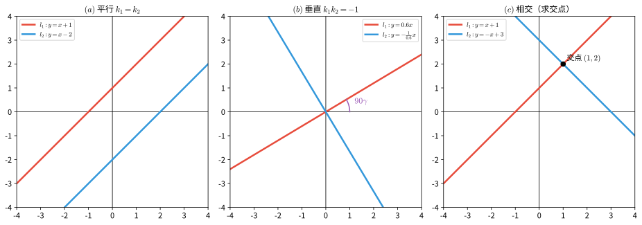

> **直观理解（现实类比）**：两条直线的位置关系就像两条马路的关系。
> - **平行**像铁轨——两条钢轨永远保持等距，永不相交（斜率相等，截距不同）。如果截距也相同，就是"同一条铁路"了（重合）。
> - **相交**像十字路口或立交桥——两条路在一点交汇，方向不同。斜率不相等就一定相交。
> - **垂直**是相交的特殊情况，像东西向与南北向的街道成 $90°$ 交叉（$k_1 k_2 = -1$）。
> - 现实中：北京的长安街与各条南北向胡同就是垂直关系；两条平行的地铁隧道是平行关系；斜交的乡间小路是普通相交。

### 4. 点到直线的距离公式

点 $P_0(x_0, y_0)$ 到直线 $l: Ax + By + C = 0$ 的距离为：

$$
d = \frac{|Ax_0 + By_0 + C|}{\sqrt{A^2 + B^2}}
$$

### 5. 两条平行线间的距离

两条平行线 $l_1: Ax + By + C_1 = 0$ 和 $l_2: Ax + By + C_2 = 0$ 之间的距离为：

$$
d = \frac{|C_1 - C_2|}{\sqrt{A^2 + B^2}}
$$

> **直观理解（现实类比）**：点到直线的距离就是"最短路径"——从你所在的位置到一条公路最近的那段路。
> - 你站在野外的某点 $P$，前方有一条笔直的铁路，要走到铁路上最近的一点，肯定垂直地走过去最近，斜着走或绕路都会更长。这个"垂直最短"的长度就是点到直线的距离。
> - **平行线间距离**像两条铁轨之间的固定间距——无论你在哪测量，距离都相等，因为平行线处处等距。
> - 工程上：高铁的接触网到铁轨的距离、两栋楼之间的最小间距、管道到墙面的距离，都用这个公式计算。

### 6. 两直线的夹角公式

两条直线 $l_1$ 和 $l_2$ 的夹角 $\theta$（$0 \leq \theta \leq \frac{\pi}{2}$）满足：

$$
\tan \theta = \left|\frac{k_2 - k_1}{1 + k_1k_2}\right| \quad (k_1k_2 \neq -1)
$$

或使用一般式：

$$
\cos \theta = \frac{|A_1A_2 + B_1B_2|}{\sqrt{A_1^2 + B_1^2}\sqrt{A_2^2 + B_2^2}}
$$

---

## 圆锥曲线

### 0. 圆锥曲线的来源与退化情形

"圆锥曲线"之名源于其几何生成方式：用一个平面去截一个**对顶圆锥**（双锥面），所得交线即为圆锥曲线。根据截面与圆锥面的相对位置，交线可为圆、椭圆、抛物线或双曲线：

- 截平面只与圆锥一侧相交且**不经过顶点** → 椭圆；若截平面垂直于对称轴 → 圆
- 截平面**平行于圆锥的某一条母线** → 抛物线
- 截平面与圆锥**两侧都相交**且不经过顶点 → 双曲线

当截平面经过圆锥的顶点时，交线退化为**点、一条直线或一对相交直线**，称为**退化圆锥曲线**（以下讨论均指非退化的情形）。

> 历史上，圆锥曲线约在公元前 200 年由古希腊数学家**阿波罗尼奥斯**（Apollonius）系统研究并命名。其统一定义（焦点—准线—离心率）与平面截圆锥的一致性可由**丹德林球**（Dandelin spheres）证明。

### 1. 圆 (Circle)

#### 定义

平面上到定点（圆心）的距离等于定长（半径）的点的轨迹。

#### 标准方程

圆心为 $C(h, k)$，半径为 $r$ 的圆的标准方程为：

$$
(x - h)^2 + (y - k)^2 = r^2
$$

特别地，圆心在原点 $(0, 0)$ 时：

$$
x^2 + y^2 = r^2
$$

#### 一般方程

$$
x^2 + y^2 + Dx + Ey + F = 0
$$

配方后化为标准形式：

$$
\left(x + \frac{D}{2}\right)^2 + \left(y + \frac{E}{2}\right)^2 = \frac{D^2 + E^2 - 4F}{4}
$$

其中圆心为 $\left(-\dfrac{D}{2},\ -\dfrac{E}{2}\right)$，半径 $r = \dfrac{1}{2}\sqrt{D^2 + E^2 - 4F}$（需满足 $D^2 + E^2 - 4F > 0$）。

#### 圆的参数方程

$$
\begin{cases}
x = h + r\cos \theta \\
y = k + r\sin \theta
\end{cases} \quad \theta \in [0, 2\pi)
$$

> **直观理解（现实类比）**：圆的方程就像**雷达扫描范围**或**GPS 定义的圆形区域**。
> - 圆心 $(h, k)$ 是雷达站的位置，半径 $r$ 是雷达能扫描的最远距离。圆上每一点都满足"到雷达站的距离恰好等于 $r$"，圆内是扫描覆盖区，圆外是盲区。
> - 打开手机地图，搜索"附近的咖啡店 1 公里内"，地图画出的圆形范围就是圆的方程——你站在圆心，半径 1 公里。
> - **投石入水**激起的涟漪、**手电筒光圈**的边缘、**唱片**的轮廓都是圆——它们都遵循"到中心距离相等"这一规则。

### 2. 椭圆 (Ellipse)

#### 定义

平面上到两个定点（焦点 $F_1$、$F_2$）的距离之和等于常数（$2a$，且 $2a > |F_1F_2|$）的点的轨迹。

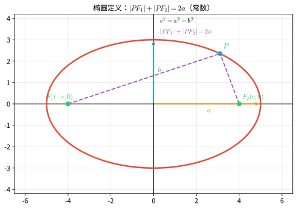

#### 🎬 动画演示：椭圆的焦点定义

> 动画直观展示了椭圆的核心性质：椭圆上任意一点到两个焦点的距离之和恒等于 $2a$。当点沿椭圆移动时，两条焦点连线（黄色）的长度之和始终保持不变。

> **直观理解（现实类比）**：椭圆像**行星的轨道**——开普勒发现地球绕太阳的轨道是椭圆，太阳在一个焦点上。
> - 想象你在椭圆花坛的边缘散步，花坛里有两个水池 $F_1$、$F_2$，你走到任意位置时，到两个水池的距离之和**始终相等**（等于 $2a$）。这是椭圆定义的精确含义。
> - **绳钉画椭圆**：把一根绳子两端钉在两点（焦点）上，用笔把绳子绷紧滑动，画出的就是椭圆。绳子总长不变（$=2a$），所以距离和恒定。
> - **花园椭圆花坛**、**体育场跑道**、**橄榄球**、**鸡蛋俯视图**都是椭圆的实例。两个焦点是它的"灵魂"——它们越靠近，椭圆越接近圆。

#### 标准方程

焦点在 $x$ 轴上时：

$$
\frac{x^2}{a^2} + \frac{y^2}{b^2} = 1 \quad (a > b > 0)
$$

其中 $a$ 为**半长轴**，$b$ 为**半短轴**，满足 $a^2 = b^2 + c^2$，$c$ 为**半焦距**。

焦点坐标为 $F_1(-c, 0)$、$F_2(c, 0)$，顶点坐标为 $(\pm a, 0)$、$(0, \pm b)$。

焦点在 $y$ 轴上时：

$$
\frac{x^2}{b^2} + \frac{y^2}{a^2} = 1 \quad (a > b > 0)
$$

#### 准线

焦点在 $x$ 轴上时，椭圆有两条准线 $l_1$、$l_2$：

$$
x = \pm \frac{a^2}{c}
$$

椭圆上任意一点到焦点的距离与到对应准线的距离之比等于离心率 $e$，即 $\dfrac{|PF|}{d(P, l)} = e = \dfrac{c}{a}$。

#### 离心率

椭圆的离心率 $e = \dfrac{c}{a}$，$0 < e < 1$。

- $e$ 越接近 0，椭圆越接近圆
- $e$ 越接近 1，椭圆越扁

> **直观理解（现实类比）**：椭圆离心率 $e$ 描述椭圆**扁圆的程度**——像衡量一个面团被压扁的程度。
> - $e$ 越接近 $0$，焦点越靠近中心，椭圆越像圆（圆是 $e=0$ 的特例）——就像一张煎饼圆鼓鼓的。
> - $e$ 越接近 $1$，两焦点离得越远，椭圆越扁长——就像被擀面杖压扁的面皮，越来越细长。
> - **行星轨道对比**：金星的 $e \approx 0.007$，几乎是圆；地球的 $e \approx 0.017$，微微扁；哈雷彗星的 $e \approx 0.97$，又扁又长。$e$ 越大，轨道越"狂野"——近日点离太阳近，远日点跑得老远。

#### 椭圆的参数方程

$$
\begin{cases}
x = a\cos \theta \\
y = b\sin \theta
\end{cases} \quad \theta \in [0, 2\pi)
$$

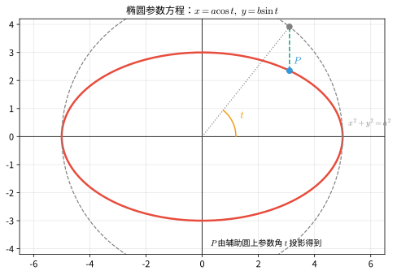

#### 面积

椭圆面积 $S = \pi ab$。

### 3. 双曲线 (Hyperbola)

#### 定义

平面上到两个定点（焦点 $F_1$、$F_2$）的距离之差的绝对值等于常数（$2a$，且 $0 < 2a < |F_1F_2|$）的点的轨迹。

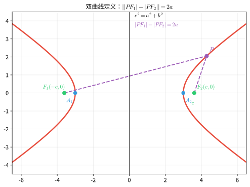

> **直观理解（现实类比）**：双曲线就像**两个雷达的时差定位**——这是它在现代科技中最有名的应用。
> - **GPS 双曲线定位**：如果你听到两个雷达站同时发信号，但信号到达你这儿有**时间差**（因为距离差恒定），你就站在一条双曲线上。三个雷达站就能用两条双曲线的交点确定你的位置——这正是导航系统的原理。
> - 双曲线定义是"到两点距离**之差**为常数"——和椭圆的"之和"恰好相反。想象两个邻居 $F_1$、$F_2$，你到他们家距离的差始终不变。
> - **冷却塔**的截面、**核电站通风塔**的轮廓都是双曲线——它们利用双曲线的几何性质实现高效散热。
> - 双曲线有**两支**，分别对应"离 $F_1$ 近"和"离 $F_2$ 近"两类点。

#### 标准方程

焦点在 $x$ 轴上时：

$$
\frac{x^2}{a^2} - \frac{y^2}{b^2} = 1 \quad (a > 0,\ b > 0)
$$

其中 $c^2 = a^2 + b^2$，$c$ 为半焦距。

焦点坐标为 $F_1(-c, 0)$、$F_2(c, 0)$，顶点坐标为 $(\pm a, 0)$。

焦点在 $y$ 轴上时：

$$
\frac{y^2}{a^2} - \frac{x^2}{b^2} = 1 \quad (a > 0,\ b > 0)
$$

#### 渐近线

双曲线 $\dfrac{x^2}{a^2} - \dfrac{y^2}{b^2} = 1$ 的渐近线方程为：

$$
y = \pm \frac{b}{a}x
$$

双曲线 $\dfrac{y^2}{a^2} - \dfrac{x^2}{b^2} = 1$ 的渐近线方程为：

$$
y = \pm \frac{a}{b}x
$$

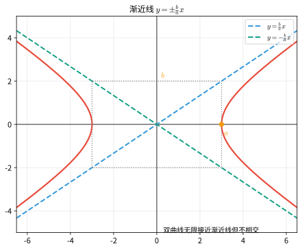

#### 准线

焦点在 $x$ 轴上时，双曲线有两条准线：

$$
x = \pm \frac{a^2}{c} \quad (c^2 = a^2 + b^2)
$$

同样满足 $\dfrac{|PF|}{d(P, l)} = e = \dfrac{c}{a}$。

#### 离心率

双曲线的离心率 $e = \dfrac{c}{a}$，$e > 1$。

#### 等轴双曲线

当 $a = b$ 时，称为等轴双曲线，方程为 $x^2 - y^2 = a^2$，渐近线为 $y = \pm x$，离心率 $e = \sqrt{2}$。

### 4. 抛物线 (Parabola)

#### 定义

平面上到一定点（焦点 $F$）的距离等于到一定直线（准线 $l$）的距离的点的轨迹。

> **直观理解（现实类比）**：抛物线像**抛出去的物体的轨迹**和**卫星天线**的截面。
> - **抛物轨迹**：你扔出一颗石子，它在空中划过的弧线（不考虑空气阻力）就是抛物线——这是它名字的由来。
> - **卫星天线/雷达锅**：抛物面（抛物线绕轴旋转）能把平行入射的信号会聚到焦点，也能把焦点的信号反射成平行光束。电视卫星锅、手电筒反光杯、汽车前灯、太阳灶都是抛物面。
> - 定义"到焦点的距离=到准线的距离"可以理解为：动点 $P$ 始终在"焦点"和"准线"之间做等距拉锯——既不偏焦点，也不偏准线。
> - **喷泉**的水柱、**投篮**时篮球的轨迹，都是抛物线的鲜活例子。

#### 标准方程

四种标准形式：

|          方程          | 开口方向 |             焦点坐标             |       准线方程       |
| :---------------------: | :------: | :-------------------------------: | :-------------------: |
| $y^2 = 2px\ (p > 0)$ |   向右   | $\left(\dfrac{p}{2}, 0\right)$ | $x = -\dfrac{p}{2}$ |
| $y^2 = -2px\ (p > 0)$ |   向左   | $\left(-\dfrac{p}{2}, 0\right)$ | $x = \dfrac{p}{2}$ |
| $x^2 = 2py\ (p > 0)$ |   向上   | $\left(0, \dfrac{p}{2}\right)$ | $y = -\dfrac{p}{2}$ |
| $x^2 = -2py\ (p > 0)$ |   向下   | $\left(0, -\dfrac{p}{2}\right)$ | $y = \dfrac{p}{2}$ |

其中 $p$ 为**焦准距**，即焦点到准线的距离。

#### 离心率

抛物线的离心率 $e = 1$。

### 5. 圆锥曲线的统一定义

圆锥曲线（椭圆、抛物线、双曲线）可以统一地定义为：平面上到定点 $F$（焦点）的距离与到定直线 $l$（准线）的距离之比为常数 $e$（离心率）的点的轨迹。

$$
\frac{|PF|}{d(P, l)} = e
$$

- $0 < e < 1$：椭圆
- $e = 1$：抛物线
- $e > 1$：双曲线

> **直观理解（现实类比）**：圆锥曲线的统一定义把圆、椭圆、抛物线、双曲线统一成"**同一个家族**"——它们都是"焦点 + 准线 + 离心率"三种参数的产物，只是离心率 $e$ 的取值不同。
> - **轨道力学**的三大轨道类型正对应三种曲线：$e<1$ 椭圆轨道（绕行星运行，像地球绕太阳）；$e=1$ 抛物线轨道（恰好能逃逸引力，像彗星一去不返）；$e>1$ 双曲线轨道（速度过快，飞出去不再回来，像探测器飞掠行星）。
> - 把 $e$ 想成"动点偏爱焦点还是准线的程度"：$e<1$ 偏爱准线（更圆滑地靠近）；$e=1$ 一视同仁（抛物线）；$e>1$ 偏爱焦点（被拉向远方，形成两支）。
> - 这就好比调节"水龙头开度"：水开小（$e$ 小）水流温和像椭圆；开到某刻度（$e=1$）水流正好成抛物线；开太大（$e>1$）水花四溅像双曲线。

#### 极坐标形式

以焦点为极点、准线为定直线 $x = d$ 时，圆锥曲线有统一的极坐标方程：

$$
\rho = \frac{ed}{1 \pm e\cos\theta}
$$

其中 $\theta$ 为动点 $\rho = |PF|$ 与极轴的夹角，$d$ 为准线到焦点的距离。$e = 1$ 时为抛物线，$0 < e < 1$ 时为椭圆，$e > 1$ 时为双曲线。

#### 判别式分类

一般二次方程 $Ax^2 + Bxy + Cy^2 + Dx + Ey + F = 0$（$A$、$B$、$C$ 不全为 $0$）表示圆锥曲线，可由判别式分类：

- $B^2 - 4AC < 0$：椭圆（若 $A = C$ 且 $B = 0$ 则为圆）
- $B^2 - 4AC = 0$：抛物线
- $B^2 - 4AC > 0$：双曲线

该判别式在坐标轴的旋转与平移下保持不变。

### 6. 圆锥曲线的光学性质与应用

所有非退化圆锥曲线都具有**反射性质**：从圆锥曲线的一个焦点发出的光线，经曲线反射后，会聚到另一个焦点（椭圆、双曲线）；抛物线的"另一个焦点"在无穷远处，故反射后成为平行于对称轴的平行光。

- **椭圆**：从一个焦点发出的光线经椭圆反射后均经过另一焦点（如椭圆的回音室）。
- **抛物线**：将光源置于焦点，反射后得到平行光束，用于**探照灯、抛物面天线、卫星接收器、射电望远镜**；反向，平行光经抛物面反射会聚于焦点（聚光镜、抛物面太阳灶）。
- **双曲线**：从一个焦点发出的光线经双曲线反射后，其延长线经过另一焦点，用于卡塞格林望远镜等光学系统。

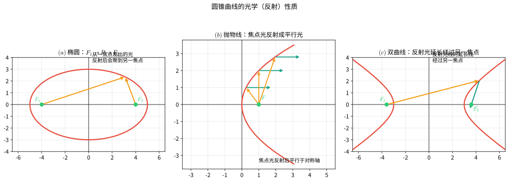

> **直观理解（现实类比）**：圆锥曲线的光学性质是它们在工程中最惊艳的应用。
> - **抛物面反射**：手电筒、汽车前灯、探照灯把灯泡放在焦点，反光罩是抛物面，光线反射后**全部平行射出**——所以你看到的是一道强光柱而非散光。卫星接收锅反过来：平行信号被抛物面反射后会聚到焦点上的高频头。
> - **椭圆回音壁**：站在椭圆的一个焦点上低声说话，声音经椭圆墙面反射后会聚到另一焦点，那里的人听得清清楚楚——北京天坛的回音壁、圣保罗大教堂的耳语廊都是这种原理。
> - **双曲线反射**：卡塞格林望远镜用双曲面副镜把光路"折返"，让长焦距望远镜变得紧凑——天文望远镜的精髓就在这里。
> - 一句话总结：**椭圆聚焦成点，抛物线聚焦成平行光，双曲线改变光路方向**——三种曲线各司其职，撑起了现代光学工程。

#### 光学性质的证明

反射定律（入射角等于反射角）在解析几何中可表述为：曲线在切点 $P$ 处的**法线** $\vec{n}$ 平分入射方向与反射方向所夹的角，即 $\vec{n}$ 与入射方向、反射方向的夹角相等。下面分别证明三类曲线满足该性质。

**（1）椭圆**

设椭圆 $\dfrac{x^2}{a^2}+\dfrac{y^2}{b^2}=1\ (a>b>0)$，$c^2=a^2-b^2$，切点 $P(x_0,y_0)$。椭圆在 $P$ 处的切线方程为

$$
\frac{x x_0}{a^2}+\frac{y y_0}{b^2}=1
$$

故 $P$ 处的法向量为 $\vec{n}=\left(\dfrac{x_0}{a^2},\ \dfrac{y_0}{b^2}\right)$。焦点 $F_1(-c,0)$、$F_2(c,0)$，记 $r_1=|F_1P|$、$r_2=|F_2P|$。由椭圆定义 $r_1+r_2=2a$，又

$$
r_1^2-r_2^2=\big[(x_0+c)^2+y_0^2\big]-\big[(x_0-c)^2+y_0^2\big]=4cx_0
$$

两式相除得 $r_1-r_2=\dfrac{2cx_0}{a}$，于是得到焦半径公式：

$$
r_1=a+\frac{c}{a}x_0,\qquad r_2=a-\frac{c}{a}x_0
$$

入射方向 $\overrightarrow{F_1P}=(x_0+c,\ y_0)$，反射方向 $\overrightarrow{PF_2}=(c-x_0,\ -y_0)$。计算两者在法线上的投影：

$$
\overrightarrow{F_1P}\cdot\vec{n}
=\frac{x_0(x_0+c)}{a^2}+\frac{y_0^2}{b^2}
=\underbrace{\Big(\frac{x_0^2}{a^2}+\frac{y_0^2}{b^2}\Big)}_{=1}+\frac{cx_0}{a^2}
=1+\frac{cx_0}{a^2}
$$

$$
\overrightarrow{PF_2}\cdot\vec{n}
=\frac{x_0(c-x_0)}{a^2}-\frac{y_0^2}{b^2}
=\frac{cx_0}{a^2}-1
$$

于是两投影分别为

$$
\frac{\overrightarrow{F_1P}\cdot\vec{n}}{r_1}
=\frac{1+\frac{cx_0}{a^2}}{a+\frac{cx_0}{a}}=\frac{1}{a},\qquad
\frac{\overrightarrow{PF_2}\cdot\vec{n}}{r_2}
=\frac{\frac{cx_0}{a^2}-1}{a-\frac{cx_0}{a}}=-\frac{1}{a}
$$

两向量在法线上的投影**大小相等、方向相反**，故 $\overrightarrow{F_1P}$ 与 $\overrightarrow{PF_2}$ 关于法线对称，即法线平分 $\angle F_1PF_2$。由反射定律，从 $F_1$ 发出的光线经椭圆反射后必经过 $F_2$。$\square$

**（2）抛物线**

设抛物线 $y^2=2px\ (p>0)$，焦点 $F\left(\dfrac{p}{2},0\right)$，切点 $P(x_0,y_0)$，满足 $y_0^2=2px_0$。对 $y^2=2px$ 隐函数求导得切线斜率

$$
k_t=y'=\frac{p}{y_0}
$$

设切线倾角为 $\alpha$（$\tan\alpha=k_t$），焦点光线 $FP$ 的倾角为 $\beta$，则

$$
\tan\beta=\frac{y_0}{x_0-\frac{p}{2}}=\frac{2y_0}{2x_0-p}
$$

而

$$
\tan 2\alpha=\frac{2\tan\alpha}{1-\tan^2\alpha}
=\frac{2\cdot\frac{p}{y_0}}{1-\frac{p^2}{y_0^2}}
=\frac{2py_0}{y_0^2-p^2}
=\frac{2py_0}{2px_0-p^2}
=\frac{2y_0}{2x_0-p}
=\tan\beta
$$

故 $\beta=2\alpha$，即焦点光线与切线的夹角等于轴方向与切线的夹角。因此从焦点 $F$ 发出的光线经抛物线反射后，沿平行于对称轴（$x$ 轴）的方向射出。$\square$

**（3）双曲线**

设双曲线 $\dfrac{x^2}{a^2}-\dfrac{y^2}{b^2}=1$，$c^2=a^2+b^2$，切点 $P(x_0,y_0)$。切线方程为 $\dfrac{xx_0}{a^2}-\dfrac{yy_0}{b^2}=1$，故法向量为 $\vec{n}=\left(\dfrac{x_0}{a^2},\ -\dfrac{y_0}{b^2}\right)$。记 $r_1=|F_1P|$、$r_2=|F_2P|$。由双曲线定义 $r_1-r_2=2a$，且 $r_1^2-r_2^2=4cx_0$，故 $r_1+r_2=\dfrac{2cx_0}{a}$，从而

$$
r_1=a+\frac{c}{a}x_0,\qquad r_2=\frac{c}{a}x_0-a
$$

入射方向 $\overrightarrow{F_1P}=(x_0+c,\ y_0)$，出射方向 $\overrightarrow{PF_2}=(c-x_0,\ -y_0)$：

$$
\overrightarrow{F_1P}\cdot\vec{n}=1+\frac{cx_0}{a^2},\qquad
\overrightarrow{PF_2}\cdot\vec{n}=\frac{cx_0}{a^2}-1
$$

代入 $r_1$、$r_2$ 得两投影

$$
\frac{\overrightarrow{F_1P}\cdot\vec{n}}{r_1}=\frac{1}{a},\qquad
\frac{\overrightarrow{PF_2}\cdot\vec{n}}{r_2}=\frac{1}{a}
$$

两者相等，故出射方向 $\overrightarrow{PF_2}$ 恰是入射方向 $\overrightarrow{F_1P}$ 关于法线的反射像，即从 $F_1$ 发出的光线经双曲线反射后沿 $P\to F_2$ 方向射出，其**延长线经过另一焦点 $F_2$**。$\square$

### 7. 圆锥曲线分类总表

|  曲线  |                       标准方程                       |   离心率$e$   |    半焦距$c$    |  半正焦弦$\ell$  |           准线           |
| :----: | :--------------------------------------------------: | :--------------: | :----------------: | :----------------: | :-----------------------: |
|   圆   |                 $x^2 + y^2 = r^2$                 |      $0$      |       $0$       |       $r$       |          无穷远          |
|  椭圆  | $\dfrac{x^2}{a^2} + \dfrac{y^2}{b^2} = 1\ (a>b>0)$ | $\dfrac{c}{a}$ | $\sqrt{a^2-b^2}$ | $\dfrac{b^2}{a}$ | $x = \pm\dfrac{a^2}{c}$ |
| 抛物线 |                 $y^2 = 2px\ (p>0)$                 |      $1$      |     $\infty$     |       $p$       |   $x = -\dfrac{p}{2}$   |
| 双曲线 |     $\dfrac{x^2}{a^2} - \dfrac{y^2}{b^2} = 1$     | $\dfrac{c}{a}$ | $\sqrt{a^2+b^2}$ | $\dfrac{b^2}{a}$ | $x = \pm\dfrac{a^2}{c}$ |

其中半正焦弦 $\ell = \frac{b^2}{a}$ 是过焦点且垂直于主轴、夹在曲线内的弦长之半。

---

## 坐标变换

### 1. 坐标轴的平移

将坐标系的原点平移至 $O'(h, k)$ 处，新坐标系 $x'O'y'$ 与原坐标系 $xOy$ 之间的关系为：

$$
\begin{cases}
x = x' + h \\
y = y' + k
\end{cases}
\quad\text{或}\quad
\begin{cases}
x' = x - h \\
y' = y - k
\end{cases}
$$

平移变换可用于化简不含 $xy$ 项的二次曲线方程。例如，将椭圆 $\dfrac{(x - h)^2}{a^2} + \dfrac{(y - k)^2}{b^2} = 1$ 通过平移化为 $\dfrac{x'^2}{a^2} + \dfrac{y'^2}{b^2} = 1$。

### 2. 坐标轴的旋转

将坐标系绕原点逆时针旋转角度 $\theta$，新坐标系 $x'Oy'$ 与原坐标系 $xOy$ 之间的关系为：

$$
\begin{cases}
x = x'\cos\theta - y'\sin\theta \\
y = x'\sin\theta + y'\cos\theta
\end{cases}
\quad\text{或}\quad
\begin{cases}
x' = x\cos\theta + y\sin\theta \\
y' = -x\sin\theta + y\cos\theta
\end{cases}
$$

旋转变换可用于消去一般二次曲线方程中的 $xy$ 项。对于一般二次方程

$$
Ax^2 + Bxy + Cy^2 + Dx + Ey + F = 0
$$

令 $\cot 2\theta = \dfrac{A - C}{B}$，即可消去 $xy$ 项，将方程化为标准形式。

> **直观理解（现实类比）**：坐标变换就像改变"看世界的视角"，物体本身没变，只是换了参考系。
> - **平移**像**搬家**——你把家具（图形）从旧家搬到新家，但家具的形状没变。坐标轴的原点挪到了新位置 $(h, k)$，所有点的坐标都"减去搬家距离"。比如圆心在 $(2, 3)$ 的圆，把原点搬到 $(2, 3)$ 后，圆的方程就简化成 $x'^2 + y'^2 = r^2$——化繁为简就是平移的本事。
> - **旋转**像**转动视角**——你歪头看一张斜放的椅子，椅子没动，但你看它的角度变了。旋转坐标轴可以让原本"歪斜"的椭圆转正，让 $xy$ 项消失，露出标准方程的真面目。
> - 拍照时的**水平仪**、地图的**正北方向**都是固定的参考系；而旋转手机看视频、横屏竖屏切换，就是在做"坐标旋转"。

---

## 定理与证明

### 定理 1：两点间距离公式的证明

**定理**：平面上两点 $P_1(x_1, y_1)$ 和 $P_2(x_2, y_2)$ 之间的距离为 $|P_1P_2| = \sqrt{(x_2 - x_1)^2 + (y_2 - y_1)^2}$。

**证明**：

过 $P_1$ 作 $x$ 轴的平行线，过 $P_2$ 作 $y$ 轴的平行线，两线交于点 $Q(x_2, y_1)$。

则 $P_1Q = |x_2 - x_1|$（水平距离），$P_2Q = |y_2 - y_1|$（竖直距离）。

在直角三角形 $P_1QP_2$ 中，由勾股定理：

$$
|P_1P_2|^2 = |P_1Q|^2 + |P_2Q|^2 = (x_2 - x_1)^2 + (y_2 - y_1)^2
$$

两边取算术平方根，即得：

$$
|P_1P_2| = \sqrt{(x_2 - x_1)^2 + (y_2 - y_1)^2}
$$

$\square$

### 定理 2：点到直线距离公式的证明

**定理**：点 $P_0(x_0, y_0)$ 到直线 $l: Ax + By + C = 0$ 的距离为 $d = \dfrac{|Ax_0 + By_0 + C|}{\sqrt{A^2 + B^2}}$。

**证明**：

设过点 $P_0$ 且垂直于直线 $l$ 的直线为 $l'$，$l$ 的法向量为 $\vec{n} = (A, B)$，则 $l'$ 的方向向量为 $\vec{n}$。

$l'$ 的参数方程为：

$$
\begin{cases}
x = x_0 + At \\
y = y_0 + Bt
\end{cases}
$$

设 $l'$ 与 $l$ 的交点为 $P_1(x_1, y_1)$，则存在 $t_0$ 使得：

$$
x_1 = x_0 + At_0,\quad y_1 = y_0 + Bt_0
$$

代入 $l$ 的方程：

$$
A(x_0 + At_0) + B(y_0 + Bt_0) + C = 0
$$

解得：

$$
t_0 = -\frac{Ax_0 + By_0 + C}{A^2 + B^2}
$$

于是距离 $d = |P_0P_1| = \sqrt{(At_0)^2 + (Bt_0)^2} = |t_0|\sqrt{A^2 + B^2}$。

代入 $t_0$ 得：

$$
d = \frac{|Ax_0 + By_0 + C|}{\sqrt{A^2 + B^2}}
$$

$\square$

### 定理 3：圆锥曲线的统一定义

**定理**：在平面内，到定点 $F$（焦点）的距离与到定直线 $l$（准线）的距离之比为常数 $e$（离心率）的点的轨迹是圆锥曲线。具体地：

- 当 $0 < e < 1$ 时，轨迹为椭圆
- 当 $e = 1$ 时，轨迹为抛物线
- 当 $e > 1$ 时，轨迹为双曲线

**证明思路**（以椭圆为例）：

取焦点 $F(c, 0)$，准线 $l: x = \dfrac{a^2}{c}$（$a > c > 0$），离心率 $e = \dfrac{c}{a}$。

设动点 $P(x, y)$，由定义：

$$
\frac{|PF|}{d(P, l)} = e \implies \frac{\sqrt{(x - c)^2 + y^2}}{\left|x - \frac{a^2}{c}\right|} = \frac{c}{a}
$$

两边平方并整理：

$$
a^2[(x - c)^2 + y^2] = c^2\left(x - \frac{a^2}{c}\right)^2
$$

展开：

$$
a^2(x^2 - 2cx + c^2 + y^2) = c^2x^2 - 2a^2cx + a^4
$$

化简：

$$
a^2x^2 - 2a^2cx + a^2c^2 + a^2y^2 = c^2x^2 - 2a^2cx + a^4
$$

$$
(a^2 - c^2)x^2 + a^2y^2 = a^2(a^2 - c^2)
$$

令 $b^2 = a^2 - c^2$，两边除以 $a^2b^2$：

$$
\frac{x^2}{a^2} + \frac{y^2}{b^2} = 1
$$

这正是椭圆的标准方程。$\square$

类似地，对 $e = 1$ 推导可得抛物线方程，对 $e > 1$ 推导可得双曲线方程。

---

## 示例

### 示例 1：直线问题

**题目**：求过点 $P(2, 3)$，且与直线 $l: 3x - 4y + 5 = 0$ 垂直的直线方程。

**解**：

直线 $l$ 的斜率 $k_1 = -\dfrac{A}{B} = -\dfrac{3}{-4} = \dfrac{3}{4}$。

由于两直线垂直，所求直线的斜率 $k_2$ 满足 $k_1 \cdot k_2 = -1$，故 $k_2 = -\dfrac{4}{3}$。

由点斜式得：

$$
y - 3 = -\frac{4}{3}(x - 2)
$$

化为一般式：

$$
3(y - 3) = -4(x - 2) \implies 4x + 3y - 17 = 0
$$

**答案**：$4x + 3y - 17 = 0$

---

### 示例 2：圆的问题

**题目**：求圆心在 $C(2, -3)$，且过点 $P(5, 1)$ 的圆的方程。

**解**：

半径 $r = |CP| = \sqrt{(5 - 2)^2 + (1 + 3)^2} = \sqrt{3^2 + 4^2} = 5$。

由标准方程得：

$$
(x - 2)^2 + (y + 3)^2 = 25
$$

展开得一般式：

$$
x^2 - 4x + 4 + y^2 + 6y + 9 = 25 \implies x^2 + y^2 - 4x + 6y - 12 = 0
$$

**答案**：$(x - 2)^2 + (y + 3)^2 = 25$

---

### 示例 3：椭圆问题

**题目**：已知椭圆的焦点为 $F_1(-3, 0)$、$F_2(3, 0)$，且过点 $P(4, \frac{12}{5})$，求椭圆的标准方程。

**解**：

由焦点坐标可知 $c = 3$，且焦点在 $x$ 轴上，设椭圆方程为 $\dfrac{x^2}{a^2} + \dfrac{y^2}{b^2} = 1$。

由椭圆定义：$|PF_1| + |PF_2| = 2a$。

$$
|PF_1| = \sqrt{(4 + 3)^2 + \left(\frac{12}{5}\right)^2} = \sqrt{49 + \frac{144}{25}} = \sqrt{\frac{1225 + 144}{25}} = \sqrt{\frac{1369}{25}} = \frac{37}{5}
$$

$$
|PF_2| = \sqrt{(4 - 3)^2 + \left(\frac{12}{5}\right)^2} = \sqrt{1 + \frac{144}{25}} = \sqrt{\frac{169}{25}} = \frac{13}{5}
$$

$2a = \dfrac{37}{5} + \dfrac{13}{5} = 10$，故 $a = 5$。

由 $b^2 = a^2 - c^2 = 25 - 9 = 16$，得 $b = 4$。

**答案**：$\dfrac{x^2}{25} + \dfrac{y^2}{16} = 1$

---

### 示例 4：双曲线问题

**题目**：求双曲线 $9x^2 - 16y^2 = 144$ 的焦点坐标、渐近线方程和离心率。

**解**：

将方程化为标准形式：

$$
\frac{x^2}{16} - \frac{y^2}{9} = 1
$$

故 $a^2 = 16$，$a = 4$；$b^2 = 9$，$b = 3$。

$c^2 = a^2 + b^2 = 16 + 9 = 25$，$c = 5$。

- 焦点坐标：$F_1(-5, 0)$、$F_2(5, 0)$
- 渐近线方程：$y = \pm \dfrac{b}{a}x = \pm \dfrac{3}{4}x$
- 离心率：$e = \dfrac{c}{a} = \dfrac{5}{4} = 1.25$

---

### 示例 5：抛物线问题

**题目**：已知抛物线的顶点在原点，焦点在 $x$ 轴正半轴上，且过点 $P(2, 4)$，求抛物线的标准方程、焦点坐标和准线方程。

**解**：

设抛物线方程为 $y^2 = 2px$（$p > 0$）。

将 $P(2, 4)$ 代入：

$$
4^2 = 2p \cdot 2 \implies 16 = 4p \implies p = 4
$$

故抛物线方程为 $y^2 = 8x$。

- 焦点坐标：$\left(\dfrac{p}{2}, 0\right) = (2, 0)$
- 准线方程：$x = -\dfrac{p}{2} = -2$

---

### 示例 6：综合问题

**题目**：求椭圆 $\dfrac{x^2}{25} + \dfrac{y^2}{9} = 1$ 上一点 $P$，使得 $P$ 到直线 $l: 3x - 4y + 24 = 0$ 的距离最小，并求最小距离。

**解**：

设椭圆上点 $P(5\cos\theta, 3\sin\theta)$（参数形式）。

点 $P$ 到直线 $l$ 的距离为：

$$
d = \frac{|3 \cdot 5\cos\theta - 4 \cdot 3\sin\theta + 24|}{\sqrt{3^2 + (-4)^2}} = \frac{|15\cos\theta - 12\sin\theta + 24|}{5}
$$

令 $15\cos\theta - 12\sin\theta = r\cos(\theta + \varphi)$，其中 $r = \sqrt{15^2 + 12^2} = \sqrt{225 + 144} = \sqrt{369} = 3\sqrt{41}$。

于是 $d = \dfrac{|r\cos(\theta + \varphi) + 24|}{5}$。

当 $\cos(\theta + \varphi) = -1$ 时，分子取最小值 $|24 - r|$：

$$
d_{\min} = \frac{24 - 3\sqrt{41}}{5}
$$

此时 $15\cos\theta - 12\sin\theta = -3\sqrt{41}$，可解得 $\cos\theta$ 和 $\sin\theta$ 的值，进而得到 $P$ 点坐标。

**答案**：最小距离为 $\dfrac{24 - 3\sqrt{41}}{5}$。

---

## 平面向量

> 向量是连接"数"与"形"的又一重要工具。它既有大小又有方向，既能作几何运算，又能化为坐标进行代数处理。学习平面向量，可以与前面已学的坐标系、直线方程自然衔接——例如直线的方向向量、法向量与斜率的关系，正是向量坐标化的直接应用。

### 1. 向量的概念

#### 定义

既有**大小**又有**方向**的量称为**向量**。在平面上常用带箭头的有向线段 $\overrightarrow{AB}$ 表示，其中 $A$ 为**起点**，$B$ 为**终点**；也可用小写字母加箭头表示，如 $\vec{a}$、$\vec{b}$。

只研究大小而不考虑方向的量称为**标量**（或数量），如长度、质量、时间等。

#### 向量的表示

- **几何表示**：有向线段 $\overrightarrow{AB}$，箭头指向即方向，线段长度即大小
- **字母表示**：$\vec{a}$、$\vec{b}$、$\vec{c}$ 等，或 $\overrightarrow{AB}$、$\overrightarrow{CD}$

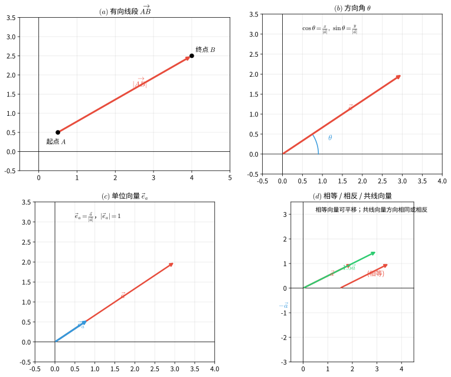

> **直观理解（现实类比）**：向量就是**带方向的箭头**——既有大小又有方向的量。
> - **力**：你推箱子，用力 $10$ 牛、方向朝东，这就是一个向量。力的方向变了，效果完全不同——往东推和往北推，箱子走的方向截然不同。
> - **速度**：汽车时速 $60$ 公里、向北行驶——速度也是向量。两辆时速都是 $60$ 的车，方向相反就会越走越远。
> - **位移**：从家到学校走 $2$ 公里、向东北方向——这是位移向量，只关心起点和终点，不关心中间怎么绕。
> - 标量（温度、质量、时间）只有大小没有方向；向量（力、速度、位移、加速度）两者兼备。区分标量和向量是物理入门的关键。

#### 向量的模

向量 $\vec{a}$ 的大小称为向量的**模**（或长度），记作 $|\vec{a}|$。设 $\vec{a} = (x, y)$，则：

$$
|\vec{a}| = \sqrt{x^2 + y^2}
$$

特别地，有向线段 $\overrightarrow{AB}$ 的模 $|\overrightarrow{AB}|$ 就等于两点 $A$、$B$ 之间的距离。

#### 零向量与单位向量

- **零向量**：模为 $0$ 的向量，记作 $\vec{0}$，其方向是任意的
- **单位向量**：模为 $1$ 的向量。与 $\vec{a}$ 同方向的单位向量记作 $\vec{e}_a = \dfrac{\vec{a}}{|\vec{a}|}$（$|\vec{a}| \neq 0$）

#### 向量的方向

向量 $\vec{a} = (x, y) \neq \vec{0}$ 的方向可以用它与 $x$ 轴正方向的夹角 $\theta$ 来描述，满足：

$$
\cos\theta = \frac{x}{|\vec{a}|},\qquad \sin\theta = \frac{y}{|\vec{a}|}
$$

夹角 $\theta$ 称为向量 $\vec{a}$ 的**方向角**。

#### 相等向量与共线向量

- **相等向量**：方向相同且模相等的向量，与起点位置无关
- **相反向量**：与 $\vec{a}$ 方向相反、模相等的向量，记作 $-\vec{a}$
- **平行（共线）向量**：方向相同或相反的向量，记作 $\vec{a} \parallel \vec{b}$

> 注意：零向量与任何向量平行。

---

### 2. 向量的线性运算

#### 加法——三角形法则

设 $\vec{a} = \overrightarrow{AB}$，$\vec{b} = \overrightarrow{BC}$，则和向量为：

$$
\vec{a} + \vec{b} = \overrightarrow{AB} + \overrightarrow{BC} = \overrightarrow{AC}
$$

即"首尾相接，指向被加向量的终点指向加向量的终点"。

#### 加法——平行四边形法则

设 $\vec{a} = \overrightarrow{OA}$，$\vec{b} = \overrightarrow{OB}$，以 $OA$、$OB$ 为邻边作平行四边形 $OACB$，则对角线上的向量：

$$
\vec{a} + \vec{b} = \overrightarrow{OC}
$$

#### 减法

**定义**：$\vec{a} - \vec{b} = \vec{a} + (-\vec{b})$。

若 $\vec{a} = \overrightarrow{OA}$，$\vec{b} = \overrightarrow{OB}$，则：

$$
\vec{a} - \vec{b} = \overrightarrow{OA} - \overrightarrow{OB} = \overrightarrow{BA}
$$

即"共起点，减向量的终点指向被减向量的终点"。

> **直观理解（现实类比）**：向量加减法就像**力的合成**与**接力跑**。
> - **加法—三角形法则（接力跑）**：第一棒从 $A$ 跑到 $B$（向量 $\vec{a}$），第二棒从 $B$ 接力跑到 $C$（向量 $\vec{b}$），总位移是从 $A$ 直接到 $C$（向量 $\vec{a}+\vec{b}$）。"首尾相接，从首到尾"就是和向量。
> - **加法—平行四边形法则（力的合成）**：两个人从同一点 $O$ 分别拉绳子，$\vec{a}$ 向东、$\vec{b}$ 向北，合力是从 $O$ 出发指向平行四边形对角的向量。这是物理学中"两个力合成一个力"的标准方法。
> - **减法（共起点）**：两个人从同一点出发，分别走到 $A$ 和 $B$，$\vec{a}-\vec{b}$ 就是从 $B$ 指向 $A$ 的向量——"被减向量的终点指向减向量的终点"。
> - **河中渡船**：船想垂直过河（$\vec{a}$），水流把它推向下游（$\vec{b}$），实际航线是 $\vec{a}+\vec{b}$——这是向量加法最经典的现实例子。

#### 数乘向量

**定义**：实数 $\lambda$ 与向量 $\vec{a}$ 的积是一个向量，记作 $\lambda \vec{a}$，其模为 $|\lambda|\,|\vec{a}|$，方向规定为：

- 当 $\lambda > 0$ 时，与 $\vec{a}$ 同向
- 当 $\lambda < 0$ 时，与 $\vec{a}$ 反向
- 当 $\lambda = 0$ 或 $\vec{a} = \vec{0}$ 时，$\lambda \vec{a} = \vec{0}$

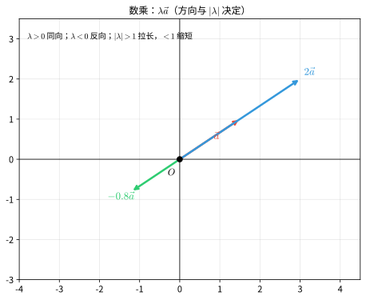

> **直观理解（现实类比）**：向量数乘就是**放大或缩小**——像调音量、变焦距。
> - $\lambda = 2$：把向量"拉长"到原来的 $2$ 倍，方向不变——就像把照片放大、把音乐音量调到 $200\%$。
> - $\lambda = \dfrac{1}{2}$：把向量"缩短"到原来的一半，方向不变——缩小图片、调低音量。
> - $\lambda = -1$：向量长度不变，方向反过来——镜面翻转、录像倒放。
> - $\lambda = -2$：拉长到 $2$ 倍并反向——倒车时油门踩到底。
> - **物理实例**：力的 $n$ 倍（多个相同力叠加）、速度的放大（不同档位的自行车）、位移的倍数（走 $3$ 趟相同的路程），都是数乘。

#### 运算律

设 $\lambda$、$\mu$ 为实数，$\vec{a}$、$\vec{b}$、$\vec{c}$ 为向量：

- **交换律**：$\vec{a} + \vec{b} = \vec{b} + \vec{a}$
- **结合律**：$(\vec{a} + \vec{b}) + \vec{c} = \vec{a} + (\vec{b} + \vec{c})$；$(\lambda\mu)\vec{a} = \lambda(\mu\vec{a})$
- **分配律**：$\lambda(\vec{a} + \vec{b}) = \lambda\vec{a} + \lambda\vec{b}$；$(\lambda + \mu)\vec{a} = \lambda\vec{a} + \mu\vec{a}$

---

### 3. 向量的坐标表示

#### 平面向量的坐标

在平面直角坐标系中，分别取与 $x$ 轴、$y$ 轴正方向相同的两个单位向量 $\vec{i}$、$\vec{j}$ 作为基底。对任一向量 $\vec{a}$，由平面向量基本定理，存在唯一一对实数 $(x, y)$，使得：

$$
\vec{a} = x\vec{i} + y\vec{j}
$$

称 $(x, y)$ 为向量 $\vec{a}$ 的**坐标**，记作 $\vec{a} = (x, y)$。

> **直观理解（现实类比）**：向量的坐标表示就像**用基底"组合"出任意向量**——就像用基本颜色调配出所有颜色。
> - **基底 $\vec{i}, \vec{j}$** 是两个互相垂直的"基本箭头"，长度都是 $1$。任意向量 $\vec{a}$ 都能写成 $\vec{a} = x\vec{i} + y\vec{j}$，意思是用 $x$ 步水平走、$y$ 步垂直走，最终到达 $\vec{a}$ 的终点。
> - 就像**调色**：红、黄、蓝三原色按不同比例混合能得到所有颜色；$\vec{i}$、$\vec{j}$ 按不同系数组合能得到所有向量。系数 $(x, y)$ 就是向量的"配方"。
> - **地图导航**："向东走 $3$ 公里，再向北走 $4$ 公里"——这就是用 $\vec{i}$（东）、$\vec{j}$（北）作基底表示位移向量 $(3, 4)$。
> - 选不同的基底就像选不同的参考方向：地理课用"东南西北"，工程上用"$x$、$y$ 轴"，但描述的是同一个位移。

#### 向量的坐标与点的坐标

设 $A(x_1, y_1)$、$B(x_2, y_2)$，则：

$$
\overrightarrow{AB} = (x_2 - x_1,\ y_2 - y_1)
$$

即**终点坐标减去起点坐标**。特例：起点为原点 $O$ 时，$\overrightarrow{OP} = (x, y)$，此时向量的坐标与点 $P$ 的坐标一致。

#### 坐标运算

设 $\vec{a} = (x_1, y_1)$，$\vec{b} = (x_2, y_2)$，$\lambda$ 为实数：

$$
\vec{a} + \vec{b} = (x_1 + x_2,\ y_1 + y_2)
$$

$$
\vec{a} - \vec{b} = (x_1 - x_2,\ y_1 - y_2)
$$

$$
\lambda\vec{a} = (\lambda x_1,\ \lambda y_1)
$$

#### 模的坐标公式

$$
|\vec{a}| = \sqrt{x_1^2 + y_1^2}
$$

两点间距离也可用向量模的形式表示：

$$
|\overrightarrow{AB}| = \sqrt{(x_2 - x_1)^2 + (y_2 - y_1)^2}
$$

这与前面第 1 节的两点间距离公式完全一致，体现了向量与解析几何的内在统一。

---

### 4. 向量共线（平行）的判定

**定理**：$\vec{a} \parallel \vec{b}$（$\vec{b} \neq \vec{0}$）当且仅当存在唯一实数 $\lambda$，使得：

$$
\vec{a} = \lambda\vec{b}
$$

**坐标形式的充要条件**：设 $\vec{a} = (x_1, y_1)$，$\vec{b} = (x_2, y_2)$（$\vec{b} \neq \vec{0}$），则：

$$
\vec{a} \parallel \vec{b} \iff x_1 y_2 - x_2 y_1 = 0
$$

即对应坐标成比例 $\dfrac{x_1}{x_2} = \dfrac{y_1}{y_2}$（当分母不为零时）。

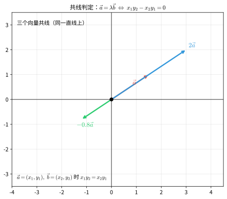

> **直观理解（现实类比）**：向量共线（平行）就是两个向量"**朝同一个方向或反向**"——像两根平行的筷子或同向行驶的两辆车。
> - $\vec{a} = \lambda \vec{b}$ 意味着 $\vec{a}$ 是 $\vec{b}$ 的"放大版"或"缩小版"——可能同向（$\lambda>0$），可能反向（$\lambda<0$）。
> - 坐标条件 $x_1 y_2 = x_2 y_1$ 就是"对应坐标成比例"——两个向量的横纵坐标比相同，方向自然一致。
> - **铁轨**的两条钢轨、**双杠**的两根横杆、**梯子**的两根立柱都是共线向量的现实原型——方向一致，长度可能不同。
> - 反之，**垂直**就是两向量方向成 $90°$——像东西向和南北向的街道、十字交叉的筷子，用数量积为零来判定（见下一节）。

> 注意：由于 $\vec{a} = \lambda\vec{b}$ 要求 $\vec{b} \neq \vec{0}$，上面的坐标条件应优先使用 $x_1y_2 - x_2y_1 = 0$ 这一形式，以避免分母为零的情况。

---

### 5. 平面向量的数量积（点积）

#### 定义

设两个非零向量 $\vec{a}$、$\vec{b}$，它们的夹角为 $\theta$（$0 \leq \theta \leq \pi$），则 $\vec{a}$ 与 $\vec{b}$ 的**数量积**为：

$$
\vec{a} \cdot \vec{b} = |\vec{a}|\,|\vec{b}|\cos\theta
$$

规定：零向量与任一向量的数量积为 $0$。

> 数量积的结果是**标量**（一个实数），而不是向量。这也是"数量积"名称的由来。

#### 几何意义

$\vec{a} \cdot \vec{b}$ 等于 $|\vec{a}|$ 与 $\vec{b}$ 在 $\vec{a}$ 方向上的投影 $|\vec{b}|\cos\theta$ 的乘积，即"$\vec{a}$ 的模乘以 $\vec{b}$ 在 $\vec{a}$ 方向上的投影"。

> **直观理解（现实类比）**：数量积的核心是**做功**和**投影**——它把"两个向量的方向关系"压缩成一个数。
> - **做功**：你用力 $\vec{F}$ 推箱子位移 $\vec{s}$，只有**沿位移方向的分力**才真正做了功。$W = \vec{F} \cdot \vec{s} = |\vec{F}||\vec{s}|\cos\theta$。垂直于位移方向的力（如提着箱子水平走）不做功——这就是 $\cos 90° = 0$ 的物理意义。
> - **投影**：把 $\vec{b}$ 想象成一根斜放的竹竿，太阳从 $\vec{a}$ 方向照过来，竹竿在地面（$\vec{a}$ 所在直线）上的影子长度就是 $|\vec{b}|\cos\theta$。数量积就是"$\vec{a}$ 的长度 × $\vec{b}$ 的影子长度"。
> - **斜拉船**：用斜向上的绳子拉船前行，只有水平分力让船前进，竖直分力只是把船头微微抬起——做功的就是水平投影，这正是 $\vec{F} \cdot \vec{s}$。

由 $\cos\theta$ 的取值可知数量积的符号取决于夹角 $\theta$：当 $0 \le \theta < 90^\circ$ 时 $\vec{a} \cdot \vec{b} > 0$；当 $\theta = 90^\circ$ 时 $\vec{a} \cdot \vec{b} = 0$（两向量垂直）；当 $90^\circ < \theta \le 180^\circ$ 时 $\vec{a} \cdot \vec{b} < 0$。

#### 坐标表示

设 $\vec{a} = (x_1, y_1)$，$\vec{b} = (x_2, y_2)$，则：

$$
\vec{a} \cdot \vec{b} = x_1 x_2 + y_1 y_2
$$

特别地，$\vec{a} \cdot \vec{a} = |\vec{a}|^2 = x_1^2 + y_1^2$。

#### 坐标公式的证明

几何定义 $\vec{a}\cdot\vec{b} = |\vec{a}|\,|\vec{b}|\cos\theta$ 与坐标表示 $x_1x_2 + y_1y_2$ 是等价的，可用**余弦定理**证明。

设 $\vec{a} = (x_1, y_1)$、$\vec{b} = (x_2, y_2)$，夹角为 $\theta$。在 $\vec{a}$、$\vec{b}$ 及连接两者终点的向量 $\vec{a}-\vec{b}$ 构成的三角形（如图 $(a)$）中，由余弦定理：

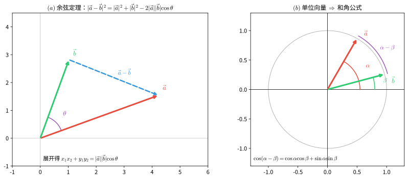

$$
|\vec{a} - \vec{b}|^2 = |\vec{a}|^2 + |\vec{b}|^2 - 2|\vec{a}|\,|\vec{b}|\cos\theta
$$

将坐标代入并展开：

$$
(x_1-x_2)^2 + (y_1-y_2)^2 = (x_1^2+y_1^2) + (x_2^2+y_2^2) - 2\,|\vec{a}|\,|\vec{b}|\cos\theta
$$

$$
\Rightarrow\ x_1x_2 + y_1y_2 = |\vec{a}|\,|\vec{b}|\cos\theta
$$

右端正是几何定义，故坐标公式成立。由此也得到**夹角公式**：

$$
\cos\theta = \frac{\vec{a}\cdot\vec{b}}{|\vec{a}|\,|\vec{b}|}
= \frac{x_1x_2 + y_1y_2}{\sqrt{x_1^2+y_1^2}\,\sqrt{x_2^2+y_2^2}}
$$

#### 与和角公式的联系

当 $\vec{a}$、$\vec{b}$ 均为**单位向量**时，设 $\vec{a} = (\cos\alpha, \sin\alpha)$、$\vec{b} = (\cos\beta, \sin\beta)$，其夹角为 $\theta = \alpha - \beta$（如图 $(b)$）。由坐标公式与几何定义：

$$
\cos(\alpha-\beta) = \cos\alpha\cos\beta + \sin\alpha\sin\beta
$$

这正是三角学中的**和角公式**。可见数量积把"向量夹角"与"三角函数和差公式"统一起来——三角恒等式 $\cos(\alpha-\beta)$ 不过是单位向量数量积的坐标形式。

#### 运算律

设 $\lambda$ 为实数，$\vec{a}$、$\vec{b}$、$\vec{c}$ 为向量：

- **交换律**：$\vec{a} \cdot \vec{b} = \vec{b} \cdot \vec{a}$
- **结合律（数乘）**：$(\lambda\vec{a}) \cdot \vec{b} = \lambda(\vec{a} \cdot \vec{b}) = \vec{a} \cdot (\lambda\vec{b})$
- **分配律**：$(\vec{a} + \vec{b}) \cdot \vec{c} = \vec{a} \cdot \vec{c} + \vec{b} \cdot \vec{c}$

> 注意：数量积**不满足结合律**，即 $(\vec{a} \cdot \vec{b})\vec{c} \neq \vec{a}(\vec{b} \cdot \vec{c})$。因为 $\vec{a} \cdot \vec{b}$ 是标量，左边是与 $\vec{c}$ 平行的向量，右边是与 $\vec{a}$ 平行的向量，一般并不相等。

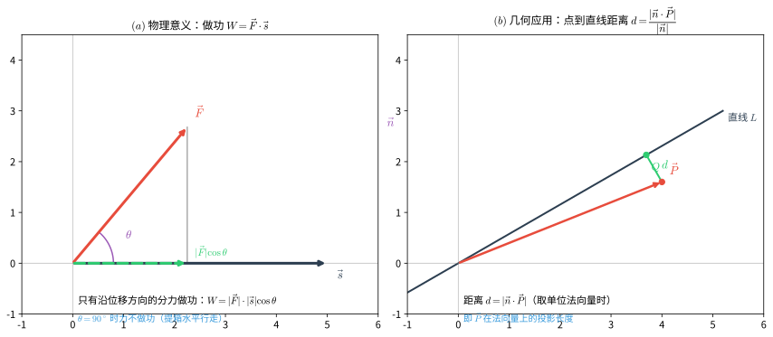

#### 实际意义

数量积始终围绕一个核心思想：**用一个向量度量另一个向量沿其方向的分量**。它把"两个向量的方向关系"提炼成一个标量，从而把几何/物理问题转化为可计算的代数量。

- **物理意义——做功**：力 $\vec{F}$ 沿位移 $\vec{s}$ 做功只有沿位移方向的分力才起作用，即 $W = \vec{F} \cdot \vec{s} = |\vec{F}|\,|\vec{s}|\cos\theta$。当 $\theta = 0$（力与位移同向）做功最多；$\theta = 90^\circ$（力垂直于位移，如提箱水平行走）不做功；$\theta = 180^\circ$（力与位移反向，如摩擦力）做负功。
- **几何意义——垂直判定与距离**：$\vec{a} \perp \vec{b} \iff \vec{a} \cdot \vec{b} = 0$；点到直线的距离恰是位置向量在法向量上的投影长度 $d = \dfrac{|\vec{n} \cdot \vec{P}|}{|\vec{n}|}$。这两个应用都直接来自"投影"这一几何意义。
- **方向度量——余弦相似度**：$\cos\theta = \dfrac{\vec{a} \cdot \vec{b}}{|\vec{a}|\,|\vec{b}|}$ 衡量两向量方向的接近程度（越接近 $1$ 越同向，越接近 $-1$ 越反向），是搜索引擎、推荐系统中"余弦相似度"的数学基础。
- **代数化工具**：坐标表示 $\vec{a} \cdot \vec{b} = x_1x_2 + y_1y_2$ 使夹角、平行/垂直、投影、面积、距离等几何问题都变成纯坐标计算，是计算机图形学（如光照、视锥判定）的基本运算。

---

### 6. 向量的夹角与垂直判定

#### 夹角公式

设 $\vec{a} = (x_1, y_1)$，$\vec{b} = (x_2, y_2)$ 为非零向量，夹角为 $\theta$，则：

$$
\cos\theta = \frac{\vec{a} \cdot \vec{b}}{|\vec{a}|\,|\vec{b}|} = \frac{x_1x_2 + y_1y_2}{\sqrt{x_1^2 + y_1^2}\sqrt{x_2^2 + y_2^2}}
$$

#### 垂直的充要条件

$$
\vec{a} \perp \vec{b} \iff \vec{a} \cdot \vec{b} = 0
$$

用坐标表示即：

$$
\vec{a} \perp \vec{b} \iff x_1 x_2 + y_1 y_2 = 0
$$

> 这与直线垂直的条件一脉相承：两直线 $l_1: A_1x + B_1y + C_1 = 0$、$l_2: A_2x + B_2y + C_2 = 0$ 垂直等价于它们法向量 $\vec{n}_1 = (A_1, B_1)$、$\vec{n}_2 = (A_2, B_2)$ 满足 $A_1A_2 + B_1B_2 = 0$，正是"法向量点积为零"。

---

### 7. 向量的模与两点间距离（向量表示）

设 $\vec{a} = (x, y)$，则模为 $|\vec{a}| = \sqrt{\vec{a} \cdot \vec{a}} = \sqrt{x^2 + y^2}$。

设 $A(x_1, y_1)$、$B(x_2, y_2)$，则线段 $AB$ 的长度：

$$
|AB| = |\overrightarrow{AB}| = \sqrt{(x_2 - x_1)^2 + (y_2 - y_1)^2}
$$

由此，一堆几何量都可以统一地用向量表示：

- 中点公式：$M$ 为 $AB$ 中点时，$\overrightarrow{OM} = \dfrac{\overrightarrow{OA} + \overrightarrow{OB}}{2}$
- 定比分点：$\overrightarrow{OP} = \dfrac{\overrightarrow{OA} + \lambda\overrightarrow{OB}}{1 + \lambda}$
- 线段垂直：$\overrightarrow{OA} \cdot \overrightarrow{OB} = 0 \iff OA \perp OB$

---

### 8. 平面向量基本定理（基底）

**定理**：设 $\vec{e}_1$、$\vec{e}_2$ 是同一平面内两个**不共线**的向量，那么对该平面内任一向量 $\vec{a}$，有且仅有一对实数 $\lambda_1$、$\lambda_2$，使得：

$$
\vec{a} = \lambda_1\vec{e}_1 + \lambda_2\vec{e}_2
$$

其中不共线的向量 $\vec{e}_1$、$\vec{e}_2$ 称为该平面的一组**基底**。

**关于基底的说明**：

- 基底由两个不共线的向量组成，基底中的向量不能为零向量
- 同一平面内可以有无数多组基底，任一向量在给定基底下的分解是唯一的
- 当基底为正交单位基底 $\vec{i}$、$\vec{j}$（即 $x$、$y$ 轴单位向量）时，分解式 $\vec{a} = x\vec{i} + y\vec{j}$ 中的 $(x, y)$ 正是向量的坐标

**直线与向量对应（衔接前面直线方程）**：直线的法向量、方向向量在"直线的法向量与方向向量"小节（第 2 节）已定义，此处回顾其与向量坐标的联系。设直线 $l: Ax + By + C = 0$：

- 直线的**法向量** $\vec{n} = (A, B)$，方向与直线垂直
- 直线的**方向向量** $\vec{d} = (B, -A)$（或 $(-B, A)$），方向与直线平行，满足 $\vec{n} \cdot \vec{d} = AB + B(-A) = 0$
- 直线的**斜率** $k = -\dfrac{A}{B}$，正是方向向量 $(B, -A)$ 的纵坐标与横坐标之比 $k = \dfrac{-A}{B}$

因此，"点斜式"就等价于"过已知点、沿方向向量 $(1, k)$ 的直线"。

---

### 9. 向量在解三角形和几何中的应用

#### 正弦定理的向量证明

**定理**：在 $\triangle ABC$ 中，设角 $A$、$B$、$C$ 所对的边分别为 $a$、$b$、$c$，则 $\dfrac{a}{\sin A} = \dfrac{b}{\sin B} = \dfrac{c}{\sin C}$。

**证明**：

设 $\overrightarrow{AB} = \vec{c}$，$\overrightarrow{AC} = \vec{b}$（注意用向量模表示边长），则 $\vec{c} - \vec{b} = \overrightarrow{CB}$。

考虑 $\triangle ABC$ 的面积公式。以 $AB$、$AC$ 为邻边的平行四边形的面积可由叉积给出，但平面内用点积可如下处理：

由 $\vec{c} - \vec{b} = \overrightarrow{CB}$，两边平方得：

$$
|\vec{c} - \vec{b}|^2 = |\vec{c}|^2 + |\vec{b}|^2 - 2\vec{b}\cdot\vec{c}
$$

即 $a^2 = c^2 + b^2 - 2bc\cos A$，这正是**余弦定理**。$\square$

对于正弦定理，可利用面积公式 $S = \dfrac{1}{2}bc\sin A = \dfrac{1}{2}ca\sin B = \dfrac{1}{2}ab\sin C$，两边同除以 $\dfrac{1}{2}abc$ 即得 $\dfrac{\sin A}{a} = \dfrac{\sin B}{b} = \dfrac{\sin C}{c}$。$\square$

#### 余弦定理的向量证明

**定理**：$a^2 = b^2 + c^2 - 2bc\cos A$。

**证明**：

设 $\overrightarrow{AB} = \vec{c}$，$\overrightarrow{AC} = \vec{b}$，则 $\overrightarrow{CB} = \vec{c} - \vec{b}$，其模为 $a$。

$$
a^2 = |\overrightarrow{CB}|^2 = (\vec{c} - \vec{b}) \cdot (\vec{c} - \vec{b}) = |\vec{c}|^2 + |\vec{b}|^2 - 2\vec{b}\cdot\vec{c}
$$

其中 $\vec{b} \cdot \vec{c} = |\vec{b}|\,|\vec{c}|\cos A = bc\cos A$，代入即得：

$$
a^2 = b^2 + c^2 - 2bc\cos A
$$

$\square$

#### 中线定理的向量证明

**定理**：在 $\triangle ABC$ 中，$M$ 为 $BC$ 的中点，则 $AB^2 + AC^2 = 2(AM^2 + BM^2)$。

**证明**：

取 $A$ 为起点，设 $\vec{b} = \overrightarrow{AB}$，$\vec{c} = \overrightarrow{AC}$。则：

$$
\overrightarrow{AM} = \frac{\vec{b} + \vec{c}}{2},\qquad \overrightarrow{BM} = \frac{\vec{c} - \vec{b}}{2}
$$

于是：

$$
AB^2 + AC^2 = |\vec{b}|^2 + |\vec{c}|^2
$$

$$
2(AM^2 + BM^2) = 2\left(\left|\frac{\vec{b} + \vec{c}}{2}\right|^2 + \left|\frac{\vec{c} - \vec{b}}{2}\right|^2\right)
$$

利用 $|\vec{p} + \vec{q}|^2 + |\vec{p} - \vec{q}|^2 = 2(|\vec{p}|^2 + |\vec{q}|^2)$，得：

$$
2(AM^2 + BM^2) = \frac{1}{2}\left(|\vec{b} + \vec{c}|^2 + |\vec{c} - \vec{b}|^2\right) = |\vec{b}|^2 + |\vec{c}|^2
$$

故 $AB^2 + AC^2 = 2(AM^2 + BM^2)$。$\square$

#### 重心

设 $G$ 为 $\triangle ABC$ 的重心（三条中线的交点），则：

$$
\overrightarrow{OG} = \frac{\overrightarrow{OA} + \overrightarrow{OB} + \overrightarrow{OC}}{3}
$$

特别地，当 $O$ 为原点时，$G$ 的坐标为 $\left(\dfrac{x_A + x_B + x_C}{3},\ \dfrac{y_A + y_B + y_C}{3}\right)$。

**证明**：设中线 $AM$ 与 $BN$ 交于 $G$，由重心分中线为 $2:1$，$\overrightarrow{AG} = \dfrac{2}{3}\overrightarrow{AM}$，而 $\overrightarrow{AM} = \dfrac{\vec{b} + \vec{c}}{2}$，故 $\overrightarrow{AG} = \dfrac{\vec{b} + \vec{c}}{3}$，从而 $\overrightarrow{OG} = \overrightarrow{OA} + \overrightarrow{AG} = \vec{a} + \dfrac{(\vec{b} - \vec{a}) + (\vec{c} - \vec{a})}{3} = \dfrac{\vec{a} + \vec{b} + \vec{c}}{3}$。$\square$

---

### 10. 综合示例

#### 示例 7：向量共线与坐标

**题目**：已知 $\vec{a} = (2, -1)$，$\vec{b} = (1, 3)$。若 $\vec{a} + \lambda\vec{b}$ 与 $\vec{a} - \vec{b}$ 共线，求实数 $\lambda$。

**解**：

$$
\vec{a} + \lambda\vec{b} = (2 + \lambda,\ -1 + 3\lambda)
$$

$$
\vec{a} - \vec{b} = (1, -4)
$$

共线条件 $x_1y_2 - x_2y_1 = 0$：

$$
(2 + \lambda)(-4) - 1 \cdot (-1 + 3\lambda) = 0
$$

$$
-8 - 4\lambda + 1 - 3\lambda = 0 \implies -7 - 7\lambda = 0 \implies \lambda = -1
$$

**答案**：$\lambda = -1$。

---

#### 示例 8：数量积与夹角

**题目**：已知 $\vec{a} = (1, 2)$，$\vec{b} = (-2, 1)$。（1）求 $\vec{a} \cdot \vec{b}$；（2）判断 $\vec{a}$ 与 $\vec{b}$ 是否垂直。

**解**：

（1）由数量积坐标公式：

$$
\vec{a} \cdot \vec{b} = 1 \times (-2) + 2 \times 1 = -2 + 2 = 0
$$

（2）因为 $\vec{a} \cdot \vec{b} = 0$，所以 $\vec{a} \perp \vec{b}$。

**答案**：$\vec{a} \cdot \vec{b} = 0$，$\vec{a} \perp \vec{b}$。

---

#### 示例 9：余弦定理的向量应用

**题目**：在 $\triangle ABC$ 中，$\overrightarrow{AB} = (2, 3)$，$\overrightarrow{AC} = (5, -1)$，求边 $BC$ 的长度和 $\cos A$。

**解**：

$\overrightarrow{BC} = \overrightarrow{AC} - \overrightarrow{AB} = (5 - 2,\ -1 - 3) = (3, -4)$。

由余弦定理的向量形式：

$$
a^2 = |\vec{b}|^2 + |\vec{c}|^2 - 2\vec{b}\cdot\vec{c}
$$

其中 $|\vec{b}|^2 = |\overrightarrow{AC}|^2 = 5^2 + (-1)^2 = 26$，$|\vec{c}|^2 = |\overrightarrow{AB}|^2 = 2^2 + 3^2 = 13$，$\vec{b}\cdot\vec{c} = 2 \times 5 + 3 \times (-1) = 7$。

于是：

$$
a^2 = 26 + 13 - 2 \times 7 = 25 \implies a = |BC| = 5
$$

$$
\cos A = \frac{\vec{b}\cdot\vec{c}}{|\vec{b}|\,|\vec{c}|} = \frac{7}{\sqrt{26}\sqrt{13}} = \frac{7}{13\sqrt{2}} = \frac{7\sqrt{2}}{26}
$$

**答案**：$|BC| = 5$，$\cos A = \dfrac{7\sqrt{2}}{26}$。

---

#### 示例 10：直线的方向向量与法向量

**题目**：已知直线 $l: 2x - 3y + 6 = 0$。（1）求 $l$ 的一个法向量和方向向量；（2）求 $l$ 的斜率，并说明三者关系。

**解**：

（1）法向量为 $\vec{n} = (2, -3)$，方向向量可取 $\vec{d} = (3, 2)$（与 $\vec{n}$ 点积为 $2 \times 3 + (-3) \times 2 = 0$，故垂直）。

（2）斜率 $k = -\dfrac{A}{B} = -\dfrac{2}{-3} = \dfrac{2}{3}$，恰为方向向量 $(3, 2)$ 的纵坐标与横坐标之比 $k = \dfrac{2}{3}$。

**答案**：$\vec{n} = (2, -3)$，$\vec{d} = (3, 2)$，$k = \dfrac{2}{3}$。

---

## 解题技巧

> 本节针对本章核心知识点，给出可直接套用的解题方法。每条技巧以「适用场景 / 关键步骤 / 常见误区」三要素组织，并配精讲示例，覆盖「学习目标」列出的全部能力项。

### 7.1 坐标法的"翻译"意识
**适用场景**：把几何条件（平行、垂直、共线、距离比）化为代数方程求解点、直线、曲线。
**关键步骤**：
1. 设未知点坐标 $(x,y)$ 或引入参数表达轨迹；
2. 用距离 / 斜率 / 中点 / 定比分点 / 数量积公式写出几何条件的方程；
3. 化简方程并判定曲线类型。
**常见误区**：忘记去根号时的取值范围或漏判退化为空集/点的情形。
**精讲示例**（见挑战题 14 思路）：到定点与定直线距离之比为常数 $e$ 的轨迹，直接由两点距离与点到直线距离公式化得圆锥曲线方程。

### 7.2 求直线方程的"一点一斜率"与四种形式互化
**适用场景**：由两种条件求直线，或在五种直线方程形式（点斜 / 斜截 / 两点 / 截距 / 一般式）间转换。
**关键步骤**：
1. 先求斜率 $k$（两式点斜率 $k=\tfrac{y_2-y_1}{x_2-x_1}$，或由垂直/平行关系得出）；
2. 代入一点写出点斜式 $y-y_0=k(x-x_0)$，再化为一般式 $Ax+By+C=0$；
3. 截距式 $\dfrac{x}{a}+\dfrac{y}{b}=1$ 要求 $a,b\ne0$，注意截距是带符号的长度。
**常见误区**：遗漏"斜率不存在"（竖直直线 $x=x_0$，不能用点斜式）的单独讨论。
**精讲示例**：过 $(1,2)$、$(3,6)$ 的直线：$k=\tfrac{6-2}{3-1}=2$，$y-2=2(x-1)$，即 $y=2x$。

### 7.3 平行、垂直与点到直线距离
**适用场景**：判定两直线位置关系，求点到直线 / 两平行线间距离。
**关键步骤**：
1. 平行 $\iff k_1=k_2$（或 $\frac{A_1}{A_2}=\frac{B_1}{B_2}\ne\frac{C_1}{C_2}$）；垂直 $\iff k_1k_2=-1$（或 $A_1A_2+B_1B_2=0$）；
2. 距离公式 $d=\dfrac{|Ax_0+By_0+C|}{\sqrt{A^2+B^2}}$；
3. 两条平行线 $Ax+By+C_1=0$ 与 $Ax+By+C_2=0$ 间距 $=\dfrac{|C_1-C_2|}{\sqrt{A^2+B^2}}$。
**常见误区**：比较垂直时把两直线写成不同形式却未先化为同坐标系；用向量点积判垂直时忘记 $A_1A_2+B_1B_2=0$ 对任何直线均适用（不依赖斜率）。
**精讲示例**：$l_1:2x-3y+1=0$、$l_2:3x+2y-4=0$，法向量点积 $2\cdot3+(-3)\cdot2=0$，故 $l_1\perp l_2$。

### 7.4 圆锥曲线的"基本量"法（$a,b,c,e$）
**适用场景**：已知圆锥曲线方程求焦点、顶点、渐近线、离心率，或反之由条件定方程。
**关键步骤**：
1. 化为标准形式（椭圆/双曲线看 $x^2,y^2$ 前面的系数与符号），求得 $a,b$；
2. 椭圆 $c^2=a^2-b^2$，双曲线 $c^2=a^2+b^2$，离心率 $e=\tfrac{c}{a}$；
3. 焦点在 $x$ 轴还是 $y$ 轴由"被哪个分量大/为主"确定，双曲线由符号定。
**常见误区**：混淆 $a,b,c$；把 $x^2/36+y^2/25=1$ 误认 $a^2=25$；双曲线渐近线写成 $\pm\tfrac{a}{b}$。
**精讲示例**（见挑战题 5/6/7）：$x^2/36+y^2/25=1$ 中 $a=6,b=5,c=\sqrt{11}$，$e=\tfrac{\sqrt{11}}{6}$。

### 7.5 椭圆的参数方程与"设而不求"
**适用场景**：求圆锥曲线上点到直线的最大最小距离、弦中点、定值问题。
**关键步骤**：
1. 椭圆 $\tfrac{x^2}{a^2}+\tfrac{y^2}{b^2}=1$ 用 $(a\cos\theta,b\sin\theta)$ 参数化，把最值问题化为三角最值；
2. 直线与曲线交点问题：联立消元得一元二次方程，用判别式与韦达定理表达弦长、中点，不必求出具体交点（"设而不求"）；
3. 判别式符号对应相离/相切/相交。
**常见误区**：参数化时忘记 $\cos^2\theta+\sin^2\theta=1$ 正好确保点在椭圆上；弦长公式漏乘 $\sqrt{1+k^2}$。
**精讲示例**（见挑战题 11 思路）：椭圆上点 $(2\cos\theta,\sin\theta)$ 到直线 $x+2y-4=0$ 的距离以 $2\cos\theta+2\sin\theta$ 达到最值。
**注**：本技巧虽以圆锥曲线为对象，但其"参数化 + 三角最值"思想与第 5 级辅助角公式一脉相承。

### 7.6 圆锥曲线统一定义与轨迹法
**适用场景**：给出"到定点与到定直线距离之比为定值 $e$"的条件求轨迹；用离心率统一看三种曲线。
**关键步骤**：
1. 设动点为 $P(x,y)$，由 $\dfrac{|PF|}{d(P,l)}=e$ 直接列式；
2. 化简得方程：$0<e<1$ 为椭圆，$e=1$ 为抛物线，$e>1$ 为双曲线；
3. 当 $e$ 给定且 $\ne1$ 时可先定出焦准关系再求方程。
**常见误区**：分母取距离 $d(P,l)$ 时必须取绝对值并注意点与准线的相对位置；$e$ 的范围判断错误曲线。
**精讲示例**（见挑战题 14 思路）：$|PF|=\tfrac12 d(P,x=8)$ 平方化简得 $\tfrac{x^2}{16}+\tfrac{y^2}{12}=1$（椭圆，$e=\tfrac12$）。

### 7.7 坐标变换（平移与旋转）
**适用场景**：化一般圆锥曲线方程为标准形，判断中心不在原点的曲线类型。
**关键步骤**：
1. **平移**：把中心/顶点移到原点，配平方消去一次项（$\begin{cases}x=x'+h\\y=y'+k\end{cases}$）；
2. **旋转**：利用 $\begin{cases}x=x'\cos\theta-y'\sin\theta\\y=x'\sin\theta+y'\cos\theta\end{cases}$ 消去 $xy$ 项；
3. 判断曲线类型看旋转后二次项系数的关系。
**常见误区**：平移量符号写反（是把"新系"与"旧系"坐标混用）；以为任意二次曲线都可用旋转消去 $xy$ 且不超过二次时保持曲线类型不改变。
**精讲示例**：圆 $(x+1)^2+(y-2)^2=9$ 由圆心平移至 $(-1,2)$ 即标准式，平移量 $h=-1,k=2$。

---

## 习题

> 习题按难度分为 **基础题 / 进阶题 / 挑战题 / 探究题** 四级，覆盖本章全部内容（坐标、距离与中点、直线方程、平行垂直与距离、圆椭圆双曲线抛物线、统一定义、坐标变换、向量与综合应用）。探究题为开放题，附参考答案与思路提示。

### 基础题

**1.** 求点 $P(3, -2)$ 到直线 $l: 4x + 3y - 5 = 0$ 的距离。
**2.** 求过点 $A(1, 2)$ 和 $B(3, 6)$ 的直线方程，并求其斜率与截距。
**3.** 判断直线 $l_1: 2x - 3y + 1 = 0$ 与 $l_2: 3x + 2y - 4 = 0$ 的位置关系。
**4.** 求圆心在 $(-1, 2)$ 且半径为 $3$ 的圆的方程，并化为一般式。
**5.** 求椭圆 $\dfrac{x^2}{36} + \dfrac{y^2}{25} = 1$ 的焦点坐标、顶点坐标和离心率。

**6.** 求两点 $A(1,2)$ 与 $B(4,6)$ 之间的距离。
**7.** 求以 $A(-2,3)$、$B(4,-1)$ 为端点的线段的中点 $M$ 的坐标。
**8.** 求过点 $P(2,3)$、$Q(5,7)$ 的直线的斜率。
**9.** 求过点 $P(0,1)$ 且斜率为 $2$ 的直线方程。
**10.** 求斜率为 $3$、在 $y$ 轴上截距为 $-2$ 的直线的斜截式方程，并化为一般式。
**11.** 求过 $A(1,1)$、$B(4,5)$ 的直线的两点式方程。
**12.** 求在 $x$ 轴、$y$ 轴上的截距分别为 $3$ 和 $-4$ 的直线方程。
**13.** 将直线 $y=-\dfrac{1}{2}x+3$ 化为一般式。
**14.** 判断点 $P(2,1)$ 是否在直线 $x+2y-4=0$ 上。
**15.** 求直线 $2x+3y-6=0$ 的斜率及其在 $x$、$y$ 轴上的截距。
**16.** 求过点 $(2,-1)$ 且垂直于 $x$ 轴的直线方程。
**17.** 求直线 $3x-4y+5=0$ 的一个法向量和一个方向向量。
**18.** 已知过 $A(-1,2)$、$B(3,k)$ 的直线的斜率为 $2$，求 $k$。
**19.** 判断直线 $x-2y+1=0$ 与 $2x-y+3=0$ 是否平行。
**20.** 求过点 $(2,1)$ 且平行于直线 $3x-4y+1=0$ 的直线方程。
**21.** 求过点 $(1,2)$ 且垂直于直线 $y=2x$ 的直线方程。
**22.** 求点 $P(1,2)$ 到直线 $3x+4y-1=0$ 的距离。
**23.** 求平行线 $3x-4y+1=0$ 与 $3x-4y-9=0$ 之间的距离。
**24.** 求直线 $x+y-1=0$ 与 $2x-y+1=0$ 的交点坐标。
**25.** 求圆心在 $(2,-3)$、半径为 $4$ 的圆的标准方程。
**26.** 求圆 $x^2+y^2-4x+6y-3=0$ 的圆心坐标和半径。
**27.** 判断点 $P(1,2)$ 在圆 $x^2+y^2=5$ 上、圆内还是圆外。
**28.** 求以 $A(1,2)$、$B(3,6)$ 为直径两端点的圆的方程。
**29.** 求过点 $(1,2)$、圆心在原点的圆的方程。
**30.** 求椭圆 $\dfrac{x^2}{25}+\dfrac{y^2}{9}=1$ 的长轴长、短轴长和焦点坐标。
**31.** 求椭圆 $\dfrac{x^2}{16}+\dfrac{y^2}{25}=1$ 的焦点坐标。
**32.** 求椭圆 $\dfrac{x^2}{25}+\dfrac{y^2}{9}=1$ 的离心率。
**33.** 求焦点在 $x$ 轴、长轴长为 $10$、焦距为 $8$ 的椭圆的标准方程。
**34.** 求双曲线 $\dfrac{x^2}{16}-\dfrac{y^2}{9}=1$ 的实轴长、虚轴长和焦点坐标。
**35.** 求双曲线 $\dfrac{x^2}{9}-\dfrac{y^2}{16}=1$ 的渐近线方程。

**36.** 求焦点在 $x$ 轴、实轴长为 $6$、虚轴长为 $8$ 的双曲线的标准方程。
**37.** 求抛物线 $y^2=8x$ 的焦点坐标和准线方程。
**38.** 求抛物线 $x^2=-4y$ 的焦点坐标和准线方程。
**39.** 求焦点为 $(2,0)$ 的抛物线的标准方程。
**40.** 求顶点在原点、焦点为 $(0,1)$ 的抛物线的标准方程。
**41.** 已知椭圆焦点在 $x$ 轴，离心率 $e=\dfrac{1}{2}$、焦距为 $4$，求标准方程。
**42.** 判断二次方程 $x^2+2y^2-4=0$ 表示何种曲线。
**43.** 求圆 $x^2+y^2=10$ 与直线 $y=x$ 的交点。
**44.** 已知向量 $\vec{a}=(3,4)$，求 $|\vec{a}|$ 及与 $\vec{a}$ 同向的单位向量。
**45.** 已知 $\vec{a}=(1,2)$、$\vec{b}=(2,-1)$，求 $\vec{a}\cdot\vec{b}$，并判断两向量是否垂直。
**46.** 已知 $\vec{a}=(1,2)$、$\vec{b}=(x,4)$，且 $\vec{a}\parallel\vec{b}$，求 $x$。
**47.** 求 $\vec{a}=(1,1)$ 与 $\vec{b}=(1,-1)$ 的夹角。
**48.** 已知 $\vec{a}=(2,3)$、$\vec{b}=(1,-2)$，求 $2\vec{a}+3\vec{b}$ 的坐标。
**49.** 判断点 $P(1,-2)$ 与圆 $x^2+y^2=4$ 的位置关系。
**50.** 求圆 $x^2+y^2-2x+4y-4=0$ 的半径。
**51.** 求过圆 $x^2+y^2=5$ 上点 $(2,-1)$ 的切线方程。
**52.** 求原点 $O$ 到直线 $2x-y+5=0$ 的距离。
**53.** 判断直线 $y=x+1$ 与圆 $x^2+y^2=1$ 的位置关系。
**54.** 求圆 $x^2+y^2=4$ 与 $x^2+(y-2)^2=4$ 的两圆心之间的距离。
**55.** 判断圆 $x^2+y^2=1$ 与 $(x-3)^2+y^2=1$ 的位置关系。
**56.** 求椭圆 $\dfrac{x^2}{9}+\dfrac{y^2}{4}=1$ 的顶点坐标。
**57.** 求椭圆 $\dfrac{x^2}{4}+y^2=1$ 的焦距。
**58.** 已知椭圆焦点在 $y$ 轴，短轴长为 $8$、焦距为 $6$，求标准方程。
**59.** 求曲线 $\dfrac{(x-1)^2}{9}+\dfrac{(y+2)^2}{4}=1$ 的中心坐标。
**60.** 求双曲线 $\dfrac{x^2}{4}-\dfrac{y^2}{5}=1$ 的焦点坐标。
**61.** 求双曲线 $\dfrac{y^2}{9}-\dfrac{x^2}{16}=1$ 的渐近线方程。
**62.** 求等轴双曲线 $x^2-y^2=2$ 的渐近线方程和离心率。
**63.** 求抛物线 $y^2=12x$ 的焦点到准线的距离（焦准距）。
**64.** 求抛物线 $y^2=-8x$ 的焦点坐标。
**65.** 求抛物线 $x^2=8y$ 的准线方程。

**66.** 求椭圆 $\dfrac{x^2}{25}+\dfrac{y^2}{9}=1$ 上任一点到两焦点距离之和。
**67.** 求直线 $3x+4y-12=0$ 与两坐标轴围成的三角形面积。
**68.** 已知 $\vec{a}=(2,-1)$、$\vec{b}=(1,3)$，求 $\vec{a}+\vec{b}$ 与 $\vec{a}-\vec{b}$。
**69.** 求使 $\vec{a}=(1,k)$ 与 $\vec{b}=(2,-1)$ 垂直的 $k$。
**70.** 求 $A(1,1)$、$B(3,5)$ 两点间的距离。
**71.** 求 $\triangle ABC$ 中 $A(0,0)$、$B(2,0)$、$C(0,4)$ 的重心坐标。
**72.** 求过点 $(1,3)$ 且倾斜角为 $60°$ 的直线方程。
**73.** 判断直线 $y=1$、$x+2y-1=0$、$2x+4y-5=0$ 中哪两条平行。
**74.** 求点 $(2,3)$ 关于原点的对称点。
**75.** 求点 $(1,-1)$ 关于 $y$ 轴的对称点。
**76.** 求圆 $x^2+y^2-6x=0$ 的圆心和半径。
**77.** 求椭圆 $\dfrac{x^2}{16}+\dfrac{y^2}{12}=1$ 的离心率。
**78.** 求双曲线 $\dfrac{x^2}{9}-\dfrac{y^2}{16}=1$ 的两条渐近线所夹的锐角（用反正切表示）。
**79.** 求抛物线 $x^2=6y$ 的焦点坐标。
**80.** 求点 $P(2,3)$ 关于直线 $y=-x$ 对称点的坐标。
**81.** 已知 $\vec{a}=(1,2)$、$\vec{b}=(m,4)$ 平行，求 $m$。
**82.** 求 $\vec{a}=(3,4)$ 的模。
**83.** 求过 $(-1,1)$、$(3,9)$ 两点的直线方程。
**84.** 求圆心在原点且过点 $(3,-4)$ 的圆的方程。
**85.** 求直线 $y=2x-3$ 的斜率与 $y$ 轴截距。
**86.** 椭圆 $\dfrac{x^2}{a^2}+\dfrac{y^2}{4}=1$ 过点 $(2,\sqrt2)$，求 $a^2$。
**87.** 求抛物线 $y^2=2x$ 的准线方程。
**88.** 求直线 $x=2$ 与 $y=3$ 的交点坐标。
**89.** 判断曲线 $\dfrac{x^2}{4}-y^2=1$ 的类型。

### 进阶题

**1.** 求双曲线 $\dfrac{x^2}{9} - \dfrac{y^2}{16} = 1$ 的渐近线方程、焦点坐标和离心率。
**2.** 已知抛物线的准线方程为 $x = -3$，焦点在 $x$ 轴正半轴上，求抛物线的标准方程。
**3.** 求过点 $P(1, 2)$ 且与圆 $x^2 + y^2 = 5$ 相切的直线方程。
**4.** 椭圆 $\dfrac{x^2}{a^2} + \dfrac{y^2}{b^2} = 1$ 的离心率为 $\dfrac{1}{2}$，且过点 $(2, 3)$，求椭圆方程。
**5.** 已知直线 $y = kx + 1$ 与双曲线 $x^2 - y^2 = 1$ 有两个不同的交点，求 $k$ 的取值范围。

**6.** 求过点 $A(2,3)$、$B(-1,5)$ 的直线的截距式方程。
**7.** 求与直线 $3x-4y+2=0$ 平行且过点 $(1,-1)$ 的直线方程。
**8.** 求与直线 $2x+y-1=0$ 垂直且过点 $(0,3)$ 的直线方程。
**9.** 求平行线 $4x-3y+5=0$ 与 $8x-6y+7=0$ 之间的距离。
**10.** 求直线 $3x-4y+1=0$ 关于 $x$ 轴对称的直线方程。
**11.** 求点 $(2,3)$ 关于直线 $y=x$ 对称点的坐标。
**12.** 求圆 $x^2+y^2+2x-6y+1=0$ 的圆心和半径。
**13.** 求过三点 $O(0,0)$、$A(1,0)$、$B(0,2)$ 的圆的方程。
**14.** 求直线 $y=2x+1$ 与圆 $x^2+y^2=5$ 的两个交点。
**15.** 求圆 $x^2+y^2=25$ 被直线 $3x+4y-25=0$ 截得的弦长。
**16.** 求过点 $(3,4)$ 且与圆 $x^2+y^2=4$ 相切的直线方程。
**17.** 求以 $C(2,-1)$ 为圆心且与直线 $x-y+3=0$ 相切的圆的方程。
**18.** 求两圆 $x^2+y^2=4$ 与 $(x-2)^2+y^2=4$ 的公共弦长。
**19.** 求椭圆 $\dfrac{x^2}{16}+\dfrac{y^2}{9}=1$ 的一个焦点到短轴端点的距离。
**20.** 椭圆 $\dfrac{x^2}{25}+\dfrac{y^2}{16}=1$ 上一点 $P$ 到左焦点的距离为 $5$，求到右焦点的距离。
**21.** 求椭圆 $\dfrac{x^2}{a^2}+\dfrac{y^2}{4}=1$（$a>\sqrt4$）的离心率为 $\dfrac12$，求 $a$。
**22.** 求实轴在 $x$ 轴、实轴长为 $6$、过点 $(5,4)$ 的双曲线的标准方程。
**23.** 求双曲线 $\dfrac{x^2}{4}-\dfrac{y^2}{12}=1$ 的两条渐近线所夹锐角的正切值。
**24.** 求焦点为 $(1,0)$、开口向右的抛物线的准线方程。
**25.** 抛物线 $x^2=2py$ 过点 $(4,4)$，求 $p$ 及准线方程。
**26.** 抛物线 $y^2=4x$ 上一点横坐标为 $4$，求该点到焦点的距离（焦半径）。
**27.** 求抛物线 $y^2=8x$ 过焦点且垂直于 $x$ 轴的弦（通径）的长。
**28.** 求直线 $x=4$ 与椭圆 $\dfrac{x^2}{25}+\dfrac{y^2}{9}=1$ 的交点。
**29.** 判断直线 $y=x$ 与圆 $x^2+y^2-2y=0$ 的位置关系。
**30.** $\vec{a}=(1,2)$、$\vec{b}=(-2,m)$ 的夹角为钝角，求 $m$ 的范围。
**31.** 求 $\vec{a}=(2,1)$ 在 $\vec{b}=(3,4)$ 方向上的投影。
**32.** $\vec{a}=(1,0)$、$\vec{b}=(3,m)$ 的夹角为 $60°$，求 $m$。
**33.** 判断以 $A(1,1)$、$B(4,2)$、$C(3,5)$ 为顶点的三角形是否为直角三角形。
**34.** 求 $\vec{a}=(1,1)$ 与 $\vec{b}=(1,-3)$ 的夹角余弦值。
**35.** 求点 $(2,3)$ 到过 $(-1,1)$、$(1,5)$ 两点的直线的距离。

**36.** 求直线 $x-2y+3=0$ 关于原点对称的直线方程。
**37.** 求使圆 $x^2+y^2-2x-2y+m=0$ 的半径大于 $0$ 成立时 $m$ 的取值范围。
**38.** 求圆 $x^2+y^2=1$ 的斜率为 $1$ 的两条切线方程。
**39.** 求点 $P(2,1)$ 到椭圆 $\dfrac{x^2}{9}+\dfrac{y^2}{4}=1$ 的右焦点的距离。
**40.** 求椭圆 $\dfrac{x^2}{16}+\dfrac{y^2}{7}=1$ 的准线方程。
**41.** 双曲线 $\dfrac{x^2}{9}-\dfrac{y^2}{16}=1$ 上任一点到两焦点距离之差的绝对值是多少？
**42.** 求中心在原点、焦点在 $y$ 轴、实轴长为 $12$、虚轴长为 $8$ 的双曲线的标准方程。
**43.** 抛物线 $y^2=2x$ 上点 $P$ 的横坐标为 $3$，求它到焦点的距离。
**44.** 求与抛物线 $y^2=8x$ 关于原点对称的抛物线的方程。
**45.** 求直线 $y=x$ 与抛物线 $y^2=4x$ 的交点。
**46.** 求椭圆 $\dfrac{x^2}{25}+\dfrac{y^2}{16}=1$ 的焦距。
**47.** 已知 $\vec{a}=(2,1)$、$\vec{b}=(1,m)$，且 $\vec{a}\perp\vec{b}$，求 $m$。
**48.** 求 $\vec{a}=(1,1)$ 与 $\vec{b}=(2,1)$ 的夹角余弦值。
**49.** 求 $\vec{a}=(3,4)$ 与 $\vec{b}=(6,8)$ 的夹角。
**50.** 已知 $\vec{a}=(1,0)$、$\vec{b}=(-1,\sqrt3)$，求两向量的夹角。
**51.** 在 $\triangle ABC$ 中 $\overrightarrow{AB}=(2,3)$、$\overrightarrow{AC}=(5,-1)$，求 $\cos A$。
**52.** 求 $\vec{a}=(1,2)$ 在 $\vec{b}=(2,1)$ 方向上的投影。
**53.** 求 $\vec{a}=(3,4)$ 与 $\vec{b}=(4,-3)$ 的数量积，并判断两向量的夹角。
**54.** 求使 $\vec{a}=(1,2)$ 与 $\vec{b}=(2,k)$ 夹角为 $45°$ 的 $k$。
**55.** 求过点 $(2,0)$ 且与直线 $2x+3y-1=0$ 平行的直线方程。
**56.** 求点 $A(1,2)$ 关于直线 $2x-y+1=0$ 对称的点。
**57.** 求过点 $(1,1)$ 且在两坐标轴上截距相等的直线方程。
**58.** 求圆 $x^2+y^2-4x-8y+15=0$ 的圆心到直线 $x+2y-3=0$ 的距离。
**59.** 判断圆 $x^2+y^2=2$ 与直线 $x+y=2$ 的位置关系，若相交求切点。
**60.** 求直线 $y=\sqrt3\,x$ 与圆 $x^2+y^2=4$ 的交点。
**61.** 求椭圆 $\dfrac{x^2}{4}+y^2=1$ 的右焦点坐标。
**62.** 求双曲线 $y^2-3x^2=3$ 的焦点坐标。
**63.** 求抛物线 $x^2=-2y$ 的准线方程。
**64.** 求 $\vec{a}=(1,\sqrt3)$ 的模及它与 $x$ 轴正方向的夹角。
**65.** 已知 $\vec{a}=(3,4)$、$\vec{b}=(2,-1)$，求 $\vec{a}\cdot\vec{b}$ 与 $|\vec{a}|$。

**66.** 求直线 $\dfrac{x}{4}+\dfrac{y}{3}=1$ 的斜率以及与两坐标轴的交点。
**67.** 判断三点 $A(1,2)$、$B(2,3)$、$C(4,5)$ 是否共线。
**68.** 求圆 $x^2+y^2=9$ 在点 $(3,0)$ 处的切线方程。
**69.** 将椭圆 $4x^2+9y^2=36$ 化为标准方程，并求其焦点坐标。
**70.** 求双曲线 $9x^2-4y^2=36$ 的渐近线方程和离心率。
**71.** 求对称轴为 $x$ 轴、开口向右且过点 $(1,-2)$ 的抛物线的标准方程。
**72.** 已知 $\vec{a}=(2,-1)$、$\vec{b}=(3,2)$，求 $|\vec{a}-2\vec{b}|$。
**73.** 求 $\vec{a}=(3,4)$ 与 $\vec{b}=(5,12)$ 的夹角余弦值。
**74.** 求以 $(1,2)$、$(3,6)$ 为端点的线段的中点坐标。
**75.** 求点 $(2,1)$ 关于直线 $y=x$ 的对称点。
**76.** 求过点 $(2,3)$、斜率为 $-\dfrac{1}{4}$ 的直线方程。
**77.** 判断直线 $2x-y+3=0$ 与 $4x-2y-1=0$ 的位置关系。
**78.** 求直线 $x-3y+2=0$ 倾斜角的正切值。
**79.** 求椭圆 $\dfrac{x^2}{100}+\dfrac{y^2}{64}=1$ 的离心率。
**80.** 求双曲线 $\dfrac{x^2}{25}-\dfrac{y^2}{144}=1$ 的焦距。
**81.** 求抛物线 $y^2=-16x$ 的焦点坐标。
**82.** 求 $\vec{a}\cdot\vec{b}$，其中 $|\vec{a}|=3$、$|\vec{b}|=4$、夹角 $60°$。
**83.** 已知 $|\vec{a}|=2$ 且 $\vec{a}$ 与 $x$ 轴正方向夹角为 $60°$，求 $\vec{a}$ 的坐标。
**84.** 判断 $\vec{a}=(2,1)$ 与 $\vec{b}=(-4,-2)$ 是否平行。
**85.** 求使圆 $(x-1)^2+(y-2)^2=r^2$ 过点 $(4,6)$ 的 $r^2$。
**86.** 求经过点 $(2,4)$ 且垂直于直线 $y=3x$ 的直线方程。
**87.** 求直线 $x+2y-1=0$ 与 $2x-y+2=0$ 的交点。
**88.** 求分有向线段 $\overrightarrow{AB}$ 的比为 $\lambda=\dfrac12$ 的点 $P$，其中 $A(0,0)$、$B(6,0)$。
**89.** 求 $\vec{a}=(1,1)$ 的模。
**90.** 求椭圆 $\dfrac{x^2}{9}+\dfrac{y^2}{4}=1$ 上任一点到两焦点距离之和。
**91.** 求双曲线 $\dfrac{x^2}{16}-\dfrac{y^2}{9}=1$ 的两条渐近线所夹锐角的余弦值。
**92.** 求直线 $y=2x$ 与 $y=-3x$ 的夹角的正切值。
**93.** 求过点 $(1,0)$ 且与圆 $x^2+y^2=1$ 相切的切线方程。
**94.** 求使 $\vec{a}=(a,3)$ 与 $\vec{b}=(1,-2)$ 垂直的 $a$。
**95.** 判断曲线 $x^2-4y^2=1$ 的类型，并写出其渐近线方程。

### 挑战题

**1.** 求椭圆 $\dfrac{x^2}{4} + y^2 = 1$ 上的点到直线 $x + 2y - 4 = 0$ 的最大距离和最小距离。
**2.** 已知抛物线 $y^2 = 4x$ 的焦点为 $F$，过 $F$ 的直线与抛物线交于 $A$、$B$ 两点，求 $|AB|$ 的最小值。
**3.** 证明：双曲线 $\dfrac{x^2}{a^2} - \dfrac{y^2}{b^2} = 1$ 上任一点到两条渐近线的距离之积为常数。
**4.** 一动点 $P$ 到点 $F(2, 0)$ 的距离与到直线 $x = 8$ 的距离之比为 $\dfrac{1}{2}$，求点 $P$ 的轨迹方程，并说明轨迹类型。
**5.** 已知向量 $\vec{a} = (3, -2)$，$\vec{b} = (1, 4)$，求 $\vec{a} + \vec{b}$、$\vec{a} - \vec{b}$、$2\vec{a} + 3\vec{b}$ 以及 $\vec{a} \cdot \vec{b}$。
**6.** 已知向量 $\vec{a} = (2, 3)$，$\vec{b} = (x, 6)$，若 $\vec{a} \parallel \vec{b}$，求 $x$ 的值。
**7.** 已知点 $A(1, 2)$、$B(5, 6)$，点 $P$ 在线段 $AB$ 上且 $\dfrac{AP}{PB} = 2$，求点 $P$ 的坐标。

**8.** 判断直线 $x\cos\theta+y\sin\theta=2$ 与圆 $x^2+y^2=1$ 的位置关系（$\theta\in\mathbb{R}$）。
**9.** 求椭圆 $\dfrac{x^2}{16}+\dfrac{y^2}{4}=1$ 在点 $(4,0)$ 处的切线方程。
**10.** 若直线 $y=kx+3$ 与圆 $x^2+y^2=5$ 相切，求 $k$。
**11.** 求过点 $(3,4)$ 且与圆 $x^2+y^2=1$ 相切的两条切线方程。
**12.** 求抛物线 $y^2=8x$ 过焦点且斜率为 $1$ 的焦点弦长。
**13.** 求椭圆 $\dfrac{x^2}{25}+\dfrac{y^2}{9}=1$ 上动点 $(5\cos\theta,3\sin\theta)$ 到直线 $x-y+10=0$ 的最大距离。
**14.** 证明：椭圆 $\dfrac{x^2}{a^2}+\dfrac{y^2}{b^2}=1$ 上一点 $P(x_0,y_0)$ 处的切线方程为 $\dfrac{x x_0}{a^2}+\dfrac{y y_0}{b^2}=1$。
**15.** 求双曲线 $\dfrac{x^2}{4}-y^2=1$ 的渐近线与点 $(1,1)$ 的距离之积。
**16.** 求抛物线 $y^2=4x$ 的以点 $(1,0)$ 为中点的弦所在直线方程。
**17.** 求使圆 $x^2+y^2-2x+4y-1=0$ 与直线 $x-y+m=0$ 相交的 $m$ 的取值范围。
**18.** 求椭圆 $\dfrac{x^2}{36}+\dfrac{y^2}{16}=1$ 的焦点坐标和准线方程。
**19.** 求点 $(1,1)$ 关于直线 $x+y-3=0$ 的对称点。
**20.** （开放）用数量积解释 "$|\vec{b}|\cos\theta$ 是 $\vec{b}$ 在 $\vec{a}$ 方向上的投影"，并说明点积的几何意义。
**21.** 求过点 $(2,2)$ 且与圆 $x^2+y^2=4$ 相切的直线方程。
**22.** 求椭圆 $\dfrac{x^2}{16}+\dfrac{y^2}{9}=1$ 的通径长。
**23.** 求双曲线 $\dfrac{x^2}{9}-\dfrac{y^2}{16}=1$ 的通径长。
**24.** （开放）抛物面天线将置于焦点的光源反射成平行光束，试结合反射性质说明其原理。
**25.** 求直线 $2x+3y-6=0$ 关于 $y$ 轴对称的直线方程。
**26.** 求与 $\vec{a}=(1,2)$ 垂直的一个单位向量。
**27.** 求点 $(2,1)$ 到两条平行线 $3x+4y-6=0$ 与 $6x+8y-9=0$ 的距离之和。
**28.** 求椭圆 $\dfrac{x^2}{25}+\dfrac{y^2}{9}=1$ 上一动点 $P$ 到右焦点距离的最大值与最小值。
**29.** 判断直线 $y=kx+\sqrt{a^2k^2+b^2}$ 与椭圆 $\dfrac{x^2}{a^2}+\dfrac{y^2}{b^2}=1$ 的位置关系。
**30.** 求过点 $(4,0)$ 且与椭圆 $\dfrac{x^2}{9}+\dfrac{y^2}{4}=1$ 相切的直线斜率。
**31.** 求双曲线 $x^2-y^2=4$ 的焦点到渐近线的距离。
**32.** 求抛物线 $y^2=4x$ 上横坐标为 $4$ 的点到准线的距离。
**33.** 将圆 $(x+2)^2+(y-3)^2=16$ 通过坐标平移置于原点，求平移量与平移后的方程。
**34.** （开放）说明单位圆 $x^2+y^2=1$ 在坐标轴旋转 $45°$ 下方程不变。
**35.** 已知 $|\vec{a}|=5$、$|\vec{b}|=4$、$\vec{a}\cdot\vec{b}=10$，求两向量夹角。
**36.** $\overrightarrow{OA}$ 的终点为 $A(3,4)$，求 $\overrightarrow{OA}$ 与 $x$ 轴正方向的夹角余弦。
**37.** 求椭圆 $\dfrac{x^2}{a^2}+\dfrac{y^2}{b^2}=1$ 的左焦点 $F_1(-c,0)$ 到右顶点 $(a,0)$ 的距离。
**38.** 用判别式判断方程 $x^2+xy+y^2=1$ 所表示曲线的类型。
**39.** 求双曲线 $4y^2-9x^2=36$ 的渐近线方程。
**40.** 求抛物线 $x^2=2y$ 的焦准距及焦点坐标。
**41.** 求直线 $x-2y+1=0$ 被圆 $x^2+y^2=4$ 截得的弦长。
**42.** 求 $\vec{a}=(3,4)$ 与 $\vec{b}=(4,3)$ 的夹角余弦值。

**43.** 求过点 $P(2\sqrt3,2)$ 且与圆 $x^2+y^2=16$ 相切的切线方程。
**44.** 圆心在直线 $y=x$ 上且与两坐标轴都相切的圆，设其半径为 $r>0$，写出该圆的一般方程。
**45.** 求椭圆 $\dfrac{x^2}{9}+\dfrac{y^2}{4}=1$ 与直线 $y=x$ 的交点坐标。
**46.** 抛物线 $y^2=4x$ 的一条焦点弦 $AB$ 的倾斜角为 $60°$，求 $|AB|$。
**47.** 求双曲线 $\dfrac{x^2}{4}-\dfrac{y^2}{5}=1$ 的焦点到渐近线的距离。
**48.** 椭圆 $\dfrac{x^2}{a^2}+\dfrac{y^2}{b^2}=1\ (a>b>0)$ 的一个焦点与短轴两端点构成的三角形为等边三角形，求其离心率 $e$。
**49.** 求使直线 $y=2x+b$ 与圆 $x^2+y^2=4$ 相交的 $b$ 的取值范围。
**50.** 求与直线 $3x-4y+5=0$ 平行且与圆 $x^2+y^2=4$ 相切的直线方程。
**51.** 椭圆 $\dfrac{x^2}{25}+\dfrac{y^2}{16}=1$ 的右焦点为 $F$，过 $F$ 作垂直于 $x$ 轴的直线交椭圆于 $A,B$ 两点，求 $\triangle ABO$ 的面积（$O$ 为原点）。
**52.** 求抛物线 $y^2=6x$ 上到焦点距离为 $5$ 的点的坐标。
**53.** 求双曲线 $\dfrac{x^2}{9}-\dfrac{y^2}{16}=1$ 的共轭双曲线的标准方程及渐近线方程。
**54.** 已知 $\vec{a}=(1,-1)$、$\vec{b}=(t,2)$ 的夹角为 $135°$，求实数 $t$。
**55.** 已知 $\vec{a}=(2,1)$、$\vec{b}=(1,k)$，若 $\vec{a}\perp(\vec{a}+\vec{b})$，求 $k$。
**56.** 求以 $A(1,-2)$、$B(3,4)$ 为直径两端点的圆被直线 $y=x$ 截得的弦长。
**57.** 求椭圆 $\dfrac{x^2}{16}+\dfrac{y^2}{9}=1$ 过右焦点且斜率为 $1$ 的弦长。
**58.** 三直线 $l_1:x+2y-1=0$、$l_2:2x+y-3=0$、$l_3:y=1$ 围成三角形，判断该三角形是否为等腰三角形并求其面积。
**59.** 求使点 $(-1,2)$ 到直线 $3x+4y+m=0$ 的距离等于 $3$ 的 $m$ 值。
**60.** 求圆 $x^2+y^2+4x-2y-4=0$ 关于原点对称的圆的方程。
**61.** 抛物线 $y^2=4x$ 上两点 $A,B$ 的纵坐标之积为 $-4$，求证直线 $AB$ 恒过定点并求该定点。
**62.** 求椭圆 $\dfrac{x^2}{9}+\dfrac{y^2}{4}=1$ 的内接矩形面积的最大值。
**63.** 求使直线 $y=x+m$ 与抛物线 $y^2=4x$ 相切的 $m$ 值。
**64.** 已知 $\vec{a}$、$\vec{b}$ 满足 $|\vec{a}|=2$、$|\vec{b}|=3$ 且 $\vec{a}\perp(\vec{a}-\vec{b})$，求 $\vec{a}\cdot\vec{b}$ 及两向量的夹角余弦。
**65.** 求过直线 $x-2y+1=0$ 与 $2x+y-3=0$ 的交点，且与圆 $x^2+y^2=1$ 相切的直线方程。
**66.** 双曲线 $\dfrac{x^2}{4}-\dfrac{y^2}{b^2}=1$ 的离心率为 $\sqrt3$，求 $b$ 与渐近线方程。
**67.** 求以椭圆 $\dfrac{x^2}{25}+\dfrac{y^2}{9}=1$ 的左右两焦点为直径端点的圆的方程。
**68.** 求直线 $3x-4y-8=0$ 与圆 $x^2+y^2=4$ 的公共弦长。
**69.** 判断点 $P(1,3)$ 关于直线 $2x-y+1=0$ 的对称点是否在圆 $x^2+y^2=9$ 上。
**70.** 求使方程 $x^2+y^2-2x+4y+a=0$ 表示圆的 $a$ 的取值范围。
**71.** 抛物线 $y^2=2px$ 过点 $(3,2\sqrt6)$，求 $p$、焦点坐标和准线方程。
**72.** 求与椭圆 $\dfrac{x^2}{25}+\dfrac{y^2}{9}=1$ 共焦点的等轴双曲线的标准方程。

### 探究题

**1.** 椭圆的光学性质探究：证明从椭圆 $\dfrac{x^2}{a^2}+\dfrac{y^2}{b^2}=1$ 的一个焦点发出的光线，经椭圆上一点 $P$ 反射后必经过另一个焦点；即证明 $PF_1$、$PF_2$ 关于过 $P$ 的切线（或法线）对称。
**提示**：利用椭圆定义 $PF_1+PF_2=2a$，并证明过 $P$ 的法线平分 $\angle F_1PF_2$；亦可借助"光走最短路径"与椭圆定义相结合。
**2.** 圆锥曲线统一极坐标探究：以焦点为极点、焦准关系中的焦点面向准线为极轴方向建立极坐标系，写出圆锥曲线的统一极坐标方程，并讨论离心率 $0<e<1$、$e=1$、$e>1$ 分别对应何种曲线。
**提示**：设焦点到准线距离为 $d$，由 $|PF|=e\cdot d(P,l)$ 用极坐标 $r,\theta$ 展开，可化为 $r=\dfrac{ep}{1-e\cos\theta}$。
**3.** 直线与椭圆位置关系探究：讨论直线 $y=kx+m$ 与椭圆 $\dfrac{x^2}{a^2}+\dfrac{y^2}{b^2}=1$ 相切的条件，推导并说明 $m^2=a^2k^2+b^2$ 的几何意义。
**提示**：代入消去 $y$ 得到关于 $x$ 的一元二次方程，其判别式 $\Delta=0$ 对应相切；判别式关于 $m^2$ 的符号即对应相交/相离。
**4.** 向量在解三角形中的应用：在 $\triangle ABC$ 中，设 $\overrightarrow{AB} = \vec{c}$，$\overrightarrow{AC} = \vec{b}$。
    (a) 用向量点积证明余弦定理：$a^2 = b^2 + c^2 - 2bc\cos A$；
    (b) 用向量方法证明：三角形三条中线交于一点（重心），且重心将每条中线分为 $2:1$。
    **提示**：(a) 利用 $\overrightarrow{BC} = \vec{b} - \vec{c}$，计算 $|\overrightarrow{BC}|^2 = (\vec{b} - \vec{c}) \cdot (\vec{b} - \vec{c})$。
    (b) 设 $G$ 为 $BC$ 中点 $D$ 与 $A$ 连线上满足 $AG:GD = 2:1$ 的点，用向量表示 $G$ 并验证对称性。

**5.** 探究直线系 $y=kx+2k+1$：证明它恒过一点，求该定点 $P$，并判断 $P$ 与圆 $x^2+y^2=2$ 的位置关系。
**提示**：把 $k$ 看作未知量整理为关于 $k$ 的一次方程，令其对任意 $k$ 恒成立的系数为零成；或直接令 $x=-2$ 消去含 $k$ 项。
**6.** 探究椭圆的焦点三角形面积：设 $P$ 为椭圆 $\dfrac{x^2}{9}+\dfrac{y^2}{4}=1$ 上一点，$\angle F_1PF_2=\theta$，求 $S_{\triangle F_1PF_2}$ 与 $\theta$ 的关系。
**提示**：令 $m=|PF_1|,n=|PF_2|$，则 $m+n=2a$；用余弦定理与面积公式 $S=\tfrac12 mn\sin\theta$ 消去 $mn$。
**7.** 用向量方法证明"平行四边形四条边平方和等于两条对角线平方和"，并说出其代数恒等式。
**提示**：以一顶点为原点，另两边为 $\vec a,\vec b$，对角线为 $\vec a+\vec b$ 与 $\vec a-\vec b$，利用 $|\vec p\pm\vec q|^2$ 的展开（平行四边形恒等式）。
**8.** 探究抛物线 $y^2=2px$ 焦点弦两端点的横坐标之积与 $p$ 的关系。
**提示**：用参数 $t$ 表示抛物线点 $(2pt^2,2pt)$，焦点弦两端参数乘积为 $-1$，再算 $x_1x_2$。
**9.** 讨论当直线 $y=kx+m$ 的斜率恰等于双曲线 $\dfrac{x^2}{a^2}-\dfrac{y^2}{b^2}=1$ 的渐近线斜率时，直线与双曲线的位置关系与交点个数。
**提示**：代入消元后含 $x^2$ 的二次项系数为 $0$，退化为一元一次方程，最多一个交点。
**10.** 探究两圆 $x^2+y^2=4$ 与 $x^2+(y-1)^2=1$ 的位置关系，并求其公共弦方程（是否退化）。
**提示**：两圆方程相减得公共弦所在直线；比较圆心距与两半径之和差判关系，观察是否相切而使公共弦退化为一点。
**11.** 探究椭圆 $\dfrac{x^2}{a^2}+\dfrac{y^2}{b^2}=1$ 上两点 $A,B$ 与原点连线互相垂直时，$\dfrac{1}{OA^2}+\dfrac{1}{OB^2}$ 是否为定值。
**提示**：用极坐标或参数方程表示椭圆上的点，利用 $\angle AOB=90°$ 建立关系，化简求其和。
**12.** 用坐标法证明三角形三中线交于一点并求重心坐标，再与向量结论 $\vec G=\dfrac{\vec a+\vec b+\vec c}{3}$ 对照。
**提示**：设三顶点坐标，写出三条中线所在直线方程，验证它们两两交点重合。
**13.** 探究直线与椭圆相切条件 $m^2=a^2k^2+b^2$ 在"椭圆退化为圆"（$a=b=r$）时的形式及其几何意义。
**提示**：令 $a=b=r$，条件化为 $m^2=r^2(1+k^2)$，即 $\dfrac{|m|}{\sqrt{1+k^2}}=r$，恰为"圆心到直线距离等于半径"。
**14.** 设计一个用"绳钉法"画椭圆并写出其标准方程的探究实验思路。
**提示**：绳长取 $2a$，两钉间距 $2c$，铅笔绷绳滑动即描出椭圆；再由 $a^2=b^2+c^2$ 定 $b$ 得标准方程。
**15.** 探究抛物线焦点—准线定义如何化为二次函数 $y=ax^2$ 的标准形式，并求其焦点与准线。
**提示**：顶点在原点开口向上的抛物线 $x^2=2py$，令 $a=\dfrac{1}{2p}$，则焦点 $(0,\dfrac1{4a})$、准线 $y=-\dfrac1{4a}$。
**16.** 讨论点 $P(x_0,y_0)$ 到圆与到直线距离判定的统一思想（垂直投影最短）。
**提示**：点到直线距离公式即"位置向量在法向量上的投影"，与"圆上点到圆心距离"都是"最短路径"思想的坐标化。
**17.** 探究椭圆的离心率分别趋近于 $0$ 与 $1$ 时图形如何变化，极限图形分别是什么。
**提示**：$e=c/a\to0$ 时 $c\to0$ 椭圆趋于圆；$e\to1$ 时 $c\to a$ 椭圆变得细长，趋于退化（接近线段）。
**18.** 用向量三角不等式求 $|\vec a+\vec b|$ 的范围，其中 $|\vec a|=3$、$|\vec b|=4$。
**提示**：$|\,|\vec a|-|\vec b|\,|\le|\vec a+\vec b|\le|\vec a|+|\vec b|$，得 $1\le|\vec a+\vec b|\le7$，等号在同向/反向时取到。
**19.** 探究坐标轴旋转角度 $\theta$ 时点的坐标变换公式，并说明如何消去一般二次曲线的 $xy$ 项。
**提示**：$\begin{cases}x=x'\cos\theta-y'\sin\theta\\y=x'\sin\theta+y'\cos\theta\end{cases}$；令 $\cot2\theta=\dfrac{A-C}{B}$ 消去 $xy$。
**20.** 从解析几何角度统一解释"光路最短"原理与椭圆、抛物线反射性质。
**提示**：椭圆最短路径 $PF_1+F_2P$ 恒定 $2a$ 使折射；抛物线"另一焦点在无穷远"使反射光平行。
**21.** 探究过原点的直线 $y=kx$ 与椭圆 $\dfrac{x^2}{9}+\dfrac{y^2}{4}=1$ 的交点个数是否与 $k$ 有关。
**提示**：代入消元得二次方程 $\left(\dfrac19+\dfrac{k^2}{4}\right)x^2=1$，恒有两对称实根，故恒有两交点。
**22.** 讨论方程 $x^2+2xy+y^2-4x+4y=0$ 所表示曲线的退化情形，并说明理由。
**提示**：判别式 $B^2-4AC=4-4=0$ 为抛物线型；配平方 $(x+y)^2=4(x-y)$ 判别其是否可分解为两平行直线。
**23.** 证明并探究"圆中垂直于弦的直径平分弦"（垂径定理）的坐标方法。
**提示**：设圆心原点，弦端点 $(x_1,y_1),(x_2,y_2)$ 在圆上；证明弦中点与圆心连线斜率与弦斜率之积为 $-1$。
**24.** 设计用向量证明余弦定理并推广到一般三角形的完整方案。
**提示**：$\vec b-\vec c=\overrightarrow{BC}$，平方 $|\vec b-\vec c|^2=|\vec b|^2-2\vec b\cdot\vec c+|\vec c|^2$ 即 $a^2=b^2+c^2-2bc\cos A$。
**25.** 探究抛物线通径长 $2p$ 与焦准距 $p$ 的几何意义及其与"反射性质"的联系。
**提示**：通径即过焦点且垂直于轴的弦，长 $2p$；$p$ 是焦点到准线距离，也决定反射成平行光"光通量"的口径。
**26.** 讨论双曲线渐近线的定义及"无限接近但不相交"的严格含义。
**提示**：由 $\lim\limits_{x\to\pm\infty}\dfrac{y}{x}=\pm\dfrac ba$，纵坐标差不趋于 $0$ 而比值趋于，说明相距趋于 $0$ 却不相交。
**27.** 探究向量数量积分配律 $(\vec a+\vec b)\cdot\vec c=\vec a\cdot\vec c+\vec b\cdot\vec c$ 的几何（投影叠加）解释。
**提示**：$(\vec a+\vec b)$ 在 $\vec c$ 方向上的投影等于 $\vec a$ 与 $\vec b$ 投影之和。
**28.** 设计一个利用圆锥曲线反射性质制作探照灯或卫星天线的方案并说明原理。
**提示**：抛物面把焦点光源反射成平行光束（探照灯）；反向把平行波会聚于焦点（卫星天线）。
**29.** 探究椭圆 $\dfrac{x^2}{a^2}+\dfrac{y^2}{b^2}=1$ 内接矩形面积的最大值及取到最大时矩形顶点位置。
**提示**：顶点 $(\pm a\cos\theta,\pm b\sin\theta)$，面积 $=2a\cos\theta\cdot2b\sin\theta=2ab\sin2\theta$，最大 $2ab$ 在 $\theta=45°$。
**30.** 用坐标法求以 $A(2,1)$、$B(-1,4)$、$C(3,6)$ 为顶点的三角形的重心与外心坐标。
**提示**：重心取三点坐标平均；外心为两边垂直平分线交点，联立两条垂直平分线方程求解。
**31.** 探究直线 $3x-4y+C=0$ 与圆 $x^2+y^2=1$ 相交时 $C$ 的取值范围，并说明其几何意义。
**提示**：相交⇔圆心距 $\dfrac{|C|}{\sqrt{3^2+4^2}}<1$，即 $|C|<5$。
**32.** 讨论给定两定点 $F_1(-2,0)$、$F_2(2,0)$，动点满足到两焦点距离之和、之差、相等三种轨迹分别是什么曲线。
**提示**：和为定值 $>4$ 为椭圆；差绝对值 $<4$ 为双曲线；相等为线段 $F_1F_2$ 的垂直平分线（$y$ 轴）。
**33.** 探究抛物线准线—焦点定义与二次函数 $y=ax^2$ 中系数 $a$、焦点、准线的关系。
**提示**：$p=\dfrac{1}{2a}$，焦点 $\left(0,\dfrac1{4a}\right)$，准线 $y=-\dfrac1{4a}$，由 $a$ 直接写出 p、焦点、准线。
**34.** 用向量证明三角形面积公式 $S=\dfrac12|bc\sin A|$ 与坐标面积公式 $S=\dfrac12|x_1y_2-x_2y_1|$ 的一致性。
**提示**：正弦定理之面积公式与"共起点向量叉积（二维）的模的一半"本质相同。
**35.** 讨论两直线垂直的条件在"斜率不存在"时如何处理（例如 $x=a$ 与 $y=kx$）。
**提示**：竖直直线斜率不存在，用一般式 $A_1A_2+B_1B_2=0$ 判定垂直更通用，竖直线与水平线垂直。
**36.** 探究椭圆焦半径公式 $r=a\pm ex_0$ 的推导及其几何意义。
**提示**：由统一定义 $r=e\cdot d(P,l)$，其中 $d=|x_0-\dfrac{a^2}{c}|$，结合 $c=ae$ 化简即得。
**37.** 设计实验测量抛物面的焦距并验证其聚焦（反射）性质。
**提示**：用平行光照射抛物面，观察反射光会聚点即焦点；或把光源放焦点验证反射成平行光。
**38.** 探究圆的一般方程 $x^2+y^2+Dx+Ey+F=0$ 表示圆的条件及圆心半径的配方推导。
**提示**：配方得 $\left(x+\dfrac D2\right)^2+\left(y+\dfrac E2\right)^2=\dfrac{D^2+E^2-4F}{4}$，需 $D^2+E^2-4F>0$。
**39.** 用数形结合解释椭圆离心率 $e$ 如何影响图形的扁圆程度。
**提示**：$e=c/a$；$e\to0$ 焦心贴近，图形趋圆；$e\to1$ 焦点外移，两焦点拉开，椭圆渐扁长。
**40.** 讨论向量共线的坐标条件与直线斜率、方向向量之间的内在联系。
**提示**：直线方向向量 $(B,-A)$ 斜率 $k=-A/B$；两向量共线 $x_1y_2=x_2y_1$ 即对应坐标成比例。
**41.** 探究两条平行线间距离公式与点到直线距离公式的一致性并给出推导。
**提示**：在一条平行线上任取一点，其到另一线距离即两线距离；由同一法向量投影化简得 $\dfrac{|C_1-C_2|}{\sqrt{A^2+B^2}}$。
**42.** 设计一道用解析几何求解"最短路径/最短路程"的题目，并尝试扩展为椭圆光学性质的探究。
**提示**：例：求 $x$ 轴上一点使到两定点距离和最小（镜像法）；反思其与椭圆定义 $PF_1+PF_2=2a$ 的联系。
**43.** 探究圆锥曲线统一极坐标方程 $r=\dfrac{ep}{1-e\cos\theta}$ 中 $e$ 与 $p$ 各自的几何意义。
**提示**：$e$ 决定曲线类型（椭圆/抛物线/双曲线），$p$（焦参数）决定大小与焦点位置。
**44.** 总结本章"向量"与"坐标"两种方法处理几何问题的异同，并各举一例说明适用情境。
**提示**：坐标法侧重列方程、数值求解；向量法侧重方向、分解与线性关系；同一问题常可互化。

---

## 习题答案与解析

> 每题均给出推导与解题思路；探究题提供参考答案。

### 基础题答案

**1.** $d=\dfrac{|4\times3+3\times(-2)-5|}{\sqrt{4^2+3^2}}=\dfrac{|12-6-5|}{5}=\dfrac{1}{5}$。**思路**：直接套用点到直线距离公式，注意分子取绝对值。

**2.** $k=\dfrac{6-2}{3-1}=2$，点斜式 $y-2=2(x-1)$，整理得 $y=2x$，即一般式 $2x-y=0$。斜率 $k=2$，$y$ 截距 $0$，$x$ 截距 $0$。**思路**：两点算斜率后代入一点得点斜式；该直线过原点，故两轴截距均为 $0$。

**3.** 两法向量分别是 $\vec{n}_1=(2,-3)$、$\vec{n}_2=(3,2)$，其点积 $2\cdot3+(-3)\cdot2=0$，故两法向量垂直，从而 $l_1\perp l_2$。**思路**：也可由斜率 $k_1=\tfrac23$、$k_2=-\tfrac32$，$k_1k_2=-1$ 判垂直。

**4.** 标准式 $(x+1)^2+(y-2)^2=9$。展开：$x^2+y^2+2x-4y+4-9=0$，即 $x^2+y^2+2x-4y-4=0$。**思路**：$(x-h)^2+(y-k)^2=r^2$ 代入 $h=-1,k=2,r=3$，再展开并归并常数项（注意 $1+4-9=-4$）。

**5.** $a^2=36,b^2=25$，故 $a=6,b=5,c=\sqrt{a^2-b^2}=\sqrt{11}$，焦点 $(\pm\sqrt{11},0)$；顶点 $(\pm6,0),(0,\pm5)$；$e=\tfrac{c}{a}=\tfrac{\sqrt{11}}{6}$。**思路**：$x^2$ 项分母更大且等于 $a^2$，焦点在 $x$ 轴；$e=\sqrt{1-\tfrac{b^2}{a^2}}=\tfrac{\sqrt{11}}{6}$。

**6.** $|AB|=\sqrt{(4-1)^2+(6-2)^2}=\sqrt{9+16}=5$。**思路**：两点间距离公式。

**7.** $M=\left(\dfrac{-2+4}{2},\dfrac{3-1}{2}\right)=(1,1)$。**思路**：中点坐标取两端坐标的平均。

**8.** $k=\dfrac{7-3}{5-2}=\dfrac{4}{3}>0$，倾斜角为锐角。**思路**：$k=\tan\alpha$，正斜率对应锐角。

**9.** 点斜式 $y-1=2(x-0)$，即 $y=2x+1$。**思路**：代入 $P(0,1)$ 即截距 $b=1$。

**10.** $y=3x-2$，一般式 $3x-y-2=0$。**思路**：斜截式 $y=kx+b$ 直接代入再移项。

**11.** $\dfrac{y-1}{5-1}=\dfrac{x-1}{4-1}$，即 $\dfrac{y-1}{4}=\dfrac{x-1}{3}$，整理 $4x-3y-1=0$。**思路**：两点式代入 $A$、$B$。

**12.** 截距式 $\dfrac{x}{3}+\dfrac{y}{-4}=1$，通分整理 $4x-3y-12=0$。**思路**：截距式要求 $a\cdot b\ne0$，常数项由通分抵消。

**13.** 两边乘 $2$ 得 $2y=-x+6$，一般式 $x+2y-6=0$。**思路**：一般式 $Ax+By+C=0$ 系数化为整。

**14.** $1+2\cdot1-4=-1\ne0$，点不在直线上。**思路**：代入坐标若等式成立则点在线上。

**15.** $k=-\dfrac{2}{3}$；令 $y=0$ 得 $x=3$，令 $x=0$ 得 $y=2$，故 $x$ 截距 $3$、$y$ 截距 $2$。**思路**：斜率为 $-\tfrac AB$，截距令另一坐标为 $0$。

**16.** 垂直于 $x$ 轴的竖直直线 $x=2$，斜率不存在。**思路**：竖直直线不能用点斜式，用特殊情形。

**17.** 法向量 $\vec{n}=(3,-4)$；方向向量 $\vec{d}=(4,3)$，因 $\vec{n}\cdot\vec{d}=3\cdot4+(-4)\cdot3=0$。**思路**：法向量读自 $(A,B)$，方向向量取 $(B,-A)$。

**18.** $k=\dfrac{k-2}{3-(-1)}=\dfrac{k-2}{4}$，令等于 $2$ 得 $k-2=8\Rightarrow k=10$。**思路**：两点斜率公式 $\dfrac{y_2-y_1}{x_2-x_1}$。

**19.** $\dfrac{A_1}{A_2}=\dfrac{1}{2}$，$\dfrac{B_1}{B_2}=\dfrac{-2}{-1}=2$，不成比例，故不平行（相交）。**思路**：两直线平行需系数成比例且常数项不参与。

**20.** 平行系 $3x-4y+C=0$，代 $(2,1)$：$6-4+C=0\Rightarrow C=-2$，直线 $3x-4y-2=0$。**思路**：与已知直线平行则系数 $A,B$ 成比例。

**21.** 垂直斜率 $k=-\dfrac{1}{2}$：$y-2=-\dfrac12(x-1)$，整理 $x+2y-5=0$。**思路**：垂直斜率乘积为 $-1$。

**22.** $d=\dfrac{|3\cdot1+4\cdot2-1|}{\sqrt{3^2+4^2}}=\dfrac{|3+8-1|}{5}=2$。**思路**：点到直线距离公式。

**23.** $d=\dfrac{|1-(-9)|}{\sqrt{9+16}}=\dfrac{10}{5}=2$。**思路**：两平行线间距离公式取 $|C_1-C_2|$。

**24.** 解 $\begin{cases}x+y=1\\2x-y=-1\end{cases}$，两式相加得 $3x=0\Rightarrow x=0,y=1$，交点 $(0,1)$。**思路**：解二元一次方程组得交点。

**25.** $(x-2)^2+(y+3)^2=16$。**思路**：圆标准方程 $(x-h)^2+(y-k)^2=r^2$。

**26.** 配方得 $(x-2)^2+(y+3)^2=16$，圆心 $(2,-3)$，半径 $4$。**思路**：一般式配方成标准式。

**27.** $|OP|=\sqrt{1+4}=\sqrt5=r$，恰在圆上。**思路**：比较点到圆心距离与半径。

**28.** 圆心为中点 $(2,4)$，半径 $r=\dfrac{|AB|}{2}=\dfrac{\sqrt{(3-1)^2+(6-2)^2}}{2}=\dfrac{\sqrt{20}}{2}=\sqrt5$，方程 $(x-2)^2+(y-4)^2=5$。**思路**：直径两端点的中点为圆心。

**29.** $r=\sqrt{1+4}=\sqrt5$，$x^2+y^2=5$。**思路**：半径即点到圆心距离。

**30.** $a=5,b=3,c=\sqrt{25-9}=4$；长轴长 $2a=10$，短轴长 $2b=6$，焦点 $(\pm4,0)$。**思路**：$x^2$ 分母大故焦点在 $x$ 轴。

**31.** 焦点在 $y$ 轴：$a=5,b=4,c=\sqrt{25-16}=3$，焦点 $(0,\pm3)$。**思路**：最大分母对应 $a^2$。

**32.** $e=\dfrac{c}{a}=\dfrac{\sqrt{25-9}}{5}=\dfrac{4}{5}$。**思路**：离心率公式。

**33.** $2a=10\Rightarrow a=5$，$2c=8\Rightarrow c=4$，$b^2=25-16=9$，$\dfrac{x^2}{25}+\dfrac{y^2}{9}=1$。**思路**：由 $b^2=a^2-c^2$ 得 $b$。

**34.** $a=4,b=3,c=\sqrt{16+9}=5$；实轴长 $8$，虚轴长 $6$，焦点 $(\pm5,0)$。**思路**：双曲线 $c^2=a^2+b^2$。

**35.** 渐近线 $y=\pm\dfrac{b}{a}x=\pm\dfrac{4}{3}x$。**思路**：$x$ 轴型双曲线渐近线斜率 $\pm\tfrac ba$。

**36.** $2a=6\Rightarrow a=3$，$2b=8\Rightarrow b=4$，$\dfrac{x^2}{9}-\dfrac{y^2}{16}=1$。**思路**：实轴、虚轴长即 $2a$、$2b$。

**37.** $2p=8\Rightarrow p=4$，焦点 $(2,0)$，准线 $x=-2$。**思路**：$y^2=2px$，焦点 $(\tfrac p2,0)$、准线 $x=-\tfrac p2$。

**38.** $x^2=-4y$ 即 $p=2$，开口向下，焦点 $(0,-1)$，准线 $y=1$。**思路**：$x^2=-2py$ 的核心量 $p=\tfrac42=2$。

**39.** $\dfrac{p}{2}=2\Rightarrow p=4$，标准方程 $y^2=8x$。**思路**：由焦点横坐标反解 $p$。

**40.** 开口向上：$\dfrac p2=1\Rightarrow p=2$，$x^2=4y$。**思路**：焦点在 $y$ 轴正半轴对应 $x^2=2py$。

**41.** $2c=4\Rightarrow c=2$，$e=\dfrac ca=\dfrac12\Rightarrow a=4$，$b^2=16-4=12$，$\dfrac{x^2}{16}+\dfrac{y^2}{12}=1$。**思路**：先由焦距定 $c$，再由离心率定 $a$。

**42.** 除以 $4$ 得 $\dfrac{x^2}{4}+\dfrac{y^2}{2}=1$，是椭圆。**思路**：二次项同号且系数不等即为椭圆。

**43.** 代入 $y=x$：$x^2+x^2=10\Rightarrow x=\pm\sqrt5$，交点为 $(\sqrt5,\sqrt5)$、$(-\sqrt5,-\sqrt5)$。**思路**：直线与圆交点代入消元求解。

**44.** $|\vec{a}|=\sqrt{9+16}=5$，单位向量 $\left(\dfrac35,\dfrac45\right)$。**思路**：模为 $\sqrt{x^2+y^2}$，单位向量为 $\tfrac{\vec a}{|\vec a|}$。

**45.** $\vec{a}\cdot\vec{b}=1\times2+2\times(-1)=0$，点积为 $0$ 故垂直。**思路**：垂直 $\iff$ 数量积 $=0$。

**46.** $x_1y_2-x_2y_1=1\times4-2x=0\Rightarrow x=2$。**思路**：平行即对应坐标成比例 $1:x=2:4$。

**47.** $\cos\theta=\dfrac{1\cdot1+1\cdot(-1)}{\sqrt2\cdot\sqrt2}=0$，夹角为 $90°$。**思路**：夹角余弦公式，分子为点积。

**48.** $2\vec{a}=(4,6)$，$3\vec{b}=(3,-6)$，和为 $(7,0)$。**思路**：数乘再按分量相加。

**49.** $1^2+(-2)^2=5>4$，故点在圆外。**思路**：比较坐标平方和与 $r^2$。

**50.** 配方 $(x-1)^2+(y+2)^2=9$，半径 $3$。**思路**：一般式配方成标准式。

**51.** 半径 $OP$ 斜率 $\tfrac{-1-0}{2-0}=-\tfrac12$，切线斜率 $2$：$y+1=2(x-2)$，即 $2x-y-5=0$。**思路**：半径垂直切线。

**52.** $d=\dfrac{|0-0+5|}{\sqrt{2^2+1^2}}=\dfrac5{\sqrt5}=\sqrt5$。**思路**：点到直线距离公式代原点。

**53.** 圆心 $(0,0)$ 到直线距离 $\dfrac{|1|}{\sqrt2}=\dfrac1{\sqrt2}<1=r$，故相交。**思路**：比较圆心距与半径判相离/相切/相交。

**54.** 圆心 $(0,0)$、$(0,2)$，圆心距 $2$。**思路**：两圆心坐标求距离。

**55.** 两圆半径均为 $1$，圆心距 $3>1+1=2$，故外离。**思路**：圆心距大于半径和则为外离。

**56.** 顶点 $(\pm3,0)$、$(0,\pm2)$。**思路**：椭圆顶点为 $(\pm a,0)$、$(0,\pm b)$。

**57.** $a=2,b=1,c=\sqrt{4-1}=\sqrt3$，焦距 $2c=2\sqrt3$。**思路**：$c^2=a^2-b^2$。

**58.** $2b=8\Rightarrow b=4$，$2c=6\Rightarrow c=3$，$a^2=16+9=25$，$\dfrac{x^2}{16}+\dfrac{y^2}{25}=1$。**思路**：焦点在 $y$ 轴时 $x^2$ 分母为 $b^2$。

**59.** 中心为 $(1,-2)$（平移后的椭圆中心）。**思路**：标准式中 $(h,k)$ 即中心。

**60.** $a=2,b=\sqrt5,c=\sqrt{4+5}=3$，焦点 $(\pm3,0)$。**思路**：双曲线 $c^2=a^2+b^2$。

**61.** $a=3,b=4$，渐近线 $y=\pm\dfrac{a}{b}x=\pm\dfrac{3}{4}x$。**思路**：$y$ 轴型双曲线渐近线斜率 $\pm\tfrac ab$。

**62.** $a=b$，渐近线 $y=\pm x$，离心率 $e=\sqrt2$。**思路**：等轴双曲线 $e=\sqrt2$。

**63.** $2p=12\Rightarrow p=6$，焦准距为 $6$。**思路**：焦准距即 $p$。

**64.** $y^2=-8x$，$p=4$，焦点 $(-2,0)$。**思路**：开口向左，焦点 $(-\tfrac p2,0)$。

**65.** $x^2=8y$，$p=4$，开口向上，准线 $y=-\tfrac{p}{2}=-2$。**思路**：$x^2=2py$ 准线为 $y=-\tfrac p2$。

**66.** $|PF_1|+|PF_2|=2a=10$。**思路**：椭圆定义到两焦点距离和为 $2a$。

**67.** 与坐标轴交于 $(3,0)$、$(0,4)$，面积 $\dfrac12\times3\times4=6$。**思路**：截距即两直角边。

**68.** $\vec{a}+\vec{b}=(2+1,-1+3)=(3,2)$；$\vec{a}-\vec{b}=(2-1,-1-3)=(1,-4)$。**思路**：坐标对应相加减。

**69.** $\vec{a}\cdot\vec{b}=1\times2+k\times(-1)=2-k=0\Rightarrow k=2$。**思路**：垂直即点积为零。

**70.** $|AB|=\sqrt{(3-1)^2+(5-1)^2}=\sqrt{4+16}=\sqrt{20}=2\sqrt5$。**思路**：两点间距离公式。

**71.** 重心 $\left(\dfrac{0+2+0}{3},\dfrac{0+0+4}{3}\right)=\left(\dfrac23,\dfrac43\right)$。**思路**：重心坐标取三顶点平均。

**72.** $k=\tan60°=\sqrt3$，点斜式 $y-3=\sqrt3(x-1)$。**思路**：倾斜角直接给斜率。

**73.** $x+2y-1=0$ 与 $2x+4y-5=0$ 系数成正比 $\dfrac12=\dfrac24\ne\dfrac{-1}{-5}$，故后两条平行。**思路**：系数成比例且常数项不成比例。

**74.** $(-2,-3)$。**思路**：关于原点对称即坐标都取负。

**75.** 关于 $y$ 轴对称 $(-1,-1)$。**思路**：$x$ 坐标变号。

**76.** 配方 $(x-3)^2+y^2=9$，圆心 $(3,0)$，半径 $3$。**思路**：一般式配方为 $x^2+y^2+Dx=0$。

**77.** $a=4,b=\sqrt{12}=2\sqrt3,c=\sqrt{16-12}=2$，$e=\dfrac ca=\dfrac12$。**思路**：离心率公式。

**78.** 渐近线 $y=\pm\dfrac43x$，设 $y=\tfrac43x$ 倾角 $\alpha=\arctan\tfrac43$，两渐近线锐角为 $2\alpha$ 或 $\pi-2\alpha$ 中较小者，取 $2\arctan\dfrac43$。**思路**：$\tan\alpha=\tfrac ba$，所求锐角为 $2\alpha$ 或 $\pi-2\alpha$。

**79.** $x^2=6y$，$p=3$，焦点 $(0,\tfrac p2)=\left(0,\dfrac32\right)$。**思路**：$x^2=2py$ 焦点在 $y$ 轴正半轴。

**80.** 关于 $y=-x$ 对称：坐标交换并各取负，$(-3,-2)$。**思路**：$P(a,b)\to(-b,-a)$。

**81.** $x_1y_2-x_2y_1=1\times4-2m=0\Rightarrow m=2$。**思路**：平行齐次公式。

**82.** $|\vec{a}|=\sqrt{3^2+4^2}=5$。**思路**：模公式。

**83.** $k=\dfrac{9-1}{3-(-1)}=2$，$y-1=2(x+1)$，即 $y=2x+3$。**思路**：两点求斜率后点斜式。

**84.** $r=\sqrt{9+16}=5$，$x^2+y^2=25$。**思路**：半径即圆心到定点距离。

**85.** $k=2$，$y$ 轴截距 $-3$。**思路**：斜截式直接读 $k,b$（$b<0$ 表示截距为负）。

**86.** 代入 $\dfrac{4}{a^2}+\dfrac{2}{4}=1\Rightarrow\dfrac{4}{a^2}=\dfrac12\Rightarrow a^2=8$。**思路**：过定点代坐标解参数。

**87.** $y^2=2x$，$p=1$，准线 $x=-\dfrac{p}{2}=-\dfrac12$。**思路**：$y^2=2px$ 准线 $x=-\tfrac p2$。

**88.** 交点 $(2,3)$。**思路**：竖直与水平直线交点即两坐标合成。

**89.** $\dfrac{x^2}{4}-y^2=1$ 即 $\dfrac{x^2}{4}-\dfrac{y^2}{1}=1$，是双曲线。**思路**：二次项异号即为双曲线。

### 进阶题答案

**1.** $a^2=9,b^2=16$，故 $a=3,b=4,c=\sqrt{9+16}=5$。渐近线 $y=\pm\tfrac{b}{a}x=\pm\tfrac43x$；焦点 $(\pm5,0)$；$e=\tfrac{5}{3}$。**思路**：双曲线焦点在 $x$ 轴，$c^2=a^2+b^2$，渐近线斜率为 $\pm\tfrac{b}{a}$。

**2.** 准线 $x=-\tfrac{p}{2}=-3\Rightarrow p=6$，故标准方程为 $y^2=2px=12x$，焦点 $\left(\tfrac{p}{2},0\right)=(3,0)$。**思路**：焦点在 $x$ 轴正半轴对应开口向右的 $y^2=2px$，由准线 $x=-\tfrac p2$ 反解 $p$。

**3.** 因 $1^2+2^2=5$，点 $P(1,2)$ 恰在圆 $x^2+y^2=5$ 上，故过 $P$ 仅有唯一切线。半径 $OP$ 斜率为 $\tfrac{2-0}{1-0}=2$，切线与之垂直，斜率 $-\tfrac12$：$y-2=-\tfrac12(x-1)$，整理 $x+2y-5=0$。**思路**：先判点是否在圆上，点圆相切数量为一；用"半径垂直切线"求斜率。

**4.** $e=\tfrac{c}{a}=\tfrac12\Rightarrow c=\tfrac a2$，$b^2=a^2-c^2=a^2-\tfrac{a^2}{4}=\tfrac34a^2$。代入 $(2,3)$：$\tfrac4{a^2}+\tfrac9{\tfrac34a^2}=1\Rightarrow \tfrac4{a^2}+\tfrac{12}{a^2}=1\Rightarrow \tfrac{16}{a^2}=1\Rightarrow a^2=16,b^2=12$。故 $\dfrac{x^2}{16}+\dfrac{y^2}{12}=1$。**思路**：先用 $e$ 把 $b^2$ 表为 $a^2$，再由过定点定 $a^2$。

**5.** 代入得 $x^2-(kx+1)^2=1\Rightarrow (1-k^2)x^2-2kx-2=0$。要有两个不同交点，须 $1-k^2\ne0$ 且判别式 $\Delta>0$：$\Delta=4k^2+8(1-k^2)=8-4k^2>0\Rightarrow k^2<2$。故 $-\sqrt2<k<\sqrt2$ 且 $k\ne\pm1$。**思路**：联立消元后判别式>0 保证两实根，二次项系数非零保证确为二次；$k=\pm1$ 时退化为一次仅一交点。

**6.** $k=\dfrac{5-3}{-1-2}=-\dfrac23$，点斜式 $y-3=-\dfrac23(x-2)$，整理 $2x+3y=13$，截距式 $\dfrac{x}{13/2}+\dfrac{y}{13/3}=1$。**思路**：先点斜再化截距式。

**7.** 平行系 $3x-4y+C=0$，代 $(1,-1)$：$3+4+C=0\Rightarrow C=-7$，$3x-4y-7=0$。**思路**：平行直线 $A,B$ 相同。

**8.** 垂直系 $x-2y+C=0$，代 $(0,3)$：$-6+C=0\Rightarrow C=6$，$x-2y+6=0$。**思路**：由 $A_1A_2+B_1B_2=0$ 定系数比。

**9.** 化 $8x-6y+7=0$ 为 $4x-3y+\tfrac72=0$，$d=\dfrac{|5-\tfrac72|}{\sqrt{4^2+3^2}}=\dfrac{3/2}{5}=\dfrac3{10}$。**思路**：两线系数须归一后求 $|C_1-C_2|/\sqrt{A^2+B^2}$。

**10.** 关于 $x$ 轴对称：$y\to-y$，得 $3x+4y+1=0$。**思路**：对称变换代入坐标变换式。

**11.** 关于 $y=x$ 对称即交换横纵坐标，$Q(3,2)$。**思路**：直线 $y=x$ 是对称轴，坐标互换。

**12.** 配方 $(x+1)^2+(y-3)^2=9$，圆心 $(-1,3)$，半径 $3$。**思路**：一般式配方。

**13.** 设 $x^2+y^2+Dx+Ey+F=0$，过原点 $F=0$；过 $(1,0)$：$D=-1$；过 $(0,2)$：$4+2E=0\Rightarrow E=-2$。方程 $x^2+y^2-x-2y=0$。**思路**：三点定圆，代坐标解 $D,E,F$。

**14.** 代入 $y=2x+1$：$x^2+(2x+1)^2=5\Rightarrow5x^2+4x-4=0$，$x=\dfrac{-2\pm2\sqrt6}{5}$，$y=2x+1$ 得两点。**思路**：直线代入圆消元解一元二次。

**15.** 圆心 $(0,0)$ 到 $3x+4y-25=0$ 距离 $d=\dfrac{25}{5}=5=r$，故相切，弦长为 $0$（交一点即切点）。**思路**：圆心距与半径比较，相等即相切。

**16.** 设切线 $y-4=k(x-3)$ 即 $kx-y+4-3k=0$，圆心距 $d=\dfrac{|4-3k|}{\sqrt{k^2+1}}=2$，平方得 $5k^2-24k+12=0$，$k=\dfrac{12\pm2\sqrt{21}}{5}$，两条切线 $y-4=k(x-3)$。**思路**：圆心到切线距离等于半径，解出斜率。

**17.** 半径 $r=\dfrac{|2-(-1)+3|}{\sqrt{1+1}}=\dfrac6{\sqrt2}=3\sqrt2$，圆 $(x-2)^2+(y+1)^2=18$。**思路**：切线距即半径，点线距离公式。

**18.** 两圆方程相减得 $-4x+4=0\Rightarrow x=1$，代 $x^2+y^2=4$ 得 $y=\pm\sqrt3$，公共弦长 $2\sqrt3$。**思路**：公共弦所在直线为两圆方程相减。

**19.** 焦点 $(\pm\sqrt7,0)$，短轴端点 $(0,\pm3)$，距离 $\sqrt{7+9}=\sqrt{16}=4$。**思路**：直接点距公式。

**20.** $2a=10$，$|PF_1|+|PF_2|=10$，故 $5+|PF_2|=10$，$|PF_2|=5$。**思路**：椭圆定义和恒为 $2a$。

**21.** $b=2$，$c=\sqrt{a^2-4}$，$e=\dfrac ca=\dfrac12\Rightarrow a^2-4=\dfrac{a^2}{4}\Rightarrow a^2=\dfrac{16}3\Rightarrow a=\dfrac4{\sqrt3}$。**思路**：离心率表达式解方程。

**22.** $a=3$，设 $\dfrac{x^2}{9}-\dfrac{y^2}{b^2}=1$，代 $(5,4)$：$\dfrac{25}9-\dfrac{16}{b^2}=1\Rightarrow b^2=9$，$\dfrac{x^2}{9}-\dfrac{y^2}{9}=1$。**思路**：代入点解 $b$。

**23.** $a=2,b=\sqrt{12}=2\sqrt3$，渐近线 $y=\pm\sqrt3x$，夹角 $\theta$ 满足 $\tan\theta=\left|\dfrac{k_2-k_1}{1+k_1k_2}\right|=\left|\dfrac{2\sqrt3}{1-3}\right|=\sqrt3$，$\theta=60°$，正切值 $\sqrt3$。**思路**：两直线夹角公式。

**24.** $\dfrac p2=1\Rightarrow p=2$，准线 $x=-\dfrac p2=-1$。**思路**：开口向右 $y^2=2px$。

**25.** 代 $(4,4)$：$16=2p\cdot4=8p\Rightarrow p=2$，$x^2=4y$，准线 $y=-1$。**思路**：过定点代参数，准线 $y=-\tfrac p2$。

**26.** $y^2=4x$ 即 $p=2$，焦点 $(1,0)$，焦半径 $|PF|=x_0+\dfrac p2=4+1=5$。**思路**：抛物线上点到焦点距离等于到准线距离。

**27.** 通径长 $=2p=8$。**思路**：$y^2=2px$ 通径 $2p$。

**28.** 代 $x=4$：$\dfrac{16}{25}+\dfrac{y^2}{9}=1\Rightarrow y=\pm\dfrac95$，交点 $(4,\pm\tfrac95)$。**思路**：代入求纵坐标一组解。

**29.** 圆 $x^2+(y-1)^2=1$，圆心 $(0,1)$ 到 $y=x$ 距离 $d=\tfrac{|0-1|}{\sqrt2}=\tfrac1{\sqrt2}<1$，相交。**思路**：圆心距与半径比较。

**30.** $\vec a\cdot\vec b=-2+2m$，钝角需 $\vec a\cdot\vec b<0\Rightarrow m<1$（且两向量不反向）。**思路**：钝角即点积为负。

**31.** 投影 $=\dfrac{\vec a\cdot\vec b}{|\vec b|}=\dfrac{2\cdot3+1\cdot4}{5}=\dfrac{10}{5}=2$。**思路**：$\vec b$ 为单位时投影即点积，否则除以 $|\vec b|$。

**32.** $\cos60°=\dfrac{\vec a\cdot\vec b}{|\vec a||\vec b|}=\dfrac{3}{1\cdot\sqrt{9+m^2}}=\dfrac12\Rightarrow\sqrt{9+m^2}=6\Rightarrow m=\pm3\sqrt3$。**思路**：夹角余弦公式解 $m$。

**33.** $\overrightarrow{AB}=(3,1)$、$\overrightarrow{BC}=(-1,3)$，$\overrightarrow{AB}\cdot\overrightarrow{BC}=3\times(-1)+1\times3=0$，故 $AB\perp BC$，是直角三角形（直角在 $B$）。**思路**：两条边点积为零即垂直。

**34.** $\cos\theta=\dfrac{1\cdot1+1\cdot(-3)}{\sqrt2\cdot\sqrt{10}}=\dfrac{-2}{\sqrt{20}}=-\dfrac{\sqrt5}{5}$。**思路**：夹角余弦公式。

**35.** $l$ 斜率 $k=\tfrac{5-1}{1+1}=2$，方程 $2x-y+3=0$，$d=\dfrac{|4-3+3|}{\sqrt5}=\dfrac4{\sqrt5}=\dfrac{4\sqrt5}{5}$。**思路**：先定线再点线距。

**36.** 关于原点对称即 $(x,y)\to(-x,-y)$，代入得 $-x+2y+3=0$，即 $x-2y-3=0$。**思路**：把坐标替换为相反数。

**37.** 半径平方 $\dfrac{D^2+E^2-4F}{4}=\dfrac{4+4-4m}{4}=2-m>0\Rightarrow m<2$。**思路**：一般方程表示圆需 $D^2+E^2-4F>0$。

**38.** 设切线 $y=x+b$，圆心距 $\dfrac{|b|}{\sqrt2}=1\Rightarrow b=\pm\sqrt2$，切线 $y=x\pm\sqrt2$。**思路**：圆心到切线距离等于半径。

**39.** 椭圆右焦点 $c=\sqrt{9-4}=\sqrt5$，即 $(\sqrt5,0)$，距离 $=\sqrt{(2-\sqrt5)^2+1^2}=\sqrt{10-4\sqrt5}$。**思路**：先求焦点再点距。

**40.** $a=4,b=\sqrt7,c=3$，准线 $x=\pm\dfrac{a^2}{c}=\pm\dfrac{16}{3}$。**思路**：焦点 $x$ 轴椭圆准线 $x=\pm a^2/c$。

**41.** $2a=6$，任一点到两焦点距离之差的绝对值为 $2a=6$。**思路**：双曲线定义。

**42.** $\dfrac{y^2}{a^2}-\dfrac{x^2}{b^2}=1$，$a=6,b=4$，即 $\dfrac{y^2}{36}-\dfrac{x^2}{16}=1$。**思路**：焦点在 $y$ 轴放 $y^2$ 在前。

**43.** $y^2=2x$，$p=1$，焦点 $(\tfrac12,0)$，$|PF|=x_0+\tfrac p2=3+\tfrac12=\tfrac72$。**思路**：焦半径公式。

**44.** 关于原点对称：$x\to-x$，$y^2=-8x$。**思路**：原方程代 $x\to-x$ 得 $y^2=-2p x$。

**45.** 代 $y=x$ 得 $x^2=4x\Rightarrow x=0,4$，交点为 $(0,0)$、$(4,4)$。**思路**：直线与抛物线联立。

**46.** $a=5,b=4,c=\sqrt{25-16}=3$，焦距 $2c=6$。**思路**：椭圆 $c^2=a^2-b^2$。

**47.** $\vec a\cdot\vec b=2+m=0\Rightarrow m=-2$。**思路**：垂直点积为零。

**48.** $\cos\theta=\dfrac{1\cdot2+1\cdot1}{\sqrt2\sqrt5}=\dfrac{3}{\sqrt{10}}$。**思路**：夹角余弦公式。

**49.** $\vec b=2\vec a$，两向量同向，夹角为 $0°$。**思路**：共线且同向（比例系数为正）。

**50.** $\vec a\cdot\vec b=-1$，$|\vec a|=1$，$|\vec b|=2$，$\cos\theta=-\dfrac12\Rightarrow\theta=120°$。**思路**：余弦定角。

**51.** $\cos A=\dfrac{\overrightarrow{AB}\cdot\overrightarrow{AC}}{|AB||AC|}=\dfrac{2\cdot5+3\cdot(-1)}{\sqrt{13}\cdot\sqrt{26}}=\dfrac{7}{13\sqrt2}=\dfrac{7\sqrt2}{26}$。**思路**：向量夹角即角 $A$。

**52.** 投影 $=\dfrac{\vec a\cdot\vec b}{|\vec b|}=\dfrac{1\cdot2+2\cdot1}{\sqrt{5}}=\dfrac4{\sqrt5}=\dfrac{4\sqrt5}{5}$。**思路**：投影公式。

**53.** $\vec a\cdot\vec b=12-12=0$，故垂直，夹角 $90°$。**思路**：点积为零即垂直。

**54.** $\cos45°=\dfrac{2+2k}{\sqrt5\sqrt{4+k^2}}=\dfrac{\sqrt2}{2}$，平方化简 $3k^2+16k-12=0\Rightarrow k=\dfrac23$ 或 $k=-6$。**思路**：代入夹角公式解二次方程。

**55.** 平行系 $2x+3y+C=0$，代 $(2,0)$：$4+C=0\Rightarrow C=-4$，$2x+3y-4=0$。**思路**：平行线系数成比例。

**56.** 设对称点 $B(1,2)+t(2,-1)$（沿法向量方向），中点在线上且中点 $\left(1+t,2-\tfrac t2\right)$ 代线：$2(1+t)-(2-\tfrac t2)+1=0\Rightarrow t=-\tfrac25$，故 $B=\left(\tfrac15,\tfrac{12}5\right)$。**思路**：利用中点在线、连线垂直对称轴。

**57.** 截距相等设 $\dfrac xa+\dfrac ya=1$ 即 $x+y=a$，代 $(1,1)$ 得 $a=2\Rightarrow x+y=2$；又过原点的 $y=x$ 也符合。共两条。**思路**：注意截距相等含过原点的情形。

**58.** 配方 $(x-2)^2+(y-4)^2=5$，圆心 $(2,4)$，$d=\dfrac{|2+8-3|}{\sqrt5}=\dfrac7{\sqrt5}$。**思路**：先配方求圆心再点线距。

**59.** 圆心到 $x+y-2=0$ 距离 $\dfrac2{\sqrt2}=\sqrt2=r$，故相切；联立得切点 $(1,1)$。**思路**：圆心距等于半径即相切。

**60.** 代 $y=\sqrt3 x$ 得 $x^2+3x^2=4\Rightarrow x=\pm1$，交点 $(1,\sqrt3)$、$(-1,-\sqrt3)$。**思路**：直线代入圆。

**61.** $a=2,b=1,c=\sqrt3$，右焦点 $(\sqrt3,0)$。**思路**：焦点在 $x$ 轴。

**62.** $\dfrac{y^2}{3}-x^2=1$，$a^2=3,b^2=1,c=2$，焦点 $(0,\pm2)$（焦点在 $y$ 轴）。**思路**：$y^2$ 项在前则焦点在 $y$ 轴。

**63.** $x^2=-2y$，$p=1$，开口向下，准线 $y=\dfrac p2=\dfrac12$。**思路**：$x^2=-2py$ 准线 $y=\tfrac p2$。

**64.** $|\vec a|=\sqrt{1+3}=2$，$\cos\theta=\dfrac1{2}\Rightarrow\theta=60°$。**思路**：模与方向角公式。

**65.** $\vec a\cdot\vec b=3\cdot2+4\cdot(-1)=2$，$|\vec a|=\sqrt{3^2+4^2}=5$。**思路**：点积与模直接代公式。

**66.** 与两轴交点为 $(4,0)$、$(0,3)$；移项得 $y=-\tfrac34 x+3$，斜率 $-\tfrac34$。**思路**：截距式直接读截距，化斜截式得斜率。

**67.** $k_{AB}=\dfrac{3-2}{2-1}=1$，$k_{AC}=\dfrac{5-2}{4-1}=1$，同斜率且都过 $A$，故共线。**思路**：过同点斜率相等即三点一线。

**68.** 半径 $O\to(3,0)$ 水平，故切线竖直，$x=3$。**思路**：圆上点切线垂直于半径。

**69.** 除以 $36$：$\dfrac{x^2}{9}+\dfrac{y^2}{4}=1$，$a=3,b=2,c=\sqrt5$，焦点 $(\pm\sqrt5,0)$。**思路**：先标准化。

**70.** $\dfrac{x^2}{4}-\dfrac{y^2}{9}=1$，$a=2,b=3,c=\sqrt{13}$，渐近线 $y=\pm\tfrac32x$，$e=\tfrac{\sqrt{13}}2$。**思路**：标准化后求基本量。

**71.** 设 $y^2=2px$，代 $(1,-2)$：$4=2p\Rightarrow p=2$，$y^2=4x$。**思路**：开口向右用标准式代点。

**72.** $\vec a-2\vec b=(2,-1)-(6,4)=(-4,-5)$，$|\cdot|=\sqrt{16+25}=\sqrt{41}$。**思路**：先算向量再求模。

**73.** $\cos\theta=\dfrac{3\cdot5+4\cdot12}{5\cdot13}=\dfrac{63}{65}$。**思路**：夹角余弦公式。

**74.** 中点 $M=\left(\dfrac{1+3}{2},\dfrac{2+6}{2}\right)=(2,4)$。**思路**：中点公式。

**75.** 关于 $y=x$ 对称即坐标互换，$Q(1,2)$。**思路**：$y=x$ 对称轴交换坐标。

**76.** 点斜式 $y-3=-\dfrac14(x-2)$，即 $x+4y-14=0$。**思路**：点斜式再化一般式。

**77.** $\dfrac{2}{4}=\dfrac{-1}{-2}\ne\dfrac{3}{-1}$，系数成比例而常数不成，故平行。**思路**：平行判据。

**78.** $k=\dfrac{1}{3}$，$\tan\alpha=\dfrac13$。**思路**：一般式斜率 $k=-\tfrac AB$。

**79.** $a=10,b=8,c=6$，$e=\dfrac ca=\dfrac35$。**思路**：离心率公式。

**80.** $a=5,b=12,c=13$，焦距 $2c=26$。**思路**：双曲线 $c^2=a^2+b^2$。

**81.** $y^2=-16x$，$p=8$，焦点 $(-4,0)$。**思路**：开口向左，焦点 $(-\tfrac p2,0)$。

**82.** $\vec a\cdot\vec b=3\cdot4\cdot\cos60°=12\cdot\tfrac12=6$。**思路**：几何定义 $|\vec a||\vec b|\cos\theta$。

**83.** $x=2\cos60°=1$，$y=2\sin60°=\sqrt3$，$\vec a=(1,\sqrt3)$。**思路**：方向角坐标表示。

**84.** $\vec b=-2\vec a$，故共线，$\vec a\parallel\vec b$。**思路**：成比例即平行。

**85.** $r^2=(4-1)^2+(6-2)^2=9+16=25$。**思路**：半径即点到圆心距离。

**86.** $y=3x$ 斜率 $3$，垂直线斜率 $-\tfrac13$：$y-4=-\tfrac13(x-2)$，即 $x+3y-14=0$。**思路**：垂直斜率乘积 $-1$。

**87.** 由 $x=1-2y$ 代 $2x-y+2=0$：$2-4y-y+2=0\Rightarrow y=\tfrac45,x=-\tfrac35$，交点 $\left(-\tfrac35,\tfrac45\right)$。**思路**：代入消元解交点。

**88.** $P=\dfrac{A+\lambda B}{1+\lambda}=\dfrac{(0,0)+\tfrac12(6,0)}{1+\tfrac12}=\dfrac{(3,0)}{1.5}=(2,0)$。**思路**：定比分点公式。

**89.** $|\vec a|=\sqrt{1+1}=\sqrt2$。**思路**：模公式。

**90.** $2a=6$。**思路**：椭圆定义到两焦点距离和恒为 $2a$。

**91.** 渐近线 $y=\pm\tfrac34x$，锐角 $\theta$ 满足 $\tan\theta=\left|\dfrac{-\tfrac34-\tfrac34}{1+(-\tfrac34)(\tfrac34)}\right|=\dfrac{24}{7}$，$\cos\theta=\dfrac{1}{\sqrt{1+\tan^2\theta}}=\dfrac{7}{25}$。**思路**：用夹角公式再转化余弦。

**92.** $\tan\theta=\left|\dfrac{-3-2}{1+2(-3)}\right|=\left|\dfrac{-5}{-5}\right|=1$，$\theta=45°$。**思路**：两直线夹角公式。

**93.** 点 $(1,0)$ 在圆上（到圆心距离 $=1=r$），切线唯一且垂直于半径 $Ox$，故竖直直线 $x=1$。**思路**：圆上点切线唯一，垂直于半径。

**94.** $\vec a\cdot\vec b=a-6=0\Rightarrow a=6$。**思路**：垂直点积为零。

**95.** $x^2-4y^2=1\Rightarrow\dfrac{x^2}{1}-\dfrac{y^2}{1/4}=1$，是双曲线，$a=1,b=\tfrac12$，渐近线 $y=\pm\tfrac12x$。**思路**：二次项异号判断双曲线。

### 挑战题答案

**1.** 设椭圆上点 $(2\cos\theta,\sin\theta)$，到直线距离
$$
d=\dfrac{|2\cos\theta+2\sin\theta-4|}{\sqrt5}。
$$
因 $2\cos\theta+2\sin\theta\in[-2\sqrt2,\,2\sqrt2]$ 恒小于 $4$，故分子 $=4-2\cos\theta-2\sin\theta$。最大值在 $2\cos\theta+2\sin\theta=-2\sqrt2$ 处：$d_{\max}=\dfrac{4+2\sqrt2}{\sqrt5}$；最小值在 $=2\sqrt2$ 处：$d_{\min}=\dfrac{4-2\sqrt2}{\sqrt5}$。**思路**：参数化把"点到直的线距离最值"化为三角最值（用辅助角公式），注意整体 $<4$ 使绝对值可直接去掉。

**2.** $y^2=4x$ 即 $y^2=4\cdot1\cdot x$，$p=1$，焦点 $F(1,0)$。以参数表示抛物线上点 $(t^2,2t)$，$|AF|=t^2+1$。过焦点弦两端点参数分别为 $t$ 与 $-\tfrac1t$，故
$$
|AB|=(t^2+1)+\left(\left(\tfrac1t\right)^2+1\right)=t^2+\tfrac1{t^2}+2\ge 4，
$$
当 $t=\pm1$（即过焦点垂直于 $x$ 轴的弦）时取等。最小值为 $4$。**思路**：焦点弦两端参数积为 $-1$；"平方和 $\ge 2$"即时得下界，最小值恰为通径长 $2p\cdot2=4$。

**3.** 两条渐近线为 $bx-ay=0$、$bx+ay=0$，任一点 $P(x_0,y_0)$ 到它们的距离
$$
d_1d_2=\dfrac{|bx_0-ay_0|}{\sqrt{a^2+b^2}}\cdot\dfrac{|bx_0+ay_0|}{\sqrt{a^2+b^2}}=\dfrac{|b^2x_0^2-a^2y_0^2|}{a^2+b^2}。
$$
由 $\dfrac{x_0^2}{a^2}-\dfrac{y_0^2}{b^2}=1$ 得 $b^2x_0^2-a^2y_0^2=a^2b^2$，故 $d_1d_2=\dfrac{a^2b^2}{a^2+b^2}=\dfrac{a^2b^2}{c^2}$ 为常数。∎ **思路**：把两渐近线写成 $bx\pm ay=0$ 后距离积恰化为"平方差"，再用双曲线标准方程消去 $x_0^2,y_0^2$。

**4.** 设 $P(x,y)$，由 $\dfrac{|PF|}{d(P,l)}=\dfrac12$：
$$
\dfrac{\sqrt{(x-2)^2+y^2}}{|x-8|}=\dfrac12\Rightarrow 4\big((x-2)^2+y^2\big)=(x-8)^2，
$$
展开化简得 $3x^2+4y^2=48$，即 $\dfrac{x^2}{16}+\dfrac{y^2}{12}=1$。这是椭圆（焦点 $(\pm2,0)$、离心率 $\tfrac12$）。**思路**：直接按统一定义列式并平方（取点位于准线左侧 $8-x>0$），属于技巧 7.1/7.6 的综合。

**5.** $\vec{a}+\vec{b}=(3+1,-2+4)=(4,2)$；$\vec{a}-\vec{b}=(3-1,-2-4)=(2,-6)$；$2\vec{a}+3\vec{b}=2(3,-2)+3(1,4)=(6,-4)+(3,12)=(9,8)$；$\vec{a}\cdot\vec{b}=3\times1+(-2)\times4=3-8=-5$。**思路**：向量加减法按坐标分量运算，数量积 $\vec{a}\cdot\vec{b}=x_1x_2+y_1y_2$。

**6.** $\vec{a}\parallel\vec{b}$ 的充要条件是 $x_1y_2-x_2y_1=0$，即 $2\times6-3\times x=0$，解得 $x=4$。**思路**：两向量平行（共线）的坐标判定公式 $x_1y_2=x_2y_1$。

**7.** 由定比分点公式，$P$ 分 $\overrightarrow{AB}$ 的比为 $\lambda=\dfrac{AP}{PB}=2$，则 $P=\left(\dfrac{x_A+\lambda x_B}{1+\lambda},\dfrac{y_A+\lambda y_B}{1+\lambda}\right)=\left(\dfrac{1+2\times5}{1+2},\dfrac{2+2\times6}{1+2}\right)=\left(\dfrac{11}{3},\dfrac{14}{3}\right)$。**思路**：定比分点公式 $P=\dfrac{A+\lambda B}{1+\lambda}$，注意 $\lambda>0$ 表示内分点。

**8.** 直线 $x\cos\theta+y\sin\theta=2$ 的法向量 $(\cos\theta,\sin\theta)$，原点到它的距离 $d=\dfrac{|0+0-2|}{\sqrt{\cos^2\theta+\sin^2\theta}}=\dfrac21=2$，而圆半径 $r=1$。因 $2>1$，故直线与圆**相离**。**思路**：等效为"圆心到直线距离与半径比大小"，这里利用了 $\cos^2\theta+\sin^2\theta=1$。

**9.** 椭圆 $\dfrac{x^2}{16}+\dfrac{y^2}{4}=1$ 在 $(4,0)$（右顶点）处切线垂直于 $x$ 轴，直接用切线公式 $\dfrac{x_0x}{a^2}+\dfrac{y_0y}{b^2}=1$：$\dfrac{4x}{16}+0=1\Rightarrow x=4$。**思路**：顶点处切线为竖直直线；也可由"半径垂直切线"判断，$x=4$。

**10.** 直线 $y=kx+3$ 即 $kx-y+3=0$，圆 $x^2+y^2=5$ 圆心距 $d=\dfrac{3}{\sqrt{k^2+1}}$，相切须 $d=\sqrt5$：$9=5(k^2+1)\Rightarrow k^2=\dfrac45\Rightarrow k=\pm\dfrac{2}{\sqrt5}$。**思路**：切线的充要条件是"圆心到直线距离=半径"，平方求解消去根号。

**11.** 设切线 $y-4=k(x-3)$ 即 $kx-y+4-3k=0$，圆心 $(0,0)$ 到其距离 $d=\dfrac{|4-3k|}{\sqrt{k^2+1}}=1$，平方得 $(4-3k)^2=k^2+1\Rightarrow 8k^2-24k+15=0\Rightarrow k=\dfrac{24\pm4\sqrt6}{16}=\dfrac{6\pm\sqrt6}{4}$。故两切线 $y-4=\dfrac{6\pm\sqrt6}{4}(x-3)$。**思路**：圆外一点有两条切线，均由"距离=半径"列方程解斜率。

**12.** $y^2=8x$ 中 $p=4$，焦点 $(2,0)$。过焦点倾角为 $\theta$ 的焦点弦长为 $\dfrac{2p}{\sin^2\theta}$，$\theta=60°$ 时 $\sin^2\theta=\dfrac34$，故 $|AB|=\dfrac{2\cdot4}{3/4}=\dfrac{32}{3}$。**思路**：焦点弦长公式 $|AB|=\dfrac{2p}{\sin^2\theta}$，$p$ 为焦准距。

**13.** $d=\dfrac{|5\cos\theta-3\sin\theta+10|}{\sqrt{1^2+(-1)^2}}$。因 $5\cos\theta-3\sin\theta$ 的振幅为 $\sqrt{5^2+3^2}=\sqrt{34}$，分子最大为 $10+\sqrt{34}$，故 $d_{\max}=\dfrac{10+\sqrt{34}}{\sqrt2}$。**思路**：参数化后用辅助角公式求三角最值；注意分母 $\sqrt{1+k^2}=\sqrt2$。

**14.** 证明：设过 $P(x_0,y_0)$ 的切线 $y-y_0=k(x-x_0)$，代入椭圆并关于 $x$ 整理，令其判别式为 $0$（因相切唯一交点）可解得 $k=-\dfrac{b^2x_0}{a^2y_0}$，代回点斜式并利用 $\dfrac{x_0^2}{a^2}+\dfrac{y_0^2}{b^2}=1$ 化简得 $\dfrac{xx_0}{a^2}+\dfrac{yy_0}{b^2}=1$。也可直接用"以 $x^2\to xx_0$、$y^2\to yy_0$"的对称代换写出切线。**思路**：相切⇒判别式为零，或用过曲线上一点的切线公式记忆法。

**15.** 渐近线 $2y=\pm x$，即 $x-2y=0$、$x+2y=0$。点 $(1,1)$ 到两渐近线距离之积 $=\dfrac{|1-2|}{\sqrt5}\cdot\dfrac{|1+2|}{\sqrt5}=\dfrac{1\cdot3}{5}=\dfrac35$。**思路**：双曲线上点到两渐近线距离之积为常数 $\dfrac{a^2b^2}{c^2}$（本题点在渐近线交点附近，直接算也可）。

**16.** 抛物线上点参数 $(t^2,2t)$。设弦端点参数 $t_1,t_2$，中点横坐标 $\dfrac{t_1^2+t_2^2}{2}=1$、纵坐标 $\dfrac{2t_1+2t_2}{2}=t_1+t_2=0\Rightarrow t_2=-t_1$，于是 $2t_1^2/2=1\Rightarrow t_1=\pm1$，端点 $(1,2)$、$(1,-2)$，弦所在直线为 $x=1$。**思路**：用中点坐标并列方程解参数，得竖直弦（恰为通径）。

**17.** 配方 $(x-1)^2+(y+2)^2=6$，圆心 $(1,-2)$，半径 $\sqrt6$。圆心到直线 $x-y+m=0$ 距离 $d=\dfrac{|1-(-2)+m|}{\sqrt2}=\dfrac{|3+m|}{\sqrt2}< \sqrt6\Rightarrow |3+m|<2\sqrt3\Rightarrow -3-2\sqrt3< m< -3+2\sqrt3$。**思路**：相交⇔圆心距小于半径，解绝对值不等式。

**18.** $a=6,b=4,c=\sqrt{36-16}=2\sqrt5$。焦点 $(\pm2\sqrt5,0)$；准线 $x=\pm\dfrac{a^2}{c}=\pm\dfrac{36}{2\sqrt5}=\pm\dfrac{18}{\sqrt5}$。**思路**：焦点在 $x$ 轴，准线公式 $x=\pm a^2/c$。

**19.** 直线 $x+y-3=0$ 的法向量 $(1,1)$。从 $(1,1)$ 出发沿法向量 $(1+t,1+t)$，代入直线：$(1+t)+(1+t)-3=0\Rightarrow t=\dfrac12$，垂足 $\left(\dfrac32,\dfrac32\right)$。对称点为 $2\times\dfrac32-1=2$（横、纵坐标同理），故 $(2,2)$。**思路**：对称点、原点的中点在对称轴上，且连线垂直于对称轴。

**20.** 参考答案（开放）。$\vec b$ 在 $\vec a$ 方向上的**投影**（带符号标量）为 $|\vec b|\cos\theta$，它是"斜向量 $\vec b$ 在 $\vec a$ 所在直线上正投影的长（含方向）"。点积的**几何意义**为 $\vec a\cdot\vec b=|\vec a|\big(|\vec b|\cos\theta\big)$，即"$\vec a$ 的模乘以 $\vec b$ 在 $\vec a$ 方向的投影"。当投影为正时点积为正（夹角为锐角），为零时垂直，为负时夹角为钝角。**思路**：投影是数量积概念的核心，也是做功 $W=\vec F\cdot\vec s$、点到直线距离 $d=\dfrac{|\vec n\cdot\vec P|}{|\vec n|}$ 的根源。

**21.** $2^2+2^2=8>4$，点 $(2,2)$ 在圆外，有两条切线。设 $y-2=k(x-2)$ 即 $kx-y+2-2k=0$，圆心距 $\dfrac{|2-2k|}{\sqrt{k^2+1}}=2$：$(2-2k)^2=4(k^2+1)\Rightarrow 4-8k+4k^2=4k^2+4\Rightarrow k=0$，得切线 $y=2$；另一条为竖直切线 $x=2$（$k$ 不存在情形）。故切线为 $x=2$、$y=2$。**思路**：勿漏"斜率不存在"的竖直切线，需单独检验。

**22.** 椭圆通径（过焦点且垂直长轴的弦）$=\dfrac{2b^2}{a}=\dfrac{2\cdot9}{4}=\dfrac92$。**思路**：通径长公式 $2b^2/a$，本题 $a=4,b=3$。

**23.** 双曲线通径 $=\dfrac{2b^2}{a}=\dfrac{2\cdot16}{3}=\dfrac{32}{3}$。**思路**：通径公式对双曲线同形，$a=3,b=4$。

**24.** 参考答案（开放）。由抛物线的反射性质：从焦点发出的光线经抛物线反射后沿平行于对称轴的方向射出，故抛物面（抛物线绕轴旋转）把焦点处光源发出的散射光反射成平行光束，反之把平行光会聚于焦点。据此：把灯泡置于抛物面焦点可做探照灯/车灯；把高频头置于焦点可接收平行电磁波（卫星天线）。**思路**：核心是利用"焦点→平行光"这个反射性质的反向与正向变换。

**25.** 关于 $y$ 轴对称用 $x\to -x$ 代入得 $-2x+3y-6=0$，即 $2x-3y+6=0$。**思路**：对称变换归结为代入变量替换；$y$ 轴对称为 $x$ 变号。

**26.** 与 $\vec a=(1,2)$ 垂直的任一向量可取 $(2,-1)$（点积 $1\cdot2+2\cdot(-1)=0$），单位化得 $\pm\dfrac{(2,-1)}{\sqrt5}$，即 $\left(\dfrac2{\sqrt5},-\dfrac1{\sqrt5}\right)$ 或 $\left(-\dfrac2{\sqrt5},\dfrac1{\sqrt5}\right)$。**思路**：垂直向量 $\vec b=(y_1,-x_1)$ 再除以其模；正负号给出两个相反方向。

**27.** 两平行线化为 $3x+4y-6=0$ 与 $3x+4y-\dfrac92=0$（系数归一）。$d_1=\dfrac{|6+4-6|}{5}=\dfrac45$，$d_2=\dfrac{|6+4-\tfrac92|}{5}=\dfrac{|10-4.5|}{5}=\dfrac{11}{10}$，和为 $\dfrac45+\dfrac{11}{10}=\dfrac{19}{10}$。**思路**：先把第二条系数归一化为同 $A,B$，再分别用点到直线距离公式。

**28.** 椭圆上点到右焦点距离（焦半径）在右顶点取最小 $a-c$、在左顶点取最大 $a+c$：$a=5,c=4$，故最小值 $1$，最大值 $9$。**思路**：右焦点到椭圆上动点距离范围是 $[a-c,a+c]$，由焦半径几何意义确定。

**29.** 直线 $y=kx+\sqrt{a^2k^2+b^2}$ 中常数项 $m=\sqrt{a^2k^2+b^2}$，故 $m^2=a^2k^2+b^2$。由直线与椭圆相切的条件 $m^2=a^2k^2+b^2$，故该直线与椭圆**相切**。**思路**：直接套用"$y=kx+m$ 与椭圆相切⇔$m^2=a^2k^2+b^2$"这一结论。

**30.** 设切线过 $(4,0)$ 且斜率为 $k$：$y=k(x-4)$，常数项 $m=-4k$。由 $m^2=a^2k^2+b^2$ 得 $16k^2=9k^2+4\Rightarrow k^2=\dfrac47\Rightarrow k=\pm\dfrac{2}{\sqrt7}$。**思路**：用椭圆相切条件即可，无需联立消元。

**31.** $x^2-y^2=4\Rightarrow\dfrac{x^2}{4}-\dfrac{y^2}{4}=1$，$a=b=2,c=2\sqrt2$，焦点 $(\pm2\sqrt2,0)$，渐近线 $x\pm y=0$。焦点到渐近线距离 $=\dfrac{|2\sqrt2|}{\sqrt{1+1}}=\dfrac{2\sqrt2}{\sqrt2}=2$。**思路**：焦点到渐近线距离恒为 $b$（等轴时 $b=2$）。

**32.** $y^2=4x$，$p=2$，准线 $x=-1$。横坐标为 $4$ 的点到准线距离 $=x_0+\dfrac p2=4+1=5$（也等于到焦点距离）。**思路**：抛物线定义 $d(P,l)=|PF|$，到准线距离即焦半径。

**33.** 圆心 $(-2,3)$ 平移到原点须将坐标原点移至 $(-2,3)$，即平移量 $h=-2,k=3$（新系原点$O'( -2,3)$），平移后方程 $x'^2+y'^2=16$。**思路**：平移量 $(h,k)$ 即原圆心坐标；代入 $\begin{cases}x=x'+h\\y=y'+k\end{cases}$。

**34.** 参考答案（开放）。单位圆 $x^2+y^2=1$ 中二次项系数 $A=C=1,B=0$，绕原点旋转时圆关于任意过圆心的转动不变；代旋转公式 $x=x'\cos\theta-y'\sin\theta,\ y=x'\sin\theta+y'\cos\theta$ 后仍得 $x'^2+y'^2=1$。**思路**：圆对旋转是旋转对称的几何对象，代数上因 $A=C,B=0$ 旋转后 $xy$ 项不出现。

**35.** $\cos\theta=\dfrac{\vec a\cdot\vec b}{|\vec a||\vec b|}=\dfrac{10}{5\cdot4}=\dfrac12\Rightarrow\theta=60°$。**思路**：夹角公式反解角度。

**36.** $\overrightarrow{OA}=(3,4)$，模 $5$，与 $x$ 轴正方向夹角余弦 $\cos=\dfrac{3}{5}$。**思路**：方向角余弦即横坐标除以模。

**37.** 左焦点 $(-c,0)$ 到右顶点 $(a,0)$ 的距离为 $a-(-c)=a+c$。**思路**：两点都在 $x$ 轴上，距离即横坐标之差。

**38.** $A=1,B=1,C=1$，判别式 $B^2-4AC=1-4=-3<0$，故为**椭圆**（因 $A=C$ 但 $B\neq0$，不是圆）。**思路**：用二次曲线判别式 $B^2-4AC$ 分类。

**39.** $4y^2-9x^2=36\Rightarrow\dfrac{y^2}{9}-\dfrac{x^2}{4}=1$，焦点在 $y$ 轴，$a=3,b=2$，渐近线 $y=\pm\dfrac{a}{b}x=\pm\dfrac32x$。**思路**：$y$ 轴型双曲线渐近线斜率为 $\pm a/b$。

**40.** $x^2=2y$ 即 $x^2=2py$，$p=1$（焦准距）；焦点 $\left(0,\dfrac p2\right)=\left(0,\dfrac12\right)$，准线 $y=-\dfrac12$。**思路**：$x^2=2py$ 的焦点在 $y$ 轴正半轴。

**41.** 圆心 $(0,0)$ 到直线 $x-2y+1=0$ 距离 $d=\dfrac{1}{\sqrt5}$，弦长 $=2\sqrt{r^2-d^2}=2\sqrt{4-\dfrac15}=2\sqrt{\dfrac{19}{5}}=\dfrac{2\sqrt{95}}{5}$。**思路**：弦长公式 $2\sqrt{r^2-d^2}$（$d$ 为圆心到直线距离）。

**42.** $\cos\theta=\dfrac{3\cdot4+4\cdot3}{\sqrt{3^2+4^2}\sqrt{4^2+3^2}}=\dfrac{24}{5\cdot5}=\dfrac{24}{25}$。**思路**：夹角余弦公式，注意 $|\vec a|=|\vec b|=5$。

**43.** $2^2+(2\sqrt3)^2=4+12=16$，点 $P$ 在圆上。用圆上点切线公式 $x_0x+y_0y=r^2$：$2\sqrt3\,x+2y=16$，除以 $2$ 得 $\sqrt3\,x+y=8$。**思路**：圆上一点切线有且仅有一条，套用 $x_0x+y_0y=r^2$。

**44.** 圆心在 $y=x$ 上且与两轴都相切，因到两轴距离相等且等于半径 $r$，圆心应为 $(r,r)$（第一象限）。方程 $(x-r)^2+(y-r)^2=r^2$，展开为一般式 $x^2+y^2-2rx-2ry+r^2=0$。**思路**：圆心到两坐标轴距离恒为 $r$，由 $y=x$ 且横纵截距相等推出圆心 $(r,r)$。

**45.** 代入 $y=x$：$\dfrac{x^2}{9}+\dfrac{x^2}{4}=1\Rightarrow\dfrac{13x^2}{36}=1\Rightarrow x^2=\dfrac{36}{13}\Rightarrow x=\pm\dfrac{6}{\sqrt{13}}$，交点为 $\left(\pm\dfrac{6}{\sqrt{13}},\pm\dfrac{6}{\sqrt{13}}\right)$（同号）。**思路**：直线代入椭圆消元，$y=x$ 使交点在 $y=x$ 上对称。

**46.** $y^2=4x$ 即 $p=2$，过焦点且倾角 $\theta$ 的焦点弦长 $=\dfrac{2p}{\sin^2\theta}$，$\theta=60°$ 时 $=\dfrac{4}{\sin^260°}=\dfrac{4}{3/4}=\dfrac{16}{3}$。**思路**：焦点弦长公式 $2p/\sin^2\theta$。

**47.** $a=2,b=\sqrt5,c=3$。焦点到渐近线 $y=\pm\dfrac{\sqrt5}{2}x$（即 $\sqrt5\,x\pm2y=0$）的距离均为 $b=\sqrt5$。**思路**：双曲线焦点到其任一条渐近线的距离恒为 $b$。

**48.** 短轴端点 $(0,\pm b)$ 与焦点 $F(c,0)$ 构成等边三角形，则 $|F\ 端点|=\sqrt{c^2+b^2}=a$，且等边三角形边长需 $a=2b$（$F$ 到两端点等距、端点间距 $2b$）。故 $c^2=a^2-b^2=4b^2-b^2=3b^2\Rightarrow c=\sqrt3\,b$，$e=\dfrac ca=\dfrac{\sqrt3\,b}{2b}=\dfrac{\sqrt3}{2}$。**思路**：等边三角形边长相等推出 $a=2b$，再由 $c=\sqrt{a^2-b^2}$ 求离心率。

**49.** 圆心 $(0,0)$、半径 $2$。直线 $y=2x+b$ 即 $2x-y+b=0$，相交须圆心距 $\dfrac{|b|}{\sqrt5}<2\Rightarrow |b|<2\sqrt5\Rightarrow -2\sqrt5< b<2\sqrt5$。**思路**：相交⇔圆心到直线距离小于半径。

**50.** 平行线系 $3x-4y+C=0$，与圆 $x^2+y^2=4$ 相切须 $\dfrac{|C|}{5}=2\Rightarrow C=\pm10$。故 $3x-4y+10=0$ 与 $3x-4y-10=0$。**思路**：与已知线平行得同 $A,B$，由"圆心到直线距离=半径"确定 $C$，得两条（圆两侧）。

**51.** $a=5,b=4,c=3$，右焦点 $(3,0)$。垂直弦 $x=3$ 与椭圆交于 $\left(3,\pm\dfrac{16}{5}\right)$，$|AB|=\dfrac{32}{5}$。$\triangle ABO$ 面积 $=\dfrac12\cdot|AB|\cdot|OF|=\dfrac12\cdot\dfrac{32}{5}\cdot3=\dfrac{48}{5}$。**思路**：面积以垂直弦为底、原点横距（到 $x=3$ 的距离 $3$）为高。

**52.** $y^2=6x$，$p=3$，焦点 $\left(\dfrac32,0\right)$。点 $P(x_0,y_0)$ 到焦点距离 $=x_0+\dfrac p2=5\Rightarrow x_0=\dfrac72$；$y_0^2=6\cdot\dfrac72=21\Rightarrow y_0=\pm\sqrt{21}$。点 $\left(\dfrac72,\pm\sqrt{21}\right)$。**思路**：焦半径公式 $r=x_0+\tfrac p2$ 反解横坐标再代抛物线。

**53.** 共轭双曲线为与 $\dfrac{x^2}{9}-\dfrac{y^2}{16}=1$ 共焦点、实虚轴互换，即 $-\dfrac{x^2}{9}+\dfrac{y^2}{16}=1$，即 $\dfrac{y^2}{16}-\dfrac{x^2}{9}=1$。两共轭双曲线渐近线相同，均为 $y=\pm\dfrac43x$。**思路**：共轭双曲线是实虚轴互换所得，渐近线共用。

**54.** $\vec a\cdot\vec b=t-2$，$|\vec a|=\sqrt2$，$|\vec b|=\sqrt{t^2+4}$，$\cos135°=-\dfrac{\sqrt2}{2}$：$\dfrac{t-2}{\sqrt2\sqrt{t^2+4}}=-\dfrac{\sqrt2}{2}\Rightarrow \dfrac{t-2}{\sqrt{t^2+4}}=-1\Rightarrow t-2=-\sqrt{t^2+4}$（且 $t\le2$）。平方：$t^2-4t+4=t^2+4\Rightarrow t=0$。**思路**：余弦为负隐含 $t-2<0$，平方时注意符号。

**55.** $\vec a+\vec b=(3,1+k)$，$\vec a\perp(\vec a+\vec b)$：$2\cdot3+1\cdot(1+k)=0\Rightarrow 7+k=0\Rightarrow k=-7$。**思路**：垂直⇔点积为零。

**56.** 圆心为中点 $(2,1)$，半径 $r=\dfrac{|AB|}{2}=\dfrac{\sqrt{(3-1)^2+(4+2)^2}}2=\dfrac{\sqrt{40}}2=\sqrt{10}$。圆心 $(2,1)$ 到 $y=x$（$x-y=0$）距离 $d=\dfrac{|2-1|}{\sqrt2}=\dfrac1{\sqrt2}$。弦长 $=2\sqrt{r^2-d^2}=2\sqrt{10-\dfrac12}=\sqrt{38}$。**思路**：先求圆心半径，再弦长公式 $2\sqrt{r^2-d^2}$。

**57.** $a=4,b=3,c=\sqrt7$，右焦点 $F_2(\sqrt7,0)$，过 $F_2$ 斜率 $1$ 的直线 $y=x-\sqrt7$。代入 $\dfrac{x^2}{16}+\dfrac{(x-\sqrt7)^2}{9}=1$，整理 $25x^2-32\sqrt7\,x-32=0$。设两交点 $x_1,x_2$，$x_1+x_2=\dfrac{32\sqrt7}{25}$，$x_1x_2=-\dfrac{32}{25}$。弦长 $|AB|=\sqrt{1+k^2}\cdot\sqrt{(x_1+x_2)^2-4x_1x_2}=\sqrt2\,\sqrt{\dfrac{7168}{625}+\dfrac{128}{25}}=\sqrt2\cdot\sqrt{\dfrac{10368}{625}}=\dfrac{144}{25}$。**思路**：直线代入椭圆，用"设而不求"与弦长公式 $\sqrt{1+k^2}\sqrt{(x_1+x_2)^2-4x_1x_2}$。

**58.** $l_1\cap l_3$：$x+2-1=0\Rightarrow x=-1$，$A(-1,1)$；$l_2\cap l_3$：$2x+1-3=0\Rightarrow x=1$，$B(1,1)$；$l_1\cap l_2$：$\begin{cases}x+2y=1\\2x+y=3\end{cases}\Rightarrow C\left(\dfrac53,-\dfrac13\right)$。三边长 $|AB|=2$，$|AC|=\dfrac{4\sqrt5}{3}$，$|BC|=\dfrac{2\sqrt5}{3}$，两两不等，**非等腰**。面积以 $AB$ 为底、高为 $C$ 到 $y=1$ 的距离 $\dfrac43$，$S=\dfrac12\cdot2\cdot\dfrac43=\dfrac43$。**思路**：先求三交点再算边，用底边与对应高求面积。

**59.** $d=\dfrac{|3(-1)+4\cdot2+m|}{\sqrt{3^2+4^2}}=\dfrac{|5+m|}{5}=3\Rightarrow |5+m|=15\Rightarrow m=10$ 或 $m=-20$。**思路**：点到直线距离公式，绝对值方程得两解。

**60.** 配方 $(x+2)^2+(y-1)^2=9$，圆心 $(-2,1)$、半径 $3$。关于原点对称后圆心变为 $(2,-1)$、半径不变，故圆为 $(x-2)^2+(y+1)^2=9$，展开 $x^2+y^2-4x+2y-4=0$。**思路**：圆心关于原点对称取相反数，半径不变。

**61.** 抛物线上点参数 $(t^2,2t)$（$y^2=4x$）。设 $A(t_1^2,2t_1)$、$B(t_2^2,2t_2)$，纵坐标之积 $2t_1\cdot2t_2=-4\Rightarrow t_1t_2=-1$。焦点的关键是：直线 $AB$ 化为 $\dfrac{t_1+t_2}{2}\,y=x-t_1t_2$。代入 $t_1t_2=-1$ 得 $\dfrac{t_1+t_2}{2}\,y=x+1$。令 $x+1=0$ 则 $y=0$ 恒成立，故 $AB$ 恒过定点 $(0-1,0)$，即焦点 $(1,0)$。**思路**：写出抛物线过两参数点的弦方程，由 $t_1t_2$ 定值发现恒过焦点。

**62.** 内接矩形顶点 $(\pm a\cos\theta,\pm b\sin\theta)$，面积 $S=2a\cos\theta\cdot 2b\sin\theta=2ab\sin2\theta\le2ab=12$，当 $\theta=45°$ 取最大，最大面积 $12$。**思路**：参数化后面积化为 $\sin2\theta$，最大在 $90°$。

**63.** 代入消去 $y$：$(x+m)^2=4x\Rightarrow x^2+(2m-4)x+m^2=0$。相切须判别式 $=0$：$(2m-4)^2-4m^2=0\Rightarrow 16-16m=0\Rightarrow m=1$。**思路**：直线与抛物线相切⇔消元后判别式为零。

**64.** $\vec a\perp(\vec a-\vec b)$：$\vec a\cdot(\vec a-\vec b)=0\Rightarrow |\vec a|^2-\vec a\cdot\vec b=0\Rightarrow 4-\vec a\cdot\vec b=0\Rightarrow \vec a\cdot\vec b=4$。$\cos\theta=\dfrac{\vec a\cdot\vec b}{|\vec a||\vec b|}=\dfrac{4}{2\cdot3}=\dfrac23$。**思路**：用 $\vec a\cdot(\vec a-\vec b)=|\vec a|^2-\vec a\cdot\vec b$ 展开解出点积再求余弦。

**65.** $l_1\cap l_2$：$\begin{cases}x-2y=-1\\2x+y=3\end{cases}$，解得交点 $(1,1)$。从 $(1,1)$ 到圆 $x^2+y^2=1$ 引两条切线：竖直切线 $x=1$（圆心到其距离 $1=r$），以及设 $y-1=k(x-1)$ 即 $kx-y+1-k=0$，圆心距 $\dfrac{|1-k|}{\sqrt{k^2+1}}=1\Rightarrow k=0$ 得 $y=1$。故切线为 $x=1$ 与 $y=1$。**思路**：求交点后，切线的两类——竖直切线与一般斜切线分开处理。

**66.** $a=2$，$e=\dfrac ca=\sqrt3\Rightarrow c=2\sqrt3$。双曲线 $c^2=a^2+b^2$：$12=4+b^2\Rightarrow b^2=8\Rightarrow b=2\sqrt2$。渐近线 $y=\pm\dfrac ba x=\pm\dfrac{2\sqrt2}{2}x=\pm\sqrt2\,x$。**思路**：由离心率定 $c$，再由 $c^2=a^2+b^2$ 求 $b$，得渐近线。

**67.** 椭圆 $c=\sqrt{25-9}=4$，焦点 $(\pm4,0)$。以两焦点为直径端点，圆心为坐标原点 $O$、半径 $4$，故圆为 $x^2+y^2=16$。**思路**：两焦点中点即圆心 $O$，直径长为 $2c=8$，半径 $c$。

**68.** 圆心 $(0,0)$ 到直线 $3x-4y-8=0$ 距离 $d=\dfrac{|−8|}{5}=\dfrac85$。弦长 $=2\sqrt{r^2-d^2}=2\sqrt{4-\dfrac{64}{25}}=2\cdot\dfrac65=\dfrac{12}{5}$。**思路**：弦长公式 $2\sqrt{r^2-d^2}$。

**69.** 先看 $P(1,3)$ 是否在直线 $2x-y+1=0$ 上：$2-3+1=0$，故 $P$ 恰在对称轴上，其对称点即其本身 $(1,3)$。代入圆：$1^2+3^2=10\ne9$，故该对称点**不在**圆上。**思路**：点恰在对称轴上时对称点即自身，直接检验是否在圆上。

**70.** 配方 $(x-1)^2+(y+2)^2=1+4-a=5-a$。要表示圆须 $5-a>0$，即 $a<5$。**思路**：一般方程表示圆的条件 $D^2+E^2-4F>0$ 等价于配方后右边为正。

**71.** 代点 $(3,2\sqrt6)$：$(2\sqrt6)^2=2p\cdot3\Rightarrow 24=6p\Rightarrow p=4$。方程 $y^2=8x$，焦点 $\left(\dfrac p2,0\right)=(2,0)$，准线 $x=-\dfrac p2=-2$。**思路**：代点反解 $p$，再写焦点与准线。

**72.** 椭圆 $c=4$，焦点 $(\pm4,0)$。与其共焦点的等轴双曲线设 $x^2-y^2=a^2$，其半焦距 $c=\sqrt{a^2+a^2}=a\sqrt2=4\Rightarrow a=2\sqrt2$，$a^2=8$，故方程为 $x^2-y^2=8$。**思路**：等轴双曲线 $c=a\sqrt2$，与椭圆共焦点令 $c$ 相等反解 $a$。

### 探究题答案

**1.** 参考答案（开放证明）。在椭圆上取两点 $P,P'$，作 $P'$ 处法线；运用"光行最短"：从 $F_1$ 经 $P$ 到 $F_2$ 的路径应使 $F_1P+PF_2$ 最小，而由定义 $F_1P+PF_2=2a$ 恒定，说明任一点 $P$ 的反射角均满足反射定律，即入射光线与反射光线关于法线对称。**思路**：可先用解析法算 $P$ 处切线斜率，验证法线平分 $\angle F_1PF_2$（角平分线定理等价于 $\tfrac{PF_1}{PF_2}$ 与两焦点距离之比）。

**2.** 参考答案（开放推导）。以焦点 $F$ 为极点、准线在极轴反向一侧，设 $F$ 到准线距离为 $p$（焦参数）。由 $r=|PF|=e\cdot d(P,l)=e(p-r\cos\theta)$，解出 $r=\dfrac{ep}{1+e\cos\theta}$（符号随取轴方向，常见写作 $r=\dfrac{ep}{1-e\cos\theta}$）。当 $0<e<1$ 得椭圆、$e=1$ 得抛物线、$e>1$ 得双曲线。**思路**：统一极坐标方程把三种曲线纳入同一公式，$e$ 唯一决定曲线类型，$p$ 决定大小。

**3.** 参考答案（开放推导）。代入消去 $y$：$\dfrac{x^2}{a^2}+\dfrac{(kx+m)^2}{b^2}=1$，乘以 $a^2b^2$ 得 $(b^2+a^2k^2)x^2+2a^2km\,x+a^2(m^2-b^2)=0$。相切 $\iff\Delta=0$：
$$
(2a^2km)^2-4(b^2+a^2k^2)\cdot a^2(m^2-b^2)=0\Longrightarrow m^2=a^2k^2+b^2。
$$
即直线与椭圆相切当且仅当 $m^2=a^2k^2+b^2$。**思路**：判别式的符号对应相交（在圆情形退化为 $m^2=1+k^2$），此式亦为"离圆/切圆/割圆"准则在椭圆上的推广。

**4.** 参考答案（开放证明）。(a) $\overrightarrow{BC}=\vec{b}-\vec{c}$，则 $a^2=|\overrightarrow{BC}|^2=(\vec{b}-\vec{c})\cdot(\vec{b}-\vec{c})=|\vec{b}|^2-2\vec{b}\cdot\vec{c}+|\vec{c}|^2=b^2+c^2-2bc\cos A$，其中 $\vec{b}\cdot\vec{c}=|\vec{b}||\vec{c}|\cos A=bc\cos A$。∎
(b) 设 $D$ 为 $BC$ 中点，则 $\overrightarrow{AD}=\dfrac{\vec{b}+\vec{c}}{2}$。取 $G$ 使得 $\overrightarrow{AG}=\dfrac{2}{3}\overrightarrow{AD}=\dfrac{\vec{b}+\vec{c}}{3}$。同理，设 $E$ 为 $AC$ 中点，$\overrightarrow{BE}=\dfrac{\vec{b}}{2}-\vec{c}$，取 $G'$ 使 $\overrightarrow{BG'}=\dfrac{2}{3}\overrightarrow{BE}=\dfrac{\vec{b}}{3}-\dfrac{2\vec{c}}{3}$，则 $\overrightarrow{AG'}=\vec{c}+\overrightarrow{BG'}=\vec{c}+\dfrac{\vec{b}}{3}-\dfrac{2\vec{c}}{3}=\dfrac{\vec{b}+\vec{c}}{3}=\overrightarrow{AG}$，故 $G=G'$。由对称性，三条中线交于同一点 $G$，且 $AG:GD=2:1$。∎

---

**5.** 参考答案（开放）。$y=k(x+2)+1$，故恒过点 $P(-2,1)$。$|OP|=\sqrt{(-2)^2+1^2}=\sqrt5>\sqrt2$，故 $P$ 在圆 $x^2+y^2=2$ **外**。**思路**：直线系"恒过定点"即把 $k$ 看作系数、令含 $k$ 项系数为零。

**6.** 参考答案（开放）。$S_{\triangle F_1PF_2}=b^2\tan\dfrac{\theta}{2}=4\tan\dfrac\theta2$。推导见提示：由 $m+n=2a$ 与余弦定理消去 $mn$ 得 $mn=\dfrac{2b^2}{1+\cos\theta}$，代入 $S=\tfrac12 mn\sin\theta$。**思路**：焦点三角形面积公式 $b^2\tan(\theta/2)$，与两焦点张角 $\theta$ 唯一相关。

**7.** 参考答案（开放证明）。设平行四边形顶点为 $O,\vec a,\vec b,\vec a+\vec b$，两对角线为 $\vec a+\vec b$ 与 $\vec a-\vec b$。平行四边形恒等式 $|\vec a+\vec b|^2+|\vec a-\vec b|^2=2|\vec a|^2+2|\vec b|^2$ 化简展开即得四边平方和等于对角线平方和。**思路**：核心是恒等式 $|\vec p+\vec q|^2+|\vec p-\vec q|^2=2(|\vec p|^2+|\vec q|^2)$。

**8.** 参考答案（开放）。抛物线 $y^2=2px$ 上点参数 $(2pt^2,2pt)$。焦点弦两端参数 $t_1,t_2$ 满足 $t_1t_2=-\dfrac14$，故横坐标之积 $x_1x_2=(2pt_1^2)(2pt_2^2)=4p^2(t_1t_2)^2=\dfrac{p^2}{4}$。**思路**：由弦过焦点 $(p/2,0)$ 定参数关系，进而求横坐标积。

**9.** 参考答案（开放）。（渐近线充要 $k=\pm\dfrac ba$）代入 $y=kx+m$ 消元后，$x^2$ 项系数为 $0$，方程退化为一次式，故直线至多是渐近线的平行线，与双曲线**至多一个交点**；相切必不成立。**思路**：渐近线方向恰使二次项消失，交点可能为零个或一个。

**10.** 参考答案（开放）。圆 $C_1:x^2+y^2=4$（圆心 $(0,0),r=2$）、$C_2:x^2+(y-1)^2=1$（圆心 $(0,1),r=1$）。圆心距 $1$，$r_1-r_2=1$，故两圆**内切**于 $(0,2)$。两圆方程相减：$x^2+(y-1)^2-x^2-y^2=1-4\Rightarrow -2y+1=-3\Rightarrow y=2$，公共弦退化为切点 $(0,2)$。**思路**：圆心距等于半径差为内切，公共弦方程相减得 $y=2$ 但只交于一点。

**11.** 参考答案（开放）。设 $A$ 极角 $\alpha$，由 $\angle AOB=90°$ 取 $B$ 极角 $\alpha+90°$；用椭圆极坐标 $r=\dfrac{b}{\sqrt{1-e^2\cos^2\theta}}$ 可证 $\dfrac{1}{OA^2}+\dfrac{1}{OB^2}=\dfrac1{a^2}+\dfrac1{b^2}$ 为**定值**。**思路**：正交共轭半径性质，这一定值也叫"椭圆共轭半径倒平方和"。

**12.** 参考答案（开放）。设三顶点 $(x_1,y_1)$、$(x_2,y_2)$、$(x_3,y_3)$，其三中线可借向量写成 $\vec G=\dfrac{\vec v_1+\vec v_2+\vec v_3}{3}$；任取两条中线（如 $A$ 到 $BC$ 中点、$B$ 到 $AC$ 中点）求交点，均得 $\left(\dfrac{x_1+x_2+x_3}{3},\dfrac{y_1+y_2+y_3}{3}\right)$，说明三线共点即重心。**思路**：坐标法/向量法都指向"三顶点坐标平均"为共点。

**13.** 参考答案（开放）。令 $a=b=r$，条件 $m^2=a^2k^2+b^2$ 化为 $m^2=r^2k^2+r^2=r^2(1+k^2)$，即 $\dfrac{|m|}{\sqrt{1+k^2}}=r$。这可视为"直线 $y=kx+m$ 到原点距离等于 $r$"，恰是"直线与圆相切⇔圆心到直线距离等于半径"，故一般椭圆情形是该准则的推广。**思路**：$a=b$ 退化为圆，距离条件即点线距公式。

**14.** 参考答案（开放）。取绳长 $2a$、钉距 $2c$（$a>c>0$），笔尖绷紧绳滑动，因到两钉距离和为定长 $2a$ 得椭圆；两钉即焦点，$b=\sqrt{a^2-c^2}$，配坐标系使焦点在 $x$ 轴上，写出 $\dfrac{x^2}{a^2}+\dfrac{y^2}{b^2}=1$。**思路**：绳钉法正是椭圆定义 $PF_1+PF_2=2a$ 的直接演示。

**15.** 参考答案（开放）。开口向上顶点在原点的抛物线为 $x^2=2py$，令 $y=ax^2\Rightarrow a=\dfrac1{2p}$，故 $p=\dfrac1{2a}$，焦点 $\left(0,\dfrac1{4a}\right)$、准线 $y=-\dfrac1{4a}$。**思路**：把二次函数与焦点—准线统一，$a$ 决定焦准距与焦点位置。

**16.** 参考答案（开放）。点到直线距离 $d=\dfrac{|Ax_0+By_0+C|}{\sqrt{A^2+B^2}}$ 本质是点与直线上动点垂足的距离（位置向量在法向量上的投影），即"垂线段最短"；点到圆上点最短/最长与"圆心到点距离加减半径"，同样是"最值由几何距离决定"。二者统一于"距离 = 沿某方向的投影/垂长"。**思路**：借距离公式体会"垂直即最短"，联系第六章垂距概念。

**17.** 参考答案（开放）。$e\to0$（$c\to0$）椭圆两焦点趋近中心，图形趋近圆，极限是圆；$e\to1$（$c\to a$）两焦点远离、短轴 $b=\sqrt{a^2-c^2}\to0$，椭圆趋于沿长轴的一条线段（退化圆锥曲线）。**思路**：$b$ 的极限决定扁长程度。

**18.** 参考答案（开放）。由三角不等式，$1=|3-4|\le|\vec a+\vec b|\le3+4=7$。当 $\vec a,\vec b$ 反方向时取最小值 $1$；同方向时取最大值 $7$。**思路**：向量模的三角不等式给出取值范围，两个端点由共线情形达到。

**19.** 参考答案（开放）。旋转公式 $\begin{cases}x=x'\cos\theta-y'\sin\theta\\y=x'\sin\theta+y'\cos\theta\end{cases}$ 把原坐标用新系坐标表示。代入一般二次式后 $xy'$ 项系数与 $\cot2\theta=\dfrac{A-C}{B}$ 相关，令其为零（即选 $\theta=\dfrac12\arctan\dfrac{B}{A-C}$）可消去 $xy$，把曲线转正为标准形。**思路**：旋转化解 $xy$ 项，从而判断曲线类型。

**20.** 参考答案（开放）。由光走最短路径，从 $F_1$ 到 $F_2$ 经椭圆上点 $P$ 的折线长为 $PF_1+PF_2=2a$（定值），故任何 $P$ 折射均相等，恰为反射；抛物线"另一焦点在无穷远"，反射后为平行光，故探照灯、卫星天线都用抛物面。**思路**：最短路径/定长折线统一了三种曲线的反射性质。

**21.** 参考答案（开放）。代入 $y=kx$：$\dfrac{x^2}{9}+\dfrac{k^2x^2}{4}=1\Rightarrow x^2=\dfrac{1}{\frac19+\frac{k^2}{4}}$，对任意 $k$ 右边恒正，故恒有两对称交点。**思路**：过中心的直线与椭圆总是相交两点（关于中心对称），与 $k$ 无关。

**22.** 参考答案（开放）。$A=1,B=2,C=1$，$B^2-4AC=4-4=0$ 为抛物线型。配平方式 $(x+y)^2=4(x-y)$，这是开口向右的抛物线（可平移旋转化为 $\eta^2=cp$ 形式），并不退化为一对直线，故是**非退化的抛物线**。**思路**：判别式为零对应抛物线的非退化情形；配平方可确认方程形式。

**23.** 参考答案（开放）。设弦端点 $P(x_1,y_1),Q(x_2,y_2)$ 在圆上，弦中点 $M\left(\dfrac{x_1+x_2}{2},\dfrac{y_1+y_2}{2}\right)$。由 $x_1^2+y_1^2=x_2^2+y_2^2$（都在 $r^2$ 圆上）推出 $M$ 与圆心的连线方向之一与弦方向满足斜率积 $-1$，即 $OM\perp PQ$，故 $OM$ 恰为直径方向并垂直平分弦，垂径定理得证。**思路**：圆上两点坐标平方相等给出中点与弦的垂直关系。

**24.** 参考答案（开放）。设 $\vec b=\overrightarrow{AC}$、$\vec c=\overrightarrow{AB}$，则 $\overrightarrow{BC}=\vec c-\vec b$。$a^2=|\vec c-\vec b|^2=|\vec c|^2-2\vec b\cdot\vec c+|\vec b|^2=c^2+b^2-2bc\cos A$，即余弦定理。适用于任意三角形，条件仅是向量夹角即内角。**思路**：纯向量展开，无需添加垂线，是最简洁的余弦定理证明。

**25.** 参考答案（开放）。通径长 $2p$：过焦点垂直轴的弦长。几何意义是 $p$（焦点到准线距离/焦准距）决定了抛物面口径大小；反射性质使焦点光变平行光，通径越大口径越粗、平行光束截面越大。**思路**：通径是抛物线"顶点横跨"的特征长度，$p$ 完全决定开口。

**26.** 参考答案（开放）。由 $\dfrac{y}{x}\to\pm\dfrac ba$（$x\to\infty$）知双曲线斜渐近线；且 $y$ 与渐近线的纵坐标差 $\to0$，但二者永不相交（渐近线本身不在曲线上）。严格说：渐近线是切线的极限位置/无界趋近的直线。**思路**：无限接近而不相交，用比值与纵差两个极限描述。

**27.** 参考答案（开放）。数量积分配律 $(\vec a+\vec b)\cdot\vec c=|\vec c|\big(\text{投影}( \vec a+\vec b)\big)$，而投影具有叠加性：$\vec a+\vec b$ 在 $\vec c$ 方向上的投影等于 $\vec a$ 与 $\vec b$ 各自投影之和，故得分配律。**思路**：把点积理解为"$\times$ $\vec c$ 的投影和"，直观到加法。

**28.** 参考答案（开放）。方案：把灯丝/高频头置于抛物面焦点，抛物面由 $y^2=2px$ 绕轴旋转而成；由反射性质，焦点发出的球面波反射后成为平行于轴的平面波（探照灯），反向平行波会聚于焦点（卫星电视）。**思路**：直接调用抛物线反射性质设计工程原型。

**29.** 参考答案（开放）。内接矩形顶点 $(\pm a\cos\theta,\pm b\sin\theta)$，面积 $S=2a\cos\theta\cdot2b\sin\theta=2ab\sin2\theta$，最大 $2ab=12$，在 $\theta=45°$ 时取到，此时矩形顶点位置为 $\left(\pm\dfrac{a}{\sqrt2},\pm\dfrac{b}{\sqrt2}\right)=\left(\pm\dfrac{3}{\sqrt2},\pm\dfrac{2}{\sqrt2}\right)$。**思路**：$\sin2\theta$ 最大 $1$。

**30.** 参考答案（开放）。重心 $G\left(\dfrac{2-1+3}{3},\dfrac{1+4+6}{3}\right)=\left(\dfrac43,\dfrac{11}{3}\right)$。外心为 $AB$ 与 $AC$ 垂直平分线交点：算 $AB$、$AC$ 中点 $(0.5,2.5)$、$(2.5,3.5)$，方向垂直，联立得外心 $O\left(-\dfrac12,\dfrac{3}{2}\right)$。**思路**：重心取均值；外心解两条垂直平分线方程。

**31.** 参考答案（开放）。直线 $3x-4y+C=0$ 到原点距离 $d=\dfrac{|C|}{5}$，与单位圆相交须 $d<1\Rightarrow |C|<5$，即 $-5<C<5$。**思路**：相交判据转为中心距 $|C|/\sqrt{A^2+B^2}<r$。

**32.** 参考答案（开放）。设动点 $P$。两动点到 $F_1(-2,0),F_2(2,0)$：$PF_1+PF_2=$ 定值 $>4$ 为椭圆（半长轴 $a=$ 定值$/2$，$c=2$）；$|PF_1-PF_2|=$ 定值 $<4$ 为双曲线；$PF_1=PF_2$（相等）为 $F_1F_2$ 的垂直平分线即 $y$ 轴。**思路**：三种轨迹分别对应椭圆、双曲线的定义及线段垂直平分线。

**33.** 参考答案（开放）。$y=ax^2$ 化为 $x^2=\dfrac1a y$，即 $x^2=2py$ 中 $p=\dfrac1{2a}$，故焦点 $(0,\dfrac1{4a})$、准线 $y=-\dfrac1{4a}$。**思路**：$a$ 越大抛物线越陡、焦准距越小、焦点越近顶点。

**34.** 参考答案（开放）。$S=\dfrac12 bc\sin A$ 来自 $S=\dfrac12\times$ 底 $\times$ 高（高 $=c\sin A$）。坐标公式 $S=\dfrac12|(x_2-x_1)(y_3-y_1)-(x_3-x_1)(y_2-y_1)|$ 与"$\dfrac12|\vec u\times\vec v|$"等价，两者本质相同。**思路**：都归结为"两边与其夹角正弦之积的一半"。

**35.** 参考答案（开放）。竖直直线 $x=a$（斜率不存在）不能直接用 $k_1k_2=-1$；但仍满足 $A_1A_2+B_1B_2=0$（如 $x=a$ 与 $y=0$：$1\cdot0+0\cdot1=0$）。故用一般式法向量点积为零判定垂直，对竖直/水平情形同样适用。**思路**：法向量点积条件无斜率局限，是更普适的垂直判据。

**36.** 参考答案（开放）。由统一定义 $\dfrac{|PF|}{d(P,l)}=e$，椭圆上点 $P(x_0,y_0)$ 到右准线 $x=\dfrac{a^2}c$ 距离 $d=\dfrac{a^2}c-x_0$，故 $|PF_2|=e\left(\dfrac{a^2}c-x_0\right)=a-ex_0$；同理到左焦点 $|PF_1|=a+ex_0$。**思路**：焦半径 $a\pm ex_0$ 由统一定义直接导出，右焦点对应 $a-ex_0$。

**37.** 参考答案（开放）。用平行光束沿抛物面轴向照射，反射光会聚于焦点，用光屏标定会聚点距顶点的距离即焦距 $\dfrac p2$；再把光源放该点验证反射成平行光。**思路**：利用反射性质双向验证并测焦距。

**38.** 参考答案（开放）。配方 $\left(x+\dfrac D2\right)^2+\left(y+\dfrac E2\right)^2=\dfrac{D^2+E^2-4F}{4}$。要表示圆须右边 $>0$，即 $D^2+E^2-4F>0$，圆心 $\left(-\dfrac D2,-\dfrac E2\right)$、半径 $\dfrac12\sqrt{D^2+E^2-4F}$。**思路**：一般式配方即得圆心半径与表示条件。

**39.** 参考答案（开放）。$e=\dfrac ca$。$e\to0$ 时 $c\to0$ 焦点靠近中心，椭圆趋圆；$e\to1$ 时 $c\to a$、$b\to0$，两焦点拉开、短轴缩短，图形扁长趋线段。**思路**：离心率刻画"焦点远离中心及短轴缩短"的综合扁圆程度。

**40.** 参考答案（开放）。直线方向向量 $(B,-A)$ 的斜率 $k=\dfrac{-A}{B}=-\dfrac AB$；两向量共线 $x_1y_2-x_2y_1=0$ 即对应坐标成比例，与"两直线平行⇔法向量成比例"一致。**思路**：斜率、方向向量、共线条件三者在坐标下等价。

**41.** 参考答案（开放）。两平行线 $Ax+By+C_1=0$、$Ax+By+C_2=0$ 同法向量 $(A,B)$。在其一上任取点 $P$，点 $P$ 到另一线距离 $=\dfrac{|Ax_0+By_0+C_2|}{\sqrt{A^2+B^2}}$，因 $P$ 在前一线上有 $Ax_0+By_0=-C_1$，代入得 $\dfrac{|C_2-C_1|}{\sqrt{A^2+B^2}}$。**思路**：平行线距离是点到直线距离的特例，二者公式一致。

**42.** 参考答案（开放）。题目：$x$ 轴上有何点使到 $A(0,2)$ 与 $B(4,4)$ 距离和最小。解：$A$ 关于 $x$ 轴对称点 $A'(0,-2)$，直线 $A'B$ 与 $x$ 轴交点即最小值，得 $x=\dfrac43$。扩展：此"两定长和最小"正对应椭圆定义 $PF_1+PF_2=2a$，与椭圆光学性质相通。**思路**：镜像法求最值，并与椭圆定义呼应。

**43.** 参考答案（开放）。$r=\dfrac{ep}{1-e\cos\theta}$ 中 $e$ 决定曲线类型（$0<e<1$ 椭圆、$e=1$ 抛物线、$e>1$ 双曲线），$p$（焦参数，焦点到准线距离）决定曲线大小，$\theta=\pi$ 给顶点/近点位置由 $e$ 与 $p$ 共同控制。**思路**：$e$ 定形、$p$ 定大小，$e$ 唯一决定类型。

**44.** 参考答案（开放）。坐标法：设坐标、列方程、解方程（如求交点/距离）——适合"求具体数值、位置"；向量法：用方向/模/点积刻画关系（如平行垂直、分解、投影）——适合"证明共线、垂直、最值"；两者常可互化，如平行⇔共线条件等价。**思路**：本节以向量收束解析几何的"数形结合"，启示几何问题两种语言可互译。

## 总结

### 核心公式速查表

| 公式类型         | 公式                                                                                             |
| :--------------- | :----------------------------------------------------------------------------------------------- |
| 两点间距离       | $\sqrt{(x_2 - x_1)^2 + (y_2 - y_1)^2}$                                                         |
| 中点坐标         | $\left(\dfrac{x_1 + x_2}{2},\ \dfrac{y_1 + y_2}{2}\right)$                                     |
| 直线斜率         | $k = \dfrac{y_2 - y_1}{x_2 - x_1}$                                                             |
| 点斜式           | $y - y_0 = k(x - x_0)$                                                                         |
| 斜截式           | $y = kx + b$                                                                                   |
| 一般式           | $Ax + By + C = 0$                                                                              |
| 点到直线距离     | $d = \dfrac{|Ax_0 + By_0 + C|}{\sqrt{A^2 + B^2}}$                                              |
| 平行条件         | $k_1 = k_2$（或 $\dfrac{A_1}{A_2} = \dfrac{B_1}{B_2} \neq \dfrac{C_1}{C_2}$）                |
| 垂直条件         | $k_1 \cdot k_2 = -1$（或 $A_1A_2 + B_1B_2 = 0$）                                             |
| 圆的标准方程     | $(x - h)^2 + (y - k)^2 = r^2$                                                                  |
| 椭圆标准方程     | $\dfrac{x^2}{a^2} + \dfrac{y^2}{b^2} = 1\ (a > b > 0)$                                         |
| 椭圆离心率       | $e = \dfrac{c}{a}\ (0 < e < 1)$                                                                |
| 双曲线标准方程   | $\dfrac{x^2}{a^2} - \dfrac{y^2}{b^2} = 1$                                                      |
| 双曲线渐近线     | $y = \pm \dfrac{b}{a}x$                                                                        |
| 双曲线离心率     | $e = \dfrac{c}{a}\ (e > 1)$                                                                    |
| 抛物线标准方程   | $y^2 = 2px$                                                                                    |
| 抛物线焦点       | $\left(\dfrac{p}{2}, 0\right)$                                                                 |
| 抛物线准线       | $x = -\dfrac{p}{2}$                                                                            |
| 圆锥曲线统一定义 | $\dfrac{|PF|}{d(P, l)} = e$                                                                    |
| 坐标平移         | $\begin{cases} x = x' + h \\ y = y' + k \end{cases}$                                           |
| 坐标旋转         | $\begin{cases} x = x'\cos\theta - y'\sin\theta \\ y = x'\sin\theta + y'\cos\theta \end{cases}$ |

### 学习要点

1. **坐标思想**：解析几何的核心是用代数方法研究几何问题，将几何条件转化为代数方程
2. **数形结合**：养成"画图分析"的习惯，图形能直观地提示解题思路
3. **方程思想**：熟练掌握从几何条件到代数方程的翻译过程
4. **分类讨论**：处理直线问题时注意斜率不存在的情况，处理圆锥曲线时注意离心率取值范围
5. **参数法**：适当引入参数（如椭圆的参数方程 $\theta$）可以简化计算

---

> **下一级预告**：第 7 级——数列与数学归纳法，将学习数列的概念、通项公式、求和以及数学归纳法。

> 每题均给出推导与解题思路；探究题为开放题，仅给参考答案与思路提示。

**1.** $d=\dfrac{|4\times3+3\times(-2)-5|}{\sqrt{4^2+3^2}}=\dfrac{|12-6-5|}{5}=\dfrac{1}{5}$。**思路**：直接套用点到直线距离公式，注意分子取绝对值。
**2.** $k=\dfrac{6-2}{3-1}=2$，点斜式 $y-2=2(x-1)$，整理得 $y=2x$，即一般式 $2x-y=0$。斜率 $k=2$，$y$ 截距 $0$，$x$ 截距 $0$。**思路**：两点算斜率后代入一点得点斜式；该直线过原点，故两轴截距均为 $0$。
**3.** 两法向量分别是 $\vec{n}_1=(2,-3)$、$\vec{n}_2=(3,2)$，其点积 $2\cdot3+(-3)\cdot2=0$，故两法向量垂直，从而 $l_1\perp l_2$。**思路**：也可由斜率 $k_1=\tfrac23$、$k_2=-\tfrac32$，$k_1k_2=-1$ 判垂直。
**4.** 标准式 $(x+1)^2+(y-2)^2=9$。展开：$x^2+y^2+2x-4y+4-9=0$，即 $x^2+y^2+2x-4y-4=0$。**思路**：$(x-h)^2+(y-k)^2=r^2$ 代入 $h=-1,k=2,r=3$，再展开并归并常数项（注意 $1+4-9=-4$）。
**5.** $a^2=36,b^2=25$，故 $a=6,b=5,c=\sqrt{a^2-b^2}=\sqrt{11}$，焦点 $(\pm\sqrt{11},0)$；顶点 $(\pm6,0),(0,\pm5)$；$e=\tfrac{c}{a}=\tfrac{\sqrt{11}}{6}$。**思路**：$x^2$ 项分母更大且等于 $a^2$，焦点在 $x$ 轴；$e=\sqrt{1-\tfrac{b^2}{a^2}}=\tfrac{\sqrt{11}}{6}$。
**6.** $a^2=9,b^2=16$，故 $a=3,b=4,c=\sqrt{9+16}=5$。渐近线 $y=\pm\tfrac{b}{a}x=\pm\tfrac43x$；焦点 $(\pm5,0)$；$e=\tfrac{5}{3}$。**思路**：双曲线焦点在 $x$ 轴，$c^2=a^2+b^2$，渐近线斜率为 $\pm\tfrac{b}{a}$。
**7.** 准线 $x=-\tfrac{p}{2}=-3\Rightarrow p=6$，故标准方程为 $y^2=2px=12x$，焦点 $\left(\tfrac{p}{2},0\right)=(3,0)$。**思路**：焦点在 $x$ 轴正半轴对应开口向右的 $y^2=2px$，由准线 $x=-\tfrac p2$ 反解 $p$。
**8.** 因 $1^2+2^2=5$，点 $P(1,2)$ 恰在圆 $x^2+y^2=5$ 上，故过 $P$ 仅有唯一切线。半径 $OP$ 斜率为 $\tfrac{2-0}{1-0}=2$，切线与之垂直，斜率 $-\tfrac12$：$y-2=-\tfrac12(x-1)$，整理 $x+2y-5=0$。**思路**：先判点是否在圆上，点圆相切数量为一；用"半径垂直切线"求斜率。
**9.** $e=\tfrac{c}{a}=\tfrac12\Rightarrow c=\tfrac a2$，$b^2=a^2-c^2=a^2-\tfrac{a^2}{4}=\tfrac34a^2$。代入 $(2,3)$：$\tfrac4{a^2}+\tfrac9{\tfrac34a^2}=1\Rightarrow \tfrac4{a^2}+\tfrac{12}{a^2}=1\Rightarrow \tfrac{16}{a^2}=1\Rightarrow a^2=16,b^2=12$。故 $\dfrac{x^2}{16}+\dfrac{y^2}{12}=1$。**思路**：先用 $e$ 把 $b^2$ 表为 $a^2$，再由过定点定 $a^2$。
**10.** 代入得 $x^2-(kx+1)^2=1\Rightarrow (1-k^2)x^2-2kx-2=0$。要有两个不同交点，须 $1-k^2\ne0$ 且判别式 $\Delta>0$：$\Delta=4k^2+8(1-k^2)=8-4k^2>0\Rightarrow k^2<2$。故 $-\sqrt2<k<\sqrt2$ 且 $k\ne\pm1$。**思路**：联立消元后判别式>0 保证两实根，二次项系数非零保证确为二次；$k=\pm1$ 时退化为一次仅一交点。
**11.** 设椭圆上点 $(2\cos\theta,\sin\theta)$，到直线距离
$$
d=\dfrac{|2\cos\theta+2\sin\theta-4|}{\sqrt5}。
$$
因 $2\cos\theta+2\sin\theta\in[-2\sqrt2,\,2\sqrt2]$ 恒小于 $4$，故分子 $=4-2\cos\theta-2\sin\theta$。最大值在 $2\cos\theta+2\sin\theta=-2\sqrt2$ 处：$d_{\max}=\dfrac{4+2\sqrt2}{\sqrt5}$；最小值在 $=2\sqrt2$ 处：$d_{\min}=\dfrac{4-2\sqrt2}{\sqrt5}$。**思路**：参数化把"点到直的线距离最值"化为三角最值（用辅助角公式），注意整体 $<4$ 使绝对值可直接去掉。
**12.** $y^2=4x$ 即 $y^2=4\cdot1\cdot x$，$p=1$，焦点 $F(1,0)$。以参数表示抛物线上点 $(t^2,2t)$，$|AF|=t^2+1$。过焦点弦两端点参数分别为 $t$ 与 $-\tfrac1t$，故
$$
|AB|=(t^2+1)+\left(\left(\tfrac1t\right)^2+1\right)=t^2+\tfrac1{t^2}+2\ge 4，
$$
当 $t=\pm1$（即过焦点垂直于 $x$ 轴的弦）时取等。最小值为 $4$。**思路**：焦点弦两端参数积为 $-1$；"平方和 $\ge 2$"即时得下界，最小值恰为通径长 $2p\cdot2=4$。
**13.** 两条渐近线为 $bx-ay=0$、$bx+ay=0$，任一点 $P(x_0,y_0)$ 到它们的距离
$$
d_1d_2=\dfrac{|bx_0-ay_0|}{\sqrt{a^2+b^2}}\cdot\dfrac{|bx_0+ay_0|}{\sqrt{a^2+b^2}}=\dfrac{|b^2x_0^2-a^2y_0^2|}{a^2+b^2}。
$$
由 $\dfrac{x_0^2}{a^2}-\dfrac{y_0^2}{b^2}=1$ 得 $b^2x_0^2-a^2y_0^2=a^2b^2$，故 $d_1d_2=\dfrac{a^2b^2}{a^2+b^2}=\dfrac{a^2b^2}{c^2}$ 为常数。∎ **思路**：把两渐近线写成 $bx\pm ay=0$ 后距离积恰化为"平方差"，再用双曲线标准方程消去 $x_0^2,y_0^2$。
**14.** 设 $P(x,y)$，由 $\dfrac{|PF|}{d(P,l)}=\dfrac12$：
$$
\dfrac{\sqrt{(x-2)^2+y^2}}{|x-8|}=\dfrac12\Rightarrow 4\big((x-2)^2+y^2\big)=(x-8)^2，
$$
展开化简得 $3x^2+4y^2=48$，即 $\dfrac{x^2}{16}+\dfrac{y^2}{12}=1$。这是椭圆（焦点 $(\pm2,0)$、离心率 $\tfrac12$）。**思路**：直接按统一定义列式并平方（取点位于准线左侧 $8-x>0$），属于技巧 7.1/7.6 的综合。
**15.** $\vec{a}+\vec{b}=(3+1,-2+4)=(4,2)$；$\vec{a}-\vec{b}=(3-1,-2-4)=(2,-6)$；$2\vec{a}+3\vec{b}=2(3,-2)+3(1,4)=(6,-4)+(3,12)=(9,8)$；$\vec{a}\cdot\vec{b}=3\times1+(-2)\times4=3-8=-5$。**思路**：向量加减法按坐标分量运算，数量积 $\vec{a}\cdot\vec{b}=x_1x_2+y_1y_2$。
**16.** $\vec{a}\parallel\vec{b}$ 的充要条件是 $x_1y_2-x_2y_1=0$，即 $2\times6-3\times x=0$，解得 $x=4$。**思路**：两向量平行（共线）的坐标判定公式 $x_1y_2=x_2y_1$。
**17.** 由定比分点公式，$P$ 分 $\overrightarrow{AB}$ 的比为 $\lambda=\dfrac{AP}{PB}=2$，则 $P=\left(\dfrac{x_A+\lambda x_B}{1+\lambda},\dfrac{y_A+\lambda y_B}{1+\lambda}\right)=\left(\dfrac{1+2\times5}{1+2},\dfrac{2+2\times6}{1+2}\right)=\left(\dfrac{11}{3},\dfrac{14}{3}\right)$。**思路**：定比分点公式 $P=\dfrac{A+\lambda B}{1+\lambda}$，注意 $\lambda>0$ 表示内分点。
**18.** 参考答案（开放证明）。在椭圆上取两点 $P,P'$，作 $P'$ 处法线；运用"光行最短"：从 $F_1$ 经 $P$ 到 $F_2$ 的路径应使 $F_1P+PF_2$ 最小，而由定义 $F_1P+PF_2=2a$ 恒定，说明任一点 $P$ 的反射角均满足反射定律，即入射光线与反射光线关于法线对称。**思路**：可先用解析法算 $P$ 处切线斜率，验证法线平分 $\angle F_1PF_2$（角平分线定理等价于 $\tfrac{PF_1}{PF_2}$ 与两焦点距离之比）。
**19.** 参考答案（开放推导）。以焦点 $F$ 为极点、准线在极轴反向一侧，设 $F$ 到准线距离为 $p$（焦参数）。由 $r=|PF|=e\cdot d(P,l)=e(p-r\cos\theta)$，解出 $r=\dfrac{ep}{1+e\cos\theta}$（符号随取轴方向，常见写作 $r=\dfrac{ep}{1-e\cos\theta}$）。当 $0<e<1$ 得椭圆、$e=1$ 得抛物线、$e>1$ 得双曲线。**思路**：统一极坐标方程把三种曲线纳入同一公式，$e$ 唯一决定曲线类型，$p$ 决定大小。
**20.** 参考答案（开放推导）。代入消去 $y$：$\dfrac{x^2}{a^2}+\dfrac{(kx+m)^2}{b^2}=1$，乘以 $a^2b^2$ 得 $(b^2+a^2k^2)x^2+2a^2km\,x+a^2(m^2-b^2)=0$。相切 $\iff\Delta=0$：
$$
(2a^2km)^2-4(b^2+a^2k^2)\cdot a^2(m^2-b^2)=0\Longrightarrow m^2=a^2k^2+b^2。
$$
即直线与椭圆相切当且仅当 $m^2=a^2k^2+b^2$。**思路**：判别式的符号对应相交（在圆情形退化为 $m^2=1+k^2$），此式亦为"离圆/切圆/割圆"准则在椭圆上的推广。
**21.** 参考答案（开放证明）。(a) $\overrightarrow{BC}=\vec{b}-\vec{c}$，则 $a^2=|\overrightarrow{BC}|^2=(\vec{b}-\vec{c})\cdot(\vec{b}-\vec{c})=|\vec{b}|^2-2\vec{b}\cdot\vec{c}+|\vec{c}|^2=b^2+c^2-2bc\cos A$，其中 $\vec{b}\cdot\vec{c}=|\vec{b}||\vec{c}|\cos A=bc\cos A$。∎
(b) 设 $D$ 为 $BC$ 中点，则 $\overrightarrow{AD}=\dfrac{\vec{b}+\vec{c}}{2}$。取 $G$ 使得 $\overrightarrow{AG}=\dfrac{2}{3}\overrightarrow{AD}=\dfrac{\vec{b}+\vec{c}}{3}$。同理，设 $E$ 为 $AC$ 中点，$\overrightarrow{BE}=\dfrac{\vec{b}}{2}-\vec{c}$，取 $G'$ 使 $\overrightarrow{BG'}=\dfrac{2}{3}\overrightarrow{BE}=\dfrac{\vec{b}}{3}-\dfrac{2\vec{c}}{3}$，则 $\overrightarrow{AG'}=\vec{c}+\overrightarrow{BG'}=\vec{c}+\dfrac{\vec{b}}{3}-\dfrac{2\vec{c}}{3}=\dfrac{\vec{b}+\vec{c}}{3}=\overrightarrow{AG}$，故 $G=G'$。由对称性，三条中线交于同一点 $G$，且 $AG:GD=2:1$。∎

---

**22.** $|AB|=\sqrt{(4-1)^2+(6-2)^2}=\sqrt{9+16}=5$。**思路**：两点间距离公式。
**23.** $M=\left(\dfrac{-2+4}{2},\dfrac{3-1}{2}\right)=(1,1)$。**思路**：中点坐标取两端坐标的平均。
**24.** $k=\dfrac{7-3}{5-2}=\dfrac{4}{3}>0$，倾斜角为锐角。**思路**：$k=\tan\alpha$，正斜率对应锐角。
**25.** 点斜式 $y-1=2(x-0)$，即 $y=2x+1$。**思路**：代入 $P(0,1)$ 即截距 $b=1$。
**26.** $y=3x-2$，一般式 $3x-y-2=0$。**思路**：斜截式 $y=kx+b$ 直接代入再移项。
**27.** $\dfrac{y-1}{5-1}=\dfrac{x-1}{4-1}$，即 $\dfrac{y-1}{4}=\dfrac{x-1}{3}$，整理 $4x-3y-1=0$。**思路**：两点式代入 $A$、$B$。
**28.** 截距式 $\dfrac{x}{3}+\dfrac{y}{-4}=1$，通分整理 $4x-3y-12=0$。**思路**：截距式要求 $a\cdot b\ne0$，常数项由通分抵消。
**29.** 两边乘 $2$ 得 $2y=-x+6$，一般式 $x+2y-6=0$。**思路**：一般式 $Ax+By+C=0$ 系数化为整。
**30.** $1+2\cdot1-4=-1\ne0$，点不在直线上。**思路**：代入坐标若等式成立则点在线上。
**31.** $k=-\dfrac{2}{3}$；令 $y=0$ 得 $x=3$，令 $x=0$ 得 $y=2$，故 $x$ 截距 $3$、$y$ 截距 $2$。**思路**：斜率为 $-\tfrac AB$，截距令另一坐标为 $0$。
**32.** 垂直于 $x$ 轴的竖直直线 $x=2$，斜率不存在。**思路**：竖直直线不能用点斜式，用特殊情形。
**33.** 法向量 $\vec{n}=(3,-4)$；方向向量 $\vec{d}=(4,3)$，因 $\vec{n}\cdot\vec{d}=3\cdot4+(-4)\cdot3=0$。**思路**：法向量读自 $(A,B)$，方向向量取 $(B,-A)$。
**34.** $k=\dfrac{k-2}{3-(-1)}=\dfrac{k-2}{4}$，令等于 $2$ 得 $k-2=8\Rightarrow k=10$。**思路**：两点斜率公式 $\dfrac{y_2-y_1}{x_2-x_1}$。
**35.** $\dfrac{A_1}{A_2}=\dfrac{1}{2}$，$\dfrac{B_1}{B_2}=\dfrac{-2}{-1}=2$，不成比例，故不平行（相交）。**思路**：两直线平行需系数成比例且常数项不参与。
**36.** 平行系 $3x-4y+C=0$，代 $(2,1)$：$6-4+C=0\Rightarrow C=-2$，直线 $3x-4y-2=0$。**思路**：与已知直线平行则系数 $A,B$ 成比例。
**37.** 垂直斜率 $k=-\dfrac{1}{2}$：$y-2=-\dfrac12(x-1)$，整理 $x+2y-5=0$。**思路**：垂直斜率乘积为 $-1$。
**38.** $d=\dfrac{|3\cdot1+4\cdot2-1|}{\sqrt{3^2+4^2}}=\dfrac{|3+8-1|}{5}=2$。**思路**：点到直线距离公式。
**39.** $d=\dfrac{|1-(-9)|}{\sqrt{9+16}}=\dfrac{10}{5}=2$。**思路**：两平行线间距离公式取 $|C_1-C_2|$。
**40.** 解 $\begin{cases}x+y=1\\2x-y=-1\end{cases}$，两式相加得 $3x=0\Rightarrow x=0,y=1$，交点 $(0,1)$。**思路**：解二元一次方程组得交点。
**41.** $(x-2)^2+(y+3)^2=16$。**思路**：圆标准方程 $(x-h)^2+(y-k)^2=r^2$。
**42.** 配方得 $(x-2)^2+(y+3)^2=16$，圆心 $(2,-3)$，半径 $4$。**思路**：一般式配方成标准式。
**43.** $|OP|=\sqrt{1+4}=\sqrt5=r$，恰在圆上。**思路**：比较点到圆心距离与半径。
**44.** 圆心为中点 $(2,4)$，半径 $r=\dfrac{|AB|}{2}=\dfrac{\sqrt{(3-1)^2+(6-2)^2}}{2}=\dfrac{\sqrt{20}}{2}=\sqrt5$，方程 $(x-2)^2+(y-4)^2=5$。**思路**：直径两端点的中点为圆心。
**45.** $r=\sqrt{1+4}=\sqrt5$，$x^2+y^2=5$。**思路**：半径即点到圆心距离。
**46.** $a=5,b=3,c=\sqrt{25-9}=4$；长轴长 $2a=10$，短轴长 $2b=6$，焦点 $(\pm4,0)$。**思路**：$x^2$ 分母大故焦点在 $x$ 轴。
**47.** 焦点在 $y$ 轴：$a=5,b=4,c=\sqrt{25-16}=3$，焦点 $(0,\pm3)$。**思路**：最大分母对应 $a^2$。
**48.** $e=\dfrac{c}{a}=\dfrac{\sqrt{25-9}}{5}=\dfrac{4}{5}$。**思路**：离心率公式。
**49.** $2a=10\Rightarrow a=5$，$2c=8\Rightarrow c=4$，$b^2=25-16=9$，$\dfrac{x^2}{25}+\dfrac{y^2}{9}=1$。**思路**：由 $b^2=a^2-c^2$ 得 $b$。
**50.** $a=4,b=3,c=\sqrt{16+9}=5$；实轴长 $8$，虚轴长 $6$，焦点 $(\pm5,0)$。**思路**：双曲线 $c^2=a^2+b^2$。
**51.** 渐近线 $y=\pm\dfrac{b}{a}x=\pm\dfrac{4}{3}x$。**思路**：$x$ 轴型双曲线渐近线斜率 $\pm\tfrac ba$。

**52.** $2a=6\Rightarrow a=3$，$2b=8\Rightarrow b=4$，$\dfrac{x^2}{9}-\dfrac{y^2}{16}=1$。**思路**：实轴、虚轴长即 $2a$、$2b$。
**53.** $2p=8\Rightarrow p=4$，焦点 $(2,0)$，准线 $x=-2$。**思路**：$y^2=2px$，焦点 $(\tfrac p2,0)$、准线 $x=-\tfrac p2$。
**54.** $x^2=-4y$ 即 $p=2$，开口向下，焦点 $(0,-1)$，准线 $y=1$。**思路**：$x^2=-2py$ 的核心量 $p=\tfrac42=2$。
**55.** $\dfrac{p}{2}=2\Rightarrow p=4$，标准方程 $y^2=8x$。**思路**：由焦点横坐标反解 $p$。
**56.** 开口向上：$\dfrac p2=1\Rightarrow p=2$，$x^2=4y$。**思路**：焦点在 $y$ 轴正半轴对应 $x^2=2py$。
**57.** $2c=4\Rightarrow c=2$，$e=\dfrac ca=\dfrac12\Rightarrow a=4$，$b^2=16-4=12$，$\dfrac{x^2}{16}+\dfrac{y^2}{12}=1$。**思路**：先由焦距定 $c$，再由离心率定 $a$。
**58.** 除以 $4$ 得 $\dfrac{x^2}{4}+\dfrac{y^2}{2}=1$，是椭圆。**思路**：二次项同号且系数不等即为椭圆。
**59.** 代入 $y=x$：$x^2+x^2=10\Rightarrow x=\pm\sqrt5$，交点为 $(\sqrt5,\sqrt5)$、$(-\sqrt5,-\sqrt5)$。**思路**：直线与圆交点代入消元求解。
**60.** $|\vec{a}|=\sqrt{9+16}=5$，单位向量 $\left(\dfrac35,\dfrac45\right)$。**思路**：模为 $\sqrt{x^2+y^2}$，单位向量为 $\tfrac{\vec a}{|\vec a|}$。
**61.** $\vec{a}\cdot\vec{b}=1\times2+2\times(-1)=0$，点积为 $0$ 故垂直。**思路**：垂直 $\iff$ 数量积 $=0$。
**62.** $x_1y_2-x_2y_1=1\times4-2x=0\Rightarrow x=2$。**思路**：平行即对应坐标成比例 $1:x=2:4$。
**63.** $\cos\theta=\dfrac{1\cdot1+1\cdot(-1)}{\sqrt2\cdot\sqrt2}=0$，夹角为 $90°$。**思路**：夹角余弦公式，分子为点积。
**64.** $2\vec{a}=(4,6)$，$3\vec{b}=(3,-6)$，和为 $(7,0)$。**思路**：数乘再按分量相加。
**65.** $1^2+(-2)^2=5>4$，故点在圆外。**思路**：比较坐标平方和与 $r^2$。
**66.** 配方 $(x-1)^2+(y+2)^2=9$，半径 $3$。**思路**：一般式配方成标准式。
**67.** 半径 $OP$ 斜率 $\tfrac{-1-0}{2-0}=-\tfrac12$，切线斜率 $2$：$y+1=2(x-2)$，即 $2x-y-5=0$。**思路**：半径垂直切线。
**68.** $d=\dfrac{|0-0+5|}{\sqrt{2^2+1^2}}=\dfrac5{\sqrt5}=\sqrt5$。**思路**：点到直线距离公式代原点。
**69.** 圆心 $(0,0)$ 到直线距离 $\dfrac{|1|}{\sqrt2}=\dfrac1{\sqrt2}<1=r$，故相交。**思路**：比较圆心距与半径判相离/相切/相交。
**70.** 圆心 $(0,0)$、$(0,2)$，圆心距 $2$。**思路**：两圆心坐标求距离。
**71.** 两圆半径均为 $1$，圆心距 $3>1+1=2$，故外离。**思路**：圆心距大于半径和则为外离。
**72.** 顶点 $(\pm3,0)$、$(0,\pm2)$。**思路**：椭圆顶点为 $(\pm a,0)$、$(0,\pm b)$。
**73.** $a=2,b=1,c=\sqrt{4-1}=\sqrt3$，焦距 $2c=2\sqrt3$。**思路**：$c^2=a^2-b^2$。
**74.** $2b=8\Rightarrow b=4$，$2c=6\Rightarrow c=3$，$a^2=16+9=25$，$\dfrac{x^2}{16}+\dfrac{y^2}{25}=1$。**思路**：焦点在 $y$ 轴时 $x^2$ 分母为 $b^2$。
**75.** 中心为 $(1,-2)$（平移后的椭圆中心）。**思路**：标准式中 $(h,k)$ 即中心。
**76.** $a=2,b=\sqrt5,c=\sqrt{4+5}=3$，焦点 $(\pm3,0)$。**思路**：双曲线 $c^2=a^2+b^2$。
**77.** $a=3,b=4$，渐近线 $y=\pm\dfrac{a}{b}x=\pm\dfrac{3}{4}x$。**思路**：$y$ 轴型双曲线渐近线斜率 $\pm\tfrac ab$。
**78.** $a=b$，渐近线 $y=\pm x$，离心率 $e=\sqrt2$。**思路**：等轴双曲线 $e=\sqrt2$。
**79.** $2p=12\Rightarrow p=6$，焦准距为 $6$。**思路**：焦准距即 $p$。
**80.** $y^2=-8x$，$p=4$，焦点 $(-2,0)$。**思路**：开口向左，焦点 $(-\tfrac p2,0)$。
**81.** $x^2=8y$，$p=4$，开口向上，准线 $y=-\tfrac{p}{2}=-2$。**思路**：$x^2=2py$ 准线为 $y=-\tfrac p2$。

**82.** $|PF_1|+|PF_2|=2a=10$。**思路**：椭圆定义到两焦点距离和为 $2a$。
**83.** 与坐标轴交于 $(3,0)$、$(0,4)$，面积 $\dfrac12\times3\times4=6$。**思路**：截距即两直角边。
**84.** $\vec{a}+\vec{b}=(2+1,-1+3)=(3,2)$；$\vec{a}-\vec{b}=(2-1,-1-3)=(1,-4)$。**思路**：坐标对应相加减。
**85.** $\vec{a}\cdot\vec{b}=1\times2+k\times(-1)=2-k=0\Rightarrow k=2$。**思路**：垂直即点积为零。
**86.** $|AB|=\sqrt{(3-1)^2+(5-1)^2}=\sqrt{4+16}=\sqrt{20}=2\sqrt5$。**思路**：两点间距离公式。
**87.** 重心 $\left(\dfrac{0+2+0}{3},\dfrac{0+0+4}{3}\right)=\left(\dfrac23,\dfrac43\right)$。**思路**：重心坐标取三顶点平均。
**88.** $k=\tan60°=\sqrt3$，点斜式 $y-3=\sqrt3(x-1)$。**思路**：倾斜角直接给斜率。
**89.** $x+2y-1=0$ 与 $2x+4y-5=0$ 系数成正比 $\dfrac12=\dfrac24\ne\dfrac{-1}{-5}$，故后两条平行。**思路**：系数成比例且常数项不成比例。
**90.** $(-2,-3)$。**思路**：关于原点对称即坐标都取负。
**91.** 关于 $y$ 轴对称 $(-1,-1)$。**思路**：$x$ 坐标变号。
**92.** 配方 $(x-3)^2+y^2=9$，圆心 $(3,0)$，半径 $3$。**思路**：一般式配方为 $x^2+y^2+Dx=0$。
**93.** $a=4,b=\sqrt{12}=2\sqrt3,c=\sqrt{16-12}=2$，$e=\dfrac ca=\dfrac12$。**思路**：离心率公式。
**94.** 渐近线 $y=\pm\dfrac43x$，设 $y=\tfrac43x$ 倾角 $\alpha=\arctan\tfrac43$，两渐近线锐角为 $2\alpha$ 或 $\pi-2\alpha$ 中较小者，取 $2\arctan\dfrac43$。**思路**：$\tan\alpha=\tfrac ba$，所求锐角为 $2\alpha$ 或 $\pi-2\alpha$。
**95.** $x^2=6y$，$p=3$，焦点 $(0,\tfrac p2)=\left(0,\dfrac32\right)$。**思路**：$x^2=2py$ 焦点在 $y$ 轴正半轴。
**96.** 关于 $y=-x$ 对称：坐标交换并各取负，$(-3,-2)$。**思路**：$P(a,b)\to(-b,-a)$。
**97.** $x_1y_2-x_2y_1=1\times4-2m=0\Rightarrow m=2$。**思路**：平行齐次公式。
**98.** $|\vec{a}|=\sqrt{3^2+4^2}=5$。**思路**：模公式。
**99.** $k=\dfrac{9-1}{3-(-1)}=2$，$y-1=2(x+1)$，即 $y=2x+3$。**思路**：两点求斜率后点斜式。
**100.** $r=\sqrt{9+16}=5$，$x^2+y^2=25$。**思路**：半径即圆心到定点距离。
**101.** $k=2$，$y$ 轴截距 $-3$。**思路**：斜截式直接读 $k,b$（$b<0$ 表示截距为负）。
**102.** 代入 $\dfrac{4}{a^2}+\dfrac{2}{4}=1\Rightarrow\dfrac{4}{a^2}=\dfrac12\Rightarrow a^2=8$。**思路**：过定点代坐标解参数。
**103.** $y^2=2x$，$p=1$，准线 $x=-\dfrac{p}{2}=-\dfrac12$。**思路**：$y^2=2px$ 准线 $x=-\tfrac p2$。
**104.** 交点 $(2,3)$。**思路**：竖直与水平直线交点即两坐标合成。
**105.** $\dfrac{x^2}{4}-y^2=1$ 即 $\dfrac{x^2}{4}-\dfrac{y^2}{1}=1$，是双曲线。**思路**：二次项异号即为双曲线。

**106.** $k=\dfrac{5-3}{-1-2}=-\dfrac23$，点斜式 $y-3=-\dfrac23(x-2)$，整理 $2x+3y=13$，截距式 $\dfrac{x}{13/2}+\dfrac{y}{13/3}=1$。**思路**：先点斜再化截距式。
**107.** 平行系 $3x-4y+C=0$，代 $(1,-1)$：$3+4+C=0\Rightarrow C=-7$，$3x-4y-7=0$。**思路**：平行直线 $A,B$ 相同。
**108.** 垂直系 $x-2y+C=0$，代 $(0,3)$：$-6+C=0\Rightarrow C=6$，$x-2y+6=0$。**思路**：由 $A_1A_2+B_1B_2=0$ 定系数比。
**109.** 化 $8x-6y+7=0$ 为 $4x-3y+\tfrac72=0$，$d=\dfrac{|5-\tfrac72|}{\sqrt{4^2+3^2}}=\dfrac{3/2}{5}=\dfrac3{10}$。**思路**：两线系数须归一后求 $|C_1-C_2|/\sqrt{A^2+B^2}$。
**110.** 关于 $x$ 轴对称：$y\to-y$，得 $3x+4y+1=0$。**思路**：对称变换代入坐标变换式。
**111.** 关于 $y=x$ 对称即交换横纵坐标，$Q(3,2)$。**思路**：直线 $y=x$ 是对称轴，坐标互换。
**112.** 配方 $(x+1)^2+(y-3)^2=9$，圆心 $(-1,3)$，半径 $3$。**思路**：一般式配方。
**113.** 设 $x^2+y^2+Dx+Ey+F=0$，过原点 $F=0$；过 $(1,0)$：$D=-1$；过 $(0,2)$：$4+2E=0\Rightarrow E=-2$。方程 $x^2+y^2-x-2y=0$。**思路**：三点定圆，代坐标解 $D,E,F$。
**114.** 代入 $y=2x+1$：$x^2+(2x+1)^2=5\Rightarrow5x^2+4x-4=0$，$x=\dfrac{-2\pm2\sqrt6}{5}$，$y=2x+1$ 得两点。**思路**：直线代入圆消元解一元二次。
**115.** 圆心 $(0,0)$ 到 $3x+4y-25=0$ 距离 $d=\dfrac{25}{5}=5=r$，故相切，弦长为 $0$（交一点即切点）。**思路**：圆心距与半径比较，相等即相切。
**116.** 设切线 $y-4=k(x-3)$ 即 $kx-y+4-3k=0$，圆心距 $d=\dfrac{|4-3k|}{\sqrt{k^2+1}}=2$，平方得 $5k^2-24k+12=0$，$k=\dfrac{12\pm2\sqrt{21}}{5}$，两条切线 $y-4=k(x-3)$。**思路**：圆心到切线距离等于半径，解出斜率。
**117.** 半径 $r=\dfrac{|2-(-1)+3|}{\sqrt{1+1}}=\dfrac6{\sqrt2}=3\sqrt2$，圆 $(x-2)^2+(y+1)^2=18$。**思路**：切线距即半径，点线距离公式。
**118.** 两圆方程相减得 $-4x+4=0\Rightarrow x=1$，代 $x^2+y^2=4$ 得 $y=\pm\sqrt3$，公共弦长 $2\sqrt3$。**思路**：公共弦所在直线为两圆方程相减。
**119.** 焦点 $(\pm\sqrt7,0)$，短轴端点 $(0,\pm3)$，距离 $\sqrt{7+9}=\sqrt{16}=4$。**思路**：直接点距公式。
**120.** $2a=10$，$|PF_1|+|PF_2|=10$，故 $5+|PF_2|=10$，$|PF_2|=5$。**思路**：椭圆定义和恒为 $2a$。
**121.** $b=2$，$c=\sqrt{a^2-4}$，$e=\dfrac ca=\dfrac12\Rightarrow a^2-4=\dfrac{a^2}{4}\Rightarrow a^2=\dfrac{16}3\Rightarrow a=\dfrac4{\sqrt3}$。**思路**：离心率表达式解方程。
**122.** $a=3$，设 $\dfrac{x^2}{9}-\dfrac{y^2}{b^2}=1$，代 $(5,4)$：$\dfrac{25}9-\dfrac{16}{b^2}=1\Rightarrow b^2=9$，$\dfrac{x^2}{9}-\dfrac{y^2}{9}=1$。**思路**：代入点解 $b$。
**123.** $a=2,b=\sqrt{12}=2\sqrt3$，渐近线 $y=\pm\sqrt3x$，夹角 $\theta$ 满足 $\tan\theta=\left|\dfrac{k_2-k_1}{1+k_1k_2}\right|=\left|\dfrac{2\sqrt3}{1-3}\right|=\sqrt3$，$\theta=60°$，正切值 $\sqrt3$。**思路**：两直线夹角公式。
**124.** $\dfrac p2=1\Rightarrow p=2$，准线 $x=-\dfrac p2=-1$。**思路**：开口向右 $y^2=2px$。
**125.** 代 $(4,4)$：$16=2p\cdot4=8p\Rightarrow p=2$，$x^2=4y$，准线 $y=-1$。**思路**：过定点代参数，准线 $y=-\tfrac p2$。
**126.** $y^2=4x$ 即 $p=2$，焦点 $(1,0)$，焦半径 $|PF|=x_0+\dfrac p2=4+1=5$。**思路**：抛物线上点到焦点距离等于到准线距离。
**127.** 通径长 $=2p=8$。**思路**：$y^2=2px$ 通径 $2p$。
**128.** 代 $x=4$：$\dfrac{16}{25}+\dfrac{y^2}{9}=1\Rightarrow y=\pm\dfrac95$，交点 $(4,\pm\tfrac95)$。**思路**：代入求纵坐标一组解。
**129.** 圆 $x^2+(y-1)^2=1$，圆心 $(0,1)$ 到 $y=x$ 距离 $d=\tfrac{|0-1|}{\sqrt2}=\tfrac1{\sqrt2}<1$，相交。**思路**：圆心距与半径比较。
**130.** $\vec a\cdot\vec b=-2+2m$，钝角需 $\vec a\cdot\vec b<0\Rightarrow m<1$（且两向量不反向）。**思路**：钝角即点积为负。
**131.** 投影 $=\dfrac{\vec a\cdot\vec b}{|\vec b|}=\dfrac{2\cdot3+1\cdot4}{5}=\dfrac{10}{5}=2$。**思路**：$\vec b$ 为单位时投影即点积，否则除以 $|\vec b|$。
**132.** $\cos60°=\dfrac{\vec a\cdot\vec b}{|\vec a||\vec b|}=\dfrac{3}{1\cdot\sqrt{9+m^2}}=\dfrac12\Rightarrow\sqrt{9+m^2}=6\Rightarrow m=\pm3\sqrt3$。**思路**：夹角余弦公式解 $m$。
**133.** $\overrightarrow{AB}=(3,1)$、$\overrightarrow{BC}=(-1,3)$，$\overrightarrow{AB}\cdot\overrightarrow{BC}=3\times(-1)+1\times3=0$，故 $AB\perp BC$，是直角三角形（直角在 $B$）。**思路**：两条边点积为零即垂直。
**134.** $\cos\theta=\dfrac{1\cdot1+1\cdot(-3)}{\sqrt2\cdot\sqrt{10}}=\dfrac{-2}{\sqrt{20}}=-\dfrac{\sqrt5}{5}$。**思路**：夹角余弦公式。
**135.** $l$ 斜率 $k=\tfrac{5-1}{1+1}=2$，方程 $2x-y+3=0$，$d=\dfrac{|4-3+3|}{\sqrt5}=\dfrac4{\sqrt5}=\dfrac{4\sqrt5}{5}$。**思路**：先定线再点线距。

**136.** 关于原点对称即 $(x,y)\to(-x,-y)$，代入得 $-x+2y+3=0$，即 $x-2y-3=0$。**思路**：把坐标替换为相反数。
**137.** 半径平方 $\dfrac{D^2+E^2-4F}{4}=\dfrac{4+4-4m}{4}=2-m>0\Rightarrow m<2$。**思路**：一般方程表示圆需 $D^2+E^2-4F>0$。
**138.** 设切线 $y=x+b$，圆心距 $\dfrac{|b|}{\sqrt2}=1\Rightarrow b=\pm\sqrt2$，切线 $y=x\pm\sqrt2$。**思路**：圆心到切线距离等于半径。
**139.** 椭圆右焦点 $c=\sqrt{9-4}=\sqrt5$，即 $(\sqrt5,0)$，距离 $=\sqrt{(2-\sqrt5)^2+1^2}=\sqrt{10-4\sqrt5}$。**思路**：先求焦点再点距。
**140.** $a=4,b=\sqrt7,c=3$，准线 $x=\pm\dfrac{a^2}{c}=\pm\dfrac{16}{3}$。**思路**：焦点 $x$ 轴椭圆准线 $x=\pm a^2/c$。
**141.** $2a=6$，任一点到两焦点距离之差的绝对值为 $2a=6$。**思路**：双曲线定义。
**142.** $\dfrac{y^2}{a^2}-\dfrac{x^2}{b^2}=1$，$a=6,b=4$，即 $\dfrac{y^2}{36}-\dfrac{x^2}{16}=1$。**思路**：焦点在 $y$ 轴放 $y^2$ 在前。
**143.** $y^2=2x$，$p=1$，焦点 $(\tfrac12,0)$，$|PF|=x_0+\tfrac p2=3+\tfrac12=\tfrac72$。**思路**：焦半径公式。
**144.** 关于原点对称：$x\to-x$，$y^2=-8x$。**思路**：原方程代 $x\to-x$ 得 $y^2=-2p x$。
**145.** 代 $y=x$ 得 $x^2=4x\Rightarrow x=0,4$，交点为 $(0,0)$、$(4,4)$。**思路**：直线与抛物线联立。
**146.** $a=5,b=4,c=\sqrt{25-16}=3$，焦距 $2c=6$。**思路**：椭圆 $c^2=a^2-b^2$。
**147.** $\vec a\cdot\vec b=2+m=0\Rightarrow m=-2$。**思路**：垂直点积为零。
**148.** $\cos\theta=\dfrac{1\cdot2+1\cdot1}{\sqrt2\sqrt5}=\dfrac{3}{\sqrt{10}}$。**思路**：夹角余弦公式。
**149.** $\vec b=2\vec a$，两向量同向，夹角为 $0°$。**思路**：共线且同向（比例系数为正）。
**150.** $\vec a\cdot\vec b=-1$，$|\vec a|=1$，$|\vec b|=2$，$\cos\theta=-\dfrac12\Rightarrow\theta=120°$。**思路**：余弦定角。
**151.** $\cos A=\dfrac{\overrightarrow{AB}\cdot\overrightarrow{AC}}{|AB||AC|}=\dfrac{2\cdot5+3\cdot(-1)}{\sqrt{13}\cdot\sqrt{26}}=\dfrac{7}{13\sqrt2}=\dfrac{7\sqrt2}{26}$。**思路**：向量夹角即角 $A$。
**152.** 投影 $=\dfrac{\vec a\cdot\vec b}{|\vec b|}=\dfrac{1\cdot2+2\cdot1}{\sqrt{5}}=\dfrac4{\sqrt5}=\dfrac{4\sqrt5}{5}$。**思路**：投影公式。
**153.** $\vec a\cdot\vec b=12-12=0$，故垂直，夹角 $90°$。**思路**：点积为零即垂直。
**154.** $\cos45°=\dfrac{2+2k}{\sqrt5\sqrt{4+k^2}}=\dfrac{\sqrt2}{2}$，平方化简 $3k^2+16k-12=0\Rightarrow k=\dfrac23$ 或 $k=-6$。**思路**：代入夹角公式解二次方程。
**155.** 平行系 $2x+3y+C=0$，代 $(2,0)$：$4+C=0\Rightarrow C=-4$，$2x+3y-4=0$。**思路**：平行线系数成比例。
**156.** 设对称点 $B(1,2)+t(2,-1)$（沿法向量方向），中点在线上且中点 $\left(1+t,2-\tfrac t2\right)$ 代线：$2(1+t)-(2-\tfrac t2)+1=0\Rightarrow t=-\tfrac25$，故 $B=\left(\tfrac15,\tfrac{12}5\right)$。**思路**：利用中点在线、连线垂直对称轴。
**157.** 截距相等设 $\dfrac xa+\dfrac ya=1$ 即 $x+y=a$，代 $(1,1)$ 得 $a=2\Rightarrow x+y=2$；又过原点的 $y=x$ 也符合。共两条。**思路**：注意截距相等含过原点的情形。
**158.** 配方 $(x-2)^2+(y-4)^2=5$，圆心 $(2,4)$，$d=\dfrac{|2+8-3|}{\sqrt5}=\dfrac7{\sqrt5}$。**思路**：先配方求圆心再点线距。
**159.** 圆心到 $x+y-2=0$ 距离 $\dfrac2{\sqrt2}=\sqrt2=r$，故相切；联立得切点 $(1,1)$。**思路**：圆心距等于半径即相切。
**160.** 代 $y=\sqrt3 x$ 得 $x^2+3x^2=4\Rightarrow x=\pm1$，交点 $(1,\sqrt3)$、$(-1,-\sqrt3)$。**思路**：直线代入圆。
**161.** $a=2,b=1,c=\sqrt3$，右焦点 $(\sqrt3,0)$。**思路**：焦点在 $x$ 轴。
**162.** $\dfrac{y^2}{3}-x^2=1$，$a^2=3,b^2=1,c=2$，焦点 $(0,\pm2)$（焦点在 $y$ 轴）。**思路**：$y^2$ 项在前则焦点在 $y$ 轴。
**163.** $x^2=-2y$，$p=1$，开口向下，准线 $y=\dfrac p2=\dfrac12$。**思路**：$x^2=-2py$ 准线 $y=\tfrac p2$。
**164.** $|\vec a|=\sqrt{1+3}=2$，$\cos\theta=\dfrac1{2}\Rightarrow\theta=60°$。**思路**：模与方向角公式。
**165.** $\vec a\cdot\vec b=3\cdot2+4\cdot(-1)=2$，$|\vec a|=\sqrt{3^2+4^2}=5$。**思路**：点积与模直接代公式。

**166.** 与两轴交点为 $(4,0)$、$(0,3)$；移项得 $y=-\tfrac34 x+3$，斜率 $-\tfrac34$。**思路**：截距式直接读截距，化斜截式得斜率。
**167.** $k_{AB}=\dfrac{3-2}{2-1}=1$，$k_{AC}=\dfrac{5-2}{4-1}=1$，同斜率且都过 $A$，故共线。**思路**：过同点斜率相等即三点一线。
**168.** 半径 $O\to(3,0)$ 水平，故切线竖直，$x=3$。**思路**：圆上点切线垂直于半径。
**169.** 除以 $36$：$\dfrac{x^2}{9}+\dfrac{y^2}{4}=1$，$a=3,b=2,c=\sqrt5$，焦点 $(\pm\sqrt5,0)$。**思路**：先标准化。
**170.** $\dfrac{x^2}{4}-\dfrac{y^2}{9}=1$，$a=2,b=3,c=\sqrt{13}$，渐近线 $y=\pm\tfrac32x$，$e=\tfrac{\sqrt{13}}2$。**思路**：标准化后求基本量。
**171.** 设 $y^2=2px$，代 $(1,-2)$：$4=2p\Rightarrow p=2$，$y^2=4x$。**思路**：开口向右用标准式代点。
**172.** $\vec a-2\vec b=(2,-1)-(6,4)=(-4,-5)$，$|\cdot|=\sqrt{16+25}=\sqrt{41}$。**思路**：先算向量再求模。
**173.** $\cos\theta=\dfrac{3\cdot5+4\cdot12}{5\cdot13}=\dfrac{63}{65}$。**思路**：夹角余弦公式。
**174.** 中点 $M=\left(\dfrac{1+3}{2},\dfrac{2+6}{2}\right)=(2,4)$。**思路**：中点公式。
**175.** 关于 $y=x$ 对称即坐标互换，$Q(1,2)$。**思路**：$y=x$ 对称轴交换坐标。
**176.** 点斜式 $y-3=-\dfrac14(x-2)$，即 $x+4y-14=0$。**思路**：点斜式再化一般式。
**177.** $\dfrac{2}{4}=\dfrac{-1}{-2}\ne\dfrac{3}{-1}$，系数成比例而常数不成，故平行。**思路**：平行判据。
**178.** $k=\dfrac{1}{3}$，$\tan\alpha=\dfrac13$。**思路**：一般式斜率 $k=-\tfrac AB$。
**179.** $a=10,b=8,c=6$，$e=\dfrac ca=\dfrac35$。**思路**：离心率公式。
**180.** $a=5,b=12,c=13$，焦距 $2c=26$。**思路**：双曲线 $c^2=a^2+b^2$。
**181.** $y^2=-16x$，$p=8$，焦点 $(-4,0)$。**思路**：开口向左，焦点 $(-\tfrac p2,0)$。
**182.** $\vec a\cdot\vec b=3\cdot4\cdot\cos60°=12\cdot\tfrac12=6$。**思路**：几何定义 $|\vec a||\vec b|\cos\theta$。
**183.** $x=2\cos60°=1$，$y=2\sin60°=\sqrt3$，$\vec a=(1,\sqrt3)$。**思路**：方向角坐标表示。
**184.** $\vec b=-2\vec a$，故共线，$\vec a\parallel\vec b$。**思路**：成比例即平行。
**185.** $r^2=(4-1)^2+(6-2)^2=9+16=25$。**思路**：半径即点到圆心距离。
**186.** $y=3x$ 斜率 $3$，垂直线斜率 $-\tfrac13$：$y-4=-\tfrac13(x-2)$，即 $x+3y-14=0$。**思路**：垂直斜率乘积 $-1$。
**187.** 由 $x=1-2y$ 代 $2x-y+2=0$：$2-4y-y+2=0\Rightarrow y=\tfrac45,x=-\tfrac35$，交点 $\left(-\tfrac35,\tfrac45\right)$。**思路**：代入消元解交点。
**188.** $P=\dfrac{A+\lambda B}{1+\lambda}=\dfrac{(0,0)+\tfrac12(6,0)}{1+\tfrac12}=\dfrac{(3,0)}{1.5}=(2,0)$。**思路**：定比分点公式。
**189.** $|\vec a|=\sqrt{1+1}=\sqrt2$。**思路**：模公式。
**190.** $2a=6$。**思路**：椭圆定义到两焦点距离和恒为 $2a$。
**191.** 渐近线 $y=\pm\tfrac34x$，锐角 $\theta$ 满足 $\tan\theta=\left|\dfrac{-\tfrac34-\tfrac34}{1+(-\tfrac34)(\tfrac34)}\right|=\dfrac{24}{7}$，$\cos\theta=\dfrac{1}{\sqrt{1+\tan^2\theta}}=\dfrac{7}{25}$。**思路**：用夹角公式再转化余弦。
**192.** $\tan\theta=\left|\dfrac{-3-2}{1+2(-3)}\right|=\left|\dfrac{-5}{-5}\right|=1$，$\theta=45°$。**思路**：两直线夹角公式。
**193.** 点 $(1,0)$ 在圆上（到圆心距离 $=1=r$），切线唯一且垂直于半径 $Ox$，故竖直直线 $x=1$。**思路**：圆上点切线唯一，垂直于半径。
**194.** $\vec a\cdot\vec b=a-6=0\Rightarrow a=6$。**思路**：垂直点积为零。
**195.** $x^2-4y^2=1\Rightarrow\dfrac{x^2}{1}-\dfrac{y^2}{1/4}=1$，是双曲线，$a=1,b=\tfrac12$，渐近线 $y=\pm\tfrac12x$。**思路**：二次项异号判断双曲线。

**196.** 直线 $x\cos\theta+y\sin\theta=2$ 的法向量 $(\cos\theta,\sin\theta)$，原点到它的距离 $d=\dfrac{|0+0-2|}{\sqrt{\cos^2\theta+\sin^2\theta}}=\dfrac21=2$，而圆半径 $r=1$。因 $2>1$，故直线与圆**相离**。**思路**：等效为"圆心到直线距离与半径比大小"，这里利用了 $\cos^2\theta+\sin^2\theta=1$。

**197.** 椭圆 $\dfrac{x^2}{16}+\dfrac{y^2}{4}=1$ 在 $(4,0)$（右顶点）处切线垂直于 $x$ 轴，直接用切线公式 $\dfrac{x_0x}{a^2}+\dfrac{y_0y}{b^2}=1$：$\dfrac{4x}{16}+0=1\Rightarrow x=4$。**思路**：顶点处切线为竖直直线；也可由"半径垂直切线"判断，$x=4$。

**198.** 直线 $y=kx+3$ 即 $kx-y+3=0$，圆 $x^2+y^2=5$ 圆心距 $d=\dfrac{3}{\sqrt{k^2+1}}$，相切须 $d=\sqrt5$：$9=5(k^2+1)\Rightarrow k^2=\dfrac45\Rightarrow k=\pm\dfrac{2}{\sqrt5}$。**思路**：切线的充要条件是"圆心到直线距离=半径"，平方求解消去根号。

**199.** 设切线 $y-4=k(x-3)$ 即 $kx-y+4-3k=0$，圆心 $(0,0)$ 到其距离 $d=\dfrac{|4-3k|}{\sqrt{k^2+1}}=1$，平方得 $(4-3k)^2=k^2+1\Rightarrow 8k^2-24k+15=0\Rightarrow k=\dfrac{24\pm4\sqrt6}{16}=\dfrac{6\pm\sqrt6}{4}$。故两切线 $y-4=\dfrac{6\pm\sqrt6}{4}(x-3)$。**思路**：圆外一点有两条切线，均由"距离=半径"列方程解斜率。

**200.** $y^2=8x$ 中 $p=4$，焦点 $(2,0)$。过焦点倾角为 $\theta$ 的焦点弦长为 $\dfrac{2p}{\sin^2\theta}$，$\theta=60°$ 时 $\sin^2\theta=\dfrac34$，故 $|AB|=\dfrac{2\cdot4}{3/4}=\dfrac{32}{3}$。**思路**：焦点弦长公式 $|AB|=\dfrac{2p}{\sin^2\theta}$，$p$ 为焦准距。

**201.** $d=\dfrac{|5\cos\theta-3\sin\theta+10|}{\sqrt{1^2+(-1)^2}}$。因 $5\cos\theta-3\sin\theta$ 的振幅为 $\sqrt{5^2+3^2}=\sqrt{34}$，分子最大为 $10+\sqrt{34}$，故 $d_{\max}=\dfrac{10+\sqrt{34}}{\sqrt2}$。**思路**：参数化后用辅助角公式求三角最值；注意分母 $\sqrt{1+k^2}=\sqrt2$。

**202.** 证明：设过 $P(x_0,y_0)$ 的切线 $y-y_0=k(x-x_0)$，代入椭圆并关于 $x$ 整理，令其判别式为 $0$（因相切唯一交点）可解得 $k=-\dfrac{b^2x_0}{a^2y_0}$，代回点斜式并利用 $\dfrac{x_0^2}{a^2}+\dfrac{y_0^2}{b^2}=1$ 化简得 $\dfrac{xx_0}{a^2}+\dfrac{yy_0}{b^2}=1$。也可直接用"以 $x^2\to xx_0$、$y^2\to yy_0$"的对称代换写出切线。**思路**：相切⇒判别式为零，或用过曲线上一点的切线公式记忆法。

**203.** 渐近线 $2y=\pm x$，即 $x-2y=0$、$x+2y=0$。点 $(1,1)$ 到两渐近线距离之积 $=\dfrac{|1-2|}{\sqrt5}\cdot\dfrac{|1+2|}{\sqrt5}=\dfrac{1\cdot3}{5}=\dfrac35$。**思路**：双曲线上点到两渐近线距离之积为常数 $\dfrac{a^2b^2}{c^2}$（本题点在渐近线交点附近，直接算也可）。

**204.** 抛物线上点参数 $(t^2,2t)$。设弦端点参数 $t_1,t_2$，中点横坐标 $\dfrac{t_1^2+t_2^2}{2}=1$、纵坐标 $\dfrac{2t_1+2t_2}{2}=t_1+t_2=0\Rightarrow t_2=-t_1$，于是 $2t_1^2/2=1\Rightarrow t_1=\pm1$，端点 $(1,2)$、$(1,-2)$，弦所在直线为 $x=1$。**思路**：用中点坐标并列方程解参数，得竖直弦（恰为通径）。

**205.** 配方 $(x-1)^2+(y+2)^2=6$，圆心 $(1,-2)$，半径 $\sqrt6$。圆心到直线 $x-y+m=0$ 距离 $d=\dfrac{|1-(-2)+m|}{\sqrt2}=\dfrac{|3+m|}{\sqrt2}< \sqrt6\Rightarrow |3+m|<2\sqrt3\Rightarrow -3-2\sqrt3< m< -3+2\sqrt3$。**思路**：相交⇔圆心距小于半径，解绝对值不等式。

**206.** $a=6,b=4,c=\sqrt{36-16}=2\sqrt5$。焦点 $(\pm2\sqrt5,0)$；准线 $x=\pm\dfrac{a^2}{c}=\pm\dfrac{36}{2\sqrt5}=\pm\dfrac{18}{\sqrt5}$。**思路**：焦点在 $x$ 轴，准线公式 $x=\pm a^2/c$。

**207.** 直线 $x+y-3=0$ 的法向量 $(1,1)$。从 $(1,1)$ 出发沿法向量 $(1+t,1+t)$，代入直线：$(1+t)+(1+t)-3=0\Rightarrow t=\dfrac12$，垂足 $\left(\dfrac32,\dfrac32\right)$。对称点为 $2\times\dfrac32-1=2$（横、纵坐标同理），故 $(2,2)$。**思路**：对称点、原点的中点在对称轴上，且连线垂直于对称轴。

**208.** 参考答案（开放）。$\vec b$ 在 $\vec a$ 方向上的**投影**（带符号标量）为 $|\vec b|\cos\theta$，它是"斜向量 $\vec b$ 在 $\vec a$ 所在直线上正投影的长（含方向）"。点积的**几何意义**为 $\vec a\cdot\vec b=|\vec a|\big(|\vec b|\cos\theta\big)$，即"$\vec a$ 的模乘以 $\vec b$ 在 $\vec a$ 方向的投影"。当投影为正时点积为正（夹角为锐角），为零时垂直，为负时夹角为钝角。**思路**：投影是数量积概念的核心，也是做功 $W=\vec F\cdot\vec s$、点到直线距离 $d=\dfrac{|\vec n\cdot\vec P|}{|\vec n|}$ 的根源。

**209.** $2^2+2^2=8>4$，点 $(2,2)$ 在圆外，有两条切线。设 $y-2=k(x-2)$ 即 $kx-y+2-2k=0$，圆心距 $\dfrac{|2-2k|}{\sqrt{k^2+1}}=2$：$(2-2k)^2=4(k^2+1)\Rightarrow 4-8k+4k^2=4k^2+4\Rightarrow k=0$，得切线 $y=2$；另一条为竖直切线 $x=2$（$k$ 不存在情形）。故切线为 $x=2$、$y=2$。**思路**：勿漏"斜率不存在"的竖直切线，需单独检验。

**210.** 椭圆通径（过焦点且垂直长轴的弦）$=\dfrac{2b^2}{a}=\dfrac{2\cdot9}{4}=\dfrac92$。**思路**：通径长公式 $2b^2/a$，本题 $a=4,b=3$。

**211.** 双曲线通径 $=\dfrac{2b^2}{a}=\dfrac{2\cdot16}{3}=\dfrac{32}{3}$。**思路**：通径公式对双曲线同形，$a=3,b=4$。

**212.** 参考答案（开放）。由抛物线的反射性质：从焦点发出的光线经抛物线反射后沿平行于对称轴的方向射出，故抛物面（抛物线绕轴旋转）把焦点处光源发出的散射光反射成平行光束，反之把平行光会聚于焦点。据此：把灯泡置于抛物面焦点可做探照灯/车灯；把高频头置于焦点可接收平行电磁波（卫星天线）。**思路**：核心是利用"焦点→平行光"这个反射性质的反向与正向变换。

**213.** 关于 $y$ 轴对称用 $x\to -x$ 代入得 $-2x+3y-6=0$，即 $2x-3y+6=0$。**思路**：对称变换归结为代入变量替换；$y$ 轴对称为 $x$ 变号。

**214.** 与 $\vec a=(1,2)$ 垂直的任一向量可取 $(2,-1)$（点积 $1\cdot2+2\cdot(-1)=0$），单位化得 $\pm\dfrac{(2,-1)}{\sqrt5}$，即 $\left(\dfrac2{\sqrt5},-\dfrac1{\sqrt5}\right)$ 或 $\left(-\dfrac2{\sqrt5},\dfrac1{\sqrt5}\right)$。**思路**：垂直向量 $\vec b=(y_1,-x_1)$ 再除以其模；正负号给出两个相反方向。

**215.** 两平行线化为 $3x+4y-6=0$ 与 $3x+4y-\dfrac92=0$（系数归一）。$d_1=\dfrac{|6+4-6|}{5}=\dfrac45$，$d_2=\dfrac{|6+4-\tfrac92|}{5}=\dfrac{|10-4.5|}{5}=\dfrac{11}{10}$，和为 $\dfrac45+\dfrac{11}{10}=\dfrac{19}{10}$。**思路**：先把第二条系数归一化为同 $A,B$，再分别用点到直线距离公式。

**216.** 椭圆上点到右焦点距离（焦半径）在右顶点取最小 $a-c$、在左顶点取最大 $a+c$：$a=5,c=4$，故最小值 $1$，最大值 $9$。**思路**：右焦点到椭圆上动点距离范围是 $[a-c,a+c]$，由焦半径几何意义确定。

**217.** 直线 $y=kx+\sqrt{a^2k^2+b^2}$ 中常数项 $m=\sqrt{a^2k^2+b^2}$，故 $m^2=a^2k^2+b^2$。由直线与椭圆相切的条件 $m^2=a^2k^2+b^2$，故该直线与椭圆**相切**。**思路**：直接套用"$y=kx+m$ 与椭圆相切⇔$m^2=a^2k^2+b^2$"这一结论。

**218.** 设切线过 $(4,0)$ 且斜率为 $k$：$y=k(x-4)$，常数项 $m=-4k$。由 $m^2=a^2k^2+b^2$ 得 $16k^2=9k^2+4\Rightarrow k^2=\dfrac47\Rightarrow k=\pm\dfrac{2}{\sqrt7}$。**思路**：用椭圆相切条件即可，无需联立消元。

**219.** $x^2-y^2=4\Rightarrow\dfrac{x^2}{4}-\dfrac{y^2}{4}=1$，$a=b=2,c=2\sqrt2$，焦点 $(\pm2\sqrt2,0)$，渐近线 $x\pm y=0$。焦点到渐近线距离 $=\dfrac{|2\sqrt2|}{\sqrt{1+1}}=\dfrac{2\sqrt2}{\sqrt2}=2$。**思路**：焦点到渐近线距离恒为 $b$（等轴时 $b=2$）。

**220.** $y^2=4x$，$p=2$，准线 $x=-1$。横坐标为 $4$ 的点到准线距离 $=x_0+\dfrac p2=4+1=5$（也等于到焦点距离）。**思路**：抛物线定义 $d(P,l)=|PF|$，到准线距离即焦半径。

**221.** 圆心 $(-2,3)$ 平移到原点须将坐标原点移至 $(-2,3)$，即平移量 $h=-2,k=3$（新系原点$O'( -2,3)$），平移后方程 $x'^2+y'^2=16$。**思路**：平移量 $(h,k)$ 即原圆心坐标；代入 $\begin{cases}x=x'+h\\y=y'+k\end{cases}$。

**222.** 参考答案（开放）。单位圆 $x^2+y^2=1$ 中二次项系数 $A=C=1,B=0$，绕原点旋转时圆关于任意过圆心的转动不变；代旋转公式 $x=x'\cos\theta-y'\sin\theta,\ y=x'\sin\theta+y'\cos\theta$ 后仍得 $x'^2+y'^2=1$。**思路**：圆对旋转是旋转对称的几何对象，代数上因 $A=C,B=0$ 旋转后 $xy$ 项不出现。

**223.** $\cos\theta=\dfrac{\vec a\cdot\vec b}{|\vec a||\vec b|}=\dfrac{10}{5\cdot4}=\dfrac12\Rightarrow\theta=60°$。**思路**：夹角公式反解角度。

**224.** $\overrightarrow{OA}=(3,4)$，模 $5$，与 $x$ 轴正方向夹角余弦 $\cos=\dfrac{3}{5}$。**思路**：方向角余弦即横坐标除以模。

**225.** 左焦点 $(-c,0)$ 到右顶点 $(a,0)$ 的距离为 $a-(-c)=a+c$。**思路**：两点都在 $x$ 轴上，距离即横坐标之差。

**226.** $A=1,B=1,C=1$，判别式 $B^2-4AC=1-4=-3<0$，故为**椭圆**（因 $A=C$ 但 $B\neq0$，不是圆）。**思路**：用二次曲线判别式 $B^2-4AC$ 分类。

**227.** $4y^2-9x^2=36\Rightarrow\dfrac{y^2}{9}-\dfrac{x^2}{4}=1$，焦点在 $y$ 轴，$a=3,b=2$，渐近线 $y=\pm\dfrac{a}{b}x=\pm\dfrac32x$。**思路**：$y$ 轴型双曲线渐近线斜率为 $\pm a/b$。

**228.** $x^2=2y$ 即 $x^2=2py$，$p=1$（焦准距）；焦点 $\left(0,\dfrac p2\right)=\left(0,\dfrac12\right)$，准线 $y=-\dfrac12$。**思路**：$x^2=2py$ 的焦点在 $y$ 轴正半轴。

**229.** 圆心 $(0,0)$ 到直线 $x-2y+1=0$ 距离 $d=\dfrac{1}{\sqrt5}$，弦长 $=2\sqrt{r^2-d^2}=2\sqrt{4-\dfrac15}=2\sqrt{\dfrac{19}{5}}=\dfrac{2\sqrt{95}}{5}$。**思路**：弦长公式 $2\sqrt{r^2-d^2}$（$d$ 为圆心到直线距离）。

**230.** $\cos\theta=\dfrac{3\cdot4+4\cdot3}{\sqrt{3^2+4^2}\sqrt{4^2+3^2}}=\dfrac{24}{5\cdot5}=\dfrac{24}{25}$。**思路**：夹角余弦公式，注意 $|\vec a|=|\vec b|=5$。

**231.** $2^2+(2\sqrt3)^2=4+12=16$，点 $P$ 在圆上。用圆上点切线公式 $x_0x+y_0y=r^2$：$2\sqrt3\,x+2y=16$，除以 $2$ 得 $\sqrt3\,x+y=8$。**思路**：圆上一点切线有且仅有一条，套用 $x_0x+y_0y=r^2$。

**232.** 圆心在 $y=x$ 上且与两轴都相切，因到两轴距离相等且等于半径 $r$，圆心应为 $(r,r)$（第一象限）。方程 $(x-r)^2+(y-r)^2=r^2$，展开为一般式 $x^2+y^2-2rx-2ry+r^2=0$。**思路**：圆心到两坐标轴距离恒为 $r$，由 $y=x$ 且横纵截距相等推出圆心 $(r,r)$。

**233.** 代入 $y=x$：$\dfrac{x^2}{9}+\dfrac{x^2}{4}=1\Rightarrow\dfrac{13x^2}{36}=1\Rightarrow x^2=\dfrac{36}{13}\Rightarrow x=\pm\dfrac{6}{\sqrt{13}}$，交点为 $\left(\pm\dfrac{6}{\sqrt{13}},\pm\dfrac{6}{\sqrt{13}}\right)$（同号）。**思路**：直线代入椭圆消元，$y=x$ 使交点在 $y=x$ 上对称。

**234.** $y^2=4x$ 即 $p=2$，过焦点且倾角 $\theta$ 的焦点弦长 $=\dfrac{2p}{\sin^2\theta}$，$\theta=60°$ 时 $=\dfrac{4}{\sin^260°}=\dfrac{4}{3/4}=\dfrac{16}{3}$。**思路**：焦点弦长公式 $2p/\sin^2\theta$。

**235.** $a=2,b=\sqrt5,c=3$。焦点到渐近线 $y=\pm\dfrac{\sqrt5}{2}x$（即 $\sqrt5\,x\pm2y=0$）的距离均为 $b=\sqrt5$。**思路**：双曲线焦点到其任一条渐近线的距离恒为 $b$。

**236.** 短轴端点 $(0,\pm b)$ 与焦点 $F(c,0)$ 构成等边三角形，则 $|F\ 端点|=\sqrt{c^2+b^2}=a$，且等边三角形边长需 $a=2b$（$F$ 到两端点等距、端点间距 $2b$）。故 $c^2=a^2-b^2=4b^2-b^2=3b^2\Rightarrow c=\sqrt3\,b$，$e=\dfrac ca=\dfrac{\sqrt3\,b}{2b}=\dfrac{\sqrt3}{2}$。**思路**：等边三角形边长相等推出 $a=2b$，再由 $c=\sqrt{a^2-b^2}$ 求离心率。

**237.** 圆心 $(0,0)$、半径 $2$。直线 $y=2x+b$ 即 $2x-y+b=0$，相交须圆心距 $\dfrac{|b|}{\sqrt5}<2\Rightarrow |b|<2\sqrt5\Rightarrow -2\sqrt5< b<2\sqrt5$。**思路**：相交⇔圆心到直线距离小于半径。

**238.** 平行线系 $3x-4y+C=0$，与圆 $x^2+y^2=4$ 相切须 $\dfrac{|C|}{5}=2\Rightarrow C=\pm10$。故 $3x-4y+10=0$ 与 $3x-4y-10=0$。**思路**：与已知线平行得同 $A,B$，由"圆心到直线距离=半径"确定 $C$，得两条（圆两侧）。

**239.** $a=5,b=4,c=3$，右焦点 $(3,0)$。垂直弦 $x=3$ 与椭圆交于 $\left(3,\pm\dfrac{16}{5}\right)$，$|AB|=\dfrac{32}{5}$。$\triangle ABO$ 面积 $=\dfrac12\cdot|AB|\cdot|OF|=\dfrac12\cdot\dfrac{32}{5}\cdot3=\dfrac{48}{5}$。**思路**：面积以垂直弦为底、原点横距（到 $x=3$ 的距离 $3$）为高。

**240.** $y^2=6x$，$p=3$，焦点 $\left(\dfrac32,0\right)$。点 $P(x_0,y_0)$ 到焦点距离 $=x_0+\dfrac p2=5\Rightarrow x_0=\dfrac72$；$y_0^2=6\cdot\dfrac72=21\Rightarrow y_0=\pm\sqrt{21}$。点 $\left(\dfrac72,\pm\sqrt{21}\right)$。**思路**：焦半径公式 $r=x_0+\tfrac p2$ 反解横坐标再代抛物线。

**241.** 共轭双曲线为与 $\dfrac{x^2}{9}-\dfrac{y^2}{16}=1$ 共焦点、实虚轴互换，即 $-\dfrac{x^2}{9}+\dfrac{y^2}{16}=1$，即 $\dfrac{y^2}{16}-\dfrac{x^2}{9}=1$。两共轭双曲线渐近线相同，均为 $y=\pm\dfrac43x$。**思路**：共轭双曲线是实虚轴互换所得，渐近线共用。

**242.** $\vec a\cdot\vec b=t-2$，$|\vec a|=\sqrt2$，$|\vec b|=\sqrt{t^2+4}$，$\cos135°=-\dfrac{\sqrt2}{2}$：$\dfrac{t-2}{\sqrt2\sqrt{t^2+4}}=-\dfrac{\sqrt2}{2}\Rightarrow \dfrac{t-2}{\sqrt{t^2+4}}=-1\Rightarrow t-2=-\sqrt{t^2+4}$（且 $t\le2$）。平方：$t^2-4t+4=t^2+4\Rightarrow t=0$。**思路**：余弦为负隐含 $t-2<0$，平方时注意符号。

**243.** $\vec a+\vec b=(3,1+k)$，$\vec a\perp(\vec a+\vec b)$：$2\cdot3+1\cdot(1+k)=0\Rightarrow 7+k=0\Rightarrow k=-7$。**思路**：垂直⇔点积为零。

**244.** 圆心为中点 $(2,1)$，半径 $r=\dfrac{|AB|}{2}=\dfrac{\sqrt{(3-1)^2+(4+2)^2}}2=\dfrac{\sqrt{40}}2=\sqrt{10}$。圆心 $(2,1)$ 到 $y=x$（$x-y=0$）距离 $d=\dfrac{|2-1|}{\sqrt2}=\dfrac1{\sqrt2}$。弦长 $=2\sqrt{r^2-d^2}=2\sqrt{10-\dfrac12}=\sqrt{38}$。**思路**：先求圆心半径，再弦长公式 $2\sqrt{r^2-d^2}$。

**245.** $a=4,b=3,c=\sqrt7$，右焦点 $F_2(\sqrt7,0)$，过 $F_2$ 斜率 $1$ 的直线 $y=x-\sqrt7$。代入 $\dfrac{x^2}{16}+\dfrac{(x-\sqrt7)^2}{9}=1$，整理 $25x^2-32\sqrt7\,x-32=0$。设两交点 $x_1,x_2$，$x_1+x_2=\dfrac{32\sqrt7}{25}$，$x_1x_2=-\dfrac{32}{25}$。弦长 $|AB|=\sqrt{1+k^2}\cdot\sqrt{(x_1+x_2)^2-4x_1x_2}=\sqrt2\,\sqrt{\dfrac{7168}{625}+\dfrac{128}{25}}=\sqrt2\cdot\sqrt{\dfrac{10368}{625}}=\dfrac{144}{25}$。**思路**：直线代入椭圆，用"设而不求"与弦长公式 $\sqrt{1+k^2}\sqrt{(x_1+x_2)^2-4x_1x_2}$。

**246.** $l_1\cap l_3$：$x+2-1=0\Rightarrow x=-1$，$A(-1,1)$；$l_2\cap l_3$：$2x+1-3=0\Rightarrow x=1$，$B(1,1)$；$l_1\cap l_2$：$\begin{cases}x+2y=1\\2x+y=3\end{cases}\Rightarrow C\left(\dfrac53,-\dfrac13\right)$。三边长 $|AB|=2$，$|AC|=\dfrac{4\sqrt5}{3}$，$|BC|=\dfrac{2\sqrt5}{3}$，两两不等，**非等腰**。面积以 $AB$ 为底、高为 $C$ 到 $y=1$ 的距离 $\dfrac43$，$S=\dfrac12\cdot2\cdot\dfrac43=\dfrac43$。**思路**：先求三交点再算边，用底边与对应高求面积。

**247.** $d=\dfrac{|3(-1)+4\cdot2+m|}{\sqrt{3^2+4^2}}=\dfrac{|5+m|}{5}=3\Rightarrow |5+m|=15\Rightarrow m=10$ 或 $m=-20$。**思路**：点到直线距离公式，绝对值方程得两解。

**248.** 配方 $(x+2)^2+(y-1)^2=9$，圆心 $(-2,1)$、半径 $3$。关于原点对称后圆心变为 $(2,-1)$、半径不变，故圆为 $(x-2)^2+(y+1)^2=9$，展开 $x^2+y^2-4x+2y-4=0$。**思路**：圆心关于原点对称取相反数，半径不变。

**249.** 抛物线上点参数 $(t^2,2t)$（$y^2=4x$）。设 $A(t_1^2,2t_1)$、$B(t_2^2,2t_2)$，纵坐标之积 $2t_1\cdot2t_2=-4\Rightarrow t_1t_2=-1$。焦点的关键是：直线 $AB$ 化为 $\dfrac{t_1+t_2}{2}\,y=x-t_1t_2$。代入 $t_1t_2=-1$ 得 $\dfrac{t_1+t_2}{2}\,y=x+1$。令 $x+1=0$ 则 $y=0$ 恒成立，故 $AB$ 恒过定点 $(0-1,0)$，即焦点 $(1,0)$。**思路**：写出抛物线过两参数点的弦方程，由 $t_1t_2$ 定值发现恒过焦点。

**250.** 内接矩形顶点 $(\pm a\cos\theta,\pm b\sin\theta)$，面积 $S=2a\cos\theta\cdot 2b\sin\theta=2ab\sin2\theta\le2ab=12$，当 $\theta=45°$ 取最大，最大面积 $12$。**思路**：参数化后面积化为 $\sin2\theta$，最大在 $90°$。

**251.** 代入消去 $y$：$(x+m)^2=4x\Rightarrow x^2+(2m-4)x+m^2=0$。相切须判别式 $=0$：$(2m-4)^2-4m^2=0\Rightarrow 16-16m=0\Rightarrow m=1$。**思路**：直线与抛物线相切⇔消元后判别式为零。

**252.** $\vec a\perp(\vec a-\vec b)$：$\vec a\cdot(\vec a-\vec b)=0\Rightarrow |\vec a|^2-\vec a\cdot\vec b=0\Rightarrow 4-\vec a\cdot\vec b=0\Rightarrow \vec a\cdot\vec b=4$。$\cos\theta=\dfrac{\vec a\cdot\vec b}{|\vec a||\vec b|}=\dfrac{4}{2\cdot3}=\dfrac23$。**思路**：用 $\vec a\cdot(\vec a-\vec b)=|\vec a|^2-\vec a\cdot\vec b$ 展开解出点积再求余弦。

**253.** $l_1\cap l_2$：$\begin{cases}x-2y=-1\\2x+y=3\end{cases}$，解得交点 $(1,1)$。从 $(1,1)$ 到圆 $x^2+y^2=1$ 引两条切线：竖直切线 $x=1$（圆心到其距离 $1=r$），以及设 $y-1=k(x-1)$ 即 $kx-y+1-k=0$，圆心距 $\dfrac{|1-k|}{\sqrt{k^2+1}}=1\Rightarrow k=0$ 得 $y=1$。故切线为 $x=1$ 与 $y=1$。**思路**：求交点后，切线的两类——竖直切线与一般斜切线分开处理。

**254.** $a=2$，$e=\dfrac ca=\sqrt3\Rightarrow c=2\sqrt3$。双曲线 $c^2=a^2+b^2$：$12=4+b^2\Rightarrow b^2=8\Rightarrow b=2\sqrt2$。渐近线 $y=\pm\dfrac ba x=\pm\dfrac{2\sqrt2}{2}x=\pm\sqrt2\,x$。**思路**：由离心率定 $c$，再由 $c^2=a^2+b^2$ 求 $b$，得渐近线。

**255.** 椭圆 $c=\sqrt{25-9}=4$，焦点 $(\pm4,0)$。以两焦点为直径端点，圆心为坐标原点 $O$、半径 $4$，故圆为 $x^2+y^2=16$。**思路**：两焦点中点即圆心 $O$，直径长为 $2c=8$，半径 $c$。

**256.** 圆心 $(0,0)$ 到直线 $3x-4y-8=0$ 距离 $d=\dfrac{|−8|}{5}=\dfrac85$。弦长 $=2\sqrt{r^2-d^2}=2\sqrt{4-\dfrac{64}{25}}=2\cdot\dfrac65=\dfrac{12}{5}$。**思路**：弦长公式 $2\sqrt{r^2-d^2}$。

**257.** 先看 $P(1,3)$ 是否在直线 $2x-y+1=0$ 上：$2-3+1=0$，故 $P$ 恰在对称轴上，其对称点即其本身 $(1,3)$。代入圆：$1^2+3^2=10\ne9$，故该对称点**不在**圆上。**思路**：点恰在对称轴上时对称点即自身，直接检验是否在圆上。

**258.** 配方 $(x-1)^2+(y+2)^2=1+4-a=5-a$。要表示圆须 $5-a>0$，即 $a<5$。**思路**：一般方程表示圆的条件 $D^2+E^2-4F>0$ 等价于配方后右边为正。

**259.** 代点 $(3,2\sqrt6)$：$(2\sqrt6)^2=2p\cdot3\Rightarrow 24=6p\Rightarrow p=4$。方程 $y^2=8x$，焦点 $\left(\dfrac p2,0\right)=(2,0)$，准线 $x=-\dfrac p2=-2$。**思路**：代点反解 $p$，再写焦点与准线。

**260.** 椭圆 $c=4$，焦点 $(\pm4,0)$。与其共焦点的等轴双曲线设 $x^2-y^2=a^2$，其半焦距 $c=\sqrt{a^2+a^2}=a\sqrt2=4\Rightarrow a=2\sqrt2$，$a^2=8$，故方程为 $x^2-y^2=8$。**思路**：等轴双曲线 $c=a\sqrt2$，与椭圆共焦点令 $c$ 相等反解 $a$。

**261.** 参考答案（开放）。$y=k(x+2)+1$，故恒过点 $P(-2,1)$。$|OP|=\sqrt{(-2)^2+1^2}=\sqrt5>\sqrt2$，故 $P$ 在圆 $x^2+y^2=2$ **外**。**思路**：直线系"恒过定点"即把 $k$ 看作系数、令含 $k$ 项系数为零。

**262.** 参考答案（开放）。$S_{\triangle F_1PF_2}=b^2\tan\dfrac{\theta}{2}=4\tan\dfrac\theta2$。推导见提示：由 $m+n=2a$ 与余弦定理消去 $mn$ 得 $mn=\dfrac{2b^2}{1+\cos\theta}$，代入 $S=\tfrac12 mn\sin\theta$。**思路**：焦点三角形面积公式 $b^2\tan(\theta/2)$，与两焦点张角 $\theta$ 唯一相关。

**263.** 参考答案（开放证明）。设平行四边形顶点为 $O,\vec a,\vec b,\vec a+\vec b$，两对角线为 $\vec a+\vec b$ 与 $\vec a-\vec b$。平行四边形恒等式 $|\vec a+\vec b|^2+|\vec a-\vec b|^2=2|\vec a|^2+2|\vec b|^2$ 化简展开即得四边平方和等于对角线平方和。**思路**：核心是恒等式 $|\vec p+\vec q|^2+|\vec p-\vec q|^2=2(|\vec p|^2+|\vec q|^2)$。

**264.** 参考答案（开放）。抛物线 $y^2=2px$ 上点参数 $(2pt^2,2pt)$。焦点弦两端参数 $t_1,t_2$ 满足 $t_1t_2=-\dfrac14$，故横坐标之积 $x_1x_2=(2pt_1^2)(2pt_2^2)=4p^2(t_1t_2)^2=\dfrac{p^2}{4}$。**思路**：由弦过焦点 $(p/2,0)$ 定参数关系，进而求横坐标积。

**265.** 参考答案（开放）。（渐近线充要 $k=\pm\dfrac ba$）代入 $y=kx+m$ 消元后，$x^2$ 项系数为 $0$，方程退化为一次式，故直线至多是渐近线的平行线，与双曲线**至多一个交点**；相切必不成立。**思路**：渐近线方向恰使二次项消失，交点可能为零个或一个。

**266.** 参考答案（开放）。圆 $C_1:x^2+y^2=4$（圆心 $(0,0),r=2$）、$C_2:x^2+(y-1)^2=1$（圆心 $(0,1),r=1$）。圆心距 $1$，$r_1-r_2=1$，故两圆**内切**于 $(0,2)$。两圆方程相减：$x^2+(y-1)^2-x^2-y^2=1-4\Rightarrow -2y+1=-3\Rightarrow y=2$，公共弦退化为切点 $(0,2)$。**思路**：圆心距等于半径差为内切，公共弦方程相减得 $y=2$ 但只交于一点。

**267.** 参考答案（开放）。设 $A$ 极角 $\alpha$，由 $\angle AOB=90°$ 取 $B$ 极角 $\alpha+90°$；用椭圆极坐标 $r=\dfrac{b}{\sqrt{1-e^2\cos^2\theta}}$ 可证 $\dfrac{1}{OA^2}+\dfrac{1}{OB^2}=\dfrac1{a^2}+\dfrac1{b^2}$ 为**定值**。**思路**：正交共轭半径性质，这一定值也叫"椭圆共轭半径倒平方和"。

**268.** 参考答案（开放）。设三顶点 $(x_1,y_1)$、$(x_2,y_2)$、$(x_3,y_3)$，其三中线可借向量写成 $\vec G=\dfrac{\vec v_1+\vec v_2+\vec v_3}{3}$；任取两条中线（如 $A$ 到 $BC$ 中点、$B$ 到 $AC$ 中点）求交点，均得 $\left(\dfrac{x_1+x_2+x_3}{3},\dfrac{y_1+y_2+y_3}{3}\right)$，说明三线共点即重心。**思路**：坐标法/向量法都指向"三顶点坐标平均"为共点。

**269.** 参考答案（开放）。令 $a=b=r$，条件 $m^2=a^2k^2+b^2$ 化为 $m^2=r^2k^2+r^2=r^2(1+k^2)$，即 $\dfrac{|m|}{\sqrt{1+k^2}}=r$。这可视为"直线 $y=kx+m$ 到原点距离等于 $r$"，恰是"直线与圆相切⇔圆心到直线距离等于半径"，故一般椭圆情形是该准则的推广。**思路**：$a=b$ 退化为圆，距离条件即点线距公式。

**270.** 参考答案（开放）。取绳长 $2a$、钉距 $2c$（$a>c>0$），笔尖绷紧绳滑动，因到两钉距离和为定长 $2a$ 得椭圆；两钉即焦点，$b=\sqrt{a^2-c^2}$，配坐标系使焦点在 $x$ 轴上，写出 $\dfrac{x^2}{a^2}+\dfrac{y^2}{b^2}=1$。**思路**：绳钉法正是椭圆定义 $PF_1+PF_2=2a$ 的直接演示。

**271.** 参考答案（开放）。开口向上顶点在原点的抛物线为 $x^2=2py$，令 $y=ax^2\Rightarrow a=\dfrac1{2p}$，故 $p=\dfrac1{2a}$，焦点 $\left(0,\dfrac1{4a}\right)$、准线 $y=-\dfrac1{4a}$。**思路**：把二次函数与焦点—准线统一，$a$ 决定焦准距与焦点位置。

**272.** 参考答案（开放）。点到直线距离 $d=\dfrac{|Ax_0+By_0+C|}{\sqrt{A^2+B^2}}$ 本质是点与直线上动点垂足的距离（位置向量在法向量上的投影），即"垂线段最短"；点到圆上点最短/最长与"圆心到点距离加减半径"，同样是"最值由几何距离决定"。二者统一于"距离 = 沿某方向的投影/垂长"。**思路**：借距离公式体会"垂直即最短"，联系第六章垂距概念。

**273.** 参考答案（开放）。$e\to0$（$c\to0$）椭圆两焦点趋近中心，图形趋近圆，极限是圆；$e\to1$（$c\to a$）两焦点远离、短轴 $b=\sqrt{a^2-c^2}\to0$，椭圆趋于沿长轴的一条线段（退化圆锥曲线）。**思路**：$b$ 的极限决定扁长程度。

**274.** 参考答案（开放）。由三角不等式，$1=|3-4|\le|\vec a+\vec b|\le3+4=7$。当 $\vec a,\vec b$ 反方向时取最小值 $1$；同方向时取最大值 $7$。**思路**：向量模的三角不等式给出取值范围，两个端点由共线情形达到。

**275.** 参考答案（开放）。旋转公式 $\begin{cases}x=x'\cos\theta-y'\sin\theta\\y=x'\sin\theta+y'\cos\theta\end{cases}$ 把原坐标用新系坐标表示。代入一般二次式后 $xy'$ 项系数与 $\cot2\theta=\dfrac{A-C}{B}$ 相关，令其为零（即选 $\theta=\dfrac12\arctan\dfrac{B}{A-C}$）可消去 $xy$，把曲线转正为标准形。**思路**：旋转化解 $xy$ 项，从而判断曲线类型。

**276.** 参考答案（开放）。由光走最短路径，从 $F_1$ 到 $F_2$ 经椭圆上点 $P$ 的折线长为 $PF_1+PF_2=2a$（定值），故任何 $P$ 折射均相等，恰为反射；抛物线"另一焦点在无穷远"，反射后为平行光，故探照灯、卫星天线都用抛物面。**思路**：最短路径/定长折线统一了三种曲线的反射性质。

**277.** 参考答案（开放）。代入 $y=kx$：$\dfrac{x^2}{9}+\dfrac{k^2x^2}{4}=1\Rightarrow x^2=\dfrac{1}{\frac19+\frac{k^2}{4}}$，对任意 $k$ 右边恒正，故恒有两对称交点。**思路**：过中心的直线与椭圆总是相交两点（关于中心对称），与 $k$ 无关。

**278.** 参考答案（开放）。$A=1,B=2,C=1$，$B^2-4AC=4-4=0$ 为抛物线型。配平方式 $(x+y)^2=4(x-y)$，这是开口向右的抛物线（可平移旋转化为 $\eta^2=cp$ 形式），并不退化为一对直线，故是**非退化的抛物线**。**思路**：判别式为零对应抛物线的非退化情形；配平方可确认方程形式。

**279.** 参考答案（开放）。设弦端点 $P(x_1,y_1),Q(x_2,y_2)$ 在圆上，弦中点 $M\left(\dfrac{x_1+x_2}{2},\dfrac{y_1+y_2}{2}\right)$。由 $x_1^2+y_1^2=x_2^2+y_2^2$（都在 $r^2$ 圆上）推出 $M$ 与圆心的连线方向之一与弦方向满足斜率积 $-1$，即 $OM\perp PQ$，故 $OM$ 恰为直径方向并垂直平分弦，垂径定理得证。**思路**：圆上两点坐标平方相等给出中点与弦的垂直关系。

**280.** 参考答案（开放）。设 $\vec b=\overrightarrow{AC}$、$\vec c=\overrightarrow{AB}$，则 $\overrightarrow{BC}=\vec c-\vec b$。$a^2=|\vec c-\vec b|^2=|\vec c|^2-2\vec b\cdot\vec c+|\vec b|^2=c^2+b^2-2bc\cos A$，即余弦定理。适用于任意三角形，条件仅是向量夹角即内角。**思路**：纯向量展开，无需添加垂线，是最简洁的余弦定理证明。

**281.** 参考答案（开放）。通径长 $2p$：过焦点垂直轴的弦长。几何意义是 $p$（焦点到准线距离/焦准距）决定了抛物面口径大小；反射性质使焦点光变平行光，通径越大口径越粗、平行光束截面越大。**思路**：通径是抛物线"顶点横跨"的特征长度，$p$ 完全决定开口。

**282.** 参考答案（开放）。由 $\dfrac{y}{x}\to\pm\dfrac ba$（$x\to\infty$）知双曲线斜渐近线；且 $y$ 与渐近线的纵坐标差 $\to0$，但二者永不相交（渐近线本身不在曲线上）。严格说：渐近线是切线的极限位置/无界趋近的直线。**思路**：无限接近而不相交，用比值与纵差两个极限描述。

**283.** 参考答案（开放）。数量积分配律 $(\vec a+\vec b)\cdot\vec c=|\vec c|\big(\text{投影}( \vec a+\vec b)\big)$，而投影具有叠加性：$\vec a+\vec b$ 在 $\vec c$ 方向上的投影等于 $\vec a$ 与 $\vec b$ 各自投影之和，故得分配律。**思路**：把点积理解为"$\times$ $\vec c$ 的投影和"，直观到加法。

**284.** 参考答案（开放）。方案：把灯丝/高频头置于抛物面焦点，抛物面由 $y^2=2px$ 绕轴旋转而成；由反射性质，焦点发出的球面波反射后成为平行于轴的平面波（探照灯），反向平行波会聚于焦点（卫星电视）。**思路**：直接调用抛物线反射性质设计工程原型。

**285.** 参考答案（开放）。内接矩形顶点 $(\pm a\cos\theta,\pm b\sin\theta)$，面积 $S=2a\cos\theta\cdot2b\sin\theta=2ab\sin2\theta$，最大 $2ab=12$，在 $\theta=45°$ 时取到，此时矩形顶点位置为 $\left(\pm\dfrac{a}{\sqrt2},\pm\dfrac{b}{\sqrt2}\right)=\left(\pm\dfrac{3}{\sqrt2},\pm\dfrac{2}{\sqrt2}\right)$。**思路**：$\sin2\theta$ 最大 $1$。

**286.** 参考答案（开放）。重心 $G\left(\dfrac{2-1+3}{3},\dfrac{1+4+6}{3}\right)=\left(\dfrac43,\dfrac{11}{3}\right)$。外心为 $AB$ 与 $AC$ 垂直平分线交点：算 $AB$、$AC$ 中点 $(0.5,2.5)$、$(2.5,3.5)$，方向垂直，联立得外心 $O\left(-\dfrac12,\dfrac{3}{2}\right)$。**思路**：重心取均值；外心解两条垂直平分线方程。

**287.** 参考答案（开放）。直线 $3x-4y+C=0$ 到原点距离 $d=\dfrac{|C|}{5}$，与单位圆相交须 $d<1\Rightarrow |C|<5$，即 $-5<C<5$。**思路**：相交判据转为中心距 $|C|/\sqrt{A^2+B^2}<r$。

**288.** 参考答案（开放）。设动点 $P$。两动点到 $F_1(-2,0),F_2(2,0)$：$PF_1+PF_2=$ 定值 $>4$ 为椭圆（半长轴 $a=$ 定值$/2$，$c=2$）；$|PF_1-PF_2|=$ 定值 $<4$ 为双曲线；$PF_1=PF_2$（相等）为 $F_1F_2$ 的垂直平分线即 $y$ 轴。**思路**：三种轨迹分别对应椭圆、双曲线的定义及线段垂直平分线。

**289.** 参考答案（开放）。$y=ax^2$ 化为 $x^2=\dfrac1a y$，即 $x^2=2py$ 中 $p=\dfrac1{2a}$，故焦点 $(0,\dfrac1{4a})$、准线 $y=-\dfrac1{4a}$。**思路**：$a$ 越大抛物线越陡、焦准距越小、焦点越近顶点。

**290.** 参考答案（开放）。$S=\dfrac12 bc\sin A$ 来自 $S=\dfrac12\times$ 底 $\times$ 高（高 $=c\sin A$）。坐标公式 $S=\dfrac12|(x_2-x_1)(y_3-y_1)-(x_3-x_1)(y_2-y_1)|$ 与"$\dfrac12|\vec u\times\vec v|$"等价，两者本质相同。**思路**：都归结为"两边与其夹角正弦之积的一半"。

**291.** 参考答案（开放）。竖直直线 $x=a$（斜率不存在）不能直接用 $k_1k_2=-1$；但仍满足 $A_1A_2+B_1B_2=0$（如 $x=a$ 与 $y=0$：$1\cdot0+0\cdot1=0$）。故用一般式法向量点积为零判定垂直，对竖直/水平情形同样适用。**思路**：法向量点积条件无斜率局限，是更普适的垂直判据。

**292.** 参考答案（开放）。由统一定义 $\dfrac{|PF|}{d(P,l)}=e$，椭圆上点 $P(x_0,y_0)$ 到右准线 $x=\dfrac{a^2}c$ 距离 $d=\dfrac{a^2}c-x_0$，故 $|PF_2|=e\left(\dfrac{a^2}c-x_0\right)=a-ex_0$；同理到左焦点 $|PF_1|=a+ex_0$。**思路**：焦半径 $a\pm ex_0$ 由统一定义直接导出，右焦点对应 $a-ex_0$。

**293.** 参考答案（开放）。用平行光束沿抛物面轴向照射，反射光会聚于焦点，用光屏标定会聚点距顶点的距离即焦距 $\dfrac p2$；再把光源放该点验证反射成平行光。**思路**：利用反射性质双向验证并测焦距。

**294.** 参考答案（开放）。配方 $\left(x+\dfrac D2\right)^2+\left(y+\dfrac E2\right)^2=\dfrac{D^2+E^2-4F}{4}$。要表示圆须右边 $>0$，即 $D^2+E^2-4F>0$，圆心 $\left(-\dfrac D2,-\dfrac E2\right)$、半径 $\dfrac12\sqrt{D^2+E^2-4F}$。**思路**：一般式配方即得圆心半径与表示条件。

**295.** 参考答案（开放）。$e=\dfrac ca$。$e\to0$ 时 $c\to0$ 焦点靠近中心，椭圆趋圆；$e\to1$ 时 $c\to a$、$b\to0$，两焦点拉开、短轴缩短，图形扁长趋线段。**思路**：离心率刻画"焦点远离中心及短轴缩短"的综合扁圆程度。

**296.** 参考答案（开放）。直线方向向量 $(B,-A)$ 的斜率 $k=\dfrac{-A}{B}=-\dfrac AB$；两向量共线 $x_1y_2-x_2y_1=0$ 即对应坐标成比例，与"两直线平行⇔法向量成比例"一致。**思路**：斜率、方向向量、共线条件三者在坐标下等价。

**297.** 参考答案（开放）。两平行线 $Ax+By+C_1=0$、$Ax+By+C_2=0$ 同法向量 $(A,B)$。在其一上任取点 $P$，点 $P$ 到另一线距离 $=\dfrac{|Ax_0+By_0+C_2|}{\sqrt{A^2+B^2}}$，因 $P$ 在前一线上有 $Ax_0+By_0=-C_1$，代入得 $\dfrac{|C_2-C_1|}{\sqrt{A^2+B^2}}$。**思路**：平行线距离是点到直线距离的特例，二者公式一致。

**298.** 参考答案（开放）。题目：$x$ 轴上有何点使到 $A(0,2)$ 与 $B(4,4)$ 距离和最小。解：$A$ 关于 $x$ 轴对称点 $A'(0,-2)$，直线 $A'B$ 与 $x$ 轴交点即最小值，得 $x=\dfrac43$。扩展：此"两定长和最小"正对应椭圆定义 $PF_1+PF_2=2a$，与椭圆光学性质相通。**思路**：镜像法求最值，并与椭圆定义呼应。

**299.** 参考答案（开放）。$r=\dfrac{ep}{1-e\cos\theta}$ 中 $e$ 决定曲线类型（$0<e<1$ 椭圆、$e=1$ 抛物线、$e>1$ 双曲线），$p$（焦参数，焦点到准线距离）决定曲线大小，$\theta=\pi$ 给顶点/近点位置由 $e$ 与 $p$ 共同控制。**思路**：$e$ 定形、$p$ 定大小，$e$ 唯一决定类型。

**300.** 参考答案（开放）。坐标法：设坐标、列方程、解方程（如求交点/距离）——适合"求具体数值、位置"；向量法：用方向/模/点积刻画关系（如平行垂直、分解、投影）——适合"证明共线、垂直、最值"；两者常可互化，如平行⇔共线条件等价。**思路**：本节以向量收束解析几何的"数形结合"，启示几何问题两种语言可互译。

## 总结

### 核心公式速查表

| 公式类型         | 公式                                                                                             |
| :--------------- | :----------------------------------------------------------------------------------------------- |
| 两点间距离       | $\sqrt{(x_2 - x_1)^2 + (y_2 - y_1)^2}$                                                         |
| 中点坐标         | $\left(\dfrac{x_1 + x_2}{2},\ \dfrac{y_1 + y_2}{2}\right)$                                     |
| 直线斜率         | $k = \dfrac{y_2 - y_1}{x_2 - x_1}$                                                             |
| 点斜式           | $y - y_0 = k(x - x_0)$                                                                         |
| 斜截式           | $y = kx + b$                                                                                   |
| 一般式           | $Ax + By + C = 0$                                                                              |
| 点到直线距离     | $d = \dfrac{|Ax_0 + By_0 + C|}{\sqrt{A^2 + B^2}}$                                              |
| 平行条件         | $k_1 = k_2$（或 $\dfrac{A_1}{A_2} = \dfrac{B_1}{B_2} \neq \dfrac{C_1}{C_2}$）                |
| 垂直条件         | $k_1 \cdot k_2 = -1$（或 $A_1A_2 + B_1B_2 = 0$）                                             |
| 圆的标准方程     | $(x - h)^2 + (y - k)^2 = r^2$                                                                  |
| 椭圆标准方程     | $\dfrac{x^2}{a^2} + \dfrac{y^2}{b^2} = 1\ (a > b > 0)$                                         |
| 椭圆离心率       | $e = \dfrac{c}{a}\ (0 < e < 1)$                                                                |
| 双曲线标准方程   | $\dfrac{x^2}{a^2} - \dfrac{y^2}{b^2} = 1$                                                      |
| 双曲线渐近线     | $y = \pm \dfrac{b}{a}x$                                                                        |
| 双曲线离心率     | $e = \dfrac{c}{a}\ (e > 1)$                                                                    |
| 抛物线标准方程   | $y^2 = 2px$                                                                                    |
| 抛物线焦点       | $\left(\dfrac{p}{2}, 0\right)$                                                                 |
| 抛物线准线       | $x = -\dfrac{p}{2}$                                                                            |
| 圆锥曲线统一定义 | $\dfrac{|PF|}{d(P, l)} = e$                                                                    |
| 坐标平移         | $\begin{cases} x = x' + h \\ y = y' + k \end{cases}$                                           |
| 坐标旋转         | $\begin{cases} x = x'\cos\theta - y'\sin\theta \\ y = x'\sin\theta + y'\cos\theta \end{cases}$ |

### 学习要点

1. **坐标思想**：解析几何的核心是用代数方法研究几何问题，将几何条件转化为代数方程
2. **数形结合**：养成"画图分析"的习惯，图形能直观地提示解题思路
3. **方程思想**：熟练掌握从几何条件到代数方程的翻译过程
4. **分类讨论**：处理直线问题时注意斜率不存在的情况，处理圆锥曲线时注意离心率取值范围
5. **参数法**：适当引入参数（如椭圆的参数方程 $\theta$）可以简化计算

---

> **下一级预告**：第 7 级——数列与数学归纳法，将学习数列的概念、通项公式、求和以及数学归纳法。
