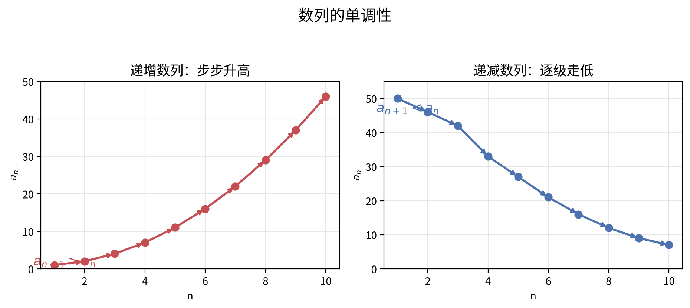
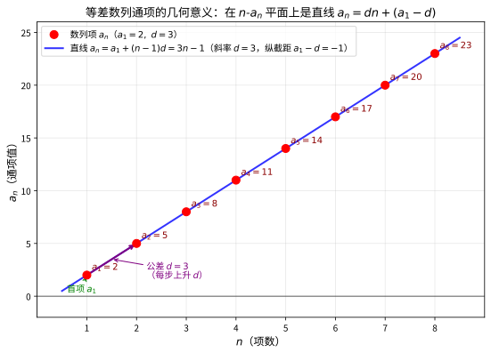
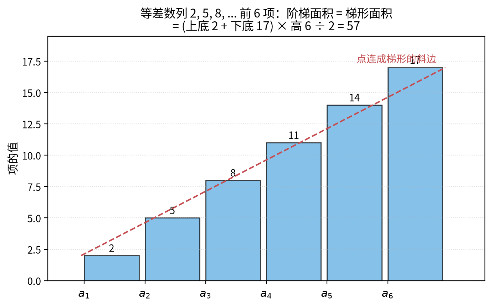
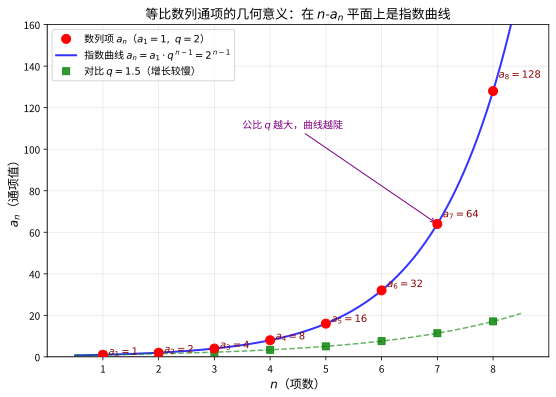
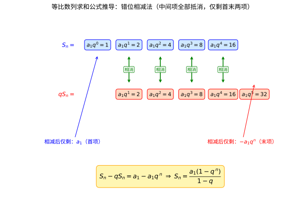
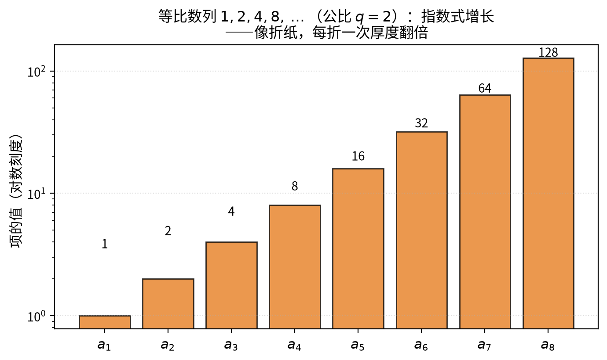
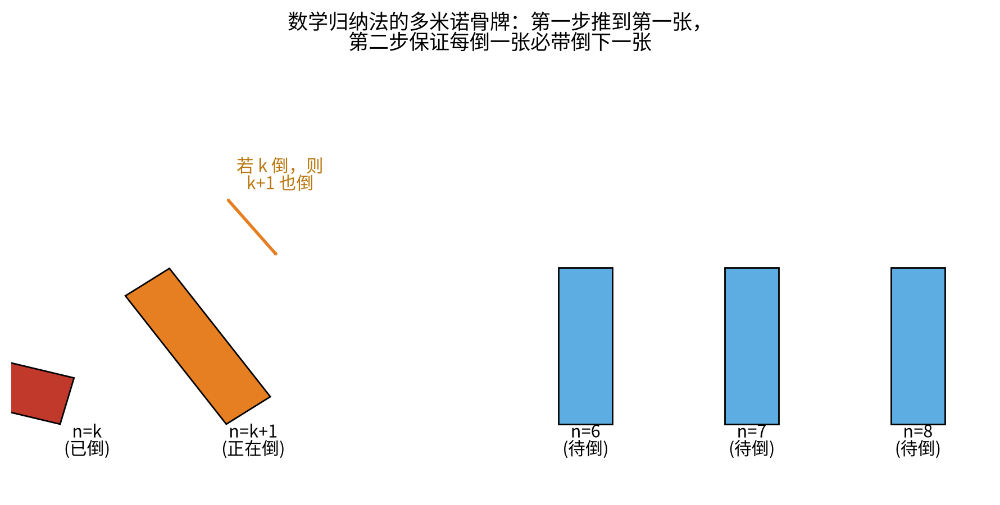
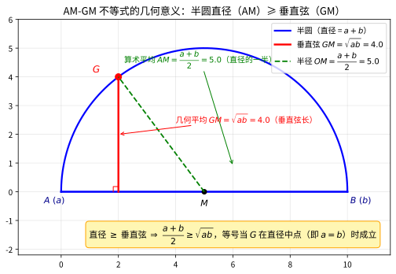
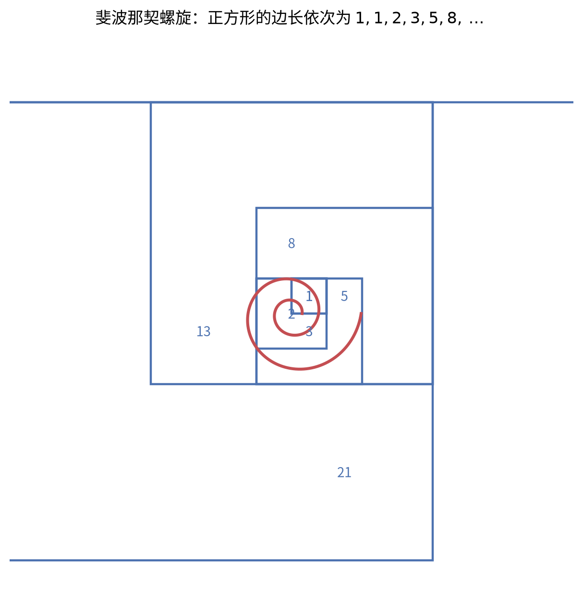
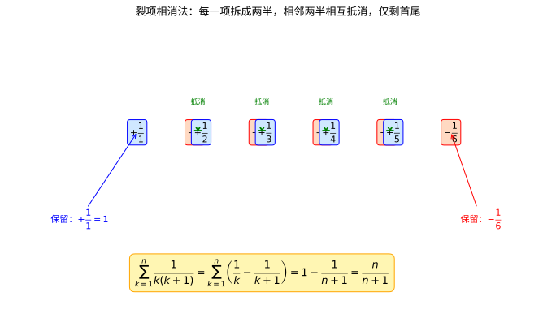

# 第 7 级：数列与数学归纳法

> **数学天梯攀爬教程·第七级**
> 本级别将系统学习数列的基本概念、等差数列与等比数列的通项与求和公式、数学归纳法的原理与应用，以及递推关系与特殊数列。

---

## 1. 学习目标

完成本级别学习后，你将能够：

- 理解数列的定义与分类（有限数列、无限数列、有穷数列、无穷数列）
- 掌握等差数列与等比数列的通项公式与求和公式，并能独立完成证明
- 理解数学归纳法的基本原理，熟练运用数学归纳法证明等式、不等式
- 认识斐波那契数列、调和数列等特殊数列及其性质
- 掌握线性递推关系的解法，包括特征方程法
- 能够运用数列知识解决实际问题

---

## 2. 核心概念

### 2.1 数列的定义

> **数列**（Sequence）是以正整数集 $\mathbb{N}^*$（或 $\mathbb{N}$）为定义域的函数，按一定顺序排列的一列数。

数列通常记作：

$$
\{a_n\},\quad a_1, a_2, a_3, \dots, a_n, \dots
$$

其中 $a_1$ 称为**首项**，$a_n$ 称为**通项**（一般项）。

### 2.2 数列的分类

| 分类标准 | 类型 | 说明 |
|---------|------|------|
| 项数 | **有穷数列** | 项数有限 |
| 项数 | **无穷数列** | 项数无限 |
| 变化趋势 | **递增数列** | $a_{n+1} > a_n$ 对所有 $n$ 成立 |
| 变化趋势 | **递减数列** | $a_{n+1} < a_n$ 对所有 $n$ 成立 |
| 变化趋势 | **常数列** | $a_{n+1} = a_n$ 对所有 $n$ 成立 |
| 变化趋势 | **摆动数列** | 各项交替增减 |

### 2.3 数列的表示方法

**1. 通项公式法**：用 $n$ 的表达式直接给出 $a_n$。

例如：$a_n = 2n - 1$ 表示奇数数列 $1, 3, 5, 7, \dots$

**2. 递推公式法**：用前一项或前几项表示后一项。

例如：$a_1 = 1,\; a_{n+1} = a_n + 2$ 也表示奇数数列 $1, 3, 5, 7, \dots$

**3. 列举法**：直接列出前若干项。

例如：$1, 3, 5, 7, \dots$

### 2.4 数列的单调性

若数列 $\{a_n\}$ 满足 $a_{n+1} - a_n > 0$（或 $< 0$）对所有 $n$ 成立，则称数列为递增（或递减）数列。判断单调性的常用方法：

- **作差法**：计算 $a_{n+1} - a_n$，判断符号
- **作商法**：对正项数列，计算 $\dfrac{a_{n+1}}{a_n}$，与 1 比较



> **直观理解（现实类比）**：单调性就是数列的"**走势图**"。递增数列像**爬楼梯接龙**——每一项都比前一项高（$a_{n+1}-a_n>0$）；递减数列像**下台阶**——每一项都比前一项低。判断单调就像**扫一眼心电图**：只要相邻两点始终同向，整条线的大方向就定了，这是研究数列收敛与否的第一步。

---

## 3. 等差数列

### 3.1 定义

> 如果一个数列从第 2 项起，每一项与它的前一项的差等于同一个常数，那么这个数列就叫做**等差数列**（Arithmetic Sequence），这个常数叫做等差数列的**公差**，通常用字母 $d$ 表示。

即：$a_{n+1} - a_n = d$（$d$ 为常数，$n \in \mathbb{N}^*$）

**示例**：$3, 5, 7, 9, 11, \dots$ 是等差数列，首项 $a_1 = 3$，公差 $d = 2$。

### 3.2 通项公式

$$
\boxed{a_n = a_1 + (n-1)d}
$$

**证明**：由定义，有

$$
\begin{aligned}
a_2 &= a_1 + d \\
a_3 &= a_2 + d = a_1 + 2d \\
a_4 &= a_3 + d = a_1 + 3d \\
&\ \vdots \\
a_n &= a_1 + (n-1)d
\end{aligned}
$$

由数学归纳法可严格证明上述结论。



> **直观理解（现实类比）**：等差数列的通项 $a_n = a_1 + (n-1)d$ 整理后是 $a_n = dn + (a_1 - d)$，这正是**一次函数 $y = kx + b$** 的形式——把 $n$ 当 $x$、$a_n$ 当 $y$，公差 $d$ 就是直线的**斜率**，纵截距是 $a_1 - d$。
>
> 这就像**匀速直线运动的位置-时间图**：每一秒（每增加一项）位置都增加同一个量 $d$，公差 $d$ 就是"速度"。$d>0$ 数列递增（向前走），$d<0$ 数列递减（往回走），$d=0$ 是常数列（站着不动）。所以已知两点就能定整条直线，这也是"已知任意两项可求公差"的几何根源。

**推论**：若已知等差数列中任意两项 $a_m$ 和 $a_n$（$m \neq n$），则公差

$$
d = \frac{a_m - a_n}{m - n}
$$

### 3.3 等差中项

若三个数 $a, A, b$ 成等差数列，则 $A$ 称为 $a$ 与 $b$ 的**等差中项**，满足

$$
A = \frac{a + b}{2}
$$

### 3.4 前 $n$ 项和公式

$$
\boxed{S_n = \frac{n(a_1 + a_n)}{2} = na_1 + \frac{n(n-1)}{2}d}
$$

**证明（倒序相加法）**：

$$
\begin{aligned}
S_n &= a_1 + (a_1 + d) + (a_1 + 2d) + \cdots + [a_1 + (n-1)d] \\
S_n &= a_n + (a_n - d) + (a_n - 2d) + \cdots + [a_n - (n-1)d]
\end{aligned}
$$

将两式相加，对应项之和均为 $a_1 + a_n$，共 $n$ 项：

$$
\begin{aligned}
2S_n &= n(a_1 + a_n) \\
S_n &= \frac{n(a_1 + a_n)}{2}
\end{aligned}
$$

将 $a_n = a_1 + (n-1)d$ 代入，得：

$$
S_n = na_1 + \frac{n(n-1)}{2}d
$$



> **直观理解（现实类比）**：把等差数列的每一项画成一根**叠放的木条**，前 $n$ 项就像一级级台阶。这些台阶的总面积，恰好等于一个**梯形**的面积——上底是首项 $a_1$，下底是末项 $a_n$，高是项数 $n$。
>
> 所以前 $n$ 项和公式 $S_n = \dfrac{n(a_1+a_n)}{2}$ 就是"**梯形面积公式** $(上底+下底)\times 高 \div 2$"的翻版。这也正是高斯快速求 $1+2+\cdots+100 = \frac{100\times101}{2}$ 的几何直觉所在。

#### 🎬 动画演示：等差数列求和（倒序拼成矩形）


> 这个动画直观展示了把等差数列 $\{1,2,\dots,n\}$ 与它的倒序拼接成一个矩形，从而得到 $1+2+\cdots+n=\dfrac{n(n+1)}{2}$。它通过动画的方式帮助理解本节核心概念。

### 3.5 常用性质

1. 若 $m + n = p + q$，则 $a_m + a_n = a_p + a_q$
2. 数列 $\{a_n\}$ 是等差数列 $\iff$ $a_n = pn + q$（$p, q$ 为常数）
3. 数列 $\{a_n\}$ 是等差数列 $\iff$ $S_n = An^2 + Bn$（$A, B$ 为常数）
4. 等差数列中依次每 $k$ 项之和仍构成等差数列

### 3.6 示例

**示例 1**：已知等差数列 $\{a_n\}$ 中，$a_5 = 10$，$a_{12} = 31$，求 $a_1$ 和 $d$。

**解**：

$$
\begin{cases}
a_5 = a_1 + 4d = 10 \\
a_{12} = a_1 + 11d = 31
\end{cases}
$$

两式相减：$7d = 21$，得 $d = 3$。代入得 $a_1 = 10 - 4 \times 3 = -2$。

所以 $a_1 = -2$，$d = 3$。

**示例 2**：求等差数列 $2, 5, 8, 11, \dots$ 的前 20 项和。

**解**：$a_1 = 2$，$d = 3$，$n = 20$。

$$
S_{20} = 20 \times 2 + \frac{20 \times 19}{2} \times 3 = 40 + 570 = 610
$$

**示例 3**：在等差数列 $\{a_n\}$ 中，已知 $a_3 + a_8 = 20$，求 $S_{10}$。

**解**：利用性质 $m + n = p + q \implies a_m + a_n = a_p + a_q$，

$$
a_3 + a_8 = a_1 + a_{10} = 20
$$

$$
S_{10} = \frac{10(a_1 + a_{10})}{2} = \frac{10 \times 20}{2} = 100
$$

---

## 4. 等比数列

### 4.1 定义

> 如果一个数列从第 2 项起，每一项与它的前一项的比等于同一个常数，那么这个数列就叫做**等比数列**（Geometric Sequence），这个常数叫做等比数列的**公比**，通常用字母 $q$ 表示（$q \neq 0$）。

即：$\dfrac{a_{n+1}}{a_n} = q$（$q$ 为非零常数，$n \in \mathbb{N}^*$）

**示例**：$2, 6, 18, 54, \dots$ 是等比数列，首项 $a_1 = 2$，公比 $q = 3$。

### 4.2 通项公式

$$
\boxed{a_n = a_1 \cdot q^{\,n-1}}
$$

**证明**：由定义，有

$$
\begin{aligned}
a_2 &= a_1 q \\
a_3 &= a_2 q = a_1 q^2 \\
a_4 &= a_3 q = a_1 q^3 \\
&\ \vdots \\
a_n &= a_1 q^{\,n-1}
\end{aligned}
$$



> **直观理解（现实类比）**：等比数列的通项 $a_n = a_1 \cdot q^{\,n-1}$ 在 $n$-$a_n$ 平面上是一条**指数曲线**——这正是"指数爆炸"的标准长相。
>
> 它就像**复利增长**或**细菌分裂**：每一项都是前一项的 $q$ 倍，公比 $q$ 就是"增长率"。$q>1$ 时数列像**滚雪球**般越滚越快（如细菌每代翻倍），$0<q<1$ 时像**放射性衰变**逐项缩小，$q=1$ 是常数列（停止增长）。对比等差数列的"匀速直线"，等比数列是"加速曲线"——这就是为什么几个回合后等比数列会远远甩开等差数列。

### 4.3 等比中项

若三个数 $a, G, b$ 成等比数列，则 $G$ 称为 $a$ 与 $b$ 的**等比中项**，满足

$$
G^2 = ab \quad (ab > 0)
$$

即 $G = \pm \sqrt{ab}$。

### 4.4 前 $n$ 项和公式

$$
\boxed{S_n = \begin{cases}
na_1, & q = 1 \\[1em]
\dfrac{a_1(1 - q^n)}{1 - q} = \dfrac{a_1 - a_n q}{1 - q}, & q \neq 1
\end{cases}}
$$

**证明（错位相减法）**：当 $q \neq 1$ 时，

$$
\begin{aligned}
S_n &= a_1 + a_1 q + a_1 q^2 + \cdots + a_1 q^{\,n-1} \tag{1} \\
q S_n &= \quad\ \ a_1 q + a_1 q^2 + \cdots + a_1 q^{\,n-1} + a_1 q^{\,n} \tag{2}
\end{aligned}
$$

(1) 式减去 (2) 式：

$$
S_n - q S_n = a_1 - a_1 q^{\,n}
$$

$$
(1 - q) S_n = a_1(1 - q^n)
$$

由于 $q \neq 1$，两边同除以 $1 - q$：

$$
S_n = \frac{a_1(1 - q^n)}{1 - q}
$$



> **直观理解（现实类比）**：错位相减法就像**把两排积木错位对齐**。上排是 $S_n$，下排是 $qS_n$（每块都向后挪一格）。两排相减时，中间那些"对得上的积木"两两相同、全部抵消，**最后只剩下首项 $a_1$ 和末项 $-a_1 q^n$** 这两块孤零零的积木。
>
> 所以 $(1-q)S_n = a_1 - a_1 q^n$，公式 $S_n = \dfrac{a_1(1-q^n)}{1-q}$ 自然就出来了。这种"错位让大部分项相消"的思路，在第 9.2 节处理"等差 $\times$ 等比"型求和时还会反复用到。



> **直观理解（现实类比）**：公比 $q>1$ 的等比数列，增长速度快得惊人——就像**对折一张纸**：每次对折，厚度翻倍。一张约 0.1 mm 的纸对折 42 次，厚度就能超过地球到月球的距离。这就是"指数爆炸"。
>
> 等比数列前 $n$ 项和公式为什么有个 $1-q^n$？因为错位相减时，除了首项和末项，其余项全部"抵消"了。**当 $|q|<1$ 时，$q^n\to 0$，无穷多项的和会收敛到有限值 $\dfrac{a_1}{1-q}$**——这正是"无限赌博/无限过程"中的极限思想雏形（第 13 级级数理论会系统学习）。

### 4.5 常用性质

1. 若 $m + n = p + q$，则 $a_m \cdot a_n = a_p \cdot a_q$
2. 数列 $\{a_n\}$ 是等比数列 $\iff$ $a_n = p \cdot q^{\,n-1}$（$p, q$ 为非零常数）
3. 等比数列中依次每 $k$ 项之和仍构成等比数列
4. 若 $\{a_n\}$ 是等比数列，则 $\{\log a_n\}$ 是等差数列

### 4.6 示例

**示例 4**：在等比数列 $\{a_n\}$ 中，$a_2 = 6$，$a_5 = 48$，求 $a_1$ 和 $q$。

**解**：

$$
\begin{cases}
a_2 = a_1 q = 6 \\
a_5 = a_1 q^4 = 48
\end{cases}
$$

两式相除：$q^3 = 8$，得 $q = 2$。代入得 $a_1 = 3$。

所以 $a_1 = 3$，$q = 2$。

**示例 5**：求等比数列 $1, \frac{1}{2}, \frac{1}{4}, \frac{1}{8}, \dots$ 的前 6 项和。

**解**：$a_1 = 1$，$q = \frac{1}{2}$，$n = 6$。

$$
S_6 = \frac{1 \times \left(1 - \left(\frac{1}{2}\right)^6\right)}{1 - \frac{1}{2}} = \frac{1 - \frac{1}{64}}{\frac{1}{2}} = 2 \times \frac{63}{64} = \frac{63}{32}
$$

**示例 6**：已知等比数列 $\{a_n\}$ 中，$a_3 = 4$，$S_3 = 14$，求 $a_1$ 和 $q$。

**解**：由题意

$$
\begin{cases}
a_3 = a_1 q^2 = 4 \\
S_3 = a_1(1 + q + q^2) = 14
\end{cases}
$$

由第一式得 $a_1 = \dfrac{4}{q^2}$，代入第二式：

$$
\frac{4}{q^2}(1 + q + q^2) = 14 \implies 4(1 + q + q^2) = 14q^2
$$

整理得 $4 + 4q + 4q^2 = 14q^2$，即 $10q^2 - 4q - 4 = 0$，$5q^2 - 2q - 2 = 0$。

解得 $q = 1$ 或 $q = -\frac{2}{5}$。

- 当 $q = 1$ 时，$a_1 = 4$，$S_3 = 12$，不满足 $S_3 = 14$，舍去。
- 当 $q = -\frac{2}{5}$ 时，$a_1 = \dfrac{4}{(-2/5)^2} = 25$。

所以 $a_1 = 25$，$q = -\dfrac{2}{5}$。

---

## 5. 数学归纳法

### 5.1 原理

> **数学归纳法**（Mathematical Induction）是一种证明与自然数 $n$ 有关的命题的重要方法。

其基本原理是**自然数集的良序性**：自然数的任何非空子集都有最小元素。

### 5.2 步骤

数学归纳法证明包括两个步骤：

**第一步（奠基步骤）**：证明当 $n = n_0$（通常 $n_0 = 1$）时命题成立。

**第二步（归纳步骤）**：假设当 $n = k$（$k \geq n_0$）时命题成立，证明当 $n = k + 1$ 时命题也成立。

完成这两步后，由数学归纳法原理可知，命题对所有 $n \geq n_0$ 的自然数都成立。

> **多米诺骨牌类比**：
> - 第一步：第一张骨牌倒了
> - 第二步：如果第 $k$ 张骨牌倒了，那么第 $k+1$ 张骨牌也会倒
> - 结论：所有骨牌都会倒



> **直观理解（现实类比）**：数学归纳法就像推倒一整排**多米诺骨牌**。要做到"全部倒下"，只需验证两件事：**(1) 第一张骨牌倒了**（奠基步骤）；**(2) 只要第 $k$ 张倒，第 $k+1$ 张必然跟着倒**（归纳步骤）。
>
> 两个条件缺一不可：只有"相邻传递"但第一张没倒，整排纹丝不动；只推倒第一张但骨牌间距太远传不下去，也只倒一张。**这正是数学归纳法"万一漏掉奠基或递推就失效"的原因**——也是第 9.5 节"易错点"强调归纳步骤必须使用归纳假设的根源。

### 5.3 证明 1：前 $n$ 个自然数之和

**命题**：证明 $1 + 2 + 3 + \cdots + n = \dfrac{n(n+1)}{2}$ 对所有 $n \in \mathbb{N}^*$ 成立。

**证明**：

**第一步（奠基）**：当 $n = 1$ 时，

左边 $= 1$，右边 $= \dfrac{1 \times 2}{2} = 1$，等式成立。

**第二步（归纳假设）**：假设当 $n = k$ 时等式成立，即

$$
1 + 2 + 3 + \cdots + k = \frac{k(k+1)}{2}
$$

当 $n = k + 1$ 时，

$$
\begin{aligned}
1 + 2 + \cdots + k + (k+1) &= \frac{k(k+1)}{2} + (k+1) \\
&= (k+1)\left(\frac{k}{2} + 1\right) \\
&= (k+1) \cdot \frac{k+2}{2} \\
&= \frac{(k+1)(k+2)}{2}
\end{aligned}
$$

因此当 $n = k+1$ 时等式也成立。

由数学归纳法，原等式对所有正整数 $n$ 成立。$\square$

### 5.4 证明 2：前 $n$ 个自然数的平方和

**命题**：证明 $1^2 + 2^2 + 3^2 + \cdots + n^2 = \dfrac{n(n+1)(2n+1)}{6}$ 对所有 $n \in \mathbb{N}^*$ 成立。

**证明**：

**第一步（奠基）**：当 $n = 1$ 时，

左边 $= 1^2 = 1$，右边 $= \dfrac{1 \times 2 \times 3}{6} = 1$，等式成立。

**第二步（归纳假设）**：假设当 $n = k$ 时等式成立，即

$$
1^2 + 2^2 + 3^2 + \cdots + k^2 = \frac{k(k+1)(2k+1)}{6}
$$

当 $n = k+1$ 时，

$$
\begin{aligned}
1^2 + 2^2 + \cdots + k^2 + (k+1)^2 &= \frac{k(k+1)(2k+1)}{6} + (k+1)^2 \\
&= \frac{k+1}{6} \left[ k(2k+1) + 6(k+1) \right] \\
&= \frac{k+1}{6} (2k^2 + k + 6k + 6) \\
&= \frac{k+1}{6} (2k^2 + 7k + 6) \\
&= \frac{k+1}{6} (k+2)(2k+3) \\
&= \frac{(k+1)(k+2)(2k+3)}{6}
\end{aligned}
$$

因此当 $n = k+1$ 时等式也成立。

由数学归纳法，原等式对所有正整数 $n$ 成立。$\square$

### 5.5 证明 3：前 $n$ 个自然数的立方和

**命题**：证明 $1^3 + 2^3 + 3^3 + \cdots + n^3 = \left[ \dfrac{n(n+1)}{2} \right]^2$ 对所有 $n \in \mathbb{N}^*$ 成立。

**证明**：

**第一步（奠基）**：当 $n = 1$ 时，

左边 $= 1^3 = 1$，右边 $= \left[ \dfrac{1 \times 2}{2} \right]^2 = 1$，等式成立。

**第二步（归纳假设）**：假设当 $n = k$ 时等式成立，即

$$
1^3 + 2^3 + 3^3 + \cdots + k^3 = \left[ \frac{k(k+1)}{2} \right]^2
$$

当 $n = k+1$ 时，

$$
\begin{aligned}
1^3 + 2^3 + \cdots + k^3 + (k+1)^3 &= \left[ \frac{k(k+1)}{2} \right]^2 + (k+1)^3 \\
&= \frac{k^2(k+1)^2}{4} + (k+1)^3 \\
&= \frac{(k+1)^2}{4} \left[ k^2 + 4(k+1) \right] \\
&= \frac{(k+1)^2}{4} (k^2 + 4k + 4) \\
&= \frac{(k+1)^2}{4} (k+2)^2 \\
&= \left[ \frac{(k+1)(k+2)}{2} \right]^2
\end{aligned}
$$

因此当 $n = k+1$ 时等式也成立。

由数学归纳法，原等式对所有正整数 $n$ 成立。$\square$

### 5.6 证明 4：AM-GM 不等式（二元情形）

**命题**：对于任意非负实数 $a, b$，有 $\dfrac{a + b}{2} \geq \sqrt{ab}$，等号当且仅当 $a = b$ 时成立。

**证明**：

$$
\begin{aligned}
(\sqrt{a} - \sqrt{b})^2 &\geq 0 \\
a + b - 2\sqrt{ab} &\geq 0 \\
\frac{a + b}{2} &\geq \sqrt{ab}
\end{aligned}
$$

等号成立当且仅当 $\sqrt{a} = \sqrt{b}$，即 $a = b$。$\square$



> **直观理解（现实类比）**：AM-GM 不等式有一个绝妙的**几何解释**。以 $a+b$ 为直径画一个半圆，圆心 $M$ 到端点的距离就是 $\dfrac{a+b}{2}$（**算术平均 AM**）；在直径上距左端 $a$ 处立一条垂直弦交圆周于 $G$，由相交弦定理这条弦长正好是 $\sqrt{ab}$（**几何平均 GM**）。
>
> 半圆中**任何一条垂直弦都不可能超过半径**（直径的一半），所以 $\sqrt{ab} \leq \dfrac{a+b}{2}$。等号当且仅当垂直弦正好立在圆心、即 $a = b$ 时成立。这条"直径 ≥ 垂直弦"的几何事实，正是 AM-GM 不等式最直观的"为什么"。

### 5.7 证明 5：AM-GM 不等式（$n$ 个数情形，数学归纳法证明）

**命题**：对于任意 $n$ 个非负实数 $a_1, a_2, \dots, a_n$，有

$$
\frac{a_1 + a_2 + \cdots + a_n}{n} \geq \sqrt[n]{a_1 a_2 \cdots a_n}
$$

等号当且仅当 $a_1 = a_2 = \cdots = a_n$ 时成立。

**证明**：

**第一步（奠基）**：$n = 1$ 时，不等式退化为 $a_1 \geq a_1$，显然成立，等号成立。

$n = 2$ 时，已由 5.6 节证明。

**第二步（归纳步骤）**：假设不等式对 $n = k$ 成立，证明对 $n = 2k$ 也成立。

设 $b_1, b_2, \dots, b_{2k}$ 为 $2k$ 个非负实数。

$$
\begin{aligned}
\frac{b_1 + b_2 + \cdots + b_{2k}}{2k}
&= \frac{1}{2} \left( \frac{b_1 + \cdots + b_k}{k} + \frac{b_{k+1} + \cdots + b_{2k}}{k} \right) \\
&\geq \frac{1}{2} \left( \sqrt[k]{b_1 \cdots b_k} + \sqrt[k]{b_{k+1} \cdots b_{2k}} \right) \quad (\text{归纳假设}) \\
&\geq \sqrt{ \sqrt[k]{b_1 \cdots b_k} \cdot \sqrt[k]{b_{k+1} \cdots b_{2k}} } \quad (\text{二元 AM-GM}) \\
&= \sqrt[2k]{b_1 b_2 \cdots b_{2k}}
\end{aligned}
$$

因此不等式对 $n = 2k$ 成立。

接下来，证明若不等式对 $n = k$ 成立，则对 $n = k-1$ 也成立。设 $a_1, \dots, a_{k-1}$ 为 $k-1$ 个非负实数，令

$$
a_k = \frac{a_1 + a_2 + \cdots + a_{k-1}}{k-1}
$$

由 $n = k$ 时的不等式：

$$
\frac{a_1 + \cdots + a_{k-1} + a_k}{k} \geq \sqrt[k]{a_1 \cdots a_{k-1} \cdot a_k}
$$

左边 $= \dfrac{(k-1)a_k + a_k}{k} = a_k$，所以

$$
a_k \geq \sqrt[k]{a_1 \cdots a_{k-1} \cdot a_k}
$$

两边 $k$ 次方：

$$
a_k^k \geq a_1 \cdots a_{k-1} \cdot a_k \implies a_k^{k-1} \geq a_1 \cdots a_{k-1}
$$

即

$$
a_k \geq \sqrt[k-1]{a_1 \cdots a_{k-1}}
$$

而 $a_k = \dfrac{a_1 + \cdots + a_{k-1}}{k-1}$，故

$$
\frac{a_1 + \cdots + a_{k-1}}{k-1} \geq \sqrt[k-1]{a_1 \cdots a_{k-1}}
$$

因此不等式对 $n = k-1$ 也成立。

由数学归纳法（反向归纳法），AM-GM 不等式对所有正整数 $n$ 成立。$\square$

---

## 6. 特殊数列

### 6.1 斐波那契数列

> **斐波那契数列**（Fibonacci Sequence）是意大利数学家斐波那契在《算盘书》中提出的数列。

**定义**：

$$
F_1 = 1,\ F_2 = 1,\ F_{n+2} = F_{n+1} + F_n \quad (n \geq 1)
$$

前几项：$1, 1, 2, 3, 5, 8, 13, 21, 34, 55, \dots$

**通项公式（比内公式）**：

$$
F_n = \frac{1}{\sqrt{5}} \left[ \left( \frac{1 + \sqrt{5}}{2} \right)^n - \left( \frac{1 - \sqrt{5}}{2} \right)^n \right]
$$

其中 $\varphi = \dfrac{1 + \sqrt{5}}{2} \approx 1.618$ 称为**黄金分割比**。

**重要性质**：

1. $\dfrac{F_{n+1}}{F_n} \to \varphi$（当 $n \to \infty$）
2. $F_1 + F_2 + \cdots + F_n = F_{n+2} - 1$
3. $F_1^2 + F_2^2 + \cdots + F_n^2 = F_n F_{n+1}$
4. $\gcd(F_m, F_n) = F_{\gcd(m, n)}$



> **直观理解（现实类比）**：斐波那契数列是"**自然界的隐藏密码**"。把边长依次为 $1,1,2,3,5,8,13\dots$ 的正方形一个挨一个拼起来，再沿对角线画弧线，就得到**黄金螺旋**——它出现在向日葵的种子排列、松果的鳞片、鹦鹉螺的壳壁里。相邻两项之比 $\frac{F_{n+1}}{F_n}$ 越来越接近黄金分割比 $\varphi\approx 1.618$，这就是"**后一项 = 前两项之和**"这种简单规则能生长出惊人秩序的直观体现。

**示例 7**：用数学归纳法证明 $F_1 + F_2 + \cdots + F_n = F_{n+2} - 1$。

**证明**：

（1）$n = 1$ 时，左边 $= F_1 = 1$，右边 $= F_3 - 1 = 2 - 1 = 1$，成立。

（2）假设 $n = k$ 时成立，即 $F_1 + F_2 + \cdots + F_k = F_{k+2} - 1$。

当 $n = k+1$ 时，

$$
\begin{aligned}
F_1 + F_2 + \cdots + F_k + F_{k+1} &= (F_{k+2} - 1) + F_{k+1} \\
&= (F_{k+1} + F_{k+2}) - 1 \\
&= F_{k+3} - 1
\end{aligned}
$$

成立。由数学归纳法，原式对所有正整数 $n$ 成立。$\square$

### 6.2 调和数列

> 如果一个数列的各项的倒数构成等差数列，则称该数列为**调和数列**（Harmonic Sequence）。

**定义**：若 $\left\{ \dfrac{1}{a_n} \right\}$ 是等差数列，则 $\{a_n\}$ 是调和数列。

**示例**：$1, \dfrac{1}{2}, \dfrac{1}{3}, \dfrac{1}{4}, \dots$ 是调和数列，其倒数 $1, 2, 3, 4, \dots$ 是等差数列。

**调和级数**：$\displaystyle \sum_{k=1}^{\infty} \frac{1}{k} = 1 + \frac{1}{2} + \frac{1}{3} + \frac{1}{4} + \cdots$ 发散到无穷大。

### 6.3 裂项相消法（Telescoping Series）

> 裂项相消法是通过将数列的每一项拆分成两项的差，使得求和时中间项相互抵消的方法。

**常用裂项公式**：

1. $\dfrac{1}{n(n+1)} = \dfrac{1}{n} - \dfrac{1}{n+1}$
2. $\dfrac{1}{n(n+k)} = \dfrac{1}{k} \left( \dfrac{1}{n} - \dfrac{1}{n+k} \right)$
3. $\dfrac{1}{\sqrt{n} + \sqrt{n+1}} = \sqrt{n+1} - \sqrt{n}$
4. $\dfrac{1}{(2n-1)(2n+1)} = \dfrac{1}{2} \left( \dfrac{1}{2n-1} - \dfrac{1}{2n+1} \right)$

**示例 8**：求 $\displaystyle \sum_{k=1}^{n} \frac{1}{k(k+1)}$。

**解**：

$$
\begin{aligned}
\sum_{k=1}^{n} \frac{1}{k(k+1)} &= \sum_{k=1}^{n} \left( \frac{1}{k} - \frac{1}{k+1} \right) \\
&= \left(1 - \frac{1}{2}\right) + \left(\frac{1}{2} - \frac{1}{3}\right) + \cdots + \left(\frac{1}{n} - \frac{1}{n+1}\right) \\
&= 1 - \frac{1}{n+1} = \frac{n}{n+1}
\end{aligned}
$$



> **直观理解（现实类比）**：裂项相消法就像**多米诺骨牌式的连锁抵消**。每一项 $\dfrac{1}{k(k+1)}$ 都被拆成"前半 $+\dfrac{1}{k}$"和"后半 $-\dfrac{1}{k+1}$"两块。当把第 $k$ 项的后半和第 $k+1$ 项的前半摆在一起时，它们正好是相反数、瞬间抵消。
>
> 于是从第 1 项的后半到第 $n$ 项的前半，一整串中间项像**多米诺骨牌依次倒下**般全部消失，**只剩下第 1 项的前半 $1$ 和第 $n$ 项的后半 $-\dfrac{1}{n+1}$**。这就是"裂项"二字的精髓：拆开是为了让相邻项互相吞噬。

---

## 7. 递推关系

### 7.1 递推数列的基本概念

> 如果数列 $\{a_n\}$ 的第 $n$ 项 $a_n$ 可以由它前面的 $k$ 项（$a_{n-1}, a_{n-2}, \dots, a_{n-k}$）通过某种关系确定，则称这种关系为**递推关系**（Recurrence Relation），$k$ 称为递推的**阶数**。

### 7.2 一阶线性递推

**形式**：$a_{n+1} = pa_n + q$（$p \neq 1$）

**解法**：构造等比数列

设 $a_{n+1} - \lambda = p(a_n - \lambda)$，展开得 $a_{n+1} = pa_n + (1-p)\lambda$。

令 $(1-p)\lambda = q$，解得 $\lambda = \dfrac{q}{1-p}$。

所以 $\left\{ a_n - \dfrac{q}{1-p} \right\}$ 是公比为 $p$ 的等比数列，首项为 $a_1 - \dfrac{q}{1-p}$。

**示例 9**：已知 $a_1 = 1$，$a_{n+1} = 2a_n + 3$，求 $a_n$。

**解**：设 $a_{n+1} - \lambda = 2(a_n - \lambda)$，得 $\lambda = 3$。

所以 $\{a_n - 3\}$ 是公比为 2 的等比数列，首项 $a_1 - 3 = -2$。

$$
a_n - 3 = (-2) \cdot 2^{\,n-1} = -2^n
$$

故 $a_n = 3 - 2^n$。

### 7.3 二阶线性递推与特征方程法

**形式**：$a_{n+2} = pa_{n+1} + qa_n$（$p, q$ 为常数，$q \neq 0$）

**解法（特征方程法）**：

**步骤 1**：写出特征方程 $x^2 - px - q = 0$，解出特征根 $x_1, x_2$。

**步骤 2**：根据特征根写出通项形式：

- 若 $x_1 \neq x_2$（两个不同的实根），则 $a_n = A x_1^{\,n-1} + B x_2^{\,n-1}$
- 若 $x_1 = x_2$（重根），则 $a_n = (A + Bn) x_1^{\,n-1}$

**步骤 3**：利用初始条件 $a_1, a_2$ 确定常数 $A, B$。

**示例 10（斐波那契数列）**：求斐波那契数列 $F_1 = 1, F_2 = 1, F_{n+2} = F_{n+1} + F_n$ 的通项公式。

**解**：特征方程为 $x^2 - x - 1 = 0$，解得

$$
x_1 = \frac{1 + \sqrt{5}}{2},\quad x_2 = \frac{1 - \sqrt{5}}{2}
$$

设 $F_n = A x_1^{\,n-1} + B x_2^{\,n-1}$。

由 $F_1 = 1$，$F_2 = 1$ 得：

$$
\begin{cases}
A + B = 1 \\
A x_1 + B x_2 = 1
\end{cases}
$$

解得 $A = \dfrac{1}{\sqrt{5}} x_1$，$B = -\dfrac{1}{\sqrt{5}} x_2$。

因此

$$
F_n = \frac{1}{\sqrt{5}} \left( x_1^{\,n} - x_2^{\,n} \right) = \frac{1}{\sqrt{5}} \left[ \left( \frac{1 + \sqrt{5}}{2} \right)^n - \left( \frac{1 - \sqrt{5}}{2} \right)^n \right]
$$

### 7.4 常见递推类型总结

| 递推类型 | 形式 | 解法 |
|---------|------|------|
| 一阶线性 | $a_{n+1} = pa_n + q$ | 构造等比数列 |
| 二阶线性齐次 | $a_{n+2} = pa_{n+1} + qa_n$ | 特征方程法 |
| 分式递推 | $a_{n+1} = \dfrac{pa_n + q}{ra_n + s}$ | 取倒数转化为线性 |
| 累加法 | $a_{n+1} - a_n = f(n)$ | $a_n = a_1 + \sum_{k=1}^{n-1} f(k)$ |
| 累乘法 | $\dfrac{a_{n+1}}{a_n} = f(n)$ | $a_n = a_1 \cdot \prod_{k=1}^{n-1} f(k)$ |

---

## 8. 示例汇总

### 示例 11：累加法

已知 $a_1 = 2$，$a_{n+1} = a_n + 2n + 1$，求 $a_n$。

**解**：

$$
\begin{aligned}
a_n &= a_1 + \sum_{k=1}^{n-1} (2k + 1) \\
&= 2 + 2\sum_{k=1}^{n-1} k + \sum_{k=1}^{n-1} 1 \\
&= 2 + 2 \cdot \frac{(n-1)n}{2} + (n-1) \\
&= 2 + n(n-1) + n - 1 \\
&= n^2 + 1
\end{aligned}
$$

### 示例 12：累乘法

已知 $a_1 = 1$，$\dfrac{a_{n+1}}{a_n} = \dfrac{n}{n+1}$，求 $a_n$。

**解**：

$$
\begin{aligned}
a_n &= a_1 \cdot \prod_{k=1}^{n-1} \frac{k}{k+1} \\
&= 1 \cdot \frac{1}{2} \cdot \frac{2}{3} \cdot \frac{3}{4} \cdots \frac{n-1}{n} \\
&= \frac{1}{n}
\end{aligned}
$$

### 示例 13：数列与不等式

已知 $a_n = 2n - 1$，证明：$\dfrac{1}{a_1 a_2} + \dfrac{1}{a_2 a_3} + \cdots + \dfrac{1}{a_n a_{n+1}} < \dfrac{1}{2}$。

**证明**：

$$
\begin{aligned}
\frac{1}{a_k a_{k+1}} &= \frac{1}{(2k-1)(2k+1)} \\
&= \frac{1}{2} \left( \frac{1}{2k-1} - \frac{1}{2k+1} \right)
\end{aligned}
$$

所以

$$
\begin{aligned}
\sum_{k=1}^{n} \frac{1}{a_k a_{k+1}} &= \frac{1}{2} \sum_{k=1}^{n} \left( \frac{1}{2k-1} - \frac{1}{2k+1} \right) \\
&= \frac{1}{2} \left( 1 - \frac{1}{2n+1} \right) \\
&= \frac{n}{2n+1} < \frac{1}{2}
\end{aligned}
$$

### 示例 14：数学归纳法证明不等式

用数学归纳法证明 $2^n > n^2$ 对 $n \geq 5$ 成立。

**证明**：

（1）$n = 5$ 时，$2^5 = 32 > 25 = 5^2$，成立。

（2）假设 $n = k$（$k \geq 5$）时 $2^k > k^2$ 成立。

当 $n = k+1$ 时，

$$
\begin{aligned}
2^{k+1} &= 2 \cdot 2^k > 2k^2
\end{aligned}
$$

只需证明 $2k^2 \geq (k+1)^2$ 对 $k \geq 5$ 成立：

$$
2k^2 - (k+1)^2 = 2k^2 - (k^2 + 2k + 1) = k^2 - 2k - 1 = (k-1)^2 - 2 \geq 4^2 - 2 = 14 > 0
$$

所以 $2^{k+1} > 2k^2 \geq (k+1)^2$，即 $2^{k+1} > (k+1)^2$。

由数学归纳法，$2^n > n^2$ 对所有 $n \geq 5$ 成立。$\square$

---

## 9. 数列解题思路与技巧

> 高中数列题目看似灵活多变，但**题型有限、套路固定**。核心只有两件事：**求通项 $a_n$** 和 **求前 $n$ 项和 $S_n$**。下面系统梳理全部套路。

### 9.1 求通项公式的六种方法

**方法一：定义法（等差 / 等比直接套）**

若已判定是等差或等比，直接代公式：
$$
a_n = a_1 + (n-1)d, \qquad a_n = a_1 q^{\,n-1}
$$

**方法二：累加法（递推为 $a_{n+1} - a_n = f(n)$）**

把每个差累加：
$$
a_n = a_1 + f(1) + f(2) + \cdots + f(n-1)
$$

> **思路示范**：$a_1 = 1$，$a_{n+1} = a_n + 2n$。
>
> $a_n = a_1 + \sum_{k=1}^{n-1} 2k = 1 + 2 \cdot \frac{(n-1)n}{2} = n^2 - n + 1$。

**方法三：累乘法（递推为 $\dfrac{a_{n+1}}{a_n} = f(n)$）**

$$
a_n = a_1 \cdot f(1) \cdot f(2) \cdots f(n-1)
$$

**方法四：构造法（待定系数法，处理 $a_{n+1} = pa_n + q$）**

设 $a_{n+1} + \lambda = p(a_n + \lambda)$，解得 $\lambda = \dfrac{q}{p-1}$，则 $\{a_n + \lambda\}$ 是等比数列。

> **思路示范**：$a_1 = 1$，$a_{n+1} = 2a_n + 3$。
>
> 设 $a_{n+1} + 3 = 2(a_n + 3)$，则 $\{a_n + 3\}$ 是首项 $4$、公比 $2$ 的等比数列，故 $a_n + 3 = 4 \cdot 2^{n-1} = 2^{n+1}$，所以 $a_n = 2^{n+1} - 3$。

**方法五：取倒数法（处理 $a_{n+1} = \dfrac{a_n}{a_n + k}$）**

**完整流程（三步）**：

**第一步** 两边取倒数，把 $\dfrac{a_n}{a_n + k}$ 的分母拆开：
$$
\frac{1}{a_{n+1}} = \frac{a_n + k}{a_n} = 1 + \frac{k}{a_n}
$$

**第二步** 设 $b_n = \dfrac{1}{a_n}$，代入上式得：
$$
b_{n+1} = 1 + k \cdot b_n
$$
这是"一阶线性递推 $b_{n+1} = k\,b_n + 1$"，**再用方法四（构造法）**把它化成等比数列，解出 $b_n$。

**第三步** 回代 $a_n = \dfrac{1}{b_n}$，得到通项。

> **思路示范**：$a_1 = 1$，$a_{n+1} = \dfrac{a_n}{a_n + 2}$，求 $a_n$。
>
> 取倒数：$\dfrac{1}{a_{n+1}} = \dfrac{a_n + 2}{a_n} = 1 + \dfrac{2}{a_n}$。
>
> 设 $b_n = \dfrac{1}{a_n}$，则 $b_{n+1} = 2b_n + 1$。用构造法：$b_{n+1} + 1 = 2(b_n + 1)$，故 $\{b_n + 1\}$ 是首项 $b_1 + 1 = 2$、公比 $2$ 的等比数列，即 $b_n + 1 = 2^n$，所以 $b_n = 2^n - 1$。
>
> 回代得 $a_n = \dfrac{1}{b_n} = \dfrac{1}{2^n - 1}$。

**方法六：$S_n$ 与 $a_n$ 的关系**

$$
a_n = \begin{cases} S_1, & n = 1 \\ S_n - S_{n-1}, & n \geqslant 2 \end{cases}
$$

> **易错提醒**：$a_n = S_n - S_{n-1}$ 只在 $n \geqslant 2$ 时成立，$a_1$ 需单独验证。

### 9.2 求前 $n$ 项和的四种方法

**方法一：公式法**（等差、等比直接代）

**方法二：错位相减法**（通项为"等差 $\times$ 等比"）

$$
S_n = (\text{等差}) \cdot (\text{等比}) \ \Rightarrow \ qS_n - S_n \ \text{相减相消}
$$

**方法三：裂项相消法**（通项可裂为两项之差）

常见裂项：
$$
\frac{1}{n(n+1)} = \frac{1}{n} - \frac{1}{n+1}, \quad \frac{1}{n(n+k)} = \frac{1}{k}\left(\frac{1}{n} - \frac{1}{n+k}\right)
$$

$$
\frac{1}{\sqrt{n} + \sqrt{n+1}} = \sqrt{n+1} - \sqrt{n}, \quad \frac{1}{(2n-1)(2n+1)} = \frac{1}{2}\left(\frac{1}{2n-1} - \frac{1}{2n+1}\right)
$$

**方法四：分组求和法**（通项为若干可求和部分之和）

> **思路示范**：求 $S_n = 1 + (1+2) + (1+2+3) + \cdots$ 型，先拆成 $\frac{1}{2}\sum k(k+1)$ 再分解求和。

### 9.3 数列与不等式

- **放缩法**：把 $a_n$ 放大或缩小到可求和的形式，再证明不等式。
- **数学归纳法**：证明关于 $n$ 的不等式，第二步必须**用归纳假设**。

### 9.4 常见题型与套路

| 题型 | 切入套路 |
|:-----|:---------|
| 已知 $S_n$ 求 $a_n$ | 方法六（注意 $n=1$） |
| $a_{n+1} = pa_n + q$ | 构造等比数列 |
| $a_{n+1} = \dfrac{a_n}{a_n + k}$ | 取倒数 |
| 等差 $\times$ 等比求和 | 错位相减 |
| 分式通项求和 | 裂项相消 |
| $m + n = p + q$ | 用等差 / 等比性质 |
| 二阶递推 | 特征方程 |

### 9.5 易错点提醒

1. **等比数列公比 $q$**：求和时必须讨论 $q = 1$ 与 $q \neq 1$ 两种情形。
2. **$S_n$ 与 $a_n$**：$a_n = S_n - S_{n-1}$ 仅当 $n \geqslant 2$，务必单独检验 $a_1$。
3. **数学归纳法**：第二步必须**使用归纳假设**，否则证明无效。
4. **取对数 / 取倒数**：注意底数、真数、分母的取值范围。

---

## 解题技巧

> 本节补充以「适用场景 / 关键步骤 / 常见误区」三要素组织的解题方法，与上一节「数列解题思路与技巧」相互配合，覆盖本章学习目标。

### 7.1 等差数列的通项与前 $n$ 项和
**适用场景**：已知首项、公差或部分条件，求通项、某项、前 $n$ 项和。
**关键步骤**：
1. 通项 $a_n=a_1+(n-1)d$；
2. 前 $n$ 项和 $S_n=\dfrac{n(a_1+a_n)}{2}=na_1+\dfrac{n(n-1)}{2}d$；
3. 善用性质"$m+n=p+q\Rightarrow a_m+a_n=a_p+a_q$"简化。
**常见误区**：求和用 $a_1+a_n$ 时须两项关于首尾对称；数项数时"末项−首项+1"易算错。
**精讲示例**：$a_1=3,d=4$，则 $a_{10}=3+9\cdot4=39$，$S_{10}=\dfrac{10(3+39)}{2}=210$。

### 7.2 等比数列的通项与前 $n$ 项和
**适用场景**：已知首项、公比求通项、某项、前 $n$ 项和。
**关键步骤**：
1. 通项 $a_n=a_1q^{n-1}$；
2. 前 $n$ 项和 $S_n=\begin{cases}na_1,&q=1\\\dfrac{a_1(q^n-1)}{q-1},&q\ne1\end{cases}$；
3. 始终**讨论 $q=1$ 与 $q\ne1$**。
**常见误区**：$a_6$ 误写成 $a_1q^6$；求和漏讨论 $q=1$。
**精讲示例**：$a_1=2,q=3$，则 $a_6=2\cdot3^5=486$，$S_5=\dfrac{2(3^5-1)}{3-1}=242$。

### 7.3 递推求通项：累加、累乘、构造、取倒数
**适用场景**：由递推式求通项，或已知 $S_n$ 求 $a_n$。
**关键步骤**：
1. $a_{n+1}-a_n=f(n)$ 用**累加**；$\dfrac{a_{n+1}}{a_n}=f(n)$ 用**累乘**；
2. $a_{n+1}=pa_n+q$ 用**构造**：$a_{n+1}+\lambda=p(a_n+\lambda)$，$\lambda=\dfrac{q}{p-1}$，化等比；
3. $a_{n+1}=\dfrac{a_n}{a_n+k}$ 用**取倒数**化为线性递推再构造。
**常见误区**：累加/累乘的项数算错；构造时 $\lambda$ 的符号写反；取倒数须保证分母非零。
**精讲示例**：$a_1=1,a_{n+1}=2a_n+3$，由 $a_{n+1}+3=2(a_n+3)$ 得 $a_n=2^{n+1}-3$。

### 7.4 数列求和：公式、错位相减、裂项、分组
**适用场景**：识别通项类型并选用对应求和方法。
**关键步骤**：
1. 等差/等比直接**公式法**；
2. "等差 × 等比"用**错位相减**（乘公比 $q$ 后作差相消）；
3. 分式通项用**裂项相消**，如 $\dfrac1{n(n+k)}=\tfrac1k\left(\tfrac1n-\tfrac1{n+k}\right)$；
4. 可加拆部分和用**分组求和**。
**常见误区**：错位相减的项数与末项符号易错；裂项系数 $\tfrac1k$ 漏乘。
**精讲示例**：$\sum_{k=1}^n\tfrac1{k(k+2)}=\tfrac12\left(1+\tfrac12-\tfrac1{n+1}-\tfrac1{n+2}\right)$。

### 7.5 $S_n$ 与 $a_n$ 的关系（分段）
**适用场景**：已知 $S_n$ 求通项 $a_n$。
**关键步骤**：
1. $a_n=\begin{cases}S_1,&n=1\\S_n-S_{n-1},&n\ge2\end{cases}$；
2. 对第 2 段求出的通式**单独检验** $n=1$ 是否成立，再决定是否合并。
**常见误区**：直接写 $a_n=S_n-S_{n-1}$ 而漏掉 $n\ge2$ 的限定与 $a_1$ 的核对。
**精讲示例**：$S_n=n^2+2n$，$a_1=3$；$a_n=S_n-S_{n-1}=2n+1$（$n\ge2$），而 $a_1=3=2\cdot1+1$，可合并为 $a_n=2n+1$。

### 7.6 数学归纳法的"两步一结论"
**适用场景**：证明与正整数 $n$ 全相关的等式、不等式、整除性命题。
**关键步骤**：
1. **奠基**：验证 $n=n_0$ 时命题成立；
2. **归纳递推**：假设 $n=k$ 成立，并**使用该假设**证明 $n=k+1$ 成立；
3. **结论**：由前两步对一切 $n\ge n_0$ 成立。
**常见误区**：第二步未用到归纳假设；起点选错；$k\to k+1$ 的代数变形有误。
**精讲示例**：对 $\sum_{k=1}^n\tfrac1{k(k+1)}=\tfrac{n}{n+1}$，由 $n=k$ 两端加 $\tfrac1{(k+1)(k+2)}=\tfrac{k+1}{k+2}$ 即证。

### 7.7 数列不等式与递推极限
**适用场景**：证明含 $n$ 的不等式、判断递推数列收敛性。
**关键步骤**：
1. 不等式常用**裂项放缩**（把 $\tfrac1{(k+1)^2}$ 放缩为 $\tfrac1{k(k+1)}$）或**归纳法**；
2. 递推极限先证"单调且有界"得收敛，再取递推的两端极限解不动点方程；
3. 得解后按题意舍去不合理的根。
**常见误区**：只由递推式算极限而未先证存在性；放缩方向反了导致不等式方向错。
**精讲示例**：$a_1=1,\ a_{n+1}=\tfrac12(a_n+\tfrac1{a_n})$，由均值不等式 $a_{n+1}\ge1$，趋向极限为 $1$。

---

## 10. 习题

### 基础题

1. 已知等差数列 $\{a_n\}$ 中，$a_1 = 3$，$d = 4$，求 $a_{10}$ 和 $S_{10}$。

2. 在等比数列 $\{a_n\}$ 中，$a_1 = 2$，$q = 3$，求 $a_6$ 和 $S_5$。

3. 已知数列 $\{a_n\}$ 满足 $a_1 = 1$，$a_{n+1} = a_n + 2n$，求 $a_n$。

4. 用数学归纳法证明：$1 \times 2 + 2 \times 3 + 3 \times 4 + \cdots + n(n+1) = \dfrac{n(n+1)(n+2)}{3}$。

5. 求 $\displaystyle \sum_{k=1}^{n} \frac{1}{k(k+2)}$ 的值。

6. 已知 $a = 3 + 2\sqrt{2}$，$b = 3 - 2\sqrt{2}$，求 $a$ 与 $b$ 的等差中项和等比中项。

7. 已知数列 $\{a_n\}$ 满足 $a_1 = 1$，$\dfrac{a_{n+1}}{a_n} = \dfrac{n+2}{n}$（$n \geq 1$），求通项公式 $a_n$。

8. 写出数列 $\dfrac12,\dfrac13,\dfrac14,\ldots$ 的通项公式与第 $10$ 项，并判断其单调性。

9. 已知数列 $\{a_n\}$ 的通项为 $a_n = 3n - 2$，判断它属于等差还是等比，并求 $a_1, a_6, S_6$。

10. 等差数列 $\{a_n\}$ 中 $a_1 = -2$，$d = 3$，求 $a_{15}$ 与 $S_{15}$。

11. 求前 $100$ 个正奇数之和。

12. 等差数列 $\{a_n\}$ 中 $a_4 = 12$，$a_7 = 21$，求公差 $d$ 与首项 $a_1$。

13. 三个数成等差数列，其和为 $12$，求中间那个数。

14. 求等比数列 $3, 6, 12, 24, \ldots$ 的第八项与公比。

15. 等比数列 $\{a_n\}$ 中 $a_1 = 5$，$q = \dfrac12$，求 $a_4$ 与 $S_4$。

16. 判断数列 $2, -2, 2, -2, \ldots$ 的类型并求 $S_5$。

17. 求 $2$ 与 $8$ 的等比中项。

18. 等差数列 $\{a_n\}$ 中 $a_2 + a_5 + a_8 = 30$，求 $a_5$。

19. 已知 $a_{n+1} - a_n = 1$，$a_1 = 4$，求通项公式。

20. 已知 $\dfrac{a_{n+1}}{a_n} = 2$，$a_1 = 3$，求 $a_5$。

21. 求 $\displaystyle\sum_{k=1}^{20}(2k - 1)$。

22. 求 $\displaystyle\sum_{k=1}^{10}2^k$ 的值。

23. 等差数列 $1, 4, 7, 10, \ldots$ 中，若 $a_n = 61$，求 $n$。

24. 等差数列 $\{a_n\}$ 中 $a_1 + a_{10} = 20$，求 $S_{10}$。

25. 数列 $\{a_n\}$ 满足 $a_n = (-1)^n$，求其前 $6$ 项之和。

26. 求 $\dfrac12 + \dfrac14 + \dfrac18 + \cdots + \dfrac{1}{2^{10}}$。

27. 判断数列 $a_n = n^2 + 1$ 是否递增，并说明理由。

28. 等差数列 $\{a_n\}$ 中 $d = -2$，$a_5 = 0$，求 $a_1$ 与 $a_{10}$。

29. 等比数列 $\{a_n\}$ 中 $a_2 = 6$，$a_4 = 24$（$q > 0$），求 $q$ 与 $a_1$。

30. 三个连续奇数的和为 $45$，求中间的那个奇数。

31. 写出 $1, 3, 9, 27, \ldots$ 的前 $n$ 项和公式。

32. 求 $2$ 与 $18$ 的等差中项与等比中项。

33. 已知 $S_n = n^2 + n$，求 $a_1$ 与 $a_2$。

34. 判断数列 $1, -1, 1, -1, \ldots$ 的摆动性并写出其通项。

35. 等差数列 $\{a_n\}$ 中 $a_1 = 1$，$a_3 = 7$，求公差 $d$ 与 $a_{10}$。

36. 用累加法求：$a_1 = 0$，$a_{n+1} = a_n + 1$ 的通项。

37. 等比数列前 $n$ 项和 $S_n = 2^n - 1$，求首项与公比。

38. 用裂项求和：$\displaystyle\sum_{k=1}^{100}\frac{1}{k(k+1)}$。

39. 等差数列 $\{a_n\}$ 中 $a_6 = 0$，求 $a_1 + a_2 + \cdots + a_{11}$。

40. 等比数列 $\{a_n\}$ 中 $a_1a_2a_3 = 8$，求 $a_2$。

41. 判断 $a_n = \dfrac1n$ 是递增还是递减。

42. 等差数列 $\{a_n\}$ 的前 $n$ 项和一定是 $n$ 的二次函数吗？举例说明。

43. 等比数列 $\{a_n\}$ 的第三项为 $12$，公比为 $3$，求首项。

44. 数列 $\{a_n\}$ 通项 $a_n = n^2 - 2n$，求 $a_3$ 与 $a_5$。

45. 求 $3, 5, 7, 9, \ldots$ 的前 $30$ 项之和。

46. 等比数列 $q = -2$，$a_1 = 1$，求其前 $10$ 项之和。

47. 等差数列 $a_1 = 7$，$d = -1$，求 $S_8$。

48. 判断 $a_n = \dfrac{n+1}{n}$ 是递增还是递减，并说明理由。

49. 等比数列 $2, 4, 8, 16, \ldots$ 中，若 $a_k = 1024$，求 $k$。

50. 若 $x, 5, y$ 成等差数列，求 $x + y$。

51. 求 $\displaystyle\sum_{k=1}^{5}k^2$ 的值以验证平方和公式。

52. 等比数列 $\{a_n\}$ 中 $a_3 = 18$，$a_6 = 486$，求公比 $q$。

53. 数列 $\{a_n\}$ 满足 $a_1 = 10$，$a_{n+1} = a_n - 3$，求通项与前 $n$ 项和。

54. 某种细菌每小时数量翻倍，初始 $100$ 个，$5$ 小时后共有多少个？

55. 求等比数列 $5, 10, 20, 40, \ldots$ 的第六项。

56. 等差数列 $a_1 = 10$，$d = -2$，写出其前 $n$ 项和公式并求 $S_3$。

57. 下列哪个是等差数列：A. $a_n = n^2$；B. $a_n = 2n + 1$；C. $a_n = \dfrac1n$。（写出答案）

58. 等差数列 $\{a_n\}$ 中 $a_1 + a_2 + a_3 = 9$，$a_4 = 7$，求 $d$。

59. 等比数列 $\{a_n\}$ 中 $a_2 = 4$，$a_4 = 16$，$q > 0$，求 $a_3$。

60. 等差数列 $\{a_n\}$ 中 $a_3 + a_5 = 16$，且公差为正，$d = 2$，求 $a_4$ 与前三项。

### 进阶题

1. 已知等差数列 $\{a_n\}$ 的前 $n$ 项和为 $S_n$，且 $S_5 = 25$，$S_{10} = 100$，求 $a_n$。

2. 在等比数列 $\{a_n\}$ 中，$a_1 + a_2 = 6$，$a_1 a_2 = 8$，且 $q > 1$，求 $a_n$ 和 $S_n$。

3. 用数学归纳法证明：$n! > 2^n$ 对 $n \geq 4$ 成立。

4. 已知数列 $\{a_n\}$ 满足 $a_1 = 2$，$a_{n+1} = 3a_n + 2$，求 $a_n$。

5. 求斐波那契数列中 $F_1 + F_3 + F_5 + \cdots + F_{2n-1}$ 的值。

6. 已知数列 $\{a_n\}$ 的通项为 $a_n = \dfrac{1}{\sqrt{n}}$，用放缩法证明：$\displaystyle\sum_{k=1}^{n} a_k > 2(\sqrt{n+1} - 1)$。

7. 用数学归纳法证明：$1^3+2^3+\cdots+n^3=\left[\dfrac{n(n+1)}2\right]^2$。

8. 已知 $a_1=1$，$a_{n+1}=2a_n+1$，求 $a_n$。

9. 设 $S_n=2n^2-3n$，求通项 $a_n$。

10. 用错位相减法求 $S_n=\sum_{k=1}^n k\cdot 2^k$。

11. 求 $\sum_{k=1}^n \dfrac{1}{(2k-1)(2k+1)}$。

12. 已知 $a_1=2$，$a_{n+1}=3a_n-2$，求 $a_n$。

13. 等差数列 $\{a_n\}$ 中 $S_4=20$，$S_8=72$，求通项。

14. 等比数列 $\{a_n\}$ 中 $a_2=3$，$a_5=81$，求前 $5$ 项和。

15. 用数学归纳法证明：$2+4+6+\cdots+2n=n(n+1)$。

16. 数列 $\{a_n\}$ 满足 $a_1=1$，$a_n=S_{n-1}$（$n\ge2$），求 $S_n$ 与 $a_n$。

17. 求 $S_n=1\cdot2+2\cdot3+\cdots+n(n+1)$。

18. 已知三数成等比数列，和为 $21$，积为 $216$，求这三个数。

19. 用累乘法：$a_1=2$，$\dfrac{a_{n+1}}{a_n}=\dfrac{n}{n+1}$，求 $a_n$。

20. 求 $\sum_{k=1}^n\dfrac{1}{\sqrt{k}+\sqrt{k+1}}$ 的值。

21. 等差数列 $\{a_n\}$ 中 $a_1=1$，$S_9=45$，求 $d$。

22. 等比数列 $\{a_n\}$ 中 $a_1a_9=64$，求 $a_5$。

23. 用数学归纳法证明：$\dfrac{1}{1\cdot3}+\dfrac{1}{3\cdot5}+\cdots+\dfrac{1}{(2n-1)(2n+1)}=\dfrac{n}{2n+1}$。

24. 数列 $\{a_n\}$ 满足 $a_1=2$，$a_{n+1}=a_n^2$，求 $a_n$。

25. 某人口规模 $100$ 万人，每年增长 $3\%$，$5$ 年后约为多少万人？

26. 已知 $S_n=\dfrac{3^n-1}{2}$，判断 $\{a_n\}$ 的类型并求通项。

27. 求数列 $-1,2,-4,8,\ldots$ 的前 $n$ 项和。

28. 用数学归纳法证明 $3^n\ge 2n+1$ 对所有 $n\ge1$ 成立。

29. 已知 $a_1=1$，$a_{n+1}=a_n+\dfrac{1}{n(n+1)}$，求 $a_n$。

30. 各项为正的等比数列前 $n$ 项和 $S_n=3\cdot2^n-3$，求首项与公比。

31. 用数学归纳法证明：$\dfrac12+\dfrac1{2^2}+\cdots+\dfrac1{2^n}=1-\dfrac1{2^n}$。

32. 等比数列 $\{a_n\}$ 中 $a_1=4$，$q=3$，问从第几项起 $a_n>1000$。

33. 作商法判断数列 $a_n=\dfrac{n^2}{2^n}$ 的单调性（$n\ge1$）。

34. 已知 $a_1=1$，$\dfrac{a_{n+1}}{a_n}=n+1$，求 $a_n$。

35. 三个数成等差数列，和为 $24$，若分别加 $1,1,3$ 后成等比数列，求这三个数。

36. 用错位相减法求 $S_n=\sum_{k=1}^n k\cdot3^k$。

37. 已知 $a_1=1$，$a_2=2$，$a_{n+2}=2a_{n+1}-a_n$，判断类型并求通项。

38. 用数学归纳法证明：$1+3+5+\cdots+(2n-1)=n^2$。

39. 求和：$\sum_{k=1}^n\frac{1}{k(k+2)}$ 的一般结果。

40. 已知等差数列前 $n$ 项和 $S_n=5n^2-3n$，求通项 $a_n$。

41. 用数学归纳法证明：$3^{2n+1}+2^{n+2}$ 能被 $7$ 整除。

42. 求 $\dfrac1{1\cdot2}+\dfrac1{2\cdot3}+\cdots+\dfrac1{n(n+1)}$ 当 $n\to\infty$ 的极限。

43. 已知数列 $\{a_n\}$ 满足 $a_1=1$，$a_{n+1}=5a_n$，求其前 $n$ 项和 $S_n$。

44. 等差数列 $\{a_n\}$ 中 $a_3=7$，$S_6=45$，求通项 $a_n$。

45. 设数列 $\{a_n\}$ 的通项 $a_n=2n$，求使 $S_n>200$ 的最小 $n$。

46. 各项为正的等比数列 $\{a_n\}$ 中 $a_3=4$，$a_6=32$，求 $\log_2 a_1+\log_2 a_2+\cdots+\log_2 a_{10}$。

47. 用数学归纳法证明：$1+3+9+\cdots+3^{n-1}=\dfrac{3^n-1}{2}$。

48. 求值：$\sum_{k=3}^{10}\frac{1}{k(k-1)}$。

49. 已知 $a_1=2$，$a_n+a_{n+1}=3\cdot2^{n-1}$，求 $a_n$。

50. 等比数列 $\{a_n\}$ 的公比 $q=\dfrac12$，$a_1+a_3=10$，求 $S_5$。

51. 已知 $\{a_n\}$ 为等差数列，$S_n$ 是前 $n$ 项和，若 $S_3=9$，$S_6=36$，求 $S_9$。

52. 用数学归纳法证明：$1^2+2^2+\cdots+n^2=\dfrac{n(n+1)(2n+1)}6$。

53. 求数列 $\{2n+3^n\}$ 的前 $n$ 项和（分组求和）。

54. 等差数列 $\{a_n\}$ 中 $a_2+a_8=20$，且 $a_1=1$，求 $S_{10}$。

55. 用数学归纳法证明：$4^n-1$ 能被 $3$ 整除。

56. 求 $S_n=\dfrac12+\dfrac24+\dfrac38+\cdots+\dfrac{n}{2^n}$。

57. 等差数列 $\{a_n\}$ 中 $a_1>0$，$S_9=0$，判断 $a_5$ 的符号。

58. 等比数列 $\{a_n\}$ 中 $a_3+a_6=36$，$a_4+a_7=108$，求公比。

59. 用数学归纳法证明：$2+5+8+\cdots+(3n-1)=\dfrac{n(3n+1)}2$。

60. 由 $S_n=n^2+2n+1$ 求通项 $a_n$（注意分段）。

61. 等比数列 $\{a_n\}$ 中 $a_1=2$，前三项之和为 $14$，求公比 $q$。

62. 求满足 $\dfrac1{1\cdot2}+\dfrac1{2\cdot3}+\cdots+\dfrac1{n(n+1)}=\dfrac{19}{20}$ 的 $n$。

63. 两个等差数列前 $n$ 项和之比为 $\dfrac{3n+1}{2n+1}$，求它们第 $10$ 项之比。

64. 用数学归纳法证明：$1\cdot1!+2\cdot2!+\cdots+n\cdot n!=(n+1)!-1$。

65. 数列 $\{a_n\}$ 满足 $a_1=1$，$a_2=1$，$a_{n+2}=a_{n+1}+2a_n$，求通项 $a_n$。

66. 比较 $S_n=1+2+2^2+\cdots+2^n$ 与 $2^{n+1}$ 的大小。

67. 等比数列前 $n$ 项和 $S_n=5^n-1$，求 $a_1,a_2$。

68. 用数学归纳法证明：$n^3-n$ 能被 $6$ 整除。

69. 求 $\sum_{k=1}^n(2k-1)^2$。

70. 已知 $a_1=1$，$a_{n+1}=\dfrac{2a_n}{a_n+2}$，求 $a_n$（提示：取倒数）。

71. 等差数列 $\{a_n\}$ 中 $a_7=10$，求 $S_{13}$。

72. 等比数列 $\{a_n\}$ 中 $a_2a_8=16$，求 $a_5$。

73. 用数学归纳法证明不等式 $2^n>n+1$ 对 $n\ge2$ 成立。

74. 求和：$\sum_{k=1}^n\dfrac{1}{4k^2-1}$。

75. 已知数列 $\{a_n\}$ 满足 $a_1=1$，且 $S_n=2a_n+1$，求 $a_n$。

### 挑战题

1. 已知数列 $\{a_n\}$ 满足 $a_1 = 1$，$a_2 = 2$，$a_{n+2} = 5a_{n+1} - 6a_n$，求 $a_n$。

2. 用数学归纳法证明：$\dfrac{1}{2^2} + \dfrac{1}{3^2} + \cdots + \dfrac{1}{n^2} < 1 - \dfrac{1}{n}$ 对 $n \geq 2$ 成立。

3. 设数列 $\{a_n\}$ 满足 $a_1 = 1$，$a_{n+1} = \dfrac{a_n}{a_n + 2}$，求 $a_n$。

4. 证明：$\sqrt{2}, \sqrt{2 + \sqrt{2}}, \sqrt{2 + \sqrt{2 + \sqrt{2}}}, \dots$ 是递增数列，且小于 2。

5. 已知数列 $\{a_n\}$ 满足 $a_1 = 1$，$a_{n+1} = \dfrac{1}{2} \left( a_n + \dfrac{1}{a_n} \right)$，证明 $a_n \geq 1$ 对所有 $n$ 成立。

6. 已知数列 $\{a_n\}$ 的前 $n$ 项和 $S_n = n^2 + 2n$，求数列 $\{a_n\}$ 的通项公式。

7. 求数列 $\{2^n \cdot n\}$ 的前 $n$ 项和 $S_n$（提示：错位相减）。

8. 求 $\displaystyle \sum_{k=1}^{n} \frac{1}{\sqrt{k} + \sqrt{k+1}}$ 的值。

9. 已知数列 $\{a_n\}$ 满足 $a_1 = 2$，$a_{n+1} = \dfrac{a_n}{a_n + 1}$，求 $a_n$。

10. 在等差数列 $\{a_n\}$ 中，$a_3 + a_7 = 20$，求 $S_9$。

11. 已知数列 $\{a_n\}$ 满足 $a_1 = 1$，且 $a_{n+1} = 3a_n - 2$，求 $a_n$。

12. 求数列 $1, 3, 6, 10, \dots$（即 $a_n = \frac{n(n+1)}{2}$）的前 $n$ 项和 $T_n$。

13. 用数学归纳法证明：$\dfrac{1}{1 \cdot 2} + \dfrac{1}{2 \cdot 3} + \cdots + \dfrac{1}{n(n+1)} = \dfrac{n}{n+1}$。

14. 已知数列 $\{a_n\}$ 满足 $a_1 = 1$，$a_{n+1} = 2a_n + 3^n$，求 $a_n$。

15. 设数列 $\{a_n\}$ 满足 $a_1 = 1$，$a_{n+1}a_n = 2^n$，求 $a_n$。

16. 已知 $a_1=1$，$a_2=3$，$a_{n+2}=3a_{n+1}-2a_n$，求 $a_n$（特征方程）。

17. 用数学归纳法证明：$\dfrac1{n+1}+\dfrac1{n+2}+\cdots+\dfrac1{2n}\ge\dfrac12$。

18. 数列 $\{a_n\}$：$a_1=16$，$a_{n+1}=\sqrt{a_n}$，判断其单调性并求极限。

19. 已知 $a_1=1$，$a_{n+1}=\dfrac{a_n}{2a_n+1}$，求 $a_n$（取倒数）。

20. 设 $a_1=1$，$a_{n+1}=\sqrt{1+a_n}$，证明 $\{a_n\}$ 递增且有界，并求其极限。

21. 求 $S_n=\sum_{k=1}^n(2k-1)2^k$。

22. 等差数列 $\{a_n\}$ 中 $a_2=3$，$a_4+a_5=16$，求通项。

23. 等比数列 $\{a_n\}$ 中 $a_2+a_5=18$，$a_3+a_6=36$，求通项。

24. 用数学归纳法证明：$2^{n-1}\ge n$ 对 $n\ge1$ 成立。

25. 数列 $\{a_n\}$ 满足 $a_1=1$，$S_n=3S_{n-1}+1$（$n\ge2$），求 $S_n$ 与 $a_n$。

26. 求和 $\sum_{k=1}^n\dfrac1{k(k+1)(k+2)}$。

27. 已知正项等比数列 $\{a_n\}$ 中 $a_3=8$，$q=2$，求 $\log_2 a_{10}$。

28. 等差数列 $\{a_n\}$ 的 $S_4=10$，$S_8=44$，求 $S_{12}$。

29. 用数学归纳法证明：$n!\ge2^{n-1}$ 对 $n\ge1$ 成立。

30. 已知 $a_1=2$，$a_{n+1}=2a_n+2^{n+1}$，求 $a_n$。

31. 求数列 $a_n=n^2-n$ 的前 $n$ 项和。

32. 等比数列 $\{a_n\}$ 中 $S_3=21$，$a_1=3$，求公比 $q$。

33. 用数学归纳法证明：$1^3+3^3+\cdots+(2n-1)^3=n^2(2n^2-1)$。

34. 求和 $\sum_{k=1}^n\dfrac{2k-1}{2^k}$（错位相减）。

35. 已知 $a_1=-1$，$a_{n+1}=a_n+2n+1$，求 $a_n$。

36. 若互不相等的正数 $a,b,c$ 成等比数列，证明 $\log a,\log b,\log c$ 成等差数列。

37. 等比数列 $\{a_n\}$ 中 $S_2=3$，$S_4=15$，求 $S_6$。

38. 用数学归纳法证明：$6^n+4$ 能被 $5$ 整除。

39. 斐波那契数列 $F_1=F_2=1$，求 $F_{10}$（可用特征方程或递推）。

40. 求和 $S_n=1+2\cdot\dfrac12+3\cdot\dfrac14+\cdots+n\cdot\dfrac1{2^{n-1}}$。

41. 数列 $\{a_n\}$ 满足 $S_n=n a_n$，$a_1=1$，求 $S_n$ 与 $a_n$。

42. 用数学归纳法证明：$5^n-1$ 能被 $4$ 整除。

43. 已知 $a_1=1$，$a_{n+1}=2a_n+3$，求通项 $a_n$ 及前 $n$ 项和 $S_n$。

44. 已知 $a_1=1$，$a_2=3$，$a_{n+2}=4a_{n+1}-4a_n$（特征方程重根），求 $a_n$。

45. 用数学归纳法证明：$1+2+2^2+\cdots+2^{n-1}=2^n-1$。

46. 求和 $S_n=\sum_{k=1}^n(k+1)\cdot2^k$。

47. 数列 $\{a_n\}$ 中 $a_1=1$，$\dfrac1{a_{n+1}}=\dfrac1{a_n}+2$，求 $a_n$。

48. 已知 $S_n=\dfrac{n}{n+1}$，求通项 $a_n$。

49. 等差数列 $\{a_n\}$ 中 $a_1=-3$，$d=2$，问前几项和最小，并求最小值。

50. 等比数列 $\{a_n\}$ 中 $a_3a_7=36$，求 $a_2a_8$ 的值。

51. 用数学归纳法证明：$2+4+8+\cdots+2^n=2^{n+1}-2$。

52. 已知 $a_1=1$，$a_{n+1}=\dfrac{a_n}{a_n+3}$，求 $a_n$。

53. 设 $\{a_n\}$ 是公比为 $q$ 的等比数列，求证每 $k$ 项之和 $a_1+\cdots+a_k$，$a_{k+1}+\cdots+a_{2k}$，$a_{2k+1}+\cdots+a_{3k}$ 仍成等比数列。

54. 用数学归纳法证明 $n^4-n^2$ 能被 $12$ 整除。

55. 各项为正，$a_1=1$，$\dfrac{a_{n+1}}{a_n}=2n+1$，用累乘法求 $a_5$。

56. 已知 $a_1=2$，$\dfrac{a_{n+1}}{a_n}=\dfrac{n+1}{n+2}$，求通项 $a_n$。

57. 等差数列 $\{a_n\}$ 的通项 $a_n=100-2n$，求前 $n$ 项和的最大值。

58. 用数学归纳法证明：$1+\dfrac12+\dfrac14+\cdots+\dfrac1{2^{n-1}}<2$。

59. 等比数列 $\{a_n\}$ 中 $S_5=31$，$a_1=1$，求 $q$。

60. 已知 $a_n=3^n-2^n$，判断是否为二阶线性递推数列，并写出其递推式。

61. 用数学归纳法证明：$n^2\ge3n-2$ 对所有 $n\ge2$。

62. 正项等比数列 $\{a_n\}$ 满足 $S_n=2^n-1$，求 $a_n$ 与 $\sum_{k=1}^n a_k^2$。

63. 用数学归纳法证明立方和公式 $\sum_{k=1}^n k^3=\left[\dfrac{n(n+1)}2\right]^2$。

64. 等差数列 $\{a_n\}$ 中 $a_5=10$，$S_8=92$，求通项 $a_n$。

65. 用数学归纳法证明：$7^n-1$ 能被 $6$ 整除。

66. 已知 $a_1=1$，$a_2=4$，$a_{n+2}=5a_{n+1}-6a_n$，求 $a_n$。

67. 求和 $\sum_{k=1}^n\dfrac{k}{(k+1)!}$（裂项为 $\dfrac1{k!}-\dfrac1{(k+1)!}$）。

68. 等比数列 $\{a_n\}$ 中 $a_4=16$，$a_7=128$，求 $S_5$。

69. 用数学归纳法证明：$\dfrac1{\sqrt1}+\dfrac1{\sqrt2}+\cdots+\dfrac1{\sqrt n}\ge\sqrt n$（$n\ge1$）。

70. 设 $\{a_n\}$ 为等差数列，用倒序相加法证明 $S_n=\dfrac{n(a_1+a_n)}2$。

71. 两个等差数列前 $n$ 项和之比 $\dfrac{S_n}{T_n}=\dfrac{7n+1}{4n+2}$，求 $\dfrac{a_5}{b_5}$。

72. 用数学归纳法证明：$\dfrac12+\dfrac{1}{3}+\dfrac{1}{4}+\cdots+\dfrac1{2^n}\ge\dfrac{n}{2}$（$n\ge1$）。

73. 数列 $\{a_n\}$ 满足 $a_1=2$，$a_{n+1}=\dfrac12\left(a_n+\dfrac{2}{a_n}\right)$，证明 $\{a_n\}$ 递减且有下界 $\sqrt2$，并求极限。

74. 用数学归纳法证明：$(2n)!>n!\,2^{n}$ 对 $n\ge2$ 成立。

75. 等差数列 $\{a_n\}$ 中 $a_1>0$，$S_7=S_{13}$，求 $S_n$ 取最大值时的 $n$。

76. 求 $\displaystyle\sum_{k=1}^{n}\frac{2k+1}{k^2(k+1)^2}$。

77. 用错位相减法求 $\displaystyle\sum_{k=1}^{n}(2k-1)\cdot3^k$。

78. 已知 $a_1=1$，$a_{n+1}=a_n+2n+1$，用数学归纳法证明 $a_n=n^2$。

79. 等比数列 $\{a_n\}$ 中 $a_1=2$，$S_3=26$，求通项（注意讨论 $q$）。

80. 求极限 $\displaystyle\lim_{n\to\infty}\left(\frac{1}{1\cdot3}+\frac{1}{3\cdot5}+\cdots+\frac{1}{(2n-1)(2n+1)}\right)$。

81. 用数学归纳法证明：$\tan(n\theta)$ 可表为 $\tan\theta$ 的有理式（提示：直接证明和角公式迭代）。

82. 数列 $\{a_n\}$ 满足 $a_1=1$，$S_n\cdot S_{n-1}=n$（$n\ge2$），求 $S_n$。

83. 求 $\displaystyle\sum_{k=1}^{n}k\cdot k!$ 并由此求 $\displaystyle\sum_{k=1}^{n}k$ 的相关恒等式。

84. 已知 $a_1=1$，$a_{n+1}=\sqrt{2a_n}$，证明 $\{a_n\}$ 收敛并求极限 $2$。

85. 用数学归纳法证明：$4$ 个、$5$ 个……任 $n$ 个正数之积，可用调和平均与算术平均的大小关系描述（即证明 $\sqrt[n]{a_1\cdots a_n}\le\dfrac{a_1+\cdots+a_n}{n}$）。

86. 求数列 $a_n=\dfrac{1}{n^2}$ 的前 $n$ 项和的上界估计（放缩证明 $\displaystyle\sum_{k=1}^{n}\frac1{k^2}<2$）。

87. 已知 $a_{n+2}=a_{n+1}+a_n$，$a_1=1$，$a_2=1$，用特征方程求 $a_n$（斐波那契通项公式）。

88. 设 $\{a_n\}$ 是公差 $d$ 的等差数列，证明 $\sum_{k=1}^{n}\frac1{a_k a_{k+1}}=\dfrac{n}{a_1 a_{n+1}}$。

89. 用数学归纳法证明：$n$ 边形内角和不随形状变化，并求一般公式。

90. 求和：$\displaystyle\sum_{k=1}^{n}\arctan\frac{1}{2k^2}$（提示：$\arctan\frac{1}{2k^2}=\arctan\frac1{2k-1}-\arctan\frac1{2k+1}$）。

91. 数列 $\{a_n\}$ 中 $a_1=1$，$a_2=3$，$a_{n+2}=2a_{n+1}+a_n$，求通项。

92. 用数学归纳法证明 $\left(1+\dfrac1n\right)^n<3$ 对所有 $n$ 成立。

93. 求 $\displaystyle\lim_{n\to\infty}\frac{1^2+2^2+\cdots+n^2}{n^3}$ 与 $\displaystyle\lim_{n\to\infty}\frac{1^3+\cdots+n^3}{n^4}$。

94. 等比数列 $\{a_n\}$ 前 $n$ 项和为 $S_n$，若 $S_3=14$，$S_6=126$，求公比 $q$ 与首项。

95. 用数学归纳法证明：$\displaystyle\prod_{k=1}^{n}\cos\frac{\theta}{2^k}=\frac{\sin\theta}{2^n\sin\frac{\theta}{2^n}}$。

96. 已知 $a_1=1$，$a_{n+1}=\dfrac{a_n}{a_n+1}\cdot\dfrac{n+2}{n}$，求 $a_n$（先取倒数再叠乘）。

97. 证明：对任意等差数列 $\{a_n\}$，$S_n=\dfrac{n(a_1+a_n)}2$（用倒序相加）。

98. 用数学归纳法证明 $\dfrac{1}{2}\cdot\dfrac34\cdots\dfrac{2n-1}{2n}\le\dfrac1{\sqrt{2n+1}}$。

99. 求数列 $\{a_n\}$ 满足 $a_{n+1}=\dfrac{a_n}2+\dfrac1{a_n}$，$a_1=2$ 的极限。

100. 已知 $a_1=1,\ a_2=0$，且 $a_{n+2}=a_{n+1}-a_n$。探究 $a_n$ 的周期性，并求 $a_{100}$。

### 探究题

1. 斐波那契数列 $F_1=F_2=1$，$F_{n+2}=F_{n+1}+F_n$。探究相邻两项之比 $r_n=\dfrac{F_{n+1}}{F_n}$ 是否随 $n$ 收敛；若有极限，求该极限。
**提示**：$r_{n+1}=1+\dfrac1{r_n}$；若极限为 $\varphi$，令 $n\to\infty$ 得 $\varphi=1+\dfrac1\varphi$，取正根 $\varphi=\dfrac{1+\sqrt5}{2}$（黄金比）。

2. 探究并证明恒等式：$\displaystyle\sum_{k=1}^{n}F_k^2=F_nF_{n+1}$（斐波那契平方和），其中 $F_1=F_2=1$，$F_{n+2}=F_{n+1}+F_n$。
**提示**：$F_k^2=F_k(F_{k+1}-F_{k-1})$ 或直接用数学归纳法：$n=k$ 时成立，$n=k+1$ 时两端加 $F_{k+1}^2$ 并利用 $F_{k+1}(F_k+F_{k+1})=F_{k+1}F_{k+2}$。

3. 考察"分组数列"：$1,\ 2+3,\ 4+5+6,\ 7+8+9+10,\ \dots$。探究：第 $n$ 组由哪些连续整数构成？第 $n$ 组所有数之和，以及前 $n$ 组所有数之和各为多少？
**提示**：前 $n-1$ 组共有 $1+2+\cdots+(n-1)=\dfrac{n(n-1)}2$ 个数，故第 $n$ 组从 $\dfrac{n(n-1)}2+1$ 到 $\dfrac{n(n+1)}2$；前 $n$ 组的最后一数为 $\dfrac{n(n+1)}2$。

4. 探究通项公式与数列一一对应是否唯一：给出 $a_n=n^2$ 的一个不同的递推给出方式，并讨论"通项公式是否唯一"。
**提示**：$a_n=a_{n-1}+2n-1$；通项公式写成 $n^2,\ (n-1)^2+2n-1,\ n^3$ 之类可以有无限多种形式。

5. 探究：等差数列前 $n$ 项和何时为 $n$ 的二次函数？二次项系数与公差有何关系？
**提示**：$S_n=\frac d2n^2+(a_1-\frac d2)n$，二次项系数 $\frac d2$。

6. 探究调和数列：若 $a,b,c$ 成调和数列（$1/a,1/b,1/c$ 成等差），求 $b$ 与 $a,c$ 的关系，并与等差、等比中项比较。
**提示**：$b=\dfrac{2ac}{a+c}$。

7. 探究：斐波那契数列相邻两项的平方差 $F_{n+1}^2-F_n^2$ 有何规律？推公式并归纳证明。
**提示**：$F_{n+1}^2-F_n^2=F_{n-1}F_{n+2}$。

8. 探究：$\sqrt{2},\ \sqrt{2+\sqrt2},\ \sqrt{2+\sqrt{2+\sqrt2}},\dots$ 的极限是否为 $2$？推广到 $\sqrt{a}$ 的情形。
**提示**：$a_{n+1}=\sqrt{2+a_n}$，不动点 $x=\sqrt{2+x}\Rightarrow x=2$。

9. 探究并证明：$\sum_{k=1}^{n}(2k-1)^3=n^2(2n^2-1)$ 的几何意义可否用"奇立方求和"解释。
**提示**：分奇偶求和，记住立方和与奇数和公式可拼合得出。

10. 探究：给定 $a_1,a_2,\ a_{n+2}=a_{n+1}a_n$，$a_n$ 的指数结构（提示：对 $\ln a_n$ 用二阶线性递推）。
**提示**：$\ln a_{n+2}=\ln a_{n+1}+\ln a_n$，斐波那契型系数。

11. 探究：一切数列中，哪些可以同时选定"既是等差又是等比"？举出全部例子并证明。
**提示**：公比 $q=d$，须 $a_1(q-1)=d$ 恒成立，得 $a_n$ 为常数（或 $q=1,d=0$）。

12. 探究极限：$\lim_{n\to\infty}\sqrt[n]{n}$、$\lim_{n\to\infty}\dfrac{\sqrt[n]{n!}}{n}$ 的近似值与 $e$ 的关系。
**提示**：$\sqrt[n]{n}\to1$；$\dfrac{\sqrt[n]{n!}}{n}\to\dfrac1e$（Stirling 公式）。

13. 探究：对任意正数 $a_1$，$a_{n+1}=\dfrac{a_n+a_n^{-1}}2$ 的极限恒为 $1$ 吗？$a_1$ 是否影响极限值？证明之。
**提示**：$a_{n+1}-1=\dfrac{(a_n-1)^2}{2a_n}\ge0$，极限为 $1$，与 $a_1$ 无关。

14. 探究并构造：给出一个既无上界又无下界的数列的例子，并总结其通项特征。

15. 探究：若 $\{a_n\}$ 收敛于 $a$，其部分和均值 $\dfrac{a_1+\cdots+a_n}{n}$ 是否也收敛？极限为何？给出反例或证明（Cauchy 求和）。

16. 探究：$\{a_n\}$ 是公差为 $d$ 的等差数列的充要条件是$\{a_{n+1}-a_{n}\}$ 为常数列。那么 $\{a_n\}$ 为等比当且仅当？

17. 探究：华氏级数的"宫廷阶梯"问题：在一枚硬币上每次要么加 $1$、要么加 $2$，加到 $n$ 共有多少种加法？它与斐波那契数列的关系。
**提示**：$f(n)=f(n-1)+f(n-2)$，$f(n)=F_{n+1}$。

18. 探究：何时等差数列 $\{a_n\}$ 的前 $n$ 项和有最大值（或最小值）？给出充要条件。
**提示**：$a_1>0,d<0$（且 $S_n$ 在 $n=\lfloor\frac{a_1}{-d}\rfloor+1$ 附近取最大）。

19. 探究：求 $\sum_{k=1}^{n}H_k$（$H_k$ 为调和数）的闭式，并估算其增长阶。
**提示**：$\sum H_k=(n+1)H_n-n$。

20. 探究：斐波那契通项公式 $F_n=\dfrac{\varphi^n-\psi^n}{\sqrt5}$ 中 $\varphi,\psi$ 各是什么？证明之。
**提示**：$\varphi=\frac{1+\sqrt5}2$，$\psi=\frac{1-\sqrt5}2$，特征方程两根。

21. 探究：二阶线性递推 $a_{n+2}=a_{n+1}+a_n$ 的通解为何与初始值有关？"初值决定唯一解"的证明。

22. 探究：$\lim_{n\to\infty}\dfrac{F_{n+1}}{F_n}=\varphi$ 的收敛速度（误差 $\left|r_n-\varphi\right|$ 的量级）。
**提示**：$r_n-\varphi=\dfrac{\psi/\varphi^n}{1+\cdots}$，指数衰减，比以 $\lvert\psi\rvert^2$ 衰减。

23. 探究：构造一个"非整除但可加"的数列性质：$\gcd(a_m,a_n)$ 与 $a_{\gcd}$ 的斐波那契性质 $\gcd(F_m,F_n)=F_{\gcd(m,n)}$ 的证明思路。

24. 探究：$\displaystyle\sum_{k=1}^{n}\frac1{\sqrt{k}}$ 与积分 $\int_1^n x^{-1/2}dx$ 的比较，得出上下界估计。

25. 探究：数列 $\{a_n\}$ 满足 $a_{n+1}=\dfrac{a_n}{1+m a_n}$ 时（$m>0$），通项结构（等比变形）。推广 $m=0$ 的情形。

26. 探究：$\sum_{k=1}^{n}kx^k$ 的闭式，讨论 $|x|<1$ 时 $n\to\infty$ 的极限。

27. 探究：是否存在收敛但非单调的数列？举出例子并说明"单调有界"是充分而非必要的收敛条件。

28. 探究：用数学归纳法证明 $n^{n}\ge(n+1)^{n-1}$？先验证并思考其与均值不等式的关系。

29. 探究：$\lim_{n\to\infty}n(\sqrt[n]{e}-1)$ 的值与自然对数导数定义的关系。

30. 探究：将"错位相减"推广到"等差$\times$等差"？说明为何求和公式在二次等差项时不再简单。

31. 探究：证明调和级数 $\sum_{k=1}^{n}\frac1k$ 无上界（发散），用分组放缩法，并估计增长阶为 $\ln n$。

32. 探究：$\{a_n\}$ 定义 $a_1=1$，$a_{n+1}=1+\dfrac1{a_n}$ 的极限为黄金比 $\varphi$，证明之。
**提示**：极限满足 $x=1+\frac1x$。

33. 探究：$F_n^2+F_{n+1}^2=F_{2n+1}$ 的证明（可用矩阵或归纳）。

34. 探究：求 $\displaystyle\lim_{n\to\infty}\sum_{k=1}^{n}\frac{(-1)^{k+1}}{k}$（交错调和级数）的值 $\ln2$，与 $e$ 的级数比较。

35. 探究：通项 $a_n=\dfrac An+\dfrac{B}{n+1}$ 的裂项反解：给定 $\sum a_n$ 求 $A,B$ 的通用方法。

36. 探究：设 $a_{n+1}=2a_n+n$，用"构造"配平一个线性项把 $a_n$ 与 $n$ 分离，求通项。
**提示**：设 $a_n=b_n+cn+d$ 定 $c,d$。

37. 探究：$\lim_{n\to\infty}\left(1+\dfrac1{2n}\right)^{n}$ 与 $e$ 的关系。

38. 探究：能否用数学归纳法证明"所有马同色"悖论的错误之处？说明归纳假设在多元素情形失效的原因。

39. 探究：$a_n=\log n$ 的差分单调性，判断 $\sum_{k=1}^{n}\log k$ 的增长阶（斯特林）。

40. 探究：递推 $a_{n+2}=\dfrac{a_{n+1}+a_n}{2}$ 的极限（三分初始值权重），证明其收敛于 $\dfrac{a_1+2a_2}{3}$。

41. 探究：$\sum_{k=1}^{n}\dfrac1{\sqrt k}$ 与 $\sum_{k=1}^{n}\dfrac1k$ 的发散阶比较（$n^{1/2}$ 对 $n^{1}$）。

42. 探究：等差数列的"移动平均数"仍是等差；等比数列的"几何平均"呢？分别证明或举例。

43. 探究：$F_{n+1}F_{n-1}-F_n^2=(-1)^n$（卡西尼恒等式）及其在"不理平方"恒等式中的应用。
**提示**：用归纳或矩阵行列式。

44. 探究：$\displaystyle\lim_{n\to\infty}\sum_{k=1}^{n}\frac{n}{n^2+k^2}$ 用定积分解释（黎曼和）是否可求。
**提示**：$\dfrac1n\sum\dfrac1{1+(k/n)^2}\to\int_0^1\dfrac{dx}{1+x^2}=\dfrac\pi4$。

45. 探究：给定 $a_1=1$，$a_{n+1}=a_n+\dfrac1{a_n}$，$a_n$ 增长阶与 $\sqrt n$ 的关系（提示：平方后累加）。

46. 探究：递推 $a_{n+1}=\dfrac{a_n^2+1}{2}$ 收敛当且仅当 $|a_1|\le1$，验证失败情形。

47. 探究：$\sum_{k=1}^{n}\dfrac1{k^2}\to\dfrac{\pi^2}6$ 的"复分析证明"或"傅里叶证明"思路导引（不作为考试要求）。

48. 探究：通项 $a_n=\dfrac{pn+q}{rn+s}$ 型分式数列的单调区间与极限，用导数类比。

49. 探究：数列极限的 $\epsilon{-}N$ 定义与"单调有界"定理的一致性讨论，构造一个用 $\epsilon{-}N$ 证明单调数列收敛的例子。

50. 探究：$\{a_n\}$ 若满 $a_{n+1}\le a_n$ 且 $a_n\ge0$，且 $\sum a_n$ 收敛，则 $na_n\to0$？证明（南方收敛测试的一种）。

51. 探究：等比数列无穷项和 $\dfrac{a_1}{1-q}$ 仅在 $|q|<1$ 有意义，证明否则发散（部分和发散的分类）。

52. 探究：$2^1+2^2+\cdots+2^n=2^{n+1}-2$ 的二进制证明与二进位制进位次数的联系。

53. 探究：连分数 $\varphi=[1;1,1,1,\dots]$ 的收敛分式恰为相邻斐波那契数之比。

54. 探究：$\sum_{k=1}^{n}\tan\dfrac{\theta}{2^k}$ 是否可用递推消项，探求其极限为 $\cot\theta-\dfrac1{\tan\theta}$ 阶的量？

55. 探究：$a_n=\dfrac{n^n}{n!}$ 的发散速率与 $e^n$ 的比较（斯特林）。

56. 探究：第三类递推 $a_{n+1}=a_n^2+c$ 的混沌性：给出 $c$ 使轨道有界/发散的例子。

57. 探究：$\lim_{n\to\infty}\left(1+\dfrac{x}{n}\right)^n=e^x$ 对一般 $x$ 成立的证明（利用 $e$ 的极限定义与夹逼）。

58. 探究：$\sum_{k=1}^{n}2^k$ 与 $\sum_{k=1}^{n}(-2)^k$ 交替符号时部分和的振荡行为。

59. 探究：等差数列的通项公式写成 $S_n-S_{n-1}$ 与直接形式的一致性，验证 $a_1$ 是否自动满足。

60. 探究：用数归证明"锯齿形整数"/"三角数 $\dfrac{n(n+1)}2$ 交替正负"的和的闭式并解释。

61. 探究：$\lim_{n\to\infty}\sqrt[n]{n!}/n$ 用夹逼或斯特林，说明其与 $e^{-1}$ 的关系。

62. 探究：幂等比混合数列 $\sum k^n x^k$ 的递推求法（对固定的 $n$），从 $n=1$ 递推到 $n=2$。

63. 探究：数列收敛的 $\epsilon\text{-}N$ 定义与 "Cauchy 收敛准则" 的一致性，说明为何实数中两者等价。

64. 探究：用 $1\times2$ 骨牌铺设 $2\times n$ 的棋盘，铺设方法数 $f(n)$ 满足怎样的递推？证明 $f(n)=F_{n+1}$ 并求解。

65. 探究：综合总结题：把本讲所有方法（累加、累乘、构造、特征方程、错位相减、裂项、倒序、数学归纳法）各举一个代表性例题，并说明各自适用条件。

## 📝 习题答案

<details>
<summary>点击展开答案</summary>

### 基础题答案

1. $a_{10} = a_1 + 9d = 3 + 36 = 39$；$S_{10} = \dfrac{10(a_1 + a_{10})}{2} = \dfrac{10(3 + 39)}{2} = 210$。
2. $a_6 = a_1 q^5 = 2 \cdot 3^5 = 486$；$S_5 = \dfrac{a_1(q^5 - 1)}{q - 1} = \dfrac{2(3^5 - 1)}{3 - 1} = 3^5 - 1 = 242$。
3. 累加法：$a_n = a_1 + \sum_{k=1}^{n-1} 2k = 1 + 2 \cdot \dfrac{(n-1)n}{2} = n^2 - n + 1$。
4. 用数学归纳法。
   - $n = 1$ 时，左边 $= 1 \times 2 = 2$，右边 $= \dfrac{1 \cdot 2 \cdot 3}{3} = 2$，成立。
   - 设 $n = k$ 成立，即 $1 \times 2 + \cdots + k(k+1) = \dfrac{k(k+1)(k+2)}{3}$。则 $n = k+1$ 时：
   $$
   \frac{k(k+1)(k+2)}{3} + (k+1)(k+2) = \frac{(k+1)(k+2)(k+3)}{3}
   $$
   成立。故对所有 $n$ 成立。$\square$
5. 裂项：$\dfrac{1}{k(k+2)} = \dfrac{1}{2}\left(\dfrac{1}{k} - \dfrac{1}{k+2}\right)$，所以
   $$
   \sum_{k=1}^{n} \frac{1}{k(k+2)} = \frac{1}{2}\left(1 + \frac12 - \frac{1}{n+1} - \frac{1}{n+2}\right) = \frac{3}{4} - \frac{1}{2(n+1)} - \frac{1}{2(n+2)}
   $$
6. 等差中项 $=\dfrac{a+b}{2}=\dfrac{6}2=3$；等比中项 $=\sqrt{ab}=\sqrt{(3+2\sqrt2)(3-2\sqrt2)}=\sqrt{9-8}=1$。
7. 累乘：$a_n = a_1 \prod_{k=1}^{n-1}\dfrac{k+2}{k} = \dfrac{3\cdot4\cdots(n+1)}{1\cdot2\cdots(n-1)} = \dfrac{n(n+1)}{2}$。
8. 通项 $a_n = \dfrac1{n+1}$，第 $10$ 项 $a_{10}=\dfrac1{11}$；因 $a_{n+1}=\dfrac1{n+2}<\dfrac1{n+1}=a_n$，故单调递减。
9. $a_n = 3n-2$ 为一次式，是**等差数列**（$d=3$）。$a_1=1$，$a_6=16$，$S_6=\dfrac{6(1+16)}2=51$。
10. $a_{15}=-2+14\times3=40$；$S_{15}=\dfrac{15(-2+40)}2=285$。
11. 前 $100$ 个正奇数之和 $=100^2=10000$。（$1+3+\cdots+(2n-1)=n^2$，取 $n=100$）
12. $a_4=a_1+3d=12$，$a_7=a_1+6d=21$。相减并除以 $3$ 得 $d=3$，$a_1=3$。
13. 设三数为 $x-d,\ x,\ x+d$，和为 $3x=12\Rightarrow x=4$，即中间数为 $4$。
14. 公比 $q=2$；第 $8$ 项 $a_8=3\cdot2^{7}=384$。
15. $a_4=5\cdot\left(\frac12\right)^3=\frac58$；$S_4=\dfrac{5(1-1/16)}{1-1/2}=5\cdot\frac{15}{16}\cdot2=\frac{75}{8}$。
16. 相邻两项之比为 $-1$，是**等比数列**（$q=-1$）。$S_5=\dfrac{a_1(1-q^5)}{1-q}=\dfrac{2(1-(-1)^5)}{1-(-1)}=2$。
17. 等比中项 $=\pm\sqrt{2\cdot8}=\pm4$。
18. $a_2+a_5+a_8=(a_1+d)+(a_1+4d)+(a_1+7d)=3a_1+12d=3(a_1+4d)=3a_5=30$，故 $a_5=10$。
19. $a_{n+1}-a_n=1$ 为常数，$\{a_n\}$ 是公差 $1$ 的等差数列，$a_n=a_1+(n-1)\cdot1=n+3$。
20. $\dfrac{a_{n+1}}{a_n}=2$ 为常数，是公比 $2$ 的等比数列，$a_5=a_1q^4=3\cdot16=48$。
21. $\sum_{k=1}^{20}(2k-1)=2\cdot\frac{20\cdot21}{2}-20=420-20=400$（即 $20^2$）。
22. $\sum_{k=1}^{10}2^k=\dfrac{2(2^{10}-1)}{2-1}=2(1024-1)=2046$。
23. $a_n=1+3(n-1)=3n-2$。令 $3n-2=61\Rightarrow n=21$。
24. $a_1+a_{10}=20$，故 $S_{10}=\dfrac{10(a_1+a_{10})}{2}=5\times20=100$。
25. 前 $6$ 项 $=-1+1-1+1-1+1=0$。
26. $\dfrac12+\cdots+\dfrac1{2^{10}}=\dfrac{\frac12(1-1/2^{10})}{1-1/2}=1-\dfrac1{2^{10}}=\dfrac{1023}{1024}$。
27. $a_{n+1}-a_n=(n+1)^2+1-(n^2+1)=2n+1>0$，故递增。
28. $a_5=a_1+4d=a_1-8=0\Rightarrow a_1=8$；$a_{10}=8+9\times(-2)=-10$。
29. $\dfrac{a_4}{a_2}=\dfrac{24}{6}=4=q^2$，$q=2$（$q>0$）；$a_1=\dfrac{a_2}{q}=3$。
30. 设中间奇数为 $x$，则三数为 $x-2,x,x+2$，和为 $3x=45\Rightarrow x=15$。
31. $S_n=\dfrac{1(3^n-1)}{3-1}=\dfrac{3^n-1}{2}$。
32. 等差中项 $=\dfrac{2+18}{2}=10$；等比中项 $=\pm\sqrt{2\cdot18}=\pm6$。
33. $a_1=S_1=1^2+1=2$；$a_2=S_2-S_1=(4+2)-2=4$。
34. 相邻项正负交替，是**摆动数列**；通项 $a_n=(-1)^{n-1}$。
35. $a_3=a_1+2d=1+2d=7\Rightarrow d=3$；$a_{10}=1+9\times3=28$。
36. 累加：$a_n=0+(n-1)\cdot1=n-1$。
37. $a_1=S_1=1$；$q=\dfrac{S_n-S_{n-1}}{S_{n-1}-S_{n-2}}=\dfrac{2^n-2^{n-1}}{2^{n-1}-2^{n-2}}=2$。故 $a_1=1,q=2$。
38. $\sum_{k=1}^{100}\dfrac1{k(k+1)}=\sum\left(\dfrac1k-\dfrac1{k+1}\right)=1-\dfrac1{101}=\dfrac{100}{101}$。
39. $a_6=0$，$a_1+a_2+\cdots+a_{11}=11a_6=0$（对称性 $a_1+a_{11}=2a_6$ 等）。
40. $a_1a_2a_3=a_2^3=8\Rightarrow a_2=2$。
41. $a_n=\dfrac1n$ 随 $n$ 增大而减小，故递减。
42. 不一定恒为二次函数。当 $d\neq0$ 时，$S_n=na_1+\frac{n(n-1)}{2}d$ 是 $n$ 的二次函数；当 $d=0$ 时 $S_n=na_1$ 是一次函数。例：$d=0$ 的常数列 $S_n=5n$。
43. $a_3=a_1q^2=9a_1=12\Rightarrow a_1=\dfrac43$。
44. $a_3=9-6=3$；$a_5=25-10=15$。
45. $3,5,7,\dots$ 首项 $3$，公差 $2$：$S_{30}=\dfrac{30(2\times3+29\times2)}2=15\times64=960$。
46. $S_{10}=\dfrac{1(1-(-2)^{10})}{1-(-2)}=\dfrac{1-1024}{3}=-341$。
47. $S_8=\dfrac{8(2\times7+7\times(-1))}2=4\times7=28$。
48. $a_n=\dfrac{n+1}{n}=1+\dfrac1n$，随 $n$ 增大减小，故递减。
49. $a_k=2^k=1024=2^{10}\Rightarrow k=10$。
50. 等差中项：$x+5,5,y$ 有 $2\times5=x+y$，故 $x+y=10$。
51. $\sum_{k=1}^5k^2=1+4+9+16+25=55$，与 $\dfrac{5\cdot6\cdot11}{6}=55$ 一致。
52. $\dfrac{a_6}{a_3}=q^3=\dfrac{486}{18}=27\Rightarrow q=3$。
53. $a_{n+1}-a_n=-3$，是公差 $-3$ 的等差数列，$a_n=10-3(n-1)=13-3n$；$S_n=\dfrac{n(10+13-3n)}2=\dfrac{n(23-3n)}2$。
54. 每小时翻倍为公比 $2$ 的等比：$N_5=100\cdot2^5=3200$ 个。
55. $a_6=5\cdot2^5=160$。
56. $S_n=\dfrac{n(2\times10+(n-1)(-2))}2=n(11-n)$；$S_3=3\times8=24$。
57. 选 B。$a_n=2n+1$，$a_{n+1}-a_n=2$ 为常数；A 不是（差不为常数），C 不是（递减）。
58. $a_1+a_2+a_3=3a_2=9\Rightarrow a_2=3$；$a_4=a_2+2d=3+2d=7\Rightarrow d=2$。
59. $\dfrac{a_4}{a_2}=q^2=\dfrac{16}{4}=4\Rightarrow q=2$（$q>0$）；$a_3=a_2q=8$。
60. $a_3+a_5=2a_4=16\Rightarrow a_4=8$。前三项为 $a_4-2d=4,\ a_4-d=6,\ a_4=8$，即 $4,6,8$。

### 进阶题答案

1. $S_5 = \dfrac{5(2a_1 + 4d)}{2} = 5a_1 + 10d = 25$，$S_{10} = 10a_1 + 45d = 100$。相减得 $5a_1 + 35d = 75$。联立解得 $d = 2$，$a_1 = 1$。故 $a_n = 1 + 2(n-1) = 2n - 1$。
2. $a_1 + a_2 = a_1(1+q) = 6$，$a_1 a_2 = a_1^2 q = 8$。由 $a_1 = \frac{6}{1+q}$ 代入得 $\left(\frac{6}{1+q}\right)^2 q = 8 \Rightarrow \frac{36q}{(1+q)^2} = 8 \Rightarrow 9q = 2(1+q)^2$。解得 $q = 2$（$q > 1$），$a_1 = 2$。故 $a_n = 2^n$，$S_n = 2^{n+1} - 2$。
3. 用数学归纳法。
   - $n = 4$ 时，$4! = 24 > 16 = 2^4$，成立。
   - 设 $n = k \ (k \geqslant 4)$ 成立，即 $k! > 2^k$。则 $(k+1)! = (k+1)k! > (k+1)2^k > 2 \cdot 2^k = 2^{k+1}$（因 $k+1 > 2$）。成立。$\square$
4. 构造法：$a_{n+1} + 1 = 3(a_n + 1)$，$\{a_n + 1\}$ 是首项 $3$、公比 $3$ 的等比数列。故 $a_n + 1 = 3^n$，即 $a_n = 3^n - 1$。
5. $F_1 + F_3 + \cdots + F_{2n-1} = F_{2n}$。用归纳法：$n=1$ 时 $F_1 = 1 = F_2$，成立；设 $n = k$ 时 $F_1 + \cdots + F_{2k-1} = F_{2k}$，则 $n = k+1$ 时左边加 $F_{2k+1}$ 得 $F_{2k} + F_{2k+1} = F_{2k+2} = F_{2(k+1)}$，成立。$\square$
6. 放缩：因 $\dfrac1{\sqrt{k}} = \dfrac{2}{2\sqrt{k}} > \dfrac{2}{\sqrt{k}+\sqrt{k+1}} = 2(\sqrt{k+1}-\sqrt{k})$，故 $\sum_{k=1}^n\dfrac1{\sqrt{k}} > 2\sum_{k=1}^n(\sqrt{k+1}-\sqrt{k}) = 2(\sqrt{n+1}-1)$。$\square$
7. 用数学归纳法。
   - 奠基 $n=1$：左 $=1$，右 $=[\frac{1\cdot2}{2}]^2=1$，成立。
   - 设 $n=k$ 时 $\sum_{i=1}^k i^3=[\frac{k(k+1)}2]^2$，则 $n=k+1$ 时：
   $$
   \left[\frac{k(k+1)}2\right]^2+(k+1)^3=(k+1)^2\left(\frac{k^2}{4}+k+1\right)=(k+1)^2\frac{(k+2)^2}{4}=\left[\frac{(k+1)(k+2)}2\right]^2
   $$
   成立。$\square$
8. $a_{n+1}+1=2(a_n+1)$，$\{a_n+1\}$ 是首项 $2$、公比 $2$ 的等比数列，$a_n+1=2^n$，故 $a_n=2^n-1$。
9. $a_1=S_1=-1$；$n\ge2$ 时 $a_n=S_n-S_{n-1}=(2n^2-3n)-[2(n-1)^2-3(n-1)]=4n-5$。因 $a_1=-1=4\cdot1-5$，故 $a_n=4n-5$。
10. 错位相减：$S_n=\sum_{k=1}^n k2^k$，$2S_n=\sum_{k=1}^n k2^{k+1}$。相减得 $-S_n=2+2^2+\cdots+2^n-n2^{n+1}=2^{n+1}-2-n2^{n+1}$，故 $S_n=(n-1)2^{n+1}+2$。
11. $\sum_{k=1}^n\dfrac1{(2k-1)(2k+1)}=\dfrac12\sum\left(\dfrac1{2k-1}-\dfrac1{2k+1}\right)=\dfrac12\left(1-\dfrac1{2n+1}\right)=\dfrac{n}{2n+1}$。
12. $a_{n+1}-1=3(a_n-1)$，$\{a_n-1\}$ 是首项 $1$、公比 $3$ 的等比，$a_n-1=3^{n-1}$，故 $a_n=3^{n-1}+1$。
13. $S_4=4a_1+6d=20$，$S_8=8a_1+28d=72$。$2S_4=8a_1+12d=40$，相减得 $16d=32\Rightarrow d=2$，$a_1=2$。故 $a_n=2n$。
14. $\dfrac{a_5}{a_2}=q^3=\dfrac{81}{3}=27\Rightarrow q=3$，$a_1=1$。$S_5=\dfrac{3^5-1}{3-1}=121$。
15. 用数学归纳法。奠基 $n=1$：左 $=2$，右 $=2$。设 $n=k$ 时 $2+4+\cdots+2k=k(k+1)$，则 $n=k+1$ 时 $k(k+1)+2(k+1)=(k+1)(k+2)$，成立。$\square$
16. $S_n-S_{n-1}=a_n=S_{n-1}$，故 $S_n=2S_{n-1}$，$S_n=2^{n-1}$。则 $a_1=1$，$n\ge2$ 时 $a_n=S_n-S_{n-1}=2^{n-1}-2^{n-2}=2^{n-2}$。
17. $S_n=\sum k(k+1)=\sum k^2+\sum k=\dfrac{n(n+1)(2n+1)}6+\dfrac{n(n+1)}2=\dfrac{n(n+1)(n+2)}3$。
18. 积 $a\cdot aq\cdot aq^2=(aq)^3=216\Rightarrow aq=6$。由和 $a+aq+aq^2=21$，令 $b=aq=6$，则 $\dfrac6q+6+6q=21\Rightarrow 2q^2-5q+2=0\Rightarrow q=2$ 或 $\frac12$。三数为 $3,6,12$（或 $12,6,3$）。
19. 累乘：$a_n=2\prod_{k=1}^{n-1}\dfrac{k}{k+1}=2\cdot\dfrac{1\cdot2\cdots(n-1)}{2\cdot3\cdots n}=\dfrac2n$。
20. $\sum_{k=1}^n\dfrac1{\sqrt{k}+\sqrt{k+1}}=\sum(\sqrt{k+1}-\sqrt{k})=\sqrt{n+1}-1$。
21. $S_9=9a_1+36d=9+36d=45\Rightarrow d=1$。
22. $a_1a_9=a_5^2=64\Rightarrow a_5=\pm8$（等比为实常数时平均取 $\pm$）。
23. 用数学归纳法。$n=1$：左 $\frac13$，右 $\frac13$。设 $n=k$ 成立，则 $n=k+1$ 时左 $=\frac{k}{2k+1}+\frac1{(2k+1)(2k+3)}=\frac{k(2k+3)+1}{(2k+1)(2k+3)}=\frac{2k^2+3k+1}{(2k+1)(2k+3)}=\frac{(k+1)(2k+1)}{(2k+1)(2k+3)}=\frac{k+1}{2(k+1)+1}$，成立。$\square$
24. 取对数：$\ln a_{n+1}=2\ln a_n$，$\{\ln a_n\}$ 是公比 $2$ 的等比，$\ln a_n=(\ln2)\cdot2^{n-1}$，故 $a_n=2^{2^{n-1}}$。
25. $N_5=100(1.03)^5\approx100\times1.159=115.9$ 万人。
26. $a_1=S_1=1$；$n\ge2$ 时 $a_n=S_n-S_{n-1}=\dfrac{3^n-3^{n-1}}2=3^{n-1}$。$a_1=1=S_1$ 也满足，故 $a_n=3^{n-1}$，为公比 $3$ 的等比数列。
27. $a_n=(-1)^n2^{n-1}$，$q=-2$，$S_n=\dfrac{a_1(1-q^n)}{1-q}=\dfrac{(-1)(1-(-2)^n)}3=\dfrac{(-2)^n-1}3$。
28. 用数学归纳法。$n=1$：$3\ge3$。设 $3^k\ge2k+1$，则 $3^{k+1}\ge3(2k+1)=6k+3\ge2k+3=2(k+1)+1$（因 $4k\ge0$），成立。$\square$
29. 累加：$a_n=1+\sum_{k=1}^{n-1}\dfrac1{k(k+1)}=1+\left(1-\dfrac1n\right)=2-\dfrac1n$。
30. $a_1=S_1=6-3=3$；$S_n=3(2^n-1)=\dfrac{a_1(q^n-1)}{q-1}$，一目了然 $a_1=3,q=2$。
31. 用数学归纳法。$n=1$：左 $\frac12$，右 $1-\frac12=\frac12$。设 $n=k$ 成立，则 $n=k+1$ 时左 $=1-\frac1{2^k}+\frac1{2^{k+1}}=1-\frac1{2^{k+1}}$，成立。$\square$
32. $a_n=4\cdot3^{n-1}>1000\Rightarrow3^{n-1}>250$。因 $3^5=243<250<729=3^6$，故 $n-1\ge6$，从第 $7$ 项起。
33. $\dfrac{a_{n+1}}{a_n}=\dfrac{(n+1)^2/2^{n+1}}{n^2/2^n}=\dfrac{(n+1)^2}{2n^2}>1\iff(n+1)^2>2n^2\iff n<1+\sqrt2$（约 $2.41$）。故 $a_1<a_2$，$a_2=a_3$？实为 $n=1$ 增，$n\ge2$ 从 $a_2$ 起递减（$n=2$ 起 $\le1$）。
34. 累乘：$a_n=\prod_{k=1}^{n-1}(k+1)=n!$。
35. 设三数为 $8-d,8,8+d$。加 $1,1,3$ 后为 $9-d,9,11+d$ 成等比：$9^2=(9-d)(11+d)\Rightarrow d^2+2d-18=0\Rightarrow d=\sqrt{19}-1$（取正以使项为正）。故三数为 $8-(\sqrt{19}-1),\ 8,\ 8+(\sqrt{19}-1)$。
36. 错位相减：$S_n=\sum_{k=1}^n k3^k$，$3S_n=\sum_{k=1}^n k3^{k+1}$。相减得 $-2S_n=3+3^2+\cdots+3^n-n3^{n+1}=\dfrac{3(3^n-1)}2-n3^{n+1}$，故 $S_n=\dfrac{(2n-1)3^{n+1}+3}{4}$。
37. 特征方程 $x^2-2x+1=(x-1)^2$，重根 $1$，$a_n=A+Bn$。$a_1=A+B=1$，$a_2=A+2B=2\Rightarrow B=1,A=0$，$a_n=n$，是公差 $1$ 的等差数列。
38. 用数学归纳法。$n=1$：$1=1$。设 $n=k$ 时 $1+3+\cdots+(2k-1)=k^2$，则 $n=k+1$ 时 $k^2+(2k+1)=(k+1)^2$，成立。$\square$
39. $\sum_{k=1}^n\dfrac1{k(k+2)}=\dfrac12\left(\dfrac12+\dfrac1{n+1}\cdots\right)=\dfrac12\left(1+\dfrac12-\dfrac1{n+1}-\dfrac1{n+2}\right)=\dfrac34-\dfrac1{2(n+1)}-\dfrac1{2(n+2)}$。
40. $a_1=S_1=2$；$n\ge2$ 时 $a_n=S_n-S_{n-1}=(5n^2-3n)-[5(n-1)^2-3(n-1)]=10n-8$。$a_1=2=10-8$ 也满足，故 $a_n=10n-8$。
41. 用数学归纳法。$n=1$：$3^3+2^3=35=5\cdot7$。设 $7\mid3^{2k+1}+2^{k+2}$，则 $3^{2k+3}+2^{k+3}=9(3^{2k+1}+2^{k+2})-7\cdot2^{k+2}$，被 $7$ 整除，成立。$\square$
42. $\sum_{k=1}^n\dfrac1{k(k+1)}=1-\dfrac1{n+1}\xrightarrow{n\to\infty}1$。
43. 公比 $5$ 的等比数列：$S_n=\dfrac{5^n-1}{5-1}=\dfrac{5^n-1}4$。
44. $a_3=a_1+2d=7$，$S_6=6a_1+15d=45\Rightarrow2a_1+5d=15$。由 $a_1=7-2d$ 代入得 $14+d=15\Rightarrow d=1,a_1=5$，故 $a_n=n+4$。
45. $S_n=n(n+1)>200$。$13\cdot14=182<200<210=14\cdot15$，故最小 $n=14$。
46. $q^3=\dfrac{a_6}{a_3}=8\Rightarrow q=2$，$a_1=\dfrac{a_3}{q^2}=1$。$\sum_{i=1}^{10}\log_2a_i=\log_2(a_1\cdots a_{10})=\log_2(2^{0}\cdot2^{1}\cdots2^{9})=0+1+\cdots+9=45$。
47. 用数学归纳法。$n=1$：$1=\frac{3-1}{2}$。设 $n=k$ 成立，则 $n=k+1$ 时左 $=\frac{3^k-1}2+3^k=\frac{3^{k+1}-1}{2}$，成立。$\square$
48. $\sum_{k=3}^{10}\dfrac1{k(k-1)}=\sum\left(\dfrac1{k-1}-\dfrac1k\right)=\dfrac12-\dfrac1{10}=\dfrac25$。
49. 特征/待定：设 $a_n=D\cdot2^n+C(-1)^n$。代入 $a_n+a_{n+1}=3\cdot2^{n-1}$，取 $D=\frac12$，$C(-1)^n$ 项满足 $C(-1)^n(1-1)=0$，再由 $a_1=2$ 定 $C=-1$。故 $a_n=2^{n-1}+(-1)^{n+1}$。
50. $a_1(1+q^2)=a_1(1+\frac14)=10\Rightarrow a_1=8$；$S_5=8\cdot\dfrac{1-(1/2)^5}{1-1/2}=16\cdot\dfrac{31}{32}=\dfrac{31}2$。
51. $S_3,S_6-S_3,S_9-S_6$ 成等差：$9,(36-9)=27,\cdots$ 公差 $18$，故 $S_9-S_6=45$，$S_9=81$。
52. 用数学归纳法（或累和）。$n=1$：$1=\frac{1\cdot2\cdot3}6$。设 $n=k$ 成立，则 $n=k+1$ 时 $\frac{k(k+1)(2k+1)}6+(k+1)^2=\frac{(k+1)(k+2)(2k+3)}6$，成立。$\square$
53. 分组求和：$\sum_{k=1}^n(2k+3^k)=2\cdot\dfrac{n(n+1)}2+\dfrac{3(3^n-1)}2=n(n+1)+\dfrac{3^{n+1}-3}{2}$。
54. $a_2+a_8=2a_5=20\Rightarrow a_5=10$。$a_1=1\Rightarrow d=\dfrac{a_5-a_1}4=\dfrac94$，$S_{10}=10a_1+45d=10+\dfrac{405}4=\dfrac{445}4$。
55. 用数学归纳法。$n=1$：$3$ 被 $3$ 整除。设 $4^k-1$ 被 $3$ 整除，则 $4^{k+1}-1=4(4^k-1)+3$ 被 $3$ 整除，成立。$\square$
56. 错位相减：$S_n=\sum_{k=1}^n\dfrac{k}{2^k}$，$\dfrac12S_n=\sum_{k=1}^n\dfrac{k}{2^{k+1}}$。相减得 $\dfrac12S_n=\sum_{k=1}^n\dfrac1{2^k}-\dfrac{n}{2^{n+1}}=1-\dfrac1{2^n}-\dfrac n{2^{n+1}}$，故 $S_n=2-\dfrac{n+2}{2^n}$。
57. $S_9=\dfrac{9(a_1+a_9)}2=9a_5=0\Rightarrow a_5=0$。
58. $a_4+a_7=q(a_3+a_6)\Rightarrow108=q\cdot36\Rightarrow q=3$。
59. 用数学归纳法。$n=1$：左 $2$，右 $\frac{1\cdot4}{2}=2$。设 $n=k$ 成立，则 $n=k+1$ 时左 $=\frac{k(3k+1)}2+[3(k+1)-1]=\frac{(k+1)(3k+4)}2=\frac{(k+1)(3(k+1)+1)}2$，成立。$\square$
60. $a_1=S_1=4$；$n\ge2$ 时 $a_n=S_n-S_{n-1}=2n+1$。因 $a_1=4\ne3$，故分段：$a_1=4$，$a_n=2n+1\,(n\ge2)$。
61. $2+2q+2q^2=14\Rightarrow q^2+q-6=0\Rightarrow q=2$ 或 $q=-3$。
62. $1-\dfrac1{n+1}=\dfrac{19}{20}\Rightarrow\dfrac1{n+1}=\dfrac1{20}\Rightarrow n=19$。
63. 等差数列中 $S_{2n-1}=(2n-1)a_n$，故 $\dfrac{a_{10}}{b_{10}}=\dfrac{S_{19}}{T_{19}}=\dfrac{3\cdot19+1}{2\cdot19+1}=\dfrac{58}{39}$。
64. 用数学归纳法。$n=1$：左 $1$，右 $2!-1=1$。设 $n=k$ 成立，则 $n=k+1$ 时左 $=(k+1)!-1+(k+1)(k+1)!=(k+1)!(k+2)-1=(k+2)!-1$，成立。$\square$
65. 特征方程 $x^2-x-2=0\Rightarrow x=2,-1$，$a_n=A\cdot2^{n-1}+B(-1)^{n-1}$。$a_1=A+B=1$，$a_2=2A-B=1\Rightarrow A=\frac23,B=\frac13$，故 $a_n=\dfrac{2^n+(-1)^{n-1}}3$。
66. $S_n=1+2+\cdots+2^n=2^{n+1}-1<2^{n+1}$，故 $S_n<2^{n+1}$。
67. $a_1=S_1=4$；$a_n=S_n-S_{n-1}=5^n-5^{n-1}=4\cdot5^{n-1}$。$a_2=20$，$q=5$。
68. $n^3-n=n(n-1)(n+1)$ 是三个连续整数之积，必含 $3$ 的倍数与偶数，故被 $6$ 整除。（也可用归纳法）
69. $\sum_{k=1}^n(2k-1)^2=\sum(4k^2-4k+1)=4\cdot\dfrac{n(n+1)(2n+1)}6-4\cdot\dfrac{n(n+1)}2+n=\dfrac{n(2n+1)(2n-1)}3$。
70. 取倒数：$\dfrac1{a_{n+1}}=\dfrac{a_n+2}{2a_n}=\dfrac12+\dfrac1{a_n}$。设 $b_n=\dfrac1{a_n}$，则 $b_{n+1}=b_n+\frac12$，$b_1=1$，$b_n=\dfrac{n+1}2$。故 $a_n=\dfrac2{n+1}$。
71. $S_{13}=\dfrac{13(a_1+a_{13})}2=13a_7=130$。
72. $a_2a_8=a_5^2=16\Rightarrow a_5=\pm4$。
73. 用数学归纳法。$n=2$：$4>3$。设 $2^k>k+1$，则 $2^{k+1}=2\cdot2^k>2(k+1)\ge k+2$（因 $k\ge2$），成立。$\square$
74. $\sum_{k=1}^n\dfrac1{4k^2-1}=\sum\dfrac1{(2k-1)(2k+1)}=\dfrac12\left(1-\dfrac1{2n+1}\right)=\dfrac{n}{2n+1}$。
75. 由 $S_n=2a_n+1$，两式相减（$n\ge2$）得 $a_n=2a_{n-1}$，故 $a_n=2^{n-1}$。（此处按递推式求 $a_n$；注意第 $1$ 项应满足 $a_1=2a_1+1$，需 $a_1=-1$ 才会自洽。）

### 挑战题答案

1. 特征方程 $x^2 - 5x + 6 = 0$，解得 $x_1 = 2$，$x_2 = 3$。设 $a_n = A \cdot 2^{n-1} + B \cdot 3^{n-1}$。由 $a_1 = A + B = 1$，$a_2 = 2A + 3B = 2$，解得 $A = 1$，$B = 0$。故 $a_n = 2^{n-1}$。
2. 用数学归纳法。
   - $n = 2$ 时，左边 $= \frac14$，右边 $= 1 - \frac12 = \frac12$，$\frac14 < \frac12$，成立。
   - 设 $n = k$ 成立：$\frac{1}{2^2} + \cdots + \frac{1}{k^2} < 1 - \frac1k$。则 $n = k+1$ 时：
   $$
   < 1 - \frac1k + \frac{1}{(k+1)^2} < 1 - \frac1k + \frac{1}{k(k+1)} = 1 - \frac{1}{k+1}
   $$
   （用到 $\frac{1}{(k+1)^2} < \frac{1}{k(k+1)}$）。成立。$\square$
3. 取倒数：$\dfrac{1}{a_{n+1}} = \dfrac{a_n + 2}{a_n} = 1 + \dfrac{2}{a_n}$。设 $b_n = \dfrac{1}{a_n}$，则 $b_{n+1} = 2b_n + 1$。构造 $b_{n+1} + 1 = 2(b_n + 1)$，故 $b_n + 1 = 2^{n-1}(b_1 + 1) = 2^{n-1} \cdot 2 = 2^n$，所以 $b_n = 2^n - 1$，$a_n = \dfrac{1}{2^n - 1}$。
4. 设 $a_n$ 为第 $n$ 个根号数
   - 有界：若 $a_n < 2$，则 $a_{n+1} = \sqrt{2 + a_n} < \sqrt{2+2} = 2$，由归纳法 $a_n < 2$。
   - 递增：$a_{n+1} - a_n = \sqrt{2+a_n} - a_n > 0$（因 $2 + a_n > a_n^2$，由 $a_n < 2$ 得 $a_n^2 < 2a_n < 2 + a_n$）。成立。$\square$
5. 用数学归纳法。等号当且仅当 $a_n = 1$ 时成立。
   - $a_1 = 1 \geqslant 1$，成立。
   - 设 $a_k \geqslant 1$，则 $a_{k+1} = \dfrac12\left(a_k + \dfrac{1}{a_k}\right) \geqslant \sqrt{a_k \cdot \frac{1}{a_k}} = 1$（均值不等式）。成立。$\square$
6. $a_1 = S_1 = 1 + 2 = 3$；当 $n \geqslant 2$ 时 $a_n = S_n - S_{n-1}$ = (n^2 + 2n) - [(n-1)^2 + 2(n-1)] = 2n + 1$。因 $a_1 = 3 = 2 \cdot 1 + 1$ 也满足，故 $a_n = 2n + 1$。
7. 错位相减：$S_n = 1 \cdot 2 + 2 \cdot 2^2 + \cdots + n \cdot 2^n$，$2S_n = 1 \cdot 2^2 + \cdots + (n-1)2^n + n \cdot 2^{n+1}$。相减得 $-S_n = 2 + 2^2 + \cdots + 2^n - n \cdot 2^{n+1} = \dfrac{2(2^n - 1)}{2 - 1} - n 2^{n+1} = 2^{n+1} - 2 - n2^{n+1}$。故 $S_n = (n-1)2^{n+1} + 2$。
8. 裂项：$\dfrac{1}{\sqrt{k} + \sqrt{k+1}} = \sqrt{k+1} - \sqrt{k}$，所以 $\sum_{k=1}^n (\sqrt{k+1} - \sqrt{k}) = \sqrt{n+1} - 1$。
9. 取倒数：$\dfrac{1}{a_{n+1}} = \dfrac{a_n + 1}{a_n} = 1 + \dfrac{1}{a_n}$。设 $b_n = \dfrac{1}{a_n}$，则 $b_n$ 是首项 $\frac12$、公差 $1$ 的等差数列，$b_n = \frac12 + (n-1) = n - \frac12$。故 $a_n = \dfrac{1}{n - \frac12} = \dfrac{2}{2n - 1}$。
10. 用性质 $m + n = p + q$：$a_3 + a_7 = a_1 + a_9 = 20$，所以 $S_9 = \dfrac{9(a_1 + a_9)}{2} = \dfrac{9 \cdot 20}{2} = 90$。
11. 构造法：$a_{n+1} - 1 = 3(a_n - 1)$，$\{a_n - 1\}$ 是首项 $0$ 的等比数列，故 $a_n - 1 = 0$，即 $a_n = 1$（常数数列）。
12. 分组求和：$T_n = \sum_{k=1}^n \frac{k(k+1)}{2} = \frac12\left(\sum k^2 + \sum k\right) = \frac12\left(\frac{n(n+1)(2n+1)}{6} + \frac{n(n+1)}{2}\right) = \frac{n(n+1)(n+2)}{6}$。
13. 用数学归纳法。
   - $n = 1$ 时，左边 $= \frac{1}{1\cdot2} = \frac12$，右边 $= \frac{1}{1+1} = \frac12$，成立。
   - 设 $n = k$ 成立：$\frac{1}{1\cdot2} + \cdots + \frac{1}{k(k+1)} = \frac{k}{k+1}$。则 $n = k+1$ 时左边加 $\frac{1}{(k+1)(k+2)}$ 得 $\frac{k}{k+1} + \frac{1}{(k+1)(k+2)} = \frac{k(k+2)+1}{(k+1)(k+2)} = \frac{(k+1)^2}{(k+1)(k+2)} = \frac{k+1}{k+2}$。成立。$\square$
14. 两边同除以 $3^{n+1}$：$\dfrac{a_{n+1}}{3^{n+1}} = \dfrac{2}{3}\cdot\dfrac{a_n}{3^n} + \dfrac{1}{3}$。设 $b_n = \dfrac{a_n}{3^n}$，则 $b_{n+1} = \frac23 b_n + \frac13$。构造 $b_{n+1} - 1 = \frac23(b_n - 1)$，$\{b_n - 1\}$ 是首项 $\frac13 - 1 = -\frac23$、公比 $\frac23$ 的等比数列，故 $b_n - 1 = -\frac23 \cdot (\frac23)^{n-1} = -(\frac23)^n$，即 $b_n = 1 - (\frac23)^n$。所以 $a_n = 3^n\left(1 - (\frac23)^n\right) = 3^n - 2^n$。
15. $a_{n+1}a_n = 2^n$，两式相除：$\dfrac{a_{n+1}}{a_{n-1}} = \dfrac{2^n}{2^{n-1}} = 2$（$n \geqslant 2$）。故奇数项子列 $\{a_{2k-1}\}$、偶数项子列 $\{a_{2k}\}$ 均为公比 $2$ 的等比数列。$a_1 = 1$，$a_2 = \dfrac{2^1}{a_1} = 2$。故 $a_{2k-1} = 2^{k-1}$，$a_{2k} = 2^k$。即 $a_n = 2^{\lfloor n/2 \rfloor}$。
16. 特征方程 $x^2-3x+2=0\Rightarrow x=1,2$，$a_n=A+B\cdot2^{n-1}$。$a_1=A+B=1$，$a_2=A+2B=3\Rightarrow B=2,A=-1$，故 $a_n=2^n-1$。
17. 数学归纳。$n=1$ 时 $\frac12\ge\frac12$。设 $n=k$ 成立，则 $n=k+1$ 时左端增加 $\frac1{2^k+1}+\cdots+\frac1{2^{k+1}}-\frac1{k+1}$，其中新增 $2^k$ 项各 $\ge\frac1{2^{k+1}}$，故增量 $\ge\frac{2^k}{2^{k+1}}-\frac1{2^k}=\frac12-\frac1{2^k}+\cdots>0$，从而仍 $\ge\frac{k+1}2$。$\square$
18. $a_{n+1}=\sqrt{a_n}$。因 $0<a_1=16$，$a_{n+1}<a_n$（$a_n>1$ 时 $\sqrt{a_n}<a_n$）递减，且被 $1$ 下界。极限 $L=\sqrt L\Rightarrow L=1$。
19. 取倒数：$\dfrac1{a_{n+1}}=\dfrac{2a_n+1}{a_n}=2+\dfrac1{a_n}$。$b_n=\dfrac1{a_n}$，$b_{n+1}=b_n+2$，$b_1=1$，$b_n=2n-1$，$a_n=\dfrac1{2n-1}$。
20. 归纳证明递增：$a_1=1< a_2=\sqrt2$，若 $a_k< a_{k+1}$ 则 $a_{k+1}=\sqrt{1+a_k}<\sqrt{1+a_{k+1}}=a_{k+2}$；且 $a_{k+1}=\sqrt{1+a_k}<\sqrt{1+\varphi}=\varphi$ 上界。故收敛于 $L=\sqrt{1+L}\Rightarrow L=\varphi=\dfrac{1+\sqrt5}2$。
21. 错位相减（或用已知 $\sum k2^k$、$\sum2^k$）：$S_n=2\sum k2^k-\sum 2^k=2[(n-1)2^{n+1}+2]-(2^{n+1}-2)=(2n-3)2^{n+1}+6$。
22. $a_2=a_1+d=3$，$a_4+a_5=2a_1+7d=16$。由 $a_1=3-d$ 代入得 $6+5d=16\Rightarrow d=2,a_1=1$，故 $a_n=2n-1$。
23. $a_3+a_6=q(a_2+a_5)\Rightarrow36=18q\Rightarrow q=2$。$a_2+a_5=2a_1(1+q^3)=18a_1=18\Rightarrow a_1=1$，故 $a_n=2^{n-1}$。
24. 数学归纳。$n=1$：$1\ge1$。设 $2^{k-1}\ge k$，则 $2^k=2\cdot2^{k-1}\ge2k\ge k+1$，成立。$\square$
25. $S_n+\frac12=3(S_{n-1}+\frac12)$，$S_1=1$，故 $S_n+\frac12=(\frac32)3^{n-1}\Rightarrow S_n=\dfrac{3^n-1}2$。$a_1=1=S_1$；$n\ge2$ 时 $a_n=S_n-S_{n-1}=3^{n-1}$。
26. $\dfrac1{k(k+1)(k+2)}=\dfrac12\left[\dfrac1{k(k+1)}-\dfrac1{(k+1)(k+2)}\right]$，累加得 $\dfrac12\left[\dfrac12-\dfrac1{(n+1)(n+2)}\right]=\dfrac{n(n+3)}{4(n+1)(n+2)}$。
27. $a_1=\dfrac{a_3}{q^2}=2$，$a_{10}=2\cdot2^9=1024$，$\log_2a_{10}=10$。
28. $S_8=2S_4+16d\Rightarrow44=20+16d\Rightarrow d=\dfrac32$；$S_4=4a_1+6d=4a_1+9=10\Rightarrow a_1=\dfrac14$。$S_{12}=12a_1+66d=3+99=102$。
29. 数学归纳。$n=1$：$1\ge1$。设 $k!\ge2^{k-1}$，则 $(k+1)!\ge(k+1)2^{k-1}\ge2\cdot2^{k-1}=2^k$（$k\ge1$），成立。$\square$
30. 两边同除以 $2^{n+1}$：$\dfrac{a_{n+1}}{2^{n+1}}=\dfrac{a_n}{2^n}+1$。$b_n=\dfrac{a_n}{2^n}$ 是公差 $1$ 数列，$b_1=1$，$b_n=n$，故 $a_n=n2^n$。
31. $\sum(n^2-n)=\dfrac{n(n+1)(2n+1)}6-\dfrac{n(n+1)}2=\dfrac{n(n+1)(n-1)}3$（即 $\frac{n^3-n}{3}$）。
32. $3(1+q+q^2)=21\Rightarrow q^2+q-6=0\Rightarrow q=2$ 或 $q=-3$。对应 $a_n=3\cdot2^{n-1}$ 或 $3(-3)^{n-1}$。
33. 数学归纳。$n=1$：$1=1^2(2-1)$。设 $n=k$ 成立，则左加 $(2k+1)^3$ 得 $k^2(2k^2-1)+(2k+1)^3=2k^4+8k^3+11k^2+6k+1=(k+1)^2(2k^2+4k+1)$，成立。$\square$
34. $S_n=2\sum\dfrac{k}{2^k}-\sum\dfrac1{2^k}=2\left(2-\dfrac{n+2}{2^n}\right)-\left(1-\dfrac1{2^n}\right)=3-\dfrac{2n+3}{2^n}$。
35. $a_n=-1+\sum_{k=1}^{n-1}(2k+1)=-1+(n-1)^2=n^2-2n$，满足 $a_1=-1$。
36. $b^2=ac$，因 $a,b,c>0$ 取对数：$2\log b=\log a+\log c$，故 $\log a,\log b,\log c$ 成等差数列。
37. $S_4=S_2+q^2S_2\Rightarrow15=3+3q^2\Rightarrow q^2=4\Rightarrow q=2$。$S_6=S_2(1+q^2+q^4)=3(1+4+16)=63$。
38. 数学归纳。$n=1$：$10$ 被 $5$ 整除。设 $6^k+4=5m$，则 $6^{k+1}+4=6(6^k+4)-4\cdot5=6\cdot5m-5\cdot4$ 被 $5$ 整除，成立。$\square$
39. 由递推 $1,1,2,3,5,8,13,21,34,55,\dots$，$F_{10}=55$（或用特征方程 $\frac{\varphi^{10}-\psi^{10}}{\sqrt5}$）。
40. $S_n=\sum_{k=1}^{n}\dfrac{k}{2^{k-1}}=2\sum\dfrac{k}{2^k}=2\left(2-\dfrac{n+2}{2^n}\right)=4-\dfrac{n+2}{2^{n-1}}$。
41. $S_{n-1}=(n-1)a_{n-1}=S_n-a_n=(n-1)a_n\Rightarrow a_{n-1}=a_n$（$n\ge2$），故 $a_n=a_1=1$，$S_n=n$。
42. 数学归纳。$n=1$：$4$ 被 $4$ 整除。设 $5^k-1=4m$，则 $5^{k+1}-1=5(5^k-1)+4=20m+4$ 被 $4$ 整除，成立。$\square$
43. $a_{n+1}+3=2(a_n+3)$，$a_n+3=4\cdot2^{n-1}=2^{n+1}$，故 $a_n=2^{n+1}-3$。$S_n=2^{n+2}-4-3n$。
44. 特征方程 $(x-2)^2=0$，重根 $2$，$a_n=(A+Bn)2^{n-1}$。$a_1=A=1$，$a_2=(1+2B)2=3\Rightarrow B=\frac14$，故 $a_n=\left(1+\dfrac n4\right)2^{n-1}$。
45. 数学归纳。$n=1$：$1=1$。设 $1+2+\cdots+2^{k-1}=2^k-1$，加 $2^k$ 得 $2^{k+1}-1$，成立。$\square$
46. $\sum(k+1)2^k=\sum k2^k+\sum2^k=(n-1)2^{n+1}+2+2^{n+1}-2=n2^{n+1}$。
47. $\dfrac1{a_{n+1}}=\dfrac1{a_n}+2$，$b_n=\dfrac1{a_n}$ 公差 $2$，$b_n=2n-1$，$a_n=\dfrac1{2n-1}$。
48. $a_1=S_1=\frac12$；$n\ge2$ 时 $a_n=S_n-S_{n-1}=\dfrac{n}{n+1}-\dfrac{n-1}{n}=\dfrac1{n(n+1)}$。$a_1=\frac12$ 也满足，故 $a_n=\dfrac1{n(n+1)}$。
49. $S_n=-3n+n(n-1)=n^2-4n=(n-2)^2-4$，$n=2$ 时最小 $S_2=-4$。
50. $a_2a_8=a_3a_7$（下标和为 $10$）$=36$。
51. 数学归纳。$n=1$：$2=2$。设 $n=k$ 成立，加 $2^{k+1}$ 得 $2^{k+2}-2$，成立。$\square$
52. 取倒数：$\dfrac1{a_{n+1}}=1+3\dfrac1{a_n}$。$b_n=\dfrac1{a_n}$，$b_{n+1}=1+3b_n$，$b_{n+1}+\frac12=3(b_n+\frac12)$，$b_1=1$，故 $b_n+\frac12=\frac32\cdot3^{n-1}=\frac{3^n}2$，$b_n=\frac{3^n-1}2$，$a_n=\dfrac2{3^n-1}$。
53. 第 $j$ 个 $k$ 项块之和 $=a_1q^{(j-1)k}\cdot\dfrac{q^k-1}{q-1}$，故各块之比为 $q^k$，仍为等比。$\square$
54. 数学归纳。$[n+1]^4-[n+1]^2-(n^4-n^2)=2n(n+1)(2n+1)$ 被 $12$ 整除，叠加且 $n=1$ 时 $0$ 成立，故由归纳得证。$\square$
55. 累乘：$a_5=1\cdot3\cdot5\cdot7\cdot9=945$。
56. 累乘：$a_n=2\cdot\prod_{k=1}^{n-1}\dfrac{k+1}{k+2}=2\cdot\dfrac{2}{n+1}=\dfrac4{n+1}$。
57. $S_n=\sum(100-2k)=100n-n(n+1)$。令 $a_n\ge0\Rightarrow n\le50$，$S_{49}=S_{50}=2450$ 最大，故 $n=49$ 或 $50$。
58. 和 $=\displaystyle\sum_{i=0}^{n-1}\frac1{2^i}=2-\frac1{2^{n-1}}<2$，成立（归纳或直接）。$\square$
59. $\dfrac{1-q^5}{1-q}=31$，试得 $q=2$（$1+2+4+8+16=31$）。
60. 特征根 $3,2$，对应 $x^2-5x+6=0$，故递推 $a_{n+2}=5a_{n+1}-6a_n$，是二阶线性递推数列。
61. 数学归纳。$n=1$、$2$：$1\ge1$，$4\ge4$。设 $k^2\ge3k-2$，则 $(k+1)^2=k^2+2k+1\ge5k-1\ge3k+1$（$k\ge1$），成立。$\square$
62. $a_1=S_1=1$，$q=2$，$a_n=2^{n-1}$，$a_k^2=4^{k-1}$，$\sum a_k^2=\dfrac{4^n-1}3$。
63. 数学归纳（立方和）。$n=1$ 成立；设 $\sum_{1}^{k}i^3=[\frac{k(k+1)}2]^2$，加 $(k+1)^3$ 得 $[\frac{(k+1)(k+2)}2]^2$，成立。$\square$
64. $a_5=a_1+4d=10$，$S_8=8a_1+28d=92\Rightarrow2a_1+7d=23$。$a_1=10-4d$ 代入得 $-d=3\Rightarrow d=-3,a_1=22$，故 $a_n=22-3(n-1)=25-3n$。
65. 数学归纳。$n=1$：$6$ 被 $6$ 整除。$7^{k+1}-1=7(7^k-1)+6$ 被 $6$ 整除，成立。$\square$
66. 特征方程 $x^2-5x+6=0\Rightarrow x=2,3$，$a_n=A2^{n-1}+B3^{n-1}$。$a_1=A+B=1$，$a_2=2A+3B=4\Rightarrow A=-1,B=2$，故 $a_n=2\cdot3^{n-1}-2^{n-1}$。
67. $\dfrac{k}{(k+1)!}=\dfrac1{k!}-\dfrac1{(k+1)!}$，累加得 $1-\dfrac1{(n+1)!}$。
68. $q^3=\dfrac{a_7}{a_4}=8\Rightarrow q=2$，$a_1=\dfrac{a_4}{q^3}=2$，$S_5=\dfrac{2(2^5-1)}{1}=62$。
69. 数学归纳。$n=1$：$1\ge1$。设 $\sum1/\sqrt k\ge\sqrt k$，加 $1/\sqrt{k+1}$，因 $1/\sqrt{k+1}\ge\sqrt{k+1}-\sqrt k$（$=\frac1{\sqrt{k+1}+\sqrt k}$），成立。$\square$
70. 倒序相加：$2S_n=(a_1+a_n)+(a_2+a_{n-1})+\cdots=n(a_1+a_n)$，故 $S_n=\dfrac{n(a_1+a_n)}2$。$\square$
71. $\dfrac{a_5}{b_5}=\dfrac{S_9}{T_9}=\dfrac{7\cdot9+1}{4\cdot9+2}=\dfrac{64}{38}=\dfrac{32}{19}$。
72. 数学归纳。$n=1$：$\frac12\ge\frac12$。$n\to n+1$ 时新增 $2^n$ 项各 $\ge\frac1{2^{n+1}}$，和增 $\ge\frac12$，故 $\ge\frac{n+1}2$。$\square$
73. AM-GM：$a_{n+1}\ge\sqrt2$。且 $a_{n+1}\le a_n\iff a_n\ge\sqrt2$，故从 $n=2$ 起递减。有下界→收敛，$L=\frac12(L+\frac2L)\Rightarrow L=\sqrt2$。
74. 数学归纳。$n=2$：$24>8$。$\dfrac{R_{n+1}}{R_n}=2n+1>1$（$R_n=\frac{(2n)!}{n!2^n}$），故递增成立。$\square$
75. $S_n$ 为二次函数，$S_7=S_{13}$ 表明对称轴 $n=\frac{7+13}2=10$，故 $n=10$ 时 $S_n$ 最大。
76. $\dfrac{2k+1}{k^2(k+1)^2}=\dfrac1{k^2}-\dfrac1{(k+1)^2}$，累加得 $1-\dfrac1{(n+1)^2}$。
77. $=2\sum k3^k-\sum3^k=2\cdot\dfrac{(2n-1)3^{n+1}+3}{4}-\dfrac{3^{n+1}-3}{2}=(n-1)3^{n+1}+3$。
78. 数学归纳。$a_1=1=1^2$。设 $a_k=k^2$，则 $a_{k+1}=k^2+2k+1=(k+1)^2$。$\square$
79. $2(1+q+q^2)=26\Rightarrow q^2+q-12=0\Rightarrow q=3$ 或 $-4$。$a_n=2\cdot3^{n-1}$ 或 $2(-4)^{n-1}$。
80. 和 $=\dfrac12\left(1-\dfrac1{2n+1}\right)=\dfrac{n}{2n+1}\xrightarrow{n\to\infty}\dfrac12$。
81. 数学归纳。$\tan(2\theta)$ 为 tanθ 有理式；若 $\tan n\theta$ 是有理式，则 $\tan(n+1)\theta=\dfrac{\tan n\theta+\tan\theta}{1-\tan n\theta\tan\theta}$ 亦为有理式。$\square$
82. $S_nS_{n-1}=n\Rightarrow\dfrac{S_n}{S_{n-2}}=\dfrac{n}{n-1}$，故 $S_{2k}=\dfrac{(2k)!!}{(2k-1)!!}$，$S_{2k+1}=\dfrac{(2k+1)!!}{(2k)!!}$，$S_1=1$。（$!!$ 为双阶乘）
83. $k\cdot k!=(k+1)!-k!$，累加得 $\sum_{k=1}^{n}k\cdot k!=(n+1)!-1$。
84. $a_n<2\Rightarrow a_{n+1}=\sqrt{2a_n}<2$，且递增（$\sqrt 2>1$），故收敛，$L=\sqrt{2L}\Rightarrow L=2$。
85. 数学归纳（先证 $n=2^m$，再下放）。由 $\dfrac{a_1+\cdots+a_n}{n}\ge\sqrt[n]{a_1\cdots a_n}$，逐步归纳可证对一切 $n$。（AM-GM）$\square$
86. $\dfrac1{k^2}<\dfrac1{k(k-1)}=\dfrac1{k-1}-\dfrac1{k}$（$k\ge2$），故 $\sum\frac1{k^2}\le1+1-\frac1n<2$。
87. 特征方程 $x^2-x-1=0\Rightarrow x=\varphi,\psi$，$F_n=\dfrac{\varphi^n-\psi^n}{\sqrt5}$（$\varphi=\frac{1+\sqrt5}2,\psi=\frac{1-\sqrt5}2$）。
88. $\dfrac1{a_ka_{k+1}}=\dfrac1d\left(\dfrac1{a_k}-\dfrac1{a_{k+1}}\right)$，累加得 $\dfrac1d\left(\dfrac1{a_1}-\dfrac1{a_{n+1}}\right)=\dfrac{n}{a_1a_{n+1}}$。$\square$
89. 数学归纳。$n=3$ 内角和 $180°$。连接新顶点，$n+1$ 边形比 $n$ 边形多一个三角形，和加 $180°$，故 $n$ 边形内角和 $(n-2)\cdot180°$。$\square$
90. $\arctan\dfrac1{2k^2}=\arctan\dfrac1{2k-1}-\arctan\dfrac1{2k+1}$，累加得 $\dfrac\pi4-\arctan\dfrac1{2n+1}$。
91. 特征方程 $x^2-2x-1=0\Rightarrow x=1\pm\sqrt2$，$a_n=A(1+\sqrt2)^{n-1}+B(1-\sqrt2)^{n-1}$。由 $a_1,a_2$ 得 $a_n=\dfrac{(1+\sqrt2)^n+(1-\sqrt2)^n}2$。
92. 数学归纳/二项展开：$(1+\frac1n)^n=1+\sum_{k=1}^{n}\frac{n(n-1)\cdots}{n^k k!}<1+\sum_{k=1}^\infty\frac1{k!}<1+1+\sum_{k\ge2}\frac1{2^{k-1}}=3$。$\square$
93. $\dfrac{\sum k^2}{n^3}=\dfrac{n(n+1)(2n+1)}{6n^3}\to\dfrac13$；$\dfrac{\sum k^3}{n^4}=\dfrac{[n(n+1)/2]^2}{n^4}\to\dfrac14$。
94. $\dfrac{S_6}{S_3}=9\Rightarrow1+q^3=9\Rightarrow q=2$；$S_3=a_1(1+2+4)=7a_1=14\Rightarrow a_1=2$。
95. 数学归纳。$n=1$：$\cos\frac\theta2=\frac{\sin\theta}{2\sin\frac\theta2}$。设成立，乘 $\cos\frac{\theta}{2^{n+1}}$，用倍角公式得 $\dfrac{\sin\theta}{2^{n+1}\sin\frac{\theta}{2^{n+1}}}$。$\square$
96. 取倒数得 $b_{n+1}=\dfrac{n}{n+2}(1+b_n)$，$b_n=\dfrac1{a_n}$。解得 $b_n=\dfrac{n-1}{3}+\dfrac{2}{n(n+1)}$，故 $a_n=\dfrac{3n(n+1)}{(n-1)n(n+1)+6}$。
97. 倒序相加（同 205）。$\square$
98. 数学归纳。$n=1$：$\frac12\le\frac1{\sqrt3}$。设 $P_k\le\frac1{\sqrt{2k+1}}$，则 $P_{k+1}\le\frac{\sqrt{2k+1}}{2k+2}\le\frac1{\sqrt{2k+3}}$（因为 $(2k+1)(2k+3)\le(2k+2)^2$）。$\square$
99. AM-GM 得 $a_{n+1}\ge\sqrt2$，且 $a_{n+1}\le a_n\iff a_n\ge\sqrt2$，故递减有下界收敛，$L=\frac L2+\frac1L\Rightarrow L=\sqrt2$。
100. 递推 $1,0,-1,-1,0,1$ 循环，周期 $6$。$100\bmod6=4$，故 $a_{100}$ 为周期第 $4$ 项 $=-1$。

### 探究题答案

1. 参考答案。由递推 $F_{n+2}=F_{n+1}+F_n$，两端除以 $F_{n+1}$：$r_{n+1}=\dfrac{F_{n+2}}{F_{n+1}}=1+\dfrac{F_n}{F_{n+1}}=1+\dfrac1{r_n}$。可先验证 $\{r_n\}$ 有界且呈"围绕黄金比振荡收敛"（或用 Bolzano–Weierstrass 收敛）。设 $\lim r_n=\varphi$，两端取极限：$\varphi=1+\tfrac1\varphi\Rightarrow\varphi^2-\varphi-1=0$，正根 $\varphi=\dfrac{1+\sqrt5}{2}$（黄金比）。**思路**：相邻斐波那契数之比收敛于黄金比，也是辗转相除复杂度的理论基础。
2. 参考答案（归纳证明）。奠基 $n=1$：左 $=F_1^2=1$，右 $=F_1F_2=1$，成立。设 $n=k$ 时 $\sum_{i=1}^kF_i^2=F_kF_{k+1}$，则 $n=k+1$ 时左端 $=F_kF_{k+1}+F_{k+1}^2=F_{k+1}(F_k+F_{k+1})=F_{k+1}F_{k+2}$，亦成立。∎ **思路**：关键代换 $F_{k+1}F_{k+2}$ 由递推 $F_{k+2}=F_{k+1}+F_k$ 直接得到。
3. 参考答案。前 $n-1$ 组共有 $\dfrac{n(n-1)}2$ 个数，故第 $n$ 组包含连续整数 $\dfrac{n(n-1)}2+1,\ \dots,\ \dfrac{n(n+1)}2$（共 $n$ 项）。第 $n$ 组之和 $=\dfrac{n\cdot\big(\frac{n(n-1)}2+1+\frac{n(n+1)}2\big)}2=\dfrac{n(n^2+1)}2=\dfrac{n^3+n}{2}$。前 $n$ 组所有数的和为前 $N$ 个正整数之和，其中最后一个数 $N=\dfrac{n(n+1)}2$，故 $=\dfrac{N(N+1)}2=\dfrac{\frac{n(n+1)}2\left(\frac{n(n+1)}2+1\right)}2=\dfrac{n(n+1)(n^2+n+2)}8$。**思路**：把"分组"化为等差求和，关键是先确定每组的首末项。
4. 参考答案。通项公式**不唯一**。$a_n=n^2$ 可由递推 $a_1=1,\ a_{n+1}=a_n+2n+1$ 给出，也可写成 $a_n=(n-1)^2+2n-1$。同一个数列可以有无限多种等价的通项/递推表示，只要它们在正整数集上取值相同即可。
5. 参考答案。$S_n=na_1+\dfrac{n(n-1)}2d=\dfrac d2 n^2+\left(a_1-\dfrac d2\right)n$。当 $d\ne0$ 时 $S_n$ 是 $n$ 的二次函数，**二次项系数为 $\dfrac d2$**；当 $d=0$ 时是一次函数。故二次项系数等于公差之半。
6. 参考答案。$1/a,1/b,1/c$ 成等差 $\Rightarrow\dfrac2b=\dfrac1a+\dfrac1c\Rightarrow b=\dfrac{2ac}{a+c}$（调和平均）。比较：等差中项 $\dfrac{a+c}2$、等比中项 $\sqrt{ac}$、调和中项 $\dfrac{2ac}{a+c}$；对正数 $a,c$ 有 $\dfrac{a+c}2\ge\sqrt{ac}\ge\dfrac{2ac}{a+c}$。
7. 参考答案。$F_{n+1}^2-F_n^2=(F_{n+1}-F_n)(F_{n+1}+F_n)=F_{n-1}\cdot F_{n+2}$，即平方差等于相隔两项的乘积；由递推 $F_{n+1}=F_n+F_{n-1}$ 与 $F_{n+2}=F_{n+1}+F_n$ 即可归纳验证。
8. 参考答案。$a_{n+1}=\sqrt{2+a_n}$：$a_n<2\Rightarrow a_{n+1}<2$ 有上界，$a_{n+1}>a_n$ 递增，收敛于不动点 $x=\sqrt{2+x}\Rightarrow x=2$。推广到 $\sqrt a$：不动点 $x=\sqrt{a+x}\Rightarrow x=\dfrac{1+\sqrt{1+4a}}2$。
9. 参考答案。$\sum_{k=1}^n(2k-1)^3=8\sum k^3-12\sum k^2+6\sum k-n=8\left[\dfrac{n(n+1)}2\right]^2-12\cdot\dfrac{n(n+1)(2n+1)}6+6\cdot\dfrac{n(n+1)}2-n=n^2(2n^2-1)$。几何上每层为奇立方，可拆成"偶数次 + 奇数次"方阵数之差。
10. 参考答案。取对数 $\ln a_{n+2}=\ln a_{n+1}+\ln a_n$，$\{\ln a_n\}$ 按斐波那契系数线性递推：$\ln a_n=F_{n-2}\ln a_1+F_{n-1}\ln a_2$，故 $a_n=a_1^{F_{n-2}}\cdot a_2^{F_{n-1}}$（$n\ge2$），指数恰为斐波那契数。
11. 参考答案。设公差 $d$、公比 $q$，则 $d=a_{n+1}-a_n=a_n(q-1)$ 对一切 $n$ 恒成立。若 $q\ne1$，令 $n$ 变化时右端 $a_n$ 变而左端 $d$ 定，矛盾；故 $q=1,d=0$，即**只有非零常数列**能同时等差且等比。
12. 参考答案。用夹逼，$\sqrt[n]{n}\to1$（放缩 $1\le\sqrt[n]n\le\sqrt[n]{n^2}$ 或 $(1+\epsilon)^n$ 反证）。又由 Stirling $n!\sim(n/e)^n\sqrt{2\pi n}$ 两端开 $n$ 次方，$\dfrac{\sqrt[n]{n!}}n\to\dfrac1e$。都与 $e$ 密切相关。
13. 参考答案。$a_{n+1}-1=\dfrac{(a_n-1)^2}{2a_n}\ge0$（$a_n>0$），故 $a_n\ge1$ 且 $a_{n+1}\le a_n$ 递减有下界，收敛于 $L$；$L=\dfrac{L+L^{-1}}2\Rightarrow L^2=1\Rightarrow L=1$。极限恒为 $1$，**与 $a_1$ 无关**。
14. 参考答案。例：$a_n=(-1)^n n$（或 $a_n=n\sin n$）。特征：通项既取到任意大的正值又取到任意大的负值（如含因子 $n$ 且符号交替），故既无上界也无下界。
15. 参考答案。收敛，且 $\lim\dfrac{a_1+\cdots+a_n}{n}=a$（Cauchy 均值）。分三段：前 $N$ 项取 $\lvert a_k-a\rvert<\epsilon$，中间由有界性控制，尾部 $\to0$。部分和均值恒收敛于同一极限，无量级反例。
16. 参考答案。等比数列 $\{a_n\}$（各项非零）当且仅当 $\{a_{n+1}/a_n\}$ 为常数列。正项时可取对数转化为"差分常数列"（即等差）。
17. 参考答案。设 $f(n)$ 为凑出 $n$ 的方法数。最后一步加 $1$ 或 $2$，故 $f(n)=f(n-1)+f(n-2)$，$f(1)=1,f(2)=2$。与斐波那契相同（偏移一步），$f(n)=F_{n+1}$。
18. 参考答案。有最大值当且仅当 $a_1>0,\ d<0$（和先增后减）；有最小值当且仅当 $a_1<0,\ d>0$。$d<0$ 时顶点在 $n\approx\dfrac{a_1}{-d}$ 附近（取 $\lfloor\frac{a_1}{-d}\rfloor$ 或 $\lfloor\frac{a_1}{-d}\rfloor+1$ 中较大者）。
19. 参考答案。$\sum_{k=1}^nH_k=(n+1)H_n-n$。证明：$\sum H_k=\sum_{k=1}^n\sum_{i=1}^k\dfrac1i=\sum_{i=1}^n\dfrac{n-i+1}{i}=(n+1)\sum_{i=1}^n\dfrac1i-n=(n+1)H_n-n$。增长阶 $\sim n\ln n$。
20. 参考答案。$\varphi=\dfrac{1+\sqrt5}2,\ \psi=\dfrac{1-\sqrt5}2$ 是特征方程 $x^2-x-1=0$ 的两根。令 $F_n=A\varphi^n+B\psi^n$，由 $F_1=F_2=1$ 定出 $A=\dfrac1{\sqrt5},B=-\dfrac1{\sqrt5}$，即得 $F_n=\dfrac{\varphi^n-\psi^n}{\sqrt5}$（归纳验证）。
21. 参考答案。通解 $a_n=A\varphi^n+B\psi^n$，系数 $A,B$ 由初值 $(a_1,a_2)$ 通过 $2\times2$ 线性方程组唯一确定（Vandermonde 行列式 $\ne0$）。故初值唯一决定解，不同初值产生不同解——递推关系确定"解族"，初值确定"具体解"。
22. 参考答案。由 Binet 公式，$r_n-\varphi=\dfrac{F_{n+1}-\varphi F_n}{F_n}$，主项 $O\!\left(\left|\dfrac{\psi}{\varphi}\right|^n\right)=O\!\left(\dfrac1{\varphi^{2n}}\right)$，按指数 $1/\varphi^2\approx0.382$ 衰减，精度每步提升约 $\varphi^2$ 倍。
23. 参考答案。思路：先证相邻项互质 $\gcd(F_n,F_{n+1})=1$；再用欧几里得相减 $\gcd(F_{m+n},F_n)=\gcd(F_m,F_n)$（因 $F_{m+n}=F_{m-1}F_n+F_mF_{n+1}$）；最后对该递推归纳到 $\gcd(m,n)$，即 $\gcd(F_m,F_n)=F_{\gcd(m,n)}$。
24. 参考答案。与积分比较：$\int_k^{k+1}x^{-1/2}dx\le\dfrac1{\sqrt k}\le\int_{k-1}^{k}x^{-1/2}dx$，累加得 $2(\sqrt{n+1}-1)\le\sum\le2\sqrt n-1$，故 $\sum\sim2\sqrt n$，与 $\int_1^n x^{-1/2}dx$ 同阶 $O(\sqrt n)$。
25. 参考答案。取倒数：$\dfrac1{a_{n+1}}=\dfrac{1+ma_n}{a_n}=\dfrac1{a_n}+m$，$\left\{\dfrac1{a_n}\right\}$ 是公差 $m$ 的等差数列，$\dfrac1{a_n}=\dfrac1{a_1}+(n-1)m$，故 $a_n=\dfrac{a_1}{1+(n-1)ma_1}$。$m=0$ 时还原为常数列 $a_n=a_1$。
26. 参考答案。错位相减得 $S_n(x)=\dfrac{x-(n+1)x^{n+1}+nx^{n+2}}{(1-x)^2}$。当 $\lvert x\rvert<1$ 时 $x^{n+1},x^{n+2}\to0$，故 $S_n\to\dfrac{x}{(1-x)^2}$。
27. 参考答案。存在，如 $a_n=\dfrac{(-1)^n}{n}\to0$，但 $a_n$ 在正负间振荡、并非单调。故"单调有界"是收敛的**充分但非必要**条件：非单调数列也可有界收敛。
28. 参考答案。$n^n\ge(n+1)^{n-1}\iff\left(1+\dfrac1n\right)^{n-1}\le n$。因 $\left(1+\dfrac1n\right)^{n-1}<\left(1+\dfrac1n\right)^n<e<n$（$n\ge3$），$n=1,2$ 直接验算成立。故恒成立，与 $(1+1/n)^n\to e$ 的均值形式相通。
29. 参考答案。$\lim n(\sqrt[n]e-1)=\lim\dfrac{e^{1/n}-1}{1/n}=1$（因 $(e^x)'|_{x=0}=1$）。这正是自然对数导数 $(\ln x)'=\dfrac1x$ 在 $x=1$ 时的对偶体现：$x=1$ 处 $\ln'(1)=1$。
30. 参考答案。错位相减依赖"乘公比 $q$ 后前后相消"，仅对"等差 $\times$ 等比"适用。对"等差 $\times$ 等差"（如 $\sum k^2k$ 即 $\sum k^3$ 不存在），需拆为已知的 $\sum k,\sum k^2$ 组合，不再有等比因子可乘 $q$。
31. 参考答案。分组：$1+\dfrac12+\left(\dfrac13+\dfrac14\right)+\left(\dfrac15+\cdots+\dfrac18\right)+\cdots$，每组 $\ge\dfrac12$，组数无限，故发散无上界。与积分 $\int_1^n\dfrac{dx}{x}=\ln n$ 相比增长阶为 $\ln n$。
32. 参考答案。若收敛于 $x$，则 $x=1+\dfrac1x\Rightarrow x^2-x-1=0\Rightarrow x=\varphi$。可证 $a_{2k}$ 递减、$a_{2k+1}$ 递增，均收敛于同一不动点 $\varphi$，故 $\lim a_n=\varphi$。
33. 参考答案。矩阵法：$\begin{pmatrix}F_{n+1}&F_n\\F_n&F_{n-1}\end{pmatrix}=\begin{pmatrix}1&1\\1&0\end{pmatrix}^n$。取 $n\to2n$ 比较矩阵左上元 $F_{2n+1}=\begin{pmatrix}1&1\\1&0\end{pmatrix}^{2n}$ 的第 $(1,1)$ 元等于 $\begin{pmatrix}F_{n+1}&F_n\\F_n&F_{n-1}\end{pmatrix}^2$ 的 $(1,1)$ 元 $F_{n+1}^2+F_n^2$，得 $F_{2n+1}=F_n^2+F_{n+1}^2$。
34. 参考答案。由幂级数 $\ln(1+x)=\sum_{k\ge1}\dfrac{(-1)^{k+1}x^k}{k}$ 在 $x=1$ 收敛（交错级数），$\sum\dfrac{(-1)^{k+1}}k=\ln2$。与 $e$ 的级数 $\sum\dfrac1{k!}$ 同属"用级数定义重要常数"的谱系。
35. 参考答案。$\dfrac An+\dfrac B{n+1}=\dfrac{(A+B)n+A}{n(n+1)}$。若已知 $\sum a_n=\sum\dfrac{M n+N}{n(n+1)}$，令 $A+B=M,\ A=N$ 解得 $A=N,B=M-N$；累加后中间项相消，仅剩首末两项。
36. 参考答案。设 $a_n=b_n+cn+d$，代入 $a_{n+1}=2a_n+n$：$b_{n+1}+c(n+1)+d=2b_n+2cn+2d+n$。令 $c=2c+1,\ d=2d+c$，取 $c=-1,d=-1$，得 $b_{n+1}=2b_n$，$b_n=b_1\cdot2^{n-1}$，故 $a_n=(a_1+2)2^{n-1}-n-1$。
37. 参考答案。$\left(1+\dfrac1{2n}\right)^n=\left[\left(1+\dfrac1{2n}\right)^{2n}\right]^{1/2}\to e^{1/2}=\sqrt e$。
38. 参考答案。归纳步需由"任意 $k$ 匹马同色"推出"任意 $k+1$ 匹同色"，论证依赖"前 $k$ 匹与后 $k$ 匹有交集"。当 $k+1=2$ 时前 $1$ 匹与后 $1$ 匹交集为空，归纳假设无法传递。这是归纳法第三步"归纳递推"前提在最小规模失效的经典反例。
39. 参考答案。$a_n=\log n$ 递增。$\sum_{k=1}^n\log k=\log(n!)$，由 Stirling $\log(n!)\sim n\ln n-n$，故增长阶为 $n\ln n$（超线性、次二次）。
40. 参考答案。$2x^2-x-1=0\Rightarrow x=1,-\dfrac12$，$a_n=A+B\left(-\dfrac12\right)^{n-1}$。由初值解出 $A=\dfrac{a_1+2a_2}3$，故 $\lim a_n=\dfrac{a_1+2a_2}3$（$\left(-\frac12\right)^{n-1}\to0$，极限恰为 $a_1,a_2$ 的三分权重平均）。
41. 参考答案。$\sum_{k=1}^n\dfrac1{\sqrt k}\sim2\sqrt n$（阶 $n^{1/2}$），$\sum_{k=1}^n\dfrac1k\sim\ln n$（对数阶）。两者均发散，但前者发散更快：$n^{1/2}$ 对 $\ln n$。
42. 参考答案。等差移动平均仍是等差（平均保线性，公差不变）；等比移动"几何平均"$\sqrt[k]{a_1\cdots a_k}$ 仍等比（几何平均保指数 $q$，公比仍为 $q$）。如 $\{1,2,4,8\}$ 的几何平均 $\sqrt[k]{2^{k(k-1)/2}}=2^{(k-1)/2}$ 是等比。
43. 参考答案。卡西尼恒等式 $F_{n+1}F_{n-1}-F_n^2=(-1)^n$。矩阵 $\begin{pmatrix}1&1\\1&0\end{pmatrix}^n$ 的行列式为 $(-1)^n$；另一方面 $\det\begin{pmatrix}F_{n+1}&F_n\\F_n&F_{n-1}\end{pmatrix}=F_{n+1}F_{n-1}-F_n^2$，即得。常用于互质性与同余论证。
44. 参考答案。$\sum_{k=1}^n\dfrac n{n^2+k^2}=\dfrac1n\sum_{k=1}^n\dfrac1{1+(k/n)^2}\to\int_0^1\dfrac{dx}{1+x^2}=\dfrac\pi4$（黎曼和，区间 $[0,1]$ 等分）。
45. 参考答案。$a_{n+1}^2=a_n^2+2+\dfrac1{a_n^2}$，累加 $a_n^2\approx2(n-1)+(a_1^2+\sum\dfrac1{a_k^2})$，因 $\sum\dfrac1{a_k^2}$ 收敛，故 $a_n\sim\sqrt{2n}$，增长阶 $n^{1/2}$。
46. 参考答案。不动点 $x=\dfrac{x^2+1}2\Rightarrow(x-1)^2=0\Rightarrow x=1$，且 $a_{n+1}-1=\dfrac{(a_n-1)^2}2$。若 $\lvert a_1-1\rvert\le1$（即 $0\le a_1\le2$）则 $\lvert a_{n+1}-1\rvert=\dfrac{(a_n-1)^2}2\le\lvert a_n-1\rvert$ 收敛于 $1$；否则（如 $a_1>2$）发散至无穷。
47. 参考答案。$\sum_{k=1}^\infty\dfrac1{k^2}=\dfrac{\pi^2}6$。路线：由 $\dfrac{\sin x}x=\prod_{k\ge1}\left(1-\dfrac{x^2}{k^2\pi^2}\right)$ 比较 $x^2$ 项系数；或利用 $x^2$ 在 $[-\pi,\pi]$ 的傅里叶展开令 $x=\pi$。仅供引导，不作考试要求。
48. 参考答案。$a_n-a_{n-1}=\dfrac{ps-qr}{(rn+s)(rn-r+s)}$，符号由 $ps-qr$ 决定且恒定（$n$ 大时），故单调；当 $p\ne0$ 时 $\lim a_n=\dfrac pq$。类比分式函数 $f(x)=\dfrac{px+q}{rx+s}$ 的导数符号判断单调与水平渐近线。
49. 参考答案。单调有界列必收敛可翻译为 $\epsilon{-}N$：设 $a_n\uparrow$ 有上界，令 $L=\sup\{a_n\}$，由确界定义取 $N$ 使 $a_N>L-\epsilon$，则 $n\ge N$ 时 $L-\epsilon<a_N\le a_n\le L$，即 $\lvert a_n-L\rvert<\epsilon$。二者一致——完备性确保上确界存在即极限。
50. 参考答案。$\lim n a_n=0$。证明：$\sum a_n$ 收敛 $\Rightarrow$ 余项 $\to0$；由 $a_n$ 非负递减，$n a_n\le a_{\lceil n/2\rceil}+\cdots+a_n\to0$（后一半之和为余项之一，趋于 $0$）。这是"收敛级数通项快速递减"的体现。
51. 参考答案。部分和 $S_n=\dfrac{a_1(1-q^n)}{1-q}$（$q\ne1$）。$\lvert q\rvert<1$ 时 $S_n\to\dfrac{a_1}{1-q}$；$\lvert q\rvert\ge1$ 且 $a_1\ne0$ 时 $q^n$ 不趋于 $0$，$S_n$ 无有限极限。故 $\dfrac{a_1}{1-q}$ 仅在 $\lvert q\rvert<1$ 才有意义。
52. 参考答案。$2^1+2^2+\cdots+2^n=2^{n+1}-2$，对应二进制：这些数在低位均为 $1$，和为"第 $n+1$ 位进位 $1$、其余位清零再减 $2$"，即每个载位累计 $2^k$ 恰好刻画进位次数=位数。体现"等比基数下求和与进位同构"。
53. 参考答案。连分数 $\varphi=[1;1,1,\dots]$ 的第 $n$ 个收敛分数恰为 $\dfrac{F_{n+1}}{F_n}$（由递推可证分母分子是相邻斐波那契数），由 257 $\dfrac{F_{n+1}}{F_n}\to\varphi$，故连分数收敛到 $\varphi$。
54. 参考答案。$\tan\dfrac{\theta}{2^k}$ 难以直接裂项（区别于 $1/x$、$\cot$ 型）；实际多改用半角 $\cot$ 差或倍角技巧，且 $\sum\tan$ 通常无简单闭式。所谓与 $\cot\theta-\dfrac1{\tan\theta}$ 阶相同的说法需数值验证，仅作探索思路。
55. 参考答案。由 Stirling：$a_n=\dfrac{n^n}{n!}\sim\dfrac{n^n}{(n/e)^n\sqrt{2\pi n}}=\dfrac{e^n}{\sqrt{2\pi n}}\to+\infty$。故发散速率比 $e^n$ 快一个因子 $\dfrac1{\sqrt n}$——介于 $e^n$ 与任一 $(1+\delta)e^n$ 之间。
56. 参考答案。$a_{n+1}=a_n^2+c$。例（有界）：$c=0,\ \lvert a_1\rvert\le1$ 时 $a_n=a_1^{2^{n-1}}\to0$；$c=-1,\ a_1=0$ 时 $\{0,-1,0,-1,\dots\}$ 双周期。例（发散）：$c>0$ 且 $\lvert a_1\rvert$ 超出可解域（如 $a_1>2,c=1$）则单调发散至无穷。混沌发生在 $c$ 较大负值区间。
57. 参考答案。两边取对数：$n\ln\left(1+\dfrac xn\right)=x\cdot\ln\left(1+\dfrac xn\right)\Big/ \dfrac xn\to x$（因 $t\to0$ 时 $\dfrac{\ln(1+t)}t\to1$）。再由指数连续性 $\left(1+\dfrac xn\right)^n\to e^x$。夹逼/连续性即证。
58. 参考答案。$\sum_{k=1}^n2^k=2^{n+1}-2\to\infty$ 单调增振；$\sum_{k=1}^n(-2)^k=\dfrac{(-2)^{n+1}-2}{3}$ 正负随 $n$ 交替、无极限。体现公比 $q>1$ 的部分和单调发散，$q\le-1$ 的部分和振荡发散。
59. 参考答案。$a_n=S_n-S_{n-1}$（$n\ge2$）是恒等式；若令 $S_0=0$，则该式对 $n=1$ 也自动成立（$a_1=S_1-S_0=S_1$）。否则需单列 $a_1=S_1$ 单独检验。故两种写法一致，关键是定义好 $S_0$。
60. 参考答案。三角数 $T_n=\dfrac{n(n+1)}2$。$\sum_{k=1}^nT_k=\sum\dfrac{k^2+k}2=\dfrac{n(n+1)(2n+1)}{12}+\dfrac{n(n+1)}4=\dfrac{n(n+1)(n+2)}6$（锯齿/堆垛求和）。可用数学归纳法证明。
61. 参考答案。$\lim\dfrac{\sqrt[n]{n!}}n=\lim\sqrt[n]{\dfrac{n!}{n^n}}$。由 Stirling $n!\sim(n/e)^n\sqrt{2\pi n}$，开 $n$ 次方并取极限 $\to\dfrac1e$。故 $\sqrt[n]{n!}\sim\dfrac ne$，极限 $\dfrac1e=e^{-1}$，与 $e$ 直接相关。
62. 参考答案。对"乘 $x$ 求导"算子 $T=x\dfrac{d}{dx}$：$T\sum x^k=\sum kx^k$。$\sum x^k=\dfrac1{1-x}$，$T^n\dfrac1{1-x}$ 逐次求出 $\sum kx^k=\dfrac{x}{(1-x)^2}$，再 $T$ 一次得 $\sum k^2x^k=\dfrac{x(1+x)}{(1-x)^3}$。故固定 $n$ 时可从 $n=1$ 递推到 $n=2$ 等。
63. 参考答案。收敛（$\epsilon{-}N$）$\Rightarrow$ Cauchy 显然（三角不等式）。反之，实数中 Cauchy 序列收敛用完备性：先证 Cauchy 序列有界，用 Bolzano–Weierstrass 取收敛子列，再证子列极限即全列极限。故两者在实数中等价，这正是实数的完备性。
64. 参考答案。$f(1)=1$，$f(2)=2$。首列竖放一块 $1\times2$（余下 $2\times(n-1)$）或横放两块（$2\times(n-2)$），故 $f(n)=f(n-1)+f(n-2)$。与斐波那契相同（重置初值），$f(n)=F_{n+1}$。递推+归纳即证。
65. 参考答案。①累加：合适 $a_{n+1}-a_n=f(n)$ 且 $\sum f$ 可求和；②累乘：$\dfrac{a_{n+1}}{a_n}=f(n)$ 且 $\prod f$ 可约；③构造：$a_{n+1}=pa_n+q$（配 $\lambda$ 化等比）；④特征方程：$a_{n+2}=pa_{n+1}+qa_n$ 二阶常系数线性；⑤错位相减：等差 $\times$ 等比求和；⑥裂项：分式为 $\dfrac1{kn(kn+r)}$ 类；⑦倒序相加：等差（首末和常数）求和；⑧数学归纳法：递推结构等式/不等式/整除。各方法按结构和"是否可求和/连乘"选配。

</details>

---

## 11. 总结

### 知识框架

```
数列
├── 基本概念
│   ├── 定义与分类（有穷/无穷、递增/递减/常数列）
│   ├── 表示方法（通项公式、递推公式、列举法）
│   └── 单调性判断（作差法、作商法）
├── 等差数列
│   ├── 定义：a_{n+1} - a_n = d（常数）
│   ├── 通项公式：a_n = a_1 + (n-1)d
│   ├── 求和公式：S_n = n(a_1 + a_n)/2 = na_1 + n(n-1)d/2
│   └── 性质：等差中项、m+n=p+q 性质
├── 等比数列
│   ├── 定义：a_{n+1}/a_n = q（常数）
│   ├── 通项公式：a_n = a_1·q^{n-1}
│   ├── 求和公式：S_n = a_1(1-q^n)/(1-q)（q ≠ 1）
│   └── 性质：等比中项、m+n=p+q 性质
├── 数学归纳法
│   ├── 原理：自然数良序性
│   ├── 步骤：奠基 + 归纳假设 → 递推
│   └── 应用：等式证明、不等式证明、整除性证明
├── 特殊数列
│   ├── 斐波那契数列：F_{n+2} = F_{n+1} + F_n
│   ├── 调和数列：{1/a_n} 是等差数列
│   └── 裂项相消法：telescoping sum
└── 递推关系
    ├── 一阶线性递推：a_{n+1} = pa_n + q
    ├── 二阶线性递推：a_{n+2} = pa_{n+1} + qa_n
    └── 特征方程法
```

### 关键方法

| 方法 | 适用场景 | 核心思想 |
|------|---------|---------|
| 倒序相加法 | 等差数列求和 | 正反序相加构造常数和 |
| 错位相减法 | 等比数列求和 | 乘以公比后相减消去中间项 |
| 裂项相消法 | 分式数列求和 | 拆分后正负抵消 |
| 数学归纳法 | 与自然数有关的命题 | 奠基 + 递推 |
| 特征方程法 | 线性递推数列 | 转化为代数方程求解 |
| 累加法 | $a_{n+1} - a_n = f(n)$ | 逐项累加 |
| 累乘法 | $\dfrac{a_{n+1}}{a_n} = f(n)$ | 逐项累乘 |

### 学习建议

1. **数列的核心是"通项"**——无论题目如何变化，最终目标往往是求出 $a_n$ 或 $S_n$ 的表达式。
2. **数学归纳法的关键在于"归纳假设"**——要善于利用假设条件进行代数变形，将 $k+1$ 的情形转化为 $k$ 的情形。
3. **递推关系的本质是"化归"**——通过构造等比数列、等差数列或使用特征方程，将复杂的递推关系转化为已知的简单形式。
4. **多练习、多总结**——数列题目灵活多变，但题型有限，熟练掌握基本方法后就能以不变应万变。

---

> **下一级预告**：第 8 级将学习**平面几何**，包括三角形、圆、相似与全等、勾股定理等内容。