# 第 8 级：排列组合与概率初步

> **数学天梯攀爬教程·第八级**
> 本级别将系统学习计数原理、排列与组合的基本概念与公式、组合恒等式与二项式定理，以及概率论的基础知识，包括条件概率、贝叶斯定理等核心内容。

---

## 1. 学习目标

完成本级别学习后，你将能够：

- 理解并运用加法原理与乘法原理解决计数问题
- 掌握排列数公式 $P(n,k)$ 与组合数公式 $C(n,k)$ 的推导与计算
- 理解并证明基本的组合恒等式（对称性、帕斯卡恒等式）
- 用组合方法证明二项式定理，并灵活运用二项式展开
- 理解容斥原理的基本思想，并用于解决计数问题
- 掌握概率论的基本概念：样本空间、事件、概率公理
- 熟练计算古典概型中的概率
- 掌握条件概率、乘法公式、全概率公式与贝叶斯定理

---

## 开始之前

**本章在讲什么**：本章解决"数清楚有多少种做法、多少种可能"。前半部分学计数原理、排列与组合，回答"排一排、选一选共有多少种"的问题；后半部分把"数清可能的结果"升级成"算某件事发生的可能性有多大"，由此进入概率的大门。

**为什么要学它**：第 2 级的初等代数里，二项式展开时那些系数凭空出现，本章会用组合数把它的来源讲透；更重要的是，"可列可数、会算可能性"这套方法，正是第 24 级概率论基础等后续级别的直接起点，也是往后学习统计、分析随机现象绕不开的工具。

**开始前请确认你还记得**：
- 阶乘与连乘（见第 2 级）：从 $n$ 一直乘到 $1$ 记作 $n!$，并规定 $0! = 1$。
- 多项式乘法的分配律（见第 2 级）：把括号逐项相乘、合并同类项，是展开与推导的基础。
- 二项式展开的系数（见第 2 级）：$(x+y)^n$ 展开后每项的系数，本章将用组合数讲清来源。
- 分数的乘除与化简（见第 1 级）：概率里的比值、约分与通分全靠它。

---

## 2. 计数原理

### 2.1 加法原理（分类计数原理）

> **加法原理**：如果完成一件事有 $m$ 类不同的方式，第 $1$ 类有 $n_1$ 种方法，第 $2$ 类有 $n_2$ 种方法，……，第 $m$ 类有 $n_m$ 种方法，并且这些方法互不重复，那么完成这件事共有
>
$$
N = n_1 + n_2 + \cdots + n_m
$$
>
> 种不同的方法。

加法原理的关键在于"分类"——各类方法之间是**互斥**的，选择其中一类中的一种方法就能完成任务。

**示例**：从甲地到乙地，可以乘火车（有 3 趟）、汽车（有 2 趟）或轮船（有 1 趟），则从甲地到乙地共有 $3 + 2 + 1 = 6$ 种不同的走法。

### 2.2 乘法原理（分步计数原理）

> **乘法原理**：如果完成一件事需要 $m$ 个步骤，做第 $1$ 步有 $n_1$ 种方法，做第 $2$ 步有 $n_2$ 种方法，……，做第 $m$ 步有 $n_m$ 种方法，并且各步骤之间相互独立，那么完成这件事共有
>
$$
N = n_1 \times n_2 \times \cdots \times n_m
$$
>
> 种不同的方法。

乘法原理的关键在于"分步"——各步骤之间是**相互独立**的，缺一不可。

**示例**：从甲地到乙地有 3 条路，从乙地到丙地有 2 条路，则从甲地经乙地到丙地共有 $3 \times 2 = 6$ 种不同的走法。

### 2.3 加法原理与乘法原理的对比

| 方面 | 加法原理 | 乘法原理 |
|------|---------|---------|
| 逻辑关系 | 分类（或） | 分步（且） |
| 方法关系 | 互斥、独立 | 连续、相依 |
| 关键词 | "要么……要么……" | "先……再……" |

> **直观理解**：加法是"分类"——有几类互斥的独立办法，总数直接相加；乘法是"分步"——每一步都要做、缺一不可，总数是各步之积。下图左侧展示"分类相加"，右侧展示"分步相乘"的树状图。

> **🧠 思考历程：两条"数数"原理，为何迟到几千年才被写清？**
>
> "分类相加、分步相乘"听起来像常识，可如此浅显的两句话，却在数学史上独立成形得很晚。它们的诞生，其实是一次从"逐个清点"走向"批量计算"的飞跃。
>
> - **古人早就在用，只是没"挑明"**。数围棋棋盘上放子的方法、算几个人合影有几种排法，都是"乘法原理"的直觉用法。但在一本正经的教科书里把它们挑明为"原理"，是 18-19 世纪组合学兴起时才完成的。**很多数学"公理/原理"不是被"发明"的，而是人们先用熟、再回头补的"名分"。**
> - **为什么必须"互斥/独立"才成立？** 加法成立要求各类不重叠（否则会重复计数），乘法成立要求各步结果互不影响（否则要乘中间产物）。**后人把它们抽象成"互斥""独立"两个词，正是把千万次的直觉经验，压缩成两条可验证的判据。** 这也是你判断用加法还是乘法时的唯一依据。
> - **它与"树状图/决策树"同构**。分类是"分支汇入树干"，分步是"逐层分叉"。今天的决策树、编程里的乘法计数、甚至电路里的"或门/与门"，底层逻辑都是这两条原理。**几千年前的"数数"，成了现代算法与概率论的基石。**
> - **心路**：计数原理教你一件事：**"会数"不等于"会算总数"，会算的核心是看清"分几类"还是"分几步"**。先问两个问题：各种途径会不会互相重复（→加法）？每一步是不是都必需且互不干扰（→乘法）？这一步想清楚，排列组合最难的部分其实已经解了一半。

---

## 3. 排列

### 3.1 全排列

> **定义**：将 $n$ 个不同元素按一定顺序排成一列，称为这 $n$ 个元素的一个**全排列**。

$n$ 个不同元素的全排列个数为：

$$
P_n = n! = n \times (n-1) \times (n-2) \times \cdots \times 2 \times 1
$$

其中 $n!$ 读作 "$n$ 的阶乘"，并规定 $0! = 1$。

**推导**：第 1 个位置有 $n$ 种选择，第 2 个位置有 $n-1$ 种选择，……，第 $n$ 个位置有 $1$ 种选择。由乘法原理，总数为 $n \times (n-1) \times \cdots \times 1 = n!$。

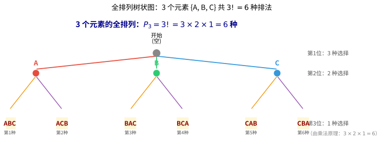

> **直观理解（现实类比）**：全排列就像**排队买票**——3 个人排在窗口前，谁能站第 1 位？有 3 种可能；确定第 1 位后，剩下 2 人争第 2 位，有 2 种可能；最后 1 人只能站末位。
>
> 树状图把"买票排队"的过程画了出来：从树根出发**每深一层就少一个选择**，分叉数依次是 $3 \to 2 \to 1$，所有叶子（末梢）的总数就是排列数 $3! = 6$。
>
> 推广到 $n$ 个人：第 1 位 $n$ 种、第 2 位 $n-1$ 种……末位 1 种，**所有分叉数相乘即 $n!$**——这正是"阶乘"这个名字的由来。

> **🧠 思考历程：一个感叹号"$!$"，是怎么装下一个王朝的全部排法的？**
>
> "$n!$"看起来不过是连乘的缩写，可有符号之前，数学家要把"$n\times(n-1)\times\cdots\times1$"一个不落地写出来。小小的"$!$"，其实是组合数学走向独立的"身份证"。
>
> - **从"奴役"到"自主"的标志**。19 世纪初，法国数学家**克里斯蒂安·克拉普**（Christian Kramp）第一个把 $n!$ 当作有名字的记号固定下来，并称它为"阶乘（factorial）"。**有了符号，一大堆繁琐表达才能被装进一个小口袋；有了符号，数学才谈得上"形式化"。**
> - **排列数 $P(n,k)$ 的本质是"填位置"**。从 $n$ 个中挑 $k$ 个排成一列：位置 1 有 $n$ 选、位置 2 有 $n-1$ 选……位置 $k$ 有 $n-k+1$ 选，连乘即排列数 $P(n,k)$。**它和"阶乘"几乎同义**——$P(n,k)=\frac{n!}{(n-k)!}$，正是"排前 $k$ 位，其余 $(n-k)$ 位不管顺序"的比值。
> - **排列/组合/二项式在同一棵树上结果**。17 世纪的帕斯卡、费马在通信中讨论赌博问题时，系统琢磨了"取几个、排不排"的计数；之后的组合学家发现排列数、组合数、二项式系数其实是同一棵"计数树"的不同枝条。**这门"数排法"的学问，从此成了概率论的名副其实的算盘。**
> - **心路**：$n!$ 提醒你：**数学的每一次"省力"，往往靠的是更聪明的符号，而不只是更快的计算**。当你看到 $P(n,k)$ 或 $n!$ 时，把它还原成"位置一个个填、选择一步步少"的画面，公式就不再是死背，而是"数树分叉"的写真。

### 3.2 选排列

> **定义**：从 $n$ 个不同元素中取出 $k$ 个（$k \leq n$）元素，按一定顺序排成一列，称为从 $n$ 个元素中取 $k$ 个元素的**选排列**。

选排列的个数记作 $P(n,k)$、$P_k^n$、$A(n,k)$ 或 $A_n^k$，计算公式为：

> **关于书写的说明**：$A_n^k$（**下标** $n$、**上标** $k$）与 $P_k^n$（下标 $k$、上标 $n$）表示的是同一个量——选取总数 $n$ 写在下方（下标），取出个数 $k$ 写在上方（上标）。国内教材常写成 $A_n^k$ 或 $P_n^k$，西方教材则多用 $P(n,k)$。三种写法含义完全相同。

|                                            符号                                            |                名称                | 含义                   | 直观解释         |
| :-----------------------------------------------------------------------------------------: | :---------------------------------: | :--------------------- | :--------------- |
| $P(n,k)$ |   选排列数   | 从$n$ 个里取 $k$ 个并按顺序排 | 从$n$ 里挑 $k$ 个来排队 |                                    |                        |                  |
|                                            $n$                                            |              元素总数              | 可供挑选的全部对象个数 | 手头一共有多少个 |
|                                            $k$                                            |             取出的个数             | 实际选中几个来排列     | 要搬走几个       |
|                                           $n!$                                           | $n$ 的阶乘 | 从$n$ 连乘到 $1$ | 全部元素排队的方法数   |                  |
|                  $(n-k)!$ |   剩余阶乘   | 剩下$(n-k)$ 个连乘到 $1$                  |        挑完后剩余者的排法数        |                        |                  |

$$
P(n,k) = \frac{n!}{(n-k)!} = n \times (n-1) \times \cdots \times (n-k+1)
$$

**推导**：第 1 个位置有 $n$ 种选择，第 2 个位置有 $n-1$ 种选择，……，第 $k$ 个位置有 $n-k+1$ 种选择。由乘法原理即得。

> **直观理解**：排列是"排成一列"，位置有先后之分；组合是"组成一组"，只看取舍不看顺序。下图展示排列与组合的核心区别——排列关注顺序，组合只看集合。

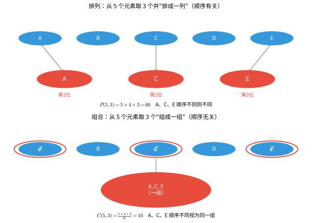

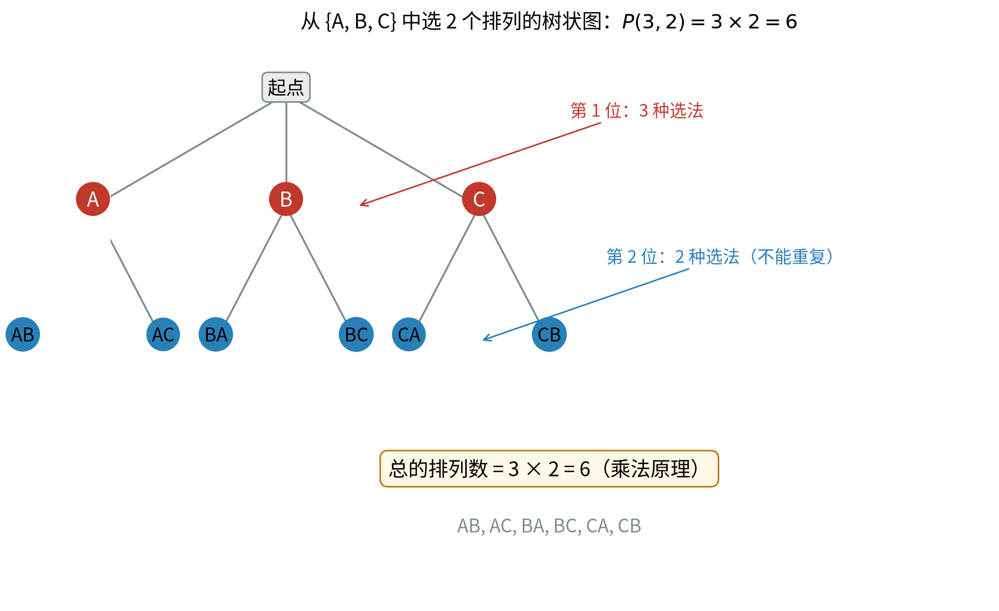

> **直观理解（现实类比）**：把"选排列"想象成**逐位填空**，每一步都像树分叉。给 3 个字母排 2 个位置：第 1 位有 3 种填法（树根分出 3 个枝），第 2 位只能从剩下 2 个里选（每个枝再分出 2 个小枝）。**这棵树的"末梢"总数就是排列数** $3\times2=6$。
>
> 树状图的妙处在于：它把抽象的"乘法原理"变成了看得见的"分叉过程"——**排列数公式 $P(n,k)=n(n-1)\cdots(n-k+1)$ 就是这棵树每一层的分叉数相乘**。这也是为什么组合问题常画树状图来穷举、验证。

### 3.3 重复排列

> **定义**：从 $n$ 个不同元素中取出 $k$ 个元素（允许重复）排成一列，称为**重复排列**。

重复排列的个数为：

$$
n^k
$$

**推导**：每个位置都有 $n$ 种选择，共 $k$ 个位置，由乘法原理得 $n^k$。

### 3.4 环状排列（循环排列）

> **定义**：将 $n$ 个不同元素排成一个圆圈（旋转后相同的视为同一种排列），称为**环状排列**。

环状排列的个数为：

$$
\frac{n!}{n} = (n-1)!
$$

**推导**：将环状排列在某处"剪开"可得到一个线状排列。一个环状排列因剪开位置不同可产生 $n$ 个不同的线状排列，而 $n$ 个线状排列对应同一个环状排列，故环状排列数为 $n! / n = (n-1)!$。

> **直观理解**：围成一圈时没有"首位"，旋转后重合的排法算同一种。把环在某处剪开就变成普通的线状排列；一个环能剪出 $n$ 种不同的"起点"，所以要除以 $n$。

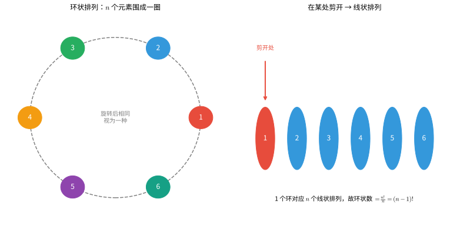

---

## 4. 组合

### 4.1 组合的定义

> **定义**：从 $n$ 个不同元素中取出 $k$ 个（$k \leq n$）元素组成一组（不考虑顺序），称为从 $n$ 个元素中取 $k$ 个元素的**组合**。

组合数记作 $C(n,k)$、$\binom{n}{k}$、$C_n^k$ 或 $C_k^n$。

> **关于写法的说明**：上面四种写法**含义完全相同**，都表示"从 $n$ 个不同元素中取 $k$ 个（不管顺序）的组合数"。它们不同的只是 $n,k$ 的书写位置：
>
> - $C(n,k)$ 与 $\binom{n}{k}$：$n$ 写在**左/上**、$k$ 写在**右/下**，读作"$n$ 选 $k$"。这种写法没有歧义，**推荐优先使用**。
> - $C_n^k$ 与 $C_k^n$：把 $n,k$ 写成上下标。因为历史上存在两派不同顺序，所以**这两个都是"从 $n$ 取 $k$"**——一派把总数 $n$ 写在**下标**（$C_n^k$，与排列记号 $A_n^k$ 的习惯一致），另一派把 $n$ 写在**上标**（$C_k^n$）。
>
> 也就是说，**$C_n^k$ 和 $C_k^n$ 是同一概念，只是上下标"朝向"不同**，切勿把它们误当成两个不同的数。为阅读方便，本文在不涉及上下标运算的场合一律使用 $C(n,k)$，两者完全等价（$C_n^k = C(n,k) = \binom{n}{k} = \dfrac{n!}{k!(n-k)!}$）。

### 4.2 组合数公式

|                                                         符号                                                         |                  名称                  | 含义                     | 直观解释 |
| :-------------------------------------------------------------------------------------------------------------------: | :------------------------------------: | :----------------------- | :------- |
| $C(n,k)$    |       组合数       | 从$n$ 个里取 $k$ 个、不管顺序                  | 从$n$ 里挑 $k$ 个不排队 |                                        |                          |          |
|              $\binom{n}{k}$ | 组合数的另一种记号 | 与$C(n,k)$ 完全相同的写法 | 读作"$n$ 选 $k$"              |                                        |                          |          |
|                                                        $k!$                                                        | $k$ 的阶乘    | 从$k$ 连乘到 $1$ | 组内排序数，用来去掉顺序 |          |

$$
C(n,k) = \binom{n}{k} = \frac{P(n,k)}{k!} = \frac{n!}{k!\,(n-k)!}
$$

**推导**：从排列与组合的关系来看，从 $n$ 个元素中取 $k$ 个元素的排列数 $P(n,k)$，等于先选出 $k$ 个元素（组合），再对这 $k$ 个元素进行全排列。即

$$
P(n,k) = C(n,k) \times k!
$$

所以

$$
C(n,k) = \frac{P(n,k)}{k!} = \frac{n!}{k!\,(n-k)!}
$$

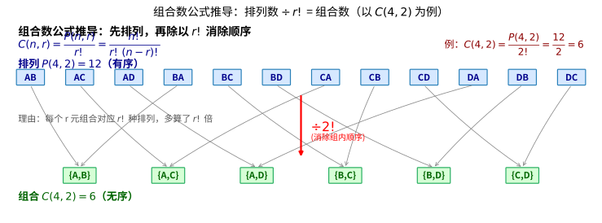

> **直观理解（现实类比）**：组合数公式就像"**先排队，再除以顺序**"。想从 4 人中选 2 人小组，可以这么做：先按**有序排列**选（$P(4,2)=12$ 种），但这把同一组内的 {甲,乙} 和 {乙,甲} 算成了两种——实际上小组不分前后，**每组被重复计算了 $2! = 2$ 次**。
>
> 所以真正的"组数" = 排列数 $\div 2! = 12 \div 2 = 6$，即 $C(4,2)=6$。图中的箭头把每 2 个排列（顺序相反）合并成 1 个组合，正是"消除组内顺序"的过程。
>
> 推广：从 $n$ 个选 $r$ 个，每个 r 元组对应 $r!$ 种排列，多算了 $r!$ 倍，故 $C(n,r) = \dfrac{P(n,r)}{r!}$——这就是组合数公式的来由。

> **🧠 思考历程：组合数"$n$ 选 $k$"，为何能和"二项式展开"联姻？**
>
> "从 $n$ 个里挑 $k$ 个"似乎只是数东西，可它一登场就撞进另一个物种——$(a+b)^n$ 的展开系数。这桩"包办婚姻"，正是组合数学最奇妙的意外收获。
>
> - **先从"挑人"说起**。选择时有个朴素直觉：从 $n$ 人里挑 $k$ 人，和挑留下 $(n-k)$ 人，是一回事——于是有神奇的对称性 $C(n,k)=C(n,n-k)$。再从"数量"看：$C(n,k)=\frac{n!}{k!(n-k)!}$，它是"排列数除去组内重排 $k!$"得到的。**组合数的灵魂是"清洗掉顺序"。**
> - **贾宪-杨辉三角在中/欧各自成形**。约 11 世纪中国数学家贾宪画出"开方作法本源"（即杨辉三角），3 世纪的印度、13 世纪的波斯诗人欧玛尔·海亚姆都画过同款三角形；17 世纪帕斯卡详加研究，故西方称"帕斯卡三角"。**每个数都是肩上两数之和，这一简单规律，成了连接组合数与多项式的中枢。**
> - **二项式定理：$(a+b)^n$ 的"系数之谜"**。展开 $(a+b)^n$，$a^kb^{n-k}$ 项的系数，恰好就是"从 $n$ 个括号里挑出 $k$ 个取 $a$"的组合数 $C(n,k)$。**"挑人"和"挑项"背后是同一个动作**——你说不清为什么两个风马牛不相及的问题会共用同一套数，但组合学就这么"撞"出了几何级数、概率公式等一大串成果。
> - **心路**：组合数教你：**数学里最深刻的联系，往往来自最笨拙的同一化**。$(a+b)^n$ 的系数和"选人"居然是一家，因为它俩都被"从 n 个里挑 k 个"这一条法则统领。学会把不同问题抽象成同一个"挑 k 个"，你就握住了组合学的钥匙。

### 4.3 组合数的性质

**性质 1（对称性）**：

$$
C(n,k) = C(n, n-k)
$$

**性质 2（帕斯卡恒等式 / Pascal's Identity）**：

$$
C(n,k) + C(n,k+1) = C(n+1,k+1)
$$

**性质 3**：

$$
C(n,0) = C(n,n) = 1
$$

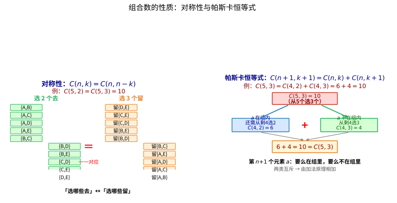

> **直观理解（现实类比）**：组合数的两条核心性质都能用"**选人**"来理解。
>
> **对称性** $C(n,k)=C(n,n-k)$：从 5 人中选 2 人"去开会"，等价于选 3 人"留下来"——**"选哪些人去"和"选哪些人留"是一一对应的**，所以选法数相等。图中左侧把 10 种"选 2 去"与 10 种"留 2"一一对应排列，直观体现了这种等价。
>
> **帕斯卡恒等式** $C(n+1,k+1)=C(n,k)+C(n,k+1)$：从 5 人选 3 人时，盯住其中某一个特殊的人 $a$——**$a$ 要么在组里，要么不在组里**，二者必居其一。若 $a$ 在组内，还需从剩 4 人选 2 人（$C(4,2)=6$）；若 $a$ 不在组内，则从剩 4 人选 3 人（$C(4,3)=4$）。两类相加即 $6+4=10=C(5,3)$，图中右侧展示了这一"二分"过程。

### 4.4 二项式定理

> **二项式定理**：对于任意非负整数 $n$，有
>
$$
(x + y)^n = \sum_{k=0}^{n} \binom{n}{k} x^{n-k} y^k
$$
>
> 其中 $\binom{n}{k}$ 称为**二项式系数**。

展开式的通项为：

$$
T_{k+1} = \binom{n}{k} x^{n-k} y^k
$$

**二项式系数的性质**：

- 对称性：$\binom{n}{k} = \binom{n}{n-k}$
- 递推关系：$\binom{n}{k} + \binom{n}{k+1} = \binom{n+1}{k+1}$
- 各系数之和：$\sum_{k=0}^{n} \binom{n}{k} = 2^n$
- 交错和：$\sum_{k=0}^{n} (-1)^k \binom{n}{k} = 0$

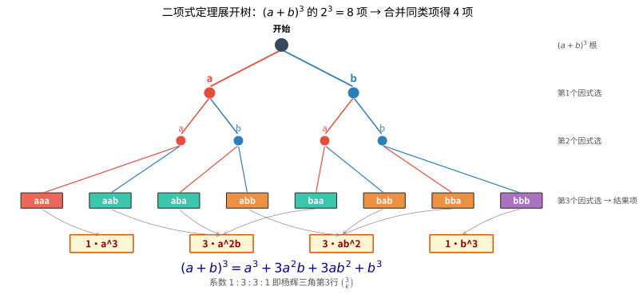

> **直观理解（现实类比）**：二项式展开就像**抛 3 次硬币的所有可能**。每次抛硬币有"正面 a"或"反面 b"两种结果，连续抛 3 次，所有可能共 $2^3 = 8$ 种（树的每个叶子是一条路径）。
>
> 按正面 a 出现的次数归类：0 次正面（bbb）1 种、1 次正面（abb/bab/bba）3 种、2 次正面（aab/aba/baa）3 种、3 次正面（aaa）1 种——**1 + 3 + 3 + 1 = 8**，恰好对应 $(a+b)^3 = a^3 + 3a^2b + 3ab^2 + b^3$ 的系数。
>
> 这组系数 $1:3:3:1$ 正是杨辉三角的第 3 行，也就是 $\binom{3}{k}$——**二项式系数本质上就是"在 n 次选择中挑 k 次"的组合数**。

### 4.5 杨辉三角（帕斯卡三角）

杨辉三角是二项式系数的几何排列：

```
        1
       1 1
      1 2 1
     1 3 3 1
    1 4 6 4 1
   1 5 10 10 5 1
  1 6 15 20 15 6 1
```

其中第 $n$ 行（从 0 开始）的第 $k$ 个数就是 $\binom{n}{k}$。每个数等于它上方两数之和，这正是帕斯卡恒等式的直观体现。


---

## 5. 定理与证明

### 5.1 排列数公式的证明

**定理**：从 $n$ 个不同元素中取出 $k$ 个（$k \leq n$）元素的排列数为

$$
P(n,k) = n \times (n-1) \times \cdots \times (n-k+1) = \frac{n!}{(n-k)!}
$$

**证明**：用乘法原理。考虑依次选取 $k$ 个位置上的元素：

- 第 1 个位置：可以从 $n$ 个元素中任选 1 个，有 $n$ 种选法。
- 第 2 个位置：从剩下的 $n-1$ 个元素中任选 1 个，有 $n-1$ 种选法。
- ……
- 第 $k$ 个位置：从剩下的 $n-k+1$ 个元素中任选 1 个，有 $n-k+1$ 种选法。

- 【第 1 步】依据：乘法原理（$k$ 个位置的选择相互独立、缺一不可）；目的：把各位置的选法数相乘，先得到连乘形式的排列数。

由乘法原理，总的排列数为

$$
P(n,k) = n \cdot (n-1) \cdot \cdots \cdot (n-k+1)
$$

- 【第 2 步】依据：分式的分子分母同乘同一个非零量，值不变；目的：把连乘式补成完整的 $n!$，向目标 $n!/(n-k)!$ 靠拢。

分子分母同乘 $(n-k)!$，得

$$
P(n,k) = \frac{n \cdot (n-1) \cdot \cdots \cdot (n-k+1) \cdot (n-k)!}{(n-k)!} = \frac{n!}{(n-k)!}
$$

- 【第 3 步】依据：阶乘的定义 $n! = n \cdot (n-1) \cdots 1$；目的：说明分子可化简为 $n!$，从而证得排列数公式。

证毕。

### 5.2 组合数公式的证明

**定理**：从 $n$ 个不同元素中取出 $k$ 个（$k \leq n$）元素的组合数为

$$
C(n,k) = \frac{n!}{k!\,(n-k)!}
$$

**证明**：从 $n$ 个元素中取 $k$ 个元素的排列，可以分两步完成：

1. 先从 $n$ 个元素中选出 $k$ 个元素（不考虑顺序），有 $C(n,k)$ 种选法。
2. 再对这 $k$ 个元素进行全排列，有 $k!$ 种排法。

由乘法原理，$P(n,k) = C(n,k) \times k!$，因此

- 【第 1 步】依据：乘法原理（先"选人"再"排队"，两步相乘）；目的：在排列数与组合数之间搭桥，即 $P(n,k)=C(n,k)\cdot k!$。
- 【第 2 步】依据：等式两边同除以非零量 $k!$；目的：把 $C(n,k)$ 单独解出来。
- 【第 3 步】依据：代入前面已证的排列数公式 $P(n,k)=n!/(n-k)!$；目的：整理出最终组合数公式。

$$
C(n,k) = \frac{P(n,k)}{k!} = \frac{n!}{k!\,(n-k)!}
$$

证毕。

### 5.3 组合恒等式的证明

#### 恒等式 1：对称性 $C(n,k) = C(n,n-k)$

**证明**：

$$
C(n,n-k) = \frac{n!}{(n-k)!\,[n-(n-k)]!} = \frac{n!}{(n-k)!\,k!} = C(n,k)
$$

**组合解释**：从 $n$ 个元素中选出 $k$ 个元素，等价于选出 $n-k$ 个元素"不入选"。两种选择方式一一对应，故组合数相等。

#### 恒等式 2：帕斯卡恒等式 $C(n,k) + C(n,k+1) = C(n+1,k+1)$

**证明（代数法）**：

$$
\begin{aligned}
C(n,k) + C(n,k+1) &= \frac{n!}{k!\,(n-k)!} + \frac{n!}{(k+1)!\,(n-k-1)!} \\[4pt]
&= \frac{n!}{k!\,(n-k-1)!} \left( \frac{1}{n-k} + \frac{1}{k+1} \right) \\[4pt]
&= \frac{n!}{k!\,(n-k-1)!} \cdot \frac{(k+1)+(n-k)}{(n-k)(k+1)} \\[4pt]
&= \frac{n!}{k!\,(n-k-1)!} \cdot \frac{n+1}{(n-k)(k+1)} \\[4pt]
&= \frac{(n+1)!}{(k+1)!\,(n-k)!} \\[4pt]
&= C(n+1, k+1)
\end{aligned}
$$

- 第 1 个等号：依据：组合数公式 $C(n,k)=n!/[k!(n-k)!]$；目的：把 $C(n,k)$ 与 $C(n,k+1)$ 都写成阶乘形式，便于通分。
- 第 2 个等号：依据：提取公因式 $\frac{n!}{k!(n-k-1)!}$；目的：把两项合并成一项，暴露共同的分母结构。
- 第 3 个等号：依据：通分，将 $\frac{1}{n-k}$ 与 $\frac{1}{k+1}$ 相加；目的：把括号内两个分式并成同一个分母。
- 第 4 个等号：依据：合并分子 $(k+1)+(n-k)=n+1$；目的：得到最简的分式结果。
- 第 5 个等号：依据：阶乘的递推性质，把分母整理成 $(k+1)!(n-k)!$；目的：凑出组合数标准形式对应的分母。
- 第 6 个等号：依据：组合数公式 $C(n+1,k+1)=(n+1)!/[(k+1)!(n-k)!]$；目的：证得结果恰为 $C(n+1,k+1)$，证明完成。

**证明（组合法）**：考虑从 $n+1$ 个元素中选出 $k+1$ 个元素。固定其中一个特殊元素 $a$：

- 若 $a$ 被选中，则还需从剩下的 $n$ 个元素中选 $k$ 个，有 $C(n,k)$ 种选法。
- 若 $a$ 未被选中，则需从剩下的 $n$ 个元素中选 $k+1$ 个，有 $C(n,k+1)$ 种选法。

两类互斥，由加法原理得 $C(n+1,k+1) = C(n,k) + C(n,k+1)$。

### 5.4 二项式定理的证明（组合方法）

**定理**：$(x+y)^n = \sum_{k=0}^{n} \binom{n}{k} x^{n-k} y^k$

**证明**：将 $(x+y)^n$ 展开为 $n$ 个因式 $(x+y)$ 的乘积：

$$
(x+y)^n = \underbrace{(x+y)(x+y)\cdots(x+y)}_{n \text{ 个}}
$$

- 【第 1 步】依据：幂的定义，$(x+y)^n$ 就是 $n$ 个 $(x+y)$ 连乘；目的：把"指数 $n$"转成"从 $n$ 个括号里逐项挑"。
- 【第 2 步】依据：分配律，每个括号都必须选 $x$ 或 $y$ 之一；目的：说明展开后每一项都是若干 $x$ 与若干 $y$ 相乘，且次数合计正好是 $n$。
- 【第 3 步】依据：组合数的定义，要在 $n$ 个括号中选 $k$ 个取 $y$；目的：得出 $x^{n-k}y^k$ 这一项的系数恰为 $\binom{n}{k}$。

展开后的每一项都是从每个因式中选取 $x$ 或 $y$ 相乘得到的。要得到 $x^{n-k}y^k$ 这一项，需要在 $n$ 个因式中选择 $k$ 个取 $y$（其余 $n-k$ 个取 $x$），选取方式有 $C(n,k)$ 种。因此 $x^{n-k}y^k$ 的系数为 $\binom{n}{k}$。证毕。

### 5.5 容斥原理

> **容斥原理**（Inclusion-Exclusion Principle）用于计算多个集合并集的元素个数，通过"先加后减"的方式避免重复计数。

**两个集合的情形**：

$$
|A \cup B| = |A| + |B| - |A \cap B|
$$

**三个集合的情形**：

$$
|A \cup B \cup C| = |A| + |B| + |C| - |A \cap B| - |A \cap C| - |B \cap C| + |A \cap B \cap C|
$$

**一般形式**：

$$
\left|\bigcup_{i=1}^{n} A_i\right| = \sum_{i=1}^{n} |A_i| - \sum_{1 \leq i < j \leq n} |A_i \cap A_j| + \cdots + (-1)^{n-1} |A_1 \cap A_2 \cap \cdots \cap A_n|
$$

**证明思路**：对任意元素 $x$，设其属于 $m$ 个集合。在右式中，$x$ 被计数的次数为

$$
\binom{m}{1} - \binom{m}{2} + \binom{m}{3} - \cdots + (-1)^{m-1}\binom{m}{m} = 1 - (1-1)^m = 1
$$

因此每个元素恰好被计算一次，等式成立。

> **直观理解**：左图是两个集合，重叠部分 $A \cap B$ 被 $|A|$ 和 $|B|$ 各算了一次，所以要减一次；右图是三个集合，两两重叠各减一次后，三重叠部分被多减了，还需加回一次。

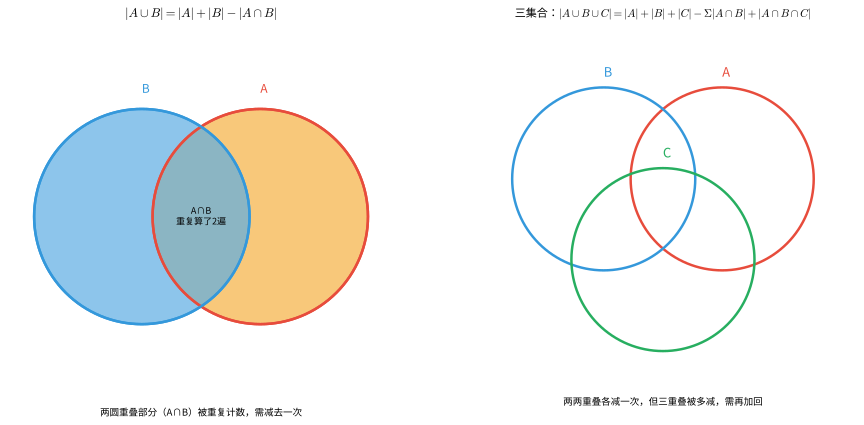

---

## 6. 概率初步

### 6.1 基本概念

#### 随机试验与样本空间

> **随机试验**：可以在相同条件下重复进行，每次结果不确定但所有可能结果已知的试验。

> **样本空间**：随机试验所有可能结果组成的集合，记作 $\Omega$ 或 $S$。

> **样本点**：样本空间中的每一个元素（即每一个可能结果）。

#### 事件

> **事件**：样本空间的子集，即某些样本点的集合。

- **必然事件**：$\Omega$ 本身，一定发生。
- **不可能事件**：$\varnothing$，一定不发生。
- **基本事件**：只包含一个样本点的事件。

#### 事件的运算

| 符号 | 含义 | 说明 |
|------|------|------|
| $A \cup B$ | 并事件 | $A$ 或 $B$ 至少一个发生 |
| $A \cap B$ 或 $AB$ | 交事件 | $A$ 和 $B$ 同时发生 |
| $\overline{A}$ 或 $A^c$ | 对立事件 | $A$ 不发生 |
| $A \setminus B$ | 差事件 | $A$ 发生但 $B$ 不发生 |
| $A \cap B = \varnothing$ | 互斥事件 | $A$ 和 $B$ 不能同时发生 |

> **直观理解**：事件就是样本空间的子集，上面的运算都可以用韦恩图直观表示——并集取两圆覆盖区、交集取两圆重叠区、补集取圆外区、差集取只属于 $A$ 的部分、互斥是两圆不相交、包含是一个圆套在另一个圆内。

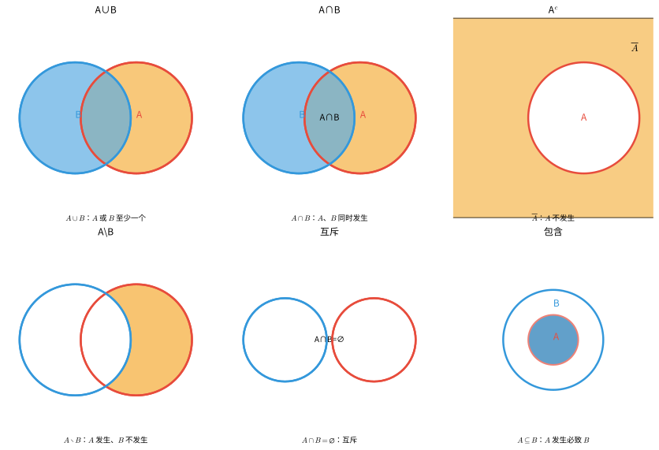

### 6.2 概率的公理化定义

> **概率**是定义在事件域上的一个集函数 $P$，满足以下三条公理：

1. **非负性**：对任意事件 $A$，$P(A) \geq 0$
2. **规范性**：$P(\Omega) = 1$
3. **可列可加性**：对两两互斥的事件序列 $A_1, A_2, \dots$，有
   $$
   P\left(\bigcup_{i=1}^{\infty} A_i\right) = \sum_{i=1}^{\infty} P(A_i)
   $$

> **🧠 思考历程：从"掷骰子的赌局"到"三条公理"，概率被"立法"用了三百年**
>
> 你或许觉得"概率不就是猜个可能性"，可它真正被数学界接纳为"正经学科"，靠的是一次艰苦的"立宪"——把每个人都会的直觉，压缩成三条公开的公理。
>
> - **起点是一局……掷骰子的赌约**。17 世纪，梅雷伯爵请教帕斯卡：两个赌徒中断赌局，如何公平分彩金？这就是著名的"点数问题"。帕斯卡与费马在书信中一来一回，用穷举与计数算清了该怎样"按概率分钱"。**概率论的婴儿，是在赌桌上被接生的。**
> - **"频率"不够，必须"立法"**。先前的"概率≈长期频率"只是个经验说法，经不起无穷过程与哲学追问。1933 年，苏联数学家**柯尔莫哥洛夫**（Kolmogorov）在《概率论基础》中给出革命性框架：把概率定义为一个**满足三条公理的集函数**——非负、归一（全集为 1）、可列可加。**从此概率不再是"凭感觉"，而是"被公理约束的数学对象"，可以放心地参与最复杂的证明。**
> - **为什么恰好这三条？** 非负（不可能小于 0）、归一到 1（必有其一发生）、可列可加（不相容的事件的概率相加）——这三条把"随机性"的安排权交还给数学，而把所有细节（怎么算具体概率）留给"模型"。**公理化让"概率论"从算术升格为分析学般的严格学科。**
> - **心路**：概率的公理化告诉你：**一门学问要成熟，光靠"会算"不够，还得有"规则秦王立法"**。三百年里无数人掷过骰子，等柯尔莫哥洛夫抛出三条公理，这一切才有了铁的骨架。

### 6.3 古典概型

> **古典概型**满足两个条件：
> 1. 样本空间有限：$\Omega = \{\omega_1, \omega_2, \dots, \omega_n\}$
> 2. 每个基本事件等可能发生：$P(\{\omega_i\}) = \frac{1}{n}$

在古典概型中，事件 $A$ 的概率为

| 符号 | 名称 | 含义 | 直观解释 |
|:---:|:---:|:---|:---|
| $A$ | 事件 | 样本空间中一组可能结果 | 你要关心的那类情况 |
| $\Omega$ | 样本空间 | 所有可能结果组成的集合 | 全部可能的总清单 |
| $|A|$ | $A$ 的样本点个数 | 事件 $A$ 包含的结果数 | 对你有利的几种 |
| $|\Omega|$ | 样本点总数 | 全部等可能结果的数量 | 所有可能一共有几种 |
| $P(A)$ | 事件 $A$ 的概率 | 有利结果数除以总结果数 | 中奖的可能有多大 |

$$
P(A) = \frac{|A|}{|\Omega|} = \frac{A \text{ 包含的样本点个数}}{\text{样本空间中的样本点总数}}
$$

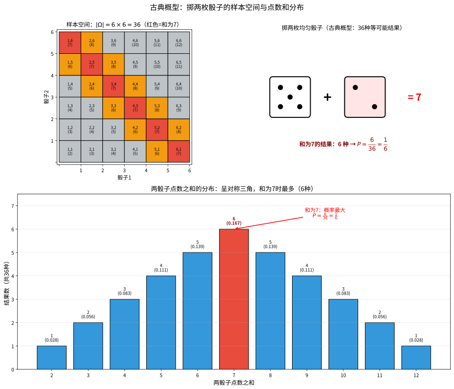

> **直观理解（现实类比）**：古典概型就像**掷骰子这种"公平的随机选择"**——每枚骰子 6 个面均匀对称，36 种结果**等可能出现**，所以某事件的概率就是"它包含几种结果 ÷ 36"。
>
> 图中左上的 6×6 网格列出了全部 36 个样本点，红色格子代表"两骰子之和为 7"。可以数出和为 7 的组合有 6 种：(1,6)(2,5)(3,4)(4,3)(5,2)(6,1)，所以 $P(\text{和为}7) = \dfrac{6}{36} = \dfrac{1}{6}$。
>
> 下方的柱状图显示和的分布呈对称三角形——和为 7 居中且组合数最多（6 种），向两端递减到和为 2 或 12 各仅 1 种。**这种"中间多、两头少"的形态正是古典概型中"和"的典型分布**。

### 6.4 概率的基本性质

由概率的三条公理可推导出以下性质：

1. **不可能事件的概率**：$P(\varnothing) = 0$
2. **有限可加性**：若 $A_1, A_2, \dots, A_n$ 两两互斥，则
   $$
   P\left(\bigcup_{i=1}^{n} A_i\right) = \sum_{i=1}^{n} P(A_i)
   $$
3. **对立事件概率**：$P(\overline{A}) = 1 - P(A)$
4. **加法公式**：
   $$
   P(A \cup B) = P(A) + P(B) - P(A \cap B)
   $$
   特别地，当 $A$ 与 $B$ 互斥时，$P(A \cup B) = P(A) + P(B)$

   #### 🎬 动画演示：概率的加法公式

   

   > 动画通过文氏图直观展示了概率加法公式的含义：两个事件 $A$ 和 $B$ 的并集概率等于各自概率之和减去交集概率。这避免了交集部分被重复计算。
5. **单调性**：若 $A \subseteq B$，则 $P(A) \leq P(B)$
6. **容斥公式**：
   $$
   P(A \cup B \cup C) = P(A) + P(B) + P(C) - P(AB) - P(AC) - P(BC) + P(ABC)
   $$

### 6.5 条件概率

> **定义**：在事件 $B$ 已发生的条件下，事件 $A$ 发生的概率称为**条件概率**，记作 $P(A \mid B)$，计算公式为
>
$$
P(A \mid B) = \frac{P(A \cap B)}{P(B)},\quad P(B) > 0
$$

**条件概率也是概率**：对固定的 $B$（$P(B) > 0$），$P(\cdot \mid B)$ 满足概率的三条公理。

> **直观理解**：条件概率的本质是"**缩小样本空间**"。知道 $B$ 已发生后，我们只在 $B$ 的范围里讨论，$A$ 的条件概率就是"$A \cap B$ 占 $B$ 的比例"。下图左侧用韦恩图、右侧用样本点示意这种"缩小"。

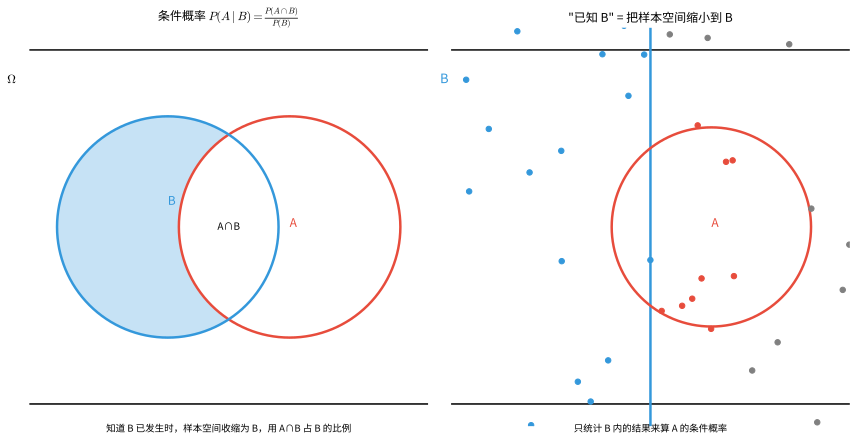

### 6.6 乘法公式

由条件概率公式直接可得乘法公式：

$$
P(A \cap B) = P(B) \cdot P(A \mid B) = P(A) \cdot P(B \mid A)
$$

推广到多个事件：

$$
P(A_1 \cap A_2 \cap \cdots \cap A_n) = P(A_1) \cdot P(A_2 \mid A_1) \cdot P(A_3 \mid A_1 A_2) \cdots P(A_n \mid A_1 A_2 \cdots A_{n-1})
$$

### 6.7 全概率公式

> 若事件 $B_1, B_2, \dots, B_n$ 构成样本空间的一个**划分**（即两两互斥且 $\bigcup_{i=1}^{n} B_i = \Omega$），且 $P(B_i) > 0$，则对任意事件 $A$，有
>
$$
P(A) = \sum_{i=1}^{n} P(B_i) \cdot P(A \mid B_i)
$$

全概率公式的实质是将事件 $A$ 的概率按不同"原因"或"条件"进行分解求和。

### 6.8 贝叶斯定理

> **贝叶斯定理**（Bayes' Theorem）描述了在已知结果 $A$ 发生的条件下，各"原因" $B_i$ 的条件概率：
>
$$
P(B_i \mid A) = \frac{P(B_i) \cdot P(A \mid B_i)}{P(A)} = \frac{P(B_i) \cdot P(A \mid B_i)}{\sum_{j=1}^{n} P(B_j) \cdot P(A \mid B_j)}
$$

其中：
- $P(B_i)$ 称为**先验概率**（prior probability）
- $P(B_i \mid A)$ 称为**后验概率**（posterior probability）
- $P(A \mid B_i)$ 称为**似然**（likelihood）

**贝叶斯定理的简化形式**（两个事件）：

$$
P(A \mid B) = \frac{P(B \mid A) \cdot P(A)}{P(B)}
$$

> **直观理解**：全概率公式是把样本空间按"原因" $B_1, B_2, \dots, B_n$ 切分成互斥的块，事件 $A$ 的总概率等于各块内 $A$ 的概率之和；贝叶斯定理则是"由果溯因"——已知结果 $A$ 发生，反推它来自哪个原因。下图左侧展示样本空间的划分，右侧是因果树状图。

> **🧠 思考历程：贝叶斯，凭什么成了"AI 的算盘"？**
>
> 很多同学觉得贝叶斯定理只是"条件概率换个写法"。其实它把概率论从"算结果"翻转成"更新信念"，是现代机器学习最核心的底层公式之一。
>
> - **一个偏执的死者的遗稿**。英国牧师**托马斯·贝叶斯**（Thomas Bayes）生前并不出名，他那篇《论机会问题的一个解决》（1763 年由好友发表）探讨的是：**已知结果，怎么反推背后的原因/倾向**。他偏居一隅、性格孤僻，连稿都差点烂在抽屉里——结果这篇文章成了"逆概率"的思想源头。
> - **一个公式，两个方向**。原本概率是"已知原因 → 猜结果"（似然 $P(A\mid B_i)$）；贝叶斯把它倒过来：**已知结果 → 更新对原因的判断**（后验 $P(B_i\mid A)$）。写法上只多了一步"乘先验、除整体"，可思想是从"静态分配"跃迁到"用新证据修正旧信念"。
> - **为什么它能统治 AI？** 垃圾邮件识别、疾病诊断、推荐系统、语音/图像识别，背后都在做同一件事：**给定一个"新观察"，更新对各个候选"原因"的信任度。** 贝叶斯公式恰好给了这套"观察→修正"一个可迭代的框架（证据不断进来，后验不断变成下一次的先验）。**它成了"智能"在数学上的第一道脚手架。**
> - **心路**：贝叶斯定理教你：**理性不是"一步到位"，而是"每来一个新证据，就轻微修正一次判断"**。会做题之外，更值得带走的是这种"先验+新证据=后验"的思考节奏——它在考试、决策、还有你理解世界的方式里，无处不在。

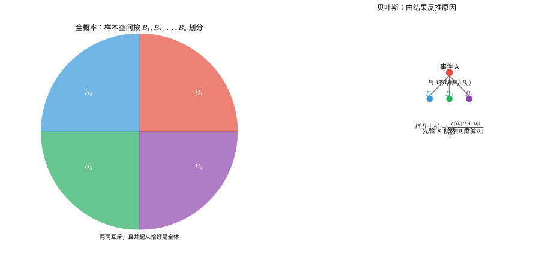

### 6.9 事件的独立性

> **定义**：若 $P(A \cap B) = P(A) \cdot P(B)$，则称事件 $A$ 与 $B$ **相互独立**。

若 $A$ 与 $B$ 独立且 $P(B) > 0$，则 $P(A \mid B) = P(A)$，即 $B$ 的发生不影响 $A$ 的概率。

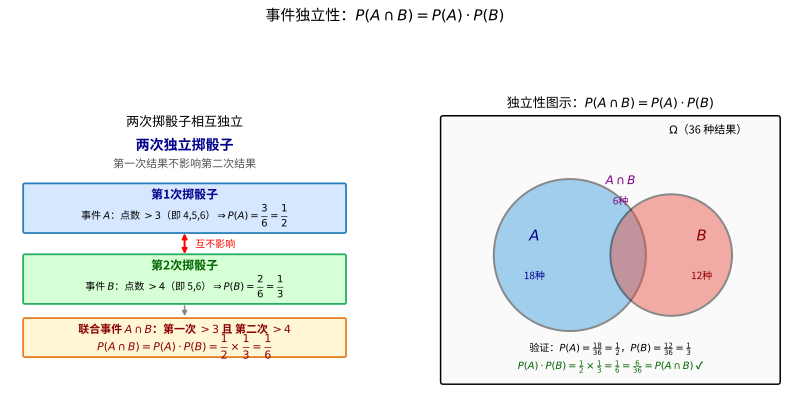

> **直观理解（现实类比）**：事件独立就像**两次独立的考试**——第一次的成绩与第二次毫无关系，各自概率"各算各的"。
>
> 图中以两次掷骰子为例：事件 $A$ = "第 1 次点数 $>3$"（$P(A)=\frac{1}{2}$），事件 $B$ = "第 2 次点数 $>4$"（$P(B)=\frac{1}{3}$）。两枚骰子彼此无关，所以"两次都发生"的概率就是各自概率相乘：$P(A \cap B) = \frac{1}{2} \times \frac{1}{3} = \frac{1}{6}$。
>
> 右侧韦恩图直观验证了这一点：$A$ 占样本空间一半（18/36），$B$ 占三分之一（12/36），二者交集正好 6/36 = $\frac{1}{6}$，与乘积完全吻合。**"独立"的本质就是：一个事件的发生不改变另一个事件的发生概率**。

**多个事件的相互独立性**：事件 $A_1, A_2, \dots, A_n$ 相互独立，当且仅当对其中任意有限个事件 $A_{i_1}, A_{i_2}, \dots, A_{i_k}$ 有

$$
P(A_{i_1} \cap A_{i_2} \cap \cdots \cap A_{i_k}) = P(A_{i_1}) \cdot P(A_{i_2}) \cdots P(A_{i_k})
$$

---

## 7. 示例

### 示例 1：排列数的计算

**问题**：从 5 本不同的书中选出 3 本并按顺序排列在书架上，有多少种不同的排法？

**解**：这是从 5 个元素中取 3 个的选排列问题。

$$
P(5,3) = 5 \times 4 \times 3 = 60
$$

因此有 60 种不同的排法。

### 示例 2：组合数的计算

**问题**：从 10 名学生中选出 4 人参加数学竞赛，有多少种不同的选法？

**解**：这是组合问题，因为选出的 4 人没有顺序区别。

$$
C(10,4) = \frac{10!}{4!\,6!} = \frac{10 \times 9 \times 8 \times 7}{4 \times 3 \times 2 \times 1} = 210
$$

因此有 210 种不同的选法。

### 示例 3：含特殊条件的排列

**问题**：用数字 0, 1, 2, 3, 4, 5 组成没有重复数字的六位数，有多少个？

**解**：首位不能为 0，因此先选首位（有 5 种选择），剩余 5 个数字全排列到其余 5 个位置。

$$
5 \times 5! = 5 \times 120 = 600
$$

因此共有 600 个这样的六位数。

### 示例 4：分组问题

**问题**：将 6 本不同的书分成三组，每组 2 本，有多少种分法？

**解**：先从 6 本中选 2 本给第一组，再从剩下 4 本中选 2 本给第二组，最后 2 本给第三组。但三组是**无标号**的（即交换组别视为相同分法），因此需要除以 $3!$。

$$
\frac{C(6,2) \times C(4,2) \times C(2,2)}{3!} = \frac{15 \times 6 \times 1}{6} = 15
$$

因此有 15 种不同的分法。

### 示例 5：二项式定理的应用

**问题**：求 $(2x - 3)^5$ 展开式中 $x^3$ 项的系数。

**解**：由二项式定理，通项为

$$
T_{k+1} = \binom{5}{k} (2x)^{5-k} (-3)^k
$$

令 $5-k = 3$，得 $k = 2$。代入得

$$
T_3 = \binom{5}{2} (2x)^3 (-3)^2 = 10 \times 8x^3 \times 9 = 720x^3
$$

因此 $x^3$ 项的系数为 720。

### 示例 6：容斥原理的应用

**问题**：在 1 到 100 的整数中，既不是 2 的倍数也不是 3 的倍数的数有多少个？

**解**：设 $A$ 为 2 的倍数的集合，$B$ 为 3 的倍数的集合。

- $|A| = \lfloor 100/2 \rfloor = 50$
- $|B| = \lfloor 100/3 \rfloor = 33$
- $|A \cap B| = \lfloor 100/6 \rfloor = 16$（6 的倍数）

由容斥原理：

$$
|A \cup B| = 50 + 33 - 16 = 67
$$

因此既不是 2 的倍数也不是 3 的倍数的数的个数为

$$
100 - |A \cup B| = 100 - 67 = 33
$$

### 示例 7：古典概型的基本计算

**问题**：掷两枚质地均匀的骰子，求点数之和为 7 的概率。

**解**：样本空间共有 $6 \times 6 = 36$ 个等可能的结果。

点数之和为 7 的结果有：(1,6), (2,5), (3,4), (4,3), (5,2), (6,1)，共 6 种。

因此

$$
P(\text{和为}7) = \frac{6}{36} = \frac{1}{6}
$$

### 示例 8：条件概率的计算

**问题**：一个家庭有两个孩子，已知至少有一个男孩，求另一个也是男孩的概率。

**解**：样本空间为 $\Omega = \{BB, BG, GB, GG\}$（$B$ 表示男孩，$G$ 表示女孩，按出生顺序），等可能。

设事件 $A$ = "至少有一个男孩"，$B$ = "两个都是男孩"。

- $A = \{BB, BG, GB\}$，$|A| = 3$
- $B = \{BB\}$，$|B| = 1$
- $A \cap B = \{BB\}$

$$
P(B \mid A) = \frac{P(A \cap B)}{P(A)} = \frac{1/4}{3/4} = \frac{1}{3}
$$

因此另一个也是男孩的概率为 $\frac{1}{3}$。

### 示例 9：全概率公式的应用

**问题**：某工厂有甲、乙、丙三台机器生产同一种产品，产量分别占总产量的 50%、30%、20%，次品率分别为 2%、3%、5%。现从总产品中随机抽取一件，求它是次品的概率。

**解**：设 $A$ = "抽到次品"，$B_1, B_2, B_3$ 分别表示"抽到的产品来自甲、乙、丙机器"。

由全概率公式：

$$
\begin{aligned}
P(A) &= P(B_1)P(A \mid B_1) + P(B_2)P(A \mid B_2) + P(B_3)P(A \mid B_3) \\
&= 0.5 \times 0.02 + 0.3 \times 0.03 + 0.2 \times 0.05 \\
&= 0.01 + 0.009 + 0.01 \\
&= 0.029
\end{aligned}
$$

因此次品率为 2.9%。

### 示例 10：贝叶斯定理的应用

**问题**：接上例，已知抽到的一件产品是次品，求它来自甲机器的概率。

**解**：由贝叶斯定理：

$$
\begin{aligned}
P(B_1 \mid A) &= \frac{P(B_1) \cdot P(A \mid B_1)}{P(A)} \\
&= \frac{0.5 \times 0.02}{0.029} \\
&= \frac{0.01}{0.029} \approx 0.3448
\end{aligned}
$$

因此该次品来自甲机器的概率约为 34.48%。

### 示例 11：独立事件

**问题**：甲乙两人独立地射击同一目标，甲的命中率为 0.8，乙的命中率为 0.7。求：
1. 两人都命中目标的概率
2. 至少有一人命中目标的概率

**解**：

1. 两人都命中：$P(A \cap B) = P(A) \cdot P(B) = 0.8 \times 0.7 = 0.56$

2. 至少一人命中：
   $$
   P(A \cup B) = P(A) + P(B) - P(A \cap B) = 0.8 + 0.7 - 0.56 = 0.94
   $$

### 示例 12：重复排列与概率

**问题**：一个密码由 4 位数字组成（每位数字 0-9），求密码不含重复数字的概率。

**解**：样本空间大小：$10^4 = 10000$（重复排列，每位有 10 种选择）。

不含重复数字的排列数：$P(10,4) = 10 \times 9 \times 8 \times 7 = 5040$。

因此

$$
P = \frac{5040}{10000} = 0.504
$$

---

## 解题技巧

> 本节针对排列组合与概率初步中的高频问题，总结可直接套用的解题方法与易错点。每条技巧都给出**适用场景**、**关键步骤**与**常见误区**，并配一个精讲示例。

### 8.1 分清"分类"与"分步"

**适用场景**：加法原理与乘法原理的判定，以及较复杂计数题的入手。

**关键步骤**：
1. 问自己"能不能一步完成"——能一步完成、各种方式互斥的要**分类**（加法）；缺一不可、须依次进行的是**分步**（乘法）；
2. 分类时保证各类**互斥**，分步时保证各步**独立**；
3. 先分大步，再在小步内细分（树状图辅助）。

**常见误区**：把加法与乘法混用；分类时遗漏某类或各类之间有重叠；分步时忽略了先后顺序。

**精讲示例**：从甲到乙有 3 趟火车、2 趟汽车，从乙到丙有 4 条路。求从甲经乙到丙的方法数。
从甲到乙是分类：$3+2=5$ 种；再经乙到丙是分步相乘：$5\times4=20$（种）。

### 8.2 判定"排列"还是"组合"

**适用场景**：判断题目该用 $P(n,k)$ 还是 $C(n,k)$。

**关键步骤**：
1. 取出 $k$ 个元素后，若"调换顺序"形成**不同结果**则为排列（有序），否则为组合（无序）；
2. 有序用 $P(n,k)=\dfrac{n!}{(n-k)!}$，无序用 $C(n,k)=\dfrac{n!}{k!\,(n-k)!}$；
3. 常见陷阱词：选班长/排座位/排队/组成数字多为排列；选代表、选成员、分组多为组合。

**常见误区**：只取不排却用了排列数；或多除/漏除 $k!$。

**精讲示例**：从 5 名学生中选 3 名分别担任"班长、副班长、学习委员"；若改为选"3 名代表"，各有多少种？
职务有顺序：$P(5,3)=60$；代表无顺序：$C(5,3)=10$。

### 8.3 先选后排与"除法去重"

**适用场景**：分组、分堆、含重复情形等易重易漏的问题。

**关键步骤**：
1. 有先后之分的问题先"选定"再"排序"；
2. 无标号分堆（组数相同或组别不可辨）时要除以相应堆数的阶乘；
3. 有标号分组（如分给甲、乙、丙）则无需除，直接相乘。

**常见误区**：平均分成若干无标号堆时忘记除以堆数阶乘；组间可辨时多除了。

**精讲示例**：6 本不同的书平均分成 3 堆（无标号），三种分法多少？
无标号分堆：$\dfrac{C(6,2)\,C(4,2)\,C(2,2)}{3!}=15$。

### 8.4 组合恒等式的两种证明路径

**适用场景**：证明对称性、帕斯卡恒等式、$\sum \binom{n}{k}=2^n$ 等组合恒等式。

**关键步骤**：
1. 代数法：代入 $\binom{n}{k}=\dfrac{n!}{k!(n-k)!}$ 化简化通分；
2. 组合法：构造"从 $n$ 个对象中选 $k$ 个"的一个计数故事，分情况计数；
3. 常用技巧：令 $(1+x)^n$ 中 $x=1$ 得 $\sum_{k=0}^n \binom{n}{k}=2^n$；令 $x=-1$ 得交错和为 $0$。

**常见误区**：只记公式不写推理；通分时阶乘展开错误。

**精讲示例**：证明 $\sum_{k=0}^{n}\binom{n}{k}=2^n$。
组合意义：$\binom{n}{k}$ 表示 $n$ 个元素的 $k$ 元子集数，$n$ 个元素的所有子集共有 $2^n$ 个（每个元素取或不取）。故左 $=2^n$。

### 8.5 二项式定理求指定项与系数

**适用场景**：求 $(a+b)^n$ 展开式中某一项、指定幂的系数、系数和等。

**关键步骤**：
1. 写出通项 $T_{k+1}=\binom{n}{k}a^{n-k}b^k$；
2. 令 $a$ 的指数等于所要求的值，解出 $k$（注意 $k$ 的范围 $0\le k\le n$）；
3. 代入并合并系数（含常数因子与负号）。

**常见误区**：忽略通项中 $a,b$ 自带系数或符号；把"第 $k$ 项"误当"第 $k+1$ 项"。

**精讲示例**：求 $(2x-3)^5$ 中 $x^3$ 的系数。
$T_{k+1}=\binom{5}{k}(2x)^{5-k}(-3)^k$，令 $5-k=3$ 得 $k=2$，$T_3=\binom52(8x^3)\cdot9=10\times72=720$。

### 8.6 容斥原理逐层"先加后减"

**适用场景**：多个"至少/或不"条件且集合有重叠的计数。

**关键步骤**：
1. 设出各集合 $A,B,C$ 及其大小；
2. 先加所有单个集合，再减两两相交，再加三三相交……（**奇加偶减**）；
3. 求"既非……也非……"时，最后用总数减去并集大小。

**常见误区**：漏补三交集；统计两两相交时漏项或重复。

**精讲示例**：1~100 中既不被 2 也不被 3 整除的个数。
$|A|=50,\ |B|=33,\ |A\cap B|=\lfloor100/6\rfloor=16$，$|A\cup B|=50+33-16=67$，故 $100-67=33$。

### 8.7 古典概型的计数桥

**适用场景**：等可能情形下求事件概率。

**关键步骤**：
1. 先确定样本空间总数 $|\Omega|$ 与事件包含的样本点数（都用排列/组合数）；
2. 代入 $P(A)=\dfrac{|A|}{|\Omega|}$；
3. 分母与分子采用**同一口径**（都有序或都无序，都有放回或都无放回）。

**常见误区**：分母用有序、分子用无序导致口径不一致；重复或遗漏样本点。

**精讲示例**：掷两枚骰子，点数和为 7 的概率。
$|\Omega|=36$，和为 7 的组合有 6 种，$P=\dfrac{6}{36}=\dfrac16$。

### 8.8 条件概率与"由果溯因"（贝叶斯）

**适用场景**：已知部分信息后求概率、两步随机、检测/诊断类问题。

**关键步骤**：
1. 条件概率 $P(A\mid B)=\dfrac{P(A\cap B)}{P(B)}$——以"**缩小样本空间**"来理解；
2. 乘法公式：$P(A\cap B)=P(B)P(A\mid B)$；
3. 已知结果求原因用贝叶斯：$P(B_i\mid A)=\dfrac{P(B_i)P(A\mid B_i)}{\sum_j P(B_j)P(A\mid B_j)}$，分母是全概率（合计所有"致 $A$ 的路径"）。

**常见误区**：把 $P(A\mid B)$ 与 $P(B\mid A)$ 混为一谈；贝叶斯的分母漏用全概率公式。

**精讲示例**：口袋有 3 红 5 蓝，不放回取两球。已知第一次取到红球，第二次取到蓝球的概率。
缩小样本空间：还剩 7 球其中 5 蓝，$P=\dfrac57$。若问"两球恰为一红一蓝"，则用乘法公式 $\dfrac{3}{8}\cdot\dfrac{5}{7}+\dfrac{5}{8}\cdot\dfrac{3}{7}$。

---

## 8. 习题

> 习题按难度分为 **基础题 / 进阶题 / 挑战题 / 探究题** 四级，覆盖本章全部内容（计数原理、排列与组合、环状排列、组合恒等式、二项式定理、容斥原理、古典概型、条件概率与贝叶斯、事件独立性）。探究题为开放题，附参考答案与思路提示。

### 基础题

**1.** 计算下列各式的值：
   (a) $P(8,3)$
   (b) $C(10,4)$
   (c) $\binom{7}{3} + \binom{7}{4}$
   (d) $\sum_{k=0}^{5} \binom{5}{k}$

**2.** 用数字 1, 2, 3, 4, 5 可以组成多少个没有重复数字的三位数？

**3.** 从 8 名同学中选出 3 人参加演讲比赛，有多少种不同的选法？

**4.** 6 个人围坐一圆桌就餐（旋转后相同视为同一种坐法），有多少种不同的坐法？

**5.** 求 $(1 + x)^7$ 展开式中 $x^3$ 项的系数。

**6.** 掷一枚骰子两次，求：
   (a) 两次点数之和大于 8 的概率
   (b) 两次点数相同的概率

**7.** 直接计算：(a) $P(5,2)$；(b) $P(6,3)$；(c) $P(4,4)$。

**8.** 直接计算：(a) $C(7,2)$；(b) $C(8,3)$；(c) $\binom{9}{4}$。

**9.** 直接计算：(a) $5!$；(b) $6!$；(c) $\dfrac{7!}{5!}$。

**10.** 从 4 名男生、3 名女生中选出 2 人参加活动，有多少种不同的选法？

**11.** 书架上有 4 本不同的书，按任意顺序排成一排，有多少种不同的排法？

**12.** 从 10 名同学中选出班长、副班长各 1 人（不得兼任），有多少种不同的选法？

**13.** 用数字 0, 1, 2, 3 组成没有重复数字的四位数，共有多少个？

**14.** 计算 $\binom{6}{0}+\binom{6}{1}+\cdots+\binom{6}{6}$ 的值。

**15.** 一枚均匀硬币连掷 3 次，求恰好出现 2 次正面的概率。

**16.** 袋中有 3 个白球、2 个黑球，随机取 1 个球，求取到黑球的概率。

**17.** 从 $1,2,\dots,10$ 中任取一个整数，它为奇数的概率是多少？

**18.** 计算 $P(4,2)\times C(4,2)$ 的值。

**19.** 利用帕斯卡恒等式计算 $\binom{5}{2}+\binom{5}{3}$。

**20.** $(a+b)^4$ 展开并合并同类项后，共有几项？

**21.** 求 $(1+x)^6$ 展开式中 $x^4$ 项的系数。

**22.** 掷一枚质地均匀的骰子，求出现偶数点的概率。

**23.** 某班共 40 人，其中 25 人喜欢数学、20 人喜欢物理、10 人两科都喜欢。求至少喜欢一科的人数。

**24.** 计算 $\dfrac{8!}{3!\,(8-3)!}$ 的值。

**25.** 4 个人两两互通一次电话，共通多少次电话？

**26.** 平面上有 5 个点且无三点共线，过其中任意两点可画一条直线，共能画多少条直线？

**27.** 数值 $7\times6\times5$ 与排列数 $P(7,3)$ 是否相等？

**28.** 掷两枚均匀硬币，求至少一枚为正面的概率。

**29.** 平面上 5 个点无三点共线，任意两点相连，共可连出多少条线段？

**30.** 计算 $\binom{10}{0},\ \binom{10}{1},\ \binom{10}{10}$ 的值。

**31.** 从甲地到乙地有 3 条路、乙地到丙地有 4 条路，从甲地经乙地到丙地有几种走法？

**32.** 从 6 本书中取 4 本的取法数为 $C(6,4)$，验证它等于 $C(6,2)$ 并说明依据。

**33.** 求 $(2+x)^3$ 展开式中 $x$ 项的系数。

**34.** 掷两枚骰子，求点数之和为偶数的概率。

**35.** 计算 $C(3,2)\times P(4,3)$ 的值。

**36.** 5 个人排成一排，甲必须排在首位，共有多少种排法？

**37.** 从 5 本不同的书中任选 2 本（不计顺序），有几种不同的选法？

**38.** 字母 A, B, C 的全排列共有几种？

**39.** 求 $(1-x)^4$ 展开式中 $x^3$ 项的系数。

**40.** 掷一枚均匀骰子，求点数不小于 4 的概率。

**41.** 从 8 名同学中选 3 名值日（无顺序），有几种选法？

**42.** 计算 $\sum_{k=0}^{4}(-1)^k\binom{4}{k}$ 的值。

**43.** 3 个城市两两之间开通直达航班（去程、回程算两条不同航线），共需设几条航线？

**44.** 用 3 种颜色给 4 个方格染色，每格任选一种颜色（可重复），共有多少种染色方案？

**45.** 从 5 种颜料中取 3 种（不计顺序），有多少种取法？

**46.** 掷一枚骰子两次，求两次点数相等的概率。

**47.** 计算 $\binom{3}{2}+\binom{3}{3}$ 的值。

**48.** 计算 $\binom{n}{0}$ 与 $\binom{n}{n}$ 的值（$n\ge 0$）。

**49.** 6 个学生排成一列，共有多少种排法？

**50.** 甲、乙、丙三人排队，乙必须站在中间，有几种排法？

**51.** 从 4 本数学书、3 本语文书中各取 1 本，有几种取法？

**52.** 利用帕斯卡恒等式计算 $\binom{4}{2}+\binom{4}{3}$。

**53.** 掷一枚骰子，求出现 1 点的概率以及出现不大于 3 点的概率。

**54.** 5 名同学中选 2 人分别担任正、副组长，有多少种选法？

**55.** 4 个人站成一排合影，有多少种站法？

**56.** 计算 $\binom{6}{2}\cdot\binom{4}{2}$ 的值。

**57.** 求 $(x+1)^5$ 展开式中 $x^2$ 项的系数。

**58.** 掷两枚骰子，求两点数之差为 0（即相等）的概率。

**59.** 从 $1,2,3,4,5$ 五个数字中任取两个相乘，能得到多少个不同的乘积？

**60.** 有红、黄、蓝 3 面不同的旗，任取其中 2 面排成信号（有顺序），可排出多少种？

**61.** 从 9 名队员中选 5 名上场（不计位置），有几种选法？

**62.** 计算 $\dfrac{100!}{99!}$ 的值。

**63.** 计算 $\binom{5}{1}+\binom{5}{2}+\binom{5}{3}$（可利用 $\sum_{k=0}^{5}\binom{5}{k}=2^5$）。

**64.** 掷一枚骰子三次，求三次点数都相同的概率。

**65.** 从 6 名男生、4 名女生中各选 1 人参加比赛，有几种选法？

**66.** 计算 $\binom{7}{3}\cdot\binom{4}{2}$ 的值。

**67.** 用数字 1, 2, 3 可以组成多少个不同的两位数（允许重复数字）？

**68.** 求 $(1+2x)^3$ 展开式中 $x^2$ 项的系数。

**69.** 某个样本空间含 8 个等可能的基本事件，事件 $A$ 包含其中 4 个，求 $P(A)$。

**70.** 5 个人排成一列，要求甲、乙两人相邻，有多少种排法？

**71.** 计算 $\binom{6}{3}+\binom{6}{4}$（可用帕斯卡恒等式）。

**72.** 一个密码由 3 位数字组成（每位 0—9），共有多少种不同的密码？

**73.** 从 12 名成员中选 3 名代表（无顺序），有几种选法？

**74.** 掷两枚均匀硬币，求两枚都为正面的概率。

**75.** 计算 $\binom{8}{3}-\binom{8}{2}$ 的值。

### 进阶题

**1.** 有 5 本不同的数学书和 3 本不同的物理书，将它们排成一排，要求物理书不相邻，有多少种排法？

**2.** 从 1 到 30 的整数中随机选取一个数，求它是 2 的倍数或 5 的倍数的概率。

**3.** 一副扑克牌（52 张，不含大小王）中随机抽取 5 张，求恰好有 2 张 A 的概率。

**4.** 某地区人群中，患某种疾病的概率为 0.001。一种检测方法对患病者的检出率为 99%，对健康者的误诊率为 2%。若某人检测结果为阳性，求他真正患病的概率。

**5.** 甲袋中有 3 个白球 2 个黑球，乙袋中有 2 个白球 4 个黑球。从甲袋中随机取一球放入乙袋，再从乙袋中随机取一球，求最后取到白球的概率。

**6.** 甲、乙两人独立地射击同一目标，甲的命中率为 0.8，乙的命中率为 0.7。求：
   (a) 两人都命中目标的概率；
   (b) 至少有一人命中目标的概率；
   (c) 恰有一人命中目标的概率。

**7.** 证明 $\binom{n}{0} + \binom{n}{2} + \binom{n}{4} + \cdots = \binom{n}{1} + \binom{n}{3} + \binom{n}{5} + \cdots = 2^{n-1}$。

**8.** 将 10 本不同的书随机分成三堆，分别有 2、3、5 本，有多少种不同的分法？

**9.** 5 本不同的数学书与 3 本不同的物理书排成一排，且物理书必须紧挨在一起，有多少种排法？

**10.** 4 个女生、3 个男生排成一排，要求男生全部相邻，有多少种排法？

**11.** 用数字 1, 2, 3, 4, 5 组成没有重复数字的三位数，其中偶数的有多少个？

**12.** 6 本不同的书分成两组，一组 4 本、一组 2 本（组无标号），有几种分法？

**13.** 将 9 名队员分成两组，一组 4 人、一组 5 人（组无标号），有几种分法？

**14.** 求 $(2x-1)^4$ 展开式中 $x^2$ 项的系数。

**15.** 求 $(3x+1)^4$ 展开式中 $x^4$ 项的系数。

**16.** 掷两枚骰子，求点数之和不小于 10 的概率。

**17.** 袋中有 3 个红球、4 个蓝球，连续不放回地取 2 球，求第二球为蓝球的概率。

**18.** 某零件由甲、乙两台机器加工，甲机产量占 60%、次品率 2%，乙机占 40%、次品率 4%。现随机抽取一件，求它为次品的概率。

**19.** 甲命中率为 0.6、乙为 0.5，二人独立射击一次，求恰有一人命中的概率。

**20.** 某人群患 $A$ 病的概率为 20%、患 $B$ 病的概率为 15%、两病都患的概率为 4%，求至少患一种病的概率。

**21.** 用数字 0—9 组成没有重复数码的四位数，共有多少个？

**22.** 4 个人围坐一圈（旋转后相同视为同一种），有几种坐法？

**23.** 证明组合数 $C(n,1)=n$。

**24.** 求 $\left(x^2+\dfrac{1}{x}\right)^6$ 展开式中的常数项。

**25.** 有 3 个不同的空房间和 4 个不同的人，每人任选一间入住，共有几种分配法？

**26.** 3 个不同的球放入 4 个不同的盒子，每盒至多放一个球，有几种放法？

**27.** 甲、乙、丙三人独立破译密码，成功率分别为 0.5、0.6、0.7，求密码被破译的概率。

**28.** 求 $(1+x)^{10}$ 展开式中所有二项式系数之和。

**29.** 5 个不同元素的环状排列共有几种？

**30.** 从一副 52 张（不含大小王）的牌中随机抽 1 张，求它是红桃或是 K 的概率。

**31.** 某班 45 人，30 人订报纸 $A$、25 人订报纸 $B$，且每人至少订一种，求两种都订的人数。

**32.** 求 $(1-2x)^5$ 展开式中 $x^3$ 项的系数。

**33.** 袋中有编号 1—6 的 6 个球，任取 2 个，求两球编号之和为偶数的概率。

**34.** 5 男 3 女排成一排，要求站在排首的必须是男生，有多少种排法？

**35.** 证明 $\binom{n}{0}=1$。

**36.** 掷 3 枚均匀硬币，求恰有 2 枚正面的概率。

**37.** 计算 $\binom{9}{1}+\binom{9}{2}+\binom{9}{3}$。

**38.** 某射手一次命中率为 0.7，独立射击 2 次，求至少命中一次的概率。

**39.** 4 名同学分到 3 个不同的岗位，每个岗位至少 1 人，有几种分法？

**40.** 求 $(x+2y)^4$ 展开式中 $x^2y^2$ 项的系数。

**41.** 从 1—20 中任取一个整数，求它是 3 的倍数或 4 的倍数的概率。

**42.** 4 名男生、3 名女生中选 4 人，要求恰有 2 男 2 女，有几种选法？

**43.** 用数字 0, 1, 2 组成没有重复数字的三位数，共有多少个？

**44.** 从 20 名男生、15 名女生中选 2 人，要求至少含 1 名女生，有几种选法？

**45.** 6 名同学坐成一排，甲不能坐两端，有几种坐法？

**46.** 求 $(1+x)^8$ 展开式中最大的二项式系数。

**47.** 某射手命中率为 0.8，独立射击 2 次，求恰命中 1 次的概率。

**48.** 掷两枚骰子，求点数之积为偶数的概率。

**49.** 将 5 本不同的书分给 3 人，每人至少 1 本，有几种分法？

**50.** 甲、乙进行三局两胜制比赛，甲每局胜率为 0.6，求甲最终获胜的概率。

**51.** 6 名乘客分别乘坐 3 辆不同的车（每车可载多人），有几种乘车方案？

**52.** 在 $n=7,\ k=3$ 时验证对称性 $\binom{n}{k}=\binom{n}{n-k}$。

**53.** 某球员投篮命中率 0.6，连续投 3 次，求恰命中 2 次的概率。

**54.** 从 1—9 中选 3 个不同数字排成三位数，共有多少个？

**55.** 5 男 4 女中选 3 人，要求恰有 1 名男生，有几种选法？

**56.** 掷两枚骰子，求点数之和能被 3 整除的概率。

**57.** 求 $(1+x)^{12}$ 展开式中 $x^{10}$ 项的系数。

**58.** 从 10 人中选 4 人，要求指定的甲、乙两人必须入选，有几种选法？

**59.** 5 个人排成一排，甲、乙不相邻，有多少种排法？

**60.** 袋中有 5 个白球、3 个黑球，不放回取 2 球，求两球同色的概率。

**61.** 求 $(2x-3)^6$ 展开式各项系数之和（提示：令 $x=1$）。

**62.** 求 $(x-1)^7$ 展开式各项系数之和。

**63.** 4 个不同的球放入 3 个不同的盒子，每盒至少 1 球，有几种放法？

**64.** 掷两枚骰子，求点数之和为 8 的概率。

**65.** 从 52 张牌中抽 2 张，两张都是 A 的概率是多少？

**66.** 某射手命中率 0.9，独立射击 3 次，求至少命中一次的概率。

**67.** 计算 $\sum_{k=1}^{5} k\binom{5}{k}$（可用恒等式 $\sum k\binom{n}{k}=n2^{n-1}$）。

**68.** 6 本书排一排，其中书 $A$、$B$ 必须相邻，有多少种排法？

**69.** 掷两枚骰子，求两点数之差（大减小）恰好为 2 的概率。

**70.** 某单位 18 人，会打乒乓球的 10 人、会打篮球的 5 人、两项都会的 2 人，求至少会一种的人数。

**71.** 计算 $\binom{4}{0}+\binom{4}{1}+\binom{4}{2}+\binom{4}{3}+\binom{4}{4}$。

**72.** 从 30 名学生中选班长、学习委员、体育委员（不兼任），有几种选法？

**73.** 一箱有 6 件正品、4 件次品，抽取 2 件（不放回），求恰好 1 件次品的概率。

**74.** 求 $(x-1)^6$ 展开式中 $x^4$ 项的系数。

**75.** 掷两枚均匀硬币，求两枚结果不同的概率。

**76.** 4 名同学随机站成一排，求甲、乙相邻的概率。

**77.** 用数字 0—5（可重复）组成三位数，共有多少个？

**78.** 求 $(1+3x)^5$ 展开式中 $x^2$ 项的系数。

**79.** 袋中有 2 个红球、3 个绿球，有放回地取 3 次（每次取1球），求恰有 2 次是红球的概率。

**80.** 证明组合数对称性 $\binom{n}{n-1}=n$。

**81.** 甲、乙、丙、丁四队进行单循环赛（每两队赛一场），共需赛几场？

**82.** 5 名射手独立射击，命中率均为 0.8，求恰有 3 人命中的概率。

**83.** 从 8 本不同的书中取 3 本分别送给 3 位不同的人，每人 1 本，有几种送法？

**84.** 袋中有 4 白 4 黑共 8 个球，随机取 2 个球，求恰好一黑一白的概率。

**85.** 求 $(1+x)^9$ 展开式中中间两项（第 5、6 项）的系数。

**86.** 甲、乙独立答题，甲答对率 0.8、乙 0.7，每人只能答对或答错，求两人答案相同的概率。

**87.** 6 个不同元素的全排列中，特定元素 $a$ 恰好排在第 3 位的有多少种？

**88.** 同时掷一枚硬币与一枚骰子，求硬币正面且骰子点数为奇数的概率。

**89.** 计算 $\dfrac{\binom{5}{2}}{\binom{5}{1}}$ 的值。

**90.** 7 人排队，其中甲、乙、丙三人必须相邻且严格按"甲-乙-丙"顺序，有多少种排法？

**91.** 事件 $A$、$B$ 独立，且 $P(A)=0.4$、$P(B)=0.5$，求 $P(A\cap B)$。

**92.** 掷两枚骰子，求至少出现一个点数为 6 的概率。

**93.** 求 $(2x+1)^6$ 展开式中 $x^3$ 项的系数。

**94.** 某班 30 人，参加竞赛 $A$ 的 18 人、参加 $B$ 的 15 人、两科都参加的 8 人，求一科都没参加的人数。

**95.** 计算 $P(5,5)$ 与 $5!$，验证二者相等。

**96.** 掷两枚骰子，求第二次点数大于第一次点数的概率。

**97.** 从 1—12 中任取两个（不计顺序）不同数，求两者之和为偶数的概率。

**98.** 计算 $\binom{6}{2}\cdot\binom{4}{1}$ 的值。

### 挑战题

**1.** 某班有 50 名学生，参加数学、物理、化学三门竞赛的情况如下：参加数学竞赛的有 30 人，参加物理竞赛的有 25 人，参加化学竞赛的有 20 人；同时参加数学和物理的有 12 人，同时参加数学和化学的有 10 人，同时参加物理和化学的有 8 人；三科都参加的有 5 人。求至少参加一科竞赛的人数。

**2.** 一个班级有 30 名学生，求至少有两人生日相同的概率（一年按 365 天计）。

**3.** 从 $n$ 个不同元素中取出 $k$ 个元素（允许重复）的组合数（即**多重集组合**）为 $C(n+k-1, k)$。试证明之。

**4.** 用容斥原理证明：在 $n$ 个元素的排列中，没有元素停留在原位置（即**错排**）的排列数 $D_n$ 满足
$$
D_n = n! \sum_{i=0}^{n} \frac{(-1)^i}{i!}
$$
并计算 $D_5$ 的值。

**5.** 从 8 名选手中选 5 人按一定顺序出场，且队长必须排首位，有多少种排法？

**6.** 用容斥原理求 1—100 中不能被 2、3、5 中任何一个整除的数的个数。

**7.** 将 6 本不同的书平均分成两组（无标号），有几种分法？

**8.** 求 1—200 中既是 4 的倍数又是 6 的倍数的数的个数，以及是 4 或 6 的倍数的数的个数。

**9.** 掷 3 枚骰子，求三点数互不相同的概率。

**10.** 甲、乙进行五局三胜制比赛，甲每局胜率为 0.6，求甲最终获胜的概率。

**11.** 用组合意义证明 $\sum_{k=0}^{n}\binom{n}{k}=2^{n}$（不必用二项式定理）。

**12.** 从 52 张牌中抽 5 张，求至少有一张 A 的概率。

**13.** 计算错排数 $D_4$ 的值。

**14.** 掷一枚骰子直到出现 6 为止，求第一次掷出 6 恰好发生在第 3 次的概率。

**15.** 某产品依次经过三道独立工序，三道工序的合格率分别为 0.98、0.96、0.95，求最终产品的合格率。

**16.** 从数字 1, 2, 3, 4, 5 中任取 3 个不同数字排成三位数，求它能被 3 整除的概率。

**17.** 从编号 1—6 的 6 张卡片中任取 2 张（不计顺序），求两张编号之和不小于 8 的概率。

**18.** 甲、乙、丙三人独立解同一道题，解出概率分别为 0.7、0.8、0.9，求至少两人解出的概率。

**19.** 用组合意义或代数方法证明帕斯卡恒等式 $\binom{n}{k}+\binom{n}{k+1}=\binom{n+1}{k+1}$。

**20.** 一道多选题有 4 个选项，正确选项是其中任意若干项的非空组合。若完全随机地猜（只选一种非空组合），求恰好猜对的概率。

**21.** 掷 3 枚硬币，求正面朝上数不少于 2 枚的概率。

**22.** 从 1—10 中逐个不放回地抽取，求第二次取到偶数的概率。

**23.** 计算并证明 $\sum_{k=0}^{n}\binom{n}{k}\,2^{k}=3^{n}$。

**24.** 在 6 个不同元素（含 $A$、$B$）的所有全排列中，求 $A$ 与 $B$ 不相邻的排列数。

**25.** 某校共 100 名学生：报数学的有 40 人、英语 35 人、物理 30 人；报"数学且英语" 15 人、"数学且物理" 10 人、"英语且物理" 8 人；三科都报的 5 人。求一科都没报的人数。

**26.** 掷一枚骰子三次，求恰好出现一个点数为 6 的概率。

**27.** 求 $(1+2x)^{10}$ 展开式中 $x^6$ 项的系数。

**28.** 甲、乙、丙独立射击，命中率分别为 0.5、0.6、0.7，求恰好两人命中的概率。

**29.** 从 6 名学生中选 4 名，要求甲、乙两人至少一人被选中，有几种选法？

**30.** 用组合意义证明范德蒙德恒等式 $\sum_{k=0}^{n}\binom{n}{k}\binom{n}{n-k}=\binom{2n}{n}$。

**31.** 掷两枚骰子，已知点数之和为 7，求其中一枚点数为 2 的概率。

**32.** 从 1—100 中任取一个整数，求它被 3 整除但不能被 2 整除的概率。

**33.** 求 $\left(x-\dfrac{2}{x}\right)^4$ 展开式中的常数项。

**34.** 一个 5 位数字密码（每位 0—9，可重复），求其中恰好出现一个数字 7 的概率。

**35.** 袋中有 3 个红球、4 个蓝球，不放回取 3 个球，求恰好 2 红 1 蓝的概率。

**36.** 证明恒等式 $k\binom{n}{k}=n\binom{n-1}{k-1}$。

**37.** 掷 5 枚硬币，求正面数不少于 3 枚的概率。

**38.** 7 个人排成一列，求甲排在乙左边的排列数（不要求相邻）。

**39.** 甲、乙轮流掷一枚均匀硬币，先掷到正面者获胜，甲先掷，求甲获胜的概率。

**40.** 求 1—60 中能被 6 整除但不能被 5 整除的数的个数。

**41.** 某电子元件由甲、乙两厂供货，甲厂供 60%、合格率 98%，乙厂供 40%、合格率 95%，求抽到合格品的概率。

**42.** 求 $(1-x)^{12}$ 展开式中 $x^6$ 项的系数。

**43.** 一份有 4 道判断题的问卷均随机猜测（每题对错各半），求 4 题全对 的概率。

**44.** 从 10 人中任选 3 人，求其中指定的甲、乙、丙三人恰好有两人被选中的概率。

**45.** 连掷一枚均匀硬币，求第一次出现正面恰好发生在第 4 次抛掷的概率。

**46.** 将 6 本不同的书分成三堆，各堆本数分别为 1、2、3（堆无标号），有几种分法？

**47.** 某射手命中率为 0.4，求前两次都未命中（即首次命中所需次数至少为 3）的概率。

**48.** 从 12 人中选 5 人，其中指定的两人甲、乙不同时被选，有几种选法？

**49.** 掷两枚骰子，求和为质数（2、3、5、7、11）的概率。

**50.** 袋中有 4 红 3 蓝，有放回地取 2 次（每次取1球），求两次同色的概率。

**51.** 证明 $\binom{n}{r}\binom{r}{k}=\binom{n}{k}\binom{n-k}{r-k}$。

**52.** 一个家庭有两个孩子。已知其中一个孩子是"星期二出生的男孩"，求另一个也是男孩的概率。

**53.** 甲、乙各自独立地从 $\{1,2,3\}$ 中取一个数，求两数之和为 4 的概率。

**54.** 求 $(x+2)^8$ 展开式中 $x^4$ 项的系数。

**55.** 某射手命中率 0.7，独立射击两轮，求至少一轮命中的概率。

**56.** 用数字 0, 1, 2, 3, 4 组成没有重复数字且小于 40000 的四位数，共有多少个？

**57.** 一年按 365 天计，问一个集体至少有多少人时，"至少两人生日相同"的概率才超过 90%？（可借助近似公式 $p\approx 1-e^{-\frac{n(n-1)}{730}}$）

**58.** 计算错排数 $D_6$。

**59.** 掷一枚骰子 3 次，记 $X$ 为出现点数为 6 的次数，求 $X$ 的数学期望 $E(X)$。

**60.** 甲、乙命中率分别为 0.8、0.7，独立射击一次，求至多有一个人命中的概率。

**61.** 从 1—9 中取两个不同的数，求两数之积为偶数的概率。

**62.** 求 $(x+1)^{10}$ 展开式中中间项（第 6 项）的系数。

**63.** 5 个不同的球放入 3 个不同的盒子，每盒至少 1 球，有几种放法？

**64.** 袋中有 5 个白球、5 个黑球，不放回取 3 球，求至少取到 1 个白球的概率。

**65.** 证明恒等式 $\sum_{k=0}^{n}k^{2}\binom{n}{k}=n(n+1)2^{n-2}$（提示：对恒等式求导两次）。

**66.** 掷两枚骰子，求点数之和除以 3 余 1 的概率。

**67.** 求集合 $\{1,2,\dots,8\}$ 中包含特定元素 $a$ 的子集的个数。

**68.** 求 $\binom{n}{0}-\binom{n}{1}+\binom{n}{2}-\cdots$ 的值并给出依据。

**69.** 某种奖券中奖率为 0.1，某人购买 5 张，求至少中一张的概率。

**70.** 甲、乙、丙三人独立预报，各自预报正确的概率为 0.6、0.7、0.8，求恰好一人预报正确的概率。

**71.** 求 $(2x-y)^5$ 展开式中 $x^3y^2$ 项的系数。

**72.** 某班 30 人，求至少有两人生日相同的概率（一年按 365 天计，用近似公式或补事件表示结果）。

**73.** 证明范德蒙德恒等式的一般形式 $\sum_{k}\binom{n}{k}\binom{m}{r-k}=\binom{n+m}{r}$。

**74.** 掷一枚均匀骰子，求点数 $X$ 的数学期望 $E(X)$。

### 探究题

**1.** 二项式系数的加权和。探究并证明恒等式：$\displaystyle \sum_{k=0}^{n} k\binom{n}{k} = n\cdot 2^{n-1}$。
**提示**：对恒等式 $(1+x)^n=\sum_{k=0}^n\binom{n}{k}x^k$ 两端关于 $x$ 求导后再令 $x=1$；或给出组合解释——先选出一个"被标记的对象"，再从剩下 $n-1$ 个中任取若干组成一个集合。

**2.** 错排概率的极限。由第 18 题的公式 $D_n = n! \sum_{i=0}^{n}\frac{(-1)^i}{i!}$，探究"$n$ 个元素的排列中恰好没有一个元素不动"的概率 $p_n=\dfrac{D_n}{n!}$ 随 $n$ 增大的变化趋势，并求 $\lim\limits_{n\to\infty} p_n$。
**提示**：$p_n=\sum_{i=0}^n\frac{(-1)^i}{i!}$，它是 $e^x=\sum_{i=0}^\infty\frac{x^i}{i!}$ 在 $x=-1$ 部分和的序列。

**3.** 蒙提霍尔问题（三门问题）。有三扇门，一扇门后有汽车、两扇门后各有一只山羊。你先选一扇门，主持人知道车的方位，会从另外两扇门中打开一扇有山羊的门，然后问你是否换到剩下那扇未开的门。探究：换门与坚持原门，哪个赢得汽车的概率更大？分别求两策略的获胜概率。
**提示**：用条件概率/贝叶斯思想——你最初选到车的概率是 $\frac13$、选到羊的概率是 $\frac23$；换门能否赢，关键在于你最初是不是选错了门。可枚举所有情形核对。

**4.** 探究 $\sum_{k=0}^{n}\binom{n}{k}=2^{n}$ 的两种证明：一是"子集计数"（每个元素取或不取），二是"在 $(1+x)^n$ 中令 $x=1$"。试分别写出。

**5.** 探究"随机排列中存在至少一个不动点的概率约为 $1-e^{-1}$"，并与错排公式 $D_n/n!$ 建立联系。

**6.** 探究掷两枚骰子点数和分布的对称性：证明 $P(\text{和}=k)=P(\text{和}=14-k)$，并说明分布"中间高、两端低"。

**7.** 探究"两两独立"与"相互独立"的区别：掷两枚均匀硬币，令 $A$=第一枚正面、$B$=第二枚正面、$C$=两枚同面。验证 $A,B,C$ 两两独立但不相互独立。

**8.** 探究二项式系数随 $k$ 的增减：证明 $(1+x)^{2n}$ 中系数最大者为中间项 $\binom{2n}{n}$（用相邻项之比）。

**9.** 探究环状排列公式 $(n-1)!$ 的"剪开法"证明，并讨论 $n=1,2$ 的特殊情形。

**10.** 探究抽屉原理与组合的联系：证明把 $k$ 个相同球放入 $n$ 个盒子（每盒可空）的方案数为 $C(n+k-1,k)$（隔板法）。

**11.** 探究期望的线性性：甲、乙、丙命中率分别为 0.5、0.6、0.7 且独立，写出三人命中总数 $X$ 的分布并求 $E(X)$，验证 $E(X)$ 等于三概率之和。

**12.** 探究全排列的"对称配对"：说明在 $n$ 个不同元素的全排列中，"甲在乙前"与"甲在乙后"的排列数相等，各为 $\frac{n!}{2}$。

**13.** 探究 $(1+x)^n(1+x)^m=(1+x)^{n+m}$：比较两边 $x^r$ 的系数，推导范德蒙德恒等式。

**14.** 探究"约定 $0!=1$"的合理性：结合组合数 $\binom{n}{n}=1$、空乘积以及递归 $n! = n(n-1)!$ 给出理由。

**15.** 探究超几何分布：袋中 4 红 3 蓝，不放回取 3 个球，求取到红球数 $X$ 的期望。

**16.** 探究错排的递推式：证明 $D_n=(n-1)(D_{n-1}+D_{n-2})$（取元素 1 分析它"换到"谁的位置）。

**17.** 探究"曲棍球棒恒等式"：证明 $\binom{r}{r}+\binom{r+1}{r}+\cdots+\binom{n}{r}=\binom{n+1}{r+1}$（反复用帕斯卡恒等式）。

**18.** 探究几何概型：在区间 $[0,1]$ 上任取一点，求它落在 $(0.3,0.7)$ 内的概率，并说明连续情形概率与"长度"成正比。

**19.** 探究 $n$ 个不同元素分给 $m$ 个有标号容器（每容器可空）的分配数为 $m^n$，写出推导并给一个实际例子。

**20.** 探究"抓阄"公平性：$n$ 张签中只有 1 张中签，$n$ 人按顺序逐一抓取且不放回，证明每人中签概率均为 $\frac1n$。

**21.** 探究 $S_3、S_4$ 错排数与斯特林数的联系（简要说明思路即可）。

**22.** 探究贝叶斯与假阳性问题：说明为何在发病率极低时，即使检测灵敏度很高，阳性结果也多半是"假阳性"。

**23.** 探究对称性在排列计数中的应用：把 7 个互异的球随机排成一列，求第 3 个是特定球的概率，并推广到"第 $j$ 个位置是任意一个特定元素"的情形。

**24.** 探究首次成功等待时间的期望：连掷一枚均匀硬币，求首次出现正面所需抛掷次数 $Y$ 的数学期望 $E(Y)$（提示：$P(Y=k)=2^{-k}$）。

**25.** 探究 $\sum_{k=0}^{n}2^{k}\binom{n}{k}=3^{n}$：给出组合解释（每人有"归入 $A$、$B$、都不归入"三种状态），并说明它与 $(1+2)^n$ 的联系。

**26.** 探究网格路径计数：从 $(0,0)$ 出发每次只能向右或向上移动一步到 $(a,b)$，证明最短路径数为 $\binom{a+b}{a}$。

**27.** 探究多重集排列：单词 AABBC 的 5 个字母全排列数为 $\dfrac{5!}{2!\,2!}=30$，说明约去因子 $2!\,2!$ 的理由。

**28.** 探究几何分布：独立重复投篮、命中率为 $p$，写出"首次命中发生在第 $k$ 次"的概率，并验证 $\sum_k p(1-p)^{k-1}=1$。

**29.** 探究中心二项式系数 $\binom{2n}{n}$ 的由杨辉三角第 $n$ 行中间项的增长直觉（不必证明界）。

**30.** 探究分类计数原理的"递推化"：求"用 1 元、2 元硬币恰好凑成 4 元"的付款方式数，并说明分步/分类的选取。

**31.** 探究容斥原理处理"至少满足两个条件"：三集合情形下求"恰好属于两个集合"的元素个数表达式应为 $|A\cap B|+|A\cap C|+|B\cap C|-3|A\cap B\cap C|$，请解释。

**32.** 探究二项分布期望：抛 $n$ 次均匀硬币，正面数 $X\sim B(n,\tfrac12)$，用"指示变量 + 线性期望"证明 $E(X)=\tfrac n2$。

**33.** 探究"先选后排"思想：从 5 名男生、4 名女生中选 3 人排成一列且要求男生不少于女生，给出先分组再排序的计数并算出结果。

**34.** 探究不同赛制的公平性：甲每局胜率 $p>\tfrac12$，比较"三局两胜"与"五局三胜"哪个更有利于甲，并作出解释。

**35.** 探究补集思想：说明 $\binom{n}{k}$ 与 $\binom{n}{n-k}$ 互为"选谁去"与"选谁留下"的一一对应。

**36.** 探究错排的逼近：利用 $D_n=n!\sum_{i=0}^{n}\frac{(-1)^i}{i!}$ 说明 $D_n$ 是 $\tfrac{n!}{e}$ 最接近的整数。

**37.** 探究固定点期望：用线性期望证明"随机排列中密度向固定点数的期望为 1"，从而直观理解 $1-e^{-1}$。

**38.** 探究"平均抛硬币 $2$ 次才见正面"与几何分布期望 $1/p$ 的一致性，推广到骰子"平均需 $6$ 次才见 6"。

**39.** 探究"队长模型"：从 $n$ 人选 $k$ 人组成小组并指定 1 人为队长，由两种数法解释 $k\binom nk = n\binom{n-1}{k-1}$。

**40.** 探究"两两独立 ≠ 相互独立"的又一构造：掷一枚骰子，$A$=奇数点、$B$=点数不超过 3，$C=$？构造一组两两独立但不相互独立的三事件并验证。

**41.** 探究多项展开 $(a+b+c)^n$ 中一般项 $a^{k}b^{l}c^{m}$ 的系数为 $\frac{n!}{k!\,l!\,m!}$（其中 $k+l+m=n$），由多重排列解释。

**42.** 探究等可能性假设的重要性：说明古典概型为什么要求"每个基本事件等可能"，并举一个不等可能导致古典概率失效的反例。

**43.** 探究三门问题的推广：令门数为 $n$、主持人先开 $n-2$ 扇羊门，推导换门胜率等于 $\frac{n-1}{n}$。

**44.** 探究错排与 $e$：说明序列 $D_n$ 与 $\frac{n!}{e}$ 的"最近整数"关系在 $n$ 较小时也已近似成立（$D_5=44$ 与 $\frac{120}{e}\approx44$）。

**45.** 探究"互斥"与"独立"：举出 $\Omega$ 中两个非退化互斥事件，验证它们一定不独立，并解释直觉原因。

**46.** 探究二项系数的路径解释与帕斯卡三角之间的关系：说明第 $n$ 行之和为 $2^n$ 与每条"左右路径"的一一对应。

**47.** 探究 $(1+x)^n$ 的高阶导数技巧：由二次求导得到 $\sum k(k-1)\binom nk=n(n-1)2^{n-2}$ 并借此求 $\sum k^2\binom nk$。

**48.** 探究检验独立性：给出一组具体数字，说明如何用 $P(A\cap B\cap C)=P(A)P(B)P(C)$ 判断三事件是否相互独立。

**49.** 探究超几何分布期望一般式：不放回地从含 $K$ 个红球共 $N$ 个球中取 $n$ 个，证明红球数的期望为 $n\cdot\frac{K}{N}$（用线性期望与每个球的指示变量）。

**50.** 探究恒等式 $\binom{m}{1}-\binom{m}{2}+\binom{m}{3}-\cdots+(-1)^{m-1}\binom{m}{m}=1$ 在容斥原理证明中的作用（即"每个元素恰好被数一次"）。

**51.** 探究非空子集个数的组合理解：证明 $n$ 元集非空子集数为 $2^n-1$，并与第 251 题相联系。

**52.** 探究多项式/多重组合在分配问题中的应用：把 4 件不同的奖品分给 A、B、C 三人，每人至少 1 件，用"分组—分配"两步找出所有方案数。

**53.** 综合探究：梳理本章主要的计数方法（分类、分步、排列、组合、环状、二项式、容斥）与概率方法（古典、条件、全概率、贝叶斯、期望），并为每一种方法各举一个现实例子。

---

## 习题答案与解析

> 每题均给出推导与解题思路；探究题提供参考答案。

### 基础题答案

**1.** (a) $P(8,3)=8\times7\times6=336$
   (b) $C(10,4)=\dfrac{10\times9\times8\times7}{4!}=\dfrac{5040}{24}=210$
   (c) 由帕斯卡恒等式 $\binom{7}{3}+\binom{7}{4}=\binom{8}{4}=70$（也可分别求 $35+35=70$）
   (d) $\sum_{k=0}^{5}\binom{5}{k}=2^5=32$

**2.** 组成不重复的三位数，位置有顺序，是排列问题：$P(5,3)=5\times4\times3=60$。

**3.** 选出即可、无顺序，是组合问题：$C(8,3)=\dfrac{8\times7\times6}{3!}=56$。

**4.** 环状排列（旋转后相同视为同一种）：$(6-1)! = 5! = 120$ 种。**思路**：$n$ 个不同元素的环状排列数为 $(n-1)!$，因为圆排列可在某处"剪开"变成线排列，一个环对应 $n$ 种剪法，故 $n!/n = (n-1)!$。

**5.** $(1+x)^7$ 中 $x^3$ 项为 $\binom{7}{3}x^3$，系数 $=\binom{7}{3}=\dfrac{7\times6\times5}{3!}=35$。

**6.** 样本空间 $|\Omega|=36$。
   (a) 和为 9、10、11、12 的组合数分别为 $4,3,2,1$，共 $10$ 种，故 $P=\dfrac{10}{36}=\dfrac{5}{18}$。
   (b) 点数相同为 $(1,1),\dots,(6,6)$ 共 6 种，$P=\dfrac{6}{36}=\dfrac{1}{6}$。

**7.** (a) $P(5,2)=5\times4=20$；(b) $P(6,3)=6\times5\times4=120$；(c) $P(4,4)=4!=24$。

**8.** (a) $C(7,2)=\frac{7\times6}{2!}=21$；(b) $C(8,3)=\frac{8\times7\times6}{3!}=56$；(c) $\binom{9}{4}=\frac{9\times8\times7\times6}{4!}=126$。

**9.** (a) $5!=120$；(b) $6!=720$；(c) $\dfrac{7!}{5!}=7\times6=42$。

**10.** 无顺序，$C(7,2)=\dfrac{7\times6}{2}=21$ 种。

**11.** 全排列 $4!=24$ 种。

**12.** 有顺序（班长、副班长是两个不同位置），$P(10,2)=10\times9=90$。

**13.** 首位不能为 0，先选首位（3 种），余下三位 $3!=6$：$3\times6=18$ 个。

**14.** $\sum_{k=0}^6\binom6k=2^6=64$。

**15.** 样本空间 $2^3=8$，恰 $2$ 正：$\binom{3}{2}=3$ 种，$P=\dfrac38$。

**16.** $P=\dfrac{2}{5}$。

**17.** 奇数有 5 个，$P=\dfrac{5}{10}=\dfrac12$。

**18.** $P(4,2)=12$，$C(4,2)=6$，故 $12\times6=72$。

**19.** 由帕斯卡恒等式 $\binom{5}{2}+\binom{5}{3}=\binom{6}{3}=\dfrac{6\times5\times4}{3!}=20$。

**20.** 展开为 $a^4+4a^3b+6a^2b^2+4ab^3+b^4$，共 5 项。

**21.** $x^4$ 项系数 $=\binom{6}{4}=15$。

**22.** 偶数点为 2、4、6 共 3 个，$P=\dfrac36=\dfrac12$。

**23.** 由容斥（加法原理去重叠）$=25+20-10=35$ 人。

**24.** $\dfrac{8!}{3!\,5!}=\binom{8}{3}=56$。

**25.** 每两人通一次，$C(4,2)=6$ 次。

**26.** $C(5,2)=10$ 条直线。

**27.** $7\times6\times5=210=P(7,3)$，相等。

**28.** $P=1-P(\text{全反面})=1-\frac12\cdot\frac12=\frac34$。

**29.** $C(5,2)=10$ 条线段。

**30.** $\binom{10}{0}=1$、$\binom{10}{1}=10$、$\binom{10}{10}=1$。

**31.** 分步相乘，$3\times4=12$ 种走法。

**32.** $C(6,4)=\dfrac{6!}{4!\,2!}=15$，由对称性 $C(6,4)=C(6,2)=15$，"取 4 本"等价于"选 2 本留下"。

**33.** $x$ 项为 $\binom{3}{1}(2)^2x=12x$，系数 $12$。

**34.** 和偶 = 两奇或两偶：$P=\frac36\cdot\frac36+\frac36\cdot\frac36=\frac12$。

**35.** $C(3,2)\times P(4,3)=3\times24=72$。

**36.** 甲固定首位，其余 $4!$ 排：$4!=24$。

**37.** $C(5,2)=10$。

**38.** $3!=6$。

**39.** $x^3$ 项为 $\binom{4}{3}(1)^1(-x)^3=-4x^3$，系数 $-4$。

**40.** 点数 4、5、6 共 3 个，$P=\dfrac36=\dfrac12$。

**41.** $C(8,3)=56$。

**42.** $(1-1)^4=\sum_{k=0}^4(-1)^k\binom4k=0$。

**43.** 有向航线 $P(3,2)=3\times2=6$ 条。

**44.** 每格 3 种选择，$3^4=81$。

**45.** $C(5,3)=10$。

**46.** $(1,1),\dots,(6,6)$ 共 6 种，$P=\dfrac6{36}=\dfrac16$。

**47.** $\binom{3}{2}+\binom{3}{3}=3+1=4$。

**48.** 由公式 $\binom{n}{0}=\binom{n}{n}=1$。

**49.** 全排列 $6!=720$。

**50.** 乙固定中间，甲、丙排两端 $2!=2$ 种。

**51.** 分步：$4\times3=12$。

**52.** $\binom{4}{2}+\binom{4}{3}=\binom{5}{3}=10$。

**53.** 出现 1 点 $P=\frac16$；不大于 3 点 $P=\frac36=\frac12$。

**54.** $P(5,2)=5\times4=20$。

**55.** 全排列 $4!=24$。

**56.** $\binom{6}{2}=15$，$\binom{4}{2}=6$，积 $=90$。

**57.** $x^2$ 项系数 $=\binom{5}{2}=10$。

**58.** 点数相同即相等，$P=\dfrac6{36}=\dfrac16$。

**59.** 取两个不同的数，$C(5,2)=10$ 个不同乘积。

**60.** 有顺序的选排列 $P(3,2)=6$。

**61.** $C(9,5)=C(9,4)=126$。

**62.** $\dfrac{100!}{99!}=100$。

**63.** $\sum_{k=1}^3\binom5k=5+10+10=25$（总 $32$，$\binom50+\binom55=1+1=2$）。

**64.** 三同有 6 种，$P=\dfrac{6}{6^3}=\dfrac1{36}$。

**65.** 各选 1 人，$6\times4=24$。

**66.** $\binom{7}{3}=35$，$\binom{4}{2}=6$，积 $=210$。

**67.** 每位有 1、2、3 三种选择，$3^2=9$。

**68.** $x^2$ 项系数 $=\binom{3}{2}\cdot2^2=12$。

**69.** 古典概型 $P(A)=\dfrac48=\dfrac12$。

**70.** 甲、乙捆绑看作一体：$2!\times4!=48$。

**71.** $\binom{6}{3}+\binom{6}{4}=\binom{7}{4}=35$。

**72.** 每位 10 种选择，$10^3=1000$。

**73.** $C(12,3)=\dfrac{12\times11\times10}{6}=220$。

**74.** $P=\frac12\cdot\frac12=\frac14$。

**75.** $\binom{8}{3}=56-\binom{8}{2}=28$，故 $56-28=28$。

**进阶题**

### 进阶题答案

**1.** 先排 5 本数学书：$5!$ 种，形成 6 个空位；从 6 个空位选 3 个放物理书并排列：$C(6,3)\cdot3!$。总数 $=5!\cdot C(6,3)\cdot3!=120\times20\times6=14400$。

**2.** 设 $A$=2 的倍数，$B$=5 的倍数。1~30 中 $|A|=15$，$|B|=6$，$|A\cap B|=|\{10,20,30\}|=3$。$|A\cup B|=15+6-3=18$，$P=\dfrac{18}{30}=\dfrac{3}{5}$。

**3.** 从 52 张抽 5 张的总数为 $C(52,5)$。恰好 2 张 A：先选 2 张 A（$C(4,2)$），再从其余 48 张选 3 张（$C(48,3)$）。故
   $$
   P=\frac{C(4,2)\,C(48,3)}{C(52,5)}=\frac{6\times17296}{2598960}\approx0.0399
   $$
   即约 3.99%。

**4.** 设 $S$=患病，$T$=检测阳性。$P(S)=0.001$，$P(T\mid S)=0.99$，$P(T\mid \bar S)=0.02$。由全概率与贝叶斯：
   $$
   P(S\mid T)=\frac{P(S)P(T\mid S)}{P(S)P(T\mid S)+P(\bar S)P(T\mid \bar S)}=\frac{0.00099}{0.00099+0.999\times0.02}\approx0.0472
   $$
   即真正患病概率仅约 4.7%，原因在于发病率极低导致大量假阳性。**思路**：把 $P(T)$ 展开成全概率，再代入贝叶斯。

**5.** 用全概率公式，按从甲袋取出的球分两类：
   - 取出白球：概率 $\frac35$，放入后乙袋有 3 白 4 黑（7 球），再取白球概率 $\frac37$；
   - 取出黑球：概率 $\frac25$，放入后乙袋有 2 白 5 黑（7 球），再取白球概率 $\frac27$。
   故 $P=\dfrac35\cdot\dfrac37+\dfrac25\cdot\dfrac27=\dfrac{9}{35}+\dfrac{4}{35}=\dfrac{13}{35}\approx0.371$。

**6.** 设 $A$="甲命中"，$B$="乙命中"，$A$、$B$ 独立。
   (a) $P(A\cap B)=P(A)\cdot P(B)=0.8\times0.7=0.56$。
   (b) $P(A\cup B)=P(A)+P(B)-P(A\cap B)=0.8+0.7-0.56=0.94$。
   (c) 恰一人命中 $=P(A\overline{B})+P(\overline{A}B)=0.8\times0.3+0.2\times0.7=0.24+0.14=0.38$。**思路**：独立事件 $P(A\cap B)=P(A)P(B)$；"至少一个"用 $P(A\cup B)$ 或对立事件 $1-P(\overline{A})P(\overline{B})$。

**7.** 取 $x=-1$ 代入 $(1+x)^n=\sum\binom{n}{k}x^k$：$0=\sum_{k}(-1)^k\binom{n}{k}$，即偶数项之和等于奇数项之和。而两者之和为 $\sum\binom{n}{k}=2^n$，故各自 $=2^{n-1}$。$\square$

**8.** 三堆人数分别为 $2,3,5$，数目互不相同、堆可辨，无需除以阶乘：
   $$
   C(10,2)\,C(8,3)\,C(5,5)=45\times56\times1=2520
   $$

**9.** 把 3 本物理书捆绑成一体（内部 $3!$），再与 5 本数学书共 $6$ 个对象全排列：$3!\times6!=6\times720=4320$。

**10.** 3 个男生捆绑（$3!$），与 4 个女生及该整体共 5 个对象全排列：$3!\times5!=6\times120=720$。

**11.** 个位取偶数（2 或 4，2 种），其余两位从余下 4 个数选排：$2\times P(4,2)=2\times12=24$。

**12.** 无标号且两组大小不同，选定 4 本就确定：$C(6,4)=15$。

**13.** $C(9,4)=126$（另一组自动确定）。

**14.** 通项 $T_{k+1}=\binom4k(2x)^{4-k}(-1)^k$，令 $4-k=2$ 得 $k=2$：$\binom42(2x)^2(-1)^2=6\times4=24$。

**15.** $x^4$ 需 $4-k=4$ 即 $k=0$：$\binom40(3x)^4=81x^4$，系数 $81$。

**16.** 和不小于 10 的有 $\{(4,6),(5,5),(5,6),(6,4),(6,5),(6,6)\}$ 共 6 种，$P=\frac6{36}=\frac16$。

**17.** 全概率：$P(\text{二球为蓝})=\frac37\cdot\frac46+\frac47\cdot\frac36=\frac{12+12}{42}=\frac47$。

**18.** $P=0.6\times0.02+0.4\times0.04=0.012+0.016=0.028$，即 $2.8\%$。

**19.** 恰一人中 $=0.6\times0.5+0.4\times0.5=0.5$。

**20.** $P(A\cup B)=0.20+0.15-0.04=0.31$。

**21.** 首位不能为 0：$9\times9\times8\times7=4536$。

**22.** 环状 $(4-1)!=6$。

**23.** $C(n,1)=\frac{n!}{1!\,(n-1)!}=n$。

**24.** 通项 $\binom6k(x^2)^{6-k}(x^{-1})^k$，指数 $12-3k=0$ 得 $k=4$，常数项 $\binom64=15$。

**25.** 每人任选 1 间，$3^4=81$。

**26.** 选 3 个盒子放球（球不同故有顺序）：$P(4,3)=4\times3\times2=24$。

**27.** $1-P(\text{三人皆失败})=1-0.5\times0.4\times0.3=0.94$。

**28.** $2^{10}=1024$。

**29.** $(5-1)!=24$。

**30.** 红桃 13 张＋K 4 张－红桃K 1 张 $=16$，$P=\frac{16}{52}=\frac4{13}$。

**31.** $30+25-45=10$。

**32.** $x^3$ 项 $\binom53(1)^{2}(-2x)^3=10\times(-8)=-80$。

**33.** 和偶 = 同奇或同偶：$\frac{C(3,2)+C(3,2)}{C(6,2)}=\frac{6}{15}=\frac25$。

**34.** 首位选男生（5 种），其余 $7!$ 排列：$5\times5040=25200$。

**35.** $\binom n0=\frac{n!}{0!\,n!}=1$（利用 $0!=1$）。

**36.** $\frac{C(3,2)}{2^3}=\frac38$。

**37.** $9+36+84=129$。

**38.** $1-0.3^2=0.91$。

**39.** 4 人分 3 岗每岗至少 1 人，即按 $(2,1,1)$ 分组再分配到 3 岗：$C(4,2)\times3!=6\times6=36$。

**40.** $x^2y^2$ 项 $\binom42(1)^2(2y)^2=6\times4=24$。

**41.** 设 $A$=3 的倍数（6 个）、$B$=4 的倍数（5 个）、$A\cap B$=12 的倍数（1 个）：$\frac{6+5-1}{20}=\frac{10}{20}=\frac12$。

**42.** $C(4,2)\,C(3,2)=6\times3=18$。

**43.** 首位不能为 0（2 种），其余两位 $2!$：$2\times2=4$。

**44.** 至少含 1 女 $=C(35,2)-C(20,2)=595-190=405$。

**45.** 甲先坐中间 4 位中的一位，其余 $5!$：$4\times5!=4\times120=480$。

**46.** 最大二项式系数 $\binom84=70$。

**47.** $C(2,1)\times0.8\times0.2=0.32$。

**48.** 积为偶 $=1-P(两奇)=1-\frac36\cdot\frac36=\frac34$。

**49.** 非空分组后再分配：(3,1,1) 型 $C(5,3)C(2,1)/2!\times3!=60$；(2,2,1) 型 $C(5,2)C(3,2)/2!\times3!=90$；共计 $150$。

**50.** 甲以 2-0 胜：$0.6^2=0.36$；甲以 2-1 胜（前两局 1 胜 1 负再胜）：$2\times0.6\times0.4\times0.6=0.288$；总计 $0.648$。

**51.** 每人任选 1 辆车，$3^6=729$。

**52.** $C(7,3)=35$、$C(7,4)=35$，对称性成立。

**53.** $C(3,2)\times0.6^2\times0.4=3\times0.36\times0.4=0.432$。

**54.** 有顺序（三位数），$9\times8\times7=504$。

**55.** $C(5,1)\,C(4,2)=5\times6=30$。

**56.** 和 3、6、9、12 的组合数分别为 $2,5,4,1$，共 $12$：$P=\frac{12}{36}=\frac13$。

**57.** $C(12,10)=C(12,2)=66$。

**58.** 甲乙已入选，从余下 8 人选 2：$C(8,2)=28$。

**59.** 总数 $5!$ 减去甲乙相邻 $2!\times4!$：$120-48=72$。

**60.** $\frac{C(5,2)+C(3,2)}{C(8,2)}=\frac{10+3}{28}=\frac{13}{28}$。

**61.** 令 $x=1$，各项系数和 $(2-3)^6=1$。

**62.** 令 $x=1$，$(1-1)^7=0$。

**63.** 4 球需有一盒 2 球，先分组 $(2,1,1)$ 再分配：$C(4,2)\times3!=6\times6=36$。

**64.** 和 8 的有 $(2,6),(3,5),(4,4),(5,3),(6,2)$ 共 5 种，$P=\frac5{36}$。

**65.** $\frac{C(4,2)}{C(52,2)}=\frac{6}{1326}=\frac{1}{221}$。

**66.** $1-0.1^3=0.999$。

**67.** 由恒等式 $\sum k\binom nk=n2^{n-1}$，取 $n=5$：$5\times16=80$。

**68.** A、B 捆绑：$2!\times5!=240$。

**69.** 差为 2 的有 $(1,3),(2,4),(3,5),(4,6)$ 及反向共 8 种，$P=\frac8{36}=\frac29$。

**70.** $10+5-2=13$。

**71.** $2^4=16$。

**72.** $P(30,3)=30\times29\times28=24360$。

**73.** $\frac{C(6,1)C(4,1)}{C(10,2)}=\frac{24}{45}=\frac8{15}$。

**74.** $6-k=4$ 得 $k=2$：$\binom62(-1)^2=15$。

**75.** 一正一反 $=2/4=\frac12$。

**76.** 甲乙相邻 $2!\times3!$，概率 $=\frac{2!\times3!}{4!}=\frac12$。

**77.** 首位可选 1—5（5 种），其余两位各 6 种：$5\times6\times6=180$。

**78.** $\binom52(3x)^2=10\times9=90$。

**79.** 贝努利试验：$C(3,2)(\frac25)^2(\frac35)=3\times\frac4{25}\times\frac35=\frac{36}{125}$。

**80.** 由对称性 $C(n,n-1)=C(n,1)=n$。

**81.** 单循环赛 $C(4,2)=6$ 场。

**82.** $C(5,3)\times0.8^3\times0.2^2=10\times0.512\times0.04=0.2048$。

**83.** 有序分配 $P(8,3)=336$。

**84.** $\frac{C(4,1)C(4,1)}{C(8,2)}=\frac{16}{28}=\frac47$。

**85.** 中间两项系数分别为 $\binom94$、$\binom95$，均等于 $126$。

**86.** 同对或同错：$0.8\times0.7+0.2\times0.3=0.62$。

**87.** $a$ 固定在第 3 位，余下 5 个全排列 $5!=120$。

**88.** 独立：$\frac12\times\frac36=\frac14$。

**89.** $\frac{\binom52}{\binom51}=\frac{10}{5}=2$。

**90.** 甲乙丙按固定顺序捆绑（视为 1 个整体），共 5 个整体全排列：$5!=120$。

**91.** $P(A\cap B)=P(A)P(B)=0.4\times0.5=0.2$。

**92.** $1-\left(\frac56\right)^2=\frac{11}{36}$。

**93.** $\binom63(2x)^3(1)^3=20\times8=160$。

**94.** 至少参加 $=18+15-8=25$，都没参加 $=30-25=5$。

**95.** $P(5,5)=5!=120$，二者相等（$P(n,n)=n!$）。

**96.** 对称性：$P(\text{二大于一})=P(\text{一大于二})$，且 $P(\text{相等})=\frac16$，故 $=\frac12(1-\frac16)=\frac{5}{12}$。

**97.** 和偶=两奇或两偶：$\frac{C(6,2)+C(6,2)}{C(12,2)}=\frac{15+15}{66}=\frac5{11}$。

**98.** $\binom62\cdot\binom41=15\times4=60$。

**挑战题**

### 挑战题答案

**1.** 设 $A$=参加数学，$B$=参加物理，$C$=参加化学。由三集合容斥原理：
   $$|A\cup B\cup C|=|A|+|B|+|C|-|A\cap B|-|A\cap C|-|B\cap C|+|A\cap B\cap C|$$
   $$=30+25+20-12-10-8+5=50$$
   即至少参加一科的有 50 人（恰好全班都参加了）。**思路**：三集合容斥 = 三个单集之和 − 三个两两交集之和 + 三集合交集。

**2.** 至少两人生日相同 $=1-$ 全部不同的概率：
   $$
   P=1-\frac{365\times364\times\cdots\times(365-30+1)}{365^{30}}=1-\frac{365!}{(365-30)!\,365^{30}}\approx0.706
   $$
   **思路**：先算对立事件"30 人生日全不同"，用乘法原理分子是 $365$ 依次乘 $364,\dots,336$，分母是 $365^{30}$。

**3.** 把 $k$ 个相同元素（或可重复选取的 $k$ 个"槽"）分到 $n$ 类中，等价于"隔板法"：$n$ 类、$k$ 个元素，用 $n-1$ 块隔板排成一行，可化为 $n+k-1$ 个位置中选 $k$ 个放元素（或选 $n-1$ 个放隔板），故数为
   $$
   C(n+k-1,\,k)=C(n+k-1,\,n-1)
   $$

**4.** 设 $A_i$="第 $i$ 个元素不动"。由容斥原理，所有元素都动的排列数
   $$
   D_n=n!-\sum|A_i|+\cdots+(-1)^n|A_1\cap\cdots\cap A_n|
   =n!\left(1-\frac1{1!}+\frac1{2!}-\cdots+(-1)^n\frac1{n!}\right)=n!\sum_{i=0}^n\frac{(-1)^i}{i!}
   $$
   其中 $|A_{i_1}\cap\cdots\cap A_{i_j}|=(n-j)!$，共 $\binom{n}{j}$ 个。取 $n=5$：
   $$
   D_5=120\left(1-1+\frac12-\frac16+\frac1{24}-\frac1{120}\right)=120\left(\frac{60-20+5-1}{120}\right)=44
   $$

**5.** 队长固定队首，其余 4 位从余下 7 人中选排：$P(7,4)=7\times6\times5\times4=840$。

**6.** 设 $A$=2 的倍数（50）、$B$=3 的倍数（33）、$C$=5 的倍数（20）；$A\cap B$（6 倍，16）、$A\cap C$（10 倍，10）、$B\cap C$（15 倍，6）、$A\cap B\cap C$（30 倍，3）。$|A\cup B\cup C|=50+33+20-16-10-6+3=74$，故不能被整除 $=100-74=26$。

**7.** 平均分成两组无标号：$C(6,3)C(3,3)/2!=\frac{20}{2}=10$。

**8.** 设 $A$=被 4 整除（50）、$B$=被 6 整除（33）、$A\cap B$=被 12 整除（16）。同为 4 的倍数：$50$；是 4 或 6 的倍数：$50+33-16=67$。

**9.** 三点数互不相同：$6\times5\times4=120$ 种，$P=\frac{120}{216}=\frac59$。

**10.** $X\sim B(5,0.6)$，$P(X\ge3)=C(5,3)0.6^3 0.4^2+C(5,4)0.6^4 0.4+C(5,5)0.6^5=0.3456+0.2592+0.07776=0.68256$。

**11.** 子集计数：$n$ 元集的子集共 $2^n$ 个（每个元素取或不取，两种选择），而 $k$ 元子集恰有 $\binom{n}{k}$ 个，故 $\sum_{k=0}^n\binom nk=2^n$。

**12.** 至少一张 A $=1-$ 没有 A $=1-\dfrac{C(48,5)}{C(52,5)}\approx0.341$。

**13.** $D_4=4!\left(1-1+\frac12-\frac16+\frac1{24}\right)=24\times\frac38=9$。

**14.** 前两次非 6、第三次 6：$\left(\frac56\right)^2\cdot\frac16=\frac{25}{216}$。

**15.** $0.98\times0.96\times0.95=0.89376$。

**16.** 能被 3 整除的数字组为 $\{(1,2,3),(1,3,5),(2,3,4),(3,4,5)\}$ 共 4 组，每组 $3!=6$ 种排列，共 $24$；总数 $P(5,3)=60$，$P=\frac{24}{60}=\frac25$。

**17.** 和 $\ge8$ 的有 $(2,6),(3,5),(3,6),(4,5),(4,6),(5,6)$ 共 6 种，$P=\frac6{15}=\frac25$。

**18.** 三人全对 $0.7\times0.8\times0.9=0.504$；恰两人对 $0.7\times0.8\times0.1+0.7\times0.2\times0.9+0.3\times0.8\times0.9=0.398$；总共 $0.902$。

**19.** 固定特殊元素 $a$：$a$ 入选（还需从 $n$ 个选 $k$）有 $C(n,k)$，$a$ 不入选有 $C(n,k+1)$；由加法原理两者相加即 $C(n+1,k+1)$。

**20.** 正确答案是 $2^4-1=15$ 种非空组合中恰一种，随机猜中概率 $=\frac1{15}$。

**21.** $\frac{C(3,2)+C(3,3)}{2^3}=\frac{3+1}{8}=\frac12$。

**22.** $P(\text{二偶})=\frac5{10}\cdot\frac59+\frac5{10}\cdot\frac49=\frac{5+4}{18}=\frac12$（抽取次序与奇偶对称，也可直接由对称性得 $\frac12$）。

**23.** 由二项式定理，令 $x=2$，$(1+2)^n=3^n=\sum_{k=0}^n\binom nk 2^k$。

**24.** $A$、$B$ 不相邻 $=6!-2!\times5!=720-240=480$。

**25.** 至少报一项 $=40+35+30-15-10-8+5=77$，故一科都没报 $=100-77=23$。

**26.** $C(3,1)\cdot\frac16\cdot\left(\frac56\right)^2=\frac{75}{216}=\frac{25}{72}$。

**27.** $x^6$ 项 $\binom{10}{6}(2x)^6=\binom{10}{6}2^6x^6=210\times64=13440$。

**28.** 恰两人中 $=0.5\times0.6\times0.3+0.5\times0.4\times0.7+0.5\times0.6\times0.7=0.09+0.14+0.21=0.44$。

**29.** 总数 $C(6,4)$ 减去都不入选 $C(4,4)$：$15-1=14$。

**30.** 从 $2n$ 个元素选 $n$ 个有 $C(2n,n)$ 种；把 $2n$ 个分到前后两组各 $n$ 个，先从前组选 $k$ 个、再从后组选 $n-k$ 个并求和，即 $\sum C(n,k)C(n,n-k)$。

**31.** 和为 7 的 6 种情形等可能，其中含 2 的为 $(2,5),(5,2)$ 共 2 种，$P=\frac26=\frac13$。

**32.** 被 3 整除的有 33 个，去掉其中同时被 2 整除（即被 6 整除）的 16 个：$33-16=17$，$P=\frac{17}{100}$。

**33.** 通项 $\binom4k x^{4-k}\left(-\frac2x\right)^k$，指数 $4-2k=0$ 得 $k=2$：$\binom42(-2)^2=6\times4=24$。

**34.** $C(5,1)\cdot\frac1{10}\cdot\left(\frac9{10}\right)^4=\frac{5\times9^4}{10^5}=\frac{32805}{100000}=0.32805$。

**35.** $\frac{C(3,2)C(4,1)}{C(7,3)}=\frac{3\times4}{35}=\frac{12}{35}$。

**36.** $k\binom nk=\frac{k\,n!}{k!(n-k)!}=\frac{n!}{(k-1)!(n-k)!}=\frac{n(n-1)!}{(k-1)!((n-1)-(k-1))!}=n\binom{n-1}{k-1}$。

**37.** $\frac{C(5,3)+C(5,4)+C(5,5)}{2^5}=\frac{10+5+1}{32}=\frac12$。

**38.** 对称性：甲在乙左与甲在乙右一一配对，各占一半，$=\frac{7!}{2}=2520$。

**39.** 甲在第 $1,3,5,\dots$ 次获胜：$P=\frac12+\left(\frac12\right)^2\frac12+\cdots=\frac{\frac12}{1-\frac14}=\frac23$。

**40.** 被 6 整除的有 $\lfloor60/6\rfloor=10$ 个，其中被 30 整除的有 $\lfloor60/30\rfloor=2$ 个，故被 6 不被 5 有 $10-2=8$ 个。

**41.** $0.6\times0.98+0.4\times0.95=0.588+0.38=0.968$。

**42.** $\binom{12}{6}(-x)^6=924x^6$，系数 $924$。

**43.** 每题的判断独立且随机猜，全对概率 $\left(\frac12\right)^4=\frac1{16}$。

**44.** 恰两人中 = 从甲、乙、丙选 2 个（$C(3,2)$）再从其余 7 人选 1（$C(7,1)$）：$P=\frac{C(3,2)C(7,1)}{C(10,3)}=\frac{21}{120}=\frac7{40}$。

**45.** 前三次反面、第四次正面：$\left(\frac12\right)^3\frac12=\frac1{16}$。

**46.** 三堆大小 $1,2,3$ 互不相同、堆无标号：$C(6,1)C(5,2)C(3,3)=6\times10\times1=60$。

**47.** 前两次都未命中 $(0.6)^2=0.36$（即首次命中所需次数至少为 3）。

**48.** 总数 $C(12,5)$ 减去甲、乙同时入选 $C(10,3)$：$792-120=672$。

**49.** 和为 2、3、5、7、11 的组合数分别为 $1,2,4,6,2$，共 $15$：$P=\frac{15}{36}=\frac5{12}$。

**50.** 两红 $\left(\frac47\right)^2$＋两蓝 $\left(\frac37\right)^2=\frac{16+9}{49}=\frac{25}{49}$。

**51.** 组合意义：从左选 $r$ 个再从中选 $k$ 个；或先选 $k$ 个"必选"，再从剩余 $n-k$ 个中补 $r-k$ 个，结果等价。（代数展开亦可验证。）

**52.** 标准条件概率结果：已知"其中一个为星期二出生的男孩"时，另一孩子也是男孩的概率为 $\dfrac{13}{27}$。（在按出生顺序 + 性别 + 星期展开的等可能样本空间中统计。）

**53.** 和 4 的情形 $(1,3),(2,2),(3,1)$ 共 3 种，$P=\frac3{9}=\frac13$。

**54.** $\binom84(2)^4=70\times16=1120$。

**55.** 至少一轮中 $=1-(0.3)^2=0.91$。

**56.** 首位取 1、2、3（3 种），其余三位从余下 4 个数选排 $P(4,3)=24$：$3\times24=72$。

**57.** 令 $1-e^{-n(n-1)/730}>0.9$ 得 $n(n-1)>730\times\ln10\approx1680$，取整得 $n\approx41$。当有 41 人时概率即超过 90%。

**58.** $D_6=6\cdot D_5+1=6\times44+1=265$。

**59.** $X\sim B(3,\tfrac16)$，故 $E(X)=np=3\times\frac16=\frac12$。

**60.** 至多一人中 $=1-P(\text{两人都中})=1-0.8\times0.7=0.44$。

**61.** 积偶 $=1-P(两奇)=1-\frac{C(5,2)}{C(9,2)}=1-\frac{10}{36}=\frac{13}{18}$。

**62.** 第 6 项对应 $k=5$，系数 $\binom{10}{5}=252$。

**63.** 5 球 3 盒每盒至少 1：分组 $(3,1,1)$ 型 $C(5,3)C(2,1)/2!\times3!=60$；(2,2,1) 型 $C(5,2)C(3,2)/2!\times3!=90$；总数 $150$。

**64.** $1-P(全黑)=1-\frac{C(5,3)}{C(10,3)}=1-\frac{10}{120}=\frac{11}{12}$。

**65.** 对 $(1+x)^n$ 求两次导并令 $x=1$ 得 $\sum k(k-1)\binom nk=n(n-1)2^{n-2}$，于是 $\sum k^2\binom nk=n(n-1)2^{n-2}+n2^{n-1}=n(n+1)2^{n-2}$。

**66.** 和余 1 即 $4,7,10$，组合数分别为 $3,6,3$，共 $12$：$P=\frac{12}{36}=\frac13$。

**67.** 必须含 $a$，其余 7 个元素每个可取或不取：$2^7=128$。

**68.** 令 $x=-1$ 于 $(1+x)^n$：$(1-1)^n=0=\binom n0-\binom n1+\binom n2-\cdots$，故交错和为零。

**69.** $1-(0.9)^5=1-0.59049=0.40951$。

**70.** 恰一人对 $=0.6\times0.3\times0.2+0.4\times0.7\times0.2+0.4\times0.3\times0.8=0.036+0.056+0.096=0.188$。

**71.** $x^3y^2$ 项 $\binom53(2x)^3(-y)^2=10\times8=80$。

**72.** $P=1-\frac{365\times364\times\cdots\times336}{365^{30}}\approx0.706$。

**73.** 范德蒙德恒等式：从 $n+m$ 个选 $r$ 个，按"前 $n$ 个中选 $k$、后 $m$ 个中选 $r-k$"分类求和，得 $\sum_k\binom nk\binom m{r-k}=\binom{n+m}{r}$。

**74.** $E(X)=\frac{1+2+3+4+5+6}{6}=\frac{21}{6}=3.5$。

**探究题**

### 探究题答案

**1.** 参考答案。对 $(1+x)^n=\sum_{k=0}^n\binom{n}{k}x^k$ 两端求导：$n(1+x)^{n-1}=\sum_{k=0}^n k\binom{n}{k}x^{k-1}$，令 $x=1$ 得 $\sum k\binom{n}{k}=n\cdot2^{n-1}$。组合解释：左边计数"从 $n$ 人选 $k$ 人组成集合并指定其中一人为队长"——先由 $\binom{n}{k}$ 选组、再由 $k$ 种选队长，求和得 $\sum k\binom{n}{k}$；等价地先选队长 $n$ 种，再从其余 $n-1$ 人任选子集 $2^{n-1}$ 种，两者相等。**思路**：同一件事用两种方法数出，即组合恒等式的两大来源。

**2.** 参考答案。$p_n=\dfrac{D_n}{n!}=\sum_{i=0}^n\frac{(-1)^i}{i!}$。它随 $n$ 在 $\frac1e$ 附近来回波动并收敛：因为 $e^{-1}=\sum_{i=0}^\infty\frac{(-1)^i}{i!}$（交错级数，$e^x$ 在 $x=-1$），故
   $$
   \lim_{n\to\infty}p_n=e^{-1}=\frac1e\approx0.3679
   $$
   **思路**：错排"恰好全不动"的概率在 $n$ 很大时趋于 $1/e$，这正是"任意随机排列存在至少一个不动点概率约 $1-e^{-1}\approx0.632$"的来由。

**3.** 参考答案。**换门胜率 $\dfrac23$，坚持胜率 $\dfrac13$**。理由：开始时你选到车的概率是 $\frac13$、选到羊的概率是 $\frac23$。若你初次选到羊（概率 $\frac23$），主持人只能打开另一扇羊门，剩下那扇必是车，换门必赢；若你初次选到车（概率 $\frac13$），换门必输。故换门获胜概率为 $\frac23$。枚举三类情形亦可验证。**思路**：关键是主持人"有目的地"开门——他不是随机开门，而是必然避开车，因此换与不换不对等。**拓展**：推广到 $n$ 扇门、先开 $n-2$ 扇羊门的情形，换门胜率升至 $\dfrac{n-1}{n}$。

**4.** 参考证明。**① 子集计数**：$n$ 元集的每个元素有"取/不取"两种选择，故子集共 $2^n$ 个；其中恰含 $k$ 个元素的子集有 $\binom nk$ 个，按 $k$ 分类求和即得 $\sum\binom nk=2^n$。**② 二项式**：在 $(1+x)^n=\sum\binom nk x^k$ 中令 $x=1$，得 $2^n=\sum\binom nk$。

**5.** 参考思路。无不动点的概率正是错排概率 $D_n/n!=\sum_{i=0}^n\frac{(-1)^i}{i!}\to e^{-1}$。因此"存在至少一个不动点"的概率 $\to 1-e^{-1}\approx0.632$，即为错排公式的直观结论。

**6.** 参考证明。设 $S$ 为两枚骰子的和。映射 $(a,b)\mapsto(7-b,7-a)$ 是样本空间的自同构，它把和为 $k$ 的有序对一一映到和为 $14-k$ 的有序对，故 $P(S=k)=P(S=14-k)$。由对称性及 $k$ 越接近 7 组合数越多，分布在 $k=7$ 处最高、向两端递减。

**7.** 参考验证。硬币结果等可能在 $\{HH,HT,TH,TT\}$。$P(A)=P(B)=P(C)=\frac12$。$P(A\cap B)=\frac14=P(A)P(B)$；$P(A\cap C)=P(HH)=\frac14=P(A)P(C)$；$P(B\cap C)=P(HH)=\frac14=P(B)P(C)$，故两两独立。但 $P(A\cap B\cap C)=P(HH)=\frac14\neq\frac18=P(A)P(B)P(C)$，故三者不相互独立。

**8.** 参考证明。系数比为 $\dfrac{\binom{2n}{k+1}}{\binom{2n}{k}}=\dfrac{2n-k}{k+1}$。当 $k\le n-\frac12$ 时该比 $\ge1$，即系数递增；越过 $k=n$ 后递减。故系数在中间项 $\binom{2n}{n}$ 处取最大值。

**9.** 参考思路。环状排列在某处"剪开"即得线状排列；一个 $n$ 环可沿 $n$ 个不同位置剪出 $n$ 个不同线状排列，反过来 $n$ 个线状排列对应同一环状排列，故 $(n-1)!=n!/n$。$n=1$：$0!=1$（单点成环只一种）；$n=2$：$1!=1$（两点围一圈与互换旋转后相同，只有 1 种）。

**10.** 参考证明（隔板法）。把 $k$ 个相同球与 $n-1$ 块隔板排成一行，共 $n+k-1$ 个位置；挑 $n-1$ 个位置放隔板即把球分隔成 $n$ 份（可为空），方案数 $\binom{n+k-1}{n-1}=\binom{n+k-1}{k}$，即抽屉原理下的"污染物"分法。

**11.** 参考答案。$X$ 是三个独立的伯努利变量之和，$X=0,1,2,3$ 的概率由展开 $(0.6x+0.4)(0.7x+0.3)(0.8x+0.2)$ 的系数给出。由线性性 $E(X)=E(I_A)+E(I_B)+E(I_C)=0.5+0.6+0.7=1.8$。

**12.** 参考思路。在每个全排列中把甲、乙的名字对调，得到"甲在乙前"与"甲在乙后"之间的一一对应（双射）。故两类排列数相等，各占一半 $n!/2$。

**13.** 参考证明。$(1+x)^{n+m}$ 中 $x^r$ 的系数为 $\binom{n+m}{r}$；而乘积 $(1+x)^n(1+x)^m$ 中 $x^r$ 来自"第一个因式取 $k$ 次"与"第二个因式取 $r-k$ 次"，系数为 $\sum_k\binom nk\binom m{r-k}$。两者相等即范德蒙德恒等式。

**14.** 参考理由。①空排列只有 1 种，需 $0!=1$；②递推 $n!=n(n-1)!$ 在 $n=1$ 时要成立须 $0!=1$；③公式 $\binom nn=1$ 由 $\frac{n!}{n!0!}$ 给出也要 $0!=1$。三者共同促使约定 $0!=1$。

**15.** 参考答案。设 $X$ 为取到红球数，令 $I_i$ 表示第 $i$ 个红球被取到。每个红球被取到概率 $=\frac3{7}$（取 3 个球里含它的概率），故 $E(X)=4\times\frac37=\frac{12}7$。

**16.** 参考证明。考察元素 1：它必与某 $j\neq1$ 互换，$j$ 有 $n-1$ 种选法。分两类：若 $j$ 恰好占据位置 1，则其余 $n-2$ 个元素需完全错排，有 $D_{n-2}$ 种；若 $j$ 不占据位置 1，可把"位置 1"视为 $j$ 的原位，其余 $n-1$ 个元素整体错排，有 $D_{n-1}$ 种。故 $D_n=(n-1)(D_{n-1}+D_{n-2})$。

**17.** 参考证明。反复用帕斯卡恒等式把相邻项合并：$\binom nr+\binom{n-1}r=\binom n{r+1}?$…实际按"从高到低"逐项加：$\binom r r+\binom r{r+1}+\cdots$。以 $\binom{r}{r}=1$ 起并用 $\binom a b+\binom a{b+1}=\binom{a+1}{b+1}$ 逐步累积，最终得 $\binom{n+1}{r+1}$。

**18.** 参考答案。$P=\dfrac{0.7-0.3}{1-0}=0.4$。连续均匀分布在 $[0,1]$ 上，落入任一子区间的概率等于该区间长度；这正是几何概型"概率比例于长度"。

**19.** 参考答案。每个元素独立地从 $m$ 个容器中选一个，故共 $m^n$ 种分配。例如 4 封不同的信投入 3 个信箱即 $3^4=81$ 种。

**20.** 参考证明。第 $i$ 个人中签：前 $i-1$ 人都没抽到且轮到它抽中，故 $P=\frac{n-1}{n}\cdot\frac{n-2}{n-1}\cdots\frac{n-i+1}{n-i+2}\cdot\frac1{n-i+1}=\frac1n$。也可由全排列对称性看出每人概率相同。

**21.** 参考思路。$D_n$（错排数）与第二类斯特林数 $S(n,k)$ 分别刻画"无不动点"与"分成无标号非空组"，二者都对排列计数有贡献。简要说明 $D_n$ 可由 $n!\sum\frac{(-1)^i}{i!}$ 给出，而 $S(n,k)$ 以分组计数为主，可对比 $n=3,4$ 的具体数值体会区别（本题重在思路，不要求完整推导）。

**22.** 参考说明。记患病率 $p$ 很低。阳性可来自真阳性（$p\times$灵敏度）或假阳性（$(1-p)\times$误诊率）。当 $p\ll1$ 时，$(1-p)\times$误诊率 $\gg p\times$灵敏度，故阳性结果多数来自健康人被误诊，即"假阳性主导"。这就是贝叶斯公式分母中全概率的含义。

**23.** 参考答案。特定球放在第 3 位，其余 6 个任意排列：$\frac{6!}{7!}=\frac17$。推广：在第 $j$ 位放某一特定元素也只需把其余 $n-1$ 个全排列，概率 $\frac{(n-1)!}{n!}=\frac1n$，与位置无关。

**24.** 参考答案。$E(Y)=\sum_{k=1}^{\infty}k\,2^{-k}=2$。直观上成功概率 $p=\frac12$，首次成功平均等待 $\frac1p=2$ 次。

**25.** 参考解释。每人有三种互斥状态：归入 $A$、归入 $B$、两者都不归入，故所有组合共 $3^n$ 种。而"归入 $A$ 的 $k$ 人 + 归入 $B$ 的人任意"细分即 $\sum_k\binom nk2^k$，等于 $(1+2)^n=3^n$。

**26.** 参考证明。从 $(0,0)$ 到 $(a,b)$ 的最短路径恰含 $a$ 次向右、$b$ 次向上共 $a+b$ 步。一条路径由这些步骤的排列决定，任选其中 $a$ 步向右即 $\binom{a+b}{a}$ 种。

**27.** 参考说明。若 5 个字母全不相同，全排列 $5!$；但两个 A 交换不改变单词（少算 $2!$），两个 B 交换亦然（再少算 $2!$），故 $\frac{5!}{2!2!}=30$。

**28.** 参考答案。首次命发生在第 $k$ 次需前 $k-1$ 次失败、第 $k$ 次成功：$P(Y=k)=(1-p)^{k-1}p$。$\sum_{k=1}^\infty p(1-p)^{k-1}=p\cdot\frac1{1-(1-p)}=1$，是合法概率分布（几何分布）。

**29.** 参考直觉。$\binom{2n}{n}=\frac{(2n)!}{(n!)^2}$，由斯特林公式约 $\frac{4^n}{\sqrt{\pi n}}$，随 $n$ 以指数 $4^n$ 为骨架增长，故中心二项式系数增长非常快。

**30.** 参考答案。按用 2 元硬币个数分类：$0$ 个（$4$ 枚 1 元）、$1$ 个、$2$ 个，共 3 种。这是分类加法原理：各方案互斥、合起来完成"凑 4 元"。

**31.** 参考解释"恰好属于两个集合"：每个恰属两集合的元素在 $|A\cap B|$、$|A\cap C|$、$|B\cap C|$ 中被计 1 次，共 2 次计数，但应计 1 次；三集合交集中的元素在这三项中都被计数（计 3 次），而"恰属两个"不应计入它，故需减去"它被误算的 $3$ 次"，即表达式为 $|AB|+|AC|+|BC|-3|ABC|$。

**32.** 参考证明。设 $X=\sum_{j=1}^n I_j$，$I_j$ 为"第 $j$ 次正面"。$E(I_j)=\frac12$，由线性期望 $E(X)=\sum_{j=1}^n\frac12=\frac n2$。

**33.** 参考答案。组合选人：3 男 $C(5,3)=10$ 种；2 男 1 女 $C(5,2)C(4,1)=10\times4=40$；共 50 种人选。每种人选再 $3!$ 排列：$50\times3!=300$。**先选后排**正是"选人（组合）+排序（排列）"的分步乘积。

**34.** 参考答案与解释。对 $p>\frac12$，五局三胜制让甲获得胜利的"途径"更多、不等式量更集中，其获胜概率高于三局两胜（强手更愿意打"更多局"以摊薄运气成分）。说明时可用固定 $p=0.6$ 计算：三局两胜约 $0.648$，五局三胜约 $0.6826$，后者更大。

**35.** 参考说明。$\binom nk$ 计"选 $k$ 人去"，$\binom n{n-k}$ 计"选 $n-k$ 人不去"。对每一种"选谁去"的方案，其补集唯一确定一种"选谁不去"，构成一一对应，故两数相等。

**36.** 参考说明。$D_n=n!\sum_{i=0}^n\frac{(-1)^i}{i!}$ 是交错部分和，由交错级数其余项估计 $|D_n-\frac{n!}{e}|<\frac{n!}{(n+1)!}=\frac1{n+1}<1$，故 $D_n$ 恰为最接近 $\frac{n!}{e}$ 的整数。

**37.** 参考思路。设 $I_i$ 表示"第 $i$ 个元素恰好留在原位"。每个位置固定某元素的概率 $\frac{(n-1)!}{n!}=\frac1n$，故 $E(\text{固定点数})=\sum E(I_i)=1$。结合"固定点期望为 1"与错排 $\to e^{-1}$，可直观理解"至少一个不动点概率约 $1-e^{-1}$"。

**38.** 参考答案。几何分布期望 $E(Y)=1/p$。硬币 $p=\frac12\Rightarrow$ 平均 $2$ 次；骰子见 6 的概率 $\frac16\Rightarrow$ 平均 $6$ 次。两者一致，印证直觉。

**39.** 参考证明。从 $n$ 人选 $k$ 人并指定队长：先选组再选队长得 $k\binom nk$；先选队长（$n$ 种）再从其余 $n-1$ 人选 $k-1$ 人得 $n\binom{n-1}{k-1}$。同一件事两种数法，故相等。

**40.** 参考答案。掷两枚均匀硬币，$A$=第一枚正面、$B$=第二枚正面、$C$=两枚结果相同。验证同第 254 题：三事件两两独立，但 $P(A\cap B\cap C)=\frac14\neq\frac18=P(A)P(B)P(C)$，故两两独立不蕴含相互独立。（骰子版本可用四结果 $\{1,2,3,4\}$ 的缩并模拟同样结构。）

**41.** 参考解释。展开 $(a+b+c)^n$ 中项 $a^kb^lc^m$（$k+l+m=n$）来自在 $n$ 个因式中选 $k$ 个取 $a$、$l$ 个取 $b$、$m$ 个取 $c$，这正是多重排列数 $\frac{n!}{k!l!m!}$（同类结果不区分顺序）。

**42.** 参考说明。古典概型要求等可能，才能把概率写成 $\frac{|A|}{|\Omega|}$。反例：一枚严重不均的硬币，若仍按$\frac{\text{正面}}{\{\text{正,反}\}}$计为 $\frac12$ 就错了。故等可能性是古典定义的前提。

**43.** 参考推导。初选为车概率 $\frac1n$，换门必输；初选为羊概率 $\frac{n-1}{n}$，主持人开掉其余 $n-2$ 扇羊门后剩下的门必为车，换门必赢。故换门胜率 $=\frac{n-1}{n}$。

**44.** 参考说明。$D_5=44$，而 $120/e\approx44.15$，最接近整数正是 $44$。因 $D_n$ 由交错部分和给出，位于 $n!/e$ 附近振荡且距离 $<1$，故 $D_n$ 总等于与 $\frac{n!}{e}$ 最近的整数。

**45.** 参考答案。例：掷骰子，$A$=点数$\le$3、$B$=点数$\ge$4，则 $A\cap B=\varnothing$，$P(A\cap B)=0$，而 $P(A)P(B)=\frac12\cdot\frac12>0$，故不独立。直觉：互斥时一个发生即排除另一个，二者信息完全"负相关"，与独立"互不干扰"相悖。

**46.** 参考说明。帕斯卡三角第 $n$ 行的数为 $\binom nk$。从顶向下每层的每条路径在第 $n$ 层产生一个终点，且与"选择哪 $k$ 次往左"一一对应；因每层在左/右二分，全部路径共 $2^n$ 条，故第 $n$ 行之和 $=\sum\binom nk=2^n$。

**47.** 参考推导。对 $(1+x)^n$ 求两次导并令 $x=1$：$\sum k(k-1)\binom nk=n(n-1)2^{n-2}$。又 $\sum k\binom nk=n2^{n-1}$，相加得 $\sum k^2\binom nk=n(n+1)2^{n-2}$。

**48.** 参考说明。相互独立要求对任意非空子集 $T\subseteq\{A,B,C\}$ 都有 $P(\cap_{i\in T})=P(A)P(B)P(C)$。应逐一核对单事件、两两、三交集等式；只有三交集等式成立的例子不足以判定（参见第 287 题）。

**49.** 参考证明。记 $X=\sum_{i=1}^K I_i$，$I_i$ 为"第 $i$ 个红球进入样本"。对任一红球，被取到的概率为 $\frac{n}{N}$，故 $E(X)=\sum E(I_i)=K\cdot\frac{n}{N}=n\frac KN$。

**50.** 参考说明。该恒等式 $\binom m1-\binom m2+\cdots+(-1)^{m-1}\binom mm=1$ 正是二项式 $(1-1)^m=0$ 移项的结果。它说明属于 $m$ 个集合的元素在容斥右式中被计"加一次、减两次…"恰好净计 1 次，从而并集中每个元素都被精确计数一次。

**51.** 参考证明。$n$ 元集的全体子集共 $2^n$ 个；其中唯一空集不算"非空"，故非空子集 $2^n-1$ 个。这与第 251 题 $\sum\binom nk=2^n$ 一致（去掉 $k=0$ 的 $\binom n0=1$ 项即 $-1$）。

**52.** 参考答案。每人至少 1 件 → 人数按 $(2,1,1)$ 分组：$C(4,2)C(2,1)/2!=\frac{6\times2}{2}=6$ 种分组，再分给 A、B、C 三人 $\times3!=6$，共 $36$ 种分法。

**53.** 综合参考。计数方法——分类加法（穿衣搭配）、分步乘法（出城路数）、排列（选班委/座位）、组合（选小组）、环状 $(n-1)!$（圆桌座位）、二项式 $(a+b)^n$（展开系数）、容斥（统计重叠）。概率方法——古典（掷骰）、条件（已知信息下概率）、全概率（多环节求和）、贝叶斯（检测/诊断）、期望（平均命中数）。每种各举一现实例子即可。

</details>

---

## 9. 总结

### 核心公式速查表

#### 计数原理

| 公式 | 说明 |
|------|------|
| $N = n_1 + n_2 + \cdots + n_m$ | 加法原理（分类） |
| $N = n_1 \times n_2 \times \cdots \times n_m$ | 乘法原理（分步） |

#### 排列

| 公式 | 说明 |
|------|------|
| $n!$ | $n$ 个不同元素的全排列 |
| $P(n,k) = \dfrac{n!}{(n-k)!}$ | 从 $n$ 个中取 $k$ 个的选排列 |
| $n^k$ | 从 $n$ 个中取 $k$ 个的重复排列 |
| $(n-1)!$ | $n$ 个不同元素的环状排列 |

#### 组合

| 公式 | 说明 |
|------|------|
| $C(n,k) = \dbinom{n}{k} = \dfrac{n!}{k!\,(n-k)!}$ | 从 $n$ 个中取 $k$ 个的组合数 |
| $C(n,k) = C(n, n-k)$ | 对称性 |
| $C(n,k) + C(n,k+1) = C(n+1,k+1)$ | 帕斯卡恒等式 |

#### 二项式定理

| 公式 | 说明 |
|------|------|
| $(x+y)^n = \sum_{k=0}^{n} \binom{n}{k} x^{n-k} y^k$ | 二项式展开 |
| $\sum_{k=0}^{n} \binom{n}{k} = 2^n$ | 系数之和 |
| $\sum_{k=0}^{n} (-1)^k \binom{n}{k} = 0$ | 交错和 |

#### 容斥原理

| 公式 | 说明 |
|------|------|
| $|A \cup B| = |A| + |B| - |A \cap B|$ | 两个集合 |
| $\left|\bigcup_{i=1}^{n} A_i\right| = \sum|A_i| - \sum|A_i \cap A_j| + \cdots$ | 一般形式 |

#### 概率

| 公式 | 说明 |
|------|------|
| $P(A) = \dfrac{|A|}{|\Omega|}$ | 古典概型 |
| $P(A \cup B) = P(A) + P(B) - P(A \cap B)$ | 加法公式 |
| $P(A \mid B) = \dfrac{P(A \cap B)}{P(B)}$ | 条件概率 |
| $P(A \cap B) = P(A) \cdot P(B \mid A)$ | 乘法公式 |
| $P(A) = \sum_{i} P(B_i) \cdot P(A \mid B_i)$ | 全概率公式 |
| $P(B_i \mid A) = \dfrac{P(B_i) \cdot P(A \mid B_i)}{\sum_{j} P(B_j) \cdot P(A \mid B_j)}$ | 贝叶斯定理 |
| $P(A \cap B) = P(A) \cdot P(B)$ | 独立事件 |

---

> **下一级预告**：第 9 级将进入**解析几何**的世界，学习直线、圆、圆锥曲线及其方程，将代数与几何紧密结合起来。

<details>
<summary>点击展开答案</summary>

**基础题**

**1.** (a) $P(8,3)=8\times7\times6=336$
   (b) $C(10,4)=\dfrac{10\times9\times8\times7}{4!}=\dfrac{5040}{24}=210$
   (c) 由帕斯卡恒等式 $\binom{7}{3}+\binom{7}{4}=\binom{8}{4}=70$（也可分别求 $35+35=70$）
   (d) $\sum_{k=0}^{5}\binom{5}{k}=2^5=32$

**2.** 组成不重复的三位数，位置有顺序，是排列问题：$P(5,3)=5\times4\times3=60$。

**3.** 选出即可、无顺序，是组合问题：$C(8,3)=\dfrac{8\times7\times6}{3!}=56$。

**4.** 环状排列（旋转后相同视为同一种）：$(6-1)! = 5! = 120$ 种。**思路**：$n$ 个不同元素的环状排列数为 $(n-1)!$，因为圆排列可在某处"剪开"变成线排列，一个环对应 $n$ 种剪法，故 $n!/n = (n-1)!$。

**5.** $(1+x)^7$ 中 $x^3$ 项为 $\binom{7}{3}x^3$，系数 $=\binom{7}{3}=\dfrac{7\times6\times5}{3!}=35$。

**6.** 样本空间 $|\Omega|=36$。
   (a) 和为 9、10、11、12 的组合数分别为 $4,3,2,1$，共 $10$ 种，故 $P=\dfrac{10}{36}=\dfrac{5}{18}$。
   (b) 点数相同为 $(1,1),\dots,(6,6)$ 共 6 种，$P=\dfrac{6}{36}=\dfrac{1}{6}$。

**22.** (a) $P(5,2)=5\times4=20$；(b) $P(6,3)=6\times5\times4=120$；(c) $P(4,4)=4!=24$。

**23.** (a) $C(7,2)=\frac{7\times6}{2!}=21$；(b) $C(8,3)=\frac{8\times7\times6}{3!}=56$；(c) $\binom{9}{4}=\frac{9\times8\times7\times6}{4!}=126$。

**24.** (a) $5!=120$；(b) $6!=720$；(c) $\dfrac{7!}{5!}=7\times6=42$。

**25.** 无顺序，$C(7,2)=\dfrac{7\times6}{2}=21$ 种。

**26.** 全排列 $4!=24$ 种。

**27.** 有顺序（班长、副班长是两个不同位置），$P(10,2)=10\times9=90$。

**28.** 首位不能为 0，先选首位（3 种），余下三位 $3!=6$：$3\times6=18$ 个。

**29.** $\sum_{k=0}^6\binom6k=2^6=64$。

**30.** 样本空间 $2^3=8$，恰 $2$ 正：$\binom{3}{2}=3$ 种，$P=\dfrac38$。

**31.** $P=\dfrac{2}{5}$。

**32.** 奇数有 5 个，$P=\dfrac{5}{10}=\dfrac12$。

**33.** $P(4,2)=12$，$C(4,2)=6$，故 $12\times6=72$。

**34.** 由帕斯卡恒等式 $\binom{5}{2}+\binom{5}{3}=\binom{6}{3}=\dfrac{6\times5\times4}{3!}=20$。

**35.** 展开为 $a^4+4a^3b+6a^2b^2+4ab^3+b^4$，共 5 项。

**36.** $x^4$ 项系数 $=\binom{6}{4}=15$。

**37.** 偶数点为 2、4、6 共 3 个，$P=\dfrac36=\dfrac12$。

**38.** 由容斥（加法原理去重叠）$=25+20-10=35$ 人。

**39.** $\dfrac{8!}{3!\,5!}=\binom{8}{3}=56$。

**40.** 每两人通一次，$C(4,2)=6$ 次。

**41.** $C(5,2)=10$ 条直线。

**42.** $7\times6\times5=210=P(7,3)$，相等。

**43.** $P=1-P(\text{全反面})=1-\frac12\cdot\frac12=\frac34$。

**44.** $C(5,2)=10$ 条线段。

**45.** $\binom{10}{0}=1$、$\binom{10}{1}=10$、$\binom{10}{10}=1$。

**46.** 分步相乘，$3\times4=12$ 种走法。

**47.** $C(6,4)=\dfrac{6!}{4!\,2!}=15$，由对称性 $C(6,4)=C(6,2)=15$，"取 4 本"等价于"选 2 本留下"。

**48.** $x$ 项为 $\binom{3}{1}(2)^2x=12x$，系数 $12$。

**49.** 和偶 = 两奇或两偶：$P=\frac36\cdot\frac36+\frac36\cdot\frac36=\frac12$。

**50.** $C(3,2)\times P(4,3)=3\times24=72$。

**51.** 甲固定首位，其余 $4!$ 排：$4!=24$。

**52.** $C(5,2)=10$。

**53.** $3!=6$。

**54.** $x^3$ 项为 $\binom{4}{3}(1)^1(-x)^3=-4x^3$，系数 $-4$。

**55.** 点数 4、5、6 共 3 个，$P=\dfrac36=\dfrac12$。

**56.** $C(8,3)=56$。

**57.** $(1-1)^4=\sum_{k=0}^4(-1)^k\binom4k=0$。

**58.** 有向航线 $P(3,2)=3\times2=6$ 条。

**59.** 每格 3 种选择，$3^4=81$。

**60.** $C(5,3)=10$。

**61.** $(1,1),\dots,(6,6)$ 共 6 种，$P=\dfrac6{36}=\dfrac16$。

**62.** $\binom{3}{2}+\binom{3}{3}=3+1=4$。

**63.** 由公式 $\binom{n}{0}=\binom{n}{n}=1$。

**64.** 全排列 $6!=720$。

**65.** 乙固定中间，甲、丙排两端 $2!=2$ 种。

**66.** 分步：$4\times3=12$。

**67.** $\binom{4}{2}+\binom{4}{3}=\binom{5}{3}=10$。

**68.** 出现 1 点 $P=\frac16$；不大于 3 点 $P=\frac36=\frac12$。

**69.** $P(5,2)=5\times4=20$。

**70.** 全排列 $4!=24$。

**71.** $\binom{6}{2}=15$，$\binom{4}{2}=6$，积 $=90$。

**72.** $x^2$ 项系数 $=\binom{5}{2}=10$。

**73.** 点数相同即相等，$P=\dfrac6{36}=\dfrac16$。

**74.** 取两个不同的数，$C(5,2)=10$ 个不同乘积。

**75.** 有顺序的选排列 $P(3,2)=6$。

**76.** $C(9,5)=C(9,4)=126$。

**77.** $\dfrac{100!}{99!}=100$。

**78.** $\sum_{k=1}^3\binom5k=5+10+10=25$（总 $32$，$\binom50+\binom55=1+1=2$）。

**79.** 三同有 6 种，$P=\dfrac{6}{6^3}=\dfrac1{36}$。

**80.** 各选 1 人，$6\times4=24$。

**81.** $\binom{7}{3}=35$，$\binom{4}{2}=6$，积 $=210$。

**82.** 每位有 1、2、3 三种选择，$3^2=9$。

**83.** $x^2$ 项系数 $=\binom{3}{2}\cdot2^2=12$。

**84.** 古典概型 $P(A)=\dfrac48=\dfrac12$。

**85.** 甲、乙捆绑看作一体：$2!\times4!=48$。

**86.** $\binom{6}{3}+\binom{6}{4}=\binom{7}{4}=35$。

**87.** 每位 10 种选择，$10^3=1000$。

**88.** $C(12,3)=\dfrac{12\times11\times10}{6}=220$。

**89.** $P=\frac12\cdot\frac12=\frac14$。

**90.** $\binom{8}{3}=56-\binom{8}{2}=28$，故 $56-28=28$。

**进阶题**

**7.** 先排 5 本数学书：$5!$ 种，形成 6 个空位；从 6 个空位选 3 个放物理书并排列：$C(6,3)\cdot3!$。总数 $=5!\cdot C(6,3)\cdot3!=120\times20\times6=14400$。

**8.** 设 $A$=2 的倍数，$B$=5 的倍数。1~30 中 $|A|=15$，$|B|=6$，$|A\cap B|=|\{10,20,30\}|=3$。$|A\cup B|=15+6-3=18$，$P=\dfrac{18}{30}=\dfrac{3}{5}$。

**9.** 从 52 张抽 5 张的总数为 $C(52,5)$。恰好 2 张 A：先选 2 张 A（$C(4,2)$），再从其余 48 张选 3 张（$C(48,3)$）。故
   $$
   P=\frac{C(4,2)\,C(48,3)}{C(52,5)}=\frac{6\times17296}{2598960}\approx0.0399
   $$
   即约 3.99%。

**10.** 设 $S$=患病，$T$=检测阳性。$P(S)=0.001$，$P(T\mid S)=0.99$，$P(T\mid \bar S)=0.02$。由全概率与贝叶斯：
   $$
   P(S\mid T)=\frac{P(S)P(T\mid S)}{P(S)P(T\mid S)+P(\bar S)P(T\mid \bar S)}=\frac{0.00099}{0.00099+0.999\times0.02}\approx0.0472
   $$
   即真正患病概率仅约 4.7%，原因在于发病率极低导致大量假阳性。**思路**：把 $P(T)$ 展开成全概率，再代入贝叶斯。

**11.** 用全概率公式，按从甲袋取出的球分两类：
   - 取出白球：概率 $\frac35$，放入后乙袋有 3 白 4 黑（7 球），再取白球概率 $\frac37$；
   - 取出黑球：概率 $\frac25$，放入后乙袋有 2 白 5 黑（7 球），再取白球概率 $\frac27$。
   故 $P=\dfrac35\cdot\dfrac37+\dfrac25\cdot\dfrac27=\dfrac{9}{35}+\dfrac{4}{35}=\dfrac{13}{35}\approx0.371$。

**12.** 设 $A$="甲命中"，$B$="乙命中"，$A$、$B$ 独立。
   (a) $P(A\cap B)=P(A)\cdot P(B)=0.8\times0.7=0.56$。
   (b) $P(A\cup B)=P(A)+P(B)-P(A\cap B)=0.8+0.7-0.56=0.94$。
   (c) 恰一人命中 $=P(A\overline{B})+P(\overline{A}B)=0.8\times0.3+0.2\times0.7=0.24+0.14=0.38$。**思路**：独立事件 $P(A\cap B)=P(A)P(B)$；"至少一个"用 $P(A\cup B)$ 或对立事件 $1-P(\overline{A})P(\overline{B})$。

**13.** 取 $x=-1$ 代入 $(1+x)^n=\sum\binom{n}{k}x^k$：$0=\sum_{k}(-1)^k\binom{n}{k}$，即偶数项之和等于奇数项之和。而两者之和为 $\sum\binom{n}{k}=2^n$，故各自 $=2^{n-1}$。$\square$

**14.** 三堆人数分别为 $2,3,5$，数目互不相同、堆可辨，无需除以阶乘：
   $$
   C(10,2)\,C(8,3)\,C(5,5)=45\times56\times1=2520
   $$

**91.** 把 3 本物理书捆绑成一体（内部 $3!$），再与 5 本数学书共 $6$ 个对象全排列：$3!\times6!=6\times720=4320$。

**92.** 3 个男生捆绑（$3!$），与 4 个女生及该整体共 5 个对象全排列：$3!\times5!=6\times120=720$。

**93.** 个位取偶数（2 或 4，2 种），其余两位从余下 4 个数选排：$2\times P(4,2)=2\times12=24$。

**94.** 无标号且两组大小不同，选定 4 本就确定：$C(6,4)=15$。

**95.** $C(9,4)=126$（另一组自动确定）。

**96.** 通项 $T_{k+1}=\binom4k(2x)^{4-k}(-1)^k$，令 $4-k=2$ 得 $k=2$：$\binom42(2x)^2(-1)^2=6\times4=24$。

**97.** $x^4$ 需 $4-k=4$ 即 $k=0$：$\binom40(3x)^4=81x^4$，系数 $81$。

**98.** 和不小于 10 的有 $\{(4,6),(5,5),(5,6),(6,4),(6,5),(6,6)\}$ 共 6 种，$P=\frac6{36}=\frac16$。

**99.** 全概率：$P(\text{二球为蓝})=\frac37\cdot\frac46+\frac47\cdot\frac36=\frac{12+12}{42}=\frac47$。

**100.** $P=0.6\times0.02+0.4\times0.04=0.012+0.016=0.028$，即 $2.8\%$。

**101.** 恰一人中 $=0.6\times0.5+0.4\times0.5=0.5$。

**102.** $P(A\cup B)=0.20+0.15-0.04=0.31$。

**103.** 首位不能为 0：$9\times9\times8\times7=4536$。

**104.** 环状 $(4-1)!=6$。

**105.** $C(n,1)=\frac{n!}{1!\,(n-1)!}=n$。

**106.** 通项 $\binom6k(x^2)^{6-k}(x^{-1})^k$，指数 $12-3k=0$ 得 $k=4$，常数项 $\binom64=15$。

**107.** 每人任选 1 间，$3^4=81$。

**108.** 选 3 个盒子放球（球不同故有顺序）：$P(4,3)=4\times3\times2=24$。

**109.** $1-P(\text{三人皆失败})=1-0.5\times0.4\times0.3=0.94$。

**110.** $2^{10}=1024$。

**111.** $(5-1)!=24$。

**112.** 红桃 13 张＋K 4 张－红桃K 1 张 $=16$，$P=\frac{16}{52}=\frac4{13}$。

**113.** $30+25-45=10$。

**114.** $x^3$ 项 $\binom53(1)^{2}(-2x)^3=10\times(-8)=-80$。

**115.** 和偶 = 同奇或同偶：$\frac{C(3,2)+C(3,2)}{C(6,2)}=\frac{6}{15}=\frac25$。

**116.** 首位选男生（5 种），其余 $7!$ 排列：$5\times5040=25200$。

**117.** $\binom n0=\frac{n!}{0!\,n!}=1$（利用 $0!=1$）。

**118.** $\frac{C(3,2)}{2^3}=\frac38$。

**119.** $9+36+84=129$。

**120.** $1-0.3^2=0.91$。

**121.** 4 人分 3 岗每岗至少 1 人，即按 $(2,1,1)$ 分组再分配到 3 岗：$C(4,2)\times3!=6\times6=36$。

**122.** $x^2y^2$ 项 $\binom42(1)^2(2y)^2=6\times4=24$。

**123.** 设 $A$=3 的倍数（6 个）、$B$=4 的倍数（5 个）、$A\cap B$=12 的倍数（1 个）：$\frac{6+5-1}{20}=\frac{10}{20}=\frac12$。

**124.** $C(4,2)\,C(3,2)=6\times3=18$。

**125.** 首位不能为 0（2 种），其余两位 $2!$：$2\times2=4$。

**126.** 至少含 1 女 $=C(35,2)-C(20,2)=595-190=405$。

**127.** 甲先坐中间 4 位中的一位，其余 $5!$：$4\times5!=4\times120=480$。

**128.** 最大二项式系数 $\binom84=70$。

**129.** $C(2,1)\times0.8\times0.2=0.32$。

**130.** 积为偶 $=1-P(两奇)=1-\frac36\cdot\frac36=\frac34$。

**131.** 非空分组后再分配：(3,1,1) 型 $C(5,3)C(2,1)/2!\times3!=60$；(2,2,1) 型 $C(5,2)C(3,2)/2!\times3!=90$；共计 $150$。

**132.** 甲以 2-0 胜：$0.6^2=0.36$；甲以 2-1 胜（前两局 1 胜 1 负再胜）：$2\times0.6\times0.4\times0.6=0.288$；总计 $0.648$。

**133.** 每人任选 1 辆车，$3^6=729$。

**134.** $C(7,3)=35$、$C(7,4)=35$，对称性成立。

**135.** $C(3,2)\times0.6^2\times0.4=3\times0.36\times0.4=0.432$。

**136.** 有顺序（三位数），$9\times8\times7=504$。

**137.** $C(5,1)\,C(4,2)=5\times6=30$。

**138.** 和 3、6、9、12 的组合数分别为 $2,5,4,1$，共 $12$：$P=\frac{12}{36}=\frac13$。

**139.** $C(12,10)=C(12,2)=66$。

**140.** 甲乙已入选，从余下 8 人选 2：$C(8,2)=28$。

**141.** 总数 $5!$ 减去甲乙相邻 $2!\times4!$：$120-48=72$。

**142.** $\frac{C(5,2)+C(3,2)}{C(8,2)}=\frac{10+3}{28}=\frac{13}{28}$。

**143.** 令 $x=1$，各项系数和 $(2-3)^6=1$。

**144.** 令 $x=1$，$(1-1)^7=0$。

**145.** 4 球需有一盒 2 球，先分组 $(2,1,1)$ 再分配：$C(4,2)\times3!=6\times6=36$。

**146.** 和 8 的有 $(2,6),(3,5),(4,4),(5,3),(6,2)$ 共 5 种，$P=\frac5{36}$。

**147.** $\frac{C(4,2)}{C(52,2)}=\frac{6}{1326}=\frac{1}{221}$。

**148.** $1-0.1^3=0.999$。

**149.** 由恒等式 $\sum k\binom nk=n2^{n-1}$，取 $n=5$：$5\times16=80$。

**150.** A、B 捆绑：$2!\times5!=240$。

**151.** 差为 2 的有 $(1,3),(2,4),(3,5),(4,6)$ 及反向共 8 种，$P=\frac8{36}=\frac29$。

**152.** $10+5-2=13$。

**153.** $2^4=16$。

**154.** $P(30,3)=30\times29\times28=24360$。

**155.** $\frac{C(6,1)C(4,1)}{C(10,2)}=\frac{24}{45}=\frac8{15}$。

**156.** $6-k=4$ 得 $k=2$：$\binom62(-1)^2=15$。

**157.** 一正一反 $=2/4=\frac12$。

**158.** 甲乙相邻 $2!\times3!$，概率 $=\frac{2!\times3!}{4!}=\frac12$。

**159.** 首位可选 1—5（5 种），其余两位各 6 种：$5\times6\times6=180$。

**160.** $\binom52(3x)^2=10\times9=90$。

**161.** 贝努利试验：$C(3,2)(\frac25)^2(\frac35)=3\times\frac4{25}\times\frac35=\frac{36}{125}$。

**162.** 由对称性 $C(n,n-1)=C(n,1)=n$。

**163.** 单循环赛 $C(4,2)=6$ 场。

**164.** $C(5,3)\times0.8^3\times0.2^2=10\times0.512\times0.04=0.2048$。

**165.** 有序分配 $P(8,3)=336$。

**166.** $\frac{C(4,1)C(4,1)}{C(8,2)}=\frac{16}{28}=\frac47$。

**167.** 中间两项系数分别为 $\binom94$、$\binom95$，均等于 $126$。

**168.** 同对或同错：$0.8\times0.7+0.2\times0.3=0.62$。

**169.** $a$ 固定在第 3 位，余下 5 个全排列 $5!=120$。

**170.** 独立：$\frac12\times\frac36=\frac14$。

**171.** $\frac{\binom52}{\binom51}=\frac{10}{5}=2$。

**172.** 甲乙丙按固定顺序捆绑（视为 1 个整体），共 5 个整体全排列：$5!=120$。

**173.** $P(A\cap B)=P(A)P(B)=0.4\times0.5=0.2$。

**174.** $1-\left(\frac56\right)^2=\frac{11}{36}$。

**175.** $\binom63(2x)^3(1)^3=20\times8=160$。

**176.** 至少参加 $=18+15-8=25$，都没参加 $=30-25=5$。

**177.** $P(5,5)=5!=120$，二者相等（$P(n,n)=n!$）。

**178.** 对称性：$P(\text{二大于一})=P(\text{一大于二})$，且 $P(\text{相等})=\frac16$，故 $=\frac12(1-\frac16)=\frac{5}{12}$。

**179.** 和偶=两奇或两偶：$\frac{C(6,2)+C(6,2)}{C(12,2)}=\frac{15+15}{66}=\frac5{11}$。

**180.** $\binom62\cdot\binom41=15\times4=60$。

**挑战题**

**15.** 设 $A$=参加数学，$B$=参加物理，$C$=参加化学。由三集合容斥原理：
   $$|A\cup B\cup C|=|A|+|B|+|C|-|A\cap B|-|A\cap C|-|B\cap C|+|A\cap B\cap C|$$
   $$=30+25+20-12-10-8+5=50$$
   即至少参加一科的有 50 人（恰好全班都参加了）。**思路**：三集合容斥 = 三个单集之和 − 三个两两交集之和 + 三集合交集。

**16.** 至少两人生日相同 $=1-$ 全部不同的概率：
   $$
   P=1-\frac{365\times364\times\cdots\times(365-30+1)}{365^{30}}=1-\frac{365!}{(365-30)!\,365^{30}}\approx0.706
   $$
   **思路**：先算对立事件"30 人生日全不同"，用乘法原理分子是 $365$ 依次乘 $364,\dots,336$，分母是 $365^{30}$。

**17.** 把 $k$ 个相同元素（或可重复选取的 $k$ 个"槽"）分到 $n$ 类中，等价于"隔板法"：$n$ 类、$k$ 个元素，用 $n-1$ 块隔板排成一行，可化为 $n+k-1$ 个位置中选 $k$ 个放元素（或选 $n-1$ 个放隔板），故数为
   $$
   C(n+k-1,\,k)=C(n+k-1,\,n-1)
   $$

**18.** 设 $A_i$="第 $i$ 个元素不动"。由容斥原理，所有元素都动的排列数
   $$
   D_n=n!-\sum|A_i|+\cdots+(-1)^n|A_1\cap\cdots\cap A_n|
   =n!\left(1-\frac1{1!}+\frac1{2!}-\cdots+(-1)^n\frac1{n!}\right)=n!\sum_{i=0}^n\frac{(-1)^i}{i!}
   $$
   其中 $|A_{i_1}\cap\cdots\cap A_{i_j}|=(n-j)!$，共 $\binom{n}{j}$ 个。取 $n=5$：
   $$
   D_5=120\left(1-1+\frac12-\frac16+\frac1{24}-\frac1{120}\right)=120\left(\frac{60-20+5-1}{120}\right)=44
   $$

**181.** 队长固定队首，其余 4 位从余下 7 人中选排：$P(7,4)=7\times6\times5\times4=840$。

**182.** 设 $A$=2 的倍数（50）、$B$=3 的倍数（33）、$C$=5 的倍数（20）；$A\cap B$（6 倍，16）、$A\cap C$（10 倍，10）、$B\cap C$（15 倍，6）、$A\cap B\cap C$（30 倍，3）。$|A\cup B\cup C|=50+33+20-16-10-6+3=74$，故不能被整除 $=100-74=26$。

**183.** 平均分成两组无标号：$C(6,3)C(3,3)/2!=\frac{20}{2}=10$。

**184.** 设 $A$=被 4 整除（50）、$B$=被 6 整除（33）、$A\cap B$=被 12 整除（16）。同为 4 的倍数：$50$；是 4 或 6 的倍数：$50+33-16=67$。

**185.** 三点数互不相同：$6\times5\times4=120$ 种，$P=\frac{120}{216}=\frac59$。

**186.** $X\sim B(5,0.6)$，$P(X\ge3)=C(5,3)0.6^3 0.4^2+C(5,4)0.6^4 0.4+C(5,5)0.6^5=0.3456+0.2592+0.07776=0.68256$。

**187.** 子集计数：$n$ 元集的子集共 $2^n$ 个（每个元素取或不取，两种选择），而 $k$ 元子集恰有 $\binom{n}{k}$ 个，故 $\sum_{k=0}^n\binom nk=2^n$。

**188.** 至少一张 A $=1-$ 没有 A $=1-\dfrac{C(48,5)}{C(52,5)}\approx0.341$。

**189.** $D_4=4!\left(1-1+\frac12-\frac16+\frac1{24}\right)=24\times\frac38=9$。

**190.** 前两次非 6、第三次 6：$\left(\frac56\right)^2\cdot\frac16=\frac{25}{216}$。

**191.** $0.98\times0.96\times0.95=0.89376$。

**192.** 能被 3 整除的数字组为 $\{(1,2,3),(1,3,5),(2,3,4),(3,4,5)\}$ 共 4 组，每组 $3!=6$ 种排列，共 $24$；总数 $P(5,3)=60$，$P=\frac{24}{60}=\frac25$。

**193.** 和 $\ge8$ 的有 $(2,6),(3,5),(3,6),(4,5),(4,6),(5,6)$ 共 6 种，$P=\frac6{15}=\frac25$。

**194.** 三人全对 $0.7\times0.8\times0.9=0.504$；恰两人对 $0.7\times0.8\times0.1+0.7\times0.2\times0.9+0.3\times0.8\times0.9=0.398$；总共 $0.902$。

**195.** 固定特殊元素 $a$：$a$ 入选（还需从 $n$ 个选 $k$）有 $C(n,k)$，$a$ 不入选有 $C(n,k+1)$；由加法原理两者相加即 $C(n+1,k+1)$。

**196.** 正确答案是 $2^4-1=15$ 种非空组合中恰一种，随机猜中概率 $=\frac1{15}$。

**197.** $\frac{C(3,2)+C(3,3)}{2^3}=\frac{3+1}{8}=\frac12$。

**198.** $P(\text{二偶})=\frac5{10}\cdot\frac59+\frac5{10}\cdot\frac49=\frac{5+4}{18}=\frac12$（抽取次序与奇偶对称，也可直接由对称性得 $\frac12$）。

**199.** 由二项式定理，令 $x=2$，$(1+2)^n=3^n=\sum_{k=0}^n\binom nk 2^k$。

**200.** $A$、$B$ 不相邻 $=6!-2!\times5!=720-240=480$。

**201.** 至少报一项 $=40+35+30-15-10-8+5=77$，故一科都没报 $=100-77=23$。

**202.** $C(3,1)\cdot\frac16\cdot\left(\frac56\right)^2=\frac{75}{216}=\frac{25}{72}$。

**203.** $x^6$ 项 $\binom{10}{6}(2x)^6=\binom{10}{6}2^6x^6=210\times64=13440$。

**204.** 恰两人中 $=0.5\times0.6\times0.3+0.5\times0.4\times0.7+0.5\times0.6\times0.7=0.09+0.14+0.21=0.44$。

**205.** 总数 $C(6,4)$ 减去都不入选 $C(4,4)$：$15-1=14$。

**206.** 从 $2n$ 个元素选 $n$ 个有 $C(2n,n)$ 种；把 $2n$ 个分到前后两组各 $n$ 个，先从前组选 $k$ 个、再从后组选 $n-k$ 个并求和，即 $\sum C(n,k)C(n,n-k)$。

**207.** 和为 7 的 6 种情形等可能，其中含 2 的为 $(2,5),(5,2)$ 共 2 种，$P=\frac26=\frac13$。

**208.** 被 3 整除的有 33 个，去掉其中同时被 2 整除（即被 6 整除）的 16 个：$33-16=17$，$P=\frac{17}{100}$。

**209.** 通项 $\binom4k x^{4-k}\left(-\frac2x\right)^k$，指数 $4-2k=0$ 得 $k=2$：$\binom42(-2)^2=6\times4=24$。

**210.** $C(5,1)\cdot\frac1{10}\cdot\left(\frac9{10}\right)^4=\frac{5\times9^4}{10^5}=\frac{32805}{100000}=0.32805$。

**211.** $\frac{C(3,2)C(4,1)}{C(7,3)}=\frac{3\times4}{35}=\frac{12}{35}$。

**212.** $k\binom nk=\frac{k\,n!}{k!(n-k)!}=\frac{n!}{(k-1)!(n-k)!}=\frac{n(n-1)!}{(k-1)!((n-1)-(k-1))!}=n\binom{n-1}{k-1}$。

**213.** $\frac{C(5,3)+C(5,4)+C(5,5)}{2^5}=\frac{10+5+1}{32}=\frac12$。

**214.** 对称性：甲在乙左与甲在乙右一一配对，各占一半，$=\frac{7!}{2}=2520$。

**215.** 甲在第 $1,3,5,\dots$ 次获胜：$P=\frac12+\left(\frac12\right)^2\frac12+\cdots=\frac{\frac12}{1-\frac14}=\frac23$。

**216.** 被 6 整除的有 $\lfloor60/6\rfloor=10$ 个，其中被 30 整除的有 $\lfloor60/30\rfloor=2$ 个，故被 6 不被 5 有 $10-2=8$ 个。

**217.** $0.6\times0.98+0.4\times0.95=0.588+0.38=0.968$。

**218.** $\binom{12}{6}(-x)^6=924x^6$，系数 $924$。

**219.** 每题的判断独立且随机猜，全对概率 $\left(\frac12\right)^4=\frac1{16}$。

**220.** 恰两人中 = 从甲、乙、丙选 2 个（$C(3,2)$）再从其余 7 人选 1（$C(7,1)$）：$P=\frac{C(3,2)C(7,1)}{C(10,3)}=\frac{21}{120}=\frac7{40}$。

**221.** 前三次反面、第四次正面：$\left(\frac12\right)^3\frac12=\frac1{16}$。

**222.** 三堆大小 $1,2,3$ 互不相同、堆无标号：$C(6,1)C(5,2)C(3,3)=6\times10\times1=60$。

**223.** 前两次都未命中 $(0.6)^2=0.36$（即首次命中所需次数至少为 3）。

**224.** 总数 $C(12,5)$ 减去甲、乙同时入选 $C(10,3)$：$792-120=672$。

**225.** 和为 2、3、5、7、11 的组合数分别为 $1,2,4,6,2$，共 $15$：$P=\frac{15}{36}=\frac5{12}$。

**226.** 两红 $\left(\frac47\right)^2$＋两蓝 $\left(\frac37\right)^2=\frac{16+9}{49}=\frac{25}{49}$。

**227.** 组合意义：从左选 $r$ 个再从中选 $k$ 个；或先选 $k$ 个"必选"，再从剩余 $n-k$ 个中补 $r-k$ 个，结果等价。（代数展开亦可验证。）

**228.** 标准条件概率结果：已知"其中一个为星期二出生的男孩"时，另一孩子也是男孩的概率为 $\dfrac{13}{27}$。（在按出生顺序 + 性别 + 星期展开的等可能样本空间中统计。）

**229.** 和 4 的情形 $(1,3),(2,2),(3,1)$ 共 3 种，$P=\frac3{9}=\frac13$。

**230.** $\binom84(2)^4=70\times16=1120$。

**231.** 至少一轮中 $=1-(0.3)^2=0.91$。

**232.** 首位取 1、2、3（3 种），其余三位从余下 4 个数选排 $P(4,3)=24$：$3\times24=72$。

**233.** 令 $1-e^{-n(n-1)/730}>0.9$ 得 $n(n-1)>730\times\ln10\approx1680$，取整得 $n\approx41$。当有 41 人时概率即超过 90%。

**234.** $D_6=6\cdot D_5+1=6\times44+1=265$。

**235.** $X\sim B(3,\tfrac16)$，故 $E(X)=np=3\times\frac16=\frac12$。

**236.** 至多一人中 $=1-P(\text{两人都中})=1-0.8\times0.7=0.44$。

**237.** 积偶 $=1-P(两奇)=1-\frac{C(5,2)}{C(9,2)}=1-\frac{10}{36}=\frac{13}{18}$。

**238.** 第 6 项对应 $k=5$，系数 $\binom{10}{5}=252$。

**239.** 5 球 3 盒每盒至少 1：分组 $(3,1,1)$ 型 $C(5,3)C(2,1)/2!\times3!=60$；(2,2,1) 型 $C(5,2)C(3,2)/2!\times3!=90$；总数 $150$。

**240.** $1-P(全黑)=1-\frac{C(5,3)}{C(10,3)}=1-\frac{10}{120}=\frac{11}{12}$。

**241.** 对 $(1+x)^n$ 求两次导并令 $x=1$ 得 $\sum k(k-1)\binom nk=n(n-1)2^{n-2}$，于是 $\sum k^2\binom nk=n(n-1)2^{n-2}+n2^{n-1}=n(n+1)2^{n-2}$。

**242.** 和余 1 即 $4,7,10$，组合数分别为 $3,6,3$，共 $12$：$P=\frac{12}{36}=\frac13$。

**243.** 必须含 $a$，其余 7 个元素每个可取或不取：$2^7=128$。

**244.** 令 $x=-1$ 于 $(1+x)^n$：$(1-1)^n=0=\binom n0-\binom n1+\binom n2-\cdots$，故交错和为零。

**245.** $1-(0.9)^5=1-0.59049=0.40951$。

**246.** 恰一人对 $=0.6\times0.3\times0.2+0.4\times0.7\times0.2+0.4\times0.3\times0.8=0.036+0.056+0.096=0.188$。

**247.** $x^3y^2$ 项 $\binom53(2x)^3(-y)^2=10\times8=80$。

**248.** $P=1-\frac{365\times364\times\cdots\times336}{365^{30}}\approx0.706$。

**249.** 范德蒙德恒等式：从 $n+m$ 个选 $r$ 个，按"前 $n$ 个中选 $k$、后 $m$ 个中选 $r-k$"分类求和，得 $\sum_k\binom nk\binom m{r-k}=\binom{n+m}{r}$。

**250.** $E(X)=\frac{1+2+3+4+5+6}{6}=\frac{21}{6}=3.5$。

**探究题**

**19.** 参考答案。对 $(1+x)^n=\sum_{k=0}^n\binom{n}{k}x^k$ 两端求导：$n(1+x)^{n-1}=\sum_{k=0}^n k\binom{n}{k}x^{k-1}$，令 $x=1$ 得 $\sum k\binom{n}{k}=n\cdot2^{n-1}$。组合解释：左边计数"从 $n$ 人选 $k$ 人组成集合并指定其中一人为队长"——先由 $\binom{n}{k}$ 选组、再由 $k$ 种选队长，求和得 $\sum k\binom{n}{k}$；等价地先选队长 $n$ 种，再从其余 $n-1$ 人任选子集 $2^{n-1}$ 种，两者相等。**思路**：同一件事用两种方法数出，即组合恒等式的两大来源。

**20.** 参考答案。$p_n=\dfrac{D_n}{n!}=\sum_{i=0}^n\frac{(-1)^i}{i!}$。它随 $n$ 在 $\frac1e$ 附近来回波动并收敛：因为 $e^{-1}=\sum_{i=0}^\infty\frac{(-1)^i}{i!}$（交错级数，$e^x$ 在 $x=-1$），故
   $$
   \lim_{n\to\infty}p_n=e^{-1}=\frac1e\approx0.3679
   $$
   **思路**：错排"恰好全不动"的概率在 $n$ 很大时趋于 $1/e$，这正是"任意随机排列存在至少一个不动点概率约 $1-e^{-1}\approx0.632$"的来由。

**21.** 参考答案。**换门胜率 $\dfrac23$，坚持胜率 $\dfrac13$**。理由：开始时你选到车的概率是 $\frac13$、选到羊的概率是 $\frac23$。若你初次选到羊（概率 $\frac23$），主持人只能打开另一扇羊门，剩下那扇必是车，换门必赢；若你初次选到车（概率 $\frac13$），换门必输。故换门获胜概率为 $\frac23$。枚举三类情形亦可验证。**思路**：关键是主持人"有目的地"开门——他不是随机开门，而是必然避开车，因此换与不换不对等。**拓展**：推广到 $n$ 扇门、先开 $n-2$ 扇羊门的情形，换门胜率升至 $\dfrac{n-1}{n}$。

**251.** 参考证明。**① 子集计数**：$n$ 元集的每个元素有"取/不取"两种选择，故子集共 $2^n$ 个；其中恰含 $k$ 个元素的子集有 $\binom nk$ 个，按 $k$ 分类求和即得 $\sum\binom nk=2^n$。**② 二项式**：在 $(1+x)^n=\sum\binom nk x^k$ 中令 $x=1$，得 $2^n=\sum\binom nk$。

**252.** 参考思路。无不动点的概率正是错排概率 $D_n/n!=\sum_{i=0}^n\frac{(-1)^i}{i!}\to e^{-1}$。因此"存在至少一个不动点"的概率 $\to 1-e^{-1}\approx0.632$，即为错排公式的直观结论。

**253.** 参考证明。设 $S$ 为两枚骰子的和。映射 $(a,b)\mapsto(7-b,7-a)$ 是样本空间的自同构，它把和为 $k$ 的有序对一一映到和为 $14-k$ 的有序对，故 $P(S=k)=P(S=14-k)$。由对称性及 $k$ 越接近 7 组合数越多，分布在 $k=7$ 处最高、向两端递减。

**254.** 参考验证。硬币结果等可能在 $\{HH,HT,TH,TT\}$。$P(A)=P(B)=P(C)=\frac12$。$P(A\cap B)=\frac14=P(A)P(B)$；$P(A\cap C)=P(HH)=\frac14=P(A)P(C)$；$P(B\cap C)=P(HH)=\frac14=P(B)P(C)$，故两两独立。但 $P(A\cap B\cap C)=P(HH)=\frac14\neq\frac18=P(A)P(B)P(C)$，故三者不相互独立。

**255.** 参考证明。系数比为 $\dfrac{\binom{2n}{k+1}}{\binom{2n}{k}}=\dfrac{2n-k}{k+1}$。当 $k\le n-\frac12$ 时该比 $\ge1$，即系数递增；越过 $k=n$ 后递减。故系数在中间项 $\binom{2n}{n}$ 处取最大值。

**256.** 参考思路。环状排列在某处"剪开"即得线状排列；一个 $n$ 环可沿 $n$ 个不同位置剪出 $n$ 个不同线状排列，反过来 $n$ 个线状排列对应同一环状排列，故 $(n-1)!=n!/n$。$n=1$：$0!=1$（单点成环只一种）；$n=2$：$1!=1$（两点围一圈与互换旋转后相同，只有 1 种）。

**257.** 参考证明（隔板法）。把 $k$ 个相同球与 $n-1$ 块隔板排成一行，共 $n+k-1$ 个位置；挑 $n-1$ 个位置放隔板即把球分隔成 $n$ 份（可为空），方案数 $\binom{n+k-1}{n-1}=\binom{n+k-1}{k}$，即抽屉原理下的"污染物"分法。

**258.** 参考答案。$X$ 是三个独立的伯努利变量之和，$X=0,1,2,3$ 的概率由展开 $(0.6x+0.4)(0.7x+0.3)(0.8x+0.2)$ 的系数给出。由线性性 $E(X)=E(I_A)+E(I_B)+E(I_C)=0.5+0.6+0.7=1.8$。

**259.** 参考思路。在每个全排列中把甲、乙的名字对调，得到"甲在乙前"与"甲在乙后"之间的一一对应（双射）。故两类排列数相等，各占一半 $n!/2$。

**260.** 参考证明。$(1+x)^{n+m}$ 中 $x^r$ 的系数为 $\binom{n+m}{r}$；而乘积 $(1+x)^n(1+x)^m$ 中 $x^r$ 来自"第一个因式取 $k$ 次"与"第二个因式取 $r-k$ 次"，系数为 $\sum_k\binom nk\binom m{r-k}$。两者相等即范德蒙德恒等式。

**261.** 参考理由。①空排列只有 1 种，需 $0!=1$；②递推 $n!=n(n-1)!$ 在 $n=1$ 时要成立须 $0!=1$；③公式 $\binom nn=1$ 由 $\frac{n!}{n!0!}$ 给出也要 $0!=1$。三者共同促使约定 $0!=1$。

**262.** 参考答案。设 $X$ 为取到红球数，令 $I_i$ 表示第 $i$ 个红球被取到。每个红球被取到概率 $=\frac3{7}$（取 3 个球里含它的概率），故 $E(X)=4\times\frac37=\frac{12}7$。

**263.** 参考证明。考察元素 1：它必与某 $j\neq1$ 互换，$j$ 有 $n-1$ 种选法。分两类：若 $j$ 恰好占据位置 1，则其余 $n-2$ 个元素需完全错排，有 $D_{n-2}$ 种；若 $j$ 不占据位置 1，可把"位置 1"视为 $j$ 的原位，其余 $n-1$ 个元素整体错排，有 $D_{n-1}$ 种。故 $D_n=(n-1)(D_{n-1}+D_{n-2})$。

**264.** 参考证明。反复用帕斯卡恒等式把相邻项合并：$\binom nr+\binom{n-1}r=\binom n{r+1}?$…实际按"从高到低"逐项加：$\binom r r+\binom r{r+1}+\cdots$。以 $\binom{r}{r}=1$ 起并用 $\binom a b+\binom a{b+1}=\binom{a+1}{b+1}$ 逐步累积，最终得 $\binom{n+1}{r+1}$。

**265.** 参考答案。$P=\dfrac{0.7-0.3}{1-0}=0.4$。连续均匀分布在 $[0,1]$ 上，落入任一子区间的概率等于该区间长度；这正是几何概型"概率比例于长度"。

**266.** 参考答案。每个元素独立地从 $m$ 个容器中选一个，故共 $m^n$ 种分配。例如 4 封不同的信投入 3 个信箱即 $3^4=81$ 种。

**267.** 参考证明。第 $i$ 个人中签：前 $i-1$ 人都没抽到且轮到它抽中，故 $P=\frac{n-1}{n}\cdot\frac{n-2}{n-1}\cdots\frac{n-i+1}{n-i+2}\cdot\frac1{n-i+1}=\frac1n$。也可由全排列对称性看出每人概率相同。

**268.** 参考思路。$D_n$（错排数）与第二类斯特林数 $S(n,k)$ 分别刻画"无不动点"与"分成无标号非空组"，二者都对排列计数有贡献。简要说明 $D_n$ 可由 $n!\sum\frac{(-1)^i}{i!}$ 给出，而 $S(n,k)$ 以分组计数为主，可对比 $n=3,4$ 的具体数值体会区别（本题重在思路，不要求完整推导）。

**269.** 参考说明。记患病率 $p$ 很低。阳性可来自真阳性（$p\times$灵敏度）或假阳性（$(1-p)\times$误诊率）。当 $p\ll1$ 时，$(1-p)\times$误诊率 $\gg p\times$灵敏度，故阳性结果多数来自健康人被误诊，即"假阳性主导"。这就是贝叶斯公式分母中全概率的含义。

**270.** 参考答案。特定球放在第 3 位，其余 6 个任意排列：$\frac{6!}{7!}=\frac17$。推广：在第 $j$ 位放某一特定元素也只需把其余 $n-1$ 个全排列，概率 $\frac{(n-1)!}{n!}=\frac1n$，与位置无关。

**271.** 参考答案。$E(Y)=\sum_{k=1}^{\infty}k\,2^{-k}=2$。直观上成功概率 $p=\frac12$，首次成功平均等待 $\frac1p=2$ 次。

**272.** 参考解释。每人有三种互斥状态：归入 $A$、归入 $B$、两者都不归入，故所有组合共 $3^n$ 种。而"归入 $A$ 的 $k$ 人 + 归入 $B$ 的人任意"细分即 $\sum_k\binom nk2^k$，等于 $(1+2)^n=3^n$。

**273.** 参考证明。从 $(0,0)$ 到 $(a,b)$ 的最短路径恰含 $a$ 次向右、$b$ 次向上共 $a+b$ 步。一条路径由这些步骤的排列决定，任选其中 $a$ 步向右即 $\binom{a+b}{a}$ 种。

**274.** 参考说明。若 5 个字母全不相同，全排列 $5!$；但两个 A 交换不改变单词（少算 $2!$），两个 B 交换亦然（再少算 $2!$），故 $\frac{5!}{2!2!}=30$。

**275.** 参考答案。首次命发生在第 $k$ 次需前 $k-1$ 次失败、第 $k$ 次成功：$P(Y=k)=(1-p)^{k-1}p$。$\sum_{k=1}^\infty p(1-p)^{k-1}=p\cdot\frac1{1-(1-p)}=1$，是合法概率分布（几何分布）。

**276.** 参考直觉。$\binom{2n}{n}=\frac{(2n)!}{(n!)^2}$，由斯特林公式约 $\frac{4^n}{\sqrt{\pi n}}$，随 $n$ 以指数 $4^n$ 为骨架增长，故中心二项式系数增长非常快。

**277.** 参考答案。按用 2 元硬币个数分类：$0$ 个（$4$ 枚 1 元）、$1$ 个、$2$ 个，共 3 种。这是分类加法原理：各方案互斥、合起来完成"凑 4 元"。

**278.** 参考解释"恰好属于两个集合"：每个恰属两集合的元素在 $|A\cap B|$、$|A\cap C|$、$|B\cap C|$ 中被计 1 次，共 2 次计数，但应计 1 次；三集合交集中的元素在这三项中都被计数（计 3 次），而"恰属两个"不应计入它，故需减去"它被误算的 $3$ 次"，即表达式为 $|AB|+|AC|+|BC|-3|ABC|$。

**279.** 参考证明。设 $X=\sum_{j=1}^n I_j$，$I_j$ 为"第 $j$ 次正面"。$E(I_j)=\frac12$，由线性期望 $E(X)=\sum_{j=1}^n\frac12=\frac n2$。

**280.** 参考答案。组合选人：3 男 $C(5,3)=10$ 种；2 男 1 女 $C(5,2)C(4,1)=10\times4=40$；共 50 种人选。每种人选再 $3!$ 排列：$50\times3!=300$。**先选后排**正是"选人（组合）+排序（排列）"的分步乘积。

**281.** 参考答案与解释。对 $p>\frac12$，五局三胜制让甲获得胜利的"途径"更多、不等式量更集中，其获胜概率高于三局两胜（强手更愿意打"更多局"以摊薄运气成分）。说明时可用固定 $p=0.6$ 计算：三局两胜约 $0.648$，五局三胜约 $0.6826$，后者更大。

**282.** 参考说明。$\binom nk$ 计"选 $k$ 人去"，$\binom n{n-k}$ 计"选 $n-k$ 人不去"。对每一种"选谁去"的方案，其补集唯一确定一种"选谁不去"，构成一一对应，故两数相等。

**283.** 参考说明。$D_n=n!\sum_{i=0}^n\frac{(-1)^i}{i!}$ 是交错部分和，由交错级数其余项估计 $|D_n-\frac{n!}{e}|<\frac{n!}{(n+1)!}=\frac1{n+1}<1$，故 $D_n$ 恰为最接近 $\frac{n!}{e}$ 的整数。

**284.** 参考思路。设 $I_i$ 表示"第 $i$ 个元素恰好留在原位"。每个位置固定某元素的概率 $\frac{(n-1)!}{n!}=\frac1n$，故 $E(\text{固定点数})=\sum E(I_i)=1$。结合"固定点期望为 1"与错排 $\to e^{-1}$，可直观理解"至少一个不动点概率约 $1-e^{-1}$"。

**285.** 参考答案。几何分布期望 $E(Y)=1/p$。硬币 $p=\frac12\Rightarrow$ 平均 $2$ 次；骰子见 6 的概率 $\frac16\Rightarrow$ 平均 $6$ 次。两者一致，印证直觉。

**286.** 参考证明。从 $n$ 人选 $k$ 人并指定队长：先选组再选队长得 $k\binom nk$；先选队长（$n$ 种）再从其余 $n-1$ 人选 $k-1$ 人得 $n\binom{n-1}{k-1}$。同一件事两种数法，故相等。

**287.** 参考答案。掷两枚均匀硬币，$A$=第一枚正面、$B$=第二枚正面、$C$=两枚结果相同。验证同第 254 题：三事件两两独立，但 $P(A\cap B\cap C)=\frac14\neq\frac18=P(A)P(B)P(C)$，故两两独立不蕴含相互独立。（骰子版本可用四结果 $\{1,2,3,4\}$ 的缩并模拟同样结构。）

**288.** 参考解释。展开 $(a+b+c)^n$ 中项 $a^kb^lc^m$（$k+l+m=n$）来自在 $n$ 个因式中选 $k$ 个取 $a$、$l$ 个取 $b$、$m$ 个取 $c$，这正是多重排列数 $\frac{n!}{k!l!m!}$（同类结果不区分顺序）。

**289.** 参考说明。古典概型要求等可能，才能把概率写成 $\frac{|A|}{|\Omega|}$。反例：一枚严重不均的硬币，若仍按$\frac{\text{正面}}{\{\text{正,反}\}}$计为 $\frac12$ 就错了。故等可能性是古典定义的前提。

**290.** 参考推导。初选为车概率 $\frac1n$，换门必输；初选为羊概率 $\frac{n-1}{n}$，主持人开掉其余 $n-2$ 扇羊门后剩下的门必为车，换门必赢。故换门胜率 $=\frac{n-1}{n}$。

**291.** 参考说明。$D_5=44$，而 $120/e\approx44.15$，最接近整数正是 $44$。因 $D_n$ 由交错部分和给出，位于 $n!/e$ 附近振荡且距离 $<1$，故 $D_n$ 总等于与 $\frac{n!}{e}$ 最近的整数。

**292.** 参考答案。例：掷骰子，$A$=点数$\le$3、$B$=点数$\ge$4，则 $A\cap B=\varnothing$，$P(A\cap B)=0$，而 $P(A)P(B)=\frac12\cdot\frac12>0$，故不独立。直觉：互斥时一个发生即排除另一个，二者信息完全"负相关"，与独立"互不干扰"相悖。

**293.** 参考说明。帕斯卡三角第 $n$ 行的数为 $\binom nk$。从顶向下每层的每条路径在第 $n$ 层产生一个终点，且与"选择哪 $k$ 次往左"一一对应；因每层在左/右二分，全部路径共 $2^n$ 条，故第 $n$ 行之和 $=\sum\binom nk=2^n$。

**294.** 参考推导。对 $(1+x)^n$ 求两次导并令 $x=1$：$\sum k(k-1)\binom nk=n(n-1)2^{n-2}$。又 $\sum k\binom nk=n2^{n-1}$，相加得 $\sum k^2\binom nk=n(n+1)2^{n-2}$。

**295.** 参考说明。相互独立要求对任意非空子集 $T\subseteq\{A,B,C\}$ 都有 $P(\cap_{i\in T})=P(A)P(B)P(C)$。应逐一核对单事件、两两、三交集等式；只有三交集等式成立的例子不足以判定（参见第 287 题）。

**296.** 参考证明。记 $X=\sum_{i=1}^K I_i$，$I_i$ 为"第 $i$ 个红球进入样本"。对任一红球，被取到的概率为 $\frac{n}{N}$，故 $E(X)=\sum E(I_i)=K\cdot\frac{n}{N}=n\frac KN$。

**297.** 参考说明。该恒等式 $\binom m1-\binom m2+\cdots+(-1)^{m-1}\binom mm=1$ 正是二项式 $(1-1)^m=0$ 移项的结果。它说明属于 $m$ 个集合的元素在容斥右式中被计"加一次、减两次…"恰好净计 1 次，从而并集中每个元素都被精确计数一次。

**298.** 参考证明。$n$ 元集的全体子集共 $2^n$ 个；其中唯一空集不算"非空"，故非空子集 $2^n-1$ 个。这与第 251 题 $\sum\binom nk=2^n$ 一致（去掉 $k=0$ 的 $\binom n0=1$ 项即 $-1$）。

**299.** 参考答案。每人至少 1 件 → 人数按 $(2,1,1)$ 分组：$C(4,2)C(2,1)/2!=\frac{6\times2}{2}=6$ 种分组，再分给 A、B、C 三人 $\times3!=6$，共 $36$ 种分法。

**300.** 综合参考。计数方法——分类加法（穿衣搭配）、分步乘法（出城路数）、排列（选班委/座位）、组合（选小组）、环状 $(n-1)!$（圆桌座位）、二项式 $(a+b)^n$（展开系数）、容斥（统计重叠）。概率方法——古典（掷骰）、条件（已知信息下概率）、全概率（多环节求和）、贝叶斯（检测/诊断）、期望（平均命中数）。每种各举一现实例子即可。

</details>

---

## 9. 总结

### 核心公式速查表

#### 计数原理

| 公式 | 说明 |
|------|------|
| $N = n_1 + n_2 + \cdots + n_m$ | 加法原理（分类） |
| $N = n_1 \times n_2 \times \cdots \times n_m$ | 乘法原理（分步） |

#### 排列

| 公式 | 说明 |
|------|------|
| $n!$ | $n$ 个不同元素的全排列 |
| $P(n,k) = \dfrac{n!}{(n-k)!}$ | 从 $n$ 个中取 $k$ 个的选排列 |
| $n^k$ | 从 $n$ 个中取 $k$ 个的重复排列 |
| $(n-1)!$ | $n$ 个不同元素的环状排列 |

#### 组合

| 公式 | 说明 |
|------|------|
| $C(n,k) = \dbinom{n}{k} = \dfrac{n!}{k!\,(n-k)!}$ | 从 $n$ 个中取 $k$ 个的组合数 |
| $C(n,k) = C(n, n-k)$ | 对称性 |
| $C(n,k) + C(n,k+1) = C(n+1,k+1)$ | 帕斯卡恒等式 |

#### 二项式定理

| 公式 | 说明 |
|------|------|
| $(x+y)^n = \sum_{k=0}^{n} \binom{n}{k} x^{n-k} y^k$ | 二项式展开 |
| $\sum_{k=0}^{n} \binom{n}{k} = 2^n$ | 系数之和 |
| $\sum_{k=0}^{n} (-1)^k \binom{n}{k} = 0$ | 交错和 |

#### 容斥原理

| 公式 | 说明 |
|------|------|
| $|A \cup B| = |A| + |B| - |A \cap B|$ | 两个集合 |
| $\left|\bigcup_{i=1}^{n} A_i\right| = \sum|A_i| - \sum|A_i \cap A_j| + \cdots$ | 一般形式 |

#### 概率

| 公式 | 说明 |
|------|------|
| $P(A) = \dfrac{|A|}{|\Omega|}$ | 古典概型 |
| $P(A \cup B) = P(A) + P(B) - P(A \cap B)$ | 加法公式 |
| $P(A \mid B) = \dfrac{P(A \cap B)}{P(B)}$ | 条件概率 |
| $P(A \cap B) = P(A) \cdot P(B \mid A)$ | 乘法公式 |
| $P(A) = \sum_{i} P(B_i) \cdot P(A \mid B_i)$ | 全概率公式 |
| $P(B_i \mid A) = \dfrac{P(B_i) \cdot P(A \mid B_i)}{\sum_{j} P(B_j) \cdot P(A \mid B_j)}$ | 贝叶斯定理 |
| $P(A \cap B) = P(A) \cdot P(B)$ | 独立事件 |

---

> **下一级预告**：第 9 级将进入**解析几何**的世界，学习直线、圆、圆锥曲线及其方程，将代数与几何紧密结合起来。

---

## 常见误区

### 误区 1：把排列和组合当成一回事，选完就算完
**为什么错**：需要分出先后顺序的问题（如选出班长、副班长、委员各一人）错用了组合数，少乘了顺序数；反之对"只选几个人、不分先后"的问题用了排列数，多乘了 $k!$。
**正确理解**：顺序有讲究用排列 $P(n,k)$，顺序无所谓用组合 $C(n,k)$，差别就在于要不要把组内顺序也算进去。

### 误区 2：以为古典概型在任意情形下都能套 $P(A)=|A|/|\Omega|$
**为什么错**：当样本空间无限、或各结果不等可能（比如质地不均匀的骰子）时，直接"有利个数除以总数"并不等于真实概率。
**正确理解**：古典概型只适用于"有限且等可能"的样本空间；不满足这两个前提，就得改用公理化或频率定义。

### 误区 3：把"独立"当成"互斥"
**为什么错**：看到 $P(A \cap B)=0$（互斥）就以为 $A$、$B$ 一定独立。实际上两事件互斥且各自概率非零时，一个发生另一个必不发生，恰恰是强烈依赖。
**正确理解**：互斥指"不能同时发生"（交集为空）；独立指"一个发生不改变另一个的概率"（$P(A \cap B)=P(A)P(B)$）。这是两个不同的概念。

### 误区 4：加法公式忘了减交集
**为什么错**：不管 $A$、$B$ 是否重叠都直接写 $P(A \cup B)=P(A)+P(B)$，把交集部分 $P(A \cap B)$ 多算了一次。
**正确理解**：一般应为 $P(A \cup B)=P(A)+P(B)-P(A \cap B)$；只有 $A$、$B$ 互斥（交集概率为 0）时才能直接相加。

### 误区 5：把 $P(A \mid B)$ 和 $P(B \mid A)$ 混为一谈
**为什么错**：条件一换，数值往往不同。例如"检出阳性的人真生病的概率"与"真生病的人检出阳性的概率"是两个完全不同的数。
**正确理解**：$P(A \mid B)$ 是在 $B$ 已发生的条件下看 $A$；"由果溯因"要用贝叶斯定理，而不能直接互换 $A$、$B$。
