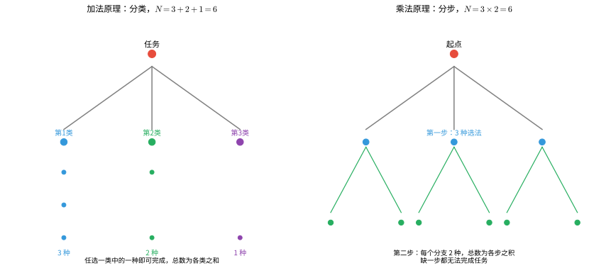

# 第 8 级：排列组合与概率初步

> **数学天梯攀爬教程·第八级**
> 本级别将系统学习计数原理、排列与组合的基本概念与公式、组合恒等式与二项式定理，以及概率论的基础知识，包括条件概率、贝叶斯定理等核心内容。

---

## 1. 学习目标

完成本级别学习后，你将能够：

- 理解并运用加法原理与乘法原理解决计数问题
- 掌握排列数公式 $P(n,k)$ 与组合数公式 $C(n,k)$ 的推导与计算
- 理解并证明基本的组合恒等式（对称性、帕斯卡恒等式）
- 用组合方法证明二项式定理，并灵活运用二项式展开
- 理解容斥原理的基本思想，并用于解决计数问题
- 掌握概率论的基本概念：样本空间、事件、概率公理
- 熟练计算古典概型中的概率
- 掌握条件概率、乘法公式、全概率公式与贝叶斯定理

---

## 2. 计数原理

### 2.1 加法原理（分类计数原理）

> **加法原理**：如果完成一件事有 $m$ 类不同的方式，第 $1$ 类有 $n_1$ 种方法，第 $2$ 类有 $n_2$ 种方法，……，第 $m$ 类有 $n_m$ 种方法，并且这些方法互不重复，那么完成这件事共有
>
> $$
> N = n_1 + n_2 + \cdots + n_m
> $$
>
> 种不同的方法。

加法原理的关键在于"分类"——各类方法之间是**互斥**的，选择其中一类中的一种方法就能完成任务。

**示例**：从甲地到乙地，可以乘火车（有 3 趟）、汽车（有 2 趟）或轮船（有 1 趟），则从甲地到乙地共有 $3 + 2 + 1 = 6$ 种不同的走法。

### 2.2 乘法原理（分步计数原理）

> **乘法原理**：如果完成一件事需要 $m$ 个步骤，做第 $1$ 步有 $n_1$ 种方法，做第 $2$ 步有 $n_2$ 种方法，……，做第 $m$ 步有 $n_m$ 种方法，并且各步骤之间相互独立，那么完成这件事共有
>
> $$
> N = n_1 \times n_2 \times \cdots \times n_m
> $$
>
> 种不同的方法。

乘法原理的关键在于"分步"——各步骤之间是**相互独立**的，缺一不可。

**示例**：从甲地到乙地有 3 条路，从乙地到丙地有 2 条路，则从甲地经乙地到丙地共有 $3 \times 2 = 6$ 种不同的走法。

### 2.3 加法原理与乘法原理的对比

| 方面 | 加法原理 | 乘法原理 |
|------|---------|---------|
| 逻辑关系 | 分类（或） | 分步（且） |
| 方法关系 | 互斥、独立 | 连续、相依 |
| 关键词 | "要么……要么……" | "先……再……" |

> **直观理解**：加法是"分类"——有几类互斥的独立办法，总数直接相加；乘法是"分步"——每一步都要做、缺一不可，总数是各步之积。下图左侧展示"分类相加"，右侧展示"分步相乘"的树状图。



---

## 3. 排列

### 3.1 全排列

> **定义**：将 $n$ 个不同元素按一定顺序排成一列，称为这 $n$ 个元素的一个**全排列**。

$n$ 个不同元素的全排列个数为：

$$
P_n = n! = n \times (n-1) \times (n-2) \times \cdots \times 2 \times 1
$$

其中 $n!$ 读作 "$n$ 的阶乘"，并规定 $0! = 1$。

**推导**：第 1 个位置有 $n$ 种选择，第 2 个位置有 $n-1$ 种选择，……，第 $n$ 个位置有 $1$ 种选择。由乘法原理，总数为 $n \times (n-1) \times \cdots \times 1 = n!$。


> **直观理解（现实类比）**：全排列就像**排队买票**——3 个人排在窗口前，谁能站第 1 位？有 3 种可能；确定第 1 位后，剩下 2 人争第 2 位，有 2 种可能；最后 1 人只能站末位。
>
> 树状图把"买票排队"的过程画了出来：从树根出发**每深一层就少一个选择**，分叉数依次是 $3 \to 2 \to 1$，所有叶子（末梢）的总数就是排列数 $3! = 6$。
>
> 推广到 $n$ 个人：第 1 位 $n$ 种、第 2 位 $n-1$ 种……末位 1 种，**所有分叉数相乘即 $n!$**——这正是"阶乘"这个名字的由来。

### 3.2 选排列

> **定义**：从 $n$ 个不同元素中取出 $k$ 个（$k \leq n$）元素，按一定顺序排成一列，称为从 $n$ 个元素中取 $k$ 个元素的**选排列**。

选排列的个数记作 $P(n,k)$、$P_k^n$ 或 $A(n,k)$，计算公式为：

$$
P(n,k) = \frac{n!}{(n-k)!} = n \times (n-1) \times \cdots \times (n-k+1)
$$

**推导**：第 1 个位置有 $n$ 种选择，第 2 个位置有 $n-1$ 种选择，……，第 $k$ 个位置有 $n-k+1$ 种选择。由乘法原理即得。

> **直观理解**：排列是"排成一列"，位置有先后之分；组合是"组成一组"，只看取舍不看顺序。下图展示排列与组合的核心区别——排列关注顺序，组合只看集合。


> **直观理解（现实类比）**：把"选排列"想象成**逐位填空**，每一步都像树分叉。给 3 个字母排 2 个位置：第 1 位有 3 种填法（树根分出 3 个枝），第 2 位只能从剩下 2 个里选（每个枝再分出 2 个小枝）。**这棵树的"末梢"总数就是排列数** $3\times2=6$。
>
> 树状图的妙处在于：它把抽象的"乘法原理"变成了看得见的"分叉过程"——**排列数公式 $P(n,k)=n(n-1)\cdots(n-k+1)$ 就是这棵树每一层的分叉数相乘**。这也是为什么组合问题常画树状图来穷举、验证。

### 3.3 重复排列

> **定义**：从 $n$ 个不同元素中取出 $k$ 个元素（允许重复）排成一列，称为**重复排列**。

重复排列的个数为：

$$
n^k
$$

**推导**：每个位置都有 $n$ 种选择，共 $k$ 个位置，由乘法原理得 $n^k$。

### 3.4 环状排列（循环排列）

> **定义**：将 $n$ 个不同元素排成一个圆圈（旋转后相同的视为同一种排列），称为**环状排列**。

环状排列的个数为：

$$
\frac{n!}{n} = (n-1)!
$$

**推导**：将环状排列在某处"剪开"可得到一个线状排列。一个环状排列因剪开位置不同可产生 $n$ 个不同的线状排列，而 $n$ 个线状排列对应同一个环状排列，故环状排列数为 $n! / n = (n-1)!$。

> **直观理解**：围成一圈时没有"首位"，旋转后重合的排法算同一种。把环在某处剪开就变成普通的线状排列；一个环能剪出 $n$ 种不同的"起点"，所以要除以 $n$。


---

## 4. 组合

### 4.1 组合的定义

> **定义**：从 $n$ 个不同元素中取出 $k$ 个（$k \leq n$）元素组成一组（不考虑顺序），称为从 $n$ 个元素中取 $k$ 个元素的**组合**。

组合数记作 $C(n,k)$、$\binom{n}{k}$、$C_n^k$ 或 $C_k^n$。

### 4.2 组合数公式

$$
C(n,k) = \binom{n}{k} = \frac{P(n,k)}{k!} = \frac{n!}{k!\,(n-k)!}
$$

**推导**：从排列与组合的关系来看，从 $n$ 个元素中取 $k$ 个元素的排列数 $P(n,k)$，等于先选出 $k$ 个元素（组合），再对这 $k$ 个元素进行全排列。即

$$
P(n,k) = C(n,k) \times k!
$$

所以

$$
C(n,k) = \frac{P(n,k)}{k!} = \frac{n!}{k!\,(n-k)!}
$$


> **直观理解（现实类比）**：组合数公式就像"**先排队，再除以顺序**"。想从 4 人中选 2 人小组，可以这么做：先按**有序排列**选（$P(4,2)=12$ 种），但这把同一组内的 {甲,乙} 和 {乙,甲} 算成了两种——实际上小组不分前后，**每组被重复计算了 $2! = 2$ 次**。
>
> 所以真正的"组数" = 排列数 $\div 2! = 12 \div 2 = 6$，即 $C(4,2)=6$。图中的箭头把每 2 个排列（顺序相反）合并成 1 个组合，正是"消除组内顺序"的过程。
>
> 推广：从 $n$ 个选 $r$ 个，每个 r 元组对应 $r!$ 种排列，多算了 $r!$ 倍，故 $C(n,r) = \dfrac{P(n,r)}{r!}$——这就是组合数公式的来由。

### 4.3 组合数的性质

**性质 1（对称性）**：

$$
C(n,k) = C(n, n-k)
$$

**性质 2（帕斯卡恒等式 / Pascal's Identity）**：

$$
C(n,k) + C(n,k+1) = C(n+1,k+1)
$$

**性质 3**：

$$
C(n,0) = C(n,n) = 1
$$


> **直观理解（现实类比）**：组合数的两条核心性质都能用"**选人**"来理解。
>
> **对称性** $C(n,k)=C(n,n-k)$：从 5 人中选 2 人"去开会"，等价于选 3 人"留下来"——**"选哪些人去"和"选哪些人留"是一一对应的**，所以选法数相等。图中左侧把 10 种"选 2 去"与 10 种"留 2"一一对应排列，直观体现了这种等价。
>
> **帕斯卡恒等式** $C(n+1,k+1)=C(n,k)+C(n,k+1)$：从 5 人选 3 人时，盯住其中某一个特殊的人 $a$——**$a$ 要么在组里，要么不在组里**，二者必居其一。若 $a$ 在组内，还需从剩 4 人选 2 人（$C(4,2)=6$）；若 $a$ 不在组内，则从剩 4 人选 3 人（$C(4,3)=4$）。两类相加即 $6+4=10=C(5,3)$，图中右侧展示了这一"二分"过程。

### 4.4 二项式定理

> **二项式定理**：对于任意非负整数 $n$，有
>
> $$
> (x + y)^n = \sum_{k=0}^{n} \binom{n}{k} x^{n-k} y^k
> $$
>
> 其中 $\binom{n}{k}$ 称为**二项式系数**。

展开式的通项为：

$$
T_{k+1} = \binom{n}{k} x^{n-k} y^k
$$

**二项式系数的性质**：

- 对称性：$\binom{n}{k} = \binom{n}{n-k}$
- 递推关系：$\binom{n}{k} + \binom{n}{k+1} = \binom{n+1}{k+1}$
- 各系数之和：$\sum_{k=0}^{n} \binom{n}{k} = 2^n$
- 交错和：$\sum_{k=0}^{n} (-1)^k \binom{n}{k} = 0$


> **直观理解（现实类比）**：二项式展开就像**抛 3 次硬币的所有可能**。每次抛硬币有"正面 a"或"反面 b"两种结果，连续抛 3 次，所有可能共 $2^3 = 8$ 种（树的每个叶子是一条路径）。
>
> 按正面 a 出现的次数归类：0 次正面（bbb）1 种、1 次正面（abb/bab/bba）3 种、2 次正面（aab/aba/baa）3 种、3 次正面（aaa）1 种——**1 + 3 + 3 + 1 = 8**，恰好对应 $(a+b)^3 = a^3 + 3a^2b + 3ab^2 + b^3$ 的系数。
>
> 这组系数 $1:3:3:1$ 正是杨辉三角的第 3 行，也就是 $\binom{3}{k}$——**二项式系数本质上就是"在 n 次选择中挑 k 次"的组合数**。

### 4.5 杨辉三角（帕斯卡三角）

杨辉三角是二项式系数的几何排列：

```
        1
       1 1
      1 2 1
     1 3 3 1
    1 4 6 4 1
   1 5 10 10 5 1
  1 6 15 20 15 6 1
```

其中第 $n$ 行（从 0 开始）的第 $k$ 个数就是 $\binom{n}{k}$。每个数等于它上方两数之和，这正是帕斯卡恒等式的直观体现。


---

## 5. 定理与证明

### 5.1 排列数公式的证明

**定理**：从 $n$ 个不同元素中取出 $k$ 个（$k \leq n$）元素的排列数为

$$
P(n,k) = n \times (n-1) \times \cdots \times (n-k+1) = \frac{n!}{(n-k)!}
$$

**证明**：用乘法原理。考虑依次选取 $k$ 个位置上的元素：

- 第 1 个位置：可以从 $n$ 个元素中任选 1 个，有 $n$ 种选法。
- 第 2 个位置：从剩下的 $n-1$ 个元素中任选 1 个，有 $n-1$ 种选法。
- ……
- 第 $k$ 个位置：从剩下的 $n-k+1$ 个元素中任选 1 个，有 $n-k+1$ 种选法。

由乘法原理，总的排列数为

$$
P(n,k) = n \cdot (n-1) \cdot \cdots \cdot (n-k+1)
$$

分子分母同乘 $(n-k)!$，得

$$
P(n,k) = \frac{n \cdot (n-1) \cdot \cdots \cdot (n-k+1) \cdot (n-k)!}{(n-k)!} = \frac{n!}{(n-k)!}
$$

证毕。

### 5.2 组合数公式的证明

**定理**：从 $n$ 个不同元素中取出 $k$ 个（$k \leq n$）元素的组合数为

$$
C(n,k) = \frac{n!}{k!\,(n-k)!}
$$

**证明**：从 $n$ 个元素中取 $k$ 个元素的排列，可以分两步完成：

1. 先从 $n$ 个元素中选出 $k$ 个元素（不考虑顺序），有 $C(n,k)$ 种选法。
2. 再对这 $k$ 个元素进行全排列，有 $k!$ 种排法。

由乘法原理，$P(n,k) = C(n,k) \times k!$，因此

$$
C(n,k) = \frac{P(n,k)}{k!} = \frac{n!}{k!\,(n-k)!}
$$

证毕。

### 5.3 组合恒等式的证明

#### 恒等式 1：对称性 $C(n,k) = C(n,n-k)$

**证明**：

$$
C(n,n-k) = \frac{n!}{(n-k)!\,[n-(n-k)]!} = \frac{n!}{(n-k)!\,k!} = C(n,k)
$$

**组合解释**：从 $n$ 个元素中选出 $k$ 个元素，等价于选出 $n-k$ 个元素"不入选"。两种选择方式一一对应，故组合数相等。

#### 恒等式 2：帕斯卡恒等式 $C(n,k) + C(n,k+1) = C(n+1,k+1)$

**证明（代数法）**：

$$
\begin{aligned}
C(n,k) + C(n,k+1) &= \frac{n!}{k!\,(n-k)!} + \frac{n!}{(k+1)!\,(n-k-1)!} \\[4pt]
&= \frac{n!}{k!\,(n-k-1)!} \left( \frac{1}{n-k} + \frac{1}{k+1} \right) \\[4pt]
&= \frac{n!}{k!\,(n-k-1)!} \cdot \frac{(k+1)+(n-k)}{(n-k)(k+1)} \\[4pt]
&= \frac{n!}{k!\,(n-k-1)!} \cdot \frac{n+1}{(n-k)(k+1)} \\[4pt]
&= \frac{(n+1)!}{(k+1)!\,(n-k)!} \\[4pt]
&= C(n+1, k+1)
\end{aligned}
$$

**证明（组合法）**：考虑从 $n+1$ 个元素中选出 $k+1$ 个元素。固定其中一个特殊元素 $a$：

- 若 $a$ 被选中，则还需从剩下的 $n$ 个元素中选 $k$ 个，有 $C(n,k)$ 种选法。
- 若 $a$ 未被选中，则需从剩下的 $n$ 个元素中选 $k+1$ 个，有 $C(n,k+1)$ 种选法。

两类互斥，由加法原理得 $C(n+1,k+1) = C(n,k) + C(n,k+1)$。

### 5.4 二项式定理的证明（组合方法）

**定理**：$(x+y)^n = \sum_{k=0}^{n} \binom{n}{k} x^{n-k} y^k$

**证明**：将 $(x+y)^n$ 展开为 $n$ 个因式 $(x+y)$ 的乘积：

$$
(x+y)^n = \underbrace{(x+y)(x+y)\cdots(x+y)}_{n \text{ 个}}
$$

展开后的每一项都是从每个因式中选取 $x$ 或 $y$ 相乘得到的。要得到 $x^{n-k}y^k$ 这一项，需要在 $n$ 个因式中选择 $k$ 个取 $y$（其余 $n-k$ 个取 $x$），选取方式有 $C(n,k)$ 种。因此 $x^{n-k}y^k$ 的系数为 $\binom{n}{k}$。证毕。

### 5.5 容斥原理

> **容斥原理**（Inclusion-Exclusion Principle）用于计算多个集合并集的元素个数，通过"先加后减"的方式避免重复计数。

**两个集合的情形**：

$$
|A \cup B| = |A| + |B| - |A \cap B|
$$

**三个集合的情形**：

$$
|A \cup B \cup C| = |A| + |B| + |C| - |A \cap B| - |A \cap C| - |B \cap C| + |A \cap B \cap C|
$$

**一般形式**：

$$
\left|\bigcup_{i=1}^{n} A_i\right| = \sum_{i=1}^{n} |A_i| - \sum_{1 \leq i < j \leq n} |A_i \cap A_j| + \cdots + (-1)^{n-1} |A_1 \cap A_2 \cap \cdots \cap A_n|
$$

**证明思路**：对任意元素 $x$，设其属于 $m$ 个集合。在右式中，$x$ 被计数的次数为

$$
\binom{m}{1} - \binom{m}{2} + \binom{m}{3} - \cdots + (-1)^{m-1}\binom{m}{m} = 1 - (1-1)^m = 1
$$

因此每个元素恰好被计算一次，等式成立。

> **直观理解**：左图是两个集合，重叠部分 $A \cap B$ 被 $|A|$ 和 $|B|$ 各算了一次，所以要减一次；右图是三个集合，两两重叠各减一次后，三重叠部分被多减了，还需加回一次。


---

## 6. 概率初步

### 6.1 基本概念

#### 随机试验与样本空间

> **随机试验**：可以在相同条件下重复进行，每次结果不确定但所有可能结果已知的试验。

> **样本空间**：随机试验所有可能结果组成的集合，记作 $\Omega$ 或 $S$。

> **样本点**：样本空间中的每一个元素（即每一个可能结果）。

#### 事件

> **事件**：样本空间的子集，即某些样本点的集合。

- **必然事件**：$\Omega$ 本身，一定发生。
- **不可能事件**：$\varnothing$，一定不发生。
- **基本事件**：只包含一个样本点的事件。

#### 事件的运算

| 符号 | 含义 | 说明 |
|------|------|------|
| $A \cup B$ | 并事件 | $A$ 或 $B$ 至少一个发生 |
| $A \cap B$ 或 $AB$ | 交事件 | $A$ 和 $B$ 同时发生 |
| $\overline{A}$ 或 $A^c$ | 对立事件 | $A$ 不发生 |
| $A \setminus B$ | 差事件 | $A$ 发生但 $B$ 不发生 |
| $A \cap B = \varnothing$ | 互斥事件 | $A$ 和 $B$ 不能同时发生 |

> **直观理解**：事件就是样本空间的子集，上面的运算都可以用韦恩图直观表示——并集取两圆覆盖区、交集取两圆重叠区、补集取圆外区、差集取只属于 $A$ 的部分、互斥是两圆不相交、包含是一个圆套在另一个圆内。


### 6.2 概率的公理化定义

> **概率**是定义在事件域上的一个集函数 $P$，满足以下三条公理：

1. **非负性**：对任意事件 $A$，$P(A) \geq 0$
2. **规范性**：$P(\Omega) = 1$
3. **可列可加性**：对两两互斥的事件序列 $A_1, A_2, \dots$，有
   $$
   P\left(\bigcup_{i=1}^{\infty} A_i\right) = \sum_{i=1}^{\infty} P(A_i)
   $$

### 6.3 古典概型

> **古典概型**满足两个条件：
> 1. 样本空间有限：$\Omega = \{\omega_1, \omega_2, \dots, \omega_n\}$
> 2. 每个基本事件等可能发生：$P(\{\omega_i\}) = \frac{1}{n}$

在古典概型中，事件 $A$ 的概率为

$$
P(A) = \frac{|A|}{|\Omega|} = \frac{A \text{ 包含的样本点个数}}{\text{样本空间中的样本点总数}}
$$


> **直观理解（现实类比）**：古典概型就像**掷骰子这种"公平的随机选择"**——每枚骰子 6 个面均匀对称，36 种结果**等可能出现**，所以某事件的概率就是"它包含几种结果 ÷ 36"。
>
> 图中左上的 6×6 网格列出了全部 36 个样本点，红色格子代表"两骰子之和为 7"。可以数出和为 7 的组合有 6 种：(1,6)(2,5)(3,4)(4,3)(5,2)(6,1)，所以 $P(\text{和为}7) = \dfrac{6}{36} = \dfrac{1}{6}$。
>
> 下方的柱状图显示和的分布呈对称三角形——和为 7 居中且组合数最多（6 种），向两端递减到和为 2 或 12 各仅 1 种。**这种"中间多、两头少"的形态正是古典概型中"和"的典型分布**。

### 6.4 概率的基本性质

由概率的三条公理可推导出以下性质：

1. **不可能事件的概率**：$P(\varnothing) = 0$
2. **有限可加性**：若 $A_1, A_2, \dots, A_n$ 两两互斥，则
   $$
   P\left(\bigcup_{i=1}^{n} A_i\right) = \sum_{i=1}^{n} P(A_i)
   $$
3. **对立事件概率**：$P(\overline{A}) = 1 - P(A)$
4. **加法公式**：
   $$
   P(A \cup B) = P(A) + P(B) - P(A \cap B)
   $$
   特别地，当 $A$ 与 $B$ 互斥时，$P(A \cup B) = P(A) + P(B)$

   #### 🎬 动画演示：概率的加法公式

   

   > 动画通过文氏图直观展示了概率加法公式的含义：两个事件 $A$ 和 $B$ 的并集概率等于各自概率之和减去交集概率。这避免了交集部分被重复计算。
5. **单调性**：若 $A \subseteq B$，则 $P(A) \leq P(B)$
6. **容斥公式**：
   $$
   P(A \cup B \cup C) = P(A) + P(B) + P(C) - P(AB) - P(AC) - P(BC) + P(ABC)
   $$

### 6.5 条件概率

> **定义**：在事件 $B$ 已发生的条件下，事件 $A$ 发生的概率称为**条件概率**，记作 $P(A \mid B)$，计算公式为
>
> $$
> P(A \mid B) = \frac{P(A \cap B)}{P(B)},\quad P(B) > 0
> $$

**条件概率也是概率**：对固定的 $B$（$P(B) > 0$），$P(\cdot \mid B)$ 满足概率的三条公理。

> **直观理解**：条件概率的本质是"**缩小样本空间**"。知道 $B$ 已发生后，我们只在 $B$ 的范围里讨论，$A$ 的条件概率就是"$A \cap B$ 占 $B$ 的比例"。下图左侧用韦恩图、右侧用样本点示意这种"缩小"。


### 6.6 乘法公式

由条件概率公式直接可得乘法公式：

$$
P(A \cap B) = P(B) \cdot P(A \mid B) = P(A) \cdot P(B \mid A)
$$

推广到多个事件：

$$
P(A_1 \cap A_2 \cap \cdots \cap A_n) = P(A_1) \cdot P(A_2 \mid A_1) \cdot P(A_3 \mid A_1 A_2) \cdots P(A_n \mid A_1 A_2 \cdots A_{n-1})
$$

### 6.7 全概率公式

> 若事件 $B_1, B_2, \dots, B_n$ 构成样本空间的一个**划分**（即两两互斥且 $\bigcup_{i=1}^{n} B_i = \Omega$），且 $P(B_i) > 0$，则对任意事件 $A$，有
>
> $$
> P(A) = \sum_{i=1}^{n} P(B_i) \cdot P(A \mid B_i)
> $$

全概率公式的实质是将事件 $A$ 的概率按不同"原因"或"条件"进行分解求和。

### 6.8 贝叶斯定理

> **贝叶斯定理**（Bayes' Theorem）描述了在已知结果 $A$ 发生的条件下，各"原因" $B_i$ 的条件概率：
>
> $$
> P(B_i \mid A) = \frac{P(B_i) \cdot P(A \mid B_i)}{P(A)} = \frac{P(B_i) \cdot P(A \mid B_i)}{\sum_{j=1}^{n} P(B_j) \cdot P(A \mid B_j)}
> $$

其中：
- $P(B_i)$ 称为**先验概率**（prior probability）
- $P(B_i \mid A)$ 称为**后验概率**（posterior probability）
- $P(A \mid B_i)$ 称为**似然**（likelihood）

**贝叶斯定理的简化形式**（两个事件）：

$$
P(A \mid B) = \frac{P(B \mid A) \cdot P(A)}{P(B)}
$$

> **直观理解**：全概率公式是把样本空间按"原因" $B_1, B_2, \dots, B_n$ 切分成互斥的块，事件 $A$ 的总概率等于各块内 $A$ 的概率之和；贝叶斯定理则是"由果溯因"——已知结果 $A$ 发生，反推它来自哪个原因。下图左侧展示样本空间的划分，右侧是因果树状图。


### 6.9 事件的独立性

> **定义**：若 $P(A \cap B) = P(A) \cdot P(B)$，则称事件 $A$ 与 $B$ **相互独立**。

若 $A$ 与 $B$ 独立且 $P(B) > 0$，则 $P(A \mid B) = P(A)$，即 $B$ 的发生不影响 $A$ 的概率。


> **直观理解（现实类比）**：事件独立就像**两次独立的考试**——第一次的成绩与第二次毫无关系，各自概率"各算各的"。
>
> 图中以两次掷骰子为例：事件 $A$ = "第 1 次点数 $>3$"（$P(A)=\frac{1}{2}$），事件 $B$ = "第 2 次点数 $>4$"（$P(B)=\frac{1}{3}$）。两枚骰子彼此无关，所以"两次都发生"的概率就是各自概率相乘：$P(A \cap B) = \frac{1}{2} \times \frac{1}{3} = \frac{1}{6}$。
>
> 右侧韦恩图直观验证了这一点：$A$ 占样本空间一半（18/36），$B$ 占三分之一（12/36），二者交集正好 6/36 = $\frac{1}{6}$，与乘积完全吻合。**"独立"的本质就是：一个事件的发生不改变另一个事件的发生概率**。

**多个事件的相互独立性**：事件 $A_1, A_2, \dots, A_n$ 相互独立，当且仅当对其中任意有限个事件 $A_{i_1}, A_{i_2}, \dots, A_{i_k}$ 有

$$
P(A_{i_1} \cap A_{i_2} \cap \cdots \cap A_{i_k}) = P(A_{i_1}) \cdot P(A_{i_2}) \cdots P(A_{i_k})
$$

---

## 7. 示例

### 示例 1：排列数的计算

**问题**：从 5 本不同的书中选出 3 本并按顺序排列在书架上，有多少种不同的排法？

**解**：这是从 5 个元素中取 3 个的选排列问题。

$$
P(5,3) = 5 \times 4 \times 3 = 60
$$

因此有 60 种不同的排法。

### 示例 2：组合数的计算

**问题**：从 10 名学生中选出 4 人参加数学竞赛，有多少种不同的选法？

**解**：这是组合问题，因为选出的 4 人没有顺序区别。

$$
C(10,4) = \frac{10!}{4!\,6!} = \frac{10 \times 9 \times 8 \times 7}{4 \times 3 \times 2 \times 1} = 210
$$

因此有 210 种不同的选法。

### 示例 3：含特殊条件的排列

**问题**：用数字 0, 1, 2, 3, 4, 5 组成没有重复数字的六位数，有多少个？

**解**：首位不能为 0，因此先选首位（有 5 种选择），剩余 5 个数字全排列到其余 5 个位置。

$$
5 \times 5! = 5 \times 120 = 600
$$

因此共有 600 个这样的六位数。

### 示例 4：分组问题

**问题**：将 6 本不同的书分成三组，每组 2 本，有多少种分法？

**解**：先从 6 本中选 2 本给第一组，再从剩下 4 本中选 2 本给第二组，最后 2 本给第三组。但三组是**无标号**的（即交换组别视为相同分法），因此需要除以 $3!$。

$$
\frac{C(6,2) \times C(4,2) \times C(2,2)}{3!} = \frac{15 \times 6 \times 1}{6} = 15
$$

因此有 15 种不同的分法。

### 示例 5：二项式定理的应用

**问题**：求 $(2x - 3)^5$ 展开式中 $x^3$ 项的系数。

**解**：由二项式定理，通项为

$$
T_{k+1} = \binom{5}{k} (2x)^{5-k} (-3)^k
$$

令 $5-k = 3$，得 $k = 2$。代入得

$$
T_3 = \binom{5}{2} (2x)^3 (-3)^2 = 10 \times 8x^3 \times 9 = 720x^3
$$

因此 $x^3$ 项的系数为 720。

### 示例 6：容斥原理的应用

**问题**：在 1 到 100 的整数中，既不是 2 的倍数也不是 3 的倍数的数有多少个？

**解**：设 $A$ 为 2 的倍数的集合，$B$ 为 3 的倍数的集合。

- $|A| = \lfloor 100/2 \rfloor = 50$
- $|B| = \lfloor 100/3 \rfloor = 33$
- $|A \cap B| = \lfloor 100/6 \rfloor = 16$（6 的倍数）

由容斥原理：

$$
|A \cup B| = 50 + 33 - 16 = 67
$$

因此既不是 2 的倍数也不是 3 的倍数的数的个数为

$$
100 - |A \cup B| = 100 - 67 = 33
$$

### 示例 7：古典概型的基本计算

**问题**：掷两枚质地均匀的骰子，求点数之和为 7 的概率。

**解**：样本空间共有 $6 \times 6 = 36$ 个等可能的结果。

点数之和为 7 的结果有：(1,6), (2,5), (3,4), (4,3), (5,2), (6,1)，共 6 种。

因此

$$
P(\text{和为}7) = \frac{6}{36} = \frac{1}{6}
$$

### 示例 8：条件概率的计算

**问题**：一个家庭有两个孩子，已知至少有一个男孩，求另一个也是男孩的概率。

**解**：样本空间为 $\Omega = \{BB, BG, GB, GG\}$（$B$ 表示男孩，$G$ 表示女孩，按出生顺序），等可能。

设事件 $A$ = "至少有一个男孩"，$B$ = "两个都是男孩"。

- $A = \{BB, BG, GB\}$，$|A| = 3$
- $B = \{BB\}$，$|B| = 1$
- $A \cap B = \{BB\}$

$$
P(B \mid A) = \frac{P(A \cap B)}{P(A)} = \frac{1/4}{3/4} = \frac{1}{3}
$$

因此另一个也是男孩的概率为 $\frac{1}{3}$。

### 示例 9：全概率公式的应用

**问题**：某工厂有甲、乙、丙三台机器生产同一种产品，产量分别占总产量的 50%、30%、20%，次品率分别为 2%、3%、5%。现从总产品中随机抽取一件，求它是次品的概率。

**解**：设 $A$ = "抽到次品"，$B_1, B_2, B_3$ 分别表示"抽到的产品来自甲、乙、丙机器"。

由全概率公式：

$$
\begin{aligned}
P(A) &= P(B_1)P(A \mid B_1) + P(B_2)P(A \mid B_2) + P(B_3)P(A \mid B_3) \\
&= 0.5 \times 0.02 + 0.3 \times 0.03 + 0.2 \times 0.05 \\
&= 0.01 + 0.009 + 0.01 \\
&= 0.029
\end{aligned}
$$

因此次品率为 2.9%。

### 示例 10：贝叶斯定理的应用

**问题**：接上例，已知抽到的一件产品是次品，求它来自甲机器的概率。

**解**：由贝叶斯定理：

$$
\begin{aligned}
P(B_1 \mid A) &= \frac{P(B_1) \cdot P(A \mid B_1)}{P(A)} \\
&= \frac{0.5 \times 0.02}{0.029} \\
&= \frac{0.01}{0.029} \approx 0.3448
\end{aligned}
$$

因此该次品来自甲机器的概率约为 34.48%。

### 示例 11：独立事件

**问题**：甲乙两人独立地射击同一目标，甲的命中率为 0.8，乙的命中率为 0.7。求：
1. 两人都命中目标的概率
2. 至少有一人命中目标的概率

**解**：

1. 两人都命中：$P(A \cap B) = P(A) \cdot P(B) = 0.8 \times 0.7 = 0.56$

2. 至少一人命中：
   $$
   P(A \cup B) = P(A) + P(B) - P(A \cap B) = 0.8 + 0.7 - 0.56 = 0.94
   $$

### 示例 12：重复排列与概率

**问题**：一个密码由 4 位数字组成（每位数字 0-9），求密码不含重复数字的概率。

**解**：样本空间大小：$10^4 = 10000$（重复排列，每位有 10 种选择）。

不含重复数字的排列数：$P(10,4) = 10 \times 9 \times 8 \times 7 = 5040$。

因此

$$
P = \frac{5040}{10000} = 0.504
$$

---

## 解题技巧

> 本节针对排列组合与概率初步中的高频问题，总结可直接套用的解题方法与易错点。每条技巧都给出**适用场景**、**关键步骤**与**常见误区**，并配一个精讲示例。

### 8.1 分清"分类"与"分步"

**适用场景**：加法原理与乘法原理的判定，以及较复杂计数题的入手。

**关键步骤**：
1. 问自己"能不能一步完成"——能一步完成、各种方式互斥的要**分类**（加法）；缺一不可、须依次进行的是**分步**（乘法）；
2. 分类时保证各类**互斥**，分步时保证各步**独立**；
3. 先分大步，再在小步内细分（树状图辅助）。

**常见误区**：把加法与乘法混用；分类时遗漏某类或各类之间有重叠；分步时忽略了先后顺序。

**精讲示例**：从甲到乙有 3 趟火车、2 趟汽车，从乙到丙有 4 条路。求从甲经乙到丙的方法数。
从甲到乙是分类：$3+2=5$ 种；再经乙到丙是分步相乘：$5\times4=20$（种）。

### 8.2 判定"排列"还是"组合"

**适用场景**：判断题目该用 $P(n,k)$ 还是 $C(n,k)$。

**关键步骤**：
1. 取出 $k$ 个元素后，若"调换顺序"形成**不同结果**则为排列（有序），否则为组合（无序）；
2. 有序用 $P(n,k)=\dfrac{n!}{(n-k)!}$，无序用 $C(n,k)=\dfrac{n!}{k!\,(n-k)!}$；
3. 常见陷阱词：选班长/排座位/排队/组成数字多为排列；选代表、选成员、分组多为组合。

**常见误区**：只取不排却用了排列数；或多除/漏除 $k!$。

**精讲示例**：从 5 名学生中选 3 名分别担任"班长、副班长、学习委员"；若改为选"3 名代表"，各有多少种？
职务有顺序：$P(5,3)=60$；代表无顺序：$C(5,3)=10$。

### 8.3 先选后排与"除法去重"

**适用场景**：分组、分堆、含重复情形等易重易漏的问题。

**关键步骤**：
1. 有先后之分的问题先"选定"再"排序"；
2. 无标号分堆（组数相同或组别不可辨）时要除以相应堆数的阶乘；
3. 有标号分组（如分给甲、乙、丙）则无需除，直接相乘。

**常见误区**：平均分成若干无标号堆时忘记除以堆数阶乘；组间可辨时多除了。

**精讲示例**：6 本不同的书平均分成 3 堆（无标号），三种分法多少？
无标号分堆：$\dfrac{C(6,2)\,C(4,2)\,C(2,2)}{3!}=15$。

### 8.4 组合恒等式的两种证明路径

**适用场景**：证明对称性、帕斯卡恒等式、$\sum \binom{n}{k}=2^n$ 等组合恒等式。

**关键步骤**：
1. 代数法：代入 $\binom{n}{k}=\dfrac{n!}{k!(n-k)!}$ 化简化通分；
2. 组合法：构造"从 $n$ 个对象中选 $k$ 个"的一个计数故事，分情况计数；
3. 常用技巧：令 $(1+x)^n$ 中 $x=1$ 得 $\sum_{k=0}^n \binom{n}{k}=2^n$；令 $x=-1$ 得交错和为 $0$。

**常见误区**：只记公式不写推理；通分时阶乘展开错误。

**精讲示例**：证明 $\sum_{k=0}^{n}\binom{n}{k}=2^n$。
组合意义：$\binom{n}{k}$ 表示 $n$ 个元素的 $k$ 元子集数，$n$ 个元素的所有子集共有 $2^n$ 个（每个元素取或不取）。故左 $=2^n$。

### 8.5 二项式定理求指定项与系数

**适用场景**：求 $(a+b)^n$ 展开式中某一项、指定幂的系数、系数和等。

**关键步骤**：
1. 写出通项 $T_{k+1}=\binom{n}{k}a^{n-k}b^k$；
2. 令 $a$ 的指数等于所要求的值，解出 $k$（注意 $k$ 的范围 $0\le k\le n$）；
3. 代入并合并系数（含常数因子与负号）。

**常见误区**：忽略通项中 $a,b$ 自带系数或符号；把"第 $k$ 项"误当"第 $k+1$ 项"。

**精讲示例**：求 $(2x-3)^5$ 中 $x^3$ 的系数。
$T_{k+1}=\binom{5}{k}(2x)^{5-k}(-3)^k$，令 $5-k=3$ 得 $k=2$，$T_3=\binom52(8x^3)\cdot9=10\times72=720$。

### 8.6 容斥原理逐层"先加后减"

**适用场景**：多个"至少/或不"条件且集合有重叠的计数。

**关键步骤**：
1. 设出各集合 $A,B,C$ 及其大小；
2. 先加所有单个集合，再减两两相交，再加三三相交……（**奇加偶减**）；
3. 求"既非……也非……"时，最后用总数减去并集大小。

**常见误区**：漏补三交集；统计两两相交时漏项或重复。

**精讲示例**：1~100 中既不被 2 也不被 3 整除的个数。
$|A|=50,\ |B|=33,\ |A\cap B|=\lfloor100/6\rfloor=16$，$|A\cup B|=50+33-16=67$，故 $100-67=33$。

### 8.7 古典概型的计数桥

**适用场景**：等可能情形下求事件概率。

**关键步骤**：
1. 先确定样本空间总数 $|\Omega|$ 与事件包含的样本点数（都用排列/组合数）；
2. 代入 $P(A)=\dfrac{|A|}{|\Omega|}$；
3. 分母与分子采用**同一口径**（都有序或都无序，都有放回或都无放回）。

**常见误区**：分母用有序、分子用无序导致口径不一致；重复或遗漏样本点。

**精讲示例**：掷两枚骰子，点数和为 7 的概率。
$|\Omega|=36$，和为 7 的组合有 6 种，$P=\dfrac{6}{36}=\dfrac16$。

### 8.8 条件概率与"由果溯因"（贝叶斯）

**适用场景**：已知部分信息后求概率、两步随机、检测/诊断类问题。

**关键步骤**：
1. 条件概率 $P(A\mid B)=\dfrac{P(A\cap B)}{P(B)}$——以"**缩小样本空间**"来理解；
2. 乘法公式：$P(A\cap B)=P(B)P(A\mid B)$；
3. 已知结果求原因用贝叶斯：$P(B_i\mid A)=\dfrac{P(B_i)P(A\mid B_i)}{\sum_j P(B_j)P(A\mid B_j)}$，分母是全概率（合计所有"致 $A$ 的路径"）。

**常见误区**：把 $P(A\mid B)$ 与 $P(B\mid A)$ 混为一谈；贝叶斯的分母漏用全概率公式。

**精讲示例**：口袋有 3 红 5 蓝，不放回取两球。已知第一次取到红球，第二次取到蓝球的概率。
缩小样本空间：还剩 7 球其中 5 蓝，$P=\dfrac57$。若问"两球恰为一红一蓝"，则用乘法公式 $\dfrac{3}{8}\cdot\dfrac{5}{7}+\dfrac{5}{8}\cdot\dfrac{3}{7}$。

---

## 8. 习题

> 习题按难度分为 **基础题 / 进阶题 / 挑战题 / 探究题** 四级，覆盖本章全部内容（计数原理、排列与组合、环状排列、组合恒等式、二项式定理、容斥原理、古典概型、条件概率与贝叶斯、事件独立性）。探究题为开放题，附参考答案与思路提示。

### 基础题

**1.** 计算下列各式的值：
   (a) $P(8,3)$
   (b) $C(10,4)$
   (c) $\binom{7}{3} + \binom{7}{4}$
   (d) $\sum_{k=0}^{5} \binom{5}{k}$

**2.** 用数字 1, 2, 3, 4, 5 可以组成多少个没有重复数字的三位数？

**3.** 从 8 名同学中选出 3 人参加演讲比赛，有多少种不同的选法？

**4.** 6 个人围坐一圆桌就餐（旋转后相同视为同一种坐法），有多少种不同的坐法？

**5.** 求 $(1 + x)^7$ 展开式中 $x^3$ 项的系数。

**6.** 掷一枚骰子两次，求：
   (a) 两次点数之和大于 8 的概率
   (b) 两次点数相同的概率

### 进阶题

**7.** 有 5 本不同的数学书和 3 本不同的物理书，将它们排成一排，要求物理书不相邻，有多少种排法？

**8.** 从 1 到 30 的整数中随机选取一个数，求它是 2 的倍数或 5 的倍数的概率。

**9.** 一副扑克牌（52 张，不含大小王）中随机抽取 5 张，求恰好有 2 张 A 的概率。

**10.** 某地区人群中，患某种疾病的概率为 0.001。一种检测方法对患病者的检出率为 99%，对健康者的误诊率为 2%。若某人检测结果为阳性，求他真正患病的概率。

**11.** 甲袋中有 3 个白球 2 个黑球，乙袋中有 2 个白球 4 个黑球。从甲袋中随机取一球放入乙袋，再从乙袋中随机取一球，求最后取到白球的概率。

**12.** 甲、乙两人独立地射击同一目标，甲的命中率为 0.8，乙的命中率为 0.7。求：
   (a) 两人都命中目标的概率；
   (b) 至少有一人命中目标的概率；
   (c) 恰有一人命中目标的概率。

**13.** 证明 $\binom{n}{0} + \binom{n}{2} + \binom{n}{4} + \cdots = \binom{n}{1} + \binom{n}{3} + \binom{n}{5} + \cdots = 2^{n-1}$。

**14.** 将 10 本不同的书随机分成三堆，分别有 2、3、5 本，有多少种不同的分法？

### 挑战题

**15.** 某班有 50 名学生，参加数学、物理、化学三门竞赛的情况如下：参加数学竞赛的有 30 人，参加物理竞赛的有 25 人，参加化学竞赛的有 20 人；同时参加数学和物理的有 12 人，同时参加数学和化学的有 10 人，同时参加物理和化学的有 8 人；三科都参加的有 5 人。求至少参加一科竞赛的人数。

**16.** 一个班级有 30 名学生，求至少有两人生日相同的概率（一年按 365 天计）。

**17.** 从 $n$ 个不同元素中取出 $k$ 个元素（允许重复）的组合数（即**多重集组合**）为 $C(n+k-1, k)$。试证明之。

**18.** 用容斥原理证明：在 $n$ 个元素的排列中，没有元素停留在原位置（即**错排**）的排列数 $D_n$ 满足
    $$
    D_n = n! \sum_{i=0}^{n} \frac{(-1)^i}{i!}
    $$
    并计算 $D_5$ 的值。

### 探究题

**19.** 二项式系数的加权和。探究并证明恒等式：$\displaystyle \sum_{k=0}^{n} k\binom{n}{k} = n\cdot 2^{n-1}$。
**提示**：对恒等式 $(1+x)^n=\sum_{k=0}^n\binom{n}{k}x^k$ 两端关于 $x$ 求导后再令 $x=1$；或给出组合解释——先选出一个"被标记的对象"，再从剩下 $n-1$ 个中任取若干组成一个集合。

**20.** 错排概率的极限。由第 18 题的公式 $D_n = n! \sum_{i=0}^{n}\frac{(-1)^i}{i!}$，探究"$n$ 个元素的排列中恰好没有一个元素不动"的概率 $p_n=\dfrac{D_n}{n!}$ 随 $n$ 增大的变化趋势，并求 $\lim\limits_{n\to\infty} p_n$。
**提示**：$p_n=\sum_{i=0}^n\frac{(-1)^i}{i!}$，它是 $e^x=\sum_{i=0}^\infty\frac{x^i}{i!}$ 在 $x=-1$ 部分和的序列。

**21.** 蒙提霍尔问题（三门问题）。有三扇门，一扇门后有汽车、两扇门后各有一只山羊。你先选一扇门，主持人知道车的方位，会从另外两扇门中打开一扇有山羊的门，然后问你是否换到剩下那扇未开的门。探究：换门与坚持原门，哪个赢得汽车的概率更大？分别求两策略的获胜概率。
**提示**：用条件概率/贝叶斯思想——你最初选到车的概率是 $\frac13$、选到羊的概率是 $\frac23$；换门能否赢，关键在于你最初是不是选错了门。可枚举所有情形核对。

---

## 📝 习题答案

<details>
<summary>点击展开答案</summary>

**基础题**

1. (a) $P(8,3)=8\times7\times6=336$
   (b) $C(10,4)=\dfrac{10\times9\times8\times7}{4!}=\dfrac{5040}{24}=210$
   (c) 由帕斯卡恒等式 $\binom{7}{3}+\binom{7}{4}=\binom{8}{4}=70$（也可分别求 $35+35=70$）
   (d) $\sum_{k=0}^{5}\binom{5}{k}=2^5=32$

2. 组成不重复的三位数，位置有顺序，是排列问题：$P(5,3)=5\times4\times3=60$。

3. 选出即可、无顺序，是组合问题：$C(8,3)=\dfrac{8\times7\times6}{3!}=56$。

4. 环状排列（旋转后相同视为同一种）：$(6-1)! = 5! = 120$ 种。**思路**：$n$ 个不同元素的环状排列数为 $(n-1)!$，因为圆排列可在某处"剪开"变成线排列，一个环对应 $n$ 种剪法，故 $n!/n = (n-1)!$。

5. $(1+x)^7$ 中 $x^3$ 项为 $\binom{7}{3}x^3$，系数 $=\binom{7}{3}=\dfrac{7\times6\times5}{3!}=35$。

6. 样本空间 $|\Omega|=36$。
   (a) 和为 9、10、11、12 的组合数分别为 $4,3,2,1$，共 $10$ 种，故 $P=\dfrac{10}{36}=\dfrac{5}{18}$。
   (b) 点数相同为 $(1,1),\dots,(6,6)$ 共 6 种，$P=\dfrac{6}{36}=\dfrac{1}{6}$。

**进阶题**

7. 先排 5 本数学书：$5!$ 种，形成 6 个空位；从 6 个空位选 3 个放物理书并排列：$C(6,3)\cdot3!$。总数 $=5!\cdot C(6,3)\cdot3!=120\times20\times6=14400$。

8. 设 $A$=2 的倍数，$B$=5 的倍数。1~30 中 $|A|=15$，$|B|=6$，$|A\cap B|=|\{10,20,30\}|=3$。$|A\cup B|=15+6-3=18$，$P=\dfrac{18}{30}=\dfrac{3}{5}$。

9. 从 52 张抽 5 张的总数为 $C(52,5)$。恰好 2 张 A：先选 2 张 A（$C(4,2)$），再从其余 48 张选 3 张（$C(48,3)$）。故
   $$
   P=\frac{C(4,2)\,C(48,3)}{C(52,5)}=\frac{6\times17296}{2598960}\approx0.0399
   $$
   即约 3.99%。

10. 设 $S$=患病，$T$=检测阳性。$P(S)=0.001$，$P(T\mid S)=0.99$，$P(T\mid \bar S)=0.02$。由全概率与贝叶斯：
   $$
   P(S\mid T)=\frac{P(S)P(T\mid S)}{P(S)P(T\mid S)+P(\bar S)P(T\mid \bar S)}=\frac{0.00099}{0.00099+0.999\times0.02}\approx0.0472
   $$
   即真正患病概率仅约 4.7%，原因在于发病率极低导致大量假阳性。**思路**：把 $P(T)$ 展开成全概率，再代入贝叶斯。

11. 用全概率公式，按从甲袋取出的球分两类：
   - 取出白球：概率 $\frac35$，放入后乙袋有 3 白 4 黑（7 球），再取白球概率 $\frac37$；
   - 取出黑球：概率 $\frac25$，放入后乙袋有 2 白 5 黑（7 球），再取白球概率 $\frac27$。
   故 $P=\dfrac35\cdot\dfrac37+\dfrac25\cdot\dfrac27=\dfrac{9}{35}+\dfrac{4}{35}=\dfrac{13}{35}\approx0.371$。

12. 设 $A$="甲命中"，$B$="乙命中"，$A$、$B$ 独立。
   (a) $P(A\cap B)=P(A)\cdot P(B)=0.8\times0.7=0.56$。
   (b) $P(A\cup B)=P(A)+P(B)-P(A\cap B)=0.8+0.7-0.56=0.94$。
   (c) 恰一人命中 $=P(A\overline{B})+P(\overline{A}B)=0.8\times0.3+0.2\times0.7=0.24+0.14=0.38$。**思路**：独立事件 $P(A\cap B)=P(A)P(B)$；"至少一个"用 $P(A\cup B)$ 或对立事件 $1-P(\overline{A})P(\overline{B})$。

13. 取 $x=-1$ 代入 $(1+x)^n=\sum\binom{n}{k}x^k$：$0=\sum_{k}(-1)^k\binom{n}{k}$，即偶数项之和等于奇数项之和。而两者之和为 $\sum\binom{n}{k}=2^n$，故各自 $=2^{n-1}$。$\square$

14. 三堆人数分别为 $2,3,5$，数目互不相同、堆可辨，无需除以阶乘：
   $$
   C(10,2)\,C(8,3)\,C(5,5)=45\times56\times1=2520
   $$

**挑战题**

15. 设 $A$=参加数学，$B$=参加物理，$C$=参加化学。由三集合容斥原理：
   $$|A\cup B\cup C|=|A|+|B|+|C|-|A\cap B|-|A\cap C|-|B\cap C|+|A\cap B\cap C|$$
   $$=30+25+20-12-10-8+5=50$$
   即至少参加一科的有 50 人（恰好全班都参加了）。**思路**：三集合容斥 = 三个单集之和 − 三个两两交集之和 + 三集合交集。

16. 至少两人生日相同 $=1-$ 全部不同的概率：
   $$
   P=1-\frac{365\times364\times\cdots\times(365-30+1)}{365^{30}}=1-\frac{365!}{(365-30)!\,365^{30}}\approx0.706
   $$
   **思路**：先算对立事件"30 人生日全不同"，用乘法原理分子是 $365$ 依次乘 $364,\dots,336$，分母是 $365^{30}$。

17. 把 $k$ 个相同元素（或可重复选取的 $k$ 个"槽"）分到 $n$ 类中，等价于"隔板法"：$n$ 类、$k$ 个元素，用 $n-1$ 块隔板排成一行，可化为 $n+k-1$ 个位置中选 $k$ 个放元素（或选 $n-1$ 个放隔板），故数为
   $$
   C(n+k-1,\,k)=C(n+k-1,\,n-1)
   $$

18. 设 $A_i$="第 $i$ 个元素不动"。由容斥原理，所有元素都动的排列数
   $$
   D_n=n!-\sum|A_i|+\cdots+(-1)^n|A_1\cap\cdots\cap A_n|
   =n!\left(1-\frac1{1!}+\frac1{2!}-\cdots+(-1)^n\frac1{n!}\right)=n!\sum_{i=0}^n\frac{(-1)^i}{i!}
   $$
   其中 $|A_{i_1}\cap\cdots\cap A_{i_j}|=(n-j)!$，共 $\binom{n}{j}$ 个。取 $n=5$：
   $$
   D_5=120\left(1-1+\frac12-\frac16+\frac1{24}-\frac1{120}\right)=120\left(\frac{60-20+5-1}{120}\right)=44
   $$

**探究题**

19. 参考答案。对 $(1+x)^n=\sum_{k=0}^n\binom{n}{k}x^k$ 两端求导：$n(1+x)^{n-1}=\sum_{k=0}^n k\binom{n}{k}x^{k-1}$，令 $x=1$ 得 $\sum k\binom{n}{k}=n\cdot2^{n-1}$。组合解释：左边计数"从 $n$ 人选 $k$ 人组成集合并指定其中一人为队长"——先由 $\binom{n}{k}$ 选组、再由 $k$ 种选队长，求和得 $\sum k\binom{n}{k}$；等价地先选队长 $n$ 种，再从其余 $n-1$ 人任选子集 $2^{n-1}$ 种，两者相等。**思路**：同一件事用两种方法数出，即组合恒等式的两大来源。

20. 参考答案。$p_n=\dfrac{D_n}{n!}=\sum_{i=0}^n\frac{(-1)^i}{i!}$。它随 $n$ 在 $\frac1e$ 附近来回波动并收敛：因为 $e^{-1}=\sum_{i=0}^\infty\frac{(-1)^i}{i!}$（交错级数，$e^x$ 在 $x=-1$），故
   $$
   \lim_{n\to\infty}p_n=e^{-1}=\frac1e\approx0.3679
   $$
   **思路**：错排"恰好全不动"的概率在 $n$ 很大时趋于 $1/e$，这正是"任意随机排列存在至少一个不动点概率约 $1-e^{-1}\approx0.632$"的来由。

21. 参考答案。**换门胜率 $\dfrac23$，坚持胜率 $\dfrac13$**。理由：开始时你选到车的概率是 $\frac13$、选到羊的概率是 $\frac23$。若你初次选到羊（概率 $\frac23$），主持人只能打开另一扇羊门，剩下那扇必是车，换门必赢；若你初次选到车（概率 $\frac13$），换门必输。故换门获胜概率为 $\frac23$。枚举三类情形亦可验证。**思路**：关键是主持人"有目的地"开门——他不是随机开门，而是必然避开车，因此换与不换不对等。**拓展**：推广到 $n$ 扇门、先开 $n-2$ 扇羊门的情形，换门胜率升至 $\dfrac{n-1}{n}$。

</details>

---

## 9. 总结

### 核心公式速查表

#### 计数原理

| 公式 | 说明 |
|------|------|
| $N = n_1 + n_2 + \cdots + n_m$ | 加法原理（分类） |
| $N = n_1 \times n_2 \times \cdots \times n_m$ | 乘法原理（分步） |

#### 排列

| 公式 | 说明 |
|------|------|
| $n!$ | $n$ 个不同元素的全排列 |
| $P(n,k) = \dfrac{n!}{(n-k)!}$ | 从 $n$ 个中取 $k$ 个的选排列 |
| $n^k$ | 从 $n$ 个中取 $k$ 个的重复排列 |
| $(n-1)!$ | $n$ 个不同元素的环状排列 |

#### 组合

| 公式 | 说明 |
|------|------|
| $C(n,k) = \dbinom{n}{k} = \dfrac{n!}{k!\,(n-k)!}$ | 从 $n$ 个中取 $k$ 个的组合数 |
| $C(n,k) = C(n, n-k)$ | 对称性 |
| $C(n,k) + C(n,k+1) = C(n+1,k+1)$ | 帕斯卡恒等式 |

#### 二项式定理

| 公式 | 说明 |
|------|------|
| $(x+y)^n = \sum_{k=0}^{n} \binom{n}{k} x^{n-k} y^k$ | 二项式展开 |
| $\sum_{k=0}^{n} \binom{n}{k} = 2^n$ | 系数之和 |
| $\sum_{k=0}^{n} (-1)^k \binom{n}{k} = 0$ | 交错和 |

#### 容斥原理

| 公式 | 说明 |
|------|------|
| $|A \cup B| = |A| + |B| - |A \cap B|$ | 两个集合 |
| $\left|\bigcup_{i=1}^{n} A_i\right| = \sum|A_i| - \sum|A_i \cap A_j| + \cdots$ | 一般形式 |

#### 概率

| 公式 | 说明 |
|------|------|
| $P(A) = \dfrac{|A|}{|\Omega|}$ | 古典概型 |
| $P(A \cup B) = P(A) + P(B) - P(A \cap B)$ | 加法公式 |
| $P(A \mid B) = \dfrac{P(A \cap B)}{P(B)}$ | 条件概率 |
| $P(A \cap B) = P(A) \cdot P(B \mid A)$ | 乘法公式 |
| $P(A) = \sum_{i} P(B_i) \cdot P(A \mid B_i)$ | 全概率公式 |
| $P(B_i \mid A) = \dfrac{P(B_i) \cdot P(A \mid B_i)}{\sum_{j} P(B_j) \cdot P(A \mid B_j)}$ | 贝叶斯定理 |
| $P(A \cap B) = P(A) \cdot P(B)$ | 独立事件 |

---

> **下一级预告**：第 9 级将进入**解析几何**的世界，学习直线、圆、圆锥曲线及其方程，将代数与几何紧密结合起来。