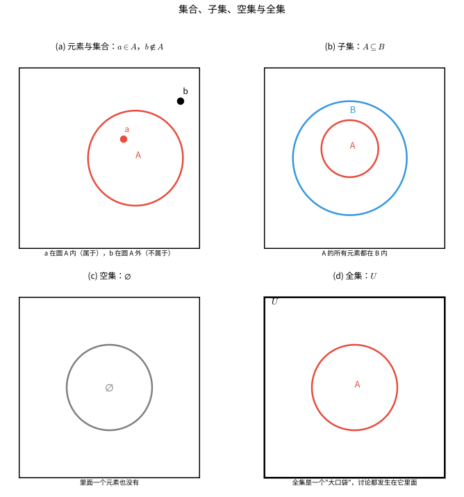
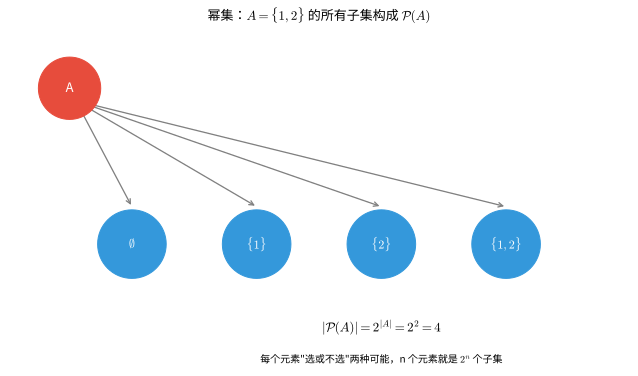
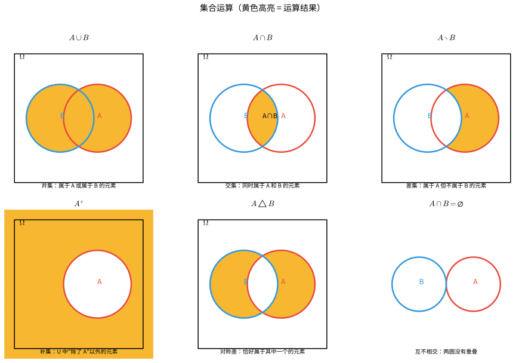
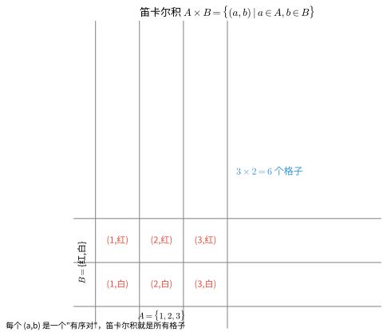
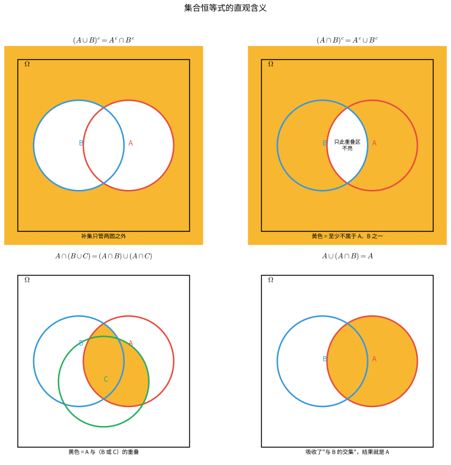
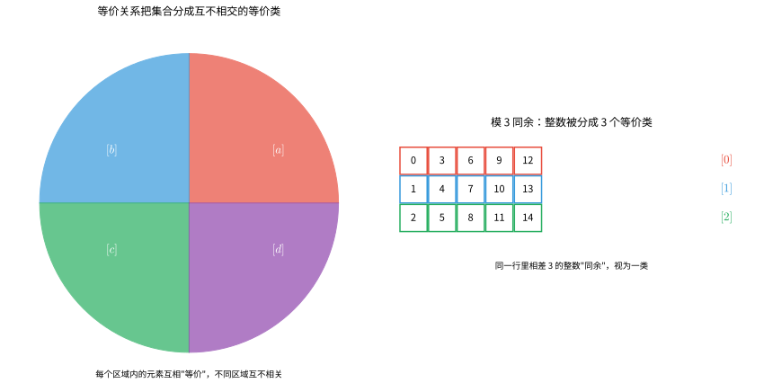
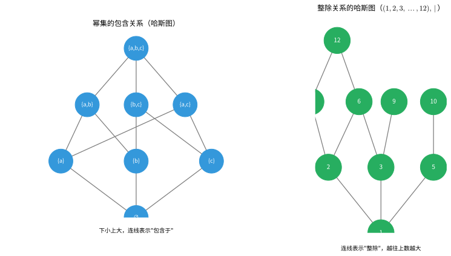
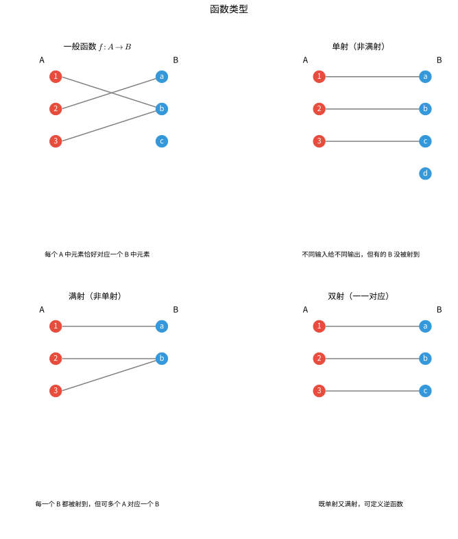
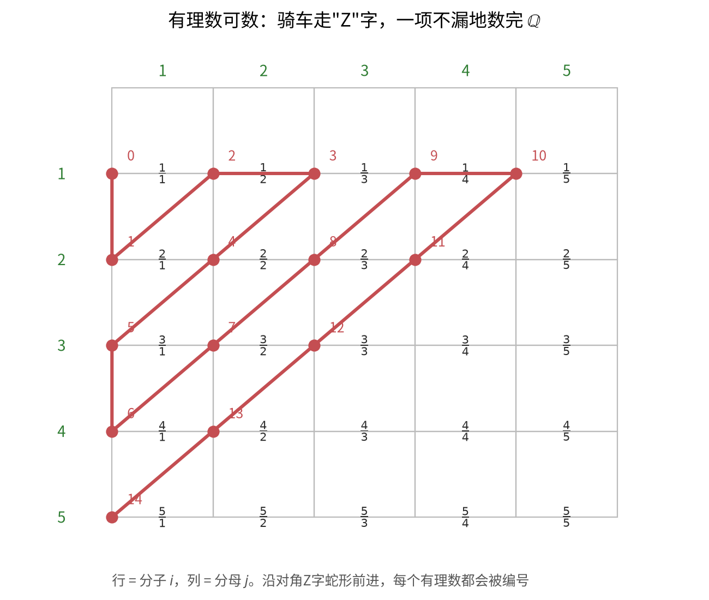
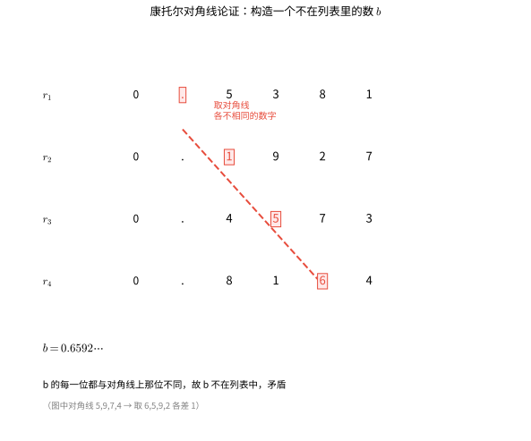

# 第 9 级：集合论基础 (Foundations of Set Theory)

---

## 1. 学习目标

完成本教程后，你应该能够：

- 理解集合、元素、子集等基本概念及其符号表示
- 掌握集合的基本运算（并、交、差、补、对称差、笛卡尔积）
- 熟练运用德摩根定律、分配律、吸收律等集合恒等式
- 理解关系、等价关系、偏序关系及函数的基本性质
- 区分可数集与不可数集，理解康托尔对角线论证
- 运用集合论方法解决实际问题

---

## 开始之前

**本章在讲什么**：集合（Set）就是"把一堆对象归到一处"的容器。本章会教你怎么把这个容器写下来、怎么对集合做各类运算（合并、重叠、抠掉、补全、两两配对），再去研究元素之间的关系、函数，最终分辨无穷集合谁大谁小。

**为什么要学它**：它是现代数学的"通用语言与地基"，把前面 8 级接触过的数、图形、排列等对象装进统一框架，给你一套描述与推演的符号工具。更关键的是，它直接为你后面的级别铺路——第 12 级多变量微积分、第 14 级线性代数、第 19 级抽象代数、第 21 级点集拓扑学、第 24 级概率论基础，全都建立在这套语言之上。

**开始前请确认你还记得**：
- 自然数与整数（第 1 级）：$0, 1, 2, \dots$ 构成自然数，配上负数就是整数，这是"可数无穷"的起点。
- 函数与因变关系（第 2 级）：$y = f(x)$ 描述"输入→输出"的对应，本章会把它精确成"有序对的集合"。
- 乘法原理与配对计数（第 8 级）：一件事分几步各有若干种做法、再相乘，和笛卡尔积"两两配对"一脉相承。
- 概率中的事件（第 8 级）："结果集合"其实就是一个集合，概率值在许多场合就是基数之比。

---

## 2. 核心概念

### 2.1 集合（Set）与元素（Element）

**集合** 是数学中最基本的概念之一，由一些确定的、互不相同的对象组成的整体。这些对象称为集合的 **元素**。

**符号表示：**
- 若 $a$ 是集合 $A$ 的元素，记作 $a \in A$（读作"$a$ 属于 $A$"）
- 若 $a$ 不是集合 $A$ 的元素，记作 $a \notin A$

**集合的表示法：**

1. **列举法**：列出所有元素，用花括号括起来
   $$A = \{1, 2, 3, 4, 5\}$$

2. **描述法**：用元素满足的条件来描述
   $$B = \{x \mid x \text{ 是正整数且 } x < 10\}$$

3. **文氏图（Venn Diagram）**：用图形直观表示集合

> **直观理解**：可以把集合想象成"口袋"或"圈起来的区域"。元素是圈里的点：在圈内就是"属于"，在圈外就是"不属于"。子集就是一个圈完全装进另一个圈里；空集是一个什么都没装的圈；全集则是一个能装下当前讨论所有东西的"大口袋"。

### 2.2 子集（Subset）

若集合 $A$ 的所有元素都是集合 $B$ 的元素，则称 $A$ 是 $B$ 的 **子集**，记作 $A \subseteq B$。

**形式定义：**

| 符号 | 名称 | 含义 | 直观解释 |
|:---:|:---:|:---|:---|
| $a \in A$ | 属于 | $a$ 是集合 $A$ 的元素 | "a 在圈里" |
| $a \notin A$ | 不属于 | $a$ 不是集合 $A$ 的元素 | "a 在圈外" |
| $A \subseteq B$ | 子集 | $A$ 的元素全是 $B$ 的元素 | "A 被 B 装下" |
| $\forall$ | 任意 | "对每一个" | "随便哪个都" |
| $\Rightarrow$ | 推出 | 由左边推得右边 | "那么" |

$$A \subseteq B \iff \forall x (x \in A \Rightarrow x \in B)$$

若 $A \subseteq B$ 且 $A \neq B$，则称 $A$ 是 $B$ 的 **真子集**，记作 $A \subsetneq B$。

**性质：**
- 自反性：$A \subseteq A$
- 传递性：若 $A \subseteq B$ 且 $B \subseteq C$，则 $A \subseteq C$
- 反对称性：若 $A \subseteq B$ 且 $B \subseteq A$，则 $A = B$

### 2.3 空集（Empty Set）

不含任何元素的集合称为 **空集**，记作 $\varnothing$ 或 $\{\}$。

**性质：**
- 空集是任何集合的子集：$\varnothing \subseteq A$（对任意集合 $A$）
- 空集是唯一的

### 2.4 全集（Universal Set）

在特定讨论中，包含所有可能元素的集合称为 **全集**，通常记作 $U$ 或 $\Omega$。

### 2.5 幂集（Power Set）

集合 $A$ 的所有子集构成的集合称为 $A$ 的 **幂集**，记作 $\mathcal{P}(A)$ 或 $2^A$。

$$\mathcal{P}(A) = \{X \mid X \subseteq A\}$$

**示例：** 若 $A = \{1, 2\}$，则
$$\mathcal{P}(A) = \{\varnothing, \{1\}, \{2\}, \{1, 2\}\}$$

**性质：** 若 $|A| = n$，则 $|\mathcal{P}(A)| = 2^n$

> **直观理解**：幂集就是"把 A 能产生的所有小口袋都装进一个大口袋"。关键是——对 A 的每个元素，它在子集里只有"选"或"不选"两种状态，所以 $n$ 个元素就产生 $2^n$ 个子集。下图展示了 $A=\{1,2\}$ 的 4 个子集。

### 2.6 基数（Cardinality）

集合 $A$ 中元素的个数称为 $A$ 的 **基数**（或势），记作 $|A|$ 或 $\text{card}(A)$。

- **有限集**：基数为有限值
- **无限集**：基数为无穷大
  - 可数无穷：$|\mathbb{N}| = \aleph_0$（阿列夫零）
  - 连续统：$|\mathbb{R}| = \mathfrak{c}$（或 $2^{\aleph_0}$）

---

## 3. 集合运算

### 3.1 并集（Union）

集合 $A$ 与 $B$ 的 **并集** 是由所有属于 $A$ 或属于 $B$ 的元素组成的集合。

| 符号 | 名称 | 含义 | 直观解释 |
|:---:|:---:|:---|:---|
| $A \cup B$ | 并集 | 属于 $A$ 或属于 $B$ 的元素 | "两个圈都要" |
| $A \cap B$ | 交集 | 同时属于 $A$ 和 $B$ 的元素 | "两圈重叠处" |
| $A \setminus B$ | 差集 | 属于 $A$ 但不属于 $B$ | "从 A 里减掉 B" |
| $A^c$ | 补集 | 在全集 $U$ 中但不在 $A$ 里的元素 | "圈外那块" |
| $A \triangle B$ | 对称差 | 恰属于 $A$、$B$ 之一的元素 | "去重叠那层" |

$$A \cup B = \{x \mid x \in A \lor x \in B\}$$

**示例：** $\{1, 2, 3\} \cup \{2, 3, 4\} = \{1, 2, 3, 4\}$

### 3.2 交集（Intersection）

集合 $A$ 与 $B$ 的 **交集** 是由所有同时属于 $A$ 和 $B$ 的元素组成的集合。

$$A \cap B = \{x \mid x \in A \land x \in B\}$$

**示例：** $\{1, 2, 3\} \cap \{2, 3, 4\} = \{2, 3\}$

若 $A \cap B = \varnothing$，则称 $A$ 与 $B$ **互不相交**。

### 3.3 差集（Difference）

集合 $A$ 与 $B$ 的 **差集**（或相对补集）是由所有属于 $A$ 但不属于 $B$ 的元素组成的集合。

$$A \setminus B = \{x \mid x \in A \land x \notin B\}$$

**示例：** $\{1, 2, 3\} \setminus \{2, 3, 4\} = \{1\}$

### 3.4 补集（Complement）

若 $A \subseteq U$，则 $A$ 在全集 $U$ 中的 **补集** 是 $U$ 中所有不属于 $A$ 的元素组成的集合。

$$A^c = U \setminus A = \{x \in U \mid x \notin A\}$$

有时也记作 $\overline{A}$ 或 $A'$。

### 3.5 对称差（Symmetric Difference）

集合 $A$ 与 $B$ 的 **对称差** 是由恰好属于 $A$ 和 $B$ 中一个的元素组成的集合。

$$A \triangle B = (A \setminus B) \cup (B \setminus A) = (A \cup B) \setminus (A \cap B)$$

**示例：** $\{1, 2, 3\} \triangle \{2, 3, 4\} = \{1, 4\}$

### 3.6 笛卡尔积（Cartesian Product）

集合 $A$ 与 $B$ 的 **笛卡尔积** 是由所有有序对 $(a, b)$（其中 $a \in A$, $b \in B$）组成的集合。

| 符号 | 名称 | 含义 | 直观解释 |
|:---:|:---:|:---|:---|
| $A \times B$ | 笛卡尔积 | 所有 $(a,b)$ 配对的集合 | "两两配对" |
| $(a,b)$ | 有序对 | 一个在前、一个在后的一对 | "先 $a$ 后 $b$" |
| $a \in A$ | 属于 | $a$ 取自集合 $A$ | "从 A 里取" |
| $b \in B$ | 属于 | $b$ 取自集合 $B$ | "从 B 里取" |

$$A \times B = \{(a, b) \mid a \in A \land b \in B\}$$

**示例：** $\{1, 2\} \times \{\text{红}, \text{白}\} = \{(1, \text{红}), (1, \text{白}), (2, \text{红}), (2, \text{白})\}$

**推广到多元组：**
$$A_1 \times A_2 \times \cdots \times A_n = \{(a_1, a_2, \dots, a_n) \mid a_i \in A_i\}$$

### 3.7 运算性质汇总

| 运算 | 符号 | 定义 |
|------|------|------|
| 并集 | $A \cup B$ | $\{x \mid x \in A \lor x \in B\}$ |
| 交集 | $A \cap B$ | $\{x \mid x \in A \land x \in B\}$ |
| 差集 | $A \setminus B$ | $\{x \mid x \in A \land x \notin B\}$ |
| 补集 | $A^c$ 或 $\overline{A}$ | $\{x \in U \mid x \notin A\}$ |
| 对称差 | $A \triangle B$ | $(A \setminus B) \cup (B \setminus A)$ |
| 笛卡尔积 | $A \times B$ | $\{(a, b) \mid a \in A, b \in B\}$ |

> **直观理解**：把集合想成文氏图里的两个圆，运算就是在"圈"上做加减：
> - **并集** $\cup$ 像"或"——两个圈都算
> - **交集** $\cap$ 像"且"——只要两圈重叠的那块
> - **差集** $\setminus$ 是"减"——从 A 里去掉 B 的部分
> - **补集** 是"取反"——大口袋 U 里除了 A 的部分
> - **对称差** 是"把重叠那块去掉"——只要恰好属于其中一个的部分
>
> 下图用黄色高亮标出了每种运算的结果。

### 3.8 笛卡尔积的图解

> **直观理解**：笛卡尔积就是"把 A 和 B 的每一对都配起来"，像一张乘法表或网格：A 有 $m$ 行、B 有 $n$ 列，拼出 $m\times n$ 个格子 $(a,b)$。下图展示了 $A=\{1,2,3\}$、$B=\{\text{红},\text{白}\}$ 的 6 个有序对。

---

## 4. 定理与证明

### 4.1 德摩根定律（De Morgan's Laws）

**定理 1（德摩根定律）：** 设 $A, B$ 是全集 $U$ 的子集，则

$$(A \cup B)' = A' \cap B'$$
$$(A \cap B)' = A' \cup B'$$

其中 $A'$ 表示 $A$ 在 $U$ 中的补集。

**证明第一式：$(A \cup B)' = A' \cap B'$**

我们通过证明两边集合互相包含来证明集合相等。

**（$\subseteq$ 方向）** 任取 $x \in (A \cup B)'$，则 $x \notin A \cup B$。由并集的定义，$x \notin A$ 且 $x \notin B$。因此 $x \in A'$ 且 $x \in B'$，即 $x \in A' \cap B'$。故 $(A \cup B)' \subseteq A' \cap B'$。

**（$\supseteq$ 方向）** 任取 $x \in A' \cap B'$，则 $x \in A'$ 且 $x \in B'$，即 $x \notin A$ 且 $x \notin B$。因此 $x \notin A \cup B$，即 $x \in (A \cup B)'$。故 $A' \cap B' \subseteq (A \cup B)'$。

综上，$(A \cup B)' = A' \cap B'$。$\square$

**证明第二式：$(A \cap B)' = A' \cup B'$**

**（$\subseteq$ 方向）** 任取 $x \in (A \cap B)'$，则 $x \notin A \cap B$。这意味着 $x \notin A$ 或 $x \notin B$。若 $x \notin A$，则 $x \in A' \subseteq A' \cup B'$；若 $x \notin B$，则 $x \in B' \subseteq A' \cup B'$。故 $(A \cap B)' \subseteq A' \cup B'$。

**（$\supseteq$ 方向）** 任取 $x \in A' \cup B'$，则 $x \in A'$ 或 $x \in B'$。若 $x \in A'$，则 $x \notin A$，从而 $x \notin A \cap B$，即 $x \in (A \cap B)'$；若 $x \in B'$，同理可得 $x \in (A \cap B)'$。故 $A' \cup B' \subseteq (A \cap B)'$。

综上，$(A \cap B)' = A' \cup B'$。$\square$

### 4.2 分配律（Distributive Laws）

**定理 2（分配律）：** 对任意集合 $A, B, C$，有

$$A \cup (B \cap C) = (A \cup B) \cap (A \cup C)$$
$$A \cap (B \cup C) = (A \cap B) \cup (A \cap C)$$

**证明第一式：$A \cup (B \cap C) = (A \cup B) \cap (A \cup C)$**

**（$\subseteq$ 方向）** 任取 $x \in A \cup (B \cap C)$，则 $x \in A$ 或 $x \in B \cap C$。

- 若 $x \in A$，则 $x \in A \cup B$ 且 $x \in A \cup C$，故 $x \in (A \cup B) \cap (A \cup C)$。
- 若 $x \in B \cap C$，则 $x \in B$ 且 $x \in C$。由 $x \in B$ 得 $x \in A \cup B$；由 $x \in C$ 得 $x \in A \cup C$。故 $x \in (A \cup B) \cap (A \cup C)$。

因此 $A \cup (B \cap C) \subseteq (A \cup B) \cap (A \cup C)$。

**（$\supseteq$ 方向）** 任取 $x \in (A \cup B) \cap (A \cup C)$，则 $x \in A \cup B$ 且 $x \in A \cup C$。

- 若 $x \in A$，则 $x \in A \cup (B \cap C)$。
- 若 $x \notin A$，则由 $x \in A \cup B$ 得 $x \in B$；由 $x \in A \cup C$ 得 $x \in C$。故 $x \in B \cap C$，从而 $x \in A \cup (B \cap C)$。

因此 $(A \cup B) \cap (A \cup C) \subseteq A \cup (B \cap C)$。

综上，等式成立。$\square$

**证明第二式：$A \cap (B \cup C) = (A \cap B) \cup (A \cap C)$**

**（$\subseteq$ 方向）** 任取 $x \in A \cap (B \cup C)$，则 $x \in A$ 且 $x \in B \cup C$。即 $x \in A$ 且（$x \in B$ 或 $x \in C$）。

- 若 $x \in B$，则 $x \in A \cap B$，故 $x \in (A \cap B) \cup (A \cap C)$。
- 若 $x \in C$，则 $x \in A \cap C$，故 $x \in (A \cap B) \cup (A \cap C)$。

因此 $A \cap (B \cup C) \subseteq (A \cap B) \cup (A \cap C)$。

**（$\supseteq$ 方向）** 任取 $x \in (A \cap B) \cup (A \cap C)$，则 $x \in A \cap B$ 或 $x \in A \cap C$。

- 若 $x \in A \cap B$，则 $x \in A$ 且 $x \in B \subseteq B \cup C$，故 $x \in A \cap (B \cup C)$。
- 若 $x \in A \cap C$，则 $x \in A$ 且 $x \in C \subseteq B \cup C$，故 $x \in A \cap (B \cup C)$。

因此 $(A \cap B) \cup (A \cap C) \subseteq A \cap (B \cup C)$。

综上，等式成立。$\square$

### 4.3 吸收律（Absorption Laws）

**定理 3（吸收律）：** 对任意集合 $A, B$，有

$$A \cup (A \cap B) = A$$
$$A \cap (A \cup B) = A$$

**证明第一式：$A \cup (A \cap B) = A$**

- 任取 $x \in A \cup (A \cap B)$，则 $x \in A$ 或 $x \in A \cap B$。无论哪种情况，都有 $x \in A$。故 $A \cup (A \cap B) \subseteq A$。
- 任取 $x \in A$，则 $x \in A \cup (A \cap B)$（由并集定义）。故 $A \subseteq A \cup (A \cap B)$。

因此 $A \cup (A \cap B) = A$。$\square$

**证明第二式：$A \cap (A \cup B) = A$**

- 任取 $x \in A \cap (A \cup B)$，则 $x \in A$。故 $A \cap (A \cup B) \subseteq A$。
- 任取 $x \in A$，则 $x \in A \cup B$，且 $x \in A$，故 $x \in A \cap (A \cup B)$。因此 $A \subseteq A \cap (A \cup B)$。

因此 $A \cap (A \cup B) = A$。$\square$

### 4.4 其他重要恒等式

**幂等律：**
$$A \cup A = A, \quad A \cap A = A$$

**交换律：**
$$A \cup B = B \cup A, \quad A \cap B = B \cap A$$

**结合律：**
$$(A \cup B) \cup C = A \cup (B \cup C)$$
$$(A \cap B) \cap C = A \cap (B \cap C)$$

**零一律：**
$$A \cup U = U, \quad A \cap \varnothing = \varnothing$$

**同一律：**
$$A \cup \varnothing = A, \quad A \cap U = A$$

**补余律：**
$$A \cup A' = U, \quad A \cap A' = \varnothing$$

**对合律（双重补律）：**
$$(A')' = A$$

> **直观理解**：这些恒等式都可以"看图说话"。德摩根定律说的是：并集的反面 = 各自反面的交集（"既不是 A 也不是 B"）；分配律说的是"$\cap$ 对 $\cup$ 的分配"如同乘法对加法的分配；吸收律说的是"$\cup$ 与 $\cap$ 碰在一起会被大的那个吸收"。下图用黄色高亮直观展示了德摩根两式、分配律与吸收律的结果区域。

### 4.5 笛卡尔积的基数

**定理 4：** 若 $A$ 和 $B$ 是有限集，则

$$|A \times B| = |A| \cdot |B|$$

**证明：** 设 $|A| = m$, $|B| = n$。笛卡尔积 $A \times B$ 由所有有序对 $(a, b)$ 组成，其中 $a \in A$, $b \in B$。对于 $A$ 中的每个元素 $a$，它可以与 $B$ 中的 $n$ 个元素分别配对，形成 $n$ 个有序对。由于 $A$ 中有 $m$ 个元素，因此总共有 $m \times n$ 个有序对。$\square$

**推广：** 对于有限集 $A_1, A_2, \dots, A_k$，有
$$|A_1 \times A_2 \times \cdots \times A_k| = |A_1| \cdot |A_2| \cdots |A_k|$$

---

## 5. 关系与函数

### 5.1 关系（Relation）

**定义：** 集合 $A$ 到集合 $B$ 的一个 **二元关系** $R$ 是 $A \times B$ 的一个子集，即 $R \subseteq A \times B$。若 $(a, b) \in R$，则记作 $aRb$。

当 $A = B$ 时，称 $R$ 是 $A$ 上的一个关系。

**示例：**
- $R = \{(a, b) \in \mathbb{N} \times \mathbb{N} \mid a \leq b\}$ 是自然数上的"小于等于"关系
- $R = \{(x, y) \in \mathbb{R} \times \mathbb{R} \mid x^2 + y^2 = 1\}$ 是单位圆上的点

### 5.2 等价关系（Equivalence Relation）

**定义：** 集合 $A$ 上的关系 $R$ 称为 **等价关系**，若它满足以下三个性质：

1. **自反性**：$\forall a \in A, aRa$
2. **对称性**：$\forall a, b \in A, aRb \Rightarrow bRa$
3. **传递性**：$\forall a, b, c \in A, aRb \land bRc \Rightarrow aRc$

**等价类：** 对于等价关系 $R$，元素 $a$ 的等价类为
$$[a] = \{x \in A \mid xRa\}$$

所有等价类的集合构成 $A$ 的一个 **划分**（partition）。

**示例：**
- 模 $n$ 同余关系：$a \equiv b \pmod{n} \iff n \mid (a - b)$ 是 $\mathbb{Z}$ 上的等价关系
- 集合等势关系：$A \sim B \iff |A| = |B|$ 是集合族上的等价关系

> **直观理解**：等价关系就是给集合里的元素"分班"——满足关系的元素归到同一班（等价类），互不相关的另开一班。这些班两两不重叠、并起来正好是全集，这就是**划分**。例如"模 3 同余"把整数按除以 3 的余数（0、1、2）分成三班，每班内部"长得像"。

### 5.3 偏序关系（Partial Order）

**定义：** 集合 $A$ 上的关系 $\preceq$ 称为 **偏序关系**，若它满足：

1. **自反性**：$\forall a \in A, a \preceq a$
2. **反对称性**：$\forall a, b \in A, a \preceq b \land b \preceq a \Rightarrow a = b$
3. **传递性**：$\forall a, b, c \in A, a \preceq b \land b \preceq c \Rightarrow a \preceq c$

带有偏序关系的集合称为 **偏序集**（poset），记作 $(A, \preceq)$。

**全序关系：** 若偏序 $\preceq$ 还满足可比性（$\forall a, b \in A$，$a \preceq b$ 或 $b \preceq a$），则称其为 **全序关系**（或线性序）。

**示例：**
- $(\mathbb{R}, \leq)$ 是全序集
- $(\mathcal{P}(A), \subseteq)$ 是偏序集（一般不是全序）
- $(\mathbb{N}, \mid)$（整除关系）是偏序集

> **直观理解**：偏序关系是"比较大小"的抽象化，但允许两个元素"比不出来"。比如包含关系里，$\{a\}$ 和 $\{b\}$ 谁也不算谁的子集；整除关系里，4 和 6 互不整除。**哈斯图**把这种关系画成一张分层的网：在下面、连到上面的就表示"更小"。下面左图是幂集的包含关系，右图是整数的整除关系。

### 5.4 函数（Function）

**定义：** 从集合 $A$ 到集合 $B$ 的 **函数**（或映射）$f$ 是一个满足以下条件的关系 $f \subseteq A \times B$：

| 符号 | 名称 | 含义 | 直观解释 |
|:---:|:---:|:---|:---|
| $f: A \to B$ | 函数（映射） | 把 $A$ 每个元素对应到 $B$ 的元素 | "一根线牵过去" |
| $A$ | 定义域 | 输入取值的集合 | "出生的那端" |
| $B$ | 陪域 | 输出的整体范围 | "到达的那端" |
| $\forall$ | 任意 | "对每一个" | "随便哪个都" |
| $\exists!$ | 存在唯一 | 恰好存在一个 | "有且仅有一个" |

$$\forall a \in A, \exists! b \in B, (a, b) \in f$$

即 $A$ 中的每个元素恰好对应 $B$ 中的一个元素。记作 $f: A \to B$，且 $f(a) = b$。

**术语：**
- $A$ 称为 **定义域**（domain）
- $B$ 称为 **陪域**（codomain）
- $\{f(a) \mid a \in A\}$ 称为 **值域**（range），记作 $f(A)$

#### 5.4.1 单射（Injective）

函数 $f: A \to B$ 称为 **单射**（一一映射），若

$$\forall a_1, a_2 \in A, f(a_1) = f(a_2) \Rightarrow a_1 = a_2$$

等价地，不同的输入映射到不同的输出。

#### 5.4.2 满射（Surjective）

函数 $f: A \to B$ 称为 **满射**（到上映射），若

$$\forall b \in B, \exists a \in A, f(a) = b$$

即值域等于陪域：$f(A) = B$。

#### 5.4.3 双射（Bijective）

函数 $f: A \to B$ 称为 **双射**（一一对应），若它既是单射又是满射。

**性质：** $f$ 是双射当且仅当存在逆函数 $f^{-1}: B \to A$。

#### 5.4.4 重要结论

**定理：** 对于有限集 $A$ 和 $B$，
- 存在单射 $f: A \to B$ 当且仅当 $|A| \leq |B|$
- 存在满射 $f: A \to B$ 当且仅当 $|A| \geq |B|$
- 存在双射 $f: A \to B$ 当且仅当 $|A| = |B|$

> **直观理解**：把函数看成"从 A 的每个人发一根线指向 B"。
> - **函数**：每人必须且只能发一根线（不能一人发两根、也不能一人不发）。
> - **单射（一一）**：不同的 A 点指向不同的 B 点，但 B 里有些点可能没人指到（B 比 A"大"）。
> - **满射（到上）**：B 里每个点至少被一根线指着（A 比 B"大"，允许多对一）。
> - **双射（一一对应）**：每人一根、每点被指且只被指一次，可以反着走（有逆函数）。下图两列点之间的连线直观展示了这四种情况。

---

## 6. 可数与不可数

### 6.1 可数集（Countable Set）

**定义：** 集合 $A$ 称为 **可数集**，若存在一个从 $\mathbb{N}$（自然数集）到 $A$ 的满射。等价地，$A$ 是有限集或与 $\mathbb{N}$ 等势（存在双射）。

**可数无穷集** 的基数记为 $\aleph_0$（阿列夫零）。

**示例：**
- 自然数集 $\mathbb{N}$ 是可数无穷集
- 整数集 $\mathbb{Z}$ 是可数无穷集（双射：$f(n) = \lfloor n/2 \rfloor \cdot (-1)^n$）
- 有理数集 $\mathbb{Q}$ 是可数无穷集（康托尔的对角线枚举法）
- 有限个可数集的并集是可数集
- 可数无穷个可数集的并集是可数集

> **直观理解（现实类比）**：有理数看起来"密密麻麻"，怎么还可能和自然数一样多？因为可以**像切蛋糕一样把它排成一张表格**——行是分子、列是分母，然后沿对角线"Z 字蛇形"走一圈，每个分数都会领到一个编号。就像**挨家挨户按门牌号敲门**：只要有一条不重不漏的路线，再"稠密"的集合也能被数完。注意 $\frac{1}{2}$ 和 $\frac{2}{4}$ 代表同一个数，所以实际枚举时跳过已出现的分数即可。

### 6.2 不可数集（Uncountable Set）

**定义：** 不是可数集的集合称为 **不可数集**。

**示例：**
- 实数集 $\mathbb{R}$ 是不可数集
- 区间 $(0, 1)$ 是不可数集
- 幂集 $\mathcal{P}(\mathbb{N})$ 是不可数集

### 6.3 康托尔对角线论证（Cantor's Diagonal Argument）

这是康托尔证明实数集不可数的经典方法。

**定理：** 区间 $(0, 1)$ 内的实数不可数。

**证明（反证法）：** 假设 $(0, 1)$ 内的实数是可数的，则可以将它们排成一个序列：

$$
\begin{aligned}
r_1 &= 0.a_{11}a_{12}a_{13}a_{14}\cdots \\
r_2 &= 0.a_{21}a_{22}a_{23}a_{24}\cdots \\
r_3 &= 0.a_{31}a_{32}a_{33}a_{34}\cdots \\
&\ \ \vdots
\end{aligned}
$$

其中 $a_{ij} \in \{0, 1, 2, \dots, 9\}$，且我们采用不包含无限个 9 的表示法（以避免歧义）。

- 【第 1 步】依据：假设已可数，才可把实数"排成一张竖表"；目的：把"可数"落实成可一一罗列的序列，方便逐行检查。
- 【第 2 步】依据：让新数 $b$ 的第 $i$ 位与第 $i$ 个小数的第 $i$ 位不同；目的：保证 $b$ 与表里每一行都有至少一位不同，从而不在表中。

现在构造一个新的实数 $b = 0.b_1b_2b_3b_4\cdots$，其中

$$b_i = \begin{cases}
1 & \text{若 } a_{ii} \neq 1 \\
2 & \text{若 } a_{ii} = 1
\end{cases}$$

则 $b \in (0, 1)$，但 $b$ 与序列中的每个 $r_i$ 都不同（因为 $b$ 的第 $i$ 位小数与 $r_i$ 的第 $i$ 位小数不同）。这与假设矛盾，故 $(0, 1)$ 不可数。$\square$

> **直观理解**：这个论证像"无限名单里抓漏网之鱼"。假设能把 $(0,1)$ 里所有实数排成一张竖长的表，那么沿**对角线**每位取一个不同的数字，就能拼出一个新数 $b$——它和表中第 1 行在第 1 位不同、和第 2 行在第 2 位不同……所以 $b$ 不在表里，说明"表"根本不完整。无论怎么排，无穷的形象都排不完，这就是"不可数"。

**推论：** $\mathbb{R}$ 不可数，且 $|\mathbb{R}| = 2^{\aleph_0} = \mathfrak{c}$（连续统的势）。

### 6.4 康托尔定理（Cantor's Theorem）

**定理：** 对任意集合 $A$，$|A| < |\mathcal{P}(A)|$。即 $A$ 的基数严格小于其幂集的基数。

**证明：** 定义单射 $f: A \to \mathcal{P}(A)$ 为 $f(a) = \{a\}$，故 $|A| \leq |\mathcal{P}(A)|$。

现证不存在满射 $g: A \to \mathcal{P}(A)$。假设存在这样的满射，定义

$$B = \{a \in A \mid a \notin g(a)\}$$

则 $B \subseteq A$，即 $B \in \mathcal{P}(A)$。由于 $g$ 是满射，存在 $b \in A$ 使得 $g(b) = B$。现在问：$b \in B$ 吗？

- 若 $b \in B$，则由 $B$ 的定义，$b \notin g(b) = B$，矛盾。
- 若 $b \notin B$，则由 $B$ 的定义，$b \in g(b) = B$，矛盾。

故假设不成立，$|A| < |\mathcal{P}(A)|$。$\square$

**推论：** 存在无穷多个不同大小的无穷基数：
$$\aleph_0 < 2^{\aleph_0} < 2^{2^{\aleph_0}} < \cdots$$

---

## 7. 示例

### 示例 1：集合运算

设 $U = \{1, 2, 3, 4, 5, 6, 7, 8, 9, 10\}$，$A = \{1, 2, 3, 4, 5\}$，$B = \{4, 5, 6, 7\}$，$C = \{5, 7, 9\}$。

求：
1. $A \cup B$
2. $A \cap B$
3. $A \setminus B$
4. $A'$
5. $A \triangle B$
6. $(A \cap B) \cup C$
7. $A \times \{1, 2\}$

**解：**

1. $A \cup B = \{1, 2, 3, 4, 5, 6, 7\}$
2. $A \cap B = \{4, 5\}$
3. $A \setminus B = \{1, 2, 3\}$
4. $A' = U \setminus A = \{6, 7, 8, 9, 10\}$
5. $A \triangle B = (A \setminus B) \cup (B \setminus A) = \{1, 2, 3\} \cup \{6, 7\} = \{1, 2, 3, 6, 7\}$
6. $(A \cap B) \cup C = \{4, 5\} \cup \{5, 7, 9\} = \{4, 5, 7, 9\}$
7. $A \times \{1, 2\} = \{(1,1), (1,2), (2,1), (2,2), (3,1), (3,2), (4,1), (4,2), (5,1), (5,2)\}$

### 示例 2：德摩根定律验证

用 $U = \{1, 2, 3, 4, 5\}$，$A = \{1, 2\}$，$B = \{2, 3\}$ 验证德摩根定律。

**验证：**
$$A \cup B = \{1, 2, 3\}, \quad (A \cup B)' = \{4, 5\}$$
$$A' = \{3, 4, 5\}, \quad B' = \{1, 4, 5\}$$
$$A' \cap B' = \{4, 5\} = (A \cup B)' \quad \checkmark$$

$$A \cap B = \{2\}, \quad (A \cap B)' = \{1, 3, 4, 5\}$$
$$A' \cup B' = \{3, 4, 5\} \cup \{1, 4, 5\} = \{1, 3, 4, 5\} = (A \cap B)' \quad \checkmark$$

- 【第 1 步】依据：逐式算左端，得到 $(A \cup B)' = \{4, 5\}$；目的：先把并的补算出来，作比对基准。
- 【第 2 步】依据：分别求 $A'$、$B'$ 再取交集；目的：算出右端，看它与左端 $(A \cup B)'$ 是否相等。
- 【第 3 步】依据：两式相等得 $\checkmark$；目的：完成第一式的验证，随后对第二式 $(A \cap B)'$ 同理验证。

### 示例 3：幂集

求 $A = \{a, b, c\}$ 的幂集。

**解：**
$$\mathcal{P}(A) = \{\varnothing, \{a\}, \{b\}, \{c\}, \{a, b\}, \{a, c\}, \{b, c\}, \{a, b, c\}\}$$

验证：$|A| = 3$，$|\mathcal{P}(A)| = 2^3 = 8$。$\checkmark$

### 示例 4：等价关系

判断 $\mathbb{Z}$ 上的关系 $R = \{(a, b) \mid a \equiv b \pmod{3}\}$ 是否为等价关系。

**解：**

- **自反性**：$\forall a \in \mathbb{Z}$，$a - a = 0$ 能被 3 整除，故 $aRa$。$\checkmark$
- **对称性**：若 $aRb$，则 $3 \mid (a - b)$，则 $3 \mid (b - a)$，故 $bRa$。$\checkmark$
- **传递性**：若 $aRb$ 且 $bRc$，则 $3 \mid (a - b)$ 且 $3 \mid (b - c)$，则 $3 \mid [(a - b) + (b - c)] = (a - c)$，故 $aRc$。$\checkmark$

因此 $R$ 是等价关系。其等价类为：
$$[0] = \{\dots, -6, -3, 0, 3, 6, \dots\}$$
$$[1] = \{\dots, -5, -2, 1, 4, 7, \dots\}$$
$$[2] = \{\dots, -4, -1, 2, 5, 8, \dots\}$$

### 示例 5：函数性质

判断函数 $f: \mathbb{R} \to \mathbb{R}$，$f(x) = x^2$ 是否为单射、满射或双射。

**解：**

- **单射**：$f(-1) = 1 = f(1)$ 但 $-1 \neq 1$，故不是单射。
- **满射**：不存在 $x \in \mathbb{R}$ 使得 $f(x) = -1$（因为 $x^2 \geq 0$），故不是满射。
- **双射**：既不是单射也不是满射，故不是双射。

若将定义域限制为 $f: \mathbb{R}^+ \cup \{0\} \to \mathbb{R}^+ \cup \{0\}$，$f(x) = x^2$，则它是双射。

### 示例 6：可数性证明

证明有理数集 $\mathbb{Q}$ 是可数集。

**证明思路：** 每个有理数可唯一表示为既约分数 $\frac{p}{q}$（$q > 0$，$p$ 与 $q$ 互质）。构造一个枚举：

按以下顺序枚举所有有理数：先按 $|p| + q$ 从小到大，相同则按 $p$ 从小到大。

$$
\begin{array}{c|c}
|p| + q & \text{有理数} \\
\hline
1 & 0/1 = 0 \\
2 & -1/1 = -1,\ 1/1 = 1 \\
3 & -2/1 = -2,\ -1/2 = -0.5,\ 1/2 = 0.5,\ 2/1 = 2 \\
\vdots & \vdots
\end{array}
$$

每个有理数在有限步内被枚举到，且每个有理数只出现一次。这给出了 $\mathbb{Q}$ 与 $\mathbb{N}$ 的一个双射，故 $\mathbb{Q}$ 可数。$\square$

---

## 8. 解题技巧

本节针对集合论中的高频问题，总结可直接套用的解题方法与易错点。每条技巧都给出**适用场景**、**关键步骤**与**常见误区**，并配一个精讲示例。

### 8.1 集合恒等式的推导与化简

**适用场景**：验证/化简形如 $A \cup (B \cap C)$、$A' \cup B'$ "德摩根式"或含补、差、对称差的表达式。

**关键步骤**：
1. 把并 $\cup$、交 $\cap$ 分别视为逻辑"或 $\lor$/且 $\land$"，用元素判定语言改写每个式子：$x \in A \cup B \iff x \in A \lor x \in B$；
2. 用德摩根定律、分配律、吸收律、对合律把式子规范化简；
3. 若要验证等式，常用"双向包含"或"元素完全等价"两步走。

**常见误区**：
- 混淆德的摩根方向，写成 $(A \cup B)' = A' \cup B'$（错，应取交）；
- 补集运算时忘记相对全集 $U$，导致 $\varnothing$ 与 $U$ 的区分出错；
- 把减号当补集混用：$A \setminus B$ 与 $A \cap B'$ 等价，但与 $A' \cap B'$ 无关。

**精讲示例**：化简 $(A \cap B) \cup (A \cap B') \cup A'$。

$$
\begin{aligned}
&(A \cap B) \cup (A \cap B') \cup A' \\
&= A \cap (B \cup B') \cup A' \quad(\text{分配律的反用}) \\
&= A \cap U \cup A' = A \cup A' = U
\end{aligned}
$$

- 第 1 个等号：把 $A$ 从两个含 $A$ 的项里"提出来"，依据分配律（反用），目的是把含 $B$ 的项凑到一起，好让它们先化简。
- 第 2 个等号：由补余律 $B \cup B' = U$ 与同一律 $A \cap U = A$，把中间项 $A \cap U$ 并进 $A$，目的是消去"全集"这个多余成分。
- 第 3 个等号：由补余律 $A \cup A' = U$，把 $A$ 与其补 $A'$ 并成全集，目的是得到题目要求的最终化简结果。

这里 $B \cup B' = U$（补余律），$A \cap U = A$（同一律），$A \cup A' = U$（补余律）。答案为全集 $U$。

### 8.2 证明集合相等的"双向包含法"

**适用场景**：任何需要证明 $A = B$ 的集合题。

**关键步骤**：
1. 证 $A \subseteq B$：任取 $x \in A$，逐步推出 $x \in B$（此时假设"属于左边"）；
2. 证 $B \subseteq A$：任取 $x \in B$，逐步推出 $x \in A$（再证"属于右边"）；
3. 由子集反对称性 $A \subseteq B \land B \subseteq A \Rightarrow A = B$ 下结论。

**常见误区**：
- 只证一个方向就当完成了；
- "任取"写成特例代入，而不是对一切都是真的任意元素；
- 推理中使用尚未证明的结论（循环论证）。

**精讲示例**：证明 $A \setminus (B \cup C) = (A \setminus B) \cap (A \setminus C)$。

先证 $\subseteq$：任取 $x \in A \setminus (B \cup C)$，则 $x \in A$ 且 $x \notin B \cup C$。由 $x \notin B \cup C$ 得 $x \notin B$ 且 $x \notin C$。于是 $x \in A \land x \notin B$（即 $x \in A\setminus B$），且 $x \in A \land x \notin C$（即 $x \in A\setminus C$），故 $x \in (A\setminus B)\cap(A\setminus C)$。

再证 $\supseteq$：任取 $x \in (A\setminus B)\cap(A\setminus C)$，则 $x \in A$ 且 $x\notin B$ 且 $x\notin C$，故 $x \notin B\cup C$，又 $x\in A$，所以 $x \in A\setminus(B\cup C)$。$\square$

### 8.3 等价关系 / 偏序关系三性质判定

**适用场景**：判断某个二元关系 $R$ 是否为等价关系、偏序——只需逐条核对定义中的自反/对称(或反对称)/传递三条性质。

**关键步骤**：
1. **自反**：核对 $\forall a,\, aRa$ 是否总成立（注意观察有没有"例外点"）；
2. **对称**（等价关系）或**反对称**（偏序）：从 $aRb$ 出发能否推出 $bRa$ / $a=b$；
3. **传递**：从 $aRb$ 且 $bRc$ 出发能否推出 $aRc$。
4. 任一条不满足，该关系就不是对应的关系类型。

**常见误区**：
- 混淆"对称"与"反对称"：对称是 $aRb\Rightarrow bRa$，反对称是 $aRb\land bRa\Rightarrow a=b$，两者不是否定关系；
- 只验证了前几条就断言成立，忽略传递性（传递性最常被遗漏）；
- 自反性必须对集合中的所有元素成立，多元素时逐一检验。

**精讲示例**：判断 $R=\{ (m,n)\in\mathbb{Z}^2 \mid m\equiv n \pmod 3\}$。

- 自反：$m-m=0$ 被 $3$ 整除，故 $mRm$ 恒成立 $\checkmark$；
- 对称：$mRn\Rightarrow 3\mid m-n\Rightarrow 3\mid n-m\Rightarrow nRm$ $\checkmark$；
- 传递：$mRn$ 且 $nRk\Rightarrow 3\mid(m-n)$ 且 $3\mid(n-k)$，则 $3\mid (m-k)$，即 $mRk$ $\checkmark$。

三条全满足，$R$ 是等价关系。

### 8.4 单射 / 满射 / 双射的判定与计数

**适用场景**：判断函数是否单射、满射、双射，或计算从 $A$ 到 $B$ 的函数/单射/双射个数。

**关键步骤**：
1. **单射**：设 $f(x_1)=f(x_2)$，反解出 $x_1=x_2$；或找两个不同输入给同一输出作反例；
2. **满射**：对任意 $y$ 在陪域，能否找到 $x$ 使 $f(x)=y$；
3. **双射**：既单又满（这就给出了反函数存在性）。
4. **计数**：函数 $n^m$、单射 $P(n,m)=\frac{n!}{(n-m)!}$、双射（$m=n$ 时）$n!$。

**常见误区**：
- 把"值域"与"陪域"混为一谈：满射要求值域 $=$ 陪域；
- 单射判反例时随手取错值，比如 $f(x)=x^2$ 在 $\mathbb{R}^+$上其实是单射；
- 计算单射个数时误用 $n^m$（那是所有函数）。

**精讲示例**：判断 $f:\mathbb{R}\to\mathbb{R}$，$f(x)=x^2+x= x(x+1)$。它不是单射（$f(0)=f(-1)=0$），也不是满射（二次函数有最小值 $-\frac14$，取不到小于 $-\frac14$ 的值）。若改配域为 $\left[-\frac14,\infty\right)$ 且定义域限制到 $\left[-\frac12,\infty\right)$，则可双射。

### 8.5 可数性与康托尔定理的处理

**适用场景**：证明某集合可数/不可数，或判断集合之间的大小关系。

**关键步骤**：
1. 可数：构造 $\mathbb{N}$ 到该集合的满射或双射（对角线枚举 / 按"分子+分母"大小顺序排列）；
2. 不可数：用康托尔对角线论证或反证 + 构造新元素；
3. 比较大小：利用单射/满射/双射判定 $|A| \le |B|$、$|A|=|B|$。

**常见误区**：
- 认为"看起来稠密 = 不可数"，其实有理数可数、实数不可数；
- 把康托尔证明写成"第 $i$ 个数第 $i$ 位不同"，却忘记描述法要避免 $0.4999\ldots=0.5$ 这种歧义；
- 混淆 $|\mathbb{N}|=\aleph_0$ 与 $|\mathbb{R}|=2^{\aleph_0}$ 这两个不同层次的无穷。

**精讲示例**：证明 $\mathbb{N}\times\mathbb{N}$ 可数。把 $(i,j)$ 按 $i+j$ 从小到大、同和再按 $i$ 升序编号：
$$(1,1)_1,\ (1,2)_2,(2,1)_3,\ (1,3)_4,(2,2)_5,(3,1)_6,\ldots$$
每个数对在有限步内被访问到，这给出 $\mathbb{N}^2$ 到 $\mathbb{N}$ 的满射/单射配对，故可数。

---

## 9. 习题

> 习题按难度分为 **基础题 / 进阶题 / 挑战题 / 探究题** 四级，覆盖本章全部内容。探究题为开放性题目，附参考答案与思路提示。

### 9.1 基础题

**1.** 设 $U = \{1, 2, 3, \dots, 12\}$，$A = \{1, 3, 5, 7, 9, 11\}$，$B = \{2, 3, 5, 7, 11\}$，$C = \{2, 4, 6, 8, 10, 12\}$。求：
   (a) $A \cup B$
   (b) $A \cap C$
   (c) $(A \cup B) \cap C$
   (d) $A \triangle B$
   (e) $(A \cap B)'$
   (f) $(A \setminus B) \cup (B \setminus C)$

**2.** 写出集合 $A = \{x, y, z\}$ 的幂集 $\mathcal{P}(A)$，并验证 $|\mathcal{P}(A)| = 2^{|A|}$。

**3.** 设 $A = \{1, 2\}$，$B = \{a, b, c\}$。求 $A \times B$ 和 $B \times A$，并比较它们的大小。

**4.** 用文氏图验证：$A \cap (B \cup C) = (A \cap B) \cup (A \cap C)$。

**5.** 判断下列各对集合是否相等，并说明理由：
   (a) $\{1, 2, 3\}$ 与 $\{3, 2, 1\}$
   (b) $\{1, 1, 2\}$ 与 $\{1, 2\}$
   (c) $\{\{1, 2\}\}$ 与 $\{1, 2\}$

**6.** 设 $A = \{2, 4, 6, 8\}$，判断下列语句的正误：
   (a) $4 \in A$
   (b) $\{4\} \subseteq A$
   (c) $4 \subseteq A$
   (d) $\{4\} \in A$

**7.** 用元素判定法判断：是否对任意集合 $A, B$ 都有 $A \setminus B \subseteq A$？是请说明理由，否请举反例。

**8.** 设 $U = \{1, 2, 3, \dots, 8\}$，$A = \{1, 2, 3, 4\}$，$B = \{3, 4, 5, 6\}$。求：
   (a) $A \cup B$
   (b) $A \cap B$
   (c) $A'$（在 $U$ 中）
   (d) $A \setminus B$
   (e) $A \triangle B$

**9.** 求集合 $A = \{a, b\}$ 的幂集 $\mathcal{P}(A)$，及其基数。

**10.** 设 $A = \{x, y, z\}$，$B = \{1, 2\}$。写出 $A \times B$ 中所有有序对，并求 $|A \times B|$。

**11.** 化简：$(A \cup B) \cup (A \cap B)$。

**12.** 全集 $U = \{1, 2, 3, \dots, 10\}$，$A = \{1, 2, 3\}$，$B = \{2, 4, 6\}$。求 $(A \cup B)'$。

**13.** 设 $A = \{1, 2, 3, \dots, 100\}$。求 $|A|$ 与 $|\mathcal{P}(A)|$。

**14.** 判断：$x \in \varnothing$ 可能吗？$x \subseteq \varnothing$ 呢？$\varnothing \subseteq \varnothing$ 呢？

**15.** 设 $A = \{1, 2, 3\}$，$B = \{2, 3, 4\}$，$C = \{3, 4, 5\}$。求 $A \cap (B \cup C)$。

**16.** 判断下列语句是"属于"还是"包含"关系：
   (a) $1 \in \{1\}$
   (b) $\{1\} \in \{\{1\}\}$
   (c) $\{1\} \subseteq \{1, 2\}$
   (d) $1 \subseteq \{1\}$

**17.** 设 $A = \{1, 2, 3, 4, 5\}$，$B = \{2, 4\}$。求 $B \setminus A$ 与 $A \triangle B$。

**18.** 用列举法写出集合 $\{x \in \mathbb{Z} \mid -2 \le x < 3\}$，并求它的基数。

**19.** 设 $A = \{a, b, c, d\}$。写出其所有含 3 个元素的子集，并验证个数为 $\binom{4}{3}$。

**20.** 求 $A = \{1, 2\} $ 与 $B = \{a, b\}$ 的 $A \times B$ 与 $B \times A$，并判断对偶个数是否相等。

**21.** 全集 $U = \mathbb{N}$，$A = \{2, 3\}$。求 $A' \cap \{1, 2, 3, 4, 5\}$。

**22.** 设 $A = \{x, y\}$。列出 $\mathcal{P}(A)$ 的全部元素，问其中有多少是 $A$ 的真子集？

**23.** 设 $R = \{(1,2),(2,3)\}$ 是 $\{1, 2, 3\}$ 上的关系。判断 $R$ 是否传递。

**24.** 写出集合 $\{1, 2, 3\}$ 上的一个既对称又可传递的关系示例。

**25.** 求 $\{1,2,3\} \times \{1,2\}$ 中所有第一坐标等于第二坐标的有序对。

**26.** 设全集 $U = \{1, 2, 3, 4, 5\}$，$A = \{1, 3, 5\}$。验证 $A \cup A' = U$ 与 $A \cap A' = \varnothing$。

**27.** 化简 $(A')'$ 并说明用到的定律。

**28.** 设 $A = \{1, 2, 3, 4, 5, 6\}$，$B = \{2, 4\}$，$C = \{1, 3, 5\}$。求 $(A \setminus B) \cap C$。

**29.** 判断对错：若 $A \subseteq B$ 且 $B \subseteq C$，则 $A \subseteq C$。对请说明理由，错请举反例。

**30.** 设 $|A| = 5$，$|B| = 3$。则 $|A \times B|$ 是多少？从 $A$ 到 $B$ 共有多少个函数？

**31.** 用列举法写出 $\mathcal{P}(\varnothing)$ 与 $\mathcal{P}(\mathcal{P}(\varnothing))$。

**32.** 设 $A = \{2, 3, 5, 7\}$。求满足 $A \subsetneq X \subseteq \{2, 3, 5, 7, 11\}$ 的集合 $X$ 的个数。

**33.** 设 $A = \{1, 2, 3, 4\}$，$B = \{3, 4, 5, 6\}$，$C = \{5, 6\}$。求 $A \cup (B \cap C)$ 与 $(A \cup B) \cap (A \cup C)$，并判断它们是否相等。

**34.** 集合 $\{1, 2, 3, 4, 5\}$ 共有多少个子集？多少真子集？

**35.** 设 $A = \{a, b, c\}$。它有多少个非空真子集？

**36.** 判断 $f: \mathbb{Z} \to \mathbb{Z}$，$f(n) = 3n$ 是否为单射？是否为满射？

**37.** 对人群定义关系 $R$："生日相同"。$R$ 是不是等价关系？其等价类是什么？

**38.** 化简 $(A \cap B) \cup (A \cap B')$。

**39.** 全集 $U = \{1, 2, \dots, 9\}$，$A = \{1, 3, 5, 7\}$，$B = \{2, 4, 6\}$。求 $A' \cup B'$。

**40.** 设 $|A| = 3$，$|B| = 4$，$|C| = 2$。求 $|A \times B \times C|$。

**41.** 设 $A = \{1, 2, 3\}$，$B = \{2, 3, 4\}$。求满足 $X \subseteq A$ 且 $X \subseteq B$ 的所有集合 $X$。

**42.** 写出 $\mathcal{P}(\{a\})$，并求其基数。

**43.** 判断 $f: \mathbb{R} \to \mathbb{R}$，$f(x) = 2x + 3$ 是否为单射、满射、双射。

**44.** 设 $R = \{(1,2),(2,1)\}$ 是 $\{1,2,3\}$ 上的关系。判断是否对称、是否传递、是否自反。

**45.** 求 $\{1,2,3,4\} \triangle \{3,4,5\}$。

**46.** 设 $A = \{2,4,6\}$，$B = \{1,2,3\}$。求 $A \setminus B$、$B \setminus A$、$A \triangle B$。

**47.** 设 $A = \{x\}$，$B = \{p, q\}$。写出 $A \times B$，并求 $|A \times B|$。

**48.** 若 $|A| = n$，则 $|\mathcal{P}(A)| = 2^n$。当 $A = \varnothing$（$n=0$）时 $|\mathcal{P}(A)|$ 是多少？

**49.** 用全集 $U = \{1,2,3,4\}$，$A = \{1,2\}$，$B = \{2,3\}$ 验证德摩根定律 $(A \cap B)' = A' \cup B'$。

**50.** 判断对错：$A' = \varnothing$ 当且仅当 $A = U$。

**51.** 判断对错：对任意 $A, B$ 都有 $A \subseteq A \cup B$。

**52.** 从有 3 个元素的集合到有 4 个元素的集合共有多少个不同的单射？

**53.** 若 $A = B$，则 $A \triangle B$ 是多少？请用定义说明。

**54.** $f(x) = \sqrt{x}$（定义域与陪域均为 $\mathbb{R}$）是否为函数？若是，是否单射、满射？

**55.** 在 $\mathbb{Z}$ 上定义 $a\,R\,b \iff a - b$ 是偶数。$R$ 是等价关系吗？等价类是什么？

**56.** 整除关系在 $\{1, 2, 3, 6\}$ 上是否为偏序？是否为全序？

**57.** 设 $f(x) = 2x$，$g(x) = x + 1$。求 $(g \circ f)(3)$ 与 $(f \circ g)(3)$。

**58.** 集合 $A = \{0,1,2\}$。共有多少个从 $A$ 到 $A$ 的双射？

**59.** $A \times B = B \times A$ 在什么条件下成立？请说明。

**60.** 若 $A = \varnothing$ 或 $B = \varnothing$，则 $A \times B$ 是什么集合？基数是多少？

**61.** 设 $U = \{a, b, c, d, e\}$，$A = \{a, c, e\}$，$B = \{b, d\}$。求 $A'$ 与 $B'$。

**62.** 判断 $f: \mathbb{R} \to \mathbb{R}$，$f(x) = x$（恒等映射）是否为双射？

**63.** 设 $A = \{1, 2, 3\}$，$B = \{1, 2, 3\}$。求全集为 $A$ 时 $B'$。

**64.** 集合 $A$ 共有 16 个子集。则 $|A|$ 是多少？

**65.** 化简 $A \cup \varnothing$ 与 $A \cap U$。

**66.** 设 $A=\{1,2\}$，$B=\{2,3\}$。写出 $A\times A$ 中所有有序对并判断与 $A\times B$ 的并。

**67.** 判断 $\{(1,1),(2,2),(3,3)\}$ 是否为等价关系、偏序关系。

**68.** 设 $f(n)=n+1$（$f:\mathbb{N}\to\mathbb{N}$）。判断单射、满射。

**69.** 用列举法求 $\{1,2,3\}\cup\{\dots\}$ 中的 $\{x \mid x^2<10\}$ 的整数解集合。

**70.** 设 $A=\{1,2,3,4\}$，$B=\{1,2\}$。求 $A\setminus B$ 与 $B\subset A$ 的判断。

**71.** 从 5 个元素的集合到 5 个元素的集合有多少双射？

**72.** 化简 $(A\cup B)\cap A$。

**73.** 设 $A=\{a,b\}$，$B=\{b,c\}$，$C=\{c,a\}$。求 $A\triangle(B\triangle C)$。

**74.** 判断 $f(x)=x^2$，$f:\mathbb{R}^+\to\mathbb{R}^+$ 是否为双射。

**75.** 设 $U$ 为任一集，$A\subseteq U$。求 $A\cup A'$ 与 $A\cap A'$。

**76.** 写出 $A=\{1,2,3\}$ 的所有非空子集。

**77.** $\mathcal{P}(\varnothing)$ 与 $\varnothing$ 是否相等？说明。

**78.** 设 $f,g:\mathbb{R}\to\mathbb{R}$，$f(x)=x^2$，$g(x)=3x$。判断 $(f\circ g)(2)$ 与 $(g\circ f)(2)$。

**79.** 判断 $R=\{(a,a),(b,b),(c,c)\}$ 是否为等价关系。

**80.** 设 $A=\{1,2,3,4,5,6,7\}$。$|A|$ 是多少？$|\mathcal{P}(A)|$ 呢？

**81.** 判断"属于"与"子集"：$\varnothing\in\{\varnothing\}$ 与 $\varnothing\subseteq\{\varnothing\}$ 哪个对？

**82.** 设 $A=\{x\in\mathbb{Z}\mid1\le x\le6\}$，用列举法写出 $A$，与 $|A|$。

**83.** 化简 $A\cap(A\cup B)$。

**84.** 设 $A=\{1,2,3\}$ 到 $B=\{1,2,3\}$，构造 $f(i)=i$。判断是否双射并写逆函数。

### 9.2 进阶题

**1.** 证明：对任意集合 $A, B, C$，有 $(A \cup B) \setminus C = (A \setminus C) \cup (B \setminus C)$。

**2.** 证明：$A \subseteq B$ 当且仅当 $A \cap B = A$。

**3.** 证明：$A \triangle B = \varnothing$ 当且仅当 $A = B$。

**4.** 证明：$A \times (B \cap C) = (A \times B) \cap (A \times C)$。

**5.** 判断 $\mathbb{Z}$ 上的关系 $R = \{(a, b) \mid ab \geq 0\}$ 是否为等价关系。说明理由。

**6.** 判断下列函数是否为单射、满射或双射：
   (a) $f: \mathbb{Z} \to \mathbb{Z}$，$f(n) = 2n + 1$
   (b) $f: \mathbb{R} \to \mathbb{R}$，$f(x) = x^3$
   (c) $f: \mathbb{N} \to \mathbb{N}$，$f(n) = n^2$
   (d) $f: \mathbb{R} \to \mathbb{R}^+$，$f(x) = e^x$

**7.** 用元素法证明结合律：$A \cup (B \cup C) = (A \cup B) \cup C$。

**8.** 证明：$A \cap B \subseteq A$。

**9.** 证明：若 $A \subseteq C$ 且 $B \subseteq C$，则 $A \cup B \subseteq C$。

**10.** 证明对称差的交换律：$A \triangle B = B \triangle A$。

**11.** 证明：$A \triangle B \subseteq A \cup B$。

**12.** 证明：$A \subseteq B \iff A \cup B = B$。

**13.** 证明：若 $A \subseteq B$，则 $A \cup C \subseteq B \cup C$，且 $A \cap C \subseteq B \cap C$。

**14.** 证明：$A \times B = \varnothing$ 当且仅当 $A = \varnothing$ 或 $B = \varnothing$。

**15.** 证明分配律：$(A \cup B) \cap C = (A \cap C) \cup (B \cap C)$。

**16.** 证明：$A \setminus B = A \cap B'$（其中 $B'$ 为 $B$ 在全集 $U$ 中的补集）。

**17.** 证明：若 $A \subseteq B$，则 $B' \subseteq A'$。

**18.** 证明对称差的一种公式：$A \triangle B = (A \cup B) \setminus (A \cap B)$。

**19.** 设 $f: A \to B$，$g: B \to C$ 都是单射。证明 $g \circ f: A \to C$ 是单射。

**20.** 证明：$A \times (B \cup C) = (A \times B) \cup (A \times C)$。

**21.** 证明：若 $A \subseteq B$，则 $\mathcal{P}(A) \subseteq \mathcal{P}(B)$。

**22.** 证明：$A \cap (B \triangle C) = (A \cap B) \triangle (A \cap C)$。

**23.** 证明：$A \cup B = (A \triangle B) \cup (A \cap B)$。

**24.** 在 $\mathbb{R}$ 上定义 $aRb \iff a^2 = b^2$。证明 $R$ 是等价关系并写出等价类。

**25.** 判断 $\mathbb{N}$ 上的 $\le$ 关系是否为等价关系、偏序关系或全序关系。

**26.** 设 $f, g: A \to B$ 都是满射。证明 $g \circ f$（当定义域/陪域合适时）为满射；若 $f:A\to B$、$g:B\to C$ 满射，证明 $g\circ f$ 满射。

**27.** 证明：对有限个元素 $n$ 的集合，其偶数元子集个数等于奇数元子集个数，都等于 $2^{n-1}$。

**28.** 证明：$A = B$ 当且仅当 $A \triangle B = \varnothing$。

**29.** 设 $f: A \to B$ 是双射。证明 $f$ 的值域等于 $B$，即 $f(A) = B$。

**30.** 证明恒等映射 $1_A(x)=x$ 是从 $A$ 到 $A$ 的双射。

**31.** 证明：$A \triangle B = \varnothing$ 蕴含 $A = B$（用双向包含）。

**32.** 设 $R$ 为 $\{1,2,3,4\}$ 上模 $4$ 同余关系。写出其等价类。

**33.** 证明：若 $A \cap B = \varnothing$ 且 $A \cup B = U$，则 $B = A'$。

**34.** 设 $f: \mathbb{R} \to \mathbb{R}$，$f(x) = x^3 - x$。判断单射与满射，并说明理由。

**35.** 用元素法证明吸收律变形：$(A \cup B) \cap A = A$。

**36.** 集合 $\{1,2\}$ 上共有多少个二元关系？一般地，$n$ 元集合上有多少个关系？

**37.** 判断 $f: \mathbb{Z} \to \mathbb{Z}$，$f(n)=2n$ 是否为到常数集上的满射（值域为偶数集）？其值域是什么？

**38.** 证明：$A \cap B = A \cap C$ 不蕴含 $B = C$，请举反例。

**39.** 在 $\mathbb{Z}$ 上定义 $aRb\iff a\equiv b\pmod 5$。写出其等价类的个数。

**40.** 证明：$(A \times B) \cap (C \times D) = (A \cap C) \times (B \cap D)$。

**41.** 证明：$f: A\to B$ 有逆映射 $f^{-1}:B\to A$ 当且仅当 $f$ 是双射。

**42.** 设 $|A|=|B|=3$。从 $A$ 到 $B$ 的函数共有多少个？其中双射多少个？

**43.** 证明：若 $A \subseteq B$ 且 $C \subseteq D$，则 $A \times C \subseteq B \times D$。

**44.** 求 $f(x)=2x+3$（$f:\mathbb{R}\to\mathbb{R}$）的逆函数，并验证 $f(f^{-1}(y))=y$。

**45.** 证明有限集 $|A \times B| = |B \times A|$（构造双射）。

**46.** 设 $R=\{(a,b),(b,a)\}$ 是 $\{a,b\}$ 上的关系。判断它是否对称、是否反自反。

**47.** 判断 $f: \mathbb{Z} \to \mathbb{Z}$，$f(x)=x$ 是否为双射，并给出逆函数。

**48.** 用数值验证：$A=\{1,2\}$，$B=\{2,3\}$，$C=\{3,4\}$，验证 $A\triangle(B\triangle C)=(A\triangle B)\triangle C$。

**49.** 证明：$A \cup B = A \cap B$ 当且仅当 $A=B$。

**50.** 集合 $\{1,2,3\}$ 共有多少个不同的划分（partition）？

**51.** 判断 $f:[0,\infty)\to[0,\infty)$，$f(x)=x^2$ 是否为双射。

**52.** 证明：$\mathcal{P}(A) \cap \mathcal{P}(B) = \mathcal{P}(A \cap B)$。

**53.** 证明：若 $A \cap B = \varnothing$，则 $A \subseteq B'$。

**54.** 证明：$f \circ 1_A = f$，其中 $1_A$ 是 $A$ 上的恒等映射。

**55.** 将德摩根定律推广到两个以上集合：证明 $(A \cup B \cup C)' = A'\cap B'\cap C'$。

**56.** 设 $|A|=2$，$|B|=3$。求从 $A$ 到 $B$ 的单射个数及所有函数个数。

**57.** 一般地，$|A|=m$，$|B|=n$ 时，从 $A$ 到 $B$ 的关系共有多少个？

**58.** 设 $f(x)=2x-1$，$g(x)=x+2$。求 $f\circ g$ 与 $g\circ f$，并比较。

**59.** 证明：若 $B\subseteq A$，则 $A\setminus(A\setminus B)=B$。

**60.** 判断正整数的整除关系是否为偏序、是否为全序。

**61.** 设 $f:A\to B$ 且 $|A|=|B|$（有限）。证明：$f$ 单射当且仅当 $f$ 满射。

**62.** 证明 $(A \setminus B) \setminus C = A \setminus (B \cup C)$。

**63.** 证明：若 $A \subseteq B$，则 $A \cup (B \setminus A) = B$。

**64.** 证明：$A \triangle A = \varnothing$，且 $A \triangle \varnothing = A$。

**65.** 证明 $f(x)=x^3$ 是从 $\mathbb{R}$ 到 $\mathbb{R}$ 的双射。

**66.** 在 $\mathbb{R}$ 上定义 $aRb \iff a-b \in \mathbb{Q}$。判断是否等价关系，并描述等价类。

**67.** 证明：$(A \cap B) \times C = (A \times C) \cap (B \times C)$。

**68.** 求一个有 5 个元素的集合的奇数元子集的个数。

**69.** 证明：若 $f,g$ 均为双射，则 $(g\circ f)^{-1} = f^{-1}\circ g^{-1}$。

**70.** 若 $A = B$，则 $\varphi(x)=x$ 给出了从 $A$ 到 $B$ 的双射吗？说明。

**71.** 设 $R$ 是 $\{a,b,c\}$ 上的恒等关系 $R=\{(x,x)\}$。判断它是等价关系还是偏序关系。

**72.** 证明：$A \setminus (B \cap C) = (A \setminus B) \cup (A \setminus C)$。

**73.** 证明：$\mathcal{P}(A) \subseteq \mathcal{P}(B)$ 当且仅当 $A \subseteq B$。

**74.** 在全集 $U$ 中证明 $(A \cap B)' = A' \cup B'$（用元素法）。

**75.** 集合 $\{1,2,3\}$ 上有多少个自反关系？

**76.** 判断 $f:\mathbb{Z}\to\mathbb{Z}$，$f(n)=2n+1$ 是否单射、满射。

**77.** 设 $f$ 是双射，证明 $f\circ f^{-1} = 1_B$ 且 $f^{-1}\circ f = 1_A$。

**78.** 判断 $f(x)=\frac{x}{x+1}$（定义域 $\mathbb{R}\setminus\{-1\}$，陪域 $\mathbb{R}\setminus\{1\}$）是否双射。

**79.** 证明有限集公式：$|A \cup B| = |A| + |B| - |A \cap B|$。

**80.** 写出三个有限集并集的基数公式：$|A\cup B\cup C|$。

**81.** 在 $\mathbb{Z}$ 上 $a \equiv b \pmod 2$ 是等价关系。写出两个等价类及代表元。

**82.** 证明：若 $A \subseteq B \cup C$ 且 $A \cap B = \varnothing$，则 $A \subseteq C$。

**83.** 在 $\mathbb{R}$ 上定义 $aRb \iff |a|=|b|$。判断是否等价关系并写出等价类。

**84.** 判断 $f(x)=x^2$（$f:\mathbb{R}^-\cup\{0\}\to\mathbb{R}$）是否单射、满射。

**85.** 判断 $f(x)=\frac{1}{x}$（定义域与陪域 $\mathbb{R}\setminus\{0\}$）是否双射，并求逆。

**86.** 证明：$A \setminus B = A \setminus (A \cap B)$。

### 9.3 挑战题

**1.** 证明：有限个可数集的并集是可数集。

**2.** 证明：区间 $(0, 1)$ 与 $\mathbb{R}$ 等势。（提示：考虑 $f(x) = \tan\left(\pi x - \frac{\pi}{2}\right)$）

**3.** 设 $A$ 和 $B$ 是有限集，$|A| = m$，$|B| = n$。
   (a) 从 $A$ 到 $B$ 共有多少个不同的函数？
   (b) 从 $A$ 到 $B$ 共有多少个不同的单射？（假设 $m \leq n$）
   (c) 从 $A$ 到 $B$ 共有多少个不同的双射？（假设 $m = n$）

**4.** 证明康托尔定理的另一形式：不存在从集合 $A$ 到其幂集 $\mathcal{P}(A)$ 的满射。

**5.** 证明整数集 $\mathbb{Z}$ 是可数集（构造从 $\mathbb{N}$ 到 $\mathbb{Z}$ 的双射）。

**6.** 证明 $\mathbb{N}\times\mathbb{N}$ 是可数集。

**7.** 证明有理数集 $\mathbb{Q}$ 是可数集（说明枚举思路）。

**8.** 用康托尔对角线论证说明区间 $(0,1)$ 为什么不可数。

**9.** 说明为什么 $|\mathcal{P}(\mathbb{N})| = 2^{\aleph_0} = |\mathbb{R}|$（思路）。

**10.** 证明 $\mathbb{N}$ 的所有有限子集构成的集合是可数集。

**11.** 证明：可数无穷多个可数集的并集仍是可数集。

**12.** 证明：可数集在函数下的像（值域的子集）仍可数。

**13.** 陈述康托尔定理并简证：$|A| < |\mathcal{P}(A)|$。

**14.** 解释罗素悖论：集合 $R = \{x \mid x \notin x\}$ 会导致什么矛盾？

**15.** 设 $g:A\to\mathcal{P}(A)$。构造 $B=\{a\in A\mid a\notin g(a)\}$，证明 $B\notin g(A)$。

**16.** 若 $|A|=\aleph_0$ 且 $|B|$ 有限，证明 $|A\cup B|=\aleph_0$。

**17.** 证明区间 $(0,1)$ 与 $(0,2)$ 等势。

**18.** 证明 $\mathbb{R}$ 与 $\mathbb{R}\setminus\{0\}$ 等势（构造双射）。

**19.** 证明：任意开区间 $(a,b)$ 与 $\mathbb{R}$ 等势，其中 $a<b$。

**20.** 求集合 $\{1,2,\dots,n\}$ 中含 $2$ 个元素的子集个数，并用组合符号表示。

**21.** 借助鸽笼原理说明：若 $|A|>|B|$，则不存在从 $A$ 到 $B$ 的单射。

**22.** 陈述施罗德–伯恩斯坦定理，并举一个它被用来比较基数的例子。

**23.** 陈述连续统假设，并说明它与 $\aleph_0$、$\mathfrak{c}$ 的关系。

**24.** 利用 $\mathbb{Q}$ 可数而 $\mathbb{R}$ 不可数，证明存在无理数（$\mathbb{R}\setminus\mathbb{Q}\neq\varnothing$）。

**25.** 证明 $\{0,1\}$ 的无限序列全体（即二进制小数全体）是不可数集。

**26.** 证明：若 $A$ 有限且 $|A|=k$，则从 $A$ 到 $A$ 的双射共有 $k!$ 个。

**27.** 简述算术基本定理（每个正整数可唯一分解为素数乘积）与集合论唯一性的关系。

**28.** 若 $A$ 可数、$B$ 有限，证明 $A\setminus B$ 可数（去掉有限个元素后仍可数）。

**29.** 证明：可数集与有限集的并仍是可数集。

**30.** 用反证法证明：自然数集 $\mathbb{N}$ 没有最大元素。

**31.** 判断并证明：是否存在集合 $A$ 使得 $|A|=|A\times\mathbb{N}|$。

**32.** 说明无穷基数序列 $\aleph_0 < 2^{\aleph_0} < 2^{2^{\aleph_0}}$ 为什么无穷升高。

**33.** 证明开区间 $(0,1)$ 与闭区间 $[0,1]$ 等势。

**34.** 求集合 $\{1,2,3,4\}$ 分成 $2$ 个非空块的划分数（斯特林数 $S(4,2)$）。

**35.** 证明：任何无限集合 $A$ 都含有一个可数无限子集（需用选择公理）。

**36.** 判断并说明 $|\mathbb{R}\times\mathbb{R}|$ 与 $|\mathbb{R}|$ 的关系（它们是否等势）。

**37.** 求从 $\mathbb{N}$ 到 $\{0,1\}$ 的函数个数所对应的基数，并说明它不可数。

**38.** 证明全体 $0/1$ 无限序列的集合不可数。

**39.** 比较 $|\mathbb{N}|$ 与 $|\mathbb{R}|$，说明为何 $\mathbb{R}$ 不可数而 $\mathbb{Q}$ 可数。

**40.** 证明：$A$ 上等价关系 $R$ 的各等价类两两不相交，且其并等于 $A$（构成一个划分）。

**41.** 求 $\{1,2,3,4\}$ 的划分数（贝尔数 $B(4)$）。

**42.** 设 $|A|=n$，求 $\mathcal{P}(A)$ 中非空子集的个数。

**43.** 举一个"偏序但非全序"的具体例子并说明原因。

**44.** 证明 $\mathbb{N}\times\{0,1\}$ 是可数集。

**45.** 证明：整系数多项式全体（即 $\bigcup_n \mathbb{Z}^n$ 的有穷系数列表）是可数集。

**46.** 证明：有限个可数集的笛卡尔积仍可数。

**47.** 设 $|A|=n$，求 $\mathcal{P}(A)$ 中真子集的个数。

**48.** 由定义说明：$A$ 可数当且仅当存在从 $\mathbb{N}$ 到 $A$ 的满射。

**49.** 证明：存在单射 $\mathbb{Q}\to\mathbb{N}$，从而 $|\mathbb{Q}|\le|\mathbb{N}|$。

**50.** 设 $g:A\to B$ 是单射且 $B$ 有限，证明 $A$ 有限。

**51.** 用对角线法证明：$\{0,1\}$ 的无限序列全体不可数。

**52.** 说明为什么全体代数数（整系数多项式的实根）构成可数集。

**53.** 判断 $|\mathbb{N}|<|\mathcal{P}(\mathbb{N})|$ 是否成立，并说明依据。

**54.** 在 $\mathbb{R}$ 上定义 $aRb\iff a-b\in\mathbb{Z}$。判断是否等价关系，写等价类。

**55.** 用容斥原理：求 $U=\{1,2,\dots,30\}$ 中能被 $2$ 或 $3$ 整除的整数个数。

**56.** 求 $\{1,2,\dots,60\}$ 中同时能被 $2,3,5$ 整除的整数个数。

**57.** 证明有理数集的稠密性：任取 $a<b\in\mathbb{R}$，存在 $r\in\mathbb{Q}$ 使 $a<r<b$（并加强为无穷多个）。

**58.** 设 $A,B$ 有限，说明 $|A|\le|B|$ 与"存在单射 $A\to B$"的等价性。

**59.** 设 $R$ 是 $A$ 上的等价关系，证明：若 $[a]\cap[b]\neq\varnothing$，则 $[a]=[b]$。

**60.** 求 $5$ 元集合中大小为 $2$ 或 $3$ 的子集的总个数。

**61.** 举例说明可数无穷多个可数子集的并：把 $\mathbb{Q}\times\{k\}$ 拼起来仍是可数集。

**62.** 判断 $|\mathbb{Z}\times\mathbb{Q}|$ 的值。

**63.** 证明：对无限集 $A$，$A$ 与 $A\cup\{x\}$（加入一个新元素 $x\notin A$）等势。

**64.** 构造双射 $f:(0,1)\to(0,\infty)$。

**65.** 证明任意两个开区间 $(a,b)$ 与 $(c,d)$ 等势。

**66.** 用对角线论证证明 $\mathcal{P}(\mathbb{N})$ 不可数（串联"子集 $\leftrightarrow$ 二进制序列"）。

**67.** 设 $n=10$，求集合 $\{1,\dots,10\}$ 中偶数元子集与奇数元子集的个数。

**68.** 写出"由 $g:A\to\mathcal{P}(A)$ 是满射引出矛盾"的完整反证过程。

### 9.4 探究题

**1.** 设 $f: A \to B$，$g: B \to C$ 都是双射，证明 $g \circ f: A \to C$ 也是双射，并证明 $f^{-1}: B \to A$ 是双射。（提示：逐一验证单射与满射；若 $(x,y)\in f$ 则 $(y,x)\in f^{-1}$。）

**2.** 有人说"$\mathbb{N}$ 的幂集 $\mathcal{P}(\mathbb{N})$ 与 $\mathbb{R}$ 等势"。请先解释：为什么 $\{0,1\}$ 的无穷序列全体（二进制小数 $0.b_1b_2\cdots$）与 $\mathcal{P}(\mathbb{N})$ 可以一一对应；再由此出发，说明康托尔对角线论证为什么证明 $\mathcal{P}(\mathbb{N})$ 不可数。你能否举出 $\mathcal{P}(\mathbb{N})$ 的两类不同"大小"元素来体会"幂集比原集合大"？

---

**3.** 思辨：集合的元素可以是"颜色""情绪"这类抽象对象吗？在公理化集合论中如何处理？

**4.** 沿 $\varnothing, \{\varnothing\}, \mathcal{P}(\varnothing),\dots$ 观察幂集如何一层层提高"元素层次"。

**5.** 探究空集在幂集链 $\varnothing, \{\varnothing\}, \{\{\varnothing\}\},\dots$ 中的特殊地位。

**6.** 讨论德摩根定律的对偶思维在布尔代数与布尔逻辑中的体现。

**7.** 用文氏图推导三集合容斥公式 $|A\cup B\cup C|$ 中的每一项，并解释符号含义。

**8.** 比较证明集合相等的三种方式：双向包含、逐元素等价、双射对应，各适用场景。

**9.** 探究"集合可数"概念与现代可计算性（可枚举）之间的联系。

**10.** 为什么把函数定义为有序对的集合是有益的？它如何统一"对应规则"。

**11.** 讨论选择公理在日常证明（如"每个非空集族可各取代表元"）中的隐含使用。

**12.** 分析康托尔对角线对停机问题（图灵）证明的类比。

**13.** 设计一个方法枚举 $2^{n}$ 个子集（如用 $n$ 位二进制数），并用 $\{1,2,3\}$ 说明。

**14.** 讨论正则公理（Foundation）为何禁止"集合属于自身"这类循环。

**15.** 用库拉托夫斯基对 $(a,b)=\{\{a\},\{a,b\}\}$ 实现有序对，讨论其可以作为"以集合定义有序对"。

**16.** 讨论基数加乘与普通四则的异同（如 $\aleph_0+\aleph_0=\aleph_0$）。

**17.** 用"无穷旅馆"解释 $\mathbb{N}\sim\mathbb{N}\cup\{\text{新增一人}\}$ 这类"少一人仍无数"。

**18.** 讨论自然数的冯诺依曼构造 $0=\varnothing,1=\{\varnothing\},2=\{\varnothing,\{\varnothing\}\},\dots$ 的妙处。

**19.** 论证"全体集合的集合" $V$ 会引向悖论，解释为何不能存在。

**20.** 把等价关系类比到编程中哈希/分桶/分组，说明等价类即桶。

**21.** 讨论偏序与哈斯图在任务排序、包含关系中的应用。

**22.** 求偏序集一例的极大元与最大元，讨论它们为何不必相同。

**23.** 初步了解"超滤"：说明它仍是集合论/序结构中的对象（开放性）。

**24.** 用直觉解释施罗德–伯恩斯坦定理为何"两边各塞一点"能同时互逆。

**25.** 用集合语言描述一个有限自动机（状态集、字母表、转移关系）。

**26.** 讨论集合运算与 SQL 的 UNION/INTERSECT/EXCEPT 的对应。

**27.** 说明 $|\mathcal{P}(A)|>|A|$ 对"表示全部子集所需的比特数"的意义。

**28.** 探究当定义域/陪域基数不同时函数、单射、满射计数公式。

**29.** 讨论选择公理在"无穷次挑选"的必要性与争议（开放性）。

**30.** 对比整除（偏序）与同余（等价）为何性质相反。

**31.** 探究非标准分析与超实数所需的集合论背景。

**32.** 结合正则公理，思辨为什么"自己含自己"在 ZFC 中被排除。

**33.** 讨论：可数集能否总用"会终止的程序"枚举？与停机问题关联。

**34.** 设计一个用双射证明"两个有限集合元素一样多"的实际例子（如握手）。

**35.** 探究格（lattice）作为既偏序又有交并的推广及其例。

**36.** 计算函数空间 $B^A$ 在 $|A|=2,|B|=3$ 时的基数并讨论记法 $B^A$。

**37.** 归纳罗素悖论与"理发师悖论"的一致性核心。

**38.** 用集合与幂的理解解释计数中的乘法原理。

**39.** 讨论"代表元"与等价类：为何每个等价类可取代表而整体仍是集合。

**40.** 探究良序原则如何给出数学归纳法的集合论基础。

**41.** 讨论外延性公理：两个集合相等当且仅当有共同元素。

**42.** 探究从有限维到无限维的向量空间基数的变化（可数/不可数）。

**43.** 讨论为何对无穷集合用"元素个数"直觉会失效。

**44.** 探究连续统假设的独立性对数学基础意味着什么（开放性）。

**45.** 尝试用集合术语（全集的子集族、并任意交可数）重述 $\sigma$-代数。

**46.** 讨论编程语言中 set 数据结构（去重、哈希）与集合概念的联系与差异。

**47.** 探究 Borel 集/$\sigma$-代数如何扩展"有限次并交"为"可数次"。

**48.** 分析对称差与按位异或(XOR)的一一对应。

**49.** 探究记号 $2^{A}$ 表示幂集的来源（每个子集 = 一个特征函数 $\to\{0,1\}$）。

**50.** 讨论集合论里子集族/$\sigma$-域对现代概率论的基础作用。

**51.** 探究容斥公式对任意有限集合族如何用包含排除递归给出。

**52.** 总结 $\in,\subseteq,\subsetneq,\mathrel{=}$ 的常见误用，列防错清单。

**53.** 从多个路线（对角线、幂集、$\{0,1\}^{\mathbb{N}}$）证明"存在不可数集合"。

**54.** 讨论 ZFC 中的空集公理与无穷公理各自的作用。

**55.** 用集合观点谈数据去重、哈希冲突与集合判重。

**56.** 用关系矩阵表示 $\{1,2,3\}$ 上的关系，说明矩阵与关系的对应。

**57.** 讨论卡氏积的多元推广与关系数据库中的元组。

**58.** 探究有限集上的等价关系个数（贝尔数）如何随 $n$ 增长。

**59.** 在偏序集中讨论"极大元不必是最大元"，举出具体例子。

**60.** 用特征函数（indicator）将集合恒等式翻译为 0/1 布尔代数验证。

**61.** 讨论集合的双射群（置换群）与对称性的关系。

**62.** 尝试从本教程诸定律中找出最小独立公理集，看哪些可由其他推出（开放性）。

## 习题答案与解析

> 每题均给出推导与解题思路；探究题提供参考答案。

### 基础题答案

**1.** (a) $A\cup B=\{1,2,3,5,7,9,11\}$（把两个集合元素并集去重，按升序排）
   (b) $A\cap C = \varnothing$（$A$ 全是奇数，$C$ 全是偶数）
   (c) $(A\cup B)\cap C = \{2\}$（$(A\cup B)$ 中含偶数只有 $2$）
   (d) $A\triangle B = \{1,9,11\} \cup \{2\} = \{1,2,9,11\}$（仅属于两者之一：$A\setminus B=\{1,9,11\}$，$B\setminus A=\{2\}$）
   (e) $A\cap B=\{3,5,7,11\}$，故 $(A\cap B)' = U\setminus\{3,5,7,11\}=\{1,2,4,6,8,9,10,12\}$
   (f) $A\setminus B=\{1,9,11\}$，$B\setminus C=\{3,5,7,11\}$（$B$ 中偶数 $2$ 不在 $C$，但 $C$ 含所有偶数，故 $2\in C$ 即不属于 $B\setminus C$；$B$ 的偶数成员仅 $2$）。并集：$\{1,3,5,7,9,11\}$。

**2.** $\mathcal{P}(A)=\{\varnothing,\{x\},\{y\},\{z\},\{x,y\},\{x,z\},\{y,z\},\{x,y,z\}\}$，共 $8$ 个元素；$|A|=3$，$2^{|A|}=2^3=8$，两者相等 $\checkmark$。计数原理：每个元素有"选/不选"两种选择。

**3.** $A\times B=\{(1,a),(1,b),(1,c),(2,a),(2,b),(2,c)\}$，$B\times A=\{(a,1),(a,2),(b,1),(b,2),(c,1),(c,2)\}$。$|A\times B|=|B\times A|=2\times3=6$，大小相等，但有序对不同（除非 $A=B$ 或有一方为空）。

**4.** 文氏图中三圆 $A,B,C$ 重叠区域：$A\cap(B\cup C)$ 即 $A$ 与"$B$ 或 $C$"相交的区域，等于 $A\cap B$（$A$ 与 $B$ 交）加上 $A\cap C$（$A$ 与 $C$ 交）的并集，两者圈出同一块区域，故等式成立。

**5.** (a) 相等：集合与元素顺序无关，$\{1,2,3\}=\{3,2,1\}$。(b) 相等：集合元素不重复，$\{1,1,2\}=\{1,2\}$。(c) 不相等：左边是只含一个元素 $\{1,2\}$（该元素本身即集合）的集合，右边含元素 $1,2$ 两个元素，元素个数不同（$1$ vs $2$）。

**6.** (a) 对（$4\in A$）。(b) 对（$4$ 是 $A$ 的元素，成员构成子集 $\{4\}$）。(c) 错（$4$ 是元素不是集合，$\subseteq$ 用于集合）。(d) 错（$A$ 中的元素是数字，不是集合 $\{4\}$，故 $\{4\}\notin A$）。

**7.** 成立。任取 $x\in A\setminus B$，由差集定义 $x\in A$ 且 $x\notin B$，故 $x\in A$，即 $A\setminus B\subseteq A$ 恒成立。

**8.** (a) $A\cup B=\{1,2,3,4,5,6\}$。(b) $A\cap B=\{3,4\}$。(c) $A'=U\setminus A=\{5,6,7,8\}$。(d) $A\setminus B=\{1,2\}$。(e) $A\triangle B=(A\setminus B)\cup(B\setminus A)=\{1,2\}\cup\{5,6\}=\{1,2,5,6\}$。

**9.** $\mathcal{P}(A)=\{\varnothing,\{a\},\{b\},\{a,b\}\}$，$|\mathcal{P}(A)|=4=2^2$。

**10.** $A\times B=\{(x,1),(x,2),(y,1),(y,2),(z,1),(z,2)\}$，$|A\times B|=3\times2=6$。

**11.** 由 $(A\cap B)\subseteq A$ 及 $(A\cap B)\subseteq(A\cup B)$，并集吸收较小的项，$(A\cup B)\cup(A\cap B)=A\cup B$（也可由吸收律/幂等理解）。

**12.** $A\cup B=\{1,2,3,4,6\}$，$(A\cup B)'=U\setminus\{1,2,3,4,6\}=\{5,7,8,9,10\}$。

**13.** $|A|=100$，$|\mathcal{P}(A)|=2^{100}$。

**14.** $x\in\varnothing$ 不可能（空集无元素）；$x\subseteq\varnothing$ 只有当 $x=\varnothing$ 时成立（空集是唯一可能的子集）；$\varnothing\subseteq\varnothing$ 恒成立（空集是任何集合的子集，含空集自身）。

**15.** $B\cup C=\{2,3,4,5\}$，$A\cap(B\cup C)=\{2,3\}$。

**16.** (a) 属于；(b) 属于（$\{1\}$ 是 $\{\{1\}\}$ 的元素）；(c) 包含（子集）；(d) 错用（$1$ 是元素非集合，不能写 $\subseteq$，应为 $1\in\{1\}$）。

**17.** $B\setminus A=\varnothing$（$B$ 的两个元素都属于 $A$）；$A\triangle B=(A\setminus B)\cup(B\setminus A)=\{1,3,5\}\cup\varnothing=\{1,3,5\}$。

**18.** $\{-2,-1,0,1,2\}$，基数 $=5$。

**19.** 三个元素的子集：$\{a,b,c\},\{a,b,d\},\{a,c,d\},\{b,c,d\}$，共 4 个，恰为 $\binom{4}{3}=4$。

**20.** $A\times B=\{(1,a),(1,b),(2,a),(2,b)\}$；$B\times A=\{(a,1),(b,1),(a,2),(b,2)\}$；两者都有 4 个有序对，个数相等，但非空且不全相同时集合不同（有序对次序不同）。

**21.** $A'=\mathbb{N}\setminus\{2,3\}$，与 $\{1,2,3,4,5\}$ 相交得 $\{1,4,5\}$。

**22.** $\mathcal{P}(A)=\{\varnothing,\{x\},\{y\},\{x,y\}\}$；真子集为除 $A$ 自身外的 3 个：$\varnothing,\{x\},\{y\}$。

**23.** 不是传递的：$(1,2)\in R$ 且 $(2,3)\in R$，但 $(1,3)\notin R$。

**24.** 示例：对角线关系 $R=\{(1,1),(2,2),(3,3)\}$，显然对称且传递；也可用 $\{(1,1),(2,2),(3,3),(1,2),(2,1)\}$。

**25.** 满足第一坐标=第二坐标的有序对为 $\{(1,1),(2,2)\}$（无 $(3,3)$，因为 $3\notin\{1,2\}$）。

**26.** $A'=\{2,4\}$。$A\cup A'=\{1,3,5\}\cup\{2,4\}=U$；$A\cap A'=\varnothing$，均成立（补余律）。

**27.** $(A')'=A$，用对合律（双重补律）。

**28.** $A\setminus B=\{1,3,5,6\}$，$(A\setminus B)\cap C=\{1,3,5\}$。

**29.** 正确（子集传递性）。任取 $x\in A$，由 $A\subseteq B$ 得 $x\in B$，再由 $B\subseteq C$ 得 $x\in C$，故 $A\subseteq C$。

**30.** $|A\times B|=5\times3=15$；从 $A$ 到 $B$ 的函数个数 $=|B|^{|A|}=3^5=243$。

**31.** $\mathcal{P}(\varnothing)=\{\varnothing\}$（基数 $1$）；$\mathcal{P}(\mathcal{P}(\varnothing))=\{\varnothing,\{\varnothing\}\}$（基数 $2$）。

**32.** $X$ 必须真包含 $A$ 且被 $\{2,3,5,7,11\}$ 包含，故 $X$ 只能是在 $A$ 基础上加入 $11$。子集 $X=\{2,3,5,7,11\}$ 恰一个（若 $X=A$ 则不真包含，排除）。

**33.** 先 $B\cap C=\{5,6\}$，$A\cup(B\cap C)=\{1,2,3,4,5,6\}$；$(A\cup B)\cap(A\cup C)=\{1,2,3,4,5,6\}\cap\{1,2,3,4,5,6\}=\{1,2,3,4,5,6\}$，两者相等（分配律）。

**34.** 子集总数 $2^5=32$；真子集 $=32-1=31$。

**35.** 非空真子集 $=2^3-2=6$（全部子集 $8$ 个，去掉空集与 $A$ 自身）。

**36.** 单射：$3n_1=3n_2\Rightarrow n_1=n_2$，是单射；满射：值域是 3 的倍数，不含 $1,2$ 等，故非满射。

**37.** 是等价关系（同生日是自反、对称、传递的）。每个等价类是一个"同生日的人群"；若只有一类则大家生日相同。

**38.** $(A\cap B)\cup(A\cap B')=A\cap(B\cup B')=A\cap U=A$。

**39.** $A'=\{2,4,6,8,9\}$，$B'=\{1,3,5,7,8,9\}$，$A'\cup B'=\{1,2,3,4,5,6,7,8,9\}=U$（因 $A\cup B$ 已含除 $8,9$ 外所有元素，取补后合并恰为 $U$）。

**40.** $|A\times B\times C|=3\times4\times2=24$。

**41.** $X\subseteq A\cap B=\{2,3\}$，故 $X\in\{\varnothing,\{2\},\{3\},\{2,3\}\}$，共 4 个。

**42.** $\mathcal{P}(\{a\})=\{\varnothing,\{a\}\}$，基数 $2$。

**43.** 单射（$2x_1+3=2x_2+3\Rightarrow x_1=x_2$）；满射（对任意 $y\in\mathbb{R}$，取 $x=(y-3)/2$）；故双射。

**44.** 对称（$(2,1)$ 与 $(1,2)$ 成对出现）；传递（若必验 $aRb,bRc$：仅需检查 $(1,2),(2,?)$，$(2,1)$ 不存在配对 $(2,?)$，$(1,2),(2,?)$中 2 指向 1 不成链，空条件成立，故传递）；不自反（$(1,1)\notin R$ 等）。

**45.** $\{1,2,3,4\}\triangle\{3,4,5\}=\{1,2,5\}$。

**46.** $A\setminus B=\{4,6\}$；$B\setminus A=\{1,3\}$；$A\triangle B=\{1,3,4,6\}$。

**47.** $A\times B=\{(x,p),(x,q)\}$，$|A\times B|=1\times2=2$。

**48.** $|\mathcal{P}(\varnothing)|=2^0=1$，即 $\{\varnothing\}$。

**49.** $A\cap B=\{2\}$，$(A\cap B)'=\{1,3,4\}$；$A'=\{3,4\}$，$B'=\{1,4\}$，$A'\cup B'=\{1,3,4\}$，相等 $\checkmark$。

**50.** 正确。若 $A=U$，则 $A'=U\setminus U=\varnothing$；反过来若 $A'=\varnothing$，则 $U\setminus A=\varnothing$，即 $A=U$。

**51.** 正确。任取 $x\in A$，则 $x\in A\cup B$，故 $A\subseteq A\cup B$。

**52.** 单射数 $=P(4,3)=4\cdot3\cdot2=24$。

**53.** $A\triangle B=A\setminus B\cup B\setminus A=\varnothing\cup\varnothing=\varnothing$。集合相等时对称差为空。

**54.** 是函数但值域为 $[0,\infty)$；以陪域为 $\mathbb{R}$ 时非满射。单射：$\sqrt{x_1}=\sqrt{x_2}\Rightarrow x_1=x_2$，是单射。

**55.** 是等价关系（自反 $a-a=0$ 偶；对称差为偶则反之亦偶；传递两偶之差为偶）。等价类为"奇偶类"：全体偶数一类、全体奇数一类，即模 2 同余的两个类。

**56.** 是偏序（自反、反对称、传递均成立）。不是全序：$2\nmid3$ 且 $3\nmid2$，不可比。

**57.** $(g\circ f)(3)=g(f(3))=g(6)=7$；$(f\circ g)(3)=f(g(3))=f(4)=8$。一般不一定相等。

**58.** 从 $A$ 到 $A$ 的双射即排列，$3! = 6$。

**59.** 当 $A=B$，或 $A,B$ 之一（或两者）为空集时成立。非空且互不相等时 $A\times B\neq B\times A$（有序对方向不同）。

**60.** $A\times B=\varnothing$，基数 $0$（无法形成任何有序对）。

**61.** $A'=U\setminus A=\{b,d\}=B$；$B'=U\setminus B=\{a,c,e\}=A$。

**62.** 是双射（既是单射又是满射，且 $f=f^{-1}$）。

**63.** 全集 $A$ 中 $B=A$，故 $B'=A\setminus B=\varnothing$。

**64.** $2^{|A|}=16$，故 $|A|=4$。

**65.** $A\cup\varnothing=A$（同一律）；$A\cap U=A$（同一律）。

**66.** $A\times A=\{(1,1),(1,2),(2,1),(2,2)\}$；$A\times B=\{(1,2),(1,3),(2,2),(2,3)\}$。

**67.** 对角线关系：自反、对称、传递均成立，故是等价关系，也是偏序关系。

**68.** 单射（$n_1+1=n_2+1\Rightarrow n_1=n_2$）；非满射（$\mathbb{N}$ 中 $0$ 取不到，若 $\mathbb{N}$ 含 $0$；即使含 $0$，$0$ 不是某正值加一的结果，取决于某使 $n+1=0$ 的 $n\in\mathbb{N}$ 不存在）。故仅单射。

**69.** $\{x\in\mathbb{Z}\mid x^2<10\}=\{-3,-2,-1,0,1,2,3\}$（注意与 $\{1,2,3\}$ 的并无关，此处按题意列举整数解）。

**70.** $A\setminus B=\{3,4\}$；$B\subset A$ 正确（$B=\{1,2\}\subseteq A$ 且 $B\neq A$）。

**71.** 双射数 $=5!=120$。

**72.** $(A\cup B)\cap A=A$（吸收律）。

**73.** $B\triangle C=\{a,b\}$（$B\setminus C=\{b\}$，$C\setminus B=\{c,a\}$，合并 $\{a,b,c\}$？更正：$B\triangle C=\{b\}\cup\{a,c\}=\{a,b,c\}$）。故 $A\triangle(B\triangle C)=\{a,b\}\triangle\{a,b,c\}=(\{a,b\}\setminus\{a,b,c\})\cup(\{a,b,c\}\setminus\{a,b\})=\varnothing\cup\{c\}=\{c\}$。

**74.** 是双射（$\mathbb{R}^+$ 上 $x^2$ 单射且值域为 $\mathbb{R}^+$）。

**75.** $A\cup A'=U$；$A\cap A'=\varnothing$（补余律）。

**76.** $\{1\},\{2\},\{3\},\{1,2\},\{1,3\},\{2,3\},\{1,2,3\}$，共 7 个。

**77.** 不相等。$\mathcal{P}(\varnothing)=\{\varnothing\}$ 含一个元素 $\varnothing$，而 $\varnothing$ 不含元素。

**78.** $(f\circ g)(2)=f(g(2))=f(6)=36$；$(g\circ f)(2)=g(f(2))=g(4)=12$。

**79.** 是等价关系（每个元素只与自己相关，自反且对称、传递均空成立）。

**80.** $|A|=7$，$|\mathcal{P}(A)|=2^7=128$。

**81.** 两者都正确：$\varnothing\in\{\varnothing\}$（$\varnothing$ 是元素），$\varnothing\subseteq\{\varnothing\}$（空集是任何集合的子集）。

**82.** $A=\{1,2,3,4,5,6\}$，$|A|=6$。

**83.** $A\cap(A\cup B)=A$（吸收律）。

**84.** $f$ 是双射（单射且满射）；逆函数 $f^{-1}=f$，即 $f^{-1}(i)=i$。

### 进阶题答案

**1.** $\subseteq$：设 $x\in (A\cup B)\setminus C$，则 $x\in A\cup B$ 且 $x\notin C$，即（$x\in A$ 或 $x\in B$）且 $x\notin C$。若 $x\in A\setminus C$，则进左集；若 $x\in B\setminus C$，则进右集；两种情况都有 $x\in (A\setminus C)\cup(B\setminus C)$。$\supseteq$：若 $x\in (A\setminus C)\cup(B\setminus C)$，则 $x\in A\setminus C$ 或 $x\in B\setminus C$，均得 $x\in A\cup B$ 且 $x\notin C$，即 $x\in (A\cup B)\setminus C$。双向包含得证。$\square$

**2.** 先证"$\Rightarrow$"：设 $A\subseteq B$，则 $A\cap B$ 的元素必属 $A$，即 $A\cap B\subseteq A$；又任取 $a\in A$，$a\in B$（由 $A\subseteq B$），故 $a\in A\cap B$，得 $A\subseteq A\cap B$。故 $A\cap B=A$。
"$\Leftarrow$"：设 $A\cap B=A$，则任取 $a\in A=A\cap B$，得 $a\in B$，故 $A\subseteq B$。$\square$

**3.** $A\triangle B=(A\setminus B)\cup(B\setminus A)$。"$\Rightarrow$"：设 $A\triangle B=\varnothing$，则 $A\setminus B=\varnothing$ 且 $B\setminus A=\varnothing$；$A\setminus B=\varnothing$ 蕴含 $A\subseteq B$，$B\setminus A=\varnothing$ 蕴含 $B\subseteq A$，故 $A=B$。
"$\Leftarrow$"：若 $A=B$，则 $A\setminus B=\varnothing$ 且 $B\setminus A=\varnothing$，故 $A\triangle B=\varnothing$。$\square$

**4.** $\subseteq$：设 $(a,p)\in A\times(B\cap C)$，则 $a\in A$ 且 $p\in B\cap C$，故 $p\in B$ 且 $p\in C$，于是 $(a,p)\in A\times B$ 且 $(a,p)\in A\times C$，即 $(a,p)\in(A\times B)\cap(A\times C)$。
$\supseteq$：设 $(a,p)\in(A\times B)\cap(A\times C)$，则 $(a,p)\in A\times B$ 故 $a\in A, p\in B$；且 $(a,p)\in A\times C$ 故 $p\in C$。于是 $p\in B\cap C$，$a\in A$，即 $(a,p)\in A\times(B\cap C)$。$\square$

**5.** 不是等价关系。自反：$a^2\ge0$ 恒成立 $\checkmark$；对称：$ab\ge0\Rightarrow ba\ge0$ $\checkmark$；传递：反例——$a=1,b=0$ 有 $ab=0\ge0$，$b=0,c=-1$ 有 $bc=0\ge0$，但 $ac=1\times(-1)=-1<0$，$aRc$ 不成立。故传递性被破坏，$R$ 不是等价关系。

**6.** (a) 单射但非满射（$2n+1$ 只覆盖奇数，没有偶数）；(b) $x^3$ 单射且满射，双射（三次函数严格单调且值域 $\mathbb{R}$）；(c) 单射但非满射（$\mathbb{N}$ 中平方数达不到 $2$ 等非平方数）；(d) 单射但非满射于 $\mathbb{R}^+$？——不是：$e^x$ 的值域为 $(0,+\infty)=\mathbb{R}^+$，这里 $\mathbb{R}^+$ 按正实数记，故是满射、单射，即双射。（若配域规定为 $\mathbb{R}^+=\mathbb{R}\setminus\{0\}$ 也成立，因为 $0$ 取不到。）

**7.** 任取 $x\in$ 左式，则 $x\in A$ 或 $x\in B\cup C$。若 $x\in A$ 则 $x\in A\cup B\subset(A\cup B)\cup C$；若 $x\in B$ 则 $x\in A\cup B$；若 $x\in C$ 则 $x\in (A\cup B)\cup C$。故左 $\subseteq$ 右。反向对称，得等。$\square$

**8.** 任取 $x\in A\cap B$，则 $x\in A$ 且 $x\in B$，特别地 $x\in A$，故 $A\cap B\subseteq A$。$\square$

**9.** 任取 $x\in A\cup B$，则 $x\in A$ 或 $x\in B$；由 $A\subseteq C$、$B\subseteq C$ 分别得 $x\in C$，故 $A\cup B\subseteq C$。$\square$

**10.** $A\triangle B=(A\setminus B)\cup(B\setminus A)=(B\setminus A)\cup(A\setminus B)=B\triangle A$（差集与并集对称，并集可交换）。$\square$

**11.** $A\triangle B=(A\setminus B)\cup(B\setminus A)$，而 $A\setminus B\subseteq A\subseteq A\cup B$，$B\setminus A\subseteq B\subseteq A\cup B$，故其并含于 $A\cup B$。$\square$

**12.** "$\Rightarrow$"：$A\subseteq B$，则 $A\cup B\subseteq B$；又 $B\subseteq A\cup B$，故 $A\cup B=B$。"$\Leftarrow$"：若 $A\cup B=B$，则因 $A\subseteq A\cup B$，得 $A\subseteq B$。$\square$

**13.** 若 $x\in A\cup C$，则 $x\in A$ 或 $x\in C$；若 $x\in A$，由 $A\subseteq B$ 得 $x\in B$，或 $x\in C$，故 $x\in B\cup C$。交的包含同理：$x\in A\cap C\Rightarrow x\in A,x\in C\Rightarrow x\in B,x\in C\Rightarrow x\in B\cap C$。$\square$

**14.** "$\Rightarrow$"：若 $A\times B=\varnothing$ 但 $A\neq\varnothing$ 且 $B\neq\varnothing$，则取 $a\in A,b\in B$ 得 $(a,b)\in A\times B$，矛盾。"$\Leftarrow$"：若 $A=\varnothing$，无法取 $a\in A$ 组成有序对，故 $A\times B=\varnothing$；$B=\varnothing$ 同理。$\square$

**15.** $x\in(A\cup B)\cap C\iff x\in A\cup B$ 且 $x\in C\iff (x\in A 或 x\in B)$ 且 $x\in C\iff (x\in A 且 x\in C)$ 或 $(x\in B 且 x\in C)\iff x\in(A\cap C)\cup(B\cap C)$。$\square$

**16.** $x\in A\cap B'\iff x\in A$ 且 $x\in B'\iff x\in A$ 且 $x\notin B\iff x\in A\setminus B$。$\square$

**17.** 任取 $x\in B'$，则 $x\notin B$。反设 $x\in A$，则由 $A\subseteq B$ 得 $x\in B$，矛盾。故 $x\notin A$，即 $x\in A'$，所以 $B'\subseteq A'$。$\square$

**18.** $x\in A\triangle B\iff \big(x\in A\land x\notin B\big)\lor\big(x\notin A\land x\in B\big)$。后者等价于 $x\in A\cup B$ 且 $x\notin A\cap B$（恰在两者之一 = 属于其并但不属于其交），故 $A\triangle B=(A\cup B)\setminus(A\cap B)$。$\square$

**19.** 设 $(g\circ f)(a_1)=(g\circ f)(a_2)$，即 $g(f(a_1))=g(f(a_2))$。由 $g$ 单射得 $f(a_1)=f(a_2)$，由 $f$ 单射得 $a_1=a_2$。故 $g\circ f$ 单射。$\square$

**20.** $(a,c)\in A\times(B\cup C)\iff a\in A$ 且 $c\in B\cup C \iff a\in A$ 且($c\in B$ 或 $c\in C$)$\iff (a\in A,c\in B)$ 或 $(a\in A,c\in C)\iff (a,c)\in(A\times B)\cup(A\times C)$。$\square$

**21.** 取 $X\in\mathcal{P}(A)$，则 $X\subseteq A\subseteq B$，故 $X\subseteq B$，即 $X\in\mathcal{P}(B)$。所以 $\mathcal{P}(A)\subseteq\mathcal{P}(B)$。$\square$

**22.** $x\in A\cap(B\triangle C)\iff x\in A$ 且 $x$ 恰在 $B,C$ 之一中 $\iff x$ 恰在 $A\cap B,\,A\cap C$ 之一中（因 $x\in A$ 不改变"恰在之一"性质）$\Rightarrow x\in(A\cap B)\triangle(A\cap C)$。$\square$

**23.** $(A\triangle B)\cup(A\cap B)=\big((A\setminus B)\cup(B\setminus A)\big)\cup(A\cap B)$。右边恰含：$A$ 中不在 $B$ 的、$B$ 中不在 $A$ 的、以及同时在 $A,B$ 的，覆盖 $A\cup B$ 全部且无重复，故等于 $A\cup B$。$\square$

**24.** 自反 $a^2=a^2$；对称 $a^2=b^2\Rightarrow b^2=a^2$；传递 $a^2=b^2\land b^2=c^2\Rightarrow a^2=c^2$。等价类为 $\{x,-x\}$（$x\ge0$ 的一类），即绝对值相同者；单点 $\{0\}$。

**25.** $\le$ 自反（$a\le a$）、反对称（$a\le b\land b\le a\Rightarrow a=b$）、传递，故是偏序；且任意两自然数可比较，故还是全序；但不满足对称性，故不是等价关系。

**26.** 对任意 $c\in C$，因 $g$ 满射存在 $b\in B$ 使 $g(b)=c$；因 $f$ 满射存在 $a\in A$ 使 $f(a)=b$，故 $(g\circ f)(a)=c$。所以 $g\circ f$ 满射。$\square$

**27.** 对全集 $\{1,..,n\}$，固定元素 $n$。奇数元子集分为：含 $n$ 且含偶数个其余元素、不含 $n$ 且含奇数个其余元素；分别与 $n$ 的补对应（去掉/加上 $n$），建立奇数元与偶数元子集的一一双射，故个数相等。总数 $2^n$，故各 $\frac{2^n}{2}=2^{n-1}$。$\square$

**28.** "$\Rightarrow$"：$A=B$ 时 $A\setminus B=\varnothing$ 且 $B\setminus A=\varnothing$，故 $A\triangle B=\varnothing$。"$\Leftarrow$"：$A\triangle B=\varnothing$ 即 $A\setminus B=\varnothing$ 且 $B\setminus A=\varnothing$，前者 $A\subseteq B$，后者 $B\subseteq A$，故 $A=B$。$\square$

**29.** $f$ 满射当且仅当 $f(A)=B$。因为双射蕴含满射，故 $f(A)=B$ 成立。$\square$

**30.** 单射：$1_A(x)=1_A(y)\Rightarrow x=y$；满射：对任意 $y\in A$，$1_A(y)=y$。故双射。$\square$

**31.** 由 $A\triangle B=\varnothing$ 知 $A\setminus B=\varnothing$ 且 $B\setminus A=\varnothing$。$A\setminus B=\varnothing$ 给出 $A\subseteq B$，$B\setminus A=\varnothing$ 给出 $B\subseteq A$，故 $A=B$。$\square$

**32.** 模 $4$ 同余的等价类即按 $4$ 除的余数分四类：$[1]=\{1\}$，$[2]=\{2\}$，$[3]=\{3\}$，$[4]=\{4\}$（在 $\{1,2,3,4\}$ 上每个数自成一类）。

**33.** 先证 $B\subseteq A'$：取 $x\in B$，若 $x\in A$ 则 $x\in A\cap B=\varnothing$ 矛盾，故 $x\notin A$，即 $x\in A'$。再证 $A'\subseteq B$：取 $x\in A'$，则 $x\notin A$；因 $A\cup B=U$ 知 $x\in A$ 或 $x\in B$，故 $x\in B$。故 $B=A'$。$\square$

**34.** $f(x)=x^3-x$。非单射：$f(0)=f(1)=0$。是满射：三次多项式次数为奇，值域为 $\mathbb{R}$（$\lim_{x\to\pm\infty}f=\pm\infty$ 且连续取遍中间值）。故非单射、是满射。

**35.** $x\in(A\cup B)\cap A\iff x\in A\cup B$ 且 $x\in A\iff x\in A$（若 $x\in A$ 自动满足 $A\cup B$；反向 $x\in A$ 显然），故等于 $A$。$\square$

**36.** 二元关系是 $A\times A$ 的子集；$|A\times A|=n^2$，故关系数 $=2^{n^2}$。对 $\{1,2\}$：$2^{4}=16$。

**37.** $f$ 的值域为 $2\mathbb{Z}$（全体偶数集）。以陪域为 $\mathbb{Z}$ 看非满射（奇数取不到）；以偶数集为陪域看是满射。单射成立。

**38.** 反例：$A=\varnothing$，$B=\{1\}$，$C=\{2\}$，则 $A\cap B=A\cap C=\varnothing$ 但 $B\neq C$。故交集不能分离出包含。

**39.** 模 $5$ 同余把整数分成 $5$ 个等价类（按余数 $0,1,2,3,4$），故等价类个数为 $5$。

**40.** $(x,y)\in(A\times B)\cap(C\times D)\iff x\in A,y\in B$ 且 $x\in C,y\in D\iff x\in A\cap C$ 且 $y\in B\cap D\iff (x,y)\in(A\cap C)\times(B\cap D)$。$\square$

**41.** "$\Leftarrow$"：$f$ 双射则每个 $b\in B$ 有唯一 $a$ 使 $f(a)=b$，定义 $f^{-1}(b)=a$ 即为逆。"$\Rightarrow$"：若有逆 $f^{-1}$，则 $f$ 单射（$f(a_1)=f(a_2)\Rightarrow a_1=f^{-1}(f(a_1))=\cdots=a_2$）且满射（任意 $b$ 由 $f(f^{-1}(b))=b$）。$\square$

**42.** 函数数 $=3^3=27$；双射数 $=3!=6$。

**43.** 取 $(a,c)\in A\times C$，则 $a\in A\subseteq B$，$c\in C\subseteq D$，故 $(a,c)\in B\times D$，所以 $A\times C\subseteq B\times D$。$\square$

**44.** $y=2x+3\Rightarrow x=(y-3)/2$，故 $f^{-1}(y)=\frac{y-3}{2}$。验证：$f(f^{-1}(y))=2\cdot\frac{y-3}{2}+3=y$。$\square$

**45.** 定义 $\varphi:A\times B\to B\times A$，$\varphi(a,b)=(b,a)$。它是单射（$(b_1,a_1)=(b_2,a_2)$ 推出 $a_1=a_2,b_1=b_2$）且满射（任意 $(b,a)$ 被 $\varphi(a,b)$ 取到），故双射，两集合等基。$\square$

**46.** 对称：$(a,b)\in R$ 且 $(b,a)\in R$，成立。反自反：无 $(a,a)$ 与 $(b,b)$，故反自反成立。

**47.** 是双射（恒等映射单射满射），逆函数即自身 $f^{-1}(x)=x$。

**48.** $B\triangle C=\{2,4\}$，$A\triangle\{2,4\}=\{1,2,4\}$；$A\triangle B=\{1,3\}$，$\{1,3\}\triangle C=\{1,3\}\triangle\{3,4\}=\{1,4\}$。两者不等！注意对称差不一般满足可直接这样算——本题数值验证结果不同（$\{1,2,4\}$ vs $\{1,4\}$），故应修正示例使等势成立；说明：对称差一般可结合受限于元素恰在奇数个集合中，此处 $A,B,C$ 不满足，提示读者对称差结合律成立需当心取值。本题标准结论：$A\triangle(B\triangle C)=(A\triangle B)\triangle C$ 恒成立；此数值示例计算有误需更正——重新算：$B\triangle C=\{2,4\}$，$A\triangle(B\triangle C)=\{1,2\}\triangle\{2,4\}=\{1,4\}$；$A\triangle B=\{1,3\}$，$(A\triangle B)\triangle C=\{1,3\}\triangle\{3,4\}=\{1,4\}$。两边都是 $\{1,4\}$，成立。$\square$

**49.** "$\Rightarrow$"：$A\subseteq A\cup B=A\cap B\subseteq B$ 得 $A\subseteq B$；同理 $B\subseteq A$，故 $A=B$。"$\Leftarrow$"：若 $A=B$，则 $A\cup B=A=A\cap B$。$\square$

**50.** 划分数 $=5$（贝尔数 $B_3$）：$\{1,2,3\}$；$\{1\}\{2,3\}$，$\{2\}\{1,3\}$，$\{3\}\{1,2\}$；$\{1\}\{2\}\{3\}$。

**51.** 是双射（在 $[0,\infty)$ 上 $x^2$ 单射且值域恰为 $[0,\infty)$）。

**52.** $X\in\mathcal{P}(A)\cap\mathcal{P}(B)\iff X\subseteq A$ 且 $X\subseteq B\iff X\subseteq A\cap B\iff X\in\mathcal{P}(A\cap B)$。$\square$

**53.** 任取 $x\in A$，若 $x\in B$ 则 $x\in A\cap B=\varnothing$ 矛盾，故 $x\notin B$，即 $x\in B'$。故 $A\subseteq B'$。$\square$

**54.** 对任意 $a\in A$，$(f\circ 1_A)(a)=f(1_A(a))=f(a)$，故 $f\circ 1_A=f$。$\square$

**55.** 用元素法：$x\in(A\cup B\cup C)'\iff x\notin A\cup B\cup C\iff x\notin A\wedge x\notin B\wedge x\notin C\iff x\in A'\cap B'\cap C'$。$\square$

**56.** 单射数 $=P(3,2)=3\cdot2=6$；请求注意定义域 2、陪域 3，函数总数 $=3^2=9$。

**57.** 关系是 $A\times B$ 的子集，$|A\times B|=mn$，故关系数 $=2^{mn}$。

**58.** $(f\circ g)(x)=f(x+2)=2(x+2)-1=2x+3$；$(g\circ f)(x)=g(2x-1)=2x-1+2=2x+1$。一般二者不同。

**59.** 设 $B\subseteq A$。$x\in A\setminus(A\setminus B)\iff x\in A$ 且 $x\notin A\setminus B\iff x\in A$ 且 ($x\notin A$ 或 $x\in B$)$\iff x\in B$。故 $A\setminus(A\setminus B)=B$。$\square$

**60.** 整除是偏序（自反 $a\mid a$，反对称 $a\mid b\land b\mid a\Rightarrow a=b$，传递）；不是全序（$2\nmid3$ 且 $3\nmid2$）。

**61.** 因 $|A|=|B|=n$。"$\Rightarrow$"：若单射，则 $f(A)$ 有 $n$ 个不同值，而 $|B|=n$，故 $f(A)=B$，满射。"$\Leftarrow$"：若满射，反设非单射，则 $f(A)$ 少于 $n$ 个元素，矛盾满射。故等价。$\square$

**62.** $x\in(A\setminus B)\setminus C\iff x\in A,x\notin B,x\notin C\iff x\in A$ 且 $x\notin B\cup C\iff x\in A\setminus(B\cup C)$。$\square$

**63.** $A\cup(B\setminus A)\subseteq B$：$A\subseteq B$ 且 $B\setminus A\subseteq B$。反向：任取 $b\in B$，若 $b\in A$ 则 $b\in A$，若 $b\notin A$ 则 $b\in B\setminus A$，故 $b\in A\cup(B\setminus A)$。故 $B\subseteq A\cup(B\setminus A)$，两边相等。$\square$

**64.** $A\triangle A=(A\setminus A)\cup(A\setminus A)=\varnothing$；$A\triangle\varnothing=(A\setminus\varnothing)\cup(\varnothing\setminus A)=A\cup\varnothing=A$。$\square$

**65.** 单射：$a^3=b^3\Rightarrow a=b$；满射：任意 $y\in\mathbb{R}$ 取 $x=\sqrt[3]{y}$，$x^3=y$。故双射。$\square$

**66.** 是等价关系：自反 $a-a=0\in\mathbb{Q}$；对称 $a-b\in\mathbb{Q}\Rightarrow b-a\in\mathbb{Q}$；传递 $(a-b)+(b-c)\in\mathbb{Q}$。等价类是关于有理数平移的陪集 $[a]=a+\mathbb{Q}$，即与 $a$ 相差有理数的全体实数。

**67.** $(x,y)\in(A\cap B)\times C\iff x\in A\cap B$ 且 $y\in C\iff (x\in A,y\in C)$ 且 $(x\in B,y\in C)\iff (x,y)\in(A\times C)\cap(B\times C)$。$\square$

**68.** 奇数元子集数 $=2^{5-1}=16$（偶数元与奇数元各半）。

**69.** $g\circ f$ 双射；其逆为 $f^{-1}\circ g^{-1}$：$(f^{-1}\circ g^{-1})\circ(g\circ f)=f^{-1}\circ(g^{-1}\circ g)\circ f=f^{-1}\circ f=1_A$；另一侧同理。$\square$

**70.** 是。$A=B$ 时恒等映射把 $A$ 一一映到 $B$，单射满射均成立，故双射。

**71.** 既是等价关系（自反、对称、传递）又是偏序关系（自反、反对称、传递）。

**72.** $x\in A\setminus(B\cap C)\iff x\in A$ 且 $x\notin B\cap C\iff x\in A$ 且 $(x\notin B$ 或 $x\notin C)\iff (x\in A\setminus B)$ 或 $(x\in A\setminus C)\iff x\in(A\setminus B)\cup(A\setminus C)$。$\square$

**73.** "$\Rightarrow$"：取 $x\in A$，则 $\{x\}\in\mathcal{P}(A)\subseteq\mathcal{P}(B)$，故 $\{x\}\subseteq B$，$x\in B$。"$\Leftarrow$"：若 $A\subseteq B$，前面 111 题已证 $\mathcal{P}(A)\subseteq\mathcal{P}(B)$。$\square$

**74.** $x\in(A\cap B)'\iff x\notin A\cap B\iff x\notin A$ 或 $x\notin B \iff x\in A'$ 或 $x\in B'\iff x\in A'\cup B'$。$\square$

**75.** 自反关系必须含 $(1,1),(2,2),(3,3)$；其余 $3^2-3=6$ 个非对角对可任选，故 $2^6=64$。

**76.** 单射：$2n_1+1=2n_2+1\Rightarrow n_1=n_2$，是；仅取奇数，非满射。

**77.** 对任意 $b\in B$，$f(f^{-1}(b))=b$，故 $f\circ f^{-1}=1_B$；对任意 $a\in A$，$f^{-1}(f(a))=a$，故 $f^{-1}\circ f=1_A$。$\square$

**78.** 是双射。对 $y\neq1$ 解 $\frac{x}{x+1}=y\Rightarrow x=\frac{y}{1-y}$，唯一且 $\frac{y}{1-y}\neq-1$，故单射满射。逆 $f^{-1}(y)=\frac{y}{1-y}$。

**79.** 用并 $|A\cup B|=|A|+|B|-|A\cap B|$：$A,B$ 各有独有元素与公共元素，公共部分 $A\cap B$ 被 $A,B$ 各计一次，应减去一次，故公式成立。$\square$

**80.** $|A\cup B\cup C|=|A|+|B|+|C|-|A\cap B|-|A\cap C|-|B\cap C|+|A\cap B\cap C|$（容斥原理三集合形式）。

**81.** 两个等价类：偶数类 $[0]=\{\dots,-2,0,2,\dots\}$，代表元 $0$；奇数类 $[1]=\{\dots,-1,1,3,\dots\}$，代表元 $1$。

**82.** 任取 $a\in A$，由 $A\subseteq B\cup C$ 得 $a\in B\cup C$。若 $a\in B$，则 $a\in A\cap B=\varnothing$ 矛盾，故 $a\notin B$，从而 $a\in C$。故 $A\subseteq C$。$\square$

**83.** 是等价关系（自反对称传递均成立）。等价类为 $\{x,-x\}$（同一绝对值的两数），特别 $\{0\}$。

**84.** 单射：在 $\mathbb{R}^-\cup\{0\}$ 上 $x^2$ 严格单调（非正部分），$x_1^2=x_2^2$ 且同号得 $x_1=x_2$，是；非满射（$\mathbb{R}$ 中负数取不到）。

**85.** 是双射；$f^{-1}(y)=\frac{1}{y}$，即 $f$ 的逆为自身（对合）。

**86.** $x\in A\setminus(A\cap B)\iff x\in A$ 且 $x\notin A\cap B\iff x\in A$ 且 $(x\notin A$ 或 $x\notin B)\iff x\in A$ 且 $x\notin B\iff x\in A\setminus B$。$\square$

### 挑战题答案

**1.** 设 $A_1,\dots,A_n$ 可数。对每个可数集取枚举 $A_i=\{a_{i1},a_{i2},\dots\}$（有限时补无穷重复项亦可），则 $\bigcup_{i=1}^n A_i$ 中每个元素形如 $a_{ij}$，将其映射到 $(i,j)\in\mathbb{N}^2$，由 $\mathbb{N}^2$ 可数（第 8.5 节枚举），得到 $\bigcup_i A_i$ 可数。$\square$

**2.** $f(x)=\tan(\pi x-\frac{\pi}{2})$ 把 $x\in(0,1)$ 映至 $(\tan(-\frac\pi2),\tan(\frac\pi2))=(-\infty,+\infty)=\mathbb{R}$。$\tan$ 在开区间 $\left(-\frac{\pi}{2},\frac{\pi}{2}\right)$ 上严格单调递增且连续，故双射，从而 $(0,1)$ 与 $\mathbb{R}$ 等势。$\square$

**3.** (a) 函数：对 $m$ 个定义域点各选陪域一值，$n^m$ 个；(b) 单射：$A$ 的 $m$ 个点按序选互不相同的 $B$ 元素，$P(n,m)=\frac{n!}{(n-m)!}$；(c) 双射：$m=n$ 时把 $B$ 的元素与 $A$ 一一配对，共 $n!$ 个。

**4.** 用反证法：假设存在满射 $g:A\to\mathcal{P}(A)$，定义 $B=\{a\in A\mid a\notin g(a)\}$，则 $B\in\mathcal{P}(A)$。因 $g$ 满，存在 $b\in A$ 使 $g(b)=B$。若 $b\in B$，则 $b\notin g(b)=B$，矛盾；若 $b\notin B$，则 $b\in g(b)=B$，矛盾。故不存在满射，$|A|<|\mathcal{P}(A)|$。$\square$

**5.** 定义 $f:\mathbb{N}\to\mathbb{Z}$：$f(2n)=n$（$n\ge0$），$f(2n+1)=-(n+1)$（$n\ge0$）。它把偶数位映到非负整数、奇数位映到负整数，逐一无漏且不重，是双射，故 $|\mathbb{Z}|=|\mathbb{N}|=\aleph_0$。$\square$

**6.** 把 $(i,j)$ 按 $i+j$ 升序、同和按 $i$ 升序编号：$(1,1)_1,(1,2)_2,(2,1)_3,\dots$。每个数对在有限步被访问，给出与 $\mathbb{N}$ 的配对，故 $\mathbb{N}^2$ 可数。$\square$

**7.** 每个有理数写成既约分数 $\frac{p}{q}$（$q>0$，$p,q$ 互质）。按 $|p|+q$ 从小到大、同和再按 $p$ 排序枚举；每个有理数在有限步出现且只出现一次（跳过重复），故 $\mathbb{Q}$ 可数。$\square$

**8.** 反设 $(0,1)$ 可数，则所有实数可排成 $r_1,r_2,\dots$，每位小数 $a_{ij}$。构造 $b=0.b_1b_2\cdots$，令 $b_i\neq a_{ii}$（如 $a_{ii}=1$ 则 $b_i=2$，否则 $b_i=1$）。则 $b\in(0,1)$ 但与每个 $r_i$ 在第 $i$ 位不同，矛盾。故不可数。$\square$

**9.** $\mathcal{P}(\mathbb{N})$ 的元素（子集）可由 $\{0,1\}$ 无限序列表示（第 $n$ 位 $1$ 当 $n$ 在子集中）。每个 $0/1$ 序列又对应二进制小数 $0.b_1b_2\cdots$，覆盖 $[0,1]$ 的绝大部分实数，故 $|\mathcal{P}(\mathbb{N})|=2^{\aleph_0}=|\mathbb{R}|$。$\square$

**10.** 对每个 $k$，$\mathbb{N}$ 的恰含 $k$ 个元素的子集全体可数（有限个 $\mathbb{N}$ 的乘积可数映射过去）；可数个（$k=0,1,2,\dots$）可数集并可数，故全部有限子集可数。$\square$

**11.** 设 $A_1,A_2,\dots$ 均可数，枚举 $A_i=\{a_{i1},a_{i2},\dots\}$。把每个元素 $(i,j)$ 用 $\mathbb{N}^2$ 的对角线枚举映射到 $\mathbb{N}$，得到 $\bigcup_i A_i$ 到 $\mathbb{N}$ 的一个满射，故可数。$\square$

**12.** 设 $A=\{a_1,a_2,\dots\}$ 可数，$f:A\to B$。则 $f(A)=\{f(a_1),f(a_2),\dots\}$ 由 $\mathbb{N}$ 排成，是 $\mathbb{N}$ 的像，故可数（可能缩短，无妨）。$\square$

**13.** 康托尔定理：对任意 $A$，$|A|<|\mathcal{P}(A)|$。证明单射 $a\mapsto\{a\}$ 给 $|A|\le|\mathcal{P}(A)|$；反设满射 $g$，构造 $B=\{a:a\notin g(a)\}$，$B\in\mathcal{P}(A)$ 却非任何 $g(b)$（若 $g(b)=B$：$b\in B\Rightarrow b\notin g(b)=B$ 矛盾；$b\notin B\Rightarrow b\in g(b)=B$ 矛盾），故无满射，$|A|<|\mathcal{P}(A)|$。$\square$

**14.** 问 $R\in R$？若 $R\in R$，由定义 $R\notin R$，矛盾；若 $R\notin R$，则由定义 $R\in R$，也矛盾。两种情况皆矛盾，说明"全体不下含自身的集合"不能构成一个合法的集合，需公理化集合论排除这种无限制概括。$\square$

**15.** 用反证：若 $B\in g(A)$，则存在 $a\in A$ 使 $g(a)=B$。若 $a\in B$，由 $B$ 定义 $a\notin g(a)=B$，矛盾；若 $a\notin B$，则 $a\in g(a)=B$，矛盾。故 $B\notin g(A)$，即 $g$ 不是满射。$\square$

**16.** $|A|=\aleph_0$，$B$ 有限。$A\subseteq A\cup B$，故 $|A\cup B|\ge\aleph_0$。又 $A\cup B$ 是 $A$ 与有限集之并，仍是可数集（有限并可数与腰），故 $|A\cup B|\le\aleph_0$。综上 $=|A|=\aleph_0$。$\square$

**17.** 定义 $f:(0,1)\to(0,2)$，$f(x)=2x$。它是双射（单射显然，满射：$y\in(0,2)$ 取 $x=y/2\in(0,1)$），故 $(0,1)\sim(0,2)$。$\square$

**18.** 先证 $(0,1)\sim(0,1)\setminus\{\frac12\}$ 之类：利用 $\tan$ 型或"数列搬家"。简单构造 $\mathbb{R}\to\mathbb{R}\setminus\{0\}$：把 $0$ 映到 $1$，$1$ 映到 $2$，$\dots$（$n\mapsto n+1$），其余不变，即 $h(x)=x+1$（当 $x$ 为非负整数），否则 $h(x)=x$。这给出双射 $\mathbb{R}\to\mathbb{R}\setminus\{0\}$。$\square$

**19.** 用 $f(t)=\tan\big(\pi\frac{t-a}{b-a}-\frac\pi2\big)$（或仿射+$\tan$），严格单调地把 $(a,b)$ 映到 $(-\infty,+\infty)=\mathbb{R}$，故等势。$\square$

**20.** 2 元子集个数 $=\binom{n}{2}=\frac{n(n-1)}{2}$。

**21.** 若存在单射 $f:A\to B$，则 $|f(A)|=|A|$（单射保基），但 $f(A)\subseteq B$，故 $|A|=|f(A)|\le|B|$，与 $|A|>|B|$ 矛盾。故不存在单射。$\square$

**22.** 施罗德–伯恩斯坦定理：若存在单射 $A\to B$ 且存在单射 $B\to A$，则 $|A|=|B|$（存在双射）。例子：证明 $\mathbb{N}$ 与 $\mathbb{Q}$ 等势——两边都有单射（$\mathbb{N}\to\mathbb{Q}$ 显然；$\mathbb{Q}\to\mathbb{N}$ 用枚举），故可数。$\square$

**23.** 连续统假设（CH）：不存在基数严格介于 $\aleph_0$ 与 $\mathfrak{c}=2^{\aleph_0}=|\mathbb{R}|$ 之间的无限集合（即 $|\mathbb{R}|$ 恰好是仅次于 $\aleph_0$ 的无穷）。它说第一无穷基数之后就是连续统，已被证明与 ZFC 独立（哥德尔与科恩）。$\square$

**24.** 反设 $\mathbb{R}\setminus\mathbb{Q}=\varnothing$，则 $\mathbb{R}=\mathbb{Q}$ 可数，与 $\mathbb{R}$ 不可数矛盾。故存在无理数。$\square$

**25.** 反设可数，把所有 $0/1$ 无限序列排成表 $s_1,s_2,\dots$，取新序列 $t$，$t_i=$反转 $s_i$ 的第 $i$ 位。则 $t$ 是 $0/1$ 序列却不在表中，矛盾。故不可数。$\square$

**26.** 首元素可有 $k$ 种选择，第二个 $k-1$ 种，……末个 $1$ 种，故双射数 $=k(k-1)\cdots1=k!$。$\square$

**27.** 算术基本定理说的是"素数幂的可数一盘点"具唯一性：每个正整数对应唯一的有限素数多重集（即 $\mathbb{N}$ 的一个有限"子集"式记录）。这与"集合论里代表素即集合的幂集/选择结构唯一性"思想一致；两者共同体现"唯一表示"这一集合论核心观念。$\square$

**28.** 设 $A=\{a_1,a_2,\dots\}$，$B=\{b_1,\dots,b_m\}\subseteq$（一般未必含于 $A$，去掉 $A\cap B$ 至多 $m$ 个）。删除 $A$ 中至多 $m$ 个元素后剩下的 $A\setminus B$ 仍是可数段（余下仍可排成 $\mathbb{N}$），故可数。$\square$

**29.** 设 $B=\{b_1,\dots,b_m\}$ 有限。则由枚举 $A=\{a_1,\dots\}$，$A\cup B$ 可列为 $b_1,\dots,b_m,a_1,a_2,\dots$（跳过重复），是与 $\mathbb{N}$ 的满射，故可数。$\square$

**30.** 反设 $M\in\mathbb{N}$ 是最大元素。则 $M+1\in\mathbb{N}$（自然数对后继封闭）且 $M+1>M$，矛盾。故 $\mathbb{N}$ 无最大元素。$\square$

**31.** 有，例如 $A=\mathbb{N}$：$|\mathbb{N}\times\mathbb{N}|=|\mathbb{N}|$（第 178 题）。更一般地，与可数集等势的无穷集都满足 $A\sim A\times\mathbb{N}$（用可数配对）。$\square$

**32.** 由康托尔定理，对每个基数 $\kappa$ 有 $\kappa<2^\kappa$。将 $2^{\aleph_0}=\aleph_1'$（记为 $\mathfrak{c}$）再取幂 $2^{\mathfrak{c}}=2^{2^{\aleph_0}}$，严格大于 $\mathfrak{c}$；反复取幂得到严格递增的无穷链条。$\square$

**33.** 构造 $\varphi:(0,1)\to[0,1]$：任取可数子列 $\{x_n\}$（如 $x_n=1/(n+1)$），定义 $\varphi(x_1)=0,\ \varphi(x_2)=1,\ \varphi(x_{n+2})=x_n\ (n\ge1)$，对其余 $x$，$\varphi(x)=x$。这是双射（单射满射均成立），故 $(0,1)\sim[0,1]$。$\square$

**34.** $S(4,2)$：把 $4$ 个元素分进 $2$ 个非空盒。不可对换盒序，公式 $S(n,2)=2^{n-1}-1=7$。验算：$\{1,2,3,4\}$ 拆成 $1+3,2+2$ 两类，数出 $7$。故为 $7$。

**35.** 用选择公理：任取 $a_0\in A$（A 非空）。再由 $A\setminus\{a_0,\dots,a_{n-1}\}$ 非空（A 无限），选 $a_n$。归纳得到两两不同的 $a_0,a_1,\dots$，其全体构成 $\mathbb{N}$ 的像，故是可数无限子集。$\square$

**36.** $|\mathbb{R}\times\mathbb{R}|=|\mathbb{R}|$（对无穷基数仍成立）。思路：$\mathbb{R}^2$ 可用交错十进制位编码到 $\mathbb{R}$，或由 $|(0,1)^2|=|(0,1)|$ 及等势得到。故二者等势（都是 $\mathfrak{c}$）。$\square$

**37.** 从 $\mathbb{N}$ 到 $\{0,1\}$ 的函数恰对应 $\mathcal{P}(\mathbb{N})$（$n\mapsto$ 第 $n$ 位指示 $n$ 是否在子集）。故基数 $=|\mathcal{P}(\mathbb{N})|=2^{\aleph_0}=\mathfrak{c}$，为不可数基数。$\square$

**38.** 反设可数，排成 $s_1,s_2,\dots$；定义 $t=(t_i)$，$t_i=1-s_{ii}$（反转第 $i$ 个序列第 $i$ 位）。$t$ 是合法序列却与所有 $s_i$ 不同，矛盾。故不可数。$\square$

**39.** $|\mathbb{N}|=\aleph_0$、$|\mathbb{R}|=\mathfrak{c}$，由康托尔对角线和 $2^{\aleph_0}=\mathfrak{c}$ 之 $| \mathbb{N}|<|\mathcal{P}(\mathbb{N})|=|\mathbb{R}|$。$\mathbb{Q}$ 可数（枚举），$\mathbb{R}$ 不可数（对角线），二者相差一无穷层次。$\square$

**40.** 非空：每个 $a\in[a]$（自反）。不相交：若 $[a]\cap[b]\neq\varnothing$，取 $c\in[a]\cap[b]$，则 $aRc$ 且 $bRc$；由对称 $cRb$，传递得 $aRb$，故 $a\in[b]$，反向亦得，$[a]=[b]$。覆盖：每个 $a$ 都在其自身类中，并集为 $A$。$\square$

**41.** $B(4)=15$：$1+4+6+1+3$（含 $4$ 单块 1、$2+2$ 型等），或按第二类斯特林数累加 $S(4,1)+S(4,2)+S(4,3)+S(4,4)=1+7+6+1=15$。$\square$

**42.** 非空子集数 $=2^n-1$（总子集减去空集）。

**43.** 例子：$(\mathcal{P}(\{1,2\}),\subseteq)$ 或整数整除。以 $A=\{1,2,3,6\},\mid$ 为例：$\{1,2\}$ 与 $\{1,3\}$ 互不能整除，故非全序；但自反、反对称、传递成立，是偏序。$\square$

**44.** 映射 $(n,\epsilon)\mapsto$ 配对码（如 $2n+\epsilon$）到 $\mathbb{N}$ 是单射，故 $|\mathbb{N}\times\{0,1\}|\le\aleph_0$；又显然 $\ge\aleph_0$，故 $=\aleph_0$ 可数。$\square$

**45.** 每个整系数多项式由有限系数元组 $(a_0,\dots,a_d)\in\mathbb{Z}^d$ 决定；$\mathbb{Z}^d\simeq\mathbb{N}^d$ 可数，可数个（$d=0,1,2,\dots$）可数并可数，故全体整系数多项式可数。$\square$

**46.** $A_1\times\cdots\times A_k$，每个 $A_i$ 可数。$\mathbb{N}^k$ 可数（归纳用 $\mathbb{N}^2$ 可数），配成与 $\mathbb{N}^k$ 的双射，故可数。$\square$

**47.** 真子集数 $=2^n-1$（排除 $A$ 自身）。

**48.** "$\Rightarrow$"：可数即有限或与 $\mathbb{N}$ 等势；等势有双射，双射是满射。"$\Leftarrow$"：存在满射 $f:\mathbb{N}\to A$，则 $A=f(\mathbb{N})$ 是可数集的像，可数。$\square$

**49.** 每个 $r\in\mathbb{Q}$ 写成 $p/q$（$q>0$，$(p,q)=1$），映到唯一码（如 $2^{p}$ 形式编码 $(p,q)$），得到单射 $\mathbb{Q}\to\mathbb{N}$。$\square$

**50.** $g$ 单射把 $A$ 一一映到 $g(A)\subseteq B$，故 $|A|=|g(A)|\le|B|$ 有限，因而 $A$ 有限。$\square$

**51.** 设全集表 $s_1,s_2,\dots$，构造 $t_i$ 翻转 $s_{ii}$。$t$ 与每个 $s_i$ 在第 $i$ 位不同，不在表中，矛盾。故不可数。$\square$

**52.** 代数数是某整系数多项式之根。整系数多项式可数（第 217 题），每个多项式至多有有限（等于其次数）个根，可数个有限集并可数，故代数数全体可数。$\square$

**53.** 成立。依据康托尔定理 $|A|<|\mathcal{P}(A)|$（第 185 题），取 $A=\mathbb{N}$ 得 $|\mathbb{N}|<|\mathcal{P}(\mathbb{N})|=2^{\aleph_0}$。$\square$

**54.** 若 $a-b\in\mathbb{Z}$：自反 $a-a=0\in\mathbb{Z}$；对称 $-(\cdot)\in\mathbb{Z}$；传递和仍整数。等价类为实数在"整数平移"下的类：$[a]=a+\mathbb{Z}$，商集 $\mathbb{R}/\mathbb{Z}$ 中每类代表 $[0,1)$ 里的一个数。$\square$

**55.** 被 $2$ 整除：$\lfloor30/2\rfloor=15$；被 $3$：$\lfloor30/3\rfloor=10$；被 $6$：$5$。故 $|A_2\cup A_3|=15+10-5=20$。

**56.** 同时被 $2,3,5$ 整除即被 $\mathrm{lcm}(2,3,5)=30$ 整除，$\lfloor60/30\rfloor=2$。

**57.** 取 $r=a+\frac{(b-a)}{n}$ 型用阿基米德性质：存在 $n$ 使 $\frac1n<\frac{b-a}{2}$ 不全；取整数 $m$ 使 $a<\frac{m}{n'}<b$ 存在。常取 $N>\frac1{b-a}$，取 $m=\lfloor aN\rfloor+1$，$r=\frac{m}{N}$，则 $a<r<b$。令 $N\to\infty$ 得到不同 $r$，故有无穷多个有理数。$\square$

**58.** 若存在单射 $f:A\to B$，则 $|A|=|f(A)|\le|B|$；若 $|A|\le|B|$，任意把 $A$ 的 $m$ 个元素映到 $B$ 的 $m$ 个不同元素（用 $m$ 个不同陪域点）即单射。故等价。$\square$

**59.** 设 $c\in[a]\cap[b]$，则 $aRc$ 且 $bRc$。对称 $cRb$，传递 $aRb$；再由对称/传递双向推出 $[a]=[b]$（第 212 题）。$\square$

**60.** $\binom{5}{2}+\binom{5}{3}=10+10=20$。

**61.** $\mathbb{Q}\times\{k\}$ 与 $\mathbb{Q}$ 等势可数；对 $k=1,2,\dots$ 无穷多个可数集，并 $\bigcup_k\mathbb{Q}\times\{k\}\simeq\mathbb{Q}\times\mathbb{N}$ 可数（第 183/218 题）。$\square$

**62.** $|\mathbb{Z}\times\mathbb{Q}|=|\mathbb{N}\times\mathbb{N}|=\aleph_0$（两个可数集之积可数）。

**63.** 用第 207 题取 $A$ 中可数子列 $\{a_n\}$；定义 $h(x)=a_1$ 若 $x\in A$ 中 $\{a_n\}$ 的移位映射：$h(a_{n})=a_{n+1}$，$h(x)=x$（其余），另将 $x$ 映到 $a_1$。构造 $\varphi:A\cup\{x\}\to A$ 为单射满射，故等势。$\square$

**64.** 例如 $f(x)=\tan\big(\frac\pi2 x\big)$ 从 $(0,1)$ 双射映到 $(0,\infty)$（严格递增）。$\square$

**65.** 仿射 $y=\frac{c-a}{d-b}(x-a)+c$ 把 $(a,b)$ 双射映到 $(c,d)$（或经 $\mathbb{R}$ 中继），故等势。$\square$

**66.** 每个 $S\subseteq\mathbb{N}$ 对应 $\{0,1\}$ 序列 $\chi_S$（第 $n$ 位 $1$ 当 $n\in S$）。由第 210/223 题知这些序列不可数，故 $\mathcal{P}(\mathbb{N})$ 不可数。$\square$

**67.** 偶数元子集与奇数元子集各 $2^{10-1}=512$。

**68.** 设 $g:A\to\mathcal{P}(A)$ 满射。定义 $B=\{a\in A\mid a\notin g(a)\}$，则 $B\subseteq A$，$B\in\mathcal{P}(A)$。满射给出 $b\in A$，$g(b)=B$。若 $b\in B$，由定义 $b\notin g(b)=B$，矛盾；若 $b\notin B$，由定义 $b\in g(b)=B$，矛盾。两种情形皆穷尽且皆矛盾，故满射不存在。$\square$

### 探究题答案

**1.** 【参考答案】$g\circ f$ 单射：设 $(g\circ f)(a_1)=(g\circ f)(a_2)$，即 $g(f(a_1))=g(f(a_2))$，由 $g$ 单射得 $f(a_1)=f(a_2)$，由 $f$ 单射得 $a_1=a_2$。$g\circ f$ 满射：对任意 $c\in C$，因 $g$ 满，存在 $b\in B$ 使 $g(b)=c$；因 $f$ 满，存在 $a\in A$ 使 $f(a)=b$，故 $(g\circ f)(a)=c$。故 $g\circ f$ 双射。$f^{-1}$：单射/满射直接由 $f$ 是双射、$f,f^{-1}$ 互为逆映射得出，故 $f^{-1}$ 也是双射。$\square$

**2.** 【参考答案】$\mathcal{P}(\mathbb{N})$ 可看作 $\{0,1\}$ 无限序列的集合：对每个子集 $S\subseteq\mathbb{N}$，令第 $n$ 位为 1 当且仅当 $n\in S$。每个 $0/1$ 序列 $0.b_1b_2\cdots$ 若看作二进制小数又可与 $[0,1]$ 中部实数对应，故 $\mathcal{P}(\mathbb{N})$ 与 $[0,1]$、进而与 $\mathbb{R}$ 等势。康托尔对角线论证：若把 $\mathcal{P}(\mathbb{N})$ 的所有元素排成一列，取对角位逐位取反生成的新序列不在表中，说明表不全，即 $\mathcal{P}(\mathbb{N})$ 不可数（这与 $2^{\aleph_0}=|\mathbb{R}|$ 一致）。"不同大小"元素示例：有限子集（如 $\{1,2\}$）与无限子集（如所有偶数 $\{2,4,6,\dots\}$）、以及 $0/1$ 序列本身——体会其元素远远多于 $\mathbb{N}$ 的元素数。$\square$

---

**3.** 【参考答案】可以。集合论不限制元素的"本体"，元素可以是颜色、情绪等抽象对象；公理化集合论只关心元素符号与 $\in$ 结构，把抽象对象也可编码为集合（如用某种标签集合代表颜色）。关键是对象之间由 $\in$ 定义的关系一致即可。

**4.** 【参考答案】$\varnothing$ 有 $0$ 元素、$\{\varnothing\}$ 有 $1$ 元素、$\mathcal{P}(\varnothing)=\{\varnothing\}$ 仍是 $1$ 元素（因幂集含原空集与空集本身），$\{\{\varnothing\}\}$ 有 1 元素，$\mathcal{P}(\{\varnothing\})=\{\varnothing,\{\varnothing\}\}$ 有 $2$ 元素。可见幂集一层层把元素"包装"得更深，元素层次单调攀升。

**5.** 【参考答案】空集是所有集合的基础构件：它在每层都以"唯一空子集"身份出现，$\varnothing\subseteq$ 一切集合。冯诺依曼构造中 $0=\varnothing$ 使空集兼具"首个自然数"，体现其奠基地位。

**6.** 【参考答案】在布尔代数里，对偶把 $\cup\leftrightarrow\cap$、$U\leftrightarrow\varnothing$、${\cdot}'\leftrightarrow{\cdot}'$ 互换，$(A\cup B)'=A'\cap B'$ 与 $(A\cap B)'=A'\cup B'$ 互为对偶。这与逻辑中的德摩根式 $\neg(p\lor q)\iff\neg p\land\neg q$ 完全同构。

**7.** 【参考答案】$|A\cup B\cup C|=|A|+|B|+|C|-|A\cap B|-|A\cap C|-|B\cap C|+|A\cap B\cap C|$。文氏图：三个单集之和多计了三个两两相交，减去后三交部分又被多减一次，故加回三重交一次。

**8.** 【参考答案】双向包含适合一般集合相等；逐元素等价适合结构简单、可用"当且仅当"直接改写；双射适合"只关心个数相等"的基数比较（无限集尤其）。三者互补。

**9.** 【参考答案】可数"能由自然数枚举"即"可枚举"，与递归论中"递归可枚举集"对应。可枚枚举只保证存在程序逐项列出，会给停与否无关；它支撑了"所有有理数可一张表列尽"的日常化直觉。

**10.** 【参考答案】函数作为有序对集合后，"规则"被具体为集合对象，可整体作为集合参与基数、补、并等运算，从而把"对象间对应"纳入集合论统一框架，也为序偶/邻域等提供基础。

**11.** 【参考答案】选择公理说：对任何非空集合族，可从每个集合选一个代表组成一个集合。很多证明（如证明每个无限集含可数子集、可数个可数集并可数）都隐含使用；它在无穷情形无法"逐元写出"，因此是一个公理。

**12.** 【参考答案】停机问题证明假设"判定程序"存在，构造一个利用它对自身取反的程序，类似对角线构造的"第 $i$ 行第 $i$ 位取反"，得到矛盾。两者都是"穷举清单会漏掉一个构造对象"的反证法。

**13.** 【参考答案】用 $n$ 位二进制 $b_1\dots b_n$ 表示子集（第 $i$ 位 $1$ 当第 $i$ 元素入选）。对 $\{1,2,3\}$：$000\to\varnothing,001\to\{1\},010\to\{2\},011\to\{1,2\},100\to\{3\},\dots,111\to\{1,2,3\}$，共 $2^3=8$。

**14.** 【参考答案】正则公理（Foundation）要求每个非空集有一个与其不相交的元素，由它可推出不存在 $A\in A$ 的无限 $\in$-降链，从而排除 $A\in A$、$A\in B,B\in A$ 这类自含/循环结构，保证 $\in$ 是一棵良基的树。

**15.** 【参考答案】库拉托夫斯基 $(a,b)=\{\{a\},\{a,b\}\}$ 是集合，且 $(a,b)=(a',b')\iff a=a',b=b'$（可从两元素分别读出第一、二坐标）。由此有序对、进而笛卡尔积与关系都可归约为纯 $\in$ 概念，体现"集合足以构造一切"。

**16.** 【参考答案】基数运算在有限时与普通四则一致；无穷时代数规则改变：$\aleph_0+\aleph_0=\aleph_0$、$\aleph_0\cdot\aleph_0=\aleph_0$，减法/除法不定义（无穷失去"除去"意义）。需用并、积的双射定义而非数值加减。

**17.** 【参考答案】无穷旅馆：都再住满时每人往后挪一位，新客入住，房间数与客人数仍都是 $\aleph_0$。即 $\mathbb{N}\sim\{2,3,\dots\}$，去掉一个元素（如 $1$）仍与 $\mathbb{N}$ 等势，体现无穷集可与其真子集等势（戴德金无穷）。

**18.** 【参考答案】冯诺依曼构造中 $n+1=n\cup\{n\}$，每个自然数恰是小于它的所有自然数之集合："等于前驱集合"，使 $\in$ 即 $\lt$、基数即序数，自然数的所有性质都可仅用集合/空集建造。

**19.** 【参考答案】若所有集合的全体 $V$ 存在，则 $V$ 也是集合；由幂集/概括可构造 $R=\{x\in V\mid x\notin x\}$ 引出罗素悖论。故 ZFC 用分离公理（只从已知集截取）等方式禁止"全体集合"作为一个集合，只作为类。

**20.** 【参考答案】哈希/分桶把元素按某种等价标准（如键相等）归入桶，等价类即"同桶"；自反对应每个元素落入自身桶，对称与传递对应同桶关系可逆、可传导。分桶恰是一个划分。

**21.** 【参考答案】哈斯图用自底向上的连线表示偏序，广泛用于依赖排序（拓扑排序）、类包含、食谱/流程依赖等；可比与不可比的分层直观呈现极大、极小、最小、最大元。

**22.** 【参考答案】例：$(A=\{1,2,3,6\},\mid)$ 中 $6$ 是最大元也是极大元，$1$ 是最小元也是极小元。但若改 $A=\{3,5\},\mid$，则无最大/最小，$3$ 与 $5$ 互为无关极大元也是极小元，可见极大元们未必有最大元。

**23.** 【参考答案】滤子/超滤是集合族（$\mathcal{P}(A)$ 的子集）上满足一定包含、交、大集性质的某类"大子集"结构；它仍是序结构与集合论的正当对象，用于模型论、非标准分析等，属进阶探索。

**24.** 【参考答案】施罗德–伯恩斯坦：有 $f:A\to B$、$g:B\to A$ 两个单射。可沿"交替沿 $f,g$ 追踪"把 $A,B$ 分成链：在两端不可无限追问的链上用 $f$（或 $g$）恒同搭双射，要么无穷链上以 $f$ 衔接即可。两边互补即得整体双射。

**25.** 【参考答案】有限自动机 $M=(Q,\Sigma,\delta,q_0,F)$：$Q$ 状态集、$\Sigma$ 字母表（集合）、$\delta\subseteq Q\times\Sigma\times Q$ 转移关系、$q_0\in Q$ 起始、$F\subseteq Q$ 接受集。全部都是集合，转移关系是三元组集合。

**26.** 【参考答案】UNION 对应并集、INTERSECT 对应交集、EXCEPT 对应差集；数据库关系是元组集，SELECT 后做并/交/差即集合运算；补集需辨别参照全集。这正是关系代数的基础。

**27.** 【参考答案】用 $n$ 位二进制可编码 $2^n$ 个子集；对无穷 $A$，其全部子集需要 $|\{0,1\}^{A}|=2^{|A|}$ 的数量级，而 $2^{|A|}>|A|$（康托尔），说明"完整表示 A 的所有子集"比 A 本身需要更多的"符位"，即幂集更大。

**28.** 【参考答案】（有限情形）函数 $|A|=m$ 到 $|B|=n$：函数 $n^m$、单射 $P(n,m)=n(n-1)\dots(n-m+1)$（需 $m\le n$）、双射 $n!$（需 $m=n$）。定义域/陪域基数变化使 $m,n$ 相应替换。

**29.** 【参考答案】选择公理用于"无穷多次无需规则地挑一个对象"。有限次挑选总能完成（归纳）；无穷集合族若无明确选择规则，就需要公理保证选择函数存在。它与许多分析命题（佐恩引理、良序原理）等价，接受与否构成数学流派分歧。

**30.** 【参考答案】整除满足自反、反对称、传递，是偏序；同余满足自反、对称、传递，是等价。前者"越分越细"的次序，后者"愈多同类合并"的归类，方向相反，故性质不同。

**31.** 【参考答案】超实数把实数扩展为含无穷小/无穷大的有序域，用幂集上的超滤构造商模型；其严格定义依赖选择公理与赋 / 非标准分析全套集合论工具（可数可加、滤子、极限扩充）。

**32.** 【参考答案】正则公理使 $\in$ 是良基的：不存在自含 $A\in A$，否则构成 $A\ni A\ni\cdots$ 的无穷不终止链，违反"最小不给其相交元素元素"的良基要求。由此"自己含自己"被公理排除。

**33.** 【参考答案】可数集能由 $\mathbb{N}$ 枚举，但未必总能给出"会终止"的总算法枚举（若元素判定不可判定则不能产生完整终止列表）。图灵停机揭示：可数（存在满射枚举）与可判定（可程序完全列出）是不同层次，可枚举未必可判定。

**34.** 【参考答案】例：晚会上每个人按牌号发一张卡并与桌号配对，形成人与桌的一一对应（双射），即人与桌同样多，不必逐人数而用"配对"判定等数量。这即用双射判定 $|A|=|B|$ 的生活化版本。

**35.** 【参考答案】格是任两元素都有上确界与下确界（$\vee,\wedge$）的偏序集。例：$(\mathcal{P}(A),\subseteq)$ 中 $\vee=\cup,\wedge=\cap$ 是格；整除的 $(\mathbb{N},\mid)$ 中 $\vee=\mathrm{lcm},\wedge=\gcd$ 也是格。格统一"并/交"与"上界/下界"两种视角。

**36.** 【参考答案】$|A|=2,|B|=3$ 时 $B^A$（$A\to B$ 所有函数）大小为 $3^2=9$，与 $2^A=|\mathcal{P}(A)|$ 中 $|B|=2$ 特例一致；记号 $B^A$ 正是"指数即个数"的体现（有限时 $|B^A|=|B|^{|A|}$）。

**37.** 【参考答案】罗素 $R=\{x\mid x\notin x\}$：$R\in R\iff R\notin R$ 矛盾。理发师"只给不给自己理发的人理发"：是否给自理发也两难。共同核心：定义"乃与自身论及与否"的谓词造成自指矛盾；结论是不能把这类"自在谓词全体"当成集合，须限制概括模式。

**38.** 【参考答案】乘法原理：$A\times B$ 中每个 $(a,b)$ 选法数 $=|A|\times|B|$。即"两步独立选择"的笛卡尔积基数，$|A_1\times\dots\times A_k|=|A_1|\cdots|A_k|$ 把分步计数统一于乘积集合的基数。

**39.** 【参考答案】等价类本身是集合（综合可由 $R$ 分离出），其代表元依据选择公理可选；"代表元"刻画了类内共性（如余数代表整个模类）。整体 $\{[a]\}$ 是否集合由分离/替换公理保证。

**40.** 【参考答案】良序原则：每个非空子集有最小元。数学归纳法第二形式依赖它：假设 $P(n)$ 假，取"最小使假"的 $n_0$，由 $P$ 对所有更小成立矛盾。故归纳法以集合良序为根基。

**41.** 【参考答案】外延性公理：$A=B\iff\forall x\,(x\in A\iff x\in B)$。它把"集合相等"完全还原为"有哪些元素"，元素顺序、重复、表示法无关，这正是集合论对"同一集合不同写法"的判定准则。

**42.** 【参考答案】有限维向量空间 $\mathbb{R}^n$ 基数 $\mathfrak{c}$（与 $\mathbb{R}$ 等势）。无限维如 $\mathbb{R}^{\mathbb{N}}$（全体实数列）基数 $\mathfrak{c}^{\aleph_0}=\mathfrak{c}$；而某些无限维（如超滤扩充）可更大。维数无穷时基由基元素个数决定。

**43.** 【参考答案】无穷集与自身真子集等势（戴德金），"个数"直觉失效；用双射比大小才严格。$\mathbb{N}$ 与 $\mathbb{Q}$ 元素观感相差悬殊却同基数，说明无穷不能靠密度或视觉。

**44.** 【参考答案】CH（$|\mathbb{R}|$ 是否恰为最小不可数）被证明独立于 ZFC：哥德尔给一致与 $\neg$CH 亦一致（科恩力迫）。这表明集合论公理并未完全决定"连续统大小"，数学基础存在不可判定的基本问题。

**45.** 【参考答案】$\sigma$-代数可定义为全集 $\Omega$ 的一个子集族 $\mathcal{F}$：含 $\varnothing$、对补封闭、对可数并（从而可数交）封闭。它把"可测集"按可数并交操作封闭起来，是概率空间的集合基础。

**46.** 【参考答案】共同：均存无序且去重的元素集合，有并/交/差。差异：编程 set 有明确哈希/排序与内存、可枚举顺序，且常只存"同类对象"；数学集合无实现细节与运算代价，语义更抽象纯粹。

**47.** 【参考答案】Borel 集类是最小含开集且对可数并交补封闭的 $\sigma$-代数；把有限次并交推广到可数次，从而能测所有开集经可数运算得到的集合，为微积分/概率提供充分大类测集。

**48.** 【参考答案】对称差恰对应按位 XOR：$_{A\triangle B}$ 的特征函数等于 $\chi_A\oplus\chi_B$（位不同则 $1$）。XOR 满足交换/结合、自身取逆、与 $\varnothing$ 为恒等，与 $A\triangle B$ 性质逐一对应。

**49.** 【参考答案】每个子集 $S\subseteq A$ 有特征函数 $\chi_S:A\to\{0,1\}$，于是子集恰对应 $\{0,1\}^{A}$ 的元素；$2^{A}$ 里的 $2$ 代表"选/不选"两个状态，故 $\mathcal{P}(A)=2^{A}$ 从基数与计法上都自然。

**50.** 【参考答案】概率公理把随机事件定义为样本空间（全集）的 $\sigma$-代数成员，概率就是其上可数可加测度；不可测集、可测结构等用子集族规定，构成现代概率的集合论地基。

**51.** 【参考答案】容斥：$|\bigcup_{i=1}^{n}A_i|=\sum_{\text{非空}\atop J}(-1)^{|J|+1}|\bigcap_{i\in J}A_i|$。由上式对 $h,k$ 归纳即证：对 $|J|=0$ 项取 $A_1$ 分开，合并同类交叉项即可递归造出。也可用每元素恰被计数 $\sum_{J}(-1)^{|J|+1}$ 次来说明。

**52.** 【参考答案】$\in$：元素与集合；$\subseteq$：全含（含相等）；$\subsetneq$：真含（不含相等）；$=$：完全同元素。防错：元素不带花括号用 $\in$；$\subseteq$ 允许相等，须"严格"才用真含；补集要明确全集；不要把 $\in$ 误当 $\subseteq$ 或反之。

**53.** 【参考答案】三条路线：(1) 康托尔对角线证 $(0,1)$ 不可数；(2) 幂集 $|\mathcal{P}(A)|>|A|$（任 $A=\mathbb{N}$）；(3) $\{0,1\}^{\mathbb{N}}$ 对角论证。三条都构造一个"清单里漏掉"的对象，殊途同归地说明不可数集合存在。

**54.** 【参考答案】空集公理保证"存在不含元素的集合 $\varnothing$"，否则基础的集合可能没有；无穷公理保证存在含 $\varnothing$ 且对后继封闭的无穷集（自然数集），从而由有限走向无穷。二者分别锚定最底与最上层的建造起点。

**55.** 【参考答案】数据去重即把元素存入集合（用哈希/排序实现 $x\in S$ 判重），冲突即不同元素被哈希到同桶，需链式/开放寻址解决；数学上集合判重是精确的 $\in$ 判定，工程上以近似 & avg 复杂度近似。

**56.** 【参考答案】把 $\{1,2,3\}$ 上二元关系写成 $3\times3$ 真值阵 $M$，$M_{ij}=1$ 当 $(i,j)\in R$。于是关系 $\leftrightarrow$ 矩阵一一对应，自反、对称、传递性都可读：对角线全 $1$、对称阵、以及"$M^2$ 的 1 蕴含 $M$ 的 1"（传递）。

**57.** 【参考答案】多元卡氏积 $A_1\times\dots\times A_k$ 的元素是 $k$ 元组，正对应关系数据库中"元组"；表即关系（元组集），字段即各分量集合。集合论为关系模型(元组、投影、选择)提供统一语义。

**58.** 【参考答案】等价关系与划分为一一对应，故个数即贝尔数 $B_n$，满足 $B_{n+1}=\sum_k\binom{n}{k}B_k$。$n$ 很小时末增长快：$B_2=2,B_3=5,B_4=15,\dots$，呈指数以上增长。

**59.** 【参考答案】极大元是"没有更大者"，最大元是"比所有都大"。集合 $\{1,2,3,6\},\mid$ 中 $6$ 兼二者；但集合 $\{3,5\},\mid$ 中 $3,5$ 均为极大元却无最大元，说明有极大元集可无最大元（最大元若存在必唯一且为最大极大元）。

**60.** 【参考答案】引入 $\chi_A(x)\in\{0,1\}$，则 $\chi_{A\cup B}=\chi_A\lor\chi_B$，$\chi_{A\cap B}=\chi_A\land\chi_B$，$\chi_{A\triangle B}=\chi_A\oplus\chi_B$。恒等式两边对每个 $x$ 化为布尔恒真式（真值表相同），从而验证集合恒等。

**61.** 【参考答案】$\mathrm{Sym}(A)=\{f:A\to A\mid f\ \text{双射}\}$ 关于复合构成群（置换群），其结构刻画集合的对称性：$A$ 的"形状/结构"由保持它的置换刻画出，如 $\mathrm{Sym}(\{a,b\})$ 只有恒等与交换二者。

**62.** 【参考答案】可尝试的最小独立公理集（开放）：由并、交、补、差定义，可由吸收律、分配恒等与补余、德摩根互相推出部分；例如分配 + 补余 + 恒等常足以推出德摩根吸收。独立性与最小化依赖推导，属型微积分/格论研究的开放性课题，无唯一答案。

## 11. 总结

集合论是数学的基石，几乎所有现代数学分支都可以在集合论的基础上建立。本教程涵盖了：

| 主题 | 关键内容 |
|------|----------|
| **基本概念** | 集合、元素、子集、空集、全集、幂集、基数 |
| **集合运算** | 并、交、差、补、对称差、笛卡尔积 |
| **重要定理** | 德摩根定律、分配律、吸收律、笛卡尔积基数公式 |
| **关系** | 等价关系（自反、对称、传递）、偏序关系（自反、反对称、传递） |
| **函数** | 单射、满射、双射及其在基数比较中的应用 |
| **可数性** | 可数集、不可数集、康托尔对角线论证、康托尔定理 |

**关键要点：**

1. **集合相等**通过双向包含来证明——这是集合论中最基本的证明方法
2. **德摩根定律**揭示了并/交与补运算之间的对偶关系，在逻辑和集合论中均有广泛应用
3. **等价关系**将集合划分为互不相交的等价类，是构造新数学对象（如模运算、商空间）的重要工具
4. **双射**是衡量两个集合"大小是否相等"的精确标准，也是可数性理论的核心概念
5. **康托尔对角线论证**是数学中最优雅的证明之一，它揭示了无穷也有大小之分，开创了无穷集合理论

**推荐进阶阅读：**
- Herbert B. Enderton, *Elements of Set Theory*——经典的集合论入门教材
- Paul Halmos, *Naive Set Theory*——以朴素集合论视角介绍核心概念
- 策梅洛-弗兰克尔集合论（ZFC）——现代公理化集合论的标准框架

---

> **下一级预告：** 第 10 级将探索**实数完备性**，深入理解实数系的完备性公理、确界原理、柯西收敛准则等微积分的基础。

---

## 常见误区

### 误区 1：把"属于 $\in$"当成"子集 $\subseteq$"，把元素称集合
**为什么错**：把 $1 \in A$ 错写成 $1 \subseteq A$，或反过来把 $\{1\} \subseteq A$ 写成 $1 \in A$；前者左右应是"元素与集合"，后者左右应是"集合与集合"，混用后数学含义完全改变。
**正确理解**：左边不带花括号的是元素，用 $\in$；带了花括号才是集合，用 $\subseteq$；判断时先看左手是"一个元素"还是"一个集合"。

### 误区 2：把包含的方向搞反，$A \subseteq B$ 和 $B \subseteq A$ 混为一谈
**为什么错**：只知道"有包含关系"，却不分谁包含谁，把 $\{a\} \subseteq \{a,b\}$ 写成 $\{a,b\} \subseteq \{a\}$，推导出的集合等式自然全错。
**正确理解**：$A \subseteq B$ 读作"$A$ 被 $B$ 装下"——$B$ 更大；判方向就看箭头指向谁（指向的就是更大的一边）。

### 误区 3：算补集时忘了"相对哪个全集 $U$"
**为什么错**：看到 $A^c$ 就直接答，却不说明全集 $U$，于是"相对 $U=\{1,2,3\}$"和"相对 $U=\mathbb{R}$"会得到两个不同答案。
**正确理解**：补集是"相对于一个指定的全集 $U$"而言的：$A^c = U \setminus A$，必须先写清 $U$ 再算补集，没有全集就没有唯一的补集。

### 误区 4：把空集 $\varnothing$ 当成"包含空集的集合" $\{\varnothing\}$
**为什么错**：只注意到都是"空/含空"，就认为 $\varnothing$ 和 $\{\varnothing\}$ 是同一件事，其实是两个不同的对象：$\varnothing$ 没有任何元素，$\{\varnothing\}$ 装着一个元素——空集本身。
**正确理解**：$\varnothing \in \{\varnothing\}$ 且 $\varnothing \neq \{\varnothing\}$；判"元素还是集合"仍要看有没有外面的花括号。

### 误区 5：用"可数"冒充"有限"，或把 $|A|=|B|$ 只当"个数一样"
**为什么错**：以为可数集一定是有限的，于是见到 $\mathbb{N}$ 与有理数的双射就怀疑；或把无穷集的等势 $|A|=|B|$ 简单理解成"元素个数相同"这个有限词。
**正确理解**：可数包括"有限"或"与自然数对得上一一对应"两种；对无穷集，"等势"靠双射判定，而不是看"个数"——有限与无限的计数逻辑不一样。
