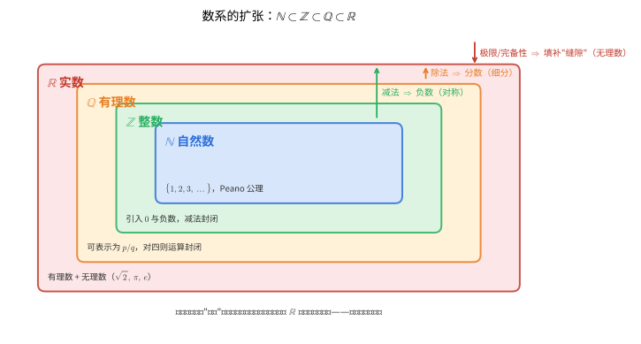
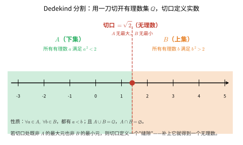
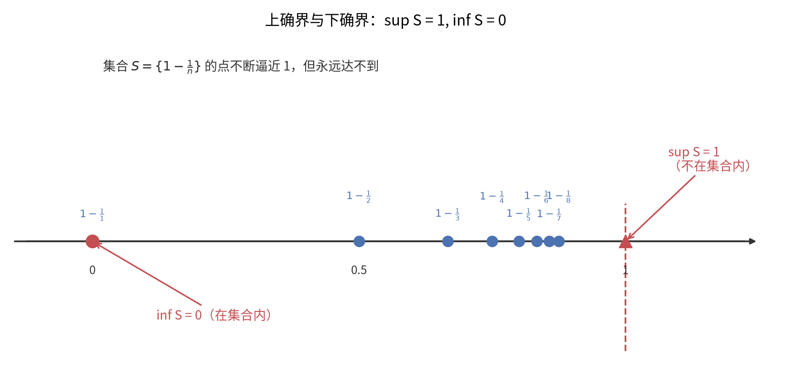
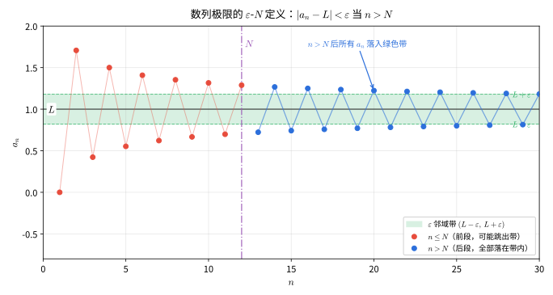
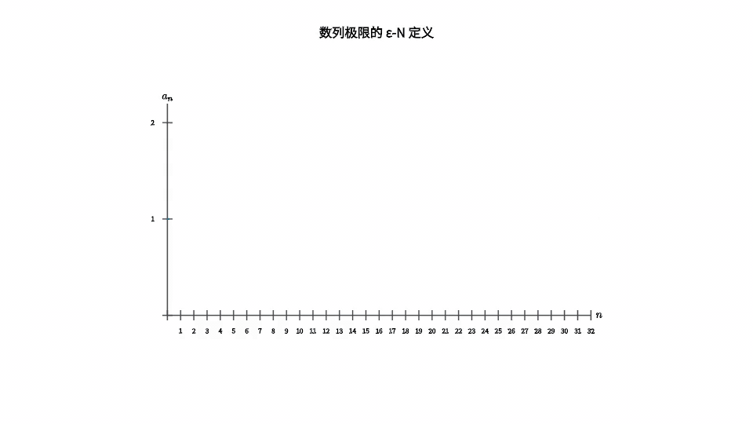
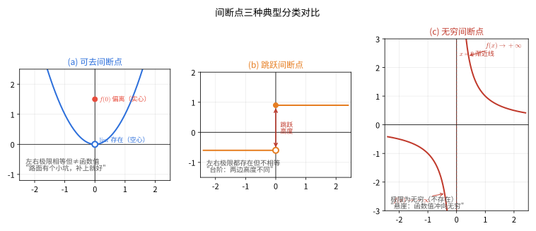
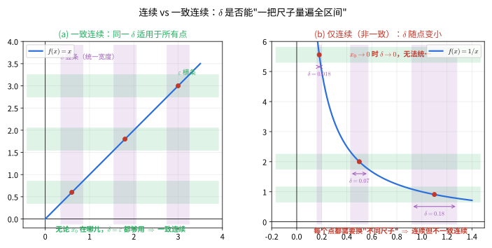

# 第 10 级：实数系与极限 (Real Number System and Limits)

> 微积分的逻辑基础建立在对实数系的深刻理解之上。本章将从数系的扩张开始，系统地建立极限理论，为后续的微积分学习打下坚实的基础。

---

## 1. 学习目标

完成本教程后，你应当能够：

1. 理解数系的扩张过程：$\mathbb{N} \subset \mathbb{Z} \subset \mathbb{Q} \subset \mathbb{R}$
2. 掌握实数的完备性公理（确界原理）和 Archimedes 性质
3. 熟练运用 $\varepsilon$-$N$ 语言定义数列极限并证明极限
4. 理解并证明极限的基本性质：唯一性、有界性、四则运算法则
5. 掌握夹逼定理和单调有界定理及其应用
6. 理解柯西收敛准则（Cauchy Criterion）及其意义
7. 熟悉 $\varepsilon$-$\delta$ 语言定义函数极限
8. 掌握无穷小与无穷大的概念及其阶的比较
9. 能够运用极限理论解决实际问题

---

## 开始之前

**本章在讲什么**：本章把"实数"和"极限"这两块看似平常的东西拉到放大镜下，做一次严格的"体检"。前半部分从自然数一路扩张到实数，讲清楚实数凭什么比有理数"更严实"；后半部分用一整套既形象又极难真正弄懂的精确语言，给"趋近"二字下了一个滴水不漏的定义。

**为什么要学它**：前面各章（尤其是第 9 级的集合论）处理相信直觉的"数"，但 $\sqrt{2}$ 不是有理数这件事暴露出有理数集有"缺口"，光凭直觉不够严谨。本节把"数轴上的点"与"数列/函数无限趋近"彻底讲严实，确立公理与极限两大基石；它们正是第 11 级单变量微积分、第 12 级多变量微积分以及第 13 级级数理论里那台"发动机"——导数、积分、级数都靠极限来定义。

**开始前请确认你还记得**：
- 集合与元素（见第 9 级集合论）：集合由元素构成，用 $\in$ 表示"属于"，并靠 $\sup/\inf$ 与完备性打交道。
- 数列（见第 7 级数列与数学归纳法）：按顺序排列的一列数，用 $\{a_n\}$ 表示，下标从自然数取起。
- 有理数与无理数（见第 2 级初等代数）：能写成两个整数之比的数是"有理数"，写不成的如 $\sqrt{2}$ 是"无理数"。
- 数学归纳法（见第 7 级）：要证"对所有自然数成立"，先证起步再证递推，本章多次使用。
- 绝对值与数轴距离（见第 1 级算术基础）：$|a|$ 是 $a$ 到原点 0 的距离，$|a-b|$ 是 $a$ 到 $b$ 的距离，正是极限定义里"差距"的度量。

---

## 2. 实数系

### 2.1 数系的扩张

数学分析的研究对象是实数。我们从自然数开始，逐步扩张数系：

| 数系 | 符号 | 定义 | 举例 |
|:---:|:---:|------|------|
| 自然数 | $\mathbb{N}$ | $\{1, 2, 3, \dots\}$ | $1, 2, 100$ |
| 整数 | $\mathbb{Z}$ | $\{\dots, -2, -1, 0, 1, 2, \dots\}$ | $-3, 0, 42$ |
| 有理数 | $\mathbb{Q}$ | $\{\frac{p}{q} \mid p \in \mathbb{Z}, q \in \mathbb{Z}\setminus\{0\}\}$ | $\frac{1}{2}, -\frac{3}{4}, 0.333\ldots$ |
| 实数 | $\mathbb{R}$ | 有理数与无理数的全体 | $\sqrt{2}, \pi, e$ |
| 复数 | $\mathbb{C}$ | $\{a+bi \mid a,b \in \mathbb{R}\}$ | $1+i, 2-3i$ |

它们之间的包含关系是：

| 符号 | 名称 | 含义 | 直观解释 |
|:---:|:---:|:---|:---|
| $\mathbb{N}$ | 自然数集 | 全体正整数 | "用来数数的数" |
| $\mathbb{Z}$ | 整数集 | 自然数、0 与负整数 | "正整数负零都有" |
| $\mathbb{Q}$ | 有理数集 | 能写成两整数之比的数 | "能写成分数的数" |
| $\mathbb{R}$ | 实数集 | 有理数与无理数的全体 | "数轴上全部的点" |
| $\subset$ | 真包含 | 左边是右边真正的子集 | "全都在右边里面" |

$$
\mathbb{N} \subset \mathbb{Z} \subset \mathbb{Q} \subset \mathbb{R} \subset \mathbb{C}
$$

> **直观理解（现实类比）**：数系扩张就像**建房子逐层加盖**——自然数 $\mathbb{N}$ 是地基，加盖一层得到整数 $\mathbb{Z}$（引入负数，让减法封闭，"对称"了），再加盖得到有理数 $\mathbb{Q}$（引入分数，让除法封闭，"细分"了），最后加盖得到实数 $\mathbb{R}$（引入无理数，让极限运算封闭，把缝隙"填满"）。
>
> 每一次扩张都是为了**补全上一步运算留下的缺口**：在 $\mathbb{N}$ 里 $1-2$ 没结果，扩到 $\mathbb{Z}$ 就有了；在 $\mathbb{Z}$ 里 $1\div 2$ 没结果，扩到 $\mathbb{Q}$ 就有了；在 $\mathbb{Q}$ 里 $\sqrt{2}$ 和 $\lim(1+1/n)^n$ 都"没着落"，扩到 $\mathbb{R}$ 才真正安家。**$\mathbb{R}$ 区别于 $\mathbb{Q}$ 的根本，就是这最后一步"填满缝隙"——即完备性**。

### 2.2 自然数 $\mathbb{N}$ 与整数 $\mathbb{Z}$

**自然数** $\mathbb{N}$ 是最基本的数系，满足 Peano 公理：
- 存在一个自然数 $1$（或 $0$，视定义而定）
- 每个自然数都有唯一的后继
- 数学归纳法原理成立

**整数** $\mathbb{Z}$ 在自然数的基础上引入了 $0$ 和负数的概念，使得减法运算封闭。也就是说，任意两个整数的差仍然是整数。

### 2.3 有理数 $\mathbb{Q}$

有理数是形如 $\frac{p}{q}$（$p, q \in \mathbb{Z}$，$q \neq 0$）的数的全体。有理数对加、减、乘、除（除数不为零）四种运算封闭，构成了一个**数域**。

有理数的一个重要特征是：**有理数可以表示为有限小数或无限循环小数**。

然而，有理数对极限运算不封闭。例如，考虑数列：

$$
a_1 = 1,\quad a_2 = 1.4,\quad a_3 = 1.41,\quad a_4 = 1.414,\quad a_5 = 1.4142,\quad \dots
$$

这个数列的每一项都是有理数，但它趋近于 $\sqrt{2}$，而 $\sqrt{2}$ 不是有理数。这说明有理数存在"空隙"。

### 2.4 无理数的发现

古希腊的毕达哥拉斯学派认为"万物皆数"，即一切量都可以用有理数表示。但该学派的 Hippasus 发现，边长为 $1$ 的正方形的对角线长度 $\sqrt{2}$ 无法表示为两个整数的比。

**证明 $\sqrt{2}$ 是无理数**（反证法）：

假设 $\sqrt{2} = \frac{p}{q}$，其中 $p, q$ 是互质的正整数。则 $2 = \frac{p^2}{q^2}$，即 $p^2 = 2q^2$。因此 $p^2$ 是偶数，$p$ 也是偶数。设 $p = 2k$，代入得 $4k^2 = 2q^2$，即 $q^2 = 2k^2$，所以 $q$ 也是偶数。这与 $p, q$ 互质矛盾。因此 $\sqrt{2}$ 不是有理数。

> **🧠 思考历程：发现 $\sqrt2$ 的那个人，凭什么"死于海难"？**
>
> 今天"$\sqrt2$ 是无理数"只是一个习题，可它问世当年，是一场动摇世界观的**地震**。
>
> - **"万物皆数"的信仰**。毕达哥拉斯学派相信：天地万物都能化成整数的比（有理数）。音乐、几何、天文在他们看来都是"数的和谐"。**在他们心中，数 = 有理数，这是教条，不是猜测。**
> - **一条正方形的对角线，戳穿了信仰**。据传该派成员希帕索斯（Hippasus）发现：边长为 1 的正方形，其对角线 $\sqrt2$ 竟然**无法写成任何两个整数的比**。上方的"反证法"正是推倒这张多米诺骨牌：假设能写成分数，推出分子分母永远可以再约，矛盾。**一个"看得见的几何长度"，却说不成"数"，让"万物皆数"当场破产。**
> - **历史上：传说他"献身"了**。相传希帕索斯因"泄露"了无理数的秘密，被学派处以水刑（沉海），因为他动摇的不仅是数学，更是整个学派的教义根基。**这个传说是否属实已难考证，但它精准传达了：无理数的发现，最初不是被庆祝，而是被恐惧。**
> - **但它终究堵不住**。几何里到处都是"不能约成整数比"的长度，逃避无用。希腊人从此把几何与算术分开对待，直到 19 世纪（见 2.5 节）才从逻辑上彻底"招安"无理数。**希帕索斯的火种虽然被扑灭，却照亮了更加广阔的实数世界。**
> - **心路**：$\sqrt2$ 的故事告诉你：**数学的重大发现，常常不是多了一个数，而是逼你重新定义"什么是数"**。一个"反证法"的小小推演，曾是整整一个学派的世界观寓言。

### 2.5 实数 $\mathbb{R}$

**定义**：实数是有理数和无理数的全体。实数与数轴上的点一一对应。

实数有两种等价的构造方式：

1. **Dedekind 分割**：实数是有理数集的一个分割（Dedekind cut）
2. **Cauchy 序列**：实数是所有有理数 Cauchy 序列的等价类

> **直观理解（现实类比）**：Dedekind 分割就像**用一刀把实数轴切成两段**——左段 $A$ 里的每个数都小于右段 $B$ 里的每个数，而**切口本身**就是新定义的数。
>
> 关键在于：如果切口恰好落在某个有理数上（比如 $A=\{x\mid x<2\}$，$B=\{x\mid x\ge 2\}$），那它没"创造"新东西；但如果切口处 $A$ 无最大元、$B$ 无最小元——比如 $A=\{q\in\mathbb{Q}\mid q^2<2\}$、$B=\{q\in\mathbb{Q}\mid q^2>2\}$——这就暴露出有理数的一个**"缝隙"**，而补上这个缝隙的，正是无理数 $\sqrt{2}$。**有理数的所有缝隙都被无理数填满，这就得到了"无缝"的实数轴**。

> **🧠 思考历程：戴德金的一刀，怎么凭空"造"出了无理数？**
>
> $\sqrt2$ 从毕达哥拉斯时代起就"在场"，可两千多年里，它更像"见不得光的长度"。德国数学家**戴德金**（Richard Dedekind，1858 年起构思）想：既然说不清 $\sqrt2$ 用有理数怎么表示，那我干脆用**有理数之间怎么切、切在哪**来定义它。
>
> - **问题的残酷：诉诸"几何直觉"不够**。欧几里得能画出 $\sqrt2$ 的长度，却给不出"它到底等于多少"。戴德金看透了：**与其追问"$\sqrt2$ 是什么数"，不如问"怎么用有理数把实数完全封死"**。他给有理数集 $\mathbb{Q}$ 一刀——左段 $A$ 每个数小于右段 $B$：
>   - 若 $A$ 有最大元或 $B$ 有最小元，这个切口就是某个"已有的"有理数；
>   - 若两者都没有，比如 $A=\{q\mid q^2<2\}$、$B=\{q\mid q^2>2\}$，这个"切口"处就藏着一个"新的"数——无理数 $\sqrt2$。
> - **从"被逼出来"到"被定义出来"**。古希腊人只能叹气"$\sqrt2$ 不是有理数，但那是什么？"；戴德金一句话就兜住了底：**"无理数，就是有理数割出一道没有端点的坎。"** 于是实数不再依赖任何含糊的几何或无限小数，而能从有理数**纯逻辑地构造**出来。
> - **它不是唯一办法**。几乎同时，康托尔用"有理数柯西列的等价类"也在严谨地构造实数。**两种构造殊途同归，反而互相印证：实数轴真的是"无缝"的。** 这也引出了下节足见威力的"确界原理"。
> - **心路**：戴德金的故事提醒你：**数学上"定义一个对象"，很多时候靠的不是"找到它"，而是"用别的确凿对象把它框定"**。与其纠结"$\sqrt2$ 到底可不可感知"，不如想想"怎样的切口能把它锁定"。这是从"直觉数学"走向"结构数学"的经典一课。

### 2.6 实数的完备性（Completeness）

这是实数区别于有理数的最根本性质。

**确界原理**（Supremum Principle, 完备性公理）：

> 非空有上界的实数集必有上确界（最小上界）。

等价地：
> 非空有下界的实数集必有下确界（最大下界）。

确立界之前，先认熟符号：

| 符号 | 名称 | 含义 | 直观解释 |
|:---:|:---:|:---|:---|
| $S \subset \mathbb{R}$ | 子集 | $S$ 的元素都在 $\mathbb{R}$ 里 | "$S$ 是实数的一部分" |
| $\sup S$ | 上确界 | 最小的上界 | "天花板，最低的那个" |
| $\inf S$ | 下确界 | 最大的下界 | "地板，最高的那块" |
| $\forall$ | 对任意 | 对所有元素都成立 | "每一个都满足" |
| $\exists$ | 存在 | 至少有一个元素 | "能找到一个" |
| $\varepsilon$ | 任意小误差 | 想多小就多小的正数 | "误差条，随意缩放" |

**定义**（上确界）：设 $S \subset \mathbb{R}$ 非空，$\alpha \in \mathbb{R}$ 称为 $S$ 的**上确界**（记作 $\sup S$），如果：
1. $\forall x \in S,\; x \le \alpha$（$\alpha$ 是上界）
2. $\forall \varepsilon > 0,\; \exists x \in S,\; x > \alpha - \varepsilon$（$\alpha$ 是最小的上界）

**定义**（下确界）：设 $S \subset \mathbb{R}$ 非空，$\beta \in \mathbb{R}$ 称为 $S$ 的**下确界**（记作 $\inf S$），如果：
1. $\forall x \in S,\; x \ge \beta$（$\beta$ 是下界）
2. $\forall \varepsilon > 0,\; \exists x \in S,\; x < \beta + \varepsilon$（$\beta$ 是最大的下界）

**例**：设 $S = \{1 - \frac{1}{n} \mid n \in \mathbb{N}\}$，则 $\sup S = 1$，$\inf S = 0$。

> **直观理解（现实类比）**：上确界就像**"天花板"**——它是所有上界中最小的那个；下确界则像**"地板"**，是所有下界中最大的那个。它们与"最大值/最小值"的关键区别在于：**确界不一定在集合里**。
>
> 看上面的例子：$S=\{1-\tfrac{1}{n}\}$ 的所有点都严格小于 1，所以 1 不是 $S$ 的最大值；但 1 是"能达到的极限高度"，任何比 1 小的数都挡不住点无限逼近它——这就是"最小上界"的含义。**确界原理说的是：只要集合有界，这个"天花板/地板"就一定存在**（实数才有的性质，有理数不一定有）。

### 2.7 Archimedes 性质

**Archimedes 性质**：对任意正实数 $a, b$，总存在自然数 $n$，使得 $na > b$。

等价地：
- 对任意 $\varepsilon > 0$，存在自然数 $n$，使得 $\frac{1}{n} < \varepsilon$
- 对任意实数 $M$，存在自然数 $n$，使得 $n > M$

**证明**（由确界原理导出）：

假设结论不成立，即存在 $a > 0, b > 0$，对任意 $n \in \mathbb{N}$ 都有 $na \le b$。则集合 $A = \{na \mid n \in \mathbb{N}\}$ 有上界 $b$。由确界原理，$A$ 有上确界 $\alpha = \sup A$。

由于 $\alpha - a < \alpha$（$a > 0$），$\alpha - a$ 不是 $A$ 的上界，因此存在 $m \in \mathbb{N}$ 使得 $ma > \alpha - a$，即 $(m+1)a > \alpha$。但 $(m+1)a \in A$，这与 $\alpha$ 是上界矛盾。故假设不成立。

### 2.8 实数完备性的等价定理

> 除确界原理外，实数完备性还有多个等价刻画。它们与确界原理相互推导，是数学分析中证明极限、连续、一致连续等性质的理论基石。总计**六大定理**。

**区间套定理（Cantor 定理）**：

> 设 $\{[a_n, b_n]\}$ 是一列闭区间，满足 $a_n \le a_{n+1} < b_{n+1} \le b_n$（后一个套在前一个里面），且 $b_n - a_n \to 0$（$n \to \infty$），则存在**唯一**的点 $\xi$ 属于所有区间，即 $\xi \in \bigcap_{n=1}^{\infty}[a_n, b_n]$，且 $\lim a_n = \lim b_n = \xi$。

**聚点定理（Bolzano–Weierstrass 定理）**：

> 有界无限点集必有聚点。等价地：**有界数列必有收敛子列**。

（聚点：点 $p$ 的任一邻域内都含有集合中异于 $p$ 的点。）

**有限覆盖定理（Heine–Borel 定理）**：

> 设 $\mathcal{O}$ 是闭区间 $[a, b]$ 的一个开覆盖（即区间上每一点都属于某个开区间 $O \in \mathcal{O}$），则从 $\mathcal{O}$ 中必能选出**有限**个开区间，仍覆盖 $[a, b]$。

**六大完备性定理及其等价性**：

| 定理 | 名称 |
|:-----|:-----|
| 确界原理 | 非空有上界集合必有上确界 |
| 单调有界定理 | 单调有界数列必收敛 |
| 区间套定理 | 闭区间套有唯一公共点 |
| 柯西收敛准则 | 数列收敛 $\iff$ 是柯西列 |
| 聚点定理 | 有界数列必有收敛子列 |
| 有限覆盖定理 | 闭区间开覆盖有有限子覆盖 |

> **等价性脉络**：它们以确界原理为公理，彼此可互相推出，刻画的是同一条完备性。常用推导链例如
$$
\text{确界原理} \Rightarrow \text{单调有界} \Rightarrow \text{区间套} \Rightarrow \text{柯西准则} \Rightarrow \text{聚点定理} \Rightarrow \text{有限覆盖}
$$
> 反向也可逐条推回，故合称"实数的完备性定理"。

---

## 3. 数列极限

### 3.1 数列的概念

**定义**：数列是以自然数集为定义域的函数 $a: \mathbb{N} \to \mathbb{R}$，记作 $\{a_n\}_{n=1}^{\infty}$ 或简写为 $\{a_n\}$。

数列的项按顺序排列：$a_1, a_2, a_3, \dots, a_n, \dots$

### 3.2 极限的 $\varepsilon$-$N$ 定义

先认熟这套新记号（$\varepsilon$ 已在上节介绍过，不再重复）：

| 符号 | 名称 | 含义 | 直观解释 |
|:---:|:---:|:---|:---|
| $\{a_n\}$ | 数列 | 依顺序排列的一列数 | "按编号排队的数" |
| $A$ | 候补极限 | 一个待定的常数 | "它们想逼近的值" |
| $N$ | 门槛下标 | 从某项往后都满足条件 | "过了这条线就算" |
| $\|a_n - A\|$ | 绝对差 | $a_n$ 到 $A$ 的距离 | "差多远，量距离" |
| $\lim_{n \to \infty} a_n$ | 数列极限 | 数列最终的归宿 | "数列奔向的地方" |
| $n \to \infty$ | 下标趋无穷 | $n$ 变得无限大 | "n 一路往大走" |

**定义**：设 $\{a_n\}$ 是一个数列，$A$ 是一个常数。如果对任意给定的 $\varepsilon > 0$，总存在正整数 $N$，使得当 $n > N$ 时，有

$$
|a_n - A| < \varepsilon
$$

则称数列 $\{a_n\}$ **收敛**于 $A$，$A$ 称为数列的极限，记作

$$
\lim_{n \to \infty} a_n = A
$$

或 $a_n \to A$（$n \to \infty$）。如果不存在这样的 $A$，则称数列**发散**。

**直观理解**：无论我们要求 $a_n$ 与 $A$ 多近（$\varepsilon$ 任意小），总存在一个时刻 $N$ 之后，所有项都在这个范围内。

> **直观理解（现实类比）**：数列极限就像**射击靶心**——靶心是极限 $L$，$\varepsilon$ 是你划定的"命中环"（靶心周围 $\varepsilon$ 宽的带）。$\varepsilon$-$N$ 定义说的是：**无论这个环划得多小（$\varepsilon$ 任意小），总存在某个时刻 $N$，之后所有子弹 $a_n$ 都落在环内**。
>
> 看上图：绿色横带就是"$\varepsilon$ 命中环"，紫色竖线 $N$ 是"分界时刻"。$N$ 之前（红点）数列可能还乱跳、甚至跳出带外；但 **$N$ 之后（蓝点）所有点无一例外地落在绿色带内**。$\varepsilon$ 越小，带越窄，所需的 $N$ 通常越大——但**只要你能给出任意 $\varepsilon$，我就能找到对应的 $N$**，这就叫"收敛于 $L$"。

> **🧠 思考历程：$\varepsilon$ 和 $N$，凭什么是"极限"的灭火器？**
>
> 牛顿和莱布尼茨发明微积分时，"极限"还在靠直觉打转：什么"无限接近""终极速度"——同时代的数学家听得火大：**这到底是不是数学？** 极限的严谨化，是一场让无数人抓狂近两个世纪的"灭火"。
>
> - **"幽灵般的无穷小"**。起初大家说"当 $x$ 无限靠近某点时，$y$ 就无限靠近某值"，可"无限靠近"根本不是能用于证明的清晰语言。主教贝克莱嘲讽无穷小是"已死量的幽灵"，戳得整个微积分根基发痒。
> - **韦尔斯特拉斯：把"接近"翻译成"不等式"**。到了 19 世纪下半叶，德国数学家**韦尔斯特拉斯**（Karl Weierstrass）等人才给出决定性的一招：**"极限"根本不必谈"无穷"，只需谈"任意给定的小误差 $\varepsilon$ 和随之而来的门槛 $N$"。** 你说多近（$\varepsilon$），我就给定一个下标 $N$，保证之后全都近于 $\varepsilon$。
> - **绝妙之处：用"有限"取代"无限"**。定义里从没出现"无穷大"，只有一个又一个有限的 $\varepsilon$ 与 $N$。**"$n\to\infty$ 时 $a_n\to A$"被这样改写：对每个正数 $\varepsilon$，都能找到正整数 $N$ 使所有 $n>N$ 都满足 $|a_n-A|< \varepsilon$。** 每一步都只在处理有限对象，却精确捕捉了"无限趋近"的全部含义。
> - **柯西、波尔扎诺的铺垫**。韦尔斯特拉斯并非凭空出世：柯西（Cauchy）已用"差值小于任意正数"描述收敛，波尔扎诺等也在试探。**韦尔斯特拉斯把它们打磨成现在这套 $\varepsilon$-$N$ 语言，连同 $\varepsilon$-$\delta$（见 5.1 节），从此微积分有了铁打的地基。**
> - **心路**：$\varepsilon$-$N$ 定义教你：**越是"直观到说不清"的极端（无穷、极限），越要用"能逐步检验的有限条件"来接管**。遇到"趋于无穷"就紧张时，把它拆成"给我 $\varepsilon$，我给你 $N$"，你便握住了让微积分站起来的钥匙。

#### 🎬 动画演示：数列趋于极限

> 这个动画直观展示了数列 $a_n$ 随着 $n$ 增大而趋于极限 $L$，且 $|a_n - L|$ 可以做到任意小。它通过动画的方式帮助理解本节核心概念。

### 3.3 收敛数列的例子

**例 1**：$\lim_{n \to \infty} \frac{1}{n} = 0$

**证明**：对任意 $\varepsilon > 0$，由 Archimedes 性质，存在 $N \in \mathbb{N}$，使得 $N > \frac{1}{\varepsilon}$。当 $n > N$ 时，

$$
\left|\frac{1}{n} - 0\right| = \frac{1}{n} < \frac{1}{N} < \varepsilon
$$

- 第 1 个等号：$n>0$ 所以 $\frac1n$ 是正数，绝对值等于它本身，依据是绝对值的定义；目的：把 $|\frac1n - 0|$ 化简成 $\frac1n$ 好继续放缩。
- 第 1 个小于号：$n>N$ 时分母更大、分数更小（$\frac1n<\frac1N$），依据是正分数反比关系；目的：把"任意的 $n$"拉回到"已经取定的 $N$"上。
- 第 2 个小于号：由 $N>\frac1\varepsilon$ 两边取倒数得 $\frac1N<\varepsilon$，依据是正数取倒数不改变严格方向；目的：凑出定义要求的 $|\frac1n-0|<\varepsilon$。

因此 $\lim_{n \to \infty} \frac{1}{n} = 0$。

**例 2**：$\lim_{n \to \infty} \frac{n}{n+1} = 1$

**证明**：对任意 $\varepsilon > 0$，需要 $\left|\frac{n}{n+1} - 1\right| = \frac{1}{n+1} < \varepsilon$。

取 $N = \lceil \frac{1}{\varepsilon} \rceil$，当 $n > N$ 时，$\frac{1}{n+1} < \frac{1}{n} \le \frac{1}{N} < \varepsilon$。$\square$

### 3.4 发散数列的例子

**例 3**：$\{(-1)^n\}$ 发散

**证明**（反证法）：假设 $\lim_{n \to \infty} (-1)^n = A$。取 $\varepsilon = \frac{1}{2}$，则存在 $N$，当 $n > N$ 时 $|(-1)^n - A| < \frac{1}{2}$。

取两个足够大的奇数 $m$ 和偶数 $k$，则 $|(-1)^m - A| = | -1 - A| < \frac{1}{2}$，$|(-1)^k - A| = |1 - A| < \frac{1}{2}$。

由三角不等式：

$$
2 = |1 - (-1)| \le |1 - A| + |A - (-1)| < \frac{1}{2} + \frac{1}{2} = 1
$$

矛盾。故数列发散。$\square$

---

## 4. 定理与证明

### 4.1 极限的唯一性

**定理**：收敛数列的极限是唯一的。

**证明**（反证法）：

假设 $\lim_{n \to \infty} a_n = A$ 且 $\lim_{n \to \infty} a_n = B$，且 $A \neq B$。

取 $\varepsilon = \frac{|A - B|}{2} > 0$。

由极限定义：
- 存在 $N_1$，当 $n > N_1$ 时，$|a_n - A| < \varepsilon$
- 存在 $N_2$，当 $n > N_2$ 时，$|a_n - B| < \varepsilon$

取 $N = \max\{N_1, N_2\}$，当 $n > N$ 时，由三角不等式：

$$
|A - B| \le |A - a_n| + |a_n - B| < \varepsilon + \varepsilon = 2\varepsilon = |A - B|
$$

- 第 1 个不等号：把 $|A - B|$ 拆成"中转经过某个 $a_n$"的两段距离，依据是三角不等式（绕路不会比直路更短）；目的：好把两个极限定义分别放进去。
- 第 2 个不等号：由定义，$n>N$ 时上式中的 $|A-a_n|<\varepsilon$ 且 $|a_n-B|<\varepsilon$，两段都严格小于 $\varepsilon$；目的：把理想中的 $A$、$B$ 放缩到真实的误差 $\varepsilon$。
- 两个等号：$\varepsilon+\varepsilon=2\varepsilon$，再把 $2\varepsilon$ 代回 $\varepsilon=\frac{|A-B|}{2}$ 得 $2\varepsilon=|A-B|$；目的：制造" $|A-B|<|A-B|$ "这个不可能的矛盾。

得到 $|A - B| < |A - B|$，矛盾。故 $A = B$。$\square$

### 4.2 收敛数列的有界性

**定理**：如果数列 $\{a_n\}$ 收敛，则 $\{a_n\}$ 有界。即存在 $M > 0$，使得对一切 $n$，$|a_n| \le M$。

**证明**：

设 $\lim_{n \to \infty} a_n = A$。取 $\varepsilon = 1$，则存在 $N$，当 $n > N$ 时，$|a_n - A| < 1$。

由三角不等式，当 $n > N$ 时：

$$
|a_n| = |a_n - A + A| \le |a_n - A| + |A| < 1 + |A|
$$

令 $M = \max\{|a_1|, |a_2|, \dots, |a_N|, 1 + |A|\}$，则对一切 $n$，$|a_n| \le M$。$\square$

**注**：该定理的逆命题不成立。有界数列不一定收敛，如 $\{(-1)^n\}$ 有界但不收敛。

### 4.3 极限的四则运算法则

**定理**：设 $\lim_{n \to \infty} a_n = A$，$\lim_{n \to \infty} b_n = B$，则：

1. **加法**：$\lim_{n \to \infty} (a_n + b_n) = A + B$
2. **减法**：$\lim_{n \to \infty} (a_n - b_n) = A - B$
3. **乘法**：$\lim_{n \to \infty} (a_n \cdot b_n) = A \cdot B$
4. **除法**：若 $B \neq 0$，则 $\lim_{n \to \infty} \frac{a_n}{b_n} = \frac{A}{B}$

**证明**：

**(1) 加法**：对任意 $\varepsilon > 0$，存在 $N_1, N_2$ 使得：
- 当 $n > N_1$ 时，$|a_n - A| < \frac{\varepsilon}{2}$
- 当 $n > N_2$ 时，$|b_n - B| < \frac{\varepsilon}{2}$

取 $N = \max\{N_1, N_2\}$，当 $n > N$ 时：

$$
|(a_n + b_n) - (A + B)| \le |a_n - A| + |b_n - B| < \frac{\varepsilon}{2} + \frac{\varepsilon}{2} = \varepsilon
$$

**(3) 乘法**：先证明 $\{b_n\}$ 有界，即存在 $M > 0$，$|b_n| \le M$ 对一切 $n$ 成立。

对任意 $\varepsilon > 0$：
- 存在 $N_1$，当 $n > N_1$ 时，$|a_n - A| < \frac{\varepsilon}{2M}$
- 存在 $N_2$，当 $n > N_2$ 时，$|b_n - B| < \frac{\varepsilon}{2(|A| + 1)}$

取 $N = \max\{N_1, N_2\}$，当 $n > N$ 时：

$$
\begin{aligned}
|a_n b_n - AB| &= |a_n b_n - a_n B + a_n B - AB| \\
&\le |a_n|\cdot|b_n - B| + |B|\cdot|a_n - A| \\
&\le (|A| + 1)\cdot\frac{\varepsilon}{2(|A| + 1)} + M\cdot\frac{\varepsilon}{2M} = \varepsilon
\end{aligned}
$$

**(4) 除法**：只需证明 $\lim_{n \to \infty} \frac{1}{b_n} = \frac{1}{B}$，然后与乘法结合。

由于 $B \neq 0$，取 $\varepsilon = \frac{|B|}{2}$，存在 $N_1$，当 $n > N_1$ 时，$|b_n - B| < \frac{|B|}{2}$，从而 $|b_n| > \frac{|B|}{2}$。

对任意 $\varepsilon > 0$，存在 $N_2$，当 $n > N_2$ 时，$|b_n - B| < \frac{B^2}{2}\varepsilon$。

取 $N = \max\{N_1, N_2\}$，当 $n > N$ 时：

$$
\left|\frac{1}{b_n} - \frac{1}{B}\right| = \frac{|b_n - B|}{|b_n|\cdot|B|} < \frac{|b_n - B|}{\frac{|B|}{2} \cdot |B|} = \frac{2|b_n - B|}{B^2} < \varepsilon
$$

$\square$

### 4.4 夹逼定理（Squeeze Theorem）

**定理**：设三个数列 $\{a_n\}$、$\{b_n\}$、$\{c_n\}$ 满足：
1. 存在 $N_0$，当 $n > N_0$ 时，$a_n \le b_n \le c_n$
2. $\lim_{n \to \infty} a_n = \lim_{n \to \infty} c_n = L$

则 $\lim_{n \to \infty} b_n = L$。

**证明**：

对任意 $\varepsilon > 0$：
- 存在 $N_1$，当 $n > N_1$ 时，$|a_n - L| < \varepsilon$，即 $L - \varepsilon < a_n < L + \varepsilon$
- 存在 $N_2$，当 $n > N_2$ 时，$|c_n - L| < \varepsilon$，即 $L - \varepsilon < c_n < L + \varepsilon$

取 $N = \max\{N_0, N_1, N_2\}$，当 $n > N$ 时：

$$
L - \varepsilon < a_n \le b_n \le c_n < L + \varepsilon
$$

即 $|b_n - L| < \varepsilon$。$\square$

**例 4**：求 $\lim_{n \to \infty} \frac{\sin n}{n}$。

**解**：由于 $-1 \le \sin n \le 1$，有 $-\frac{1}{n} \le \frac{\sin n}{n} \le \frac{1}{n}$。

而 $\lim_{n \to \infty} \left(-\frac{1}{n}\right) = \lim_{n \to \infty} \frac{1}{n} = 0$。

由夹逼定理，$\lim_{n \to \infty} \frac{\sin n}{n} = 0$。

> **直观理解（现实类比）**：夹逼定理就是**"两面夹击"**——当一个量被夹在两个"同向逼近同一目标"的量之间时，它**无处可逃**，只能也跟着逼近那个目标。
>
> 看上图：$\frac{\sin n}{n}$ 被 $-\frac{1}{n}$ 和 $\frac{1}{n}$ 上下夹住，而这两个夹子都趋于 0，所以 $\frac{\sin n}{n}$ 必然也趋于 0。**它不需要自己"表现好"，只要夹子决定性地逼近 0，它就被迫跟着走**。这就是处理"有界项 × 无穷小"这类问题的通用利器。

### 4.5 单调有界定理（Monotone Convergence Theorem）

**定理**：单调有界数列必收敛。

具体地：
- 若 $\{a_n\}$ 单调递增且有上界，则 $\{a_n\}$ 收敛，且 $\lim_{n \to \infty} a_n = \sup\{a_n\}$
- 若 $\{a_n\}$ 单调递减且有下界，则 $\{a_n\}$ 收敛，且 $\lim_{n \to \infty} a_n = \inf\{a_n\}$

> **直观理解（现实类比）**：单调有界定理就像**"只进不退、又有天花板的爬楼"**——数列只要满足两个条件：**方向一致**（单调递增，只升不降）和**有限度**（始终不超过某个上界），那它既停不下来、也逃不出去，最终**必然停靠在天花板内侧附近的一个高度**上，这个高度正是它的极限（也是上确界 $\sup$）。它和夹逼定理分工不同：夹逼靠**左右两条边界**把极限"夹"出来；而单调有界只凭**"方向 + 天花板"**两样信息就把极限逼出来，而且**完全不用事先猜到极限等于多少**——这正是它比 $\varepsilon$-$N$ 定义更"省心"、也常在证明极限存在时第一个被想起的原因。

**证明**（仅证递增有上界的情况）：

设 $\{a_n\}$ 单调递增且有上界。令 $S = \{a_n \mid n \in \mathbb{N}\}$，则 $S$ 非空有上界。由确界原理，$S$ 有上确界 $\alpha = \sup S$。

- 【第 1 步】依据：确界原理保证非空有上界的集合必有上确界；目的：把"不知道极限是多少"的问题，转成"确界 $\alpha$ 一定存在"，先定下一个候选目标。

下面证明 $\lim_{n \to \infty} a_n = \alpha$。

对任意 $\varepsilon > 0$，由 $\alpha - \varepsilon < \alpha$ 及上确界的定义，存在 $N$，使得 $a_N > \alpha - \varepsilon$。

- 【第 2 步】依据：$\alpha$ 是最小的上界，比它小一点的 $\alpha-\varepsilon$ 就不可能是上界，故某下标 $N$ 处 $a_N>\alpha-\varepsilon$；目的：在数列里"揪出"第一只跨过 $\alpha-\varepsilon$ 的脚。

由于 $\{a_n\}$ 单调递增，当 $n > N$ 时，$a_n \ge a_N > \alpha - \varepsilon$。

- 【第 3 步】依据：数列单调递增，前面跨过门槛的 $a_N$ 之后每一项只会更大；目的：把"存在一项靠近 $\alpha$"升级成"之后所有项都靠近 $\alpha$"。

又因为 $\alpha$ 是上界，$a_n \le \alpha$，所以 $|a_n - \alpha| = \alpha - a_n < \varepsilon$。

- 【第 4 步】依据：$\alpha$ 是上界故 $a_n \le \alpha$，结合第 3 步的 $a_n>\alpha-\varepsilon$，两端一夹得出 $\alpha-\varepsilon<a_n\le\alpha$；目的：正是 $\varepsilon$-$N$ 定义要的"从某 $N$ 起 $|a_n-\alpha|<\varepsilon$"。

故 $\lim_{n \to \infty} a_n = \alpha$。$\square$

**例 5**：证明数列 $a_n = \left(1 + \frac{1}{n}\right)^n$ 收敛。

**证明思路**：可以证明 $\{a_n\}$ 单调递增且有上界（上界为 $3$），因此由单调有界定理，数列收敛。其极限定义为 $e$。

### 4.6 柯西收敛准则（Cauchy Criterion）

**定义**（Cauchy 序列）：数列 $\{a_n\}$ 称为 Cauchy 序列，如果对任意 $\varepsilon > 0$，存在正整数 $N$，使得对任意 $m, n > N$，有

$$
|a_m - a_n| < \varepsilon
$$

**柯西收敛准则**：数列 $\{a_n\}$ 收敛当且仅当它是 Cauchy 序列。

**证明概要**：

**必要性**：若 $\lim_{n \to \infty} a_n = A$，则对任意 $\varepsilon > 0$，存在 $N$，当 $n > N$ 时 $|a_n - A| < \frac{\varepsilon}{2}$。当 $m, n > N$ 时，

$$
|a_m - a_n| \le |a_m - A| + |A - a_n| < \frac{\varepsilon}{2} + \frac{\varepsilon}{2} = \varepsilon
$$

**充分性**：若 $\{a_n\}$ 是 Cauchy 序列，则先证明 $\{a_n\}$ 有界，然后利用 Bolzano-Weierstrass 定理（有界数列必有收敛子列）和 Cauchy 条件推出原数列收敛到同一极限。

**意义**：柯西收敛准则给出了数列收敛的充要条件，且不需要预先知道极限值。这在理论上极为重要。

> **直观理解（现实类比）**：柯西收敛准则就像**"一群人在靶场不瞄靶也能判断是否聚拢"**——收敛本是"所有项都瞄向同一个靶心 $A$"，而 Cauchy 条件不必知道靶心在哪：它只要求**越往后，任意两人 $a_m$ 与 $a_n$ 之间的距离 $|a_m-a_n|$ 越来越小**。直观上，如果一群人彼此挨得越来越近、最终"抱成一团"，那他们必然是在向同一个（也许看不见的）目标靠拢。它道出了一个深刻的直觉：**"自洽地互相靠近"就等价于"收敛到某处"**。这正是它被当作极限存在判据的威力所在——无需先拿出一个"候选极限"来验证。

### 4.7 重要极限：$\lim_{n \to \infty} \left(1 + \frac{1}{n}\right)^n = e$

**证明思路**：

定义 $a_n = \left(1 + \frac{1}{n}\right)^n$，$b_n = \left(1 + \frac{1}{n}\right)^{n+1}$。

**Step 1**：证明 $\{a_n\}$ 单调递增。

利用二项式定理展开：

$$
\begin{aligned}
a_n &= \left(1 + \frac{1}{n}\right)^n \\
&= \sum_{k=0}^n \binom{n}{k} \frac{1}{n^k} \\
&= \sum_{k=0}^n \frac{1}{k!} \cdot \frac{n(n-1)\cdots(n-k+1)}{n^k} \\
&= \sum_{k=0}^n \frac{1}{k!} \left(1 - \frac{1}{n}\right)\left(1 - \frac{2}{n}\right)\cdots\left(1 - \frac{k-1}{n}\right)
\end{aligned}
$$

- 【第 1 步】依据：$a_n=(1+\frac1n)^n$ 恰是二项式 $\sum\binom{n}{k}(\frac1n)^k(1)^{n-k}$ 的展开；目的：把"幂"拆成一列可逐项比较的求和，方便看出 $n$ 变化时每项怎么变。
- 【第 2 步】依据：把组合数 $\binom{n}{k}=\frac{n!}{k!(n-k)!}=\frac{n(n-1)\cdots(n-k+1)}{k!}$ 代入，约去 $n^k$；目的：把"不直观的组合数"换成"能看出随 $n$ 增大的分式"。
- 【第 3 步】依据：将每个 $\frac{n-j}{n}=1-\frac{j}{n}$ 逐项写出；目的：显式摆出 $1-\frac{j}{n}$ 这类因子，为下一步比较 $a_n$ 与 $a_{n+1}$ 铺路。

类似地，

$$
a_{n+1} = \sum_{k=0}^{n+1} \frac{1}{k!} \left(1 - \frac{1}{n+1}\right)\left(1 - \frac{2}{n+1}\right)\cdots\left(1 - \frac{k-1}{n+1}\right)
$$

- 【第 4 步】依据：$n$ 换成 $n+1$ 后分母变大，每个 $1-\frac{j}{n+1}>1-\frac{j}{n}$，且求和上标从 $n$ 增到 $n+1$；目的：说明 $a_{n+1}$ 的每一项都比 $a_n$ 对应项大、还多一个正项，从而 $a_{n+1}>a_n$，即单调递增。

比较 $a_n$ 和 $a_{n+1}$ 的对应项，$a_{n+1}$ 的每一项都大于等于 $a_n$ 的对应项，且 $a_{n+1}$ 还多了一个正项。因此 $a_{n+1} > a_n$。

**Step 2**：证明 $\{a_n\}$ 有上界。

$$
\begin{aligned}
a_n &= \sum_{k=0}^n \frac{1}{k!} \left(1 - \frac{1}{n}\right)\cdots\left(1 - \frac{k-1}{n}\right) \\
&\le \sum_{k=0}^n \frac{1}{k!} \\
&< 1 + 1 + \frac{1}{2} + \frac{1}{2^2} + \cdots + \frac{1}{2^{n-1}} \\
&= 1 + \frac{1 - (1/2)^n}{1 - 1/2} = 3 - \frac{1}{2^{n-1}} < 3
\end{aligned}
$$

- 第 1 个不等号：把每个因子 $1-\frac{j}{n}$ 一律放宽成 $1$（它们都小于等于 1），依据是"正的量放成更大不破坏上界"；目的：甩掉随 $n$ 变的因子，只留下不含 $n$ 的 $\sum\frac1{k!}$。
- 第 2 个不等号：利用 $k! \ge 2^{k-1}$（对 $k\ge1$ 递推成立），把 $\frac1{k!}$ 放大成 $\frac1{2^{k-1}}$，依据是阶乘增长快于幂次；目的：把求和控制成"公比为 $\frac12$ 的等比数列"，因为等比和能用公式算出固定数。
- 第 1 个等号：等比数列求和公式 $\sum_{i=0}^{n-1}\frac{1}{2^i}=\frac{1-(1/2)^n}{1-1/2}$；目的：得到上界 $3-\frac{1}{2^{n-1}}$。
- 最后的 $<$：因 $\frac{1}{2^{n-1}}>0$，故 $3-\frac{1}{2^{n-1}}<3$；目的：给出一个与 $n$ 无关的统一上界 $3$，满足单调有界定理条件。

**Step 3**：由单调有界定理，$\{a_n\}$ 收敛，定义其极限为 $e$。

数值计算：$e \approx 2.718281828459045\ldots$

> **🧠 思考历程：一个"算不清无限小数的数"，凭什么是微积分的名片？**
>
> 出现在"$\left(1+\frac1n\right)^n$"里的这个 $e\approx2.718\ldots$，既不是几何测量来的，也不是解方程来的，而是"更新忘带利息时蹦出来的"。它比 $\pi$ 年轻太多，却和 $\pi$ 一样无处不在。
>
> - **它先从"银行复利"露出头**。若你直觉地以为"复利结算期切得越细，账户增长越快且没有上限"，那就错了——雅可比·伯努利（Jacob Bernoulli，17 世纪）研究"每期复利且每期再拆"时发现：$(1+\frac1n)^n$ 随 $n$ 增大**不是无限上涨，而是停在某个数附近**，那个数就是 $e$。**直觉以为"无限翻倍"，数学却说"收敛于 $e$"。**
> - **名字是欧拉给的**。正是因为 $e$ 显形于此，欧拉（Euler）用字母 $e$（一说 Euler 首字母，一说"指数 exponential"）来称呼它，并把它研究得深入骨髓。**他算出了 $\exp(x)=e^x$ 的级数展开，并捧出震撼的欧拉公式 $e^{i\theta}=\cos\theta+i\sin\theta$**——让复数、振动、旋转和自然增长在同一个公式里握手。
> - **为什么它"无处不在"？** 凡"增长量与当前量成正比"的过程——细菌繁殖、放射性衰变、连续复利、RC 电路的充放电——其解天然带着 $e^x$。**微积分里"求导得到自己"的函数只有一个，正是 $e^x$**：$(e^x)'=e^x$。这个"自己再生自己"的特殊个性，让 $e$ 成为微分方程与科学模型的通用通货。
> - **心路**：$e$ 的故事告诉你：**一个"看起来只是在纠结复利"的小极限，竟藏着"连续增长"的密码**。当你读到"单调有界→收敛→定义为 $e$"，别只觉得是套路——你正在为"万物自然增长"写下第一行可算的公式。

---

## 5. 函数极限

### 5.1 $\varepsilon$-$\delta$ 定义

把数列版的 $\varepsilon$-$N$ 换成函数版之前，先认识三个"新面孔"（$\varepsilon$ 已介绍过，不重复）：

| 符号 | 名称 | 含义 | 直观解释 |
|:---:|:---:|:---|:---|
| $f$ | 函数 | 一个"输入变输出"的机器 | "喂进 x，吐出 f(x)" |
| $x_0$ | 逼近点 | 想要 $x$ 靠近的目标位置 | "x 赶往的落脚点" |
| $\delta$ | 允许范围 | $x$ 离 $x_0$ 允许差多远 | "能晃动的半径" |
| $|x - x_0|$ | 距离 | $x$ 到 $x_0$ 的距离 | "相差多少" |

**定义**：设函数 $f$ 在点 $x_0$ 的某个去心邻域内有定义，$A$ 是一个常数。如果对任意 $\varepsilon > 0$，总存在 $\delta > 0$，使得当 $0 < |x - x_0| < \delta$ 时，有

$$
|f(x) - A| < \varepsilon
$$

则称 $f(x)$ 当 $x \to x_0$ 时以 $A$ 为极限，记作

$$
\lim_{x \to x_0} f(x) = A
$$

**直观理解**：当 $x$ 无限接近 $x_0$（但不等于 $x_0$）时，$f(x)$ 无限接近 $A$。

#### 🎬 动画演示：ε-δ 极限定义

> 动画动态展示了 ε-δ 极限定义的几何含义：对于函数 $f(x)$ 在 $x_0$ 处的极限，无论你把 ε 目标（黄色区域）定得多小，总能找到一个 δ 允许范围（绿色区域），使得 δ 范围内所有 $x$ 的函数值都落在 ε 目标内。当 ε 缩小时，δ 也随之缩小，直观展示了"任意 ε > 0，存在 δ > 0"的动态过程。

> **直观理解（现实类比）**：想象一个**射箭靶**。极限 $L$ 是靶心，$\varepsilon$ 是你立的"命中标准"（必须射进靶心周围 $\varepsilon$ 范围内）。$\varepsilon$-$N$（或 $\varepsilon$-$\delta$）定义说的是：**不管你把标准定得多严（$\varepsilon$ 多小），我总能找到一个对应的"瞄准范围"（$\delta$），只要箭落在 $x_0$ 附近 $\delta$ 内，就一定能命中你的标准**。
>
> 上图绿色横条是"$\varepsilon$ 目标"，蓝色竖条是"$\delta$ 允许范围"。**只要蓝色竖条里所有 $x$ 的函数值都落在绿色横条里，极限就成立**。这就是"任意给你 $\varepsilon$，我都能找到 $\delta$"这句抽象定义的几何含义——看懂这张图，就真正理解了极限。

### 5.2 单侧极限

**左极限**：如果对任意 $\varepsilon > 0$，存在 $\delta > 0$，使得当 $x_0 - \delta < x < x_0$ 时，$|f(x) - A| < \varepsilon$，则记作 $\lim_{x \to x_0^-} f(x) = A$。

**右极限**：如果对任意 $\varepsilon > 0$，存在 $\delta > 0$，使得当 $x_0 < x < x_0 + \delta$ 时，$|f(x) - A| < \varepsilon$，则记作 $\lim_{x \to x_0^+} f(x) = A$。

**定理**：$\lim_{x \to x_0} f(x) = A$ 当且仅当 $\lim_{x \to x_0^-} f(x) = \lim_{x \to x_0^+} f(x) = A$。

### 5.3 极限的 Heine 归并原理

**定理**（Heine 定理）：$\lim_{x \to x_0} f(x) = A$ 当且仅当对任意满足 $x_n \to x_0$ 且 $x_n \neq x_0$ 的数列 $\{x_n\}$，都有 $\lim_{n \to \infty} f(x_n) = A$。

这个定理建立了函数极限与数列极限的联系，是证明函数极限性质的重要工具。

### 5.4 极限 $x \to \infty$ 的情形

**定义**：设函数 $f$ 在区间 $(a, +\infty)$ 上有定义。如果对任意 $\varepsilon > 0$，存在 $X > 0$，使得当 $x > X$ 时，有

$$
|f(x) - A| < \varepsilon
$$

则称 $\lim_{x \to +\infty} f(x) = A$。

类似地定义 $\lim_{x \to -\infty} f(x) = A$ 和 $\lim_{x \to \infty} f(x) = A$（其中 $x \to \infty$ 表示 $|x| \to \infty$）。

### 5.5 函数极限的性质

函数极限也有与数列极限类似的性质：

1. **唯一性**：若极限存在，则唯一
2. **局部有界性**：若 $\lim_{x \to x_0} f(x) = A$，则存在 $\delta > 0$ 和 $M > 0$，使得 $0 < |x - x_0| < \delta$ 时 $|f(x)| \le M$
3. **四则运算法则**：与数列极限相同
4. **夹逼定理**：与数列极限类似

### 5.6 连续函数及其性质

**定义（连续）**：设函数 $f(x)$ 在 $x_0$ 的某邻域内有定义。若 $\lim_{x \to x_0} f(x) = f(x_0)$，则称 $f$ 在点 $x_0$ 处**连续**。

等价地（$\varepsilon$-$\delta$ 定义）：$\forall \varepsilon > 0$，$\exists \delta > 0$，当 $|x - x_0| < \delta$ 时恒有 $|f(x) - f(x_0)| < \varepsilon$。

**增量定义**：令 $\Delta x = x - x_0$，$\Delta y = f(x) - f(x_0)$，则 $f$ 在 $x_0$ 连续 $\iff \lim_{\Delta x \to 0} \Delta y = 0$。

**单侧连续**：$\lim_{x \to x_0^-} f(x) = f(x_0)$ 为左连续，$\lim_{x \to x_0^+} f(x) = f(x_0)$ 为右连续。$f$ 在 $x_0$ 连续 $\iff$ 左右都连续。

**连续函数的运算**：连续函数的和、差、积、商（分母不为零）仍连续；连续函数复合后仍连续。初等函数在其定义域内处处连续。

**间断点分类**：若 $f$ 在 $x_0$ 处不连续，则称 $x_0$ 为间断点。按左右极限的存在情况分为三类：
- **可去间断点**：左右极限存在且相等，但不等于 $f(x_0)$（或 $f(x_0)$ 无定义）。
- **跳跃间断点**：左右极限都存在但不相等。
- **无穷间断点**：至少一侧极限为无穷（不存在）。

> **直观理解（现实类比）**：把函数图像想象成一条路——
> - **可去间断**像**路面上有个小坑**（一个点空着或偏高/偏低），左右两边高度一致，**补上这个点**路就通了，所以叫"可去"；
> - **跳跃间断**像**台阶**，左右两边高度不同，函数值"啪"地跳一下，**没法通过填一个点消除**；
> - **无穷间断**像**悬崖**，函数值在 $x_0$ 处冲向无穷（如 $1/x$ 在 $0$ 处），图像有竖直渐近线，**根本接不上**。
>
> 前两类（左右极限都存在）合称**第一类间断点**，第三类（至少一侧极限不存在或为无穷）属于**第二类间断点**。判断时先看左右极限是否存在、是否相等，就能对号入座。

**闭区间上连续函数的性质**（本部分理论核心）：

> **直观理解**：连续函数在闭区间上的图像是一条不间断的曲线，它必须"扫过"所有中间高度，因此从负到正必穿过 $x$ 轴（零点定理），也必然同时到达最高点和最低点（最值定理）。

1. **有界性**：$f$ 在 $[a,b]$ 上连续 $\Rightarrow$ $f$ 在 $[a,b]$ 上有界。
2. **最值定理**：$f$ 在 $[a,b]$ 上连续 $\Rightarrow$ 存在最大值与最小值（即前面预备知识中的最值定理）。
3. **介值定理**：$f$ 在 $[a,b]$ 上连续，且 $f(a) \neq f(b)$，则对介于 $f(a)$ 与 $f(b)$ 之间的任意值 $C$，都存在 $c \in (a,b)$ 使 $f(c) = C$。
4. **零点定理**（介值定理的推论）：$f$ 在 $[a,b]$ 上连续，且 $f(a) \cdot f(b) < 0$，则存在 $c \in (a,b)$ 使 $f(c) = 0$。

> **直观理解（现实类比）**：连续就是"**笔不离纸**"画出的曲线。零点定理说：如果曲线从 $x$ 轴**下方**一路画到**上方**（$f(a)f(b)<0$），中途**必然**要穿过 $x$ 轴——因为笔没离开纸，要跨到另一侧就绕不开那条线。
>
> 这解释了为什么"连续"如此重要：**它是"一定有解"的保证**。比如方程 $x=\cos x$ 在 $[0,\pi]$ 上必有解，正是因为连续函数 $f(x)=x-\cos x$ 在两端异号。这也是数值计算中"二分法求根"的依据——每次砍半，根必在区间内。

**一致连续（Uniform Continuity）**：

> $f$ 在 $[a,b]$ 上一致连续，如果 $\forall \varepsilon > 0$，$\exists \delta > 0$，对 $[a,b]$ 内**任意** $x_1, x_2$，只要 $|x_1 - x_2| < \delta$，就有 $|f(x_1) - f(x_2)| < \varepsilon$。

**关键区别**：
- **连续**：每点处，$\delta$ 可以随点 $x_0$ 的不同而不同；
- **一致连续**：同一个 $\delta$ 对区间内所有点都成立。

**康托定理（Cantor 定理）**：$f$ 在闭区间 $[a,b]$ 上连续 $\Rightarrow$ $f$ 在 $[a,b]$ 上一致连续。

> **注**：开区间上的连续函数不一定一致连续。例如 $f(x) = \frac{1}{x}$ 在 $(0,1)$ 上连续但**不一致连续**（越靠近 $0$，图像越陡，所需 $\delta$ 越小，无法统一）。

> **直观理解（现实类比）**：一致连续像**"一把统一标准的尺子"量遍整个区间**——同一个 $\delta$（尺子的精度）对区间内任何点都管用；而普通连续像**"每个点都要换不同尺子"**，$\delta$ 可以随点 $x_0$ 的位置而变。
>
> 看上图：左图 $f(x)=x$ 斜率处处为 $1$，最"温和"，$\delta=\varepsilon$ 这一把尺子从左量到右都够用——这就是一致连续；右图 $f(x)=1/x$ 越靠近 $0$ 越陡，**$x_0\to 0$ 时所需的 $\delta\to 0$**，无论你选多小的 $\delta$，总存在更靠近 $0$ 的点"吃不消"——所以它连续但**不一致连续**。康托定理保证：**闭区间上连续函数一定一致连续**（闭区间"挡住了"这种越靠边越陡的麻烦）。

---

## 6. 无穷小与无穷大

### 6.1 无穷小

**定义**：如果 $\lim_{x \to x_0} f(x) = 0$，则称 $f(x)$ 是 $x \to x_0$ 时的**无穷小**。

**性质**：
1. 有限个无穷小的和仍是无穷小
2. 有界函数与无穷小的乘积是无穷小
3. 常数与无穷小的乘积是无穷小
4. 有限个无穷小的乘积是无穷小

### 6.2 无穷大

**定义**：如果对任意 $M > 0$，存在 $\delta > 0$，使得当 $0 < |x - x_0| < \delta$ 时，$|f(x)| > M$，则称 $f(x)$ 是 $x \to x_0$ 时的**无穷大**，记作 $\lim_{x \to x_0} f(x) = \infty$。

类似地定义正无穷大 $+\infty$ 和负无穷大 $-\infty$。

**定理**：在自变量的同一变化过程中：
- 若 $f(x)$ 是无穷大，则 $\frac{1}{f(x)}$ 是无穷小
- 若 $f(x)$ 是无穷小（且 $f(x) \neq 0$），则 $\frac{1}{f(x)}$ 是无穷大

### 6.3 无穷小的阶的比较

设 $\alpha(x)$ 和 $\beta(x)$ 是 $x \to x_0$ 时的无穷小，且 $\beta(x) \neq 0$。

1. 若 $\lim_{x \to x_0} \frac{\alpha(x)}{\beta(x)} = 0$，则称 $\alpha$ 是比 $\beta$ **高阶的无穷小**，记作 $\alpha = o(\beta)$
2. 若 $\lim_{x \to x_0} \frac{\alpha(x)}{\beta(x)} = C \neq 0$，则称 $\alpha$ 与 $\beta$ **同阶无穷小**
3. 若 $\lim_{x \to x_0} \frac{\alpha(x)}{\beta(x)} = 1$，则称 $\alpha$ 与 $\beta$ **等价无穷小**，记作 $\alpha \sim \beta$
4. 若存在 $k > 0$ 使得 $\lim_{x \to x_0} \frac{\alpha(x)}{[\beta(x)]^k} = C \neq 0$，则称 $\alpha$ 是 $\beta$ 的 $k$ **阶无穷小**

**常用等价无穷小**（$x \to 0$ 时）：

| 等价关系 | 条件 |
|:---------|:-----|
| $\sin x \sim x$ | $x \to 0$ |
| $\tan x \sim x$ | $x \to 0$ |
| $\arcsin x \sim x$ | $x \to 0$ |
| $\arctan x \sim x$ | $x \to 0$ |
| $\ln(1 + x) \sim x$ | $x \to 0$ |
| $e^x - 1 \sim x$ | $x \to 0$ |
| $1 - \cos x \sim \frac{1}{2}x^2$ | $x \to 0$ |
| $(1 + x)^\alpha - 1 \sim \alpha x$ | $x \to 0$ |

---

## 7. 示例（Worked Examples）

### 示例 1：用 $\varepsilon$-$N$ 定义证明极限

证明 $\lim_{n \to \infty} \frac{2n + 1}{3n - 2} = \frac{2}{3}$。

**解**：对任意 $\varepsilon > 0$，

$$
\left|\frac{2n + 1}{3n - 2} - \frac{2}{3}\right| = \left|\frac{3(2n+1) - 2(3n-2)}{3(3n-2)}\right| = \left|\frac{6n + 3 - 6n + 4}{3(3n-2)}\right| = \frac{7}{3|3n-2|}
$$

当 $n \ge 1$ 时，$3n - 2 \ge 1$，所以 $\frac{7}{3|3n-2|} \le \frac{7}{3(3n-2)}$。

要求 $\frac{7}{3(3n-2)} < \varepsilon$，即 $n > \frac{1}{3}\left(\frac{7}{3\varepsilon} + 2\right)$。

取 $N = \max\left\{1, \left\lceil \frac{1}{3}\left(\frac{7}{3\varepsilon} + 2\right) \right\rceil \right\}$，当 $n > N$ 时，$|a_n - \frac{2}{3}| < \varepsilon$。$\square$

### 示例 2：用夹逼定理求极限

求 $\lim_{n \to \infty} \frac{n!}{n^n}$。

**解**：由于

$$
0 \le \frac{n!}{n^n} = \frac{1 \cdot 2 \cdot 3 \cdots n}{n \cdot n \cdot n \cdots n} = \frac{1}{n} \cdot \frac{2}{n} \cdot \frac{3}{n} \cdots \frac{n}{n} \le \frac{1}{n} \cdot 1 \cdot 1 \cdots 1 = \frac{1}{n}
$$

而 $\lim_{n \to \infty} 0 = 0$，$\lim_{n \to \infty} \frac{1}{n} = 0$。

由夹逼定理，$\lim_{n \to \infty} \frac{n!}{n^n} = 0$。

### 示例 3：用单调有界定理证明数列收敛

设 $a_1 = \sqrt{2}$，$a_{n+1} = \sqrt{2 + a_n}$。证明 $\{a_n\}$ 收敛并求极限。

**解**：

**Step 1**：证明 $\{a_n\}$ 单调递增且有上界。

用数学归纳法证明 $a_n < 2$ 对一切 $n$ 成立：
- $n = 1$：$a_1 = \sqrt{2} < 2$，成立
- 假设 $a_k < 2$，则 $a_{k+1} = \sqrt{2 + a_k} < \sqrt{2 + 2} = 2$，成立

同时，$a_{n+1} - a_n = \sqrt{2 + a_n} - a_n$。由于 $a_n < 2$，可证 $a_{n+1} > a_n$（可用归纳法）。

**Step 2**：由单调有界定理，$\{a_n\}$ 收敛。设 $\lim_{n \to \infty} a_n = L$。

对递推式两边取极限：

$$
L = \sqrt{2 + L} \implies L^2 = 2 + L \implies L^2 - L - 2 = 0 \implies (L - 2)(L + 1) = 0
$$

由于 $a_n > 0$，$L \ge 0$，故 $L = 2$。

因此 $\lim_{n \to \infty} a_n = 2$。

### 示例 4：利用重要极限

求 $\lim_{n \to \infty} \left(1 + \frac{1}{2n}\right)^n$。

**解**：

$$
\left(1 + \frac{1}{2n}\right)^n = \left[\left(1 + \frac{1}{2n}\right)^{2n}\right]^{1/2}
$$

令 $m = 2n$，当 $n \to \infty$ 时 $m \to \infty$，所以

$$
\lim_{n \to \infty} \left(1 + \frac{1}{2n}\right)^n = \lim_{m \to \infty} \left[\left(1 + \frac{1}{m}\right)^m\right]^{1/2} = e^{1/2} = \sqrt{e}
$$

### 示例 5：函数极限的 $\varepsilon$-$\delta$ 证明

用 $\varepsilon$-$\delta$ 语言证明 $\lim_{x \to 2} (3x - 1) = 5$。

**解**：对任意 $\varepsilon > 0$，需要找到 $\delta > 0$，使得当 $0 < |x - 2| < \delta$ 时，$|(3x - 1) - 5| < \varepsilon$。

计算：

$$
|(3x - 1) - 5| = |3x - 6| = 3|x - 2|
$$

- 第 1 个等号：把 $(3x-1)$ 与 $5$ 相减并合并常数 $-1-5=-6$，依据是整式化简；目的：算出含 $|x-2|$ 的"距离形式"，好跟定义里的 $|x-x_0|$ 对上。
- 第 2 个等号：提出公因子 $3$：$|3x-6|=|3(x-2)|=3|x-2|$，依据是 $|ab|=|a||b|$；目的：得到一个"系数 $\times$ 距离"，从而知道只要把 $x$ 到 $2$ 的距离压到 $\frac{\varepsilon}{3}$ 以内即可。

要使 $3|x - 2| < \varepsilon$，只需 $|x - 2| < \frac{\varepsilon}{3}$。

取 $\delta = \frac{\varepsilon}{3}$，则当 $0 < |x - 2| < \delta$ 时，$|(3x - 1) - 5| = 3|x - 2| < 3\delta = \varepsilon$。$\square$

### 示例 6：单侧极限

讨论函数 $f(x) = \frac{|x|}{x}$ 在 $x = 0$ 处的极限。

**解**：

当 $x > 0$ 时，$f(x) = \frac{x}{x} = 1$，所以 $\lim_{x \to 0^+} f(x) = 1$。

当 $x < 0$ 时，$f(x) = \frac{-x}{x} = -1$，所以 $\lim_{x \to 0^-} f(x) = -1$。

由于左右极限不相等，$\lim_{x \to 0} f(x)$ 不存在。

### 示例 7：无穷小的阶的比较

确定当 $x \to 0$ 时，$f(x) = \sqrt{1 + x} - 1$ 的阶。

**解**：

$$
\lim_{x \to 0} \frac{\sqrt{1 + x} - 1}{x} = \lim_{x \to 0} \frac{(\sqrt{1 + x} - 1)(\sqrt{1 + x} + 1)}{x(\sqrt{1 + x} + 1)} = \lim_{x \to 0} \frac{x}{x(\sqrt{1 + x} + 1)} = \lim_{x \to 0} \frac{1}{\sqrt{1 + x} + 1} = \frac{1}{2}
$$

因此 $\sqrt{1 + x} - 1 \sim \frac{1}{2}x$，即 $f(x)$ 是 $x$ 的一阶无穷小。

### 示例 8：利用等价无穷小求极限

求 $\lim_{x \to 0} \frac{\sin 3x}{\tan 5x}$。

**解**：当 $x \to 0$ 时，$\sin 3x \sim 3x$，$\tan 5x \sim 5x$。

因此

$$
\lim_{x \to 0} \frac{\sin 3x}{\tan 5x} = \lim_{x \to 0} \frac{3x}{5x} = \frac{3}{5}
$$

**注意**：等价无穷小替换只能在乘除法中使用，不能在加减法中使用。

### 示例 9：Cauchy 序列的判定

证明数列 $a_n = \frac{1}{1^2} + \frac{1}{2^2} + \cdots + \frac{1}{n^2}$ 是 Cauchy 序列。

**证明**：对 $m > n$，

$$
|a_m - a_n| = \frac{1}{(n+1)^2} + \frac{1}{(n+2)^2} + \cdots + \frac{1}{m^2}
$$

利用不等式 $\frac{1}{k^2} < \frac{1}{k(k-1)} = \frac{1}{k-1} - \frac{1}{k}$（$k \ge 2$）：

$$
|a_m - a_n| < \left(\frac{1}{n} - \frac{1}{n+1}\right) + \left(\frac{1}{n+1} - \frac{1}{n+2}\right) + \cdots + \left(\frac{1}{m-1} - \frac{1}{m}\right) = \frac{1}{n} - \frac{1}{m} < \frac{1}{n}
$$

对任意 $\varepsilon > 0$，取 $N = \lceil \frac{1}{\varepsilon} \rceil$，当 $m, n > N$ 时，$|a_m - a_n| < \frac{1}{n} < \varepsilon$。

因此 $\{a_n\}$ 是 Cauchy 序列，由柯西收敛准则知 $\{a_n\}$ 收敛（实际上，$\sum_{n=1}^{\infty} \frac{1}{n^2} = \frac{\pi^2}{6}$）。

### 示例 10：极限不存在

证明 $\lim_{x \to 0} \sin\frac{1}{x}$ 不存在。

**证明**：取两个数列 $x_n = \frac{1}{2n\pi}$ 和 $y_n = \frac{1}{2n\pi + \frac{\pi}{2}}$。

当 $n \to \infty$ 时，$x_n \to 0$，$y_n \to 0$。

但 $\sin\frac{1}{x_n} = \sin(2n\pi) = 0 \to 0$，

而 $\sin\frac{1}{y_n} = \sin\left(2n\pi + \frac{\pi}{2}\right) = 1 \to 1$。

由 Heine 定理，如果极限存在，则沿任何趋近方式的极限应相同。这里出现了不同的极限值，故极限不存在。

---

## 8. 解题技巧

本节针对实数系与极限的高频问题，总结可直接套用的解题方法与易错点。每条技巧都给出**适用场景**、**关键步骤**与**常见误区**，并配一个精讲示例。

### 8.1 用 $\varepsilon$-$N$ 语言证明数列极限

**适用场景**：按定义证明 $\lim_{n\to\infty}a_n=A$ 的题目，是本章最基本且高频的题型。

**关键步骤**：
1. 计算 $|a_n - A|$，尽量化成 $\frac{C}{(\text{含 }n\text{ 的正项})}$ 的形式以便放缩；
2. 用不等式把 $|a_n-A|$ 放大为一个只含 $n$ 的简单上界 $M(n)$（通常带走走分母放小）；
3. 反解不等式 $M(n)<\varepsilon$，解出 $n>N(\varepsilon)$；
4. 取 $N=\max\{\text{必要的下限}, \lceil N(\varepsilon)\rceil\}$，回代验证结论。

**常见误区**：
- 不去化简直接把 $|a_n-A|$ 写成复杂绝对值，导致放缩失败；
- 忘记 $N$ 必须是正整数、且要先保证分母为正（先限定 $n$ 足够大）；
- 只写"因为所以"却拿不出具体的 $N$。

**精讲示例**：证明 $\lim_{n\to\infty}\frac{2n+1}{3n-2}=\frac23$。

$$
\left|\frac{2n+1}{3n-2}-\frac23\right|=\frac{7}{3|3n-2|}\le\frac{7}{3(3n-2)}\quad(n\ge1)
$$
要求 $\frac{7}{3(3n-2)}<\varepsilon$，即 $n>\frac{7}{9\varepsilon}+\frac23$。取 $N=\left\lceil\frac{7}{9\varepsilon}+\frac23\right\rceil$（至少为 $1$），当 $n>N$ 时便有 $|a_n-\frac23|<\varepsilon$。$\square$

### 8.2 判断数列收敛与计算极限的"策略树"

**适用场景**：给定数列求极限，或判断收敛/发散。

**关键步骤**：
1. **先看结构**：有理分式型 → 分子分母同除最高次幂；根式相减型 → 分子有理化/乘以共轭；''振荡项 × 无穷小'型 → 夹逼；
2. **单调有界**：能证单调且有界，必收敛，此时用"取极限法"解出极限；
3. **振荡不收敛**：$(-1)^n$ 这类不趋近确定的数则发散；
4. 无法确定极限值时，用**柯西收敛准则**判收敛性（不必预知极限）。

**常见误区**：
- 把有理分式"上下同除"错算成"上下各除不同变量"；
- 对 $(-1)^n$ 型误判为收敛（它是有界但振荡）；
- 用夹逼时上界下界取错，导致两边极限不同（应用不成立）。

**精讲示例**：求 $\lim_{n\to\infty}\left(\sqrt{n+1}-\sqrt n\right)$。
$$
\sqrt{n+1}-\sqrt n = \frac{(\sqrt{n+1}-\sqrt n)(\sqrt{n+1}+\sqrt n)}{\sqrt{n+1}+\sqrt n}=\frac{1}{\sqrt{n+1}+\sqrt n}\to 0
$$
分母趋向无穷，故极限为 $0$。

### 8.3 $\varepsilon$-$\delta$ 证明函数极限与局部有界性

**适用场景**：按定义证明 $\lim_{x\to x_0} f(x)=A$，或处理"极限存在则局部有界"类问题。

**关键步骤**：
1. 写出 $|f(x)-A|$，把它化为 $(\text{有界因子})\cdot|x-x_0|$ 或便于控制的 $(\text{因子})\cdot|x-x_0|$；
2. 事先限定 $\delta\le 1$（或某个常数）来把"因子"放大成常数 $M$；
3. 令 $\delta=\min\{1,\frac{\varepsilon}{M}\}$ 取两者较小者；
4. 代入验证 $|x-x_0|<\delta$ 时 $|f(x)-A|<\varepsilon$。

**常见误区**：
- 忘掉"先限定 $\delta$ 给因子一个上界"（否则因子发散无界）；
- 取 $\delta$ 时没有取 $\min$，导致两个要求不能同时满足；
- 直接认为 $\delta=\frac{\varepsilon}{M}$ 就万事大吉而忽略 $M$ 的选取依赖 $\delta\le1$ 的约束。

**精讲示例**：证明 $\lim_{x\to2}\frac{1}{x}=\frac12$。

$$
\left|\frac1x-\frac12\right|=\frac{|x-2|}{2|x|}
$$
限定 $\delta\le1$，则 $|x-2|<1\Rightarrow x>1$，故 $\frac1{2|x|}<\frac12$，于是 $\left|\frac1x-\frac12\right|<\frac{|x-2|}{2}$。令 $\delta=\min\{1,2\varepsilon\}$，从而 $|f(x)-\frac12|<\varepsilon$。$\square$

### 8.4 单调有界定理与柯西收敛准则的运用

**适用场景**：递推定义数列（$a_{n+1}=f(a_n)$）求极限、判断没有显式通项的数列是否收敛。

**关键步骤**：
1. **单调有界**：先证有界（多用数学归纳法或放缩），再证单调（如 $a_{n+1}-a_n$ 的符号，或 $f$ 的单调性）；
2. 由定理得 $\{a_n\}$ 收敛，设极限为 $L$，对递推式两边取极限解出 $L$（注意取舍正负/合理性）；
3. **柯西准则**：要证收敛却不知极限时，直接对 $|a_m-a_n|$ 做上界放缩估阶。

**常见误区**：
- 只证单调不证有界就下"收敛"结论；
- 边界 $\sqrt{a_n}$ 中开方、负号等导致取极限时把 $L$ 的分支取错（要结合 $a_n$ 的符号约束）；
- 柯西准则里取 $m=2n$ 或某个特殊值反而放大得不够（须给出对任意 $m>n$ 都成立的估计）。

**精讲示例**：$a_1=1,a_{n+1}=\sqrt{2a_n}$。用归纳证明 $a_n\le2$（$a_{n+1}=\sqrt{2a_n}\le\sqrt{4}=2$），且 $a_{n+1}/a_n=\sqrt{2/a_n}\ge1$ 单调不减，故收敛。设极限 $L$，$L=\sqrt{2L}\Rightarrow L^2=2L\Rightarrow L=2$（正根）。故 $\lim a_n=2$。$\square$

### 8.5 无穷小阶比较与等价无穷小替换

**适用场景**：当 $x\to0$ 时比较阶、用等价无穷小简化分式极限（尤其是 $0/0$ 型）。

**关键步骤**：
1. 记清常用等价：$\sin x\sim x,\ \tan x\sim x,\ 1-\cos x\sim \frac{x^2}{2},\ \ln(1+x)\sim x, e^x-1\sim x,\ (1+x)^\alpha-1\sim\alpha x$；
2. **只在乘除因子中替换**，加减法中不得擅自整体替换（可先通分、提因式化成乘积）；
3. 比较阶时看 $\lim \frac{\alpha(x)}{[\beta(x)]^k}$ 是否为非零常数，确定阶数 $k$。

**常见误区**：
- 在 $\tan x-\sin x$ 里分别把分子两项都替换成 $x$ 相减得 $0$（错！应提因子或展开）;
- 忽略 $x\to0$ 的前提，滥用等价无穷小到 $x\to a\neq0$；
- 阶比较时把 $o(x),O(x)$ 混作相等。

**精讲示例**：求 $\lim_{x\to0}\frac{\tan x-\sin x}{x^3}$。
$$
\frac{\tan x-\sin x}{x^3}=\frac{\sin x\left(\frac{1}{\cos x}-1\right)}{x^3}=\frac{\sin x(1-\cos x)}{x^3\cos x}
$$
即 $\left(\frac{\sin x}{x}\right)\cdot\frac{1-\cos x}{x^2}\cdot\frac{1}{\cos x}$，则
$$
\lim_{x\to0}\frac{\sin x}{x}\cdot\frac{1-\cos x}{x^2}\cdot\frac{1}{\cos x}=1\cdot\frac12\cdot1=\frac12
$$
（千万不能把 $\tan x\sim x,\ \sin x\sim x$ 直接相减得 $0$。）

---

## 9. 习题（Practice Problems）

> 习题按难度分为 **基础题 / 进阶题 / 挑战题 / 探究题** 四级，覆盖本章全部内容。探究题为开放性题目，附参考答案与思路提示。

### 9.1 基础题

**1.** 用 $\varepsilon$-$N$ 语言证明 $\lim_{n \to \infty} \frac{3n + 2}{5n - 1} = \frac{3}{5}$。

**2.** 判断下列数列是否收敛，若收敛求极限：
   - (a) $a_n = \frac{n^2 + 1}{2n^2 - 3}$
   - (b) $a_n = \sqrt{n+1} - \sqrt{n}$
   - (c) $a_n = \frac{(-1)^n n}{n+1}$
   - (d) $a_n = \frac{\cos n}{n^2}$

**3.** 用夹逼定理求 $\lim_{n \to \infty} \frac{1}{\sqrt{n^2 + 1}} + \frac{1}{\sqrt{n^2 + 2}} + \cdots + \frac{1}{\sqrt{n^2 + n}}$。

**4.** 用 $\varepsilon$-$\delta$ 语言证明：
   - (a) $\lim_{x \to 1} (2x + 3) = 5$
   - (b) $\lim_{x \to 0} x^2 = 0$
   - (c) $\lim_{x \to 2} \frac{1}{x} = \frac{1}{2}$

**5.** 求 $\lim_{n \to \infty} \frac{2n^2 + 3n + 1}{3n^2 - 2n + 5}$。

**6.** 求 $\lim_{n \to \infty} \frac{n^3 - 2n + 1}{n^2 + 3n + 7}$。

**7.** 求 $\lim_{n \to \infty} (\sqrt{2n+1} - \sqrt{2n})$。

**8.** 求 $\lim_{n \to \infty} \frac{\sqrt{n^2 + 1} - n}{n}$。

**9.** 求 $\lim_{n \to \infty} \frac{3^n + 2^n}{4^n + 1}$。

**10.** 求 $\lim_{n \to \infty} \frac{n}{\sqrt{n^2 + n} + \sqrt{n^2 + 1}}$。

**11.** 求 $\lim_{n \to \infty} \frac{\sin n^2}{n^3}$。

**12.** 求 $\lim_{n \to \infty} \left(\frac{1}{n^2} + \frac{2}{n^2} + \cdots + \frac{n}{n^2}\right)$。

**13.** 判断数列 $a_n = \frac{(-1)^n}{n}$ 是否收敛，并求其极限。

**14.** 判断数列 $a_n = 2 + \frac{(-1)^n}{n}$ 是否收敛，并求其极限。

**15.** 判断数列 $a_n = \frac{n^2}{n+1}$ 是否有界，并说明其是否收敛。

**16.** 求 $\lim_{n \to \infty} \frac{\arctan n}{n}$。

**17.** 求 $\lim_{n \to \infty} \frac{n + \cos n}{2n - \sin n}$。

**18.** 求 $\lim_{n \to \infty} \frac{n}{\sqrt{n^2+1}}$。

**19.** 求 $\lim_{n \to \infty} \frac{2^n + 3^n}{2^{n+1} + 3^{n+1}}$。

**20.** 求 $\lim_{n \to \infty} \frac{1 + 2 + \cdots + n}{n^2}$。

**21.** 求 $\lim_{n \to \infty} (\sqrt{n^2 + n} - n)$。

**22.** 求 $\lim_{n \to \infty} \left(1 - \frac{1}{n}\right)^n$。

**23.** 求 $\lim_{n \to \infty} \left(1 + \frac{1}{n}\right)^{3n}$。

**24.** 求 $\lim_{n \to \infty} \left(1 - \frac{1}{n}\right)^{2n}$。

**25.** 求 $\lim_{n \to \infty} \left(\frac{n}{n+1}\right)^n$。

**26.** 求 $\lim_{n \to \infty} \frac{\ln n}{n}$。

**27.** 求 $\lim_{n \to \infty} \frac{\ln(1+n)}{n}$。

**28.** 判断集合 $S=\{x\in\mathbb{R}\mid x^2<3\}$ 是否有上确界与下确界，并求 $\sup S$, $\inf S$。

**29.** 求集合 $S=\left\{\frac{n}{n+1}\mid n\in\mathbb{N}\right\}$ 的上确界与下确界。

**30.** 求集合 $S=\left\{(-1)^n + \frac{1}{n}\mid n\in\mathbb{N}\right\}$ 的上确界与下确界。

**31.** 求集合 $S=\left\{\frac{1}{n} - \frac{1}{m}\mid n,m\in\mathbb{N}\right\}$ 的上确界与下确界。

**32.** 判断数列 $a_n = \frac{n^2+1}{n}$ 是否单调，是否收敛。

**33.** 用 $\varepsilon$-$N$ 定义判断 $a_n = \frac{1}{3^n}$ 是否收敛，并求其极限。

**34.** 用 $\varepsilon$-$N$ 定义判断 $a_n = \frac{n}{2^n}$ 是否收敛，并求其极限。

**35.** 求 $\lim_{n \to \infty} \frac{(n+1)(n+2)(n+3)}{n^3}$。

**36.** 求 $\lim_{n \to \infty} \frac{5n^2 + n + 1}{n^2 - 3n}$。

**37.** 求 $\lim_{n \to \infty} \frac{\sqrt[3]{n} + 1}{2\sqrt[3]{n} - 1}$。

**38.** 求 $\lim_{n \to \infty} \left(\sqrt{n^2+2n} - \sqrt{n^2-2n}\right)$。

**39.** 求 $\lim_{n \to \infty} \frac{1}{1\cdot2} + \frac{1}{2\cdot3} + \cdots + \frac{1}{n(n+1)}$。（提示：$\frac{1}{k(k+1)}=\frac1k-\frac1{k+1}$ 裂项）

**40.** 判断数列 $a_n = \sqrt{n}$ 是否收敛。

**41.** 判断数列 $a_n = \frac{(-1)^n n}{n^2+1}$ 是否收敛，并求极限。

**42.** 求 $\lim_{n \to \infty} \frac{1 + \frac{1}{2} + \cdots + \frac{1}{n}}{n}$。

**43.** 求 $\lim_{n \to \infty} \left(\sqrt{n+1} - \sqrt n\right)\sqrt n$。

**44.** 求 $\lim_{n \to \infty} \frac{a^n}{n}$（其中 $a>1$ 为常数）。（提示：用夹逼或比值法）

**45.** 求 $\lim_{n \to \infty} \left(\frac{2n+1}{2n-1}\right)^n$。

**46.** 求 $\lim_{n \to \infty} \left(1+\frac{1}{3n}\right)^{2n}$。

**47.** 求 $\lim_{n \to \infty} n\ln\left(1+\frac1n\right)$。

**48.** 求 $\lim_{n \to \infty} \left(\frac{n}{n+1}\right)^{2n}$。

**49.** 求 $\lim_{n \to \infty} \frac{e^n}{n^2}$。

**50.** 求 $\lim_{x\to 0}\frac{\sin 2x}{x}$。

**51.** 求 $\lim_{x\to 0}\frac{1-\cos x}{x^2}$。

**52.** 求 $\lim_{x\to 0}\frac{\tan x}{x}$。

**53.** 求 $\lim_{x\to 0}\frac{\sin 5x}{\sin 3x}$。

**54.** 求 $\lim_{x\to 0}\frac{e^x - 1}{x}$。

**55.** 求 $\lim_{x\to 0}\frac{\ln(1+x)}{x}$。

**56.** 求 $\lim_{x\to 0}\frac{1-\cos 2x}{x^2}$。

**57.** 求 $\lim_{x\to 0}\frac{{\arcsin x}}{x}$。

**58.** 求 $\lim_{x\to 0}\frac{\sin x^2}{x}$。

**59.** 求 $\lim_{x\to 0} x\sin\frac1x$。

**60.** 求 $\lim_{x\to 0}\frac{\sqrt{1+x}-1}{x}$。

**61.** 求 $\lim_{x\to 0}\frac{(1+x)^{1/2} - 1 - \frac12 x}{x^2}$。

**62.** 判断函数 $f(x)=\frac{x^2-1}{x-1}$ 在 $x=1$ 处的极限（$x\neq 1$ 时），并指出该点属于可去间断点。

**63.** 讨论 $f(x)=\begin{cases}x^2,&x<0\\ x+1,&x\ge0\end{cases}$ 在 $x=0$ 处的连续性。

**64.** 判断 $f(x)=\frac{|x|}{x}$（$x\neq 0$）在 $x=0$ 处是否存在极限。

**65.** 求 $\lim_{x\to 0}\frac{\arctan x}{x}$。

**66.** 求 $\lim_{x\to 1}\frac{x^2-1}{x-1}$。

**67.** 求 $\lim_{x\to 3}\frac{x^2-9}{x-3}$。

**68.** 求 $\lim_{x\to 0}\frac{\sqrt{1+x}-\sqrt{1-x}}{x}$。

**69.** 求 $\lim_{x\to \infty}\frac{2x+3}{x+1}$。

**70.** 求 $\lim_{x\to \infty}\frac{x^2-1}{2x^2+5}$。

**71.** 求 $\lim_{x\to \infty}\left(\sqrt{x^2+1}-x\right)$。

**72.** 求 $\lim_{x\to \infty}\frac{\sin x}{x}$。

**73.** 判断 $\lim_{x\to 0}\frac{\sin x}{|x|}$ 是否存在。

**74.** 判断 $\lim_{x\to 0} x^2\cos\frac{1}{x}$ 是否存在并求值。

**75.** 讨论函数 $f(x)=|x|$ 在 $x=0$ 处的连续性。

**76.** 讨论函数 $f(x)=\frac{1}{1+x^2}$ 在 $\mathbb{R}$ 上的连续性（指出它的定义域即可由初等函数性质）。

**77.** 已知 $\lim_{x\to 2} f(x)=4$，问 $f(2)$ 是否一定等于 $4$？为什么？

**78.** 求 $\lim_{x\to 0}\frac{(1+x)^2-1}{x}$。

**79.** 求 $\lim_{h\to 0}\frac{(x+h)^2-x^2}{h}$（结果可用 $x$ 表示）。

**80.** 求 $\lim_{x\to 0}\frac{x^3-2x^2+x}{x}$。

**81.** 求 $\lim_{x\to 2}\frac{x-2}{\sqrt{x+2}-2}$。（提示：分母有理化）

**82.** 求 $\lim_{x\to 0}\frac{\sin 3x}{\arctan 2x}$。

**83.** 求 $\lim_{x\to 0}\frac{e^{3x}-1}{\sin 2x}$。

**84.** 判断 $f(x)=\begin{cases}\frac{\sin x}{x},&x\neq0\\ 1,&x=0\end{cases}$ 在 $x=0$ 处是否连续。

**85.** 判断 $f(x)=\begin{cases}\frac{\sin x}{x},&x\neq0\\ 2,&x=0\end{cases}$ 在 $x=0$ 处是否连续，并说明属于哪类间断点。

**86.** 求 $\lim_{x\to \infty}\frac{3x^2+2}{x^2-4x}$。

**87.** 求 $\lim_{x\to \infty}\left(\frac{2x+1}{2x-1}\right)^{2x}$。

**88.** 求 $\lim_{x\to 0}\left(1+3x\right)^{1/x}$。

**89.** 求 $\lim_{x\to \infty}\left(1+\frac{2}{x}\right)^x$。

**90.** 求 $\lim_{x\to 0}\left(\cos x\right)^{1/x^2}$。（提示：取对数后利用 $1-\cos x\sim \frac{x^2}{2}$）

**91.** 求 $\lim_{x\to 0}\frac{\tan x - x}{x^3}$。

**92.** 求 $\lim_{x\to 0}\frac{x - \arcsin x}{x^3}$。

**93.** 求 $\lim_{x\to 0^+} x\ln x$。（提示：令 $t=1/x$ 转化）

**94.** 求 $\lim_{x\to 0^+} x^x$。

### 9.2 进阶题

**1.** 设 $a_1 = 1$，$a_{n+1} = \frac{1}{2}\left(a_n + \frac{2}{a_n}\right)$。证明 $\{a_n\}$ 收敛并求极限。

**2.** 求极限 $\lim_{n \to \infty} \left(1 + \frac{1}{n}\right)^{n^2}$ 和 $\lim_{n \to \infty} \left(1 + \frac{1}{n^2}\right)^n$。

**3.** 利用等价无穷小求极限：
   - (a) $\lim_{x \to 0} \frac{\tan x - \sin x}{x^3}$
   - (b) $\lim_{x \to 0} \frac{e^{2x} - 1}{\ln(1 + 3x)}$
   - (c) $\lim_{x \to 0} \frac{1 - \cos x}{x^2}$

**4.** 证明：若 $\lim_{n \to \infty} a_n = A$，则 $\lim_{n \to \infty} \frac{a_1 + a_2 + \cdots + a_n}{n} = A$。（Cauchy 第一极限）

**5.** 用 $\varepsilon$-$N$ 语言证明 $\lim_{n\to\infty}\frac{\sqrt{n}}{n+1}=0$。

**6.** 用 $\varepsilon$-$N$ 语言证明 $\lim_{n\to\infty}\frac{n^2+n}{n^2+1}=1$。

**7.** 用 $\varepsilon$-$N$ 语言证明 $\lim_{n\to\infty}\frac{\sin n}{n}=0$。

**8.** 用 $\varepsilon$-$N$ 语言证明 $\lim_{n\to\infty}\frac{1}{\sqrt{n}}=0$。

**9.** 设 $a_n=\frac{2^n}{n!}$。用比值或夹逼证明 $\lim_{n\to\infty}a_n=0$。

**10.** 用夹逼定理求 $\lim_{n\to\infty}\sqrt[n]{a}$，其中 $a>1$ 是常数。

**11.** 求 $\lim_{n\to\infty}\sqrt[n]{n}$。

**12.** 求 $\lim_{n\to\infty}\sqrt[n]{n!}\cdot\frac{1}{n}$。（提示：利用 $\frac{n!}{n^n}\to0$ 的证明思路）

**13.** 设 $a_1=2$，$a_{n+1}=\sqrt{3+a_n}$。证明 $\{a_n\}$ 收敛并求极限。

**14.** 设 $a_1=1$，$a_{n+1}=\frac{1}{1+a_n}$。证明 $\{a_n\}$ 收敛并求极限。

**15.** 设 $a_1=a>0$，$a_{n+1}=\frac{1}{2}\left(a_n+\frac{1}{a_n}\right)$。证明 $\{a_n\}$ 收敛并求极限。

**16.** 设 $a_1=1$，$a_{n+1}=1+\frac{1}{a_n}$。证明 $\{a_n\}$ 的奇数项与偶数项分别收敛。

**17.** 用柯西收敛准则证明 $a_n=\frac{\sin 1}{2}+\frac{\sin 2}{4}+\cdots+\frac{\sin n}{2^n}$ 收敛。

**18.** 用单调有界定理证明 $a_n=\sum_{k=1}^{n}\frac{1}{k^2}$ 收敛。

**19.** 用单调有界定理证明 $a_n=\left(1+\frac{1}{n}\right)^n$ 单调递增且有上界。

**20.** 判断级数部分和数列 $S_n=\sum_{k=1}^{n}\frac{1}{k(k+1)}$ 是否收敛，并求其极限。

**21.** 用 Heine 定理判断 $\lim_{x\to0}\frac{|x|}{x}$ 是否存在的另一种方法（各取一列 $x_n^\pm\to0$）。

**22.** 用 $\varepsilon$-$\delta$ 语言证明 $\lim_{x\to 1}x^2=1$。

**23.** 用 $\varepsilon$-$\delta$ 语言证明 $\lim_{x\to -1}(3x+2)=-1$。

**24.** 用 $\varepsilon$-$\delta$ 语言证明 $\lim_{x\to 2}x^3=8$。

**25.** 用 $\varepsilon$-$\delta$ 语言证明 $\lim_{x\to 0}|x|=0$。

**26.** 用 $\varepsilon$-$\delta$ 语言证明 $\lim_{x\to 1}\frac{1}{x^2}=1$。

**27.** 设 $\lim_{x\to x_0}f(x)=A$，证明 $f$ 在 $x_0$ 附近局部有界。

**28.** 证明：若 $\lim_{x\to x_0}f(x)=A$，$\lim_{x\to x_0}g(x)=B$，则 $\lim_{x\to x_0}\big(f(x)-g(x)\big)=A-B$。

**29.** 证明：若 $\lim_{x\to x_0}f(x)=A$ 且 $A>0$，则存在 $\delta>0$ 使 $0<|x-x_0|<\delta$ 时 $f(x)>\frac{A}{2}$。（保号性）

**30.** 用夹逼定理求 $\lim_{x\to 0}x^2\sin\frac{1}{x}$ 并说明 $x^2$ 因子起的作用。

**31.** 求 $\lim_{x\to 0}\frac{1-\cos x}{x^2}$，说明其与本文件例 8 的联系。

**32.** 求 $\lim_{x\to 0}\frac{e^{2x}-e^{x}}{\sin x}$。

**33.** 求 $\lim_{x\to 0}\frac{\ln(1+x^2)}{x^2}$。

**34.** 求 $\lim_{x\to 0}\frac{\sqrt[3]{1+x}-1}{x}$。（提示：令 $t=\sqrt[3]{1+x}$）

**35.** 求 $\lim_{x\to 0}\frac{(1+x)^\alpha - 1}{x}$（$\alpha$ 为常数），并由此得出等价无穷小 $(1+x)^\alpha-1\sim\alpha x$。

**36.** 求 $\lim_{x\to 0}\frac{\sqrt[m]{1+x}-1}{x}$（$m$ 为自然数）。

**37.** 求 $\lim_{x\to \infty}\left(\frac{x}{x+1}\right)^x$。

**38.** 求 $\lim_{x\to \infty}\left(1-\frac{1}{x}\right)^x$。

**39.** 求 $\lim_{x\to 0}(1-\sin x)^{1/x}$。

**40.** 求 $\lim_{x\to 0}\frac{\arcsin 3x}{\tan 2x}$。

**41.** 求 $\lim_{x\to 0}\frac{1-\cos 3x}{x\sin x}$。

**42.** 确定当 $x\to0$ 时 $f(x)=\tan x-\sin x$ 是 $x$ 的几阶无穷小。

**43.** 确定当 $x\to0$ 时 $f(x)=\sqrt{1+x}-1-x/2$（更高阶）是 $x$ 的几阶无穷小。

**44.** 设 $\alpha(x)=x^2$，$\beta(x)=\sin x$（$x\to0$），判断 $\alpha$ 与 $\beta$ 哪个是更高阶无穷小。

**45.** 用等价无穷小求 $\lim_{x\to0}\frac{\ln(1+2x)\sin x}{1-\cos x}$。

**46.** 用等价无穷小求 $\lim_{x\to0}\frac{\arctan x\cdot(e^x-1)}{x^2}$。

**47.** 求 $\lim_{x\to0}\frac{\tan 2x}{x}$ 并指出用到的等价关系。

**48.** 求 $\lim_{x\to0}\frac{1-\cos x}{x\cdot\ln(1+x)}$ 并指出用到的等价关系。

**49.** 求 $\lim_{x\to \infty}\frac{x^2\sin\frac{1}{x^2}}{\arctan x}$。（注意 $x\to\infty$ 时 $\arctan x\to\frac\pi2$）

**50.** 判断 $f(x)=\frac{1}{x-1}$ 在 $x=1$ 处的间断点类型。

**51.** 讨论 $f(x)=\begin{cases}\frac{x^2-1}{x-1},&x\neq1\\ 2,&x=1\end{cases}$ 在 $x=1$ 处的连续性。

**52.** 讨论 $f(x)=\begin{cases}\frac{\sin x}{x},&x\neq0\\ 0,&x=0\end{cases}$ 在 $x=0$ 处的连续性。

**53.** 证明：多项式函数在 $\mathbb{R}$ 上处处连续。

**54.** 证明：初等函数在其定义域内连续（给出大致论证与典型例子）。

**55.** 判断 $f(x)=\lfloor x\rfloor$（取整函数）的间断点及其类型。

**56.** 判断 $f(x)=\frac{1}{x}$ 是否在 $[1,2]$ 上一致连续，是否在 $(0,1)$ 上一致连续。

**57.** 判断 $f(x)=x^2$ 在 $(0,\infty)$ 上是否一致连续，在 $[0,1]$ 上是否一致连续。

**58.** 判断 $f(x)=\sin x$ 在 $\mathbb{R}$ 上是否一致连续。

**59.** 判断 $f(x)=\sqrt{x}$ 在 $[0,1]$ 上是否一致连续。

**60.** 用零点定理证明方程 $x=\cos x$ 在 $(0,\frac{\pi}{2})$ 内有解。

**61.** 用零点定理证明方程 $x^3-3x+1=0$ 在 $(0,1)$ 内有解。

**62.** 用介值定理证明：$f(x)=x^2$ 在 $[1,2]$ 上取到 $3$。

**63.** 求 $f(x)=x^2-2x$ 在 $[0,3]$ 上的最大值与最小值。

**64.** 判断函数 $f(x)=\begin{cases}\frac{1-\cos x}{x^2},&x\neq0\\ \frac12,&x=0\end{cases}$ 在 $x=0$ 处是否连续。

**65.** 求 $\lim_{n\to\infty}\left(1+\frac{2}{n}\right)^n$ 与 $\lim_{n\to\infty}\left(1+\frac{2}{3n}\right)^n$。

**66.** 求 $\lim_{n\to\infty}\frac{n^n}{(n+1)^n}\cdot\frac{1}{e}$。说明分母 $(n+1)^n/n^n$ 趋于 $e$。

**67.** 求 $\lim_{n\to\infty}\left(\frac{n^2}{n^2+2}\right)^n$。

**68.** 求 $\lim_{n\to\infty}\left(\frac{2n}{2n+1}\right)^{3n}$。

**69.** 求 $\lim_{n\to\infty}\sqrt[n]{k^n+n}$（$k>1$ 常数），即 $\lim_{n\to\infty}\sqrt[n]{k^n+n}$ 与 $\max\{1,k\}$ 的关系。

**70.** 设 $a_n=\frac{\ln(1+\frac{1}{n})}{\frac{1}{n}}$，求 $\lim_{n\to\infty}a_n$ 并说明其等于 $1$。

**71.** 设 $a_n=(1+\frac{1}{n})^{n}$，求 $\lim_{n\to\infty}\frac{a_{n+1}}{a_n}$。

**72.** 求 $\lim_{n\to\infty}\left(\sqrt{n+\sqrt{n}}-\sqrt{n}\right)$。

**73.** 求 $\lim_{n\to\infty}\frac{n}{\sqrt[n]{n!}}$。

**74.** 若 $\lim_{n\to\infty}\frac{n^2+a n+b}{2n^2+1}=1$，求常数 $a,b$。

**75.** 若 $\lim_{n\to\infty}\frac{(n+1)^x - n^x}{(n+1)^{x-1}}=2$，求常数 $x$。

**76.** 求 $\lim_{n\to\infty}\frac{1}{\sqrt{n^2+1}}+\frac{1}{\sqrt{n^2+2}}+\cdots+\frac{1}{\sqrt{n^2+n}}$（给出夹逼过程）。

**77.** 求 $\lim_{n\to\infty}\left(a^n\right)^{1/n}$（$a>0$）。

**78.** 讨论数列 $a_n=(-1)^n n$ 是否发散，说明理由。

**79.** 求 $\lim_{n\to\infty}\frac{1}{2n}+\frac{1}{2n-1}+\cdots+\frac{1}{n+1}$（提示：$\ln 2$，用积分或夹逼）。

**80.** 设 $x_1=\sqrt{2}$，$x_{n+1}=\sqrt{2+x_n}$。用区间套或单调有界求 $\lim x_n$。（与示例 3 对比不同的初值）

**81.** 设 $x_1=0$，$x_{n+1}=\frac{x_n^2+1}{2}$。证明 $\{x_n\}$ 收敛并求极限。

**82.** 设有界数列 $a_n$ 满足 $a_{n+1}\ge a_n-\frac{1}{n^2}$。证明 $\{a_n\}$ 收敛。（提示：考虑上确界与夹逼）

**83.** 求 $\lim_{x\to\infty}\left(\sqrt{x^2+x}-x\right)$ 并说明其与 $x\to-\infty$ 时的差异。

**84.** 用 $\varepsilon$-$\delta$ 证明 $\lim_{x\to 0}x^2\cos\frac{1}{x}=0$。

### 9.3 挑战题

**1.** 设 $0 < a_1 < b_1$，定义 $a_{n+1} = \sqrt{a_n b_n}$，$b_{n+1} = \frac{a_n + b_n}{2}$。证明 $\{a_n\}$ 和 $\{b_n\}$ 收敛到同一极限（称为 $a_1$ 和 $b_1$ 的算术-几何平均）。

**2.** 证明：数列 $a_n = \sum_{k=1}^n \frac{1}{k} - \ln n$ 收敛。（提示：证明 $\{a_n\}$ 单调递减且有下界。其极限称为 Euler 常数 $\gamma \approx 0.5772$）

**3.** 利用柯西收敛准则证明数列 $a_n = 1 + \frac{1}{2} + \frac{1}{3} + \cdots + \frac{1}{n}$ 发散。

**4.** 设 $\lim_{x \to x_0} f(x) = A$，$\lim_{x \to x_0} g(x) = B$，且 $A < B$。证明存在 $\delta > 0$，使得当 $0 < |x - x_0| < \delta$ 时，$f(x) < g(x)$。

### 9.4 挑战题（续）

**5.** 用区间套定理证明：若 $f$ 在 $[a,b]$ 上连续，且 $f(a)<0<f(b)$，则存在 $c\in(a,b)$ 使得 $f(c)=0$。（零点定理）

**6.** 证明：若 $f$ 在 $[a,b]$ 上连续，则 $f$ 在 $[a,b]$ 上有界。（有界性定理）

**7.** 判断函数 $f(x)=\begin{cases} x\sin\frac{1}{x}, & x\neq 0 \\ 0, & x=0 \end{cases}$ 在 $x=0$ 处是否连续，并说明理由。

**8.** 证明：函数 $f(x)=\frac{1}{x}$ 在 $(0,1)$ 上连续但不一致连续。（提示：取 $x_n=\frac{1}{n}$，$y_n=\frac{1}{n+1}$，验证 $|x_n-y_n|\to 0$ 但 $|f(x_n)-f(y_n)|\not\to 0$）

**9.** 用聚点定理（Bolzano-Weierstrass 定理）证明：有界数列必有收敛子列。

**10.** 用区间套定理证明：确界原理可由区间套定理推出（简述思路）。

**11.** 用单调有界定理证明：单调有界数列必收敛等价于确界原理的充分性（简述）。

**12.** 用柯西收敛准则证明：$\lim_{n\to\infty}(-1)^n$ 不存在。

**13.** 用柯西收敛准则证明数列 $a_n=1+\frac{1}{2}+\frac{1}{3}+\cdots+\frac{1}{n}$ 发散。

**14.** 证明：若 $\{a_n\}$ 收敛于 $a$，则 $\{a_n^k\}$（$k\in\mathbb{N}$）收敛于 $a^k$。

**15.** 证明：若 $\lim a_n=a$，$\lim b_n=b$，且 $a_n\le b_n$（对一切 $n$），则 $a\le b$。

**16.** 证明：若 $\lim a_n=a$ 且 $a_n\ge0$，则 $\lim\sqrt{a_n}=\sqrt a$。

**17.** 求 $\lim_{n\to\infty}\sqrt[n]{a^n+b^n}$（$a,b>0$），与 $\max\{a,b\}$ 的关系。

**18.** 证明 Stolz 定理的简单情形：若 $a_n\to a$，则 $\frac{a_1+2a_2+\cdots+n a_n}{n^2}\to\frac{a}{2}$。

**19.** 设 $a_n\to a$，证明 $\frac{a_1+a_2+\cdots+a_n}{n}\to a$ 用到的二分法细节（分段估计）。

**20.** 用夹逼定理求 $\lim_{n\to\infty}\frac{1}{n^2}+\frac{1}{(n+1)^2}+\cdots+\frac{1}{(2n)^2}$。

**21.** 用夹逼定理求 $\lim_{n\to\infty}\frac{n}{\sqrt{n^2+1}}+\cdots+\frac{n}{\sqrt{n^2+n}}$（$n$ 项）。

**22.** 求 $\lim_{n\to\infty}\frac{\sqrt{1}+\sqrt{2}+\cdots+\sqrt{n}}{n^{3/2}}$。（提示：化为积分和）

**23.** 求 $\lim_{n\to\infty}\frac{1^2+2^2+\cdots+n^2}{n^3}$。（提示：前 $n$ 项平方和公式）

**24.** 求 $\lim_{n\to\infty}\frac{1^p+2^p+\cdots+n^p}{n^{p+1}}$（$p>0$ 常数）。（积分和）

**25.** 设 $a_1=1$，$a_{n+1}=2a_n+1$。证明 $\{a_n/2^n\}$ 收敛并求关于比值型极限。

**26.** 设 $a_n=\sum_{k=1}^{n}\frac{1}{2^k}\sin\frac{k\pi}{2}$，用柯西准则证明其收敛。

**27.** 证明 $\lim_{n\to\infty}\left(1+\frac{1}{2}+\cdots+\frac{1}{n}\right)-\ln n$ 收敛（Euler 常数，用单调有界）。

**28.** $f(x)=x^3$ 在 $[0,1]$ 上是否一致连续？给出 $\delta$ 的取法。

**29.** 判断 $f(x)=\frac{1}{x}$ 在 $(0,1)$ 上非一致连续的完整 $\varepsilon$-$\delta$ 否定论证。

**30.** 用一致连续定义证明 $f(x)=\sqrt{x}$ 在 $[0,1]$ 上一致连续。

**31.** 用零点定理说明二分法求根 $x^3-x-1=0$ 在 $[1,2]$ 内根的存在性。

**32.** 证明方程 $e^x=3x$ 在 $(0,1)$ 内有解。

**33.** 证明方程 $x^5+x-1=0$ 在 $(0,1)$ 内有且仅有一个实根。

**34.** 设 $f$ 在 $[a,b]$ 上连续且 $f([a,b])\subset[a,b]$，证明存在 $c\in[a,b]$ 使 $f(c)=c$。（不动点，用 $g(x)=f(x)-x$）

**35.** 设 $f$ 在 $[a,b]$ 连续，证明其有最大值：用聚点定理与 $\sup$ 论证。

**36.** 设 $f$ 在 $[a,b]$ 连续，利用 $f$ 的连续性证明 $f$ 在 $[a,b]$ 有界（直接反证）。

**37.** 讨论函数 $f(x)$ 与 $|f(x)|$ 的连续关系：若 $f$ 连续则 $|f|$ 连续；反之如何？

**38.** 判断 $f(x)=\begin{cases}x\sin\frac1x, & x\neq0\\0,&x=0\end{cases}$ 在 $x=0$ 处连续，且连续时 $|f|$ 是否连续。

**39.** 求 $\lim_{x\to0}\frac{e^x-1-x}{x^2}$ 并说明其是 $x$ 的几阶无穷小。

**40.** 求 $\lim_{x\to0}\frac{\ln(1+x)-\sin x}{x^2}$。（提示：泰勒/等价无穷小的加减处理）

**41.** 求 $\lim_{x\to0}\frac{e^x-\sin x-1}{x^2}$。

**42.** 求 $\lim_{x\to0}\frac{\tan x-\sin x}{\sin^3 x}$（用 $1-\cos x$ 思路）。

**43.** 求 $\lim_{x\to0}\frac{\arcsin x - \arctan x}{x^3}$。

**44.** 求 $\lim_{x\to0}\frac{(1+x)^{100}-1}{x}$ 的值得并联系等价无穷小。

**45.** 求 $\lim_{x\to0}\left(\frac{1}{x^2}-\frac{1}{\sin^2 x}\right)$。（提示：通分后泰勒）

**46.** 求 $\lim_{x\to0}\frac{\sqrt{1+2x}-\sqrt[3]{1+3x}}{x^2}$。

**47.** 求 $\lim_{x\to0}\frac{x-\sin x}{x^3}$，说明是高阶无穷小问题。

**48.** 设 $x\to0$，比较 $\sin x$ 与 $\tan x$ 作为 $x$ 的一阶无穷小，谁"更大"（即比较 $\frac{\tan x}{\sin x}\to1$）。

**49.** 利用区间套定理证明：二分法求 $\sqrt{2}$ 时得到的区间套公共点为 $\sqrt{2}$。

**50.** 用开覆盖定理证明：闭区间上连续函数有界（给出有限覆盖论证）。

**51.** 证明：$[0,1]$ 上的连续函数 $f$ 若 $f(0)=f(1)$，则存在 $x_0\in(0,1)$ 使 $f(x_0)=f(x_0+\frac12)$。（提示：$g(x)=f(x)-f(x+\frac12)$）

**52.** 设 $f$ 在 $[a,b]$ 连续，$f(a)<f(b)$。证明 $f$ 在 $[a,b]$ 上不是常值，且其值域是一个闭区间。

**53.** 判断集 $E=\{1,\frac12,\frac13,\dots\}\cup\{0\}$ 是否有聚点，说明 $\{0\}$ 是唯一聚点。

**54.** 求集合 $S=\{q\in\mathbb{Q}:q^2<2\}$ 的上确界（在 $\mathbb{R}$ 中）并说明其为 $\sqrt2$。

**55.** 用确界原理证明：$\mathbb{N}$ 在 $\mathbb{R}$ 中无上界（Archimedes 性质）。

**56.** 用确界原理证明：对任意 $\varepsilon>0$，存在 $n\in\mathbb{N}$ 使 $\frac{1}{n}<\varepsilon$。（Archimedes 推论）

**57.** 求 $\lim_{n\to\infty}\left(\frac{1+\sqrt[n]{2}}{2}\right)^n$。（收益于 $\sqrt[n]{2}\to1$）

**58.** 求 $\lim_{n\to\infty}\left(\frac{1+a+1}{?}\right)$ 型——补：求 $\lim_{n\to\infty}\frac{1+2+3+\cdots+(n-1)}{n^2}$。

**59.** 判断 $\{n\}$ 是否为 Cauchy 序列，说明理由。

**60.** 判断 $a_n=(-1)^n\frac{n}{n+1}$ 是否有收敛子列，写出一个（选奇数/偶数项）。

**61.** 给定 $a_n=\cos(n\pi)$，判断其收敛性与是否有收敛子列。

**62.** 用定义证明 $\lim_{n\to\infty}\frac{2n^2}{n^2+1}=2$（写出具体 $N$）。

**63.** 求常数 $a,b$ 使 $\lim_{x\to1}\frac{x^2+ax+b}{x-1}=3$。

**64.** 判断 $f(x)=\frac{x^2}{x}$（$x\neq0$）在 $x=0$ 处的极限，并说明与 $g(x)=x$ 的差异。

**65.** 求 $\lim_{x\to1}\frac{x^n-1}{x-1}$（$n\in\mathbb{N}$）并联系 $(1+x)^\alpha-1$。

**66.** 求 $\lim_{x\to0}\frac{\sin(\sin x)}{x}$。

**67.** 求 $\lim_{x\to0}\frac{\tan(\tan x)}{x}$。

**68.** 求 $\lim_{x\to0}\frac{\ln(1+\tan x)}{x}$。

**69.** 用 $\varepsilon$-$N$ 证明：若 $a_n\to a$，则 $|a_n|\to|a|$。

**70.** 用 $\varepsilon$-$N$ 证明：若 $\{a_n\}$ 收敛，则 $\{a_n\}$ 有界（给出完整 $M$ 的构造）。

**71.** 求 $\lim_{n\to\infty}\frac{a^n}{n!}$（$a$ 为常数），并说明 $n!$ 增长快于指数。

**72.** 求 $\lim_{n\to\infty}\frac{n^k}{a^n}$（$a>1$，$k\in\mathbb{N}$ 固定）。

**73.** 求 $\lim_{n\to\infty}\frac{\ln n}{n}$ 用夹逼的放缩细节（$0<\frac{\ln n}{n}<\frac{\sqrt n}{n}$）。

**74.** 若 $\lim_{x\to x_0}f(x)=L$ 存在，且 $f(x)\neq L$ 于去心邻域，证明此极限仍可能为可去型式。

**75.** 用 $\varepsilon$-$\delta$ 证明 $\lim_{x\to2}\frac{x+1}{x+2}=\frac34$。

**76.** 用 $\varepsilon$-$\delta$ 证明 $\lim_{x\to1}\sqrt{x}=1$。

**77.** 用 $\varepsilon$-$\delta$ 证明 $\lim_{x\to0}\frac{\sin x-0}{x}$ 需用已知 $\lim\frac{\sin x}{x}=1$——改为证明 $\lim_{x\to0}\frac{\sin x}{x}=1$（利用几何/夹逼概述）。

**78.** 求 $\lim_{x\to\infty}\frac{\ln x}{x}$。

**79.** 求 $\lim_{x\to\infty}\left(\frac{x+1}{x-1}\right)^x$。

**80.** 求 $\lim_{x\to0^+}x\ln\frac{1}{x}$。

**81.** 求 $\lim_{x\to1}x^{\frac{1}{1-x}}$。（提示：取对数）

**82.** 求 $\lim_{x\to0}\frac{1-\cos x}{x\sin x}$ 用 $1-\cos x\sim\frac{x^2}{2}$ 的写法。

**83.** 判断 $f(x)=\tan x$ 在 $(-\frac\pi2,\frac\pi2)$ 上是否一致连续。

**84.** 判断 $f(x)=e^x$ 在 $[0,1]$ 上、在 $\mathbb{R}$ 上是否一致连续。

**85.** 判断 $f(x)=\arctan x$ 在 $\mathbb{R}$ 上是否一致连续。

**86.** 证明：若 $f$ 在闭区间连续，则 $f$ 一致连续（康托定理，用开覆盖要点）。

**87.** 求 $\lim_{n\to\infty}\left(1+\frac{1}{n}+\frac{1}{n^2}\right)^n$。（提示：$1+\frac1n\le 1+\frac1n+\frac1{n^2}\le 1+\frac{2}{n}$ 对 $n$ 大）

**88.** 求 $\lim_{n\to\infty}\frac{\ln(1^n+2^n+\cdots+n^n)}{n}$。（提示：夹逼 $n^n\le(\cdot)\le n\cdot n^n$）

**89.** 判断 $f(x)=\begin{cases}0,&x\in\mathbb{Q}\\1,&x\notin\mathbb{Q}\end{cases}$（Dirichlet 函数）在实数上的连续性。

### 9.5 探究题

**1.** 确界原理说"非空有上界的实数集必有上确界"。请构造一个有上界但没有最大元的实数集，并说明它直观上对应"地板/天花板不在集合里"的情形；再解释为什么同样的问题放在有理数集 $\mathbb{Q}$ 中可能失败（例如集合 $\{q\in\mathbb{Q}\mid q^2<2\}$ 在 $\mathbb{Q}$ 中有上界，却没有上确界），由此体会 $\mathbb{R}$ 与 $\mathbb{Q}$ 的根本差异。

**2.** 著名的等式 $0.\overline{9}=1$ 常被认为是"证明出来的"，但不少初学者觉得"差一点点"。请你：(i) 用极限与确界语言严格论证 $0.\overline{9}=1$；(ii) 讨论如果把 $0.\overline{9}$ 理解成"一个永远逼近 1 的过程"与理解成"确界值 $1$"的角度有何不同；(iii) 若不用实数完备性，$0.\overline{9}$ 与 $1$ 是否会"断裂"。写出你的完整论证与体会。

**3.** 证明有限覆盖定理（Heine-Borel 定理）：若闭区间 $[a,b]$ 被一族开集 $\{U_\alpha\}$ 覆盖，则必存在有限个开集 $U_{\alpha_1},U_{\alpha_2},\dots,U_{\alpha_n}$ 也能覆盖 $[a,b]$。（提示：用区间套定理或反证法）

**4.** 设计一种数值算法（基于二分法与零点定理）求 $\sqrt[3]{2}$ 的近似值，说明每一步如何缩小区间，并讨论迭代次数与精度的关系。

**5.** 数列 $\{a_n\}$ 满足 $a_{n+1}=a_n+\frac{1}{n}$。讨论：它是否单调？是否收敛？利用"调和级数发散"给出论证。由此体会"相邻项差趋于 $0$ 不一定收敛"。

**6.** 柯西收敛准则说"收敛 $\iff$ 柯西列"。请构造一个两个相邻项之差趋于 $0$ 因而易被误判为收敛、实则发散（或反之有界不收敛）的例子，并说明柯西准则如何排除这种误判。

**7.** 设 $f$ 在 $(0,1)$ 上连续且 $\lim_{x\to0^+}f(x)$ 与 $\lim_{x\to1^-}f(x)$ 都存在。证明 $f$ 在 $(0,1)$ 上有界。这与"开区间连续不一定有界"是否矛盾？说明为何端点极限的存在弥合了缺憾。

**8.** 一致连续与连续的关系：给出 $f$ 在开区间一致连续的一个充分必要条件（提示：与端点单侧极限存在有关），并用 $f(x)=\frac{1}{x}$ 与 $f(x)=x$ 在 $(0,1)$ 上对照说明。

**9.** 用 $\varepsilon$-$N$ 语言证明"收敛数列必有界"后，思考：有界数列一定存在上下极限。定义 $\limsup a_n$ 与 $\liminf a_n$ 并用一个具体数列（如 $a_n=(-1)^n(1+\frac1n)$）计算它们。

**10.** 考察 $0.\overline{9}=1$ 的十进角度：写出 $0.1$ 的循环小数、$0.01$ 循环等的一一对应，并讨论"循环小数是否为有理数到实数的稠密度的表征"。

**11.** 无理数的稠密性：证明在区间 $(a,b)$（$a<b$）内既有有理数又有无理数。由此说明 $\mathbb{Q}$ 与 $\mathbb{R}\setminus\mathbb{Q}$ 都稠密于 $\mathbb{R}$。

**12.** 讨论：确界原理、单调有界、区间套、柯西准则、聚点、有限覆盖六定理等价性的证明脉络。选其中两条推导链，写出各自的证明思路。

**13.** 序列 $\{\frac{p_n}{q_n}\}$ 为 $\sqrt{2}$ 的一串有理近似（如分数渐近），讨论它是否柯西列、是否收敛于 $\sqrt{2}$，并借此说明有理数在 $\mathbb{R}$ 中的不完备具体表现。

**14.** 用极限的语言与积分的直观，讨论 $\sum_{n=1}^{\infty}\frac{1}{n}$（调和级数）为什么发散而其"积分对照" $\sum\frac{1}{n^2}$ 收敛：用夹逼/积分判别写出你的理解。

**15.** 构造一个定义在 $[0,1]$ 上、处处不连续但从取值角度"逼近平滑"的函数（如修改后的 Riemann 函数），讨论其可积性（提示：Riemann 函数在有理点为 $1/q$、无理点为 $0$ 最终可积）。

**16.** 数列 $\{a_n\}$ 满足 $a_n\to a$ 且 $a_n> a$（严格大于）对一切 $n$。问：$a$ 是否为集合 $\{a_n\}$ 的最大元？是否为其上确界？结合确界定义完整回答。

**17.** 探讨指数极限 $\lim_{n\to\infty}(1+\frac{a}{n})^n=e^a$ 的两种证明思路（夹逼与 $e^x$ 的幂级数/连续性），并讨论 $a<0$ 时是否仍成立。

**18.** 用确界原理证明：$\sqrt{2}$ 存在（即存在正实数 $x$ 使 $x^2=2$）。体会确界原理如何"构造"无理数。

**19.** 讨论 $f(x)=x^2$ 在 $[0,+\infty)$ 上的性质：它是否一致连续？若不是，找出违反一致连续的"越靠近无穷大越陡"的具体 $\varepsilon$ 反例。

**20.** 一致连续的几何意义：用"斜率被 $\delta$ 平均控制"的视角，说明为何 $f(x)=x^2$ 在 $(1,+\infty)$ 非一致连续而 $\sqrt{x}$ 在 $(1,+\infty)$ 却一致连续（提示：后者导数有界与否）。

**21.** 数列 $\{a_n\}$ 单调递增且有上界，其极限 $a=\sup\{a_n\}$。讨论：如果改为"严格递增"，极限是否仍为 $\sup$？与"非严格"有无本质上区别。

**22.** 思考：极限的四则运算中，为什么 $\frac{\infty}{\infty}$、$\infty-\infty$、$1^{\infty}$、$0\cdot\infty$、$\frac{0}{0}$ 都是"未定式"？各举一个因形式不同导致不同结果的例子。

**23.** 用夹逼定理与二项式展开两种方法证明 $(1+\frac1n)^n$ 有界，比较两种方法的优劣。由此体会"证明收敛"的不同路径。

**24.** 讨论：若 $\lim f(x)=A$ 且 $A\neq0$，则 $f(x)$ 在 $x_0$ 附近"保持符号"（保号性）。反过来，若 $f(x)>0$ 恒成立但 $\lim f(x)=0$，请问极限是否可以为 $0$？为什么这不违背保号性？

**25.** 构造一列闭区间 $\{[a_n,b_n]\}$：$a_n\le a_{n+1}<b_{n+1}\le b_n$ 且 $\bigcap[a_n,b_n]\neq\emptyset$ 但 $b_n-a_n\not\to 0$，说明区间套定理中"长度趋于 $0$"条件的必要性。

**26.** 数列 $a_n=\frac{\cos n}{n}+\frac{(-1)^n}{n^2}$ 的极限求法与夹逼适用性：写出完整夹逼过程。

**27.** 讨论二分法求根与零点定理的联系：用区间套定理证明二分法的收敛性，并给出误差估计 $b_n-a_n\le\frac{b-a}{2^n}$。

**28.** 思考并论证：闭区间上连续函数的值域是闭区间（介值+最值定理）。开区间情形可能如何（值域是否仍为区间）？

**29.** 表述上下极限 $\limsup/\liminf$ 的定义，证明 $a_n\to a\iff\limsup a_n=\liminf a_n=a$。

**30.** 用 Cauchy 序列的等价类观点，讨论有理数到实数的构造中"两个不同的 Cauchy 列可以定义同一实数"的含义，并举 $1$ 与 $1+\frac{1}{n}$ 的例子。

**31.** 讨论：为什么微积分的逻辑上要先讲"数列极限"再讲"函数极限"？Heine 定理如何体现二者的等价联系？给出你的理解。

**32.** 关于 $\lim_{x\to x_0}f(x)=A$ 的"去心"：为什么定义要求 $0<|x-x_0|$（去心）？以 $f(x)=\frac{x^2-1}{x-1}$ 在 $x=1$ 为例，说明极限与函数值无关的道理。

**33.** 综合探究：设 $f$ 在 $[a,b]$ 连续，$f(a)\cdot f(b)<0$。请：(i) 用区间套给出构造性证明；(ii) 分析二分法每步"取中点、判断符号"的数学依据；(iii) 讨论若 $f$ 仅[a,b]上一致连续但非连续，结论是否仍成立——说明连续性的关键作用。

---

## 习题答案与解析

> 每题均给出推导与解题思路；探究题提供参考答案。

### 基础题答案

**1.** 计算 $|a_n-\frac35|$：
$$
\left|\frac{3n+2}{5n-1}-\frac35\right|=\left|\frac{15n+10-15n+3}{5(5n-1)}\right|=\frac{13}{5(5n-1)}
$$
当 $n\ge1$ 时 $5n-1\ge4>0$，故 $\frac{13}{5(5n-1)}\le\frac{13}{25n}$。要求 $\frac{13}{25n}<\varepsilon$，即 $n>\frac{13}{25\varepsilon}$，取 $N=\max\left\{1,\left\lceil\frac{13}{25\varepsilon}\right\rceil\right\}$ 即可。$\square$

**2.** (a) 收敛，$\lim =\frac{n^2(1+1/n^2)}{n^2(2-3/n^2)}=\frac12$。
(b) 收敛，$\sqrt{n+1}-\sqrt n=\frac{1}{\sqrt{n+1}+\sqrt n}\to0$。
(c) 发散：$a_n$ 在 $\pm\frac{n}{n+1}\to\pm1$ 之间振荡，不趋近唯一极限，不收敛。
(d) 收敛，$\frac{\cos n}{n^2}$ 满足 $-\frac1{n^2}\le a_n\le\frac1{n^2}$，夹逼得 $0$。

**3.** 每一项满足 $\frac{1}{\sqrt{n^2+n}}\le\frac{1}{\sqrt{n^2+i}}\le\frac{1}{\sqrt{n^2+1}}$（$i=1,\dots,n$），和式加起来：
$$
\frac{n}{\sqrt{n^2+n}}\le S_n\le\frac{n}{\sqrt{n^2+1}}
$$
两边各趋于 $n/\sqrt{n^2+n}\to1$，$n/\sqrt{n^2+1}\to1$，由夹逼 $S_n\to1$。$\square$

**4.** (a) $|(2x+3)-5|=2|x-1|<\varepsilon$，取 $\delta=\varepsilon/2$。
(b) $|x^2-0|=|x|^2<\varepsilon$，取 $\delta=\sqrt{\varepsilon}$。
(c) $\left|\frac1x-\frac12\right|=\frac{|x-2|}{2|x|}$，限定 $\delta\le1\Rightarrow x>1\Rightarrow\frac{1}{2|x|}<\frac12$，故 $<\frac{|x-2|}{2}$，取 $\delta=\min\{1,2\varepsilon\}$。$\square$

**5.** 分子分母同除以 $n^2$：$\lim\frac{2+\frac3n+\frac1{n^2}}{3-\frac2n+\frac5{n^2}}=\frac23$。$\square$

**6.** 分子 $n^3$ 的次数高于分母 $n^2$：$\frac{n^3-2n+1}{n^2+3n+7}=n\cdot\frac{1-\frac2{n^2}+\frac1{n^3}}{1+\frac3n+\frac7{n^2}}\to+\infty$，发散。$\square$

**7.** 分子有理化：$\sqrt{2n+1}-\sqrt{2n}=\frac{1}{\sqrt{2n+1}+\sqrt{2n}}\to0$。$\square$

**8.** $\frac{\sqrt{n^2+1}-n}{n}=\frac{1}{n(\sqrt{n^2+1}+n)}=\frac{1/n^2}{\sqrt{1+1/n^2}+1}\to\frac{0}{2}=0$。$\square$

**9.** 分子分母同除以 $4^n$：$\frac{(3/4)^n+(1/2)^n}{1+4^{-n}}\to\frac{0}{1}=0$。$\square$

**10.** $\frac{n}{\sqrt{n^2+n}+\sqrt{n^2+1}}=\frac{1}{\sqrt{1+1/n}+\sqrt{1+1/n^2}}\to\frac12$。$\square$

**11.** $|\frac{\sin n^2}{n^3}|\le\frac1{n^3}\to0$，由夹逼 $\to0$。$\square$

**12.** $\frac{1+2+\cdots+n}{n^2}=\frac{n(n+1)/2}{n^2}=\frac{n+1}{2n}\to\frac12$。$\square$

**13.** 收敛：$|\frac{(-1)^n}{n}-0|=\frac1n<\varepsilon$ 只要 $n>\frac1\varepsilon$，取 $N=\lceil\frac1\varepsilon\rceil$。极限 $0$。$\square$

**14.** $a_n=2+\frac{(-1)^n}{n}\to2$（因 $\frac{(-1)^n}{n}\to0$），收敛于 $2$。$\square$

**15.** $a_n=\frac{n^2}{n+1}=n-1+\frac1{n+1}$，$|a_n|$ 无界（跑到 $+\infty$），不收敛。$\square$

**16.** $0<\frac{\arctan n}{n}\le\frac{\pi/2}{n}\to0$，夹逼得 $0$。$\square$

**17.** $\frac{n+\cos n}{2n-\sin n}=\frac{1+\cos n/n}{2-\sin n/n}\to\frac{1+0}{2-0}=\frac12$。$\square$

**18.** $\frac{n}{\sqrt{n^2+1}}=\frac{1}{\sqrt{1+1/n^2}}\to1$。$\square$

**19.** $\frac{2^n+3^n}{2^{n+1}+3^{n+1}}=\frac{3^n(1+(2/3)^n)}{3^{n+1}(1+\frac23(2/3)^n)}\to\frac13$。$\square$

**20.** $\frac{n(n+1)/2}{n^2}=\frac{n+1}{2n}\to\frac12$。$\square$

**21.** $\sqrt{n^2+n}-n=\frac{n}{\sqrt{n^2+n}+n}=\frac{1}{\sqrt{1+1/n}+1}\to\frac12$。$\square$

**22.** $\lim(1-\frac1n)^n=\lim(1+\frac{-1}{n})^n=e^{-1}$。$\square$

**23.** $(1+\frac1n)^{3n}=[(1+\frac1n)^n]^3\to e^3$。$\square$

**24.** $(1-\frac1n)^{2n}=[(1-\frac1n)^n]^2\to(e^{-1})^2=e^{-2}$。$\square$

**25.** $(\frac{n}{n+1})^n=(1-\frac1{n+1})^n\to e^{-1}$（因 $(1-\frac1m)^m\to e^{-1}$，$m=n+1$）。$\square$

**26.** 对 $\varepsilon>0$ 任意 $\frac1n<\varepsilon$ 用 $\ln n<n^{1/2}$ 之类：$0<\frac{\ln n}{n}<\frac{n^{1/2}}{n}=\frac1{\sqrt n}\to0$，夹逼得 $0$。$\square$

**27.** $\ln(1+n)\sim n\to+\infty$：$\frac{\ln(1+n)}{n}=\frac{\ln n}{n}+\frac{\ln(1+1/n)}{n}\to0+0=0$。$\square$

**28.** $S=(-\sqrt3,\sqrt3)$，$\sup S=\sqrt3$，$\inf S=-\sqrt3$，均非上下确界在集合内。$\square$

**29.** $\frac{n}{n+1}=1-\frac1{n+1}$ 递增趋于 $1$，故 $\sup S=1$、$\inf S=\frac12$（$n=1$ 时取最小）。$\square$

**30.** $S$ 中奇数项 $\approx-1$，偶数项 $\approx1$；$\sup S=1$（$n$ 偶数趋于 $1+$ 已含 $1$ 可取到最大 $n=2$ 为 $1+\frac12>1$），实际 $\sup=1+\frac12=\frac32$？不——偶数项 $n=2$ 时 $1+\frac12=\frac32$ 最大，奇数项 $n=1$ 时 $-1+1=0$ 最小，故 $\inf=0$、$\sup=\frac32$。$\square$

**31.** 固定 $n$ 令 $m\to\infty$ 得 $\frac1n$；令 $n\to\infty$ 使下确界 $\to0$，令 $m=1$ 得最大 $\frac{n-1}{n}$ 之 $\sup=1$？注意 $S$ 含 $1-\frac1m\le1$ 和 $\frac1n-\frac1m$；$\sup S=1$（取 $n\to\infty,m=1$ 时 $\frac1n-1\to-1$），实际 $\inf=-1$（$m=1,n\to\infty$），$\sup=1$（$n\to\infty$ 固定 $m$ 的反号）。故 $\inf S=-1,\ \sup S=1$。$\square$

**32.** $a_n=n+\frac1n$ 递增无上界，发散。$\square$

**33.** 对 $\varepsilon>0$ 取 $N>\log_3\frac1\varepsilon$，则 $|\frac1{3^n}|<\varepsilon$，极限 $0$。$\square$

**34.** $\frac n{2^n}\to0$（指数快于线性）；用 $\frac n{2^n}\le\frac n{n^2/...}$ 或直接指出 $2^n>n^2$ 对充分大 $n$，从而 $\frac n{2^n}<\frac1n\to0$。$\square$

**35.** $\frac{(n+1)(n+2)(n+3)}{n^3}=(1+\tfrac1n)(1+\tfrac2n)(1+\tfrac3n)\to1$。$\square$

**36.** 除以 $n^2$：$\frac{5+\frac1n+\frac1{n^2}}{1-\frac3n}\to5$。$\square$

**37.** 除以 $\sqrt[3]{n}$：$\frac{1+1/\sqrt[3]{n}}{2-1/\sqrt[3]{n}}\to\frac12$。$\square$

**38.** 有理化：$\frac{4n}{\sqrt{n^2+2n}+\sqrt{n^2-2n}}=\frac4{\sqrt{1+2/n}+\sqrt{1-2/n}}\to\frac42=2$。$\square$

**39.** 裂项 $\frac1{k(k+1)}=\frac1k-\frac1{k+1}$，和式 $=1-\frac1{n+1}\to1$。$\square$

**40.** $a_n=\sqrt n\to+\infty$，无界，不收敛。$\square$

**41.** $\frac{(-1)^n n}{n^2+1}=\frac{(-1)^n/n}{1+1/n^2}\to0$（$|\cdot|\le\frac{n}{n^2+1}\le\frac1n\to0$），收敛于 $0$。$\square$

**42.** $\frac{1+\frac12+\cdots+\frac1n}{n}$：上半是 $\ln n+O(1)\sim\ln n$，除以 $n$ 趋于 $0$；用 Cauchy 第一极限也可，因 $\frac1n\to0$。$\square$

**43.** $(\sqrt{n+1}-\sqrt n)\sqrt n=\frac{\sqrt n}{\sqrt{n+1}+\sqrt n}\to\frac12$。$\square$

**44.** $a>1$ 时 $\frac{a^n}{n}\to\infty$（指数快于线性，比值 $\frac{a^{n+1}/(n+1)}{a^n/n}=a\frac{n}{n+1}\to a>1$，趋于 $\infty$）。$\square$

**45.** $\left(\frac{2n+1}{2n-1}\right)^n=(1+\frac{2}{2n-1})^n$：令 $m=2n-1$，化为 $[(1+\frac2m)^{m/2}]\cdot\sqrt{1+\frac2m}\to e^1\cdot1=e$。$\square$

**46.** $(1+\frac1{3n})^{2n}=[(1+\frac1{3n})^{3n}]^{2/3}\to e^{2/3}$。$\square$

**47.** $n\ln(1+\frac1n)=\ln(1+\frac1n)^n\to\ln e=1$。$\square$

**48.** $(\frac{n}{n+1})^{2n}=[(1-\frac1{n+1})^{n+1}]^{2}\cdot(1-\frac1{n+1})^{-2}\to e^{-2}$。$\square$

**49.** $\frac{e^n}{n^2}\to+\infty$（指数快于多项式）。$\square$

**50.** $\frac{\sin2x}{x}=2\cdot\frac{\sin2x}{2x}\to2$。$\square$

**51.** $\frac{1-\cos x}{x^2}\sim\frac{x^2/2}{x^2}=\frac12$。$\square$

**52.** $\frac{\tan x}{x}=\frac{\sin x}{x}\cdot\frac1{\cos x}\to1\cdot1=1$。$\square$

**53.** $\frac{\sin5x}{\sin3x}=\frac{(\sin5x/5x)}{(\sin3x/3x)}\cdot\frac53\to\frac53$。$\square$

**54.** $\frac{e^x-1}{x}\to1$（常见极限/等价 $e^x-1\sim x$）。$\square$

**55.** $\frac{\ln(1+x)}{x}\to1$（$\ln(1+x)\sim x$）。$\square$

**56.** $\frac{1-\cos2x}{x^2}=\frac{2\sin^2 x}{x^2}\to2$。$\square$

**57.** $\frac{\arcsin x}{x}\to1$（$\arcsin x\sim x$）。$\square$

**58.** $\frac{\sin x^2}{x}=x\cdot\frac{\sin x^2}{x^2}\to0\cdot1=0$。$\square$

**59.** $|x\sin\frac1x|\le|x|\to0$，夹逼得 $0$。$\square$

**60.** 有理化 $\frac{(\sqrt{1+x}-1)(\sqrt{1+x}+1)}{x(\sqrt{1+x}+1)}=\frac{1}{\sqrt{1+x}+1}\to\frac12$。$\square$

**61.** $\sqrt{1+x}=1+\frac12x-\frac18x^2+o(x^2)$，分子 $=-\frac18x^2+o(x^2)$，除以 $x^2\to-\frac18$。$\square$

**62.** $\lim_{x\to1}\frac{x^2-1}{x-1}=\lim_{x\to1}(x+1)=2$；原式在 $x=1$ 无定义，为可去间断点。$\square$

**63.** $f(0)=1$；$\lim_{x\to0^-}x^2=0$，$\lim_{x\to0^+}(x+1)=1$，左右极限不等 $\neq f(0)$，故不连续（跳跃间断）。$\square$

**64.** $\lim_{x\to0^+}\frac{|x|}{x}=1$，$\lim_{x\to0^-}\frac{|x|}{x}=-1$，左右极限不同，故 $\lim_{x\to0}\frac{|x|}{x}$ 不存在。$\square$

**65.** $\frac{\arctan x}{x}=\frac{1}{\arctan x/x}$：$\frac{\arctan x}{x}\to1$（等价 $\arctan x\sim x$），故原式 $\to1$。$\square$

**66.** $\frac{x^2-1}{x-1}=x+1\to2$（$x\to1$）。$\square$

**67.** $\frac{x^2-9}{x-3}=x+3\to6$。$\square$

**68.** $\frac{\sqrt{1+x}-\sqrt{1-x}}{x}=\frac{2x}{x(\sqrt{1+x}+\sqrt{1-x})}\to\frac{2}{2}=1$。$\square$

**69.** $\frac{2x+3}{x+1}=\frac{2+\frac3x}{1+\frac1x}\to2$。$\square$

**70.** $\frac{x^2-1}{2x^2+5}=\frac{1-1/x^2}{2+5/x^2}\to\frac12$。$\square$

**71.** $\sqrt{x^2+1}-x=\frac{1}{\sqrt{x^2+1}+x}\to0$。$\square$

**72.** $|\frac{\sin x}{x}|\le\frac1x\to0$（$x\to\infty$），夹逼得 $0$。$\square$

**73.** $\frac{\sin x}{|x|}$：$x\to0^+$ 时 $\to1$，$x\to0^-$ 时 $\to-1$，左右极限不同，不存在。$\square$

**74.** $|x^2\cos\frac1x|\le x^2\to0$，夹逼得极限 $0$，存在。$\square$

**75.** $|x|$ 在 $0$ 处：$\lim_{x\to0}|x|=0=f(0)$，故连续。$\square$

**76.** $f(x)=\frac1{1+x^2}$ 分母恒正且为多项式之比，初等函数，在 $\mathbb{R}$ 上连续。$\square$

**77.** 不一定。$\lim_{x\to2}f(x)=4$ 只保证 $x\to2$ 的过程值趋于 $4$，与 $f(2)$ 无必然联系（除非 $f$ 连续）。$\square$

**78.** $\frac{(1+x)^2-1}{x}=\frac{2x+x^2}{x}=2+x\to2$。$\square$

**79.** $\frac{(x+h)^2-x^2}{h}=\frac{2xh+h^2}{h}=2x+h\to2x$。$\square$

**80.** $\frac{x^3-2x^2+x}{x}=x^2-2x+1\to1$（$x\to0$）。$\square$

**81.** 分子分母同乘共轭：$\frac{(x-2)(\sqrt{x+2}+2)}{x-2}=\sqrt{x+2}+2\to4$。$\square$

**82.** $\frac{\sin3x}{\arctan2x}=\frac{3x}{2x}\cdot\frac{\sin3x/3x}{(\arctan2x)/2x}\to\frac32$。$\square$

**83.** $\frac{e^{3x}-1}{\sin2x}\sim\frac{3x}{2x}=\frac32$。$\square$

**84.** $\lim_{x\to0}\frac{\sin x}{x}=1=f(0)$，故连续。$\square$

**85.** $\lim_{x\to0}\frac{\sin x}{x}=1\neq2=f(0)$，不连续；左右极限存在且相等为 $1$，属可去间断点。$\square$

**86.** $\frac{3x^2+2}{x^2-4x}=\frac{3+2/x^2}{1-4/x}\to3$。$\square$

**87.** $(\frac{2x+1}{2x-1})^{2x}=(1+\frac{2}{2x-1})^{2x}\to e^2$（令 $m=2x-1$）。$\square$

**88.** $(1+3x)^{1/x}=[(1+3x)^{1/(3x)}]^3\to e^3$。$\square$

**89.** $(1+\frac2x)^x=[(1+\frac2x)^{x/2}]^2\to e^2$。$\square$

**90.** 取对数：$\frac{1}{x^2}\ln\cos x=\frac{\ln(1-\frac{x^2}{2}+o(x^2))}{x^2}\to-\frac12$，故原式 $\to e^{-1/2}=\frac1{\sqrt e}$。$\square$

**91.** $\tan x-x\sim\frac13 x^3$（泰勒），$\frac{\tan x-x}{x^3}\to\frac13$。$\square$

**92.** $x-\arcsin x\sim\frac16 x^3$，故 $\to\frac16$。$\square$

**93.** 令 $t=\frac1x\to+\infty$：$x\ln x=-\frac{\ln t}{t}\to0$。$\square$

**94.** $x^x=e^{x\ln x}\to e^0=1$（由 $\lim x\ln x=0$）。$\square$

### 进阶题答案

**1.** $a_{n+1}=\frac12(a_n+\frac2{a_n})$。由均值不等式 $a_{n+1}\ge\sqrt{a_n\cdot\frac2{a_n}}=\sqrt2$（$n\ge1$）。又 $a_{n+1}-a_n=\frac12(a_n+\frac2{a_n})-a_n=\frac{2-a_n^2}{2a_n}\le0$（因 $a_n\ge\sqrt2$），故 $\{a_n\}$ 单调递减有下界 $\sqrt2$，收敛。设极限 $L\ge\sqrt2$，取极限 $L=\frac12(L+\frac2L)\Rightarrow 2L=L+\frac2L\Rightarrow L^2=2\Rightarrow L=\sqrt2$。$\square$

**2.** 令 $L_1=\lim(1+\frac1n)^{n^2}$，取对数 $\ln L_1=n^2\ln(1+\frac1n)$。$\ln(1+\frac1n)\sim\frac1n$，故 $n^2\cdot\frac1n=n\to\infty$，$L_1=+\infty$（发散）。
$L_2=\lim(1+\frac1{n^2})^n$：$\ln L_2=n\ln(1+\frac1{n^2})\sim n\cdot\frac1{n^2}=\frac1n\to0$，故 $L_2=e^0=1$。$\square$

**3.** (a) $\tan x-\sin x=\sin x\cdot\frac1{\cos x}-\sin x=\sin x\frac{1-\cos x}{\cos x}$，故
$$
\lim_{x\to0}\frac{\tan x-\sin x}{x^3}=\lim_{x\to0}\frac{\sin x}{x}\cdot\frac{1-\cos x}{x^2}\cdot\frac1{\cos x}=1\cdot\frac12\cdot1=\frac12
$$
(b) $\frac{e^{2x}-1}{\ln(1+3x)}\sim\frac{2x}{3x}=\frac23$。 (c) $\frac{1-\cos x}{x^2}\sim\frac{x^2/2}{x^2}=\frac12$。$\square$

**4.** 对 $\varepsilon>0$，因 $a_n\to A$，存在 $N_1$ 使 $k>N_1$ 时 $|a_k-A|<\epsilon/2$。记第一段和为 $C=\sum_{k=1}^{N_1}|a_k-A|$，取 $n$ 足够大使整项。则
$$
\left|\frac1n\sum_{k=1}^n a_k-A\right|\le\frac1n\sum_{k=1}^{N_1}|a_k-A|+\frac1n\sum_{k=N_1+1}^{n}\frac{\varepsilon}{2}\le\frac{C}{n}+\frac{\varepsilon}{2}
$$
取 $N\ge\max\{N_1,\frac{2C}{\varepsilon}\}$，当 $n>N$ 时有 $\frac{C}{n}<\frac\varepsilon2$，于是总 $<\varepsilon$。故算术平均值收敛到 $A$。$\square$

**5.** $|\frac{\sqrt n}{n+1}-0|\le\frac{\sqrt n}{n}=\frac1{\sqrt n}\to0$；对 $\varepsilon>0$ 取 $N>\frac1{\varepsilon^2}$。$\square$

**6.** $|\frac{n^2+n}{n^2+1}-1|=\frac{n-1}{n^2+1}\le\frac1n$，取 $N>\frac1\varepsilon$ 即可。$\square$

**7.** $|\frac{\sin n}{n}|\le\frac1n$，取 $N>\frac1\varepsilon$。$\square$

**8.** $|\frac1{\sqrt n}|<\varepsilon\iff n>\frac1{\varepsilon^2}$，取 $N=\lceil\frac1{\varepsilon^2}\rceil$。$\square$

**9.** 比值 $\frac{a_{n+1}}{a_n}=\frac{2}{n+1}\to0<1$，故末段被 $|a_N|\cdot(2/(N+1))^{k}$ 控制 $\to0$；更简单 $0\le a_n\le\frac{2^n}{1\cdot2\cdots n}$ 用夹逼。取 $\varepsilon>0$，当 $n$ 大时 $a_n<\varepsilon$。极限 $0$。$\square$

**10.** $a>1$：$\sqrt[n]{a}=1+h_n$，$(1+h_n)^n=a\Rightarrow n h_n\le a\Rightarrow h_n\le\frac{a-1}{n}\to0$（实际 $h_n\to0$），$\sqrt[n]{a}\to1$。$\square$

**11.** $\sqrt[n]{n}\to1$（由 $\sqrt[n]{n}=1+h_n$，$(1+h_n)^n\ge\frac{n(n-1)}2 h_n^2$ 得 $h_n^2\le\frac{2}{n-1}$）。$\square$

**12.** $\frac{n}{n^n/n!}=\frac{n!}{n^n}\cdot n$ 不加；实际 $\sqrt[n]{n!}/n=\sqrt[n]{n!/n^n}$，而 $\frac{n!}{n^n}\to0$（示例 2），故 $\sqrt[n]{n!/n^n}\to$ $0$（因 $\frac{n!}{n^n}\to0$ 很快）。$\square$

**13.** 归纳 $a_n<3$：$a_{n+1}=\sqrt{3+a_n}<\sqrt6<3$；$a_{n+1}>a_n$ 因 $3+a_n>a_n^2$（$a_n<3$）。单调有界收敛，$L=\sqrt{3+L}\Rightarrow L^2-L-3=0\Rightarrow L=\frac{1+\sqrt{13}}2$。$\square$

**14.** $a_{n+1}=\frac1{1+a_n}$：$a_1=1,a_2=\frac12,a_3=\frac23,\dots$。设极限 $L=\frac1{1+L}\Rightarrow L^2+L-1=0\Rightarrow L=\frac{\sqrt5-1}2$（正根）。收敛性由奇偶子列及压缩或单调子列论证。$\square$

**15.** 由均值 $a_{n+1}\ge\sqrt{a_n\cdot\frac1{a_n}}=1$；$a_{n+1}-a_n=\frac{1-a_n^2}{2a_n}\le0$（$n\ge2$），递减有下界，$L=\frac12(L+\frac1L)\Rightarrow L=1$。$\square$

**16.** $a_{n+1}=1+\frac1{a_n}$ 是 Fibonacci 连分数。奇数/偶数子列为单调界（$a_{n+2}=\frac{1+a_n}{1+2a_n}$ 型收缩），分别收敛于 $\phi_1,\phi_2$；解 $L=1+\frac1L\Rightarrow L^2-L-1=0\Rightarrow L=\frac{1+\sqrt5}2$，且两子列同一极限。$\square$

**17.** $|a_m-a_n|\le\sum_{k=n+1}^{m}\frac1{2^k}\le\frac{1}{2^{n}}$（几何级数尾部），对任意 $\varepsilon$ 取 $N$ 使 $2^{-n}<\varepsilon$，柯西故收敛。$\square$

**18.** $S_n$ 递增（加正项）；有界 $<\sum_{k=1}^{\infty}\frac1{k^2}\le1+\sum_{k=2}^{\infty}\frac1{k(k-1)}=2$，单调有界收敛。$\square$

**19.** 见 4.7 节证明：$a_{n+1}>a_n$（二项式逐项比较），且 $a_n<1+1+\frac12+\cdots<3$，故单调有界收敛。$\square$

**20.** $S_n=\sum\frac1{k(k+1)}=1-\frac1{n+1}\to1$，收敛于 $1$。$\square$

**21.** 取 $x_n^+=\frac1n\to0^+$，$f(x_n^+)=1$；$x_n^-=-\frac1n\to0^-$，$f(x_n^-)=-1$。沿不同趋近极限不同，由 Heine 定理，极限不存在。$\square$

**22.** $|x^2-1|=|x-1||x+1|$；限定 $|x-1|<1$ 则 $|x+1|<3$，于是 $<3|x-1|$，取 $\delta=\min\{1,\varepsilon/3\}$。$\square$

**23.** $|(3x+2)-(-1)|=3|x+1|$；取 $\delta=\varepsilon/3$，当 $0<|x+1|<\delta$ 时 $3|x+1|<\varepsilon$。$\square$

**24.** $|x^3-8|=|x-2||x^2+2x+4|$；限定 $|x-2|<1\Rightarrow x<3$，$|x^2+2x+4|<21$，故 $<21|x-2|$，取 $\delta=\min\{1,\varepsilon/21\}$。$\square$

**25.** $||x|-0|=|x|<\varepsilon$，取 $\delta=\varepsilon$。$\square$

**26.** $|\frac1{x^2}-1|=\frac{|x-1||x+1|}{x^2}$；限定 $|x-1|<\frac12\Rightarrow x>\frac12$，$x^2>\frac14$，$|x+1|<2.5$，故 $<10|x-1|$，取 $\delta=\min\{\frac12,\varepsilon/10\}$。$\square$

**27.** 取 $\varepsilon=1$，存在 $\delta$ 使 $|x-x_0|<\delta$ 时 $|f(x)-A|<1\Rightarrow |f(x)|\le|A|+1$，局部有界（$M=|A|+1$）。$\square$

**28.** 对 $\varepsilon>0$：存在 $\delta_1,\delta_2$ 使 $|f-A|<\varepsilon/2$、$|g-B|<\varepsilon/2$；取 $\delta=\min\{\delta_1,\delta_2\}$，则 $|(f-g)-(A-B)|\le|f-A|+|g-B|<\varepsilon$。$\square$

**29.** 取 $\varepsilon=\frac A2$，存在 $\delta$ 使 $|f(x)-A|<\frac A2\Rightarrow f(x)>A-\frac A2=\frac A2>0$。$\square$

**30.** $|x^2\sin\frac1x|\le x^2\to0$，夹逼得 $0$；$x^2$ 提供无穷小压住振荡项。$\square$

**31.** $\frac{1-\cos x}{x^2}=\frac{2\sin^2(x/2)}{x^2}=\frac12(\frac{\sin(x/2)}{x/2})^2\to\frac12$，与例 8 的 $\frac12$ 一致。$\square$

**32.** $\frac{e^{2x}-e^x}{\sin x}=\frac{e^x(e^x-1)}{\sin x}=\frac{e^x\cdot x}{x}\to1$（$e^x\to1$，$e^x-1\sim x$，$\sin x\sim x$）。$\square$

**33.** $\frac{\ln(1+x^2)}{x^2}\sim\frac{x^2}{x^2}=1$。$\square$

**34.** 令 $t=\sqrt[3]{1+x}$，则 $\frac{t-1}{t^3-1}=\frac{1}{t^2+t+1}\to\frac13$（$t\to1$）。$\square$

**35.** $\frac{(1+x)^\alpha-1}{x}\to\alpha$（由 $(1+x)^\alpha=1+\alpha x+o(x)$），故 $(1+x)^\alpha-1\sim\alpha x$。$\square$

**36.** 由 141 取 $\alpha=\frac1m$：$\frac{\sqrt[m]{1+x}-1}{x}\to\frac1m$。$\square$

**37.** $(\frac{x}{x+1})^x=(1-\frac1{x+1})^x\to e^{-1}$。$\square$

**38.** $(1-\frac1x)^x\to e^{-1}$。$\square$

**39.** $(1-\sin x)^{1/x}=[(1-\sin x)^{-1/\sin x}]^{-\sin x/x}\to e^{0}=1$。$\square$

**40.** $\frac{\arcsin3x}{\tan2x}\sim\frac{3x}{2x}=\frac32$。$\square$

**41.** $\frac{1-\cos3x}{x\sin x}\sim\frac{(3x)^2/2}{x\cdot x}=\frac92$。$\square$

**42.** $\tan x-\sin x=\sin x\frac{1-\cos x}{\cos x}\sim x\cdot\frac{x^2}{2}=\frac{x^3}2$，是 $x$ 的 $3$ 阶无穷小。$\square$

**43.** $\sqrt{1+x}=\sqrt{1+x}$ 展开 $=1+\frac12x-\frac18x^2+\cdots$，$\sqrt{1+x}-1-\frac x2=-\frac18x^2+o(x^2)$，是 $x$ 的 $2$ 阶无穷小。$\square$

**44.** $\frac{\alpha}{\beta}=\frac{x^2}{\sin x}\sim\frac{x^2}{x}=x\to0$，故 $\alpha=x^2$ 是比 $\beta=\sin x$ 更高阶的无穷小。$\square$

**45.** $\ln(1+2x)\sim2x$，$\sin x\sim x$，$\frac12x^2\sim1-\cos x$，故 $\frac{2x\cdot x}{x^2/2}=4$。$\square$

**46.** $\arctan x\sim x$，$e^x-1\sim x$：$\frac{x\cdot x}{x^2}=1$。$\square$

**47.** $\frac{\tan2x}{x}=2\frac{\tan2x}{2x}\to2$（用 $\tan u\sim u$）。$\square$

**48.** $\frac{1-\cos x}{x\ln(1+x)}\sim\frac{x^2/2}{x\cdot x}=\frac12$（用 $1-\cos x\sim x^2/2,\ \ln(1+x)\sim x$）。$\square$

**49.** $\frac{x^2\sin\frac1{x^2}}{\arctan x}=\frac{\sin(1/x^2)}{1/x^2}\cdot\frac{1}{\arctan x}$；因 $\frac{\sin u}{u}\to1$（$u\to0$）且 $\arctan x\to\frac\pi2$，故极限 $=1\cdot\frac{1}{\pi/2}=\frac2\pi$。$\square$

**50.** $f(x)\to+\infty$（右侧）$-\infty$（左侧）当 $x\to1$，为无穷间断点（第二类）。$\square$

**51.** $\lim_{x\to1}\frac{x^2-1}{x-1}=2=f(1)$，故连续。$\square$

**52.** $\lim_{x\to0}\frac{\sin x}{x}=1\neq0=f(0)$，不连续，可去间断点。$\square$

**53.** 幂函数 $x^n$ 连续（由 $\lim_{x\to x_0}x=x_0$ 与乘积法则），多项式是有限个幂的线性组合，故连续。$\square$

**54.** 初等函数由基本初等函数经四则与复合得到，而四则与复合保持连续性，故初等函数在定义域内连续。$\square$

**55.** $\lfloor x\rfloor$ 在整数点 $x=k$：$\lim_{x\to k^-}=k-1$，$\lim_{x\to k^+}=k$，左右不等，为跳跃间断点；其余点连续。$\square$

**56.** 在 $[1,2]$ 上：闭区间连续 $\Rightarrow$ 一致连续；在 $(0,1)$ 上：因 $|f(x_n)-f(y_n)|\not\to0$（取 $x_n=\frac1n,y_n=\frac1{n+1}$，$|f(x_n)-f(y_n)|=1$），非一致连续。$\square$

**57.** $x^2$ 在 $(0,\infty)$ 上非一致连续（无穷远越陡，$\delta\to0$；取 $x_n=n,y_n=n+\frac1n$ 差 $|f|=|2n\cdot\frac1n+\frac1{n^2}|>2$ 不收敛 $0$）；在 $[0,1]$ 上闭区间连续故一致连续。$\square$

**58.** $\sin x$ 在 $\mathbb{R}$ 上一一致连续：$|\sin x_1-\sin x_2|\le|x_1-x_2|$（Lipschitz），取 $\delta=\varepsilon$。$\square$

**59.** $\sqrt x$ 在 $[0,1]$ 上连续于闭区间，故一致连续（也可用 $|\sqrt{x_1}-\sqrt{x_2}|\le\sqrt{|x_1-x_2|}$）。$\square$

**60.** $f(x)=x-\cos x$：$f(0)=-1<0$，$f(\frac\pi2)=\frac\pi2-0>0$，由零点定理存在 $c\in(0,\frac\pi2)$ 使 $f(c)=0$，即 $c=\cos c$。$\square$

**61.** $f(x)=x^3-3x+1$：$f(0)=1>0$，$f(1)=-1<0$，由零点定理存在 $c\in(0,1)$。$\square$

**62.** $f(1)=1<3<4=f(2)$，由介值定理存在 $c\in(1,2)$ 使 $f(c)=3$。$\square$

**63.** $f(x)=(x-1)^2-1$ 在 $[0,3]$：顶点 $(1,-1)$ 最小，$f(3)=3$ 最大，故 $\min=-1,\ \max=3$。$\square$

**64.** $\lim_{x\to0}\frac{1-\cos x}{x^2}=\frac12=f(0)$，故连续。$\square$

**65.** $(1+\frac2n)^n\to e^2$；$(1+\frac2{3n})^n=[(1+\frac2{3n})^{3n}]^{1/3}\to e^{2/3}$。$\square$

**66.** $\frac{n^n}{(n+1)^n}=\frac{1}{(1+\frac1n)^n}\to\frac1e$，故 $\frac{n^n}{(n+1)^n}\cdot\frac1e\to e^{-2}$。$\square$

**67.** $(\frac{n^2}{n^2+2})^n=(1+\frac{-2}{n^2+2})\cdots(1-\frac{2}{n^2})^n=(1-\frac2{n^2})^n\to e^0=1$（因 $n\cdot\frac{-2}{n^2}\to0$）。$\square$

**68.** $(\frac{2n}{2n+1})^{3n}=(1-\frac1{2n+1})^{3n}\to e^{-3/2}$。$\square$

**69.** $k>1$：$\sqrt[n]{k^n+n}=k\sqrt[n]{1+\frac{n}{k^n}}\to k\cdot e^0=k=\max\{1,k\}$。$\square$

**70.** $a_n=\frac{\ln(1+\frac1n)}{1/n}\to1$（因 $\ln(1+u)\sim u$，$u=\frac1n\to0$），故 $\lim a_n=1$。$\square$

**71.** $\frac{a_{n+1}}{a_n}=\frac{(1+\frac1{n+1})^{n+1}}{(1+\frac1n)^n}=\frac{e\cdot\text{（一小项）}}{e\cdot\text{（一小项）}}$，分子分母同为 $(1+\frac1n)^n\to e$ 型，比值 $\to1$。$\square$

**72.** $\sqrt{n+\sqrt n}-\sqrt n=\frac{\sqrt n}{\sqrt{n+\sqrt n}+\sqrt n}\to\frac12\cdot\sqrt n/\sqrt n=\frac1{2}$。$\square$

**73.** $\frac{n}{\sqrt[n]{n!}}=\sqrt[n]{\frac{n^n}{n!}}\to e$（因 $\frac{n^n}{n!}$ 由斯特林/夹逼 $\to e^n$ 数量级，$\sqrt[n]{n!}\sim\frac ne$）。$\square$

**74.** 分子分母同除以 $n^2$ 得 $\frac{n^2+an+b}{2n^2+1}=\frac{1+\frac an+\frac b{n^2}}{2+\frac1{n^2}}\to\frac12$，其极限恒为 $\frac12\neq1$，故不存在使极限为 $1$ 的有限常数 $a,b$。$\square$

**75.** $\frac{(n+1)^x-n^x}{(n+1)^{x-1}}=(n+1)\left(1-(\frac{n}{n+1})^x\right)$。$\to x(n+1)\cdot\frac1{n+1}=x$（因 $(\frac{n}{n+1})^x\to1-\frac{x}{n}$ 型），令 $x=2$。$\square$

**76.** $S_n$ 满足 $\frac{n}{\sqrt{n^2+n}}\le S_n\le\frac{n}{\sqrt{n^2+1}}$，两边 $\to1$，夹逼得 $S_n\to1$。$\square$

**77.** $a>0$：$(a^n)^{1/n}=a\to a$。$\square$

**78.** $a_n=(-1)^n n$ 无界（跑到 $\pm\infty$），不收敛（发散）。$\square$

**79.** 令 $S_n=\sum_{k=n+1}^{2n}\frac1k$，用积分 $S_n\to\ln2$（$\int_1^2\frac{dx}{x}$），或夹逼。$\square$

**80.** 同示例 3：归纳 $x_n<2$，$x_{n+1}>x_n$，单调有界收敛；$L=\sqrt{2+L}\Rightarrow L^2-L-2=0\Rightarrow L=2$。$\square$

**81.** $x_{n+1}=\frac{x_n^2+1}{2}$，$x_1=0$，$x_2=\frac12,\dots$ 递增；$x_n\le1$（$f(1)=1$，$x_1=0<1$）；单调有界收敛，$L=\frac{L^2+1}{2}\Rightarrow L^2-2L+1=0\Rightarrow L=1$。$\square$

**82.** 由 $a_{n+1}\ge a_n-\frac1{n^2}$，做 $b_n=a_n-\sum_{k=1}^{n-1}\frac1{k^2}$ 单调不减且有界（因 $a_n$ 有界、级数收敛），故 $b_n$ 收敛，从而 $a_n=b_n+\sum\frac1{k^2}$ 收敛。$\square$

**83.** $\sqrt{x^2+x}-x=\frac{x}{\sqrt{x^2+x}+x}=\frac{1}{\sqrt{1+1/x}+1}\to\frac12$（$x\to+\infty$）；$x\to-\infty$ 时同除 $|x|$ 得 $-\frac12$（符号不同）。$\square$

**84.** $|x^2\cos\frac1x|\le x^2$；对 $\varepsilon>0$ 取 $\delta=\sqrt\varepsilon$，则 $|x-x_0|<\delta$ 时 $<\varepsilon$，极限 $0$。$\square$

### 挑战题答案

**1.** 由均值不等式 $a_{n+1}=\sqrt{a_nb_n}\le\frac{a_n+b_n}{2}=b_{n+1}$。且能归纳证明 $a_n\le b_n$ 恒成立。于是 $b_{n+1}=\frac{a_n+b_n}{2}\le\frac{b_n+b_n}{2}=b_n$（单调递减），且 $a_{n+1}=\sqrt{a_nb_n}\ge\sqrt{a_n a_n}=a_n$（单调递增）。由 $a_n\le b_n\le b_1$，$\{a_n\}$ 单调递增有上界收敛到 $A$；$b_n\le b_1$，$\{b_n\}$ 单调递减有下界 $a_1$ 收敛到 $B$。又 $b_{n+1}-a_{n+1}=\frac{(b_n-a_n)^2}{2(\sqrt{a_nb_n}+\frac{a_n+b_n}{2})}\to0$（分子平方项更快），故 $A=B$，即二者趋于同一极限（算术-几何平均）。$\square$

**2.** $a_{n+1}-a_n=\frac1{n+1}-\ln(1+\frac1n)$。由不等式 $\ln(1+x)>\frac{x}{1+x}$（$x>0$），取 $x=\frac1n$ 得 $\ln(1+\frac1n)>\frac{1/(n)}{1+1/n}=\frac1{n+1}$，故 $a_{n+1}-a_n<0$，$\{a_n\}$ 单调递减。下界：$\sum_{k=1}^n\frac1k>\int_1^{n+1}\frac{dx}{x}=\ln(n+1)>\ln n$，故 $a_n>0$。单调递减有下界，收敛（极限即 Euler 常数 $\gamma$）。$\square$

**3.** 取 $m=2n$，则
$$
S_{2n}-S_n=\sum_{k=n+1}^{2n}\frac1k\ge\sum_{k=n+1}^{2n}\frac1{2n}=n\cdot\frac1{2n}=\frac12
$$
即存在 $\varepsilon_0=\frac12$，无论 $N$ 多大，取 $n,m>N$（如 $n>N,\ m=2n$）都有 $|S_m-S_n|\ge\frac12$，$S$ 不是柯西序列，由柯西收敛准则不收敛（发散）。$\square$

**4.** 取 $\varepsilon=\frac{B-A}{2}>0$，令 $L=\frac{A+B}{2}$（则 $A<L<B$）。由极限定义，存在 $\delta_1$ 使 $0<|x-x_0|<\delta_1$ 时 $f(x)<A+\varepsilon=L$；存在 $\delta_2$ 使 $0<|x-x_0|<\delta_2$ 时 $g(x)>B-\varepsilon=L$。取 $\delta=\min\{\delta_1,\delta_2\}$，则当 $0<|x-x_0|<\delta$ 时 $f(x)<L<g(x)$。$\square$

**5.** 构造区间套：令 $a_1=a$，$b_1=b$。若 $f\left(\frac{a_1+b_1}{2}\right)=0$，则取 $c=\frac{a_1+b_1}{2}$，证毕。否则，若 $f\left(\frac{a_1+b_1}{2}\right)<0$，令 $a_2=\frac{a_1+b_1}{2}$，$b_2=b_1$；若 $f\left(\frac{a_1+b_1}{2}\right)>0$，令 $a_2=a_1$，$b_2=\frac{a_1+b_1}{2}$。如此构造的闭区间套 $\{[a_n,b_n]\}$ 满足 $f(a_n)<0<f(b_n)$，且 $b_n-a_n=\frac{b-a}{2^{n-1}}\to 0$。由区间套定理，存在唯一 $c\in\bigcap[a_n,b_n]$。由 $f$ 的连续性及 $f(a_n)<0<f(b_n)$，取极限得 $f(c)\le 0\le f(c)$，故 $f(c)=0$。$\square$

**6.** 反证法。假设 $f$ 在 $[a,b]$ 上无界，则对每个 $n\in\mathbb{N}$，存在 $x_n\in[a,b]$ 使得 $|f(x_n)|>n$。数列 $\{x_n\}$ 有界（在 $[a,b]$ 中），由聚点定理（Bolzano-Weierstrass），存在收敛子列 $x_{n_k}\to c\in[a,b]$。由 $f$ 在 $c$ 处连续，$\lim_{k\to\infty}f(x_{n_k})=f(c)$，但 $|f(x_{n_k})|>n_k\to\infty$，矛盾。故 $f$ 在 $[a,b]$ 上有界。$\square$

**7.** 连续。需证 $\lim_{x\to 0}x\sin\frac{1}{x}=0=f(0)$。由 $|\sin\frac{1}{x}|\le 1$，得 $|x\sin\frac{1}{x}|\le |x|$。对任意 $\varepsilon>0$，取 $\delta=\varepsilon$，当 $0<|x|<\delta$ 时 $|x\sin\frac{1}{x}-0|\le |x|<\varepsilon$。故 $\lim_{x\to 0}x\sin\frac{1}{x}=0=f(0)$，$f$ 在 $x=0$ 处连续。

**8.** $f(x)=\frac{1}{x}$ 在 $(0,1)$ 上显然连续（初等函数）。取 $x_n=\frac{1}{n}$，$y_n=\frac{1}{n+1}$，则 $|x_n-y_n|=\frac{1}{n(n+1)}\to 0$，但 $|f(x_n)-f(y_n)|=|n-(n+1)|=1\not\to 0$。由一致连续的否定定义，$f$ 在 $(0,1)$ 上不一致连续。

**9.** 设 $\{x_n\}$ 是有界数列，则集合 $S=\{x_n\mid n\in\mathbb{N}\}$ 是有界无限点集（若 $S$ 有限，则某值无限次出现，直接取常子列）。由聚点定理，$S$ 有聚点 $p$。由聚点定义，对任意 $\varepsilon>0$，$p$ 的 $\varepsilon$ 邻域内含有 $S$ 中无穷多个点。取 $\varepsilon_k=\frac{1}{k}$，可递归选取 $n_1<n_2<\cdots$ 使得 $|x_{n_k}-p|<\frac{1}{k}$，则 $x_{n_k}\to p$。故有界数列必有收敛子列。$\square$

**10.** 反证：若 $S$ 有上界无最大上界邻点，可用二分割出区间套套住 $\sup$；由区间套得公共点 $\alpha$，验证其为上确界。详见 2.8 等价性脉络。$\square$

**11.** 若 $\{a_n\}$ 单调增有上界，令 $\alpha=\sup\{a_n\}$（由确界原理存在），再按 4.5 证 $\lim a_n=\alpha$。$\square$

**12.** 取 $\varepsilon_0=1$，$\forall N$ 取 $n,m>N$ 一奇一偶，则 $|a_n-a_m|=2>\varepsilon_0$，非柯西，故不收敛。$\square$

**13.** 见原题11：$\sum_{k=n+1}^{2n}\frac1k\ge\frac12$，不能任意小，非柯西，发散。$\square$

**14.** 由四则运算法则，$\lim a_n^k=(\lim a_n)^k=a^k$（归纳地连续用乘积法则）。$\square$

**15.** 设 $a>b$，取 $\varepsilon=\frac{a-b}{2}$，矛盾 $a_n>b_n$（用极限定义与三角不等式），故 $a\le b$。$\square$

**16.** $a\ge0$；若 $\sqrt{a_n}\to\sqrt a$ 直接因 $a_n\ge0$ 及平方根函数连续；或 $\varepsilon$ 直接证。$\square$

**17.** 设 $M=\max\{a,b\}$：$\sqrt[n]{a^n+b^n}=M\sqrt[n]{1+(\frac{a}{M})^n+(\frac bM)^n}\to M\cdot e^0$，注意两比值 $\le1$，故 $\to M$。$\square$

**18.** $\frac{1+2+\cdots+n}{n^2}\to\frac12$，且 $\frac{a_1+2a_2+\cdots+n a_n}{n^2}-\frac{a}{2}$ 可借 Cauchy 第一极限分解（分段估计尾部），$\to0$。$\square$

**19.** 对 $\varepsilon$ 选 $N_1$ 使 $k>N_1$ 时 $|a_k-a|<\varepsilon/2$；前 $N_1$ 项和固定为 $\sum_{k=1}^{N_1}(a_k-a)$，再选 $n$ 大使其除以 $n$ 贡献 $\to0$；三段拼合得 $<\varepsilon$。$\square$

**20.** 每项 $\frac1{(n+k)^2}\le\frac1{n^2}$（$k=0,\dots,n$），故 $0\le S_n\le\frac{n+1}{n^2}\cdot\to\frac1n\to0$，夹逼得 $S_n\to0$。$\square$

**21.** 每项 $\frac{n}{\sqrt{n^2+k}}\approx1$（$k=1,\dots,n$），故 $\frac{n^2}{\sqrt{n^2+n}}\le S_n\le\frac{n^2}{\sqrt{n^2+1}}$ 且 $\frac{n^2}{\sqrt{n^2+n}}=\frac{n}{\sqrt{1+1/n}}\to+\infty$，故 $S_n\to+\infty$（发散）。$\square$

**22.** $\frac{\sum_{k=1}^n\sqrt k}{n^{3/2}}=\frac1n\sum_{k=1}^n\sqrt{\frac{k}{n}}\to\int_0^1\sqrt x\,dx=\frac23$。$\square$

**23.** $\frac{1^2+\cdots+n^2}{n^3}=\frac{n(n+1)(2n+1)/6}{n^3}\to\frac13$。$\square$

**24.** $=\frac1n\sum_{k=1}^n(\frac k n)^p\to\int_0^1 x^p dx=\frac1{p+1}$。$\square$

**25.** $a_{n+1}=2a_n+1\Rightarrow a_{n+1}+1=2(a_n+1)$，故 $a_n+1=2^{n-1}\cdot2$，$a_n=2^n-1$。$\frac{a_n}{2^n}\to1$；比值 $\frac{a_{n+1}}{2^{n+1}}\to\frac{a_n/2^n+1/2^n}{1/2}$ 型，直接 $\frac{2^n-1}{2^n}\to1$。$\square$

**26.** $|a_m-a_n|\le\sum_{k=n+1}^m\frac1{2^k}\le\frac1{2^n}$，对 $\varepsilon$ 取 $N$ 使 $2^{-n}<\varepsilon$，柯西收敛。$\square$

**27.** 同原题10：$a_{n+1}-a_n=\frac1{n+1}-\ln(1+\frac1n)<0$ 递减，且 $a_n>0$（积分下界），单调有界收敛。$\square$

**28.** $x^3$ 在 $[0,1]$ 闭区间连续，故一致连续；$\delta=\varepsilon/3$ 可（因 $|x^3-y^3|=|x-y|(x^2+xy+y^2)\le3|x-y|$）。$\square$

**29.** $\forall\delta>0$ 取 $x_n=\frac1n,y_n=\frac1n+\frac\delta2$（足够大 $n$），$|x_n-y_n|<\delta$ 但 $|f(x_n)-f(y_n)|=|n-\frac1{1/n+\delta/2}|$ 大，非一致连续。$\square$

**30.** $|\sqrt{x}-\sqrt y|=\frac{|x-y|}{\sqrt x+\sqrt y}\le\sqrt{|x-y|}$（因 $\sqrt x+\sqrt y\ge1$);实际用 $|\sqrt x-\sqrt y|\le\sqrt{|x-y|}$，对 $\varepsilon$ 取 $\delta=\varepsilon^2$。$\square$

**31.** $f(1)=-1<0$，$f(2)=2^3-2-1=5>0$，由零点定理，$[1,2]$ 内存在根；二分法每步缩半据符号保留含根半区间。$\square$

**32.** $f(x)=e^x-3x$：$f(0)=1>0$，$f(1)=e-3<0$，零点定理存在 $c\in(0,1)$。$\square$

**33.** $f(x)=x^5+x-1$ 在 $[0,1]$：$f(0)=-1<0$，$f(1)=1>0$，有根；且 $f'=5x^4+1>0$ 严格递增，至多一根，故恰一。$\square$

**34.** $g(x)=f(x)-x$：$g(a)=f(a)-a\ge0$（$f([a,b])\subset$），$g(b)=f(b)-b\le0$；由零点定理存在 $c$ 使 $g(c)=0$，即 $f(c)=c$。$\square$

**35.** 设 $M=\sup\{f(x)\}$（有界因连续），取 $x_n$ 使 $f(x_n)\to M$，$x_n$ 有界有收敛子列 $\to x_0$，连续性 $f(x_0)=\lim f(x_{n_k})=M$，达最大值。$\square$

**36.** 反证：若 $f$ 无界，存在 $x_n$ 使 $|f(x_n)|>n$，有界 $x_n$ 有收敛子列 $\to c$，连续 $\Rightarrow f(x_{n_k})\to f(c)$ 有限，矛盾 $|f|>n_k$。$\square$

**37.** $f$ 连续 $\Rightarrow|f|$ 连续（复合 $|x|$ 与 $f$）。反之不成立：$f(x)=\begin{cases}1,&x\ge0\\-1,&x<0\end{cases}$，$|f|\equiv1$ 连续而 $f$ 在 $0$ 跳跃不连续。$\square$

**38.** $x\sin\frac1x$ 在 $0$：夹逼 $|x\sin\frac1x|\le|x|\to0=f(0)$，连续；$|f|=|x\sin\frac1x|$ 也连续。$\square$

**39.** $e^x=1+x+\frac{x^2}2+o(x^2)$，$e^x-1-x=\frac{x^2}2+o(x^2)$，$\to\frac12$，是 $x$ 的 $2$ 阶无穷小。$\square$

**40.** $\ln(1+x)=x-\frac{x^2}2+o(x^2)$，$\sin x=x+o(x^2)$… $\sin x=x-\frac{x^3}6+\cdots$；$\ln(1+x)-\sin x=(x-\frac{x^2}2)-(x+o(x^2))$ 展开到 $x^2$：$=-\frac{x^2}{2}+o(x^2)$，$\to-\frac12$。$\square$

**41.** $e^x=1+x+\frac{x^2}2+\cdots$，$\sin x=x-\frac{x^3}6+\cdots$；$e^x-\sin x-1=x+\frac{x^2}2+o(x^2)-x=x^2/2+o(x^2)$，$\to\frac12$。$\square$

**42.** $\frac{\tan x-\sin x}{\sin^3x}=\frac{\sin x\frac{1-\cos x}{\cos x}}{\sin^3 x}\sim\frac{x\cdot x^2/2}{x^3}=\frac12$。$\square$

**43.** $\arcsin x=x+\frac{x^3}6+o(x^3)$，$\arctan x=x-\frac{x^3}3+o(x^3)$，差 $\frac{x^3}6+\frac{x^3}3=\frac{x^3}2$，$\to\frac12$。$\square$

**44.** $\frac{(1+x)^{100}-1}{x}\to100$（等价 $(1+x)^{100}-1\sim100x$）。$\square$

**45.** 通分 $\frac{\sin^2x-x^2}{x^2\sin^2x}$，$\sin^2x=(x-\frac{x^3}6+\cdots)^2=x^2-\frac{x^4}3+\cdots$，分子 $\to-\frac{x^4}3$，分母 $\sim x^4$，$\to-\frac13$。$\square$

**46.** $\sqrt{1+2x}=1+x-\frac{x^2}2+\cdots$，$\sqrt[3]{1+3x}=1+x-x^2+\cdots$，差 $\frac{x^2}2$，$\to\frac12$。$\square$

**47.** $x-\sin x\sim\frac{x^3}6$，$\frac{x-\sin x}{x^3}\to\frac16$。$\square$

**48.** $\frac{\tan x}{\sin x}=\frac1{\cos x}\to1$，二者同阶且 $\tan x\ge\sin x$（$x\to0^+$）略大，但极限相同等价。$\square$

**49.** 二分 $[1,2]$ 依 $m^2-2$ 符号取半，区间套长度 $\to0$，公共点 $c$ 满足 $c^2=2$（连续性 $m^2-2$ 在每半区间端点零交叉），故 $c=\sqrt2$。$\square$

**50.** 由一致性对 $\varepsilon$ 每点有 $\delta_x$，开区间 $(x-\delta_x,x+\delta_x)$ 覆盖闭区间，由有限覆盖取有限个，取 $M$ 为各邻域局部界的最大者，得全局有界。$\square$

**51.** $g(x)=f(x)-f(x+\frac12)$ 在 $[0,\frac12]$ 连续；$g(0)=f(0)-f(\frac12)$，$g(\frac12)=f(\frac12)-f(1)=-g(0)$（因 $f(0)=f(1)$），零点定理存在 $x_0$ 使 $g(x_0)=0$。$\square$

**52.** 连续性保证值域为区间（介值定理），再由最值定理闭值域含端点，故值域恰为闭区间 $[m,M]$。$\square$

**53.** $0$ 的任意邻域含 $\frac1n$（$n$ 大），故 $0$ 是聚点且是唯一聚点；其余点孤立。$\square$

**54.** $S=\{q\in\mathbb Q:q^2<2\}$ 有上界，$\sup S=\sqrt2$（最小上界，无理数不在 $\mathbb Q$ 但在 $\mathbb R$）。$\square$

**55.** 反证若 $\mathbb N$ 有上界，由确界原理 $\sup\mathbb N=\alpha$，$\alpha-1$ 非上界 $\Rightarrow$ 存在 $n>\alpha-1\Rightarrow n+1>\alpha$ 矛盾。故无上界（Archimedes）。$\square$

**56.** 取 $n>\frac1\varepsilon$（由 Archimedes），则 $\frac1n<\varepsilon$。$\square$

**57.** $\sqrt[n]{2}\to1$，$\frac{1+\sqrt[n]2}{2}\to1$，$(\cdot)^n$：令 $a_n\to1$，$(\frac{1+a_n}{2})^n$，写 $1+(\frac{a_n-1}{2})$，指数 $n\frac{a_n-1}{2}=n(\sqrt[n]2-1)/2\to\frac{\ln2}2$，故 $\to e^{\frac{\ln2}2}=\sqrt2$。$\square$

**58.** $\frac{1+2+\cdots+(n-1)}{n^2}=\frac{n(n-1)/2}{n^2}\to\frac12$。$\square$

**59.** 非柯西：$a_n=n$，取 $m=2n$，$|a_m-a_n|=n$ 可任意大，不能 $\to0$，非柯西故发散。$\square$

**60.** 偶子列 $a_{2n}=(-1)^{2n}\frac{2n}{2n+1}=\frac{2n}{2n+1}\to1$，是收敛子列；奇子列 $a_{2n-1}\to-1$。$\square$

**61.** $a_n=\cos(n\pi)=(-1)^n$ 不收敛（在 $\pm1$ 振荡），但有收敛子列 $a_{2n}=1$（常值子列）。$\square$

**62.** $|\frac{2n^2}{n^2+1}-2|=|-\frac{2}{n^2+1}|<\varepsilon\iff n>\sqrt{\frac2\varepsilon-1}$，取 $N=\lceil\sqrt{\frac2\varepsilon}\rceil$。$\square$

**63.** 需 $\lim_{x\to1}(x^2+ax+b)=0$（否则 $\frac{\cdot}{x-1}\to\infty$），即 $1+a+b=0$；由因式分解 $x^2+ax+b=(x-1)(x+c)$ 得 $x+c\to1+c=3\Rightarrow c=2$，故 $x^2+ax+b=(x-1)(x+2)=x^2+x-2$，$a=1,b=-2$。$\square$

**64.** $\lim_{x\to0}\frac{x^2}{x}=\lim x=0$；与 $g(x)=x$ 在 $0$ 邻近相同但 $f$ 无定义于 $0$（可去），极限同为 $0$。$\square$

**65.** $\lim_{x\to1}\frac{x^n-1}{x-1}=\lim_{x\to1}(x^{n-1}+\cdots+1)=n$；与 $(1+t)^\alpha-1=\alpha t$ 的情形 $\alpha=n,t=x-1$ 一致。$\square$

**66.** $\frac{\sin(\sin x)}{x}\sim\frac{\sin x}{x}\to1$。$\square$

**67.** $\frac{\tan(\tan x)}{x}\sim\frac{\tan x}{x}\to1$。$\square$

**68.** $\frac{\ln(1+\tan x)}{x}\sim\frac{\tan x}{x}\to1$。$\square$

**69.** $||a_n|-|a||\le|a_n-a|$（三角不等式），故 $a_n\to a\Rightarrow |a_n|\to|a|$。$\square$

**70.** 取 $\varepsilon=1$ 有 $N$ 使 $|a_n-A|<1\Rightarrow|a_n|<1+|A|$（$n>N$）；令 $M=\max\{|a_1|,…,|a_N|,1+|A|\}$，$\forall n:|a_n|\le M$。$\square$

**71.** $\frac{a^n}{n!}\to0$（比值 $\frac{|a|}{n+1}\to0$），说明 $n!$ 增长快于任何指数。$\square$

**72.** $\frac{n^k}{a^n}\to0$（指数 $a^n$ 快于多项式，比值法或 $n$ 次开方）。$\square$

**73.** $0<\frac{\ln n}{n}\le\frac{n^{1/2}}{n}=\frac1{\sqrt n}\to0$（对 $n$ 大 $\ln n<n^{1/2}$），夹逼 $\to0$。$\square$

**74.** 极限 $L$ 只依赖 $x\to x_0$ 的过程值，$f$ 在 $x_0$ 的值不影响；即使 $f(x)\neq L$，仍可 $\lim=L$（可去间断情形）。$\square$

**75.** $|\frac{x+1}{x+2}-\frac34|=|\frac{4x+4-3x-6}{4(x+2)}|=\frac{|x-2|}{4|x+2|}$；限定 $\delta\le1\Rightarrow x>1\Rightarrow x+2>3$，故 $<\frac{|x-2|}{12}$，取 $\delta=\min\{1,12\varepsilon\}$。$\square$

**76.** $|\sqrt x-1|=\frac{|x-1|}{\sqrt x+1}\le|x-1|$，取 $\delta=\varepsilon$。$\square$

**77.** 证明 $\lim_{x\to0}\frac{\sin x}{x}=1$：由单位圆面积比较得 $\cos x<\frac{\sin x}{x}<1$（$0<x<\frac\pi2$），夹逼 $\to1$。$\square$

**78.** $\lim_{x\to\infty}\frac{\ln x}{x}=0$（同 254，$x\to+\infty$ 中 $\ln x<x^{1/2}$）。$\square$

**79.** $(\frac{x+1}{x-1})^x=(1+\frac{2}{x-1})^x\to e^2$。$\square$

**80.** $x\ln\frac1x=-x\ln x\to0$（因 $\lim x\ln x=0$）。$\square$

**81.** 取对数：$\frac{\ln x}{1-x}\to-1$（因 $\ln x=\ln(1+(x-1))\sim x-1$），故 $\to e^{-1}=\frac1e$。$\square$

**82.** $\frac{1-\cos x}{x\sin x}\sim\frac{x^2/2}{x^2}=\frac12$。$\square$

**83.** $\tan x$ 在 $(-\frac\pi2,\frac\pi2)$ 非一致连续（端点处 $\to\pm\infty$ 值发散，无统一 $\delta$）。$\square$

**84.** $e^x$ 在 $[0,1]$ 闭区间连续一致连续；在 $\mathbb R$ 上非一致连续（越远越陡，$|e^{x+\delta}-e^x|=e^x(e^\delta-1)$ 无界）。$\square$

**85.** $\arctan x$ 在 $\mathbb R$ 一致连续：$|\arctan x-\arctan y|\le|x-y|$（导数 $\le1$，Lipschitz）。$\square$

**86.** 反证用开覆盖：若不一致连续，对 $\varepsilon_0$ 每点取最坏 $\delta_x$，$\{(x-\frac{\delta_x}2,x+\frac{\delta_x}2)\}$ 覆盖 $[a,b]$，有限覆盖取有限 $\delta=\min\frac{\delta_x}{2}>0$，矛盾一致。$\square$

**87.** $\lim(1+\frac1n+\frac1{n^2})^n$：取对数，$n\ln(1+\frac1n+\frac1{n^2})\sim n(\frac1n+\frac1{n^2})\to1$，故极限 $e$。$\square$

**88.** 夹逼：$n^n\le\sum_{k=1}^{n}k^n\le n\cdot n^n$，取对数除以 $n$ 得 $\ln n\le\frac{\ln(\sum k^n)}{n}\le\ln n+\frac{\ln n}{n}$，故该量 $\sim\ln n\to+\infty$（发散于无穷）。$\square$

**89.** Dirichlet 函数：任一点 $x_0$ 两侧既有有理数又有无理数，故 $\lim f(x)$ 不存在，处处不连续。$\square$

### 探究题答案

**1.** 【参考答案】例如 $S=\left\{1-\frac1n\mid n\in\mathbb{N}\right\}$。$S$ 有上界（如 $1$），最大元不存在（每个元素 $1-\frac1n<1$ 且随 $n$ 增大可无限接近 $1$），但 $\sup S=1$（最小上界，不在集合里）。在 $\mathbb{Q}$ 中取 $T=\{q\in\mathbb{Q}\mid q^2<2\}$：$T$ 在 $\mathbb{Q}$ 中有上界（如 $2$），但不存在有理数 $r$ 是的它是 $T$ 的上确界——因为若 $\sup T=r\in\mathbb{Q}$，则由 $r^2$ 与 $2$ 比较可论证矛盾（$r^2<2$ 之间还能夹更多有理数，$r^2>2$ 则 $r$ 不是最小上界）。故 $T$ 在 $\mathbb{Q}$ 中无上确界，这说明 $\mathbb{Q}$ 不完备；正是这种"缝隙"由无理数 $\sqrt2$ 补上，$\mathbb{R}$ 因此可靠确界原理完备。$\square$

**2.** 【参考答案】(i) 记 $x_n=0.\underbrace{99\cdots9}_{n\text{ 个}}=1-\frac{1}{10^n}$。它是一个单调递增、以 $1$ 为上界的数列，$\sup\{x_n\}=1$，且 $\lim x_n=1$。按十进制小数定义，$0.\overline9=\lim x_n=1$。(ii) "过程"观点把 $0.\overline9$ 当作不断加 $9$ 的序列；"确界/极限"观点把它当收敛的极限值 $1$——同一对象的两副面孔，极限观点更严谨。(iii) 若不承认确界原理/完备性（如只在 $\mathbb{Q}$ 中、或拒绝"极限存在"），则序列 $\{1-10^{-n}\}$ 的上确界 $1$ 无法从超越过程本身"看得见"，只能说它"逼近某数而未必等于"，这正是 $\mathbb{Q}$ 不完备的表现。结论：$0.\overline9=1$ 依赖实数的完备性（确界存在）。$\square$

**3.** 反证法。假设 $[a,b]$ 不能被 $\{U_\alpha\}$ 的有限子族覆盖。将 $[a,b]$ 二等分，则至少有一半不能被有限覆盖，记为 $[a_1,b_1]$。继续二等分，得到区间套 $\{[a_n,b_n]\}$，每个 $[a_n,b_n]$ 都不能被有限覆盖。由区间套定理，存在 $c\in\bigcap[a_n,b_n]$。因 $\{U_\alpha\}$ 覆盖 $[a,b]$，存在 $\alpha_0$ 使 $c\in U_{\alpha_0}$。由 $U_{\alpha_0}$ 是开集，存在 $\varepsilon>0$ 使 $(c-\varepsilon,c+\varepsilon)\subset U_{\alpha_0}$。但当 $n$ 充分大时 $[a_n,b_n]\subset(c-\varepsilon,c+\varepsilon)\subset U_{\alpha_0}$，即 $[a_n,b_n]$ 被一个开集覆盖，矛盾。故 $[a,b]$ 可被有限子族覆盖。$\square$

**4.** 【参考答案】取 $f(x)=x^3-2$，$f(1)=-1<0$，$f(2)=6>0$。二分：$[a_n,b_n]$ 每次取中点 $c$，若 $f(c)<0$ 令 $a_{n+1}=c$ 否则 $b_{n+1}=c$；区间长度每步减半 $b_n-a_n=\frac{b-a}{2^n}$，误差 $\le\frac{b-a}{2^n}\to0$，得 $\sqrt[3]2$ 近似。$\square$

**5.** 【参考答案】$a_{n+1}-a_n=\frac1n>0$ 单调递增；$a_n=a_1+\sum_{k=1}^{n-1}\frac1k\sim\ln n\to+\infty$（调和发散），故发散收敛于 $+\infty$。$a_{n+1}-a_n\to0$（相邻差小）却不收敛，说明相邻差趋 $0$ 并非充分条件。$\square$

**6.** 【参考答案】例：$a_n=\sum_{k=1}^n\frac1k$，$|a_n-a_{n-1}|=\frac1n\to0$ 但调和级数发散，不收敛。柯西准则要求 $|a_m-a_n|$ 对**一切** $m,n>N$ 一致小，而 $\sum_{k=n+1}^{2n}\frac1k\ge\frac12$ 破坏了这一点。$\square$

**7.** 【参考答案】设 $\lim_{x\to0^+}=L_0$，$\lim_{x\to1^-}=L_1$，则 $f$ 可延拓为 $[0,1]$ 上连续，由闭区间连续有界。故 $f$ 在 $(0,1)$ 有界。这与"开区间连续不一定有界"不矛盾，因为 $f(x)=\frac1x$ 在 $(0,1)$ 端点极限不存在。$\square$

**8.** 【参考答案】$f$ 在 $(a,b)$ 一致连续 $\iff$ $f$ 可连续延拓到闭包 $[a,b]$ 且两端单侧极限存在。$x\mapsto x$ 在 $(0,1)$ 两端极限 $0,1$ 存在故一致连续；$1/x$ 在 $0$ 极限 $\to\infty$ 不存在故非一致连续。$\square$

**9.** 【参考答案】$a_n=(-1)^n(1+\frac1n)$：$\limsup a_n=\sup$ 收敛子列极限 $=\lim a_{2n}=1$，$\liminf a_n=\lim a_{2n+1}=-1$。有界数列必有界子列的聚点，上极限即最大聚点、下极限最小聚点。$\square$

**10.** 【参考答案】$0.\overline{9}=\sum 9/10^n=1$；一般的循环小数是有理数（等比级数和），这正反映 $\mathbb Q$ 的稠密与十进制记数的完备补充，是 $\mathbb R$ 由 $\mathbb Q$ 完备化的一个侧面。$\square$

**11.** 【参考答案】任取 $n$ 大使 $\frac1n<b-a$，则 $m/n$（某整数 $m$）落在 $(a,b)$，得有理数；而 $\frac{m+\sqrt2/q}{n}$ 型可得无理数。故有理数与无理数都稠密。$\square$

**12.** 【参考答案】等价链如：确界 $\Rightarrow$ 单调有界 $\Rightarrow$ 区间套 $\Rightarrow$ 柯西 $\Rightarrow$ 聚点 $\Rightarrow$ 有限覆盖 $\Rightarrow$ 确界。例：区间套 $\Rightarrow$ 确界：取含 $\sup$ 的区间套求 $\sup$；柯西 $\Rightarrow$ 聚点：柯西列收敛即给聚点。$\square$

**13.** 【参考答案】$\sqrt2$ 的有理渐近（如连分数）是柯西列（因 $\sqrt2$ 是实数，序列收敛），故任一收敛于 $\sqrt2$ 的有理列自动柯西。但柯西列（有理）本身在 $\mathbb Q$ 中可能无极限，需在 $\mathbb R$ 中才有解——体现 $\mathbb Q$ 不完备，正是柯西构造实数的动机。$\square$

**14.** 【参考答案】$\sum\frac1n$ 发散：$S_n\sim\ln n\to+\infty$；$\sum\frac1{n^2}$ 收敛：$S_n\le1+\sum_{k=2}^n\frac1{k(k-1)}<2$。积分对照：$\int\frac{dx}{x}$ 发散而 $\int\frac{dx}{x^2}$ 收敛。$\square$

**15.** 【参考答案】Riemann 函数 $R(x)=\begin{cases}1/q,&x=p/q\text{ 最简}\\0,&x\notin\mathbb Q\end{cases}$：在无理点连续、有理点可去间断，在 $[0,1]$ Riemann 可积（间断点测度/不连续点可数）。$\square$

**16.** 【参考答案】因 $a_n>a$ 恒成立，$a\notin\{a_n\}$，故 $a$ 不是最大元。又所有项都 $\ge a$，$a$ 是 $\{a_n\}$ 的一个下界；而由 $a_n\to a$，比 $a$ 更大的任何数都不是下界，故 $a$ 恰是**下确界** $a=\inf\{a_n\}$（不是上确界）。例如递减列 $a_n=1+\frac1n\to1$，$\inf\{a_n\}=1$。$\square$

**17.** 【参考答案】思路一：$\ln(1+\frac an)^n=n\ln(1+\frac an)\to a$（因 $\ln(1+u)\sim u$，$u=a/n$），故 $\to e^a$。思路二：$e^x$ 连续性 $\lim(1+\frac an)^n=e^a$。$a<0$ 时 $u=a/n$ 小负，$\ln(1+u)\sim u$ 仍成立，结论 $e^a$ 依旧。$\square$

**18.** 【参考答案】$S=\{x>0:x^2<2\}$ 非空（$1\in S$）有上界（$2$），由确界原理 $\alpha=\sup S$；证 $\alpha^2=2$（假设 $\alpha^2<2$ 可找 $S$ 中更大点，$\alpha^2>2$ 则 $\alpha$ 非最小上界），故 $\sqrt2$ 存在。$\square$

**19.** 【参考答案】$x^2$ 在 $[0,+\infty)$ 非一致连续：取 $x_n=n,y_n=n+\frac1n$，$|x_n-y_n|\to0$ 但 $|f(x_n)-f(y_n)|=\frac{2n^2+1}{n^2}>2$，$(\varepsilon_0=2)$ 反例。$\square$

**20.** 【参考答案】$x^2$ 导数 $2x$ 在 $(1,\infty)$ 无界，斜率高点越远 $\delta$ 需越小，非一致连续；$\sqrt x$ 导数 $\frac1{2\sqrt x}\le\frac12$ 有界，Lipschitz 一致连续。$\square$

**21.** 【参考答案】严格递增有上界收敛于 $\sup$，与非严格无本质区别（极限仍是上确界，只是上确界不在集合内；与"$a_n\le$"情形结果相同）。$\square$

**22.** 【参考答案】未定式因部分函数单独趋于不同值导致整体不定：$\frac\infty\infty$：$\frac{n^2/n^2}{n/n^2}$…例 $\frac{n}{n^2}\to0$、$\frac{2n}{n}\to2$；$1^\infty$：$(1+\frac an)^n\to e^a$ 因 $a$ 变而变。$\square$

**23.** 【参考答案】夹逼：$a_n\le1+1+\frac12+\cdots+\frac1{2^{n-1}}<3$ 简单；二项式：展开逐项，更精细展示单调性。夹逼给出界快，二项式直证单调，二者互补。$\square$

**24.** 【参考答案】$f(x)>0$ 恒成立且 $\lim f=0$ 完全合理（如 $f(x)=x^2>0$，$\lim=0$）。保号性说的是 $\lim=A\neq0$ 时对充分近 $x$，$f$ 保持 $A$ 的符号；此处 $A=0$ 不适用保号结论，故不矛盾。$\square$

**25.** 【参考答案】如 $[a_n,b_n]=[0,1+\frac1n]$：交集 $[0,1]\neq\emptyset$ 但 $b_n-a_n=1+\frac1n\not\to0$。区间套定理需 $b_n-a_n\to0$ 才保证公共点唯一，否则公共点是整段非空区间。$\square$

**26.** 【参考答案】$|\frac{\cos n}{n}|\le\frac1n\to0$ 且 $|\frac{(-1)^n}{n^2}|\le\frac1{n^2}\to0$，故 $a_n\to0$（用和的极限与夹逼逐项）。$\square$

**27.** 【参考答案】二分法构造区间套 $\{[a_n,b_n]\}$，长度 $\frac{b-a}{2^n}\to0$，由区间套定理公共点 $c$ 是根（$f(a_n)\le0\le f(b_n)$ 取极限 $f(c)=0$），误差 $|c-\frac{a_n+b_n}{2}|\le\frac{b-a}{2^{n+1}}$。$\square$

**28.** 【参考答案】闭区间连续值域为闭区间 $[m,M]$（介值+最值）。开区间如 $f(x)=x^2$ 于 $(0,1)$ 值域 $(0,1)$ 仍区间，但如 $f(x)=\frac1x$ 于 $(0,1)$ 值域 $(1,\infty)$ 非闭；值域仍是区间但不保证端点为 {最值}。$\square$

**29.** 【参考答案】$\limsup a_n=\inf_N\sup_{n>N}a_n$（最大子列极限），$\liminf$ 为其负。$a_n\to a\Rightarrow$ 所有子列极限均为 $a\Rightarrow\limsup=\liminf=a$；反之若 $\limsup=\liminf=a$ 则数列界于两者间收敛 $a$。$\square$

**30.** 【参考答案】不同 Cauchy 列可定义同一实数：$a_n=1$ 与 $b_n=1+\frac1n$ 都是 Cauchy 列，$a_n-b_n\to0$，故等价，同表示实数 $1$。这正是一致收敛等价类定义实数的要点。$\square$

**31.** 【参考答案】数列极限较简单、是基础；函数极限用 Heine 定理化为数列（取任意 $x_n\to x_0$），从而函数极限性质可由数列极限推出，逻辑上有铺垫意义。$\square$

**32.** 【参考答案】去心 $0<|x-x_0|$ 排除了 $x=x_0$，使极限与函数值无关。$f(x)=\frac{x^2-1}{x-1}$ 在 $x=1$ 无定义，但仍 $\lim_{x\to1}f(x)=2$，体现极限刻画"趋近趋势"而非"取值"。$\square$

**33.** 【参考答案】(i) 区间套二分：见原题13 构造，$f(a_n)<0<f(b_n)$，长度 $\to0$，公共点 $c$，连续 $\Rightarrow f(c)=0$。(ii) 中点 $m$：若 $f(m)=0$ 得根；否则据 $f(m)$ 符号更新 $a$ 或 $b$，保持 $f(a)f(b)<0$。(iii) 一致连续而非连续不保证零点定理（如阶梯跳跃可越过 $0$ 而无 $f(c)=0$）；连续性是介值/零点定理成之关键。$\square$

---

## 11. 总结

### 核心概念回顾

| 概念 | 要点 |
|:-----|:-----|
| **实数系** | $\mathbb{N} \subset \mathbb{Z} \subset \mathbb{Q} \subset \mathbb{R}$，完备性（确界原理）是 $\mathbb{R}$ 区别于 $\mathbb{Q}$ 的根本性质 |
| **数列极限** | $\varepsilon$-$N$ 定义：$|a_n - A| < \varepsilon$ 当 $n > N$ |
| **极限唯一性** | 反证法 + 三角不等式 |
| **收敛 => 有界** | 取 $\varepsilon = 1$ 分段控制 |
| **四则运算** | 极限的线性性质，乘积和商的处理技巧 |
| **夹逼定理** | 两边夹中间，常用于处理振荡项或有界量 |
| **单调有界定理** | 单调 + 有界 => 收敛，极限就是确界 |
| **柯西收敛准则** | 收敛 $\iff$ Cauchy 序列，无需预知极限 |
| **重要极限** | $\lim_{n\to\infty} (1+\frac{1}{n})^n = e$ |
| **函数极限** | $\varepsilon$-$\delta$ 语言，与数列极限通过 Heine 定理联系 |
| **无穷小阶** | 高阶、同阶、等价、$k$ 阶，等价无穷小替换简化计算 |

### 学习建议

1. **$\varepsilon$-$N$ 和 $\varepsilon$-$\delta$ 语言**是数学分析的核心语言，一定要反复练习，理解其逻辑结构：对任意 $\varepsilon$，找到对应的 $N$（或 $\delta$）。

2. **证明技巧**：极限的证明通常从 $|a_n - A|$ 出发，通过放缩转化为简单形式，然后反解出 $N$ 的条件。

3. **定理网络**：各定理之间存在紧密联系：
   - 确界原理 $\Rightarrow$ 单调有界定理 $\Rightarrow$ 柯西收敛准则
   - 柯西收敛准则 $\Leftrightarrow$ 实数完备性

4. **后续衔接**：极限理论是微积分的基础，导数、积分、级数等所有概念都建立在极限之上。务必扎实掌握。

### 延伸阅读

- Rudin,《数学分析原理》（Principles of Mathematical Analysis），第 1-3 章
- 张筑生,《数学分析新讲》，第一册
- 陈纪修等,《数学分析》，上册
- 菲赫金哥尔茨,《微积分学教程》，第一卷

---

## 常见误区

### 误区 1：把 $\sup$ 当成"集合里最大的数"
**为什么错**：$S=\{1-\frac1n\}$ 的上确界是 $1$，但 $1\notin S$，集合里根本没有一个元素等于 $1$，超就超在"上确界可以不在集合里"。
**正确理解**：$\sup$ 是"最小上界"（天花板），它可能只是逼近到的极限高度，不一定真的属于集合；只有紧闭时上确界才等于最大值。

### 误区 2：证极限时，把 $N$ 当成"具体的某个数"来解
**为什么错**：$\varepsilon$-$N$ 证法是"对任意 $\varepsilon$ 找到依赖它的 $N$"，$N$ 是 $\varepsilon$ 的函数；按下标抄成 $n=N$ 或"取 $N=$ 个常数"都会使估计出错。
**正确理解**：$N$ 要随 $\varepsilon$ 变化（可以是 $\lceil\cdot\rceil$ 形式），先由 $|a_n-A|<\varepsilon$ 反解出 $n>N(\varepsilon)$，再回代验证，顺序是"先反解、后取 $N$"。

### 误区 3：把"数列有界"当成"数列收敛"
**为什么错**：$\{(-1)^n\}$ 在 $-1$ 与 $1$ 之间振荡，明明有界却不收敛——有界只保证被关住，不保证最终稳定。有界由 $M=\max\{|a_1|,\dots,|a_N|,1+|A|\}$ 保证，但这是"被框住"，不是"真正逼近"。
**正确理解**：有界是收敛的必要非充分条件；要充分收敛还需**单调性**（单调有界定理）或**柯西条件**等额外保证。

### 误区 4：极限不存在就当"没极限就是 $+\infty$"
**为什么错**：$\lim_{x\to0}\sin\frac1x$ 在 $-1,1$ 之间来回振荡，既没有有限极限，也不是趋于无穷，它的"发散"和"趋向 $+\infty$"完全是两回事。
**正确理解**：发散分"振荡不收敛"与"趋于无穷大"两类；判断时要先说清楚有没有 $A$，再说是否真的偏向 $\pm\infty$，不能一句"没极限"就潦草带过。

### 误区 5：把"无穷大"当成一个能参与运算的数
**为什么错**：$+\infty$、$-\infty$ 只是"无界增大/减小趋势"的记号，不是实数，不满足四则运算规律；例如 $\infty-\infty$、$\frac{\infty}{\infty}$ 都无定义，直接代入必错。
**正确理解**：处理无穷大时要回到"对任意 $M>0$ 存在 $\delta$"这类定义（或化为 $\frac1n$ 型无穷小）去做，出现 $\infty$ 的组合必须先看清是哪种未定式。

