# 第 11 级：单变量微积分 (Single-Variable Calculus)

## 一、学习目标

完成本教程后，你应该能够：

1. 理解导数的定义及其几何意义，熟练运用各类求导法则计算导数
2. 掌握微分中值定理（Rolle、Lagrange、Cauchy）及其证明
3. 应用导数分析函数的单调性、凹凸性、极值与最值问题
4. 理解洛必达法则的条件并用于求极限
5. 掌握不定积分的概念与基本积分方法（换元法、分部积分法）
6. 理解定积分的黎曼和定义，掌握微积分基本定理
7. 应用定积分计算面积、体积、弧长和表面积
8. 判断广义积分的收敛性
9. 理解泰勒公式与泰勒级数展开

---

## 开始之前

**本章在讲什么**：本章是"单变量微积分"，只研究一元函数（一个自变量、一个因变量）。你会学会两个核心运算：微分（求变化率、看曲线有多陡）与积分（累加、算曲线下的面积），并掌握从求导法则、微分中值定理，到定积分、泰勒公式的一整套工具。

**为什么要学它**：第 10 级用 $ε$–$δ$ 语言把"极限"讲透了，但极限只能描述逼近的"过程"，还不能直接算出切线的斜率、或曲边图形的面积。本章正是把第 10 级的极限改造成"可计算的机器"：导数与定积分都建立在极限之上。这里的技法将直达第 12 级（多变量微积分）、第 13 级（级数理论）并继续延伸，是整个微积分体系的引擎。

**开始前请确认你还记得**：
- 函数的定义与函数的四则、复合（见第 10 级）：本章所有的加减乘除、套娃式复合都作用在函数身上。
- 函数极限的 $ε$–$δ$ 定义（见第 10 级）：导数的本质就是一类特殊的极限。
- 极限的四则运算法则与夹逼定理（见第 10 级）：求导法则的证明和计算都依赖这些规则。
- 闭区间上连续函数能取到最值（见第 10 级）：微分中值定理的证明要靠这个性质。
- 无穷小与无穷大及其阶的比较（见第 10 级）：判断某点是否可导、某极限是否为零，都离不开对"阶"的把握。

---

## 二、导数

### 2.1 导数的定义

设函数 $y = f(x)$ 在点 $x_0$ 的某邻域内有定义。当自变量 $x$ 在 $x_0$ 处取得增量 $\Delta x$（$\Delta x \neq 0$）时，相应的函数增量为 $\Delta y = f(x_0 + \Delta x) - f(x_0)$。如果极限

| 符号 | 名称 | 含义 | 直观解释 |
|:---:|:---:|:---|:---|
| $f'(x_0)$ | 导数记号 | 函数 $f$ 在 $x_0$ 处的导数 | "曲线有多陡" |
| $\Delta x$ | 自变量增量 | 自变量 $x$ 微小的改变量 | "$x$ 动了多少" |
| $\Delta y$ | 函数增量 | 函数值随 $\Delta x$ 的改变量 | "$y$ 跟着动了多少" |
| $\lim_{\Delta x \to 0}$ | 极限符号 | 让 $\Delta x$ 无限趋近于 $0$ | "越缩越小地逼近" |

$$
f'(x_0) = \lim_{\Delta x \to 0} \frac{\Delta y}{\Delta x} = \lim_{\Delta x \to 0} \frac{f(x_0 + \Delta x) - f(x_0)}{\Delta x}
$$

存在，则称函数 $f$ 在 $x_0$ 处可导，并称此极限值为 $f$ 在 $x_0$ 处的导数，记作 $f'(x_0)$、$\frac{df}{dx}\big|_{x=x_0}$ 或 $y'(x_0)$。

**等价定义**：令 $h = \Delta x$，则

$$
f'(x_0) = \lim_{h \to 0} \frac{f(x_0 + h) - f(x_0)}{h}
$$

> **🧠 思考历程：牛顿和莱布尼茨抢了二十年的"瞬时速度"，到底是什么？**
>
> 你今天写 $f'(x_0)=\lim_{h\to0}\frac{f(x_0+h)-f(x_0)}{h}$ 只需一秒，可这个"瞬时变化率"在 17 世纪是能引发国家级别论战的大新闻。它标志着数学开始面对"运动"。
>
> - **问题是"刹那一瞬的速度"**。伽利略已算出落体的平均速度，可一个物体**在某一瞬间的速度**似乎自相矛盾：那瞬间时间没变、位置没变，"速度"从何谈起？牛顿当年用"流数"描述它，莱布尼茨用"无穷小差商"，两人分别在英国、欧陆各自建立微积分，还闹出谁先独立发明的公案（实为**各自独立**发现，别让国籍偏见带偏）。
> - **非常关键的一步：把"瞬时"化为"极限"**。平均速度 = 位移 ÷ 时间，是割线斜率；而那"一瞬的速度"则要**把"时间间隔 $h$ 不断压到 0，看差商逼近哪个数**——这就是上面 $f'(x_0)=\lim_{h\to0}\frac{f(x_0+h)-f(x_0)}{h}$ 的全部含义。**"瞬时"不是"取 $h=0$"（那会变成 $\frac00$），而是"取 $h\to0$ 的极限"，即切线的斜率。**
> - **为什么它点燃了整个近代科学**。因为一旦有了导数，行星轨道、"切线"最小性、极值问题就能被统一写成等式求解。牛顿用它推万有引力下物体的运动，莱布尼茨改良符号 $\frac{dy}{dx}$ 极便于运算。**微积分从天文学的"御用工具"起家，后来渗透进物理、工程的一切角落。**
> - **心路**：导数的诞生提醒你：**许多看似"自相矛盾"的概念，答案常在"取极限"三个字里**。"瞬间速度"没有"瞬间的区别"，只有"区间极限"的关切。以后每当你写 $f'(x)$，都算是在接力牛顿与莱布尼茨那场"驯服无限"的思想冒险。

### 2.2 导数的几何意义

函数 $y = f(x)$ 在点 $x_0$ 处的导数 $f'(x_0)$ 在几何上表示曲线 $y = f(x)$ 在点 $(x_0, f(x_0))$ 处切线的斜率。因此，切线方程为：

$$
y - f(x_0) = f'(x_0)(x - x_0)
$$

法线方程为（当 $f'(x_0) \neq 0$ 时）：

$$
y - f(x_0) = -\frac{1}{f'(x_0)}(x - x_0)
$$

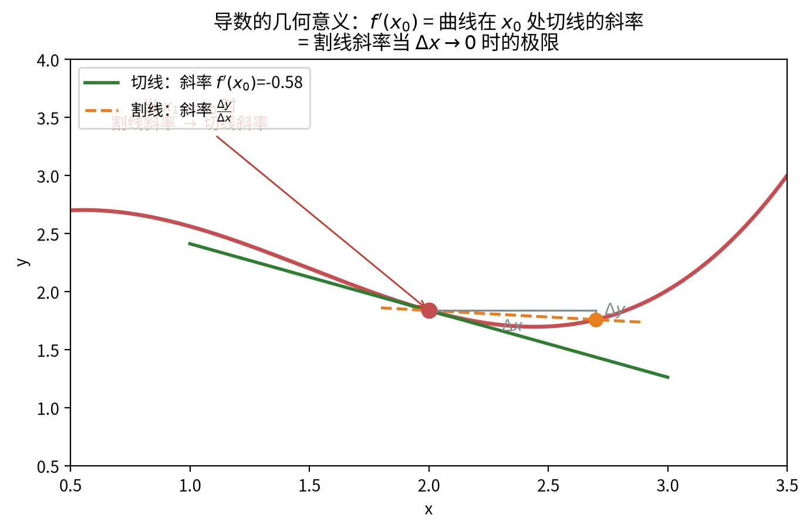

> **直观理解（现实类比）**：导数就是"**瞬时变化率**"。想象你开车，仪表盘显示的"时速"就是位移的瞬时变化率——而平均速度 = 总里程 ÷ 总时间（割线斜率）。当时间间隔 $\Delta t$ 缩到趋近于 0 时，平均速度就逼近某一瞬时的"仪表盘读数"（切线斜率）。
>
> 几何上，**切线斜率 $f'(x_0)$ 告诉我们曲线在这一点"有多陡、往哪个方向拐"**。它也直接决定了切线方程 $y-f(x_0)=f'(x_0)(x-x_0)$——这是后面用导数求近似、判断单调性、求极值的根本依据。

#### 🎬 动画演示：导数即切线斜率

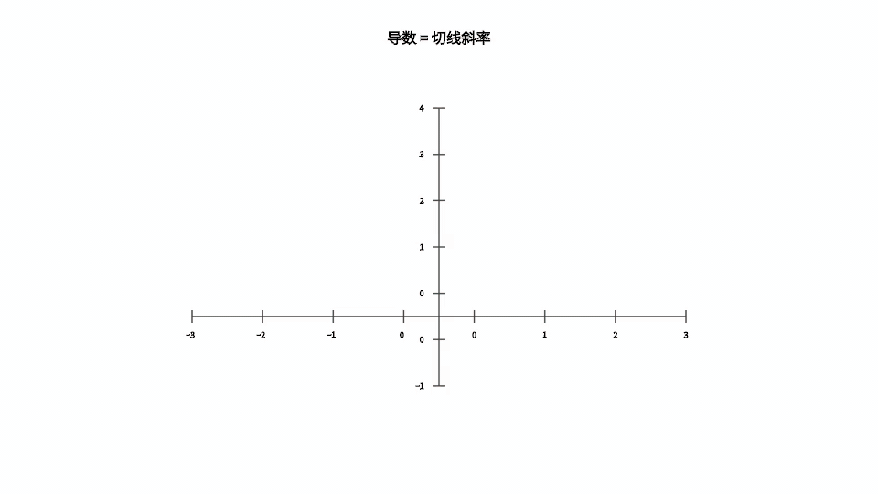

> 这个动画直观展示了当切点沿曲线移动时，切线的斜率（即导数 $f'(x)$）随之变化的过程。它把"割线极限为切线"和"每一点的导数就是该点切线的斜率"这两个核心思想融为一体，帮助理解导数的几何意义。

### 2.3 基本求导法则

#### 2.3.1 四则运算法则

设 $u(x), v(x)$ 可导，则：

1. **和差法则**：$(u \pm v)' = u' \pm v'$
2. **积法则（乘法法则）**：$(uv)' = u'v + uv'$
3. **商法则（除法法则）**：$\left(\frac{u}{v}\right)' = \frac{u'v - uv'}{v^2}$（$v \neq 0$）

**乘法法则的证明**：

$$
\begin{aligned}
(uv)' &= \lim_{h \to 0} \frac{u(x+h)v(x+h) - u(x)v(x)}{h} \\
&= \lim_{h \to 0} \frac{u(x+h)v(x+h) - u(x)v(x+h) + u(x)v(x+h) - u(x)v(x)}{h} \\
&= \lim_{h \to 0} \frac{[u(x+h)-u(x)]v(x+h)}{h} + \lim_{h \to 0} \frac{u(x)[v(x+h)-v(x)]}{h} \\
&= u'(x)v(x) + u(x)v'(x)
\end{aligned}
$$

- 第 1 个等号（第 1 行）：把 $(uv)'$ 展开成导数的极限定义；依据：导数的极限定义 $g'(x)=\lim_{h\to0}\frac{g(x+h)-g(x)}{h}$；目的：把"乘积的导数"变成真正可以计算的极限。
- 第 2 个等号（第 2 行）：分子多了一项又补同一项——添上 $u(x)v(x+h)$ 再减掉它；依据：加一项减同一项，值不变（恒等变形）；目的：把一项增量拆成 $u$ 的增量与 $v$ 的增量两段。
- 第 3 个等号（第 3 行）：按加减拆成两个极限，并各自提出与 $h$ 无关的公因子 $v(x+h)$、$u(x)$；依据：极限的线性性质与因子提取；目的：让两项各自拼出 $\frac{u(x+h)-u(x)}{h}$ 与 $\frac{v(x+h)-v(x)}{h}$ 的模样。
- 第 4 个等号（第 4 行）：两个极限分别认出 $u'(x)$、$v'(x)$（其中 $v(x+h)\to v(x)$ 用到可导必连续）；依据：导数定义；目的：最终得到 $(uv)'=u'v+uv'$。

**数学思维**：乘法法则的证明技巧是"**加一项再减同一项**"（即插入 $u(x)v(x+h)$），把未知的两项增量差拆成两个已知的增量差。这种"添项相消"是微积分中处理乘积、差值结构的常用手法。

**商法则的证明**：把商视作乘积 $u \cdot \frac{1}{v}$，先用乘法法则，再处理 $\frac{1}{v}$：

$$
\begin{aligned}
\left(\frac{u}{v}\right)' &= \left(u \cdot \frac{1}{v}\right)' \\
&= u' \cdot \frac{1}{v} + u \cdot \left(\frac{1}{v}\right)'
\end{aligned}
$$

其中 $\left(\frac{1}{v}\right)'$ 用定义计算：
$$
\left(\frac{1}{v}\right)' = \lim_{h\to 0} \frac{\frac{1}{v(x+h)} - \frac{1}{v(x)}}{h} = \lim_{h\to 0} \frac{v(x) - v(x+h)}{h \cdot v(x+h)v(x)} = -\frac{v'(x)}{v(x)^2}
$$

- 【第 2 步】依据：对 $\frac{1}{v}$ 直接套导数定义，分子通分化简后约去 $h$，再取极限并让 $v(x+h)\to v(x)$（可导必连续）；目的：算得 $\left(\frac{1}{v}\right)'=-\frac{v'(x)}{v(x)^2}$，补完上一步留下的小块。

代入得：
$$
\left(\frac{u}{v}\right)' = \frac{u'}{v} - \frac{uv'}{v^2} = \frac{u'v - uv'}{v^2}
$$

- 【第 3 步】依据：把第 2 步的结果代回第 1 步，再将两项以 $v^2$ 为公分母通分合并；目的：把 $\frac{u'}{v}-\frac{uv'}{v^2}$ 合成单一分式 $\frac{u'v-uv'}{v^2}$，得到完整的商法则。

> **一句话记忆**：商法则分子是"上导下不导 减 上不导下导"，顺序不可颠倒。

#### 2.3.2 幂法则（Power Rule）

$$(x^n)' = nx^{n-1}, \quad n \in \mathbb{R}$$

**证明（$n$ 为正整数）**：使用二项式定理

$$
\begin{aligned}
(x^n)' &= \lim_{h \to 0} \frac{(x+h)^n - x^n}{h} \\
&= \lim_{h \to 0} \frac{x^n + nx^{n-1}h + \frac{n(n-1)}{2}x^{n-2}h^2 + \cdots + h^n - x^n}{h} \\
&= \lim_{h \to 0} \left(nx^{n-1} + \frac{n(n-1)}{2}x^{n-2}h + \cdots + h^{n-1}\right) \\
&= nx^{n-1}
\end{aligned}
$$

#### 2.3.3 链式法则（Chain Rule）

若 $y = f(u)$ 在 $u = g(x)$ 处可导，且 $u = g(x)$ 在 $x$ 处可导，则复合函数 $y = f(g(x))$ 在 $x$ 处可导，且

| 符号 | 名称 | 含义 | 直观解释 |
|:---:|:---:|:---|:---|
| $\frac{dy}{dx}$ | 莱布尼茨导数记号 | $y$ 对 $x$ 求导 | "$y$ 随 $x$ 变多快" |
| $\frac{dy}{du}$ | 外层导数 | $y$ 对中间量 $u$ 求导 | "$y$ 随 $u$ 变多快" |
| $\frac{du}{dx}$ | 内层导数 | $u$ 对 $x$ 求导 | "$u$ 随 $x$ 变多快" |

$$\frac{dy}{dx} = \frac{dy}{du} \cdot \frac{du}{dx} = f'(g(x)) \cdot g'(x)$$

**证明思路**：令 $\Delta u = g(x+\Delta x) - g(x)$，则 $\Delta y = f(u+\Delta u) - f(u)$。当 $\Delta x \to 0$ 时，$\Delta u \to 0$，于是

$$
\frac{dy}{dx} = \lim_{\Delta x \to 0} \frac{\Delta y}{\Delta x} = \lim_{\Delta x \to 0} \frac{\Delta y}{\Delta u} \cdot \frac{\Delta u}{\Delta x} = \frac{dy}{du} \cdot \frac{du}{dx}
$$

- 【第 1 步】依据：导数定义（差商 $\frac{\Delta y}{\Delta x}$ 的极限）与极限的乘积法则，把 $\frac{\Delta y}{\Delta x}$ 写成 $\frac{\Delta y}{\Delta u}\cdot\frac{\Delta u}{\Delta x}$；目的：直观地把复合求导"约分"成内层与外层导数的乘积。

**严格证明（处理 $\Delta u = 0$ 的情况）**：上面的约分在 $\Delta u = 0$ 时无意义。引入一个辅助量 $\varepsilon$ 严格化：

由 $f$ 在 $u$ 处可导，令
$$
\varepsilon = \frac{\Delta y}{\Delta u} - f'(u) \quad (\Delta u \neq 0), \qquad \varepsilon = 0 \quad (\Delta u = 0)
$$

- 【第 2 步】依据：为绕开 $\Delta u=0$ 时 $\frac{\Delta y}{\Delta u}$ 无意义的问题，按"$\Delta u\neq0$ 照常定义、$\Delta u=0$ 则令 $\varepsilon=0$"分段定义辅助量 $\varepsilon$；目的：让恒等式 $\Delta y=f'(u)\Delta u+\varepsilon\Delta u$ 对一切 $\Delta u$ 成立，消除约分的瑕疵。

则恒有 $\Delta y = f'(u)\Delta u + \varepsilon \Delta u$，且 $\Delta u \to 0$ 时 $\varepsilon \to 0$。于是
$$
\frac{\Delta y}{\Delta x} = \left(f'(u) + \varepsilon\right)\frac{\Delta u}{\Delta x}
$$

- 【第 3 步】依据：把第 2 步的恒等式 $\Delta y=f'(u)\Delta u+\varepsilon\Delta u$ 两边同除以 $\Delta x$，并借助内层可导保证 $\Delta u\to0$；目的：把 $\frac{\Delta y}{\Delta x}$ 化成可求极限的形式。

取极限 $\Delta x \to 0$（此时 $\Delta u \to 0$，从而 $\varepsilon \to 0$）：
$$
\frac{dy}{dx} = f'(u) \cdot \frac{du}{dx}
$$

- 【第 4 步】依据：对第 3 步两边取极限 $\Delta x\to0$，此时 $\Delta u\to0$、$\varepsilon\to0$，故 $f'(u)+\varepsilon\to f'(u)$，且 $\frac{\Delta u}{\Delta x}\to\frac{du}{dx}$；目的：严格得到链式法则 $\frac{dy}{dx}=f'(u)\frac{du}{dx}$，完成证明。

**数学思维**：链式法则刻画的是一种"**传递率**"——外层的瞬时变化率乘以内层的瞬时变化率。形象地说，$y$ 随 $u$ 变化的速率（$f'$）乘以 $u$ 随 $x$ 变化的速率（$g'$），就是 $y$ 随 $x$ 变化的速率。这就是"复合"对应的乘法。

### 2.4 初等函数的导数公式

| 函数 | 导数 |
|------|------|
| $C$（常数） | $0$ |
| $x^n$ | $nx^{n-1}$ |
| $e^x$ | $e^x$ |
| $a^x$ | $a^x \ln a$ |
| $\ln x$ | $\frac{1}{x}$ |
| $\log_a x$ | $\frac{1}{x \ln a}$ |
| $\sin x$ | $\cos x$ |
| $\cos x$ | $-\sin x$ |
| $\tan x$ | $\sec^2 x$ |
| $\cot x$ | $-\csc^2 x$ |
| $\sec x$ | $\sec x \tan x$ |
| $\csc x$ | $-\csc x \cot x$ |
| $\arcsin x$ | $\frac{1}{\sqrt{1-x^2}}$ |
| $\arccos x$ | $-\frac{1}{\sqrt{1-x^2}}$ |
| $\arctan x$ | $\frac{1}{1+x^2}$ |
| $\operatorname{arccot} x$ | $-\frac{1}{1+x^2}$ |
| $\sinh x$ | $\cosh x$ |
| $\cosh x$ | $\sinh x$ |

**证明分类（按公式来源分四组）**：

**（一）由极限定义直接推出的**：

**$(\sin x)' = \cos x$**：利用和角公式 $\sin(x+h) = \sin x\cos h + \cos x\sin h$：
$$
\begin{aligned}
(\sin x)' &= \lim_{h\to 0}\frac{\sin(x+h) - \sin x}{h} \\
&= \lim_{h\to 0}\frac{\sin x(\cos h - 1) + \cos x\sin h}{h} \\
&= \sin x \cdot \lim_{h\to 0}\frac{\cos h - 1}{h} + \cos x \cdot \lim_{h\to 0}\frac{\sin h}{h} \\
&= \sin x \cdot 0 + \cos x \cdot 1 = \cos x
\end{aligned}
$$
其中用到两个重要极限：$\lim_{h\to 0}\frac{\sin h}{h} = 1$，$\lim_{h\to 0}\frac{\cos h - 1}{h} = 0$。

**$(\cos x)' = -\sin x$**：同理，利用 $\cos(x+h) = \cos x\cos h - \sin x\sin h$，可得 $(\cos x)' = -\sin x$。

**$e^x$ 的导数**：由重要极限 $\lim_{h\to 0}\frac{e^h - 1}{h} = 1$：
$$
(e^x)' = \lim_{h\to 0}\frac{e^{x+h} - e^x}{h} = e^x \cdot \lim_{h\to 0}\frac{e^h - 1}{h} = e^x
$$

> **数学思维**：$e^x$ 之所以"导数等于自身"，源于它被定义为使 $\lim_{h\to 0}\frac{a^h - 1}{h} = 1$ 的那个底数 $e$。其他底数 $a^x$ 求导时自然多出一个因子 $\ln a$。

**（二）由四则运算 / 链式法则推出的**：

**$(\tan x)' = \sec^2 x$**：$\tan x = \frac{\sin x}{\cos x}$，用商法则：
$$
(\tan x)' = \frac{\cos x \cdot \cos x - \sin x \cdot (-\sin x)}{\cos^2 x} = \frac{\cos^2 x + \sin^2 x}{\cos^2 x} = \frac{1}{\cos^2 x} = \sec^2 x
$$

**$(a^x)' = a^x \ln a$**：$a^x = e^{x\ln a}$，用链式法则：$(a^x)' = e^{x\ln a}\cdot \ln a = a^x \ln a$。

**$(\sec x)' = \sec x\tan x$**：$\sec x = \frac{1}{\cos x}$，用商法则或链式法则。

**$(\ln x)' = \frac{1}{x}$**：由 $y = \ln x \iff e^y = x$，隐函数求导（见 2.5）：$e^y \cdot y' = 1$，故 $y' = \frac{1}{e^y} = \frac{1}{x}$。

**$(\log_a x)' = \frac{1}{x\ln a}$**：$\log_a x = \frac{\ln x}{\ln a}$，常数因子提出来即得。

**（三）由反函数关系推出的**：

**$(\arcsin x)' = \frac{1}{\sqrt{1-x^2}}$**：$y = \arcsin x \iff x = \sin y$，且 $y \in [-\frac{\pi}{2}, \frac{\pi}{2}]$。两边对 $x$ 求导：
$$
1 = \cos y \cdot y' \implies y' = \frac{1}{\cos y} = \frac{1}{\sqrt{1 - \sin^2 y}} = \frac{1}{\sqrt{1-x^2}}
$$
（由 $y$ 的范围知 $\cos y \geqslant 0$，取正号。）

**$(\arctan x)' = \frac{1}{1+x^2}$**：$y = \arctan x \iff x = \tan y$，得 $1 = \sec^2 y \cdot y'$，故 $y' = \cos^2 y = \frac{1}{1 + \tan^2 y} = \frac{1}{1+x^2}$。

> **数学思维**：反三角函数的导数都含根号或分式，是因为反函数求导后要把 $\cos y$、$\sec^2 y$ 用 $\sin y$、$\tan y$ 表示回来，于是乎出现 $\sqrt{1-x^2}$、$1+x^2$ 这类式子。

**（四）幂法则对任意实数 $n$ 的推广**：

$y = x^n = e^{n\ln x}$（$x > 0$），用链式法则：
$$
y' = e^{n\ln x} \cdot \frac{n}{x} = x^n \cdot \frac{n}{x} = nx^{n-1}
$$
所以幂法则对任意实数 $n$ 都成立，不必限于正整数。

### 2.5 隐函数求导法

如果函数 $y = y(x)$ 由方程 $F(x, y) = 0$ 隐式定义，则可以在方程两边同时对 $x$ 求导，将 $y$ 视为 $x$ 的函数，然后解出 $y'$。

**示例**：求由方程 $x^2 + y^2 = 1$ 所确定的隐函数的导数。

两边对 $x$ 求导：$2x + 2y \cdot y' = 0$，解得 $y' = -\frac{x}{y}$（$y \neq 0$）。

**数学思维**：为什么可以对两边同时求导？因为 $y$ 是 $x$ 的隐函数，左端 $x^2 + y(x)^2$ 是 $x$ 的复合函数，对 $x$ 求导时必须用**链式法则**——$y^2$ 先对外层平方求导得 $2y$，再乘内层 $y'$。于是每一项都"顺着链式法则走"，最后把 $y'$ 解出来即可。

**一般步骤**：
1. 方程两边对 $x$ 求导，把 $y$ 当作 $x$ 的函数，凡出现 $y$ 的地方都补乘 $y'$；
2. 把含 $y'$ 的项移到一边，其余移到另一边；
3. 提出 $y'$，解出表达式。

### 2.6 对数求导法

对于幂指函数 $y = f(x)^{g(x)}$ 或连乘连除形式的函数，先取自然对数再求导往往更简便。

**数学思维**：对数能"**把乘除降为加减、把幂降为乘**"，正好把复杂函数拆成简单可导项之和。步骤是：先取 $\ln$，再对 $\ln y$ 求导（左边由链式法则得 $\frac{y'}{y}$），最后乘回 $y$。

**示例 1**：求 $y = x^x$ 的导数。

取对数：$\ln y = x \ln x$，两边求导：$\frac{y'}{y} = \ln x + 1$，所以 $y' = x^x (\ln x + 1)$。

**示例 2（连乘连除形式）**：求 $y = \sqrt[3]{\frac{x^2+1}{(x+1)^2(x-1)}}$ 的导数。

取对数：
$$
\ln y = \frac{1}{3}\left[\ln(x^2+1) - 2\ln(x+1) - \ln(x-1)\right]
$$
两边求导：
$$
\frac{y'}{y} = \frac{1}{3}\left(\frac{2x}{x^2+1} - \frac{2}{x+1} - \frac{1}{x-1}\right)
$$
回乘 $y$ 即得 $y'$。**若直接对根式＋连乘求导，将极其繁琐，取对数后变得一目了然。**

> **使用场景判断**：当遇到"幂指函数"（底数、指数都含变量）或"大量乘除/开方"的结构时，优先想到对数求导法。

---

## 三、微分中值定理

微分中值定理是联系函数与其导数的桥梁，是导数应用的理论基础。

### 预备知识一：最值定理（Extreme Value Theorem）

> 罗尔定理证明中引用的"最值定理"在此先行交代。

**定理**：若函数 $f(x)$ 在闭区间 $[a, b]$ 上**连续**，则 $f(x)$ 在 $[a, b]$ 上**必能取得最大值 $M$ 和最小值 $m$**，即存在 $x_1, x_2 \in [a, b]$ 使得 $f(x_1) = M$、$f(x_2) = m$。

**要点**：
- 前提是**闭区间** + **连续**，二者缺一不可。
- 反例：开区间 $(0, 1)$ 上的 $f(x) = x$ 连续但无最大值、最小值（端点取不到）；闭区间上不连续的函数也可能无最值。

**证明**（用 Bolzano-Weierstrass 定理，只证最大值 $M$，最小值同理）：

- **第 1 步：先证 $f$ 在 $[a, b]$ 上有上界。** 反设 $f$ 无上界，则对每个自然数 $n$，存在 $x_n \in [a, b]$ 使 $f(x_n) > n$。数列 $\{x_n\}$ 落在有界集 $[a, b]$ 内，由 **Bolzano-Weierstrass 定理**知它有收敛子列 $x_{n_k} \to c$；又 $[a, b]$ 为闭集，故 $c \in [a, b]$。由 $f$ 在 $c$ 处连续，$f(x_{n_k}) \to f(c)$，这与 $f(x_{n_k}) > n_k \to \infty$ 矛盾。故 $f$ 必有上界。
- **第 2 步：证明确有某点达到该上确界。** 令 $M = \sup\{f(x) : x \in [a, b]\}$。由上确界的定义，存在数列 $x_n \in [a, b]$ 使 $f(x_n) \to M$。数列 $\{x_n\}$ 有界，由 Bolzano-Weierstrass 定理取收敛子列 $x_{n_k} \to x^* \in [a, b]$。由 $f$ 连续，两边取极限得 $f(x^*) = \lim_{k \to \infty} f(x_{n_k}) = M$，故最大值 $M$ 确在 $x^* \in [a, b]$ 处取得。
- **第 3 步：最小值同理。** 对 $-f(x)$ 重复上述步骤（或对 $m = \inf\{f(x)\}$ 如法炮制），即得存在 $x_1, x_2 \in [a, b]$ 使 $f(x_2) = m$。

因此存在 $x_1, x_2 \in [a, b]$，使 $f(x_1) = \max f = M$、$f(x_2) = \min f = m$。$\square$

> **直观理解**：连续函数在闭区间上画出的是"一条不断裂的曲线"，它从某个最低点连到某个最高点，这两点必然存在。

### 预备知识二：费马引理（Fermat's Theorem）

> 罗尔定理证明中"最大值在内部点取得则导数为零"的依据。

**引理**：若 $x_0$ 是函数 $f(x)$ 的**极值点**（极大值点或极小值点），且 $f'(x_0)$ **存在**，则 $f'(x_0) = 0$。

**证明**（以极大值点为例）：设 $x_0$ 为极大值点，则存在邻域使 $f(x) \leqslant f(x_0)$。当 $h > 0$ 时 $\frac{f(x_0+h) - f(x_0)}{h} \leqslant 0$，取右极限得 $f'(x_0) \leqslant 0$；当 $h < 0$ 时 $\frac{f(x_0+h) - f(x_0)}{h} \geqslant 0$，取左极限得 $f'(x_0) \geqslant 0$。故 $f'(x_0) = 0$。极小值情形同理。

> **直观理解（现实类比）**：费马引理说的是——**光滑曲线走到"山顶"或"谷底"时，切线必然水平**。想象你沿光滑山坡一路爬到最高点：登顶前你一直在**上坡**（向右走斜率 $>0$），过了山顶就**下坡**（斜率 $<0$）；正因为坡度"从正到负"是连续变化的，山顶那一瞬间的坡度只能**恰好是 0**（左右各推一下，$f'(x_0) \leqslant 0$ 与 $f'(x_0) \geqslant 0$ 一夹，只能等于 0）。这就是为何"内部极值点 ⇒ 导数为零"。
>
> **但反过来要小心**：切线水平不等于山顶——$y = x^3$ 在原点的切线同样是水平的（$f'(0) = 0$），却只是"陡坡上的一小段平路"，并非极值点。这正是它被称作**必要条件**（而非充分条件）的原因：**"极值 ⇒ 导数为 0"成立，"导数为 0 ⇒ 极值"不成立**。

> **注意**：费马引理是极值的**必要条件**，不是充分条件（如 $f(x) = x^3$ 在 $x = 0$ 处导数为零但非极值点）。

### 3.1 罗尔定理（Rolle's Theorem）

**定理**：设函数 $f(x)$ 满足：
1. 在闭区间 $[a, b]$ 上连续；
2. 在开区间 $(a, b)$ 内可导；
3. $f(a) = f(b)$。

则至少存在一点 $\xi \in (a, b)$，使得 $f'(\xi) = 0$。

**证明**：由于 $f$ 在 $[a, b]$ 上连续，由最值定理，$f$ 在 $[a, b]$ 上存在最大值 $M$ 和最小值 $m$。

- 若 $M = m$，则 $f$ 为常数，$f'(x) = 0$ 对任意 $x \in (a, b)$ 成立，结论成立。
- 若 $M > m$，由于 $f(a) = f(b)$，最大值和最小值不可能同时出现在端点。设最大值在内部点 $\xi \in (a, b)$ 处取得（最小值同理）。由费马引理，$f'(\xi) = 0$。

**几何意义**：若曲线两端点等高，则曲线上至少存在一点，该点处的切线是水平的。

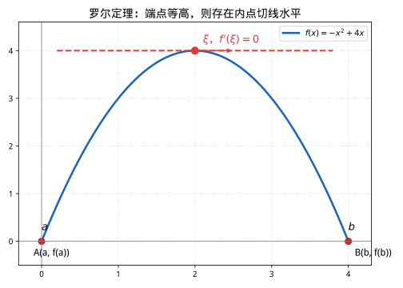

### 3.2 拉格朗日中值定理（Lagrange's Mean Value Theorem）

**定理**：设函数 $f(x)$ 满足：
1. 在闭区间 $[a, b]$ 上连续；
2. 在开区间 $(a, b)$ 内可导。

则至少存在一点 $\xi \in (a, b)$，使得

$$f(b) - f(a) = f'(\xi)(b - a)$$

**证明**：构造辅助函数

$$F(x) = f(x) - f(a) - \frac{f(b) - f(a)}{b - a}(x - a)$$

容易验证 $F(a) = F(b) = 0$，且 $F$ 在 $[a, b]$ 上连续，在 $(a, b)$ 内可导。由罗尔定理，存在 $\xi \in (a, b)$ 使得 $F'(\xi) = 0$。而

$$F'(x) = f'(x) - \frac{f(b) - f(a)}{b - a}$$

代入 $x = \xi$ 即得 $f'(\xi) = \frac{f(b) - f(a)}{b - a}$。

**几何意义**：在曲线 $y = f(x)$ 上至少存在一点，该点处的切线斜率等于连接端点直线的斜率。

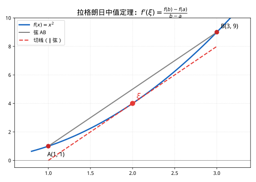

### 3.3 柯西中值定理（Cauchy's Mean Value Theorem）

**定理**：设函数 $f(x)$ 和 $g(x)$ 满足：
1. 在闭区间 $[a, b]$ 上连续；
2. 在开区间 $(a, b)$ 内可导；
3. $g'(x) \neq 0$ 对任意 $x \in (a, b)$ 成立。

则至少存在一点 $\xi \in (a, b)$，使得

$$\frac{f(b) - f(a)}{g(b) - g(a)} = \frac{f'(\xi)}{g'(\xi)}$$

**证明**：构造辅助函数

$$F(x) = f(x) - f(a) - \frac{f(b) - f(a)}{g(b) - g(a)}[g(x) - g(a)]$$

易见 $F(a) = F(b) = 0$，由罗尔定理，存在 $\xi \in (a, b)$ 使得 $F'(\xi) = 0$。计算 $F'(x) = f'(x) - \frac{f(b) - f(a)}{g(b) - g(a)} g'(x)$，代入 $x = \xi$ 即得结论。

**注**：拉格朗日中值定理是柯西中值定理当 $g(x) = x$ 时的特例。

**几何意义**：把 $(g(t), f(t))$ 看作平面上的参数曲线，则曲线上存在一点 $P$，该点处的切线方向与连接两端点的弦 $AB$ 方向平行。

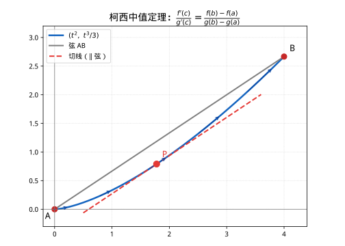

**直观理解一：把它想成"一段运动轨迹"**（最推荐的视角）

把 $t$ 当作**时间**，质点从 $A$ 运动到 $B$，轨迹就是参数曲线 $(g(t), f(t))$。
- 弦 $AB$ 的方向 = 全程的**平均速度**方向；
- 曲线上某点处的切线方向 = 该时刻的**瞬时速度**方向。

柯西中值定理说：**从 $A$ 运动到 $B$ 的过程中，必有一时刻，瞬时速度的方向与平均速度的方向平行。** 这几乎是"显然"的——你不可能绕个弯从 A 到 B，却从来不让行驶方向正对着终点方向。

**直观理解二：为什么是两个函数？**

对比两个定理：
- **拉格朗日**：$y = f(x)$，横轴移动多少由 $x$ 自己说了算，即 $g(x) = x$。
- **柯西**：$y$ 和 $x$ 都受第三个变量 $t$ 控制，即 $(x, y) = (g(t), f(t))$。

所以**拉格朗日只是柯西的"横轴匀速"特例**。柯西额外处理了"横轴也在动"的普遍情况。

**直观理解三：看比值** $\frac{f'(t)}{g'(t)}$

- $\frac{f'(t)}{g'(t)}$ = 瞬时速度的"纵向分量 ÷ 横向分量" = 切线（即速度方向）的斜率；
- $\frac{f(b) - f(a)}{g(b) - g(a)}$ = 平均速度的"纵 ÷ 横" = 弦 $AB$ 的斜率。

等式 $\frac{f(b) - f(a)}{g(b) - g(a)} = \frac{f'(\xi)}{g'(\xi)}$ 说的正是：**某时刻速度方向（切线）的斜率 = 全程平均方向（弦）的斜率**，即两者平行。

> **一句话总结**：柯西中值定理 = "运动的质点从 A 到 B，途中必有一刻面朝终点的方向"。它比拉格朗日多出来的，只是让横轴也受时间控制，从而把"直线路径"推广到"弯曲路径"。

---

## 四、导数的应用

### 4.1 洛必达法则（L'Hôpital's Rule）

**定理**：设 $f(x)$ 和 $g(x)$ 在 $x_0$ 的某去心邻域内可导，且 $g'(x) \neq 0$。若

$$\lim_{x \to x_0} f(x) = \lim_{x \to x_0} g(x) = 0 \quad \text{或} \quad \lim_{x \to x_0} f(x) = \lim_{x \to x_0} g(x) = \infty$$

且 $\lim_{x \to x_0} \frac{f'(x)}{g'(x)}$ 存在（或为无穷大），则

$$\lim_{x \to x_0} \frac{f(x)}{g(x)} = \lim_{x \to x_0} \frac{f'(x)}{g'(x)}$$

**证明思路**（$\frac{0}{0}$ 型）：在 $x_0$ 处补充定义 $f(x_0) = g(x_0) = 0$，由柯西中值定理，对任意 $x \neq x_0$，存在 $\xi$ 介于 $x$ 与 $x_0$ 之间，使得

$$\frac{f(x)}{g(x)} = \frac{f(x) - f(x_0)}{g(x) - g(x_0)} = \frac{f'(\xi)}{g'(\xi)}$$

当 $x \to x_0$ 时 $\xi \to x_0$，即得结论。

**常见不定型**：共 $7$ 种，分为两类。

**第一类（可直接用洛必达）**：

| 不定型 | 说明 | 示例 |
|:-------|:-----|:-----|
| $\dfrac{0}{0}$ | 分子分母同趋于 $0$ | $\displaystyle\lim_{x\to 0}\frac{\sin x}{x}=1$ |
| $\dfrac{\infty}{\infty}$ | 分子分母同趋于无穷 | $\displaystyle\lim_{x\to\infty}\frac{x}{e^x}=0$ |

**第二类（须先做代数变换，化为 $\frac{0}{0}$ 或 $\frac{\infty}{\infty}$ 再用）**：

| 不定型 | 变换方法 | 示例 |
|:-------|:---------|:-----|
| $0 \cdot \infty$ | 把其中一个因子取倒数，化为 $\frac{0}{0}$ 或 $\frac{\infty}{\infty}$ | $\displaystyle\lim_{x\to 0^+} x\ln x = 0$ |
| $\infty - \infty$ | 通分，化为 $\frac{0}{0}$ | $\displaystyle\lim_{x\to 0}\left(\frac{1}{\sin x}-\frac{1}{x}\right)=0$ |
| $0^0$ | 取对数：$\ln y = g\ln f$，化为 $0\cdot\infty$ | $\displaystyle\lim_{x\to 0^+} x^x = 1$ |
| $1^\infty$ | 取对数，化为 $0\cdot\infty$ | $\displaystyle\lim_{x\to\infty}\left(1+\frac{1}{x}\right)^x = e$ |
| $\infty^0$ | 取对数，化为 $0\cdot\infty$ | $\displaystyle\lim_{x\to\infty} x^{1/x} = 1$ |

**具体处理的通用套路**：

1. **$0 \cdot \infty$ 型**：把趋于 $0$ 的因子放到分母（取倒数），可变回 $\frac{0}{0}$ 或 $\frac{\infty}{\infty}$。
   > **示例**：$\displaystyle\lim_{x\to 0^+} x\ln x = \lim_{x\to 0^+}\frac{\ln x}{1/x} \xrightarrow{\frac{\infty}{\infty}} \lim_{x\to 0^+}\frac{1/x}{-1/x^2} = \lim_{x\to 0^+}(-x) = 0$。

2. **$\infty - \infty$ 型**：先通分或分子有理化，化为分式。
   > **示例**：$\displaystyle\lim_{x\to 0}\left(\frac{1}{\sin x}-\frac{1}{x}\right) = \lim_{x\to 0}\frac{x-\sin x}{x\sin x} \xrightarrow{\frac{0}{0}} \lim_{x\to 0}\frac{1-\cos x}{\sin x + x\cos x} \xrightarrow{\frac{0}{0}} \lim_{x\to 0}\frac{\sin x}{2\cos x - x\sin x} = 0$。

3. **$0^0$、$1^\infty$、$\infty^0$ 型（幂指型）**：先取对数。设 $y = f(x)^{g(x)}$，则 $\ln y = g(x)\ln f(x)$，先求 $\lim \ln y$，再取指数还原。
   > **示例**：求 $\displaystyle\lim_{x\to 0^+} x^x$。设 $y = x^x$，$\ln y = x\ln x$。由 $0\cdot\infty$ 型的结论 $\lim_{x\to 0^+} x\ln x = 0$，故 $\lim \ln y = 0$，所以 $\displaystyle\lim_{x\to 0^+} x^x = e^0 = 1$。

> **使用须知**：
> - 洛必达法则只能用于**不定型**，若极限本身不是不定型，直接用会得到错误结果。
> - 每次使用后若仍是不定型，可**多次连续使用**（如上面的 $\infty-\infty$ 示例连用两次）。
> - $\lim \frac{f'}{g'}$ **必须存在或为无穷大**，否则洛必达法则不适用（此时不能用，需换方法）。
> - 使用前先化简、先看能否约分，避免盲目求导。

### 4.2 函数的单调性

若 $f(x)$ 在 $[a, b]$ 上连续，在 $(a, b)$ 内可导，则：

- 若在 $(a, b)$ 内 $f'(x) > 0$，则 $f(x)$ 在 $[a, b]$ 上严格单调递增
- 若在 $(a, b)$ 内 $f'(x) < 0$，则 $f(x)$ 在 $[a, b]$ 上严格单调递减

**证明**：对任意 $x_1 < x_2$，由拉格朗日中值定理，存在 $\xi \in (x_1, x_2)$ 使得 $f(x_2) - f(x_1) = f'(\xi)(x_2 - x_1)$。由 $f'(\xi)$ 的符号即可判断。

### 4.3 函数的凹凸性与拐点

设 $f(x)$ 在 $[a, b]$ 上连续，在 $(a, b)$ 内二阶可导。

- 若在 $(a, b)$ 内 $f''(x) > 0$，则曲线 $y = f(x)$ 是**凹的**（向上弯曲，convex）
- 若在 $(a, b)$ 内 $f''(x) < 0$，则曲线 $y = f(x)$ 是**凸的**（向下弯曲，concave）

**拐点**：曲线凹凸性发生改变的点。若 $f''(x_0) = 0$ 且 $f''(x)$ 在 $x_0$ 左右两侧异号，则 $(x_0, f(x_0))$ 为拐点。

### 4.4 极值与最优化

**定义 1（极值，Local Extremum）**：设 $f(x)$ 在 $x_0$ 的某邻域 $U(x_0)$ 内有定义。

- 若存在邻域 $U(x_0)$，使对任意 $x \in U(x_0)$ 都有 $f(x) \leqslant f(x_0)$，则称 $f(x_0)$ 为 $f$ 的**极大值**，$x_0$ 称为**极大值点**；
- 若存在邻域 $U(x_0)$，使对任意 $x \in U(x_0)$ 都有 $f(x) \geqslant f(x_0)$，则称 $f(x_0)$ 为 $f$ 的**极小值**，$x_0$ 称为**极小值点**；
- 极大值与极小值统称为**极值**，取得极值的点统称为**极值点**。

**定义 2（最值，Global Maximum/Minimum）**：设 $f(x)$ 在区间 $I$ 上有定义。

- 若存在 $x_0 \in I$，使对任意 $x \in I$ 都有 $f(x) \leqslant f(x_0)$，则称 $f(x_0)$ 为 $f$ 在 $I$ 上的**最大值**（把 $\leqslant$ 换成 $\geqslant$ 即得**最小值**）；
- 最大值与最小值统称为**最值**，取得最值的点称为**最值点**。

**关键区别（极值 vs 最值）**：

- **极值是"局部"概念**：只跟 $x_0$ 一小段邻域内的函数值比，与远处无关，因此一个函数可以有好几个极大值、好几个极小值。
- **最值是"全局"概念**：听命于整个区间 $I$ 上的一切函数值，最大值、最小值若存在，各自至多一个（但取到它们的点可以有多个）。
- **联系**：若最值点在区间**内部**取得且该点可导，则它必是极值点（"全局最大"自然是"局部最大"）；反之，极值点不一定是整个区间的最值点。

**极值的必要条件**（费马引理）：若 $x_0$ 是 $f(x)$ 的极值点且 $f'(x_0)$ 存在，则 $f'(x_0) = 0$。满足 $f'(x) = 0$ 的点称为**驻点**。

**极值的第一充分条件**：设 $f'(x_0) = 0$，且 $f'(x)$ 在 $x_0$ 左右两侧：

- 左正右负 $\Rightarrow$ $x_0$ 为极大值点
- 左负右正 $\Rightarrow$ $x_0$ 为极小值点
- 符号不变 $\Rightarrow$ $x_0$ 不是极值点

**极值的第二充分条件**：设 $f'(x_0) = 0$ 且 $f''(x_0)$ 存在，则：

- $f''(x_0) > 0$ $\Rightarrow$ $x_0$ 为极小值点
- $f''(x_0) < 0$ $\Rightarrow$ $x_0$ 为极大值点

**最优化步骤**：
1. 求出 $f'(x)$，找到所有驻点和不可导点
2. 计算这些点及区间端点的函数值
3. 比较大小，确定最大值和最小值

---

## 五、不定积分

### 5.1 原函数与不定积分

若 $F'(x) = f(x)$，则称 $F(x)$ 为 $f(x)$ 的一个**原函数**。$f(x)$ 的所有原函数构成**不定积分**：

| 符号 | 名称 | 含义 | 直观解释 |
|:---:|:---:|:---|:---|
| $\int$ | 积分号 | 求不定积分的运算符号 | "把求导过程倒回去" |
| $dx$ | 积分变量标示 | 以 $x$ 为积分变量 | "对 $x$ 这个变量算" |
| $F(x)$ | 原函数 | 导数恰为 $f(x)$ 的函数 | "求一阶导数能得到 $f$" |
| $C$ | 积分常数 | 可正可负可为零的任意常数 | "反推时白送的常数" |

$$\int f(x) \, dx = F(x) + C$$

其中 $C$ 为任意常数。

**基本积分表**：

| 积分公式 | 积分公式 |
|---------|---------|
| $\int x^n \, dx = \frac{x^{n+1}}{n+1} + C$（$n \neq -1$） | $\int \frac{1}{x} \, dx = \ln|x| + C$ |
| $\int e^x \, dx = e^x + C$ | $\int a^x \, dx = \frac{a^x}{\ln a} + C$ |
| $\int \sin x \, dx = -\cos x + C$ | $\int \cos x \, dx = \sin x + C$ |
| $\int \sec^2 x \, dx = \tan x + C$ | $\int \csc^2 x \, dx = -\cot x + C$ |
| $\int \sec x \tan x \, dx = \sec x + C$ | $\int \csc x \cot x \, dx = -\csc x + C$ |
| $\int \frac{1}{1+x^2} \, dx = \arctan x + C$ | $\int \frac{1}{\sqrt{1-x^2}} \, dx = \arcsin x + C$ |

### 5.2 直接积分法（Direct Integration）

**方法**：将被积函数代数化简后，直接套用基本积分表（见 5.1 节）逐项积分。这是最基础的一类方法，常用于能拆成若干"基本积分表项"之和的简单被积函数。

**例题 1**：求 $\int (x^3 + 2x - 5) \, dx$。

**解**：
$$
\int (x^3 + 2x - 5) \, dx = \frac{x^4}{4} + x^2 - 5x + C
$$

**例题 2**：求 $\int \left(\frac{3}{x} + 2e^x\right) dx$。

**解**：
$$
\int \left(\frac{3}{x} + 2e^x\right) dx = 3\ln|x| + 2e^x + C
$$

**例题 3**：求 $\int (2\sin x + 3\cos x) \, dx$。

**解**：
$$
\int (2\sin x + 3\cos x) \, dx = -2\cos x + 3\sin x + C
$$

**例题 4**：求 $\int \left(\frac{1}{1+x^2} + \frac{1}{\sqrt{1-x^2}}\right) dx$。

**解**：
$$
\int \left(\frac{1}{1+x^2} + \frac{1}{\sqrt{1-x^2}}\right) dx = \arctan x + \arcsin x + C
$$

**例题 5**：求 $\int (x+1)^2 \, dx$（先展开再逐项积分）。

**解**：
$$
\int (x+1)^2 \, dx = \int (x^2 + 2x + 1) \, dx = \frac{x^3}{3} + x^2 + x + C
$$

> **易错点**：直接积分法最容易犯的错是**忘了对被积函数先化简，或漏了积分常数 $C$**。幂函数 $\int x^n dx$ 中 $n=-1$ 那一条**不能用 $\frac{x^{n+1}}{n+1}$ 公式**（分母为 0），必须改用 $\int\frac1x dx = \ln|x| + C$。此外 $\int\frac dx{1+x^2}$ 的结果是 $\arctan x$，而 $\int\frac dx{\sqrt{1-x^2}}$ 是 $\arcsin x$，两者易混淆——判定标准是看分母里有没有根号。

### 5.3 第一类换元法（凑微分法）

**方法**：把被积函数写成 $f(g(x)) \cdot g'(x)$ 的形式，令 $u = g(x)$ 凑成 $\int f(u)\,du$，再用公式
$$
\int f(g(x))\, g'(x)\, dx = \int f(u)\, du \Big|_{u=g(x)}
$$

**证明**：设 $F'(u) = f(u)$，则 $\frac{d}{dx}F(g(x)) = F'(g(x))g'(x) = f(g(x))g'(x)$，两边积分即得。

**例题 1**：求 $\int 2x e^{x^2} \, dx$。

**解**：令 $u = x^2$，$du = 2x\,dx$，
$$
\int 2x e^{x^2}\, dx = \int e^u\, du = e^{x^2} + C
$$

**例题 2**：求 $\int \sin x \cos x \, dx$。

**解**：令 $u = \sin x$，$du = \cos x\,dx$，
$$
\int \sin x \cos x \, dx = \int u\, du = \frac{\sin^2 x}{2} + C
$$

**例题 3**：求 $\int \frac{1}{1+4x^2} \, dx$。

**解**：令 $u = 2x$，$du = 2\,dx$，
$$
\int \frac{dx}{1+4x^2} = \frac12 \int \frac{du}{1+u^2} = \frac12 \arctan(2x) + C
$$

**例题 4**：求 $\int \tan x \, dx$。

**解**：
$$
\int \tan x \, dx = \int \frac{\sin x}{\cos x} dx = -\int \frac{d(\cos x)}{\cos x} = -\ln|\cos x| + C = \ln|\sec x| + C
$$

**例题 5**：求 $\int \frac{x}{\sqrt{x^2+1}} \, dx$。

**解**：令 $u = x^2+1$，$du = 2x\,dx$，
$$
\int \frac{x}{\sqrt{x^2+1}} dx = \frac12 \int u^{-1/2} du = \sqrt{x^2+1} + C
$$

> **易错点**：第一类换元（凑微分）成功的关键是**凑出 $du = g'(x)dx$**。初学者常把"∫f(g(x))dx"直接当"∫f(g(x))g'(x)dx"做，**漏掉内层函数导数 $g'(x)$**。做立刻验算：结果对 $x$ 求导应等于被积函数。另一个高频错误是**最后忘记把 $u$ 代回成 $x$**，写成带 $u$ 的答案。

### 5.4 第二类换元法（变量代换）

**方法**：作单调可导且 $\varphi'(t) \neq 0$ 的代换 $x = \varphi(t)$，则
$$
\int f(x)\,dx = \int f(\varphi(t))\, \varphi'(t)\, dt
$$
常用代换：
- 含 $\sqrt{a^2-x^2}$：令 $x = a\sin t$
- 含 $\sqrt{a^2+x^2}$：令 $x = a\tan t$
- 含 $\sqrt{x^2-a^2}$：令 $x = a\sec t$
- 含根式 $\sqrt[m]{ax+b}$：令 $t = \sqrt[m]{ax+b}$
- 含 $x$ 的高次幂：有时用倒代换 $x = \frac1t$

**例题 1**：求 $\int \sqrt{1-x^2} \, dx$（三角代换）。

**解**：令 $x = \sin t$，$dx = \cos t\, dt$，
$$
\int \sqrt{1-x^2}\,dx = \int \cos^2 t\, dt = \int \frac{1+\cos 2t}{2} dt = \frac{t}{2} + \frac{\sin 2t}{4} + C
$$
由 $t = \arcsin x$，$\sin 2t = 2x\sqrt{1-x^2}$，代回得
$$
= \frac12\left(\arcsin x + x\sqrt{1-x^2}\right) + C
$$

**例题 2**：求 $\int \frac{1}{\sqrt{1+x^2}} \, dx$（三角代换）。

**解**：令 $x = \tan t$，$dx = \sec^2 t\, dt$，
$$
\int \frac{dx}{\sqrt{1+x^2}} = \int \frac{\sec^2 t}{\sec t} dt = \int \sec t\, dt = \ln|\sec t + \tan t| + C
$$
由 $x = \tan t$ 得 $\sec t = \sqrt{1+x^2}$，故
$$
= \ln\left(x + \sqrt{1+x^2}\right) + C
$$

**例题 3**：求 $\int \frac{1}{\sqrt{x^2-1}} \, dx$（三角代换）。

**解**：令 $x = \sec t$，$dx = \sec t \tan t\, dt$，
$$
\int \frac{dx}{\sqrt{x^2-1}} = \int \sec t\, dt = \ln|\sec t + \tan t| + C = \ln\left|x+\sqrt{x^2-1}\right| + C
$$

**例题 4**：求 $\int \frac{1}{1+\sqrt{x}} \, dx$（根式代换）。

**解**：令 $t = \sqrt{x}$，$x = t^2$，$dx = 2t\,dt$，
$$
\int \frac{dx}{1+\sqrt{x}} = \int \frac{2t}{1+t} dt = 2\int \left(1 - \frac{1}{1+t}\right)dt = 2\sqrt{x} - 2\ln(1+\sqrt{x}) + C
$$

**例题 5**：求 $\int \frac{1}{x^2\sqrt{1+x^2}}\, dx$（倒代换 $x = \frac1t$）。

**解**：令 $x = \frac1t$，$dx = -\frac{dt}{t^2}$（取 $x>0$，则 $t>0$），于是 $x^2 = \frac1{t^2}$，$\sqrt{1+x^2} = \frac{\sqrt{1+t^2}}{t}$：
$$
\int \frac{dx}{x^2\sqrt{1+x^2}} = \int \frac{-dt/t^2}{(1/t^2)\cdot(\sqrt{1+t^2}/t)} = -\int \frac{t}{\sqrt{1+t^2}}\,dt = -\sqrt{1+t^2} + C
$$
代回 $t = \frac1x$，得
$$
= -\frac{\sqrt{1+x^2}}{x} + C
$$

> **易错点**：第二类换元做了三角代换/倒代换后，**必须把结果用原变量 $x$ 表示（可能还要画辅助直角三角形），不能把答案留在 $t$ 里**。开根号要留意正负：如 $x=\sec t$ 时 $\tan t = \sqrt{x^2-1}$ 只对 $x>1$ 成立，需按区间处理绝对值。另外三角代换 $x=a\sin t$ 后 $\arcsin\frac{x}{a}$ 的反函数回代，别和 $\arctan$ 混用。

### 5.5 分部积分法（Integration by Parts）

**方法**：
$$
\int u\, dv = uv - \int v\, du
$$
**证明**：由乘法法则 $(uv)' = u'v + uv'$，两边积分得 $uv = \int v\, du + \int u\, dv$，移项即得。

**选取 $u$ 与 $dv$ 的优先顺序**（LIATE 规则）：对数函数 → 反三角函数 → 代数函数 → 三角函数 → 指数函数。

**例题 1**：求 $\int x e^x \, dx$。

**解**：取 $u = x,\ dv = e^x dx$，则 $du = dx,\ v = e^x$，
$$
\int x e^x\, dx = x e^x - \int e^x\, dx = (x-1)e^x + C
$$

**例题 2**：求 $\int x \ln x \, dx$。

**解**：取 $u = \ln x,\ dv = x\,dx$，则 $du = \frac{dx}{x},\ v = \frac{x^2}{2}$，
$$
\int x \ln x\, dx = \frac{x^2}{2}\ln x - \int \frac{x^2}{2}\cdot\frac1x dx = \frac{x^2}{2}\ln x - \frac{x^2}{4} + C
$$

**例题 3**：求 $\int x \sin x \, dx$。

**解**：取 $u = x,\ dv = \sin x\,dx$，$du = dx,\ v = -\cos x$，
$$
\int x \sin x\, dx = -x\cos x + \int \cos x\, dx = -x\cos x + \sin x + C
$$

**例题 4**：求 $\int \ln x \, dx$。

**解**：取 $u = \ln x,\ dv = dx$，$du = \frac{dx}{x},\ v = x$，
$$
\int \ln x\, dx = x\ln x - \int x\cdot\frac{dx}{x} = x\ln x - x + C
$$

**例题 5**：求 $\int e^x \sin x\, dx$（循环积分）。

**解**：第一次分部取 $u = e^x,\ dv = \sin x\,dx$：
$$
\int e^x\sin x\,dx = -e^x\cos x + \int e^x\cos x\,dx
$$
再对 $\int e^x\cos x\,dx$ 分部（$u = e^x,\ dv = \cos x\,dx$）：
$$
\int e^x\cos x\,dx = e^x\sin x - \int e^x\sin x\,dx
$$
两式联立解出：
$$
\int e^x\sin x\, dx = \frac12 e^x(\sin x - \cos x) + C
$$

> **易错点**：最常见的是**"谁当 $u$"选错**，应优先把"对数、反三角"这类难积的先选为 $u$（LIATE 规则）。二是**循环积分**（如 $e^x\sin x$）第二次分部时若仍按同一方向选 $u$、却把中间那步的正负号代错，会解不出结果甚至得 0——务必把两次分部方程联立、移项求解。三是**漏写递推中的负号**（如 $\int x\sin x dx$ 中间出现 $-x\cos x$ 前那个负号）。

### 5.6 有理函数的积分（部分分式展开）

**方法**：有理函数 $\frac{P(x)}{Q(x)}$ 先分解为简单分式之和，再逐项积分：
- 分母的一次因子 $(ax+b)^n$ 对应 $\frac{A_1}{ax+b} + \cdots + \frac{A_n}{(ax+b)^n}$；
- 分母的不可约二次因子 $(x^2+px+q)^n$ 对应 $\frac{A_1x+B_1}{x^2+px+q} + \cdots + \frac{A_nx+B_n}{(x^2+px+q)^n}$；
- 二次因子配平方后用到 $\int\frac{du}{u^2+a^2} = \frac1a\arctan\frac{u}{a}$ 和 $\int\frac{f'(x)}{f(x)}dx = \ln|f(x)|$。

**例题 1**：求 $\int \frac{1}{x^2-1} \, dx$。

**解**：
$$
\frac{1}{x^2-1} = \frac{1}{(x-1)(x+1)} = \frac12\left(\frac{1}{x-1} - \frac{1}{x+1}\right)
$$
$$
\int \frac{dx}{x^2-1} = \frac12 \ln\left|\frac{x-1}{x+1}\right| + C
$$

**例题 2**：求 $\int \frac{1}{x(x+1)} \, dx$。

**解**：$\frac{1}{x(x+1)} = \frac1x - \frac1{x+1}$，
$$
\int \frac{dx}{x(x+1)} = \ln|x| - \ln|x+1| + C = \ln\left|\frac{x}{x+1}\right| + C
$$

**例题 3**：求 $\int \frac{1}{x^2+2x+2} \, dx$（配平方）。

**解**：$x^2+2x+2 = (x+1)^2+1$，令 $u = x+1$，
$$
\int \frac{dx}{x^2+2x+2} = \int \frac{du}{u^2+1} = \arctan(x+1) + C
$$

**例题 4**：求 $\int \frac{2x+3}{x^2+3x+2} \, dx$（分子为分母导数）。

**解**：$(x^2+3x+2)' = 2x+3$，故
$$
\int \frac{2x+3}{x^2+3x+2} dx = \ln|x^2+3x+2| + C
$$

**例题 5**：求 $\int \frac{1}{x^2+2x+5} \, dx$（配平方后反正切）。

**解**：$x^2+2x+5 = (x+1)^2+4$，令 $u = x+1,\ a=2$：
$$
\int \frac{dx}{x^2+2x+5} = \int \frac{du}{u^2+2^2} = \frac12 \arctan\frac{x+1}{2} + C
$$

> **易错点**：部分分式**列式本身常出错**——形如 $\frac{A_1}{ax+b}+\frac{A_2}{(ax+b)^2}$ 时分子系数个数要对齐；二次不可约因子对应的是 $\frac{Ax+B}{x^2+px+q}$，**不能漏掉一次项 $A$**。分解完成后务必**通分验证**。配平方后套 $\int\frac{du}{u^2+a^2}=\frac1a\arctan\frac ua$ 时，**$\frac1a$ 的系数常被漏**（如结果是 $\frac1a\arctan\frac ua$ 而非 $\arctan$）。

### 5.7 三角有理式的积分（万能代换与积化和差）

**方法**：对关于 $\sin x,\ \cos x$ 的有理式 $R(\sin x, \cos x)$，令 $t = \tan\frac{x}{2}$，则
$$
\sin x = \frac{2t}{1+t^2},\qquad \cos x = \frac{1-t^2}{1+t^2},\qquad dx = \frac{2\,dt}{1+t^2}
$$
即化为关于 $t$ 的有理函数积分。对 $\sin mx\cos nx$ 型先积化和差化简。

**例题 1**：求 $\int \frac{1}{1+\cos x} \, dx$。

**解**：令 $t = \tan\frac{x}{2}$，则 $1+\cos x = \frac{2}{1+t^2}$，$dx = \frac{2\,dt}{1+t^2}$，
$$
\int \frac{dx}{1+\cos x} = \int \frac{2\,dt}{1+t^2} \cdot \frac{1+t^2}{2} = \int dt = t + C = \tan\frac{x}{2} + C
$$

**例题 2**：求 $\int \frac{1}{1+\sin x} \, dx$。

**解**：令 $t = \tan\frac{x}{2}$，$\sin x = \frac{2t}{1+t^2}$，
$$
\int \frac{dx}{1+\sin x} = \int\frac{2\,dt}{(1+t)^2} = -\frac{2}{1+t} + C = -\frac{2}{1+\tan\frac{x}{2}} + C
$$

**例题 3**：求 $\int \frac{\sin x}{1+\cos x} \, dx$。

**解**：$d(1+\cos x) = -\sin x\, dx$，
$$
\int \frac{\sin x}{1+\cos x} dx = -\int \frac{d(1+\cos x)}{1+\cos x} = -\ln|1+\cos x| + C
$$

**例题 4**：求 $\int \frac{1}{2+\cos x} \, dx$。

**解**：令 $t = \tan\frac{x}{2}$，则 $2+\cos x = \frac{3+t^2}{1+t^2}$，
$$
\int \frac{dx}{2+\cos x} = \int \frac{2\,dt}{3+t^2} = \frac{2}{\sqrt3}\arctan\frac{t}{\sqrt3} + C = \frac{2}{\sqrt3}\arctan\left(\frac{\tan\frac{x}{2}}{\sqrt3}\right) + C
$$

**例题 5**：求 $\int \sin 3x \cos 2x \, dx$（积化和差）。

**解**：$\sin 3x\cos 2x = \frac12(\sin 5x + \sin x)$，
$$
\int \sin 3x\cos 2x\, dx = \frac12\int(\sin 5x + \sin x)\, dx = -\frac{1}{10}\cos 5x - \frac12\cos x + C
$$

> **易错点**：万能代换 $t=\tan\frac x2$ 里 $dx=\frac{2\,dt}{1+t^2}$、$\cos x=\frac{1-t^2}{1+t^2}$，**$1+t^2$ 这一项极易抄错**，且 $t$ 代完要代回 $x$。被积函数分母只含 $\cos$ 的偶次时（如 $1+\cos x$），用 $1+\cos x = 2\cos^2\frac x2$ 往往更快——**别只会套万能代换而忽略更快的恒等式**。积化和差后对 $\int\cos kx\,dx$ 要除以 $k$：如 $\int\cos 5x\,dx=\frac15\sin5x$，系数别写错。

### 5.8 简单无理函数的积分（根式代换）

**方法**：对含 $\sqrt[m]{ax+b}$、$\sqrt{ax^2+bx+c}$ 或分式根式的积分，通过适当的根式代换化为有理函数的积分。根式内是二次式时，通常先配平方再作三角代换。

**例题 1**：求 $\int x\sqrt{x+1}\, dx$。

**解**：令 $t = \sqrt{x+1}$，则 $x = t^2-1$，$dx = 2t\, dt$：
$$
\int x\sqrt{x+1}\,dx = \int (t^2-1)t\cdot 2t\, dt = 2\int(t^4-t^2)dt = \frac25(x+1)^{5/2} - \frac23(x+1)^{3/2} + C
$$

**例题 2**：求 $\int \frac{1}{1+\sqrt[3]{x}} dx$。

**解**：令 $t = \sqrt[3]{x}$，则 $x = t^3$，$dx = 3t^2 dt$：
$$
\int \frac{dx}{1+\sqrt[3]{x}} = \int \frac{3t^2}{1+t} dt = 3\int\left(t-1+\frac{1}{1+t}\right)dt = \frac32 x^{2/3} - 3x^{1/3} + 3\ln(1+\sqrt[3]{x}) + C
$$

**例题 3**：求 $\int \frac{1}{\sqrt{3-2x-x^2}} dx$（配平方）。

**解**：$3-2x-x^2 = 4-(x+1)^2$，令 $u = x+1$：
$$
\int \frac{dx}{\sqrt{3-2x-x^2}} = \int \frac{du}{\sqrt{4-u^2}} = \arcsin\frac{x+1}{2} + C
$$

**例题 4**：求 $\int \frac{x}{\sqrt{1-x^2}} dx$。

**解**：$d(1-x^2) = -2x\, dx$，
$$
\int \frac{x\, dx}{\sqrt{1-x^2}} = -\frac12\int(1-x^2)^{-1/2}\, d(1-x^2) = -\sqrt{1-x^2} + C
$$

**例题 5**：求 $\int \frac{1}{\sqrt{x}+1} dx$。

**解**：令 $t = \sqrt{x}$，则 $x = t^2$，$dx = 2t\, dt$：
$$
\int \frac{dx}{\sqrt{x}+1} = \int \frac{2t}{t+1} dt = 2\int\left(1-\frac1{t+1}\right)dt = 2\sqrt{x} - 2\ln(1+\sqrt{x}) + C
$$

> **易错点**：根式代换里**换元时要记得 $dx$ 也要一起换**（如设 $t=\sqrt{x}$ 则 $x=t^2$、$dx=2t\,dt$，最容易忘的就是这 $2t$）。根式内是二次式 $\sqrt{ax^2+bx+c}$ 时，**要先配方再三角代换**，别直接套 $\arcsin$。分母含 $\sqrt[m]{ax+b}$ 的应取 $t=\sqrt[m]{ax+b}$，根次 $m$ 别搞错。

### 5.9 递推公式法（Reduction Formulas）

**方法**：设 $I_n$ 为含正整数参数 $n$ 的积分，用分部积分建立 $I_n$ 与 $I_{n-1}$（或 $I_{n-2}$）之间的递推关系，把指数 $n$ 逐次降低，直至化为可积的底例。

**例题 1**：建立 $I_n = \int x^n e^x\, dx$ 的递推式，并求 $\int x^2 e^x dx$。

**解**：取 $u = x^n,\ dv = e^x dx$，
$$
I_n = x^n e^x - nI_{n-1}
$$
由 $I_0 = e^x$ 逐次回代：
$$
\int x^2 e^x dx = I_2 = x^2e^x - 2I_1 = x^2e^x - 2(xe^x - e^x) = (x^2-2x+2)e^x + C
$$

**例题 2**：求 $I_n = \int \sin^n x\, dx$ 的递推式，并求 $\int \sin^2 x dx$。

**解**：分部可得（$n\ge 2$）
$$
I_n = -\frac1n\sin^{n-1}x\cos x + \frac{n-1}{n}I_{n-2}
$$
于是 $\int\sin^2x dx = I_2 = -\frac12\sin x\cos x + \frac12 I_0 = \frac{x}{2} - \frac14\sin 2x + C$。

**例题 3**：建立 $I_n = \int \frac{dx}{(1+x^2)^n}$ 的递推式，并求 $\int \frac{dx}{(1+x^2)^2}$。

**解**：分部（$u = (1+x^2)^{-n},\ dv = dx$）得
$$
I_n = \frac{x}{(1+x^2)^n} + 2n(I_n - I_{n+1})
\;\Longrightarrow\;
I_{n+1} = \frac{x}{2n(1+x^2)^n} + \frac{2n-1}{2n} I_n
$$
由 $I_1 = \arctan x$：
$$
\int\frac{dx}{(1+x^2)^2} = I_2 = \frac{x}{2(1+x^2)} + \frac12\arctan x + C
$$

**例题 4**：建立 $\int x^n\ln x\, dx$ 的公式，并求 $\int x^2\ln x dx$。

**解**：取 $u = \ln x,\ dv = x^n dx$（$n \neq -1$）：
$$
\int x^n\ln x\, dx = \frac{x^{n+1}}{n+1}\ln x - \frac{x^{n+1}}{(n+1)^2} + C
$$
取 $n=2$：$\int x^2\ln x\, dx = \frac{x^3}{3}\ln x - \frac{x^3}{9} + C$。

**例题 5**：建立 $I_n = \int \sec^n x\, dx$ 的递推式，并求 $\int \sec^4 x dx$。

**解**：分部可得（$n\ge 2$）
$$
I_n = \frac{\tan x\,\sec^{n-2}x}{n-1} + \frac{n-2}{n-1} I_{n-2}
$$
由 $I_0 = x,\ I_2 = \tan x$：
$$
\int \sec^4 x\, dx = I_4 = \frac{\tan x\,\sec^2 x}{3} + \frac23\tan x + C
$$

> **易错点**：递推公式里**降次系数最易算错**——如 $\sin^n x$ 的递推 $\frac{n-1}{n}$、$\sec^n x$ 的 $\frac{1}{n-1}$ 等，务必把 $n$ 代进去核对前一两项。其次**底例别弄错**：$I_0$、$I_1$（如 $I_0=\int dx=x$、$I_1=\int\sin x\,dx=-\cos x$）不同，回代错一个整体就错。还有**回代层数**：求 $I_{n}$ 需逐层回代到 $I_0$ 或 $I_1$，中间任何一层符号不对都会传递到最终结果，建议做完整 $\int\sec^4 x dx$ 后用微分验算。

---

## 六、定积分

### 6.1 黎曼和定义

设 $f(x)$ 在 $[a, b]$ 上有定义。将 $[a, b]$ 分割为 $n$ 个子区间：

$$a = x_0 < x_1 < x_2 < \cdots < x_n = b$$

令 $\Delta x_i = x_i - x_{i-1}$，$\lambda = \max\{\Delta x_i\}$。在每个子区间 $[x_{i-1}, x_i]$ 上任取一点 $\xi_i$，作和式

$$S_n = \sum_{i=1}^{n} f(\xi_i) \Delta x_i$$

如果极限 $\lim_{\lambda \to 0} S_n$ 存在且与分割方式和 $\xi_i$ 的选取无关，则称 $f(x)$ 在 $[a, b]$ 上**黎曼可积**，该极限值称为 $f(x)$ 在 $[a, b]$ 上的**定积分**，记作

| 符号 | 名称 | 含义 | 直观解释 |
|:---:|:---:|:---|:---|
| $\int_a^b$ | 带上下限的定积分 | 从 $a$ 积到 $b$ 的积分 | "从 $a$ 累加直到 $b$" |
| $\sum_{i=1}^{n}$ | 求和号 | 从第 1 项一直加到第 $n$ 项 | "把 $n$ 份加在一起" |
| $\xi_i$ | 取样点 | 第 $i$ 个子区间内任取的一点 | "每格留个代表点" |
| $\lambda$ | 最大分割宽度 | 所有子区间宽度的最大值 | "最粗那格的粗细" |

$$\int_a^b f(x) \, dx = \lim_{\lambda \to 0} \sum_{i=1}^{n} f(\xi_i) \Delta x_i$$

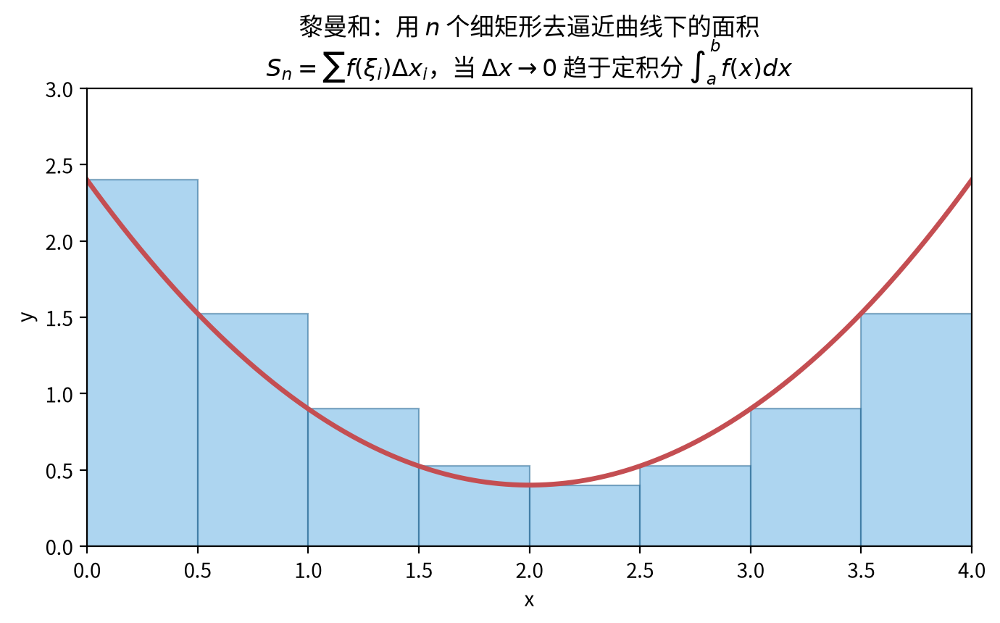

> **直观理解（现实类比）**：定积分就是求"**曲线下的面积**"。想象用一把很细的**小刀**把这片面积切成无数个细长矩形条，把所有矩形面积加起来就得总面积。刀切得越细（$\Delta x$ 越小），近似越准；**当宽度趋近于 0 时，这个和就精确等于定积分**。
>
> 回到第 1 级的"穷竭法"：其实阿基米德两千年前算抛物线面积用的就是这个思路！**黎曼和$\rightarrow$定积分，不过是把"越切越细"这个朴素想法变成了严格的极限定义**。这也是为什么微积分是"无穷细分"思想的集大成者。

> **🧠 思考历程：一条抛物线下方的面积，逼着黎曼给"积分"办了身份证**
>
> $\int_a^b f(x)\,dx$ 看着是"一个符号"，可它的前身是一道困扰古人两千年的苦差事：**不规则的曲线到底围了多少面积？** "切成小条再相加"谁都会想，可要把它变成可以认真数学推理的对象，黎曼费了大力气。
>
> - **阿基米德早已"穷竭"**。像抛物线拱形这类面积，阿基米德（公元前 3 世纪）用"越切越细的矩形"逼近并求极限，史称**穷竭法**。他算出抛物线弓形面积是内接三角形的 $\frac43$ 倍。**古希腊人已经站到了积分门口，只差没给它正式名分。**
> - **BUT，"任意有面积的怪形"出现了**。到了 19 世纪，数学家开始追问：是不是所有图都有圆面积？狄利克雷造出在有理/无理点上取不同值的函数，连"有没有面积"都说不清。**直觉的"切条求和"遇到这些怪函数就失灵，必须重新定义"什么是可积"。**
> - **黎曼的"立法"**。**黎曼**（Riemann, 1854 年前后）把问题彻底形式化：不管函数多怪，只要"用细矩形逼近的和"在**最粗的格子宽度 $\lambda\to0$** 时收敛到同一个数、且与分割方式和取样点都无关，就说明它"可积"，这个数就是定积分。**"面积"不再是几何直观，而是一个极限存在的判定。** 这就是本节 $\int_a^b f = \lim_{\lambda\to0}\sum f(\xi_i)\Delta x_i$ 的来历。
> - **它不是终点，只是里程碑**。黎曼积分统一了此前零散的"面积"概念；后人在处理更极端情形时又发展出勒贝格积分（见后续第 34 级测度论）。**但黎曼这套"细切+取极限"的框架，至今仍是工科和科学里最常用、最好懂的积分模型。**
> - **心路**：黎曼和告诉你：**"一个大家都会的朴素想法"到"一个严密的数学定义"，中间往往隔着精确性与反例的千锤百炼**。你背的 $\int_a^bf(x)dx$，是两千多年"穷竭—质疑—立法"的沉淀物。

#### 🎬 动画演示：黎曼和逼近定积分

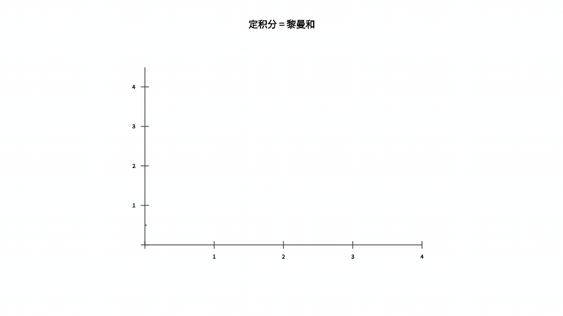

> 这个动画直观展示了黎曼和的定义：随着细分的子区间个数 $n$ 不断增多、每个矩形宽度 $\Delta x_i$ 趋近于 0，所有小矩形面积之和逐渐逼近曲线下的真实面积，最终收敛到定积分 $\int_a^b f(x)\,dx$。

### 6.2 定积分的性质

1. **线性性质**：$\int_a^b [\alpha f(x) + \beta g(x)] \, dx = \alpha \int_a^b f(x) \, dx + \beta \int_a^b g(x) \, dx$
2. **区间可加性**：$\int_a^b f(x) \, dx = \int_a^c f(x) \, dx + \int_c^b f(x) \, dx$
3. **保序性**：若 $f(x) \leq g(x)$，则 $\int_a^b f(x) \, dx \leq \int_a^b g(x) \, dx$
4. **绝对值不等式**：$\left|\int_a^b f(x) \, dx\right| \leq \int_a^b |f(x)| \, dx$
5. **积分中值定理**：若 $f$ 在 $[a, b]$ 上连续，则存在 $\xi \in [a, b]$，使得 $\int_a^b f(x) \, dx = f(\xi)(b - a)$

### 6.3 微积分基本定理

这是微积分学的核心，它将微分与积分联系起来。

#### 第一部分（原函数存在定理）

设 $f(x)$ 在 $[a, b]$ 上连续，定义函数

$$F(x) = \int_a^x f(t) \, dt, \quad x \in [a, b]$$

则 $F(x)$ 在 $[a, b]$ 上可导，且 $F'(x) = f(x)$。即

$$\frac{d}{dx} \int_a^x f(t) \, dt = f(x)$$

**证明**：由导数的定义，

$$
\begin{aligned}
F'(x) &= \lim_{h \to 0} \frac{F(x+h) - F(x)}{h} \\
&= \lim_{h \to 0} \frac{1}{h} \left[ \int_a^{x+h} f(t) \, dt - \int_a^x f(t) \, dt \right] \\
&= \lim_{h \to 0} \frac{1}{h} \int_x^{x+h} f(t) \, dt
\end{aligned}
$$

- 第 1 个等号：把导数的定义直接套在面积函数 $F(x)$ 上；依据：导数定义 $F'(x)=\lim_{h\to0}\frac{F(x+h)-F(x)}{h}$；目的：把"面积函数求导"改写成可以继续拆的极限。
- 第 2 个等号：把 $F(x+h)-F(x)$ 各自代成定积分并相减；依据：$F$ 的定义 $F(x)=\int_a^x f(t)dt$；目的：把函数值之差转化为积分之差，好利用积分的性质化简。
- 第 3 个等号：用定积分的区间可加性把两项并成一项；依据：区间可加性 $\int_a^{x+h}=\int_a^x+\int_x^{x+h}$；目的：得到"$x$ 到 $x+h$ 这一小段的积分"，为套积分中值定理铺路。

由积分中值定理，存在 $\xi_h \in [x, x+h]$ 使得 $\int_x^{x+h} f(t) \, dt = f(\xi_h) \cdot h$，于是

$$F'(x) = \lim_{h \to 0} \frac{1}{h} \cdot f(\xi_h) \cdot h = \lim_{h \to 0} f(\xi_h) = f(x)$$

- 【第 4 步】依据：积分中值定理（$f$ 连续）——存在 $\xi_h\in[x,x+h]$ 使 $\int_x^{x+h}f(t)\,dt=f(\xi_h)\cdot h$；目的：把积分换成"某点函数值 × 小区间长度 $h$"，与前面的 $\frac{1}{h}$ 相约。
- 【第 5 步】依据：由 $f$ 的连续性，$h\to0$ 时 $\xi_h\to x$，故 $\lim_{h\to0}f(\xi_h)=f(x)$；目的：得到 $F'(x)=f(x)$，完成"积分的导数回到被积函数"的证明。

（最后一步由 $f$ 的连续性得到。）

#### 第二部分（牛顿-莱布尼茨公式）

设 $f(x)$ 在 $[a, b]$ 上连续，$F(x)$ 是 $f(x)$ 的任意一个原函数，则

$$\int_a^b f(x) \, dx = F(b) - F(a)$$

**证明**：由第一部分，$G(x) = \int_a^x f(t) \, dt$ 是 $f$ 的一个原函数。任一原函数 $F(x)$ 与 $G(x)$ 相差一个常数：$F(x) = G(x) + C$。于是

$$F(b) - F(a) = [G(b) + C] - [G(a) + C] = G(b) - G(a) = \int_a^b f(t) \, dt - \int_a^a f(t) \, dt = \int_a^b f(t) \, dt$$

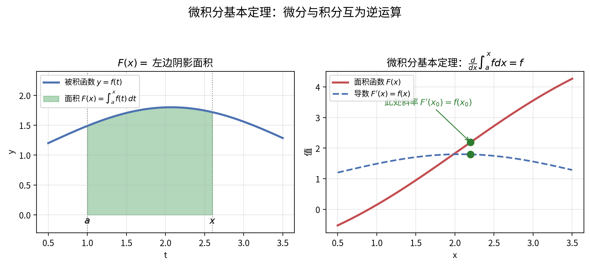

> **直观理解（现实类比）**：微积分基本定理是"**求面积**"与"**求斜率**"这对孪生运算的**对偶钥匙**。左边，$F(x)$ 是"从 $a$ 扫到 $x$ 的阴影面积"；右边，这团面积的"增长速度" $F'(x)$ 恰好就是被积函数 $f(x)$——面积变化的快慢等于当前高度。就像**水龙头注水**：水位 $F(x)$ 是"累计水量"，而 $f(x)$ 是"此时的水流速度"。知道速度求水量（积分）、知道水量求速度（微分），二者互为逆运算，这正是牛顿和莱布尼茨各自独立发现的**核心定理**。

> **🧠 思考历程：为什么"求斜率"和"求面积"竟是一家？**
>
> 微积分基本定理（Fundamental Theorem of Calculus）堪称"数学史上最强的一项签约"——它把两个看似毫无关系的任务（微分=斜率，积分=面积）捆绑成了逆运算。没有它，"积分"就只是望洋兴叹的求和。
>
> - **危机：积分难算，微分好算**。定积分 $\int_a^b f(x)\,dx$ 原本是按想法**求和取极限**（见 6.1 节黎曼和），每算一个都要对付无穷多项，苦不堪言。可微积分的基本动作（导数）却是一套清爽的算法（求导法则）。**如果能把"算面积"翻译成"找原函数"，那么背规则就比穷举求和便宜一万倍。**
> - **牛顿与莱布尼茨各自的顿悟**。他们分别看出：**"面积函数 $F(x)=\int_a^x f$ 的变化率，居然就是被积函数 $f(x)$"**。这等于说"面积"和"斜率"是同一枚硬币的两面——求导是"拆"，求积分是"拼"，互为逆运算。于是定积分有了通法：$\int_a^b f = F(b)-F(a)$，只要找到原函数 $F$。
> - **上面证明的"最后一击"**。证明里关键一步是"$F(x+h)-F(x)=\int_x^{x+h}f$"——它把"面积增量"看成一细条"高度×宽度"。用积分中值定理把窄条近似成 $f(\xi)\cdot h$，除以 $h$ 让 $h\to0$，就得到 $F'(x)=f(x)$。**整个证明的直觉，就是"一小片面积 = 高度 × 一丁点宽度"。**
> - **心路**：基本定理告诉你：**数学里最有效的"捷径"，往往是发现两个看似无关的问题根本是同一个人**。微分与积分原以为是两种手艺，结果是一对逆运算。今后凡是遇到"算一个求和却很难"，先想"它是不是某个函数的原函数"——这常常就是化繁为简的开关。

---

## 七、定积分的应用

### 7.1 平面图形的面积

曲线 $y = f(x)$ 与 $y = g(x)$ 在 $[a, b]$ 上所围图形的面积为

$$A = \int_a^b |f(x) - g(x)| \, dx$$

### 7.2 旋转体的体积

**圆盘法**：曲线 $y = f(x)$ 绕 $x$ 轴旋转一周所得体积为

$$V = \pi \int_a^b [f(x)]^2 \, dx$$

**壳层法**：曲线 $y = f(x)$ 绕 $y$ 轴旋转一周所得体积为

$$V = 2\pi \int_a^b x |f(x)| \, dx$$

### 7.3 弧长

曲线 $y = f(x)$ 从 $x = a$ 到 $x = b$ 的弧长为

$$L = \int_a^b \sqrt{1 + [f'(x)]^2} \, dx$$

参数方程 $x = x(t), y = y(t)$（$t \in [\alpha, \beta]$）的弧长为

$$L = \int_\alpha^\beta \sqrt{[x'(t)]^2 + [y'(t)]^2} \, dt$$

### 预备知识：极坐标（Prerequisite：Polar Coordinates）

> §7.4 的面积与弧长都围绕曲线 $r = r(\theta)$ 展开，本节先补充这套坐标的定义与互化。

**极坐标的定义**：平面内取一定点 $O$（**极点**）和一条射线 $Ox$（**极轴**），再选定长度单位与角度的正方向（逆时针为正）。平面内任一点 $P$ 用有序实数组 $(r, \theta)$ 表示：$r$ 是 $P$ 到极点的距离，称为**极径**；$\theta$ 是极轴到射线 $OP$ 的夹角，称为**极角**。

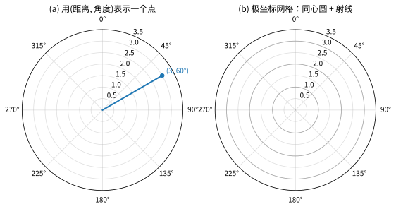

**直角坐标 ↔ 极坐标互化**（极点与原点重合、极轴与 $x$ 轴正半轴重合）：点 $P$ 的直角坐标为 $(x,y)$、极坐标为 $(r,\theta)$，则
$$
x = r\cos\theta, \qquad y = r\sin\theta
$$
反过来，
$$
r = \sqrt{x^2 + y^2}, \qquad \tan\theta = \frac{y}{x}
$$
（求 $\theta$ 时需按所在象限选取，避免只取 $\arctan$ 主轴值。）

> **直观理解（现实类比）**：极坐标用"**离中心多远 + 朝哪个方向**"来定位，就像**雷达扫描**——屏幕中心是极点，扫描线一圈圈转动就是极角 $\theta$，目标亮点到中心的距离就是极径 $r$。凡是**天然围绕一个中心点**展开的曲线（圆、心形线、阿基米德螺线），用极坐标往往一两行就能写出，而用直角坐标却十分繁琐。
>
> 极坐标的**系统理论**（同一点的多值表示、常见曲线的极坐标方程、更多应用）见 **第16级-解析几何 §7.5**，这里只补 §7.4 需要的定义与互化。

### 7.4 极坐标下的面积与弧长

**极坐标下的面积**：曲线 $r = r(\theta)$（$\alpha \le \theta \le \beta$）与射线 $\theta = \alpha$、$\theta = \beta$ 所围成的扇形区域面积为
$$
S = \frac{1}{2}\int_\alpha^\beta [r(\theta)]^2\, d\theta
$$
（把区域近似成无数个"小扇形"，每个小扇形面积 $\frac12 r^2 \Delta\theta$，再积分。）

> **示例**：求 $r = a(1 + \cos\theta)$（心形线）的面积。由对称性，并在 $[0, 2\pi]$ 上积分：
$$
S = \frac{1}{2}\int_0^{2\pi} a^2(1+\cos\theta)^2\, d\theta
= \frac{a^2}{2}\int_0^{2\pi}(1 + 2\cos\theta + \cos^2\theta)\, d\theta
= \frac{a^2}{2}\left(2\pi + 0 + \pi\right) = \frac{3\pi a^2}{2}
$$

**极坐标下的弧长**：曲线 $r = r(\theta)$（$\alpha \le \theta \le \beta$）的弧长为
$$
L = \int_\alpha^\beta \sqrt{[r(\theta)]^2 + [r'(\theta)]^2}\, d\theta
$$

> **推导**：由 $x = r\cos\theta,\ y = r\sin\theta$，算得 $x' = r'\cos\theta - r\sin\theta$，$y' = r'\sin\theta + r\cos\theta$，代入参数方程弧长公式 $L = \int\sqrt{(x')^2 + (y')^2}\, d\theta$ 化简即得上式。

### 7.5 旋转曲面的面积

曲线 $y = f(x)$ 绕 $x$ 轴旋转所得曲面的侧面积为

$$S = 2\pi \int_a^b |f(x)| \sqrt{1 + [f'(x)]^2} \, dx$$

---

## 八、广义积分

直到第七章，我们算的都是"普通"定积分：积分区间是**有限**的闭区间 $[a, b]$，被积函数在区间上**有界**（通常还要求连续）。但现实世界与后续理论中，大量问题天然不满足这两个条件。广义积分（Improper Integral，也叫**反常积分**）就是为"照顾"这类"破格"情形而生的推广。

> **直观理解（现实类比）**：普通定积分好比给一口**有底的锅**装满"区间"里的水——锅底从 $a$ 到 $b$，水位由 $f(x)$ 决定，算的是这锅水的量。广义积分则回答两种"锅"的问题：
>
> 1. **锅没有底边**（区间无穷长）：比如"地面到无穷远处大气层的质量"，你的区间端点 $b$ 在"无穷远"，锅底怎么封？
> 2. **函数在某处"无限高"**（无界）：比如 $\frac{1}{\sqrt{x}}$ 在 $x=0$ 附近冲到无穷，锅壁在这一点"戳破了"。
>
> 广义积分的精神就是：**先当作普通积分去算一段，再看当你把这段越拉越长（$\to\infty$）、或越贴近那个无限高的点（$\to$ 瑕点）时，结果是否趋于一个确定的数**。趋于定数就"收敛"，算不出定数就"发散"。

**为什么要学它（用处）**：

- **物理**：计算把物体从地面"搬到无穷远"所需的能量，正是 $\int_R^\infty \frac{GMm}{x^2}\,dx$——牛顿万有引力在无穷区间的积分（第二宇宙速度就来自它）。
- **概率与统计**：正态分布、指数分布的一切概率都建立在无穷限积分 $\int_{-\infty}^{+\infty} \frac{1}{\sqrt{2\pi}}e^{-x^2/2}\,dx=1$ 之上——连续型随机变量的"全部概率为 1"本身就是广义积分。
- **热传导、信号处理与量子力学**：很多"从 0 到无穷"的衰减模型（$e^{-t}$、$e^{-t^2}$）都要用广义积分来描述。
- **理论延伸**：第八章后半的 $\Gamma$ 函数、$\mathrm{B}$ 函数本身都是广义积分，它们把阶乘推广到任意正数，是后续级数、特殊函数与数理方程绕不开的基石。

**与第七章的衔接**：第七章的所有应用（面积、体积、弧长）都假设区间有限。广义积分把"累加"的能力从"锅里有底的有限区间"扩展到"端点在无穷远"或"被积函数有瑕点"的情形，是微积分叙事里承上启下的一环——它为下一步"判断敛散性不依赖能否算出结果"埋下伏笔。

### 8.1 无穷限的广义积分

$$\int_a^{+\infty} f(x) \, dx = \lim_{t \to +\infty} \int_a^t f(x) \, dx$$

$$\int_{-\infty}^b f(x) \, dx = \lim_{t \to -\infty} \int_t^b f(x) \, dx$$

若极限存在，称积分**收敛**；否则称**发散**。

> **直观理解（现实类比）**：$\int_1^\infty f(x)\,dx$ 几何上就是求"$x=1$ 向右一直延伸到无穷的曲线下面积"。你可能担心："区间都无穷长，面积不也无穷大吗？"不一定！关键在于**矩形底边在增宽的同时，高度 $f(x)$ 是否在快速变矮**。两者赛跑：
>
> - 若函数"塌陷"得比 $x$ 增长更快（如 $\frac{1}{x^2}$），底边虽无限、高度却飞快归零，总面积**收敛到有限值**——就像把一条无限长的细绳卷起来，总量却有限。
> - 若函数塌陷得"不够快"（如 $\frac{1}{x}$），高度下降得仅够与底边加长相持平甚至更慢，总面积**无限发散**——像永不停歇地加一杯水，永远加不满也永远加不完。
>
> 判断 $\int_1^\infty \frac{1}{x^p}\,dx$：当 $p>1$（高度"俯冲")时收敛，$p\le1$（高度"缓降"）时发散。**临界点恰在 $p=1$**——这是"塌陷速度与延展速度打了个平手"的分界，也是后文比较判别法的基准尺。

### 8.2 无界函数的广义积分（瑕积分）

若 $f(x)$ 在 $x = a$ 处无界（$a$ 为瑕点），则

$$\int_a^b f(x) \, dx = \lim_{\varepsilon \to 0^+} \int_{a+\varepsilon}^b f(x) \, dx$$

类似地可定义 $b$ 为瑕点或区间内部存在瑕点的情况。

> **直观理解（现实类比）**：瑕积分处理的是"函数在某一点冲向无穷"的奇观：比如 $\frac{1}{\sqrt{x}}$ 在 $x=0^+$ 处函数值趋于 $+\infty$，按普通定积分的定义，这个"无限高的尖峰"根本无法积分。但我们关心的是**尖峰下方的面积到底是不是有限的**。办法是：从瑕点内侧一点点地"退开"（积分下限取 $\varepsilon>0$，即 $\varepsilon\to0^+$），算一段正常的积分，再看这段积分在贴近瑕点时是否仍有极限。
>
> 一个反直觉的事实：**尖峰无限高，面积却可能有限**。以 $\int_0^1 \frac{1}{\sqrt{x}}\,dx$ 为例，$x$ 越小函数越高，但峰只有"一点点宽"，面积却收敛到 2。这好比一根**立在桌面上被压得极扁却又极尖的钉子**：钉子尖可以高到"突破天际"，但只要钉脚够细、收敛够快，钉子的总体积（面积）就仍是个有限数。$\int_0^1 \frac{1}{x^p}\,dx$ 在 $p<1$ 时收敛、$p\ge1$ 时发散，分界点同样是 $p=1$。

### 8.3 收敛性判别法

很多广义积分的被积函数**找不到原函数**（或原函数极复杂），却仍想知道"到底收敛还是发散"。8.3 与 8.4 就是绕过"算"，直接通过比较、极限来**判断敛散性**的工具——这正是前导里所说的"判断不依赖能否算出结果"。

**比较判别法**：设 $0 \leq f(x) \leq g(x)$，则

- 若 $\int_a^{+\infty} g(x) \, dx$ 收敛，则 $\int_a^{+\infty} f(x) \, dx$ 收敛
- 若 $\int_a^{+\infty} f(x) \, dx$ 发散，则 $\int_a^{+\infty} g(x) \, dx$ 发散

**极限比较法**：若 $\lim_{x \to +\infty} \frac{f(x)}{g(x)} = L$（$0 < L < +\infty$），则 $\int_a^{+\infty} f(x) \, dx$ 与 $\int_a^{+\infty} g(x) \, dx$ 同敛散。

**常用参考积分**：

- $\int_1^{+\infty} \frac{1}{x^p} \, dx$：$p > 1$ 时收敛，$p \leq 1$ 时发散
- $\int_0^1 \frac{1}{x^p} \, dx$：$p < 1$ 时收敛，$p \geq 1$ 时发散

### 8.4 含参变量积分

> 被积函数中还含有一个（或多个）参数的积分。它把"积分"与"关于参数的求导/极限/积分"之间的换序问题，以及著名的**欧拉积分**（$\Gamma$ 函数、$\mathrm{B}$ 函数）都归于此类。

**含参正常积分及其性质**：

设 $f(x, y)$ 在矩形 $[a, b] \times [c, d]$ 上连续，记 $I(y) = \int_a^b f(x, y)\, dx$，则：

1. **连续性**（可与极限换序）：$I(y)$ 在 $[c, d]$ 上连续，即
   $$
   \lim_{y \to y_0}\int_a^b f(x, y)\, dx = \int_a^b \lim_{y \to y_0} f(x, y)\, dx
   $$
2. **Leibniz 求导法则**（可与求导换序）：若 $f_y$ 连续，则
   $$
   I'(y) = \int_a^b f_y(x, y)\, dx
   $$
3. **积分换序**（Fubini 特例）：
   $$
   \int_c^d I(y)\, dy = \int_a^b\!\int_c^d f(x, y)\, dy\, dx
   $$

> **思路**：含参积分换序的价值在于——有时某个积分本身难算，但换序后（或先对参数求导）就变得可算。这是计算许多著名积分的利器。

**含参广义积分与一致收敛**：

设 $I(y) = \int_a^{+\infty} f(x, y)\, dx$（广义含参）。称它在 $y \in E$ 上关于 $y$ **一致收敛**，若 $\forall \varepsilon > 0$，$\exists A$（与 $y$ 无关），当 $B > A$ 时对一切 $y \in E$ 有 $\left|\int_B^{+\infty} f(x, y)\, dx\right| < \varepsilon$。

**Weierstrass M-判别法**：若存在与 $y$ 无关的可积函数 $M(x)$，使 $|f(x, y)| \le M(x)$ 且 $\int_a^{+\infty} M(x)\, dx$ 收敛，则含参广义积分一致收敛。

- 一致收敛的含参广义积分可换序（连续、可导、可积）。

**欧拉积分（Euler's Integrals）**：

**$\Gamma$ 函数**：
$$
\Gamma(s) = \int_0^{+\infty} x^{s-1} e^{-x}\, dx, \qquad s > 0
$$
**重要性质**：
- 递推公式：$\Gamma(s+1) = s\,\Gamma(s)$
- 整数取值：$\Gamma(n+1) = n!$（$n$ 为非负整数）
- 特殊值：$\Gamma\left(\frac{1}{2}\right) = \sqrt{\pi}$

**$\mathrm{B}$ 函数**：
$$
\mathrm{B}(p, q) = \int_0^1 x^{p-1}(1-x)^{q-1}\, dx, \qquad p > 0,\ q > 0
$$
**重要关系**：
$$
\mathrm{B}(p, q) = \frac{\Gamma(p)\,\Gamma(q)}{\Gamma(p+q)}
$$

> **应用**：$\Gamma$ 函数把阶乘推广到实数与复数，是概率论（$\Gamma$ 分布）、数理统计（$t$ 分布、$\chi^2$ 分布）与特殊函数论的基础。

---

## 九、泰勒公式

### 9.1 泰勒定理

设 $f(x)$ 在 $x_0$ 的某邻域内具有 $n+1$ 阶导数，则对该邻域内的任意 $x$，存在 $\xi$ 介于 $x$ 与 $x_0$ 之间，使得

$$f(x) = \sum_{k=0}^{n} \frac{f^{(k)}(x_0)}{k!} (x - x_0)^k + R_n(x)$$

其中余项 $R_n(x)$ 可以表示为

**拉格朗日余项**：

$$R_n(x) = \frac{f^{(n+1)}(\xi)}{(n+1)!} (x - x_0)^{n+1}$$

**佩亚诺余项**：

$$R_n(x) = o[(x - x_0)^n]$$

---

#### 9.1.1 定理的严格证明

下面用**积分余项法**给出泰勒定理的完整证明。这个证法最自然：它是微积分基本定理的反复应用，正好与此前 9.4 节的面积直觉无缝衔接。

**证明**（积分余项法，设 $f^{(n+1)}$ 连续，记 $x_0 < x$，另一端对称）：

- **第 1 步：用微积分基本定理拆一层**。对 $f(x)$ 减去起点值 $f(x_0)$：

$$f(x) = f(x_0) + \int_{x_0}^{x} f'(t)\, dt$$

- **第 2 步：对 $f'(t)$ 再做一次同样处理**。以 $t$ 为积分变量、$x_0$ 为起点，$f'(t) = f'(x_0) + \int_{x_0}^{t} f''(s)\, ds$，代回：

$$f(x) = f(x_0) + f'(x_0)(x - x_0) + \int_{x_0}^{x} \int_{x_0}^{t} f''(s)\, ds\, dt$$

- **第 3 步：对高阶导数逐层迭代**。每迭代一次，就"剥出"新的一项 $\frac{f^{(k)}(x_0)}{k!}(x-x_0)^k$，因为重积分 $\int_{x_0}^{x}\!\int_{x_0}^{t_1}\!\cdots\!\int_{x_0}^{t_{k-1}}1\, dt_{k-1}\cdots dt_1 = \frac{(x-x_0)^k}{k!}$（第 $k$ 次积分的结果恰是 $\frac{(t-x_0)^{k-1}}{(k-1)!}$，再积一次得 $\frac{(x-x_0)^k}{k!}$）。

- **第 4 步：会聚到 $n+1$ 阶，得到"积分余项"**。迭代到 $f^{(n+1)}$ 后，剩余项就是：

$$R_n(x) = \int_{x_0}^{x} \frac{(x - t)^n}{n!} f^{(n+1)}(t)\, dt$$

这就是泰勒公式的**积分余项（柯西-型积分余项）**。它与 9.4 节"把函数看成面积函数、逐层展开面积增量"的几何解释是同一件事：每一项依次对应零维（常数）、一维（矩形/长度）、二维（三角形/面积）、……、"体积"的逐级累加。

---

#### 9.1.2 由积分余项导出拉格朗日余项

**证明**：若 $f^{(n+1)}$ 连续，则它在 $[x_0, x]$ 上可取到最值。记 $$m = \min_{[x_0,x]} f^{(n+1)}$$，$$M = \max_{[x_0,x]} f^{(n+1)}$$。由积分余项的定义，$\frac{(x-t)^n}{n!} \ge 0$，故

$$\frac{m\,(x-x_0)^{n+1}}{(n+1)!} \;\le\; R_n(x) \;\le\; \frac{M\,(x-x_0)^{n+1}}{(n+1)!}$$

由连续函数的介值定理，存在 $\xi \in (x_0, x)$ 使 $f^{(n+1)}(\xi) = \frac{(n+1)! R_n(x)}{(x-x_0)^{n+1}}$，即

$$R_n(x) = \frac{f^{(n+1)}(\xi)}{(n+1)!}(x - x_0)^{n+1}, \qquad \xi \text{ 介于 } x_0 \text{ 与 } x \text{ 之间}$$

这正是拉格朗日余项。**它把"余项到底多大"归结为"$n+1$ 阶导数在区间内某一点的值"**，是估计误差的实用形式。

> **直观理解（现实类比）**：拉格朗日余项好比一幅照片的**"失焦量"**。泰勒多项式是"主角对准焦点、提前拍好的构图（$x_0$ 处函数及各阶导数）"，真函数 $f(x)$ 则是"实际成像"。当取景框从 $x_0$ 挪到 $x$ 时，画面会略微模糊，模糊的程度由一个"介于两者之间的取景点 $\xi$"决定——正如余项只依赖 $\xi \in (x_0, x)$ 处的 $(n+1)$ 阶导数值。阶数 $n$ 越高（镜头素质越好），失焦量以 $(x-x_0)^{n+1}$ 的速度迅速缩小。

---

#### 9.1.3 佩亚诺余项的证明

**证明**：由拉格朗日余项 $R_n(x) = \frac{f^{(n+1)}(\xi)}{(n+1)!}(x-x_0)^{n+1}$，其中 $\xi$ 介于 $x_0$（不妨设 $x<x_0$，另一端取绝对值同理）之间。当 $x \to x_0$ 时 $\xi \to x_0$，在 $f^{(n+1)}$ 连续的假设下有 $f^{(n+1)}(\xi)\to f^{(n+1)}(x_0)$，于是

$$\frac{R_n(x)}{(x-x_0)^n} = \frac{f^{(n+1)}(\xi)}{(n+1)!}(x-x_0) \to 0$$

即 $R_n(x) = o[(x-x_0)^n]$。**佩亚诺余项比拉格朗日余项"更弱"**：它只说明余项是 $(x-x_0)^n$ 的高阶无穷小（适合求极限、判断局部行为），代价是不给出具体的量（无法用于精确估计误差）。实际做题时：**算极限用佩亚诺余项，估计误差用拉格朗日余项**。

---

### 9.2 麦克劳林公式

当 $x_0 = 0$ 时的泰勒公式称为麦克劳林公式：

$$f(x) = \sum_{k=0}^{n} \frac{f^{(k)}(0)}{k!} x^k + R_n(x)$$

### 9.3 常见函数的麦克劳林展开

$$
\begin{aligned}
e^x &= \sum_{n=0}^{\infty} \frac{x^n}{n!} = 1 + x + \frac{x^2}{2!} + \frac{x^3}{3!} + \cdots, \quad x \in \mathbb{R} \\
\sin x &= \sum_{n=0}^{\infty} \frac{(-1)^n x^{2n+1}}{(2n+1)!} = x - \frac{x^3}{3!} + \frac{x^5}{5!} - \cdots, \quad x \in \mathbb{R} \\
\cos x &= \sum_{n=0}^{\infty} \frac{(-1)^n x^{2n}}{(2n)!} = 1 - \frac{x^2}{2!} + \frac{x^4}{4!} - \cdots, \quad x \in \mathbb{R} \\
\ln(1+x) &= \sum_{n=1}^{\infty} \frac{(-1)^{n-1} x^n}{n} = x - \frac{x^2}{2} + \frac{x^3}{3} - \cdots, \quad x \in (-1, 1] \\
\frac{1}{1-x} &= \sum_{n=0}^{\infty} x^n = 1 + x + x^2 + x^3 + \cdots, \quad x \in (-1, 1) \\
(1+x)^\alpha &= \sum_{n=0}^{\infty} \binom{\alpha}{n} x^n = 1 + \alpha x + \frac{\alpha(\alpha-1)}{2!} x^2 + \cdots, \quad x \in (-1, 1)
\end{aligned}
$$

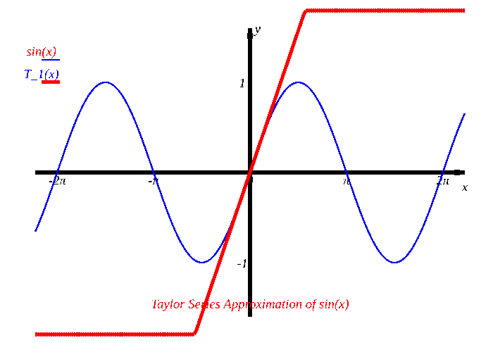
*图：$\sin x$ 的泰勒展开，阶数从 $T_1(x)$ 到 $T_{13}(x)$ 逐渐升高，红色曲线逐渐逼近蓝色原函数*

#### 9.3.1 为什么这些展开确实成立（收敛性证明）

泰勒多项式只是"前 $n$ 项"；写成无穷级数需要证明：**当 $n\to\infty$ 时余项 $R_n\to 0$**。以几个典型为例，都用拉格朗日余项完成。

**证明（$e^x$ 在 $x_0=0$ 处的展开收敛到 $e^x$）**：

- **余项估计**：$f^{(n+1)}(x) = e^x$。对固定的 $x$，拉格朗日余项为

$$R_n(x) = \frac{e^{\xi}}{(n+1)!}\,x^{\,n+1}, \qquad \xi \text{ 介于 } 0 \text{ 与 } x \text{ 之间}$$

- **夹逼到零**：对不同分段的 $x$，$e^{\xi}$ 有界（例如 $|x|\le M$ 时 $e^{\xi}\le e^{M}$），而此时

$$0 \le \left|R_n(x)\right| \le \frac{e^{M}\, |x|^{n+1}}{(n+1)!}$$

- **用阶乘的压倒性**：阶乘增长得快于任何幂函数，故 $\frac{|x|^{n+1}}{(n+1)!} \to 0$（正如 $\frac{2^n}{n!}\to0$）。由夹逼定理 $R_n(x)\to0$。

因此 $e^x = \sum_{n=0}^{\infty}\frac{x^n}{n!}$ 对**一切** $x\in\mathbb{R}$ 成立。**关键桥梁**：$\frac{N^n}{n!}\to0$（$N$ 固定），这是"阶乘打败一切指数"的体现。

**证明（$\sin x$ 与 $\cos x$ 的展开收敛）**：$\sin^{(k)}(x)$ 只在 $\pm\sin x$、$\pm\cos x$ 之间循环，故对一切 $x$ 有 $\left|f^{(n+1)}(\xi)\right|\le 1$。于是

$$|R_n(x)| \le \frac{|x|^{n+1}}{(n+1)!} \to 0$$

同样由夹逼定理 $R_n(x)\to0$，故 $\sin x$、$\cos x$ 的麦克劳林级数对一切实数收敛到原函数。这也印证了 9.4 节动图中"阶数越高，红色曲线越贴近蓝色原函数"的观察。

**证明（$\frac{1}{1-x}$ 的展开）**：这是等比数列求和公式的直接结论：

$$\sum_{n=0}^{\infty}x^{n} = \frac{1}{1-x}, \qquad |x|<1$$

（等比通项 $x^n$ 的公比绝对值 $<1$ 时收敛）。无需泰勒定理即可独立看出，它的收敛半径 $|x|<1$ 由公比条件决定。

---

### 9.4 直观理解：多项式逼近过程

泰勒公式的核心思想是 **用多项式函数逼近光滑函数**。下面通过具体例子来直观理解这一过程。

#### 9.4.1 以 $\cos x$ 为例的逐步逼近

假设我们要用二次多项式 $P(x) = c_0 + c_1x + c_2x^2$ 来近似 $f(x) = \cos x$ 在 $x=0$ 附近的值。

**确定 $c_0$**：令 $P(0) = f(0)$，即 $c_0 = \cos 0 = 1$。


*图：$c_0 = 1$，$P(x) = 1$ 是一条水平线，在 $x=0$ 处与 $\cos x$ 相交*

**确定 $c_1$**：令 $P'(0) = f'(0)$，即 $c_1 = -\sin 0 = 0$。


*图：$c_1 = 0$，$P(x) = 1$ 在 $x=0$ 处与 $\cos x$ 有相同的斜率*

**确定 $c_2$**：令 $P''(0) = f''(0)$，即 $2c_2 = -\cos 0 = -1$，$c_2 = -\frac{1}{2}$。

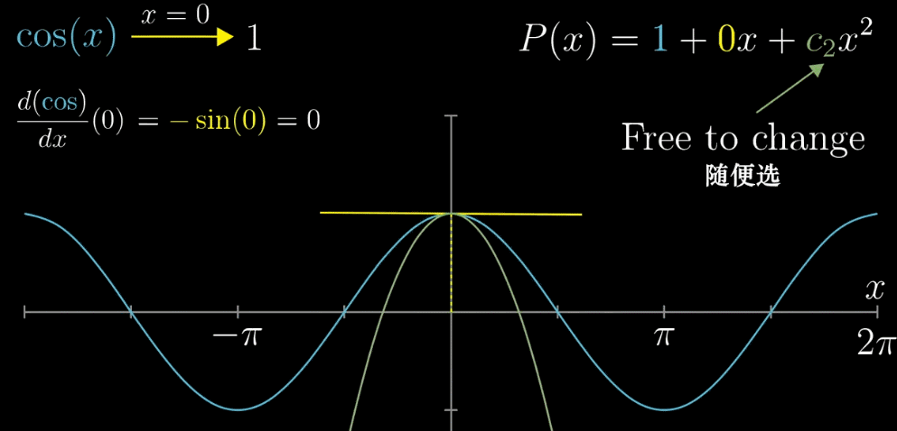
*图：$P(x) = 1 - \frac{1}{2}x^2$ 在 $x=0$ 处与 $\cos x$ 有相同的二阶导数*

**验证**：$\cos 0.1 \approx 0.995004$，而 $P(0.1) = 1 - \frac{1}{2}(0.1)^2 = 0.995$，已经非常接近。


*图：随着多项式项数增加，红色曲线逐渐逼近蓝色 $\cos x$ 曲线*

#### 9.4.2 为什么使用多项式来近似

多项式具有以下优点，使其成为理想的逼近工具：
- **计算简单**：只需加、乘运算，计算机可以高效执行
- **导数容易**：多项式的导数仍然是多项式
- **局部性质可控**：通过调整系数，可以在某点附近精确控制函数值和高阶导数


*图：更多项的多项式逼近，在更大范围内与 $\cos x$ 吻合*

#### 9.4.3 为什么系数是 $\frac{1}{n!}$

从 $f(x) = \cos x$ 的例子可以看出，确定 $c_n$ 时需要对 $P(x)$ 和 $f(x)$ 求 $n$ 阶导数：

$$P^{(n)}(0) = n! \cdot c_n, \quad f^{(n)}(0) \text{ 已知}$$

因此 $c_n = \frac{f^{(n)}(0)}{n!}$，这就是泰勒公式中 $\frac{1}{n!}$ 的来源。

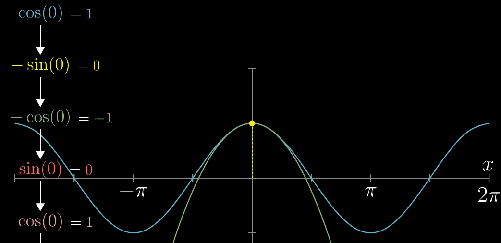
*图：$\cos x$ 的多阶泰勒逼近，阶数越高近似越精确*

#### 9.4.4 推广到一般函数

对于任意光滑函数 $f(x)$ 在 $x = a$ 处展开，其泰勒多项式为：

$$P_n(x) = f(a) + f'(a)(x-a) + \frac{f''(a)}{2!}(x-a)^2 + \cdots + \frac{f^{(n)}(a)}{n!}(x-a)^n$$

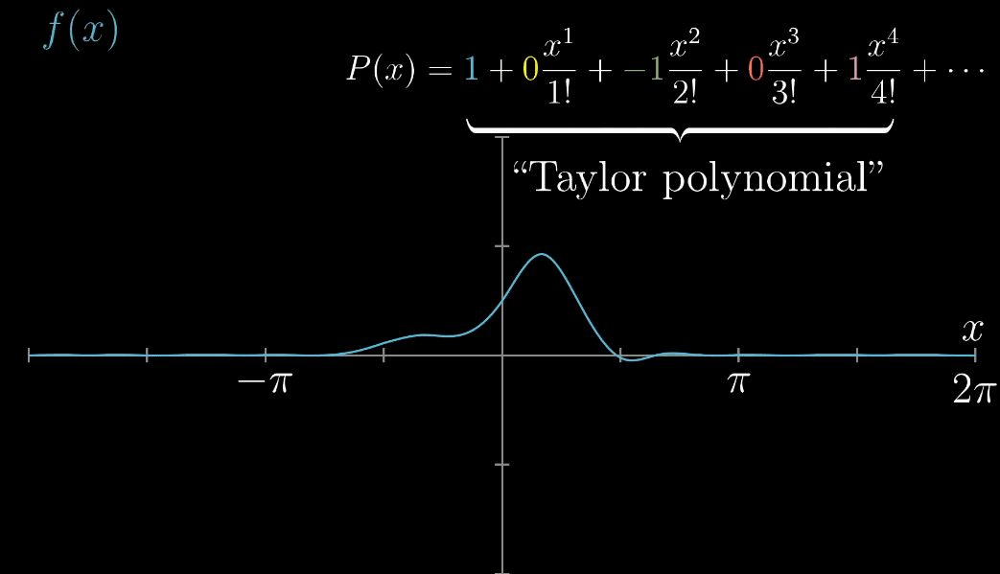
*图：一般函数 $f(x)$ 在 $x=a$ 处的泰勒逼近*

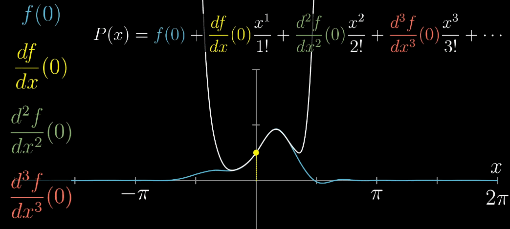
*图：泰勒展开的直观展示——各阶项逐次叠加，逼近原函数*

#### 9.4.5 几何解释

泰勒公式也可以通过 **面积函数** 来理解。根据微积分基本定理：

$$\int_a^x f'(t) \, dt = f(x) - f(a)$$

即 $f(x) = f(a) + \int_a^x f'(t) \, dt$。

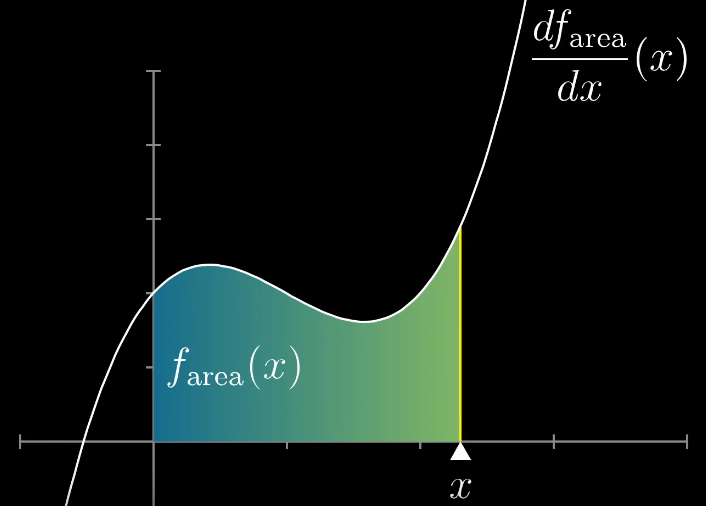
*图：将 $f(x)$ 视为面积函数，$f(a)$ 为初始值，积分项为面积增量*

继续对 $f'(t)$ 做同样的展开，得到：

$$f(x) = f(a) + \int_a^x \left[ f'(a) + \int_a^t f''(s) \, ds \right] dt$$

逐层展开，最终得到泰勒公式。其中每一项都可以用矩形和三角形的面积来解释：


*图：前两项对应矩形面积，第三项对应三角形面积*


*图：各阶项对应不同维度的"面积"之和*

### 9.5 泰勒级数的收敛与发散

当泰勒展开扩展到无穷多项后，就得到了 **泰勒级数**：

$$f(x) = \sum_{n=0}^{\infty} \frac{f^{(n)}(a)}{n!} (x-a)^n$$

此时需要讨论 **收敛** 和 **发散** 的概念。

#### 收敛

如果泰勒级数在某个区间内收敛到原函数 $f(x)$，则称 $f(x)$ 在该区间上是 **解析的**。


*图：多项式的阶数越高，逼近区间越宽，最终在收敛域内完全重合*

#### 发散

泰勒级数并非对所有 $x$ 都收敛。例如 $\frac{1}{1-x}$ 的泰勒展开 $\sum_{n=0}^{\infty} x^n$ 仅在 $|x| < 1$ 时收敛。

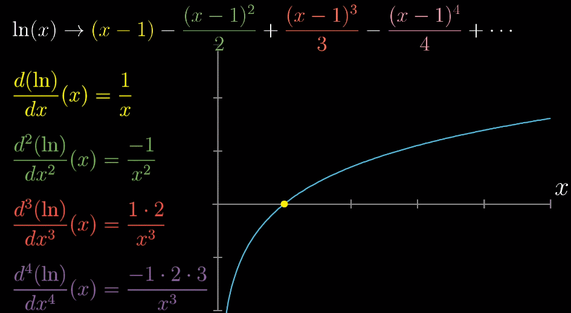
*图：超出收敛半径后，泰勒级数发散，逼近失效*

收敛半径 $R$ 的计算公式为：

$$R = \frac{1}{\limsup_{n\to\infty} \sqrt[n]{|a_n|}}$$

其中 $a_n = \frac{f^{(n)}(a)}{n!}$ 为泰勒级数的系数。

---

### 示例 1：利用定义求导数

用定义求 $f(x) = \frac{1}{x}$ 在 $x = a$ 处的导数。

**解**：

$$
\begin{aligned}
f'(a) &= \lim_{h \to 0} \frac{f(a+h) - f(a)}{h} \\
&= \lim_{h \to 0} \frac{\frac{1}{a+h} - \frac{1}{a}}{h} \\
&= \lim_{h \to 0} \frac{a - (a+h)}{ah(a+h)} \\
&= \lim_{h \to 0} \frac{-h}{ah(a+h)} \\
&= \lim_{h \to 0} \frac{-1}{a(a+h)} = -\frac{1}{a^2}
\end{aligned}
$$

### 示例 2：链式法则

求 $y = \sin(e^{x^2})$ 的导数。

**解**：由链式法则，

$$y' = \cos(e^{x^2}) \cdot e^{x^2} \cdot 2x = 2x e^{x^2} \cos(e^{x^2})$$

### 示例 3：隐函数求导

求由方程 $e^y + xy = e$ 所确定的隐函数在 $x = 0$ 处的导数。

**解**：当 $x = 0$ 时，$e^y = e$，即 $y = 1$。两边对 $x$ 求导：

$$e^y \cdot y' + y + x \cdot y' = 0$$

代入 $x = 0, y = 1$：$e \cdot y' + 1 = 0$，得 $y' = -\frac{1}{e}$。

### 示例 4：对数求导法

求 $y = \frac{(x+1)^3 \sqrt{x-2}}{(x+3)^5}$ 的导数。

**解**：取对数：$\ln y = 3\ln(x+1) + \frac{1}{2}\ln(x-2) - 5\ln(x+3)$

两边求导：$\frac{y'}{y} = \frac{3}{x+1} + \frac{1}{2(x-2)} - \frac{5}{x+3}$

所以 $y' = \frac{(x+1)^3 \sqrt{x-2}}{(x+3)^5} \left( \frac{3}{x+1} + \frac{1}{2(x-2)} - \frac{5}{x+3} \right)$

### 示例 5：洛必达法则

求 $\lim_{x \to 0} \frac{\sin x - x}{x^3}$。

**解**：这是 $\frac{0}{0}$ 型不定式。连续应用洛必达法则：

$$
\begin{aligned}
\lim_{x \to 0} \frac{\sin x - x}{x^3} &= \lim_{x \to 0} \frac{\cos x - 1}{3x^2} \\
&= \lim_{x \to 0} \frac{-\sin x}{6x} \\
&= \lim_{x \to 0} \frac{-\cos x}{6} = -\frac{1}{6}
\end{aligned}
$$

### 示例 6：拉格朗日中值定理

证明：对任意 $x > 0$，有 $\frac{x}{1+x} < \ln(1+x) < x$。

**证明**：令 $f(t) = \ln(1+t)$，$f$ 在 $[0, x]$ 上满足拉格朗日中值定理条件，存在 $\xi \in (0, x)$ 使得

$$\ln(1+x) - \ln 1 = \frac{1}{1+\xi} \cdot x$$

由于 $0 < \xi < x$，有 $\frac{1}{1+x} < \frac{1}{1+\xi} < 1$，代入即得 $\frac{x}{1+x} < \ln(1+x) < x$。

### 示例 7：函数的单调性与极值

求 $f(x) = x^3 - 3x + 1$ 的单调区间和极值。

**解**：$f'(x) = 3x^2 - 3 = 3(x-1)(x+1)$

令 $f'(x) = 0$，得 $x = -1$ 或 $x = 1$。

| $x$ | $(-\infty, -1)$ | $-1$ | $(-1, 1)$ | $1$ | $(1, +\infty)$ |
|-----|:---:|:----:|:---:|:---:|:---:|
| $f'(x)$ | $+$ | $0$ | $-$ | $0$ | $+$ |
| $f(x)$ | $\nearrow$ | 极大值 | $\searrow$ | 极小值 | $\nearrow$ |

极大值 $f(-1) = 3$，极小值 $f(1) = -1$。

### 示例 8：凹凸性与拐点

求 $f(x) = x^4 - 6x^2$ 的凹凸区间和拐点。

**解**：$f'(x) = 4x^3 - 12x$，$f''(x) = 12x^2 - 12 = 12(x-1)(x+1)$

令 $f''(x) = 0$，得 $x = -1$ 或 $x = 1$。

| $x$ | $(-\infty, -1)$ | $-1$ | $(-1, 1)$ | $1$ | $(1, +\infty)$ |
|-----|:---:|:----:|:---:|:---:|:---:|
| $f''(x)$ | $+$ | $0$ | $-$ | $0$ | $+$ |
| $f(x)$ | 凹 | 拐点 | 凸 | 拐点 | 凹 |

拐点为 $(-1, -5)$ 和 $(1, -5)$。

### 示例 9：最优化问题

用边长为 $a$ 的正方形铁皮，四角各截去一个相同的小正方形，折成一个无盖盒子。问截去多大的小正方形才能使盒子的容积最大？

**解**：设截去的小正方形边长为 $x$，则盒子底面边长为 $a - 2x$，高为 $x$，体积为

$$V(x) = x(a - 2x)^2, \quad 0 < x < \frac{a}{2}$$

$$V'(x) = (a - 2x)^2 + x \cdot 2(a - 2x) \cdot (-2) = (a - 2x)(a - 6x)$$

令 $V'(x) = 0$，得 $x = \frac{a}{2}$（舍去）或 $x = \frac{a}{6}$。由实际意义，$x = \frac{a}{6}$ 时容积最大，最大容积为 $V\left(\frac{a}{6}\right) = \frac{2a^3}{27}$。

### 示例 10：换元积分法

求 $\int \frac{1}{\sqrt{e^x + 1}} \, dx$。

**解**：令 $t = \sqrt{e^x + 1}$，则 $e^x = t^2 - 1$，$x = \ln(t^2 - 1)$，$dx = \frac{2t}{t^2 - 1} dt$。

$$
\begin{aligned}
\int \frac{1}{\sqrt{e^x + 1}} \, dx &= \int \frac{1}{t} \cdot \frac{2t}{t^2 - 1} \, dt \\
&= \int \frac{2}{t^2 - 1} \, dt \\
&= \int \left( \frac{1}{t-1} - \frac{1}{t+1} \right) dt \\
&= \ln\left| \frac{t-1}{t+1} \right| + C \\
&= \ln\left| \frac{\sqrt{e^x + 1} - 1}{\sqrt{e^x + 1} + 1} \right| + C
\end{aligned}
$$

### 示例 11：分部积分法

求 $\int e^x \sin x \, dx$。

**解**：

$$
\begin{aligned}
\int e^x \sin x \, dx &= e^x \sin x - \int e^x \cos x \, dx \\
&= e^x \sin x - \left( e^x \cos x + \int e^x \sin x \, dx \right) \\
&= e^x \sin x - e^x \cos x - \int e^x \sin x \, dx
\end{aligned}
$$

移项得 $2\int e^x \sin x \, dx = e^x(\sin x - \cos x) + C$，所以

$$\int e^x \sin x \, dx = \frac{e^x}{2}(\sin x - \cos x) + C$$

### 示例 12：定积分计算

求 $\int_0^{\pi/2} \sin^3 x \, dx$。

**解**：

$$
\begin{aligned}
\int_0^{\pi/2} \sin^3 x \, dx &= \int_0^{\pi/2} \sin x (1 - \cos^2 x) \, dx \\
&= \int_0^{\pi/2} \sin x \, dx - \int_0^{\pi/2} \sin x \cos^2 x \, dx \\
&= [-\cos x]_0^{\pi/2} + \int_0^{\pi/2} \cos^2 x \, d(\cos x) \\
&= (0 + 1) + \left[ \frac{\cos^3 x}{3} \right]_0^{\pi/2} \\
&= 1 - \frac{1}{3} = \frac{2}{3}
\end{aligned}
$$

### 示例 13：旋转体体积

求曲线 $y = \sqrt{x}$ 与直线 $x = 0$、$x = 4$、$y = 0$ 所围区域绕 $x$ 轴旋转一周所得体积。

**解**：由圆盘法，

$$V = \pi \int_0^4 (\sqrt{x})^2 \, dx = \pi \int_0^4 x \, dx = \pi \left[ \frac{x^2}{2} \right]_0^4 = 8\pi$$

### 示例 14：广义积分收敛性

判断 $\int_1^{+\infty} \frac{1}{x^2} \, dx$ 的收敛性。

**解**：

$$\int_1^{+\infty} \frac{1}{x^2} \, dx = \lim_{t \to +\infty} \int_1^t \frac{1}{x^2} \, dx = \lim_{t \to +\infty} \left[-\frac{1}{x}\right]_1^t = \lim_{t \to +\infty} \left(1 - \frac{1}{t}\right) = 1$$

极限存在，故积分收敛于 $1$。

### 示例 15：泰勒展开

求 $f(x) = \ln(1+x)$ 在 $x = 0$ 处的三阶泰勒公式（带拉格朗日余项）。

**解**：$f(0) = 0$，$f'(x) = \frac{1}{1+x}$，$f'(0) = 1$

$f''(x) = -\frac{1}{(1+x)^2}$，$f''(0) = -1$

$f'''(x) = \frac{2}{(1+x)^3}$，$f'''(0) = 2$

$f^{(4)}(x) = -\frac{6}{(1+x)^4}$

于是

$$\ln(1+x) = x - \frac{x^2}{2} + \frac{x^3}{3} - \frac{x^4}{4(1+\xi)^4}, \quad \xi \text{ 介于 } 0 \text{ 与 } x \text{ 之间}$$

---

## 十、解题技巧

本章内容多、知识点密集，下面归纳几类高频题型的高效套路。掌握这些"套路"能帮你快速识别题目类型、少走弯路。

### 10.1 求导法则的综合运用（四则・链式・隐函数・对数）

**适用场景**：求复合函数、隐函数、幂指函数或"连乘连除开方"结构的导数。

**关键步骤**：
1. 先全局审视函数结构，判断该用链式、四则还是对数求导；
2. 链式法则"由外到内逐层求导相乘"：$y' = f'(g(x)) \cdot g'(x)$，内层若是乘积/商，再补用四则法则；
3. 隐函数求导：把 $y$ 看成 $x$ 的函数，凡出现 $y$ 的位置都补乘 $y'$，再解出 $y'$；
4. 幂指函数或连乘连除：先取对数，用 $\dfrac{y'}{y}$ 过渡，最后回乘 $y$。

**常见误区**：
- 链式法则漏掉内层：如 $(\sin 3x)'$ 忘记乘 $3$；
- 商法则分子"顺序颠倒"：应$x$"上导下不导 减 上不导下导"；
- 幂指函数直接当幂函数 $x^n$ 或指数函数 $a^x$ 求导，如把 $(x^x)'$ 写成 $x^x\ln x$ 或 $x\cdot x^{x-1}$（均错）。

**精讲示例**：求 $y = x^{\sin x}$ 的导数。

先判断这是幂指函数（底数、指数都含 $x$），用对数求导：
$$
\ln y = \sin x \cdot \ln x
$$
两边对 $x$ 求导（左边用链式得 $\frac{y'}{y}$，右边用积法则）：
$$
\frac{y'}{y} = \cos x\ln x + \sin x \cdot \frac{1}{x}
$$
回乘 $y$ 得：
$$
y' = x^{\sin x}\left(\cos x \ln x + \frac{\sin x}{x}\right)
$$

### 10.2 微分中值定理与不等式证明

**适用场景**：证明含函数增量与导数的双边不等式，如 $f(b)-f(a)$ 夹在两导数表达式之间。

**关键步骤**：
1. 识别被减函数，令其为 $f$，在 $[a,b]$ 上用拉格朗日中值定理：$f(b)-f(a)=f'(\xi)(b-a)$，其中 $\xi\in(a,b)$；
2. 借助 $f'$ 的单调性或取值区间（如 $\frac{1}{1+x^2}$ 在 $[0,+\infty)$ 上递减），把 $f'(\xi)$ 夹在两端点导数值之间；
3. 同乘以正因子 $b-a$ 即得双边不等式。

**常见误区**：
- 忘记中间点 $\xi$ 落在 $(a,b)$ 内，误把 $\xi$ 换成 $a$ 或 $b$；
- 前提不满足就用（如 $f$ 在 $[a,b]$ 不连续或 $(a,b)$ 内不可导）；
- 当 $a<0$ 时把 $\xi^2$ 与 $a^2$ 大小关系用错（只有 $0\le a<\xi<b$ 时才有 $\xi^2>a^2$）。

**精讲示例**：证明：对 $0<a<b$，有 $\displaystyle\frac{b-a}{1+b^2}<\arctan b-\arctan a<\frac{b-a}{1+a^2}$。

令 $f(x)=\arctan x$，$f$ 在 $[a,b]$ 上连续、开区间内可导，由拉格朗日中值定理，存在 $\xi\in(a,b)$：
$$
\arctan b-\arctan a = \frac{1}{1+\xi^2}(b-a)
$$
因 $0<a<\xi<b$，有 $\frac{1}{1+b^2}<\frac{1}{1+\xi^2}<\frac{1}{1+a^2}$，同乘以 $b-a>0$ 即得证。$\square$

### 10.3 洛必达法则与各类不定型

**适用场景**：$\frac00$、$\frac{\infty}{\infty}$ 型极限，以及 $\infty-\infty$、$0\cdot\infty$、$0^0$、$1^\infty$、$\infty^0$ 等需先变形的类型。

**关键步骤**：
1. 先判断是否是不定型，否则不可直接用；
2. 直除法：$\frac00$ 或 $\frac{\infty}{\infty}$ 直接求导，若仍是不定型可连续用；
3. 变形：$\infty-\infty$ 先通分，$0\cdot\infty$ 把某因子取倒数移入分母，幂指型先取对数化为 $0\cdot\infty$；
4. 用前先化简、能约分先约分。

**常见误区**：
- 非不定型也套洛必达（如 $\lim\frac{1+\cos x}{1+\cos x}$ 极限存在不是不定型）；
- 滥用等价无穷小到 $x\to a\neq0$；
- 在加减法里整体替换等价无穷小（会得到 $0$ 的错误结果）。

**精讲示例**：求 $\displaystyle\lim_{x\to\infty}\left(\frac{x}{x-1}\right)^x$。

这是 $1^\infty$ 型。设 $y=\left(\frac{x}{x-1}\right)^x$，取对数：
$$
\ln y = x\ln\frac{x}{x-1} = \frac{\ln\frac{x}{x-1}}{1/x}
$$
这是 $\frac{\ln(1+\frac{1}{x-1})}{1/x}$ 型的 $\frac00$，用洛必达：
$$
\lim_{x\to\infty}\ln y = \lim_{x\to\infty}\frac{\frac{1}{x-1}-\frac{1}{x}}{-1/x^2}\cdot\frac{1}{\frac{1}{x-1}} 
$$
更简洁地：令 $x\to\infty$ 时 $\frac{x}{x-1}\to1$，记 $t=\frac{1}{x}\to0$，则 $\ln y=\frac{\ln\frac{x}{x-1}}{1/x}=\frac{\ln\frac{1}{1-1/x}}{1/x}=\frac{-\ln(1-\frac1x)}{1/x}\to1$，故 $\ln y\to1$，$y\to e$。
$$
\lim_{x\to\infty}\left(\frac{x}{x-1}\right)^x = e
$$

### 10.4 函数性态分析（单调・凹凸・极值・最优化）

**适用场景**：求单调区间、凹凸区间、极值、拐点，以及实际最优化问题。

**关键步骤**：
1. 单调性看 $f'$ 符号，凹凸性看 $f''$ 符号；
2. 极值：先找驻点 $f'=0$ 与不可导点，再用第一（$f'$ 左右变号）或第二（$f''$ 符号）充分条件判定；
3. 最优化：把实际问题翻译成目标函数与定义域，求驻点，结合端点和实际意义确定最值。

**常见误区**：
- 把驻点直接当极值点（如 $f(x)=x^3$ 在 $0$ 处导数零但非极值）；
- 二阶导数为 $0$ 的点直接当拐点（需左右二阶导变号）；
- 最优化忘考虑定义域边界或舍去不合实际意义的根。

**精讲示例**：求 $f(x)=x\sqrt{a-x}$（$a>0$，$0\le x<a$）的最大值。

$f'(x)=\sqrt{a-x}+x\cdot\frac{-1}{2\sqrt{a-x}}=\frac{2(a-x)-x}{2\sqrt{a-x}}=\frac{2a-3x}{2\sqrt{a-x}}$。令 $f'=0$ 得 $x=\frac{2a}{3}$。

因 $0<\frac{2a}{3}<a$ 在定义域内，$f'(x)>0$（$x<\frac{2a}{3}$）时递增、$f'(x)<0$ 时递减，故 $x=\frac{2a}{3}$ 为最大值点，最大值为
$$
f\left(\frac{2a}{3}\right)=\frac{2a}{3}\sqrt{a-\frac{2a}{3}}=\frac{2a}{3}\cdot\sqrt{\frac{a}{3}}=\frac{2a\sqrt{a}}{3\sqrt{3}}.
$$

### 10.5 不定积分与定积分的计算策略

**适用场景**：换元法（凑微分/三角代换）、分部积分法、以及借助对称性与积分性质计算定积分。

**关键步骤**：
1. 先"观察"被积函数：若含 $g'(x)$ 因子优先凑微分；若含 $\sqrt{a^2-x^2}$ 等用三角代换；
2. 分部积分按 LIATE 选 $u$（对数→反三角→代数→三角→指数）；
3. 定积分善用奇偶性与区间对称性；微积分基本定理把 $\int_a^b f$ 化为原函数之差。

**常见误区**：
- 换元后忘记把积分限一并换掉就急着代回；
- 分部积分 $u,dv$ 选反，越积越复杂；
- 最后漏写积分常数 $C$。

**精讲示例**：求 $\displaystyle\int x^2e^x\,dx$。

用分部积分，取 $u=x^2$，$dv=e^x dx$（$dv$ 选易积的指数函数），$du=2x\,dx$，$v=e^x$：
$$
\int x^2e^x\,dx = x^2e^x - \int 2xe^x\,dx
$$
再对 $\int xe^x dx$ 分部（$u=x$，$dv=e^x dx$）：
$$
\int xe^x dx = xe^x - e^x
$$
代入得：
$$
\int x^2e^x dx = x^2e^x - 2xe^x + 2e^x + C = e^x(x^2-2x+2)+C.
$$

### 10.6 泰勒展开与求极限

**适用场景**：带佩亚诺余项的麦克劳林展开求 $0/0$ 型极限、估计误差、近似计算。

**关键步骤**：
1. 熟记 $\sin x,\cos x,e^x,\ln(1+x),(1+x)^\alpha$ 的展开；
2. 把分子/分母展开到可约分消去最低次幂的阶数；
3. 用 $o(x^n)$ 记余项，乘除运算后保留主导项。

**常见误区**：
- 展开项数不够，导致主项相消后精度错；
- 把 $o(x^n)$ 当普通数直接代入；
- 逐项求导/积分的收敛区间不加限。

**精讲示例**：求 $\displaystyle\lim_{x\to0}\frac{\sin x - x + \frac{x^3}{6}}{x^5}$。

$\sin x = x - \frac{x^3}{3!} + \frac{x^5}{5!} - \frac{x^7}{7!} + o(x^7)$。则分子：
$$
\sin x - x + \frac{x^3}{6} = \frac{x^5}{120} - \frac{x^7}{5040} + o(x^7)
$$
除以 $x^5$ 并取极限：
$$
\lim_{x\to0}\frac{1}{120} - \frac{x^2}{5040} + o(x^2) = \frac{1}{120}.
$$

---

## 十一、习题（Practice Problems）

### 11.1 基础题

**1.** 用定义求 $f(x) = \sqrt{x}$ 在 $x = 4$ 处的导数。

**2.** 求下列函数的导数：
   - (a) $y = \frac{x^2 + 1}{x^2 - 1}$
   - (b) $y = \sin^2(3x + 1)$
   - (c) $y = \arctan(e^{2x})$
   - (d) $y = x^{\sin x}$（使用对数求导法）

**3.** 求曲线 $x^2 + xy + y^2 = 3$ 在点 $(1, 1)$ 处的切线方程。

**4.** 求极限：
   - (a) $\lim_{x \to 0} \frac{e^x - 1 - x}{x^2}$
   - (b) $\lim_{x \to 0^+} x \ln x$
   - (c) $\lim_{x \to 0} \frac{\tan x - x}{x - \sin x}$

**5.** 求函数 $f(x) = 2x^3 - 3x^2 - 12x + 5$ 的单调区间、极值、凹凸区间和拐点。

**6.** 求 $y = x^5$ 的导数。

**7.** 求 $y = \dfrac{1}{x^3}$ 的导数。

**8.** 求 $y = \sqrt{x}$ 的导数。

**9.** 求 $y = \sin x + \cos x$ 的导数。

**10.** 求 $y = e^x - \ln x$ 的导数。

**11.** 求 $y = x^2 e^x$ 的导数。

**12.** 求 $y = x\ln x$ 的导数。

**13.** 求 $y = \dfrac{x}{\sin x}$ 的导数。

**14.** 求 $y = \sin 2x$ 的导数。

**15.** 求 $y = \cos 3x$ 的导数。

**16.** 求 $y = \tan x$ 的导数。

**17.** 求 $y = \ln(x^2 + 1)$ 的导数。

**18.** 求 $y = e^{-x}$ 的导数。

**19.** 求 $y = \sqrt{1 + x^2}$ 的导数。

**20.** 求 $y = \arcsin x$ 的导数。

**21.** 求 $y = \arctan x$ 的导数。

**22.** 求 $\int x\, dx$。

**23.** 求 $\int x^2\, dx$。

**24.** 求 $\int \dfrac{1}{x^2}\, dx$。

**25.** 求 $\int \sqrt{x}\, dx$。

**26.** 求 $\int \dfrac{1}{x}\, dx$。

**27.** 求 $\int e^x\, dx$。

**28.** 求 $\int \sin x\, dx$。

**29.** 求 $\int \cos x\, dx$。

**30.** 求 $\int \sec^2 x\, dx$。

**31.** 求 $\int \dfrac{1}{1 + x^2}\, dx$。

**32.** 求 $\int (3x^2 + 2x + 1)\, dx$。

**33.** 求 $\int_0^1 x^2\, dx$。

**34.** 求 $\int_0^{\pi} \sin x\, dx$。

**35.** 求 $\int_{-1}^{2} x^3\, dx$。

**36.** 求 $y = \cosh x$ 的导数。

**37.** 求 $y = \sinh x$ 的导数。

**38.** 求 $y = \ln(\sin x)$ 的导数。

**39.** 求 $y = e^{\sin x}$ 的导数。

**40.** 求 $y = \arctan(3x)$ 的导数。

**41.** 求 $y = \sqrt[3]{x}$ 的导数。

**42.** 求 $y = \sec x$ 的导数。

**43.** 求 $y = \csc x$ 的导数。

**44.** 求 $y = x^3 - 3x$ 的导数。

**45.** 求 $y = \cot x$ 的导数。

**46.** 求 $y = \sin^2 x$ 的导数。

**47.** 求 $y = \cos(x^2)$ 的导数。

**48.** 求 $y = 2^x$ 的导数。

**49.** 求 $y = \log_2 x$ 的导数。

**50.** 求 $y = \ln|x|$ 的导数（$x \neq 0$）。

**51.** 求 $\int 3^x\, dx$。

**52.** 求 $\int \cos(2x)\, dx$。

**53.** 求 $\int \dfrac{1}{x^2 + 1}\, dx$。

**54.** 求 $\int \dfrac{1}{\sqrt{1-x^2}}\, dx$。

**55.** 求 $\int_1^2 \dfrac{1}{x^2}\, dx$。

**56.** 求 $\int_0^1 e^x\, dx$。

**57.** 求 $\int_0^{\pi/2} \cos x\, dx$。

**58.** 求曲线 $y = x^2$ 在 $x = 1$ 处的切线斜率。

**59.** 求 $f(x) = \dfrac{1}{x}$ 在 $x = 2$ 处的导数。

**60.** 求 $y = (2x + 1)^5$ 的导数。

**61.** 求 $y = \ln(2x + 3)$ 的导数。

**62.** 求 $\int x e^{x^2}\, dx$。

**63.** 求 $\int \dfrac{1}{1-x}\, dx$。

**64.** 求 $\int_1^2 \dfrac{1}{x}\, dx$。

**65.** 求 $\int \cos(3x)\, dx$。

**66.** 求 $y = x\sin x$ 的导数。

**67.** 求 $y = e^x\cos x$ 的导数。

**68.** 求 $y = \ln(\cos x)$ 的导数。

**69.** 求 $y = \arcsin(2x)$ 的导数。

**70.** 求 $y = x\arctan x$ 的导数。

**71.** 求 $y = \dfrac{\ln x}{x}$ 的导数。

**72.** 求 $y = \dfrac{e^x}{x}$ 的导数。

**73.** 求 $y = \dfrac{x^2}{\cos x}$ 的导数。

**74.** 求曲线 $y = \sqrt{x}$ 在 $x = 4$ 处的切线方程。

**75.** 求曲线 $y = \ln x$ 在 $x = 1$ 处的切线方程。

**76.** 求 $\int (3x^2 - 2x + 5)\, dx$。

**77.** 求 $\int \dfrac{6}{\sqrt{x}}\, dx$。

**78.** 求 $\int \dfrac{1}{x\ln x}\, dx$。

**79.** 求 $\int 5^x\, dx$。

**80.** 求 $\int \tan x\cdot\sec x\, dx$。

**81.** 求 $\int \cos^2 x\, dx$。

**82.** 求 $\int \dfrac{x}{x^2+1}\, dx$。

**83.** 求 $\int_0^1 (2x+1)\, dx$。

**84.** 求 $\int_0^1 x\,e^x\, dx$。

**85.** 求 $\int_{-2}^{0} e^{-x}\, dx$。

**86.** 求 $\lim_{x\to0}\dfrac{\sin x}{x}$。

**87.** 求 $\lim_{x\to\infty}\dfrac{1}{x}$。

**88.** 求 $\lim_{x\to0}\dfrac{1-\cos x}{x^2}$。

**89.** 求 $\lim_{x\to0}\dfrac{e^x-1}{x}$。

**90.** 求 $f(x)=x^2$ 的 $f''(x)$。

**91.** 求 $f(x)=\sin x$ 的 $f'''(x)$。

**92.** 求 $f(x)=e^{2x}$ 的 $f^{(2)}(x)$。

**93.** 求 $f(x)=\ln x$ 的 $f''(x)$。

**94.** 求 $y = (x^2+1)^{10}$ 的导数。

**95.** 求 $y = \tan^2 x$ 的导数。

### 11.2 进阶题

**1.** 证明：对 $0<a<b$，有 $\frac{b-a}{1+b^2} < \arctan b - \arctan a < \frac{b-a}{1+a^2}$。

**2.** 求不定积分：
   - (a) $\int \frac{x}{\sqrt{1 - x^2}} \, dx$
   - (b) $\int \frac{1}{x^2 + 2x + 5} \, dx$
   - (c) $\int x^2 e^x \, dx$
   - (d) $\int \ln x \, dx$
   - (e) $\int \frac{1}{x \ln x} \, dx$

**3.** 求定积分：
   - (a) $\int_0^1 \frac{x}{1 + x^2} \, dx$
   - (b) $\int_0^{\pi} x \sin x \, dx$
   - (c) $\int_0^{\ln 2} e^x \sqrt{e^x - 1} \, dx$

**4.** 求曲线 $y = x^2$ 与 $y = 2 - x^2$ 所围图形的面积。

**5.** 求曲线 $y = \ln x$ 在 $x = 1$ 到 $x = e$ 之间的弧长。

**6.** 用对数求导法求 $y = (\ln x)^x$ 的导数。

**7.** 求隐函数 $x^2 + y^2 = 25$ 在点 $(3,4)$ 处的切线方程。

**8.** 求 $y = \ln\sqrt{\dfrac{1+x}{1-x}}$ 的导数。

**9.** 用对数求导法求 $y = \sqrt{\dfrac{(x^2+1)^3}{x-2}}$ 的导数。

**10.** 求 $f(x) = e^x\sin x$ 的二阶导数。

**11.** 求 $y = \arcsin\dfrac{x}{2}$ 的导数。

**12.** 求 $y = \arctan\sqrt{x}$ 的导数。

**13.** 用拉格朗日中值定理证明：对 $x>0$，有 $e^x > 1 + x$。

**14.** 求曲线 $y = x^3 - 3x$ 上切线为水平线的点。

**15.** 求 $\int x\sqrt{x^2+1}\, dx$。

**16.** 求 $\int \dfrac{1}{4+x^2}\, dx$。

**17.** 求 $\int \dfrac{1}{\sqrt{9-x^2}}\, dx$。

**18.** 求 $\int \dfrac{e^x}{1+e^x}\, dx$。

**19.** 求 $\int \dfrac{\ln x}{x}\, dx$。

**20.** 求 $\int x\cos x\, dx$。

**21.** 求 $\int \ln(x+1)\, dx$。

**22.** 求 $\int x\ln x\, dx$。

**23.** 求 $\int_0^{\pi/2} \sin^2 x\, dx$。

**24.** 求 $\int_0^1 \dfrac{x}{1+x}\, dx$。

**25.** 求曲线 $y = x^2$ 与 $y = x$ 所围图形的面积。

**26.** 求函数 $f(x) = x^3 - 3x^2 + 1$ 的极值。

**27.** 求 $y = x\ln x$ 的极值。

**28.** 用洛必达法则求 $\lim_{x\to0}\dfrac{e^x-1-x}{x^2}$。

**29.** 用洛必达法则求 $\lim_{x\to\infty}\dfrac{\ln x}{x}$。

**30.** 用洛必达法则求 $\lim_{x\to1}\dfrac{\ln x}{x-1}$。

**31.** 求 $\int_0^1 x e^{-x}\, dx$。

**32.** 求函数 $f(x) = \dfrac{1}{1+x^2}$ 的凹凸区间。

**33.** 求函数 $f(x) = x^3 - 6x^2 + 9x$ 的单调区间。

**34.** 求曲线 $y = x^3$ 与 $y = \sqrt{x}$ 所围图形的面积。

**35.** 求由 $y = e^x$、直线 $x=1$ 及两坐标轴所围区域的面积。

**36.** 求 $\int x^2\ln x\, dx$。

**37.** 求 $\int x\sin x\, dx$。

**38.** 求 $\int e^{2x}\sin x\, dx$。

**39.** 求 $\int \sin 3x\cos 2x\, dx$。

**40.** 求 $\int \dfrac{5}{x^2-4}\, dx$。

**41.** 求 $\int_0^{1/2} \dfrac{1}{\sqrt{1-x^2}}\, dx$。

**42.** 求 $\int_{-1}^{1} x^3\cos x\, dx$。

**43.** 求 $\int_{-\pi}^{\pi} \sin^3 x\, dx$。

**44.** 求 $\int_0^1 \arcsin x\, dx$。

**45.** 求曲线 $y=\cos x$ 在 $[0,\frac{\pi}{2}]$ 与两坐标轴所围图形的面积。

**46.** 求 $y=\sin x$ 与 $y=\cos x$ 在 $[0,\frac{\pi}{2}]$ 所围图形的面积。

**47.** 求曲线 $y=x^2$ 在 $[0,1]$ 绕 $x$ 轴旋转所得体积。

**48.** 求直线 $y=x$ 在 $[0,1]$ 绕 $x$ 轴旋转所得圆锥体积。

**49.** 写出 $\sin x$ 在 $x=0$ 处的三阶麦克劳林多项式。

**50.** 写出 $e^x$ 在 $x=0$ 处的三阶麦克劳林多项式。

**51.** 用二阶麦克劳林公式近似计算 $\cos 0.1$。

**52.** 写出 $\ln(1+x)$ 的三阶麦克劳林多项式。

**53.** 求 $\lim_{x\to0}\dfrac{\sin x - x}{x^3}$。

**54.** 判断广义积分 $\int_1^{\infty}\dfrac{1}{x^3}\, dx$ 的收敛性。

**55.** 求 $\int_1^{\infty}\dfrac{1}{x^4}\, dx$ 的值。

**56.** 用微积分基本定理求 $\dfrac{d}{dx}\int_0^x \sin t\, dt$。

**57.** 用微积分基本定理求 $\dfrac{d}{dx}\int_1^x \dfrac{1}{t}\, dt$。

**58.** 已知参数方程 $x=t^2$，$y=t^3$，求 $t=1$ 处的 $\dfrac{dy}{dx}$。

**59.** 求参数曲线 $x=\cos t$，$y=\sin t$（$0\le t\le\pi$）的弧长。

**60.** 讨论 $f(x)=|x|$ 在 $x=0$ 处的可导性。

**61.** 求曲线 $y=x^3+x$ 在 $x=1$ 处的法线方程。

**62.** 求 $\int\dfrac{1}{x^2+4x+8}\, dx$。

**63.** 求 $\int_0^2 |x-1|\, dx$。

**64.** 求函数 $f(x)=x^4-2x^2$ 的极值。

**65.** 求 $\lim_{x\to0}\dfrac{\ln(1+x)-x}{x^2}$。

**66.** 求 $\lim_{x\to0}\dfrac{e^x-1-\sin x}{x^2}$。

**67.** 求 $\lim_{x\to\infty}\left(1+\dfrac{1}{x}\right)^x$。

**68.** 求 $\lim_{x\to0^+} x^x$。

**69.** 求 $\lim_{x\to\infty} x^{1/x}$。

**70.** 用柯西中值定理证明：对 $0<a<b$，存在 $\xi\in(a,b)$ 使 $\dfrac{\ln b-\ln a}{b-a}=\dfrac{1}{\xi}$。

**71.** 验证柯西中值定理对 $f(x)=x^2$，$g(x)=x^3$ 在 $[1,2]$ 上成立并求出 $\xi$。

**72.** 求曲线 $y=\sin x$（$0\le x\le\pi$）绕 $x$ 轴旋转所得体积。

**73.** 求曲线 $y=\cos x$（$0\le x\le\frac{\pi}{2}$）绕 $x$ 轴旋转所得体积。

**74.** 求曲线 $y=x^3$（$1\le x\le2$）绕 $x$ 轴旋转所得体积。

**75.** 求曲线 $y=e^x$（$0\le x\le1$）绕 $x$ 轴旋转所得体积。

**76.** 求曲线 $y=x^{3/2}$ 从 $x=0$ 到 $x=4$ 的弧长。

**77.** 求曲线 $y=\ln(\sec x)$ 从 $x=0$ 到 $x=\frac{\pi}{4}$ 的弧长。

**78.** 求 $\int_0^{\infty} e^{-x}\, dx$。

**79.** 求 $\int_{-\infty}^{0} e^{x}\, dx$。

**80.** 判断广义积分 $\int_0^1\dfrac{1}{x^2}\, dx$ 的敛散性。

**81.** 求 $\int_0^1\dfrac{1}{\sqrt{x}}\, dx$。

**82.** 求 $\int_0^{\infty}\dfrac{1}{1+x^2}\, dx$。

**83.** 求 $\int_0^{\infty} x e^{-x}\, dx$。

**84.** 求 $\Gamma\left(\dfrac32\right)$ 的值。

**85.** 求函数 $f(x)=\dfrac{x^2}{x-1}$ 的极值。

### 11.3 挑战题

**1.** 讨论广义积分的收敛性：
    - (a) $\int_0^{+\infty} \frac{1}{1 + x^2} \, dx$
    - (b) $\int_0^1 \frac{1}{\sqrt{x}} \, dx$
    - (c) $\int_1^{+\infty} \frac{1}{x^p} \, dx$（讨论 $p$ 的取值）

**2.** 求 $f(x) = e^x$ 在 $x = 0$ 处的 $n$ 阶麦克劳林公式（带拉格朗日余项）。

**3.** 将函数 $f(x) = \frac{1}{1 + x^2}$ 展开为 $x$ 的幂级数。

**4.** 用微积分基本定理求 $\frac{d}{dx} \int_0^{x^2} \sin(t^2) \, dt$。

**5.** 从一块半径为 $R$ 的圆形铁皮上剪去一个扇形，将剩余部分卷成一个圆锥形漏斗。问剪去多大的扇形角度才能使漏斗的容积最大？

**6.** 求曲线 $y = x\ln x$ 在 $x = e$ 处的切线方程。

**7.** 求极限 $\lim_{x\to 0} \dfrac{\ln(1+x)}{x}$。

**8.** 求定积分 $\int_0^1 x e^x\, dx$。

**9.** 用 $x=\tan t$ 求 $\int\dfrac{1}{\sqrt{x^2+1}}\, dx$。

**10.** 求 $\int\dfrac{1}{(x^2+1)^2}\, dx$。

**11.** 用 $x=2\sin t$ 求 $\int\dfrac{x^2}{\sqrt{4-x^2}}\, dx$。

**12.** 用万能代换求 $\int\dfrac{1}{1+\cos x}\, dx$。

**13.** 求 $\int\sqrt{a^2-x^2}\, dx$（$a>0$）。

**14.** 求 $\int x^3 e^{x^2}\, dx$。

**15.** 求 $\int\arctan x\, dx$。

**16.** 求 $\int\sec^3 x\, dx$。

**17.** 求 $\int\sin^4 x\, dx$。

**18.** 求 $\int\cos^4 x\, dx$。

**19.** 求 $\int\dfrac{\ln x}{x^2}\, dx$。

**20.** 求 $\int_0^{\pi}\dfrac{x\sin x}{1+\cos^2 x}\, dx$。

**21.** 求 $\lim_{n\to\infty}\sum_{k=1}^{n}\dfrac{k}{n^2}$。

**22.** 求 $\lim_{n\to\infty}\sum_{k=1}^{n}\dfrac{1}{n+k}$。

**23.** 求 $\int_0^1 x^2(1-x)^2\, dx$。

**24.** 计算 $\int_0^{\infty}x^2e^{-x}\, dx$。

**25.** 求 $\int_0^1 x^{1/2}(1-x)\, dx$。

**26.** 判断 $\int_2^{\infty}\dfrac{1}{x(\ln x)^p}\, dx$ 的敛散性。

**27.** 求 $\int_e^{\infty}\dfrac{1}{x(\ln x)^2}\, dx$。

**28.** 判断 $\int_1^{\infty}\dfrac{\sin x}{x^2}\, dx$ 是否绝对收敛。

**29.** 判断 $\int_1^{\infty}\dfrac{\cos x}{x}\, dx$ 是条件收敛还是绝对收敛。

**30.** 用长为 $L$ 的铁丝围成矩形，求其最大面积。

**31.** 求 $f(x)=xe^{-x}$（$x\ge0$）的最大值。

**32.** 求 $f(x)=\sqrt{x}\ln x$（$x>0$）的极值。

**33.** 求由 $y=x^2$ 与 $y=2x$ 所围图形绕 $x$ 轴旋转所得体积。

**34.** 用柱壳法求由 $y=x^2$、$x=2$ 及 $x$ 轴围成区域绕 $y$ 轴旋转所得体积。

**35.** 求极坐标曲线 $r=2\cos\theta$ 所围图形的面积。

**36.** 求极坐标曲线 $r=3\sin\theta$ 所围图形的面积。

**37.** 求参数曲线 $x=2\cos t$，$y=2\sin t$（$0\le t\le2\pi$）的弧长。

**38.** 用泰勒公式求 $\lim_{x\to0}\dfrac{\arctan x-x}{x^3}$。

**39.** 用对数求导法求 $y=(\sin x)^x$ 的导数。

**40.** 求由 $x^2+xy+y^2=3$ 确定的隐函数在点 $(1,1)$ 处的 $y''$。

**41.** 求 $y=\arctan\dfrac{1+x}{1-x}$ 的导数。

**42.** 求 $y=\sqrt{x+\sqrt{x}}$ 的导数。

**43.** 求 $\dfrac{d^{10}}{dx^{10}}\cos x$。

**44.** 求 $\sin x$ 的 $n$ 阶导数。

**45.** 求 $y=\dfrac{1}{x^2-1}$ 的 $n$ 阶导数。

**46.** 用罗尔定理证明方程 $4x^3-6x^2+2x=0$ 在 $(0,1)$ 内有实根。

**47.** 用拉格朗日中值定理估算 $\sqrt{25.1}$。

**48.** 求 $\lim_{x\to0}\dfrac{\arcsin x}{x}$。

**49.** 求 $\lim_{x\to\infty}\left(\sqrt{x^2+x}-x\right)$。

**50.** 求 $\lim_{x\to0}\dfrac{\tan x-\sin x}{x^3}$。

**51.** 求 $\lim_{x\to\infty}\left(1+\dfrac{2}{x}\right)^x$。

**52.** 求 $\lim_{x\to0}\dfrac{\arcsin x-x}{x^3}$。

**53.** 写出 $\arctan x$ 的三阶麦克劳林多项式。

**54.** 写出 $\cos x$ 的四阶麦克劳林多项式。

**55.** 写出 $e^{-x}$ 的 $n$ 阶麦克劳林多项式。

**56.** 求 $\ln x$ 在 $x=1$ 处的三阶泰勒多项式。

**57.** 由 $I(a)=\int_0^1x^a dx=\dfrac{1}{a+1}$，利用 Leibniz 法则求 $\int_0^1x^a\ln x\, dx$。

**58.** 求 $\int_0^{\infty} e^{-ax}\sin x\, dx$（$a>0$）。

### 11.4 补充习题

**1.** 求曲线 $y = x^3$ 在点 $(1, 1)$ 处的法线方程。

**2.** 验证罗尔定理对函数 $f(x) = x^3 - 3x^2 + 2x$ 在区间 $[0, 2]$ 上成立，并找出满足 $f'(\xi) = 0$ 的点 $\xi$。

**3.** 用拉格朗日中值定理证明：当 $x > 0$ 时，$\frac{x}{1+x} < \ln(1+x) < x$。

**4.** 用柯西中值定理证明：对 $0 < a < b$，存在 $\xi \in (a, b)$ 使得 $\frac{f(b) - f(a)}{g(b) - g(a)} = \frac{f'(\xi)}{g'(\xi)}$，其中 $f(x) = x^2$，$g(x) = \ln x$。

**5.** 利用定积分的性质比较 $\int_0^1 x^2 \, dx$ 与 $\int_0^1 x^3 \, dx$ 的大小。

**6.** 利用积分中值定理证明：存在 $\xi \in [0, \pi]$ 使得 $\int_0^\pi \sin x \, dx = \pi \sin \xi$。

**7.** 用壳层法求由 $y = x^2$ 与 $y = 1$ 所围图形绕 $y$ 轴旋转所得旋转体的体积。

**8.** 求参数方程 $\begin{cases} x = a(t - \sin t) \\ y = a(1 - \cos t) \end{cases}$（$0 \leq t \leq 2\pi$）所表示的摆线一拱的弧长。

**9.** 求心形线 $r = a(1 + \cos\theta)$ 所围成的面积。

**10.** 求心形线 $r = a(1 + \cos\theta)$ 的全长。

**11.** 求曲线 $y = \sqrt{x}$ 在 $[0, 4]$ 上绕 $x$ 轴旋转所得旋转曲面的侧面积。

**12.** 用比较判别法判断广义积分 $\int_1^{+\infty} \frac{1}{x^2 + 1} \, dx$ 的收敛性。

**13.** 用极限比较法判断广义积分 $\int_1^{+\infty} \frac{1}{\sqrt{x^3 + 1}} \, dx$ 的收敛性。

**14.** 求含参正常积分 $I(\alpha) = \int_0^\pi \ln(1 - 2\alpha \cos x + \alpha^2) \, dx$（$|\alpha| < 1$）的值。（提示：对 $\alpha$ 求导）

**15.** 计算 $\Gamma$ 函数值：$\Gamma(1)$，$\Gamma(2)$，$\Gamma\left(\frac{1}{2}\right)$，并证明 $\Gamma(n+1) = n\Gamma(n)$。

**16.** 求 $f(x) = \sin x$ 在 $x = 0$ 处的带佩亚诺余项的麦克劳林公式。

**17.** 求幂级数 $\sum_{n=1}^{\infty} \frac{x^n}{n}$ 的收敛半径，并讨论其在收敛域端点的敛散性。

**18.** 求 $y=\dfrac{\arcsin x}{\sqrt{1-x^2}}$ 的导数。

**19.** 求 $f(x)=|x^2-1|$ 的不可导点。

**20.** 求由 $y=\ln x$、$y=1$、$x=e^2$ 围成区域的面积。

**21.** 求由 $y=x^3$、$y=8$ 及 $y$ 轴围成区域绕 $y$ 轴旋转所得体积。

**22.** 求曲线 $y=\sqrt{x}$ 与 $y=x^2$ 所围图形的面积。

**23.** 求 $\int\dfrac{\ln x}{\sqrt{x}}\, dx$。

**24.** 求 $\int e^{\sqrt{x}}\, dx$。

**25.** 求 $\int\dfrac{1}{1+\sin x}\, dx$。

**26.** 求 $\int\dfrac{1}{x^3+x}\, dx$。

**27.** 求 $\int e^x\cos x\, dx$。

**28.** 求 $\int_0^1 x\arctan x\, dx$。

**29.** 求 $\int_0^1 \dfrac{x}{(1+x^2)^2}\, dx$。

**30.** 求 $\int_0^{\infty}\sqrt{x}\,e^{-x}\, dx$。

**31.** 求 $\Gamma(4)$ 与 $\Gamma(5)$ 的值。

**32.** 求 $\lim_{x\to0}(1-x)^{1/x}$。

**33.** 求 $f(x)=x^2e^{-x}$ 的极值。

**34.** 求 $y=x^{1/x}$（$x>0$）的最大值。

**35.** 求 $\int\dfrac{1}{x^2+2x+2}\, dx$。

**36.** 求 $\int_0^1\dfrac{1}{\sqrt{1-x^2}}\, dx$。

**37.** 证明 $f(x)=x+\sin x$ 严格单调递增。

### 11.5 探究题

**1.** 【探究・可导与连续】已知"可导必连续"。请：(i) 用导数的定义严格论证可导 $\Rightarrow$ 连续；(ii) 举出"连续但不可导"的例子并说明在哪里失效；(iii) 结合图像解释为什么 $f(x)=|x|$ 在 $x=0$ 连续但不可导，从中体会导数对"光滑性"的要求。

**2.** 【探究・黎曼和与定积分】借助定积分把和式的极限"还原"为积分。请计算 $\displaystyle\lim_{n\to\infty}\frac{1}{n}\sum_{k=1}^{n}\frac{1}{1+\frac{k}{n}}$。你先把它辨认成 $\int_0^1 \frac{1}{1+x}\,dx$，再解释为什么分点取 $\frac{k}{n}$、高度取 $\frac{1}{1+\frac{k}{n}}$ 正是黎曼和的写法，并由此体会"定积分是分割求和的极限"这句话。

**3.** 【探究・微积分基本定理的直观】积分"$\int$"是无穷求和、微分"$d$"是无穷商。请：(i) 从面积函数 $F(x)=\int_a^x f(t)\,dt$ 出发，用 $\Delta F\approx f(x)\Delta x$ 的几何直观说明 $F'(x)=f(x)$；(ii) 谈谈为什么"求面积的逆运算是求斜率"，牛顿与莱布尼茨各自的关键洞见是什么；(iii) 尝试用自己的话向同学解释"微积分基本定理为什么深刻"。

**4.** 【探究・导数的等价定义】导函数的定义有 $f'(x)=\lim_{h\to0}\frac{f(x+h)-f(x)}{h}$ 与增量比 $f'(x)=\lim_{\Delta x\to0}\frac{\Delta y}{\Delta x}$ 两种写法。试说明二者的联系，并谈谈"在一点可导"与"导函数存在"之间的差别。

**5.** 【探究・链式法则的直观】用"传递率"或"复合的乘法"两种视角分别解释 $\dfrac{dy}{dx}=\dfrac{dy}{du}\cdot\dfrac{du}{dx}$，并指出链式法则最容易被遗漏的一环。

**6.** 【探究・极值时驻点不充分】$f'(x_0)=0$ 只是极值的必要条件。请举出反例（如 $f(x)=x^3$）说明为何二阶充分条件与"左右一阶符号变化"才是判定极值的可靠依据。

**7.** 【探究・罗尔定理条件的必要性】罗尔定理要求闭区间连续、开区间可导、端点值相等。请分别说明三条若缺其一，结论 $f'(\xi)=0$ 可能不成立的原因与反例。

**8.** 【探究・微积分基本定理的几何含义】从面积函数 $F(x)=\int_a^x f(t)\,dt$ 出发，说明为什么 $F'(x)=f(x)$，以及"求原函数"为何能取代"逐段求和"来算面积。

**9.** 【探究・洛必达法则的局限】请指出洛必达法则使用的前提条件（不定型、$\lim f'/g'$ 存在或为无穷大，且不能循环使用导致无意义），并举例说明"非不定型盲目套用"为何出错。

**10.** 【探究・黎曼和的近似误差】右端点矩形、左端点矩形、中点矩形对单调函数 $f$ 给出的近似，误差符号如何？试比较它们与真实积分值的关系。

**11.** 【探究・换元法为何要换积分限】计算定积分时若用 $x=\varphi(t)$ 换元，为什么上下限必须一并换成 $t$ 的对应值？若只换被积函数不换限，会得到什么错误。

**12.** 【探究・分部积分的选择原则】解释 LIATE 顺序为何优先取"对数、反三角"为 $u$、取"代数、三角、指数"为 $dv$，并说明选了 $u=dv=…$ 反了会如何。

**13.** 【探究・泰勒公式的理解】为什么"匹配越多阶导数，逼近越好在某点附近成立"？解释系数 $\frac{f^{(n)}(a)}{n!}$ 的来源，以及余项（拉格朗日/佩亚诺）的作用。

**14.** 【探究・广义积分收敛的直觉】无穷限积分 $\int_a^{\infty}f(x)dx$ 的收敛与否，取决于被积函数"衰减得够不够快"。请用 $\frac{1}{x^p}$ 判别其意义，并说明为什么 $p=1$ 恰是分界。

**15.** 【探究・Gamma 函数的应用】$\Gamma(s)$ 把阶乘推广到非整数。请说明 $\Gamma\left(\frac12\right)=\sqrt\pi$ 中为什么会出现 $\pi$，并举例它如何把积分与阶乘联系起来。

**16.** 【探究・面积的积分计算方法】已知曲线下面积可用 $\int|f-g|dx$。请说明"绝对值的几何含义"，并解释为何面积必须去绝对值而不能简单上下积分值相减。

**17.** 【探究・弧长公式的推导】由参数方程 $x=x(t),y=y(t)$ 出发，用"微元 $ds=\sqrt{(dx)^2+(dy)^2}$"推导弧长公式，并说明为何出现根号与平方。

**18.** 【探究・均值定理的物理含义】把拉格朗日中值定理改写为"存在某时刻瞬时速率等于平均速率"，结合位移函数给出直观理解。

**19.** 【探究・凹函数的几何刻画】$f''>0$（凹/凸向上）等价于弦位于曲线上方还是下方？试以 $f(x)=x^2$ 为例说明，并画出切线、弦与曲线的关系。

**20.** 【探究・反函数求导】由 $y=f(x)$ 与 $x=f^{-1}(y)$，说明 $\frac{dy}{dx}\cdot\frac{dx}{dy}=1$ 的几何意义（切线斜率互为倒数），并以此解释 $\arcsin x'=\frac1{\sqrt{1-x^2}}$ 的由来。

**21.** 【探究・参数方程的切线】对于 $x=x(t),y=y(t)$，为什么 $\frac{dy}{dx}=\frac{dy/dt}{dx/dt}$？$t$ 看似"消失"了，它去哪了？

**22.** 【探究・极坐标面积的由来】用"小扇形面积 $\frac12r^2\Delta\theta$"说明 $S=\frac12\int r(\theta)^2d\theta$，并指出为何这里"微元"是 $\theta$ 而不是 $x$。

**23.** 【探究・微分与增量】解释微分 $dy=f'(x)dx$ 与增量 $\Delta y$ 的关系：$ \Delta y\approx dy$ 的误差阶数是 $o(\Delta x)$，以及它在线性近似中的应用。

**24.** 【探究・连续与可导的层次】序列"可导 $\subset$ 连续 $\subset$ 有极限"，请各举一例说明三个层次之间严格的不等关系。

**25.** 【探究・积分的数值近似】说明梯形法、Simpson 法对定积分数值近似的思想，以及它们为何比黎曼左/右端点矩形更精确。

**26.** 【探究・量纲与单位】用物理量纲说明导数（如速度=位移÷时间）与积分（如位移=∫速度 dt）在量纲上是如何"还原"的。

**27.** 【探究・e 的意义】重要极限 $\lim_{n\to\infty}(1+\frac1n)^n=e$ 的来历与应用（连续复利、$e^x$ 的导数），谈谈为什么 $e$ 是"自然"的对数底。

**28.** 【探究・微积分的思想主线】用"无穷细分求极限"这一主线，把导数、定积分、弧长、面积、泰勒展开串成一条思路，谈你的整体理解。

---

> 说明：探究题（16~18）为开放性题目，这里给出参考答案与思路，鼓励提出自己的论证与见解。

---

## 习题答案与解析

> 说明：探究题为开放性题目，这里给出参考答案与思路，鼓励提出自己的论证与见解。

### 基础题答案

**1.** 【参考答案】利用定义：
$$
\begin{aligned}
f'(4) &= \lim_{h\to0}\frac{\sqrt{4+h}-\sqrt{4}}{h}
= \lim_{h\to0}\frac{(\sqrt{4+h}-2)(\sqrt{4+h}+2)}{h(\sqrt{4+h}+2)}\\
&= \lim_{h\to0}\frac{h}{h(\sqrt{4+h}+2)} = \frac{1}{4}.
\end{aligned}
$$
所以 $f'(4)=\frac14$。**思路**：分子有理化消去 $0/0$ 型的不确定，是"用定义求导"的常用手法。

**2.** 【参考答案】
- (a) 商法则：$y'=\frac{2x(x^2-1)-(x^2+1)2x}{(x^2-1)^2}=\frac{2x^3-2x-2x^3-2x}{(x^2-1)^2}=\frac{-4x}{(x^2-1)^2}$。
- (b) 链式法则（两层）：$y=\sin^2(3x+1)$，$y'=2\sin(3x+1)\cdot\cos(3x+1)\cdot3=3\sin(6x+2)$。
- (c) 链式法则：$y'=\frac{1}{1+e^{4x}}\cdot e^{2x}\cdot2=\frac{2e^{2x}}{1+e^{4x}}$。
- (d) 对数求导：$\ln y=\sin x\ln x$，$\frac{y'}{y}=\cos x\ln x+\frac{\sin x}{x}$，故 $y'=x^{\sin x}\left(\cos x\ln x+\frac{\sin x}{x}\right)$。

**思路**：逐层剥开；幂指函数必用对数求导。

**3.** 【参考答案】对 $x^2+xy+y^2=3$ 两边对 $x$ 求导（$y$ 视为 $x$ 的函数）：
$$
2x+y+xy'+2yy'=0 \Rightarrow y'(x+2y)=-(2x+y) \Rightarrow y'=-\frac{2x+y}{x+2y}.
$$
在 $(1,1)$ 处 $y'=-\frac{3}{3}=-1$，切线方程为 $y-1=-1(x-1)$，即 $y=-x+2$。

**4.** 【参考答案】
- (a) $\frac00$，洛必达两次：$\lim_{x\to0}\frac{e^x-1}{2x}=\lim_{x\to0}\frac{e^x}{2}=\frac12$。
- (b) $0\cdot\infty$，把 $\ln x$ 移入分母：$\lim_{x\to0+}\frac{\ln x}{1/x}\xrightarrow{\frac{\infty}{\infty}}\lim_{x\to0+}\frac{1/x}{-1/x^2}=\lim_{x\to0+}(-x)=0$。
- (c) $\frac00$，化简或用等价无穷小：$\frac{\tan x-x}{x-\sin x}$，分子分母用洛必达：
  $$
  \lim_{x\to0}\frac{\sec^2 x-1}{1-\cos x}=\lim_{x\to0}\frac{\tan^2 x}{1-\cos x}=\lim_{x\to0}\frac{x^2}{x^2/2}=2.
  $$

**5.** 【参考答案】$f'(x)=6x^2-6x-12=6(x-2)(x+1)$，$f''(x)=12x-6$。

- **单调区间**：$f'(x)>0$（$x<-1$ 或 $x>2$）时递增，$f'(x)<0$（$-1<x<2$）时递减。
- **极值**：$f''(-1)=-18<0$，故极大值 $f(-1)=12$；$f''(2)=18>0$，极小值 $f(2)=-15$。
- **凹凸与拐点**：$f''(x)=0$ 得 $x=\frac12$；$x<\frac12$ 时 $f''<0$（凸）、$x>\frac12$ 时 $f''>0$（凹），$(\frac12,-\frac32)$ 为拐点。

**6.** $y'=5x^4$。（幂法则）

**7.** $y=x^{-3}$，$y'=-3x^{-4}=-\dfrac{3}{x^4}$。

**8.** $y=x^{1/2}$，$y'=\dfrac{1}{2}x^{-1/2}=\dfrac{1}{2\sqrt{x}}$。

**9.** $y'=\cos x-\sin x$。

**10.** $y'=e^x-\dfrac{1}{x}$。

**11.** 积法则：$y'=2xe^x+x^2e^x=e^x(x^2+2x)$。

**12.** 积法则：$y'=\ln x+x\cdot\dfrac{1}{x}=\ln x+1$。

**13.** 商法则：$y'=\dfrac{\sin x-x\cos x}{\sin^2 x}$。

**14.** 链式法则：$y'=2\cos 2x$。

**15.** $y'=-3\sin 3x$。

**16.** $y'=\sec^2 x$。

**17.** $y'=\dfrac{2x}{x^2+1}$。

**18.** $y'=-e^{-x}$。

**19.** $y'=\dfrac{x}{\sqrt{1+x^2}}$。

**20.** $y'=\dfrac{1}{\sqrt{1-x^2}}$。

**21.** $y'=\dfrac{1}{1+x^2}$。

**22.** $\dfrac{x^2}{2}+C$。

**23.** $\dfrac{x^3}{3}+C$。

**24.** $\displaystyle\int x^{-2}\,dx=-x^{-1}+C=-\dfrac{1}{x}+C$。

**25.** $\displaystyle\int x^{1/2}\,dx=\dfrac{2}{3}x^{3/2}+C$。

**26.** $\ln|x|+C$。

**27.** $e^x+C$。

**28.** $-\cos x+C$。

**29.** $\sin x+C$。

**30.** $\tan x+C$。

**31.** $\arctan x+C$。

**32.** $\displaystyle x^3+x^2+x+C$。

**33.** $\left[\dfrac{x^3}{3}\right]_0^1=\dfrac{1}{3}$。

**34.** $[-\cos x]_0^{\pi}=2$。

**35.** $\left[\dfrac{x^4}{4}\right]_{-1}^{2}=4-\dfrac{1}{4}=\dfrac{15}{4}$。

**36.** $(\cosh x)'=\sinh x$。

**37.** $(\sinh x)'=\cosh x$。

**38.** 链式：$y'=\dfrac{\cos x}{\sin x}=\cot x$。

**39.** 链式：$y'=e^{\sin x}\cos x$。

**40.** $y'=\dfrac{3}{1+9x^2}$。

**41.** $y=x^{1/3}$，$y'=\dfrac{1}{3}x^{-2/3}=\dfrac{1}{3\sqrt[3]{x^2}}$。

**42.** $y'=\sec x\tan x$。

**43.** $y'=-\csc x\cot x$。

**44.** $y'=3x^2-3$。

**45.** $y'=-\csc^2 x$。

**46.** $y'=2\sin x\cos x=\sin 2x$。

**47.** 链式：$y'=-\sin(x^2)\cdot2x=-2x\sin(x^2)$。

**48.** $y'=2^x\ln 2$。

**49.** $y'=\dfrac{1}{x\ln 2}$。

**50.** $y'=\dfrac{1}{x}$。

**51.** $\dfrac{3^x}{\ln 3}+C$。

**52.** 凑微分：$\int\cos(2x)\,dx=\dfrac{1}{2}\sin 2x+C$。

**53.** $\arctan x+C$。

**54.** $\arcsin x+C$。

**55.** $\left[-\dfrac{1}{x}\right]_1^2=-\dfrac12+1=\dfrac12$。

**56.** $[e^x]_0^1=e-1$。

**57.** $[\sin x]_0^{\pi/2}=1$。

**58.** $y'=2x$，在 $x=1$ 处斜率 $y'(1)=2$。

**59.** $f'(2)=-\dfrac{1}{4}$。

**60.** 链式：$y'=5(2x+1)^4\cdot2=10(2x+1)^4$。

**61.** $y'=\dfrac{2}{2x+3}$。

**62.** 凑微分：$\dfrac12\int e^{x^2}d(x^2)=\dfrac12 e^{x^2}+C$。

**63.** $\int\dfrac{dx}{1-x}=-\ln|1-x|+C$。

**64.** $[\ln x]_1^2=\ln2$。

**65.** $\dfrac{1}{3}\sin 3x+C$。

**66.** 积法则：$y'=\sin x+x\cos x$。

**67.** 积法则：$y'=e^x(\cos x-\sin x)$。

**68.** 链式：$y'=\dfrac{-\sin x}{\cos x}=-\tan x$。

**69.** 链式：$y'=\dfrac{2}{\sqrt{1-4x^2}}$。

**70.** 积法则：$y'=\arctan x+\dfrac{x}{1+x^2}$。

**71.** 商法则：$y'=\dfrac{1/x\cdot x-\ln x}{x^2}=\dfrac{1-\ln x}{x^2}$。

**72.** 商法则：$y'=\dfrac{e^x x-e^x}{x^2}=\dfrac{e^x(x-1)}{x^2}$。

**73.** 商法则：$y'=\dfrac{2x\cos x+x^2\sin x}{\cos^2 x}$。

**74.** $y'=\dfrac{1}{2\sqrt{x}}$，在 $x=4$ 处 $y'=\dfrac14$，$y(4)=2$，切线 $y-2=\dfrac14(x-4)$，即 $y=\dfrac14 x+1$。

**75.** $y'=\dfrac1x$，$y'(1)=1$，$y(1)=0$，切线 $y=x-1$。

**76.** $x^3-x^2+5x+C$。

**77.** $\displaystyle 6\cdot2x^{1/2}+C=12\sqrt{x}+C$。

**78.** 凑微分：$\ln|\ln x|+C$。

**79.** $\dfrac{5^x}{\ln 5}+C$。

**80.** $\sec x+C$。

**81.** $\displaystyle\int\dfrac{1+\cos2x}{2}\,dx=\dfrac{x}{2}+\dfrac{\sin2x}{4}+C$。

**82.** 凑微分：$\dfrac12\ln|x^2+1|+C$。

**83.** $[x^2+x]_0^1=2$。

**84.** 分部积分（$u=x,dv=e^xdx$）：$[xe^x]_0^1-\int_0^1e^xdx=e-(e-1)=1$。

**85.** $[-e^{-x}]_{-2}^0=-1+e^2=e^2-1$。

**86.** $1$（重要极限）。

**87.** $0$。

**88.** 洛必达或 $1-\cos x\sim\dfrac{x^2}{2}$：得 $\dfrac12$。

**89.** $1$（重要极限）。

**90.** $f'(x)=2x$，$f''(x)=2$。

**91.** $f'''(x)=-\cos x$。

**92.** $f'(x)=2e^{2x}$，$f''(x)=4e^{2x}$。

**93.** $f'(x)=\dfrac1x$，$f''(x)=-\dfrac{1}{x^2}$。

**94.** 链式：$y'=10(x^2+1)^9\cdot2x=20x(x^2+1)^9$。

**95.** 链式：$y'=2\tan x\cdot\sec^2 x$。

### 进阶题答案

**1.** 【参考答案】由拉格朗日中值定理，存在 $\xi\in(a,b)$：
$$
\arctan b-\arctan a = \frac{1}{1+\xi^2}(b-a).
$$
因 $0<a<\xi<b$，$\frac{1}{1+b^2}<\frac{1}{1+\xi^2}<\frac{1}{1+a^2}$，同乘 $b-a>0$ 即证。$\square$

**思路**：$\frac{1}{1+x^2}$ 在 $[0,+\infty)$ 上递减，故 $\xi$ 越大导数越小。

**2.** 【参考答案】
- (a) 凑微分 $u=1-x^2$，$du=-2x\,dx$：$\int\frac{x\,dx}{\sqrt{1-x^2}}=-\frac12\int(1-x^2)^{-1/2}d(1-x^2)=-\sqrt{1-x^2}+C$。
- (b) 配方 $x^2+2x+5=(x+1)^2+4$：$\int\frac{dx}{(x+1)^2+4}=\frac12\arctan\frac{x+1}{2}+C$。
- (c) 分部积分两次：$\int x^2e^x dx=e^x(x^2-2x+2)+C$。
- (d) 分部积分：$\int\ln x\,dx=x\ln x-x+C$。
- (e) 凑微分 $\frac{dx}{x}=d(\ln x)$：$\int\frac{dx}{x\ln x}=\ln|\ln x|+C$。

**3.** 【参考答案】
- (a) $\int_0^1\frac{x}{1+x^2}dx=\frac12[\ln(1+x^2)]_0^1=\frac12\ln2$。
- (b) 分部积分（$u=x$，$dv=\sin x\,dx$）：$\int_0^\pi x\sin x\,dx=[-x\cos x+\sin x]_0^\pi=\pi$。
- (c) 令 $u=e^x-1$，$du=e^x dx$，当 $x=0\to u=0$、$x=\ln2\to u=1$：
  $$
  \int_0^{\ln2}e^x\sqrt{e^x-1}\,dx=\int_0^1 u^{1/2}du=\frac23.
  $$

**4.** 【参考答案】交点：$x^2=2-x^2\Rightarrow x=\pm1$。围成图形面积
$$
A=\int_{-1}^1(2-x^2-x^2)dx=\int_{-1}^1(2-2x^2)dx=\left[2x-\frac23x^3\right]_{-1}^1=\frac83.
$$

**5.** 【参考答案】$y=\ln x$，$y'=\frac1x$，弧长
$$
L=\int_1^e\sqrt{1+\frac1{x^2}}\,dx=\int_1^e\frac{\sqrt{x^2+1}}{x}\,dx=\left[\sqrt{x^2+1}-\ln\frac{\sqrt{x^2+1}+1}{x}\right]_1^e.
$$
（可验证 $\frac{d}{dx}\left[\sqrt{x^2+1}-\ln\frac{\sqrt{x^2+1}+1}{x}\right]=\frac{\sqrt{x^2+1}}{x}$。）

**6.** 取对数 $\ln y=x\ln(\ln x)$，求导：$\dfrac{y'}{y}=\ln(\ln x)+\dfrac{1}{\ln x}$，故 $y'=(\ln x)^x\left(\ln(\ln x)+\dfrac{1}{\ln x}\right)$。

**7.** 隐函数求导：$2x+2yy'=0\Rightarrow y'=-\dfrac{x}{y}$。在 $(3,4)$ 处 $y'=-\dfrac34$，切线 $y-4=-\dfrac34(x-3)$。

**8.** $y=\dfrac12[\ln(1+x)-\ln(1-x)]$，$y'=\dfrac12\left(\dfrac{1}{1+x}+\dfrac{1}{1-x}\right)=\dfrac{1}{1-x^2}$。

**9.** $\ln y=\dfrac12[3\ln(x^2+1)-\ln(x-2)]$，$\dfrac{y'}{y}=\dfrac12\left(\dfrac{6x}{x^2+1}-\dfrac{1}{x-2}\right)$，回乘 $y$ 即得。

**10.** $f'(x)=e^x(\sin x+\cos x)$，$f''(x)=e^x(\sin x+\cos x)+e^x(\cos x-\sin x)=2e^x\cos x$。

**11.** $y'=\dfrac{1/2}{\sqrt{1-x^2/4}}=\dfrac{1}{\sqrt{4-x^2}}$。

**12.** $y'=\dfrac{1}{1+x}\cdot\dfrac{1}{2\sqrt{x}}=\dfrac{1}{2\sqrt{x}(1+x)}$。

**13.** 令 $f(t)=e^t$，在 $[0,x]$ 上用拉格朗日中值定理：$e^x-e^0=e^{\xi}x$，$\xi\in(0,x)$。因 $\xi>0$，$e^{\xi}>1$，故 $e^x-1>x$，即 $e^x>1+x$。$\square$

**14.** $y'=3x^2-3$，令 $y'=0$ 得 $x=\pm1$；$y(\pm1)=\mp2$，故水平切点为 $(1,-2)$ 与 $(-1,2)$。

**15.** 令 $u=x^2+1$，$du=2xdx$：$\dfrac12\int\sqrt{u}\,du=\dfrac13(x^2+1)^{3/2}+C$。

**16.** $\displaystyle\int\dfrac{dx}{x^2+2^2}=\dfrac12\arctan\dfrac{x}{2}+C$。

**17.** $\displaystyle\int\dfrac{dx}{\sqrt{9-x^2}}=\arcsin\dfrac{x}{3}+C$。

**18.** 令 $u=1+e^x$，$du=e^xdx$：$\ln(1+e^x)+C$。

**19.** 令 $u=\ln x$，$du=\dfrac{dx}{x}$：$\dfrac12(\ln x)^2+C$。

**20.** 分部积分（$u=x,dv=\cos x\,dx$）：$x\sin x-\int\sin x\,dx=x\sin x+\cos x+C$。

**21.** 分部积分（$u=\ln(x+1),dv=dx$）：$(x+1)\ln(x+1)-x+C$。

**22.** 分部积分（$u=\ln x,dv=xdx$）：$\dfrac{x^2}{2}\ln x-\dfrac{x^2}{4}+C$。

**23.** $\displaystyle\int_0^{\pi/2}\dfrac{1-\cos2x}{2}\,dx=\dfrac12\cdot\dfrac{\pi}{2}-0=\dfrac{\pi}{4}$。

**24.** $\displaystyle\int_0^1\left(1-\dfrac{1}{1+x}\right)dx=[x-\ln(1+x)]_0^1=1-\ln2$。

**25.** 交点 $x^2=x\Rightarrow x=0,1$。面积 $A=\int_0^1(x-x^2)dx=\left[\dfrac{x^2}{2}-\dfrac{x^3}{3}\right]_0^1=\dfrac16$。

**26.** $f'(x)=3x(x-2)$，驻点 $x=0,2$。$f''(0)=-6<0$ 极大值 $f(0)=1$；$f''(2)=6>0$ 极小值 $f(2)=-3$。

**27.** 定义域 $x>0$。$y'=\ln x+1$，令 $y'=0$ 得 $x=\dfrac1e$。$x<\dfrac1e$ 递减、$x>\dfrac1e$ 递增，故极小值 $f\left(\dfrac1e\right)=-\dfrac1e$。

**28.** 洛必达两次：$\lim\dfrac{e^x-1}{2x}=\lim\dfrac{e^x}{2}=\dfrac12$。

**29.** $\dfrac{\infty}{\infty}$：$\lim\dfrac{1/x}{1}=0$。

**30.** 洛必达：$\lim\dfrac{1/x}{1}=1$。

**31.** 分部积分：$[-xe^{-x}]_0^1+\int_0^1e^{-x}dx=-e^{-1}+(1-e^{-1})=1-\dfrac{2}{e}$。

**32.** $f'(x)=\dfrac{-2x}{(1+x^2)^2}$，$f''(x)=\dfrac{-2(1+x^2)^2+2x\cdot4x(1+x^2)}{(1+x^2)^4}=\dfrac{2(3x^2-1)}{(1+x^2)^3}$。$f''=0$ 得 $x=\pm\dfrac{1}{\sqrt3}$，故 $(-\infty,-\frac1{\sqrt3})$、$(\frac1{\sqrt3},\infty)$ 凹，$(-\frac1{\sqrt3},\frac1{\sqrt3})$ 凸。

**33.** $f'(x)=3(x-1)(x-3)$。$(-\infty,1)$ 与 $(3,\infty)$ 递增，$(1,3)$ 递减。

**34.** 交点 $x^3=\sqrt{x}\Rightarrow x=0,1$。面积 $A=\int_0^1(\sqrt{x}-x^3)dx=\left[\dfrac23x^{3/2}-\dfrac{x^4}{4}\right]_0^1=\dfrac23-\dfrac14=\dfrac{5}{12}$。

**35.** $A=\int_0^1e^xdx=e-1$。

**36.** 分部积分（$u=\ln x,dv=x^2dx$）：$\dfrac{x^3}{3}\ln x-\dfrac{x^3}{9}+C$。

**37.** 分部积分（$u=x,dv=\sin x\,dx$）：$-x\cos x+\int\cos x\,dx=-x\cos x+\sin x+C$。

**38.** 记 $I=\int e^{2x}\sin x\,dx$，分部两次回代：$I=\dfrac{e^{2x}}{5}(2\sin x-\cos x)+C$。

**39.** 积化和差 $\sin3x\cos2x=\dfrac12(\sin5x+\sin x)$：$-\dfrac{1}{10}\cos5x-\dfrac12\cos x+C$。

**40.** 部分分式 $\dfrac{5}{(x-2)(x+2)}=\dfrac{5/4}{x-2}-\dfrac{5/4}{x+2}$：$\dfrac54\ln\left|\dfrac{x-2}{x+2}\right|+C$。

**41.** $[\arcsin x]_0^{1/2}=\dfrac{\pi}{6}$。

**42.** 被积函数为奇函数，对称区间积分为 $0$。

**43.** $\sin^3 x$ 为奇函数，$[-\pi,\pi]$ 对称，积分为 $0$。

**44.** 分部积分：$\int_0^1\arcsin x\,dx=[x\arcsin x+\sqrt{1-x^2}]_0^1=\dfrac{\pi}{2}-1$。

**45.** $A=\int_0^{\pi/2}\cos x\,dx=[\sin x]_0^{\pi/2}=1$。

**46.** 交点 $x=\dfrac{\pi}{4}$。$A=2\int_0^{\pi/4}(\cos x-\sin x)dx=2[\sin x+\cos x]_0^{\pi/4}=2(\sqrt2-1)$。

**47.** $V=\pi\int_0^1(x^2)^2dx=\pi\int_0^1x^4dx=\dfrac{\pi}{5}$。

**48.** $V=\pi\int_0^1x^2dx=\dfrac{\pi}{3}$。

**49.** $\sin x\approx x-\dfrac{x^3}{6}$。

**50.** $e^x\approx1+x+\dfrac{x^2}{2}+\dfrac{x^3}{6}$。

**51.** $\cos x\approx1-\dfrac{x^2}{2}$，$\cos0.1\approx1-\dfrac{0.01}{2}=0.995$。

**52.** $\ln(1+x)\approx x-\dfrac{x^2}{2}+\dfrac{x^3}{3}$。

**53.** 洛必达两次（或泰勒）：$\lim\dfrac{\cos x-1}{3x^2}=\lim\dfrac{-\sin x}{6x}=-\dfrac16$。

**54.** $p=3>1$，收敛。

**55.** $\displaystyle\left[-\dfrac{1}{3x^3}\right]_1^{\infty}=\dfrac13$。

**56.** $\sin x$。

**57.** $\dfrac1x$。

**58.** $\dfrac{dy}{dx}=\dfrac{dy/dt}{dx/dt}=\dfrac{3t^2}{2t}=\dfrac{3t}{2}$，在 $t=1$ 处为 $\dfrac32$。

**59.** $x'=-\sin t$，$y'=\cos t$，$L=\int_0^{\pi}\sqrt{\sin^2t+\cos^2t}\,dt=\pi$。

**60.** 左导数 $\lim_{h\to0^-}\dfrac{|h|-0}{h}=-1$，右导数 $=1$，左右不等，故在 $x=0$ 不可导（但连续）。

**61.** $y'=3x^2+1$，$y'(1)=4$，法线斜率 $-\dfrac14$，点 $(1,2)$，法线 $y-2=-\dfrac14(x-1)$。

**62.** $x^2+4x+8=(x+2)^2+4$，$\int=\dfrac12\arctan\dfrac{x+2}{2}+C$。

**63.** $\int_0^1(1-x)dx+\int_1^2(x-1)dx=\dfrac12+\dfrac12=1$。

**64.** $f'(x)=4x(x^2-1)$，驻点 $x=0,\pm1$；$f''(x)=12x^2-4$。$f''(0)=-4<0$ 极大值 $f(0)=0$；$f''(\pm1)=8>0$ 极小值 $f(\pm1)=-1$。

**65.** $\ln(1+x)=x-\dfrac{x^2}{2}+o(x^2)$，故 $\dfrac{\ln(1+x)-x}{x^2}\to-\dfrac12$。

**66.** $e^x-1-\sin x=\left(x+\dfrac{x^2}{2}+o(x^2)\right)-1-\left(x-\dfrac{x^3}{6}+o(x^3)\right)=\dfrac{x^2}{2}+o(x^2)$，极限为 $\dfrac12$。

**67.** $1^\infty$ 型，$\ln y=x\ln(1+\frac1x)\to1$，$y\to e$。

**68.** $0^0$ 型，$\ln y=x\ln x\to0$，$y\to1$。

**69.** $\infty^0$ 型，$\ln y=\dfrac{\ln x}{x}\to0$，$y\to1$。

**70.** 取 $f(x)=\ln x$，$g(x)=x$，由柯西中值定理存在 $\xi$：$\dfrac{\ln b-\ln a}{b-a}=\dfrac{1/\xi}{1}=\dfrac{1}{\xi}$。$\square$

**71.** $\dfrac{f(2)-f(1)}{g(2)-g(1)}=\dfrac{3}{7}$，而 $\dfrac{f'(\xi)}{g'(\xi)}=\dfrac{2\xi}{3\xi^2}=\dfrac{2}{3\xi}=\dfrac{3}{7}\Rightarrow\xi=\dfrac{14}{9}\in(1,2)$。

**72.** $V=\pi\int_0^{\pi}\sin^2x\,dx=\pi\cdot\dfrac{\pi}{2}=\dfrac{\pi^2}{2}$。

**73.** $V=\pi\int_0^{\pi/2}\cos^2x\,dx=\pi\cdot\dfrac{\pi}{4}=\dfrac{\pi^2}{4}$。

**74.** $V=\pi\int_1^2x^6dx=\dfrac{\pi}{7}(128-1)=\dfrac{127\pi}{7}$。

**75.** $V=\pi\int_0^1e^{2x}dx=\dfrac{\pi}{2}(e^2-1)$。

**76.** $y'=\dfrac32x^{1/2}$，$L=\int_0^4\sqrt{1+\dfrac{9x}{4}}\,dx=\dfrac{8}{27}\left[\left(1+\dfrac{9x}{4}\right)^{3/2}\right]_0^4=\dfrac{8}{27}(10\sqrt{10}-1)$。

**77.** $y'=\tan x$，$L=\int_0^{\pi/4}\sqrt{1+\tan^2x}\,dx=\int_0^{\pi/4}\sec x\,dx=[\ln|\sec x+\tan x|]_0^{\pi/4}=\ln(\sqrt2+1)$。

**78.** $[-e^{-x}]_0^{\infty}=1$。

**79.** $[e^x]_{-\infty}^0=1$。

**80.** $\displaystyle\int_0^1\dfrac{dx}{x^2}=\left[-\dfrac1x\right]_0^1=\infty$，发散（瑕积分）。

**81.** $\displaystyle\int_0^1\dfrac{dx}{\sqrt{x}}=[2\sqrt{x}]_0^1=2$，收敛。

**82.** $[\arctan x]_0^{\infty}=\dfrac{\pi}{2}$。

**83.** $\Gamma(2)=1$。

**84.** $\Gamma\left(\dfrac32\right)=\dfrac12\Gamma\left(\dfrac12\right)=\dfrac{\sqrt{\pi}}{2}$。

**85.** 定义域 $x\neq1$。$f'(x)=\dfrac{x(x-2)}{(x-1)^2}$，驻点 $x=0,2$。$x<0$ 增、$0<x<1$ 减、$1<x<2$ 减、$x>2$ 增，故 $x=0$ 极大值 $f(0)=0$，$x=2$ 极小值 $f(2)=4$。

### 挑战题答案

**1.** 【参考答案】
- (a) $\int_0^{+\infty}\frac{dx}{1+x^2}=[\arctan x]_0^{+\infty}=\frac{\pi}{2}$，**收敛**。
- (b) $\int_0^1\frac{dx}{\sqrt{x}}=[2\sqrt{x}]_0^1=2$，**收敛**（瑕积分）。
- (c) $\int_1^{+\infty}\frac{dx}{x^p}$：$p>1$ 收敛，$p\le1$ 发散。

**2.** 【参考答案】$f^{(k)}(x)=e^x$，$f^{(k)}(0)=1$。$n$ 阶麦克劳林公式：
$$
e^x=1+x+\frac{x^2}{2!}+\cdots+\frac{x^n}{n!}+R_n(x),\qquad R_n(x)=\frac{e^{\xi}}{(n+1)!}x^{n+1},\ \xi\in(0,x).
$$

**3.** 【参考答案】由 $\frac1{1-u}=\sum_{n=0}^{\infty}u^n$（$|u|<1$），令 $u=-x^2$：
$$
\frac1{1+x^2}=\sum_{n=0}^{\infty}(-1)^n x^{2n},\quad |x|<1.
$$

**4.** 【参考答案】由微积分基本定理与链式法则（内层 $x^2$ 还要乘其导数 $2x$）：
$$
\frac{d}{dx}\int_0^{x^2}\sin(t^2)\,dt=\sin\big((x^2)^2\big)\cdot 2x=2x\sin(x^4).
$$

**5.** 【参考答案】设剪去角度为 $\beta$，则剩余扇形圆心角 $\alpha=2\pi-\beta$。卷成圆锥后母线长仍为 $R$，底面圆周长 $=R\alpha$，故底面半径 $r=\frac{R\alpha}{2\pi}$，高 $h=\sqrt{R^2-r^2}$。体积
$$
V=\frac13\pi r^2h=\frac13\pi R^3\cdot\frac{(\alpha/2\pi)^2}{\sqrt{1-(\alpha/2\pi)^2}}.
$$

**6.** 【参考答案】$y=x\ln x$，$y'=\ln x+1$。在 $x=e$：$f(e)=e\ln e=e$，$f'(e)=\ln e+1=2$，切线方程为 $y-e=2(x-e)$，即 $y=2x-e$。

**7.** 【参考答案】$\lim_{x\to0}\frac{\ln(1+x)}{x}=\lim_{x\to0}\ln(1+x)^{1/x}=\ln e=1$。（利用重要极限 $\lim_{x\to0}(1+x)^{1/x}=e$ 与 $\ln$ 的连续性。）或用等价无穷小 $\ln(1+x)\sim x$，比值 $\to1$。

**8.** 【参考答案】分部积分：$\int x e^x\,dx=x e^x-\int e^x\,dx=(x-1)e^x$，故 $\int_0^1 x e^x\,dx=(x-1)e^x\big|_0^1=(0)e^{-}(-1)e^0=1$。

**9.** $x=\tan t$，$\sqrt{x^2+1}=\sec t$，$dx=\sec^2t\,dt$：$\int\sec t\,dt=\ln|\sec t+\tan t|=\ln|x+\sqrt{x^2+1}|+C$。

**10.** $x=\tan t$：$\int\cos^2t\,dt=\dfrac12\arctan x+\dfrac{x}{2(1+x^2)}+C$。

**11.** $\int4\sin^2t\,dt=2t-\sin2t=2\arcsin\dfrac{x}{2}-\dfrac{x\sqrt{4-x^2}}{2}+C$。

**12.** $t=\tan\dfrac{x}{2}$：$\int dt=t=\tan\dfrac{x}{2}+C$。

**13.** $x=a\sin t$：$\dfrac12\left(a^2\arcsin\dfrac{x}{a}+x\sqrt{a^2-x^2}\right)+C$。

**14.** 令 $u=x^2$：$\dfrac12\int u e^u\,du=\dfrac12 e^{x^2}(x^2-1)+C$。

**15.** 分部积分：$x\arctan x-\dfrac12\ln(1+x^2)+C$。

**16.** 分部积分回代：$\dfrac12(\sec x\tan x+\ln|\sec x+\tan x|)+C$。

**17.** $\sin^4x=\dfrac{3-4\cos2x+\cos4x}{8}$：$\dfrac{3x}{8}-\dfrac{\sin2x}{4}+\dfrac{\sin4x}{32}+C$。

**18.** $\cos^4x=\dfrac{3+4\cos2x+\cos4x}{8}$：$\dfrac{3x}{8}+\dfrac{\sin2x}{4}+\dfrac{\sin4x}{32}+C$。

**19.** 分部积分：$-\dfrac{\ln x}{x}-\dfrac1x+C$。

**20.** 由对称性 $\int_0^{\pi}\dfrac{x\sin x}{1+\cos^2x}dx=\dfrac{\pi}{2}\int_0^{\pi}\dfrac{\sin x}{1+\cos^2x}dx$。令 $u=\cos x$，得 $\int_0^{\pi}\dfrac{\sin x}{1+\cos^2x}dx=\int_{-1}^{1}\dfrac{du}{1+u^2}=\dfrac{\pi}{2}$，故原式 $=\dfrac{\pi^2}{4}$。

**21.** $\sum\dfrac{k}{n^2}=\dfrac{1}{n^2}\cdot\dfrac{n(n+1)}{2}=\dfrac12\left(1+\dfrac1n\right)\to\dfrac12$。

**22.** $\dfrac1n\sum_{k=1}^{n}\dfrac{1}{1+k/n}\to\int_0^1\dfrac{dx}{1+x}=\ln2$。

**23.** $\int_0^1(x^2-2x^3+x^4)dx=\dfrac13-\dfrac12+\dfrac15=\dfrac{1}{30}$。

**24.** $\Gamma(3)=2!=2$。

**25.** $\int_0^1(x^{1/2}-x^{3/2})dx=\dfrac23-\dfrac25=\dfrac{4}{15}$。

**26.** 令 $t=\ln x$：$\int_{\ln2}^{\infty}t^{-p}dt$，故 $p>1$ 收敛、$p\le1$ 发散。

**27.** $t=\ln x$：$\int_1^{\infty}t^{-2}dt=1$。

**28.** $\left|\dfrac{\sin x}{x^2}\right|\le\dfrac1{x^2}$ 且 $\int_1^{\infty}\dfrac{dx}{x^2}$ 收敛，故绝对收敛。

**29.** $\int_1^{\infty}\dfrac{|\cos x|}{x}dx$ 发散（与非齐次下界），但原积分由狄利克雷判别法收敛，故条件收敛。

**30.** 设边 $a,b$，$a+b=\dfrac L2$，面积 $\le\left(\dfrac{a+b}{2}\right)^2=\dfrac{L^2}{16}$，正方形（边长 $\tfrac L4$）时取等，$A_{\max}=\dfrac{L^2}{16}$。

**31.** $f'(x)=e^{-x}(1-x)$，$x=1$ 处最大，$f(1)=\dfrac1e$。

**32.** $f'(x)=\dfrac{\ln x+2}{2\sqrt{x}}$，临界点 $\ln x=-2\Rightarrow x=e^{-2}$，$x<e^{-2}$ 减、$x>e^{-2}$ 增，极小值 $f(e^{-2})=-\dfrac2e$。

**33.** 交点 $x=0,2$。$V=\pi\int_0^2[(2x)^2-(x^2)^2]dx=\pi\left[\dfrac{4x^3}{3}-\dfrac{x^5}{5}\right]_0^2=\dfrac{64\pi}{15}$。

**34.** $V=2\pi\int_0^2x\cdot x^2dx=2\pi\int_0^2x^3dx=2\pi\cdot4=8\pi$。

**35.** 圆 $r=2\cos\theta$ 为半径 $1$ 圆心 $(1,0)$，面积 $=\pi\cdot1^2=\pi$。

**36.** 圆 $r=3\sin\theta$ 半径 $\tfrac32$，面积 $=\pi\left(\tfrac32\right)^2=\dfrac{9\pi}{4}$。

**37.** 半径 $2$ 的圆，周长 $2\pi\cdot2=4\pi$。

**38.** $\arctan x=x-\dfrac{x^3}{3}+o(x^3)$，故 $\dfrac{\arctan x-x}{x^3}\to-\dfrac13$。

**39.** $\ln y=x\ln(\sin x)$，$\dfrac{y'}{y}=\ln(\sin x)+x\cot x$，$y'=(\sin x)^x[\ln(\sin x)+x\cot x]$。

**40.** $y'=-\dfrac{2x+y}{x+2y}$，$y'(1,1)=-1$。对 $2x+y+xy'+2yy'=0$ 再求导：$2+y'+y'+xy''+2(y')^2+2yy''=0$，代入 $x=1,y=1,y'=-1$：$3y''+2=0$，$y''=-\dfrac23$。

**41.** $y'=\dfrac{1}{1+((1+x)/(1-x))^2}\cdot\dfrac{2}{(1-x)^2}=\dfrac{1}{1+x^2}$。

**42.** $y'=\dfrac{1}{2\sqrt{x+\sqrt x}}\left(1+\dfrac{1}{2\sqrt x}\right)$。

**43.** $\cos x$ 的导数以 $4$ 为周期，$10\bmod4=2$，$\dfrac{d^{10}}{dx^{10}}\cos x=-\cos x$。

**44.** $(\sin x)^{(n)}=\sin\left(x+\dfrac{n\pi}{2}\right)$。

**45.** $\dfrac{1}{x^2-1}=\dfrac12\left(\dfrac1{x-1}-\dfrac1{x+1}\right)$，$y^{(n)}=\dfrac{(-1)^n n!}{2}\left[\dfrac1{(x-1)^{n+1}}-\dfrac1{(x+1)^{n+1}}\right]$。

**46.** 取 $f(x)=x^4-2x^3+x^2=x^2(x-1)^2$，$f(0)=f(1)=0$。由罗尔定理，存在 $\xi\in(0,1)$ 使 $f'(\xi)=0$，即 $4\xi^3-6\xi^2+2\xi=0$ 有实根。$\square$

**47.** $f(x)=\sqrt x$，$f(25)=5$，$f'=\dfrac1{2\sqrt x}$，$f'(25)=\dfrac1{10}$。由 MVT：$\sqrt{25.1}\approx5+\dfrac1{10}\cdot0.1=5.01$。

**48.** $1$（$\arcsin x\sim x$）。

**49.** $\dfrac{x}{\sqrt{x^2+x}+x}=\dfrac{1}{\sqrt{1+1/x}+1}\to\dfrac12$。

**50.** $\tan x-\sin x=\dfrac{\sin x(1-\cos x)}{\cos x}\sim\dfrac{x\cdot x^2/2}{1}=\dfrac{x^3}{2}$，故极限为 $\dfrac12$。

**51.** $\left[\left(1+\dfrac2x\right)^{x/2}\right]^2\to e^2$。

**52.** $\arcsin x=x+\dfrac{x^3}{6}+o(x^3)$，故 $\dfrac{\arcsin x-x}{x^3}\to\dfrac16$。

**53.** $\arctan x\approx x-\dfrac{x^3}{3}$。

**54.** $\cos x\approx1-\dfrac{x^2}{2}+\dfrac{x^4}{24}$。

**55.** $e^{-x}\approx\sum_{k=0}^{n}\dfrac{(-1)^k}{k!}x^k$。

**56.** 令 $u=x-1$：$\ln x\approx(x-1)-\dfrac{(x-1)^2}{2}+\dfrac{(x-1)^3}{3}$。

**57.** $I'(a)=\dfrac{d}{da}\dfrac1{a+1}=-\dfrac1{(a+1)^2}$。又由 Leibniz 法则 $I'(a)=\int_0^1 x^a\ln x\,dx$，故 $\int_0^1x^a\ln x\,dx=-\dfrac1{(a+1)^2}$。

**58.** $\int_0^{\infty}e^{-ax}\sin x\,dx=\lim_{b\to\infty}\dfrac{e^{-ax}(-a\sin x-\cos x)}{a^2+1}\Big|_0^b=\dfrac{1}{a^2+1}$。

### 补充习题答案

**1.** 【参考答案】$y'=3x^2$，在 $(1,1)$ 处 $y'=3$。法线斜率为 $-\frac{1}{3}$，法线方程为 $y-1=-\frac{1}{3}(x-1)$，即 $y=-\frac{1}{3}x+\frac{4}{3}$。

**2.** 【参考答案】$f(0)=0$，$f(2)=8-12+4=0$，满足 $f(0)=f(2)$。$f'(x)=3x^2-6x+2$，令 $f'(\xi)=0$：$3\xi^2-6\xi+2=0$，$\xi=\frac{6\pm\sqrt{36-24}}{6}=\frac{6\pm2\sqrt{3}}{6}=1\pm\frac{\sqrt{3}}{3}$。因 $0<1-\frac{\sqrt{3}}{3}<1<1+\frac{\sqrt{3}}{3}<2$，两个 $\xi$ 都在 $(0,2)$ 内，罗尔定理成立。

**3.** 【参考答案】设 $f(x)=\ln(1+x)$，在 $[0,x]$ 上用拉格朗日中值定理：存在 $\xi\in(0,x)$ 使得 $\frac{\ln(1+x)-\ln 1}{x-0}=\frac{1}{1+\xi}$。因 $0<\xi<x$，$\frac{1}{1+x}<\frac{1}{1+\xi}<1$，即 $\frac{1}{1+x}<\frac{\ln(1+x)}{x}<1$，同乘 $x>0$ 得 $\frac{x}{1+x}<\ln(1+x)<x$。$\square$

**4.** 【参考答案】$f(x)=x^2$，$g(x)=\ln x$，在 $[a,b]$ 上连续，在 $(a,b)$ 可导，且 $g'(x)=\frac{1}{x}\neq 0$。由柯西中值定理，存在 $\xi\in(a,b)$ 使得 $\frac{f(b)-f(a)}{g(b)-g(a)}=\frac{b^2-a^2}{\ln b-\ln a}=\frac{f'(\xi)}{g'(\xi)}=\frac{2\xi}{1/\xi}=2\xi^2$。$\square$

**5.** 【参考答案】在 $[0,1]$ 上，$x^2\geq x^3$（因 $x^2(1-x)\geq 0$），且等号仅在 $x=0,1$ 成立。由定积分的保序性，$\int_0^1 x^2\,dx>\int_0^1 x^3\,dx$。计算验证：$\int_0^1 x^2\,dx=\frac{1}{3}$，$\int_0^1 x^3\,dx=\frac{1}{4}$，确实 $\frac{1}{3}>\frac{1}{4}$。

**6.** 【参考答案】$f(x)=\sin x$ 在 $[0,\pi]$ 上连续。由积分中值定理，存在 $\xi\in[0,\pi]$ 使得 $\int_0^\pi \sin x\,dx=\pi\sin\xi$。计算左边：$\int_0^\pi \sin x\,dx=[-\cos x]_0^\pi=2$，故 $\pi\sin\xi=2$，$\sin\xi=\frac{2}{\pi}$。因 $0<\frac{2}{\pi}<1$，这样的 $\xi$ 存在。

**7.** 【参考答案】$y=x^2$ 与 $y=1$ 交于 $x=\pm 1$。用壳层法（绕 $y$ 轴）：$V=\int_{-1}^1 2\pi|x|(1-x^2)\,dx=4\pi\int_0^1 x(1-x^2)\,dx=4\pi\left[\frac{x^2}{2}-\frac{x^4}{4}\right]_0^1=4\pi\cdot\frac{1}{4}=\pi$。

**8.** 【参考答案】$x'=a(1-\cos t)$，$y'=a\sin t$。弧长 $L=\int_0^{2\pi}\sqrt{x'^2+y'^2}\,dt=\int_0^{2\pi}\sqrt{a^2(1-\cos t)^2+a^2\sin^2 t}\,dt=a\int_0^{2\pi}\sqrt{2-2\cos t}\,dt=a\int_0^{2\pi}2\sin\frac{t}{2}\,dt=2a\left[-2\cos\frac{t}{2}\right]_0^{2\pi}=8a$。

**9.** 【参考答案】心形线 $r=a(1+\cos\theta)$ 所围面积 $A=\frac{1}{2}\int_0^{2\pi}r^2\,d\theta=\frac{1}{2}\int_0^{2\pi}a^2(1+\cos\theta)^2\,d\theta=\frac{a^2}{2}\int_0^{2\pi}(1+2\cos\theta+\cos^2\theta)\,d\theta=\frac{a^2}{2}\left[\theta+2\sin\theta+\frac{\theta}{2}+\frac{\sin 2\theta}{4}\right]_0^{2\pi}=\frac{a^2}{2}\cdot 3\pi=\frac{3\pi a^2}{2}$。

**10.** 【参考答案】$r'=a(-\sin\theta)$。弧长 $L=\int_0^{2\pi}\sqrt{r^2+r'^2}\,d\theta=\int_0^{2\pi}\sqrt{a^2(1+\cos\theta)^2+a^2\sin^2\theta}\,d\theta=a\int_0^{2\pi}\sqrt{2+2\cos\theta}\,d\theta=a\int_0^{2\pi}2\cos\frac{\theta}{2}\,d\theta=2a\left[2\sin\frac{\theta}{2}\right]_0^{2\pi}=8a$。

**11.** 【参考答案】$y=\sqrt{x}$，$y'=\frac{1}{2\sqrt{x}}$。旋转曲面侧面积 $S=\int_0^4 2\pi y\sqrt{1+y'^2}\,dx=\int_0^4 2\pi\sqrt{x}\sqrt{1+\frac{1}{4x}}\,dx=\int_0^4 2\pi\sqrt{x+\frac{1}{4}}\,dx=2\pi\cdot\frac{2}{3}\left(x+\frac{1}{4}\right)^{3/2}\Big|_0^4=\frac{4\pi}{3}\left(\frac{17}{4}\right)^{3/2}-\frac{4\pi}{3}\cdot\frac{1}{8}=\frac{4\pi}{3}\left(\frac{17\sqrt{17}}{8}-\frac{1}{8}\right)=\frac{\pi(17\sqrt{17}-1)}{6}$。

**12.** 【参考答案】因 $\frac{1}{x^2+1}<\frac{1}{x^2}$，而 $\int_1^{+\infty}\frac{1}{x^2}\,dx$ 收敛（$p=2>1$），由比较判别法，$\int_1^{+\infty}\frac{1}{x^2+1}\,dx$ 收敛。

**13.** 【参考答案】当 $x\to+\infty$ 时，$\frac{1}{\sqrt{x^3+1}}\sim\frac{1}{x^{3/2}}$。取 $g(x)=\frac{1}{x^{3/2}}$，$\lim_{x\to+\infty}\frac{f(x)}{g(x)}=\lim_{x\to+\infty}\frac{x^{3/2}}{\sqrt{x^3+1}}=1$。因 $\int_1^{+\infty}\frac{1}{x^{3/2}}\,dx$ 收敛（$p=\frac{3}{2}>1$），由极限比较法，$\int_1^{+\infty}\frac{1}{\sqrt{x^3+1}}\,dx$ 收敛。

**14.** 【参考答案】对 $\alpha$ 求导：$I'(\alpha)=\int_0^\pi\frac{-2\cos x+2\alpha}{1-2\alpha\cos x+\alpha^2}\,dx$。令 $t=\tan\frac{x}{2}$，$\cos x=\frac{1-t^2}{1+t^2}$，$dx=\frac{2}{1+t^2}\,dt$，积分化为 $\int_0^{+\infty}\frac{-2\cdot\frac{1-t^2}{1+t^2}+2\alpha}{1-2\alpha\cdot\frac{1-t^2}{1+t^2}+\alpha^2}\cdot\frac{2}{1+t^2}\,dt$。化简后得 $I'(\alpha)=\frac{2\pi\alpha}{1-\alpha^2}$（$|\alpha|<1$）。积分得 $I(\alpha)=-\pi\ln(1-\alpha^2)+C$。由 $I(0)=0$ 得 $C=0$，故 $I(\alpha)=-\pi\ln(1-\alpha^2)$。

**15.** 【参考答案】$\Gamma(1)=\int_0^{+\infty}e^{-x}\,dx=1$。$\Gamma(2)=\int_0^{+\infty}xe^{-x}\,dx=[-xe^{-x}]_0^{+\infty}+\int_0^{+\infty}e^{-x}\,dx=1$。$\Gamma\left(\frac{1}{2}\right)=\int_0^{+\infty}x^{-1/2}e^{-x}\,dx$，令 $x=t^2$，$dx=2t\,dt$，得 $\Gamma\left(\frac{1}{2}\right)=\int_0^{+\infty}\frac{1}{t}e^{-t^2}\cdot 2t\,dt=2\int_0^{+\infty}e^{-t^2}\,dt=\sqrt{\pi}$。递推公式：$\Gamma(n+1)=\int_0^{+\infty}x^n e^{-x}\,dx=[-x^n e^{-x}]_0^{+\infty}+n\int_0^{+\infty}x^{n-1}e^{-x}\,dx=n\Gamma(n)$。

**16.** 【参考答案】$f(x)=\sin x$，$f(0)=0$，$f'(0)=\cos 0=1$，$f''(0)=-\sin 0=0$，$f'''(0)=-\cos 0=-1$。带佩亚诺余项的麦克劳林公式：$\sin x=x-\frac{x^3}{6}+o(x^3)$。

**17.** 【参考答案】$a_n=\frac{1}{n}$，收敛半径 $R=\lim_{n\to\infty}\left|\frac{a_n}{a_{n+1}}\right|=\lim_{n\to\infty}\frac{n+1}{n}=1$。当 $x=1$ 时，级数为 $\sum_{n=1}^{\infty}\frac{1}{n}$（调和级数，发散）。当 $x=-1$ 时，级数为 $\sum_{n=1}^{\infty}\frac{(-1)^n}{n}$（交错调和级数，收敛）。故收敛域为 $[-1,1)$。
令 $t=\frac{\alpha}{2\pi}\in(0,1)$，则 $V\propto t^2\sqrt{1-t^2}$。求导令 $\frac{d}{dt}(t^2\sqrt{1-t^2})=0$，得 $t^2=\frac23$，即 $t=\sqrt{\frac23}$，故 $\alpha=2\pi\sqrt{\frac23}$，剪去角度
$$
\beta=2\pi-\alpha=2\pi\left(1-\sqrt{\frac23}\right).
$$
此时底面半径 $r=R\sqrt{\frac23}$、高 $h=\frac{R}{\sqrt3}$，最大容积 $V_{\max}=\frac{2\pi R^3}{9\sqrt3}$。

**18.** 商法则：$y'=\dfrac{1}{(1-x^2)^{1/2}}\cdot(1-x^2)^{1/2}-\arcsin x\cdot\left(-\dfrac{x}{\sqrt{1-x^2}}\right)$ 除以 $(1-x^2)$，得 $y'=\dfrac{1+\dfrac{x\arcsin x}{\sqrt{1-x^2}}}{1-x^2}$。

**19.** $|x^2-1|$ 在 $x^2=1$ 即 $x=\pm1$ 处有折角不可导，其余处处可导。

**20.** 面积 $=\int_e^{e^2}(\ln x-1)dx=[x\ln x-2x]_e^{e^2}=(2e^2-2e^2)-(e-2e)=e$。

**21.** 对 $y$ 轴用圆盘法（绕 $y$ 轴）：$V=\pi\int_0^8(y^{1/3})^2dy=\pi\int_0^8y^{2/3}dy=\pi\cdot\dfrac35\cdot32=\dfrac{96\pi}{5}$。

**22.** 交点 $x=0,1$。$A=\int_0^1(\sqrt{x}-x^2)dx=\dfrac23-\dfrac13=\dfrac13$。

**23.** 分部积分（$u=\ln x,dv=x^{-1/2}dx$）：$2\sqrt{x}\ln x-4\sqrt{x}+C$。

**24.** $t=\sqrt{x}$，$dx=2t\,dt$：$2\int te^t\,dt=2e^t(t-1)=2e^{\sqrt{x}}(\sqrt{x}-1)+C$。

**25.** $\dfrac{1}{1+\sin x}=\dfrac{1-\sin x}{1-\sin^2x}=\dfrac{1-\sin x}{\cos^2x}$，$\int=\tan x-\sec x+C$。

**26.** $\dfrac{1}{x(x^2+1)}=\dfrac1x-\dfrac{x}{x^2+1}$，$\int=\ln|x|-\dfrac12\ln(1+x^2)+C$。

**27.** 分部两次回代：$\int e^x\cos x\,dx=\dfrac{e^x}{2}(\sin x+\cos x)+C$。

**28.** 分部积分：$\left[\dfrac{x^2}{2}\arctan x\right]_0^1-\dfrac12\int_0^1\dfrac{x^2}{1+x^2}dx=\dfrac{\pi}{8}-\dfrac12\left(1-\dfrac{\pi}{4}\right)=\dfrac{\pi}{4}-\dfrac12$。

**29.** 令 $u=1+x^2$：$\dfrac12\left[-\dfrac1{1+x^2}\right]_0^1=\dfrac12(1-\dfrac12)=\dfrac14$。

**30.** $\Gamma\left(\dfrac32\right)=\dfrac{\sqrt{\pi}}{2}$。

**31.** $\Gamma(4)=3!=6$，$\Gamma(5)=4!=24$。

**32.** $(1-x)^{1/x}=\left[(1-x)^{-1/x}\right]^{-1}\to e^{-1}$。

**33.** $f'(x)=x(2-x)e^{-x}$，驻点 $x=0,2$。$x=0$ 极小值 $f(0)=0$；$x=2$ 极大值 $f(2)=\dfrac{4}{e^2}$。

**34.** $\ln y=\dfrac{\ln x}{x}$，$(\ln y)'=\dfrac{1-\ln x}{x^2}$，极大点在 $\ln x=1$ 即 $x=e$，$y_{\max}=e^{1/e}$。

**35.** $x^2+2x+2=(x+1)^2+1$，$\int=\arctan(x+1)+C$。

**36.** $[\arcsin x]_0^1=\dfrac{\pi}{2}$。

**37.** $f'(x)=1+\cos x\ge0$，且在任意区间上非常数、零点离散（$x=\pi+2k\pi$），故 $f$ 严格单调递增。$\square$

### 探究题答案

**1.** 【探究・参考答案与思路】(i) 可导必连续：$f(x)-f(x_0)=f'(x_0)(x-x_0)+o(x-x_0)$，取极限 $x\to x_0$ 得 $f(x)\to f(x_0)$。(ii) 反例 $f(x)=|x|$ 在 $0$ 处连续，但左导数 $-1$、右导数 $1$ 不等，故不可导；又如 $f(x)=x^{2/3}$。(iii) 在尖点"折角"处，割线从两侧逼近的是两条不同的切线方向，斜率无唯一值，因此"光滑性"要求曲线在某点有唯一的切线——$|x|$ 在 $0$ 处是个尖角，没有唯一切线，故虽连续却不可导。

**2.** 【探究・参考答案与思路】把区间 $[0,1]$ 分成 $n$ 等份，分点 $x_k=\frac{k}{n}$，$\Delta x=\frac1n$，取右端点样本点，则
$$
\frac1n\sum_{k=1}^{n}\frac{1}{1+\frac{k}{n}}=\sum_{k=1}^{n}\frac{1}{1+x_k}\Delta x \to \int_0^1\frac{dx}{1+x}=\ln2.
$$
所以极限为 $\ln2$。**思路**：可积函数的黎曼和极限不依赖分点与取点方式，故可自由选取右（或左）端点把"和式"反推成"积分"——这正是"定积分是分割求和的极限"的体现。

**3.** 【探究・参考答案与思路】(i) 把 $[x,x+\Delta x]$ 上 $f$ 近似看成常数 $f(x)$：$\Delta F=F(x+\Delta x)-F(x)\approx f(x)\Delta x$，故 $\frac{\Delta F}{\Delta x}\to f(x)$，即 $F'(x)=f(x)$。(ii) 求面积（人工"微元求和"）在几何上是"累加"，求斜率是"求变化率"，二者本无联系；牛顿与莱布尼茨的洞见在于发现"累加"的效果恰可被"求变化率"还原——即微分与积分互为逆运算，从而把笨拙的面积计算转化为查表求原函数。(iii) 深刻之处在于它统一了"离散求和"与"连续求导"这两个看似无关的过程，为求面积、体积、功等提供了一条通用计算通道；它是"无穷小求和"与"无穷小商"之间的桥梁，也是全书将微分与积分视为一体的核心依据。

**4.** 【探究・参考答案与思路】令 $h=\Delta x$，两者完全等价，只是 $h$ 强调"小增量写成单个字母"。差别在于：$f'(x_0)$ 只刻画"在 $x_0$ 这一点可导"，而导函数 $f'$ 是逐点导数构成的函数，要求在每个点都可导。例：$f(x)=x^2\sin\frac1x$ 在 $x=0$ 可导，但导函数在 $0$ 附近不连续。

**5.** 【探究・参考答案与思路】"传递率"：$y$ 随 $u$ 变 $f'$ 快，$u$ 随 $x$ 变 $g'$ 快，相乘即 $y$ 随 $x$ 的速率；"复合乘法"：把 $u=g(x)$ 逐层求导相乘。最易遗漏的是内层函数的导数（如 $(\sin 3x)'=3\cos3x$ 漏乘 $3$）。

**6.** 【探究・参考答案与思路】$f(x)=x^3$：$f'(0)=0$ 但 $x=0$ 非极值（左右均为正）。需用一阶导数在驻点左右是否变号，或 $f''(x_0)\ne0$ 的符号来判定；$f''=0$ 时不定，需再考察高阶导数或左右号。

**7.** 【探究・参考答案与思路】缺闭区间连续：$(0,1)$ 上 $f(x)=x$ 端点不等高且取不到端点，$f'=1\ne0$；缺开区间可导：$f=|x|$ 在 $[-\!1,1]$ 连续、端点值 $1$ 相等，但 $x=0$ 不可导且无 $f'=0$ 的点；缺 $f(a)=f(b)$：$f(x)=x$ 在 $[0,1]$ 无水平切线。

**8.** 【探究・参考答案与思路】$F(x+\Delta x)-F(x)=\int_x^{x+\Delta x}f(t)dt\approx f(x)\Delta x$，故 $F'=f$。基本定理把"逐段求和的极限"换成"找原函数取差"，大大简化面积计算，是微分与积分互为逆运算的集中体现。

**9.** 【探究・参考答案与思路】前提：$\frac00$ 或 $\frac\infty\infty$ 且 $\lim f'/g'$ 存在（或为无穷）。非不定型如 $\lim_{x\to0}\frac{1+\cos x}{1+\cos x}$ 结果应为 $1$，盲目求导得 $\frac{-\sin x}{-\sin x}$ 在 $x=0$ 无定义而误判；洛必达也可能循环（如 $\lim_{x\to0}\frac{x}{\sqrt{1+x}-\sqrt{x}}$ 之类需先化简）。

**10.** 【探究・参考答案与思路】对单调增函数：右端点矩形 $\ge$ 积分 $\ge$ 左端点矩形；单调减则相反。中点矩形通常更靠近真值（误差为 $O(\Delta x)^2$ 阶，而左右矩形为 $O(\Delta x)$ 阶）。

**11.** 【探究・参考答案与思路】$\int_a^bf(x)dx=\int_{\varphi^{-1}(a)}^{\varphi^{-1}(b)}f(\varphi(t))\varphi'(t)dt$，$x$ 从 $a$ 到 $b$ 时 $t$ 从 $\alpha=\varphi^{-1}(a)$ 到 $\beta=\varphi^{-1}(b)$。若只换被积函数不换限，则会算出 $\int_0^{?}$ 错误区间，得到错误数值。

**12.** 【探究・参考答案与思路】目的让 $\int v\,du$ 比 $\int u\,dv$ 简单：若选 $u$ 为"会被求导变得简单"者（对数/反三角求导后变成有理式），$dv$ 为"易积分者"（$e^x,\sin x$ 等）。选反则 $v\,du$ 更复杂，积分陷入死循环。

**13.** 【探究・参考答案与思路】在 $a$ 点匹配 $f,f',\dots,f^{(n)}$ 即在 $a$ 附近 "$n$ 阶相切"，越多阶误差 $|x-a|^{n+1}$ 的主阶越高、越接近。系数 $c_n$ 令 $P^{(n)}(a)=f^{(n)}(a)$，而 $P^{(n)}=n!c_n$，故 $c_n=\frac{f^{(n)}(a)}{n!}$。余项给出误差的定量界（拉格朗日）或 $o$ 阶描述（佩亚诺）。

**14.** 【探究・参考答案与思路】$\int_1^{\infty}x^{-p}dx$：$p>1$ 收敛、$p\le1$ 发散。$p=1$ 时 $\int dx/x=\ln x$ 发散；$p>1$ 时原函数 $x^{1-p}/(1-p)$ 在 $\infty$ 趋于 $0$。它刻画"多项式衰减"的临界衰减率，是极限比较法的基准标尺。

**15.** 【探究・参考答案与思路】$\Gamma(1/2)=\int_0^{\infty}x^{-1/2}e^{-x}dx$，换元 $x=t^2$ 得 $\int_0^{\infty}2e^{-t^2}dt=2\int e^{-t^2}dt$，利用高斯积分等于 $\sqrt\pi$，故出现 $\pi$。$\Gamma(n+1)=n\Gamma(n)$ 给出 $n!$，它把"连乘"推广到连续变量，如 $\Gamma(5/2)=\frac34\sqrt\pi$。

**16.** 【探究・参考答案与思路】$|f-g|$ 保证两曲线上下互换时面积仍为正。若直接 $\int f-\int g$，当 $f<g$ 的区间会得负面积而相互抵消，故必须分段取绝对值再求和。

**17.** 【探究・参考答案与思路】微元弦长 $ds=\sqrt{(dx)^2+(dy)^2}=\sqrt{(x'^2+y'^2)}dt$，源自直角三角形（水平、铅直、斜边关系）即勾股定理的无穷小形式，所以出现根号与平方；取微小段后求和取极限即得积分。

**18.** 【探究・参考答案与思路】令位移 $s(t)$：$\frac{s(b)-s(a)}{b-a}$ 是平均速率，$s'(\xi)$ 是某时刻瞬时速率。定理说整个行程中必有一刻的"仪表盘读数"恰等于平均速率，与"开车必有时速恰等于平均时速"的经验吻合。

**19.** 【探究・参考答案与思路】$f''>0$ 时曲线向上弯，弦位于曲线上方、切线位于曲线下方（$f$ 的图像"凹向上"）。对 $f(x)=x^2$：区间内任意两个点的连线在抛物线上方，任一切线在抛物线下方，这是凸函数的几何特征。

**20.** 【探究・参考答案与思路】$y=f(x)$ 与逆函数图像对称于直线 $y=x$，各点切线斜率在对称下互为倒数，故 $\frac{dy}{dx}\cdot\frac{dx}{dy}=1$。对 $y=\arcsin x$：$x=\sin y$，$\frac{dx}{dy}=\cos y$，故 $y'=\frac1{\cos y}=\frac1{\sqrt{1-\sin^2y}}=\frac1{\sqrt{1-x^2}}$（$y\in[-\pi/2,\pi/2]$ 取正）。

**21.** 【探究・参考答案与思路】$\frac{dy}{dx}=\lim_{\Delta x\to0}\frac{\Delta y}{\Delta x}=\frac{\lim\Delta y/\Delta t}{\lim\Delta x/\Delta t}=\frac{y'}{x'}$。参数 $t$ 如同"坐标"：它在中间被约去，但导数比值由两分量分别对 $t$ 的瞬时变化率决定，$t$ 本身"消失"正是链式/商的体现。

**22.** 【探究・参考答案与思路】小扇区面积 $\approx\frac12r(\theta)^2\Delta\theta$，把所有小扇区相加取极限即为 $\frac12\int r^2d\theta$。曲线的自变量是极角 $\theta$，宽度按 $\theta$ 细分，故微元取 $d\theta$ 而非 $dx$；这与直角坐标下按 $x$ 细分对称。

**23.** 【探究・参考答案与思路】$\Delta y=f'(x)\Delta x+o(\Delta x)$，即一次近似 $dy=f'(x)dx$ 与真实增量误差是比 $\Delta x$ 更高阶的无穷小。它用于线性逼近：$\sqrt{25.1}\approx\sqrt{25}+\frac1{10}\cdot0.1$，减小了非线性部分的误差。

**24.** 【探究・参考答案与思路】可导必连续但反之不真：$|x|$ 连续不可导；连续必在某点有左（右）极限但反之不真：$f(x)=0(x\ne0),f(0)=1$ 在各点有极限却不连续。故"可导$\subset$连续$\subset$（点点）有极限"严格不等。

**25.** 【探究・参考答案与思路】梯形法用直线连接相邻点（对小区间梯形求面积），Simpson 法用抛物线拟合每组三点。它们分别利用了一次、二次插值的更精确近似，比常数近似的左/右端点矩形误差阶更低，故更精确。

**26.** 【探究・参考答案与思路】速度=位移/时间，量纲为 $[L]/[T]$，恰为 $s$ 对 $t$ 的导数；位移=$\int$速度$dt$，量纲为 $[L]/[T]\cdot[T]=[L]$。微分"除以 $dt$"与积分"乘以 $dt$"在量纲上互为逆运算，与基本定理呼应。

**27.** 【探究・参考答案与思路】$e=\lim(1+\frac1n)^n$ 来自连续复利、指数增长等"增量与自身成正比"的模型。它被选为自然底在于 $\frac{d}{dx}e^x=e^x$，即以 $e$ 为底时导数等于自身，使诸微分方程与积分最简洁。

**28.** 【探究・参考答案与思路】主线是"无穷细分求极限，再把无穷小求和还原成精确量"：导数取切线的分割极限，定积分取黎曼和的极限，弧长取弦长微元求和，面积取微元积分，泰勒用无穷多项式逼近。"以直代曲、化整为零、积零为整"贯穿始终。

---

---

## 十三、总结

### 知识体系概览

```
单变量微积分
├── 微分学
│   ├── 导数定义（极限法）
│   ├── 求导法则（四则、链式、隐函数、对数）
│   ├── 微分中值定理（Rolle → Lagrange → Cauchy）
│   └── 导数应用（洛必达、单调性、凹凸性、极值、最优化）
├── 积分学
│   ├── 不定积分（原函数、换元法、分部积分法）
│   ├── 定积分（黎曼和、微积分基本定理）
│   ├── 定积分应用（面积、体积、弧长、表面积）
│   └── 广义积分（无穷限、瑕积分、收敛性判别）
└── 泰勒公式
    ├── 泰勒定理（多项式逼近、余项）
    ├── 麦克劳林展开
    └── 幂级数展开
```

### 核心思想

1. **极限思想**：微积分的基石，导数与积分都建立在极限的基础上
2. **以直代曲**：导数用切线近似曲线，积分用矩形近似曲边梯形
3. **微分与积分的对立统一**：微积分基本定理揭示了二者互为逆运算的关系
4. **逼近思想**：泰勒公式用多项式逼近函数，是数值计算的基础

### 学习建议

- 熟练掌握求导公式和积分技巧是基本要求，需大量练习
- 理解定理的证明过程有助于加深对概念的理解，而非死记硬背
- 注重几何直观，将抽象的公式与图形对应起来
- 做习题时先独立思考，再看答案，注重总结解题方法

---

*本教程为第 11 级"单变量微积分"的学习材料，涵盖了大学阶段微积分 I 的核心内容。建议配合习题集和可视化工具（如 Desmos、GeoGebra）辅助学习。*

---

## 常见误区

### 误区 1：把"定积分"当成"不定积分"，结果里随手加 $C$
**为什么错**：$\int_a^b f(x)\,dx$ 是带上下限的一个数，等于 $F(b)-F(a)$，并不含 $C$；而不定积分 $\int f(x)\,dx=F(x)+C$ 才带 $C$。两者记号只差一个上下限，处理方式却完全不同。
**正确理解**：有上下限的是定积分（结果是一个数、无 $C$）；没有上下限的才是要加 $C$ 的不定积分。

### 误区 2：把凹凸性的方向搞反
**为什么错**：有人以为 $f''(x)>0$ 时曲线"凹向里、往下弯"，把二阶导大于 0 的开口向上曲线说成"下凹"。按本章约定，$f''(x)>0$ 对应向上弯曲的"凹（convex）"，$f''(x)<0$ 才对应向下弯曲的"凸（concave）"。
**正确理解**：$f''(x)>0$ 时曲线向上弯曲（如 $y=x^2$），$f''(x)<0$ 时向下弯曲（如 $y=-x^2$），别把两者的名字和方向记反。

### 误区 3：极限不是不定型也硬套洛必达
**为什么错**：洛必达法则只对 $\frac{0}{0}$ 与 $\frac{\infty}{\infty}$ 两类不定型成立；只要看到 $\frac{f(x)}{g(x)}$ 就代入 $\frac{f'(x)}{g'(x)}$，而不先判断分子分母是否同趋于 0 或无穷，会得到错误极限。
**正确理解**：用前先判断是否不定型，且要求 $\lim\frac{f'}{g'}$ 存在（或为无穷大）；不满足时改用它法，不能盲目反复求导。

### 误区 4：把链式法则的 $\frac{dy}{dx}=\frac{dy}{du}\frac{du}{dx}$ 当成分数"约分着约"
**为什么错**：$\frac{dy}{dx}$ 是整体记号并非真正的分式，$\Delta u=0$ 时约分没有意义；若把 $du$ 当作可随意消去的量，就会略过 $\Delta u=0$ 的陷阱。
**正确理解**：该公式表达的是"内层变化率乘外层变化率"的传递规则，不是机械约分；严格化时要用辅助量 $\varepsilon$ 修补 $\Delta u=0$ 的情形。

### 误区 5：把牛顿-莱布尼茨公式的相减方向写反
**为什么错**：$\int_a^b f(x)\,dx=F(b)-F(a)$，应先代上限 $b$ 后代下限 $a$；若写成 $F(a)-F(b)$，当积分值为正时整体变号，结果恰为相反数。
**正确理解**：定积分等于原函数"在上限处的值减去在下限处的值"，即 $F(b)-F(a)$，顺序不可颠倒。
