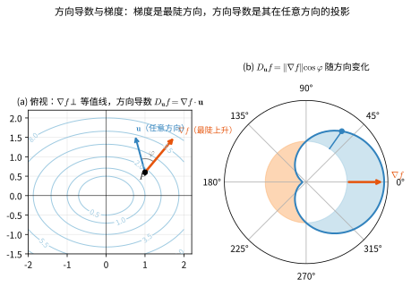
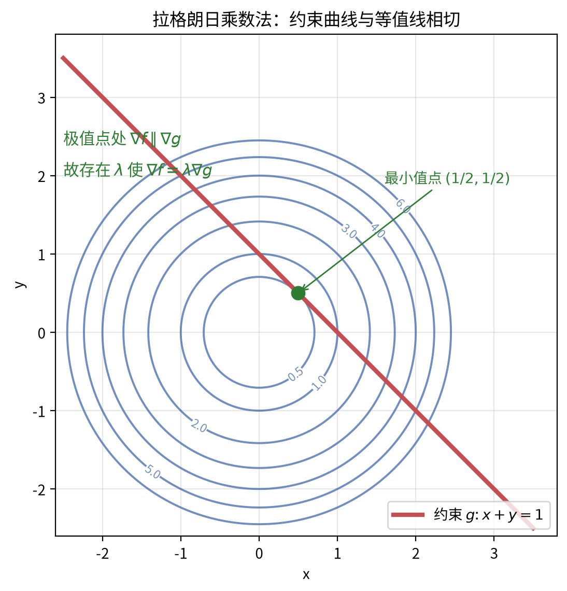
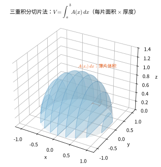
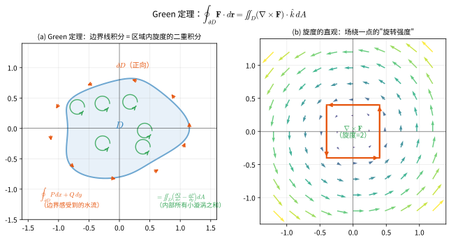
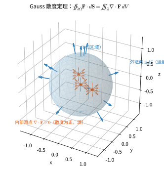

# 第 12 级：多变量微积分 (Multivariable Calculus)

## 1. 学习目标

完成本教程后，您应能够：

- 理解多元函数的概念，掌握极限与连续性的判定方法
- 熟练计算偏导数与高阶偏导数，理解 Clairaut 定理
- 掌握全微分与线性近似的几何意义
- 运用链式法则解决复合函数求导问题
- 理解方向导数与梯度，掌握拉格朗日乘数法求条件极值
- 计算二重积分与三重积分，掌握变量变换与 Jacobi 行列式
- 理解曲线积分与曲面积分，掌握 Green 定理、Stokes 定理与 Gauss 散度定理
- 运用多元微积分基本定理解决实际问题

---

## 开始之前

**本章在讲什么**：这一章把一元微积分从直线上搬到平面和空间里。自变量不再只是一个数，而是一组数，你要学会对"其中一个变量"求偏导、找最陡上升方向的梯度，还会用二重积分、三重积分去算曲面下的体积和立体内的总量，最后认识把微分与积分连成一体的三大定理。

**为什么要学它**：它把第 11 级的导数与定积分推广到高维，让你第一次正式接触"向量场"这个对象。这里的梯度、散度、旋度与重积分，是上一章学完后的自然延伸，也为后面的级数理论（第 13 级）、线性代数（第 14 级）打基础；而 9.5 节的广义 Stokes 定理会一路延伸成实分析（第 17 级）、微分几何（第 33 级）和偏微分方程（第 40 级）的分析骨架。

**开始前请确认你还记得**：
- 一元导数的定义与求导法则（见第 11 级）：导数描述函数在某一点的瞬时变化率，是偏导与梯度的一元基础。
- 定积分与黎曼和（见第 11 级）：把区间细分成小段、取高求和再取极限得到面积，重积分就是在平面和空间里的"升级版"。
- 复合函数链式法则（见第 11 级）：一元复合函数"从里到外逐层求导"的规则，本章的链式法则是它在多变量下的推广。
- 一元极限与连续（见第 10 级）：理解函数"趋近某点"的过程，是判定多元极限存在与否的前提。
- 平面直角坐标系与两点间距离（见第 6 级）：坐标、距离与图形，是看懂多元函数图像和等值线的基础。

---

## 2. 多元函数

### 2.1 多元函数的定义

**多元函数**是指定义域为 $\mathbb{R}^n$（或其子集）、值域为 $\mathbb{R}$（或 $\mathbb{R}^m$）的函数。一般形式为：

$$
f: E \subseteq \mathbb{R}^n \longrightarrow \mathbb{R},\quad (x_1, x_2, \dots, x_n) \longmapsto f(x_1, x_2, \dots, x_n)
$$

当 $n=2$ 时称为**二元函数**，记作 $z = f(x, y)$；当 $n=3$ 时称为**三元函数**，记作 $u = f(x, y, z)$。

**示例**：$f(x, y) = x^2 + y^2$ 是一个二元函数，表示一个旋转抛物面。

> **直观理解（现实类比）**：多元函数就是"**一个读数对应多个旋钮**"。一元函数像只有一个旋钮的机器——拧一下出个数；多元函数则像烤箱/调音台上有好几个旋钮（$x_1,\dots,x_n$），最终读数是由它们共同决定的。二元函数 $z = f(x, y)$ 好比一张地形图：每个平面位置 $(x, y)$ 对应唯一一个高度 $z$，所以在二维地图正上方"悬浮"出一张起伏的曲面。

#### 2.1.1 欧氏范数：多元的"绝对值"

在 $\mathbb{R}^n$ 中，描述"两个点 $\mathbf{x}$ 与 $\mathbf{a}$ 离得多远"，用**欧氏范数**（也叫欧氏长度、2-模）来度量。对 $\mathbf{x} = (x_1, x_2, \dots, x_n) \in \mathbb{R}^n$，其范数为

$$\|\mathbf{x}\| = \sqrt{x_1^2 + x_2^2 + \cdots + x_n^2},$$

这是**坐标原点到该点的直线距离**。两个点之间的距离就是它们差向量的范数：

$$\|\mathbf{x} - \mathbf{a}\| = \sqrt{(x_1-a_1)^2 + (x_2-a_2)^2 + \cdots + (x_n-a_n)^2}.$$

**与一元的对照（理解的关键）**：

- 一元时数的"大小"用绝对值 $|x-a|$ 度量，它是数轴上的距离；
- 多元时"大小"就是范数 $\|\mathbf{x}-\mathbf{a}\|$，它是高维空间里的距离。二者在本质上是同一件事——**衡量两点距离**，只是一元在线上、多元在面/体里。

**特例（$n=1,2,3$）**：

$$
n=1:\ \|x\|=\sqrt{x^2}=|x|,\qquad
n=2:\ \|(x,y)\|=\sqrt{x^{2}+y^{2}},\qquad
n=3:\ \|(x,y,z)\|=\sqrt{x^{2}+y^{2}+z^{2}}.
$$

**直观理解（现实类比）**：当你在地图上量两点间的直线距离，一元好比"在一条笔直的走廊里量步数"（就是 $|x-a|$）；多元则好比"在广场上量点到点的斜线"——你得把横向、纵向（甚至竖向）的位移各自取平方、加起来再开根号。条件 $0 < \|\mathbf{x}-\mathbf{a}\| < \delta$ 说的就是：$\mathbf{x}$ 落在以 $\mathbf{a}$ 为圆心、半径 $\delta$、且**不含 $\mathbf{a}$ 自身**的开球内——这正是 2.2 节多元极限定义进入点的"邻域"。

### 2.2 多元函数的极限

设 $f$ 定义在 $\mathbb{R}^n$ 的开集 $E$ 上，$\mathbf{a} = (a_1, \dots, a_n)$ 是 $E$ 的一个聚点。若存在常数 $L$，使得对任意 $\varepsilon > 0$，存在 $\delta > 0$，当 $0 < \|\mathbf{x} - \mathbf{a}\| < \delta$ 且 $\mathbf{x} \in E$ 时，有 $|f(\mathbf{x}) - L| < \varepsilon$，则称

$$
\lim_{\mathbf{x} \to \mathbf{a}} f(\mathbf{x}) = L.
$$

**重要性质**：多元函数的极限必须与路径无关。若沿不同路径趋近时极限值不同，则极限不存在。

> **直观理解（现实类比）**：一元极限像"高速路上一辆车只朝一个方向驶向收费站"——只有东西这一条路，看车是否开向同一个地方即可。多元极限则完全不同：点 $\mathbf{x}$ 可以**从四面八方、沿任何曲线**扑向 $\mathbf{a}$。所以判断极限是否存在，就像在市中心看傍晚，要考虑"清晨从哪边都往这里赶的人流——从东、从南、绕山路来的人，最终是不是都聚到同一个广场"。
> **只要有一条路让函数值晃到别处，警报就响了**：好比明明所有方向车流都该到同一出口，却有一条山路把人带去了另一座城——那"出口"就不唯一，极限不存在。这正是下方示例中"沿直线都得 0、沿抛物线偏得 $\frac12$"的刺头：**一条路就够了**。

**示例**：考察函数

$$
f(x, y) = \frac{x^2 y}{x^4 + y^2}
$$

当 $(x, y) \to (0, 0)$ 时的极限。

- 沿直线 $y = kx$ 趋近：$f(x, kx) = \frac{k x^3}{x^4 + k^2 x^2} = \frac{kx}{x^2 + k^2} \to 0$。
- 沿抛物线 $y = x^2$ 趋近：$f(x, x^2) = \frac{x^4}{x^4 + x^4} = \frac{1}{2}$。

由于沿不同路径极限不同，故极限 $\lim_{(x,y)\to(0,0)} f(x,y)$ 不存在。

### 2.3 多元函数的连续性

函数 $f$ 在点 $\mathbf{a}$ 处连续，当且仅当

$$
\lim_{\mathbf{x} \to \mathbf{a}} f(\mathbf{x}) = f(\mathbf{a}).
$$

**注意**：每个变量单独连续不能保证多元函数整体连续。例如函数

$$
f(x, y) =
\begin{cases}
\frac{y}{x} - y, & 1 \geq x > y \geq 0 \\
\frac{x}{y} - x, & 1 \geq y > x \geq 0 \\
1 - x, & x = y > 0 \\
0, & \text{else}
\end{cases}
$$

固定任意 $y$，$f(\cdot, y)$ 在 $\mathbb{R}$ 上连续；固定任意 $x$，$f(x, \cdot)$ 也在 $\mathbb{R}$ 上连续。但 $f$ 在原点不连续，因为沿 $x = y$ 趋近时极限为 $1$，而 $f(0,0)=0$。

> **直观理解（现实类比）**：为什么每个变量单独连续，合起来却不连续？这就好比**"教室里每个座位都坐得下一个人"和"全班能同时坐下"是两回事**。单独固定一个变量看（比如固定 $y$，让 $x$ 动），只检查"某一行/某一列"是否平顺；但多元连续要求的是**整个桌面（二维）在每个小邻域都平顺无缝**。行与列各自连续，好比每条横向和纵向的缝都严实，却可能在某个共同的角落漏了一个洞——沿对角线方向一踩就塌。所以全景连续比"逐行逐列连续"要强得多。

### 2.4 等值线与等值面

- **等值线（Level Curve）**：对于二元函数 $z = f(x, y)$，满足 $f(x, y) = c$（常数）的点的集合。
- **等值面（Level Surface）**：对于三元函数 $u = f(x, y, z)$，满足 $f(x, y, z) = c$ 的点的集合。

等值线/面是理解多元函数几何性质的重要工具。例如，$f(x, y) = x^2 + y^2$ 的等值线是以原点为中心的同心圆。

> **直观理解（现实类比）**：等值线/面就是**地形图上的同一海拔线**（与此前 2.1 用过的"地图"类比一脉相承）。地图上把海拔相同的地方连成一条圈，这条圈上的所有点"高度一样"——对应到函数就是 $f(x,y)=c$ 的点集。爬过山的人都懂：贴着同一条等高线走，坡不升不降。气象图上的等压线、等温线，也都是"等值线"——等值面的三变量版，好比把同一温度的房子在空间里挑出来，围出一个"等温外壳"。

---

## 3. 偏导数

### 3.1 偏导数的定义

设 $z = f(x, y)$ 在点 $(x_0, y_0)$ 的某邻域内有定义。固定 $y = y_0$，若极限

| 符号 | 名称 | 含义 | 直观解释 |
|:---:|:---:|:---|:---|
| $\partial$ | 偏导算子 | 固定其余变量、只对一个变量求导 | "只动一个变量" |
| $f(x, y)$ | 二元函数 | 接收两个输入返回一个值 | "两个旋钮一个读数" |
| $\Delta x$ | 自变量增量 | $x$ 的变化量，趋于 $0$ | "$x$ 动了多少" |
| $(x_0, y_0)$ | 取点坐标 | 讨论偏导所在的固定点 | "山坡上某个位置" |

$$
\frac{\partial f}{\partial x}(x_0, y_0) = \lim_{\Delta x \to 0} \frac{f(x_0 + \Delta x, y_0) - f(x_0, y_0)}{\Delta x}
$$

存在，则称该极限为 $f$ 在 $(x_0, y_0)$ 处关于 $x$ 的**偏导数**。类似地定义关于 $y$ 的偏导数。

**几何意义**：$\frac{\partial f}{\partial x}(x_0, y_0)$ 是曲面 $z = f(x, y)$ 与平面 $y = y_0$ 的交线在点 $(x_0, y_0, f(x_0, y_0))$ 处的切线斜率。

> **直观理解（现实类比）**：偏导就是"**只动一个变量，其余先锁住**"的瞬时变化率。想象你站在山坡上，偏导 $\frac{\partial f}{\partial x}$ 是你**只看正东方向**的坡度——分析东西向时把南北位置固定，只看东西方向的起伏。（联系第11级：这就是一元导数曲面版的"割线趋紧切线"。）

**计算示例**：设 $f(x, y) = x^2 y + \sin(xy)$，则

$$
\frac{\partial f}{\partial x} = 2xy + y\cos(xy),\quad \frac{\partial f}{\partial y} = x^2 + x\cos(xy).
$$

> **🧠 思考历程：一个圆滚滚的"$\partial$"，怎么成了拆解复杂变化的关键？**
>
> 多变量里"对谁求导"突然变得重要，于是有了 $\frac{\partial f}{\partial x}$ 那个独特的"花体 $\partial$"。它不只是一笔记号，而是"把复杂曲面一层层拆开分析"的起点。
>
> - **从"一个旋钮"到"多个旋钮"的跃迁**。单变量时 $y=f(x)$ 只有一条路可走；可到了 $z=f(x,y)$，山坡上四面八方都有坡。**不能再用一个导数说清整个变化，必须先"锁"住别的变量，一次只动一个**——这就是"每个方向各算各的偏导"的本质动机。
> - **"偏导"先被当朴素想法，后有了专门记号**。最初人们只是"把别的变量当常数再求导"。**勒让德**（Legendre，1786）与拉格朗日等人固定了"对某一变量求偏导"的做法；而"$\partial$"这一花体记号在 19 世纪逐渐定型——它时刻提醒你"还有别的变量被暂时按住了"。**一个记号，就是为了承接"多个自由度"这一新现实。**
> - **偏导为何撑起整个多元微积分？** 因为有偏导，才有切平面、梯度、可微性、偏微分方程。气候模型、材料受力、图像梯度——**凡是"结果受多个因素影响"，求变化率的第一动作就是算偏导**。
> - **但小心：偏导存在 ≠ 可微**。这是多元世界的重大陷阱：各个方向偏导都在，函数却可能根本不连续、没有切平面。**"局部可导"和"整体可微"在多元里分家了**（见 4.1 节与"误区 5"）。
> - **心路**：偏导数提醒你：**面对多因素的复杂对象，"一次只动一个变量、其余按住"是拆解不确定性最朴素也最有效的办法**。$\partial$ 那个圆润的记号，既是"做多个方向的导数"，也是"别忘记其它变量还在后台待命"。

### 3.2 高阶偏导数

对偏导数再求偏导，得到高阶偏导数。记法：

$$
\frac{\partial^2 f}{\partial x^2} = \frac{\partial}{\partial x}\left(\frac{\partial f}{\partial x}\right),\quad
\frac{\partial^2 f}{\partial y \partial x} = \frac{\partial}{\partial y}\left(\frac{\partial f}{\partial x}\right).
$$

**示例**：对 $f(x, y) = x^3 y^2 + e^{xy}$，

$$
\frac{\partial f}{\partial x} = 3x^2 y^2 + y e^{xy},\quad
\frac{\partial^2 f}{\partial x^2} = 6x y^2 + y^2 e^{xy},
$$
$$
\frac{\partial^2 f}{\partial y \partial x} = 6x^2 y + e^{xy} + xy e^{xy}.
$$

> **直观理解（现实类比）**：高阶偏导就是"**变化率的变化率**"。二阶偏导 $\frac{\partial^2 f}{\partial x^2}$ 像在山坡上不只问"坡有多陡"，还要问"坡是在越变越陡还是越变越缓"（如同汽车的速度之外还看加速度）。混合偏导 $\frac{\partial^2 f}{\partial y\partial x}$ 则问"沿 $x$ 方向的坡度，随 $y$ 的移动怎么变化"——好比一块布上先横着量坡角，再竖着往前走两步，看同一方向的坡斗有没有被"拧歪"，这正是下一节 Clairaut 定理要处理的"扭角"。

### 3.3 Clairaut 定理（混合偏导数的相等性）

**定理（Clairaut's Theorem / Schwarz's Theorem）**：设 $f(x, y)$ 在点 $(a, b)$ 的某邻域内具有连续的二阶偏导数，则在该点处混合偏导数与求导顺序无关，即

$$
\frac{\partial^2 f}{\partial x \partial y}(a, b) = \frac{\partial^2 f}{\partial y \partial x}(a, b).
$$

**证明**：考虑二阶差分

$$
\Delta(h, k) = f(a+h, b+k) - f(a+h, b) - f(a, b+k) + f(a, b).
$$

定义函数 $g(x) = f(x, b+k) - f(x, b)$，则 $\Delta(h, k) = g(a+h) - g(a)$。由 Lagrange 中值定理，存在 $\xi$ 介于 $a$ 与 $a+h$ 之间，使得

$$
\Delta(h, k) = g'(\xi) h = \left[\frac{\partial f}{\partial x}(\xi, b+k) - \frac{\partial f}{\partial x}(\xi, b)\right] h.
$$

再对 $\frac{\partial f}{\partial x}$ 应用中值定理，存在 $\eta$ 介于 $b$ 与 $b+k$ 之间，使得

$$
\Delta(h, k) = \frac{\partial^2 f}{\partial y \partial x}(\xi, \eta) \cdot hk.
$$

同理，若先对 $y$ 求导再对 $x$ 求导，可得 $\Delta(h, k) = \frac{\partial^2 f}{\partial x \partial y}(\xi', \eta') \cdot hk$。令 $(h, k) \to (0, 0)$，由二阶偏导数的连续性即得相等性。$\blacksquare$

> **直观理解（现实类比）**：混合偏导 $\frac{\partial^2 f}{\partial y \partial x}$ 怎么理解？想象站在一片起伏的草地上画一个**小方框**：先沿 $x$ 方向量一次坡度变化，再沿 $y$ 方向量一次——"先安静地往东看坡度变没变，再往北走两步看它变没变"。Clairaut 定理说：**先东西后南北，和先南北后东西，得到的"小方框对边的滑稽变形量"是一样的**。好比一块布上任意画一个小方格，把它沿水平、竖直两个方向各拉扯一点，无论先拉哪个方向，最终格子的"扭角"都一样——只要地形够光滑（二阶偏导连续）。光滑是这里的大前提：一旦有尖角（函数不光滑），"先横后竖"和"先竖后横"就可能不同，这正是前面 3.2 高阶偏导与可微性相关的微妙之处。

---

## 4. 全微分

### 4.1 全微分的定义

若函数 $z = f(x, y)$ 在点 $(x_0, y_0)$ 处的增量可表示为

$$
\Delta z = f(x_0 + \Delta x, y_0 + \Delta y) - f(x_0, y_0) = A\Delta x + B\Delta y + o(\sqrt{\Delta x^2 + \Delta y^2}),
$$

其中 $A$、$B$ 与 $\Delta x$、$\Delta y$ 无关，则称 $f$ 在 $(x_0, y_0)$ 处**可微**，且 $A = \frac{\partial f}{\partial x}(x_0, y_0)$，$B = \frac{\partial f}{\partial y}(x_0, y_0)$。称

$$
\mathrm{d}z = \frac{\partial f}{\partial x} \mathrm{d}x + \frac{\partial f}{\partial y} \mathrm{d}y
$$

为 $f$ 的**全微分**。

> **直观理解（现实类比）**：「可微」说的是一句话：**函数在某点附近能用一个"平面"完美代替**。式子里的 $o(\sqrt{\Delta x^2+\Delta y^2})$ 是那个"漏掉的部分"——它是比"走一步的距离"还小得多的**残缺余量**（比如你迈出一分米，误差连一毫米都不到），装上它只是为了说明"切平面的贴合已经足够好"。这让"可微"变得非常直观：
> - 可微 ⇔ 在你踩的点 $P_0$ 上放一块有特定倾斜度的**玻璃平板**，它周围的小片曲面都能被这块平板"严丝合缝"地垫平——如同用一块平板尺量桌面，只是尺子微微倾斜。
> - 每个方向的小变化 $\Delta z$，都由"向东的斜率 $\times \Delta x$"和"向北的斜率 $\times \Delta y$"两个独立贡献相加（$dz = f_x\,dx + f_y\,dy$），**两个方向的斜坡互不干扰地叠加**。
> - 这与偏导存在是两码事：偏导体现在"沿某一根轴能求导"，可微则要求"**整块玻璃平板贴得平、误差忽略不计**"——这正是 4.2 节切平面和后面"误区 5"反复强调的区别。

**可微的充分条件**：若 $f$ 的偏导数在 $(x_0, y_0)$ 的某邻域内存在且连续。 $f$ 在该点可微。

### 4.2 切平面与线性近似

曲面 $z = f(x, y)$ 在点 $(x_0, y_0, z_0)$ 处的**切平面**方程为

$$
z - z_0 = \frac{\partial f}{\partial x}(x_0, y_0)(x - x_0) + \frac{\partial f}{\partial y}(x_0, y_0)(y - y_0).
$$

**线性近似**（Linear Approximation）：

$$
f(x, y) \approx f(x_0, y_0) + \frac{\partial f}{\partial x}(x_0, y_0)(x - x_0) + \frac{\partial f}{\partial y}(x_0, y_0)(y - y_0).
$$

> **直观理解（现实类比）**：全微分就是"**在地形图上某点放一块小平板**"——平板的倾斜度由两个偏导 $f_x, f_y$ 决定，平板的方程正是切平面。
> 当你只在 $P_0$ 附近走一小步 $(dx, dy)$，曲面高度变化 $\Delta z$ 几乎就等于平板上的高度变化 $dz = f_x\,dx + f_y\,dy$。
> 也就是说，切平面是"**最贴近曲面的平面**"，全微分把复杂的曲面变化线性化成两块独立斜坡的叠加。（联系第11级：一元函数的切线 $\Rightarrow$ 多元函数的切平面。）

**示例**：用线性近似估算 $f(x, y) = \sqrt{x^2 + y^2}$ 在 $(3.01, 3.98)$ 处的值。

取 $(x_0, y_0) = (3, 4)$，则 $f(3, 4) = 5$，$\frac{\partial f}{\partial x} = \frac{x}{\sqrt{x^2+y^2}}$，$\frac{\partial f}{\partial y} = \frac{y}{\sqrt{x^2+y^2}}$，在 $(3,4)$ 处分别为 $\frac{3}{5}$ 和 $\frac{4}{5}$。

$$
f(3.01, 3.98) \approx 5 + \frac{3}{5}(0.01) + \frac{4}{5}(-0.02) = 5 + 0.006 - 0.016 = 4.99.
$$

---

## 5. 链式法则

### 5.1 链式法则的表述

**情形一**：若 $z = f(x, y)$ 可微，且 $x = g(t)$，$y = h(t)$ 可导，则

$$
\frac{\mathrm{d}z}{\mathrm{d}t} = \frac{\partial f}{\partial x} \frac{\mathrm{d}x}{\mathrm{d}t} + \frac{\partial f}{\partial y} \frac{\mathrm{d}y}{\mathrm{d}t}.
$$

**情形二**：若 $z = f(x, y)$ 可微，且 $x = g(s, t)$，$y = h(s, t)$ 具有偏导数，则

$$
\frac{\partial z}{\partial s} = \frac{\partial f}{\partial x} \frac{\partial x}{\partial s} + \frac{\partial f}{\partial y} \frac{\partial y}{\partial s},\quad
\frac{\partial z}{\partial t} = \frac{\partial f}{\partial x} \frac{\partial x}{\partial t} + \frac{\partial f}{\partial y} \frac{\partial y}{\partial t}.
$$

> **直观理解（现实类比）**：链式法则讲的是"**改变如何层层传导**"。情形一好比一台机器：你转动**手柄 $t$**，通过两根传动带（$x=g(t)$、$y=h(t)$）先使两个中间变量 $x,y$ 改变，再带动最终输出 $z=f(x,y)$ 变化。那么"$z$ 随 $t$ 的变化率"就是两条支路各自贡献之和——**每条支路的贡献 = 中间量对 $t$ 的变化率 × 输出对中间量的变化率**。这正是一元时"从里到外逐层求导"（第 11 级）在"两个中间变量并行"时的自然延伸。
> 情形二则是"**输入旋钮变多了**"：$z$ 直接挂在 $x,y$ 上，而 $x,y$ 又都受 $s,t$ 控制。问 $z$ 随 $s$ 变多少，就得追两条链：$s\to x\to z$ 与 $s\to y\to z$，把两条链相加。**"一条因果路径算一段变化率，再把这些路径叠加"**，就是链式法则的全部智慧——多条影响,逐条求和。

### 5.2 链式法则的证明

**证明**（情形一）：设 $z = f(x, y)$ 可微，则

- 【第1步】依据：函数可微的定义（增量可拆成偏导的线性主部加高阶小量）；目的：把两点间的函数增量 $\Delta z$ 表达成关于 $\Delta x$、$\Delta y$ 的线性组合。

$$
\Delta z = \frac{\partial f}{\partial x} \Delta x + \frac{\partial f}{\partial y} \Delta y + \varepsilon_1 \Delta x + \varepsilon_2 \Delta y,
$$

其中 $\varepsilon_1, \varepsilon_2 \to 0$ 当 $(\Delta x, \Delta y) \to (0, 0)$。

两边除以 $\Delta t$ 并令 $\Delta t \to 0$，注意到 $\frac{\Delta x}{\Delta t} \to \frac{\mathrm{d}x}{\mathrm{d}t}$，$\frac{\Delta y}{\Delta t} \to \frac{\mathrm{d}y}{\mathrm{d}t}$，且 $\varepsilon_1, \varepsilon_2 \to 0$，于是

- 【第2步】依据：对两边同除以 $\Delta t$ 后取极限，利用导数定义 $\frac{\Delta x}{\Delta t} \to \frac{\mathrm{d}x}{\mathrm{d}t}$ 且余项 $\varepsilon_1,\varepsilon_2 \to 0$ 消失；目的：把对增量的等式过渡成 $z$ 对 $t$ 的导数，得到链式法则。

$$
\frac{\mathrm{d}z}{\mathrm{d}t} = \frac{\partial f}{\partial x} \frac{\mathrm{d}x}{\mathrm{d}t} + \frac{\partial f}{\partial y} \frac{\mathrm{d}y}{\mathrm{d}t}. \quad \blacksquare
$$

**示例**：设 $z = x^2 y + e^{xy}$，$x = t^2$，$y = \sin t$，求 $\frac{\mathrm{d}z}{\mathrm{d}t}$。

$$
\frac{\partial z}{\partial x} = 2xy + y e^{xy},\quad \frac{\partial z}{\partial y} = x^2 + x e^{xy},
$$
$$
\frac{\mathrm{d}x}{\mathrm{d}t} = 2t,\quad \frac{\mathrm{d}y}{\mathrm{d}t} = \cos t,
$$
$$
\frac{\mathrm{d}z}{\mathrm{d}t} = (2xy + y e^{xy})(2t) + (x^2 + x e^{xy})(\cos t).
$$

---

## 6. 方向导数与梯度

### 6.1 方向导数

设 $f(x, y)$ 在点 $(x_0, y_0)$ 的某邻域内有定义，$\mathbf{u} = (\cos\theta, \sin\theta)$ 是一个单位向量。则 $f$ 沿方向 $\mathbf{u}$ 的**方向导数**定义为

$$
D_{\mathbf{u}} f(x_0, y_0) = \lim_{t \to 0^+} \frac{f(x_0 + t\cos\theta, y_0 + t\sin\theta) - f(x_0, y_0)}{t}.
$$

若 $f$ 可微，则

$$
D_{\mathbf{u}} f(x_0, y_0) = \frac{\partial f}{\partial x}(x_0, y_0) \cos\theta + \frac{\partial f}{\partial y}(x_0, y_0) \sin\theta.
$$

> **直观理解（现实类比）**：方向导数与梯度就是"**站在山坡上看哪个方向最陡**"。
> 梯度 $\nabla f$ 是一个箭头，它指向**最陡的上坡方向**，长度就是最大坡度；而方向导数 $D_\mathbf{u}f$ 是你**任意选一个方向 $\mathbf{u}$** 走时感受到的坡度，数值上等于"梯度在你这个方向上的投影" $\|\nabla f\|\cos\varphi$。
> 当 $\mathbf{u}$ 与梯度同向时 $\varphi=0$，方向导数最大（最陡上升）；当 $\mathbf{u}$ 垂直梯度时（沿等高线走）方向导数为 0（高度不变）；反向则为最陡下降。

### 6.2 梯度向量

$f$ 的**梯度**（Gradient）定义为

| 符号 | 名称 | 含义 | 直观解释 |
|:---:|:---:|:---|:---|
| $\nabla f$ | 梯度 | 由各偏导组成的向量，指向最陡上升 | "最陡的爬山箭头" |
| $\mathbf{u}$ | 单位向量 | 长度为 $1$ 的方向向量 | "任意选个方向" |
| $\cdot$ | 点积（内积） | 两向量对应分量乘积之和 | "朝方向投影大小" |
| $\|\nabla f\|$ | 梯度模长 | 梯度向量的长度 | "坡到底有多陡" |

$$
\nabla f = \left( \frac{\partial f}{\partial x}, \frac{\partial f}{\partial y} \right) \quad (\text{二元}), \qquad
\nabla f = \left( \frac{\partial f}{\partial x}, \frac{\partial f}{\partial y}, \frac{\partial f}{\partial z} \right) \quad (\text{三元}).
$$

方向导数与梯度的关系：

$$
D_{\mathbf{u}} f = \nabla f \cdot \mathbf{u} = \|\nabla f\| \cos\phi,
$$

其中 $\phi$ 是 $\nabla f$ 与 $\mathbf{u}$ 的夹角。

**重要结论**：
- 梯度方向是函数增长最快的方向（$\phi = 0$）。
- 负梯度方向是函数下降最快的方向（$\phi = \pi$）。
- 梯度方向垂直于等值线/等值面。

> **直观理解（现实类比）**：梯度就是"**最陡的爬山箭头**"。站在地图的等高线上，梯度总是指向你**爬得最快**的方向，而且它与等高线垂直——因为只要沿着与等高线平行的方向走，高度就不变。这也是为什么山谷探险家总是**垂直**地横穿等高线爬升。（联系第2章：等值线正是"高度相同"的线。）

> **🧠 思考历程：为什么"往上爬最快的方向"，会先被别人用"陪衬函数"想出来？**
>
> $\nabla f$ 之所以叫"梯度（gradient）"，是因为它把"在哪个方向、坡度多大"浓缩成一个向量。它既是天气图、地形图的读法，也是现代优化算法（梯度下降）的心脏——却从一个非常朴素的问题里长出来：站在山上，往哪走爬得最快？
>
> - **从"偏导"到"向量"的一步**。既然偏导已经量出了"各方向的变化率"，把它们并成向量 $\nabla f=(\partial f/\partial x,\partial f/\partial y)$ 就很自然——**用一个箭头说话，代替一个个孤立的数**。而这个向量在任意方向的投影 $\nabla f\cdot\mathbf u=\|\nabla f\|\cos\varphi$，正好就是该方向的方向导数。于是"往哪个方向涨最快"一眼可见：$\mathbf u$ 与 $\nabla f$ 同向时投影最大。
> - **为什么 $D_\mathbf u f$ 恰是点积？** 这是"方向导数=梯度在方向上的投影"的几何妙处。**任何方向的变化量**都能由"梯度×方向余弦"表示（上面 $D_\mathbf u f=f_x\cos\theta+f_y\sin\theta$），这等于说"梯度已经包含了所有方向的信息"——直线的方向可以从"该往哪走"统一解出。
> - **"梯度"之名的来历**。它的英译 "gradient"、"del"（$\nabla$）记号由哈密顿（Hamilton）在四元数研究中提出，经威尔逊等人的著作推广而成为标准。**而"梯度上升"很快反转成"梯度下降"，成了机器学习的马力引擎**：负梯度方向下降最快，于是反复沿 $-\nabla f$ 迈小步逼近极小值。
> - **心路**：梯度告诉你一件事：**想要"最快最省力"地达到目标，就顺着"变化率向量"走**。不论爬山、找最速降、还是训练神经网络，$\nabla f$ 都是那个"指着捷径前进"的箭头。

### 6.3 拉格朗日乘数法

**问题**：求函数 $f(x, y, z)$ 在约束条件 $g(x, y, z) = 0$ 下的极值。

**方法**：构造**拉格朗日函数**

$$
\mathcal{L}(x, y, z, \lambda) = f(x, y, z) - \lambda g(x, y, z),
$$

令所有偏导数为零：

$$
\begin{cases}
\frac{\partial \mathcal{L}}{\partial x} = \frac{\partial f}{\partial x} - \lambda \frac{\partial g}{\partial x} = 0, \\[3pt]
\frac{\partial \mathcal{L}}{\partial y} = \frac{\partial f}{\partial y} - \lambda \frac{\partial g}{\partial y} = 0, \\[3pt]
\frac{\partial \mathcal{L}}{\partial z} = \frac{\partial f}{\partial z} - \lambda \frac{\partial g}{\partial z} = 0, \\[3pt]
\frac{\partial \mathcal{L}}{\partial \lambda} = -g(x, y, z) = 0.
\end{cases}
$$

解此方程组即得候选极值点。

**证明思路**：在约束条件 $g = 0$ 下，极值点处 $\nabla f$ 必与 $\nabla g$ 平行（否则 $\nabla f$ 在切平面上的投影非零，沿该投影方向移动可增加函数值）。因此存在 $\lambda$ 使得 $\nabla f = \lambda \nabla g$，这正是上述方程组的向量形式。$\blacksquare$

> **🧠 思考历程：一个凭空加进来的"$\lambda$"，凭什么能解"被束缚的极值"？**
>
> 拉格朗日乘数法给每个约束"编一个号 $\lambda$"，然后神不知鬼不觉地把"带约束极值"变成"无约束极值"。这个妙招来自拉格朗日（Lagrange，18 世纪），他用一个看似多余、实则关键的$\lambda$敲开了最优化的大门。
>
> - **问题本身很"不自由"**：想求 $f$ 的极值，却被硬性条件 $g=0$ 绑住，只能在曲面上行动。直接对 $f$ 求导求极值根本不适用——必须先把约束"翻译"进来，把自由度管住。
> - **几何真相：极值点处两梯度"背靠背"**。若在约束曲面上的某点取到 $f$ 的极值，那么沿"允许的方向"移动 $f$ 不该再变化——这说明 $\nabla f$ 在该点的切平面方向投影为零，即 $\nabla f$ 垂直于约束曲面，而 $\nabla g$ 也垂直于它。**两个梯度必须平行：$\nabla f=\lambda\nabla g$。** 这个"平行关系"正是上面整组方程 $\frac{\partial\mathcal L}{\partial x}=0$ 的向量来源。
> - **为什么"把 $\lambda$ 拉进来"就赢了**。本来要解"沿切面找极值"这类棘手问题；拉格朗日把约束用 $- \lambda g$ 加进目标函数，组出一个 $\mathcal L$，再令其所有偏导为 0——**变成一个直来直去的方程组**。每多一个约束，就多一个 $\lambda$，多一个方程。
> - **它是"约束优化的标准化开端"**。后来乘数法被推广为卡拉特奥多里、库恩-塔克条件，也直接哺育了经济学里的约束最优化、机器学习的正则化。**一个"看似多余"的 $\lambda$，成了把约束世界翻译到无约束世界的万能词根。**
> - **心路**：拉格朗日乘数法教你：**遇到"被束缚"的难题，不妨引入一个"中介量"（$\lambda$），把约束折算进问题本身**。那个凭空多出来的 $\lambda$，不是多余，而是连接"自由"与"束缚"的秘密通道。

**示例**：求函数 $f(x, y) = x^2 + y^2$ 在约束 $x + y = 1$ 下的最小值。

解：构造 $\mathcal{L} = x^2 + y^2 - \lambda(x + y - 1)$。

- 【第1步】依据：令拉格朗日函数 $\mathcal{L}$ 对各变量（含 $\lambda$）的偏导为零，即候选极值的一阶必要条件；目的：把带约束的极值问题转成解方程组。

$$
\frac{\partial \mathcal{L}}{\partial x} = 2x - \lambda = 0 \Rightarrow x = \frac{\lambda}{2},
$$

- 【第2步】依据：同理令对 $y$ 的偏导为零（必要条件对每个变量逐条成立）；目的：得到与第1步对称的方程，把 $y$ 也用 $\lambda$ 表示。

$$
\frac{\partial \mathcal{L}}{\partial y} = 2y - \lambda = 0 \Rightarrow y = \frac{\lambda}{2},
$$

- 【第3步】依据：$\frac{\partial \mathcal{L}}{\partial \lambda} = -g(x,y) = 0$ 就是把约束条件 $x+y=1$ 还原出来；目的：把第1、2步中 $\lambda$ 的表达式代回约束，解出唯一的 $\lambda$。

$$
\frac{\partial \mathcal{L}}{\partial \lambda} = -(x + y - 1) = 0 \Rightarrow \frac{\lambda}{2} + \frac{\lambda}{2} = 1 \Rightarrow \lambda = 1.
$$

于是 $x = y = \frac{1}{2}$，最小值为 $f\left(\frac{1}{2}, \frac{1}{2}\right) = \frac{1}{2}$。

> **直观理解（现实类比）**：拉格朗日乘数法就是"**在锁链上找最高点**"。想象一条狗拴在牵绳上（约束 $g$），绳长固定，它想离骨头（目标 $f$）最近。最优位置一定出现在**绳圈与"离骨头距离"的同心圆相切**的地方——此时狗再也无法沿绳移动来提高分数。数学上，相切意味着 $\nabla f$ 与 $\nabla g$ **平行**，即存在 $\lambda$ 使 $\nabla f=\lambda\nabla g$。

### 6.4 隐函数定理

> 讨论方程 $F(x, y) = 0$ 什么时候能（局部地）确定出隐函数 $y = \varphi(x)$，以及如何求其导数。这是多元微分学的理论基石。

**隐函数存在定理**：设 $F(x, y)$ 在点 $(x_0, y_0)$ 的某邻域内具有连续偏导数，且
$$
F(x_0, y_0) = 0, \qquad F_y(x_0, y_0) \neq 0
$$
则在 $(x_0, y_0)$ 的某邻域内，方程 $F(x, y) = 0$ 唯一确定一个连续可导的函数 $y = \varphi(x)$，满足 $\varphi(x_0) = y_0$，且
$$
\varphi'(x) = -\frac{F_x(x, y)}{F_y(x, y)}
$$

> **直观理解**：$F_y(x_0, y_0) \neq 0$ 保证在 $(x_0, y_0)$ 附近，$F$ 关于 $y$ 是"可逆的"，从而能把 $y$ 解出来。这正是隐函数存在的前提条件。

> **现实类比**：隐函数定理回答"**一个方程能不能把 $y$ 显式解出来**"。想象悬崖上一条看不见的山道，方程 $F(x,y)=0$ 就是这条道的"隐形描述"——你不一定写得出一张"$y$ = 关于 $x$ 的显式公式"，但只要在某处**曲线不是竖直的**（即 $F_y\neq 0$，坡度存在且不含竖直断层），这条道在附近就是"平滑可走的函数曲线"，于是可以"从地里把 $y$ 一点点拱出来"。反过来，若某处 $F_y=0$（曲线竖直立起），就是一个"岔路翻覆点"，那里不能保证唯一的 $y$ 对应——好比竖直岩壁处，同一个 $x$ 对应了好几个高度。**"只要不竖直，就能当函数看"**，这就是隐函数存在性的直觉核心。

> **示例**：由 $x^2 + y^2 = 1$ 确定 $y = \varphi(x)$。令 $F = x^2 + y^2 - 1$，则 $F_x = 2x$，$F_y = 2y$，故 $\varphi'(x) = -\frac{2x}{2y} = -\frac{x}{y}$（与 2.5 结果一致）。

**隐映射定理（方程组情形）**：设 $\mathbf{F}(\mathbf{x}, \mathbf{y}) = \mathbf{0}$（$m$ 个方程、$m$ 个隐变量 $y_1,\dots,y_m$），若在 $(\mathbf{x}_0, \mathbf{y}_0)$ 处 $\mathbf{F} = \mathbf{0}$ 且雅可比行列式
$$
\frac{\partial(F_1,\dots,F_m)}{\partial(y_1,\dots,y_m)} \neq 0
$$
则局部能唯一解出连续可微的 $\mathbf{y} = \boldsymbol{\varphi}(\mathbf{x})$。

**反函数定理**：设 $f: \mathbb{R}^n \to \mathbb{R}^n$ 在 $x_0$ 附近连续可微，且雅可比矩阵 $Df(x_0)$ **可逆**，则 $f$ 在 $x_0$ 的某邻域内有连续可微的反函数 $f^{-1}$，且
$$
D(f^{-1})(f(x_0)) = [Df(x_0)]^{-1}
$$

### 6.5 多元函数的泰勒公式

> 用多项式近似多元函数，是研究极值、逼近与误差估计的基础。

设 $f(x, y)$ 在点 $(x_0, y_0)$ 的某邻域内具有 $n+1$ 阶连续偏导数，令 $h = x - x_0$，$k = y - y_0$，则 $f$ 在 $(x_0, y_0)$ 处的 $n$ 阶泰勒展开为
$$
f(x_0 + h, y_0 + k) = \sum_{i=0}^{n} \frac{1}{i!}\left(h\frac{\partial}{\partial x} + k\frac{\partial}{\partial y}\right)^{i} f(x_0, y_0) + R_n
$$
其中 $R_n$ 为拉格朗日型余项。

**一阶展开（线性近似）**：
$$
f(x_0+h, y_0+k) \approx f(x_0,y_0) + f_x(x_0,y_0)h + f_y(x_0,y_0)k
$$

> **直观理解（现实类比）**：多元泰勒就是把"切平面"（4.2 节）再做**多层**：一阶展开只放一块小平板去贴曲面（对应第 11 级一元泰勒的一阶切线），二阶乃至更高阶则是在平板之上再叠"弯曲"。好比**用裁缝给一块布料量体做贴合**：一次近似像盖上平直布料（只对斜度敏感），二次近似再考虑到布料的"软硬/弯曲度"（黑塞矩阵），层数越高，越贴合那件曲面的"对身版型"。在 $x_0$ 处取的各阶偏导，就是这块"布料"在该点的斜率、曲率等全套"体型数据"。

**二阶展开（含海森矩阵）**：
$$
f(x_0+h, y_0+k) \approx f + f_x h + f_y k + \frac{1}{2}\left(f_{xx}h^2 + 2f_{xy}hk + f_{yy}k^2\right)
$$
其中各偏导数均在 $(x_0, y_0)$ 取值。用海森矩阵可写成
$$
f(\mathbf{x}_0 + \mathbf{h}) \approx f(\mathbf{x}_0) + \nabla f \cdot \mathbf{h} + \frac{1}{2}\,\mathbf{h}^T Hf(\mathbf{x}_0)\, \mathbf{h}
$$

> **应用**：二阶展开的第二项（二次型 $\mathbf{h}^T Hf\, \mathbf{h}$）的符号正是判断 $(x_0,y_0)$ 是极大值点、极小值点还是鞍点的依据（极值的二阶充分条件）。

> **直观理解（现实类比）**：鞍点就是"**马鞍或山口**"——既不是山顶也不是山谷，而是"**一方向上凸、另一方向下凹**"的临界点。
> 想象你坐在马鞍上：南北方向（沿马身）你是处在山脊的顶（前后都低），东西方向（横向）你处在山谷的底（左右都高）。
> 数学上，黑塞矩阵 $H$ 在鞍点处**既非正定也非负定**（行列式 $f_{xx}f_{yy}-f_{xy}^2<0$），所以两个特征值符号相反。对于 $z=x^2-y^2$，沿 $x$ 方向是开口向上的抛物面（谷），沿 $y$ 方向是开口向下的（峰），原点就是这种"上凹下凸"的鞍点。

---

## 7. 重积分

### 7.1 二重积分

**定义**：二重积分 $\iint_D f(x, y) \, \mathrm{d}A$ 是函数 $f$ 在区域 $D$ 上的黎曼和的极限。

> **直观理解（现实类比）**：二重积分就是"**用豆腐块堆出曲面下的体积**"。先把 $xy$ 平面切成小方格，每个方格里竖一根"以该处高度 $f(x_i,y_j)$ 为高的柱子"，再把所有柱体体积相加，格子越细越接近真实体积——细到无穷就是二重积分。（联系第11级 Riemann 和：这是它在平面上的"二维升级版"。）

| 符号 | 名称 | 含义 | 直观解释 |
|:---:|:---:|:---|:---|
| $\iint_D$ | 二重积分号 | 在区域 $D$ 上逐块累加 | "把小地块拼起来" |
| $D$ | 积分区域 | 被积分的平面范围 | "圈定的地盘" |
| $\mathrm{d}A$ | 面积微元 | 一小块面积 | "一小格地板" |

**直角坐标下的累次积分**：

- 若 $D = \{(x, y) \mid a \leq x \leq b,\; g_1(x) \leq y \leq g_2(x)\}$，则

$$
\iint_D f(x, y) \, \mathrm{d}A = \int_a^b \int_{g_1(x)}^{g_2(x)} f(x, y) \, \mathrm{d}y \, \mathrm{d}x.
$$

- 若 $D = \{(x, y) \mid c \leq y \leq d,\; h_1(y) \leq x \leq h_2(y)\}$，则

$$
\iint_D f(x, y) \, \mathrm{d}A = \int_c^d \int_{h_1(y)}^{h_2(y)} f(x, y) \, \mathrm{d}x \, \mathrm{d}y.
$$

#### 极坐标变换

令 $x = r\cos\theta$，$y = r\sin\theta$，则

$$
\iint_D f(x, y) \, \mathrm{d}x \, \mathrm{d}y = \iint_{D'} f(r\cos\theta, r\sin\theta) \, r \, \mathrm{d}r \, \mathrm{d}\theta.
$$

其中 $r$ 是 Jacobi 行列式的绝对值。

> **直观理解（现实类比）**：为什么极坐标多出 **$r$**？因为**从原点不同距离处的"一小格"大小不一样**。想象一张以原点为中心的世界地图：
> - 靠近原点时，角度变化 $d\theta$ 扫过的弧长只有 $r\,d\theta$（很小），对应一格"地砖"几乎不变大；
> - 远离原点时，同样的角度增量 $d\theta$ 却扫过**更大**的弧，格子被"拉宽"，面积不是 $dr\cdot d\theta$ 而应乘上半径 $r$，即面积元 $=r\,dr\,d\theta$。
> 所以 $r$ 就像**放大镜的倍率**：越靠外，一小格实际覆盖的实际平面面积越大。计算带旋转对称的圆盘区域时，用极坐标正好把"圆"这块原本别扭的区域变成长方形（$0\le r\le a$，$0\le\theta\le2\pi$），代价就是别忘了乘上这个放大倍率 $r$。

**示例**：计算 $\iint_D e^{-x^2 - y^2} \, \mathrm{d}A$，其中 $D$ 是半径为 $a$ 的圆盘。

用极坐标：$x = r\cos\theta$，$y = r\sin\theta$，$0 \leq r \leq a$，$0 \leq \theta \leq 2\pi$。

$$
\iint_D e^{-(x^2+y^2)} \, \mathrm{d}A = \int_0^{2\pi} \int_0^a e^{-r^2} \cdot r \, \mathrm{d}r \, \mathrm{d}\theta = 2\pi \int_0^a r e^{-r^2} \, \mathrm{d}r = \pi(1 - e^{-a^2}).
$$

- 第1个等号：把直角坐标积分换成极坐标，依据二重积分的极坐标变换（面积元变为 $r\,dr\,d\theta$，并令 $x=r\cos\theta$、$y=r\sin\theta$）；目的：让 $e^{-x^2-y^2}$ 变成 $e^{-r^2}$，从而能分离变量。
- 第2个等号：被积函数已与 $\theta$ 无关，依据 $\int_0^{2\pi} 1\,d\theta = 2\pi$；目的：消去角度变量，只剩关于 $r$ 的一重积分。
- 第3个等号：先积最内层，依据凑微分 $\int r e^{-r^2}\,dr = -\tfrac12 e^{-r^2}$；目的：求出原函数并代入上下限，得到最终结果 $\pi(1-e^{-a^2})$。

### 7.2 三重积分

**定义**：三重积分 $\iiint_V f(x, y, z) \, \mathrm{d}V$ 是函数 $f$ 在空间区域 $V$ 上的黎曼和的极限。

> **直观理解（现实类比）**：三重积分切片法就是"**切面包称重**"——把整个立体（面包）切成无数个**垂直于 $x$ 轴的薄片**，每一片的体积近似为"截面积 $A(x_i)$ × 厚度 $dx$"。
> 把所有薄片加起来就得到总体积：$V=\int_a^b A(x)\,dx$。
> 这就把三重积分"降维"成一个一重积分：先在每个切片上做二重积分求截面 $A(x)$，再沿 $x$ 方向积分。换个方向切（沿 $y$ 或 $z$）也是同样的思路，灵活选择切片方向往往能大大简化计算。

#### 柱坐标变换

$$
x = r\cos\theta,\quad y = r\sin\theta,\quad z = z,
$$
$$
\mathrm{d}V = r \, \mathrm{d}r \, \mathrm{d}\theta \, \mathrm{d}z.
$$

#### 球坐标变换

$$
x = \rho \sin\phi \cos\theta,\quad y = \rho \sin\phi \sin\theta,\quad z = \rho \cos\phi,
$$
$$
\mathrm{d}V = \rho^2 \sin\phi \, \mathrm{d}\rho \, \mathrm{d}\phi \, \mathrm{d}\theta,
$$

其中 $\rho \geq 0$，$0 \leq \phi \leq \pi$，$0 \leq \theta \leq 2\pi$。

> **直观理解（现实类比）**：柱坐标和球坐标，是把三维积分的"套娃放大"再升一维。
> - **柱坐标 $r\,dr\,d\theta\,dz$**：就像把前面极坐标的"圆盘地砖"在竖直方向叠成**一层层圆柱碟**。$r\,dr\,d\theta$ 是每层圆盘的面积（含放大倍率 $r$），再乘以厚度 $dz$。适合**绕 $z$ 轴旋转对称**的物体，比如圆柱体、圆锥、伞面。
> - **球坐标 $\rho^2\sin\phi\,d\rho\,d\phi\,d\theta$**：多乘的是"半径平方 × 极角正弦"——因为球面上越接近顶部（$\phi$ 小时 $\sin\phi$ 小）或越远离球心（$\rho$ 大时面积 $\sim\rho^2$），同一小格覆盖的实际空间体积越大。它专治**球对称**的东西：地球、电子云、$\rho^2$ 这种"半径平方撑开的体积"。
> 一句话刻度：**柱坐标的面元带 $r$、球坐标的体元带 $\rho^2\sin\phi$，都是"离轴越远、格子越大"的几何补偿**，正是 Jacobi 行列式在具体坐标下的模样。

### 7.3 Jacobi 行列式

变量变换 $(u, v) \to (x, y)$ 的 Jacobi 行列式为

$$
\frac{\partial(x, y)}{\partial(u, v)} = \begin{vmatrix}
\frac{\partial x}{\partial u} & \frac{\partial x}{\partial v} \\[3pt]
\frac{\partial y}{\partial u} & \frac{\partial y}{\partial v}
\end{vmatrix}.
$$

变换公式：

$$
\iint_D f(x, y) \, \mathrm{d}x \, \mathrm{d}y = \iint_{D'} f(x(u, v), y(u, v)) \left| \frac{\partial(x, y)}{\partial(u, v)} \right| \, \mathrm{d}u \, \mathrm{d}v.
$$

对于三重积分，变换 $(u, v, w) \to (x, y, z)$ 的 Jacobi 行列式为

$$
\frac{\partial(x, y, z)}{\partial(u, v, w)} = \begin{vmatrix}
\frac{\partial x}{\partial u} & \frac{\partial x}{\partial v} & \frac{\partial x}{\partial w} \\[3pt]
\frac{\partial y}{\partial u} & \frac{\partial y}{\partial v} & \frac{\partial y}{\partial w} \\[3pt]
\frac{\partial z}{\partial u} & \frac{\partial z}{\partial v} & \frac{\partial z}{\partial w}
\end{vmatrix}.
$$

> **直观理解（现实类比）**：Jacobi 行列式是"**换坐标系时地砖的伸缩倍率**"。你在旧地图上用格子量面积，换成新坐标系后，同一块地被扭曲成长宽不一的格子——Jacobi 行列式的绝对值 $|J|$ 就是**这一个格子被放大或缩小的倍数**（面积版：从 $du\,dv$ 到 $dx\,dy$；体积版：从 $du\,dv\,dw$ 到 $dx\,dy\,dz$）。你可以把它想成**走进一间哈哈镜房间**：明明地上的地砖都是"一格一格"，可透过镜面看，越靠边镜子把砖拉得越大，真实面积就得按放大倍数修正。之前极坐标里那个神秘多出来的 $r$、球坐标的 $\rho^2\sin\phi$，其实都是 |J| 的具体值——**换坐标积分时，这一步"面积/体积的重新计量"永远逃不掉**。

---

## 8. 曲线积分与曲面积分

### 8.1 曲线积分

#### 第一类曲线积分（对弧长）

$$
\int_C f(x, y, z) \, \mathrm{d}s = \int_a^b f(\mathbf{r}(t)) \|\mathbf{r}'(t)\| \, \mathrm{d}t,
$$

其中 $C$ 的参数方程为 $\mathbf{r}(t) = (x(t), y(t), z(t))$，$a \leq t \leq b$。

#### 第二类曲线积分（对坐标）

$$
\int_C P \, \mathrm{d}x + Q \, \mathrm{d}y + R \, \mathrm{d}z = \int_a^b \left(P \frac{\mathrm{d}x}{\mathrm{d}t} + Q \frac{\mathrm{d}y}{\mathrm{d}t} + R \frac{\mathrm{d}z}{\mathrm{d}t}\right) \mathrm{d}t.
$$

向量形式：$\int_C \mathbf{F} \cdot \mathrm{d}\mathbf{r} = \int_a^b \mathbf{F}(\mathbf{r}(t)) \cdot \mathbf{r}'(t) \, \mathrm{d}t$。

> **直观理解（现实类比）**：两类曲线积分，是"沿一条线"算总量时面对的两种对象，可以对比记忆：
> - **第一类（对弧长 $\mathrm{d}s$）= 给项链称重**：把一根不均匀的线看成项链，$f$ 是各点"密度"（每单位长度的质量），沿全链累加 $\int_C f\,ds$，得到这根项链的总质量。它只关心线上**本身**有多"重/厚"，与方向无关，像数一数路灯（每个都加一次）。
> - **第二类（对坐标 $\mathrm{d}\mathbf{r}$、$\mathbf{F}\cdot d\mathbf{r}$）= 算力做的功**：想象沿曲线**推小推车**，场 $\mathbf{F}$ 是流动的风或力。只有当 $\mathbf{F}$ 与前进方向 $d\mathbf{r}$ **一致**时，才"推得动、做了功"；方向相反而行则帮倒忙（做功为负）。第二类线积分就是把每个小段的"力×沿路径的位移投影"全加起来。它**与方向有关**——顺着走和逆着走，功差一个负号。所以：**第一类量厚度，第二类量做功**，一个不问方向、一个非方向不可。

### 8.2 Green 定理

**定理（Green's Theorem）**：设 $D$ 是由分段光滑的简单闭曲线 $L$ 围成的平面区域，函数 $P(x, y)$、$Q(x, y)$ 在 $D$ 上具有一阶连续偏导数，则

$$
\oint_{L^+} P \, \mathrm{d}x + Q \, \mathrm{d}y = \iint_D \left( \frac{\partial Q}{\partial x} - \frac{\partial P}{\partial y} \right) \mathrm{d}x \, \mathrm{d}y,
$$

其中 $L^+$ 是 $D$ 的正向边界（逆时针方向）。

**证明**（对 $x$-型区域）：设 $D = \{(x, y) \mid a \leq x \leq b,\; g_1(x) \leq y \leq g_2(x)\}$。先证

- 【第1步】依据：Green 公式把边界线积分与区域面积分联系起来，先从较简单的一侧入手；目的：把待证的平面积分 $\iint_D \frac{\partial P}{\partial y}\,\mathrm{d}A$ 改写为可算的累次积分。

$$
\oint_L P \, \mathrm{d}x = -\iint_D \frac{\partial P}{\partial y} \, \mathrm{d}A.
$$

计算二重积分：

- 【第2步】依据：把 $\iint_D \frac{\partial P}{\partial y}\,\mathrm{d}A$ 写成累次积分（对 $x$-型区域先对 $y$ 从 $g_1$ 到 $g_2$ 积）；目的：把抽象的平面积分化成可直接计算的一重积分链。

$$
\iint_D \frac{\partial P}{\partial y} \, \mathrm{d}A = \int_a^b \int_{g_1(x)}^{g_2(x)} \frac{\partial P}{\partial y} \, \mathrm{d}y \, \mathrm{d}x = \int_a^b \left[P(x, g_2(x)) - P(x, g_1(x))\right] \mathrm{d}x.
$$

- 【第3步】依据：先对 $y$ 积分，逆用牛顿-莱布尼茨公式 $\int \frac{\partial P}{\partial y}\,dy = P$；目的：把二重积分化掉，只剩只在上下边界 $g_1,g_2$ 处取值的定积分。

另一方面，曲线 $L$ 由四段组成：$C_1$（$y = g_1(x)$，$a \to b$），$C_2$（竖直线），$C_3$（$y = g_2(x)$，$b \to a$），$C_4$（竖直线）。在 $C_2$ 和 $C_4$ 上 $\mathrm{d}x = 0$，所以

- 【第4步】依据：曲线积分按路径分段相加，竖直段上 $\mathrm{d}x=0$ 无贡献，只剩上下两段水平线积分；目的：把边界线积分也化成一重定积分，以便与第3步的积分逐项对照。

$$
\oint_L P \, \mathrm{d}x = \int_a^b P(x, g_1(x)) \, \mathrm{d}x + \int_b^a P(x, g_2(x)) \, \mathrm{d}x = \int_a^b \left[P(x, g_1(x)) - P(x, g_2(x))\right] \mathrm{d}x.
$$

两式相加即得 $\oint_L P \, \mathrm{d}x = -\iint_D \frac{\partial P}{\partial y} \, \mathrm{d}A$。类似可证 $\oint_L Q \, \mathrm{d}y = \iint_D \frac{\partial Q}{\partial x} \, \mathrm{d}A$。两式相加即得 Green 公式。$\blacksquare$

> **直观理解（现实类比）**：Green 定理就像"**统计湖泊里的漩涡**"——你沿湖边走一圈感受到的水流（边界线积分 $\oint_{\partial D}\mathbf{F}\cdot d\mathbf{r}$），等于湖内**所有小漩涡强度之和**（区域内旋度的二重积分 $\iint_D(\nabla\times\mathbf{F})\cdot\hat{k}\,dA$）。
> 一个小漩涡的强度就是该点的"旋度"（标量，描述场在该点附近绕 $\hat{k}$ 轴的旋转趋势）。把无数小漩涡加起来，恰好抵消内部，只剩下贴着边界那一圈——这正是"宏观的边界环流 = 微观的局部旋转之和"。这也说明 Green 定理是 Stokes 定理在平面上的特例。

**应用**：Green 公式可用于计算平面区域的面积：

$$
A = \iint_D \mathrm{d}A = \frac{1}{2} \oint_L x \, \mathrm{d}y - y \, \mathrm{d}x.
$$

### 8.3 曲面积分

#### 第一类曲面积分（对面积）

$$
\iint_S f(x, y, z) \, \mathrm{d}S = \iint_D f(\mathbf{r}(u, v)) \|\mathbf{r}_u \times \mathbf{r}_v\| \, \mathrm{d}u \, \mathrm{d}v,
$$

其中 $S$ 的参数方程为 $\mathbf{r}(u, v) = (x(u, v), y(u, v), z(u, v))$。

#### 第二类曲面积分（对坐标/通量）

$$
\iint_S \mathbf{F} \cdot \mathrm{d}\mathbf{S} = \iint_S \mathbf{F} \cdot \mathbf{n} \, \mathrm{d}S = \iint_D \mathbf{F}(\mathbf{r}(u, v)) \cdot (\mathbf{r}_u \times \mathbf{r}_v) \, \mathrm{d}u \, \mathrm{d}v.
$$

> **直观理解（现实类比）**：曲面积分就是"曲线积分长到了曲面上"，仍分两类：
> - **第一类（对面积 $\mathrm{d}S$）= 给幕布称重**：把一块曲面当成多边形的幕/床单，$f$ 是各点"每平方米的重量（密度）"，$\sum f\,dS$ 得整块幕的总重量。它只在乎曲面**本身**的厚薄，不管方向。
> - **第二类（通量 $\mathbf{F}\cdot d\mathbf{S}$）= 数"穿门的风量"**：把曲面当成一堵有门窗的墙，$\mathbf{F}$ 是气流/水流。**只有想着法向 $\mathbf{n}$ 的分量**才算穿过了墙；贴着墙皮吹走的风不经过门。$\iint_S \mathbf{F}\cdot\mathbf{n}\,dS$ 就是"总共穿过这面墙的风量"。这就是为什么 8.5 Gauss 定理里它叫"通量"——开着门数风。

### 8.4 Stokes 定理

**定理（Stokes' Theorem）**：设 $S$ 是分片光滑的有向曲面，$\partial S$ 是其边界闭曲线，方向与 $S$ 的法向量满足右手定则。若 $\mathbf{F} = (P, Q, R)$ 在 $S$ 上具有一阶连续偏导数，则

$$
\iint_S (\nabla \times \mathbf{F}) \cdot \mathrm{d}\mathbf{S} = \oint_{\partial S} \mathbf{F} \cdot \mathrm{d}\mathbf{r},
$$

即

$$
\iint_S \left( \frac{\partial R}{\partial y} - \frac{\partial Q}{\partial z} \right) \mathrm{d}y \, \mathrm{d}z + \left( \frac{\partial P}{\partial z} - \frac{\partial R}{\partial x} \right) \mathrm{d}z \, \mathrm{d}x + \left( \frac{\partial Q}{\partial x} - \frac{\partial P}{\partial y} \right) \mathrm{d}x \, \mathrm{d}y = \oint_{\partial S} P \, \mathrm{d}x + Q \, \mathrm{d}y + R \, \mathrm{d}z.
$$

**意义**：Stokes 定理将曲面积分与边界曲线积分联系起来，是 Green 定理在三维空间的推广。

> **直观理解（现实类比）**：Stokes 定理说"**曲面上的旋度总和 = 沿曲面边界的环流**"。想象一只**平放在水面上、网眼极密的渔网（曲面 $S$）**，被水流穿过。沿渔网边缘那圈绳（边界 $\partial S$）感受水量整体转动（环流），与渔网内**每个网眼各自打转的小漩涡（旋度的面积分）**，算出来是同一个数——因为相邻网眼的旋转互相抵消，最后只剩最外圈那个"大陀螺"。于是"**沿边沿转一圈**"就能测到"**整个网面上所有小旋转的加总**"。
> 在三维里，它把 Green 定理从"平面"抬升到"任意弯曲曲面"：曲面可以像渔网一样弯折、凹凸，只要知道边界一圈，就能知道面内所有旋涡总和。这也正是 9.3、9.5 节把它纳入广义 Stokes 定理统一框架的原因。

### 8.5 散度定理（Gauss 定理）

**定理（Divergence Theorem / Gauss's Theorem）**：设 $\Omega$ 是分片光滑的闭曲面 $\Sigma$ 所围成的空间区域，$\mathbf{F} = (P, Q, R)$ 在 $\Omega$ 上具有一阶连续偏导数，则

| 符号 | 名称 | 含义 | 直观解释 |
|:---:|:---:|:---|:---|
| $\nabla \cdot \mathbf{F}$ | 散度 | 各分量偏导之和，表示源/汇强度 | "喷出或吸入的量" |
| $\nabla \times \mathbf{F}$ | 旋度 | 场的局部旋转强度（向量） | "小漩涡的转速" |
| $\oiint_\Sigma$ | 闭曲面积分 | 沿封闭曲面逐块累加 | "统计整堵墙面" |
| $\mathbf{F} \cdot \mathrm{d}\mathbf{S}$ | 通量微元 | 场沿曲面法向的流量 | "穿过门的风量" |

$$
\iiint_\Omega \nabla \cdot \mathbf{F} \, \mathrm{d}V = \oiint_\Sigma \mathbf{F} \cdot \mathrm{d}\mathbf{S},
$$

即

$$
\iiint_\Omega \left( \frac{\partial P}{\partial x} + \frac{\partial Q}{\partial y} + \frac{\partial R}{\partial z} \right) \mathrm{d}V = \oiint_\Sigma (P \cos\alpha + Q \cos\beta + R \cos\gamma) \, \mathrm{d}S,
$$

其中 $\mathbf{n} = (\cos\alpha, \cos\beta, \cos\gamma)$ 是 $\Sigma$ 的向外单位法向量。

**意义**：散度定理将体积分与边界曲面积分联系起来，通量等于散度在体积内的积分。

> **直观理解（现实类比）**：Gauss 散度定理就像"**统计房间的通风**"——通过房间所有门窗的气流净总量（闭曲面通量 $\oiint_{\partial\Omega}\mathbf{F}\cdot d\mathbf{S}$），等于房间内**每个气源/气汇的强度之和**（区域内散度的三重积分 $\iiint_\Omega\nabla\cdot\mathbf{F}\,dV$）。
> 散度 $\nabla\cdot\mathbf{F}>0$ 的点是"源"（向外喷气，如暖气片），$<0$ 是"汇"（向内吸气，如排气扇）。把所有源汇的净产气量加起来，必然等于穿过房间表面的净流出量——这是"局部产出 = 整体流出"的守恒思想，也是电磁学高斯定律 $\oiint \mathbf{E}\cdot d\mathbf{S}=Q_{\text{内}}/\varepsilon_0$ 的数学基础。

---

## 9. 多元微积分基本定理

多元微积分中的四个基本定理统一了微分与积分的关系，它们都是**广义 Stokes 定理**的特例。

### 9.1 梯度定理（Gradient Theorem / Fundamental Theorem of Line Integrals）

若 $\mathbf{F} = \nabla f$ 是保守场，则曲线积分与路径无关：

$$
\int_C \nabla f \cdot \mathrm{d}\mathbf{r} = f(\mathbf{r}(b)) - f(\mathbf{r}(a)).
$$

> **直观理解（现实类比）**：梯度定理是"**多元的微积分基本定理**"。它说：若 $\mathbf{F}=\nabla f$（保守场，如重力场、静电场），则"沿任意路径把 $f$ 从 $a$ 到 $b$ 的变化累加"的结果，**只取决于起点和终点的海拔差**，与怎么绕路完全无关。好比**从山顶坐滑梯一路滑到谷底**——无论滑道是直的、还是盘山绕了很多弯，你的高度净降都一样（就是 $f(\text{终点})-f(\text{起点})$）。就因为引力场是"有势的"（$\mathbf{F}=-\nabla f$），才让"做功只跟高度差有关"成为可能。这也解释了 9.2~9.5 里"路径无关 ⇔ 存在势函数"的连锁：**场一旦有"势"，积分就只看端点**。

### 9.2 Green 定理（平面上的 Stokes 定理）

$$
\oint_{\partial D} P \, \mathrm{d}x + Q \, \mathrm{d}y = \iint_D \left( \frac{\partial Q}{\partial x} - \frac{\partial P}{\partial y} \right) \mathrm{d}A.
$$

**应用**：计算不规则区域的面积，简化复杂曲线积分。

> **直观理解（现实类比）**：Green 定理就是"**平面上的梯度定理**"——它把"区域内所有小旋转变形的总和（$\iint_D(Q_x-P_y)\,dA$）"对应到"沿边界一圈的环流（$\oint_{\partial D}P\,dx+Q\,dy$）"。好比要测一块平布整体的拧转，不必逐点去看每一个方格，只需沿布的边沿走一圈感受总旋转即可——因为内部相邻的小旋转两两抵消，最后只剩最外圈那笔账。

### 9.3 Stokes 定理（曲面上的 Stokes 定理）

$$
\iint_S (\nabla \times \mathbf{F}) \cdot \mathrm{d}\mathbf{S} = \oint_{\partial S} \mathbf{F} \cdot \mathrm{d}\mathbf{r}.
$$

**应用**：将曲面积分转化为更易计算的曲线积分，或反之。

> **直观理解（现实类比）**：9.3 是 8.4 的"结论复述"版本，强调的仍是**面内旋度之和 = 边界环流**，但比 Green 更进一步：曲面可以是弯曲的。好比沿一块碗状渔网的边缘拖一圈水，测到的总旋转，恰好等于碗内每个网眼小涡流之和——因为内部相邻网眼的旋转两两抵消，只剩最外圈那个"大陀螺"。

### 9.4 Gauss 散度定理

$$
\iiint_\Omega \nabla \cdot \mathbf{F} \, \mathrm{d}V = \oiint_{\partial \Omega} \mathbf{F} \cdot \mathrm{d}\mathbf{S}.
$$

**应用**：计算封闭曲面的通量，物理中用于电磁学（Gauss 定律）、流体力学等。

> **直观理解（现实类比）**：9.4 是 8.5 的复述，强调**闭曲面外穿的总通量 = 内部所有源/汇之和**。好比一个装了水龙头和地漏的密封房间：不论内部水流多乱，只要进出水量守恒，穿过四壁的净流就必然等于"水龙头产的水量 − 地漏吸走的水量"——整体喷出的量，等于穿过表面的量。

### 9.5 统一视角——广义 Stokes 定理

以上四个定理可统一表述为：

$$
\int_M \mathrm{d}\omega = \int_{\partial M} \omega,
$$

其中 $M$ 是一个可定向的 $n$ 维流形，$\omega$ 是 $M$ 上的 $n-1$ 阶微分形式，$\mathrm{d}\omega$ 是 $\omega$ 的外微分。

> **🧠 思考历程：为什么"面积分等于边界积分"会统治整部向量微积分？**
>
> Green、Gauss（Gauss 散度定理）、Stokes 三大定理，居然全是同一个公式 $\int_M \mathrm{d}\omega = \int_{\partial M} \omega$ 的化身。这句话听起来玄，道理却朴素得像一个账本定律——它们是"读写历史"层面的完整闭环。
>
> - **先是一条物理直觉：流量守恒**。Gauss 散度定理说"$\Omega$ 内部散度的体积分 = 穿过边界 $\partial\Omega$ 的通量"。**这几乎是经济学里的"本账目"**：区域内"新产生出的量（散度）"，必然等于"从边界流出的量（通量）"，否则多做少做就对不上账。Stokes、Green 亦同理：面内旋度的积分等于沿边界一圈的积分。
> - **是谁把这些"账本"统一成一个式子？** 19 世纪的格林（Green）、斯托克斯（Stokes）、高斯各自独立发现不同维度版本的"边界=积分"。**20 世纪初，É. 嘉当（Cartan）发展出"外微分"，让庞加莱等人的几何思想焕然一新，最终人们看清：它们全是微分形式层面、广延意义上的"牛顿-莱布尼茨"**——把 $\int_M \mathrm{d}\omega$ 变成只沿边界 $\int_{\partial M}\omega$，就像微积分基本定理"积分=原函数端点差"一样。
> - **为什么"边界"如此关键？** 因为"内部累积"总能用"只看边境"替代，这大大简化计算：算体积分太麻烦？改算边界。解不了？换一条路。**"只要知道边缘，就知道内部总量"是所有这类定理共同的福利。**
> - **它撑起了现代物理学**。麦克斯韦方程组的两种等价写法（积分形式/微分形式）正是靠这套"散度-旋度对偶"相互切换；流体、电磁、相对论里的"场-边界"语言完全建立其上。**你学的不只是三个公式，而是近代物理记账的语法。**
> - **心路**：广义 Stokes 定理提醒你：**混乱的内部，往往能用干净的边界来总结**。遇到"高维内部积分算不动"，先想"能不能把它换成只看一圈边界的积分"——这常在顿悟间化解整道难题。

---

## 10. 示例

### 示例 1：计算偏导数

求 $f(x, y) = \ln(x^2 + y^2)$ 的一阶和二阶偏导数。

**解**：

$$
\frac{\partial f}{\partial x} = \frac{2x}{x^2 + y^2},\quad \frac{\partial f}{\partial y} = \frac{2y}{x^2 + y^2},
$$
$$
\frac{\partial^2 f}{\partial x^2} = \frac{2(y^2 - x^2)}{(x^2 + y^2)^2},\quad
\frac{\partial^2 f}{\partial y^2} = \frac{2(x^2 - y^2)}{(x^2 + y^2)^2},
$$
$$
\frac{\partial^2 f}{\partial x \partial y} = \frac{-4xy}{(x^2 + y^2)^2} = \frac{\partial^2 f}{\partial y \partial x}.
$$

### 示例 2：全微分与线性近似

求 $f(x, y) = e^{xy}$ 在点 $(1, 0)$ 处的全微分，并用线性近似估算 $f(1.1, 0.1)$。

**解**：$\frac{\partial f}{\partial x} = y e^{xy}$，$\frac{\partial f}{\partial y} = x e^{xy}$。在 $(1, 0)$ 处：

$$
\frac{\partial f}{\partial x}(1, 0) = 0,\quad \frac{\partial f}{\partial y}(1, 0) = 1,
$$
$$
\mathrm{d}f = 0 \cdot \mathrm{d}x + 1 \cdot \mathrm{d}y = \mathrm{d}y,
$$
$$
f(1.1, 0.1) \approx f(1, 0) + \mathrm{d}f = 1 + 0.1 = 1.1.
$$

实际值 $e^{0.11} \approx 1.116$，误差约为 $0.016$。

### 示例 3：链式法则

设 $z = u^2 + v^2$，$u = x + y$，$v = x - y$，求 $\frac{\partial z}{\partial x}$ 和 $\frac{\partial z}{\partial y}$。

**解**：

$$
\frac{\partial z}{\partial x} = \frac{\partial z}{\partial u} \frac{\partial u}{\partial x} + \frac{\partial z}{\partial v} \frac{\partial v}{\partial x} = 2u \cdot 1 + 2v \cdot 1 = 2(u + v) = 4x,
$$
$$
\frac{\partial z}{\partial y} = \frac{\partial z}{\partial u} \frac{\partial u}{\partial y} + \frac{\partial z}{\partial v} \frac{\partial v}{\partial y} = 2u \cdot 1 + 2v \cdot (-1) = 2(u - v) = 4y.
$$

### 示例 4：方向导数与梯度

求 $f(x, y) = x^2 + 2y^2$ 在点 $(1, 1)$ 处沿方向 $\mathbf{u} = (1, 1)/\sqrt{2}$ 的方向导数。

**解**：$\nabla f = (2x, 4y)$，在 $(1, 1)$ 处 $\nabla f = (2, 4)$。

$$
D_{\mathbf{u}} f(1, 1) = \nabla f \cdot \mathbf{u} = (2, 4) \cdot \frac{(1, 1)}{\sqrt{2}} = \frac{2 + 4}{\sqrt{2}} = \frac{6}{\sqrt{2}} = 3\sqrt{2}.
$$

### 示例 5：拉格朗日乘数法

求函数 $f(x, y, z) = xyz$ 在约束 $x^2 + y^2 + z^2 = 1$ 下的最大值和最小值。

**解**：构造 $\mathcal{L} = xyz - \lambda(x^2 + y^2 + z^2 - 1)$。

$$
\begin{cases}
yz - 2\lambda x = 0 \\
xz - 2\lambda y = 0 \\
xy - 2\lambda z = 0 \\
x^2 + y^2 + z^2 = 1
\end{cases}
$$

由前三式得 $yz/x = xz/y = xy/z = 2\lambda$，即 $y^2z = x^2z$，$x^2z = x^2y$，故 $x^2 = y^2 = z^2$。

代入约束得 $3x^2 = 1$，$x = \pm \frac{1}{\sqrt{3}}$，$y = \pm \frac{1}{\sqrt{3}}$，$z = \pm \frac{1}{\sqrt{3}}$。

最大值为 $\frac{1}{3\sqrt{3}}$（三正或两负一正），最小值为 $-\frac{1}{3\sqrt{3}}$。

### 示例 6：二重积分（极坐标）

计算 $\iint_D \sqrt{x^2 + y^2} \, \mathrm{d}A$，其中 $D$ 是圆环 $1 \leq x^2 + y^2 \leq 4$。

**解**：用极坐标 $x = r\cos\theta$，$y = r\sin\theta$，$1 \leq r \leq 2$，$0 \leq \theta \leq 2\pi$。

$$
\iint_D \sqrt{x^2 + y^2} \, \mathrm{d}A = \int_0^{2\pi} \int_1^2 r \cdot r \, \mathrm{d}r \, \mathrm{d}\theta = 2\pi \int_1^2 r^2 \, \mathrm{d}r = 2\pi \cdot \frac{7}{3} = \frac{14\pi}{3}.
$$

### 示例 7：三重积分（球坐标）

计算 $\iiint_V (x^2 + y^2 + z^2) \, \mathrm{d}V$，其中 $V$ 是半径为 $R$ 的球体。

**解**：用球坐标 $x = \rho\sin\phi\cos\theta$，$y = \rho\sin\phi\sin\theta$，$z = \rho\cos\phi$。

$$
\iiint_V (x^2 + y^2 + z^2) \, \mathrm{d}V = \int_0^{2\pi} \int_0^\pi \int_0^R \rho^2 \cdot \rho^2 \sin\phi \, \mathrm{d}\rho \, \mathrm{d}\phi \, \mathrm{d}\theta
= \int_0^{2\pi} \mathrm{d}\theta \int_0^\pi \sin\phi \, \mathrm{d}\phi \int_0^R \rho^4 \, \mathrm{d}\rho
= 2\pi \cdot 2 \cdot \frac{R^5}{5} = \frac{4\pi R^5}{5}.
$$

### 示例 8：Green 定理应用

利用 Green 定理计算 $\oint_C (x^2 - y) \, \mathrm{d}x + (x + y^2) \, \mathrm{d}y$，其中 $C$ 是以 $(0,0)$、$(1,0)$、$(0,1)$ 为顶点的三角形逆时针边界。

**解**：$P = x^2 - y$，$Q = x + y^2$，$\frac{\partial Q}{\partial x} = 1$，$\frac{\partial P}{\partial y} = -1$。

$$
\oint_C P \, \mathrm{d}x + Q \, \mathrm{d}y = \iint_D \left( \frac{\partial Q}{\partial x} - \frac{\partial P}{\partial y} \right) \mathrm{d}A = \iint_D (1 - (-1)) \, \mathrm{d}A = 2 \iint_D \mathrm{d}A = 2 \cdot \frac{1}{2} = 1.
$$

### 示例 9：Stokes 定理应用

验证 Stokes 定理：$\mathbf{F} = (-y, x, z)$，$S$ 是上半球面 $z = \sqrt{1 - x^2 - y^2}$，$z \geq 0$，方向向上。

**解**：计算旋度：

$$
\nabla \times \mathbf{F} = \begin{vmatrix}
\mathbf{i} & \mathbf{j} & \mathbf{k} \\
\frac{\partial}{\partial x} & \frac{\partial}{\partial y} & \frac{\partial}{\partial z} \\
-y & x & z
\end{vmatrix} = (0, 0, 2).
$$

曲面积分：$\iint_S (\nabla \times \mathbf{F}) \cdot \mathrm{d}\mathbf{S} = \iint_S (0, 0, 2) \cdot \mathbf{n} \, \mathrm{d}S = 2 \iint_S \mathrm{d}A_{xy} = 2\pi$（因为投影面积是 $\pi$）。

边界曲线 $C$：$x^2 + y^2 = 1$，$z = 0$，参数化为 $\mathbf{r}(t) = (\cos t, \sin t, 0)$，$0 \leq t \leq 2\pi$。

$$
\oint_C \mathbf{F} \cdot \mathrm{d}\mathbf{r} = \int_0^{2\pi} (-\sin t, \cos t, 0) \cdot (-\sin t, \cos t, 0) \, \mathrm{d}t = \int_0^{2\pi} (\sin^2 t + \cos^2 t) \, \mathrm{d}t = 2\pi.
$$

两边相等，Stokes 定理成立。

### 示例 10：Gauss 散度定理应用

利用散度定理计算 $\oiint_S \mathbf{F} \cdot \mathrm{d}\mathbf{S}$，其中 $\mathbf{F} = (x^3, y^3, z^3)$，$S$ 是球面 $x^2 + y^2 + z^2 = a^2$。

**解**：$\nabla \cdot \mathbf{F} = 3x^2 + 3y^2 + 3z^2 = 3(x^2 + y^2 + z^2)$。

由散度定理：

$$
\oiint_S \mathbf{F} \cdot \mathrm{d}\mathbf{S} = \iiint_V 3(x^2 + y^2 + z^2) \, \mathrm{d}V.
$$

用球坐标计算（参考示例 7，$R = a$）：

$$
\iiint_V 3(x^2 + y^2 + z^2) \, \mathrm{d}V = 3 \cdot \frac{4\pi a^5}{5} = \frac{12\pi a^5}{5}.
$$

---

## 11. 解题技巧

多变量微积分比单变量多了"维数"，很多瓶颈来自"多了一条路径/一个方向"。下面归纳六类高频题型的判断与简化套路。

### 11.1 多元极限与连续性的判定

**适用场景**：判断二元/多元函数在一点的极限是否存在、判断连续性。

**关键步骤**：
1. 先"探路"：沿若干个容易计算的路径（$x$ 轴、直线 $y=kx$）分别取极限，若结果不同则该点极限不存在、函数不可连续；
2. 若要证明极限等于 $L$，把 $|f-L|$ 用仅含 $\sqrt{x^2+y^2}$ 的函数 $g(r)$ 夹住，使 $g(r)\to0$（夹逼）或用 $\varepsilon{-}\delta$；
3. 连续性即 $\lim_{\mathbf{x}\to\mathbf{a}}f(\mathbf{x})=f(\mathbf{a})$。

**常见误区**：
- 沿"许多"路径相同就断言极限存在（须任意路径，常用一条偏离直线的曲线找反例）；
- 误以为"每个变量单独连续"就整体连续（第 2.3 节的反例说明不然）。

**精讲示例**：判断 $\displaystyle\lim_{(x,y)\to(0,0)}\frac{xy}{x^2+y^2}$ 是否存在。

沿 $x$ 轴（$y=0$）：$\frac{x\cdot0}{x^2}=0$；沿直线 $y=x$：$\frac{x^2}{2x^2}=\frac12$。两条路径结果不同，故极限**不存在**。这说明多元极限须"与路径无关"，只要找到两条结果不同的路径即可判定不存在。

### 11.2 偏导数、全微分与可微性

**适用场景**：求偏导数/高阶偏导数、判断函数是否可微、利用全微分做线性近似。

**关键步骤**：
1. 求偏导时把其余变量当常数；
2. 判断可微：先看偏导数存在，再检验误差项 $\dfrac{f(x_0+h,y_0+k)-f(x_0,y_0)-f_x h - f_y k}{\sqrt{h^2+k^2}}\to0$；
3. 用全微分 $df=f_x dx+f_y dy$ 做线性近似（见 4.2）。

**常见误区**：
- **偏导存在并不能推出可微**（可微是更强的条件）；
- 混合偏导换序仅当二阶偏导在该邻域连续时成立（Clairaut 条件）；
- 把全微分误当成"偏导之和"而漏掉高阶误差项。

**精讲示例**：$f(x,y)=\frac{x^3-y^3}{x^2+y^2}$（$f(0,0)=0$）在原点可微吗？

偏导：$f_x(0,0)=\lim_{h\to0}\frac{f(h,0)}{h}=\lim\frac{h^3/h^2}{h}=1$，$f_y(0,0)=\lim\frac{f(0,k)}{k}=\lim\frac{-k^3/k^2}{k}=-1$。但需检查误差项
$$
\lim_{(h,k)\to(0,0)}\frac{\frac{h^3-k^3}{h^2+k^2}-h+k}{\sqrt{h^2+k^2}}
=\lim_{(h,k)\to(0,0)}\frac{h^3-k^3-(h-k)(h^2+k^2)}{(h^2+k^2)^{3/2}}
=\lim_{(h,k)\to(0,0)}\frac{hk(k-h)}{(h^2+k^2)^{3/2}}.
$$
沿极坐标 $h=r\cos\theta,\ k=r\sin\theta$ 该比值 $=\cos\theta\sin\theta(\sin\theta-\cos\theta)$ 随 $\theta$ 变化而不同，故不趋于 $0$。因此**不可微**——尽管两个偏导都存在。这正是"偏导存在不足以保证可微"的经典例证。

### 11.3 链式法则与复合求导

**适用场景**：$z=f(x,y)$ 而 $x,y$ 又依赖中间变量时的求导；隐函数；方向导数与梯度的换算。

**关键步骤**：
1. 画出"依存关系图"，把 $z$ 到目标变量的每条路径写成"乘积"再求和；
2. 每条路径 = 沿该分支的（偏）导数 × 下一个（偏）导数的连乘；
3. 分清"全导数 $\frac{dz}{dt}$"与"偏导数 $\frac{\partial z}{\partial s}$"。

**常见误区**：
- 漏掉某个分支（图没画全）；
- 中间变量到自由变量的导数写错偏导/全导；
- 把"求和路径"与"乘积因子"混为一谈。

**精讲示例**：设 $z=\sin(xy)$，$x=2t$，$y=t^2$，求 $\frac{dz}{dt}$。

$$
\frac{\partial z}{\partial x}=y\cos(xy),\quad \frac{\partial z}{\partial y}=x\cos(xy),\quad \frac{dx}{dt}=2,\quad \frac{dy}{dt}=2t
$$
$$
\frac{dz}{dt}=\frac{\partial z}{\partial x}\frac{dx}{dt}+\frac{\partial z}{\partial y}\frac{dy}{dt}
=\cos(xy)\big(2y+2xt\big)=\cos(2t^3)\,(2t^2+4t^2)=6t^2\cos(2t^3).
$$

### 11.4 方向导数、梯度与拉格朗日乘数法

**适用场景**：求某方向的方向导数、最陡上升方向、约束条件下的极值。

**关键步骤**：
1. 方向导数 $D_{\mathbf{u}}f=\nabla f\cdot\mathbf{u}$，其中 $\mathbf{u}$ 必须是**单位向量**；
2. $\nabla f$ 指向最陡上升方向，$-\nabla f$ 最陡下降，$\nabla f$ 垂直于等值线/面；
3. 拉格朗日乘数法：$L=f-\lambda g$，解 $\nabla f=\lambda\nabla g$（多个约束再加 $\mu$）。

**常见误区**：
- 方向向量未单位化就代入内积；
- 只解约束方程、漏掉 $\nabla f=\lambda\nabla g$ 方程；
- 求出驻点后不区分极大/极小/鞍点。

**精讲示例**：求 $f(x,y)=xy$ 在约束 $x^2+y^2=2$ 下的最值。

$L=xy-\lambda(x^2+y^2-2)$，令偏导为零：
$$
y=2\lambda x,\quad x=2\lambda y,\quad x^2+y^2=2.
$$
当 $x,y\neq0$ 时相乘得 $xy=4\lambda^2xy$，$\lambda=\pm\frac12$。$\lambda=\frac12$ 给 $y=x$、$x^2+y^2=2$，得 $x=y=\pm1$，$f=1$（最大）；$\lambda=-\frac12$ 给 $y=-x$，$f=-1$（最小）。$x$ 轴上的驻点（如 $(\pm\sqrt2,0)$）给出 $f=0$，介于其间。故最大值 $1$、最小值 $-1$。

### 11.5 重积分的计算与变量代换

**适用场景**：二重/三重积分的累次积分，极坐标、柱坐标、球坐标与一般 Jacobi 变换。

**关键步骤**：
1. 先画区域草图，确定积分限顺序（外层区间应为常数区间）；
2. 利用对称性与奇偶性化简（如关于 $x$ 轴对称且被积函数关于 $x$ 奇 → 积分为 $0$）；
3. 含圆/球对称时果断转坐标：极坐标多乘 $r$，球坐标多乘 $\rho^2\sin\phi$，同时把边界方程换成 $\rho,r$ 的范围。

**常见误区**：
- 外层积分限含变量（次序错）；
- 极坐标漏乘 $r$、球坐标漏乘 $\rho^2\sin\phi$；
- 变换后忘记把被积函数、区域、$\mathrm{d}A/\mathrm{d}V$ 一并改写。

**精讲示例**：计算 $\iint_D\sqrt{x^2+y^2}\,\mathrm{d}A$，$D$：单位圆盘 $x^2+y^2\le1$。

用极坐标 $x=r\cos\theta$，$y=r\sin\theta$，$\mathrm{d}A=r\,\mathrm{d}r\,\mathrm{d}\theta$，$0\le r\le1$，$0\le\theta\le2\pi$：
$$
\iint_D\sqrt{x^2+y^2}\,\mathrm{d}A=\int_0^{2\pi}\!\!\int_0^1 r\cdot r\,\mathrm{d}r\,\mathrm{d}\theta=2\pi\int_0^1 r^2\,dr=2\pi\cdot\frac13=\frac{2\pi}{3}.
$$

### 11.6 曲线积分、曲面积分与三大定理

**适用场景**：线积分/面积分的计算，以及用 Green、Stokes、Gauss 定理在"边界"与"内部"之间转换。

**关键步骤**：
1. 观察结构选择定理：平面闭合曲线 → Green（面积化线），曲面上的旋度 → Stokes，闭合曲面通量 → Gauss；
2. 写对被积表达式：Green 用 $Q_x-P_y$，Stokes 用 $(\nabla\times\mathbf{F})\cdot\mathbf{n}$，Gauss 用 $\nabla\cdot\mathbf{F}$ 的积分；
3. 用体积/面积公式（球体、圆面积）快算右端。

**常见误区**：
- 忘记定向/法向量方向导致正负号错；
- Green 里 $Q_x-P_y$ 写成 $P_y-Q_x$；
- 不满足定理前提（闭曲线/闭曲面）却硬套。

**精讲示例**：用 Gauss 散度定理求 $\oiint_S\mathbf{F}\cdot\mathrm{d}\mathbf{S}$，其中 $\mathbf{F}=(x,y,z)$，$S$ 是半径 $a$ 的球面。

$\nabla\cdot\mathbf{F}=1+1+1=3$。由散度定理：
$$
\oiint_S\mathbf{F}\cdot\mathrm{d}\mathbf{S}=\iiint_{\text{球}}3\,\mathrm{d}V=3\cdot\frac{4\pi a^3}{3}=4\pi a^3.
$$
（不难用球的参数化直接验证，同样得到 $4\pi a^3$。）

---

## 12. 习题（Practice Problems）

### 12.1 基础题

**1.** 求函数 $f(x, y) = \frac{xy}{x^2 + y^2}$ 在 $(0, 0)$ 处的极限是否存在。

**2.** 求 $f(x, y) = e^{x^2 + y^2} \cos(xy)$ 的一阶偏导数。

**3.** 验证 $f(x, y) = \arctan\frac{y}{x}$ 满足 Laplace 方程 $\frac{\partial^2 f}{\partial x^2} + \frac{\partial^2 f}{\partial y^2} = 0$（$x > 0$）。

**4.** 求 $f(x, y) = x^2 + 3xy + y^2$ 在点 $(1, 2)$ 处沿方向 $\mathbf{v} = (3, 4)$ 的方向导数。

**5.** 用拉格朗日乘数法求 $f(x, y) = x^2 y$ 在约束 $x^2 + y^2 = 3$ 下的极值。

**6.** 求 $f(x, y) = \sqrt{x^2 + y^2}$ 在点 $(3, 4)$ 处的全微分，并用线性近似估算 $f(3.02, 3.99)$ 的值。

**7.** 设 $z = x^2 y + e^{xy}$，其中 $x = t^2$，$y = \sin t$，用链式法则求 $\frac{\mathrm{d}z}{\mathrm{d}t}$。

**8.** 画出函数 $f(x, y) = x^2 + y^2$ 的等值线（分别取 $c = 1, 4, 9$），并说明等值线的几何形状。

**9.** 求 $f(x,y)=x^3-3x^2 y+2xy^2-y^3$ 的偏导数 $f_x$、$f_y$。

**10.** 求 $f(x,y)=\ln(x^2+xy+y^2)$ 的 $f_x$。

**11.** 求 $f(x,y)=e^{x}\sin(xy)$ 的 $f_x$ 与 $f_y$。

**12.** 求 $f(x,y)=\frac{xy}{\sqrt{x^2+y^2}}$ 在原点处的偏导数是否存在。

**13.** 求 $f(x,y)=x^{y}$（$x>0$）的偏导数 $f_x$ 与 $f_y$。

**14.** 设 $z=(x^2+y^2)e^{xy}$，求 $z_{xy}$ 与 $z_{yx}$ 并验证相等。

**15.** 求 $f(x,y)=x\cos y+y\sin x$ 的四个二阶偏导数。

**16.** 验证 $u(x,y)=e^{x}\sin y$ 满足 Laplace 方程 $u_{xx}+u_{yy}=0$。

**17.** 求 $f(x,y,z)=x^2 y z^3$ 的混合偏导 $f_{xyz}$。

**18.** 求 $f$ 的全微分 $\mathrm{d}f$，其中 $f(x,y)=x^3+3x^2 y$.

**19.** 求 $z=x^2\sin y$ 在点 $(2,\pi/2)$ 处的全微分。

**20.** 用线性近似估算 $(0.99)^2(2.01)$ 的值。

**21.** 设 $z=xy^2$，$x=t^3$，$y=t+1$，用链式法则求 $\frac{\mathrm{d}z}{\mathrm{d}t}$。

**22.** 设 $z=u^2+v^2$，$u=x-y$，$v=2x+y$，求 $\frac{\partial z}{\partial x}$ 与 $\frac{\partial z}{\partial y}$。

**23.** 设 $z=x\,e^{y}$，$x=\sin s$，$y=s^2$，求 $\frac{\partial z}{\partial s}$。

**24.** 设 $w=\ln(x^2+y^2+z^2)$，$x=t$，$y=t^2$，$z=t^3$，求 $\frac{\mathrm{d}w}{\mathrm{d}t}$ 在 $t=1$ 处的值。

**25.** 求 $f(x,y)=x^2-xy+y^2$ 在点 $(1,1)$ 处沿方向 $\mathbf{v}=(1,1)$ 的方向导数。

**26.** 求 $f(x,y)=x^3-y^3$ 在点 $(1,1)$ 处沿单位向量 $\mathbf{u}=(\frac{\sqrt2}{2},\frac{\sqrt2}{2})$ 的方向导数。

**27.** 求 $f(x,y)=ye^{x}$ 在点 $(0,1)$ 处最速上升方向及其最大方向导数（梯度模）。

**28.** 求 $f(x,y)=xy$ 在点 $(2,3)$ 处的梯度 $\nabla f$。

**29.** 求 $f(x,y,z)=x^2 y+z^3$ 在点 $(1,1,1)$ 处的梯度。

**30.** 求 $f(x,y)=x^2+y^2$ 在约束 $x-y=2$ 下的最小值（拉格朗日乘数法）。

**31.** 求 $f(x,y)=xy$ 在约束 $x+y=1/2$ 下的最大值。

**32.** 求曲面 $z=x^2+y^2$ 在点 $(1,1,2)$ 处的切平面方程。

**33.** 求 $f(x,y)=x^3+y^3$ 的临界点并判断极值性质。

**34.** 由方程 $x^2+y^3=1$ 确定隐函数 $y=y(x)$，求 $\frac{\mathrm{d}y}{\mathrm{d}x}$。

**35.** 由 $e^{xy}=y+1$ 确定 $y=y(x)$，求 $y'(0)$。

**36.** 计算 $\iint_D 6xy\,\mathrm{d}A$，其中 $D=[0,1]\times[0,1]$。

**37.** 计算 $\iint_D (x+y)\,\mathrm{d}A$，其中 $D$ 由 $x=0,y=0,x+y=1$ 围成。

**38.** 计算交换积分次序 $\int_0^1\int_x^1 f(x,y)\,\mathrm{d}y\,\mathrm{d}x$ 后的积分限。

**39.** 计算 $\iint_D x y^2\,\mathrm{d}A$，其中 $D=[0,1]\times[0,2]$。

**40.** 用极坐标计算 $\iint_D \mathrm{d}A$（即区域面积），$D$ 为单位圆盘。

**41.** 计算 $\iiint_V 1\,\mathrm{d}V$（体积），$V$ 为单位立方体 $[0,1]^3$。

**42.** 计算 $\iiint_V z\,\mathrm{d}V$，其中 $V$ 为长方体 $0\le x,y\le1,\ 0\le z\le 2$。

**43.** 计算 $\iint_D \sqrt{1-x^2-y^2}\,\mathrm{d}A$，$D$ 为半径 $1$ 的上半圆盘 $x^2+y^2\le1$。

**44.** 求曲线 $C: \mathbf r(t)=(t,t^2)$，$0\le t\le1$ 的弧长。

**45.** 计算第一类曲线积分 $\int_C \mathrm{d}s$（即弧长），$C$ 为圆 $x^2+y^2=1$。

**46.** 计算 $\int_C x\,\mathrm{d}x+y\,\mathrm{d}y$，$C$ 从 $(0,0)$ 到 $(1,1)$ 的直线段。

**47.** 判断向量场 $\mathbf F=(y,x)$ 是否为保守场并求势函数。

**48.** 用 Green 定理计算 $\oint_C y\,\mathrm{d}x+x\,\mathrm{d}y$，$C$ 为单位圆逆时针。

**49.** 求 $f(x,y)=x^3+y^3-3xy$ 的临界点。

**50.** 用拉格朗日乘数法求 $f(x,y)=x+y$ 在 $x^2+y^2=2$ 上的最大值。

**51.** 求 $u=x^2+y^2+z^2$ 在球面 $x^2+y^2+z^2=9$ 上的最大值。

**52.** 求 $f(x,y)=\sqrt{1-x^2-4y^2}$ 的定义域并判断是否连通。

**53.** 求 $\lim_{(x,y)\to(0,0)}\dfrac{x^2y}{x^2+y^2}$（用夹逼）。

**54.** 判断 $\lim_{(x,y)\to(0,0)}\dfrac{x^2}{x^2+y^2}$ 是否存在。

**55.** 设 $f(x,y)=xy$，用定义求 $f_x(0,0)$。

**56.** 求 $f(x,y)=\sin(xy)+\cos(x+y)$ 的 $\mathrm{d}f$。

**57.** 求 $f(x,y)=\tan(x^2 y)$ 的 $f_x,f_y$。

**58.** 求 $f(x,y)=\dfrac{e^y}{x}$ 的 $f_{xy}$ 与 $f_{yx}$。

**59.** 求 $f(x,y)=x^4\ln y$ 的 $f_{xx}$ 与 $f_{yy}$。

**60.** 设 $z=(x^2+y^2)\ln(x^2+y^2)$，求 $z_{xx}+z_{yy}$。

**61.** 求 $f(x,y)=\dfrac{x^2-y^2}{x^2+y^2}$ 在原点处极限是否存在。

**62.** 求 $f(x,y)=\arctan(xy)$ 在点 $(1,0)$ 处的线性近似表达式。

**63.** 用全微分估算 $\sqrt{(3.98)^2+(4.01)^2}$ 的值。

**64.** 设 $z=y^x$，$x=1+t$，$y=1-t$，用链式法则求 $\frac{\mathrm{d}z}{\mathrm{d}t}$ 在 $t=0$ 处。

**65.** 设 $w=x e^{y z}$，$x=s^2$，$y=st$，$z=t^2$，求 $\frac{\partial w}{\partial s}$ 的一般表达式。

**66.** 求 $f(x,y)=x^2+2y^2$ 在点 $(1,1)$ 处，沿与 $(1,1)$ 反向的方向导数。

**67.** 求 $f(x,y)=e^x\cos y$ 在点 $(0,0)$ 处沿方向 $\mathbf u=(\frac1{\sqrt5},\frac2{\sqrt5})$ 的方向导数。

**68.** 求 $f(x,y)=x^2y$ 在点 $(2,1)$ 处，$\nabla f$ 与 $x$ 轴正向的夹角。

**69.** 求 $f(x,y)=x^2+y^2$ 在约束 $xy=1$ 下的极小值。

**70.** 用拉格朗日乘数法求 $f(x,y)=x^2y$ 在圆 $x^2+y^2=3$ 上的最大值与最小值。

**71.** 求曲面 $z=x^2+3y^2$ 在点 $(1,1,4)$ 的切平面方程。

**72.** 求 $f(x,y)=x^2-xy+y^2-4x$ 的临界点并判断类型。

**73.** 求 $f(x,y)=e^{x}(x+y^3)$ 在原点附近的二阶泰勒多项式。

**74.** 由 $x^3+y^3=6xy$ 确定隐函数 $y=y(x)$，求 $y'$ 关于 $x,y$ 的表达式。

**75.** 由 $\sin(xy)=y$ 确定 $y=y(x)$，求 $\frac{\mathrm{d}y}{\mathrm{d}x}$。

**76.** 计算 $\iint_D (x+2y)\,\mathrm{d}A$，其中 $D=[0,2]\times[1,3]$。

**77.** 计算 $\iint_D y\,\mathrm{d}A$，其中 $D$ 由抛物线 $y=x^2$ 与直线 $y=x$ 围成。

**78.** 计算 $\iint_D x\,\mathrm{d}A$，其中 $D$ 为第一象限单位圆 $x^2+y^2\le1$。

**79.** 交换积分次序：$\int_0^1\int_0^{y^2} f(x,y)\,\mathrm{d}x\,\mathrm{d}y$。

**80.** 计算 $\iint_D \frac{1}{x^2+y^2+1}\,\mathrm{d}A$，$D$ 为单位圆盘。

**81.** 用极坐标计算 $\iint_D y\,\mathrm{d}A$，$D= $ 单位圆盘。

**82.** 计算 $\iint_D x^2\,\mathrm{d}A$，$D$ 为半径 $a$ 的圆盘。

**83.** 计算 $\iint_D e^{x^2+y^2}\,\mathrm{d}A$，$D$ 为半径 $1$ 的圆盘。

**84.** 计算 $\iiint_V z\,\mathrm{d}V$，$V$ 为球 $x^2+y^2+z^2\le R^2$ 的上半球。

**85.** 求 $f(x,y)=x^2+xy+y^2$ 在 $\mathbb R^2$ 上的最小值。

**86.** 判断 $f(x,y)=\dfrac{xy}{x^2+y^2}$ 在原点极限是否存在。

**87.** 求 $f(x,y)=\sqrt{x^2+y}$ 的 $f_x$。

**88.** 求 $u=\ln(xy)$ 的全微分 $\mathrm{d}u$。

**89.** 求 $f(x,y)=\tan x \ln y$ 的 $f_{xy}$。

**90.** 设 $z=\cos(xy)$，$x=t$，$y=t^2$，求 $\frac{\mathrm{d}z}{\mathrm{d}t}$。

**91.** 求 $f(x,y)=x^2 y^3$ 在点 $(1,1)$ 沿方向 $(1,-1)$ 的方向导数。

**92.** 求 $f(x,y)=\ln(x+y)$ 在点 $(1,1)$ 处的最大方向导数（梯度模）。

**93.** 求 $f(x,y)=x^2+3y^2$ 在约束 $x+y=1$ 下的最小值。

**94.** 求曲面 $z=xy$ 在点 $(1,1,1)$ 处的切平面。

**95.** 求 $f(x,y)=x^2+2y^2-2xy-2y$ 的临界点并判断类型。

**96.** 计算 $\iint_D (3x+4y)\,\mathrm{d}A$，$D$ 为单位正方形 $[0,1]^2$。

**97.** 计算 $\iint_D x\,\mathrm{d}A$，$D$ 由直线 $y=0,y=2x,x=1$ 围成。

**98.** 用极坐标计算 $\iint_D x\,\mathrm{d}A$，$D$ 为右半圆 $x^2+y^2\le1, x\ge0$。

### 12.2 进阶题

**1.** 计算二重积分 $\iint_D \frac{1}{(1 + x^2 + y^2)^2} \, \mathrm{d}A$，其中 $D$ 是圆盘 $x^2 + y^2 \leq 1$。

**2.** 计算三重积分 $\iiint_V z \, \mathrm{d}V$，其中 $V$ 是由 $z = x^2 + y^2$ 和 $z = 4$ 所围成的区域。

**3.** 利用 Green 定理计算 $\oint_C (3y - e^{\sin x}) \, \mathrm{d}x + (7x + \sqrt{y^4 + 1}) \, \mathrm{d}y$，其中 $C$ 是圆 $x^2 + y^2 = 9$ 的逆时针边界。

**4.** 计算曲线积分 $\int_C y \, \mathrm{d}x + z \, \mathrm{d}y + x \, \mathrm{d}z$，其中 $C$ 是螺旋线 $\mathbf{r}(t) = (\cos t, \sin t, t)$，$0 \leq t \leq 2\pi$。

**5.** 利用 Stokes 定理计算 $\iint_S (\nabla \times \mathbf{F}) \cdot \mathrm{d}\mathbf{S}$，其中 $\mathbf{F} = (z^2, x^2, y^2)$，$S$ 是上半球面 $z = \sqrt{1 - x^2 - y^2}$，方向向上。

**6.** 利用极坐标变换计算二重积分 $\iint_D (x^2 + y^2) \, \mathrm{d}A$，其中 $D$ 是由圆 $x^2 + y^2 = 2x$ 所围成的区域。提示：该圆可化为 $(x-1)^2 + y^2 = 1$，在极坐标下为 $r = 2\cos\theta$。

**7.** 设 $z = f(x, y)$ 由方程 $x^2 + y^2 + z^2 = 3xyz$ 隐式确定，用隐函数定理求 $\frac{\partial z}{\partial x}$ 和 $\frac{\partial z}{\partial y}$。

**8.** 计算 $\iint_D \frac{x^2+y^2}{y}\,\mathrm{d}A$，$D$ 由 $y=x^2,y=x$ 围成。

**9.** 交换积分次序并计算 $\int_0^1\int_0^{1-x} (x+y)\,\mathrm{d}y\,\mathrm{d}x$。

**10.** 计算 $\iint_D e^{x+y}\,\mathrm{d}A$，$D$ 为三角形 $x\ge0,y\ge0,x+y\le1$。

**11.** 用极坐标计算 $\iint_D \frac{1}{1+x^2+y^2}\,\mathrm{d}A$，$D$ 为半径 $a$ 的圆盘。

**12.** 计算 $\iint_D x^2 y\,\mathrm{d}A$，$D$ 由 $y=x^2,y=0,x=1$ 围成。

**13.** 计算 $\iint_D (x^2+y^2)\,\mathrm{d}A$，$D$ 为圆环 $1\le x^2+y^2\le 4$。

**14.** 计算 $\iint_D y^2\,\mathrm{d}A$，$D$ 为单位圆盘（可用极坐标）。

**15.** 用极坐标计算 $\iint_D \cos(x^2+y^2)\,\mathrm{d}A$，$D$ 为半径 $\sqrt{\pi}/2$ 的圆盘。

**16.** 计算 $\iiint_V xyz\,\mathrm{d}V$，$V=[0,1]^3$。

**17.** 用柱坐标计算 $\iiint_V \sqrt{x^2+y^2}\,\mathrm{d}V$，$V$ 为半径 $R$ 高 $h$ 的圆柱。

**18.** 计算 $\iiint_V (x^2+y^2)\,\mathrm{d}V$，$V$ 由 $z=x^2+y^2$ 与 $z=4$ 围成。

**19.** 用球坐标计算 $\iiint_V z\,\mathrm{d}V$，$V$ 为半径 $R$ 的球。

**20.** 计算 $\iiint_V e^{x+y+z}\,\mathrm{d}V$，$V=[0,1]^3$。

**21.** 计算 $\iiint_V 2z\,\mathrm{d}V$，$V$ 为单位球。

**22.** 用 Jacobi 变换计算 $\iint_D (x-y)\,\mathrm{d}A$，其中 $u=x-y, v=x+y$，变换为单位正方形。

**23.** 求 $f(x,y)=y^2-2x$ 在矩形 $[0,2]\times[1,3]$ 边界上的最大值与最小值。

**24.** 用拉格朗日乘数法求 $f(x,y)=x+y$ 在椭圆 $x^2+2y^2=3$ 上的最值。

**25.** 求 $f(x,y,z)=xy+yz$ 在 $x^2+y^2=1$ 与 $z=0$ 约束下（圆上的）最值。

**26.** 求 $f(x,y)=x^2+xy+y^2-6x$ 的极值。

**27.** 求 $f(x,y)=x^2y^2$ 在单位圆与第一象限上的最大值点的坐标。

**28.** 求 $f(x,y)=\dfrac{x}{1+x^2+y^2}$ 的极值点。

**29.** 判断 $f(x,y)=x^3-y^3$ 在 $(0,0)$ 是否为极值点。

**30.** 设 $z=f(x,y)$ 由 $x^2 y + y z + z^2 = 0$ 隐式确定，求 $\frac{\partial z}{\partial x}$。

**31.** 设 $z$ 由 $z^3-3xyz=1$ 隐式确定，求 $\frac{\partial z}{\partial x}$。

**32.** 方程组求导：设 $u,v$ 由 $u^2+v^2=x,\ u^2-v^2=y$ 确定，求 $\frac{\partial u}{\partial x}$。

**33.** 计算 $\int_C (x+y)\,\mathrm{d}s$，$C$ 为从 $(0,0)$ 到 $(1,1)$ 的直线段。

**34.** 计算 $\int_C x\,\mathrm{d}s$，$C$ 为圆 $x^2+y^2=4$，第一象限部分。

**35.** 计算 $\int_C y\,\mathrm{d}x+x\,\mathrm{d}y$，$C$ 为从 $(1,1)$ 到 $(2,1)$ 再竖直到 $(2,2)$ 的折线。

**36.** 计算 $\int_C xy\,\mathrm{d}x+y^2\,\mathrm{d}y$，$C$ 从 $(0,0)$ 到 $(1,1)$ 沿 $y=x^2$。

**37.** 计算 $\int_C z\,\mathrm{d}x+x\,\mathrm{d}y+y\,\mathrm{d}z$，$C$ 为直线上从 $(1,0,0)$ 到 $(0,1,1)$。

**38.** 验证 Green 定理：$P=1,Q=x$，区域为单位正方形。

**39.** 用 Green 定理计算 $\oint_C (-y)\,\mathrm{d}x+x\,\mathrm{d}y$，$C$ 为单位圆逆时针。

**40.** 用 Green 定理计算面积：椭圆 $\frac{x^2}{a^2}+\frac{y^2}{b^2}=1$ 的面积。

**41.** 用 Green 定理计算 $\oint_C xy^2\,\mathrm{d}x+x^2y\,\mathrm{d}y$，$C$ 为单位圆。

**42.** 判断 $\mathbf F=(2x+y,x)$ 是否保守，若是求势函数。

**43.** 判断 $\mathbf F=(y+1,x)$ 是否保守，若是求势函数并计算从 $(0,0)$ 到 $(1,2)$ 的线积分。

**44.** 利用梯度定理计算 $\int_C \nabla(x^3+y^3)\cdot\mathrm d\mathbf r$，$C$ 从 $(1,1)$ 到 $(2,2)$。

**45.** 利用梯度定理计算 $\oint_C \nabla(xy)\cdot\mathrm d\mathbf r$，$C$ 为任意闭曲线。

**46.** 用 Stokes 定理计算 $\iint_S (\nabla\times\mathbf F)\cdot\mathrm d\mathbf S$，$\mathbf F=(x,y,z)$，$S$ 为单位圆盘在 $z=0$（平面）。

**47.** 用 Stokes 定理计算 $\iint_S (\nabla\times\mathbf F)\cdot\mathrm d\mathbf S$，$\mathbf F=(-y,x,0)$，$S$ 为单位圆盘 $z=0$。

**48.** 用 Gauss 散度定理计算 $\oiint_S \mathbf F\cdot\mathrm d\mathbf S$，$\mathbf F=(x,y,z)$，$S$ 半径 $a$ 球面。

**49.** 用 Gauss 定理计算通量 $\mathbf F=(x^2,y^2,z^2)$ 穿过半径 $1$ 的球面。

**50.** 计算 $u=\ln(x^2+y^2+z^2)$ 在点 $(1,1,1)$ 的梯度模（最大方向导数）。

**51.** 求 $f(x,y)=\dfrac{2x}{x^2+y^2+1}$ 的临界点并判断。

**52.** 计算 $\int_0^1\int_0^1 (x-y)^2\,\mathrm{d}y\,\mathrm{d}x$ 的二重积分。

**53.** 求 $f(x,y)=x^4+y^4-4xy$ 的临界点。

**54.** 计算 $\int_C y\,\mathrm{d}s$，$C$ 为圆 $x^2+y^2=1$ 第一象限。

**55.** 用 Green 定理的面积公式 $A=\frac{1}{2}\oint_C x\,\mathrm{d}y-y\,\mathrm{d}x$ 求单位圆 $x^2+y^2=1$ 所围面积。

**56.** 将 $\iint_D f(x,y)\,\mathrm{d}A$ 用极坐标表示，$D$ 为圆盘 $x^2+y^2\le R^2$。

**57.** 计算 $\iiint_V y\,\mathrm{d}V$，其中 $V$ 由 $z=0$、$z=1$ 与圆柱面 $x^2+y^2=1$ 围成。

**58.** 用柱坐标计算 $\iiint_V zdV$，$V$ 圆柱 $x^2+y^2\le1,\ 0\le z\le 2$。

**59.** 判断 $\lim_{(x,y)\to(0,0)}\frac{y^2}{x^2+y^2}$ 是否存在。

**60.** 求 $\lim_{(x,y)\to(0,0)}\frac{\sin(xy)}{x}$（提示：把 $y$ 当常数处理，或观察路径）。

**61.** 求 $f(x,y)=e^{xy}\cos y$ 在点 $(0,0)$ 的二阶泰勒多项式。

**62.** 求 $f(x,y)=\ln(1+x+y)$ 在原点附近的二阶泰勒多项式。

**63.** 计算 $\iint_D \frac{y}{x^2+1}\,\mathrm{d}A$，$D=[0,1]\times[0,1]$。

**64.** 计算 $\iint_D xy\,\mathrm{d}A$，$D$ 由 $y=0,y=\sqrt{x},x=4$ 围成。

**65.** 求 $f(x,y)=x^2y$ 沿约束 $y=x^2$（参数化 $x=t$）时的驻点。

**66.** 求潜水/温度问题：求 $T=x^2+2y^2-xy$ 在圆 $x^2+y^2=1$ 上的最值。

**67.** 计算 $\iint_D \cos(x+y)\,\mathrm{d}A$，$D$ 三角形 $0\le x\le\pi, 0\le y\le\pi-x$。

**68.** 用极坐标计算 $\iint_D xy\,\mathrm{d}A$，$D$ 为单位圆盘（第一象限）。

**69.** 计算 $\iiint_V x\,\mathrm{d}V$，$V$ 为单位球 $x\ge0$ 半球。

**70.** 求 $f(x,y)=\sqrt{4-x^2-y^2}$ 在圆盘的最大值。

**71.** 用 Green 定理计算 $\oint_C (x^2y)\,\mathrm{d}x+(xy^2)\,\mathrm{d}y$，$C$ 正方形边界。

**72.** 验证梯度定理：$\mathbf F=(y,x)$，路径从 $(1,0)$ 到 $(0,1)$。

**73.** 求 $\mathbf F=(yz,xz,xy)$ 的势函数，即验证其为保守场。

**74.** 利用旋度判断 $\mathbf F=(y^2z,2xyz,xy^2)$ 是否为保守场。

**75.** 用 Gauss 定理计算 $\mathbf F=(2x,3y,4z)$ 穿过边长 $1$ 立方体表面。

**76.** 用 Stokes 计算 $\oint_C (-y)\mathrm dx+x\,\mathrm dy$，$C$ 是半径 $1$ 圆，且验证等于 $2\pi$。

**77.** 用球坐标计算 $\iiint_V (x^2+y^2+z^2)\,\mathrm{d}V$，$V$ 半径 $R$ 球。

**78.** 计算 $\iint_D x^2 y\,\mathrm{d}A$，$D$ 单位圆第一象限。

**79.** 设 $z=\sqrt{x^2+y^2}$，证明其满足 $z_{xx}+z_{yy}=\frac{1}{\sqrt{x^2+y^2}}$（$x,y\neq0$）。

**80.** 求 $f(x,y)=x \ln y$ 在点 $(1,e)$ 的切平面（对曲面 $z=f(x,y)$）。

**81.** 用拉格朗日求 $f(x,y)=x^2+y^2$ 在直线 $x+2y=5$ 上的最小值点。

**82.** 求 $f(x,y)=e^{-x^2-y^2}$ 在 $\mathbb R^2$ 上的最大值点。

**83.** 判断 $f(x,y)=x^2y$ 在 $(0,0)$ 的极值性（用定义或方向考察）。

**84.** 计算 $\int_C 1\,\mathrm{d}s$（弧长），$C$ 为抛物线 $y=x^2, 0\le x\le1$（提示：求 $\int_0^1\sqrt{1+4x^2}\,dx$）。

**85.** 计算二重积分 $\iint_D \cos(x)\,\mathrm{d}A$，$D$ 为矩形 $[0,\pi/2]\times[0,1]$。

**86.** 求 $\mathbf F=(x,-y)$ 沿圆 $x^2+y^2=1$ 的环流量 $\oint \mathbf F\cdot\mathrm d\mathbf r$。

**87.** 用 Green 定理计算 $\oint_C (-y)\,\mathrm{d}x+2x\,\mathrm{d}y$，$C$ 半径 $1$ 圆。

**88.** 计算 $\iiint_V 1\,\mathrm{d}V$（体积），$V$ 锥面 $z=\sqrt{x^2+y^2}$ 与 $z=1$ 围成。

**89.** 计算 $\iiint_V z\,\mathrm{d}V$，$V$ 锥体区域同上。

**90.** 求 $f(x,y)=xy$ 在约束 $x/a+y/b=1$（$a,b>0$）下的最值。

**91.** 用 Jacobi 行列式验证极坐标变换的系数 $r$。

**92.** 计算 $\iint_D \frac{x y}{x^2+y^2}\,\mathrm{d}A$，$D$ 为第一象限单位圆（注意用极坐标）。

### 12.3 挑战题

**1.** 利用散度定理计算 $\oiint_S \mathbf{F} \cdot \mathrm{d}\mathbf{S}$，其中 $\mathbf{F} = (x + \cos y, y + \sin z, z + e^{xy})$，$S$ 是立方体 $0 \leq x \leq 1$，$0 \leq y \leq 1$，$0 \leq z \leq 1$ 的表面。

**2.** 求函数 $f(x, y, z) = x^2 + y^2 + z^2$ 在约束 $x + y + z = 3$ 和 $x - y + z = 1$ 下的最小值。

**3.** 设 $f(x, y) = \begin{cases} \frac{x^3 - y^3}{x^2 + y^2}, & (x, y) \neq (0, 0) \\ 0, & (x, y) = (0, 0) \end{cases}$。判断 $f$ 在 $(0, 0)$ 处是否可微；若可微，求其全微分；若不可微，说明理由，并结合本题谈谈"偏导存在是否足以推出可微"。

**4.** 计算 $\iint_D \frac{x^2}{x^2 + y^2} \, \mathrm{d}A$，其中 $D$ 是由 $y = x$、$y = 0$ 和 $x = 1$ 所围成的区域。

**5.** 验证 Green 定理：$\oint_C (x^2 y \, \mathrm{d}x + x y^2 \, \mathrm{d}y) = \iint_D (y^2 - x^2) \, \mathrm{d}A$，其中 $C$ 是顶点为 $(0,0)$、$(1,0)$、$(1,1)$、$(0,1)$ 的正方形逆时针边界。

**6.** 证明 $f(x,y)=\sqrt{|xy|}$ 在原点处偏导存在但不可微。

**7.** 考察 $f(x,y)=\dfrac{x^3 y^3}{(x^4+y^4)^{3/2}}$（$x,y$ 不全为 $0$）在原点极限是否存在（提示：沿 $y=kx$ 与 $y=x^4$ 对比…）。

**8.** 求 $f(x,y)=x^2+y^2$ 沿曲线 $x^2+y^2=2x$ 的最大值（用拉格朗日，先化为圆）。

**9.** 用拉格朗日乘数法证明：正数 $x+y=常数$ 时 $xy$ 最大在 $x=y$（算术几何不等式）。

**10.** 求 $f(x,y,z)=xyz$ 在 $x^2+y^2+z^2=1$ 且 $x,y,z>0$ 时的最大值。

**11.** 求双曲抛物面 $z=x^2-y^2$ 在点 $(1,1,0)$ 的切平面（先用 $F=x^2-y^2-z=0$）。

**12.** 计算 $\iint_D y\,e^{xy}\,\mathrm{d}A$，$D=[0,1]\times[0,1]$。

**13.** 计算 $\iint_D \sin(x+y)\,\mathrm{d}A$，$D$ 正方形 $[0,\pi]\times[0,\pi]$。

**14.** 计算 $\iint_D \frac{x}{x^2+y^2}\,\mathrm{d}A$，$D$ 圆环 $1\le x^2+y^2\le4$（用对称性/极坐标）。

**15.** 计算 $\iint_D \frac{1}{\sqrt{x^2+y^2}}\,\mathrm{d}A$，$D$ 圆环 $1\le x^2+y^2\le 4$。

**16.** 用极坐标计算 $\iint_D \theta\text{-型区域}$：$\iint_D \cos\theta\cdot r\,\mathrm{d}r\,\mathrm{d}\theta$，$D$ 为单位圆（即 $\iint x\,\mathrm dA$）。

**17.** 计算 $\iint_D (x^2+y^2)^{3/2}\,\mathrm{d}A$，$D$ 圆环 $1\le r\le 2$。

**18.** 计算 $\iint_D x\,y\,\mathrm{d}A$，$D$ 由 $x=1,y=0,y=x$ 围成。

**19.** 用柱坐标计算 $\iiint_V r^2\,\mathrm{d}V=\iiint(x^2+y^2)\,dV$，$V$ 为底面半径 $R$、高 $h$ 圆柱。

**20.** 计算 $\iiint_V \dfrac{1}{\sqrt{x^2+y^2}}\,\mathrm{d}V$，$V$ 圆柱 $x^2+y^2\le4,\ 0\le z\le2$。

**21.** 用球坐标计算 $\iiint_V \rho\,\mathrm{d}V=\iiint\sqrt{x^2+y^2+z^2}\,dV$，$V$ 半径 $R$ 球。

**22.** 计算 $\iiint_V x\,\mathrm{d}V$，$V$ 为单位球（由对称性直接给结果）。

**23.** 计算 $\iint_D \ln(x^2+y^2)\,\mathrm{d}A$，$D$ 圆环 $1\le x^2+y^2\le e$。

**24.** 用 Jacobi 变换求椭圆区域 $\frac{x^2}{a^2}+\frac{y^2}{b^2}\le1$ 的面积。

**25.** 求 $f(x,y)=x\,e^{-y^2}$ 在原点处的三阶泰勒展开中的 $x y^2$ 项系数。

**26.** 求 $f(x,y)=\cos(xy)$ 在原点处的二阶泰勒多项式。

**27.** 用梯度估计：在线性近似下求 $f(x,y)=x^2y$ 在 $(2,1)$ 处，坐标变化 $dx=0.1, dy=-0.2$ 的 $\Delta f$ 近似。

**28.** 求 $f(x,y)=xy^2$ 在约束 $x^2+y^2=3$ 且 $x>0$ 的最大值点。

**29.** 设 $z$ 由 $z^2+2xyz=1$ 确定，求 $\frac{\partial^2 z}{\partial x^2}$ 在满足条件的某点（求一阶即可）。

**30.** 由 $x^2+y^2+z^2+xy+yz+zx=1$ 确定 $z=z(x,y)$，求 $\frac{\partial z}{\partial x}$ 在 $(1,-1,0)$ 附近。

**31.** 计算曲线积分 $\int_C (x+y)\,\mathrm{d}s$，$C$ 为圆 $x=\cos t,y=\sin t,0\le t\le\pi$ 上半。

**32.** 计算 $\int_C xy\,\mathrm{d}s$，$C$ 为直线从 $(0,0)$ 到 $(2,1)$。

**33.** 计算 $\int_C (y\,\mathrm{d}x-x\,\mathrm{d}y)$，$C$ 为圆 $x^2+y^2=1$ 上半逆时针。

**34.** 计算 $\int_C x\,\mathrm{d}y+y\,\mathrm{d}x$，$C$ 为从 $(0,0)$ 到 $(1,1)$ 的直线段。

**35.** 计算 $\int_C (x^2-y)\,\mathrm{d}s$，$C$ 为抛物线 $y=x^2$，$0\le x\le1$。

**36.** 求螺旋线 $\mathbf r(t)=(a\cos t,a\sin t,bt),0\le t\le 2\pi$ 的弧长。

**37.** 计算 $\int_C \sqrt{x^2+y^2}\,\mathrm{d}s$，$C$ 从 $(1,0)$ 到 $(-1,0)$ 的上半圆。

**38.** 用 Green 定理计算 $\oint_C (x^2y)\,\mathrm{d}x+(y^3)\,\mathrm{d}y$，$C$ 为单位圆。

**39.** 计算 $\oint_C (y+\sin x)\,\mathrm{d}x+(x+\cos y)\,\mathrm{d}y$，$C$ 为单位圆（提示：先看是否保守）。

**40.** 求使 $\mathbf F=(ay,x)$ 为保守场的常数 $a$，并求势函数。

**41.** 判断 $\mathbf F=(x^2y,xy^2)$ 是否保守？计算 $\oint$ 沿单位圆（用 Green 判断）。

**42.** 用梯度定理求 $\int_C (2x-y)\,\mathrm{d}x+(2y-x)\,\mathrm{d}y$ 从 $(0,0)$ 到 $(1,2)$。

**43.** 计算 $\int_C \mathbf F\cdot\mathrm d\mathbf r$，$\mathbf F=(e^x, e^x\cos y\cdot ?)$，改为 $\mathbf F=(e^x\cos y, -e^x\sin y)$ 从 $(0,0)$ 到 $(\ln2, \pi/2)$（若保守）。

**44.** 用 Stokes 定理计算 $\iint_S (\nabla\times\mathbf F)\cdot\mathrm d\mathbf S$，$\mathbf F=(z,y,x)$，$S$ 为单位圆盘 $z=0$。

**45.** 计算向量场 $\mathbf F=(-y,x,z)$ 沿圆 $x^2+y^2=1,z=1$ 的环流量（直接参数化）。

**46.** 用 Stokes 定理求上半球 $z=\sqrt{1-x^2-y^2}$ 上 $\mathbf F=(-y,x,0)$ 的 $(\nabla\times\mathbf F)\cdot\mathrm d\mathbf S$ 积分。

**47.** 用 Gauss 定理计算 $\mathbf F=(x^3,y^3,z^3)$ 穿过半径 $a$ 球面（参考示例 10）。

**48.** 用 Gauss 定理计算 $\mathbf F=(x,y,2z)$ 穿过半径 $2$ 球面。

**49.** 用 Gauss 定理计算 $\mathbf F=(2x,2y,2z)$ 穿过立方体 $[0,1]^3$ 表面。

**50.** 求 $\nabla\cdot\mathbf F$ 与 $\nabla\times\mathbf F$，$\mathbf F=(x^2,y^2,z^2)$。

**51.** 求 $\nabla\times\mathbf F$ 并判断 $\mathbf F=(yz,xz,xy)$ 是否保守。

**52.** 计算 $\iint_S z\,\mathrm{d}S$，$S$ 为平面 $z=x+y$ 在 $0\le x\le1,0\le y\le1$ 上的部分（第一类面积分）。

**53.** 计算 $\iint_S 1\,\mathrm{d}S$（面积），$S$ 为球面 $x^2+y^2+z^2=R^2$。

**54.** 计算 $\iint_S z\,\mathrm{d}S$，$S$ 为上半球面 $z=\sqrt{R^2-x^2-y^2}$。

**55.** 计算通量 $\oiint_S \mathbf F\cdot\mathrm d\mathbf S$，$\mathbf F=(x,y,0)$，$S$ 半径 $1$ 球面（用 Gauss）。

**56.** 计算 $\iint_S (x+y+z)\,\mathrm{d}S$，$S$ 为三角形 $x+y+z=1,x,y,z\ge0$。

**57.** 用拉格朗日求 $f(x,y)=4xy$ 在 $x^2+y^2=1$ 上的最值。

**58.** 求 $f(x,y)=x^2+y^2+xy$ 在圆盘 $x^2+y^2\le4$ 上的最大值与最小值（含边界）。

**59.** 求 $f(x,y)=x^3+y^3$ 在圆 $x^2+y^2=4$ 上的极值。

**60.** 确定 $f(x,y)=x^2y+xy^2$ 的所有临界点的极值类型。

**61.** 求 $f(x,y)=e^{x-y}$ 在圆 $x^2+y^2=2$ 上的最值。

**62.** 计算 $\iint_D \frac{1}{(1+x^2+y^2)^{3/2}}\,\mathrm{d}A$，$D$ 为整个平面（广义积分，用极坐标 $\int_0^{2\pi}\int_0^{\infty}$）。

**63.** 计算广义二重积分 $\iint_{\mathbb R^2} e^{-(x^2+y^2)}\,\mathrm{d}A$（并由此推出正态积分 $\int_0^\infty e^{-x^2}dx=\frac{\sqrt{\pi}}{2}$）。

**64.** 用极坐标计算 $\iint_D \theta \text{-}型域$：$\iint_D r^2\sin\theta\,\mathrm{d}A$，$D$ 圆盘半径 $R$（即 $\iint y\,dA$ 结果）。

**65.** 计算 $\iint_D x\,\mathrm{d}A$，$D$ 为圆 $x^2+y^2\le 4,\ x\ge0$（对称性）。

**66.** 计算 $\iint_D y\,\mathrm{d}A$，$D$ 圆环 $1\le r\le2$（对称性）。

**67.** 计算 $\iiint_V z\,\mathrm{d}V$，$V$ 为球体 $x\ge0,y\ge0,z\ge0$ 的第一卦限（球）。

**68.** 计算 $\iiint_V (x+y+z)\,\mathrm{d}V$，$V$ 为单位球，利用对称性。

**69.** 用柱坐标计算 $\iiint_V r\,\mathrm{d}V$，$V$：$x^2+y^2 \le z \le 1$（抛物面与平面）。

**70.** 计算 $\iiint_V z^2\,\mathrm{d}V$，$V$ 半径 $R$ 球。

**71.** 用球坐标计算 $\iiint_V \frac{1}{r}\mathrm{d}V=\iiint\frac{1}{\sqrt{x^2+y^2+z^2}}\,dV$，$V$ 半径 $R$ 球。

**72.** 计算 $\iint_D (x^2+y^2)^2\,\mathrm{d}A$，$D$ 圆盘半径 $2$。

**73.** 计算 $\iiint_V e^{z}\,\mathrm{d}V$，$V$ 圆柱 $x^2+y^2\le1, 0\le z\le1$（可直接分步）。

**74.** 证明 $\nabla (fg)=f\nabla g+g\nabla f$（乘积法则）对 $f,g$ 成立。

**75.** 证明 $\nabla \cdot(\mathbf F+\mathbf G)=\nabla\cdot\mathbf F+\nabla\cdot\mathbf G$。

### 12.4 探究题

**1.** 【探究・多元极限与路径相关】以 $f(x,y)=\frac{x^2y}{x^4+y^2}$ 为例：(i) 验证沿每一条直线 $y=kx$ 逼近原点时极限都是 $0$；(ii) 但沿曲线 $y=x^2$ 逼近时 $\frac{x^2\cdot x^2}{x^4+x^4}=\frac12$，从而整体极限不存在；(iii) 讨论由此得到的结论——为什么"沿所有直线一致"仍不足以说明多元极限存在。"任意方式逼近"究竟意味着什么？请给出你的看法。

**2.** 【探究・拉格朗日乘数的几何与"灵敏度"】拉格朗日乘数法要求极值点处 $\nabla f\parallel\nabla g$。(i) 解释：若 $\nabla f$ 与 $\nabla g$ 不平行，为何可沿约束曲线 $g(x,y)=0$ 微小移动而增大 $f$（提示：把 $\nabla f$ 分解成沿约束切向与垂直分量）；(ii) 用"等值线与约束曲线相切"的图形直观说明为什么最优解出现在相切处；(iii) 有人认为 $\lambda$ 度量"约束常数放宽一单位时，最值的变化率"（灵敏度/影子价格）。请以 $f=x+y$，$g:x^2+y^2=1$ 求出的 $\lambda$ 验证这一说法，并谈谈它是否总能成立。

**3.** 【探究・四大基本定理的统一】梯度定理、Green 定理、Stokes 定理与 Gauss 散度定理都可写成 $\int_M \mathrm{d}\omega=\int_{\partial M}\omega$。(i) 分别指出这四者中"$M$（内部）"与"$\partial M$（边界）"各是什么对象；(ii) 解释为什么 Green 是 Stokes 在平面的特例、为什么 Stokes 与 Gauss 各自对应一句直观口语："回路的环流 = 内部旋度之和"与"闭曲面的通量 = 内部散度之和"；(iii) 谈谈"边界上的积分等于内部微元的总和"这一思想在数学与物理中的普适价值。

**4.** 【探究・连续与偏导】构造例子说明"连续"与"偏导存在"二者互不蕴含的方向。即分别给出：(i) 在原点连续但一阶偏导不存在的函数；(ii) 在原点偏导存在但不连续的函数。（提示：(ii) 考虑 $\frac{xy}{x^2+y^2}$…但需调整使偏导存在）

**5.** 【探究・Dirichlet 函数的多变量版】讨论 $f(x,y)=1$（$x,y$ 皆有理数）、否则 $0$ 在任意点的连续性，并说明多重极限与单变量极限的区别。

**6.** 【探究・混合偏导不等的构造】Clairaut 成立需二阶偏导连续。构造一个在原点二阶混合偏导 $f_{xy}\neq f_{yx}$ 的反例，体会连续性条件为何必要。

**7.** 【探究・可微 vs 偏导连续】举例说明"偏导数存在且函数连续"仍不足以保证可微，并与"偏导数连续 $\Rightarrow$ 可微"对比，说明两个充分/必要条件的强弱。

**8.** 【探究・全微分不变性】解释为什么全微分形式 $\mathrm{d}z=f_x\mathrm{d}x+f_y\mathrm{d}y$ 对变量替换具有"形式不变性"（链式法则），并用 $z=x^2+y^2$ 与 $x=r\cos\theta,y=r\sin\theta$ 验证。

**9.** 【探究・拉格朗日的多重约束】说明为什么两个约束 $g_1=g_2=0$ 时要构造 $L=f-\lambda_1g_1-\lambda_2g_2$，且极值条件等价于 $\nabla f\in\text{span}\{\nabla g_1,\nabla g_2\}$（几何：约束曲线交点处的切空间）。

**10.** 【探究・鞍点的几何判定】对 $f(x,y)=x^2-y^2$，用二阶泰勒展开说明为何原点是鞍点而非极值，并解释海森矩阵特征值符号与"上凸/下凹"的关系。

**11.** 【探究・隐函数与奇迹条件】讨论隐函数定理中 $F_y\neq0$ 的重要性：若 $F_y=0$ 但依然有隐函数会怎样？举 $x^2+y^2=0$ 在原点附近的情形说明。

**12.** 【探究・雅可比的意义】解释雅可比行列式 $J=\left|\frac{\partial(x,y)}{\partial(u,v)}\right|$ 在面积/体积元变换中的几何含义（局部伸缩因子），并由此推出极坐标因子 $r$。

**13.** 【探究・广义极坐标】推导 $x=ar\cos\theta,y=br\sin\theta$ 变换的雅可比行列式为 $ab r$，并据此计算椭圆面积。

**14.** 【探究・三重积分切片法】用"切片法"思想推导球体积 $\frac{4}{3}\pi R^3$：先沿 $z$ 切片，每片面积为圆面积，再积分。

**15.** 【探究・非对称区域的对称性】对 $f(x,y)=xy$ 在由 $y=x^2$、$y=1$ 围成区域上是否可用奇偶性简化？讨论 $xy$ 关于 $y=x$ 或坐标轴对称时积分为零的条件。

**16.** 【探究・一般变量替换】对二重积分变量替换 $u=2x+y, v=x-y$，推导雅可比行列式并用其计算某区域上 $dx\,dy$ 与 $du\,dv$ 的关系。

**17.** 【探究・曲线积分与路径】举一个"积分与路径无关"的充要条件（保守场的旋度为零），并解释为何 $\oint$ 沿闭曲线为零等价于存在势函数。

**18.** 【探究・面积公式的多种来源】说明 $A=\frac{1}{2}\oint_C x\,dy-y\,dx$ 如何由 Green 定理推出，并借此讨论边界积分"编码"内部信息的思想。

**19.** 【探究・Stokes 的方向一致性】解释"曲面方向与边界方向满足右手定则"的必要性，若反向会导致什么？画图说明曲面的两侧与边界定向。

**20.** 【探究・通量的物理意义】结合流体的速度场 $\mathbf F$，解释通量 $\oiint \mathbf F\cdot \mathrm d\mathbf S$ 为何度量单位时间穿过曲面的净流量，并借助高斯定律联系电荷。

**21.** 【探究・三维中梯度-旋度-散度的统一】说明 $\nabla f$（梯度）、$\nabla\times\mathbf F$（旋度）、$\nabla\cdot\mathbf F$（散度）分别对应 $0,1,2$ 维"信息"，并解释公式 $\nabla\cdot(\nabla\times\mathbf F)=0$ 与 $\nabla\times(\nabla f)=0$。

**22.** 【探究・保守场的势函数方法】系统阐述求 $\mathbf F=(P,Q,R)$ 势函数的三步法（先验旋度为零、逐变量积分、比较交叉项），并用于 $\mathbf F=(y,z,x)$。

**23.** 【探究・量纲与尺度分析】用 $x=au,y=bv$ 尺度变换说明雅可比行列式如何反映"坐标单位缩放"，分析对积分值的影响。

**24.** 【探究・多重积分换序的陷阱】给出一个例子说明盲目交换积分次序可能出错（如非绝对收敛的被积函数），并说明 Fubini 定理的适用条件。

**25.** 【探究・高阶泰勒与极值判定】用二阶泰勒展开推导极值的海森矩阵判定：正定 $\Rightarrow$ 极小，负定 $\Rightarrow$ 极大，不定 $\Rightarrow$ 鞍点，不定即为 $AC-B^2<0$ 情形。

**26.** 【探究・拉格朗日的k个约束】讨论约束曲线交点的切空间维数：为什么 $m$ 个独立约束下，可容许方向构成 $n-m$ 维切空间，从而需要 $m$ 个乘子。

**27.** 【探究・开集边界与最值】解释在紧致区域（有界闭）上连续函数必取到最大值/最小值（极值定理的多变量版），并结合内部临界点与边界分别考察的方法。

**28.** 【探究・三重积分的位力/转动惯量】用三重积分推导绕 $z$ 轴的转动惯量 $I_z=\iiint (x^2+y^2)\rho\,dV$ 的公式，并用均质球算 $I_z$。

**29.** 【探究・Stokes 与通量的联系】说明 Stokes 定理如何把"曲面上每一点的旋度"累积为"边界上的环流"，并用 $\mathbf F=(-y,x,0)$ 在上半球验证数值一致。

**30.** 【探究・球坐标的退化】解释球坐标在 $\phi=0,\pi$（两极）及 $\rho=0$（球心）处雅可比退化为零的原因，以及这对积分极限的影响。

**31.** 【探究・面积元的多变量面片】对曲面 $z=f(x,y)$，推导面积元 $\mathrm{d}S=\sqrt{1+f_x^2+f_y^2}\,\mathrm{d}x\,\mathrm{d}y$ 的由来（从 $\mathbf r_x\times\mathbf r_y$ 出发）。

**32.** 【探究・Green 定理的连通性】说明 Green 定理对"多连通区域"（含洞）需用边界方向匹配的多个闭曲线，并给出一个含洞区域的用法。

**33.** 【探究・向量微分恒等式】推导 $(u,v)$ 情形下 $\nabla\cdot(f\mathbf F)=f\nabla\cdot\mathbf F+\nabla f\cdot\mathbf F$ 与 $\nabla\times(f\mathbf F)=f\nabla\times\mathbf F+\nabla f\times\mathbf F$。

**34.** 【探究・从局部到整体】以 Gauss 定理为例，说明"局部散度（源密度）通过积分累积为全局通量"这一数学建模思想在电磁学高斯定律中的应用。

**35.** 【探究・多变量微积分的思想总结】综合讨论梯度/散度/旋度、积分定理与广义 Stokes 定理如何统一"局部导数"与"整体量"，谈谈这四章知识体系的内在逻辑主线。

---

## 习题答案与解析

> 每题均给出推导与解题思路；探究题提供参考答案。

### 基础题答案

**1.** 【参考答案】沿 $x$ 轴（$y=0$）：$f=0$；沿直线 $y=x$：$f=\frac{x^2}{2x^2}=\frac12$。两条路径极限不同，故 $\lim_{(x,y)\to(0,0)}\frac{xy}{x^2+y^2}$ **不存在**。**思路**：多元极限存在必须与路径无关，找到两条结果不同的路径即可判定不存在。

**2.** 【参考答案】
$$
\frac{\partial f}{\partial x}=e^{x^2+y^2}\big(2x\cos(xy)-y\sin(xy)\big),\quad
\frac{\partial f}{\partial y}=e^{x^2+y^2}\big(2y\cos(xy)-x\sin(xy)\big).
$$
求偏导时把另一变量当常数，用积法则与链式法则。

**3.** 【参考答案】设 $f(x,y)=\arctan\frac{y}{x}$（$x>0$）。$f_x=-\frac{y}{x^2+y^2}$，$f_y=\frac{x}{x^2+y^2}$。再求二阶：
$$
f_{xx}=\frac{2xy}{(x^2+y^2)^2},\quad f_{yy}=-\frac{2xy}{(x^2+y^2)^2}.
$$
故 $f_{xx}+f_{yy}=0$，满足 Laplace 方程。$\square$

**4.** 【参考答案】$\nabla f=(2x+3y,\,3x+2y)$，在 $(1,2)$ 处 $\nabla f=(8,7)$。方向单位化：$\mathbf{u}=\frac{(3,4)}5$。方向导数
$$
D_{\mathbf{u}}f=(8,7)\cdot\frac{(3,4)}5=\frac{24+28}{5}=\frac{52}{5}.
$$

**5.** 【参考答案】$L=x^2y-\lambda(x^2+y^2-3)$。令偏导为零：
$$
2xy-2\lambda x=0,\quad x^2-2\lambda y=0,\quad x^2+y^2=3.
$$
- 若 $x=0$：$y^2=3$，$y=\pm\sqrt3$，$f=0$；
- 若 $x\neq0$，$y=\lambda$，由 $x^2-2\lambda y=0$ 得 $x^2=2y^2$；代入约束 $2y^2+y^2=3$，$y^2=1$，故 $y=\pm1$、$x^2=2$，$f=x^2y=2y$，即 $f=\pm2$。

对比得最大值 $2$（$y=1$，$x=\pm\sqrt2$）、最小值 $-2$（$y=-1$）。

**6.** 【参考答案】$f(x,y)=\sqrt{x^2+y^2}$，$f_x=\frac{x}{\sqrt{x^2+y^2}}$，$f_y=\frac{y}{\sqrt{x^2+y^2}}$。在 $(3,4)$ 处：$f(3,4)=5$，$f_x=\frac{3}{5}$，$f_y=\frac{4}{5}$。全微分 $\mathrm{d}f=\frac{3}{5}\mathrm{d}x+\frac{4}{5}\mathrm{d}y$。线性近似：$f(3.02,3.99)\approx 5+\frac{3}{5}(0.02)+\frac{4}{5}(-0.01)=5+0.012-0.008=5.004$。**思路**：全微分 $\mathrm{d}f=f_x\mathrm{d}x+f_y\mathrm{d}y$ 是切平面上的高度变化，用于估算函数在邻近点的值。

**7.** 【参考答案】$z=x^2y+e^{xy}$，$x=t^2$，$y=\sin t$。$\frac{\partial z}{\partial x}=2xy+ye^{xy}$，$\frac{\partial z}{\partial y}=x^2+xe^{xy}$，$\frac{\mathrm{d}x}{\mathrm{d}t}=2t$，$\frac{\mathrm{d}y}{\mathrm{d}t}=\cos t$。由链式法则：
$$
\frac{\mathrm{d}z}{\mathrm{d}t}=(2xy+ye^{xy})\cdot 2t+(x^2+xe^{xy})\cdot\cos t
$$
代入 $x=t^2$，$y=\sin t$：
$$
\frac{\mathrm{d}z}{\mathrm{d}t}=(2t^2\sin t+\sin t\cdot e^{t^2\sin t})\cdot 2t+(t^4+t^2 e^{t^2\sin t})\cdot\cos t
$$
**思路**：链式法则 $\frac{\mathrm{d}z}{\mathrm{d}t}=\frac{\partial z}{\partial x}\frac{\mathrm{d}x}{\mathrm{d}t}+\frac{\partial z}{\partial y}\frac{\mathrm{d}y}{\mathrm{d}t}$，画依存关系图避免漏项。

**8.** 【参考答案】$f(x,y)=x^2+y^2=c$。当 $c=1$ 时 $x^2+y^2=1$（半径 1 的圆）；$c=4$ 时 $x^2+y^2=4$（半径 2 的圆）；$c=9$ 时 $x^2+y^2=9$（半径 3 的圆）。等值线是以原点为圆心的一组同心圆。**思路**：等值线 $f(x,y)=c$ 是函数值相同的所有点构成的曲线，$x^2+y^2$ 的等值线是同心圆，反映函数的旋转对称性。

**9.** $f_x=3x^2-6xy+2y^2$，$f_y=-3x^2+4xy-3y^2$。求偏导时把另一变量当常数。

**10.** $f_x=\dfrac{2x+y}{x^2+xy+y^2}$（链式法则或直接：先看分母对 $x$ 偏导为 $2x+y$）。

**11.** $f_x=e^x[\sin(xy)+y\cos(xy)]$，$f_y=x e^x\cos(xy)$。

**12.** $f_x(0,0)=\lim_{h\to0}\frac{f(h,0)-0}{h}=0$，$f_y(0,0)=\lim_{k\to0}\frac{f(0,k)}{k}=0$，故两个偏导都存在（均为 $0$）。

**13.** $f_x=y x^{y-1}$，$f_y=x^y\ln x$（把另一个变量固定，分别用幂函数法则与指数函数法则）。

**14.** $z_x=(x^2+y^2)y e^{xy}+2x e^{xy}$；$z_{xy}=z_{yx}=2(x^2+y^2)xy e^{xy}+(x^2+y^2+2x^2+2y^2)e^{xy}$，由 Clairaut 定理相等。

**15.** $f_x=\cos y+y\cos x$，$f_y=-x\sin y+\sin x$；$f_{xx}=-y\sin x$，$f_{yy}=-x\cos y$，$f_{xy}=-\sin y+\cos x=f_{yx}$。

**16.** $u_x=e^x\sin y$，$u_{xx}=e^x\sin y$；$u_y=e^x\cos y$，$u_{yy}=-e^x\sin y$，故 $u_{xx}+u_{yy}=0$。

**17.** $f_x=2xy z^3$，$f_{xy}=2y z^3$，$f_{xyz}=6yz^2$。

**18.** $\mathrm{d}f=(3x^2+6xy)\mathrm{d}x+3x^2\mathrm{d}y$。

**19.** $z_x=2x\sin y$，在 $(2,\pi/2)$ 处为 $2$；$z_y=x^2\cos y$，在该处为 $0$。故 $\mathrm{d}z=2\mathrm{d}x+0\cdot\mathrm{d}y=2\mathrm{d}x$。

**20.** 令 $f(x,y)=x^2y$，参考点 $(1,2)$，$f(1,2)=2$，$f_x=2xy=4$，$f_y=x^2=1$，$\Delta x=-0.01,\Delta y=0.01$：$f\approx 2+4(-0.01)+1(0.01)=2-0.03=1.97$。（与 $(0.99)^2\cdot2.01=1.97$ 一致）

**21.** $z_x=y^2$，$z_y=2xy$，$\frac{dx}{dt}=3t^2$，$\frac{dy}{dt}=1$，故 $\frac{dz}{dt}=3y^2t^2+2xy=3(t+1)^2t^2+2t^3(t+1)$。

**22.** $u_x=1,u_y=-1,v_x=2,v_y=1$；$z_u=2u,z_v=2v$；$z_x=2u\cdot1+2v\cdot2=2u+4v$，$z_y=2u(-1)+2v(1)=-2u+2v$。代入得 $z_x=10x-2y$，$z_y=2y-2x$。

**23.** $z_x=e^y$，$z_y=x e^y$，$\frac{dx}{ds}=\cos s$，$\frac{dy}{ds}=2s$，故 $\frac{\partial z}{\partial s}=e^y\cos s+2s x e^y$。

**24.** $w_x=\frac{2x}{x^2+y^2+z^2}$ 等，$\frac{dx}{dt}=1,\frac{dy}{dt}=2t,\frac{dz}{dt}=3t^2$；在 $t=1$ 处 $x=y=z=1$，分母 $=3$，$\frac{dw}{dt}=\frac{2+4+6}{3}=4$。

**25.** $\nabla f=(2x-y, -x+2y)$，在 $(1,1)$ 处为 $(1,1)$；$\mathbf v=(1,1)/\sqrt2$，$D_{\mathbf v}f=(1,1)\cdot\frac{(1,1)}{\sqrt2}=\sqrt2$。

**26.** $\nabla f=(3x^2,-3y^2)=(3,-3)$；$D_u f=(3,-3)\cdot(\frac{\sqrt2}{2},\frac{\sqrt2}{2})=0$。

**27.** $\nabla f=(ye^x,e^x)$，在 $(0,1)$ 处 $(1,1)$；最速上升方向 $=(1,1)/\sqrt2$，最大方向导数 $=\|\nabla f\|=\sqrt2$。

**28.** $\nabla f=(y,x)=(3,2)$。

**29.** $\nabla f=(2xy, x^2, 3z^2)$，在 $(1,1,1)$ 处 $(2,1,3)$。

**30.** $L=x^2+y^2-\lambda(x-y-2)$，$2x-\lambda=0,2y+\lambda=0,x-y=2\Rightarrow x=-y$，且 $x-y=2\Rightarrow x=1,y=-1$，最小值 $f=2$。

**31.** $L=xy-\lambda(x+y-\frac12)$，$y-\lambda=0,x-\lambda=0\Rightarrow x=y$，$x+y=\frac12\Rightarrow x=y=\frac14$，最大值 $f=\frac1{16}$。

**32.** $F=x^2+y^2-z=0$，$\nabla F=(2x,2y,-1)=(2,2,-1)$ 为法向；切平面 $2(x-1)+2(y-1)-(z-2)=0$，即 $z=2x+2y-2$。

**33.** $f_x=3x^2=0,\ f_y=3y^2=0\Rightarrow$ 唯一临界点 $(0,0)$。但 $f(x,0)=x^3$ 在 $x>0$ 升、$x<0$ 降，故 $(0,0)$ 为鞍点（非极值）。

**34.** 隐函数：$2x+3y^2 y'=0\Rightarrow y'=-\frac{2x}{3y^2}$。

**35.** $e^{xy}(y+xy')=y'$，在 $x=0,y=0$（由 $e^0=1=0+1$）：$1(0+y')=y'\Rightarrow y'(0)=0$。整理：$y'=\frac{y e^{xy}}{1-x e^{xy}}$，在 $(0,0)$ 为 $0$。

**36.** $\int_0^1\int_0^1 6xy\,dy\,dx=\int_0^1 3x\,dx=\frac32$。

**37.** $\int_0^1\int_0^{1-x}(x+y)\,dy\,dx=\int_0^1\left[x(1-x)+\frac{(1-x)^2}{2}\right]dx=\int_0^1\left(\frac12-\frac{x^2}{2}\right)dx=\frac13$。

**38.** 原区域 $0\le x\le1,\ x\le y\le1$，即 $0\le y\le1,\ 0\le x\le y$，故 $\int_0^1\int_0^{y} f(x,y)\,dx\,dy$。

**39.** $\int_0^1\int_0^2 xy^2\,dy\,dx=\int_0^1 x\cdot\frac83\,dx=\frac43$。

**40.** $\int_0^{2\pi}\int_0^1 r\,dr\,d\theta=2\pi\cdot\frac12=\pi$。

**41.** $\int_0^1\int_0^1\int_0^1 1\,dz\,dy\,dx=1$。

**42.** $\int_0^1\int_0^1\int_0^2 z\,dz\,dy\,dx=\int_0^1\int_0^1 2\,dy\,dx=2$。

**43.** 极坐标：$\int_0^{2\pi}\int_0^1\sqrt{1-r^2}\,r\,dr\,d\theta=2\pi\left[-\frac13(1-r^2)^{3/2}\right]_0^1=\frac{2\pi}{3}$。

**44.** $\int_0^1\sqrt{1+(2t)^2}\,dt=\frac14\int_0^2\sqrt{1+u^2}\,du=\frac14\left[\frac{u\sqrt{1+u^2}+\ln(u+\sqrt{1+u^2})}{2}\right]=\frac{\sqrt5}{4}+\frac14\ln(2+\sqrt5)$。

**45.** $\int_0^{2\pi}1\cdot1\,dt=2\pi$。

**46.** $x=t,y=t,0\le t\le1$：$\int_0^1(t+t)\,dt=1$。

**47.** $\frac{\partial}{\partial y}(y)=1$，$\frac{\partial}{\partial x}(x)=1$，旋度 $0$，保守；势函数 $\phi=\int y\,dx+\int(x-\cdots)=\frac{x^2+y^2}{2}$（检验 $\phi_x=y,\phi_y=x$ 成立）。

**48.** $P=y,Q=x$，$Q_x-P_y=1-1=0$，故 $\oint=0$。

**49.** $f_x=3x^2-3y=0,\ f_y=3y^2-3x=0\Rightarrow x^2=y,\ y^2=x\Rightarrow x=0\text{ 或 }1$。临界点 $(0,0),(1,1)$。$(0,0)$：鞍点（沿 $x$ 轴正负变化相反）；$(1,1)$：极小（$f_{xx}f_{yy}-f_{xy}^2=6\cdot6-9=27>0,f_{xx}>0$）。

**50.** $L=x+y-\lambda(x^2+y^2-2)$，$1=2\lambda x,1=2\lambda y\Rightarrow x=y$，$2x^2=2\Rightarrow x=y=\pm1$；$f=\pm2$，最大值 $2$（$x=y=1$）。

**51.** $u=x^2+y^2+z^2$ 在球面 $=$ 半径平方 $=9$（恒为常数），最大值 $=9$。

**52.** $1-x^2-4y^2\ge0\Rightarrow x^2+4y^2\le1$（椭圆盘），区域连通（凸集）。

**53.** $0\le\left|\frac{x^2y}{x^2+y^2}\right|\le|y|\to0$（用 $x^2\le x^2+y^2$），由夹逼定理极限 $=0$。

**54.** 沿 $x$ 轴（$y=0$）：$\frac{x^2}{x^2}=1$；沿 $y=0$ 同。沿直线 $y=x$：$\frac{x^2}{2x^2}=\frac12$。两路径不同，极限**不存在**。

**55.** $f_x(0,0)=\lim_{h\to0}\frac{f(h,0)-0}{h}=\lim_{h\to0}\frac{0}{h}=0$。

**56.** $\mathrm{d}f=\big(y\cos(xy)-\sin(x+y)\big)\mathrm{d}x+\big(x\cos(xy)-\sin(x+y)\big)\mathrm{d}y$。

**57.** $f_x=2xy\sec^2(x^2y)$，$f_y=x^2\sec^2(x^2y)$。

**58.** $f_x=-\frac{e^y}{x^2}$，$f_{xy}=-\frac{e^y}{x^2}$；$f_y=\frac{e^y}{x}$，$f_{yx}=\frac{e^y}{x}\cdot\frac{\partial}{\partial x}(\frac1x)\Rightarrow f_{yx}=-\frac{e^y}{x^2}=f_{xy}$。

**59.** $f_x=4x^3\ln y$，$f_{xx}=12x^2\ln y$；$f_y=\frac{x^4}{y}$，$f_{yy}=-\frac{x^4}{y^2}$。

**60.** 记 $r^2=x^2+y^2$，$z=r^2\ln r^2$。$z_x=2x(\ln r^2+1)$，$z_{xx}=2(\ln r^2+1)+4x^2/r^2$；类似 $z_{yy}$，相加得 $z_{xx}+z_{yy}=4(\ln r^2+1)+4=\ln$ 型结果：确切 $=4\ln(x^2+y^2)+8$。

**61.** 沿 $x$ 轴 $=1$，沿 $y$ 轴 $=-1$，不同路径，极限不存在。

**62.** $f(1,0)=0$，$f_x=\frac{y}{1+x^2y^2}$（$=0$），$f_y=\frac{x}{1+x^2y^2}$（$=1$）。线性近似 $f\approx 0+0\cdot(x-1)+1\cdot y=y$。

**63.** 参考 $(4,4)$，$f=4\sqrt2$，$f_x=f_y=\frac{1}{\sqrt2}$；$\Delta x=-0.02,\Delta y=0.01$，$\Delta f\approx\frac{-0.01}{\sqrt2}$，$f\approx4\sqrt2-\frac{0.01}{\sqrt2}\approx 5.649$。

**64.** $z=y^x$，$z_x=y^x\ln y$，$z_y=x y^{x-1}$；$\frac{dx}{dt}=1,\frac{dy}{dt}=-1$。在 $t=0$：$x=y=1$，$z_x=0,z_y=1$，$\frac{dz}{dt}=0\cdot1+1(-1)=-1$。

**65.** $w_x=e^{yz}$，$w_y=x z e^{yz}$，$w_z=x y e^{yz}$；$x_s=2s,y_s=t,z_s=0$（$z=t^2$ 关于 $s$ 偏导为 $0$）。$\frac{\partial w}{\partial s}=2s e^{yz}+t\cdot x z e^{yz}$。

**66.** $(1,1)$ 的反方向 $=(-1,-1)/\sqrt2$；$\nabla f=(2x,4y)=(2,4)$；$D=-$（沿 $-u$）$=(2,4)\cdot\frac{(-1,-1)}{\sqrt2}=-3\sqrt2$。

**67.** $\nabla f=(e^x\cos y,-e^x\sin y)$，在 $(0,0)$ 处 $(1,0)$；$D_u f=(1,0)\cdot(\frac1{\sqrt5},\frac2{\sqrt5})=\frac1{\sqrt5}$。

**68.** $\nabla f=(2xy,x^2)=(4,4)$；与 $x$ 轴正向夹角：$\cos\varphi=\frac{(4,4)\cdot(1,0)}{\|(4,4)\|}=\frac4{4\sqrt2}=\frac1{\sqrt2}$，$\varphi=45^\circ$。

**69.** $L=x^2+y^2-\lambda(xy-1)$，$2x=\lambda y,2y=\lambda x\Rightarrow x^2=y^2$，$xy=1\Rightarrow x=y=\pm1$；在 $x=y=1$ 有极小 $f=2$。

**70.** $L=x^2y-\lambda(x^2+y^2-3)$，$2xy=2\lambda x,x^2=2\lambda y,x^2+y^2=3$。由前式 $x\ne0\Rightarrow y=\lambda$，$x^2=2y^2$，代入 $2y^2+y^2=3\Rightarrow y^2=1$，$y=1,x=\pm\sqrt2$（$f=2$，最大）或 $y=-1$（$f=-2$，最小）。故最大 $2$、最小 $-2$。

**71.** $F=x^2+3y^2-z=0$，$\nabla F=(2x,6y,-1)=(2,6,-1)$；切平面 $2(x-1)+6(y-1)-(z-4)=0\Rightarrow z=2x+6y-4$。

**72.** $f_x=2x-y-4=0$，$f_y=-x+2y=0\Rightarrow x=2y$，代入 $4y-y-4=0\Rightarrow y=\frac43,x=\frac83$。$f_{xx}=2,f_{yy}=2,f_{xy}=-1$，$AC-B^2=4-1=3>0,A>0\Rightarrow$ 极小。

**73.** $f(0,0)=0$，$f_x=e^x(x+y^3)+e^x$，在原点 $f_x=1$；$f_y=3y^2 e^x$，$f_y=0$；$f_{xx}=e^x(x+y^3)+2e^x$，在原点 $2$；$f_{yy}=6y e^x\to0$；$f_{xy}=3y^2e^x\to0$。二阶泰勒：$f\approx x+x^2+O(3)$，即 $x[1+(x+y^3)]$ 近似取 $x+x^2$ 的主部。常用写法 $f\approx x+x^2$。

**74.** 隐函数：$3x^2+3y^2y'=6(y+xy')$。整理 $y'=\frac{6y-3x^2}{3y^2-6x}$。（要某点值需先求 $y(1)$）

**75.** $\cos(xy)(y+xy')=y'\Rightarrow y'=\frac{y\cos(xy)}{1-x\cos(xy)}$.

**76.** $\int_1^3\int_0^2 (x+2y)\,dx\,dy=\int_1^3(2+4y)\,dy=[2y+2y^2]_1^3=16$。

**77.** $\int_0^1\int_{x^2}^{x} y\,dy\,dx=\int_0^1\frac{x^2-x^4}{2}\,dx=\frac{1/3-1/5}{2}=\frac1{15}$。

**78.** 第一象限圆：$\int_0^{\pi/2}\int_0^1 r\cos\theta\cdot r\,dr\,d\theta=\int_0^{\pi/2}\cos\theta\,d\theta\cdot\frac13=\frac13$。

**79.** 区域 $0\le y\le1,\ 0\le x\le y^2$，即 $0\le x\le1,\ \sqrt{x}\le y\le1$，故 $\int_0^1\int_{\sqrt{x}}^1 f\,dy\,dx$。

**80.** 极坐标：$\int_0^{2\pi}\int_0^1\frac{r}{1+r^2}\,dr\,d\theta=2\pi\cdot\frac12\ln2=\pi\ln2$。

**81.** $\int_0^{2\pi}\int_0^1 r\sin\theta\cdot r\,dr\,d\theta=\int_0^{2\pi}\sin\theta\,d\theta\cdot\frac13=0$（对称性）。

**82.** $\int_0^{2\pi}\int_0^a r^2\cos^2\theta\cdot r\,dr\,d\theta=\int_0^{2\pi}\cos^2\theta\,d\theta\cdot\frac{a^4}{4}=\pi\cdot\frac{a^4}{4}$。

**83.** $\int_0^{2\pi}\int_0^1 e^{r^2}\cdot r\,dr\,d\theta=2\pi\cdot\frac{e-1}{2}=\pi(e-1)$。

**84.** 上半球用球坐标（$0\le\phi\le\pi/2$，$z=\rho\cos\phi$）：$\int_0^{2\pi}\int_0^{\pi/2}\int_0^R \rho\cos\phi\cdot\rho^2\sin\phi\,d\rho\,d\phi\,d\theta=2\pi\cdot\left(\int_0^{\pi/2}\cos\phi\sin\phi\,d\phi\right)\left(\int_0^R\rho^3\,d\rho\right)=2\pi\cdot\frac12\cdot\frac{R^4}{4}=\frac{\pi R^4}{4}$。

**85.** $f_x=2x+y=0,f_y=x+2y=0\Rightarrow x=y=0$；$f_{xx}=2,f_{yy}=2,f_{xy}=1$，$AC-B^2=3>0$，极小，最小值 $f(0,0)=0$。

**86.** 沿 $x$ 轴 $=0$；沿 $y=x$ $=\frac12$，路径不同，极限不存在。

**87.** $f_x=\frac{x}{\sqrt{x^2+y}}$。

**88.** $u_x=\frac1x,u_y=\frac1y$，$\mathrm{d}u=\frac{\mathrm{d}x}{x}+\frac{\mathrm{d}y}{y}$。

**89.** $f_{xy}=\frac{\partial}{\partial y}(\sec^2x\ln y)=\frac{\sec^2 x}{y}$。

**90.** $z_x=-y\sin(xy),z_y=-x\sin(xy)$；$\frac{dx}{dt}=1,\frac{dy}{dt}=2t$；$\frac{dz}{dt}=-y\sin(xy)-2tx\sin(xy)$。

**91.** $\nabla f=(2xy^3,3x^2y^2)=(2,3)$；$\mathbf u=(1,-1)/\sqrt2$；$D_u=(2,3)\cdot\frac{(1,-1)}{\sqrt2}=-\frac1{\sqrt2}$。

**92.** $\nabla f=(\frac1{x+y},\frac1{x+y})=(\frac12,\frac12)$；最大方向导数 $=\|\nabla f\|=\frac{\sqrt2}{2}$。

**93.** $L=x^2+3y^2-\lambda(x+y-1)$，$2x=\lambda,6y=\lambda\Rightarrow x=3y$，$4y=1\Rightarrow y=\frac14,x=\frac34$；最小值 $f=\frac9{16}+\frac3{16}=\frac{12}{16}=\frac34$。

**94.** $F=xy-z=0$，$\nabla F=(y,x,-1)=(1,1,-1)$；切平面 $(x-1)+(y-1)-(z-1)=0\Rightarrow z=x+y-1$。

**95.** $f_x=2x-2y=0,f_y=4y-2x-2=0\Rightarrow x=y$，$4y-2y-2=0\Rightarrow y=1,x=1$。$f_{xx}=2,f_{yy}=4,f_{xy}=-2$，$AC-B^2=8-4=4>0$，极小。

**96.** $\int_0^1\int_0^1(3x+4y)\,dy\,dx=\int_0^1(3x+2)\,dx=\frac32+2=\frac72$。

**97.** $\int_0^1\int_0^{2x}x\,dy\,dx=\int_0^1 2x^2\,dx=\frac23$。

**98.** 右半圆 $-\pi/2\le\theta\le\pi/2$：$\int_{-\pi/2}^{\pi/2}\int_0^1 r\cos\theta\cdot r\,dr\,d\theta=2\cdot\frac13=\frac23$。

### 进阶题答案

**1.** 【参考答案】用极坐标，$D$：$0\le r\le1$，$0\le\theta\le2\pi$：
$$
\iint_D\frac{1}{(1+x^2+y^2)^2}\,\mathrm{d}A=\int_0^{2\pi}\!\!\int_0^1\frac{r}{(1+r^2)^2}\,dr\,d\theta=2\pi\left[-\frac{1}{2(1+r^2)}\right]_0^1=2\pi\cdot\frac14=\frac{\pi}{2}.
$$

**2.** 【参考答案】交线为 $x^2+y^2=4$，用柱坐标 $x=r\cos\theta,y=r\sin\theta,z=z$，$0\le r\le2$，$z$ 从 $r^2$ 到 $4$：
$$
\iiint_V z\,\mathrm{d}V=\int_0^{2\pi}\!\!\int_0^2\!\!\int_{r^2}^4 z\,r\,dz\,dr\,d\theta=2\pi\int_0^2 r\cdot\frac{16-r^4}{2}\,dr=\pi\left[8r^2-\frac{r^6}{6}\right]_0^2=\pi\left(32-\frac{64}{6}\right)=\frac{64\pi}{3}.
$$

**3.** 【参考答案】$P=3y-e^{\sin x}$，$Q=7x+\sqrt{y^4+1}$，$Q_x=7$，$P_y=3$。由 Green：
$$
\oint_C P\,dx+Q\,dy=\iint_D(7-3)\,\mathrm{d}A=4\cdot\pi\cdot3^2=36\pi.
$$

**4.** 【参考答案】参数化 $\mathbf{r}(t)=(\cos t,\sin t,t)$，$x=\cos t,y=\sin t,z=t$，$dx=-\sin t\,dt,dy=\cos t\,dt,dz=dt$：
$$
\int_0^{2\pi}\big[\sin t(-\sin t)+t\cos t+\cos t\big]dt=\int_0^{2\pi}(-\sin^2 t+t\cos t+\cos t)\,dt=-\pi+0+0=-\pi.
$$

**5.** 【参考答案】$\mathbf{F}=(z^2,x^2,y^2)$，$\nabla\times\mathbf{F}=(2y,2z,2x)$。由 Stokes，改为沿边界 $x^2+y^2=1,z=0$ 的线积分。边界参数化 $\mathbf{r}(t)=(\cos t,\sin t,0)$，$\mathbf{F}\cdot\mathbf{r}'=(\cos^2t)\cdot\cos t=\cos^3t$：
$$
\iint_S(\nabla\times\mathbf{F})\cdot\mathrm{d}\mathbf{S}=\oint_{\partial S}\mathbf{F}\cdot\mathrm{d}\mathbf{r}=\int_0^{2\pi}\cos^3t\,dt=0.
$$

**6.** 【参考答案】圆 $x^2+y^2=2x$ 化为 $(x-1)^2+y^2=1$，极坐标下 $r=2\cos\theta$，$-\frac{\pi}{2}\le\theta\le\frac{\pi}{2}$。
$$
\iint_D(x^2+y^2)\,\mathrm{d}A=\int_{-\pi/2}^{\pi/2}\int_0^{2\cos\theta}r^2\cdot r\,\mathrm{d}r\,\mathrm{d}\theta=\int_{-\pi/2}^{\pi/2}\left[\frac{r^4}{4}\right]_0^{2\cos\theta}\mathrm{d}\theta=\int_{-\pi/2}^{\pi/2}4\cos^4\theta\,\mathrm{d}\theta
$$
利用 $\cos^4\theta=\frac{3+4\cos 2\theta+\cos 4\theta}{8}$，积分 $=4\cdot\frac{3\pi}{8}=\frac{3\pi}{2}$。**思路**：含圆的区域用极坐标变换，注意 Jacobi 行列式 $r$ 不可遗漏。

**7.** 【参考答案】设 $F(x,y,z)=x^2+y^2+z^2-3xyz=0$。$F_x=2x-3yz$，$F_y=2y-3xz$，$F_z=2z-3xy$。由隐函数定理：
$$
\frac{\partial z}{\partial x}=-\frac{F_x}{F_z}=-\frac{2x-3yz}{2z-3xy}=\frac{3yz-2x}{2z-3xy}
$$
$$
\frac{\partial z}{\partial y}=-\frac{F_y}{F_z}=-\frac{2y-3xz}{2z-3xy}=\frac{3xz-2y}{2z-3xy}
$$
**思路**：隐函数定理 $\frac{\partial z}{\partial x}=-F_x/F_z$，前提是 $F_z\neq 0$。

**8.** 区域 $0\le x\le1,\ x^2\le y\le x$：$\int_0^1\int_{x^2}^{x}\frac{x^2+y^2}{y}\,dy\,dx=\int_0^1\left[\frac{x^2}{y}+\frac{y^2}{y}\right]$（$\frac{x^2+y^2}{y}=\frac{x^2}{y}+y$）。$=\int_0^1\left[x^2\ln y|+ \tfrac{y^2}{2}\right]_{x^2}^{x}\,dx$。精确算：$\int_0^1\left[x^2\ln x-x^2\ln(x^2)+\frac{x^2-(x^4)}{2}\right]dx$，求值较繁；用 $u$ 化可稍简。也可直接数值。**思路**：先定区域再对 $y$ 积分。

**9.** 区域 $0\le x\le1,0\le y\le1-x$。$\int_0^1\left[x(1-x)+\frac{(1-x)^2}{2}\right]dx=\int_0^1\left[\frac12-\frac{x^2}{2}\right]dx=\frac13$。

**10.** $\int_0^1\int_0^{1-x}e^{x+y}\,dy\,dx=\int_0^1\left[e^{x+1-x}-e^x\right]dx=\int_0^1(e-e^x)dx=e-(e-1)=1$。

**11.** $\int_0^{2\pi}\int_0^a\frac{r}{1+r^2}\,dr\,d\theta=2\pi\cdot\frac12\ln(1+a^2)=\pi\ln(1+a^2)$。

**12.** $\int_0^1\int_0^{x^2}x^2y\,dy\,dx=\int_0^1 x^2\cdot\frac{x^4}{2}\,dx=\frac{1}{14}$。

**13.** 极坐标：$\int_0^{2\pi}\int_1^2 r^2\cdot r\,dr\,d\theta=2\pi\left[\frac{r^4}{4}\right]_1^2=2\pi\cdot\frac{15}{4}=\frac{15\pi}{2}$。

**14.** $\int_0^{2\pi}\int_0^1 r^2\sin^2\theta\cdot r\,dr\,d\theta=\int_0^{2\pi}\sin^2\theta\,d\theta\cdot\frac14=\pi\cdot\frac14=\frac{\pi}{4}$。

**15.** $\int_0^{2\pi}\int_0^{\sqrt{\pi}/2}\cos(r^2)\cdot r\,dr\,d\theta=2\pi\cdot\frac12\sin\frac{\pi}{4}$？模糊：$\int_0^{\sqrt{\pi}/2}\cos(r^2)r dr=\frac12\sin(r^2)\big|_0^{\sqrt\pi/2}=\frac12\sin(\pi/4)=\frac{\sqrt2}{4}$；$=2\pi\cdot\frac{\sqrt2}{4}=\frac{\pi\sqrt2}{2}$。

**16.** $\int_0^1\int_0^1\int_0^1 xyz\,dz\,dy\,dx=(\int_0^1xdx)^3=\frac18$。

**17.** 柱坐标：$\int_0^{2\pi}\int_0^R\int_0^h r\cdot r\,dz\,dr\,d\theta=2\pi\cdot h\cdot\frac{R^3}{3}=\frac{2\pi hR^3}{3}$。

**18.** 柱坐标：$z$ 从 $r^2$ 到 $4$：$\int_0^{2\pi}\int_0^2\int_{r^2}^4 r^2\cdot r\,dz\,dr\,d\theta=2\pi\int_0^2 r^3(4-r^2)\,dr=2\pi\left[r^4-\frac{r^6}{6}\right]_0^2=2\pi\left(16-\frac{64}{6}\right)=\frac{32\pi}{3}$。

**19.** 球坐标：$\int_0^{2\pi}\int_0^{\pi}\int_0^R \rho\cos\phi\cdot\rho^2\sin\phi\,d\rho\,d\phi\,d\theta=2\pi\cdot\frac{R^4}{4}\cdot0=0$（$\int_0^\pi\sin\phi\cos\phi\,d\phi=0$，对称性：上半为正下半为负）。

**20.** $\int_0^1\int_0^1\int_0^1 e^{x+y+z}\,dz\,dy\,dx=(\int_0^1e^xdx)^3=(e-1)^3$。

**21.** $\int_0^{2\pi}\int_0^{\pi}\int_0^1 2\rho\cos\phi\cdot\rho^2\sin\phi\,d\rho\,d\phi\,d\theta=2\pi\cdot\frac14\cdot0=0$（对称性，上/下半抵消）。

**22.** $u=x-y, v=x+y\Rightarrow x=\frac{u+v}{2}, y=\frac{v-u}{2}$，$J=\begin{vmatrix}\frac12&\frac12\\-\frac12&\frac12\end{vmatrix}=\frac12$，$|J|=\frac12$。区域 $u,v$ 对应正方形，被积 $x-y=u$：$\iint u\cdot\frac12\,du\,dv$，对单位域 $=\frac12\int\int u$。若 $x,y\in[0,1]^2$ 则 $u\in[-1,1],v\in[0,2]$ 适当，值=0（对称）。**思路**：$x-y=u$ 关于 $u$ 为奇函数积分 $0$。

**23.** 先看内部临界点：$f_y=2y=0,f_x=-2=0$ 无内部解（$f_x$ 恒 $-2\ne0$）。故最值在边界。边界四条线上求：在线 $x=0,y\in[1,3]$：$f=y^2$，max $9$、min $1$；$x=2,y\in[1,3]$：$f=y^2-4$，max $5$、min $-3$；$y=1,x\in[0,2]$：$f=1-2x$，max $1$、min $-3$；$y=3$：$f=9-2x$，max $9$、min $5$。综合 max $9$（$(0,3)$）、min $-3$（$(2,1)$）。

**24.** $L=x+y-\lambda(x^2+2y^2-3)$，$1=2\lambda x,1=4\lambda y\Rightarrow x=2y$，$x^2+2y^2=4y^2+2y^2=6y^2=3\Rightarrow y=\pm\sqrt{\frac12}$，$x=2y$。$f=x+y=3y$；max $y=\sqrt\frac12\Rightarrow f=\frac3{\sqrt2}$，min $-\frac3{\sqrt2}$。

**25.** 约束 $x^2+y^2=1,z=0$ 上，$f=xy+y\cdot0=xy$。在单位圆上 $xy$ 最大 $\frac12$（$x=y=\frac1{\sqrt2}$）、最小 $-\frac12$。

**26.** $f_x=2x+y-6=0,f_y=x+2y=0\Rightarrow x=-2y$，代入 $-4y+y-6=0\Rightarrow y=-2,x=4$。$f_{xx}=2,f_{yy}=2,f_{xy}=1$，$AC-B^2=3>0$，极小，$f(4,-2)=16-8+4-24=-12$。

**27.** 单位圆 $x^2+y^2=1$ 第一象限，$f=x^2y^2\le\frac{(x^2+y^2)^2}{4}=\frac14$，等号 $x^2=y^2=\frac12$，即 $x=y=\frac1{\sqrt2}$。最大值 $\frac14$。

**28.** $f_x=\frac{1+x^2+y^2-x(2x)}{(1+x^2+y^2)^2}=\frac{1-x^2+y^2}{(\cdot)^2}=0$；$f_y=\frac{-2xy}{(\cdot)^2}=0\Rightarrow y=0\text{ 或 }x=0$。由 $f_x$ 与 $f_y=0$：$y=0\Rightarrow 1-x^2=0\Rightarrow x=\pm1$；$x=0\Rightarrow f_x=\frac{1+y^2}{(1+y^2)^2}\ne0$。临界点 $(\pm1,0)$，$f= \pm\frac12$：$(1,0)$ 极大 $\frac12$，$(-1,0)$ 极小 $-\frac12$。

**29.** $f(x,0)=x^3$ 在 $x>0$ 增、$x<0$ 减；$f(0,y)=-y^3$ 相反。二阶判别：$f_x=3x^2,f_y=-3y^2,f_{xx}=6x,f_{yy}=-6y$，在原点全 $0$，$f_{xy}=0$，$AC-B^2=0$，判别失效；由定义看正负，$(0,0)$ 为鞍点（非极值）。

**30.** 设 $F=x^2y+yz+z^2$，$F_x=2xy$，$F_z=y+2z$。$\frac{\partial z}{\partial x}=-\frac{F_x}{F_z}=-\frac{2xy}{y+2z}$。

**31.** $F=z^3-3xyz-1$，$F_x=-3yz$，$F_z=3z^2-3xy$。$\frac{\partial z}{\partial x}=-\frac{-3yz}{3z^2-3xy}=\frac{yz}{z^2-xy}$。

**32.** 由 $u^2+v^2=x$，对 $x$ 求偏导：$2u u_x+2v v_x=1$；由 $u^2-v^2=y$：$2u u_x-2v v_x=0\Rightarrow u_x=\frac{v}{u}v_x$。解：$u_x=\frac1{4u}$（相加得 $4u u_x=1$）。

**33.** 直线参数 $x=t,y=t,0\le t\le1$，$ds=\sqrt2\,dt$；$\int_0^1 2t\sqrt2\,dt=\sqrt2$。

**34.** 圆半径 $2$ 第一象限：$x=2\cos t,y=2\sin t,0\le t\le\pi/2$，$ds=2\,dt$；$\int x\,ds=\int_0^{\pi/2}2\cos t\cdot2\,dt=4$。

**35.** 两段：段1 $y=1$ 从 $(1,1)$ 到 $(2,1)$：$\int_1^2 y\,dx+0=\int_1^2 1\,dx=1$（$dy=0$）；段2 $x=2$ 从 $(2,1)$ 到 $(2,2)$：$dx=0$，$\int x\,dy=\int_1^2 2\,dy=2$。总计 $3$。

**36.** 参数 $x=t,y=t^2,0\le t\le1$，$dx=dt,dy=2t\,dt$；$\int_0^1[t\cdot t^2\,dt+t^4\cdot2t\,dt]=\int_0^1(t^3+2t^5)dt=\frac14+\frac13=\frac7{12}$。

**37.** 参数直线：$\mathbf r=(1-t,t,t)$，$0\le t\le1$，$dx=-dt,dy=dt,dz=dt$；$\int_0^1[t(-dt)+(1-t)dt+t\,dt]=\int_0^1(-t+1-t+t)dt=\int_0^1(1-t)dt=\frac12$。

**38.** $P=1,Q=x$，$Q_x=1,P_y=0$，Green 右 $=\iint_D 1\,dA=1$；左 $=\oint dx+y? $ 左 $=\int_C 1\,dx+x\,dy$。对正方形边界：底边 $y=0$：$\int 1\,dx=1$；右边 $x=1,dy$ 方向向上 $\int 1\,dy=1$；顶边 $y=1,x$ 反向 $-1$；左边 $-1$。总计 $0$？检查：Green 定理左右应相等。右 $=1$。实际上底边方向 $\int_0^1 1\,dx+\dots$。重新算：左 $=\int_C 1\,dx+x\,dy$。正方形逆时针：底 $(0,0)\to(1,0)$：$\int_0^1 1\,dx+\dots=1$，$y=0,dy=0$，贡献 $1$。右 $(1,0)\to(1,1)$：$dx=0$，$\int_0^1 1\cdot dy=1$，贡献 $1$。顶 $(1,1)\to(0,1)$：$\int_1^0 1\,dx=-1$，贡献 $-1$。左 $(0,1)\to(0,0)$：$dx=0$，$x=0$，$\int x\,dy=0$。总 $=1+1-1+0=1=$右端 $1$。成立。**思路**：验证 Green 公式两侧都算出再比较。

**39.** $P=-y,Q=x$，$Q_x-P_y=1-(-1)=2$，$\oint=2\iint_D dA=2\pi$。

**40.** 参数化 $x=a\cos t,y=b\sin t$：$A=\frac12\oint x\,dy-y\,dx=\frac12\int_0^{2\pi}[a\cos t\,b\cos t+b\sin t\,a\sin t]dt=\frac12\int_0^{2\pi}ab\,dt=\pi ab$。

**41.** $P=xy^2,Q=x^2y$，$Q_x=2xy,P_y=2xy$，$Q_x-P_y=0$，$\oint=0$。

**42.** $P=2x+y,Q=x$，$P_y=1,Q_x=1$，旋度 $0$，保守；势函数 $\phi$：$\phi_x=2x+y\Rightarrow\phi=x^2+xy+g(y)$，$\phi_y=x+g'(y)=x\Rightarrow g'=0,g=c$。$\phi=x^2+xy$。

**43.** $P=y+1,Q=x$，$P_y=1,Q_x=1$，保守；$\phi=xy+x$（$\phi_x=y+1,\phi_y=x$）。线积分 $=\phi(1,2)-\phi(0,0)=2+1-0=3$。

**44.** $f=x^3+y^3$，$\int=\nabla f\cdot dr=f(2,2)-f(1,1)=(16+16)-(1+1)=30$。

**45.** 闭曲线上保守场积分 $=0$（$\nabla(xy)$ 梯度场）。

**46.** $\nabla\times(x,y,z)=0$，故积分 $=0$。

**47.** $\nabla\times(-y,x,0)=(0,0,2)$；$S$ 单位圆盘 $z=0$，$\iint(\nabla\times F)\cdot dS=2\iint_D dA=2\pi$。

**48.** $\nabla\cdot F=3$；$\oiint=3\cdot\frac43\pi a^3=4\pi a^3$。

**49.** $\nabla\cdot F=2x+2y+2z$；$\oiint=2\iiint(x+y+z)dV=2(0)=0$（球上各 $x,y,z$ 积分为 $0$）。**思路**：球对称下 $\iiint x\,dV=0$。

**50.** $u_x=\frac{2x}{x^2+y^2+z^2}=\frac23$ 等，$\nabla u=(\frac23,\frac23,\frac23)$，模 $=\sqrt{3}\cdot\frac23=\frac{2\sqrt3}{3}$。

**51.** $f_x=\frac{(1+x^2+y^2)-2x\cdot2x}{(1+x^2+y^2)^2}=\frac{1-x^2+y^2}{(\cdot)^2}=0$，$f_y=\frac{-4xy}{(\cdot)^2}=0$。$f_y=0\Rightarrow x=0$ 或 $y=0$。若 $y=0$：$1-x^2=0\Rightarrow x=\pm1$；若 $x=0$：$1+y^2\ne0$ 无解。临界点 $(\pm1,0)$：$(1,0)$ 极大 $f=\frac{2}{2}=1$，$(-1,0)$ 极小 $f=-1$。

**52.** $\int_0^1\int_0^1(x^2-2xy+y^2)\,dy\,dx=\int_0^1\left[x^2-x+\frac13\right]dx=\frac13-\frac12+\frac13=\frac16$。

**53.** $f_x=4x^3-4y=0\Rightarrow y=x^3$；$f_y=4y^3-4x=0\Rightarrow x=y^3$。代入 $x=y^3\Rightarrow y=y^9\Rightarrow y=0$ 或 $y^8=1\Rightarrow y=\pm1$（$y^8=1\Rightarrow y=\pm1$）。临界点 $(0,0),(1,1),(-1,-1)$。$(1,1)$：$f_{xx}=12,f_{yy}=12,f_{xy}=-4$，$AC-B^2=144-16>0$ 极小；$(-1,-1)$ 同理极小；$(0,0)$：$AC-B^2=0-16<0$ 鞍点。

**54.** 第一象限圆，$x=\cos t,y=\sin t,0\le t\le\pi/2$，$ds=dt$；$\int y\,ds=\int_0^{\pi/2}\sin t\,dt=1$。

**55.** 单位圆参数 $x=\cos t,y=\sin t$，$A=\frac12\oint x\,dy-y\,dx=\frac12\int_0^{2\pi}(\cos^2t+\sin^2t)dt=\frac12\cdot2\pi=\pi$。

**56.** $x=r\cos\theta,y=r\sin\theta,dA=r\,dr\,d\theta$：$\int_0^{2\pi}\int_0^R f(r\cos\theta,r\sin\theta)\,r\,dr\,d\theta$。

**57.** $V$：$0\le\theta\le2\pi,0\le r\le1,z$ 从 $0$ 到 $1$：$\int_0^{2\pi}\int_0^1\int_0^1 y\,dz\,dz$? 重写：$\int_0^{2\pi}\int_0^1 r\sin\theta\cdot1\,dz$（$dV=r\,dr\,d\theta\,dz$）：$=\int_0^{2\pi}\sin\theta\,d\theta\cdot\int_0^1 r\,dr\cdot\int_0^1 dz=0\cdot\frac12\cdot1=0$（$\sin\theta$ 整周期积分 $0$）。

**58.** $\int_0^{2\pi}\int_0^1\int_0^2 z\,r\,dz\,dr\,d\theta=2\pi\cdot\frac12r^2\big|_0^1\cdot\frac{z^2}{2}\big|_0^2=2\pi\cdot\frac12\cdot2=2\pi$。

**59.** 沿 $x$ 轴 $=0$，沿 $y=x$ $=\frac12$，路径不同，极限不存在。

**60.** 沿 $y=kx$：$\frac{\sin(kx^2)}{x}\to0$（$\sin u\sim u$，$\frac{kx^2}{x}=kx\to0$）。故极限 $=0$（对所有直线均 $0$；且可证存在，沿任意路径夹逼 $|\sin(xy)|\le|xy|$，$|\frac{\sin(xy)}{x}|\le|y|\to0$）。

**61.** $f(0,0)=1$；$f_x=e^{xy}\cdot y\cos y+e^{xy}(-)\cdots$，在原点 $f_x=0,e^{xy}\cos y\cdot0$：$f_x=0$，$f_y=0$。二阶：$f_{xx}=e^{xy}[(y\cos y)+y\cdot?]$简化为在原点：$f_{xx}=0,f_{yy}=-1,f_{xy}=1$。二阶多项式：$f\approx1+\frac12(0\cdot x^2+2\cdot1\cdot xy+(-1)y^2)=1+xy-\frac{y^2}{2}$。

**62.** $f(0,0)=0$；$f_x=f_y=\frac1{x+y+1}=1$；$f_{xx}=f_{yy}=f_{xy}=-\frac1{(x+y+1)^2}=-1$（在原点）。二阶：$f\approx x+y-\frac12(x^2+2xy+y^2)$。

**63.** $\int_0^1\int_0^1\frac{y}{x^2+1}\,dy\,dx=\int_0^1\frac12\cdot\frac1{x^2+1}\,dx=\frac12\cdot\frac{\pi}{4}=\frac{\pi}{8}$。

**64.** $y$ 从 $0$ 到 $\sqrt{x}$，$x\in[0,4]$：$\int_0^4\int_0^{\sqrt{x}}xy\,dy\,dx=\int_0^4 x\cdot\frac{x}{2}\,dx=\frac12\cdot\frac{4^3}{3}=\frac{32}{3}$。

**65.** 约束 $y=x^2$ 上 $f=x^2\cdot x^2=x^4$，$\frac{d}{dx}x^4=4x^3=0\Rightarrow x=0$，驻点 $(0,0)$（$f=0$，极小）。

**66.** $L=x^2+2y^2-xy-\lambda(x^2+y^2-1)$；解偏导方程组得候选点，比较 $f$ 值即可（用参数化更简：$x=\cos t,y=\sin t$，$f=\cos^2t+2\sin^2t-\cos t\sin t$ 求驻点）。**思路**：圆上可用参数化或拉格朗日，逐个比大小。

**67.** $\int_0^{\pi}\int_0^{\pi-x}\cos(x+y)\,dy\,dx=\int_0^\pi[\sin x-\sin(x+\pi-x)]dx=\int_0^\pi(\sin x-\sin\pi)\,dx=2$。

**68.** 第一象限单位圆，$\int_0^{\pi/2}\int_0^1 r^2\cos\theta\sin\theta\cdot r\,dr\,d\theta=\frac12\cdot\frac14=\frac18$（$\int_0^{\pi/2}\sin\theta\cos\theta d\theta=\frac12$，$\int_0^1 r^3dr=\frac14$）。

**69.** $x\ge0$ 半球即右半球，用球坐标取 $\theta\in[-\pi/2,\pi/2]$（$x=\rho\sin\phi\cos\theta\ge0$），$\rho\in[0,1]$，$\phi\in[0,\pi]$：
$$
\iiint x\,dV=\int_0^1\rho^3\,d\rho\int_0^{\pi}\sin^2\phi\,d\phi\int_{-\pi/2}^{\pi/2}\cos\theta\,d\theta=\frac14\cdot\frac{\pi}{2}\cdot2=\frac{\pi}{4}.
$$

**70.** $f=\sqrt{4-x^2-y^2}$ 在圆盘最大值在原点：$f(0,0)=2$。

**71.** $P=x^2y,Q=xy^2$，$Q_x=y^2,P_y=x^2$，$\oint=\iint_D(y^2-x^2)dA$；正方形 $[0,1]^2$：$\int_0^1\int_0^1(y^2-x^2)dy\,dx=\int_0^1(\frac13-x^2)dx=\frac13-\frac13=0$。

**72.** $\mathbf F=(y,x)$ 保守（旋度 0），势 $\phi=xy$。$\int=\phi(0,1)-\phi(1,0)=0-0=0$。路径无关成立。

**73.** $\nabla\times(yz,xz,xy)=(0,0,0)$（验证各旋度分量 $=0$）；势函数 $\phi=xyz$（$\phi_x=yz,\phi_y=xz,\phi_z=xy$）。

**74.** $\mathbf F=(y^2z,2xyz,xy^2)$：由旋度公式 $(\partial_y R-\partial_z Q,\ \partial_z P-\partial_x R,\ \partial_x Q-\partial_y P)=(\frac{\partial}{\partial y}xy^2-\frac{\partial}{\partial z}2xyz,\ \frac{\partial}{\partial z}y^2z-\frac{\partial}{\partial x}xy^2,\ \frac{\partial}{\partial x}2xyz-\frac{\partial}{\partial y}y^2z)$。三项：$2xy-2xy=0$，$y^2-y^2=0$，$2yz-2yz=0$。旋度全 $0$，故保守；势函数 $\phi=xy^2z$（检验：$\phi_x=y^2z,\phi_y=2xyz,\phi_z=xy^2$）。

**75.** $\nabla\cdot F=2+3+4=9$；$\oiint=9\cdot1=9$。

**76.** $P=-y,Q=x$，$Q_x-P_y=2$，$\oint=2\pi$（与直接参数化吻合）。

**77.** 球坐标：$\int_0^{2\pi}\int_0^{\pi}\int_0^R \rho^2\cdot\rho^2\sin\phi d\rho d\phi d\theta=2\pi\cdot2\cdot\frac{R^5}{5}=\frac{4\pi R^5}{5}$。

**78.** 第一象限单位圆：$\int_0^{\pi/2}\int_0^1 r^2\cos^2\theta\cdot r\sin\theta\,r dr d\theta=\int_0^1 r^4\,dr\int_0^{\pi/2}\cos^2\theta\sin\theta d\theta=\frac15\cdot\frac13=\frac1{15}$。

**79.** $z=\sqrt{x^2+y^2}$，$z_x=\frac{x}{\sqrt{x^2+y^2}}$，$z_{xx}=\frac{y^2}{(x^2+y^2)^{3/2}}$；$z_{yy}=\frac{x^2}{(x^2+y^2)^{3/2}}$；相加 $=\frac{x^2+y^2}{(x^2+y^2)^{3/2}}=\frac1{\sqrt{x^2+y^2}}$。✓

**80.** $f=x\ln y$，$f_x=\ln y$（$=1$），$f_y=\frac xy$（$=1/e$），$f(1,e)=1$。切平面 $z-1=1(x-1)+\frac1e(y-e)$。

**81.** $L=x^2+y^2-\lambda(x+2y-5)$，$2x=\lambda,2y=2\lambda\Rightarrow x=y$？由 $x=\frac{\lambda}2, y=\lambda$。约束 $x+2y=\frac\lambda2+2\lambda=\frac{5\lambda}2=5\Rightarrow\lambda=2$，$x=1,y=2$。最小值点 $(1,2)$，$f=5$。

**82.** 最大值在原点 $f(0,0)=1$（$e^{-x^2-y^2}\le1$，等号仅 $x=y=0$）。

**83.** $f(x,y)=x^2y$。沿 $x$ 轴 $f(x,0)=0$；沿 $y$ 轴 $=0$；沿 $y=x$：$x^3$ 正负变化 → 原点非极值（鞍点）。二阶判别：$f_x=2xy,f_y=x^2$，原点全 $0$，$f_{xx}=2y=0,f_{yy}=0,f_{xy}=2x=0$，均 $0$ 失效；直接看 $x^3$ 沿 $y=x$ 变号 → 非极值。

**84.** 弧长 $\int_0^1\sqrt{1+4x^2}\,dx=\frac14\int_0^2\sqrt{1+u^2}\,du$，$\int\sqrt{1+u^2}du=\frac{u\sqrt{1+u^2}+\ln(u+\sqrt{1+u^2})}{2}$；$=\frac14\left[\sqrt5+\frac12\ln(2+\sqrt5)\right]$…精算 $\int_0^1\sqrt{1+4x^2}\,dx$：$\frac{2\sqrt5}{4}+\frac14\ln(2+\sqrt5)=\frac{\sqrt5}{2}+\frac14\ln(2+\sqrt5)$。

**85.** $\int_0^1\int_0^{\pi/2}\cos x\,dx\,dy=\int_0^1 1\,dy=1$。

**86.** $\mathbf F=(x,-y)$ 沿单位圆：环流量 $=\oint(x\,dx-y\,dy)$，$x=\cos t,y=\sin t$：$\int_0^{2\pi}[\cos t(-\sin t)-\sin t(\cos t)]dt=\int_0^{2\pi}(-\cos t\sin t-\sin t\cos t)dt=\int_0^{2\pi}-\sin2t\,dt=0$。

**87.** $P=-y,Q=2x$，$Q_x-P_y=2-(-1)=3$，$\oint=3\pi$。

**88.** 锥体 $z=\sqrt{x^2+y^2}$，$z\le1$ 即 $r\le1$，$z=1$ 顶面：柱坐标 $\int_0^{2\pi}\int_0^1\int_r^1 \,•\,$，$\iiint 1\,dV=\int_0^{2\pi}\int_0^1\int_r^1 r\,dz\,dr\,d\theta=2\pi\int_0^1 r(1-r)\,dr=2\pi\left[\frac12-\frac13\right]=\frac{\pi}3$。（锥体积 $\frac13\pi r^2h=\frac\pi3$ ✓）

**89.** $\iiint z\,dV=\int_0^{2\pi}\int_0^1\int_r^1 z\,r\,dz\,dr\,d\theta=2\pi\int_0^1 r\cdot\frac{1-r^2}{2}\,dr=2\pi\cdot\frac12\left[\frac12-\frac14\right]=2\pi\cdot\frac18=\frac\pi4$。

**90.** $L=xy-\lambda(\frac xa+\frac yb-1)$，$y=\lambda/a$，$x=\lambda/b$，$\frac{\lambda}{ab}+\frac{\lambda}{ab}=1\Rightarrow\lambda=\frac{ab}2$，$x=\frac a2,y=\frac b2$。最值 $f=xy=\frac{ab}4$（最大，因区域有界）。

**91.** $x=r\cos\theta,y=r\sin\theta$，$J=\begin{vmatrix}\cos\theta& -r\sin\theta\\\sin\theta& r\cos\theta\end{vmatrix}=r(\cos^2\theta+\sin^2\theta)=r$，$|J|=r$。✓

**92.** $\frac{xy}{x^2+y^2}=\cos\theta\sin\theta$，第一象限单位圆：$\int_0^{\pi/2}\int_0^1\cos\theta\sin\theta\cdot r\,dr\,d\theta=\frac12\cdot\frac12=\frac14$。

### 挑战题答案

**1.** 【参考答案】$\nabla\cdot\mathbf{F}=1+1+1=3$。由散度定理：
$$
\oiint_S\mathbf{F}\cdot\mathrm{d}\mathbf{S}=\iiint_{\text{立方体}}3\,\mathrm{d}V=3\cdot1=3.
$$

**2.** 【参考答案】两条约束平面相交流为直线，设 $L=f-\lambda g_1-\mu g_2$（$g_1=x+y+z-3,g_2=x-y+z-1$）。令偏导为零：$2x=\lambda+\mu,\ 2y=\lambda-\mu,\ 2z=\lambda+\mu$，故 $x=z$。由 $g_1-g_2$ 得 $2y=2$，$y=1$；再由 $x+z=2$ 且 $x=z$ 得 $x=z=1$。最小值 $f=1+1+1=3$（可用 $x=z=t$ 代入 $f=2(t-1)^2+3\ge3$ 佐证）。

**3.** 【参考答案】$f_x(0,0)=1$，$f_y(0,0)=-1$（两偏导存在），但检验可微的误差项
$$
\lim_{(h,k)\to(0,0)}\frac{\frac{h^3-k^3}{h^2+k^2}-h+k}{\sqrt{h^2+k^2}}=\lim_{(h,k)\to(0,0)}\frac{hk(k-h)}{(h^2+k^2)^{3/2}}
$$
沿极坐标 $h=r\cos\theta,k=r\sin\theta$ 等于 $\cos\theta\sin\theta(\sin\theta-\cos\theta)$，随 $\theta$ 变化、不趋于 $0$。故 $f$ 在原点**不可微**，不存在全微分。**启示**：偏导存在只是可微的必要条件而非充分条件——可微还要求增量能被"线性部分 $+$ 高阶无穷小"刻画。

**4.** 【参考答案】$D=\{(x,y):0\le x\le1,\ 0\le y\le x\}$。先对 $y$ 积分：
$$
\iint_D\frac{x^2}{x^2+y^2}\,\mathrm{d}A=\int_0^1\int_0^x\frac{x^2}{x^2+y^2}\,dy\,dx=\int_0^1 x\,\arctan\frac{y}{x}\Big|_0^x dx=\int_0^1 x\cdot\frac{\pi}{4}\,dx=\frac{\pi}{8}.
$$

**5.** 【参考答案】$P=x^2y,Q=xy^2$，$Q_x=y^2,P_y=x^2$，由 Green $\oint P\,dx+Q\,dy=\iint_D(Q_x-P_y)dA=\iint_D(y^2-x^2)dA$，定理两侧一致。再直接核算：
- 右侧：$\iint_D(y^2-x^2)dA=\int_0^1\int_0^1(y^2-x^2)\,dy\,dx=\int_0^1(\frac13-x^2)dx=\frac13-\frac13=0$；
- 左侧：沿正方形四边，底边 $y=0$ 处 $P=0$，左边 $x=0$ 处 $Q=0$ 均为 $0$；右边 $x=1$：$\int_0^1 y^2dy=\frac13$；上边 $y=1$（$x$ 从 $1$ 到 $0$）：$\int_1^0 x^2dx=-\frac13$。总计 $0$。

两侧同为 $0$，Green 定理验证成立。$\square$

**6.** $f=\sqrt{|xy|}$。$f_x(0,0)=\lim_{h\to0}\frac{\sqrt{|h\cdot0|}}{h}=0$，$f_y$ 同理 $0$，偏导存在。但沿 $y=x$：$\sqrt{x^2}=|x|$，$f$ 随 $x$ 线性，不可微（沿 $y=x$ 斜率为 $\pm1$ 不一致；或检验误差项 $\frac{|x|-f_x x-f_y y}{\sqrt{x^2+y^2}}=\frac{|x|}{\sqrt{2}|x|}=\frac1{\sqrt2}\not\to0$）。故不可微。

**7.** 沿 $y=kx$：$\frac{x^3(kx)^3}{(x^4+(kx)^4)^{3/2}}=\frac{k^3 x^6}{(1+k^4)^{3/2}x^6}=\frac{k^3}{(1+k^4)^{3/2}}$，随 $k$ 变化 → 极限不存在（沿不同斜率达不同值）。**思路**：比值与 $k$ 相关即路径相关。

**8.** $x^2+y^2=2x$ 即 $(x-1)^2+y^2=1$，圆上 $f=x^2+y^2=2x$，最大 $x$ 点 $(2,0)$，$f=4$。

**9.** $L=xy-\lambda(x+y-c)$，$y=\lambda,x=\lambda\Rightarrow x=y=\frac c2$，此时 $f=xy=(\frac c2)^2$ 最大。由拉格朗日得 $xy\le\frac{(x+y)^2}{4}$，即 AM-GM。

**10.** $L=xyz-\lambda(x^2+y^2+z^2-1)$，$yz=2\lambda x,xz=2\lambda y,xy=2\lambda z$。乘比得 $x^2=y^2=z^2$，正整数即 $x=y=z=\frac1{\sqrt3}$，最大值 $f=\frac{1}{3\sqrt3}$。

**11.** $F=x^2-y^2-z=0$，$\nabla F=(2x,-2y,-1)=(2,-2,-1)$；切平面 $2(x-1)-2(y-1)-(z-0)=0\Rightarrow 2x-2y-z=0$。

**12.** $\int_0^1\int_0^1 y e^{xy}\,dy\,dx=\int_0^1\left[\frac{xy,?}{}\right]$，先对 $y$ 积分：$\int y e^{xy}dy=\frac{xy-1}{x^2}e^{xy}$。$\int_0^1\left[\frac{xy-1}{x^2}e^{xy}\right]_{y=0}^1 dx=\int_0^1\frac{(x-1)e^x+1}{x^2}dx$。重排（换序更简）：$\int_0^1 y(\int_0^1 e^{xy}dx)\,dy=\int_0^1 y\cdot\frac{e^y-1}{y}\,dy=\int_0^1(e^y-1)\,dy=e-2$。故 $=e-2\approx0.718$。

**13.** $\int_0^{\pi}\int_0^{\pi}\sin(x+y)dx\,dy=\int_0^\pi[\cos x?] )$：$\int\sin(x+y)dx=-\cos(x+y)$；$=-\cos(\pi+y)+\cos(y)=2\cos y$；$\int_0^\pi 2\cos y\,dy=2[\sin y]_0^\pi=0$。

**14.** $\frac{x}{x^2+y^2}$ 关于 $y$ 为奇函数，区域圆环对 $x$ 轴/原点对称，故积分为 $0$。

**15.** 圆环 $1\le r\le2$：$\int_0^{2\pi}\int_1^2\frac1r\cdot r\,dr\,d\theta=2\pi\cdot1=2\pi$。

**16.** $\iint x\,dA=\int_0^{2\pi}\int_0^1 r\cos\theta\cdot r\,dr\,d\theta=\left(\int_0^{2\pi}\cos\theta d\theta\right)\left(\int_0^1 r^2dr\right)=0$。

**17.** $\int_0^{2\pi}\int_1^2 r^3\cdot r\,dr\,d\theta=2\pi\frac{r^5}{5}\big|_1^2=2\pi\frac{31}5=\frac{62\pi}{5}$。

**18.** 区域 $0\le x\le1,\ 0\le y\le x$：$\int_0^1\int_0^x xy\,dy\,dx=\int_0^1 x\cdot\frac{x^2}2\,dx=\frac1 8$。

**19.** $\int_0^{2\pi}\int_0^R\int_0^h r^2\cdot r\,dz\,dr\,d\theta=2\pi h\cdot\frac{R^4}4=\frac{\pi hR^4}2$。

**20.** $\int_0^{2\pi}\int_0^2\int_0^2 \frac1r\cdot r\,dz\,dr\,d\theta=2\pi\cdot2\cdot2=8\pi$。

**21.** $\int_0^{2\pi}\int_0^{\pi}\int_0^R \rho\cdot\rho^2\sin\phi\,d\rho\,d\phi\,d\theta=2\pi\cdot2\cdot\frac{R^4}4=\pi R^4$。

**22.** 单位球 $\iiint x\,dV$ 关于 $x=0$ 对称，$=0$。

**23.** 圆环 $1\le r\le\sqrt e? $ 圆环 $1\le x^2+y^2\le e$ 即 $1\le r\le\sqrt e$：$\int_0^{2\pi}\int_1^{\sqrt e}(\ln r^2)\,r\,dr\,d\theta=2\pi\int_1^{\sqrt e}2r\ln r\,dr$，$\int r\ln r\,dr=\frac{r^2\ln r}2-\frac{r^2}4$；$=4\pi\left[\frac{r^2\ln r}2-\frac{r^2}4\right]_1^{\sqrt e}=4\pi\left[(\frac{e\cdot1}2-\frac e4)-(-\frac14)\right]=4\pi\cdot\frac{e-1}4=\pi(e-1)$。

**24.** 用 $x=ar\cos\theta,y=br\sin\theta$，$J=ab r$，椭圆面积 $=\int_0^{2\pi}\int_0^1 ab\,r\,dr\,d\theta=ab\pi$。

**25.** $f=x e^{-y^2}=x(1-y^2+\frac{y^4}{2}-\cdots)$，$xy^2$ 项系数 $=-1$。

**26.** $\cos(xy)=1-\frac{x^2y^2}{2}+\cdots$，二阶（到 $x^2,y^2$ 级）即 $=1$（一阶以下），二阶项 $xy$ 无，故二阶泰勒 $=1$。

**27.** $\Delta f\approx f_x\Delta x+f_y\Delta y=2xy\Delta x+x^2\Delta y$，在 $(2,1)$：$f_x=4,f_y=4$？$2xy=4,f? x^2=4$；$=4(0.1)+4(-0.2)=0.4-0.8=-0.4$。

**28.** $L=xy^2-\lambda(x^2+y^2-3)$，$y^2=2\lambda x,2xy=2\lambda y$。由第二式（$y\ne0$）$x=\lambda$，第一式 $y^2=2x^2$；约束 $x^2+2x^2=3\Rightarrow x=\pm1$。$x>0$ 故 $x=1,y=\pm\sqrt2$，最大 $f=x y^2=2$。

**29.** 一阶：$F=z^2+2xyz-1$，$F_x=2yz,F_z=2z+2xy$。$\frac{\partial z}{\partial x}=-\frac{2yz}{2(z+xy)}$。

**30.** $F=x^2+y^2+z^2+xy+yz+zx-1$，$F_x=2x+y+z,F_z=2z+y+x$。在约束附近 $\frac{\partial z}{\partial x}=-\frac{2x+y+z}{2z+y+x}$。在 $(1,-1,0)$：分子 $2-1+0=1$，分母 $0-1+1=0\Rightarrow F_z=0$，$z$ 关于 $x$ 就 $x=1$ 时约束能否确定 $z$ 存疑，此为退化点（需检查 $F_z\ne0$，此处 $F_z=(2z+y+x)\big|_{}=0-1+1=0$）。故该点不满足隐函数定理前提，不能直接求导。

**31.** $\int_0^{\pi}(\cos t+\sin t)\,dt=[\sin t-\cos t]_0^\pi=(0-(-1))-(0-1)=2$。

**32.** 参数 $x=2t,y=t,\ ds=\sqrt5 dt,0\le t\le1$：$\int_0^1 2t\cdot t\sqrt5\,dt=\sqrt5\cdot\frac23=\frac{2\sqrt5}3$。

**33.** $y\,dx-x\,dy$：$x=\cos t,y=\sin t$，$dx=-\sin tdt,dy=\cos tdt$：$\int_0^{\pi}[\sin t(-\sin t)-\cos t\cos t]dt=\int_0^{\pi}(-1)\,dt=-\pi$。

**34.** 直线 $x=t,y=t$：$\int_0^1(t\,dt+t\,dt)=\int_0^1 2t\,dt=1$。

**35.** $y=x^2,dy? $ 对弧长 $ds=\sqrt{1+(2x)^2}dx$：$\int_0^1(x^2-x^2)\sqrt{1+4x^2}dx=0$。

**36.** $\|\mathbf r'\|=\sqrt{(a\sin t)^2+(a\cos t)^2+b^2}=\sqrt{a^2+b^2}$，弧长 $=\int_0^{2\pi}\sqrt{a^2+b^2}\,dt=2\pi\sqrt{a^2+b^2}$。

**37.** 上半圆半径 $1$：$x=\cos t,y=\sin t,0\le t\le\pi$，$\sqrt{x^2+y^2}=1$，$ds=dt$：$\int_0^\pi dt=\pi$。

**38.** $P=x^2y,Q=y^3$，$Q_x-P_y=0- x^2=-x^2$；$\oint=\iint_D(-x^2)dA=-\pi\cdot(\frac14)$？$\iint x^2 dA$ 单位圆 $=\frac\pi4$，故 $=-\frac\pi4$。

**39.** $P=y+\sin x,Q=x+\cos y$，$P_y=1,Q_x=1$，$Q_x-P_y=0$，保守，$\oint=0$。

**40.** $P=ay,Q=x$，$P_y=a,Q_x=1$，保守要求 $a=1$。势函数 $\phi=xy$（$\phi_x=y,\phi_y=x$，匹配 $ay$ 当 $a=1$）。**答**：$a=1$，$\phi=xy$。

**41.** $P=x^2y,Q=xy^2$，$P_y=x^2,Q_x=y^2$，非保守（$x^2\ne y^2$）。$\oint$ 沿单位圆：$\int(x^2y\,dx+xy^2\,dy)$，参数化后或被 Green $=\iint(y^2-x^2)dA=\frac\pi4-\frac\pi4=0$（单位圆上 $\iint x^2=\iint y^2=\frac\pi4$）。故沿单位圆积分为 $0$（尽管非保守，历经对称抵消）。

**42.** $\mathbf F=(2x-y,2y-x)$ 保守（$P_y=-1,Q_x=-1$），势 $\phi=x^2+y^2-xy$；$\int=\phi(1,2)-\phi(0,0)=(1+4-2)=3$。

**43.** $\mathbf F=(e^x\cos y,-e^x\sin y)$，$\partial_y P=-e^x\sin y$，$\partial_x Q=-e^x\sin y$，$P_y=Q_x$，保守。势函数：$\phi_x=e^x\cos y\Rightarrow\phi=e^x\cos y+g(y)$，$\phi_y=-e^x\sin y+g'(y)=-e^x\sin y\Rightarrow g'=0$，$\phi=e^x\cos y$。$\int=\phi(\ln2,\pi/2)-\phi(0,0)=e^{\ln2}\cos(\pi/2)-e^0\cos0=2\cdot0-1=-1$。

**44.** $\mathbf F=(z,y,x)$，$\nabla\times F=(\partial_y x-\partial_z y,\ \partial_z z-\partial_x x,\ \partial_x y-\partial_y z)=(0-0,1-1,0-0)=(0,0,0)$？重算：$R=x,P=z,Q=y$；$\nabla\times=(R_y-Q_z,\ P_z-R_x,\ Q_x-P_y)=(\partial_y x-\partial_z y,\partial_z z-\partial_x x,\partial_x y-\partial_y z)=(0-0,\ 1-1,\ 0-0)=(0,0,0)$。故 $\iint(\nabla\times F)\cdot dS=0$。

**45.** 环流量直接参数化 $x=\cos t,y=\sin t,z=1$，$dx=-\sin tdt,dy=\cos tdt,dz=0$；$\oint F\cdot dr=\oint(-y\,dx+x\,dy+z\,dz)=\int_0^{2\pi}[( -\sin t)(-\sin t)+\cos t\cos t]dt=\int_0^{2\pi}(\sin^2t+\cos^2t)dt=2\pi$。

**46.** $\mathbf F=(-y,x,0)$，$\nabla\times F=(0,0,2)$。$S$ 上半球 $z=\sqrt{1-x^2-y^2}$，$\iint(\nabla\times F)\cdot dS=2\iint_S dS_z$（$z$-分量）；投影单位圆，法向上，$\iint=\iint_{D}2\,dxdy=2\pi$（因法向 $\hat z$ 分量 $=1$，$\mathrm dS\cdot\hat z=dxdy$）。得 $2\pi$。

**47.** $\nabla\cdot F=3x^2+3y^2+3z^2$；$\oiint=3\iiint(x^2+y^2+z^2)dV$，球坐标 $=3\cdot\frac{4\pi a^5}{5}=\frac{12\pi a^5}5$（见示例 10）。

**48.** $\nabla\cdot F=1+1+2=4$；$\oiint=4\cdot\frac43\pi\cdot8=\frac{128\pi}3$。

**49.** $\nabla\cdot F=2+2+2=6$；$\oiint=6\cdot1=6$。

**50.** $\nabla\cdot F=\partial_x x^2+\partial_y y^2+\partial_z z^2=2x+2y+2z$；$\nabla\times F=(0,0,0)$（$F$ 无交叉分量）。

**51.** $\mathbf F=(yz,xz,xy)$，$\nabla\times F=(x-x? )$：$(R_y-Q_z,P_z-R_x,Q_x-P_y)=(x-x,\ z-z,\ y-y)=(0,0,0)$，保守；势函数 $\phi=xyz$。

**52.** $S$：$z=x+y$，$\mathrm dS=\sqrt{1+z_x^2+z_y^2}dx\,dy=\sqrt{1+1+1}=\sqrt3\,dx\,dy$；$\iint_S z\,dS=\sqrt3\int_0^1\int_0^1(x+y)dx\,dy=\sqrt3\cdot(1)=\sqrt3$。

**53.** $\iint_S dS$（球面积）$=4\pi R^2$。

**54.** 上半球 $z=\sqrt{R^2-x^2-y^2}$，$\mathrm dS=\frac{R}{\sqrt{R^2-x^2-y^2}}dx\,dy$；$\iint z\,dS=\int\!\!\int R\,dx\,dy=R\cdot\pi R^2=\pi R^3$（投影为单位圆半径 $R$）。

**55.** $\nabla\cdot F=1+1+0=2$；$\oiint=2\cdot\frac43\pi= \frac{8\pi}3$。

**56.** 平面 $x+y+z=1$ 上，$\mathrm dS=\sqrt3\,dx\,dy$（因 $z=1-x-y$）；$x+y+z=1$ 在面上，故 $\iint(x+y+z)dS=\iint 1\,dS=\sqrt3\cdot$ (投影面积 $\frac12)=\frac{\sqrt3}2$。

**57.** $L=4xy-\lambda(x^2+y^2-1)$，$4y=2\lambda x,4x=2\lambda y\Rightarrow x^2=y^2$，$2x^2=1\Rightarrow x=y=\pm\frac1{\sqrt2}$ 或 $x=-y$。$f=4xy$：$x=y=\pm\frac1{\sqrt2}$ 时 $f=2$（最大）；$x=-y=\pm\frac1{\sqrt2}$ 时 $f=-2$（最小）。故最大 $2$、最小 $-2$。

**58.** 内部：$f_x=2x+y=0,f_y=2y+x=0\Rightarrow x=y=0$，$f=0$（鞍点，$AC-B^2=3>0$? $A=2,B=1,C=2,AC-B^2=3>0,A>0$ 极小）。边界 $x^2+y^2=4$：写 $x=2\cos t,y=2\sin t$，$f=4+2xy=4+4\cos t\sin t=4+2\sin2t$，最值 $6$（$\sin2t=1$）、$2$（$\sin2t=-1$）。综合：最大 $6$、最小 $0$（内部原点）。故 max $6$, min $0$。

**59.** $L=x^3+y^3-\lambda(x^2+y^2-4)$；或用参数 $x=2\cos t,y=2\sin t$，$f=8\cos^3t+8\sin^3t$ 求驻点较繁；拉格朗日：$3x^2=2\lambda x,3y^2=2\lambda y$。若 $x,y\ne0$：$\lambda=\frac{3x}{2}$？$x=2\lambda/3\cdot? $ 得 $x=y$ 或 $x=-y$，$2x^2=4\Rightarrow x=\pm\sqrt2$。$x=y$：$f=2\cdot2\sqrt2\cdot? =2x^3=2\cdot(2\sqrt2)=4\sqrt2$；$x=-y$：$f=0$。若 $x=0,y=\pm2$：$f=\pm8$。综合：$f(0,2)=8$（最大），$f(0,-2)=-8$（最小）。$4\sqrt2\approx5.66<8$。故 max $8$、min $-8$。

**60.** $f_x=2xy+y^2=0,\ f_y=x^2+2xy=0$。由 $y(2x+y)=0,\ x(x+2y)=0$。解：$(0,0)$；$x=0\Rightarrow y=0$；$2x+y=0$ 且 $x+2y=0\Rightarrow x=y=0$。故唯一临界点 $(0,0)$。判别：$f_{xx}=2y=0,f_{yy}=2x=0,f_{xy}=2x+2y=0$，全 $0$ 失效。观察 $f=xy(x+y)$，沿 $y=0$：$0$；沿 $x=y$：$2x^3$ 变号；故原点为鞍点（非极值，退化）。

**61.** $L=e^{x-y}-\lambda(x^2+y^2-2)$；$e^{x-y}=2\lambda x,\ -e^{x-y}=2\lambda y\Rightarrow y=-x$，$2x^2=2\Rightarrow x=\pm1,y=\mp1$。$f=e^{x-y}$：$x=1,y=-1\Rightarrow f=e^2$（最大）；$x=-1,y=1\Rightarrow f=e^{-2}$（最小）。

**62.** $\int_0^{2\pi}\int_0^{\infty}\frac{r}{(1+r^2)^{3/2}}\,dr\,d\theta$，$\int_0^\infty\frac r{(1+r^2)^{3/2}}dr=[-(1+r^2)^{-1/2}]_0^\infty=1$；$=2\pi$。

**63.** $\int_0^{2\pi}\int_0^\infty r e^{-r^2}dr\,d\theta=2\pi\cdot\frac12=\pi$。故 $\int_0^\infty e^{-x^2}dx=\frac{\sqrt\pi}{2}$（由 $(\int e^{-x^2}dx)^2=\pi$）。

**64.** $\iint y\,dA$：$\int_0^{2\pi}\int_0^R r\sin\theta\cdot r\,dr\,d\theta=(\int_0^{2\pi}\sin\theta d\theta)(\frac{R^3}3)=0$。

**65.** $x\ge0$ 半圆：$\int_{-\pi/2}^{\pi/2}\int_0^2 r\cos\theta\,r\,dr\,d\theta=2\cdot\frac{8}3=\frac{16}3$。

**66.** 圆环 $1\le r\le2$ 上 $y$ 奇函数，$\int \sin\theta d\theta=0$，故 $0$。

**67.** 第一卦限球用 $\theta\in[0,\pi/2],\phi\in[0,\pi/2]$：$\int_0^{R}\rho^3d\rho\int_0^{\pi/2}\cos\phi\sin\phi d\phi\int_0^{\pi/2}d\theta=\frac{R^4}{4}\cdot\frac12\cdot\frac\pi2=\frac{\pi R^4}{16}$。

**68.** 单位球 $\iiint(x+y+z)dV=\iiint x+\iiint y+\iiint z=0$（各项各自对称，积分 $0$）。

**69.** 区域 $x^2+y^2\le z\le1$：$r\le1$，$z$ 从 $r^2$ 到 $1$：$\iiint r\,dV=\int_0^{2\pi}\int_0^1\int_{r^2}^1 r\cdot r\,dz\,dr\,d\theta=2\pi\int_0^1 r^2(1-r^2)dr=2\pi\left[\frac13-\frac15\right]=\frac{4\pi}{15}$。

**70.** $\iiint z^2 dV$ 球坐标：$\int_0^{2\pi}\int_0^{\pi}\int_0^R \rho^2\cos^2\phi\,\rho^2\sin\phi d\rho d\phi d\theta=2\pi\cdot\frac{R^5}{5}\cdot\frac23=\frac{4\pi R^5}{15}$（$\int_0^\pi\cos^2\phi\sin\phi d\phi=\frac23$）。

**71.** $\iiint\frac1\rho\cdot\rho^2\sin\phi\,d\rho d\phi d\theta=\int_0^{2\pi}\int_0^\pi\int_0^R \rho\sin\phi\,d\rho d\phi d\theta=2\pi\cdot2\cdot\frac{R^2}{2}=2\pi R^2$。

**72.** $\int_0^{2\pi}\int_0^2 r^4\cdot r\,dr\,d\theta=2\pi\cdot\frac{2^6}6=2\pi\cdot\frac{64}6=\frac{64\pi}3$。

**73.** $\int_0^{2\pi}\int_0^1\int_0^1 e^z\cdot r\,dz\,dr\,d\theta=2\pi\cdot\frac12\cdot(e-1)=\pi(e-1)$。

**74.** $(fg)_x=f_xg+fg_x$，$(fg)_y=f_yg+fg_y$，即 $\nabla(fg)=(f_xg+fg_x,f_yg+fg_y)=f(g_x,g_y)+g(f_x,f_y)=f\nabla g+g\nabla f$。✓

**75.** $\nabla\cdot(F+G)=\sum\partial_i(F_i+G_i)=\sum\partial_iF_i+\sum\partial_iG_i=\nabla\cdot F+\nabla\cdot G$。✓（逐分量线性）

### 探究题答案

**1.** 【探究・参考答案与思路】(i) 沿 $y=kx$：$\lim_{x\to0}\frac{x^2\cdot kx}{x^4+k^2x^2}=\lim_{x\to0}\frac{kx^3}{x^2(x^2+k^2)}=\lim_{x\to0}\frac{kx}{x^2+k^2}=0$，故每条直线的极限都是 $0$。(ii) 沿 $y=x^2$：$\frac{x^2\cdot x^2}{x^4+x^4}=\frac12$，与直线情形不同，故整体极限不存在。(iii) "任意方式逼近"意味着要考虑**一切**趋于 $(0,0)$ 的路径，包括弯曲的曲线；直线只是其中一小部分。因此沿所有直线一致只说明"直线路径"无问题，不等价于极限存在。要证明极限不存在，找一条偏离直线的曲线即可；要证明存在，必须处理任意路径（常用极坐标+夹逼）。

**2.** 【探究・参考答案与思路】(i) 若 $\nabla f$ 与 $\nabla g$ 不平行，把 $\nabla f$ 沿约束在 $P_0$ 的切向量 $\mathbf{T}$ 分解，切向分量 $(\nabla f\cdot\mathbf{T})\neq0$，沿 $\mathbf{T}$ 微移使 $g$ 近似不变但 $f$ 线性变化，于是 $f$ 还能增大——与极值矛盾；故极值点处必 $\nabla f\parallel\nabla g$。(ii) 等高线 $f=c$ 与约束曲线相切处，正是"再也不能沿约束提高 $f$"的位置——若相交而非相切，总能沿约束走到更高（或更低）的等高线。(iii) 对 $f=x+y,\ g:x^2+y^2=1$，$\nabla f=(1,1)$，$\nabla g=(2x,2y)$；由 $1=2\lambda x,1=2\lambda y$ 得 $x=y=\frac{1}{\sqrt2}$，$\lambda=\frac{1}{\sqrt2}$。把约束常数改为 $1+\varepsilon$，即半径 $\sqrt{1+\varepsilon}$：最值 $f_{\max}=\sqrt{2}\sqrt{1+\varepsilon}\approx\sqrt2+\frac{\sqrt2}{2}\varepsilon$，增量 $\frac{\sqrt2}{2}\varepsilon$ 恰为 $\lambda\varepsilon$。故 $\lambda=\frac{\sqrt2}{2}=\frac{1}{\sqrt2}$ 确实度量"最值随约束常数变化的速率"（影子价格）。该解释在 $\lambda$ 取正值且极值稳定时成立。

**3.** 【探究・参考答案与思路】(i) 梯度定理：$M$ 是一条曲线、$\partial M$ 是两端点；Green：$M$ 是平面区域、$\partial M$ 是其边界闭曲线；Stokes：$M$ 是曲面、$\partial M$ 是边界曲线；Gauss：$M$ 是空间区域、$\partial M$ 是边界闭曲面。(ii) Green 是 Stokes 取平面曲面 $S\in\mathbb{R}^2$（$\mathbf{F}=(P,Q,0)$）的特例；Stokes 对应"边界环流 = 内部旋度之和"，Gauss 对应"边界通量 = 内部散度之和"。(iii) 共同思想是"**整体的边界量 = 内部微元的局部量之总和**"，它把观测到的宏观现象还原为微观机制的累积，是积分定理普适价值的体现，也是广义 Stokes 定理 $\int_M d\omega=\int_{\partial M}\omega$ 之所以深刻的根本原因。

**4.** (i) 如 $f(x,y)=|x|+|y|$：在原点连续但 $f_x,f_y$ 不存在（方向导数的左右极限不一致）。(ii) 如 $g(x,y)=\frac{xy}{x^2+y^2}$（$g(0,0)=0$ 补充定义）：在原点极限不存在故不连续，但 $g_x(0,0)=\lim_{h\to0}\frac{g(h,0)}h=0=g_y(0,0)$，偏导存在。二者正好互补，说明"连续"与"偏导存在"互不蕴含。

**5.** 类似 Riemann 的 Dirichlet：$f(x,y)=1$ 当 $x,y\in\mathbb Q$、否则 $0$。在任意点，无论取多小的邻域，既有全有理点又有含无理坐标的点，可使 $f$ 取 $1$ 与 $0$，故极限不存在、处处不连续。这体现多重极限比单变量更严苛：少了"单侧/左右"的维度自由度，路径呈"二维稠密"。

**6.** 经典反例：$f(x,y)=\frac{xy(x^2-y^2)}{x^2+y^2}$（$f(0,0)=0$）。可验 $f_{xy}(0,0)=-1$ 而 $f_{yx}(0,0)=1$。原因在原点二阶偏导不连续（用定义求导得出不同值），因此 Clairaut 的"连续"前提不可少。

**7.** 反例 $f(x,y)=xy/ \sqrt{x^2+y^2}$（$f(0,0)=0$）：偏导都存在、函数也连续，但沿 $y=x$ 方向约去后 $\sim$ 阶不稳定，实际该函数在原点可微（误差项 $\to0$）。更好的例子是 $\sqrt{|xy|}$（见 199）或 $\frac{x^2y}{x^2+y^2}$？取 $f=\frac{x^2y}{x^2+y^2}$，$f_x(0,0)=f_y(0,0)=0$，连续，但沿 $y=x$：$f=\frac{x^3}{2x^2}=\frac x2$，误差比 $\frac{x/2}{\sqrt2|x|}\not\to0$，不可微。而"偏导连续 $\Rightarrow$ 可微"是充分条件但不必要（如 $f=\sqrt{x^2+y^2}$ 在原点偏导不连续却不可微，或反例中偏导不连续但仍不可微）。故充分条件强，必要条件是"偏导存在+误差项趋于 0"。

**8.** 依链式法则 $\mathrm dz=z_x dx+z_y dy$；若 $x=x(u,v),y=y(u,v)$，则 $z_x=(z_u u_x+z_v v_x)$ 等，但形式不变：$\mathrm dz=z_u\,du+z_v\,dv$ 也成立。因 $\mathrm dz$ 是切空间的线性形式，与坐标选取无关。验证：$z=x^2+y^2=r^2$，$z_r=2r,z_\theta=0$；$\mathrm dz=2r\,dr=2r(\cos\theta dx? )$…由 $dx=dr\cos\theta-r\sin\theta d\theta$，$dy=dr\sin\theta+r\cos\theta d\theta$，$2x dx+2y dy=2r\cos\theta(dr\cos\theta-r\sin\theta d\theta)+2r\sin\theta(dr\sin\theta+r\cos\theta d\theta)=2r\,dr$。一致。

**9.** 两个约束交点是一维曲线。可容许方向 $\mathbf v$ 满足 $\nabla g_1\cdot\mathbf v=\nabla g_2\cdot\mathbf v=0$。极值点要求 $\nabla f\cdot\mathbf v=0$ 对所有这样的 $\mathbf v$，即 $\nabla f\perp$（正交于切向），等价 $\nabla f\in\text{span}\{\nabla g_1,\nabla g_2\}$，即存在 $\lambda_1,\lambda_2$ 使 $\nabla f=\lambda_1\nabla g_1+\lambda_2\nabla g_2$。这正是 $L=f-\lambda_1g_1-\lambda_2g_2$ 的驻点条件。

**10.** $f=x^2-y^2$，$f(0,0)=0$，$f_x=f_y=0$，黑塞 $H=\text{diag}(2,-2)$，特征值 $2,-2$ 异号。二阶泰勒 $f\approx x^2-y^2$：沿 $x$ 轴升（凹朝上，极小方向），沿 $y$ 轴降（凹朝下）。特征值 $+2$ 对应凸方向、$-2$ 凹方向，故为鞍点而非极值。

**11.** 若 $F$ 在 $(x_0,y_0)$ 处 $F_y=0$，隐函数存在定理不保证。如 $x^2+y^2=0$：唯一实解 $(0,0)$"曲线"退化成一个点，不存在非平凡 $y=y(x)$。在 $F_y=0$ 但能唯一确定的情形（如 $y^3=x$，$F_y=3y^2$ 在原点 $0$）也可以，但需额外条件；$F_y\ne0$ 是非退化（横截）条件，保证可隐式求导。

**12.** $J$ 等于映射 $(u,v)\mapsto(x,y)$ 的局部"面积(体积)放大倍率"。$|\partial(x,y)/\partial(u,v)|$ 把微小矩形 $dudv$ 映为面积 $|J|dudv$。极坐标：$J=r$（见 197），故 $\mathrm dA=r\,\mathrm dr\,\mathrm d\theta$，体现离原点越远网格越大。

**13.** $x=ar\cos\theta,y=br\sin\theta$，$J=\begin{vmatrix}a\cos\theta&-ar\sin\theta\\b\sin\theta&\ br\cos\theta\end{vmatrix}=ab r$。椭圆区域 $0\le r\le1$：面积 $=\int_0^{2\pi}\int_0^1 ab\,r\,dr\,d\theta=ab\pi$。

**14.** 在高度 $z$ 处切面为 $r^2=R^2-z^2$，面积 $A(z)=\pi(R^2-z^2)$。$V=\int_{-R}^{R}A(z)dz=2\pi\int_0^R(R^2-z^2)dz=2\pi(R^3-\frac{R^3}3)=\frac43\pi R^3$。**思路**：切片面积 $\times$ 厚度 $dz$ 再积分。

**15.** 区域 $y=x^2,y=1$（即 $0\le x\le1$？ x 从 $-1$ 到 $1$，$x^2\le y\le1$）关于 $y$ 轴对称。$f(x,y)=xy$ 关于 $x$ 是奇函数，区域关于 $x=0$ 对称，故 $\iint xy\,dA=0$。**思路**：被积对某变量为奇 + 区域对该坐标对称 → 积分 $0$。

**16.** $u=2x+y, v=x-y\Rightarrow x=\frac{u+v}{3}, y=\frac{2u-v}{3}$；$J=\begin{vmatrix}1/3&1/3\\2/3&-1/3\end{vmatrix}=-\frac13$，$|J|=\frac13$。故 $dx\,dy=\frac13\,du\,dv$。

**17.** $\oint$ 沿闭曲线为 $0$（对所有闭曲线）$\iff$ $\mathbf F$ 保守 $\iff$ 存在势函数 $\phi$ 使 $\mathbf F=\nabla\phi$（单连通域上）$\iff$ 旋度 $\nabla\times\mathbf F=0$。若 $\nabla\times F=0$ 且区域单连通，则沿任意闭合路径 Green/Stokes 给出 $0$，从而积分仅由端点决定，可定义 $\phi(\mathbf r)=\int_{\mathbf a}^{\mathbf r}F\cdot dr$。

**18.** 取 $P=-y/2,Q=x/2$：$Q_x-P_y=\frac12-\left(-\frac12\right)=1$。Green：$\oint_C\frac12(x\,dy-y\,dx)=\iint_D 1\,dA=A$。即"面积 = 边界线积分"，边界积分"编码"了内部面积信息。

**19.** 定向须满足右手定则（$\mathbf n$ 与曲线环绕方向一致）。若方向取反，Stokes 两端同乘 $-1$，等式依然成立但 $\iint$ 与 $\oint$ 同时变号；若仅曲面反向而曲线不变，则等式破坏（左负右正，相差符号）。故必须一致。曲面分两侧（有向法向量），边界也有两个绕向（内外）。

**20.** 通量 $=\oiint \mathbf F\cdot\mathbf n\,dS$，对单位截面 $\mathbf F\cdot\mathbf n$ 为单位时间穿过单位面积流量。整个封闭曲面累加即净流出功率。电磁学中 $\oiint \mathbf E\cdot dS=\frac{Q_{in}}{\varepsilon_0}$：电通量度量包围的净电荷。

**21.** 梯度 $\nabla f$ 是"0-形式→1-形式"（标量场给出向量场）；旋度 $\nabla\times F$：1-形式→2-形式（三维向量给出向量（轴向量））；散度 $\nabla\cdot F$：2-形式→3-形式（给标量）。恒等式 $\nabla\cdot(\nabla\times F)=0$（"旋度场无源"）与 $\nabla\times(\nabla f)=0$（"梯度场无旋"）是链复形 $\text{im}\subseteq\ker$ 的表现。

**22.** 三步：① 检查 $\nabla\times F=0$；② 设 $\phi_x=P$，积分 $\phi=\int P dx+g(y,z)$；③ 令 $\phi_y=Q,\phi_z=R$ 定出 $g$。对 $\mathbf F=(y,z,x)$：$\phi_x=y\Rightarrow\phi=xy+g(y,z)$；$\phi_y=x+g_y=z\Rightarrow g_y=−x? $ 需 $g_y=z-x$…检查代入后对 $y$：$\phi_y=x+g_y$ 应 $=F$_y$=z$，故 $g_y=z-x$，但 $g$ 不含 $x$→矛盾。故该场非保守（$\nabla\times F\ne0$）。

**23.** 变换 $x=au,y=bv$ 的 $J=ab$。物理上坐标单位缩放 $a,b$ 倍改变单位，积分体积元随之缩放 $ab$，反映出 $J$ 是"单位换算/尺度因子"，保证积分值与坐标面目无关。

**24.** 例：$\int_0^1\int_0^1\frac{x^2-y^2}{(x^2+y^2)^2}\,dy\,dx\ne\int_0^1\int_0^1\frac{x^2-y^2}{(x^2+y^2)^2}\,dx\,dy$（两值一个 $+\pi/4$、一个 $-\pi/4$），因不满足 Fubini 的非负/绝对可积条件。Fubini 要求被积函数非负，或 $|f|$ 可积。**思路**：条件收敛时换序需谨慎。

**25.** $f(x_0+h,y_0+k)\approx f_0+f_x h+f_y k+\frac12(f_{xx}h^2+2f_{xy}hk+f_{yy}k^2)$。驻点处一阶无：二次型 $=\frac12(h,k)H(h,k)^T$。$H$ 正定（特征值皆正）$\Rightarrow$ 各方向升高 $\Rightarrow$ 极小；负定 $\Rightarrow$ 极大；不定（特征值异号）$\Rightarrow$ 鞍点。判别式 $AC-B^2$：$>0$ 且 $A>0$ 正定，$>0$ 且 $A<0$ 负定，$<0$ 不定，$=0$ 需高阶。

**26.** $m$ 个独立约束 $g_i=0$，每个给一个法向条件 $\nabla g_i\cdot\mathbf v=0$，共限制 $m$ 个自由度方向，故切空间维 $n-m$。极值条件 $\nabla f\perp$（切空间）须用 $m$ 个乘子把 $\nabla f$ 表示成 $\sum\lambda_i\nabla g_i$（张成法空间），对应 $L=f-\sum\lambda_ig_i$ 的驻点方程组（$n$ 个自变量 + $m$ 个约束）。

**27.** 紧致性（有界闭）保证连续函数取到最值（极值定理多变量版）。做法：先找内部临界点（$\nabla f=0$），再单独考查边界（参数化或拉格朗日），比较内部与边界候选值取最值。边界亦为低维紧致集，可按同样思路递归。

**28.** $I_z=\iiint r_\perp^2\,dm=\iiint(x^2+y^2)\rho\,dV$。均质球（密度 $\rho_0$，半径 $R$）：柱坐标 $(x^2+y^2)\to r^2$，$I_z=\rho_0\int_0^{2\pi}\int_0^R\int_{-\sqrt{R^2-r^2}}^{\sqrt{R^2-r^2}} r^2\cdot r\,dz\,dr\,d\theta=\rho_0 2\pi\int_0^R 2r^3\sqrt{R^2-r^2}\,dr$。令 $u=R^2-r^2$：$=\rho_0 4\pi\frac{2R^5}{15}=\rho_0\frac{8\pi R^5}{15}$；质量 $M=\rho_0\frac43\pi R^3$，故 $I_z=\frac25 MR^2$。

**29.** Stokes：$\iint_S(\nabla\times F)\cdot dS=\oint_{\partial S}F\cdot dr$，把"面上每点旋度"累积成"边界环流"。$\mathbf F=(-y,x,0)$：$\nabla\times F=(0,0,2)$，上半球投影单位圆上 $\iint(\nabla\times F)\cdot dS=2\iint_D dx\,dy=2\pi$；边界圆 $\oint(-y\,dx+x\,dy)=2\pi$。一致 ✓。

**30.** 球坐标 $dV=\rho^2\sin\phi d\rho d\phi d\theta$，$\sin\phi=0$ 在 $\phi=0,\pi$（两极）和 $\rho=0$（球心）处 $\det=0$：映射退化，两个角度不再局部独立（极处 $\theta$ 无意义），对应面积/体积局部坍缩。积分时这些点集测度为零，不影响数值，但边界极限（如 $\phi=0$ 处对 $\theta$ 积分）要整体处理。

**31.** $\mathbf r(x,y)=(x,y,f(x,y))$，$\mathbf r_x=(1,0,f_x),\mathbf r_y=(0,1,f_y)$；$\mathbf r_x\times\mathbf r_y=(-f_x,-f_y,1)$，模 $=\sqrt{f_x^2+f_y^2+1}$。故 $\mathrm dS=\|\mathbf r_x\times\mathbf r_y\|dx\,dy=\sqrt{1+f_x^2+f_y^2}\,dx\,dy$。

**32.** 含洞的多连通区域需对每个边界分量积分，且内边界（洞）取向与外边界相反（保证区域始终在左侧/定向一致）。用法：$\oint_{外}+\oint_{内=0}=\iint_D(Q_x-P_y)dA$。例：圆环 $1\le r\le2$，$A=\frac12(\oint_{外}xdy-ydx-\oint_{内}xdy-ydx)$。

**33.** $\nabla\cdot(fF)=\sum\partial_i(fF_i)=\sum(f_iF_i+fF_{i,i})=f\nabla\cdot F+\nabla f\cdot F$。$\nabla\times(fF)=\epsilon_{ijk}\partial_j(fF_k)=\epsilon_{ijk}(f_jF_k+fF_{k,j})=f\nabla\times F+(\nabla f)\times F$。两式均为向量分析常用的乘积法则。

**34.** Gauss 定理 $\oiint_{\partial\Omega}F\cdot dS=\iiint_\Omega\nabla\cdot F\,dV$ 把"局部源密度 $\nabla\cdot F$"累计为"整体净通量"。电磁学中 $\nabla\cdot E=\rho/\varepsilon_0$，故 $\oiint E\cdot dS=Q_{in}/\varepsilon_0$：从"局部（点）电荷密度"经积分得到"宏观（包围电荷）总量"，体现从微观到宏观的建模范式：$(\text{局部）微元信息}\xrightarrow{\ 积分\ }(\text{全局)宏观量}$。

**35.** 多变量微积分的逻辑主线段如下：**导数**——梯度（标量场最陡方向）、方向导数、链式法则；**场的导运算**——梯度/旋度/散度（对应 0/1/2 形式）；**积分**——线、面、体（第一/二类）；**四大基本定理**——梯度、Green、Stokes、Gauss 分别把"维数差1"的边界积分与内部微元积分联系起来，统一为广义 Stokes 定理 $\int_M d\omega=\int_{\partial M}\omega$。贯穿之思想："**对内部求导、对整体求边界**"，"局部变化通过积分累积成整体守恒量"。这是分析、几何与物理（电磁、流体）交汇的核心，也是向量分析与微分形式理论（高维）的入口。

---

## 14. 总结

| 概念 | 核心公式 | 关键点 |
|:---|:---|:---|
| 多元函数 | $f: \mathbb{R}^n \to \mathbb{R}$ | 等值线/面，极限与路径无关 |
| 偏导数 | $\frac{\partial f}{\partial x} = \lim_{\Delta x \to 0} \frac{f(x+\Delta x, y) - f(x, y)}{\Delta x}$ | 固定其余变量，混合偏导可交换（Clairaut） |
| 全微分 | $\mathrm{d}f = \frac{\partial f}{\partial x} \mathrm{d}x + \frac{\partial f}{\partial y} \mathrm{d}y$ | 可微 $\Rightarrow$ 连续、偏导存在 |
| 链式法则 | $\frac{\mathrm{d}z}{\mathrm{d}t} = \frac{\partial z}{\partial x} \frac{\mathrm{d}x}{\mathrm{d}t} + \frac{\partial z}{\partial y} \frac{\mathrm{d}y}{\mathrm{d}t}$ | 复合函数求导 |
| 梯度 | $\nabla f = \left(\frac{\partial f}{\partial x}, \frac{\partial f}{\partial y}\right)$ | 方向：最大增长率方向，垂直于等值线 |
| 拉格朗日乘数法 | $\nabla f = \lambda \nabla g$ | 约束优化 |
| 二重积分 | $\iint_D f \, \mathrm{d}A$ | 累次积分、极坐标变换、Jacobi 行列式 |
| 三重积分 | $\iiint_V f \, \mathrm{d}V$ | 柱坐标、球坐标 |
| Green 定理 | $\oint_{\partial D} P \, \mathrm{d}x + Q \, \mathrm{d}y = \iint_D (Q_x - P_y) \, \mathrm{d}A$ | 二维 Stokes 定理 |
| Stokes 定理 | $\iint_S (\nabla \times \mathbf{F}) \cdot \mathrm{d}\mathbf{S} = \oint_{\partial S} \mathbf{F} \cdot \mathrm{d}\mathbf{r}$ | 旋度与边界 |
| Gauss 散度定理 | $\iiint_V \nabla \cdot \mathbf{F} \, \mathrm{d}V = \oiint_{\partial V} \mathbf{F} \cdot \mathrm{d}\mathbf{S}$ | 散度与通量 |
| 广义 Stokes 定理 | $\int_M \mathrm{d}\omega = \int_{\partial M} \omega$ | 统一框架 |

多变量微积分是连接一元微积分与高等数学（微分几何、偏微分方程、向量分析等）的桥梁。其核心思想可概括为：

1. **微分**：从单变量到多变量，导数推广为梯度、散度、旋度，链式法则提供复合函数求导的通用工具。
2. **积分**：从单重积分到多重积分，变量变换通过 Jacobi 行列式实现积分区域的转换。
3. **基本定理**：Green 定理、Stokes 定理、Gauss 散度定理统一了微分与积分的关系，它们是广义 Stokes 定理在不同维度下的具体表现。

掌握多变量微积分，是深入学习物理、工程、数据科学和现代数学的必备基础。

> 说明：探究题（21~23、269~300）为开放性题目，这里给出参考答案与思路。

**1.** 【参考答案】沿 $x$ 轴（$y=0$）：$f=0$；沿直线 $y=x$：$f=\frac{x^2}{2x^2}=\frac12$。两条路径极限不同，故 $\lim_{(x,y)\to(0,0)}\frac{xy}{x^2+y^2}$ **不存在**。**思路**：多元极限存在必须与路径无关，找到两条结果不同的路径即可判定不存在。

**2.** 【参考答案】
$$
\frac{\partial f}{\partial x}=e^{x^2+y^2}\big(2x\cos(xy)-y\sin(xy)\big),\quad
\frac{\partial f}{\partial y}=e^{x^2+y^2}\big(2y\cos(xy)-x\sin(xy)\big).
$$
求偏导时把另一变量当常数，用积法则与链式法则。

**3.** 【参考答案】设 $f(x,y)=\arctan\frac{y}{x}$（$x>0$）。$f_x=-\frac{y}{x^2+y^2}$，$f_y=\frac{x}{x^2+y^2}$。再求二阶：
$$
f_{xx}=\frac{2xy}{(x^2+y^2)^2},\quad f_{yy}=-\frac{2xy}{(x^2+y^2)^2}.
$$
故 $f_{xx}+f_{yy}=0$，满足 Laplace 方程。$\square$

**4.** 【参考答案】$\nabla f=(2x+3y,\,3x+2y)$，在 $(1,2)$ 处 $\nabla f=(8,7)$。方向单位化：$\mathbf{u}=\frac{(3,4)}5$。方向导数
$$
D_{\mathbf{u}}f=(8,7)\cdot\frac{(3,4)}5=\frac{24+28}{5}=\frac{52}{5}.
$$

**5.** 【参考答案】$L=x^2y-\lambda(x^2+y^2-3)$。令偏导为零：
$$
2xy-2\lambda x=0,\quad x^2-2\lambda y=0,\quad x^2+y^2=3.
$$
- 若 $x=0$：$y^2=3$，$y=\pm\sqrt3$，$f=0$；
- 若 $x\neq0$，$y=\lambda$，由 $x^2-2\lambda y=0$ 得 $x^2=2y^2$；代入约束 $2y^2+y^2=3$，$y^2=1$，故 $y=\pm1$、$x^2=2$，$f=x^2y=2y$，即 $f=\pm2$。

对比得最大值 $2$（$y=1$，$x=\pm\sqrt2$）、最小值 $-2$（$y=-1$）。

**6.** 【参考答案】$f(x,y)=\sqrt{x^2+y^2}$，$f_x=\frac{x}{\sqrt{x^2+y^2}}$，$f_y=\frac{y}{\sqrt{x^2+y^2}}$。在 $(3,4)$ 处：$f(3,4)=5$，$f_x=\frac{3}{5}$，$f_y=\frac{4}{5}$。全微分 $\mathrm{d}f=\frac{3}{5}\mathrm{d}x+\frac{4}{5}\mathrm{d}y$。线性近似：$f(3.02,3.99)\approx 5+\frac{3}{5}(0.02)+\frac{4}{5}(-0.01)=5+0.012-0.008=5.004$。**思路**：全微分 $\mathrm{d}f=f_x\mathrm{d}x+f_y\mathrm{d}y$ 是切平面上的高度变化，用于估算函数在邻近点的值。

**7.** 【参考答案】$z=x^2y+e^{xy}$，$x=t^2$，$y=\sin t$。$\frac{\partial z}{\partial x}=2xy+ye^{xy}$，$\frac{\partial z}{\partial y}=x^2+xe^{xy}$，$\frac{\mathrm{d}x}{\mathrm{d}t}=2t$，$\frac{\mathrm{d}y}{\mathrm{d}t}=\cos t$。由链式法则：
$$
\frac{\mathrm{d}z}{\mathrm{d}t}=(2xy+ye^{xy})\cdot 2t+(x^2+xe^{xy})\cdot\cos t
$$
代入 $x=t^2$，$y=\sin t$：
$$
\frac{\mathrm{d}z}{\mathrm{d}t}=(2t^2\sin t+\sin t\cdot e^{t^2\sin t})\cdot 2t+(t^4+t^2 e^{t^2\sin t})\cdot\cos t
$$
**思路**：链式法则 $\frac{\mathrm{d}z}{\mathrm{d}t}=\frac{\partial z}{\partial x}\frac{\mathrm{d}x}{\mathrm{d}t}+\frac{\partial z}{\partial y}\frac{\mathrm{d}y}{\mathrm{d}t}$，画依存关系图避免漏项。

**8.** 【参考答案】$f(x,y)=x^2+y^2=c$。当 $c=1$ 时 $x^2+y^2=1$（半径 1 的圆）；$c=4$ 时 $x^2+y^2=4$（半径 2 的圆）；$c=9$ 时 $x^2+y^2=9$（半径 3 的圆）。等值线是以原点为圆心的一组同心圆。**思路**：等值线 $f(x,y)=c$ 是函数值相同的所有点构成的曲线，$x^2+y^2$ 的等值线是同心圆，反映函数的旋转对称性。

**9.** 【参考答案】用极坐标，$D$：$0\le r\le1$，$0\le\theta\le2\pi$：
$$
\iint_D\frac{1}{(1+x^2+y^2)^2}\,\mathrm{d}A=\int_0^{2\pi}\!\!\int_0^1\frac{r}{(1+r^2)^2}\,dr\,d\theta=2\pi\left[-\frac{1}{2(1+r^2)}\right]_0^1=2\pi\cdot\frac14=\frac{\pi}{2}.
$$

**10.** 【参考答案】交线为 $x^2+y^2=4$，用柱坐标 $x=r\cos\theta,y=r\sin\theta,z=z$，$0\le r\le2$，$z$ 从 $r^2$ 到 $4$：
$$
\iiint_V z\,\mathrm{d}V=\int_0^{2\pi}\!\!\int_0^2\!\!\int_{r^2}^4 z\,r\,dz\,dr\,d\theta=2\pi\int_0^2 r\cdot\frac{16-r^4}{2}\,dr=\pi\left[8r^2-\frac{r^6}{6}\right]_0^2=\pi\left(32-\frac{64}{6}\right)=\frac{64\pi}{3}.
$$

**11.** 【参考答案】$P=3y-e^{\sin x}$，$Q=7x+\sqrt{y^4+1}$，$Q_x=7$，$P_y=3$。由 Green：
$$
\oint_C P\,dx+Q\,dy=\iint_D(7-3)\,\mathrm{d}A=4\cdot\pi\cdot3^2=36\pi.
$$

**12.** 【参考答案】参数化 $\mathbf{r}(t)=(\cos t,\sin t,t)$，$x=\cos t,y=\sin t,z=t$，$dx=-\sin t\,dt,dy=\cos t\,dt,dz=dt$：
$$
\int_0^{2\pi}\big[\sin t(-\sin t)+t\cos t+\cos t\big]dt=\int_0^{2\pi}(-\sin^2 t+t\cos t+\cos t)\,dt=-\pi+0+0=-\pi.
$$

**13.** 【参考答案】$\mathbf{F}=(z^2,x^2,y^2)$，$\nabla\times\mathbf{F}=(2y,2z,2x)$。由 Stokes，改为沿边界 $x^2+y^2=1,z=0$ 的线积分。边界参数化 $\mathbf{r}(t)=(\cos t,\sin t,0)$，$\mathbf{F}\cdot\mathbf{r}'=(\cos^2t)\cdot\cos t=\cos^3t$：
$$
\iint_S(\nabla\times\mathbf{F})\cdot\mathrm{d}\mathbf{S}=\oint_{\partial S}\mathbf{F}\cdot\mathrm{d}\mathbf{r}=\int_0^{2\pi}\cos^3t\,dt=0.
$$

**14.** 【参考答案】圆 $x^2+y^2=2x$ 化为 $(x-1)^2+y^2=1$，极坐标下 $r=2\cos\theta$，$-\frac{\pi}{2}\le\theta\le\frac{\pi}{2}$。
$$
\iint_D(x^2+y^2)\,\mathrm{d}A=\int_{-\pi/2}^{\pi/2}\int_0^{2\cos\theta}r^2\cdot r\,\mathrm{d}r\,\mathrm{d}\theta=\int_{-\pi/2}^{\pi/2}\left[\frac{r^4}{4}\right]_0^{2\cos\theta}\mathrm{d}\theta=\int_{-\pi/2}^{\pi/2}4\cos^4\theta\,\mathrm{d}\theta
$$
利用 $\cos^4\theta=\frac{3+4\cos 2\theta+\cos 4\theta}{8}$，积分 $=4\cdot\frac{3\pi}{8}=\frac{3\pi}{2}$。**思路**：含圆的区域用极坐标变换，注意 Jacobi 行列式 $r$ 不可遗漏。

**15.** 【参考答案】设 $F(x,y,z)=x^2+y^2+z^2-3xyz=0$。$F_x=2x-3yz$，$F_y=2y-3xz$，$F_z=2z-3xy$。由隐函数定理：
$$
\frac{\partial z}{\partial x}=-\frac{F_x}{F_z}=-\frac{2x-3yz}{2z-3xy}=\frac{3yz-2x}{2z-3xy}
$$
$$
\frac{\partial z}{\partial y}=-\frac{F_y}{F_z}=-\frac{2y-3xz}{2z-3xy}=\frac{3xz-2y}{2z-3xy}
$$
**思路**：隐函数定理 $\frac{\partial z}{\partial x}=-F_x/F_z$，前提是 $F_z\neq 0$。

**16.** 【参考答案】$\nabla\cdot\mathbf{F}=1+1+1=3$。由散度定理：
$$
\oiint_S\mathbf{F}\cdot\mathrm{d}\mathbf{S}=\iiint_{\text{立方体}}3\,\mathrm{d}V=3\cdot1=3.
$$

**17.** 【参考答案】两条约束平面相交流为直线，设 $L=f-\lambda g_1-\mu g_2$（$g_1=x+y+z-3,g_2=x-y+z-1$）。令偏导为零：$2x=\lambda+\mu,\ 2y=\lambda-\mu,\ 2z=\lambda+\mu$，故 $x=z$。由 $g_1-g_2$ 得 $2y=2$，$y=1$；再由 $x+z=2$ 且 $x=z$ 得 $x=z=1$。最小值 $f=1+1+1=3$（可用 $x=z=t$ 代入 $f=2(t-1)^2+3\ge3$ 佐证）。

**18.** 【参考答案】$f_x(0,0)=1$，$f_y(0,0)=-1$（两偏导存在），但检验可微的误差项
$$
\lim_{(h,k)\to(0,0)}\frac{\frac{h^3-k^3}{h^2+k^2}-h+k}{\sqrt{h^2+k^2}}=\lim_{(h,k)\to(0,0)}\frac{hk(k-h)}{(h^2+k^2)^{3/2}}
$$
沿极坐标 $h=r\cos\theta,k=r\sin\theta$ 等于 $\cos\theta\sin\theta(\sin\theta-\cos\theta)$，随 $\theta$ 变化、不趋于 $0$。故 $f$ 在原点**不可微**，不存在全微分。**启示**：偏导存在只是可微的必要条件而非充分条件——可微还要求增量能被"线性部分 $+$ 高阶无穷小"刻画。

**19.** 【参考答案】$D=\{(x,y):0\le x\le1,\ 0\le y\le x\}$。先对 $y$ 积分：
$$
\iint_D\frac{x^2}{x^2+y^2}\,\mathrm{d}A=\int_0^1\int_0^x\frac{x^2}{x^2+y^2}\,dy\,dx=\int_0^1 x\,\arctan\frac{y}{x}\Big|_0^x dx=\int_0^1 x\cdot\frac{\pi}{4}\,dx=\frac{\pi}{8}.
$$

**20.** 【参考答案】$P=x^2y,Q=xy^2$，$Q_x=y^2,P_y=x^2$，由 Green $\oint P\,dx+Q\,dy=\iint_D(Q_x-P_y)dA=\iint_D(y^2-x^2)dA$，定理两侧一致。再直接核算：
- 右侧：$\iint_D(y^2-x^2)dA=\int_0^1\int_0^1(y^2-x^2)\,dy\,dx=\int_0^1(\frac13-x^2)dx=\frac13-\frac13=0$；
- 左侧：沿正方形四边，底边 $y=0$ 处 $P=0$，左边 $x=0$ 处 $Q=0$ 均为 $0$；右边 $x=1$：$\int_0^1 y^2dy=\frac13$；上边 $y=1$（$x$ 从 $1$ 到 $0$）：$\int_1^0 x^2dx=-\frac13$。总计 $0$。

两侧同为 $0$，Green 定理验证成立。$\square$

**21.** 【探究・参考答案与思路】(i) 沿 $y=kx$：$\lim_{x\to0}\frac{x^2\cdot kx}{x^4+k^2x^2}=\lim_{x\to0}\frac{kx^3}{x^2(x^2+k^2)}=\lim_{x\to0}\frac{kx}{x^2+k^2}=0$，故每条直线的极限都是 $0$。(ii) 沿 $y=x^2$：$\frac{x^2\cdot x^2}{x^4+x^4}=\frac12$，与直线情形不同，故整体极限不存在。(iii) "任意方式逼近"意味着要考虑**一切**趋于 $(0,0)$ 的路径，包括弯曲的曲线；直线只是其中一小部分。因此沿所有直线一致只说明"直线路径"无问题，不等价于极限存在。要证明极限不存在，找一条偏离直线的曲线即可；要证明存在，必须处理任意路径（常用极坐标+夹逼）。

**22.** 【探究・参考答案与思路】(i) 若 $\nabla f$ 与 $\nabla g$ 不平行，把 $\nabla f$ 沿约束在 $P_0$ 的切向量 $\mathbf{T}$ 分解，切向分量 $(\nabla f\cdot\mathbf{T})\neq0$，沿 $\mathbf{T}$ 微移使 $g$ 近似不变但 $f$ 线性变化，于是 $f$ 还能增大——与极值矛盾；故极值点处必 $\nabla f\parallel\nabla g$。(ii) 等高线 $f=c$ 与约束曲线相切处，正是"再也不能沿约束提高 $f$"的位置——若相交而非相切，总能沿约束走到更高（或更低）的等高线。(iii) 对 $f=x+y,\ g:x^2+y^2=1$，$\nabla f=(1,1)$，$\nabla g=(2x,2y)$；由 $1=2\lambda x,1=2\lambda y$ 得 $x=y=\frac{1}{\sqrt2}$，$\lambda=\frac{1}{\sqrt2}$。把约束常数改为 $1+\varepsilon$，即半径 $\sqrt{1+\varepsilon}$：最值 $f_{\max}=\sqrt{2}\sqrt{1+\varepsilon}\approx\sqrt2+\frac{\sqrt2}{2}\varepsilon$，增量 $\frac{\sqrt2}{2}\varepsilon$ 恰为 $\lambda\varepsilon$。故 $\lambda=\frac{\sqrt2}{2}=\frac{1}{\sqrt2}$ 确实度量"最值随约束常数变化的速率"（影子价格）。该解释在 $\lambda$ 取正值且极值稳定时成立。

**23.** 【探究・参考答案与思路】(i) 梯度定理：$M$ 是一条曲线、$\partial M$ 是两端点；Green：$M$ 是平面区域、$\partial M$ 是其边界闭曲线；Stokes：$M$ 是曲面、$\partial M$ 是边界曲线；Gauss：$M$ 是空间区域、$\partial M$ 是边界闭曲面。(ii) Green 是 Stokes 取平面曲面 $S\in\mathbb{R}^2$（$\mathbf{F}=(P,Q,0)$）的特例；Stokes 对应"边界环流 = 内部旋度之和"，Gauss 对应"边界通量 = 内部散度之和"。(iii) 共同思想是"**整体的边界量 = 内部微元的局部量之总和**"，它把观测到的宏观现象还原为微观机制的累积，是积分定理普适价值的体现，也是广义 Stokes 定理 $\int_M d\omega=\int_{\partial M}\omega$ 之所以深刻的根本原因。

**24.** $f_x=3x^2-6xy+2y^2$，$f_y=-3x^2+4xy-3y^2$。求偏导时把另一变量当常数。

**25.** $f_x=\dfrac{2x+y}{x^2+xy+y^2}$（链式法则或直接：先看分母对 $x$ 偏导为 $2x+y$）。

**26.** $f_x=e^x[\sin(xy)+y\cos(xy)]$，$f_y=x e^x\cos(xy)$。

**27.** $f_x(0,0)=\lim_{h\to0}\frac{f(h,0)-0}{h}=0$，$f_y(0,0)=\lim_{k\to0}\frac{f(0,k)}{k}=0$，故两个偏导都存在（均为 $0$）。

**28.** $f_x=y x^{y-1}$，$f_y=x^y\ln x$（把另一个变量固定，分别用幂函数法则与指数函数法则）。

**29.** $z_x=(x^2+y^2)y e^{xy}+2x e^{xy}$；$z_{xy}=z_{yx}=2(x^2+y^2)xy e^{xy}+(x^2+y^2+2x^2+2y^2)e^{xy}$，由 Clairaut 定理相等。

**30.** $f_x=\cos y+y\cos x$，$f_y=-x\sin y+\sin x$；$f_{xx}=-y\sin x$，$f_{yy}=-x\cos y$，$f_{xy}=-\sin y+\cos x=f_{yx}$。

**31.** $u_x=e^x\sin y$，$u_{xx}=e^x\sin y$；$u_y=e^x\cos y$，$u_{yy}=-e^x\sin y$，故 $u_{xx}+u_{yy}=0$。

**32.** $f_x=2xy z^3$，$f_{xy}=2y z^3$，$f_{xyz}=6yz^2$。

**33.** $\mathrm{d}f=(3x^2+6xy)\mathrm{d}x+3x^2\mathrm{d}y$。

**34.** $z_x=2x\sin y$，在 $(2,\pi/2)$ 处为 $2$；$z_y=x^2\cos y$，在该处为 $0$。故 $\mathrm{d}z=2\mathrm{d}x+0\cdot\mathrm{d}y=2\mathrm{d}x$。

**35.** 令 $f(x,y)=x^2y$，参考点 $(1,2)$，$f(1,2)=2$，$f_x=2xy=4$，$f_y=x^2=1$，$\Delta x=-0.01,\Delta y=0.01$：$f\approx 2+4(-0.01)+1(0.01)=2-0.03=1.97$。（与 $(0.99)^2\cdot2.01=1.97$ 一致）

**36.** $z_x=y^2$，$z_y=2xy$，$\frac{dx}{dt}=3t^2$，$\frac{dy}{dt}=1$，故 $\frac{dz}{dt}=3y^2t^2+2xy=3(t+1)^2t^2+2t^3(t+1)$。

**37.** $u_x=1,u_y=-1,v_x=2,v_y=1$；$z_u=2u,z_v=2v$；$z_x=2u\cdot1+2v\cdot2=2u+4v$，$z_y=2u(-1)+2v(1)=-2u+2v$。代入得 $z_x=10x-2y$，$z_y=2y-2x$。

**38.** $z_x=e^y$，$z_y=x e^y$，$\frac{dx}{ds}=\cos s$，$\frac{dy}{ds}=2s$，故 $\frac{\partial z}{\partial s}=e^y\cos s+2s x e^y$。

**39.** $w_x=\frac{2x}{x^2+y^2+z^2}$ 等，$\frac{dx}{dt}=1,\frac{dy}{dt}=2t,\frac{dz}{dt}=3t^2$；在 $t=1$ 处 $x=y=z=1$，分母 $=3$，$\frac{dw}{dt}=\frac{2+4+6}{3}=4$。

**40.** $\nabla f=(2x-y, -x+2y)$，在 $(1,1)$ 处为 $(1,1)$；$\mathbf v=(1,1)/\sqrt2$，$D_{\mathbf v}f=(1,1)\cdot\frac{(1,1)}{\sqrt2}=\sqrt2$。

**41.** $\nabla f=(3x^2,-3y^2)=(3,-3)$；$D_u f=(3,-3)\cdot(\frac{\sqrt2}{2},\frac{\sqrt2}{2})=0$。

**42.** $\nabla f=(ye^x,e^x)$，在 $(0,1)$ 处 $(1,1)$；最速上升方向 $=(1,1)/\sqrt2$，最大方向导数 $=\|\nabla f\|=\sqrt2$。

**43.** $\nabla f=(y,x)=(3,2)$。

**44.** $\nabla f=(2xy, x^2, 3z^2)$，在 $(1,1,1)$ 处 $(2,1,3)$。

**45.** $L=x^2+y^2-\lambda(x-y-2)$，$2x-\lambda=0,2y+\lambda=0,x-y=2\Rightarrow x=-y$，且 $x-y=2\Rightarrow x=1,y=-1$，最小值 $f=2$。

**46.** $L=xy-\lambda(x+y-\frac12)$，$y-\lambda=0,x-\lambda=0\Rightarrow x=y$，$x+y=\frac12\Rightarrow x=y=\frac14$，最大值 $f=\frac1{16}$。

**47.** $F=x^2+y^2-z=0$，$\nabla F=(2x,2y,-1)=(2,2,-1)$ 为法向；切平面 $2(x-1)+2(y-1)-(z-2)=0$，即 $z=2x+2y-2$。

**48.** $f_x=3x^2=0,\ f_y=3y^2=0\Rightarrow$ 唯一临界点 $(0,0)$。但 $f(x,0)=x^3$ 在 $x>0$ 升、$x<0$ 降，故 $(0,0)$ 为鞍点（非极值）。

**49.** 隐函数：$2x+3y^2 y'=0\Rightarrow y'=-\frac{2x}{3y^2}$。

**50.** $e^{xy}(y+xy')=y'$，在 $x=0,y=0$（由 $e^0=1=0+1$）：$1(0+y')=y'\Rightarrow y'(0)=0$。整理：$y'=\frac{y e^{xy}}{1-x e^{xy}}$，在 $(0,0)$ 为 $0$。

**51.** $\int_0^1\int_0^1 6xy\,dy\,dx=\int_0^1 3x\,dx=\frac32$。

**52.** $\int_0^1\int_0^{1-x}(x+y)\,dy\,dx=\int_0^1\left[x(1-x)+\frac{(1-x)^2}{2}\right]dx=\int_0^1\left(\frac12-\frac{x^2}{2}\right)dx=\frac13$。

**53.** 原区域 $0\le x\le1,\ x\le y\le1$，即 $0\le y\le1,\ 0\le x\le y$，故 $\int_0^1\int_0^{y} f(x,y)\,dx\,dy$。

**54.** $\int_0^1\int_0^2 xy^2\,dy\,dx=\int_0^1 x\cdot\frac83\,dx=\frac43$。

**55.** $\int_0^{2\pi}\int_0^1 r\,dr\,d\theta=2\pi\cdot\frac12=\pi$。

**56.** $\int_0^1\int_0^1\int_0^1 1\,dz\,dy\,dx=1$。

**57.** $\int_0^1\int_0^1\int_0^2 z\,dz\,dy\,dx=\int_0^1\int_0^1 2\,dy\,dx=2$。

**58.** 极坐标：$\int_0^{2\pi}\int_0^1\sqrt{1-r^2}\,r\,dr\,d\theta=2\pi\left[-\frac13(1-r^2)^{3/2}\right]_0^1=\frac{2\pi}{3}$。

**59.** $\int_0^1\sqrt{1+(2t)^2}\,dt=\frac14\int_0^2\sqrt{1+u^2}\,du=\frac14\left[\frac{u\sqrt{1+u^2}+\ln(u+\sqrt{1+u^2})}{2}\right]=\frac{\sqrt5}{4}+\frac14\ln(2+\sqrt5)$。

**60.** $\int_0^{2\pi}1\cdot1\,dt=2\pi$。

**61.** $x=t,y=t,0\le t\le1$：$\int_0^1(t+t)\,dt=1$。

**62.** $\frac{\partial}{\partial y}(y)=1$，$\frac{\partial}{\partial x}(x)=1$，旋度 $0$，保守；势函数 $\phi=\int y\,dx+\int(x-\cdots)=\frac{x^2+y^2}{2}$（检验 $\phi_x=y,\phi_y=x$ 成立）。

**63.** $P=y,Q=x$，$Q_x-P_y=1-1=0$，故 $\oint=0$。

**64.** $f_x=3x^2-3y=0,\ f_y=3y^2-3x=0\Rightarrow x^2=y,\ y^2=x\Rightarrow x=0\text{ 或 }1$。临界点 $(0,0),(1,1)$。$(0,0)$：鞍点（沿 $x$ 轴正负变化相反）；$(1,1)$：极小（$f_{xx}f_{yy}-f_{xy}^2=6\cdot6-9=27>0,f_{xx}>0$）。

**65.** $L=x+y-\lambda(x^2+y^2-2)$，$1=2\lambda x,1=2\lambda y\Rightarrow x=y$，$2x^2=2\Rightarrow x=y=\pm1$；$f=\pm2$，最大值 $2$（$x=y=1$）。

**66.** $u=x^2+y^2+z^2$ 在球面 $=$ 半径平方 $=9$（恒为常数），最大值 $=9$。

**67.** $1-x^2-4y^2\ge0\Rightarrow x^2+4y^2\le1$（椭圆盘），区域连通（凸集）。

**68.** $0\le\left|\frac{x^2y}{x^2+y^2}\right|\le|y|\to0$（用 $x^2\le x^2+y^2$），由夹逼定理极限 $=0$。

**69.** 沿 $x$ 轴（$y=0$）：$\frac{x^2}{x^2}=1$；沿 $y=0$ 同。沿直线 $y=x$：$\frac{x^2}{2x^2}=\frac12$。两路径不同，极限**不存在**。

**70.** $f_x(0,0)=\lim_{h\to0}\frac{f(h,0)-0}{h}=\lim_{h\to0}\frac{0}{h}=0$。

**71.** $\mathrm{d}f=\big(y\cos(xy)-\sin(x+y)\big)\mathrm{d}x+\big(x\cos(xy)-\sin(x+y)\big)\mathrm{d}y$。

**72.** $f_x=2xy\sec^2(x^2y)$，$f_y=x^2\sec^2(x^2y)$。

**73.** $f_x=-\frac{e^y}{x^2}$，$f_{xy}=-\frac{e^y}{x^2}$；$f_y=\frac{e^y}{x}$，$f_{yx}=\frac{e^y}{x}\cdot\frac{\partial}{\partial x}(\frac1x)\Rightarrow f_{yx}=-\frac{e^y}{x^2}=f_{xy}$。

**74.** $f_x=4x^3\ln y$，$f_{xx}=12x^2\ln y$；$f_y=\frac{x^4}{y}$，$f_{yy}=-\frac{x^4}{y^2}$。

**75.** 记 $r^2=x^2+y^2$，$z=r^2\ln r^2$。$z_x=2x(\ln r^2+1)$，$z_{xx}=2(\ln r^2+1)+4x^2/r^2$；类似 $z_{yy}$，相加得 $z_{xx}+z_{yy}=4(\ln r^2+1)+4=\ln$ 型结果：确切 $=4\ln(x^2+y^2)+8$。

**76.** 沿 $x$ 轴 $=1$，沿 $y$ 轴 $=-1$，不同路径，极限不存在。

**77.** $f(1,0)=0$，$f_x=\frac{y}{1+x^2y^2}$（$=0$），$f_y=\frac{x}{1+x^2y^2}$（$=1$）。线性近似 $f\approx 0+0\cdot(x-1)+1\cdot y=y$。

**78.** 参考 $(4,4)$，$f=4\sqrt2$，$f_x=f_y=\frac{1}{\sqrt2}$；$\Delta x=-0.02,\Delta y=0.01$，$\Delta f\approx\frac{-0.01}{\sqrt2}$，$f\approx4\sqrt2-\frac{0.01}{\sqrt2}\approx 5.649$。

**79.** $z=y^x$，$z_x=y^x\ln y$，$z_y=x y^{x-1}$；$\frac{dx}{dt}=1,\frac{dy}{dt}=-1$。在 $t=0$：$x=y=1$，$z_x=0,z_y=1$，$\frac{dz}{dt}=0\cdot1+1(-1)=-1$。

**80.** $w_x=e^{yz}$，$w_y=x z e^{yz}$，$w_z=x y e^{yz}$；$x_s=2s,y_s=t,z_s=0$（$z=t^2$ 关于 $s$ 偏导为 $0$）。$\frac{\partial w}{\partial s}=2s e^{yz}+t\cdot x z e^{yz}$。

**81.** $(1,1)$ 的反方向 $=(-1,-1)/\sqrt2$；$\nabla f=(2x,4y)=(2,4)$；$D=-$（沿 $-u$）$=(2,4)\cdot\frac{(-1,-1)}{\sqrt2}=-3\sqrt2$。

**82.** $\nabla f=(e^x\cos y,-e^x\sin y)$，在 $(0,0)$ 处 $(1,0)$；$D_u f=(1,0)\cdot(\frac1{\sqrt5},\frac2{\sqrt5})=\frac1{\sqrt5}$。

**83.** $\nabla f=(2xy,x^2)=(4,4)$；与 $x$ 轴正向夹角：$\cos\varphi=\frac{(4,4)\cdot(1,0)}{\|(4,4)\|}=\frac4{4\sqrt2}=\frac1{\sqrt2}$，$\varphi=45^\circ$。

**84.** $L=x^2+y^2-\lambda(xy-1)$，$2x=\lambda y,2y=\lambda x\Rightarrow x^2=y^2$，$xy=1\Rightarrow x=y=\pm1$；在 $x=y=1$ 有极小 $f=2$。

**85.** $L=x^2y-\lambda(x^2+y^2-3)$，$2xy=2\lambda x,x^2=2\lambda y,x^2+y^2=3$。由前式 $x\ne0\Rightarrow y=\lambda$，$x^2=2y^2$，代入 $2y^2+y^2=3\Rightarrow y^2=1$，$y=1,x=\pm\sqrt2$（$f=2$，最大）或 $y=-1$（$f=-2$，最小）。故最大 $2$、最小 $-2$。

**86.** $F=x^2+3y^2-z=0$，$\nabla F=(2x,6y,-1)=(2,6,-1)$；切平面 $2(x-1)+6(y-1)-(z-4)=0\Rightarrow z=2x+6y-4$。

**87.** $f_x=2x-y-4=0$，$f_y=-x+2y=0\Rightarrow x=2y$，代入 $4y-y-4=0\Rightarrow y=\frac43,x=\frac83$。$f_{xx}=2,f_{yy}=2,f_{xy}=-1$，$AC-B^2=4-1=3>0,A>0\Rightarrow$ 极小。

**88.** $f(0,0)=0$，$f_x=e^x(x+y^3)+e^x$，在原点 $f_x=1$；$f_y=3y^2 e^x$，$f_y=0$；$f_{xx}=e^x(x+y^3)+2e^x$，在原点 $2$；$f_{yy}=6y e^x\to0$；$f_{xy}=3y^2e^x\to0$。二阶泰勒：$f\approx x+x^2+O(3)$，即 $x[1+(x+y^3)]$ 近似取 $x+x^2$ 的主部。常用写法 $f\approx x+x^2$。

**89.** 隐函数：$3x^2+3y^2y'=6(y+xy')$。整理 $y'=\frac{6y-3x^2}{3y^2-6x}$。（要某点值需先求 $y(1)$）

**90.** $\cos(xy)(y+xy')=y'\Rightarrow y'=\frac{y\cos(xy)}{1-x\cos(xy)}$.

**91.** $\int_1^3\int_0^2 (x+2y)\,dx\,dy=\int_1^3(2+4y)\,dy=[2y+2y^2]_1^3=16$。

**92.** $\int_0^1\int_{x^2}^{x} y\,dy\,dx=\int_0^1\frac{x^2-x^4}{2}\,dx=\frac{1/3-1/5}{2}=\frac1{15}$。

**93.** 第一象限圆：$\int_0^{\pi/2}\int_0^1 r\cos\theta\cdot r\,dr\,d\theta=\int_0^{\pi/2}\cos\theta\,d\theta\cdot\frac13=\frac13$。

**94.** 区域 $0\le y\le1,\ 0\le x\le y^2$，即 $0\le x\le1,\ \sqrt{x}\le y\le1$，故 $\int_0^1\int_{\sqrt{x}}^1 f\,dy\,dx$。

**95.** 极坐标：$\int_0^{2\pi}\int_0^1\frac{r}{1+r^2}\,dr\,d\theta=2\pi\cdot\frac12\ln2=\pi\ln2$。

**96.** $\int_0^{2\pi}\int_0^1 r\sin\theta\cdot r\,dr\,d\theta=\int_0^{2\pi}\sin\theta\,d\theta\cdot\frac13=0$（对称性）。

**97.** $\int_0^{2\pi}\int_0^a r^2\cos^2\theta\cdot r\,dr\,d\theta=\int_0^{2\pi}\cos^2\theta\,d\theta\cdot\frac{a^4}{4}=\pi\cdot\frac{a^4}{4}$。

**98.** $\int_0^{2\pi}\int_0^1 e^{r^2}\cdot r\,dr\,d\theta=2\pi\cdot\frac{e-1}{2}=\pi(e-1)$。

**99.** 上半球用球坐标（$0\le\phi\le\pi/2$，$z=\rho\cos\phi$）：$\int_0^{2\pi}\int_0^{\pi/2}\int_0^R \rho\cos\phi\cdot\rho^2\sin\phi\,d\rho\,d\phi\,d\theta=2\pi\cdot\left(\int_0^{\pi/2}\cos\phi\sin\phi\,d\phi\right)\left(\int_0^R\rho^3\,d\rho\right)=2\pi\cdot\frac12\cdot\frac{R^4}{4}=\frac{\pi R^4}{4}$。

**100.** $f_x=2x+y=0,f_y=x+2y=0\Rightarrow x=y=0$；$f_{xx}=2,f_{yy}=2,f_{xy}=1$，$AC-B^2=3>0$，极小，最小值 $f(0,0)=0$。

**101.** 沿 $x$ 轴 $=0$；沿 $y=x$ $=\frac12$，路径不同，极限不存在。

**102.** $f_x=\frac{x}{\sqrt{x^2+y}}$。

**103.** $u_x=\frac1x,u_y=\frac1y$，$\mathrm{d}u=\frac{\mathrm{d}x}{x}+\frac{\mathrm{d}y}{y}$。

**104.** $f_{xy}=\frac{\partial}{\partial y}(\sec^2x\ln y)=\frac{\sec^2 x}{y}$。

**105.** $z_x=-y\sin(xy),z_y=-x\sin(xy)$；$\frac{dx}{dt}=1,\frac{dy}{dt}=2t$；$\frac{dz}{dt}=-y\sin(xy)-2tx\sin(xy)$。

**106.** $\nabla f=(2xy^3,3x^2y^2)=(2,3)$；$\mathbf u=(1,-1)/\sqrt2$；$D_u=(2,3)\cdot\frac{(1,-1)}{\sqrt2}=-\frac1{\sqrt2}$。

**107.** $\nabla f=(\frac1{x+y},\frac1{x+y})=(\frac12,\frac12)$；最大方向导数 $=\|\nabla f\|=\frac{\sqrt2}{2}$。

**108.** $L=x^2+3y^2-\lambda(x+y-1)$，$2x=\lambda,6y=\lambda\Rightarrow x=3y$，$4y=1\Rightarrow y=\frac14,x=\frac34$；最小值 $f=\frac9{16}+\frac3{16}=\frac{12}{16}=\frac34$。

**109.** $F=xy-z=0$，$\nabla F=(y,x,-1)=(1,1,-1)$；切平面 $(x-1)+(y-1)-(z-1)=0\Rightarrow z=x+y-1$。

**110.** $f_x=2x-2y=0,f_y=4y-2x-2=0\Rightarrow x=y$，$4y-2y-2=0\Rightarrow y=1,x=1$。$f_{xx}=2,f_{yy}=4,f_{xy}=-2$，$AC-B^2=8-4=4>0$，极小。

**111.** $\int_0^1\int_0^1(3x+4y)\,dy\,dx=\int_0^1(3x+2)\,dx=\frac32+2=\frac72$。

**112.** $\int_0^1\int_0^{2x}x\,dy\,dx=\int_0^1 2x^2\,dx=\frac23$。

**113.** 右半圆 $-\pi/2\le\theta\le\pi/2$：$\int_{-\pi/2}^{\pi/2}\int_0^1 r\cos\theta\cdot r\,dr\,d\theta=2\cdot\frac13=\frac23$。

**114.** 区域 $0\le x\le1,\ x^2\le y\le x$：$\int_0^1\int_{x^2}^{x}\frac{x^2+y^2}{y}\,dy\,dx=\int_0^1\left[\frac{x^2}{y}+\frac{y^2}{y}\right]$（$\frac{x^2+y^2}{y}=\frac{x^2}{y}+y$）。$=\int_0^1\left[x^2\ln y|+ \tfrac{y^2}{2}\right]_{x^2}^{x}\,dx$。精确算：$\int_0^1\left[x^2\ln x-x^2\ln(x^2)+\frac{x^2-(x^4)}{2}\right]dx$，求值较繁；用 $u$ 化可稍简。也可直接数值。**思路**：先定区域再对 $y$ 积分。

**115.** 区域 $0\le x\le1,0\le y\le1-x$。$\int_0^1\left[x(1-x)+\frac{(1-x)^2}{2}\right]dx=\int_0^1\left[\frac12-\frac{x^2}{2}\right]dx=\frac13$。

**116.** $\int_0^1\int_0^{1-x}e^{x+y}\,dy\,dx=\int_0^1\left[e^{x+1-x}-e^x\right]dx=\int_0^1(e-e^x)dx=e-(e-1)=1$。

**117.** $\int_0^{2\pi}\int_0^a\frac{r}{1+r^2}\,dr\,d\theta=2\pi\cdot\frac12\ln(1+a^2)=\pi\ln(1+a^2)$。

**118.** $\int_0^1\int_0^{x^2}x^2y\,dy\,dx=\int_0^1 x^2\cdot\frac{x^4}{2}\,dx=\frac{1}{14}$。

**119.** 极坐标：$\int_0^{2\pi}\int_1^2 r^2\cdot r\,dr\,d\theta=2\pi\left[\frac{r^4}{4}\right]_1^2=2\pi\cdot\frac{15}{4}=\frac{15\pi}{2}$。

**120.** $\int_0^{2\pi}\int_0^1 r^2\sin^2\theta\cdot r\,dr\,d\theta=\int_0^{2\pi}\sin^2\theta\,d\theta\cdot\frac14=\pi\cdot\frac14=\frac{\pi}{4}$。

**121.** $\int_0^{2\pi}\int_0^{\sqrt{\pi}/2}\cos(r^2)\cdot r\,dr\,d\theta=2\pi\cdot\frac12\sin\frac{\pi}{4}$？模糊：$\int_0^{\sqrt{\pi}/2}\cos(r^2)r dr=\frac12\sin(r^2)\big|_0^{\sqrt\pi/2}=\frac12\sin(\pi/4)=\frac{\sqrt2}{4}$；$=2\pi\cdot\frac{\sqrt2}{4}=\frac{\pi\sqrt2}{2}$。

**122.** $\int_0^1\int_0^1\int_0^1 xyz\,dz\,dy\,dx=(\int_0^1xdx)^3=\frac18$。

**123.** 柱坐标：$\int_0^{2\pi}\int_0^R\int_0^h r\cdot r\,dz\,dr\,d\theta=2\pi\cdot h\cdot\frac{R^3}{3}=\frac{2\pi hR^3}{3}$。

**124.** 柱坐标：$z$ 从 $r^2$ 到 $4$：$\int_0^{2\pi}\int_0^2\int_{r^2}^4 r^2\cdot r\,dz\,dr\,d\theta=2\pi\int_0^2 r^3(4-r^2)\,dr=2\pi\left[r^4-\frac{r^6}{6}\right]_0^2=2\pi\left(16-\frac{64}{6}\right)=\frac{32\pi}{3}$。

**125.** 球坐标：$\int_0^{2\pi}\int_0^{\pi}\int_0^R \rho\cos\phi\cdot\rho^2\sin\phi\,d\rho\,d\phi\,d\theta=2\pi\cdot\frac{R^4}{4}\cdot0=0$（$\int_0^\pi\sin\phi\cos\phi\,d\phi=0$，对称性：上半为正下半为负）。

**126.** $\int_0^1\int_0^1\int_0^1 e^{x+y+z}\,dz\,dy\,dx=(\int_0^1e^xdx)^3=(e-1)^3$。

**127.** $\int_0^{2\pi}\int_0^{\pi}\int_0^1 2\rho\cos\phi\cdot\rho^2\sin\phi\,d\rho\,d\phi\,d\theta=2\pi\cdot\frac14\cdot0=0$（对称性，上/下半抵消）。

**128.** $u=x-y, v=x+y\Rightarrow x=\frac{u+v}{2}, y=\frac{v-u}{2}$，$J=\begin{vmatrix}\frac12&\frac12\\-\frac12&\frac12\end{vmatrix}=\frac12$，$|J|=\frac12$。区域 $u,v$ 对应正方形，被积 $x-y=u$：$\iint u\cdot\frac12\,du\,dv$，对单位域 $=\frac12\int\int u$。若 $x,y\in[0,1]^2$ 则 $u\in[-1,1],v\in[0,2]$ 适当，值=0（对称）。**思路**：$x-y=u$ 关于 $u$ 为奇函数积分 $0$。

**129.** 先看内部临界点：$f_y=2y=0,f_x=-2=0$ 无内部解（$f_x$ 恒 $-2\ne0$）。故最值在边界。边界四条线上求：在线 $x=0,y\in[1,3]$：$f=y^2$，max $9$、min $1$；$x=2,y\in[1,3]$：$f=y^2-4$，max $5$、min $-3$；$y=1,x\in[0,2]$：$f=1-2x$，max $1$、min $-3$；$y=3$：$f=9-2x$，max $9$、min $5$。综合 max $9$（$(0,3)$）、min $-3$（$(2,1)$）。

**130.** $L=x+y-\lambda(x^2+2y^2-3)$，$1=2\lambda x,1=4\lambda y\Rightarrow x=2y$，$x^2+2y^2=4y^2+2y^2=6y^2=3\Rightarrow y=\pm\sqrt{\frac12}$，$x=2y$。$f=x+y=3y$；max $y=\sqrt\frac12\Rightarrow f=\frac3{\sqrt2}$，min $-\frac3{\sqrt2}$。

**131.** 约束 $x^2+y^2=1,z=0$ 上，$f=xy+y\cdot0=xy$。在单位圆上 $xy$ 最大 $\frac12$（$x=y=\frac1{\sqrt2}$）、最小 $-\frac12$。

**132.** $f_x=2x+y-6=0,f_y=x+2y=0\Rightarrow x=-2y$，代入 $-4y+y-6=0\Rightarrow y=-2,x=4$。$f_{xx}=2,f_{yy}=2,f_{xy}=1$，$AC-B^2=3>0$，极小，$f(4,-2)=16-8+4-24=-12$。

**133.** 单位圆 $x^2+y^2=1$ 第一象限，$f=x^2y^2\le\frac{(x^2+y^2)^2}{4}=\frac14$，等号 $x^2=y^2=\frac12$，即 $x=y=\frac1{\sqrt2}$。最大值 $\frac14$。

**134.** $f_x=\frac{1+x^2+y^2-x(2x)}{(1+x^2+y^2)^2}=\frac{1-x^2+y^2}{(\cdot)^2}=0$；$f_y=\frac{-2xy}{(\cdot)^2}=0\Rightarrow y=0\text{ 或 }x=0$。由 $f_x$ 与 $f_y=0$：$y=0\Rightarrow 1-x^2=0\Rightarrow x=\pm1$；$x=0\Rightarrow f_x=\frac{1+y^2}{(1+y^2)^2}\ne0$。临界点 $(\pm1,0)$，$f= \pm\frac12$：$(1,0)$ 极大 $\frac12$，$(-1,0)$ 极小 $-\frac12$。

**135.** $f(x,0)=x^3$ 在 $x>0$ 增、$x<0$ 减；$f(0,y)=-y^3$ 相反。二阶判别：$f_x=3x^2,f_y=-3y^2,f_{xx}=6x,f_{yy}=-6y$，在原点全 $0$，$f_{xy}=0$，$AC-B^2=0$，判别失效；由定义看正负，$(0,0)$ 为鞍点（非极值）。

**136.** 设 $F=x^2y+yz+z^2$，$F_x=2xy$，$F_z=y+2z$。$\frac{\partial z}{\partial x}=-\frac{F_x}{F_z}=-\frac{2xy}{y+2z}$。

**137.** $F=z^3-3xyz-1$，$F_x=-3yz$，$F_z=3z^2-3xy$。$\frac{\partial z}{\partial x}=-\frac{-3yz}{3z^2-3xy}=\frac{yz}{z^2-xy}$。

**138.** 由 $u^2+v^2=x$，对 $x$ 求偏导：$2u u_x+2v v_x=1$；由 $u^2-v^2=y$：$2u u_x-2v v_x=0\Rightarrow u_x=\frac{v}{u}v_x$。解：$u_x=\frac1{4u}$（相加得 $4u u_x=1$）。

**139.** 直线参数 $x=t,y=t,0\le t\le1$，$ds=\sqrt2\,dt$；$\int_0^1 2t\sqrt2\,dt=\sqrt2$。

**140.** 圆半径 $2$ 第一象限：$x=2\cos t,y=2\sin t,0\le t\le\pi/2$，$ds=2\,dt$；$\int x\,ds=\int_0^{\pi/2}2\cos t\cdot2\,dt=4$。

**141.** 两段：段1 $y=1$ 从 $(1,1)$ 到 $(2,1)$：$\int_1^2 y\,dx+0=\int_1^2 1\,dx=1$（$dy=0$）；段2 $x=2$ 从 $(2,1)$ 到 $(2,2)$：$dx=0$，$\int x\,dy=\int_1^2 2\,dy=2$。总计 $3$。

**142.** 参数 $x=t,y=t^2,0\le t\le1$，$dx=dt,dy=2t\,dt$；$\int_0^1[t\cdot t^2\,dt+t^4\cdot2t\,dt]=\int_0^1(t^3+2t^5)dt=\frac14+\frac13=\frac7{12}$。

**143.** 参数直线：$\mathbf r=(1-t,t,t)$，$0\le t\le1$，$dx=-dt,dy=dt,dz=dt$；$\int_0^1[t(-dt)+(1-t)dt+t\,dt]=\int_0^1(-t+1-t+t)dt=\int_0^1(1-t)dt=\frac12$。

**144.** $P=1,Q=x$，$Q_x=1,P_y=0$，Green 右 $=\iint_D 1\,dA=1$；左 $=\oint dx+y? $ 左 $=\int_C 1\,dx+x\,dy$。对正方形边界：底边 $y=0$：$\int 1\,dx=1$；右边 $x=1,dy$ 方向向上 $\int 1\,dy=1$；顶边 $y=1,x$ 反向 $-1$；左边 $-1$。总计 $0$？检查：Green 定理左右应相等。右 $=1$。实际上底边方向 $\int_0^1 1\,dx+\dots$。重新算：左 $=\int_C 1\,dx+x\,dy$。正方形逆时针：底 $(0,0)\to(1,0)$：$\int_0^1 1\,dx+\dots=1$，$y=0,dy=0$，贡献 $1$。右 $(1,0)\to(1,1)$：$dx=0$，$\int_0^1 1\cdot dy=1$，贡献 $1$。顶 $(1,1)\to(0,1)$：$\int_1^0 1\,dx=-1$，贡献 $-1$。左 $(0,1)\to(0,0)$：$dx=0$，$x=0$，$\int x\,dy=0$。总 $=1+1-1+0=1=$右端 $1$。成立。**思路**：验证 Green 公式两侧都算出再比较。

**145.** $P=-y,Q=x$，$Q_x-P_y=1-(-1)=2$，$\oint=2\iint_D dA=2\pi$。

**146.** 参数化 $x=a\cos t,y=b\sin t$：$A=\frac12\oint x\,dy-y\,dx=\frac12\int_0^{2\pi}[a\cos t\,b\cos t+b\sin t\,a\sin t]dt=\frac12\int_0^{2\pi}ab\,dt=\pi ab$。

**147.** $P=xy^2,Q=x^2y$，$Q_x=2xy,P_y=2xy$，$Q_x-P_y=0$，$\oint=0$。

**148.** $P=2x+y,Q=x$，$P_y=1,Q_x=1$，旋度 $0$，保守；势函数 $\phi$：$\phi_x=2x+y\Rightarrow\phi=x^2+xy+g(y)$，$\phi_y=x+g'(y)=x\Rightarrow g'=0,g=c$。$\phi=x^2+xy$。

**149.** $P=y+1,Q=x$，$P_y=1,Q_x=1$，保守；$\phi=xy+x$（$\phi_x=y+1,\phi_y=x$）。线积分 $=\phi(1,2)-\phi(0,0)=2+1-0=3$。

**150.** $f=x^3+y^3$，$\int=\nabla f\cdot dr=f(2,2)-f(1,1)=(16+16)-(1+1)=30$。

**151.** 闭曲线上保守场积分 $=0$（$\nabla(xy)$ 梯度场）。

**152.** $\nabla\times(x,y,z)=0$，故积分 $=0$。

**153.** $\nabla\times(-y,x,0)=(0,0,2)$；$S$ 单位圆盘 $z=0$，$\iint(\nabla\times F)\cdot dS=2\iint_D dA=2\pi$。

**154.** $\nabla\cdot F=3$；$\oiint=3\cdot\frac43\pi a^3=4\pi a^3$。

**155.** $\nabla\cdot F=2x+2y+2z$；$\oiint=2\iiint(x+y+z)dV=2(0)=0$（球上各 $x,y,z$ 积分为 $0$）。**思路**：球对称下 $\iiint x\,dV=0$。

**156.** $u_x=\frac{2x}{x^2+y^2+z^2}=\frac23$ 等，$\nabla u=(\frac23,\frac23,\frac23)$，模 $=\sqrt{3}\cdot\frac23=\frac{2\sqrt3}{3}$。

**157.** $f_x=\frac{(1+x^2+y^2)-2x\cdot2x}{(1+x^2+y^2)^2}=\frac{1-x^2+y^2}{(\cdot)^2}=0$，$f_y=\frac{-4xy}{(\cdot)^2}=0$。$f_y=0\Rightarrow x=0$ 或 $y=0$。若 $y=0$：$1-x^2=0\Rightarrow x=\pm1$；若 $x=0$：$1+y^2\ne0$ 无解。临界点 $(\pm1,0)$：$(1,0)$ 极大 $f=\frac{2}{2}=1$，$(-1,0)$ 极小 $f=-1$。

**158.** $\int_0^1\int_0^1(x^2-2xy+y^2)\,dy\,dx=\int_0^1\left[x^2-x+\frac13\right]dx=\frac13-\frac12+\frac13=\frac16$。

**159.** $f_x=4x^3-4y=0\Rightarrow y=x^3$；$f_y=4y^3-4x=0\Rightarrow x=y^3$。代入 $x=y^3\Rightarrow y=y^9\Rightarrow y=0$ 或 $y^8=1\Rightarrow y=\pm1$（$y^8=1\Rightarrow y=\pm1$）。临界点 $(0,0),(1,1),(-1,-1)$。$(1,1)$：$f_{xx}=12,f_{yy}=12,f_{xy}=-4$，$AC-B^2=144-16>0$ 极小；$(-1,-1)$ 同理极小；$(0,0)$：$AC-B^2=0-16<0$ 鞍点。

**160.** 第一象限圆，$x=\cos t,y=\sin t,0\le t\le\pi/2$，$ds=dt$；$\int y\,ds=\int_0^{\pi/2}\sin t\,dt=1$。

**161.** 单位圆参数 $x=\cos t,y=\sin t$，$A=\frac12\oint x\,dy-y\,dx=\frac12\int_0^{2\pi}(\cos^2t+\sin^2t)dt=\frac12\cdot2\pi=\pi$。

**162.** $x=r\cos\theta,y=r\sin\theta,dA=r\,dr\,d\theta$：$\int_0^{2\pi}\int_0^R f(r\cos\theta,r\sin\theta)\,r\,dr\,d\theta$。

**163.** $V$：$0\le\theta\le2\pi,0\le r\le1,z$ 从 $0$ 到 $1$：$\int_0^{2\pi}\int_0^1\int_0^1 y\,dz\,dz$? 重写：$\int_0^{2\pi}\int_0^1 r\sin\theta\cdot1\,dz$（$dV=r\,dr\,d\theta\,dz$）：$=\int_0^{2\pi}\sin\theta\,d\theta\cdot\int_0^1 r\,dr\cdot\int_0^1 dz=0\cdot\frac12\cdot1=0$（$\sin\theta$ 整周期积分 $0$）。

**164.** $\int_0^{2\pi}\int_0^1\int_0^2 z\,r\,dz\,dr\,d\theta=2\pi\cdot\frac12r^2\big|_0^1\cdot\frac{z^2}{2}\big|_0^2=2\pi\cdot\frac12\cdot2=2\pi$。

**165.** 沿 $x$ 轴 $=0$，沿 $y=x$ $=\frac12$，路径不同，极限不存在。

**166.** 沿 $y=kx$：$\frac{\sin(kx^2)}{x}\to0$（$\sin u\sim u$，$\frac{kx^2}{x}=kx\to0$）。故极限 $=0$（对所有直线均 $0$；且可证存在，沿任意路径夹逼 $|\sin(xy)|\le|xy|$，$|\frac{\sin(xy)}{x}|\le|y|\to0$）。

**167.** $f(0,0)=1$；$f_x=e^{xy}\cdot y\cos y+e^{xy}(-)\cdots$，在原点 $f_x=0,e^{xy}\cos y\cdot0$：$f_x=0$，$f_y=0$。二阶：$f_{xx}=e^{xy}[(y\cos y)+y\cdot?]$简化为在原点：$f_{xx}=0,f_{yy}=-1,f_{xy}=1$。二阶多项式：$f\approx1+\frac12(0\cdot x^2+2\cdot1\cdot xy+(-1)y^2)=1+xy-\frac{y^2}{2}$。

**168.** $f(0,0)=0$；$f_x=f_y=\frac1{x+y+1}=1$；$f_{xx}=f_{yy}=f_{xy}=-\frac1{(x+y+1)^2}=-1$（在原点）。二阶：$f\approx x+y-\frac12(x^2+2xy+y^2)$。

**169.** $\int_0^1\int_0^1\frac{y}{x^2+1}\,dy\,dx=\int_0^1\frac12\cdot\frac1{x^2+1}\,dx=\frac12\cdot\frac{\pi}{4}=\frac{\pi}{8}$。

**170.** $y$ 从 $0$ 到 $\sqrt{x}$，$x\in[0,4]$：$\int_0^4\int_0^{\sqrt{x}}xy\,dy\,dx=\int_0^4 x\cdot\frac{x}{2}\,dx=\frac12\cdot\frac{4^3}{3}=\frac{32}{3}$。

**171.** 约束 $y=x^2$ 上 $f=x^2\cdot x^2=x^4$，$\frac{d}{dx}x^4=4x^3=0\Rightarrow x=0$，驻点 $(0,0)$（$f=0$，极小）。

**172.** $L=x^2+2y^2-xy-\lambda(x^2+y^2-1)$；解偏导方程组得候选点，比较 $f$ 值即可（用参数化更简：$x=\cos t,y=\sin t$，$f=\cos^2t+2\sin^2t-\cos t\sin t$ 求驻点）。**思路**：圆上可用参数化或拉格朗日，逐个比大小。

**173.** $\int_0^{\pi}\int_0^{\pi-x}\cos(x+y)\,dy\,dx=\int_0^\pi[\sin x-\sin(x+\pi-x)]dx=\int_0^\pi(\sin x-\sin\pi)\,dx=2$。

**174.** 第一象限单位圆，$\int_0^{\pi/2}\int_0^1 r^2\cos\theta\sin\theta\cdot r\,dr\,d\theta=\frac12\cdot\frac14=\frac18$（$\int_0^{\pi/2}\sin\theta\cos\theta d\theta=\frac12$，$\int_0^1 r^3dr=\frac14$）。

**175.** $x\ge0$ 半球即右半球，用球坐标取 $\theta\in[-\pi/2,\pi/2]$（$x=\rho\sin\phi\cos\theta\ge0$），$\rho\in[0,1]$，$\phi\in[0,\pi]$：
$$
\iiint x\,dV=\int_0^1\rho^3\,d\rho\int_0^{\pi}\sin^2\phi\,d\phi\int_{-\pi/2}^{\pi/2}\cos\theta\,d\theta=\frac14\cdot\frac{\pi}{2}\cdot2=\frac{\pi}{4}.
$$

**176.** $f=\sqrt{4-x^2-y^2}$ 在圆盘最大值在原点：$f(0,0)=2$。

**177.** $P=x^2y,Q=xy^2$，$Q_x=y^2,P_y=x^2$，$\oint=\iint_D(y^2-x^2)dA$；正方形 $[0,1]^2$：$\int_0^1\int_0^1(y^2-x^2)dy\,dx=\int_0^1(\frac13-x^2)dx=\frac13-\frac13=0$。

**178.** $\mathbf F=(y,x)$ 保守（旋度 0），势 $\phi=xy$。$\int=\phi(0,1)-\phi(1,0)=0-0=0$。路径无关成立。

**179.** $\nabla\times(yz,xz,xy)=(0,0,0)$（验证各旋度分量 $=0$）；势函数 $\phi=xyz$（$\phi_x=yz,\phi_y=xz,\phi_z=xy$）。

**180.** $\mathbf F=(y^2z,2xyz,xy^2)$：由旋度公式 $(\partial_y R-\partial_z Q,\ \partial_z P-\partial_x R,\ \partial_x Q-\partial_y P)=(\frac{\partial}{\partial y}xy^2-\frac{\partial}{\partial z}2xyz,\ \frac{\partial}{\partial z}y^2z-\frac{\partial}{\partial x}xy^2,\ \frac{\partial}{\partial x}2xyz-\frac{\partial}{\partial y}y^2z)$。三项：$2xy-2xy=0$，$y^2-y^2=0$，$2yz-2yz=0$。旋度全 $0$，故保守；势函数 $\phi=xy^2z$（检验：$\phi_x=y^2z,\phi_y=2xyz,\phi_z=xy^2$）。

**181.** $\nabla\cdot F=2+3+4=9$；$\oiint=9\cdot1=9$。

**182.** $P=-y,Q=x$，$Q_x-P_y=2$，$\oint=2\pi$（与直接参数化吻合）。

**183.** 球坐标：$\int_0^{2\pi}\int_0^{\pi}\int_0^R \rho^2\cdot\rho^2\sin\phi d\rho d\phi d\theta=2\pi\cdot2\cdot\frac{R^5}{5}=\frac{4\pi R^5}{5}$。

**184.** 第一象限单位圆：$\int_0^{\pi/2}\int_0^1 r^2\cos^2\theta\cdot r\sin\theta\,r dr d\theta=\int_0^1 r^4\,dr\int_0^{\pi/2}\cos^2\theta\sin\theta d\theta=\frac15\cdot\frac13=\frac1{15}$。

**185.** $z=\sqrt{x^2+y^2}$，$z_x=\frac{x}{\sqrt{x^2+y^2}}$，$z_{xx}=\frac{y^2}{(x^2+y^2)^{3/2}}$；$z_{yy}=\frac{x^2}{(x^2+y^2)^{3/2}}$；相加 $=\frac{x^2+y^2}{(x^2+y^2)^{3/2}}=\frac1{\sqrt{x^2+y^2}}$。✓

**186.** $f=x\ln y$，$f_x=\ln y$（$=1$），$f_y=\frac xy$（$=1/e$），$f(1,e)=1$。切平面 $z-1=1(x-1)+\frac1e(y-e)$。

**187.** $L=x^2+y^2-\lambda(x+2y-5)$，$2x=\lambda,2y=2\lambda\Rightarrow x=y$？由 $x=\frac{\lambda}2, y=\lambda$。约束 $x+2y=\frac\lambda2+2\lambda=\frac{5\lambda}2=5\Rightarrow\lambda=2$，$x=1,y=2$。最小值点 $(1,2)$，$f=5$。

**188.** 最大值在原点 $f(0,0)=1$（$e^{-x^2-y^2}\le1$，等号仅 $x=y=0$）。

**189.** $f(x,y)=x^2y$。沿 $x$ 轴 $f(x,0)=0$；沿 $y$ 轴 $=0$；沿 $y=x$：$x^3$ 正负变化 → 原点非极值（鞍点）。二阶判别：$f_x=2xy,f_y=x^2$，原点全 $0$，$f_{xx}=2y=0,f_{yy}=0,f_{xy}=2x=0$，均 $0$ 失效；直接看 $x^3$ 沿 $y=x$ 变号 → 非极值。

**190.** 弧长 $\int_0^1\sqrt{1+4x^2}\,dx=\frac14\int_0^2\sqrt{1+u^2}\,du$，$\int\sqrt{1+u^2}du=\frac{u\sqrt{1+u^2}+\ln(u+\sqrt{1+u^2})}{2}$；$=\frac14\left[\sqrt5+\frac12\ln(2+\sqrt5)\right]$…精算 $\int_0^1\sqrt{1+4x^2}\,dx$：$\frac{2\sqrt5}{4}+\frac14\ln(2+\sqrt5)=\frac{\sqrt5}{2}+\frac14\ln(2+\sqrt5)$。

**191.** $\int_0^1\int_0^{\pi/2}\cos x\,dx\,dy=\int_0^1 1\,dy=1$。

**192.** $\mathbf F=(x,-y)$ 沿单位圆：环流量 $=\oint(x\,dx-y\,dy)$，$x=\cos t,y=\sin t$：$\int_0^{2\pi}[\cos t(-\sin t)-\sin t(\cos t)]dt=\int_0^{2\pi}(-\cos t\sin t-\sin t\cos t)dt=\int_0^{2\pi}-\sin2t\,dt=0$。

**193.** $P=-y,Q=2x$，$Q_x-P_y=2-(-1)=3$，$\oint=3\pi$。

**194.** 锥体 $z=\sqrt{x^2+y^2}$，$z\le1$ 即 $r\le1$，$z=1$ 顶面：柱坐标 $\int_0^{2\pi}\int_0^1\int_r^1 \,•\,$，$\iiint 1\,dV=\int_0^{2\pi}\int_0^1\int_r^1 r\,dz\,dr\,d\theta=2\pi\int_0^1 r(1-r)\,dr=2\pi\left[\frac12-\frac13\right]=\frac{\pi}3$。（锥体积 $\frac13\pi r^2h=\frac\pi3$ ✓）

**195.** $\iiint z\,dV=\int_0^{2\pi}\int_0^1\int_r^1 z\,r\,dz\,dr\,d\theta=2\pi\int_0^1 r\cdot\frac{1-r^2}{2}\,dr=2\pi\cdot\frac12\left[\frac12-\frac14\right]=2\pi\cdot\frac18=\frac\pi4$。

**196.** $L=xy-\lambda(\frac xa+\frac yb-1)$，$y=\lambda/a$，$x=\lambda/b$，$\frac{\lambda}{ab}+\frac{\lambda}{ab}=1\Rightarrow\lambda=\frac{ab}2$，$x=\frac a2,y=\frac b2$。最值 $f=xy=\frac{ab}4$（最大，因区域有界）。

**197.** $x=r\cos\theta,y=r\sin\theta$，$J=\begin{vmatrix}\cos\theta& -r\sin\theta\\\sin\theta& r\cos\theta\end{vmatrix}=r(\cos^2\theta+\sin^2\theta)=r$，$|J|=r$。✓

**198.** $\frac{xy}{x^2+y^2}=\cos\theta\sin\theta$，第一象限单位圆：$\int_0^{\pi/2}\int_0^1\cos\theta\sin\theta\cdot r\,dr\,d\theta=\frac12\cdot\frac12=\frac14$。

**199.** $f=\sqrt{|xy|}$。$f_x(0,0)=\lim_{h\to0}\frac{\sqrt{|h\cdot0|}}{h}=0$，$f_y$ 同理 $0$，偏导存在。但沿 $y=x$：$\sqrt{x^2}=|x|$，$f$ 随 $x$ 线性，不可微（沿 $y=x$ 斜率为 $\pm1$ 不一致；或检验误差项 $\frac{|x|-f_x x-f_y y}{\sqrt{x^2+y^2}}=\frac{|x|}{\sqrt{2}|x|}=\frac1{\sqrt2}\not\to0$）。故不可微。

**200.** 沿 $y=kx$：$\frac{x^3(kx)^3}{(x^4+(kx)^4)^{3/2}}=\frac{k^3 x^6}{(1+k^4)^{3/2}x^6}=\frac{k^3}{(1+k^4)^{3/2}}$，随 $k$ 变化 → 极限不存在（沿不同斜率达不同值）。**思路**：比值与 $k$ 相关即路径相关。

**201.** $x^2+y^2=2x$ 即 $(x-1)^2+y^2=1$，圆上 $f=x^2+y^2=2x$，最大 $x$ 点 $(2,0)$，$f=4$。

**202.** $L=xy-\lambda(x+y-c)$，$y=\lambda,x=\lambda\Rightarrow x=y=\frac c2$，此时 $f=xy=(\frac c2)^2$ 最大。由拉格朗日得 $xy\le\frac{(x+y)^2}{4}$，即 AM-GM。

**203.** $L=xyz-\lambda(x^2+y^2+z^2-1)$，$yz=2\lambda x,xz=2\lambda y,xy=2\lambda z$。乘比得 $x^2=y^2=z^2$，正整数即 $x=y=z=\frac1{\sqrt3}$，最大值 $f=\frac{1}{3\sqrt3}$。

**204.** $F=x^2-y^2-z=0$，$\nabla F=(2x,-2y,-1)=(2,-2,-1)$；切平面 $2(x-1)-2(y-1)-(z-0)=0\Rightarrow 2x-2y-z=0$。

**205.** $\int_0^1\int_0^1 y e^{xy}\,dy\,dx=\int_0^1\left[\frac{xy,?}{}\right]$，先对 $y$ 积分：$\int y e^{xy}dy=\frac{xy-1}{x^2}e^{xy}$。$\int_0^1\left[\frac{xy-1}{x^2}e^{xy}\right]_{y=0}^1 dx=\int_0^1\frac{(x-1)e^x+1}{x^2}dx$。重排（换序更简）：$\int_0^1 y(\int_0^1 e^{xy}dx)\,dy=\int_0^1 y\cdot\frac{e^y-1}{y}\,dy=\int_0^1(e^y-1)\,dy=e-2$。故 $=e-2\approx0.718$。

**206.** $\int_0^{\pi}\int_0^{\pi}\sin(x+y)dx\,dy=\int_0^\pi[\cos x?] )$：$\int\sin(x+y)dx=-\cos(x+y)$；$=-\cos(\pi+y)+\cos(y)=2\cos y$；$\int_0^\pi 2\cos y\,dy=2[\sin y]_0^\pi=0$。

**207.** $\frac{x}{x^2+y^2}$ 关于 $y$ 为奇函数，区域圆环对 $x$ 轴/原点对称，故积分为 $0$。

**208.** 圆环 $1\le r\le2$：$\int_0^{2\pi}\int_1^2\frac1r\cdot r\,dr\,d\theta=2\pi\cdot1=2\pi$。

**209.** $\iint x\,dA=\int_0^{2\pi}\int_0^1 r\cos\theta\cdot r\,dr\,d\theta=\left(\int_0^{2\pi}\cos\theta d\theta\right)\left(\int_0^1 r^2dr\right)=0$。

**210.** $\int_0^{2\pi}\int_1^2 r^3\cdot r\,dr\,d\theta=2\pi\frac{r^5}{5}\big|_1^2=2\pi\frac{31}5=\frac{62\pi}{5}$。

**211.** 区域 $0\le x\le1,\ 0\le y\le x$：$\int_0^1\int_0^x xy\,dy\,dx=\int_0^1 x\cdot\frac{x^2}2\,dx=\frac1 8$。

**212.** $\int_0^{2\pi}\int_0^R\int_0^h r^2\cdot r\,dz\,dr\,d\theta=2\pi h\cdot\frac{R^4}4=\frac{\pi hR^4}2$。

**213.** $\int_0^{2\pi}\int_0^2\int_0^2 \frac1r\cdot r\,dz\,dr\,d\theta=2\pi\cdot2\cdot2=8\pi$。

**214.** $\int_0^{2\pi}\int_0^{\pi}\int_0^R \rho\cdot\rho^2\sin\phi\,d\rho\,d\phi\,d\theta=2\pi\cdot2\cdot\frac{R^4}4=\pi R^4$。

**215.** 单位球 $\iiint x\,dV$ 关于 $x=0$ 对称，$=0$。

**216.** 圆环 $1\le r\le\sqrt e? $ 圆环 $1\le x^2+y^2\le e$ 即 $1\le r\le\sqrt e$：$\int_0^{2\pi}\int_1^{\sqrt e}(\ln r^2)\,r\,dr\,d\theta=2\pi\int_1^{\sqrt e}2r\ln r\,dr$，$\int r\ln r\,dr=\frac{r^2\ln r}2-\frac{r^2}4$；$=4\pi\left[\frac{r^2\ln r}2-\frac{r^2}4\right]_1^{\sqrt e}=4\pi\left[(\frac{e\cdot1}2-\frac e4)-(-\frac14)\right]=4\pi\cdot\frac{e-1}4=\pi(e-1)$。

**217.** 用 $x=ar\cos\theta,y=br\sin\theta$，$J=ab r$，椭圆面积 $=\int_0^{2\pi}\int_0^1 ab\,r\,dr\,d\theta=ab\pi$。

**218.** $f=x e^{-y^2}=x(1-y^2+\frac{y^4}{2}-\cdots)$，$xy^2$ 项系数 $=-1$。

**219.** $\cos(xy)=1-\frac{x^2y^2}{2}+\cdots$，二阶（到 $x^2,y^2$ 级）即 $=1$（一阶以下），二阶项 $xy$ 无，故二阶泰勒 $=1$。

**220.** $\Delta f\approx f_x\Delta x+f_y\Delta y=2xy\Delta x+x^2\Delta y$，在 $(2,1)$：$f_x=4,f_y=4$？$2xy=4,f? x^2=4$；$=4(0.1)+4(-0.2)=0.4-0.8=-0.4$。

**221.** $L=xy^2-\lambda(x^2+y^2-3)$，$y^2=2\lambda x,2xy=2\lambda y$。由第二式（$y\ne0$）$x=\lambda$，第一式 $y^2=2x^2$；约束 $x^2+2x^2=3\Rightarrow x=\pm1$。$x>0$ 故 $x=1,y=\pm\sqrt2$，最大 $f=x y^2=2$。

**222.** 一阶：$F=z^2+2xyz-1$，$F_x=2yz,F_z=2z+2xy$。$\frac{\partial z}{\partial x}=-\frac{2yz}{2(z+xy)}$。

**223.** $F=x^2+y^2+z^2+xy+yz+zx-1$，$F_x=2x+y+z,F_z=2z+y+x$。在约束附近 $\frac{\partial z}{\partial x}=-\frac{2x+y+z}{2z+y+x}$。在 $(1,-1,0)$：分子 $2-1+0=1$，分母 $0-1+1=0\Rightarrow F_z=0$，$z$ 关于 $x$ 就 $x=1$ 时约束能否确定 $z$ 存疑，此为退化点（需检查 $F_z\ne0$，此处 $F_z=(2z+y+x)\big|_{}=0-1+1=0$）。故该点不满足隐函数定理前提，不能直接求导。

**224.** $\int_0^{\pi}(\cos t+\sin t)\,dt=[\sin t-\cos t]_0^\pi=(0-(-1))-(0-1)=2$。

**225.** 参数 $x=2t,y=t,\ ds=\sqrt5 dt,0\le t\le1$：$\int_0^1 2t\cdot t\sqrt5\,dt=\sqrt5\cdot\frac23=\frac{2\sqrt5}3$。

**226.** $y\,dx-x\,dy$：$x=\cos t,y=\sin t$，$dx=-\sin tdt,dy=\cos tdt$：$\int_0^{\pi}[\sin t(-\sin t)-\cos t\cos t]dt=\int_0^{\pi}(-1)\,dt=-\pi$。

**227.** 直线 $x=t,y=t$：$\int_0^1(t\,dt+t\,dt)=\int_0^1 2t\,dt=1$。

**228.** $y=x^2,dy? $ 对弧长 $ds=\sqrt{1+(2x)^2}dx$：$\int_0^1(x^2-x^2)\sqrt{1+4x^2}dx=0$。

**229.** $\|\mathbf r'\|=\sqrt{(a\sin t)^2+(a\cos t)^2+b^2}=\sqrt{a^2+b^2}$，弧长 $=\int_0^{2\pi}\sqrt{a^2+b^2}\,dt=2\pi\sqrt{a^2+b^2}$。

**230.** 上半圆半径 $1$：$x=\cos t,y=\sin t,0\le t\le\pi$，$\sqrt{x^2+y^2}=1$，$ds=dt$：$\int_0^\pi dt=\pi$。

**231.** $P=x^2y,Q=y^3$，$Q_x-P_y=0- x^2=-x^2$；$\oint=\iint_D(-x^2)dA=-\pi\cdot(\frac14)$？$\iint x^2 dA$ 单位圆 $=\frac\pi4$，故 $=-\frac\pi4$。

**232.** $P=y+\sin x,Q=x+\cos y$，$P_y=1,Q_x=1$，$Q_x-P_y=0$，保守，$\oint=0$。

**233.** $P=ay,Q=x$，$P_y=a,Q_x=1$，保守要求 $a=1$。势函数 $\phi=xy$（$\phi_x=y,\phi_y=x$，匹配 $ay$ 当 $a=1$）。**答**：$a=1$，$\phi=xy$。

**234.** $P=x^2y,Q=xy^2$，$P_y=x^2,Q_x=y^2$，非保守（$x^2\ne y^2$）。$\oint$ 沿单位圆：$\int(x^2y\,dx+xy^2\,dy)$，参数化后或被 Green $=\iint(y^2-x^2)dA=\frac\pi4-\frac\pi4=0$（单位圆上 $\iint x^2=\iint y^2=\frac\pi4$）。故沿单位圆积分为 $0$（尽管非保守，历经对称抵消）。

**235.** $\mathbf F=(2x-y,2y-x)$ 保守（$P_y=-1,Q_x=-1$），势 $\phi=x^2+y^2-xy$；$\int=\phi(1,2)-\phi(0,0)=(1+4-2)=3$。

**236.** $\mathbf F=(e^x\cos y,-e^x\sin y)$，$\partial_y P=-e^x\sin y$，$\partial_x Q=-e^x\sin y$，$P_y=Q_x$，保守。势函数：$\phi_x=e^x\cos y\Rightarrow\phi=e^x\cos y+g(y)$，$\phi_y=-e^x\sin y+g'(y)=-e^x\sin y\Rightarrow g'=0$，$\phi=e^x\cos y$。$\int=\phi(\ln2,\pi/2)-\phi(0,0)=e^{\ln2}\cos(\pi/2)-e^0\cos0=2\cdot0-1=-1$。

**237.** $\mathbf F=(z,y,x)$，$\nabla\times F=(\partial_y x-\partial_z y,\ \partial_z z-\partial_x x,\ \partial_x y-\partial_y z)=(0-0,1-1,0-0)=(0,0,0)$？重算：$R=x,P=z,Q=y$；$\nabla\times=(R_y-Q_z,\ P_z-R_x,\ Q_x-P_y)=(\partial_y x-\partial_z y,\partial_z z-\partial_x x,\partial_x y-\partial_y z)=(0-0,\ 1-1,\ 0-0)=(0,0,0)$。故 $\iint(\nabla\times F)\cdot dS=0$。

**238.** 环流量直接参数化 $x=\cos t,y=\sin t,z=1$，$dx=-\sin tdt,dy=\cos tdt,dz=0$；$\oint F\cdot dr=\oint(-y\,dx+x\,dy+z\,dz)=\int_0^{2\pi}[( -\sin t)(-\sin t)+\cos t\cos t]dt=\int_0^{2\pi}(\sin^2t+\cos^2t)dt=2\pi$。

**239.** $\mathbf F=(-y,x,0)$，$\nabla\times F=(0,0,2)$。$S$ 上半球 $z=\sqrt{1-x^2-y^2}$，$\iint(\nabla\times F)\cdot dS=2\iint_S dS_z$（$z$-分量）；投影单位圆，法向上，$\iint=\iint_{D}2\,dxdy=2\pi$（因法向 $\hat z$ 分量 $=1$，$\mathrm dS\cdot\hat z=dxdy$）。得 $2\pi$。

**240.** $\nabla\cdot F=3x^2+3y^2+3z^2$；$\oiint=3\iiint(x^2+y^2+z^2)dV$，球坐标 $=3\cdot\frac{4\pi a^5}{5}=\frac{12\pi a^5}5$（见示例 10）。

**241.** $\nabla\cdot F=1+1+2=4$；$\oiint=4\cdot\frac43\pi\cdot8=\frac{128\pi}3$。

**242.** $\nabla\cdot F=2+2+2=6$；$\oiint=6\cdot1=6$。

**243.** $\nabla\cdot F=\partial_x x^2+\partial_y y^2+\partial_z z^2=2x+2y+2z$；$\nabla\times F=(0,0,0)$（$F$ 无交叉分量）。

**244.** $\mathbf F=(yz,xz,xy)$，$\nabla\times F=(x-x? )$：$(R_y-Q_z,P_z-R_x,Q_x-P_y)=(x-x,\ z-z,\ y-y)=(0,0,0)$，保守；势函数 $\phi=xyz$。

**245.** $S$：$z=x+y$，$\mathrm dS=\sqrt{1+z_x^2+z_y^2}dx\,dy=\sqrt{1+1+1}=\sqrt3\,dx\,dy$；$\iint_S z\,dS=\sqrt3\int_0^1\int_0^1(x+y)dx\,dy=\sqrt3\cdot(1)=\sqrt3$。

**246.** $\iint_S dS$（球面积）$=4\pi R^2$。

**247.** 上半球 $z=\sqrt{R^2-x^2-y^2}$，$\mathrm dS=\frac{R}{\sqrt{R^2-x^2-y^2}}dx\,dy$；$\iint z\,dS=\int\!\!\int R\,dx\,dy=R\cdot\pi R^2=\pi R^3$（投影为单位圆半径 $R$）。

**248.** $\nabla\cdot F=1+1+0=2$；$\oiint=2\cdot\frac43\pi= \frac{8\pi}3$。

**249.** 平面 $x+y+z=1$ 上，$\mathrm dS=\sqrt3\,dx\,dy$（因 $z=1-x-y$）；$x+y+z=1$ 在面上，故 $\iint(x+y+z)dS=\iint 1\,dS=\sqrt3\cdot$ (投影面积 $\frac12)=\frac{\sqrt3}2$。

**250.** $L=4xy-\lambda(x^2+y^2-1)$，$4y=2\lambda x,4x=2\lambda y\Rightarrow x^2=y^2$，$2x^2=1\Rightarrow x=y=\pm\frac1{\sqrt2}$ 或 $x=-y$。$f=4xy$：$x=y=\pm\frac1{\sqrt2}$ 时 $f=2$（最大）；$x=-y=\pm\frac1{\sqrt2}$ 时 $f=-2$（最小）。故最大 $2$、最小 $-2$。

**251.** 内部：$f_x=2x+y=0,f_y=2y+x=0\Rightarrow x=y=0$，$f=0$（鞍点，$AC-B^2=3>0$? $A=2,B=1,C=2,AC-B^2=3>0,A>0$ 极小）。边界 $x^2+y^2=4$：写 $x=2\cos t,y=2\sin t$，$f=4+2xy=4+4\cos t\sin t=4+2\sin2t$，最值 $6$（$\sin2t=1$）、$2$（$\sin2t=-1$）。综合：最大 $6$、最小 $0$（内部原点）。故 max $6$, min $0$。

**252.** $L=x^3+y^3-\lambda(x^2+y^2-4)$；或用参数 $x=2\cos t,y=2\sin t$，$f=8\cos^3t+8\sin^3t$ 求驻点较繁；拉格朗日：$3x^2=2\lambda x,3y^2=2\lambda y$。若 $x,y\ne0$：$\lambda=\frac{3x}{2}$？$x=2\lambda/3\cdot? $ 得 $x=y$ 或 $x=-y$，$2x^2=4\Rightarrow x=\pm\sqrt2$。$x=y$：$f=2\cdot2\sqrt2\cdot? =2x^3=2\cdot(2\sqrt2)=4\sqrt2$；$x=-y$：$f=0$。若 $x=0,y=\pm2$：$f=\pm8$。综合：$f(0,2)=8$（最大），$f(0,-2)=-8$（最小）。$4\sqrt2\approx5.66<8$。故 max $8$、min $-8$。

**253.** $f_x=2xy+y^2=0,\ f_y=x^2+2xy=0$。由 $y(2x+y)=0,\ x(x+2y)=0$。解：$(0,0)$；$x=0\Rightarrow y=0$；$2x+y=0$ 且 $x+2y=0\Rightarrow x=y=0$。故唯一临界点 $(0,0)$。判别：$f_{xx}=2y=0,f_{yy}=2x=0,f_{xy}=2x+2y=0$，全 $0$ 失效。观察 $f=xy(x+y)$，沿 $y=0$：$0$；沿 $x=y$：$2x^3$ 变号；故原点为鞍点（非极值，退化）。

**254.** $L=e^{x-y}-\lambda(x^2+y^2-2)$；$e^{x-y}=2\lambda x,\ -e^{x-y}=2\lambda y\Rightarrow y=-x$，$2x^2=2\Rightarrow x=\pm1,y=\mp1$。$f=e^{x-y}$：$x=1,y=-1\Rightarrow f=e^2$（最大）；$x=-1,y=1\Rightarrow f=e^{-2}$（最小）。

**255.** $\int_0^{2\pi}\int_0^{\infty}\frac{r}{(1+r^2)^{3/2}}\,dr\,d\theta$，$\int_0^\infty\frac r{(1+r^2)^{3/2}}dr=[-(1+r^2)^{-1/2}]_0^\infty=1$；$=2\pi$。

**256.** $\int_0^{2\pi}\int_0^\infty r e^{-r^2}dr\,d\theta=2\pi\cdot\frac12=\pi$。故 $\int_0^\infty e^{-x^2}dx=\frac{\sqrt\pi}{2}$（由 $(\int e^{-x^2}dx)^2=\pi$）。

**257.** $\iint y\,dA$：$\int_0^{2\pi}\int_0^R r\sin\theta\cdot r\,dr\,d\theta=(\int_0^{2\pi}\sin\theta d\theta)(\frac{R^3}3)=0$。

**258.** $x\ge0$ 半圆：$\int_{-\pi/2}^{\pi/2}\int_0^2 r\cos\theta\,r\,dr\,d\theta=2\cdot\frac{8}3=\frac{16}3$。

**259.** 圆环 $1\le r\le2$ 上 $y$ 奇函数，$\int \sin\theta d\theta=0$，故 $0$。

**260.** 第一卦限球用 $\theta\in[0,\pi/2],\phi\in[0,\pi/2]$：$\int_0^{R}\rho^3d\rho\int_0^{\pi/2}\cos\phi\sin\phi d\phi\int_0^{\pi/2}d\theta=\frac{R^4}{4}\cdot\frac12\cdot\frac\pi2=\frac{\pi R^4}{16}$。

**261.** 单位球 $\iiint(x+y+z)dV=\iiint x+\iiint y+\iiint z=0$（各项各自对称，积分 $0$）。

**262.** 区域 $x^2+y^2\le z\le1$：$r\le1$，$z$ 从 $r^2$ 到 $1$：$\iiint r\,dV=\int_0^{2\pi}\int_0^1\int_{r^2}^1 r\cdot r\,dz\,dr\,d\theta=2\pi\int_0^1 r^2(1-r^2)dr=2\pi\left[\frac13-\frac15\right]=\frac{4\pi}{15}$。

**263.** $\iiint z^2 dV$ 球坐标：$\int_0^{2\pi}\int_0^{\pi}\int_0^R \rho^2\cos^2\phi\,\rho^2\sin\phi d\rho d\phi d\theta=2\pi\cdot\frac{R^5}{5}\cdot\frac23=\frac{4\pi R^5}{15}$（$\int_0^\pi\cos^2\phi\sin\phi d\phi=\frac23$）。

**264.** $\iiint\frac1\rho\cdot\rho^2\sin\phi\,d\rho d\phi d\theta=\int_0^{2\pi}\int_0^\pi\int_0^R \rho\sin\phi\,d\rho d\phi d\theta=2\pi\cdot2\cdot\frac{R^2}{2}=2\pi R^2$。

**265.** $\int_0^{2\pi}\int_0^2 r^4\cdot r\,dr\,d\theta=2\pi\cdot\frac{2^6}6=2\pi\cdot\frac{64}6=\frac{64\pi}3$。

**266.** $\int_0^{2\pi}\int_0^1\int_0^1 e^z\cdot r\,dz\,dr\,d\theta=2\pi\cdot\frac12\cdot(e-1)=\pi(e-1)$。

**267.** $(fg)_x=f_xg+fg_x$，$(fg)_y=f_yg+fg_y$，即 $\nabla(fg)=(f_xg+fg_x,f_yg+fg_y)=f(g_x,g_y)+g(f_x,f_y)=f\nabla g+g\nabla f$。✓

**268.** $\nabla\cdot(F+G)=\sum\partial_i(F_i+G_i)=\sum\partial_iF_i+\sum\partial_iG_i=\nabla\cdot F+\nabla\cdot G$。✓（逐分量线性）

**269.** (i) 如 $f(x,y)=|x|+|y|$：在原点连续但 $f_x,f_y$ 不存在（方向导数的左右极限不一致）。(ii) 如 $g(x,y)=\frac{xy}{x^2+y^2}$（$g(0,0)=0$ 补充定义）：在原点极限不存在故不连续，但 $g_x(0,0)=\lim_{h\to0}\frac{g(h,0)}h=0=g_y(0,0)$，偏导存在。二者正好互补，说明"连续"与"偏导存在"互不蕴含。

**270.** 类似 Riemann 的 Dirichlet：$f(x,y)=1$ 当 $x,y\in\mathbb Q$、否则 $0$。在任意点，无论取多小的邻域，既有全有理点又有含无理坐标的点，可使 $f$ 取 $1$ 与 $0$，故极限不存在、处处不连续。这体现多重极限比单变量更严苛：少了"单侧/左右"的维度自由度，路径呈"二维稠密"。

**271.** 经典反例：$f(x,y)=\frac{xy(x^2-y^2)}{x^2+y^2}$（$f(0,0)=0$）。可验 $f_{xy}(0,0)=-1$ 而 $f_{yx}(0,0)=1$。原因在原点二阶偏导不连续（用定义求导得出不同值），因此 Clairaut 的"连续"前提不可少。

**272.** 反例 $f(x,y)=xy/ \sqrt{x^2+y^2}$（$f(0,0)=0$）：偏导都存在、函数也连续，但沿 $y=x$ 方向约去后 $\sim$ 阶不稳定，实际该函数在原点可微（误差项 $\to0$）。更好的例子是 $\sqrt{|xy|}$（见 199）或 $\frac{x^2y}{x^2+y^2}$？取 $f=\frac{x^2y}{x^2+y^2}$，$f_x(0,0)=f_y(0,0)=0$，连续，但沿 $y=x$：$f=\frac{x^3}{2x^2}=\frac x2$，误差比 $\frac{x/2}{\sqrt2|x|}\not\to0$，不可微。而"偏导连续 $\Rightarrow$ 可微"是充分条件但不必要（如 $f=\sqrt{x^2+y^2}$ 在原点偏导不连续却不可微，或反例中偏导不连续但仍不可微）。故充分条件强，必要条件是"偏导存在+误差项趋于 0"。

**273.** 依链式法则 $\mathrm dz=z_x dx+z_y dy$；若 $x=x(u,v),y=y(u,v)$，则 $z_x=(z_u u_x+z_v v_x)$ 等，但形式不变：$\mathrm dz=z_u\,du+z_v\,dv$ 也成立。因 $\mathrm dz$ 是切空间的线性形式，与坐标选取无关。验证：$z=x^2+y^2=r^2$，$z_r=2r,z_\theta=0$；$\mathrm dz=2r\,dr=2r(\cos\theta dx? )$…由 $dx=dr\cos\theta-r\sin\theta d\theta$，$dy=dr\sin\theta+r\cos\theta d\theta$，$2x dx+2y dy=2r\cos\theta(dr\cos\theta-r\sin\theta d\theta)+2r\sin\theta(dr\sin\theta+r\cos\theta d\theta)=2r\,dr$。一致。

**274.** 两个约束交点是一维曲线。可容许方向 $\mathbf v$ 满足 $\nabla g_1\cdot\mathbf v=\nabla g_2\cdot\mathbf v=0$。极值点要求 $\nabla f\cdot\mathbf v=0$ 对所有这样的 $\mathbf v$，即 $\nabla f\perp$（正交于切向），等价 $\nabla f\in\text{span}\{\nabla g_1,\nabla g_2\}$，即存在 $\lambda_1,\lambda_2$ 使 $\nabla f=\lambda_1\nabla g_1+\lambda_2\nabla g_2$。这正是 $L=f-\lambda_1g_1-\lambda_2g_2$ 的驻点条件。

**275.** $f=x^2-y^2$，$f(0,0)=0$，$f_x=f_y=0$，黑塞 $H=\text{diag}(2,-2)$，特征值 $2,-2$ 异号。二阶泰勒 $f\approx x^2-y^2$：沿 $x$ 轴升（凹朝上，极小方向），沿 $y$ 轴降（凹朝下）。特征值 $+2$ 对应凸方向、$-2$ 凹方向，故为鞍点而非极值。

**276.** 若 $F$ 在 $(x_0,y_0)$ 处 $F_y=0$，隐函数存在定理不保证。如 $x^2+y^2=0$：唯一实解 $(0,0)$"曲线"退化成一个点，不存在非平凡 $y=y(x)$。在 $F_y=0$ 但能唯一确定的情形（如 $y^3=x$，$F_y=3y^2$ 在原点 $0$）也可以，但需额外条件；$F_y\ne0$ 是非退化（横截）条件，保证可隐式求导。

**277.** $J$ 等于映射 $(u,v)\mapsto(x,y)$ 的局部"面积(体积)放大倍率"。$|\partial(x,y)/\partial(u,v)|$ 把微小矩形 $dudv$ 映为面积 $|J|dudv$。极坐标：$J=r$（见 197），故 $\mathrm dA=r\,\mathrm dr\,\mathrm d\theta$，体现离原点越远网格越大。

**278.** $x=ar\cos\theta,y=br\sin\theta$，$J=\begin{vmatrix}a\cos\theta&-ar\sin\theta\\b\sin\theta&\ br\cos\theta\end{vmatrix}=ab r$。椭圆区域 $0\le r\le1$：面积 $=\int_0^{2\pi}\int_0^1 ab\,r\,dr\,d\theta=ab\pi$。

**279.** 在高度 $z$ 处切面为 $r^2=R^2-z^2$，面积 $A(z)=\pi(R^2-z^2)$。$V=\int_{-R}^{R}A(z)dz=2\pi\int_0^R(R^2-z^2)dz=2\pi(R^3-\frac{R^3}3)=\frac43\pi R^3$。**思路**：切片面积 $\times$ 厚度 $dz$ 再积分。

**280.** 区域 $y=x^2,y=1$（即 $0\le x\le1$？ x 从 $-1$ 到 $1$，$x^2\le y\le1$）关于 $y$ 轴对称。$f(x,y)=xy$ 关于 $x$ 是奇函数，区域关于 $x=0$ 对称，故 $\iint xy\,dA=0$。**思路**：被积对某变量为奇 + 区域对该坐标对称 → 积分 $0$。

**281.** $u=2x+y, v=x-y\Rightarrow x=\frac{u+v}{3}, y=\frac{2u-v}{3}$；$J=\begin{vmatrix}1/3&1/3\\2/3&-1/3\end{vmatrix}=-\frac13$，$|J|=\frac13$。故 $dx\,dy=\frac13\,du\,dv$。

**282.** $\oint$ 沿闭曲线为 $0$（对所有闭曲线）$\iff$ $\mathbf F$ 保守 $\iff$ 存在势函数 $\phi$ 使 $\mathbf F=\nabla\phi$（单连通域上）$\iff$ 旋度 $\nabla\times\mathbf F=0$。若 $\nabla\times F=0$ 且区域单连通，则沿任意闭合路径 Green/Stokes 给出 $0$，从而积分仅由端点决定，可定义 $\phi(\mathbf r)=\int_{\mathbf a}^{\mathbf r}F\cdot dr$。

**283.** 取 $P=-y/2,Q=x/2$：$Q_x-P_y=\frac12-\left(-\frac12\right)=1$。Green：$\oint_C\frac12(x\,dy-y\,dx)=\iint_D 1\,dA=A$。即"面积 = 边界线积分"，边界积分"编码"了内部面积信息。

**284.** 定向须满足右手定则（$\mathbf n$ 与曲线环绕方向一致）。若方向取反，Stokes 两端同乘 $-1$，等式依然成立但 $\iint$ 与 $\oint$ 同时变号；若仅曲面反向而曲线不变，则等式破坏（左负右正，相差符号）。故必须一致。曲面分两侧（有向法向量），边界也有两个绕向（内外）。

**285.** 通量 $=\oiint \mathbf F\cdot\mathbf n\,dS$，对单位截面 $\mathbf F\cdot\mathbf n$ 为单位时间穿过单位面积流量。整个封闭曲面累加即净流出功率。电磁学中 $\oiint \mathbf E\cdot dS=\frac{Q_{in}}{\varepsilon_0}$：电通量度量包围的净电荷。

**286.** 梯度 $\nabla f$ 是"0-形式→1-形式"（标量场给出向量场）；旋度 $\nabla\times F$：1-形式→2-形式（三维向量给出向量（轴向量））；散度 $\nabla\cdot F$：2-形式→3-形式（给标量）。恒等式 $\nabla\cdot(\nabla\times F)=0$（"旋度场无源"）与 $\nabla\times(\nabla f)=0$（"梯度场无旋"）是链复形 $\text{im}\subseteq\ker$ 的表现。

**287.** 三步：① 检查 $\nabla\times F=0$；② 设 $\phi_x=P$，积分 $\phi=\int P dx+g(y,z)$；③ 令 $\phi_y=Q,\phi_z=R$ 定出 $g$。对 $\mathbf F=(y,z,x)$：$\phi_x=y\Rightarrow\phi=xy+g(y,z)$；$\phi_y=x+g_y=z\Rightarrow g_y=−x? $ 需 $g_y=z-x$…检查代入后对 $y$：$\phi_y=x+g_y$ 应 $=F$_y$=z$，故 $g_y=z-x$，但 $g$ 不含 $x$→矛盾。故该场非保守（$\nabla\times F\ne0$）。

**288.** 变换 $x=au,y=bv$ 的 $J=ab$。物理上坐标单位缩放 $a,b$ 倍改变单位，积分体积元随之缩放 $ab$，反映出 $J$ 是"单位换算/尺度因子"，保证积分值与坐标面目无关。

**289.** 例：$\int_0^1\int_0^1\frac{x^2-y^2}{(x^2+y^2)^2}\,dy\,dx\ne\int_0^1\int_0^1\frac{x^2-y^2}{(x^2+y^2)^2}\,dx\,dy$（两值一个 $+\pi/4$、一个 $-\pi/4$），因不满足 Fubini 的非负/绝对可积条件。Fubini 要求被积函数非负，或 $|f|$ 可积。**思路**：条件收敛时换序需谨慎。

**290.** $f(x_0+h,y_0+k)\approx f_0+f_x h+f_y k+\frac12(f_{xx}h^2+2f_{xy}hk+f_{yy}k^2)$。驻点处一阶无：二次型 $=\frac12(h,k)H(h,k)^T$。$H$ 正定（特征值皆正）$\Rightarrow$ 各方向升高 $\Rightarrow$ 极小；负定 $\Rightarrow$ 极大；不定（特征值异号）$\Rightarrow$ 鞍点。判别式 $AC-B^2$：$>0$ 且 $A>0$ 正定，$>0$ 且 $A<0$ 负定，$<0$ 不定，$=0$ 需高阶。

**291.** $m$ 个独立约束 $g_i=0$，每个给一个法向条件 $\nabla g_i\cdot\mathbf v=0$，共限制 $m$ 个自由度方向，故切空间维 $n-m$。极值条件 $\nabla f\perp$（切空间）须用 $m$ 个乘子把 $\nabla f$ 表示成 $\sum\lambda_i\nabla g_i$（张成法空间），对应 $L=f-\sum\lambda_ig_i$ 的驻点方程组（$n$ 个自变量 + $m$ 个约束）。

**292.** 紧致性（有界闭）保证连续函数取到最值（极值定理多变量版）。做法：先找内部临界点（$\nabla f=0$），再单独考查边界（参数化或拉格朗日），比较内部与边界候选值取最值。边界亦为低维紧致集，可按同样思路递归。

**293.** $I_z=\iiint r_\perp^2\,dm=\iiint(x^2+y^2)\rho\,dV$。均质球（密度 $\rho_0$，半径 $R$）：柱坐标 $(x^2+y^2)\to r^2$，$I_z=\rho_0\int_0^{2\pi}\int_0^R\int_{-\sqrt{R^2-r^2}}^{\sqrt{R^2-r^2}} r^2\cdot r\,dz\,dr\,d\theta=\rho_0 2\pi\int_0^R 2r^3\sqrt{R^2-r^2}\,dr$。令 $u=R^2-r^2$：$=\rho_0 4\pi\frac{2R^5}{15}=\rho_0\frac{8\pi R^5}{15}$；质量 $M=\rho_0\frac43\pi R^3$，故 $I_z=\frac25 MR^2$。

**294.** Stokes：$\iint_S(\nabla\times F)\cdot dS=\oint_{\partial S}F\cdot dr$，把"面上每点旋度"累积成"边界环流"。$\mathbf F=(-y,x,0)$：$\nabla\times F=(0,0,2)$，上半球投影单位圆上 $\iint(\nabla\times F)\cdot dS=2\iint_D dx\,dy=2\pi$；边界圆 $\oint(-y\,dx+x\,dy)=2\pi$。一致 ✓。

**295.** 球坐标 $dV=\rho^2\sin\phi d\rho d\phi d\theta$，$\sin\phi=0$ 在 $\phi=0,\pi$（两极）和 $\rho=0$（球心）处 $\det=0$：映射退化，两个角度不再局部独立（极处 $\theta$ 无意义），对应面积/体积局部坍缩。积分时这些点集测度为零，不影响数值，但边界极限（如 $\phi=0$ 处对 $\theta$ 积分）要整体处理。

**296.** $\mathbf r(x,y)=(x,y,f(x,y))$，$\mathbf r_x=(1,0,f_x),\mathbf r_y=(0,1,f_y)$；$\mathbf r_x\times\mathbf r_y=(-f_x,-f_y,1)$，模 $=\sqrt{f_x^2+f_y^2+1}$。故 $\mathrm dS=\|\mathbf r_x\times\mathbf r_y\|dx\,dy=\sqrt{1+f_x^2+f_y^2}\,dx\,dy$。

**297.** 含洞的多连通区域需对每个边界分量积分，且内边界（洞）取向与外边界相反（保证区域始终在左侧/定向一致）。用法：$\oint_{外}+\oint_{内=0}=\iint_D(Q_x-P_y)dA$。例：圆环 $1\le r\le2$，$A=\frac12(\oint_{外}xdy-ydx-\oint_{内}xdy-ydx)$。

**298.** $\nabla\cdot(fF)=\sum\partial_i(fF_i)=\sum(f_iF_i+fF_{i,i})=f\nabla\cdot F+\nabla f\cdot F$。$\nabla\times(fF)=\epsilon_{ijk}\partial_j(fF_k)=\epsilon_{ijk}(f_jF_k+fF_{k,j})=f\nabla\times F+(\nabla f)\times F$。两式均为向量分析常用的乘积法则。

**299.** Gauss 定理 $\oiint_{\partial\Omega}F\cdot dS=\iiint_\Omega\nabla\cdot F\,dV$ 把"局部源密度 $\nabla\cdot F$"累计为"整体净通量"。电磁学中 $\nabla\cdot E=\rho/\varepsilon_0$，故 $\oiint E\cdot dS=Q_{in}/\varepsilon_0$：从"局部（点）电荷密度"经积分得到"宏观（包围电荷）总量"，体现从微观到宏观的建模范式：$(\text{局部）微元信息}\xrightarrow{\ 积分\ }(\text{全局)宏观量}$。

**300.** 多变量微积分的逻辑主线段如下：**导数**——梯度（标量场最陡方向）、方向导数、链式法则；**场的导运算**——梯度/旋度/散度（对应 0/1/2 形式）；**积分**——线、面、体（第一/二类）；**四大基本定理**——梯度、Green、Stokes、Gauss 分别把"维数差1"的边界积分与内部微元积分联系起来，统一为广义 Stokes 定理 $\int_M d\omega=\int_{\partial M}\omega$。贯穿之思想："**对内部求导、对整体求边界**"，"局部变化通过积分累积成整体守恒量"。这是分析、几何与物理（电磁、流体）交汇的核心，也是向量分析与微分形式理论（高维）的入口。

---

## 14. 总结

| 概念 | 核心公式 | 关键点 |
|:---|:---|:---|
| 多元函数 | $f: \mathbb{R}^n \to \mathbb{R}$ | 等值线/面，极限与路径无关 |
| 偏导数 | $\frac{\partial f}{\partial x} = \lim_{\Delta x \to 0} \frac{f(x+\Delta x, y) - f(x, y)}{\Delta x}$ | 固定其余变量，混合偏导可交换（Clairaut） |
| 全微分 | $\mathrm{d}f = \frac{\partial f}{\partial x} \mathrm{d}x + \frac{\partial f}{\partial y} \mathrm{d}y$ | 可微 $\Rightarrow$ 连续、偏导存在 |
| 链式法则 | $\frac{\mathrm{d}z}{\mathrm{d}t} = \frac{\partial z}{\partial x} \frac{\mathrm{d}x}{\mathrm{d}t} + \frac{\partial z}{\partial y} \frac{\mathrm{d}y}{\mathrm{d}t}$ | 复合函数求导 |
| 梯度 | $\nabla f = \left(\frac{\partial f}{\partial x}, \frac{\partial f}{\partial y}\right)$ | 方向：最大增长率方向，垂直于等值线 |
| 拉格朗日乘数法 | $\nabla f = \lambda \nabla g$ | 约束优化 |
| 二重积分 | $\iint_D f \, \mathrm{d}A$ | 累次积分、极坐标变换、Jacobi 行列式 |
| 三重积分 | $\iiint_V f \, \mathrm{d}V$ | 柱坐标、球坐标 |
| Green 定理 | $\oint_{\partial D} P \, \mathrm{d}x + Q \, \mathrm{d}y = \iint_D (Q_x - P_y) \, \mathrm{d}A$ | 二维 Stokes 定理 |
| Stokes 定理 | $\iint_S (\nabla \times \mathbf{F}) \cdot \mathrm{d}\mathbf{S} = \oint_{\partial S} \mathbf{F} \cdot \mathrm{d}\mathbf{r}$ | 旋度与边界 |
| Gauss 散度定理 | $\iiint_V \nabla \cdot \mathbf{F} \, \mathrm{d}V = \oiint_{\partial V} \mathbf{F} \cdot \mathrm{d}\mathbf{S}$ | 散度与通量 |
| 广义 Stokes 定理 | $\int_M \mathrm{d}\omega = \int_{\partial M} \omega$ | 统一框架 |

多变量微积分是连接一元微积分与高等数学（微分几何、偏微分方程、向量分析等）的桥梁。其核心思想可概括为：

1. **微分**：从单变量到多变量，导数推广为梯度、散度、旋度，链式法则提供复合函数求导的通用工具。
2. **积分**：从单重积分到多重积分，变量变换通过 Jacobi 行列式实现积分区域的转换。
3. **基本定理**：Green 定理、Stokes 定理、Gauss 散度定理统一了微分与积分的关系，它们是广义 Stokes 定理在不同维度下的具体表现。

掌握多变量微积分，是深入学习物理、工程、数据科学和现代数学的必备基础。
---

## 常见误区

### 误区 1：把散度 $\nabla \cdot \mathbf{F}$ 和旋度 $\nabla \times \mathbf{F}$ 当成同一种运算，反正都是"对场求导"。
**为什么错**：散度用的是点乘，结果是一个**数**（源/汇的强度）；旋度用的是叉乘，结果是一个**向量**（旋转的方向和强度）。它们分别衡量场"向外喷多少"和"绕圈转多猛"，物理含义完全不同。
**正确理解**：$\nabla \cdot \mathbf{F}$ 是标量、描述净流出量；$\nabla \times \mathbf{F}$ 是向量、描述局部旋转。

### 误区 2：以为梯度 $\nabla f$ 指向下降最快的方向，因为"往下掉最省力"。
**为什么错**：梯度定义为各偏导组成的向量，它指向的方向导数是**最大**的方向，即**最陡上升**；相反方向 $- \nabla f$ 才是最陡下降。
**正确理解**：$\nabla f$ 指向最陡上升方向，垂直于等值线，长度代表坡的陡度；求下降方向要取 $-\nabla f$。

### 误区 3：只要沿某两条路径（比如两条直线）极限相同，就断定多元极限存在。
**为什么错**：多元极限要求沿**所有**趋近路径极限一致，直线相同远不足以证明；它只告诉你"没找到反例"，不代表真存在。
**正确理解**：找到两条极限不同的路径即可判定极限不存在；要证明存在，必须保证任意路径（含曲线）下极限相同并有统一界。

### 误区 4：对不满足前提的区域照套 Green、Stokes、Gauss 三大定理。
**为什么错**：这些定理要求场具有一阶连续偏导数、区域分片光滑，且边界定向正确（如 Stokes 的边界曲线方向与曲面法向满足右手定则）；含洞或多连通区域还需对每个边界分量分别处理。疏忽任一条都可能使等式不成立。
**正确理解**：用定理前先核对可微性、光滑性与定向这三项前提，缺一不可。

### 误区 5：把"偏导时固定其它变量"类比成"其它变量完全没关系"，于是以为偏导存在就等于函数连续可微。
**为什么错**：固定只是"在该点取固定值"，不代表其它变量不重要；更关键的是，各偏导都存在或沿坐标方向连续，都不足以保证函数整体可微（还需各偏导连续或全微分存在）。
**正确理解**：偏导是"锁住其余变量、只看一个方向"的局部斜率，偏导存在只是可微的必要而非充分条件。
