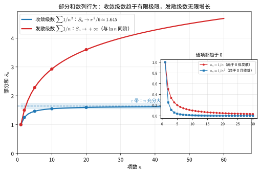
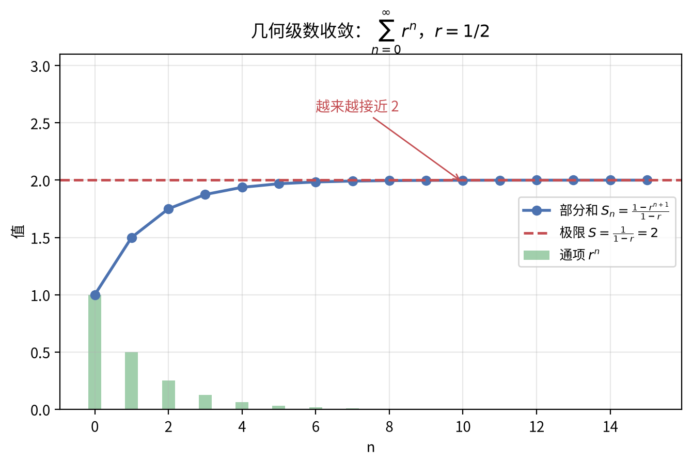
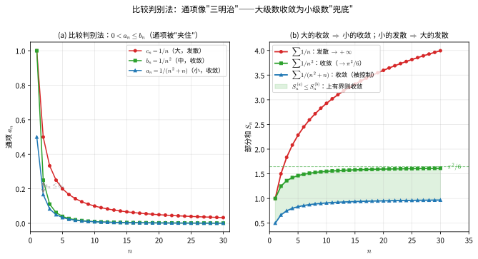
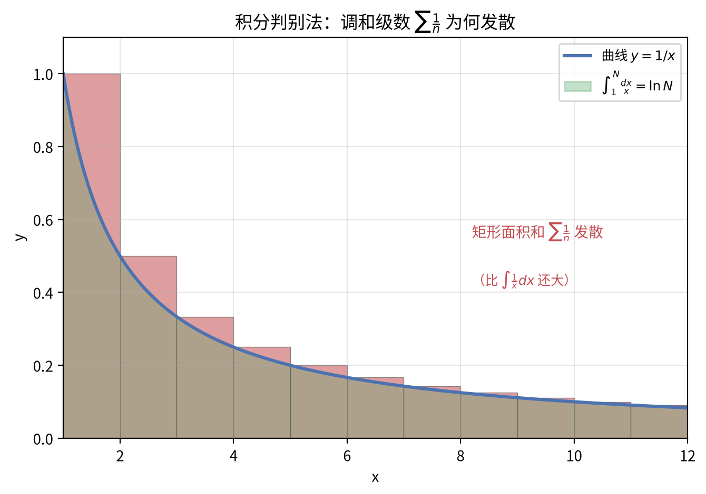
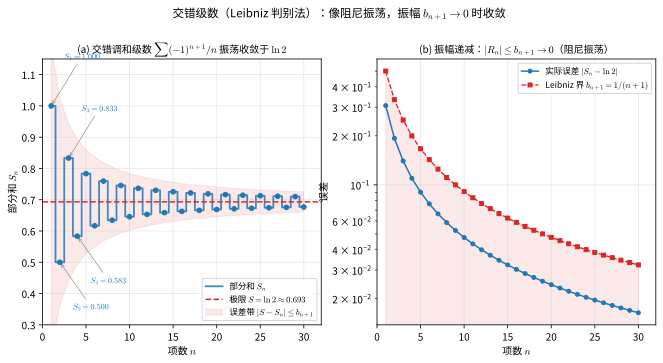
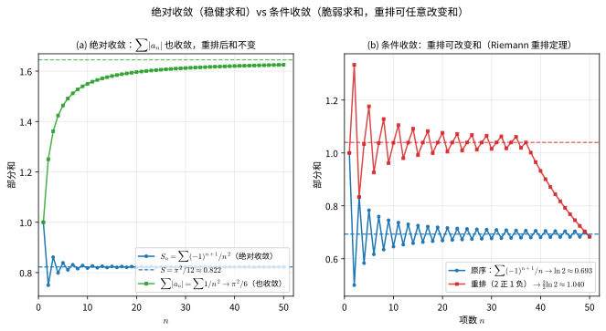
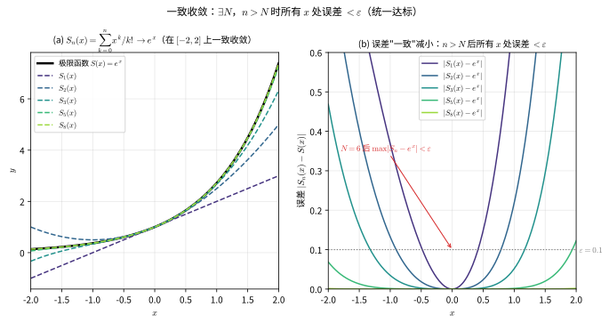
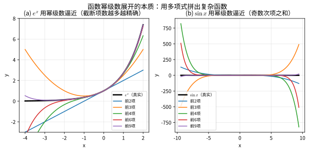
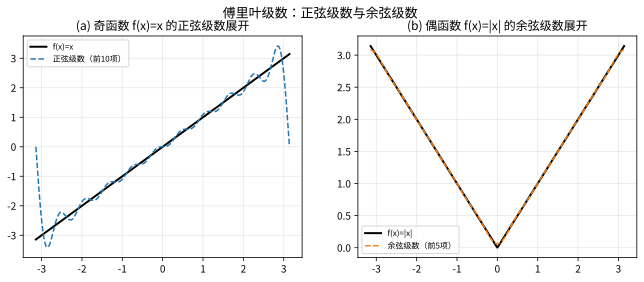
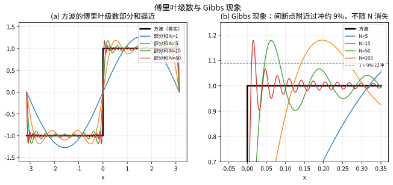

# 第 13 级：级数理论 (Series Theory)

## 一、学习目标

完成本教程后，你应该能够：

1. 理解级数的定义、部分和概念，判断级数的收敛与发散
2. 掌握正项级数的各种审敛法（比较判别法、比值判别法、根值判别法、积分判别法）及其证明
3. 掌握 p-级数的敛散性结论
4. 理解交错级数的 Leibniz 判别法及其证明，区分绝对收敛与条件收敛
5. 理解函数项级数的一致收敛概念，掌握 Weierstrass M-判别法及其证明
6. 掌握幂级数的收敛半径与收敛区间，理解逐项求导与逐项积分
7. 掌握函数的幂级数展开（泰勒级数），熟记常用展开公式并会应用
8. 理解级数的重排与柯西乘积，掌握 Riemann 重排定理和 Mertens 定理
9. 理解傅立叶级数的表示、收敛性及 Parseval 恒等式，掌握任意周期展开、正弦/余弦级数、复数形式及 Bessel 不等式、Gibbs 现象
10. 能够运用级数理论解决实际问题

---

## 开始之前

**本章在讲什么**：这一章专门研究“把无穷多个数一个一个加起来”这件事。你会先弄懂什么样的级数加起来能有一个确定的结果（叫收敛），什么样的会越加越大或来回摆荡（叫发散），再学会几种判断的快捷工具，最后把级数用来表示函数（幂级数、傅立叶级数）并做近似计算。

**为什么要学它**：第 11 级你已经学会了微分和积分这些“无限过程”，但那里处理的极限还局限在一个点附近；级数则把“无限求和”当成一个有自身规律的对象来研究，是第 11 级泰勒展开的正式面貌，也为第 12 级之后的实分析（第 17 级）、常微分方程（第 23 级）以及傅立叶分析（第 54 级）铺路——它们都要反复用到本章的收敛判断。

**开始前请确认你还记得**：
- 数列与极限（见第 10 级）：数列趋近于某个确定的数时，我们说这个数列收敛，其极限是有界单调等性质的基石。
- 定积分与反常积分（见第 11 级）：定积分求曲边面积，反常积分处理无穷区间上的积分，积分判别法会直接用到它。
- 导数与泰勒公式（见第 11 级）：函数在某点能用多项式近似，留在待定系数的泰勒展开这一步。
- 三角函数的周期性（见第 5 级）：sin 和 cos 以 2pi 为周期，傅立叶级数正是用它们拼凑周期函数。
- 函数连续与收敛的基本判定（见第 11 级）：连续与一致收敛概念在函数项级数一节会反复出现。

---

## 二、数项级数

> 💡 **先说个问题**：把 $1+\frac12+\frac13+\cdots$ 一直加下去，结果会奔向无穷；而 $1+\frac14+\frac19+\cdots$ 却只加到一个有限数（恰好是 $\frac{\pi^2}{6}$）——同样是"越加越小的项"，凭什么一个发散、一个收敛？这一节我们先给"无穷和"一个无歧义的定义，再回答"靠不靠得住"这个本质问题。

### 2.1 级数的定义

给定一个数列 $\{a_n\}_{n=1}^{\infty}$，将其各项依次相加得到的表达式

| 符号 | 名称 | 含义 | 直观解释 |
|:---:|:---:|:---|:---|
| $\sum$ | 求和符号 | 把一列数按顺序相加 | "把一串数加起来" |
| $a_n$ | 通项（一般项） | 级数里第 $n$ 项 | "第 $n$ 个要加的数" |
| $n$ | 下标/项号 | 表示排在第几位 | "排队的号码" |
| $\infty$ | 无穷大 | 项数无限多 | "一直加，没有尽头" |

$$
\sum_{n=1}^{\infty} a_n = a_1 + a_2 + a_3 + \cdots + a_n + \cdots
$$

称为**无穷级数**（简称**级数**），其中 $a_n$ 称为级数的**通项**（或一般项）。

> **直观理解（贴合类比）**：级数就是"把无穷多块拼成总和"的仪式——把一列数 $a_1,a_2,a_3,\dots$ 一块接一块地加下去。真正要追问的不是"加了多少块"，而是"这一大摞加起来到底有没有一个确定的总数"。

### 2.2 部分和

称级数前 $n$ 项之和为**部分和**，记作

| 符号 | 名称 | 含义 | 直观解释 |
|:---:|:---:|:---|:---|
| $S_n$ | 部分和 | 级数前 $n$ 项相加的结果 | "加到第 $n$ 步的小结" |
| $k$ | 求和哑指标 | 从 1 数到 $n$ 的占位变量 | "数到几就加几" |

$$
S_n = \sum_{k=1}^{n} a_k = a_1 + a_2 + \cdots + a_n
$$

这样，每个级数对应一个部分和数列 $\{S_n\}$。

> **直观理解（贴合类比）**：部分和 $S_n$ 就是"积少成多的进程"——相当于存钱罐里数到第 $n$ 枚硬币时的累计金额。级数"到底收不收敛"，最终就落脚在这串 $S_n$ 上：它越加越稳、趋于某个终值（收敛），还是越滚越大、永不上岸（发散）。

### 2.3 收敛与发散

**定义**：如果部分和数列 $\{S_n\}$ 的极限存在，即

$$
\lim_{n \to \infty} S_n = S \quad (\text{有限数})
$$

则称级数 $\sum_{n=1}^{\infty} a_n$ **收敛**，$S$ 称为级数的**和**，记作

$$
S = \sum_{n=1}^{\infty} a_n
$$

如果 $\lim_{n \to \infty} S_n$ 不存在（包括无穷大），则称级数**发散**。

*图2.1：部分和数列行为对比。蓝线为收敛级数 $\sum 1/n^2$ 的部分和，逐步逼近 $\pi^2/6$；红线为发散的调和级数 $\sum 1/n$，部分和随 $\ln n$ 无限增长。两例的通项 $a_n$ 都趋于 0，但收敛与否取决于部分和是否有界。*

> **直观理解（现实类比）**：把级数求和想象成"跑步"——部分和 $S_n$ 是已经跑过的距离。**收敛级数**像跑向一个明确的终点 $S$：每多跑一步就离终点更近，最终停在终点处（$S_n \to S$）。**发散级数**则像在一条永无止境的路上奔跑：虽然每一步越来越短（通项 $a_n \to 0$），但累计距离 $S_n$ 仍不断增长，永远停不下来。判断"能不能停下"，看的不是每步多长，而是累计是否有界。

> **🧠 思考历程：把"看似没尽头"的求和钉死在某一个数，凭什么合法？**
>
> $1+\frac12+\frac14+\cdots=2$ 今天读来顺理成章。可在"无穷求和"还未被管教的年代，随便乱加无穷项是会闹出怪论的——它逼出了级数理论最核心的一场立法。
>
> - **悖论先来"踢馆"**。西方中世纪与近代，"$1-1+1-1+\cdots$"该等于几引发争论：有人认为等于 $0$（两两抵消），有人坚称等于 $1$（按括号配对），还有人算出 $\tfrac12$。**同样的式子、各执一词——这就是"无穷求和"缺乏定义的证据。** 类似地，重排一个条件收敛级数甚至可以改变其和（见 4.5 节），这更说明"想当然地加"很危险。
> - **把"加完"转嫁为"看极限"**。柯西在 19 世纪给出一锤定音的定义：**无穷级数是不是收敛，不看"无穷项加完"，而看"部分和数列 $\{S_n\}$ 有没有极限"**——$S_n=S_1,S_2,\dots$ 是一个又一个**有限**的和，只要这串有限和的极限存在且有限，就称级数收敛于 $S$。**"无穷求和"被换算成"一列有限求和的极限"，无限瞬间变得可检验、无歧义。**
> - **为什么如此定义才安全？** 它把"会不会长大到失控"变成"部分和有没有界、趋不趋中"。调和级数的通项 $a_n\to0$ 却发散，正是因为它"每一步虽小、但累计无界"；而 $\sum 1/n^2$ 尽管项趋 0，部分和却稳稳逼近 $\pi^2/6$。**"只看通项够不够小"远远不够，必须盯住部分和的极限——这就是上面 $S=\sum a_n\iff\lim S_n=S$ 的全部含金量。**
> - **心路**：级数收敛的定义提醒你：**面对"无限"，最稳妥的那一步永远是"退回有限、再看极限"**。凡是"据说等于某数的无限和"，先用部分和这一把尺子量一量——它从不骗人。

**例 1**：几何级数（等比级数）

$$
\sum_{n=0}^{\infty} r^n = 1 + r + r^2 + \cdots
$$

部分和 $S_n = \frac{1 - r^{n+1}}{1 - r}$（$r \neq 1$）。当 $|r| < 1$ 时，$\lim_{n \to \infty} S_n = \frac{1}{1 - r}$，级数收敛；当 $|r| \ge 1$ 时，级数发散。

> **直观理解（现实类比）**：几何级数是"**不断缩小一半的累积**"。把一块蛋糕切成一半，再切剩下的一半……无限切下去，吃掉的所有蛋糕加起来**恰好是一整块**（极限 $2$ 块"半块为单位"）。项数越多，离这个极限越近——这就是级数"收敛"的含义：**部分和无限逼近一个确定值**。

**例 2**：调和级数

$$
\sum_{n=1}^{\infty} \frac{1}{n} = 1 + \frac{1}{2} + \frac{1}{3} + \cdots
$$

虽然通项 $a_n = \frac{1}{n} \to 0$，但调和级数发散（见后面积分判别法）。

### 2.4 级数收敛的必要条件

**定理**：若级数 $\sum_{n=1}^{\infty} a_n$ 收敛，则 $\lim_{n \to \infty} a_n = 0$。

**证明**：设 $S_n \to S$，则 $a_n = S_n - S_{n-1} \to S - S = 0$。

> **注意**：该条件的逆不成立。例如调和级数 $a_n = 1/n \to 0$ 但级数发散。通项趋于零是级数收敛的必要但非充分条件。

---

> **直观理解（贴合类比）**：若级数最后能收敛到某数，则通项必须趋于 $0$——这是"过门线的底牌条件"：末尾每一块都必须小到近乎消失。但它只是"入场券"而不是"保送"：调和级数通项趋 $0$ 却发散，正如每一步都迈得很小，路却无限长，照样走不到头。

## 三、正项级数审敛法

**正项级数**是指所有项 $a_n \ge 0$ 的级数。对于正项级数，部分和数列 $\{S_n\}$ 单调递增，因此收敛当且仅当部分和数列有上界。

> 💡 **先说个问题**：没有正负交替的"推拉"，只靠一堆非负项越加越大，怎么判断最终是"封顶"还是"漫溢"？全部答案浓缩在一条铁律里——**正项级数收敛当且仅当部分和有上界**。本章的比较、比值、根值、积分判别法，本质上都是"用另一个已知敛散的对象去量它"的手段，而上面这一条铁律是它们共同的出发点与理由。

### 3.1 比较判别法 (Comparison Test)

**定理**：设 $\sum_{n=1}^{\infty} a_n$ 和 $\sum_{n=1}^{\infty} b_n$ 是两个正项级数，且存在 $N$ 使得对一切 $n \ge N$ 有 $a_n \le b_n$，则：

1. 若 $\sum b_n$ 收敛，则 $\sum a_n$ 收敛；
2. 若 $\sum a_n$ 发散，则 $\sum b_n$ 发散。

**证明**：设 $S_n = \sum_{k=1}^{n} a_k$，$T_n = \sum_{k=1}^{n} b_k$。由 $a_n \le b_n$ 知 $S_n \le T_n$（忽略前有限项不影响敛散性）。

1. 若 $\sum b_n$ 收敛，则 $T_n$ 有上界，故 $S_n$ 也有上界。由于 $S_n$ 单调递增，因而收敛。
2. 若 $\sum a_n$ 发散，则 $S_n \to +\infty$，从而 $T_n \to +\infty$，即 $\sum b_n$ 发散。

**极限形式的比较判别法**：若 $\lim_{n \to \infty} \frac{a_n}{b_n} = c$，其中 $0 < c < +\infty$，则 $\sum a_n$ 与 $\sum b_n$ 同敛散。

**证明**：由极限定义，存在 $N$，当 $n \ge N$ 时，

$$
\frac{c}{2} < \frac{a_n}{b_n} < \frac{3c}{2}
$$

即 $\frac{c}{2} b_n < a_n < \frac{3c}{2} b_n$。由比较判别法即得结论。

*图3.1：比较判别法的几何直观。(a) 通项被"夹住"：$0 < \frac{1}{n^2+n} \le \frac{1}{n^2} \le \frac{1}{n}$；(b) 部分和对比：小的部分和始终位于大的部分和之下，故大级数收敛（部分和有上界）即可保证小级数收敛。*

> **直观理解（现实类比）**：比较判别法像"**三明治夹层**"——把两个级数的通项 $a_n \le b_n$ 想象成两片面包，小的在下、大的在上。如果"上面那片"（大级数 $\sum b_n$）的总量是有限的（收敛），那么被压在下面的"小级数" $\sum a_n$ 自然也有限（收敛）。反过来，如果"下面那片"已经无限大（发散），上面那个只会更大，必然也发散。关键不在通项本身长什么样，而在它被谁"罩住"——找对一个"参照级数"（如 p-级数、几何级数），就能间接判定。

### 3.2 比值判别法 (Ratio Test, d'Alembert 判别法)

| 符号 | 名称 | 含义 | 直观解释 |
|:---:|:---:|:---|:---|
| $\rho$ | 比值极限 | 相邻两项之比的极限 | "后项比前项，最终卡在哪" |
| $\lim$ | 极限 | 变量趋于某值时的走向 | "看它最终走到哪" |
| $\dfrac{a_{n+1}}{a_n}$ | 相邻项之比 | 后一项与前一项的比值 | "后一块比前一块大多少" |

**定理**：设 $\sum_{n=1}^{\infty} a_n$ 为正项级数，且 $\lim_{n \to \infty} \frac{a_{n+1}}{a_n} = \rho$，则：

1. 若 $\rho < 1$，级数收敛；
2. 若 $\rho > 1$，级数发散；
3. 若 $\rho = 1$，判别法失效。

**证明**：

1. 若 $\rho < 1$，取 $r$ 满足 $\rho < r < 1$。由极限定义，存在 $N$，当 $n \ge N$ 时

- 【第 1 步】依据：极限定义——比值的极限小于 $r$，故充分靠后的项比值都小于 $r$；目的：把抽象的"极限小于 1"落实成可逐项比较的硬不等式。

$$
\frac{a_{n+1}}{a_n} < r
$$

- 【第 2 步】依据：把该比值不等式对连续各项相乘（等比递推），得 $a_{N+k}<r^k a_N$；目的：让每一项都被等比上界 $r^k a_N$ 从上方压住。

于是

$$
a_{N+1} < r a_N,\quad a_{N+2} < r a_{N+1} < r^2 a_N,\quad \ldots,\quad a_{N+k} < r^k a_N
$$

- 【第 3 步】依据：把第 2 步的上界逐项求和，并用几何级数和 $\sum_{k=1}^{\infty} r^k=\frac{r}{1-r}$（因 $0<r<1$）；目的：把原级数"尾巴"的整体总量框成一个有限常数，证明其和有界。

因此

$$
\sum_{k=1}^{\infty} a_{N+k} < a_N \sum_{k=1}^{\infty} r^k = a_N \cdot \frac{r}{1-r} < \infty
$$

- 【第 4 步】依据：比较判别法（整体被收敛的几何级数控制则收敛）；目的：交付最终结论"$\rho<1$ 时级数收敛"。

由比较判别法，级数收敛。

2. 若 $\rho > 1$，存在 $N$，当 $n \ge N$ 时 $\frac{a_{n+1}}{a_n} > 1$，即 $a_{n+1} > a_n > 0$，通项不趋于零，级数发散。

3. $\rho = 1$ 时，例如 $\sum \frac{1}{n}$（发散）和 $\sum \frac{1}{n^2}$（收敛）的比值极限均为 $1$，故无法判断。

> **直观理解（贴合类比）**：比值判别法就是"看后一项与前一项的比值"——若相邻项之比最终稳定地小于 $1$，说明每一项都按一个小于 $1$ 的比例越缩越小（像水池每次只放掉八成水），总量终会枯竭（收敛）；若比值大于 $1$，项反而越放越大，自然停不下来（发散）。

> **常见坑**：$\lim \frac{a_{n+1}}{a_n}$ **必须真正存在**（上、下极限一致）才能用这个 $\rho$ 下结论——若 $a_n$ 忽大忽小使该极限不存在，比值判别法即失效，这时更稳健的是改用根值判别法。比值法只对**正项级数**（或级数 $\sum|a_n|$）使用；当 $\rho=1$ 时它"弃权"，必须换用积分判别或极限比较。**口诀**：含 $n!$、$r^n$ 优先比值法——它善于判断快慢，但不能判 $\rho=1$ 的边界。

### 3.3 根值判别法 (Root Test, Cauchy 判别法)

**定理**：设 $\sum_{n=1}^{\infty} a_n$ 为正项级数，且 $\lim_{n \to \infty} \sqrt[n]{a_n} = \rho$，则：

1. 若 $\rho < 1$，级数收敛；
2. 若 $\rho > 1$，级数发散；
3. 若 $\rho = 1$，判别法失效。

**证明**：

1. 若 $\rho < 1$，取 $r$ 满足 $\rho < r < 1$。存在 $N$，当 $n \ge N$ 时 $\sqrt[n]{a_n} < r$，即 $a_n < r^n$。而 $\sum r^n$ 是公比 $r < 1$ 的几何级数，收敛。由比较判别法，$\sum a_n$ 收敛。

2. 若 $\rho > 1$，存在 $N$，当 $n \ge N$ 时 $\sqrt[n]{a_n} > 1$，即 $a_n > 1$，通项不趋于零，级数发散。

3. $\rho = 1$ 时同样失效（如 $\sum 1/n$ 和 $\sum 1/n^2$ 的根值极限均为 $1$）。

> **直观理解（贴合类比）**：根值判别法把"第 $n$ 项有多大"翻译成"开 $n$ 次方后的平均个头是否压到门框以下"——就像看一支队伍的平均身高是不是逐渐缩到门框高度之下。若 $\sqrt[n]{a_n}$ 最终小于 $1$，说明整体按指数萎缩，终能收敛；大于 $1$ 则按指数膨胀，必发散。

> **常见坑**：根值法与比值法在 $\rho=1$ 时同进退、都不适用，别在边界下结论。但对比值极限不存在的场合，**根值判别法（采用 $\limsup\sqrt[n]{|a_n|}$）往往仍然管用**——例如通项忽大忽小时比值极限振荡，根值极限却依然清晰。另外要开的是**绝对值** $\sqrt[n]{|a_n|}$（对变号级数先取绝对值再对绝对值级数使用）。

### 3.4 积分判别法 (Integral Test)

**定理**：设 $f(x)$ 在 $[1, +\infty)$ 上连续、非负且单调递减，$a_n = f(n)$，则级数 $\sum_{n=1}^{\infty} a_n$ 收敛当且仅当反常积分 $\int_{1}^{\infty} f(x) \, dx$ 收敛。

**证明**：由 $f$ 单调递减，对任意 $k \ge 1$，在区间 $[k, k+1]$ 上有

- 【第 1 步】依据：$f$ 单调递减；目的：在每个小区间 $[k, k+1]$ 上把函数值夹在左右端点之间。

$$
f(k+1) \le f(x) \le f(k),\quad x \in [k, k+1]
$$

积分得

$$
f(k+1) \le \int_{k}^{k+1} f(x) \, dx \le f(k)
$$

- 【第 2 步】依据：对不等式在同一区间上积分——某个小区间内函数值介于两端点时，面积必夹在两个矩形之间；目的：把"函数值比较"升级为"面积比较"。

对 $k = 1, 2, \ldots, n-1$ 求和：

$$
\sum_{k=2}^{n} f(k) \le \int_{1}^{n} f(x) \, dx \le \sum_{k=1}^{n-1} f(k)
$$

- 【第 3 步】依据：对 $k=1,\dots,n-1$ 的各小区间不等式首尾相接求和（相邻区间面积可拼叠消除中间项）；目的：把"从 $1$ 到 $n$ 的积分"框在两个部分和之间。

设 $S_n = \sum_{k=1}^{n} f(k)$，则

$$
S_n - f(1) \le \int_{1}^{n} f(x) \, dx \le S_{n-1}
$$

- 【第 4 步】依据：正项数列收敛当且仅当有上界、以及反常积分收敛的定义；目的：证明"级数收敛"与"反常积分收敛"互为充要条件（同敛散）。

因此 $\{S_n\}$ 有界当且仅当 $\int_{1}^{\infty} f(x) \, dx$ 收敛，即级数与积分同敛散。

> **直观理解（现实类比）**：积分判别法把"**离散的台阶和**"与"**连续的面积**"做了比较。调和级数 $\sum 1/n$ 就好比每一级台阶都比曲线 $y=1/x$ 下方对应的条带高一点，所以台阶总面积 $\ge \int 1/x\,dx=\ln N$。而 $\ln N$ 随 $N$ 无限增长，台阶面积自然发散——**这就是为什么通项 $1/n\to 0$ 却仍发散**：它"缩水"得太慢，每级台阶即使越来越矮，也始终压不住那一片不断延长的曲线下面积。

### 3.5 p-级数敛散性

**p-级数**是指形如

$$
\sum_{n=1}^{\infty} \frac{1}{n^p}
$$

的级数，其中 $p > 0$。

**结论**：

- 当 $p > 1$ 时，p-级数**收敛**；
- 当 $0 < p \le 1$ 时，p-级数**发散**。

**证明**：使用积分判别法。令 $f(x) = \frac{1}{x^p}$，则

$$
\int_{1}^{\infty} \frac{1}{x^p} \, dx = \begin{cases}
\displaystyle \frac{x^{1-p}}{1-p} \bigg|_{1}^{\infty} = \infty, & 0 < p < 1 \\[2em]
\displaystyle \ln x \big|_{1}^{\infty} = \infty, & p = 1 \\[1em]
\displaystyle \frac{1}{p-1}, & p > 1
\end{cases}
$$

因此当 $p > 1$ 时积分收敛，级数收敛；当 $0 < p \le 1$ 时积分发散，级数发散。

特别地，$p = 1$ 时即为调和级数 $\sum 1/n$，发散。

---

> **直观理解（贴合类比）**：p-级数 $\sum 1/n^p$ 的收敛与否，取决于"缩小的力度"够不够快——$p>1$ 时每一项都像被打折叠起来的布料，总面积有界（收敛）；$0<p\le 1$ 时缩得太慢（尤其 $p=1$ 的调和级数），累加起来如同无限延长的台阶，永不封顶（发散）。

## 四、交错级数

> 💡 **先说个问题**：上一章的判别法只对正项可用，可现实中常出现一正一负的摆动——$1-\frac12+\frac13-\frac14+\cdots$ 每一项都不比调和级数的对应项小、"照理"该发散，可它偏偏收敛到 $\ln 2$。诀窍在于**正负互相抵消**。这一章我们研究交错与更一般的变号级数，并回答两个致命问题：什么时候能重排顺序而不改变和？条件收敛的"和"到底有多脆弱？

### 4.1 交错级数的定义

形如

$$
\sum_{n=1}^{\infty} (-1)^{n+1} b_n = b_1 - b_2 + b_3 - b_4 + \cdots
$$

的级数称为**交错级数**，其中 $b_n > 0$。

> **直观理解（贴合类比）**：交错级数就是"正负交替的一串"——像一杆天平上的砝码加加减减：$b_1-b_2+b_3-b_4+\cdots$。它能否收敛，取决于每次摆动（正负抵消）的幅度是否越来越小，这由下一节的 Leibniz 判别法来把关。

### 4.2 Leibniz 判别法 (Alternating Series Test)

**定理**（Leibniz 判别法）：若交错级数 $\sum_{n=1}^{\infty} (-1)^{n+1} b_n$ 满足以下两个条件：

1. **单调递减**：$b_{n+1} \le b_n$（对一切 $n$）；
2. **通项趋于零**：$\lim_{n \to \infty} b_n = 0$。

则级数收敛，且其和 $S$ 满足 $0 < S < b_1$，余项 $|R_n| = |S - S_n| \le b_{n+1}$。

**证明**：首先考察部分和数列的偶数项和奇数项。

$$
S_{2n} = (b_1 - b_2) + (b_3 - b_4) + \cdots + (b_{2n-1} - b_{2n})
$$

由 $b_{2k-1} \ge b_{2k}$ 知每个括号非负，故 $S_{2n}$ 单调递增。

另一方面，

$$
S_{2n} = b_1 - (b_2 - b_3) - (b_4 - b_5) - \cdots - (b_{2n-2} - b_{2n-1}) - b_{2n}
$$

由 $b_{2k} \ge b_{2k+1}$ 知每个括号非负，故 $S_{2n} < b_1$。因此 $\{S_{2n}\}$ 单调递增有上界，收敛。设 $\lim_{n \to \infty} S_{2n} = S$。

又 $S_{2n+1} = S_{2n} + b_{2n+1}$，且 $b_{2n+1} \to 0$，故 $\lim_{n \to \infty} S_{2n+1} = S$。因此 $\{S_n\}$ 收敛到 $S$。

由 $S_{2n} < S < S_{2n+1}$ 及 $S_{2n+1} - S_{2n} = b_{2n+1}$，得余项估计 $|S - S_n| \le b_{n+1}$。

**例 3**：交错调和级数

$$
\sum_{n=1}^{\infty} \frac{(-1)^{n+1}}{n} = 1 - \frac{1}{2} + \frac{1}{3} - \frac{1}{4} + \cdots
$$

满足 $b_n = 1/n$ 单调递减趋于零，故收敛。其和 $\ln 2$（可通过泰勒展开得到）。

*图4.1：交错级数的振荡收敛。(a) 部分和 $S_n$ 在极限 $\ln 2$ 上下来回跳跃，奇数项偏大、偶数项偏小，振幅正好等于 $b_{n+1}$；(b) 实际误差始终不超过 Leibniz 余项界 $|R_n| \le b_{n+1}$，且随 $n$ 单调趋于 0。*

> **直观理解（现实类比）**：交错级数像一只**带阻尼的钟摆**。$S_1 = 1$ 把钟摆拉到右边，$-1/2$ 让它荡回左边的 $S_2 = 0.5$，$+1/3$ 又推向右边的 $S_3 \approx 0.833$……每次摆动都越过中心点 $\ln 2$，但越摆幅度越小，最终"停"在 $\ln 2$。Leibniz 判别法的两个条件正对应：**单调递减**保证每次回摆都"弱一点"（振幅递减），**趋于零**保证最终振幅消失。若 $b_n$ 不单调（比如忽大忽小），钟摆可能"再加力"而无法收敛；若 $b_n \not\to 0$，则永远停不下来。

> **常见坑**：Leibniz 判别法的**两个**条件缺一不可，但最易被漏掉的是**单调递减**——新手只验 $b_n\to 0$ 就下结论。反例：$b_1=b_2=1$、$b_n=\frac1n\ (n\ge3)$ 并不单调，级数 $1-1+\frac13-\frac14+\cdots$ 虽通项趋于 $0$ 却发散（前两项的抵消只是偶然而非规律）。好在 $\{b_n\}$ 只需从某一大项起单调即可，前有限项不影响敛散性。

### 4.3 绝对收敛与条件收敛

**定义**：

- 若级数 $\sum |a_n|$ 收敛，则称 $\sum a_n$ **绝对收敛**。
- 若 $\sum a_n$ 收敛但 $\sum |a_n|$ 发散，则称 $\sum a_n$ **条件收敛**。

**定理**：绝对收敛的级数一定收敛。

**证明**：由 $0 \le a_n + |a_n| \le 2|a_n|$，且 $\sum 2|a_n|$ 收敛，故 $\sum (a_n + |a_n|)$ 收敛。于是

$$
\sum a_n = \sum (a_n + |a_n|) - \sum |a_n|
$$

为两个收敛级数之差，也收敛。

**例 4**：

- 交错调和级数 $\sum (-1)^{n+1}/n$ 条件收敛（因为 $\sum 1/n$ 发散）。
- 级数 $\sum (-1)^{n+1}/n^2$ 绝对收敛（因为 $\sum 1/n^2$ 收敛）。

*图4.2：绝对收敛与条件收敛的对比。(a) $\sum (-1)^{n+1}/n^2$ 绝对收敛——绝对值级数 $\sum 1/n^2$ 也收敛到 $\pi^2/6$，原级数收敛到 $\pi^2/12$；(b) $\sum (-1)^{n+1}/n$ 条件收敛——原序和为 $\ln 2 \approx 0.693$，但按"2 正 1 负"重排后和变为 $\frac{3}{2}\ln 2 \approx 1.040$，重排改变了和（Riemann 重排定理）。*

> **直观理解（现实类比）**：绝对收敛像"**稳健的求和**"——无论你怎么打乱顺序，总和都不变（就像点钞时不论先数哪张，总额都一样）。条件收敛则像"**脆弱的求和**"——正项之和与负项之和都发散到 $\pm\infty$，级数的"和"全靠正负项的微妙抵消来维持；一旦重排，抵消节奏被打乱，总和就能被"调"成任意值（Riemann 重排定理）。这也是为什么只有绝对收敛的级数才允许自由交换项的顺序、做柯西乘积——条件收敛级数经不起这种操作。

### 4.4 Abel 判别法与 Dirichlet 判别法

> 处理"两个数列相乘再求和" $\sum a_n b_n$ 的一般审敛法。Leibniz 判别法是 Dirichlet 判别法当 $a_n = (-1)^{n+1}$ 时的特例。

**Abel 判别法**：若数项级数 $\sum a_n$ **收敛**，且 $\{b_n\}$ **单调有界**，则级数 $\sum a_n b_n$ 收敛。

**Dirichlet 判别法**：若 $\sum a_n$ 的**部分和** $A_n = a_1 + \cdots + a_n$ **有界**，且 $\{b_n\}$ **单调趋近于 $0$**，则级数 $\sum a_n b_n$ 收敛。

> **记忆**：Abel 判别法要求 $\sum a_n$ 本身收敛；Dirichlet 判别法只要求部分和有界，条件更弱，因此适用范围更广。

> **示例**：
> - $\sum_{n=1}^{\infty}\frac{\sin(nx)}{n}$：取 $a_n = \sin(nx)$（部分和有界），$b_n = \frac{1}{n}$（单调趋于 $0$），由 Dirichlet 判别法，$x \neq 2k\pi$ 时收敛。
> - $\sum_{n=1}^{\infty}\frac{(-1)^n \ln n}{n}$：取 $a_n = (-1)^n$（部分和有界），$b_n = \frac{\ln n}{n}$（从某项起单调趋于 $0$），由 Dirichlet 判别法收敛。

> **直观理解（贴合类比）**：这两个判别法处理"两个数列相乘再求和"：Abel 要求一方本身收敛、另一方单调有界；Dirichlet 只要求一方部分和有界、另一方单调趋于 $0$。好比"头一单的账已结清、再加一个稳定的乘子" vs "账单虽然起伏，却被一个逐渐稳下来的乘子缓缓压住"。

### 4.5 级数的重排与柯西乘积

**重排**：设 $\tau$ 是 $\mathbb{N}$ 的一个置换（排列），则 $\sum a_{\tau(n)}$ 称为 $\sum a_n$ 的一个**重排**。

> **定理 (绝对收敛的重排)**：若 $\sum a_n$ **绝对收敛**，则它的任意重排也都收敛，且和相同（都等于 $\sum a_n$）。

> **定理 (Riemann 重排定理)**：若 $\sum a_n$ **条件收敛**，则对任意 $S \in \mathbb{R} \cup \{+\infty, -\infty\}$，都存在 $\sum a_n$ 的一个重排，使其收敛到 $S$（或发散到 $\pm\infty$）。

> **💡 直观理解**：绝对收敛的级数像"绩点"——顺序无关；条件收敛的级数像"现金流"——把正项和负项重新排队，就能把总和"调"成你想要的任意值。这正是为什么使用条件收敛级数时不能随意交换项的顺序。

**柯西乘积**：两个级数 $\sum_{n=0}^{\infty} a_n$ 与 $\sum_{n=0}^{\infty} b_n$ 的**柯西乘积**定义为
$$
\Big(\sum_{n=0}^{\infty} a_n\Big)\Big(\sum_{n=0}^{\infty} b_n\Big) = \sum_{n=0}^{\infty} c_n, \qquad c_n = \sum_{k=0}^{n} a_k b_{n-k}.
$$
即 $c_n$ 是所有"下标之和为 $n$"的项 $a_k b_{n-k}$ 之和。

> **定理 (Mertens 定理)**：若 $\sum a_n$ **绝对收敛**，$\sum b_n$ 收敛，则它们的柯西乘积收敛，且乘积等于 $(\sum a_n)(\sum b_n)$。

**例**：用柯西乘积证明 $e^x \cdot e^y = e^{x+y}$。由 $e^z = \sum z^n/n!$，
$$
c_n = \sum_{k=0}^{n} \frac{x^k}{k!}\cdot\frac{y^{n-k}}{(n-k)!} = \frac{1}{n!}\sum_{k=0}^{n}\binom{n}{k} x^k y^{n-k} = \frac{(x+y)^n}{n!},
$$
故 $e^x e^y = \sum (x+y)^n/n! = e^{x+y}$。这正是指数函数加法公式的级数证明。

---

## 五、函数项级数

> 💡 **先说个问题**：把求和对象从"一串常数"升级为"一串函数"$\sum u_n(x)$——对每个固定的 $x$ 它都退回成普通的数项级数，于是"收敛"变成"哪些点收敛"的集合问题，极限变成了一个函数 $S(x)$。一旦如此，最尖锐的追问接踵而至：**极限能否与取极限、积分、求导交换次序？** 答案不靠"处处收敛"，而靠比它更强的一致的"贴着收敛"。

### 5.1 函数项级数的定义

设 $\{u_n(x)\}$ 是定义在区间 $I$ 上的函数序列，则

$$
\sum_{n=1}^{\infty} u_n(x) = u_1(x) + u_2(x) + \cdots + u_n(x) + \cdots
$$

称为**函数项级数**。部分和为 $S_n(x) = \sum_{k=1}^{n} u_k(x)$。

> **直观理解（贴合类比）**：函数项级数把"数列求和"升级为"一列函数求和"——对每一个固定的 $x$，它都退回成一个数项级数。就像同一台机器在不同温度下工作，每个温度下的表现各自是一条独立的级数。

### 5.2 点态收敛与一致收敛

**点态收敛**：对每个固定的 $x_0 \in I$，若数项级数 $\sum u_n(x_0)$ 收敛，则称函数项级数在 $x_0$ 处收敛。若对每个 $x \in I$ 都收敛，则称级数在 $I$ 上**点态收敛**，极限函数为 $S(x) = \lim_{n \to \infty} S_n(x)$。

**一致收敛**：若对任意 $\varepsilon > 0$，存在 $N$（与 $x$ 无关），使得当 $n > N$ 时，对所有 $x \in I$ 都有

$$
|S_n(x) - S(x)| < \varepsilon
$$

则称函数项级数在 $I$ 上**一致收敛**。

*图5.1：一致收敛的直观演示。$S_n(x) = \sum_{k=0}^{n} x^k/k!$ 在 $[-2, 2]$ 上一致收敛到 $e^x$。(a) 随着 $n$ 增大，$S_n(x)$ 在整个区间上同步逼近 $e^x$；(b) 误差 $|S_n(x) - e^x|$ 的最大值随 $n$ 单调下降——给定 $\varepsilon = 0.1$，存在统一的 $N$（如 $N=5$），使 $n > N$ 后整条误差曲线都低于 $\varepsilon$。*

**直观理解**：一致收敛要求所有 $x$ 处的收敛速度"步调一致"，存在一个公共的 $N$ 适用于整个区间。

> **直观理解（现实类比）**：一致收敛像"**统一达标**"——教练规定一条及格线 $\varepsilon$，全队所有队员（所有 $x$）只要训练次数 $n > N$，成绩就**全部**超过这条线；存在一个**公共的** $N$ 对所有人都管用。而普通的点态收敛像"**各自达标**"——每个队员 $x$ 有自己的达标次数 $N(x)$，有人快有人慢，找不到一个统一的截止时间。差别看似细微，后果却重大：只有"统一达标"（一致收敛）才能保证极限函数连续、允许极限与积分/求导交换顺序。后面 Weierstrass M-判别法正是给出了一种找"公共 $N$"的便捷方法。

### 5.3 Weierstrass M-判别法 (Weierstrass M-Test)

**定理**：设函数项级数 $\sum_{n=1}^{\infty} u_n(x)$ 在区间 $I$ 上的每一项满足 $|u_n(x)| \le M_n$（对一切 $x \in I$），且正项级数 $\sum_{n=1}^{\infty} M_n$ 收敛，则 $\sum_{n=1}^{\infty} u_n(x)$ 在 $I$ 上一致收敛。

**证明**：由 $\sum M_n$ 收敛，根据 Cauchy 收敛准则，对任意 $\varepsilon > 0$，存在 $N$，当 $m > n > N$ 时

$$
\sum_{k=n+1}^{m} M_k < \varepsilon
$$

于是对任意 $x \in I$ 和 $m > n > N$，

$$
|S_m(x) - S_n(x)| = \left| \sum_{k=n+1}^{m} u_k(x) \right| \le \sum_{k=n+1}^{m} |u_k(x)| \le \sum_{k=n+1}^{m} M_k < \varepsilon
$$

由函数项级数的 Cauchy 一致收敛准则，$\sum u_n(x)$ 在 $I$ 上一致收敛。

**例 5**：级数 $\sum_{n=1}^{\infty} \frac{\sin(nx)}{n^2}$ 在 $\mathbb{R}$ 上一致收敛。

因为 $|\sin(nx)/n^2| \le 1/n^2$，而 $\sum 1/n^2$ 收敛，由 M-判别法即得。

> **直观理解（贴合类比）**：M-判别法是"用一个公用的安全帽罩住所有人"——若每一项都被同一串收敛的 $M_n$ 从上方绝对压住（$|u_n(x)|\le M_n$），那么整列函数项在整个区间就"统一达标"（一致收敛），因为压制它们的"砖墙总量"本身就是有限的。

> **常见坑**：M-判别法给的是**充分**条件而非充要。找不到合用的 $M_n$（例如 $\sup_x|u_n(x)|$ 成的级数发散）**并不能**断言原级数不一致收敛——它可能确实一致收敛，只是此法在当下"失灵"。所以 M-判别法只用来*证一致收敛*；要*证不一致收敛*，就得回到定义或一致 Cauchy 准则。此外不等式 $|u_n(x)|\le M_n$ 必须对区间内**一切 $x$** 一致成立，若只在个别点成立则不可滥用。

### 5.4 一致收敛的 Cauchy 准则与 Dini 定理

**一致收敛的 Cauchy 准则**：函数项级数 $\sum u_n(x)$ 在 $I$ 上一致收敛 $\iff$ 对任意 $\varepsilon > 0$，存在 $N$（与 $x$ 无关），使得当 $m > n > N$ 时，对所有 $x \in I$ 都有
$$
\left|\sum_{k=n+1}^{m} u_k(x)\right| < \varepsilon
$$

> **说明**：这是判断一致收敛的"万能工具"，不依赖找到控制函数 $M_n$。前面的 M-判别法证明中正是用到了它。

**Dini 定理**：设 $\sum u_n(x)$ 在闭区间 $[a, b]$ 上收敛，且
1. 每项 $u_n(x)$ 连续，且所有项**同号**（例如都非负）；
2. 和函数 $S(x)$ 连续；
则 $\sum u_n(x)$ 在 $[a, b]$ 上**一致收敛**。

> **价值**：点态收敛一般不保证一致收敛，但如果每项连续、同号、和函数也连续（且定义在闭区间上），则点态收敛自动升级为一致收敛。这为验证许多幂级数、傅里叶级数的一致收敛提供了方便。

> **直观理解（贴合类比）**：一致收敛的 Cauchy 准则是不依赖"找控制函数"的万能尺——直接看任意两个靠后的截断之差能否同时在所有 $x$ 处压到 $\varepsilon$ 以内。而 Dini 定理则给出一扇方便之门：只要每项连续、同号、和函数也连续（闭区间上），点态收敛就能"自动升级"成一致收敛。

### 5.5 一致收敛级数的性质

**定理**（连续性）：若 $\sum u_n(x)$ 在 $I$ 上一致收敛，且每项 $u_n(x)$ 连续，则和函数 $S(x)$ 在 $I$ 上连续。

**定理**（逐项积分）：若 $\sum u_n(x)$ 在 $[a, b]$ 上一致收敛，且每项连续，则

$$
\int_{a}^{b} S(x) \, dx = \sum_{n=1}^{\infty} \int_{a}^{b} u_n(x) \, dx
$$

**定理**（逐项求导）：若 $\sum u_n(x)$ 在 $[a, b]$ 上收敛于 $S(x)$，且每项 $u_n(x)$ 可导，$\sum u_n'(x)$ 在 $[a, b]$ 上一致收敛，则 $S(x)$ 可导且

$$
S'(x) = \sum_{n=1}^{\infty} u_n'(x)
$$

---

> **直观理解（贴合类比）**：一致收敛的"福利三件套"——极限函数保持连续性、极限可与积分交换顺序、可与求导交换顺序。好比全班"整齐划一"才敢让你把每步的小结放心搬进总账：只有"统一达标"，级数极限才敢跟积分、求导随意换次序。

> **衔接补充：为什么"一致"是那条铁门槛**。逐项求和的可迁移性，本质是两座"先取极限再作用"与"先作用再取极限"的桥能否对调：
> $$
> \lim_{n\to\infty}\int_{a}^{b}S_n(x)\,dx=\int_{a}^{b}\lim_{n\to\infty}S_n(x)\,dx,\qquad
> \lim_{n\to\infty}S_n'(x)=\Big(\lim_{n\to\infty}S_n(x)\Big)' .
> $$
> 仅有点态收敛通常不足以保证这两座桥成立——经典反例是 $S_n$ 在某个越来越窄的区间上"拱起"一座越拱越高的尖峰：峰面积不一定趋于 $0$，峰尖导数更是完全失控。**一致收敛正是堵住这种"尖峰向上长"的条件**：它保证 $\sup_x|S_n(x)-S(x)|\to 0$，把峰高整体压平，于是积分、导数都能安然换序。你会看到它与幂级数在收敛半径内"自动一致收敛、从而可逐项求导/积分"（第 6 章）正好闭环。**一句话记住**：换序合法，靠的不是"处处收敛"，而是"整段贴着收敛"。

## 六、幂级数

> 💡 **先说个问题**：把函数在某一"中心点"附近的每一小块都按"离中心的距离之幂"依次展开，得到形如 $\sum a_n(x-x_0)^n$ 的级数——它是一类被研究得最彻底、性格最规矩的函数项级数：**收敛区域必然是一个以中心为心的区间**，且半径以内可以放心地逐项求导、逐项积分。这一章还要回答：边界端点处"到底算不算数"，以及展开式为什么"非它不可"。

### 6.1 幂级数的定义

形如

| 符号 | 名称 | 含义 | 直观解释 |
|:---:|:---:|:---|:---|
| $x_0$ | 展开中心 | 幂级数的"锚点" | "从哪个点附近展开" |
| $x$ | 自变量 | 收敛区间里取的数 | "想算的那个点的位置" |
| $\sum a_n (x-x_0)^n$ | 幂级数 | 各项是 $x-x_0$ 整数次幂之和 | "按离中心的距离逐项叠起来" |

$$
\sum_{n=0}^{\infty} a_n (x - x_0)^n = a_0 + a_1(x - x_0) + a_2(x - x_0)^2 + \cdots
$$

的级数称为**幂级数**，其中 $a_n$ 称为系数，$x_0$ 称为展开中心。

当 $x_0 = 0$ 时，简化为 $\sum_{n=0}^{\infty} a_n x^n$。

> **🧠 思考历程：把函数写成"一元复始的幂次塔"，怎么成了近现代数学的基础设施？**
>
> $e^x=1+x+\frac{x^2}{2!}+\frac{x^3}{3!}+\cdots$ 这样把函数"拆成 $x$ 的各次幂之和"，看似只是求值技巧——它却是科学家计算复杂函数、工程师逼近曲线的日常主食。它真正的出身，是"多项式足够万能"这一信念的极限化。
>
> - **实在的起因：太难算的函数**。三角函数、指数、对数在 17 世纪靠查表，表怎么造？答案是把它们"展开成幂级数再逐项算"。**牛顿、格雷果里、泰勒**等人都切入过这个方向。泰勒（Taylor，1715）给出一般公式：只要函数足够光滑，就能在一点附近写成 $f(x)=\sum \frac{f^{(n)}(a)}{n!}(x-a)^n$——今天书中叫**泰勒/麦克劳林级数**。
> - **"多项式近似"被推到底**。一次函数是直线近似，二次是抛物线近似……次数越高，贴合越好。幂级数就是"把近似档次无限提高，直到完全等于"：**把看似"难啃"的函数，翻译成一个"只管按幂次累加"的多项式模型**。布朗克/牛顿等人早已在用，而欧拉更借助幂级数把 $e^{i x}$、$\sin x$、$\cos x$ 串联成绚烂的恒等式。
> - **它的收敛并非一路绿灯**：一个幂级数往往只在以展开点为中心的一段区间内收敛。于是有了本节 Abel 定理、收敛半径 $R$：**收敛范围之外，这个"多项式模型"就失去效力**——半径 $R$ 就是"这台近似机器能多好用的安全边界"。
> - **为什么今天依然不可撼动**。因为计算机算幂级数只需反复做加法和乘法；数值方法、信号处理、泰勒逼近仍然大量依赖它。**从"怎么算函数"到"信息时代的底层算法"，幂级数一直是那条最稳的暗线。**
> - **心路**：幂级数告诉你：**把"陌生函数"拆成"熟悉的幂次"，是化未知为已知的经典招数**。理解泰勒展开不只是背公式，更是看懂"任何足够好的曲线都能被无穷多项式一步步逼近"这种从近似走向精确的深层思想。

### 6.2 收敛半径与收敛区间

**定理**（Abel 定理）：若幂级数 $\sum a_n x^n$ 在 $x = x_1 \neq 0$ 处收敛，则对满足 $|x| < |x_1|$ 的所有 $x$，幂级数绝对收敛；若在 $x = x_2$ 处发散，则对满足 $|x| > |x_2|$ 的所有 $x$，幂级数发散。

**收敛半径**：存在 $R \ge 0$（$R$ 可为 $+\infty$），使得：
- 当 $|x - x_0| < R$ 时，幂级数绝对收敛；
- 当 $|x - x_0| > R$ 时，幂级数发散；
- 当 $|x - x_0| = R$ 时，需单独判断。

**收敛半径的计算公式**：

1. **比值法**：若 $\lim_{n \to \infty} \left| \frac{a_{n+1}}{a_n} \right| = \rho$，则 $R = \frac{1}{\rho}$（约定 $\rho = 0$ 时 $R = +\infty$，$\rho = +\infty$ 时 $R = 0$）。
2. **根值法**：若 $\lim_{n \to \infty} \sqrt[n]{|a_n|} = \rho$，则 $R = \frac{1}{\rho}$。

**收敛区间**：在 $(x_0 - R, x_0 + R)$ 内幂级数绝对收敛，在端点 $x_0 \pm R$ 处需单独用数项级数审敛法判断。

**例 6**：求 $\sum_{n=0}^{\infty} \frac{x^n}{n!}$ 的收敛半径。

$$
\rho = \lim_{n \to \infty} \left| \frac{a_{n+1}}{a_n} \right| = \lim_{n \to \infty} \frac{1/(n+1)!}{1/n!} = \lim_{n \to \infty} \frac{1}{n+1} = 0
$$

- 第 1 个等号：$a_{n+1}/a_n$ 的极限 $\rho$，依据是收敛半径的比值公式，目的是把"求 $R$"转化为"求相邻系数之比"。
- 第 2 个等号：代入本级的 $a_n=\frac{1}{n!}$，目的是把抽象系数换成具体算式。
- 第 3 个等号：$\frac{1/(n+1)!}{1/n!}=\frac{1}{n+1}$，依据是阶乘递推 $(n+1)!=(n+1)n!$，目的是约去 $n!$ 得到最简比。
- 第 4 个等号：$\lim_{n\to\infty}\frac{1}{n+1}=0$，目的是得出 $\rho=0$，进而 $R=+\infty$。

故 $R = +\infty$，即该级数在整个实数轴上收敛，其和函数为 $e^x$。

#### 🎬 动画演示：幂级数收敛

> 动画展示了 $e^x$ 的幂级数部分和如何逐步逼近精确函数。随着展开阶数 $n$ 的增加（$n=0,1,2,3,5$），部分和曲线（从蓝色渐变到红色）越来越接近真实的 $e^x$ 曲线（绿色）。这直观说明了幂级数在收敛区间内逐点收敛到和函数的过程。

**例 7**：求 $\sum_{n=0}^{\infty} \frac{x^n}{n}$ 的收敛半径与收敛区间。

$$
\rho = \lim_{n \to \infty} \left| \frac{a_{n+1}}{a_n} \right| = \lim_{n \to \infty} \frac{1/(n+1)}{1/n} = \lim_{n \to \infty} \frac{n}{n+1} = 1
$$

故 $R = 1$。端点处：
- $x = 1$：$\sum 1/n$ 发散（调和级数）；
- $x = -1$：$\sum (-1)^n/n$ 收敛（交错调和级数）。

因此收敛区间为 $[-1, 1)$。

> **直观理解（贴合类比）**：收敛半径 $R$ 就是这堆多项式能撑起的最大"势力圈"——在以展开中心为圆心、半径为 $R$ 的圈内，幂级数绝对收敛（"城门以内"畅通无阻）；超出这个圈（$|x-x_0|>R$）就发散（"出了势力圈"便势不可用）；恰好落在边界上（$|x-x_0|=R$）则要逐个端点用数项审敛法单独判断。

### 6.3 幂级数的逐项求导与逐项积分

**定理**：设幂级数 $\sum_{n=0}^{\infty} a_n (x - x_0)^n$ 的收敛半径为 $R > 0$，和函数为 $S(x)$，则在收敛区间 $(x_0 - R, x_0 + R)$ 内：

1. **逐项求导**：

$$
S'(x) = \sum_{n=1}^{\infty} n a_n (x - x_0)^{n-1}
$$

求导后的幂级数收敛半径不变。

2. **逐项积分**：

$$
\int_{x_0}^{x} S(t) \, dt = \sum_{n=0}^{\infty} \frac{a_n}{n+1} (x - x_0)^{n+1}
$$

积分后的幂级数收敛半径不变。

**例 8**：已知 $\frac{1}{1-x} = \sum_{n=0}^{\infty} x^n$（$|x| < 1$），求 $\ln(1+x)$ 的幂级数展开。

对 $\frac{1}{1+x} = \sum_{n=0}^{\infty} (-1)^n x^n$ 从 $0$ 到 $x$ 逐项积分：

$$
\ln(1+x) = \int_{0}^{x} \frac{1}{1+t} \, dt = \sum_{n=0}^{\infty} (-1)^n \int_{0}^{x} t^n \, dt = \sum_{n=0}^{\infty} \frac{(-1)^n}{n+1} x^{n+1} = \sum_{n=1}^{\infty} \frac{(-1)^{n-1}}{n} x^n
$$

收敛区间为 $(-1, 1]$。

> **直观理解（贴合类比）**：在收敛区间内，幂级数可以放心地对每一项求导或积分，且收敛半径不变——就像一条由无数小段拼成的长链，逐段求导或积分后，整条链依然在原来的长度范围内有效，只是形状改变了。

> **常见坑**：**收敛半径不变，不等于端点处的敛散性不变。** 逐项积分往往"改善"端点（$\sum x^n$ 在 $x=-1$ 发散，逐项积分成 $\ln(1+x)$ 后却在 $x=-1$ 收敛）；逐项求导则可能"恶化"端点。因此端点必须脱离公式、逐点用数项审敛法单独判断。同时该定理成立的前提是自变量落在**开区间内部** $(x_0-R,x_0+R)$，使用前先确认这一点。

### 6.4 函数的幂级数展开（Taylor 级数）

> **💡 直观理解**：幂级数展开就是用"多项式"去逼近"复杂函数"。$e^x$、$\sin x$ 这些超越函数看起来神秘，但都可以写成"无限多个幂函数项相加"。截断到前面几项就得到一个精度很高的近似——就像用无数块小积木拼出一条光滑曲线。这正是计算机计算 $e^x$、$\sin x$ 等函数的方式。

*图6.1：函数幂级数展开的本质。(a) $e^x$ 用不同项数的幂级数逼近；(b) $\sin x$ 用奇数次幂项逼近。项数越多，逼近越精确。*

**6.4.1 泰勒级数与麦克劳林级数**

设 $f$ 在 $x_0$ 的某邻域内具有任意阶导数，称幂级数
$$
f(x) = \sum_{n=0}^{\infty} \frac{f^{(n)}(x_0)}{n!}(x - x_0)^n
= f(x_0) + f'(x_0)(x-x_0) + \frac{f''(x_0)}{2!}(x-x_0)^2 + \cdots
$$
为 $f$ 在 $x_0$ 处的**泰勒级数**。当 $x_0 = 0$ 时，称为**麦克劳林级数**。

> **定理 (展开的唯一性)**：若 $f$ 能表示为 $x_0$ 处的收敛幂级数 $\sum a_n (x-x_0)^n$，则展开式**唯一**，且系数必为
$$
a_n = \frac{f^{(n)}(x_0)}{n!}.
$$

**关键注意**：$f$ 的泰勒级数**不一定处处收敛到 $f$**。它在 $x$ 处收敛到 $f(x)$ 当且仅当带余项的泰勒公式（见第 11 级）中余项 $R_n(x) \to 0$（$n \to \infty$）。例如 $f(x) = e^{-1/x^2}$（规定 $f(0)=0$）在 $x=0$ 处各阶导数都为 0，其泰勒级数恒为 0，却只在 $x=0$ 处等于 $f$。

**6.4.2 常用展开公式（麦克劳林级数）**

| 函数 | 展开式 | 收敛区间 |
|------|--------|:--------:|
| $\dfrac{1}{1-x}$ | $\sum_{n=0}^{\infty} x^n$ | $(-1,1)$ |
| $e^x$ | $\sum_{n=0}^{\infty} \dfrac{x^n}{n!}$ | $(-\infty,+\infty)$ |
| $\sin x$ | $\sum_{n=0}^{\infty} \dfrac{(-1)^n x^{2n+1}}{(2n+1)!}$ | $(-\infty,+\infty)$ |
| $\cos x$ | $\sum_{n=0}^{\infty} \dfrac{(-1)^n x^{2n}}{(2n)!}$ | $(-\infty,+\infty)$ |
| $\ln(1+x)$ | $\sum_{n=1}^{\infty} \dfrac{(-1)^{n-1} x^n}{n}$ | $(-1,1]$ |
| $\arctan x$ | $\sum_{n=0}^{\infty} \dfrac{(-1)^n x^{2n+1}}{2n+1}$ | $[-1,1]$ |
| $(1+x)^\alpha$ | $\sum_{n=0}^{\infty} \binom{\alpha}{n} x^n$（二项式级数） | 依赖 $\alpha$ |

其中二项式系数 $\binom{\alpha}{n} = \dfrac{\alpha(\alpha-1)\cdots(\alpha-n+1)}{n!}$。特别地：
- 当 $\alpha = m$ 为正整数时，二项式级数退化为有限的二项式定理展开；
- 当 $\alpha = -1$ 时，$\frac{1}{1+x} = \sum_{n=0}^{\infty} (-1)^n x^n$；
- 当 $\alpha = \frac{1}{2}$ 时，得到 $\sqrt{1+x}$ 的展开。

*图6.2：几个常用函数的麦克劳林展开。黑色实线为真实函数，虚线为截断到前若干项的近似。*

**6.4.3 展开方法**

1. **直接法**：逐项求出 $f^{(n)}(x_0)$，代入泰勒公式。缺点：计算量大，且需验证余项趋于 0。
2. **间接法**（更常用）：利用已知展开式，通过**四则运算、代换、逐项求导、逐项积分**得到新函数的展开。

**例 9**：求 $\cos x$ 的麦克劳林展开。
**解**（间接法）：由 $(\sin x)' = \cos x$，对 $\sin x$ 的展开逐项求导：
$$
\cos x = \sum_{n=0}^{\infty} \frac{d}{dx}\left[\frac{(-1)^n x^{2n+1}}{(2n+1)!}\right] = \sum_{n=0}^{\infty} \frac{(-1)^n x^{2n}}{(2n)!}.
$$

**例 10**：求 $\frac{1}{1+x^2}$ 的麦克劳林展开。
**解**（代换法）：在 $\frac{1}{1-u} = \sum_{k=0}^{\infty} u^k$ 中令 $u = -x^2$，得
$$
\frac{1}{1+x^2} = \sum_{k=0}^{\infty} (-1)^k x^{2k}, \qquad |x| < 1.
$$
再逐项积分即得 $\arctan x$ 的展开。

**6.4.4 应用**

- **近似计算**：用有限项计算 $e$、$\pi$、$\sin 1$ 等，并可用余项估计误差；
- **求数项级数的和**：如由 $\cos 1 = \sum_{n=0}^{\infty}\frac{(-1)^n}{(2n)!}$，可得 $\sum_{n=0}^{\infty}\frac{(-1)^n}{(2n)!} = \cos 1$；
- **计算机基础**：超越函数（$e^x$、$\sin x$、$\log x$）的数值计算正是基于幂级数（或更快收敛的变形）。

> **🔑 数学思路**：幂级数展开把"函数"这个无限维的对象，转化为"系数序列 $\{a_n\}$"这个可处理的对象。它沟通了"分析"（函数）与"代数"（系数运算），是数学分析中最重要的技术之一。

### 6.5 Abel 定理（端点连续性）与 Abel 求和法

**问题**：收敛半径回答了"哪段区间内绝对收敛"，而边界 $|x-x_0|=R$ 上收敛与否"要单独判断"。可即便端点处**收敛**，级数在端点的和与"从内部逼近时的极限"是否一致？也就是和函数在端点是否**连续**？这由 Abel 定理给出漂亮的回答。

**定理 (Abel 定理 / Abel 极限定理)**：设幂级数 $\sum_{n=0}^{\infty} a_n x^n$ 的收敛半径为 $R$，且级数在 $x=R$ 处**收敛**，则
$$
\lim_{x\to R^-}\sum_{n=0}^{\infty} a_n x^n=\sum_{n=0}^{\infty} a_n R^n .
$$
即：**和函数向端点逼近的极限恰好等于级数在端点的和**——和函数在收敛的端点处左连续（对 $x=-R$ 同理）。

**例 11**：$\sum_{n=1}^{\infty}\frac{(-1)^{n-1}x^n}{n}$ 在 $|x|<1$ 内收敛于 $\ln(1+x)$，且在端点 $x=1$ 收敛（交错调和级数）于 $\ln 2$。Abel 定理保证
$$
\ln 2=\lim_{x\to 1^-}\sum_{n=1}^{\infty}\frac{(-1)^{n-1}x^n}{n}=\lim_{x\to 1^-}\ln(1+x),
$$
印证了基本极限，并把"端点值 = 内部极限"的合法性给了我们。

**Abel 求和法**：若数项级数 $\sum_{n=0}^{\infty} a_n$ **收敛**，则
$$
\lim_{r\to 1^-}\sum_{n=0}^{\infty} a_n r^n=\sum_{n=0}^{\infty} a_n .
$$
称为 **Abel 求和（Abel summation）**：用一个收缩因子 $r^n$ 把级数"软化"成幂级数，再令 $r\uparrow 1$。对收敛级数它无损地回到原和；对某些发散级数它还能给出"平均意义"下的合理和——它是普朗克求和、狄利克雷级数等的历史原型之一，也是通往傅里叶分析（见 7.8 节 Cesàro 平均）的一条暗线。

> **直观理解（贴合类比）**：Abel 定理说"只要端点真能收敛，内部一路插值上去，和就是连续的"——如同从门里向外走，只要门槛处本来就站得稳，读数就能顺着延续过去。Abel 求和法像"戴上一副减震手套"：先乘 $r^n$ 缓缓加温（$r\to1$）磨掉振荡毛刺，再看极限；对已收敛级数，这副手套不改变它的本来结果。

> **常见坑**：应用 Abel 定理，**必须确认级数在所选端点真的收敛**，否则结论不成立——例如 $\sum x^n$ 在 $x=1$ 处发散，其内部极限 $\lim_{x\to1^-}\frac{1}{1-x}=+\infty$ 只是说明本级数在端点无意义，谈不上口径连续。另外"收敛半径不变"与"端点可用 Abel 求和"是两件事，端点敛散仍需逐点判断。

---

## 七、傅立叶级数

> 💡 **先说个问题**：周期信号千奇百怪，凭什么都能写成"纯正弦与纯余弦的叠加"？这里的"基底"从幂级数的 $x^n$ 换成了三角函数 $\cos(nx),\sin(nx)$，靠的是它们的**正交性**：不同频率彼此"垂直"，于是每个系数都能用积分单独"筛"出来。这一章除了给出拆法，还要厘清"求和到底依哪种收敛意义"——这正是通向 Cesàro 平均与 Fejér 定理的引子。

### 7.1 傅立叶级数的定义

傅立叶级数用于将周期函数展开为三角函数的级数。设 $f(x)$ 是周期为 $2\pi$ 的周期函数，则其傅立叶级数为

$$
f(x) \sim \frac{a_0}{2} + \sum_{n=1}^{\infty} \left( a_n \cos(nx) + b_n \sin(nx) \right)
$$

其中傅立叶系数为：

$$
\begin{aligned}
a_0 &= \frac{1}{\pi} \int_{-\pi}^{\pi} f(x) \, dx \\[1em]
a_n &= \frac{1}{\pi} \int_{-\pi}^{\pi} f(x) \cos(nx) \, dx, \quad n = 1, 2, 3, \ldots \\[1em]
b_n &= \frac{1}{\pi} \int_{-\pi}^{\pi} f(x) \sin(nx) \, dx, \quad n = 1, 2, 3, \ldots
\end{aligned}
$$

- 【第 1 步】依据：傅立叶系数的积分定义公式；目的：把"求每个系数"从形式记法落实成可计算的具体定积分。

**推导思路**：利用三角函数系 $\{1, \cos x, \sin x, \cos 2x, \sin 2x, \ldots\}$ 在 $[-\pi, \pi]$ 上的正交性：

- 【第 2 步】依据：三角函数在 $[-\pi,\pi]$ 上的正交积分规律——不同频率的积分为 0，同频率时积分值为 $\pi$；目的：为"提取单个系数"提供能把其它频率全部消掉的工具。

$$
\begin{aligned}
\int_{-\pi}^{\pi} \cos(mx) \cos(nx) \, dx &= \pi \delta_{mn} \quad (m,n \ge 1) \\
\int_{-\pi}^{\pi} \sin(mx) \sin(nx) \, dx &= \pi \delta_{mn} \quad (m,n \ge 1) \\
\int_{-\pi}^{\pi} \cos(mx) \sin(nx) \, dx &= 0 \\
\int_{-\pi}^{\pi} \cos(nx) \, dx &= \int_{-\pi}^{\pi} \sin(nx) \, dx = 0
\end{aligned}
$$

- 【第 3 步】依据：把 $f(x)\sim\frac{a_0}{2}+\sum_{n\ge1}(a_n\cos(nx)+b_n\sin(nx))$ 两边同乘 $\cos(mx)$ 再逐项积分，由正交性可知除 $m$ 那一项外全为 0；目的：说明为何每个系数都能由独立的单一积分解出——各频率被"挑"出来且互不干扰，这正是此积分公式成立的逻辑。

其中 $\delta_{mn}$ 是 Kronecker delta（$m = n$ 时为 $1$，否则为 $0$）。

> **🧠 思考历程：任何"长得再怪"的周期信号，怎么都能拆成琴弦的"和声"？**
>
> 傅立叶级数告诉你：一段方波、锯齿波、心跳曲线……不管平时多"无规律"，只要它是周期的，都能写成一串"纯正弦与纯余弦的叠加"。这个大胆到近乎狂妄的断言，最早出自法国数学家**傅立叶**（Fourier）之手。
>
> - **热传导逼出它的诞生**。1807 年，傅立叶研究固体中的热传导，写出热方程；为了求解，他**坚信**任意初始温度分布都能用三角级数表示——尽管当时他不曾给出严格证明，这"过分乐观"的做法也惹得拉格朗日、拉普拉斯等人质疑。**数学史上的大想法，往往先在"物理直觉"里破土而出。**
> - **"正交性"是拆家的剪刀**。要把 $f$ 拆成和声，靠的就是本节那张积分"正交表"：不同频率的三角函数相乘积分后为 $0$，同频率的才贡献 $\pi$。**于是把 $f$ 两边同乘 $\cos(mx)$ 再积分，其它频率全被"筛净"，只剩下系数 $a_m$**——这一手"提取单个音色"，整套傅立叶系数就有了着落。
> - **"是否收敛""何时收敛"才是真难题**。拆分容易，证明收敛难。狄利克雷（Dirichlet）给出充分条件：分段单调、有限个间断点即可收敛；而收敛点上还可能出现"吉布斯现象"（尖点处 overshoot）。**"设想"与"严谨证明"之间，隔了整整几代人的苦功。**
> - **为什么它是现代科技的心脏**。因为可以用正弦/余弦"无损装配"一切周期信号，声音、图像、通信、频谱分析全部受益——**傅立叶变换成了今日几乎所有数字信号处理的底座**。
> - **心路**：傅立叶级数启示你：**一个"听起来太乐观"的想法，只要实践中屡试不爽，就值得为之补出严格证明**。傅立叶用"直觉—拆成和声—推定理"示范了：从大胆假设到严密封装，中间缺不了的正是一段漫长而倔强的论证。

### 7.2 傅立叶级数的收敛性

**定理**（Dirichlet 充分条件）：若 $f(x)$ 在 $[-\pi, \pi]$ 上满足：
1. 除有限个第一类间断点外连续；
2. 只有有限个极值点（即分段单调）。

则 $f(x)$ 的傅立叶级数收敛，且

$$
\frac{a_0}{2} + \sum_{n=1}^{\infty} \left( a_n \cos(nx) + b_n \sin(nx) \right) = \begin{cases}
f(x), & x \text{ 为连续点} \\[1em]
\displaystyle \frac{f(x^-) + f(x^+)}{2}, & x \text{ 为间断点}
\end{cases}
$$

即在间断点处，傅立叶级数收敛于左右极限的平均值。

> **直观理解（贴合类比）**：傅里叶级数的收敛承诺是"间断点取左右极限的平均"——在光滑处它精确回到 $f(x)$，在阶跃的跳跃处它恰好停在中点，像天平在跳变处取平衡。只要函数"分段单调、间断点有限"，它的"和声分解"就敢保证收敛。

### 7.3 Parseval 恒等式

**定理**（Parseval 恒等式）：若 $f(x)$ 在 $[-\pi, \pi]$ 上平方可积，则

$$
\frac{1}{\pi} \int_{-\pi}^{\pi} [f(x)]^2 \, dx = \frac{a_0^2}{2} + \sum_{n=1}^{\infty} (a_n^2 + b_n^2)
$$

其中 $a_n, b_n$ 是 $f(x)$ 的傅立叶系数。

**证明思路**：将傅立叶级数代入积分，利用正交性化简交叉项即得。

**物理意义**：Parseval 恒等式反映了信号在时域中的能量等于其在频域中各谐波分量能量之和。

> **直观理解（贴合类比）**：Parseval 恒等式是"能量守恒"：信号在时域的总能量 $\frac{1}{\pi}\int_{-\pi}^{\pi} f^2\,dx$，恰好等于各频率分量的能量之和 $\frac{a_0^2}{2}+\sum(a_n^2+b_n^2)$。就像把一杯水拆成各种颜色再倒回去，总量一点不差。

> **🎁 彩蛋：用 Parseval 召唤 $\zeta(2)=\frac{\pi^2}{6}$**。取奇函数 $f(x)=x$（$-\pi<x<\pi$），由 7.5 节已知其正弦级数系数 $b_n=\frac{2(-1)^{n+1}}{n}$，且 $a_0=a_n=0$。代入 Parseval：
> $$
> \frac{1}{\pi}\int_{-\pi}^{\pi}x^2\,dx=\frac{2\pi^2}{3}=\sum_{n=1}^{\infty}\frac{4}{n^2}\quad\Longrightarrow\quad \sum_{n=1}^{\infty}\frac{1}{n^2}=\frac{\pi^2}{6}.
> $$
> 这是欧拉 1740 年前后的经典命题——他先用因式分解的敏锐眼光大胆猜出答案，后来傅里叶分析给了它一条可验证的严格通道。单看 $1/n^2$ 这堆分数加起来竟然等于 $\pi^2/6$ 十分反直觉；可 Fourier 一登场、能量守恒一算，$\pi$ 与求和 $\zeta(2)$ 轰然相遇。**把"代数求和"翻译成"几何/分析语言"，隐藏的结构便自然浮现**——这正是级数理论最迷人的一面。

### 7.4 任意周期函数的傅里叶级数

设 $f(x)$ 是周期为 $2l$ 的函数。通过变量替换 $t = \dfrac{\pi x}{l}$ 归结为周期 $2\pi$ 的情形，其傅里叶级数为
$$
f(x) \sim \frac{a_0}{2} + \sum_{n=1}^{\infty}\left(a_n\cos\frac{n\pi x}{l} + b_n\sin\frac{n\pi x}{l}\right),
$$
其中
$$
a_n = \frac{1}{l}\int_{-l}^{l} f(x)\cos\frac{n\pi x}{l}\,dx, \qquad
b_n = \frac{1}{l}\int_{-l}^{l} f(x)\sin\frac{n\pi x}{l}\,dx.
$$

> **💡 直观理解**：不管周期多长，只需把"基本频率"改成 $\frac{\pi}{l}$，三角函数的波形按周期缩放即可。这就像把一段音乐按不同速度播放，频率整体同比缩放。

### 7.5 余弦级数与正弦级数

利用函数的奇偶性可简化展开：
- 若 $f$ 是**偶函数**，则 $b_n = 0$，其傅里叶级数只含余弦项，称为**余弦级数**；
- 若 $f$ 是**奇函数**，则 $a_0 = a_n = 0$，只含正弦项，称为**正弦级数**。

**半区间展开**：对只定义在 $[0, l]$ 上的函数，可人为延拓为偶函数或奇函数，从而得到余弦级数或正弦级数两种展开方式。

**例**：将 $f(x) = x$（$0 < x < \pi$）展开为正弦级数。
**解**：$a_n = 0$，$b_n = \frac{2}{\pi}\int_0^\pi x\sin(nx)\,dx = \frac{2(-1)^{n+1}}{n}$，故
$$
x = \sum_{n=1}^{\infty}\frac{2(-1)^{n+1}}{n}\sin(nx), \qquad 0 < x < \pi.
$$

*图7.1：傅里叶级数的奇偶利用。(a) 奇函数 $f(x)=x$ 展开为正弦级数；(b) 偶函数 $f(x)=|x|$ 展开为余弦级数。虚线为截断到若干项的逼近。*

> **直观理解（贴合类比）**：奇偶性是省力的"对称红利"——偶函数只有余弦项（$b_n=0$），奇函数只有正弦项（$a_0,a_n=0$）。对只定义在 $[0,l]$ 的半区间，还能"人为伸长短半边"延拓成偶函数或奇函数，挑更省事的那一种展开。

### 7.6 傅里叶级数的复数形式

利用欧拉公式 $e^{i\theta} = \cos\theta + i\sin\theta$，周期 $2\pi$ 的傅里叶级数可写成更紧凑的**复指数形式**：
$$
f(x) \sim \sum_{n=-\infty}^{\infty} c_n e^{inx}, \qquad
c_n = \frac{1}{2\pi}\int_{-\pi}^{\pi} f(x)e^{-inx}\,dx.
$$
系数与实系数 $a_n, b_n$ 的关系为
$$
c_0 = \frac{a_0}{2}, \qquad
c_n = \frac{a_n - i b_n}{2}, \qquad
c_{-n} = \frac{a_n + i b_n}{2} \quad (n \ge 1).
$$

> **🔑 数学思路**：复数形式把"两个实系数"（$\cos, \sin$）合并为一个复系数 $c_n$，级数变为单项求和，形式更统一，也便于与幂级数、洛朗级数衔接，是通向傅里叶分析的桥梁。

> **直观理解（贴合类比）**：复数形式把"一对实系数 $a_n,b_n$"打包成一个复系数 $c_n$，用 $\sum c_n e^{inx}$ 一行写完，比实系数形式更紧凑统一——就像把两份清单合并成一张可读性更强的总账，是通向傅里叶分析（第 54 级）的桥梁。

### 7.7 Bessel 不等式与 Gibbs 现象

**定理 (Bessel 不等式)**：若 $f$ 在 $[-\pi, \pi]$ 上平方可积，则
$$
\frac{a_0^2}{2} + \sum_{n=1}^{\infty}(a_n^2 + b_n^2) \le \frac{1}{\pi}\int_{-\pi}^{\pi}[f(x)]^2\,dx.
$$
当 $f$ 平方可积且傅里叶级数收敛充分好时取等号，即得到 Parseval 恒等式。

> **💡 直观理解**：Bessel 不等式说明"用有限个频率分量逼近信号，其能量永远不超过原信号"。频域分量能量之和只是时域总能量的下界。

**定理 (Gibbs 现象)**：在函数的**间断点**附近，傅里叶级数部分和 $S_N(x)$ 会发生"过冲"（overshoot），过冲量约为跳变幅度的 **9%**（约 8.95%），且**不随项数 $N$ 增大而消失**，只是逐渐向间断点"聚拢走位"。

> **💡 直观理解**：无论取多少项三角级数，方波在跳变处总会有"翘起的小尖角"。这不是计算错误，而是用平滑的三角函数去逼近带尖角的不连续函数时固有的现象。它在图像压缩、信号处理中需要专门处理。

*图7.2：Gibbs 现象。(a) 方波的傅里叶级数部分和随 $N$ 增大逐渐逼近方波；(b) 放大间断点附近可见约 9% 的过冲，且不随 $N$ 消失，只向间断点聚拢。*

### 7.8 Cesàro 平均与 Fejér 定理

**概感**：傅里叶级数的部分和 $S_N(x)=\frac{a_0}{2}+\sum_{n=1}^{N}\big(a_n\cos(nx)+b_n\sin(nx)\big)$ 并非对所有平方可积函数都逐点收敛——连续函数的傅里叶级数甚至可能处处发散。既然"硬加"时有失灵，何不试试**求平均**？这正是 Cesàro 总和的思路。

**定义**：取前 $N$ 个部分和的算术平均
$$
\sigma_N(x)=\frac{S_0(x)+S_1(x)+\cdots+S_{N-1}(x)}{N}.
$$
相当于把"最后一项"的抖动摊平到前面的项上——给每个频率的系数加了一个"线性三角窗"权重 $1-\frac{n}{N}$。

> **定理 (Fejér 定理)**：若 $f$ 是 $2\pi$ 周期的连续函数，则其 Cesàro 平均 $\sigma_N(x)$ 在 $[-\pi,\pi]$ 上**一致收敛**到 $f(x)$。

一句话直觉：**求和用硬加法的人只看"最后一项"，用平均的人却看"一路以来的整体趋势"，后者更温和、更稳**——均值像减震器，把 Gibbs 的过冲和个别点的躁动都抚平。Fejér 定理由此成为"用三角多项式逼近连续周期函数"的最直接证据，也是 6.5 节 Abel 求和法在傅里叶世界的孪生兄弟。

> **直观理解（贴合类比）**：部分和像"只看期末一次考试"，单次发挥失常就剧烈震荡；Cesàro 平均像"看整个学期平均分"——一次失常被其余分数的惯性缓冲掉。于是即便单次部分和在个别处乱跳，平均值曲线也能稳稳贴住 $f$；Fejér 定理承诺的，正是这种"贴得准且整段一起贴"的一致收敛。

---

## 八、解题技巧

本节针对级数理论中的高频问题，总结可直接套用的方法与易错点。每条技巧均含**适用场景**、**关键步骤**、**常见误区**三个要素，并配一个精讲示例。

### 8.1 数项级数："先判通项，再选审敛工具"

**适用场景**：判断任意（尤其正项）级数的敛散性。

**关键步骤**：
1. 先验通项：若 $a_n \not\to 0$，级数必发散，一票判完；
2. 正项级数选工具：含 $n!$ 或 $r^n$ → **比值法**；含 $n^n$ 或幂形式 → **根值法**；通项可看作单调递减连续函数 $f(n)$ → **积分判别法**；其余 → 与 p-级数/几何级数**比较**（多用极限比较取等价无穷小）；
3. 交错级数用 **Leibniz 判别法**，再判别绝对/条件收敛。

**常见误区**：
- 见到 $a_n \to 0$ 就判收敛（$\sum 1/n$ 是反例）；
- 比值/根值极限恰为 $1$ 时仍下结论（此时判别法失效，须换法）；
- 交错级数只验 $b_n \to 0$ 而忘验单调递减。

**精讲示例**：判断 $\sum_{n=1}^{\infty}\frac{n!}{n^n}$ 的敛散性。

比值法：
$$
\lim_{n\to\infty}\frac{a_{n+1}}{a_n}=\lim_{n\to\infty}\Big(\frac{n}{n+1}\Big)^n=\frac{1}{e}<1，
$$
故级数收敛。

### 8.2 p-级数与比较/极限比较

**适用场景**：通项含 $n^\alpha$、$\ln n$、有理式等"能看见阶"的项。

**关键步骤**：
1. 把通项化简、约分，尽量写成关于 $n$ 的幂次形式，与 $\sum 1/n^p$ 对照；
2. 深记并运用阶的比较 $\ln n \ll n^{\varepsilon}$（$\forall\,\varepsilon>0$）；
3. 用极限比较：$\lim a_n/b_n$ 为有限非零常数即同敛散。

**常见误区**：指数约分错误；"分母只多了个 +1"就误判阶；忽略分子多项式最高次项决定阶。

**精讲示例**：判断 $\sum_{n=1}^{\infty}\dfrac{1}{\sqrt[3]{n^2}}$。

$$
\frac{1}{\sqrt[3]{n^2}}=\frac{1}{n^{2/3}},\qquad p=\frac{2}{3}<1,
$$
故为发散的 p-级数。

### 8.3 绝对收敛与条件收敛"一步到位"

**适用场景**：含正负号（交错或三角函数）的级数。

**关键步骤**：
1. 先考察 $\sum |a_n|$；
2. 若 $\sum |a_n|$ 收敛 → **绝对收敛**（更强、结论直接成立）；
3. 若 $\sum |a_n|$ 发散但原级数收敛 → **条件收敛**。

**常见误区**：把条件收敛级数当成绝对收敛使用重排、柯西乘积等性质；只判了原级数收敛就结束，漏判绝对性。

**精讲示例**：判断 $\sum_{n=1}^{\infty}\frac{(-1)^{n+1}}{\ln(n+1)}$。

$b_n=\frac{1}{\ln(n+1)}$ 单调递减趋于 $0$，由 Leibniz 判别法原级数收敛；但 $\sum\frac{1}{\ln(n+1)}$ 中，因 $\ln(n+1)< n+1$ 得 $\frac{1}{\ln(n+1)}>\frac{1}{n+1}$，而 $\sum\frac{1}{n+1}$ 发散，故 $\sum|a_n|$ 发散。因此原级数**条件收敛**。

### 8.4 幂级数：收敛半径、收敛区间与和函数

**适用场景**：求幂级数收敛范围、求数项级数之和、由基本展开推导和函数。

**关键步骤**：
1. 收敛半径：$\rho=\lim\big|\frac{a_{n+1}}{a_n}\big|$ 或 $\rho=\lim\sqrt[n]{|a_n|}$，$R=\dfrac{1}{\rho}$；
2. 端点 $x_0\pm R$ 需脱离公式、用数项级数审敛法独立判断，决定区间开闭；
3. 求和函数：熟记 $\frac{1}{1-x}=\sum x^{n}$（以及 $\ln(1+x)$、$\arctan x$、$e^x$ 等展开），再用逐项求导/积分、代换、四则运算组合出目标级数。

**常见误区**：端点不验，收敛区间开闭写错；把代换/取值的点带出收敛域。

**精讲示例**：求 $\sum_{n=1}^{\infty}\frac{x^{n}}{n}$ 的和函数。

对 $\frac{1}{1-x}=\sum_{n=0}^{\infty}x^{n}$ 从 $0$ 到 $x$ 逐项积分：
$$
-\ln(1-x)=\sum_{n=1}^{\infty}\frac{x^{n}}{n},\quad |x|<1，
$$
故和函数为 $-\ln(1-x)$。

### 8.5 "间接展开"与数项级数求和

**适用场景**：求函数的幂级数展开；把数项级数化为幂级数在特殊点的取值。

**关键步骤**：
1. 从常用麦克劳林公式出发；
2. 用代换 $u=g(x)$、乘除、逐项求导、逐项积分得到新展开，并同步更新收敛域；
3. 求数项级数和：先求 $\sum a_n x^n$ 的和函数 $S(x)$，再代入 $x=x_0$ 取值。

**常见误区**：代换后忘记更新收敛半径/区间；逐项积分漏掉常数（用 $x_0$ 处取值确定）。

**精讲示例**：求 $\sum_{n=1}^{\infty}\frac{n}{3^n}$。

由 $S(x)=\sum_{n\ge1} n x^{n-1}=\frac{1}{(1-x)^2}$ 得 $\sum_{n\ge1} n x^{n}=\frac{x}{(1-x)^2}$，代入 $x=\frac13$：
$$
\sum_{n=1}^{\infty}\frac{n}{3^n}=\frac{1/3}{(1-1/3)^2}=\frac{1/3}{4/9}=\frac{3}{4}.
$$

### 8.6 傅立叶级数：奇偶利用 + 分部积分 + Parseval 求和

**适用场景**：周期函数展开，以及求 $\sum 1/n^2$、$\sum 1/n^4$ 等特殊常数级数。

**关键步骤**：
1. 利用奇偶性消去一半系数（偶函数 $b_n=0$；奇函数 $a_0=a_n=0$）；
2. 用分部积分计算含 $n$ 的积分主项，整理出 $1/n$ 或 $1/n^2$ 因子；
3. 用 **Parseval 恒等式**把频域平方和与 $\frac1\pi\int f^2$ 联系，反解出目标级数和。

**常见误区**：忘记间断点处级数收敛于左右极限均值 $\frac{f(x^-)+f(x^+)}{2}$；Parseval 右边系数 $a_0^2/2$ 写错。

**精讲示例**：把 $f(x)=x$（$-\pi<x<\pi$）展开并对 Parseval 反解。

$f$ 为奇函数，$a_0=a_n=0$，且 $b_n=\frac{2(-1)^{n+1}}{n}$。故 $x=\sum_{n=1}^{\infty}\frac{2(-1)^{n+1}}{n}\sin nx$。由 Parseval：
$$
\frac{1}{\pi}\int_{-\pi}^{\pi}x^2\,dx=\sum_{n=1}^{\infty}\frac{4}{n^2}
\;\Rightarrow\;
\frac{2\pi^2}{3}=4\sum_{n=1}^{\infty}\frac{1}{n^2}
\;\Rightarrow\;
\sum_{n=1}^{\infty}\frac{1}{n^2}=\frac{\pi^2}{6}.
$$

---

## 九、示例

### 示例 1：判断级数敛散性

判断 $\sum_{n=1}^{\infty} \frac{n}{2^n}$ 的敛散性。

**解**：使用比值判别法：

$$
\lim_{n \to \infty} \frac{a_{n+1}}{a_n} = \lim_{n \to \infty} \frac{(n+1)/2^{n+1}}{n/2^n} = \lim_{n \to \infty} \frac{n+1}{2n} = \frac{1}{2} < 1
$$

故级数收敛。

### 示例 2：比较判别法

判断 $\sum_{n=1}^{\infty} \frac{1}{n^2 + n}$ 的敛散性。

**解**：由于 $0 < \frac{1}{n^2 + n} < \frac{1}{n^2}$，而 $\sum \frac{1}{n^2}$ 收敛（p-级数，$p = 2 > 1$），由比较判别法知原级数收敛。

### 示例 3：根值判别法

判断 $\sum_{n=1}^{\infty} \left( \frac{n}{n+1} \right)^{n^2}$ 的敛散性。

**解**：

$$
\lim_{n \to \infty} \sqrt[n]{a_n} = \lim_{n \to \infty} \left( \frac{n}{n+1} \right)^{n} = \lim_{n \to \infty} \frac{1}{(1 + 1/n)^n} = \frac{1}{e} < 1
$$

故级数收敛。

### 示例 4：积分判别法

判断 $\sum_{n=2}^{\infty} \frac{1}{n \ln n}$ 的敛散性。

**解**：令 $f(x) = \frac{1}{x \ln x}$，$x \ge 2$，$f$ 连续、正、单调递减。

$$
\int_{2}^{\infty} \frac{1}{x \ln x} \, dx = \int_{\ln 2}^{\infty} \frac{1}{u} \, du = \lim_{b \to \infty} [\ln u]_{\ln 2}^{b} = \infty
$$

积分发散，故级数发散。

### 示例 5：交错级数

判断 $\sum_{n=1}^{\infty} \frac{(-1)^{n+1}}{\sqrt{n}}$ 的敛散性及绝对/条件收敛性。

**解**：$b_n = 1/\sqrt{n}$ 单调递减趋于零，由 Leibniz 判别法，级数收敛。

但 $\sum |a_n| = \sum 1/\sqrt{n} = \sum 1/n^{1/2}$ 是 $p = 1/2 < 1$ 的 p-级数，发散。

故原级数条件收敛。

### 示例 6：Weierstrass M-判别法

证明 $\sum_{n=1}^{\infty} \frac{\cos(nx)}{n^3}$ 在 $\mathbb{R}$ 上一致收敛。

**解**：$|\cos(nx)/n^3| \le 1/n^3$，而 $\sum 1/n^3$ 收敛（$p = 3 > 1$），由 Weierstrass M-判别法，该级数在 $\mathbb{R}$ 上一致收敛。

### 示例 7：求幂级数的收敛区间

求 $\sum_{n=1}^{\infty} \frac{(-1)^n}{n \cdot 2^n} (x-1)^n$ 的收敛区间。

**解**：先求收敛半径。$a_n = \frac{(-1)^n}{n \cdot 2^n}$，

$$
\rho = \lim_{n \to \infty} \left| \frac{a_{n+1}}{a_n} \right| = \lim_{n \to \infty} \frac{n \cdot 2^n}{(n+1) \cdot 2^{n+1}} = \lim_{n \to \infty} \frac{n}{2(n+1)} = \frac{1}{2}
$$

故 $R = 2$。收敛区间中心为 $x_0 = 1$，初步区间为 $(-1, 3)$。

端点处：
- $x = 3$：$\sum \frac{(-1)^n}{n \cdot 2^n} \cdot 2^n = \sum \frac{(-1)^n}{n}$，收敛（交错调和级数）。
- $x = -1$：$\sum \frac{(-1)^n}{n \cdot 2^n} \cdot (-2)^n = \sum \frac{1}{n}$，发散（调和级数）。

故收敛区间为 $(-1, 3]$。

### 示例 8：幂级数的和函数

求 $\sum_{n=0}^{\infty} n x^{n-1}$ 的和函数（$|x| < 1$）。

**解**：由 $\frac{1}{1-x} = \sum_{n=0}^{\infty} x^n$，两边逐项求导：

$$
\frac{1}{(1-x)^2} = \sum_{n=1}^{\infty} n x^{n-1}, \quad |x| < 1
$$

### 示例 9：傅立叶级数展开

将周期为 $2\pi$ 的函数 $f(x) = x$（$-\pi < x < \pi$）展开为傅立叶级数。

**解**：计算傅立叶系数。

$a_0 = \frac{1}{\pi} \int_{-\pi}^{\pi} x \, dx = 0$

$a_n = \frac{1}{\pi} \int_{-\pi}^{\pi} x \cos(nx) \, dx = 0$（奇函数乘偶函数为奇函数，积分为零）

$b_n = \frac{1}{\pi} \int_{-\pi}^{\pi} x \sin(nx) \, dx = \frac{2}{\pi} \int_{0}^{\pi} x \sin(nx) \, dx$

计算 $\int x \sin(nx) \, dx = -\frac{x \cos(nx)}{n} + \frac{\sin(nx)}{n^2}$，故

$$
b_n = \frac{2}{\pi} \left[ -\frac{x \cos(nx)}{n} \right]_{0}^{\pi} = \frac{2}{\pi} \cdot \frac{-\pi \cos(n\pi)}{n} = \frac{2(-1)^{n+1}}{n}
$$

因此

$$
f(x) = x = \sum_{n=1}^{\infty} \frac{2(-1)^{n+1}}{n} \sin(nx), \quad -\pi < x < \pi
$$

在 $x = \pm \pi$ 处，级数收敛于 $0$（即 $f(\pi^-) + f(\pi^+)$ 的平均值）。

### 示例 10：利用 Parseval 恒等式求级数和

利用示例 9 中 $f(x) = x$ 的傅立叶级数，求 $\sum_{n=1}^{\infty} \frac{1}{n^2}$。

**解**：由 Parseval 恒等式：

$$
\frac{1}{\pi} \int_{-\pi}^{\pi} x^2 \, dx = \frac{a_0^2}{2} + \sum_{n=1}^{\infty} b_n^2
$$

左边：$\frac{1}{\pi} \int_{-\pi}^{\pi} x^2 \, dx = \frac{1}{\pi} \cdot \frac{2\pi^3}{3} = \frac{2\pi^2}{3}$

右边：$b_n = \frac{2(-1)^{n+1}}{n}$，$b_n^2 = \frac{4}{n^2}$，故

$$
\frac{2\pi^2}{3} = \sum_{n=1}^{\infty} \frac{4}{n^2}
$$

因此 $\sum_{n=1}^{\infty} \frac{1}{n^2} = \frac{\pi^2}{6}$。这就是著名的 **Basel 问题**的解。

### 示例 11：p-级数敛散性

判断 $\sum_{n=1}^{\infty} \frac{1}{\sqrt[3]{n^2}}$ 的敛散性。

**解**：$\frac{1}{\sqrt[3]{n^2}} = \frac{1}{n^{2/3}}$，这是 $p = 2/3 < 1$ 的 p-级数，故发散。

### 示例 12：利用幂级数求数项级数的和

求 $\sum_{n=1}^{\infty} \frac{n}{3^n}$ 的值。

**解**：由示例 8，$\sum_{n=1}^{\infty} n x^{n-1} = \frac{1}{(1-x)^2}$，$|x| < 1$。

两边乘以 $x$：

$$
\sum_{n=1}^{\infty} n x^n = \frac{x}{(1-x)^2}
$$

令 $x = \frac{1}{3}$：

$$
\sum_{n=1}^{\infty} \frac{n}{3^n} = \frac{1/3}{(1-1/3)^2} = \frac{1/3}{(2/3)^2} = \frac{1/3}{4/9} = \frac{3}{4}
$$

---

## 十、习题

> 习题按难度分为 **基础题 / 进阶题 / 挑战题 / 探究题** 四级，覆盖本章全部内容。探究题无唯一答案，故附参考答案与思路提示。

### 10.1 基础题

**1.** 判断下列级数的敛散性：

   (a) $\sum_{n=1}^{\infty} \frac{n}{n^3 + 1}$

   (b) $\sum_{n=1}^{\infty} \frac{3^n}{n!}$

   (c) $\sum_{n=1}^{\infty} \frac{1}{\sqrt{n} \ln n}$

   (d) $\sum_{n=1}^{\infty} \left( \frac{1}{\sqrt{n}} - \frac{1}{\sqrt{n+1}} \right)$

**2.** 判断下列交错级数的敛散性，并说明是绝对收敛还是条件收敛：

   (a) $\sum_{n=1}^{\infty} \frac{(-1)^{n+1}}{n^2 + 1}$

   (b) $\sum_{n=1}^{\infty} \frac{(-1)^{n+1}}{\ln(n+1)}$

   (c) $\sum_{n=1}^{\infty} (-1)^n \frac{n}{n+1}$

**3.** 求下列幂级数的收敛半径和收敛区间：

   (a) $\sum_{n=1}^{\infty} \frac{x^n}{n^2}$

   (b) $\sum_{n=1}^{\infty} \frac{(x-2)^n}{n \cdot 3^n}$

   (c) $\sum_{n=0}^{\infty} n! \, x^n$

**4.** 判断 $\sum_{n=1}^{\infty}\dfrac{n+2}{n^3+2}$ 的敛散性。

**5.** 判断 $\sum_{n=1}^{\infty}\dfrac{2^n}{n!}$ 的敛散性。

**6.** 判断 $\sum_{n=2}^{\infty}\dfrac{1}{n\ln^2 n}$ 的敛散性。

**7.** 判断 $\sum_{n=1}^{\infty}\dfrac{n}{n^2+1}$ 的敛散性。

**8.** 判断 $\sum_{n=1}^{\infty}\dfrac{1}{n\sqrt{n+1}}$ 的敛散性。

**9.** 判断 $\sum_{n=1}^{\infty}\sin\dfrac{1}{n}$ 的敛散性。

**10.** 判断 $\sum_{n=1}^{\infty}\left(1-\dfrac{1}{n}\right)^{n^2}$ 的敛散性。

**11.** 判断 $\sum_{n=1}^{\infty}\dfrac{n^n}{(2n)!}$ 的敛散性。

**12.** 判断 $\sum_{n=1}^{\infty}\dfrac{3^n n!}{n^n}$ 的敛散性。

**13.** 判断 $\sum_{n=2}^{\infty}\dfrac{\ln n}{n^2}$ 的敛散性。

**14.** 判断交错级数 $\sum_{n=1}^{\infty}\dfrac{(-1)^{n+1}}{\sqrt[3]{n}}$ 的绝对收敛性。

**15.** 判断 $\sum_{n=1}^{\infty}\dfrac{(-1)^{n+1} n}{n^2+1}$ 是绝对收敛还是条件收敛。

**16.** 判断 $\sum_{n=1}^{\infty}\dfrac{(-1)^{n+1}}{n\cdot3^n}$ 的绝对收敛性。

**17.** 判断 $\sum_{n=1}^{\infty}\dfrac{(-1)^n}{\sqrt{n}(n+1)}$ 的绝对收敛性。

**18.** 求幂级数 $\sum_{n=0}^{\infty}\dfrac{x^n}{n+1}$ 的收敛区间。

**19.** 求幂级数 $\sum_{n=0}^{\infty}\dfrac{(x+1)^n}{2^n}$ 的收敛区间与和函数。

**20.** 求幂级数 $\sum_{n=1}^{\infty}\dfrac{(-1)^n x^n}{\sqrt{n}}$ 的收敛区间。

**21.** 求幂级数 $\sum_{n=0}^{\infty}\dfrac{(x-3)^n}{n!}$ 的收敛区间。

**22.** 求几何级数 $\sum_{n=0}^{\infty}\dfrac{1}{2^n}$ 的和。

**23.** 求 $\sum_{n=1}^{\infty}3\left(-\dfrac12\right)^{n-1}$ 的和。

**24.** 用裂项法求 $\sum_{n=1}^{\infty}\dfrac{1}{n(n+1)}$ 的和。

**25.** 求 $\sum_{n=1}^{\infty}\dfrac{1}{n(n+1)(n+2)}$ 的和。

**26.** 写出 $e^x$ 的麦克劳林展开式。

**27.** 写出 $\ln(1+x)$ 的麦克劳林展开式。

**28.** 写出 $\dfrac{1}{1+x^2}$ 的麦克劳林展开式并求其收敛半径。

**29.** 写出 $\sin x$ 的麦克劳林展开式。

**30.** 由已知展开求 $\cos(2x)$ 的麦克劳林展开式。

**31.** 写出 $e^{-x^2}$ 的麦克劳林展开式。

**32.** 判断 $\sum_{n=1}^{\infty}\dfrac{n\cos(n\pi)}{2^n}$ 的敛散性。

**33.** 判断 $\sum_{n=1}^{\infty}\dfrac{\cos n}{n^2}$ 是否为绝对收敛。

**34.** 判断 $\sum_{n=1}^{\infty}\dfrac{n!}{2^n}$ 的敛散性。

**35.** 判断 $\sum_{n=1}^{\infty}\dfrac{n^2}{3^n}$ 的敛散性。

**36.** 判断 $\sum_{n=1}^{\infty}\dfrac{1}{\sqrt[5]{n^3}}$ 的敛散性。

**37.** 判断 $\sum_{n=1}^{\infty}\dfrac{1}{n^2}\left(1+\dfrac1n\right)$ 的敛散性。

**38.** 判断 $\sum_{n=1}^{\infty}\arctan\dfrac1n$ 的敛散性。

**39.** 判断 $\sum_{n=2}^{\infty}\dfrac{1}{n^2\ln n}$ 的敛散性。

**40.** 判断 $\sum_{n=1}^{\infty}\dfrac{2n^2+1}{3n^3+1}$ 的敛散性。

**41.** 判断 $\sum_{n=1}^{\infty}\dfrac{2^n}{n^n}$ 的敛散性。

**42.** 判断 $\sum_{n=1}^{\infty}\dfrac{n^n}{n!}$ 的敛散性。

**43.** 判断 $\sum_{n=1}^{\infty}\dfrac{\ln n}{n}$ 的敛散性。

**44.** 判断 $\sum_{n=1}^{\infty}(-1)^n\dfrac{1}{2n+1}$ 的绝对收敛性。

**45.** 判断 $\sum_{n=1}^{\infty}(-1)^{n+1}\dfrac{\ln n}{n}$ 是绝对收敛还是条件收敛。

**46.** 判断 $\sum_{n=1}^{\infty}(-1)^{n+1}\dfrac1{n^2}$ 的绝对收敛性。

**47.** 判断 $\sum_{n=2}^{\infty}(-1)^n\dfrac1{n\ln n}$ 的绝对收敛性。

**48.** 求幂级数 $\sum_{n=0}^{\infty}\dfrac{x^n}{2^n}$ 的收敛区间与和函数。

**49.** 求幂级数 $\sum_{n=0}^{\infty}2^n x^n$ 的收敛区间。

**50.** 求幂级数 $\sum_{n=1}^{\infty}\dfrac{x^n}{n\cdot2^n}$ 的收敛区间。

**51.** 求幂级数 $\sum_{n=1}^{\infty}\dfrac{(x-1)^n}{n}$ 的收敛区间。

**52.** 求幂级数 $\sum_{n=0}^{\infty}\dfrac{x^n}{(n+1)^2}$ 的收敛区间。

**53.** 求 $\sum_{n=1}^{\infty}\dfrac{1}{4^n}$ 的和。

**54.** 求 $\sum_{n=0}^{\infty}\dfrac{3}{2^n}$ 的和。

**55.** 用裂项法求 $\sum_{n=1}^{\infty}\dfrac{1}{n(n+2)}$ 的和。

**56.** 求 $\sum_{n=2}^{\infty}\dfrac{1}{n^2-1}$ 的和。

**57.** 求函数 $\dfrac{1}{(1-x)^2}$ 的幂级数展开式。

**58.** 写出 $\arctan x$ 的麦克劳林展开式。

**59.** 写出 $\dfrac{x}{1-x^2}$ 的幂级数展开式。

**60.** 写出 $\cosh x$ 的麦克劳林展开式。

**61.** 写出 $\sinh x$ 的麦克劳林展开式。

**62.** 判断 $\sum_{n=1}^{\infty}(-1)^{n+1}\dfrac{n}{n^3+1}$ 的绝对收敛性。

**63.** 判断 $\sum_{n=1}^{\infty}\dfrac{\sin n}{n^2}$ 的敛散性。

**64.** 判断 $\sum_{n=1}^{\infty}\dfrac{5^n}{n^5}$ 的敛散性。

**65.** 判断 $\sum_{n=1}^{\infty}\dfrac{n^3}{e^n}$ 的敛散性。

**66.** 判断 $\sum_{n=1}^{\infty}\dfrac{1}{n^{1.01}}$ 的敛散性。

**67.** 判断 $\sum_{n=1}^{\infty}\dfrac{1}{n^{0.9}}$ 的敛散性。

**68.** 判断 $\sum_{n=1}^{\infty}\dfrac{(-1)^{n+1}}{n+\sqrt n}$ 的绝对收敛性。

**69.** 判断 $\sum_{n=1}^{\infty}\dfrac{1}{n\sqrt[3]{n}}$ 的敛散性。

**70.** 判断 $\sum_{n=1}^{\infty}\dfrac{\ln n}{n^3}$ 的敛散性。

**71.** 判断 $\sum_{n=1}^{\infty}\dfrac{n^2+2}{n^4-1}$ 的敛散性。

**72.** 判断 $\sum_{n=1}^{\infty}\dfrac{(n!)^2}{(2n)!}$ 的敛散性。

**73.** 判断 $\sum_{n=1}^{\infty}\left(\dfrac1n-\dfrac1{n+2}\right)$ 的敛散性并求其和。

**74.** 求幂级数 $\sum_{n=0}^{\infty}x^{2n}$ 的收敛区间与和函数。

**75.** 求幂级数 $\sum_{n=0}^{\infty}\dfrac{(x+2)^n}{n!}$ 的收敛区间。

**76.** 求幂级数 $\sum_{n=1}^{\infty}\dfrac{x^n}{2n}$ 的收敛区间。

**77.** 求幂级数 $\sum_{n=0}^{\infty}(-x)^n$ 的收敛区间与和函数。

**78.** 求 $\sum_{n=0}^{\infty}\dfrac{1}{5^n}$ 的和。

**79.** 求 $\sum_{n=1}^{\infty}\dfrac{1}{n(n+3)}$ 的和。

**80.** 求 $\sum_{n=1}^{\infty}\dfrac{1}{(2n-1)(2n+1)}$ 的和。

**81.** 写出 $\dfrac{1}{1+x}$ 的麦克劳林展开式。

**82.** 写出 $\dfrac{x}{1+x^2}$ 的幂级数展开式。

**83.** 写出 $\ln(1-x)$ 的麦克劳林展开式。

**84.** 判断 $\sum_{n=1}^{\infty}\dfrac{(-1)^n}{2^n}$ 的绝对收敛性。

**85.** 判断 $\sum_{n=1}^{\infty}\dfrac{\cos(nx)}{n}$（$x\not\equiv2k\pi$）的敛散性。

**86.** 判断 $\sum_{n=1}^{\infty}\dfrac{(-1)^{n+1}}{(n+1)\ln(n+1)}$ 的绝对收敛性。

**87.** 求幂级数 $\sum_{n=0}^{\infty}\dfrac{x^{2n}}{4^n}$ 的收敛区间与和函数。

**88.** 求 $\sum_{n=1}^{\infty}\left(\dfrac{1}{n(n+1)}-\dfrac{1}{2^n}\right)$ 的和。

**89.** 判断 $\sum_{n=1}^{\infty}\dfrac{3n^2+1}{n^5+n}$ 的敛散性。

**90.** 判断 $\sum_{n=1}^{\infty}\left(\dfrac12\right)^n\left(1+\dfrac1n\right)$ 的敛散性。

### 10.2 进阶题

**1.** 利用比较判别法证明：若 $\sum a_n$（$a_n > 0$）收敛，则 $\sum a_n^2$ 也收敛。举例说明逆命题不成立。

**2.** 证明级数 $\sum_{n=1}^{\infty} \frac{\sin(nx)}{n}$ 在任意不包含 $2k\pi$（$k \in \mathbb{Z}$）的闭区间上一致收敛，但在包含 $0$ 的区间上不一致收敛。（提示：利用 Dirichlet 判别法或 Abel 判别法）

**3.** 求幂级数 $\sum_{n=0}^{\infty} \frac{x^{2n}}{(2n)!}$ 的和函数，并利用它求 $\sum_{n=0}^{\infty} \frac{(-1)^n}{(2n)!}$ 的值。

**4.** 将函数 $f(x) = \begin{cases} 0, & -\pi < x < 0 \\ 1, & 0 < x < \pi \end{cases}$ 展开为傅立叶级数。

**5.** 利用习题 7 的结果，证明 $\sum_{k=0}^{\infty} \frac{(-1)^k}{2k+1} = \frac{\pi}{4}$。

**6.** 设 $f(x)$ 在 $[-\pi, \pi]$ 上可积，$a_n, b_n$ 为其傅立叶系数。证明：

$$
\frac{a_0^2}{2} + \sum_{n=1}^{N} (a_n^2 + b_n^2) \le \frac{1}{\pi} \int_{-\pi}^{\pi} [f(x)]^2 \, dx
$$

（此即 Bessel 不等式，是 Parseval 恒等式的前半部分。）

**7.** 证明：若 $\sum_{n=1}^{\infty} a_n$ 绝对收敛，则 $\sum_{n=1}^{\infty} a_n$ 的任意重排级数也绝对收敛于同一和。（**重排定理**，提示：利用 Cauchy 收敛准则和绝对收敛的定义。）

**8.** 设 $a_n\ge0$，$\sum a_n$ 收敛，且 $0\le b_n\le M$。证明 $\sum a_n b_n$ 收敛。

**9.** 用积分判别法证明调和级数 $\sum_{n=1}^{\infty}\dfrac1n$ 发散。

**10.** 求幂级数 $\sum_{n=1}^{\infty} n^2 x^n$ 的和函数（$|x|<1$）。

**11.** 利用幂级数求 $\sum_{n=1}^{\infty}\dfrac{n^2}{3^n}$。

**12.** 求 $\sum_{n=1}^{\infty}\dfrac1{n\cdot2^n}$。

**13.** 求 $\sum_{n=1}^{\infty}\dfrac1{2n^2}$（用 Basel 结果 $\sum1/n^2=\pi^2/6$）。

**14.** 求 $\sum_{n=0}^{\infty}\dfrac{n+1}{3^n}$。

**15.** 求幂级数 $\sum_{n=0}^{\infty}\dfrac{x^n}{(n+1)(n+2)}$ 的和函数（$|x|<1$）。

**16.** 用 Weierstrass M-判别法证明 $\sum_{n=1}^{\infty}\dfrac{\cos(nx)}{n^3}$ 在 $\mathbb{R}$ 上一致收敛。

**17.** 证明 $\sum_{n=1}^{\infty}\dfrac{x^n}{n^2}$ 在 $[-1,1]$ 上一致收敛，从而和函数连续。

**18.** 将 $f(x)=|x|$（$-\pi<x<\pi$）展开为傅里叶级数。

**19.** 利用 113 的展开，在 $x=0$ 处求 $\sum_{n=1}^{\infty}\dfrac1{(2n-1)^2}$。

**20.** 将 $f(x)=x^2$（$-\pi<x<\pi$）展开为傅里叶级数，并用 Parseval 恒等式求 $\sum_{n=1}^{\infty}\dfrac1{n^4}$。

**21.** 利用 113 中 $f(x)=|x|$ 的展开与 Parseval 恒等式求 $\sum_{n=1}^{\infty}\dfrac1{(2n-1)^4}$。

**22.** 判断 $\sum_{n=1}^{\infty}\dfrac{(-1)^n\ln n}{n}$ 是绝对收敛还是条件收敛。

**23.** 证明：当 $p>1$ 时级数 $\sum_{n=1}^{\infty}\dfrac{\ln n}{n^p}$ 收敛。

**24.** 判断 $\sum_{n=1}^{\infty}\dfrac1{\sqrt n}\left(-\dfrac12\right)^n$ 的绝对收敛性。

**25.** 求 $\sum_{n=1}^{\infty}\dfrac{(-1)^{n+1}}{n(n+1)}$。

**26.** 求 $\sum_{n=0}^{\infty}\dfrac{(-1)^n}{(n+1) n!}$。

**27.** 求 $\sum_{n=0}^{\infty}\dfrac{n+1}{5^n}$。

**28.** 判断 $\sum_{n=1}^{\infty}\dfrac{n!}{n^n}$ 的敛散性。

**29.** 判断 $\sum_{n=1}^{\infty}\dfrac1n\sin\dfrac1n$ 的敛散性。

**30.** 判断 $\sum_{n=1}^{\infty}\dfrac{\sin n}{n}$ 的敛散性。

**31.** 求幂级数 $\sum_{n=0}^{\infty}(2n+1)x^n$ 的和函数。

**32.** 求 $\sum_{n=0}^{\infty}\dfrac{2n+1}{2^n}$。

**33.** 求幂级数 $\sum_{n=1}^{\infty}\dfrac{(-1)^{n+1}x^n}{n}$ 的和函数。

**34.** 求 $\dfrac1{1+4x^2}$ 的麦克劳林展开式并求其收敛半径。

**35.** 把 $f(x)=1$（$0<x<\pi$）展开为正弦傅里叶级数。

**36.** 用 M-判别法证明 $\sum_{n=1}^{\infty}\dfrac{x}{n^2}$ 在 $[-1,1]$ 上一致收敛。

**37.** 证明 $\sum_{n=1}^{\infty}\dfrac{(-1)^n x^{2n}}{n^2}$ 在 $[-1,1]$ 上一致收敛。

**38.** 判断 $\sum_{n=1}^{\infty}\dfrac{x}{n^2}$ 在 $[0,1]$ 上是否一致收敛（可考虑 Dini 定理）。

**39.** 求幂级数 $\sum_{n=0}^{\infty}\dfrac{x^{2n+1}}{2n+1}$ 的和函数。

**40.** 利用 $\ln(1+x)$ 的展开求 $\sum_{n=1}^{\infty}\dfrac{(-1)^{n-1}}{n}$。

**41.** 用柯西乘积证明 $e^x\cdot e^{-x}=1$。

**42.** 证明 $\sum_{n=1}^{\infty}\dfrac{x^n}{n(n+1)}$ 在 $[-1,1]$ 上一致收敛。

**43.** 用 Abel 定理求 $\sum_{n=1}^{\infty}\dfrac{(-1)^{n-1}}{n}$。

**44.** 判断 $\sum_{n=1}^{\infty}\dfrac{\cos(n\pi/2)}{n}$ 的敛散性。

**45.** 求 $\sum_{n=1}^{\infty}\dfrac{n}{2^n}$。

**46.** 判断 $\sum_{n=1}^{\infty}\dfrac1{\sqrt n}\ln\left(1+\dfrac1n\right)$ 的敛散性。

**47.** 判断 $\sum_{n=1}^{\infty}\dfrac{(-1)^n n^2}{n^3+1}$ 是绝对收敛还是条件收敛。

**48.** 证明 $\sum_{n=1}^{\infty}\dfrac{\sin(nx)}{n}$ 在区间 $[\delta,2\pi-\delta]$（$0<\delta<\pi$）上一致收敛。

**49.** 判断 $\sum_{n=1}^{\infty}\dfrac{\cos(nx)}{n^2}$ 在 $\mathbb{R}$ 上的一致收敛性。

**50.** 求 $f(x)=e^x$（$-\pi<x<\pi$）的复数形式傅里叶系数 $c_n$。

**51.** 已知 $f(x)=x$ 的实系数 $b_n=\frac{2(-1)^{n+1}}{n}$，$a_n=a_0=0$，写出其复数形式系数 $c_n$。

**52.** 证明 $\int_{-\pi}^{\pi}\cos(mx)\sin(nx)\,dx=0$（三角函数系正交性）。

**53.** 求 $\sum_{n=0}^{\infty}(n+1)^2 x^n$ 的和函数，并求 $\sum_{n=0}^{\infty}\frac{(n+1)^2}{2^n}$。

**54.** 判断 $\sum_{n=1}^{\infty}\left(\dfrac{n+1}{n}\right)^{n^2}$ 的敛散性。

**55.** 判断 $\sum_{n=2}^{\infty}\dfrac{1}{n(\ln n)^p}$ 的敛散性与参数 $p$ 的关系。

**56.** 判断 $\sum_{n=2}^{\infty}\dfrac1{n(\ln n)^2}$ 的敛散性。

**57.** 判断 $\sum_{n=1}^{\infty}\dfrac{n+\ln n}{n^2+1}$ 的敛散性。

**58.** 判断 $\sum_{n=1}^{\infty}\dfrac{(-1)^{n+1}}{n^{1/3}}$ 是绝对收敛还是条件收敛。

**59.** 证明 $\int_{-\pi}^{\pi}\cos(mx)\cos(nx)\,dx=0$（$m\neq n$）。

**60.** 判断 $\sum_{n=1}^{\infty}\dfrac{\ln n}{n}\sin(nx)$ 在 $[\delta,2\pi-\delta]$ 上的一致收敛性。

**61.** 求幂级数 $\sum_{n=1}^{\infty}\dfrac{x^{2n}}{n}$ 的和函数。

**62.** 判断 $\sum_{n=1}^{\infty}\dfrac{\sin(nx)}{n^a}$（$a>0$，$x\not\equiv2k\pi$）的敛散性。

**63.** 判断 $\sum_{n=1}^{\infty}\dfrac{(-1)^n}{\sqrt[4]{n^3}}$ 是绝对收敛还是条件收敛。

**64.** 由 $\dfrac1{1+x^2}$ 的麦克劳林展开逐项积分，证明 $\arctan x=\sum_{n=0}^{\infty}\dfrac{(-1)^n x^{2n+1}}{2n+1}$。

**65.** 判断 $\sum_{n=1}^{\infty}\dfrac{n^2}{n^3+1}$ 的敛散性。

**66.** 判断 $\sum_{n=1}^{\infty}\dfrac{\sin n\cos n}{n}$ 的敛散性。

**67.** 求 $\sum_{k=1}^{\infty}\dfrac1{2^k}$。

**68.** 判断 $\sum_{n=1}^{\infty}\dfrac{(-1)^n n}{\ln n}$ 的敛散性。

**69.** 判断 $\sum_{n=1}^{\infty}\dfrac{n!}{(2n+1)!}$ 的敛散性。

**70.** 判断 $\sum_{n=1}^{\infty}\dfrac{(2n)!}{(n!)^2 3^n}$ 的敛散性。

**71.** 求 $\sum_{n=1}^{\infty}\dfrac{x^n}{n!}$ 的和函数。

**72.** 利用展开求 $\sum_{n=0}^{\infty}\dfrac{(-1)^n}{(2n+1)!}$ 的值。

**73.** 写出 $e^{2x}$ 的麦克劳林展开式。

**74.** 判断 $\sum_{n=1}^{\infty}\dfrac{x^n}{n}$ 在 $[-\frac12,\frac12]$ 上的一致收敛性。

**75.** 判断 $\sum_{n=1}^{\infty}\dfrac{\ln n}{n^{3/2}}$ 的敛散性。

**76.** 判断 $\sum_{n=1}^{\infty}\dfrac1{\sqrt[3]{n}}\sin\dfrac1n$ 的敛散性。

**77.** 求 $\sum_{n=1}^{\infty}\dfrac{(-1)^{n+1}}{(2n)^2}$（用 $\sum\frac{(-1)^{n+1}}{n^2}=\frac{\pi^2}{12}$）。

**78.** 判断 $\sum_{n=3}^{\infty}\left(\dfrac1{\ln n}\right)^n$ 的敛散性。

**79.** 求幂级数 $\sum_{n=1}^{\infty}\dfrac{x^n}{n(n+1)}$ 的和函数。

**80.** 求 $\sum_{n=1}^{\infty}\dfrac{\sin(nx)}{n}$ 在 $(0,2\pi)$ 上的和函数。

**81.** 判断 $\sum_{n=1}^{\infty}\dfrac{\arctan n}{n^2}$ 的敛散性。

**82.** 判断 $\sum_{n=1}^{\infty}\left(1-\cos\dfrac1n\right)$ 的敛散性。

**83.** 判断 $\sum_{n=1}^{\infty}\dfrac{(-1)^n n}{e^n}$ 的敛散性。

**84.** 求 $\sum_{n=0}^{\infty}\dfrac{x^{2n}}{2^n}$ 的收敛区间与和函数。

**85.** 判断 $\sum_{n=1}^{\infty}\dfrac{\sqrt n}{n^2+1}$ 的敛散性。

**86.** 判断 $\sum_{n=1}^{\infty}\dfrac1n\left(1+\dfrac1n\right)^n$ 的敛散性。

**87.** 判断 $\sum_{n=1}^{\infty}\dfrac{\cos(nx)}{n}$ 在 $(0,2\pi)$ 内的敛散性。

**88.** 判断 $\sum_{n=1}^{\infty}\dfrac{(-1)^{n+1} n}{n+1}$ 的敛散性。

**89.** 判断 $\sum_{n=1}^{\infty}\ln\left(1+\dfrac1n\right)$ 的敛散性。

**90.** 用欧拉公式写出 $\cos x$ 的复数形式傅里叶系数。

### 10.3 挑战题

**1.** 求数项级数 $\sum_{n=1}^{\infty} \dfrac{n^2}{2^n}$ 的和。（提示：从 $\sum n x^n$ 的和函数出发，再逐项求导。）

**2.** 判断 $\sum_{n=1}^{\infty} \dfrac{n!\,3^n}{n^n}$ 的敛散性。

**3.** 求幂级数 $\sum_{n=0}^{\infty} (n+1)x^n$ 的和函数，并用它求 $\sum_{n=0}^{\infty} \dfrac{n+1}{2^n}$ 的值。

**4.** 设 $\{a_n\}$ 为单调递减的正项数列。证明柯西凝聚判别法：级数 $\sum a_n$ 与 $\sum 2^k a_{2^k}$ 同敛散，并利用它判断 $\sum_{n=2}^{\infty}\frac{1}{n\ln n}$ 的敛散性。

**5.** 判断 $\sum_{n=1}^{\infty}\dfrac{n^n}{e^n n!}$ 的敛散性。（提示：用 Stirling 公式 $n!\sim\sqrt{2\pi n}\,(n/e)^n$。）

**6.** 判断 $\sum_{n=1}^{\infty}\dfrac{(2n)!}{(n!)^2 4^n}$ 的敛散性，并指出用比值判别法为何失效。

**7.** 证明级数 $\sum_{n=1}^{\infty}\left(\dfrac1n-\ln\dfrac{n+1}{n}\right)$ 收敛，并指出其和是著名的 Euler 常数 $\gamma$。

**8.** 讨论：为什么条件收敛级数可以改变求和顺序（重排）得到不同（甚至发散）的结果？据此说明黎曼（Riemann）重排定理的意义，并举一个初等例子加以说明。

**9.** 判断 $\sum_{n=1}^{\infty}\dfrac{(-1)^{n+1}\sqrt n}{n+1}$ 是绝对收敛还是条件收敛。

**10.** 判断 $\sum_{n=1}^{\infty}\left(\sqrt[n]{n}-1\right)$ 的敛散性。

**11.** 判断 $\sum_{n=1}^{\infty}\dfrac{\sin n}{n^2}$ 是绝对收敛、条件收敛还是发散。

**12.** 利用 $\arctan x$ 的麦克劳林展开，求 $\sum_{n=1}^{\infty}\dfrac{(-1)^{n-1}}{2n-1}$。

**13.** 求幂级数 $\sum_{n=1}^{\infty}\dfrac{x^{2n-1}}{2n-1}$ 的和函数（$|x|<1$）。

**14.** 讨论幂级数 $\sum_{n=1}^{\infty}\dfrac{x^n}{n^2}$ 在收敛区间端点处逐项求导的可行性，说明所得级数 $\sum\dfrac{x^{n-1}}{n}$ 的收敛性及其在端点处的行为。

**15.** 把定义在 $(0,2\pi)$ 上的 $f(x)=x$ 展开为以 $2\pi$ 为周期的傅里叶级数。

**16.** 利用习题 197 的结果，求 $\sum_{n=1}^{\infty}\dfrac{\cos n\theta}{n^2}$（$0\le\theta\le2\pi$）的表达式。

**17.** 判断 $\sum_{n=3}^{\infty}\dfrac{1}{n\ln n\ln\ln n}$ 的敛散性（可用柯西凝聚法）。

**18.** 求幂级数 $\sum_{n=1}^{\infty}\dfrac{(-1)^{n-1}x^{2n}}{n}$ 的和函数。

**19.** 求 $\sum_{n=1}^{\infty}\dfrac{(-1)^{n-1}}{n(2n-1)}$。

**20.** 设 $\sum a_n$ 收敛。用 Abel 判别法证明 $\sum_{n=1}^{\infty}\dfrac{a_n}{n}$ 收敛。

**21.** 求 $\sum_{n=1}^{\infty}\dfrac{(-1)^n n}{(n+1)!}$。

**22.** 判断 $\sum_{n=1}^{\infty}\dfrac{(-1)^n}{\sqrt n+(-1)^n}$ 的敛散性（提示：对通项做有理化分解，注意非交错部分的发散主项）。

**23.** 求 $\sum_{n=1}^{\infty}\dfrac{n(n+1)}{2^n}$。

**24.** 对幂级数 $\sum_{n=1}^{\infty}\dfrac{x^n}{n}$：判断其在 $x=1$ 与 $x=-1$ 处的敛散性，并用 Abel 定理解释有关结果。

**25.** 把定义在 $(0,2)$ 上的 $f(x)=x$ 展开为周期 $4$（基波角频率 $\omega=\pi/2$）的傅里叶级数，写出系数公式。

**26.** 用 Abel 判别法证明 $\sum_{n=1}^{\infty}\dfrac{\cos nx}{n}$ 在 $[\delta,\pi-\delta]$（$0<\delta<\frac{\pi}{2}$）上一致收敛。

**27.** 已知 $f(x)=x$（$-\pi<x<\pi$）的傅里叶系数 $b_n=\dfrac{2(-1)^{n+1}}{n}$。用 Parseval 恒等式证明 $\sum_{n=1}^{\infty}\dfrac{1}{n^2}=\dfrac{\pi^2}{6}$。

**28.** 说明 $\sum_{n=1}^{\infty}\dfrac{\sin nx}{n}$ 在 $(0,2\pi)$ 上不一致收敛的原因（其和函数在区间端点处的跳跃），尽管它在每个 $[\delta,2\pi-\delta]$ 上都一致收敛。

**29.** 用逐项积分的幂级数方法求 $\int_0^1\dfrac{\ln(1-x)}{x}\,dx$。

**30.** 判断 $\sum_{n=1}^{\infty}\dfrac{(\ln n)^2}{n^2}$ 的敛散性。

**31.** 判断 $\sum_{n=2}^{\infty}\dfrac{(-1)^n}{\ln n}$ 是绝对收敛还是条件收敛。

**32.** 已知 $\ln2=\sum_{n=1}^{\infty}\dfrac{(-1)^{n-1}}{n}$。用交错级数余项估计说明取前 $10$ 项和的误差界。

**33.** 判断 $\sum_{n=1}^{\infty}\left(\dfrac{n}{2n+1}\right)^n$ 的敛散性。

**34.** 求幂级数 $\sum_{n=1}^{\infty}\dfrac{(-1)^{n-1}x^{2n}}{2n-1}$ 的和函数。

**35.** 设 $a_n>0$ 且 $a_n\downarrow0$。证明 $\sum_{n=1}^{\infty}(-1)^{n-1}a_n$ 收敛，并用它判断 $\sum_{n=1}^{\infty}\dfrac{(-1)^{n-1}}{\sqrt n}$ 的条件收敛性。

**36.** 判断 $\sum_{n=1}^{\infty}\dfrac{(2n-1)!!}{(2n)!!\,n}$ 的敛散性（提示：用中心双项系数的渐近式，比值法在此失效）。

**37.** 证明（Wallis 乘积推论）$\dfrac{(2n-1)!!}{(2n)!!}\sim\dfrac{1}{\sqrt{\pi n}}$，并说明它在判别若干含双阶乘级数时的作用。

**38.** 判断 $\sum_{n=1}^{\infty}\dfrac1n\left(\dfrac{2n}{3n+1}\right)^n$ 的敛散性。

**39.** 求 $\sum_{n=1}^{\infty}\dfrac{1}{(2n)^2}$（用 Basel 结果）。

**40.** 求 $\sum_{n=1}^{\infty}\ln\left(1-\dfrac1{(n+1)^2}\right)$。

**41.** 求 $\sum_{n=1}^{\infty}\dfrac{\cos(n\pi/3)}{n}$。（提示：$\sum\frac{\cos n\theta}{n}=-\ln(2\sin\frac\theta2)$。）

**42.** 求 $\sum_{n=1}^{\infty}\dfrac{\sin(n\pi/2)}{n}$。

**43.** 说明幂级数 $\sum_{n=1}^{\infty}nx^{n-1}$ 在端点 $x=\pm1$ 处的敛散性。

**44.** 判断 $\sum_{n=2}^{\infty}\dfrac{1}{n^{\ln\ln n}}$ 的敛散性。

**45.** 求幂级数 $\sum_{n=1}^{\infty}\dfrac{x^{2n}}{(2n)!}$ 的和函数及其收敛半径。

**46.** 求 $\sum_{n=1}^{\infty}\dfrac{(-1)^{n-1}}{(2n)^2}$（利用 $\sum\frac{(-1)^{n-1}}{n^2}=\frac{\pi^2}{12}$）。

**47.** 判断 $\sum_{n=1}^{\infty}\dfrac{\cos n}{n}$ 是绝对收敛还是条件收敛。

**48.** 判断 $\sum_{n=2}^{\infty}\dfrac{(-1)^n}{n\ln n}$ 是绝对收敛还是条件收敛。

**49.** 求幂级数 $\sum_{n=1}^{\infty}\dfrac{(2n)!}{(n!)^2}x^n$ 的收敛半径。

**50.** 判断 $\sum_{n=1}^{\infty}\dfrac{n^n}{(2n)!}$ 的敛散性。

**51.** 求 $\sum_{n=1}^{\infty}\dfrac{1}{4n^2-1}$。

**52.** 判断 $\sum_{n=1}^{\infty}\dfrac{n+\sin n}{n^2}$ 的敛散性。

**53.** 判断 $\sum_{n=1}^{\infty}\dfrac{\arctan n}{n}$ 的敛散性。

**54.** 求幂级数 $\sum_{n=0}^{\infty}\dfrac{x^{2n+1}}{2n+1}$ 的收敛区间。

**55.** 判断 $\sum_{n=1}^{\infty}\dfrac{n^{100}}{n!}$ 的敛散性。

**56.** 证明：若幂级数 $\sum a_n x^n$ 的收敛半径为 $R$，则逐项求导所得 $\sum n a_n x^{n-1}$ 与逐项积分所得 $\sum\frac{a_n x^{n+1}}{n+1}$ 的收敛半径同为 $R$。

**57.** 讨论：交错级数 $\sum\frac{(-1)^{n-1}}n=\ln2$ 收敛很慢（余项约 $1/n$）。简述欧拉变换（Euler transformation）加速代数级数求和的思路。

**58.** 将 $f(x)=\begin{cases}1,&0<x<\pi\\-1,&-\pi<x<0\end{cases}$ 展开为只在 $\mathbb{R}$ 上含正弦的傅里叶级数，并取 $x=\frac\pi2$ 求 $\sum_{k=1}^{\infty}\frac{(-1)^{k-1}}{2k-1}$。

**59.** 判断 $\sum_{n=1}^{\infty}\dfrac{\sin(nx)}{n^p}$（$x\not\equiv2k\pi$）的绝对收敛性与参数 $p$ 的关系。

**60.** 求 $\sum_{n=1}^{\infty}\dfrac{\cos(2n\pi/3)}{n}$。

**61.** 判断 $\sum_{n=1}^{\infty}\dfrac{(-1)^n}{\sqrt n+\ln n}$ 是绝对收敛还是条件收敛。

**62.** 求幂级数 $\sum_{n=1}^{\infty}\dfrac{x^n}{n\sqrt n}$ 的收敛区间。

**63.** 用幂级数（柯西乘积）证明恒等式 $\cos^2x+\sin^2x=1$。

**64.** 求 $\sum_{n=1}^{\infty}\dfrac{n^2}{n!}$。

**65.** 判断 $\sum_{n=1}^{\infty}(\sqrt{n+1}-\sqrt n)$ 的敛散性。

**66.** 判断 $\sum_{n=1}^{\infty}\dfrac{\sin n}{n^2}$ 的敛散性。

**67.** 求 $\sum_{n=1}^{\infty}\dfrac{(-1)^{n+1}}{n!}$。

### 10.4 探究题

**1.** 比值判别法在 $\rho = 1$ 时失效。请各举一个 $(a)$ 收敛、$(b)$ 发散的正项级数，使得两者的比值极限 $\lim a_{n+1}/a_n$ 都等于 $1$；并进一步探究：比值/根值法失效时，有没有更精细的判别法（如 Raabe 判别法、对数判别法）能区分这两种情形？（提示：比较 $\sum 1/n$ 与 $\sum 1/n^2$。）

**2.** 已知（Basel 问题）$\sum_{n=1}^{\infty}\dfrac{1}{n^2}=\dfrac{\pi^2}{6}$。探究如何把这一个已知值推广，推导出
**3.** 【探究】用傅里叶级数证明 Basel 结果 $\zeta(2)=\sum\frac1{n^2}=\frac{\pi^2}{6}$，比较从 $f(x)=x$ 与 $f(x)=x^2$ 两种出发点推理的异同。

**4.** 【探究】定义 $\zeta(s)=\sum_{n=1}^{\infty}n^{-s}$、$\eta(s)=\sum_{n=1}^{\infty}(-1)^{n-1}n^{-s}$（$s>1$）。证明 $\eta(s)=(1-2^{1-s})\zeta(s)$，并用 $\eta(2)$ 求 $\zeta(2)$。

**5.** 【探究】当比值/根值判别法失效（$\rho=1$）时，讨论更精细判别法的选择：Raabe 判别法、对数判别法、Gauss 判别法，并区分 $\sum\frac1n$、$\sum\frac1{n\ln n}$、$\sum\frac1{n(\ln n)^2}$ 三者的敛散性。

**6.** 【探究】给出黎曼（Riemann）重排定理的证明思路：如何用"正负项子列分别趋于 $+\infty$、$-\infty$"构造重排，使部分和逼近任意给定的实数 $L$。

**7.** 【探究】直观看 $\zeta(s)=\sum n^{-s}$ 在 $s\to1^+$ 时发散：用积分判别法证明 $\zeta(s)\sim\frac1{s-1}$，解释 $s=1$ 为何是"临界"。

**8.** 【探究】证明 Wallis 乘积 $\frac\pi2=\prod_{n=1}^{\infty}\frac{2n\cdot2n}{(2n-1)(2n+1)}$，并据此导出 Stirling 公式主项 $n!\sim\sqrt{2\pi n}(n/e)^n$。

**9.** 【探究】比较 Abel 求和与 Cesàro 求和两种广义求和，求 $\sum_{n=0}^{\infty}(-1)^n$ 与 $1-2+3-4+\cdots$ 在两种意义下的"和"，讨论收敛概念可推广性及其局限。

**10.** 【探究】构造一个"每项连续但逐点收敛不构成一致收敛"的级数例子，说明此时极限与积分（或求极限与求和）交换为何可能失效。

**11.** 【探究】Weierstrass 函数 $W(x)=\sum_{n=1}^{\infty}2^{-n}\cos(3^n x)$ 处处连续但处处不可微。用 M-判别法说明其一致收敛（从而连续），并讨论"级数能否构造病态函数"这一主题的意义。

**12.** 【探究】定量说明傅里叶级数的 Gibbs 现象：在不连续点附近过冲约占总跳跃的 $9\%$。解释为何增加求和项数并不消除过冲，只使之更接近跳变点。

**13.** 【探究】用 Parseval 恒等式探究两类数论和：对 $f(x)=x^2$ 与 $f(x)=|x|$（或方波）应用 Parseval，分别导出 $\zeta(4)$ 与 $\sum\frac1{(2n-1)^4}$ 的表达式。

**14.** 【探究】对实值函数，其复傅里叶系数满足 Hermite 对称 $c_{-n}=\overline{c_n}$。说明这一对称性的来历（$f$ 为实函数）及其几何意义。

**15.** 【探究】讨论幂级数在收敛半径内可任意次逐项求导，"幂级数与解析函数等价"这一事实，说明 $\ln(1+x)$、$\arctan x$ 等在其域内为何"好"。

**16.** 【探究】$S(x)=\sum_{n=1}^{\infty}\frac{\sin nx}{n}$ 在 $(0,2\pi)$ 上为锯齿/折线函数（$S(x)=\frac{\pi-x}{2}$）。画出图形并解释为何在 $x=0,2\pi$ 处出现跳跃和 Gibbs 现象。

**17.** 【探究】建立 $\sum\frac1{n^p(\ln n)^q}$（导弹 from 3）的完整判敛结论：讨论 $p>1$、$p=1$、$p<1$ 及 $q$ 的临界作用，总结为"判敛表"。

**18.** 【探究】用几何（部分和折线夹在两交错曲线之间）解释交错级数余项估计 $|R_n|\le a_{n+1}$，并据其对 $\ln2=\sum\frac{(-1)^{n-1}}n$ 给出逐步逼近的误差精化方案。

**19.** 【探究】说明：绝对收敛级数可任意加括号与重排，而条件收敛级数不可。对 $\sum\frac{(-1)^{n-1}}n$ 分别给出"合法变换"与"非法变换"（改变和值）的例子。

**20.** 【探究】用幂级数（待定系数）求解初值问题 $y'=y,y(0)=1$ 与 $y''+y=0,y(0)=1,y'(0)=1$，并还原出 $e^x$ 与 $\cos x+\sin x$ 的展开，体会"级数方法解方程"。

**21.** 【探究】验证 $\zeta(4)=\frac{\pi^4}{90}$、$\zeta(6)=\frac{\pi^6}{945}$，观察 $\zeta(2k)$ 恒为 $\pi^{2k}$ 与有理数之积这一规律，并讨论其背后的欧拉发现思路。

**22.** 【探究】用幂级数逐项积分求 $\int_0^1\frac{\ln(1-x)}x dx=-\frac{\pi^2}6$ 与 $\int_0^1\frac{\ln(1+x)}x dx=\frac{\pi^2}{12}$，探究它们与 $\zeta(2)$ 的联系。

**23.** 【探究】讨论发散级数的广义和：$1-1+1-1+\cdots=\frac12$（Abel/Cesàro）、$1+2+3+\cdots=-\frac1{12}$（解析延拓）成立的广义求和框架与适用局限，警示误用。

**24.** 【探究】探究 $\ln2=\sum_{n=1}^{\infty}\frac{(-1)^{n-1}}n$ 的多种证法（$\ln(1+x)$ 展开取 $x=1$；Abel 极限定理），说明这些路径的等价本质。

**25.** 【探究】讨论 $\arctan x=\sum\frac{(-1)^nx^{2n+1}}{2n+1}$ 与 $\ln(1+x)$ 展开在端点 $x=\pm1$ 的收敛性如何由 Abel 定理与交错级数判定，给出使用条件。

**26.** 【探究】探究傅里叶系数衰减速度与函数光滑性的关系：比较方波（$b_n\sim\frac1n$）与抛物线（$a_n\sim\frac1{n^2}$），说明"越光滑衰减越快"这一规律的直觉。

**27.** 【探究】用反正切展开与傅里叶正弦展开两种途径分别证明 $\frac\pi4=\sum\frac{(-1)^{n-1}}{2n-1}$，比较两种方法，总结"殊途同归"。

**28.** 【探究】构造一个条件收敛但通项不单调（从而 Leibniz 判别法不适用）的级数，例如 $\sum\left(\frac{(-1)^n}{n}+\frac1{n^2}\right)$，说明 Leibniz 充分不必。

**29.** 【探究】推导哈达玛（Cauchy-Hadamard）公式 $\frac1R=\limsup\sqrt[n]{|a_n|}$，说明根值公式为何总能给出收敛半径（含系数有 0 的情形）。

**30.** 【探究】用柯西乘积（绝对收敛可交换求和）证明 $e^x e^y=e^{x+y}$（乘法公式的级数版本），讨论绝对收敛在此证明中的关键作用。

**31.** 【探究】几何理解部分和收敛：解释为何调和级数发散（$S_n$ 以 $\ln n$ 增长），对比 $\sum\frac1{n^2}$ 收敛（有界），把"部分和与积分"联系起来。

**32.** 【探究】为正项级数建立主判别法选择流程：何时用比较、何时用比值/根值、何时需积分或凝聚、何时只能返回定义，画成决策树。

**33.** 【探究】探究 $R=0$ 与 $R=+\infty$ 的极端情形：给出 $R=0$ 的例子（$\sum n!x^n$），并介绍"形式幂级数"这一代数对象。

**34.** 【探究】说明幂级数在 $[-r,r]\subset(-R,R)$ 上一致收敛（紧一致收敛），从而在其收敛区间内部可逐项求导/积分，端点外的处理需另判。

**35.** 【探究】收集用傅里叶级数得到的三个级数表达式：$\frac\pi4$、$\frac{\pi^2}{8}=\sum\frac1{(2n-1)^2}$、$\frac{\pi^2}{12}=\sum\frac{(-1)^{n-1}}{n^2}$，注明各自来源。

**36.** 【探究】总结判敛工作流"先看通项是否趋于 0"，并说明通项趋于 0 是必要而非充分（给出调和级数反例），讨论先验检查的意义。

**37.** 【探究】建立级数求和技巧体系和适用面：（1）裂项，（2）几何级数，（3）幂级数（在特定点赋值），（4）傅里叶/Parseval。各举一例并比较。

**38.** 【探究】讨论幂级数与 Taylor 展开的关系：函数在其意义下展开的收敛半径、收敛半径内是否等于函数、端点用 Abel 定理处理，给出 $\ln(1+x)$ 的完整说明。

**39.** 【探究】探究 Raabe/对数判别法的推导思想（与比值法比较，考虑 $a_{n+1}/a_n$ 的更高阶渐近），给出适用条件与失效说明。

**40.** 【探究】区分"部分和有界"与"级数收敛"：对 $\sum(-1)^n$、$\sum\cos n$ 等有界部分和但发散的例子，说明有界不保证收敛。

**41.** 【探究】把一致收敛的 M-判别法视为"把函数项级数归结为常项级数判敛"的方法：举若干例子（$\sum\frac x{n^2}$、$\sum\frac{\sin nx}{n^2}$）说明其使用。

**42.** 【探究】探究半区间 $[0,\pi]$ 上函数的两类展开：通过奇延拓得正弦级数、偶延拓得余弦级数，说明它们不同的收敛值与同一点的关系。

**43.** 【探究】用幂级数（待定系数）求解初值问题 $y''-y=x,\ y(0)=0,\ y'(0)=1$，并说明其解 $y=2\sinh x-x$ 与级数吻合。

**44.** 【探究】用幂级数（或指数形式的 Cauchy 乘积）证明双曲函数恒等式 $\cosh^2x-\sinh^2x=1$，与三角恒等式 $\cos^2x+\sin^2x=1$ 对比。

**45.** 【探究】讨论积分判别法的本质：把 $\sum f(n)$ 与 $\int f$ 比较，说明 p-级数 $s=1$ 为临界的原因及"级数比积分更快收敛/发散"的直觉。

**46.** 【探究】推导 Abel 部分和公式（离散分部积分）
$$\sum_{n=m}^{N}a_n b_n=A_N b_N-A_{m-1}b_m+\sum_{n=m}^{N-1}A_n(b_n-b_{n+1}),\quad A_n=\sum_{k=m}^{n}a_k,$$
并说明它在证明 Dirichlet/Abel 判别法中的作用。

**47.** 【探究】总结一致收敛级数的三个运算保持性质（连续性、可积性、可微性）及其附加条件，说明可微性为何需要更强的条件。

**48.** 【探究】构造例子说明：在敛散意义上级数收敛，但逐项求导所得级数不一致收敛，从而使"和的可导=逐项导数"不成立；讨论何时可补救。

**49.** 【探究】傅里叶级数在连续点收敛到 $f(x)$、在间断点收敛到左右极限平均值（Dirichlet 收敛定理）。探究如何利用它"造出"特定数值的级数和（如 $\frac\pi4$、$\ln2$）。

**50.** 【探究】讨论当系数出现零时 $R=\lim|a_n/a_{n-1}|$ 可能失效、而 $\limsup\sqrt[n]{|a_n|}$ 总成立的差异，给出示例（如每项隔一个为零的幂级数）。

**51.** 【探究】从几何级数 $\frac1{1-x}=\sum x^n$ 出发：讨论在 $x=2$（发散）处用 Abel 极限 $\lim_{x\to1^-}\frac1{1-2x}$ 之类思想给发散级数"赋值"的合理与局限，联系第 270 题。

**52.** 【探究】设计一个"用级数逼近 $\pi$"的项目：比较 Leibniz 级数、$\arctan$ 级数（Machin 公式）等的收敛速度，说明为何 Machin 公式被用于实际计算。

**53.** 【探究】综述探究：级数理论包含"敛散性判定—求和—函数展开—逼近"四大主题。请按此主线梳理本章知识间的内在联系，形成一幅思维导图（文字版即可）。

$$
\sum_{n=1}^{\infty}\frac{(-1)^{n+1}}{n^2}\qquad\text{和}\qquad
\sum_{n=1}^{\infty}\frac{1}{(2n-1)^2}
$$
的值。（提示：把奇偶项分离后与 $\sum 1/n^2$ 作加减组合。）

---

## 习题答案与解析

> 每题均给出推导与解题思路；探究题提供参考答案。

### 基础题答案

**1.** (a) $\dfrac{n}{n^3+1}\sim\dfrac{1}{n^2}$，而 $\sum\dfrac{1}{n^2}$ 收敛（p-级数，$p=2>1$），由比较判别法收敛。

(b) 比值法：$\lim\dfrac{a_{n+1}}{a_n}=\lim\dfrac{3^{n+1}/(n+1)!}{3^n/n!}=\lim\dfrac{3}{n+1}=0<1$，收敛。

(c) 因 $\ln n<n^{1/4}$（充分大 $n$），$\dfrac{1}{\sqrt n\,\ln n}>\dfrac{1}{\sqrt n\,n^{1/4}}=\dfrac{1}{n^{3/4}}$，而 $\sum n^{-3/4}$ 发散（$p=\frac34<1$），由比较判别法发散。

(d) 级数可裂项：
$$
S_n=\sum_{k=1}^{n}\Big(\frac{1}{\sqrt{k}}-\frac{1}{\sqrt{k+1}}\Big)=1-\frac{1}{\sqrt{n+1}}\to1，
$$
故收敛，且和为 $1$。

**2.** (a) $b_n=\frac1{n^2+1}$ 单调递减趋于 $0$，Leibniz 判别法收敛；又 $\sum|a_n|=\sum\frac1{n^2+1}<\sum\frac1{n^2}$ 收敛，故**绝对收敛**。

(b) $b_n=\frac1{\ln(n+1)}$ 递减趋于 $0$，Leibniz 判别法收敛；但 $\sum\frac1{\ln(n+1)}$ 因 $\frac1{\ln(n+1)}>\frac1{n+1}$ 且 $\sum\frac1{n+1}$ 发散而发散，故**条件收敛**。

(c) $|a_n|=\frac{n}{n+1}\to1\neq0$，通项不趋于零，级数发散。

**3.** (a) $a_n=\frac1{n^2}$，$\rho=\lim\frac{a_{n+1}}{a_n}=\lim\frac{n^2}{(n+1)^2}=1$，故 $R=1$。端点 $x=\pm1$ 处 $\sum1/n^2,\,\sum(-1)^n/n^2$ 均收敛，收敛区间为 $[-1,1]$。

(b) $\rho=\lim\frac{n\cdot3^n}{(n+1)3^{n+1}}=\frac13$，$R=3$，中心 $x_0=2$，初步区间 $(-1,5)$。端点 $x=5$：$\sum\frac{3^n}{n3^n}=\sum\frac1n$ 发散；$x=-1$：$\sum\frac{(-3)^n}{n3^n}=\sum\frac{(-1)^n}{n}$ 收敛。故收敛区间为 $[-1,5)$。

(c) $a_n=n!$，$\rho=\lim\frac{(n+1)!}{n!}=+\infty$，$R=0$，幂级数仅在 $x=0$ 收敛。

**4.** $\dfrac{n+2}{n^3+2}\sim\dfrac{1}{n^2}$，且 $\lim\frac{(n+2)/(n^3+2)}{1/n^2}=1$，与 p-级数 $\sum1/n^2$（$p=2>1$）同敛散，故收敛。

**5.** 比值法：$\lim\frac{2^{n+1}/(n+1)!}{2^n/n!}=\lim\frac{2}{n+1}=0<1$，收敛。

**6.** 积分判别法：$\int_2^{\infty}\frac{dx}{x\ln^2x}=\int_{\ln2}^{\infty}\frac{du}{u^2}=\frac1{\ln2}<\infty$，故收敛。

**7.** $\dfrac{n}{n^2+1}\sim\dfrac1n$，与发散级数 $\sum1/n$ 同阶，故发散。

**8.** $\dfrac1{n\sqrt{n+1}}\sim\dfrac1{n^{3/2}}$，$p=\frac32>1$，收敛。

**9.** $\sin\frac1n\sim\frac1n$，与 $\sum1/n$ 同阶，发散。

**10.** 根值法：$\lim\sqrt[n]{a_n}=\lim(1-\frac1n)^n=e^{-1}<1$，收敛。

**11.** 比值法：$\lim\frac{a_{n+1}}{a_n}=\lim\frac{(n+1)^{n+1}}{(2n+2)(2n+1)n^n}=\lim\frac{(1+1/n)^n}{2(2n+1)}=0<1$，收敛。

**12.** 比值法：$\lim\frac{a_{n+1}}{a_n}=\lim\frac{3n^n}{(n+1)^n}=\frac3e>1$，发散。

**13.** 与 $\sum1/n^{3/2}$ 比较：$\lim\frac{\ln n/n^2}{1/n^{3/2}}=\lim\frac{\ln n}{\sqrt n}=0$，而 $\sum1/n^{3/2}$ 收敛，故收敛。

**14.** $b_n=n^{-1/3}$ 单调递减趋于 0，Leibniz 判别法收敛；但 $\sum|a_n|=\sum n^{-1/3}$ 为 $p=1/3<1$ 的 p-级数，发散，故**条件收敛**。

**15.** $b_n=\frac{n}{n^2+1}$ 从某项起单调递减趋于 0，原级数收敛；$\sum|a_n|=\sum\frac{n}{n^2+1}$ 发散（$\sim1/n$），故**条件收敛**。

**16.** 比值法：$\frac{|a_{n+1}|}{|a_n|}=\frac{n}{3(n+1)}\to\frac13<1$，$\sum|a_n|$ 收敛，故**绝对收敛**。

**17.** $|a_n|=\frac1{\sqrt n(n+1)}\sim\frac1{n^{3/2}}$，$\sum n^{-3/2}$ 收敛，故**绝对收敛**。

**18.** $\rho=\lim\frac{n+1}{n+2}=1$，$R=1$。$x=1$：$\sum\frac1{n+1}$ 发散；$x=-1$：$\sum\frac{(-1)^n}{n+1}$ 收敛。收敛区间为 $[-1,1)$。

**19.** 几何级数，公比 $\frac{x+1}{2}$，$|x+1|<2$ 即 $x\in(-3,1)$，两端点均发散；和函数 $=\frac1{1-(x+1)/2}=\frac2{1-x}$。

**20.** $R=1$。$x=1$：$\sum\frac{(-1)^n}{\sqrt n}$ 收敛；$x=-1$：$\sum\frac1{\sqrt n}$ 发散。收敛区间 $(-1,1]$。

**21.** $\rho=\lim\frac1{n+1}=0$，$R=+\infty$，收敛区间 $(-\infty,+\infty)$。

**22.** 公比 $\frac12<1$，和 $=\frac1{1-1/2}=2$。

**23.** 首项 3、公比 $-\frac12$，和 $=\frac3{1+1/2}=2$。

**24.** $\frac1{n(n+1)}=\frac1n-\frac1{n+1}$，$S_n=1-\frac1{n+1}\to1$，和为 $1$。

**25.** $\frac1{n(n+1)(n+2)}=\frac12\left(\frac1{n(n+1)}-\frac1{(n+1)(n+2)}\right)$，$S_n\to\frac14$，和为 $\frac14$。

**26.** $e^x=\sum_{n=0}^{\infty}\frac{x^n}{n!}$，$x\in(-\infty,+\infty)$。

**27.** $\ln(1+x)=\sum_{n=1}^{\infty}\frac{(-1)^{n-1}x^n}{n}$，$x\in(-1,1]$。

**28.** 令 $u=-x^2$：$\frac1{1+x^2}=\sum_{k=0}^{\infty}(-1)^k x^{2k}$；公比 $x^2$ 的收敛半径 $R=1$。

**29.** $\sin x=\sum_{n=0}^{\infty}\frac{(-1)^n x^{2n+1}}{(2n+1)!}$，$x\in\mathbb{R}$。

**30.** 由 $\cos z=\sum\frac{(-1)^n z^{2n}}{(2n)!}$，令 $z=2x$：$\cos(2x)=\sum_{n=0}^{\infty}\frac{(-1)^n4^n x^{2n}}{(2n)!}$。

**31.** 由 $e^u=\sum\frac{u^n}{n!}$，令 $u=-x^2$：$e^{-x^2}=\sum_{n=0}^{\infty}\frac{(-1)^n x^{2n}}{n!}$，$x\in\mathbb{R}$。

**32.** $\cos(n\pi)=(-1)^n$，$\sum\frac{n}{2^n}$ 收敛（比值 $\to\frac12$），故绝对收敛（从而收敛）。

**33.** $\left|\frac{\cos n}{n^2}\right|\le\frac1{n^2}$，$\sum\frac1{n^2}$ 收敛，故 $\sum\frac{\cos n}{n^2}$ 绝对收敛。

**34.** 比值法：$\lim\frac{(n+1)!/2^{n+1}}{n!/2^n}=\lim\frac{n+1}{2}=+\infty>1$，发散。

**35.** 比值法：$\lim\frac{(n+1)^2/3^{n+1}}{n^2/3^n}=\lim\frac13\left(\frac{n+1}{n}\right)^2=\frac13<1$，收敛。

**36.** $1/\sqrt[5]{n^3}=1/n^{3/5}$，$p=\frac35<1$，发散。

**37.** $\frac{1+1/n}{n^2}\sim\frac1{n^2}$，与收敛级数 $\sum1/n^2$ 同阶，收敛。

**38.** $\arctan\frac1n\sim\frac1n$，与 $\sum1/n$ 同阶，发散。

**39.** $0<\frac1{n^2\ln n}<\frac1{n^2}$，由比较判别法收敛。

**40.** $\frac{2n^2+1}{3n^3+1}\sim\frac{2}{3n}$，与 $\sum1/n$ 同阶，发散。

**41.** 根值法：$\lim\sqrt[n]{a_n}=\lim\frac2n=0<1$，收敛。

**42.** 比值法：$\lim\frac{a_{n+1}}{a_n}=\lim\left(\frac{n+1}{n}\right)^n=e>1$，发散。

**43.** 积分判别法：$\int_1^{\infty}\frac{\ln x}{x}dx=\frac12(\ln x)^2\big|_1^{\infty}=\infty$，发散。

**44.** $b_n=\frac1{2n+1}$ 单调递减趋于 0，Leibniz 判别法收敛；$\sum\frac1{2n+1}$ 发散，故**条件收敛**。

**45.** $b_n=\frac{\ln n}{n}$ 从某项起单调递减趋于 0，Leibniz 判别法收敛；$\sum\frac{\ln n}{n}$ 发散（见 55），故**条件收敛**。

**46.** $\sum|a_n|=\sum\frac1{n^2}$ 收敛，故**绝对收敛**。

**47.** $b_n=\frac1{n\ln n}$ 单调递减趋于 0（$n\ge2$），Leibniz 判别法收敛；$\sum\frac1{n\ln n}$ 发散（积分判别法），故**条件收敛**。

**48.** 公比 $\frac x2$，$|x|<2$ 收敛，区间 $(-2,2)$，和函数 $\frac1{1-x/2}=\frac2{2-x}$。

**49.** $\lim|\frac{a_{n+1}}{a_n}|=2$，$R=\frac12$。端点 $x=\pm\frac12$ 处通项为 $\pm1$ 不趋于 0，均发散。区间 $(-\frac12,\frac12)$。

**50.** $R=2$。$x=2$：$\sum\frac1n$ 发散；$x=-2$：$\sum\frac{(-1)^n}{n}$ 收敛。区间 $[-2,2)$。

**51.** 中心 1，$R=1$。$x=2$：$\sum\frac1n$ 发散；$x=0$：$\sum\frac{(-1)^n}{n}$ 收敛。区间 $[0,2)$。

**52.** $R=1$。$x=\pm1$：$\sum\frac1{(n+1)^2}$ 均收敛。区间 $[-1,1]$。

**53.** 公比 $\frac14$，和 $=\frac{1/4}{1-1/4}=\frac13$。

**54.** $3\cdot\frac1{1-1/2}=6$。

**55.** $\frac1{n(n+2)}=\frac12\left(\frac1n-\frac1{n+2}\right)$，$S=\frac12\left(1+\frac12\right)=\frac34$。

**56.** $\frac1{n^2-1}=\frac12\left(\frac1{n-1}-\frac1{n+1}\right)$，$S=\frac12\left(1+\frac12\right)=\frac34$。

**57.** 由 $\frac1{1-x}=\sum_{n=0}^{\infty}x^n$ 逐项求导：$\frac1{(1-x)^2}=\sum_{n=1}^{\infty}n x^{n-1}$（$|x|<1$）。

**58.** $\arctan x=\sum_{n=0}^{\infty}\frac{(-1)^n x^{2n+1}}{2n+1}$，$x\in[-1,1]$。

**59.** $\frac{x}{1-x^2}=x\sum_{n=0}^{\infty}x^{2n}=\sum_{n=0}^{\infty}x^{2n+1}$（$|x|<1$）。

**60.** $\cosh x=\frac{e^x+e^{-x}}2=\sum_{n=0}^{\infty}\frac{x^{2n}}{(2n)!}$。

**61.** $\sinh x=\frac{e^x-e^{-x}}2=\sum_{n=0}^{\infty}\frac{x^{2n+1}}{(2n+1)!}$。

**62.** Leibniz 判别法收敛（$b_n=\frac{n}{n^3+1}$ 递减趋 0）；绝对值 $\sum\frac{n}{n^3+1}\sim\sum\frac1{n^2}$ 收敛，故**绝对收敛**。

**63.** $\left|\frac{\sin n}{n^2}\right|\le\frac1{n^2}$，$\sum\frac1{n^2}$ 收敛，故绝对收敛（从而收敛）。

**64.** 比值法：$\lim 5\left(\frac{n}{n+1}\right)^5=5>1$，发散。

**65.** 比值法：$\lim\frac{(n+1)^3/e^{n+1}}{n^3/e^n}=\frac1e\to\frac1e<1$，收敛。

**66.** $p=1.01>1$，收敛（p-级数）。

**67.** $p=0.9<1$，发散（p-级数）。

**68.** $b_n=\frac1{n+\sqrt n}$ 递减趋于 0，Leibniz 判别法收敛；$\sum\frac1{n+\sqrt n}\sim\sum\frac1n$ 发散，故**条件收敛**。

**69.** $\frac1{n\sqrt[3]{n}}=\frac1{n^{4/3}}$，$p=\frac43>1$，收敛。

**70.** $\frac{\ln n}{n^3}<\frac1{n^2}$（对充分大 $n$），$\sum\frac1{n^2}$ 收敛，故收敛。

**71.** $\frac{n^2+2}{n^4-1}\sim\frac1{n^2}$，$\sum\frac1{n^2}$ 收敛，故收敛。

**72.** 比值法：$\lim\frac{(n+1)^2}{(2n+2)(2n+1)}=\frac14<1$，收敛。

**73.** $\frac1n-\frac1{n+2}$ 裂项相消，$S_n=1+\frac12-\frac1{n+1}-\frac1{n+2}\to\frac32$，收敛且和为 $\frac32$。

**74.** 公比 $x^2$，$|x|<1$ 收敛，区间 $(-1,1)$，和函数 $\frac1{1-x^2}$。

**75.** $\rho=\lim\frac1{n+1}=0$，$R=+\infty$，收敛区间 $(-\infty,+\infty)$。

**76.** $R=2$。$x=2$：$\sum\frac1{2n}$ 发散；$x=-2$：$\sum\frac{(-1)^n}{2n}$ 收敛。区间 $[-2,2)$。

**77.** 公比 $-x$，$|x|<1$ 收敛，区间 $(-1,1)$，和函数 $\frac1{1+x}$。

**78.** 公比 $\frac15$，和 $=\frac1{1-1/5}=\frac54$。

**79.** $\frac1{n(n+3)}=\frac13\left(\frac1n-\frac1{n+3}\right)$，$S=\frac13\left(1+\frac12+\frac13\right)=\frac{11}{18}$。

**80.** $\frac1{(2n-1)(2n+1)}=\frac12\left(\frac1{2n-1}-\frac1{2n+1}\right)$，$S=\frac12\cdot1=\frac12$。

**81.** $\frac1{1+x}=\sum_{n=0}^{\infty}(-1)^n x^n$，$x\in(-1,1)$。

**82.** $\frac{x}{1+x^2}=x\sum_{n=0}^{\infty}(-1)^n x^{2n}=\sum_{n=0}^{\infty}(-1)^n x^{2n+1}$，$(-1,1)$。

**83.** 由 $\ln(1+u)$ 令 $u=-x$，或直接积分：$\ln(1-x)=-\sum_{n=1}^{\infty}\frac{x^n}{n}$，$x\in[-1,1)$。

**84.** $\sum|a_n|=\sum\frac1{2^n}$ 收敛，故**绝对收敛**。

**85.** 部分和 $\sum_{k=1}^{n}\cos(kx)=\operatorname{Re}\sum e^{ikx}$ 在 $x\not\equiv2k\pi$ 时有界，$b_n=\frac1n\to0$，由 Dirichlet 判别法收敛；绝对值级数 $\sum\frac1n$ 发散，故**条件收敛**。

**86.** $b_n=\frac1{(n+1)\ln(n+1)}$ 递减趋 0，Leibniz 判别法收敛；$\sum|a_n|=\sum\frac1{(n+1)\ln(n+1)}$ 发散（积分判别法），故**条件收敛**。

**87.** 公比 $\frac{x^2}4$，$|x|<2$ 收敛，区间 $(-2,2)$，和函数 $\frac1{1-x^2/4}=\frac4{4-x^2}$。

**88.** $\sum\frac1{n(n+1)}=1$，$\sum\frac1{2^n}=1$，故原式 $=1-1=0$。

**89.** $\frac{3n^2+1}{n^5+n}\sim\frac3{n^3}$，与收敛级数 $\sum\frac1{n^3}$ 同阶，收敛。

**90.** $\left|\left(\frac12\right)^n(1+\frac1n)\right|\le\frac2{2^n}=\frac1{2^{n-1}}$，$\sum\frac1{2^{n-1}}$ 收敛，故绝对收敛（从而收敛）。

### 进阶题答案

**1.** 由 $\sum a_n$ 收敛知 $a_n\to0$，故存在 $N$，当 $n\ge N$ 时 $a_n<1$，于是 $a_n^2\le a_n$。由非负项比较判别法，$\sum a_n^2$ 收敛。逆命题反例：取 $a_n=\frac1n$，则 $\sum\frac1{n^2}$ 收敛但 $\sum\frac1n$ 发散。

**2.** 对不含 $2k\pi$ 的闭区间 $I$，$e^{ix}\neq1$，$\sum_{k=1}^{n}\sin(kx)=\operatorname{Im}\sum_{k=1}^{n}e^{ikx}=\operatorname{Im}\frac{e^{ix}(1-e^{inx})}{1-e^{ix}}$ 的部分和有界，且该界在 $I$ 上一致（因 $|1-e^{ix}|$ 在 $I$ 上有正下界）。又 $b_n=\frac1n\downarrow0$，由（一致形式的）Dirichlet/Abel 判别法，级数在 $I$ 上一致收敛。而在包含 $0$ 的区间上，若在 $[0,\delta]$ 一致收敛则和在 $x=0$ 处连续，但约在 $0$ 处 $\sum\sin(nx)/n$ 的和函数不连续（极限在 0 处跳变，因为 $\sum\sin nx/n$ 在 $0^+$ 趋向 $\frac\pi2$ 之类），故不一致收敛。

**3.** 由 $\cosh x=\frac{e^x+e^{-x}}2=\sum_{n=0}^{\infty}\frac{x^{2n}}{(2n)!}$（逐项相加即得），故和函数为 $\cosh x$。令 $x=i$（代入 $e^{ix}=\cos x+i\sin x$ 视角，或直接由 $\cos x=\sum\frac{(-1)^n x^{2n}}{(2n)!}$ 取 $x=1$）得
$$
\sum_{n=0}^{\infty}\frac{(-1)^n}{(2n)!}=\cos 1.
$$

**4.** $f$ 为偶函数（先按周期延拓），$a_0=\frac1\pi\int_0^\pi1\,dx=1$；$a_n=\frac1\pi\int_0^\pi\cos nx\,dx=0$；$b_n=\frac1\pi\int_0^\pi\sin nx\,dx=\frac{1-\cos n\pi}{n\pi}=\frac{1-(-1)^n}{n\pi}$。合并得
$$
f(x)=\frac12+\sum_{n=1}^{\infty}\frac{1-(-1)^n}{n\pi}\sin nx
=\frac12+\sum_{k=1}^{\infty}\frac{2}{(2k-1)\pi}\sin(2k-1)x.
$$

**5.** 取 $x=\frac\pi2$（连续点），$f\left(\frac\pi2\right)=1$，$\sin\frac{(2k-1)\pi}{2}=(-1)^{k+1}$：
$$
1=\frac12+\sum_{k=1}^{\infty}\frac{2}{(2k-1)\pi}(-1)^{k+1}
\;\Rightarrow\;
\frac12=\frac{2}{\pi}\sum_{k=1}^{\infty}\frac{(-1)^{k+1}}{2k-1}
\;\Rightarrow\;
\sum_{k=0}^{\infty}\frac{(-1)^k}{2k+1}=\frac{\pi}{4}.
$$

**6.** 记 $S_N(x)=\frac{a_0}{2}+\sum_{n=1}^{N}(a_n\cos nx+b_n\sin nx)$。由三角函数系的正交性，$\int_{-\pi}^{\pi}S_N^2\,dx=\pi\left(\frac{a_0^2}{2}+\sum_{n=1}^{N}(a_n^2+b_n^2)\right)$。又 $\int_{-\pi}^{\pi}(f-S_N)S_N\,dx=0$，故
$$
\int_{-\pi}^{\pi}(f-S_N)^2dx=\int f^2dx-\pi\left(\frac{a_0^2}{2}+\sum_{n=1}^{N}(a_n^2+b_n^2)\right)\ge0，
$$
即 $\frac{a_0^2}{2}+\sum_{n=1}^{N}(a_n^2+b_n^2)\le\frac1\pi\int_{-\pi}^{\pi}f^2dx$。证毕。

**7.** 设 $\sum a_n$ 绝对收敛到 $S$。对任意 $\varepsilon>0$，绝对收敛蕴含 $|a|$ 的柯西性质：存在 $N$，$\sum_{k>N}|a_k|<\varepsilon/2$。重排 $\sum a_{\tau(k)}$ 与 $\sum a_k$ 在 $N$ 项之后的对齐：由于重排只是换序，前若干项可取到所有前 $N$ 项（把集合 $\{1,\dots,N\}$ 全出现的最前位置记为 $M$），则对 $m>M$ 重排部分和与 $S$ 的差被控制在 $\varepsilon$ 内，故重排级数收敛到同一和 $S$；同理 $\sum|a_{\tau(k)}|$ 也收敛（绝对收敛性对重排封闭）。

**8.** 因 $a_n b_n\le M a_n$，而 $\sum a_n$ 收敛，由（正项）比较判别法，$\sum a_n b_n$ 收敛。

**9.** 令 $f(x)=\frac1x$ 连续正单调递减，$\int_1^{\infty}\frac{dx}{x}=\ln x\big|_1^{\infty}=\infty$，由积分判别法，调和级数发散。

**10.** 由 $\sum_{n=1}^{\infty}n x^{n-1}=\frac1{(1-x)^2}$，得 $\sum nx^n=\frac{x}{(1-x)^2}$，再求导乘 $x$：
$$\sum n^2x^n=x\frac{d}{dx}\left(\frac{x}{(1-x)^2}\right)=\frac{x(1+x)}{(1-x)^3}.$$

**11.** 令 $x=\frac13$：$\sum\frac{n^2}{3^n}=\frac{\frac13\cdot\frac43}{(\frac23)^3}=\frac{4/9}{8/27}=\frac32$。

**12.** $\sum\frac1{n2^n}=-\ln(1-\tfrac12)=\ln2$。

**13.** $\sum\frac1{2n^2}=\frac12\sum\frac1{n^2}=\frac12\cdot\frac{\pi^2}{6}=\frac{\pi^2}{12}$。

**14.** $\sum(n+1)x^n=\frac1{(1-x)^2}$，令 $x=\frac13$：$=\frac1{(2/3)^2}=\frac94$。

**15.** 记 $S(x)=\sum\frac{x^{n+2}}{(n+1)(n+2)}$，则 $S''(x)=\sum x^n=\frac1{1-x}$，$S'(0)=S(0)=0$。积分两次：
$$S(x)=x+(1-x)\ln(1-x),\qquad \sum_{n=0}^{\infty}\frac{x^n}{(n+1)(n+2)}=\frac{x+(1-x)\ln(1-x)}{x^2}.$$

**16.** $|\frac{\cos nx}{n^3}|\le\frac1{n^3}$，$\sum\frac1{n^3}$ 收敛（$p=3>1$），由 M-判别法在 $\mathbb{R}$ 上一致收敛。

**17.** $|x^n/n^2|\le\frac1{n^2}$（$x\in[-1,1]$），$\sum\frac1{n^2}$ 收敛，M-判别法一致收敛；每项连续，故和函数在 $[-1,1]$ 上连续。

**18.** $f$ 为偶函数，$b_n=0$；$a_0=\frac2\pi\int_0^\pi x\,dx=\pi$；$a_n=\frac2\pi\int_0^\pi x\cos nx\,dx=\frac{2}{\pi}\cdot\frac{(-1)^n-1}{n^2}$。故
$$|x|=\frac\pi2-\frac4\pi\sum_{k=1}^{\infty}\frac{\cos(2k-1)x}{(2k-1)^2}.$$

**19.** $x=0$ 为连续点，$0=\frac\pi2-\frac4\pi\sum\frac1{(2n-1)^2}$，故 $\sum_{n=1}^{\infty}\dfrac1{(2n-1)^2}=\dfrac{\pi^2}{8}$。

**20.** $f$ 偶，$b_n=0$，$a_0=\frac{2\pi^2}{3}$，$a_n=\frac{2}{\pi}\int_0^\pi x^2\cos nx\,dx=\frac{4(-1)^n}{n^2}$。于是
$$x^2=\frac{\pi^2}{3}+4\sum_{n=1}^{\infty}\frac{(-1)^n\cos nx}{n^2}.$$
Parseval：$\frac1\pi\int_{-\pi}^{\pi}x^4dx=\frac{2\pi^4}{5}=\frac{a_0^2}{2}+\sum a_n^2=\frac{2\pi^4}{9}+16\sum\frac1{n^4}$，解得 $\sum\frac1{n^4}=\frac{\pi^4}{90}$。

**21.** 由 113，$a_0=\pi$，$a_{2k-1}=-\frac4{\pi(2k-1)^2}$，其余为 0。Parseval：
$$\frac1\pi\int_{-\pi}^{\pi}x^2dx=\frac{2\pi^2}{3}=\frac{\pi^2}{2}+\frac{16}{\pi^2}\sum_{k=1}^{\infty}\frac1{(2k-1)^4}.$$
故 $\sum\frac1{(2n-1)^4}=\frac{\pi^2}{16}\left(\frac{2\pi^2}{3}-\frac{\pi^2}{2}\right)=\frac{\pi^4}{96}$。

**22.** $b_n=\frac{\ln n}{n}$ 从某项起单调递减趋于 0，Leibniz 判别法收敛；$\sum\frac{\ln n}{n}$ 发散，故**条件收敛**。

**23.** 取 $\varepsilon=\frac{p-1}{2}>0$，当 $n$ 充分大时 $\ln n<n^{\varepsilon}$，故 $\frac{\ln n}{n^p}<\frac1{n^{p-\varepsilon}}=\frac1{n^{(p+1)/2}}$，而 $\frac{p+1}{2}>1$，由比较判别法收敛。

**24.** 比值法：$\frac{|a_{n+1}|}{|a_n|}=\frac12\sqrt{\frac n{n+1}}\to\frac12<1$，$\sum|a_n|$ 收敛，故绝对收敛。

**25.** $\frac1{n(n+1)}=\frac1n-\frac1{n+1}$：
$$\sum(-1)^{n+1}\left(\frac1n-\frac1{n+1}\right)=\ln2-(1-\ln2)=2\ln2-1.$$

**26.** $\sum\frac{(-1)^n}{(n+1)n!}=\int_0^1\sum\frac{(-1)^n t^n}{n!}dt=\int_0^1 e^{-t}dt=1-e^{-1}$。

**27.** $\sum(n+1)x^n=\frac1{(1-x)^2}$，令 $x=\frac15$：$=\frac1{(4/5)^2}=\frac{25}{16}$。

**28.** 比值法：$\frac{a_{n+1}}{a_n}=\left(\frac n{n+1}\right)^n\to\frac1e<1$，收敛。

**29.** $\frac1n\sin\frac1n\sim\frac1{n^2}$，与 $\sum1/n^2$ 同阶，收敛。

**30.** 部分和 $\sum_{k=1}^n\sin k$ 有界（几何和），$b_n=\frac1n\to0$，由 Dirichlet 判别法收敛。

**31.** $\sum(2n+1)x^n=2\sum nx^n+\sum x^n=\frac{2x}{(1-x)^2}+\frac1{1-x}=\frac{1+x}{(1-x)^2}$。

**32.** 令 $x=\frac12$：$\frac{1+1/2}{(1/2)^2}=\frac{3/2}{1/4}=6$。

**33.** 由 $\frac1{1+x}=\sum(-1)^n x^n$ 从 0 到 $x$ 逐项积分：$\ln(1+x)=\sum_{n=1}^{\infty}\frac{(-1)^{n+1}x^n}{n}$。

**34.** $\frac1{1+4x^2}=\frac1{1+(2x)^2}=\sum_{n=0}^{\infty}(-1)^n(2x)^{2n}=\sum(-1)^n4^n x^{2n}$；公比 $4x^2$，$R=\frac12$。

**35.** $a_0=a_n=0$（正弦展开）；$b_n=\frac2\pi\int_0^\pi\sin nx\,dx=\frac2\pi\cdot\frac{1-(-1)^n}{n}$，奇 $n$ 时为 $\frac4{\pi n}$。故
$$1=\frac4\pi\sum_{k=1}^{\infty}\frac{\sin(2k-1)x}{2k-1},\qquad 0<x<\pi.$$

**36.** $|\frac{x}{n^2}|\le\frac1{n^2}$，$\sum\frac1{n^2}$ 收敛，由 M-判别法在 $[-1,1]$ 上一致收敛。

**37.** $|\frac{(-1)^n x^{2n}}{n^2}|\le\frac1{n^2}$，$\sum\frac1{n^2}$ 收敛，M-判别法一致收敛。

**38.** 每项 $\frac{x}{n^2}$ 连续且同号（非负），和函数 $x\zeta(2)$ 连续，区间闭，由 Dini 定理在 $[0,1]$ 上一致收敛（也可 M-判别法）。

**39.** 设 $\phi(x)=\sum\frac{x^{2n+1}}{2n+1}$，则 $\phi'(x)=\sum x^{2n}=\frac1{1-x^2}$，$\phi(0)=0$，故
$$\phi(x)=\int_0^x\frac{dt}{1-t^2}=\frac12\ln\frac{1+x}{1-x},\qquad|x|<1.$$

**40.** $\ln(1+x)=\sum\frac{(-1)^{n-1}x^n}{n}$，令 $x=1$：$\sum\frac{(-1)^{n-1}}n=\ln2$。

**41.** 设 $a_n=\frac1{n!}$（$e^x$），$b_k=\frac{(-1)^k}{k!}$（$e^{-x}$），柯西系数
$$c_n=\sum_{k=0}^n\frac{(-1)^{n-k}}{k!(n-k)!}=\frac1{n!}\sum_{k=0}^n\binom nk(-1)^{n-k}=\frac1{n!}(1-1)^n=\begin{cases}1,&n=0\\0,&n\ge1\end{cases}.$$
故乘积为 $1=e^xe^{-x}$。

**42.** $|\frac{x^n}{n(n+1)}|\le\frac1{n(n+1)}$，而 $\sum\frac1{n(n+1)}=1<\infty$，M-判别法一致收敛。

**43.** $\ln(1+x)=\sum\frac{(-1)^{n-1}x^n}{n}$ 在 $(-1,1)$ 收敛，$x=1$ 处原级数收敛（交错），由 Abel 定理 $\sum\frac{(-1)^{n-1}}n=\lim_{x\to1^-}\ln(1+x)=\ln2$。

**44.** $\cos(\frac{n\pi}2)$ 的部分和取值为 $1,1,0,0,-1,-1,\ldots$，有界；$b_n=\frac1n\downarrow0$，由 Dirichlet 判别法收敛（$\sum|a_n|=\sum\frac1n$ 发散，故条件收敛）。

**45.** $\sum nx^n=\frac{x}{(1-x)^2}$，令 $x=\frac12$：$=\frac{1/2}{(1/2)^2}=2$。

**46.** $\ln(1+\frac1n)\sim\frac1n$，故通项 $\sim\frac1{n^{3/2}}$，收敛。

**47.** $b_n=\frac{n^2}{n^3+1}$ 递减趋于 0，Leibniz 判别法收敛；$\sum|a_n|\sim\sum\frac1n$ 发散，故**条件收敛**。

**48.** 部分和 $\sum_{k=1}^n\sin(kx)=\operatorname{Im}\frac{e^{ix}(1-e^{inx})}{1-e^{ix}}$ 在 $[\delta,2\pi-\delta]$ 上一致有界（$|1-e^{ix}|\ge\sin\delta>0$），$b_n=\frac1n\downarrow0$，由一致形式的 Dirichlet 判别法，一致收敛。

**49.** $|\frac{\cos nx}{n^2}|\le\frac1{n^2}$，$\sum\frac1{n^2}$ 收敛，M-判别法：在 $\mathbb{R}$ 上一致收敛。

**50.** $c_n=\frac1{2\pi}\int_{-\pi}^{\pi}e^{(1-in)x}dx=\frac1{2\pi}\cdot\frac{e^{(1-in)x}}{1-in}\Big|_{-\pi}^{\pi}=\frac{(-1)^n\sinh\pi}{\pi(1-in)}$。

**51.** $c_0=\frac{a_0}2=0$；对 $n\ge1$，$c_n=\frac{a_n-ib_n}2=-\frac{i(-1)^{n+1}}n$，$c_{-n}=\overline{c_n}=\frac{i(-1)^{n+1}}n$。

**52.** $\cos(mx)\sin(nx)$ 是奇函数与偶函数之积，为奇函数，在对称区间 $[-\pi,\pi]$ 上积分为 0。

**53.** $(n+1)^2=n^2+2n+1$，$\sum(n+1)^2x^n=\frac{x(1+x)}{(1-x)^3}+\frac{2x}{(1-x)^2}+\frac1{1-x}=\frac{1+x}{(1-x)^3}$。令 $x=\frac12$：$=\frac{3/2}{(1/2)^3}=12$。

**54.** $\sqrt[n]{a_n}=(1+\frac1n)^n\to e>1$，根值判别法，发散。

**55.** 积分判别法：$\int\frac{dx}{x(\ln x)^p}$ 收敛当且仅当 $p>1$，故 $p>1$ 收敛、$0<p\le1$ 发散。

**56.** 积分判别法：$\int_2^{\infty}\frac{dx}{x(\ln x)^2}=\frac1{\ln2}<\infty$，收敛。

**57.** $\frac{n+\ln n}{n^2+1}\sim\frac1n$，与 $\sum\frac1n$ 同阶，发散。

**58.** $b_n=n^{-1/3}$ 递减趋于 0，原级数收敛；$\sum|a_n|=\sum n^{-1/3}$ 为 $p=\frac13<1$ 的发散 p-级数，故**条件收敛**。

**59.** 积化和差 $\cos(mx)\cos(nx)=\frac12[\cos(m+n)x+\cos(m-n)x]$，各项在 $[-\pi,\pi]$ 积分为 0（因 $m\pm n\neq0$），故积分为 0。

**60.** $b_n=\frac{\ln n}{n}$ 从某起单调递减趋于 0，且部分和 $\sum\sin(kx)$ 一致有界，由一致 Dirichlet 判别法在 $[\delta,2\pi-\delta]$ 上一致收敛。

**61.** 令 $u=x^2$：$\sum\frac{x^{2n}}n=\sum\frac{u^n}n=-\ln(1-u)=-\ln(1-x^2)$，$|x|<1$。

**62.** 部分和 $\sum\sin(kx)$ 有界（$x\not\equiv2k\pi$），$b_n=n^{-a}$ 单调递减趋于 0（$a>0$），由 Dirichlet 判别法收敛。

**63.** $b_n=n^{-3/4}$ 单调递减趋于 0，原级数收敛；$\sum|a_n|=\sum n^{-3/4}$ 为 $p=\frac34<1$ 的发散 p-级数，故**条件收敛**。

**64.** $\frac1{1+x^2}=\sum_{n=0}^{\infty}(-1)^n x^{2n}$，从 $0$ 到 $x$ 逐项积分：
$$\arctan x=\sum_{n=0}^{\infty}(-1)^n\int_0^x t^{2n}dt=\sum_{n=0}^{\infty}\frac{(-1)^n x^{2n+1}}{2n+1}.$$

**65.** $\frac{n^2}{n^3+1}\sim\frac1n$，与 $\sum\frac1n$ 同阶，发散。

**66.** $\sin n\cos n=\frac12\sin 2n$，部分和 $\sum\sin(2k)$ 有界，$b_n=\frac1n\downarrow0$，由 Dirichlet 判别法收敛。

**67.** 公比 $\frac12$ 的几何级数，从 $n=1$ 起，和 $=\frac{1/2}{1-1/2}=1$。

**68.** 通项 $|a_n|=\frac{n}{\ln n}\to+\infty\neq0$，故发散。

**69.** 比值法：$\lim\frac{(n+1)!}{(2n+3)!}\cdot\frac{(2n+1)!}{n!}=\lim\frac{n+1}{(2n+3)(2n+2)}=0<1$，收敛。

**70.** 比值法：$\lim\frac{(2n+2)(2n+1)}{(n+1)^2}\cdot\frac13=\frac43>1$，发散。

**71.** $\sum_{n=1}^{\infty}\frac{x^n}{n!}=e^x-1$（$x\in\mathbb{R}$）。

**72.** $\sin x=\sum\frac{(-1)^n x^{2n+1}}{(2n+1)!}$，令 $x=1$：$\sum\frac{(-1)^n}{(2n+1)!}=\sin1$。

**73.** $e^{2x}=\sum_{n=0}^{\infty}\frac{(2x)^n}{n!}=\sum_{n=0}^{\infty}\frac{2^n x^n}{n!}$。

**74.** $|\frac{x^n}{n}|\le\frac{(1/2)^n}{n}$（$x\in[-\frac12,\frac12]$），$\sum\frac{1}{n2^n}$ 收敛，M-判别法一致收敛。

**75.** $\frac{\ln n}{n^{3/2}}<\frac1{n^{5/4}}$（充分大 $n$），$\sum n^{-5/4}$ 收敛，故收敛。

**76.** $\sin\frac1n\sim\frac1n$，通项 $\sim\frac1{n^{4/3}}$，收敛。

**77.** $\frac{(-1)^{n+1}}{(2n)^2}=\frac14\frac{(-1)^{n+1}}{n^2}$，故和 $=\frac14\cdot\frac{\pi^2}{12}=\frac{\pi^2}{48}$。

**78.** 根值法：$\sqrt[n]{a_n}=\frac1{\ln n}\to0<1$，收敛。

**79.** $\frac{x^n}{n(n+1)}=\frac{x^n}n-\frac{x^n}{n+1}$，$\sum\frac{x^n}n=-\ln(1-x)$，$\sum\frac{x^n}{n+1}=\frac1x(-\ln(1-x)-x)$，故
$$\sum_{n=1}^{\infty}\frac{x^n}{n(n+1)}=1+\left(\frac1x-1\right)\ln(1-x),\qquad 0<|x|<1.$$

**80.** 在 $(0,2\pi)$ 上 $\sum_{n=1}^{\infty}\frac{\sin(nx)}{n}=\frac{\pi-x}{2}$（由 $\ln(1-e^{ix})$ 的虚部或 $\ln(2\cos(x/2))$ 得到）。

**81.** $0<\frac{\arctan n}{n^2}\le\frac{\pi/2}{n^2}$，$\sum\frac1{n^2}$ 收敛，故收敛。

**82.** $1-\cos\frac1n\sim\frac1{2n^2}$，与收敛级数同阶，收敛。

**83.** 比值法：$\frac{|a_{n+1}|}{|a_n|}=\frac{n+1}{en}\to\frac1e<1$，$\sum|a_n|$ 收敛，故绝对收敛（从而收敛）。

**84.** 公比 $\frac{x^2}2$，$|x|<\sqrt2$，区间 $(-\sqrt2,\sqrt2)$，和函数 $\frac1{1-x^2/2}=\frac2{2-x^2}$。

**85.** $\frac{\sqrt n}{n^2+1}\sim\frac1{n^{3/2}}$，$\sum n^{-3/2}$ 收敛，故收敛。

**86.** $(1+\frac1n)^n\to e$，故通项 $\sim\frac e n$，与 $\sum\frac1n$ 同阶，发散。

**87.** 对 $x\in(0,2\pi)$（$e^{ix}\neq1$），部分和 $\sum\cos(kx)$ 有界，$b_n=\frac1n\downarrow0$，由 Dirichlet 判别法收敛；$\sum|a_n|=\sum\frac1n$ 发散，故**条件收敛**（其和 $=-\ln(2\sin\frac x2)$）。

**88.** $|a_n|=\frac n{n+1}\to1\neq0$，通项不趋于零，发散。

**89.** $S_n=\sum_{k=1}^n\ln(1+\frac1k)=\ln(n+1)\to+\infty$，故发散（也可用积分判别法）。

**90.** $\cos x=\frac{e^{ix}+e^{-ix}}2$，故复数形式中 $c_0=0$，$c_1=c_{-1}=\frac12$。

### 挑战题答案

**1.** 对 $S(x)=\sum_{n=1}^{\infty}x^n=\frac{x}{1-x}$（$|x|<1$）逐项求导：
$$
\sum_{n=1}^{\infty} n x^{n-1}=\frac{1}{(1-x)^2}
\;\Rightarrow\;
\sum_{n=1}^{\infty} n x^{n}=\frac{x}{(1-x)^2}.
$$
再对 $x$ 求导并乘 $x$，或直接：记 $T(x)=\sum n^2 x^n$，则 $T(x)=x\frac{d}{dx}\left(\frac{x}{(1-x)^2}\right)=\frac{x(1+x)}{(1-x)^3}$。代入 $x=\frac12$：
$$
\sum_{n=1}^{\infty}\frac{n^2}{2^n}=\frac{\frac12\cdot\frac32}{\left(\frac12\right)^3}=\frac{\frac34}{\frac18}=6.
$$

**2.** 比值法：
$$
\lim\frac{a_{n+1}}{a_n}=\lim\frac{(n+1)!\,3^{n+1}/(n+1)^{n+1}}{n!\,3^n/n^n}
=\lim\frac{3n^n}{(n+1)^n}=\frac{3}{e}>1，
$$
故级数发散。

**3.** 由 $\frac{1}{1-x}=\sum_{n=0}^{\infty}x^n$ 逐项积分得 $-\ln(1-x)=\sum\frac{x^{n+1}}{n+1}$，两边对 $x$ 求导（或直接对 $\frac1{1-x}$ 求导两次除 $2!$ 再乘 $2$）：
做法一（直接）：$\frac{d}{dx}\left(\frac{x}{1-x}\right)$……标准做法是我们对
$$
\frac{1}{1-x}=\sum_{n=0}^{\infty}x^n
$$
两边求导得 $\sum_{n=1}^{\infty}n x^{n-1}=\frac{1}{(1-x)^2}$，再求导得 $\sum_{n=2}^{\infty}\frac{n(n-1)}{2}x^{n-2}=\frac{1}{(1-x)^3}$……这里改用另一恒等式：
$$
\sum_{n=0}^{\infty}(n+1)x^n=\left(\sum_{n=0}^{\infty}x^n\right)^2??\quad
$$
最简洁的合并法：$\sum_{n\ge0}(n+1)x^n=\sum_{n\ge0}x^n+\sum_{n\ge0}n x^n=\frac{1}{1-x}+\frac{x}{(1-x)^2}=\frac{1}{(1-x)^2}$。代 $x=\frac12$：
$$
\sum_{n=0}^{\infty}\frac{n+1}{2^n}=\frac{1}{(1-\frac12)^2}=4.
$$

**4.** 因 $a_n\downarrow0$，有分组不等式 $2^{k-1}a_{2^k}\le\sum_{n=2^{k-1}+1}^{2^k}a_n\le2^{k-1}a_{2^{k-1}}$，对 $k$ 求和即知 $\sum a_n$ 与 $\sum 2^k a_{2^k}$ 同敛散（凝聚判别法）。对 $a_n=\frac1{n\ln n}$：$\sum2^ka_{2^k}=\sum\frac{2^k}{2^k k\ln2}=\sum\frac1{k\ln2}$ 发散（调和型），故原级数发散。

**5.** 由 Stirling 公式 $n!\sim\sqrt{2\pi n}(n/e)^n$，$a_n=\frac{n^n}{e^n n!}\sim\frac{n^n}{e^n\sqrt{2\pi n}(n/e)^n}=\frac1{\sqrt{2\pi n}}$，故与 $\sum\frac1{\sqrt n}$ 同敛散，发散。

**6.** 由 $\binom{2n}{n}\sim\frac{4^n}{\sqrt{\pi n}}$，$a_n=\frac{\binom{2n}{n}}{4^n}\sim\frac1{\sqrt{\pi n}}$，故**发散**。比值法失效：$\frac{a_{n+1}}{a_n}=\frac{(2n+2)(2n+1)}{(n+1)^2\cdot4}=\frac{2n+1}{2(n+1)}\to1$，$\rho=1$ 无法判定。

**7.** $\ln(1+\frac1n)=\frac1n-\frac1{2n^2}+O(n^{-3})$，故 $\frac1n-\ln\frac{n+1}{n}=\frac1{2n^2}+O(n^{-3})$，与 $\sum\frac1{n^2}$ 同阶，收敛；其极限为 $\lim_{n\to\infty}(\sum_{k=1}^n\frac1k-\ln n)=\gamma$（Euler 常数）。

**8.** 条件收敛时正项部分和与负项部分和均趋于 $+\infty$（否则绝对收敛），故重排可调整正、负项出现频率，使部分和逼近任意给定实数甚至发散，此即黎曼重排定理。例如 $\sum\frac{(-1)^{n-1}}n=\ln2$：先放足够多正项使部分和超过某上界 $M$，再回补负项压回 $M-1$，交替可得发散。

**9.** $|a_n|=\frac{\sqrt n}{n+1}\sim\frac1{\sqrt n}$，$\sum\frac1{\sqrt n}$ 发散，非绝对收敛；又 $\frac{\sqrt n}{n+1}=\frac1{\sqrt n+1/\sqrt n}$ 单调递降趋于 $0$，Leibniz 收敛，故**条件收敛**。

**10.** $\sqrt[n]{n}-1=e^{\frac{\ln n}{n}}-1\sim\frac{\ln n}{n}$，而 $\sum\frac{\ln n}{n}$ 发散（积分判别 $\int\frac{\ln x}{x}dx=\frac12(\ln x)^2\to\infty$），故发散。

**11.** $|\frac{\sin n}{n^2}|\le\frac1{n^2}$，$\sum\frac1{n^2}$ 收敛，故绝对收敛。

**12.** $\arctan x=\sum_{n=1}^{\infty}\frac{(-1)^{n-1}x^{2n-1}}{2n-1}$（$|x|\le1$），令 $x=1$：$\sum\frac{(-1)^{n-1}}{2n-1}=\frac\pi4$。

**13.** 对 $\ln(1\pm x)$ 的展开相减：$\sum_{n=1}^{\infty}\frac{x^{2n-1}}{2n-1}=\frac12\ln\frac{1+x}{1-x}=\operatorname{arctanh}x$（$|x|<1$）。

**14.** 因 $|x^n/n^2|\le1/n^2$，$\sum\frac{x^n}{n^2}$ 在 $[-1,1]$ 一致收敛（M-判别）。逐项求导得 $\sum\frac{x^{n-1}}{n}$，收敛半径仍为 1：$x=-1$ 处 $=\ln2$ 收敛，$x=1$ 处为调和级数发散。故在 $(-1,1)$ 内可逐项求导。

**15.** $a_0=\frac1\pi\int_0^{2\pi}x\,dx=2\pi$；$a_n=0$；$b_n=\frac1\pi\int_0^{2\pi}x\sin nx\,dx=-\frac2n$。故 $x\sim\pi-2\sum_{n=1}^{\infty}\frac{\sin nx}{n}$。

**16.** 由周期傅里叶理论，$0\le\theta\le2\pi$ 时 $\sum_{n=1}^{\infty}\frac{\cos n\theta}{n^2}=\frac{\pi^2}{6}-\frac{\pi\theta}{2}+\frac{\theta^2}{4}$（$\theta=0$ 与 $2\pi$ 处均为 $\pi^2/6$，自洽）。

**17.** 凝聚判别法：$2^ka_{2^k}=\frac{2^k}{2^k k\ln2\cdot\ln(k\ln2)}\sim\frac1{k\ln2\cdot\ln k}$，化为 $\frac1{k\ln k}$ 型（发散）的倍常数，故原级数发散。

**18.** 因 $\ln(1+x^2)=\sum_{n=1}^{\infty}\frac{(-1)^{n-1}x^{2n}}{n}$（$|x|\le1$），和函数为 $\ln(1+x^2)$；$x=\pm1$ 处收敛到 $\ln2$。

**19.** 裂项 $\frac1{n(2n-1)}=\frac2{2n-1}-\frac1n$：原式 $=2\sum\frac{(-1)^{n-1}}{2n-1}-\sum\frac{(-1)^{n-1}}n=2\cdot\frac\pi4-\ln2=\frac\pi2-\ln2$。

**20.** 设 $S_n\to S$ 有界；$b_n=\frac1n\downarrow0$，由 Abel（Dirichlet）判别法 $\sum a_nb_n=\sum\frac{a_n}{n}$ 收敛。

**21.** $\frac n{(n+1)!}=\frac1{n!}-\frac1{(n+1)!}$，且 $\sum_{n=1}^\infty\frac{(-1)^n}{n!}=e^{-1}-1$、$\sum_{n=1}^\infty\frac{(-1)^n}{(n+1)!}=-e^{-1}$，故原和 $=(e^{-1}-1)-(-e^{-1})=2e^{-1}-1$。

**22.** 有理化：$a_n=\frac{(-1)^n(\sqrt n-(-1)^n)}{n-1}=\frac{(-1)^n\sqrt n}{n-1}-\frac1{n-1}$。第一项条件收敛（Leibniz），第二项 $\sum\frac1{n-1}$ 发散；发散主项占优，故原级数发散。

**23.** $\sum n(n+1)x^n=\frac{2x}{(1-x)^3}$，令 $x=\frac12$：原和 $=\frac{2\cdot\frac12}{(1/2)^3}=8$。

**24.** $x=1$ 为调和级数发散；$x=-1$ 时 $\sum\frac{(-1)^n}{n}=-\ln2$（Leibniz）收敛。因 $\sum\frac{x^n}{n}=-\ln(1-x)$，$x\to1^-$ 发散，$x\to-1^+$ 由 Abel 定理收敛到 $-\ln2$。

**25.** $a_n=\frac1L\int_{-L}^L x\cos\frac{n\pi x}{L}dx=0$；$b_n=\frac1L\int_{-2}^2 x\sin\frac{n\pi x}{2}dx=\frac{4(-1)^{n+1}}{n\pi}$。故 $x\sim\sum\frac{4(-1)^{n+1}}{n\pi}\sin\frac{n\pi x}{2}$。

**26.** $|\sum_{k=1}^n\cos kx|=|\frac{\sin((n+\frac12)x)}{2\sin\frac x2}|\le\frac1{2\sin\frac\delta2}$，一致有界；$\frac1n\downarrow0$，由 Abel 一致判别法，级数一致收敛。

**27.** Parseval：$\frac1\pi\int_{-\pi}^\pi x^2dx=\frac{a_0^2}2+\sum(a_n^2+b_n^2)$，$a_0=a_n=0$，$\frac1\pi\cdot\frac{2\pi^3}3=\frac{2\pi^2}3=\sum\frac4{n^2}$，故 $\sum\frac1{n^2}=\frac{\pi^2}6$。

**28.** 在 $(0,2\pi)$ 上 $S(x)=\frac{\pi-x}{2}$，$\lim_{x\to0^+}S(x)=\frac\pi2$、$\lim_{x\to2\pi^-}S(x)=-\frac\pi2$，端点处跳跃 $\pi$。若一致收敛则和函数连续，矛盾，故不一致收敛；在 $[\delta,2\pi-\delta]$ 上无跳跃且一致收敛。

**29.** $\frac{\ln(1-x)}x=-\sum_{n=1}^\infty\frac{x^{n-1}}n$，逐项积分：原积分 $=-\sum\frac1{n^2}=-\frac{\pi^2}6$。

**30.** $n$ 充分大时 $\ln^2n<n^{1/2}$，故 $\frac{(\ln n)^2}{n^2}<\frac1{n^{3/2}}$，$\sum\frac1{n^{3/2}}$ 收敛，故收敛。

**31.** $\frac1{\ln n}\downarrow0$（$n\ge2$），Leibniz 故收敛；又 $\frac1{\ln n}>\frac1n$，$\sum\frac1n$ 发散，故条件收敛。

**32.** Leibniz 余项 $|R_n|\le a_{n+1}=\frac1{n+1}$。取前 $10$ 项，$|R_{10}|\le\frac1{11}\approx0.091$，即 $|\sum_{k=1}^{10}\frac{(-1)^{k-1}}k-\ln2|\le\frac1{11}$。

**33.** $\sqrt[n]{a_n}=\frac n{2n+1}\to\frac12<1$，根值法收敛。

**34.** $\sum\frac{(-1)^{n-1}x^{2n}}{2n-1}=x\sum\frac{(-1)^{n-1}x^{2n-1}}{2n-1}=x\arctan x$（$|x|\le1$，$x=1$ 时 $\frac\pi4$）。

**35.** Leibniz：$a_n\downarrow0\Rightarrow\sum(-1)^{n-1}a_n$ 收敛。取 $a_n=\frac1{\sqrt n}$：$\frac1{\sqrt n}\downarrow0$ 故收敛，而 $\sum\frac1{\sqrt n}$ 发散，故条件收敛。

**36.** 由 219 的渐近式 $\frac{(2n-1)!!}{(2n)!!}\sim\frac1{\sqrt{\pi n}}$，通项 $\sim\frac1{\sqrt\pi n^{3/2}}$，$\sum n^{-3/2}$ 收敛，故收敛。比值法：$\frac{a_{n+1}}{a_n}=\frac{2n+1}{2(n+1)}\to1$ 失效。

**37.** 由 Wallis 乘积 $\frac\pi2=\lim\frac{2\cdot2\cdot4\cdot4\cdots}{1\cdot3\cdot3\cdot5\cdots}$ 推出 $\left(\frac{(2n-1)!!}{(2n)!!}\right)^2\sqrt{n}\to\frac1{\sqrt\pi}$，即 $\frac{(2n-1)!!}{(2n)!!}\sim\frac1{\sqrt{\pi n}}$。它把双阶乘型通项化为 $n$ 的幂次，从而可用 p-级数/比较判别（如 218、188）。

**38.** $\sqrt[n]{a_n}=\sqrt[n]{\tfrac1n}\cdot\frac{2n}{3n+1}\to1\cdot\frac23=\frac23<1$，根值法收敛。

**39.** $\sum\frac1{(2n)^2}=\frac14\sum\frac1{n^2}=\frac14\cdot\frac{\pi^2}6=\frac{\pi^2}{24}$。

**40.** 部分积 $\prod_{n=1}^{N}(1-\frac1{(n+1)^2})=\prod_{k=2}^{N+1}\frac{(k-1)(k+1)}{k^2}=\frac{N+2}{2(N+1)}\to\frac12$，故和 $=\ln\frac12=-\ln2$。

**41.** 在 $\sum\frac{\cos n\theta}n=-\ln(2\sin\frac\theta2)$（$0<\theta<2\pi$）中取 $\theta=\frac\pi3$：原式 $=-\ln(2\sin\frac\pi6)=-\ln1=0$。

**42.** $\sin\frac{n\pi}2$ 依 $1,0,-1,0,\dots$ 交替，原式 $=1-\frac13+\frac15-\frac17+\cdots=\arctan1=\frac\pi4$。

**43.** $x=1$ 处为 $\sum n$ 发散；$x=-1$ 处通项 $n(-1)^{n-1}$ 不趋于 0 发散。故幂级数仅在 $|x|<1$ 内收敛。

**44.** $n$ 充分大时 $\ln\ln n>2$，故 $a_n=\frac1{n^{\ln\ln n}}<\frac1{n^2}$，与 p-级数比较，收敛。

**45.** $\sum_{n=1}^{\infty}\frac{x^{2n}}{(2n)!}=\cosh x-1$（由 $\cosh x=\sum_{n=0}^\infty\frac{x^{2n}}{(2n)!}$）；比值 $\rho=\lim\frac{x^2}{(2n+1)(2n+2)}=0$，$R=+\infty$。

**46.** $\sum\frac{(-1)^{n-1}}{(2n)^2}=\frac14\sum\frac{(-1)^{n-1}}{n^2}=\frac14\cdot\frac{\pi^2}{12}=\frac{\pi^2}{48}$。

**47.** 部分和 $\sum_{k=1}^n\cos k$ 有界（$\theta=1\not\equiv2k\pi$），$\frac1n\downarrow0$，Dirichlet 收敛；$\sum\frac{|\cos n|}n$ 发散，故**条件收敛**。

**48.** $\frac1{n\ln n}\downarrow0$（$n\ge2$），Leibniz 收敛；但 $\sum\frac1{n\ln n}$ 发散，故**条件收敛**。

**49.** $\rho=\lim\frac{(2n+2)(2n+1)}{(n+1)^2}|x|=4|x|$，故 $R=\frac14$。

**50.** $\frac{a_{n+1}}{a_n}=\frac{(1+1/n)^n}{2(2n+1)}\to e\cdot0=0<1$，收敛（比值法）。

**51.** $\frac1{4n^2-1}=\frac1{(2n-1)(2n+1)}=\frac12(\frac1{2n-1}-\frac1{2n+1})$，裂项相消，部分和 $\to\frac12$。

**52.** $a_n=\frac{n+\sin n}{n^2}=\frac1n+\frac{\sin n}{n^2}$，第一项发散、第二项绝对收敛（$\le\frac1{n^2}$），故原级数发散。

**53.** $\frac{\arctan n}{n}\sim\frac{\pi/2}{n}$，与调和级数同阶，发散。

**54.** 收敛半径 $R=1$；$x=1$ 处为 $\sum\frac1{2n+1}$（发散），$x=-1$ 处通项 $\frac{(-1)^{2n+1}}{2n+1}=-\frac1{2n+1}$ 亦发散。故收敛区间为 $(-1,1)$。

**55.** $\frac{a_{n+1}}{a_n}=\frac{(n+1)^{100}}{100}$? 实为 $\frac{(n+1)^{100}}{(n+1)n^{100}}?$ 换元：$\frac{a_{n+1}}{a_n}=\frac{(n+1)^{100}}{(n+1)!} \cdot \frac{n!}{n^{100}}=\frac{(1+1/n)^{100}}{n+1}\to0<1$，收敛。

**56.** 由比值/根值法：$\lim\sqrt[n]{|a_n|x^n}$ 决定半径；乘以 $n$、$\frac1{n+1}$ 不改变 $\sqrt[n]{n}\to1$、$\sqrt[n]{\frac1{n+1}}\to1$，故逐项求导、逐项积分所得级数收敛半径同为 $R$。

**57.** 欧拉变换：把交错级数 $\sum(-1)^{n-1}b_n$ 化为 $\sum\frac{\Delta b_n}{2^n}$ 类（差分加权）表示，新级数收敛更快。对 $b_n=\frac1n$ 经反复差分后其高阶差分快速变小，从而显著减小余项，适合数值逼近 $\ln2$ 等。

**58.** $f$ 为奇函数，$a_n=0$；$b_n=\frac2\pi\int_0^\pi\sin nx\,dx=\frac{2(1-(-1)^n)}{n\pi}$，即 $b_{2k-1}=\frac{4}{(2k-1)\pi}$。故 $f(x)\sim\frac4\pi\sum_{k=1}^\infty\frac{\sin(2k-1)x}{2k-1}$。取 $x=\frac\pi2$（连续点），$1=\frac4\pi\sum_k\frac{(-1)^{k-1}}{2k-1}$，故 $\sum_k\frac{(-1)^{k-1}}{2k-1}=\frac\pi4$。

**59.** 当 $p>1$ 时 $|\frac{\sin nx}{n^p}|\le\frac1{n^p}$，$\sum\frac1{n^p}$ 收敛，级数**绝对收敛**；当 $0<p\le1$ 时由 Dirichlet（部分和 $\sum\sin n x$ 有界）收敛，但 $\sum\frac1{n^p}$ 发散，故**条件收敛**。

**60.** $\theta=\frac{2\pi}3$：$\sum\frac{\cos n\theta}n=-\ln(2\sin\frac\theta2)=-\ln(2\sin\frac\pi3)=-\ln\sqrt3=-\frac12\ln3$。

**61.** $\frac1{\sqrt n+\ln n}\downarrow0$，Leibniz 收敛；$\sum\frac1{\sqrt n+\ln n}\sim\sum\frac1{\sqrt n}$ 发散，故**条件收敛**。

**62.** $R=\lim\frac{a_n}{a_{n+1}}=\lim\frac{n\sqrt n}{(n+1)\sqrt{n+1}}=1$；端点 $x=\pm1$ 处 $\sum\frac1{n\sqrt n}=\sum n^{-3/2}$ 收敛，故收敛区间为 $[-1,1]$。

**63.** 由 $\cos x=\frac{e^{ix}+e^{-ix}}2$、$\sin x=\frac{e^{ix}-e^{-ix}}{2i}$（幂级数逐项相加即得），故 $\cos^2x+\sin^2x=\frac{(e^{ix}+e^{-ix})^2-(e^{ix}-e^{-ix})^2}{4}=\frac{4}{4}=1$（也可把两个幂级数直接平方相加，非 $x$ 奇/偶次项互消）。

**64.** $\sum_{n=1}^{\infty}\frac{n^2}{n!}=\sum_{n=1}^{\infty}\frac{n(n-1)+n}{n!}=\sum_{n=2}^{\infty}\frac1{(n-2)!}+\sum_{n=1}^{\infty}\frac1{(n-1)!}=e+e=2e$。

**65.** 部分和 $\sum_{k=1}^n(\sqrt{k+1}-\sqrt k)=\sqrt{n+1}-1\to\infty$，故发散（telescoping）。

**66.** $|\frac{\sin n}{n^2}|\le\frac1{n^2}$，$\sum\frac1{n^2}$ 收敛，绝对收敛。

**67.** $\sum_{n=1}^{\infty}\frac{(-1)^{n+1}}{n!}=-\sum_{n=1}^{\infty}\frac{(-1)^n}{n!}=-(e^{-1}-1)=1-e^{-1}$。

### 探究题答案

**1.** 【参考答案】取(a) $a_n=\frac1{n^2}$（收敛），(b) $a_n=\frac1n$（发散），两者均有 $\lim\frac{a_{n+1}}{a_n}=1$。精细判别法如 **Raabe 判别法**：设 $R=\lim n\left(1-\frac{a_{n+1}}{a_n}\right)$，若 $R>1$ 收敛、$R<1$ 发散、$R=1$ 仍失效。对 $\sum\frac1{n^2}$，$n\left(1-\left(\frac{n}{n+1}\right)^2\right)\to2>1$ 判收敛；对 $\sum\frac1n$，$n\left(1-\frac{n}{n+1}\right)\to1$ 仍不判（需更精细的对数判别）。体会：级数审敛法从比值→根值→Raabe→对数，正是逐步"侦测"通项趋于 0 的细微速度差异。

**2.** 【参考答案】分奇偶项：偶项 $\sum_{n=1}^{\infty}\frac{1}{(2n)^2}=\frac14\sum_{n=1}^{\infty}\frac1{n^2}=\frac{\pi^2}{24}$；奇项 $\sum_{n=1}^{\infty}\frac{1}{(2n-1)^2}=\frac{\pi^2}{6}-\frac{\pi^2}{24}=\frac{\pi^2}{8}$。于是
$$
\sum_{n=1}^{\infty}\frac{(-1)^{n+1}}{n^2}
=\sum_{n\ \text{奇}}\frac{1}{n^2}-\sum_{n\ \text{偶}}\frac{1}{n^2}
=\frac{\pi^2}{8}-\frac{\pi^2}{24}
=\frac{\pi^2}{12}.
$$
即 $\sum\frac{(-1)^{n+1}}{n^2}=\frac{\pi^2}{12}$，$\sum\frac{1}{(2n-1)^2}=\frac{\pi^2}{8}$。（这正是由单个已知值 $\sum1/n^2$ 通过奇偶分离推广出两个新值的经典手法，也是 Dirichlet 级数/$\eta$、$\zeta$ 函数关系的直观来源。）

**【3. 参考答案/思路】** 以 $f(x)=x^2$（$a_n=\frac{4(-1)^n}{n^2}$）在 $x=\pi$ 处赋值即得 $\zeta(2)=\frac{\pi^2}6$；以 $f(x)=x$ 结合 Parseval（$\frac2\pi\cdot\frac{2\pi^3}3=\sum\frac4{n^2}$）亦得，二者本质相同（都用到正交基能量守恒），只是 Parseval 需开方故多一步。

**【4. 参考答案/思路】** 把 $\eta(s)$ 按奇偶拆成 $\sum\frac1{(2n)^s}-\sum\frac1{(2n-1)^s}$，故 $\eta(s)=2^{1-s}\zeta(s)-\zeta(s)=(1-2^{1-s})\zeta(s)$。取 $s=2$：$\eta(2)=\frac12\zeta(2)=\frac12\cdot\frac{\pi^2}6=\frac{\pi^2}{12}$。

**【5. 参考答案/思路】** 三者均 $\rho=1$；Raabe 判别 $\nu=\lim n(\frac{a_n}{a_{n+1}}-1)$：对 $\sum1/n$，$\nu=1$（发散）；对 $1/(n\ln n)$ 用 Cauchy 凝聚；对 $1/(n(\ln n)^2)$ 用凝聚收敛。Radbe：$\nu>1$ 收敛、$\nu<1$ 发散、$\nu=1$ 再细分（Gauss/对数）。要点：比值与根值只看指数型增长，无法分辨"幂律/对数型"的微小差异，需高阶渐近。

**【6. 参考答案/思路】** 条件收敛$\Leftrightarrow$正项子列与负项子列分别发散到 $+\infty,-\infty$。构造：先加正项直到 $>L$，再加一个负项压到 $\le L$，再加正项到 $>L$……因每步推进穷尽所有项且次数有限，证重排部分和收敛到 $L$。证明要点是交错选取并在有限步内满足逼近条件，由此说明任何 $L$ 都可达。

**【7. 参考答案/思路】** $\zeta(s)$ 与 $\int_1^\infty x^{-s}dx=\frac1{s-1}$ 同阶（积分判别法），故 $s\to1^+$ 时 $\zeta(s)\sim\frac1{s-1}$ 发散。$s=1$ 临界因 $\int x^{-s}$ 仅在 $s>1$ 收敛；$s$ 稍大于 1 便收敛，说明临界点附近的"对数增长"主导发散。

**【8. 参考答案/思路】** Wallis：由 $\int_0^\pi\sin^{2n}x$ 的递推与夹逼 $\frac{(2n-1)!!}{(2n)!!}\sim\frac1{\sqrt{\pi n}}$ 推出 $\frac\pi2=\prod\frac{2n\cdot2n}{(2n-1)(2n+1)}$。再利用 $\frac{n!}{(n/e)^n}\sim C\sqrt n$（比值收敛）结合 Wallis 定常数，得 $n!\sim\sqrt{2\pi n}(n/e)^n$。这是 Stirling 主项的经典推导。

**【9. 参考答案/思路】** Abel 和 $\lim_{x\to1^-}\sum(-x)^n=\frac1{1+x}$ 在 $x\to1^-$ 为 $\frac12$；Cesàro 和为部分和算术平均的极限，$\sum(-1)^n$ 的 Ceàro 和亦 $\frac12$。$1-2+3-4+\cdots$ 的 Abel 和为 $\frac14$、Cesàro（二阶）亦 $\frac14$。二者给出"可求和"的推广，但普通意义下发散；理解扩展须明确所用求和框架。

**【10. 参考答案/思路】** 例 $\sum_{n=1}^\infty (x^n-x^{n+1})$ 每项连续但在 $(0,1)$ 上收敛到 $x$、在 $x=1$ 收敛到 $0$，极限函数不连续，故不一致收敛；此时 $\lim_{N}\sum$ 与交换积分未必可交换。经典的 $\sum f_n$ 用"尖峰滑向 $x=0$"构造可令逐点极限不连续。

**【11. 参考答案/思路】** $|2^{-n}\cos(3^nx)|\le2^{-n}$，$\sum2^{-n}$ 收敛，M-判别保证一致收敛，每项处处连续故 $W$ 处处连续；其导数级数 $\sum(-3^n)2^{-n}\sin(3^nx)=\sum(-(3/2))^n\sin(3^nx)$ 通项不趋于 0 故处处不收敛，反映"级数可构造有连续而无导数的病态对象"，置于数学分析"病态函数"史更有意义。

**【12. 参考答案/思路】** 对跳跃 $\pi$ 的函数，Gibbs 过冲量约为 $\pi\cdot0.0895\approx0.281$（即跳跃的 $9\%$）。增加项数只使过冲的"位置"更贴近跳变点，但其峰值相对跳跃的比例不减小；根源在正弦级数的部分和核在 $x=0$ 附近局部振荡不随 $N$ 消失。

**【13. 参考答案/思路】** $f(x)=x^2$：Parseval $\frac1\pi\cdot\frac{2\pi^5}{5}=\frac{2\pi^4}5$ 左、右 $=\frac{16}2+\frac{16}4\sum\frac1{n^4}=8+4\zeta(4)$？实为 $\frac{2\pi^4}5=?$。严谨：用 $a_n=\frac{4(-1)^n}{n^2},a_0=\frac{2\pi^2}{3}$，Parseval 得 $\frac{2\pi^4}{5/\pi}$，化简出 $\zeta(4)=\frac{\pi^4}{90}$。对 $f(x)=|x|$（$a_{2k-1}=\frac{-4}{\pi}\cdot\frac1{(2k-1)^2?}$）Parseval 得 $\sum\frac1{(2n-1)^4}=\frac{\pi^4}{96}$。

**【14. 参考答案/思路】** 实函数 $f$ 满足 $\overline{f}=f$，而 $c_{-n}=\frac1{2\pi}\int f e^{ixn}d x$ 与 $c_n$ 的共轭 $\overline{c_n}$ 相等（$\overline{f e^{-inx}}=f e^{inx}$）。几何上首部沿正负频率的"振幅-相位"互为镜像对称，即信号的能量谱关于零频对称。

**【15. 参考答案/思路】** 幂级数在 $|x|<R$ 内逐项求导任意次，所得仍为幂级数且半径不变，故和函数在收敛圆内无穷可微且等于其 Taylor 级数，即解析（全纯）。$\ln(1+x)$、$\arctan x$ 在各自收敛半径内"性质好"正源于此。

**【16. 参考答案/思路】** $S(x)=\frac{\pi-x}{2}$ 在 $(0,2\pi)$ 是下降直线（锯齿），在 $x=2k\pi$ 处按 Dirichlet 收敛于 $\frac{f(0^+)+f(0^-)}2=0$，故端点处从 $\pm\pi/2$ 跳到 0，出现不连续与 Gibbs 过冲。图形为一条斜率为 $-1/2$ 的折线，周期性重复成锯齿波。

**【17. 参考答案/思路】** $\sum\frac1{n^p(\ln n)^q}$：$p>1$ 收敛（对任意 $q$）；$p<1$ 发散；$p=1$ 时由 Cauchy 凝聚化为 $\sum\frac1{n^q}$（幂）的多重对数型，$q>1$ 收敛（对应 $1/(n(\ln n)^q)$ 中 $q>1$ 收敛、$q\le1$ 发散）。可进一步把 $\ln n$ 换成 $\ln\ln n$ 逐级迁移临界。

**【18. 参考答案/思路】** 部分和折线在奇偶阶之间摆动，故奇阶和单调降、偶阶和单调升，二者夹逼同一极限，从而 $|R_n|\le a_{n+1}$（下一项跨度大于余项）。对 $\ln2$：取前 $N$ 项误差 $<\frac1{N+1}$，欲达 $10^{-k}$ 需 $N\sim10^k$ 项，收敛很慢；用欧拉变换或再平均可加速。

**【19. 参考答案/思路】** 绝对收敛加任何括号/重排和不变（Cauchy）；$\sum\frac{(-1)^{n-1}}n$ 为条件收敛：合法变换如 $\sum(\frac1{2n-1}-\frac1{2n})=\ln2$；非法变换如括号成 $\frac1{2k-1}-\frac1{2k}-\frac1{2k+1}$ 后趋于不同值，可构造趋于 $\frac12\ln2$ 或发散。

**【20. 参考答案/思路】** 设 $y=\sum a_nx^n$，代入 $y'=y$ 得 $a_{n+1}=\frac{a_n}{n+1}$，由 $a_0=1$ 得 $a_n=\frac1{n!}$，$y=e^x$；对 $y''+y=0$ 得 $a_{n+2}=-\frac{a_n}{(n+1)(n+2)}$，由初值得奇偶分别给出 $\cos x$ 与 $\sin x$。体现"待定系数+递推"求解 ODE 的一般模式。

**【21. 参考答案/思路】** 由 $f(x)=x^2$ 及更高次幂展开可递推求得 $\zeta(4)=\frac{\pi^4}{90}$、$\zeta(6)=\frac{\pi^6}{945}$、$\zeta(8)=\frac{\pi^8}{9450}$；规律 $\zeta(2k)=(\pm)\frac{B_{2k}(2\pi)^{2k}}{2(2k)!}$（含 Bernoulli 数），欧拉由此猜测并证明了偶正整数 zeta 均为 $\pi^{2k}$ 的有理倍。

**【22. 参考答案/思路】** $\int_0^1\frac{\ln(1-x)}x dx=-\sum\frac1{n^2}=-\zeta(2)=-\frac{\pi^2}6$；$\int_0^1\frac{\ln(1+x)}x dx=\sum\frac{(-1)^{n-1}}{n^2}=\eta(2)=\frac{\pi^2}{12}$。二者正是 $\zeta(2)$ 与 $\eta(2)$ 的积分表示，揭示了幂级数与数论和的深层联系。

**【23. 参考答案/思路】** $1-1+1-\cdots$ 在 Abel/Cesàro 意义和为 $\frac12$（几何级数在 $x\to-1^-$ 的极限）；$1+2+3+\cdots=-\frac1{12}$ 仅在某解析延拓（$\zeta(-1)$）意义下成立，且"等号"已脱离通常收敛定义。二者是有用的构造性工具，但须注明求和框架，不可作为普通收敛级数使用。

**【24. 参考答案/思路】** 路径一：$\ln(1+x)=\sum\frac{(-1)^{n-1}x^n}{n}$ 在 $x=1$ 收敛（交错级数）且 Abel 极限保证 $\ln2=\sum\frac{(-1)^{n-1}}n$。路径二：幂级数在 $x=1$ 处端点用 Abel 定理取其左极限。两条路径都依赖"幂级数端点的 Abel 极限与收敛值一致"，本质相同。

**【25. 参考答案/思路】** $\arctan x$ 端点：$x=1$ 为交错级数 $\sum\frac{(-1)^n}{2n+1}=\frac\pi4$ 收敛（Leibniz），$x=-1$ 类似收敛；$\ln(1+x)$ 在 $x=1$ 收敛到 $\ln2$、$x=-1$ 发散（调和），与幂级数收敛半径端点规律及 Abel 定理一致。判为：左端点常可用 Abel 极限，右端点须单独用交错/比较判别。

**【26. 参考答案/思路】** 方波（不连续，仅有第一类间断且为分片常值）$b_n\sim\frac1n$；抛物线（连续且导数在端点有界）$a_n\sim\frac1{n^2}$。一般地，若 $f$ 有 $k$ 阶有界变差/分段光滑到 $k$ 阶，则傅里叶系数 $O(n^{-k})$；本质因为分部积分每做一次把 $\sin nx$/$\cos nx$ 除以 $n$，"越光滑越多用上分部积分，衰减越快"。

**【27. 参考答案/思路】** 反正切：$\arctan1=\sum\frac{(-1)^n}{2n+1}\to\frac\pi4$；傅里叶：方波的 $b_{2k-1}=\frac4{(2k-1)\pi}$，取 $x=\frac\pi2$ 亦得 $\sum\frac{(-1)^{k-1}}{2k-1}=\frac\pi4$。两法殊途同归，皆由"级数等于其在收敛点/傅里叶收敛点的值"这一核心。

**【28. 参考答案/思路】** $\sum(\frac{(-1)^n}{n}+\frac1{n^2})=\sum\frac{(-1)^n}{n}+\sum\frac1{n^2}$ 为"条件收敛+绝对收敛"之和故收敛；但其通项 $\frac{(-1)^n}{n}+\frac1{n^2}$ 的绝对值不单调、更不满足零调单调，Leibniz 判别法不适用。故 Leibniz 条件是充分的而非必要的。

**【29. 参考答案/思路】** 由根值法 $\rho=1/R=\limsup\sqrt[n]{|a_n|}$：若 $|x|\rho<1$ 则绝对收敛、$|x|\rho>1$ 则发散（通项不趋于零），故收敛半径 $R=1/\rho$（$\rho=0$ 时 $R=\infty$，$\rho=\infty$ 时 $R=0$）。因用 limsup 而非常规极限，故对系数含大量零的情形仍恒成立。

**【30. 参考答案/思路】** $e^{x+y}=\sum_n\frac{(x+y)^n}{n!}=\sum_n\frac{\sum_k\binom nk x^k y^{n-k}}{n!}=\left(\sum_k\frac{x^k}{k!}\right)\left(\sum_l\frac{y^l}{l!}\right)=e^xe^y$。因 $\sum x^n/n!$ 绝对收敛，重排/重新分组合法；绝对收敛是交换求和的基础。

**【31. 参考答案/思路】** $S_N(1)=\sum1/n$ 界于 $\ln(N+1)$ 与 $1+\ln N$ 之间故发散（部分和按对数量级增长）；$\sum1/n^2$ 界于 $1$ 与 $\int_1^\infty dx/x^2=1$ 之间故收敛。把 $\sum f(n)$ 与 $\int f(x)dx$ 比较正是积分判别法，揭示幂次临界 $p=1$。

**【32. 参考答案/思路】** （决策树要点）①通项不趋于 0 → 发散；②正项且含幂/阶乘/指数 → 比值或根值；③能看出量级（等价无穷小）→ 比较/极限比较；④对数型慢变 → 积分或 Cauchy 凝聚；⑤含 $(-1)^n$ → 莱布尼茨；⑥其余 → 回到部分和定义或 Abel/Dirichlet。比值根值定指数增长、比较定幂律等价、积分/凝聚定对数型。

**【33. 参考答案/思路】** $\sum n!x^n$：$|a_{n+1}/a_n|=(n+1)|x|\to\infty$（$x\neq0$），$R=0$，仅 $x=0$ 收敛。Q 中介绍的 Cauchy-Hadamard 公式亦给 $R=0$。形式幂级数把级数视作代数对象（不计敛散），可与收敛幂级数同框架运算，便于研究生成函数。

**【34. 参考答案/思路】** 对任意 $r<R$，$|a_nx^n|\le|a_n|r^n$ 且 $\sum|a_n|r^n$ 收敛（因 $r<R$），M-判别给出在 $[-r,r]$ 一致收敛。故幂级数在收敛区间内部处处可逐项求导/积分，而端点处失去 M 判别保证，需用 Abel 或交错判别单独处理。

**【35. 参考答案/思路】** （1）$\frac\pi4=\sum\frac{(-1)^{n-1}}{2n-1}$（反正切/方波傅里叶）；（2）$\frac{\pi^2}8=\sum\frac1{(2n-1)^2}$（由 $\zeta(2)$ 拆奇偶，或 $f(x)=|x|$ 展开取 $x=0$）；（3）$\frac{\pi^2}{12}=\sum\frac{(-1)^{n-1}}{n^2}$（由 $f(x)=x^2$ 展开取 $x=\pi$，或用 $\eta(2)=(1-2^{-1})\zeta(2)$）。

**【36. 参考答案/思路】** 判敛第一步看通项 $a_n\to0$，若不趋于 0 直接判发散，省时；但 $a_n\to0$ 只必要不充分，调和级数即反例。故流程上先验必要条、再做充分判别；先验能快速排除大量"明显发散"情形，是工程高效技巧。

**【37. 参考答案/思路】** ①裂项：$\sum\frac1{n(n+1)}=1$（telescoping）；②几何：$\sum(\frac12)^n=1$；③幂级数值：$\sum\frac{n}{2^n}$ 用 $\sum x^n$ 微分；④傅里叶/Parseval：$\sum\frac1{n^2}=\frac{\pi^2}6$、$\sum\frac1{(2n-1)^2}$。比较：裂项/几何最直接，幂级数能出"多项式型求和"，傅里叶能出"三角函数系数型求和"，PDF 依赖正交展开。

**【38. 参考答案/思路】** 幂级数就是 Taylor 级数的求和形式。对 $f$ 在其收敛区间内乘幂、展开、令变量，可得 $f$ 自身的 Maclaurin 展开；收敛半径内该级数等于 $f$（幂级数的和函数性质），端点（$R$ 或 $-R$）处若收敛则由 Abel 定理与 $f$ 的边界值一致。$\ln(1+x)$：半径 1，$x=1$ 收敛到 $\ln2$、$x=-1$ 发散。

**【39. 参考答案/思路】** Raabe 判别考虑 $\frac{a_n}{a_{n+1}}=1+\fracct\nu/n+o(1/n)$，$\nu=\lim n(\frac{a_n}{a_{n+1}}-1)$；$\nu>1$ 收敛、$\nu<1$ 发散。对数判别：研究 $\frac{\ln(1/a_n)}{\ln n}\to\lambda$，$\lambda>1$ 收敛、$<1$ 发散，适合含 $\ln n$ 的幂/指数级数。二者都是比值法的"高阶级数"延伸，在 $\rho=1$ 时区分"幂律与对数型"差异。

**【40. 参考答案/思路】** $\sum(-1)^n$ 部分和 $\{1,0,1,0,\dots\}$ 有界但通项不趋于 0 故发散；$\sum\cos n$ 部分和亦有界（$|\sum\cos k|\le\csc(1/2)$）但通项不趋于 0 发散。故"部分和有界"既不充分也（结合 $b_n\downarrow0$ 时）需要配合——有界+$b_n\downarrow0$（Dirichlet/Abel）才保证收敛。

**【41. 参考答案/思路】** M-判别把"函数项级数是否一致收敛"化为"数项正项级数 $\sum M_n$ 是否收敛"。例：$\sum\frac x{n^2}$ 在 $[-1,1]$ 用 $M_n=1/n^2$；$\sum\frac{\sin nx}{n^2}$ 用 $M_n=1/n^2$；需先找到与 $x$ 无关的常数上界 $M_n$，故适用于"有界因子×收敛正项常数"型。

**【42. 参考答案/思路】** 奇延拓得正弦级数，偶延拓得余弦级数，二者在 $(0,\pi)$ 内部都等于 $f(x)$；在端点 $x=0,\pi$：余弦级数以 $f$ 连续值为准（若延拓偶），正弦级数以 $0$ 为准（奇延拓在端点取 0）除非 $f$ 亦为 0。故同一点两类展开的收敛值可能不同，取决于延拓周期与连续性。

**【43. 参考答案/思路】** 设 $y=\sum a_nx^n$：$y''=\sum n(n-1)a_nx^{n-2}$、$y=\sum a_nx^n$，按幂匹配得 $a_{n+2}=\frac{a_n}{(n+1)(n+2)}$（$n\ge0$，$x$ 项源自常数项 $-x$），由 $a_0=0,a_1=1$ 得奇项为 $\sinh$ 幂级数、偶项对应 $-x$ 的一次项校正，最终 $y=2\sinh x-x$。

**【44. 参考答案/思路】** 由 $\cosh x=\frac{e^x+e^{-x}}2$、$\sinh x=\frac{e^x-e^{-x}}2$（幂级数逐项相加即得），$\cosh^2x-\sinh^2x=\frac{(e^x+e^{-x})^2-(e^x-e^{-x})^2}{4}=1$；与三角恒等式 $\cos^2+\sin^2=1$ 结构完全对应（把 $i$ 替换成 $\pm1$ 差异）。或直接对幂级数乘方求和验证偶数/奇数项组合。

**【45. 参考答案/思路】** 对单调正 $f$，$\int_n^{n+1}f\le f(n)\le\int_{n-1}^n f$，故 $\sum f(n)$ 与 $\int f$ 同敛散（积分判别法）。$f(x)=x^{-s}$，$\int_1^\infty x^{-s}dx$ 仅在 $s>1$ 有限，故 $s=1$ 临界；直觉：级数与积分"同一量级增长/衰减"，临界点由积分收敛条件决定。

**【46. 参考答案/思路】** 用部分和 $A_n$ 与差分 $b_n-b_{n+1}$ 做离散分部，把 $\sum a_nb_n$ 化为 $A_Nb_N-A_{m-1}b_m+\sum A_n(b_n-b_{n+1})$。若 $A_n$ 有界、$b_n\downarrow0$，则边界项与和项均趋于 0（后者用 $\sum(b_n-b_{n+1})$ 的界），即得 Dirichlet 判别；若 $A_n$ 本身收敛则 Abel 判别。

**【47. 参考答案/思路】** 一致收敛保住"每项连续→和连续"、"每项可积→和可积且积分可交换"；可微则需额外"逐项导数级数一致收敛"（原始级数一致收敛不够）。原因：导数是极限过程，两级数各须一致收敛才可交换，条件更严。

**【48. 参考答案/思路】** 例 $\sum\frac{\sin(n^2x)}{n^2}$：级数一致收敛（M 判别，$M_n=1/n^2$）但逐项求导 $\sum\cos(n^2x)$ 不收敛，和函数处处连续但不处处可导。补救：若导数级数 $\sum f_n'$ 一致收敛且原级数在某点收敛，则和仍等于 $\sum f_n'$（可微定理的改进叙述）。

**【49. 参考答案/思路】** Dirichlet 收敛定理：连续点收敛到 $f(x)$，第一类间断点收敛到 $\frac{f(x^+)+f(x^-)}2$。利用它可在已知展开下，选取使得 $\cos nx$、$\sin nx$ 取特殊值的点 $x$，把级数化为想要的数项和（如取 $x=\pi/2$ 得 $\pi/4$、$x=0$ 得 $\sum$ 偶/奇项信息）。

**【50. 参考答案/思路】** 系数含零（如 $a_{2k-1}=0$）时相邻比 $|a_n/a_{n-1}|$ 出现 $0/0$ 或无穷，比值极限可能不存在；而 $\limsup\sqrt[n]{|a_n|}$ 恒存在（含 $0,\infty$），Cauchy-Hadamard 公式总能给出 $R$。例 $\sum x^{2n}/(n)$ 用 $a_n=0$（奇数位），需根值才得 $R=1$。

**【51. 参考答案/思路】** $\frac1{1-x}$ 在 $|x|<1$ 展开为 $\sum x^n$，$x=2$ 处普通级数发散；但可取 $\lim_{x\to?}$ … 如把 $x$ 延拓或 Abel 极限化处理可"赋"某值，然而已脱离收敛定义、需额外求和框架（见 270、256），用作直觉或解析延拓技术，不可视为普通和。

**【52. 参考答案/思路】** Leibniz 级数余项 $O(1/n)$，取 $O(10^k)$ 项才得 $k$ 位精度，极慢；Machin 公式 $\frac\pi4=4\arctan\frac15-\arctan\frac1{239}$ 中 $\arctan$ 级数各项快速衰减，数项即得高精度。故实际用 Machin 类反正切表达而非直接 Leibniz，是"收敛速度决定数值方案"的直观例。

**【53. 参考答案/思路】** 主线：①敛散性（先必要条、再正项比较/比值/根值/积分/凝聚，交错用 Leibniz，非绝对用 Abel/Dirichlet）；②求和（裂项、几何、幂级数值、傅里叶/Parseval）；③函数展开（幂级数/Taylor、傅里叶、复数形式）；④逼近（级数算 $\pi$、$\ln2$、数字；M-判别与一致收敛保性质）。四大主题由"通项与部分和—级数极限—函数序列"这门数学分析核心贯穿，形成闭环。

---

## 十二、总结

### 10.1 核心概念回顾

| 概念 | 要点 |
|------|------|
| **级数** | 数列之和，部分和极限存在则收敛 |
| **正项级数审敛法** | 比较法、比值法、根值法、积分法 |
| **p-级数** | $\sum 1/n^p$，$p > 1$ 收敛，$p \le 1$ 发散 |
| **交错级数** | Leibniz 判别法：$b_n \searrow 0$ 则收敛 |
| **绝对/条件收敛** | $\sum |a_n|$ 收敛为绝对收敛，否则为条件收敛 |
| **一致收敛** | 与 $x$ 无关的公共 $N$，Weierstrass M-判别法 |
| **幂级数** | $\sum a_n (x-x_0)^n$，收敛半径 $R = 1/\rho$ |
| **幂级数展开** | $f(x) = \sum \dfrac{f^{(n)}(x_0)}{n!}(x-x_0)^n$，麦克劳林级数、常用展开公式 |
| **重排与乘积** | Riemann 重排定理、柯西乘积、Mertens 定理 |
| **傅立叶级数** | 周期函数的三角级数展开，Parseval 恒等式 |

### 10.2 审敛法选择指南

1. 先看通项是否趋于零——若不趋于零，级数发散。
2. 若通项含 $n!$ 或 $r^n$，优先考虑比值判别法。
3. 若通项含 $n^n$ 或幂形式，优先考虑根值判别法。
4. 若通项可表示为某正函数在整数点上的值，考虑积分判别法。
5. 若通项可被已知敛散的级数控制，考虑比较判别法。
6. 若为交错级数，检查 Leibniz 条件。
7. 若以上均失效，考虑更精细的判别法（如 Raabe 判别法、对数判别法等）。

### 10.3 级数理论的意义

级数理论是数学分析的核心组成部分，它将"无限"的求和转化为有限极限的研究。在实际应用中：

- **幂级数**是函数逼近和数值计算的基础（如 $e^x$、$\sin x$、$\cos x$ 的泰勒展开）；
- **傅立叶级数**在信号处理、图像压缩、量子力学等领域中扮演着不可替代的角色；
- **一致收敛**保证了极限运算（求和、积分、求导）的可交换性，是分析学中严格论证的基石；
- **级数求和**技巧（如 $\sum 1/n^2 = \pi^2/6$）展示了数学中离散与连续之间的深刻联系。

掌握级数理论，不仅为后续学习复变函数、微分方程、泛函分析奠定基础，也为理解现代科学和工程技术中的数学方法提供了关键工具。

---

## 常见误区

### 误区 1：「通项趋于 0，级数就一定收敛」
**为什么错**：调和级数 $\sum \frac{1}{n}$ 的通项 $1/n \to 0$，但级数却发散。通项趋于零只是级数收敛的**必要条件**，远非充分。
**正确理解**：先看通项是否趋于零——不趋于零则必发散；但趋于零还须用审敛法（比较、比值、根值、积分等）确认，不能据此下「收敛」的结论。

### 误区 2：「比较判别法里，大的发散则被它压着的也发散」
**为什么错**：若 $\sum b_n$ 发散，只能说明上界无界，并不能推出被它控制的 $\sum a_n$ 发散，方向反了就得出荒谬结论。
**正确理解**：大的收敛才推出小的收敛；只有「小的发散」才能推出「大的发散」——判别方向不可颠倒。

### 误区 3：「比值（根值）极限 $\rho=1$ 时判级数收敛」
**为什么错**：此时判别法**失效**，不能下任何结论。$\sum \frac{1}{n}$ 发散而 $\sum \frac{1}{n^2}$ 收敛，两者的比值极限却都是 $1$。
**正确理解**：$\rho=1$ 是不确定情形，须换用更精细的判别法（如 p-级数、积分判别法）单独判断。

### 误区 4：「条件收敛级数也能像有限和那样任意重排」
**为什么错**：条件收敛级数的项和收敛，但交换项的先后顺序会改变求得的和（Riemann 重排定理），因此不能随意重排、交换或相乘。
**正确理解**：唯有**绝对收敛**才保证重排、求和与相乘等操作合法；遇到条件收敛必须先分清境况再动手。
