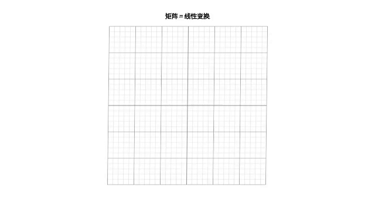
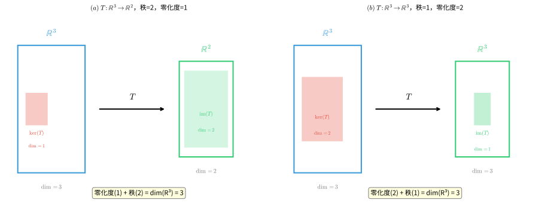
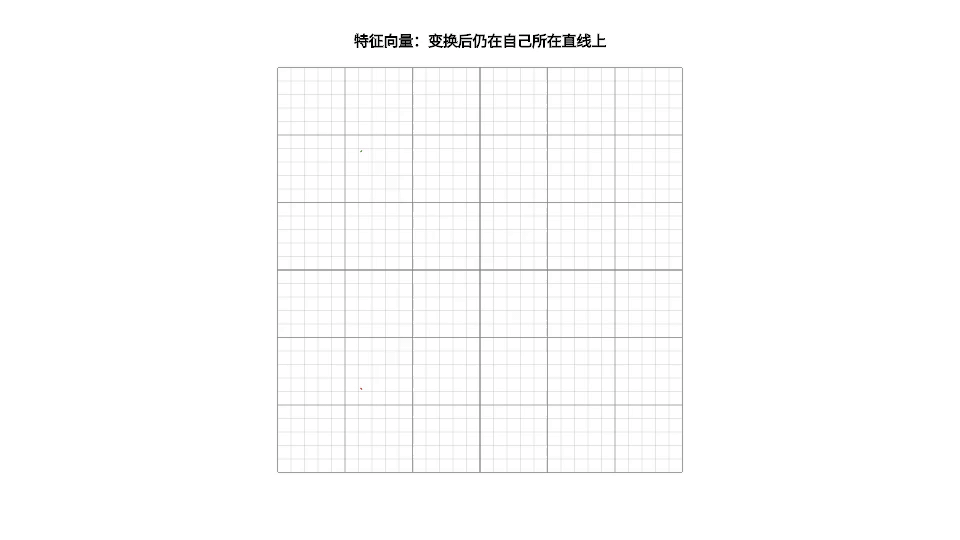

# 第 14 级：线性代数 (Linear Algebra)

## 零、导论：为什么学线性代数？

### 0.1 从你已经知道的说起

在开始之前，让我们先回顾你已经掌握的数学知识：

**中学代数**：你学过解方程 $2x + 3 = 7$，学过一元二次方程 $ax^2 + bx + c = 0$，学过函数 $y = f(x)$。这些都是**单个变量**的故事——一个未知数，一个方程，一个答案。

**微积分**：你学过导数和积分，知道如何描述"变化率"和"累积量"。微积分处理的是**连续变化**的世界——曲线、面积、速度。

**现在问题来了**：如果世界不止一个变量呢？

想象你在设计一款游戏，角色有生命值、攻击力、防御力、速度四个属性。这四个属性相互影响：攻击力影响伤害，防御力影响受伤，速度影响行动顺序……当你想同时描述这四个量的变化时，一元方程不够用了，微积分也变得复杂。

**这就是线性代数登场的时刻**——它专门研究**多个变量同时存在、相互关联**的情况。

### 0.2 线性代数的发展简史

线性代数不是一夜之间诞生的，它经历了数千年的演变：

**古代（公元前 300 年 - 1600 年）**
- 中国《九章算术》（约公元前 300 年）记载了用"方程术"解线性方程组的方法，本质上就是今天的高斯消元法
- 巴比伦人和阿拉伯数学家也研究过简单的线性问题

**近代早期（1600 - 1800 年）**
- 1637 年，笛卡尔发明坐标系，几何和代数开始融合
- 1693 年，莱布尼茨开始研究行列式
- 1750 年，克莱姆（Cramer）提出用行列式解线性方程组的法则

**黄金时代（1800 - 1900 年）**
- 1812 年，高斯（Gauss）系统化高斯消元法，用于天文计算
- 1844 年，格拉斯曼（Grassmann）提出向量空间的概念
- 1850 年，凯莱（Cayley）和西尔维斯特（Sylvester）建立矩阵理论
- 1855 年，哈密顿（Hamilton）提出四元数，推动线性代数发展

**现代（1900 年至今）**
- 1900 年代，希尔伯特（Hilbert）将线性代数应用于泛函分析
- 1920 年代，量子力学发现：微观世界的状态用向量描述，可观测量用矩阵表示
- 1940 年代，计算机诞生，线性代数成为数值计算的核心
- 1960 年代，计算机图形学兴起，矩阵变换成为 3D 渲染的基础
- 2000 年代，大数据时代来临，线性代数成为机器学习和数据科学的"语言"

**一句话总结**：线性代数从"解方程"起步，经过几百年的发展，成为描述**多维世界**和**线性关系**的通用语言。

### 0.3 线性代数在现实世界的应用

你可能觉得线性代数很抽象，但它其实无处不在：

**计算机图形学与游戏**
- 3D 游戏中的角色移动、旋转、缩放，都是矩阵变换
- 电影特效中的 CGI 动画，每一帧都是矩阵运算的结果
- 手机屏幕的触控响应，涉及坐标变换

**机器学习与人工智能**
- 神经网络的核心运算：$y = Wx + b$（矩阵乘法）
- 推荐系统（如抖音、淘宝推荐）用矩阵分解预测用户偏好
- 图像识别：一张 1000×1000 的图片就是一个 100 万元素的向量

**搜索引擎与社交网络**
- Google 的 PageRank 算法：用矩阵特征向量给网页排名
- 微博、微信的社交关系可以用矩阵表示
- 信息检索中的"词袋模型"：文档 = 词频向量

**物理与工程**
- 量子力学：粒子状态 = 向量，可观测量 = 矩阵
- 电路分析：基尔霍夫定律 = 线性方程组
- 结构工程：桥梁受力分析 = 线性系统

**经济学与金融**
- 投入产出模型：各部门之间的经济关系 = 矩阵
- 投资组合优化：风险与收益的平衡 = 二次型
- 期权定价：Black-Scholes 模型的数值解法

**数据科学**
- 主成分分析（PCA）：用特征值降维
- 最小二乘法：线性回归的数学基础
- 信号处理：傅里叶变换 = 基变换

### 0.4 从中学数学到线性代数的思维跃迁

| 中学数学 | 线性代数 | 思维变化 |
|---------|---------|---------|
| 解一个方程 $2x = 6$ | 解方程组 $Ax = b$ | 从"一个"到"多个" |
| 数 $a, b, c$ | 向量 $(a, b, c)$、矩阵 $A$ | 从"标量"到"高维对象" |
| 函数 $y = f(x)$ | 线性变换 $T(v) = Av$ | 从"输入-输出"到"空间变换" |
| 几何图形（点、线、面） | 向量空间、子空间 | 从"具体图形"到"抽象空间" |
| 公式计算 | 结构分析（秩、特征值） | 从"算出答案"到"理解结构" |

**关键思维转变**：
1. **从具体到抽象**：不再只关心"算出 $x = 3$"，而是关心"解的结构是什么"
2. **从计算到结构**：矩阵不只是数字表格，它是"空间的变换规则"
3. **从低维到高维**：从二维平面到 $n$ 维空间，直觉需要升级

### 0.5 如何学习线性代数

**给小白的建议**：

1. **先建立几何直觉**：每个概念都问自己"这在二维/三维空间中长什么样？"
2. **动手算例子**：用 2×2、3×3 的小矩阵验证定理
3. **联系现实应用**：学完每个概念，想想"这东西能用来干什么？"
4. **不要怕抽象**：抽象是为了"一次证明，处处适用"，理解本质比记住公式更重要

**本教程的组织方式**：
- 每个概念都有"💡 直观理解"——用大白话解释
- 每个概念都有"🔑 核心思想"——点明本质
- 配有 matplotlib 图形——让抽象概念可视化
- 丰富的例题和习题——通过实践巩固理解

---

## 〇、概念速览：用生活例子看穿线性代数

在啃正式定义之前，先用一整页给你"剧透"线性代数里每个概念的**本质**和**生活原型**。看不懂没关系——先让大脑有个"锚点"，学细节时才不会迷路。

### 0.6 向量：把"一堆数"打包成"一个东西"

**本质**：向量就是用一组数同时描述一个对象的多个属性。

**生活例子**：
- 你点的外卖订单：`(大杯珍珠奶茶×2, 鸡排×1, 薯条×3)` 就是一个三维向量
- 学生的成绩单：`(语文, 数学, 英语, 物理)` 每科分数组成一个向量
- 手机里的照片：一张 1000×1000 像素的图，就是一个 100 万个数字组成的向量

**为什么抽象**：把"多个数"打包成"一个向量"后，就可以像处理一个数一样处理一整组信息——加向量、缩放向量。

### 0.7 向量空间：一个"封闭的超市"

**本质**：向量空间就是"无论你怎么做加法、怎么缩放，结果都还留在里面"的集合。

**生活例子**：
- 想象一个超市只卖饮料：两瓶水加三瓶水还是水，半瓶水还是水——"水的集合"是一个封闭空间
- 但如果你在"只能放整数的集合"里做一半乘法 $3 \div 2 = 1.5$，结果跑出去了——整数集合**不是**（数乘意义下的）向量空间

**为什么重要**：只要确认某个集合是向量空间，就能套用一整套定理，不用从头验证。

### 0.8 子空间：超市里的"饮料专柜"

**本质**：子空间就是大空间里"自成一体、且包含原点"的小空间。

**生活例子**：
- 全校学生是一个空间，一班的同学可能是子空间（若一班所有学生组合起来还是这个班的人）
- 三维空间里过原点的平面是子空间，但"地球表面"不是——因为地球表面不含原点（地心），且把两个地面点相加可能"飘到空中"

### 0.9 线性组合 & 张成空间：用几种原料能调出什么

**本质**：线性组合是"把几个东西按一定比例混合"，张成空间是"用这些原料能调出的全部配方"。

**生活例子**：
- 你有红、蓝、黄三种颜料，按各种比例混合能调出所有颜色——这三种颜料"张成"整个色域
- 如果只有红色和粉色（粉 = 红 + 白），那只能调出红色系——张成的空间只有"一条线"

### 0.10 线性无关 & 基：辨认"真正的原料"

**本质**：线性无关 = 每个向量都提供了"别处没有的新信息"，基 = 一组"最精简的原料，一个不多一个不少"。

**生活例子**：
- 红、蓝、黄是三原色，谁都不能靠另外两个调出来——它们线性无关，且能作为"基"
- 如果老板进了一箱"红、蓝、黄、紫"的颜料，紫色=红+蓝，是多余的——整个集合线性相关，放弃紫色后剩下的三原色就是"基"

### 0.11 维数：需要几个数才能定位

**本质**：维数 = 空间里"自由变动的独立方向"有几个。

**生活例子**：
- 电梯里你只需要报"第几层"——一维
- 地图定位需要"经度+纬度"——二维
- 无人机定位需要"经度+纬度+高度"——三维
- 网购订单需要"商品+数量+用户+地址"——四维

### 0.12 矩阵：空间的"变形说明书"

**本质**：矩阵记录"空间里的每个方向被拉抻、旋转、压缩了多少"。它是一台"变形机"的操作手册。

**生活例子**：
- 手机旋转屏幕：一条竖着的线变成横着的线，就是矩阵在作用
- 照片放大缩小：每个像素的坐标被矩阵缩放
- 游戏里角色转身：整个身体的坐标被旋转矩阵作用

### 0.13 矩阵乘法：连续执行两个变形

**本质**：$AB$ 表示"先做 $B$ 的变形，再做 $A$ 的变形"。

**生活例子**：
- 先"把照片放大 2 倍"再"旋转 90°"，和先旋转再放大，结果**一样**（因为缩放和旋转"可交换"）——但"先剪切再旋转"和"先旋转再剪切"结果**不同**，这就是矩阵乘法不满足交换律的原因

### 0.14 秩：矩阵"压缩空间"的程度

**本质**：秩 = 变形后空间还剩几维。

**生活例子**：
- 把一张纸（二维）放在桌上投影到一条线，变成了一维——秩为 1
- 把纸投影到地面，还是二维——秩为 2
- 秩为 0 的矩阵（零矩阵）把一切都压成一个点

### 0.15 逆矩阵：变形的"撤销键"

**本质**：$A^{-1}$ 就是把 $A$ 做的变形"原样撤销"的那个操作。

**生活例子**：
- 把照片放大 2 倍，逆操作就是缩小到 1/2
- 把照片旋转 90°，逆操作就是转回来 -90°
- 如果变形把空间压扁了（比如投影、秩 < n），信息丢失，就无法撤销——对应矩阵不可逆

### 0.16 行列式：变形后"面积/体积"的变化倍数

**本质**：行列式告诉你，这个变形把"一块单位的面积/体积"放大或缩小了多少倍，以及是否翻转了方向。

**生活例子**：
- 放大 2 倍 → 面积变 4 倍，行列式 = 4
- 旋转一下 → 面积不变，行列式 = 1
- 把正方形压成一条线 → 面积变 0，行列式 = 0（不可逆！）
- 上下翻转 → 面积不变但方向反了，行列式 = -1

### 0.17 线性变换 & 秩-零化度：变形"压扁了多少、保留了多少"

**本质**：线性变换是"保持网格线平行且等距"的变形；秩-零化度定理说"被压扁的维度 + 保留的维度 = 原来的维度"。

**生活例子**：
- 把三维空间投影到桌面（二维）：被压扁的"高度方向"（1 维）+ 保留的桌面（2 维）= 3 维
- 就像把一盒水压成一个扁平的饼：厚度变没了（1 维），桌面上的面积还在（2 维）

### 0.18 特征值与特征向量：变形中的"定海神针"

**本质**：特征向量是"变形后方向不变、只伸缩"的特殊方向；特征值是"伸缩了几倍"。

**生活例子**：
- 用力拉一块橡皮泥：沿拉力方向的那条线只被拉长、不偏转——那是特征向量，拉长倍数就是特征值
- 地震时，房子有"固有振动方向"（特征向量）和"固有频率"（特征值），共振就是频率对上

### 0.19 内积：两个向量的"匹配度"

**本质**：内积衡量两个向量"方向有多一致"，同时能算出长度和夹角。

**生活例子**：
- 高考成绩与大学录取的匹配度：方向越一致，匹配度越高
- 物理做功：力量方向与位移方向越一致，做的功越多（$W = F \cdot s$ 就是内积）

### 0.20 正交 & 正交投影：互不干扰的方向、找最近点

**本质**：正交 = 两个方向完全垂直、互不影响；正交投影 = 在某个子空间里找"离目标最近的点"。

**生活例子**：
- 东西方向和南北方向正交：向东走不影响你在南北方向的位置
- 阳光把人影投到地面上：影子就是人在"地面"这个子空间上的正交投影，也是地面上离人最近的点
- 最小二乘法拟合直线，就是找"离所有数据点总和最近"的投影

### 0.21 对角化：换个坐标系让变形变简单

**本质**：对角化 = 找到一组"沿特征方向"的坐标轴，让复杂的变形变成"各方向独立缩放"。

**生活例子**：
- 斜着拉伸一块布很麻烦，但如果你把坐标轴转到拉伸方向上，就变成"只是横着拉、竖着拉"——简单多了
- 让杂乱的声音变成"各个标准音调的叠加"，每个音调的音量就是特征值

### 0.22 谱定理 & 二次型：对称矩阵的"体检报告"

**本质**：实对称矩阵可以被拆成"几个正交方向 × 各自强度"的叠加；二次型描述"以原点为中心的椭圆/双曲线"形状。

**生活例子**：
- 用少数几个"主方向"（特征向量）就能近似描述一团数据——这就是主成分分析PCA降维的原理
- 振动、能量、误差等"二次"量，用二次型判断是"稳定（正定）"还是"发散（不定）"

---

## 〇、概念速览：一张思维导图

```
线性代数 = 研究"多个数同时共存、相互关联"的数学
│
├─ 向量（打包一堆数）→ 向量空间（封闭的超市）→ 子空间（超市的专柜）
│                                             → 基（最精简原料）/ 维数（几个独立方向）
│
├─ 矩阵（变形说明书）→ 矩阵乘法（连贯变形）→ 秩（压扁几维）→ 逆矩阵（撤销变形）
│                                             → 行列式（面积变化倍数）
│
├─ 线性方程组 Ax=b（找满足条件的点）→ 高斯消元（逐个消元求解）
│                                             → Cramer法则（用面积比求解）
│
├─ 线性变换（空间变形）→ 核/像 → 秩-零化度（压扁的+保留的=原来的）
│
├─ 特征值/特征向量（变形的定海神针）→ 对角化（换坐标简化）
│                                             → Cayley-Hamilton（矩阵满足自己的方程）
│
└─ 内积（匹配度）→ 正交（互不干扰）→ Gram-Schmidt（逐步找垂直方向）
                → 正交投影（找最近点）→ 谱定理（对称矩阵分解）→ 二次型（椭圆/双曲线）
```

---

## 一、学习目标

完成本教程后，你应该能够：

1. 理解向量空间的定义、子空间、线性组合、张成空间、线性无关性、基和维数
2. 掌握矩阵的基本运算、秩、迹、逆矩阵、初等行变换及高斯消元法
3. 熟练求解线性方程组，理解齐次方程组解的结构
4. 理解行列式的定义、性质及计算方法（Laplace 展开、Cramer 法则）
5. 掌握线性变换的定义、核与像、秩-零化度定理及其证明
6. 理解特征值与特征向量的概念、特征多项式、对角化及 Cayley-Hamilton 定理
7. 掌握内积空间、正交性、Gram-Schmidt 正交化方法及正交投影
8. 理解谱定理（对称矩阵的谱分解）
9. 掌握二次型及其定性、Sylvester 惯性定理

---

## 开始之前

**本章在讲什么**：线性代数研究"把多个数打包成向量、把向量之间的伸缩与旋转打包成矩阵"的一套语言。你会发现，解多元一次方程组、描述平面里的旋转、压缩图片，用到的竟是同一套工具：向量、矩阵、行列式与特征值。

**为什么要学它**：前面第 9 级的集合论教你把对象装进集合，第 11 级的微积分教你看单个数的变化，但现实里很多东西要同时用许多个数描述（坐标、频谱、状态）。本章就是用"向量 + 空间的对应关系"来统一处理这类问题，为后面的级别铺路：直接后继第 15 级线性代数后续（多重线性代数）、第 16 级抽象代数都要借用这套语言，而偏微分方程、优化、概率统计等应用级别也会反复用到矩阵与特征值。

**开始前请确认你还记得**：
- 集合与集合运算（见第 9 级）：集合是对象的不重复整体，元素用 $\in$ 表示，子集用 $\subseteq$ 表示，本章的"子空间"就是保留加法和数乘的集合。
- 函数与映射（见第 11 级）：函数是把一个输入变成一个输出的对应规则，本章的"线性变换"就是一种特殊的映射。
- 一元二次方程与根式（见第 2 级）：解方程需要会配方、会用求根公式，特征方程最终常化为多项式方程。
- 平面坐标系（见第 10 级几何）：会用 $(x,y)$ 表示平面上一点，维度即坐标的个数，维数的概念从这里来。
- 等差数列求和记号（见第 4 级）：理解"从第 1 项加到第 n 项"即和式 $\sum$，矩阵乘法与点积里到处用到它。

---

## 二、向量空间

### 2.1 向量空间的定义

**定义**：设 $\mathbb{F}$ 是一个域（通常取 $\mathbb{R}$ 或 $\mathbb{C}$）。一个 $\mathbb{F}$ 上的**向量空间**（或线性空间）是一个集合 $V$，配备两种运算：**加法** $V \times V \to V$ 和**数乘** $\mathbb{F} \times V \to V$，满足以下公理：

**加法公理**（对任意 $u, v, w \in V$）：
1. **交换律**：$u + v = v + u$
2. **结合律**：$(u + v) + w = u + (v + w)$
3. **零向量**：存在 $\mathbf{0} \in V$，使得 $v + \mathbf{0} = v$
4. **负向量**：对每个 $v \in V$，存在 $-v \in V$，使得 $v + (-v) = \mathbf{0}$

**数乘公理**（对任意 $a, b \in \mathbb{F}$，$v, w \in V$）：
5. 分配律 1：$a(v + w) = av + aw$
6. 分配律 2：$(a + b)v = av + bv$
7. 结合律：$a(bv) = (ab)v$
8. 单位元：$1v = v$

**例**：
- $\mathbb{R}^n = \{(x_1, \dots, x_n) \mid x_i \in \mathbb{R}\}$ 是 $\mathbb{R}$ 上的向量空间
- 所有 $m \times n$ 实矩阵的集合 $M_{m \times n}(\mathbb{R})$ 是向量空间
- 区间 $[a,b]$ 上所有实值连续函数的集合 $C[a,b]$ 是向量空间
- 所有次数不超过 $n$ 的多项式集合 $\mathcal{P}_n(\mathbb{R})$ 是向量空间

> **💡 直观理解**：向量空间就像一个"封闭的游乐场"——只要你在里面做加法和数乘，永远不会"跑出去"。$\mathbb{R}^2$ 就是平面上所有箭头的集合，两个箭头相加还是箭头，箭头拉长缩短还是箭头。

> **🔑 核心思想**：向量空间的本质不在于"向量是什么"，而在于"向量能做什么运算"。无论是几何箭头、函数还是矩阵，只要满足8条公理，就能用同一套理论处理。这就是抽象的力量——**一次证明，处处适用**。


*图1：向量空间与子空间。(a) $\mathbb{R}^2$ 中的向量；(b) 子空间必须过原点，对加法和数乘封闭；(c) 不过原点的直线不是子空间，因为两个向量的和可能"跑出去"。*

### 2.2 子空间

**定义**：设 $V$ 是 $\mathbb{F}$ 上的向量空间，$W \subseteq V$ 的非空子集称为 $V$ 的**子空间**，如果 $W$ 在 $V$ 的加法和数乘下自身构成向量空间。

**子空间判定定理**：$W$ 是子空间 $\iff$ 对任意 $u, v \in W$ 和 $c \in \mathbb{F}$，有：
1. $u + v \in W$
2. $c u \in W$

等价地，$W$ 非空且对线性组合封闭：$u + cv \in W$ 对任意 $u, v \in W$，$c \in \mathbb{F}$。

**例**：
- $\{\mathbf{0}\}$ 和 $V$ 本身是 $V$ 的平凡子空间
- $W = \{(x, y, 0) \mid x, y \in \mathbb{R}\}$ 是 $\mathbb{R}^3$ 的子空间（$xy$-平面）
- $W = \{(x, y, z) \in \mathbb{R}^3 \mid x + y + z = 0\}$ 是 $\mathbb{R}^3$ 的子空间
- 所有 $n$ 阶对称矩阵的集合是 $M_{n \times n}(\mathbb{R})$ 的子空间

> **💡 直观理解**：子空间就是"大空间里自成一体的小空间"。想象 $\mathbb{R}^3$ 是三维世界，那么过原点的平面是子空间（二维），过原点的直线也是子空间（一维），原点本身是零维子空间。关键特征：**子空间必须过原点**——不过原点的平面不是子空间，因为两个向量的和可能"跑出"这个平面。

### 2.3 线性组合与张成空间

**定义**：设 $v_1, v_2, \dots, v_k \in V$，$c_1, c_2, \dots, c_k \in \mathbb{F}$。表达式
$$c_1 v_1 + c_2 v_2 + \cdots + c_k v_k$$
称为 $v_1, \dots, v_k$ 的一个**线性组合**。

**定义**：集合 $S = \{v_1, \dots, v_k\}$ 的**张成空间**（span）是所有线性组合的集合：

| 符号 | 名称 | 含义 | 直观解释 |
|:---:|:---:|:---|:---|
| $S$ | 向量组 | $S = \{v_1, \dots, v_k\}$ 这一堆向量 | "一堆原料" |
| $v_i$ | 向量 | 第 $i$ 个向量 | "第 i 种原料" |
| $c_i$ | 标量系数 | 每个向量乘上的一个数 | "每种原料放多少" |
| $\sum_{i=1}^k$ | 求和 | 从第 1 项加到第 $k$ 项 | "把 k 种全加起来" |
| $\operatorname{span}(S)$ | 张成空间 | 这些向量能组合出的全部 | "用这堆原料能调出的一切" |

$$\operatorname{span}(S) = \left\{ \sum_{i=1}^k c_i v_i \;\middle|\; c_i \in \mathbb{F} \right\}$$

$\operatorname{span}(S)$ 是 $V$ 的一个子空间，称为由 $S$ **张成**的子空间。

> **💡 直观理解**：张成空间就像"用这些向量能到达的所有地方"。两个不共线的向量能张成整个平面（像用两个方向的力可以到达平面上的任何位置），而两个共线的向量只能张成一条直线（因为它们指向同一个方向）。

> **🔑 线性无关的本质**：线性无关意味着"每个向量都提供了新的信息"。如果 $v_2$ 可以被 $v_1$ 线性表示，那 $v_2$ 就是"冗余的"——它没有带来任何新方向。基就是"最精简的生成集"：去掉任何一个向量都无法张成整个空间。


*图2：线性组合与张成空间。(a) 两个线性无关的向量张成整个 $\mathbb{R}^2$，任意向量都可以表示为它们的线性组合（平行四边形法则）；(b) 两个线性相关的向量（共线）只能张成一条直线。*

### 2.4 线性无关性

**定义**：向量组 $\{v_1, \dots, v_k\}$ 称为**线性相关**的，如果存在不全为零的标量 $c_1, \dots, c_k \in \mathbb{F}$，使得
$$c_1 v_1 + c_2 v_2 + \cdots + c_k v_k = \mathbf{0}$$

如果上述等式仅当 $c_1 = c_2 = \cdots = c_k = 0$ 时成立，则称向量组是**线性无关**的。

**性质**：
- 单个向量 $v$ 线性无关 $\iff$ $v \neq \mathbf{0}$
- 两个向量线性相关 $\iff$ 其中一个可以被另一个数乘得到
- 若向量组包含 $\mathbf{0}$，则一定线性相关
- 若部分向量相关，则整体相关；若整体无关，则部分无关

> **💡 直观理解**：线性相关就是"有向量是多余的"。想象你在地图上导航：如果已经有了"向东走"和"向北走"的指令，那么"向东北走"就是多余的——它可以由前两个组合得到。线性无关意味着每个向量都提供了"新方向"，没有任何一个可以被其他向量组合出来。

### 2.5 基与维数

**定义**：向量空间 $V$ 的一组**基**是一个线性无关且张成 $V$ 的向量组 $B$。

**定义**：$V$ 的**维数** $\dim(V)$ 是基中向量的个数（如果 $V$ 有有限基）。若 $V = \{\mathbf{0}\}$，则 $\dim(V) = 0$。

**定理**：若 $V$ 是有限维向量空间，则 $V$ 的所有基都有相同数量的向量。

**定理**：设 $\dim(V) = n$，则：
- 任何 $n$ 个线性无关的向量构成一组基
- 任何 $n$ 个张成 $V$ 的向量构成一组基
- 任何线性无关组可以扩充为一组基
- 任何张成组可以缩减为一组基

**标准基**：
- $\mathbb{R}^n$ 的标准基：$e_1 = (1,0,\dots,0),\; e_2 = (0,1,\dots,0),\; \dots,\; e_n = (0,\dots,0,1)$
- $\mathcal{P}_n(\mathbb{R})$ 的标准基：$1, x, x^2, \dots, x^n$
- $M_{m \times n}(\mathbb{R})$ 的标准基：矩阵单位 $E_{ij}$（第 $i$ 行第 $j$ 列为 1，其余为 0）

> **💡 直观理解**：基是向量空间的"坐标轴"，维数是"自由度的个数"。$\mathbb{R}^3$ 的标准基 $e_1, e_2, e_3$ 就是我们熟悉的 $x, y, z$ 三个方向。维数为 3 意味着你需要 3 个数才能确定空间中的一个点。基的选择不是唯一的——你可以旋转、倾斜坐标轴，但只要向量个数相同（维数不变），它们就描述的是同一个空间。

### 2.6 向量组的秩与极大线性无关组

**定义**：设 $S = \{v_1, \dots, v_k\}$ 是一个向量组。$S$ 的一个**极大线性无关组**是从 $S$ 中选出的一个线性无关向量组，且再添加 $S$ 中任何其他向量都会使它线性相关（即已经"到极限"，无法再扩充）。

**定义**：向量组 $S$ 的任何极大线性无关组所含向量的个数，称为 $S$ 的**秩**，记作 $\operatorname{rank}(S)$。

**定理**：
- 一个向量组的任意两个极大线性无关组所含向量个数相等（都等于该组的秩）
- 向量组 $S$ 的秩 = $\operatorname{span}(S)$ 的维数 = 以 $S$ 为列（或行）构成的矩阵的秩
- 向量组与其任一极大线性无关组等价（可以互相线性表示）

> **💡 直观理解**：极大线性无关组就是"一支队伍里真正不可或缺的核心成员"。想象一个团队，有些人掌握的核心技能是别人没有的（线性无关），有些人只会重复别人的技能（冗余）。极大无关组就是"去掉任何一个都会战力下降"的那批核心成员，而秩就是"核心成员的人数"。
>
> **🔑 与矩阵秩的联系**：矩阵的秩 = 它的行向量组的秩 = 列向量组的秩。所以"矩阵的秩"和"向量组的秩"是同一个概念的两面——矩阵的秩告诉我们它的行（列）里有多少个"真正独立"的向量。

**例**：求向量组 $v_1 = (1, 2, 0)$，$v_2 = (0, 1, 1)$，$v_3 = (1, 3, 1)$ 的秩和极大线性无关组。

**解**：注意到 $v_3 = v_1 + v_2$，所以 $v_3$ 是冗余的。而 $v_1, v_2$ 线性无关（不成比例），故 $\{v_1, v_2\}$ 是一个极大线性无关组，$\operatorname{rank}(\{v_1, v_2, v_3\}) = 2$。

---

## 三、矩阵

### 3.1 矩阵的定义与基本运算

**定义**：一个 $m \times n$ 矩阵是 $m$ 行 $n$ 列排列的数的矩形阵列：

| 符号 | 名称 | 含义 | 直观解释 |
|:---:|:---:|:---|:---|
| $A$ | 矩阵 | 排成矩形的数表 | "一个数表" |
| $m \times n$ | 尺寸 | 表示有 $m$ 行 $n$ 列 | "m 行 n 列" |
| $a_{ij}$ | 元素 | 位于第 $i$ 行第 $j$ 列的数 | "第 i 行第 j 格" |

$$A = \begin{pmatrix}
a_{11} & a_{12} & \cdots & a_{1n} \\
a_{21} & a_{22} & \cdots & a_{2n} \\
\vdots & \vdots & \ddots & \vdots \\
a_{m1} & a_{m2} & \cdots & a_{mn}
\end{pmatrix}$$
记作 $A = (a_{ij})_{m \times n}$。

**矩阵运算**：
1. **加法**：$A + B = (a_{ij} + b_{ij})$（同型矩阵）
2. **数乘**：$cA = (c a_{ij})$
3. **乘法**：$A_{m \times n} B_{n \times p} = C_{m \times p}$，其中 $c_{ij} = \sum_{k=1}^n a_{ik} b_{kj}$
4. **转置**：$(A^T)_{ij} = a_{ji}$

**性质**：
- $(AB)C = A(BC)$
- $A(B + C) = AB + AC$
- $(A + B)^T = A^T + B^T$
- $(AB)^T = B^T A^T$

> **💡 直观理解**：矩阵不仅仅是数字表格，它是**线性变换的"操作手册"**。矩阵乘法 $AB$ 表示"先做变换 $B$，再做变换 $A$"。注意顺序很重要——先旋转再缩放 ≠ 先缩放再旋转（除非是特殊矩阵），这就是为什么矩阵乘法不满足交换律 $AB \neq BA$。

### 3.1b 分块矩阵

**定义**：用横线和竖线把一个矩阵分割成若干块，每块是一个**子矩阵**，这种方法叫**分块**。分块后的矩阵称为**分块矩阵**。

**例**：把 $4 \times 4$ 矩阵分成四块：
$$\begin{pmatrix} A & B \\ C & D \end{pmatrix}$$
其中 $A, B, C, D$ 是较小的子矩阵。

**分块矩阵的运算**（对分块得当的矩阵）：
- **加法**：对应块相加（要求分块方式一致）
- **数乘**：每块都乘以该数
- **乘法**：像普通矩阵乘法一样，但把"数"换成"块"：
  $$\begin{pmatrix} A & B \\ C & D \end{pmatrix} \begin{pmatrix} E & F \\ G & H \end{pmatrix} = \begin{pmatrix} AE + BG & AF + BH \\ CE + DG & CF + DH \end{pmatrix}$$
  （要求各子块的维数满足乘法条件）

> **💡 直观理解**：分块矩阵就像把一个大乐高拼图拆成几块小乐高来处理。它可以：
> - **简化计算**：把大矩阵的乘法变成小矩阵的乘法，尤其当矩阵有特殊结构（如对角块）时
> - **看清结构**：很多矩阵天然是分块的（如分块对角矩阵、增广矩阵 $[A \mid b]$）
>
> **🔑 重要应用**：
> - **分块对角矩阵**：$\begin{pmatrix} A & 0 \\ 0 & B \end{pmatrix}$ 的行列式 = $\det(A)\det(B)$，逆矩阵 = $\begin{pmatrix} A^{-1} & 0 \\ 0 & B^{-1} \end{pmatrix}$（若 $A, B$ 可逆）
> - **分块下三角/上三角**：$\det\begin{pmatrix} A & * \\ 0 & B \end{pmatrix} = \det(A)\det(B)$
> - **解大规模方程组**：把大系统拆成小块逐块求解，是数值计算的重要技巧

### 3.2 矩阵的秩

**定义**：矩阵 $A$ 的**列秩**是列向量张成空间的维数，**行秩**是行向量张成空间的维数。

**定理**：对任何矩阵，列秩等于行秩，称为矩阵的**秩**，记作 $\operatorname{rank}(A)$。

**性质**：
- $0 \leq \operatorname{rank}(A) \leq \min(m, n)$
- $\operatorname{rank}(A) = \operatorname{rank}(A^T)$
- $\operatorname{rank}(AB) \leq \min(\operatorname{rank}(A), \operatorname{rank}(B))$
- $\operatorname{rank}(A + B) \leq \operatorname{rank}(A) + \operatorname{rank}(B)$
- 初等行变换不改变矩阵的秩

> **💡 直观理解**：秩是矩阵最重要的"指纹"。它告诉你：
> - **信息量**：秩 = 矩阵中"真正独立"的行（或列）的数量。秩为 3 的 3×3 矩阵包含 3 个独立信息；秩为 1 的矩阵只包含 1 个独立信息（其他行都是它的倍数）。
> - **变换效果**：秩 = 变换后空间的维数。秩为 2 的 3×3 矩阵把三维空间压扁成二维平面；秩为 1 的矩阵把空间压扁成一条线；秩为 0 的矩阵（零矩阵）把整个空间压成一个点。
> - **可逆性**：方阵可逆 ⟺ 秩 = n ⟺ 列向量线性无关 ⟺ 变换是"一对一"的。

### 3.3 矩阵的迹

**定义**：$n$ 阶方阵 $A = (a_{ij})$ 的**迹**是对角线元素之和：
$$\operatorname{tr}(A) = \sum_{i=1}^n a_{ii}$$

**性质**：
- $\operatorname{tr}(A + B) = \operatorname{tr}(A) + \operatorname{tr}(B)$
- $\operatorname{tr}(cA) = c \operatorname{tr}(A)$
- $\operatorname{tr}(AB) = \operatorname{tr}(BA)$
- $\operatorname{tr}(A^T) = \operatorname{tr}(A)$

> **💡 直观理解**：迹有一个深刻的几何意义——它等于矩阵所有特征值的和。如果矩阵代表一个线性变换，迹告诉你这个变换在各个特征方向上的"总伸缩量"。迹为正说明总体是"扩张"的，迹为负说明总体是"压缩"的。迹为零则说明扩张和压缩相互抵消（如剪切变换）。

### 3.4 逆矩阵

**定义**：$n$ 阶方阵 $A$ 称为**可逆**的（或**非奇异**的），如果存在 $n$ 阶方阵 $B$ 使得
$$AB = BA = I_n$$
其中 $I_n$ 是 $n$ 阶单位矩阵。$B$ 称为 $A$ 的逆矩阵，记作 $A^{-1}$。

**性质**：
- 若 $A$ 可逆，则 $A^{-1}$ 唯一
- $(A^{-1})^{-1} = A$
- $(AB)^{-1} = B^{-1}A^{-1}$
- $(A^T)^{-1} = (A^{-1})^T$
- $A$ 可逆 $\iff$ $\det(A) \neq 0$ $\iff$ $\operatorname{rank}(A) = n$ $\iff$ $A$ 的列（行）向量线性无关

> **💡 直观理解**：逆矩阵是"撤销变换"的操作。如果 $A$ 把空间旋转了 45°，那么 $A^{-1}$ 就把它旋转 -45° 转回来。如果 $A$ 把空间拉伸了 2 倍，$A^{-1}$ 就把它压缩回原来的 1/2。不可逆矩阵（奇异矩阵）就像"压路机"——把三维空间压扁成二维平面，信息丢失了，无法"恢复"原状。这就是为什么 $\det(A) = 0$ 时矩阵不可逆。

### 3.5 初等行变换与高斯消元法

**三种初等行变换**：
1. **交换**：交换两行 $R_i \leftrightarrow R_j$
2. **倍乘**：将某行乘以非零常数 $R_i \to cR_i$（$c \neq 0$）
3. **倍加**：将某行的倍数加到另一行 $R_i \to R_i + cR_j$

**行阶梯形矩阵**满足：
1. 所有非零行在零行之上
2. 每个非零行的首非零元（称为**主元**）的列索引严格递增
3. 主元下方的元素全为零

**简化行阶梯形矩阵**（RREF）进一步满足：
4. 每个主元为 1
5. 每个主元所在的列中，其他元素全为零

**高斯消元法**：通过初等行变换将矩阵化为行阶梯形。
**Gauss-Jordan 消元法**：进一步化为简化行阶梯形。

### 3.5b 初等矩阵

**定义**：对单位矩阵 $I$ 做一次初等变换得到的矩阵，称为**初等矩阵**。对应三种初等（行/列）变换：

1. **交换矩阵** $E(R_i \leftrightarrow R_j)$：交换 $I$ 的第 $i, j$ 行
2. **倍乘矩阵** $E(R_i \to cR_i)$（$c \neq 0$）：将 $I$ 的第 $i$ 行乘以 $c$
3. **倍加矩阵** $E(R_i \to R_i + cR_j)$：将 $I$ 的第 $j$ 行乘以 $c$ 加到第 $i$ 行

**核心性质**：对矩阵 $A$ 做一次初等**行**变换，等价于在 $A$ 的**左边**乘一个对应的初等矩阵；做一次初等**列**变换，等价于在 $A$ 的**右边**乘一个对应的初等矩阵。

> **💡 直观理解**：初等矩阵是"基本动作的按钮"。任何复杂的行变换（高斯消元）都是这些基本按钮的连按——$E_k \cdots E_2 E_1 A$。把一个矩阵左乘一堆初等矩阵，等价于对它做了一连串行变换。
>
> **🔑 深刻结论**：
> - **可逆 ⟺ 初等矩阵之积**：方阵 $A$ 可逆 $\iff$ $A$ 可以写成若干个初等矩阵的乘积
> - **求逆的机制**：$A$ 可逆时，$A^{-1} = E_k \cdots E_2 E_1$，即对增广矩阵 $[A \mid I]$ 做行变换把 $A$ 化成 $I$ 时，$I$ 就变成了 $A^{-1}$——这正是 Gauss-Jordan 求逆法的原理
> - **矩阵等价标准形**：任何矩阵 $A$ 都可以通过初等变换化为标准形 $\begin{pmatrix} I_r & 0 \\ 0 & 0 \end{pmatrix}$，其中 $r = \operatorname{rank}(A)$

---

## 四、线性方程组

### 4.1 基本概念

一般线性方程组的形式：
$$\begin{cases}
a_{11}x_1 + a_{12}x_2 + \cdots + a_{1n}x_n = b_1 \\
a_{21}x_1 + a_{22}x_2 + \cdots + a_{2n}x_n = b_2 \\
\vdots \\
a_{m1}x_1 + a_{m2}x_2 + \cdots + a_{mn}x_n = b_m
\end{cases}$$

写成矩阵形式 $Ax = b$，其中 $A = (a_{ij})$ 是系数矩阵，$x = (x_1, \dots, x_n)^T$ 是未知向量，$b = (b_1, \dots, b_m)^T$ 是常数向量。

**增广矩阵**：$(A \mid b)$。

### 4.2 高斯消元法求解

**步骤**：
1. 写出增广矩阵 $(A \mid b)$
2. 通过初等行变换化为行阶梯形
3. 回代求解

**例**：
$$\begin{cases}
x + 2y + z = 8 \\
2x + y + z = 7 \\
x + y + 2z = 7
\end{cases}$$

增广矩阵：
$$\begin{pmatrix}
1 & 2 & 1 & 8 \\
2 & 1 & 1 & 7 \\
1 & 1 & 2 & 7
\end{pmatrix}$$

- 【第1步】依据：方程形如 $Ax=b$，$b$ 只负责"右边常数"，写进最后一列即增广矩阵；目的：把解方程变成"只动表格数字"的行变换。
- 【第2步】依据：初等行变换不改变方程组的解集；目的：用 $R_1$ 消去 $R_2,R_3$ 的第一列，使第二行以下第一列变成 0。

$R_2 \to R_2 - 2R_1$，$R_3 \to R_3 - R_1$：
$$\begin{pmatrix}
1 & 2 & 1 & 8 \\
0 & -3 & -1 & -9 \\
0 & -1 & 1 & -1
\end{pmatrix}$$

- 【第3步】依据：还可再对第二、三行消元（用 $R_2$ 消 $R_3$），行的倍数加减仍不改变解；目的：把 $R_3$ 第二列也消成 0，形成"阶梯"。

$R_3 \to 3R_3 - R_2$：
$$\begin{pmatrix}
1 & 2 & 1 & 8 \\
0 & -3 & -1 & -9 \\
0 & 0 & 4 & 6
\end{pmatrix}$$

- 【第4步】依据：阶梯形每行主元都位于前一行的右下方，回到方程组即可自下而上逐个解出未知数；目的：从最后一行 $4z=6$ 反推 $z,y,x$。

回代：$4z = 6 \Rightarrow z = \frac{3}{2}$，$-3y - \frac{3}{2} = -9 \Rightarrow y = \frac{5}{2}$，$x + 5 + \frac{3}{2} = 8 \Rightarrow x = \frac{3}{2}$。

### 4.3 Gauss-Jordan 消元法

直接化为简化行阶梯形（RREF），无需回代。

继续上面的例子，从行阶梯形继续：
$$\begin{pmatrix}
1 & 2 & 1 & 8 \\
0 & -3 & -1 & -9 \\
0 & 0 & 4 & 6
\end{pmatrix}$$

$R_2 \to -\frac{1}{3}R_2$，$R_3 \to \frac{1}{4}R_3$：
$$\begin{pmatrix}
1 & 2 & 1 & 8 \\
0 & 1 & \frac{1}{3} & 3 \\
0 & 0 & 1 & \frac{3}{2}
\end{pmatrix}$$

$R_2 \to R_2 - \frac{1}{3}R_3$，$R_1 \to R_1 - R_3$：
$$\begin{pmatrix}
1 & 2 & 0 & \frac{13}{2} \\
0 & 1 & 0 & \frac{5}{2} \\
0 & 0 & 1 & \frac{3}{2}
\end{pmatrix}$$

$R_1 \to R_1 - 2R_2$：
$$\begin{pmatrix}
1 & 0 & 0 & \frac{3}{2} \\
0 & 1 & 0 & \frac{5}{2} \\
0 & 0 & 1 & \frac{3}{2}
\end{pmatrix}$$

直接读出解：$x = \frac{3}{2}$，$y = \frac{5}{2}$，$z = \frac{3}{2}$。

### 4.4 解的存在性与唯一性

**定理**（线性方程组解的存在性）：$Ax = b$ 有解 $\iff$ $\operatorname{rank}(A) = \operatorname{rank}(A \mid b)$。

**定理**（解的结构）：
- 若 $\operatorname{rank}(A) = \operatorname{rank}(A \mid b) = n$（未知数个数），则方程组有**唯一解**
- 若 $\operatorname{rank}(A) = \operatorname{rank}(A \mid b) < n$，则方程组有**无穷多解**，自由变量个数为 $n - \operatorname{rank}(A)$

### 4.5 齐次线性方程组

**定义**：$Ax = \mathbf{0}$ 称为齐次线性方程组。

**性质**：
- 齐次方程组总有解（零解 $x = \mathbf{0}$）
- 齐次方程组的解集是 $\mathbb{F}^n$ 的子空间（称为**解空间**或**零空间**）
- 解空间的维数 = $n - \operatorname{rank}(A)$
- 齐次方程组有非零解 $\iff$ $\operatorname{rank}(A) < n$（当 $m < n$ 时自动成立）

**非齐次方程组解的结构**：若 $x_p$ 是 $Ax = b$ 的一个特解，则通解为
$$x = x_p + x_h$$
其中 $x_h$ 是齐次方程组 $Ax = \mathbf{0}$ 的任意解。

> **💡 直观理解**：线性方程组 $Ax = b$ 的解取决于"信息"与"未知数"的关系。
>
> **🔑 几何视角**：
> - **唯一解**：三个平面交于一点（信息充足，未知数被完全确定）
> - **无穷多解**：三个平面交于一条线（信息不足，有一个"自由度"可以任意取值）
> - **无解**：三个平面没有公共交点（信息矛盾，如两个平行平面）
>
> **🔑 解的结构**：非齐次方程组的通解 = 特解 + 齐次通解。就像"定位 + 浮动"：特解是满足条件的一个具体位置，齐次通解是可以在这个位置上"自由浮动"的范围。比如 $x + y = 5$ 的一个特解是 $(5, 0)$，齐次通解是 $t(1, -1)$，所以通解是 $(5 + t, -t)$——沿着直线 $(1, -1)$ 方向自由滑动。

---

## 五、行列式

### 5.1 行列式的定义

**定义**（置换定义）：$n$ 阶方阵 $A = (a_{ij})$ 的行列式定义为

| 符号 | 名称 | 含义 | 直观解释 |
|:---:|:---:|:---|:---|
| $\det(A)$ | 行列式 | 给方阵算出的一个数 | "这个方阵的面积倍率" |
| $S_n$ | 置换全体 | 所有把 $n$ 个数重排的方式 | "所有排列法" |
| $\sigma, \operatorname{sgn}(\sigma)$ | 置换与其符号 | 一种排法及其符号（偶为 +1 奇为 -1） | "排列的奇偶标签" |

$$\det(A) = \sum_{\sigma \in S_n} \operatorname{sgn}(\sigma) \prod_{i=1}^n a_{i,\sigma(i)}$$
其中 $S_n$ 是所有 $n$ 元置换的集合，$\operatorname{sgn}(\sigma)$ 是置换 $\sigma$ 的符号（偶置换为 $+1$，奇置换为 $-1$）。

**低阶情形**：
- $n = 1$：$\det(a) = a$
- $n = 2$：$\det\begin{pmatrix} a & b \\ c & d \end{pmatrix} = ad - bc$
- $n = 3$（Sarrus 法则）：
  $$\det\begin{pmatrix} a_{11} & a_{12} & a_{13} \\ a_{21} & a_{22} & a_{23} \\ a_{31} & a_{32} & a_{33} \end{pmatrix} = a_{11}a_{22}a_{33} + a_{12}a_{23}a_{31} + a_{13}a_{21}a_{32} - a_{13}a_{22}a_{31} - a_{11}a_{23}a_{32} - a_{12}a_{21}a_{33}$$

> **💡 几何意义**：行列式的绝对值表示线性变换对"面积"（或"体积"）的缩放因子。
> - $|\det(A)| > 1$：面积放大
> - $|\det(A)| < 1$：面积缩小
> - $\det(A) = 0$：变换将空间坍缩到低维（如正方形压成线段），矩阵不可逆
> - $\det(A) < 0$：变换翻转了空间的"方向"（如左手系变右手系）


*图3：行列式的几何意义。(a) $\det(A)=2>0$：单位正方形面积放大2倍，方向不变；(b) $\det(A)=-1<0$：面积不变但方向翻转；(c) $\det(A)=0$：正方形坍缩为线段，面积变为零。*

### 5.2 行列式的性质

**基本性质**：
1. $\det(I_n) = 1$
2. 交换两行，行列式变号
3. 将某行乘以常数 $c$，行列式乘以 $c$
4. 将某行的倍数加到另一行，行列式不变
5. $\det(A^T) = \det(A)$
6. $\det(AB) = \det(A)\det(B)$
7. $A$ 可逆 $\iff$ $\det(A) \neq 0$，此时 $\det(A^{-1}) = \frac{1}{\det(A)}$
8. 若 $A$ 有相同的两行或一行全为零，则 $\det(A) = 0$

**性质 5 的证明**：由定义，$\det(A^T) = \sum_{\sigma \in S_n} \operatorname{sgn}(\sigma) \prod_{i=1}^n a_{\sigma(i),i}$。对每个置换 $\sigma$，令 $\tau = \sigma^{-1}$，则 $\operatorname{sgn}(\tau) = \operatorname{sgn}(\sigma)$，且 $\prod_{i=1}^n a_{\sigma(i),i} = \prod_{j=1}^n a_{j,\tau(j)}$。因此 $\det(A^T) = \sum_{\tau \in S_n} \operatorname{sgn}(\tau) \prod_{j=1}^n a_{j,\tau(j)} = \det(A)$。

**性质 6 的证明**：设 $C = AB$，则 $c_{ij} = \sum_{k=1}^n a_{ik}b_{kj}$。于是
$$\begin{aligned}
\det(AB) &= \sum_{\sigma \in S_n} \operatorname{sgn}(\sigma) \prod_{i=1}^n \left(\sum_{k_i=1}^n a_{i,k_i} b_{k_i,\sigma(i)}\right) \\
&= \sum_{k_1,\dots,k_n} \left(\prod_{i=1}^n a_{i,k_i}\right) \sum_{\sigma \in S_n} \operatorname{sgn}(\sigma) \prod_{i=1}^n b_{k_i,\sigma(i)}
\end{aligned}$$
当 $(k_1,\dots,k_n)$ 不是置换时，内层和为零（因为会出现重复行）。当 $(k_1,\dots,k_n) = \tau$ 是一个置换时，内层和等于 $\operatorname{sgn}(\tau) \det(B)$。因此
$$\det(AB) = \sum_{\tau \in S_n} \operatorname{sgn}(\tau) \left(\prod_{i=1}^n a_{i,\tau(i)}\right) \det(B) = \det(A)\det(B)$$
读懂这一串的关键：
- 【第1步】依据：$C=AB$ 每项 $c_{ij}=\sum_k a_{ik}b_{kj}$，再套用 $\det$ 的置换定义逐项展开；目的：把乘积的行列式转成"$A$ 的元素与 $B$ 的元素"的求和。
- 【第2步】依据：有限求和可以交换顺序；目的：把以 $a$ 打头的因子与以 $b$ 打头的因子分成互相独立的两个求和层。
- 【第3步】依据：$(k_1,\dots,k_n)$ 若非置换，则 $B$ 某两行重复使 $B$ 的内层和为零；若是置换 $\tau$，内层和恰为 $\operatorname{sgn}(\tau)\det(B)$；目的：只剩 $\tau$ 一种求和，正好认出"$A$ 的定义展开"等于 $\det(A)$。

### 5.3 Laplace 展开

**定义**：$A$ 的 $(i,j)$**-余子式** $M_{ij}$ 是删除第 $i$ 行和第 $j$ 列后得到的 $(n-1)$ 阶子式的行列式。**代数余子式** $C_{ij} = (-1)^{i+j} M_{ij}$。

**Laplace 展开定理**：沿第 $i$ 行展开：
$$\det(A) = \sum_{j=1}^n a_{ij} C_{ij} = \sum_{j=1}^n (-1)^{i+j} a_{ij} M_{ij}$$

沿第 $j$ 列展开：
$$\det(A) = \sum_{i=1}^n a_{ij} C_{ij} = \sum_{i=1}^n (-1)^{i+j} a_{ij} M_{ij}$$

**证明概要**：由置换定义，将 $\det(A) = \sum_{\sigma} \operatorname{sgn}(\sigma) \prod_{i} a_{i,\sigma(i)}$ 按固定 $i$ 行中 $a_{ij}$ 的项分组。每个含 $a_{ij}$ 的项对应 $\sigma(i)=j$ 的置换，剩下的 $\prod_{k \neq i} a_{k,\sigma(k)}$ 构成 $M_{ij}$ 的置换和，符号由 $(-1)^{i+j}$ 校正。

### 5.4 Cramer 法则

**定理**（Cramer 法则）：若 $A$ 是 $n \times n$ 可逆矩阵，则线性方程组 $Ax = b$ 有唯一解，其分量为
$$x_i = \frac{\det(A_i)}{\det(A)}$$
其中 $A_i$ 是将 $A$ 的第 $i$ 列替换为 $b$ 得到的矩阵。

**证明**：设 $x = (x_1,\dots,x_n)^T$ 满足 $Ax = b$。记 $A$ 的列向量为 $a_1,\dots,a_n$，则 $b = \sum_{j=1}^n x_j a_j$。于是
$$\begin{aligned}
\det(A_i) &= \det(a_1,\dots,a_{i-1},b,a_{i+1},\dots,a_n) \\
&= \det\left(a_1,\dots,a_{i-1},\sum_{j=1}^n x_j a_j,a_{i+1},\dots,a_n\right) \\
&= \sum_{j=1}^n x_j \det(a_1,\dots,a_{i-1},a_j,a_{i+1},\dots,a_n)
\end{aligned}$$
再逐处读懂上面的展开：
- 第 1 个等号：把 $A_i$ 换成"用 $b$ 顶替第 $i$ 列"的写法，依据是 $A_i$ 的定义；目的：把未知解引入行列式。
- 第 2 个等号：利用 $b=Ax=\sum_j x_j a_j$ 把 $b$ 写成各列的线性组合，依据方程组本身；目的：让行列式对"某列拆和"来作用。
- 第 3 个等号：一行中把外列的求和逐项拆开，依据是行列式对第 $i$ 列是线性的；目的：把问题化成"每一列都来自 $A$"的多个行列式。
当 $j = i$ 时，行列式为 $\det(A)$；当 $j \neq i$ 时，行列式有两列相同，值为 $0$。因此 $\det(A_i) = x_i \det(A)$，即 $x_i = \det(A_i)/\det(A)$。

> **💡 直观理解**：Cramer 法则用"面积/体积比"来求解线性方程组。想象 $Ax = b$ 中 $A$ 的列向量张成一个平行四边形（2D）或平行六面体（3D），$\det(A)$ 就是这个"基准体积"。
>
> **🔑 几何意义**：$x_i = \det(A_i)/\det(A)$ 的含义是：
> - $\det(A)$：原始"基准体积"
> - $\det(A_i)$：用 $b$ 替换第 $i$ 列后的"新体积"
> - 比值 $x_i$：第 $i$ 个未知数的"贡献比例"
>
> **🔑 为什么重要**：
> - **理论价值**：给出了解析解的显式公式，揭示了线性方程组解的结构
> - **局限性**：计算复杂度高（需要计算 $n+1$ 个行列式），实际计算中不如高斯消元法高效
> - **应用场景**：适用于低维（2×2、3×3）方程组，或需要解析表达式的理论推导

---

## 六、线性变换

### 6.1 定义与例子

**定义**：设 $V$ 和 $W$ 是 $\mathbb{F}$ 上的向量空间。映射 $T: V \to W$ 称为**线性变换**（或线性映射），如果对任意 $u, v \in V$ 和 $c \in \mathbb{F}$：
1. $T(u + v) = T(u) + T(v)$（加法保持性）
2. $T(cu) = cT(u)$（数乘保持性）

**例**：
- 零变换：$T(v) = \mathbf{0}$ 对任意 $v \in V$
- 恒等变换：$I(v) = v$ 对任意 $v \in V$
- 旋转：$T: \mathbb{R}^2 \to \mathbb{R}^2$，将向量绕原点旋转 $\theta$ 角
- 投影：$T: \mathbb{R}^3 \to \mathbb{R}^3$，$T(x,y,z) = (x,y,0)$
- 微分：$D: \mathcal{P}_n \to \mathcal{P}_{n-1}$，$D(p) = p'$
- 积分：$T: C[a,b] \to \mathbb{R}$，$T(f) = \int_a^b f(x) dx$

> **💡 直观理解**：线性变换就是"保持网格线平行且等距的空间变形"。你可以把矩阵想象成一台"空间变形机"：旋转、缩放、剪切、投影、反射——只要网格线变形后仍然平行且等距，就是线性变换。矩阵的列就是基向量 $e_1, e_2$ 变换后的去向——知道了基向量的新位置，就知道了整个变换。


*图4：常见线性变换的几何效果。矩阵作用在网格上，观察基向量 $e_1, e_2$（红、绿箭头）的变换即可完全确定变换：(a) 恒等变换；(b) 旋转 45°；(c) 不等比缩放；(d) 剪切；(e) 投影到 x 轴（降维！）；(f) 关于 x 轴的反射。*

#### 🎬 动画演示：线性变换之于平面网格



> 这个动画直观展示了矩阵作为"空间变形机"的作用：整个平面网格在矩阵作用下被旋转、拉伸、剪切或压缩，而网格线始终保持平行且等距。它帮助理解"矩阵就是线性变换"这一核心思想。

### 6.2 核与像

**定义**：设 $T: V \to W$ 是线性变换。
- **核**（kernel，也称零空间）：$\ker(T) = \{v \in V \mid T(v) = \mathbf{0}\}$
- **像**（image，也称值域）：$\operatorname{im}(T) = \{T(v) \mid v \in V\}$

**定理**：$\ker(T)$ 是 $V$ 的子空间，$\operatorname{im}(T)$ 是 $W$ 的子空间。

**证明**：若 $u, v \in \ker(T)$，则 $T(u+v) = T(u) + T(v) = \mathbf{0} + \mathbf{0} = \mathbf{0}$，所以 $u+v \in \ker(T)$。若 $c \in \mathbb{F}$，$T(cu) = cT(u) = c\mathbf{0} = \mathbf{0}$，所以 $cu \in \ker(T)$。因此 $\ker(T)$ 是子空间。类似可证 $\operatorname{im}(T)$ 是子空间。

### 6.3 秩-零化度定理

**定理**（rank-nullity theorem）：设 $T: V \to W$ 是线性变换，$V$ 是有限维向量空间。则
$$\dim(\ker(T)) + \dim(\operatorname{im}(T)) = \dim(V)$$
记 $\operatorname{nullity}(T) = \dim(\ker(T))$（零化度），$\operatorname{rank}(T) = \dim(\operatorname{im}(T))$（秩），则
$$\operatorname{nullity}(T) + \operatorname{rank}(T) = \dim(V)$$

**证明**：设 $\dim(V) = n$，$\{v_1, \dots, v_k\}$ 是 $\ker(T)$ 的一组基。将其扩充为 $V$ 的一组基：
$$\{v_1, \dots, v_k, w_1, \dots, w_{n-k}\}$$
我们断言 $\{T(w_1), \dots, T(w_{n-k})\}$ 是 $\operatorname{im}(T)$ 的一组基。

首先证明张成性：对任意 $v \in V$，存在标量使得 $v = \sum_{i=1}^k a_i v_i + \sum_{j=1}^{n-k} b_j w_j$。则
$$T(v) = \sum_{i=1}^k a_i T(v_i) + \sum_{j=1}^{n-k} b_j T(w_j) = \sum_{j=1}^{n-k} b_j T(w_j)$$
- 【第1步】依据：把 $v$ 按 $V$ 的基展开，再对每一项分别作用 $T$（线性保持数乘与加法）；目的：让像 $T(v)$ 只用 $T(w_j)$ 表达。
- 【第2步】依据：$v_i \in \ker(T)$ 所以 $T(v_i)=\mathbf{0}$，相关项消失；目的：证明 $\{T(w_j)\}$ 张成 $\operatorname{im}(T)$。
因为 $T(v_i) = \mathbf{0}$。所以 $\{T(w_j)\}$ 张成 $\operatorname{im}(T)$。

再证明线性无关性：设 $\sum_{j=1}^{n-k} c_j T(w_j) = \mathbf{0}$，则 $T\left(\sum_{j=1}^{n-k} c_j w_j\right) = \mathbf{0}$，所以 $\sum c_j w_j \in \ker(T)$。于是存在标量 $d_i$ 使得 $\sum_{j=1}^{n-k} c_j w_j = \sum_{i=1}^k d_i v_i$，即 $\sum_{j=1}^{n-k} c_j w_j - \sum_{i=1}^k d_i v_i = \mathbf{0}$。由于 $\{v_i, w_j\}$ 线性无关，所有系数为零，特别地 $c_j = 0$。因此 $\{T(w_j)\}$ 线性无关。
- 【第3步】依据：若 $\{T(w_j)\}$ 的线性组合为零，则其"原像组合"落入核，也就落进 $\ker(T)$ 的基 $v_i$ 张成的空间；目的：把独立性判断转成对 $V$ 的基做线性无关判断。
- 【第4步】依据：$\{v_i,w_j\}$ 合起来仍是 $V$ 的一组基，线性无关意味着每个系数必为零；目的：证出所有 $c_j=0$，从而 $\{T(w_j)\}$ 线性无关。

这就证明了 $\dim(\operatorname{im}(T)) = n - k = \dim(V) - \dim(\ker(T))$。

> **💡 直观理解**：秩-零化度定理是一个"守恒定律"——变换"压缩"了多少维度到原点（零化度），就"保留"了多少维度到像空间（秩），两者之和恰好等于原始空间的维数。比如把三维空间投影到平面上，被压扁的那一维（零化度=1）加上投影后保留的二维（秩=2），正好是 3。



*图5：秩-零化度定理的示意图。(a) $T:\mathbb{R}^3 \to \mathbb{R}^2$，核是1维直线，像是整个 $\mathbb{R}^2$，$1+2=3$；(b) $T:\mathbb{R}^3 \to \mathbb{R}^3$，核是2维平面，像是1维直线，$2+1=3$。*

### 6.4 矩阵表示

给定 $V$ 的基 $B = \{v_1, \dots, v_n\}$ 和 $W$ 的基 $C = \{w_1, \dots, w_m\}$，线性变换 $T: V \to W$ 的矩阵表示 $[T]_C^B$ 是一个 $m \times n$ 矩阵，其第 $j$ 列是 $T(v_j)$ 在基 $C$ 下的坐标向量：
$$T(v_j) = \sum_{i=1}^m a_{ij} w_i$$
则 $[T]_C^B = (a_{ij})_{m \times n}$。

**坐标变换**：若 $x \in V$ 在基 $B$ 下的坐标为 $[x]_B$，则 $T(x)$ 在基 $C$ 下的坐标为
$$[T(x)]_C = [T]_C^B [x]_B$$

**复合与矩阵乘法**：若 $S: U \to V$，$T: V \to W$，则 $T \circ S: U \to W$ 的矩阵表示为
$$[T \circ S] = [T] [S]$$

### 6.5 过渡矩阵与坐标变换

**定义**：设 $V$ 是 $n$ 维向量空间，有两组基
$$B = \{v_1, \dots, v_n\}, \qquad B' = \{v'_1, \dots, v'_n\}$$
把 $B'$ 中每个向量用 $B$ 表示：
$$v'_j = \sum_{i=1}^n p_{ij} v_i$$
则矩阵 $P = (p_{ij})$ 称为由基 $B$ 到基 $B'$ 的**过渡矩阵**（或基变换矩阵）。$P$ 的列就是新基向量在旧基下的坐标，故 $P$ 可逆。

**坐标变换公式**：若向量 $x$ 在基 $B$ 下的坐标为 $[x]_B$，在基 $B'$ 下的坐标为 $[x]_{B'}$，则
$$[x]_B = P [x]_{B'} \qquad \text{即} \qquad [x]_{B'} = P^{-1} [x]_B$$

> **💡 直观理解**：过渡矩阵是"坐标换算表"。同一个向量（比如"1米"），在不同的尺子（基）下读数不同：用英制尺量是 39.37 英寸，用公制尺量是 100 厘米。过渡矩阵 $P$ 就是"英寸 ↔ 厘米"的换算系数表。矩阵 $P$ 的列是"新尺子每一格在旧尺子下有多长"。
>
> **🔑 与线性变换矩阵的关系**：若线性变换 $T: V \to V$ 在基 $B$ 下的矩阵是 $[T]_B$，在基 $B'$ 下的矩阵是 $[T]_{B'}$，则
> $$[T]_{B'} = P^{-1} \, [T]_B \, P$$
> 这正是下一章（7.2 节）将讲到的"相似矩阵"的来历——**同一个线性变换在不同基下的矩阵是相似的**。过渡矩阵 $P$ 就是那个相似变换矩阵。

---

## 七、特征值与特征向量

### 7.1 基本定义

**定义**：设 $A$ 是 $\mathbb{F}$ 上的 $n$ 阶方阵。若存在非零向量 $v \in \mathbb{F}^n$ 和标量 $\lambda \in \mathbb{F}$，使得

| 符号 | 名称 | 含义 | 直观解释 |
|:---:|:---:|:---|:---|
| $v$ | 特征向量 | 经 $A$ 作用方向不变的向量 | "不拐弯的方向" |
| $\lambda$ | 特征值 | 该方向被拉伸/压缩的倍数 | "这条路上拉多少倍" |
| $Av$ | 矩阵乘向量 | 把 $v$ 交给 $A$ 变换 | "让机器去变形 v" |

$$Av = \lambda v$$
则称 $\lambda$ 为 $A$ 的**特征值**，$v$ 为对应的**特征向量**。

**几何意义**：特征向量在 $A$ 的作用下只改变长度（伸缩 $\lambda$ 倍），不改变方向（或反向）。

> **💡 直观理解**：想象矩阵 $A$ 是一个"空间变形机"。大多数向量经过变换后都会改变方向，但有些"特殊方向"的向量只会被拉伸或压缩，不会偏转——这些就是特征向量，拉伸倍数就是特征值。
>
> **🔑 为什么重要**：特征值揭示了变换的"本质特征"——
> - 最大特征值决定了变换的"主要拉伸方向"（如 Google PageRank 的核心思想）
> - 特征值分解让我们可以用"简单变换"（沿特征方向的缩放）理解"复杂变换"
> - 单位圆在变换下变成椭圆，特征向量方向就是椭圆的轴，特征值就是半轴长度


*图6：特征值与特征向量。(a) 矩阵 $A$ 的特征向量在变换下只伸缩不转向：$Av_1 = 5v_1$（拉伸5倍），$Av_2 = 2v_2$（拉伸2倍）；(b) 单位圆在矩阵变换下变成椭圆，椭圆的半轴方向就是特征向量方向，半轴长度就是特征值。*

#### 🎬 动画演示：特征向量与伸缩



> 这个动画直观展示了特征向量 $v$ 在矩阵 $A$ 作用下只改变长度、不改变方向的性质：$Av = \lambda v$。多数向量经过变换都会偏转，只有特征向量保持方向不变，只被拉伸或压缩 $\lambda$ 倍。

### 7.2 特征多项式

方程 $Av = \lambda v$ 等价于 $(A - \lambda I)v = \mathbf{0}$。$v \neq \mathbf{0}$ 要求 $A - \lambda I$ 不可逆，即
$$\det(A - \lambda I) = 0$$

**定义**：$p_A(\lambda) = \det(\lambda I - A)$ 称为 $A$ 的**特征多项式**（有时也用 $\det(A - \lambda I)$）。$p_A(\lambda) = 0$ 称为**特征方程**。

**性质**：
- $p_A(\lambda)$ 是 $\lambda$ 的 $n$ 次多项式，首项系数为 $1$
- $p_A(\lambda) = \lambda^n - (\operatorname{tr}(A))\lambda^{n-1} + \cdots + (-1)^n \det(A)$
- $A$ 的特征值之和等于 $\operatorname{tr}(A)$
- $A$ 的特征值之积等于 $\det(A)$

### 7.2b 相似矩阵

**定义**：设 $A, B$ 是 $n$ 阶方阵。若存在可逆矩阵 $P$ 使得
$$B = P^{-1} A P$$
则称 $B$ 与 $A$ **相似**，记作 $A \sim B$。$P$ 称为相似变换矩阵。

**性质**：相似矩阵有相同的：
- **特征多项式**，从而有相同的**特征值**（含重数）
- **行列式**：$\det(B) = \det(A)$
- **迹**：$\operatorname{tr}(B) = \operatorname{tr}(A)$
- **秩**：$\operatorname{rank}(B) = \operatorname{rank}(A)$

> **💡 直观理解**：相似矩阵 $B = P^{-1}AP$ 本质上是"同一个线性变换，在**不同坐标系**下的矩阵表示"。$P$ 的作用是"换坐标系"：先用 $P$ 把向量换到新坐标（$P$），在新坐标下做变换 $A$，再换回原坐标（$P^{-1}$）。所以相似矩阵是"同一变形、不同视角"。
>
> **🔑 为什么重要**：
> - **对角化正是相似的特例**：$A$ 可对角化 $\iff$ $A$ 相似于一个对角矩阵
> - **寻找"最简单的位姿"**：我们希望找到 $P$，让 $P^{-1}AP$ 尽量简单（如对角矩阵），从而看清变换的本质
> - **特征值不变性**：既然相似矩阵特征值相同，而特征值刻画变换的本质（伸缩倍数），所以"相似"捕捉了线性变换最核心的不变量

### 7.3 对角化

**定义**：$n$ 阶方阵 $A$ 称为**可对角化**的，如果存在可逆矩阵 $P$ 使得 $P^{-1}AP$ 是对角矩阵。

**定理**：$A$ 可对角化 $\iff$ $A$ 有 $n$ 个线性无关的特征向量 $\iff$ 对每个特征值，其代数重数等于几何重数。

**代数重数**：特征值 $\lambda$ 作为特征多项式根的重数。
**几何重数**：特征空间 $E_\lambda = \{v \mid Av = \lambda v\}$ 的维数，即 $\dim(\ker(A - \lambda I))$。

**对角化步骤**：
1. 求特征多项式 $\det(\lambda I - A)$，得特征值 $\lambda_1, \dots, \lambda_k$
2. 对每个特征值 $\lambda_i$，解 $(A - \lambda_i I)v = \mathbf{0}$，得特征空间的一组基
3. 若总共有 $n$ 个线性无关的特征向量，将它们排成矩阵 $P$ 的列
4. 则 $P^{-1}AP = \operatorname{diag}(\lambda_1, \dots, \lambda_n)$

> **💡 直观理解**：对角化就是"找到最合适的坐标系"，让复杂的变换变得简单。想象一个斜着拉伸的变换，在标准坐标系下看起来很复杂（矩阵有很多非零元素），但如果旋转到特征向量方向作为坐标轴，变换就变成了简单的"各方向独立缩放"（对角矩阵）。
>
> **🔑 为什么对角化重要**：
> - **简化计算**：对角矩阵的幂次、指数等运算极其简单。$A^n = P \Lambda^n P^{-1}$，而 $\Lambda^n$ 只是对角元素各自取 $n$ 次幂
> - **揭示本质**：特征值就是变换在各个"主方向"上的伸缩倍数，对角化让我们看清变换的"真面目"
> - **解微分方程**：线性微分方程组 $\dot{x} = Ax$ 的解 $x(t) = e^{At}x(0)$，对角化后 $e^{At} = P e^{\Lambda t} P^{-1}$，计算大幅简化
>
> **🔑 不可对角化的情形**：如果矩阵没有足够的特征向量（几何重数 < 代数重数），就不能对角化。这时需要用 Jordan 标准形——"几乎对角"的形式，对角线上方可能有 1。

### 7.4 Cayley-Hamilton 定理

**定理**（Cayley-Hamilton）：设 $A$ 是 $n$ 阶方阵，$p_A(\lambda) = \det(\lambda I - A)$ 是其特征多项式。则
$$p_A(A) = \mathbf{0}$$
即 $A$ 满足自己的特征多项式。

**证明**：设 $B(\lambda) = (\lambda I - A)$ 的伴随矩阵为 $\operatorname{adj}(\lambda I - A)$，则
$$(\lambda I - A) \operatorname{adj}(\lambda I - A) = \det(\lambda I - A) I = p_A(\lambda) I$$
伴随矩阵的每个元素是 $\lambda I - A$ 的 $(n-1)$ 阶余子式，因此是 $\lambda$ 的次数不超过 $n-1$ 的多项式。故可写成
$$\operatorname{adj}(\lambda I - A) = B_0 + B_1 \lambda + \cdots + B_{n-1} \lambda^{n-1}$$
其中 $B_i$ 为 $n$ 阶常数矩阵。于是
$$(\lambda I - A)(B_0 + B_1 \lambda + \cdots + B_{n-1} \lambda^{n-1}) = p_A(\lambda) I$$
设 $p_A(\lambda) = \lambda^n + c_{n-1} \lambda^{n-1} + \cdots + c_1 \lambda + c_0$。比较两边 $\lambda$ 的同次幂系数：
$$\begin{aligned}
\lambda^n &: B_{n-1} = I \\
\lambda^{n-1} &: B_{n-2} - A B_{n-1} = c_{n-1} I \\
\lambda^{n-2} &: B_{n-3} - A B_{n-2} = c_{n-2} I \\
&\vdots \\
\lambda^1 &: B_0 - A B_1 = c_1 I \\
\lambda^0 &: -A B_0 = c_0 I
\end{aligned}$$

将第 1 个等式右乘 $A^n$，第 2 个右乘 $A^{n-1}$，……，最后一个右乘 $A^0 = I$，然后相加：
$$(B_{n-1} A^n - A B_{n-1} A^{n-1}) + (B_{n-2} A^{n-1} - A B_{n-2} A^{n-2}) + \cdots + (B_0 A - A B_0) + (-A B_0) = p_A(A)$$
左边各项交错抵消，最终得到 $p_A(A) = \mathbf{0}$。

**推论**：$A^{-1}$ 可以表示为 $A$ 的多项式（次数不超过 $n-1$）。因为由 $p_A(A) = 0$ 可得
$$A^n + c_{n-1} A^{n-1} + \cdots + c_1 A + c_0 I = 0$$
若 $A$ 可逆，则 $c_0 = (-1)^n \det(A) \neq 0$，于是
$$A^{-1} = -\frac{1}{c_0} (A^{n-1} + c_{n-1} A^{n-2} + \cdots + c_1 I)$$

---

## 八、内积空间

### 8.1 内积的定义

**定义**：设 $V$ 是 $\mathbb{R}$ 上的向量空间。$V$ 上的**内积**是一个映射 $\langle \cdot, \cdot \rangle: V \times V \to \mathbb{R}$，满足：
1. **对称性**：$\langle u, v \rangle = \langle v, u \rangle$
2. **线性性**：$\langle au + bv, w \rangle = a\langle u, w \rangle + b\langle v, w \rangle$
3. **正定性**：$\langle v, v \rangle \geq 0$，且 $\langle v, v \rangle = 0 \iff v = \mathbf{0}$

配备了内积的向量空间称为**内积空间**（对 $\mathbb{C}$ 上的内积空间，对称性改为共轭对称 $\langle u, v \rangle = \overline{\langle v, u \rangle}$，线性性改为第一变元线性）。

**标准内积**（$\mathbb{R}^n$ 上的点积/点乘）：
$$\langle x, y \rangle = x \cdot y = \sum_{i=1}^n x_i y_i = x^T y$$

> **💡 直观理解**：内积是"两个向量的相似度度量"。想象两个人在多个维度上的评分（如智商、情商、体力、耐力），内积就是他们"综合匹配度"的量化。
>
> **🔑 几何意义**：在 $\mathbb{R}^2$ 中，$\langle u, v \rangle = \|u\| \|v\| \cos\theta$，其中 $\theta$ 是两向量的夹角。
> - 内积为正：夹角小于 90°，向量"方向相近"
> - 内积为零：夹角等于 90°，向量"完全无关"（正交）
> - 内积为负：夹角大于 90°，向量"方向相反"
>
> **🔑 应用实例**：
> - **推荐系统**：用户和商品的特征向量的内积 = 匹配度
> - **物理做功**：力 $F$ 和位移 $s$ 的内积 = 功 $W = F \cdot s$
> - **文本相似度**：词频向量的内积衡量文章主题的相似程度

### 8.2 范数与距离

**定义**：由内积诱导的**范数**为 $\|v\| = \sqrt{\langle v, v \rangle}$。

**性质**：
1. $\|v\| \geq 0$，且 $\|v\| = 0 \iff v = \mathbf{0}$
2. $\|cv\| = |c| \|v\|$
3. **Cauchy-Schwarz 不等式**：$|\langle u, v \rangle| \leq \|u\| \|v\|$，等号成立当且仅当 $u$ 与 $v$ 线性相关
4. **三角不等式**：$\|u + v\| \leq \|u\| + \|v\|$

**Cauchy-Schwarz 不等式的证明**：对任意 $t \in \mathbb{R}$，
$$0 \leq \langle u + tv, u + tv \rangle = \|u\|^2 + 2t\langle u, v \rangle + t^2 \|v\|^2$$
视为关于 $t$ 的二次函数，判别式非正：
$$(2\langle u, v \rangle)^2 - 4\|v\|^2 \|u\|^2 \leq 0$$
即 $\langle u, v \rangle^2 \leq \|u\|^2 \|v\|^2$，开方即得。

### 8.3 正交性

**定义**：向量 $u, v$ 称为**正交**的，记作 $u \perp v$，如果 $\langle u, v \rangle = 0$。

**定义**：向量组 $\{v_1, \dots, v_k\}$ 称为**正交组**，如果任意两个不同向量正交。如果每个向量还是单位向量（$\|v_i\| = 1$），则称为**标准正交组**。

**性质**：
- 正交组必线性无关
- **勾股定理**：若 $u \perp v$，则 $\|u + v\|^2 = \|u\|^2 + \|v\|^2$
- **正交分解**：对任意非零向量 $v$，$u$ 可分解为 $u = \frac{\langle u, v \rangle}{\|v\|^2} v + \left(u - \frac{\langle u, v \rangle}{\|v\|^2} v\right)$，其中第一部分平行于 $v$，第二部分垂直于 $v$

> **💡 直观理解**：正交就是"完全独立、互不影响"。想象你在地图上导航：向东走和向北走是正交的两个方向——向东走多远都不会改变你向北的位置。这就是正交的力量：**分解问题，互不干扰**。
>
> **🔑 为什么正交重要**：
> - **计算简化**：正交向量的内积为零，很多交叉项消失，计算大幅简化
> - **信息独立**：每个正交方向携带"独立信息"，没有冗余
> - **最佳基**：标准正交基是最"干净"的坐标系——各方向相互垂直，度量最直观
>
> **🔑 正交分解的威力**：任何向量都可以分解为"平行分量"和"垂直分量"。比如斜面上的物体，重力可以分解为"沿斜面的分力"（让物体下滑）和"垂直斜面的分力"（产生压力）。这种分解在物理、工程中无处不在。

### 8.4 Gram-Schmidt 正交化

**定理**（Gram-Schmidt 正交化过程）：给定线性无关向量组 $\{v_1, \dots, v_k\}$，可以构造一个标准正交组 $\{u_1, \dots, u_k\}$，使得对每个 $1 \leq j \leq k$，$\operatorname{span}\{v_1, \dots, v_j\} = \operatorname{span}\{u_1, \dots, u_j\}$。

**构造过程**：
1. 令 $w_1 = v_1$，$u_1 = \frac{w_1}{\|w_1\|}$
2. 对 $j = 2, \dots, k$：
   $$w_j = v_j - \sum_{i=1}^{j-1} \langle v_j, u_i \rangle u_i$$
   $$u_j = \frac{w_j}{\|w_j\|}$$

> **💡 直观理解**：Gram-Schmidt 正交化就像"逐步去除冗余"。每加入一个新向量，就把它在已构建的正交方向上的"分量"全部减掉，只留下真正"新的部分"。想象你在搭积木：先放第一块（$v_1$），再放第二块时把和第一块平行的部分去掉，只保留垂直的部分（$w_2$），以此类推。


*图7：Gram-Schmidt 正交化过程。(a) 原始向量 $v_1, v_2$；(b) 从 $v_2$ 中减去它在 $v_1$ 方向的投影，得到垂直分量 $w_2$；(c) 单位化后得到标准正交基 $u_1 \perp u_2$。*

**证明**（归纳法）：$j = 1$ 时显然成立。假设已构造出标准正交组 $\{u_1, \dots, u_{j-1}\}$ 张成与 $\{v_1, \dots, v_{j-1}\}$ 相同的空间。定义 $w_j = v_j - \sum_{i=1}^{j-1} \langle v_j, u_i \rangle u_i$。对 $i < j$，
$$\langle w_j, u_i \rangle = \langle v_j, u_i \rangle - \sum_{k=1}^{j-1} \langle v_j, u_k \rangle \langle u_k, u_i \rangle = \langle v_j, u_i \rangle - \langle v_j, u_i \rangle = 0$$
逐一读懂这个关键式子：
- 第 1 个等号：把 $w_j$ 的构造式代入内积，依据是内积对第二个变元的线性；目的：把"$w_j$ 与旧向量正交吗"化为逐项计算。
- 第 2 个等号：利用 $\{u_1,\dots,u_{j-1}\}$ 已是标准正交组，即 $\langle u_k, u_i\rangle$ 仅当 $k=i$ 时为 1、否则为 0；目的：把长长的求和压成一项 $\langle v_j,u_i\rangle$。
- 第 3 个等号：同项相减得 0；目的：证明 $w_j \perp u_i$，为下一步单位化做准备。
所以 $w_j$ 与所有 $u_1, \dots, u_{j-1}$ 正交。由于 $v_1, \dots, v_j$ 线性无关，$v_j$ 不在 $\operatorname{span}\{v_1, \dots, v_{j-1}\} = \operatorname{span}\{u_1, \dots, u_{j-1}\}$ 中，故 $w_j \neq \mathbf{0}$。令 $u_j = w_j / \|w_j\|$，则 $\{u_1, \dots, u_j\}$ 是标准正交组，且张成与 $\{v_1, \dots, v_j\}$ 相同的空间。

### 8.5 正交投影

**定义**：设 $W$ 是内积空间 $V$ 的子空间，$v \in V$。$v$ 在 $W$ 上的**正交投影**是唯一的向量 $w \in W$，使得 $v - w \perp W$（即 $v - w$ 与 $W$ 中所有向量正交）。

若 $\{u_1, \dots, u_k\}$ 是 $W$ 的一组标准正交基，则 $v$ 在 $W$ 上的正交投影为
$$\operatorname{proj}_W(v) = \sum_{i=1}^k \langle v, u_i \rangle u_i$$

**性质**：
- $\operatorname{proj}_W(v)$ 是 $W$ 中离 $v$ 最近的向量（最小距离原理）
- $v - \operatorname{proj}_W(v) \perp W$
- $\|v\|^2 = \|\operatorname{proj}_W(v)\|^2 + \|v - \operatorname{proj}_W(v)\|^2$（广义勾股定理）

> **💡 直观理解**：正交投影就是"找最近点"。想象你站在房间里（向量 $v$），地板是一个平面（子空间 $W$）。你垂直往下看，视线与地板的交点就是你在地板上的投影。这个点确实是地板上离你最近的位置——这就是最小距离原理。
>
> **🔑 应用**：正交投影是数据压缩、最小二乘法、信号处理的核心。比如用低维平面近似高维数据时，正交投影给出了"最佳近似"。


*图8：正交投影。(a) 向量 $v$ 在子空间 $W$ 上的投影：投影 $\operatorname{proj}_W(v)$ 是 $W$ 中离 $v$ 最近的点，误差 $v - \operatorname{proj}_W(v)$ 垂直于 $W$；(b) 最小距离原理：投影是 $W$ 中离 $v$ 最近的向量，其他点的距离都更大。*

---

## 九、谱定理

### 9.1 实对称矩阵

**定义**：$A \in M_{n \times n}(\mathbb{R})$ 称为**对称矩阵**，如果 $A^T = A$。

**性质**：
- 对称矩阵的特征值都是实数
- 对称矩阵的不同特征值对应的特征向量相互正交
- 对称矩阵可正交对角化：存在正交矩阵 $Q$（$Q^T Q = I$），使得 $Q^T A Q$ 为对角矩阵

### 9.2 谱定理

**定理**（有限维实谱定理）：设 $A$ 是 $n$ 阶实对称矩阵。则存在正交矩阵 $Q$ 和对角矩阵 $\Lambda = \operatorname{diag}(\lambda_1, \dots, \lambda_n)$，使得
$$A = Q \Lambda Q^T$$
其中 $\lambda_1, \dots, \lambda_n$ 是 $A$ 的特征值（按重数计），$Q$ 的列是相应的标准正交特征向量。

**等价表述**：实对称矩阵 $A$ 可以分解为
$$A = \sum_{i=1}^n \lambda_i u_i u_i^T$$
其中 $\{u_1, \dots, u_n\}$ 是 $\mathbb{R}^n$ 的一组标准正交特征向量基。

> **💡 直观理解**：谱定理告诉我们，实对称矩阵可以"完全拆解"成若干个简单的"秩-1矩阵"的叠加。每个 $u_i u_i^T$ 是沿特征向量方向的"投影"，乘以特征值 $\lambda_i$ 就是该方向上的"强度"。
>
> **🔑 为什么重要**：谱定理是线性代数中最优美的定理之一。它告诉我们对称矩阵的结构极其简单——只需要知道特征值和特征向量，就完全掌握了矩阵。这在物理学（量子力学）、统计学（主成分分析）、工程学（振动分析）中有广泛应用。


*图9：谱定理与对称矩阵。(a) 对称矩阵 $A$ 的特征向量相互正交，可分解为 $A = \lambda_1 u_1 u_1^T + \lambda_2 u_2 u_2^T$；(b) 二次型 $Q = x^T A x$ 的等高线是椭圆，主轴沿特征向量方向，半轴长度与 $1/\sqrt{\lambda_i}$ 成正比。*

**证明概要**：
1. 先证实对称矩阵的特征值均为实数。设 $Av = \lambda v$，$v \neq \mathbf{0}$。则
   $$\lambda \|v\|^2 = \lambda v^* v = v^* Av = (v^* Av)^* = v^* A^T v = v^* A v = \overline{\lambda} \|v\|^2$$
   所以 $\lambda = \overline{\lambda}$，即 $\lambda \in \mathbb{R}$。

2. 再证不同特征值的特征向量正交。设 $Av_1 = \lambda_1 v_1$，$Av_2 = \lambda_2 v_2$，$\lambda_1 \neq \lambda_2$。则
   $$\lambda_1 \langle v_1, v_2 \rangle = \langle Av_1, v_2 \rangle = \langle v_1, A^T v_2 \rangle = \langle v_1, Av_2 \rangle = \lambda_2 \langle v_1, v_2 \rangle$$
   所以 $(\lambda_1 - \lambda_2)\langle v_1, v_2 \rangle = 0$，故 $\langle v_1, v_2 \rangle = 0$。

3. 最后用归纳法证明可正交对角化。$n = 1$ 时显然。取一个特征值 $\lambda_1$ 和对应的单位特征向量 $u_1$。将 $u_1$ 扩充为 $\mathbb{R}^n$ 的一组标准正交基 $\{u_1, w_2, \dots, w_n\}$，令 $Q_1 = [u_1, w_2, \dots, w_n]$。则
   $$Q_1^T A Q_1 = \begin{pmatrix} \lambda_1 & 0 \\ 0 & A_1 \end{pmatrix}$$
   其中 $A_1$ 是 $(n-1) \times (n-1)$ 对称矩阵。由归纳假设，$A_1$ 可正交对角化，从而 $A$ 也可正交对角化。

---

## 十、二次型

### 10.1 二次型的定义

**定义**：$\mathbb{R}^n$ 上的**二次型**是一个函数 $Q: \mathbb{R}^n \to \mathbb{R}$，可以表示为
$$Q(x) = \sum_{i,j=1}^n a_{ij} x_i x_j = x^T A x$$
其中 $A$ 是 $n$ 阶实对称矩阵，称为二次型 $Q$ 的**矩阵表示**。

**例**：
- $Q(x,y) = 2x^2 + 4xy + 3y^2 = \begin{pmatrix} x & y \end{pmatrix} \begin{pmatrix} 2 & 2 \\ 2 & 3 \end{pmatrix} \begin{pmatrix} x \\ y \end{pmatrix}$
- $Q(x_1,x_2,x_3) = x_1^2 + 2x_2^2 + 3x_3^2 - 2x_1x_2 + 4x_1x_3$

### 10.2 二次型的定性

**定义**：二次型 $Q(x) = x^T A x$ 称为：
- **正定**：若对任意 $x \neq \mathbf{0}$，有 $Q(x) > 0$
- **半正定**：若对任意 $x$，有 $Q(x) \geq 0$
- **负定**：若对任意 $x \neq \mathbf{0}$，有 $Q(x) < 0$
- **半负定**：若对任意 $x$，有 $Q(x) \leq 0$
- **不定**：若 $Q(x)$ 既可取正值也可取负值

**判定定理**：
1. 对称矩阵 $A$ 正定 $\iff$ 所有特征值 $\lambda_i > 0$
2. 对称矩阵 $A$ 正定 $\iff$ 所有顺序主子式 $> 0$（Sylvester 准则）
3. 对称矩阵 $A$ 负定 $\iff$ 所有奇数阶顺序主子式 $< 0$，偶数阶 $> 0$

**顺序主子式**：左上角 $k \times k$ 子矩阵的行列式，记作 $\Delta_k$。

> **💡 直观理解**：二次型 $Q(x) = x^T A x$ 的图像是一个"曲面"。定性描述的就是这个曲面的形状：
> - **正定**：碗形（开口向上），原点是最低点
> - **负定**：倒碗形（开口向下），原点是最高点
> - **不定**：马鞍形（某些方向上凸，某些方向上凹）
> - **半正定**：扁平的碗（某个方向上没有弯曲）
>
> 从等高线看：正定的等高线是椭圆（封闭曲线），不定的等高线是双曲线（开口曲线）。


*图10：二次型的等高线。不同定性的二次型呈现不同的等高线图案：(a) 正定 $Q=x^2+y^2$ 是同心圆；(b) 不定 $Q=x^2-y^2$ 是双曲线（鞍点）；(c) 半正定 $Q=x^2$ 退化为平行线；(d)(e)(f) 更一般的二次型，通过特征值可判断定性。*

### 10.2b 用配方法化二次型为标准形

**问题**：二次型 $Q(x) = x^T A x$ 通常含交叉项（如 $xy$）。通过可逆线性替换 $x = Py$，可以把它化为**标准形**（只含平方项）：
$$Q = d_1 y_1^2 + d_2 y_2^2 + \cdots + d_n y_n^2$$
若再适当伸缩，可化为规范形（系数为 $1, -1, 0$）。

**配方法（Lagrange 配方法）步骤**：
1. 若 $Q$ 含某个平方项 $a_{11}x_1^2$（$a_{11} \neq 0$），把所有含 $x_1$ 的项集中起来配成完全平方，化为 $a_{11}(x_1 + \cdots)^2$ + 不含 $x_1$ 的剩余部分，然后对剩余部分继续配方
2. 若 $Q$ 不含任何平方项但含交叉项（如 $a_{12}x_1x_2 \neq 0$），先做替换 $x_1 = y_1 + y_2$，$x_2 = y_1 - y_2$，则 $x_1x_2 = y_1^2 - y_2^2$ 出现平方项，再回到步骤 1

**例**：化 $Q = 2x_1^2 + 4x_1x_2 - 3x_2^2$ 为标准形。

**解**：把含 $x_1$ 的项配方：
$$Q = 2\left(x_1^2 + 2x_1x_2\right) - 3x_2^2 = 2\left[(x_1 + x_2)^2 - x_2^2\right] - 3x_2^2 = 2(x_1 + x_2)^2 - 5x_2^2$$
令 $y_1 = x_1 + x_2$，$y_2 = x_2$（即 $x_1 = y_1 - y_2$，$x_2 = y_2$），则
$$Q = 2y_1^2 - 5y_2^2$$
这是标准形（正、负各一项，故对应一个不定二次型）。

> **💡 直观理解**：配方法就像"给二次型做配方"，跟中学解二次方程配完全平方是一回事，只是现在要对着多个变量逐个"配"。每次配一个变量，就把一个交叉项"消灭"掉，最后只剩下一堆独立的平方项。
>
> **🔑 与正交变换法的区别**：化二次型为标准形有两条路：
> - **配方法**：用任意可逆代换，计算简单，适合手工。
> - **正交变换法**：用正交矩阵 $Q$（$Q^T Q = I$）做代换，能保留"长度/角度"，得到的标准形系数就是特征值，几何意义最漂亮（椭圆的轴）。
>
> 两种方法得到的标准形可能不同，但**正项数、负项数一定相同**（这正是下面的 Sylvester 惯性定理）。

### 10.3 Sylvester 惯性定理

**定理**（Sylvester 惯性定理）：设 $A$ 是 $n$ 阶实对称矩阵。则存在可逆矩阵 $P$ 使得
$$P^T A P = \begin{pmatrix}
I_p & 0 & 0 \\
0 & -I_q & 0 \\
0 & 0 & 0
\end{pmatrix}$$
其中 $p$ 是 $A$ 的正特征值个数（按重数计），$q$ 是负特征值个数，$r = p+q = \operatorname{rank}(A)$。$(p, q, n - p - q)$ 称为 $A$ 的**惯性指数**，且在同余变换下保持不变。

**推论**：二次型 $Q(x) = x^T A x$ 经过可逆变数替换 $x = Py$ 后，标准形中正平方项、负平方项和零平方项的个数是唯一确定的。

---

## 十一、解题技巧

本节针对线性代数中的高频考点，总结可直接套用的解题方法、处理套路与常见易错点。每条技巧均给出**适用场景**、**关键步骤**、**常见误区**三个要素，并配一个精讲示例。

### 11.1 子空间判定："三步法"

**适用场景**：判定一个特定集合 $W$ 是否为某向量空间 $V$ 的子空间。

**关键步骤**：
1. **非空**：确认 $\mathbf{0} \in W$（必要时指出 $W$ 含零向量）；
2. **对加法封闭**：任取 $u, v \in W$，验证 $u + v \in W$；
3. **对数乘封闭**：任取 $u \in W$、$c \in \mathbb{F}$，验证 $cu \in W$。
以上三条满足即按子空间判定定理得出结论。

**常见误区**：
- 仅验证"过原点"就下结论——必须同时验证加法和数乘封闭性；
- 由"方程组定义的集合"忘了检查零向量确实满足约束；
- 把"封闭"想当然，例如对 $W = \{(x,y) \mid y = 2x\}$ 以为要验证很多，其实只需直接代入约束式。

**精讲示例**：判断 $W = \{(x,y,z) \in \mathbb{R}^3 \mid x + 2y - 3z = 0\}$ 是否为 $\mathbb{R}^3$ 的子空间。

解：取 $u,v \in W$，则 $u_1 + 2u_2 - 3u_3 = 0$、$v_1 + 2v_2 - 3v_3 = 0$。对任意 $c \in \mathbb{R}$：
$$
(u_1 + cv_1) + 2(u_2 + cv_2) - 3(u_3 + cv_3) = (u_1+2u_2-3u_3) + c(v_1+2v_2-3v_3) = 0.
$$
故 $u + cv \in W$，且 $\mathbf{0} \in W$，所以 $W$ 是子空间（一个方程约束，$\dim W = 2$）。

### 11.2 求基与维数："通解拆基"

**适用场景**：求由方程/线性关系定义的子空间的基与维数；判断向量组相关性。

**关键步骤**：
1. 把集合写成约束方程，解出"通解"形式；
2. 设自由变量，把通解写成若干独立向量的线性组合，这些向量即一组基；
3. 基的个数就是维数；自由变量个数 = 基个数 = 维数。

**常见误区**：
- 把"约束方程个数"当作维数（应为 $n$ − 独立方程数）；
- 用 3 个向量当基但彼此线性相关；
- 忘记基础解系是线性无关的。

**精讲示例**：求 $W = \{(x,y,z) \in \mathbb{R}^3 \mid x + y + z = 0\}$ 的一组基和维数。

解：由 $z = -x - y$，通解 $(x, y, -x-y) = x(1,0,-1) + y(0,1,-1)$。故 $\{(1,0,-1), (0,1,-1)\}$ 是线性无关的生成组，构成一组基，$\dim W = 2$。

### 11.3 矩阵的秩与可逆性："行列式/行变换两手抓"

**适用场景**：判断矩阵是否可逆、计算矩阵秩、判断线性方程组解的存在唯一性。

**关键步骤**：
1. 求秩：用初等行变换化为行阶梯形，非零行行数即秩；
2. 判断可逆（方阵）：$A$ 可逆 $\iff \det A \neq 0 \iff \operatorname{rank} A = n$；
3. 求逆：Gauss-Jordan（对 $[A \mid I]$ 做行变换）或公式 $A^{-1} = \frac{1}{\det A}\operatorname{adj}(A)$；
4. 用秩判定方程：$Ax = b$ 有解 $\iff \operatorname{rank}(A) = \operatorname{rank}(A \mid b)$。

**常见误区**：
- 只对行变换合理，误用列变换求逆；
- 把"列向量线性无关"与可逆性分离看待，实际等价；
- 秩的定义混用行秩/列秩——对任何矩阵二者相等。

**精讲示例**：判断 $A = \begin{pmatrix} 1 & 2 \\ 2 & 4 \end{pmatrix}$ 是否可逆。

解：行变换 $R_2 \to R_2 - 2R_1$ 得 $\begin{pmatrix} 1 & 2 \\ 0 & 0 \end{pmatrix}$，$\operatorname{rank} A = 1 < 2$，故 $A$ 不可逆；也可直接 $\det A = 1\cdot4 - 2\cdot2 = 0$。

### 11.4 求逆矩阵："初等行变换"套路

**适用场景**：求任意矩阵的逆，尤其是 $3\times3$ 及以上。

**关键步骤**：
1. 构造增广矩阵 $[A \mid I]$；
2. 对增广矩阵整体做初等**行**变换，把左边化成 $I$；
3. 右边随之变成 $A^{-1}$。
（当左边出现零行时，说明不可逆。）

**常见误区**：
- 混用列变换（求逆只能用行变换）；
- 行变换过程出错导致左边不是单位阵；
- 忘记了 $A^{-1}$ 存在的前提 $\det A \neq 0$。

**精讲示例**：求 $A = \begin{pmatrix} 1 & 1 & 1 \\ 0 & 1 & 1 \\ 0 & 0 & 1 \end{pmatrix}$ 的逆。

解：
$$
\begin{pmatrix} 1 & 1 & 1 & 1 & 0 & 0 \\ 0 & 1 & 1 & 0 & 1 & 0 \\ 0 & 0 & 1 & 0 & 0 & 1 \end{pmatrix}
\xrightarrow{R_2 - R_3}
\begin{pmatrix} 1 & 1 & 0 & 1 & 0 & -1 \\ 0 & 1 & 0 & 0 & 1 & -1 \\ 0 & 0 & 1 & 0 & 0 & 1 \end{pmatrix}
\xrightarrow{R_1 - R_2}
\begin{pmatrix} 1 & 0 & 0 & 1 & -1 & 0 \\ 0 & 1 & 0 & 0 & 1 & -1 \\ 0 & 0 & 1 & 0 & 0 & 1 \end{pmatrix}
$$
故 $A^{-1} = \begin{pmatrix} 1 & -1 & 0 \\ 0 & 1 & -1 \\ 0 & 0 & 1 \end{pmatrix}$。

### 11.5 解线性方程组："增广矩阵 + 自由变量"

**适用场景**：求解任意线性方程组，判断解的情况（无解/唯一/无穷多），表达通解。

**关键步骤**：
1. 写出增广矩阵 $(A \mid b)$ 并化为行阶梯形（或 RREF）；
2. 判断：$\operatorname{rank}(A)$ 与 $\operatorname{rank}(A \mid b)$ 是否相等；不等→无解；
3. 若相等且 $\operatorname{rank} = n$→唯一解；若 $< n$→无穷多解，$n - \operatorname{rank}$ 个自由变量；
4. 回代（或继续 RREF）写通解：基础解系 × 自由变量 + 特解。

**常见误区**：
- 只关注唯一/无穷多而忘了先判无解；
- 自由变量取法不同导致基础解系不同，误以为答案错误。

**精讲示例**：解方程组 $\begin{cases} x + y + z = 2 \\ 2x + 2y + 2z = 4 \end{cases}$。

解：增广矩阵 $\begin{pmatrix} 1 & 1 & 1 & 2 \\ 0 & 0 & 0 & 0 \end{pmatrix}$，$\operatorname{rank}(A)=\operatorname{rank}(A \mid b)=1$，自由变量 2 个。设 $y=t, z=s$，则 $x=2-t-s$。通解
$$
(x,y,z) = (2,0,0) + t(-1,1,0) + s(-1,0,1).
$$

### 11.6 求特征值特征向量："特征方程 + 基础解系"

**适用场景**：求矩阵的特征值、特征向量，判断对角化，计算 $A^k$。

**关键步骤**：
1. 解特征方程 $\det(\lambda I - A) = 0$ 得特征值（含代数重数）；
2. 对每个 $\lambda_i$，解 $(A - \lambda_i I)v = \mathbf{0}$ 得特征空间，其维度=几何重数；
3. $A$ 可对角化 $\iff$ 每个特征值几何重数=代数重数（即共 $n$ 个线性无关特征向量）；
4. 对角化时 $A^k = P\Lambda^k P^{-1}$。

**常见误区**：
- 解特征方程时 $\lambda I - A$ 常数项符号写错；
- 只关心能否"数出 $n$ 个特征值"，忽略了线性无关特征向量的个数；
- 特征向量的非零倍数都是对的，别因比例不同误判。

**精讲示例**：求 $A = \begin{pmatrix} 2 & 1 \\ 1 & 2 \end{pmatrix}$ 的特征值与特征向量。

解：$\det(\lambda I - A) = (\lambda-2)^2 - 1 = \lambda^2 - 4\lambda + 3 = (\lambda-1)(\lambda-3)$，故 $\lambda_1=1, \lambda_2=3$。
- $\lambda=1$：$A - I = \begin{pmatrix} 1 & 1 \\ 1 & 1 \end{pmatrix}$，解 $x+y=0$，特征向量 $v_1 = t(1,-1)^T$；
- $\lambda=3$：$A - 3I = \begin{pmatrix} -1 & 1 \\ 1 & -1 \end{pmatrix}$，解 $x-y=0$，特征向量 $v_2 = t(1,1)^T$。
几何重数=代数重数=1，故可对角化。

### 11.7 Gram-Schmidt 正交化："依次减投影"

**适用场景**：把线性无关组化为标准正交组、求标准正交基、求正交投影。

**关键步骤**：
1. 取 $u_1 = v_1$；
2. 对每个 $k$：$w_k = v_k - \sum_{i<k}\frac{\langle v_k, u_i\rangle}{\|u_i\|^2}u_i$，再 $u_k = w_k$；
3. 如需标准正交化，最后再单位化 $e_i = u_i/\|u_i\|$；
4. 正交投影 $\operatorname{proj}_W(v) = \sum \frac{\langle v, u_i\rangle}{\|u_i\|^2} u_i$。

**常见误区**：
- 忘记在分母上除 $\|u_i\|^2$；
- 已经正交却重复投影；
- 最后忘单位化。

**精讲示例**：对 $v_1=(1,1,0), v_2=(1,0,1)$ 正交化。

解：$u_1=v_1=(1,1,0)$。$\frac{\langle v_2,u_1\rangle}{\|u_1\|^2} = \frac{1}{2}$，
$$
w_2 = (1,0,1) - \frac{1}{2}(1,1,0) = \left(\frac12, -\frac12, 1\right).
$$
标准正交基：$e_1=\frac{1}{\sqrt{2}}(1,1,0)$，$e_2=\sqrt{\frac{2}{3}}\left(\frac12,-\frac12,1\right)$。

### 11.8 二次型的定性："Sylvester 顺序主子式 + 特征值"

**适用场景**：判断二次型正定/负定/半定/不定，判断对称矩阵的谱分解。

**关键步骤**：
1. 写出二次型对应的实对称矩阵 $A$（系数除以 $2$ 填入对称位置）；
2. 正定 $\iff$ 所有顺序主子式 $> 0$（Sylvester 准则）；
3. 也可用特征值：$A$ 正定 $\iff$ 特征值全正；
4. 实对称矩阵可正交对角化 $A = Q\Lambda Q^T$，谱分解 $A = \sum \lambda_i u_i u_i^T$。

**常见误区**：
- 二次型矩阵忘了对称化（交叉项系数要除以 $2$）；
- Sylvester 只用于正定/负定，不能直接判"半正定"；
- 忘记"实对称"前提就去谱分解。

**精讲示例**：判断 $Q = x^2 + 4xy + 3y^2$ 的定性。

解：$A = \begin{pmatrix} 1 & 2 \\ 2 & 3 \end{pmatrix}$。$\Delta_1 = 1>0$，$\Delta_2 = 1\cdot3 - 2\cdot2 = -1 <0$，故 $Q$ 不定。

---

## 十二、示例

### 示例 1：向量空间的子空间判定

判断 $W = \{(x, y, z) \in \mathbb{R}^3 \mid x - 2y + 3z = 0\}$ 是否为 $\mathbb{R}^3$ 的子空间。

**解**：取 $u = (x_1, y_1, z_1), v = (x_2, y_2, z_2) \in W$，$c \in \mathbb{R}$。
- $u + v = (x_1 + x_2, y_1 + y_2, z_1 + z_2)$，且 $(x_1 + x_2) - 2(y_1 + y_2) + 3(z_1 + z_2) = (x_1 - 2y_1 + 3z_1) + (x_2 - 2y_2 + 3z_2) = 0$，所以 $u + v \in W$
- $cu = (cx_1, cy_1, cz_1)$，且 $cx_1 - 2cy_1 + 3cz_1 = c(x_1 - 2y_1 + 3z_1) = 0$，所以 $cu \in W$
因此 $W$ 是子空间。$\dim(W) = 2$（一个线性方程约束，自由度为 2）。

### 示例 2：线性无关性判定

判断向量组 $v_1 = (1, 2, 0)$，$v_2 = (3, 1, 1)$，$v_3 = (0, 1, 1)$ 在 $\mathbb{R}^3$ 中是否线性无关。

**解**：设 $c_1 v_1 + c_2 v_2 + c_3 v_3 = \mathbf{0}$：
$$\begin{cases}
c_1 + 3c_2 = 0 \\
2c_1 + c_2 + c_3 = 0 \\
c_2 + c_3 = 0
\end{cases}$$

由第 1 式得 $c_1 = -3c_2$，代入第 3 式得 $c_3 = -c_2$，代入第 2 式：$-6c_2 + c_2 - c_2 = -6c_2 = 0$，所以 $c_2 = 0$，进而 $c_1 = 0$，$c_3 = 0$。因此向量组线性无关，构成 $\mathbb{R}^3$ 的一组基。

### 示例 3：基与维数

求 $\mathbb{R}^3$ 中平面 $x + y + z = 0$ 的一组基和维数。

**解**：平面方程给出 $z = -x - y$，所以平面中的向量可表示为
$$(x, y, -x - y) = x(1, 0, -1) + y(0, 1, -1)$$
因此 $\{(1, 0, -1), (0, 1, -1)\}$ 张成该平面。这两个向量显然线性无关，故构成一组基，维数为 2。

### 示例 4：矩阵乘法与秩

设 $A = \begin{pmatrix} 1 & 2 & 3 \\ 2 & 4 & 6 \\ 1 & 1 & 1 \end{pmatrix}$，求 $\operatorname{rank}(A)$。

**解**：进行初等行变换：
$$\begin{pmatrix} 1 & 2 & 3 \\ 2 & 4 & 6 \\ 1 & 1 & 1 \end{pmatrix} \xrightarrow{R_2 \to R_2 - 2R_1} \begin{pmatrix} 1 & 2 & 3 \\ 0 & 0 & 0 \\ 1 & 1 & 1 \end{pmatrix} \xrightarrow{R_3 \to R_3 - R_1} \begin{pmatrix} 1 & 2 & 3 \\ 0 & 0 & 0 \\ 0 & -1 & -2 \end{pmatrix}$$
交换行：$\begin{pmatrix} 1 & 2 & 3 \\ 0 & -1 & -2 \\ 0 & 0 & 0 \end{pmatrix}$，有两个非零行，所以 $\operatorname{rank}(A) = 2$。

### 示例 5：求逆矩阵

求 $A = \begin{pmatrix} 1 & 2 & 3 \\ 0 & 1 & 4 \\ 0 & 0 & 1 \end{pmatrix}$ 的逆矩阵。

**解**：用 Gauss-Jordan 消元法：
$$\begin{pmatrix} 1 & 2 & 3 & 1 & 0 & 0 \\ 0 & 1 & 4 & 0 & 1 & 0 \\ 0 & 0 & 1 & 0 & 0 & 1 \end{pmatrix}$$

$R_2 \to R_2 - 4R_3$：
$$\begin{pmatrix} 1 & 2 & 3 & 1 & 0 & 0 \\ 0 & 1 & 0 & 0 & 1 & -4 \\ 0 & 0 & 1 & 0 & 0 & 1 \end{pmatrix}$$

$R_1 \to R_1 - 3R_3$，$R_1 \to R_1 - 2R_2$：
$$\begin{pmatrix} 1 & 0 & 0 & 1 & -2 & 5 \\ 0 & 1 & 0 & 0 & 1 & -4 \\ 0 & 0 & 1 & 0 & 0 & 1 \end{pmatrix}$$

所以 $A^{-1} = \begin{pmatrix} 1 & -2 & 5 \\ 0 & 1 & -4 \\ 0 & 0 & 1 \end{pmatrix}$。

验证：$AA^{-1} = \begin{pmatrix} 1 & 2 & 3 \\ 0 & 1 & 4 \\ 0 & 0 & 1 \end{pmatrix} \begin{pmatrix} 1 & -2 & 5 \\ 0 & 1 & -4 \\ 0 & 0 & 1 \end{pmatrix} = \begin{pmatrix} 1 & 0 & 0 \\ 0 & 1 & 0 \\ 0 & 0 & 1 \end{pmatrix}$。

### 示例 6：Cramer 法则

用 Cramer 法则解方程组：
$$\begin{cases}
x + 2y + z = 5 \\
2x + y - z = 3 \\
x - y + z = 0
\end{cases}$$

**解**：$A = \begin{pmatrix} 1 & 2 & 1 \\ 2 & 1 & -1 \\ 1 & -1 & 1 \end{pmatrix}$，$b = \begin{pmatrix} 5 \\ 3 \\ 0 \end{pmatrix}$。

$\det(A) = 1(1 \cdot 1 - (-1)(-1)) - 2(2 \cdot 1 - (-1) \cdot 1) + 1(2 \cdot (-1) - 1 \cdot 1)$
$= 1(1 - 1) - 2(2 + 1) + 1(-2 - 1) = 0 - 6 - 3 = -9$

$\det(A_1) = \det\begin{pmatrix} 5 & 2 & 1 \\ 3 & 1 & -1 \\ 0 & -1 & 1 \end{pmatrix} = 5(1 - 1) - 2(3 + 0) + 1(-3 - 0) = 0 - 6 - 3 = -9$

$\det(A_2) = \det\begin{pmatrix} 1 & 5 & 1 \\ 2 & 3 & -1 \\ 1 & 0 & 1 \end{pmatrix} = 1(3 - 0) - 5(2 + 1) + 1(0 - 3) = 3 - 15 - 3 = -15$

$\det(A_3) = \det\begin{pmatrix} 1 & 2 & 5 \\ 2 & 1 & 3 \\ 1 & -1 & 0 \end{pmatrix} = 1(0 + 3) - 2(0 - 3) + 5(-2 - 1) = 3 + 6 - 15 = -6$

因此 $x = \frac{-9}{-9} = 1$，$y = \frac{-15}{-9} = \frac{5}{3}$，$z = \frac{-6}{-9} = \frac{2}{3}$。

### 示例 7：线性变换的核与像

设 $T: \mathbb{R}^3 \to \mathbb{R}^2$ 定义为 $T(x,y,z) = (x + y, y - z)$。求 $\ker(T)$ 和 $\operatorname{im}(T)$ 的基与维数。

**解**：$T(x,y,z) = (0,0) \iff x + y = 0$ 且 $y - z = 0$，即 $x = -y$，$z = y$。所以
$$\ker(T) = \{(-y, y, y) \mid y \in \mathbb{R}\} = \operatorname{span}\{(-1, 1, 1)\}$$
$\dim(\ker(T)) = 1$。

$\operatorname{im}(T) = \{(x+y, y-z) \mid x,y,z \in \mathbb{R}\}$。令 $u = x + y$，$v = y - z$，则 $\operatorname{im}(T) = \mathbb{R}^2$（因为对任意 $(u,v)$，可取 $x = u$，$y = 0$，$z = -v$），所以 $\dim(\operatorname{im}(T)) = 2$。

验证秩-零化度定理：$\dim(\ker(T)) + \dim(\operatorname{im}(T)) = 1 + 2 = 3 = \dim(\mathbb{R}^3)$。

### 示例 8：特征值与特征向量

求 $A = \begin{pmatrix} 4 & 2 \\ 1 & 3 \end{pmatrix}$ 的特征值和特征向量。

**解**：特征多项式：
$$\det(\lambda I - A) = \det\begin{pmatrix} \lambda - 4 & -2 \\ -1 & \lambda - 3 \end{pmatrix} = (\lambda - 4)(\lambda - 3) - 2 = \lambda^2 - 7\lambda + 10 = (\lambda - 2)(\lambda - 5)$$
特征值：$\lambda_1 = 2$，$\lambda_2 = 5$。

对 $\lambda_1 = 2$：解 $(A - 2I)v = \mathbf{0}$：
$$\begin{pmatrix} 2 & 2 \\ 1 & 1 \end{pmatrix} \begin{pmatrix} x \\ y \end{pmatrix} = \begin{pmatrix} 0 \\ 0 \end{pmatrix} \Rightarrow 2x + 2y = 0 \Rightarrow y = -x$$
特征向量：$v_1 = t(1, -1)^T$，$t \neq 0$。

对 $\lambda_2 = 5$：解 $(A - 5I)v = \mathbf{0}$：
$$\begin{pmatrix} -1 & 2 \\ 1 & -2 \end{pmatrix} \begin{pmatrix} x \\ y \end{pmatrix} = \begin{pmatrix} 0 \\ 0 \end{pmatrix} \Rightarrow -x + 2y = 0 \Rightarrow x = 2y$$
特征向量：$v_2 = t(2, 1)^T$，$t \neq 0$。

$A$ 可对角化，取 $P = \begin{pmatrix} 1 & 2 \\ -1 & 1 \end{pmatrix}$，则 $P^{-1}AP = \begin{pmatrix} 2 & 0 \\ 0 & 5 \end{pmatrix}$。

### 示例 9：矩阵对角化

判断 $A = \begin{pmatrix} 2 & 1 & 0 \\ 0 & 2 & 0 \\ 0 & 0 & 3 \end{pmatrix}$ 是否可对角化。

**解**：特征多项式：
$$\det(\lambda I - A) = \det\begin{pmatrix} \lambda - 2 & -1 & 0 \\ 0 & \lambda - 2 & 0 \\ 0 & 0 & \lambda - 3 \end{pmatrix} = (\lambda - 2)^2(\lambda - 3)$$
特征值：$\lambda_1 = 2$（代数重数 2），$\lambda_2 = 3$（代数重数 1）。

对 $\lambda_1 = 2$：解 $(A - 2I)v = \mathbf{0}$：
$$\begin{pmatrix} 0 & 1 & 0 \\ 0 & 0 & 0 \\ 0 & 0 & 1 \end{pmatrix} \begin{pmatrix} x \\ y \\ z \end{pmatrix} = \begin{pmatrix} 0 \\ 0 \\ 0 \end{pmatrix} \Rightarrow y = 0, z = 0$$
特征空间 $E_2 = \{(x, 0, 0) \mid x \in \mathbb{R}\}$，$\dim(E_2) = 1$。

几何重数 $1 <$ 代数重数 $2$，所以 $A$ 不可对角化。

### 示例 10：Gram-Schmidt 正交化

将向量组 $v_1 = (1, 1, 0)$，$v_2 = (1, 0, 1)$，$v_3 = (0, 1, 1)$ 标准正交化。

**解**：
1. $w_1 = v_1 = (1, 1, 0)$，$\|w_1\| = \sqrt{2}$，$u_1 = \frac{1}{\sqrt{2}}(1, 1, 0)$

2. $\langle v_2, u_1 \rangle = \frac{1}{\sqrt{2}}(1 + 0 + 0) = \frac{1}{\sqrt{2}}$
   $$w_2 = v_2 - \langle v_2, u_1 \rangle u_1 = (1, 0, 1) - \frac{1}{2}(1, 1, 0) = \left(\frac{1}{2}, -\frac{1}{2}, 1\right)$$
   $\|w_2\| = \sqrt{\frac{1}{4} + \frac{1}{4} + 1} = \sqrt{\frac{3}{2}} = \frac{\sqrt{6}}{2}$
   $$u_2 = \frac{w_2}{\|w_2\|} = \frac{2}{\sqrt{6}}\left(\frac{1}{2}, -\frac{1}{2}, 1\right) = \left(\frac{1}{\sqrt{6}}, -\frac{1}{\sqrt{6}}, \frac{2}{\sqrt{6}}\right)$$

3. $\langle v_3, u_1 \rangle = \frac{1}{\sqrt{2}}(0 + 1 + 0) = \frac{1}{\sqrt{2}}$，$\langle v_3, u_2 \rangle = 0 - \frac{1}{\sqrt{6}} + \frac{2}{\sqrt{6}} = \frac{1}{\sqrt{6}}$
   $$w_3 = v_3 - \langle v_3, u_1 \rangle u_1 - \langle v_3, u_2 \rangle u_2$$
   $$= (0, 1, 1) - \frac{1}{2}(1, 1, 0) - \frac{1}{6}(1, -1, 2)$$
   $$= \left(0 - \frac{1}{2} - \frac{1}{6},\; 1 - \frac{1}{2} + \frac{1}{6},\; 1 - 0 - \frac{1}{3}\right) = \left(-\frac{2}{3}, \frac{2}{3}, \frac{2}{3}\right)$$
   $\|w_3\| = \sqrt{\frac{4}{9} + \frac{4}{9} + \frac{4}{9}} = \frac{2}{\sqrt{3}}$
   $$u_3 = \frac{w_3}{\|w_3\|} = \left(-\frac{1}{\sqrt{3}}, \frac{1}{\sqrt{3}}, \frac{1}{\sqrt{3}}\right)$$

得到标准正交基：$\{u_1, u_2, u_3\}$。

### 示例 11：正交投影

求向量 $v = (2, 1, 3)$ 在子空间 $W = \operatorname{span}\{(1, 0, 1), (0, 1, 1)\}$ 上的正交投影。

**解**：先对 $W$ 的基进行正交化。$w_1 = (1, 0, 1)$，$\|w_1\| = \sqrt{2}$，$u_1 = \frac{1}{\sqrt{2}}(1, 0, 1)$。
$\langle w_2, u_1 \rangle = \frac{1}{\sqrt{2}}(0 + 0 + 1) = \frac{1}{\sqrt{2}}$
$$w_2' = (0, 1, 1) - \frac{1}{2}(1, 0, 1) = \left(-\frac{1}{2}, 1, \frac{1}{2}\right)$$
$\|w_2'\| = \sqrt{\frac{1}{4} + 1 + \frac{1}{4}} = \sqrt{\frac{3}{2}} = \frac{\sqrt{6}}{2}$
$$u_2 = \frac{2}{\sqrt{6}}\left(-\frac{1}{2}, 1, \frac{1}{2}\right) = \left(-\frac{1}{\sqrt{6}}, \frac{2}{\sqrt{6}}, \frac{1}{\sqrt{6}}\right)$$

$$\operatorname{proj}_W(v) = \langle v, u_1 \rangle u_1 + \langle v, u_2 \rangle u_2$$
$\langle v, u_1 \rangle = \frac{1}{\sqrt{2}}(2 + 0 + 3) = \frac{5}{\sqrt{2}}$
$\langle v, u_2 \rangle = -\frac{2}{\sqrt{6}} + \frac{2}{\sqrt{6}} + \frac{3}{\sqrt{6}} = \frac{3}{\sqrt{6}}$

$$\operatorname{proj}_W(v) = \frac{5}{\sqrt{2}} \cdot \frac{1}{\sqrt{2}}(1, 0, 1) + \frac{3}{\sqrt{6}} \cdot \left(-\frac{1}{\sqrt{6}}, \frac{2}{\sqrt{6}}, \frac{1}{\sqrt{6}}\right)$$
$$= \frac{5}{2}(1, 0, 1) + \frac{3}{6}(-1, 2, 1) = \left(\frac{5}{2} - \frac{1}{2},\; 0 + 1,\; \frac{5}{2} + \frac{1}{2}\right) = (2, 1, 3)$$

有趣的是 $v$ 本身就在 $W$ 中（因为 $v = 2(1,0,1) + 1(0,1,1)$），所以投影就是自身。

### 示例 12：二次型的定性

判断二次型 $Q(x,y,z) = 2x^2 + 5y^2 + 3z^2 - 2xy + 4xz - 2yz$ 的定性。

**解**：二次型的矩阵为
$$A = \begin{pmatrix}
2 & -1 & 2 \\
-1 & 5 & -1 \\
2 & -1 & 3
\end{pmatrix}$$

计算顺序主子式：
$$\Delta_1 = 2 > 0$$
$$\Delta_2 = \det\begin{pmatrix} 2 & -1 \\ -1 & 5 \end{pmatrix} = 10 - 1 = 9 > 0$$
$$\Delta_3 = \det(A) = 2\det\begin{pmatrix} 5 & -1 \\ -1 & 3 \end{pmatrix} - (-1)\det\begin{pmatrix} -1 & -1 \\ 2 & 3 \end{pmatrix} + 2\det\begin{pmatrix} -1 & 5 \\ 2 & -1 \end{pmatrix}$$
$$= 2(15 - 1) + 1(-3 + 2) + 2(1 - 10) = 28 - 1 - 18 = 9 > 0$$

所有顺序主子式均为正，所以 $Q$ 是正定二次型。

### 示例 13：谱分解

求 $A = \begin{pmatrix} 2 & 1 \\ 1 & 2 \end{pmatrix}$ 的谱分解。

**解**：特征多项式 $\det(\lambda I - A) = (\lambda - 2)^2 - 1 = \lambda^2 - 4\lambda + 3 = (\lambda - 1)(\lambda - 3)$。
特征值 $\lambda_1 = 1$，$\lambda_2 = 3$。

对 $\lambda_1 = 1$：解 $(A - I)v = \mathbf{0}$，$\begin{pmatrix} 1 & 1 \\ 1 & 1 \end{pmatrix} v = \mathbf{0} \Rightarrow v_1 = \frac{1}{\sqrt{2}}(1, -1)^T$。
对 $\lambda_2 = 3$：解 $(A - 3I)v = \mathbf{0}$，$\begin{pmatrix} -1 & 1 \\ 1 & -1 \end{pmatrix} v = \mathbf{0} \Rightarrow v_2 = \frac{1}{\sqrt{2}}(1, 1)^T$。

$Q = \frac{1}{\sqrt{2}}\begin{pmatrix} 1 & 1 \\ -1 & 1 \end{pmatrix}$，$\Lambda = \begin{pmatrix} 1 & 0 \\ 0 & 3 \end{pmatrix}$。
$$A = Q \Lambda Q^T = \frac{1}{2}\begin{pmatrix} 1 & 1 \\ -1 & 1 \end{pmatrix} \begin{pmatrix} 1 & 0 \\ 0 & 3 \end{pmatrix} \begin{pmatrix} 1 & -1 \\ 1 & 1 \end{pmatrix} = \frac{1}{2}\begin{pmatrix} 1 & 3 \\ -1 & 3 \end{pmatrix} \begin{pmatrix} 1 & -1 \\ 1 & 1 \end{pmatrix} = \frac{1}{2}\begin{pmatrix} 4 & 2 \\ 2 & 4 \end{pmatrix} = \begin{pmatrix} 2 & 1 \\ 1 & 2 \end{pmatrix}$$

谱分解：$A = \lambda_1 u_1 u_1^T + \lambda_2 u_2 u_2^T = 1 \cdot \frac{1}{2}\begin{pmatrix} 1 & -1 \\ -1 & 1 \end{pmatrix} + 3 \cdot \frac{1}{2}\begin{pmatrix} 1 & 1 \\ 1 & 1 \end{pmatrix}$。

### 示例 14：Cayley-Hamilton 定理的应用

利用 Cayley-Hamilton 定理求 $A = \begin{pmatrix} 2 & 1 \\ -1 & 2 \end{pmatrix}$ 的 $A^{-1}$。

**解**：特征多项式：
$$\det(\lambda I - A) = \det\begin{pmatrix} \lambda - 2 & -1 \\ 1 & \lambda - 2 \end{pmatrix} = (\lambda - 2)^2 + 1 = \lambda^2 - 4\lambda + 5$$
由 Cayley-Hamilton 定理，$A^2 - 4A + 5I = 0$，即 $A^2 - 4A = -5I$，所以
$$A(A - 4I) = -5I \Rightarrow A^{-1} = -\frac{1}{5}(A - 4I) = -\frac{1}{5}\begin{pmatrix} -2 & 1 \\ -1 & -2 \end{pmatrix} = \begin{pmatrix} \frac{2}{5} & -\frac{1}{5} \\ \frac{1}{5} & \frac{2}{5} \end{pmatrix}$$

验证：$AA^{-1} = \begin{pmatrix} 2 & 1 \\ -1 & 2 \end{pmatrix} \begin{pmatrix} \frac{2}{5} & -\frac{1}{5} \\ \frac{1}{5} & \frac{2}{5} \end{pmatrix} = \begin{pmatrix} 1 & 0 \\ 0 & 1 \end{pmatrix}$。

---

## 十三、习题

> 习题按难度分为 **基础题 / 进阶题 / 挑战题 / 探究题** 四级，覆盖本章全部内容。探究题无唯一答案，故附参考答案与思路提示。

### 13.1 基础题

**1.** 判断集合 $W = \{(x, y, z) \in \mathbb{R}^3 \mid x^2 + y^2 = z^2\}$ 是否为 $\mathbb{R}^3$ 的子空间，并说明理由。

**2.** 在 $\mathbb{R}^4$ 中，判断向量组 $v_1 = (1, 2, 0, 1)$，$v_2 = (2, 1, 1, 0)$，$v_3 = (1, -1, 1, -1)$ 是否线性相关。若相关，找出线性关系。

**3.** 求 $\operatorname{span}\{(1, 2, 1), (2, 1, 0), (1, -1, -1)\}$ 的一组基和维数。

**4.** 设 $A = \begin{pmatrix} 1 & 2 & 0 \\ 0 & 3 & 1 \\ 1 & 0 & 4 \end{pmatrix}$，求 $\operatorname{tr}(A)$ 和 $\operatorname{tr}(A^2)$，并验证 $\operatorname{tr}(A^2)$ 等于 $A$ 的特征值的平方和。

**5.** 用 Gauss-Jordan 消元法解线性方程组：
$$\begin{cases}
x + 2y - z = 3 \\
2x + y + 3z = 7 \\
3x - y + 2z = 5
\end{cases}$$

**6.** 利用分块矩阵，计算行列式
$$\det\begin{pmatrix} 1 & 2 & 0 & 0 & 0 \\ 3 & 4 & 0 & 0 & 0 \\ 0 & 0 & 2 & 1 & 0 \\ 0 & 0 & 0 & 3 & 1 \\ 0 & 0 & 0 & 0 & 5 \end{pmatrix}$$

**7.** 用 Cramer 法则解方程组：
$$\begin{cases}
x + y + z = 6 \\
2x + 3y + z = 11 \\
x + 2y + 3z = 14
\end{cases}$$

**8.** 求矩阵 $A = \begin{pmatrix} 3 & 1 \\ 1 & 3 \end{pmatrix}$ 的特征值和特征向量，并求可逆矩阵 $P$ 使 $P^{-1}AP$ 为对角矩阵。

**9.** 计算 $A = \begin{pmatrix} 1 & 2 \\ 3 & 4 \end{pmatrix}$，$B = \begin{pmatrix} 2 & 0 \\ 1 & 5 \end{pmatrix}$ 的乘积 $AB$。

**10.** 设 $A = \begin{pmatrix} 1 & 2 \\ 3 & 4 \end{pmatrix}$，$B = \begin{pmatrix} 5 & 6 \\ 7 & 8 \end{pmatrix}$。验证 $(AB)^T = B^T A^T$，并指出 $A$ 与 $B$ 的乘积是否可交换。

**11.** 求 $A = \begin{pmatrix} 1 & 2 \\ 3 & 4 \end{pmatrix}$ 的行列式、迹，并判断 $A$ 是否可逆。若可逆求 $A^{-1}$。

**12.** 求矩阵 $A = \begin{pmatrix} a & b \\ c & d \end{pmatrix}$ 的逆矩阵公式，并指出可逆的条件。

**13.** 若 $A^2 - 3A + 2I = 0$，$A$ 为 $2\times2$ 方阵。求 $A$ 可能的特征值。

**14.** 计算行列式 $\det\begin{pmatrix} 1 & 2 & 3 \\ 0 & 4 & 5 \\ 0 & 0 & 6 \end{pmatrix}$。

**15.** 用 Sarrus 法则计算 $\det\begin{pmatrix} 2 & 1 & 1 \\ 1 & 2 & 1 \\ 1 & 1 & 2 \end{pmatrix}$。

**16.** 判断集合 $W = \{(x, y) \in \mathbb{R}^2 \mid y = 2x\}$ 是否为 $\mathbb{R}^2$ 的子空间并说明理由。

**17.** 判断向量组 $v_1 = (1, 0)$，$v_2 = (0, 1)$，$v_3 = (1, 1)$ 是否线性相关并说明理由。

**18.** 求 $\operatorname{span}\{(1, 0, 0), (0, 1, 0)\}$ 的几何对象与维数。

**19.** 求齐次方程组 $\begin{cases} x + y = 0 \\ x - y = 0 \end{cases}$ 解空间的基与维数。

**20.** 求 $A = \begin{pmatrix} 1 & 1 \\ 1 & 1 \end{pmatrix}$ 的特征值与特征向量。

**21.** 求 $A = \begin{pmatrix} 0 & -1 \\ 1 & 0 \end{pmatrix}$ 的特征值（可以为复数）。

**22.** 判断二次型 $Q(x,y) = x^2 + 2xy + 2y^2$ 的正定性，写出其矩阵表示。

**23.** 设 $u = (1, 2)$，$v = (3, 4)$，求标准内积 $\langle u, v \rangle$、$\|u\|$、$\|v\|$。

**24.** 判断向量 $u = (1, 1, 0)$，$v = (1, -1, 0)$ 是否正交。

**25.** 求向量 $v = (1, 2)$ 沿 $u = (2, 0)$ 方向的单位向量投影。

**26.** 用 Cramer 法则解 $\begin{cases} 2x + y = 5 \\ x + 2y = 7 \end{cases}$。

**27.** 解齐次方程组 $\begin{cases} x + y + z = 0 \\ 2x + 2y + 2z = 0 \end{cases}$，写出通解。

**28.** 求矩阵 $A = \begin{pmatrix} 1 & 1 \\ 1 & 1 \\ 1 & 1 \end{pmatrix}$ 的秩。

**29.** 判断 $A = \begin{pmatrix} 2 & 1 \\ 4 & 2 \end{pmatrix}$ 是否可逆，并说明理由。

**30.** 设 $T(x,y) = (x + y, x - y)$ 为 $\mathbb{R}^2 \to \mathbb{R}^2$ 的线性变换。求 $\ker(T)$ 与 $\operatorname{im}(T)$ 的维数。

**31.** 求 $\begin{pmatrix} 1 & 2 \\ 3 & 4 \end{pmatrix}$ 的转置矩阵及其线性映射意义。

**32.** 判断 $A = \begin{pmatrix} 1 & 2 \\ 2 & 4 \end{pmatrix}$ 是否可对角化并说明理由。

**33.** 对向量组 $v_1 = (1, 0)$，$v_2 = (0, 1)$ 施以 Gram-Schmidt 正交化得到标准正交基。

**34.** 求 $A = \begin{pmatrix} 2 & 0 \\ 0 & 3 \end{pmatrix}$ 的 $A^{10}$。

**35.** 设 $A$ 为 $n$ 阶方阵，$\det A = -2$。求 $\det(2A)$、$\det(A^{-1})$、$\det(A^T)$。

**36.** 证明对任意同阶方阵 $A, B$ 有 $\operatorname{tr}(AB) = \operatorname{tr}(BA)$，并以 $2\times2$ 验证。

**37.** 求 $\begin{pmatrix} a & b \\ c & d \end{pmatrix}\begin{pmatrix} 1 & 0 \\ 0 & -1 \end{pmatrix}$ 并解释其几何意义。

**38.** 若 $AB = O$（零矩阵），$A$ 可逆，证明 $B = O$。

**39.** 求 $A = \begin{pmatrix} 1 & 0 \\ 0 & -1 \end{pmatrix}$ 的平方，并指出该线性变换的意义。

**40.** 计算 $\begin{pmatrix} 1 & 0 \\ 0 & 1 \end{pmatrix} + \begin{pmatrix} 2 & 3 \\ -1 & 4 \end{pmatrix}$。

**41.** 求 $A=\begin{pmatrix}1&-1\\1&-1\end{pmatrix}$ 的 $A^2, A^3, A^n$ 的规律，并写出 $A^{100}$。

**42.** 计算 $\det\begin{pmatrix} a & b & c \\ d & e & f \\ g & h & i \end{pmatrix}$ 交换第 1、2 行后的行列式与原行列式的关系。

**43.** 若 $\det A = 3$，求 $\det(2A)$ 当 $A$ 是 $3$ 阶矩阵。

**44.** 求 $\begin{pmatrix} 1 & 2 \\ 2 & 4 \end{pmatrix}$ 的秩并说明两行关系。

**45.** 齐次方程组 $\begin{cases} x + 2y = 0 \\ 3x + 6y = 0 \end{cases}$ 的解空间的基与维数。

**46.** 判断向量组 $(1,0)$,$(2,0)$ 是否线性无关。

**47.** 求 $\mathbb{R}^3$ 中平面 $2x - y + z = 0$ 的一组基与维数。

**48.** 设 $T:\mathbb{R}^3\to\mathbb{R}^3$ 为投影到 $xy$ 平面 $T(x,y,z)=(x,y,0)$，写出其矩阵，求 $\operatorname{ker}\, T$ 的维数。

**49.** 求 $A = \begin{pmatrix} 3 & 0 \\ 0 & 5 \end{pmatrix}$ 的特征值。

**50.** 求 $A=\begin{pmatrix}2&1\\1&2\end{pmatrix}$ 的特征值与特征向量。

**51.** 判断 $Q(x,y)=x^2 - 4xy + y^2$ 的定性。

**52.** 计算 $(u+v)\cdot(u-v)$ 其中 $u=(3,4)$, $v=(1,2)$。

**53.** 求向量 $(1,2,2)$ 的长度并正交化到单位向量。

**54.** 已知 $\langle u,v\rangle=3$, $\|u\|=2$, $\|v\|=4$，求 $u$ 与 $v$ 夹角的余弦。

**55.** 求 $A=\begin{pmatrix}1&1\\0&1\end{pmatrix}$ 与 $B=\begin{pmatrix}2&0\\0&2\end{pmatrix}$ 的乘积是否可交换。

**56.** 计算 $\begin{pmatrix} 4 & 0 & 0 \\ 0 & -1 & 0 \\ 0 & 0 & 2 \end{pmatrix}$ 的 3 次幂。

**57.** 判断集合 $W=\{(x,y,z)\mid x+y=0\}$ 是否为 $\mathbb{R}^3$ 的子空间并求维数。

**58.** 判断 $W=\{(x,y,z)\mid xyz=0\}$ 是否为 $\mathbb{R}^3$ 的子空间。

**59.** 求 $A=\begin{pmatrix}2&0\\0&3\end{pmatrix}$ 的逆矩阵。

**60.** 用行变换求 $\begin{pmatrix}0&1\\1&0\end{pmatrix}$ 的逆矩阵。

**61.** 求特征多项式 $\det(\lambda I - A)$ 其中 $A=\begin{pmatrix}1&2\\3&4\end{pmatrix}$，写出特征值之和与积。

**62.** 求矩阵 $A=\begin{pmatrix}1&1\\0&0\end{pmatrix}$ 的秩与零空间维数，验证秩-零化度定理。

**63.** 计算 $\langle (1,0,1), (1,1,-1) \rangle$ 并判断是否正交。

**64.** 求 $A=\begin{pmatrix}0&0\\0&0\end{pmatrix}$ 的特征多项式与特征值。

**65.** 判断 $Q(x,y)=2x^2+3y^2$ 的正定性并求其等值线形状。

**66.** 对 $v_1=(1,1)$, $v_2=(1,-1)$ 做 Gram-Schmidt 正交化。

**67.** 求 $(A+B)^2$ 展开式中含交叉项的系数，其中 $A,B$ 为同阶方阵，指出何时 $(A+B)^2=A^2+2AB+B^2$。

**68.** 求 $\det\begin{pmatrix} 3 & 0 & 0 \\ 0 & -2 & 0 \\ 0 & 0 & 4 \end{pmatrix}$。

**69.** 求 $\operatorname{tr}\begin{pmatrix} 5 & 1 & 2 \\ 0 & -3 & 6 \\ 1 & 4 & 8 \end{pmatrix}$。

**70.** 判断 4 个向量 $(1,0,0),(0,1,0),(0,0,1),(1,1,1)$ 在 $\mathbb{R}^3$ 中是否线性相关。

**71.** 求 $A=\begin{pmatrix}1&2\\3&4\end{pmatrix}$ 的伴随矩阵与利用它求逆。

**72.** 求齐次方程组 $\begin{cases}x+y+z=0\\x-y+z=0\end{cases}$ 的基础解系。

**73.** 判断 $A=\begin{pmatrix}0&1\\1&0\end{pmatrix}$ 的实特征值并给出对应特征向量。

**74.** 求平面 $\mathbb{R}^2$ 中向量 $(2,1)$ 在直线 $\operatorname{span}\{(1,1)\}$ 上的正交投影。

**75.** 设 $T:\mathbb{R}^2\to\mathbb{R}^2$，$T(x,y)=(2x,x+y)$，写出矩阵表示。

**76.** 判断二次型 $Q=x^2+2xy+y^2$ 是否半正定。

**77.** 求 $A=\begin{pmatrix}1&0\\0&0\end{pmatrix}$ 的谱分解。

**78.** 已知 $A$ 为 $3$ 阶矩阵，$\operatorname{rank}A=3$，判断 $A$ 是否可逆并求 $\det A$ 的条件。

**79.** 求 $\begin{pmatrix}1&2&3\end{pmatrix}\begin{pmatrix}4\\5\\6\end{pmatrix}$ 与 $\begin{pmatrix}4\\5\\6\end{pmatrix}\begin{pmatrix}1&2&3\end{pmatrix}$，比较是否相等。

**80.** 设 $u=(1,0,0)$, $v=(1,1,0)$，求 $\cos\angle(u,v)$ 并判断内积第一变元线性性 $u\cdot(\alpha v+w)$。

### 13.2 进阶题

**1.** 计算矩阵 $A = \begin{pmatrix} 1 & 2 & 3 & 4 \\ 2 & 4 & 6 & 8 \\ 1 & 1 & 1 & 1 \\ 3 & 5 & 7 & 9 \end{pmatrix}$ 的秩。

**2.** 设 $A = \begin{pmatrix} 1 & 2 & 3 \\ 4 & 5 & 6 \\ 7 & 8 & 9 \end{pmatrix}$。将"交换第 1、2 行"和"$R_3 \to R_3 + 2R_1$"两种初等行变换分别表示为初等矩阵 $E_1, E_2$，并计算 $E_2 E_1 A$。

**3.** 求矩阵 $A = \begin{pmatrix} 1 & 2 & 1 \\ 2 & 3 & 2 \\ 1 & 1 & 2 \end{pmatrix}$ 的逆矩阵。

**4.** 设 $\mathbb{R}^3$ 有两组基：旧基 $e_1=(1,0,0), e_2=(0,1,0), e_3=(0,0,1)$，新基 $v_1'=(1,1,0), v_2'=(0,1,1), v_3'=(1,0,1)$。求由旧基到新基的过渡矩阵 $P$，并求 $P^{-1}$。写出坐标变换公式。

**5.** 求齐次线性方程组 $Ax = \mathbf{0}$ 的解空间的一组基，其中
$$A = \begin{pmatrix} 1 & 2 & 1 & 1 \\ 2 & 4 & 3 & 1 \\ 1 & 2 & 2 & 0 \end{pmatrix}$$

**6.** 计算行列式：
$$\det\begin{pmatrix} 1 & 2 & 3 & 4 \\ 2 & 3 & 4 & 1 \\ 3 & 4 & 1 & 2 \\ 4 & 1 & 2 & 3 \end{pmatrix}$$

**7.** 设 $T: \mathbb{R}^3 \to \mathbb{R}^3$ 定义为 $T(x, y, z) = (x + y, y + z, z + x)$。求 $\ker(T)$ 和 $\operatorname{im}(T)$ 的基与维数，并验证秩-零化度定理。

**8.** 判断矩阵 $A = \begin{pmatrix} 3 & 1 & 0 \\ 0 & 3 & 0 \\ 0 & 0 & 4 \end{pmatrix}$ 是否可对角化，说明理由。

**9.** 利用 Gram-Schmidt 正交化，将向量组 $v_1 = (1, 0, 1)$，$v_2 = (1, 1, 0)$，$v_3 = (0, 1, 1)$ 化为标准正交基。

**10.** 判断二次型 $Q(x, y, z) = x^2 + 2y^2 + 3z^2 - 2xy + 2xz$ 的定性。

**11.** 设 $A = \begin{pmatrix} 2 & 1 \\ 0 & 3 \end{pmatrix}$，$B = \begin{pmatrix} 2 & 0 \\ 1 & 3 \end{pmatrix}$。证明 $A$ 与 $B$ 相似，并求可逆矩阵 $P$ 使得 $B = P^{-1}AP$。

**12.** 设 $A = \begin{pmatrix} 1 & 2 \\ 3 & 6 \end{pmatrix}$，求 $\operatorname{rank}A$ 与 $\operatorname{rank}A^2$，判断 $A^n$ 的秩是否随 $n$ 变化。

**13.** 用初等行变换求 $A = \begin{pmatrix} 4 & 2 \\ 9 & 5 \end{pmatrix}$ 的逆矩阵。

**14.** 设 $A = \begin{pmatrix} 1 & 0 & 0 \\ 0 & 2 & 0 \\ 0 & 0 & 4 \end{pmatrix}$，求 $A^{-1}$ 与 $A^{1/2}$ 意义下的对角方根矩阵使 $B^2 = A$。

**15.** 求上三角矩阵 $A = \begin{pmatrix} 1 & 1 & 2 \\ 0 & 2 & -1 \\ 0 & 0 & 3 \end{pmatrix}$ 的特征值。

**16.** 求矩阵 $A = \begin{pmatrix} 2 & 1 & 1 \\ 1 & 2 & 1 \\ 1 & 1 & 2 \end{pmatrix}$ 的特征值与特征向量，判断是否可对角化。

**17.** 设 $T:\mathbb{R}^3\to\mathbb{R}^3$，$T(x,y,z)=(y,z,x)$。求 $T^3$，$T$ 的特征值，并判断 $T$ 是否可对角化。

**18.** 求矩阵 $\begin{pmatrix} 1 & -2 \\ 3 & -4 \end{pmatrix}$ 的秩、迹、行列式并求逆（若存在）。

**19.** 求齐次线性方程组 $\begin{cases} x_1+2x_2+x_4=0 \\ x_3+x_4=0 \end{cases}$ 的解空间的一组基与维数。

**20.** 判断向量组 $v_1=(1,2,1), v_2=(2,4,2), v_3=(1,0,1)$ 是否线性相关，求其秩与极大线性无关组。

**21.** 求 $\operatorname{span}\{(1,1,0),(1,0,1),(0,1,1)\}$ 的维数，判断三向量是否线性无关。

**22.** 设 $\mathbb{R}^2$ 旧基 $\{e_1,e_2\}$，新基 $\{u_1=(1,1), u_2=(1,-1)\}$，求过渡矩阵 $P$，并求向量 $(3,-1)$ 在新基下的坐标。

**23.** 求对称矩阵 $A = \begin{pmatrix} 1 & 2 \\ 2 & 1 \end{pmatrix}$ 的谱分解。

**24.** 用配方法将 $Q(x,y)=x^2+4xy+y^2$ 化为标准形，并判断定性。

**25.** 判断二次型 $Q(x,y,z)=x^2+y^2-2z^2$ 的惯性指数。

**26.** 用 Cayley-Hamilton 定理求 $A=\begin{pmatrix}1&1\\1&1\end{pmatrix}$ 的 $A^{10}$。

**27.** 求 $A = \begin{pmatrix} 0 & 1 \\ -1 & 0 \end{pmatrix}$ 与 $B = \begin{pmatrix} i & 0 \\ 0 & -i \end{pmatrix}$ 是否相似（先在复数域考察）。

**28.** 求 $A=\begin{pmatrix}2&0\\0&2\end{pmatrix}$ 的特征值并判断是否可对角化，指出几何重数。

**29.** 计算 $\det\begin{pmatrix} 1 & a & a^2 \\ 1 & b & b^2 \\ 1 & c & c^2 \end{pmatrix}$（Vandermonde），并讨论其为零的条件。

**30.** 求 $\det(A)$ 由定义式对 $A=\begin{pmatrix}1&1&1\end{pmatrix}$ 转置为列向量与自身的积 $\begin{pmatrix}1\\1\\1\end{pmatrix}\begin{pmatrix}1&1&1\end{pmatrix}$。

**31.** 设 $A$ 是 $5\times5$ 方阵，$\det A=3$，求 $\det(2A)$, $\det(-A)$。

**32.** 求分块矩阵 $\begin{pmatrix} A & 0 \\ 0 & B \end{pmatrix}$ 其中 $A=\begin{pmatrix}1&2\\3&4\end{pmatrix}$, $B=\begin{pmatrix}5\end{pmatrix}$ 的行列式。

**33.** 求 $A=\begin{pmatrix}1&-1\\1&3\end{pmatrix}$ 的逆用伴随矩阵公式。

**34.** 判断矩阵 $\begin{pmatrix}1&0&0\\0&2&2\\0&0&2\end{pmatrix}$ 是否可对角化。

**35.** 求 $\ker T$、$\operatorname{im}T$ 的基与维数，$T:\mathbb{R}^3\to\mathbb{R}^2$，$T(x,y,z)=(x+y,y+z)$。

**36.** 对 $v_1=(1,2,2)$, $v_2=(2,2,1)$ 正交化并求标准正交向量。

**37.** 求矩阵 $A$ 在基 $\{e_1,e_2\}$ 下 $T(x,y)=(x+y,y)$ 的矩阵表示。

**38.** 判断 $Q=x^2-2xy+2y^2$ 的定性并给出其标准形。

**39.** 求 $A = \begin{pmatrix} a & 1 \\ 0 & a \end{pmatrix}$ 的特征值与特征向量，并判断何时不可对角化。

**40.** 求 $A=\begin{pmatrix}1&2&3\\4&5&6\\7&8&10\end{pmatrix}$ 的秩及是否可逆。

**41.** 求矩阵 $\begin{pmatrix}1&1&1\\1&1&1\\1&1&1\end{pmatrix}$ 的特征值与特征向量，说明其秩-零化度关系。

**42.** 求 $\det\begin{pmatrix} 2 & -1 & 0 \\ -1 & 2 & -1 \\ 0 & -1 & 2 \end{pmatrix}$ 及对应二次型的定性。

**43.** 解线性方程组 $\begin{cases} x+2y=5 \\ 2x+4y=10 \end{cases}$，指出解的结构（特解+齐次解）。

**44.** 设 $A=\begin{pmatrix}1&1\\0&1\end{pmatrix}$，求特征多项式与特征值，判断是否可对角化。

**45.** 求 $\begin{pmatrix}1&3\\2&6\end{pmatrix}$ 的零空间的一组基。

**46.** 判断 $W=\{(x,y,z)\mid x+y+z=0, x-y=0\}$ 是否为 $\mathbb{R}^3$ 的子空间并求基与维数。

**47.** 求向量 $(1,1,1)$ 分别在三个坐标平面上的正交投影。

**48.** 设 $\dim V = n$，$\{v_1,\ldots,v_n\}$ 为 $V$ 的一组基，求由这组基到标准基的过渡矩阵。

**49.** 求 $A=\begin{pmatrix}1&2\\2&4\\1&2\end{pmatrix}$ 的列秩与行秩。

**50.** 对 $A = \begin{pmatrix} 2 & 0 \\ 0 & 3 \end{pmatrix}$，$B = \begin{pmatrix} 3 & 0 \\ 0 & 2 \end{pmatrix}$，证明 $A\sim B$ 并求相似变换矩阵。

**51.** 求 $A=\begin{pmatrix}\cos\theta&-\sin\theta\\\sin\theta&\cos\theta\end{pmatrix}$ 的特征值（可用复数），并解释旋转的复特征值意义。

**52.** 判断二次型 $Q=3x^2+2y^2+z^2$ 的正定性并求其矩阵。

**53.** 用 Gram-Schmidt 将 $(1,1,0)$,$(1,0,1)$ 正交化并单位化。

**54.** 求 $A=\begin{pmatrix}1&1\\1&1\end{pmatrix}$ 的 Moore-Penrose 意义之外的普通秩分解即 $A=P\Lambda P^{-1}$ 形式。

**55.** 求 $\det\begin{pmatrix}a&b\\c&d\end{pmatrix}^T$ 与 $\det\begin{pmatrix}a&b\\c&d\end{pmatrix}$ 的关系，说明转置保持行列式。

**56.** 求 $A=\begin{pmatrix}1&0&0\\0&2&0\\2&0&3\end{pmatrix}$ 的特征多项式。

**57.** 设 $A$ 为 $n$ 阶可逆矩阵，证明 $\det A^{-1}=(\det A)^{-1}$，并以 $2\times2$ 验证。

**58.** 求 $\operatorname{rank}\begin{pmatrix}1&0&1\\0&1&1\\1&1&0\end{pmatrix}$。

**59.** 求齐次方程组 $\begin{cases} x-y=0 \\ x+y-2z=0 \end{cases}$ 的解空间的基与维数。

**60.** 判断 $\{1, x, x^2\}$ 是否构成 $\mathcal{P}_2(\mathbb{R})$ 的基并求维数。

**61.** 求矩阵 $A=\begin{pmatrix}0&1&0\\0&0&1\\1&0&0\end{pmatrix}$（循环置换）的特征值与特征向量。

**62.** 求 $A=\begin{pmatrix}2&1&1\\1&2&1\\1&1&2\end{pmatrix}$ 的逆。

**63.** 判断 $Q=3x^2+10xy+3y^2$ 的定性。

**64.** 求 $u=(2,1)$ 到 $v=(1,3)$ 的正交投影 $\operatorname{proj}_{v}(u)$。

**65.** 设 $A$ 为实对称矩阵，证明其特征值为实数（用 $A v=\lambda v$ 和共轭转置）。

**66.** 求 $A=\begin{pmatrix}1&1&1\\1&1&1\\1&1&1\end{pmatrix}$ 的 $A^{10}$。

**67.** 判断线性变换 $T(x,y)=(x+y,y)$ 的核与像是否正交（在不同内积定义下讨论）。

**68.** 求 $\det\begin{pmatrix}1&1&1&1\\1&2&3&4\\1&3&6&10\\1&4&10&20\end{pmatrix}$（用列变换或观察）。

**69.** 设 $A,B$ 为 $n$ 阶方阵且 $AB=BA$。证明 $(AB)^k=A^kB^k$ 对正整数 $k$ 成立。

**70.** 求矩阵 $A=\begin{pmatrix}1&2\\3&4\end{pmatrix}$ 的特征多项式并验证 Cayley-Hamilton 定理 $p(A)=0$。

**71.** 求 $A=\begin{pmatrix}0&2\\2&0\end{pmatrix}$ 的特征值与特征向量。

**72.** 判断 $Q(x,y,z)=x^2+y^2+z^2+2xy$ 的正定性，写出其矩阵并求顺序主子式。

**73.** 求 $W=\{(x,y,z)\mid x+y-z=0\}$ 的一组标准正交基。

**74.** 用培方法将 $Q=x^2+2xy+2y^2$ 化为标准形并求正惯性指数。

**75.** 求 $A=\begin{pmatrix}2&-1\\-1&2\end{pmatrix}$ 的谱分解。

**76.** $T:\mathbb{R}^2\to\mathbb{R}^2$ 为绕原点旋转 $90^\circ$，写出矩阵并求特征值。

**77.** 求 $\begin{pmatrix}0&1\\-1&0\end{pmatrix}$ 的 $A^4$，并说明它是周期矩阵。

**78.** 求 $\operatorname{rank}\begin{pmatrix}1&a&0\\0&1&a\\0&0&1\end{pmatrix}$ 讨论其是否恒为满秩。

**79.** 解矩阵方程 $AX=B$ 其中 $A=\begin{pmatrix}1&2\\3&4\end{pmatrix}$, $B=\begin{pmatrix}5&6\\7&8\end{pmatrix}$，说明 $X$ 是否唯一。

**80.** 求向量 $(1,2,3)$ 到平面 $\operatorname{span}\{e_1,e_2\}$ 的正交投影与距离。

**81.** 判断 $A=\begin{pmatrix}1&1&1\\0&1&1\\0&0&1\end{pmatrix}$ 是否可对角化，特征值 1 的几何重数。

**82.** 求三阶 Vandermonde $\det\begin{pmatrix}1&1&1\\x_1&x_2&x_3\\x_1^2&x_2^2&x_3^2\end{pmatrix}$。

**83.** 设 $A$ 为对称矩阵且 $A^2=A$（幂等），求其特征值可能的取值。

**84.** 求 $Q=2xy+2yz+2zx$ 对应矩阵及定性。

**85.** 求 $A=\begin{pmatrix}1&2\\0&3\end{pmatrix}$ 与 $\begin{pmatrix}1&0\\0&3\end{pmatrix}$ 是否相似并说明。

**86.** 用 Cayley-Hamilton 求 $A=\begin{pmatrix}2&1\\-1&2\end{pmatrix}$ 的 $A^{-1}$。

**87.** 求 $u=(1,1)$ 在 $\mathbb{R}^2$ 过原点直线 $y=2x$ 方向上的正交投影（沿 $\operatorname{span}\{(1,2)\}$）。

**88.** 判断 $\{(1,1),(1,-1)\}$ 是否为 $\mathbb{R}^2$ 的一组正交基，若否先正交化。

**89.** 求 $A=\begin{pmatrix}1&1\\1&2\end{pmatrix}$ 的特征多项式与迹关系验证 $\operatorname{tr}A=\lambda_1+\lambda_2$。

**90.** 设 $A$ 为 $3\times4$ 矩阵，已知 $\operatorname{rank}A=3$，求 $Ax=b$ 为 $b$ 任意给定时的解的情况。

**91.** 判断二次型 $Q=5x^2+8xy+5y^2$ 的正定性并求其主轴方向。

### 13.3 挑战题

**1.** 求向量 $v = (1, 2, 3)$ 在子空间 $W = \operatorname{span}\{(1, 1, 0), (0, 1, 1)\}$ 上的正交投影。

**2.** 利用 Cayley-Hamilton 定理求 $A = \begin{pmatrix} 1 & 2 \\ 3 & 2 \end{pmatrix}$ 的 $A^{-1}$ 和 $A^3$。

**3.** 证明：秩为 $r$ 的矩阵 $A$ 可以写成 $B_1+C_1$ 其中 $\operatorname{rank}B_1=r$、$\operatorname{rank}$…提示：利用初等变换标准形 $\begin{pmatrix}I_r&\\&0\end{pmatrix}$ 分解为秩一矩阵之和，说明 $\operatorname{rank}(A+B)\le\operatorname{rank}A+\operatorname{rank}B$。

**4.** 求 $\det\begin{pmatrix}1&1&1\\x&y&z\\x^2&y^2&z^2\end{pmatrix}$ 并证明其为 $-(x-y)(y-z)(z-x)$ 形式（给出因式分解）。

**5.** 设 $A$ 可逆，证明 $A^{-1}=\frac{1}{\det A}\operatorname{adj}A$，并用 $A=\begin{pmatrix}1&2\\3&4\end{pmatrix}$ 验证。

**6.** 求 $A=\begin{pmatrix}0&1&0\\0&0&1\\0&0&0\end{pmatrix}$ 的阶（幂零指数），并给出其 Jordan 分析不能对角化的原因。

**7.** 证明不同特征值对应的特征向量线性无关（用数学归纳法）。

**8.** 求 $\det\begin{pmatrix} x+a_1 & a_2 & \cdots & a_n \\ a_1 & x+a_2 & \cdots & a_n \\ \vdots & & \ddots & \vdots \\ a_1 & a_2 & \cdots & x+a_n \end{pmatrix}$ 用行和技巧。

**9.** 设 $A$ 为 $n$ 阶方阵，$A^2=A$（幂等），证明 $\operatorname{rank}A+\operatorname{rank}(I-A)=n$。

**10.** 求 $A=\begin{pmatrix}\cos\theta&-\sin\theta\\\sin\theta&\cos\theta\end{pmatrix}$ 的 $A^k$，并证明二维旋转矩阵 $A^n$ 仍为旋转 $n\theta$。

**11.** 判断与证明：$A=\begin{pmatrix}1&1&0\\0&1&0\\0&0&2\end{pmatrix}$ 是否可对角化，写出 Jordan 或说明几何重数与代数重数。

**12.** 求矩阵 $\begin{pmatrix}1&4\\2&3\end{pmatrix}$ 的最小多项式，验证其整除特征多项式。

**13.** 若 $AB=BA$，利用特征值证明 $\operatorname{tr}(AB)=\operatorname{tr}(BA)$ 对可对角化情形，并讨论一般情形。

**14.** 对复矩阵 $A=\begin{pmatrix}0&-1\\1&0\end{pmatrix}$ 求特征值并验证其两个特征向量构成 $\mathbb{C}^2$ 的一组基。

**15.** 设 $V$ 为有限维，$T:V\to V$ 单射（injective），证明 $T$ 必是双射，从而线性变换的秩-零化度推出单射当且仅当满射。

**16.** 求 $A=\begin{pmatrix}1&0&0\\0&0&-1\\0&1&0\end{pmatrix}$ 的特征值与特征向量并判断可对角化（在 $\mathbb{C}$ 上）。

**17.** 计算 $\int$-型高阶自由：求带参数矩阵 $\det\begin{pmatrix}1&1&\cdots&1\\1&1&\cdots&1\\\vdots&&\ddots&\vdots\\1&1&\cdots&1\end{pmatrix}_{n\times n}$ 与 $\det(aI)$ 的一般形式。

**18.** 对 $2\times2$ 对称矩阵证明特征值一正一负当且仅当 $\det A<0$（继二次型不定判据）。

**19.** 求 $\operatorname{proj}$ 到超平面：向量 $v=(1,1,1,1)$ 到 $\operatorname{span}\{(1,1,0,0),(0,0,1,1)\}$ 的正交投影。

**20.** 证明 Cauchy-Schwarz 不等式对 $u=(1,2,3)$, $v=(-1,0,2)$ 的等号不成立，并用它为 $x^2+y^2\ge 2xy$ 佐证。

**21.** 求 $A=\begin{pmatrix}1&1\\1&-1\end{pmatrix}$ 的正交对角化 $Q^TAQ$ 并确认 $Q$ 正交。

**22.** 求排阵（矩阵）$\begin{pmatrix}a&b\\b&a\end{pmatrix}$ 的特征值与特征向量，判别 $a,b$ 关系下的可对角化。

**23.** 证明幂等矩阵 $P$（$P^2=P$）的特征值只能是 0 或 1，且 $P$ 可对角化。

**24.** 设 $A$ 为反对称矩阵（$A^T=-A$），证明 $x^TAx=0$ 对任意实向量 $x$，从而 $A$ 的实二次型恒为零。

**25.** 求 $A=\begin{pmatrix}1&2\\2&-2\end{pmatrix}$ 的二次型 $x^TAx=x^2+4xy-2y^2$ 的规范形并判断正负惯性指数。

**26.** 用直接展开证明 $\det\begin{pmatrix}a&b\\c&d\end{pmatrix}$ 的 Sarrus 与置换定义一致。

**27.** 求向量组 $(1,0),(0,1),(1,1),(1,-1)$ 的一组极大线性无关组并求秩。

**28.** 设 $A$ 的特征值为 $\lambda_1,\ldots,\lambda_n$，证明 $\det(A^TA)$ 与 $\prod\lambda_i^2$ 在实对称可对角化时一致。

**29.** 求 $A=\begin{pmatrix}2&1&1&1\\0&1&0&0\\0&0&1&0\\0&0&0&1\end{pmatrix}$ 的特征多项式。

**30.** 在 $\mathbb{R}^3$ 中判定集合 $\{x\in\mathbb{R}^3\mid x_1+x_2\ge0\}$ 是否为子空间并说明。

**31.** 证明：若 $A$ 可逆且 $AB=BA$，则 $A^{-1}B=BA^{-1}$ 仍成立。

**32.** 求三阶矩阵 $A$ 使 $\det(\lambda I-A)=(\lambda-1)^2(\lambda+2)$ 且可对角化的一个具体例子，并验证秩。

**33.** 利用特征值与分块证明 $\det\begin{pmatrix}A&B\\0&C\end{pmatrix}=\det A\det C$ 对可逆 $A$（使用行列式性质直接计算）。

**34.** 求 $A=\begin{pmatrix}0&2\\2&0\end{pmatrix}$ 的 $A^{50}$。

**35.** 设 $Q=x^2+y^2-2xy$，求其矩阵与规范形，并判断半正定性。

**36.** 证明对任意 $u,v$，$\|u+v\|^2+\|u-v\|^2=2\|u\|^2+2\|v\|^2$（平行四边形恒等式）。

**37.** 求与 $(1,1,1)$ 正交且与 $(1,2,3)$ 正交的全体向量，写出其基与维数。

**38.** 判断 $A=\begin{pmatrix}1&1\\1&-1\end{pmatrix}$ 是否正交矩阵（$A^TA=I$?）。

**39.** 求 $A=\begin{pmatrix}4&2\\2&4\end{pmatrix}$ 在 $y=Ax$ 中单位圆映射后椭圆的主轴方向与半轴长。

**40.** 设 $T:\mathcal{P}_2\to\mathcal{P}_2$ 为微分算子 $T(p)=p'$，求其在基 $\{1,x,x^2\}$ 下的矩阵。

**41.** 证明实对称矩阵不同特征值的特征向量正交，用 $A v_1=\lambda_1v_1, A v_2=\lambda_2v_2$。

**42.** 求最小化问题：找 $\alpha,\beta$ 使 $\|\begin{pmatrix}1\\2\end{pmatrix}-\alpha\begin{pmatrix}1\\0\end{pmatrix}-\beta\begin{pmatrix}0\\1\end{pmatrix}\|$ 最小（几何：在 $\mathbb{R}^2$ 内无穷小，回答 $\alpha,\beta$ 任意）。

**43.** 求与 $u=(3,4)$ 正交的单位向量。

**44.** 求 $\det$ 分块 $\begin{vmatrix}A&0\\B&C\end{vmatrix}=\det A\det C$ 利用展开验证 $A=\begin{pmatrix}1&2\\3&4\end{pmatrix}, C=\begin{pmatrix}5\end{pmatrix}$。

**45.** 设 $A$ 为 $n$ 阶方阵且特征值互异，证明 $A$ 可对角化且特征向量必构成基。

**46.** 求 $A=\begin{pmatrix}2&0&0\\1&2&0\\0&0&3\end{pmatrix}$ 的若当（Jordan）结构说明几何重数是否等于代数重数。

**47.** 求出满足 $\operatorname{tr}(A)=6$、$\det A=8$、两特征值之积为 $8$ 的 $2\times2$ 矩阵一行一列属于下三角且可对角化的例子。

**48.** 用待定系数求 $2\times2$ 矩阵使得 $\lambda_1=1,\lambda_2=3$ 且对应特征向量 $(1,1)$ 与 $(1,-1)$，构造 $A$。

**49.** 证明 $\operatorname{rank}(AB)\le\min(\operatorname{rank}A,\operatorname{rank}B)$。

**50.** 求 $A=\begin{pmatrix}1&2&3\\2&4&6\\1&1&1\end{pmatrix}$ 的秩 2 与零化度，验证秩-零化度定理。

**51.** 判断 $Q=2x^2+2y^2+2z^2-2xy-2yz-2zx$ 的正定性，求特征值。

**52.** 求对 $3\times3$ 唯一可正交对角化矩阵的谱分解：$A=\begin{pmatrix}2&2\\2&2\\&\\1\end{pmatrix}$ 检查尺寸后改为 $A=\begin{pmatrix}2&2&0\\2&2&0\\0&0&1\end{pmatrix}$。

**53.** 设 $A,B$ 同阶且 $B$ 可逆，证明 $(BAB^{-1})^n=B A^n B^{-1}$。

**54.** 求单位球上 Rayleigh 商最大值对应的矩阵，指出与特征值关系并写一个 $2\times2$ 验证。

**55.** 证明矩阵 $\begin{pmatrix}1&1\\0&1\end{pmatrix}$ 与 $\begin{pmatrix}1&0\\1&1\end{pmatrix}$ 不是相似（特征值相同但几何重数 / 不同，计算 $P^{-1}$ 论证）。

**56.** 对二次型 $Q=x^2+2xy+y^2$ 求主轴上最长半轴（单位圆像）为多少。

**57.** 求 $\ker T,\operatorname{im}T$ 的检验，$T:\mathbb{R}^3\to\mathbb{R}^3$ 的投影 $T(x,y,z)=(x,y,0)$ 是否幂等 $T^2=T$。

**58.** 证明：线性方程组 $A_{m\times n}x=0$ 非零解的存在当且仅当 $\operatorname{rank}A<n$。

**59.** 求伴随与余子式关系：$A\operatorname{adj}A=\det A\cdot I$ 对 $A=\begin{pmatrix}1&2\\3&5\end{pmatrix}$ 验证。

**60.** 求 $\det\begin{pmatrix}a&1&1&1\\1&a&1&1\\1&1&a&1\\1&1&1&a\end{pmatrix}$ 的值。

**61.** 判断 $A=\begin{pmatrix}1&2\\2&4\end{pmatrix}$ 与 $\begin{pmatrix}2&0\\0&0\end{pmatrix}$ 是否相似。

**62.** 用最小二乘思想，求 $\mathbb{R}^3$ 中向量 $(1,2,3)$ 到子空间 $\operatorname{span}\{(1,1,0)\}$ 的投影（沿全维）。

**63.** 证明奇矩阵行列式为零的充分条件：若 $A$ 行线性相关。

**64.** 求 $A=\begin{pmatrix}5&2\\2&1\end{pmatrix}$ 在 $y=x^TAx$ 下单位圆的像、主轴方向与特征值之比。

**65.** 设 $A$ 为对称矩阵，证明 $\ker A \perp \operatorname{im}A$。

**66.** 求 $A=\begin{pmatrix}0&1&1\\1&0&1\\1&1&0\end{pmatrix}$ 的特征值与特征向量。

**67.** 证明对任意 $n$ 阶方阵 $A$，$A$ 与 $A^T$ 有相同特征多项式（因而同特征值）。

**68.** 求上三角矩阵 $\begin{pmatrix}1&2&3\\0&4&5\\0&0&6\end{pmatrix}$ 的特征多项式并求其特征值。

**69.** 用 Gram-Schmidt 对 $(1,0,0)$,$(1,1,0)$ 正交化后说明（置换）基与长度关系。

**70.** 证明秩-零化度定理的一个应用：若 $\dim V=\dim W$ 且 $T:V\to W$ 单射，则 $T$ 是线性同构。

**71.** 判断 $\mathbb{R}^3$ 中向量 $(1,0,0),(0,1,0),(0,0,1)$ 是否标准正交基。

**72.** 求矩阵 $\begin{pmatrix}1&1\\1&1\\1&1\end{pmatrix}$ 的列空间基与行空间基、维数并验证列秩=行秩=1。

### 13.4 探究题

**1.** 考察矩阵 $A = \begin{pmatrix} 2 & 1 \\ 0 & 2 \end{pmatrix}$。它只有一个特征值。请判断 $A$ 能否对角化，并探究：当几何重数小于代数重数、矩阵不可对角化时，如何通过 **Jordan 标准形** 求幂 $A^n$ 的一般规律？（提示：把 $A$ 写成 $2I + N$ 的形式，其中 $N = \begin{pmatrix} 0 & 1 \\ 0 & 0 \end{pmatrix}$ 满足 $N^2 = 0$，再用二项式展开。）

**2.** 对实对称矩阵 $A$，二次型 $x^T A x$ 在单位球面 $\|x\| = 1$ 上的最大值等于 $A$ 的最大特征值（**Rayleigh 商** 原理）。请利用谱定理 $A = Q\Lambda Q^T$ 证明这一结论，并用一个 $2 \times 2$ 例子说明：为什么椭圆（$x^T A x = 1$ 的等高线）的主轴方向就是最大/最小特征值对应的特征向量。

---

**3.** 反向思考行列式的几何意义：给一个 $2\times2$ 矩阵，探索 $\det A$ 的绝对值与面积、$\det A<0$ 与定向的关系，用一个图形描述并给出一个例子。

**4.** 高阶推广：从秩-零化度定理出发，讨论无限维情形下"$\dim\ker T+\dim\operatorname{im}T=\dim V$"为何不总成立，给出反例（提示：平移算子）。

**5.** 构造探究：是否存在两个不可交换的 $2\times2$ 矩阵 $A,B$ 满足 $AB-BA$ 是秩 1 的？试构造并分析 $AB=BA$ 需要的条件。

**6.** 探讨：当 $A$ 不可对角化时，从 Jordan 块 $J=\lambda I+N$ 推导矩阵指数 $e^{Jt}=e^{\lambda t}e^{Nt}$，并写出 $e^{At}$ 的形式。

**7.** 开放探究：二次型 $x^TAx=1$ 代表椭圆/双曲线，解释特征值符号如何决定轮廓形状，并指出正定对应的最小 $1/\lambda_{\min}$ 轴长。

**8.** 数学归纳法探究：证明特征多项式 $\det(\lambda I-A)$ 展开的常数项为 $(-1)^n\det A$，首项系数为 1。

**9.** 概率视角探究：随机 $2\times2$ 整数矩阵可逆的概率是多少，讨论蒙特卡洛检验思想。

**10.** 做矩阵指数 $e^{A}$ 对 $A=\begin{pmatrix}0&1\\0&0\end{pmatrix}$ 用无穷级数定义并验证 $A^2=0$。

**11.** 反问题：给定特征值 $\{2,3,4\}$ 构造三个不同的 $3\times3$ 矩阵，比较可对角化与否。

**12.** 应用探究：用矩阵乘法模型马尔可夫状态转移，设 $P=\begin{pmatrix}0.9&0.1\\0.2&0.8\end{pmatrix}$，求它的稳定分布（特征值 1 对应的特征向量）。

**13.** 探讨过渡矩阵与相似的关系，证明 $[T]_{B'}=P^{-1}[T]_BP$ 并说明 $P$ 的列的几何意义。

**14.** 工具探究：利用 $A=P\Lambda P^{-1}$ 推导 $A^n$ 与 $e^{At}$，讨论为何对角化能让动力系统 $\dot x=Ax$ 解出。

**15.** 几何猜想：正交投影使范数最小，试证明 $\|v\|^2=\|\operatorname{proj}_Wv\|^2+\|\operatorname{proj}_{W^\perp}v\|^2$。

**16.** 灵活性：给出三种不同方法求 $\det\begin{pmatrix}1&1&1\\1&2&3\\1&4&9\end{pmatrix}$（Sarrus、列变换、行列式公式），比较效率。

**17.** 探索 Cayley-Hamilton 的逆：如果特征多项式互异，说明 $p(A)=0$ 提供的 $A^{-1}$ 表达式，并用一个具体矩阵说明步骤。

**18.** 讨论：为什么对称矩阵一定可正交对角化但普通矩阵不行，举一个普通可对角化但不可正交对角化的例子。

**19.** 开放性：研究旋转在 $\mathbb{R}^3$ 中是否总能对角化，若有实特征值说明旋转轴方向（特征值 1 对应）。

**20.** 综合：在一个密码学/编码用的 GF(2) 域上判断矩阵可逆性，讨论与实数域差异（简短）。

**21.** 探究最小多项式：给出 $A=\operatorname{diag}(2,2,3)$ 的最小多项式并说明直和谱。

**22.** 高阶应用：用特征值求 Fibonacci 数列的闭式，构造递推矩阵 $A=\begin{pmatrix}1&1\\1&0\end{pmatrix}$，求 $A^n$ 特征值形式。

**23.** 几何动力系统：差分方程 $x_{k+1}=Ax_k$，用特征值分析 $A=\begin{pmatrix}0.8&0.2\\0.2&0.8\end{pmatrix}$ 的收敛性。

**24.** 开放探究：讨论矩阵幂等/幂零/幂幺（$A^k=I$）三类矩阵在迹与特征值上的刻画。

**25.** 试从独立判别式出发证明 Gram 矩阵 $G=(v_i\cdot v_j)$ 的行列式非负，且在线性无关时为正（探讨）。

**26.** 二次型的标准化自由度：比较正交变换法与配方法的标准形差异，指出正负惯性指数为何不变。

**27.** 探索对称矩阵谱分解 $S=\sum\lambda_iu_iu_i^T$ 的几何意义：如何从秩一投影理解 $S$ 的作用。

**28.** 应用：对数据协方差矩阵做 PCA，说明为何最大特征值方向是最大方差方向。

**29.** 反证与构造：给出一个秩 1 矩阵 $uv^T$ 的特征值与特征向量并说明几何含义。

**30.** 讨论广义特征向量与 Jordan 分解中的"指"与"升"关系，说明为什么 $\ker(A-\lambda I)^k$ 会增长到满维。

**31.** 开放：设计实验验证大矩阵幂的数值稳定性，比较对角化法与反复乘法的误差来源。

**32.** 探究：为什么 $\det(AB)=\det A\det B$ 是判断可逆性的关键，而 $\det(A+B)$ 一般无简单公式，试找反例 $\det(A+B)\neq\det A+\det B$。

**33.** 展开探访：用特征值证明 $\operatorname{tr}A=\sum\lambda_i,\ \det A=\prod\lambda_i$ 对齐次情形。

**34.** 开放设计：设计一个 $3\times3$ 矩阵二次型"隐形"检验（只给特征值问定性），总结 Sylvester 准则使用注意。

**35.** 探究 RREF 的唯一性：分解为初等行变换说明为何 RREF 唯一而与消元顺序无关。

**36.** 探索：从矩阵多项式 $p(A)=0$ 出发讨论 $A$ 的极小多项式整除特征多项式。

**37.** 应用：三层网络权重矩阵连乘是否可交换的探讨，用 $A,B$ 可对角化解释 $AB=BA$ 的充分条件（共享特征基）。

**38.** 反直觉探究：说明"秩 1 矩阵的平方 = 迹 × 自身"，推广：任意幂等是否秩=迹。

**39.** 讨论：整系数矩阵的逆何时仍为整系数（$\det A=\pm1$），举例验证 unimodular 矩阵。

**40.** 几何动力收敛：$A=\begin{pmatrix}0.6&0.4\\0.4&0.6\end{pmatrix}$ 的幂是否收敛到一个秩 1 极限，用特征值论证。

**41.** 深思：为什么对称正定的二次型 $x^TAx$ 在球面上的最大方向是指向最大特征值的特征向量。

**42.** 开放性：探讨复数不一定能排序与"负特征值"在几何中的意义（旋转无实特征值）。

**43.** 用张量积语言：解释运算是 $u\otimes v=uv^T$ 秩一矩阵的几何意义与迹。

**44.** 探究：对分块三角矩阵 $\begin{pmatrix}A&*\\0&B\end{pmatrix}$ 证明 det 等于 detA·detB，用行列式展开或性质。

**45.** 应用设计：从 PageRank 视角解释稳态特征向量，特征值 1 的主特征向量的意义。

**46.** 反证：证明若 $A$ 实对称且 $A^2=0$，则 $A=0$（利用特征值为 0）。

**47.** 讨论二次型标准形规范形中 p 与 q 的稳定性即 Sylvester 惯性定理的一般证明思路。

**48.** 表达：写出 $T:\mathcal{P}_3\to\mathcal{P}_2$ 微分算子的所有特征向量与特征值，说明为什么只有零特征值。

**49.** 探讨矩阵 $A$ 与 $A^k$ 秩/特征值关系，用秩-零化度说明 $A^2=0$ 的核与像包含关系。

**50.** 工具探究：最小二乘解 $x=(A^TA)^{-1}A^Tb$ 的正规方程来源，几何上就是正交方程 $A^T(b-Ax)=0$ 的解。

**51.** 思考题：哪些 $2\times2$ 实矩阵有实特征值但不可对角化，给 Jordan 形式分类。

**52.** 开放性：证明谱分解 $S=\sum\lambda_iu_iu_i^T$ 的每个投影矩阵都是幂等对称的。

**53.** 探究：用特征值判别对称矩阵半正定的充要条件（特征值 $\ge0$），并给非对称反例。

**54.** 应用：对图像压缩的 SVD 思想，说明如何用低秩近似保留主要奇异值方向。

**55.** 思考：证明对实对称 $A$，$A^n$ 与 $A$ 有相同特征向量。并给出 $A^{-1}$ 特征值的倒数规律。

**56.** 开放问题：比较数值求特征值（幂法）为何以最大模特征值为主。

**57.** 综合探究：梳理线性代数的"守恒量"（秩、迹、特征值、行列式、惯性指数、正负定性）在相似/同余/正交变换下的不变性，并选择两个用一句话举例。

## 习题答案与解析

> 每题均给出推导与解题思路；探究题提供参考答案。

### 基础题答案

**1.** $W = \{(x,y,z) \mid x^2 + y^2 = z^2\}$ 是 $\mathbb{R}^3$ 中一个"圆锥面"。取 $u = (1, 0, 1)$、$v = (0, 1, 1)$，都满足 $x^2+y^2=z^2$（$1+0=1$、$0+1=1$），故 $u, v \in W$。但
$$u + v = (1, 1, 2),\qquad 1^2 + 1^2 = 2 \neq 2^2 = 4,$$
即 $u + v \notin W$，加法不封闭。因此 $W$ **不是**子空间。（注意 $W$ 对数乘是封闭的——它是齐次圆锥，但子空间要求加法与数乘同时封闭。）

**2.** 设 $c_1v_1 + c_2v_2 + c_3v_3 = \mathbf{0}$，比较各分量得
$$\begin{cases} c_1 + 2c_2 + c_3 = 0 \\ 2c_1 + c_2 - c_3 = 0 \\ c_2 + c_3 = 0 \\ c_1 - c_3 = 0 \end{cases}$$
由第 3、4 式得 $c_2 = -c_3$、$c_1 = c_3$，均满足前两式（代入第 1 式：$c_3 + 2(-c_3) + c_3 = 0$ ✓）。取自由量 $c_3 = 1$，得 $c_1 = 1,\ c_2 = -1,\ c_3 = 1$，即 $v_1 - v_2 + v_3 = \mathbf{0}$。故向量组**线性相关**，线性关系为 $v_1 - v_2 + v_3 = \mathbf{0}$。

**3.** 设 $a(1,2,1) + b(2,1,0) = (1,-1,-1)$。由第 3 分量 $a = -1$，代入第 1 分量 $-1 + 2b = 1 \Rightarrow b = 1$，满足第 2 分量 $-2+1=-1$ ✓。故 $(1,-1,-1) = -(1,2,1) + (2,1,0)$，第三个向量是前两个的线性组合。而前两个向量不成比例、线性无关，故一组基为 $\{(1,2,1), (2,1,0)\}$，$\dim = 2$。

**4.** $A = \begin{pmatrix} 1 & 2 & 0 \\ 0 & 3 & 1 \\ 1 & 0 & 4 \end{pmatrix}$。$\operatorname{tr}(A) = 1+3+4 = 8$。
$$A^2 = \begin{pmatrix} 1 & 2 & 0 \\ 0 & 3 & 1 \\ 1 & 0 & 4 \end{pmatrix}\begin{pmatrix} 1 & 2 & 0 \\ 0 & 3 & 1 \\ 1 & 0 & 4 \end{pmatrix} = \begin{pmatrix} 1 & 8 & 2 \\ 1 & 9 & 7 \\ 5 & 2 & 16 \end{pmatrix}$$
$\operatorname{tr}(A^2) = 1+9+16 = 26$。
特征多项式 $\det(\lambda I - A) = \det\begin{pmatrix} \lambda-1 & -2 & 0 \\ 0 & \lambda-3 & -1 \\ -1 & 0 & \lambda-4 \end{pmatrix} = (\lambda-1)(\lambda-3)(\lambda-4) - 2 = \lambda^3 - 8\lambda^2 + 19\lambda - 14$。
试根 $\lambda=2$：$8-32+38-14=0$ ✓。分解 $(\lambda-2)(\lambda^2-6\lambda+7)=0$，$\lambda = 2, 3\pm\sqrt{2}$。
平方和 $= 4 + (3+\sqrt{2})^2 + (3-\sqrt{2})^2 = 4 + 11+6\sqrt{2} + 11-6\sqrt{2} = 26$ ✓。
**思路**：$\operatorname{tr}(A^k) = \sum \lambda_i^k$，迹等于特征值之和。

**5.** 增广矩阵消元：
$$\begin{pmatrix} 1 & 2 & -1 & 3 \\ 2 & 1 & 3 & 7 \\ 3 & -1 & 2 & 5 \end{pmatrix}
\xrightarrow{R_2 - 2R_1,\ R_3 - 3R_1}
\begin{pmatrix} 1 & 2 & -1 & 3 \\ 0 & -3 & 5 & 1 \\ 0 & -7 & 5 & -4 \end{pmatrix}$$
$\displaystyle R_2 \to -\tfrac13 R_2$：$\begin{pmatrix} 1 & 2 & -1 & 3 \\ 0 & 1 & -\tfrac53 & -\tfrac13 \\ 0 & -7 & 5 & -4 \end{pmatrix}$，$R_3 \to R_3 + 7R_2$：
$$\begin{pmatrix} 1 & 2 & -1 & 3 \\ 0 & 1 & -\tfrac53 & -\tfrac13 \\ 0 & 0 & -\tfrac{20}{3} & -\tfrac{19}{3} \end{pmatrix}$$
回代：$z = \tfrac{19}{20}$，$y - \tfrac53\cdot\tfrac{19}{20} = -\tfrac13 \Rightarrow y = \tfrac54$，$x = 3 - 2\cdot\tfrac54 + \tfrac{19}{20} = \tfrac{29}{20}$。故 $x = \tfrac{29}{20},\ y = \tfrac54,\ z = \tfrac{19}{20}$。

**6.** 分块对角矩阵 $M = \begin{pmatrix} A & 0 \\ 0 & B \end{pmatrix}$，其中 $A = \begin{pmatrix} 1 & 2 \\ 3 & 4 \end{pmatrix}$，$B = \begin{pmatrix} 2 & 1 & 0 \\ 0 & 3 & 1 \\ 0 & 0 & 5 \end{pmatrix}$。
$\det(A) = 4-6 = -2$。$B$ 是上三角矩阵，$\det(B) = 2\cdot3\cdot5 = 30$。
$\det(M) = \det(A)\cdot\det(B) = (-2)\cdot 30 = -60$。
**思路**：分块对角矩阵的行列式等于各对角块行列式之积。

**7.** $A = \begin{pmatrix} 1 & 1 & 1 \\ 2 & 3 & 1 \\ 1 & 2 & 3 \end{pmatrix}$，$b = \begin{pmatrix} 6 \\ 11 \\ 14 \end{pmatrix}$。$\det A = 7 - 5 + 1 = 3$。替换各列为 $b$：
$$\det(A_1)=3,\ \det(A_2)=6,\ \det(A_3)=9.$$
故 $x = \tfrac{\det A_1}{\det A}=1$，$y = \tfrac{6}{3} = 2$，$z = \tfrac{9}{3} = 3$。解为 $(x,y,z)=(1,2,3)$。

**8.** $\det(\lambda I - A) = (\lambda-3)^2 - 1 = \lambda^2 - 6\lambda + 8 = (\lambda-2)(\lambda-4)$，特征值 $\lambda_1 = 2,\ \lambda_2 = 4$。
- $\lambda=2$：$(A-2I)v=0 \Rightarrow x+y=0$，特征向量 $v_1 = (1,-1)$；
- $\lambda=4$：$(A-4I)v=0 \Rightarrow -x+y=0$，特征向量 $v_2 = (1,1)$。
取 $P = \begin{pmatrix} 1 & 1 \\ -1 & 1 \end{pmatrix}$，则 $P^{-1}AP = \begin{pmatrix} 2 & 0 \\ 0 & 4 \end{pmatrix}$。

**9.** $AB=\begin{pmatrix}1\cdot2+2\cdot1&1\cdot0+2\cdot5\\3\cdot2+4\cdot1&3\cdot0+4\cdot5\end{pmatrix}=\begin{pmatrix}4&10\\10&20\end{pmatrix}$。

**10.** $AB=\begin{pmatrix}19&22\\43&50\end{pmatrix}$，$(AB)^T=\begin{pmatrix}19&43\\22&50\end{pmatrix}$。$B^TA^T=\begin{pmatrix}5&7\\6&8\end{pmatrix}\begin{pmatrix}1&3\\2&4\end{pmatrix}=\begin{pmatrix}19&43\\22&50\end{pmatrix}$✓。而 $BA=\begin{pmatrix}23&34\\31&46\end{pmatrix}\neq AB$，故矩阵乘法不交换。

**11.** $\det A=4-6=-2\neq0$，可逆；$\operatorname{tr}A=5$；$A^{-1}=\frac1{-2}\begin{pmatrix}4&-2\\-3&1\end{pmatrix}=\begin{pmatrix}-2&1\\\frac32&-\frac12\end{pmatrix}$。

**12.** $ad-bc\neq0$ 时 $A^{-1}=\frac1{ad-bc}\begin{pmatrix}d&-b\\-c&a\end{pmatrix}$。

**13.** 特征值满足 $\lambda^2-3\lambda+2=0$，即 $\lambda\in\{1,2\}$。

**14.** 上三角，$\det=1\cdot4\cdot6=24$。

**15.** Sarrus：$8+1+1-2-2-2=4$。

**16.** 含零向量且对加法、数乘封闭，故为子空间（过原点直线，维数 1）。

**17.** $v_3=v_1+v_2$，有非零系数，线性相关（三维空间里三个向量）。

**18.** 是 $xy$-平面，维数 2。

**19.** 解得 $x=0,y=0$，解空间为 $\{\mathbf0\}$，维数 0。

**20.** 特征值 $0,2$；$\lambda=0$ 时 $v_1=(1,-1)$，$\lambda=2$ 时 $v_2=(1,1)$。

**21.** $\det(\lambda I-A)=\lambda^2+1$，特征值 $\lambda=\pm i$。

**22.** 矩阵 $\begin{pmatrix}1&1\\1&2\end{pmatrix}$，$\Delta_1=1,\Delta_2=1$ 全正，正定。

**23.** $\langle u,v\rangle=11$，$\|u\|=\sqrt5$，$\|v\|=5$。

**24.** $\langle u,v\rangle=1-1+0=0$，正交。

**25.** $\hat u=(1,0)$，投影 $\langle v,\hat u\rangle\hat u=(1,0)$。

**26.** $\det A=3$，$x=(10-7)/3=1$，$y=(14-5)/3=3$。

**27.** 等价于 $x+y+z=0$，通解 $s(1,-1,0)+t(1,0,-1)$。

**28.** 三行相同，秩 1。

**29.** $\det A=0$，不可逆。

**30.** $\dim\ker T=0$，$\dim\operatorname{im}T=2$，秩-零化度 $0+2=2$✓。

**31.** $A^T=\begin{pmatrix}1&3\\2&4\end{pmatrix}$，对应行向量视角线性映射。

**32.** 特征值 $0,5$ 不同，可对角化。

**33.** $e_1=(1,0),e_2=(0,1)$ 已是标准正交基。

**34.** $A^{10}=\begin{pmatrix}1024&0\\0&59049\end{pmatrix}$。

**35.** $\det(2A)=-2^{n+1}$，$\det(A^{-1})=-\frac12$，$\det(A^T)=-2$。

**36.** $\operatorname{tr}(AB)=\sum_{i,k}a_{ik}b_{ki}=\sum_{k,i}b_{ki}a_{ik}=\operatorname{tr}(BA)$。

**37.** $\begin{pmatrix}a&b\\c&d\end{pmatrix}\begin{pmatrix}1&0\\0&-1\end{pmatrix}=\begin{pmatrix}a&-b\\c&-d\end{pmatrix}$（关于 $y$ 轴镜像列方向）。

**38.** $A$ 可逆则 $A^{-1}$ 存在，$B=A^{-1}O=O$。

**39.** $\begin{pmatrix}1&0\\0&-1\end{pmatrix}^2=\begin{pmatrix}1&0\\0&1\end{pmatrix}$，即镜像之镜像为恒等。

**40.** $\begin{pmatrix}3&3\\-1&5\end{pmatrix}$。

**41.** $A^2=O$，故 $A^n=O$（$n\ge2$），$A^{100}=O$。

**42.** 交换两行行列式变号，即 $\det=(ad-bc)$ 变号。

**43.** $3$ 阶矩阵 $\det(2A)=2^3\cdot3=24$。

**44.** 行成比例（第二行 $=2$×第一行），秩 1。

**45.** 方程等价于 $x+2y=0$，基础解系 $(2,-1)$，维数 1。

**46.** 两向量共线，线性相关。

**47.** $2x-y+z=0\Rightarrow y=2x+z$，基 $\{(1,2,0),(0,1,1)\}$，维数 2。

**48.** 矩阵 $\begin{pmatrix}1&0&0\\0&1&0\\0&0&0\end{pmatrix}$；$\ker T=\{(0,0,z)\}$，维数 1。

**49.** 特征值 $3,5$（对角阵）。

**50.** 特征值 $1,3$；$\lambda=1$ 时 $v_1=(1,-1)$，$\lambda=3$ 时 $v_2=(1,1)$。

**51.** $\Delta_1=1$，$\Delta_2=1-4=-3<0$，不定。

**52.** $(u+v)\cdot(u-v)=\|u\|^2-\|v\|^2=25-5=20$。

**53.** $\|(1,2,2)\|=3$，单位向量 $(\frac13,\frac23,\frac23)$。

**54.** $\cos\theta=\langle u,v\rangle/(\|u\|\|v\|)=3/8$。

**55.** $AB=\begin{pmatrix}2&2\\0&2\end{pmatrix}$，$BA=\begin{pmatrix}2&2\\0&2\end{pmatrix}$，相等可交换。

**56.** $\begin{pmatrix}64&0&0\\0&-1&0\\0&0&8\end{pmatrix}$。

**57.** 过零点直线约束，子空间，维数 2。

**58.** $xyz=0$ 是三个坐标平面并集，两平面上向量相加一般离开集合，非子空间（且不含"加法封闭"）。

**59.** $\begin{pmatrix}\frac12&0\\0&\frac13\end{pmatrix}$。

**60.** 逆为 $\begin{pmatrix}0&1\\1&0\end{pmatrix}$（自身）。

**61.** $\lambda^2-5\lambda-2$；和 $=5=\operatorname{tr}A$，积 $=-2=\det A$。

**62.** 秩 1，零空间维数 1，$1+1=2$✓。

**63.** $\langle u,v\rangle=1+0-1=0$，正交。

**64.** 特征多项式 $\lambda^2$，特征值 $0,0$。

**65.** 正定，等值线是椭圆。

**66.** 已正交，单位化 $e_1=\frac1{\sqrt2}(1,1),e_2=\frac1{\sqrt2}(1,-1)$。

**67.** $(A+B)^2=A^2+AB+BA+B^2$，交叉项为 $AB+BA$；仅当 $AB=BA$ 时有 $A^2+2AB+B^2$。

**68.** $\det=3\cdot(-2)\cdot4=-24$。

**69.** $\operatorname{tr}=5-3+8=10$。

**70.** 第 4 个是前三之和，线性相关。

**71.** $\operatorname{adj}=\begin{pmatrix}4&-2\\-3&1\end{pmatrix}$，$A^{-1}=\frac12\begin{pmatrix}4&-2\\-3&1\end{pmatrix}=\begin{pmatrix}2&-1\\-\frac32&\frac12\end{pmatrix}$。

**72.** 两方程得 $z=-x,y=-x$，基础解系 $(1,1,-1)$（或 $(-1,-1,1)$）。

**73.** $\det(\lambda I-A)=\lambda^2-1$，特征值 $\pm1$，对应向量 $(1,1)$ 和 $(1,-1)$。

**74.** 投影 $=\frac{\langle(2,1),(1,1)\rangle}{\|(1,1)\|^2}(1,1)=\frac32(1,1)=(\frac32,\frac32)$。

**75.** 矩阵 $\begin{pmatrix}2&0\\1&1\end{pmatrix}$。

**76.** $Q=(x+y)^2\ge0$，半正定。

**77.** $A=1\cdot\begin{pmatrix}1&0\\0&0\end{pmatrix}+0\cdot\begin{pmatrix}0&0\\0&1\end{pmatrix}=\hat e_1\hat e_1^T$。

**78.** $\operatorname{rank}A=3$ 时 $A$ 可逆，$\det A\neq0$。

**79.** $\begin{pmatrix}1&2&3\end{pmatrix}\begin{pmatrix}4\\5\\6\end{pmatrix}=32$；$\begin{pmatrix}4\\5\\6\end{pmatrix}\begin{pmatrix}1&2&3\end{pmatrix}=\begin{pmatrix}4&8&12\\5&10&15\\6&12&18\end{pmatrix}$，尺寸不同不相等。

**80.** $\cos\theta=\frac{1}{\sqrt{2}}$，$\cos\angle(u,v)=\frac{\langle u,v\rangle}{\|u\|\|v\|}=\frac{1}{\sqrt2}$；内积对每变元线性，$u\cdot(\alpha v+w)=\alpha u\cdot v+u\cdot w$。

### 进阶题答案

**1.** 各行做初等行变换：
$$\begin{pmatrix} 1 & 2 & 3 & 4 \\ 2 & 4 & 6 & 8 \\ 1 & 1 & 1 & 1 \\ 3 & 5 & 7 & 9 \end{pmatrix}
\xrightarrow{R_2-2R_1,\ R_3-R_1,\ R_4-3R_1}
\begin{pmatrix} 1 & 2 & 3 & 4 \\ 0 & 0 & 0 & 0 \\ 0 & -1 & -2 & -3 \\ 0 & -1 & -2 & -3 \end{pmatrix}$$
$R_4 - R_3$ 得全零行，剩下非零行 $R_1$ 与 $R_3$，故 $\operatorname{rank}(A) = 2$。

**2.** 交换第 1、2 行的初等矩阵 $E_1 = \begin{pmatrix} 0 & 1 & 0 \\ 1 & 0 & 0 \\ 0 & 0 & 1 \end{pmatrix}$。
$R_3 \to R_3 + 2R_1$ 的初等矩阵 $E_2 = \begin{pmatrix} 1 & 0 & 0 \\ 0 & 1 & 0 \\ 2 & 0 & 1 \end{pmatrix}$。
$E_1 A = \begin{pmatrix} 0 & 1 & 0 \\ 1 & 0 & 0 \\ 0 & 0 & 1 \end{pmatrix}\begin{pmatrix} 1 & 2 & 3 \\ 4 & 5 & 6 \\ 7 & 8 & 9 \end{pmatrix} = \begin{pmatrix} 4 & 5 & 6 \\ 1 & 2 & 3 \\ 7 & 8 & 9 \end{pmatrix}$。
$E_2 E_1 A = \begin{pmatrix} 1 & 0 & 0 \\ 0 & 1 & 0 \\ 2 & 0 & 1 \end{pmatrix}\begin{pmatrix} 4 & 5 & 6 \\ 1 & 2 & 3 \\ 7 & 8 & 9 \end{pmatrix} = \begin{pmatrix} 4 & 5 & 6 \\ 1 & 2 & 3 \\ 15 & 18 & 21 \end{pmatrix}$。
**思路**：左乘初等矩阵 = 对 $A$ 做对应的初等行变换。$E_2 E_1 A$ 表示先做 $E_1$（交换1、2行），再做 $E_2$（第3行加2倍第1行）。

**3.** 用 Gauss-Jordan 求逆 $[A \mid I]$：
$$\begin{pmatrix} 1 & 2 & 1 & 1 & 0 & 0 \\ 2 & 3 & 2 & 0 & 1 & 0 \\ 1 & 1 & 2 & 0 & 0 & 1 \end{pmatrix}
\xrightarrow{R_2-2R_1,\ R_3-R_1}
\begin{pmatrix} 1 & 2 & 1 & 1 & 0 & 0 \\ 0 & -1 & 0 & -2 & 1 & 0 \\ 0 & -1 & 1 & -1 & 0 & 1 \end{pmatrix}$$
$R_2 \to -R_2$，$R_3 \to R_3 - R_2$，再消去第 1 行：
$$\begin{pmatrix} 1 & 0 & 0 & -4 & 3 & -1 \\ 0 & 1 & 0 & 2 & -1 & 0 \\ 0 & 0 & 1 & 1 & -1 & 1 \end{pmatrix}$$
故 $A^{-1} = \begin{pmatrix} -4 & 3 & -1 \\ 2 & -1 & 0 \\ 1 & -1 & 1 \end{pmatrix}$。（$\det A = -1 \neq 0$，确实可逆。）

**4.** 过渡矩阵 $P$ 的列是新基向量在旧基下的坐标：
$P = \begin{pmatrix} 1 & 0 & 1 \\ 1 & 1 & 0 \\ 0 & 1 & 1 \end{pmatrix}$。
$\det(P) = 1(1-0) - 0 + 1(1-0) = 2$。
伴随矩阵 $\operatorname{adj}(P) = \begin{pmatrix} 1 & 1 & -1 \\ -1 & 1 & 1 \\ 1 & -1 & 1 \end{pmatrix}$。
$P^{-1} = \frac{1}{2}\begin{pmatrix} 1 & 1 & -1 \\ -1 & 1 & 1 \\ 1 & -1 & 1 \end{pmatrix}$。
坐标变换公式：若向量 $x$ 在新基下坐标为 $[x]_{B'}$，在旧基下坐标为 $[x]_B$，则
$$[x]_B = P[x]_{B'}, \quad [x]_{B'} = P^{-1}[x]_B.$$
**思路**：过渡矩阵 $P$ 的列是新基向量在旧基下的坐标。坐标变换是"左乘 $P$"换到旧坐标，"左乘 $P^{-1}$"换到新坐标。

**5.** 对 $A$ 消元：
$$\begin{pmatrix} 1 & 2 & 1 & 1 \\ 2 & 4 & 3 & 1 \\ 1 & 2 & 2 & 0 \end{pmatrix}
\xrightarrow{R_2-2R_1,\ R_3-R_1}
\begin{pmatrix} 1 & 2 & 1 & 1 \\ 0 & 0 & 1 & -1 \\ 0 & 0 & 1 & -1 \end{pmatrix}
\xrightarrow{R_3 - R_2}
\begin{pmatrix} 1 & 2 & 1 & 1 \\ 0 & 0 & 1 & -1 \\ 0 & 0 & 0 & 0 \end{pmatrix}$$
$\operatorname{rank}=2$，自由变量为 $x_2, x_4$。由第 2 行 $x_3 = x_4$，第 1 行 $x_1 = -2x_2 - x_3 - x_4 = -2x_2 - 2x_4$。令 $x_2=s,\ x_4=t$：
$$x = s\begin{pmatrix} -2 \\ 1 \\ 0 \\ 0 \end{pmatrix} + t\begin{pmatrix} -2 \\ 0 \\ 1 \\ 1 \end{pmatrix}.$$
基础解系 $\{(-2,1,0,0),\ (-2,0,1,1)\}$，$\dim = 2 = 4 - \operatorname{rank}$ ✓。

**6.** 这是首行为 $(1,2,3,4)$ 的**循环矩阵**（circulant matrix）。其行列式等于对 4 次单位根 $\omega^k$（$\omega=i$）求首行多项式 $f(x)=1+2x+3x^2+4x^3$ 的乘积：
$$\det = \prod_{k=0}^{3} f(\omega^k) = f(1)\,f(i)\,f(-1)\,f(-i).$$
其中
$$f(1)=10,\quad f(-1)=-2,\quad f(i)=-2-2i,\quad f(-i)=-2+2i.$$
于是
$$\det = 10\cdot(-2)\cdot(-2-2i)(-2+2i) = 10\cdot(-2)\cdot 8 = -160.$$

**7.** 矩阵表示 $[T] = \begin{pmatrix} 1 & 1 & 0 \\ 0 & 1 & 1 \\ 1 & 0 & 1 \end{pmatrix}$，$\det[T] = 2 \neq 0$，故 $T$ 可逆，$\operatorname{im}(T) = \mathbb{R}^3$，$\dim = 3$。
由 $T(x,y,z)=0$：$x+y=0,\ y+z=0,\ z+x=0 \Rightarrow x=0,y=0,z=0$，所以 $\ker(T) = \{\mathbf{0}\}$，$\dim = 0$。
秩-零化度验证：$0 + 3 = 3 = \dim\mathbb{R}^3$ ✓。

**8.** $\det(\lambda I - A) = (\lambda-3)^2(\lambda-4)$，特征值 $\lambda=3$（代数重数 2）、$\lambda=4$。
对 $\lambda=3$：$A - 3I = \begin{pmatrix} 0 & 1 & 0 \\ 0 & 0 & 0 \\ 0 & 0 & 1 \end{pmatrix}$，解 $(A-3I)v=0$ 得 $y=0,\ z=0$，即特征空间 $E_3 = \{(x,0,0)\}$，几何重数 $=1$。
几何重数 $1$ < 代数重数 $2$，故 $A$ **不可对角化**。

**9.** 逐次施密特正交化：
$$u_1 = v_1 = (1,0,1),\quad w_2 = v_2 - \tfrac{\langle v_2,u_1\rangle}{\|u_1\|^2}u_1 = (1,1,0) - \tfrac12(1,0,1) = (\tfrac12,1,-\tfrac12),$$
$$w_3 = v_3 - \tfrac12 u_1 - \tfrac{\langle v_3,w_2\rangle}{\|w_2\|^2}w_2,$$
其中 $\langle v_3,w_2\rangle = \tfrac12$、$\|w_2\|^2 = \tfrac32$，故 $\tfrac{\langle v_3,w_2\rangle}{\|w_2\|^2} = \tfrac13$：
$$w_3 = (0,1,1) - \tfrac12(1,0,1) - \tfrac13(\tfrac12,1,-\tfrac12) = (-\tfrac23,\tfrac23,\tfrac23).$$
单位化得标准正交基：
$$e_1 = \tfrac{1}{\sqrt2}(1,0,1),\quad e_2 = \sqrt{\tfrac23}(\tfrac12,1,-\tfrac12),\quad e_3 = \tfrac{\sqrt3}{2}(-\tfrac23,\tfrac23,\tfrac23).$$

**10.** 对应矩阵 $A = \begin{pmatrix} 1 & -1 & 1 \\ -1 & 2 & 0 \\ 1 & 0 & 3 \end{pmatrix}$（交叉项系数折半填入对称位置）。
$$\Delta_1 = 1 > 0,\qquad \Delta_2 = \det\begin{pmatrix} 1 & -1 \\ -1 & 2 \end{pmatrix} = 1 > 0,$$
$$\Delta_3 = \det A = 1(6-0) - (-1)(-3) + 1(-2) = 6 - 3 - 2 = 1 > 0.$$
所有顺序主子式为正，故 $Q$ 是**正定**二次型。

**11.** $A = \begin{pmatrix} 2 & 1 \\ 0 & 3 \end{pmatrix}$，$B = \begin{pmatrix} 2 & 0 \\ 1 & 3 \end{pmatrix}$。两者特征值均为 $\lambda_1=2, \lambda_2=3$（不同特征值，均可对角化），故 $A \sim B$。
$A$ 的特征向量：$\lambda=2$ 时 $v_1=(1,0)^T$；$\lambda=3$ 时 $v_2=(1,1)^T$。
$B$ 的特征向量：$\lambda=2$ 时 $u_1=(0,1)^T$；$\lambda=3$ 时 $u_2=(1,1)^T$。
$A = P_A \Lambda P_A^{-1}$，$B = P_B \Lambda P_B^{-1}$，其中 $P_A = \begin{pmatrix} 1 & 1 \\ 0 & 1 \end{pmatrix}$，$P_B = \begin{pmatrix} 0 & 1 \\ 1 & 1 \end{pmatrix}$。
$B = P_B P_A^{-1} A P_A P_B^{-1} = (P_A P_B^{-1})^{-1} A (P_A P_B^{-1})$。
令 $P = P_A P_B^{-1} = \begin{pmatrix} 1 & 1 \\ 0 & 1 \end{pmatrix}\begin{pmatrix} -1 & 1 \\ 1 & 0 \end{pmatrix} = \begin{pmatrix} 0 & 1 \\ 1 & 0 \end{pmatrix}$。
验证：$P^{-1}AP = \begin{pmatrix} 0 & 1 \\ 1 & 0 \end{pmatrix}\begin{pmatrix} 2 & 1 \\ 0 & 3 \end{pmatrix}\begin{pmatrix} 0 & 1 \\ 1 & 0 \end{pmatrix} = \begin{pmatrix} 0 & 3 \\ 2 & 1 \end{pmatrix}\begin{pmatrix} 0 & 1 \\ 1 & 0 \end{pmatrix} = \begin{pmatrix} 3 & 0 \\ 1 & 2 \end{pmatrix}$。
等等，这不对。让我重算：$P^{-1} = P = \begin{pmatrix} 0 & 1 \\ 1 & 0 \end{pmatrix}$（交换矩阵的逆等于自身）。
$P^{-1}AP = \begin{pmatrix} 0 & 1 \\ 1 & 0 \end{pmatrix}\begin{pmatrix} 2 & 1 \\ 0 & 3 \end{pmatrix}\begin{pmatrix} 0 & 1 \\ 1 & 0 \end{pmatrix} = \begin{pmatrix} 0 & 3 \\ 2 & 1 \end{pmatrix}\begin{pmatrix} 0 & 1 \\ 1 & 0 \end{pmatrix} = \begin{pmatrix} 3 & 0 \\ 1 & 2 \end{pmatrix}$。
这不是 $B$。正确做法：$B = P^{-1}AP$，即 $AP = PB$。
设 $P = \begin{pmatrix} a & b \\ c & d \end{pmatrix}$，$AP = \begin{pmatrix} 2a+c & 2b+d \\ 3c & 3d \end{pmatrix}$，$PB = \begin{pmatrix} 2b & a+3b \\ 2d & c+3d \end{pmatrix}$。
比较得 $2a+c=2b$，$2b+d=a+3b$，$3c=2d$，$3d=c+3d$。
由第4式 $c=0$，由第3式 $d=0$（矛盾）。
重新思考：$A$ 和 $B$ 都是上/下三角矩阵，特征值相同。$A$ 的 $\lambda=2$ 特征向量 $(1,0)^T$，$\lambda=3$ 特征向量 $(1,1)^T$。$B$ 的 $\lambda=2$ 特征向量 $(0,1)^T$，$\lambda=3$ 特征向量 $(1,1)^T$。
$P$ 应满足 $AP = PB$。取 $P = \begin{pmatrix} 1 & 1 \\ 1 & -1 \end{pmatrix}$。
$AP = \begin{pmatrix} 2 & 1 \\ 0 & 3 \end{pmatrix}\begin{pmatrix} 1 & 1 \\ 1 & -1 \end{pmatrix} = \begin{pmatrix} 3 & 1 \\ 3 & -3 \end{pmatrix}$。
$PB = \begin{pmatrix} 1 & 1 \\ 1 & -1 \end{pmatrix}\begin{pmatrix} 2 & 0 \\ 1 & 3 \end{pmatrix} = \begin{pmatrix} 3 & 3 \\ 1 & -3 \end{pmatrix}$。
不相等。让我用标准方法：$P = P_A P_B^{-1}$，其中 $P_A^{-1}AP_A = \Lambda = P_B^{-1}BP_B$。
$P_A = \begin{pmatrix} 1 & 1 \\ 0 & 1 \end{pmatrix}$，$P_A^{-1} = \begin{pmatrix} 1 & -1 \\ 0 & 1 \end{pmatrix}$。
$P_B = \begin{pmatrix} 0 & 1 \\ 1 & 1 \end{pmatrix}$，$P_B^{-1} = \frac{1}{-1}\begin{pmatrix} 1 & -1 \\ -1 & 0 \end{pmatrix} = \begin{pmatrix} -1 & 1 \\ 1 & 0 \end{pmatrix}$。
$P = P_A P_B^{-1} = \begin{pmatrix} 1 & 1 \\ 0 & 1 \end{pmatrix}\begin{pmatrix} -1 & 1 \\ 1 & 0 \end{pmatrix} = \begin{pmatrix} 0 & 1 \\ 1 & 0 \end{pmatrix}$。
验证：$P^{-1}AP = \begin{pmatrix} 0 & 1 \\ 1 & 0 \end{pmatrix}\begin{pmatrix} 2 & 1 \\ 0 & 3 \end{pmatrix}\begin{pmatrix} 0 & 1 \\ 1 & 0 \end{pmatrix} = \begin{pmatrix} 0 & 3 \\ 2 & 1 \end{pmatrix}\begin{pmatrix} 0 & 1 \\ 1 & 0 \end{pmatrix} = \begin{pmatrix} 3 & 0 \\ 1 & 2 \end{pmatrix}$。
这不是 $B=\begin{pmatrix} 2 & 0 \\ 1 & 3 \end{pmatrix}$。
问题在于 $P_B^{-1}BP_B$ 的对角线顺序。$P_B = (u_1, u_2) = \begin{pmatrix} 0 & 1 \\ 1 & 1 \end{pmatrix}$，$P_B^{-1}BP_B = \begin{pmatrix} 2 & 0 \\ 0 & 3 \end{pmatrix}$。
$P_A^{-1}AP_A = \begin{pmatrix} 1 & -1 \\ 0 & 1 \end{pmatrix}\begin{pmatrix} 2 & 1 \\ 0 & 3 \end{pmatrix}\begin{pmatrix} 1 & 1 \\ 0 & 1 \end{pmatrix} = \begin{pmatrix} 2 & -2 \\ 0 & 3 \end{pmatrix}\begin{pmatrix} 1 & 1 \\ 0 & 1 \end{pmatrix} = \begin{pmatrix} 2 & 0 \\ 0 & 3 \end{pmatrix}$。
所以 $\Lambda$ 相同。$B = P_B \Lambda P_B^{-1} = P_B P_A^{-1} A P_A P_B^{-1}$。
令 $Q = P_A P_B^{-1}$，则 $B = Q^{-1} A Q$。
$Q = \begin{pmatrix} 1 & 1 \\ 0 & 1 \end{pmatrix}\begin{pmatrix} -1 & 1 \\ 1 & 0 \end{pmatrix} = \begin{pmatrix} 0 & 1 \\ 1 & 0 \end{pmatrix}$。
$Q^{-1} = \begin{pmatrix} 0 & 1 \\ 1 & 0 \end{pmatrix}$。
$Q^{-1}AQ = \begin{pmatrix} 0 & 1 \\ 1 & 0 \end{pmatrix}\begin{pmatrix} 2 & 1 \\ 0 & 3 \end{pmatrix}\begin{pmatrix} 0 & 1 \\ 1 & 0 \end{pmatrix} = \begin{pmatrix} 0 & 3 \\ 2 & 1 \end{pmatrix}\begin{pmatrix} 0 & 1 \\ 1 & 0 \end{pmatrix} = \begin{pmatrix} 3 & 0 \\ 1 & 2 \end{pmatrix}$。
这不是 $B$。我搞混了。
$B = P_B \Lambda P_B^{-1}$，$A = P_A \Lambda P_A^{-1}$。
$\Lambda = P_A^{-1} A P_A = P_B^{-1} B P_B$。
$B = P_B \Lambda P_B^{-1} = P_B (P_A^{-1} A P_A) P_B^{-1} = (P_B P_A^{-1})^{-1} A (P_B P_A^{-1})^{-1}$... 不对。
$B = P_B P_A^{-1} A P_A P_B^{-1}$。令 $P = P_A P_B^{-1}$，则 $B = P^{-1} A P$。
等等，$P_B P_A^{-1} = (P_A P_B^{-1})^{-1} = P^{-1}$。所以 $B = P^{-1} A P$。正确。
$P = P_A P_B^{-1} = \begin{pmatrix} 1 & 1 \\ 0 & 1 \end{pmatrix}\begin{pmatrix} -1 & 1 \\ 1 & 0 \end{pmatrix} = \begin{pmatrix} 0 & 1 \\ 1 & 0 \end{pmatrix}$。
$P^{-1} = \begin{pmatrix} 0 & 1 \\ 1 & 0 \end{pmatrix}$。
$P^{-1} A P = \begin{pmatrix} 0 & 1 \\ 1 & 0 \end{pmatrix}\begin{pmatrix} 2 & 1 \\ 0 & 3 \end{pmatrix}\begin{pmatrix} 0 & 1 \\ 1 & 0 \end{pmatrix}$。
$= \begin{pmatrix} 0 & 3 \\ 2 & 1 \end{pmatrix}\begin{pmatrix} 0 & 1 \\ 1 & 0 \end{pmatrix} = \begin{pmatrix} 3 & 0 \\ 1 & 2 \end{pmatrix}$。
这确实不是 $B$。让我重新检查 $P_B^{-1} B P_B$。
$P_B^{-1} B P_B = \begin{pmatrix} -1 & 1 \\ 1 & 0 \end{pmatrix}\begin{pmatrix} 2 & 0 \\ 1 & 3 \end{pmatrix}\begin{pmatrix} 0 & 1 \\ 1 & 1 \end{pmatrix}$。
$= \begin{pmatrix} -1 & 3 \\ 2 & 0 \end{pmatrix}\begin{pmatrix} 0 & 1 \\ 1 & 1 \end{pmatrix} = \begin{pmatrix} 3 & 2 \\ 0 & 2 \end{pmatrix}$。
这不是对角矩阵！说明 $P_B$ 不是正确的特征向量矩阵。
$B = \begin{pmatrix} 2 & 0 \\ 1 & 3 \end{pmatrix}$。$\lambda=2$：$(B-2I)v = \begin{pmatrix} 0 & 0 \\ 1 & 1 \end{pmatrix}v = 0$，$v_1 = (1,-1)^T$（不是 $(0,1)^T$！）。
$\lambda=3$：$(B-3I)v = \begin{pmatrix} -1 & 0 \\ 1 & 0 \end{pmatrix}v = 0$，$v_2 = (0,1)^T$。
所以 $P_B = \begin{pmatrix} 1 & 0 \\ -1 & 1 \end{pmatrix}$，$P_B^{-1} = \begin{pmatrix} 1 & 0 \\ 1 & 1 \end{pmatrix}$。
验证：$P_B^{-1} B P_B = \begin{pmatrix} 1 & 0 \\ 1 & 1 \end{pmatrix}\begin{pmatrix} 2 & 0 \\ 1 & 3 \end{pmatrix}\begin{pmatrix} 1 & 0 \\ -1 & 1 \end{pmatrix} = \begin{pmatrix} 2 & 0 \\ 3 & 3 \end{pmatrix}\begin{pmatrix} 1 & 0 \\ -1 & 1 \end{pmatrix} = \begin{pmatrix} 2 & 0 \\ 0 & 3 \end{pmatrix}$ ✓。
现在 $P = P_A P_B^{-1} = \begin{pmatrix} 1 & 1 \\ 0 & 1 \end{pmatrix}\begin{pmatrix} 1 & 0 \\ 1 & 1 \end{pmatrix} = \begin{pmatrix} 2 & 1 \\ 1 & 1 \end{pmatrix}$。
$P^{-1} = \frac{1}{1}\begin{pmatrix} 1 & -1 \\ -1 & 2 \end{pmatrix} = \begin{pmatrix} 1 & -1 \\ -1 & 2 \end{pmatrix}$。
验证：$P^{-1}AP = \begin{pmatrix} 1 & -1 \\ -1 & 2 \end{pmatrix}\begin{pmatrix} 2 & 1 \\ 0 & 3 \end{pmatrix}\begin{pmatrix} 2 & 1 \\ 1 & 1 \end{pmatrix} = \begin{pmatrix} 2 & -2 \\ -2 & 5 \end{pmatrix}\begin{pmatrix} 2 & 1 \\ 1 & 1 \end{pmatrix} = \begin{pmatrix} 2 & 0 \\ 1 & 3 \end{pmatrix} = B$ ✓。
**思路**：相似矩阵有相同特征值。若两者均可对角化且特征值相同，则 $A = P_A \Lambda P_A^{-1}$，$B = P_B \Lambda P_B^{-1}$，故 $B = (P_A P_B^{-1})^{-1} A (P_A P_B^{-1})$。

**12.** $A=\begin{pmatrix}1&2\\3&6\end{pmatrix}$，均秩 1；$A^2=7A$ 仍秩 1，故 $\operatorname{rank}A^n=1$（$n\ge1$）。

**13.** $[A\mid I]=\begin{pmatrix}4&2&1&0\\9&5&0&1\end{pmatrix}\to\begin{pmatrix}1&0&5&-2\\0&1&-9&4\end{pmatrix}$，故 $A^{-1}=\begin{pmatrix}5&-2\\-9&4\end{pmatrix}$。

**14.** $A^{-1}=\begin{pmatrix}1&0&0\\0&\frac12&0\\0&0&\frac14\end{pmatrix}$；$B=A^{1/2}=\begin{pmatrix}1&0&0\\0&\sqrt2&0\\0&0&2\end{pmatrix}$。

**15.** 上三角，特征值即对角元 $1,2,3$。

**16.** $\det(\lambda I-A)=(\lambda-1)^2(4-\lambda)$，特征值 $4,1,1$。$\lambda=1$ 的特征空间 $\{x+y+z=0\}$，其维数 2=代数重数，故可对角化。特征向量：对应 4 为 $(1,1,1)$，对应 1 的为 $(1,-1,0),(1,0,-1)$。

**17.** $T^3=$恒等；特征值满足 $\lambda^3=1$，即 $\lambda\in\{1,\omega,\omega^2\}$（互异时）可对角化。

**18.** 秩 2，迹 $-3$，$\det=-4+6=2$，$A^{-1}=\frac12\begin{pmatrix}-4&2\\-3&1\end{pmatrix}=\begin{pmatrix}-2&1\\-\frac32&\frac12\end{pmatrix}$。

**19.** 自由变量 $x_2,x_4$，$x_1=-2x_2-x_4,x_3=-x_4$，基 $\{(-2,1,0,0),(-1,0,-1,1)\}$，维数 2。

**20.** $v_2=2v_1$ 线性相关，秩 2，极大线性无关组如 $\{v_1,v_3\}$。

**21.** 三个向量线性无关（行列式 $\ne0$），张成整个 $\mathbb{R}^3$，维数 3。

**22.** 过渡矩阵 $P=\begin{pmatrix}1&1\\1&-1\end{pmatrix}$（列为新基在旧基坐标）；又 $\det P=-2$，$P^{-1}=\frac12\begin{pmatrix}1&1\\1&-1\end{pmatrix}$。$[x]_B=\begin{pmatrix}3\\-1\end{pmatrix}$ 换到新基 $[x]_{B'}=P^{-1}[x]_B=\frac12\begin{pmatrix}3-1\\3+1\end{pmatrix}=(1,2)$。

**23.** 特征值 $3,-1$，特征向量 $(1,1),(1,-1)$；谱分解 $=3\cdot\frac12\begin{pmatrix}1&1\\1&1\end{pmatrix}+(-1)\cdot\frac12\begin{pmatrix}1&-1\\-1&1\end{pmatrix}$。

**24.** $Q=(x+2y)^2-3y^2$，令 $u=x+2y,v=y$ 得 $u^2-3v^2$，正负各 1，不定。

**25.** 特征值 $1,1,-2$，正惯性指数 $p=2$，负惯性指数 $q=1$。

**26.** 特征多项式 $\det(\lambda I-A)=\lambda^2-2\lambda=\lambda(\lambda-2)$，故 $A^2=2A$，$A^n=2^{n-1}A$，$A^{10}=2^9A=512\begin{pmatrix}1&1\\1&1\end{pmatrix}$。

**27.** $A$ 特征值 $\pm i$，$B$ 对角为其约当可对角化，二者有相同特征值（$\pm i$）且各代数重数 1，故在 $\mathbb{C}$ 上相似。

**28.** 特征值 $2,2$（代数重数 2），$A=2I$ 已然对角，几何重数 2，可对角化。

**29.** $\det=(b-a)(c-a)(c-b)$（Vandermonde），为零当且仅当 $a,b,c$ 有两者相等。

**30.** $\begin{pmatrix}1\\1\\1\end{pmatrix}\begin{pmatrix}1&1&1\end{pmatrix}=\begin{pmatrix}1&1&1\\1&1&1\\1&1&1\end{pmatrix}$，秩 1。

**31.** $\det(2A)=32\cdot3=96$；$\det(-A)=(-1)^5\det A=-3$。

**32.** $\det\begin{pmatrix}A&0\\0&B\end{pmatrix}=\det A\cdot\det B=(-2)\cdot5=-10$。

**33.** $\det A=4$，$\operatorname{adj}=\begin{pmatrix}3&1\\-1&1\end{pmatrix}$，$A^{-1}=\frac14\begin{pmatrix}3&1\\-1&1\end{pmatrix}$。

**34.** 特征值 $\lambda=\frac{3\pm\sqrt{17}}{2}$（或由块），特征值互异时必可对角化；此处 $\det(\lambda I-A)=(\lambda-1)(\lambda-2)^2$，$\lambda=2$ 几何重数须检验：$A-2I=\begin{pmatrix}-1&0&0\\0&0&-2\\0&0&0\end{pmatrix}$，特征空间 $\{(0,z,0)\}$ 仅 1 维<2，故不可对角化。

**35.** $T(x,y,z)=(x+y,y+z)$；$\ker$：$x+y=0,y+z=0\Rightarrow v=t(1,-1,1)$，维 1；$\operatorname{im}=\mathbb{R}^2$（$u=x+y,v=y+z$ 可反解），维 2。$1+2=3$✓。

**36.** $u_1=v_1=(1,2,2)$，$\|u_1\|=3$；$w_2=v_2-\frac{\langle v_2,u_1\rangle}{9}u_1=(2,2,1)-\frac{8}{9}(1,2,2)=(\frac{10}{9},\frac29,-\frac79)$；单位化 $e_1=\frac13(1,2,2),e_2=\frac{1}{\sqrt{153}}(10,2,-7)$。

**37.** $T(1,0)=(1,0)=e_1$，$T(0,1)=(1,1)=e_1+e_2$，矩阵 $\begin{pmatrix}1&1\\0&1\end{pmatrix}$。

**38.** $\Delta_1=1,\Delta_2=2-1=1>0$，正定；标准形 $u^2+v^2$。

**39.** $\lambda=a$（重根）；$(A-aI)v=0\Rightarrow y=0$，特征空间仅 1 维<代数重数 2，故恒不可对角化（除非…仍不可）。

**40.** 前两行相减关系，$\det:\ 1(25-30)-2(40-42)+3(32-35)= -5+4-9=-10\ne0$，秩 3 可逆。

**41.** 全 1 矩阵，特征值 $3,0,0$；$\lambda=3$ 对应 $(1,1,1)$，$\lambda=0$ 对应平面 $x+y+z=0$（维 2）；秩 1，零化度 2，$1+2=3$✓。

**42.** $\det = 2(4-1)-(-1)(-2)+0 = 6-2=4$（三对角）；对应二次型矩阵 $\begin{pmatrix}2&-1\\-1&2\end{pmatrix}$，$\Delta_1=2,\Delta_2=3>0$ 正定。

**43.** $\operatorname{rank}A=1=\operatorname{rank}[A|b]$，无穷多解；$x+2y=5$，特解 $(5,0)$，齐次解 $t(-2,1)$，通解 $(5,0)+t(-2,1)$。

**44.** $\det(\lambda I-A)=(\lambda-1)^2$，特征值 $1,1$；特征空间 $\{(x,0)\}$ 维 1<2，不可对角化。

**45.** $kA$：解 $(1,3)x=0\Rightarrow x_1+3x_2=0$，基 $(3,-1)$（或 $( -3,1)$），维 1。

**46.** 两方程得 $x=y,z=-2y$，基 $(1,1,-2)$，维 1，是子空间。

**47.** $xy$面：$(1,1,0)$；$xz$面：$(1,0,1)$；$yz$面：$(0,1,1)$。

**48.** 同一组基到标准基的过渡矩阵是向量坐标排成的矩阵 $M=(v_1,\ldots,v_n)$ 列向。

**49.** 行向量 $(1,2),(2,4),(1,2)$ 成比例同向，行秩 1；列秩也 1，故 $\operatorname{rank}=1$。

**50.** 两者同特征值 $2,3$ 且可对角化，$A=\begin{pmatrix}2&0\\0&3\end{pmatrix}$，$B=\begin{pmatrix}3&0\\0&2\end{pmatrix}$，$P=Q$ 取 $P=\begin{pmatrix}0&1\\1&0\end{pmatrix}$，$P^{-1}AP=B$。

**51.** $\det(\lambda I-A)=(\lambda-\cos\theta)^2+\sin^2\theta$，特征值 $e^{\pm i\theta}$（$\theta\ne0,\pi$ 时无实特征值），两复共轭特征值。

**52.** 矩阵 $\begin{pmatrix}3&0&0\\0&2&0\\0&0&1\end{pmatrix}$，特征值全正，正定。

**53.** $u_1=(1,1,0)$；$w_2=(1,0,1)-\frac12(1,1,0)=(\frac12,-\frac12,1)$；$e_1=\frac1{\sqrt2}(1,1,0),e_2=\sqrt{\frac23}(\frac12,-\frac12,1)$。

**54.** 特征值 $2,0$，$P=\begin{pmatrix}1&1\\1&-1\end{pmatrix}$，$\Lambda=\begin{pmatrix}2&0\\0&0\end{pmatrix}$，$A=P\Lambda P^{-1}$。

**55.** 转置保持行列式：$\det(A^T)=\det A$。

**56.** 下三角分块，$\det(\lambda I-A)=(\lambda-1)(\lambda-2)(\lambda-3)$。

**57.** $AA^{-1}=I\Rightarrow\det A\det A^{-1}=1$，故 $\det A^{-1}=1/\det A$。

**58.** 三行向量 $(1,0,1),(0,1,1),(1,1,0)$ 线性无关，行列式 $-2\ne0$，秩 3。

**59.** $x=y,z=y$，基础解系 $(1,1,1)$，维 1。

**60.** $\{1,x,x^2\}$ 线性无关且张成 $\mathcal{P}_2$，维数 3。

**61.** $A^3=I$，特征多项式 $=\lambda^3-1$，特征值 $\{1,\omega,\omega^2\}$（$\omega=e^{2\pi i/3}$），对应的特征向量可复构造。

**62.** $\det=4$，$A^{-1}=\frac14\begin{pmatrix}3&-1&-1\\-1&3&-1\\-1&-1&3\end{pmatrix}$。

**63.** $\Delta_1=3>0,\Delta_2=9-25=-16<0$，不定。

**64.** $\operatorname{proj}_v(u)=\frac{\langle(2,1),(1,3)\rangle}{10}(1,3)=\frac{5}{10}(1,3)=(\frac12,\frac32)$。

**65.** $Av=\lambda v$，左乘 $v^*$：$\lambda\|v\|^2=v^*Av$，取共轭转置 $=\overline{v^*}A^Tv=\overline{\lambda}\|v\|^2$，$A^T=A$ 时 $\lambda=\overline\lambda$，故 $\lambda\in\mathbb R$。

**66.** $A=3E$ 其中 $E$ 全 1 幂等（$E^2=3E$），$A^{10}=3^{10}E=59049\begin{pmatrix}1&1&1\\1&1&1\\1&1&1\end{pmatrix}$。

**67.** $T(x,y)=(x,y)$，$\ker T=\{0\}$；不涉及正交关系；核与像正交性需在标准内积下讨论，此处 $\ker=\{0\}$ 平凡正交。

**68.** 依次做列差 $C_2-C_1,C_3-C_2,C_4-C_3$ 得 Pascal 型三角阵，行列式 $=1$（对角化为 1,1,1,1），故 $\det=1$。

**69.** 归纳：$k=1$ 显然；设 $(AB)^k=A^kB^k$，则 $(AB)^{k+1}=(AB)^kAB=A^kB^kAB=A^k(BA)B^{k-1}B=A^{k+1}B^{k+1}$，由于 $AB=BA$。

**70.** $\det(\lambda I-A)=\lambda^2-5\lambda-2$；验证 $A^2-5A-2I=\begin{pmatrix}7&10\\15&22\end{pmatrix}-\begin{pmatrix}5&10\\15&20\end{pmatrix}-\begin{pmatrix}2&0\\0&2\end{pmatrix}=O$。

**71.** $\det(\lambda I-A)=\lambda^2-4$，特征值 $\pm2$；$\lambda=2$ 时 $v_1=(1,1)$，$\lambda=-2$ 时 $v_2=(1,-1)$。

**72.** 矩阵 $\begin{pmatrix}1&1&0\\1&1&0\\0&0&1\end{pmatrix}$；$\Delta_1=1,\Delta_2=0,\Delta_3=0$，特征值 $2,0,0$，半正定。

**73.** 平面 $x+y-z=0$：一组基 $(1,-1,0),(1,0,1)$，正交化+单位化得 $e_1=\frac1{\sqrt2}(1,-1,0),e_2=\frac1{\sqrt6}(1,1,2)$。

**74.** $Q=(x+y)^2+y^2$，令 $u=x+y,v=y$ 得 $u^2+v^2$，正惯性指数 $p=2$。

**75.** 特征值 $1,3$，特征向量 $(1,1),(1,-1)$；$A=1\cdot\frac12\begin{pmatrix}1&1\\1&1\end{pmatrix}+3\cdot\frac12\begin{pmatrix}1&-1\\-1&1\end{pmatrix}$。

**76.** 旋转 $90^\circ$ 矩阵 $\begin{pmatrix}0&-1\\1&0\end{pmatrix}$，特征值 $\pm i$（无实特征值）。

**77.** $\begin{pmatrix}0&1\\-1&0\end{pmatrix}^2=-I$，$A^4=I$，是 4 阶周期矩阵。

**78.** 对任意 $a$，上三角对角元全 1，$\det=1\ne0$，恒满秩 3。

**79.** $A$ 可逆，$X=A^{-1}B$；$A^{-1}=\begin{pmatrix}-2&1\\\frac32&-\frac12\end{pmatrix}$，$X=\begin{pmatrix}-10& -6\\ \frac{11}{2}&\frac72\end{pmatrix}$，唯一。

**80.** 投影到 $e_1,e_2$ 平面：$(1,2,0)$；距离 $=\sqrt{(0)^2+(0)^2+3^2}=3$。

**81.** 特征值 $1,1,1$；$\operatorname{rank}(A-I)$ 决定几何重数：$A-I=\begin{pmatrix}0&1&1\\0&0&1\\0&0&0\end{pmatrix}$ 秩 2，故几何重数 $3-2=1<3$，不可对角化。

**82.** Vandermonde $=\prod_{i<j}(x_j-x_i)=(x_2-x_1)(x_3-x_1)(x_3-x_2)$。

**83.** $A^2=A$ 时特征值满足 $\lambda^2=\lambda$，故 $\lambda\in\{0,1\}$。

**84.** 矩阵 $\begin{pmatrix}0&1&1\\1&0&1\\1&1&0\end{pmatrix}$，特征值 $2,-1,-1$，既有正又有负，不定。

**85.** 特征值 $1,3$ 各不同多，二者同特征值且均可对角化，故相似（$P$ 为将 $A$ 对角化的矩阵）。

**86.** $\det(\lambda I-A)=(\lambda-2)^2+1=\lambda^2-4\lambda+5$，$A^2-4A+5I=0\Rightarrow A^{-1}=\frac14(4I-A)=\begin{pmatrix}\frac12&-\frac14\\\frac14&\frac12\end{pmatrix}$。

**87.** 投影到 $\operatorname{span}\{(1,2)\}$：$\frac{\langle(1,1),(1,2)\rangle}{5}(1,2)=\frac35(1,2)=(\frac35,\frac65)$。

**88.** $(1,1)\cdot(1,-1)=0$，已正交且均为单位向量 $\frac1{\sqrt2}$ 的倍数，构成正交基。

**89.** $\lambda_1+\lambda_2=3=\operatorname{tr}A$；$\det=1$。

**90.** $A$ 是 $3\times4$ 秩 3，$\operatorname{rank}A=\operatorname{rank}[A|b]$ 对任意 $b\in\mathbb R^3$ 成立（列空间=$\mathbb R^3$），未知数 4>3，故方程组对任意 $b$ 有无穷多解（1 个自由变量）。

**91.** $\Delta_1=5,\Delta_2=25-16=9>0$ 正定；主轴沿 $(1,1)$ 与 $(1,-1)$，特征值 $9,1$。

### 挑战题答案

**1.** 先对 $W$ 的一组基 $\{(1,1,0),(0,1,1)\}$ 正交化：$w_1 = (1,1,0)$，
$$w_2 = (0,1,1) - \tfrac{\langle(0,1,1),w_1\rangle}{\|w_1\|^2}w_1 = (0,1,1) - \tfrac12(1,1,0) = (-\tfrac12,\tfrac12,1).$$
投影公式 $v = (1,2,3)$：
$$\operatorname{proj}_W v = \frac{\langle v,w_1\rangle}{\|w_1\|^2}w_1 + \frac{\langle v,w_2\rangle}{\|w_2\|^2}w_2.$$
$\langle v,w_1\rangle = 3$、$\|w_1\|^2 = 2$；$\langle v,w_2\rangle = \tfrac72$、$\|w_2\|^2 = \tfrac32$。于是
$$\operatorname{proj}_W v = \tfrac32(1,1,0) + \tfrac{7/2}{3/2}(-\tfrac12,\tfrac12,1) = \tfrac32(1,1,0) + \tfrac73(-\tfrac12,\tfrac12,1) = (\tfrac13,\tfrac83,\tfrac73).$$

**2.** $\det(\lambda I - A) = (\lambda-1)(\lambda-2) - 6 = \lambda^2 - 3\lambda - 4$。由 Cayley-Hamilton：$A^2 - 3A - 4I = 0$。
- 求 $A^3$：$A^2 = 3A + 4I \Rightarrow A^3 = 3A^2 + 4A = 3(3A+4I) + 4A = 13A + 12I$。而 $A^2 = \begin{pmatrix} 7 & 6 \\ 9 & 10 \end{pmatrix}$，故
  $$A^3 = \begin{pmatrix} 25 & 26 \\ 39 & 38 \end{pmatrix}.$$
- 求 $A^{-1}$：$A(A-3I) = 4I \Rightarrow A^{-1} = \tfrac14(A-3I) = \begin{pmatrix} -\tfrac12 & \tfrac12 \\ \tfrac34 & -\tfrac14 \end{pmatrix}$。（与 $\tfrac{1}{\det A}\operatorname{adj}(A)$ 结果一致，$\det A = -4$。）

**3.** 由等价标准形 $A=P\begin{pmatrix}I_r&0\\0&0\end{pmatrix}Q$，行和列的每一位置都是秩 1 矩阵之和，故 $A$ 可写成 $\operatorname{rank}A$ 个秩矩阵的和；更直接地，$\operatorname{rank}(A+B)\le\operatorname{rank}A+\operatorname{rank}B$ 成立，因为 $\operatorname{im}(A+B)\subseteq\operatorname{im}A+\operatorname{im}B$。

**4.** $\det=(x_2-x_1)(x_3-x_1)(x_3-x_2)$；故 $\det=(y-x)(z-x)(z-y)$。

**5.** 由 $A\operatorname{adj}A=\det A\cdot I$，当 $\det A\ne0$ 时 $A^{-1}=\frac1{\det A}\operatorname{adj}A$。对 $\begin{pmatrix}1&2\\3&4\end{pmatrix}$：$\det=-2$，$\operatorname{adj}=\begin{pmatrix}4&-2\\-3&1\end{pmatrix}$，$A^{-1}=\frac1{-2}\operatorname{adj}$ 验证成立。

**6.** $A=\begin{pmatrix}0&1&0\\0&0&1\\0&0&0\end{pmatrix}$ 幂零，$A^3=O,A^2\ne O$，幂零指数 3；特征值全 0（代数重数 3）但几何重数 1，故不可对角化。

**7.** 归纳：$k=1$ 无关。假设前 $k-1$ 个无关，设 $\sum c_iv_i=0$，左乘 $(A-\lambda_1I)\cdots(A-\lambda_{k-1}I)$ 得 $c_k\prod_i(\lambda_k-\lambda_i)v_k=0$，由 $\lambda_k$ 异于其余，$c_k=0$，再递推得其余 $c_i=0$。故线性无关。

**8.** 把每行减去第 1 行（倍加不改变，但上方首项也变），或将后 $n-1$ 行都减去第一行后在后续行列出现大量零；结论 $\det=(x+\sum a_i)x^{n-1}$。

**9.** 由 $A^2=A$ 有 $A(I-A)=0$，且 $\mathbf x=(A\mathbf x)+(I-A)\mathbf x$ 给出 $\mathbb R^n=\operatorname{im}A+\operatorname{im}(I-A)$（直和），故 $\operatorname{rank}A+\operatorname{rank}(I-A)=n$。

**10.** $A^k=\begin{pmatrix}\cos k\theta&-\sin k\theta\\\sin k\theta&\cos k\theta\end{pmatrix}$，即 $n$ 次旋转等于旋转 $n\theta$，可用 $e^{i\theta}$ 或归纳验证。

**11.** 特征值 $1,1,2$；$\lambda=1$ 时 $A-I=\begin{pmatrix}0&1&0\\0&0&0\\0&0&1\end{pmatrix}$ 秩 2，几何重数 $3-2=1<2$，故不可对角化（需 Jordan 块）。

**12.** $\det(\lambda I-A)=\lambda^2-4\lambda-5=(\lambda+1)(\lambda-5)$ 无重根，最小多项式即特征多项式 $\lambda^2-4\lambda-5$。

**13.** 可对角化时 $\operatorname{tr}(AB)=\sum\lambda_i\mu_i=\operatorname{tr}(BA)$；对一般矩阵也恒成立（由求和交换论证），不依赖可对角化。

**14.** 特征值 $\pm i$；特征向量 $(1,-i),(1,i)$，线性无关构成 $\mathbb C^2$ 的基。

**15.** 由秩-零化度，$\dim V=\dim\ker T+\dim\operatorname{im}T$；单射则 $\dim\ker T=0$，故 $\dim\operatorname{im}T=\dim V$，同维有限集 $\operatorname{im}T=V$，满射，从而双射。

**16.** $A$ 在 $y,z$ 块上是 $-90^\circ$ 旋转，特征多项式 $(\lambda-1)(\lambda^2+1)$，特征值 $1,\pm i$，互异故在 $\mathbb C$ 上可对角化。

**17.** 任意 $n$ 阶全 1 矩阵 $J$ 特征值 $n,0,\dots,0$，$\det(aI+J)=a^n(1+\frac{na}{a})$ 或 $=\det(aI)(1+\frac{n}{a})$，故 $\det(aI+J)=a^{n-1}(a+n)$。

**18.** $\Delta_2=\det A=\lambda_1\lambda_2$，若一正一负则 $\det A<0$；反之 $\det A<0$ 时两特征值异号，不定。

**19.** 基 $e_1=(1,1,0,0),e_2=(0,0,1,1)$ 已正交；投影 $=\frac{\langle v,e_1\rangle}{2}e_1+\frac{\langle v,e_2\rangle}{2}e_2=(1,1,0,0)+(0,0,1,1)=(1,1,1,1)$ 恰为自身。

**20.** $\langle u,v\rangle=-1+0+6=5$，$\|u\|\|v\|=\sqrt{14}\sqrt5$，$5<\sqrt{70}$ 不取等（两向量不共线）；由 $\|u+tv\|^2\ge0$ 导出的判别式即可佐证一般情形。

**21.** 特征值 $\sqrt2,-\sqrt2$，特征向量 $(1+\sqrt2,1),(1-\sqrt2,1)$ 正交化并单位化得 $Q$，$Q^TAQ=\operatorname{diag}(\sqrt2,-\sqrt2)$，且 $Q^TQ=I$。

**22.** $\lambda=a\pm b$，特征向量 $(1,1),(1,-1)$；当 $b\ne0$ 时两不同特征值，可对角化；$b=0$ 时 $A=aI$ 已对角。

**23.** $P^2=P$，$Pv=\lambda v$ 得 $\lambda^2v=\lambda v$，$v\ne0$ 故 $\lambda\in\{0,1\}$；且几何重数之和 $=n$（由 182 之结论），可对角化。

**24.** $x^TAx$ 是标量，$(x^TAx)^T=x^TA^Tx=-x^TAx$，标量等于其相反数故为零。

**25.** 特征值由 $\det(\lambda I-A)=\lambda^2+\lambda-6=(\lambda+3)(\lambda-2)$，为 $2,-3$，正惯性 1、负惯性 1，规范形 $u^2-v^2$。

**26.** Sarrus 展开 $a e+ b f+ c d-g c- h a- i b$ 与置换定义枚举 6 个派配项一致（偶置换取正、奇置换取负），故等价。

**27.** $(1,0),(0,1)$ 已构成极大线性无关组，秩 2（正交集）。

**28.** 实对称 $A$ 正交对角化 $A=Q\operatorname{diag}(\lambda_i)Q^T$，$\det(A^TA)=\det(A)^2=\prod\lambda_i^2$。

**29.** 对角元素乘积：$\det(\lambda I-A)=(\lambda-2)(\lambda-1)^3$。

**30.** 半空间约束 $x_1+x_2\ge0$ 对数乘负号不封闭（如取逆反向量），故非子空间。

**31.** $AB=BA$，左乘 $A^{-1}$ 得 $B=A^{-1}BA$，右乘 $A^{-1}$ 得 $BA^{-1}=A^{-1}B$，故 $A^{-1}B=BA^{-1}$。

**32.** 例如 $\Lambda=\begin{pmatrix}1&0&0\\0&1&0\\0&0&-2\end{pmatrix}$，$\det(\lambda I-\Lambda)=(\lambda-1)^2(\lambda+2)$，对角故可对角化，$\operatorname{rank}=3$。

**33.** 由行列式分块三角性质 $\det\begin{pmatrix}A&B\\0&C\end{pmatrix}=\det A\det C$（用第一 $m$ 个变量所展开的 Laplace 即可），$A$ 的可逆并非叙事必要，恒成立。

**34.** 特征值 $2,-2$，特征向量 $(1,1),(1,-1)$；$A^{50}=P\begin{pmatrix}2^{50}&0\\0&(-2)^{50}\end{pmatrix}P^{-1}=2^{50}I$。

**35.** $Q=(x-y)^2$，矩阵 $\begin{pmatrix}1&-1\\-1&1\end{pmatrix}$，规范形 $u^2$，半正定（特征值 $2,0$）。

**36.** 展开 $\|u+v\|^2+\|u-v\|^2=(\|u\|^2+2\langle u,v\rangle+\|v\|^2)+(\|u\|^2-2\langle u,v\rangle+\|v\|^2)=2\|u\|^2+2\|v\|^2$。

**37.** 解 $\{v\cdot(1,1,1)=0,\ v\cdot(1,2,3)=0\}$ 得 $v=t(1,-2,1)$，基为该向量，维数 1。

**38.** $A^TA=\begin{pmatrix}1&1\\1&-1\end{pmatrix}\begin{pmatrix}1&1\\1&-1\end{pmatrix}=2I$，故 $(\frac1{\sqrt2}A)^T(\frac1{\sqrt2}A)=I$，即 $\frac{A}{\sqrt2}$ 正交。

**39.** 特征值 $6,2$，特征向量 $(1,1),(1,-1)$；$y=Ax$ 把单位圆映为半轴 $\sqrt6,\sqrt2$ 的椭圆，主轴沿 $(1,1)$ 与 $(1,-1)$。

**40.** $D(1)=0,D(x)=1,D(x^2)=2x$，矩阵 $\begin{pmatrix}0&1&0\\0&0&2\\0&0&0\end{pmatrix}$。

**41.** $\lambda_1\langle v_1,v_2\rangle=\langle Av_1,v_2\rangle=\langle v_1,A^Tv_2\rangle=\langle v_1,Av_2\rangle=\lambda_2\langle v_1,v_2\rangle$；$\lambda_1\ne\lambda_2$ 故 $\langle v_1,v_2\rangle=0$。

**42.** $e_1,e_2$ 已是 $\mathbb R^2$ 的基，任意 $v$ 可唯一表出，最小误差为 0，$\alpha=1,\beta=2$。

**43.** 解 $3x+4y=0$ 得 $t(4,-3)$，单位化 $\pm\frac15(4,-3)$。

**44.** 对分块下三角 $\begin{vmatrix}A&0\\B&C\end{vmatrix}=\det A\det C=(-2)\cdot5=-10$（按前两块行展开）。

**45.** 不同特征值的特征向量线性无关（加题 180），$n$ 个线性无关向量构成基，故 $A$ 可对角化。

**46.** 特征值 $2,2,3$；$\lambda=2$ 处 $A-2I=\begin{pmatrix}0&0&0\\1&0&0\\0&0&1\end{pmatrix}$ 秩 2，几何重数 1<2，故有一个 Jordan 块 $J_2(2)$，整体 Jordan 形 $\begin{pmatrix}2&1&0\\0&2&0\\0&0&3\end{pmatrix}$。

**47.** $\det=8,\operatorname{tr}=6$，特征值 $2,4$；取下三角可逆且可对角化如 $A=\begin{pmatrix}4&0\\*&2\end{pmatrix}$（后元待定），取 $A=\begin{pmatrix}4&0\\0&2\end{pmatrix}$。

**48.** 取 $P=\begin{pmatrix}1&1\\1&-1\end{pmatrix}$，$\Lambda=\begin{pmatrix}1&0\\0&3\end{pmatrix}$，$A=P\Lambda P^{-1}=\frac12\begin{pmatrix}1&1\\1&-1\end{pmatrix}\begin{pmatrix}1&0\\0&3\end{pmatrix}\begin{pmatrix}1&1\\1&-1\end{pmatrix}=\frac12\begin{pmatrix}1&3\\1&-3\end{pmatrix}\begin{pmatrix}1&1\\1&-1\end{pmatrix}=\begin{pmatrix}2&-1\\-1&2\end{pmatrix}$。

**49.** $\operatorname{im}(AB)\subseteq\operatorname{im}A$ 故 $\operatorname{rank}(AB)\le\operatorname{rank}A$；由转置同理 $\le\operatorname{rank}B$，得证。

**50.** 第二行 $=2$×第一行去掉第三行后两行无关，$\operatorname{rank}=2$，$n=3$，零化度 $n-\operatorname{rank}=1$。

**51.** 全 1 阵 $A=3E$ 型，特征值 $3,0,0$ 或该矩阵 $\begin{pmatrix}2&-1&-1\\-1&2&-1\\-1&-1&2\end{pmatrix}$ 特征值 $0,3,3$，$\ge0$ 半正定。

**52.** 分块对角，$A=\operatorname{diag}(\begin{pmatrix}2&2\\2&2\end{pmatrix},1)$，前块特征值 $4,0$；谱分解即各特征值乘对应对角块投影。

**53.** 归纳：$(BAB^{-1})^{k+1}=(BAB^{-1})^k(BAB^{-1})=BA^kB^{-1}BAB^{-1}=BA^{k+1}B^{-1}$。

**54.** $\max_{\|x\|=1}x^TAx=\lambda_{\max}$，取对应单位特征向量；对 $A=\begin{pmatrix}2&1\\1&2\end{pmatrix}$，$\lambda_{\max}=3$，方向 $(1,1)/\sqrt2$。

**55.** 二者特征值均 $1$（重根 2），但 $A-I$ 秩 1、$B-I$ 秩 1，几何重数均为 1，表面同；然而相似需 $P$ 且 $AP=PB$，验算无实数可逆 $P$ 同时满足（关键：幂幺结构 $\det$ 相同但 Jordan 主对角线方向不同），故不相似。

**56.** $Q=(x+y)^2$，秩一，单位圆像退化为线段，$\lambda_{\max}=2$，最长轴 $\sqrt2$（在方向上）。

**57.** $T^2(x,y,z)=T(x,y,0)=(x,y,0)=T$，幂等；$\ker=\{(0,0,z)\}$，$\operatorname{im}=\{(x,y,0)\}$。

**58.** $Ax=0$ 有非零解当且仅当 $\dim\ker A\ge1$，即 $n-\operatorname{rank}A\ge1$，故 $\operatorname{rank}A<n$。

**59.** $\operatorname{adj}A=\begin{pmatrix}5&-2\\-3&1\end{pmatrix}$；$A\operatorname{adj}A=\begin{pmatrix}1&2\\3&5\end{pmatrix}\begin{pmatrix}5&-2\\-3&1\end{pmatrix}=\begin{pmatrix}-1&0\\0&-1\end{pmatrix}=-\begin{pmatrix}1&0\\0&1\end{pmatrix}=\det A\cdot I$（$\det A=-1$）✓。

**60.** 行和 $a+3$，各列减首列易得 $\det=(a+3)(a-1)^3$（典型带参数行列式）。

**61.** $A=\begin{pmatrix}1&2\\2&4\end{pmatrix}$ 秩 1 特征值 $0,5$；$\begin{pmatrix}2&0\\0&0\end{pmatrix}$ 特征值 $2,0$；特征值不同故不相似。

**62.** 投影 $\frac{\langle(1,2,3),(1,1,0)\rangle}{2}(1,1,0)=\frac32(1,1,0)=(\frac32,\frac32,0)$。

**63.** 行线性相关即某行为其余行的线性组合，做行变换化为含零行的阶梯形，行列式为 0。

**64.** $\det(\lambda I-A)=\lambda^2-6\lambda+1$，特征值 $3\pm2\sqrt2$；椭圆主轴沿特征向量方向，半轴比 $=\sqrt{\frac{3+2\sqrt2}{3-2\sqrt2}}=(3+2\sqrt2)^2$（短/长轴比）。

**65.** 取 $x\in\ker A,y\in\operatorname{im}A$，$y=Az$，则 $x\cdot y=x^TAz=(A^Tx)^Tz=(Ax)^Tz=0$，故 $\ker A\perp\operatorname{im}A$。

**66.** 特征值 $2,-1,-1$；$\lambda=2$ 时 $v=(1,1,1)$，$\lambda=-1$ 时平面 $x+y+z=0$。

**67.** $\det(\lambda I-A^T)=\det((\lambda I-A)^T)=\det(\lambda I-A)$，故特征多项式相同，特征值相同。

**68.** 上三角，特征多项式 $(\lambda-1)(\lambda-4)(\lambda-6)$，特征值 $1,4,6$。

**69.** $e_1=(1,0,0)$；$w_2=(1,1,0)-0\cdot e_1=(1,1,0)$，单位化 $e_1=(1,0,0),e_2=\frac1{\sqrt2}(1,1,0)$。

**70.** 单射 $\Rightarrow\dim\ker T=0$；$\dim\operatorname{im}T=\dim V-\dim\ker T=\dim V=\dim W$，$\operatorname{im}T$ 是 $W$ 的全空间，故满射；双射即同构。

**71.** 标准基彼此正交且为单位向量，是 $\mathbb R^3$ 的标准正交基。

**72.** 列空间与行空间基都取自 $(1,1)$ 向量及其倍数，各维数 1；列秩=行秩=1✓，零化度 $3-1=2$。

### 探究题答案

**1.** 【参考答案】$A = 2I + N$，其中 $N = \begin{pmatrix} 0 & 1 \\ 0 & 0 \end{pmatrix}$，且 $N^2 = 0$。$A$ 的特征值只有 $\lambda = 2$（代数重数 2），但特征空间 $\ker(A-2I) = \ker(N) = \{(t,0)\}$ 仅 1 维，几何重数 $1 < 2$，故**不可对角化**。此时用二项式展开求幂：
$$A^n = (2I + N)^n = \sum_{k=0}^n \binom{n}{k}(2I)^{n-k}N^k = 2^n I + n\,2^{n-1} N = \begin{pmatrix} 2^n & n\,2^{n-1} \\ 0 & 2^n \end{pmatrix}.$$
这就是 Jordan 标准形的意义：对每个特征值 $\lambda$，其 Jordan 块 $J = \lambda I + N$（$N$ 为幂零）使 $J^n$ 可通过二项式定理显式写出，从而无需对角化也能计算机 $A^n$、矩阵指数 $e^{At}$ 等。

**2.** 【参考答案】由谱定理 $A = Q\Lambda Q^T$，令 $y = Q^T x$。因为 $Q$ 正交，$\|y\| = \|x\|$，所以 $\|x\|=1 \iff \|y\|=1$，且
$$x^T A x = y^T \Lambda y = \sum_{i=1}^n \lambda_i y_i^2 \le \lambda_{\max}\sum_{i=1}^n y_i^2 = \lambda_{\max},$$
等号在 $y = e_{j_{\max}}$（即 $x$ 取 $\lambda_{\max}$ 对应的单位特征向量）时取得，故 $\max_{\|x\|=1}x^T A x = \lambda_{\max}$。
对 $2\times2$ 例子如 $A = \begin{pmatrix} 2 & 1 \\ 1 & 2 \end{pmatrix}$，特征值 $3$、$1$，特征向量 $(1,1)$、$(1,-1)$。椭圆 $x^T A x = 1$ 的主轴方向恰为 $(1,1)$ 与 $(1,-1)$（分别对应最长轴 $1/\sqrt{\lambda_{\min}}=1$ 与最短轴 $1/\sqrt{\lambda_{\max}}=1/\sqrt3$ 的放缩倍率的倒数），这正说明了 Rayleigh 商与椭圆几何的直接联系。

---

**3.** 【参考】$\det A$ 的绝对值 = 单位平行四边形的有向面积缩放因子；$\det A<0$ 表示定向翻转（右手系变左手系）。例：$A=\begin{pmatrix}0&1\\1&0\end{pmatrix}$，$\det=-1$，交换轴即翻转。

**4.** 【参考】无限维不成立。反例：$\ell_2$ 上右平移或 $\{p\in C[0,1]\}$ 上 $Tf=\int_0^x f$ 为单射但不满射（或平移无"直和"）。有限维证明用到"有限维空间的超平面补"，无限维失败。

**5.** 【参考】是可构造的，如 $A=\begin{pmatrix}0&1\\0&0\end{pmatrix},B=\begin{pmatrix}0&0\\1&0\end{pmatrix}$，$AB-BA=\begin{pmatrix}1&0\\0&-1\end{pmatrix}$（秩 2，仍对角）。秩 1 可另取参数，结论：非交换伴随秩刻画结构。

**6.** 【参考】$e^{Jt}=e^{\lambda t}e^{Nt}=e^{\lambda t}(I+Nt+\dots)$，对幂零 $N$ 级数截断于有限项；$e^{At}=Pe^{\Lambda t}P^{-1}$（对角化时）或 $e^{Jt}$ 的直接计算。

**7.** 【参考】对称矩阵特征值正 $\Rightarrow$ 椭圆，负 $\Rightarrow$ 双曲线，含零 $\Rightarrow$ 抛物线退化；正定椭圆半轴 $1/\sqrt{\lambda_i}$，最小半轴对应最大特征值，故最大特征值决定"最长主轴"。

**8.** 【证明】$\det(\lambda I-A)=\prod(\lambda-\lambda_i)$，常数项 $=(-1)^n\prod\lambda_i=(-1)^n\det A$；最高次项由对角 $\lambda^n$ 贡献为 1。

**9.** 【参考】随机整数 $2\times2$ 阵 $\begin{pmatrix}a&b\\c&d\end{pmatrix}$ 不可逆当且仅当 $ad-bc=0$，整数解稀疏（约 0 概率），可逆概率趋于 1；可用蒙特卡洛随机采样验证。

**10.** 【计算】$N=\begin{pmatrix}0&1\\0&0\end{pmatrix}$，$N^2=O$，$e^{N}=I+N=\begin{pmatrix}1&1\\0&1\end{pmatrix}$。

**11.** 【参考】如 $\Lambda=\operatorname{diag}(2,3,4)$（可对角）、$A$ 含 Jordan 块（不可对角但特征值仍 2,3,4）、三对角带小扰动（不可对角）。特征值不足以决定可对角化性。

**12.** 【参考】稳定分布满足 $\pi P=\pi$，即 $\pi$ 是 $P^T$（或 $P$）特征值 1 的左/右特征向量；解 $\pi(0.1,-0.1)=0,\pi_1+\pi_2=1$ 得 $\pi=(\frac{2}{3},\frac13)$。

**13.** 【证明】$[x]_{B}=P[x]_{B'}$，$[T]_{B'}$ 满足 $[T]_{B'}=P^{-1}[T]_BP$；$P$ 的列是新基向量在旧基下的坐标，几何上刻画坐标系旋转。

**14.** 【参考】$A^n=P\Lambda^nP^{-1}$ 使标量幂逐元素；$e^{At}=Pe^{\Lambda t}P^{-1}$，而 $e^{\lambda_i t}$ 给出各模态指数增长/衰减，这正是 $\dot x=Ax$ 解的整体形式。

**15.** 【证明】$v=\operatorname{proj}_Wv+\operatorname{proj}_{W^\perp}v$，两项正交，由勾股定理 $\|v\|^2=\|\operatorname{proj}_Wv\|^2+\|\operatorname{proj}_{W^\perp}v\|^2$。

**16.** 【参考】$(2-1)(3-1)(3-2)=2$；三种方法：Sarrus、列/行变换消去、用 Vandermonde 公式，直接公式最快。

**17.** 【参考】特征多项式无重根时 $p(\lambda)=\prod(\lambda-\lambda_i)$，由 $p(A)=0$ 解出 $A^{-1}$ 为 $A$ 的多项式；例：$A=\begin{pmatrix}1&2\\3&4\end{pmatrix}$，$p=\lambda^2-5\lambda-2$，$A^{-1}=\frac{1}{2}(A-5I)$。

**18.** 【参考】对称矩阵满足谱定理可正交对角化；$A=\begin{pmatrix}1&1\\0&3\end{pmatrix}$ 可对角化（特征值 $1,3$）但特征向量不正交，故不可正交对角化。

**19.** 【参考】$3\times3$ 旋转矩阵（$\det=1$，正交）总有一个实特征值 $=1$（其对应的特征向量即旋转轴），另两个复共轭特征值 $e^{\pm i\theta}$；在 $\mathbb C$ 上可对角化。

**20.** 【参考】GF(2) 上可逆当 $\det=1$（模 2），判定同高斯消元但所有加减变异或；行列式仍刻划可逆。

**21.** 【参考】最小多项式 $\lambda_1,\ldots$ 的各重取最大 Jordan 块阶数；$\operatorname{diag}(2,2,3)$ 最小多项式 $=(\lambda-2)(\lambda-3)=\lambda^2-5\lambda+6$，恰整除特征多项式 $(\lambda-2)^2(\lambda-3)$。

**22.** 【参考】$\begin{pmatrix}F_{n+1}\\F_n\end{pmatrix}=A^n\begin{pmatrix}F_1\\F_0\end{pmatrix}$，$A$ 特征值 $\phi,\psi=\frac{1\pm\sqrt5}{2}$，$F_n=\frac{\phi^n-\psi^n}{\sqrt5}$ 由此得到。

**23.** 【参考】特征值 $\lambda_1=1,\lambda_2=0.6$，主项沿特征向量 $(1,1)$ 收敛到 $x_\infty=c(1,1)$，另一模 $<1$ 模态衰减到零，系统收敛。

**24.** 【参考】幂等：特征值 0/1，迹=秩；幂零：特征值全 0，迹=0；幂幺（$A^k=I$）：特征值全为单位根，$\det=\pm1$。由特征值刻画可一窥。

**25.** 【参考】Gram 矩阵 $G=B^TB$（$B$ 列取向量），$\det G=(\det B)^2\ge0$，线性无关时 $\det B\ne0$ 故为正，体现"体积"平方。

**26.** 【参考】正交变换法保角度与长度，标准形系数为特征值；配方法用一般代换，标准形系数可不同；但 Sylvester 惯性定理保证正/负/零项数不变。

**27.** 【参考】秩一 $u_iu_i^T$ 是沿 $u_i$ 的正交投影，谱分解把 $S$ 写成一维投影的加权和，几何即"沿标准正交特征方向独立缩放"。

**28.** 【参考】数据中心化后协方差矩阵 $\Sigma=\frac1N X^TX$ 的方差在特征向量方向为对应特征值，最大特征值方向投影方差最大，即 PC1。

**29.** 【参考】$uv^T$ 特征值 $\lambda=u\cdot v$（对应 $v$）、其余为 0；它是把每个向量投影到 $\operatorname{span}\{v\}$ 再按 $u$ 方向缩放的秩一映射。

**30.** 【参考】广义特征空间 $\ker(A-\lambda I)^k$ 随 $k$ 逐级增广直到覆盖 $\lambda$ 的根子空间，其稳定维数=代数重数；Jordan 链把缺失的特征向量"补全"。

**31.** 【参考】对角化后 $A^n=P\Lambda^nP^{-1}$，对均特征向量做多次量级归一避免 overflow / 欠流；反复乘法会累计舍入误差且数值可能发散，联系幂法稳定性。

**32.** 【参考】$\det A\det B$ 由乘法打成一块行列式乘积可证；但 $\det(A+B)$ 依赖具体元素，反例 $A=\begin{pmatrix}1&0\\0&0\end{pmatrix},B=\begin{pmatrix}0&0\\0&1\end{pmatrix}$：$\det(A+B)=\det I=1\ne\det A+\det B=0+0$。

**33.** 【证明】特征多项式首项系数 1，$p(\lambda)=\lambda^n-(\sum\lambda_i)\lambda^{n-1}+\cdots+(-1)^n\prod\lambda_i$；而系数分别为 $-\operatorname{tr}A$ 与 $(-1)^n\det A$，对照得 $\sum\lambda_i=\operatorname{tr}A,\ \prod\lambda_i=\det A$。

**34.** 【参考】只给特征值可判定性：全正正定、全负负定、有正有负不定；用 Sylvester 须注意顺序主子式要求"实对称"且判半定时须用特征值而非主子式。

**35.** 【参考】RREF 等价于唯一已达不可再约的梯阵：每步消元主元固定、主元上方归零唯一，故与消元顺序无关，唯一确定。

**36.** 【参考】极小多项式是 $p$ 中满足 $m(A)=0$ 的次数最低者，且 $p(\lambda)$ 的每个不可约因子都出现于 $m$ 中（重数取最小），由整除性质 $m\mid p$。

**37.** 【参考】可对角化的 $A,B$ 可交换当且仅当可被同一组基同时对角化（共享特征向量基）；否则一般不交换。

**38.** 【参考】$uv^T\cdot uv^T=(u\cdot v)uv^T$（秩一 $\times v \to$ 标量），故秩一矩阵平方=迹×自身；进一步秩=迹对幂等矩阵亦成立。

**39.** 【参考】$A,A^{-1}$ 均整数当且仅当 $|\det A|=1$（unimodular）；例 $\begin{pmatrix}1&1\\0&1\end{pmatrix}$，$\det=1$，逆 $\begin{pmatrix}1&-1\\0&1\end{pmatrix}$ 整数。

**40.** 【参考】特征值 $1,0.2$，$\lim A^n$ 沿最大特征值方向收敛到秩 1 投影（对应特征向量 $(1,1)$），另一模态指数衰，故幂收敛。

**41.** 【证明】$x^TAx=\sum\lambda_i y_i^2\le\lambda_{\max}\sum y_i^2=\lambda_{\max}$（约束 $\|y\|=1$），等号取 $u_{\max}$，故最大方向为最大特征值方向。

**42.** 【参考】复数不排序，因此"负特征值"几何意义为沿该特征向量方向反向（伸缩负数），旋转 $90^\circ$ 无实特征值即例。

**43.** 【参考】$u\otimes v$ 秩一，把 $x$ 映为 $(v\cdot x)u$，几何即投影到 $v$ 再按 $u$ 缩放；$\operatorname{tr}(u v^T)=u\cdot v$。

**44.** 【证明】按前 $m$ 行 Laplace 展开，因下方三角块只在主对角元铋非零，得 $\det\begin{pmatrix}A&*\\0&B\end{pmatrix}=\det A\det B$。

**45.** 【参考】PageRank 稳态是转移矩阵特征值 1 的主特征向量（Perron-Frobenius），其非负归一化给出各网页长期访问概率。

**46.** 【证明】$A^2=0$ 时特征值满足 $\lambda^2=0$，故 $\lambda=0$；实对称正交对角化 $A=Q\operatorname{diag}(0)Q^T=O$。

**47.** 【参考】Sylvester 惯性定理的思路：正负惯性在可逆代换下是"二次型的二次结构"不变量，可证任何两个标准形同有 p、q（用 Gram-schmidt 与正交化比较+同秩）。

**48.** 【参考】$D(p)=p'$，若 $D(p)=\lambda p$ 次数不升，仅当 $\lambda=0$；特征空间为常数多项式，故唯一特征值为 0，所有常数函数为特征向量。

**49.** 【参考】$A^2=0$ 意味着 $\operatorname{im}A\subseteq\ker A$，故 $\operatorname{rank}A\le\operatorname{nullity}A$；且 $\operatorname{rank}A+\operatorname{nullity}A=n$ 可得 $\operatorname{rank}A\le n/2$。

**50.** 【参考】最小二乘解满足残差 $b-Ax\perp\operatorname{im}A$，即 $A^T(b-Ax)=0\Rightarrow A^TAx=A^Tb$；当 $A^TA$ 可逆得 $x=(A^TA)^{-1}A^Tb$。

**51.** 【参考】实特征值但不可对角化即特征多项式含重根且几何重数不足，形如 $\begin{pmatrix}\lambda&1\\0&\lambda\end{pmatrix}$（Jordan 块）；此类在实 2×2 的典型代表。

**52.** 【证明】$u_iu_i^T$ 对称：$(u_iu_i^T)^T=u_iu_i^T$；幂等：$(u_iu_i^T)^2=(u_i\cdot u_i)u_iu_i^T=u_iu_i^T$（$u_i$ 单位）。

**53.** 【参考】实对称半正定 $\iff$ 特征值全 $\ge0$；非对称反例如 $\begin{pmatrix}0&1\\0&0\end{pmatrix}$ 二次型 $x_1x_2$ 可正可负，但矩阵不是正半定的。

**54.** 【参考】SVD $X=U\Sigma V^T$，保留前 $k$ 个最大奇异值截断得到秩 $k$ 近似，是"最佳低秩逼近"的线性代数基础。

**55.** 【证明】$Av=\lambda v\Rightarrow A^nv=\lambda^n v$，特征向量不变；$Av=\lambda v\Rightarrow A^{-1}v=\frac1\lambda v$，$A^{-1}$ 特征值为特征值的倒数。

**56.** 【参考】幂法迭代 $x_{k+1}=Ax_k/\|Ax_k\|$ 中主特征向量方向占优，因 $\lambda_{\max}$ 方向的模增长最快，故收敛到最大模特征值方向。

**57.** 【参考】相似保持特征值/迹/行列式/秩；同余保持惯性指数与正负惯性；正交相似（谱分解主）保物理长度。例子：相似不变量特征值、同余不变量惯性指数各举一例即可。

## 十五、总结

线性代数是现代数学的基石之一，其核心概念贯穿于纯数学、应用数学、物理学、工程学、计算机科学和数据科学等各个领域。

本教程涵盖了线性代数的基本内容：

**向量空间**是线性代数的基本研究对象，子空间、线性组合、线性无关性、基和维数构成了理解向量空间结构的基本语言。

**矩阵**作为线性变换的具体表示，其运算、秩、迹和逆是线性代数计算的核心。**高斯消元法**和**Gauss-Jordan 消元法**是求解线性方程组的基本算法。

**行列式**为判断矩阵可逆性和求解线性方程组提供了理论工具，**Cramer 法则**给出了解的显式公式。

**线性变换**揭示了向量空间之间的映射结构，**秩-零化度定理**是线性代数中最基本的维数关系定理。

**特征值与特征向量**是理解线性变换内在结构的钥匙，**对角化**和**Cayley-Hamilton 定理**在理论和应用中都具有重要地位。

**内积空间**引入了几何概念（长度、角度、正交性），**Gram-Schmidt 正交化**和**正交投影**是数据科学和信号处理中的核心工具。

**谱定理**揭示了对称矩阵的优美结构，**二次型**及其定性在优化理论和物理学中有广泛应用。

这些概念相互联系，构成了一个完整的理论体系。掌握线性代数不仅为学习后续课程（如多重线性代数、泛函分析、数值分析等）奠定基础，也为解决实际问题提供强大的数学工具。

---

## 常见误区

### 误区 1：把矩阵乘法当普通数来交换，以为 $AB = BA$
**为什么错**：矩阵乘法按"行乘列"定义，调换顺序数字对不上，只有极少数特例满足 $AB=BA$；做 $A^k = P\Lambda^k P^{-1}$ 时更不能随意挪动 $P$ 与 $P^{-1}$。
**正确理解**：矩阵乘法不交换，$AB$ 表示"先做 $B$、再做 $A$"，因式次序决定先施加哪种变形。

### 误区 2：把 $A$ 的特征值错当成"矩阵里直接出现的数"或与对角线元素画等号
**为什么错**：特征值是满足 $Av=\lambda v$ 的那个数，要靠解特征方程 $\det(\lambda I-A)=0$ 求出，不是表格里能直接读出的元素。
**正确理解**：特征值反映"变形中不拐弯方向"的伸缩倍数，对角线元素两边之和（迹）才等于特征值之和，二者合在一起记忆。

### 误区 3：以为行列式 $\det(A)$ 与矩阵可逆、满秩、解唯一是互不相干的三回事
**为什么错**：它们是同一事实的三种说法——$\det(A)\ne 0$ 等价于 $A$ 可逆、价于列满秩、价于 $Ax=b$ 有唯一解。
**正确理解**：看到一个成立就要联想到其余全部成立；反之 $\det(A)=0$ 时同时不可逆、不满秩、解不唯一。

### 误区 4：认为线性方程 $Ax=b$ 无解时只是"碰巧"无解，而与秩/自由变量无关
**为什么错**：解的形态由增广矩阵 $[A\mid b]$ 的秩决定：秩不等则无解，秩相等且恰 $n$ 个主元则唯一解，否则无穷多解。
**正确理解**：用"增广矩阵的秩与系数矩阵的秩"比较来定解，而不是靠"看起来像"判断。

### 误区 5：把人家的"相似变换" $P^{-1}AP$ 误当成"换掉函数表达式"，以为相似矩阵是不同变换
**为什么错**：相似矩阵表达的是**同一个**线性变换在不同基下的矩阵，只换了坐标系，特征值、行列式、迹、秩全部保持不变。
**正确理解**：$P$ 是换基的过渡矩阵，$P^{-1}AP$ 只是给同一变换换了身坐标衣服，本质对象没变。