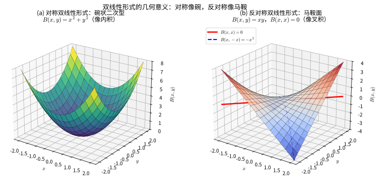
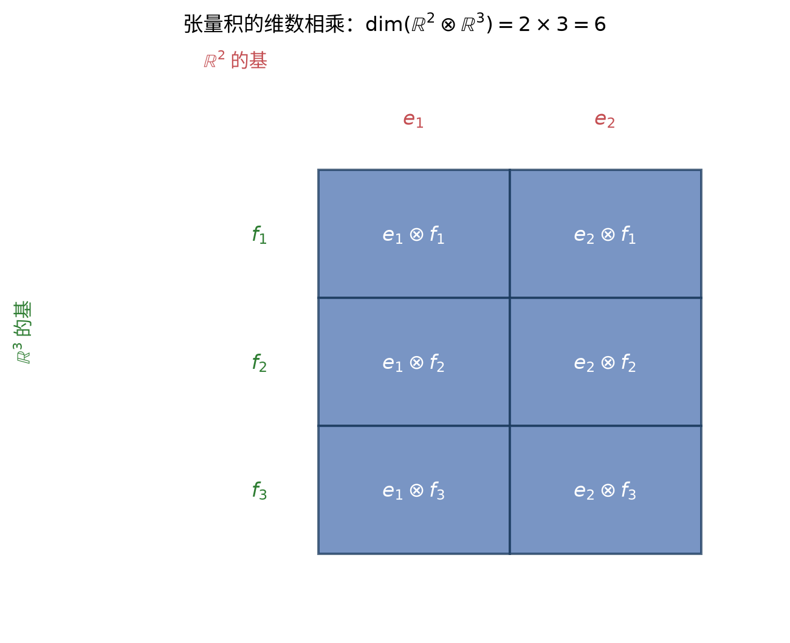
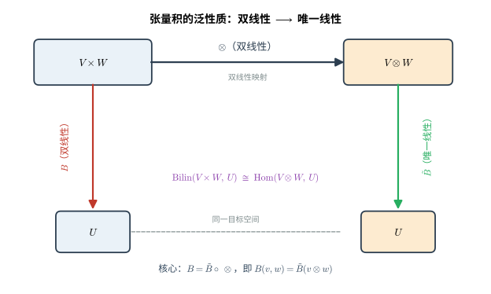
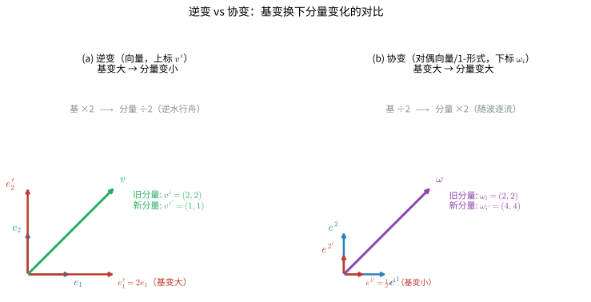
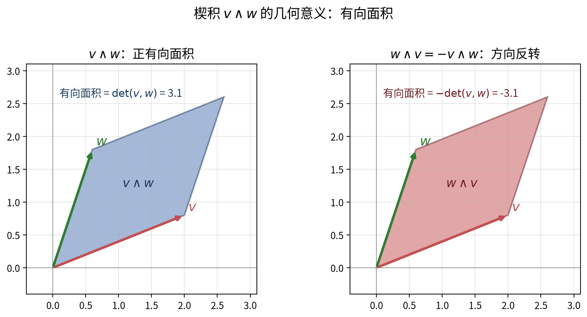
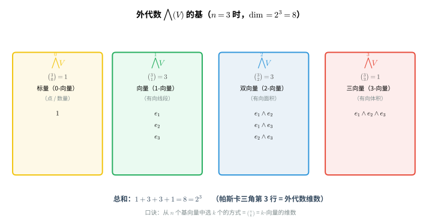
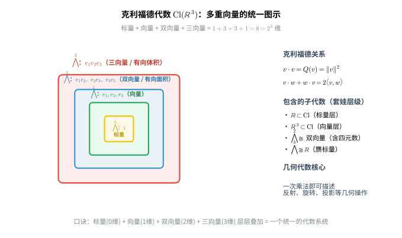

# 第 15 级：多重线性代数 (Multilinear Algebra)

## 〇、概念速览：用生活例子看穿多重线性代数

> 多重线性代数是第 14 级线性代数的"升级版"。线性代数研究"一个输入"的线性映射（$T(v) = Av$），而多重线性代数研究"多个输入"的线性映射（$B(u, v)$、$T(u, v, w)$）。它听起来吓人，但核心思想全是生活常识。

### 0.1 为什么需要多重线性代数？

**线性代数的局限**：线性代数只能处理"一个向量输入"的线性映射。但现实世界往往需要"多个输入"。

**生活例子**：
- 考试成绩怎么算？每科成绩 × 权重，再加起来——这是**线性**的（一个输入）
- 但"两个人的性格合不合"？这是**两个输入**（你 + 对方）的函数，且对每个输入都是线性的——这就是**双线性**
- "三个基因的相互作用能否合成某种蛋白质"？三个输入——**多重线性**

**一句话总结**：当你要处理"多个对象之间的成对/多元相互作用"时，就需要多重线性代数。

### 0.2 双线性形式：两个人共同决定的"分数"

**本质**：双线性形式就是一个"吃两个向量、吐一个数"的函数，而且固定其中一个输入后，对另一个输入是线性的。

**生活例子**：
- **匹配度评分**：$B(你, 对方)$——固定"你"时，换不同的"对方"，评分随"对方"线性变化；固定"对方"时同理
- **内积/点积**：$B(x, y) = x_1y_1 + x_2y_2$，就是两个向量"方向多一致"的分数
- **二次型**：$B(x, y) = x^T A y$，中间夹一个矩阵，是一种"加权匹配"

### 0.3 对称 & 交错双线性形式：对称的或反对称的"配对"

**本质**：
- **对称**：$B(u, v) = B(v, u)$——交换两个输入，结果不变（"你俩的匹配度" = "你俩的匹配度"）
- **交错/反对称**：$B(u, v) = -B(v, u)$——交换两个输入，结果变负号（"从A到B" = -"从B到A"）

**生活例子**：
- **对称**：内积、评分、相似度——谁在前都不影响结果
- **交错**：有向面积（"从东到西"是"从西到东"的反向）、辛结构（相空间的面积单元）、也正因如此 $B(v,v)=0$——"自己和自己"的配对为零

### 0.4 张量积：把"两个向量"拼成"一个新对象"

**本质**：$u \otimes v$ 是把 $u$ 和 $v$ 组合成一个"独立的新对象"（不再是两个单独的向量，而是一个整体的"配对"）。

**生活例子**：
- **纸牌**：给每个"花色"和"点数"各一组标签，$(\text{红桃}) \otimes (\text{A})$ 就是一张具体的牌——张量积把所有"花色 × 点数"的配对都装进一个空间
- **像素图**：一张图片 = "位置"向量 ⊗ "颜色"向量，每个位置上的每个颜色构成一个像素
- **多粒子系统**：两个粒子的状态 = 粒子1 ⊗ 粒子2——量子力学里纠缠的本质

**维数口诀**：张量积的维数 = 各因子维数的**乘积**（不是相加）。$\mathbb{R}^2 \otimes \mathbb{R}^3$ 是 6 维，就像 2 种花色 × 3 种点数 = 6 张牌。

### 0.5 张量：能装"任意多个上下指标"的容器

**本质**：张量就是"多重线性映射的坐标表示"，用上标（逆变）和下标（协变）记录"它吃几个向量、吐几个向量"。

**生活例子**：
- **数**（0,0 型）：一个数，没有指标
- **向量**（1,0 型）：一个上标，记录"这是某个方向"
- **线性泛函**（0,1 型）：一个下标，能够"吃掉一个向量吐一个数"
- **矩阵**（1,1 型）：一个上标一个下标，能够"吃一个向量、吐一个向量"
- **曲率张量**（1,3 型）：4 个指标，描述"空间的弯曲程度"

**上标 vs 下标（逆变 vs 协变）**：
- 上标（逆变）：坐标**跟着坐标系一起变**——像"同一个方向在不同标尺下的读数"
- 下标（协变）：坐标**跟坐标系相反着变**——像"尺子刻度变化后，读数要换算"

用一个比喻：**上标是"你要去哪"，下标是"你从哪来"**。张量把"进"和"出"的通道都标清楚了。

### 0.6 Einstein 求和约定：省略求和号，让公式不啰嗦

**本质**：只要上下指标成对出现，就默认要"求和"，不用写 $\sum$。

**生活例子**：就像账单里"每项单价 × 数量"自动求和，不用每次都写"把这些加起来"。

$$a^i b_i = a^1b_1 + a^2b_2 + \cdots + a^nb_n$$

### 0.7 对称 & 反对称张量：交换顺序，结果变不变？

**本质**：
- **对称张量**：交换任意两个指标，分量不变（$T^{ij} = T^{ji}$）
- **反对称张量**：交换两个指标，分量变负号（$T^{ij} = -T^{ji}$）

**生活例子**：
- **对称**：朋友关系的"亲密度矩阵"——我和你的亲密度 = 你和我的亲密度
- **反对称**：比赛的"胜负关系"——A 赢 B，则 B 输 A（反过来带负号）；而"自己对自己"必为 0（A 不能赢自己）

### 0.8 张量代数：把"各种阶数的张量"堆进一个仓库

**本质**：$T(V) = \mathbb{F} \oplus V \oplus (V \otimes V) \oplus \cdots$ 就是把所有阶数的张量都放进一个"大仓库"，并允许它们互相"拼接"（张量积）。

**生活例子**：像把所有"长度不同的字符串"放进同一个集合，还能随意拼接——"abc" ⊗ "de" = "abcde"，张量代数就是所有"任意长度的组合"。

### 0.9 外代数 & 楔积：张量积的"反对称版"

**本质**：楔积 $\wedge$ 是"反对称的张量积"——它满足 $v \wedge w = -w \wedge v$，尤其是 $v \wedge v = 0$。

**生活例子**：
- **有向面积**：$u \wedge v$ 表示"由 $u$ 和 $v$ 围成的有向面积"。交换 $u$、$v$ 方向就反了，所以带负号
- **行列式**：$\det$ 本质就是最高阶的楔积——$v_1 \wedge v_2 \wedge \cdots \wedge v_n$ 就是它们张成的"有向体积"
- **"都不相同的列表"**：因为 $v \wedge v = 0$，楔积只保留"各不相同的项"，像禁止重复选择的组合数 $\binom{n}{k}$

**为什么外代数的维数是 $\binom{n}{k}$**：因为楔积只允许"严格递增的下标"，等于从 $n$ 个里选 $k$ 个不重复的组合数。

### 0.10 外代数与行列式：体积的"缩放倍数"

**本质**：线性变换 $T$ 对最高阶楔积的作用，正好是乘上 $\det(T)$——这就是行列式"几何意义"的现代证明。

**生活例子**：把一个立方体经过 $T$（拉伸/旋转/压缩）后，体积变成原来的 $\det(T)$ 倍。楔积的语言把"面积/体积"这个几何直觉和行列式这个代数计算完美统一。

### 0.11 内乘：把"切线"塞进"微分形式"

**本质**：$\iota_X$ 用向量 $X$ 去"扣掉" $k$-形式的一个输入，把它降为 $(k-1)$-形式。

**生活例子**：像"用某个人去对答案"——把多人的问卷（$k$-形式）和某个人的作答（$X$）结合，得到"剩下那些人的结果"。

### 0.12 克利福德代数 & 几何代数：把几何"方向"做成代数运算

**本质**：克利福德代数在张量积之外，额外规定 $v^2 = Q(v)$（每个向量的平方等于它的"长度平方"），从而把"反射、旋转"这种几何操作变成普通的代数乘法。

**生活例子**：
- **复数**：$\operatorname{Cl}(\mathbb{R}^2)$ 里 $e_1e_2$ 的平方 = $-1$，正好就是虚数"$i$"——所以复数本质上就是二维的克利福德代数
- **四元数**：$\operatorname{Cl}(\mathbb{R}^3)$ 里的 $e_1e_2e_3$ 类似单位的"转动单元"，用来描述三维旋转（游戏引擎、无人机姿态都用它）
- **几何代数的多重向量**：标量（0阶）、向量（1阶，有向线段）、双向量（2阶，有向面积）、三向量（3阶，有向体积）——把"点线面体"高度统一，一次乘法就能描述反射+旋转

### 0.13 多重线性代数到底用来干什么？

**物理**：
- **广义相对论**：时空的弯曲 = 度规张量 $g_{\mu\nu}$ + 曲率张量 $R^\rho_{\sigma\mu\nu}$
- **电磁学**：电磁场 $F_{\mu\nu}$ 是一个反对称 2-形式
- **量子力学**：多粒子 = 单粒子态的张量积；玻色子对称、费米子反对称

**数学**：
- **微分几何**：流形上的微分形式、外微分 $d$、de Rham 上同调
- **微分形式**：把"积分、长度、面积、体积"统一成"在流形上的楔积"

**工程**：
- **计算机图形学**：几何代数统一处理旋转、反射
- **机器人**：四元数/克利福德代数做姿态控制

---

## 〇、概念速览：一张思维导图

```
多重线性代数 = 处理"多个输入的线性映射"的数学
│
├─ 双线性形式（两人共同打分）→ 对称（谁先谁后一样）/ 交错（交换变负号）
│
├─ 张量积 ⊗（把两个向量拼成新对象，维数相乘）
│     │
│     └─ 张量 = 带上下指标的多重线性映射（上标=逆变"去哪"，下标=协变"从哪来"）
│           │
│           ├─ 对称张量（交换指标不变）→ 玻色子
│           ├─ 反对称张量（交换指标变号）→ 费米子
│           └─ Einstein 求和约定（上下配对自动求和）
│
├─ 张量代数 T(V)（所有阶数张量的"大仓库"，可拼接）
│
├─ 外代数（反对称的张量代数）→ 楔积 ∧（有向面积/体积）
│     │                             → 行列式 = 最高阶楔积（体积缩放倍数）
│     └─ 内乘 ι_X（用向量扣掉一个输入）
│
└─ 克利福德代数（额外规定 v² = Q(v)）
      └─ 几何代数（多重向量：标量/向量/双向量/三向量）
```

---

## 一、学习目标

完成本教程后，你应该能够：

1. 理解双线性形式的定义、对称形式和交错形式的概念
2. 掌握张量积的构造、泛性质及张量积的基
3. 理解张量的定义、逆变与协变张量、张量的分量表示及 Einstein 求和约定
4. 掌握对称张量与反对称张量的概念，以及对称化与反对称化运算
5. 理解外代数的构造、楔积的定义及性质、Grassmann 代数
6. 了解克利福德代数的基本概念及其与几何代数的关系
7. 认识多重线性代数在微分几何和物理学中的重要应用
8. 能够独立完成典型例题并解决相关习题

---

## 二、双线性形式

### 2.1 双线性映射

**定义**：设 $U, V, W$ 是域 $\mathbb{F}$ 上的向量空间。一个映射 $B: U \times V \to W$ 称为**双线性映射**，如果它满足：

1. 对每个固定的 $u \in U$，映射 $v \mapsto B(u, v)$ 是线性的；
2. 对每个固定的 $v \in V$，映射 $u \mapsto B(u, v)$ 是线性的。

即对任意 $u, u_1, u_2 \in U$，$v, v_1, v_2 \in V$，$\alpha, \beta \in \mathbb{F}$，有：

$$
\begin{aligned}
B(\alpha u_1 + \beta u_2, v) &= \alpha B(u_1, v) + \beta B(u_2, v) \\
B(u, \alpha v_1 + \beta v_2) &= \alpha B(u, v_1) + \beta B(u, v_2)
\end{aligned}
$$

### 2.2 双线性形式

**定义**：当 $W = \mathbb{F}$ 时，双线性映射 $B: V \times V \to \mathbb{F}$ 称为 $V$ 上的**双线性形式**。

**例**：
1. 标准内积：$B(x, y) = x_1 y_1 + x_2 y_2 + \cdots + x_n y_n$ 是 $\mathbb{R}^n$ 上的双线性形式。
2. 行列式：$B(x, y) = \det\begin{pmatrix} x_1 & y_1 \\ x_2 & y_2 \end{pmatrix}$ 是 $\mathbb{R}^2$ 上的双线性形式。
3. 矩阵表示的二次型：给定 $A \in M_n(\mathbb{F})$，$B(x, y) = x^{\mathsf{T}} A y$ 是 $\mathbb{F}^n$ 上的双线性形式。

### 2.3 对称双线性形式与交错双线性形式

**定义**：设 $B: V \times V \to \mathbb{F}$ 是双线性形式。

- 若对任意 $v, w \in V$ 有 $B(v, w) = B(w, v)$，则称 $B$ 为**对称的**。
- 若对任意 $v, w \in V$ 有 $B(v, w) = -B(w, v)$，则称 $B$ 为**反对称的**。
- 若对任意 $v \in V$ 有 $B(v, v) = 0$，则称 $B$ 为**交错的**。

**注意**：在特征不为 2 的域上，交错双线性形式等价于反对称双线性形式。因为若 $B$ 是交错的，则 $B(v+w, v+w) = 0$ 展开可得 $B(v, w) + B(w, v) = 0$，故 $B(v, w) = -B(w, v)$。

**例**：
- 欧几里得内积是 $\mathbb{R}^n$ 上的对称双线性形式。
- 辛形式：$\omega(x, y) = x_1 y_2 - x_2 y_1$ 是 $\mathbb{R}^2$ 上的交错双线性形式（辛形式）。



> **直观理解（现实类比）**：双线性形式像"**两个向量的乘积的函数**"——把两个向量送进去，吐出一个数。
> - **对称的**像内积：$B(x,y)=x^2+y^2$ 画出一只"碗"，谁先谁后都一样，$B(x,x)$ 是该点到原点距离的平方，永远是正的（"自己和自己"的亲密度最强）。
> - **反对称的**像叉积：$B(x,y)=xy$ 画出一张"马鞍面"，沿对角线 $y=x$ 一刀切下去全是 $0$（"自己和自己"配对必为零），交换 $x,y$ 就翻一次面——这正是有向面积、辛结构的几何直觉。
> - 一句话：**对称看"相同方向有多重合"，反对称看"不同方向围出的有向面积"**。

### 2.4 双线性形式的矩阵表示

设 $V$ 是 $n$ 维向量空间，$\{e_1, \dots, e_n\}$ 是一组基。对双线性形式 $B: V \times V \to \mathbb{F}$，定义矩阵 $M = (m_{ij})$，其中 $m_{ij} = B(e_i, e_j)$。则对任意 $v = \sum_i v_i e_i$，$w = \sum_j w_j e_j$，有：

$$
B(v, w) = \sum_{i=1}^n \sum_{j=1}^n v_i B(e_i, e_j) w_j = v^{\mathsf{T}} M w
$$

- $B$ 是对称的 $\iff$ $M$ 是对称矩阵（$M^{\mathsf{T}} = M$）
- $B$ 是交错的 $\iff$ $M$ 是反对称矩阵（$M^{\mathsf{T}} = -M$）

---

## 三、张量积

### 3.1 张量积的构造

**定义**：设 $V$ 和 $W$ 是域 $\mathbb{F}$ 上的向量空间。$V$ 与 $W$ 的**张量积**是一个向量空间 $V \otimes W$，配备一个双线性映射 $\otimes: V \times W \to V \otimes W$，满足以下**泛性质**：

> 对任意双线性映射 $B: V \times W \to U$（$U$ 是任一向量空间），存在唯一的线性映射 $\tilde{B}: V \otimes W \to U$，使得下图交换：
> $$
> \begin{CD}
> V \times W @>{\otimes}>> V \otimes W \\
> @V{B}VV @VV{\tilde{B}}V \\
> U @= U
> \end{CD}
> $$
> 即 $B = \tilde{B} \circ \otimes$，或等价地 $B(v, w) = \tilde{B}(v \otimes w)$。

**构造**：张量积可以通过自由向量空间模去关系来构造。具体地，令 $F(V \times W)$ 是以 $V \times W$ 中元素为基的自由向量空间，取子空间 $R$ 由以下元素张成：

$$
\begin{aligned}
&(v_1 + v_2, w) - (v_1, w) - (v_2, w) \\
&(v, w_1 + w_2) - (v, w_1) - (v, w_2) \\
&(\alpha v, w) - \alpha(v, w) \\
&(v, \alpha w) - \alpha(v, w)
\end{aligned}
$$

则 $V \otimes W = F(V \times W) / R$，且 $v \otimes w$ 表示 $(v, w)$ 在商空间中的像。

### 3.2 张量积的基

**定理**：设 $\{e_i\}_{i=1}^m$ 是 $V$ 的一组基，$\{f_j\}_{j=1}^n$ 是 $W$ 的一组基，则 $\{e_i \otimes f_j\}_{i=1,\dots,m;\,j=1,\dots,n}$ 是 $V \otimes W$ 的一组基。因此：

$$
\dim(V \otimes W) = \dim V \cdot \dim W
$$



> **直观理解（现实类比）**：张量积的维数是**相乘**而非相加，就像"**花色 × 点数**"：$2$ 种花色、$3$ 种点数，就能拼出 $2\times3=6$ 张不同的牌。每个基向量 $e_i\otimes f_j$ 对应一张"牌"，它们两两组合、互不重复，填满一个 $m\times n$ 的"配对网格"。（对比第14级：向量空间的**直和**维数是相加，而**张量积**维数是相乘——这是两者最本质的区别。）

**例**：设 $V = \mathbb{R}^2$ 有基 $\{e_1, e_2\}$，$W = \mathbb{R}^3$ 有基 $\{f_1, f_2, f_3\}$，则 $V \otimes W$ 是 6 维向量空间，基为：

$$
\{e_1 \otimes f_1, e_1 \otimes f_2, e_1 \otimes f_3, e_2 \otimes f_1, e_2 \otimes f_2, e_2 \otimes f_3\}
$$

### 3.3 张量积的泛性质

张量积的泛性质是它最核心的性质。它表明双线性映射与张量积上的线性映射之间存在一一对应：

$$
\operatorname{Bilin}(V \times W, U) \cong \operatorname{Hom}(V \otimes W, U)
$$

这称为**张量积的泛性质**，也是张量积在范畴论中的本质特征——张量积是双线性函子的左伴随。



> **直观理解（现实类比）**：张量积的泛性质像一个"**通用翻译器**"——
> - 世界上有无数种"双线性运算"（吃两个向量吐东西），但每一种都能被拆成两步：先用 $\otimes$ 把两个向量"打包"成一个张量 $v\otimes w$，再用一个**线性映射** $\tilde{B}$ 去处理这个张量。
> - 张量积 $V\otimes W$ 因此是所有双线性映射的"**母体**"：只要你研究双线性，就必须经过它。这就是为什么 $\operatorname{Bilin}(V\times W, U) \cong \operatorname{Hom}(V\otimes W, U)$——双线性映射与张量积上的线性映射一一对应。
> - 类比：把"两个整数相乘"统一翻译成"先把它们写成位值乘积的列表，再线性求和"——$\otimes$ 就是那个"列出所有配对"的步骤。

### 3.4 多重张量积

对 $k$ 个向量空间 $V_1, \dots, V_k$，可以递归地定义多重张量积：

$$
V_1 \otimes V_2 \otimes \cdots \otimes V_k = (V_1 \otimes \cdots \otimes V_{k-1}) \otimes V_k
$$

特别地，$V$ 的 $k$ 次张量幂记为：

$$
V^{\otimes k} = \underbrace{V \otimes V \otimes \cdots \otimes V}_{k \text{ 次}}
$$

---

## 四、张量

### 4.1 张量的定义

设 $V$ 是域 $\mathbb{F}$ 上的有限维向量空间，$V^*$ 是它的对偶空间（即所有线性泛函 $f: V \to \mathbb{F}$ 的集合）。

**定义**：一个 $(r, s)$ 型**张量**（$r$ 次逆变、$s$ 次协变）是一个多重线性映射：

$$
T: \underbrace{V^* \times \cdots \times V^*}_{r \text{ 个}} \times \underbrace{V \times \cdots \times V}_{s \text{ 个}} \to \mathbb{F}
$$

所有 $(r, s)$ 型张量的集合构成一个向量空间，记为 $T^r_s(V)$，其维数为 $(\dim V)^{r+s}$。

等价地，$(r, s)$ 型张量是张量积空间中的元素：

$$
T^r_s(V) = V^{\otimes r} \otimes (V^*)^{\otimes s}
$$

其中：
- **逆变张量**（$(r, 0)$ 型）：$T \in V^{\otimes r}$，即 $r$ 个 $V$ 的张量积
- **协变张量**（$(0, s)$ 型）：$T \in (V^*)^{\otimes s}$，即 $s$ 个 $V^*$ 的张量积
- **混合张量**（$(r, s)$ 型）：$T \in V^{\otimes r} \otimes (V^*)^{\otimes s}$

### 4.2 张量的分量表示

设 $\{e_1, \dots, e_n\}$ 是 $V$ 的一组基，$\{e^1, \dots, e^n\}$ 是 $V^*$ 的**对偶基**，满足 $e^i(e_j) = \delta^i_j$（Kronecker delta）。

则 $(r, s)$ 型张量 $T$ 可以表示为分量形式：

$$
T = T^{i_1 \dots i_r}_{j_1 \dots j_s} \; e_{i_1} \otimes \cdots \otimes e_{i_r} \otimes e^{j_1} \otimes \cdots \otimes e^{j_s}
$$

其中 $T^{i_1 \dots i_r}_{j_1 \dots j_s} \in \mathbb{F}$ 是张量 $T$ 在给定基下的**分量**，使用 Einstein 求和约定（见下文）。

### 4.3 Einstein 求和约定

**Einstein 求和约定**：在表达式中，如果一个指标在上标和下标中各出现一次，则自动对该指标求和（隐含求和符号 $\sum$）。

**例**：
- $T^{i}_{j} e_i \otimes e^j$ 表示 $\sum_{i=1}^n \sum_{j=1}^n T^{i}_{j} e_i \otimes e^j$
- $a^i b_i$ 表示 $\sum_{i=1}^n a^i b_i$
- $T^{ijk}_{lm} S^{l}_{k}$ 表示 $\sum_{k=1}^n \sum_{l=1}^n T^{ijk}_{lm} S^{l}_{k}$



> **直观理解（现实类比）**：逆变像"**逆水行舟**"，协变像"**随波逐流**"——
> - 把基向量想成"尺子的刻度"。当你把刻度变长一倍（$e_i \to 2 e_i$，相当于改用更粗的尺子）时，同一段长度读出来的**数字变小一半**：这就是**逆变**（上标 $v^i$），向量分量与基反向变化。
> - 反过来，对偶空间（"测量向量的尺子"本身）的分量会**跟着基同向放大**：原空间尺子变粗，对偶"刻度数"就要加倍才能保持 $e^i(e_j)=\delta^i_j$ 不变——这就是**协变**（下标 $\omega_i$）。
> - 口诀：**上标"逆"水行舟（基大我小），下标"随"波逐流（基大我也大）**。这也解释了为什么上下指标配对求和（$a^i b_i$）能给出一个与坐标无关的标量——一逆一协正好抵消了基变换的影响。

### 4.4 张量代数

**定义**：向量空间 $V$ 上的**张量代数**（亦称自由代数）是直和空间：

$$
T(V) = \bigoplus_{k=0}^{\infty} V^{\otimes k} = \mathbb{F} \oplus V \oplus (V \otimes V) \oplus (V \otimes V \otimes V) \oplus \cdots
$$

其中乘法定义为张量积 $\otimes$：对 $v = v_1 \otimes \cdots \otimes v_k$ 和 $w = w_1 \otimes \cdots \otimes w_l$，

$$
v \otimes w = v_1 \otimes \cdots \otimes v_k \otimes w_1 \otimes \cdots \otimes w_l \in V^{\otimes (k+l)}
$$

张量代数满足泛性质：对任意线性映射 $f: V \to A$（$A$ 是 $\mathbb{F}$ 上的结合代数），存在唯一的代数同态 $\tilde{f}: T(V) \to A$ 延拓 $f$。

---

## 五、对称张量与反对称张量

### 5.1 对称群的作用

设 $S_k$ 是 $k$ 个元素的对称群（置换群）。对 $\sigma \in S_k$，定义线性映射 $\sigma: V^{\otimes k} \to V^{\otimes k}$ 为：

$$
\sigma(v_1 \otimes v_2 \otimes \cdots \otimes v_k) = v_{\sigma^{-1}(1)} \otimes v_{\sigma^{-1}(2)} \otimes \cdots \otimes v_{\sigma^{-1}(k)}
$$

### 5.2 对称张量

**定义**：张量 $T \in V^{\otimes k}$ 称为**对称张量**，如果对任意 $\sigma \in S_k$，有 $\sigma(T) = T$。

**对称化算子**：定义映射 $\operatorname{Sym}: V^{\otimes k} \to V^{\otimes k}$：

$$
\operatorname{Sym}(T) = \frac{1}{k!} \sum_{\sigma \in S_k} \sigma(T)
$$

$\operatorname{Sym}$ 是到对称张量子空间 $S^k(V)$ 上的投影。

**对称张量的分量特征**：在基下，$T$ 为对称张量 $\iff$ 其分量 $T^{i_1 \dots i_k}$ 在指标置换下保持不变：

$$
T^{i_{\sigma(1)} \dots i_{\sigma(k)}} = T^{i_1 \dots i_k}, \quad \forall \sigma \in S_k
$$

### 5.3 反对称张量

**定义**：张量 $T \in V^{\otimes k}$ 称为**反对称张量**（或称交错张量），如果对任意 $\sigma \in S_k$，有 $\sigma(T) = \operatorname{sgn}(\sigma) \, T$，其中 $\operatorname{sgn}(\sigma)$ 是置换的符号。

**反对称化算子**：定义映射 $\operatorname{Alt}: V^{\otimes k} \to V^{\otimes k}$：

$$
\operatorname{Alt}(T) = \frac{1}{k!} \sum_{\sigma \in S_k} \operatorname{sgn}(\sigma) \, \sigma(T)
$$

$\operatorname{Alt}$ 是到反对称张量子空间 $\bigwedge^k(V)$ 上的投影。

**反对称张量的分量特征**：$T$ 为反对称张量 $\iff$ 其分量满足：

$$
T^{i_{\sigma(1)} \dots i_{\sigma(k)}} = \operatorname{sgn}(\sigma) \, T^{i_1 \dots i_k}, \quad \forall \sigma \in S_k
$$

特别地，若两个指标相等，则反对称张量的分量为零。

### 5.4 对称积与反对称积

对 $v, w \in V$，定义：

- **对称积**：$v \odot w = \frac{1}{2}(v \otimes w + w \otimes v)$
- **反对称积**（或称外积）：$v \wedge w = \frac{1}{2}(v \otimes w - w \otimes v)$

---

## 六、外代数

### 6.1 外代数的定义

**定义**：向量空间 $V$ 上的**外代数**（亦称 Grassmann 代数）是商代数：

$$
\bigwedge(V) = T(V) / I
$$

其中 $I$ 是由所有形如 $v \otimes v$（$v \in V$）的元素生成的 $T(V)$ 的双边理想。

外代数是分次代数：

$$
\bigwedge(V) = \bigoplus_{k=0}^{\infty} \bigwedge^k(V)
$$

其中 $\bigwedge^0(V) = \mathbb{F}$，$\bigwedge^1(V) = V$，$\bigwedge^k(V)$ 是 $k$ 次外幂。

### 6.2 楔积

**定义**：$\bigwedge(V)$ 中的乘法称为**楔积**（外积），记为 $\wedge$。对 $v \in V$，$\bigwedge(V)$ 中 $v$ 的像仍记为 $v$，且满足：

$$
v \wedge v = 0, \quad \forall v \in V
$$

由此可得**反交换性**：对任意 $v, w \in V$，

$$
v \wedge w = -w \wedge v
$$



> **直观理解（现实类比）**：楔积 $v\wedge w$ 就是"**由 $v$ 和 $w$ 围成的那片平行四边形有向面积**"。它像一枚有方向的硬币：正面 $v\wedge w$ 是 +面积，翻过来 $w\wedge v$ 就是 −面积。也正因如此，把 $w$ 换成和 $v$ 同一个方向时，面积压成一条线、为零——这就是 $v\wedge v=0$ 的几何直觉。（联系第14级：行列式正是把这"有向面积/体积"推广到 $n$ 维。）

一般地，对 $\alpha \in \bigwedge^k(V)$ 和 $\beta \in \bigwedge^l(V)$，有：

$$
\alpha \wedge \beta = (-1)^{kl} \beta \wedge \alpha
$$

### 6.3 外幂的基

**定理**：设 $\{e_1, \dots, e_n\}$ 是 $V$ 的一组基，则 $\bigwedge^k(V)$ 的一组基由以下元素构成：

$$
\{e_{i_1} \wedge e_{i_2} \wedge \cdots \wedge e_{i_k} \mid 1 \leq i_1 < i_2 < \cdots < i_k \leq n\}
$$

因此：

$$
\dim \bigwedge^k(V) = \binom{n}{k}, \quad \dim \bigwedge(V) = \sum_{k=0}^n \binom{n}{k} = 2^n
$$



> **直观理解（现实类比）**：外代数的基像一道"**组合数学题**"——
> - 从 $n$ 个基向量中**选 $k$ 个互不相同**的来楔乘，选法恰好是 $\binom{n}{k}$ 种（因为 $v\wedge v=0$ 禁止重复，且 $v\wedge w=-w\wedge v$ 固定了顺序，只看"选了哪几个"）。
> - 以 $n=3$ 为例：选 $0$ 个 $\to$ 标量 $1$（$1$ 种）；选 $1$ 个 $\to$ $e_1,e_2,e_3$（$3$ 种）；选 $2$ 个 $\to$ $e_1\wedge e_2, e_1\wedge e_3, e_2\wedge e_3$（$3$ 种有向面积）；选 $3$ 个 $\to$ $e_1\wedge e_2\wedge e_3$（$1$ 种有向体积）。总和 $1+3+3+1=8=2^3$，正是帕斯卡三角的第 $3$ 行。
> - 几何上：$k$-向量代表"**有向 $k$ 维体积元**"——0向量是点/数，1向量是线段，2向量是面积片，3向量是体积块，层层递进。

### 6.4 楔积的性质

楔积具有以下基本性质：

1. **结合律**：$(\alpha \wedge \beta) \wedge \gamma = \alpha \wedge (\beta \wedge \gamma)$
2. **分配律**：$\alpha \wedge (\beta + \gamma) = \alpha \wedge \beta + \alpha \wedge \gamma$
3. **反交换律**：$\alpha \wedge \beta = (-1)^{kl} \beta \wedge \alpha$，其中 $\alpha \in \bigwedge^k(V)$，$\beta \in \bigwedge^l(V)$
4. **线性性**：$\alpha \wedge (\beta_1 + \beta_2) = \alpha \wedge \beta_1 + \alpha \wedge \beta_2$
5. 若 $v_1, \dots, v_k$ 线性相关，则 $v_1 \wedge \cdots \wedge v_k = 0$

### 6.5 外代数与行列式

外代数与行列式有密切联系。设 $T: V \to V$ 是线性变换，诱导出 $\bigwedge^k(V)$ 上的线性变换 $\bigwedge^k(T)$，满足：

$$
\bigwedge^k(T)(v_1 \wedge \cdots \wedge v_k) = T(v_1) \wedge \cdots \wedge T(v_k)
$$

特别地，当 $k = \dim V = n$ 时，$\bigwedge^n(V)$ 是一维空间，$\bigwedge^n(T)$ 是标量乘法，这个标量正是 $\det(T)$：

$$
\bigwedge^n(T)(v_1 \wedge \cdots \wedge v_n) = \det(T) \cdot (v_1 \wedge \cdots \wedge v_n)
$$

这是行列式的几何意义——它描述了线性变换对 $n$ 维体积的缩放因子。

### 6.6 内乘

对 $X \in V$，定义**内乘**算子 $\iota_X: \bigwedge^k(V) \to \bigwedge^{k-1}(V)$：

$$
(\iota_X \omega)(Y_1, \dots, Y_{k-1}) = \omega(X, Y_1, \dots, Y_{k-1})
$$

内乘是反导子：$\iota_X(\alpha \wedge \beta) = (\iota_X \alpha) \wedge \beta + (-1)^k \alpha \wedge (\iota_X \beta)$，其中 $\alpha \in \bigwedge^k(V)$。

---

## 七、克利福德代数

### 7.1 克利福德代数的定义

**定义**：设 $V$ 是域 $\mathbb{F}$ 上的向量空间，$Q: V \to \mathbb{F}$ 是 $V$ 上的二次型。$V$ 关于 $Q$ 的**克利福德代数** $\operatorname{Cl}(V, Q)$ 是商代数：

$$
\operatorname{Cl}(V, Q) = T(V) / I_Q
$$

其中 $I_Q$ 是由所有形如 $v \otimes v - Q(v) \cdot 1$（$v \in V$）的元素生成的 $T(V)$ 的双边理想。

在 $\operatorname{Cl}(V, Q)$ 中，乘法 $\cdot$ 满足**克利福德关系**：

$$
v \cdot v = Q(v) \cdot 1, \quad \forall v \in V
$$

由此可得：

$$
v \cdot w + w \cdot v = 2Q(v, w) \cdot 1
$$

其中 $Q(v, w) = \frac{1}{2}(Q(v+w) - Q(v) - Q(w))$ 是与 $Q$ 配对的对称双线性形式。

### 7.2 基本性质

1. **维度**：$\dim \operatorname{Cl}(V, Q) = 2^{\dim V}$
2. **分次结构**：克利福德代数有一个 $\mathbb{Z}_2$ 分次（偶部和奇部）：
   $$
   \operatorname{Cl}(V, Q) = \operatorname{Cl}^0(V, Q) \oplus \operatorname{Cl}^1(V, Q)
   $$
3. **与张量代数的关系**：当 $Q = 0$ 时，$\operatorname{Cl}(V, 0) = \bigwedge(V)$（外代数）
4. **与正交群的关系**：克利福德代数的可逆元构成**克利福德群**，其伴随作用给出正交群 $O(V, Q)$ 的双重覆盖

### 7.3 几何代数简介

**几何代数**（Geometric Algebra）是克利福德代数在几何和物理中的应用框架，由 David Hestenes 等人推广。它将 $\operatorname{Cl}(V, Q)$ 中的元素称为**多重向量**（multivector），并赋予几何解释：

- **标量**（0 阶）：表示数量
- **向量**（1 阶）：表示有向线段
- **双向量**（2 阶）：表示有向面积
- **三向量**（3 阶）：表示有向体积
- 以此类推

几何代数提供了一种统一的语言，将向量代数、复数、四元数、外代数等纳入同一框架。

**例**：
- $\operatorname{Cl}(\mathbb{R}^2)$ 的基本元素：$1, e_1, e_2, e_1 e_2$，其中 $(e_1)^2 = (e_2)^2 = 1$，$(e_1 e_2)^2 = -1$。因此 $\operatorname{Cl}(\mathbb{R}^2)$ 包含复数作为子代数。
- $\operatorname{Cl}(\mathbb{R}^3)$ 的基本元素：$1, e_1, e_2, e_3, e_1 e_2, e_2 e_3, e_3 e_1, e_1 e_2 e_3$，其中 $e_1 e_2 e_3$ 的行为类似于三维空间中的单位拟四元数。



> **直观理解（现实类比）**：克利福德代数像一副"**俄罗斯套娃**"——
> - 最内层是**标量**（0维，一个数）；套一层是**向量**（1维，有向线段）；再套一层是**双向量**（2维，有向面积片）；最外层是**三向量**（3维，有向体积块）。每一层都是上一层的"升级版"，共同塞进同一个代数系统里。
> - 关键魔法是规定 $v\cdot v = \|v\|^2$：这让"几何操作变成代数乘法"——两个向量相乘 $vw$ 自动分解为"内积（标量）+ 外积（双向量）"，即 $vw = v\cdot w + v\wedge w$。一次乘法同时给出"长度投影"和"有向面积"。
> - 这套语言把**复数**（$\mathrm{Cl}(\mathbb{R}^2)$ 里的 $e_1 e_2$，平方为 $-1$）和**四元数**（$\mathrm{Cl}(\mathbb{R}^3)$ 的双向量部分）都装进同一个框架，所以游戏引擎、无人机姿态控制都爱用它来统一处理旋转和反射。

---

## 八、应用

### 8.1 在微分几何中的应用

**1. 微分形式**：流形上的微分 $k$-形式正是外代数 $\bigwedge^k(T^*_p M)$ 在每点的光滑截面。外微分 $d$ 将 $k$-形式映射为 $(k+1)$-形式，且满足 $d^2 = 0$，这是 de Rham 上同调理论的基础。

**2. Riemann 度量**：Riemann 流形 $(M, g)$ 上的度量 $g$ 是切空间上的对称双线性形式（即 $(0,2)$ 型对称张量）。

**3. 曲率张量**：Riemann 曲率张量 $R$ 是一个 $(1,3)$ 型张量，反映了流形的弯曲程度。其对称性可以自然地用外代数语言描述。

**4. 张量场**：物理场通常描述为流形上的张量场。例如，应力-能量张量是 $(0,2)$ 型对称张量场。

### 8.2 在物理学中的应用

**1. 广义相对论**：
- 度规张量 $g_{\mu\nu}$ 描述时空几何
- Einstein 场方程 $G_{\mu\nu} + \Lambda g_{\mu\nu} = \frac{8\pi G}{c^4} T_{\mu\nu}$ 涉及 $(0,2)$ 型张量
- Riemann 曲率张量 $R^\rho_{\sigma\mu\nu}$ 是 $(1,3)$ 型张量

**2. 电磁学**：
- 电磁场张量 $F_{\mu\nu}$ 是一个 $(0,2)$ 型反对称张量（即 2-形式）
- Maxwell 方程的协变形式：$\partial_\mu F^{\mu\nu} = \mu_0 J^\nu$，$\partial_{[\mu} F_{\nu\rho]} = 0$
- 电磁场的对偶性可以用 Hodge 星算子 $\star$ 描述

**3. 量子力学与量子场论**：
- 多粒子系统的态空间是单粒子态空间的张量积
- 玻色子的波函数是对称张量，费米子的波函数是反对称张量
- Pauli 矩阵 $\sigma_i$ 与 Clifford 代数 $\operatorname{Cl}(\mathbb{R}^3)$ 密切相关
- Dirac 矩阵 $\gamma^\mu$ 生成 Clifford 代数 $\operatorname{Cl}(1,3)$（闵可夫斯基时空）

**4. 规范场论**：
- Yang-Mills 理论中，规范场强 $F = dA + A \wedge A$ 是用外代数语言表述的
- Chern-Simons 形式在拓扑量子场论中扮演重要角色

---

## 九、解题技巧

本节针对多重线性代数的核心考点，总结可直接套用的方法与常见易错点。每条技巧均含**适用场景**、**关键步骤**、**常见误区**三个要素，并配一个精讲示例。

### 9.1 双线性形式："用矩阵一眼看出对称/交错"

**适用场景**：判断某个双线性形式是否对称/交错，写出或利用其矩阵表示。

**关键步骤**：
1. 固定基 $\{e_1,\dots,e_n\}$，令 $m_{ij}=B(e_i,e_j)$，写出矩阵 $M=(m_{ij})$；
2. 利用 $B(v,w)=v^{\mathsf{T}}Mw$ 计算任意 $B(v,w)$；
3. 判定：$B$ 对称 $\iff M$ 对称（$M^{\mathsf T}=M$）；在特征 $\neq 2$ 的域上，$B$ 交错 $\iff M$ 反对称（$M^{\mathsf T}=-M$，从而对角元为 $0$）。

**常见误区**：
- 只验证"某一固定变量"线性，忘了双线性要求两个变量都线性；
- 把对称与交错混淆（对称是对角对称，交错是反对角对称且对角为 0）；
- 在特征 2 的域上仍把"交错"直接等同于"反对称"。

**精讲示例**：设 $B(x,y)=2x_1y_1 - x_1y_2 + x_2y_1 + 3x_2y_2$。求矩阵并判定类型。

解：$m_{11}=2,\,m_{12}=-1,\,m_{21}=1,\,m_{22}=3$，故 $M=\begin{pmatrix}2&-1\\1&3\end{pmatrix}$。此时 $M^{\mathsf T}=\begin{pmatrix}2&1\\-1&3\end{pmatrix}\ne M$，故 $B$ 不是对称的；又 $ -M^{\mathsf T}=\begin{pmatrix}-2&-1\\1&-3\end{pmatrix}\ne M$（且 $m_{11}=2\ne0$），故 $B$ 也不是交错的。因此 $B$ 既非对称也非交错。

### 9.2 张量积："维数相乘，基用配对"

**适用场景**：求 $V\otimes W$ 的维数、写出一组基、判断某个元素是否在其中。

**关键步骤**：
1. 取 $V$ 的基 $\{e_i\}$、$W$ 的基 $\{f_j\}$；
2. $\dim(V\otimes W)=\dim V\cdot\dim W$（**相乘**，不是相加）；
3. 基为所有 $\{e_i\otimes f_j\}$（两两配对），共 $mn$ 个。

**常见误区**：
- 把张量积维数误算成相加；
- 忘记 $v\otimes w$ 中"两个对象被拼成一个整体"，从而漏掉配对项。

**精讲示例**：$V=\mathbb{R}^2$ 基 $\{e_1,e_2\}$，$W=\mathbb{R}^4$ 基 $\{f_1,f_2,f_3,f_4\}$。求 $\dim(V\otimes W)$ 与基。

解：$\dim(V\otimes W)=2\cdot4=8$，基为 $\{e_i\otimes f_j \mid i=1,2,\ j=1,\dots,4\}$，共 8 个元素。

### 9.3 Einstein 求和与缩并："上配下，自动求和"

**适用场景**：化简并计算带指标的张量表达式、求张量迹或缩并。

**关键步骤**：
1. 识别"成对的哑指标"——一个在上、一个在下同时出现者，自动求和；
2. 缩并：令一对上下指标相同时，等价于对该指标"求迹"或"配对求和"；
3. 结果按剩余的自由指标确定新张量的阶。

**常见误区**：
- 同一位置出现两个同种指标（如 $a_ii$）不符合 Einstein 约定，须显式写 $\sum$；
- 把不配对的指标误当作可求和；
- 缩并后未重新统计自由指标个数。

**精讲示例**：对 $(1,1)$ 型张量 $T$，写出其迹，并对 $T^i_j S^j_k$ 缩并。

解：$T^i_i=T^1_1+\cdots+T^n_n=\operatorname{tr}(T)$（下指标 i 与下指标 i 并非一上一下，应写为 $T^i{}_i$，习惯上记迹）。缩并 $C^i_k=T^i_j S^j_k$（对 $j$ 求和），结果是一个新的 $(1,1)$ 型张量，恰为"矩阵乘积 $TS$"。

### 9.4 对称化 / 反对称化："取平均减平均"

**适用场景**：把一般张量对称化/反对称化，检验某个张量是否对称/反对称。

**关键步骤**：
1. 对称化：$\operatorname{Sym}(T)^{ij}=\tfrac12(T^{ij}+T^{ji})$；
2. 反对称化：$\operatorname{Alt}(T)^{ij}=\tfrac12(T^{ij}-T^{ji})$；
3. 对角元：反对称化后 $i=j$ 处必为 $0$。

**常见误区**：
- 忘记除以 $k!$；
- 把 $\operatorname{Sym}$ 和 $\operatorname{Alt}$ 混用。

**精讲示例**：$T^{12}=3,\,T^{21}=5,\,T^{11}=1,\,T^{22}=2$。求对称化与反对称化分量。

解：$\operatorname{Sym}^{12}=\tfrac12(3+5)=4$，$\operatorname{Sym}^{11}=\tfrac12(1+1)=1$（同理 $2,4,2$ 对称）。$\operatorname{Alt}^{12}=\tfrac12(3-5)=-1$，$\operatorname{Alt}^{21}=\tfrac12(5-3)=1$，$\operatorname{Alt}^{11}=0,\ \operatorname{Alt}^{22}=0$。

### 9.5 楔积计算："按线性展开，遇同下角为零"

**适用场景**：计算 $v_1\wedge\cdots\wedge v_k$ 在基下的展开。

**关键步骤**：
1. 把每个 $v_i$ 按基展开，利用楔积的线性性逐项展开；
2. 用 $e_i\wedge e_j=-e_j\wedge e_i$ 归并同类项；
3. 遇到 $e_i\wedge e_i=0$ 的项直接删去。

**常见误区**：
- 忘记反交换（符号）；
- 顽固保留重复下标的项（应为 0）。

**精讲示例**：$v=2e_1+e_2-e_3$，$w=e_1-2e_2+3e_3$，计算 $v\wedge w$。

解：逐项展开后归并，$v\wedge w=-5\,e_1\wedge e_2+7\,e_1\wedge e_3+e_2\wedge e_3$。

### 9.6 外幂的维数："严格递增下标 = 组合数"

**适用场景**：求 $\bigwedge^k(V)$ 的维数、判断某 $k$-向量是否为零。

**关键步骤**：
1. 记住基是严格递增指标 $\{e_{i_1}\wedge\cdots\wedge e_{i_k}\mid i_1<\cdots<i_k\}$；
2. $\dim\bigwedge^k(V)=\binom{n}{k}$；
3. 整体 $\bigwedge(V)$ 维数 $=\sum_k\binom{n}{k}=2^n$。

**常见误区**：
- 误以为维数是 $n^k$（那是 $V^{\otimes k}$）；
- 忘记 $k>n$ 时 $\bigwedge^k(V)=0$。

**精讲示例**：$V$ 是 5 维，求 $\dim\bigwedge^2(V)$ 与 $\dim\bigwedge(V)$。

解：$\dim\bigwedge^2(V)=\binom52=10$；$\dim\bigwedge(V)=2^5=32$。

### 9.7 克利福德代数："套平方公式"

**适用场景**：在 $\operatorname{Cl}(V,Q)$ 中计算元素幂次或乘积。

**关键步骤**：
1. 核心关系 $v\cdot v=Q(v)$，及 $vw+wv=2Q(v,w)$；
2. 展开 $(a+b)^2=(a+b)(a+b)$ 时，交叉项用 $ab+ba=2Q(a,b)$ 合并；
3. 用 $Q$ 的定义判定几何意义（内积、外积）。

**常见误区**：
- 直接把 $(e_1+e_2)^2$ 当普通向量代数的 $e_1^2+2e_1e_2+e_2^2$ 算，忘了 $e_1e_2+e_2e_1=0$；
- 混淆 $Q=0$（外代数）与一般 $Q$。

**精讲示例**：在 $\operatorname{Cl}(\mathbb{R}^2)$ 中计算 $(e_1+e_2)^2$（$e_1^2=e_2^2=1$，$e_1e_2+e_2e_1=0$）。

解：
$$
(e_1+e_2)^2=e_1^2+e_1e_2+e_2e_1+e_2^2=1+(e_1e_2+e_2e_1)+1=2.
$$

---

## 十、示例

### 示例 1：双线性形式的矩阵表示

设 $V = \mathbb{R}^2$，双线性形式 $B(x, y) = 2x_1 y_1 - 3x_1 y_2 + x_2 y_1 + 4x_2 y_2$。

求 $B$ 在标准基 $\{e_1, e_2\}$ 下的矩阵表示。

**解**：

$$
\begin{aligned}
B(e_1, e_1) &= 2 \cdot 1 \cdot 1 = 2 \\
B(e_1, e_2) &= 2 \cdot 1 \cdot 0 - 3 \cdot 1 \cdot 1 = -3 \\
B(e_2, e_1) &= 1 \cdot 1 \cdot 1 = 1 \\
B(e_2, e_2) &= 4 \cdot 1 \cdot 1 = 4
\end{aligned}
$$

因此矩阵为 $M = \begin{pmatrix} 2 & -3 \\ 1 & 4 \end{pmatrix}$。由于 $M$ 不是对称矩阵，$B$ 不是对称的。

### 示例 2：张量积的基

设 $V = \mathbb{R}^2$ 有基 $\{e_1, e_2\}$，$W = \mathbb{R}^2$ 有基 $\{f_1, f_2\}$。计算 $V \otimes W$ 的维数并写出基。

**解**：$\dim(V \otimes W) = \dim V \cdot \dim W = 2 \times 2 = 4$。基为：

$$
\{e_1 \otimes f_1, e_1 \otimes f_2, e_2 \otimes f_1, e_2 \otimes f_2\}
$$

### 示例 3：张量的分量运算

在 $\mathbb{R}^3$ 中，给定 $(1,1)$ 型张量 $T$，其分量为 $T^i_j$。求 $T$ 的迹 $T^i_i$（使用 Einstein 求和约定）。

**解**：$T^i_i = T^1_1 + T^2_2 + T^3_3$，即张量作为线性变换的迹。

### 示例 4：楔积的计算

在 $\mathbb{R}^3$ 中，设 $v = 2e_1 + e_2 - e_3$，$w = e_1 - 2e_2 + 3e_3$。计算 $v \wedge w$。

**解**：

$$
\begin{aligned}
v \wedge w &= (2e_1 + e_2 - e_3) \wedge (e_1 - 2e_2 + 3e_3) \\
&= 2e_1 \wedge e_1 - 4e_1 \wedge e_2 + 6e_1 \wedge e_3 \\
&\quad + e_2 \wedge e_1 - 2e_2 \wedge e_2 + 3e_2 \wedge e_3 \\
&\quad - e_3 \wedge e_1 + 2e_3 \wedge e_2 - 3e_3 \wedge e_3
\end{aligned}
$$

利用 $e_i \wedge e_i = 0$ 和 $e_i \wedge e_j = -e_j \wedge e_i$：

$$
\begin{aligned}
v \wedge w &= -4e_1 \wedge e_2 + 6e_1 \wedge e_3 - e_1 \wedge e_2 + 3e_2 \wedge e_3 + e_1 \wedge e_3 - 2e_2 \wedge e_3 \\
&= (-4-1) e_1 \wedge e_2 + (6+1) e_1 \wedge e_3 + (3-2) e_2 \wedge e_3 \\
&= -5 e_1 \wedge e_2 + 7 e_1 \wedge e_3 + e_2 \wedge e_3
\end{aligned}
$$

### 示例 5：对称化与反对称化

设 $T \in V^{\otimes 2}$，在基下其分量为 $T^{ij}$，其中 $T^{12} = 3$，$T^{21} = 5$，$T^{11} = 1$，$T^{22} = 2$。求对称化 $\operatorname{Sym}(T)$ 和反对称化 $\operatorname{Alt}(T)$ 的分量。

**解**：

对称化分量：
$$
\operatorname{Sym}(T)^{ij} = \frac{1}{2}(T^{ij} + T^{ji})
$$

$$
\begin{aligned}
\operatorname{Sym}(T)^{11} &= \frac{1}{2}(1+1) = 1 \\
\operatorname{Sym}(T)^{12} &= \frac{1}{2}(3+5) = 4 \\
\operatorname{Sym}(T)^{21} &= \frac{1}{2}(5+3) = 4 \\
\operatorname{Sym}(T)^{22} &= \frac{1}{2}(2+2) = 2
\end{aligned}
$$

反对称化分量：
$$
\operatorname{Alt}(T)^{ij} = \frac{1}{2}(T^{ij} - T^{ji})
$$

$$
\begin{aligned}
\operatorname{Alt}(T)^{11} &= \frac{1}{2}(1-1) = 0 \\
\operatorname{Alt}(T)^{12} &= \frac{1}{2}(3-5) = -1 \\
\operatorname{Alt}(T)^{21} &= \frac{1}{2}(5-3) = 1 \\
\operatorname{Alt}(T)^{22} &= \frac{1}{2}(2-2) = 0
\end{aligned}
$$

---

## 十一、习题

> 习题按难度分为 **基础题 / 进阶题 / 挑战题 / 探究题** 四级，覆盖本章全部内容。探究题无唯一答案，故附参考答案与思路提示。

### 11.1 基础题

**1.** 判断下列映射是否为双线性形式：
   - (a) $B(x, y) = x_1 y_1 - x_2 y_2$ 在 $\mathbb{R}^2$ 上
   - (b) $B(x, y) = \|x\| \|y\|$ 在 $\mathbb{R}^n$ 上
   - (c) $B(A, B) = \operatorname{tr}(AB)$ 在 $M_n(\mathbb{R})$ 上

**2.** 设 $V = \mathbb{R}^2$，双线性形式 $B$ 在标准基下的矩阵为 $M = \begin{pmatrix} 1 & 2 \\ 3 & 4 \end{pmatrix}$。求 $B((1,2), (3,4))$。

**3.** 设 $V$ 是 $n$ 维向量空间，$\{e_1, \dots, e_n\}$ 是基。求 $V \otimes V$ 的维数并写出基。

**4.** 在 $\mathbb{R}^3$ 中，设 $v = e_1 + 2e_2 + 3e_3$，$w = 4e_1 + 5e_2 + 6e_3$。计算 $v \wedge w$。

**5.** 在 Clifford 代数 $\operatorname{Cl}(\mathbb{R}^2)$ 中，计算 $(e_1 + e_2)^2$，其中 $e_1^2 = e_2^2 = 1$，$e_1 e_2 + e_2 e_1 = 0$。

**6.** 设 $V = \mathbb{R}^3$ 有基 $\{e_1, e_2, e_3\}$。求对偶空间 $V^*$ 的对偶基 $\{e^1, e^2, e^3\}$，并验证 $e^i(e_j) = \delta^i_j$。

**7.** 验证楔积的反交换性：在 $\mathbb{R}^3$ 中，设 $v = e_1 + e_2$，$w = e_2 + e_3$，计算 $v \wedge w$ 和 $w \wedge v$，验证 $v \wedge w = -w \wedge v$。

**8.** 设 $B(x,y)=x_1y_1+2x_1y_2+2x_2y_1+3x_2y_2$ 是 $\mathbb{R}^2$ 上的双线性形式。写出它的矩阵 $M$，并判断 $B$ 是否对称。

**9.** 求 $B(x,y)=2x_1y_1-3x_2y_2+5x_3y_3$ 在 $\mathbb{R}^3$ 标准基下的矩阵，指出其对称性。

**10.** 设 $B(x,y)=x_1y_2-x_2y_1$ 是 $\mathbb{R}^2$ 上的双线性形式。写出其矩阵，判断它是否为辛（交错非退化）形式。

**11.** 求 $\dim(\mathbb{R}^2\otimes\mathbb{R}^3)$。

**12.** 求 $\dim(\mathbb{R}^3\otimes\mathbb{R}^4)$ 与 $\dim(\mathbb{R}^3\otimes\mathbb{R}^3)$。

**13.** 一般地，$\dim(\mathbb{R}^m\otimes\mathbb{R}^n)$ 等于多少？

**14.** 在 $\mathbb{R}^3$ 中，设 $v=e_1+e_2$、$w=e_3$，求 $v\wedge w$。

**15.** 在 $\mathbb{R}^3$ 中计算 $(e_1+2e_2)\wedge(e_1+3e_3)$。

**16.** 求 $\dim\bigwedge^2(\mathbb{R}^4)$。

**17.** 求 $\dim\bigwedge^3(\mathbb{R}^5)$。

**18.** 求 $\dim\bigwedge(\mathbb{R}^3)$（整个外代数）。

**19.** 求 $\dim\bigwedge^4(\mathbb{R}^3)$。

**20.** 在 $\operatorname{Cl}(\mathbb{R}^2)$ 中计算 $(e_1e_2)^2$（其中 $e_1^2=e_2^2=1$）。将此结果与虚数 $i$ 联系。

**21.** 设 $(1,1)$ 型张量 $T$（$n=2$）的分量为 $T^1{}_1=3,\ T^2{}_2=5$，求迹 $T^i{}_i$。

**22.** 设 $a=(1,2,3)$、$b=(0,1,1)$，用 Einstein 求和计算 $a^ib_i$。

**23.** 在 $\mathbb{R}^3$ 中，对偶基下 $e^2(e_1)$ 等于多少？

**24.** $B(x,y)=\det(x,y)$ 在 $\mathbb{R}^2$ 上是对称还是交错双线性形式？

**25.** 映射 $B:M_n(\mathbb{R})\times M_n(\mathbb{R})\to\mathbb{R}$，$(A,B)\mapsto\operatorname{tr}(AB)$ 是否双线性？是否对称？

**26.** 双线性形式的矩阵为 $M=\begin{pmatrix}1&2\\2&4\end{pmatrix}$。$B$ 是否对称？是否退化（$\det M$）？

**27.** 设 $B$ 交错且 $B(e_1,e_2)=3$，求 $B(e_2,e_1)$。

**28.** 计算 $(e_1+e_2)\wedge(e_2+e_3)$。

**29.** 设 $v=2e_1+3e_2$，求 $v\wedge v$。

**30.** 求二阶对称张量子空间 $S^2(\mathbb{R}^3)$ 的维数。

**31.** 反对称化 $\operatorname{Alt}(T)^{11}$ 的值恒等于多少？

**32.** 设 $\omega=e^1\wedge e^2$ 是 $\mathbb{R}^3$ 上的 2-形式，$X=e_2$，求内乘 $\iota_X\omega$。

**33.** $B(x,y)=x_1y_1+x_2y_2$ 是否正定？是否非退化？

**34.** 在 $\operatorname{Cl}(\mathbb{R}^2)$ 中计算 $(e_1+e_2)^2$。

**35.** 标量等式 $a^ib_i=b_i a^i$ 成立吗？说明理由。

**36.** 计算 $e_1\wedge e_2\wedge e_2$。

**37.** 判断 $B(x,y)=x_1y_2$ 在 $\mathbb{R}^2$ 上是否对称。

**38.** 求 $\dim\bigwedge(\mathbb{R}^5)$。

**39.** $(1,0)$ 型张量在向量空间中是什么对象（逆变/协变）？

**40.** $(0,1)$ 型张量是什么对象？

**41.** 设 $V=\mathbb{R}^2$，求 $(2,1)$ 型张量空间 $T^2_1(V)$ 的维数。

**42.** 设 $v=(1,2)\in\mathbb{R}^2$、$w=(3,4)\in\mathbb{R}^2$，把 $v\otimes w$ 写成 $2\times2$ 矩阵形式。

**43.** 设 $\{e_i\}$ 与 $\{e^j\}$ 为对偶基，写出 $e^i(e_j)$ 的值。

**44.** 对称张量的分量满足 $S^{12}$ 与 $S^{21}$ 吗？

**45.** 反对称张量的分量满足 $A^{12}$ 与 $A^{21}$ 什么关系？对角元 $A^{11}$ 是多少？

**46.** 交错双线性形式满足 $B(v,v)=$?

**47.** 楔积 $v\wedge v$ 等于多少？

**48.** 在 $\mathbb{R}^2$ 中，$x\cdot y$ 与 $x\wedge y$ 各代表什么几何量？

**49.** 对 $V=\mathbb{R}^n$，$\dim(V\otimes V^*)$ 与 $\dim\operatorname{End}(V)$ 分别是多少？相等吗？

**50.** 对 $v\in V$、$f\in V^*$，把算子 $v\otimes f$ 视为线性变换，其迹 $\operatorname{tr}(v\otimes f)$ 等于什么？

**51.** 张量代数 $T(V)$ 是否有限维（当 $V$ 非平凡）？为什么？

**52.** 求 $\dim\bigwedge^{n-1}(\mathbb{R}^n)$。

**53.** 设 $\dim V=n$，求 $\dim\bigwedge^1(V)$。

**54.** 恒等式 $\dim\bigwedge^k(V)=\dim\bigwedge^{n-k}(V)$（$n=\dim V$）对应哪个组合恒等式？

**55.** $B(x,y)=x_1y_1-x_2y_2$ 是否正定/负定/不定？

**56.** 正定双线性形式的矩阵特征值有何性质？

**57.** $(2,0)$ 型与 $(0,2)$ 型张量的上下指标位置分别是什么（逆变/协变）？

**58.** 用 Einstein 求和约定重写 $\sum_{i=1}^n x_i y_i$。

**59.** $\delta^i_j$ 表示什么？求和 $\delta^i_i$ 等于多少？

**60.** 内乘 $\iota_X$ 把 $k$-形式变为几阶形式？

**61.** 求 $\operatorname{Cl}(\mathbb{R})$（$Q(x)=x^2$）的元素与维数。

**62.** 计算 $e_1\wedge(e_1+e_2)$。

**63.** 在 $\mathbb{R}^3$ 中 $e_1\wedge e_2\wedge e_3$ 表示什么有向几何对象？

**64.** 设 $U=\mathbb{R}$，求 $\dim\operatorname{Hom}(V\otimes W,U)$。

**65.** 表达式 $T^{ij}\delta_{ij}$（$\delta_{ij}$ 为 Kronecker 符号）的含义是什么？

**66.** $v,w$ 平行时，$v\wedge w$ 等于多少？

**67.** 设 $T^{12}=4,\ T^{21}=6$，求对称化分量 $\operatorname{Sym}(T)^{12}$。

**68.** 设 $B$ 对称且特征 $\neq 2$，若 $B(v,v)=0$ 对所有 $v$ 成立，证明 $B\equiv 0$。

**69.** 计算 $(e_1+e_3)\wedge e_2$。

**70.** 求 $\dim\bigwedge^2(\mathbb{R}^4)$（验证组合公式）。

**71.** 取 $v=e_1,w=e_2,z=e_3$（$\mathbb{R}^3$），求 $v\wedge w\wedge z$。

**72.** 求 $\dim(\mathbb{R}^2\otimes\mathbb{R}^2\otimes\mathbb{R}^2)$。

**73.** 设 $\dim V=n$ 有限，求 $\dim V^*$。

**74.** （1,1）型张量的迹 $T^i{}_i$ 是否为坐标无关的标量？

**75.** 楔积对加法线性：$(v_1+v_2)\wedge w$ 等于什么？

**76.** $\operatorname{tr}(AB)=\operatorname{tr}(BA)$ 是否成立？据此 $B(A,B)=\operatorname{tr}(AB)$ 为何类形式？

**77.** 设 $\omega=e^1\wedge e^3$，$X=e_3$（$\mathbb{R}^3$），求内乘 $\iota_X\omega$。

**78.** 求 $\dim\bigwedge(\mathbb{R}^4)$。

**79.** 对称矩阵 $\begin{pmatrix}2&1\\1&2\end{pmatrix}$ 对应的二次型 $B(x,x)$ 怎么写？

**80.** 在 $\mathbb{R}^2$ 中 $x=e_1,y=e_2$，$x\wedge y$ 的系数是多少？

**81.** 克利福德关系 $vw+wv=2Q(v,w)$，当 $Q\equiv 0$ 时退化成什么？

**82.** $v\otimes w$ 与 $w\otimes v$ 的维数是否相等？是否同构？

**83.** 张量分量 $T^{ab}{}_c$ 的自由指标有几个？

**84.** 求 $\dim\bigwedge^0(V)$。

**85.** 对称张量 $S^{ijk}$ 在任意指标置换下有何性质？

**86.** $e^1\otimes e_1$（$e^1\in V^* , e_1\in V$）是几型张量？

**87.** 判断 $B(x,y)=3x_1y_1$ 在 $\mathbb{R}^2$ 上是否对称、是否交错。

### 11.2 进阶题

**1.** 证明：若 $B: V \times V \to \mathbb{F}$ 是交错双线性形式，则对任意 $v, w \in V$，有 $B(v, w) = -B(w, v)$。

**2.** 设 $T$ 是 $(1,1)$ 型张量，$S$ 是 $(0,2)$ 型张量。在分量形式下，写出 $T$ 和 $S$ 的表达式，并说明 $T$ 如何自然地定义了一个线性变换 $V \to V$。

**3.** 证明：$\operatorname{Sym} \circ \operatorname{Sym} = \operatorname{Sym}$ 和 $\operatorname{Alt} \circ \operatorname{Alt} = \operatorname{Alt}$，即对称化和反对称化是投影算子。

**4.** 在 $\mathbb{R}^3$ 中，计算 $e_1 \wedge e_2 \wedge e_3$ 的 $2$ 倍，并解释其几何意义。

**5.** 设 $T \in V^{\otimes 2}$ 的分量为 $T^{11}=1,\ T^{12}=3,\ T^{21}=5,\ T^{22}=2$。求对称化 $\operatorname{Sym}(T)$ 与反对称化 $\operatorname{Alt}(T)$ 的全部分量。

**6.** 设 $V = \mathbb{R}^2$ 有基 $\{e_1, e_2\}$，$W = \mathbb{R}^2$ 有基 $\{f_1, f_2\}$。定义双线性映射 $B: V \times W \to \mathbb{R}$ 为 $B(v, w) = v_1 w_1 - v_2 w_2$。利用张量积的泛性质，写出对应的线性映射 $\tilde{B}: V \otimes W \to \mathbb{R}$ 在基 $\{e_i \otimes f_j\}$ 下的表达式。

**7.** 证明：双线性形式 $B$ 的矩阵 $M$ 在基变换 $P$ 下变为 $P^{\mathsf T}MP$。

**8.** 用基的配对证明 $\dim(V\otimes W)=\dim V\cdot\dim W$，并写出 $\mathbb{R}^3\otimes\mathbb{R}^2$ 的一组基。

**9.** 证明：特征 $\neq 2$ 上，交错双线性形式的矩阵是反对称的（从而对角元为 0）。

**10.** 证明：若 $v_1,\dots,v_k$ 线性相关，则 $v_1\wedge\cdots\wedge v_k=0$。

**11.** 在 $k=2$ 情形用分量验证 $\operatorname{Alt}\circ\operatorname{Alt}=\operatorname{Alt}$。

**12.** 计算 $v\wedge w\wedge u$，其中 $v=e_1+e_2,w=e_2+e_3,u=e_3+e_1$。

**13.** 证明：$\operatorname{Sym}(T)\in V^{\otimes k}$ 关于任意置换不变，即是对称张量。

**14.** 设 $S_{ij}$ 是 $(0,2)$ 型张量，$v^j$ 是向量分量，说明 $S_{ij}v^j$（对 $j$ 求和）是什么类型的对象。

**15.** 设 $B$ 对称、特征 $\neq2$，若 $B(v,v)=0$ 对所有 $v$ 成立，证明 $B\equiv 0$。

**16.** 双线性形式矩阵 $\begin{pmatrix}2&1\\1&1\end{pmatrix}$，写出二次型 $B(x,x)$ 并判断是否为定号矩阵。

**17.** 证明：$\bigwedge^k(T\circ S)=\bigwedge^k(T)\circ\bigwedge^k(S)$。

**18.** 设 $T=(1,1)$ 型张量，证明 $T^i{}_j v^j$（对 $v$ 求和）所定义的量在基变换下是坐标无关的。

**19.** 设 $F=e^1\wedge e^2+e^1\wedge e^3+e^2\wedge e^3$ 是 $\mathbb{R}^3$ 上的 2-形式，求 $F\wedge F$。

**20.** 对 1-形式 $\alpha,\beta$ 与向量 $X$，验证内乘的反导性 $\iota_X(\alpha\wedge\beta)=\iota_X\alpha\wedge\beta+\alpha\wedge\iota_X\beta$。

**21.** 坐标变换 $x'{}^i=A^i{}_j x^j$ 下，$(1,1)$ 型张量的分量 $T^i{}_j$ 如何变换？

**22.** 结合性验证：写出 $e^1\wedge(e^2\wedge e^3)$ 并说明其等于 $(e^1\wedge e^2)\wedge e^3$。

**23.** 设 $\dim V=2$，列出 $\bigwedge(V)$ 的全部基及其各阶维数。

**24.** 证明对二阶张量 $T^{ij}$ 总有 $\operatorname{Sym}(T)+\operatorname{Alt}(T)=T$。

**25.** 设 $\omega=e^1\wedge e^2$（$\mathbb{R}^3$），求 $\omega\wedge\omega$。

**26.** 证明内乘满足 $\iota_X\iota_X=0$ 且把 $k$-形式降为 $(k-1)$-形式。

**27.** 计算 $(2e_1-e_2)\wedge(e_1+3e_3)\wedge e_1$。

**28.** 用张量积泛性质说明 $B\mapsto\tilde B$（双线性映射到线性映射）保持线性合成。

**29.** 求 $\dim S^2(\mathbb{R}^3)+\dim\bigwedge^2(\mathbb{R}^3)$，并与 $\dim(\mathbb{R}^3\otimes\mathbb{R}^3)$ 比较。

**30.** 设 $T^{ij}$ 反对称，验证对 $\delta_{ij}$ 求和后 $T^{ii}=0$（隐含求和）。

**31.** 基变换下，双线性形式的函数值 $B(v,w)$ 是否坐标无关？为什么？

**32.** 设 $X=e_1$、$\omega=e^2\wedge e^3$（$\mathbb{R}^3$），求 $\iota_X\omega$。

**33.** 说明 $\det:M_n(\mathbb{R})\to\mathbb{R}$ 是列多重线性映射。

**34.** 证明（特征 $\neq2$）：$V\otimes V=S^2(V)\oplus\bigwedge^2(V)$。

**35.** 设 $\sigma=(1\;2)\in S_3$，求 $\sigma$ 作用在 $e_1\otimes e_2\otimes e_3$ 上的结果。

**36.** 证明：$\operatorname{Alt}$ 的像是反对称张量，即 $\sigma(\operatorname{Alt}(T))=\operatorname{sgn}(\sigma)\operatorname{Alt}(T)$。

**37.** 设 $B$ 是非退化双线性形式，证明映射 $\phi:V\to V^*$，$\phi(v)(w)=B(v,w)$ 是同构。

**38.** 设 $T=\begin{pmatrix}a&b\\c&d\end{pmatrix}:\mathbb{R}^2\to\mathbb{R}^2$，求 $\bigwedge^2(T)$ 作用在 $e_1\wedge e_2$ 上的标量。

**39.** 由泛定义验证楔积结合律：$(\alpha\wedge\beta)\wedge\gamma=\alpha\wedge(\beta\wedge\gamma)$。

**40.** 证明 $(V\otimes W)\otimes U\cong V\otimes(W\otimes U)$（张量积结合律）。

**41.** 写出 $(0,1)$ 型张量（协变向量）在基变换下分量的变换律。

**42.** 设 $\omega=e^1\wedge e^2+e^3\wedge e^4$ 是 $\mathbb{R}^4$ 上的 2-形式，求 $\omega\wedge\omega$。

**43.** 对 $n=3$，说明 $\bigwedge^2(T)$ 的分量构成一个反对称矩阵。

**44.** 对三指标张量 $T^{ijk}$，写出对称化 $\operatorname{Sym}(T)^{ijk}$ 的公式。

**45.** 证明内乘对向量线性：$\iota_{\alpha X+\beta Y}=\alpha\iota_X+\beta\iota_Y$。

**46.** 外微分 $d$ 满足 $d(\omega\wedge\eta)=d\omega\wedge\eta+(-1)^k\omega\wedge d\eta$（$\omega$ 为 $k$-形式）。与内乘的性质有何相似之处？

**47.** 设 $B(x,y)=x^{\mathsf T}Ay$ 且 $A$ 反对称，验证 $B(x,x)=0$。

**48.** 证明张量积中 $\lambda(v\otimes w)=(\lambda v)\otimes w$（标量可"搬到"任一侧）。

**49.** 证明 $\{e^1,\dots,e^n\}$（对偶基，$e^i(e_j)=\delta^i_j$）是 $V^*$ 的一组基。

**50.** 证明对称双线性形式全体构成一个 $n(n+1)/2$ 维空间。

**51.** 说明双线性形式全体同构于 $V^*\otimes V^*$，维数为 $n^2$。

**52.** 设 $v=(1,1)$、$w=(1,-1)$，计算 $v\otimes w$ 与 $w\otimes v$ 之差。

**53.** 对向量 $x,y,z$ 直接验证楔积线性 $(x+y)\wedge z=x\wedge z+y\wedge z$。

**54.** 求 $\dim S^2(\mathbb{R}^3)+\dim S^2(\mathbb{R}^4)$。

**55.** 说明 $\det$ 既是列多重线性又是交替的，二者结合给出"某两列相等则行列式为 0"。

**56.** 设 $T^{ij}{}_k$ 是 $(2,1)$ 型张量、$S^k$ 是逆变向量，确定 $T^{ij}{}_kS^k$ 的类型。

**57.** 对 $n=2$ 的线性映射 $T$，证明 $\operatorname{tr}(\bigwedge^2 T)=\det(T)$。

**58.** 用 $X$ 分别作用于两个 1-形式，直接验证反导子公式（即第 116 题的具体展开）。

**59.** 极化恒等式：对称双线性形式满足 $B(v+w,v+w)-B(v,v)-B(w,w)=2B(v,w)$。

**60.** 写出用度量 $g_{\mu\nu}$ 把 $(2,0)$ 型张量 $T^{\rho\nu}$ 而降下一个指标、得到 $T_{\mu}{}^{\nu}$ 的分量式。

**61.** 证明 $e^i\Big(\sum_j x^j e_j\Big)=x^i$，即对偶基是"坐标提取器"。

**62.** 说明 $\bigwedge^1(T)=T$（线性映射在外幂一阶就是自身）。

**63.** 对 1-形式 $\alpha,\beta$ 与向量 $v,w$，写出 $(\alpha\wedge\beta)(v,w)$ 的展开式。

**64.** 若 $S^{ij}$ 已对称，验证 $\operatorname{Sym}(S)=S$、$\operatorname{Alt}(S)=0$。

**65.** 在 $\operatorname{Cl}(V,Q)$ 中，设 $Q(e_1)=Q(e_2)=1$、$Q(e_1,e_2)=0$，计算 $(e_1+2e_2)^2$。

**66.** 在 $\mathbb{R}^4$ 中（标准正号内积），用 Hodge 星算子求 $\star(e_1\wedge e_2\wedge e_3)$。

**67.** 设 $\dim V=n$，求 $V^{\otimes k}$ 的维数。

**68.** 写出对称积空间 $S^k(V)$ 与 $k$ 次外幂 $\bigwedge^k(V)$ 的维数公式。

**69.** 判断矩阵 $\begin{pmatrix}3&1\\1&2\end{pmatrix}$ 对应的双线性形式是否正定。

**70.** 设 $(2,0)$ 型张量的分量为矩阵 $T=\begin{pmatrix}3&1\\1&2\end{pmatrix}$，将其分解为对称部分与反对称部分之和。

**71.** 证明：双线性形式退化 $\iff$ 其矩阵 $\det M=0$ $\iff$ 存在非零 $v$ 使 $B(v,\cdot)=0$。

**72.** 证明：标准正定内积 $B(v,v)=\|v\|^2>0$（$v\neq0$）蕴含 $B$ 非退化。

**73.** 双线性形式 $B(x,y)=v_1w_1-v_2w_2$ 的符号是什么（Minkowski 型/不定）？给出使 $B(x,x)<0$ 的例子。

**74.** 证明 $\dim T^r_s(V)=n^{r+s}$。

**75.** 求 $\mathbb{R}^n$ 上交错 $(0,2)$ 型张量（2-形式）空间的维数。

**76.** 设 $F=e^1\wedge e^2+e^3\wedge e^4$，求 $F\wedge F$ 中 $e^1\wedge e^2\wedge e^3\wedge e^4$ 的系数。

**77.** 证明分次交换律：$\alpha\wedge\beta=(-1)^{kl}\beta\wedge\alpha$（$\alpha\in\bigwedge^k,\beta\in\bigwedge^l$）。

**78.** 证明 $\operatorname{Bilin}(V,W;\mathbb{R})\cong\operatorname{Hom}(V,W^*)$，维数均为 $mn$。

**79.** 在 $\operatorname{Cl}(\mathbb{R}^3)$ 中化简 $(e_1e_2)(e_2e_3)$。

**80.** 说明 $\dim\operatorname{Cl}(V,Q)=2^{\dim V}$ 且不依赖于 $Q$ 的具体取值。

### 11.3 挑战题

**1.** 设 $V$ 是 $n$ 维向量空间。证明 $\bigwedge^k(V)$ 的维数为 $\binom{n}{k}$。

**2.** 用 Einstein 求和约定写出 $(1,2)$ 型张量 $T$ 与 $(0,1)$ 型张量 $S$ 的缩并（contraction）$C(T, S)$ 的分量形式。缩并运算定义为 $C(T, S)^{i_1 \dots i_{r-1}}_{j_1 \dots j_{s-1}} = T^{i_1 \dots i_{r-1} k}_{j_1 \dots j_{s-1} l} S^{l}_{k}$，其中上下指标配对求和。

**3.** 证明：在 $\mathbb{R}^3$ 中，向量 $v$ 与 $w$ 的叉积 $v \times w$ 与楔积 $v \wedge w$ 通过 Hodge 星算子相关联：$\star(v \wedge w) = v \times w$。

**4.** 设 $V$ 是 $4$ 维向量空间，$F = \frac{1}{2} F_{\mu\nu} dx^\mu \wedge dx^\nu$ 是 2-形式，$F_{\mu\nu}$ 反对称。写出 $F \wedge F$ 的表达式，并说明它在电磁学中的意义。

**5.** 设 $\omega = e^1 \wedge e^2 + e^3 \wedge e^4$ 是 $\mathbb{R}^4$ 上的 2-形式。计算 $\omega \wedge \omega$，并判断 $\omega$ 是否为非退化形式（即 $\omega \wedge \omega \neq 0$）。

**6.** 设 $X = e_1$ 是 $\mathbb{R}^3$ 中的向量，$\omega = e^1 \wedge e^2 + e^2 \wedge e^3$ 是 2-形式。计算内乘 $\iota_X \omega$。

**7.** 求出 $\bigwedge^2(\mathbb{R}^4)$ 的一组基，并验证其维数等于 $\binom{4}{2}$。

**8.** 计算 $(2e_1+e_2)\wedge(e_1-e_3)\wedge(e_2+e_3)$（$\mathbb{R}^3$），说出其几何意义。

**9.** 设 $T:\mathbb{R}^3\to\mathbb{R}^3$ 的矩阵为 $\operatorname{diag}(\lambda_1,\lambda_2,\lambda_3)$，求 $\bigwedge^2(T)$ 在基 $\{e_1\wedge e_2,e_1\wedge e_3,e_2\wedge e_3\}$ 下的矩阵。

**10.** 证明内乘 $\iota_X:\bigwedge^l\to\bigwedge^{l-1}$ 是次数 $-1$ 的反导子：$\iota_X(\alpha\wedge\beta)=\iota_X\alpha\wedge\beta+(-1)^k\alpha\wedge\iota_X\beta$（$\alpha\in\bigwedge^k$）。

**11.** 用 Newton 恒等式证明 $\operatorname{tr}(\bigwedge^2 T)=\frac12\big((\operatorname{tr}T)^2-\operatorname{tr}(T^2)\big)$。

**12.** 在 $\mathbb{R}^3$ 标准内积下，写出 Hodge 星算子 $\star$ 在各阶（$0,1,2,3$）上的作用并验证它是等距。

**13.** 设 $\omega=e^1\wedge e^2+e^3\wedge e^4+e^5\wedge e^6$（$\mathbb{R}^6$），求 $\omega\wedge\omega\wedge\omega$。

**14.** 用逐项求导的反对称性说明外微分满足 $d^2=0$。

**15.** 证明 $\dim S^k(\mathbb{R}^n)=\binom{n+k-1}{k}$。

**16.** 用张量积的泛性质说明 $V\otimes W$ 在同构意义下是唯一的。

**17.** 结合逆变/协变变换律，说明"指标升降"不改变张量所描述的几何对象（如时空中的类时/类空/类光分类不变）。

**18.** 在 $\operatorname{Cl}(V,Q)$ 中，对单位法向量 $n$（$Q(n)=1$），验证反射 $v\mapsto -nvn$ 把平行于 $n$ 的分量反向。

**19.** 直接在基向量上验证楔积结合律 $e_i\wedge(e_j\wedge e_k)=(e_i\wedge e_j)\wedge e_k$。

**20.** 证明（$k=2$）$\operatorname{Alt}(T)=0$ 当且仅当 $T$ 已对称。

**21.** 设 $\omega$ 是 $2n$ 维向量空间上的非退化交错形式，证明存在辛基 $\{e_1,\dots,e_n,f_1,\dots,f_n\}$。

**22.** 设 $T$ 特征值为 $\lambda_1,\dots,\lambda_n$，说明 $\operatorname{tr}(\bigwedge^k T)$ 是 $T$ 的第 $k$ 个初等对称多项式的值。

**23.** 证明配对 $\langle\alpha\otimes\beta,\ v\otimes w\rangle=\alpha(v)\beta(w)$ 由张量积的商构造良定义。

**24.** 设 $X=(a,b,c)$，计算内乘 $\iota_X(dx\wedge dy\wedge dz)$。

**25.** 解释 $\dim S^2(\mathbb{R}^3)=\binom{3+2-1}{2}$ 的二项式系数来源（与排列组合的联系）。

**26.** 证明 $\operatorname{Bilin}(V_1\times\cdots\times V_k,U)\cong\operatorname{Hom}(V_1\otimes\cdots\otimes V_k,U)$。

**27.** 证明 $(V\otimes W)^*\cong V^*\otimes W^*$。

**28.** 证明 $v_1\wedge v_2\wedge\cdots\wedge v_k=0$ 当且仅当 $v_1,\dots,v_k$ 线性相关。

**29.** 计算 $(e_1\wedge e_2)\wedge(e_3\wedge e_4)$ 与 $(e_3\wedge e_4)\wedge(e_1\wedge e_2)$ 的关系（分次交换）。

**30.** 证明反对称张量子空间 $\bigwedge^k(V)\subset V^{\otimes k}$ 的维数为 $\binom{n}{k}$。

**31.** 设 $A$ 是 $4\times4$ 反对称矩阵，把它写成块 $\begin{pmatrix}0&a&b&c\\...\end{pmatrix}$ 的标准形。

**32.** 对 1-形式 $A,B$，证明 $d(A\wedge B)=dA\wedge B-A\wedge dB$。

**33.** 用最高阶楔积的观点说明 $\det$ 蕴含 Laplace 展开。

**34.** 设 $\omega\in\bigwedge^2(V)$ 且 $\omega^k\neq0$，证明 $2k\le\dim V$。

**35.** 在 $\mathbb{R}^4$（标准正号内积）中求 $\star(dx\wedge dy)$。

**36.** 在 $\operatorname{Cl}(\mathbb{R}^3)$（标准 $Q$）中验证 $(e_1e_2e_3)^2=-1$。

**37.** 设 $T$ 的特征多项式为 $\chi_T(t)=\det(t-T)$，用特征值说明其系数可用 $\operatorname{tr}(\bigwedge^k T)$ 表示。

**38.** 若 $T$ 有特征值 $\lambda_1,\dots,\lambda_n$，求 $\bigwedge^k(T)$ 的全体特征值。

**39.** 证明 pullback 与楔积可交换：$f^*(\omega_1\wedge\omega_2)=f^*\omega_1\wedge f^*\omega_2$。

**40.** 在 $\mathbb{R}^3$ 说明内乘 $\iota_X$ 与 Hodge 星及楔积的关系（$X\wedge\omega$ 与 $\star\iota_X\star\omega$）。

**41.** 两个 2-形式交换：说明 $\omega\wedge\eta=\eta\wedge\omega$（分次交换因子 $(-1)^4=1$）。

**42.** 证明 $\bigwedge^k(V)$ 中每个元素能唯一写成严格递增指标的线性组合。

**43.** 对均匀函数计算 $d(f\,dx)$、$d(f\,dy)$ 等之间的联系（在 $\mathbb{R}^2$）。

**44.** 说明外微分 $d$ 与微分积分公式（Green 定理）的关联（$d$ 使边界积分化面积分）。

**45.** 在 $\mathbb{R}^4$ 中对 2-形式验证 $\star\star=1$（$\star^2=\operatorname{id}$ 当 $k=2,n=4$）。

**46.** 用 Minkowski 度量 $\eta=\operatorname{diag}(-1,1,1,1)$ 说明指标升降会改变分量符号但不改变矢量的类。

**47.** 证明任一对称双线性形式在特征非 2 时存在正交基（对称化 → 用 Gram-Schmidt 变式）。

**48.** 证明 $\operatorname{Cl}(\mathbb{R}^3)$（标准 $Q$）的双线性部分 $\{e_1e_2,e_2e_3,e_3e_1\}$ 满足四元数 $i,j,k$ 的乘法关系（并确定 $e_1e_2e_3$ 是纯量还是旋转元）。

**49.** 证明 $\operatorname{Sym}(T)=0$ 当且仅当 $T$ 反对称（$k=2$）。

**50.** 说明对称化平均算子 $\operatorname{Sym}$ 是 $V^{\otimes k}\to S^k(V)$ 的投影，并写其核。

**51.** 说明 $\det$ 就是 $\bigwedge^n(T)$ 对基 $e_1\wedge\cdots\wedge e_n$ 作用得到的标量系数。

**52.** 设 $f:\mathbb{R}^m\to\mathbb{R}^n$ 光滑，说明 pullback $f^*\omega$ 对 $\omega\in\bigwedge^l$ 如何搬动。

**53.** 证明有限维时 $V^{**}\cong V$ 自然同构（求值映射）。

**54.** 若 $T$ 的所有 $\operatorname{tr}(\bigwedge^k T)=0$（$k=1,\dots,n$），推断 $T$ 的特征值情况/幂零性。

**55.** 说明 Riemann 曲率张量的 Bianchi 对称性如何用楔积/反称化简洁书写。

**56.** 计算 $d(d\omega)=0$ 的直接验证（取一个具体的 1-形式 $\omega=x\,dy$）。

**57.** 用分次交换计算 $(\alpha_1+\alpha_2)\wedge\beta$ 的展开正确性。

**58.** 证明非退化交错形式的维数必为偶数，并给出二维辛形式的标准形。

**59.** 对 $k$-形式与 $l$-形式混合，确定 $(\omega\wedge\eta)\wedge\theta=\omega\wedge(\eta\wedge\theta)$ 成立所需的结合。

**60.** 在 $\mathbb{R}^3$ 中，由 Hodge 星给出 $x\times y$ 与 $x\wedge y$ 的范数联系 $\|x\wedge y\|=\|x\times y\|$。

**61.** 解释物理学中"应力-能量张量是 $(0,2)$ 型张量场"这句话中"张量场"的含义。

**62.** 对矩阵值 1-形式 $A=A_\mu dx^\mu$（值在 $\mathfrak{g}$）计算 $A\wedge A$ 的分量。

**63.** 在张量空间上引入标准内积，说明 $\operatorname{Sym}$ 与 $\operatorname{Alt}$ 在指标置换下正交（对 $k=2$）。

**64.** 用正交基把正定对称双线性形式对角化，写出对应的坐标表达式。

**65.** 说明 $\operatorname{Cl}(V,Q)$ 的偶部 $\operatorname{Cl}^0$ 在乘法下封闭。

**66.** 验证 $\dim\operatorname{Cl}^0(\mathbb{R}^3)=\dim\operatorname{Cl}^1(\mathbb{R}^3)=4$。

**67.** 计算双重缩并 $T^i{}_{j}S^j{}_i$（$T,S$ 均为 $(1,1)$ 型）并说明其等于 $\operatorname{tr}(TS)$。

**68.** 用双线性形式矩阵 $M$ 写出 $x^T M y$ 再变到新基 $x'=Px$，验证坐标无关性。

**69.** 说明"楔积为零"如何作为 $k$ 个向量线性相关的判别准则，并给出 $\mathbb{R}^3$ 中三向量共面的判据。

**70.** 对分块矩阵 $M=\begin{pmatrix}A&B\\C&D\end{pmatrix}$（$A,B,C,D$ 同维可交换），写出 $\det M$ 的楔积推导线索。

**71.** 给出二维辛形式 $\omega=dx\wedge dy$ 的一个辛基，验证 $\omega(e_1,f_1)=1$。

**72.** 证明对偶基在基变换下按逆矩阵变换（逆变/协变配对的本质）。

**73.** 陈述 Cartan–Dieudonné 定理：正交变换可分解为若干反射之积，并用 Clifford 反射说明。

**74.** 在 $\mathbb{R}^4$ 标准内积下，对 2-形式 $\omega=a\,dx\wedge dy+b\,dx\wedge dz+c\,dx\wedge dt+\cdots$ 写出 $\star\omega$ 的坐标形式。

**75.** 说明外微分 $d$ 保/提指标次数并保持反对称，即 $d:\bigwedge^k\to\bigwedge^{k+1}$。

**76.** 混合张量缩并顺序：说明对多对指标缩并时顺序可交换（迹的排列）。

**77.** 用 Plücker 关系写出 $\bigwedge^2(\mathbb{R}^4)$ 中可分解 2-向量的分量条件。

**78.** 在正定内积下证明 $\|v\wedge w\|=\sqrt{\|v\|^2\|w\|^2-\langle v,w\rangle^2}$（有向面积）。

**79.** 求 $\bigwedge^2(T)$ 的矩阵，$T=\begin{pmatrix}0&1&0\\0&0&1\\0&0&0\end{pmatrix}$（幂零若当块），并判断其幂零性。

**80.** 说明 Hodge 星 $\star:\bigwedge^k\to\bigwedge^{n-k}$ 为何给出同构，并由此求 $\dim\bigwedge^k$ 与 $\dim\bigwedge^{n-k}$ 相等。

### 11.4 探究题

**1.** 在广义相对论中，度规 $g_{\mu\nu}$ 可用来"升降指标"，例如 $T^\mu{}_{\nu} = g_{\nu\rho} T^{\mu\rho}$。请探究：(a) 用 Einstein 求和约定写出这一升降指标对应的分量运算；(b) 说明这一操作本质上是把 $(2,0)$ 型张量与 $(0,2)$ 型度规做的某种缩并；(c) 讨论为什么"升降指标"不改变张量所描述的**几何对象**，只是改变其分量的"类型"。（提示：比较基变换下上标/下标分量各自的变换规律。）

**2.** 外代数 $\bigwedge^n(V)$（$n=\dim V$）是一维的，且线性变换 $T$ 诱导的作用 $\bigwedge^n(T)$ 就是乘以 $\det(T)$。请探究并从置换定义出发，说明为什么 $\bigwedge^n(T)(e_1\wedge\cdots\wedge e_n)=\det(T)\,(e_1\wedge\cdots\wedge e_n)$。（提示：把每项 $T(e_i)=\sum_j A_{ji}e_j$ 代入楔积，利用 $e_i\wedge e_i=0$ 与反交换性化简。）

**3.** 张量积的泛性质表明 $\operatorname{Bilin}(V \times W, U) \cong \operatorname{Hom}(V \otimes W, U)$。请探究：(a) 若 $V = \mathbb{R}^m$，$W = \mathbb{R}^n$，$U = \mathbb{R}$，则双线性映射 $B: V \times W \to \mathbb{R}$ 对应一个 $m \times n$ 矩阵；说明这个对应关系如何与 $\operatorname{Hom}(V \otimes W, \mathbb{R})$ 的元素一一对应。(b) 为什么泛性质能保证这种对应是"自然的"（即不依赖于基的选取）？

**4.** 探究：对称与反对称分解如何在多粒子物理中对应玻色子与费米子？据此说明 Fock 空间的态是对称张量/反对称张量的直和。

**5.** 探究：$d^2=0$ 使"闭形式/恰当形式"成为可能，从而定义 de Rham 上同调 $H^k=\ker d/\operatorname{im}d$。以 $\mathbb{R}^2$ 挖去原点说明 $H^1$ 非平凡的拓扑来源。

**6.** 探究：量子力学中可分离态 $|\phi\rangle\otimes|\psi\rangle$ 与纠缠态的区别；为什么纠缠态必须是 $\mathbb{C}^2\otimes\mathbb{C}^2$ 中非可分解的叠加？

**7.** 探究：在 $\mathbb{R}^4$（或欧氏四维）中 $\star\star=\operatorname{id}$，故 $\bigwedge^2$ 分裂为自对偶与反自对偶部分（$\star\omega=\pm\omega$），说明这与 instanton/自对偶方程的关联。

**8.** 探究：Hodge 分解 $\Omega^k(M)=\mathcal{H}^k\oplus d\Omega^{k-1}\oplus d^*\Omega^{k+1}$ 中调和形式与上同调类一一对应；简述其几何意义。

**9.** 探究：用 $n$ 维楔积 $v_1\wedge\cdots\wedge v_n$ 论证行列式为何与坐标系选择无关（体积是几何对象）。

**10.** 探究：Clifford 代数的 $\mathbb{Z}_2$ 分次（偶/奇部）与超对称（自旋/费米子）的联系；说明 Clifford 代数如何"编码"内积 $Q$。

**11.** 探究：$S^k(V)$ 与 $\bigwedge^k(V)$ 分别作为多粒子 Hilbert 空间的合理直和，讨论 Bose–Einstein 与 Fermi–Dirac 统计的代数根源。

**12.** 探究：用双向量（2-形式）描述相对论中的电磁场与"变换律"，说明物理量为何应称为张量。

**13.** 探究：把 Maxwell 方程组写成 $\partial_\mu F^{\mu\nu}=J^\nu$ 与 $\partial_{[\mu}F_{\nu\rho]}=0$，说明这种"张量写法"如何保证 Lorentz 协变性。

**14.** 探究：张量积为何是双线性函子的左伴随，泛性质如何统一张量积、多项式、张量代数的构造。

**15.** 探究：对称双线性形式的惯性定理（Sylvester）：指数 $(p,q,r)$ 是坐标无关不变量，与特征值符号的关系。

**16.** 探究：格拉斯曼流形 $\operatorname{Gr}(k,n)$ 中 $k$ 维子空间对应可分解 $k$-向量 $v_1\wedge\cdots\wedge v_k$，Plücker 嵌入给出的分量条件。

**17.** 探究：内乘 $\iota_X$ 与外微分 $d$、以及流形上边界算子之间的代数对偶关系（Koszul、Stokes 深层来源）。

**18.** 探究：坐标变换引发 $dx^1\wedge\cdots\wedge dx^n\to J\,dx^1\wedge\cdots\wedge dx^n$，联系多变量积分换元公式（Jacobian）。

**19.** 探究：黎曼流形上协变导数 $\nabla$ 是 $(1,1)$ 型张量值的算子，说明曲率张量 $R^\rho{}_{\sigma\mu\nu}$ 的对称性如何用反称化书写。

**20.** 探究：证明 $\operatorname{Cl}^0(\mathbb{R}^3)\cong\mathbb{H}$（四元数），及 $e_1e_2,e_2e_3,e_3e_1$ 作为旋转算子的 $SO(3)$ 双覆盖。

**21.** 探究：$d^*=\pm\star d\star$ 的定义，其如何给出 Hodge Laplacian，并联系特征值与 de Rham 上同调。

**22.** 探究：Clifford 代数的矩阵表示（如 $\operatorname{Cl}(\mathbb{R}^3)$ 用 Pauli 矩阵、$\operatorname{Cl}(1,3)$ 用 Dirac 矩阵），引出旋量与自旋表示。

**23.** 探究：复化后 Hermitian 形式与对称双线性形式的关系（$\langle v,w\rangle$ 与复双线性型），以及酉群在其中扮演的角色。

**24.** 探究：可分解 $k$-向量集合在 $\bigwedge^k$ 中构成（Plücker）行列式簇，探讨其奇点与秩起落的联系。

**25.** 探究：设流形 $M$，说明"切空间之楔积"的截面就是微分形式，即 $\Omega^k(M)=\Gamma(M,\bigwedge^k T^*M)$。

**26.** 探究：$(2n)$ 阶反对称矩阵的 Pfaffian 满足 $\det A=(\operatorname{Pf} A)^2$，写并未子外代数最高阶楔积的联系。

**27.** 探究：超代数（$\mathbb{Z}_2$-分次）乘法的交换律 $ab=(-1)^{|a||b|}ba$，与本文楔积分次交换的一致性。

**28.** 探究：用商构造证明张量积泛性质时"唯一线性映射"如何由基上的值唯一决定，讨论无穷维时的格差。

**29.** 探究：Young 对称子与 Schur–Weyl 对偶——探究 $S_k$ 与 $GL(n)$ 如何在 $V^{\otimes k}$ 上交换作用并给出 $\operatorname{GL}(n)$ 不可约表示。


**30.** 探究：Cartan 公式 $\mathcal{L}_X=d\iota_X+\iota_X d$ 联系 Lie 导数、外微分与内乘；讨论它对理解"张量与流的相互作用"的意义。

**31.** 探究：列出 Riemann 曲率张量的对称性（里奇恒等式、循环恒等式）并把它们整理成反称化记号下的简明条件。

**32.** 探究：格拉斯曼与多个变量：$\bigwedge^k$ 的一切都与 $k$-维子空间相关，如何据此"读"保护行文式的组合公式。

**33.** 探究：几何代数中的"单一乘法" $v\cdot w+v\wedge w$ 如何统一内积与外积，并据此解释反射、旋转在机器人姿态中的使用。

**34.** 探究：给出一个"分次微分代数（DGA）"的例子（如 de Rham 复形），说明乘法与 $d$ 兼容的条件 $d(\omega\wedge\eta)=d\omega\wedge\eta+(-1)^{|\omega|}\omega\wedge d\eta$。

**35.** 探究：正定 Hermitian 内积给出向量 $\to$ 对偶向量的共轭线性同构，讨论 $U(n)$ 与其保持的对象。

**36.** 探究：为什么普通向量不能直接"相乘"而张量积是乘法概念的范畴化升级；比较 $\det$、外积、Clifford 积的发展动因。

**37.** 探究：证明（或简略验证）Lie 导数与内乘、外微分的关系，并讨论在 Lie 导数下磨损/升指标的兼容性。

**38.** 探究：Jordan 代数（对称积 $a\circ b$）与李代数（反对乘 $[a,b]$）作为 $\otimes$ 两种投影的极端情形，分析其分类意义。

**39.** 探究：Maxwell 方程组张量写法中"恒等式 $\partial_{[\mu}F_{\nu\rho]}=0$ 自动成立"反映闭 2-形式的含义与磁单极的拓扑障碍。

**40.** 探究：张量网络（MPS/DMRG）把量子多体态写作收缩的张量积图，说明张量积与 $\sum$ 在此的意义。

**41.** 探究：多指标记号 $I=(i_1,\dots,i_k)$：用 $e_I$ 写 $\bigwedge^k$ 元素，并写出 $e_I\wedge e_J$ 的符号规则。

**42.** 探究：$n=4$ 时自对偶/反自对偶 2-形式的具体构造（用 $\star$）并说明其在 (anti-)instantons 的意义。

**43.** 探究：正交群 $O(n)$ 与 Clifford 代数的克利福德群关系，说明 $O(n)$ 为何被 Clifford 代数"双覆盖"。

**44.** 探究：旋转作为单位双向量 $\exp(\theta B)$（$B$ 为双向量）在几何代数中的形式，与 $\mathfrak{so}(n)$ 指数映射的联系。

**45.** 探究：把张量的"变换律"写成 $T'^{\mu_1\dots\mu_r}{}_{\nu_1\dots\nu_s}=\cdots$，总结逆变/协变指标在坐标变换中各自遵循的规则。

**46.** 探究：电磁对偶中 Hodge 星 $\star F$ 与 $F$ 的拓扑荷（如 $F\wedge F$）在规范理论中的角色。

**47.** 探究：外代数在规范场论中如何承载结构常数（$A\wedge A$ 的反对称性），并与 Lie 代数的结构常数联系。

**48.** 探究：连续介质中的应力张量为何是对称 $(2,0)$ 或 $(0,2)$ 张量，考察其坐标变换与守恒律的关联。

**49.** 探究：对偶奇/Pfaffian：解释为什么仅有偶数维才有非平凡的 $\det$-配对，以及 $\operatorname{Pf}$ 的符号约定。

**50.** 探究：Grassmann 变量与 Berezin 积分 $\int d\theta_i\,\theta_j=\delta_{ij}$ 如何用反对称张量/费米子场论表述。

**51.** 探究：Clifford 代数的二次型 $Q$ 与 spinor norm，联系 $O(p,q)$、自旋群 $\operatorname{Spin}(p,q)$。

**52.** 探究：$\bigwedge^k(V)\oplus\bigwedge^{l}(V)$ 与楔积的可分配：探究 $(\wedge)$ 满足哪些结合/分配结构，并描述 $\bigwedge$ 上的模结构。

**53.** 探究（综合）：外代数、张量代数、Clifford 代数同由 $T(V)$ 商理想得到；从统一视角比较三者，讨论它们在微分几何与理论物理中的各自角色，并给出你自己的学习路线建议。


---

## 习题答案与解析

> 每题均给出推导与解题思路；探究题提供参考答案。

### 基础题答案

**1.** (a) $B(x,y)=x_1y_1-x_2y_2$：固定 $x$ 时对 $y$ 线性（$B(x,\alpha y+z)=\alpha x_1y_1-\alpha x_2y_2 + x_1z_1- x_2z_2=\alpha B(x,y)+B(x,z)$），对称地固定 $y$ 时对 $x$ 线性，故是双线性形式（且对称）。

(b) $B(x,y)=\|x\|\,\|y\|$：固定 $x\neq 0$，$B(x,\alpha y)=\|x\|\cdot|\alpha|\cdot\|y\|\ne \alpha\|x\|\|y\|$，不满足线性，故**不是**双线性形式。

(c) $B(A,C)=\operatorname{tr}(AC)$：$B(A,\alpha C_1+\beta C_2)=\operatorname{tr}(A(\alpha C_1+\beta C_2))=\alpha\operatorname{tr}(AC_1)+\beta\operatorname{tr}(AC_2)$，对左变量同理，故是双线性形式；又 $\operatorname{tr}(AC)=\operatorname{tr}(CA)$，是对称的。

**2.** $B(v,w)=v^{\mathsf T} M w$。$v=(1,2)$、$w=(3,4)$：
$$v^{\mathsf T}M = (1,2)\begin{pmatrix}1&2\\3&4\end{pmatrix}=(7,10),$$
于是 $B(v,w)=(7,10)\cdot(3,4)^{\mathsf T}=7\cdot3+10\cdot4=61$。

**3.** $\dim(V\otimes V)=n\cdot n=n^2$；基为 $\{e_i\otimes e_j \mid 1\le i,j\le n\}$，共 $n^2$ 个元素。

**4.** 展开并利用 $e_i\wedge e_i=0$、$e_i\wedge e_j=-e_j\wedge e_i$：
$$v\wedge w=(e_1+2e_2+3e_3)\wedge(4e_1+5e_2+6e_3).$$
逐项归并得：
$$v\wedge w=-3\,e_1\wedge e_2-6\,e_1\wedge e_3-3\,e_2\wedge e_3.$$

**5.** 展开：
$$(e_1+e_2)^2=e_1^2+e_1e_2+e_2e_1+e_2^2=1+(e_1e_2+e_2e_1)+1=2.$$

**6.** 设 $e_1=(1,0,0),e_2=(0,1,0),e_3=(0,0,1)$。对偶基 $e^i:V\to\mathbb{R}$ 定义为 $e^i(e_j)=\delta^i_j$。在标准基下，$e^i$ 就是第 $i$ 个坐标投影：
$$e^1(x)=x_1,\quad e^2(x)=x_2,\quad e^3(x)=x_3.$$
验证：$e^1(e_1)=1,\,e^1(e_2)=0,\,e^1(e_3)=0$，即 $e^1(e_j)=\delta^1_j$；其余类似。∎

**7.** $v\wedge w=(e_1+e_2)\wedge(e_2+e_3)=e_1\wedge e_2+e_1\wedge e_3+e_2\wedge e_2+e_2\wedge e_3$。因 $e_2\wedge e_2=0$，得 $v\wedge w=e_1\wedge e_2+e_1\wedge e_3+e_2\wedge e_3$。

$w\wedge v=(e_2+e_3)\wedge(e_1+e_2)=e_2\wedge e_1+e_2\wedge e_2+e_3\wedge e_1+e_3\wedge e_2=-e_1\wedge e_2-e_1\wedge e_3-e_2\wedge e_3$。

故 $v\wedge w=-w\wedge v$。∎

**8.** $M=B(e_i,e_j)$，$m_{11}=1,m_{12}=2,m_{21}=2,m_{22}=3$，故 $M=\begin{pmatrix}1&2\\2&3\end{pmatrix}=M^{\mathsf T}$，$B$ 对称。

**9.** $M=\operatorname{diag}(2,-3,5)$。对角阵满足 $M^{\mathsf T}=M$，故 $B$ 对称。

**10.** $M=\begin{pmatrix}0&1\\-1&0\end{pmatrix}$，$M^{\mathsf T}=-M$ 且对角为 0，故 $B$ 交错非退化，是 $\mathbb{R}^2$ 上的辛形式。

**11.** $\dim(\mathbb{R}^2\otimes\mathbb{R}^3)=2\times 3=6$。

**12.** $\dim(\mathbb{R}^3\otimes\mathbb{R}^4)=12$，$\dim(\mathbb{R}^3\otimes\mathbb{R}^3)=9$。

**13.** $\dim(\mathbb{R}^m\otimes\mathbb{R}^n)=mn$。

**14.** $v\wedge w=(e_1+e_2)\wedge e_3=e_1\wedge e_3+e_2\wedge e_3$。

**15.** 展开：
$$(e_1+2e_2)\wedge(e_1+3e_3)=3\,e_1\wedge e_3-2\,e_1\wedge e_2+6\,e_2\wedge e_3.$$

**16.** $\dim\bigwedge^2(\mathbb{R}^4)=\binom42=6$。

**17.** $\dim\bigwedge^3(\mathbb{R}^5)=\binom53=10$。

**18.** $\dim\bigwedge(\mathbb{R}^3)=1+3+3+1=2^3=8$。

**19.** $\bigwedge^4(\mathbb{R}^3)=0$，因为 $k>\dim V$ 时外幂为零。

**20.** $(e_1e_2)^2=e_1e_2e_1e_2=-e_1e_1e_2e_2=-e_1^2e_2^2=-1$，恰为 $i^2=-1$，故 $e_1e_2$ 是 $\operatorname{Cl}(\mathbb{R}^2)$ 中的"虚数单元"。

**21.** $\operatorname{tr}(T)=T^i{}_i=T^1{}_1+T^2{}_2=3+5=8$。

**22.** $a^ib_i=a_1b_1+a_2b_2+a_3b_3=1\cdot0+2\cdot1+3\cdot1=5$。

**23.** $e^2(e_1)=\delta^2_1=0$。

**24.** $\det(x,y)=x_1y_2-x_2y_1=-(\ x_2y_1-x_1y_2)=-\det(y,x)$，交错（非退化辛）。

**25.** 是双线性：$\operatorname{tr}(A(\alpha C_1+\beta C_2))=\alpha\operatorname{tr}(AC_1)+\beta\operatorname{tr}(AC_2)$ 且对左变量同理。又 $\operatorname{tr}(AC)=\operatorname{tr}(CA)$，故对称。

**26.** $M^{\mathsf T}=M$ 对称；$\det M=1\cdot4-2\cdot2=0$，退化。

**27.** 交错即 $B(e_2,e_1)=-B(e_1,e_2)=-3$。

**28.** $(e_1+e_2)\wedge(e_2+e_3)=e_1\wedge e_2+e_1\wedge e_3+e_2\wedge e_3$。

**29.** $v\wedge v=0$（同向量楔积为零）。

**30.** $\dim S^2(\mathbb{R}^3)=\binom{3+2-1}{2}=\binom42=6$。

**31.** $\operatorname{Alt}(T)^{11}=\tfrac12(T^{11}-T^{11})=0$，反对称化对角分量恒为 0。

**32.** $(\iota_{e_2}\omega)(Y)=(e^1\wedge e^2)(e_2,Y)=e^1(e_2)e^2(Y)-e^2(e_2)e^1(Y)= -e^1(Y)$，故 $\iota_{e_2}\omega=-e^1$。

**33.** $B(x,x)=\|x\|^2>0$（$x\neq0$）正定；矩阵 $I$ 行列式为 1，非退化。

**34.** $(e_1+e_2)^2=e_1^2+e_1e_2+e_2e_1+e_2^2=1+0+1=2$。

**35.** 成立。$a^ib_i$ 中 $a^i,b_i$ 都是数，普通数乘法可交换，故 $a^ib_i=b_ia^i$。

**36.** $e_1\wedge e_2\wedge e_2=0$（含重复指标 $e_2$）。

**37.** $M=\begin{pmatrix}0&1\\0&0\end{pmatrix}$，$M^{\mathsf T}=\begin{pmatrix}0&0\\1&0\end{pmatrix}\neq M$，故不对称（也不交错，因对角元不全是 0）。

**38.** $\dim\bigwedge(\mathbb{R}^5)=2^5=32$。

**39.** $(1,0)$ 型张量即普通（逆变）向量 $v\in V$。

**40.** $(0,1)$ 型张量即协变向量，也就是线性泛函 $V\to\mathbb{F}$，即 $V^*$ 元素。

**41.** $\dim T^2_1(\mathbb{R}^2)=2^{2+1}=2^3=8$。

**42.** $v\otimes w=\begin{pmatrix}v_1w_1&v_1w_2\\v_2w_1&v_2w_2\end{pmatrix}=\begin{pmatrix}3&4\\6&8\end{pmatrix}$。

**43.** $e^i(e_j)=\delta^i_j$（$i=j$ 时为 1，否则 0）。

**44.** 对称性要求 $S^{12}=S^{21}$。

**45.** $A^{12}=-A^{21}$；对角元 $A^{11}=0$（两个相同指标必为 0）。

**46.** $B(v,v)=0$（交错定义）。

**47.** $v\wedge v=0$。

**48.** $x\cdot y=x_1y_1+x_2y_2$ 是标量（一向量在另一方向上的投影尺度），$x\wedge y=(x_1y_2-x_2y_1)\,e_1\wedge e_2$ 是有向面积。

**49.** 都为 $n^2$（$V\otimes V^*\cong\operatorname{End}(V)$，自然同构）。

**50.** $\operatorname{tr}(v\otimes f)=f(v)$（该秩 1 算子是 $w\mapsto f(w)v$，迹即 $f(v)$）。

**51.** 否。$T(V)=\bigoplus V^{\otimes k}$ 有无穷多个（非平凡时）直和项，故无穷维。

**52.** $\dim\bigwedge^{n-1}(\mathbb{R}^n)=\binom n{n-1}=n$。

**53.** $\dim\bigwedge^1(V)=\binom n1=n$。

**54.** 对应 $\binom nk=\binom n{n-k}$（Hodge 对偶 $\bigwedge^k\cong\bigwedge^{n-k}$）。

**55.** 不定：$B(e_1,e_1)=1>0$，$B(e_2,e_2)=-1<0$。

**56.** 正定双线性形式的矩阵特征值全为正（对称矩阵正定 $\iff$ 全正特征值）。

**57.** $(2,0)$ 型全上标（逆变）；$(0,2)$ 型全下标（协变）。

**58.** $\sum_{i=1}^n x_iy_i=x^iy_i$（用 Einstein 约定）。

**59.** $\delta^i_j$ 是 Kronecker 符号（$i=j$ 为 1 否则 0）；$\delta^i_i=\delta^1_1+\cdots+\delta^n_n=n$。

**60.** 内乘把 $k$-形式变为 $(k-1)$-形式。

**61.** $\operatorname{Cl}(\mathbb{R})=\{a+b e\}$，维数 2，$e^2=Q(1)=1$，故 $\operatorname{Cl}(\mathbb{R})\cong\mathbb{R}\oplus\mathbb{R}$。

**62.** $e_1\wedge(e_1+e_2)=e_1\wedge e_1+e_1\wedge e_2=e_1\wedge e_2$。

**63.** $e_1\wedge e_2\wedge e_3$ 表示以三个基向量为棱的单位平行六面体的有向体积（三向量）。

**64.** $\dim\operatorname{Hom}(V\otimes W,\mathbb{R})=\dim(V\otimes W)=mn$。

**65.** $T^{ij}\delta_{ij}=T^{ii}$（对 $i$ 求和），即该 $(2,0)$ 型张量的迹/缩并。

**66.** $v\wedge w=0$（平行时楔积为零，因 $w=\lambda v$ 代入即 $\lambda v\wedge v=0$）。

**67.** $\operatorname{Sym}(T)^{12}=\tfrac12(T^{12}+T^{21})=\tfrac12(4+6)=5$。

**68.** 对任意 $v,w$，$0=B(v+w,v+w)=B(v,v)+B(v,w)+B(w,v)+B(w,w)=B(v,w)+B(w,v)$。由对称性 $2B(v,w)=0$，特征非 2 故 $B(v,w)=0$，即 $B\equiv0$。∎

**69.** $(e_1+e_3)\wedge e_2=e_1\wedge e_2+e_3\wedge e_2=e_1\wedge e_2-e_2\wedge e_3$。

**70.** $\dim\bigwedge^2(\mathbb{R}^4)=\binom42=6$。

**71.** $v\wedge w\wedge z=e_1\wedge e_2\wedge e_3$（单位有向体积）。

**72.** $\dim(\mathbb{R}^2\otimes\mathbb{R}^2\otimes\mathbb{R}^2)=2^3=8$。

**73.** $\dim V^*=\dim V=n$。

**74.** 是。$T^i{}_i$ 是浓缩量，在基变换下保持（迹不随基变）。

**75.** $(v_1+v_2)\wedge w=v_1\wedge w+v_2\wedge w$（楔积对向量线性）。

**76.** 成立（迹的循环性 $\operatorname{tr}(AB)=\operatorname{tr}(BA)$），故 $B(A,B)=\operatorname{tr}(AB)$ 是对称双线性形式。

**77.** $(\iota_{e_3}\omega)(Y)=(e^1\wedge e^3)(e_3,Y)=e^1(e_3)e^3(Y)-e^3(e_3)e^1(Y)=-e^1(Y)$，故 $\iota_{e_3}\omega=-e^1$。

**78.** $\dim\bigwedge(\mathbb{R}^4)=2^4=16$。

**79.** $B(x,x)=x^{\mathsf T}Mx=2x_1^2+x_1x_2+x_2x_1+2x_2^2=2x_1^2+2x_1x_2+2x_2^2$。

**80.** $x\wedge y=e_1\wedge e_2$，系数为 1。

**81.** $Q\equiv0$ 时 $vw+wv=0$，即 $vw=-wv$（反交换），退化为外代数。

**82.** 两者维数相等（都是 $mn$），存在线性同构 $e_i\otimes f_j\mapsto f_j\otimes e_i$，故同构。

**83.** 3 个自由指标：$a,b$ 两个逆变 + $c$ 一个协变。

**84.** $\dim\bigwedge^0(V)=1$（标量/常数）。

**85.** $S^{ijk}$ 在任意指标置换下不变，即 $S^{\sigma(i)\sigma(j)\sigma(k)}=S^{ijk}$。

**86.** $e^1\otimes e_1$ 是 $(1,1)$ 型混合张量（一个逆变输入一个协变输入）。

**87.** $M=\begin{pmatrix}3&0\\0&0\end{pmatrix}$ 对称；对角元含有 $3\neq0$，故非交错（除非退化对角全零才可能交错）。

### 进阶题答案

**1.** 交错定义是 $B(u,u)=0$ 对所有 $u$。取 $u=v+w$：
$$0=B(v+w,v+w)=B(v,v)+B(v,w)+B(w,v)+B(w,w).$$
其中 $B(v,v)=B(w,w)=0$，故 $B(v,w)+B(w,v)=0$，即 $B(v,w)=-B(w,v)$。∎

**2.** $(1,1)$ 型张量 $T=T^i{}_j\,e_i\otimes e^j$，分量 $T^i{}_j$ 把"一个协变输入 + 一个逆变输入"映射到 $\mathbb{F}$。它自然地定义线性变换 $V\to V$：对 $v=v^j e_j$，令
$$(Tv)^i = T^i{}_j\, v^j\qquad\text{(对 }j\text{ 求和)}.$$
$(0,2)$ 型张量 $S=S_{ij}\,e^i\otimes e^j$，分量 $S_{ij}$（如度规 $g_{ij}$），接受两个向量、输出一个数。

**3.** 对分量验证幂等。对对称化：记 $S=\operatorname{Sym}(T)$，$S^{ij}=\tfrac12(T^{ij}+T^{ji})$。则
$$\operatorname{Sym}(S)^{ij}=\tfrac12(S^{ij}+S^{ji})=\tfrac12\Big(\tfrac12(T^{ij}+T^{ji})+\tfrac12(T^{ji}+T^{ij})\Big)=\tfrac12(T^{ij}+T^{ji})=S^{ij}.$$
故 $\operatorname{Sym}\circ\operatorname{Sym}=\operatorname{Sym}$。完全同理 $\operatorname{Alt}\circ\operatorname{Alt}=\operatorname{Alt}$。因为 $\operatorname{Sym},\operatorname{Alt}$ 是线性映射且幂等，它们正是到对称/反对称张量子空间上的投影算子。∎

**4.** $2\,(e_1\wedge e_2\wedge e_3)$。几何意义是"有向体积为 $2$ 的平行六面体元素"：$e_1\wedge e_2\wedge e_3$ 是单位立方体 $[0,1]^3$ 的有向体积，乘以 $2$ 就是体积 $2$ 的有向体元。

**5.** 对称化 $\operatorname{Sym}(T)^{ij}=\tfrac12(T^{ij}+T^{ji})$：
$$\operatorname{Sym}^{11}=\tfrac12(1+1)=1,\quad \operatorname{Sym}^{12}=\tfrac12(3+5)=4,\quad \operatorname{Sym}^{21}=4,\quad \operatorname{Sym}^{22}=2.$$
反对称化 $\operatorname{Alt}(T)^{ij}=\tfrac12(T^{ij}-T^{ji})$：
$$\operatorname{Alt}^{11}=0,\quad \operatorname{Alt}^{12}=\tfrac12(3-5)=-1,\quad \operatorname{Alt}^{21}=\tfrac12(5-3)=1,\quad \operatorname{Alt}^{22}=0.$$

**6.** 由泛性质，$\tilde{B}(e_i\otimes f_j)=B(e_i,f_j)$。计算：$B(e_1,f_1)=1$，$B(e_1,f_2)=0$，$B(e_2,f_1)=0$，$B(e_2,f_2)=-1$。故
$$\tilde{B}(v)=\tilde{B}\Big(\sum_{i,j}v_{ij}\,e_i\otimes f_j\Big)=v_{11}-v_{22}.$$

**7.** 设旧基 $\{e_i\}$、新基 $e'_j=\sum_i P_{ij}e_i$（$P$ 为过渡矩阵）。则 $M'_{ij}=B(e'_i,e'_j)=\sum_{k,l}P_{ki}P_{lj}B(e_k,e_l)=(P^{\mathsf T}MP)_{ij}$。∎

**8.** $\{e_i\otimes f_j\}$（$i=1..\dim V,\ j=1..\dim W$）线性无关且张成 $V\otimes W$，个数为乘积，故 $\dim(V\otimes W)=\dim V\cdot\dim W$。对 $\mathbb{R}^3\otimes\mathbb{R}^2$，基为 $\{e_i\otimes f_j\}_{i=1,2,3;\,j=1,2}$ 共 6 个。

**9.** 交错 ⇒ $m_{ii}=B(e_i,e_i)=0$；$m_{ij}=B(e_i,e_j)=-B(e_j,e_i)=-m_{ji}$。故 $M^{\mathsf T}=-M$（对角为 0）。∎

**10.** 不妨设 $v_k=\sum_{i<k}\lambda_i v_i$。代入 $v_1\wedge\cdots\wedge v_k$，按求和展开后每一项都会出现某个 $v_i$ 重复两次，由反交换这些项为 0，故总楔积为 0。∎

**11.** $\operatorname{Alt}(T)^{ij}=\tfrac12(T^{ij}-T^{ji})$。于是 $\operatorname{Alt}(\operatorname{Alt}T)^{12}=\tfrac12(\tfrac12(T^{12}-T^{21})-\tfrac12(T^{21}-T^{12}))=\tfrac12(T^{12}-T^{21})=\operatorname{Alt}(T)^{12}$；其余分量同理，故 $\operatorname{Alt}\circ\operatorname{Alt}=\operatorname{Alt}$。∎

**12.** $v\wedge w=e_1\wedge e_2+e_1\wedge e_3+e_2\wedge e_3$，再与 $u=e_3+e_1$ 楔乘，含重复指标的项消失：
$$v\wedge w\wedge u=e_1\wedge e_2\wedge e_3+e_2\wedge e_3\wedge e_1=2\,e_1\wedge e_2\wedge e_3.$$

**13.** $\operatorname{Sym}(T)=\frac1{k!}\sum_{\sigma\in S_k}\sigma(T)$。对任意 $\tau$，$\tau\operatorname{Sym}(T)=\frac1{k!}\sum_\sigma(\tau\sigma)(T)$，令 $\sigma'=\tau\sigma$ 遍历 $S_k$，得 $\frac1{k!}\sum_{\sigma'}\sigma'(T)=\operatorname{Sym}(T)$。∎

**14.** $S_{ij}v^j$（对 $j$ 求和）得到一个协变向量 $\omega_i=S_{ij}v^j\in V^*$，即 $(0,1)$ 型张量。

**15.** 对任意 $v,w$：$0=B(v+w,v+w)=B(v,v)+B(v,w)+B(w,v)+B(w,w)=B(v,w)+B(w,v)$。由对称 $2B(v,w)=0$，特征非 2，故 $B(v,w)=0$，$B\equiv0$。∎

**16.** $B(x,x)=2x_1^2+2x_1x_2+x_2^2=2(x_1+\tfrac{x_2}2)^2+\tfrac{x_2^2}2>0$（$(x_1,x_2)\ne0$）。处处为正，故正定。

**17.** $\bigwedge^k(T\circ S)(v_1\wedge\cdots\wedge v_k)=T(Sv_1)\wedge\cdots\wedge T(Sv_k)=\bigwedge^k(T)(Sv_1\wedge\cdots\wedge Sv_k)=\bigwedge^k(T)\big(\bigwedge^k(S)(v_1\wedge\cdots\wedge v_k)\big)$。∎

**18.** 基变换 $x'{}^i=A^i{}_j x^j$ 下 $T'{}^i{}_j=A^i{}_k T^k{}_l(A^{-1})^l{}_j$，$v'{}^i=A^i{}_j v^j$。于是 $(T'v')^i=A^i{}_kT^k{}_lv^l=A^i{}_k(Tv)^k$，即表示同一向量，坐标无关。∎

**19.** $F\wedge F$ 是 4-形式，但 $\dim\mathbb{R}^3=3$，$k>\dim V$ 时外幂为 0，故 $F\wedge F=0$。

**20.** 直接验证：设 $\alpha,\beta$ 为 1-形式，$(\iota_X(\alpha\wedge\beta))(Y)=(\alpha\wedge\beta)(X,Y)=\alpha(X)\beta(Y)-\alpha(Y)\beta(X)$，而 $(\iota_X\alpha)\beta(Y)+\alpha(Y)(\iota_X\beta)=(\iota_X\alpha)(Y)\cdot\beta+\alpha\cdot\beta(X)$ 整理同样给出上式，故 $\iota_X(\alpha\wedge\beta)=\iota_X\alpha\wedge\beta+\alpha\wedge\iota_X\beta$。∎

**21.** $T'{}^i{}_j=A^i{}_k\,T^k{}_l\,(A^{-1})^l{}_j$：逆变指标按 $A$、协变指标按 $A^{-1}$ 作用。

**22.** $e^1\wedge(e^2\wedge e^3)$：$e^2\wedge e^3$ 是 2-形式，楔积结合律（商代数成立）保证其等于 $e^1\wedge e^2\wedge e^3$，与 $(e^1\wedge e^2)\wedge e^3$ 同。∎

**23.** 基为 $\{1,\ e_1,\ e_2,\ e_1\wedge e_2\}$；$\dim\bigwedge^0=1,\ \dim\bigwedge^1=2,\ \dim\bigwedge^2=1$，总维数 $1+2+1=4$。

**24.** $\operatorname{Sym}(T)^{ij}+\operatorname{Alt}(T)^{ij}=\tfrac12(T^{ij}+T^{ji})+\tfrac12(T^{ij}-T^{ji})=T^{ij}$。∎

**25.** $\omega\wedge\omega=(e^1\wedge e^2)\wedge(e^1\wedge e^2)=0$（含重复指标 $e^1,e^2$）。

**26.** $(\iota_X\iota_X\,\omega)(Y_1,\dots)=\omega(X,X,Y_1,\dots)=0$（$\omega$ 交错故相同参数为 0）；每次 $\iota_X$ 减少一个输入，故 $k\to k-1$。∎

**27.** $(2e_1-e_2)\wedge(e_1+3e_3)=6e_1\wedge e_3+e_1\wedge e_2-3e_2\wedge e_3$，再 $\wedge e_1$，含 $e_1$ 的项消失，仅 $-3e_2\wedge e_3\wedge e_1=-3e_1\wedge e_2\wedge e_3$。

**28.** 泛性质 $\operatorname{Bilin}\cong\operatorname{Hom}_{\text{线性}}$ 由"$\tilde B$ 在纯张量上的值为 $B(e_i,f_j)$ 唯一确定 "得到；因 $\otimes$ 与 $B$ 均线性，故合成 $B\circ$ 对应 $\tilde B\circ$，对应保持线性合成。∎

**29.** $\dim S^2(\mathbb{R}^3)+\dim\bigwedge^2(\mathbb{R}^3)=6+3=9=\dim(\mathbb{R}^3\otimes\mathbb{R}^3)=3^2$。

**30.** 反对称故 $T^{ii}=-T^{ii}$，即 $T^{ii}=0$ 对每个 $i$；求和后仍为 0。

**31.** 是。$B(v,w)$ 是纯量（不带指标），由基无关的双线性函数值，因此坐标无关；只有矩阵 $M$ 和分量才随基改变。

**32.** $(\iota_{e_1}(e^2\wedge e^3))(Y)=(e^2\wedge e^3)(e_1,Y)=e^2(e_1)e^3(Y)-e^3(e_1)e^2(Y)=0$，故结果为 0。

**33.** $\det$ 对每一列线性（把某列写成两向量和时行列式可分拆、提标量），且交换两列变号（交替），故是列多重线性且交错的映射。

**34.** $V\otimes V\ni T^{ij}$，$\operatorname{Sym}(T)+\operatorname{Alt}(T)=T$ 且分解唯一（对 $k=2$），故 $V\otimes V=S^2(V)\oplus\bigwedge^2(V)$。∎

**35.** $\sigma=(1\;2)$ 交换第一、二两个因子：$e_1\otimes e_2\otimes e_3\mapsto e_2\otimes e_1\otimes e_3$。

**36.** $\operatorname{Alt}(T)=\frac1{k!}\sum_\tau\operatorname{sgn}(\tau)\,\tau(T)$，则 $\sigma\operatorname{Alt}(T)=\frac1{k!}\sum_\tau\operatorname{sgn}(\tau)(\sigma\tau)(T)$，令 $\tau'=\sigma\tau$ 遍历 $S_k$，$\operatorname{sgn}(\tau)=\operatorname{sgn}(\sigma)\operatorname{sgn}(\tau')$，得 $\operatorname{sgn}(\sigma)\operatorname{Alt}(T)$。∎

**37.** 定理的非退化性：若 $\phi(v)=0$ 则 $B(v,w)=0$ 对一切 $w$，故 $v=0$（$\phi$ 单射）；维数相同故为同构。∎

**38.** $\bigwedge^2(T)(e_1\wedge e_2)=T(e_1)\wedge T(e_2)=(ae_1+ce_2)\wedge(be_1+de_2)=(ad-bc)e_1\wedge e_2$，标量即为 $\det(T)=ad-bc$。

**39.** 商代数中乘法结合，故 $(\alpha\wedge\beta)\wedge\gamma=\alpha\wedge(\beta\wedge\gamma)$ 对一切元成立（先在生成元 $e_i$ 上由反交换验证，再线性延拓）。∎

**40.** 由 $e_i\otimes f_j\otimes u_k=(e_i\otimes f_j)\otimes u_k$ 给出自然同构 $(V\otimes W)\otimes U\cong V\otimes(W\otimes U)$，故张量积结合。∎

**41.** 若基变换 $e'_j=\sum_i P_{ij}e_i$，则协变分量 $\omega'_j=\sum_i(P^{-1})^i{}_j\omega_i$（对偶基按 $P^{-1}$ 变换，保证 $\omega'(\hat v)$ 匹配）。

**42.** $(\omega\wedge\omega)$ 展开只保留不重项：
$$\omega\wedge\omega=(e^1\wedge e^2)\wedge(e^3\wedge e^4)+(e^3\wedge e^4)\wedge(e^1\wedge e^2)=2\,e^1\wedge e^2\wedge e^3\wedge e^4.$$

**43.** 因楔积反交换，$\bigwedge^2(T)(v\wedge w)$ 对 $v,w$ 是交错的，故其作为"配对"的分量 $A^{ij}$（关于 $e^i\wedge e^j$）满足 $A^{ij}=-A^{ji}$（$n=3$ 时 $\bigwedge^2 V^*$ 是 3 维反对称空间）。

**44.** $$\operatorname{Sym}(T)^{ijk}=\tfrac16\left(T^{ijk}+T^{ikj}+T^{jik}+T^{jki}+T^{kij}+T^{kji}\right),$$ 即对 $S_3$ 全部 6 个置换平均。

**45.** $\iota_{\alpha X+\beta Y}\,\omega=\omega(\alpha X+\beta Y,\cdot)=\alpha\,\omega(X,\cdot)+\beta\,\omega(Y,\cdot)=\alpha\iota_X\omega+\beta\iota_Y\omega$。∎

**46.** 两者都是分次导子（反导子）：内乘 $\iota_X$ 是次数 $-1$ 的反导子，外微分 $d$ 是次数 $+1$ 的反导子，公式结构一致（$d$ 的情形含 $(-1)^k$）。

**47.** $B(x,x)=x^{\mathsf T}Ax$ 是标量，故等于其转置 $x^{\mathsf T}A^{\mathsf T}x$，而 $A^{\mathsf T}=-A$，于是 $x^{\mathsf T}Ax=-x^{\mathsf T}Ax$，推出 $B(x,x)=0$。∎

**48.** 商构造中关系 $(\lambda v)\otimes w\sim\lambda(v\otimes w)$ 保证等价类 $\lambda(v\otimes w)=(\lambda v)\otimes w$，故标量可移到任一侧。∎

**49.** （独立性）若 $\sum_i c_i e^i=0$，作用在 $e_j$ 上得 $c_j=0$，故线性无关；（张成）对任意 $f\in V^*$ 有 $f=\sum_i f(e_i)e^i$。故为基。∎

**50.** 对称矩阵由 $i\le j$ 的元素完全决定，个数为 $1+2+\cdots+n=n(n+1)/2$，故对称双线性形式空间维数为 $n(n+1)/2$。

**51.** 双线性形式由值 $B(e_i,e_j)$ 决定，等同于 $\sum_{ij}m_{ij}e^i\otimes e^j$，故自然对应 $V^*\otimes V^*$ 的元素，维数 $n^2$。

**52.** $v\otimes w=\begin{pmatrix}1&-1\\1&-1\end{pmatrix}$，$w\otimes v=\begin{pmatrix}1&1\\-1&-1\end{pmatrix}$，差 $v\otimes w-w\otimes v=\begin{pmatrix}0&-2\\2&0\end{pmatrix}$。

**53.** $(x+y)\wedge z=\tfrac12((x+y)\otimes z-z\otimes(x+y))=\tfrac12(x\otimes z-z\otimes x)+\tfrac12(y\otimes z-z\otimes y)=x\wedge z+y\wedge z$。∎

**54.** $\dim S^2(\mathbb{R}^3)=6$，$\dim S^2(\mathbb{R}^4)=\binom52=10$，和为 16。

**55.** $\det$ 对每列多重线性且交替：若两列相同，交换这两列既有 $\det=-\!\det$，故 $2\det=0$，取特征非 2 得 $\det=0$。∎

**56.** $T^{ij}{}_k$ 有一协变指标 $k$，与 $S^k$（逆变）缩并后 $k$ 消失，剩下 $i,j$ 两个逆变自由指标，故结果为 $(2,0)$ 型张量 $C^{ij}=T^{ij}{}_kS^k$。

**57.** $n=2$ 时 $e_1\wedge e_2$ 是基，$\bigwedge^2(T)(e_1\wedge e_2)=T(e_1)\wedge T(e_2)=\det(T)\,e_1\wedge e_2$，故 $\operatorname{tr}(\bigwedge^2 T)=\det(T)$。∎

**58.** 用 $X$ 收缩 $\alpha\wedge\beta$：$(\iota_X(\alpha\wedge\beta))(Y)=\alpha(X)\beta(Y)-\beta(X)\alpha(Y)$。把 $\iota_X\alpha$ 理解为"置 $X$ 于第一槽"，两边均为该式，故反导公式成立。∎

**59.** $B(v+w,v+w)=B(v,v)+B(v,w)+B(w,v)+B(w,w)=B(v,v)+2B(v,w)+B(w,w)$（用对称 $B(v,w)=B(w,v)$），移项即极化恒等式。∎

**60.** $T_{\mu}{}^{\nu}=g_{\mu\rho}T^{\rho\nu}$（对重复指标 $\rho$ 求和），即用度规缩并 $(2,0)$ 型的第二个指标。

**61.** $e^i\Big(\sum_j x^je_j\Big)=\sum_j x^je^i(e_j)=\sum_j x^j\delta^i{}_j=x^i$。∎

**62.** 由定义 $\bigwedge^1(T)(v)=T(v)$，故一阶外幂恰为 $T$ 本身。

**63.** $(\alpha\wedge\beta)(v,w)=\alpha(v)\beta(w)-\alpha(w)\beta(v)$（楔积行列式公式，$\alpha,\beta$ 为 1-形式）。

**64.** $\operatorname{Sym}(S)^{ij}=\tfrac12(S^{ij}+S^{ji})=S^{ij}$；$\operatorname{Alt}(S)^{ij}=\tfrac12(S^{ij}-S^{ji})=0$。∎

**65.** $$(e_1+2e_2)^2=e_1^2+e_1(2e_2)+(2e_2)e_1+4e_2^2=Q(e_1)+2(e_1e_2+e_2e_1)+4Q(e_2)=1+4Q(e_1,e_2)+4=1+0+4=5.$$

**66.** 在 $\mathbb{R}^4$（标准正号内积），$\star$ 把 $k$-形式映射到 $n-k$ 形式的补元。$\{e_1,e_2,e_3\}$ 的补是 $e_4$（原置换 $(1,2,3,4)$ 为偶置换，符号 $+$），故 $\star(e_1\wedge e_2\wedge e_3)=e_4$。

**67.** 张量幂基为 $\{e_{i_1}\otimes\cdots\otimes e_{i_k}\}$，共 $n^k$ 个，故 $\dim V^{\otimes k}=n^k$。

**68.** $\dim S^k(V)=\binom{n+k-1}{k}$，$\dim\bigwedge^k(V)=\binom{n}{k}$。

**69.** 顺序主子式 $3>0$，$\det\begin{pmatrix}3&1\\1&2\end{pmatrix}=6-1=5>0$，由 Sylvester 判据为正定。

**70.** $\operatorname{Sym}(T)^{ij}=\tfrac12(T^{ij}+T^{ji})$，矩阵为 $\begin{pmatrix}3&1\\1&2\end{pmatrix}$；$\operatorname{Alt}(T)^{ij}=\tfrac12(T^{ij}-T^{ji})$ 全为 0。即 $T$ 已对称，$T=\operatorname{Sym}(T)$，$\operatorname{Alt}(T)=0$。

**71.** $B$ 退化 $\iff$ 存在非零 $v$ 使 $B(v,w)=0$ 对一切 $w$ $\iff Mv=0$ 有非零解 $\iff\det M=0$。∎

**72.** 若 $B(v,w)=0$ 对所有 $w$，特别取 $w=v$ 得 $B(v,v)=\|v\|^2=0$，由正定性 $v=0$，故 $B$ 非退化。∎

**73.** 不定（指数 $(1,1)$，Minkowski 型）。例 $B(e_2,e_2)=-1<0$ 而 $B(e_1,e_1)=1>0$。

**74.** $T^r_s(V)$ 是 $r+s$ 个槽的多重线性形式空间，每个槽在基上有 $n$ 种选择，由泛性质它同构于 $V^{\otimes r}\otimes(V^*)^{\otimes s}$，维数为 $n^{r+s}$。∎

**75.** $\dim\bigwedge^2(\mathbb{R}^{n*})=\binom n2=\frac{n(n-1)}2$。

**76.** $F\wedge F$ 的展开仅保 $e^1\wedge e^2\wedge e^3\wedge e^4$，系数为 $2$。

**77.** 把 $k$-形式移到 $l$-形式之后需把 $k$ 个基向量逐个越过 $l$ 个基向量，每次交换贡献 $-1$，共 $kl$ 次，故因子 $(-1)^{kl}$。∎

**78.** 双线性 $B:V\times W\to\mathbb{R}$ 定义 $\phi_v(w)=B(v,w)$，得线性映射 $v\mapsto\phi_v\in\operatorname{Hom}(V,W^*)$；反之每个线性映射给出双线性配对。维数均为 $mn$，故同构。∎

**79.** $(e_1e_2)(e_2e_3)=e_1(e_2e_2)e_3=e_1\cdot Q(e_2)\,e_3=e_1e_3$（$e_2^2=1$）。

**80.** 基由"互异基向量的乘积"构成：任一 $\{e_{i_1}\cdots e_{i_k}\}$，由于 $e_i^2=Q(e_i)$ 是标量，可归并入低阶项，故独立生成元是 $2^n$ 个互异子集，维数 $2^n$，与 $Q$ 的具体值无关。

### 挑战题答案

**1.** 阶为 $k$ 的外幂 $\bigwedge^k(V)$ 的基由严格递增多指标给出：
$$\{e_{i_1}\wedge e_{i_2}\wedge\cdots\wedge e_{i_k}\mid 1\le i_1<i_2<\cdots<i_k\le n\}.$$
由楔积的性质（任意重复下标为零、交换次序只改符号），这些基向量彼此独立，且能张成 $\bigwedge^k(V)$。严格递增多指标恰是从 $n$ 个中取 $k$ 个，个数为 $\binom{n}{k}$，故 $\dim\bigwedge^k(V)=\binom{n}{k}$。∎

**2.** 缩并是对一对上下指标求和。由定义，$C(T,S)^{i_1\dots i_{r-1}}_{j_1\dots j_{s-1}}=T^{i_1\dots i_{r-1}k}_{\,j_1\dots j_{s-1}l}\,S^{l}{}_k$（对重复指标 $k,l$ 求和）。取 $T$ 为 $(1,2)$ 型、$S=(0,1)$ 型，即 $r=1,s=2$，则：
$$C(T,S)_{j}=T^{k}{}_{jl}\,S^l{}_k,$$
其中对 $k,l$ 按 Einstein 约定求和。由于 $S$ 只有一个指标，缩并结果退化为 $(0,1)$ 型张量 $C_j$。

**3.** 在 $\mathbb{R}^3$ 中，Hodge 星算子将 $2$-向量映回向量：$\star(e_1\wedge e_2)=e_3$、$\star(e_2\wedge e_3)=e_1$、$\star(e_3\wedge e_1)=e_2$。展开 $v\wedge w$：
$$v\wedge w=(v_2w_3-v_3w_2)e_2\wedge e_3+(v_3w_1-v_1w_3)e_3\wedge e_1+(v_1w_2-v_2w_1)e_1\wedge e_2.$$
对括号内各项取 $\star$：
$$\star(v\wedge w)=(v_2w_3-v_3w_2)e_1+(v_3w_1-v_1w_3)e_2+(v_1w_2-v_2w_1)e_3,$$
这正是叉积 $v\times w$ 的定义。故 $\star(v\wedge w)=v\times w$。∎

**4.** 因 $F_{\mu\nu}$ 反对称：
$$F\wedge F=\tfrac14 F_{\mu\nu}F_{\rho\sigma}\,dx^\mu\wedge dx^\nu\wedge dx^\rho\wedge dx^\sigma.$$
在 4 维时空中，$F\wedge F$ 是 4-形式（可积），其积分 $\int F\wedge F$ 与坐标选择无关。用电场 $\mathbf E$、磁场 $\mathbf B$ 表示（分量约定下），$F\wedge F\propto \vec E\cdot\vec B$；它是拓扑不变量（与电磁场的"螺旋度"及 $F_{\mu\nu}\tilde{F}^{\mu\nu}$ 相关），在规范场论中关联轴子耦合与 instanton/拓扑荷密度。

**5.** 利用楔积的双线性性和反交换性：
$$\omega\wedge\omega=(e^1\wedge e^2+e^3\wedge e^4)\wedge(e^1\wedge e^2+e^3\wedge e^4).$$
展开四项：$(e^1\wedge e^2)\wedge(e^1\wedge e^2)=0$（含重复指标），$(e^3\wedge e^4)\wedge(e^3\wedge e^4)=0$，交叉项：
$$(e^1\wedge e^2)\wedge(e^3\wedge e^4)+(e^3\wedge e^4)\wedge(e^1\wedge e^2)=2\,e^1\wedge e^2\wedge e^3\wedge e^4.$$
（第二项需交换两次才归序，符号不变。）故 $\omega\wedge\omega=2\,e^1\wedge e^2\wedge e^3\wedge e^4\neq 0$，$\omega$ 是非退化 2-形式（辛形式）。

**6.** 内乘定义：$(\iota_X\omega)(Y_1)=\omega(X,Y_1)$。取 $X=e_1$，$\omega=e^1\wedge e^2+e^2\wedge e^3$：
$$(\iota_{e_1}\omega)(Y)=(e^1\wedge e^2)(e_1,Y)+(e^2\wedge e^3)(e_1,Y).$$
第一项：$(e^1\wedge e^2)(e_1,Y)=e^1(e_1)e^2(Y)-e^2(e_1)e^1(Y)=e^2(Y)$。
第二项：$(e^2\wedge e^3)(e_1,Y)=e^2(e_1)e^3(Y)-e^3(e_1)e^2(Y)=0$。
故 $\iota_{e_1}\omega=e^2$。

**7.** 基为 $\{e_i\wedge e_j\mid 1\le i<j\le 4\}$：$e_1e_2,e_1e_3,e_1e_4,e_2e_3,e_2e_4,e_3e_4$，共 $\binom42=6$ 个，故 $\dim\bigwedge^2(\mathbb{R}^4)=6$。

**8.** 展开并消去含重复指标的项：
$$(2e_1+e_2)\wedge(e_1-e_3)\wedge(e_2+e_3)=e_1\wedge e_2\wedge e_3.$$
（系数为 $\det\begin{pmatrix}2&1&0\\1&0&-1\\0&1&1\end{pmatrix}=1$。）几何意义：三向量围成的有向体积元，符号为正。

**9.** $\bigwedge^2(T)(e_i\wedge e_j)=\lambda_i\lambda_j\,e_i\wedge e_j$，故矩阵为 $\operatorname{diag}(\lambda_1\lambda_2,\lambda_1\lambda_3,\lambda_2\lambda_3)$。

**10.** 用各槽收缩展开：设 $\alpha$ 为 $k$-形式、$\beta$ 为 $l$-形式，把 $X$ 放入第一槽并利用楔积的行列式求和，归并同类项后即得 $\iota_X(\alpha\wedge\beta)=\iota_X\alpha\wedge\beta+(-1)^k\alpha\wedge\iota_X\beta$。∎（$k=1$ 的具体情形见第 116 题。）

**11.** $\bigwedge^2 T$ 的特征值为 $\lambda_i\lambda_j$（$i<j$），故 $\operatorname{tr}(\bigwedge^2T)=\sum_{i<j}\lambda_i\lambda_j=\tfrac12\big((\sum_i\lambda_i)^2-\sum_i\lambda_i^2\big)=\tfrac12((\operatorname{tr}T)^2-\operatorname{tr}(T^2))$。∎（此即 Newton 恒等式的二阶情形。）

**12.** 对标准正号内积，$\star$ 在各阶为：
$1\mapsto e^1\wedge e^2\wedge e^3\mapsto 1$；$e^1\mapsto e^2\wedge e^3,\ e^2\mapsto e^3\wedge e^1,\ e^3\mapsto e^1\wedge e^2$（及反向）；$e^1\wedge e^2\mapsto e^3$ 等（循环）。它对 $1,2$ 阶之间、$0,3$ 阶之间建立等距，保内积。

**13.** 只保留互不重复的 $6$ 个不同基的一次项：每个 $\omega=3$ 个 2-形式，楔成所需的 $\{1,\dots,6\}$ 排列，共 $3!=6$ 种且符号相同，故
$$\omega\wedge\omega\wedge\omega=6\,e^1\wedge e^2\wedge e^3\wedge e^4\wedge e^5\wedge e^6.$$

**14.** 对 $\omega=f\,dx^{i_1}\wedge\cdots$，$d^2$ 中出现混合偏导 $\partial_i\partial_j f$，而这些项成对相消（求和与反对称下标使 $\partial_i\partial_jf\,dx^i\wedge dx^j=-\partial_j\partial_if\,dx^i\wedge dx^j$），故 $d^2=0$。∎

**15.** $S^k(\mathbb{R}^n)$ 与 $n$ 元 $k$ 次齐次多项式空间同构（对称化平均），其维数为"从 $n$ 类中取 $k$ 个（可重）"的多重组合数 $\binom{n+k-1}{k}$。∎

**16.** 若 $(V\otimes W)_1$ 与 $(V\otimes W)_2$ 均满足泛性质，考虑恒等双线性映射 $\mathrm{id}:V\times W\to V\otimes W$，由两个泛性质分别得到互逆的线性同构 $\varphi:(V\otimes W)_1\to(V\otimes W)_2$ 与其逆，故同构唯一（态射意义下）。∎

**17.** $v_\mu=g_{\mu\nu}v^\nu$。类时/类空/类光由 $g(v,v)$ 的符号决定，而 $g(v,v)=g_{\mu\nu}v^\mu v^\nu$ 是坐标无关标量；升降指标只是分量记法的改变，不改变 $g(v,v)$ 本身，故几何分类不变。∎

**18.** 分解 $v=v_\parallel+v_\perp$，$v_\parallel=Q(v,n)n$，$v_\perp\perp n$（$nv_\perp=-v_\perp n$）。由 $n^2=1$：$nvn=v_\parallel n^2 - v_\perp n^2=v_\parallel-v_\perp$，故 $-nvn=-v_\parallel+v_\perp$，恰好把平行于 $n$ 的分量反向（法向反射）。∎

**19.** 商代数中乘法结合：$e_i\wedge(e_j\wedge e_k)=e_i\wedge e_j\wedge e_k=(e_i\wedge e_j)\wedge e_k$。在生成元上成立，贴合线性延拓到一切元素。∎

**20.** $\operatorname{Alt}(T)=0\iff\tfrac12(T^{ij}-T^{ji})=0\iff T^{ij}=T^{ji}$，即 $T$ 对称。∎

**21.** 用"辛 Gram–Schmidt"：取 $e_1\ne0$，由非退化选 $f_1$ 使 $\omega(e_1,f_1)=1$；取全体 $e_1,f_1$ 的辛正交补继续，最终得到 $\{e_i,f_i\}$ 使 $\omega(e_i,f_j)=\delta_{ij},\ \omega(e_i,e_j)=\omega(f_i,f_j)=0$。维数 $2n$，故为偶数。∎

**22.** 特征多项式 $\chi_T(t)=\prod(t-\lambda_i)=\sum_{k=0}^n(-1)^k e_k(\lambda)t^{n-k}$，其中 $e_k(\lambda)=\sum_{i_1<\cdots<i_k}\lambda_{i_1}\cdots\lambda_{i_k}=\operatorname{tr}(\bigwedge^k T)$（初等对称多项式、$\bigwedge^k T$ 之迹）。

**23.** 配对先定义在自由向量空间 $F(V\times W)$ 上（双线性展开），在商掉的关系 $(v_1+v_2)\otimes w-\cdots$ 上取值为 0（由 $\alpha,\beta$ 线性及双线性配对性质），故下降为 $V\otimes W$ 上的良定义配对。∎

**24.** 内乘按分量：
$$\iota_X(dx\wedge dy\wedge dz)=dx(X)dy\wedge dz-dy(X)dx\wedge dz+dz(X)dx\wedge dy=a\,dy\wedge dz-b\,dx\wedge dz+c\,dx\wedge dy.$$

**25.** $S^2(\mathbb{R}^3)$ 对应 3 元 2 次齐次多项式，标准基为 $x^2,y^2,z^2,xy,xz,yz$ 共 $\binom{3+2-1}{2}=\binom42=6$ 个——正是"可重复地从 3 个变量选 2 个"的组合计数。

**26.** 泛性质：多重线性 $B:V_1\times\cdots\times V_k\to U$ 唯一分解为线性 $\tilde B:V_1\otimes\cdots\otimes V_k\to U$，且 $\tilde B\mapsto B$ 保持线性合成，故为线性同构。∎

**27.** 由 $\langle\alpha\otimes\beta,\ v\otimes w\rangle=\alpha(v)\beta(w)$ 定义配对，得映射 $V^*\otimes W^*\to(V\otimes W)^*$；两空间维数均为 $mn$（有限维），单射故同构。∎

**28.** （${\Rightarrow}$）线性相关时用第 106 题的论证得楔积为 0。（${\Leftarrow}$）若楔积为 0 而 $v_i$ 线性无关，则可补成基，此时楔积是该基的非零倍数，矛盾；故 $v_i$ 线性相关。∎

**29.** 两个 2-形式交换：分次因子 $(-1)^{kl}=(-1)^{2\cdot2}=1$，故 $(e_1\wedge e_2)\wedge(e_3\wedge e_4)=(e_3\wedge e_4)\wedge(e_1\wedge e_2)$。

**30.** $\operatorname{Alt}$ 的像正是满足 $\sigma(T)=\operatorname{sgn}(\sigma)T$ 的反对称张量；其基为严格递增指标的 $e_{i_1}\wedge\cdots\wedge e_{i_k}$，个数 $\binom nk$。∎

**31.** 反对称 $A$ 写为 $A=\begin{pmatrix}0&a&b&c\\-a&0&d&e\\-b&-d&0&f\\-c&-e&-f&0\end{pmatrix}$（$A^{\mathsf T}=-A$，对角为 0）。它是 $\bigwedge^2(\mathbb{R}^4)$ 的以 $e^{12},e^{13},e^{14},e^{23},e^{24},e^{34}$ 为基的 2-向量 $=\sum_{i<j}A_{ij}e^i\wedge e^j$。

**32.** $d(A\wedge B)=dA\wedge B+(-1)^{|A|}A\wedge dB=dA\wedge B-A\wedge dB$（$A,B$ 为 1-形式）。∎

**33.** $\det T$ 是 $\bigwedge^n(T)$ 在 $e_1\wedge\cdots\wedge e_n$ 上的系数。按某列展开时，把 $T(e_i)$ 写成 $\sum_j A_{ji}e_j$ 代入、删去含重复指标项，得到的正是 Laplace 展开的求和。∎

**34.** $\omega\in\bigwedge^2 V$，$\omega^k\in\bigwedge^{2k}V$。$2k>\dim V$ 时 $\bigwedge^{2k}V=0$，故 $\omega^k\ne0$ 蕴含 $2k\le\dim V$。∎

**35.** $dx\wedge dy$ 的补为 $dx^3\wedge dx^4$；排列 $(1,2,3,4)$ 偶置换，符号为正，故 $\star(dx\wedge dy)=dx^3\wedge dx^4$。

**36.** $e_1,e_2,e_3$ 彼此正交（$Q(e_i,e_j)=0,\ i\ne j$），故 $e_ie_j=-e_je_i$，三向量 $I=e_1e_2e_3$ 满足 $I^2=(e_1e_2e_3)^2=-e_1^2e_2^2e_3^2=-1$（每越过一个 $e_j$ 贡献一次 $-1$，共 3 次负号）。

**37.** $\chi_T(t)=\prod_{i=1}^n(t-\lambda_i)=\sum_{k=0}^n(-1)^k e_k(\lambda)t^{n-k}$，其中 $e_k(\lambda)=\operatorname{tr}(\bigwedge^k T)$。故特征多项式的系数用 $\operatorname{tr}(\bigwedge^k T)$ 表示。∎

**38.** $\bigwedge^k(T)$ 的特征值为 $\{\lambda_{i_1}\lambda_{i_2}\cdots\lambda_{i_k}\mid 1\le i_1<\cdots<i_k\le n\}$（根向量 $e_{i_1}\wedge\cdots\wedge e_{i_k}$ 对应），共 $\binom nk$ 个。∎

**39.** 由定义 $(f^*\omega)(v_1,\dots,v_k)=\omega(f_*v_1,\dots,f_*v_k)$，代入楔积的求和形式即得 $f^*(\omega_1\wedge\omega_2)=f^*\omega_1\wedge f^*\omega_2$。∎

**40.** 在 $\mathbb{R}^3$ 恒等式 $X\wedge\omega=\pm\star\iota_X\star\omega$（$\omega$ 为 1-形式时）等；Hodge 星与外乘/内乘互相配合，把"与向量外乘"翻译成"取 Hodge 再内乘再取 Hodge"。

**41.** 分次交换因子 $(-1)^{kl}=(-1)^{2\cdot2}=1$，故两个 2-形式交换：$\omega\wedge\eta=\eta\wedge\omega$。

**42.** 任意 $k$-向量由基 $\{e_{i_1}\wedge\cdots\wedge e_{i_k}\}$ 展开；用反交换把下标排序成严格递增（每换序乘符号），系数唯一（基线性无关）。∎

**43.** 在 $\mathbb{R}^2$：$df=\partial_xf\,dx+\partial_yf\,dy$，$d(f\,dx)=df\wedge dx=\partial_yf\,dy\wedge dx=-\partial_yf\,dx\wedge dy$；类似 $d(f\,dy)=\partial_xf\,dx\wedge dy$。

**44.** Stokes（含 Green）统一为 $\int_{\partial M}\omega=\int_M d\omega$：$d$ 把"边界上的积分"化为"内部面积/体积积分"；$\mathbb{R}^2$ 中 $d$ 即旋度，使曲线积分→面积分。∎

**45.** $\star\star=(-1)^{k(n-k)}\operatorname{id}$；对 $k=2,n=4$ 有 $(-1)^{2\cdot2}=1$，故 $\star^2=\operatorname{id}$。∎

**46.** 升/降指示例 $v_\mu=\eta_{\mu\nu}v^\nu=(-v^0,v^1,v^2,v^3)$：时间分量的符号改变，但 $v\cdot v=\eta_{\mu\nu}v^\mu v^\nu$ 不变；类时/类空/类光由该不变量判定，与分量记法无关。∎

**47.** 对称双线性形式对应对称矩阵，可在任意基中先对称化；用对称矩阵的正交对角化（特征向量 Gram-Schmidt 化）得正交基 $\{e_i\}$ 使 $B(e_i,e_j)=b_i\delta_{ij}$，即对角形。∎

**48.** 记 $i=e_2e_3,\ j=e_3e_1,\ k=e_1e_2$。由反交换与 $e_i^2=1$ 得 $i^2=j^2=k^2=-1$ 且 $ijk=-1$（如 $ij=e_2e_3e_3e_1=e_2e_1=-e_1e_2=-k$），满足四元数关系，故 $\operatorname{Cl}^0(\mathbb{R}^3)\cong\mathbb{H}$；$e_1e_2e_3$ 是中心化纯量三向量。∎

**49.** $\operatorname{Sym}(T)=0\iff\tfrac12(T^{ij}+T^{ji})=0\iff T^{ij}=-T^{ji}$，即 $T$ 反对称。∎

**50.** $\operatorname{Sym}$ 是 $V^{\otimes k}\to S^k(V)$ 的线性投影（幂等且像为对称子空间）；其核由 $v_1\otimes\cdots\otimes v_k$ 在置换下的差生成（即"对称差必须为零"的元素）。∎

**51.** $\det$ 是 $\bigwedge^n(T)$ 在最高阶基 $e_1\wedge\cdots\wedge e_n$ 上作用的标量：$T(e_1)\wedge\cdots\wedge T(e_n)=\det(T)\,e_1\wedge\cdots\wedge e_n$。

**52.** $f^*\omega$ 的分量按 $\sum$ 复合偏导：若 $f^\mu(y)$，则 $f^*\omega=\omega_{\mu_1\cdots\mu_k}\,\partial_{i_1}f^{\mu_1}\cdots\partial_{i_k}f^{\mu_k}\,dy^{i_1}\wedge\cdots\wedge dy^{i_k}$，把 $M$ 上的 $k$-形式拉回到 $N$。∎

**53.** 求值映射 $V\to V^{**}$，$v\mapsto(\alpha\mapsto\alpha(v))$ 是线性单射；$\dim V=\dim V^{**}$（有限维），故为自然同构（不需选基）。∎

**54.** 各 $e_k(\lambda)=\operatorname{tr}(\bigwedge^k T)=0$（$k=1,\dots,n$）⇒ 特征多项式 $\chi_T(t)=t^n$ ⇒ 全特征值 0 ⇒（复数域、特征 0）$T$ 幂零。∎

**55.** 规范指标顺序后 Bianchi：$R_{\rho\sigma\mu\nu}=R_{\mu\nu\rho\sigma}$、$R_{\rho\sigma\mu\nu}=-R_{\sigma\rho\mu\nu}=-R_{\rho\sigma\nu\mu}$，且 $R_{\rho\sigma\mu\nu}+R_{\rho\nu\sigma\mu}+R_{\rho\mu\nu\sigma}=0$（第一 Bianchi）。在 $\bigwedge^2$ 语言中 $R$ 看作对称 $(1,1)$ 映射 $\bigwedge^2 V\to\bigwedge^2 V$。∎

**56.** $d\omega=d(x\,dy)=dx\wedge dy$，$d(d\omega)=d(dx\wedge dy)=0$（$d^2=0$，见第 184 题）。

**57.** 楔积双线性：$(\alpha+\beta)\wedge\gamma=\tfrac12((\alpha+\beta)\otimes\gamma-\gamma\otimes(\alpha+\beta))=\alpha\wedge\gamma+\beta\wedge\gamma$，正确。

**58.** 由第 191 题辛基的存在，维数须为偶数 $2n$。二维标准形为 $\omega=dx\wedge dy$，基 $e_1=\partial_x,f_1=\partial_y$ 满足 $\omega(e_1,f_1)=1$。∎

**59.** 结合律在商代数 $\bigwedge(V)$ 中无条件成立：选择楔积次序不改变最终结果（$k+l+m$ 个基向量的排序及符号唯一确定），故对 $k,l,m$-形式的混合也成立。∎

**60.** $\|x\wedge y\|^2=\|x\|^2\|y\|^2-\langle x,y\rangle^2=\|x\times y\|^2$（Lagrange 恒等式），故 $\|x\wedge y\|=\|x\times y\|$（平行四边面积）。∎

**61.** "$(0,2)$ 型张量场"指在每个点 $p$ 给一个 $T^*_pM\otimes T^*_pM$ 中元素，且光滑地依赖于 $p$：即在张量丛 $T^0_2M=\bigsqcup_p T^*_p\otimes T^*_p$ 上的光滑截面 $\mathcal{T}^0_2(M)$。∎

**62.** $A\wedge A=\sum_{\mu<\nu}(A_\mu A_\nu-A_\nu A_\mu)dx^\mu\wedge dx^\nu$。若 $A$ 取值在 $\mathfrak{g}$ 中，$A_\mu A_\nu-A_\nu A_\mu=[A_\mu,A_\nu]$（Lie 括号），故分量即结构对易子。

**63.** 定义 $\langle T,S\rangle=\sum T^{i_1\cdots} S_{i_1\cdots}$（缩并内积）。对 $k=2$：$\langle\operatorname{Sym}T,\operatorname{Alt}S\rangle$ 中每项符号相反、配对求和后为零，故 $\operatorname{Sym}$ 与 $\operatorname{Alt}$ 在指标置换意义下互相正交（彼此核）。

**64.** 选正交基使 $M=D=\operatorname{diag}(b_1,\dots,b_n)$，则 $B(x,x)=\sum_i b_i x_i^2$；正定时 $b_i>0$，坐标变换 $y_i=\sqrt{b_i}x_i$ 得标准形 $\sum_i y_i^2$。

**65.** 偶部 $\operatorname{Cl}^0$ 由偶数个基向量的乘积张成；两个偶元之积仍是偶数个因子（$2a\cdot2b$ 偶），故 $\operatorname{Cl}^0$ 在乘法下封闭（含 $1$）。∎

**66.** $\operatorname{Cl}(\mathbb{R}^3)$ 基为 $1,e_i,e_ie_j,e_ie_je_k$。偶部由 $\{1,e_1e_2,e_2e_3,e_3e_1\}$ 生成，维数 $4$；奇部由 $\{e_1,e_2,e_3,e_1e_2e_3\}$ 生成，维数 $4$。

**67.** $T^i{}_{j}S^j{}_i$（对 $i,j$ 求和）恰为矩阵乘积 $TS$ 的迹：$(TS)^i{}_i=T^i{}_jS^j{}_i$。故 $\operatorname{tr}(TS)=T^i{}_{j}S^j{}_i$。

**68.** 设 $x'=P^{-1}x,y'=P^{-1}y$，$M'=P^{\mathsf T}MP$。则 $x'^{\mathsf T}M'y'=x^{\mathsf T}P^{-\mathsf T}P^{\mathsf T}MPP^{-1}y=x^{\mathsf T}My$，坐标无关。∎

**69.** $v_1\wedge\cdots\wedge v_k=0$ 当且仅当 $v_1,\dots,v_k$ 线性相关（第 198 题）。$\mathbb{R}^3$ 中三向量共面 $\iff$ $v_1\wedge v_2\wedge v_3=0\iff\det(v_1,v_2,v_3)=0$。

**70.** 若 $A,B,C,D$ 两两可交换，则存在正交基化…引理：$\det\begin{pmatrix}A&B\\C&D\end{pmatrix}=\det(AD-BC)$。楔积思路：在 $\bigwedge^2$ 上把每列按块展开、利用可交换性归并，最终只剩 $AD-BC$ 的高阶楔系数。

**71.** $\omega=dx\wedge dy$。取 $e_1=\partial_x,\ f_1=\partial_y$；$dx(\partial_x)=1,dy(\partial_y)=1$，故 $\omega(e_1,f_1)=dx\wedge\, $dy$(\partial_x,\partial_y)=1$，而 $\omega(e_1,e_1)=\omega(f_1,f_1)=0$，构成辛基。

**72.** 若 $e'_j=\sum_i P_{ij}e_i$，为保证 $e'^k(e'_j)=\delta^k_j$，对偶基按逆变换 $\tilde e'^k=\sum_i(P^{-1})^k{}_i\,\tilde e^i$（即 $e'^k=\sum_i(P^{-1})^k{}_i e^i$）。∎

**73.** Cartan–Dieudonné：有限维正交空间上，任一正交变换可写成至多 $n$ 个镜面反射之积。Clifford 代数把每个镜面反射实现为 $x\mapsto -nxn$（$n$ 单位法向），故旋转（偶次反射）即偶部 $\operatorname{Cl}^0$ 中元素的作用。∎

**74.** $\star$ 把指数 $i<j$ 映到 $\{k,l\}=$ 补集，符号取排 ijkl 的置换符号。标准约定下对二维体元如 $\star(dx\wedge dy)=dx\wedge dt,\ \star(dx\wedge dz)=dy\wedge dt$ 等；对角分量 $dx\wedge dt\mapsto -dx\wedge dy$ 等依内积符号而定。写 $\omega=\sum_{i<j}\omega_{ij}dx^i\wedge dx^j$，则 $(\star\omega)_{kl}=\pm\omega_{ij}$。

**75.** 外微分 $d$ 把 $k$-形式映为 $(k+1)$-形式且保持反对称（由 $dx^{i_1}\wedge\cdots$ 与偏导的反对称性保证），故 $d:\bigwedge^k\to\bigwedge^{k+1}$。

**76.** 缩并是"对一对上下指标求和"的独立操作，与先后顺序无关（只是求和顺序不同），结果唯一，故多对指标缩并可交换。例如 $T^{ij}{}_{ij}=T^{ij}{}_{ji}$（经指标重排为同一标量)。

**77.** 可分解 2-向量 $\alpha=u\wedge v$（对应 2 维子空间）的分量满足 Plücker 关系：$p_{12}p_{34}-p_{13}p_{24}+p_{14}p_{23}=0$（$\alpha=\sum_{i<j}p_{ij}e_i\wedge e_j$）。∎

**78.** 标准内积下，$\|v\wedge w\|^2=\sum_{i<j}(v_iw_j-v_jw_i)^2=\|v\|^2\|w\|^2-\langle v,w\rangle^2$（Binet–Cauchy–Lagrange 恒等式），方根即平行四边形面积。

**79.** $T(e_1)=0,T(e_2)=e_1,T(e_3)=e_2$。$\bigwedge^2(T)$：$e_1e_2\mapsto0$；$e_1e_3\mapsto0\wedge e_2=0$；$e_2e_3\mapsto e_1\wedge e_2=e_1e_2$。矩阵 $\begin{pmatrix}0&0&0\\0&0&0\\1&0&0\end{pmatrix}$。它满足 $(\bigwedge^2 T)^2=0$，幂零（特征值 $\lambda_i\lambda_j=0$）。

**80.** Hodge 星 $\star:\bigwedge^k\to\bigwedge^{n-k}$ 由非退化内积定义，单射且两空间维数相等，故为同构。于是 $\dim\bigwedge^k=\dim\bigwedge^{n-k}$，对应 $\binom nk=\binom n{n-k}$。∎

### 探究题答案

**1.** 【参考答案】(a) 缩并写法：$T^\mu{}_\nu = g_{\nu\rho}\,T^{\mu\rho}$（按 Einstein 约定对反复出现的 $\rho$ 求和）。
(b) 该操作是把 $(2,0)$ 型逆变张量 $T^{\mu\rho}$ 的第二个指标与度规 $g_{\nu\rho}$ 的某个指标缩并，得到一个 $(1,1)$ 型混合张量 $T^\mu{}_\nu$。
(c) $g_{\mu\nu}$ 提供"空间中的内积/尺度"。升降指标不改变同一个几何对象（如一个协变矢量 $X_\mu$ 与对应逆变矢量 $X^\mu=g^{\mu\nu}X_\nu$ 描述同一条"带方向的线"），只是在不同基下其分量以逆变（随基反向）或协变（随基同向）的规律改变。在笛卡尔直角坐标 $g=\delta$ 时两者数值相同易被混淆，但在一般（弯曲）坐标下区分上、下指标才得到坐标无关的描述。

**2.** 【参考答案】$\bigwedge^n(V)$ 由单个基 $e_1\wedge\cdots\wedge e_n$ 张成，故一维。写出
$$\bigwedge^n(T)(e_1\wedge\cdots\wedge e_n)=T(e_1)\wedge\cdots\wedge T(e_n)=\Big(\sum_{j_1}A_{j_1 1}e_{j_1}\Big)\wedge\cdots\wedge\Big(\sum_{j_n}A_{j_n n} e_{j_n}\Big).$$
展开后，含重复下标的项（因 $e_a\wedge e_a=0$）全部消失，只保留 $\{j_1,\dots,j_n\}=\{1,\dots,n\}$ 的一个置换。用反交换 $e_{\sigma(1)}\wedge\cdots\wedge e_{\sigma(n)}=\operatorname{sgn}(\sigma)\,e_1\wedge\cdots\wedge e_n$ 归并，恰好得到
$$\bigwedge^n(T)(e_1\wedge\cdots\wedge e_n)=\Big(\sum_{\sigma\in S_n}\operatorname{sgn}(\sigma)\prod_{i=1}^n A_{\sigma(i),i}\Big)e_1\wedge\cdots\wedge e_n=\det(A)\,(e_1\wedge\cdots\wedge e_n).$$
这正是行列式的置换定义，也解释了行列式为何是线性变换对 $n$ 维有向体积的缩放因子。

**3.** 【参考答案】(a) 双线性映射 $B:V\times W\to\mathbb{R}$ 由 $m\times n$ 矩阵 $M=(B(e_i,f_j))$ 完全确定。

由泛性质，$\tilde{B}:V\otimes W\to\mathbb{R}$ 是线性映射，满足：

$\tilde{B}(e_i\otimes f_j)=B(e_i,f_j)=M_{ij}$。

因为 $\{e_i\otimes f_j\}$ 是 $V\otimes W$ 的基，$\tilde{B}$ 由这 $mn$ 个值唯一确定，恰好就是矩阵 $M$ 的 $mn$ 个元素。

因此 $\operatorname{Bilin}(V\times W,\mathbb{R})\cong\operatorname{Hom}(V\otimes W,\mathbb{R})\cong M_{m\times n}(\mathbb{R})$。
(b) 泛性质的"自然性"在于：$\otimes:V\times W\to V\otimes W$ 本身不依赖基的选取（它是纯代数构造），而 $\tilde{B}$ 的存在唯一性由泛性质保证。

无论选什么基，$B$ 与 $\tilde{B}$ 的一一对应都成立。换言之，$V\otimes W$ 是"坐标无关"的对象，双线性映射与线性映射的对应也是坐标无关的。

---

**4.** 参考：$S^s(V)=\bigoplus_k S^k(V)$ 与 $S^a(V)=\bigoplus_k\bigwedge^k(V)$ 分别是"全对称"与"全反对称"的玻色子/费米子 Fock 空间（乘积注意对称/反对称化）。玻色子波函数交换两粒子不变，费米子变号，正对应 $S^k$ 与 $\bigwedge^k$ 的对称/反对称结构。多粒子态空间为 $S^s\oplus S^a$ 的推广（可再含混合对称部，由 Young 对称子刻画）。

**5.** 参考：$\mathbb{R}^2\setminus\{0\}$ 上 1-形式 $\omega=\frac{-y\,dx+x\,dy}{x^2+y^2}=d\theta$ 是闭的（$d\omega=0$）但非恰当（$\theta$ 在原点外不整体定义）。故 $\operatorname{im}d\varsubsetneq\ker d$，$H^1_{\mathrm{dR}}\cong\mathbb{R}$，非平凡上同调来自挖去的洞（de Rham 定理：与多面体的洞相对应）。

**6.** 参考：可分离态形如 $|\phi\rangle\otimes|\psi\rangle$，是 $V\otimes W$ 中的可分解张量（单秩）；纠缠态是其非平凡叠加，如 $|\uparrow\downarrow\rangle+|\downarrow\uparrow\rangle$ 不写成一个双并积。$V\otimes W$ 中"可分解"是一般点的余集（低维格里），故"大多数"态是纠缠的；纠缠的内在性正反映张量积不只是一维乘积。

**7.** 参考：欧氏 $\mathbb{R}^4$ 上 $\star\star=\mathrm{id}$，故 $\bigwedge^2=\bigwedge^2_+\oplus\bigwedge^2_-$（$\star\omega_{\pm}=\pm\omega_{\pm}$），即自对偶/反自对偶部分。Yang–Mills 的 instanton 满足 $F=-\star F$ 或 $F=+\star F$（自对偶/反自对偶），此时 $\int F\wedge F$ 给出拓扑荷（第二 Chern 类）。

**8.** 参考：Hodge 分解把每个 $k$-形式唯一写成调和系 + 恰当系 + 余恰当系的和。因 $\mathcal{H}^k\cong H^k_{\mathrm{dR}}(M)$，调和形式代表上同调类，"每个上同调类恰有一个调和代表元"。几何意义：上同调的"最光滑代表元"，是椭圆算子（Hodge Laplacian）指标理论的基础。

**9.** 参考：$v_1\wedge\cdots\wedge v_n$ 是 $n$-向量，在 $\bigwedge^n$（一维，由体元生成）中为 $\det(P)\,(e_1\wedge\cdots\wedge e_n)$；换基（坐标系）时 $v_i$ 的坐标和体元同步变换，两者抵消，故 $\det$ 值不变。即行列式是"把向量映到有向体积"的内在多重线性函数，不依赖坐标系。

**10.** 参考：Clifford 代数 $\operatorname{Cl}(V,Q)$ 有 $\mathbb Z_2$-分次 $\operatorname{Cl}=\operatorname{Cl}^0\oplus\operatorname{Cl}^1$（偶/奇部），偶部是自旋群 $\operatorname{Spin}$ 的李代数来源，奇部对应费米子/旋量变换。关系 $vw+wv=2Q(v,w)$ 精确"编码"内积 $Q$：当 $Q\equiv0$ 退化为外代数，$Q$ 非退化时是超代数。

**11.** 参考：$S^k(V)$ 支持 Bose–Einstein（可重复占据、全对称），$\bigwedge^k(V)$ 支持 Fermi–Dirac（Pauli 排斥、全反对称）。多粒子 Fock 空间为 $\bigoplus_k S^k(V)$ 或 $\bigoplus_k\bigwedge^k(V)$；混合对称借组 Young 表（$S_k\times GL(n)$）处理，是量子统计的代数根源。

**12.** 参考：电磁场 $F=\tfrac12 F_{\mu\nu}dx^\mu\wedge dx^\nu$ 是 2-形式；在 Lorentz 变换下 $F_{\mu\nu}\to F'_{\mu\nu}=\Lambda^\mu{}_\rho\Lambda^\nu{}_\sigma F_{\rho\sigma}$，而 $dx^\mu\wedge dx^\nu$ 反向变化，故 $F$ 不变（几何对象）。物理量应称张量：因它在坐标/参考系变化下按上/下指标变换律变化，是坐标无关的。

**13.** 参考：张量写法中指标按 Lorentz 变换升降、缩并对求和，等式两边同型，故随 $\Lambda$ 变换保持形式（协变）。$\partial_\mu F^{\mu\nu}=J^\nu$ 与 $\partial_{[\mu}F_{\nu\rho]}=0$（Bianchi 恒等式）都是张量方程，在任意惯性系成立，自动 Lorentz 协变。

**14.** 参考：$-\otimes W$ 是伴随：$\operatorname{Hom}(V\otimes W,U)\cong\operatorname{Hom}(V,\operatorname{Hom}(W,U))$。泛性质把"双线性"转化为"线性"，统一了张量积、对称代数 $S(V)$、张量代数 $T(V)=\bigoplus T^k(V)$ 等构造——它们都是某种"自由对象商关系"。

**15.** 参考：对称双线性形式的惯性定理（Sylvester）：指数 $(p,q,r)$ 为不变量，$r$=零根个数（退化度），$p,q$=正负特征值的个数。因合同变换（基变换）保持特征值符号，$(p,q,r)$ 不随坐标系而变；对应二次型化为 $\sum_{i=1}^p x_i^2-\sum_{j=1}^q x_{p+j}^2$。

**16.** 参考：$k$ 维子空间 $W=\operatorname{span}(v_1,\dots,v_k)$ 对应（准）可分解 $k$-向量 $\omega=v_1\wedge\cdots\wedge v_k$（差一标量）。Plücker 嵌入 $\operatorname{Gr}(k,n)\hookrightarrow\mathbb P(\bigwedge^k)$ 把 $W$ 映 $[\omega]$，其像由 Plücker 关系刻画；这些二次关系正是"$\omega$ 可分解/秩为 $1$"的分量条件。

**17.** 参考：内乘 $\iota_X$ 是外代数的求导（次 $-1$），外微分 $d$ 是微分算子（次 $+1$）。在几何/拓扑中，$\iota_X$ 对应对偶/收缩，$d$ 对应边界，二者与 Lie 导数满足 Cartan 公式 $\mathcal L_X=d\iota_X+\iota_X d$（Koszul 复形、de Rham 与胞腔的代数对偶）。

**18.** 参考：坐标变换 $x^i=x^i(y)$ 下 $dx^1\wedge\cdots\wedge dx^n=\det(\tfrac{\partial x}{\partial y})\,dy^1\wedge\cdots\wedge dy^n$，即 Jacobian $J$。积分 $\int\omega$ 因 $n$ 维体元以 $J$ 变换、积分区域同步变换而守恒——这就是多变量换元公式（体积元的几何不变性）的张量根据。

**19.** 参考：协变导数 $\nabla_X$ 逐点是 $(1,1)$ 型张量值的算子。曲率张量 $R^\rho{}_{\sigma\mu\nu}$ 满足 $R^\rho{}_{\sigma\mu\nu}=-R^\rho{}_{\sigma\nu\mu}$（指标 $\mu,\nu$ 反对称）与第一 Bianchi 恒等式 $R^\rho{}_{[\sigma\mu\nu]}=0$，即循环恒等式，可用 $\partial_{[\mu}\Gamma]$ 与交换子表出。

**20.** 参考：$\operatorname{Cl}^0(\mathbb{R}^3)$ 由 $\{1,e_1e_2,e_2e_3,e_3e_1\}$ 生成。令 $i=e_3e_2,j=e_1e_3,k=e_2e_1$，可验证 $i^2=j^2=k^2=ijk=-1$，故 $\cong\mathbb H$（四元数）。单位四元数（偶部）经"旋转 $v\mapsto qv\bar q$"双覆盖 $SO(3)$；$e_1e_2$ 等是生成 $\mathfrak{so}(3)$ 的旋转算子。

**21.** 参考：定义 $d^*=-\star d\star$（对 $\bigwedge^k$ 取适当符号），是 $d$ 的 $L^2$-伴随。Hodge Laplacian $\Delta=dd^*+d^*d$；在紧流形上 $\Delta\omega=0\Leftrightarrow d\omega=0,\,d^*\omega=0$（调和）。由 Hodge 定理 $\mathcal H^k\cong H^k_{\mathrm{dR}}$；$\Delta$ 特征值联系热核/指标与上同调维数（Betti 数）。

**22.** 参考：$\operatorname{Cl}(\mathbb{R}^3)$ 用 Pauli 矩阵：$\gamma_i=\sigma_i$，$\gamma_i\gamma_j+\gamma_j\gamma_i=2\delta_{ij}$；偶部为 $\operatorname{span}\{1,\sigma_i\sigma_j\}\cong\mathbb H$、自旋 $\tfrac12$ 表示。$\operatorname{Cl}(1,3)$ 用 Dirac $\gamma^\mu$（四个矩阵），满足 Clifford 关系，其不可约复表示即旋量（自旋 $\tfrac12$），是 Dirac 方程的来源。

**23.** 参考：复化 $V_\mathbb C$ 上 Hermitian 内积 $\langle v,w\rangle$ 与复双线性型 $B$ 相关：$\langle v,w\rangle$ 对第一变量共轭线性；取 $B(v,w)=\langle\bar v,w\rangle$ 得复双线性对称型。酉群 $U(n)$ 保持 $\langle\cdot,\cdot\rangle$，即保持对应 Hermitian 矩阵/正定复二次型（类比 $O(n)$ 保持实内积）。

**24.** 参考：可分解 $k$-向量组成 $\bigwedge^k$ 中的（Plücker）行列式簇 $\mathrm{Gr}(k,n)\hookrightarrow\mathbb P(\bigwedge^k)$，由 Plücker 关系（二次方程）定义；它是秩落差的奇点载体（秩 $<k$ 时更奇异）。$W$ 的秩映射决定可分解性与奇点，行列式簇的奇点是秩起落的几何根源。

**25.** 参考：$\Omega^k(M)=\Gamma(M,\bigwedge^k T^*M)$，即每点取切余空间 $T^*_pM$ 的 $k$ 阶外幂、逐点光滑选择 $k$ 微分形式。因 $\bigwedge^k T^*_pM$ 由 $dx^{i_1}\wedge\cdots\wedge dx^{i_k}$ 局部生成，丛的可微截面即光滑微分形式。外微分 $d$ 在截面层上定义。

**26.** 参考：对 $2n\times2n$ 反对称矩阵 $A$，$\operatorname{Pf}(A)=\tfrac1{2^n n!}\sum_{\sigma}\operatorname{sgn}(\sigma)\,A_{\sigma(1)\sigma(2)}\cdots$ 满足 $\det A=(\operatorname{Pf} A)^2$。因 $A$ 对应 $\theta^TA\theta\in\bigwedge^2$ 的 $n$ 次楔（$\omega^{\wedge n}$），最高阶楔的系数即 $\operatorname{Pf}$，$(\operatorname{Pf}A)^2=\det A$ 正源于配对。

**27.** 参考：在 $\mathbb Z_2$-分次代数中，同度元素交换 $\omega\wedge\eta=(-1)^{|\omega||\eta|}\eta\wedge\omega$。楔积对"两奇"（奇数度）元素反交换、含偶则正不变号，与超交换律 $ab=(-1)^{|a||b|}ba$ 一致。故外代数即纯奇部、Clifford 为含奇偶的 $Q$-形超代数。

**28.** 参考：张量积由自由向量空间 $F$ 商 $R$ 构造，泛性质说 $B:V\times W\to U$ 延拓唯一线性 $\tilde B:V\otimes W\to U$。对有限维，$\{e_i\otimes f_j\}$ 是基，$\tilde B(e_i\otimes f_j)=B(e_i,f_j)$ 唯一决定 $\tilde B$。无限维时泛性质是界定 $\tilde B$ 的唯一手段。

**29.** 参考：Young 对称子 $c_\lambda\in\mathbb C[S_k]$ 在 $V^{\otimes k}$ 上作用给出对称类型 $\lambda$ 的投影；$S_k$（置换指标）与 $GL(n)$（改变基）在 $V^{\otimes k}$ 上交换作用（Schur–Weyl 对偶），其不可约双表示由 Young 图表标记，得到 $GL(n)$ 不可约表示（张量积分解的 Weyl 标准）。

**30.** 参考：Cartan 公式 $\mathcal L_X=d\iota_X+\iota_X d$：Lie 导数（几何拖动）用外微分（拓扑）与内乘（收缩）表达，把"流拖动 $k$-形式"分解为边界之交与逐向变化。意义：揭示微分形式的 Lie 导数与截面的作用在 flow 下交换，是理解"张量与流相互作用"（守恒律、能量动量）的钥匙。

**31.** 参考：Riemann 曲率张量对称性：$R_{abcd}=-R_{bacd}=-R_{abdc}=R_{cdab}$（指标反对称 + 对交换），第一 Bianchi $R_{a[bcd]}=0$（反称化三个下指标为零），第二 Bianchi $\nabla_{[e}R_{ab]cd}=0$。用反称化记号写作 $R_{(ab)cd}=0$、$R_{ab(cd)}=0$、$R_{[abc]d}=0$、$\nabla_{[e}R_{ab]cd}=0$。

**32.** 参考：$\bigwedge^k$ 的一切都对应 $k$ 维子空间：$\dim\bigwedge^k(V)=\binom nk$ 是"从 $n$ 中取 $k$ 维"的子空间数、与组合公式一致；可分解 $k$-向量对应子空间、Plücker 关系约束加法。故格拉斯曼的组合公式（维数、Plücker 嵌入、行列式）都由 $\bigwedge^k$ 的结构读出。

**33.** 参考：几何代数把两向量之积写为 $vw=v\cdot w+v\wedge w$：对称部 $\tfrac12(vw+wv)=v\cdot w$（内积/度量），反对称部 $\tfrac12(vw-wv)=v\wedge w$（方向/双向量）。反射 $x\mapsto -nxn$、旋转 $x\mapsto \exp(\theta B)\,x\,\exp(-\theta B)$ 统一用该乘法实现，构成机器人姿态（RPY/四元数）的紧致语言。

**34.** 参考：de Rham 复形 $(\Omega^*(M),d)$ 是 DGA：$d^2=0$ 且 $d(\omega\wedge\eta)=d\omega\wedge\eta+(-1)^{|\omega|}\omega\wedge d\eta$（Leibniz 分次规则）。它说明 $d$ 对乘法是"分次超导子"，这是上同调环结构的基础；$d$ 使 $\Omega^*$ 成为分次交换微分代数。

**35.** 参考：正定 Hermitian 内积 $\langle\cdot,\cdot\rangle$ 给出 $\Phi:V\to V^*$，$\Phi(v)(w)=\langle w,v\rangle$，是共轭线性同构（$\Phi(av)=\bar a\,\Phi(v)$），且把正交变换光滑对应到酉变换。$U(n)$ 保持 $\langle\cdot,\cdot\rangle$ 即保持 $\Phi$ 与对偶配对，它是保持复二次型/Hermitian 结构的群。

**36.** 参考：普通向量无乘积，张量积把"并置"范畴化升级为双线性对象的统一乘积；$\det$ 是最高阶楔（体积的次数乘积化），外积强调反对称方向，Clifford 积重对称（内积）。三者是"乘法"的不同投影/推广动因：体积（楔）、长度（Clifford）、一般合成（张量）。

**37.** 参考：Cartan 公式 $\mathcal L_X=d\iota_X+\iota_X d$ 与 $\mathcal L_X Y=[X,Y]$、$\mathcal L_X(d\tau)=d(\mathcal L_X\tau)$、$\mathcal L_X(T\otimes S)=\mathcal L_X T\otimes S+T\otimes\mathcal L_X S$。Lie 导数保持升降指标（是推拉自然的派生），与度量满足 $\mathcal L_X g$ 时缩并/升指标兼容。

**38.** 参考：对称积 $\circ$（Jordan）与反对乘 $[,]$（Lie）是 $\otimes$ 在对称/反对称投影下的两个极端；Jordan 用于量子观测与双可逆性，Lie 用于无穷小变换。二者同源于 $\otimes$ 的 $\operatorname{Sym}/\operatorname{Alt}$ 分解，分类意义在 Jordan 代数与李代数结构的对偶。

**39.** 参考：$\partial_{[\mu}F_{\nu\rho]}=0$ 即 $dF=0$（$F$ 闭）自动成立，因 $F=dA$（$A$ 为规范势）；若某闭形式不源于 $dA$ 则定义磁单极。磁单极要求 $F$ 非恰当，体现在 $\int_{S^2}F\neq0$、规范丛非平凡（电荷量子化）与拓扑障碍。

**40.** 参考：张量网络把多体波函数写成收缩张量积：$\Psi=\sum_{j_1\cdots j}\prod_s A^{[i_s]}_{j_sj_{s+1}}$（MPS），指标缩并对"键"，是张量积 $V\otimes W$ 上的缩并与求和。其意义：用低秩收缩的高维张量积逼近纠缠态，$\sum$ 对应内层指标求和（Einstein 约定），DMRG 借变分优化。

**41.** 参考：记 $I=(i_1<\dots<i_k)$，$\bigwedge^k$ 基 $\{e_I=e_{i_1}\wedge\cdots\wedge e_{i_k}\}$。$e_I\wedge e_J=\operatorname{sgn}(I,J)\,e_{I\cup J}$（$I\cap J\neq\emptyset$ 则为 0），符号由把 $I,J$ 的并集重排为严格递增的置换符号 $\operatorname{sgn}$ 决定；即置换排序次数的奇偶。

**42.** 参考：欧氏 $\mathbb R^4$（$e^1,\dots,e^4$）上自对偶 2-形式由 $e^1\wedge e^2\pm e^3\wedge e^4$、$e^1\wedge e^3\mp e^2\wedge e^4$、$e^1\wedge e^4\pm e^2\wedge e^3$（三对）张成；$\star(F_\pm)=\pm F_\pm$ 分量即为自对偶基。Yang–Mills instanton 取 $F=F_+$（自对偶）或 $F_-$，其中 $F_{\pm}=\tfrac12(F\pm\star F)$。

**43.** 参考：Clifford 代数的范数群（克利福德群）中"单位向量反射" $x\mapsto -nxn$ 是 $O(n)$ 的生成元（Cartan–Dieudonné）；偶部单位元构成 $\operatorname{Spin}$。因每个正交变换对应两个 $\pm$ 旋量，给出双覆盖 $\operatorname{Spin}(n)\to SO(n)$，故 $O(n)$ 被 Clifford 代数双覆盖。

**44.** 参考：单位双向量 $B$（$B^2=-1$ 在欧氏符号）给出旋转 $x\mapsto e^{\theta B}x e^{-\theta B}$，$e^{\theta B}=\cos\theta+B\sin\theta$ 在偶部 $\operatorname{Cl}^0$ 中；与 $\mathfrak{so}(n)$ 指数映射联系：$B$ 是无极旋转（切空间元素），指数化即有限旋转，恰好 $\operatorname{Spin}$ 元覆盖 $SO(n)$。

**45.** 参考：坐标变换 $x^{\mu}=x^{\mu}(x')$ 下 $T'^{\mu_1\cdots\mu_r}{}_{\nu_1\cdots\nu_s}=\frac{\partial x'^{\mu_1}}{\partial x^{\alpha_1}}\cdots\frac{\partial x'^{\mu_r}}{\partial x^{\alpha_r}}\frac{\partial x^{\beta_1}}{\partial x'^{\nu_1}}\cdots T^{\alpha_1\cdots\alpha_r}{}_{\beta_1\cdots\beta_s}$。逆变（上标）乘 $\frac{\partial x'}{\partial x}$，协变（下标）乘 $\frac{\partial x}{\partial x'}$；每个自由度乘各自的雅可比因子。

**46.** 参考：Hodge 星 $\star$（电磁对偶）把 $F$ 映为 $\star F$；拓扑荷（如 $\int F\wedge F\propto\int \vec E\cdot\vec B$）是 $F\wedge F$，为规范/拓扑不变量（第二 Chern 类），在 instanton/轴子/强 CP 中承载拓扑荷，与 $\star F$ 的电磁对偶相伴。

**47.** 参考：规范场论中曲率 $F=dA+\tfrac12[A,A]$，其中 $A=\sum A^a T^a$ 取反对称乘积，$[A,A]$ 的反称性来自楔积；结构常数 $f^{abc}$ 由 $[T^a,T^b]=f^{abc}T^c$ 决定。$A$ 取李代数值 1-形式、$F$ 取李代数 2-形式，结构常数编码了 $\bigwedge^2$ 与李括号的相容。

**48.** 参考：应力张量 $\sigma^{ij}$（或 $\sigma_{ij}$）对称：$\sigma^{ij}=\sigma^{ji}$（角动量守恒），是 $(2,0)$ 或 $(0,2)$ 型张量；坐标变换按逆变/协变规律，与守恒律 $\partial_i\sigma^{ij}+f^j=0$（动量）相容。对称性来自物质微元无自转，方程在一般坐标下保形。

**49.** 参考：只有 $2n$ 维反对称矩阵 $A$ 才有非零 Pfaffian（$\det$ 配对 $\wedge^n$ 自对偶），因 $\bigwedge^{2n}$ 需成对配对；$\operatorname{Pf}$ 的符号（正负根号）取决于基序（排序约定）。配对把 $\bigwedge^{2n}$ 与 $\bigwedge^0$ 对偶，正是 Hodge 星与行列式的来源。

**50.** 参考：Grassmann 变量 $\theta_i$ 满足 $\theta_i\theta_j=-\theta_j\theta_i$（反对称），生成 $\bigwedge V^*$；Berezin 积分 $\int d\theta_i\,\theta_j=\delta_{ij}$、$\int d\theta_i=0$ 是对最高楔系数的提取（体元配对）。在超对称/费米子场论中，场按反对称张量量子化，路径积分即 Berezin 积分。

**51.** 参考：Clifford 代数由二次型 $Q$（$vw+wv=2Q(v,w)$）定义，spinor norm $\nu=g(x)\bar g(x)$ 取 $O(p,q)$ 中的值；克利福德群含"单位向量"，其偶部自旋群 $\operatorname{Spin}(p,q)$（$\nu=1$）双覆盖 $SO_0(p,q)$。$Q$ 编码度量（签名 $(p,q)$），spinor norm 联系 $O(p,q)$ 的取向与旋量表示。

**52.** 参考：$\bigwedge$ 上有 $\wedge:\bigwedge^k\times\bigwedge^l\to\bigwedge^{k+l}$，结合、分次交换（$(-1)^{kl}$）、双线性、对加法分配；$\bigwedge(V)=\bigoplus_k\bigwedge^k$ 是分次代数，且是 $\bigwedge^0\cong\mathbb F$ 上的代数（模）。可分配即 $\wedge$ 对 $\oplus$ 加法线性，$\bigoplus$ 是分次直和、$(\wedge)$ 为分次乘法。

**53.** 参考（综合）：$T(V)$ 上商对称理想得对称代数 $S(V)$、商反对称理想得外代数 $\bigwedge(V)$（$Q=0$ 的 Clifford）、以 $v\otimes v=Q(v)$ 为关系商得 Clifford 代数 $\operatorname{Cl}(V,Q)$。统一视角：三者都是 $T(V)$ 的某种商，由一个"关系理想"决定。微分几何中 $T^*M$ 给出张量场、$\bigwedge T^*M$ 给出微分形式；理论物理中 Dirac/Pauli 用 Clifford、规范场论用 $\bigwedge$（$F$）、广义相对论用对称张量 $g$、量子多体用 $S/\bigwedge$ Fock 空间。学习路线建议：先扎实张量积与对偶（本级重点），再外代数与微分形式，再 Clifford 与旋量，最后进入微分几何/规范场论与量子场论。


## 十三、总结

多重线性代数是线性代数的自然推广，它研究具有多个自变量的线性映射（多重线性映射）。本教程涵盖了以下核心内容：

1. **双线性形式**：是最简单的多重线性映射，分为对称形式和交错形式，是内积和辛结构的基础。

2. **张量积**：将多重线性映射线性化的基本工具，通过泛性质刻画。张量积的维数等于各因子维数的乘积。

3. **张量**：多重线性映射的坐标表示，通过逆变指标（上标）和协变指标（下标）区分。Einstein 求和约定简化了张量运算的书写。

4. **对称张量与反对称张量**：在置换群作用下具有特定对称性的张量。对称化和反对称化是重要的投影算子。

5. **外代数**：反对称张量的代数结构，楔积是核心运算。外代数与行列式有深刻联系，是微分几何中微分形式的基础。

6. **克利福德代数**：由二次型定义的张量代数商代数，推广了外代数。几何代数将其发展为处理几何问题的统一语言。

7. **应用**：多重线性代数在微分几何（Riemann 度量、曲率张量、微分形式）和物理学（广义相对论、电磁学、量子力学、规范场论）中有着广泛而深刻的应用。

多重线性代数是连接线性代数与微分几何、理论物理的桥梁，掌握它将为后续学习更高级的数学和物理理论奠定坚实的基础。

> 每题均给出推导与解题思路；探究题提供参考答案。

**1.** (a) $B(x,y)=x_1y_1-x_2y_2$：固定 $x$ 时对 $y$ 线性（$B(x,\alpha y+z)=\alpha x_1y_1-\alpha x_2y_2 + x_1z_1- x_2z_2=\alpha B(x,y)+B(x,z)$），对称地固定 $y$ 时对 $x$ 线性，故是双线性形式（且对称）。

(b) $B(x,y)=\|x\|\,\|y\|$：固定 $x\neq 0$，$B(x,\alpha y)=\|x\|\cdot|\alpha|\cdot\|y\|\ne \alpha\|x\|\|y\|$，不满足线性，故**不是**双线性形式。

(c) $B(A,C)=\operatorname{tr}(AC)$：$B(A,\alpha C_1+\beta C_2)=\operatorname{tr}(A(\alpha C_1+\beta C_2))=\alpha\operatorname{tr}(AC_1)+\beta\operatorname{tr}(AC_2)$，对左变量同理，故是双线性形式；又 $\operatorname{tr}(AC)=\operatorname{tr}(CA)$，是对称的。

**2.** $B(v,w)=v^{\mathsf T} M w$。$v=(1,2)$、$w=(3,4)$：
$$v^{\mathsf T}M = (1,2)\begin{pmatrix}1&2\\3&4\end{pmatrix}=(7,10),$$
于是 $B(v,w)=(7,10)\cdot(3,4)^{\mathsf T}=7\cdot3+10\cdot4=61$。

**3.** $\dim(V\otimes V)=n\cdot n=n^2$；基为 $\{e_i\otimes e_j \mid 1\le i,j\le n\}$，共 $n^2$ 个元素。

**4.** 展开并利用 $e_i\wedge e_i=0$、$e_i\wedge e_j=-e_j\wedge e_i$：
$$v\wedge w=(e_1+2e_2+3e_3)\wedge(4e_1+5e_2+6e_3).$$
逐项归并得：
$$v\wedge w=-3\,e_1\wedge e_2-6\,e_1\wedge e_3-3\,e_2\wedge e_3.$$

**5.** 展开：
$$(e_1+e_2)^2=e_1^2+e_1e_2+e_2e_1+e_2^2=1+(e_1e_2+e_2e_1)+1=2.$$

**6.** 设 $e_1=(1,0,0),e_2=(0,1,0),e_3=(0,0,1)$。对偶基 $e^i:V\to\mathbb{R}$ 定义为 $e^i(e_j)=\delta^i_j$。在标准基下，$e^i$ 就是第 $i$ 个坐标投影：
$$e^1(x)=x_1,\quad e^2(x)=x_2,\quad e^3(x)=x_3.$$
验证：$e^1(e_1)=1,\,e^1(e_2)=0,\,e^1(e_3)=0$，即 $e^1(e_j)=\delta^1_j$；其余类似。∎

**7.** $v\wedge w=(e_1+e_2)\wedge(e_2+e_3)=e_1\wedge e_2+e_1\wedge e_3+e_2\wedge e_2+e_2\wedge e_3$。因 $e_2\wedge e_2=0$，得 $v\wedge w=e_1\wedge e_2+e_1\wedge e_3+e_2\wedge e_3$。

$w\wedge v=(e_2+e_3)\wedge(e_1+e_2)=e_2\wedge e_1+e_2\wedge e_2+e_3\wedge e_1+e_3\wedge e_2=-e_1\wedge e_2-e_1\wedge e_3-e_2\wedge e_3$。

故 $v\wedge w=-w\wedge v$。∎

**8.** 交错定义是 $B(u,u)=0$ 对所有 $u$。取 $u=v+w$：
$$0=B(v+w,v+w)=B(v,v)+B(v,w)+B(w,v)+B(w,w).$$
其中 $B(v,v)=B(w,w)=0$，故 $B(v,w)+B(w,v)=0$，即 $B(v,w)=-B(w,v)$。∎

**9.** $(1,1)$ 型张量 $T=T^i{}_j\,e_i\otimes e^j$，分量 $T^i{}_j$ 把"一个协变输入 + 一个逆变输入"映射到 $\mathbb{F}$。它自然地定义线性变换 $V\to V$：对 $v=v^j e_j$，令
$$(Tv)^i = T^i{}_j\, v^j\qquad\text{(对 }j\text{ 求和)}.$$
$(0,2)$ 型张量 $S=S_{ij}\,e^i\otimes e^j$，分量 $S_{ij}$（如度规 $g_{ij}$），接受两个向量、输出一个数。

**10.** 对分量验证幂等。对对称化：记 $S=\operatorname{Sym}(T)$，$S^{ij}=\tfrac12(T^{ij}+T^{ji})$。则
$$\operatorname{Sym}(S)^{ij}=\tfrac12(S^{ij}+S^{ji})=\tfrac12\Big(\tfrac12(T^{ij}+T^{ji})+\tfrac12(T^{ji}+T^{ij})\Big)=\tfrac12(T^{ij}+T^{ji})=S^{ij}.$$
故 $\operatorname{Sym}\circ\operatorname{Sym}=\operatorname{Sym}$。完全同理 $\operatorname{Alt}\circ\operatorname{Alt}=\operatorname{Alt}$。因为 $\operatorname{Sym},\operatorname{Alt}$ 是线性映射且幂等，它们正是到对称/反对称张量子空间上的投影算子。∎

**11.** $2\,(e_1\wedge e_2\wedge e_3)$。几何意义是"有向体积为 $2$ 的平行六面体元素"：$e_1\wedge e_2\wedge e_3$ 是单位立方体 $[0,1]^3$ 的有向体积，乘以 $2$ 就是体积 $2$ 的有向体元。

**12.** 对称化 $\operatorname{Sym}(T)^{ij}=\tfrac12(T^{ij}+T^{ji})$：
$$\operatorname{Sym}^{11}=\tfrac12(1+1)=1,\quad \operatorname{Sym}^{12}=\tfrac12(3+5)=4,\quad \operatorname{Sym}^{21}=4,\quad \operatorname{Sym}^{22}=2.$$
反对称化 $\operatorname{Alt}(T)^{ij}=\tfrac12(T^{ij}-T^{ji})$：
$$\operatorname{Alt}^{11}=0,\quad \operatorname{Alt}^{12}=\tfrac12(3-5)=-1,\quad \operatorname{Alt}^{21}=\tfrac12(5-3)=1,\quad \operatorname{Alt}^{22}=0.$$

**13.** 由泛性质，$\tilde{B}(e_i\otimes f_j)=B(e_i,f_j)$。计算：$B(e_1,f_1)=1$，$B(e_1,f_2)=0$，$B(e_2,f_1)=0$，$B(e_2,f_2)=-1$。故
$$\tilde{B}(v)=\tilde{B}\Big(\sum_{i,j}v_{ij}\,e_i\otimes f_j\Big)=v_{11}-v_{22}.$$

**14.** 阶为 $k$ 的外幂 $\bigwedge^k(V)$ 的基由严格递增多指标给出：
$$\{e_{i_1}\wedge e_{i_2}\wedge\cdots\wedge e_{i_k}\mid 1\le i_1<i_2<\cdots<i_k\le n\}.$$
由楔积的性质（任意重复下标为零、交换次序只改符号），这些基向量彼此独立，且能张成 $\bigwedge^k(V)$。严格递增多指标恰是从 $n$ 个中取 $k$ 个，个数为 $\binom{n}{k}$，故 $\dim\bigwedge^k(V)=\binom{n}{k}$。∎

**15.** 缩并是对一对上下指标求和。由定义，$C(T,S)^{i_1\dots i_{r-1}}_{j_1\dots j_{s-1}}=T^{i_1\dots i_{r-1}k}_{\,j_1\dots j_{s-1}l}\,S^{l}{}_k$（对重复指标 $k,l$ 求和）。取 $T$ 为 $(1,2)$ 型、$S=(0,1)$ 型，即 $r=1,s=2$，则：
$$C(T,S)_{j}=T^{k}{}_{jl}\,S^l{}_k,$$
其中对 $k,l$ 按 Einstein 约定求和。由于 $S$ 只有一个指标，缩并结果退化为 $(0,1)$ 型张量 $C_j$。

**16.** 在 $\mathbb{R}^3$ 中，Hodge 星算子将 $2$-向量映回向量：$\star(e_1\wedge e_2)=e_3$、$\star(e_2\wedge e_3)=e_1$、$\star(e_3\wedge e_1)=e_2$。展开 $v\wedge w$：
$$v\wedge w=(v_2w_3-v_3w_2)e_2\wedge e_3+(v_3w_1-v_1w_3)e_3\wedge e_1+(v_1w_2-v_2w_1)e_1\wedge e_2.$$
对括号内各项取 $\star$：
$$\star(v\wedge w)=(v_2w_3-v_3w_2)e_1+(v_3w_1-v_1w_3)e_2+(v_1w_2-v_2w_1)e_3,$$
这正是叉积 $v\times w$ 的定义。故 $\star(v\wedge w)=v\times w$。∎

**17.** 因 $F_{\mu\nu}$ 反对称：
$$F\wedge F=\tfrac14 F_{\mu\nu}F_{\rho\sigma}\,dx^\mu\wedge dx^\nu\wedge dx^\rho\wedge dx^\sigma.$$
在 4 维时空中，$F\wedge F$ 是 4-形式（可积），其积分 $\int F\wedge F$ 与坐标选择无关。用电场 $\mathbf E$、磁场 $\mathbf B$ 表示（分量约定下），$F\wedge F\propto \vec E\cdot\vec B$；它是拓扑不变量（与电磁场的"螺旋度"及 $F_{\mu\nu}\tilde{F}^{\mu\nu}$ 相关），在规范场论中关联轴子耦合与 instanton/拓扑荷密度。

**18.** 利用楔积的双线性性和反交换性：
$$\omega\wedge\omega=(e^1\wedge e^2+e^3\wedge e^4)\wedge(e^1\wedge e^2+e^3\wedge e^4).$$
展开四项：$(e^1\wedge e^2)\wedge(e^1\wedge e^2)=0$（含重复指标），$(e^3\wedge e^4)\wedge(e^3\wedge e^4)=0$，交叉项：
$$(e^1\wedge e^2)\wedge(e^3\wedge e^4)+(e^3\wedge e^4)\wedge(e^1\wedge e^2)=2\,e^1\wedge e^2\wedge e^3\wedge e^4.$$
（第二项需交换两次才归序，符号不变。）故 $\omega\wedge\omega=2\,e^1\wedge e^2\wedge e^3\wedge e^4\neq 0$，$\omega$ 是非退化 2-形式（辛形式）。

**19.** 内乘定义：$(\iota_X\omega)(Y_1)=\omega(X,Y_1)$。取 $X=e_1$，$\omega=e^1\wedge e^2+e^2\wedge e^3$：
$$(\iota_{e_1}\omega)(Y)=(e^1\wedge e^2)(e_1,Y)+(e^2\wedge e^3)(e_1,Y).$$
第一项：$(e^1\wedge e^2)(e_1,Y)=e^1(e_1)e^2(Y)-e^2(e_1)e^1(Y)=e^2(Y)$。
第二项：$(e^2\wedge e^3)(e_1,Y)=e^2(e_1)e^3(Y)-e^3(e_1)e^2(Y)=0$。
故 $\iota_{e_1}\omega=e^2$。

**20.** 【参考答案】(a) 缩并写法：$T^\mu{}_\nu = g_{\nu\rho}\,T^{\mu\rho}$（按 Einstein 约定对反复出现的 $\rho$ 求和）。
(b) 该操作是把 $(2,0)$ 型逆变张量 $T^{\mu\rho}$ 的第二个指标与度规 $g_{\nu\rho}$ 的某个指标缩并，得到一个 $(1,1)$ 型混合张量 $T^\mu{}_\nu$。
(c) $g_{\mu\nu}$ 提供"空间中的内积/尺度"。升降指标不改变同一个几何对象（如一个协变矢量 $X_\mu$ 与对应逆变矢量 $X^\mu=g^{\mu\nu}X_\nu$ 描述同一条"带方向的线"），只是在不同基下其分量以逆变（随基反向）或协变（随基同向）的规律改变。在笛卡尔直角坐标 $g=\delta$ 时两者数值相同易被混淆，但在一般（弯曲）坐标下区分上、下指标才得到坐标无关的描述。

**21.** 【参考答案】$\bigwedge^n(V)$ 由单个基 $e_1\wedge\cdots\wedge e_n$ 张成，故一维。写出
$$\bigwedge^n(T)(e_1\wedge\cdots\wedge e_n)=T(e_1)\wedge\cdots\wedge T(e_n)=\Big(\sum_{j_1}A_{j_1 1}e_{j_1}\Big)\wedge\cdots\wedge\Big(\sum_{j_n}A_{j_n n} e_{j_n}\Big).$$
展开后，含重复下标的项（因 $e_a\wedge e_a=0$）全部消失，只保留 $\{j_1,\dots,j_n\}=\{1,\dots,n\}$ 的一个置换。用反交换 $e_{\sigma(1)}\wedge\cdots\wedge e_{\sigma(n)}=\operatorname{sgn}(\sigma)\,e_1\wedge\cdots\wedge e_n$ 归并，恰好得到
$$\bigwedge^n(T)(e_1\wedge\cdots\wedge e_n)=\Big(\sum_{\sigma\in S_n}\operatorname{sgn}(\sigma)\prod_{i=1}^n A_{\sigma(i),i}\Big)e_1\wedge\cdots\wedge e_n=\det(A)\,(e_1\wedge\cdots\wedge e_n).$$
这正是行列式的置换定义，也解释了行列式为何是线性变换对 $n$ 维有向体积的缩放因子。

**22.** 【参考答案】(a) 双线性映射 $B:V\times W\to\mathbb{R}$ 由 $m\times n$ 矩阵 $M=(B(e_i,f_j))$ 完全确定。

由泛性质，$\tilde{B}:V\otimes W\to\mathbb{R}$ 是线性映射，满足：

$\tilde{B}(e_i\otimes f_j)=B(e_i,f_j)=M_{ij}$。

因为 $\{e_i\otimes f_j\}$ 是 $V\otimes W$ 的基，$\tilde{B}$ 由这 $mn$ 个值唯一确定，恰好就是矩阵 $M$ 的 $mn$ 个元素。

因此 $\operatorname{Bilin}(V\times W,\mathbb{R})\cong\operatorname{Hom}(V\otimes W,\mathbb{R})\cong M_{m\times n}(\mathbb{R})$。
(b) 泛性质的"自然性"在于：$\otimes:V\times W\to V\otimes W$ 本身不依赖基的选取（它是纯代数构造），而 $\tilde{B}$ 的存在唯一性由泛性质保证。

无论选什么基，$B$ 与 $\tilde{B}$ 的一一对应都成立。换言之，$V\otimes W$ 是"坐标无关"的对象，双线性映射与线性映射的对应也是坐标无关的。

---

**23.** $M=B(e_i,e_j)$，$m_{11}=1,m_{12}=2,m_{21}=2,m_{22}=3$，故 $M=\begin{pmatrix}1&2\\2&3\end{pmatrix}=M^{\mathsf T}$，$B$ 对称。

**24.** $M=\operatorname{diag}(2,-3,5)$。对角阵满足 $M^{\mathsf T}=M$，故 $B$ 对称。

**25.** $M=\begin{pmatrix}0&1\\-1&0\end{pmatrix}$，$M^{\mathsf T}=-M$ 且对角为 0，故 $B$ 交错非退化，是 $\mathbb{R}^2$ 上的辛形式。

**26.** $\dim(\mathbb{R}^2\otimes\mathbb{R}^3)=2\times 3=6$。

**27.** $\dim(\mathbb{R}^3\otimes\mathbb{R}^4)=12$，$\dim(\mathbb{R}^3\otimes\mathbb{R}^3)=9$。

**28.** $\dim(\mathbb{R}^m\otimes\mathbb{R}^n)=mn$。

**29.** $v\wedge w=(e_1+e_2)\wedge e_3=e_1\wedge e_3+e_2\wedge e_3$。

**30.** 展开：
$$(e_1+2e_2)\wedge(e_1+3e_3)=3\,e_1\wedge e_3-2\,e_1\wedge e_2+6\,e_2\wedge e_3.$$

**31.** $\dim\bigwedge^2(\mathbb{R}^4)=\binom42=6$。

**32.** $\dim\bigwedge^3(\mathbb{R}^5)=\binom53=10$。

**33.** $\dim\bigwedge(\mathbb{R}^3)=1+3+3+1=2^3=8$。

**34.** $\bigwedge^4(\mathbb{R}^3)=0$，因为 $k>\dim V$ 时外幂为零。

**35.** $(e_1e_2)^2=e_1e_2e_1e_2=-e_1e_1e_2e_2=-e_1^2e_2^2=-1$，恰为 $i^2=-1$，故 $e_1e_2$ 是 $\operatorname{Cl}(\mathbb{R}^2)$ 中的"虚数单元"。

**36.** $\operatorname{tr}(T)=T^i{}_i=T^1{}_1+T^2{}_2=3+5=8$。

**37.** $a^ib_i=a_1b_1+a_2b_2+a_3b_3=1\cdot0+2\cdot1+3\cdot1=5$。

**38.** $e^2(e_1)=\delta^2_1=0$。

**39.** $\det(x,y)=x_1y_2-x_2y_1=-(\ x_2y_1-x_1y_2)=-\det(y,x)$，交错（非退化辛）。

**40.** 是双线性：$\operatorname{tr}(A(\alpha C_1+\beta C_2))=\alpha\operatorname{tr}(AC_1)+\beta\operatorname{tr}(AC_2)$ 且对左变量同理。又 $\operatorname{tr}(AC)=\operatorname{tr}(CA)$，故对称。

**41.** $M^{\mathsf T}=M$ 对称；$\det M=1\cdot4-2\cdot2=0$，退化。

**42.** 交错即 $B(e_2,e_1)=-B(e_1,e_2)=-3$。

**43.** $(e_1+e_2)\wedge(e_2+e_3)=e_1\wedge e_2+e_1\wedge e_3+e_2\wedge e_3$。

**44.** $v\wedge v=0$（同向量楔积为零）。

**45.** $\dim S^2(\mathbb{R}^3)=\binom{3+2-1}{2}=\binom42=6$。

**46.** $\operatorname{Alt}(T)^{11}=\tfrac12(T^{11}-T^{11})=0$，反对称化对角分量恒为 0。

**47.** $(\iota_{e_2}\omega)(Y)=(e^1\wedge e^2)(e_2,Y)=e^1(e_2)e^2(Y)-e^2(e_2)e^1(Y)= -e^1(Y)$，故 $\iota_{e_2}\omega=-e^1$。

**48.** $B(x,x)=\|x\|^2>0$（$x\neq0$）正定；矩阵 $I$ 行列式为 1，非退化。

**49.** $(e_1+e_2)^2=e_1^2+e_1e_2+e_2e_1+e_2^2=1+0+1=2$。

**50.** 成立。$a^ib_i$ 中 $a^i,b_i$ 都是数，普通数乘法可交换，故 $a^ib_i=b_ia^i$。

**51.** $e_1\wedge e_2\wedge e_2=0$（含重复指标 $e_2$）。

**52.** $M=\begin{pmatrix}0&1\\0&0\end{pmatrix}$，$M^{\mathsf T}=\begin{pmatrix}0&0\\1&0\end{pmatrix}\neq M$，故不对称（也不交错，因对角元不全是 0）。

**53.** $\dim\bigwedge(\mathbb{R}^5)=2^5=32$。

**54.** $(1,0)$ 型张量即普通（逆变）向量 $v\in V$。

**55.** $(0,1)$ 型张量即协变向量，也就是线性泛函 $V\to\mathbb{F}$，即 $V^*$ 元素。

**56.** $\dim T^2_1(\mathbb{R}^2)=2^{2+1}=2^3=8$。

**57.** $v\otimes w=\begin{pmatrix}v_1w_1&v_1w_2\\v_2w_1&v_2w_2\end{pmatrix}=\begin{pmatrix}3&4\\6&8\end{pmatrix}$。

**58.** $e^i(e_j)=\delta^i_j$（$i=j$ 时为 1，否则 0）。

**59.** 对称性要求 $S^{12}=S^{21}$。

**60.** $A^{12}=-A^{21}$；对角元 $A^{11}=0$（两个相同指标必为 0）。

**61.** $B(v,v)=0$（交错定义）。

**62.** $v\wedge v=0$。

**63.** $x\cdot y=x_1y_1+x_2y_2$ 是标量（一向量在另一方向上的投影尺度），$x\wedge y=(x_1y_2-x_2y_1)\,e_1\wedge e_2$ 是有向面积。

**64.** 都为 $n^2$（$V\otimes V^*\cong\operatorname{End}(V)$，自然同构）。

**65.** $\operatorname{tr}(v\otimes f)=f(v)$（该秩 1 算子是 $w\mapsto f(w)v$，迹即 $f(v)$）。

**66.** 否。$T(V)=\bigoplus V^{\otimes k}$ 有无穷多个（非平凡时）直和项，故无穷维。

**67.** $\dim\bigwedge^{n-1}(\mathbb{R}^n)=\binom n{n-1}=n$。

**68.** $\dim\bigwedge^1(V)=\binom n1=n$。

**69.** 对应 $\binom nk=\binom n{n-k}$（Hodge 对偶 $\bigwedge^k\cong\bigwedge^{n-k}$）。

**70.** 不定：$B(e_1,e_1)=1>0$，$B(e_2,e_2)=-1<0$。

**71.** 正定双线性形式的矩阵特征值全为正（对称矩阵正定 $\iff$ 全正特征值）。

**72.** $(2,0)$ 型全上标（逆变）；$(0,2)$ 型全下标（协变）。

**73.** $\sum_{i=1}^n x_iy_i=x^iy_i$（用 Einstein 约定）。

**74.** $\delta^i_j$ 是 Kronecker 符号（$i=j$ 为 1 否则 0）；$\delta^i_i=\delta^1_1+\cdots+\delta^n_n=n$。

**75.** 内乘把 $k$-形式变为 $(k-1)$-形式。

**76.** $\operatorname{Cl}(\mathbb{R})=\{a+b e\}$，维数 2，$e^2=Q(1)=1$，故 $\operatorname{Cl}(\mathbb{R})\cong\mathbb{R}\oplus\mathbb{R}$。

**77.** $e_1\wedge(e_1+e_2)=e_1\wedge e_1+e_1\wedge e_2=e_1\wedge e_2$。

**78.** $e_1\wedge e_2\wedge e_3$ 表示以三个基向量为棱的单位平行六面体的有向体积（三向量）。

**79.** $\dim\operatorname{Hom}(V\otimes W,\mathbb{R})=\dim(V\otimes W)=mn$。

**80.** $T^{ij}\delta_{ij}=T^{ii}$（对 $i$ 求和），即该 $(2,0)$ 型张量的迹/缩并。

**81.** $v\wedge w=0$（平行时楔积为零，因 $w=\lambda v$ 代入即 $\lambda v\wedge v=0$）。

**82.** $\operatorname{Sym}(T)^{12}=\tfrac12(T^{12}+T^{21})=\tfrac12(4+6)=5$。

**83.** 对任意 $v,w$，$0=B(v+w,v+w)=B(v,v)+B(v,w)+B(w,v)+B(w,w)=B(v,w)+B(w,v)$。由对称性 $2B(v,w)=0$，特征非 2 故 $B(v,w)=0$，即 $B\equiv0$。∎

**84.** $(e_1+e_3)\wedge e_2=e_1\wedge e_2+e_3\wedge e_2=e_1\wedge e_2-e_2\wedge e_3$。

**85.** $\dim\bigwedge^2(\mathbb{R}^4)=\binom42=6$。

**86.** $v\wedge w\wedge z=e_1\wedge e_2\wedge e_3$（单位有向体积）。

**87.** $\dim(\mathbb{R}^2\otimes\mathbb{R}^2\otimes\mathbb{R}^2)=2^3=8$。

**88.** $\dim V^*=\dim V=n$。

**89.** 是。$T^i{}_i$ 是浓缩量，在基变换下保持（迹不随基变）。

**90.** $(v_1+v_2)\wedge w=v_1\wedge w+v_2\wedge w$（楔积对向量线性）。

**91.** 成立（迹的循环性 $\operatorname{tr}(AB)=\operatorname{tr}(BA)$），故 $B(A,B)=\operatorname{tr}(AB)$ 是对称双线性形式。

**92.** $(\iota_{e_3}\omega)(Y)=(e^1\wedge e^3)(e_3,Y)=e^1(e_3)e^3(Y)-e^3(e_3)e^1(Y)=-e^1(Y)$，故 $\iota_{e_3}\omega=-e^1$。

**93.** $\dim\bigwedge(\mathbb{R}^4)=2^4=16$。

**94.** $B(x,x)=x^{\mathsf T}Mx=2x_1^2+x_1x_2+x_2x_1+2x_2^2=2x_1^2+2x_1x_2+2x_2^2$。

**95.** $x\wedge y=e_1\wedge e_2$，系数为 1。

**96.** $Q\equiv0$ 时 $vw+wv=0$，即 $vw=-wv$（反交换），退化为外代数。

**97.** 两者维数相等（都是 $mn$），存在线性同构 $e_i\otimes f_j\mapsto f_j\otimes e_i$，故同构。

**98.** 3 个自由指标：$a,b$ 两个逆变 + $c$ 一个协变。

**99.** $\dim\bigwedge^0(V)=1$（标量/常数）。

**100.** $S^{ijk}$ 在任意指标置换下不变，即 $S^{\sigma(i)\sigma(j)\sigma(k)}=S^{ijk}$。

**101.** $e^1\otimes e_1$ 是 $(1,1)$ 型混合张量（一个逆变输入一个协变输入）。

**102.** $M=\begin{pmatrix}3&0\\0&0\end{pmatrix}$ 对称；对角元含有 $3\neq0$，故非交错（除非退化对角全零才可能交错）。

**103.** 设旧基 $\{e_i\}$、新基 $e'_j=\sum_i P_{ij}e_i$（$P$ 为过渡矩阵）。则 $M'_{ij}=B(e'_i,e'_j)=\sum_{k,l}P_{ki}P_{lj}B(e_k,e_l)=(P^{\mathsf T}MP)_{ij}$。∎

**104.** $\{e_i\otimes f_j\}$（$i=1..\dim V,\ j=1..\dim W$）线性无关且张成 $V\otimes W$，个数为乘积，故 $\dim(V\otimes W)=\dim V\cdot\dim W$。对 $\mathbb{R}^3\otimes\mathbb{R}^2$，基为 $\{e_i\otimes f_j\}_{i=1,2,3;\,j=1,2}$ 共 6 个。

**105.** 交错 ⇒ $m_{ii}=B(e_i,e_i)=0$；$m_{ij}=B(e_i,e_j)=-B(e_j,e_i)=-m_{ji}$。故 $M^{\mathsf T}=-M$（对角为 0）。∎

**106.** 不妨设 $v_k=\sum_{i<k}\lambda_i v_i$。代入 $v_1\wedge\cdots\wedge v_k$，按求和展开后每一项都会出现某个 $v_i$ 重复两次，由反交换这些项为 0，故总楔积为 0。∎

**107.** $\operatorname{Alt}(T)^{ij}=\tfrac12(T^{ij}-T^{ji})$。于是 $\operatorname{Alt}(\operatorname{Alt}T)^{12}=\tfrac12(\tfrac12(T^{12}-T^{21})-\tfrac12(T^{21}-T^{12}))=\tfrac12(T^{12}-T^{21})=\operatorname{Alt}(T)^{12}$；其余分量同理，故 $\operatorname{Alt}\circ\operatorname{Alt}=\operatorname{Alt}$。∎

**108.** $v\wedge w=e_1\wedge e_2+e_1\wedge e_3+e_2\wedge e_3$，再与 $u=e_3+e_1$ 楔乘，含重复指标的项消失：
$$v\wedge w\wedge u=e_1\wedge e_2\wedge e_3+e_2\wedge e_3\wedge e_1=2\,e_1\wedge e_2\wedge e_3.$$

**109.** $\operatorname{Sym}(T)=\frac1{k!}\sum_{\sigma\in S_k}\sigma(T)$。对任意 $\tau$，$\tau\operatorname{Sym}(T)=\frac1{k!}\sum_\sigma(\tau\sigma)(T)$，令 $\sigma'=\tau\sigma$ 遍历 $S_k$，得 $\frac1{k!}\sum_{\sigma'}\sigma'(T)=\operatorname{Sym}(T)$。∎

**110.** $S_{ij}v^j$（对 $j$ 求和）得到一个协变向量 $\omega_i=S_{ij}v^j\in V^*$，即 $(0,1)$ 型张量。

**111.** 对任意 $v,w$：$0=B(v+w,v+w)=B(v,v)+B(v,w)+B(w,v)+B(w,w)=B(v,w)+B(w,v)$。由对称 $2B(v,w)=0$，特征非 2，故 $B(v,w)=0$，$B\equiv0$。∎

**112.** $B(x,x)=2x_1^2+2x_1x_2+x_2^2=2(x_1+\tfrac{x_2}2)^2+\tfrac{x_2^2}2>0$（$(x_1,x_2)\ne0$）。处处为正，故正定。

**113.** $\bigwedge^k(T\circ S)(v_1\wedge\cdots\wedge v_k)=T(Sv_1)\wedge\cdots\wedge T(Sv_k)=\bigwedge^k(T)(Sv_1\wedge\cdots\wedge Sv_k)=\bigwedge^k(T)\big(\bigwedge^k(S)(v_1\wedge\cdots\wedge v_k)\big)$。∎

**114.** 基变换 $x'{}^i=A^i{}_j x^j$ 下 $T'{}^i{}_j=A^i{}_k T^k{}_l(A^{-1})^l{}_j$，$v'{}^i=A^i{}_j v^j$。于是 $(T'v')^i=A^i{}_kT^k{}_lv^l=A^i{}_k(Tv)^k$，即表示同一向量，坐标无关。∎

**115.** $F\wedge F$ 是 4-形式，但 $\dim\mathbb{R}^3=3$，$k>\dim V$ 时外幂为 0，故 $F\wedge F=0$。

**116.** 直接验证：设 $\alpha,\beta$ 为 1-形式，$(\iota_X(\alpha\wedge\beta))(Y)=(\alpha\wedge\beta)(X,Y)=\alpha(X)\beta(Y)-\alpha(Y)\beta(X)$，而 $(\iota_X\alpha)\beta(Y)+\alpha(Y)(\iota_X\beta)=(\iota_X\alpha)(Y)\cdot\beta+\alpha\cdot\beta(X)$ 整理同样给出上式，故 $\iota_X(\alpha\wedge\beta)=\iota_X\alpha\wedge\beta+\alpha\wedge\iota_X\beta$。∎

**117.** $T'{}^i{}_j=A^i{}_k\,T^k{}_l\,(A^{-1})^l{}_j$：逆变指标按 $A$、协变指标按 $A^{-1}$ 作用。

**118.** $e^1\wedge(e^2\wedge e^3)$：$e^2\wedge e^3$ 是 2-形式，楔积结合律（商代数成立）保证其等于 $e^1\wedge e^2\wedge e^3$，与 $(e^1\wedge e^2)\wedge e^3$ 同。∎

**119.** 基为 $\{1,\ e_1,\ e_2,\ e_1\wedge e_2\}$；$\dim\bigwedge^0=1,\ \dim\bigwedge^1=2,\ \dim\bigwedge^2=1$，总维数 $1+2+1=4$。

**120.** $\operatorname{Sym}(T)^{ij}+\operatorname{Alt}(T)^{ij}=\tfrac12(T^{ij}+T^{ji})+\tfrac12(T^{ij}-T^{ji})=T^{ij}$。∎

**121.** $\omega\wedge\omega=(e^1\wedge e^2)\wedge(e^1\wedge e^2)=0$（含重复指标 $e^1,e^2$）。

**122.** $(\iota_X\iota_X\,\omega)(Y_1,\dots)=\omega(X,X,Y_1,\dots)=0$（$\omega$ 交错故相同参数为 0）；每次 $\iota_X$ 减少一个输入，故 $k\to k-1$。∎

**123.** $(2e_1-e_2)\wedge(e_1+3e_3)=6e_1\wedge e_3+e_1\wedge e_2-3e_2\wedge e_3$，再 $\wedge e_1$，含 $e_1$ 的项消失，仅 $-3e_2\wedge e_3\wedge e_1=-3e_1\wedge e_2\wedge e_3$。

**124.** 泛性质 $\operatorname{Bilin}\cong\operatorname{Hom}_{\text{线性}}$ 由"$\tilde B$ 在纯张量上的值为 $B(e_i,f_j)$ 唯一确定 "得到；因 $\otimes$ 与 $B$ 均线性，故合成 $B\circ$ 对应 $\tilde B\circ$，对应保持线性合成。∎

**125.** $\dim S^2(\mathbb{R}^3)+\dim\bigwedge^2(\mathbb{R}^3)=6+3=9=\dim(\mathbb{R}^3\otimes\mathbb{R}^3)=3^2$。

**126.** 反对称故 $T^{ii}=-T^{ii}$，即 $T^{ii}=0$ 对每个 $i$；求和后仍为 0。

**127.** 是。$B(v,w)$ 是纯量（不带指标），由基无关的双线性函数值，因此坐标无关；只有矩阵 $M$ 和分量才随基改变。

**128.** $(\iota_{e_1}(e^2\wedge e^3))(Y)=(e^2\wedge e^3)(e_1,Y)=e^2(e_1)e^3(Y)-e^3(e_1)e^2(Y)=0$，故结果为 0。

**129.** $\det$ 对每一列线性（把某列写成两向量和时行列式可分拆、提标量），且交换两列变号（交替），故是列多重线性且交错的映射。

**130.** $V\otimes V\ni T^{ij}$，$\operatorname{Sym}(T)+\operatorname{Alt}(T)=T$ 且分解唯一（对 $k=2$），故 $V\otimes V=S^2(V)\oplus\bigwedge^2(V)$。∎

**131.** $\sigma=(1\;2)$ 交换第一、二两个因子：$e_1\otimes e_2\otimes e_3\mapsto e_2\otimes e_1\otimes e_3$。

**132.** $\operatorname{Alt}(T)=\frac1{k!}\sum_\tau\operatorname{sgn}(\tau)\,\tau(T)$，则 $\sigma\operatorname{Alt}(T)=\frac1{k!}\sum_\tau\operatorname{sgn}(\tau)(\sigma\tau)(T)$，令 $\tau'=\sigma\tau$ 遍历 $S_k$，$\operatorname{sgn}(\tau)=\operatorname{sgn}(\sigma)\operatorname{sgn}(\tau')$，得 $\operatorname{sgn}(\sigma)\operatorname{Alt}(T)$。∎

**133.** 定理的非退化性：若 $\phi(v)=0$ 则 $B(v,w)=0$ 对一切 $w$，故 $v=0$（$\phi$ 单射）；维数相同故为同构。∎

**134.** $\bigwedge^2(T)(e_1\wedge e_2)=T(e_1)\wedge T(e_2)=(ae_1+ce_2)\wedge(be_1+de_2)=(ad-bc)e_1\wedge e_2$，标量即为 $\det(T)=ad-bc$。

**135.** 商代数中乘法结合，故 $(\alpha\wedge\beta)\wedge\gamma=\alpha\wedge(\beta\wedge\gamma)$ 对一切元成立（先在生成元 $e_i$ 上由反交换验证，再线性延拓）。∎

**136.** 由 $e_i\otimes f_j\otimes u_k=(e_i\otimes f_j)\otimes u_k$ 给出自然同构 $(V\otimes W)\otimes U\cong V\otimes(W\otimes U)$，故张量积结合。∎

**137.** 若基变换 $e'_j=\sum_i P_{ij}e_i$，则协变分量 $\omega'_j=\sum_i(P^{-1})^i{}_j\omega_i$（对偶基按 $P^{-1}$ 变换，保证 $\omega'(\hat v)$ 匹配）。

**138.** $(\omega\wedge\omega)$ 展开只保留不重项：
$$\omega\wedge\omega=(e^1\wedge e^2)\wedge(e^3\wedge e^4)+(e^3\wedge e^4)\wedge(e^1\wedge e^2)=2\,e^1\wedge e^2\wedge e^3\wedge e^4.$$

**139.** 因楔积反交换，$\bigwedge^2(T)(v\wedge w)$ 对 $v,w$ 是交错的，故其作为"配对"的分量 $A^{ij}$（关于 $e^i\wedge e^j$）满足 $A^{ij}=-A^{ji}$（$n=3$ 时 $\bigwedge^2 V^*$ 是 3 维反对称空间）。

**140.** $$\operatorname{Sym}(T)^{ijk}=\tfrac16\left(T^{ijk}+T^{ikj}+T^{jik}+T^{jki}+T^{kij}+T^{kji}\right),$$ 即对 $S_3$ 全部 6 个置换平均。

**141.** $\iota_{\alpha X+\beta Y}\,\omega=\omega(\alpha X+\beta Y,\cdot)=\alpha\,\omega(X,\cdot)+\beta\,\omega(Y,\cdot)=\alpha\iota_X\omega+\beta\iota_Y\omega$。∎

**142.** 两者都是分次导子（反导子）：内乘 $\iota_X$ 是次数 $-1$ 的反导子，外微分 $d$ 是次数 $+1$ 的反导子，公式结构一致（$d$ 的情形含 $(-1)^k$）。

**143.** $B(x,x)=x^{\mathsf T}Ax$ 是标量，故等于其转置 $x^{\mathsf T}A^{\mathsf T}x$，而 $A^{\mathsf T}=-A$，于是 $x^{\mathsf T}Ax=-x^{\mathsf T}Ax$，推出 $B(x,x)=0$。∎

**144.** 商构造中关系 $(\lambda v)\otimes w\sim\lambda(v\otimes w)$ 保证等价类 $\lambda(v\otimes w)=(\lambda v)\otimes w$，故标量可移到任一侧。∎

**145.** （独立性）若 $\sum_i c_i e^i=0$，作用在 $e_j$ 上得 $c_j=0$，故线性无关；（张成）对任意 $f\in V^*$ 有 $f=\sum_i f(e_i)e^i$。故为基。∎

**146.** 对称矩阵由 $i\le j$ 的元素完全决定，个数为 $1+2+\cdots+n=n(n+1)/2$，故对称双线性形式空间维数为 $n(n+1)/2$。

**147.** 双线性形式由值 $B(e_i,e_j)$ 决定，等同于 $\sum_{ij}m_{ij}e^i\otimes e^j$，故自然对应 $V^*\otimes V^*$ 的元素，维数 $n^2$。

**148.** $v\otimes w=\begin{pmatrix}1&-1\\1&-1\end{pmatrix}$，$w\otimes v=\begin{pmatrix}1&1\\-1&-1\end{pmatrix}$，差 $v\otimes w-w\otimes v=\begin{pmatrix}0&-2\\2&0\end{pmatrix}$。

**149.** $(x+y)\wedge z=\tfrac12((x+y)\otimes z-z\otimes(x+y))=\tfrac12(x\otimes z-z\otimes x)+\tfrac12(y\otimes z-z\otimes y)=x\wedge z+y\wedge z$。∎

**150.** $\dim S^2(\mathbb{R}^3)=6$，$\dim S^2(\mathbb{R}^4)=\binom52=10$，和为 16。

**151.** $\det$ 对每列多重线性且交替：若两列相同，交换这两列既有 $\det=-\!\det$，故 $2\det=0$，取特征非 2 得 $\det=0$。∎

**152.** $T^{ij}{}_k$ 有一协变指标 $k$，与 $S^k$（逆变）缩并后 $k$ 消失，剩下 $i,j$ 两个逆变自由指标，故结果为 $(2,0)$ 型张量 $C^{ij}=T^{ij}{}_kS^k$。

**153.** $n=2$ 时 $e_1\wedge e_2$ 是基，$\bigwedge^2(T)(e_1\wedge e_2)=T(e_1)\wedge T(e_2)=\det(T)\,e_1\wedge e_2$，故 $\operatorname{tr}(\bigwedge^2 T)=\det(T)$。∎

**154.** 用 $X$ 收缩 $\alpha\wedge\beta$：$(\iota_X(\alpha\wedge\beta))(Y)=\alpha(X)\beta(Y)-\beta(X)\alpha(Y)$。把 $\iota_X\alpha$ 理解为"置 $X$ 于第一槽"，两边均为该式，故反导公式成立。∎

**155.** $B(v+w,v+w)=B(v,v)+B(v,w)+B(w,v)+B(w,w)=B(v,v)+2B(v,w)+B(w,w)$（用对称 $B(v,w)=B(w,v)$），移项即极化恒等式。∎

**156.** $T_{\mu}{}^{\nu}=g_{\mu\rho}T^{\rho\nu}$（对重复指标 $\rho$ 求和），即用度规缩并 $(2,0)$ 型的第二个指标。

**157.** $e^i\Big(\sum_j x^je_j\Big)=\sum_j x^je^i(e_j)=\sum_j x^j\delta^i{}_j=x^i$。∎

**158.** 由定义 $\bigwedge^1(T)(v)=T(v)$，故一阶外幂恰为 $T$ 本身。

**159.** $(\alpha\wedge\beta)(v,w)=\alpha(v)\beta(w)-\alpha(w)\beta(v)$（楔积行列式公式，$\alpha,\beta$ 为 1-形式）。

**160.** $\operatorname{Sym}(S)^{ij}=\tfrac12(S^{ij}+S^{ji})=S^{ij}$；$\operatorname{Alt}(S)^{ij}=\tfrac12(S^{ij}-S^{ji})=0$。∎

**161.** $$(e_1+2e_2)^2=e_1^2+e_1(2e_2)+(2e_2)e_1+4e_2^2=Q(e_1)+2(e_1e_2+e_2e_1)+4Q(e_2)=1+4Q(e_1,e_2)+4=1+0+4=5.$$

**162.** 在 $\mathbb{R}^4$（标准正号内积），$\star$ 把 $k$-形式映射到 $n-k$ 形式的补元。$\{e_1,e_2,e_3\}$ 的补是 $e_4$（原置换 $(1,2,3,4)$ 为偶置换，符号 $+$），故 $\star(e_1\wedge e_2\wedge e_3)=e_4$。

**163.** 张量幂基为 $\{e_{i_1}\otimes\cdots\otimes e_{i_k}\}$，共 $n^k$ 个，故 $\dim V^{\otimes k}=n^k$。

**164.** $\dim S^k(V)=\binom{n+k-1}{k}$，$\dim\bigwedge^k(V)=\binom{n}{k}$。

**165.** 顺序主子式 $3>0$，$\det\begin{pmatrix}3&1\\1&2\end{pmatrix}=6-1=5>0$，由 Sylvester 判据为正定。

**166.** $\operatorname{Sym}(T)^{ij}=\tfrac12(T^{ij}+T^{ji})$，矩阵为 $\begin{pmatrix}3&1\\1&2\end{pmatrix}$；$\operatorname{Alt}(T)^{ij}=\tfrac12(T^{ij}-T^{ji})$ 全为 0。即 $T$ 已对称，$T=\operatorname{Sym}(T)$，$\operatorname{Alt}(T)=0$。

**167.** $B$ 退化 $\iff$ 存在非零 $v$ 使 $B(v,w)=0$ 对一切 $w$ $\iff Mv=0$ 有非零解 $\iff\det M=0$。∎

**168.** 若 $B(v,w)=0$ 对所有 $w$，特别取 $w=v$ 得 $B(v,v)=\|v\|^2=0$，由正定性 $v=0$，故 $B$ 非退化。∎

**169.** 不定（指数 $(1,1)$，Minkowski 型）。例 $B(e_2,e_2)=-1<0$ 而 $B(e_1,e_1)=1>0$。

**170.** $T^r_s(V)$ 是 $r+s$ 个槽的多重线性形式空间，每个槽在基上有 $n$ 种选择，由泛性质它同构于 $V^{\otimes r}\otimes(V^*)^{\otimes s}$，维数为 $n^{r+s}$。∎

**171.** $\dim\bigwedge^2(\mathbb{R}^{n*})=\binom n2=\frac{n(n-1)}2$。

**172.** $F\wedge F$ 的展开仅保 $e^1\wedge e^2\wedge e^3\wedge e^4$，系数为 $2$。

**173.** 把 $k$-形式移到 $l$-形式之后需把 $k$ 个基向量逐个越过 $l$ 个基向量，每次交换贡献 $-1$，共 $kl$ 次，故因子 $(-1)^{kl}$。∎

**174.** 双线性 $B:V\times W\to\mathbb{R}$ 定义 $\phi_v(w)=B(v,w)$，得线性映射 $v\mapsto\phi_v\in\operatorname{Hom}(V,W^*)$；反之每个线性映射给出双线性配对。维数均为 $mn$，故同构。∎

**175.** $(e_1e_2)(e_2e_3)=e_1(e_2e_2)e_3=e_1\cdot Q(e_2)\,e_3=e_1e_3$（$e_2^2=1$）。

**176.** 基由"互异基向量的乘积"构成：任一 $\{e_{i_1}\cdots e_{i_k}\}$，由于 $e_i^2=Q(e_i)$ 是标量，可归并入低阶项，故独立生成元是 $2^n$ 个互异子集，维数 $2^n$，与 $Q$ 的具体值无关。

**177.** 基为 $\{e_i\wedge e_j\mid 1\le i<j\le 4\}$：$e_1e_2,e_1e_3,e_1e_4,e_2e_3,e_2e_4,e_3e_4$，共 $\binom42=6$ 个，故 $\dim\bigwedge^2(\mathbb{R}^4)=6$。

**178.** 展开并消去含重复指标的项：
$$(2e_1+e_2)\wedge(e_1-e_3)\wedge(e_2+e_3)=e_1\wedge e_2\wedge e_3.$$
（系数为 $\det\begin{pmatrix}2&1&0\\1&0&-1\\0&1&1\end{pmatrix}=1$。）几何意义：三向量围成的有向体积元，符号为正。

**179.** $\bigwedge^2(T)(e_i\wedge e_j)=\lambda_i\lambda_j\,e_i\wedge e_j$，故矩阵为 $\operatorname{diag}(\lambda_1\lambda_2,\lambda_1\lambda_3,\lambda_2\lambda_3)$。

**180.** 用各槽收缩展开：设 $\alpha$ 为 $k$-形式、$\beta$ 为 $l$-形式，把 $X$ 放入第一槽并利用楔积的行列式求和，归并同类项后即得 $\iota_X(\alpha\wedge\beta)=\iota_X\alpha\wedge\beta+(-1)^k\alpha\wedge\iota_X\beta$。∎（$k=1$ 的具体情形见第 116 题。）

**181.** $\bigwedge^2 T$ 的特征值为 $\lambda_i\lambda_j$（$i<j$），故 $\operatorname{tr}(\bigwedge^2T)=\sum_{i<j}\lambda_i\lambda_j=\tfrac12\big((\sum_i\lambda_i)^2-\sum_i\lambda_i^2\big)=\tfrac12((\operatorname{tr}T)^2-\operatorname{tr}(T^2))$。∎（此即 Newton 恒等式的二阶情形。）

**182.** 对标准正号内积，$\star$ 在各阶为：
$1\mapsto e^1\wedge e^2\wedge e^3\mapsto 1$；$e^1\mapsto e^2\wedge e^3,\ e^2\mapsto e^3\wedge e^1,\ e^3\mapsto e^1\wedge e^2$（及反向）；$e^1\wedge e^2\mapsto e^3$ 等（循环）。它对 $1,2$ 阶之间、$0,3$ 阶之间建立等距，保内积。

**183.** 只保留互不重复的 $6$ 个不同基的一次项：每个 $\omega=3$ 个 2-形式，楔成所需的 $\{1,\dots,6\}$ 排列，共 $3!=6$ 种且符号相同，故
$$\omega\wedge\omega\wedge\omega=6\,e^1\wedge e^2\wedge e^3\wedge e^4\wedge e^5\wedge e^6.$$

**184.** 对 $\omega=f\,dx^{i_1}\wedge\cdots$，$d^2$ 中出现混合偏导 $\partial_i\partial_j f$，而这些项成对相消（求和与反对称下标使 $\partial_i\partial_jf\,dx^i\wedge dx^j=-\partial_j\partial_if\,dx^i\wedge dx^j$），故 $d^2=0$。∎

**185.** $S^k(\mathbb{R}^n)$ 与 $n$ 元 $k$ 次齐次多项式空间同构（对称化平均），其维数为"从 $n$ 类中取 $k$ 个（可重）"的多重组合数 $\binom{n+k-1}{k}$。∎

**186.** 若 $(V\otimes W)_1$ 与 $(V\otimes W)_2$ 均满足泛性质，考虑恒等双线性映射 $\mathrm{id}:V\times W\to V\otimes W$，由两个泛性质分别得到互逆的线性同构 $\varphi:(V\otimes W)_1\to(V\otimes W)_2$ 与其逆，故同构唯一（态射意义下）。∎

**187.** $v_\mu=g_{\mu\nu}v^\nu$。类时/类空/类光由 $g(v,v)$ 的符号决定，而 $g(v,v)=g_{\mu\nu}v^\mu v^\nu$ 是坐标无关标量；升降指标只是分量记法的改变，不改变 $g(v,v)$ 本身，故几何分类不变。∎

**188.** 分解 $v=v_\parallel+v_\perp$，$v_\parallel=Q(v,n)n$，$v_\perp\perp n$（$nv_\perp=-v_\perp n$）。由 $n^2=1$：$nvn=v_\parallel n^2 - v_\perp n^2=v_\parallel-v_\perp$，故 $-nvn=-v_\parallel+v_\perp$，恰好把平行于 $n$ 的分量反向（法向反射）。∎

**189.** 商代数中乘法结合：$e_i\wedge(e_j\wedge e_k)=e_i\wedge e_j\wedge e_k=(e_i\wedge e_j)\wedge e_k$。在生成元上成立，贴合线性延拓到一切元素。∎

**190.** $\operatorname{Alt}(T)=0\iff\tfrac12(T^{ij}-T^{ji})=0\iff T^{ij}=T^{ji}$，即 $T$ 对称。∎

**191.** 用"辛 Gram–Schmidt"：取 $e_1\ne0$，由非退化选 $f_1$ 使 $\omega(e_1,f_1)=1$；取全体 $e_1,f_1$ 的辛正交补继续，最终得到 $\{e_i,f_i\}$ 使 $\omega(e_i,f_j)=\delta_{ij},\ \omega(e_i,e_j)=\omega(f_i,f_j)=0$。维数 $2n$，故为偶数。∎

**192.** 特征多项式 $\chi_T(t)=\prod(t-\lambda_i)=\sum_{k=0}^n(-1)^k e_k(\lambda)t^{n-k}$，其中 $e_k(\lambda)=\sum_{i_1<\cdots<i_k}\lambda_{i_1}\cdots\lambda_{i_k}=\operatorname{tr}(\bigwedge^k T)$（初等对称多项式、$\bigwedge^k T$ 之迹）。

**193.** 配对先定义在自由向量空间 $F(V\times W)$ 上（双线性展开），在商掉的关系 $(v_1+v_2)\otimes w-\cdots$ 上取值为 0（由 $\alpha,\beta$ 线性及双线性配对性质），故下降为 $V\otimes W$ 上的良定义配对。∎

**194.** 内乘按分量：
$$\iota_X(dx\wedge dy\wedge dz)=dx(X)dy\wedge dz-dy(X)dx\wedge dz+dz(X)dx\wedge dy=a\,dy\wedge dz-b\,dx\wedge dz+c\,dx\wedge dy.$$

**195.** $S^2(\mathbb{R}^3)$ 对应 3 元 2 次齐次多项式，标准基为 $x^2,y^2,z^2,xy,xz,yz$ 共 $\binom{3+2-1}{2}=\binom42=6$ 个——正是"可重复地从 3 个变量选 2 个"的组合计数。

**196.** 泛性质：多重线性 $B:V_1\times\cdots\times V_k\to U$ 唯一分解为线性 $\tilde B:V_1\otimes\cdots\otimes V_k\to U$，且 $\tilde B\mapsto B$ 保持线性合成，故为线性同构。∎

**197.** 由 $\langle\alpha\otimes\beta,\ v\otimes w\rangle=\alpha(v)\beta(w)$ 定义配对，得映射 $V^*\otimes W^*\to(V\otimes W)^*$；两空间维数均为 $mn$（有限维），单射故同构。∎

**198.** （${\Rightarrow}$）线性相关时用第 106 题的论证得楔积为 0。（${\Leftarrow}$）若楔积为 0 而 $v_i$ 线性无关，则可补成基，此时楔积是该基的非零倍数，矛盾；故 $v_i$ 线性相关。∎

**199.** 两个 2-形式交换：分次因子 $(-1)^{kl}=(-1)^{2\cdot2}=1$，故 $(e_1\wedge e_2)\wedge(e_3\wedge e_4)=(e_3\wedge e_4)\wedge(e_1\wedge e_2)$。

**200.** $\operatorname{Alt}$ 的像正是满足 $\sigma(T)=\operatorname{sgn}(\sigma)T$ 的反对称张量；其基为严格递增指标的 $e_{i_1}\wedge\cdots\wedge e_{i_k}$，个数 $\binom nk$。∎

**201.** 反对称 $A$ 写为 $A=\begin{pmatrix}0&a&b&c\\-a&0&d&e\\-b&-d&0&f\\-c&-e&-f&0\end{pmatrix}$（$A^{\mathsf T}=-A$，对角为 0）。它是 $\bigwedge^2(\mathbb{R}^4)$ 的以 $e^{12},e^{13},e^{14},e^{23},e^{24},e^{34}$ 为基的 2-向量 $=\sum_{i<j}A_{ij}e^i\wedge e^j$。

**202.** $d(A\wedge B)=dA\wedge B+(-1)^{|A|}A\wedge dB=dA\wedge B-A\wedge dB$（$A,B$ 为 1-形式）。∎

**203.** $\det T$ 是 $\bigwedge^n(T)$ 在 $e_1\wedge\cdots\wedge e_n$ 上的系数。按某列展开时，把 $T(e_i)$ 写成 $\sum_j A_{ji}e_j$ 代入、删去含重复指标项，得到的正是 Laplace 展开的求和。∎

**204.** $\omega\in\bigwedge^2 V$，$\omega^k\in\bigwedge^{2k}V$。$2k>\dim V$ 时 $\bigwedge^{2k}V=0$，故 $\omega^k\ne0$ 蕴含 $2k\le\dim V$。∎

**205.** $dx\wedge dy$ 的补为 $dx^3\wedge dx^4$；排列 $(1,2,3,4)$ 偶置换，符号为正，故 $\star(dx\wedge dy)=dx^3\wedge dx^4$。

**206.** $e_1,e_2,e_3$ 彼此正交（$Q(e_i,e_j)=0,\ i\ne j$），故 $e_ie_j=-e_je_i$，三向量 $I=e_1e_2e_3$ 满足 $I^2=(e_1e_2e_3)^2=-e_1^2e_2^2e_3^2=-1$（每越过一个 $e_j$ 贡献一次 $-1$，共 3 次负号）。

**207.** $\chi_T(t)=\prod_{i=1}^n(t-\lambda_i)=\sum_{k=0}^n(-1)^k e_k(\lambda)t^{n-k}$，其中 $e_k(\lambda)=\operatorname{tr}(\bigwedge^k T)$。故特征多项式的系数用 $\operatorname{tr}(\bigwedge^k T)$ 表示。∎

**208.** $\bigwedge^k(T)$ 的特征值为 $\{\lambda_{i_1}\lambda_{i_2}\cdots\lambda_{i_k}\mid 1\le i_1<\cdots<i_k\le n\}$（根向量 $e_{i_1}\wedge\cdots\wedge e_{i_k}$ 对应），共 $\binom nk$ 个。∎

**209.** 由定义 $(f^*\omega)(v_1,\dots,v_k)=\omega(f_*v_1,\dots,f_*v_k)$，代入楔积的求和形式即得 $f^*(\omega_1\wedge\omega_2)=f^*\omega_1\wedge f^*\omega_2$。∎

**210.** 在 $\mathbb{R}^3$ 恒等式 $X\wedge\omega=\pm\star\iota_X\star\omega$（$\omega$ 为 1-形式时）等；Hodge 星与外乘/内乘互相配合，把"与向量外乘"翻译成"取 Hodge 再内乘再取 Hodge"。

**211.** 分次交换因子 $(-1)^{kl}=(-1)^{2\cdot2}=1$，故两个 2-形式交换：$\omega\wedge\eta=\eta\wedge\omega$。

**212.** 任意 $k$-向量由基 $\{e_{i_1}\wedge\cdots\wedge e_{i_k}\}$ 展开；用反交换把下标排序成严格递增（每换序乘符号），系数唯一（基线性无关）。∎

**213.** 在 $\mathbb{R}^2$：$df=\partial_xf\,dx+\partial_yf\,dy$，$d(f\,dx)=df\wedge dx=\partial_yf\,dy\wedge dx=-\partial_yf\,dx\wedge dy$；类似 $d(f\,dy)=\partial_xf\,dx\wedge dy$。

**214.** Stokes（含 Green）统一为 $\int_{\partial M}\omega=\int_M d\omega$：$d$ 把"边界上的积分"化为"内部面积/体积积分"；$\mathbb{R}^2$ 中 $d$ 即旋度，使曲线积分→面积分。∎

**215.** $\star\star=(-1)^{k(n-k)}\operatorname{id}$；对 $k=2,n=4$ 有 $(-1)^{2\cdot2}=1$，故 $\star^2=\operatorname{id}$。∎

**216.** 升/降指示例 $v_\mu=\eta_{\mu\nu}v^\nu=(-v^0,v^1,v^2,v^3)$：时间分量的符号改变，但 $v\cdot v=\eta_{\mu\nu}v^\mu v^\nu$ 不变；类时/类空/类光由该不变量判定，与分量记法无关。∎

**217.** 对称双线性形式对应对称矩阵，可在任意基中先对称化；用对称矩阵的正交对角化（特征向量 Gram-Schmidt 化）得正交基 $\{e_i\}$ 使 $B(e_i,e_j)=b_i\delta_{ij}$，即对角形。∎

**218.** 记 $i=e_2e_3,\ j=e_3e_1,\ k=e_1e_2$。由反交换与 $e_i^2=1$ 得 $i^2=j^2=k^2=-1$ 且 $ijk=-1$（如 $ij=e_2e_3e_3e_1=e_2e_1=-e_1e_2=-k$），满足四元数关系，故 $\operatorname{Cl}^0(\mathbb{R}^3)\cong\mathbb{H}$；$e_1e_2e_3$ 是中心化纯量三向量。∎

**219.** $\operatorname{Sym}(T)=0\iff\tfrac12(T^{ij}+T^{ji})=0\iff T^{ij}=-T^{ji}$，即 $T$ 反对称。∎

**220.** $\operatorname{Sym}$ 是 $V^{\otimes k}\to S^k(V)$ 的线性投影（幂等且像为对称子空间）；其核由 $v_1\otimes\cdots\otimes v_k$ 在置换下的差生成（即"对称差必须为零"的元素）。∎

**221.** $\det$ 是 $\bigwedge^n(T)$ 在最高阶基 $e_1\wedge\cdots\wedge e_n$ 上作用的标量：$T(e_1)\wedge\cdots\wedge T(e_n)=\det(T)\,e_1\wedge\cdots\wedge e_n$。

**222.** $f^*\omega$ 的分量按 $\sum$ 复合偏导：若 $f^\mu(y)$，则 $f^*\omega=\omega_{\mu_1\cdots\mu_k}\,\partial_{i_1}f^{\mu_1}\cdots\partial_{i_k}f^{\mu_k}\,dy^{i_1}\wedge\cdots\wedge dy^{i_k}$，把 $M$ 上的 $k$-形式拉回到 $N$。∎

**223.** 求值映射 $V\to V^{**}$，$v\mapsto(\alpha\mapsto\alpha(v))$ 是线性单射；$\dim V=\dim V^{**}$（有限维），故为自然同构（不需选基）。∎

**224.** 各 $e_k(\lambda)=\operatorname{tr}(\bigwedge^k T)=0$（$k=1,\dots,n$）⇒ 特征多项式 $\chi_T(t)=t^n$ ⇒ 全特征值 0 ⇒（复数域、特征 0）$T$ 幂零。∎

**225.** 规范指标顺序后 Bianchi：$R_{\rho\sigma\mu\nu}=R_{\mu\nu\rho\sigma}$、$R_{\rho\sigma\mu\nu}=-R_{\sigma\rho\mu\nu}=-R_{\rho\sigma\nu\mu}$，且 $R_{\rho\sigma\mu\nu}+R_{\rho\nu\sigma\mu}+R_{\rho\mu\nu\sigma}=0$（第一 Bianchi）。在 $\bigwedge^2$ 语言中 $R$ 看作对称 $(1,1)$ 映射 $\bigwedge^2 V\to\bigwedge^2 V$。∎

**226.** $d\omega=d(x\,dy)=dx\wedge dy$，$d(d\omega)=d(dx\wedge dy)=0$（$d^2=0$，见第 184 题）。

**227.** 楔积双线性：$(\alpha+\beta)\wedge\gamma=\tfrac12((\alpha+\beta)\otimes\gamma-\gamma\otimes(\alpha+\beta))=\alpha\wedge\gamma+\beta\wedge\gamma$，正确。

**228.** 由第 191 题辛基的存在，维数须为偶数 $2n$。二维标准形为 $\omega=dx\wedge dy$，基 $e_1=\partial_x,f_1=\partial_y$ 满足 $\omega(e_1,f_1)=1$。∎

**229.** 结合律在商代数 $\bigwedge(V)$ 中无条件成立：选择楔积次序不改变最终结果（$k+l+m$ 个基向量的排序及符号唯一确定），故对 $k,l,m$-形式的混合也成立。∎

**230.** $\|x\wedge y\|^2=\|x\|^2\|y\|^2-\langle x,y\rangle^2=\|x\times y\|^2$（Lagrange 恒等式），故 $\|x\wedge y\|=\|x\times y\|$（平行四边面积）。∎

**231.** "$(0,2)$ 型张量场"指在每个点 $p$ 给一个 $T^*_pM\otimes T^*_pM$ 中元素，且光滑地依赖于 $p$：即在张量丛 $T^0_2M=\bigsqcup_p T^*_p\otimes T^*_p$ 上的光滑截面 $\mathcal{T}^0_2(M)$。∎

**232.** $A\wedge A=\sum_{\mu<\nu}(A_\mu A_\nu-A_\nu A_\mu)dx^\mu\wedge dx^\nu$。若 $A$ 取值在 $\mathfrak{g}$ 中，$A_\mu A_\nu-A_\nu A_\mu=[A_\mu,A_\nu]$（Lie 括号），故分量即结构对易子。

**233.** 定义 $\langle T,S\rangle=\sum T^{i_1\cdots} S_{i_1\cdots}$（缩并内积）。对 $k=2$：$\langle\operatorname{Sym}T,\operatorname{Alt}S\rangle$ 中每项符号相反、配对求和后为零，故 $\operatorname{Sym}$ 与 $\operatorname{Alt}$ 在指标置换意义下互相正交（彼此核）。

**234.** 选正交基使 $M=D=\operatorname{diag}(b_1,\dots,b_n)$，则 $B(x,x)=\sum_i b_i x_i^2$；正定时 $b_i>0$，坐标变换 $y_i=\sqrt{b_i}x_i$ 得标准形 $\sum_i y_i^2$。

**235.** 偶部 $\operatorname{Cl}^0$ 由偶数个基向量的乘积张成；两个偶元之积仍是偶数个因子（$2a\cdot2b$ 偶），故 $\operatorname{Cl}^0$ 在乘法下封闭（含 $1$）。∎

**236.** $\operatorname{Cl}(\mathbb{R}^3)$ 基为 $1,e_i,e_ie_j,e_ie_je_k$。偶部由 $\{1,e_1e_2,e_2e_3,e_3e_1\}$ 生成，维数 $4$；奇部由 $\{e_1,e_2,e_3,e_1e_2e_3\}$ 生成，维数 $4$。

**237.** $T^i{}_{j}S^j{}_i$（对 $i,j$ 求和）恰为矩阵乘积 $TS$ 的迹：$(TS)^i{}_i=T^i{}_jS^j{}_i$。故 $\operatorname{tr}(TS)=T^i{}_{j}S^j{}_i$。

**238.** 设 $x'=P^{-1}x,y'=P^{-1}y$，$M'=P^{\mathsf T}MP$。则 $x'^{\mathsf T}M'y'=x^{\mathsf T}P^{-\mathsf T}P^{\mathsf T}MPP^{-1}y=x^{\mathsf T}My$，坐标无关。∎

**239.** $v_1\wedge\cdots\wedge v_k=0$ 当且仅当 $v_1,\dots,v_k$ 线性相关（第 198 题）。$\mathbb{R}^3$ 中三向量共面 $\iff$ $v_1\wedge v_2\wedge v_3=0\iff\det(v_1,v_2,v_3)=0$。

**240.** 若 $A,B,C,D$ 两两可交换，则存在正交基化…引理：$\det\begin{pmatrix}A&B\\C&D\end{pmatrix}=\det(AD-BC)$。楔积思路：在 $\bigwedge^2$ 上把每列按块展开、利用可交换性归并，最终只剩 $AD-BC$ 的高阶楔系数。

**241.** $\omega=dx\wedge dy$。取 $e_1=\partial_x,\ f_1=\partial_y$；$dx(\partial_x)=1,dy(\partial_y)=1$，故 $\omega(e_1,f_1)=dx\wedge\, $dy$(\partial_x,\partial_y)=1$，而 $\omega(e_1,e_1)=\omega(f_1,f_1)=0$，构成辛基。

**242.** 若 $e'_j=\sum_i P_{ij}e_i$，为保证 $e'^k(e'_j)=\delta^k_j$，对偶基按逆变换 $\tilde e'^k=\sum_i(P^{-1})^k{}_i\,\tilde e^i$（即 $e'^k=\sum_i(P^{-1})^k{}_i e^i$）。∎

**243.** Cartan–Dieudonné：有限维正交空间上，任一正交变换可写成至多 $n$ 个镜面反射之积。Clifford 代数把每个镜面反射实现为 $x\mapsto -nxn$（$n$ 单位法向），故旋转（偶次反射）即偶部 $\operatorname{Cl}^0$ 中元素的作用。∎

**244.** $\star$ 把指数 $i<j$ 映到 $\{k,l\}=$ 补集，符号取排 ijkl 的置换符号。标准约定下对二维体元如 $\star(dx\wedge dy)=dx\wedge dt,\ \star(dx\wedge dz)=dy\wedge dt$ 等；对角分量 $dx\wedge dt\mapsto -dx\wedge dy$ 等依内积符号而定。写 $\omega=\sum_{i<j}\omega_{ij}dx^i\wedge dx^j$，则 $(\star\omega)_{kl}=\pm\omega_{ij}$。

**245.** 外微分 $d$ 把 $k$-形式映为 $(k+1)$-形式且保持反对称（由 $dx^{i_1}\wedge\cdots$ 与偏导的反对称性保证），故 $d:\bigwedge^k\to\bigwedge^{k+1}$。

**246.** 缩并是"对一对上下指标求和"的独立操作，与先后顺序无关（只是求和顺序不同），结果唯一，故多对指标缩并可交换。例如 $T^{ij}{}_{ij}=T^{ij}{}_{ji}$（经指标重排为同一标量)。

**247.** 可分解 2-向量 $\alpha=u\wedge v$（对应 2 维子空间）的分量满足 Plücker 关系：$p_{12}p_{34}-p_{13}p_{24}+p_{14}p_{23}=0$（$\alpha=\sum_{i<j}p_{ij}e_i\wedge e_j$）。∎

**248.** 标准内积下，$\|v\wedge w\|^2=\sum_{i<j}(v_iw_j-v_jw_i)^2=\|v\|^2\|w\|^2-\langle v,w\rangle^2$（Binet–Cauchy–Lagrange 恒等式），方根即平行四边形面积。

**249.** $T(e_1)=0,T(e_2)=e_1,T(e_3)=e_2$。$\bigwedge^2(T)$：$e_1e_2\mapsto0$；$e_1e_3\mapsto0\wedge e_2=0$；$e_2e_3\mapsto e_1\wedge e_2=e_1e_2$。矩阵 $\begin{pmatrix}0&0&0\\0&0&0\\1&0&0\end{pmatrix}$。它满足 $(\bigwedge^2 T)^2=0$，幂零（特征值 $\lambda_i\lambda_j=0$）。

**250.** Hodge 星 $\star:\bigwedge^k\to\bigwedge^{n-k}$ 由非退化内积定义，单射且两空间维数相等，故为同构。于是 $\dim\bigwedge^k=\dim\bigwedge^{n-k}$，对应 $\binom nk=\binom n{n-k}$。∎

**251.** 参考：$S^s(V)=\bigoplus_k S^k(V)$ 与 $S^a(V)=\bigoplus_k\bigwedge^k(V)$ 分别是"全对称"与"全反对称"的玻色子/费米子 Fock 空间（乘积注意对称/反对称化）。玻色子波函数交换两粒子不变，费米子变号，正对应 $S^k$ 与 $\bigwedge^k$ 的对称/反对称结构。多粒子态空间为 $S^s\oplus S^a$ 的推广（可再含混合对称部，由 Young 对称子刻画）。

**252.** 参考：$\mathbb{R}^2\setminus\{0\}$ 上 1-形式 $\omega=\frac{-y\,dx+x\,dy}{x^2+y^2}=d\theta$ 是闭的（$d\omega=0$）但非恰当（$\theta$ 在原点外不整体定义）。故 $\operatorname{im}d\varsubsetneq\ker d$，$H^1_{\mathrm{dR}}\cong\mathbb{R}$，非平凡上同调来自挖去的洞（de Rham 定理：与多面体的洞相对应）。

**253.** 参考：可分离态形如 $|\phi\rangle\otimes|\psi\rangle$，是 $V\otimes W$ 中的可分解张量（单秩）；纠缠态是其非平凡叠加，如 $|\uparrow\downarrow\rangle+|\downarrow\uparrow\rangle$ 不写成一个双并积。$V\otimes W$ 中"可分解"是一般点的余集（低维格里），故"大多数"态是纠缠的；纠缠的内在性正反映张量积不只是一维乘积。

**254.** 参考：欧氏 $\mathbb{R}^4$ 上 $\star\star=\mathrm{id}$，故 $\bigwedge^2=\bigwedge^2_+\oplus\bigwedge^2_-$（$\star\omega_{\pm}=\pm\omega_{\pm}$），即自对偶/反自对偶部分。Yang–Mills 的 instanton 满足 $F=-\star F$ 或 $F=+\star F$（自对偶/反自对偶），此时 $\int F\wedge F$ 给出拓扑荷（第二 Chern 类）。

**255.** 参考：Hodge 分解把每个 $k$-形式唯一写成调和系 + 恰当系 + 余恰当系的和。因 $\mathcal{H}^k\cong H^k_{\mathrm{dR}}(M)$，调和形式代表上同调类，"每个上同调类恰有一个调和代表元"。几何意义：上同调的"最光滑代表元"，是椭圆算子（Hodge Laplacian）指标理论的基础。

**256.** 参考：$v_1\wedge\cdots\wedge v_n$ 是 $n$-向量，在 $\bigwedge^n$（一维，由体元生成）中为 $\det(P)\,(e_1\wedge\cdots\wedge e_n)$；换基（坐标系）时 $v_i$ 的坐标和体元同步变换，两者抵消，故 $\det$ 值不变。即行列式是"把向量映到有向体积"的内在多重线性函数，不依赖坐标系。

**257.** 参考：Clifford 代数 $\operatorname{Cl}(V,Q)$ 有 $\mathbb Z_2$-分次 $\operatorname{Cl}=\operatorname{Cl}^0\oplus\operatorname{Cl}^1$（偶/奇部），偶部是自旋群 $\operatorname{Spin}$ 的李代数来源，奇部对应费米子/旋量变换。关系 $vw+wv=2Q(v,w)$ 精确"编码"内积 $Q$：当 $Q\equiv0$ 退化为外代数，$Q$ 非退化时是超代数。

**258.** 参考：$S^k(V)$ 支持 Bose–Einstein（可重复占据、全对称），$\bigwedge^k(V)$ 支持 Fermi–Dirac（Pauli 排斥、全反对称）。多粒子 Fock 空间为 $\bigoplus_k S^k(V)$ 或 $\bigoplus_k\bigwedge^k(V)$；混合对称借组 Young 表（$S_k\times GL(n)$）处理，是量子统计的代数根源。

**259.** 参考：电磁场 $F=\tfrac12 F_{\mu\nu}dx^\mu\wedge dx^\nu$ 是 2-形式；在 Lorentz 变换下 $F_{\mu\nu}\to F'_{\mu\nu}=\Lambda^\mu{}_\rho\Lambda^\nu{}_\sigma F_{\rho\sigma}$，而 $dx^\mu\wedge dx^\nu$ 反向变化，故 $F$ 不变（几何对象）。物理量应称张量：因它在坐标/参考系变化下按上/下指标变换律变化，是坐标无关的。

**260.** 参考：张量写法中指标按 Lorentz 变换升降、缩并对求和，等式两边同型，故随 $\Lambda$ 变换保持形式（协变）。$\partial_\mu F^{\mu\nu}=J^\nu$ 与 $\partial_{[\mu}F_{\nu\rho]}=0$（Bianchi 恒等式）都是张量方程，在任意惯性系成立，自动 Lorentz 协变。

**261.** 参考：$-\otimes W$ 是伴随：$\operatorname{Hom}(V\otimes W,U)\cong\operatorname{Hom}(V,\operatorname{Hom}(W,U))$。泛性质把"双线性"转化为"线性"，统一了张量积、对称代数 $S(V)$、张量代数 $T(V)=\bigoplus T^k(V)$ 等构造——它们都是某种"自由对象商关系"。

**262.** 参考：对称双线性形式的惯性定理（Sylvester）：指数 $(p,q,r)$ 为不变量，$r$=零根个数（退化度），$p,q$=正负特征值的个数。因合同变换（基变换）保持特征值符号，$(p,q,r)$ 不随坐标系而变；对应二次型化为 $\sum_{i=1}^p x_i^2-\sum_{j=1}^q x_{p+j}^2$。

**263.** 参考：$k$ 维子空间 $W=\operatorname{span}(v_1,\dots,v_k)$ 对应（准）可分解 $k$-向量 $\omega=v_1\wedge\cdots\wedge v_k$（差一标量）。Plücker 嵌入 $\operatorname{Gr}(k,n)\hookrightarrow\mathbb P(\bigwedge^k)$ 把 $W$ 映 $[\omega]$，其像由 Plücker 关系刻画；这些二次关系正是"$\omega$ 可分解/秩为 $1$"的分量条件。

**264.** 参考：内乘 $\iota_X$ 是外代数的求导（次 $-1$），外微分 $d$ 是微分算子（次 $+1$）。在几何/拓扑中，$\iota_X$ 对应对偶/收缩，$d$ 对应边界，二者与 Lie 导数满足 Cartan 公式 $\mathcal L_X=d\iota_X+\iota_X d$（Koszul 复形、de Rham 与胞腔的代数对偶）。

**265.** 参考：坐标变换 $x^i=x^i(y)$ 下 $dx^1\wedge\cdots\wedge dx^n=\det(\tfrac{\partial x}{\partial y})\,dy^1\wedge\cdots\wedge dy^n$，即 Jacobian $J$。积分 $\int\omega$ 因 $n$ 维体元以 $J$ 变换、积分区域同步变换而守恒——这就是多变量换元公式（体积元的几何不变性）的张量根据。

**266.** 参考：协变导数 $\nabla_X$ 逐点是 $(1,1)$ 型张量值的算子。曲率张量 $R^\rho{}_{\sigma\mu\nu}$ 满足 $R^\rho{}_{\sigma\mu\nu}=-R^\rho{}_{\sigma\nu\mu}$（指标 $\mu,\nu$ 反对称）与第一 Bianchi 恒等式 $R^\rho{}_{[\sigma\mu\nu]}=0$，即循环恒等式，可用 $\partial_{[\mu}\Gamma]$ 与交换子表出。

**267.** 参考：$\operatorname{Cl}^0(\mathbb{R}^3)$ 由 $\{1,e_1e_2,e_2e_3,e_3e_1\}$ 生成。令 $i=e_3e_2,j=e_1e_3,k=e_2e_1$，可验证 $i^2=j^2=k^2=ijk=-1$，故 $\cong\mathbb H$（四元数）。单位四元数（偶部）经"旋转 $v\mapsto qv\bar q$"双覆盖 $SO(3)$；$e_1e_2$ 等是生成 $\mathfrak{so}(3)$ 的旋转算子。

**268.** 参考：定义 $d^*=-\star d\star$（对 $\bigwedge^k$ 取适当符号），是 $d$ 的 $L^2$-伴随。Hodge Laplacian $\Delta=dd^*+d^*d$；在紧流形上 $\Delta\omega=0\Leftrightarrow d\omega=0,\,d^*\omega=0$（调和）。由 Hodge 定理 $\mathcal H^k\cong H^k_{\mathrm{dR}}$；$\Delta$ 特征值联系热核/指标与上同调维数（Betti 数）。

**269.** 参考：$\operatorname{Cl}(\mathbb{R}^3)$ 用 Pauli 矩阵：$\gamma_i=\sigma_i$，$\gamma_i\gamma_j+\gamma_j\gamma_i=2\delta_{ij}$；偶部为 $\operatorname{span}\{1,\sigma_i\sigma_j\}\cong\mathbb H$、自旋 $\tfrac12$ 表示。$\operatorname{Cl}(1,3)$ 用 Dirac $\gamma^\mu$（四个矩阵），满足 Clifford 关系，其不可约复表示即旋量（自旋 $\tfrac12$），是 Dirac 方程的来源。

**270.** 参考：复化 $V_\mathbb C$ 上 Hermitian 内积 $\langle v,w\rangle$ 与复双线性型 $B$ 相关：$\langle v,w\rangle$ 对第一变量共轭线性；取 $B(v,w)=\langle\bar v,w\rangle$ 得复双线性对称型。酉群 $U(n)$ 保持 $\langle\cdot,\cdot\rangle$，即保持对应 Hermitian 矩阵/正定复二次型（类比 $O(n)$ 保持实内积）。

**271.** 参考：可分解 $k$-向量组成 $\bigwedge^k$ 中的（Plücker）行列式簇 $\mathrm{Gr}(k,n)\hookrightarrow\mathbb P(\bigwedge^k)$，由 Plücker 关系（二次方程）定义；它是秩落差的奇点载体（秩 $<k$ 时更奇异）。$W$ 的秩映射决定可分解性与奇点，行列式簇的奇点是秩起落的几何根源。

**272.** 参考：$\Omega^k(M)=\Gamma(M,\bigwedge^k T^*M)$，即每点取切余空间 $T^*_pM$ 的 $k$ 阶外幂、逐点光滑选择 $k$ 微分形式。因 $\bigwedge^k T^*_pM$ 由 $dx^{i_1}\wedge\cdots\wedge dx^{i_k}$ 局部生成，丛的可微截面即光滑微分形式。外微分 $d$ 在截面层上定义。

**273.** 参考：对 $2n\times2n$ 反对称矩阵 $A$，$\operatorname{Pf}(A)=\tfrac1{2^n n!}\sum_{\sigma}\operatorname{sgn}(\sigma)\,A_{\sigma(1)\sigma(2)}\cdots$ 满足 $\det A=(\operatorname{Pf} A)^2$。因 $A$ 对应 $\theta^TA\theta\in\bigwedge^2$ 的 $n$ 次楔（$\omega^{\wedge n}$），最高阶楔的系数即 $\operatorname{Pf}$，$(\operatorname{Pf}A)^2=\det A$ 正源于配对。

**274.** 参考：在 $\mathbb Z_2$-分次代数中，同度元素交换 $\omega\wedge\eta=(-1)^{|\omega||\eta|}\eta\wedge\omega$。楔积对"两奇"（奇数度）元素反交换、含偶则正不变号，与超交换律 $ab=(-1)^{|a||b|}ba$ 一致。故外代数即纯奇部、Clifford 为含奇偶的 $Q$-形超代数。

**275.** 参考：张量积由自由向量空间 $F$ 商 $R$ 构造，泛性质说 $B:V\times W\to U$ 延拓唯一线性 $\tilde B:V\otimes W\to U$。对有限维，$\{e_i\otimes f_j\}$ 是基，$\tilde B(e_i\otimes f_j)=B(e_i,f_j)$ 唯一决定 $\tilde B$。无限维时泛性质是界定 $\tilde B$ 的唯一手段。

**276.** 参考：Young 对称子 $c_\lambda\in\mathbb C[S_k]$ 在 $V^{\otimes k}$ 上作用给出对称类型 $\lambda$ 的投影；$S_k$（置换指标）与 $GL(n)$（改变基）在 $V^{\otimes k}$ 上交换作用（Schur–Weyl 对偶），其不可约双表示由 Young 图表标记，得到 $GL(n)$ 不可约表示（张量积分解的 Weyl 标准）。

**277.** 参考：Cartan 公式 $\mathcal L_X=d\iota_X+\iota_X d$：Lie 导数（几何拖动）用外微分（拓扑）与内乘（收缩）表达，把"流拖动 $k$-形式"分解为边界之交与逐向变化。意义：揭示微分形式的 Lie 导数与截面的作用在 flow 下交换，是理解"张量与流相互作用"（守恒律、能量动量）的钥匙。

**278.** 参考：Riemann 曲率张量对称性：$R_{abcd}=-R_{bacd}=-R_{abdc}=R_{cdab}$（指标反对称 + 对交换），第一 Bianchi $R_{a[bcd]}=0$（反称化三个下指标为零），第二 Bianchi $\nabla_{[e}R_{ab]cd}=0$。用反称化记号写作 $R_{(ab)cd}=0$、$R_{ab(cd)}=0$、$R_{[abc]d}=0$、$\nabla_{[e}R_{ab]cd}=0$。

**279.** 参考：$\bigwedge^k$ 的一切都对应 $k$ 维子空间：$\dim\bigwedge^k(V)=\binom nk$ 是"从 $n$ 中取 $k$ 维"的子空间数、与组合公式一致；可分解 $k$-向量对应子空间、Plücker 关系约束加法。故格拉斯曼的组合公式（维数、Plücker 嵌入、行列式）都由 $\bigwedge^k$ 的结构读出。

**280.** 参考：几何代数把两向量之积写为 $vw=v\cdot w+v\wedge w$：对称部 $\tfrac12(vw+wv)=v\cdot w$（内积/度量），反对称部 $\tfrac12(vw-wv)=v\wedge w$（方向/双向量）。反射 $x\mapsto -nxn$、旋转 $x\mapsto \exp(\theta B)\,x\,\exp(-\theta B)$ 统一用该乘法实现，构成机器人姿态（RPY/四元数）的紧致语言。

**281.** 参考：de Rham 复形 $(\Omega^*(M),d)$ 是 DGA：$d^2=0$ 且 $d(\omega\wedge\eta)=d\omega\wedge\eta+(-1)^{|\omega|}\omega\wedge d\eta$（Leibniz 分次规则）。它说明 $d$ 对乘法是"分次超导子"，这是上同调环结构的基础；$d$ 使 $\Omega^*$ 成为分次交换微分代数。

**282.** 参考：正定 Hermitian 内积 $\langle\cdot,\cdot\rangle$ 给出 $\Phi:V\to V^*$，$\Phi(v)(w)=\langle w,v\rangle$，是共轭线性同构（$\Phi(av)=\bar a\,\Phi(v)$），且把正交变换光滑对应到酉变换。$U(n)$ 保持 $\langle\cdot,\cdot\rangle$ 即保持 $\Phi$ 与对偶配对，它是保持复二次型/Hermitian 结构的群。

**283.** 参考：普通向量无乘积，张量积把"并置"范畴化升级为双线性对象的统一乘积；$\det$ 是最高阶楔（体积的次数乘积化），外积强调反对称方向，Clifford 积重对称（内积）。三者是"乘法"的不同投影/推广动因：体积（楔）、长度（Clifford）、一般合成（张量）。

**284.** 参考：Cartan 公式 $\mathcal L_X=d\iota_X+\iota_X d$ 与 $\mathcal L_X Y=[X,Y]$、$\mathcal L_X(d\tau)=d(\mathcal L_X\tau)$、$\mathcal L_X(T\otimes S)=\mathcal L_X T\otimes S+T\otimes\mathcal L_X S$。Lie 导数保持升降指标（是推拉自然的派生），与度量满足 $\mathcal L_X g$ 时缩并/升指标兼容。

**285.** 参考：对称积 $\circ$（Jordan）与反对乘 $[,]$（Lie）是 $\otimes$ 在对称/反对称投影下的两个极端；Jordan 用于量子观测与双可逆性，Lie 用于无穷小变换。二者同源于 $\otimes$ 的 $\operatorname{Sym}/\operatorname{Alt}$ 分解，分类意义在 Jordan 代数与李代数结构的对偶。

**286.** 参考：$\partial_{[\mu}F_{\nu\rho]}=0$ 即 $dF=0$（$F$ 闭）自动成立，因 $F=dA$（$A$ 为规范势）；若某闭形式不源于 $dA$ 则定义磁单极。磁单极要求 $F$ 非恰当，体现在 $\int_{S^2}F\neq0$、规范丛非平凡（电荷量子化）与拓扑障碍。

**287.** 参考：张量网络把多体波函数写成收缩张量积：$\Psi=\sum_{j_1\cdots j}\prod_s A^{[i_s]}_{j_sj_{s+1}}$（MPS），指标缩并对"键"，是张量积 $V\otimes W$ 上的缩并与求和。其意义：用低秩收缩的高维张量积逼近纠缠态，$\sum$ 对应内层指标求和（Einstein 约定），DMRG 借变分优化。

**288.** 参考：记 $I=(i_1<\dots<i_k)$，$\bigwedge^k$ 基 $\{e_I=e_{i_1}\wedge\cdots\wedge e_{i_k}\}$。$e_I\wedge e_J=\operatorname{sgn}(I,J)\,e_{I\cup J}$（$I\cap J\neq\emptyset$ 则为 0），符号由把 $I,J$ 的并集重排为严格递增的置换符号 $\operatorname{sgn}$ 决定；即置换排序次数的奇偶。

**289.** 参考：欧氏 $\mathbb R^4$（$e^1,\dots,e^4$）上自对偶 2-形式由 $e^1\wedge e^2\pm e^3\wedge e^4$、$e^1\wedge e^3\mp e^2\wedge e^4$、$e^1\wedge e^4\pm e^2\wedge e^3$（三对）张成；$\star(F_\pm)=\pm F_\pm$ 分量即为自对偶基。Yang–Mills instanton 取 $F=F_+$（自对偶）或 $F_-$，其中 $F_{\pm}=\tfrac12(F\pm\star F)$。

**290.** 参考：Clifford 代数的范数群（克利福德群）中"单位向量反射" $x\mapsto -nxn$ 是 $O(n)$ 的生成元（Cartan–Dieudonné）；偶部单位元构成 $\operatorname{Spin}$。因每个正交变换对应两个 $\pm$ 旋量，给出双覆盖 $\operatorname{Spin}(n)\to SO(n)$，故 $O(n)$ 被 Clifford 代数双覆盖。

**291.** 参考：单位双向量 $B$（$B^2=-1$ 在欧氏符号）给出旋转 $x\mapsto e^{\theta B}x e^{-\theta B}$，$e^{\theta B}=\cos\theta+B\sin\theta$ 在偶部 $\operatorname{Cl}^0$ 中；与 $\mathfrak{so}(n)$ 指数映射联系：$B$ 是无极旋转（切空间元素），指数化即有限旋转，恰好 $\operatorname{Spin}$ 元覆盖 $SO(n)$。

**292.** 参考：坐标变换 $x^{\mu}=x^{\mu}(x')$ 下 $T'^{\mu_1\cdots\mu_r}{}_{\nu_1\cdots\nu_s}=\frac{\partial x'^{\mu_1}}{\partial x^{\alpha_1}}\cdots\frac{\partial x'^{\mu_r}}{\partial x^{\alpha_r}}\frac{\partial x^{\beta_1}}{\partial x'^{\nu_1}}\cdots T^{\alpha_1\cdots\alpha_r}{}_{\beta_1\cdots\beta_s}$。逆变（上标）乘 $\frac{\partial x'}{\partial x}$，协变（下标）乘 $\frac{\partial x}{\partial x'}$；每个自由度乘各自的雅可比因子。

**293.** 参考：Hodge 星 $\star$（电磁对偶）把 $F$ 映为 $\star F$；拓扑荷（如 $\int F\wedge F\propto\int \vec E\cdot\vec B$）是 $F\wedge F$，为规范/拓扑不变量（第二 Chern 类），在 instanton/轴子/强 CP 中承载拓扑荷，与 $\star F$ 的电磁对偶相伴。

**294.** 参考：规范场论中曲率 $F=dA+\tfrac12[A,A]$，其中 $A=\sum A^a T^a$ 取反对称乘积，$[A,A]$ 的反称性来自楔积；结构常数 $f^{abc}$ 由 $[T^a,T^b]=f^{abc}T^c$ 决定。$A$ 取李代数值 1-形式、$F$ 取李代数 2-形式，结构常数编码了 $\bigwedge^2$ 与李括号的相容。

**295.** 参考：应力张量 $\sigma^{ij}$（或 $\sigma_{ij}$）对称：$\sigma^{ij}=\sigma^{ji}$（角动量守恒），是 $(2,0)$ 或 $(0,2)$ 型张量；坐标变换按逆变/协变规律，与守恒律 $\partial_i\sigma^{ij}+f^j=0$（动量）相容。对称性来自物质微元无自转，方程在一般坐标下保形。

**296.** 参考：只有 $2n$ 维反对称矩阵 $A$ 才有非零 Pfaffian（$\det$ 配对 $\wedge^n$ 自对偶），因 $\bigwedge^{2n}$ 需成对配对；$\operatorname{Pf}$ 的符号（正负根号）取决于基序（排序约定）。配对把 $\bigwedge^{2n}$ 与 $\bigwedge^0$ 对偶，正是 Hodge 星与行列式的来源。

**297.** 参考：Grassmann 变量 $\theta_i$ 满足 $\theta_i\theta_j=-\theta_j\theta_i$（反对称），生成 $\bigwedge V^*$；Berezin 积分 $\int d\theta_i\,\theta_j=\delta_{ij}$、$\int d\theta_i=0$ 是对最高楔系数的提取（体元配对）。在超对称/费米子场论中，场按反对称张量量子化，路径积分即 Berezin 积分。

**298.** 参考：Clifford 代数由二次型 $Q$（$vw+wv=2Q(v,w)$）定义，spinor norm $\nu=g(x)\bar g(x)$ 取 $O(p,q)$ 中的值；克利福德群含"单位向量"，其偶部自旋群 $\operatorname{Spin}(p,q)$（$\nu=1$）双覆盖 $SO_0(p,q)$。$Q$ 编码度量（签名 $(p,q)$），spinor norm 联系 $O(p,q)$ 的取向与旋量表示。

**299.** 参考：$\bigwedge$ 上有 $\wedge:\bigwedge^k\times\bigwedge^l\to\bigwedge^{k+l}$，结合、分次交换（$(-1)^{kl}$）、双线性、对加法分配；$\bigwedge(V)=\bigoplus_k\bigwedge^k$ 是分次代数，且是 $\bigwedge^0\cong\mathbb F$ 上的代数（模）。可分配即 $\wedge$ 对 $\oplus$ 加法线性，$\bigoplus$ 是分次直和、$(\wedge)$ 为分次乘法。

**300.** 参考（综合）：$T(V)$ 上商对称理想得对称代数 $S(V)$、商反对称理想得外代数 $\bigwedge(V)$（$Q=0$ 的 Clifford）、以 $v\otimes v=Q(v)$ 为关系商得 Clifford 代数 $\operatorname{Cl}(V,Q)$。统一视角：三者都是 $T(V)$ 的某种商，由一个"关系理想"决定。微分几何中 $T^*M$ 给出张量场、$\bigwedge T^*M$ 给出微分形式；理论物理中 Dirac/Pauli 用 Clifford、规范场论用 $\bigwedge$（$F$）、广义相对论用对称张量 $g$、量子多体用 $S/\bigwedge$ Fock 空间。学习路线建议：先扎实张量积与对偶（本级重点），再外代数与微分形式，再 Clifford 与旋量，最后进入微分几何/规范场论与量子场论。


## 十三、总结

多重线性代数是线性代数的自然推广，它研究具有多个自变量的线性映射（多重线性映射）。本教程涵盖了以下核心内容：

1. **双线性形式**：是最简单的多重线性映射，分为对称形式和交错形式，是内积和辛结构的基础。

2. **张量积**：将多重线性映射线性化的基本工具，通过泛性质刻画。张量积的维数等于各因子维数的乘积。

3. **张量**：多重线性映射的坐标表示，通过逆变指标（上标）和协变指标（下标）区分。Einstein 求和约定简化了张量运算的书写。

4. **对称张量与反对称张量**：在置换群作用下具有特定对称性的张量。对称化和反对称化是重要的投影算子。

5. **外代数**：反对称张量的代数结构，楔积是核心运算。外代数与行列式有深刻联系，是微分几何中微分形式的基础。

6. **克利福德代数**：由二次型定义的张量代数商代数，推广了外代数。几何代数将其发展为处理几何问题的统一语言。

7. **应用**：多重线性代数在微分几何（Riemann 度量、曲率张量、微分形式）和物理学（广义相对论、电磁学、量子力学、规范场论）中有着广泛而深刻的应用。

多重线性代数是连接线性代数与微分几何、理论物理的桥梁，掌握它将为后续学习更高级的数学和物理理论奠定坚实的基础。