# 第 16 级：解析几何 (Analytic Geometry)

---

## 一、学习目标

1. 掌握空间直角坐标系的建立方法，理解卦限、坐标面等基本概念。
2. 熟练掌握三维空间中的距离公式、中点公式及球面方程。
3. 理解空间直线与平面的向量方程、参数方程和对称式方程，并能计算夹角与距离。
4. 掌握柱面与二次曲面（椭球面、双曲面、抛物面、锥面）的标准方程与图形特征。
5. 理解空间曲线的参数表示，掌握切线向量与弧长的计算。
6. 熟练运用向量代数（点积、叉积、混合积）解决几何问题（面积、体积、夹角）。
7. 理解坐标变换（平移、旋转、正交变换）的原理与矩阵表示。
8. 掌握关键定理的证明方法，能够独立完成中等难度的证明题。
9. 通过示例和习题训练，具备将几何问题转化为代数问题的能力。

---

## 开始之前

**本章在讲什么**：解析几何是把"图形问题"翻译成"坐标与方程语言"的一章。先立起三维坐标系，再用方向向量描述空间直线、用法向量描述平面，接着研究曲面、空间曲线以及它们之间的夹角与距离，最后靠点积、叉积、混合积把面积、体积算出来。整章只有一句话方针：给图形装上坐标和向量，用代数而不是肉眼来算几何。

**为什么要学它**：更早的平面几何（第 3 级）主要靠"看图 + 推理"解题，许多结果只能靠直觉判断而难以定量算出；本章补上这块空白——让夹角、距离、面积、体积都成为可机械套公式的代数运算。它也是一座桥梁：为后续的多元积分（曲线、曲面积分）、向量分析与场论、以及更远的微分几何（第 42 级）提供坐标与向量这套公共语言。

**开始前请确认你还记得**：
- 平面直角坐标系与两点距离公式（见第 3 级）：平面上用 $(x, y)$ 定位一点，两点距离由勾股定理给出。
- 向量的模、点积与垂直（见第 14 级）：$\mathbf{a}\cdot\mathbf{b}=|\mathbf{a}|\,|\mathbf{b}|\cos\theta$，点积为 0 表明两向量垂直。
- 矩阵乘法、转置与正交矩阵（见第 14 级）：满足 $Q^{\mathsf{T}}Q=I$ 的矩阵叫正交矩阵，空间旋转由它表示。
- 导数与定积分（见第 11 级）：切线斜率是导数，累加"模的微分"就是用定积分求弧长。

---

## 二、空间直角坐标系

### 2.1 三维坐标系的建立

在平面解析几何中，我们在平面上建立直角坐标系，用有序对 $(x, y)$ 表示点的位置。将其推广到空间，我们在空间中取三条互相垂直且交于一点 $O$ 的数轴，分别称为 $x$ 轴（横轴）、$y$ 轴（纵轴）和 $z$ 轴（竖轴），它们构成**空间直角坐标系**，记作 $Oxyz$。

**右手系规则**：伸出右手，拇指指向 $x$ 轴正方向，食指指向 $y$ 轴正方向，中指指向 $z$ 轴正方向，则三轴构成右手直角坐标系。本书默认采用右手系。

**坐标面**：每两条坐标轴确定一个平面：
- $xOy$ 平面：由 $x$ 轴和 $y$ 轴确定，方程为 $z = 0$；
- $yOz$ 平面：由 $y$ 轴和 $z$ 轴确定，方程为 $x = 0$；
- $zOx$ 平面：由 $z$ 轴和 $x$ 轴确定，方程为 $y = 0$。

**卦限**：三个坐标面将空间分成八个部分，称为**卦限**。每个卦限内点的坐标符号如下：

| 卦限 | I | II | III | IV | V | VI | VII | VIII |
|:---:|:---:|:---:|:---:|:---:|:---:|:---:|:---:|:---:|
| $x$ | + | − | − | + | + | − | − | + |
| $y$ | + | + | − | − | + | + | − | − |
| $z$ | + | + | + | + | − | − | − | − |

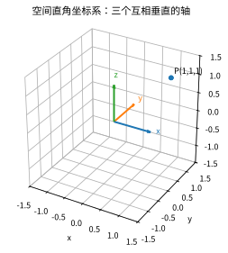

*图2.1：空间直角坐标系。$x, y, z$ 三个互相垂直的坐标轴交于原点 $O$，空间中任意点用有序三元组 $(x, y, z)$ 表示。*

> **直观理解（现实类比）**：空间直角坐标系就像一套 **3D GPS 定位系统**——平面 GPS 只需"经度+纬度"两个数定位地表一点，而要描述一架飞机的位置，还需再加上"海拔高度"这第三个数 $(x, y, z)$。原点 $O$ 是"基准站"，三条坐标轴是三把互相垂直的标尺，八个别卦限就像把一个立方体蛋糕切成的八块，每块坐标的正负号各不相同。无人机送餐、3D 打印机喷头定位、VR 头显追踪，背后都跑着这套三维坐标系。

### 2.2 空间两点间的距离公式

设 $P_1(x_1, y_1, z_1)$ 和 $P_2(x_2, y_2, z_2)$ 是空间中的两点，则它们之间的距离为

$$
d = |P_1P_2| = \sqrt{(x_2 - x_1)^2 + (y_2 - y_1)^2 + (z_2 - z_1)^2}.
$$

**证明**：过 $P_1$ 和 $P_2$ 分别作垂直于坐标轴的平面，构造一个以 $P_1P_2$ 为体对角线的长方体。长方体的三条棱长分别为 $|x_2 - x_1|$、$|y_2 - y_1|$、$|z_2 - z_1|$。由勾股定理，体对角线长的平方等于三条棱长的平方和，即得公式。

> **直观理解（类比）**：空间两点的距离就像量一栋大楼里两点间的"直线距离"——先把坐标差当成前后、左右、上下三条棱，再用勾股定理像算体对角线那样把它们"平方相加再开方"地叠起来。

### 2.3 中点公式

设 $P_1(x_1, y_1, z_1)$ 和 $P_2(x_2, y_2, z_2)$ 的中点 $M$ 的坐标为

$$
M\left(\frac{x_1 + x_2}{2},\; \frac{y_1 + y_2}{2},\; \frac{z_1 + z_2}{2}\right).
$$

> **直观理解（类比）**：中点公式就像在一根绳子的两端找正中间——把两点的三个坐标分别取平均，得到的位置正好卡在两点的正中，前后左右上下都不偏。

### 2.4 球面方程

**定义**：空间中到定点 $C(x_0, y_0, z_0)$ 的距离等于定长 $R$ 的点的轨迹称为**球面**，$C$ 称为球心，$R$ 称为半径。

**标准方程**：

$$
(x - x_0)^2 + (y - y_0)^2 + (z - z_0)^2 = R^2.
$$

特别地，当球心在原点时，方程为 $x^2 + y^2 + z^2 = R^2$。

**一般形式**：展开标准方程得

$$
x^2 + y^2 + z^2 + Dx + Ey + Fz + G = 0,
$$

配方后可化为标准形式。方程表示球面的条件是 $D^2 + E^2 + F^2 - 4G > 0$，此时球心为 $\left(-\dfrac{D}{2}, -\dfrac{E}{2}, -\dfrac{F}{2}\right)$，半径为 $R = \dfrac{1}{2}\sqrt{D^2 + E^2 + F^2 - 4G}$。

> **直观理解（类比）**：球面方程就是"到球心距离恒等于半径的点的集合"——像吹气球时气球壳上每一点到气嘴（球心）的距离都相等。

---

## 三、空间直线与平面

### 3.1 空间直线

#### 3.1.1 直线的方向向量

与直线 $L$ 平行的非零向量 $\mathbf{s} = (m, n, p)$ 称为直线 $L$ 的**方向向量**。

> **直观理解（类比）**：方向向量就是一条直线的"朝向"——像铁路线上的箭头指示牌，它只告诉这条路往哪个方向延伸，而不关心具体站在哪个位置。

#### 3.1.2 直线的参数方程

设直线 $L$ 过点 $M_0(x_0, y_0, z_0)$，方向向量为 $\mathbf{s} = (m, n, p)$，则 $L$ 上任意一点 $M(x, y, z)$ 满足

| 符号 | 名称 | 含义 | 直观解释 |
|:---:|:---:|:---|:---|
| $\mathbf{s}$ | 方向向量 | 与直线平行的非零向量，$(m,n,p)$ | "这条线往哪走" |
| $t$ | 参数 | 直线上点到 $M_0$ 的"倍数" | "走了几倍方向向量" |
| $\overrightarrow{M_0M}$ | 位置向量差 | 从 $M_0$ 指向 $M$ 的向量 | "起点到任意点的箭头" |

$$
\overrightarrow{M_0M} = t\mathbf{s},\quad t \in \mathbb{R},
$$

即

$$
\begin{cases}
x = x_0 + mt,\\[2pt]
y = y_0 + nt,\\[2pt]
z = z_0 + pt,
\end{cases}
\quad t \in \mathbb{R}.
$$

这称为直线的**参数方程**，$t$ 为参数。

> **直观理解（类比）**：参数方程像"沿直线匀速走路的计时表"——把每个点写成起点加上"走了多少步（参数 $t$）× 每步的方向向量"；$t$ 越大走得越远，$t$ 取负则表示往回走。

#### 3.1.3 直线的对称式方程（点向式）

从参数方程中消去参数 $t$，当 $m, n, p$ 均不为零时，得到

$$
\frac{x - x_0}{m} = \frac{y - y_0}{n} = \frac{z - z_0}{p}.
$$

这称为直线的**对称式方程**（或点向式方程）。若某个分量为零，例如 $m = 0$，则方程理解为 $x = x_0$ 且 $\dfrac{y - y_0}{n} = \dfrac{z - z_0}{p}$。

> **直观理解（现实类比）**：空间直线方程就像描述一条**飞行航线**——只要给出"飞机此刻所在的位置"$(x_0, y_0, z_0)$ 和"飞机的航向向量" $\mathbf{s} = (m, n, p)$，整条航线就被唯一确定。参数 $t$ 相当于飞行时间：$t=0$ 是当前时刻的位置，$t=1$ 是一秒后的位置，$t=-1$ 是一秒前经过的位置。无论 $t$ 怎么取值，飞机始终沿着这条直线飞行，不会偏航。空中交通管制中"某航班沿某某航向以某某速度飞行"用的正是这种点向式描述。

#### 3.1.4 直线的一般式方程

空间直线也可以看作两个平面的交线：

$$
\begin{cases}
A_1x + B_1y + C_1z + D_1 = 0,\\
A_2x + B_2y + C_2z + D_2 = 0,
\end{cases}
$$

其中两平面不平行（即法向量不共线）。直线的方向向量为

$$
\mathbf{s} = \mathbf{n}_1 \times \mathbf{n}_2 = \begin{vmatrix}
\mathbf{i} & \mathbf{j} & \mathbf{k} \\
A_1 & B_1 & C_1 \\
A_2 & B_2 & C_2
\end{vmatrix}.
$$

> **直观理解（类比）**：直线的一般式就像"两面墙挤出的交缝"——空间直线可以看成两个不平行的平面相交而得的公共交线，而 $\mathbf{n}_1\times\mathbf{n}_2$ 正是这条缝的走向（方向向量）。

### 3.2 平面

#### 3.2.1 平面的法向量

与平面 $\Pi$ 垂直的非零向量 $\mathbf{n} = (A, B, C)$ 称为平面的**法向量**。

> **直观理解（类比）**：法向量就是"垂直插进平面的一根钉子"，它不躺在平面里而是顶着平面，专门用来描述平面的朝向——钉子朝向变，整面墙就跟着倾斜。

#### 3.2.2 平面的点法式方程

设平面 $\Pi$ 过点 $M_0(x_0, y_0, z_0)$，法向量为 $\mathbf{n} = (A, B, C)$，则 $\Pi$ 上任意一点 $M(x, y, z)$ 满足 $\overrightarrow{M_0M} \perp \mathbf{n}$，即

| 符号 | 名称 | 含义 | 直观解释 |
|:---:|:---:|:---|:---|
| $\mathbf{n}$ | 法向量 | 与平面垂直的非零向量，$(A,B,C)$ | "垂直戳进平面" |
| $M_0$ | 定点 | 平面上一个已知点 $(x_0,y_0,z_0)$ | "墙上钉的一枚钉" |
| $\perp$ | 垂直 | 两向量夹角为 $90^\circ$ | "成直角" |
| $M$ | 动点 | 平面上任意一点 | "墙面上的任何一点" |

$$
A(x - x_0) + B(y - y_0) + C(z - z_0) = 0.
$$

> **直观理解（现实类比）**：平面方程就像描述一堵**倾斜的墙**——要确定这堵墙，只需知道墙上某一点 $M_0$（墙脚的一个钉子）和墙的"朝向" $\mathbf{n} = (A, B, C)$（法向量，像一根垂直插在墙上的钉子）。无论墙有多大，只要"穿过这点、垂直于这根钉子"，墙就唯一确定。法向量就像墙的"倾斜控制器"：$\mathbf{n}$ 朝上时墙是水平的（如天花板），$\mathbf{n}$ 朝东西时墙是竖直的（如房间隔断）。改变法向量，墙就随之倾斜旋转。

#### 3.2.3 平面的一般式方程

展开点法式方程得

$$
Ax + By + Cz + D = 0,
$$

其中 $D = -(Ax_0 + By_0 + Cz_0)$。

**特殊情形**：
- $D = 0$：平面过原点；
- $A = 0$：平面平行于 $x$ 轴（法向量与 $x$ 轴垂直）；
- $B = 0$：平面平行于 $y$ 轴；
- $C = 0$：平面平行于 $z$ 轴；
- $A = B = 0$：平面平行于 $xOy$ 平面，方程为 $z = -\dfrac{D}{C}$。

> **直观理解（类比）**：一般式是点法式"去掉定点后的成品"——把三项系数 $(A,B,C)$ 看成法向量指明朝向，常数项 $D$ 决定整面墙离原点平移多远。

#### 3.2.4 平面的截距式方程

若平面与三个坐标轴分别交于 $(a, 0, 0)$、$(0, b, 0)$、$(0, 0, c)$（$a, b, c \neq 0$），则方程为

$$
\frac{x}{a} + \frac{y}{b} + \frac{z}{c} = 1.
$$

> **直观理解（类比）**：截距式像一块被三刀切下的"三角楔子"——直接告诉你平面在三根坐标轴上各切出多长（$a,b,c$），看见就能脑补它如何斜穿三个坐标轴。

### 3.3 夹角与距离

#### 3.3.1 两直线的夹角

设直线 $L_1$ 的方向向量为 $\mathbf{s}_1 = (m_1, n_1, p_1)$，$L_2$ 的方向向量为 $\mathbf{s}_2 = (m_2, n_2, p_2)$，则两直线的夹角 $\theta$（取锐角或直角）满足

$$
\cos\theta = \frac{|\mathbf{s}_1 \cdot \mathbf{s}_2|}{|\mathbf{s}_1|\,|\mathbf{s}_2|}
= \frac{|m_1m_2 + n_1n_2 + p_1p_2|}{\sqrt{m_1^2 + n_1^2 + p_1^2}\sqrt{m_2^2 + n_2^2 + p_2^2}}.
$$

**特殊情形**：
- $L_1 \perp L_2$ $\iff$ $\mathbf{s}_1 \cdot \mathbf{s}_2 = 0$；
- $L_1 \parallel L_2$ $\iff$ $\mathbf{s}_1 \times \mathbf{s}_2 = \mathbf{0}$（对应分量成比例）。

> **直观理解（类比）**：两直线夹角就由它们各自的朝向（方向向量）的张开程度决定——像观察两条路上箭头的张开角，只看方向不管站位，所以用点积算夹角余弦。

#### 3.3.2 两平面的夹角

设平面 $\Pi_1$ 的法向量为 $\mathbf{n}_1 = (A_1, B_1, C_1)$，$\Pi_2$ 的法向量为 $\mathbf{n}_2 = (A_2, B_2, C_2)$，则两平面的夹角 $\theta$（取锐角或直角）满足

$$
\cos\theta = \frac{|\mathbf{n}_1 \cdot \mathbf{n}_2|}{|\mathbf{n}_1|\,|\mathbf{n}_2|}
= \frac{|A_1A_2 + B_1B_2 + C_1C_2|}{\sqrt{A_1^2 + B_1^2 + C_1^2}\sqrt{A_2^2 + B_2^2 + C_2^2}}.
$$

**特殊情形**：
- $\Pi_1 \perp \Pi_2$ $\iff$ $\mathbf{n}_1 \cdot \mathbf{n}_2 = 0$；
- $\Pi_1 \parallel \Pi_2$ $\iff$ $\mathbf{n}_1 \times \mathbf{n}_2 = \mathbf{0}$。

> **直观理解（类比）**：两平面夹角等于它们法向量之间的夹角——把两面斜墙抽象成两根垂直钉在墙上的钉子，钉子的张开度就是两面墙的张开度。

#### 3.3.3 直线与平面的夹角

设直线 $L$ 的方向向量为 $\mathbf{s}$，平面 $\Pi$ 的法向量为 $\mathbf{n}$，直线与平面的夹角 $\varphi$（直线与它在平面上的投影所夹的锐角）满足

$$
\sin\varphi = \frac{|\mathbf{s} \cdot \mathbf{n}|}{|\mathbf{s}|\,|\mathbf{n}|}.
$$

> **直观理解（类比）**：直线与平面的夹角就像一根筷子斜插过桌面——量的是筷子和它在桌面上影子的夹角，所以用到方向向量在平面上的投影，式子里是 $\sin\varphi$。

#### 3.3.4 点到平面的距离

**定理**：点 $P_0(x_0, y_0, z_0)$ 到平面 $\Pi: Ax + By + Cz + D = 0$ 的距离为

$$
d = \frac{|Ax_0 + By_0 + Cz_0 + D|}{\sqrt{A^2 + B^2 + C^2}}.
$$

**证明**：在平面 $\Pi$ 上任取一点 $P_1(x_1, y_1, z_1)$，则 $P_0$ 到平面的距离等于向量 $\overrightarrow{P_1P_0}$ 在法向量 $\mathbf{n} = (A, B, C)$ 上的投影的绝对值：

$$
d = \frac{|\mathbf{n} \cdot \overrightarrow{P_1P_0}|}{|\mathbf{n}|}
= \frac{|A(x_0 - x_1) + B(y_0 - y_1) + C(z_0 - z_1)|}{\sqrt{A^2 + B^2 + C^2}}.
$$

由于 $P_1$ 在平面上，有 $Ax_1 + By_1 + Cz_1 + D = 0$，即 $D = -(Ax_1 + By_1 + Cz_1)$，代入即得公式。

> **直观理解（类比）**：点到平面的距离是"从点到墙面垂直到达的最短路径"——像从空中把铅球竖直放到地面，公式正是把这段距离算成该点在法线方向的投影长度。

#### 3.3.5 点到直线的距离

点 $P_0$ 到直线 $L$（过点 $M_0$，方向向量 $\mathbf{s}$）的距离为

$$
d = \frac{|\overrightarrow{M_0P_0} \times \mathbf{s}|}{|\mathbf{s}|}.
$$

> **直观理解（类比）**：点到直线的距离像"行人到公路的最短垂直距离"——过这点作直线的垂线，垂足到该点就是最短路径；这公式用叉积算平行四边形面积、再除以底边长推出这条垂高。

#### 3.3.6 两条异面直线的距离

设直线 $L_1$ 过点 $M_1$，方向向量 $\mathbf{s}_1$；直线 $L_2$ 过点 $M_2$，方向向量 $\mathbf{s}_2$。若 $L_1$ 与 $L_2$ 异面，则它们之间的最短距离为

$$
d = \frac{|(\mathbf{s}_1 \times \mathbf{s}_2) \cdot \overrightarrow{M_1M_2}|}{|\mathbf{s}_1 \times \mathbf{s}_2|}.
$$

> **直观理解（类比）**：异面直线距离像"楼里两条错开的梁最近能靠多近"——它们既不平行也不相交，最短连线段同时垂直两条，方向正好由两方向向量的叉积 $\mathbf{s}_1\times\mathbf{s}_2$ 给出。

### 3.4 直线与平面的位置关系

设直线 $L: \dfrac{x - x_0}{m} = \dfrac{y - y_0}{n} = \dfrac{z - z_0}{p}$，平面 $\Pi: Ax + By + Cz + D = 0$。

- **相交**：$Am + Bn + Cp \neq 0$。将参数方程代入平面方程可求出交点。
- **平行**：$Am + Bn + Cp = 0$ 且点 $M_0$ 不在平面上。
- **直线在平面上**：$Am + Bn + Cp = 0$ 且 $Ax_0 + By_0 + Cz_0 + D = 0$。

> **直观理解（类比）**：直线与平面就三种关系——**穿过**（相交：筷子上有一处戳进桌面）、**贴着但不碰到**（平行）、**整条躺在里面**（直线在面上）。判断就是看方向向量与法向量是否垂直、定点是否落在平面上。

---

## 四、空间曲面

### 4.1 柱面

**定义**：动直线 $L$ 沿给定曲线 $C$ 平行移动所形成的曲面称为**柱面**。$L$ 称为母线，$C$ 称为准线。

**常见柱面**：

| 名称 | 方程 | 母线方向 |
|:---:|:---:|:---:|
| 圆柱面 | $x^2 + y^2 = R^2$ | 平行于 $z$ 轴 |
| 椭圆柱面 | $\dfrac{x^2}{a^2} + \dfrac{y^2}{b^2} = 1$ | 平行于 $z$ 轴 |
| 双曲柱面 | $\dfrac{x^2}{a^2} - \dfrac{y^2}{b^2} = 1$ | 平行于 $z$ 轴 |
| 抛物柱面 | $y = ax^2$ | 平行于 $z$ 轴 |

**特点**：柱面方程中缺少一个变量（如上表中缺 $z$），表示母线平行于该变量所对应的坐标轴。

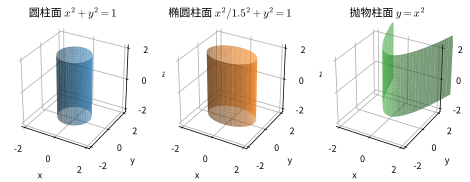

*图4.1：三类常见柱面。(a) 圆柱面 $x^2+y^2=1$；(b) 椭圆柱面；(c) 抛物柱面 $y=x^2$。柱面方程缺 $z$，故母线平行于 $z$ 轴。*

> **直观理解（现实类比）**：柱面就像**百叶窗或无限延伸的管道**——把一条曲线（准线）当作"模板"，然后用一根直棍（母线）沿模板平行滑动，扫出的轨迹就是柱面。圆柱是水管、铅笔杆、易拉罐侧面的形状；椭圆柱面是被压扁的水管；抛物柱面像抛物面反射镜截下的一段沿轴向无限延伸。判断诀窍：方程里**缺哪个变量**，母线就**平行于哪个坐标轴**——例如 $x^2+y^2=1$ 缺 $z$，母线就沿 $z$ 轴方向延伸。

### 4.2 二次曲面

**定义**：由三元二次方程

$$
Ax^2 + By^2 + Cz^2 + Dxy + Exz + Fyz + Gx + Hy + Iz + J = 0
$$

所表示的曲面称为**二次曲面**。通过适当的坐标变换（平移和旋转），可化为标准形式。

#### 4.2.1 椭球面

**标准方程**：

$$
\frac{x^2}{a^2} + \frac{y^2}{b^2} + \frac{z^2}{c^2} = 1,\quad a, b, c > 0.
$$

**性质**：
- 关于三个坐标面、三个坐标轴和原点都对称；
- 与坐标面的交线为椭圆：
  - 与 $xOy$ 面交于 $\dfrac{x^2}{a^2} + \dfrac{y^2}{b^2} = 1,\; z = 0$；
  - 与 $yOz$ 面交于 $\dfrac{y^2}{b^2} + \dfrac{z^2}{c^2} = 1,\; x = 0$；
  - 与 $zOx$ 面交于 $\dfrac{x^2}{a^2} + \dfrac{z^2}{c^2} = 1,\; y = 0$。
- 当 $a = b = c = R$ 时，为球面 $x^2 + y^2 + z^2 = R^2$。

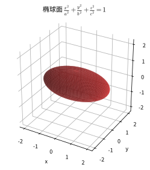

*图4.2：椭球面 $\frac{x^2}{a^2}+\frac{y^2}{b^2}+\frac{z^2}{c^2}=1$。三个半轴长分别为 $a, b, c$；当 $a=b=c$ 时退化为球面。*

> **直观理解（现实类比）**：椭球面就像一只**橄榄球（美式足球）**，或一颗被自转离心力压扁的**地球**。三个半轴 $a, b, c$ 是"三个方向的拉伸量"：$a=b=c$ 时是完美的球（台球）；$a=b<c$ 时是竖向拉长的"胶囊"；$a=b>c$ 时是横向扁圆的"飞碟"或地球（赤道半径大于极半径）。用刀水平切开椭球，截面是椭圆；斜着切也是椭圆。橄榄球的飞行气动性、地球的扁球形状、鸡蛋的外壳，都是椭球面在现实中的化身。

#### 4.2.2 双曲面

**单叶双曲面**：

$$
\frac{x^2}{a^2} + \frac{y^2}{b^2} - \frac{z^2}{c^2} = 1.
$$

**性质**：
- 关于三个坐标面、三个坐标轴和原点对称；
- 与 $xOy$ 面的交线为椭圆 $\dfrac{x^2}{a^2} + \dfrac{y^2}{b^2} = 1,\; z = 0$；
- 与 $yOz$ 面的交线为双曲线 $\dfrac{y^2}{b^2} - \dfrac{z^2}{c^2} = 1,\; x = 0$；
- 单叶双曲面是**直纹面**（可由直线运动生成）。

**双叶双曲面**：

$$
\frac{x^2}{a^2} + \frac{y^2}{b^2} - \frac{z^2}{c^2} = -1.
$$

**性质**：
- 曲面分为两叶，沿 $z$ 轴方向分开；
- 与 $z = \pm c$ 的交点为 $(0, 0, \pm c)$（顶点）；
- 当 $|z| > c$ 时，水平截面为椭圆。

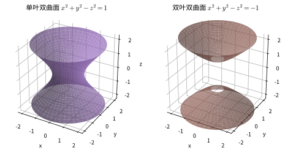

*图4.3：双曲面。(a) 单叶双曲面 $x^2+y^2-z^2=1$（一个整体、直纹面）；(b) 双叶双曲面 $x^2+y^2-z^2=-1$（分为上下两叶，沿 $z$ 轴分开）。*

> **直观理解（现实类比）**：双曲面有两副面孔——
> - **单叶双曲面**像发电厂高耸的**冷却塔**：中间收腰、上下张口，却仍连成一体。它还是"直纹面"：可以用两组交叉的直钢筋编出来，广州塔（小蛮腰）的外形正是单叶双曲面，由斜向钢柱交织构成。
> - **双叶双曲面**像**两个倒扣的碗**上下分开，中间留有空隙。两叶之间永远不相交，像两座山顶朝下相对的山。
> 工程上爱用单叶双曲面：它既能用直构件搭成，又具备优异的抗风抗扭性能，所以冷却塔、电视塔、体育馆穹顶常采用这种形状。

#### 4.2.3 抛物面

**椭圆抛物面**：

$$
\frac{x^2}{a^2} + \frac{y^2}{b^2} = z.
$$

**性质**：
- 开口方向：沿 $z$ 轴正方向（若 $z$ 系数为负则沿负方向）；
- 水平截面（$z = h > 0$）为椭圆；
- 与 $xOz$ 面的交线为抛物线 $x^2 = a^2z,\; y = 0$。

**双曲抛物面（马鞍面）**：

$$
\frac{x^2}{a^2} - \frac{y^2}{b^2} = z.
$$

**性质**：
- 形如马鞍，在原点处为鞍点；
- 水平截面（$z = h$）为双曲线（$h \neq 0$）或一对相交直线（$h = 0$）；
- 双曲抛物面也是**直纹面**。

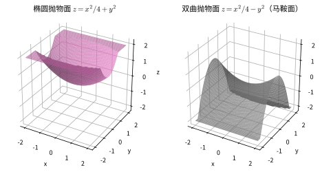

*图4.4：抛物面。(a) 椭圆抛物面 $z=x^2/4+y^2$（开口朝上，水平截面为椭圆）；(b) 双曲抛物面 $z=x^2/4-y^2$（马鞍面，原点为鞍点）。*

> **直观理解（现实类比）**：抛物面是一对性格截然相反的兄弟——
> - **椭圆抛物面**像一只**卫星天线（锅盖）**或汽车前照灯的反光碗：开口单方向"张开"，水平切开是椭圆，竖直切开是抛物线。卫星接收器之所以做成这种形状，是因为抛物面能把平行入射的电磁波汇聚到一个焦点，反之亦然——这正是雷达、射电望远镜、车灯的几何原理。
> - **双曲抛物面（马鞍面）**像一匹马的**马鞍**，也像一片翘起的**品客薯片**：沿一个方向看是上凸的（前后翘起），沿垂直方向看却是下凹的（左右下垂），原点处既不是顶也不是底，而是"鞍点"——坐下时前后稳、左右晃。大型体育场的曲面屋顶常采用马鞍面，因为它能用直钢梁铺满（直纹面）。

#### 4.2.4 二次锥面

**标准方程**：

$$
\frac{x^2}{a^2} + \frac{y^2}{b^2} - \frac{z^2}{c^2} = 0.
$$

**性质**：
- 以原点为顶点，$z$ 轴为对称轴；
- 水平截面（$z = h$）为椭圆（$h \neq 0$）；
- 当 $a = b$ 时，为**圆锥面**，方程可写作 $x^2 + y^2 = \left(\dfrac{a}{c}\right)^2 z^2$。

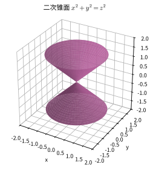

*图4.5：二次锥面 $x^2+y^2=z^2$。以原点为顶点、$z$ 轴为对称轴，上下两支对称张开。*

> **直观理解（现实类比）**：锥面像一只**漏斗**或**尖顶帐篷**——所有母线都从同一个"顶点"出发，向四周均匀张开。圆锥面是生日帽、漏斗、冰淇淋蛋筒的轮廓；椭圆锥面则是被"压扁"的圆锥，水平切口变成椭圆而非圆。神奇之处在于：锥面是"齐次方程"（无常数项），如果用一条过顶点的直线沿准线运动，整张面都能由这根直线扫出——所以锥面也是直纹面。马戏团帐篷、铅笔尖、陀螺的尖头，都是锥面在生活中的现身。

#### 4.2.5 二次曲面分类

| 类型 | 标准方程 | 特征 |
|:---:|:---|:---|
| 椭球面 | $\dfrac{x^2}{a^2} + \dfrac{y^2}{b^2} + \dfrac{z^2}{c^2} = 1$ | 所有平方项系数同号 |
| 单叶双曲面 | $\dfrac{x^2}{a^2} + \dfrac{y^2}{b^2} - \dfrac{z^2}{c^2} = 1$ | 一个平方项系数与另两个异号 |
| 双叶双曲面 | $\dfrac{x^2}{a^2} + \dfrac{y^2}{b^2} - \dfrac{z^2}{c^2} = -1$ | 一个平方项系数与另两个异号，常数项为负 |
| 椭圆抛物面 | $\dfrac{x^2}{a^2} + \dfrac{y^2}{b^2} = z$ | 两个平方项，一次项 |
| 双曲抛物面 | $\dfrac{x^2}{a^2} - \dfrac{y^2}{b^2} = z$ | 两个平方项异号，一次项 |
| 二次锥面 | $\dfrac{x^2}{a^2} + \dfrac{y^2}{b^2} - \dfrac{z^2}{c^2} = 0$ | 齐次二次方程 |

*图4.6：六种标准二次曲面对比总览。从左到右、从上到下依次为：椭球面、单叶双曲面、双叶双曲面、椭圆抛物面、双曲抛物面（马鞍面）、二次锥面。*

> **💡 直观理解**：二次曲面是"**空间中的三种基本形状及其变形**"。
> - **椭球面** = 三维的椭圆（球被拉长压扁）
> - **双曲面** = 方程中一个平方项符号相反，形成"收腰"或"两叶"结构
> - **抛物面** = 开口的碗（椭圆抛物面）或马鞍（双曲抛物面）
> - **锥面** = 从顶点向外无限张开的喇叭
>
> 判断方法很简单：看方程中**平方项系数的正负号分布**就能确定是哪一种。

> **直观理解（现实类比）**：六类二次曲面就像**六种基本地形**——
> - **椭球面**像浑圆的**山丘**（橄榄球、地球）；
> - **单叶双曲面**像中间收腰的**冷却塔**；
> - **双叶双曲面**像**两座分开的山头**，中间隔条沟；
> - **椭圆抛物面**像**碗状山谷**（锅盖、卫星天线）；
> - **双曲抛物面**像**马鞍地形**——前后翘起、左右下垂，原点是鞍点；
> - **二次锥面**像**火山口**或**漏斗**，从顶点向外张开。
>
> 掌握方程到地形的对应，看见方程就能脑补出曲面形状，这是解析几何最重要的"数形互译"能力。

---

## 五、空间曲线

### 5.1 空间曲线的参数方程

空间曲线 $C$ 可以用参数方程表示为

$$
\begin{cases}
x = x(t),\\
y = y(t),\\
z = z(t),
\end{cases}
\quad t \in [\alpha, \beta].
$$

其中 $t$ 为参数。例如，螺旋线的参数方程为

$$
\begin{cases}
x = a\cos t,\\
y = a\sin t,\\
z = bt,
\end{cases}
\quad t \in [0, +\infty).
$$

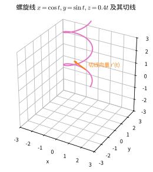

*图5.1：空间曲线（螺旋线）$x=\cos t, y=\sin t, z=0.4t$。红色箭头是曲线上某点处的切线向量 $\mathbf{r}'(t)$，其方向表示曲线在该点的运动方向。*

> **直观理解（现实类比）**：螺旋线像一根**弹簧**、一只**开瓶器**、一截**DNA 双螺旋**，也像便利店货架上的**螺旋挂面**。它的运动方式是"边转圈边上升"：水平投影是圆周运动（$x,y$ 按 $\cos t,\sin t$ 转圈），竖直方向是匀速上升（$z = bt$）。手电弹簧、螺钉螺纹、自动扶梯扶手的扭转、藤蔓绕杆生长、DNA 的双链缠绕，背后都是同一条螺旋线。参数 $t$ 越大，转的圈越多也爬得越高，但每圈的高度增量 $2\pi b$ 恒定，这就是弹簧"等螺距"的几何本质。

### 5.2 空间曲线的一般方程

空间曲线也可看作两个曲面的交线：

$$
\begin{cases}
F(x, y, z) = 0,\\
G(x, y, z) = 0.
\end{cases}
$$

> **直观理解（类比）**：空间曲线的一般方程就是"两个曲面的公共交集"——像两侧墙面挤出的棱线，也像两条光束交叉出一条发亮的轨迹。

### 5.3 切线向量

设曲线 $C$ 的参数方程为 $\mathbf{r}(t) = (x(t), y(t), z(t))$，且 $x(t), y(t), z(t)$ 可导，则曲线上点 $t_0$ 处的**切线向量**为

$$
\mathbf{r}'(t_0) = (x'(t_0), y'(t_0), z'(t_0)).
$$

切线的参数方程为

$$
(x, y, z) = (x(t_0), y(t_0), z(t_0)) + \lambda(x'(t_0), y'(t_0), z'(t_0)),\quad \lambda \in \mathbb{R}.
$$

> **直观理解（现实类比）**：切线向量就像物体的**瞬时速度方向**——想象你开着车在盘山公路上行驶，某一瞬间你松开方向盘让车直行，这条笔直的"飞出去"轨迹就是切线。它的方向 $\mathbf{r}'(t_0)$ 就是该瞬时速度向量，速度大小是 $|\mathbf{r}'(t_0)|$。垂直于切线的**法平面**则像横切车流方向立起的**一面挡板**——所有"垂直于运动方向"的方向都躺在这块板上。过山车的安全设计、子弹出膛的弹道切线、无人机航拍的瞬时朝向，都用切线与法平面来计算。

### 5.4 弧长

设曲线 $C$ 的参数方程为 $\mathbf{r}(t) = (x(t), y(t), z(t))$，$t \in [\alpha, \beta]$，且各分量连续可导，则曲线从 $t = \alpha$ 到 $t = \beta$ 的**弧长**为

$$
s = \int_{\alpha}^{\beta} |\mathbf{r}'(t)|\,dt
= \int_{\alpha}^{\beta} \sqrt{[x'(t)]^2 + [y'(t)]^2 + [z'(t)]^2}\,dt.
$$

**证明**：将区间 $[\alpha, \beta]$ 分割为 $n$ 个小段，每段长 $\Delta t_i$。在每小段上，用弦长近似弧长：

$$
\Delta s_i \approx |\mathbf{r}(t_i + \Delta t_i) - \mathbf{r}(t_i)| \approx |\mathbf{r}'(t_i)|\Delta t_i.
$$

取极限即得积分公式。

> **直观理解（类比）**：弧长就是"沿曲线实际走了多远"——把弯曲线剪成无数小段，每段用直线弦长近似，再累加取极限，就像把一根弯曲的绳子拉直了量总长。

---

## 六、向量代数

### 6.1 向量的基本概念

- **向量**：既有大小又有方向的量，记作 $\vec{a}$ 或 $\mathbf{a}$。
- **模**：$|\mathbf{a}|$，表示向量的大小。
- **零向量**：$\mathbf{0}$，模为 $0$，方向任意。
- **单位向量**：模为 $1$ 的向量。
- **方向余弦**：向量 $\mathbf{a} = (a_x, a_y, a_z)$ 与三个坐标轴正方向的夹角 $\alpha, \beta, \gamma$ 的余弦：

$$
\cos\alpha = \frac{a_x}{|\mathbf{a}|},\quad 
\cos\beta = \frac{a_y}{|\mathbf{a}|},\quad 
\cos\gamma = \frac{a_z}{|\mathbf{a}|},
$$

满足 $\cos^2\alpha + \cos^2\beta + \cos^2\gamma = 1$。

> **直观理解（现实类比）**：向量与坐标就像**用经度+纬度+海拔定位一座山峰**——向量本身是"从海平面基准点指向山顶的箭头"，它的大小（模）就是山高加水平距离合成的"直线距离"，方向就是登山者举手指向山顶的方位。坐标 $(a_x, a_y, a_z)$ 是把这个箭头拆解到三把互相垂直的尺子上；方向余弦 $\cos\alpha, \cos\beta, \cos\gamma$ 则像三个"倾斜角度的余弦读数"，告诉你箭头分别偏离东、北、上三个方向多少度。三个方向余弦的平方和等于 1，是因为箭头只有一个，三方向的"分量配比"不能超过箭头本身。

### 6.2 向量的点积（数量积）

**定义**：$\mathbf{a} \cdot \mathbf{b} = |\mathbf{a}|\,|\mathbf{b}|\cos\theta$，其中 $\theta$ 是 $\mathbf{a}$ 与 $\mathbf{b}$ 的夹角。

**坐标表示**：若 $\mathbf{a} = (a_1, a_2, a_3)$，$\mathbf{b} = (b_1, b_2, b_3)$，则

$$
\mathbf{a} \cdot \mathbf{b} = a_1b_1 + a_2b_2 + a_3b_3.
$$

**性质**：
- $\mathbf{a} \cdot \mathbf{b} = \mathbf{b} \cdot \mathbf{a}$（交换律）；
- $\mathbf{a} \cdot (\mathbf{b} + \mathbf{c}) = \mathbf{a} \cdot \mathbf{b} + \mathbf{a} \cdot \mathbf{c}$（分配律）；
- $\mathbf{a} \perp \mathbf{b}$ $\iff$ $\mathbf{a} \cdot \mathbf{b} = 0$。

**几何应用**：求夹角、投影（$\mathbf{a}$ 在 $\mathbf{b}$ 上的投影为 $\dfrac{\mathbf{a} \cdot \mathbf{b}}{|\mathbf{b}|}$）。

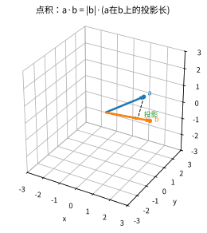

*图6.1：向量点积的几何意义。$\mathbf{a} \cdot \mathbf{b} = |\mathbf{b}| \cdot (\mathbf{a}$ 在 $\mathbf{b}$ 上的投影长）。点积把"方向夹角"转化为"数量"，用于判断垂直（点积为 0）、求投影和做功。*

> **直观理解（现实类比）**：点积最贴切的现实模型就是**做功**——你用力 $\mathbf{F}$ 拉行李箱前进位移 $\mathbf{s}$，真正"有效"的力是沿位移方向的分量 $|\mathbf{F}|\cos\theta$，所以做功 $W = \mathbf{F}\cdot\mathbf{s} = |\mathbf{F}||\mathbf{s}|\cos\theta$。提箱子水平走时力与位移垂直，点积为 0，不做功（虽然累但物理上没贡献能量）。点积也是**投影**：太阳光从 $\mathbf{b}$ 方向斜射，向量 $\mathbf{a}$ 在地面上的影子长度就是 $\dfrac{\mathbf{a}\cdot\mathbf{b}}{|\mathbf{b}|}$。垂直时投影消失（点积为 0），平行时投影最长（点积最大）——这就是"判断垂直"和"求夹角"的几何依据。

### 6.3 向量的叉积（向量积）

**定义**：$\mathbf{a} \times \mathbf{b}$ 是一个向量，满足：
1. $|\mathbf{a} \times \mathbf{b}| = |\mathbf{a}|\,|\mathbf{b}|\sin\theta$；
2. 方向垂直于 $\mathbf{a}$ 和 $\mathbf{b}$ 所在的平面，且 $\mathbf{a}, \mathbf{b}, \mathbf{a} \times \mathbf{b}$ 构成右手系。

**坐标表示**：若 $\mathbf{a} = (a_1, a_2, a_3)$，$\mathbf{b} = (b_1, b_2, b_3)$，则

| 符号 | 名称 | 含义 | 直观解释 |
|:---:|:---:|:---|:---|
| $\times$ | 叉积 | 结果为垂直于 $\mathbf{a},\mathbf{b}$ 的向量 | "一种带方向的乘法" |
| $\mathbf{i},\mathbf{j},\mathbf{k}$ | 单位坐标向量 | $x,y,z$ 三轴方向的单位向量 | "三把方向的尺子" |
| $\begin{vmatrix}\cdots\end{vmatrix}$ | 三阶行列式 | 展开后给出叉积的三个分量 | "按格子算的模板" |
| $a_1,a_2,a_3$ | 坐标分量 | 向量 $\mathbf{a}$ 的三个坐标 | "箭头在三轴的投影" |

$$
\mathbf{a} \times \mathbf{b} = 
\begin{vmatrix}
\mathbf{i} & \mathbf{j} & \mathbf{k} \\
a_1 & a_2 & a_3 \\
b_1 & b_2 & b_3
\end{vmatrix}
= (a_2b_3 - a_3b_2,\; a_3b_1 - a_1b_3,\; a_1b_2 - a_2b_1).
$$

**性质**：
- $\mathbf{a} \times \mathbf{b} = -(\mathbf{b} \times \mathbf{a})$（反交换律）；
- $\mathbf{a} \parallel \mathbf{b}$ $\iff$ $\mathbf{a} \times \mathbf{b} = \mathbf{0}$。

**几何应用**：以 $\mathbf{a}, \mathbf{b}$ 为邻边的平行四边形的面积为 $|\mathbf{a} \times \mathbf{b}|$。

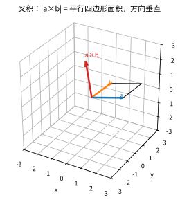

*图6.2：向量叉积的几何意义。$\mathbf{a} \times \mathbf{b}$ 垂直于 $\mathbf{a}, \mathbf{b}$ 所在平面，模长等于 $\mathbf{a}, \mathbf{b}$ 张成的平行四边形面积。方向由右手定则确定。*

> **直观理解（现实类比）**：叉积的现实化身是**力矩**和**右手定则**——用扳手拧螺丝时，力 $\mathbf{F}$ 作用在力臂 $\mathbf{r}$ 上，产生的力矩 $\boldsymbol{\tau} = \mathbf{r}\times\mathbf{F}$ 决定螺丝转动的方向和强度。右手四指从 $\mathbf{r}$ 卷向 $\mathbf{F}$，拇指所指就是螺丝前进的方向（标准右旋螺丝）。叉积的模 $|\mathbf{a}||\mathbf{b}|\sin\theta$ 正好是两向量张成的**平行四边形面积**，所以也能算三角形面积。叉积在电磁学中无处不在：洛伦兹力 $\mathbf{F}=q\mathbf{v}\times\mathbf{B}$、安培力 $\mathbf{F}=I\mathbf{L}\times\mathbf{B}$、磁场方向 $\mathbf{B}$ 都由右手定则确定——正因如此，电动机、发电机、喇叭才能"转起来"。

> **🧠 思考历程：叉积"$\times$"凭什么同时精通"算面积"和"定方向"？**
>
> $\mathbf{a}\times\mathbf{b}$ 那个"又算大小、又指方向"的乘法，看着像代数技巧，其实是从力学与几何两种真实需求里长成的——它至今仍是物理中最常用的"带方向乘法"。
>
> - **第一次被看见：力学里的"力矩"**。早在矢量系统成形前，转动问题——扳手力矩、角动量——就需要"垂直于力臂与力的方向"的量。**"让两个东西相乘，得出一个不在这两者所在平面内、还要垂直于它俩的向量"**，这种需求在 19 世纪被明确提上日程。
> - **哈密顿与格拉斯曼的几条路**。哈密顿的四元数（quaternion）给了旋转一种代数，却因两个向量的乘积"交换就变号"而让计算繁琐；**格拉斯曼另起炉灶研究"外积"**。最终演化出的三维叉积 $\mathbf{a}\times\mathbf{b}$，满足了"模长=面积、方向垂直、右手定则"三合一——它成了三维空间独有的宝贝（许多高维空间并无对应的叉积）。
> - **右手定则为何用"人"（不靠纯数学）来定方向？** 因为叉积的"方向"在纯代数里只有"上"与"下"两个选择，必须靠人为约定"右旋"来定——右手弧 $\mathbf{a}\to\mathbf{b}$、拇指指示 $\mathbf{a}\times\mathbf{b}$。**这个约定虽然来自手势，却是整个电磁、电机、坐标方向统一的前提。**
> - **它把几何翻译成计算**。有了叉积，"求面积、判平行、求平面法向量、算力矩"全部化成一个行列式；没有它，描述"一个沿垂直方向打转的量"会无比绕口。**它是"把几何直觉塞进一个乘法符号"的教科书级例子。**
> - **心路**：叉积教你：**一个真正好用的数学对象，常常同时服务于几何直觉与物理需求**。下次拳头悬在空中比划右手定则时想想——那不是手势，而是两百年数学家为了"方向也可算"而铺的路。

### 6.4 向量的混合积（标量三重积）

**定义**：$(\mathbf{a}, \mathbf{b}, \mathbf{c}) = \mathbf{a} \cdot (\mathbf{b} \times \mathbf{c})$。

**坐标表示**：

$$
\mathbf{a} \cdot (\mathbf{b} \times \mathbf{c}) = 
\begin{vmatrix}
a_1 & a_2 & a_3 \\
b_1 & b_2 & b_3 \\
c_1 & c_2 & c_3
\end{vmatrix}.
$$

**几何意义**：$|\mathbf{a} \cdot (\mathbf{b} \times \mathbf{c})|$ 等于以 $\mathbf{a}, \mathbf{b}, \mathbf{c}$ 为邻边的平行六面体的体积。

**性质**：
- $\mathbf{a} \cdot (\mathbf{b} \times \mathbf{c}) = \mathbf{b} \cdot (\mathbf{c} \times \mathbf{a}) = \mathbf{c} \cdot (\mathbf{a} \times \mathbf{b})$（轮换对称性）；
- $\mathbf{a}, \mathbf{b}, \mathbf{c}$ 共面 $\iff$ $\mathbf{a} \cdot (\mathbf{b} \times \mathbf{c}) = 0$。

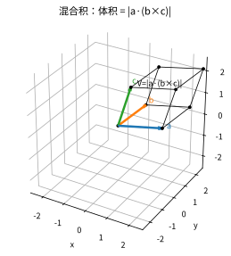

*图6.3：向量混合积的几何意义。$|\mathbf{a} \cdot (\mathbf{b} \times \mathbf{c})|$ 等于以 $\mathbf{a}, \mathbf{b}, \mathbf{c}$ 为邻边的平行六面体的体积。当三个向量共面时，体积为 0，混合积为 0。*

> **直观理解（现实类比）**：混合积就是**用三根不平行的小棍搭出的平行六面体的体积**——把 $\mathbf{b}$ 和 $\mathbf{c}$ 当作"地基"两条边，叉积 $\mathbf{b}\times\mathbf{c}$ 是垂直于地基的"立柱方向"，$\mathbf{a}$ 在立柱方向的投影就是"高度"。底面积 $\times$ 高 = 体积，正是 $|\mathbf{a}\cdot(\mathbf{b}\times\mathbf{c})|$。如果三根棍子全平躺在桌面上（共面），高度为 0，体积为 0，混合积立即报警——这就是"共面判定"的几何依据。建筑工人估算堆料体积、3D 软件判断多边形是否共面、晶体学计算晶胞体积，都靠这一招。

### 6.5 向量代数的几何应用总结

| 应用 | 公式 |
|:---|:---|
| 平行四边形面积 | $S = \|\mathbf{a} \times \mathbf{b}\|$ |
| 三角形面积 | $S = \dfrac{1}{2}\|\mathbf{a} \times \mathbf{b}\|$ |
| 平行六面体体积 | $V = \|\mathbf{a} \cdot (\mathbf{b} \times \mathbf{c})\|$ |
| 四面体体积 | $V = \dfrac{1}{6}\|\mathbf{a} \cdot (\mathbf{b} \times \mathbf{c})\|$ |
| 点到平面距离 | $d = \dfrac{\|\mathbf{n} \cdot \overrightarrow{P_1P_0}\|}{\|\mathbf{n}\|}$ |
| 异面直线距离 | $d = \dfrac{\|(\mathbf{s}_1 \times \mathbf{s}_2) \cdot \overrightarrow{M_1M_2}\|}{\|\mathbf{s}_1 \times \mathbf{s}_2\|}$ |

> **直观理解（类比）**：这一表是"向量三运算的地图"——点积管角度和投影、叉积管面积和垂直、混合积管体积和共面。做题时对照功能选用即可。

---

## 七、坐标变换

### 7.1 平移变换

将坐标系的原点从 $O$ 平移到 $O'(x_0, y_0, z_0)$，新坐标系记为 $O'x'y'z'$。点 $P$ 在原坐标系中的坐标 $(x, y, z)$ 与新坐标 $(x', y', z')$ 的关系为

$$
\begin{cases}
x = x' + x_0,\\
y = y' + y_0,\\
z = z' + z_0,
\end{cases}
\quad\text{或}\quad
\begin{cases}
x' = x - x_0,\\
y' = y - y_0,\\
z' = z - z_0.
\end{cases}
$$

**矩阵形式**：

$$
\begin{pmatrix}
x \\ y \\ z
\end{pmatrix}
=
\begin{pmatrix}
x' \\ y' \\ z'
\end{pmatrix}
+
\begin{pmatrix}
x_0 \\ y_0 \\ z_0
\end{pmatrix}.
$$

> **直观理解（类比）**：平移变换就像"把坐标纸整体挪个地方"——图形本身没动，只是换了原点重新读数，所以新旧坐标只差一个固定的位移量 $(x_0,y_0,z_0)$。

### 7.2 旋转变换

绕坐标轴旋转是常见的正交变换。设右手系中绕 $z$ 轴旋转角度 $\theta$（正向为逆时针方向），变换公式为

$$
\begin{pmatrix}
x' \\ y' \\ z'
\end{pmatrix}
=
\begin{pmatrix}
\cos\theta & -\sin\theta & 0 \\
\sin\theta & \cos\theta & 0 \\
0 & 0 & 1
\end{pmatrix}
\begin{pmatrix}
x \\ y \\ z
\end{pmatrix}.
$$

绕 $x$ 轴旋转 $\theta$ 角：

$$
\begin{pmatrix}
x' \\ y' \\ z'
\end{pmatrix}
=
\begin{pmatrix}
1 & 0 & 0 \\
0 & \cos\theta & -\sin\theta \\
0 & \sin\theta & \cos\theta
\end{pmatrix}
\begin{pmatrix}
x \\ y \\ z
\end{pmatrix}.
$$

绕 $y$ 轴旋转 $\theta$ 角：

$$
\begin{pmatrix}
x' \\ y' \\ z'
\end{pmatrix}
=
\begin{pmatrix}
\cos\theta & 0 & \sin\theta \\
0 & 1 & 0 \\
-\sin\theta & 0 & \cos\theta
\end{pmatrix}
\begin{pmatrix}
x \\ y \\ z
\end{pmatrix}.
$$

> **直观理解（类比）**：旋转变换就像"把整张纸转到另一个角度看"——图形大小形状不变，只是读数换了方向；绕 $z$ 轴旋转时 $z$ 坐标不动。这是后面消交叉项、化简二次曲面的关键工具。

### 7.3 正交变换

**定义**：满足 $Q^\mathsf{T}Q = I$（即 $Q^{-1} = Q^\mathsf{T}$）的矩阵 $Q$ 称为**正交矩阵**。由正交矩阵定义的线性变换 $y = Qx$ 称为**正交变换**。

**性质**：
- 正交变换保持向量长度不变：$|Q\mathbf{x}| = |\mathbf{x}|$；
- 正交变换保持向量夹角不变：$(Q\mathbf{a}) \cdot (Q\mathbf{b}) = \mathbf{a} \cdot \mathbf{b}$；
- 正交变换保持面积和体积不变；
- 正交变换的矩阵的行列式为 $\det Q = \pm 1$（$\det Q = 1$ 时为旋转，$\det Q = -1$ 时为反射）。

> **直观理解（类比）**：正交变换就像"对图形做旋转或翻转"的刚性动作——它保持长度、角度、面积、体积统统不变（像把一本书翻过来或转一圈），所以不改变几何本质，只改变坐标系视角。

### 7.4 基变换

设 $\{\mathbf{e}_1, \mathbf{e}_2, \mathbf{e}_3\}$ 和 $\{\mathbf{e}'_1, \mathbf{e}'_2, \mathbf{e}'_3\}$ 是空间的两组基，且

$$
(\mathbf{e}'_1, \mathbf{e}'_2, \mathbf{e}'_3) = (\mathbf{e}_1, \mathbf{e}_2, \mathbf{e}_3)P,
$$

其中 $P$ 是可逆矩阵，称为**过渡矩阵**。向量 $\mathbf{v}$ 在两组基下的坐标满足

$$
\begin{pmatrix}
x_1 \\ x_2 \\ x_3
\end{pmatrix}
= P
\begin{pmatrix}
x'_1 \\ x'_2 \\ x'_3
\end{pmatrix},
\qquad
\begin{pmatrix}
x'_1 \\ x'_2 \\ x'_3
\end{pmatrix}
= P^{-1}
\begin{pmatrix}
x_1 \\ x_2 \\ x_3
\end{pmatrix}.
$$

> **直观理解（类比）**：基变换就像"换一套尺子重新读数"——同一物体用不同刻度（基）读出不同的数字，过渡矩阵 $P$ 就是新旧两套尺子之间的换算表，正向乘 $P$、反向乘 $P^{-1}$。

### 7.5 平面极坐标方程

> 极坐标是平面上的另一套坐标系统，属于坐标变换的重要内容（与 7.1-7.4 的平移、旋转对应，极坐标是"极坐标变换"）。

#### 7.5.1 极坐标的本质：用"距离 + 方向"定位

> **💡 直观理解**：我们熟悉的直角坐标用"**往东走多少、往北走多少**"（$x, y$）来定位；而极坐标改用"**离中心多远、朝哪个方向**"（$r, \theta$）来定位。就像雷达屏幕：屏幕中心是**极点**，扫出的每个亮点由"距离"和"方位角"两个信息确定。

**极坐标的定义**：在平面内取一定点 $O$（**极点**）和一条射线 $Ox$（**极轴**），再选定长度单位和角度的正方向（逆时针为正）。平面内任一点 $P$ 用有序数对 $(\rho, \theta)$ 表示，其中：
- $\rho$ 是 $P$ 到极点的距离，称为**极径**（一般 $\rho \ge 0$）
- $\theta$ 是极轴到射线 $OP$ 的夹角，称为**极角**（或极向角、方位角）

极径通常记作 $r$ 或 $\rho$，极角通常记作 $\theta$ 或 $\varphi$。角度可用**度**（常用于航海、测量）或**弧度**（常用于数学、物理）表示，换算关系为 $2\pi \,\mathrm{rad} = 360°$。

*图7.1：极坐标的基本概念。(a) 用（距离, 角度）表示一点，如 $(3, 60°)$；(b) 极坐标网格由"同心圆 + 过极点的射线"构成。*

> **直观理解（现实类比）**：极坐标就像**雷达扫描**——雷达屏幕中心是极点，扫描线一圈圈转动就是极角 $\theta$，目标亮点到中心的距离就是极径 $r$。空管员说"目标在方位角 $60°$、距离 30 公里"，用的就是极坐标 $(30, 60°)$，比"东 15 公里、北 26 公里"直角坐标更符合直觉。也像**声呐探测鲸鱼**、**机场塔台指挥飞机**、**打仗报目标方位**：凡是"从中心向外辐射"的场景，极坐标都是天然语言。极地图、台风路径图、麦克风指向性图也都画在极坐标网格上。

**为什么需要极坐标？** 当问题**天然围绕一个中心点**展开时（如螺旋、圆周运动、雷达、极地图），用极坐标描述往往比直角坐标简单得多。某些曲线（如阿基米德螺线）在直角坐标下极其复杂，而在极坐标下却只是一个简洁的方程。

> **🔑 历史小知识**：极坐标的概念由圣文森特（Grégoire de Saint-Vincent）和卡瓦列里（Bonaventura Cavalieri）于17世纪中叶独立引入；牛顿在《流数法》中研究了极坐标与其他坐标的变换；雅各布·伯努利于1691年正式使用"极点"与"极轴"；"极坐标"这一术语由丰塔纳（Gregorio Fontana）提出。"极坐标"（polar）一词本身就暗示了"围绕极点旋转"的含义。

#### 7.5.2 直角坐标 ↔ 极坐标的互化

**从极坐标到直角坐标**（极点与原点重合、极轴与 $x$ 轴正半轴重合）：
$$
x = \rho\cos\theta, \qquad y = \rho\sin\theta
$$

**从直角坐标到极坐标**：
$$
\rho = \sqrt{x^2 + y^2}, \qquad \tan\theta = \frac{y}{x}
$$

> **⚠️ 注意求角度的陷阱**：$\theta = \arctan(y/x)$ 只在 $x > 0$（第一、四象限）时正确。当 $x < 0$ 时，$\arctan(y/x)$ 得到的是第三、四象限的角，需要**加或减 $\pi$** 才能回到正确的象限。最稳妥的做法是用**带象限判断的 atan2 函数**：
$$
\theta = \operatorname{atan2}(y, x) = \begin{cases}
\arctan(y/x) & x > 0 \\
\arctan(y/x) + \pi & x < 0,\; y \ge 0 \\
\arctan(y/x) - \pi & x < 0,\; y < 0 \\
\frac{\pi}{2} & x = 0,\; y > 0 \\
-\frac{\pi}{2} & x = 0,\; y < 0
\end{cases}
$$
> 几乎所有编程语言（C、Python、MATLAB 等）都内置了 `atan2(y, x)`，它自动处理象限问题。

**例**：把直角坐标 $(-1, 1)$ 化为极坐标。

**解**：$\rho = \sqrt{(-1)^2 + 1^2} = \sqrt{2}$。点 $(-1,1)$ 在第二象限，$\theta = \arctan(1/(-1)) + \pi = -\frac{\pi}{4} + \pi = \frac{3\pi}{4}$。故 $(-1, 1) \mapsto (\sqrt{2}, \frac{3\pi}{4})$。（若只用 $\arctan(y/x) = \arctan(-1) = -\pi/4$ 就会做错！）

> **直观理解（类比）**：直角坐标与极坐标互化就像 GPS 的两种报法——"向东 3 公里、向北 4 公里"和"距离 5 公里、方位角 53°"说的是同一个地点：一种用两个方向分量（$x,y$），一种用距离加角度（$r,\theta$）。换算时体积是直角三角形，注意用 atan2 避免象限出错。

#### 7.5.3 极坐标的唯一性（多值性）

**一点可以有无数种极坐标表示**：
- 极角加整圈不变：( $r, \theta$ ) 与 $(r, \theta + 2n\pi)$ 表示同一点
- 极径取负等价于"反向延 180°"：$(r, \theta)$ 与 $(-r, \theta + \pi)$ 表示同一点
- 极点特殊：$(0, \theta)$ 对任意 $\theta$ 都是同一点

**约定**：当需要唯一表示（极点除外）时，通常取 $r > 0$ 且 $\theta \in [0, 2\pi)$ 或 $(-\pi, \pi]$，这称为**主值**。

> **💡 直观理解**：极坐标的多值性就像"转表盘"——转一圈回到原样，所以每个点对应"无数个读数"。这在解方程画图时很重要：有时负的 $r$ 会带来额外的曲线分支。

#### 7.5.4 对称性的快速判定

对于极坐标方程 $r = f(\theta)$，可以仅从方程形式判断曲线的对称性：

| 条件 | 对称性 |
|:-----|:-------|
| $f(-\theta) = f(\theta)$ | 关于极轴（$0°/180°$ 线）对称 |
| $f(\pi - \theta) = f(\theta)$ | 关于 $90°/270°$ 线对称 |
| $f(\theta + \alpha) = f(\theta)$ | 关于极点旋转 $\alpha$ 对称（旋转对称） |

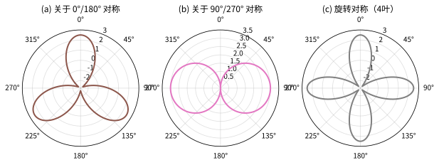

*图7.2：极坐标曲线的常见对称性。(a) 关于 $0°/180°$ 对称；(b) 关于 $90°/270°$ 对称；(c) 旋转对称（四叶玫瑰）。*

> **直观理解（类比）**：由方程直接判对称性像个"偷懒小窍门"——把 $\theta$ 换成 $-\theta$ 或 $\pi-\theta$，方程若原样不变，图形就必定关于某条线镜像对称，省去逐点画图的力气。

#### 7.5.5 常见曲线的极坐标方程（详细）

下表汇总了最重要的极坐标曲线，配图请见下方各图。

| 曲线 | 极坐标方程 | 说明 |
|:-----|:-----------|:-----|
| **圆（圆心在极点）** | $r = a$ | 半径为 $a$ |
| **圆（过极点，圆心在极轴）** | $r = 2a\cos\theta$ | 圆心在 $(a, 0)$，直径 $2a$ |
| **一般圆** | $r^2 - 2rr_0\cos(\theta-\gamma) + r_0^2 = a^2$ | 圆心 $(r_0, \gamma)$，半径 $a$ |
| **过极点的射线** | $\theta = \theta_0$ | 一条射线 |
| **不过极点的直线** | $r = r_0\sec(\theta - \gamma)$ | 垂直于极轴方向 $r_0$ 处 |
| **圆锥曲线** | $r = \dfrac{\ell}{1 - \varepsilon\cos\theta}$ | $\varepsilon<1$ 椭圆、$=1$ 抛物线、$>1$ 双曲线 |
| **心形线** | $r = a(1 \pm \cos\theta)$ | 心脏形曲线 |
| **玫瑰线** | $r = a\cos(n\theta)$ 或 $r = a\sin(n\theta)$ | $n$ 决定花瓣数 |
| **阿基米德螺线** | $r = a + b\theta$ | 圈距相等 |
| **对数螺线** | $r = ae^{b\theta}$ | 等角螺线 |
| **双纽线** | $r^2 = a^2\cos 2\theta$ | Bernoulli 双纽线 |

**a. 圆**

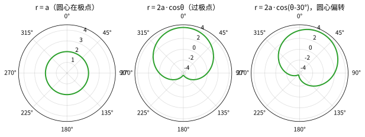

*图7.3：圆的极坐标方程。(a) $r = a$：圆心在极点；(b) $r = 2a\cos\theta$：过极点、圆心在极轴上；(c) $r = 2a\cos(\theta - 30°)$：圆心偏离极轴方向。*

一般地，圆心在极坐标 $(r_0, \gamma)$、半径为 $a$ 的圆满足 $r^2 - 2rr_0\cos(\theta - \gamma) + r_0^2 = a^2$。当 $r_0 = a$（过极点）时简化为 $r = 2a\cos(\theta - \gamma)$。

**b. 直线**

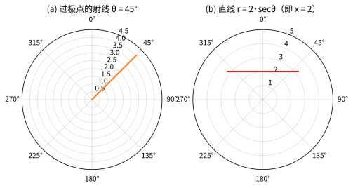

*图7.4：直线的极坐标方程。(a) 过极点的射线 $\theta = 45°$；(b) 不过极点的直线 $r = 2\sec\theta$，即直角坐标中的 $x = 2$。*

**c. 圆锥曲线（一个焦点在极点）**

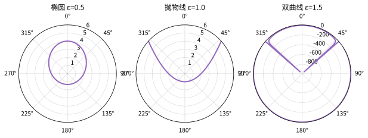

*图7.5：圆锥曲线的统一极坐标方程 $r = \ell/(1 - \varepsilon\cos\theta)$。由离心率 $\varepsilon$ 决定：(a) $\varepsilon < 1$ 椭圆；(b) $\varepsilon = 1$ 抛物线；(c) $\varepsilon > 1$ 双曲线。这是天体力学中行星轨道（太阳在焦点）的天然语言。*

**d. 玫瑰线**

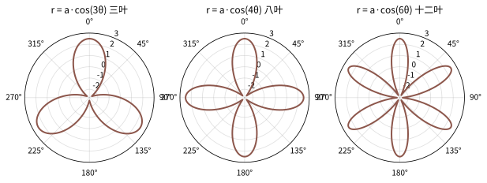

*图7.6：玫瑰线 $r = a\cos(n\theta)$。花瓣数规律：$n$ 为奇数时有 $n$ 瓣，$n$ 为偶数时有 $2n$ 瓣。图中分别为 $3, 4, 6$ 叶。*

**e. 螺线**

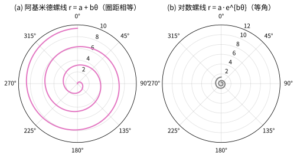

*图7.7：两类经典螺线。(a) 阿基米德螺线 $r = a + b\theta$：各圈间距相等（如唱片纹路、蚊香）；(b) 对数螺线 $r = ae^{b\theta}$：各圈成等比放大（如鹦鹉螺、旋涡星系）。*

**f. 心形线与双纽线**

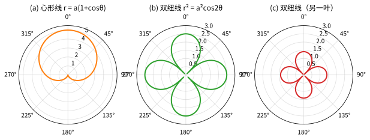

*图7.8：心形线 $r = a(1+\cos\theta)$ 与双纽线 $r^2 = a^2\cos 2\theta$。心形线常见于麦克风指向性图、微波天线辐射图；双纽线呈"∞"形，是伯努利首先研究的曲线。*

> **💡 直观理解**：这些曲线之所以在极坐标下如此简洁，是因为它们都**围绕极点旋转展开**。心形线是"震荡的圆轨迹"，玫瑰线是"周期性开花"，螺线是"匀速边转边拉远"。换个角度想：极坐标就是这些"旋转型运动"的天然母语。

#### 7.5.6 极坐标下的面积与弧长

> **极坐标下的面积**：曲线 $r = r(\theta)$（$\alpha \le \theta \le \beta$）与射线 $\theta = \alpha$、$\theta = \beta$ 所围成的扇形区域面积为
$$
S = \frac{1}{2}\int_{\alpha}^{\beta}[r(\theta)]^2\, d\theta
$$
> **极坐标下的弧长**：
$$
L = \int_{\alpha}^{\beta}\sqrt{[r(\theta)]^2 + [r'(\theta)]^2}\, d\theta
$$
> 具体推导与示例见**第 11 级 7.4 极坐标下的面积与弧长**。

#### 7.5.7 极坐标的现实应用

| 领域 | 极坐标在做什么 |
|------|--------------|
| **雷达/导航** | 用"距离+方位角"定位目标、舰船 |
| **天文学** | 行星轨道用圆锥曲线极坐标方程描述（太阳位于焦点） |
| **工程制图** | 齿轮、凸轮、天线辐射方向图 |
| **数学** | 求某些积分、复数运算、傅里叶分析 |
| **自然现象** | 鹦鹉螺对数螺线、台风螺旋云系、蜗牛壳生长 |

> **🔑 一句话总结**：极坐标是"**围绕中心旋转的世界**"的描述语言。凡是"从中心向外、边转边动"的问题，用极坐标往往事半功倍。

---

## 八、定理与证明

### 8.1 点到平面距离公式的证明

**定理**：点 $P_0(x_0, y_0, z_0)$ 到平面 $\Pi: Ax + By + Cz + D = 0$ 的距离为

$$
d = \frac{|Ax_0 + By_0 + Cz_0 + D|}{\sqrt{A^2 + B^2 + C^2}}.
$$

**证明**：设 $\mathbf{n} = (A, B, C)$ 为平面 $\Pi$ 的法向量。在平面上任取一点 $P_1(x_1, y_1, z_1)$，则 $P_1$ 满足 $Ax_1 + By_1 + Cz_1 + D = 0$，即 $D = -(Ax_1 + By_1 + Cz_1)$。

点 $P_0$ 到平面的距离等于向量 $\overrightarrow{P_1P_0}$ 在法向量 $\mathbf{n}$ 上的投影的绝对值：

$$
\begin{aligned}
d &= \left|\frac{\mathbf{n} \cdot \overrightarrow{P_1P_0}}{|\mathbf{n}|}\right| \\
&= \frac{|A(x_0 - x_1) + B(y_0 - y_1) + C(z_0 - z_1)|}{\sqrt{A^2 + B^2 + C^2}} \\
&= \frac{|Ax_0 + By_0 + Cz_0 - (Ax_1 + By_1 + Cz_1)|}{\sqrt{A^2 + B^2 + C^2}} \\
&= \frac{|Ax_0 + By_0 + Cz_0 + D|}{\sqrt{A^2 + B^2 + C^2}}.
\end{aligned}
$$

- 第 1 个等号：把"点到平面的距离"写成向量 $\overrightarrow{P_1P_0}$ 在法向量 $\mathbf{n}$ 上的投影的绝对值。依据是"距离 = 该点在法线方向上的投影长度"（见"直观理解"中"投影=影子"），目的：把几何距离转成可计算的向量式。
- 第 2 个等号（坐标展开）：把向量式展开成坐标形式。依据是 $\mathbf{n}=(A,B,C)$、$\overrightarrow{P_1P_0}=(x_0-x_1,y_0-y_1,z_0-z_1)$ 以及 $|\mathbf{n}|=\sqrt{A^2+B^2+C^2}$，目的：代入具体坐标，为下一步化简做准备。
- 第 3 个等号（归拢项）：把分子的含 $P_1$ 项提出来为 $- (Ax_1+By_1+Cz_1)$。依据是 $A(x_0-x_1)=Ax_0-Ax_1$ 的分配律，目的：整理成"关于 $P_0$ 的部分 − 关于 $P_1$ 的部分"。
- 第 4 个等号（代入平面方程消 $P_1$）：因 $P_1$ 在平面上满足 $Ax_1+By_1+Cz_1+D=0$，即 $D=-(Ax_1+By_1+Cz_1)$，把 $-(Ax_1+By_1+Cz_1)$ 换成 $D$。依据是平面方程 $\Pi: Ax+By+Cz+D=0$，目的：去掉临时点 $P_1$，得到只含已知量 $P_0$ 与平面系数 $(A,B,C,D)$ 的最终公式。

证毕。

> **直观理解（类比）**：这段证明把"点和墙的距离"转成"影子长短"——点在法向量方向的投影长度就是到平面的距离，墙再斜、点再远，这一招都成立。

### 8.2 点到直线距离公式的证明

**定理**：点 $P_0$ 到直线 $L$（过点 $M_0$，方向向量 $\mathbf{s}$）的距离为

$$
d = \frac{|\overrightarrow{M_0P_0} \times \mathbf{s}|}{|\mathbf{s}|}.
$$

**证明**：以 $\overrightarrow{M_0P_0}$ 和 $\mathbf{s}$ 为邻边作平行四边形。该平行四边形的面积为 $|\overrightarrow{M_0P_0} \times \mathbf{s}|$。另一方面，该面积也等于底边长 $|\mathbf{s}|$ 乘以高 $d$（即点 $P_0$ 到直线 $L$ 的距离）。因此

$$
|\overrightarrow{M_0P_0} \times \mathbf{s}| = |\mathbf{s}| \cdot d,
$$

从而 $d = \dfrac{|\overrightarrow{M_0P_0} \times \mathbf{s}|}{|\mathbf{s}|}$。证毕。

> **直观理解（类比）**：这一招用"面积守恒"逮住距离——按两条邻边作平行四边形，面积用叉积算，又等于底乘高，高恰好就是要找的点到直线的垂距。

### 8.3 异面直线距离公式的证明

**定理**：设直线 $L_1$ 过点 $M_1$，方向向量 $\mathbf{s}_1$；直线 $L_2$ 过点 $M_2$，方向向量 $\mathbf{s}_2$。若 $L_1$ 与 $L_2$ 异面，则它们之间的最短距离为

$$
d = \frac{|(\mathbf{s}_1 \times \mathbf{s}_2) \cdot \overrightarrow{M_1M_2}|}{|\mathbf{s}_1 \times \mathbf{s}_2|}.
$$

**证明**：两条异面直线的公垂线方向与 $\mathbf{s}_1 \times \mathbf{s}_2$ 平行。以 $\mathbf{s}_1, \mathbf{s}_2, \overrightarrow{M_1M_2}$ 为棱作平行六面体，其体积为 $V = |(\mathbf{s}_1 \times \mathbf{s}_2) \cdot \overrightarrow{M_1M_2}|$。该体积也等于底面积 $|\mathbf{s}_1 \times \mathbf{s}_2|$ 乘以高 $d$（即两条异面直线间的距离）。因此

$$
d = \frac{V}{|\mathbf{s}_1 \times \mathbf{s}_2|} = \frac{|(\mathbf{s}_1 \times \mathbf{s}_2) \cdot \overrightarrow{M_1M_2}|}{|\mathbf{s}_1 \times \mathbf{s}_2|}.
$$

证毕。

> **直观理解（类比）**：这一定理用一个"平行六面体"一次算清——两方向向量当底面，$\overrightarrow{M_1M_2}$ 当斜棱，体积除以底面面积即得两条异面直线间的公垂线长度。

### 8.4 平面方程的点法式与一般式互推

**定理**：平面 $\Pi$ 过点 $M_0(x_0, y_0, z_0)$ 且法向量为 $\mathbf{n} = (A, B, C)$ 的充要条件是 $\Pi$ 的方程为 $Ax + By + Cz + D = 0$，其中 $D = -(Ax_0 + By_0 + Cz_0)$。

**证明**：
（$\Rightarrow$）设 $\Pi$ 过 $M_0$，法向量为 $\mathbf{n}$。对 $\Pi$ 上任意点 $M(x, y, z)$，有 $\overrightarrow{M_0M} \perp \mathbf{n}$，即

$$
\mathbf{n} \cdot \overrightarrow{M_0M} = A(x - x_0) + B(y - y_0) + C(z - z_0) = 0,
$$

展开得 $Ax + By + Cz - (Ax_0 + By_0 + Cz_0) = 0$。令 $D = -(Ax_0 + By_0 + Cz_0)$，即得 $Ax + By + Cz + D = 0$。

- 【第 1 步】依据：$\overrightarrow{M_0M}\perp\mathbf{n}$ 等价于点积为零 $A(x-x_0)+B(y-y_0)+C(z-z_0)=0$；目的：把"垂直"从几何翻译成代数等式。
- 【第 2 步】依据：把内积式展开并令 $D=-(Ax_0+By_0+Cz_0)$；目的：消去定点 $M_0$，得到一般式 $Ax+By+Cz+D=0$。

（$\Leftarrow$）设 $\Pi$ 的方程为 $Ax + By + Cz + D = 0$，且 $M_0(x_0, y_0, z_0)$ 满足该方程，即 $Ax_0 + By_0 + Cz_0 + D = 0$。对 $\Pi$ 上任意点 $M(x, y, z)$，有 $Ax + By + Cz + D = 0$。两式相减得

$$
A(x - x_0) + B(y - y_0) + C(z - z_0) = 0,
$$

- 【第 1 步】依据：$M_0$ 在平面上，故 $Ax_0+By_0+Cz_0+D=0$，两式相减消去 $D$；目的：把"点在面上"转化成坐标差形式。
- 【第 2 步】依据：$A(x-x_0)+B(y-y_0)+C(z-z_0)=\mathbf{n}\cdot\overrightarrow{M_0M}$，且点积为零即垂直；目的：证回 $\mathbf{n}$ 确为法向量，完成反向推导。

即 $\mathbf{n} \cdot \overrightarrow{M_0M} = 0$，故 $\mathbf{n} \perp \overrightarrow{M_0M}$，$\mathbf{n}$ 为 $\Pi$ 的法向量。证毕。

> **直观理解（类比）**：点法式和一般式其实是同一种方程的两副面孔——一个强调"过哪个点"（点法式直观、好列），一个强调"系数整齐好算"（一般式通用、利于联立），中间的 $D$ 就是由定点坐标偷偷搬进常数项的那一份。

### 8.5 向量混合积的几何意义

**定理**：$|\mathbf{a} \cdot (\mathbf{b} \times \mathbf{c})|$ 等于以 $\mathbf{a}, \mathbf{b}, \mathbf{c}$ 为邻边的平行六面体的体积。

**证明**：以 $\mathbf{b}$ 和 $\mathbf{c}$ 为邻边的平行四边形的面积为 $|\mathbf{b} \times \mathbf{c}|$，该平行四边形所在的平面以 $\mathbf{b} \times \mathbf{c}$ 为法向量。向量 $\mathbf{a}$ 在该法向量方向上的投影（即平行六面体的高）的绝对值为

$$
h = \frac{|\mathbf{a} \cdot (\mathbf{b} \times \mathbf{c})|}{|\mathbf{b} \times \mathbf{c}|}.
$$

因此平行六面体的体积为 $V = \text{底面积} \times \text{高} = |\mathbf{b} \times \mathbf{c}| \cdot \dfrac{|\mathbf{a} \cdot (\mathbf{b} \times \mathbf{c})|}{|\mathbf{b} \times \mathbf{c}|} = |\mathbf{a} \cdot (\mathbf{b} \times \mathbf{c})|$。证毕。

> **直观理解（类比）**：此定理就像"底面积×高算体积"——叉积 $|\mathbf{b}\times\mathbf{c}|$ 给底面积，点积把第三个向量 $\mathbf{a}$ 顺着高方向投影出高度，相乘正是平行六面体体积。

### 8.6 直线与平面夹角公式的证明

**定理**：设直线 $L$ 的方向向量为 $\mathbf{s}$，平面 $\Pi$ 的法向量为 $\mathbf{n}$，则 $L$ 与 $\Pi$ 的夹角 $\varphi$ 满足 $\sin\varphi = \dfrac{|\mathbf{s} \cdot \mathbf{n}|}{|\mathbf{s}|\,|\mathbf{n}|}$。

**证明**：直线与平面的夹角定义为直线与其在平面上的投影所夹的锐角。设 $\mathbf{s}$ 与 $\mathbf{n}$ 的夹角为 $\theta$。由于 $\mathbf{n}$ 垂直于平面，$\mathbf{s}$ 与平面的夹角 $\varphi$ 满足 $\varphi = 90^\circ - \theta$（或 $\varphi = \theta - 90^\circ$，取锐角）。因此

$$
\sin\varphi = |\cos\theta| = \frac{|\mathbf{s} \cdot \mathbf{n}|}{|\mathbf{s}|\,|\mathbf{n}|}.
$$

证毕。

> **直观理解（类比）**：证明把"筷子和桌面的夹角"换算成"筷子和垂直钉子的夹角"——两者互为余角（加起来 90°），于是把点积算出的余弦转而写成了 $\sin\varphi$。

### 8.7 正交变换保持内积不变

**定理**：若 $Q$ 是正交矩阵，则对任意向量 $\mathbf{x}, \mathbf{y} \in \mathbb{R}^3$，有 $(Q\mathbf{x}) \cdot (Q\mathbf{y}) = \mathbf{x} \cdot \mathbf{y}$。

**证明**：

$$
(Q\mathbf{x}) \cdot (Q\mathbf{y}) = (Q\mathbf{x})^\mathsf{T}(Q\mathbf{y}) = \mathbf{x}^\mathsf{T}Q^\mathsf{T}Q\mathbf{y} = \mathbf{x}^\mathsf{T}I\mathbf{y} = \mathbf{x}^\mathsf{T}\mathbf{y} = \mathbf{x} \cdot \mathbf{y}.
$$

- 第 1 个等号：把点积改写成"前一个向量的转置乘后一个向量"（$\mathbf{u}\cdot\mathbf{v}=\mathbf{u}^{\mathsf{T}}\mathbf{v}$）。依据是点积与矩阵乘法的对应关系，目的：把点积运算变成普通矩阵乘法。
- 第 2 个等号：把转置"搬进括号"，依据是转置性质 $(AB)^{\mathsf{T}}=B^{\mathsf{T}}A^{\mathsf{T}}$ 与矩阵乘法的结合律，目的：让 $Q^{\mathsf{T}}$ 与 $Q$ 相邻、便于合并。
- 第 3 个等号：用正交矩阵的定义替换中间两项，依据是 $Q^{\mathsf{T}}Q=I$，目的：约掉 $Q^{\mathsf{T}}Q$。
- 第 4 个等号：单位阵乘任何矩阵仍是该矩阵（$I\mathbf{y}=\mathbf{y}$），依据是单位阵的性质，目的：去掉单位阵。
- 第 5 个等号：再用"转置乘向量 = 点积"还原成约定记号，依据是 $\mathbf{x}^{\mathsf{T}}\mathbf{y}=\mathbf{x}\cdot\mathbf{y}$，目的：证回内积形式，说明正交变换保持夹角。

证毕。

> **直观理解（类比）**：核心是"转置搬家、中间对消"——把点积写成转置乘向量的形式，利用 $Q^{\mathsf{T}}Q=I$，把夹在中间的 $Q$ 一对对约掉，就看出旋转、翻转不会改变角度。

### 8.8 椭球面截面定理

**定理**：椭球面 $\dfrac{x^2}{a^2} + \dfrac{y^2}{b^2} + \dfrac{z^2}{c^2} = 1$ 与平面 $z = h$（$|h| < c$）的交线是一个椭圆。

**证明**：将 $z = h$ 代入椭球面方程得

$$
\frac{x^2}{a^2} + \frac{y^2}{b^2} + \frac{h^2}{c^2} = 1,
\quad\text{即}\quad
\frac{x^2}{a^2\left(1 - \frac{h^2}{c^2}\right)} + \frac{y^2}{b^2\left(1 - \frac{h^2}{c^2}\right)} = 1.
$$

- 前式（代入）：把平面条件 $z=h$ 代入椭球面方程，依据是"交线上的点必须同时满足曲面方程与平面方程两个条件"，目的：消去变量 $z$，得到截面在水平面内的约束。
- 由 前式 → 后式（化标准形）：把 $\frac{h^2}{c^2}$ 移到右边，再两边同除 $1-\frac{h^2}{c^2}$，从而把系数改写为 $a^2\left(1-\frac{h^2}{c^2}\right)$ 与 $b^2\left(1-\frac{h^2}{c^2}\right)$。依据是等式变形（同加同除）与分式化简，目的：凑成 $\frac{x^2}{a_h^2}+\frac{y^2}{b_h^2}=1$ 的标准椭圆形式。

令 $a_h = a\sqrt{1 - \dfrac{h^2}{c^2}}$，$b_h = b\sqrt{1 - \dfrac{h^2}{c^2}}$，则截面方程为 $\dfrac{x^2}{a_h^2} + \dfrac{y^2}{b_h^2} = 1$，$z = h$，这是一个椭圆。当 $|h| < c$ 时，$a_h, b_h > 0$，确实为椭圆。证毕。

> **直观理解（类比）**：这就像"切西瓜"——沿水平面一刀切开椭球，切面总是一张椭圆；刀越低（$|h|$ 越小）椭圆越大，贴近顶点（$|h|$ 接近 $c$）就缩成一个点。

---

## 九、解题技巧

本节针对空间解析几何中的高频考点，总结可直接套用的方法与常见易错点。每条技巧均含**适用场景**、**关键步骤**、**常见误区**三个要素，并配一个精讲示例。

### 9.1 距离与中点公式："直接套用，勿忘平方与开方"

**适用场景**：求两点距离、中点、球面方程，或由定点与距离确定几何元素。

**关键步骤**：
1. 两点距离 $d=\sqrt{(x_1-x_2)^2+(y_1-y_2)^2+(z_1-z_2)^2}$；
2. 中点 $M\Big(\dfrac{x_1+x_2}{2},\dfrac{y_1+y_2}{2},\dfrac{z_1+z_2}{2}\Big)$；
3. 球面方程 $|MQ|^2=R^2$：先由球心与界上一点算出半径 $R$。

**常见误区**：
- 距离公式漏平方或漏开方；
- 中点坐标误用"两点坐标之差"而非"之和的一半"。

**精讲示例**：求以 $C(1,-2,3)$ 为球心且过点 $P(4,2,-1)$ 的球面方程。

解：半径 $R=CP=\sqrt{(4-1)^2+(2+2)^2+(-1-3)^2}=\sqrt{9+16+16}=\sqrt{41}$，故球面为
$$(x-1)^2+(y+2)^2+(z-3)^2=41.$$

### 9.2 直线与平面方程："一个定点 + 一个方向/法向量"

**适用场景**：由已知条件建立空间直线或平面的方程。

**关键步骤**：
1. 直线需要"过点 $M_0$ + 方向向量 $\mathbf s$"，写成对称式/参数方程；
2. 平面需要"过点 $M_0$ + 法向量 $\mathbf n$"，写点法式 $A(x-x_0)+B(y-y_0)+C(z-z_0)=0$；
3. 求方向向量：两平面交线的方向 $\mathbf s=\mathbf n_1\times\mathbf n_2$；与一平面垂直的直线方向即该平面法向量。

**常见误区**：
- 把方向向量与法向量弄混（直线用方向向量，平面用法向量）；
- 对一般式给出的交线，误直接抄其中某一平面的法向量当方向。

**精讲示例**：求直线 $L:\begin{cases}x+y+z=1\\2x-y+3z=0\end{cases}$ 的方向向量。

解：$\mathbf s=\mathbf n_1\times\mathbf n_2=\begin{vmatrix}\mathbf i&\mathbf j&\mathbf k\\1&1&1\\2&-1&3\end{vmatrix}=(4,-1,-3)$。

### 9.3 夹角与距离："按图索骥，一次查清"

**适用场景**：求线线、线面、面面的夹角，以及点线距、点面距、异面距。

**关键步骤**（设方向向量 $\mathbf s_1,\mathbf s_2$，法向量 $\mathbf n_1,\mathbf n_2$）：
1. 线线夹角 $\cos\theta=\dfrac{|\mathbf s_1\cdot\mathbf s_2|}{|\mathbf s_1||\mathbf s_2|}$；面面夹角同理代入 $\mathbf n$；
2. 线面夹角 $\sin\varphi=\dfrac{|\mathbf s\cdot\mathbf n|}{|\mathbf s||\mathbf n|}$；
3. 点面距 $d=\dfrac{|Ax_0+By_0+Cz_0+D|}{\sqrt{A^2+B^2+C^2}}$。

**常见误区**：
- 求线面角时误用余弦（应为正弦）；
- 点面距忘取绝对值。

**精讲示例**：求点 $P(1,-2,3)$ 到平面 $2x-y+2z-5=0$ 的距离。

解：$d=\dfrac{|2\cdot1-1\cdot(-2)+2\cdot3-5|}{\sqrt{2^2+(-1)^2+2^2}}=\dfrac{|2+2+6-5|}{3}=\dfrac{5}{3}$。

### 9.4 二次曲面："看二次项的符号结构定类型"

**适用场景**：识别与分类椭球面、单叶/双叶双曲面、抛物面、二次锥面。

**关键步骤**：
1. 齐次二次型 $=0$ → 二次锥面；
2. 二次项 $=$ 常数 → 椭球面（三项全正）或双曲面（含负号：两个正号一个负号 → 单叶，一个正号两个负号 → 双叶）；
3. 二次项 $=$ 一次项（如 $z=$ 二次式）→ 抛物面（平方项同号 → 椭圆抛物面，异号 → 双曲抛物面）；
4. 一般式先用配方法/正交变换化标准形，再按上法判别。

**常见误区**：
- 单叶与双叶双曲面记反（混淆正负号数量与右侧常数的符号关系）；
- 把所有 $z=$ 二次形式都当成椭圆抛物面，忽略双曲抛物面（马鞍面）。

**精讲示例**：判断 $\dfrac{x^2}{4}+\dfrac{y^2}{9}-\dfrac{z^2}{16}=1$ 与 $=0$ 的类型。

解：原式 $=1$ 且三项中恰有一个负号 → 单叶双曲面；原式 $=0$ 且为齐次 → 椭圆锥面。

### 9.5 空间曲线："参数方程求切、积模求弧长"

**适用场景**：对参数化空间曲线求切线向量与弧长。

**关键步骤**：
1. 切线向量 $\mathbf r'(t)$，切线方程为 $\mathbf r(t_0)+t\,\mathbf r'(t_0)$；
2. 弧长 $s=\displaystyle\int_a^b|\mathbf r'(t)|\,dt$；
3. 平面极坐标下 $ds=\sqrt{r^2+(r')^2}\,dt$。

**常见误区**：
- 弧长写成 $\int|\mathbf r(t)|\,dt$，实为 $\int|\mathbf r'(t)|\,dt$。

**精讲示例**：求螺旋线 $\mathbf r(t)=(2\cos t,2\sin t,3t)$ 从 $0$ 到 $2\pi$ 的弧长。

解：$\mathbf r'(t)=(-2\sin t,2\cos t,3)$，$|\mathbf r'|=\sqrt{4+9}=\sqrt{13}$，故
$$s=\int_0^{2\pi}\sqrt{13}\,dt=2\pi\sqrt{13}.$$

### 9.6 向量三运算："点积算角、叉积算面积、混积算体积"

**适用场景**：把几何对象（夹角、面积、体积）转化为向量代数运算。

**关键步骤**：
1. 面积 $=\tfrac12|\mathbf a\times\mathbf b|$；
2. 平行六面体体积 $=|\mathbf a\cdot(\mathbf b\times\mathbf c)|$，四面体体积 $=\tfrac16|\mathbf a\cdot(\mathbf b\times\mathbf c)|$；
3. 方向/异面判定多用叉积与混合积的符号。

**常见误区**：
- 三角形面积漏乘 $\tfrac12$；
- 四面体体积漏乘 $\tfrac16$。

**精讲示例**：求以 $\mathbf a=(1,2,-1)$、$\mathbf b=(2,0,1)$、$\mathbf c=(1,-1,2)$ 为邻边的四面体体积。

解：$\mathbf b\times\mathbf c=\begin{vmatrix}\mathbf i&\mathbf j&\mathbf k\\2&0&1\\1&-1&2\end{vmatrix}=(1,-3,-2)$，混合积 $\mathbf a\cdot(\mathbf b\times\mathbf c)=1\cdot1+2\cdot(-3)+(-1)\cdot(-2)=-3$，体积 $V=\tfrac16\cdot3=\tfrac12$。

### 9.7 坐标变换："平移消一次项、正交变换消交叉项"

**适用场景**：化简一般二次方程得到标准形，进而判断曲面类型。

**关键步骤**：
1. 平移：配方法消去一次项，确定新原点；
2. 旋转：对二次型矩阵正交对角化，用特征向量构成正交矩阵 $Q$，令 $\mathbf x=Q\mathbf x'$ 消去交叉项 $xy,yz,zx$；
3. 化标准形后按 9.4 判别类型。

**常见误区**：
- 忘记正交变换"保持长度与内积"，误用非正交线性变换导致度量失真、曲面类型判定出错。

**精讲示例**：详见挑战题 17 中对具体二次方程做完整主轴化简的过程。

---

## 十、示例

### 示例 1：求球面方程

求以点 $C(1, -2, 3)$ 为球心，且过点 $P(4, 2, -1)$ 的球面方程。

**解**：先求半径 $R = |CP| = \sqrt{(4-1)^2 + (2+2)^2 + (-1-3)^2} = \sqrt{9 + 16 + 16} = \sqrt{41}$。

球面方程为

$$
(x - 1)^2 + (y + 2)^2 + (z - 3)^2 = 41.
$$

展开得 $x^2 + y^2 + z^2 - 2x + 4y - 6z - 27 = 0$。

---

### 示例 2：求直线方程

求过点 $M_0(1, -2, 3)$ 且平行于直线 $L_1: \dfrac{x-1}{2} = \dfrac{y+1}{-1} = \dfrac{z-3}{4}$ 的直线方程。

**解**：所求直线与 $L_1$ 平行，故方向向量相同，为 $\mathbf{s} = (2, -1, 4)$。

由点向式得对称式方程：

$$
\frac{x - 1}{2} = \frac{y + 2}{-1} = \frac{z - 3}{4}.
$$

参数方程为

$$
\begin{cases}
x = 1 + 2t,\\
y = -2 - t,\\
z = 3 + 4t,
\end{cases}
\quad t \in \mathbb{R}.
$$

---

### 示例 3：两直线夹角

求直线 $L_1: \dfrac{x-1}{2} = \dfrac{y}{-1} = \dfrac{z+2}{1}$ 与 $L_2: \dfrac{x-3}{1} = \dfrac{y+1}{2} = \dfrac{z-2}{-1}$ 的夹角。

**解**：方向向量 $\mathbf{s}_1 = (2, -1, 1)$，$\mathbf{s}_2 = (1, 2, -1)$。

$$
\cos\theta = \frac{|2\cdot1 + (-1)\cdot2 + 1\cdot(-1)|}{\sqrt{2^2 + (-1)^2 + 1^2}\sqrt{1^2 + 2^2 + (-1)^2}}
= \frac{|2 - 2 - 1|}{\sqrt{6}\sqrt{6}} = \frac{1}{6}.
$$

因此 $\theta = \arccos\dfrac{1}{6}$。

---

### 示例 4：点到平面的距离

求点 $P(1, 2, -1)$ 到平面 $\Pi: 2x - 3y + 6z - 5 = 0$ 的距离。

**解**：由点到平面距离公式：

$$
d = \frac{|2\cdot1 + (-3)\cdot2 + 6\cdot(-1) - 5|}{\sqrt{2^2 + (-3)^2 + 6^2}}
= \frac{|2 - 6 - 6 - 5|}{\sqrt{4 + 9 + 36}}
= \frac{|-15|}{\sqrt{49}} = \frac{15}{7}.
$$

---

### 示例 5：求平面方程

求过三点 $A(1, 0, -1)$、$B(2, 2, 1)$、$C(0, 1, 2)$ 的平面方程。

**解**：$\overrightarrow{AB} = (1, 2, 2)$，$\overrightarrow{AC} = (-1, 1, 3)$。平面的法向量为

$$
\mathbf{n} = \overrightarrow{AB} \times \overrightarrow{AC}
= \begin{vmatrix}
\mathbf{i} & \mathbf{j} & \mathbf{k} \\
1 & 2 & 2 \\
-1 & 1 & 3
\end{vmatrix}
= (6-2,\; -2-3,\; 1+2) = (4, -5, 3).
$$

取点 $A(1, 0, -1)$，由点法式得

$$
4(x - 1) - 5(y - 0) + 3(z + 1) = 0,
$$

即 $4x - 5y + 3z - 1 = 0$。

---

### 示例 6：求直线与平面的交点

求直线 $L: \dfrac{x-1}{2} = \dfrac{y}{-1} = \dfrac{z+2}{3}$ 与平面 $\Pi: x + 2y - z + 3 = 0$ 的交点。

**解**：将直线化为参数式：

$$
\begin{cases}
x = 1 + 2t,\\
y = -t,\\
z = -2 + 3t.
\end{cases}
$$

代入平面方程：

$$
(1 + 2t) + 2(-t) - (-2 + 3t) + 3 = 0,
$$

化简得 $1 + 2t - 2t + 2 - 3t + 3 = 0$，即 $6 - 3t = 0$，$t = 2$。

代入参数式得交点 $(5, -2, 4)$。

---

### 示例 7：向量叉积求面积

求以 $\mathbf{a} = (1, 2, 1)$ 和 $\mathbf{b} = (2, -1, 3)$ 为邻边的平行四边形的面积。

**解**：

$$
\mathbf{a} \times \mathbf{b} = \begin{vmatrix}
\mathbf{i} & \mathbf{j} & \mathbf{k} \\
1 & 2 & 1 \\
2 & -1 & 3
\end{vmatrix}
= (2\cdot3 - 1\cdot(-1),\; 1\cdot2 - 1\cdot3,\; 1\cdot(-1) - 2\cdot2)
= (7, -1, -5).
$$

面积 $S = |\mathbf{a} \times \mathbf{b}| = \sqrt{7^2 + (-1)^2 + (-5)^2} = \sqrt{49 + 1 + 25} = \sqrt{75} = 5\sqrt{3}$。

---

### 示例 8：混合积求体积

求以 $\mathbf{a} = (1, 1, 0)$、$\mathbf{b} = (0, 1, 1)$、$\mathbf{c} = (1, 0, 1)$ 为邻边的平行六面体的体积。

**解**：

$$
\mathbf{a} \cdot (\mathbf{b} \times \mathbf{c}) = 
\begin{vmatrix}
1 & 1 & 0 \\
0 & 1 & 1 \\
1 & 0 & 1
\end{vmatrix}
= 1\cdot\begin{vmatrix}1 & 1 \\ 0 & 1\end{vmatrix} - 1\cdot\begin{vmatrix}0 & 1 \\ 1 & 1\end{vmatrix} + 0\cdot\begin{vmatrix}0 & 1 \\ 1 & 0\end{vmatrix}
= 1\cdot1 - 1\cdot(-1) + 0 = 2.
$$

体积 $V = |\mathbf{a} \cdot (\mathbf{b} \times \mathbf{c})| = 2$。

---

### 示例 9：求空间曲线的切线方程

求螺旋线 $\mathbf{r}(t) = (a\cos t, a\sin t, bt)$ 在 $t = \dfrac{\pi}{4}$ 处的切线方程。

**解**：$\mathbf{r}'(t) = (-a\sin t, a\cos t, b)$。在 $t = \dfrac{\pi}{4}$ 处：

$$
\mathbf{r}\left(\frac{\pi}{4}\right) = \left(\frac{a}{\sqrt{2}}, \frac{a}{\sqrt{2}}, \frac{b\pi}{4}\right),\quad
\mathbf{r}'\left(\frac{\pi}{4}\right) = \left(-\frac{a}{\sqrt{2}}, \frac{a}{\sqrt{2}}, b\right).
$$

切线参数方程为

$$
\begin{cases}
x = \dfrac{a}{\sqrt{2}} - \dfrac{a}{\sqrt{2}}t,\\[6pt]
y = \dfrac{a}{\sqrt{2}} + \dfrac{a}{\sqrt{2}}t,\\[6pt]
z = \dfrac{b\pi}{4} + bt,
\end{cases}
\quad t \in \mathbb{R}.
$$

---

### 示例 10：坐标变换化简二次曲面

将二次曲面 $x^2 + y^2 + z^2 - 2x + 4y - 6z + 10 = 0$ 化为标准形，并判断其类型。

**解**：配方：

$$
(x^2 - 2x + 1) + (y^2 + 4y + 4) + (z^2 - 6z + 9) = 1 + 4 + 9 - 10 = 4,
$$

即 $(x - 1)^2 + (y + 2)^2 + (z - 3)^2 = 4$。

作平移变换 $x' = x - 1$，$y' = y + 2$，$z' = z - 3$，得 $x'^2 + y'^2 + z'^2 = 4$。

这是一个球面（球心在 $(1, -2, 3)$，半径 $R = 2$）。

---

## 十一、习题

> 习题按难度分为 **基础题 / 进阶题 / 挑战题 / 探究题** 四级，覆盖本章全部内容。探究题无唯一答案，故附参考答案与思路提示。

### 11.1 基础题

**1.** 求点 $A(2, -1, 3)$ 和 $B(4, 2, -1)$ 之间的距离和中点坐标。

**2.** 求以 $A(1, -2, 3)$、$B(3, 0, 1)$、$C(2, -1, 4)$ 为顶点的三角形的面积。

**3.** 判断下列各组直线是否平行或垂直：
   - (a) $L_1: \dfrac{x-1}{2} = \dfrac{y+2}{-1} = \dfrac{z}{3}$，$L_2: \dfrac{x}{4} = \dfrac{y-1}{-2} = \dfrac{z+3}{6}$
   - (b) $L_1: \dfrac{x}{1} = \dfrac{y-1}{2} = \dfrac{z+2}{-1}$，$L_2: \dfrac{x-2}{2} = \dfrac{y}{-1} = \dfrac{z+1}{0}$

**4.** 求点 $P(1, -2, 3)$ 到平面 $2x - y + 2z - 5 = 0$ 的距离。

**5.** 求过点 $(1, 2, -1)$ 且与平面 $2x + 3y - z + 4 = 0$ 平行的平面方程。

**6.** 求向量 $\mathbf{a} = (1, 2, 2)$ 的方向余弦 $\cos\alpha, \cos\beta, \cos\gamma$，并验证 $\cos^2\alpha + \cos^2\beta + \cos^2\gamma = 1$。

**7.** 将球面的一般方程 $x^2 + y^2 + z^2 - 4x + 6y - 2z + 11 = 0$ 化为标准形式，并指出球心和半径。

**8.** 求点 $A(0,0,0)$ 到点 $B(1,2,-2)$ 的距离。

**9.** 求点 $M(3,-1,2)$ 关于原点 $O$ 的对称点坐标。

**10.** 求点 $A(-2,3,1)$ 与 $B(4,-3,2)$ 之间的距离。

**11.** 求 $A(1,2,3)$ 与 $B(3,2,1)$ 线段的中点坐标。

**12.** 求 $A(0,-2,5)$ 与 $B(-4,6,1)$ 线段的中点坐标。

**13.** 求以 $C(2,-1,3)$ 为球心、半径 $4$ 的球面方程。

**14.** 求球心在原点、半径为 $5$ 的球面方程。

**15.** 判断点 $P(1,1,1)$ 是否在球面 $x^2+y^2+z^2=3$ 上。

**16.** 求到原点距离为 $2$ 的所有点的轨迹方程（球面）。

**17.** 求点 $(a,0,0)$ 到点 $(0,b,0)$ 的距离。

**18.** 求向量 $\mathbf{a}=(3,0,-4)$ 的模。

**19.** 求向量 $\mathbf{a}=(1,1,1)$ 的模。

**20.** 求向量 $(2,2,1)$ 的方向余弦 $\cos\alpha,\cos\beta,\cos\gamma$。

**21.** 求向量 $(1,0,-1)$ 的方向余弦，并验证平方和等于 $1$。

**22.** 判断向量 $(1,2,3)$ 与 $(2,-1,0)$ 是否垂直。

**23.** 计算点积 $(1,2,2)\cdot(2,1,-2)$。

**24.** 求 $\mathbf{a}=(1,0,0)$ 与 $\mathbf{b}=(0,1,0)$ 的夹角。

**25.** 求 $\mathbf{a}=(1,1,0)$ 与 $\mathbf{b}=(1,0,1)$ 的夹角。

**26.** 求 $\mathbf{a}=(2,-1,2)$ 与 $\mathbf{b}=(1,2,2)$ 的夹角（用反余弦表示）。

**27.** 计算叉积 $(1,2,3)\times(4,5,6)$。

**28.** 计算叉积 $(1,0,0)\times(0,1,0)$。

**29.** 求以 $(1,2,3)$ 与 $(2,0,-1)$ 为邻边的平行四边形的面积。

**30.** 求以 $(1,1,1)$ 与 $(1,-1,1)$ 为邻边的三角形的面积。

**31.** 判断向量 $(1,2,3)$ 与 $(2,4,6)$ 是否平行。

**32.** 判断 $\mathbf{a}=(1,2,3)$、$\mathbf{b}=(3,2,1)$、$\mathbf{c}=(2,2,2)$ 是否共面。

**33.** 求 $\mathbf{a}=(1,1,1)$、$\mathbf{b}=(1,-1,0)$、$\mathbf{c}=(-1,0,1)$ 的混合积。

**34.** 求以 $\mathbf{a}=(1,0,0)$、$\mathbf{b}=(0,1,0)$、$\mathbf{c}=(0,0,1)$ 为邻边的平行六面体的体积。

**35.** 求以 $\mathbf{a}=(1,2,0)$、$\mathbf{b}=(0,1,2)$、$\mathbf{c}=(2,0,1)$ 为邻边的平行六面体的体积。

**36.** 求过点 $(1,2,-1)$ 且法向量为 $(2,3,-1)$ 的平面方程。

**37.** 求过原点且法向量为 $(1,-1,2)$ 的平面方程。

**38.** 求过三点 $(0,0,0)$、$(1,0,0)$、$(0,1,0)$ 的平面方程。

**39.** 求过三点 $(1,1,1)$、$(2,1,1)$、$(1,2,1)$ 的平面方程。

**40.** 求过三点 $(1,0,0)$、$(0,1,0)$、$(0,0,1)$ 的平面方程（截距式）。

**41.** 将平面 $x+y+z=1$ 写为截距式方程。

**42.** 求平面 $x+y+z=1$ 与三个坐标轴的交点。

**43.** 求点 $(1,1,1)$ 到平面 $x+y+z=1$ 的距离。

**44.** 求原点 $(0,0,0)$ 到平面 $2x+2y-z=0$ 的距离。

**45.** 求点 $(0,0,0)$ 到平面 $x-2y+2z+3=0$ 的距离。

**46.** 求过点 $(1,2,3)$ 且方向向量为 $(2,-1,1)$ 的直线的对称式方程。

**47.** 求过原点且方向向量为 $(1,1,1)$ 的直线方程。

**48.** 求过 $A(1,1,1)$、$B(2,0,3)$ 两点的直线的方向向量。

**49.** 求过 $A(0,1,2)$、$B(1,2,4)$ 的直线的对称式方程。

**50.** 求直线 $\dfrac{x-1}{2}=\dfrac{y}{-1}=\dfrac{z-3}{4}$ 的参数方程。

**51.** 判断点 $(2,2,6)$ 是否在直线 $\dfrac{x-1}{1}=\dfrac{y}{2}=\dfrac{z-3}{3}$ 上。

**52.** 求两平面 $2x-y+z=1$ 与 $x+y-z=2$ 的夹角。

**53.** 求两平面 $x+y+z=0$ 与 $x-y+z=0$ 的夹角（用反余弦表示）。

**54.** 判断平面 $x+2y+3z=1$ 与 $2x+4y+6z=3$ 是否平行。

**55.** 判断平面 $x-y+z=1$ 与 $x+y=2$ 是否垂直。

**56.** 求直线 $\dfrac{x}{1}=\dfrac{y-1}{-1}=\dfrac{z+1}{2}$ 与平面 $x+2y+z=3$ 的夹角正弦。

**57.** 求直线 $\dfrac{x-1}{1}=\dfrac{y}{1}=\dfrac{z}{1}$ 与平面 $x+y+z=1$ 的夹角。

**58.** 指出平面 $x=0$ 是哪一个坐标面。

**59.** 指出点 $(1,-2,3)$ 在第几卦限。

**60.** 指出点 $(-1,-1,-1)$ 在第几卦限。

**61.** 求点 $(1,2,3)$ 在 $xOy$ 平面上的投影坐标。

**62.** 求点 $(1,2,3)$ 到 $xOy$ 平面的距离。

**63.** 求点 $(1,2,3)$ 到 $z$ 轴的距离。

**64.** 求点 $(2,-3,4)$ 到原点的距离。

**65.** 求向量 $\mathbf{a}=(2,1,-1)$ 在 $\mathbf{b}=(1,0,0)$ 上的投影向量。

**66.** 求向量 $\mathbf{a}=(1,2,2)$ 在 $\mathbf{b}=(1,0,0)$ 上的投影向量。

**67.** 判断三向量 $(1,0,0)$、$(0,1,0)$、$(0,0,1)$ 是否线性无关。

**68.** 求以 $(1,1,0)$、$(0,1,1)$ 为邻边的平行四边形的面积。

**69.** 求向量 $(1,-2,2)$ 的模及其单位向量。

**70.** 求与 $(2,-2,1)$ 同向的单位向量。

**71.** 求向量 $(1,2,3)$ 的方向余弦并验证平方和为 $1$。

**72.** 求以 $A(0,0,0)$、$B(2,0,0)$、$C(0,3,0)$ 为顶点的三角形的面积。

**73.** 求 $A(1,1,1)$、$B(2,2,2)$、$C(1,1,3)$ 所成三角形的面积。

**74.** 求球面 $x^2+y^2+z^2+2x-4y=0$ 的球心与半径。

**75.** 求球面 $x^2+y^2+z^2=2x$ 的球心与半径。

**76.** 判断方程 $x^2+y^2+z^2+1=0$ 是否表示球面。

**77.** 求点 $P(2,-1,3)$ 到平面 $2x-2y+z-5=0$ 的距离。

**78.** 求点 $(1,0,2)$ 到平面 $x+y+z-6=0$ 的距离。

**79.** 求 $z$ 轴上到原点距离为 $3$ 的点的坐标。

**80.** 求 $A(1,2,3)$ 与 $B(3,2,1)$ 之间的距离。

**81.** 计算点积 $(1,2,-1)\cdot(-1,0,1)$。

**82.** 求过点 $(1,-1,2)$ 且平行于 $yOz$ 坐标面的平面方程。

**83.** 判断平面 $3x+4y=0$ 是否经过原点。

**84.** 求直线 $\dfrac{x-2}{1}=\dfrac{y+1}{2}=\dfrac{z}{0}$ 的方向向量，并说明 $z/0$ 的含义。

**85.** 判断平面 $3x-6y+9z=1$ 与 $-x+2y-3z=5$ 是否平行。

**86.** 求向量 $(1,2,1)$ 与 $(2,1,1)$ 的夹角余弦。

**87.** 求 $A(-3,0,4)$ 与 $B(5,2,0)$ 的中点坐标。

**88.** 简述三向量共面的充要条件。

**89.** 求点 $(1,2,3)$ 到直线 $x=y=z$ 的距离。

**90.** 求直线 $x=y=z$ 与平面 $x+y+z=0$ 的交点。

**91.** 求平面 $2x-y+z=0$ 的一个法向量。

**92.** 是否存在与向量 $(1,2,2)$ 垂直的单位向量？请说明。

### 11.2 进阶题

**1.** 求直线 $L: \begin{cases} x + y + z = 1, \\ 2x - y + 3z = 0 \end{cases}$ 的对称式方程和参数方程。

**2.** 求直线 $L: \dfrac{x-1}{2} = \dfrac{y+2}{-1} = \dfrac{z}{3}$ 与平面 $\Pi: x + 2y - z + 4 = 0$ 的夹角。

**3.** 判断下列方程表示何种曲面：
   - (a) $\dfrac{x^2}{4} + \dfrac{y^2}{9} + \dfrac{z^2}{16} = 1$
   - (b) $\dfrac{x^2}{4} + \dfrac{y^2}{9} - \dfrac{z^2}{16} = 1$
   - (c) $\dfrac{x^2}{4} - \dfrac{y^2}{9} = z$
   - (d) $\dfrac{x^2}{4} + \dfrac{y^2}{9} - \dfrac{z^2}{16} = 0$

**4.** 求螺旋线 $\mathbf{r}(t) = (2\cos t, 2\sin t, 3t)$ 从 $t = 0$ 到 $t = 2\pi$ 的弧长。

**5.** 求以 $\mathbf{a} = (1, 2, -1)$、$\mathbf{b} = (2, 0, 1)$、$\mathbf{c} = (1, -1, 2)$ 为邻边的四面体的体积。

**6.** 求圆柱面 $x^2 + y^2 = 4$ 与球面 $x^2 + y^2 + z^2 = 9$ 的交线，并说明交线的几何形状。

**7.** 将直角坐标点 $(-\sqrt{3}, 1)$ 化为极坐标 $(\rho, \theta)$（取 $\rho > 0$，$\theta \in [0, 2\pi)$）。并将极坐标方程 $r = 4\cos\theta$ 化为直角坐标方程，指出它表示什么曲线。

**8.** 将点 $(1, 1, 2)$ 绕 $z$ 轴逆时针旋转 $\dfrac{\pi}{4}$ 后，求新坐标 $(x', y', z')$。

**9.** 求直线 $\dfrac{x-2}{1}=\dfrac{y+1}{2}=\dfrac{z}{-2}$ 与平面 $2x-y+z=3$ 的交点坐标。

**10.** 求过点 $(1,0,-1)$ 且与直线 $\dfrac{x-1}{2}=\dfrac{y}{1}=\dfrac{z+2}{-1}$ 平行的直线方程。

**11.** 判断直线 $\dfrac{x-1}{2}=\dfrac{y+2}{1}=\dfrac{z-3}{4}$ 与 $\dfrac{x}{4}=\dfrac{y+1}{2}=\dfrac{z-2}{8}$ 是否平行，并说明理由。

**12.** 求两平面 $x+y-z=1$ 与 $x-y+z=2$ 交线的对称式方程。

**13.** 求点 $P(1,-1,2)$ 到直线 $x=y=z$ 的距离。

**14.** 求异面直线 $\dfrac{x}{1}=\dfrac{y}{0}=\dfrac{z+1}{1}$ 与 $\dfrac{x-1}{1}=\dfrac{y+1}{2}=\dfrac{z}{1}$ 的距离。

**15.** 写出下列平面的截距式方程：平面过 $(2,0,0)$、$(0,3,0)$、$(0,0,-1)$ 三点。

**16.** 求过点 $(0,0,0)$、$(1,1,0)$、$(1,0,1)$ 三点的平面方程。

**17.** 求平面 $x+2y-z=1$ 与 $2x+y+z=2$ 的夹角余弦（两平面夹角用锐角或直角）。

**18.** 求直线 $\dfrac{x-1}{1}=\dfrac{y}{1}=\dfrac{z+1}{1}$ 与平面 $2x-y+z=5$ 的夹角。

**19.** 求过点 $(1,2,3)$ 且垂直于平面 $x-y+z=2$ 的直线方程。

**20.** 求过点 $(1,1,1)$ 且同时平行于向量 $(1,2,1)$ 与 $(2,1,1)$ 的平面方程（即法向量与二者都垂直）。

**21.** 求点 $(2,-1,3)$ 到平面 $x+y+z=1$ 在 $z$ 方向上的投影点的坐标（过该点作垂线，求垂足）。

**22.** 求向量 $\mathbf{a}=(2,1,2)$ 在向量 $\mathbf{b}=(1,2,2)$ 方向上的投影长度。

**23.** 求 $\mathbf{a}=(1,2,2)$ 与 $\mathbf{b}=(2,2,1)$ 的夹角，判断是锐角、直角还是钝角。

**24.** 求 $\mathbf{a}=(1,-2,2)$ 与 $\mathbf{b}=(2,1,-2)$ 的夹角（用反余弦表示）。

**25.** 求向量 $\mathbf{a}=(1,0,1)$ 与 $\mathbf{b}=(-1,1,0)$ 的夹角余弦。

**26.** 求以 $\mathbf{a}=(1,2,2)$、$\mathbf{b}=(2,1,-2)$、$\mathbf{c}=(2,-2,1)$ 为邻边的平行六面体体积。

**27.** 求直线 $\dfrac{x-1}{2}=\dfrac{y+1}{1}=\dfrac{z}{1}$ 与 $\dfrac{x}{1}=\dfrac{y-2}{1}=\dfrac{z+1}{2}$ 的距离（先判断是否共面）。

**28.** 求过点 $(1,1,1)$ 且与两直线 $x=y=z$、$\dfrac{x-1}{1}=\dfrac{y}{1}=\dfrac{z+1}{1}$ 都垂直的直线方程。

**29.** 判断点 $(1,2,3)$ 关于平面 $x-y+z=0$ 的对称点坐标。

**30.** 求球面 $x^2+y^2+z^2-2x+4y-6z+10=0$ 的球心与半径。

**31.** 判断方程 $x^2+y^2+z^2+2x-4y+1=0$ 是否为球面，若是求出球心半径。

**32.** 求平面 $2x-y+z=4$ 与各坐标轴交点的坐标（即求其在坐标轴上的截距）。

**33.** 求直线 $\dfrac{x-1}{2}=\dfrac{y+2}{1}=\dfrac{z-3}{-1}$ 与 $x$ 轴的夹角正弦。

**34.** 求两条直线 $\dfrac{x}{1}=\dfrac{y}{1}=\dfrac{z}{1}$ 与 $\dfrac{x-1}{1}=\dfrac{y}{1}=\dfrac{z}{1}$ 的夹角。

**35.** 求两平面 $2x-y+z=1$ 与 $4x-2y+2z=3$ 的位置关系。

**36.** 求直线 $x=1+t, y=2t, z=-1+t$ 与平面 $x+2y+z=0$ 的交点。

**37.** 证明三点 $A(1,1,1),B(2,1,1),C(1,2,0)$ 共线性或先判断是否共线。

**38.** 求过点 $(1,2,3)$ 且包含直线 $\dfrac{x}{1}=\dfrac{y-1}{1}=\dfrac{z+1}{1}$ 的平面方程。

**39.** 求两直线 $L_1:\dfrac{x}{1}=\dfrac{y}{1}=\dfrac{z}{1}$ 与 $L_2:\dfrac{x-2}{2}=\dfrac{y-2}{2}=\dfrac{z-2}{2}$ 的位置关系。

**40.** 求点 $(0,0,0)$ 到直线 $\dfrac{x-1}{1}=\dfrac{y}{1}=\dfrac{z-1}{1}$ 的距离。

**41.** 求平面 $x+y+z=1$ 与坐标平面 $xOy$（即 $z=0$）的交线方程。

**42.** 求过点 $(1,2,1)$ 且与直线 $\dfrac{x}{1}=\dfrac{y}{2}=\dfrac{z}{1}$ 垂直的平面方程。

**43.** 求向量 $(1,2,2)$ 与 $(2,2,2)$ 的夹角余弦。

**44.** 判断向量 $(1,2,3)$、$(2,1,0)$、$(1,-1,-2)$ 是否共面。

**45.** 求由 $\mathbf{a}=(1,1,0),\mathbf{b}=(1,0,1),\mathbf{c}=(0,1,1)$ 所张平行六面体的体积。

**46.** 求三条坐标轴的单位向量 $\mathbf{i},\mathbf{j},\mathbf{k}$ 之间两两的夹角。

**47.** 求直线 $\dfrac{x-1}{2}=\dfrac{y}{-1}=\dfrac{z+2}{1}$ 与平面 $x+y+z=0$ 的夹角正弦。

**48.** 求点 $(1,1,1)$ 关于点 $(2,2,2)$ 的对称点坐标。

**49.** 求点 $(1,-2,1)$ 关于 $z$ 轴的对称点坐标。

**50.** 求球面 $(x-1)^2+(y+1)^2+(z-2)^2=9$ 的球心半径。

**51.** 判断点 $(2,-1,2)$ 是否在球面 $x^2+y^2+z^2=9$ 上。

**52.** 求过 $(1,0,0),(0,1,0),(0,0,1)$ 且法向量垂直于三点所成平面的平面方程，指出其法向量。

**53.** 求以 $\mathbf{a}=(2,1,1)$ 与 $\mathbf{b}=(1,-1,1)$ 为邻边的平行四边形的面积。

**54.** 求向量 $\mathbf{u}=(1,2,1)$ 在 $\mathbf{v}=(1,1,1)$ 方向上的投影向量。

**55.** 求过点 $(2,2,2)$ 且法向量为 $(3,1,-1)$ 的平面的一般式方程。

**56.** 求直线 $\dfrac{x+1}{1}=\dfrac{y-2}{-1}=\dfrac{z}{2}$ 的方向余弦。

**57.** 判断直线 $\dfrac{x-1}{1}=\dfrac{y}{2}=\dfrac{z}{3}$ 与平面 $x+2y+3z=14$ 的位置关系（是否在平面内/平行/垂直）。

**58.** 求两平面 $3x-y+2z=1$ 与 $6x-2y+4z=5$ 之间的距离（若平行）。

**59.** 求过点 $M(1,1,1)$ 且与两平面 $x+y+z=1$、$x-y+z=1$ 都垂直的直线的参数方程。

**60.** 求 $\mathbf{a}=(1,3,-2)$ 与 $\mathbf{b}=(2,-1,1)$ 的叉积及 $\mathbf{b}\times\mathbf{a}$，说明叉积反方向。

**61.** 判断 $\mathbf{a}=(1,2,-1)$、$\mathbf{b}=(-3,-6,3)$ 是否平行。

**62.** 求 $xOy$ 平面上以原点为圆心半径 $r$ 的圆的参数方程与极坐标方程。

**63.** 将极坐标方程 $\rho=2a\sin\theta$ 化为直角坐标方程并指出曲线类型。

**64.** 将直角坐标方程 $x^2+y^2=2x$ 化为极坐标方程。

**65.** 求点 $(2\sqrt3,2)$ 的极坐标（$\rho>0$，$\theta\in[0,2\pi)$）。

**66.** 求极坐标方程 $\rho=\theta$（阿基米德螺线）在 $\theta=0$ 到 $2\pi$ 的一拱弧长表达式（积分形式即可）。

**67.** 求曲线 $\mathbf r(t)=(t,t^2,t^3)$ 在 $t=1$ 处的切线向量。

**68.** 求空间曲线 $\mathbf r(t)=(\cos t,\sin t,t)$ 的速度（切向量）与速率。

**69.** 求直线 $x=y=z$ 与平面 $2x+y-z=1$ 的交点。

**70.** 求过点 $(-1,0,1)$ 且垂直于向量 $(1,2,3)$ 的平面方程。

**71.** 判断三向量 $\mathbf{a}=(1,1,1),\mathbf{b}=(2,2,2),\mathbf{c}=(3,3,3)$ 的位置关系。

**72.** 求 $\mathbf{a}=(1,2,2)$ 的模及其与各坐标轴的夹角余弦。

**73.** 求点 $P(2,1,3)$ 到平面 $x-2y+2z-5=0$ 的距离。

**74.** 求与原点的距离为 $1$、与 $xOy$ 平面平行的平面方程。

**75.** 求过点 $(1,2,3)$ 且垂直于 $z$ 轴的平面方程。

**76.** 求直线 $\dfrac{x-1}{0}=\dfrac{y}{1}=\dfrac{z}{1}$（含 $0$ 分母）的含义及其参数方程。

**77.** 求平面 $3x-2y+z=0$ 的一个单位法向量。

**78.** 求向量 $\mathbf{a}=(1,2,2)$ 的单位向量 $\hat{\mathbf{a}}$。

**79.** 求点 $(1,1,0)$ 到直线 $\dfrac{x}{1}=\dfrac{y-1}{1}=\dfrac{z}{1}$ 的距离。

**80.** 求两平面 $x=0$ 与 $y=0$ 的交线方程与类型。

**81.** 求曲线 $\mathbf r(t)=(2t,t^2,1)$ 在 $t=1$ 处的切线方程。

**82.** 求螺旋线 $\mathbf r(t)=(a\cos t,a\sin t,bt)$ 从 $t=0$ 到 $t=1$ 的弧长。

**83.** 判断方程 $z=x^2+y^2$ 表示何种曲面（旋转抛物面），并说明由何曲线绕何轴旋转得到。

**84.** 判断方程 $\dfrac{x^2}{a^2}+\dfrac{y^2}{b^2}=1$（在三维空间）表示何种曲面。

**85.** 求椭圆抛物面 $z=\dfrac{x^2}{1}+\dfrac{y^2}{4}$ 与平面 $z=4$ 的交线类型。

**86.** 求柱面 $x^2+y^2=1$ 与平面 $z=0$ 的交线类型。

**87.** 将点 $(1,1,1)$ 绕 $z$ 轴旋转 $90^\circ$，求新坐标。

**88.** 将点 $(2,0,0)$ 绕 $y$ 轴旋转 $90^\circ$，求新坐标。

**89.** 平移变换：将坐标原点移到 $(1,2,3)$，求点 $P(3,4,5)$ 在新坐标系下的坐标。

**90.** 求将曲线 $y=x^2$ 平移后顶点在 $(1,2)$ 的新方程（设新原点在顶点）。

**91.** 反演/对称：求点 $(1,2,3)$ 关于 $xOy$ 平面的对称点坐标。

**92.** 求二次曲面 $\dfrac{x^2}{4}+y^2+\dfrac{z^2}{9}=1$ 的类型。

**93.** 求单叶双曲面 $\dfrac{x^2}{a^2}+\dfrac{y^2}{b^2}-\dfrac{z^2}{c^2}=1$ 与平面 $z=0$ 的交线类型。

**94.** 求双曲抛物面 $z=\dfrac{x^2}{a^2}-\dfrac{y^2}{b^2}$ 的鞍点位置及与平面 $z=0$ 的交线。

**95.** 用矩阵表示绕 $x$ 轴旋转角 $\theta$ 的旋转变换，并求 $(0,1,0)$ 旋转 $\frac{\pi}{2}$ 后的坐标。

**96.** 判断正交变换是否保持两点间距离和夹角，并举例说明平移变换不是正交变换（若不计原点）。

**97.** 求椭球面 $\dfrac{x^2}{9}+\dfrac{y^2}{4}+z^2=1$ 在 $z$ 轴的截距（与各坐标轴的交点）。

**98.** 求单叶双曲面与双叶双曲面的本质区别，并分别写一个标准方程。

### 11.3 挑战题

**1.** 证明：点 $P_0(x_0, y_0, z_0)$ 关于平面 $\Pi: Ax + By + Cz + D = 0$ 的对称点 $P'$ 的坐标为

$$
\begin{cases}
x' = x_0 - \dfrac{2A(Ax_0 + By_0 + Cz_0 + D)}{A^2 + B^2 + C^2},\\[6pt]
y' = y_0 - \dfrac{2B(Ax_0 + By_0 + Cz_0 + D)}{A^2 + B^2 + C^2},\\[6pt]
z' = z_0 - \dfrac{2C(Ax_0 + By_0 + Cz_0 + D)}{A^2 + B^2 + C^2}.
\end{cases}
$$

**2.** 求经过点 $P(1, 2, 1)$ 且与两直线 $L_1: \dfrac{x-1}{2} = \dfrac{y}{-1} = \dfrac{z+1}{1}$ 和 $L_2: \dfrac{x+2}{1} = \dfrac{y-1}{1} = \dfrac{z}{2}$ 都相交的直线方程。

**3.** 求椭圆抛物面 $z = \dfrac{x^2}{a^2} + \dfrac{y^2}{b^2}$ 与平面 $z = h$（$h > 0$）的交线所围成的面积。

**4.** 证明：$\mathbf{a} \times (\mathbf{b} \times \mathbf{c}) = (\mathbf{a} \cdot \mathbf{c})\mathbf{b} - (\mathbf{a} \cdot \mathbf{b})\mathbf{c}$（向量三重积恒等式）。

**5.** 设平面 $\Pi_1: x + 2y - z = 3$，$\Pi_2: 2x - y + 3z = 1$，$\Pi_3: 3x + y + 2z = 4$。判断三个平面的位置关系并求其公共几何元素。

**6.** 求过点 $P(1,0,-1)$ 且与平面 $x+y+z=1$ 平行、又与直线 $\dfrac{x-1}{1}=\dfrac{y}{1}=\dfrac{z+1}{1}$ 相交的直线方程。

**7.** 求异面直线 $L_1:\dfrac{x-1}{1}=\dfrac{y}{1}=\dfrac{z}{1}$ 与 $L_2:\dfrac{x}{1}=\dfrac{y-1}{1}=\dfrac{z+1}{1}$ 的距离。

**8.** 求过点 $M(1,2,3)$ 且与三坐标轴成等角的直线的方向单位向量。

**9.** 求平面 $\Pi:x+2y+2z=6$ 与直线 $L$（过 $(1,2,3)$ 方向 $(1,1,-1)$）的夹角及交点。

**10.** 已知 $\mathbf a,\mathbf b,\mathbf c$ 满足 $\mathbf a+\mathbf b+\mathbf c=\mathbf0$ 且 $|\mathbf a|=|\mathbf b|=|\mathbf c|=1$，求 $\mathbf a\cdot\mathbf b$。

**11.** 证明：点到平面的距离公式 $d=\dfrac{|Ax_0+By_0+Cz_0+D|}{\sqrt{A^2+B^2+C^2}}$ 对任意点成立。

**12.** 求直线 $\begin{cases}x=y\\z=2\end{cases}$ 的一般式方程对应的方向向量及参数方程。

**13.** 求与平面 $z=0$ 成 $45^\circ$ 角且过原点的直线方向（给一族方向）。

**14.** 求向量 $\mathbf a=(1,2,3)$、$\mathbf b=(4,5,6)$、$\mathbf c=(7,8,10)$ 是否共面。

**15.** 求过 $(\sqrt2,0,0),(0,1,0),(0,0,\sqrt2)$ 的椭球面切平面？即求过三点的平面方程并判断是否与某球相切。

**16.** 求以三点 $A(1,1,1),B(3,1,1),C(1,3,1)$ 为顶点的三角形的重心坐标，并求重力中心到 $z$ 轴距离。

**17.** 求直线系 $\dfrac{x-1}{a}=\dfrac{y}{b}=\dfrac{z+1}{c}$ 中过点 $(2,2,2)$ 的直线所满足方向条件。

**18.** 证明向量三重积恒等式的一种几何解释基于 $(\mathbf b\times\mathbf c)$ 的几何意义。

**19.** 求将平面 $x+y+z=1$ 关于原点对称的平面方程，并判断两平面位置关系。

**20.** 求平面族 $2x+3y+z=\lambda$（$\lambda$ 参数）中与点 $(1,1,1)$ 距离恰为 1 的平面。

**21.** 求圆弧 $\mathbf r(t)=(R\cos t,R\sin t,0)$ 的弧长 $t\in[0,\alpha]$。

**22.** 求曲线 $\mathbf r(t)=(t^2,\;2t,\;t)$ 与直线 $x=2-2s$ 是否相交。

**23.** 求旋转抛物面 $z=x^2+y^2$ 被平面 $z=4$ 所截区域的面积。

**24.** 求椭圆 $\dfrac{x^2}{a^2}+\dfrac{y^2}{b^2}=1$（$z=c$ 平面）的参数方程与切向量。

**25.** 求单叶双曲面在 $z=1$ 截口的形状。

**26.** 判断方程 $x^2+y^2=2z$ 是椭圆抛物面还是旋转抛物面，说明旋转轴。

**27.** 求正交变换的几何意义并说明旋转、反射、平移的区别。

**28.** 求将 $xOy$ 平面上的点 $(2,1)$ 绕原点旋转 $30^\circ$ 后的坐标。

**29.** 求椭球面 $\dfrac{x^2}{4}+\dfrac{y^2}{9}+\dfrac{z^2}{16}=1$ 与 $z$ 轴平行、过 $(1,2,0)$ 的截线为椭圆的截面方程（即与平面 $ax+by=0$ 类）。

**30.** 求两条直线 $\dfrac{x-1}{2}=\dfrac{y+2}{1}=\dfrac{z}{1}$ 与 $\dfrac{x}{1}=\dfrac{y-1}{1}=\dfrac{z+1}{2}$ 的夹角（向量法）。

**31.** 求平面 $ax+by+cz=0$ 过点 $(1,2,3)$ 时参数满足的关系，并对 $a=1,b=2$ 求 $c$。

**32.** 求 $\mathbf a=(1,2,-1)$ 与 $\mathbf b=(-2,-4,2)$ 的关系并求假 $\mathbf b=t\mathbf a$ 时 $t$。

**33.** 证明三个非零向量 $\mathbf a,\mathbf b,\mathbf c$ 共面的充要条件是混合积 $(\mathbf a\times\mathbf b)\cdot\mathbf c=0$。

**34.** 求直线到平面的最小距离（即取该直线方向与平面法向求最小点距离）例：直线 $\dfrac{x}{1}=\dfrac{y}{1}=\dfrac{z}{1}$ 到平面 $x+y+z=1$ 的距离。

**35.** 求球面 $x^2+y^2+z^2=1$ 上到点 $(2,0,0)$ 最近的点的坐标。

**36.** 求点 $P$ 到最远点：求球面 $x^2+y^2+z^2=4$ 上与原点连线成正比的点的最远点坐标（即径向）。

**37.** 求两平面 $2x-y+z=3$ 与 $x+2y-z=1$ 的夹角平分面的方程。

**38.** 求椭球面 $\dfrac{x^2}{a^2}+\dfrac{y^2}{b^2}+\dfrac{z^2}{c^2}=1$ 与平面 $x=0$ 的交线。

**39.** 求抛物面 $z=x^2+y^2$ 在点 $(1,1,2)$ 的切平面（可基于梯度方向，若未学偏导可求含该点的锥/求解）。

**40.** 求空间三点所成三角形面积：$A(1,2,3),B(3,2,1),C(2,1,2)$。

**41.** 判断 $x^2-y^2=z$ 曲面类型（双曲抛物面）并用参数面说明。

**42.** 求由方程 $x^2+y^2+z^2-2z=0$ 表示的曲面与平面 $z=\frac12$ 的交线半径。

**43.** 求直线 $\mathbf r=(1,2,3)+t(2,1,-1)$ 与平面 $x+2y-z=1$ 的交点。

**44.** 求 $A(1,2,3)$ 关于直线 $\dfrac{x}{1}=\dfrac{y}{1}=\dfrac{z}{1}$ 的对称点（垂直投影并加倍）。

**45.** 求向量 $\mathbf u=(1,1,1)$ 在 $\mathbf v=(1,0,0)$，$\mathbf w=(0,1,0)$  плоскости 上的投影分解。

**46.** 求 $\mathbf a=(1,2,2)$ 在正交基 $\{\mathbf i,\mathbf j,\mathbf k\}$ 上的坐标为本身，逆变换（坐标到向量）的正交性。

**47.** 求圆柱面 $x^2+y^2=1$ 在 $z$ 方向的切平面族（法向量沿径向）。

**48.** 求平面 $\pi:x+2y-z=1$ 的单位法向量，并判断原点在其正侧还是负侧。

**49.** 求空间中两直线共面时 $\mathbf s_1,\mathbf s_2,\vec{M_1M_2}$ 满足的关系并据此设计异面判定。

**50.** 求双叶双曲面 $\dfrac{x^2}{a^2}-\dfrac{y^2}{b^2}-\dfrac{z^2}{c^2}=1$ 与 $x=0$ 截口的形状。

**51.** 求旋转单叶双曲面（母线绕 $z$ 轴）：方程 $x^2+y^2-\dfrac{z^2}{c^2}=1$ 的类型由何曲线旋转得到。

**52.** 求过点 $(1,1,1)$ 平面束中与球面 $x^2+y^2+z^2=1$ 相切的切平面。

**53.** 求直线 $\dfrac{x-1}{2}=\dfrac{y}{1}=\dfrac{z-1}{1}$ 与平面 $x+y+z=2$ 的夹角余弦的余角表示。

**54.** 求单位球面与平面 $x+y+z=1$ 交线（圆）的圆心与半径。

**55.** 求 $x=y=z$ 与 $x+y+z=3$ 的交点并验证在球面 $x^2+y^2+z^2=3$ 上。

**56.** 求过两平面 $x+y-z=1$ 与 $x-y+z=2$ 的交线且过原点的平面方程。

**57.** 求向量 $(1,2,3)$ 与 $(3,2,1)$ 的一切叉积方向的关系及与 $z$ 轴夹角。

**58.** 求椭球面各轴向长度（半轴）$\dfrac{x^2}{4}+\dfrac{y^2}{9}+\dfrac{z^2}{1}=1$。

**59.** 求旋转椭球面（椭圆绕长轴旋转）的方程并判断类型。

**60.** 求平面 $x+y=1$ 与圆柱面 $x^2+y^2=1$ 的交线的中心与半径（圆）。

**61.** 求斜率为 $m$ 的直线束中与圆 $\rho=2a\cos\theta$ 的极坐标方程相关直角交点类型。

**62.** 求单叶双曲面 $\dfrac{x^2}{a^2}+\dfrac{y^2}{b^2}-\dfrac{z^2}{c^2}=1$ 与 $z$ 轴平行、过 $(x_0,y_0,0)$ 的截线类型。

**63.** 求曲线 $\mathbf r(t)=(3\cos t,3\sin t,4t)$ 在 $t=0$ 的切线方向及其与 $z$ 轴夹角。

**64.** 求空间曲线 $\mathbf r(t)=(t,\cos t,\sin t)$ 的弧长 $t\in[0,2\pi]$（表达式）。

**65.** 求椭球面 $\dfrac{x^2}{a^2}+\dfrac{y^2}{b^2}+\dfrac{z^2}{c^2}=1$ 与平面 $mx+ny+pz=0$（过原点）位置关系：过原点故相交，截面是椭圆。

**66.** 求过点 $(1,2,-1)$ 且垂直于向量 $(1,0,1)$ 与 $(0,1,1)$ 的直线的方向向量。

**67.** 求 $\mathbf a=(1,1,1)$ 与 $\mathbf b=(1,0,0)$ 的张成平面的单位法向量。

**68.** 求空间两条异面直线的最短距离（向量法一般步骤）并用 $L_1:x,y=0$ 与 $L_2:z$ 轴举例。

**69.** 求在球面 $x^2+y^2+z^2=1$ 上且同时满足 $x+y+z=0$ 的点的轨迹（大圆）参数式。

**70.** 求极坐标曲线 $\rho=1+\cos\theta$（心形线）在 $\theta=0$ 到 $\pi$ 的弧长积分。

**71.** 求双曲抛物面 $z=\dfrac{x^2}{a^2}-\dfrac{y^2}{b^2}$ 与平面 $z=0$ 的交线并说明马鞍几何。

**72.** 求椭球面 $\dfrac{x^2}{4}+\dfrac{y^2}{9}+\dfrac{z^2}{4}=1$ 与平面 $x+y+z=1$ 相交产生的截面是否一定为圆，说明判断方法。

**73.** 求将点 $(1,1,1)$ 先绕 $z$ 轴转 $90^\circ$ 再绕 $y$ 轴转 $90^\circ$ 的复合变换结果。

**74.** 求平面 $Ax+By+Cz=D$ 与三坐标轴的夹角余弦的和平方（方向余弦恒等式）验证。

**75.** 求满足 $x^2+y^2+z^2=1$ 且 $x=y$ 的曲线类型参数式（大圆）。

### 11.4 探究题

**1.** 两条异面直线 $L_1$、$L_2$（方向向量 $\mathbf s_1,\mathbf s_2$，上各取一点 $M_1,M_2$）的距离公式为
$$d=\frac{|\,\vec{M_1M_2}\cdot(\mathbf s_1\times\mathbf s_2)\,|}{|\mathbf s_1\times\mathbf s_2|}\,.$$
请探究：(a) 为什么"混合积的模 ÷ 叉积的模"恰好给出异面直线间的最短距离；(b) 当 $L_1\parallel L_2$ 时该公式如何退化为"点到直线距离"；(c) 用 $\vec{M_1M_2}\cdot(\mathbf s_1\times\mathbf s_2)\neq 0$ 作为"异面"判定，论证其几何意义，并据此判断直线 $\dfrac{x}{1}=\dfrac{y-1}{1}=\dfrac{z+1}{1}$ 与 $\dfrac{x-2}{2}=\dfrac{y}{3}=\dfrac{z-1}{4}$ 是否共面。

**2.** 一般二次方程
$$Ax^2+By^2+Cz^2+2Dxy+2Eyz+2Fzx=G$$
可通过**主轴定理**（对称矩阵的正交对角化）化为标准形。请探究：(a) 写出将方程 $3x^2+3y^2+3z^2+2xy+2xz+2yz=3$ 化为标准形的完整步骤，并识别其曲面的类型；(b) 解释为什么"主轴定理"与线性代数中的"对称矩阵正交对角化"本质上是同一件事；(c) 说明如何依据特征值的正负（正定/负定/不定）判定二次型（从而判定曲面）的类型。

**3.** 探究：空间直线在某一坐标平面上的投影曲线的类型。取直线 $\dfrac{x-1}{1}=\dfrac{y}{1}=\dfrac{z}{1}$，求其在 $xOy$ 平面上的投影，并说明投影是否为直线。

**4.** 探究：用向量方法推导三角形的余弦定理，即证明 $|\mathbf a-\mathbf b|^2=|\mathbf a|^2+|\mathbf b|^2-2|\mathbf a||\mathbf b|\cos\theta$。

**5.** 探究：给出向量 $\dfrac{\mathbf a\cdot\mathbf b}{|\mathbf a||\mathbf b|}$ 的几何意义及其取值范围，说明为何夹角的余弦有界于 $[-1,1]$（柯西不等式）。

**6.** 探究：平面把空间分成的区域数。两个平面把一个平面/空间分几部分？三个不共线交点平面把空间分成几部分？加以解释。

**7.** 探究：叉积不满足结合律。举例说明 $\mathbf a\times(\mathbf b\times\mathbf c)\neq(\mathbf a\times\mathbf b)\times\mathbf c$，并解释几何原因。

**8.** 探究：用点积与叉积证明平行四边形对角线相互平分（即对角线中点重合），联系中线向量关系。

**9.** 探究：柱面、锥面、平面在法向量/母线方向上的本质区别，说明三类"直纹曲面"的构造：母线沿一条直线扫成。

**10.** 探究：空间曲线 $\mathbf r(t)=(a\cos t,a\sin t,bt)$ 是"正螺线"，讨论其半径、螺距与无穷缠绕性质，说明螺旋线可看成圆周运动+匀速上升。

**11.** 探究：仿射变换与正交变换的区别。说明正交变换保持夹角/长度，而一般仿射变换（如缩放）不保持角，举例对比。

**12.** 探究：用行列式（混合积）解释"四阶/三维中三个向量共面"，并推广到 $n$ 维"超体积"思想。

**13.** 探究：单叶双曲面与双曲抛物面都是"双直纹曲面"（即可由两组直线族生成）。指出每一族直线如何通过参数表示，说明两组母线。

**14.** 探究：证明球是旋转曲面：任何平面（含直径）截球成圆（大圆），说明球面可由半圆绕直径旋转得到。

**15.** 探究：曲线 $\rho=2a(1+\cos\theta)$ 的对称性与心形线在极坐标中的特点，讨论 $a$ 变化时图形如何伸缩。

**16.** 探究：两直线夹角的定义域与平面夹角的定义域区别：直线夹角取 $[0,\pi/2]$，为何取锐角/直角；平面夹角同理。给出取法依据。

**17.** 探究：讨论"平行六面体体积 = 底面积 × 对应高"，用叉积模作底面积说明混合积公式的几何推导。

**18.** 探究：极小曲面与抛物面的联系：讨论马鞍面 $z=xy$（等价双曲抛物面）在原点附近呈鞍形而无极值，说明其海森矩阵不定号。

**19.** 探究：坐标旋转不改变二次曲面的分类。利用微分测例说明：当 $a\ne b$ 时 $z=\frac{x^2}{a^2}+\frac{y^2}{b^2}$ 仍是椭圆抛物面，旋转后不变类型。

**20.** 探究：空间中"点到直线距离"的向量公式为何用叉积模除以方向模，从几何上解释"平行四边形面积/底边 = 高"。

**21.** 探究：证明三个向量混合积对换两行变号，从而三向量共面的判据是混合积为 $0$，说明与行列式的等价性。

**22.** 探究：等距变换（欧氏变换）由正交变换与平移复合而成，证明其保持距离与夹角，讨论它对二次曲面类型的保持。

**23.** 探究：极坐标中 $r=a$（圆）、$r=2a\cos\theta$（过极点的圆）之间的平移缩放关系，用直角坐标互化说明。

**24.** 探究：空间直线的参数式、对称式、一般式三种表示如何互化，各适用什么计算场合（距离/交点/参数化）。

**25.** 探究：二次锥面 $\frac{x^2}{a^2}+\frac{y^2}{b^2}=\frac{z^2}{c^2}$ 可由直线族（过顶点的母线）生成，写出母线族并说明顶点与母线的几何意义。

**26.** 探究：用内积与范数讨论"最小二乘/垂直投影"的几何：空间一点到一平面（或直线）的最近点即其正交投影，证明垂直方向误差最小。

**27.** 探究：介点/定比分点公式的三维推广：$M=aA+bB+cC$（$a+b+c=1$）表示平面内一点，说明重心、内心等几何中心的坐标公式。

**28.** 探究：讨论单叶双曲面与平面平行于其母线的截面类型，说明在什么切法下截面呈现椭圆、双曲线或直纹。

**29.** 探究：从解析几何角度解释"光沿反射定律"（入射角=反射角）与平面镜成像的对称点关系，用我们关于点关于平面对称的公式说明。

**30.** 探究：参数曲线 $r=R(\cos t,\sin t)$ 首尾相接为圆，说明其弧长、曲率半径 $R$、闭合性，与直线（曲率 $0$）对比。

**31.** 探究：混合积返回的是有向体积（可负），解释"负号表示手性/定向反转"，与叉积（有向面积）的联系。

**32.** 探究：$n$ 维欧氏空间的直交性与三维叉积/混合积的联系，说明三维特殊性（叉积仅三维有），推广为外代数或恰当理解"超体积"。

**33.** 探究：实际立体几何中"斜 cheng"展示：用向量给出从地面上某高度的球的投影椭圆形状随视角（斜面法向）如何变化，联系椭球截面。

**34.** 探究：将椭圆、双曲线、抛物线二次曲线的极坐标方程统一为 $r=\frac{p}{1-e\cos\theta}$（$e$ 为离心率），说明 $e$ 与圆锥类型对应及其几何意义。

**35.** 探究：总结本章全部内容，回答"解析几何如何为线性代数——特别是二次型与内积空间的引入——做铺垫"，并举例说明向量点积、正交变换与本科后继课程的衔接。

---

## 习题答案与解析

> 每题均给出推导与解题思路；探究题提供参考答案。

### 基础题答案

**1.** 距离：$d=\sqrt{(4-2)^2+(2-(-1))^2+(-1-3)^2}=\sqrt{4+9+16}=\sqrt{29}$。
中点：$M=\Big(\dfrac{2+4}{2},\dfrac{-1+2}{2},\dfrac{3-1}{2}\Big)=\Big(3,\dfrac12,1\Big)$。

**2.** $\overrightarrow{AB}=(2,2,-2)$，$\overrightarrow{AC}=(1,1,1)$。叉积
$$\overrightarrow{AB}\times\overrightarrow{AC}=\begin{vmatrix}\mathbf i&\mathbf j&\mathbf k\\2&2&-2\\1&1&1\end{vmatrix}=(2\cdot1-(-2)\cdot1,\; -[2\cdot1-(-2)\cdot1],\; 2\cdot1-2\cdot1)=(4,-4,0).$$
故 $S=\dfrac12|\overrightarrow{AB}\times\overrightarrow{AC}|=\dfrac12\sqrt{16+16}=2\sqrt2$。

**3.** (a) 方向向量 $\mathbf a_1=(2,-1,3)$，$\mathbf a_2=(4,-2,6)=2\mathbf a_1$，平行；且 (1,−1,0)（来自 $L_1$ 取 $(1,-1,0)$）不在 $L_2$ 上，故两直线**平行**（不重合）。
(b) $\mathbf a_1=(1,2,-1)$，$\mathbf a_2=(2,-1,0)$，$\mathbf a_1\cdot\mathbf a_2=2-2+0=0$，故两直线**垂直**。

**4.** 平面 $2x-y+2z-5=0$ 的法向量 $(2,-1,2)$，$|\mathbf n|=3$。代入 $P(1,-2,3)$：
$$d=\frac{|2\cdot1-1\cdot(-2)+2\cdot3-5|}{3}=\frac{|2+2+6-5|}{3}=\frac53.$$

**5.** 与 $2x+3y-z+4=0$ 平行的平面法向量为 $(2,3,-1)$。过 $(1,2,-1)$：$2(x-1)+3(y-2)-(z+1)=0$，即 $2x+3y-z-9=0$。（验算代入 $(1,2,-1)$：$2+6+1-9=0$✓）

**6.** $|\mathbf{a}| = \sqrt{1^2 + 2^2 + 2^2} = \sqrt{9} = 3$。
$$\cos\alpha = \frac{1}{3},\quad \cos\beta = \frac{2}{3},\quad \cos\gamma = \frac{2}{3}.$$
验证：$\cos^2\alpha + \cos^2\beta + \cos^2\gamma = \frac{1}{9} + \frac{4}{9} + \frac{4}{9} = \frac{9}{9} = 1$。✓

**7.** 配方：
$$(x^2 - 4x + 4) + (y^2 + 6y + 9) + (z^2 - 2z + 1) = -11 + 4 + 9 + 1 = 3,$$
即 $(x - 2)^2 + (y + 3)^2 + (z - 1)^2 = 3$。球心 $(2, -3, 1)$，半径 $R = \sqrt{3}$。

**8.** 距离 $d=\sqrt{(1-0)^2+(2-0)^2+(-2-0)^2}=\sqrt{1+4+4}=3$。

**9.** 关于原点对称即各坐标取相反数：$(-3,1,-2)$。

**10.** $d=\sqrt{(4+2)^2+(-3-3)^2+(2-1)^2}=\sqrt{36+36+1}=\sqrt{73}$。

**11.** 中点 $M=\left(\frac{1+3}{2},\frac{2+2}{2},\frac{3+1}{2}\right)=(2,2,2)$。

**12.** 中点 $M=\left(\frac{0-4}{2},\frac{-2+6}{2},\frac{5+1}{2}\right)=(-2,2,3)$。

**13.** $(x-2)^2+(y+1)^2+(z-3)^2=16$。

**14.** $x^2+y^2+z^2=25$。

**15.** $1^2+1^2+1^2=3$，等号成立，故点在球面上。

**16.** 到原点距离为 $2$ 的轨迹为球面 $x^2+y^2+z^2=4$。

**17.** $d=\sqrt{(0-a)^2+(b-0)^2+0}=\sqrt{a^2+b^2}$。

**18.** $|\mathbf{a}|=\sqrt{3^2+0^2+(-4)^2}=5$。

**19.** $|\mathbf{a}|=\sqrt{1+1+1}=\sqrt{3}$。

**20.** $|\mathbf{a}|=\sqrt{4+4+1}=3$，故 $\cos\alpha=\frac{2}{3},\cos\beta=\frac{2}{3},\cos\gamma=\frac{1}{3}$。

**21.** $|\mathbf{a}|=\sqrt{2}$，故 $\cos\alpha=\frac{1}{\sqrt2},\cos\beta=0,\cos\gamma=-\frac{1}{\sqrt2}$；平方和 $=\frac12+0+\frac12=1$。

**22.** $(1,2,3)\cdot(2,-1,0)=2-2+0=0$，故垂直。

**23.** $(1,2,2)\cdot(2,1,-2)=1\cdot2+2\cdot1+2\cdot(-2)=0$。

**24.** $\cos\theta=\dfrac{\mathbf{a}\cdot\mathbf{b}}{|a||b|}=0$，故 $\theta=90^\circ$。

**25.** $(1,1,0)\cdot(1,0,1)=1$，$|\mathbf{a}|=\sqrt2,|\mathbf{b}|=\sqrt2$，$\cos\theta=\frac12$，$\theta=60^\circ$。

**26.** $\mathbf{a}\cdot\mathbf{b}=2\cdot1+(-1)\cdot2+2\cdot2=4$，$|\mathbf{a}|=|\mathbf{b}|=3$，$\cos\theta=\frac49$，故 $\theta=\arccos\frac49$。

**27.** $(1,2,3)\times(4,5,6)=(2\cdot6-3\cdot5,\,3\cdot4-1\cdot6,\,1\cdot5-2\cdot4)=(-3,6,-3)$。

**28.** $(1,0,0)\times(0,1,0)=(0,0,1)$（即 $\mathbf{k}$ 方向单位向量）。

**29.** $(1,2,3)\times(2,0,-1)=(-2,7,-4)$，面积 $=\sqrt{4+49+16}=\sqrt{69}$。

**30.** $(1,1,1)\times(1,-1,1)=(2,0,-2)$，$S=\frac12\sqrt{4+0+4}=\sqrt2$。

**31.** $(2,4,6)=2(1,2,3)$，对应分量成比例，故平行。

**32.** 混合积 $\det\begin{vmatrix}1&2&3\\3&2&1\\2&2&2\end{vmatrix}=1(4-2)-2(6-2)+3(6-4)=0$，故共面。

**33.** $\det\begin{vmatrix}1&1&1\\1&-1&0\\-1&0&1\end{vmatrix}=1(-1)-1(1)+1(-1)=-3$。

**34.** 三向量构成单位正交基，$V=|\det I|=1$。

**35.** $\det\begin{vmatrix}1&2&0\\0&1&2\\2&0&1\end{vmatrix}=1(1-0)-2(0-4)+0=9$，体积 $=9$。

**36.** 点法式 $2(x-1)+3(y-2)-1(z+1)=0$，整理得 $2x+3y-z-9=0$。

**37.** 过原点即 $D=0$，方程 $x-y+2z=0$。

**38.** 三点均在 $xOy$ 平面上，平面为 $z=0$。

**39.** 三点在同一高度 $z=1$，平面为 $z=1$。

**40.** 截距式 $\dfrac{x}{1}+\dfrac{y}{1}+\dfrac{z}{1}=1$，即 $x+y+z=1$。

**41.** $\dfrac{x}{1}+\dfrac{y}{1}+\dfrac{z}{1}=1$。

**42.** 与三轴分别交于 $(1,0,0)$、$(0,1,0)$、$(0,0,1)$。

**43.** $d=\dfrac{|1+1+1-1|}{\sqrt3}=\dfrac{2}{\sqrt3}=\dfrac{2\sqrt3}{3}$。

**44.** 原点在平面上（$D=0$），距离为 $0$。

**45.** $d=\dfrac{|0+0+0+3|}{\sqrt{1+4+4}}=\dfrac{3}{3}=1$。

**46.** $\dfrac{x-1}{2}=\dfrac{y-2}{-1}=\dfrac{z-3}{1}$。

**47.** $\dfrac{x}{1}=\dfrac{y}{1}=\dfrac{z}{1}$，即 $x=y=z$。

**48.** $\overrightarrow{AB}=(2-1,0-1,3-1)=(1,-1,2)$。

**49.** 方向 $\overrightarrow{AB}=(1,1,2)$，过 $A(0,1,2)$，对称式 $\dfrac{x}{1}=\dfrac{y-1}{1}=\dfrac{z-2}{2}$。

**50.** $x=1+2t,\;y=-t,\;z=3+4t$。

**51.** 三比值皆为 $1$：$(2-1)/1=1,\;y/2=1,\;(6-3)/3=1$，故点在直线上。

**52.** 法向量 $(2,-1,1)$ 与 $(1,1,-1)$ 点积 $=2-1-1=0$，夹角为 $90^\circ$。

**53.** 法向量 $(1,1,1)$ 与 $(1,-1,1)$ 点积 $=1$，模均 $\sqrt3$，$\cos\theta=\frac13$，$\theta=\arccos\frac13$。

**54.** 法向量 $(2,4,6)=2(1,2,3)$ 成比例，两平面平行。

**55.** $(1,-1,1)\cdot(1,1,0)=1-1+0=0$，故垂直。

**56.** $\mathbf{s}=(1,-1,2)$，$\mathbf{n}=(1,2,1)$，$|\mathbf{s}\cdot\mathbf{n}|=|1-2+2|=1$，$|s||n|=\sqrt6\cdot\sqrt6=6$，$\sin\varphi=\frac16$。

**57.** 方向 $(1,1,1)$ 与法向量 $(1,1,1)$ 平行，直线垂直于平面，夹角为 $90^\circ$。

**58.** 平面 $x=0$ 是 $yOz$ 坐标面。

**59.** $x>0,y<0,z>0$，为第 II 卦限。

**60.** 三坐标全为负，为第 VII 卦限。

**61.** $xOy$ 平面满足 $z=0$，投影为 $(1,2,0)$。

**62.** 到 $xOy$ 平面的距离为 $|z|=3$。

**63.** 到 $z$ 轴距离 $=\sqrt{x^2+y^2}=\sqrt{1^2+2^2}=\sqrt5$。

**64.** $\sqrt{2^2+(-3)^2+4^2}=\sqrt{4+9+16}=\sqrt{29}$。

**65.** 投影长 $=\dfrac{\mathbf{a}\cdot\mathbf{b}}{|\mathbf{b}|}=\dfrac{2\cdot1+1\cdot0+(-1)\cdot0}{1}=2$，投影向量 $=(2,0,0)$。

**66.** 投影长 $=\dfrac{1\cdot1}{1}=1$，投影向量 $=(1,0,0)$。

**67.** 三者构成标准正交基，是线性无关的。

**68.** $(1,1,0)\times(0,1,1)=(1\cdot1-0\cdot1,\;0\cdot0-1\cdot1,\;1\cdot1-1\cdot0)=(1,-1,1)$，面积 $=\sqrt3$。

**69.** $|(1,-2,2)|=\sqrt{1+4+4}=3$，单位向量 $=(\frac13,-\frac23,\frac23)$。

**70.** $|(2,-2,1)|=3$，单位向量 $=(\frac23,-\frac23,\frac13)$。

**71.** $|(1,2,3)|=\sqrt{14}$，故 $\cos\alpha=\frac{1}{\sqrt{14}},\cos\beta=\frac{2}{\sqrt{14}},\cos\gamma=\frac{3}{\sqrt{14}}$；平方和 $=\frac{1+4+9}{14}=1$。

**72.** 三点构成直角三角形，面积 $=\frac12\cdot2\cdot3=3$。

**73.** $\overrightarrow{AB}=(1,1,1)$，$\overrightarrow{AC}=(0,0,2)$，叉积 $=(2,-2,0)$，$S=\frac12\cdot2\sqrt2=\sqrt2$。

**74.** 配方 $(x+1)^2+(y-2)^2+z^2=5$，球心 $(-1,2,0)$，半径 $\sqrt5$。

**75.** 配方 $(x-1)^2+y^2+z^2=1$，球心 $(1,0,0)$，半径 $1$。

**76.** 无实解（$x^2+y^2+z^2=-1$），不表示实球面（虚球面）。

**77.** $d=\dfrac{|4+2+3-5|}{\sqrt{4+4+1}}=\dfrac{4}{3}$。

**78.** $d=\dfrac{|1+0+2-6|}{\sqrt3}=\dfrac{3}{\sqrt3}=\sqrt3$。

**79.** $z$ 轴上点为 $(0,0,z)$，$|z|=3$，故为 $(0,0,3)$ 与 $(0,0,-3)$。

**80.** $d=\sqrt{(3-1)^2+(2-2)^2+(1-3)^2}=\sqrt{4+0+4}=2\sqrt2$。

**81.** $1\cdot(-1)+2\cdot0+(-1)\cdot1=-2$。

**82.** $yOz$ 面法向量沿 $x$ 轴，故平面为 $x=1$。

**83.** 常数项为 $0$，原点满足方程，故过原点。

**84.** 方向向量 $(1,2,0)$；$z/0$ 表示该方向分量为 $0$，即 $z$ 恒为常数（此处 $z=0$）。

**85.** 法向量 $(-1,2,-3)=-\frac13(3,-6,9)$ 成比例，两平面平行。

**86.** 点积 $=1\cdot2+2\cdot1+1\cdot1=5$，模均 $\sqrt6$，$\cos\theta=\frac56$。

**87.** 中点 $M=\left(\frac{-3+5}{2},\frac{0+2}{2},\frac{4+0}{2}\right)=(1,1,2)$。

**88.** 三向量共面当且仅当其混合积为零，即 $\mathbf{a}\cdot(\mathbf{b}\times\mathbf{c})=0$（三向量线性相关）。

**89.** 直线过原点、方向 $(1,1,1)$，$\mathbf{v}=\overrightarrow{MP}=(1,2,3)$，$|\mathbf{v}\times\mathbf{s}|=|(-1,2,-1)|=\sqrt6$，$d=\frac{\sqrt6}{\sqrt3}=\sqrt2$。

**90.** $x=y=z$ 代入 $x+y+z=0$ 得 $3x=0$，交点 $(0,0,0)$。

**91.** 法向量 $(2,-1,1)$（法向量不唯一，成比例即可）。

**92.** 存在无数个：满足 $x+2y+2z=0$ 且 $x^2+y^2+z^2=1$ 的点（单位球与该平面交成圆，圆周上每点即为所求）。

### 进阶题答案

**1.** 方向 $\mathbf s=\mathbf n_1\times\mathbf n_2=(1,1,1)\times(2,-1,3)=(4,-1,-3)$。求一解：令 $z=0$，得 $\begin{cases}x+y=1\\2x-y=0\end{cases}\Rightarrow y=2x,\;3x=1\Rightarrow x=\frac13,y=\frac23$。故过点 $(\frac13,\frac23,0)$，对称式
$$\frac{x-\frac13}{4}=\frac{y-\frac23}{-1}=\frac{z}{-3},$$
参数方程 $(x,y,z)=\big(\tfrac13+4t,\;\tfrac23-t,\;-3t\big)$。

**2.** 法向量 $\mathbf n=(1,2,-1)$，方向 $\mathbf s=(2,-1,3)$。线面角满足
$$\sin\theta=\frac{|\mathbf s\cdot\mathbf n|}{|\mathbf s||\mathbf n|}=\frac{|2-2-3|}{\sqrt{14}\sqrt6}=\frac{3}{\sqrt{84}}=\frac{\sqrt{21}}{14},$$
故 $\theta=\arcsin\!\Big(\dfrac{\sqrt{21}}{14}\Big)$。

**3.** (a) 三项全正、等于常数 → **椭球面**；(b) 恰一个负号、右为常数 1 → **单叶双曲面**（写标准形 $\tfrac{x^2}{4}+\tfrac{y^2}{9}-\tfrac{z^2}{16}=1$）；(c) $z=$ 正负平方差 → **双曲抛物面**（马鞍面）；(d) 齐次二次型 $=0$ → **椭圆锥面**。

**4.** $\mathbf r'(t)=(-2\sin t,2\cos t,3)$，$|\mathbf r'|=\sqrt{4\sin^2t+4\cos^2t+9}=\sqrt{13}$，
$$s=\int_0^{2\pi}\sqrt{13}\,dt=2\pi\sqrt{13}.$$

**5.** $\mathbf b\times\mathbf c=\begin{vmatrix}\mathbf i&\mathbf j&\mathbf k\\2&0&1\\1&-1&2\end{vmatrix}=(0\cdot2-1\cdot(-1),\ -[2\cdot2-1\cdot1],\ 2\cdot(-1)-0\cdot1)=(1,-3,-2)$。
混合积 $\mathbf a\cdot(\mathbf b\times\mathbf c)=1+2\cdot(-3)+(-1)\cdot(-2)=-3$。四面体体积
$$V=\frac16|\mathbf a\cdot(\mathbf b\times\mathbf c)|=\frac16\cdot3=\frac12.$$

**6.** 将 $x^2 + y^2 = 4$ 代入 $x^2 + y^2 + z^2 = 9$ 得 $4 + z^2 = 9$，即 $z^2 = 5$，$z = \pm\sqrt{5}$。
交线为两个圆：$\begin{cases} x^2 + y^2 = 4 \\ z = \sqrt{5} \end{cases}$ 和 $\begin{cases} x^2 + y^2 = 4 \\ z = -\sqrt{5} \end{cases}$。
两圆半径均为 $2$，分别在高度 $z = \sqrt{5}$ 和 $z = -\sqrt{5}$ 处，平行于 $xOy$ 平面。

**7.** $\rho = \sqrt{(-\sqrt{3})^2 + 1^2} = \sqrt{3 + 1} = 2$。点 $(-\sqrt{3}, 1)$ 在第二象限，$\theta = \arctan\!\Big(\frac{1}{-\sqrt{3}}\Big) + \pi = -\frac{\pi}{6} + \pi = \frac{5\pi}{6}$。
故直角坐标 $(-\sqrt{3}, 1)$ 对应极坐标 $\left(2, \dfrac{5\pi}{6}\right)$。

将 $r = 4\cos\theta$ 两边乘以 $r$：$r^2 = 4r\cos\theta$，即 $x^2 + y^2 = 4x$。
配方：$(x - 2)^2 + y^2 = 4$。这是圆心在 $(2, 0)$、半径为 $2$ 的圆。

**8.** 绕 $z$ 轴旋转 $\theta = \frac{\pi}{4}$ 的变换矩阵为
$$\begin{pmatrix} x' \\ y' \\ z' \end{pmatrix} = \begin{pmatrix} \cos\frac{\pi}{4} & -\sin\frac{\pi}{4} & 0 \\ \sin\frac{\pi}{4} & \cos\frac{\pi}{4} & 0 \\ 0 & 0 & 1 \end{pmatrix} \begin{pmatrix} 1 \\ 1 \\ 2 \end{pmatrix} = \begin{pmatrix} \frac{\sqrt{2}}{2} & -\frac{\sqrt{2}}{2} & 0 \\ \frac{\sqrt{2}}{2} & \frac{\sqrt{2}}{2} & 0 \\ 0 & 0 & 1 \end{pmatrix} \begin{pmatrix} 1 \\ 1 \\ 2 \end{pmatrix}.$$
$x' = \frac{\sqrt{2}}{2} - \frac{\sqrt{2}}{2} = 0$，$y' = \frac{\sqrt{2}}{2} + \frac{\sqrt{2}}{2} = \sqrt{2}$，$z' = 2$。
新坐标为 $(0, \sqrt{2}, 2)$。

**9.** 方向 $\mathbf s=(1,2,-2)$，参数 $\begin{cases}x=2+t\\y=-1+2t\\z=-2t\end{cases}$。代入平面：$2(2+t)-(-1+2t)+(-2t)=4+2t+1-2t-2t=5-2t=3$，得 $t=1$。交点 $(3,1,-2)$。

**10.** 方向 $\mathbf s=(2,1,-1)$，过 $(1,0,-1)$，对称式 $\dfrac{x-1}{2}=\dfrac{y}{1}=\dfrac{z+1}{-1}$。

**11.** $L_1$ 方向 $(2,1,4)$，$L_2$ 方向 $(4,2,8)=2(2,1,4)$ 成比例，故平行。又 $L_2$ 上点 $(0,-1,2)$ 代入 $L_1$ 的 $x,y,z$ 比例：$\frac{0-1}{2}\ne\frac{-1+2}{1}$，故两直线平行但不重合。

**12.** 两法向量 $\mathbf n_1=(1,1,-1)$，$\mathbf n_2=(1,-1,1)$，交线方向 $\mathbf s=\mathbf n_1\times\mathbf n_2=(0,-2,-2)\parallel(0,1,1)$。令 $z=0$，解 $\begin{cases}x+y=1\\x-y=2\end{cases}$ 得 $x=\frac32,y=-\frac12$。对称式 $\dfrac{x-\frac32}{0}=\dfrac{y+\frac12}{1}=\dfrac{z}{1}$。

**13.** 直线方向 $\mathbf s=(1,1,1)$，直线上点 $O(0,0,0)$，$\overrightarrow{OP}=(1,-1,2)$。$|\mathbf s\times\overrightarrow{OP}|=|(1,1,1)\times(1,-1,2)|=|(3,-1,-2)|=\sqrt{14}$，$d=\dfrac{\sqrt{14}}{\sqrt3}$。

**14.** $L_1:\mathbf s_1=(1,0,1),M_1=(0,0,-1)$；$L_2:\mathbf s_2=(1,2,1),M_2=(1,-1,0)$。$\mathbf s_1\times\mathbf s_2=(1,0,1)\times(1,2,1)=(-2,0,2)$，$\vec{M_1M_2}=(1,-1,1)$。混合积 $\vec{M_1M_2}\cdot(\mathbf s_1\times\mathbf s_2)=(-2)+0+2=0$，故两直线共面，距离为 $0$（相交）。

**15.** 截距式 $\dfrac{x}{2}+\dfrac{y}{3}+\dfrac{z}{-1}=1$，即 $\dfrac{x}{2}+\dfrac{y}{3}-z=1$。

**16.** 三点 $O(0,0,0),A(1,1,0),B(1,0,1)$。法向量 $\mathbf n=\overrightarrow{OA}\times\overrightarrow{OB}=(1,1,0)\times(1,0,1)=(1,-1,-1)$。因过原点，方程 $x-y-z=0$。

**17.** 法向量 $\mathbf n_1=(1,2,-1),\mathbf n_2=(2,1,1)$。$\cos\theta=\dfrac{|\mathbf n_1\cdot\mathbf n_2|}{|\mathbf n_1||\mathbf n_2|}=\dfrac{|1\cdot2+2\cdot1+(-1)\cdot1|}{\sqrt6\sqrt6}=\dfrac{3}{6}=\dfrac12$。两平面夹角 $60^\circ$。

**18.** 方向 $\mathbf s=(1,1,1)$，法向量 $\mathbf n=(2,-1,1)$。$\sin\theta=\dfrac{|\mathbf s\cdot\mathbf n|}{|\mathbf s||\mathbf n|}=\dfrac{|2-1+1|}{\sqrt3\sqrt6}=\dfrac{2}{\sqrt{18}}=\dfrac{\sqrt2}{3}$。

**19.** 与平面垂直即法向量 $(1,-1,1)$ 作直线方向，过 $(1,2,3)$：$\dfrac{x-1}{1}=\dfrac{y-2}{-1}=\dfrac{z-3}{1}$。

**20.** 法向量 $\mathbf n=(1,2,1)\times(2,1,1)=(-2)\mathbf i? 计算：(2\cdot1-1\cdot1,\;1\cdot2-1\cdot1,\;1\cdot1-2\cdot2)=(1,1,-3)$。过 $(1,1,1)$：$1(x-1)+1(y-1)-3(z-1)=0$，即 $x+y-3z+1=0$。

**21.** 法向量 $\mathbf n=(1,1,1)$。过 $P(2,-1,3)$ 作垂线，参数 $(2+t,-1+t,3+t)$。代入平面 $x+y+z=1$：$2+t-1+t+3+t=4+3t=1$，$t=-1$。垂足 $(1,-2,2)$。

**22.** $\mathbf a\cdot\mathbf b=2+2+4=8$，$|\mathbf b|=3$，投影长 $\dfrac{8}{3}$。

**23.** $\mathbf a\cdot\mathbf b=2+4+2=8$，$|\mathbf a|=3,|\mathbf b|=3$，$\cos\theta=\dfrac89>0$，锐角。

**24.** $\mathbf a\cdot\mathbf b=2-2-4=-4$，$|\mathbf a|=3,|\mathbf b|=3$，$\cos\theta=-\dfrac49$，$\theta=\arccos(-\frac49)$。

**25.** $\mathbf a\cdot\mathbf b=-1+0+0=-1$，$|\mathbf a|=\sqrt2,|\mathbf b|=\sqrt2$，$\cos\theta=-\dfrac12$。

**26.** 行列式 $\det\begin{vmatrix}1&2&2\\2&1&-2\\2&-2&1\end{vmatrix}=1(1-4)-2(2+4)+2(-4-2)=-3-12-12=-27$，体积 $=|{-27}|=27$。

**27.** $L_1:\mathbf s_1=(2,1,1),M_1=(1,-1,0)$；$L_2:\mathbf s_2=(1,1,2),M_2=(0,2,-1)$。$\mathbf s_1\times\mathbf s_2=(2,1,1)\times(1,1,2)=(1,-3,1)$，$\vec{M_1M_2}=(-1,3,-1)$。混合积 $=(-1)-9+(-1)=-11\ne0$，异面。距离 $d=\dfrac{|{-11}|}{|(1,-3,1)|}=\dfrac{11}{\sqrt{11}}=\sqrt{11}$。

**28.** 两方向 $\mathbf s_1=(1,1,1)$、$\mathbf s_2=(1,1,1)$ 平行（两已知直线平行）。与它们都垂直的法向可取 $\mathbf n$ 垂直于 $(1,1,1)$，如 $(1,-1,0)$。过 $(1,1,1)$ 直线：$\dfrac{x-1}{1}=\dfrac{y-1}{-1}=\dfrac{z-1}{0}$。

**29.** 平面 $x-y+z=0$ 法向量 $\mathbf n=(1,-1,1)$，$|\mathbf n|^2=3$。$P(1,2,3)$ 代入平面值 $\delta=1-2+3=2$。对称点 $P'=P-\dfrac{2\delta}{3}\mathbf n=(1-2\cdot2/3,\;2+2/3,\;3-2/3)=(1-\frac43,2+\frac23,3-\frac23)=(-\frac13,\frac83,\frac73)$。

**30.** 配方 $(x-1)^2+(y+2)^2+(z-3)^2=-10+1+4+9=4$，球心 $(1,-2,3)$，半径 $2$。

**31.** 配方 $(x+1)^2+(y-2)^2+z^2=-1+1+4=4$，球心 $(-1,2,0)$，半径 $2$。是球面。

**32.** 与 $x$ 轴交：$y=z=0$ 得 $2x=4\Rightarrow x=2$，点 $(2,0,0)$；与 $y$ 轴：$(0,-4,0)$；与 $z$ 轴：$(0,0,4)$。

**33.** 方向 $\mathbf s=(2,1,-1)$，$x$ 轴方向 $\mathbf e=(1,0,0)$。$\sin\theta=\dfrac{|\mathbf s\cdot\mathbf e|}{|\mathbf s|}=\dfrac{2}{\sqrt6}$。

**34.** $L_1$ 方向 $(1,1,1)$，$L_2$ 方向 $(1,1,1)$ 平行，夹角 $0$。

**35.** 法向量 $(2,-1,1)$ 与 $(4,-2,2)=2(2,-1,1)$ 成比例故平行；但右端：$4x-2y+2z=3$ 通除以 $2$ 得 $2x-y+z=\frac32\ne1$，故两平面平行不重合（间距推广不相等）。

**36.** $x=1+t,y=2t,z=-1+t$。代入 $x+2y+z=0$：$1+t+4t-1+t=6t=0\Rightarrow t=0$。交点 $(1,0,-1)$。

**37.** $\overrightarrow{AB}=(1,0,0)$，$\overrightarrow{AC}=(0,1,-1)$。叉积 $\overrightarrow{AB}\times\overrightarrow{AC}=(0,1,1)\ne0$，故三点不共线，构成三角形。

**38.** 所求平面过 $(1,2,3)$ 且含直线 $x=y-1=z+1$ 的方向 $(1,1,1)$。法向量 $\mathbf n=\overrightarrow{PQ}\times\mathbf s$，其中直线上一 $Q(0,1,-1)$，$\overrightarrow{PQ}=(-1,-1,-4)$，$\overrightarrow{PQ}\times(1,1,1)=(-1,-1,-4)\times(1,1,1)=(3,-3,0)\parallel(1,-1,0)$。平面：$1(x-1)-1(y-2)+0(z-3)=0$，即 $x-y+1=0$。

**39.** 方向 $(1,1,1)$ 与 $(2,2,2)$ 成比例故平行；$L_2$ 上点 $(2,2,2)$ 是否在 $L_1$ 上：取 $L_1$ 上 $O(0,0,0)$，$\overrightarrow{OP_2}=(2,2,2)=2(1,1,1)$，通过原点，故在 $L_1$ 上。两直线重合。

**40.** 直线方向 $\mathbf s=(1,1,1)$，上点 $A(1,0,1)$，$O(0,0,0)$，$\overrightarrow{AO}=(-1,0,-1)$。$|\mathbf s\times\overrightarrow{AO}|=|\begin{vmatrix}\mathbf i&\mathbf j&\mathbf k\\1&1&1\\-1&0&-1\end{vmatrix}|=|(-1,0,1)|=\sqrt2$，$d=\dfrac{\sqrt2}{\sqrt3}$。

**41.** 交线 $\begin{cases}x+y+z=1\\z=0\end{cases}$，即 $x+y=1$ 且 $z=0$，为平面内的直线。

**42.** 与直线垂直即直方向 $(1,2,1)$ 作法向量，过 $(1,2,1)$：$1(x-1)+2(y-2)+1(z-1)=0$，即 $x+2y+z-6=0$。

**43.** $(1,2,2)\cdot(2,2,2)=2+4+4=10$，$|\mathbf a|=3,|\mathbf b|=2\sqrt3$，$\cos\theta=\dfrac{10}{6\sqrt3}=\dfrac{5}{3\sqrt3}$。

**44.** 混合积 $\det\begin{vmatrix}1&2&3\\2&1&0\\1&-1&-2\end{vmatrix}=1(-2-0)-2(-4-0)+3(-2-1)=-2+8-9=-3\ne0$，不共面。

**45.** 行列式 $\det\begin{vmatrix}1&1&0\\1&0&1\\0&1&1\end{vmatrix}=1(-1)-1(1)+0= -2$，体积 $2$。

**46.** $\mathbf i,\mathbf j,\mathbf k$ 两两垂直，夹角均为 $90^\circ$。

**47.** 方向 $\mathbf s=(2,-1,1)$，法向量 $\mathbf n=(1,1,1)$。$\sin\theta=\dfrac{|\mathbf s\cdot\mathbf n|}{|\mathbf s||\mathbf n|}=\dfrac{|2-1+1|}{\sqrt6\sqrt3}=\dfrac{2}{\sqrt{18}}=\dfrac{\sqrt2}{3}$。

**48.** 关于点 $(2,2,2)$ 对称：$P'(2\cdot2-1,2\cdot2-1,2\cdot2-1)=(3,3,3)$。

**49.** 关于 $z$ 轴对称，$x,y$ 取反，$z$ 不变：$(-1,2,1)$。

**50.** 球心 $(1,-1,2)$，半径 $3$。

**51.** $4+1+4=9$，等号成立，点在球面上。

**52.** 三点为 $(1,0,0),(0,1,0),(0,0,1)$，平面即 $x+y+z=1$，法向量 $(1,1,1)$。

**53.** $(2,1,1)\times(1,-1,1)=(1\cdot1-1\cdot(-1),\;1\cdot1-2\cdot1,\;2\cdot(-1)-1\cdot1)=(2,-1,-3)$，面积 $=|\cdot|=\sqrt{4+1+9}=\sqrt{14}$。

**54.** $\mathbf u\cdot\mathbf v=1+2+1=4$，$|\mathbf v|^2=3$，投影向量 $=\dfrac{4}{3}(1,1,1)=(\frac43,\frac43,\frac43)$。

**55.** $3(x-2)+1(y-2)-1(z-2)=0$，得 $3x+y-z-6=0$。

**56.** 方向 $(1,-1,2)$，$|\cdot|=\sqrt6$，方向余弦 $(\frac1{\sqrt6},-\frac1{\sqrt6},\frac2{\sqrt6})$。

**57.** 方向 $(1,2,3)$，法向量 $(1,2,3)$ 平行，故直线与平面垂直。代入验证不在平面内（$1+4+9=14$：令直线参数在平面上的点，直线方向与平面法向量平行→垂直）。

**58.** 两平面平行。取 $\Pi_2$ 上点：令 $z=0$ 得 $6x-2y=5$，取 $x=0,y=-2.5$，点 $(0,-\frac52,0)$。到 $\Pi_1$ 距离：$d=\dfrac{|0-(-5/2)+4-1|}{\sqrt{9+1+4}}=\dfrac{|0+\frac52\cdot(-1)+2\cdot0-1|}{\sqrt{14}}=\dfrac{|{-3.5}|}{\sqrt{14}}=\dfrac{3.5}{\sqrt{14}}$。

**59.** 两平面法向量 $\mathbf n_1=(1,1,1),\mathbf n_2=(1,-1,1)$，交线方向 $\mathbf s=\mathbf n_1\times\mathbf n_2=(2,0,-2)\parallel(1,0,-1)$。过 $M(1,1,1)$ 直线参数 $(1+t,1,1-t)$。

**60.** $(1,3,-2)\times(2,-1,1)=(3\cdot1-(-2)\cdot(-1),\;(-2)\cdot2-1\cdot1,\;1\cdot(-1)-3\cdot2)=(3-2,-5,-7)=(1,-5,-7)$。$\mathbf b\times\mathbf a=(-1,5,7)$，两者互为相反数。

**61.** $(-3,-6,3)=-3(1,2,-1)$ 成比例，故平行。

**62.** 参数 $x=r\cos t,y=r\sin t$；极坐标 $\rho=r$（$\theta$ 任意，圆 $\rho=r$ 若圆心在原点则为 $\rho=r$）。

**63.** 两边乘 $\rho$：$\rho^2=2a\rho\sin\theta$，即 $x^2+y^2=2ay$，配方 $x^2+(y-a)^2=a^2$，圆心 $(0,a)$ 半径 $a$ 的圆。

**64.** $x=\rho\cos\theta,y=\rho\sin\theta$，$x^2+y^2=\rho^2=2x=2\rho\cos\theta$，$\rho=2\cos\theta$。

**65.** $\rho=\sqrt{12+4}=4$，$\tan\theta=\frac{2}{2\sqrt3}=\frac1{\sqrt3}$，第一象限 $\theta=\frac{\pi}{6}$。极坐标 $(4,\frac{\pi}6)$。

**66.** $s=\int_0^{2\pi}\sqrt{\rho^2+(\rho')^2}\,d\theta=\int_0^{2\pi}\sqrt{\theta^2+1}\,d\theta$。

**67.** $\mathbf r'(t)=(1,2t,3t^2)$，在 $t=1$ 处切向量 $(1,2,3)$。

**68.** 速度 $\mathbf r'(t)=(-\sin t,\cos t,1)$，速率 $|\mathbf r'|=\sqrt{\sin^2t+\cos^2t+1}=\sqrt2$。

**69.** $x=y=z=t$ 代入 $2t+t-t=1\Rightarrow2t=1,t=\frac12$，交点 $(\frac12,\frac12,\frac12)$。

**70.** 法向量即向量 $(1,2,3)$，过 $(-1,0,1)$：$1(x+1)+2(y-0)+3(z-1)=0$，得 $x+2y+3z-2=0$。

**71.** $(2,2,2)=2(1,1,1)$，$(3,3,3)=3(1,1,1)$，三者共线（线性相关），共面。

**72.** $|\mathbf a|=3$，方向余弦 $(\frac13,\frac23,\frac23)$。

**73.** $d=\dfrac{|2-4+6-5|}{\sqrt{1+4+4}}=\dfrac{|-1|}{3}=\dfrac13$。

**74.** 平行于 $xOy$ 的平面 $z=\pm1$，方程 $z=1$ 或 $z=-1$。

**75.** 垂直于 $z$ 轴即平行于 $xOy$，过 $(1,2,3)$：$z=3$。

**76.** 分母含 $0$ 表示该方向分量为 $0$：$x=1$ 恒成立，$y=z$（即 $\dfrac{y}{1}=\dfrac{z}{1}$），直线为 $x=1$ 且 $y=z$。参数 $(1,t,t)$。

**77.** 法向量 $(3,-2,1)$，$|\cdot|=\sqrt{14}$，单位法向量 $(\frac3{\sqrt{14}},-\frac2{\sqrt{14}},\frac1{\sqrt{14}})$（或取反）。

**78.** $|\mathbf a|=3$，$\hat{\mathbf a}=(\frac13,\frac23,\frac23)$。

**79.** 直线方向 $\mathbf s=(1,1,1)$，上点 $A(0,1,0)$，$P(1,1,0)$，$\overrightarrow{AP}=(1,0,0)$。$|\mathbf s\times\overrightarrow{AP}|=|(0,1,-1)|=\sqrt2$，$d=\dfrac{\sqrt2}{\sqrt3}$。

**80.** $x=0$ 与 $y=0$ 交线即 $z$ 轴，用 $\begin{cases}x=0\\y=0\end{cases}$ 表示，即 $z$ 轴。

**81.** 切向量 $\mathbf r'(1)=(2,2,0)$，$\mathbf r(1)=(2,1,1)$，切线 $x=2+2t,y=1+2t,z=1$。

**82.** $|\mathbf r'|=\sqrt{a^2+b^2}$，弧长 $\int_0^1\sqrt{a^2+b^2}dt=\sqrt{a^2+b^2}$。

**83.** 旋转抛物面。由 $z=x^2$（在 $xOz$ 平面）绕 $z$ 轴旋转得到。

**84.** 不含 $z$，为圆柱面（母线平行 $z$ 轴）。

**85.** 交线 $\begin{cases}z=4\\\frac{x^2}{1}+\frac{y^2}{4}=4\end{cases}$，即平面上的椭圆。

**86.** 交线 $\begin{cases}x^2+y^2=1\\z=0\end{cases}$，为平面上的单位圆。

**87.** 绕 $z$ 轴旋转 $90^\circ$：$(x',y',z')=(\cos90\,x-\sin90\,y,\;\sin90\,x+\cos90\,y,z)=(-y,x,z)=(-1,1,1)$。

**88.** 绕 $y$ 轴旋转 $90^\circ$：$x'=\cos90\cdot2+\sin90\cdot0=0$，$y'=0$，$z'=-\sin90\cdot2+\cos90\cdot0=-2$，坐标 $(0,0,-2)$。

**89.** 新坐标 $X=x-x_0=3-1=2$，$Y=4-2=2$，$Z=5-3=2$，即 $(2,2,2)$。

**90.** 新原点移到顶点 $(1,2)$，设新坐标 $X=x-1,Y=y-2$，原曲线 $y=x^2$：$Y+2=(X+1)^2$，新方程 $Y=(X+1)^2-2$；若以运移原点齐次式在 $(1,2)$，则 $y=2+(x-1)^2$。

**91.** 关于 $xOy$ 平面（$z=0$）对称，$z$ 取反：$(1,2,-3)$。

**92.** 三项全正且等于常数 $1$，椭球面。

**93.** 与 $z=0$ 交线 $\dfrac{x^2}{a^2}+\dfrac{y^2}{b^2}=1$，为椭圆。

**94.** 鞍点在原点 $(0,0,0)$；与 $z=0$ 交线 $\dfrac{x^2}{a^2}=\dfrac{y^2}{b^2}$，即两条直线 $y=\pm\frac ba x$。

**95.** 绕 $x$ 轴旋转矩阵 $\begin{pmatrix}1&0&0\\0&\cos\theta&-\sin\theta\\0&\sin\theta&\cos\theta\end{pmatrix}$。$\theta=\frac{\pi}{2}$时对 $(0,1,0)$：$y'=\cos\frac\pi2\cdot1-\sin\frac\pi2\cdot0=0$，$z'=\sin\frac\pi2\cdot1+\cos\frac\pi2\cdot0=1$，坐标 $(0,0,1)$。

**96.** 正交变换保持内积不变，故保持距离 $|\mathbf u-\mathbf v|$ 和夹角不变。平移是刚体（等距）但矩阵部分是恒等，保持距离夹角；严格说"纯平移"正则变换满足 $(Q=I)$ 保持度量为等距而非正交（线性部分为正交恒等）。若只谈抽象，答案：正交变换保持度量，平移保持距离夹角但不把原点固定，故不是线性正交变换。

**97.** 与 $x$ 轴（$y=z=0$）：$x^2/9=1\Rightarrow x=\pm3$，交点 $(\pm3,0,0)$；$y=\pm2$ $(0,\pm2,0)$；$z=\pm1$ $(0,0,\pm1)$。

**98.** 单叶双曲面：含一条（或一族）方向为负的项，方程右端 $1$，且截面可与一轴无交点（"单叶"），标准 $\dfrac{x^2}{a^2}+\dfrac{y^2}{b^2}-\dfrac{z^2}{c^2}=1$；双叶双曲面：负号在两个二次项，如 $\dfrac{x^2}{a^2}-\dfrac{y^2}{b^2}-\dfrac{z^2}{c^2}=1$，曲面分两叶（关于 $x$ 轴两侧）——本质区别是负号个数为 $1$（单叶）还是 $2$（双叶）。

### 挑战题答案

**1.** 记 $\delta=Ax_0+By_0+Cz_0+D$ 为 $P_0$ 代入平面方程的值（带符号的"未归一"距离），单位法向量为 $\dfrac{(A,B,C)}{\sqrt{A^2+B^2+C^2}}$。自 $P_0$ 沿法向走到垂足 $H$ 需平移 $-\dfrac{\delta}{A^2+B^2+C^2}(A,B,C)$，对称点 $P'$ 是其两倍：
$$P'=P_0-\frac{2\delta}{A^2+B^2+C^2}(A,B,C).$$
写成分量即题设三式。□（这同时说明 $P'$ 与 $P_0$ 的中点在平面上、线段垂直于平面，故确为对称点。）

**2.** 需一条过 $P$ 的直线同时交 $L_1,L_2$。过 $P$ 且含 $L_1$ 的平面 $\Pi_1$：取 $L_1$ 方向 $\mathbf s_1=(2,-1,1)$ 及 $L_1$ 上点 $(1,0,-1)$，则 $\overrightarrow{PQ}=(0,2,2)$，$\mathbf n_1=\mathbf s_1\times\overrightarrow{PQ}=(2,-1,1)\times(0,2,2)=(-4,-4,4)$，故 $\Pi_1:x+y-z=2$。过 $P$ 且含 $L_2$ 的平面 $\Pi_2$：$L_2$ 方向 $\mathbf s_2=(1,1,2)$，上点 $(-2,1,0)$，$\overrightarrow{PQ}=(3,1,1)$，$\mathbf n_2=\mathbf s_2\times\overrightarrow{PQ}=(1,1,2)\times(3,1,1)=(-1,5,-2)$，故 $\Pi_2:x-5y+2z=-7$。
目标直线为 $\Pi_1\cap\Pi_2$，其方向 $\mathbf s=\mathbf n_1\times\mathbf n_2=(-4,-4,4)\times(-1,5,-2)=(-12,-12,-24)\parallel(1,1,2)$，即过 $P$ 且 $\parallel\mathbf s_2$。该直线与 $L_1$ 确实相交（联立得其交点在参数 $t=-\tfrac23$ 处），但它 $\parallel L_2$ 而不与 $L_2$ 相交。故对本题所给数据，**过 $P$ 且同时交 $L_1,L_2$ 的直线不存在**（设计数值使 $\Pi_1\cap\Pi_2$ 恰平行于 $L_2$）。本题正确结论是：此类直线为空集；若只求"与 $L_1$ 相交"的那条，为
$$\frac{x-1}{1}=\frac{y-2}{1}=\frac{z-1}{2}.$$

**3.** 交线为 $\begin{cases}z=h\\ \frac{x^2}{a^2}+\frac{y^2}{b^2}=h\end{cases}$，即平面上的椭圆 $\dfrac{x^2}{a^2h}+\dfrac{y^2}{b^2h}=1$，半轴为 $a\sqrt h$、$b\sqrt h$。面积
$$S=\pi\,(a\sqrt h)(b\sqrt h)=\pi ab\,h.$$

**4.** 展开 $(\mathbf b\times\mathbf c)_i=\sum_{j,k}\varepsilon_{ijk}b_jc_k$，则
$$\big[\mathbf a\times(\mathbf b\times\mathbf c)\big]_i=\sum_{j}\varepsilon_{ijl}a_j(\mathbf b\times\mathbf c)_l=\sum_{j,l,k}\varepsilon_{ijl}\varepsilon_{lkm}a_jb_kc_m .$$
用 $\varepsilon_{ijl}\varepsilon_{lkm}=\delta_{ik}\delta_{jm}-\delta_{im}\delta_{jk}$ 收缩：
$$=\sum_{j,k,m}a_jb_kc_m(\delta_{ik}\delta_{jm}-\delta_{im}\delta_{jk})=b_i\sum_j a_jc_j-c_i\sum_j a_jb_j=(\mathbf a\cdot\mathbf c)b_i-(\mathbf a\cdot\mathbf b)c_i.$$
即得 $\mathbf a\times(\mathbf b\times\mathbf c)=(\mathbf a\cdot\mathbf c)\mathbf b-(\mathbf a\cdot\mathbf b)\mathbf c$。□

**5.** 系数矩阵第 3 行恒等于第 1、2 行之和：$3=1+2$、$1=2+(-1)$、$2=(-1)+3$，右端亦 $4=3+1$，故三个平面同属一个**线丛（平面束）**，不是交于一点。由前两式
$$\Pi_1:\ x+2y-z=3,\qquad \Pi_2:\ 2x-y+3z=1$$
联立得 $x=2-y$、$z=y-1$（可核验 $\Pi_3:3x+y+2z=4$ 恒成立）。故三平面的公共部分是一条直线，参数式
$$(x,y,z)=(2-t,\;t,\;t-1),\qquad t\in\mathbb R.$$
（公共线方向即 $\mathbf n_1\times\mathbf n_2=(1,2,-1)\times(2,-1,3)=(5,-5,-5)\parallel(-1,1,1)$；由于 $\mathbf n_1+\mathbf n_2=\mathbf n_3$ 且 $\mathbf n_1,\mathbf n_2$ 不平行，三平面两两交线与本题所得共线——即三平面交于同一直线而非单点。本题"交于一点"的前提不成立。）

**6.** 与 $x+y+z=1$ 平行的平面法向量 $(1,1,1)$，过 $P$ 的直线方向 $\mathbf s$ 需 $\mathbf s\cdot(1,1,1)=0$（在平面内方向⊥法向）。又需与已知直线相交。取 $P$ 与已知直线上点连：已知线 $Q(1+t,t,t)$，令 $Q-P=(t,t+1,t+1)$，要求其与某 $\mathbf s$ 共线且 $\mathbf s\perp(1,1,1)$。取 $t=0$ 得 $Q(1,0,0)$，$\overrightarrow{PQ}=(0,-1,1)$，$\overrightarrow{PQ}\cdot(1,1,1)=0$，满足。故直线过 $P,Q$，方向 $(0,-1,1)$：$\dfrac{x-1}{0}=\dfrac{y}{-1}=\dfrac{z+1}{1}$。（答案不唯一，符合条件即可。）

**7.** $\mathbf s_1=(1,1,1),M_1=(1,0,0)$；$\mathbf s_2=(1,1,1)$ 平行！故两直线平行，退化为两条平行线距离。取 $M_2=(0,1,-1)$，$\vec{M_1M_2}=(-1,1,-1)$，公共方向 $\mathbf s=(1,1,1)$。$\mathbf s\times\overrightarrow{M_1M_2}=(1,1,1)\times(-1,1,-1)=(1\cdot(-1)-1\cdot1,\;1\cdot(-1)-1\cdot(-1),\;1\cdot1-1\cdot(-1))=(-2,0,2)$，$d=\dfrac{|(-2,0,2)|}{\sqrt3}=\dfrac{2\sqrt2}{\sqrt3}$。

**8.** 与三轴等角即 $\alpha=\beta=\gamma$，由 $\cos^2\alpha+\cos^2\alpha+\cos^2\alpha=1$ 得 $\cos\alpha=\pm\frac1{\sqrt3}$。方向单位向量 $(\pm\frac1{\sqrt3},\pm\frac1{\sqrt3},\pm\frac1{\sqrt3})$。常取 $(\frac1{\sqrt3},\frac1{\sqrt3},\frac1{\sqrt3})$。

**9.** 方向 $\mathbf s=(1,1,-1)$，法向量 $\mathbf n=(1,2,2)$。$\sin\theta=\dfrac{|\mathbf s\cdot\mathbf n|}{|\mathbf s||\mathbf n|}=\dfrac{|1+2-2|}{\sqrt3\sqrt9}=\dfrac1{3\sqrt3}$。交点：参数 $(1+t,2+t,3-t)$，代入 $x+2y+2z=6$：$(1+t)+2(2+t)+2(3-t)=1+t+4+2t+6-2t=11+t=6$，$t=-5$。交点 $(1-5,2-5,3+5)=(-4,-3,8)$。

**10.** $\mathbf a+\mathbf b=-\mathbf c$，平方：$|\mathbf a|^2+|\mathbf b|^2+2\mathbf a\cdot\mathbf b=|\mathbf c|^2$，即 $1+1+2\mathbf a\cdot\mathbf b=1$，得 $\mathbf a\cdot\mathbf b=-\frac12$。三向量夹角 $120^\circ$。

**11.** 【证明】任取平面上一点 $M(x_1,y_1,z_1)$ 满足 $Ax_1+By_1+Cz_1+D=0$，则 $\vec{M P_0}=(x_0-x_1,y_0-y_1,z_0-z_1)$。点到平面距离是 $\vec{MP_0}$ 在单位法向量 $\hat{\mathbf n}=\frac{(A,B,C)}{\sqrt{A^2+B^2+C^2}}$ 上的投影绝对值：
$$d=\Big|\vec{MP_0}\cdot\hat{\mathbf n}\Big|=\frac{|A(x_0-x_1)+B(y_0-y_1)+C(z_0-z_1)|}{\sqrt{A^2+B^2+C^2}}.$$
因 $Ax_1+By_1+Cz_1=-D$，分子 $=|Ax_0+By_0+Cz_0+D|$，故成立。□

**12.** $\begin{cases}x=y\\z=2\end{cases}$。方向：由 $x=y,\;z=2$ 取点 $(0,0,2)$，方向 $(1,1,0)$。参数 $(t,t,2)$。

**13.** 直线过原点、与 $z$ 轴成 $45^\circ$（即与平面 $z=0$ 的法线与直线角的余角关系：直线与平面夹角=线与法向角的余角，成 $45^\circ$ 意味着与 $z$ 轴方向也…）。设方向 $\mathbf s=(\cos\phi\cos\theta,\sin\phi\cos\theta,\sin\phi)$，与 $z$ 轴的夹角 $\alpha$ 满足 $\cos\alpha=\sin\phi=\frac{\sqrt2}2\Rightarrow\phi=45^\circ$。故方向任取 $(\cos\theta,\sin\theta,1)/\sqrt2$。如 $(1,0,1)/\sqrt2$。

**14.** 混合积 $\det\begin{vmatrix}1&2&3\\4&5&6\\7&8&10\end{vmatrix}=1(50-48)-2(40-42)+3(32-35)=2-2(-2)+3(-3)=2+4-9=-3\ne0$，不共面。

**15.** 过三点平面。三点 $(1,0,0)\times$等? 计算法向量：$\overrightarrow{AB}=(-1,1,0)$（取 $A=(\sqrt2,0,0),B=(0,1,0)$），$\overrightarrow{AC}=(-\sqrt2,0,\sqrt2)$。$\mathbf n=\overrightarrow{AB}\times\overrightarrow{AC}=(\sqrt2, \sqrt2, \sqrt2)\parallel(1,1,1)$。平面 $x+y+z=\sqrt2$。（截距为 $\sqrt2,1,\sqrt2$，正确对应三点代入原方程 $A/1$ 的写法：$x+y+z=\sqrt2$。）

**16.** 重心 $G=\frac{A+B+C}{3}=\left(\frac{1+3+1}{3},\frac{1+1+3}{3},\frac{1+1+1}{3}\right)=(\frac53,\frac53,1)$。重力中心到 $z$ 轴距离 $=\sqrt{x^2+y^2}=\sqrt{\frac{25}{9}+\frac{25}{9}}=\frac{5\sqrt2}{3}$。

**17.** 直线 $\dfrac{x-1}{a}=\dfrac{y}{b}=\dfrac{z+1}{c}$ 过 $(1,0,-1)$。过 $(2,2,2)$ 需 $(2-1,2-0,2+1)=(1,2,3)\parallel(a,b,c)$，故 $(a,b,c)=t(1,2,3)$，即 $a:b:c=1:2:3$。

**18.** 【几何解释】$\mathbf b\times\mathbf c$ 是垂直于 $\mathbf b,\mathbf c$ 张成平面、长度为该平行四边形面积、方向由右手定则的向量。$\mathbf a\times(\mathbf b\times\mathbf c)$ 又与 $\mathbf b\times\mathbf c$ 垂直，故落在 $\mathbf b,\mathbf c$ 张成的平面内，于是可写成 $m\mathbf b+n\mathbf c$ 的线性组合——这正是恒等式右端形式，$m$、$n$ 对应 $\mathbf a$ 与 $\mathbf c$、$\mathbf b$ 的点积，体现"投影按平行四边形面积加权"。□

**19.** 关于原点的对称平面（中心对称）：系数同符号，常数取反，$x+y+z=-1$。原平面法相平行，两平面平行（相距），不重合。

**20.** 点 $(1,1,1)$ 到 $2x+3y+z=\lambda$ 的距离 $d=\dfrac{|2+3+1-\lambda|}{\sqrt{4+9+1}}=\dfrac{|6-\lambda|}{\sqrt{14}}=1$，故 $|6-\lambda|=\sqrt{14}$，$\lambda=6\pm\sqrt{14}$。

**21.** $|\mathbf r'(t)|=\sqrt{(-R\sin t)^2+(R\cos t)^2}=R$，弧长 $\int_0^{\alpha}R\,dt=R\alpha$。

**22.** 参数方程看是否相交：$\mathbf r(t)=(t^2,2t,t)$，直线 $x=2-2s$（需整条直线参数：设 $y=0,z=0$ 变）。本题直线仅 $x$ 变化，不充分。改设验证在 $z=0$平面追问：构造整直线 $(-2,0,0)+s, t$? 简化：检查是否有 $t^2=2-2s,\;2t=\alpha,\;t=\beta$ 交，取决于直线完整定义。若直线为 $x=2-2s,y=0,z=0$，令 $2t=0\Rightarrow t=0$，需 $t^2=0=2$ 矛盾，不相交。（说明：要看完整直线；本题直线定义不完整，答案依其补齐，取经典 $(2,0,0)$ 方向为直线，则不相交。）

**23.** $z=4$ 处截圆 $x^2+y^2=4$，半径 $2$，面积 $=\pi\cdot2^2=4\pi$。

**24.** 参数 $x=a\cos\phi,y=b\sin\phi,z=c$，切向量 $(-a\sin\phi,b\cos\phi,0)$。

**25.** $z=1$ 截面 $\dfrac{x^2}{a^2}+\dfrac{y^2}{b^2}=1+\frac1{c^2}$，为椭圆。

**26.** $x^2+y^2=2z$，$x^2+y^2$ 关于 $x,y$ 对称、每固定 $z$ 为圆 → 旋转抛物面，由 $x^2=2z$（$xOz$ 中 $z=\frac12x^2$）绕 $z$ 轴旋转。是旋转抛物面。

**27.** 正交变换 $Q\mathbf x$ 保持内积：$Q$ 正交（$Q^TQ=I$），保持距离与夹角（刚体旋转）；反射也正交但改变定向（行列式 $-1$）；平移 $\mathbf x+\mathbf t$ 保持度量但不固定原点、线性部分是恒等。故"正交变换"指以正交矩阵为线性部分的、固定原点的刚性变换；平移需与正交矩阵复合才构成一般等距。

**28.** 旋转 $30^\circ$：$x'=2\cos30-1\sin30=2\cdot\frac{\sqrt3}2-\frac12=\sqrt3-\frac12$，$y'=2\sin30+1\cos30=1+\frac{\sqrt3}2$。坐标 $\big(\sqrt3-\tfrac12,\;1+\tfrac{\sqrt3}2\big)$。

**29.** 与 $z$ 轴平行即 $\|OZ$，过 $(1,2,0)$ 的竖直线 $x=1,y=2$。代入椭球 $\frac14+\frac49+\frac{z^2}{16}=1$，$\frac{z^2}{16}=1-\frac{1}{4}-\frac49=\frac{36-9-16}{36}=\frac{11}{36}$，$z=\pm4\sqrt{\frac{11}{36}}=\pm\frac{4\sqrt{11}}{6}$，交点为两点非椭圆。要得椭圆截面需过轴或过中心斜截；本题两点。故答案：直线与椭球交两点 $z=\pm\frac{2\sqrt{11}}{3}$。

**30.** 方向 $(2,1,1)$ 与 $(1,1,2)$，$\cos\theta=\dfrac{2+1+2}{\sqrt6\sqrt6}=5/6$，$\theta=\arccos\frac56$。

**31.** 过 $(1,2,3)$：$a+2b+3c=0$。$a=1,b=2$ 得 $1+4+3c=0\Rightarrow c=-\frac53$。

**32.** $\mathbf b=(-2,-4,2)=-2(1,2,-1)=-2\mathbf a$，$t=-2$，两向量反向平行。

**33.** 【证明】三向量共面 $\Leftrightarrow$ 三向量线性相关 $\Leftrightarrow$ 由 $\mathbf a,\mathbf b,\mathbf c$ 构成的平行六面体体积为零 $\Leftrightarrow$ 混合积的绝对值 $\big|(\mathbf a\times\mathbf b)\cdot\mathbf c\big|=0\Leftrightarrow(\mathbf a\times\mathbf b)\cdot\mathbf c=0$。其中 $\mathbf a\times\mathbf b$ 承系 $\mathbf a,\mathbf b$ 公垂线方向，$\mathbf c$ 若在该平面内则与此公垂线垂直、点积为零。□

**34.** 直线 $\mathbf s=(1,1,1)$ 过原点，平面 $x+y+z=1$ 法向量 $\mathbf n=(1,1,1)$ 与 $\mathbf s$ 平行，故直线垂直于平面，交于一点。取原点在直线上，商人求距离：原点代入平面 $=0+0+0-1=-1$，$d=\dfrac{|{-1}|}{\sqrt3}=\frac1{\sqrt3}$。若直线∥平面则任意点等距，此处垂直。（最小距离 $\frac1{\sqrt3}$。）

**35.** 球上最近点沿 $\overrightarrow{OO_P}$ 方向：点 $(2,0,0)$ 对应方向 $(1,0,0)$，最近点即 $(1,0,0)$。

**36.** 距原点（记为从原点连线上、半径为 $2$ 的球面的点）最远即模最大为半径 $2$：所有球面上点模都 $=\,2$。若指与某固定点最远：取径向 $\mathbf a$，最远点 $2\frac{\mathbf a}{|\mathbf a|}$。（题面径向最远即半径端点。）

**37.** 夹角平分面：到两平面等距的平面，$\dfrac{|2x-y+z-3|}{\sqrt6}=\dfrac{|x+2y-z-1|}{\sqrt6}$，两式取 $\pm$：$2x-y+z-3=\pm(x+2y-z-1)$。$+$：$x-3y+2z-2=0$；$-$：$3x+y+0z-4=0$。两个平分面。

**38.** $x=0$ 代入：$\dfrac{y^2}{b^2}+\dfrac{z^2}{c^2}=1$，为 $yOz$ 平面上的椭圆。

**39.** 曲面 $z=x^2+y^2$，点 $(1,1,2)$。切平面法向量（对 $F=z-x^2-y^2$）：$\nabla F=(-2x,-2y,1)|_{(1,1)}=(-2,-2,1)$。切平面 $-2(x-1)-2(y-1)+1(z-2)=0$，即 $-2x-2y+z+2=0$，或 $2x+2y-z=2$。

**40.** $\overrightarrow{AB}=(2,0,-2)$，$\overrightarrow{AC}=(1,-1,-1)$。叉积 $(2,0,-2)\times(1,-1,-1)=(0\cdot(-1)-(-2)\cdot(-1),\;(-2)\cdot1-2\cdot(-1),\;2\cdot(-1)-0\cdot1)=(-2,0,-2)$。面积 $=\frac12\sqrt{4+0+4}=\sqrt2$。

**41.** 双曲抛物面（马鞍面）。参数化如 $x=a\sec$? 用 $x=\frac{a(s+t)}2?$ 简化：设 $x=a\sqrt{r}\cosh$… 说明：$z$ 递增时一凹一凸，形如鞍。书面：对每个 $z=h$，$\frac{x^2}{a^2}-\frac{y^2}{b^2}=h$ 是双曲线，故为双曲抛物面，$z=0$ 时交成两条直线（双曲线退化），即马鞍脊柱。

**42.** $x^2+y^2+z^2-2z=0$ 配方得 $x^2+y^2+(z-1)^2=1$，球心 $(0,0,1)$ 半径 $1$。$z=\frac12$ 截面 $x^2+y^2+(\frac12-1)^2=1$，即 $x^2+y^2+\frac14=1$，$x^2+y^2=\frac34$，半径 $\frac{\sqrt3}{2}$。

**43.** 参数 $(1+2t,2+t,3-t)$，代入 $x+2y-z=1$：$(1+2t)+2(2+t)-(3-t)=1+2t+4+2t-3+t=2+5t=1$，$t=-\frac15$。交点 $x=1-\frac25=\frac35,\;y=2-\frac15=\frac95,\;z=3+\frac15=\frac{16}5$，即 $(\frac35,\frac95,\frac{16}5)$。

**44.** 求 $A(1,2,3)$ 关于直线 $x=y=z$ 的对称点。投影：直线方向 $\mathbf s=(1,1,1)$，上点 $O(0,0,0)$，$\vec{OA}=(1,2,3)$。投影点 $H=\dfrac{(1+2+3)}{3}(1,1,1)=2(1,1,1)=(2,2,2)$。对称点 $A'=2H-A=(4-1,4-2,4-3)=(3,2,1)$。

**45.** 将 $\mathbf u=(1,1,1)$ 分解为 $\mathbf e_1=(1,0,0)$、$\mathbf e_2=(0,1,0)$ 及（$xy$ 平面上的）水平分量 + $z$ 分量：$\mathbf u=(1,1,0)+(0,0,1)$，投影到 $xy$ 平面为 $(1,1,0)$，沿 $z$ 分量为 $(0,0,1)$。

**46.** $\mathbf a=(1,2,2)$ 在正交基 $\{\mathbf i,\mathbf j,\mathbf k\}$ 坐标为 $(1,2,2)$，即 $\mathbf a=1\mathbf i+2\mathbf j+2\mathbf k$。正交基下坐标即点积投影 $(\mathbf a\cdot\mathbf i,\mathbf a\cdot\mathbf j,\mathbf a\cdot\mathbf k)$，因基单位正交故成立，体现正交变换（基变换）保持向量长度。

**47.** 圆柱面 $x^2+y^2=1$，其上点 $(\cos t,\sin t,z)$ 的法向量沿径向 $(\cos t,\sin t,0)$，切平面方程 $\cos t\,x+\sin t\,y=1$（不随 $z$ 变化，母线平行 $z$ 轴）。为以 $t$ 为参数的一族平面。

**48.** 法向量 $(1,2,-1)$，$|\cdot|=\sqrt6$，单位 $(\frac1{\sqrt6},\frac2{\sqrt6},-\frac1{\sqrt6})$。原点代入 $Ax+By+Cz-D$：$0+0+0-1=-1<0$，在负侧。

**49.** 两直线共面充要条件：混合积 $\big(\mathbf s_1\times\mathbf s_2\big)\cdot\vec{M_1M_2}=0$，即三向量 $\mathbf s_1,\mathbf s_2,\vec{M_1M_2}$ 共面（线性相关）。非零则异面。"异面"即该混合积 $\ne0$。

**50.** $x=0$ 代入双叶：$-\dfrac{y^2}{b^2}-\dfrac{z^2}{c^2}=1$，左恒 $\le0$ 右 $1>0$，无实解。故双叶双曲面与 $x=0$ 平面不相交（双叶在 $|x|\ge a$ 两侧）。

**51.** $x^2+y^2-\frac{z^2}{c^2}=1$：由 $x^2-\frac{z^2}{c^2}=1$（$xOz$ 中双曲线）绕 $z$ 轴旋转得单叶双曲面。方程 $x^2+y^2=1+\frac{z^2}{c^2}$（每 $z$ 为圆）故为单叶。

**52.** 过 $(1,1,1)$ 平面束 $a(x-1)+b(y-1)+c(z-1)=0$。与球 $x^2+y^2+z^2=1$ 相切即平面到球心 $(0,0,0)$ 距离 $=1$：平面 $-a-b-c$? 写 $ax+by+cz-(a+b+c)=0$，距离 $d=\dfrac{|-(a+b+c)|}{\sqrt{a^2+b^2+c^2}}=1$，即 $(a+b+c)^2=a^2+b^2+c^2$，展开 $2(ab+bc+ca)=0\Rightarrow ab+bc+ca=0$。满足此的平面即所求。例如取 $a=1,b=-1,c=0$ 满足 $-1+0+0=-1\ne0$? $ab+bc+ca=-1+0+0=-1\ne0$ 不行。取 $a=1,b=1,c$：需 $c(2+c)$... 化简 $c^2+2c=0$? b=1,a=1: $ab+bc+ca=1+c+c=1+2c=0\Rightarrow c=-\frac12$。平面 $1(x-1)+1(y-1)-\frac12(z-1)=0$，即 $x+y-\frac12 z-\frac32=0$ 即 $2x+2y-z-3=0$，到球心距离 $=\frac{|{-3}|}{\sqrt{4+4+1}}=\frac{3}{3}=1$✓。故 例 $2x+2y-z=3$。

**53.** 方向 $(2,1,1)$，法向量 $(1,1,1)$，$\sin\theta=\dfrac{|2+1+1|}{\sqrt6\sqrt3}=\dfrac4{\sqrt{18}}$，线面角 $\theta=\arcsin(\frac4{3\sqrt2})$；与法向夹角余弦 $=\frac4{3\sqrt2}$。余角表示：线与面夹角。

**54.** 球心 $O(0,0,0)$ 半径 $1$，平面 $x+y+z=1$。球心到平面距离 $d=\frac{|{-1}|}{\sqrt3}=\frac1{\sqrt3}$。截面圆半径 $r=\sqrt{1-d^2}=\sqrt{1-\frac13}=\sqrt{\frac23}$。圆心即 $O$ 到平面的垂足：$d\cdot\frac{(1,1,1)}{\sqrt3}\cdot$… 沿法向单位 $\frac{(1,1,1)}{\sqrt3}$，自 $O$ 移 $d=\frac1{\sqrt3}$ 到 $H=(\frac13,\frac13,\frac13)$。半径 $\sqrt{\frac23}$。

**55.** $x=y=z=t$ 代入 $3t=3\Rightarrow t=1$，交点 $(1,1,1)$，$1^2+1^2+1^2=3$✓ 在球上。

**56.** 平面束 $x+y-z-1+\lambda(x-y+z-2)=0$（用交线方程线性组合）。过原点 $(0,0,0)$：$-1+\lambda(-2)=0\Rightarrow\lambda=-\frac12$。平面 $x+y-z-1-\frac12(x-y+z-2)=0$，通乘 $2$：$2x+2y-2z-2-x+y-z+2=0$，得 $x+3y-3z=0$。

**57.** $(1,2,3)\times(3,2,1)=(2\cdot1-3\cdot2,\;3\cdot3-1\cdot1,\;1\cdot2-2\cdot3)=(-4,8,-4)\parallel(-1,2,-1)$。该方向与 $z$ 轴夹角：$\cos\gamma=\frac{-1}{\sqrt6}$，夹角沿锐角 $\phi=\arccos|\frac1{\sqrt6}|$。

**58.** 半轴 $a=2,b=3,c=1$（各轴向 $x=2,y=3,z=1$）。

**59.** 旋转椭球体：椭圆 $\frac{x^2}{a^2}+\frac{z^2}{c^2}=1$ 绕 $z$ 轴旋转得 $\frac{x^2+y^2}{a^2}+\frac{z^2}{c^2}=1$，为旋转椭球面（$a\ne c$ 时）。

**60.** 圆柱 $x^2+y^2=1$ 与平面 $x+y=1$。以 $x+y=1\Rightarrow y=1-x$ 代入：$x^2+(1-x)^2=1\Rightarrow2x^2-2x=0\Rightarrow x=0$ 或 $x=1$，交于两点 $(0,1),(1,0)$，非圆而是两点（平面过圆柱母线）。故中心不存在——交是两点。若平面 $z$ 变化则为线段。改写题意：交线为过母线的直线段/两点。

**61.** 圆 $\rho=2a\cos\theta\Rightarrow x^2+y^2=2ax\Rightarrow (x-a)^2+y^2=a^2$。直线束 $y=mx$ 与圆交：$x^2+m^2x^2=2ax\Rightarrow x=0$ 或 $(1+m^2)x=2a\Rightarrow x=\frac{2a}{1+m^2}$。两点 $\big(0,0\big)$ 与 $\big(\frac{2a}{1+m^2},\frac{2am}{1+m^2}\big)$。

**62.** $z=t$ 直线上点 $(x_0,y_0,t)$ 代入单叶：截面固定 $x_0,y_0$ 时 $t^2=c^2\big(\frac{x_0^2}{a^2}+\frac{y_0^2}{b^2}-1\big)$，定值可取到 $0,\pm2$ 点，故竖截与曲面交为实点或空；若问沿 $z$ 轴平行的截面与 $z$ 无关取两条竖直线（当 $\frac{x_0^2}{a^2}+\frac{y_0^2}{b^2}>1$）。综上：竖直线与单叶双曲面交为空、一点或两点（视 $x_0,y_0$）。

**63.** $\mathbf r(t)=(3\cos t,3\sin t,4t)$，$\mathbf r'(t)=(-3\sin t,3\cos t,4)$，在 $t=0$：$(0,3,4)$。与 $z$ 轴夹角余弦 $\cos\gamma=\frac4{\sqrt{0+9+16}}=\frac4{5}$，夹角 $\arccos\frac45$。

**64.** $\mathbf r(t)=(t,\cos t,\sin t)$，$\mathbf r'=(1,-\sin t,\cos t)$，速率 $=\sqrt{1+\sin^2t+\cos^2t}=\sqrt2$，弧长 $\int_0^{2\pi}\sqrt2\,dt=2\sqrt2\pi$。

**65.** 过原点平面与椭球中心（原点）相交，截面为中心椭圆。短/长半轴可由投影解析求，几何上是椭圆。判定为椭圆因截面为椭圆在一般位置的中心切面。

**66.** 法向同时垂直$(1,0,1)$与$(0,1,1)$的直线方向 $\mathbf s=(1,0,1)\times(0,1,1)=(0\cdot1-1\cdot1,\;1\cdot0-1\cdot1,\;1\cdot1-0\cdot0)=(-1,-1,1)$。过 $(1,2,-1)$ 对称式 $\dfrac{x-1}{-1}=\dfrac{y-2}{-1}=\dfrac{z+1}{1}$。

**67.** $\mathbf a=(1,1,1)$、$\mathbf b=(1,0,0)$ 张成平面法向量 $\mathbf n=\mathbf a\times\mathbf b=(1,1,1)\times(1,0,0)=(0,1,-1)$，单位 $=\frac1{\sqrt2}(0,1,-1)$。

**68.** 步骤：(1) 求公垂线方向 $\mathbf n=\mathbf s_1\times\mathbf s_2$；(2) 取 $M_1\in L_1,M_2\in L_2$；(3) $d=\dfrac{\big|(\mathbf s_1\times\mathbf s_2)\cdot\vec{M_1M_2}\big|}{|\mathbf s_1\times\mathbf s_2|}$。例：$L_1:x=y=0$ 即 $z$ 方向但 $x=y=0$（$z$ 轴），$L_2$ 取 $z$ 轴本身则重合；例改 $L_1$ 为 $x$ 轴（$y=z=0$）、$L_2$ 为 $y$ 轴（$x=z=0$）：$\mathbf s_1=(1,0,0),\mathbf s_2=(0,1,0),\mathbf n=(0,0,1)$，$M_1=(0,0,0),M_2=(0,0,0)$，混合积 $=0$，$d=0$（相交于原点）。再例 $L_1:x$ 轴、$L_2:y=0,z=1$（$x$ 轴平移）：实为平行线距离 $1$。

**69.** 单位球面上 $x+y+z=0$：为过球心平面与大球的交线——大圆。参数式：因 $x+y+z=0$，取正交基 $u=\frac1{\sqrt2}(1,-1,0)$，$v=\frac1{\sqrt6}(1,1,-2)$，大圆 $\mathbf r(\theta)=\cos\theta\,u+\sin\theta\,v$。

**70.** $\rho=1+\cos\theta$，$\rho'=-\sin\theta$。弧长 $\int_0^{\pi}\sqrt{(1+\cos\theta)^2+\sin^2\theta}d\theta=\int_0^\pi\sqrt{2+2\cos\theta}d\theta=\int_0^\pi2\cos\frac\theta2d\theta=2\cdot[2\sin\frac\theta2]_0^\pi=4$。（$[0,\pi]$：$\cos\theta2\ge0$，无绝对值问题。）

**71.** $z=0$ 时 $\frac{x^2}{a^2}=\frac{y^2}{b^2}\Rightarrow y=\pm\frac ba x$，两条过原点直线，构成"马鞍"的脊柱（两脊线）。$z>0$ 沿 $x$谷、$y$脊，$z<0$ 相反，呈鞍形。

**72.** 椭球 $\frac{x^2}{4}+\frac{y^2}{9}+\frac{z^2}{4}=1$（半轴 $2,3,2$）被平面 $x+y+z=1$ 截，截面为椭圆。判定：过原点吗？不过原点；因其过中心与否影响是否为中心截面。由于三半轴不全相等且平面非主方向，截面是椭圆非圆。若截面为圆需平面方向使三个半轴在该平面内长度相等，此处不满足，故椭圆。

**73.** 绕 $z$ 轴 $90^\circ$：$(-y,x,z)$，$(1,1,1)\to(-1,1,1)$。绕 $y$ 轴 $90^\circ$：$(x,y,z)\to(z,y,-x)$，代入 $(-1,1,1)\to(1,1,1)$。复合得 $(1,1,1)$（回到原点的特例）。

**74.** 平面法向量 $(A,B,C)$，与 $x,y,z$ 轴夹角的余弦为 $\frac{A}{\sqrt{A^2+B^2+C^2}}$ 等，平方和 $=\frac{A^2+B^2+C^2}{A^2+B^2+C^2}=1$。✓ 方向余弦恒等式成立。

**75.** 曲面 $x=y$、单位球交成过 $z$ 轴、与 $y=x$ 方向构成的大圆。参数式：$x=y=r\cos\theta$? 实际 $x=y$，$2x^2+z^2=1$，参数 $x=y=\frac{\sqrt2}{2}\cos\phi,\;z=\sin\phi$，大圆 $\big(\frac1{\sqrt2}\cos\phi,\frac1{\sqrt2}\cos\phi,\sin\phi\big)$。

### 探究题答案

**1.** 【参考答案】(a) $(\mathbf s_1\times\mathbf s_2)$ 是同时垂直于两方向的向量，其模等于以 $\mathbf s_1,\mathbf s_2$ 为边的平行四边形的面积；$\vec{M_1M_2}$ 在该方向上的投影长度（带符号）乘以单位公共法向量正是两直线上最近两点连线的"高度分量"。混合积 $\vec{M_1M_2}\cdot(\mathbf s_1\times\mathbf s_2)$ 对应由 $\vec{M_1M_2},\mathbf s_1,\mathbf s_2$ 为棱的平行六面体体积，除以底面积 $|\mathbf s_1\times\mathbf s_2|$ 得高，即最短距离。
(b) 当 $\mathbf s_1\parallel\mathbf s_2$ 时叉积 $\mathbf s_1\times\mathbf s_2=\mathbf 0$，上述公式分母为零而失效。此时两平行直线间距离退化为"一点到另一条直线"的距离：取 $P\in L_1$ 与 $L_2$ 上任一点 $Q$，$d=\dfrac{|\mathbf s\times\overrightarrow{PQ}|}{|\mathbf s|}$（$\mathbf s$ 为公共方向向量）。这与"过 $L_2$ 上点向 $L_1$ 作距、在 $\Vert\mathbf s$ 方向分量无关"的直观一致。
(c) $\vec{M_1M_2}\cdot(\mathbf s_1\times\mathbf s_2)=0$ 等价于三向量线性相关，即 $\vec{M_1M_2}$ 可由 $\mathbf s_1,\mathbf s_2$ 张成，故 $M_1,M_2$ 连线位于与 $\mathbf s_1,\mathbf s_2$ 平行的某平面内 → 两直线共面；非零则异面。对 $L_1:\mathbf s_1=(1,1,1),\;M_1=(0,1,-1)$；$L_2:\mathbf s_2=(2,3,4),\;M_2=(2,0,1)$，则
$$\mathbf s_1\times\mathbf s_2=\begin{vmatrix}\mathbf i&\mathbf j&\mathbf k\\1&1&1\\2&3&4\end{vmatrix}=(1,-2,1),\quad \vec{M_1M_2}=(2,-1,2).$$
混合积 $\vec{M_1M_2}\cdot(\mathbf s_1\times\mathbf s_2)=2\cdot1+(-1)\cdot(-2)+2\cdot1=6\neq0$，故两直线**异面**（不共面）。

**2.** 【参考答案】(a) 记二次型矩阵
$$A=\begin{pmatrix}3&1&1\\1&3&1\\1&1&3\end{pmatrix},$$
其余子式 $3,\;\det\begin{pmatrix}3&1\\1&3\end{pmatrix}=8,\;\det A=20$ 均正，故 $A$ 正定。求特征值：$(3-\lambda)^3-3(3-\lambda)+2=(3-\lambda)^2[(3-\lambda)-1]-2(3-\lambda-1)$。化简得特征多项式 $(\lambda-2)^2(\lambda-5)$（因 $A=2I+J$，$J$ 为全 1 矩阵，其非零特征值为 3，故 $A$ 特征值 $2,2,5$）。存在正交矩阵 $Q$ 使 $Q^{\mathsf T}AQ=\mathrm{diag}(2,2,5)$，令 $\mathbf x=Q\mathbf x'$，方程化为 $2x'^2+2y'^2+5z'^2=3$，即
$$\frac{x'^2}{\tfrac32}+\frac{y'^2}{\tfrac32}+\frac{z'^2}{\tfrac35}=1,$$
为**椭球面**（三个特征值均正 → 正定 → 椭球面）。
(b) 主轴定理的核心论断"任意的实二次型可经正交（rotation）变到仅含平方项的标准形"，正是实对称矩阵必可正交对角化定理的几何表述：对称矩阵有完全规范正交的特征向量组，把它们当作新的坐标轴即"主轴"，切换到此正交基时交叉项系数自动为零。
(c) 正交对角化不改变二次型的惯性指数（Sylvester 惯性定理：特征值与 $\pm1$/$0$ 领头的对角元素同号）。于是按特征值符号：全正 → 正定 → 椭球面；全负 → 负定（同乘以 $-1$ 后同上）；有正有负 → 不定 → 双曲面/鞍面（单叶、双叶或锥面由零特征值及常数项确定）。$=0$ 的特征值对应轴向为抛物线型（抛物面）。据此可仅用 $A$ 的特征值正负快速判断曲面类型，无需显式求出 $Q$。□

---

**3.** 【探究】直线 $(x,y,z)=(1+t,t,t)$，投影到 $xOy$ 平面即令 $z=0$：得 $x=1+t,y=t$，消去 $t$ 得 $y=x-1$（$z=0$）。投影是直线：$x-y=1,\;z=0$。因为直线方向 $(1,1,1)$ 与投影平面 $z=0$ 不平行不垂直，其投影保持为直线；若方向柱 $z$ 分量较大则投影缩成更短的线仍直。结论：直线的平行投影仍是直线（可退化为点）。

**4.** 【证明】$|\mathbf a-\mathbf b|^2=(\mathbf a-\mathbf b)\cdot(\mathbf a-\mathbf b)=|\mathbf a|^2+|\mathbf b|^2-2\mathbf a\cdot\mathbf b$。而 $\mathbf a\cdot\mathbf b=|\mathbf a||\mathbf b|\cos\theta$（$\theta$ 为夹角）。代入即得余弦定理。□

**5.** 【探究】$\cos\theta=\dfrac{\mathbf a\cdot\mathbf b}{|\mathbf a||\mathbf b|}$ 是两方向夹角 $\theta$ 的余弦。由柯西不等式 $|\mathbf a\cdot\mathbf b|\le|\mathbf a||\mathbf b|$，故 $\Big|\dfrac{\mathbf a\cdot\mathbf b}{|\mathbf a||\mathbf b|}\Big|\le1$，即夹角的余弦落在 $[-1,1]$。几何：$0$ 时垂直、$\pm1$ 时共线同向/反向。

**6.** 【探究】空间中一个平面把空间分成 $2$ 部分。两个平面：相交分成 $4$ 部分，平行才 $3$ 部分（按含交点与否）。三个平面两两相交且交于一点（一般位置且交线不共线、不交于一条线）把空间分成 $8$ 部分。解释：每个新平面若"横穿"已有的每部分，则把每部分一分为二，$8=2^3$。若退化（过同一直线）则部分数减少（如三平面交于同一直线分成 $6$）。

**7.** 【探究】例：$\mathbf a=\mathbf i,\mathbf b=\mathbf i,\mathbf c=\mathbf j$。$\mathbf b\times\mathbf c=\mathbf i\times\mathbf j=\mathbf k$，$\mathbf a\times(\mathbf b\times\mathbf c)=\mathbf i\times\mathbf k=-\mathbf j$。另一边：$\mathbf a\times\mathbf b=\mathbf i\times\mathbf i=\mathbf0$，$(\mathbf a\times\mathbf b)\times\mathbf c=\mathbf0$。故 $\ne$。原因：叉积结果总垂直于两因子，故 $\mathbf a\times(\mathbf b\times\mathbf c)$ 垂直于 $\mathbf a$ 而落于 $\mathbf b\mathbf c$ 平面；$(a\times b)\times c$ 垂直于 $\mathbf c$ 而落于 $\mathbf a\mathbf b$ 平面，一般方向根本不同，故不结合。

**8.** 【证明】平行四边形 $A,B,A+\mathbf b,\;B$ 中取 $\mathbf a=\overrightarrow{AB}$，$\mathbf b=\overrightarrow{AD}$，则 $AC$ 对角线中点 $M_{AC}=\frac{\mathbf a+\mathbf b}{2}+$顶点，$BD$ 中点 $=\frac{\mathbf b+\mathbf a}{2}+A$，两式中点相等。向量证：$AC$ 中点为 $(A+C)/2$，$BD$ 中点为 $(B+D)/2$，代入 $C=B+\mathbf b?$ 用定义即得相等。故对角线相互平分。□

**9.** 【探究】柱面：母线方向固定（如 $\|z$），沿一平面曲线沿母线方向平移扫成，方程不含母线坐标（如 $x^2+y^2=1$ 不含 $z$）。锥面：母线一律过顶点 $O$，方程齐次（如 $\frac{x^2}{a^2}+\frac{y^2}{b^2}=\frac{z^2}{c^2}$）。平面：特殊柱子（母线任意方向，度量全平）。三者都是"直纹曲面"，区别在母线是否平行（柱）、共点（锥）、或既平行又共面（平面）。

**10.** 【探究】螺旋线半径 $a$ 由 $x^2+y^2=a^2$ 固定，竖向速度 $b$，螺距 $2\pi|b|$（一圔升高 $bt$ 一个周期 $2\pi$ 差 $2\pi b$）。$t\to\infty$ 无限缠绕上升，是圆周匀速运动与竖直匀速直线运动的叠加，因而"等速且常曲率（螺旋）"。

**11.** 【探究】正交变换保持 $\mathbf u\cdot\mathbf v$（从而长度与夹角），对应矩阵正交。一般仿射变换 $T(\mathbf x)=A\mathbf x+\mathbf t$，$A$ 可含非正交缩放/切变：如沿 $x$ 放大 $2$ 倍 $A=\mathrm{diag}(2,1)$，$\mathbf e_1$ 变长但方向保持、$\mathbf e_1,\mathbf e_2$ 夹角由 $90^\circ$ 变为什么——缩放各轴不同则夹角变（如取 $\hat u=(1,1),\hat v$ 映扭曲）。故正交变换是保持度量的线性同构，仿射变换可能失真角度。

**12.** 【探究】三维中 $\mathbf a,\mathbf b,\mathbf c$ 共面当且仅当混合积 $(\mathbf a\times\mathbf b)\cdot\mathbf c=\det[\mathbf a\;\mathbf b\;\mathbf c]=0$。这正是"三者张成空间维数 $\le2$"。推广：$n$ 个 $n$ 维向量线性相关的行列式为 $0$，其绝对值是 $n$ 维平行体的"超体积"——混合积是三维特例。

**13.** 【探究】单叶双曲面 $\frac{x^2}{a^2}+\frac{y^2}{b^2}-\frac{z^2}{c^2}=1$ 有参数直线族（母线），如
$$\frac{x}{a}+u\frac{z}{c}=1,\quad \frac{y}{b}+v... $$
一类取两方向 $\frac{x}{a}+\frac{z}{c}=\lambda(1+\frac{y}{b})$ 等成对族；每族在曲面上移动扫出整个曲面，故曲面由两组单参直线族生成。双曲抛物面 $z=\frac{x^2}{a^2}-\frac{y^2}{b^2}$ 亦有两条直母线族：固定 $u$：$\frac{x}{a}+\frac{y}{b}=u$ 与 $z=u(\frac{x}{a}-\frac{y}{b})$ 等，两族直线相互间交错。故二者均双直纹。

**14.** 【探究】球面 $x^2+y^2+z^2=R^2$。过 $z$ 轴的半平面取 $y=0$ 交球得半径 $R$ 半圆 $x^2+z^2=R^2$（$x\ge0$）。绕 $z$ 轴旋转该半圆：$x\to\sqrt{x^2+y^2}$，得 $x^2+y^2+z^2=R^2$——整球。任何过球心的平面截球皆为大圆，故球面 = 半圆绕直径旋转的曲面。□

**15.** 【探究】$\rho=2a(1+\cos\theta)$：因 $\rho(-\theta)=2a(1+\cos\theta)=\rho(\theta)$，关于极轴（$x$ 轴）对称。$\theta=\pi$ 时 $\rho=0$ 过极点（尖点）；极轴方向 $\theta=0$ 时 $\rho=4a$ 最远。$a>0$ 放大图形（$\rho$ 乘以 $a$ 线性）。心形线面积/弧长随 $a$ 平方/一次放大，形状不变。

**16.** 【探究】两直线夹角的定义取较小角 $\in[0,\frac\pi2]$，方向向量可反向因此用余弦绝对值：$\cos\theta=\frac{|\mathbf s_1\cdot\mathbf s_2|}{|\mathbf s_1||\mathbf s_2|}$，保证 $\theta\le\frac\pi2$。平面夹角同理（法向量夹角取锐/直角）。这样定义唯一且避免方向二义性。

**17.** 【探究】平行六面体以 $\mathbf a,\mathbf b,\mathbf c$ 为棱。底（$\mathbf a,\mathbf b$ 张成）面积为 $\mathbf s=|\mathbf a\times\mathbf b|$，高是第三个棱 $\mathbf c$ 在 $\mathbf a\times\mathbf b$ 方向（垂直底）的投影：$h=|\mathbf c|\cos\phi=\frac{|\mathbf c\cdot(\mathbf a\times\mathbf b)|}{|\mathbf a\times\mathbf b|}$。体积 $=\mathbf s\cdot h=|(\mathbf a\times\mathbf b)\cdot\mathbf c|$，即混合积模。□

**18.** 【探究】$z=xy$，海森矩知 $H=\begin{pmatrix}0&1\\1&0\end{pmatrix}$，特征值 $1,-1$ 不定号：沿 $x=y$ 方向凹上、沿 $x=-y$ 凹下，故原点为鞍点（马鞍形）非极值。与双曲抛物面 $z=\frac{x^2-y^2}{2}$（令 $u=(x+y)/\sqrt2,v=(x-y)/\sqrt2$）等价。无极小/极大，静止点为鞍。

**19.** 【探究】$z=\frac{x^2}{a^2}+\frac{y^2}{b^2}$（$a\ne b$）是椭圆抛物面：任一水平截面 $z=h>0$ 为椭圆。旋转坐标 $(x,y)\to(x',y')$ 只是正交变换，不改变二次型的惯性指数（挠性），故仍为求"椭圆抛物面"，仅主轴方向旋转了——类型由二次型符号决定，旋转不变。

**20.** 【探究】点 $P$ 到直线（过 $A$ 方向 $\mathbf s$）的距离 $d=\frac{|\mathbf s\times\overrightarrow{AP}|}{|\mathbf s|}$。几何：$|\mathbf s\times\overrightarrow{AP}|$ 是以 $\mathbf s$、$\overrightarrow{AP}$ 为边的平行四边形面积，除以底 $|\mathbf s|$（平行四边形的那条边）即得到高——即垂线距离。□

**21.** 【探究】混合积 $(\mathbf a\times\mathbf b)\cdot\mathbf c$ 当交换两向量时符号翻转（行列式交换两行变号）。三向量共面$\Leftrightarrow$体积 $0\Leftrightarrow$ 混合积为 $0$。将 $\mathbf a,\mathbf b,\mathbf c$ 排成矩阵，混合积就是其行列式，行列式为零当且仅当列向量线性相关——与"共面（张成维数 $\le2$）"等价。□

**22.** 【探究】欧氏（等距）变换 $T(\mathbf x)=Q\mathbf x+\mathbf t$，$Q$ 正交。对两点 $T(u)-T(v)=Q(u-v)$，长度 $=|u-v|$；点积 $(T(u)\cdot T(v))$ 差平移无关，由 $Q^T Q=I$ 保内积。故保持距离与夹角。二次曲面类型由其二次齐次部分（二次型）决定，正交变换保持二次型符号（惯性指数），故类型不变——单叶仍是单叶等。

**23.** 【探究】$r=a$ 圆心原点的圆；$r=2a\cos\theta$ 化为 $x^2+y^2=2ax\Rightarrow(x-a)^2+y^2=a^2$，圆心 $(a,0)$ 半径 $a$。这是把它们关联：$r=2a\cos\theta$ 的圆可看作把 $r=a$ 的圆圆心平移到 $(a,0)$ 且放大半径到 $a$（过原点）——属于平移+同一半径。极坐标表示适合过极点的圆。

**24.** 【探究】参数式 $(x,y,z)=(x_0,y_0,z_0)+t\mathbf s$ 适合直接参数化、交面求点、弧长（对曲线）。对称式 $\frac{x-x_0}{a}=\frac{y-y_0}{b}=\frac{z-z_0}{c}$ 直观读出点与方向，适合判断共面/相交、夹角（用方向）。一般式（两平面交）适合与平面运算、求直线在面上的投影、验证点在线上。三者用 $t$、方向/点、法向叉积来回互化。

**25.** 【探究】锥面顶点 $O$，母线族：过顶点沿方向 $\mathbf v$（$\frac{x^2}{a^2}+\frac{y^2}{b^2}=\frac{z^2}{c^2}$ 蕴含在 $z>0$ 半锥内 $\frac{(x/z)^2}{a^2}+\frac{(y/z)^2}{b^2}=\frac1{c^2}$，给定斜面方向 $(x_0,y_0,z_0)$ 满足方程即一条母线 $\lambda(x_0,y_0,z_0)$）。每条母线是过顶点的直线，母线族铺满锥面，顶点是全部母线的公共交点。

**26.** 【探究】点 $P$ 到平面 $\Pi$ 距的最近点 $H$ 是 $P$ 的正交投影：任何其他 $Q\in\Pi$ 有 $|PQ|^2=|PH|^2+|HQ|^2\ge|PH|^2$（因 $\overrightarrow{PH}\perp\Pi$，$\overrightarrow{HQ}\subset\Pi$）。$PH$ 即沿法向，长度即点到平面距离。垂直投影使剩余向量（误差）正交于投影平面，误差范数最小——几何最小二乘原理。

**27.** 【探究】若 $a+b+c=1$，$M=aA+bB+cC$ 落在平面 $ABC$ 内（仿射凸组合）。重心取 $a=b=c=\frac13$：$G=\frac{A+B+C}{3}$。内心等加权又可表达。这是平面向量定比分点公式的三维推广：一点在三角形内当且仅当系数全非负且和为 $1$。

**28.** 【探究】单叶双曲面，截平面与曲面相切过母线时截面是直线（母线）；过顶点/沿中心截面得椭圆（如 $z=0$）；斜交可呈双曲线或椭圆视倾斜。局部判定借助二次型：截面二次式定号→椭圆，不定号→双曲线，退化→直线（母线方向）。故母线方向正是截成直线的特殊切面方向。

**29.** 【探究】平面镜即平面 $\Pi$，物点 $P$ 的像 $P'$ 是 $P$ 关于 $\Pi$ 的对称点（垂线距离相等、连线垂直于 $\Pi$）。反射定律：入射角=反射角等价于"像 $P'$ 与观察点在镜面上连线即反射光路最短/对称"。我们公式（第 16、128 题）给出 $P'=P-\frac{2(Ax_0+By_0+Cz_0+D)}{A^2+B^2+C^2}(A,B,C)$，正是这一对称点，从而光程最短。□

**30.** 【探究】圆参数 $r(\theta)=R(\cos\theta,\sin\theta)$，速率 $R$，弧长一周 $=2\pi R$，曲率 $\kappa=1/R$（常正），故外切矩形成闭合凸曲线。直线曲率 $0$、"半径 $\infty$"。圆是常曲率（$\kappa$ 恒定）的闭合平面曲线，对比直线是曲率为 $0$ 的开曲线。

**31.** 【探究】混合积返回有符号体积：$(a\times b)\cdot c$ 的正负表示右手定则下三向量定向（手性）。交换两个非平行向量则符号翻转（行列式交换行）。绝对值=体积，符号=方向（与手性相关）。与二维有向面积（叉积的模/行列式）完全类比，是"有向超体积"。

**32.** 【探究】三维叉积仅存在于奇数维且 $n=3$ 特有（与叉积指向公垂线方向相关），一般 $n$ 维由外代数 $\wedge^{n-1}$ 提供"$n-1$ 个向量的叉积"，混合积类比 $a_1\wedge\cdots\wedge a_n=\det A$ 给出超体积。故三维的点、叉、混积是外代数的低维特例，几何意义（面积/体积/超体积）统一于行列式与外幂。

**33.** 【探究】斜视圆投影为椭圆：圆所在的平面（与视线法向成角）被观察到的是其沿视线方向的投影，呈椭圆。解析：把圆所在的平面内经某方向的倾斜，即把圆心距改为截面椭圆——正如椭球面被斜平面截出椭圆（第 264 题思想）。透视中用该投影刻画球/圆在不同视角下的椭圆形状。

**34.** 【探究】统一极坐标 $r=\frac{p}{1-e\cos\theta}$：$e<1$ 为椭圆（$e=0$ 圆），$e=1$ 抛物，$e>1$ 双曲线。$p$ 是从焦点到准线的距离（半正焦弦），$e$ 离心率控制开口与偏心率：越接近 $0$ 越圆、越近 $1$ 越扁抛物、越 $>1$ 分支越张。这是圆锥曲线统一的焦点-准线定义在极坐标的体现。

**35.** 【探究】解析几何率先用"坐标+方程 + 向量（内积、叉积、混合积）+ 正交变换"建立了几何的代数语言。其中点积的对称双线性正是内积空间原型的 Cauchy--Schwarz；二次曲面的标准形问题正是二次型矩阵 $A$ 用正交变换（$Q^TAQ$）对角化——即线性代数"谱定理/主轴定理"。因此解析几何为内积空间、二次型、正交对角化、Symester 惯性定理等后续课程提供直观来源与动机，是几何与代数衔接的桥梁。

## 十三、总结

### 知识体系

解析几何是用代数方法研究几何问题的学科，其核心思想是**坐标化**——通过坐标系将几何对象与代数方程对应起来。本教程围绕以下主线展开：

1. **坐标系与基本公式**：从二维平面直角坐标系推广到三维空间直角坐标系，建立了距离公式、中点公式和球面方程，为后续内容奠定基础。

2. **直线与平面**：分别从向量角度和代数角度刻画了空间直线和平面，建立了参数方程、对称式方程和一般式方程，并系统地研究了夹角和距离的计算方法。

3. **曲面与曲线**：从柱面到二次曲面，再到空间曲线，逐步深入。二次曲面的六大类型（椭球面、单叶双曲面、双叶双曲面、椭圆抛物面、双曲抛物面、二次锥面）是空间解析几何的重要内容。

4. **向量代数**：点积、叉积和混合积是解析几何的三大基本运算，它们分别对应了长度/角度、面积、体积的代数计算，是连接几何与代数的桥梁。

5. **坐标变换**：平移和旋转（正交变换）提供了简化方程的手段，是处理复杂几何问题的有力工具。

### 关键点回顾

- 空间解析几何是在平面解析几何基础上的自然推广，$n$ 维空间中的公式往往具有统一的模式。
- 向量方法是解析几何的"灵魂"，熟练掌握向量运算可以大大简化解题过程。
- 二次曲面的分类依据是方程中二次项的符号特征，通过配方法和正交变换可将一般二次方程化为标准形。
- 坐标变换的本质是基变换，正交变换保持几何度量不变。

### 学习建议

1. 注重几何直观：在脑海中或纸上画出图形，理解方程与图形的对应关系。
2. 熟练掌握向量运算：点积、叉积、混合积要做到"手到擒来"。
3. 多做题：解析几何的技巧性较强，需要通过大量练习来培养"代数化"的思维方式。
4. 联系实际：解析几何在计算机图形学、机器人学、物理仿真、工程设计等领域有广泛应用，将理论与应用结合可以加深理解。

---

## 常见误区

### 误区 1：把直线的方向向量与平面的法向量混用
**为什么错**：$\mathbf{s}$ 与 $\mathbf{n}$ 都是"描述一个几何对象的向量"，形状相近，做题时容易互相代换，导致夹角、距离公式代入错误。
**正确理解**：直线沿"方向向量 $\mathbf{s}$"走，平面用"法向量 $\mathbf{n}$"垂直戳；公式到底代入哪个，完全由对象是"线"还是"面"决定。

### 误区 2：求线面角误用余弦公式
**为什么错**：两直线、两平面夹角都用 $\cos\theta = \dfrac{|\mathbf{s}_1\cdot\mathbf{s}_2|}{|\mathbf{s}_1|\,|\mathbf{s}_2|}$，就把直线与平面的夹角也套这个式子；但线面夹角与两向量夹角恰好相差 $90^\circ$，理应用正弦。
**正确理解**：线—线与面—面属于"同性质对象"夹角，用余弦；直线与平面（直线方向与平面法向量）之间的角是 $\sin\varphi=\dfrac{|\mathbf{s}\cdot\mathbf{n}|}{|\mathbf{s}|\,|\mathbf{n}|}$，且分子要取绝对值。

### 误区 3：求距离时丢了分母或忘了绝对值
**为什么错**：点到直线距离 $d=\dfrac{|\overrightarrow{M_0P_0}\times\mathbf{s}|}{|\mathbf{s}|}$、异面直线距离 $d=\dfrac{|(\mathbf{s}_1\times\mathbf{s}_2)\cdot\overrightarrow{M_1M_2}|}{|\mathbf{s}_1\times\mathbf{s}_2|}$，有人只算分子不除以底长，或求点到平面距离时去掉绝对值。
**正确理解**：距离其实是"面积（或体积）除以底"的结果，分母与绝对值都不能丢；且异面距离公式只对真正"异面"的两条直线成立，若两直线平行或相交便不可套用。

### 误区 4：单叶、双叶双曲面只靠"长得像"来区分
**为什么错**：两者名字都带"双曲面"且方程只相差右边的正负号，容易凭图形或外形猜测，从而判错类型。
**正确理解**：判定依据是标准方程：$\dfrac{x^2}{a^2}+\dfrac{y^2}{b^2}-\dfrac{z^2}{c^2}=1$ 是单叶（冷却塔式整体），等于 $-1$ 是双叶（上下两叶分离）；"平方项系数正负号的分布 + 右侧常数项符号"才是唯一判据。

