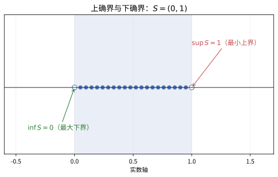
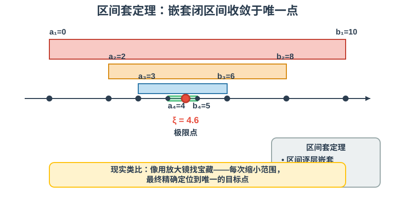
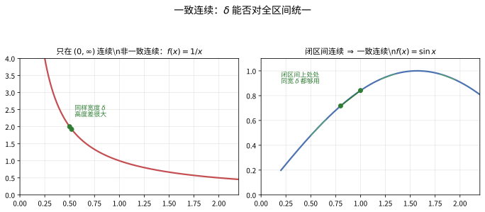
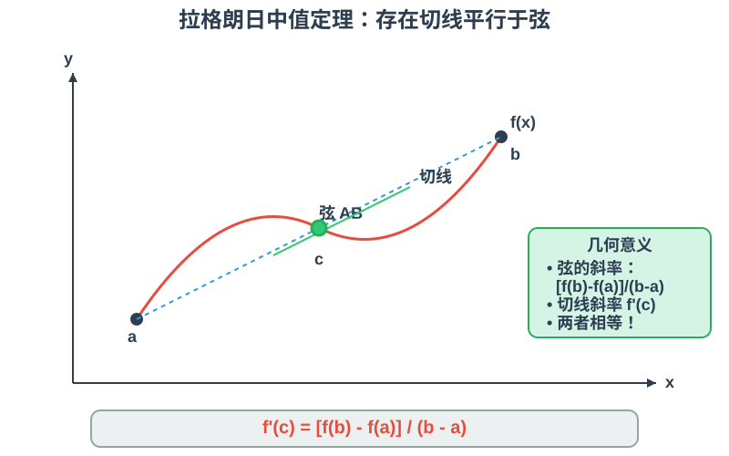
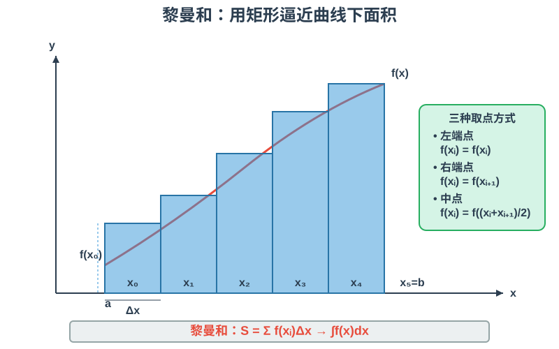
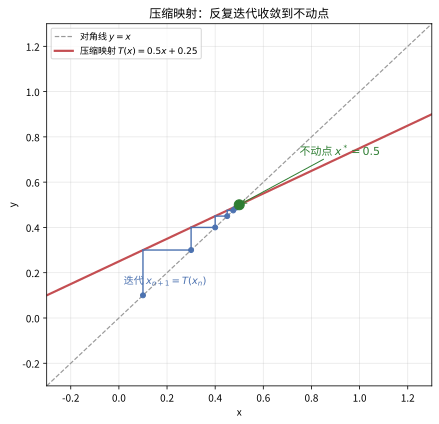

# 第 17 级：实分析 (Real Analysis)

## 一、学习目标

完成本教程后，你应当能够：

1. **理解实数的完备性**——掌握确界原理、完备性公理、区间套定理、Bolzano-Weierstrass 定理以及 Cauchy 收敛准则，理解实数与有理数的本质区别。
2. **用 ε-N 语言严谨处理序列极限**——计算极限上下确界，掌握子序列及其应用，熟练运用 Bolzano-Weierstrass 定理证明序列收敛性。
3. **用 ε-δ 语言分析函数连续性**——掌握连续性的多种等价刻画，区分一致连续与普通连续，能够证明介值定理和极值定理。
4. **掌握微分学的核心定理**——理解 Darboux 定理（导数的介值性），熟练运用中值定理解决问题，掌握带余项的 Taylor 展开。
5. **建立 Riemann 积分的严格理论**——理解 Riemann 和、可积条件，能够证明微积分基本定理。
6. **分析函数序列与函数项级数**——区分点态收敛与一致收敛，掌握一致收敛保持连续性、可积性、可微性的条件，了解 Arzelà-Ascoli 定理。
7. **在度量空间中运用抽象分析**——理解开集、闭集、紧致性、完备性的概念，掌握压缩映射原理及其应用。
8. **掌握 Riemann-Stieltjes 积分**——理解以单调函数 $\alpha$ 为"权重"的积分，为概率论、物理和测度论奠定桥梁。
9. **理解连续函数的一致逼近**——掌握 Weierstrass 逼近定理与 Stone-Weierstrass 定理。
10. **理解 Baire 范畴定理**——用"范畴"刻画空间的大小，理解"绝大多数连续函数处处不可导"等深刻结论。

---

## 二、实数完备性

### 2.1 确界 (Supremum and Infimum)

**定义 (上界与下界)**：设 $S \subseteq \mathbb{R}$ 为非空集合。若存在 $M \in \mathbb{R}$ 使得对一切 $x \in S$ 都有 $x \le M$，则称 $M$ 为 $S$ 的一个**上界**。类似定义**下界**。

**定义 (确界)**：

- 若 $S$ 有上界，则 $S$ 的最小上界称为**上确界 (supremum)**，记作 $\sup S$。
- 若 $S$ 有下界，则 $S$ 的最大下界称为**下确界 (infimum)**，记作 $\inf S$。

**例子**：若 $S = (0, 1)$，则 $\sup S = 1$，$\inf S = 0$。注意 $1 \notin S$，但仍是上确界。

S=(0,1)S=(0,1) 的最小上界是 1，最大下界是 0" />

> **直观理解（现实类比）**：上确界就是"**所有上界里最矮的那个门槛**"，下确界是"**所有下界里最高的那个地板**"。集合 $S=(0,1)$ 的所有上界是 $\{x \ge 1\}$，其中最矮的是 1——即使 1 本身不在集合里，它仍是上确界。这就像**一群人的身高**：上确界是"最矮的、能盖过所有人的伞"，哪怕没人刚好那么高。

### 2.2 完备性公理 (Completeness Axiom)

> **完备性公理 (Dedekind 完备性)**：$\mathbb{R}$ 的任何非空有上界的子集必有上确界（在 $\mathbb{R}$ 中）。

这是实数区别于有理数的关键性质。有理数集 $\mathbb{Q}$ 不满足完备性公理——例如 $S = \{x \in \mathbb{Q} \mid x^2 < 2\}$ 在 $\mathbb{Q}$ 中没有上确界。

**命题**：完备性公理等价于下确界版本：$\mathbb{R}$ 的任何非空有下界的子集必有下确界。

### 2.3 区间套定理 (Nested Interval Theorem)

> **定理 (区间套定理)**：设 $\{[a_n, b_n]\}_{n=1}^{\infty}$ 是一列闭区间，满足：
>
> 1. $[a_{n+1}, b_{n+1}] \subseteq [a_n, b_n]$ 对所有 $n$ 成立；
> 2. $\lim_{n\to\infty} (b_n - a_n) = 0$。
>
> 则存在唯一的实数 $\xi$ 属于所有区间，即 $\bigcap_{n=1}^{\infty} [a_n, b_n] = \{\xi\}$。

**证明**：由条件 (1)，数列 $\{a_n\}$ 单调递增且有上界 $b_1$，数列 $\{b_n\}$ 单调递减且有下界 $a_1$。由完备性公理，令 $\xi = \sup\{a_n\}$，则 $a_n \le \xi \le b_n$ 对所有 $n$ 成立。由条件 (2)，$\lim_{n\to\infty} (b_n - a_n) = 0$，故极限唯一。$\square$

### 2.4 Bolzano-Weierstrass 定理

> **定理 (Bolzano-Weierstrass)**：$\mathbb{R}$ 中的任何有界无穷集合至少有一个聚点（即存在收敛子序列的极限点）。

**证明**：设 $S \subseteq \mathbb{R}$ 是有界无穷集合，则存在 $[a, b]$ 包含 $S$。将 $[a, b]$ 等分为两个子区间，则至少有一个子区间包含 $S$ 的无穷多个点，记该区间为 $[a_1, b_1]$。重复此过程，得到一列闭区间 $[a_n, b_n]$ 满足：

- $[a_{n+1}, b_{n+1}] \subseteq [a_n, b_n]$；
- $b_n - a_n = (b-a)/2^n \to 0$；
- 每个 $[a_n, b_n]$ 包含 $S$ 的无穷多个点。

由区间套定理，存在 $\xi \in \bigcap_{n=1}^{\infty} [a_n, b_n]$。对任意 $\varepsilon > 0$，取 $N$ 使得 $b_N - a_N < \varepsilon$，则 $[a_N, b_N] \subseteq (\xi - \varepsilon, \xi + \varepsilon)$，从而该邻域包含 $S$ 的无穷多个点，故 $\xi$ 是 $S$ 的聚点。$\square$

> **直观理解（现实类比）**：区间套定理就像**用放大镜找宝藏**——每次把搜索范围缩小一半，最终精确定位到唯一的目标点。或者想象你在一个长走廊里找人：第一次知道他在整栋楼里，第二次知道他在这一层，第三次知道他在这一排房间……范围越来越小，最终锁定到唯一的那个人。

### 2.5 Cauchy 完备性 (Cauchy Completeness)

**定义 (Cauchy 列)**：数列 $\{x_n\}$ 称为 **Cauchy 列**，若对任意 $\varepsilon > 0$，存在 $N \in \mathbb{N}$，使得当 $m, n \ge N$ 时，$|x_n - x_m| < \varepsilon$。

> **定理 (Cauchy 收敛准则)**：$\mathbb{R}$ 中的数列收敛当且仅当它是 Cauchy 列。

**证明概要**：

- ($\Rightarrow$) 若 $x_n \to x$，则对 $\varepsilon > 0$，存在 $N$ 使得 $n \ge N$ 时 $|x_n - x| < \varepsilon/2$，从而 $m, n \ge N$ 时 $|x_n - x_m| \le |x_n - x| + |x - x_m| < \varepsilon$。
- ($\Leftarrow$) 若 $\{x_n\}$ 是 Cauchy 列，则它有界。由 Bolzano-Weierstrass 定理，存在收敛子序列 $x_{n_k} \to x$。利用 Cauchy 性质可证 $x_n \to x$。$\square$

---

## 三、序列的极限

### 3.1 ε-N 定义回顾

**定义**：称数列 $\{a_n\}$ 收敛于 $L$，记作 $\lim_{n\to\infty} a_n = L$，若对任意 $\varepsilon > 0$，存在 $N \in \mathbb{N}$，使得当 $n > N$ 时，$|a_n - L| < \varepsilon$。

**例子**：证明 $\lim_{n\to\infty} \frac{1}{n} = 0$。对任意 $\varepsilon > 0$，取 $N = \lceil 1/\varepsilon \rceil$，则当 $n > N$ 时，$|1/n - 0| = 1/n < 1/N \le \varepsilon$。

### 3.2 极限上确界与极限下确界 (Limsup and Liminf)

**定义**：对数列 $\{a_n\}$，定义

- $\limsup_{n\to\infty} a_n = \lim_{n\to\infty} \sup_{k \ge n} a_k$；
- $\liminf_{n\to\infty} a_n = \lim_{n\to\infty} \inf_{k \ge n} a_k$。

**性质**：

- $\liminf a_n \le \limsup a_n$，且 $\{a_n\}$ 收敛当且仅当 $\liminf a_n = \limsup a_n$。
- 对任意数列，$\limsup$ 和 $\liminf$ 总是存在（可以是 $\pm\infty$）。

### 3.3 子序列 (Subsequences)

**定义**：设 $\{a_n\}$ 是数列，$\{n_k\}$ 是严格递增的自然数序列，则 $\{a_{n_k}\}$ 称为 $\{a_n\}$ 的一个**子序列**。

> **定理**：$\lim_{n\to\infty} a_n = L$ 当且仅当 $\{a_n\}$ 的每个子序列都收敛于 $L$。

### 3.4 Bolzano-Weierstrass 定理（序列版本）

> **定理 (Bolzano-Weierstrass for Sequences)**：$\mathbb{R}$ 中的任何有界数列必有收敛子序列。

**证明**：设 $\{a_n\}$ 是有界数列，考虑其值域集合 $S = \{a_n \mid n \in \mathbb{N}\}$。若 $S$ 是有限集，则存在某个值重复无穷多次，这些重复项即构成收敛子序列。若 $S$ 是无穷集，则由集合版本的 Bolzano-Weierstrass 定理，$S$ 有聚点 $\xi$。对 $k = 1, 2, \dots$，取 $a_{n_k} \in (\xi - 1/k, \xi + 1/k)$ 且 $n_k > n_{k-1}$，则 $\{a_{n_k}\}$ 收敛于 $\xi$。$\square$

---

## 四、函数的连续性

### 4.1 ε-δ 定义

**定义**：函数 $f: D \to \mathbb{R}$ 在点 $x_0 \in D$ 处连续，若对任意 $\varepsilon > 0$，存在 $\delta > 0$，使得当 $x \in D$ 且 $|x - x_0| < \delta$ 时，有 $|f(x) - f(x_0)| < \varepsilon$。

若 $f$ 在 $D$ 的每一点都连续，则称 $f$ 在 $D$ 上连续。

### 4.2 序列连续性 (Sequential Continuity)

> **定理**：$f$ 在 $x_0$ 处连续当且仅当对任意满足 $x_n \to x_0$ 的序列 $\{x_n\} \subseteq D$，都有 $f(x_n) \to f(x_0)$。

**证明**：($\Rightarrow$) 由 ε-δ 定义，对 $\varepsilon > 0$ 存在 $\delta > 0$，由 $x_n \to x_0$ 知存在 $N$ 使 $n \ge N$ 时 $|x_n - x_0| < \delta$，从而 $|f(x_n) - f(x_0)| < \varepsilon$。

($\Leftarrow$) 用反证法。若 $f$ 在 $x_0$ 不连续，则存在 $\varepsilon_0 > 0$，对每个 $\delta = 1/n$ 都存在 $x_n$ 满足 $|x_n - x_0| < 1/n$ 但 $|f(x_n) - f(x_0)| \ge \varepsilon_0$。于是 $x_n \to x_0$ 但 $f(x_n) \not\to f(x_0)$，矛盾。$\square$

### 4.3 一致连续 (Uniform Continuity)

**定义**：函数 $f: D \to \mathbb{R}$ 称为在 $D$ 上**一致连续**，若对任意 $\varepsilon > 0$，存在 $\delta > 0$，使得对任意 $x, y \in D$，只要 $|x - y| < \delta$，就有 $|f(x) - f(y)| < \varepsilon$。

**关键区别**：普通连续中的 $\delta$ 可以依赖于 $x_0$，而一致连续中的 $\delta$ 只依赖于 $\varepsilon$，对全区间一致有效。

> **定理 (Cantor)**：若 $f$ 在闭区间 $[a, b]$ 上连续，则 $f$ 在 $[a, b]$ 上一致连续。

\delta\delta 能否对全区间统一有效" />

> **直观理解（现实类比）**：普通连续是"**逐点收紧的尺子**"——每个点 $x_0$ 可以各配一把合适刻度的尺（$\delta$ 随点变化）；一致连续是"**一把全区间通用的尺**"——同一个 $\delta$ 对整段区间处处有效。$f(x)=1/x$ 在 $(0,\infty)$ 连续却不一致连续，因为越靠近 0 曲线越陡，同一把" $\delta$ 尺"在陡峭处会跨出过大的高度差；而 $f(x)=\sin x$ 在闭区间上整体平缓，一把尺就能通吃（Cantor 定理保证）。

### 4.4 介值定理 (Intermediate Value Theorem)

> **定理 (介值定理)**：设 $f: [a, b] \to \mathbb{R}$ 连续，且 $f(a) < y < f(b)$（或 $f(a) > y > f(b)$），则存在 $c \in (a, b)$ 使得 $f(c) = y$。

**证明**：不妨设 $f(a) < y < f(b)$。定义集合 $S = \{x \in [a, b] \mid f(x) \le y\}$。$a \in S$ 故 $S$ 非空，且有上界 $b$，令 $c = \sup S$。由连续性，$f(c) \le y$（因为若 $f(c) > y$，则在 $c$ 附近 $f(x) > y$ 与 $c$ 是上确界矛盾）。又若 $f(c) < y$，则存在 $c$ 右侧的点 $x'$ 使 $f(x') < y$，与 $c$ 是上界矛盾。故 $f(c) = y$。$\square$

### 4.5 极值定理 (Extreme Value Theorem)

> **定理 (极值定理)**：设 $f: [a, b] \to \mathbb{R}$ 连续，则 $f$ 在 $[a, b]$ 上取得最大值和最小值。

**证明**：先证 $f$ 有界。若 $f$ 无界，则存在 $x_n \in [a, b]$ 使 $|f(x_n)| \to \infty$。由 Bolzano-Weierstrass 定理，$\{x_n\}$ 有收敛子序列 $x_{n_k} \to x_0 \in [a, b]$。由连续性，$f(x_{n_k}) \to f(x_0)$，与 $|f(x_{n_k})| \to \infty$ 矛盾。故 $f$ 有界。

令 $M = \sup\{f(x) \mid x \in [a, b]\}$。存在 $x_n \in [a, b]$ 使 $f(x_n) \to M$。取收敛子序列 $x_{n_k} \to x^*$，由连续性 $f(x^*) = \lim f(x_{n_k}) = M$，故最大值在 $x^*$ 处取得。最小值同理。$\square$

---

## 五、可微性

### 5.1 Darboux 定理（导数的介值性）

> **定理 (Darboux)**：设 $f: [a, b] \to \mathbb{R}$ 可导。若 $f'(a) < d < f'(b)$（或 $f'(a) > d > f'(b)$），则存在 $c \in (a, b)$ 使得 $f'(c) = d$。

**证明**：设 $f'(a) < d < f'(b)$。定义 $g(x) = f(x) - dx$，则 $g'(a) = f'(a) - d < 0$，$g'(b) = f'(b) - d > 0$。由极值定理，$g$ 在 $[a, b]$ 上某点 $c$ 取得最小值。由于 $g'(a) < 0$，$a$ 不是最小值点（$g$ 在 $a$ 右侧递减）；同理 $b$ 不是最小值点。故 $c \in (a, b)$，由 Fermat 引理 $g'(c) = 0$，即 $f'(c) = d$。$\square$

**推论**：导函数不一定连续，但一定具有介值性。

### 5.2 中值定理及其应用

**Rolle 定理**：若 $f$ 在 $[a, b]$ 连续，在 $(a, b)$ 可导，且 $f(a) = f(b)$，则存在 $c \in (a, b)$ 使 $f'(c) = 0$。

**Lagrange 中值定理**：若 $f$ 在 $[a, b]$ 连续，在 $(a, b)$ 可导，则存在 $c \in (a, b)$ 使

$$
f(b) - f(a) = f'(c)(b - a).
$$

cc，使曲线在该点的切线平行于连接端点的弦" />

**Cauchy 中值定理**：若 $f, g$ 在 $[a, b]$ 连续，在 $(a, b)$ 可导，且 $g'(x) \neq 0$，则存在 $c \in (a, b)$ 使

$$
\frac{f(b) - f(a)}{g(b) - g(a)} = \frac{f'(c)}{g'(c)}.
$$

**应用举例**：

1. 若 $f'(x) = 0$ 对所有 $x \in (a, b)$ 成立，则 $f$ 在 $[a, b]$ 上为常数。
2. 若 $f'(x) > 0$ 对所有 $x \in (a, b)$ 成立，则 $f$ 严格递增。
3. 证明不等式：对 $0 < a < b$，有 $\frac{b-a}{b} < \ln\frac{b}{a} < \frac{b-a}{a}$。

### 5.3 Taylor 定理（带余项）

> **定理 (Taylor)**：设 $f$ 在 $[a, b]$ 上有 $n$ 阶连续导数，在 $(a, b)$ 上有 $n+1$ 阶导数。则对 $x_0 \in [a, b]$，存在 $\xi$ 介于 $x$ 与 $x_0$ 之间，使得
>
>
$$
> f(x) = \sum_{k=0}^{n} \frac{f^{(k)}(x_0)}{k!}(x-x_0)^k + R_n(x),
> $$
>
> 其中 **Lagrange 余项**：$R_n(x) = \frac{f^{(n+1)}(\xi)}{(n+1)!}(x-x_0)^{n+1}$。

**证明思路**：定义辅助函数，反复应用 Cauchy 中值定理。

---

## 六、黎曼积分

### 6.1 Riemann 积分的定义

设 $f: [a, b] \to \mathbb{R}$ 有界。取分割 $P = \{x_0, x_1, \dots, x_n\}$，其中 $a = x_0 < x_1 < \cdots < x_n = b$。记 $\Delta x_i = x_i - x_{i-1}$，$\|P\| = \max \Delta x_i$。

**Darboux 和**：

- 下和：$L(P, f) = \sum_{i=1}^{n} m_i \Delta x_i$，其中 $m_i = \inf\{f(x) \mid x \in [x_{i-1}, x_i]\}$。
- 上和：$U(P, f) = \sum_{i=1}^{n} M_i \Delta x_i$，其中 $M_i = \sup\{f(x) \mid x \in [x_{i-1}, x_i]\}$。

**定义**：$f$ 在 $[a, b]$ 上 **Riemann 可积**，若
$$
\sup_P L(P, f) = \inf_P U(P, f),
$$
该公共值称为 $\int_a^b f(x)\,dx$。

### 6.2 Riemann 和

**定义**：对分割 $P$ 和取样点 $\xi_i \in [x_{i-1}, x_i]$，Riemann 和为
$$
S(P, f) = \sum_{i=1}^{n} f(\xi_i) \Delta x_i.
$$
> **定理**：$f$ 在 $[a, b]$ 上 Riemann 可积当且仅当对任意分割序列 $P_n$ 满足 $\|P_n\| \to 0$ 和任意取样，Riemann 和收敛于同一极限。

### 6.3 可积条件

> **定理 (Riemann 可积的充要条件)**：有界函数 $f$ 在 $[a, b]$ 上 Riemann 可积当且仅当 $f$ 在 $[a, b]$ 上几乎处处连续（即不连续点集为零测集）。

**简单判定**：

- 连续函数必可积。
- 单调函数必可积。
- 只有有限个间断点的有界函数必可积。

### 6.4 微积分基本定理 (Fundamental Theorem of Calculus)

**第一部分**：设 $f$ 在 $[a, b]$ 上 Riemann 可积，定义
$$
F(x) = \int_a^x f(t)\,dt, \quad x \in [a, b].
$$
则 $F$ 在 $[a, b]$ 上连续；若 $f$ 在 $x_0 \in [a, b]$ 处连续，则 $F$ 在 $x_0$ 处可导且 $F'(x_0) = f(x_0)$。

**证明**：对 $x, x+h \in [a, b]$，
$$
F(x+h) - F(x) = \int_x^{x+h} f(t)\,dt.
$$
由于 $f$ 有界，设 $|f(t)| \le M$，则 $|F(x+h) - F(x)| \le M|h|$，故 $F$ 一致连续。

若 $f$ 在 $x$ 处连续，对 $\varepsilon > 0$，存在 $\delta > 0$ 使 $|t - x| < \delta$ 时 $|f(t) - f(x)| < \varepsilon$。当 $|h| < \delta$ 时，
$$
\left|\frac{F(x+h) - F(x)}{h} - f(x)\right| = \left|\frac{1}{h}\int_x^{x+h} (f(t) - f(x))\,dt\right| \le \frac{1}{|h|}\cdot \varepsilon |h| = \varepsilon,
$$
故 $F'(x) = f(x)$。$\square$

**第二部分**：设 $f$ 在 $[a, b]$ 上 Riemann 可积，$F$ 是 $f$ 在 $[a, b]$ 上的一个原函数（即 $F' = f$），则
$$
\int_a^b f(x)\,dx = F(b) - F(a).
$$
**证明**：对任意分割 $P = \{x_0, \dots, x_n\}$，
$$
F(b) - F(a) = \sum_{i=1}^{n} [F(x_i) - F(x_{i-1})].
$$
由 Lagrange 中值定理，存在 $\xi_i \in (x_{i-1}, x_i)$ 使 $F(x_i) - F(x_{i-1}) = F'(\xi_i)(x_i - x_{i-1}) = f(\xi_i)\Delta x_i$。于是
$$
F(b) - F(a) = \sum_{i=1}^{n} f(\xi_i)\Delta x_i,
$$
这就是一个 Riemann 和。当 $\|P\| \to 0$ 时，该和趋于 $\int_a^b f(x)\,dx$。$\square$

### 6.5 Riemann-Stieltjes 积分

> **💡 直观理解**：普通 Riemann 积分 $\int_a^b f\,dx$ 是把区间 $[a,b]$ 按"长度 $dx$"切割后求和的。而 **Riemann-Stieltjes 积分** $\int_a^b f\,d\alpha$ 是按"权重 $\alpha$ 的变化 $d\alpha$"来加权求和的。当 $\alpha$ 是一个累计函数（如人口累计、资金累计）时，$d\alpha$ 表示"这一小段里新增的量"，$f(x)$ 是"每个个体的价值"，积分得到的就是"总价值"。这为概率论、物理、工程提供了一种统一的积分语言。

**定义**：设 $\alpha$ 是 $[a,b]$ 上的单调增函数，$f$ 是 $[a,b]$ 上的有界函数。对分割 $P = \{x_0, x_1, \dots, x_n\}$，记 $\Delta\alpha_i = \alpha(x_i) - \alpha(x_{i-1})$。定义
$$
U(P, f, \alpha) = \sum_{i=1}^{n} M_i \,\Delta\alpha_i, \qquad
L(P, f, \alpha) = \sum_{i=1}^{n} m_i \,\Delta\alpha_i,
$$
其中 $M_i = \sup\{f(x) : x \in [x_{i-1}, x_i]\}$，$m_i = \inf\{f(x) : x \in [x_{i-1}, x_i]\}$。

**定义**：若 $\sup_P L(P, f, \alpha) = \inf_P U(P, f, \alpha)$，则称 $f$ 关于 $\alpha$ 在 $[a,b]$ 上 **Riemann-Stieltjes 可积**，记作
$$
\int_a^b f(x)\,d\alpha(x).
$$
**性质**（与 Riemann 积分高度类似）：

1. **线性**：$\int_a^b (c_1 f + c_2 g)\,d\alpha = c_1\int_a^b f\,d\alpha + c_2\int_a^b g\,d\alpha$；
2. **区间可加**：$\int_a^b f\,d\alpha = \int_a^c f\,d\alpha + \int_c^b f\,d\alpha$；
3. **单调性**：若 $f \le g$，则 $\int_a^b f\,d\alpha \le \int_a^b g\,d\alpha$；
4. **退化性**：当 $\alpha(x) = x$ 时，$\int_a^b f\,d\alpha = \int_a^b f\,dx$，即退化为普通 Riemann 积分。

> **定理 (可积性)**：若 $f$ 在 $[a,b]$ 上连续、$\alpha$ 单调，则 $f$ 关于 $\alpha$ 可积。

> **定理 (第一中值定理)**：若 $f$ 连续、$\alpha$ 单调，则存在 $\xi \in [a,b]$ 使得
>
> $$
> \int_a^b f\,d\alpha = f(\xi)\big[\alpha(b) - \alpha(a)\big].
> $$

**应用**：

- **概率论**：设 $F$ 是随机变量 $X$ 的分布函数，则期望 $E[f(X)] = \int_{-\infty}^{+\infty} f(x)\,dF(x)$；
- **矩问题**：$E[X^n] = \int_{-\infty}^{+\infty} x^n\,dF(x)$；
- **物理**：质量不均匀分布的杆的质心、转动惯量可用 $d\alpha$ 表示局部质量。

**例**：设 $\alpha$ 是阶梯函数：$\alpha(x) = 0$（$x < 0$），$\alpha(x) = 1$（$x \ge 0$）。求 $\int_{-1}^{1} f(x)\,d\alpha(x)$。

**解**：$d\alpha$ 只在 $x = 0$ 处有"跳跃"（幅度为 1），其余各处为 0，故
$$
\int_{-1}^{1} f(x)\,d\alpha(x) = f(0)\cdot 1 = f(0).
$$
这就像一个"把所有质量集中在 $x=0$ 这一点"的测度——它只"取走" $f(0)$ 这一个值。这正是日后 Dirac $\delta$ 函数与测度论的直观来源。

---

## 七、函数序列与一致收敛

### 7.1 点态收敛 vs 一致收敛

**定义**：设 $\{f_n\}$ 是定义在 $D \subseteq \mathbb{R}$ 上的函数序列，$f$ 是 $D$ 上的函数。

- **点态收敛**：对每个 $x \in D$，$\lim_{n\to\infty} f_n(x) = f(x)$。即对 $\forall x \in D, \forall \varepsilon > 0, \exists N(x, \varepsilon)$ 使 $n \ge N$ 时 $|f_n(x) - f(x)| < \varepsilon$。
- **一致收敛**：$\lim_{n\to\infty} \sup_{x \in D} |f_n(x) - f(x)| = 0$。即对 $\forall \varepsilon > 0, \exists N(\varepsilon)$ 使 $n \ge N$ 时对一切 $x \in D$ 有 $|f_n(x) - f(x)| < \varepsilon$。

**关键区别**：一致收敛要求 $N$ 不依赖于 $x$。

**例子**：$f_n(x) = x^n$ 在 $[0, 1]$ 上点态收敛于
$$
f(x) = \begin{cases} 0, & 0 \le x < 1, \\ 1, & x = 1, \end{cases}
$$
但并非一致收敛，因为 $\sup_{x\in[0,1]} |x^n - f(x)| = 1 \not\to 0$。

### 7.2 一致收敛保持连续性

> **定理**：若每个 $f_n$ 在 $D$ 上连续，且 $f_n \rightrightarrows f$（一致收敛）于 $D$，则 $f$ 在 $D$ 上连续。

**证明**：对 $x_0 \in D$ 和 $\varepsilon > 0$，由一致收敛存在 $N$ 使对所有 $x$ 有 $|f_N(x) - f(x)| < \varepsilon/3$。由 $f_N$ 在 $x_0$ 连续，存在 $\delta > 0$ 使 $|x - x_0| < \delta$ 时 $|f_N(x) - f_N(x_0)| < \varepsilon/3$。于是
$$
|f(x) - f(x_0)| \le |f(x) - f_N(x)| + |f_N(x) - f_N(x_0)| + |f_N(x_0) - f(x_0)| < \varepsilon.
$$
故 $f$ 在 $x_0$ 连续。$\square$

### 7.3 一致收敛保持可积性

> **定理**：若 $f_n$ 在 $[a, b]$ 上 Riemann 可积，且 $f_n \rightrightarrows f$，则 $f$ 在 $[a, b]$ 上 Riemann 可积，且
$$
\lim_{n\to\infty} \int_a^b f_n(x)\,dx = \int_a^b f(x)\,dx.
$$
### 7.4 一致收敛与可微性

> **定理**：设 $f_n$ 在 $[a, b]$ 上可导，$f_n'$ 一致收敛于 $g$，且存在某个 $x_0 \in [a, b]$ 使 $f_n(x_0)$ 收敛，则 $f_n$ 一致收敛于某个可导函数 $f$，且 $f' = g$。

### 7.5 Arzelà-Ascoli 定理

> **定理 (Arzelà-Ascoli)**：设 $\{f_n\}$ 是定义在紧致集 $K \subseteq \mathbb{R}^m$ 上的连续函数序列。若 $\{f_n\}$ 是
>
> 1. **一致有界**：存在 $M > 0$ 使对所有 $n$ 和 $x \in K$ 有 $|f_n(x)| \le M$；
> 2. **等度连续**：对任意 $\varepsilon > 0$，存在 $\delta > 0$，使得对任意 $n$ 和任意 $x, y \in K$，只要 $|x - y| < \delta$ 就有 $|f_n(x) - f_n(y)| < \varepsilon$，
>
> 则 $\{f_n\}$ 存在一致收敛的子序列。

### 7.6 Stone-Weierstrass 定理

> **💡 直观理解**：任何连续函数都能被"多项式光滑地逼近到任意精度"。这就像：无论一条曲线多复杂，总能用足够高阶的多项式画出它的"高清复制品"。这个性质是数值分析（曲线拟合）、逼近论、乃至机器学习（万能逼近定理）的坚实理论基础。

**Weierstrass 逼近定理**：设 $f$ 在紧区间 $[a,b]$ 上连续，则存在多项式序列 $\{p_n\}$ 在 $[a,b]$ 上一致收敛于 $f$（记作 $p_n \rightrightarrows f$）。

**证明（Bernstein 构造法）**：先化为 $[0,1]$ 的情形。定义 Bernstein 多项式
$$
B_n(f)(x) = \sum_{k=0}^{n} f\left(\frac{k}{n}\right)\binom{n}{k} x^k (1-x)^{n-k}.
$$
由 $f$ 在 $[0,1]$ 上一致连续，以及二项分布期望 $\sum_k \binom{n}{k}x^k(1-x)^{n-k}=1$、方差趋于 $0$ 的性质，可证 $B_n(f) \rightrightarrows f$。即 Bernstein 多项式（它本质上是 $f$ 在"以 $x$ 为中心的二项分布"下的期望）一致逼近 $f$。$\square$

> **定理 (Stone-Weierstrass，一般形式)**：设 $X$ 是紧度量空间，$\mathcal{A}$ 是 $C(X)$（$X$ 上连续函数关于一致范数构成的空间）的一个**子代数**（对加法、数乘、乘法封闭），且
>
> 1. $\mathcal{A}$ **分离点**：对任意 $x \ne y \in X$，存在 $g \in \mathcal{A}$ 使 $g(x) \ne g(y)$；
> 2. $\mathcal{A}$ 对每个点都不全为零：对任意 $x \in X$，存在 $g \in \mathcal{A}$ 使 $g(x) \ne 0$。
>
> 则 $\mathcal{A}$ 在 $C(X)$ 中按一致范数稠密。

**通俗表述**：一个"带常数、能分开任意两点"的闭子代数，事实上就是**整个** $C(X)$。

**应用**：

- 多项式逼近任意连续函数（Weierstrass 特例）；
- 三角多项式逼近周期连续函数；
- 为泛函分析（$C^*$ 代数、Gelfand 表示）、数值逼近、机器学习（神经网络万能逼近）奠定基础。

---

## 八、度量空间

### 8.1 度量空间的定义

**定义**：集合 $X$ 上的**度量**是一个函数 $d: X \times X \to \mathbb{R}$，满足：

1. 正定性：$d(x, y) \ge 0$，且 $d(x, y) = 0 \iff x = y$；
2. 对称性：$d(x, y) = d(y, x)$；
3. 三角不等式：$d(x, z) \le d(x, y) + d(y, z)$。

$(X, d)$ 称为**度量空间**。

**例子**：

- $\mathbb{R}$ 上的标准度量：$d(x, y) = |x - y|$。
- $\mathbb{R}^n$ 上的欧几里得度量：$d(x, y) = \sqrt{\sum_{i=1}^n (x_i - y_i)^2}$。
- 离散度量：$d(x, y) = 0$ 若 $x = y$，否则 $d(x, y) = 1$。

### 8.2 开集与闭集

**定义**：

- **开球**：$B(x_0, r) = \{x \in X \mid d(x, x_0) < r\}$。
- $U \subseteq X$ 是**开集**，若对每个 $x \in U$，存在 $r > 0$ 使 $B(x, r) \subseteq U$。
- $F \subseteq X$ 是**闭集**，若 $X \setminus F$ 是开集。

**性质**：

- 任意开集的并是开集，有限个开集的交是开集。
- 任意闭集的交是闭集，有限个闭集的并是闭集。

### 8.3 紧致性 (Compactness)

**定义**：$K \subseteq X$ 称为**紧致**的，若 $K$ 的任何开覆盖都有有限子覆盖。

> **定理 (Heine-Borel)**：在 $\mathbb{R}^n$ 中，$K$ 是紧致的当且仅当 $K$ 是有界闭集。

> **定理**：连续函数将紧致集映射为紧致集。特别地，紧致集上的连续函数必有最大值和最小值。

### 8.4 完备性 (Completeness)

**定义**：度量空间 $(X, d)$ 称为**完备**的，若其中的每个 Cauchy 列都收敛于 $X$ 中的一点。

**例子**：

- $\mathbb{R}$ 是完备的。
- $\mathbb{Q}$ 不是完备的。
- $C[0, 1]$（带 sup 度量）是完备的。

### 8.5 压缩映射原理 (Banach Fixed Point Theorem)

> **定理 (Banach 不动点定理)**：设 $(X, d)$ 是完备度量空间，$T: X \to X$ 是**压缩映射**，即存在 $\lambda \in [0, 1)$ 使得对任意 $x, y \in X$，
>
> $$
> d(Tx, Ty) \le \lambda \, d(x, y).
> $$
>
> 则 $T$ 有唯一的不动点 $x^*$（即 $Tx^* = x^*$）。且对任意 $x_0 \in X$，迭代序列 $x_{n+1} = Tx_n$ 收敛于 $x^*$，且有误差估计：
>
> $$
> d(x_n, x^*) \le \frac{\lambda^n}{1-\lambda} d(x_1, x_0).
> $$

**证明**：

1. **存在性**：对任意 $x_0 \in X$，定义 $x_{n+1} = Tx_n$。则
   $$
   d(x_{n+1}, x_n) = d(Tx_n, Tx_{n-1}) \le \lambda d(x_n, x_{n-1}) \le \cdots \le \lambda^n d(x_1, x_0).
   $$
   对 $m > n$，
   $$
   d(x_m, x_n) \le \sum_{k=n}^{m-1} d(x_{k+1}, x_k) \le d(x_1, x_0) \sum_{k=n}^{\infty} \lambda^k = d(x_1, x_0) \frac{\lambda^n}{1-\lambda}.
   $$
   故 $\{x_n\}$ 是 Cauchy 列。由 $(X, d)$ 完备，存在 $x^* = \lim_{n\to\infty} x_n$。由压缩映射的连续性（Lipschitz 连续），
   $$
   Tx^* = T(\lim x_n) = \lim Tx_n = \lim x_{n+1} = x^*.
   $$
2. **唯一性**：若 $Tx^* = x^*$ 且 $Ty^* = y^*$，则
   $$
   d(x^*, y^*) = d(Tx^*, Ty^*) \le \lambda d(x^*, y^*),
   $$
   由于 $\lambda < 1$，必有 $d(x^*, y^*) = 0$，即 $x^* = y^*$。
3. **误差估计**：由上述不等式，令 $m \to \infty$ 即得。$\square$

**应用**：解微分方程 $y' = f(x, y)$ 的 Picard 存在唯一性定理、隐函数定理等。

x_{n+1}=T(x_n)x_{n+1}=T(x_n) 反复逼近不动点 $$" />

> **直观理解（现实类比）**：压缩映射就是"**每次把距离缩小到原来的 $\lambda<1$ 倍的'吸铁石'**"。在 $y=x$ 对角线上，垂直上去再水平过去，就像走楼梯一步步逼近 $T$ 与对角线的交点——即不动点。像**把弹簧越拉越短**：只要每次压缩得比伸长快，反复伸缩最终就停在一个不动点。这保证了很多方程（如微分方程的 Picard 迭代）解的存在唯一性。

### 8.6 Baire 范畴定理

> **💡 直观理解**：完备度量空间"足够强壮"，不会由"稀疏的点集"（无处稠密集）的并集填满。就像一根完整、无裂缝的钢筋，不会由一堆散沙拼凑而成。这把看似"罕见"的对象（如处处不可导的连续函数）的存在性变得"普遍"。

**定义**：

- $E$ 在 $X$ 中**稠密**：$\overline{E} = X$；
- $E$ **无处稠密**：$\overline{E}$ 的内部为空（闭包不含任何非空开集）；
- $E$ 是**第一范畴集**：$E$ 是可数个无处稠密集的并集；
- $E$ 是**第二范畴集**：$E$ 不是第一范畴集。

> **定理 (Baire 范畴定理)**：完备度量空间 $X$ 是第二范畴集。即 $X$ 不能写成可数个无处稠密集的并集。

> **等价表述**：完备度量空间中，可数个稠密开集的交集仍然稠密。

**证明思路**：反设 $X = \bigcup_{n=1}^{\infty} E_n$，其中每个 $E_n$ 无处稠密。取闭球 $B_1$ 避免 $E_1$ 的闭包，再在其中取更小闭球 $B_2$ 避免 $E_2$ 的闭包……如此得到一族闭球套 $B_1 \supset B_2 \supset \cdots$，其半径趋于 0。由完备性，存在 $x \in \bigcap_n B_n$。但 $x$ 不属于任何 $E_n$，矛盾。$\square$

**重要应用**：

1. **处处不可导的连续函数是"大多数"**：$C[a,b]$ 中处处不可导的连续函数构成第二范畴集——即"绝大多数"连续函数处处不可导（形象地说，处处可导的连续函数反而是"稀有"的）；
2. **开映射定理 / 闭图像定理**（泛函分析）的证明基础；
3. **Banach 空间**完备性的重要推论（如一致有界原理）。

---

## 九、示例 (Worked Examples)

### 例 1：用 ε-N 定义证明极限

证明 $\lim_{n\to\infty} \frac{2n+1}{3n+2} = \frac{2}{3}$。

**解**：对任意 $\varepsilon > 0$，
$$
\left|\frac{2n+1}{3n+2} - \frac{2}{3}\right| = \left|\frac{3(2n+1) - 2(3n+2)}{3(3n+2)}\right| = \frac{1}{3(3n+2)}.
$$
要使 $\frac{1}{3(3n+2)} < \varepsilon$，只需 $n > \frac{1}{9\varepsilon} - \frac{2}{3}$。取 $N = \max\{1, \lceil \frac{1}{9\varepsilon} - \frac{2}{3} \rceil\}$，则当 $n > N$ 时不等式成立。$\square$

### 例 2：求极限上确界

求 $\limsup_{n\to\infty} \sin\left(\frac{n\pi}{2}\right)$ 和 $\liminf_{n\to\infty} \sin\left(\frac{n\pi}{2}\right)$。

**解**：数列为 $\sin(\pi/2), \sin(\pi), \sin(3\pi/2), \sin(2\pi), \dots$，即 $1, 0, -1, 0, 1, 0, -1, 0, \dots$。

$\limsup = 1$，$\liminf = -1$。数列不收敛。$\square$

### 例 3：用 ε-δ 证明连续性

证明 $f(x) = x^2$ 在任意点 $x_0$ 连续。

**解**：对 $\varepsilon > 0$，$|x^2 - x_0^2| = |x - x_0| \cdot |x + x_0|$。若 $|x - x_0| < 1$，则 $|x + x_0| \le |x - x_0| + 2|x_0| < 1 + 2|x_0|$。取 $\delta = \min\{1, \varepsilon/(1+2|x_0|)\}$，则当 $|x - x_0| < \delta$ 时 $|x^2 - x_0^2| < \varepsilon$。$\square$

### 例 4：一致连续的反例

证明 $f(x) = 1/x$ 在 $(0, 1]$ 上不一致连续。

**解**：取 $\varepsilon = 1$，对任意 $\delta > 0$，取 $n$ 足够大使 $1/n < \delta$，令 $x = 1/n$，$y = 1/(n+1)$，则 $|x - y| = \frac{1}{n(n+1)} < \frac{1}{n} < \delta$，但 $|f(x) - f(y)| = |n - (n+1)| = 1 \ge \varepsilon$。$\square$

### 例 5：介值定理的应用

证明方程 $x^3 - 3x + 1 = 0$ 在 $(0, 1)$ 内有根。

**解**：令 $f(x) = x^3 - 3x + 1$，$f$ 连续。$f(0) = 1 > 0$，$f(1) = -1 < 0$。由介值定理，存在 $c \in (0, 1)$ 使 $f(c) = 0$。$\square$

### 例 6：中值定理的应用

证明 $\sin x \le x$ 对所有 $x \ge 0$ 成立。

**解**：若 $x = 0$，等号成立。若 $x > 0$，对 $f(t) = \sin t$ 在 $[0, x]$ 上应用中值定理，存在 $c \in (0, x)$ 使
$$
\frac{\sin x - \sin 0}{x - 0} = \cos c \le 1,
$$
即 $\sin x \le x$。$\square$

### 例 7：Taylor 展开

求 $f(x) = e^x$ 在 $x_0 = 0$ 处的 $n$ 阶 Taylor 展开，并写出余项。

**解**：$f^{(k)}(0) = 1$ 对所有 $k$ 成立，故
$$
e^x = \sum_{k=0}^{n} \frac{x^k}{k!} + \frac{e^{\xi}}{(n+1)!}x^{n+1},
$$
其中 $\xi$ 介于 $0$ 与 $x$ 之间。$\square$

### 例 8：Riemann 积分计算

用定义计算 $\int_0^1 x^2\,dx$。

**解**：取等分分割 $x_i = i/n$，$\Delta x_i = 1/n$，取右端点 $\xi_i = i/n$，则
$$
S_n = \sum_{i=1}^{n} \left(\frac{i}{n}\right)^2 \cdot \frac{1}{n} = \frac{1}{n^3}\sum_{i=1}^{n} i^2 = \frac{1}{n^3} \cdot \frac{n(n+1)(2n+1)}{6} = \frac{(n+1)(2n+1)}{6n^2}.
$$
令 $n \to \infty$，$S_n \to \frac{1}{3}$，故 $\int_0^1 x^2\,dx = \frac{1}{3}$。$\square$

### 例 9：一致收敛的判断

判断 $f_n(x) = \frac{x}{1+nx^2}$ 在 $\mathbb{R}$ 上是否一致收敛。

**解**：对每个 $x$，$f_n(x) \to 0$。计算
$$
\sup_{x\in\mathbb{R}} |f_n(x)| = \sup_{x\in\mathbb{R}} \frac{|x|}{1+nx^2}.
$$
令 $g(x) = \frac{|x|}{1+nx^2}$，由 $g(x) \le \frac{1}{2\sqrt{n}}$（通过 AM-GM 不等式或求导得到），且 $x = \pm 1/\sqrt{n}$ 时取等。故 $\sup |f_n(x)| = \frac{1}{2\sqrt{n}} \to 0$，所以一致收敛于 $0$。$\square$

### 例 10：压缩映射

设 $T: \mathbb{R} \to \mathbb{R}$，$Tx = \frac{x}{2} + 1$。求不动点并验证压缩性。

**解**：$|Tx - Ty| = |x/2 - y/2| = \frac{1}{2}|x - y|$，故 $\lambda = \frac{1}{2} < 1$，是压缩映射。解 $x = x/2 + 1$ 得不动点 $x^* = 2$。从任意 $x_0$ 出发，迭代 $x_{n+1} = x_n/2 + 1$ 收敛于 $2$。$\square$

---

## 十、解题技巧

> 本节针对实分析中的高频问题，总结可直接套用的解题方法与易错点。每条技巧均给出**适用场景**、**关键步骤**与**常见误区**，并配一个精讲示例。

### 10.1 用 ε-N 语言证明序列极限

**适用场景**：题目要求"用定义证明 $\lim_{n\to\infty}a_n = L$"，或需要给出显式的 $N$。

**关键步骤**：

1. 化简 $|a_n - L|$，把它写成关于 $n$ 的简单表达式（通常是分式）；
2. **放大**：找到一个更"粗"、更易处理的界 $|a_n - L| \le C_n$，且 $C_n \to 0$；
3. 令 $C_n < \varepsilon$，反解出 $n$ 的取值范围；
4. 取 $N = \max\{1, \lceil \text{反解出的下界}\rceil\}$，再按定义完整书写。

**常见误区**：

- 忘记 $N$ 必须取整数；
- 放大时引入无界因子（如把 $n$ 本身放进分母去比较而失去控制）；
- 只对"某个 $n$"验证，而没有声明"对所有 $n > N$"成立。

**精讲示例**：证明 $\lim_{n\to\infty} \frac{n}{n+1} = 1$。
$$
\left|\frac{n}{n+1} - 1\right| = \left|\frac{n-(n+1)}{n+1}\right| = \frac{1}{n+1}
$$
要 $\frac{1}{n+1} < \varepsilon$，只需 $n+1 > \frac{1}{\varepsilon}$，即 $n > \frac{1}{\varepsilon}-1$。取 $N = \left\lceil \frac{1}{\varepsilon}-1 \right\rceil$，则当 $n > N$ 时确有 $|a_n-1|<\varepsilon$。

### 10.2 用 ε-δ 语言证明连续与一致连续

**适用场景**：证明某函数在一点连续、在区间上一致连续，或判断"逐点连续 $\not\Rightarrow$ 一致连续"。

**关键步骤**：

1. 先分解 $|f(x) - f(x_0)|$，把"非线性因子"（如 $x+x_0$、$\sqrt{x}+\sqrt{x_0}$）隔离出来；
2. 在 $x$ 的有界邻域（如 $|x-x_0|<1$）内给这些因子一个上界 $M$；
3. 令 $\delta = \min\{1, \varepsilon/M\}$，保证既限制 $x$ 在邻域内，又能逼出 $\varepsilon$；
4. 求一致连续时，$\delta$ **只能依赖 $\varepsilon$**，需给出不随点变化的统一表达式。

**常见误区**：

- 把依赖点 $x_0$ 的 $\delta$ 误当作一致连续的 $\delta$；
- 忘记取 $\min$，导致越出放大不等式成立的范围；
- 对无界区间直接套用 Cantor 定理（它只对**闭区间**成立）。

**精讲示例**：证明 $f(x)=\sqrt{x}$ 在 $[0,\infty)$ 上一致连续。

对 $x,y\ge 0$，
$$
|\sqrt{x}-\sqrt{y}| = \frac{|x-y|}{\sqrt{x}+\sqrt{y}} \le \sqrt{|x-y|},
$$
故当 $|x-y|< \varepsilon^2$ 时 $|\sqrt{x}-\sqrt{y}|<\varepsilon$。这里 $\delta=\varepsilon^2$ 与点无关，故一致连续。

### 10.3 用中值定理 / Taylor 公式证明不等式

**适用场景**：证明形如 $\varphi(a)\le \frac{f(b)-f(a)}{b-a}\le \psi(a)$ 的夹逼，或估计函数与多项式之差。

**关键步骤**：

1. 识别被证明量对应哪个函数 ${f}$、区间 $[a,b]$；
2. 写出 Lagrange 中值定理（或带余项 Taylor 公式），把差值化为 $f'(c)$（或 $f^{(n+1)}(\xi)$）在某点的取值；
3. 利用 $f'$（或高阶导）的**上下界 / 单调性**来夹逼；
4. 需要"整体逼近"时选用带适当阶数余项的 Taylor 公式。

**常见误区**：

- 把 $\arctan$、$\ln$ 等复合公式的求导算错；
- 忘记 $\frac{1}{1+c^2}$ 关于 $c$ 是**递减**的（导致夹逼方向写反）；
- 对函数在非闭区间上直接应用中值定理。

**精讲示例**：证明对 $0<a<b$，$\frac{b-a}{b}<\ln\frac{b}{a}<\frac{b-a}{a}$。

对 $f(t)=\ln t$ 在 $[a,b]$ 上用中值定理，存在 $c\in(a,b)$：
$$
\ln\frac{b}{a} = \ln b - \ln a = \frac{b-a}{c}.
$$
因 $a<c<b$ 且 $\frac{1}{c}$ 单调递减，得 $\frac{b-a}{b}<\frac{b-a}{c}<\frac{b-a}{a}$，即结论。

### 10.4 一致收敛性的判定（sup 范数法）

**适用场景**：判断函数列 $\{f_n\}$ 在给定集合上是否一致收敛，或讨论极限与积分/求导能否交换。

**关键步骤**：

1. 先求点态极限（对每个固定的 $x$ 求 $\lim f_n(x)$），得到极限函数 $f$；
2. 求 $M_n = \sup_{x\in D}|f_n(x)-f(x)|$（通常先求导找驻点、或观察渐近性来确定上确界）；
3. 若 $M_n \to 0$ 则一致收敛；若 $M_n \not\to 0$（例如 $M_n$ 无界）则不一致收敛；
4. 讨论"极限与积分/导数交换"时，先验证一致性，否则交换一般不成立。

**常见误区**：

- 只验证点态收敛就断言一致收敛；
- 求 $\sup$ 时没有真正找到最大值点（例如只看了端点而忽略内部驻点）；
- 把区间取的过大导致 $\sup=\infty$，却没有回退到"局部一致"的讨论。

**精讲示例**：判断 $\{f_n\}$，$f_n(x)=\frac{|x|}{1+nx^2}$ 在 $\mathbb{R}$ 上是否一致收敛。

点态收敛于 $0$。对 $y=|x|\ge0$，$g_n(y)=\frac{y}{1+ny^2}$，用 AM-GM：$1+ny^2\ge 2\sqrt{n}\,y$，故 $g_n(y)\le\frac{1}{2\sqrt{n}}$，且在 $y=\frac1{\sqrt{n}}$ 取等。于是 $\sup|f_n-0|=\frac{1}{2\sqrt n}\to0$，一致收敛。

### 10.5 用压缩映射原理证明解的存在唯一

**适用场景**：证明积分方程、微分方程初值问题（Picard 型）的解存在且唯一。

**关键步骤**：

1. 把求解问题转化为不动点方程 $Tx=x$（如 $Tf = \varphi + \int$ 的积分方程）；
2. 选定一个**完备度量空间**（常为带 sup 范数的 $C[a,b]$，必要时改用加权范数）；
3. 验证 $T$ 是压缩映射：找 $\lambda<1$ 使 $d(Tu,Tv)\le\lambda\,d(u,v)$；
4. 由 Banach 不动点定理断言唯一不动点即是解。

**常见误区**：

- 只验证 $T$ 把空间映到自身而漏掉"压缩系数 $<1$"；
- 在 sup 范数下得到 $\lambda=1$（如 $\int f\,dx$ 这类算子）时，错误地直接下结论——此时要换加权范数或考察迭代 $T^k$。

**精讲示例**：证明 $Tf(x)=1+\int_0^x f(t)\,dt$ 在 $C[0,1]$ 上有唯一不动点。

在 sup 范数 $d(f,g)=\sup|f-g|$ 下 $d(Tf,Tg)\le d(f,g)$ 只给出 $\lambda=1$。改用加权范数 $d_w(f,g)=\sup_{x}|e^{-x}(f-g)(x)|$：
$$
|e^{-x}(Tf-Tg)(x)| \le e^{-x}\int_0^x e^{t}\cdot e^{-t}|f(t)-g(t)|\,dt \le (1-e^{-x})\,d_w(f,g) \le (1-e^{-1})d_w(f,g),
$$
故 $T$ 在 $(C[0,1],d_w)$ 上是压缩映射，有唯一不动点。该不动点即 $\int_0^x f = f-1$，求导得 $f'=f,\ f(0)=1$，故 $f=e^x$。

---

## 十一、四级习题 (Practice Problems)

> 习题按难度分为 **基础题 / 进阶题 / 挑战题 / 探究题** 四级，覆盖本章全部内容。探究题无唯一答案，故附参考答案与思路提示。

### 11.1 基础题

**1.** （确界）设 $S = \{1 - \frac{1}{n} \mid n \in \mathbb{N}\}$。求 $\sup S$ 和 $\inf S$，并证明你的结论。

**2.** （ε-N 证明）用 ε-N 语言证明 $\lim_{n\to\infty} \frac{n^2 + 1}{2n^2 + 3} = \frac{1}{2}$。

**3.** （ε-δ 连续性）用 ε-δ 语言证明 $f(x) = \sqrt{x}$ 在 $[0, \infty)$ 上一致连续。

**4.** （中值定理）证明对任意 $a < b$，$\frac{b-a}{1+b^2} \le \arctan b - \arctan a \le \frac{b-a}{1+a^2}$。

**5.** （limsup/liminf）设 $a_n = (-1)^n + \frac{1}{n}$。求 $\limsup_{n\to\infty} a_n$ 与 $\liminf_{n\to\infty} a_n$，并判断 $\{a_n\}$ 是否收敛。

**6.** （区间套定理）设 $a_n = 1 - \frac{1}{n}$，$b_n = 1 + \frac{1}{n}$，$n \ge 1$。验证 $\{[a_n, b_n]\}$ 满足区间套条件，并求 $\bigcap_{n=1}^{\infty} [a_n, b_n]$。

**7.** （Cauchy 列）证明数列 $a_n = \sum_{k=1}^{n} \frac{1}{2^k}$ 是 Cauchy 列，并求其极限。

**8.** （介值定理）设 $f \in C[0, 1]$，$f(0) = 1$，$f(1) = -2$。证明存在 $c \in (0, 1)$ 使得 $f(c) = 0$。进一步，证明对任意 $\lambda \in (-2, 1)$，存在 $c_\lambda \in (0, 1)$ 使得 $f(c_\lambda) = \lambda$。

**9.** （极值定理）设 $f(x) = x^3 - 3x + 1$ 在 $[-2, 2]$ 上。求 $f$ 的最大值和最小值，并说明极值定理保证了什么。

### 11.2 进阶题

**10.** （Darboux 定理）构造一个可导函数，其导函数在 $x=0$ 处不连续，并验证 Darboux 定理成立。

**11.** （Riemann 可积）证明 Dirichlet 函数
$$
D(x) = \begin{cases} 1, & x \in \mathbb{Q}, \\ 0, & x \notin \mathbb{Q} \end{cases}
$$
在 $[0, 1]$ 上不是 Riemann 可积的。

**12.** （一致收敛）设 $f_n(x) = n^2 x e^{-nx}$ 在 $[0, 1]$ 上。证明 $f_n$ 点态收敛于 $0$，但不是一致收敛的。计算 $\int_0^1 f_n(x)\,dx$ 并说明与极限交换积分次序的可行性。

**13.** （Taylor 定理）用带 Lagrange 余项的 Taylor 公式证明 $|\sin x - x + \frac{x^3}{6}| \le \frac{|x|^5}{120}$ 对所有 $x$ 成立。

**14.** （微积分基本定理）求极限 $\lim_{x\to 0} \frac{1}{x}\int_0^x e^{t^2}\,dt$。

**15.** （Riemann-Stieltjes 积分）设 $\alpha(x) = x^2$。求 $\int_0^1 x\,d\alpha(x)$。

**16.** （度量空间）在度量空间 $(\mathbb{R}, d)$ 中，$d(x,y) = |x - y|$。设 $A = (0, 1)$，$B = [1, 2]$。分别求 $A$ 和 $B$ 的内部、闭包和边界，并判断它们是否为开集或闭集。验证 $\mathbb{R}$ 中的 Cauchy 列必收敛（即 $\mathbb{R}$ 是完备度量空间）。

### 11.3 挑战题

**17.** （Banach 不动点）考虑 $C[0, 1]$ 上的算子 $Tf(x) = 1 + \int_0^x f(t)\,dt$。证明 $T$ 存在唯一的不动点 $f \in C[0, 1]$ 满足 $Tf = f$，并求出该不动点。

**18.** （Bolzano-Weierstrass 应用）设 $\{a_n\}$ 是有界数列，且 $\lim_{n\to\infty} (a_{n+1} - a_n) = 0$。证明 $\{a_n\}$ 的聚点集合是一个闭区间（即所有聚点构成一个闭区间）。

**19.** （Stone-Weierstrass）设 $f \in C[0,1]$ 且对一切 $n \ge 0$ 有 $\int_0^1 x^n f(x)\,dx = 0$。证明 $f \equiv 0$。

### 11.4 探究题

**20.** （Cantor 集）构造三分 Cantor 集 $C$，并探究它的以下性质：紧致性、可测性与测度、基（是否可数）、无处稠密性、是否有内点。你能随身例举一个"不可数但测度为零、无处稠密"的集合在测度论与 Baire 范畴理论中的地位吗？

**21.** （Riemann 积分与 Lebesgue 积分）Dirichlet 函数几乎处处（函数值除有理点外为 0）都"像零函数"，却不可 Riemann 积分；作为 Lebesgue 积分应为 0。请思考：为什么"不连续点集为零测集"是 Riemann 可积的充要条件，而 Dirichlet 函数不满足它？初探 Lebesgue 积分如何"无视"可数个点。

**22.** （Arzelà-Ascoli 与 ODE）结合 Arzelà-Ascoli 定理，用 Euler 折线法证明微分方程 $y'=f(x,y),\ y(0)=y_0$（$f$ 在含 $(0,y_0)$ 的紧矩形上有界连续）局部解的存在性。提示：构造一致有界、等度连续的折线函数列，取一致收敛子列验证极限满足积分方程。

---

## 十二、习题答案与解析

> 每题均给出推导与解题思路；探究题提供参考答案。

**1.** $S=\{1-\frac1n:n\in\mathbb{N}\}$，显然 $0\le 1-\frac1n<1$，故 $0$ 是下界、$1$ 是上界。取 $n=1$ 得上确界下界 $\inf S=0$（可达）。对任意 $\varepsilon>0$，取 $n>\frac1{\varepsilon}$，则 $1-\frac1n>1-\varepsilon$，故 $1$ 是最小上界，$\sup S=1$（不可达）；又 $0$ 被 $n=1$ 取得，故 $\inf S=0$。

**2.** 由
$$
\left|\frac{n^2+1}{2n^2+3}-\frac12\right|=\frac{1}{2(2n^2+3)}.
$$
要其 $<\varepsilon$，只需 $2(2n^2+3)>\frac1\varepsilon$，即 $n^2>\frac{1}{4\varepsilon}-\frac32$。取 $N=\max\{1,\left\lceil\sqrt{\frac{1}{4\varepsilon}-\frac32}\right\rceil\}$，则 $n>N$ 时不等式成立。

**3.** 对 $x,y\ge0$，
$$
|\sqrt{x}-\sqrt{y}| = \frac{|x-y|}{\sqrt{x}+\sqrt{y}}\le \sqrt{|x-y|}.
$$
取 $\delta=\varepsilon^2$，当 $|x-y|<\delta$ 时 $|\sqrt{x}-\sqrt{y}|<\varepsilon$，$\delta$ 与 $x,y$ 无关，故 $f$ 一致连续。这里用到 $\sqrt{x}+\sqrt{y}\ge\sqrt{|x-y|}$（两边平方即 $x+y+2\sqrt{xy}\ge |x-y|$，恒真）。

**4.** 对 $f(t)=\arctan t$ 在 $[a,b]$ 上应用中值定理，存在 $c\in(a,b)$ 使
$$
\arctan b - \arctan a = f'(c)(b-a) = \frac{b-a}{1+c^2}.
$$
因 $a<c<b$，而 $\frac{1}{1+t^2}$ 关于 $t>0$ 单调递减，故 $\frac{1}{1+b^2}\le\frac{1}{1+c^2}\le\frac{1}{1+a^2}$，乘以 $(b-a)>0$ 即证。

**5.** $a_n = (-1)^n+\frac1n$。偶数项 $a_{2k}=1+\frac{1}{2k}\to1$，奇数项 $a_{2k+1}=-1+\frac{1}{2k+1}\to-1$。故 $\limsup=1$（由 $\sup_{k\ge n}$ 被偶数项逼近），$\liminf=-1$。由于 $\limsup \ne \liminf$，$\{a_n\}$ 不收敛。

**6.** $a_n = 1 - \frac{1}{n}$ 单调递增，$b_n = 1 + \frac{1}{n}$ 单调递减。$[a_{n+1}, b_{n+1}] \subseteq [a_n, b_n]$：$a_{n+1} = 1 - \frac{1}{n+1} > 1 - \frac{1}{n} = a_n$，$b_{n+1} = 1 + \frac{1}{n+1} < 1 + \frac{1}{n} = b_n$。$b_n - a_n = \frac{2}{n} \to 0$。满足区间套条件。由区间套定理，$\bigcap_{n=1}^{\infty} [a_n, b_n] = \{1\}$（因为 $a_n \to 1$，$b_n \to 1$）。

**7.** $a_n = \sum_{k=1}^n \frac{1}{2^k} = 1 - \frac{1}{2^n}$。对任意 $\varepsilon > 0$，取 $N > \log_2 \frac{1}{\varepsilon}$，当 $m > n \ge N$ 时 $|a_m - a_n| = \frac{1}{2^n} - \frac{1}{2^m} < \frac{1}{2^n} \le \frac{1}{2^N} < \varepsilon$。故 $\{a_n\}$ 是 Cauchy 列。由 $\mathbb{R}$ 的完备性，$\lim_{n\to\infty} a_n = 1$。

**8.** $f$ 在 $[0,1]$ 上连续，$f(0) = 1 > 0$，$f(1) = -2 < 0$。由介值定理，存在 $c \in (0,1)$ 使得 $f(c) = 0$。对任意 $\lambda \in (-2, 1)$，令 $g(x) = f(x) - \lambda$，则 $g(0) = 1 - \lambda > 0$，$g(1) = -2 - \lambda < 0$，$g$ 连续，由介值定理存在 $c_\lambda \in (0,1)$ 使 $g(c_\lambda) = 0$，即 $f(c_\lambda) = \lambda$。

**9.** $f(x) = x^3 - 3x + 1$，$f'(x) = 3x^2 - 3 = 3(x-1)(x+1)$。驻点 $x = \pm 1$。$f(-2) = -8 + 6 + 1 = -1$，$f(-1) = -1 + 3 + 1 = 3$，$f(1) = 1 - 3 + 1 = -1$，$f(2) = 8 - 6 + 1 = 3$。最大值 $M = 3$（在 $x = -1$ 和 $x = 2$ 处取得），最小值 $m = -1$（在 $x = -2$ 和 $x = 1$ 处取得）。极值定理保证：连续函数在闭区间上必能取到最大值和最小值。

**10.** 构造 $f(x)=x^2\sin\frac1x$（$x\ne0$），$f(0)=0$。当 $x\ne0$，$f'(x)=2x\sin\frac1x-\cos\frac1x$；在 $x=0$，
$$
f'(0)=\lim_{h\to0}\frac{h^2\sin\frac1h}{h}=\lim_{h\to0}h\sin\frac1h=0.
$$
故 $f$ 处处可导。但 $f'$ 中含 $\cos\frac1x$ 的振荡项，沿 $x_k=\frac{1}{k\pi}$ 有 $f'(x_k)=2x_k\sin(k\pi)-\cos(k\pi)=-(-1)^k$，不趋于 $f'(0)=0$，故 $f'$ 在 0 处不连续。验证 Darboux：$f'$ 在任意区间上有介值性（每点都有导数，故由 Darboux 定理导函数有介值性），这正说明"导函数可间断但仍具介值性"。

**11.** 任取分割 $P$，因有理数与无理数都在每个子区间上稠密，故每个子区间内 $m_i=0$、$M_i=1$，于是 $L(P,D)=0$、$U(P,D)=b-a=1$，对所有 $P$ 成立。因此 $\sup_P L=0$、$\inf_P U=1$，两者不相等，故 $D$ 在 $[0,1]$ 上不 Riemann 可积。

**12.** 点态极限：$x=0$ 时 $f_n(0)=0$；$x>0$ 时令 $t=nx$，
$$
f_n(x)=n^2 x e^{-nx}=x\cdot \frac{n^2}{e^{nx}}\to0,
$$
故 $f_n\to0$ 点态。计算 $\sup_{x}|f_n|$：$f_n'(x)=n^2e^{-nx}(1-nx)$，驻点 $x=\frac1n$，有
$$
\sup_x f_n(x)=f_n\!\left(\frac1n\right)=n^2\cdot\frac1n\,e^{-1}=ne^{-1}\to\infty,
$$
故不一致收敛。积分：
$$
\int_0^1 n^2xe^{-nx}dx \overset{u=nx}{=}\int_0^n ue^{-u}du = 1-(n+1)e^{-n}\to1.
$$
而 $\int_0^1\lim f_n=\int_0^1 0\,dx=0\ne1$，故不能交换极限与积分（一致收敛恰是这种交换成立的充分条件）。

**13.** 由带 Lagrange 余项的 Taylor 公式（$n=4$ 在 0 处展 $\sin x$）：
$$
\sin x = x - \frac{x^3}{6} + \frac{\sin^{(5)}(\xi)}{5!}x^5 = x-\frac{x^3}{6}+\frac{\cos \xi}{120}x^5,
$$
（因 $\sin^{(5)}=\cos$）其中 $\xi$ 介于 0 与 $x$ 之间。故
$$
\left|\sin x - x+\frac{x^3}{6}\right| = \frac{|\cos\xi|}{120}|x|^5\le\frac{|x|^5}{120}.
$$
**14.** 令 $F(x)=\int_0^x e^{t^2}dt$。由微积分基本定理第一部分，$F'(0)=e^{0}=1$。故
$$
\lim_{x\to0}\frac{1}{x}\int_0^x e^{t^2}dt = \lim_{x\to0}\frac{F(x)-F(0)}{x}=F'(0)=1.
$$
**15.** 对连续 $f$、单调可导 $\alpha$，有 $\int_a^b f\,d\alpha=\int_a^b f(x)\alpha'(x)dx$。故
$$
\int_0^1 x\,d(x^2)=\int_0^1 x\cdot 2x\,dx=2\int_0^1 x^2dx=2\cdot\frac13=\frac23.
$$
也可由 Stieltjes 第一中值定理核对：$\int_0^1 x\,d(x^2)=f(\xi)(\alpha(1)-\alpha(0))$，不易直接取 $\xi$，显式计算最稳妥。

**16.** $A = (0,1)$：内部 $\text{int}(A) = (0,1) = A$，故 $A$ 是开集。闭包 $\overline{A} = [0,1]$。边界 $\partial A = \overline{A} \setminus \text{int}(A) = \{0, 1\}$。$A$ 不是闭集。

$B = [1,2]$：内部 $\text{int}(B) = (1,2)$。闭包 $\overline{B} = [1,2] = B$，故 $B$ 是闭集。边界 $\partial B = \{1, 2\}$。$B$ 不是开集。

$\mathbb{R}$ 的完备性：设 $\{x_n\}$ 是 Cauchy 列。先证有界：取 $\varepsilon = 1$，存在 $N$ 使 $m,n \ge N$ 时 $|x_m - x_n| < 1$，故 $n \ge N$ 时 $|x_n| \le |x_N| + 1$，有界。由 Bolzano-Weierstrass 定理，存在收敛子列 $x_{n_k} \to L$。对任意 $\varepsilon > 0$，取 $N_1$ 使 $m,n \ge N_1$ 时 $|x_m - x_n| < \varepsilon/2$，取 $K$ 使 $k \ge K$ 时 $|x_{n_k} - L| < \varepsilon/2$ 且 $n_k \ge N_1$。则 $n \ge N_1$ 时 $|x_n - L| \le |x_n - x_{n_K}| + |x_{n_K} - L| < \varepsilon$。故 $x_n \to L$，$\mathbb{R}$ 完备。

**17.** 不动点方程 $f=1+\int_0^x f$。在加权范数 $d_w(f,g)=\sup_x e^{-x}|f-g|$ 下，
$$
|e^{-x}(Tf-Tg)(x)|\le e^{-x}\int_0^x e^{t}d_w(f,g)\,dt\le(1-e^{-1})d_w(f,g),
$$
故 $T$ 是 $(C[0,1],d_w)$ 上的压缩映射，由 Banach 不动点定理存在唯一不动点 $f$。该 $f$ 满足 $f'=f,\ f(0)=1$，故 $f(x)=e^x$。

**18.** 记聚点集为 $A$，$L=\liminf a_n$，$U=\limsup a_n$。由 Bolzano-Weierstrass，有界数列有收敛子列，故 $L,U\in A$ 且 $A\subseteq[L,U]$。反之，对任意 $c\in(L,U)$，因 $a_{n+1}-a_n\to0$，序列的相邻项"步长"趋于 0，无法越过 $c$ 而不靠近它：存在充分大子列满足 $|a_{n_k}-c|\to0$（把位于 $c$ 两侧的项逐项逼近，步长趋于 0 使它们差值也趋于 0），故 $c\in A$。于是 $[L,U]\subseteq A$，从而 $A=[L,U]$ 是闭区间。$\square$

**19.** 由 Weierstrass 逼近定理，多项式在 $C[0,1]$ 一致稠密。对任意多项式 $p$，由线性性 $\int_0^1 p(x)f(x)dx=0$。取多项式 $p_n \rightrightarrows f$，则
$$
\int_0^1 f^2 = \int_0^1 (f-p_n)f + \int_0^1 p_n f = \int_0^1 (f-p_n)f \le \|f-p_n\|_\infty \int_0^1|f| \to 0.
$$
故 $\int_0^1 f^2=0$；因 $f^2\ge0$ 连续，必有 $f\equiv0$。$\square$

**20.** 【参考答案】$C=[0,1]$ 中把区间反复去掉中间的 $\frac13$ 开区间得到 $C$。性质：紧致（作为 $[0,1]$ 的闭子集）；测度 $=1-\sum_{n=1}^{\infty}\frac{2^{n-1}}{3^n}=1-\frac{\frac13}{1-\frac23}=0$；不可数（三进制表示不过 $0,2$ 的数字一一对应到二进制全集）；无内点且无处稠密；完全（每个点都是凝聚点）。它在"绝大多数连续函数不可导"（Baire）与测度论中都反映出"小集合"（第一范畴、零测）却可具有很大的基数。

**21.** 【参考答案】"a.e. 连续"定义中的"几乎处处意义下"之测度为 Lebesgue 测度。Dirichlet 函数在每个点都不连续（不连续点集 $=[0,1]$，测度 1，非零），故不可 Riemann 积分。Lebesgue 积分把函数 $\ge 0$ 的"图形下的竖向切片"取测度求和，有理点为可数集、测度为 0，故 $\int D\,d\mu=1\cdot\mu(\mathbb{Q}\cap[0,1])+0\cdot\cdots=\mu(\mathbb{Q}\cap[0,1])=0$。这展示了 Lebesgue 积分"忽略测度零的差"的能力，正是测度论优于 Riemann 积分的一点。

**22.** 【参考答案】设 $|f|\le M$ 在紧矩形 $R$ 上，记折线步长 $h=1/n$，由 Euler 折线构造 $\phi_n(t)$：$\phi_n(0)=y_0$，逐段 $\phi_n'=f(s_k,\phi_n(s_k))$。因 $|\phi_n'|\le M$，$\phi_n$ 一致有界、且（等度连续）$|\phi_n(t)-\phi_n(s)|\le M|t-s|$。由 Arzelà-Ascoli，存在一致收敛子列 $\phi_{n_k}\to\varphi$。取极限交换（一致收敛下 $\int$ 与 $\lim$ 可交换），可得 $\varphi(t)=y_0+\int_0^t f(s,\varphi(s))ds$，即 $y'=f(y)$ 的局部解。$\square$

---

## 十三、总结

实分析是微积分的严格化基础，它将微积分中直观的"极限"、"连续"、"微分"、"积分"等概念建立在精确的数学语言之上。本教程覆盖了以下核心内容：

| 主题 | 核心概念 | 关键定理 |
|------|---------|---------|
| **实数完备性** | 确界、Cauchy 列 | 完备性公理、区间套定理、Bolzano-Weierstrass 定理、Cauchy 收敛准则 |
| **序列极限** | ε-N 语言、limsup/liminf | 子序列收敛定理、Bolzano-Weierstrass 定理（序列版） |
| **函数连续性** | ε-δ 语言、一致连续 | 介值定理、极值定理、Cantor 一致连续定理 |
| **可微性** | 导数、中值定理 | Darboux 定理、Lagrange 中值定理、Taylor 定理 |
| **Riemann 积分** | Darboux 和、Riemann 和 | 可积充要条件、微积分基本定理 |
| **Riemann-Stieltjes 积分** | 单调权重 $\alpha$、$d\alpha$ | Stieltjes 可积条件、第一中值定理 |
| **函数序列** | 点态/一致收敛 | 连续性保持、可积性保持、可微性保持、Arzelà-Ascoli 定理、Stone-Weierstrass 定理 |
| **度量空间** | 度量、开/闭集、紧致、完备 | Heine-Borel 定理、Banach 不动点定理、Baire 范畴定理 |

**学习建议**：实分析的关键在于"证明"。建议在学习过程中：
1. 每个定理都尝试自己证明一遍，再对照标准证明。
2. 多构造反例来理解概念的边界——例如，连续但不可导的函数（魏尔斯特拉斯函数）、可积但有无限多个间断点的函数等。
3. 将度量空间的概念与 $\mathbb{R}$ 上的具体例子对照理解，为后续的泛函分析、拓扑学打下基础。

实分析不仅是一门理论课程，更是现代数学的通用语言。掌握了实分析，你就打开了通往复分析、泛函分析、微分方程、概率论等更深领域的大门。