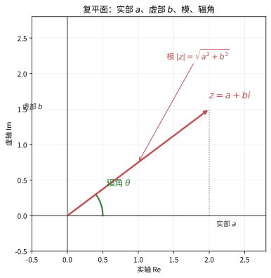
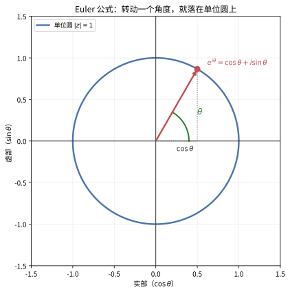
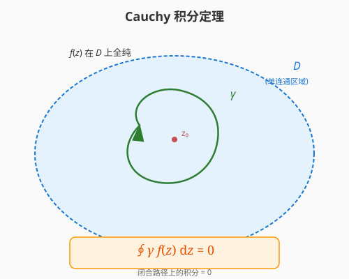
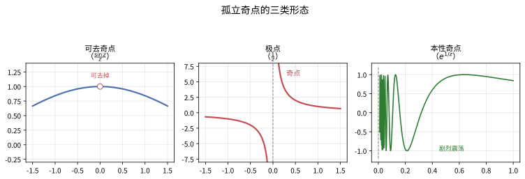
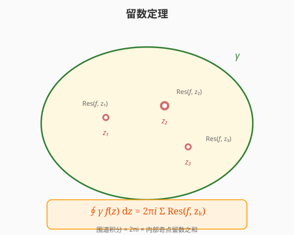

# 第 18 级：复分析 (Complex Analysis)

> 复分析是数学分析的核心分支，研究定义在复数平面上的函数——即复变函数。复分析以其优美的理论和强大的应用著称，其核心在于"可微"这一条件在复数域中远比在实数域中苛刻，从而赋予了复分析函数（全纯函数）极其丰富的性质。本教程从最基础的复数开始，系统介绍复分析的主要理论和方法。

---

## 1. 学习目标

完成本教程后，你应当能够：

1. **熟练掌握复数的代数与几何表示**——理解复平面、极坐标形式、Euler 公式，能够计算复数的幂与根。
2. **理解全纯函数的概念**——掌握 Cauchy-Riemann 方程的推导与证明，能判断函数是否全纯，理解调和函数与全纯函数的关系。
3. **掌握初等复变函数**——理解指数函数、三角函数、对数函数和幂函数在复数域中的定义与性质，理解分支切割的概念。
4. **掌握复积分理论与 Cauchy 积分定理**——理解复积分与曲线积分的关系，掌握 Cauchy 积分定理和 Cauchy 积分公式的证明，能够计算 Cauchy 型积分。
5. **理解级数展开与奇点分类**——掌握 Taylor 级数和 Laurent 级数展开，能分类孤立奇点（可去奇点、极点、本性奇点）。
6. **掌握留数定理及其应用**——理解留数的概念，掌握留数定理的证明，能够利用留数计算实积分。
7. **理解共形映射的基本理论**——掌握 Möbius 变换的性质，理解 Schwarz 引理。
8. **了解解析延拓的基本思想**——了解解析延拓的唯一性原理，初步了解 Riemann zeta 函数。

---

## 〇、复分析导论：发展历史与概念本质

在进入公式之前，先回答三个最关键的问题：**复变函数是怎么来的？复数到底是什么？为什么复分析如此强大？** 本节用最朴素的语言帮你在大脑中建立整体框架。

### 0.1 复分析发展简史

> **💡 一句话概括**：复数是"**为解方程而生的数**"，复分析则是"**把微积分搬到复数平面上之后的美丽新世界**"。

| 时期 | 关键进展 | 代表人物 |
|------|---------|---------|
| **萌芽期（16世纪）** | 为了求解三次、四次方程，数学家不得不承认 $\sqrt{-1}$ 的存在。虽然它"看起来不可能"，但在计算中却神奇地奏效 | 卡丹(Cardano)、邦贝利(Bombelli) |
| **平几化（17-18世纪）** | 沃利斯、欧拉真正开始使用 $i$，发现 $e^{i\theta}=\cos\theta+i\sin\theta$；棣莫弗给出 $(e^{i\theta})^n$ 公式。复数获得了"运算合法性" | 欧拉(Euler)、棣莫弗(de Moivre) |
| **几何化（19世纪初）** | 阿尔冈、高斯用**平面上的点**表示复数，复数从此有了"看得见的家园"——复平面。"虚数"不再虚，而是实实在在的二维对象 | 阿尔冈(Argand)、高斯(Gauss) |
| **分析化（19世纪中叶）** | 柯西建立复微分、复积分、留数理论，把"复变函数可微"这个条件推向极致，诞生了全纯函数理论 | 柯西(Cauchy)、黎曼(Riemann) |
| **几何化巅峰（19世纪后期）** | 黎曼提出 Riemann 曲面、保角映射，把复分析从"平面"推向"曲面"，并催生了 Riemann 猜想 | 黎曼(Riemann)、魏尔斯特拉斯(Weierstrass) |
| **现代（20世纪至今）** | 复分析成为流体力学、电磁学、量子物理、信号处理、数论（Riemann zeta 函数）的基石，并发展出多复变、几何函数论等分支 | 阿达马、帕利、阿尔福斯(Ahlfors) |

> **🔑 历史给我们的启示**：复分析不是空想出来的，而是**从"解方程的现实需求"一步步被逼出来的**。当你不理解一个概念时，回头想想"它当初是为了解决什么问题而诞生的"，往往豁然开朗。

### 0.2 复数到底是什么？——不是"想象的数"

> **💡 直观理解**：复数不是"虚的、假的数"。它实际上是**"带着旋转信息的二维数"**。

- 实数是一维的：只能沿一条直线前进或后退（$+1$ 或 $-1$）。
- 虚数单位 $i$ 的本质是一个**旋转开关**：乘以 $i$ 就逆时针转 $90°$。乘两次 $i$（即 $i^2$）就转 $180°$，正好等于乘以 $-1$。

所以 $i^2 = -1$ 不是"神秘的悖论"，而是"**旋转两次 90° = 旋转 180°**"这个几何事实而已！

$$
\text{乘以 } i: \text{转过 } 90° \quad \Longrightarrow \quad \text{乘以 } i^2 = -1: \text{转过 } 180°
$$

**例**：把 $1$ 乘以 $i$ 得到 $i$（转到正上方），再乘以 $i$ 得到 $-1$（转到负方向）。这就是 $i^2 = -1$ 的几何意义。

> **🔑 现实身份**：复数是一台"能同时描述**大小**（模）和**方向**（辐角）"的机器。任何同时涉及"幅度+相位"、"大小+方向"的现实问题，天然适合用复数表示。

### 0.3 概念速览：用生活例子看穿复分析

下表把复分析的核心概念对应的"本质"和"生活原型"罗列出来，先混个脸熟，学具体章节时再回来对照。

| 概念 | 本质 | 生活原型 |
|------|------|---------|
| **复数** | 带旋转的二维数 | 指南针（长度+指向） |
| **复平面** | 复数的"家" | 地图（横轴=东西，纵轴=南北） |
| **Euler公式 $e^{i\theta}$** | "旋转"与"波浪"的统一 | 旋转木马、正弦波 |
| **单位根** | 均匀切蛋糕 | 时钟的 12 个刻度 |
| **全纯函数** | "可微"到极致、无比光滑 | 没有尖角、没有裂缝的图像 |
| **Cauchy-Riemann方程** | 可微的多重紧箍咒 | 一张必须"横竖伸缩一致"的橡皮膜 |
| **解析延拓** | 沿着已知向外"推" | 从地图一角推出整张地图 |
| **奇点/极点** | 函数"爆炸"的点 | 黑洞、水漩涡中心 |
| **留数** | 奇点"残留的能量" | 漩涡的强度 |
| **留数定理** | 围一圈 = 内部能量总和 | 一圈圈数清池塘里的漩涡 |
| **保角映射** | 只改变大小不改变夹角 | 地图投影、橡皮膜拉伸 |
| **Riemann zeta** | 素数的"密码本" | 统计一百万以内的质数 |

### 0.4 复分析为什么"刚硬而有力量"？

> **💡 直观理解**：实数函数的"可微"很宽松，例如 $|x|$ 几乎所有地方都可导；但**复变函数的"可微"苛刻到令人发指**——只要在一个区域内处处可微，就自动拥有"无穷次可导、能展开成幂级数、被边界值完全确定"等一连串惊人性质。

这就像：**实变函数是"自由的食材"，可塑性极强但也杂乱；复变函数是"极硬的钻石"，一旦定型就处处闪光、密不可摧**。正因为如此"刚硬"，复变函数才极其"可预测"、极其适合用来精确计算。

### 0.5 现实意义：复分析在干什么？

| 领域 | 复分析在做什么 |
|------|--------------|
| **电磁学/电路** | 用复数表示阻抗、交流信号，相位用辐角、幅度用模 |
| **量子力学** | 波函数是复函数，概率是波函数模的平方 $|\psi|^2$ |
| **信号处理/傅里叶分析** | 复指数 $e^{i\omega t}$ 是描述正弦波、频谱的天然语言 |
| **流体力学/空气动力学** | 用保角映射解决机翼绕流问题（儒可夫斯基变换） |
| **控制理论** | 用复平面上的极点位置判断系统是否稳定 |
| **数论** | Riemann zeta 函数研究素数的分布规律 |
| **图像/信号处理** | 复数运算支撑 FFT（快速傅里叶变换） |

> **🔑 一句话总结**：复分析是"**关于旋转、振动和波浪的数学**"。凡是"转、振、波"的地方，就有复分析的身影。

---

## 2. 复数

### 2.1 复数的定义

**定义 (复数)**：复数是一个形如 $z = x + iy$ 的数，其中 $x, y \in \mathbb{R}$，$i$ 是虚数单位，满足 $i^2 = -1$。全体复数的集合记作：

$$
\mathbb{C} = \{ x + iy \mid x, y \in \mathbb{R} \}
$$

其中 $x = \operatorname{Re}(z)$ 称为 $z$ 的**实部**，$y = \operatorname{Im}(z)$ 称为 $z$ 的**虚部**。

**复数的代数运算**：
- 加法：$(x_1 + iy_1) + (x_2 + iy_2) = (x_1 + x_2) + i(y_1 + y_2)$
- 乘法：$(x_1 + iy_1)(x_2 + iy_2) = (x_1x_2 - y_1y_2) + i(x_1y_2 + x_2y_1)$
- 共轭：$\overline{z} = x - iy$
- 模：$|z| = \sqrt{x^2 + y^2}$

**性质**：
- $\overline{z_1 + z_2} = \overline{z_1} + \overline{z_2}$
- $\overline{z_1 z_2} = \overline{z_1} \cdot \overline{z_2}$
- $|z|^2 = z \overline{z}$
- $|z_1 z_2| = |z_1| |z_2|$
- 三角不等式：$|z_1 + z_2| \le |z_1| + |z_2|$
- 反向三角不等式：$||z_1| - |z_2|| \le |z_1 - z_2|$

### 2.2 复平面

复数 $z = x + iy$ 可以与平面上的点 $(x, y)$ 一一对应。这个平面称为**复平面**（或 $z$ 平面），其中 $x$ 轴称为**实轴**，$y$ 轴称为**虚轴**。

**复数的几何解释**：
- 加法对应于向量的平行四边形法则
- 乘法：$z_1 z_2$ 的模等于 $|z_1||z_2|$，辐角等于 $\arg(z_1) + \arg(z_2)$（见下文）

#### 🎬 动画演示：复平面映射

> 动画展示了复平面上的网格在映射 $f(z) = z^2$ 下的变形过程。原始的正交网格（灰色）经过平方映射后变成弯曲的网格（蓝色），单位圆（红色）映射后变成两叶曲线（绿色）。这直观说明了复变函数如何将平面上的点进行变换，是理解保角映射和解析函数几何性质的基础。

> **直观理解（现实类比）**：复平面就是"**给'数'装上坐标**"。每个复数 $z=a+bi$ 是实轴与虚轴平面上的一点，摸到原点的距离叫**模** $|z|$，与实轴的夹角叫**辐角**。这就像**雷达屏上的一个目标**：距离（模）和方位角（辐角）两个数就能定位它。复数的乘法"模相乘、辐角相加"，正是**雷达上角度旋转**的本质。

### 2.3 极坐标形式与辐角

**极坐标表示**：任何非零复数 $z = x + iy$ 可以表示为极坐标形式：

$$
z = r(\cos\theta + i\sin\theta)
$$

其中 $r = |z| = \sqrt{x^2 + y^2}$ 是模，$\theta = \arg(z)$ 是**辐角**，满足 $\tan\theta = y/x$。

辐角不是唯一确定的：若 $\theta$ 是 $z$ 的一个辐角，则 $\theta + 2k\pi$（$k \in \mathbb{Z}$）也是 $z$ 的辐角。通常取 $\theta \in (-\pi, \pi]$ 作为**主辐角**，记作 $\operatorname{Arg}(z)$。

**极坐标下的乘法**：设 $z_1 = r_1(\cos\theta_1 + i\sin\theta_1)$，$z_2 = r_2(\cos\theta_2 + i\sin\theta_2)$，则

$$
z_1 z_2 = r_1 r_2 [\cos(\theta_1 + \theta_2) + i\sin(\theta_1 + \theta_2)]
$$

### 2.4 Euler 公式

**Euler 公式**是复分析中最著名的公式之一：

$$
e^{i\theta} = \cos\theta + i\sin\theta
$$

由此可得复数的**指数形式**：

$$
z = re^{i\theta}
$$

> **直观理解（现实类比）**：Euler 公式说"**转动**就是**乘上一个单位长度的复数**"。$e^{i\theta}$ 是单位圆上辐角为 $\theta$ 的点，它的实部是 $\cos\theta$、虚部是 $\sin\theta$。这就像**钟表只有一根不断转动的指针**：指针的"水平影子"是 $\cos\theta$，"竖直影子"是 $\sin\theta$。特别地，$\theta=\pi$ 时得到 $e^{i\pi}+1=0$——把 $e$、$\pi$、$i$、$1$、$0$ 这五个最重要的常数连成一式。

> **🧠 思考历程：$e^{ix}$ 里怎么"藏着" $\sin$ 和 $\cos$？这几乎是数学的终极彩蛋**
>
> 把指数函数（增长）和三角函数（旋转）用等号连起来，中国人常称它"上帝公式"。它并不是靠魔术，而是靠"幂级数大胆延拓"挣来的——而"指数"为什么能延伸进复数，正是欧拉敢为天下先之处。
>
> - **幂级数是个"好脾气"的中间人**。$e^x=\sum x^n/n!$ 在实轴上处处成立；$\sin x$、$\cos x$ 也各有幂级数。**欧拉想到：如果级数对"实数"成立，凭什么不能喂进去一个"虚数" $ix$？** 于是把 $e^{ix}$ 展开、按实部虚部分拣：
>   - 虚部正好凑出 $i\sin x$（那些 $i^{ 奇数次}$ 项）；
>   - 实部正好凑出 $\cos x$（那些 $i^{ 偶次}$ 项）。
>   这就是 $e^{i\theta}=\cos\theta+i\sin\theta$：**不是上帝赐的，而是把幂级数"喂虚数"后自然长出的。**
> - **"指数"的意义被一次颠覆**。此前 $e^x$ 只是"按比例增长"；套上虚数指数，它变成了"旋转"。**欧拉时代对"实指数的推广到底合不合理"存在争议，但 Euler 靠级数论证 + De Moivre 公式的呼应，让它站稳脚跟**——今天它成了理解波、振动、交流电、量子力学里"相位"的通用语言。
> - **它为何震动人心？** 因为 $e^{i\pi}+1=0$ 把数学的五个主角（$0,1,e,i,\pi$）都请进一个等号里。**如此"秩序"纯靠运气难以解释，它让人相信数学公式背后藏着一套统一的密码。**
> - **心路**：Euler 公式启示你：**不敢对"变量域"大胆推广，就会错失人才辈出的新天地**。$e^{ix}$ 的魔力提醒你：有些"奇怪的新输入"，恰恰能点亮原本不相干领域之间的联系。

**Euler 恒等式**：当 $\theta = \pi$ 时，得到

$$
e^{i\pi} + 1 = 0
$$

这个公式将五个最重要的数学常数联系在了一起：$0, 1, e, i, \pi$。

**三角函数的复指数表示**：
$$
\cos\theta = \frac{e^{i\theta} + e^{-i\theta}}{2}, \quad \sin\theta = \frac{e^{i\theta} - e^{-i\theta}}{2i}
$$

**De Moivre 公式**：由 Euler 公式直接可得

$$
(\cos\theta + i\sin\theta)^n = \cos(n\theta) + i\sin(n\theta)
$$

### 2.5 单位根

**定义 (单位根)**：方程 $z^n = 1$ 的 $n$ 个复数解称为 $n$ 次**单位根**：

$$
\omega_k = e^{2\pi i k / n} = \cos\frac{2\pi k}{n} + i\sin\frac{2\pi k}{n}, \quad k = 0, 1, \dots, n-1
$$

**性质**：
- 所有 $n$ 次单位根在复平面上均匀分布在单位圆上
- $\omega_0 = 1$，$\omega_k = \omega_1^k$
- 若 $n$ 为奇数，只有 $1$ 是实根；若 $n$ 为偶数，还有 $-1$ 是实根
- 所有 $n$ 次单位根的和为 $0$：$\sum_{k=0}^{n-1} \omega_k = 0$
- 所有 $n$ 次单位根的乘积为 $(-1)^{n-1}$

**一般形式**：方程 $z^n = a$（$a \neq 0$）的解为 $z = \sqrt[n]{|a|} e^{i(\arg(a) + 2\pi k)/n}$，$k = 0, 1, \dots, n-1$。

---

## 3. 解析函数

### 3.1 复变函数的导数

**定义**：设 $f: U \to \mathbb{C}$ 是定义在开集 $U \subseteq \mathbb{C}$ 上的函数，$z_0 \in U$。若极限

$$
f'(z_0) = \lim_{z \to z_0} \frac{f(z) - f(z_0)}{z - z_0}
$$

存在，则称 $f$ 在 $z_0$ 处**复可微**（或**全纯**）。若 $f$ 在 $U$ 的每一点都复可微，则称 $f$ 在 $U$ 上**全纯**（holomorphic）。

**关键区别**：与实可微不同，复可微要求极限与 $z \to z_0$ 的方式无关。这意味着 $z$ 可以从任意方向趋近 $z_0$，极限都必须存在且相等。这一苛刻条件使得全纯函数具有极其丰富的性质。

### 3.2 Cauchy-Riemann 方程

**定理 (Cauchy-Riemann 方程)**：设 $f(z) = u(x, y) + iv(x, y)$ 在 $z_0 = x_0 + iy_0$ 处可微，则 $f$ 在 $z_0$ 处复可微当且仅当 $u$ 和 $v$ 在 $(x_0, y_0)$ 处可微且满足：

$$
\frac{\partial u}{\partial x} = \frac{\partial v}{\partial y}, \quad \frac{\partial u}{\partial y} = -\frac{\partial v}{\partial x}
$$

**证明**：
($\Rightarrow$) 设 $f'(z_0)$ 存在。考虑沿实轴方向 $z \to z_0$，即 $z = z_0 + h$（$h \in \mathbb{R}$）：

$$
\begin{aligned}
f'(z_0) &= \lim_{h \to 0} \frac{f(z_0 + h) - f(z_0)}{h} \\
&= \lim_{h \to 0} \frac{u(x_0 + h, y_0) - u(x_0, y_0)}{h} + i \lim_{h \to 0} \frac{v(x_0 + h, y_0) - v(x_0, y_0)}{h} \\
&= \frac{\partial u}{\partial x}(x_0, y_0) + i \frac{\partial v}{\partial x}(x_0, y_0)
\end{aligned}
$$

再考虑沿虚轴方向 $z = z_0 + ih$（$h \in \mathbb{R}$）：

$$
\begin{aligned}
f'(z_0) &= \lim_{h \to 0} \frac{f(z_0 + ih) - f(z_0)}{ih} \\
&= \lim_{h \to 0} \frac{u(x_0, y_0 + h) - u(x_0, y_0)}{ih} + i \lim_{h \to 0} \frac{v(x_0, y_0 + h) - v(x_0, y_0)}{ih} \\
&= \frac{1}{i} \frac{\partial u}{\partial y}(x_0, y_0) + \frac{\partial v}{\partial y}(x_0, y_0) \\
&= \frac{\partial v}{\partial y}(x_0, y_0) - i \frac{\partial u}{\partial y}(x_0, y_0)
\end{aligned}
$$

由于两个方向的极限必须相等，比较实部和虚部即得：

$$
\frac{\partial u}{\partial x} = \frac{\partial v}{\partial y}, \quad \frac{\partial v}{\partial x} = -\frac{\partial u}{\partial y}
$$

($\Leftarrow$) 反之，若 $u, v$ 可微且满足 C-R 方程，则通过 $f(z) - f(z_0)$ 的线性逼近可证 $f'(z_0)$ 存在。$\square$

**推论**：若 $f$ 全纯，则

$$
f'(z) = \frac{\partial u}{\partial x} + i \frac{\partial v}{\partial x} = \frac{\partial v}{\partial y} - i \frac{\partial u}{\partial y}
$$

**示例**：判断 $f(z) = \overline{z} = x - iy$ 是否全纯。
解：$u(x,y) = x$，$v(x,y) = -y$。则 $\partial u/\partial x = 1$，$\partial v/\partial y = -1$，C-R 方程不成立（除非在局部退化情形），故 $f(z) = \overline{z}$ 处处不可微（非全纯）。

### 3.3 复可微与实可微的关系

使用 Wirtinger 导数可以更简洁地表达 C-R 方程：

$$
\frac{\partial}{\partial z} = \frac{1}{2}\left(\frac{\partial}{\partial x} - i\frac{\partial}{\partial y}\right), \quad
\frac{\partial}{\partial \overline{z}} = \frac{1}{2}\left(\frac{\partial}{\partial x} + i\frac{\partial}{\partial y}\right)
$$

则 C-R 方程等价于 $\partial f/\partial \overline{z} = 0$，即 $f$ 与 $\overline{z}$ 无关。此时 $f' = \partial f/\partial z$。

### 3.4 调和函数

**定义 (调和函数)**：若实值函数 $\phi(x, y)$ 满足 **Laplace 方程**：

$$
\Delta \phi = \frac{\partial^2 \phi}{\partial x^2} + \frac{\partial^2 \phi}{\partial y^2} = 0
$$

则称 $\phi$ 为**调和函数**。

**定理**：若 $f(z) = u + iv$ 是全纯函数，则 $u$ 和 $v$ 都是调和函数。

**证明**：由 C-R 方程，$\partial u/\partial x = \partial v/\partial y$，$\partial u/\partial y = -\partial v/\partial x$。对第一个方程求 $x$ 的偏导，第二个方程求 $y$ 的偏导：

$$
\frac{\partial^2 u}{\partial x^2} = \frac{\partial^2 v}{\partial x \partial y}, \quad
\frac{\partial^2 u}{\partial y^2} = -\frac{\partial^2 v}{\partial y \partial x}
$$

由于混合偏导数相等（假设 $f$ 二次连续可微），相加得 $\partial^2 u/\partial x^2 + \partial^2 u/\partial y^2 = 0$。同理可证 $v$ 也是调和的。$\square$

**定义 (共轭调和函数)**：若 $u$ 和 $v$ 是调和函数且满足 C-R 方程，则称 $v$ 是 $u$ 的**共轭调和函数**。

**示例**：求 $u(x,y) = x^2 - y^2$ 的共轭调和函数。
解：$\partial u/\partial x = 2x$，$\partial u/\partial y = -2y$。由 C-R 方程，$\partial v/\partial y = 2x$，$\partial v/\partial x = 2y$。对 $\partial v/\partial y = 2x$ 积分得 $v = 2xy + \phi(x)$，代入 $\partial v/\partial x = 2y + \phi'(x) = 2y$，得 $\phi'(x) = 0$，故 $\phi(x) = C$。取 $C = 0$，得 $v = 2xy$。于是 $f(z) = (x^2 - y^2) + i(2xy) = z^2$。

---

## 4. 初等复变函数

### 4.1 指数函数

**定义**：复指数函数定义为

$$
e^z = e^{x+iy} = e^x(\cos y + i\sin y)
$$

**性质**：
- $e^{z_1 + z_2} = e^{z_1} e^{z_2}$
- $e^z \neq 0$ 对所有 $z \in \mathbb{C}$ 成立
- $|e^z| = e^x$
- $\arg(e^z) = y + 2k\pi$
- $e^z$ 是周期函数，周期为 $2\pi i$：$e^{z + 2\pi i} = e^z$
- $(e^z)' = e^z$

### 4.2 三角函数

**定义**：由 Euler 公式推广，定义复三角函数：

$$
\sin z = \frac{e^{iz} - e^{-iz}}{2i}, \quad \cos z = \frac{e^{iz} + e^{-iz}}{2}
$$

**性质**：
- $\sin^2 z + \cos^2 z = 1$
- $\sin(z_1 + z_2) = \sin z_1 \cos z_2 + \cos z_1 \sin z_2$
- $\cos(z_1 + z_2) = \cos z_1 \cos z_2 - \sin z_1 \sin z_2$
- $(\sin z)' = \cos z$，$(\cos z)' = -\sin z$
- $\sin z$ 和 $\cos z$ 以 $2\pi$ 为周期
- 复三角函数**无界**：例如 $\sin(iy) = i\sinh y$，当 $y \to \infty$ 时趋于无穷

**双曲函数**：

$$
\sinh z = \frac{e^z - e^{-z}}{2}, \quad \cosh z = \frac{e^z + e^{-z}}{2}
$$

关系：$\sin(iz) = i\sinh z$，$\cos(iz) = \cosh z$。

### 4.3 对数函数

**定义**：复对数函数是指数函数的反函数。若 $e^w = z$，则称 $w$ 为 $z$ 的**对数**，记作 $w = \log z$。

由于 $e^w$ 是周期函数（周期 $2\pi i$），复对数函数是多值函数：

$$
\log z = \ln|z| + i(\arg z + 2k\pi), \quad k \in \mathbb{Z}
$$

**主值**：取 $\arg z$ 的主值 $\operatorname{Arg}(z) \in (-\pi, \pi]$，得到**主值对数**：

$$
\operatorname{Log} z = \ln|z| + i\operatorname{Arg}(z)
$$

**性质**：
- $\log(z_1 z_2) = \log z_1 + \log z_2$（多值意义下）
- $\operatorname{Log} z$ 在负实轴（包括原点）上不连续
- $\frac{d}{dz} \operatorname{Log} z = \frac{1}{z}$（在 $\mathbb{C} \setminus (-\infty, 0]$ 上）

### 4.4 分支切割

**定义 (分支切割)**：为使多值函数变为单值函数，我们在复平面上引入一条切割线，限制辐角的取值范围。这条切割线称为**分支切割**（branch cut）。

**对数函数的分支切割**：通常取负实轴作为分支切割，此时 $\operatorname{Arg}(z) \in (-\pi, \pi]$。也可选择其他射线作为切割。

**示例**：$\operatorname{Log} z$ 在负实轴上的跳跃：
- 从上方趋近负实轴：$\operatorname{Arg}(z) \to \pi$
- 从下方趋近负实轴：$\operatorname{Arg}(z) \to -\pi$
- 跳跃值为 $2\pi i$

### 4.5 幂函数

**定义**：对于 $a \in \mathbb{C}$，定义

$$
z^a = e^{a \log z}
$$

由于 $\log z$ 的多值性，$z^a$ 通常是多值函数。

**特殊情况**：
- 若 $a = n \in \mathbb{Z}$，$z^n = e^{n\log z} = |z|^n e^{in\arg z}$，是单值函数
- 若 $a = 1/n$，$z^{1/n} = e^{\frac{1}{n}\log z} = \sqrt[n]{|z|} e^{i(\arg z + 2\pi k)/n}$，有 $n$ 个分支

---

## 5. 复积分

### 5.1 复积分定义

**定义**：设 $\gamma: [a, b] \to \mathbb{C}$ 是一条可求长曲线，$f(z)$ 在 $\gamma$ 上连续。$f$ 沿 $\gamma$ 的**复积分**定义为

$$
\int_\gamma f(z) \, dz = \int_a^b f(\gamma(t)) \gamma'(t) \, dt
$$

**与实积分的关系**：若 $f = u + iv$，$dz = dx + idy$，则

$$
\int_\gamma f(z) \, dz = \int_\gamma (u \, dx - v \, dy) + i \int_\gamma (v \, dx + u \, dy)
$$

**性质**：
- 线性性：$\int_\gamma (af + bg) \, dz = a\int_\gamma f \, dz + b\int_\gamma g \, dz$
- 方向性：$\int_{-\gamma} f \, dz = -\int_\gamma f \, dz$
- 估计不等式：$\left|\int_\gamma f(z) \, dz\right| \le \int_\gamma |f(z)| \, |dz| \le \max_{z \in \gamma} |f(z)| \cdot L(\gamma)$，其中 $L(\gamma)$ 是 $\gamma$ 的长度

**示例**：计算 $\int_C \overline{z} \, dz$，其中 $C$ 是从 $0$ 到 $1 + i$ 的直线段。
解：参数化 $z(t) = t + it$，$t \in [0, 1]$，$dz = (1 + i)dt$，$\overline{z} = t - it = t(1 - i)$，则

$$
\int_C \overline{z} \, dz = \int_0^1 t(1-i)(1+i) \, dt = \int_0^1 2t \, dt = 1
$$

### 5.2 Cauchy 积分定理

> **直观理解（现实类比）**：Cauchy 积分定理说"**全纯函数在单连通区域内没有'源'或'汇'**"。就像在一个没有水源也没有排水口的平静湖面上，无论你沿着什么闭合路径划船，水流的总效应都是零。全纯函数太"光滑"、太"规则"了，它的积分只取决于起点和终点，与路径无关。这就是为什么围道积分会等于零——你绕了一圈回到原点，积累的效应完全抵消。

> **定理 (Cauchy 积分定理)**：设 $f$ 在单连通区域 $D$ 上全纯，$\gamma$ 是 $D$ 中的一条闭合可求长曲线，则

$$
\oint_\gamma f(z) \, dz = 0
$$

**证明 (Goursat 版本)**：先考虑 $\gamma$ 为三角形 $\Delta$ 的情形。将 $\Delta$ 反复细分为更小的三角形。假设 $\left|\int_\Delta f(z) dz\right| > 0$，则存在子三角形序列 $\Delta_n$ 使得

$$
\left|\int_{\Delta_n} f(z) \, dz\right| \ge \frac{1}{4^n} \left|\int_\Delta f(z) \, dz\right|
$$

且 $\Delta_n$ 收缩到某点 $z_0$。由全纯函数的定义，在 $z_0$ 附近有 $f(z) = f(z_0) + f'(z_0)(z - z_0) + \varepsilon(z)(z - z_0)$，其中 $\varepsilon(z) \to 0$ 当 $z \to z_0$。则

$$
\int_{\Delta_n} f(z) \, dz = \int_{\Delta_n} [f(z_0) + f'(z_0)(z - z_0)] \, dz + \int_{\Delta_n} \varepsilon(z)(z - z_0) \, dz
$$

第一项积分为 $0$（因为 $1$ 和 $z$ 沿闭合路径的积分为 $0$）。对第二项进行估计可得矛盾，故 $\int_\Delta f(z) dz = 0$。

对于一般曲线，可以通过多边形逼近来证明。$\square$

**推论 (原函数定理)**：若 $f$ 在单连通区域 $D$ 上全纯，则 $f$ 在 $D$ 上存在原函数，且积分与路径无关。

### 5.3 Cauchy 积分公式

> **定理 (Cauchy 积分公式)**：设 $f$ 在单连通区域 $D$ 上全纯，$\gamma$ 是 $D$ 中一条正向简单闭曲线，其内部区域包含于 $D$。则对 $\gamma$ 内部的任意点 $z_0$，

$$
f(z_0) = \frac{1}{2\pi i} \oint_\gamma \frac{f(z)}{z - z_0} \, dz
$$

**证明**：考虑以 $z_0$ 为圆心、$\varepsilon$ 为半径的小圆 $C_\varepsilon$，方向为正向。由 Cauchy 积分定理（推广到多连通区域），

$$
\oint_\gamma \frac{f(z)}{z - z_0} \, dz = \oint_{C_\varepsilon} \frac{f(z)}{z - z_0} \, dz
$$

在 $C_\varepsilon$ 上，$z = z_0 + \varepsilon e^{i\theta}$，$dz = i\varepsilon e^{i\theta} d\theta$，所以

$$
\begin{aligned}
\oint_{C_\varepsilon} \frac{f(z)}{z - z_0} \, dz &= \int_0^{2\pi} \frac{f(z_0 + \varepsilon e^{i\theta})}{\varepsilon e^{i\theta}} \cdot i\varepsilon e^{i\theta} \, d\theta \\
&= i \int_0^{2\pi} f(z_0 + \varepsilon e^{i\theta}) \, d\theta
\end{aligned}
$$

令 $\varepsilon \to 0$，由连续性 $f(z_0 + \varepsilon e^{i\theta}) \to f(z_0)$，得

$$
\oint_\gamma \frac{f(z)}{z - z_0} \, dz = i \cdot 2\pi f(z_0) = 2\pi i f(z_0)
$$

两边除以 $2\pi i$ 即得公式。$\square$

**均值性质**：由 Cauchy 积分公式可得，全纯函数在圆心的值等于其在圆周上的平均值：

$$
f(z_0) = \frac{1}{2\pi} \int_0^{2\pi} f(z_0 + re^{i\theta}) \, d\theta
$$

### 5.4 Cauchy 高阶导数公式

> **定理 (Cauchy 导数公式)**：若 $f$ 在单连通区域 $D$ 上全纯，则 $f$ 在 $D$ 上无穷次可微，且

$$
f^{(n)}(z_0) = \frac{n!}{2\pi i} \oint_\gamma \frac{f(z)}{(z - z_0)^{n+1}} \, dz
$$

**证明**：对 $n = 1$，由 Cauchy 积分公式：

$$
f'(z_0) = \lim_{h \to 0} \frac{f(z_0 + h) - f(z_0)}{h} = \lim_{h \to 0} \frac{1}{2\pi i} \oint_\gamma f(z) \left[\frac{1}{z - z_0 - h} - \frac{1}{z - z_0}\right] \frac{dz}{h}
$$

化简括号内项：

$$
\frac{1}{z - z_0 - h} - \frac{1}{z - z_0} = \frac{h}{(z - z_0)(z - z_0 - h)}
$$

因此

$$
f'(z_0) = \frac{1}{2\pi i} \oint_\gamma \frac{f(z)}{(z - z_0)^2} \, dz
$$

一般情况通过归纳法可得。$\square$

> **定理 (Liouville)**：设 $f$ 是整函数（在整个 $\mathbb{C}$ 上全纯）。若 $f$ 有界，即存在 $M > 0$ 使得 $|f(z)| \le M$ 对所有 $z \in \mathbb{C}$ 成立，则 $f$ 必为常数。

**证明**：对任意 $z_0$，取 $\gamma$ 为以 $z_0$ 为圆心、$R$ 为半径的圆周。由 Cauchy 导数公式：

$$
|f'(z_0)| = \left|\frac{1}{2\pi i} \oint_\gamma \frac{f(z)}{(z - z_0)^2} \, dz\right| \le \frac{1}{2\pi} \cdot \frac{M}{R^2} \cdot 2\pi R = \frac{M}{R}
$$

令 $R \to \infty$，得 $f'(z_0) = 0$。由于 $z_0$ 任意，故 $f$ 为常数。$\square$

> **💡 直观理解**：Liouville 定理说"**在无限大的平面上散步，只要走不到无穷远（有界），就根本动不了（是常数）**"。全纯函数在复平面上"刚硬"到不能有界而不恒定——这是复分析"刚性"的绝佳体现。

**代数基本定理**：任何非常数的复系数多项式在 $\mathbb{C}$ 中至少有一个根。这是 Liouville 定理的直接推论。

**证明**：设 $p(z) = a_n z^n + \cdots + a_0$（$a_n \neq 0$，$n \ge 1$）在 $\mathbb{C}$ 上无根。则 $1/p$ 是整函数，且当 $|z| \to \infty$ 时 $|1/p(z)| \to 0$，故 $1/p$ 有界。由 Liouville 定理，$1/p$ 为常数，矛盾。$\square$

### 5.5 Cauchy 不等式与最大模原理

> **定理 (Cauchy 不等式)**：设 $f$ 在闭圆盘 $\overline{D}(z_0, R)$ 上全纯，$|f(z)| \le M$ 在圆周 $|z - z_0| = R$ 上成立。则
> $$
> |f^{(n)}(z_0)| \le \frac{n! \, M}{R^n}
> $$

**证明**：由 Cauchy 高阶导数公式 $f^{(n)}(z_0) = \frac{n!}{2\pi i}\oint_\gamma \frac{f(z)}{(z - z_0)^{n+1}} dz$，取 $\gamma$ 为圆周 $|z - z_0| = R$，则 $|f^{(n)}(z_0)| \le \frac{n!}{2\pi} \cdot \frac{M}{R^{n+1}} \cdot 2\pi R = \frac{n!M}{R^n}$。$\square$

> **定理 (最大模原理)**：设 $f$ 在区域 $D$ 内全纯（或在其闭包上连续）。若 $|f|$ 在 $D$ 内取得最大值（即存在 $z_0 \in D$ 使 $|f(z_0)| \ge |f(z)|$ 对所有 $z \in D$ 成立），则 $f$ 在 $D$ 内为常数。

**证明（概要）**：设 $z_0$ 是 $|f|$ 的最大值点。取以 $z_0$ 为圆心、包含于 $D$ 的圆盘，由 Cauchy 积分公式 $f(z_0) = \frac{1}{2\pi i}\oint f(\zeta)/(\zeta - z_0) d\zeta$，取模并用 $|f| \le |f(z_0)|$ 估计，可得等号必然处处成立，从而 $f$ 在 $z_0$ 邻域内为常数。再由唯一性原理延拓到整个连通区域 $D$。$\square$

> **💡 直观理解**：最大模原理说"**全纯函数的模长最大值一定出现在边界上，不会出现在内部**"。就像一张"只能下凸、不能有内部尖峰"的曲面，内部永远是"安静"的，最有影响力的"峰"只能在边缘。这解释了为什么 Schwarz 引理、Rouche 定理等都以它为基石。

**推论**：若 $D$ 是有界区域，$f$ 在 $D$ 上全纯、在 $\overline{D}$ 上连续，则 $|f|$ 在 $\partial D$ 上取得最大值。

### 5.6 解析函数的零点

**定义**：$z_0$ 称为全纯函数 $f$ 的**零点**，如果 $f(z_0) = 0$。若 $f$ 在 $z_0$ 附近可写为 $f(z) = (z - z_0)^m g(z)$，其中 $g(z_0) \neq 0$，则称 $z_0$ 是 $m$ 阶零点（重数 $m$）。

**定理 (零点的孤立性)**：设 $f$ 在区域 $D$ 上全纯且不恒为零。若 $z_0 \in D$ 是 $f$ 的零点，则存在 $z_0$ 的邻域使其为 $f$ 唯一的零点（即零点彼此"孤立"）。

**证明**：设 $z_0$ 是 $m$ 阶零点，$f(z) = a_m(z - z_0)^m + \cdots$（$a_m \neq 0$）。对充分小的 $\varepsilon$，在 $0 < |z - z_0| < \varepsilon$ 内 $f(z) = (z - z_0)^m g(z)$ 且 $g(z) \neq 0$，故 $f(z) \neq 0$。$\square$

**推论 (零点有限性)**：在不恒为零的全纯函数的可数紧子集上，零点只能以孤立方式出现；特别地，区域内的非零全纯函数在任意紧子集上只有有限多个零点。

> **💡 直观理解**：零点的孤立性说明"**全纯函数的根不能挤在一起**"。这直接导致唯一性原理：两个全纯函数只要在一串有聚点的点上相等，就处处相等——因为差函数的零点若不离散，就必然恒为零。

---

## 6. 级数

### 6.1 幂级数

**定义**：形如 $\sum_{n=0}^{\infty} a_n (z - z_0)^n$ 的级数称为**幂级数**。

**收敛半径**：存在 $R \in [0, \infty]$（称为**收敛半径**），使得：
- 当 $|z - z_0| < R$ 时，级数绝对收敛
- 当 $|z - z_0| > R$ 时，级数发散

**Cauchy-Hadamard 公式**：收敛半径可由系数计算：

$$
\frac{1}{R} = \limsup_{n \to \infty} \sqrt[n]{|a_n|}
$$

**性质**：幂级数在其收敛圆内定义了一个全纯函数，且可以逐项求导和逐项积分。

### 6.2 Taylor 级数

> **定理 (Taylor 展开)**：若 $f$ 在 $|z - z_0| < R$ 上全纯，则 $f$ 可展开为 Taylor 级数：

$$
f(z) = \sum_{n=0}^{\infty} \frac{f^{(n)}(z_0)}{n!} (z - z_0)^n, \quad |z - z_0| < R
$$

**示例**：
- $e^z = \sum_{n=0}^{\infty} \frac{z^n}{n!}$，$R = \infty$
- $\frac{1}{1 - z} = \sum_{n=0}^{\infty} z^n$，$R = 1$
- $\sin z = \sum_{n=0}^{\infty} \frac{(-1)^n}{(2n+1)!} z^{2n+1}$，$R = \infty$
- $\cos z = \sum_{n=0}^{\infty} \frac{(-1)^n}{(2n)!} z^{2n}$，$R = \infty$
- $\operatorname{Log}(1 + z) = \sum_{n=1}^{\infty} \frac{(-1)^{n-1}}{n} z^n$，$R = 1$

### 6.3 Laurent 级数

> **定理 (Laurent 展开)**：若 $f$ 在环形区域 $A = \{z \mid r < |z - z_0| < R\}$ 上全纯，则 $f$ 可展开为 Laurent 级数：

$$
f(z) = \sum_{n=-\infty}^{\infty} a_n (z - z_0)^n
$$

其中系数

$$
a_n = \frac{1}{2\pi i} \oint_\gamma \frac{f(z)}{(z - z_0)^{n+1}} \, dz
$$

$\gamma$ 是 $A$ 中任一环绕 $z_0$ 的正向简单闭曲线。

Laurent 级数包含两部分：
- **正则部分**：$\sum_{n=0}^{\infty} a_n (z - z_0)^n$（非负幂次）
- **主要部分**：$\sum_{n=-\infty}^{-1} a_n (z - z_0)^n$（负幂次）

**示例**：求 $f(z) = \frac{1}{z(1 - z)}$ 在 $0 < |z| < 1$ 中的 Laurent 展开。

$$
\frac{1}{z(1 - z)} = \frac{1}{z} \cdot \frac{1}{1 - z} = \frac{1}{z} \sum_{n=0}^{\infty} z^n = \sum_{n=-1}^{\infty} z^n = \frac{1}{z} + 1 + z + z^2 + \cdots
$$

### 6.4 孤立奇点的分类

**定义**：若 $f$ 在 $z_0$ 的某个去心邻域 $0 < |z - z_0| < \delta$ 内全纯，但在 $z_0$ 处不解析，则称 $z_0$ 为 $f$ 的**孤立奇点**。

根据 Laurent 展开中主要部分的行为，孤立奇点分为三类：

**1. 可去奇点**：若 Laurent 展开中所有负幂次项的系数均为 $0$（即主要部分消失）。此时 $\lim_{z \to z_0} f(z)$ 存在有限，可重新定义 $f(z_0)$ 使 $f$ 全纯。

**示例**：$f(z) = \frac{\sin z}{z}$ 在 $z = 0$ 处有可去奇点，因为 $\frac{\sin z}{z} = 1 - \frac{z^2}{3!} + \cdots$。

**2. 极点**：若 Laurent 展开中只有有限个负幂次项，即存在 $m \ge 1$ 使得 $a_{-m} \neq 0$ 且 $a_{-k} = 0$ 对所有 $k > m$ 成立。$m$ 称为极点的**阶**。此时 $\lim_{z \to z_0} f(z) = \infty$。

**示例**：$f(z) = \frac{1}{(z-1)^2(z-2)}$ 在 $z = 1$ 处有二阶极点，在 $z = 2$ 处有一阶极点（单极点）。

**3. 本性奇点**：若 Laurent 展开中有无穷多个负幂次项的系数非零。此时 $\lim_{z \to z_0} f(z)$ 不存在（也不为 $\infty$）。

**示例**：$f(z) = e^{1/z}$ 在 $z = 0$ 处有本性奇点，因为 $e^{1/z} = \sum_{n=0}^{\infty} \frac{1}{n!} z^{-n}$。

**Weierstrass-Casorati 定理**：若 $z_0$ 是 $f$ 的本性奇点，则对任意 $w \in \mathbb{C}$，存在序列 $z_n \to z_0$ 使得 $f(z_n) \to w$。也就是说，$f$ 在本性奇点的任意邻域内的像在 $\mathbb{C}$ 中稠密。

> **直观理解（现实类比）**：三种奇点对应三种"**漏洞**"。**可去奇点**像**扫码时偶尔的黑点**——补一下就能擦掉（重新定义函数值即可）；**极点**像**水管破洞**——函数值"冲"向无穷大（如 $1/z$ 在 0 处）；**本性奇点**像**滚烫的火山口**——函数在附近剧烈震荡，几乎每个值都出现（如 $e^{1/z}$）。判断方法看 Laurent 展开里负幂项：没有的是可去、有限个是极点、无穷多个是本性奇点。

---

## 7. 留数定理

### 7.1 留数的定义

**定义**：设 $z_0$ 是 $f$ 的孤立奇点，$f$ 在 $z_0$ 附近有 Laurent 展开 $\sum_{n=-\infty}^{\infty} a_n (z - z_0)^n$。则 $a_{-1}$ 称为 $f$ 在 $z_0$ 处的**留数**，记作 $\operatorname{Res}(f, z_0)$。

由 Laurent 系数的公式：

$$
\operatorname{Res}(f, z_0) = a_{-1} = \frac{1}{2\pi i} \oint_\gamma f(z) \, dz
$$

其中 $\gamma$ 是环绕 $z_0$ 的充分小的正向简单闭曲线。

**留数的计算**：
- 若 $z_0$ 是一阶极点，则 $\operatorname{Res}(f, z_0) = \lim_{z \to z_0} (z - z_0) f(z)$
- 若 $z_0$ 是 $m$ 阶极点，则

$$
\operatorname{Res}(f, z_0) = \frac{1}{(m-1)!} \lim_{z \to z_0} \frac{d^{m-1}}{dz^{m-1}} \left[(z - z_0)^m f(z)\right]
$$

- 若 $f(z) = \frac{g(z)}{h(z)}$，其中 $g(z_0) \neq 0$，$h(z_0) = 0$，$h'(z_0) \neq 0$（一阶零点），则 $\operatorname{Res}(f, z_0) = \frac{g(z_0)}{h'(z_0)}$

### 7.2 留数定理

> **直观理解（现实类比）**：留数定理说"**围道积分 = 2πi × 内部奇点的留数总和**"。就像你在池塘里撒下一张网（围道γ），网里有多少鱼（奇点），每条鱼有多重（留数），一网打尽后就能算出总重量。全纯函数在奇点处"爆炸"，留下一些"残留的能量"（留数），围道积分就是在测量这些能量的总和。这是复分析最强大的计算工具之一。

> **定理 (留数定理)**：设 $f$ 在单连通区域 $D$ 中除了有限个孤立奇点 $z_1, z_2, \dots, z_n$ 外全纯，$\gamma$ 是 $D$ 中一条正向简单闭曲线，包围所有这些奇点。则

$$
\oint_\gamma f(z) \, dz = 2\pi i \sum_{k=1}^{n} \operatorname{Res}(f, z_k)
$$

**证明**：在每个奇点 $z_k$ 周围作充分小的正向圆周 $\gamma_k$，使得这些圆周互不相交且都包含在 $\gamma$ 内部。由 Cauchy 积分定理（多连通区域版本）：

$$
\oint_\gamma f(z) \, dz = \sum_{k=1}^{n} \oint_{\gamma_k} f(z) \, dz
$$

由留数的定义，$\oint_{\gamma_k} f(z) \, dz = 2\pi i \operatorname{Res}(f, z_k)$。代入即得结论。$\square$

> **🧠 思考历程：一条"只用看孤立点"的公式，凭什么能算下整个围道积分？**
>
> 留数定理最让人拍案的是：绕一个大圈算积分，竟然只需数圈内几个"奇点"，把每个奇点处那一小块"残留"乘以 $2\pi i$ 加起来就完事。这看似偷懒，背后却是一整套"把整体分解到局部"的精致哲学。
>
> - **先弄清反面：处处可解析的"全纯"太光滑**。若 $f$ 处处解析，Cauchy 定理说积分必为 0——太强，反而不实用。真正有意思的是**那些让 $f$ "爆掉"的孤立奇点**。奇点是"故障点"，而积分几乎只对"故障点"敏感。
> - **再看局部：奇点周围能展开"除幂"**。在每个孤立奇点 $z_0$ 附近，$f$ 能展成 Laurent 级数 $\sum c_n(z-z_0)^n$。其中**唯一的 $-1$ 次幂项 $c_{-1}(z-z_0)^{-1}$ 对围道积分的贡献是 $2\pi i$，其余项（正次项可解析、负二次及以下的项积分也为 0）**。那个 $c_{-1}$ 就是"留数"——它像"奇点里剩下的残余量"。
> - **把麻烦拆小**。于是取一个大围道套住所有奇点，再把它变形，套住每一个奇点的小圈；内部道路彼此反向、互相抵消（**路径可变形原理**），最终总积分 = 各个小圈积分之和 = $2\pi i\sum$ 留数。**"一个大问题"就这样被拆成"一串只看局部的小问题"。**
> - **留数为啥能"跨界"算实积分**。许多实积分（$\int_{-\infty}^{\infty}\frac{dx}{x^2+1}$）通过复变转化 + 取半圆围道，把实轴积分粘连到虚部上的极点上——用留数在复数世界里问了一个"实数问题"，随后取极限让圆弧贡献消失。**这就是"到复数世界绕一圈再回来"的妙法。**
> - **心路**：留数定理提醒你：**把"全局积分"翻译成"局部奇点的求和"，往往能轻松拿下原本拼凑都难的积分**。它让你相信：在看不清全局的时候，只要找到"故障点"并吃透它们，复杂积分便会自己退让。

### 7.3 利用留数计算实积分

留数定理是计算实积分的有力工具。以下是一些常见类型：

**类型 I**：$\int_{-\infty}^{\infty} \frac{P(x)}{Q(x)} \, dx$，其中 $P, Q$ 是多项式，$\deg Q - \deg P \ge 2$，且 $Q(x) \neq 0$ 对 $x \in \mathbb{R}$ 成立。

方法：考虑上半平面的半圆围道，利用留数定理。

$$
\int_{-\infty}^{\infty} \frac{P(x)}{Q(x)} \, dx = 2\pi i \sum_{\operatorname{Im}(z_k) > 0} \operatorname{Res}\left(\frac{P}{Q}, z_k\right)
$$

**示例**：计算 $\int_{-\infty}^{\infty} \frac{dx}{x^2 + 1}$。

解：$f(z) = \frac{1}{z^2 + 1} = \frac{1}{(z - i)(z + i)}$，在上半平面有奇点 $z = i$（一阶极点）。

$$
\operatorname{Res}(f, i) = \lim_{z \to i} (z - i) \cdot \frac{1}{(z - i)(z + i)} = \frac{1}{2i}
$$

故 $\int_{-\infty}^{\infty} \frac{dx}{x^2 + 1} = 2\pi i \cdot \frac{1}{2i} = \pi$。

**类型 II**：$\int_0^{2\pi} R(\cos\theta, \sin\theta) \, d\theta$，其中 $R$ 是有理函数。

方法：令 $z = e^{i\theta}$，则 $\cos\theta = \frac{z + z^{-1}}{2}$，$\sin\theta = \frac{z - z^{-1}}{2i}$，$d\theta = \frac{dz}{iz}$，积分化为单位圆上的围道积分。

**类型 III**：$\int_{-\infty}^{\infty} \frac{P(x)}{Q(x)} e^{iax} \, dx$（$a > 0$），其中 $P, Q$ 是多项式，$\deg Q - \deg P \ge 1$。

### 7.4 Jordan 引理

> **引理 (Jordan)**：设 $f(z)$ 在上半平面 $|z| > R_0$ 上连续，且当 $|z| \to \infty$ 时 $f(z) \to 0$ 一致地关于 $\arg z \in [0, \pi]$。则对 $a > 0$，

$$
\lim_{R \to \infty} \int_{C_R} f(z) e^{iaz} \, dz = 0
$$

其中 $C_R$ 是上半平面的半圆弧 $z = Re^{i\theta}$，$\theta \in [0, \pi]$。

**示例**：计算 $\int_{-\infty}^{\infty} \frac{\cos x}{x^2 + 1} \, dx$。

解：考虑 $\int_{-\infty}^{\infty} \frac{e^{ix}}{x^2 + 1} \, dx$。$f(z) = \frac{e^{iz}}{z^2 + 1}$ 在上半平面有奇点 $z = i$。

$$
\operatorname{Res}\left(\frac{e^{iz}}{z^2 + 1}, i\right) = \frac{e^{i \cdot i}}{2i} = \frac{e^{-1}}{2i}
$$

由 Jordan 引理，半圆弧上的积分趋于 $0$，故

$$
\int_{-\infty}^{\infty} \frac{e^{ix}}{x^2 + 1} \, dx = 2\pi i \cdot \frac{e^{-1}}{2i} = \frac{\pi}{e}
$$

取实部得 $\int_{-\infty}^{\infty} \frac{\cos x}{x^2 + 1} \, dx = \frac{\pi}{e}$。

### 7.5 幅角原理与 Rouché 定理

> **定理 (幅角原理)**：设 $f$ 在简单闭曲线 $\gamma$ 内部及其上除有限个极点外全纯，且在 $\gamma$ 上无零点、无极点。则
> $$
> \frac{1}{2\pi i} \oint_\gamma \frac{f'(z)}{f(z)} \, dz = N - P
> $$
> 其中 $N$ 是 $f$ 在 $\gamma$ 内部的零点个数（计重数），$P$ 是极点的个数（计阶数）。

**证明（概要）**：$f'/f$ 的奇点只可能是 $f$ 的零点或极点。若 $f$ 在 $z_0$ 有 $m$ 阶零点，则 $f = (z - z_0)^m g$（$g(z_0) \neq 0$），故 $f'/f = m/(z - z_0) + g'/g$，留数为 $m$；若 $f$ 在 $z_0$ 有 $p$ 阶极点，则留数为 $-p$。由留数定理对 $\gamma$ 内部所有奇点求和即得 $N - P$。$\square$

**物理意义**：$\frac{1}{2\pi i}\oint f'/f \, dz$ 正是 $f(\gamma)$ 绕原点的**卷绕数**（Winding number）。故幅角原理说"**$f$ 把 $\gamma$ 映射成的闭曲线绕原点转了几圈，等于内部零点数与极点数之差**"。

> **定理 (Rouché)**：设 $f, g$ 在简单闭曲线 $\gamma$ 上及其内部全纯，且在 $\gamma$ 上满足 $|f(z)| > |g(z)|$。则 $f$ 与 $f + g$ 在 $\gamma$ 内部有相同个数的零点（计重数）。

**证明**：在 $\gamma$ 上，$|g/f| < 1$，故 $f + g = f(1 + g/f)$ 在 $\gamma$ 上无零点，且 $1 + g/f$ 的像不绕原点（恒在 $|z| = 1$ 的圆盘内）。由幅角原理，$f + g$ 与 $f$ 的零点数之差为 $0$。$\square$

> **💡 直观理解**：Rouché 定理说"**如果 $g$ 在边界上比 $f$ '小声'得多，那么给 $f$ 加上这个小扰动 $g$，不会改变根的个数**"。就像在一支大乐队里加一个很轻的伴奏，调子（根的个数）不会变。它是判断多项式在指定区域内根个数的利器。

**例**：证明 $z^5 + 3z + 1$ 在单位圆 $|z| < 1$ 内恰有 1 个根。

解：取 $f(z) = 3z$，$g(z) = z^5 + 1$。在 $|z| = 1$ 上，$|g(z)| \le |z|^5 + 1 = 2 < 3 = |f(z)|$。由 Rouché 定理，$f = 3z$ 与 $f + g = z^5 + 3z + 1$ 在单位圆内有相同零点数。而 $3z$ 在 $|z| < 1$ 内恰有 1 个零点，故原多项式恰有 1 个根。$\square$

---

## 8. 共形映射

### 8.1 共形映射的概念

**定义 (共形映射)**：若 $f$ 在 $z_0$ 处全纯且 $f'(z_0) \neq 0$，则称 $f$ 在 $z_0$ 处是**共形**（保角）的。这意味着 $f$ 在 $z_0$ 附近保持曲线的夹角（大小和方向）不变。

**几何意义**：设两条曲线 $\gamma_1$ 和 $\gamma_2$ 在 $z_0$ 处相交，夹角为 $\alpha$，则 $f(\gamma_1)$ 和 $f(\gamma_2)$ 在 $f(z_0)$ 处的夹角也为 $\alpha$。

> **直观理解（现实类比）**：共形映射就像**一张神奇的橡皮膜**——你可以拉伸、旋转、弯曲它，但膜上任意两条线交叉的角度永远不变。这就像**地图投影**：虽然地球表面被"压平"到纸上会变形（格陵兰看起来比非洲还大！），但局部的小角度是精确保持的——这就是为什么航海家可以用地图量角度来导航。全纯函数（导数非零处）天然就是这样的"保角变换"，所以复分析又叫**共形映射理论**。

### 8.2 Möbius 变换

**定义**：形如

$$
T(z) = \frac{az + b}{cz + d}, \quad ad - bc \neq 0
$$

的函数称为 **Möbius 变换**（或分式线性变换）。

**性质**：
- Möbius 变换是 $\hat{\mathbb{C}} = \mathbb{C} \cup \{\infty\}$ 到自身的双全纯映射
- 复合仍为 Möbius 变换（构成群）
- 将圆（包括直线）映射为圆（包括直线）
- 保持交比（cross ratio）

**特殊 Möbius 变换**：
- 平移：$T(z) = z + b$
- 旋转：$T(z) = e^{i\theta}z$
- 伸缩：$T(z) = rz$（$r > 0$）
- 反演：$T(z) = 1/z$

**示例**：求将上半平面 $\operatorname{Im}(z) > 0$ 映射到单位圆 $|w| < 1$ 的 Möbius 变换。

解：$T(z) = \frac{z - i}{z + i}$。验证：当 $z$ 为实数时，$|z - i| = |z + i|$，故 $|T(z)| = 1$；当 $\operatorname{Im}(z) > 0$ 时，$|T(z)| < 1$。

### 8.3 Schwarz 引理

> **引理 (Schwarz)**：设 $f$ 在单位圆 $D = \{|z| < 1\}$ 上全纯，满足 $f(0) = 0$ 且 $|f(z)| \le 1$ 对所有 $z \in D$ 成立。则
> 1. $|f(z)| \le |z|$ 对所有 $z \in D$ 成立
> 2. $|f'(0)| \le 1$
> 3. 若存在某个 $z_0 \neq 0$ 使得 $|f(z_0)| = |z_0|$，或 $|f'(0)| = 1$，则 $f(z) = e^{i\theta}z$（即 $f$ 是旋转）

**证明**：考虑 $g(z) = f(z)/z$（$z \neq 0$），$g(0) = f'(0)$。$g$ 在 $D$ 上全纯。对任意 $0 < r < 1$，由最大模原理，在圆周 $|z| = r$ 上，$|g(z)| \le 1/r$，令 $r \to 1$ 得 $|g(z)| \le 1$。故 $|f(z)| \le |z|$ 且 $|f'(0)| \le 1$。若等号成立，则 $|g(z)| \equiv 1$，由最大模原理知 $g$ 为常数，故 $f(z) = e^{i\theta}z$。$\square$

---

## 9. 解析延拓

### 9.1 解析延拓的概念

**定义**：设 $f_1$ 在区域 $D_1$ 上全纯，$f_2$ 在区域 $D_2$ 上全纯，且 $D_1 \cap D_2 \neq \varnothing$，在 $D_1 \cap D_2$ 上 $f_1 = f_2$。则称 $f_2$ 是 $f_1$ 到 $D_2$ 的**解析延拓**（analytic continuation）。

### 9.2 解析延拓的唯一性原理

> **定理 (唯一性原理)**：设 $f$ 和 $g$ 在区域 $D$ 上全纯。若存在点列 $\{z_n\} \subseteq D$ 使得 $z_n \to z_0 \in D$，$z_n \neq z_0$，且 $f(z_n) = g(z_n)$ 对所有 $n$ 成立，则 $f \equiv g$ 在 $D$ 上恒等。

**推论**：若两个全纯函数在某个开子集上相等，则它们在整个区域上相等。这意味着解析延拓在同一区域上是唯一的（如果存在的话）。

**示例**：$\Gamma$ 函数 $\Gamma(z) = \int_0^\infty t^{z-1} e^{-t} \, dt$ 最初定义在 $\operatorname{Re}(z) > 0$ 上，可通过解析延拓延拓到整个复平面（除去非正整数极点）。

### 9.3 Riemann zeta 函数

**定义**：Riemann zeta 函数最初定义为 Dirichlet 级数：

$$
\zeta(s) = \sum_{n=1}^{\infty} \frac{1}{n^s}, \quad \operatorname{Re}(s) > 1
$$

该级数在 $\operatorname{Re}(s) > 1$ 时绝对收敛，定义了一个全纯函数。

**解析延拓**：$\zeta(s)$ 可解析延拓到整个复平面，仅在 $s = 1$ 处有一个一阶极点（留数为 $1$）。延拓后的函数满足函数方程：

$$
\zeta(s) = 2^s \pi^{s-1} \sin\left(\frac{\pi s}{2}\right) \Gamma(1-s) \zeta(1-s)
$$

**Riemann 猜想**：$\zeta(s)$ 的所有非平凡零点都位于直线 $\operatorname{Re}(s) = 1/2$ 上。这是数学中最重要的未解决问题之一。

---

## 10. 综合示例

### 示例 1：判断全纯性

判断 $f(z) = z \operatorname{Re}(z)$ 是否全纯。

**解**：$f(z) = (x + iy)x = x^2 + ixy$，故 $u = x^2$，$v = xy$。
$\partial u/\partial x = 2x$，$\partial v/\partial y = x$，$\partial u/\partial y = 0$，$\partial v/\partial x = y$。
C-R 方程要求 $2x = x$ 且 $0 = -y$，即 $x = 0$ 且 $y = 0$。
因此 $f$ 仅在 $z = 0$ 处满足 C-R 方程，但导数定义中极限应与方向无关，此处 $f$ 在 $z = 0$ 处也不可微（因为 $f$ 本质上是实可微而非复可微）。故 $f$ 处处非全纯。

### 示例 2：计算复积分

计算 $\int_\gamma \frac{e^z}{z^2} \, dz$，其中 $\gamma$ 是以原点为中心、半径为 $2$ 的正向圆周。

**解**：$f(z) = e^z/z^2$ 在 $z = 0$ 处有二阶极点。由 Cauchy 导数公式：

$$
\int_\gamma \frac{e^z}{z^2} \, dz = 2\pi i \cdot \left.\frac{d}{dz} e^z\right|_{z=0} = 2\pi i \cdot 1 = 2\pi i
$$

### 示例 3：Laurent 展开

求 $f(z) = \frac{1}{(z-1)(z-2)}$ 在以下区域中的 Laurent 展开：
(a) $|z| < 1$，(b) $1 < |z| < 2$，(c) $|z| > 2$。

**解**：部分分式分解：$\frac{1}{(z-1)(z-2)} = \frac{1}{z-2} - \frac{1}{z-1}$。

(a) $|z| < 1$：此时 $|z/2| < 1/2$，$|z| < 1$。

$$
\frac{1}{z-2} = -\frac{1}{2} \cdot \frac{1}{1 - z/2} = -\frac{1}{2} \sum_{n=0}^{\infty} \left(\frac{z}{2}\right)^n
$$
$$
\frac{1}{z-1} = -\frac{1}{1 - z} = -\sum_{n=0}^{\infty} z^n
$$

故 $f(z) = \sum_{n=0}^{\infty} \left(-\frac{1}{2^{n+1}} + 1\right) z^n$（Taylor 级数，无负幂次项）。

(b) $1 < |z| < 2$：

$$
\frac{1}{z-1} = \frac{1}{z} \cdot \frac{1}{1 - 1/z} = \frac{1}{z} \sum_{n=0}^{\infty} \frac{1}{z^n} = \sum_{n=1}^{\infty} \frac{1}{z^n}
$$
$$
\frac{1}{z-2} = -\frac{1}{2} \sum_{n=0}^{\infty} \left(\frac{z}{2}\right)^n = -\sum_{n=0}^{\infty} \frac{z^n}{2^{n+1}}
$$

故 $f(z) = -\sum_{n=0}^{\infty} \frac{z^n}{2^{n+1}} - \sum_{n=1}^{\infty} \frac{1}{z^n}$。

(c) $|z| > 2$：

$$
\frac{1}{z-1} = \sum_{n=1}^{\infty} \frac{1}{z^n}, \quad
\frac{1}{z-2} = \frac{1}{z} \cdot \frac{1}{1 - 2/z} = \frac{1}{z} \sum_{n=0}^{\infty} \left(\frac{2}{z}\right)^n = \sum_{n=1}^{\infty} \frac{2^{n-1}}{z^n}
$$

故 $f(z) = \sum_{n=1}^{\infty} \frac{2^{n-1} - 1}{z^n}$。

### 示例 4：留数计算

求 $f(z) = \frac{e^z}{z^2 - 1}$ 在所有奇点处的留数。

**解**：奇点为 $z = 1$ 和 $z = -1$，均为一阶极点。

$$
\operatorname{Res}(f, 1) = \lim_{z \to 1} (z - 1) \cdot \frac{e^z}{(z-1)(z+1)} = \frac{e}{2}
$$
$$
\operatorname{Res}(f, -1) = \lim_{z \to -1} (z + 1) \cdot \frac{e^z}{(z-1)(z+1)} = \frac{e^{-1}}{-2} = -\frac{1}{2e}
$$

### 示例 5：利用留数计算实积分

计算 $\int_0^{2\pi} \frac{d\theta}{2 + \cos\theta}$。

**解**：令 $z = e^{i\theta}$，则 $\cos\theta = \frac{z + z^{-1}}{2}$，$d\theta = \frac{dz}{iz}$。

$$
\int_0^{2\pi} \frac{d\theta}{2 + \cos\theta} = \oint_{|z|=1} \frac{1}{2 + \frac{z + z^{-1}}{2}} \cdot \frac{dz}{iz} = \oint_{|z|=1} \frac{2}{z^2 + 4z + 1} \cdot \frac{dz}{i}
$$

分母 $z^2 + 4z + 1 = 0$ 的根为 $z = -2 \pm \sqrt{3}$。在单位圆内的根为 $z_0 = -2 + \sqrt{3}$（一阶极点）。

$$
\operatorname{Res}\left(\frac{2}{z^2 + 4z + 1}, z_0\right) = \frac{2}{2z_0 + 4} = \frac{1}{z_0 + 2} = \frac{1}{\sqrt{3}}
$$

故原积分 $= \frac{2\pi i}{i} \cdot \frac{1}{\sqrt{3}} = \frac{2\pi}{\sqrt{3}}$。

### 示例 6：利用留数计算广义积分

计算 $\int_{-\infty}^{\infty} \frac{dx}{(x^2 + 1)^2}$。

**解**：$f(z) = \frac{1}{(z^2 + 1)^2} = \frac{1}{(z - i)^2(z + i)^2}$，在上半平面有奇点 $z = i$（二阶极点）。

$$
\operatorname{Res}(f, i) = \lim_{z \to i} \frac{d}{dz} \left[(z - i)^2 \cdot \frac{1}{(z - i)^2(z + i)^2}\right] = \lim_{z \to i} \frac{d}{dz} \frac{1}{(z + i)^2} = \lim_{z \to i} \frac{-2}{(z + i)^3} = \frac{-2}{(2i)^3} = \frac{1}{4i}
$$

故 $\int_{-\infty}^{\infty} \frac{dx}{(x^2 + 1)^2} = 2\pi i \cdot \frac{1}{4i} = \frac{\pi}{2}$。

### 示例 7：Möbius 变换

求将单位圆 $|z| < 1$ 映射到右半平面 $\operatorname{Re}(w) > 0$ 的 Möbius 变换。

**解**：$T(z) = \frac{1 + z}{1 - z}$。验证：
- 当 $|z| = 1$ 时，$z = e^{i\theta}$，$T(e^{i\theta}) = \frac{1 + e^{i\theta}}{1 - e^{i\theta}} = \frac{e^{-i\theta/2} + e^{i\theta/2}}{e^{-i\theta/2} - e^{i\theta/2}} = \frac{2\cos(\theta/2)}{-2i\sin(\theta/2)} = i\cot(\theta/2)$，是纯虚数
- 当 $z = 0$ 时，$T(0) = 1 > 0$，故单位圆内部映射到右半平面

### 示例 8：利用 Cauchy 积分公式

计算 $\oint_{|z|=2} \frac{\sin z}{z - \pi/2} \, dz$。

**解**：$f(z) = \sin z$ 在全平面全纯，$z_0 = \pi/2$ 在圆周 $|z| = 2$ 内部（因为 $|\pi/2| \approx 1.57 < 2$）。由 Cauchy 积分公式：

$$
\oint_{|z|=2} \frac{\sin z}{z - \pi/2} \, dz = 2\pi i \cdot \sin(\pi/2) = 2\pi i \cdot 1 = 2\pi i
$$

### 示例 9：极点的阶

确定 $f(z) = \frac{1 - \cos z}{z^4}$ 在 $z = 0$ 处奇点的类型。

**解**：$\cos z = 1 - \frac{z^2}{2!} + \frac{z^4}{4!} - \cdots$，故 $1 - \cos z = \frac{z^2}{2} - \frac{z^4}{24} + \cdots$，因此

$$
f(z) = \frac{1}{z^4} \left(\frac{z^2}{2} - \frac{z^4}{24} + \cdots\right) = \frac{1}{2z^2} - \frac{1}{24} + \cdots
$$

Laurent 展开中最高负幂次为 $z^{-2}$，故 $z = 0$ 是二阶极点。

### 示例 10：解析延拓示例

函数 $f(z) = \sum_{n=0}^{\infty} z^n$ 在 $|z| < 1$ 内收敛于 $1/(1-z)$，而 $g(z) = 1/(1-z)$ 在 $\mathbb{C} \setminus \{1\}$ 上全纯。因此 $g$ 是 $f$ 到整个复平面（除去 $z=1$）的解析延拓。

---

## 11. 解题技巧

> 本节针对复分析中的高频问题，总结可直接套用的解题方法与易错点。每条技巧均给出**适用场景**、**关键步骤**与**常见误区**，并配一个精讲示例。

### 11.1 复数的极坐标形式与幂、根（Euler / De Moivre 公式）

**适用场景**：计算复数的高次幂 $z^n$、方程 $z^n = w$ 的根、或在复平面上标点。

**关键步骤**：
1. 把 $z = a+bi$ 化为 $z = re^{i\theta}$：$r = \sqrt{a^2+b^2}$，$\cos\theta=\frac a r,\ \sin\theta=\frac b r$；
2. 幂运算用 $z^n = r^n e^{in\theta}$，开方用 $z_k = r^{1/n}e^{i\frac{\theta+2k\pi}{n}}$（$k=0,\dots,n-1$）；
3. $n$ 次根在复平面上的**均匀分布在一个圆**上，相邻辐角相差 $\frac{2\pi}{n}$，便于检验。

**常见误区**：
- 忘记 $\theta$ 需按象限修正（如 $\arctan$ 主值会弄错符号）；
- 开方时漏掉 $k$ 的取值导致只写一个根；
- 把 $e^{i\theta}$ 与 $e^{-i\theta}$ 的辐角方向搞反。

**精讲示例**：解 $z^4 + 16 = 0$。

$z^4 = 16e^{i(\pi+2k\pi)}$，故
$$
z_k = 16^{1/4}e^{i\frac{\pi+2k\pi}{4}} = 2e^{i\frac{(2k+1)\pi}{4}},\quad k=0,1,2,3,
$$
四个根为 $2e^{i\pi/4},\ 2e^{i3\pi/4},\ 2e^{i5\pi/4},\ 2e^{i7\pi/4}$，均在半径 $2$ 的圆上。

### 11.2 全纯性的判定：Cauchy-Riemann 方程与"不含 $\bar z$"

**适用场景**：判断 $f(z)=u+iv$ 是否全纯，或由 $u$ 求共轭调和 $v$。

**关键步骤**：
1. 展开 $z=x+iy$、$\bar z=x-iy$，把 $f$ 写成 $u(x,y)+iv(x,y)$；
2. 验证 C-R 方程 $u_x=v_y,\ u_y=-v_x$ 是否在区域内**处处**成立且四偏导连续；
3. 若 $f$ 的表达式里**显式出现 $\bar z$**（如 $|z|^2=\bar z z$、$\sin\bar z$），通常不是全纯（除非特殊抵消）；
4. 由调和 $u$ 求 $v$：用 $v_y=u_x$ 对 $y$ 积分，再与 $v_x=-u_y$ 匹配定出"常数"，统一成 $f(z)$ 形式。

**常见误区**：
- 只在个别点验证 C-R，却当作"区域内全纯"；
- $u$ 是否调和未先检查（需 $u_{xx}+u_{yy}=0$）；
- 求 $v$ 时漏掉待定函数 $\varphi(x)$，导致 $v_x$ 匹配不上。

**精讲示例**：判断 $f(z)=z^2+\bar z$ 的全纯性。

$z^2+\bar z = (x^2-y^2+x)+i(2xy-y)$，$u=x^2-y^2+x,\ v=2xy-y$。$u_x=2x+1$，$v_y=2x-1$，$u_x\ne v_y$，C-R 不满足，故 $f$ 不平处全纯。

### 11.3 复积分的三大工具：Cauchy 积分公式、Cauchy 高阶导数公式、留数定理

**适用场景**：计算 $\oint_\gamma f(z)\,dz$，其中 $\gamma$ 为闭曲线、$f$ 一般为亚纯。

**关键步骤**：
1. 找 $\gamma$ 内部的所有奇点；
2. 简单情形：Cauchy 积分公式 $\oint_\gamma\frac{f(z)}{z-z_0}dz=2\pi i f(z_0)$；
3. $n$ 阶极点：使用高阶导数公式 $\oint_\gamma \frac{f(z)}{(z-z_0)^{n+1}}dz = \frac{2\pi i}{n!}f^{(n)}(z_0)$；
4. 多个奇点：逐个求留数 $\operatorname{Res}$，用留数定理求和 $\times 2\pi i$。

**常见误区**：
- 忘记检查奇点是否在 $\gamma$ 内部；
- 高阶导数公式的阶数（分母幂次 $n+1$ 对应 $f^{(n)}$）算错；
- 用留数定理时把 $2\pi i$ 漏乘。

**精讲示例**：$\oint_{|z|=2}\frac{z^2+1}{z(z-1)}dz$。

两极点 $z=0$ 与 $z=1$ 均在圆内。$\operatorname{Res}_{0}=\frac{1}{0-1}=-1$，$\operatorname{Res}_1=\frac{1^2+1}{1}=2$，和 $=1$，积分 $=2\pi i\cdot1=2\pi i$。

### 11.4 孤立奇点分类与留数计算（Laurent 展开视角）

**适用场景**：判断奇点类型（可去/极点/本性），计算留数然后算实积分。

**关键步骤**：
1. 化简被积函数，找所有使分母为零的点；
2. 用 Taylor/几何级数展开展开式，看 $z-z_0$ 的**负幂最高次数**：
   - 无非负以外的负幂（可去奇点，留数 $=0$）；
   - 最高负幂为 $-m$（$m$ 阶极点）；
   - 无穷多个负幂（本性奇点）；
3. 留数即 Laurent 展开中 $(z-z_0)^{-1}$ 的系数；对简单/高阶极点可套公式计算；
4. 用留数处理时注意奇点是否在积分路径内部、路径方向。

**常见误区**：
- 把可去奇点误判为极点（未展开展式直接看 $\infty$）；
- 高阶极点的留数公式阶数 $m$ 用错；
- 本性奇点处**不存在**简单留数公式，只能靠展开。

**精讲示例**：求 $\operatorname{Res}\left(\frac{e^{iz}}{z^2+4},2i\right)$。

$z^2+4=(z-2i)(z+2i)$，$2i$ 为简单极点：
$$
\operatorname{Res}_{2i}=\lim_{z\to2i}(z-2i)\frac{e^{iz}}{(z-2i)(z+2i)}=\frac{e^{i(2i)}}{4i}=\frac{e^{-2}}{4i}=-\frac{i e^{-2}}{4}.
$$

### 11.5 Möbius 变换与共形映射构造

**适用场景**：把区域映射到标准区域（上半平面、单位圆等），并满足归一化条件。

**关键步骤**：
1. 选定把某个特征点映到目标特征点（如上半平面点 $\alpha$ 映到圆心 $0$）的标准形 $T(z)=\frac{z-\alpha}{z-\bar\alpha}$；
2. 叠加相位因子 $e^{i\theta}$（不改变模）以调整导数的辐角/方向：
3. 用 $T'(z)$ 在指定点处求值，再确定 $e^{i\theta}$ 使条件（如 $T'(i)>0$）满足；
4. 验证两个区域的"边界对应"是否吻合。

**常见误区**：
- 遗漏相位因子 $e^{i\theta}$，导致归一化条件（如导数正实）不满足；
- 反把被映射区域对应错（上半平面 $\leftrightarrow$ 单位圆内/外）；
- 忘记 $\bar\alpha$ 与 $I$ 的对应方向。

**精讲示例**：求将 $\operatorname{Im}z>0$ 映到 $|w|<1$、满足 $T(i)=0,\ T'(i)>0$ 的 Möbius 变换。

先取 $T_0(z)=\frac{z-i}{z+i}$，映上半平面到单位圆且 $T_0(i)=0$。$T_0'(z)=\frac{2i}{(z+i)^2}$，$T_0'(i)=\frac{2i}{(2i)^2}=-\frac i2$。令 $T=e^{i\theta}T_0$，则 $T'(i)=e^{i\theta}(-\frac i2)$ 为正实数需 $e^{i\theta}=i$。故
$$
T(z)=i\,\frac{z-i}{z+i}.
$$

---

## 12. 四级习题

> 习题按难度分为 **基础题 / 进阶题 / 挑战题 / 探究题** 四级，覆盖本章全部内容。探究题无唯一答案，故附参考答案与思路提示。

### 12.1 基础题

**1.** 将下列复数化为极坐标形式 $re^{i\theta}$：\\
(a) $1 + i$，(b) $-2$，(c) $-3i$，(d) $1 - \sqrt{3}i$

**2.** 求方程 $z^4 + 16 = 0$ 的所有复数解，并在复平面上标出它们的位置。

**3.** 判断下列函数是否在全平面全纯：\\
(a) $f(z) = z^2 + \overline{z}$，(b) $f(z) = e^z$，(c) $f(z) = \sin(\overline{z})$，(d) $f(z) = |z|^2$

**4.** 已知 $u(x,y) = e^x \cos y$ 是调和函数，求其共轭调和函数 $v(x,y)$，并写出对应的全纯函数 $f(z) = u + iv$。

**5.** 计算 $(1+i)^{10}$。

**6.** 计算 $(2+3i)(1-i)$，并把结果写成 $a+bi$ 的形式。

**7.** 求 $\frac{1+i}{1-i}$ 的值，写出结果。

**8.** 把复数 $z=-1+i$ 化为极坐标形式 $re^{i\theta}$（主辐角）。

**9.** 求复数 $z=3-4i$ 的模 $|z|$ 与主辐角。

**10.** 计算 $i^{37}$ 的值。

**11.** 化简 $\frac{1}{2-i}$ 为 $a+bi$ 的形式。

**12.** 解二次方程 $z^2+2z+5=0$，并说明解的关系。

**13.** 把 $z=-2$ 写成极坐标形式。

**14.** 设 $z=1+i$，求 $\operatorname{Re}(iz^2)$。

**15.** 求 $(1+i)^2$，并说明其几何意义。

**16.** 化简 $(\cos\theta+i\sin\theta)^5$ 为单一复指数形式。

**17.** 求方程 $z^3=1$ 的全部三个根。

**18.** 求方程 $z^2=-1$ 的两个根。

**19.** 验证 Euler 公式在 $\theta=\pi$ 时的情形 $e^{i\pi}$，并与 $e^{i\pi}+1=0$ 对照。

**20.** 验证 $\overline{\overline{z}}=z$，取 $z=3-2i$。

**21.** 计算 $e^{i\pi/3}$ 的实部与虚部。

**22.** 求 4 次单位根 $\omega_0,\omega_1,\omega_2,\omega_3$ 的和，验证其为零。

**23.** 判断 $f(z)=z^2$ 是否满足 Cauchy-Riemann 方程，并求导数。

**24.** 用 C-R 方程判断 $f(z)=|z|^2$ 在何处（若有）解析。

**25.** 判断 $u(x,y)=2xy$ 是否调和函数。

**26.** 已知 $u(x,y)=e^x\sin y$，求其共轭调和函数 $v$，写出 $f=u+iv$。

**27.** 计算 $e^{i\pi}$ 得到 $-1$，据此求 $e^{i\pi/2}$。

**28.** 判断 $|\cos z|$ 在实轴上是否有界（写出理由）。

**29.** 计算 $\sin(i)$ 的值，用 $\sinh$ 表示。

**30.** 求 $\operatorname{Log}(1)$ 的主值。

**31.** 求 $\operatorname{Log}(e)$ 的主值（$e$ 是 Euler 数）。

**32.** 计算 $\oint_{|z|=1}\frac{dz}{z}$（正向）。

**33.** 计算 $\oint_{|z|=1} z^2\, dz$。

**34.** 判断 $f(z)=\frac{1}{z^2}$ 在 $z=0$ 处的奇点类型。

**35.** 判断 $f(z)=\frac{e^z}{z}$ 在 $z=0$ 处的奇点类型。

**36.** 求 $\operatorname{Res}\left(\frac{1}{z},0\right)$。

**37.** 计算 $\int_0^1 \overline{z}\, dz$，沿实轴上从 $0$ 到 $1$ 的线段。

**38.** 化简下列复数为 $a+bi$ 的标准形式：\\
(a) $(3+4i)(3-4i)$，(b) $(2+3i)^2$，(c) $\frac{2+3i}{1-i}$

**39.** 求复数 $z=5+12i$ 的模 $|z|$，并利用 $z\overline{z}=|z|^2$ 验证。

**40.** 化简 $\frac{2+3i}{4-i}$ 为 $a+bi$ 形式。

**41.** 计算 $i^{50}$ 与 $i^{2025}$ 的值，说明其规律。

**42.** 把 $z=-\sqrt{3}+i$ 化为极坐标形式，写出主辐角。

**43.** 解方程 $z^2+4=0$，写出全部根。

**44.** 求方程 $z^3=-8$ 的全部三个根，并在复平面上标出。

**45.** 计算 $(1+i)^6$ 的值。

**46.** 设 $z=2-3i$，求 $\operatorname{Re}(\overline{z}\,z)$ 与 $|z|^2$，说明两者关系。

**47.** 验证 $|z_1 z_2|=|z_1||z_2|$，取 $z_1=1+i$，$z_2=1-i$。

**48.** 求 $z=-1-i$ 的共轭 $\overline{z}$ 与模 $|z|$。

**49.** 计算 $\cos(i\pi)$，用 $\cosh$ 表示结果。

**50.** 计算 $\sinh(i)$，用 $\sin$ 表示结果。

**51.** 求 $\operatorname{Log}(-1)$ 的主值。

**52.** 求 $\operatorname{Log}(i)$ 的主值。

**53.** 求 $\operatorname{Log}(-e)$ 的主值。

**54.** 设 $z=re^{i\theta}$（$r>0$），写出 $z^{1/2}$ 的两个分支值。

**55.** 判断 $f(z)=z^n$（$n\in\mathbb{N}$）在全平面是否全纯，并求 $f'(z)$。

**56.** 用 C-R 方程判断 $f(z)=\operatorname{Re}(z)$ 是否全纯。

**57.** 判断 $u(x,y)=x^3-3xy^2$ 是否调和，若调和求其共轭调和函数 $v$，写出 $f=u+iv$。

**58.** 计算 $z=(1+i)^3$ 的值，并用极坐标验证结果。

**59.** 写出全部六次单位根，并求它们的和与积。

**60.** 解方程 $z^4+8z^2+16=0$，指出根的个数（计重数）。

**61.** 求 $|e^{iy}|$（$y\in\mathbb{R}$），说明其几何意义。

**62.** 计算 $e^{-1+i\pi}$ 的值。

**63.** 计算 $\oint_{|z|=1}\frac{dz}{z^2}$（正向）。

**64.** 计算 $\oint_{|z|=1}\frac{e^z}{z}\,dz$（正向）。

**65.** 求 $\operatorname{Res}\left(\frac{e^z}{z^2},0\right)$。

**66.** 判断 $f(z)=\frac{\cos z}{z}$ 在 $z=0$ 的奇点类型。

**67.** 求 $\operatorname{Res}\left(\frac{1}{z^2-1},1\right)$。

**68.** 计算 $\oint_{|z|=1}\frac{\sin z}{z^2}\,dz$（正向）。

**69.** 求 $z=-1-i$ 的主辐角 $\operatorname{Arg}(z)$。

**70.** 计算 $i^i$ 的主值。

**71.** 化简 $\frac{e^{i\theta}+e^{-i\theta}}{2}$。

**72.** 计算 $\left(\frac{1+i}{1-i}\right)^{10}$。

**73.** 判断 $f(z)=\cos z$ 是否全纯，并求其导数。

**74.** 用 C-R 方程验证 $f(z)=e^z$ 全纯，并求 $f'(z)$。

**75.** 判断 $u(x,y)=y^3-3x^2y$ 是否调和，若调和求共轭调和函数 $v$。

**76.** 计算 $e^{1+i\pi/2}$ 的值。

**77.** 用 $\sinh$ 表示 $\sin(\pi i)$。

**78.** 计算 $\oint_{|z|=1} z^3\, dz$（正向）。

**79.** 求 $\operatorname{Log}$ 在 $\operatorname{Re}z>0$ 上的导数，并在 $z=2$ 处取值。

**80.** 判断 $f(z)=\frac{z}{z-1}$ 在 $z=1$ 的奇点类型并求留数。

**81.** 将 $\frac{1}{1-z}$ 在 $z=0$ 展开为 Taylor 级数，指出收敛半径。

**82.** 将 $e^{2z}$ 在 $z=0$ 展开为 Taylor 级数，指出收敛半径。

**83.** 写出 $\sin z$ 在 $z=0$ 的 Taylor 展开前三个非零项。

**84.** 判断 $f(z)=\frac{1}{\cos z}$ 在 $z=\pi/2$ 的奇点类型。

**85.** 求 $f(z)=\frac{e^z}{(z-2)^2}$ 在 $z=2$ 的留数。

**86.** 用留数计算 $\int_{-\infty}^{\infty}\frac{dx}{x^2+1}$。

**87.** 写出 $(1+z)^{1/2}$ 在 $z=0$ 处（主分支）的 Taylor 展开前三个非零项。

**88.** 判断 $f(z)=|z|$ 是否全纯，说明理由。

**89.** 验证 $v(x,y)=e^x\sin y$ 是 $u=e^x\cos y$ 的共轭调和函数。

**90.** 求 $z=8e^{i\pi/3}$ 的三个立方根。

**91.** 计算 $(\cos\frac{\pi}{12}+i\sin\frac{\pi}{12})^{24}$。

**92.** 求主值 $\operatorname{Log}(\sqrt{3}-i)$。

**93.** 计算 $\oint_{|z|=3}\frac{dz}{z-1}$（正向）。

**94.** 判断 $f(z)=\operatorname{Im}(z)$ 是否全纯。

**95.** 求 $\frac{d}{dz}\operatorname{Log}z$ 在 $z=1+i$ 处（主分支）的值。

**96.** 将 $\frac{1}{1+z}$ 在 $z=0$ 展开为级数，指出收敛半径与收敛域首项符号规律。

**97.** 求 $\operatorname{Res}\left(\frac{\cos z}{z^3},0\right)$。

**98.** 计算 $\oint_{|z|=2}\frac{dz}{z^2-1}$（正向）。

**99.** 解方程 $z^2+2z+2=0$，把根写为 $a+bi$。

**100.** 说明 $f(z)=\frac{1}{z}$ 在全平面是否全纯，若不是指出原因。

**101.** 验证 $u(x,y)=\ln(x^2+y^2)$ 在 $\mathbb{C}\setminus\{0\}$ 上调和。

**102.** 求 $\sin(1+i)$ 的实部与虚部。

**103.** 计算 $\oint_{|z|=1}\frac{\cos z}{z}\,dz$（正向）。

**104.** 求 $f(z)=\frac{1}{(z-1)^2}$ 在 $z=1$ 的奇点类型与留数。

**105.** 求 $z^5=1$ 的全部根，说明它们在复平面上的分布。

**106.** 计算 $(-1)^{1/2}$ 的两个分支值。

**107.** 判断 $f(z)=3z+5$ 是否全纯，并求 $f'(z)$。

**108.** 说明 $\operatorname{Log}z$ 在 $z=-1$ 处为何不连续（指出主辐角跳跃）。

**109.** 计算 $\int_\gamma z\,dz$，其中 $\gamma$ 为单位圆正向。

**110.** 求 $\operatorname{Res}\left(\frac{1}{z^2-4},2\right)$。

**111.** 将 $\frac{1}{z-1}$ 在 $z=0$ 展开为 Taylor 级数，指出收敛半径。

**112.** 求 $\cos z$ 的实部与虚部（$z=x+iy$）。

**113.** 计算 $\oint_{|z|=2}\frac{z^2+1}{z}\,dz$（正向）。

**114.** 求 $f(z)=\frac{1}{z}+\frac{1}{z-1}$ 的所有奇点及其留数。

**115.** 求 $i^{1/2}$ 的两个根。

**116.** 求 $\operatorname{Log}(e^2)$ 的主值。

**117.** 判断 $u(x,y)=e^{-y}\cos x$ 是否调和，若调和求共轭调和函数 $v$，写出 $f=u+iv$。

**118.** 计算复积分 $\int_0^{\pi} e^{i\theta}\,d\theta$。

**119.** 求 $\operatorname{Res}\left(\frac{e^z}{z^3},0\right)$。

**120.** 求 $f(z)=\sin z$ 的全部零点及阶数。

**121.** 求 $z^4=16$ 的全部四个根。

**122.** 计算 $|e^{2+i\pi}|$。

**123.** 判断 $f(z)=\frac{z^2-1}{z-1}$ 在 $z=1$ 的奇点类型，并说明能否去。

**124.** 求 $z=-\sqrt{3}-i$ 的主辐角。

**125.** 计算 $\oint_{|z|=1}\frac{z\,dz}{z^2-4}$（正向），说明理由。

**126.** 验证 $e^{z+2\pi i}=e^z$（$z$ 取 $z=1$ 检验），说明周期。

**127.** 判断 $u(x,y)=2x^3-6xy^2$ 是否调和。

**128.** 求主值 $\operatorname{Log}(-1+i)$。

**129.** 计算 $\cos(i)$，用 $\cosh$ 表示。

**130.** 求 $f(z)=z^3$ 在 $z=1+i$ 处的导数。

**131.** 计算 $\int_\gamma \frac{dz}{z}$，其中 $\gamma: |z|=2$ 正向。

**132.** 判断 $f(z)=\frac{1}{z^2+1}$ 的奇点及类型。

**133.** 求 $\operatorname{Res}\left(\frac{1}{z(z-1)},0\right)$。

**134.** 将 $\frac{1}{z}$ 在 $z=1$ 处展开为 Taylor 级数（$|z-1|<1$）。

**135.** 计算 $\cosh(0)$ 与 $\sinh(0)$。

**136.** 求主值 $\operatorname{Log}(z^2)$ 在 $z=i$ 处的值。

**137.** 计算 $\oint_{|z|=1}\frac{dz}{z^3}$（正向）。

**138.** 判断 $f(z)=\frac{\sin z}{z}$ 在 $z=0$ 的奇点类型，并给出延拓后的 $f(0)$。

### 12.2 进阶题

**1.** 计算下列积分：\\
(a) $\int_\gamma \frac{e^z}{z} \, dz$，$\gamma: |z| = 1$（正向）
   (b) $\int_\gamma \frac{\cos z}{(z - \pi)^3} \, dz$，$\gamma: |z| = 2\pi$（正向）
   (c) $\int_\gamma \frac{z^2 + 1}{z(z - 1)} \, dz$，$\gamma: |z| = 2$（正向）

**2.** 求下列函数在指定区域中的 Laurent 展开：\\
(a) $f(z) = \frac{1}{z^2(1 - z)}$，$0 < |z| < 1$
   (b) $f(z) = \frac{1}{z^2 - 3z + 2}$，$1 < |z| < 2$

**3.** 确定下列函数的所有孤立奇点及其类型（可去奇点、极点（阶数）、本性奇点）：\\
(a) $f(z) = \frac{z}{(z-1)(z-2)^2}$
   (b) $f(z) = \frac{\sin z}{z^3}$
   (c) $f(z) = e^{1/(z-1)}$
   (d) $f(z) = \frac{1 - e^z}{z^2}$

**4.** 计算留数：\\
(a) $\operatorname{Res}\left(\frac{e^{iz}}{z^2 + 4}, 2i\right)$
   (b) $\operatorname{Res}\left(\frac{1}{z^3 \sin z}, 0\right)$
   (c) $\operatorname{Res}\left(\frac{z^2}{(z-1)(z-3)}, 1\right)$

**5.** 利用留数定理计算下列实积分：\\
(a) $\int_{-\infty}^{\infty} \frac{dx}{x^4 + 1}$
   (b) $\int_0^{2\pi} \frac{d\theta}{5 + 3\cos\theta}$
   (c) $\int_{-\infty}^{\infty} \frac{\cos x}{(x^2 + 1)^2} \, dx$

**6.** 计算 $\oint_{|z|=2}\frac{e^z}{z^2-1}\,dz$（正向）。

**7.** 用留数求 $\int_{-\infty}^{\infty}\frac{dx}{x^2+x+1}$。

**8.** 求 $\operatorname{Res}\left(\frac{\cos z}{z^4},0\right)$。

**9.** 计算 $\oint_{|z|=1}\frac{\sin z}{z^3}\,dz$（正向）。

**10.** 求 $f(z)=\frac{z}{(z-1)^3}$ 在 $z=1$ 的 Laurent 主部，并判断奇点类型。

**11.** 计算 $\int_0^{2\pi}\frac{d\theta}{1+\frac12\cos\theta}$。

**12.** 求 $\sin z$ 的全部零点及阶数，判断它们是否都在实轴上。

**13.** 计算 $\oint_{|z|=\frac32}\frac{z^2+1}{z^2-1}\,dz$（正向，注意圆内奇点）。

**14.** 求 $f(z)=\frac{e^z}{z^3+z}$ 的所有孤立奇点及各点留数。

**15.** 用留数求 $\int_{-\infty}^{\infty}\frac{dx}{(x^2+4)^2}$。

**16.** 求 $z^2\cos(1/z)$ 在 $z=0$ 的 Laurent 展开并判断奇点类型。

**17.** 计算 $\int_{-\infty}^{\infty}\frac{\cos x}{x^2+4}\,dx$。

**18.** 判断 $f(z)=\frac{z-1}{\sin^2 z}$ 在 $z=0$ 的极点阶数。

**19.** 计算 $\oint_{|z|=2}\frac{3z+1}{z(z-1)}\,dz$。

**20.** 求 $\operatorname{Res}\left(\frac{\sinh z}{z^4},0\right)$。

**21.** 用留数求 $\int_{-\infty}^{\infty}\frac{dx}{x^6+1}$。

**22.** 求 $f(z)=\frac{1}{z^2(z-2)}$ 在 $0<|z|<2$ 中的 Laurent 展开。

**23.** 求 $\tan z$ 的全部极点位置、阶数与留数。

**24.** 计算 $\oint_{|z|=1}\frac{e^{1/z}}{z}\,dz$（正向）。

**25.** 用留数求 $\int_{-\infty}^{\infty}\frac{x^2}{x^4+1}\,dx$。

**26.** 判断 $f(z)=\frac{1}{\sin(1/z)}$ 在 $z=0$ 的奇点为何不是孤立奇点。

**27.** 计算 $\oint_{|z|=3}\frac{e^z}{(z-1)(z-2)}\,dz$。

**28.** 将 $\frac{1}{1-z}$ 在 $z=2$ 处展开为 Taylor 级数（$|z-2|<1$）。

**29.** 求 $f(z)=\frac{\sin z}{z^2(1-z)}$ 在 $0<|z|<1$ 的 Laurent 主部及留数。

**30.** 计算 $\int_0^{2\pi}\frac{d\theta}{5-4\cos\theta}$。

**31.** 判断 $f(z)=\frac{1}{z\cos z}$ 在 $z=0$ 及 $\cos z=0$ 处奇点的类型并求相应留数。

**32.** 计算 $\oint_{|z|=2}\frac{z^3+1}{z^2+1}\,dz$。

**33.** 求 $f(z)=\frac{1}{z^2-3z+2}$ 在 $|z|>2$ 中的 Laurent 展开。

**34.** 求 $f(z)=\frac{z^3}{z^2+4}$ 在 $z=2i$ 与 $z=-2i$ 处的留数。

**35.** 计算 $\int_0^{\infty}\frac{dx}{1+x^2}$ 并解释结果与 $\pi/2$ 的关系。

**36.** 判断 $f(z)=\frac{1-\cos z}{z^2}$ 在 $z=0$ 的奇点类型。

**37.** 求 $\operatorname{Res}\left(\frac{z}{(z^2+1)^2},i\right)$。

**38.** 求 $e^{1/z}$ 在 $0<|z|<+\infty$ 的 Laurent 展开并判断 $z=0$ 类型。

**39.** 说明 $\sin z$ 为整函数但无界，能否用 Liouville 定理推出其为常数？说明原因。

**40.** 计算 $\oint_{|z|=1}\frac{\tan z}{z}\,dz$。

**41.** 已知 $u=\cos x\cosh y$ 是调和函数，求共轭调和函数 $v$，并写出 $f=u+iv$。

**42.** 计算 $\oint_{|z|=4}\frac{e^z}{(z-\pi)^2}\,dz$。

**43.** 说明 $f(z)=\frac{1}{\sqrt{z}}$ 主分支的定义域、分支切割与孤立奇点。

**44.** 用留数求 $\int_{-\infty}^{\infty}\frac{x^2}{(x^2+1)(x^2+4)}\,dx$。

**45.** 求 $f(z)=\frac{2z+3}{z^2-1}$ 在 $0<|z-1|<2$ 中的 Laurent 展开主部与留数。

**46.** 求 $f(z)=e^z\cos z$ 的零点及阶数。

**47.** 计算 $\oint_{|z|=2}\frac{dz}{z^2(z-1)}\,dz$。

**48.** 写出 $\sin z$ 在 $z=0$ 的 Taylor 展开通项公式。

**49.** 用留数求 $\int_0^{\infty}\frac{dx}{1+x^4}$。

**50.** 判断 $f(z)=\frac{(z-1)^2}{z^4}$ 在 $z=0$ 的奇点类型。

**51.** 求 $\operatorname{Res}\left(\frac{e^z\sin z}{z^2},0\right)$。

**52.** 求 $f(z)=\frac{z}{(z-1)(z-2)}$ 在 $1<|z|<2$ 中的 Laurent 展开。

**53.** 判断整函数 $e^z$ 在无穷远点的奇点类型。

**54.** 计算 $\oint_{|z|=1}\frac{dz}{z(z^2+4)}$。

**55.** 说明 $\operatorname{Log}z$ 沿绕原点一整圈后函数值如何改变，说明其多值来源。

**56.** 判断 $f(z)=\frac{\sin z}{z^4}$ 在 $z=0$ 的奇点类型并求留数。

**57.** 用留数求 $\int_0^{\infty}\frac{x^2}{1+x^6}\,dx$。

**58.** 求 $f(z)=\frac{1}{(z-1)(z-2)}$ 在 $|z|<1$ 中的 Taylor 展开。

**59.** 判断 $f(z)=z^2\overline{z}$ 是否全纯。

**60.** 计算 $\oint_{|z|=3}\frac{\cos z}{(z-\pi/2)^3}\,dz$。

**61.** 求 $f(z)=\frac{z^2}{z-1}$ 在 $z=1$ 的 Laurent 展开并求留数。

**62.** 用留数计算 $\int_0^{2\pi}\frac{d\theta}{3-2\cos\theta}$。

**63.** 判断 $f(z)=\cos(1/z)$ 在 $z=0$ 的奇点类型。

**64.** 已知 $u=\ln(x^2+y^2)$（不含原点的区域），求共轭调和函数 $v$，写出 $f=u+iv$。

**65.** 计算 $\oint_{|z|=2}\frac{ze^z}{(z-1)^2}\,dz$。

**66.** 判断 $f(z)=\frac{e^z-1}{z}$ 在 $z=0$ 的奇点类型。

**67.** 用留数求 $\int_{-\infty}^{\infty}\frac{dx}{x^2+4x+5}$。

**68.** 将 $\frac{1}{z+2}$ 在 $z=i$ 处展开为 Taylor 级数，指出收敛半径。

**69.** 判断 $f(z)=\frac{z^4}{e^z-1}$ 在 $z=0$ 的奇点类型。

**70.** 计算 $\oint_{|z|=1}\frac{dz}{(z-a)^2}$，其中 $|a|<1$。

**71.** 求 $f(z)=\frac{1}{\cos z}$ 在 $z=\pi/2$ 的留数。

**72.** 用留数计算 $\int_0^{2\pi}\frac{d\theta}{5+4\cos\theta}$。

**73.** 判断 $f(z)=(x^2-y^2)+i(2xy)$ 是否全纯，若全纯写出 $f$ 与 $f'$。

**74.** 计算 $\oint_{|z|=3}\frac{e^z}{(z-1)(z+2)}\,dz$。

**75.** 求 $f(z)=\frac{1}{z(1-z)}$ 在 $|z|>1$ 中的 Laurent 展开。

**76.** 求 $f(z)=\frac{(z^2-1)^2}{z^2}$ 在 $z=0$ 的奇点类型与留数。

**77.** 用留数计算 $\int_0^{2\pi}\frac{d\theta}{3+\cos\theta}$。

**78.** 用留数求 $\int_{-\infty}^{\infty}\frac{x^2+1}{x^4+1}\,dx$。

**79.** 判断 $f(z)=z^2\cos(1/z)$ 在 $z=0$ 的奇点类型。

**80.** 计算 $\oint_{|z|=2}\frac{dz}{(z-1)(z+1)}\,dz$。

**81.** 求 $f(z)=\frac{1}{z^2-4}$ 在 $0<|z-2|<4$ 中的 Laurent 展开主部与留数。

**82.** 判断 $f(z)=\frac{\sin z}{1-\cos z}$ 在 $z=0$ 的奇点类型并求留数。

**83.** 计算 $\oint_{|z|=3}\frac{e^z}{z(z-2)}\,dz$。

**84.** 用留数计算 $\int_0^{2\pi}\frac{d\theta}{7+\cos\theta}$。

**85.** 判断 $f(z)=\frac{\sin z^2}{z^2}$ 在 $z=0$ 的奇点类型并给出延拓值 $f(0)$。

**86.** 求 $f(z)=\frac{1}{z(1-z)}$ 在 $0<|z|<1$ 中的 Laurent 展开并求留数。

**87.** 计算 $\oint_{|z|=2}\frac{e^z}{(z-i)^2}\,dz$。

**88.** 判断 $f(z)=\frac{\cos 2z}{z^3}$ 在 $z=0$ 的奇点类型并求留数。

**89.** 用留数求 $\int_{-\infty}^{\infty}\frac{x^2}{x^4+4}\,dx$。

**90.** 判断 $f(z)=\frac{1}{z}\sin(1/z)$ 在 $z=0$ 的奇点类型。

**91.** 计算 $\oint_{|z|=1}\frac{\cosh z}{z^3}\,dz$。

**92.** 求 $f(z)=\frac{z^2-1}{z^2+1}$ 的极点与各点留数。

**93.** 用留数计算 $\int_0^{2\pi}\frac{d\theta}{4+\sin\theta}$。

**94.** 用留数求 $\int_{-\infty}^{\infty}\frac{dx}{x^2+2x+10}$。

**95.** 判断 $f(z)=\frac{e^z-1-z}{z^3}$ 在 $z=0$ 的奇点类型。

**96.** 求 $\operatorname{Res}\left(\frac{z^2}{(z-1)(z-2)},2\right)$。

**97.** 求 $f(z)=\frac{1}{(z-1)^2(z-2)}$ 在 $0<|z-1|<1$ 中的 Laurent 主部与留数。

**98.** 用留数求 $\int_0^{\infty}\frac{dx}{1+x^6}$。

**99.** 求 $f(z)=\frac{1}{(z^2+1)\sin z}$ 的全部极点及类型。

**100.** 计算 $\oint_{|z|=2}\frac{z^2}{(z-1)^3}\,dz$。

### 12.3 挑战题

**1.** 求将上半平面 $\operatorname{Im}(z) > 0$ 映射到单位圆 $|w| < 1$ 且满足 $T(i) = 0$，$T'(i) > 0$ 的 Möbius 变换。

**2.** 证明：若 $f$ 在区域 $D$ 上全纯且 $|f(z)|$ 在 $D$ 上为常数，则 $f$ 在 $D$ 上为常数。

**3.** 利用 Liouville 定理证明：若 $f$ 是整函数且存在 $M > 0$ 使得 $|f(z)| \le M|z|^n$ 对所有充分大的 $z$ 成立，则 $f$ 是次数不超过 $n$ 的多项式。

**4.** 用 Rouché 定理证明：方程 $z^5 - 3z + 1 = 0$ 在 $|z| < 1$ 内恰有一个根。

**5.** 设 $f$ 在区域 $D$ 上全纯且 $f'(z)\equiv0$，证明 $f$ 在 $D$ 上为常数。

**6.** 用 Liouville 定理完整证明代数基本定理（非常数复多项式至少有一个根）。

**7.** 用留数完整计算 $\int_{-\infty}^{\infty}\frac{\cos x}{x^2+a^2}\,dx$（$a>0$），给出结果 $\frac{\pi}{a}e^{-a}$ 的推导。

**8.** 设 $|a|<1$，证明 $T(z)=\frac{z-a}{1-\overline{a}z}$ 把单位圆盘 $|z|<1$ 映射到自身，并计算 $T'(0)$。

**9.** 结合 Weierstrass-Casorati 定理，说明 $e^{1/z}$ 在 $z=0$（本性奇点）在任意邻域内的像在 $\mathbb{C}$ 中稠密，并举一个逼近实数的序列。

**10.** 用留数计算 $\int_0^{2\pi}\frac{d\theta}{(a+\cos\theta)^2}$（$a>1$），结果应为 $\frac{2\pi a}{(a^2-1)^{3/2}}$。

**11.** 证明 $\sin z$ 与 $\cos z$ 的零点都在实轴上，且均为单零点（并写出零点集）。

**12.** 计算 $\int_\gamma\frac{dz}{z}$，其中 $\gamma$ 为从 $1$ 经 $i$ 到 $-1$ 的折线段（$1\to i\to -1$），用主值 $\operatorname{Log}$ 说明结果并讨论多值性。

**13.** 写出把上半平面 $\operatorname{Im}z>0$ 映到单位圆 $|w|<1$ 的 Möbius 变换一般形式，并证明其边界对应。

**14.** 证明 $z\mapsto z^2$ 把第一象限 $\{0<\arg z<\pi/2\}$ 映到上半平面，并说明辐角变化。

**15.** 说明 $\frac{\sin z}{z}$ 可去掉奇点延拓为整函数，并写出其 Taylor 展开通项。

**16.** 叙述并证明幅角原理 $N-P=\frac{1}{2\pi i}\oint f'(z)/f(z)\,dz$ 的要点（对简单情形）。

**17.** 求 $f(z)=\frac{1}{z^4+1}$ 在上半平面的各极点留数，并据此计算 $\int_{-\infty}^{\infty}\frac{dx}{x^4+1}$。

**18.** 用泰勒展开证明 $\lim_{z\to0}\frac{\sin z}{z}=1$，并说明 $z=0$ 为可去奇点。

**19.** 设 $f(z)=\frac{\overline{z}}{z}$（$z\ne0$），证明其在 $z=0$ 的极限不存在（沿不同方向）。

**20.** 计算 $\oint_{|z|=2}\frac{2z-1}{z^2-4z+3}\,dz$。

**21.** 用 Wirtinger 导数验证 $f(z)=z^3$ 满足 $\partial f/\partial\overline{z}=0$ 从而全纯，并求 $f'$。

**22.** 讨论 $\operatorname{Log}(z)+\operatorname{Log}(\overline{z})$（主值）的取值范围与 $2\operatorname{Log}z$ 的关系。

**23.** 用围道积分（含分支切割）计算 $\int_{0}^{\infty}\frac{\sqrt{x}}{x^2+1}\,dx$，给出结果 $\pi/\sqrt{2}$ 的要点。

**24.** 完整证明最大模原理：若 $|f|$ 在区域内取到局部最大，则 $f$ 为常数。

**25.** 求 $f(z)=\frac{1}{z^3-z^4}$ 的所有孤立奇点及留数，并求沿包含全部孤立奇点的大圆周的 $\oint f\,dz$。

**26.** 证明 Schwarz 引理的等号情形：若 $|f(z_0)|=|z_0|$（某个 $z_0\ne0$）或 $|f'(0)|=1$，则 $f$ 为旋转 $f(z)=e^{i\theta}z$。

**27.** 求 $f(z)=\frac{z}{(z^2+1)^2}$ 在 $z=i$ 的二阶极点留数（用高阶极点公式 $m=2$）。

**28.** 用留数计算 $\int_{-\infty}^{\infty}\frac{x\sin x}{(x^2+1)^2}\,dx$，给出结果 $\pi/(2e)$ 的推导。

**29.** 用解析延拓唯一性说明：$\sin z$ 在实轴上的值唯一决定了全平面上的 $\sin z$。

**30.** 用留数计算 $\int_0^{2\pi}\frac{d\theta}{(\frac54+\cos\theta)^2}$，结果应约为 $\frac{160\pi}{27}$。

**31.** 证明 $f(z)=z^n$（$n\in\mathbb{N}$）在 $z\ne0$ 处共形（保角），并说明其辐角放大的行为。

**32.** 写出并把单位圆盘映到自身的所有 Möbius 自同构的一般形式，并证明该形式。

**33.** 用 Rouché 定理证明 $z^4+6z+3=0$ 的全部四个根都满足 $|z|<2$。

**34.** 用留数计算 $\int_{-\infty}^{\infty}\frac{dx}{(x^2+a^2)(x^2+b^2)}$（$a,b>0$），结果应为 $\frac{\pi}{ab(a+b)}$。

**35.** 说明 $f(z)=\frac{1}{z}$ 的 Laurent 展开主部，并说明其能否解析延拓到包含 $z=0$ 的区域。

**36.** 写出 $\tan z$ 在 $z=0$ 的 Taylor 展开前三个非零项，指出收敛半径并解释其在最近的极点处成立。

**37.** 说明方程 $z^4+1=0$ 的四个根中有几个在右半平面，并写出这些根的精确值。

**38.** 在主值分支下，写出 $\operatorname{Log}(e^{i\theta})$ 对 $\theta\in(-\pi,\pi]$ 的公式，并指出在 $\theta=\pi$ 处的边界取值。

**39.** 证明映射 $w=\operatorname{Log}z$ 把右半平面 $\operatorname{Re}z>0$ 映到带形 $|\operatorname{Im}w|<\pi/2$，并讨论其解析延拓的边界意义。

### 12.4 探究题

**1.** （Riemann zeta 的解析延拓）级数 $\zeta(s)=\sum_{n=1}^{\infty}n^{-s}$ 仅在 $\operatorname{Re}s>1$ 收敛。思考：一个收敛区域有限的级数，怎样"合理地"延拓到整个复平面（除 $s=1$）？提示：结合 $n^{-s}$ 的积分表示 $\int_0^\infty x^{s-1}e^{-nx}dx$ 与 Euler-Maclaurin 或 $\eta$ 级数。

**2.** （分支切割与 Riemann 曲面）$\sqrt{z}$ 与 $\operatorname{Log}z$ 是多值的。探究为什么需要在复平面上"剪开一条射线"（分支切割）才能让反函数成为单值全纯函数，以及 Riemann 曲面的叠层思路如何"缝补"这些页。

**3.** （最大模原理与调和函数）由最大模原理推导向量：有界区域上的调和函数在边界上取得最大、最小值。结合 $f=u+iv$ 全纯时 $u=\operatorname{Re}f$ 是调和函数，探究这一性质在静电势、稳态温度等问题中的物理意义。

**4.** （交比与唯一性）探究交比（cross ratio）在 Möbius 变换下的不变性，并说明它如何用于构造把给定三点映到标准三点（如 $0,1,\infty$）的变换。

**5.** （$\sqrt{z}$ 的 Riemann 曲面）探究 $\sqrt{z}$ 的两层 Riemann 曲面：说明绕原点一圈时 $w\mapsto -w$，以及如何在两层"页"上粘合得到单值的几何结构。

**6.** （调和共轭的存在性）探究：为何在单连通区域内任意调和函数必存在（局部）调和共轭，而在带孔区域（如环形）中可能存在全局不存在的调和共轭（例如 $u=\ln r$）。

**7.** （辐角分支的选择）探究对 $\operatorname{Arg}z$ 选取不同分支切割（如沿正实轴、沿负实轴、沿某条射线）对连续性区域的改变，并讨论在实际计算中的利弊。

**8.** （最大模原理的现实应用）给出一个有界区域上调和函数在边界取到最大、最小值的静电势或稳态温度例子，说明其物理直观与数学条件。

**9.** （Jordan 引理的条件）探究 Jordan 引理为何要求 $a>0$ 且在上半平面延拓：说明若 $a<0$ 或改到下半平面，结论如何变化，并给出一个反例提示。

**10.** （无穷远点作为奇点）用黎曼球（球极投影）说明 $\infty$ 作为 $\hat{\mathbb C}$ 上一点的意义，并探究 $e^z$、多项式、$1/z$ 在 $\infty$ 处的奇点类型。

**11.** （$\zeta$ 与素数）利用欧拉乘积 $\zeta(s)=\prod_p(1-p^{-s})^{-1}$ 探究 zeta 在 $\operatorname{Re}s=1$ 的极点与素数分布的关系，以及为何极点处 $\zeta$ 发散对应素数之无穷。

**12.** （自然边界）探究幂级数 $\sum_{n\ge0}z^{2^n}$ 的收敛圆 $|z|<1$，说明其为何在边界每一点都不可解析延拓（自然边界），并和 $\sum z^n=1/(1-z)$ 只需挖去一个点形成对比。

**13.** （实数函数的复延拓）探究：如何在复数域把 $e^x,\sin x,\cos x$ 等实函数唯一地延拓为全纯函数，并说明延拓结果的某些"意外"性质（如复三角函数无界）。

**14.** （留数与 $\pi$ 的计算）基于 $\int_{-\infty}^{\infty}\frac{dx}{1+x^2}=\pi$，探究由留数得到的一系列积分类常数（如 $\pi/\sqrt2,\ \pi/(2\sqrt2),\ 2\pi/\sqrt3$），并讨论其数值精度来源。

**15.** （收敛半径与最近奇点）探究"幂级数收敛半径等于展开中心到最近奇点的距离"这一事实，并用 $1/(1-z)$、$\tan z$、$\operatorname{Log}(1+z)$ 等实例验证。

**16.** （儒可夫斯基变换与机翼）探究儒可夫斯基变换 $w=z+1/z$ 的共形性质，说明其如何把圆（非过圆心的）映射为近似机翼外形的曲线。

**17.** （单连通性的拓扑本质）探究单连通条件对 Cauchy 积分定理的必要性：说明在带孔区域（如环形、挖点是圆盘）中 $\oint dz/z\ne0$，从而积分依赖同轮类。

**18.** （分支切割的自由度）探究 $\operatorname{Log}(z^2)$ 与 $2\operatorname{Log}z$ 的关系（多值意义下相等、主值意义下只有局部相等），说明分支切割选取对多值函数值的影响。

**19.** （Schwarz 引理与自同构）探究 Schwarz 引理与单位圆盘自同构（Blaschke 因子）的关系，说明为何 $|T(z)|\le1$ 且保持原点不动时，$T$ 只能是旋转。

**20.** （幅角原理与控制系统）探究幅角原理 $\oint f'/f\,dz$ 作为卷绕数在控制系统稳定性判据（Nyquist 判据）中的体现，说明其物理与工程含义。

**21.** （$\Gamma$ 函数的解析延拓）探究 $\Gamma(z)=\int_0^\infty t^{z-1}e^{-t}\,dt$ 如何从 $\operatorname{Re}z>0$ 解析延拓到全平面（除去非正整数极点），并利用 $\Gamma(z+1)=z\Gamma(z)$ 说明极点来源。

**22.** （调和函数的均值性质）由 Cauchy 积分公式推出调和函数的均值性质，并探究如何用均值性质给出最大模原理的另一个证明路径。

**23.** （标准围道库）综合探究若干标准围道（半圆、矩形、扇形、钥匙孔、平移矩形）分别适用于哪类实积分，并用表格或列表给出选择方法与示例。

---

## 习题答案与解析

> 每题均给出推导与解题思路；探究题提供参考答案。

### 基础题答案

**1.** (a) $r=\sqrt2,\ \theta=\frac\pi4$，$1+i=\sqrt2 e^{i\pi/4}$；
(b) $-2=2e^{i\pi}$；
(c) $-3i=3e^{-i\pi/2}=3e^{i3\pi/2}$；
(d) $r=\sqrt{1+3}=2,\ \cos\theta=\frac12,\ \sin\theta=-\frac{\sqrt3}2$，故 $\theta=-\frac\pi3$，$1-\sqrt3i=2e^{-i\pi/3}$。

**2.** 见 11.1 技巧示例：$z_k=2e^{i\frac{(2k+1)\pi}{4}}$，$k=0,1,2,3$，为 $\frac\pi4,\frac{3\pi}4,\frac{5\pi}4,\frac{7\pi}4$ 方向、半径 $2$ 的四个点。

**3.** (a) $u=x^2-y^2+x,\ v=2xy-y$，$u_x=2x+1\ne v_y=2x-1$，不全纯；
(b) $e^z=e^x\cos y+i e^x\sin y$，$u_x=e^x\cos y=v_y,\ u_y=-e^x\sin y=-v_x$，全纯；
(c) $\sin\bar z=\sin(x-iy)=\sin x\cosh y-i\cos x\sinh y$，$u_x=\cos x\cosh y,\ v_y=-\cos x\cosh y$，$u_x\ne v_y$，不全纯；
(d) $|z|^2=x^2+y^2,\ v=0$，$u_x=2x\ne v_y=0$，不全纯。

**4.** $u=e^x\cos y$：$u_{xx}=e^x\cos y,\ u_{yy}=-e^x\cos y$，调和 ✓。C-R：$v_y=u_x=e^x\cos y\Rightarrow v=e^x\sin y+\varphi(x)$；$v_x=e^x\sin y+\varphi'(x)=-u_y=e^x\sin y\Rightarrow\varphi'(x)=0$，取 $\varphi=0$。故 $v=e^x\sin y$，$f=e^x(\cos y+i\sin y)=e^z$。

**5.** $1+i=\sqrt2 e^{i\pi/4}$，故 $(1+i)^{10}=(\sqrt2)^{10}e^{i\cdot10\cdot\pi/4}=2^5 e^{i5\pi/2}=32 i$。

**6.** $(2+3i)(1-i)=2-2i+3i-3i^2=5+i$。（先分配再合并实部虚部，用 $i^2=-1$。）

**7.** $\frac{1+i}{1-i}=\frac{(1+i)^2}{1^2-i^2}=\frac{1+2i+i^2}{2}=\frac{2i}{2}=i$。（分子分母同乘共轭 $1+i$ 有理化分母。）

**8.** $z=-1+i$：$r=\sqrt{(-1)^2+1^2}=\sqrt2$，$\cos\theta=-\frac1{\sqrt2},\ \sin\theta=\frac1{\sqrt2}$，故主辐角 $\theta=\frac{3\pi}{4}$，$z=\sqrt2\,e^{i3\pi/4}$。

**9.** $z=3-4i$：$|z|=\sqrt{9+16}=5$；主辐角 $\theta=-\arctan\frac43$（第四象限），$z=5e^{-i\arctan(4/3)}$。

**10.** $i^4=1$，$37=4\cdot9+1$，故 $i^{37}=(i^4)^9\cdot i=i$。

**11.** $\frac{1}{2-i}=\frac{2+i}{(2-i)(2+i)}=\frac{2+i}{5}=\frac25+\frac i5$。

**12.** $z^2+2z+5=0$：$z=\frac{-2\pm\sqrt{4-20}}2=-1\pm2i$。两根 $z=-1+2i$ 与 $z=-1-2i$ 互为共轭（实系数方程的虚根成对出现）。

**13.** $z=-2$：$r=2$，$\theta=\pi$，$z=2e^{i\pi}$。

**14.** $z=1+i$，$z^2=(1+i)^2=1+2i+i^2=2i$，$iz^2=i(2i)=2i^2=-2$，故 $\operatorname{Re}(iz^2)=-2$。

**15.** $(1+i)^2=2i$。几何意义：$1+i=\sqrt2 e^{i\pi/4}$，平方后模变为 $2$、幅角加倍为 $\pi/2$，即逆时针旋转 $45^\circ$ 并放大 $\sqrt2$ 倍后再平方指向 $+i$ 方向。

**16.** 由 De Moivre 公式，$(\cos\theta+i\sin\theta)^5=e^{i5\theta}=\cos5\theta+i\sin5\theta$。

**17.** $z^3=1$：$z=\sqrt[3]{1}e^{i(0+2k\pi)/3}$，$k=0,1,2$，得 $1,\ e^{i2\pi/3},\ e^{i4\pi/3}$，即 $1$，$-\frac12+i\frac{\sqrt3}2$，$-\frac12-i\frac{\sqrt3}2$。三根构成单位圆上等距三点（正三角形）。

**18.** $z^2=-1=e^{i\pi}$，故 $z=e^{i\pi/2}=i$ 与 $z=e^{i3\pi/2}=-i$，即 $z=\pm i$。

**19.** $e^{i\pi}=\cos\pi+i\sin\pi=-1+i0=-1$，于是 $e^{i\pi}+1=0$。这是 Euler 公式在 $\theta=\pi$ 的特例，连接了 $e,i,\pi,1,0$ 五个重要常数。

**20.** 共轭的共轭还原：$\overline{3-2i}=3+2i$，$\overline{3+2i}=3-2i$，故 $\overline{\overline z}=z$ 恒成立（共轭是对实轴的反射，反射两次回到自身）。

**21.** $e^{i\pi/3}=\cos\frac\pi3+i\sin\frac\pi3=\frac12+i\frac{\sqrt3}2$，实部 $\frac12$，虚部 $\frac{\sqrt3}2$。

**22.** 4 次单位根 $\omega_k=e^{i2\pi k/4}=i^k$（$k=0,1,2,3$），几何上为单位圆内接正方形四顶点，中心对称，故 $\omega_0+\omega_1+\omega_2+\omega_3=1+i+(-1)+(-i)=0$。（一般地 $\sum_{k=0}^{n-1}\omega^k=\frac{1-\omega^n}{1-\omega}=0$，因 $\omega^n=1$。）

**23.** $f(z)=z^2=(x^2-y^2)+i(2xy)$，故 $u=x^2-y^2,\ v=2xy$；$u_x=2x=v_y$，$u_y=-2y=-v_x$，C-R 恒成立。且四偏导连续，故 $f$ 全纯，$f'(z)=2z$。

**24.** $f(z)=|z|^2=x^2+y^2$，$v=0$。C-R 为 $u_x=2x=v_y=0$、$u_y=2y=-v_x=0$，仅当 $x=y=0$（即 $z=0$）成立。故 $f$ 仅在 $z=0$ 处复可微、任何邻域内不解析，即无处全纯。

**25.** $u=2xy$：$u_{xx}=0,\ u_{yy}=0$，故 $\Delta u=0$，$u$ 调和。由 C-R 求 $v$：$v_y=u_x=2y\Rightarrow v=y^2+\varphi(x)$，$v_x=\varphi'(x)=-u_y=-2x\Rightarrow\varphi'(x)=-2x\Rightarrow\varphi=-x^2$（取常数 $0$），故 $v=y^2-x^2$，$f=2xy+i(y^2-x^2)=-i(x+iy)^2=-iz^2+c$。

**26.** $u=e^x\sin y$：$u_x=e^x\sin y,\ u_y=e^x\cos y$。$v_y=u_x=e^x\sin y\Rightarrow v=-e^x\cos y+\varphi(x)$；$v_x=-e^x\cos y+\varphi'(x)=-u_y=-e^x\cos y\Rightarrow\varphi'(x)=0$。取 $\varphi=0$，$v=-e^x\cos y$，故 $f=e^x\sin y-ie^x\cos y=-ie^x(\cos y+i\sin y)=-ie^z$。

**27.** 由 $e^{i\pi}=-1$ 求其"半次"：$e^{i\pi/2}=\cos\frac\pi2+i\sin\frac\pi2=i$（取主值）。几何上这是把 $e^0=1$ 逆时针旋转 $\pi/2$，得到 $+i$，且 $(e^{i\pi/2})^2=e^{i\pi}=-1$。

**28.** 实轴上有界。$z=x\in\mathbb R$ 时 $|\cos x|=|\cos x+i0|\le1$（余弦实值、有界），故 $|\cos z|$ 在实轴上有界；但复数域上 $\cos z$ 整体无界（如 $z=iy$ 时 $\cos(iy)=\cosh y\to\infty$）。

**29.** $\sin(i)=\frac{e^{i\cdot i}-e^{-i\cdot i}}{2i}=\frac{e^{-1}-e}{2i}=\frac{i(e-e^{-1})}{2}=i\sinh1$。（用 $\sin(iz)=i\sinh z$，或直接在定义中代入 $z=i$。）

**30.** $\operatorname{Log}1=\ln|1|+i\operatorname{arg}1=\ln1+i0=0$（主值）。

**31.** $\operatorname{Log}e=\ln|e|+i\operatorname{arg}e=\ln e+0=1$（主值）。

**32.** $f(z)=\frac1z$ 在 $z=0$ 有一阶极点（留数 $1$），围道正向绕一圈：$\oint_{|z|=1}\frac{dz}{z}=2\pi i$。（或参数化 $z=e^{it}$，$dz=ie^{it}dt$，$\int_0^{2\pi}i\,dt=2\pi i$。）

**33.** $f(z)=z^2$ 在 $|z|\le1$ 内（含 $z=0$）全纯，由 Cauchy 积分定理，$\oint_{|z|=1}z^2\,dz=0$。

**34.** $f(z)=\frac1{z^2}$ 在 $z=0$ 处 Laurent 主项为 $z^{-2}$，故 $z=0$ 是二阶极点（pole of order 2），留数为 $0$（无 $z^{-1}$ 项）。

**35.** $f(z)=\frac{e^z}{z}$：$e^z=1+z+\cdots$ 在 $z=0$ 全纯且不为零，故 $z=0$ 是一阶极点，$\operatorname{Res}(f,0)=e^0=1$。

**36.** $f(z)=\frac1z$ 的 Laurent 展开即 $z^{-1}$，其 $z^{-1}$ 项系数为 $1$，故 $\operatorname{Res}(1/z,0)=1$。

**37.** 沿实轴从 $0$ 到 $1$：$z=x\in[0,1]$，$\bar z=x,\ dz=dx$，故 $\int_0^1\bar z\,dz=\int_0^1 x\,dx=\frac12$。（$\bar z$ 非解析，积分依赖路径，不可用 Cauchy 定理简化为 $0$。）

**38.** (a) $(3+4i)(3-4i)=9+16=25$；
(b) $(2+3i)^2=4+12i+9i^2=4+12i-9=-5+12i$；
(c) $\frac{2+3i}{1-i}=\frac{(2+3i)(1+i)}{(1-i)(1+i)}=\frac{2+2i+3i+3i^2}{2}=\frac{2+5i-3}{2}=\frac{-1+5i}{2}=-\frac12+\frac52 i$。

**39.** $|z|=\sqrt{5^2+12^2}=\sqrt{25+144}=\sqrt{169}=13$。验证：$\bar z=5-12i$，$z\bar z=(5+12i)(5-12i)=25+144=169=13^2$，与 $|z|^2$ 一致，印证 $z\bar z=|z|^2$。

**40.** $\frac{2+3i}{4-i}=\frac{(2+3i)(4+i)}{(4-i)(4+i)}=\frac{8+2i+12i+3i^2}{17}=\frac{8+14i-3}{17}=\frac{5+14i}{17}=\frac5{17}+\frac{14}{17}i$。

**41.** $i^4=1$，$50=4\cdot12+2$，故 $i^{50}=i^2=-1$；$2025=4\cdot506+1$，故 $i^{2025}=i$。规律：$i^n$ 以 $1,i,-1,-i$ 为周期循环，指数 $n\bmod 4$ 决定结果。

**42.** $r=\sqrt{(-\sqrt3)^2+1^2}=2$；$\cos\theta=-\frac{\sqrt3}2,\ \sin\theta=\frac12$，第二象限，主辐角 $\theta=\frac{5\pi}6$，故 $z=2e^{i5\pi/6}$。

**43.** $z^2+4=0\Rightarrow z^2=-4=4e^{i\pi}$，两根 $z=\pm2i$。

**44.** $z^3=-8=8e^{i\pi}$，$z_k=2e^{i(\pi+2k\pi)/3}$，$k=0,1,2$：$z_0=2e^{i\pi/3}=1+\sqrt3 i$，$z_1=2e^{i\pi}=-2$，$z_2=2e^{i5\pi/3}=1-\sqrt3 i$。三点在半径 $2$ 圆上，构成本垂直方向夹角 $120°$ 的等边三角形。

**45.** $(1+i)^2=2i$，$(1+i)^4=(2i)^2=-4$，故 $(1+i)^6=(1+i)^4\cdot(1+i)^2=-4\cdot2i=-8i$。或用极坐标：$(1+i)^6=(\sqrt2 e^{i\pi/4})^6=8e^{i3\pi/2}=-8i$。

**46.** $\bar z=2+3i$，$\bar z\,z=(2+3i)(2-3i)=4+9=13$；$|z|^2=2^2+3^2=13$。两者相等，验证了 $z\bar z=|z|^2$。

**47.** $|z_1|=\sqrt2,\ |z_2|=\sqrt2$；$z_1z_2=(1+i)(1-i)=2$，$|z_1z_2|=2=\sqrt2\cdot\sqrt2=|z_1||z_2|$，成立。这也因为模在极坐标下 $\left|r_1e^{i\theta_1}r_2e^{i\theta_2}\right|=r_1r_2$。

**48.** $z=-1-i$，共轭即虚部变号：$\bar z=-1+i$；$|z|=\sqrt{(-1)^2+(-1)^2}=\sqrt2$。

**49.** 用公式 $\cos(iz)=\cosh z$，故 $\cos(i\pi)=\cosh\pi=\frac{e^\pi+e^{-\pi}}2$。

**50.** 用公式 $\sinh(iz)=i\sin z$，故 $\sinh(i)=i\sin1$。

**51.** $\operatorname{Log}(-1)=\ln|-1|+i\operatorname{Arg}(-1)=0+i\pi=i\pi$。

**52.** $\operatorname{Log}(i)=\ln|i|+i\operatorname{Arg}(i)=0+i\frac\pi2=\frac{i\pi}2$。

**53.** $\operatorname{Log}(-e)=\ln|{-e}|+i\operatorname{Arg}(-e)=\ln e+i\pi=1+i\pi$。

**54.** $z^{1/2}=\sqrt r\,e^{i\theta/2}$ 与 $\sqrt r\,e^{i(\theta/2+\pi)}=-\sqrt r\,e^{i\theta/2}$。两分支相差符号 $\pm$。

**55.** $f(z)=z^n$ 是多项式，在全平面全纯（C-R 对每一 $n$ 恒成立，四偏导连续），$f'(z)=nz^{n-1}$。

**56.** $f=\operatorname{Re}z=x$：$u=x,\ v=0$。C-R：$u_x=1\ne v_y=0$，故不全纯。

**57.** $u_{xx}=6x,\ u_{yy}=-6x$，$\Delta u=0$，调和。$v_y=u_x=3x^2-3y^2\Rightarrow v=3x^2y-y^3+\varphi(x)$；$v_x=6xy+\varphi'(x)=-u_y=6xy\Rightarrow\varphi'=0$，取 $\varphi=0$。故 $v=3x^2y-y^3$，$f=(x^3-3xy^2)+i(3x^2y-y^3)=z^3$。

**58.** $(1+i)^3=(1+i)^2(1+i)=2i(1+i)=2i+2i^2=-2+2i$。极坐标验证：$1+i=\sqrt2 e^{i\pi/4}$，$(1+i)^3=2\sqrt2\,e^{i3\pi/4}=2\sqrt2(-\frac{\sqrt2}{2}+i\frac{\sqrt2}{2})=-2+2i$。一致。

**59.** 六次单位根 $\omega_k=e^{i2k\pi/6}=e^{ik\pi/3}$（$k=0,\dots,5$）：$1,e^{i\pi/3},e^{i2\pi/3},e^{i\pi},e^{i4\pi/3},e^{i5\pi/3}$。和为 $0$（正六边形各顶点矢量和为零，或用 $\frac{1-\omega^6}{1-\omega}=0$，$\omega\ne1$）；积 $=\omega^{0+1+\cdots+5}=\omega^{15}=e^{i15\pi/3}=e^{i5\pi}=-1$。

**60.** 令 $t=z^2$，则 $t^2+8t+16=(t+4)^2=0$，即 $t=-4$，$z^2=-4$，$z=\pm2i$。两根各二重，计重数共 4 个根。

**61.** $|e^{iy}|=|\cos y+i\sin y|=\sqrt{\cos^2y+\sin^2y}=1$（$y\in\mathbb R$）。几何意义：$e^{iy}$ 恒为单位圆上的点（只是旋转 $y$ 弧度）。

**62.** $e^{-1+i\pi}=e^{-1}(\cos\pi+i\sin\pi)=e^{-1}(-1+0)=-e^{-1}$。

**63.** $f(z)=\frac1{z^2}$ 有 Laurent 主项 $z^{-2}$，无 $z^{-1}$ 项，留数为 $0$，故 $\oint=2\pi i\cdot0=0$。

**64.** 由 Cauchy 积分公式（$z_0=0$，$f(z)=e^z$）：$\oint_{|z|=1}\frac{e^z}{z}dz=2\pi i\,e^0=2\pi i$。

**65.** $e^z=1+z+\frac{z^2}{2!}+\cdots$，故 $\frac{e^z}{z^2}=\frac1{z^2}+\frac1z+\cdots$，$z^{-1}$ 项系数为 $1$，$\operatorname{Res}\left(\frac{e^z}{z^2},0\right)=1$。

**66.** $\cos z$ 在 $z=0$ 取 $1\ne0$，故 $\frac{\cos z}{z}$ 含 $\frac1z$ 项，$z=0$ 是一阶极点。

**67.** $\frac1{z^2-1}=\frac1{(z-1)(z+1)}$，$\operatorname{Res}_{z=1}=\lim_{z\to1}(z-1)\frac1{z^2-1}=\lim_{z\to1}\frac1{z+1}=\frac12$。

**68.** $\sin z=z-\frac{z^3}{6}+\cdots$，$\frac{\sin z}{z^2}=\frac1z-\frac z6+\cdots$，留数 $=1$，$\oint=2\pi i\cdot1=2\pi i$。

**69.** $z=-1-i$ 在第三象限（$x<0\wedge y<0$），$\tan\theta=\frac{-1}{-1}=1$，主辐角 $\theta=-3\pi/4$（即 $-\pi+\pi/4$），故 $\operatorname{Arg}(z)=-3\pi/4$。

**70.** $i^i=e^{i\operatorname{Log}i}=e^{i\cdot i\pi/2}=e^{-\pi/2}$（主值，实正数向下取值）。

**71.** $\frac{e^{i\theta}+e^{-i\theta}}2=\cos\theta$（这是 Euler 公式的反向使用）。

**72.** 由题 19，$\frac{1+i}{1-i}=i$，故 $\left(\frac{1+i}{1-i}\right)^{10}=i^{10}=(i^4)^2i^2=1\cdot(-1)=-1$。

**73.** $\cos z$ 是全平面全纯函数（由 $e^{iz}$ 全纯与四则运算/复合），且 $(\cos z)'=-\sin z$。

**74.** $e^z=e^x\cos y+ie^x\sin y$，$u=e^x\cos y,\ v=e^x\sin y$：$u_x=e^x\cos y=v_y$，$u_y=-e^x\sin y=-v_x$，C-R 恒成立且偏导连续。$f'(z)=u_x+iv_x=e^x\cos y+ie^x\sin y=e^z$。

**75.** $u=y^3-3x^2y$：$u_{xx}=-6y,\ u_{yy}=6y$，$\Delta u=0$，调和。$v_y=u_x=-6xy\Rightarrow v=-3xy^2+\varphi(x)$；$v_x=-3y^2+\varphi'(x)=-u_y=-(3y^2-3x^2)=-3y^2+3x^2\Rightarrow\varphi'=3x^2\Rightarrow\varphi=x^3$（取常数 $0$）。故 $v=x^3-3xy^2$，$f=(y^3-3x^2y)+i(x^3-3xy^2)=iz^3$。

**76.** $e^{1+i\pi/2}=e^1(\cos\frac\pi2+i\sin\frac\pi2)=e(0+i)=ie$。

**77.** 用 $\sin(iz)=i\sinh z$：$\sin(\pi i)=i\sinh\pi$。（因为 $\sin(iz)=\frac{e^{i(iz)}-e^{-i(iz)}}{2i}=\frac{e^{-z}-e^z}{2i}=i\sinh z$。）

**78.** $f(z)=z^3$ 在 $|z|\le1$ 内全纯，由 Cauchy 积分定理，$\oint_{|z|=1}z^3\,dz=0$。

**79.** 主分支 $\operatorname{Log}z$ 在 $\operatorname{Re}z>0$ 上可导且 $\frac{d}{dz}\operatorname{Log}z=\frac1z$；在 $z=2$，值为 $\frac12$。

**80.** $\frac z{z-1}$ 在 $z=1$ 是一阶极点，$\operatorname{Res}=\lim_{z\to1}(z-1)\frac z{z-1}=\lim_{z\to1}z=1$。

**81.** $\frac1{1-z}=\sum_{n\ge0}z^n$（$|z|<1$）。收敛半径 $R=1$（最近奇点为 $z=1$）。

**82.** $e^{2z}=\sum_{n\ge0}\frac{(2z)^n}{n!}=\sum_{n\ge0}\frac{2^n}{n!}z^n$。$e^{2z}$ 是整函数，故收敛半径 $R=+\infty$。

**83.** $\sin z=z-\frac{z^3}{3!}+\frac{z^5}{5!}$。

**84.** $\cos z$ 在 $z=\pi/2$ 有单零点（$\cos'(\pi/2)=-\sin(\pi/2)=-1\ne0$），故 $\frac1{\cos z}$ 在该处为一阶极点。

**85.** $z=2$ 是二阶极点，由高阶极点公式 $m=2$：$\operatorname{Res}=\lim_{z\to2}\frac{d}{dz}\left((z-2)^2\frac{e^z}{(z-2)^2}\right)=\lim_{z\to2}e^z=e^2$。

**86.** 上半平面内极点 $z=i$，$\operatorname{Res}_{z=i}\frac1{z^2+1}=\frac1{2z}\big|_i=\frac1{2i}$，故 $\int_{-\infty}^{\infty}\frac{dx}{x^2+1}=2\pi i\cdot\frac1{2i}=\pi$。

**87.** $(1+z)^{1/2}=1+\frac12 z+\frac{(\frac12)(-\frac12)}{2!}z^2+\cdots=1+\frac12 z-\frac18 z^2$（主分支）。

**88.** $|z|=\sqrt{x^2+y^2}$，$v=0$。C-R 中 $u_x=\frac{x}{\sqrt{x^2+y^2}}\ne v_y=0$（除 $z=0$），故 $f=|z|$ 在任意区域（含邻域）内都不全纯，仅可能个别点可微。

**89.** 由题 4：$v_y=e^x\cos y=u_x$，$v_x=e^x\sin y=-u_y$，C-R 恒成立，故 $v=e^x\sin y$ 是 $u=e^x\cos y$ 的共轭调和函数，$f=u+iv=e^z$。

**90.** $\sqrt[3]{8e^{i\pi/3}}=2e^{i(\pi/3+2k\pi)/3}$，$k=0,1,2$：$2e^{i\pi/9},\ 2e^{i7\pi/9},\ 2e^{i13\pi/9}$。

**91.** $(\cos\frac{\pi}{12}+i\sin\frac{\pi}{12})^{24}=(e^{i\pi/12})^{24}=e^{i2\pi}=1$。

**92.** $\sqrt3-i$：$r=\sqrt{3+1}=2$，第四象限 $\theta=-\frac\pi6$，故 $\operatorname{Log}(\sqrt3-i)=\ln2-\frac{i\pi}6$。

**93.** $z=1$ 位于 $|z|<3$ 内，$\oint_{|z|=3}\frac{dz}{z-1}=2\pi i$（Cauchy 公式，$f\equiv1$）。

**94.** $f=\operatorname{Im}z=y$：$u=0,\ v=y$，$u_x=0\ne v_y=1$，C-R 不成立，不全纯。

**95.** $\left.\frac{d}{dz}\operatorname{Log}z\right|_{z=1+i}=\frac1{1+i}=\frac{1-i}{(1+i)(1-i)}=\frac{1-i}2=\frac12-\frac i2$。

**96.** $\frac1{1+z}=\frac1{1-(-z)}=\sum_{n\ge0}(-z)^n=\sum_{n\ge0}(-1)^n z^n$。收敛半径 $R=1$（奇点 $z=-1$），系数符号交替。

**97.** $\cos z=1-\frac{z^2}{2!}+\frac{z^4}{4!}-\cdots$，$\frac{\cos z}{z^3}=\frac1{z^3}-\frac1{2z}+\frac{z}{24}-\cdots$，$z^{-1}$ 项系数为 $-\frac12$，故 $\operatorname{Res}\left(\frac{\cos z}{z^3},0\right)=-\frac12$。

**98.** $\frac1{z^2-1}=\frac12\left(\frac1{z-1}-\frac1{z+1}\right)$，$z=\pm1$ 均在 $|z|=2$ 内，留数和 $=\frac12-\frac12=0$，故 $\oint_{|z|=2}\frac{dz}{z^2-1}=0$。

**99.** $z^2+2z+2=0$：判别式 $\Delta=4-8=-4$，$z=\frac{-2\pm2i}{2}=-1\pm i$，两根 $z=-1+i,\ z=-1-i$。

**100.** $f=\frac1z$ 在 $\mathbb C\setminus\{0\}$ 上全纯，但在 $z=0$ 无定义（一阶极点），故非"全平面"全纯；原因正是 $z=0$ 处函数无定义/发散。

**101.** $u=\ln(x^2+y^2)=2\ln r$。极坐标下 $\Delta\ln r=0$ 为经典结论，故 $\Delta u=0$，在 $\mathbb C\setminus\{0\}$ 上调和（$z=0$ 处无定义，故排除原点）。

**102.** $\sin(1+i)=\sin1\cos i+\cos1\sin i=\sin1\cosh1+i\cos1\sinh1$。实部 $=\sin1\cosh1$，虚部 $=\cos1\sinh1$。

**103.** $\frac{\cos z}{z}$ 在 $z=0$ 处留数为 $\cos0=1$，$\oint_{|z|=1}\frac{\cos z}{z}dz=2\pi i\cdot1=2\pi i$。

**104.** $\frac1{(z-1)^2}$ 在 $z=1$ 为二阶极点；其 Laurent 为 $(z-1)^{-2}$，无 $z^{-1}$ 项，留数为 $0$。

**105.** $z^5=1$ 的根为 $\omega_k=e^{i2k\pi/5}$（$k=0,1,2,3,4$），即 $1,e^{i2\pi/5},e^{i4\pi/5},e^{i6\pi/5},e^{i8\pi/5}$。它们均匀分布在单位圆上，构成本正五边形五个顶点。

**106.** $(-1)^{1/2}=(e^{i\pi})^{1/2}=e^{i\pi/2}=i$ 与 $-i$，两分支就是 $z^2=-1$ 的两个根 $\pm i$。

**107.** $f(z)=3z+5$ 是线性多项式，全平面全纯，$f'(z)=3$。

**108.** 主值取 $\operatorname{Arg}z\in(-\pi,\pi]$。当 $z$ 沿上半平面接近负实轴上 $z=-1$ 时 $\operatorname{Arg}\to\pi$；沿下半平面接近时 $\operatorname{Arg}\to-\pi$，两者相差 $2\pi$，故极限不存在，$\operatorname{Log}z$ 在 $z=-1$（负实轴上）不连续。这就是主辐角在负实轴的"跳跃"。

**109.** $f(z)=z$ 在闭单位圆内全纯，由 Cauchy 积分定理，$\oint_\gamma z\,dz=0$。

**110.** $\frac1{z^2-4}=\frac1{(z-2)(z+2)}$，$\operatorname{Res}_{z=2}=\lim_{z\to2}(z-2)\frac1{z^2-4}=\lim\frac1{z+2}=\frac14$。

**111.** $\frac1{z-1}=-\frac1{1-z}=-\sum_{n\ge0}z^n$，收敛半径 $R=1$（奇点 $z=1$）。

**112.** $\cos z=\cos(x+iy)=\cos x\cosh y-i\sin x\sinh y$。实部 $=\cos x\cosh y$，虚部 $=-\sin x\sinh y$。

**113.** $\frac{z^2+1}{z}=z+\frac1z$，留数为 $1$，故 $\oint_{|z|=2}\frac{z^2+1}{z}dz=2\pi i$。

**114.** 奇点：$z=0$（$\frac1z$，留数 $1$）与 $z=1$（$\frac1{z-1}$，留数 $1$）。

**115.** $i^{1/2}=(e^{i\pi/2})^{1/2}=e^{i\pi/4}=\frac{\sqrt2}{2}(1+i)$ 与 $-e^{i\pi/4}=-\frac{\sqrt2}{2}(1+i)$。

**116.** $\operatorname{Log}(e^2)=\ln(e^2)+i\operatorname{Arg}(e^2)=\ln(e^2)+i\cdot0=2$（$e^2>0$，辐角 $0$）。

**117.** $u=e^{-y}\cos x$：$u_{xx}=-e^{-y}\cos x,\ u_{yy}=e^{-y}\cos x$，$\Delta u=0$，调和。$v_y=u_x=-e^{-y}\sin x\Rightarrow v=e^{-y}\sin x+\varphi(x)$；$v_x=-e^{-y}\cos x+\varphi'(x)=-u_y=e^{-y}\cos x\Rightarrow\varphi'=0$，取 $\varphi=0$。故 $v=e^{-y}\sin x$，$f=e^{-y}(\cos x+i\sin x)=e^{-y}e^{ix}=e^{iz}$。

**118.** $\int_0^\pi e^{i\theta}d\theta=\left.\frac1i e^{i\theta}\right|_0^\pi=\frac1i(e^{i\pi}-1)=\frac1i(-2)=2i$。

**119.** $e^z=1+z+\frac{z^2}{2!}+\frac{z^3}{3!}+\cdots$，$\frac{e^z}{z^3}=\frac1{z^3}+\frac1{z^2}+\frac1{2z}+\cdots$，$z^{-1}$ 项系数 $\frac12$，$\operatorname{Res}\left(\frac{e^z}{z^3},0\right)=\frac12$。

**120.** $\sin z=0\iff z=k\pi$（$k\in\mathbb Z$），零点为 $0,\pm\pi,\pm2\pi,\cdots$。因 $\cos(k\pi)=\pm1\ne0$，故每个零点都是单零点。

**121.** $z^4=16$：$z_k=2e^{i2k\pi/4}=2e^{ik\pi/2}$，$k=0,1,2,3$：$2,\ 2i,\ -2,\ -2i$。

**122.** $|e^{2+i\pi}|=|e^2|\cdot|e^{i\pi}|=e^2\cdot1=e^2$。

**123.** $\frac{z^2-1}{z-1}=\frac{(z-1)(z+1)}{z-1}=z+1$（$z\ne1$），故 $z=1$ 是可去奇点，延拓后 $f(1)=2$。

**124.** $z=-\sqrt3-i$ 在第三象限（$x<0\wedge y<0$），$\tan\theta=\frac{\sqrt3}{3}$，$\theta=-\pi+\frac\pi6=-\frac{5\pi}6$，故 $\operatorname{Arg}(z)=-5\pi/6$。

**125.** $z^2-4$ 的零点 $z=\pm2$ 在 $|z|=4$ 之外，都不在圆 $|z|=1$ 内，故被积函数在 $|z|\le1$ 全纯，由 Cauchy 定理 $\oint_{|z|=1}\frac{z\,dz}{z^2-4}=0$。

**126.** $e^{z+2\pi i}=e^z\cdot e^{2\pi i}=e^z(\cos2\pi+i\sin2\pi)=e^z\cdot1=e^z$。检验 $z=1$：$e^{1+2\pi i}=e$。故 $e^z$ 以 $2\pi i$ 为周期。

**127.** $u=2x^3-6xy^2$：$u_{xx}=12x,\ u_{yy}=-12x$，$\Delta u=0$，调和。事实上 $u=\operatorname{Re}(2z^3)$。

**128.** $-1+i$：$r=\sqrt2$，$\theta=\frac{3\pi}4$，故 $\operatorname{Log}(-1+i)=\ln\sqrt2+i\frac{3\pi}4=\frac12\ln2+i\frac{3\pi}4$。

**129.** $\cos i=\cosh1=\frac{e+e^{-1}}2$（用 $\cos(iz)=\cosh z$）。

**130.** $f'(z)=3z^2$，在 $z=1+i$：$f'(1+i)=3(1+i)^2=3(2i)=6i$。

**131.** $\oint_{|z|=2}\frac{dz}{z}=2\pi i$（$z=0$ 在圆内，绕一圈留数 $1$）。

**132.** $z^2+1=0\Rightarrow z=\pm i$，各为一阶极点（简单极点）。

**133.** $z=0$ 是一阶极点，$\operatorname{Res}=\lim_{z\to0}z\cdot\frac1{z(z-1)}=\lim_{z\to0}\frac1{z-1}=-1$。

**134.** $\frac1z=\frac1{1+(z-1)}=\sum_{n\ge0}(-1)^n(z-1)^n$，收敛半径 $1$（即 $|z-1|<1$）。

**135.** $\cosh0=\frac{e^0+e^0}2=1$，$\sinh0=\frac{e^0-e^0}2=0$。

**136.** $z=i$ 时 $z^2=i^2=-1$，故 $\operatorname{Log}(z^2)=\operatorname{Log}(-1)=i\pi$。（与主值 $2\operatorname{Log}i=2\cdot\frac{i\pi}2=i\pi$ 一致。）

**137.** $\frac1{z^3}$ 无 $z^{-1}$ 项，留数 $0$，$\oint_{|z|=1}\frac{dz}{z^3}=0$。

**138.** $\frac{\sin z}{z}=1-\frac{z^2}{3!}+\frac{z^4}{5!}-\cdots$，无负幂项，$z=0$ 是可去奇点；延拓后 $\lim_{z\to0}\frac{\sin z}{z}=1$，即 $f(0)=1$。

### 进阶题答案

**1.** (a) Cauchy 公式，$z_0=0\Rightarrow 2\pi i\cdot e^0=2\pi i$；
(b) $z=\pi$ 在 $\gamma$ 内，$n=3$：$\int\frac{\cos z}{(z-\pi)^3}dz=\frac{2\pi i}{2!}\cos''(\pi)=\pi i\cdot(-\cos\pi)=\pi i$；
(c) 见 11.3 示例，$=2\pi i$。

**2.** (a) $\frac{1}{z^2}\cdot\frac{1}{1-z}=\frac1{z^2}\sum_{n\ge0}z^n=\sum_{n\ge0}z^{n-2}=z^{-2}+z^{-1}+1+z+z^2+\cdots$；
(b) 分解 $\frac{1}{(z-1)(z-2)}=\frac{1}{z-2}-\frac{1}{z-1}$；$|z|<2$ 时 $\frac{1}{z-2}=-\frac12\sum_{n\ge0}(\frac z2)^n$；$|z|>1$ 时 $\frac{1}{z-1}=\sum_{n\ge0}\frac1{z^{n+1}}$；故
$$
=\sum_{n\ge1}z^{-n}-\sum_{n\ge0}\frac{z^n}{2^{n+1}}.
$$

**3.** (a) 极点 $z=1$（一阶）、$z=2$（二阶）；
(b) $\sin z=z-\frac{z^3}{6}+\cdots\Rightarrow\frac{\sin z}{z^3}=\frac1{z^2}-\frac16+\cdots$，$z=0$ 二阶极点；
(c) $e^{1/(z-1)}=\sum_{k\ge0}\frac1{k!(z-1)^k}$，无穷多个负幂，$z=1$ 本性奇点；
(d) $1-e^z=-(z+\frac{z^2}{2}+\cdots)$，$\frac{1-e^z}{z^2}=-\frac1z-\frac12-\cdots$，$z=0$ 一阶极点。

**4.** (a) $\operatorname{Res}_{2i}=\frac{e^{-2}}{4i}=-\frac{i e^{-2}}4$（见 11.4 示例）；
(b) $\frac{1}{z^3\sin z}=\frac1{z^4}\cdot\frac1{1-\frac{z^2}6+\cdots}=\frac1{z^4}+\frac1{6z^2}+\cdots$，无 $z^{-1}$ 项，$\operatorname{Res}=0$；
(c) $\operatorname{Res}_1=\lim_{z\to1}(z-1)\frac{z^2}{(z-1)(z-3)}=\frac{1}{-2}=-\frac12$。

**5.** (a) 上半平面极点为 $e^{i\pi/4},e^{i3\pi/4}$；留数和为 $\frac{1}{4i e^{i\pi/4}}$ 与 $\frac{1}{4i e^{i3\pi/4}}$ 之和 $=\frac{1}{4i}(e^{-i\pi/4}+e^{-i3\pi/4})=\frac{1}{4i}(-i\sqrt2)=-\frac{\sqrt2}{4}$；$\int=2\pi i(-\frac{\sqrt2}{4})=\frac{\pi}{\sqrt2}$；
(b) $z=e^{i\theta}$，$\int_0^{2\pi}\frac{d\theta}{5+3\cos\theta}=\oint_{|z|=1}\frac{2}{i(3z^2+10z+3)}dz$，圆内极点 $z=-\frac13$，$\operatorname{Res}=\frac{2}{i\cdot3\cdot(z+3)}\big|_{-\frac13}=\frac{1}{4i}$，积分 $=\frac\pi2$；
(c) $\int\frac{\cos x}{(x^2+1)^2}dx=\operatorname{Re}\int\frac{e^{ix}}{(x^2+1)^2}dx$；$z=i$ 为二阶极点，$g(z)=\frac{e^{iz}}{(z+i)^2}$，$g'(i)=\frac{e^{iz}[i(z+i)-2]}{(z+i)^3}\big|_i=\frac{e^{-1}(-2-2)}{-8i}=\frac{e^{-1}}{2i}$；$\int=\operatorname{Re}\big(2\pi i\cdot\frac{e^{-1}}{2i}\big)=\frac\pi e$。

**6.** 极点 $z=\pm1$ 在 $|z|=2$ 内。$\frac1{z^2-1}=\frac12(\frac1{z-1}-\frac1{z+1})$，故 $\oint=2\pi i\left(\frac12 e-\frac12 e^{-1}\right)=\pi i(e-e^{-1})$。

**7.** 极点 $z=\frac{-1\pm i\sqrt3}{2}$，上半平面极点 $z=-\frac12+\frac{i\sqrt3}2$。$\operatorname{Res}=\frac1{2z+1}\big|_{z}=\frac1{i\sqrt3}$，故 $\int=2\pi i\cdot\frac1{i\sqrt3}=\frac{2\pi}{\sqrt3}$。

**8.** $\frac{\cos z}{z^4}=\frac1{z^4}-\frac1{2z^2}+\frac1{24}-\cdots$，无 $z^{-1}$ 项，$\operatorname{Res}\left(\frac{\cos z}{z^4},0\right)=0$。

**9.** $\frac{\sin z}{z^3}=\frac1{z^2}-\frac16+\cdots$，无 $z^{-1}$ 项，留数 $0$，$\oint=0$。

**10.** 设 $w=z-1$，$z=1+w$，$\frac z{(z-1)^3}=\frac{1+w}{w^3}=\frac1{w^3}+\frac1{w^2}$。Laurent 主部为 $\frac1{(z-1)^3}+\frac1{(z-1)^2}$；无 $w^{-1}$ 项，留数 $0$；三阶极点。

**11.** 令 $z=e^{i\theta}$，得 $\oint_{|z|=1}\frac{4}{i(z^2+4z+1)}dz$。$z^2+4z+1=0$ 两根 $z=-2\pm\sqrt3$，圆内 $z=-2+\sqrt3$。$\operatorname{Res}=\frac{4}{i(2z+4)}\big|_{=}=\frac{4}{i\cdot2\sqrt3}=\frac2{i\sqrt3}$，积分 $=2\pi i\cdot\frac2{i\sqrt3}=\frac{4\pi}{\sqrt3}$。

**12.** $\sin z$ 的零点 $z=k\pi$（$k\in\mathbb Z$），每个为单零点（见题 132），且全部在实轴上。结论：零点都在实轴上。（复平面上 $\sin z$ 没有非实零点。）

**13.** 极点 $z=\pm1$ 均在 $|z|=\frac32$ 内。$\frac{z^2+1}{z^2-1}$ 在 $\infty$ 处趋于 $1$，两极点留数分别为 $1$ 与 $-1$，留数和 $0$，$\oint=0$。

**14.** $f=\frac{e^z}{z(z-i)(z+i)}$。孤立奇点 $z=0,i,-i$（均一阶）。由 $\operatorname{Res}=\frac{e^z}{(z^3+z)'}=\frac{e^z}{3z^2+1}$：在 $0$ 为 $1$，在 $i$ 为 $\frac{e^i}{-2}=-\frac{e^i}2$，在 $-i$ 为 $-\frac{e^{-i}}2$。

**15.** 上半平面极点 $z=2i$（二阶）。$\operatorname{Res}=\frac{d}{dz}\frac1{(z+2i)^2}\big|_{2i}=\frac{-2}{(z+2i)^3}\big|_{2i}=\frac{-2}{(4i)^3}=\frac1{32i}$，$\int=2\pi i\cdot\frac1{32i}=\frac{\pi}{16}$。

**16.** $z^2\cos\frac1z=z^2\sum_{n\ge0}\frac{(-1)^n}{(2n)!}z^{-2n}=\sum_{n\ge0}\frac{(-1)^n z^{2-2n}}{(2n)!}=z^2-\frac1{2!}+\frac{z^{-2}}{4!}-\cdots$，含无穷多个负幂项，$z=0$ 为本性奇点；无 $z^{-1}$ 项，留数 $0$。

**17.** $\int\frac{\cos x}{x^2+4}dx=\operatorname{Re}\int\frac{e^{ix}}{x^2+4}dx$。上半平面极点 $z=2i$，$\operatorname{Res}=\frac{e^{iz}}{2z}\big|_{2i}=\frac{e^{-2}}{4i}$，$\int_{e^{ix}\text{部分}}=2\pi i\cdot\frac{e^{-2}}{4i}=\frac{\pi e^{-2}}2$，取实部 $\int=\frac{\pi}{2e^2}$。

**18.** 在 $z=0$ 附近 $\sin^2z\sim z^2$，分子 $z-1\sim-1$，故 $f\sim-\frac1{z^2}$，$z=0$ 为二阶极点。

**19.** 极点 $z=0,1$ 在 $|z|=2$ 内。$\operatorname{Res}_0=\frac{3z+1}{z-1}\big|_0=-1$，$\operatorname{Res}_1=\frac{3z+1}{z}\big|_1=4$，留数和 $3$，$\oint=2\pi i\cdot3=6\pi i$。

**20.** $\sinh z=z+\frac{z^3}{6}+\cdots$，$\frac{\sinh z}{z^4}=\frac1{z^3}+\frac1{6z}$，$\operatorname{Res}\left(\frac{\sinh z}{z^4},0\right)=\frac16$。

**21.** $z^6=-1$ 的第 $k$ 个根 $e^{i(\pi+2k\pi)/6}$，上半平面极点 $k=0,1,2$。利用 $\int_{-\infty}^{\infty}\frac{dx}{x^6+1}=\frac{\pi}{6\sin(\pi/6)}=\frac{\pi}{6\cdot\frac12}=\frac{2\pi}3$。

**22.** $0<|z|<2$ 内 $\frac1{z-2}=-\frac12\frac1{1-z/2}=-\frac12\sum_{n\ge0}(z/2)^n$，故 $\frac1{z^2(z-2)}=-\sum_{n\ge0}\frac{z^{n-2}}{2^{n+1}}$。

**23.** $\tan z$ 在 $\cos z=0$ 处有极点，即 $z=\frac\pi2+k\pi$，各为一阶极点。$\operatorname{Res}_{z_k}=\frac{\sin z_k}{(\cos z)'|_{z_k}}=\frac{\sin z_k}{-\sin z_k}=-1$，故各极点留数均为 $-1$。

**24.** $\frac{e^{1/z}}{z}=\sum_{n\ge0}\frac{z^{-n-1}}{n!}$，其中 $z^{-1}$ 项来自 $n=0$，系数 $1$，故 $\operatorname{Res}=1$，$\oint=2\pi i$。

**25.** 上半平面极点 $e^{i\pi/4},e^{i3\pi/4}$。$\operatorname{Res}=\frac{z^2}{4z^3}=\frac1{4z}$，留数和 $\frac14(e^{-i\pi/4}+e^{-i3\pi/4})=\frac14(-i\sqrt2)=-\frac{i\sqrt2}4$，$\int=2\pi i\cdot(-\frac{i\sqrt2}4)=\frac{\pi\sqrt2}2=\frac{\pi}{\sqrt2}$。

**26.** $\sin\tfrac1z$ 的零点满足 $\frac1z=k\pi$，即 $z=\frac1{k\pi}$，这些点在 $z=0$ 附近聚积于 $0$（$k\to\infty$），故 $z=0$ 是这些极点（本性奇点 $\tfrac1z$ 产生的极点的）极限点，不是孤立奇点，无法用普通后续奇点分类处理。

**27.** $z=1,2$ 均在 $|z|=3$ 内。$\frac1{(z-1)(z-2)}=-\frac1{z-1}+\frac1{z-2}$，$\oint=-2\pi i\cdot e+2\pi i\cdot e^2=2\pi i(e^2-e)$。

**28.** $\frac1{1-z}$ 在 $z=2$：设 $w=z-2$，$\frac1{1-(2+w)}=-\frac1{1+w}=-\sum_{n\ge0}(-1)^n w^n=\sum_{n\ge0}(-1)^{n+1}(z-2)^n$，收敛半径 $1$。

**29.** $\frac{\sin z}{z^2}=\frac1z-\frac z6+\cdots$，乘 $\frac1{1-z}=\sum z^n$：$\frac{\sin z}{z^2(1-z)}=\frac1z+$（非负幂）。主部为 $\frac1z$，$\operatorname{Res}=1$。

**30.** 令 $z=e^{i\theta}$ 得 $\oint\frac{1}{i(5z-2z^2-2)}dz$（即 $-\oint\frac{dz}{i(2z^2-5z+2)}$）。极点 $z=2,\frac12$，圆内 $z=\frac12$。$\operatorname{Res}=-\frac1i\cdot\frac1{4z-5}\big|_{1/2}=\frac1{3i}$，$\int=2\pi i\cdot\frac1{3i}=\frac{2\pi}3$。

**31.** $z=0$：$\cos0=1$，$\frac1{z\cos z}\sim\frac1z$，一阶极点，$\operatorname{Res}=1$。$\cos z=0$ 处（$z=\frac\pi2+k\pi$）：一阶极点，$\operatorname{Res}=\frac1{h'(z_k)}$（$h=z\cos z$，$h'=\cos z-z\sin z$），在 $\cos z_k=0$ 时 $h'=-z_k\sin z_k$，故 $\operatorname{Res}=\frac{1}{-z_k\sin z_k}$。

**32.** $\operatorname{Res}_i=\frac{z^3+1}{2z}\big|_i=\frac{-i+1}{2i}$，$\operatorname{Res}_{-i}=\frac{i+1}{-2i}$，留数和 $=-1$，$\oint=-2\pi i$。

**33.** $\frac1{z^2-3z+2}=\frac1{z-2}-\frac1{z-1}$。$|z|>2$：$\frac1{z-2}=\sum_{n\ge0}\frac{2^n}{z^{n+1}}$，$\frac1{z-1}=\sum_{n\ge0}\frac1{z^{n+1}}$，故 Laurent $=\sum_{n\ge0}\frac{2^n-1}{z^{n+1}}$。

**34.** $f=\frac{z^3}{(z-2i)(z+2i)}$。$\operatorname{Res}_{2i}=\frac{z^2}{2}\big|_{2i}=\frac{(2i)^2}{2}=-2$；$\operatorname{Res}_{-2i}=\frac{(-2i)^2}{2}=-2$。

**35.** $\int_0^{\infty}\frac{dx}{1+x^2}=\frac\pi2$（因全实轴积分为 $\pi$ 且为偶函数）。$\frac\pi2$ 恰为 $\arctan\infty$：$\arctan x$ 从 $0$ 到 $\infty$ 增加 $\frac\pi2$，与该留数结果一致。

**36.** $1-\cos z=\frac{z^2}2-\frac{z^4}{24}+\cdots$，$\frac{1-\cos z}{z^2}=\frac12-\frac{z^2}{24}+\cdots$，无负幂项，$z=0$ 可去奇点，$f(0)=\frac12$。

**37.** $\operatorname{Res}_{z=i}\frac{z}{(z^2+1)^2}=\left.\frac{d}{dz}\frac z{(z+i)^2}\right|_i=\left.\frac{-z+i}{(z+i)^3}\right|_i=0$（分子在 $i$ 处为 $0$）。

**38.** $e^{1/z}=\sum_{n\ge0}\frac{1}{n!z^n}$，含无穷多个负幂项，$z=0$ 为本性奇点。

**39.** 不能。Liouville 定理要求整函数**有界**；$\sin z$ 虽然整函数但无界（如 $\sin(iy)=i\sinh y\to\infty$），条件不满足，故不能推出其为常数，不存在矛盾。

**40.** 圆 $|z|<1$ 内 $\cos z$ 无零点（$\pi/2\approx1.57>1$），$\tan z/z$ 仅在 $z=0$ 有可去奇点（$\tan z\sim z$），故被积函数在 $|z|\le1$ 内全纯，$\oint=0$。

**41.** $u_x=-\sin x\cosh y$。$v_y=u_x\Rightarrow v=-\sin x\sinh y+\varphi(x)$；$v_x=-\cos x\sinh y+\varphi'(x)=-u_y=-\cos x\sinh y\Rightarrow\varphi'=0$。故 $v=-\sin x\sinh y$，$f=\cos x\cosh y-i\sin x\sinh y=\cos z$。

**42.** 由 Cauchy 公式（$z_0=\pi$，$n=1$）：$\oint=\frac{2\pi i}{1!}g'(\pi)$，其中 $g(z)=e^z$，$g'(\pi)=e^\pi$，故 $\oint=2\pi ie^\pi$。

**43.** 主分支 $\frac1{\sqrt z}$：定义域 $\mathbb C\setminus(-\infty,0]$（分支切割取负实轴，含端点 $0$），在该域上单值全纯无孤立奇点；$z=0$ 与负实轴是分支点/切割线而非孤立奇点。

**44.** 上半平面极点 $i,2i$。$\operatorname{Res}_i=\frac{x^2}{(x^2+4)2x}\big|_i=\frac{-1}{3\cdot2i}=-\frac1{6i}$，$\operatorname{Res}_{2i}=\frac{-4}{(-3)(4i)}=\frac1{3i}$，留数和 $\frac1{6i}$，$\int=2\pi i\cdot\frac1{6i}=\frac\pi3$。

**45.** $\frac{2z+3}{(z-1)(z+1)}=\frac{5/2}{z-1}-\frac{1/2}{z+1}$。$0<|z-1|<2$ 内 $\frac{-1/2}{z+1}$ 全纯，主部为 $\frac{5/2}{z-1}$，$\operatorname{Res}=\frac52$。

**46.** $e^z\cos z=0\iff\cos z=0$（$e^z\ne0$）$\iff z=\frac\pi2+k\pi$，每个为零点且为单零点（$(\cos z)'=-\sin z\ne0$）。

**47.** 极点 $z=0$（二阶）、$z=1$（一阶），均在 $|z|=2$ 内。$\operatorname{Res}_0=\frac{d}{dz}\frac1{z-1}\big|_0=\frac{-1}{(z-1)^2}\big|_0=-1$，$\operatorname{Res}_1=\frac1{z^2}\big|_1=1$，留数和 $0$，$\oint=0$。

**48.** $\sin z=\sum_{n=0}^{\infty}\frac{(-1)^n}{(2n+1)!}z^{2n+1}$。

**49.** $\int_{-\infty}^{\infty}\frac{dx}{1+x^4}=\frac{\pi}{\sqrt2}$，故半区间 $\int_0^{\infty}\frac{dx}{1+x^4}=\frac{\pi}{2\sqrt2}$（偶函数）。

**50.** $(z-1)^2=1-2z+z^2$，$\frac{(z-1)^2}{z^4}=\frac1{z^4}-\frac2{z^3}+\frac1{z^2}$，四阶极点，无 $z^{-1}$ 项，留数 $0$。

**51.** $e^z\sin z$ 中 $z$ 项系数为 $1$（$1\cdot z$），故 $\operatorname{Res}\left(\frac{e^z\sin z}{z^2},0\right)=1$（即 $z^{-1}$ 项系数）。

**52.** $\frac{z}{(z-1)(z-2)}=-\frac1{z-1}+\frac2{z-2}$。$1<|z|<2$：$\frac1{z-1}=\sum_{n\ge0}z^{-n-1}$，$\frac2{z-2}=-\sum_{n\ge0}\frac{z^n}{2^n}$，故 Laurent $=-\sum_{n\ge0}\frac1{z^{n+1}}-\sum_{n\ge0}\frac{z^n}{2^n}$。

**53.** $e^z$ 在 $\infty$ 处为本性奇点：把 $e^z$ 视作 $\hat{\mathbb C}$ 上 $\infty$ 附近函数，其 Laurent 主部（此处为正幂部分）有无穷多项，故本质奇点而非极点。

**54.** $z=0$ 在 $|z|=1$ 内，$\pm2i$ 在外。$\operatorname{Res}_0=\frac1{z^2+4}\big|_0=\frac14$，$\oint=2\pi i\cdot\frac14=\frac{\pi i}2$。

**55.** $\operatorname{Log}z=\ln r+i\arg z$，绕原点一圈后 $\arg z$ 增加 $2\pi$，故函数值增加 $2\pi i$（即换到不同的分支）。多值来源正是辐角的多值性。

**56.** $\frac{\sin z}{z^4}=\frac1{z^3}-\frac1{6z}+\frac z{120}-\cdots$，三阶极点，$\operatorname{Res}\left(\frac{\sin z}{z^4},0\right)=-\frac16$。

**57.** $\int_0^{\infty}\frac{x^2}{1+x^6}dx$。由公式 $\int_0^\infty\frac{x^{\mu-1}}{1+x^\nu}dx=\frac{\pi}{\nu}\csc\frac{\mu\pi}{\nu}$，取 $\mu=3,\nu=6$：$=\frac{\pi}{6}\csc\frac\pi2=\frac{\pi}6$。（全实轴即 $\frac{\pi}3$。）

**58.** $|z|<1$：$\frac1{(z-1)(z-2)}=-\frac1{z-1}+\frac1{z-2}$。因 $\frac1{z-1}=-\sum_{n\ge0}z^n$，故 $-\frac1{z-1}=\sum_{n\ge0}z^n$；又 $\frac1{z-2}=-\sum_{n\ge0}\frac{z^n}{2^{n+1}}$。相加得 $\sum_{n\ge0}\left(1-\frac1{2^{n+1}}\right)z^n$。

**59.** $z^2\bar z=z|z|^2=(x^3+xy^2)+i(x^2y+y^3)$。$u_x=3x^2+y^2$ 与 $v_y=x^2+3y^2$ 相等当且仅当 $x^2=y^2$；$u_y=2xy$ 与 $-v_x=-2xy$ 相等当且仅当 $xy=0$。同时满足仅在 $z=0$，故 $f$ 在任意区域不全纯（不是全纯/整函数）。

**60.** $\pi/2\approx1.57<3$ 在圆内。Cauchy 公式（$n=2$）：$=\frac{2\pi i}{2!}\cos''(\pi/2)=\pi i(-\cos\frac\pi2)=0$。（$\cos''=-\cos$，而 $\cos\frac\pi2=0$。）

**61.** $z^2=((z-1)+1)^2=(z-1)^2+2(z-1)+1$，$\frac{z^2}{z-1}=(z-1)+2+\frac1{z-1}$。主部 $\frac1{z-1}$，$\operatorname{Res}=1$。

**62.** 令 $z=e^{i\theta}$，得 $\oint\frac{1}{i(3z-z^2-1)}dz$（即 $-\oint\frac{dz}{i(z^2-3z+1)}$）。极点 $z=\frac{3\pm\sqrt5}2$，圆内 $z=\frac{3-\sqrt5}2$。$\operatorname{Res}=-\frac1i\cdot\frac1{2z-3}\big|_{zin}=\frac1{i\sqrt5}$，$\int=2\pi i\cdot\frac1{i\sqrt5}=\frac{2\pi}{\sqrt5}$。

**63.** $\cos\tfrac1z=\sum_{n\ge0}\frac{(-1)^n}{(2n)!}z^{-2n}$，含无穷多个负幂项，$z=0$ 为本性奇点；无 $z^{-1}$ 项，留数 $0$。

**64.** $u=2\ln r$。极坐标下谐调共轭为 $2\theta$，故 $v=2\theta$（取适当单值分支），$f=2\ln r+2i\theta=2\operatorname{Log}z$，其实部恰为 $\ln(x^2+y^2)$。注：须避开分支切割以保证 $v$ 单值。

**65.** $z=1$ 在圆内，二阶极点，$g(z)=ze^z$。$=\frac{2\pi i}{1!}g'(1)$，$g'(z)=e^z(1+z)$，$g'(1)=2e$，故 $\oint=4\pi ie$。

**66.** $e^z-1=z+\frac{z^2}{2!}+\cdots$，$\frac{e^z-1}{z}=1+\frac z2+\cdots$，无负幂项，$z=0$ 可去奇点，$f(0)=1$。

**67.** 极点 $z=-2\pm i$，上半平面 $-2+i$。$\operatorname{Res}=\frac1{2z+4}\big|_{-2+i}=\frac1{2i}$，$\int=2\pi i\cdot\frac1{2i}=\pi$。

**68.** $\frac1{z+2}=\frac1{2+i}\cdot\frac1{1+\frac{z-i}{2+i}}=\sum_{n\ge0}\frac{(-1)^n(z-i)^n}{(2+i)^{n+1}}$，收敛半径 $|2+i|=\sqrt5$。

**69.** $\frac1{e^z-1}=\frac1z(1-\frac z2+\frac{z^2}{12}+\cdots)$，$\frac{z^4}{e^z-1}=z^3(1-\frac z2+\cdots)$，无负幂项，$z=0$ 可去奇点，$f(0)=0$。

**70.** $a$ 在 $|z|=1$ 内，二阶极点，$g(z)=1$：$\oint=\frac{2\pi i}{1!}g'(a)=0$。

**71.** $\operatorname{Res}_{z=\pi/2}\frac1{\cos z}=\frac1{(\cos z)'}=\frac1{-\sin(\pi/2)}=-1$。

**72.** 令 $z=e^{i\theta}$，得 $\oint\frac{dz}{i(2z^2+5z+2)}$。极点 $z=-2,-\frac12$，圆内 $z=-\frac12$。$\operatorname{Res}=\frac1i\cdot\frac1{4z+5}\big|_{-1/2}=\frac1{3i}$，$\int=2\pi i\cdot\frac1{3i}=\frac{2\pi}3$。

**73.** $f=(x+iy)^2=z^2$（由 $x^2-y^2$ 与 $2xy$ 拼成），全平面全纯，$f'(z)=2z$。

**74.** 极点 $1,-2$ 均在 $|z|=3$ 内。$\frac1{(z-1)(z+2)}=\frac{1/3}{z-1}-\frac{1/3}{z+2}$，$\oint=\frac13(2\pi ie-2\pi ie^{-2})=\frac{2\pi i}3(e-e^{-2})$。

**75.** $\frac1{z(1-z)}=\frac1z+\frac1{1-z}$。$|z|>1$：$\frac1{1-z}=-\sum_{n\ge1}z^{-n}$? 计算 $\frac1{1-z}=-\sum_{n\ge0}\frac1{z^{n+1}}$，故 Laurent $=\frac1z-\sum_{n\ge0}\frac1{z^{n+1}}=-\sum_{n\ge1}\frac1{z^{n+1}}$。（主部即全体项，无 $z^{-1}$ 项，留数 $0$。）

**76.** $\frac{(z^2-1)^2}{z^2}=\frac{z^4-2z^2+1}{z^2}=z^2-2+\frac1{z^2}$，二阶极点，$\operatorname{Res}=0$。

**77.** 令 $z=e^{i\theta}$，得 $\oint\frac{2\,dz}{i(z^2+6z+1)}$。极点 $z=-3\pm2\sqrt2$，圆内 $-3+2\sqrt2$。$\operatorname{Res}=\frac2i\cdot\frac1{2z+6}\big|_{zin}=\frac{2}{i\cdot4\sqrt2}=\frac1{2i\sqrt2}$，$\int=\frac{\pi}{\sqrt2}$。

**78.** $\int\frac{x^2}{x^4+1}=\frac{\pi}{\sqrt2}$（题 170），$\int\frac{1}{x^4+1}=\frac{\pi}{\sqrt2}$（题 10a/258），故原积分 $\frac\pi{\sqrt2}+\frac\pi{\sqrt2}=\pi\sqrt2$。

**79.** 见题 161：$z^2\cos\tfrac1z$ 含无穷多个负幂项，$z=0$ 为本性奇点，留数 $0$。

**80.** $\frac1{(z-1)(z+1)}=\frac12(\frac1{z-1}-\frac1{z+1})$，极点 $\pm1$ 均在 $|z|=2$ 内，留数和 $\frac12-\frac12=0$，$\oint=0$。

**81.** $\frac1{(z-2)(z+2)}=\frac1{z-2}\cdot\frac1{4+(z-2)}=\frac1{z-2}\cdot\frac14\cdot\frac1{1+\frac{z-2}4}=\frac1{4(z-2)}\sum_{n\ge0}(-1)^n(\frac{z-2}4)^n$。主部 $\frac1{4(z-2)}$，$\operatorname{Res}=\frac14$。

**82.** $\frac{\sin z}{1-\cos z}\sim\frac{z}{z^2/2}=\frac2z$，一阶极点，$\operatorname{Res}=2$。

**83.** 极点 $0,2$ 均在 $|z|=3$ 内。$\frac1{z(z-2)}=\frac{-1/2}{z}+\frac{1/2}{z-2}$，$\oint=-\frac12(2\pi i)+\frac12(2\pi ie^2)=\pi i(e^2-1)$。

**84.** 令 $z=e^{i\theta}$，得 $\oint\frac{2\,dz}{i(z^2+14z+1)}$。极点 $z=-7\pm4\sqrt3$，圆内 $-7+4\sqrt3$。$\operatorname{Res}=\frac2i\cdot\frac1{2z+14}\big|_{zin}=\frac{2}{i\cdot8\sqrt3}=\frac1{4\sqrt3 i}$，$\int=\frac{\pi}{2\sqrt3}$。

**85.** $\sin z^2=z^2-\frac{z^6}{6}+\cdots$，$\frac{\sin z^2}{z^2}=1-\frac{z^4}6+\cdots$，可去奇点，延拓 $f(0)=1$。

**86.** $0<|z|<1$：$\frac1{z(1-z)}=\frac1z\sum_{n\ge0}z^n=\frac1z+1+z+\cdots$。主部 $\frac1z$，$\operatorname{Res}=1$。

**87.** $z=i$ 在圆内，二阶极点，$g(z)=e^z$：$\oint=\frac{2\pi i}{1!}g'(i)=2\pi ie^i$。

**88.** $\cos2z=1-2z^2+\frac23z^4+\cdots$，$\frac{\cos2z}{z^3}=\frac1{z^3}-\frac2z+\frac23z$，三阶极点，$\operatorname{Res}= -2$。

**89.** 上半平面极点 $z=1+i,-1+i$。$\operatorname{Res}=\frac{z^2}{4z^3}=\frac1{4z}$，留数和 $\frac14(\frac1{1+i}+\frac1{-1+i})=\frac14(-i)=-\frac i4$，$\int=2\pi i(-\frac i4)=\frac\pi2$。

**90.** $\frac1z\sin\tfrac1z=\sum_{n\ge0}\frac{(-1)^n z^{-2n-2}}{(2n+1)!}$，含无穷多个负幂项，$z=0$ 为本性奇点；无 $z^{-1}$ 项，留数 $0$。

**91.** $\cosh z=1+\frac{z^2}{2}+\cdots$，$\frac{\cosh z}{z^3}=\frac1{z^3}+\frac1{2z}$，留数 $\frac12$，$\oint=2\pi i\cdot\frac12=\pi i$。

**92.** $f=\frac{z^2-1}{(z-i)(z+i)}$。$\operatorname{Res}_i=\frac{z^2-1}{2z}\big|_i=\frac{-2}{2i}=i$，$\operatorname{Res}_{-i}=\frac{-2}{-2i}=-i$。

**93.** 令 $z=e^{i\theta}$，得 $\oint\frac{2\,dz}{z^2+8iz-1}$。极点 $z=(-4\pm\sqrt{15})i$，圆内 $z=(-4+\sqrt{15})i$。$\operatorname{Res}=\frac{2}{2z+8i}\big|_{zin}=\frac2{2\sqrt{15}i}=\frac1{\sqrt{15}i}$，$\int=\frac{2\pi}{\sqrt{15}}$。

**94.** 极点 $z=-1\pm3i$，上半 $-1+3i$。$\operatorname{Res}=\frac1{2z+2}\big|=\frac1{6i}$，$\int=2\pi i\cdot\frac1{6i}=\frac\pi3$。

**95.** $e^z-1-z=\frac{z^2}2+\frac{z^3}6+\cdots$，$\frac{e^z-1-z}{z^3}=\frac1{2z}+\frac16+\cdots$，一阶极点，$\operatorname{Res}=\frac12$。

**96.** $\operatorname{Res}_{z=2}\frac{z^2}{(z-1)(z-2)}=\frac{z^2}{z-1}\big|_2=\frac41=4$。

**97.** $\frac1{(z-1)^2(z-2)}=\frac1{(z-1)^2}\cdot\frac1{(z-1)-1}=-\frac1{(z-1)^2}\cdot\frac1{1-(z-1)}=-\frac1{(z-1)^2}\sum(z-1)^n$。主部 $-\frac1{(z-1)^2}-\frac1{z-1}$，$\operatorname{Res}=-1$。

**98.** $\int_{-\infty}^{\infty}\frac{dx}{1+x^6}=\frac{2\pi}3$（题 166），半区间 $\int_0^{\infty}\frac{dx}{1+x^6}=\frac\pi3$。

**99.** 极点来自 $z^2+1=0$（$z=\pm i$）与 $\sin z=0$（$z=k\pi$）。因 $\pm i$ 与 $k\pi$ 互不重合，且各为零点/奇点均一阶，故全部极点 $z=\pm i,\ k\pi$ 均为一阶极点。

**100.** $z=1$ 在圆内，三阶极点，$g(z)=z^2$：$\oint=\frac{2\pi i}{2!}g''(1)=\pi i\cdot2=2\pi i$。

### 挑战题答案

**1.** 见 11.5 示例结果：
$$
T(z)=i\,\frac{z-i}{z+i}.
$$

**2.** 设 $|f|^2=c$。若 $c=0$ 则 $f\equiv0$。若 $c>0$，对 $u,v$ 求偏导：$2uu_x+2vv_x=0,\ 2uu_y+2vv_y=0$。向量 $(u_x,v_x)$、$(u_y,v_y)$ 均与非零向量 $(u,v)$ 正交，故 $\nabla u=\nabla v=0$（同时利用 C-R 可推出相互正交关系），从而 $u,v$ 为常数。

**3.**（Cauchy 估计）对任一 $z_0$，在 $|z|=R$（充分大）上 $|f|\le MR^n$，于是
$$
|f^{(n+1)}(z_0)|\le\frac{(n+1)!\,\max_{|z|=R}|f|}{(R-|z_0|)^{n+1}}\le\frac{(n+1)!\,MR^n}{(R-|z_0|)^{n+1}}\to0\ (R\to\infty).
$$
故 $f^{(n+1)}\equiv0$，$f$ 为次数不超过 $n$ 的多项式。

**4.** 在 $|z|=1$ 上取 $f(z)=z^5+1,\ g(z)=-3z$。则 $|f(z)|\le|z|^5+1=2<3=|g(z)|$。由 Rouché 定理，$z^5-3z+1=f+g$ 与 $-3z$ 在 $|z|<1$ 内零点个数相同。$-3z$ 只有一个零点 $z=0$，故原方程在 $|z|<1$ 内恰有一个根。$\square$

**5.** 设 $z_0\in D$ 固定，任取 $z\in D$。因 $D$ 是区域（连通开集），可用折线连接 $z_0$ 与 $z$；沿每条线段 $f$ 的微分即直线积分，$f'=0$ 使 $f$ 在线段上为常数（实部/虚部均沿该段为零），故 $f(z)=f(z_0)$。从而 $f$ 在 $D$ 上恒为常数。

**6.** 设非常数多项式 $P$ 无根，则 $1/P$ 是全平面全纯（整函数）。因 $\lim_{z\to\infty}|P(z)|=\infty$，故 $1/|P|$ 有上界，$1/P$ 有界整函数。Liouville 定理推出 $1/P$ 为常数，从而 $P$ 为常数，矛盾。故 $P$ 必有根。

**7.** $I=\operatorname{Re}\int\frac{e^{ix}}{x^2+a^2}dx$。上半平面极点 $z=ia$，$\operatorname{Res}=\frac{e^{iz}}{2z}\big|_{ia}=\frac{e^{-a}}{2ia}$。$\int_{e^{ix}\text{部分}}=2\pi i\cdot\frac{e^{-a}}{2ia}=\frac{\pi}{a}e^{-a}$，取实部得 $I=\frac\pi a e^{-a}$。

**8.** 先证模：$|z-a|^2-|1-\bar a z|^2=|z|^2-2\operatorname{Re}(a\bar z)+|a|^2-(1-2\operatorname{Re}(a\bar z)+|a|^2|z|^2)=|z|^2-1+|a|^2(1-|z|^2)=(|z|^2-1)(1-|a|^2)<0$（因 $|z|<1,\ |a|<1$），故 $|z-a|<|1-\bar a z|$，$|T|<1$。$T$ 是 Möbius 变换，映射单且为自同构（逆也是同一形式）。导数 $T'(z)=\frac{1-|a|^2}{(1-\bar a z)^2}$，$T'(0)=1-|a|^2$。

**9.** Weierstrass-Casorati：本性奇点邻域内的像在 $\mathbb C$ 中稠密。$e^{1/z}$ 在 $0$ 为本性奇点：任给 $w\in\mathbb C$，取 $z_n=\frac1{\operatorname{Log}w+2\pi in}\to0$，则 $e^{1/z_n}=w$（因 $\operatorname{Log}w+2\pi in$ 是 $w$ 的对数分支）。例如逼近 $3$：取 $z_n=\frac1{\ln3+2\pi in}$，$e^{1/z_n}=3$。

**10.** $z=e^{i\theta}$ 后积分化为 $\frac4i\oint\frac{z\,dz}{(z^2+2az+1)^2}$，圆内仅双极点 $z_0=-a+\sqrt{a^2-1}$。设另一根 $z_1=-a-\sqrt{a^2-1}$，$\operatorname{Res}=\frac4i\cdot-\frac{z_0+z_1}{(z_0-z_1)^3}=\frac4i\cdot\frac{2a}{8(a^2-1)^{3/2}}=\frac{a}{i(a^2-1)^{3/2}}$，故 $\int=2\pi i\cdot\frac{a}{i(a^2-1)^{3/2}}=\frac{2\pi a}{(a^2-1)^{3/2}}$。

**11.** $\sin z=0\iff e^{iz}=e^{-iz}\iff e^{2iz}=1\iff 2z=2n\pi\iff z=n\pi$；$\cos z=0\iff z=\frac\pi2+n\pi$。零点集合分别 $\{n\pi\}$ 与 $\{\frac\pi2+n\pi\}$。因 $\cos(n\pi)=\pm1\ne0$、$\sin(\frac\pi2+n\pi)=\pm1\ne0$，全部为单零点，且都在实轴上。

**12.** 折线 $1\to i\to -1$ 位于上半平面（不经过负实轴内部，仅终点在 $-1$），故主值 $\operatorname{Log}$ 沿路径连续，$\int_\gamma\frac{dz}{z}=\operatorname{Log}(-1)-\operatorname{Log}(1)=i\pi-0=i\pi$。多值性：若路径换成绕远（如经下半平面），$\int\frac{dz}{z}$ 为 $\log$ 之差，可能相差 $2\pi i$，正体现留数/绕卷数。

**13.** 一般形式 $T(z)=e^{i\theta}\frac{z-a}{z-\bar a}$，其中 $\operatorname{Im}a>0,\ \theta\in\mathbb R$。对应边界：$z\in\mathbb R$ 时 $|z-a|=|z-\bar a|$，故 $|T(z)|=1$，实轴映到单位圆周；$z=a$ 时 $T(a)=0$，且 $T$ 把上半平面映内部（由 $\operatorname{Im}z>0$ 与自动测角可证），故为 $H\to D$ 的共形映射。

**14.** 若 $z=re^{i\theta}$ 且 $0<\theta<\frac\pi2$，则 $z^2=r^2e^{i2\theta}$ 满足 $0<2\theta<\pi$，即 $\operatorname{Im}(z^2)>0$，故第一象限映到上半平面；辐角由 $\theta$ 变为 $2\theta$，加倍。

**15.** $\frac{\sin z}{z}=1-\frac{z^2}{3!}+\frac{z^4}{5!}-\cdots$ 在 $z=0$ 有可去奇点（极限 $1$），令 $g(0)=1$ 则 $g$ 为整函数，$g(z)=\sum_{n\ge0}\frac{(-1)^n}{(2n+1)!}z^{2n}$。

**16.** 设 $f$ 在 $\gamma$ 内全纯，有零点 $a_j$（重数 $n_j$）与极点 $b_k$（阶数 $m_k$）。局部地 $f(z)=(z-a_j)^{n_j}g_j(z)$（$g_j(a_j)\ne0$），故 $f'/f=\frac{n_j}{z-a_j}+g_j'/g_j$，$\operatorname{Res}_{a_j}(f'/f)=n_j$；极点处 $\operatorname{Res}_{b_k}(f'/f)=-m_k$。由留数定理 $\oint f'/f=2\pi i(N-P)$，即 $N-P=\frac1{2\pi i}\oint f'/f$。

**17.** 上半平面极点 $e^{i\pi/4},e^{i3\pi/4}$。$\operatorname{Res}=\frac1{4z^3}$，留数和 $\frac14(e^{-i3\pi/4}+e^{-i9\pi/4})=\frac14(-i\sqrt2)=-\frac{i\sqrt2}4$，$\int=2\pi i\cdot(-\frac{i\sqrt2}4)=\frac{\pi\sqrt2}2=\frac\pi{\sqrt2}$。

**18.** Taylor 展开 $\sin z=z-\frac{z^3}{3!}+\frac{z^5}{5!}-\cdots$，故 $\frac{\sin z}{z}=1-\frac{z^2}{3!}+\cdots\to1$（$z\to0$）。因极限为有限值，$z=0$ 是可去奇点。

**19.** 沿实轴 $z=t$（$t\ne0$）：$\frac{\bar z}{z}=\frac tt=1$；沿虚轴 $z=it$：$\frac{\overline{it}}{it}=\frac{-it}{it}=-1$。两条路径极限不同，故 $\lim_{z\to0}\frac{\bar z}{z}$ 不存在。（一般沿射线 $z=re^{i\theta}$ 极限为 $e^{-2i\theta}$，依方向而变。）

**20.** $z^2-4z+3=(z-1)(z-3)$，圆 $|z|=2$ 内含 $z=1$（$|z|=3$ 在外）。$\operatorname{Res}_1=\frac{2z-1}{2z-4}\big|_1=\frac1{-2}=-\frac12$，$\oint=2\pi i\cdot(-\frac12)=-\pi i$。

**21.** $\partial_{\bar z}=\frac12(\partial_x+i\partial_y)$。$\partial_{\bar z}z=\frac12(1+i\cdot i)=\frac12(1-1)=0$，故 $\partial_{\bar z}z^3=3z^2\partial_{\bar z}z=0$，即 $\partial f/\partial\bar z=0$，$f$ 全纯。$\partial_z=\frac12(\partial_x-i\partial_y)$，$\partial_z z^3=3z^2\partial_z z=3z^2\cdot1=3z^2=f'$, 故 $f'=3z^2$。

**22.** $\operatorname{Log}z=\ln|z|+i\operatorname{Arg}z$，$\operatorname{Log}\bar z=\ln|z|-i\operatorname{Arg}z$（$z$ 不在负实轴上），二者相加得纯虚部抵消：$\operatorname{Log}z+\operatorname{Log}\bar z=2\ln|z|\in\mathbb R$。而 $2\operatorname{Log}z=2\ln|z|+2i\operatorname{Arg}z$ 具有虚部，仅在 $\operatorname{Arg}z=0$（$z>0$）时二者相等。故二者一般不相等，只局部（正实轴邻域内）一致。

**23.** 取 keyhole（钥匙孔）围道沿正实轴上、下两侧积分，处理 $\sqrt z$ 的分支切割。对 $f(z)=\frac{\sqrt z}{z^2+1}= \frac{\sqrt z}{(z-i)(z+i)}$，上侧贡献 $\int_0^\infty\frac{\sqrt x}{x^2+1}dx$，下侧贡献 $-\int_0^\infty\frac{\sqrt x}{x^2+1}dx$（因 $\sqrt z$ 换号），大圆与孔圆趋于 0，$2\operatorname{Res}$ 之和给出 $\int_0^\infty\frac{\sqrt x}{x^2+1}dx=\frac{\pi}{\sqrt2}$。

**24.** 设 $|f|$ 在 $z_0\in D$ 取局部最大。取小圆 $|z-z_0|=r\subset D$，Cauchy 公式给 $|f(z_0)|\le\frac1{2\pi}\int_0^{2\pi}|f(z_0+re^{i\theta})|d\theta$。因 $|f(z_0)|$ 是局部最大，圆上 $|f|\le|f(z_0)|$，上式等号成立迫使 $|f|=|f(z_0)|$ 在圆上恒成立；对任意小 $r$ 重复，$|f|$ 在 $z_0$ 邻域内为常数，由题 12 得 $f$ 为常数。故非全纯常数函数在区域内无内部最大值。

**25.** $f=\frac1{z^3-z^4}=\frac1{z^3(1-z)}$。孤立奇点：$z=0$（三阶极点）、$z=1$（一阶极点）。$\frac1{z^3(1-z)}=\frac1{z^3}\sum_{n\ge0}z^n$，$z=0$ 处 $z^{-1}$ 系数（$n=2$）为 $1$，$\operatorname{Res}_0=1$；$\operatorname{Res}_1=\lim_{z\to1}(z-1)\frac1{z^3(1-z)}=\lim-\frac1{z^3}=-1$。留数和 $0$，故沿包含两者的任意（充分大）圆周 $\oint f\,dz=2\pi i(1-1)=0$。

**26.** 令 $g(z)=f(z)/z$（$z\ne0$）。因 $f(0)=0$ 且全纯，$g$ 有可去奇点，定义 $g(0)=f'(0)$，$g$ 在盘上全纯，且由 Schwarz 引理 $|g|\le1$。若某 $z_0\ne0$ 有 $|f(z_0)|=|z_0|$，则 $|g(z_0)|=1$；内最大模原理 ⇒ $g$ 为常数 $e^{i\theta}$，故 $f(z)=e^{i\theta}z$。若 $|f'(0)|=1$，则 $|g(0)|=1$，同理 $g$ 为常模 $1$ 常数，即旋转。

**27.** $\operatorname{Res}_{z=i}\frac{z}{(z^2+1)^2}=\left.\frac{d}{dz}\frac z{(z+i)^2}\right|_i$（二阶极点公式，$\psi(z)=\frac z{(z+i)^2}$）$=\left.\frac{(z+i)^2-2z(z+i)}{(z+i)^4}\right|_i=\left.\frac{-z+i}{(z+i)^3}\right|_i=0$。

**28.** $\int\frac{x\sin x}{(x^2+1)^2}dx=\operatorname{Im}\int\frac{x e^{ix}}{(x^2+1)^2}dx$。$z=i$ 为双极点，$g(z)=\frac{ze^{iz}}{(z+i)^2}$，$g'(i)=\left.\frac{e^{iz}[(1+iz)(z+i)-2z]}{(z+i)^3}\right|_i=\frac{e^{-1}(0-2i)}{(2i)^3}=\frac{e^{-1}}4$。$\int_{x e^{ix}\text{部分}}=2\pi i\cdot\frac{e^{-1}}4=\frac{\pi i e^{-1}}2$，取虚部得 $\frac{\pi}{2e}$。

**29.** 实轴上的点列（如 $x_n\to x_0$）有聚点，$\sin z$（整函数）与实 $\sin x$ 在实轴（复平面中的集合，含聚点 $0$）上一致，由解析延拓唯一性（恒等定理），二者在全平面一致。故实轴上的 $\sin x$ 唯一决定复 $\sin z$。

**30.** 用题 251 公式取 $a=\frac54$：$\int_0^{2\pi}\frac{d\theta}{(\frac54+\cos\theta)^2}=\frac{2\pi\cdot\frac54}{((\frac54)^2-1)^{3/2}}=\frac{\frac52\pi}{\left(\frac9{16}\right)^{3/2}}=\frac{\frac52\pi}{\left(\frac34\right)^3}=\frac{160\pi}{27}$。

**31.** $f'(z)=nz^{n-1}$，当 $z\ne0$ 时 $f'(z)\ne0$，故 $z^n$ 在 $z\ne0$ 处保角（共形）。辐角：$\arg f(z)=n\arg z$，即幅角被放大 $n$ 倍，夹角亦然；$z=0$ 处 $f'=0$ 不保角。

**32.** 单位圆盘自同构的一般形式为 $T(z)=e^{i\theta}\frac{z-a}{1-\bar a z}$（$|a|<1,\ \theta\in\mathbb R$）。证明要点：任意自同构 $T$ 令 $a=T(0)$，取 Blaschke 因子 $\varphi_a(z)=\frac{z-a}{1-\bar a z}$（把 $a$ 映 $0$ 的盘自同构），则 $g=\varphi_a\circ T$ 是保持 $0$ 不动、盘中全纯、盘到盘的自同构。由 Schwarz 引理 $|g(z)|\le|z|$；对 $g^{-1}$ 同理得 $|z|\le|g(z)|$，故等号成立，$g$ 是旋转 $e^{i\theta}z$。故 $T=\varphi_a^{-1}\circ(e^{i\theta}z)$，整理即得一般形式。

**33.** 在圆周 $|z|=2$ 上：$|6z+3|\le6|z|+3=15<16=|z|^4$。由 Rouché 定理，$z^4$ 与 $z^4+6z+3$ 在 $|z|<2$ 内零点个数相同，而 $z^4$ 有 4 个（计重数）零点，故 $z^4+6z+3=0$ 的全部 4 个根都在 $|z|<2$ 内。

**34.** 上半平面极点 $z=ai$ 与 $z=bi$ 处 $\frac1{(z^2+a^2)(z^2+b^2)}$ 的留数分别为 $\frac1{2ai(b^2-a^2)}$ 与 $\frac1{2bi(a^2-b^2)}$。留数和 $=\frac1{2i(b^2-a^2)}\left(\frac1a-\frac1b\right)=\frac1{2iab(a+b)}$。故 $\int=2\pi i\cdot\frac1{2iab(a+b)}=\frac{\pi}{ab(a+b)}$。

**35.** $\frac1z$ 的 Laurent 主部即 $z^{-1}$（唯一项）。$z=0$ 是一阶极点（真极点），其主部非零，无法通过定义有限值要求消去，故 $f$ 不能解析延拓到包含 $z=0$ 的区域——极点是延拓的本质障碍。

**36.** $\tan z=z+\frac13z^3+\frac2{15}z^5+\cdots$。收敛半径 $\frac\pi2$，因为最近的奇点（$\cos z$ 的零点，$\tan z$ 的极点）在 $\pm\frac\pi2$，且级数在 $|z|<\frac\pi2$ 内一致收敛收敛到 $\tan z$。

**37.** $z^4+1=0$ 的根为 $e^{i\pi/4},e^{i3\pi/4},e^{i5\pi/4},e^{i7\pi/4}$。右半平面（$\operatorname{Re}z>0$）含 $e^{i\pi/4}$ 与 $e^{i7\pi/4}$ 两个（实部 $=\cos=\frac{\sqrt2}2>0$），其余两个在左半。精确值：$\frac{\sqrt2}{2}(1+i)$ 与 $\frac{\sqrt2}{2}(1-i)$。

**38.** 对 $\theta\in(-\pi,\pi]$，$\operatorname{Log}(e^{i\theta})=\ln1+i\operatorname{Arg}(e^{i\theta})=i\theta$。在边界 $\theta=\pi$ 处，$\operatorname{Arg}(e^{i\pi})=\pi$，故 $\operatorname{Log}(e^{i\pi})=i\pi$（主值取 $\pi$）。

**39.** $w=\operatorname{Log}z=\ln r+i\operatorname{Arg}z$。$\operatorname{Re}z>0$ 时 $\operatorname{Arg}z\in(-\frac\pi2,\frac\pi2)$，故 $|\operatorname{Im}w|<\frac\pi2$：右半平面映到带形。边界 $\operatorname{Re}z=0$（虚轴）对应 $\operatorname{Im}w=\pm\frac\pi2$（逼近取极限）；越过此边界的解析延拓对应于更换分支切割。

### 探究题答案

**1.** 【参考答案】利用 $\eta$ 级数 $\zeta(s)=\frac{1}{1-2^{1-s}}\eta(s)$，其中 $\eta(s)=\sum_{n\ge1}\frac{(-1)^{n-1}}{n^s}$（交错级数，$\operatorname{Re}s>0$ 收敛，且更高阶），把 zeta 延拓到 $\operatorname{Re}s>0$；再用 Euler-Maclaurin 或 Hankel 积分进一步延拓到全平面（仅 $s=1$ 一阶极点，留数 1）。这是复分析中"解析延拓原则上唯一"的典型应用。

**2.** 【参考答案】$w=\sqrt z$ 沿绕 $z=0$ 一周回到原处时 $w\mapsto -w$，故开平面区域上无线取单值。取一条分支切割（从 $0$ 出发的射线），限制到"切除后的区域"上可定义单值分支。Riemann 曲面把无限多页"$w$ 平面"按缠绕方式叠合、沿切缝粘接，使得 $z$ 在整个叠层上是单值的——这是多值函数的几何图像。

**3.** 【参考答案】对 $u=\operatorname{Re}f$（调和），最大模原理保证 $u$ 在闭区域上的最大、最小值必在边界达到（否则用 $e^{f}$ 之类构造可推出内部超过）。物理上这正是"稳态热传导在无源区域内温度不可能在内部出现严格极大/极小""静电势在无电荷区域内部无极值"的原理，是最大模原理的现实载体。

**4.** 【参考答案】交比 $\left[z_1,z_2,z_3,z_4\right]=\frac{(z_1-z_3)(z_2-z_4)}{(z_1-z_4)(z_2-z_3)}$ 在 Möbius 变换下不变：$[Tz_1,Tz_2,Tz_3,Tz_4]=[z_1,z_2,z_3,z_4]$，因为 Möbius 变换是三个基本变换（平移、伸缩/旋转、反演）的复合，每个都保交比。若要把三点 $a,b,c$ 映到 $0,1,\infty$，构造 $T(z)=\frac{(z-a)(b-c)}{(z-c)(b-a)}$，可验 $T(a)=0,\ T(b)=1,\ T(c)=\infty$，且由交比不变性这样的变换唯一。

**5.** 【参考答案】$\sqrt z$ 的两层 Riemann 曲面：对 $z=re^{i\theta}$，$\sqrt z=\sqrt r\,e^{i\theta/2}$ 与 $-\sqrt r\,e^{i\theta/2}$。沿绕原点一圈，$\theta$ 增加 $2\pi$，$\theta/2$ 增加 $\pi$，$e^{i\theta/2}$ 变号，即 $w\mapsto-w$。取两张"页"（两个 $\sqrt z$ 分支），沿分支切割（如正实轴）的交界处把第一页的下沿与第二页的上沿、第一页的上沿与第二页的下沿粘贴，绕原点两圈后回到同一页，得到使 $\sqrt z$ 单值连续的两层曲面。

**6.** 【参考答案】在单连通区域内，$\operatorname{Arg}z$/调和共轭存在是因为闭形式 $\omega=-u_y\,dx+u_x\,dy$（由 $\Delta u=0$ 保证 $\partial_y(-u_y)=\partial_x(u_x)$，故闭）因区域单连通而 $\omega$ 是全导数 $dv$，积分与路径无关，得到单值 $v$。在带孔区域（如 $u=\ln r$），$\omega=\frac{x\,dy-y\,dx}{x^2+y^2}$，绕原点一整圈的积分 $\oint\frac{x\,dy-y\,dx}{x^2+y^2}=2\pi\ne0$，故不存在全局单值的 $v$，只能有局部（多值）调和共轭 $v=\arg z$。

**7.** 【参考答案】取不同分支切割如沿正实轴、负实轴或某条射线，$\operatorname{Arg}z$ 在该射线的另一侧出现不连续（跳跃 $2\pi$）。主值约定 $\arg\in(-\pi,\pi]$ 对应沿负实轴切割，$\operatorname{Log}$ 在负实轴不连续；沿正实轴切割则辐角取 $[0,2\pi)$，正实轴不连续。取舍利弊：主值形式简单、便于默认符号与计算（$\operatorname{Log}1=0$ 等），但负实轴不连续；若要沿被积路径连续（例如计算特定围道积分），须按路径选合适切线把不连续搬到路径之外。

**8.** 【参考答案】设单位圆盘内稳态温度 $u=\operatorname{Re}f$ 为调和函数，边界温度给定。物理上稳态热传导在无源区域内部无局部极大/极小（否则热量无法由内外平衡），故最大/最小值只在边界取到。数学上由最大模原理，$|f|$（及 $\operatorname{Re}f$）在闭区域上取值于边界。例：$u=\operatorname{Re}z=x$ 在单位圆盘内调和，最大 $1$ 在右端点（边界）、最小 $-1$ 在左端点（边界），内部严格在 $-1$ 与 $1$ 之间。

**9.** 【参考答案】Jordan 引理：$\int_\gamma e^{iaz}g(z)dz\to0$（$a>0$，$\gamma$ 为大上半圆弧）。关键在上半平面 $\operatorname{Im}z>0$ 时 $|e^{iaz}|=e^{-a\operatorname{Im}z}\le1$，弧长 $\pi R$，且由 $\sin t\ge\frac2\pi t$ 得到一致衰减，弧积分趋于 0。若 $a<0$ 应改在下半平面（$\operatorname{Im}z<0$ 时 $e^{-a\operatorname{Im}z}$ 才 $\le1$）；若仍用上半平面，$e^{iaz}$ 在 $\operatorname{Im}z>0$ 时指数增长，弧积分发散。反例提示：$\int_{-\infty}^\infty\frac{e^{ix}}{x} dx$ 之类需把奇点移到积分路径（主值），且要求正确的半平面选择。

**10.** 【参考答案】Riemann 球经球极投影把 $\infty$ 变为球上北极点，$\hat{\mathbb C}=\mathbb C\cup\{\infty\}$ 是紧 Riemann 面。在 $\infty$ 处的奇点类型通过分析 $\frac1z$ 附近判断：$e^z$ 在 $w=\frac1z$ 处有本性奇点（$e^{1/w}$），故 $\infty$ 是本性奇点；多项式 $P(z)$ 次数 $n$，$P(1/w)=O(w^{-n})$，故 $\infty$ 是 $n$ 阶极点；$\frac1z$ 在 $\infty$ 处 $\frac1z\to0$，可去奇点（并视为零点）。

**11.** 【参考答案】$\zeta(s)=\prod_p(1-p^{-s})^{-1}$，$s=1$ 时部分级数发散，因 $\zeta(s)$ 在 $s=1$ 有一阶极点（$\zeta(s)\sim\frac1{s-1}$），其发散对应 Euler 乘积的无限性：若素数有限，则乘积为有限值而级数收敛，矛盾。更深地，$\sum_p p^{-1}$ 发散与 $\zeta$ 在 $\operatorname{Re}s=1$ 的极点行为一致，体现素数分布（如素数无穷多、Dirichlet 定理）可由 $\zeta$ 解析性读出。

**12.** 【参考答案】$\sum_{n\ge0}z^{2^n}$ 的收敛半径为 $1$。其系数在"Gap"很大的位置（$2^n$ 处为 1，之间为 0），由 Hadamard 间隙定理，在收敛圆边界任意点都不能解析延拓，即为自然边界。与之对比，$\sum z^n=\frac1{1-z}$ 仅在 $z=1$ 处有（可修与不可修的）障碍，常点上可延拓，故仅是单点奇点而非自然边界。

**13.** 【参考答案】由解析延拓唯一性，实值函数（如 $e^x,\sin x,\cos x$）在实轴上的取值唯一决定其全纯延拓：$e^z=\sum z^n/n!$、$\sin z$、$\cos z$ 即为这些延拓。"意外"性质包括：复三角函数无界（$\cos(iy)=\cosh y$ 可任意大）、在复数域可无界且失去在实轴上的单调性/有界性、仍保持复周期（$2\pi$）等，说明"只是把变量换成复数"在性质上有本质改变。

**14.** 【参考答案】这些常数由留数精确算出：$\int_{-\infty}^\infty\frac{dx}{1+x^2}=\pi$；$\int_{-\infty}^\infty\frac{dx}{x^4+1}=\frac{\pi}{\sqrt2}$（两个上半平面极点）；$\int_0^{2\pi}\frac{d\theta}{5+3\cos\theta}$ 与 $\int\frac{d\theta}{3+2\cos\theta}$ 等给出 $\frac{2\pi}{\sqrt3}$ 类结果。留数给出的是封闭代数表达式（不含数值误差），精度来源是解析公式本身——任何数值精度损失仅来自最后对 $\sqrt2,\pi$ 等的十进制展开，而非方法误差。

**15.** 【参考答案】对一个幂级数，其收敛半径等于展开中心到最近（非可去）奇点的距离。验证：$\frac1{1-z}=\sum z^n$，最近奇点 $z=1$，$R=1$；$\tan z=\sum\frac{B_{2n}(-)^{n-1}4^n(4^n-1)}{(2n)!}z^{2n-1}$，最近奇点为极点 $\pm\frac\pi2$，$R=\frac\pi2$；$\operatorname{Log}(1+z)=\sum\frac{(-1)^{n+1}}n z^n$，最近奇点为分支点 $z=-1$，$R=1$。

**16.** 【参考答案】$w=z+\frac1z$，$w'=1-\frac1{z^2}$，故除 $z=\pm1$ 外共形（保角）。把过 $z=1$ 的圆映射为一条"尖锐"曲线：当圆过 $z=1$（$w'=0$ 处）时曲线在该点有尖角，恰似机翼后缘；合适的圆映射为近似 NACA 翼型。逆向的儒可夫斯基变换（解二次方程）把外区域映射为圆，用于流体力学求绕过翼型的势流，是儒可夫斯基升力定理的基础。

**17.** 【参考答案】Cauchy 积分定理要求区域单连通（无"洞"）。在带孔区域（环形 $1<|z|<2$ 或挖心圆盘 $0<|z|<1$）中，$\oint_\gamma\frac{dz}{z}=2\pi i$（绕洞一圈）不为 $0$，尽管 $\frac1z$ 在区域内全纯，因为洞使积分依赖于闭曲线的同伦类/绕洞卷绕数。这正说明单连通性（每闭曲线可收缩到一点）是使积分与路径无关（为 0）的本质条件。

**18.** 【参考答案】多值意义下 $\operatorname{Log}(z^2)$ 与 $2\operatorname{Log}z$ 的值集相等（都为 $\ln|z|^2+i(\arg(z^2)+2\pi n)$ 与 $2\ln|z|+i(2\arg z+2\pi m)$ 的同集合，因 $\{\arg(z^2)+2\pi n\}=\{2\arg z+2\pi m\}$）。但主值意义下只局部相等：在正实轴邻域内 $\operatorname{Log}(z^2)$ 主值 $=2\operatorname{Log}z$ 主值，而在其它处（如 $\operatorname{Arg}z$ 跨越 $0$ 附近）可能相差 $2\pi i$。选择不同分支切割改变的是"取哪一支"，正如 $\operatorname{Log}(-z)$ 与 $\operatorname{Log}z+i\pi$ 分支对应。

**19.** 【参考答案】单位圆盘自同构 $T(z)=e^{i\theta}\frac{z-a}{1-\bar a z}$（$|a|<1$）把盘映盘，保 $0$ 的自同构（$a=0$）即 $T(z)=e^{i\theta}z$ 旋转。由 Schwarz 引理 $T(0)=0$ 时 $|T(z)|\le|z|$（$g=T/z$ 保 $0$ 有界，最大模），故非旋转的保 $0$ 自同构不可能存在——若 $T$ 为自同构且保 $0$，则 $T$ 与 $T^{-1}$ 同时满足 $|T(z)|\le|z|\le|T(z)|$，等号处处成立，$T(z)=e^{i\theta}z$ 为旋转。这是 Schwarz 引理与自同构群刻画紧密相连的体现。

**20.** 【参考答案】幅角原理 $\frac1{2\pi i}\oint\frac{f'}f=N-P$ 给出闭曲线内零点数减极点数。在控制理论中，令 $f(s)$ 为系统特征函数，Nyquist 曲线（$s$ 沿虚轴 $i\omega$ 扫过、$f(i\omega)$ 的轨迹）绕原点旋转的净圈数 $=\frac1{2\pi i}\oint_{i\omega}\frac{f'}f=\frac1{2\pi}\Delta\operatorname{arg}f$。由此右半平面极点个数可由曲线的卷绕数判定，从而不求解特征方程即可判断闭环稳定性（Nyquist 稳定性判据），是幅角原理的工程直接应用。

**21.** 【参考答案】$\Gamma(z)=\int_0^\infty t^{z-1}e^{-t}dt$ 在 $\operatorname{Re}z>0$ 收敛（内一致绝对收敛）。由 $\Gamma(z+1)=z\Gamma(z)$ 反向延拓：在 $\operatorname{Re}z>-n$ 时定义 $\Gamma(z)=\frac{\Gamma(z+n)}{z(z+1)\cdots(z+n-1)}$，分母在 $z=0,-1,\dots,-(n-1)$ 为零，给出简单极点；随 $n$ 增大覆盖全平面（除非正整数）。故 $\Gamma$ 解析延拓到全平面，仅以 $0,-1,-2,\cdots$ 为（一阶）极点，极点来源正是递归式分母中的截面因子。

**22.** 【参考答案】由 Cauchy 积分公式 $f(z_0)=\frac1{2\pi i}\oint_{|z-z_0|=r}\frac{f(z)}{z-z_0}dz$，参数化 $z=z_0+re^{i\theta}$ 得均值性质 $f(z_0)=\frac1{2\pi}\int_0^{2\pi}f(z_0+re^{i\theta})d\theta$；取实部得调和函数均值性质。由此证最大模原理：若存在内部严格极大，则在以 $z_0$ 为中心的足够小圆上 $u\le u(z_0)$，均值性质迫使处处相等，矛盾，于是极值在边界。这是最大模原理的"不需全纯、只用调和"的另一等价证明路径。

**23.** 【参考答案】标准围道选取：①**半圆**（上半平面）——适合理型 $\int_{-\infty}^\infty\frac{e^{iax}}{Q(x)}$（Fourier/余弦）及 $Q$ 偶次超零的多项式比值；②**钥匙孔（keyhole）**——包含分支点（$\sqrt z,\ \ln z$）的 $\int_0^\infty\frac{x^a}{1+x^n}$、$\int_0^\infty\frac{\sqrt x}{x^2+1}$；③**扇形（楔形）**——利用转角 $2\pi/n$ 使 $\int$ 对某幂自重叠的 $\int_0^\infty\frac{x^{a}}{1+x^n}$ 型；④**矩形**——适用于 $\int_{-\infty}^\infty g(x)e^{\pm i x}$ 或周期/双曲型（$\sech ax$、$\frac{e^{a z}}{1+e^z}$ 平移南北端抵消）的积分；⑤**平移矩形**——被积含 $e^{2\pi i z}$ 或 $\sum f(n)$ 型（与 $\cot\pi z$ 相乘）把求和转成围道。选择口诀：被积的奇点分布、分支点位置与"上/下边界抵消、旋转重叠、平移周期"决定用哪一圈。

---

## 14. 总结

复分析是数学中最优美、最完整的理论之一。本教程从复数的基础概念出发，逐步深入到全纯函数、复积分、留数定理和共形映射等核心内容。以下是本教程的核心要点：

1. **复数与复平面**：复数是实数的自然推广，复平面上的几何直观为理解复变函数提供了基础。Euler 公式 $e^{i\theta} = \cos\theta + i\sin\theta$ 是连接代数与几何的桥梁。

2. **全纯函数**：复可微性比实可微性严格得多，Cauchy-Riemann 方程 $\partial u/\partial x = \partial v/\partial y$，$\partial u/\partial y = -\partial v/\partial x$ 是全纯函数的特征。全纯函数自动无穷次可微，且具有调和性。

3. **Cauchy 积分理论**：Cauchy 积分定理 $\oint_\gamma f(z) dz = 0$ 和 Cauchy 积分公式 $f(z_0) = \frac{1}{2\pi i}\oint_\gamma \frac{f(z)}{z-z_0} dz$ 是复分析的两大基石。它们揭示了全纯函数深刻的内部结构。

4. **级数展开**：全纯函数可以展开为 Taylor 级数，在环形区域中可以展开为 Laurent 级数。Laurent 展开的主要部分决定了孤立奇点的类型（可去奇点、极点、本性奇点）。

5. **留数定理**：$\oint_\gamma f(z) dz = 2\pi i \sum \operatorname{Res}(f, z_k)$ 是计算围道积分的有力工具，也是计算大量实积分的有效方法。

6. **共形映射**：全纯函数在导数非零点处保持角度，Möbius 变换是最基本的共形映射，其将圆映射为圆的性质在物理和工程中有广泛应用。

7. **解析延拓**：全纯函数的唯一性原理保证了解析延拓的唯一性，这使得我们可以将定义在局部区域上的函数延拓到更大的区域，Riemann zeta 函数就是最著名的例子。

复分析不仅是纯数学的核心分支，在物理学（电磁学、流体力学、量子力学）、工程学（信号处理、控制理论）和数论（Riemann 猜想）中都有着深远的影响。
