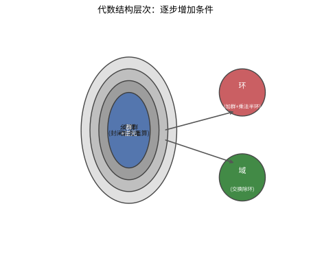
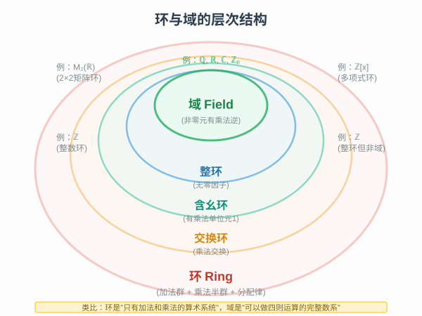

# 第 19 级：抽象代数基础 (Abstract Algebra)

> 抽象代数是现代数学的基石之一，研究代数结构的一般理论。它将具体的数系运算抽象为公理化的代数系统，揭示隐藏在算术背后的深层结构。本教程为抽象代数的入门指南，涵盖群论、环论和域论的基础知识。

---

## 1. 学习目标

完成本教程后，你应该能够：

1. **理解** 二元运算的基本性质（封闭性、结合律、交换律、单位元、逆元）以及代数结构的层级体系
2. **掌握** 群的定义、基本性质及重要例子，能够判断一个集合在给定运算下是否构成群
3. **理解** 子群、陪集、正规子群、商群等概念，并能证明和应用拉格朗日定理
4. **掌握** 群同态与同构的基本定理，并能运用它们分析群的结构
5. **理解** 环、域的定义及基本性质，掌握理想、商环、整环等概念
6. **了解** 域扩张的基本概念，初步认识有限域的结构
7. **能够** 解决抽象代数中的基本习题，具备进一步学习代数的能力

---

## 2. 二元运算与代数结构

### 2.1 二元运算

**定义 2.1（二元运算）** 设 $S$ 是一个非空集合。一个从 $S \times S$ 到 $S$ 的映射称为 $S$ 上的一个**二元运算**。即对任意 $a, b \in S$，存在唯一的 $c \in S$ 使得 $a \circ b = c$。

> **💡 直观理解（类比）**：二元运算是"**往'双人操作台'上丢进两个成员，必确定吐出一个仍在圈内的成员**"。它像一台"配对机"：任意两人（有序）进机器，总能确定地得到一个"产物"，且产物必须还是本集合的人、绝不外窜。$S\times S\to S$ 里三个 $S$ 正传达着"进来的两个是本集合、出去的也必须是本集合"——所以加法、乘法天然是运算，而"除以零"之类进不去、出不来的操作就不算合法运算。

二元运算通常记作 $+$、$\times$、$\circ$、$*$ 等符号。

**定义 2.2（运算的基本性质）** 设 $\circ$ 是集合 $S$ 上的一个二元运算。

- **封闭性**：对任意 $a, b \in S$，有 $a \circ b \in S$。（这是运算定义本身的要求）
- **结合律**：对任意 $a, b, c \in S$，有 $(a \circ b) \circ c = a \circ (b \circ c)$。
- **交换律**：对任意 $a, b \in S$，有 $a \circ b = b \circ a$。
- **单位元（幺元）**：存在 $e \in S$，使得对任意 $a \in S$，有 $e \circ a = a \circ e = a$。
- **逆元**：若 $S$ 有单位元 $e$，对 $a \in S$，若存在 $b \in S$ 使得 $a \circ b = b \circ a = e$，则称 $b$ 是 $a$ 的逆元。

> **💡 直观理解（对比"运算的四种素质"）**：这四条性质就像给运算"验身"的四道关卡，由松到严：
> - **封闭性**："学了不会走出门"——两个成员操作后仍留在本集合，不会串到外面（这是运算的"资格证"）。
> - **结合律**："怎么分组都一个样"——先算前两个还是先算后两个，结果不变；它是抽掉"括号"的通行证，$3+4+5$ 怎么写都对。（注意：加法、乘法都满足，但减法、除法不满足，如 $(5-3)-2 \ne 5-(3-2)$。）
> - **交换律**（可选）："谁先谁后都一样"——作业顺序无关紧要。它是**比结合律更苛刻**的一项品质：$5+3=3+5$ 对，但 $5-3 \ne 3-5$ 就不行。群体里"交换律"对应"排队无先后"，结合律对应"括号随便加"。
> - **单位元/逆元**："不动点"与"后悔药"——单位元是"做了等于没做"的操作，逆元是"做完能反悔撤销"的操作。
>
> 这四个"素质"排列组合，正是后面 2.2 把结构分成广群、半群、幺半群、群、域的关键！

**定理 2.1（单位元的唯一性）** 若一个二元运算存在单位元，则单位元唯一。

**证明**：假设 $e$ 和 $e'$ 都是单位元，则 $e = e \circ e' = e'$。

**定理 2.2（逆元的唯一性）** 若运算满足结合律且有单位元，则每个元素的逆元（如果存在）唯一。

**证明**：假设 $b$ 和 $c$ 都是 $a$ 的逆元，则 $b = b \circ e = b \circ (a \circ c) = (b \circ a) \circ c = e \circ c = c$。

> **💡 直观理解（对比：为什么单位元、逆元都"只有一个"）**：
> - **单位元唯一**：单位元是"数量里的零、乘法里的 1"——两种名字如果都叫"不动操作"，那它俩必然就是同一个操作（让 $e$ 作用于 $e'$，因 $e$ 是单位元得 $e'$，因 $e'$ 是单位元得 $e$，故 $e=e'$）。
> - **逆元唯一**："后悔药"只有一颗。若 $b,c$ 都能把 $a$ 撤销回单位元，那只须让 $b$ 先起作用再让 $c$ 收尾，就能逼出 $b=c$。这象征"处理某个动作的'回退操作'是确定唯一的"——所以科普里常说"$a$ 的逆元 $-a$、$a^{-1}$"才不会二义。
>
> 两组唯一性合起来，让"单位元"和"逆元"像**身份证号码一样绝对确定**——这在代数里非常关键，因为稍后我们会反复用"唯一"去做替换和证明。

### 2.2 代数结构概述

不同的代数结构通过所满足的公理来区分，形成一个层级体系：

| 结构名称 | 封闭性 | 结合律 | 单位元 | 逆元 | 交换律 | 第二种运算 |
|:---:|:---:|:---:|:---:|:---:|:---:|:---:|
| 广群 (Groupoid) | ✓ | | | | | |
| 半群 (Semigroup) | ✓ | ✓ | | | | |
| 幺半群 (Monoid) | ✓ | ✓ | ✓ | | | |
| 群 (Group) | ✓ | ✓ | ✓ | ✓ | | |
| 阿贝尔群 (Abelian Group) | ✓ | ✓ | ✓ | ✓ | ✓ | |
| 环 (Ring) | ✓ | ✓ | ✓ | ✓（加法） | ✓（加法） | ✓（乘法） |
| 域 (Field) | ✓ | ✓ | ✓ | ✓（两种） | ✓（两种） | ✓（乘法） |

> **直观理解（现实类比）**：代数结构是"**逐步加锁的抽屉**"。广群只要求"抽屉能开能关"（一个封闭的二元运算）；加上"怎么关顺序都不影响结果"（结合律）成半群；再保证"有把万能钥匙"（单位元）成幺半群；最后"每个元素有自己的钥匙重新打开"（逆元）进化为群。环和域则是"**装了两把锁的抽屉**"——同时有加法和乘法两种运算，域还要求乘法也能"开锁"（每个非零元有乘法逆）。

#### 广群 (Groupoid)

一个非空集合 $G$ 配备一个二元运算 $\circ$，称为一个**广群**（或称**原群**）。仅要求运算封闭。

> **💡 直观理解（类比）**：广群是"**只有一条规矩的野地**"——只要"两个成员靠一个操作能得出第三个成员"就算数，别的一概不要求。好比一群孩子在空地上"结对做游戏"：只要每两人（有序）一组合总能得出一个"结果"留在场内即可。它的存在是"从零开始的脚手架"：别以为它简陋，正因为它**门槛最低**，才能成为往上长出一整套代数的地基。之后所有"加法/乘法"的精致规则，都是从这"能算"的起点上一层层盖起来的。

#### 半群 (Semigroup)

一个广群 $(G, \circ)$ 如果运算满足**结合律**，则称为一个**半群**。

**例：** $(\mathbb{N}, +)$ 和 $(\mathbb{N}, \times)$ 都是半群，其中 $\mathbb{N}$ 是自然数集。

> **💡 直观理解（类比）**：半群是"**挂牌了的一堆操作**"——在广群"能算"之外，还外加一条"**括号怎么打、顺序怎么分组都不影响结果**"（结合律）。所以 $(3+4)+5=3+(4+5)$ 才敢大方写成 $3+4+5$ 不加括号。自然数加法、乘法都是半群，因为正整数相加、相乘永远"关在门内"（封闭）又"怎么结合都不变"（结合）。对比一下就能体会：减法、除法因为"括号一旦挪位置答案就翻脸"，**不成**半群。

#### 幺半群 (Monoid)

一个半群 $(G, \circ)$ 如果存在**单位元** $e$，则称为一个**幺半群**。

**例：** $(\mathbb{N}_0, +)$（含 0 的自然数集关于加法）是一个幺半群，单位元为 0。$(\mathbb{N}, \times)$ 是一个幺半群，单位元为 1。

> **💡 直观理解（类比）**：幺半群 = 半群 + "**一个'做了等于没做'的中性成员**"（单位元）。0 加什么都不变、1 乘什么都不变，这块"**定心石**"使运算拥有一个稳定的"原点"。想象一条既能把东西排成一串、又永远有个"空位基准"的传送带——把什么都原样保留的那个"0"就是单位元。正是"有没有单位元"把半群和幺半群分开：$(\mathbb{N},+)$ 没有 0 只是半群，而 $(\mathbb{N}_0,+)$ 有了 0 才升格为幺半群。

#### 群 (Group)

一个幺半群 $(G, \circ)$ 如果每个元素都有**逆元**，则称为一个**群**。

> **💡 直观理解（类比）**：群 = 幺半群 + "**每个成员都能'撤销'自己**"（逆元）。单位元给了"原地不动"，逆元给了"能倒带重来"——两者齐备，操作才真正"有来有回、可逆可还原"。好比魔方：每条旋转既有意义（封闭），又能连续换顺序（结合），更有"不做"（单位元）和"倒着转回来"（逆元）。所以群是"**可逆的对称操作的集合**"：凡是你关心"做了之后能改回来"的场景——旋转、置换、矩阵变换——天然聚成群。这也解释了为什么闭环的核心操作（如 $GL_n$、$S_n$）总是群。

#### 环 (Ring)

一个集合 $R$ 上定义了两个二元运算 $+$ 和 $\times$，如果：
- $(R, +)$ 是阿贝尔群（加法群）
- $(R, \times)$ 是半群（乘法半群）
- 乘法对加法满足分配律：$a \times (b + c) = a \times b + a \times c$，$(a + b) \times c = a \times c + b \times c$

则称 $(R, +, \times)$ 是一个**环**。

> **💡 直观理解（类比）**：环 = "**能加能减能乘（未必能除）的算术场**"。它同时拥有两套运算：一套是"**对称且前后可逆**"的加法（阿贝尔群：$0$ 是原点，$-a$ 能抵消 $a$），一套是"**只需结合**"的乘法（半群，连有没有 1 都不强求），再靠**分配律**把两套运算"用锁链绑到一起"（$a(b+c)=ab+ac$）。
> **对比关键**：加法管"平移/进退"（永远可逆，人人有 $-a$），乘法管"缩放/整倍"（未必可逆，只有部分元素有 $a^{-1}$）。整数 $\mathbb{Z}$ 是最标准的环：能做 $3-5$（加法可逆），却未必能做 $3\div2$（乘法不一定能除）。所以环是"**准算术**"——有加减乘的自洽拼图，唯独除法不保证。

#### 域 (Field)

一个环 $(F, +, \times)$ 如果：
- $(F \setminus \{0\}, \times)$ 是阿贝尔群（即乘法满足交换律，有单位元，非零元素都有乘法逆元）
- 则称 $F$ 是一个**域**。

> **💡 直观理解（类比）**：域 = 环 + "**每个非零元都能'除'（有乘法逆元）**"。环里除法不一定成立，域则把这块短板也补上：只除 0 外，人人都有 $a^{-1}$，于是 $ax=b$（$a\ne0$）总能解出 $x=b/a$。
> **对比梯子**：$\mathbb{Z}$（环，除不了 $3\div2$）$\;\to\;$ $\mathbb{Q}$（域，$3\div2$ 做得漂亮）——只需把分数"请进来"，每个非零数就都能做除法。域是"**能加能减能乘能除的全套算术**"，所以线性代数、解方程、现代几何统统以域为大本营。一句口诀：**环是"准算术"，域是"完全算术"**；域就是环在"除法"上修炼圆满的形态。

---

## 3. 群论基础

### 3.1 群的定义

**定义 3.1（群）** 一个**群**是一个有序对 $(G, \circ)$，其中 $G$ 是一个非空集合，$\circ$ 是 $G$ 上的一个二元运算，满足以下公理：

1. **封闭性**：对任意 $a, b \in G$，有 $a \circ b \in G$。
2. **结合律**：对任意 $a, b, c \in G$，有 $(a \circ b) \circ c = a \circ (b \circ c)$。
3. **单位元**：存在 $e \in G$，使得对任意 $a \in G$，有 $e \circ a = a \circ e = a$。
4. **逆元**：对任意 $a \in G$，存在 $a^{-1} \in G$，使得 $a \circ a^{-1} = a^{-1} \circ a = e$。

**定义 3.2（阿贝尔群）** 如果群 $G$ 的运算还满足交换律（即对任意 $a, b \in G$，$a \circ b = b \circ a$），则称 $G$ 为**阿贝尔群**（或称**交换群**）。

> **直观理解（现实类比）**：阿贝尔群像"**排队无关的操作**"。加法是典型例子：$3+5=5+3$，先加 3 再加 5 还是先加 5 再加 3，结果都一样——操作顺序不影响结果。但**一般群不一定交换**：魔方的旋转就是非交换的，先"上层右转"再"前层下转"与先"前层下转"再"上层右转"得到的魔方状态完全不同。穿衣服也一样——先穿袜子再穿鞋 vs 先穿鞋再穿袜子，结果天差地别。阿贝尔群是"温和可交换的世界"，非交换群则是"顺序敏感的世界"。

**定义 3.3（群的阶）** 群 $G$ 中元素的个数称为群的**阶**，记作 $|G|$。如果 $|G|$ 有限，称 $G$ 为**有限群**；否则为**无限群**。

> **直观理解（现实类比）**：群是"**对称操作的规则集**"。魔方的所有旋转操作、地板砖的铺贴模式、分子的对称变换都构成群。群公理就像"**游戏规则**"：封闭性意味着"操作后仍是合法状态"（魔方转完还是魔方）；结合律意味着"操作的分组顺序无关"；单位元是"不做任何操作"；逆元是"撤销操作"（向左转一下再向右转一下回到原状）。只要满足这四条规则，无论操作对象是数、矩阵、还是几何变换，都构成一个群。

### 3.2 群的例子

**例 3.1（整数加法群）** $(\mathbb{Z}, +)$ 是一个阿贝尔群。单位元为 0，$a$ 的逆元为 $-a$。这是一个无限群。

**例 3.2（非零有理数乘法群）** $(\mathbb{Q} \setminus \{0\}, \times)$ 是一个阿贝尔群。单位元为 1，$a$ 的逆元为 $1/a$。

**例 3.3（模 $n$ 加法群）** $(\mathbb{Z}_n, +)$，其中 $\mathbb{Z}_n = \{0, 1, \ldots, n-1\}$，加法为模 $n$ 加法，是一个 $n$ 阶阿贝尔群。

**例 3.4（模 $n$ 乘法群）** $(\mathbb{Z}_n^\times, \times)$，其中 $\mathbb{Z}_n^\times = \{a \in \mathbb{Z}_n \mid \gcd(a, n) = 1\}$，乘法为模 $n$ 乘法，是一个阿贝尔群。其阶为 $\varphi(n)$（欧拉函数）。

**例 3.5（$n$ 次对称群 $S_n$）** 集合 $\{1, 2, \ldots, n\}$ 上的所有置换（双射）在复合运算下构成一个群，称为 $n$ 次**对称群**，记作 $S_n$。$|S_n| = n!$。当 $n \geq 3$ 时，$S_n$ 不是阿贝尔群。

**例 3.6（二面体群 $D_n$）** 正 $n$ 边形的所有对称变换（旋转和反射）在复合运算下构成一个群，称为**二面体群** $D_n$。$|D_n| = 2n$。当 $n \geq 3$ 时，$D_n$ 不是阿贝尔群。

**例 3.7（一般线性群 $GL_n(\mathbb{R})$）** 所有 $n \times n$ 实可逆矩阵在矩阵乘法下构成一个群，称为**一般线性群**。当 $n \geq 2$ 时，$GL_n(\mathbb{R})$ 不是阿贝尔群。

**例 3.8（循环群）** 如果群 $G$ 中存在一个元素 $g$，使得 $G = \{g^k \mid k \in \mathbb{Z}\}$，则称 $G$ 为**循环群**，$g$ 称为**生成元**。$(\mathbb{Z}, +)$ 是无限循环群（生成元为 1 或 -1）。$(\mathbb{Z}_n, +)$ 是 $n$ 阶循环群（生成元为 1）。

### 3.3 子群

**定义 3.4（子群）** 设 $(G, \circ)$ 是一个群，$H$ 是 $G$ 的非空子集。如果 $H$ 在 $\circ$ 运算下本身构成一个群，则称 $H$ 是 $G$ 的**子群**，记作 $H \leq G$。

**定理 3.1（子群判定定理）** 设 $G$ 是一个群，$H$ 是 $G$ 的非空子集。$H$ 是 $G$ 的子群当且仅当以下条件成立：
1. 对任意 $a, b \in H$，有 $a \circ b \in H$（封闭性）
2. 对任意 $a \in H$，有 $a^{-1} \in H$（逆元封闭）

**等价条件**：对任意 $a, b \in H$，有 $a \circ b^{-1} \in H$。

**证明**：必要性显然。充分性：由条件 2 知每个元素有逆元，由条件 1 知运算封闭，结合律继承自 $G$，由 $a \circ a^{-1} = e \in H$ 知单位元存在。

> **💡 直观理解（类比）**：子群判定只须"两点验身"：**① 关起门来任两人的产物仍在门内**（封闭）、**② 门内每人都揣着"反悔钥匙"**（逆元封闭）。这两条一过，单位元会自动从 $a\circ a^{-1}$ 现出，无需单独去找。类比验证一伙人是不是个能"独立运营的俱乐部"：只要"内部活动不串场"（封闭）且"人人能全身而退"（有逆元），就算自成一家。

**例 3.9** $(\mathbb{Z}, +)$ 是 $(\mathbb{Q}, +)$ 的子群。

**例 3.10** 对于 $n \geq 2$，**交错群** $A_n$（即 $S_n$ 中所有偶置换构成的集合）是 $S_n$ 的子群。$|A_n| = n!/2$。

**例 3.11** 特殊线性群 $SL_n(\mathbb{R}) = \{A \in GL_n(\mathbb{R}) \mid \det(A) = 1\}$ 是 $GL_n(\mathbb{R})$ 的子群。

> **直观理解（现实类比）**：子群像"**大群里的子俱乐部**"。设想 $GL_n(\mathbb{R})$ 是一个"所有可逆矩阵俱乐部"，里面的成员都能做乘法运算、有单位元、能求逆。而 $SL_n(\mathbb{R})$（行列式为 1 的矩阵）就是其中的一个"**小圈子**"——它自己关门运作时也完全满足群公理：两个行列式为 1 的矩阵相乘行列式仍为 1（封闭），单位矩阵行列式为 1（有单位元），逆矩阵行列式也为 1（可逆）。子群就是"群中之群"，继承父群的运算规则却自成一体。

### 3.4 陪集与拉格朗日定理

**定义 3.5（陪集）** 设 $G$ 是一个群，$H \leq G$，$a \in G$。
- **左陪集**：$aH = \{a \circ h \mid h \in H\}$
- **右陪集**：$Ha = \{h \circ a \mid h \in H\}$

**性质 3.1** 对于群 $G$ 的子群 $H$：
1. $aH = bH$ 当且仅当 $a^{-1}b \in H$
2. 任意两个左陪集要么相等，要么不相交（即左陪集构成 $G$ 的一个划分）
3. $|aH| = |H|$（所有陪集与 $H$ 等势）
4. $a \in aH$（因为 $a = a \circ e$）

**定义 3.6（指数）** 子群 $H$ 在 $G$ 中的左陪集（或右陪集）的个数称为 $H$ 在 $G$ 中的**指数**，记作 $[G : H]$。

> **直观理解（现实类比）**：陪集是"**群被切成等大的整齐格子**"。取子群 $H$，把群 $G$ 里的每个元素乘上一个固定的 $a$，得到 $aH$——就像**把整块棋盘按 $H$ 的格子平移**，得到的一批"同样形状"的棋子区。这些区要么完全重合、要么毫不重叠，且每区大小都与 $H$ 相同，于是 $|G|=|H|\times[G:H]$——这就是 Lagrange 定理：**子群大小必须整除群大小**。

**定理 3.2（拉格朗日定理）** 设 $G$ 是一个有限群，$H$ 是 $G$ 的子群。则
$$|G| = |H| \cdot [G : H]$$
即子群的阶整除群的阶。

**证明**：设 $G$ 关于 $H$ 的所有互不相同的左陪集为 $a_1H, a_2H, \ldots, a_rH$，其中 $r = [G : H]$。这些左陪集两两不交且覆盖 $G$，因此
$$|G| = \sum_{i=1}^r |a_iH| = \sum_{i=1}^r |H| = r \cdot |H| = [G : H] \cdot |H|$$
证毕。

**推论 3.1** 有限群中每个元素的阶整除群的阶。

**证明**：设 $a \in G$ 的阶为 $n$，则 $H = \langle a \rangle = \{e, a, a^2, \ldots, a^{n-1}\}$ 是 $G$ 的一个 $n$ 阶子群。由拉格朗日定理，$n \mid |G|$。

**推论 3.2** 素数阶群一定是循环群。

**证明**：设 $|G| = p$ 为素数。取 $a \in G$ 且 $a \neq e$，则 $a$ 的阶 $m > 1$ 且 $m \mid p$，所以 $m = p$。因此 $\langle a \rangle = G$，$G$ 是循环群。

> **💡 直观理解（对比 Lagrange 与它的推论）**：
> - **拉格朗日定理**："子集是子群，其大小必须整除整个群的大小"——像把一块大蛋糕 $|G|$ 切成若干份相等的 $|H|$，份数正是指数 $[G:H]$，绝不剩渣。**递进意义**：这从"配凑"层面宣判了子群能有多"大"——它的大小处处受限于 $|G|$ 的因数。
> - **推论 3.1（元素阶整除群阶）**：单看一个元素 $a$，"自己反复乘多少次能回到单位元"（阶）也必须是 $|G|$ 的因数——因为 $\langle a\rangle$ 自己就凑成一个子群。
> - **推论 3.2（素数阶群是循环群）**：当 $|G|=p$ 是素数，$|G|$ 的因数只有 $1$ 和 $p$。取任意非单位元 $a$，其阶 $\ne 1$ 又必须整除 $p$，只能等于 $p$，于是 $\langle a\rangle$ 就撑满了整个 $G$。**一条链打下来**：Lagrange → 阶是因数 → 素数阶只能整群转圈 → 必是循环群。透着一个"轻巧但锋利"的结构约束力。

### 3.5 正规子群与商群

**定义 3.7（正规子群）** 设 $G$ 是一个群，$N \leq G$。如果对任意 $g \in G$ 和任意 $n \in N$，有 $g n g^{-1} \in N$（即 $gNg^{-1} = N$），则称 $N$ 是 $G$ 的**正规子群**，记作 $N \trianglelefteq G$。

**等价条件**：$N \trianglelefteq G$ 当且仅当对任意 $g \in G$，有 $gN = Ng$（即左陪集等于右陪集）。

> **💡 直观理解（对比：子群 vs 正规子群）**：
> - **子群**：$H$ 是"群中之群"，只要自己在内部能关门运转即可，不要求"从外面看它"有多规整。
> - **正规子群**（更强）：加了一条"**从哪个方向看都一样**"的苛刻要求——无论用 $G$ 中哪个元素 $g$ 从**左边**去"平移"（$gN$），还是从**右边**去"平移"（$Ng$），得到的"整栋陪集屋子"都要长得一模一样（$gN=Ng$）。
>
> 打个比方：**普通子群**像"幼儿园里的一个班"——班内和班外可以分开看；**正规子群**则像"全校统一制服"——无论从哪个门（左边/右边）进来，看到的队列格局都一样，界限分明、左右对称。正是这种"左右对称"才让陪集之间能**彼此自然地组合**，从而可以大方地"打包"成商群 $G/N$——这也是为什么只有正规子群才能造商群，普通子群不行。

**例 3.12** 任何群 $G$ 都有两个平凡正规子群：$\{e\}$ 和 $G$ 本身。

**例 3.13** 阿贝尔群的每个子群都是正规子群。

**例 3.14** $A_n$ 是 $S_n$ 的正规子群（当 $n \geq 2$ 时）。

**例 3.15** $SL_n(\mathbb{R})$ 是 $GL_n(\mathbb{R})$ 的正规子群。

**定义 3.8（商群）** 设 $N \trianglelefteq G$。$G$ 关于 $N$ 的所有左陪集构成的集合 $G/N = \{gN \mid g \in G\}$ 在运算 $(aN)(bN) = (ab)N$ 下构成一个群，称为 $G$ 关于 $N$ 的**商群**。

**验证**：运算定义良好（与代表元选取无关），因为 $N$ 正规。单位元为 $N = eN$，$(aN)^{-1} = a^{-1}N$。$|G/N| = [G : N] = |G|/|N|$（当 $G$ 有限时）。

> **直观理解（现实类比）**：商群是"**忽略细节的抽象**"。把群 $G$ 中"等价"的元素归为一类（一个陪集），就得到商群 $G/N$。就像整理一箱杂物：你可以**按颜色**分（红的一类、蓝的一类），也可以**按形状**分（圆的一类、方的一类）。每个类内部细节不同，但作为整体被视作"一个元素"。比如 $\mathbb{Z}/12\mathbb{Z}$ 把所有相差 12 的整数归为同类，1、13、25 都"算作 1"——这就是钟表上的小时数，忽略"过了几个 12 小时"的细节。商群让我们能"放大格局"地看群结构。

### 3.6 群同态与同构

**定义 3.9（群同态）** 设 $(G, \circ)$ 和 $(H, *)$ 是两个群。映射 $\varphi: G \to H$ 称为一个**群同态**，如果对任意 $a, b \in G$，有
$$\varphi(a \circ b) = \varphi(a) * \varphi(b)$$

> **直观理解（现实类比）**：群同态像"**翻译器**"。它把群 $G$ 中的运算翻译成群 $H$ 中的运算，并**保持结构**——"先在 $G$ 中运算再翻译"和"先翻译到 $H$ 再运算"得到相同结果。就像把中文语法翻译成英文语法：无论你是先在中文里组合句子再翻译，还是先逐词翻译再用英文语法组合，最终意思一致。同态不一定一一对应，可能"多对一"（多个 $G$ 元素翻译成同一个 $H$ 元素），但绝不会破坏运算的协调性。

**定义 3.10（群同构）** 如果 $\varphi$ 是双射的群同态，则称 $\varphi$ 为**群同构**，此时称 $G$ 与 $H$ **同构**，记作 $G \cong H$。

> **直观理解（现实类比）**：群同构是"**完全等价的翻译**"。两群结构完全相同，只是元素的"**名字**"不同——就像同一个人换不同名字称呼，本质没变。若 $G \cong H$，则 $G$ 中有什么样的子群、什么样的元素阶、什么样的运算规律，$H$ 中也一一对应存在。数学家常说"在同构意义下唯一"，意思就是"除了改名换姓，其实只有一个"。比如所有 4 阶循环群都同构于 $\mathbb{Z}_4$，没有别的"种类"。

**定义 3.11（核与像）** 设 $\varphi: G \to H$ 是群同态。
- **核**：$\ker \varphi = \{g \in G \mid \varphi(g) = e_H\}$
- **像**：$\operatorname{im} \varphi = \{h \in H \mid \exists g \in G, \varphi(g) = h\}$

> **直观理解（现实类比）**：核与像是"**翻译器的失真部分与保留部分**"。**核**是被翻译成 $H$ 中"单位元"（相当于"无信息"的空操作）的那些 $G$ 元素——它们在翻译中"**消失了**"，像被翻译机忽略的细节，是"失真"的根源。**像**则是翻译后真正"**留下来的信息**"——$H$ 中那些被 $G$ 的某元素真正翻译到的部分。核越大，失真越多；像越大，保留越全。当核只有单位元时（无失真），同态就成了单射；当像等于整个 $H$ 时，同态是满射。

**性质 3.2** 设 $\varphi: G \to H$ 是群同态。
1. $\varphi(e_G) = e_H$
2. $\varphi(g^{-1}) = (\varphi(g))^{-1}$
3. $\ker \varphi \trianglelefteq G$（核是正规子群）
4. $\operatorname{im} \varphi \leq H$（像是子群）
5. $\varphi$ 是单射当且仅当 $\ker \varphi = \{e_G\}$

> **💡 直观理解（类比）**：同态 $\varphi$ 像一台"尊重运算的翻译机"。**单位元进去必出单位元**（把"空操作"翻译过去仍是空操作，$\varphi(e_G)=e_H$）；**把"撤销键" $g^{-1}$ 翻译过去正好是 $\varphi(g)$ 的撤销键**（$\varphi(g^{-1})=\varphi(g)^{-1}$）。**核闭合成正规子群、像闭合成子群**，都因运算被保持而自动"关门"。而"核只有单位元 $\iff$ 单射"像"零失真翻译机"：只要翻到空操作的原件只有 $e_G$ 一个，映射就不会"多对一"。

**例 3.16** 映射 $\varphi: \mathbb{Z} \to \mathbb{Z}_n$，$\varphi(k) = k \bmod n$，是一个满同态，核为 $n\mathbb{Z}$。

**例 3.17** 映射 $\det: GL_n(\mathbb{R}) \to \mathbb{R} \setminus \{0\}$，$\det(A)$ 是矩阵的行列式，是一个满同态，核为 $SL_n(\mathbb{R})$。

**例 3.18** 映射 $\operatorname{sgn}: S_n \to \{1, -1\}$，$\operatorname{sgn}(\sigma)$ 是置换的符号，是一个同态，核为 $A_n$。

### 3.7 同构基本定理

**定理 3.3（第一同构定理）** 设 $\varphi: G \to H$ 是群同态。则 $\ker \varphi \trianglelefteq G$，且
$$G / \ker \varphi \cong \operatorname{im} \varphi$$
具体地，映射 $\tilde{\varphi}: G/\ker \varphi \to \operatorname{im} \varphi$，$\tilde{\varphi}(g\ker \varphi) = \varphi(g)$ 是一个同构。

**证明**：
1. 首先验证 $\tilde{\varphi}$ 定义良好：若 $g_1\ker\varphi = g_2\ker\varphi$，则 $g_1^{-1}g_2 \in \ker\varphi$，所以 $\varphi(g_1^{-1}g_2) = e_H$，即 $\varphi(g_1) = \varphi(g_2)$。
2. $\tilde{\varphi}$ 是同态：$\tilde{\varphi}((g_1\ker\varphi)(g_2\ker\varphi)) = \tilde{\varphi}(g_1g_2\ker\varphi) = \varphi(g_1g_2) = \varphi(g_1)\varphi(g_2) = \tilde{\varphi}(g_1\ker\varphi)\tilde{\varphi}(g_2\ker\varphi)$。
3. $\tilde{\varphi}$ 是满射：对任意 $h \in \operatorname{im}\varphi$，存在 $g \in G$ 使得 $\varphi(g) = h$，则 $\tilde{\varphi}(g\ker\varphi) = h$。
4. $\tilde{\varphi}$ 是单射：若 $\tilde{\varphi}(g\ker\varphi) = e_H$，则 $\varphi(g) = e_H$，即 $g \in \ker\varphi$，所以 $g\ker\varphi = \ker\varphi$ 是零元。

证毕。

**定理 3.4（第二同构定理）** 设 $G$ 是一个群，$H \leq G$，$N \trianglelefteq G$。则 $H \cap N \trianglelefteq H$，且
$$H / (H \cap N) \cong HN / N$$

**证明思路**：考虑映射 $\varphi: H \to G/N$，$\varphi(h) = hN$。可以验证 $\varphi$ 是同态，$\ker \varphi = H \cap N$，$\operatorname{im} \varphi = HN/N$。由第一同构定理即得结论。

> **💡 直观理解（类比）**：第二同构定理 $H/(H\cap N)\cong HN/N$ 像"**两组叠加后的去重清算**"。$HN$ 是 $H$ 与正规子群 $N$ 拼出的整体，其中 $N$ 这层会被"约掉"；而 $H$ 里恰好与 $N$ 重合的那块（$H\cap N$）也要一并略去，剩下的 $H$ 的"纯粹部分"正与商 $HN/N$ 一一对应。类比：把 $N$ 当作"要吸收的公共基准"，数 $HN$ 里"除掉基准还剩几个 $H$ 的不同状态"时，$H$ 中已被基准覆盖的那几项同样跳过——所以是"减去交集、但不重复减"。

**定理 3.5（第三同构定理）** 设 $G$ 是一个群，$N \trianglelefteq G$，且 $N \leq K \trianglelefteq G$。则 $K/N \trianglelefteq G/N$，且
$$(G/N) / (K/N) \cong G/K$$

**证明思路**：考虑映射 $\psi: G/N \to G/K$，$\psi(gN) = gK$。可以验证 $\psi$ 是满同态，$\ker\psi = K/N$。由第一同构定理即得结论。

> **💡 直观理解（类比）**：第三同构定理 $(G/N)/(K/N)\cong G/K$ 像"**逐层约分，结果不变**"。先按小基元 $N$ 打包 $G$ 得 $G/N$，再按更大的一层 $K/N$ 打包一次；最终效果与一步到位按 $K$ 打包 $G$ 完全相同。类比分数约分："分子分母先同除一层、再同除一层"和"一次除尽"，留下的数值必然是一样的——取商的次序不影响最终的商结构，只是粒度大小不同。

> **直观理解（现实类比）**：同构定理是"**群的翻译机器**"。想象你有一台神奇的翻译机 $\varphi$，能把群 $G$ 里的元素翻译成群 $H$ 的语言。翻译机有个"盲区" $\ker\varphi$——所有被翻译成 $H$ 的单位元的 $G$ 中元素。第一同构定理告诉我们：把 $G$ 中"意思相同"的元素打包成商群 $G/\ker\varphi$，就能完美对应到翻译机能到达的所有 $H$ 中的元素（即 $\operatorname{im}\varphi$）。就像把不同方言但意思相同的话归类后，就能和目标语言一一对应。

---

## 4. 环论基础

### 4.1 环的定义

**定义 4.1（环）** 一个**环**是一个三元组 $(R, +, \cdot)$，其中 $R$ 是一个非空集合，$+$ 和 $\cdot$ 是 $R$ 上的两个二元运算，满足：
1. $(R, +)$ 是阿贝尔群（加法群），记加法单位元为 $0$，$a$ 的加法逆元为 $-a$
2. $(R, \cdot)$ 是半群（乘法满足结合律）
3. **分配律**：对任意 $a, b, c \in R$，
   - 左分配律：$a \cdot (b + c) = a \cdot b + a \cdot c$
   - 右分配律：$(a + b) \cdot c = a \cdot c + b \cdot c$

> **直观理解（现实类比）**：环是"**能加能乘的数系**"。整数 $\mathbb{Z}$ 是最典型的环——你可以做加减乘，却不一定能做除法（$3 \div 2$ 不是整数）。环 $= \text{Abel 加群} + \text{乘法半群} + \text{分配律}$，本质上是一个"**同时支持加减乘的运算系统**"。分配律是加法和乘法之间的"**桥梁**"——它规定乘法对加法的展开规则（$a(b+c)=ab+ac$），让两种运算协同工作而非各管各的。矩阵、多项式、剩余类这些"算术对象"都是环，环是抽象化的"准算术世界"。

**定义 4.2（环的特殊类型）**
- **交换环**：乘法满足交换律的环
- **含幺环**：乘法有单位元（记作 $1$ 或 $1_R$）的环
- **整环**：含幺交换环，且无零因子（即 $a \cdot b = 0 \Rightarrow a = 0$ 或 $b = 0$）
- **除环**：含幺环，且每个非零元素都有乘法逆元
- **域**：交换的除环

> **直观理解（现实类比）**：环到域的层级是"**逐步升级的保险箱**"。最外层的环只有加法和乘法两个基本操作；加上"乘法交换"变成交换环（像整数那样可以交换顺序）；加上"有乘法单位元1"成含幺环；再加上"没有零因子"（两个非零数相乘不会得零）成整环；最后"每个非零元素都能做除法"（有乘法逆元）就升级到了域。就像保险箱层层加锁，每多一把钥匙就能解锁更多运算。

### 4.2 环的例子

**例 4.1** $(\mathbb{Z}, +, \times)$ 是一个整环，但不是域。

**例 4.2** $(\mathbb{Q}, +, \times)$、$(\mathbb{R}, +, \times)$、$(\mathbb{C}, +, \times)$ 都是域。

**例 4.3** $(\mathbb{Z}_n, +, \times)$（模 $n$ 的剩余类环）是一个含幺交换环。当 $n$ 为素数时，$\mathbb{Z}_n$ 是域（记作 $\mathbb{F}_p$）。

**例 4.4** 所有 $n \times n$ 实矩阵构成的集合 $M_n(\mathbb{R})$ 在矩阵加法和乘法下形成一个环。当 $n \geq 2$ 时，它是非交换环，且有零因子。

**例 4.5** 多项式环 $R[x]$：系数在环 $R$ 中的多项式在加法和乘法下构成一个环。

### 4.3 子环与理想

**定义 4.3（子环）** 设 $R$ 是一个环，$S$ 是 $R$ 的非空子集。如果 $S$ 在 $R$ 的加法和乘法下本身构成一个环，则称 $S$ 是 $R$ 的**子环**。

> **💡 直观理解（类比）**：子环是"**环里的'小环'**"——$S$ 在自己内部就能做加、减、乘（并继承分配律）而不窜出 $R$；它不必像理想那样"吸收外来的乘法"，只要"自己在关门内算得起来"即可。类比一座城市里"自给自足的社区"：区内能自行经商办厂、生意闭环，但它不强行吞纳所有外来商品，只需内部运算别跑出去就行。

**定义 4.4（理想）** 设 $R$ 是一个环，$I$ 是 $R$ 的非空子集。
- $I$ 是 $R$ 的**左理想**，如果：$(I, +)$ 是 $(R, +)$ 的子群，且对任意 $r \in R$，$a \in I$，有 $ra \in I$
- $I$ 是 $R$ 的**右理想**，如果：$(I, +)$ 是 $(R, +)$ 的子群，且对任意 $r \in R$，$a \in I$，有 $ar \in I$
- $I$ 是 $R$ 的**双边理想**（简称**理想**），如果它既是左理想又是右理想

> **直观理解（现实类比）**：理想是"**吸收乘法的子集**"。最经典的例子是整数中的**偶数** $2\mathbb{Z}$：偶数 $\times$ 任意整数（无论奇偶）结果仍是偶数——它"**吸收**"了外来乘法元素，不会"漏出"到集合外。这就是理想的精髓：不仅自己能加减（加法子群），还能被环中任意元素乘而**仍待在集合内**。理想在环论中扮演正规子群在群论中的角色——它让我们能构造商环 $R/I$，把 $I$ 中的元素"视为 0"进行抽象。$\mathbb{Z}$ 中所有理想都是 $n\mathbb{Z}$（倍数集），就像不同"刻度"的吸收器。

**例 4.6** 在 $\mathbb{Z}$ 中，$n\mathbb{Z} = \{nk \mid k \in \mathbb{Z}\}$ 是理想。事实上，$\mathbb{Z}$ 的所有理想都是这种形式。

**例 4.7** 在 $M_n(\mathbb{R})$ 中，$\{0\}$ 和 $M_n(\mathbb{R})$ 本身是平凡理想，没有非平凡的双边理想（即 $M_n(\mathbb{R})$ 是**单环**）。

### 4.4 商环与环同态

**定义 4.5（商环）** 设 $R$ 是一个环，$I$ 是 $R$ 的理想。$R$ 关于 $I$ 的加法商群 $R/I = \{a + I \mid a \in R\}$ 在以下运算下构成一个环：
- 加法：$(a + I) + (b + I) = (a + b) + I$
- 乘法：$(a + I)(b + I) = ab + I$
称为 $R$ 关于 $I$ 的**商环**。

**定义 4.6（环同态）** 设 $R$ 和 $S$ 是环。映射 $\varphi: R \to S$ 称为**环同态**，如果对任意 $a, b \in R$：
- $\varphi(a + b) = \varphi(a) + \varphi(b)$
- $\varphi(ab) = \varphi(a)\varphi(b)$

**环同态的基本性质**：
- $\ker \varphi = \{a \in R \mid \varphi(a) = 0_S\}$ 是 $R$ 的理想
- $\operatorname{im} \varphi$ 是 $S$ 的子环
- $\varphi$ 是单射当且仅当 $\ker \varphi = \{0_R\}$

**定理 4.1（环的第一同构定理）** 设 $\varphi: R \to S$ 是环同态。则 $R / \ker \varphi \cong \operatorname{im} \varphi$。

> **💡 直观理解（对比：群 / 模 / 环的"第一同构"如同一家）**：
> 商环和环同态，几乎就是"把群的三板斧搬到带加法和乘法的世界"。对比着看最容易懂：
> - **商环 $R/I$**：把理想 $I$ 里的元素统统"当成 0"，再把"模 I 相同"的元素合并成一个大类——像钟表上把相差 12 小时的时间都当作同一个时刻。加法和乘法都能在这种"忽略 $I$ 的粗粒度世界"里安然运转，前提正是 $I$ 是**理想**（被环中任意元素乘仍不越界）。
> - **环同态**：是"同时保留加法结构和乘法结构的翻译机"——$\varphi(a+b)=\varphi(a)+\varphi(b)$ 且 $\varphi(ab)=\varphi(a)\varphi(b)$，两个运算都得对得上号。它比群同态"要求更高"，因为环有两套运算要各归其位。
> - **环的第一同构定理 $R/\ker\varphi\cong\operatorname{im}\varphi$**：和群侧的 $G/\ker\cong\operatorname{im}$ 长得一模一样——"把核打包成商，商刚好长成翻译机的像"。区别只在"核"从**正规子群**换成了 **理想**，角色完全平移：理想之于环，正如正规子群之于群。
>
> 一句话对比记忆：**群同态 → 核是正规子群、商是商群；环同态 → 核是理想、商是商环；两者的第一同构定理都宣言"商 ≡ 像"**。

### 4.5 整环与域的特征

**定义 4.7（零因子）** 设 $R$ 是一个含幺交换环。非零元素 $a \in R$ 称为**零因子**，如果存在非零 $b \in R$ 使得 $ab = 0$。

> **💡 直观理解（对比：整环"干净" vs 一般环"藏着崩溃"）**：零因子是"**乘法里偷偷归零的'隐形陷阱'**"。正常算术里"两个非零数相乘不可能得 0"，但在某些环里会有例外：例如 $\mathbb{Z}_6$ 中 $2\times 3 = 6 \equiv 0$，这里的 $2$ 和 $3$ 都是零因子——各自非零，合起来却"孕育出 0"。这让"=$>$"方向"$ab=0 \Rightarrow a=0\lor b=0$"（消去律）彻底失效。**整环**恰好是"没有这种陷阱"的干净世界：乘积为零，则必有一个因子为零。所以整环是"**能安全缩小到大世界做起算术**"的地方——你不会在解方程、分因式时被"无中生有的零"绊一跤。

**定义 4.8（整环）** 一个不含零因子的含幺交换环称为**整环**。

**例 4.8** $\mathbb{Z}$、$\mathbb{Z}[x]$、$\mathbb{Z}[i]$（高斯整数环）都是整环。

**定理 4.2（有限整环是域）** 每个有限整环都是域。

**证明**：设 $R$ 是有限整环，$a \in R \setminus \{0\}$。考虑映射 $f: R \to R$，$f(x) = ax$。$f$ 是单射（因 $ax = ay \Rightarrow a(x-y) = 0 \Rightarrow x = y$），由于 $R$ 有限，$f$ 是满射，故存在 $b \in R$ 使得 $ab = 1$，即 $a$ 有乘法逆元。

> **💡 直观理解（对比：为什么"有限整环必是域"）**：把"乘法是干净无零因子"这份长处，叠加"集合只有有限多个元素"这份吝啬，就能白拿"每个非零元都可逆"——码字般的派对小戏法。核心观察：
> - 固定非零 $a$，做"乘法映射" $f(x)=ax$。无零因子 ⇒ $f$ 是单射（两炮打不同份，不会一个变两个）。
> - 集合 **有限** ⇒ 单射自动是满射（有限集合上"把不同点射向不同点"的配对，必然把所有点都打遍，像场地有限时"不重复地排队"必把每个座位坐满）。
> - 于是某元素 $b$ 被打到 1（$ab=1$），即 $a$ 可逆。
>
> **对比关键**：无限整环（如 $\mathbb{Z}$）单射未必满射，$f(x)=2x$ 打不到 3，所以 $\mathbb{Z}$ 里 2 不可逆、$\mathbb{Z}$ 不是域；正是"有限"这个条件把"单射"升级成"满射"，才让每个非零元都拿到逆元。

**定义 4.9（环的特征）** 设 $R$ 是一个含幺环。最小的正整数 $n$ 使得 $n \cdot 1_R = 0$（即 $1_R$ 加 $n$ 次等于 $0$），称为 $R$ 的**特征**，记作 $\operatorname{char}(R)$。如果不存在这样的正整数，则称特征为 $0$。

**例 4.9** $\operatorname{char}(\mathbb{Z}) = 0$，$\operatorname{char}(\mathbb{Q}) = 0$，$\operatorname{char}(\mathbb{Z}_p) = p$（$p$ 为素数）。

> **💡 直观理解（对比：特征 0 vs 特征 p"世界里加多少不归零"）**：特征刻画的是一句话**——"把这个族的'1'原地加多少次，会把自己折返回 0（清零）"**。
> - **char 0**（$\mathbb{Z},\mathbb{Q},\mathbb{R},\mathbb{C}$）：无论 $1+1+\cdots+1$ 加多少回，都永远到不了 0——就像一把加法永远"不走回头路的尺子"，$n\cdot1\ne0$ 对一切 $n$。日常算术、微积分都在这个"海拔无限"的世界里进行。
> - **char $p$**（$\mathbb{Z}_p$）：加入 $p$ 个 1 正好归零（$p\cdot1\equiv0$）。它像"**模 $p$ 的钟面**"——正点半点转一圈就重回原点，加法在"有限环"里转圈。此处的"乘法表"和"求和"都有非零纠缠（到处都是零因子与重复周期），是**有限域**的温床。
>
> 值得对比的是：特征再小也得是"$1$ 加 $n$ 次"的极限；只要 $1_R$ 自己加不出 0（char 0），它所在的整环就"没有有限取暖"，无穷伸展。特征把"这个环像哪种算术"一句话问清，也顺带框定了"有限域只能是 $p^n$ 个元素"这条硬规矩的来源。

**性质 4.1** 设 $R$ 是一个整环，则 $\operatorname{char}(R)$ 要么是 $0$，要么是一个素数。

**证明**：若 $\operatorname{char}(R) = mn$ 且 $m, n > 1$，则 $(m \cdot 1)(n \cdot 1) = mn \cdot 1 = 0$，但 $m \cdot 1 \neq 0$，$n \cdot 1 \neq 0$，这与整环无零因子矛盾。

> **💡 直观理解（类比）**：这条性质说"整环的特征，非 $0$ 即素数"。直觉在"**无零因子**"这四个字：若 $1$ 加到第 $mn$ 次才归零（$mn\cdot1=0$），则可把它拆成 $(m\cdot1)\cdot(n\cdot1)=0$，两只非零因子相乘竟得零——这在整环里是禁止的。类比在环路里从起点数数：如果第 $mn$ 步才回到原点，那第 $m$ 步或第 $n$ 步必有一个已先行归零；于是合法周期（特征）只能是"质数个 $1$"，不能是分成两段都非零的合数。

### 4.6 中国剩余定理（CRT）

> **先看一个问题**：一篮鸡蛋，"三个三个数剩 2 个，五个五个数剩 3 个，七个数剩 2 个"——篮里至少有多少个蛋？这是我国古代《孙子算经》里的"物不知数"问题，早在公元前后就提出了"如何同时满足好几个不同的'除以某数余几'"的难题。

这类问题写成符号就是一个**一次同余方程组**：
$$x \equiv a_1 \pmod{m_1},\quad x \equiv a_2 \pmod{m_2},\quad \cdots,\quad x \equiv a_n \pmod{m_n}$$

单独看每一个，解一目了然（$x\equiv a_i \pmod{m_i}$ 就是一列等差数）；难点在**同时满足全部**。历史上这个问题等价于"把大整数按余数拆开再各自计算、最后拼起来"，直接孕育了现代数论与密码学里的**模运算并行**思想。

**定义 4.10（互素理想）** 设 $I,J$ 是交换环 $R$ 的理想。若 $I+J=R$（即存在 $i\in I$、$j\in J$ 使 $i+j=1$），则称 $I$ 与 $J$ **互素**（或**互极大**）。在 $\mathbb{Z}$ 中，$(m)$ 与 $(n)$ 互素 $\iff \gcd(m,n)=1$。

**定理 4.3（中国剩余定理，环形式）** 设 $R$ 是含幺交换环，$I_1,\ldots,I_n$ 两两互素。则映射
$$R \;\longrightarrow\; R/I_1 \times \cdots \times R/I_n,\qquad r \mapsto (r+I_1,\ldots,r+I_n)$$
是一个满的环同态，其核为 $I_1 I_2 \cdots I_n$。特别地，
$$R/(I_1\cdots I_n) \cong R/I_1 \times \cdots \times R/I_n$$

> **💡 直观理解（类比）**：CRT 说"**一个整体可以被'按不同刻度的钟'逐项读出，且读出的内容能唯一拼回原样**"。$x$ 在模 $m_i$ 下的余数，就像同一时刻在不同地方、不同刻度的钟面上看到的小时——每个钟面都只暴露 $x$ 的一个"侧影"。互素条件恰保证这些侧影"彼此独立、不相干扰"，于是 $n$ 个侧影合起来就能**完整且唯一**还原 $x$（模乘积）。

**特例（整数 CRT）**：当 $m_1,\ldots,m_n$ 两两互素，$M=m_1\cdots m_n$，则同余方程组 $x\equiv a_i\pmod{m_i}$ 在模 $M$ 下恰有一解。**构造解**：令 $M_i = M/m_i$（“除自己外所有模数的乘积”），因 $\gcd(M_i,m_i)=1$，存在逆元 $M_i^{-1}\pmod{m_i}$，则
$$x = \sum_{i=1}^n a_i \, M_i \, M_i^{-1} \pmod{M}$$

> **💡 直观理解（推理链）**："每个侧影怎么拼回整体"——**这股构造法的套路是**：
> 1. 每个 $a_iM_iM_i^{-1}$ 这一项：$M_i$ 代表"除我这个钟外其它钟都认它为零"（因为其它 $m_j$ 都整除 $M_i$），而 $M_i^{-1}$ 负责"让 $M_i$ 在 $m_i$ 这一个钟上恰好等于 1"。
> 2. 于是第 $i$ 项"只在第 $i$ 个钟上说话、其它钟都静默"，全加起来就实现了每个钟上分别读出 $a_i$。
>
> 这正是**分解再拼回**的"加法分解"思想：把复杂的联合条件拆成 $n$ 个互不干涉的单项，逐项调整后求和。也正因为余数彼此独立，我们才能**分别在小模数上快算、再拼出大数**——这是 RSA 等公钥算法加速模幂的底层原理。

**例 4.10** 解同余组 $x\equiv2\pmod3$、$x\equiv3\pmod5$、$x\equiv2\pmod7$。
- $M=105$，$M_1=35,\ M_2=21,\ M_3=15$；
- $35^{-1}\equiv2\pmod3$（$35\equiv2$），$21^{-1}\equiv1\pmod5$，$15^{-1}\equiv1\pmod7$；
- $x = 2\cdot35\cdot2 + 3\cdot21\cdot1 + 2\cdot15\cdot1 = 140+63+30 = 233\equiv 23\pmod{105}$。

所以最小正整数解是 **23**（验证：$23\equiv2\pmod3$、$\equiv3\pmod5$、$\equiv2\pmod7$）。

**推论 4.1** 当 $m,n$ 互素，$\mathbb{Z}_{mn}\cong \mathbb{Z}_m\times \mathbb{Z}_n$。由此 $\varphi$（欧拉函数）可分解：$\gcd(m,n)=1$ 时 $\varphi(mn)=\varphi(m)\varphi(n)$。

> **💡 直观理解（对比）**：CRT 与"理想分解"是一体两面：用环的语言，$(m)$ 与 $(n)$ 互素时，$\mathbb{Z}/(mn)\cong\mathbb{Z}/(m)\times\mathbb{Z}/(n)$ 把"大环"劈成两个"独立小环"的直积。它和"中国余数定理"的思想一致——**整体结构可以由若干互素的"塔段"唯一重构**，这为环论的分层研究提供了最干净的例子。

### 4.7 主理想整环、欧几里得整环与唯一分解整环

> **先看一个问题**：$12=2\cdot2\cdot3$ 在 $\mathbb{Z}$ 里只有这一种"素因子分解"；$6=2\cdot3=(1+\sqrt{-5})(1-\sqrt{-5})$ 在 $\mathbb{Z}[\sqrt{-5}]$ 中却出现**两种本质上不同的分解**。为什么"整数世界"里可靠的唯一分解，放到别的整环里就失灵了？哪些环里能保住"唯一分解"？

要回答这个问题，需要给"像整数那样理想的环"一个逐步精确的谱系。三个层层收缩的精品类别各有明确解法：

**定义 4.11（各种"整环"）** 设 $D$ 是含幺整环。
- **主理想整环（PID，Principal Ideal Domain）**：$D$ 的每个理想都是主理想，即形如 $(a)=\{ra \mid r\in D\}$。
- **欧几里得整环（ED，Euclidean Domain）**：存在函数 $N:D\setminus\{0\}\to\mathbb{Z}_{\ge0}$（称为**范数**），使得对任意 $a\ne0,\ b\in D$，存在 $q,r\in D$ 满足 $a=bq+r$ 且 $r=0$ 或 $N(r)<N(b)$（**带余除法**）。
- **唯一分解整环（UFD，Unique Factorization Domain）**：每个非零非单位的元素都能唯一地分解为**不可约元**的乘积（不计顺序和单位）。

> **💡 直观理解（类比）**：可以把这三者看成"算术能力"的层层加码——
> - **ED** 掌握"**带余除法**"（$a=bq+r$ 且余项更小）：会做长除法，就能不断地把除数"变小"地磨下去，最终算出最大公因式。$\mathbb{Z}$ 用绝对值 $|a|$，$F[x]$ 用多项式**次数**，高斯整数 $\mathbb{Z}[i]$ 用范数 $N(a+bi)=a^2+b^2$。
> - **PID** 掌握"**每个理想都有一个最小生成元**"：既然会带余除法，任一理想里就存在范数最小（次数最低）的非零元 $d$，其它所有元都是它的倍数，于是该理想 $(d)$ 是主理想。
> - **UFD** 掌握"**因式分解唯一**"：一旦每个理想都是主理想，就能用 $p$-进赋值把元素分解并证明唯一。
>
> 一句话的拾级而上："能长除 ⟹ 理想都单生成 ⟹ 分解唯一"——这就是
> $$\text{域} \;\subsetneq\; \text{ED} \;\subseteq\; \text{PID} \;\subseteq\; \text{UFD} \;\subsetneq\; \text{整环}$$

**定理 4.4** $ED \subseteq PID \subseteq UFD$（含于即蕴含）。

> **💡 直观理解（推理链）** 这三层蕴含的"箭头"其实是一根很紧的因果链：
> - **ED → PID**：对理想 $I$ 取"范数最小"的非零元 $d$。任取 $b\in I$，用带余除法 $b=dq+r$，$N(r)<N(d)$；由 $I$ 封闭于环的乘法与减法，$r=b-dq\in I$，与 $d$ 范数最小矛盾，故 $r=0$，$b=dq\in(d)$。$I=(d)$ 是主理想。
> - **PID → UFD**：① 存在性：若某非零非单位元有无穷不可约分解链 $a_0=a_1a_2\cdots$，理想们$(a_0)\subsetneq(a_1)\subsetneq\cdots$ 使 PID 的"理想升到某步停"（Noether 性）被破坏，故分解必有限存在；② 唯一性：在 PID 中不可约元即素元，一旦"不可约=素"就可用素元做归纳，得到唯一分解。
>
> 这也顺带解释了"非 UFD"（如 $\mathbb{Z}[\sqrt{-5}]$）为何出问题：它非 PID。**谱系的每个箭头断裂处，都对应理想要素不单生成、或分解不唯一的"退化"**。

**性质 4.2（常用判定）**
- $\mathbb{Z}$、域上的多项式环 $F[x]$ 都是 **ED**（从而 PID、UFD）。
- $\mathbb{Z}[x]$ 是 **UFD** 但不是 PID（理想 $(2,x)$ 非主理想）。
- $\mathbb{Z}[i]$ 是 **ED**（范数 $a^2+b^2$）。
- $\mathbb{Z}[\sqrt{-5}]$ 不是 UFD（$6=2\cdot3=(1+\sqrt{-5})(1-\sqrt{-5})$）。

> **💡 直观理解（现实类比）**：把谱系比作**工具包的完备程度**——ED 像"带尺子能量长度的工具箱"（范数=尺子），PID 像"每个抽屉总能找到一件最小件"的收纳法则（主理想），UFD 像"每种零件只有一种标准拆法"的说明书（唯一分解）。整数线世界一手扶着尺子（$|a|$）。一旦离开"有尺子"的环，唯一分解就可能崩坏。

---

## 5. 域论基础

### 5.1 域的定义

**定义 5.1（域）** 一个**域**是一个含幺交换环 $(F, +, \cdot)$，其中每个非零元素都有乘法逆元。即 $(F \setminus \{0\}, \cdot)$ 是一个阿贝尔群。

**等价定义**：域是交换的除环。

> **直观理解（现实类比）**：域是"**能加能减能乘能除的数系**"。有理数 $\mathbb{Q}$、实数 $\mathbb{R}$、复数 $\mathbb{C}$ 都是域——四则运算畅通无阻（除了除以 0）。域 $= \text{环} + \text{非零元可逆}$，是一个"**完整的四则运算系统**"。整数 $\mathbb{Z}$ 不是域（2 没有整数乘法逆元），但 $\mathbb{Q}$ 是——只要把"分数"加进来，每个非零数就都能"被除"。在域里，你可以解方程 $ax=b$（$a\neq 0$），就像普通算术里那样得 $x=b/a$。域是抽象代数中"最像普通算术"的结构，所以线性代数、方程理论都建立在域上。

**例 5.1** 常见域：$\mathbb{Q}$、$\mathbb{R}$、$\mathbb{C}$、$\mathbb{F}_p = \mathbb{Z}_p$（$p$ 为素数）。

**例 5.2** 有理函数域 $\mathbb{Q}(x)$、$\mathbb{R}(x)$ 等。

### 5.2 域扩张

**定义 5.2（域扩张）** 设 $K$ 和 $F$ 是域，且 $F \subseteq K$。如果 $F$ 上的运算限制到 $K$ 上与 $K$ 的运算一致，则称 $K$ 是 $F$ 的一个**域扩张**（或扩域），记作 $K/F$。$F$ 称为**基域**。

**定义 5.3（扩张次数）** 域扩张 $K/F$ 中，$K$ 可以看作 $F$ 上的向量空间。这个向量空间的维数称为扩张的**次数**，记作 $[K : F]$。如果 $[K : F]$ 有限，则称 $K/F$ 是**有限扩张**。

> **💡 直观理解（类比）**：扩张次数 $[K:F]$ 是"**要几个 $F$ 的'坐标分量'才能拼出 $K$ 里的每个数字**"——把 $K$ 当成 $F$-向量空间，次数就是它的维数。对 $\mathbb{Q}(\sqrt2)/\mathbb{Q}$，基 $\{1,\sqrt2\}$ 给 2 维：任何 $a+b\sqrt2$ 都靠两个 $\mathbb{Q}$-坐标表示。类比把"拼图积木的元件规格"从 $F$ 放宽到 $K$，次数就是"要新引入几种元件（自由度）"。

**定理 5.1（扩张次数的传递性）** 设 $L/K$ 和 $K/F$ 都是有限域扩张，则 $L/F$ 也是有限扩张，且
$$[L : F] = [L : K] \cdot [K : F]$$

**证明**：设 $\{a_1, \ldots, a_m\}$ 是 $K$ 作为 $F$-向量空间的基，$\{b_1, \ldots, b_n\}$ 是 $L$ 作为 $K$-向量空间的基。则 $\{a_i b_j \mid 1 \leq i \leq m, 1 \leq j \leq n\}$ 是 $L$ 作为 $F$-向量空间的基。

> **💡 直观理解（类比）**：扩张次数乘性 $[L:F]=[L:K]\cdot[K:F]$，与群侧的 $|G|=|H|\cdot[G:H]$ 长得同款——"**维度一层层相乘长高**"。$L\supset K\supset F$ 是一座塔，每一层各自的"自由度倍数"相乘就是总倍数。类比坐标分层：用 $F$-坐标表示 $K$ 需 $m$ 个数，再用 $K$-坐标表示 $L$ 需 $n$ 个数，那么直接用 $F$-坐标表示 $L$ 就需 $m\times n$ 个数——两两组合寻找基底，乘法一目了然。

**例 5.3** $[\mathbb{C} : \mathbb{R}] = 2$，基为 $\{1, i\}$。

**例 5.4** $[\mathbb{Q}(\sqrt{2}) : \mathbb{Q}] = 2$，基为 $\{1, \sqrt{2}\}$。

**例 5.5** $[\mathbb{Q}(\sqrt[3]{2}) : \mathbb{Q}] = 3$，基为 $\{1, \sqrt[3]{2}, \sqrt[3]{4}\}$。

**定义 5.4（单扩张与代数扩张）**
- 如果 $K = F(\alpha)$ 是由 $F$ 添加一个元素 $\alpha$ 生成的，则称 $K/F$ 是**单扩张**。
- 如果 $K$ 中每个元素都是某个 $F$-系数多项式的根，则称 $K/F$ 是**代数扩张**。
- 有限扩张一定是代数扩张。

> **🧠 思考历程："往数里装进一个新根"，怎么会和"方程能否开根"紧紧绑定？**
>
> 域扩张（如 $K/F$）看起来只是"给数集添加元素"，却是连接抽象代数与经典方程的那座桥——**它的每一次出现，都是在回答"要解出多厉害的方程，就得请进多高维的新数"。**
>
> - **从一个朴素动作开始**。$\sqrt{2}$ 在 $\mathbb{Q}$ 里没有名字，于是我们做一个动作：把 $\sqrt{2}$ 加进去，得到 $\mathbb{Q}(\sqrt{2})=\{a+b\sqrt2\}$。**"往旧数域里塞一个新解，再看闭合成多大"**——这就是扩域最初的样子。次数 $[\mathbb{Q}(\sqrt2):\mathbb{Q}]=2$ 说明为了安放这个无理根，维数从 1 涨到 2。
> - **它把"能否根式求解"变成"扩张塔的长短"**。伽罗瓦最有远见的一笔，是把"方程 $f(x)=0$ 能否用根号解"翻译成"逐层添加根得到的扩域结构够不够'可解'"。**若能一层层用低阶（可解）扩张逼近，就能写根式；若做不到，就不行——五次方程的一般无解由此被彻底判刑。**
> - **一个域，一个"代数关系的宇宙"**。$K/F$ 的扩张次数 $[K:F]$ 不只是维数，更是"这套新数需要多少个自由度才能自洽"的度量。**传递律 $[L:F]=[L:K][K:F]$ 让扩张一层层"相乘地长高"，层次与维数由此精确可控。**
> - **它是一大串理论的出发点**。同态、范数、迹、以及第 38 级专门谈的伽罗瓦理论，全都在"扩张 + 自同构"的框架里展开。**有限域 $\mathbb{F}_{p^n}$、代数几何里的函数域，也都在共享同一种"加根"的语境。**
> - **心路**：域扩张告诉你：**想让一个代数世界"能解更多方程"，常常不是硬算，而是"请进合适的新成员、让结构自洽地长大"**。理解了"加根即扩张、扩张即维数"，你就握住了抽象代数通往经典方程的一条主动脉。

### 5.3 有限域简介

**定理 5.2（有限域的结构定理）** 设 $F$ 是一个有限域，则：
1. $|F| = p^n$，其中 $p$ 是素数（$p = \operatorname{char}(F)$），$n$ 是正整数
2. 对任意素数 $p$ 和正整数 $n$，存在唯一的 $p^n$ 阶有限域（在同构意义下），记作 $\mathbb{F}_{p^n}$ 或 $GF(p^n)$
3. $\mathbb{F}_{p^n}$ 是 $\mathbb{F}_p$ 的 $n$ 次扩张

**例 5.6** $\mathbb{F}_4 = \{0, 1, \omega, \omega+1\}$，其中 $\omega^2 = \omega + 1$，特征为 2。这是 $\mathbb{F}_2$ 的二次扩张。

**例 5.7** $\mathbb{F}_9$ 是 $\mathbb{F}_3$ 的二次扩张，可表示为 $\mathbb{F}_3[x]/(x^2 + 1)$，其中 $x^2 + 1$ 在 $\mathbb{F}_3$ 上不可约（因为 $-1$ 在 $\mathbb{F}_3$ 中不是平方数）。

> **💡 直观理解（对比：有限域的结构"锁定在 $p^n$"）**：有限域结构定理是"**取舍三维**"——有限的世界里，域名只有 $p^n$ 一种形态。
> - 有限域元素的个数**必须是素数的幂** $p^n$：底层是由素数个元素组成的基础平台 $\mathbb{F}_p$（$p=\operatorname{char}$），往上至多再"铺 $n$ 层"（相当于在 $\mathbb{F}_p$ 上做一个 $n$ 次扩张）。$p$ 决定"地基"（加法的周期），$n$ 决定"层高"（扩张次数）。
> - 对相同的 $p^n$，**在同构意义下只有唯一一个**有限域 $\mathbb{F}_{p^n}$："改名换姓后"都长得一样。往"复数方向的 $\mathbb{F}$"里再多拐也出不了第三种——这跟 $\mathbb{F}_{p^k}$ 之间互有包含、互相嵌套形成整齐的"塔谱"。
> - **对比**：$\mathbb{F}_p$ 是"基础钟面"（$p$ 个元素），$\mathbb{F}_{p^n}$ 是它上面铺出的一块"$n$ 维的新地板"（像 $\mathbb{C}$ 之于 $\mathbb{R}$，$[\mathbb{F}_{p^n}:\mathbb{F}_p]=n$）。特征固定了，域就被钳制在某一条"塔"里，不会横生枝节。

### 5.4 多项式不可约性与 Eisenstein 判别法

> **先看一个问题**：判断 $f(x)=x^3+3x+1$ 在 $\mathbb{Q}$ 上能否分解？$g(x)=x^3-2$ 呢？一个多项式可约与否，直接决定 $F[x]/(f)$ 是不是域（见 7.5 技巧）、$[F(\alpha):F]$ 等于多少（见 5.2 扩张次数）。可惜"能否分解"往往一眼看不出来——我们需要系统工具。

**定义 5.5（根与不可约）** 设 $f\in F[x]$。
- $a\in F$ 是 $f$ 的**根**，若 $f(a)=0$。**因式定理**：$a$ 是根 $\iff (x-a)\mid f(x)$。
- $f$ 是**不可约**的，若 $f$ 非零非单位，且不存在非单位 $g,h\in F[x]$ 使 $f=gh$。

> **💡 直观理解（类比）**：根与不可约是"次数上的从低到高"——$f$ 在 $F$ 里"有根"就像找到一把刚好能开锁的钥匙（$x-a$），而"在 $F[x]$ 上不可约"则像"这把锁在 $F$ 提供的钥匙库里根本配不出开它的钥匙"，只得去扩域（5.2）请来新钥匙。

**定理 5.3（有理根检验）** 设 $f(x)=c_n x^n+\cdots+c_0\in\mathbb{Z}[x]$，$c_n,c_0\ne0$。若 $\frac ab\in\mathbb{Q}$（$\gcd(a,b)=1$）是 $f$ 的根，则 $a\mid c_0$ 且 $b\mid c_n$。特别地，首一整系数多项式的有理根必为整数。

**例 5.8** 判断 $x^3+3x+1$ 在 $\mathbb{Q}$ 上是否不可约。它的有理根只能是 $\pm1$（整除常数项 $1$）；代入得 $f(1)=5\ne0$、$f(-1)=-3\ne0$，无有理根。三次多项式不可约当且仅当无一次因式，故 $f$ 在 $\mathbb{Q}$ 上不可约。

> **💡 直观理解（推理链）** 有理根检验的"含金量"在于：它把一个个试根从"瞎猜"变成"从有限候选里排除"。对**首一**多项式，根只能是常数项的整数因子；对二次、三次多项式，"无有理根"就直接等于"不可约"（因为低次数可约必有一次因式）。这是一条又快又稳的判定路径。

**定理 5.4（Gauss 引理）** 本原多项式（整系数、各项系数 $\gcd=1$）在 $\mathbb{Z}[x]$ 中不可约当且仅当它在 $\mathbb{Q}[x]$ 中不可约。

> **💡 直观理解（类比）**：Gauss 引理说"分解是否发生与分母无关"——如果能在有理数上把整数多项式拆开，把各因式的公分母"约净"后，也能在整数上把它拆开。它使我们能把" $\mathbb{Q}[x]$ 上的不可约"拿到 $\mathbb{Z}[x]$ 上证明，常用（配合系数整除性）。

**定理 5.5（Eisenstein 判别法）** 设 $f(x)=a_n x^n+\cdots+a_0\in\mathbb{Z}[x]$。若存在素数 $p$ 满足：
1. $p \mid a_i$ 对 $i=0,1,\ldots,n-1$（所有非常数项）；且
2. $p \nmid a_n$（首项不被 $p$ 整除）；且
3. $p^2 \nmid a_0$（常数项不被 $p^2$ 整除），

则 $f$ 在 $\mathbb{Q}$ 上不可约（若还本原，则在 $\mathbb{Z}$ 上不可约）。

> **💡 直观理解（推理链）** Eisenstein 的精妙在于"**用 $p$ 的整除性做模 $p$ 的试验**"：
> - 模 $p$ 看，$f$ 变成 $\bar a_n x^n$（一个单项式，因非常数项全被 $p$ 约掉），其根只有 $0$；
> - 若 $f=gh$ 在 $\mathbb{Q}$ 上可约，则由 Gauss 引理可取整系数本原分解，再从 $\mathbb{Z}$ 模到 $\mathbb{Z}_p$ 得 $\bar f=\bar g\,\bar h$；
> - 两边都只能是 $(\text{某个 }x^k)$ 型的单项式，故 $\bar g$ 与 $\bar h$ 的常数项都是 $0$，即 $g,h$ 的常数项都被 $p$ 整除；
> - 但 $a_0=g(0)\,h(0)$，两个都是 $p$ 的倍数意味着 $p^2\mid a_0$，与条件 3 矛盾——所以 $f$ 不可约。
>
> 一句话："**模 $p$ 塌成一个单项式，而常数项又经不起 $p^2$，两头夹击就命中了不可约**"。

**例 5.9** $x^3-2$ 在 $\mathbb{Q}$ 上不可约（取 $p=2$）。更一般地，$x^n-p$ 对素数 $p$ 都不可约，故 $[\mathbb{Q}(\sqrt[n]{p}):\mathbb{Q}]=n$。

> **💡 直观理解（现实类比）**：Eisenstein 像给多项式做"X 光扫描"——不直接拆它，而是用一个专门挑毛病的素数 $p$ 投光，让整条多项式的"骨架"（模 $p$ 的单项式 $\bar a_n x^n$）现形；只要这个骨架"细得只剩一个单项"而尾巴又拖着一个受不了 $p^2$ 的常数项，就可判定不可约。它是"证明一个次数较高的多项式不可约、从而算出扩域次数"的头号工具。

---

## 6. 示例

### 示例 1：判断 $\mathbb{Z}_6$ 在加法下是否为群

$\mathbb{Z}_6 = \{0, 1, 2, 3, 4, 5\}$ 在模 6 加法下：
- 封闭性：任意两个元素相加模 6 仍在 $\mathbb{Z}_6$ 中 ✓
- 结合律：模加法满足结合律 ✓
- 单位元：0 是单位元 ✓
- 逆元：0 的逆元为 0，1 的逆元为 5，2 的逆元为 4，3 的逆元为 3，等等 ✓

因此 $(\mathbb{Z}_6, +)$ 是一个 6 阶循环群。

### 示例 2：判断 $\mathbb{Z}_6$ 在乘法下是否为群

$\mathbb{Z}_6$ 在模 6 乘法下：考虑非零元素 $\{1, 2, 3, 4, 5\}$。
- $2 \times 3 = 6 \equiv 0 \pmod{6}$，不在集合中，不封闭
- 即使考虑所有元素，$2 \times 3 = 0$ 表明 2 和 3 没有乘法逆元
因此 $(\mathbb{Z}_6, \times)$ 不是群。

但 $\mathbb{Z}_6^\times = \{1, 5\}$ 在模 6 乘法下构成一个 2 阶群（因为 $5 \times 5 = 25 \equiv 1 \pmod{6}$）。

### 示例 3：求 $S_3$ 的所有子群

$S_3 = \{e, (12), (13), (23), (123), (132)\}$，$|S_3| = 6$。

子群（由拉格朗日定理，子群阶只能为 1、2、3、6）：
- 1 阶：$\{e\}$
- 2 阶：$\{e, (12)\}$，$\{e, (13)\}$，$\{e, (23)\}$
- 3 阶：$\{e, (123), (132)\} \cong \mathbb{Z}_3$（这是 $A_3$）
- 6 阶：$S_3$ 本身

### 示例 4：证明 $A_n$ 是 $S_n$ 的正规子群

定义符号同态 $\operatorname{sgn}: S_n \to \{1, -1\}$，$\operatorname{sgn}(\sigma) = 1$ 若 $\sigma$ 为偶置换，$\operatorname{sgn}(\sigma) = -1$ 若 $\sigma$ 为奇置换。$\ker(\operatorname{sgn}) = A_n$。由于核是正规子群，所以 $A_n \trianglelefteq S_n$。

### 示例 5：求 $\mathbb{Z}/12\mathbb{Z}$ 的全部理想

$\mathbb{Z}$ 是主理想整环，所有理想形如 $m\mathbb{Z}$。$\mathbb{Z}/12\mathbb{Z}$ 的理想对应于包含 $12\mathbb{Z}$ 的 $\mathbb{Z}$ 的理想，即 $d\mathbb{Z}$ 其中 $d \mid 12$。

所以 $\mathbb{Z}/12\mathbb{Z}$ 的全部理想为：
- $\{0\} = 12\mathbb{Z}/12\mathbb{Z}$（对应 $d = 12$）
- $\{0, 6\} = 6\mathbb{Z}/12\mathbb{Z}$（对应 $d = 6$）
- $\{0, 4, 8\} = 4\mathbb{Z}/12\mathbb{Z}$（对应 $d = 4$）
- $\{0, 3, 6, 9\} = 3\mathbb{Z}/12\mathbb{Z}$（对应 $d = 3$）
- $\{0, 2, 4, 6, 8, 10\} = 2\mathbb{Z}/12\mathbb{Z}$（对应 $d = 2$）
- $\mathbb{Z}/12\mathbb{Z}$ 本身（对应 $d = 1$）

### 示例 6：求 $\mathbb{Z}_8$ 的单位群

$\mathbb{Z}_8^\times = \{a \in \mathbb{Z}_8 \mid \gcd(a, 8) = 1\} = \{1, 3, 5, 7\}$。
乘法表：
- $3 \times 3 = 9 \equiv 1 \pmod{8}$
- $5 \times 5 = 25 \equiv 1 \pmod{8}$
- $7 \times 7 = 49 \equiv 1 \pmod{8}$
- $3 \times 5 = 15 \equiv 7 \pmod{8}$
- $3 \times 7 = 21 \equiv 5 \pmod{8}$
- $5 \times 7 = 35 \equiv 3 \pmod{8}$

$\mathbb{Z}_8^\times \cong \mathbb{Z}_2 \times \mathbb{Z}_2$（Klein 四元群），不是循环群。

### 示例 7：证明 $\mathbb{Z}[x]/(x) \cong \mathbb{Z}$

考虑环同态 $\varphi: \mathbb{Z}[x] \to \mathbb{Z}$，$\varphi(f(x)) = f(0)$（即多项式在 0 处的取值）。
- $\varphi$ 是满同态
- $\ker \varphi = \{f(x) \in \mathbb{Z}[x] \mid f(0) = 0\} = (x)$（常数项为 0 的多项式）

由第一同构定理，$\mathbb{Z}[x]/(x) \cong \mathbb{Z}$。

### 示例 8：求 $\mathbb{Q}(\sqrt{2}, \sqrt{3})$ 在 $\mathbb{Q}$ 上的扩张次数

首先，$[\mathbb{Q}(\sqrt{2}) : \mathbb{Q}] = 2$，基为 $\{1, \sqrt{2}\}$。
其次，$\sqrt{3} \notin \mathbb{Q}(\sqrt{2})$（反证：若 $\sqrt{3} = a + b\sqrt{2}$，则 $3 = a^2 + 2b^2 + 2ab\sqrt{2}$，由有理数比较得 $ab = 0$，若 $b = 0$ 则 $\sqrt{3} = a$ 矛盾，若 $a = 0$ 则 $\sqrt{3} = b\sqrt{2}$ 即 $\sqrt{3/2} = b$ 矛盾），所以 $[\mathbb{Q}(\sqrt{2}, \sqrt{3}) : \mathbb{Q}(\sqrt{2})] = 2$。

由扩张次数的传递性：
$$[\mathbb{Q}(\sqrt{2}, \sqrt{3}) : \mathbb{Q}] = [\mathbb{Q}(\sqrt{2}, \sqrt{3}) : \mathbb{Q}(\sqrt{2})] \cdot [\mathbb{Q}(\sqrt{2}) : \mathbb{Q}] = 2 \times 2 = 4$$

基为 $\{1, \sqrt{2}, \sqrt{3}, \sqrt{6}\}$。

### 示例 9：证明 $\mathbb{R} \not\cong \mathbb{C}$（作为域）

假设存在域同构 $\varphi: \mathbb{C} \to \mathbb{R}$。在 $\mathbb{C}$ 中，$i^2 = -1$，所以 $\varphi(i)^2 = \varphi(i^2) = \varphi(-1) = -\varphi(1) = -1$。但在 $\mathbb{R}$ 中，任何元素的平方都不等于 $-1$，矛盾。因此 $\mathbb{R} \not\cong \mathbb{C}$。

### 示例 10：求 $S_4$ 中元素 $(12)(34)$ 的阶

$(12)(34)$ 是两个不相交对换的乘积。对换的阶为 2，不相交置换的乘积的阶等于各因子阶的最小公倍数。所以：
$$\operatorname{ord}((12)(34)) = \operatorname{lcm}(2, 2) = 2$$

验证：$((12)(34))^2 = (12)(34)(12)(34) = e$。

### 示例 11：证明 $GL_2(\mathbb{R})$ 的中心为 $\{\lambda I \mid \lambda \in \mathbb{R} \setminus \{0\}\}$

设 $Z = \{\lambda I \mid \lambda \in \mathbb{R} \setminus \{0\}\}$。显然 $Z \subseteq Z(GL_2(\mathbb{R}))$（中心）。

反之，设 $A = \begin{pmatrix} a & b \\ c & d \end{pmatrix}$ 在中心中。则 $A$ 与所有可逆矩阵可交换。特别地，与 $E_{12} = \begin{pmatrix} 1 & 0 \\ 0 & 0 \end{pmatrix}$ 可交换：
$$AE_{12} = \begin{pmatrix} a & 0 \\ c & 0 \end{pmatrix}, \quad E_{12}A = \begin{pmatrix} a & b \\ 0 & 0 \end{pmatrix}$$
由 $AE_{12} = E_{12}A$ 得 $b = c = 0$。

再与 $\begin{pmatrix} 0 & 1 \\ 0 & 0 \end{pmatrix}$ 可交换得 $a = d$。所以 $A = \lambda I$。因此 $Z(GL_2(\mathbb{R})) = Z$。

### 示例 12：求 $\mathbb{F}_4$ 的乘法群

$\mathbb{F}_4 = \{0, 1, \omega, \omega^2\}$，其中 $\omega^2 = \omega + 1$，$\omega^3 = 1$。
乘法群 $\mathbb{F}_4^\times = \{1, \omega, \omega^2\}$ 是 3 阶循环群。
- $\omega^1 = \omega$
- $\omega^2 = \omega + 1$
- $\omega^3 = 1$

### 示例 13：用 Eisenstein 判别法判断不可约并求扩张次数

判断 $f(x)=x^3+6x+6$ 在 $\mathbb{Q}$ 上是否不可约，并求 $[\mathbb{Q}(\alpha):\mathbb{Q}]$（$\alpha$ 是 $f$ 的任一实根）。

取素数 $p=3$：非常数项系数为 $6,6$，都被 $3$ 整除；首项系数 $1$ 不被 $3$ 整除；常数项 $6$ 不被 $3^2=9$ 整除。由 Eisenstein 判别法，$f$ 在 $\mathbb{Q}$ 上不可约。于是 $x^3+6x+6$ 是 $\alpha$ 的最小多项式（３次），故 $[\mathbb{Q}(\alpha):\mathbb{Q}]=3$。

### 示例 14：用中国剩余定理解同余方程组

解 $x\equiv2\pmod5$、$x\equiv3\pmod7$，并求最小正整数解。

$m_1=5,m_2=7$ 互素，$M=35$。$M_1=7$，模 $5$ 下 $7^{-1}\equiv3$（$7\cdot3=21\equiv1$）；$M_2=5$，模 $7$ 下 $5^{-1}\equiv3$（$5\cdot3=15\equiv1$）。则
$$x = 2\cdot7\cdot3 + 3\cdot5\cdot3 = 42+45 = 87\equiv 17\pmod{35}$$
最小正整数解为 $17$（验证 $17\equiv2\pmod5$、$\equiv3\pmod7$）。

### 示例 15：判断一个环属于 PID / ED / UFD 的哪一层

把 $\mathbb{Z}$、$\mathbb{Z}[i]$、$\mathbb{Z}[x]$、$\mathbb{Z}[\sqrt{-5}]$ 分别归入"ED / PID / UFD / 非UFD"谱系的合适位置。

- $\mathbb{Z}$：带余除法用绝对值 $|a|$，是 **ED**（自然也是 PID、UFD）。
- $\mathbb{Z}[i]$：范数 $N(a+bi)=a^2+b^2$ 满足带余除法，是 **ED**（从而 PID、UFD）。
- $\mathbb{Z}[x]$：每个不可约元可唯一分解，是 **UFD**；但理想 $(2,x)$ 不是主理想，故**不是 PID**（更不是 ED）。
- $\mathbb{Z}[\sqrt{-5}]$：$6=2\cdot3=(1+\sqrt{-5})(1-\sqrt{-5})$ 两种分解，**不是 UFD**（连 PID、ED 都不满足）。

---

## 7. 解题技巧

> 本节针对抽象代数中的高频问题，总结可直接套用的解题方法与易错点。每条技巧均给出**适用场景**、**关键步骤**与**常见误区**，并配一个精讲示例。

### 7.1 验证代数结构是否构成群（公理逐条检验法）

**适用场景**：判断"集合 + 运算"是否为群 / 半群 / 环 / 域。

**关键步骤**：
1. **封闭性**：定义域内任意两元素运算后仍在集合内；
2. **结合律**：须对任意三元成立（$\forall a,b,c: a(bc)=(ab)c$）；
3. **单位元**：存在 $e$ 使 $ae=ea=a$；
4. **逆元**：对每个 $a$ 存在 $a^{-1}$ 使 $aa^{-1}=a^{-1}a=e$；
5. 阿贝尔性：额外验证交换律。

**常见误区**：
- 只验"有无单位元"而忽略结合律或逆元；
- 把"非空性 + 某个公理成立"误当作群（需全部公理）；
- 忘记验证运算是否封闭（如 $GL_n$ 对矩阵**加法**不封闭）。

**精讲示例**：判断 $\{1,-1,i,-i\}$ 在复数乘法下是否成群。

封闭（任两元素乘积仍属之）、结合（乘法规律）、单位元 $1$、逆元（$1, -1$ 自逆，$i$ 与 $-i$ 互逆），且交换，故是**阿贝尔群**（4 阶循环群，$i$ 是生成元）。

### 7.2 求元素阶、子群与循环群判定

**适用场景**：求 $a\in G$ 的阶 $\lvert a\rvert$，枚举全部子群，判断群是否循环。

**关键步骤**：
1. 阶 $\lvert a\rvert$ = 使 $a^k=e$ 的最小正整数 $k$；对不相交轮换，其阶等于各轮换阶的 **lcm**（如 $(123)(45)$ 的阶 $=\text{lcm}(3,2)=6$）；
2. 有限群中，一切 $k$ 满足 $a^{|G|}=e$（Lagrange），故阶整除 $|G|$；
3. 子群由生成元确定：$\langle g\rangle=\{g^k\}$；要找全部子群，可先找每个元素的循环子群再合并；
4. 判断循环群：若存在某元素阶等于群阶，则群循环。

**常见误区**：
- 把 lcm 与乘积混淆（不相交元素乘积的阶是 lcm 而非乘积）；
- 忽略 $a^k=e$ 的 $k$ 必须"最小"；
- 只找到一个生成元就断言整个群循环。

**精讲示例**：求 $S_4$ 中 $(123)(45)$ 的阶。

$(123)$ 的阶 $3$，$(45)$ 的阶 $2$，两轮换不相交，故元素阶 $=\text{lcm}(3,2)=6$。

### 7.3 正规子群与商群的判定

**适用场景**：判断 $H \le G$ 是否正规，构造商群 $G/H$。

**关键步骤**：
1. 先确认 $H\le G$（子群）；
2. 用正规的定义：对**任意** $g\in G$、$h\in H$，验证 $ghg^{-1}\in H$（不必要求 $g\in H$）；
3. 有用判据：**指数为 2 的子群必正规**；**中心 $Z(G)$ 必正规**；**核 $\ker\varphi$ 必正规**；
4. 若 $H\lhd G$，则 $G/H$ 上运算是良定义的，构成商群，$|G/H|=|G|/|H|$。

**常见误区**：
- 只在 $g\in H$ 时验证（那是 $H$ 自身封闭性，与正规无关）；
- 忘记"对**所有** $g\in G$"要求，验证了一部分便下结论；
- 把商群的"良定义"（与代表元无关）当作自动成立的。

**精讲示例**：证明 $H=\langle r^2\rangle=\{e,r^2\}$ 是 $D_4$ 的正规子群。

$[D_4:H]=4/2=2$（指数 2），由"指数为 2 的子群必正规"直接得 $H\lhd D_4$。也可直接验证：$D_4$ 的元素为旋转 $r^i$ 与反射 $r^is$，$s r^2 s^{-1}=s r^2 s = r^{-2}=r^2\in H$。

### 7.4 同构判定与第一同构定理

**适用场景**：证明两个群/环同构，或把商结构化为标准形式。

**关键步骤**：
1. 构造自然映射 $\varphi$（如 $\varphi(x)=x\bmod n$，或 $x\mapsto $ 某类代表元）；
2. 验证 $\varphi$ 是同态（保持运算）；
3. 求核 $\ker\varphi$ 与像 $\operatorname{im}\varphi$，用第一同构定理 $G/\ker\varphi\cong\operatorname{im}\varphi$；
4. 得到标准同构（如 $\mathbb{Z}/n\mathbb{Z}\cong\mathbb{Z}_n$）。

**常见误区**：
- 映射未验证同态性就断言同构；
- 忘记"$\varphi$ 满射"才能 $\operatorname{im}\varphi=H$（否则只能说明像同构于子结构）；
- 求核时误把 $\ker=\{e\}$ 当自动成立。

**精讲示例**：证明 $\mathbb{Z}/3\mathbb{Z}\cong\mathbb{Z}_3$。

取 $\varphi:\mathbb{Z}\to\mathbb{Z}_3,\ \varphi(k)=k\bmod 3$，同态且满射。$\ker\varphi=3\mathbb{Z}$。由第一同构定理 $\mathbb{Z}/3\mathbb{Z}\cong\mathbb{Z}_3$。

### 7.5 环、整环、域与理想的判定构造

**适用场景**：判断 $R$ 是整环/域，判定理想是否极大（主理想情形），构造有限域。

**关键步骤**：
1. **整环** = 含幺交换环 + 无零因子（$ab=0\Rightarrow a=0$ 或 $b=0$）；
2. **域** = 整环 + 每个非零元可逆；对 $\mathbb{Z}_n$：是域 $\Leftrightarrow n$ 为素数；
3. **理想 $I$ 极大** $\Leftrightarrow R/I$ 是域（对交换含幺环）；$F[x]/(f)$ 是域 $\Leftrightarrow f$ 不可约；
4. 构造有限域：$\mathbb{F}_{p^k}\cong\mathbb{F}_p[x]/(f)$，其中 $f$ 为 $k$ 次不可约多项式（如 $x^2+x+1$ 在 $\mathbb{F}_2$ 上不可约，$x^3+x+1$ 在 $\mathbb{F}_2$ 上不可约）。

**常见误区**：
- 把"整环"与"域"混为一谈（整环不必有逆元，如 $\mathbb{Z}$）；
- 判定 $\mathbb{Z}_n$ 时只查 $n$ 为奇数忽略零因子；
- 选不可约多项式时漏测所有根（对 $\mathbb{F}_2$ 上 $k$ 次多项式，只测 0、1 两个根是否为零即可，但这只是必要条件，还需无一次因子）。

**精讲示例**：用 $x^2+x+1$ 构造 4 元素域。

在 $\mathbb{F}_2$ 上 $x^2+x+1$ 无根（$x=0$ 得 $1$，$x=1$ 得 $1+1+1=1$），故不可约，$\mathbb{F}_4=\mathbb{F}_2[x]/(x^2+x+1)$（记 $\omega$ 为 $x$ 的像，$\omega^2=\omega+1$，非零元为 $1,\omega,\omega+1$，乘法群循环）。

---

## 8. 四级习题

> 习题按难度分为 **基础题 / 进阶题 / 挑战题 / 探究题** 四级，覆盖本章全部内容。探究题无唯一答案，故附参考答案与思路提示。

### 8.1 基础题

**1.** 判断以下集合在给定运算下是否构成群。如果是，请说明是阿贝尔群还是非阿贝尔群；如果不是，请说明违反哪条公理。\\
(a) 整数集 $\mathbb{Z}$ 关于减法运算
(b) 非零实数集 $\mathbb{R} \setminus \{0\}$ 关于乘法
(c) 偶数集 $2\mathbb{Z}$ 关于加法
(d) 所有 $n \times n$ 可逆实矩阵关于矩阵加法
(e) 集合 $\{1, -1, i, -i\}$ 关于复数乘法

**2.** 求 $S_4$ 中元素 $(123)(45)$ 的阶。

**3.** 证明：如果群 $G$ 中每个元素都满足 $x^2 = e$，则 $G$ 是阿贝尔群。

**4.** 求 $\mathbb{Z}_{20}^\times$ 的阶，并判断它是否为循环群。

**5.** 列出 $D_4$（正方形的对称群）的所有元素，并求其所有子群。

**6.** 设 $G = \mathbb{Z}_{12}$（模12加法群），$H = \langle 4 \rangle = \{0, 4, 8\}$。求 $H$ 在 $G$ 中的所有左陪集，并计算指数 $[G : H]$。

**7.** 设 $G$ 是群，$H \leq G$。证明：$H$ 是正规子群当且仅当对任意 $g \in G$，$gHg^{-1} = H$。

**8.** 求 $(\mathbb{Z}_{12}, +)$ 中元素 $4$ 的阶。

**9.** 求 $S_3$ 中元素 $(12)$ 的阶，并写出它生成的子群 $\langle (12) \rangle$。

**10.** 设 $D_4$ 中旋转 $r$ 表示旋转 $90^\circ$，求 $r$ 的阶。

**11.** 判断 $A_3$ 是否 $S_3$ 的正规子群，并求商群 $S_3 / A_3$ 的阶。

**12.** 求 $(\mathbb{Z}_7^{\times}, \times)$ 的阶，并说明它是否为循环群。

**13.** 求 $(\mathbb{Z}_8, +)$ 中元素 $6$ 的加法逆元。

**14.** 判断 $(\mathbb{Z}, +)$ 是否为循环群，并写出一个生成元。

**15.** 求欧拉函数 $\varphi(12)$。

**16.** 求元素 $5$ 在 $(\mathbb{Z}_{21}, +)$ 中的阶。

**17.** 判断 $\mathbb{Z}_p$（$p$ 为素数）中是否存在非零零因子。

**18.** 求 $S_6$ 中元素 $(1\,2\,3)(4\,5)$ 的阶。

**19.** 求 $2$ 在 $(\mathbb{Z}_9, +)$ 中的阶。

**20.** 判断 $(\mathbb{Q}^{\times}, \times)$ 是否阿贝尔群，并指出其单位元。

**21.** 求高斯整数环 $\mathbb{Z}[i]$ 的单位群。

**22.** 判断多项式 $x^3 + x + 1$ 在 $\mathbb{F}_2$ 上是否不可约。

**23.** 求 $\operatorname{char}(\mathbb{F}_8)$。

**24.** 求 $\mathbb{Z}_{15}^{\times}$ 的阶。

**25.** 判断 $5\mathbb{Z}$ 是否为 $\mathbb{Z}$ 的子环。

**26.** 求 $S_4$ 中 4-循环 $(1\,2\,3\,4)$ 的阶。

**27.** 判断 $\{e, r^2\}$ 是否为 $D_4$ 的正规子群。

**28.** 判断 $(\mathbb{N}, \times)$ 是否幺半群，说明理由。

**29.** 求 $(\mathbb{F}_2, +)$ 中元素 $1$ 的阶。

**30.** 判断 $2\mathbb{Z}$ 关于通常乘法是否为含幺环。

**31.** 求同态 $\varphi: \mathbb{Z} \to \mathbb{Z}_5$，$\varphi(k) = k \bmod 5$ 的核。

**32.** 在 $(\mathbb{R}\setminus\{0\}, \times)$ 中求 $-3$ 的乘法逆元。

**33.** 判断 $\mathbb{Z}_{14}$ 中 $7$ 是否为零因子，写出判断过程。

**34.** 求 $\mathbb{F}_3^{\times}$ 的阶。

**35.** 求 $(\mathbb{Z}_{25}, +)$ 中元素 $5$ 的阶。

**36.** 判断 $(\mathbb{Z}_{12}, +)$ 是否循环群，并求其生成元个数。

**37.** 求 $\mathbb{Z}_{20}$ 中所有幂等元（满足 $x^2 = x$ 的元素）。

**38.** 判断 $A_4$ 是否 $S_4$ 的正规子群，写出依据。

**39.** 求 $D_5$ 的阶。

**40.** 判断 $n\mathbb{Z}$ 是否为 $\mathbb{Z}$ 的理想，说明理由。

**41.** 判断 $(\mathbb{Q}, +)$ 是否为阿贝尔群。

**42.** 判断 $4$ 是否为 $\mathbb{Z}_{15}$ 中的单位。

**43.** 求 $s$（$D_4$ 中的对称反射）的阶。

**44.** 判断 $(\mathbb{C}, +)$ 是否为阿贝尔群，指出单位元与逆元。

**45.** 判断 $2\mathbb{Z}$ 在 $\mathbb{Z}$ 中是否为理想。

**46.** 求 $\operatorname{char}(\mathbb{F}_2[x])$。

**47.** 求 $(\mathbb{Z}_{6}, +)$ 中元素 $3$ 的阶。

**48.** 判断 $\mathbb{Z}_n$ 何时既是整环又是域。

**49.** 求 $\mathbb{Z}[x]$ 中常数多项式 $2$ 是否为可逆元。

**50.** 求 $S_n$ 中任一 $k$-循环的阶。

**51.** 判断 $\{1, -1, i, -i\}$ 关于乘法是否为循环群，写出生成元。

**52.** 判断 $(\mathbb{Z} \times \mathbb{Z}, +)$ 中元素 $(2, 3)$ 的阶是否有限。

**53.** 判断 $(\mathbb{R}^+, \times)$（正实数关于乘法）是否为群。

**54.** 求 $\mathbb{Z}_{11}^{\times}$ 的阶。

**55.** 判断 $M_2(\mathbb{R})$ 是否为交换环，说明理由。

**56.** 写出 $(\mathbb{Z}_{n}, +)$ 中元素 $a$ 的阶的求法公式。

**57.** 判断 $6\mathbb{Z}$ 是否为 $2\mathbb{Z}$ 的子环。

**58.** 判断 $(\mathbb{Q}(\sqrt{2}), +, \times)$ 是否为域。

**59.** 求 $\mathbb{F}_4^{\times}$ 的阶。

**60.** 判断 $(\mathbb{Z}_4, +)$ 中 $2$ 与 $3$ 是否为其生成元。

**61.** 求 $A_5$ 的阶。

**62.** 判断 $(\mathbb{Z}, +, \times)$ 是否为整环，并求其单位群。

**63.** 求 $(\mathbb{Z}_{18}, +)$ 中 $10$ 的阶。

**64.** 判断 $\mathbb{F}_p[x]$ 是否为整环。

**65.** 求 $(\mathbb{Z}_4^{\times}, \times)$ 的阶。

**66.** 判断 $(\mathbb{Z}_{12}, +)$ 中元素 $2$ 的阶是否为 $6$。

**67.** 求 $(\mathbb{R}^{\times}, \times)$ 中 $-1$ 的逆元。

**68.** 判断 $\{0\}$ 是否为 $\mathbb{Z}$ 的理想。

**69.** 求 $(\mathbb{Z}, +)$ 中元素 $5$ 的阶。

**70.** 判断 $(\mathbb{Z}_{13}, +, \times)$ 是否为域。

**71.** 判断 $\mathbb{Z}_{30}$ 中 $0$ 与 $1$ 是否为幂等元。

**72.** 判断高斯整数环 $\mathbb{Z}[i]$ 是否整环。

**73.** 求 $(\mathbb{Z}_3, +)$ 中 $2$ 的加法逆元。

**74.** 判断 $S_2$ 是否阿贝尔群。

**75.** 求 $D_3$ 中反射的阶。

**76.** 判断 $(\mathbb{Z}, +, \times)$ 是否为域，说明理由。

**77.** 求 $(\mathbb{Z}_{16}, +)$ 中 $3$ 的阶。

**78.** 用中国剩余定理解同余组 $x\equiv1\pmod4$、$x\equiv2\pmod5$，并写出最小正整数解。

**79.** 判断 $\mathbb{Z}[i]$ 是否欧几里得整环，写出所用的范数。

**80.** 用 Eisenstein 判别法判断 $x^3+2x+4$ 在 $\mathbb{Q}$ 上是否不可约，说明所选素数。

### 8.2 进阶题

**1.** 证明：群 $G$ 中，若 $H$ 和 $K$ 是子群，则 $H \cap K$ 也是子群。若 $H$ 和 $K$ 都是正规子群，则 $H \cap K$ 也是正规子群。

**2.** 设 $\varphi: G \to H$ 是群同态。证明：$G$ 中阶有限的元素 $a$ 满足 $\operatorname{ord}(\varphi(a)) \mid \operatorname{ord}(a)$。

**3.** 判断 $\mathbb{Z}_4$ 和 $\mathbb{Z}_2 \times \mathbb{Z}_2$ 是否同构。说明理由。

**4.** 设 $R$ 是一个含幺环。证明：如果 $1 = 0$，则 $R$ 是零环（即 $R = \{0\}$）。

**5.** 证明：有限整环 $\mathbb{Z}_n$ 是域当且仅当 $n$ 是素数。

**6.** 设 $\varphi: R \to S$ 是环同态。证明：$\ker(\varphi)$ 是 $R$ 的理想。

**7.** 证明：有限群 $G$ 的阶为偶数时，必存在一个阶为 $2$ 的元素。

**8.** 设 $H = \langle 3 \rangle = \{0, 3, 6, 9\}$ 是 $(\mathbb{Z}_{12}, +)$ 的子群。求出 $H$ 在 $\mathbb{Z}_{12}$ 中的所有左陪集及指数 $[\mathbb{Z}_{12} : H]$。

**9.** 证明对 $n \geq 2$，交错群 $A_n$ 是 $S_n$ 中唯一的指数为 $2$ 的子群。

**10.** 设 $G$ 是阿贝尔群，$n$ 为正整数。证明映射 $\varphi: G \to G$，$\varphi(g) = g^n$ 是群同态，并指出其核。

**11.** 求二面体群 $D_4$ 的中心 $Z(D_4)$，并证明你的结论。

**12.** 证明：若 $H \leq G$ 且指数 $[G : H] = 2$，则 $H$ 是 $G$ 的正规子群。

**13.** 求 $(\mathbb{Z}, +)$ 的子群 $5\mathbb{Z}$ 的指数 $[\mathbb{Z} : 5\mathbb{Z}]$，并说明商群 $\mathbb{Z}/5\mathbb{Z}$ 的阶。

**14.** 构造一个 $\mathbb{Z}_8^{\times}$ 到 $\mathbb{Z}_2 \times \mathbb{Z}_2$ 的显式群同构。

**15.** 利用第一同构定理证明：$SL_n(\mathbb{R})$ 是 $GL_n(\mathbb{R})$ 的正规子群，并求商群 $GL_n(\mathbb{R})/SL_n(\mathbb{R})$。

**16.** 求 $\mathbb{F}_7^{\times}$ 的一个生成元，并写出其各次幂以验证它生成整个群。

**17.** 设 $\varphi: G \to H$ 是单射群同态。证明对任意 $g \in G$，有 $\operatorname{ord}(g) = \operatorname{ord}(\varphi(g))$。

**18.** 求出所有从 $(\mathbb{Z}, +)$ 到 $(\mathbb{Z}, +)$ 的群同态。

**19.** 证明：任意阶为 $4$ 的群同构于 $\mathbb{Z}_4$ 或 $\mathbb{Z}_2 \times \mathbb{Z}_2$。

**20.** 证明：阿贝尔群的任一商群仍是阿贝尔群。

**21.** 求 $(\mathbb{Z}_{20}, +)$ 中阶恰为 $4$ 的元素的个数。

**22.** 证明：循环群的每个子群都是循环群。

**23.** 证明对称群 $S_3$ 的中心是平凡的，即 $Z(S_3) = \{e\}$。

**24.** 证明交错群 $A_4$ 不是单群（即存在非平凡正规子群）。

**25.** 在 $S_4$ 中取 $H = \langle (1\,2) \rangle$。列出 $H$ 在 $S_4$ 的共轭子群 $gHg^{-1}$（$g \in S_4$）的集合，并说明每个共轭子群的阶。

**26.** 判断商群 $\mathbb{Z}_{12}/\langle 4 \rangle$ 同构于哪个标准群。

**27.** 证明：若 $G$ 有正规子群 $N$ 使得 $G/N$ 是循环群，且 $N\le Z(G)$，则 $G$ 是阿贝尔群。

**28.** 在圆群 $\mathbb{R}/\mathbb{Z}$（实数加群模 $\mathbb{Z}$）中求元素 $\tfrac13 + \mathbb{Z}$ 的阶。

**29.** 设 $a, b$ 是群 $G$ 的元素。证明 $(ab)^{-1} = b^{-1}a^{-1}$。

**30.** 证明：$S_n$ 中一个 $k$-循环是偶置换当且仅当 $k$ 为奇数。

**31.** 判断行列式同态 $\det: GL_n(\mathbb{R}) \to \mathbb{R}^{\times}$ 是否为满射，并给出理由。

**32.** 对非零整数 $n$，证明 $(\mathbb{Z}, +) \cong (n\mathbb{Z}, +)$，并写出同构。

**33.** 证明 $\mathbb{Z}_4 \times \mathbb{Z}_3$ 是循环群，并写出一个生成元。

**34.** 证明：两个有限循环群的直积是循环群，当且仅当它们的阶互素。

**35.** 求出 $S_3$ 的所有正规子群。

**36.** 证明：群的中心 $Z(G)$ 是 $G$ 的正规子群。

**37.** 设 $A, B$ 是有限群 $G$ 的子群。证明 $|AB| = \dfrac{|A||B|}{|A \cap B|}$。

**38.** 求直积群 $\mathbb{Z}_2 \times \mathbb{Z}_3$ 的阶，并判断每个非单位元的阶。

**39.** 设 $N \trianglelefteq G$，$H \leq G$。证明 $HN = \{hn \mid h \in H, n \in N\}$ 是 $G$ 的子群，且 $N \leq HN$。

**40.** 简述证明：域 $F$ 上的多项式环 $F[x]$ 是主理想整环。

**41.** 证明：$\mathbb{Z}_n$ 是整环的充要条件是 $n$ 为素数。

**42.** 求环 $\mathbb{Z}_8$ 的所有理想。

**43.** 求整数环 $\mathbb{Z}$ 的所有极大理想，并说明理由。

**44.** 利用第一同构定理证明 $\mathbb{Z}[x]/(x) \cong \mathbb{Z}$。

**45.** 证明：有限域的特征必为素数。

**46.** 求 $\mathbb{F}_5$ 的一个原根，并计算各元素的阶。

**47.** 描述商环 $\mathbb{Z}[x]/(x^2)$ 的每个元素的形式，并判断其中 $x$ 是否是零因子。

**48.** 设 $R$ 是含幺交换环。证明 $R[x]/(x - 1) \cong R$。

**49.** 判断 $n = 2,3,4,5,6,7,8,9,10,11,12$ 中，哪些 $\mathbb{Z}_n$ 是域。

**50.** 求环 $\mathbb{Z}_{35}$ 中方程 $x^2 = 1$ 的全部解。

**51.** 设 $R$ 是含幺环，$u, v$ 是单位。证明 $uv$ 是单位且 $(uv)^{-1} = v^{-1}u^{-1}$。

**52.** 求 $\operatorname{char}(\mathbb{Z}_6)$，并说明 $\mathbb{Z}_6$ 为何不是整环。

**53.** 证明：群 $G$ 中 $a^k = e$ 当且仅当 $\operatorname{ord}(a) \mid k$。

**54.** 求循环群 $(\mathbb{Z}_{100}, +)$ 的生成元个数。

**55.** 求所有群同态 $\varphi: \mathbb{Z}_6 \to \mathbb{Z}_2$，并指出各自的核。

**56.** 验证 $\mathbb{Z}_8^{\times}$ 在模 8 乘法下成群，求其阶并判断是否循环。

**57.** 证明：含幺环 $R$ 的所有单位构成的集合 $R^{\times}$ 关于乘法构成一个群。

**58.** 证明：每个有限整环都是域（利用乘法自同态技巧）。

**59.** 求环 $\mathbb{Z}_8$ 的所有幂零元（满足 $x^k = 0$ 的非零元）。

**60.** 判断 $\mathbb{Z}[x]$ 中理想 $(x)$ 是否为素理想、是否为极大理想，并说明理由。

**61.** 设 $F$ 是域。证明商环 $F[x]/(x)$ 是域，并给出它同构于 $F$ 的依据。

**62.** 设 $R$ 是含幺交换环，$I$ 是 $R$ 的理想。叙述并证明：$R/I$ 是域当且仅当 $I$ 是极大理想。

**63.** 在四元域 $\mathbb{F}_4 = \{0, 1, \omega, \omega^2\}$（$\omega^2=\omega+1$）中，计算 $(\omega + 1)^2$ 及 $\omega$ 的乘法逆元。

**64.** 说明四元域 $\mathbb{F}_4$ 的特征为 $2$。

**65.** 证明多项式 $x^3 - 2$ 在 $\mathbb{Q}$ 上不可约，并求 $[\mathbb{Q}(\sqrt[3]{2}) : \mathbb{Q}]$。

**66.** 求 $[\mathbb{Q}(i) : \mathbb{Q}]$，并写出 $\mathbb{Q}(i)$ 作为 $\mathbb{Q}$-向量空间的基。

**67.** 证明 $\sqrt{3} \notin \mathbb{Q}(\sqrt{2})$，并求 $[\mathbb{Q}(\sqrt{2}, \sqrt{3}) : \mathbb{Q}(\sqrt{2})]$。

**68.** 求 $\alpha = \sqrt{2} + i$ 在 $\mathbb{Q}$ 上的最小多项式及扩张次数 $[\mathbb{Q}(\alpha) : \mathbb{Q}]$。

**69.** 证明：特征为 $p$ 的域 $F$ 的素子域同构于 $\mathbb{F}_p$。

**70.** 求 $\mathbb{F}_2$ 上次数不超过 $2$ 的不可约首一多项式的个数。

**71.** 列出 $\mathbb{F}_2$ 上次数不超过 $3$ 的全部不可约首一多项式。

**72.** 证明 $x^2 + 1$ 在 $\mathbb{F}_3$ 上不可约，并由此构造 9 元素域 $\mathbb{F}_9$。

**73.** 求多项式 $x^3 - 1$ 在 $\mathbb{F}_7$ 中的根与在 $\mathbb{F}_7[x]$ 中的分解。

**74.** 证明：$p^n$ 阶有限域的加法群同构于初等阿贝尔 $p$-群 $(\mathbb{Z}_p)^n$。

**75.** 设 $F$ 是特征 $p$ 的域。证明 Frobenius 映射 $F \to F$，$x \mapsto x^p$ 是环同态。

**76.** 求一般线性群 $GL_2(\mathbb{F}_2)$ 的阶。

**77.** 设 $m,n$ 互素。利用中国剩余定理证明 $\mathbb{Z}_{mn}\cong\mathbb{Z}_m\times\mathbb{Z}_n$，并用它推出 $\varphi(mn)=\varphi(m)\varphi(n)$。

**78.** 用带余除法证明：$\mathbb{Z}[\sqrt{-1}]=\mathbb{Z}[i]$ 是主理想整环（提示：用范数 $N(a+bi)=a^2+b^2$ 论证任一理想由范数最小的非零元生成）。

**79.** 证明：$\mathbb{Z}[x]$ 是唯一分解整环但不是主理想整环（提示：$F=\mathbb{Q}$ 时 $\mathbb{Q}[x]$ 是 ED，结合 Gauss 引理）。

### 8.3 挑战题

**1.** 证明：$\mathbb{Z}[x]/(x^2 + 1) \cong \mathbb{Z}[i]$，其中 $\mathbb{Z}[i] = \{a + bi \mid a, b \in \mathbb{Z}\}$ 是高斯整数环。

**2.** 求 $\mathbb{Q}(\sqrt{2} + \sqrt{3})$ 在 $\mathbb{Q}$ 上的扩张次数。

**3.** 设 $F$ 是域，$f(x) \in F[x]$ 是不可约多项式。证明：$F[x]/(f(x))$ 是域。

**4.** 证明：特征为 $p$ 的域 $F$ 中，对任意 $a, b \in F$，有 $(a + b)^p = a^p + b^p$（**Freshman's Dream** 公式）。

**5.** 构造一个 8 阶域 $\mathbb{F}_8$ 的乘法表，并在 $\mathbb{F}_8$ 中求出 $x^3 + x + 1 = 0$ 的根。

**6.** 判定商群 $\mathbb{Z}_{36}/\langle 12\rangle$ 同构于哪个标准群。

**7.** 求对称群 $S_4$ 的 Sylow $2$-子群的个数 $n_2$。

**8.** 求自同构群 $\operatorname{Aut}(\mathbb{Z}_5)$ 的阶与结构。

**9.** 证明：阶为 $p^2$（$p$ 素数）的群同构于 $\mathbb{Z}_{p^2}$ 或 $\mathbb{Z}_p\times\mathbb{Z}_p$。

**10.** 证明：阶为 $2p$（$p$ 奇素数）的群同构于 $\mathbb{Z}_{2p}$ 或二面体群 $D_p$。

**11.** 证明素数阶群必循环，并指出其生成元。

**12.** 设 $|G|=pq$，$p<q$ 为素数且 $p\nmid(q-1)$。证明 $G$ 循环。

**13.** 证明：非平凡 $p$-群的中心非平凡。

**14.** 证明 $S_n$ 由相邻对换 $(1\,2),(2\,3),\dots,((n\!-\!1)\,n)$ 生成。

**15.** 证明交错群 $A_n$（$n\ge3$）由全体 3-循环生成。

**16.** 叙述并证明 Cayley 定理：每个有限群都同构于对称群 $S_{|G|}$ 的某个子群。

**17.** 用第一同构定理证明 $G/Z(G)\cong\operatorname{Inn}(G)$（内自同构群）。

**18.** 证明：内自同构群 $\operatorname{Inn}(G)$ 是 $\operatorname{Aut}(G)$ 的正规子群。

**19.** 证明 $\operatorname{Aut}(\mathbb{Z},+)\cong\mathbb{Z}_2$。

**20.** 证明 $S_n$ 中两个置换共轭当且仅当它们具有相同的循环型。

**21.** 求 $S_5$ 中 3-循环的个数。

**22.** 证明 $S_n$ 中 $k$-循环的个数为 $\dfrac{n!}{k\,(n-k)!}$。

**23.** 证明：对换 $(1\,2)$ 与 $n$-循环 $(1\,2\,\cdots\,n)$ 生成 $S_n$。

**24.** 写出二面体群 $D_n$ 的生成元与关系 $r^n=e,\ s^2=e,\ srs=r^{-1}$，并证明每个元素形如 $r^k$ 或 $r^ks$。

**25.** 证明高斯整数环 $\mathbb{Z}[i]$ 是欧几里得整环（用范数 $N(a+bi)=a^2+b^2$）。

**26.** 证明 $\mathbb{Z}[i]/(1+i)\cong\mathbb{F}_2$，故 $(1+i)$ 是 $\mathbb{Z}[i]$ 的极大理想。

**27.** 证明 $2$ 在 $\mathbb{Z}[i]$ 中不是素元（提示：$2=(1+i)(1-i)$）。

**28.** 在 $\mathbb{Z}[i]$ 中分解 $5=(2+i)(2-i)$，并说明各因子不可约。

**29.** 证明：奇素数 $p$ 在 $\mathbb{Z}[i]$ 中仍不可约当且仅当 $p\equiv3\pmod4$。

**30.** 证明 $x^2+1$ 在 $\mathbb{F}_5$ 上可约并写出分解。

**31.** 求 $\mathbb{Z}_{13}$ 中 $x^2\equiv-1\pmod{13}$ 的全部解。

**32.** 证明 $x^2+x+2$ 在 $\mathbb{F}_3$ 上不可约。

**33.** 用 $x^2+x+2$ 构造 9 元素域 $\mathbb{F}_9$，求元素 $x+1$ 的平方与阶。

**34.** 证明 $x^2+1$ 在 $\mathbb{F}_5$ 上完全分裂为一次因子。

**35.** 用中国剩余定理证明环同构 $\mathbb{Z}_{35}\cong\mathbb{Z}_5\times\mathbb{Z}_7$，并写出 $3\bmod35$ 对应的元素对。

**36.** 求环 $\mathbb{Z}_{10}$ 的全部幂等元。

**37.** 求 $\mathbb{Z}/12\mathbb{Z}$ 的全部幂零元，说明它与素理想之交的关系。

**38.** 证明：含幺交换环 $R/I$ 是整环当且仅当 $I$ 是素理想。

**39.** 用商环判据证明 $(x)$ 是 $\mathbb{Z}[x]$ 的素理想但非极大理想。

**40.** 证明 $\mathbb{Z}[x]/(2,x)\cong\mathbb{F}_2$ 是域，从而 $(2,x)$ 是 $\mathbb{Z}[x]$ 的极大理想。

**41.** 用 Gauss 引理证明 $x^2+1$ 在 $\mathbb{Z}[x]$ 中不可约。

**42.** 证明 $x^4+x+1$ 在 $\mathbb{F}_2$ 上不可约。

**43.** 证明 $x^4+1$ 在 $\mathbb{F}_2$ 上可约，并写出恒等式 $x^4+1=(x+1)^4$。

**44.** 求 $\mathbb{F}_9=\mathbb{F}_3[x]/(x^2+x+2)$ 的一个原根（乘法群的生成元）。

**45.** 求 $\mathbb{F}_8$ 的乘法群 $\mathbb{F}_8^{\times}$ 的阶并给出一个生成元。

**46.** 证明特征 $p$ 的域中 $(a-b)^p=a^p-b^p$。

**47.** 用扩张次数传递性求 $[\mathbb{Q}(\sqrt2,\sqrt[3]{2}):\mathbb{Q}]$。

**48.** 证明 $x^3-2$ 的分裂域 $E$ 满足 $[E:\mathbb{Q}]=6$，并写出中间域 $\mathbb{Q}(\omega)$（$\omega$ 本原三次单位根）。

**49.** 用两次扩张求 $[\mathbb{Q}(\sqrt2,i):\mathbb{Q}]$ 并说明其为域扩张叠加。

**50.** 证明 $\sqrt2+\sqrt3$ 的最小多项式为 $x^4-10x^2+1$，扩张次数为 $4$。

**51.** 用模 $2$ 约化证明 $x^3+3x+1$ 在 $\mathbb{Q}$ 上不可约。

**52.** 用有理根检验证明 $x^3+3$ 在 $\mathbb{Q}$ 上不可约。

**53.** 用 Eisenstein 判据证明 $x^3+6x+6$ 在 $\mathbb{Q}$ 上不可约，并求任一根的扩张次数。

**54.** 证明分圆多项式 $x^4+1$ 在 $\mathbb{Q}$ 上不可约。

**55.** 证明 $\mathbb{Q}(\sqrt[3]{2})$ 不是 $\mathbb{Q}$ 的正规扩张。

**56.** 证明有限扩张必为代数扩张。

**57.** 证明：$\alpha$ 是 $F$ 上 $n$ 次代数元当且仅当 $[F(\alpha):F]=n$。

**58.** 证明 $[F(a,b):F]\le[F(a):F]\cdot[F(b):F]$。

**59.** 证明特征 $p$ 的域 $F$ 中 $0,1,\dots,p-1$ 互不相同，且素子域恰含 $p$ 个元素。

**60.** 证明 $\mathbb{F}_{p^n}$ 中每个非零元满足 $a^{p^n-1}=1$，其阶整除 $p^n-1$。

**61.** 证明 $x^{p^n}-x$ 等于其所有次数整除 $n$ 的不可约首一多项式之积（在 $\mathbb{F}_p$ 上）。

**62.** 证明 $q=p^n$ 时，$\mathbb{F}_q$ 中每个元素满足 $\alpha^q=\alpha$。

**63.** 用 Fermat 小定理证明 $\mathbb{F}_p$ 中 $a^p=a$ 恒成立。

**64.** 证明 $\mathbb{F}_4^{\times}$ 由 $\omega$ 生成（$\omega^2=\omega+1$）。

**65.** 说明 $\mathbb{Z}/n\mathbb{Z}$ 作为 $\mathbb{Z}$-模的循环性与秩。

**66.** 设 $M=\mathbb{Z}^2$，其子模由 $(a,b),(c,d)$ 生成，$\det A=\begin{vmatrix}a&b\\c&d\end{vmatrix}\neq0$。证明 $[\mathbb{Z}^2:M']=|ad-bc|$。

**67.** 证明自由模 $\mathbb{Z}^n$ 的每一子模自由且秩不超过 $n$。

**68.** 证明 $R[x]/(f)$（$f$ 首一）作为 $R$-模自由，秩等于 $\deg f$。

**69.** 证明：含幺环 $R$ 作为自身的左模是循环模（由 $1$ 生成）。

**70.** 证明 $S_n$（$n\ge3$）的中心平凡。

**71.** 证明：若 $G/Z(G)$ 是循环群，则 $G$ 是阿贝尔群（并推论 $G/Z(G)$ 永不非平凡循环）。

**72.** 设 $H\lhd G$、$K\lhd G$。证明 $H\cap K\lhd G$ 且 $HK\lhd G$。

**73.** 证明第三同构定理：$G/N\supseteq K/N\lhd G/N$ 时，$(G/N)/(K/N)\cong G/K$。

**74.** 证明直积 $G\times H$ 中 $G\times\{e\}$ 正规，且商群 $(G\times H)/(G\times\{e\})\cong H$。

**75.** 证明 $\mathbb{F}_{p^n}$ 上 Frobenius 自同构 $x\mapsto x^q$（$q=p$）的阶为 $n$。

**76.** 用中国剩余定理求 $x\equiv1\pmod6$、$x\equiv3\pmod5$ 的在模 $30$ 下的唯一解，并写出 $\mathbb{Z}_6$ 与 $\mathbb{Z}_5$ 是否为两两互素模数的说明。

**77.** 利用 Eisenstein 判别法证明 $x^4+2x^3+2$ 在 $\mathbb{Q}$ 上不可约（取 $p=2$），并据此求出 $\mathbb{Q}$ 添加任一根后所得的扩域次数。

**78.** 构造一个"PID 但非 ED"的例子说明严格包含：已知 $\mathbb{Z}[(1+\sqrt{-19})/2]$ 是 PID 而非 ED（不妨直接引用该结论），将其与 $\mathbb{Z}[x]$、$\mathbb{Z}[i]$ 一起，说明为何在主理想谱系中 $\subseteq$ 是严格的。

### 8.4 探究题

**1.** （Lagrange 逆命题）有限群中 $|H| \mid |G|$（Lagrange），但其**逆命题不总成立**：证明 $A_4$ 有 12 阶但没有 6 阶子群。由此探究：当 $m \mid |G|$ 时 $G$ 未必有 $m$ 阶子群；在怎样更强的条件下逆命题才成立（提示：$G$ 为循环群、或 $m$ 为素数幂（Sylow）时成立）。

**2.** （唯一分解的失效）在 $\mathbb{Z}[\sqrt{-5}]=\{a+b\sqrt{-5}\}$ 中 $6 = 2\cdot 3 = (1+\sqrt{-5})(1-\sqrt{-5})$。探究：$2,3,1\pm\sqrt{-5}$ 在此环中是否"不可约"，从而说明唯一分解定理在一般整环中**不**普遍成立。

**3.** （有限域的存在与唯一）探究：为何 $\mathbb{F}_q$ 存在当且仅当 $q$ 是素数的幂 $p^k$，并且 $k$ 次不可约多项式 $f\in\mathbb{F}_p[x]$ 给出的 $\mathbb{F}_p[x]/(f)$ 都同构。提示：从 $\mathbb{F}_p^\times$ 的循环性和 Frobenius 自同态 $x\mapsto x^p$ 出发。

**4.** 探究群的直积 $G\times H$ 的泛性质：构造投影 $p_G:G\times H\to G$、$p_H:G\times H\to H$，证明它们都是满同态，并说明 $\ker p_G\cong H$、$\ker p_H\cong G$，从而 $G\times H$ 由"到 $G$ 与 $H$ 的任意成对映射在 $G\times H$ 上唯一分解"这一万有性质所决定。

**5.** 探究所有 2 阶群的同构分类：列出阶为 $2,4,8$ 的群中哪些是阿贝尔、哪些含元素阶为 $4$，并由此提出一般有限群的一个分类策略。

**6.** 设 $G$ 是有限群。探究映射 $G\to G$，$x\mapsto x^2$ 何时是双射：证明当 $|G|$ 为奇数时它是双射，并讨论 $|G|$ 为偶数时的情形。

**7.** 探究方幂映射 $G\to G$，$x\mapsto x^n$ 何时是群同态：给出 $n=2$ 时 $x^2$ 是同态（即 $x\mapsto x^2$ 保积）的充分必要条件，并说明由此得到一个由平方映射自然刻画的阿贝尔判别法。

**8.** 探究有限阿贝尔群基本定理的初步直观：把 $\mathbb{Z}_2\times\mathbb{Z}_3$、$\mathbb{Z}_2\times\mathbb{Z}_2$、$\mathbb{Z}_4$ 分组比较，说明为何"不变量分解"能区分不同构群。

**9.** 探究稳定子与轨道的关系：令 $G$ 作用在 $X$ 上，$x\in X$，证明 $|G|=|\mathrm{Orb}(x)|\cdot|\mathrm{Stab}(x)|$（轨道-稳定子定理），并用它重算共轭类大小。

**10.** 探究 Burnside 引理：$G$ 作用在有限集 $X$ 上，证明轨道数 $= \dfrac1{|G|}\sum_{g\in G}|\operatorname{Fix}(g)|$，并用它计数二面体群作用下正方形的不同涂色方案。

**11.** 探究 Cayley-Hamilton 在模论中的类比：把 $F$ 上矩阵作用看成 $F[x]$-模，说明特征多项式与零化多项式的关系，并解释 $F$-向量空间作为 $F[x]$-模的结构。

**12.** 探究自由模的秩：证明 $\mathbb{Z}^m$ 与 $\mathbb{Z}^n$ 同构蕴含 $m=n$，进而说明一般交换环上自由模的秩未必良定义（举例）。

**13.** 探究正合序列与商模：给出短正合列 $0\to M'\to M\to M''\to 0$ 的定义，说明 $M''\cong M/M'$，并用第六题的同构定理给出证明框架。

**14.** 探究张量积的初等构造：在交换环 $R$ 上说明 $M\otimes_R N$ 的定义（自由模商掉双线性关系），并举例计算 $A\otimes_\mathbb{Z}B$ 在 $A,B$ 为有限循环时的结果。

**15.** 探究群的换位子与交换化：证明换位子子群 $G'=[G,G]$ 是正规子群，且商群 $G/G'$ 是 $G$ 的最大阿贝尔商群（阿贝尔化）。

**16.** 探究 $p$-群的中心：已知非平凡 $p$-群的中心非平凡。进一步探究如何用中心塔 $Z_0\subset Z_1\subset\cdots$ 构造上中心序列，以及它在 $p$-群分类中的作用。

**17.** 探究一般线性群与特殊线性群：证明 $\det:GL_n(F)\to F^\times$ 的核是 $SL_n(F)$，且 $SL_n(F)\lhd GL_n(F)$，商群 $GL_n/SL_n\cong F^\times$。

**18.** 探究群的表示论雏形：对有限群 $G$，说明正则（Cayley）表示 $G\to S_{|G|}$ 给出的置换表示，并讨论它作为 $F[G]$-模的不可约分解的初步思想。

**19.** 探究零因子与局部化：若 $R$ 是含幺交换环，$S$ 是乘性子集，构造分式环 $S^{-1}R$，并说明 $R\to S^{-1}R$ 何时是单射、何时给出域。

**20.** 探究环的乘积与 CRT 的对偶：用 $R\cong R_1\times\cdots\times R_n$ 时投影同态构造分解，说明 $R$ 的幂等元如何与之对应。

**21.** 探究素谱 $\operatorname{Spec}(R)$：把素理想的集合看作拓扑空间（Zariski 拓扑），说明闭集 $V(I)$ 的定义，并探究它如何编码 $\mathbb{Z}$ 或 $\mathbb{C}[x]$ 的构造。

**22.** 探究整闭整环与 Dedekind 整环：比较 $\mathbb{Z}$、$\mathbb{Z}[\sqrt{-5}]$、$\mathbb{Z}[\sqrt{-1}]$ 中唯一素理想分解成立与否，引出一段 Dedekind 整环的研究主题。

**23.** 探究多项式环的纯量扩张：说明当 $F\to K$ 为域扩张时 $K\otimes_F F[x]\cong K[x]$，并解释该张量积扩张如何对应"把 $F$ 上的多项式视为 $K$ 上的多项式"（换元视角）。

**24.** 探究可分扩张：比较 $F$ 特征 $0$ 与特征 $p$ 时，首一不可约多项式的可分性（用其判别式/导数刻画），说明 Frobenius 在不可分扩张中的角色。

**25.** 探究单位根与分圆扩张：构造 $\mathbb{Q}$ 上的本原 $n$ 次单位根 $\zeta_n$，说明 $[\mathbb{Q}(\zeta_n):\mathbb{Q}]=\varphi(n)$，并比较不同 $n$ 时中间域的结构。

**26.** 探究正规基：在有限 Galois 扩张 $K/F$ 中说明"正规基"的存在，即存在 $\alpha\in K$ 使 $\{\sigma(\alpha):\sigma\in\operatorname{Gal}(K/F)\}$ 是 $F$-基。

**27.** 探究有限域上的不可约多项式计数：说明 $x^{p^n}-x$ 是 $\mathbb{F}_p$ 上所有次数整除 $n$ 的首一不可约多项式之积，并用 Möbius 反演给出 $n$ 次首一不可约多项式的个数公式 $I(n)=\dfrac1n\sum_{d\mid n}\mu(d)\,p^{n/d}$。

**28.** 探究 Frobenius 自同构与 $\mathbb{F}_{p^n}/\mathbb{F}_p$ 的 Galois 群：说明该扩张的 Galois 群由 Frobenius 生成、阶为 $n$，并解释其与 $\mathbb{F}_{p^n}$ 中间域的一一对应（Galois 对应）。

**29.** 探究 $SL_2(\mathbb{R})$ 与 Mobius 变换：把 $SL_2(\mathbb{R})$ 作为实射影直线上的分式线性变换群，说明其核为 $\{\pm I\}$ 的正合列。

**30.** 探究对称多项式的结构：说明基本对称多项式 $e_1,\dots,e_n$ 生成对称多项式环，从而任何对称多项式（如 $s_2=\sum x_i^2$）都能表为 $e_i$ 的多项式。

**31.** 探究判别式：定义多项式 $f$ 的判别式 $\Delta=\prod_{i<j}(\alpha_i-\alpha_j)^2$，说明其对称性并用其判别 $x^3+px+q$ 何时有重根。

**32.** 探究 Galois 群与不可解性：用 $S_n$ 的不可溶性（$n\ge5$）与 Galois 对应，勾勒一般五次方程不可解的证明路线。

**33.** 探究多项式的根与分裂域的次数：比较 $x^n-1$ 与 $x^n-2$ 在 $\mathbb{Q}$ 上分裂域的次数，说明奇数 $n$ 与偶数 $n$ 的差异。

**34.** 探究 $p$-adic 数与赋值：用 $v_p:\mathbb{Q}\to\mathbb{Z}\cup\{\infty\}$ 定义 $p$-进赋值，说明局部化 $\mathbb{Z}_{(p)}$ 如何通过 $p$-进完备化诱导出 $p$-进整数环 $\mathbb{Z}_p$。

**35.** 探究 Galois 理论第一基本定理：叙述子群 $H$ 与其固定域 $K^H$ 的双射对应，并举例（如 $\mathbb{Q}(\sqrt2)/\mathbb{Q}$）验证 Galois 对应。

**36.** 探究可分闭包与代数闭包：区分 $F$ 的可分闭包 $\bar F_{\rm sep}$ 与代数闭包 $\bar F$，说明特征 $0$ 时二者一致，特征 $p>0$ 时 $\bar F_{\rm sep}\subsetneq\bar F$ 可发生。

**37.** 探究函数域与 Riemann 面：把 $\mathbb{C}(t)$ 的扩张视为黎曼面上的亚纯函数域，用多项式方程 $y^2=x^3-x$ 说明 Abel 类群的结构。

**38.** 探究环的 Jacobson 根：定义半单环与 Jacobson 根，说明 $\mathbb{Z}$ 的半单性与 $\mathbb{F}[x]/(x^n)$ 的非半单性。

**39.** 探究模的挠与秩：设 $M$ 是 $\mathbb{Z}$-模，定义其挠子模 $\operatorname{Tor}(M)$，说明 $M/\operatorname{Tor}(M)$ 无挠，并利用结构定理分解有限生成 $\mathbb{Z}$-模。

**40.** 探究自由模的秩与 Hopf 型问题：用 $\mathbb{Z}^2$ 与 $\mathbb{Z}$ 说明自由模秩良定义的例与有限生成条件下的反例。

**41.** 探究万有性质的系统运用：用万有性质分别刻画直积、直和、张量积、自由对象、商对象，并说明万有性质在证明同构唯一性中的作用。

**42.** 探究对偶模：对 $\mathbb{Z}$-模 $M$ 定义 $M^*=\operatorname{Hom}(M,\mathbb{Z})$，说明自由模的对偶，并举例说明 $(M^*)^*\cong M$ 当且仅当有限生成自由。

**43.** 探究短正合列与分裂：给出分裂正合列的定义，说明 $0\to M'\to M\to M''\to0$ 分裂当且仅当 $M\cong M'\oplus M''$，并讨论阿贝尔群范畴中分裂成立与否的条件。

**44.** 探究群表示的 Maschke 定理雏形：说明特征 $\operatorname{char}F\nmid|G|$ 时群代数 $F[G]$ 是半单的，从而每个表示完全可约。

**45.** 探究 Burnside 的证明思路：说明用复特征表（不可约表示）证明 "$p^a q^b$ 群可解"（Burnside 定理）所需的工具，勾勒其证明的轮廓。

**46.** 探究"自由模能否刻画平凡结构"：说明一个环中若每个模都自由意味着什么，并考察 $\mathbb{Z}/6\mathbb{Z}$ 作为环时其上的模是否皆自由（提示：视 $\mathbb{Z}/6\mathbb{Z}$-模 = 指数问题，检查 $\mathbb{Z}/2\mathbb{Z}$ 是否自由）。

**47.** 探究弱维数与正则环：说明 Von Neumann 正则环的定义（每个元 $x$ 存在 $y$ 使 $xyx=x$），并举例直接积 $\prod\mathbb{F}_p$ 何时正则。

**48.** 探究不可约整环中的素元：比较"不可约"与"素元"两概念，构造 $\mathbb{Z}[\sqrt{-5}]$ 中不可约但非素的元的例子。

**49.** 探究 UFD、PID、Euclid 整环的谱系：比较 $\mathbb{Z}$、$\mathbb{Z}[i]$、$\mathbb{Z}[\sqrt{-5}]$、$F[x]$ 各属于哪一类，画出包含关系图。

**50.** 探究 Dedekind 整环的理想类群：说明 $\mathbb{Z}[\sqrt{-5}]$ 和 $\mathbb{Z}[i]$ 的理想类群的差别，引出类数为 $1\iff$ 主理想整环。

**51.** 探究有限域 $\mathbb{F}_p$ 上的对数与 QR：说明离散对数问题的定义，并说明当 $p-1$ 有大的素因子时其困难性为何是密码学的基础。

**52.** 探究代数群与李代数的衔接：把 $GL_n$、$SL_n$ 视为代数群，说明其李氏代数 $M_n$、$\mathfrak{sl}_n$ 的对应，并探究伴随表示。

**53.** 探究整系数矩阵的 Smith 标准形：说明任意整系数矩阵如何通过初等行列变换化为对角形 $(d_1,\dots,d_r,0)$（$d_i\mid d_{i+1}$），并用它给出有限生成阿贝尔群的结构定理。

**54.** 探究群 $G$ 的换位子长度：对可解群定义换位子塔 $G=G^{(0)}\supset G^{(1)}\supset\cdots$，说明 $G$ 可解 $\iff$ 对某 $k$ 有 $G^{(k)}=\{e\}$。

**55.** 探究幂零与可解的比较：构造可解但非幂零的例子（如 $S_3$），说明"幂零 $\Rightarrow$ 可解"但不反之。

**56.** 探究阿贝尔化的函子性：说明交换化函子 $G\mapsto G/G'$ 把群同态映到阿贝尔群同态，并用万有性质证明交换化的万有性。

**57.** 探究 Sylow 子群的个数 $n_p$ 的整除性：证明 $n_p\equiv1\pmod p$，并用以判定群的可解性试探（用 Sylow 定理的组合条件）。

**58.** 探究简单群的分类思想：定义单群，说明为何对有限单群进行分类是贯穿群论的主题，并提及 $A_n$（$n\ge5$）的单性。

**59.** 探究交错群 $A_n$ 的单性证明路线：证明 $A_n$（$n\ge5$）单，利用 3-循环生成与三传递性，给出关键论证轮廓。

**60.** 探究多项式的 Galois 群计算：说明如何用结式、判别式与根的置换来确定 $x^4-2$ 或三次式的 Galois 群。

**61.** 探究因子整环中的素理想分解：在 $\mathbb{Z}[i]$ 中对素数 $p$ 分别考虑 $p\equiv1,2,3\pmod4$ 时的分解类型。

**62.** 探究有限域上的循环群结构：证明 $\mathbb{F}_q^\times$ 循环（存在原根），并讨论寻找显式原根的困难与 Hensel 提升。

**63.** 探究环同态的像与核的范畴解释：说明环同态 $\varphi:R\to S$ 的像同构于 $R/\ker\varphi$ 且核为理想，对比群情形第一同构定理的范畴表述。

**64.** 探究零环与零态射：比较在 $\operatorname{Ring}$ 范畴与 $\operatorname{Grp}$ 范畴中零对象与零态射的有无，说明这一差异如何影响两范畴的同态与商表述。

**65.** 探究遗忘函子的统一视角：用 $\mathbb{Z}/n\mathbb{Z}$ 为例，说明如何把环、模、素谱与 CRT 诸定理统一在遗忘函子 $\operatorname{Ring}\to\operatorname{Ab}$ 的观点下。

**66.** 探究自由幺半群与词的约化：说明自由群与自由幺半群的关系，用生成元与关系式（字约化）刻画 $D_n$ 与 $\mathbb{Z}_2*\mathbb{Z}_2$。

**67.** 探究同伦与基本群的衔接：把 $\pi_1(S^1)\cong\mathbb{Z}$ 作为自由循环群的第一实例，说明自由群的万有性质如何体现于拓扑。

**68.** 探究 $SL_2(\mathbb{Z})$ 与模群：说明 $SL_2(\mathbb{Z})$ 由 $S=\begin{pmatrix}0&-1\\1&\;0\end{pmatrix}$ 与 $T=\begin{pmatrix}1&1\\0&1\end{pmatrix}$ 生成，并把其作用于上半平面的基本域可视化。

**69.** 探究分圆多项式与数域结构：说明 $\Phi_n$ 的次数 $\varphi(n)$，并探究 $\mathbb{Q}(\zeta_n)$ 的中间域与 $(\mathbb{Z}/n\mathbb{Z})^\times$ 的关系。

**70.** 探究有限扩张次数公式在塔结构中的含义：用塔公式 $[K:F]=[K:L][L:F]$ 说明次数如何沿中间域相乘，并画出 $F\subset L\subset K$ 的"两条路径"框图。

**71.** 探究 Kolmogorov 复杂性与群生成的类比：把生成集中元素的计数与自由群子群的 Nielsen-Schreier 定理对比，说明子群自由性。

**72.** 综合探究：以 $\mathbb{Z}$、$\mathbb{F}_p[x]$、$\mathbb{F}_q$、$\mathbb{Q}(\sqrt{2})$ 为一个四对象矩阵，比较其群/环/模维结构、谱、理想、Galois 群与分裂性与唯一分解性质，形成本教程各知识点的贯通总结。

---

## 习题答案与解析

> 每题均给出推导与解题思路；探究题提供参考答案。

### 基础题答案

**1.** (a) 减法：不等合、无单位元，**不是群**；(b) 乘法：封闭、结合、单位元 $1$、逆元 $\tfrac1a$，且交换，**是阿贝尔群**；(c) 加法：封闭、结合、单位元 $0$、逆元 $-2k$，交换，**是阿贝尔群**；(d) 加法：可逆矩阵对矩阵加法**不封闭**且零矩阵不可逆无单位元，**不是群**；(e) 乘法：见 7.1，**是阿贝尔群**（4 阶循环）。

**2.** $\lvert(123)(45)\rvert=\text{lcm}(\lvert(123)\rvert,\lvert(45)\rvert)=\text{lcm}(3,2)=6$。

**3.** 由 $x^2=e$ 得 $x=x^{-1}$。于是 $xy=(xy)^{-1}=y^{-1}x^{-1}=yx$，故 $G$ 阿贝尔。

**4.** $\lvert\mathbb{Z}_{20}^\times\rvert=\varphi(20)=20(1-\tfrac12)(1-\tfrac15)=8$。因 $\mathbb{Z}_{20}^\times\cong\mathbb{Z}_4^\times\times\mathbb{Z}_5^\times\cong\mathbb{Z}_2\times\mathbb{Z}_4$（两因子的阶 $2$ 与 $4$ 不互素），故**不是循环群**。

**5.** $D_4=\{e,r,r^2,r^3,s,rs,r^2s,r^3s\}$（$r$ 旋转 $90°$，$s$ 反射）。全部子群：$\{e\}$；三个二阶：$\{e,r^2\},\{e,s\},\{e,rs\},\{e,r^2s\},\{e,r^3s\}$；两个四阶：$\{e,r,r^2,r^3\}$（旋转子群）、$\{e,r^2,s,r^2s\}$（Klein 四元群）；以及整个 $D_4$。

**6.** $H\cap K\ne\emptyset$（含 $e$）。对 $x,y\in H\cap K$：$x\in H,K$ 且 $y\in H,K$，故 $xy^{-1}\in H\cap K$，是子群。若 $H,K\lhd G$，对 $g\in G,\ x\in H\cap K$：$gxg^{-1}\in H$ 且 $\in K$，故 $\in H\cap K$，正规。

**7.** 设 $\lvert a\rvert=n$，则 $a^n=e$。$\varphi(a)^n=\varphi(a^n)=\varphi(e)=e$，故 $\lvert\varphi(a)\rvert\mid n=\lvert a\rvert$。

**8.** $|4|=\dfrac{12}{\gcd(12,4)}=\dfrac{12}{4}=3$（元素 $a$ 在 $\mathbb{Z}_n$ 中的加性阶为 $\tfrac{n}{\gcd(n,a)}$）。

**9.** $(12)$ 是对换，$|(12)|=2$，$\langle (12)\rangle=\{e,(12)\}$。

**10.** $r$ 四次旋转回到原位，$r^4=e$ 而 $r^k\neq e$（$1\le k<4$），故 $|r|=4$。

**11.** $|A_3|=3$，$|S_3|=6$，指数 $[S_3:A_3]=2$，指数为 2 的子群必正规，故 $A_3\lhd S_3$；$S_3/A_3$ 有 2 个元素。

**12.** $|\mathbb{Z}_7^{\times}|=\varphi(7)=6$，且 $\mathbb{Z}_7^{\times}$ 是循环群（$3$ 是生成元：$3,3^2=2,3^3=6,3^4=4,3^5=5,3^6=1$）。

**13.** $-6\equiv 2\pmod 8$，故 $6$ 的加法逆元是 $2$。

**14.** 是。$(\mathbb{Z},+)=\langle 1\rangle$，为无限循环群，生成元为 $1$ 或 $-1$。

**15.** $\varphi(12)=12\big(1-\tfrac12\big)\big(1-\tfrac13\big)=12\cdot\tfrac12\cdot\tfrac23=4$。

**16.** $|5|=\dfrac{21}{\gcd(21,5)}=21$。

**17.** 不存在。$\mathbb{Z}_p$（$p$ 素数）是域，域无零因子。

**18.** $\big|(1\,2\,3)(4\,5)\big|=\mathrm{lcm}(3,2)=6$（不相交循环的阶取各循环长度最小公倍数）。

**19.** $|2|=\dfrac{9}{\gcd(9,2)}=9$。

**20.** 是阿贝尔群。单位元为 $1$，$q$ 的逆元为 $\tfrac1q$。

**21.** 单位群 $\mathbb{Z}[i]^{\times}=\{1,-1,i,-i\}$（范数 $N(a+bi)=a^2+b^2=1$ 的元素）。

**22.** 在 $\mathbb{F}_2$ 上 $f(0)=1$，$f(1)=1+1+1=1$，无根；三次多项式无根即不可约，故不可约。

**23.** $\mathbb{F}_8$ 是 $\mathbb{F}_2$ 的扩张，素子域为 $\mathbb{F}_2$，故 $\operatorname{char}(\mathbb{F}_8)=2$。

**24.** $|\mathbb{Z}_{15}^{\times}|=\varphi(15)=15\cdot\tfrac23\cdot\tfrac45=8$。

**25.** 是。$5\mathbb{Z}$ 非空、对减法封闭（$5a-5b=5(a-b)\in 5\mathbb{Z}$）、对乘法封闭。

**26.** $|(1\,2\,3\,4)|=4$（循环长度为其阶）。

**27.** 是。$[D_4:\{e,r^2\}]=2$，指数 2 的子群必正规。

**28.** 是幺半群。$(\mathbb{N},\times)$ 封闭、结合、有单位元 $1$（$\mathbb{N}$ 视作正整数）。

**29.** $1+1=0$，故 $|1|=2$。

**30.** 否。$2\mathbb{Z}$ 封闭且结合，但无乘法单位元 $1\notin 2\mathbb{Z}$，不是含幺环。

**31.** $\ker\varphi=\{k\in\mathbb{Z}:k\equiv0\!\!\pmod5\}=5\mathbb{Z}$。

**32.** $-3$ 的乘法逆元为 $-\tfrac13$（$( -3)(-\tfrac13)=1$）。

**33.** $7\neq 0$ 且 $7\cdot2=14\equiv0\pmod{14}$ 而 $2\neq0$，故 $7$ 是 $\mathbb{Z}_{14}$ 的零因子。

**34.** $\mathbb{F}_3^{\times}=\{1,2\}$，$|\mathbb{F}_3^{\times}|=2$。

**35.** $|5|=\dfrac{25}{\gcd(25,5)}=5$。

**36.** 是循环群。生成元个数为 $\varphi(12)=4$，即 $1,5,7,11$。

**37.** 需 $x^2\equiv x\pmod{20}$ 即 $x(x-1)\equiv0\pmod{20}$。检验得幂等元为 $0,1,5,16$（如 $5^2=25\equiv5$）。

**38.** 是。$\operatorname{sgn}:S_4\to\{1,-1\}$ 的同态核为 $A_4$，核必为正规子群，故 $A_4\lhd S_4$。

**39.** $|D_5|=2\cdot5=10$。

**40.** 是理想。$n\mathbb{Z}$ 是加法子群，且对任意 $m\in\mathbb{Z}$、$nk\in n\mathbb{Z}$，有 $m\cdot nk=n(mk)\in n\mathbb{Z}$。

**41.** 是阿贝尔群。单位元 $0$，逆元 $-q$，加法交换。

**42.** $\gcd(4,15)=1$，故 $4$ 是单位，$4\cdot4=16\equiv1\pmod{15}$，逆元为自身。

**43.** 反射 $s$ 满足 $s^2=e$，故 $|s|=2$。

**44.** 是阿贝尔群。单位元 $0$，$a$ 的逆元为 $-a$。

**45.** 是理想。$2\mathbb{Z}$ 是 $\mathbb{Z}$ 的加法子群且吸收乘法。

**46.** $\mathbb{F}_2[x]$ 的素子环为 $\mathbb{F}_2$，$1+1=0$，故 $\operatorname{char}=2$。

**47.** $|3|=\dfrac{6}{\gcd(6,3)}=2$。

**48.** 当且仅当 $n$ 为素数。此时 $\mathbb{Z}_p$ 是整环，有限整环是域；$n$ 合数时有零因子。

**49.** 否。$\mathbb{Z}[x]$ 的单位只有 $\pm1$，常数 $2$ 不是单位。

**50.** $k$-循环 $(a_1\,a_2\,\cdots\,a_k)$ 的阶为 $k$。

**51.** 是循环群，$i$（或 $-i$）是生成元，$|i|=4$，为 4 阶循环群 $\cong\mathbb{Z}_4$。

**52.** 阶无限。$k(2,3)=(2k,3k)=(0,0)$ 需 $2k=3k=0$ 即 $k=0$，故无有限阶。

**53.** 是群。单位元 $1$，$a\in\mathbb{R}^+$ 的逆元为 $\tfrac1a$，封闭、结合、交换。

**54.** $|\mathbb{Z}_{11}^{\times}|=\varphi(11)=10$。

**55.** 否。矩阵乘法不交换，如 $\big(\begin{smallmatrix}0&1\\0&0\end{smallmatrix}\big)\big(\begin{smallmatrix}0&0\\1&0\end{smallmatrix}\big)\neq\big(\begin{smallmatrix}0&0\\1&0\end{smallmatrix}\big)\big(\begin{smallmatrix}0&1\\0&0\end{smallmatrix}\big)$。

**56.** $|a|=\dfrac{n}{\gcd(n,a)}$，即满足 $ka\equiv0\pmod n$ 的最小正 $k$。

**57.** 是。$6\mathbb{Z}\subseteq2\mathbb{Z}$，且对减法、乘法封闭。

**58.** 是域。它含零元、单位元，非零元 $\{1,\sqrt2\}\times\mathbb{Q}$ 均可逆（$\alpha^{-1}=\bar\alpha/N(\alpha)$）。

**59.** $\mathbb{F}_4^{\times}=\{1,\omega,\omega^2\}$ 是 3 阶循环群。

**60.** $2$ 的阶为 $2$（$2+2=0$），不是生成元；$3$ 的阶为 $4$，是生成元。

**61.** $|A_5|=|S_5|/2=120/2=60$。

**62.** 是整环（无零因子、含幺交换）；单位群 $\mathbb{Z}^{\times}=\{1,-1\}$。

**63.** $|10|=\dfrac{18}{\gcd(18,10)}=\dfrac{18}{2}=9$。

**64.** 是整环（系数域使乘法无法产生零因子）；实为 PID、UFD。

**65.** $\mathbb{Z}_4^{\times}=\{1,3\}$，$|\mathbb{Z}_4^{\times}|=2$。

**66.** 是。$|2|=\dfrac{12}{\gcd(12,2)}=6$。

**67.** $(-1)^{-1}=-1$（$(-1)(-1)=1$）。

**68.** 是理想（零理想），它是加法子群且被任意元素吸收。

**69.** $5$ 在 $(\mathbb{Z},+)$ 中阶无限（$k\cdot5=0$ 仅当 $k=0$）。

**70.** 是域。$13$ 为素数，$\mathbb{Z}_{13}=\mathbb{F}_{13}$ 是有限域。

**71.** $0^2=0$、$1^2=1$，二者都是幂等元。

**72.** 是整环（乘积范数 $N(xy)=N(x)N(y)$ 保证无零因子）。

**73.** $2$ 的加法逆元为 $1$（$2+1=3\equiv0\pmod3$）。

**74.** 是阿贝尔群（2 阶群，$\{e,(12)\}$）。

**75.** 反射的阶为 $2$，因为两次反射回到原状。

**76.** 否。$\mathbb{Z}$ 是整环但非域：除 $\pm1$ 外元素（如 $2$）无乘法逆元。

**77.** $|3|=\dfrac{16}{\gcd(16,3)}=16$。

**78.** $4$ 与 $5$ 互素，$M=20$。$M_1=5$，模 $4$ 下 $5^{-1}\equiv1$；$M_2=4$，模 $5$ 下 $4^{-1}\equiv4$。$x=1\cdot5\cdot1+2\cdot4\cdot4=5+32=37\equiv17\pmod{20}$。最小正整数解 $17$（$17\equiv1\pmod4$、$\equiv2\pmod5$）。

**79.** 是。取范数 $N(a+bi)=a^2+b^2$：为证带余除法，对 $z,w\in\mathbb{Z}[i]$（$w\ne0$），令 $\frac zw\in\mathbb{Q}(i)$，取最近的高斯整数 $q$ 使 $z-wq$ 满足 $N(z-wq)<N(w)$（因复平面中单位格点里总存在距 $\frac zw$ 小于 1 的高斯整数），故 $\mathbb{Z}[i]$ 是 ED。

**80.** 取 $p=2$：非常数项系数 $2,4$ 都被 $2$ 整除，首项系数 $1$ 不被 $2$ 整除，常数项 $4$ 不被 $2^2=4$ 整除，故 $x^3+2x+4$ 在 $\mathbb{Q}$ 上不可约。

### 进阶题答案

**1.** 不 同构。$\mathbb{Z}_4$ 是循环群（$1$ 生成，阶 $4$）；$\mathbb{Z}_2\times\mathbb{Z}_2$ 中每个非单位元 $(1,0),(0,1),(1,1)$ 的阶都是 $2$，故无 $4$ 阶元，不循环。同构保循环性，故不同构。

**2.** 对任意 $r\in R$，$r=r\cdot 1=r\cdot 0=0$（$1=0$）。故 $R=\{0\}$，零环。

**3.** ($\Rightarrow$) 若 $\mathbb{Z}_n$ 是域则整环，故无零因子，$n$ 为素数；(反之若 $n$ 合数，$n=ab$ 则 $\bar a\bar b=\bar 0$ 是零因子，矛盾)；
($\Leftarrow$) 若 $n=p$ 素数，$\mathbb{Z}_p$ 是有限整环，有限整环必为域（非零元全体构成有限半群，乘非零元是单射从而满射，有逆）；或用 Bezout：$\gcd(a,p)=1$ 时 $a$ 有乘法逆。

**4.** 作 $\psi:\mathbb{Z}[x]\to\mathbb{Z}[i],\ f(x)\mapsto f(i)$，同态且满射。$\ker\psi=(x^2+1)$：任取 $f\in\ker$，用 $x^2+1$ 长除 $f=(x^2+1)q+r$，$\deg r\le1$，$0=f(i)=r(i)=a+bi\Rightarrow a=b=0\Rightarrow r=0$。故由第一同构定理 $\mathbb{Z}[x]/(x^2+1)\cong\mathbb{Z}[i]$。

**5.** $\alpha=\sqrt2+\sqrt3$，$\alpha^2=5+2\sqrt6$，$(\alpha^2-5)^2=24\Rightarrow\alpha^4-10\alpha^2+1=0$，故 $[\mathbb{Q}(\alpha):\mathbb{Q}]\le4$。又 $\mathbb{Q}(\sqrt2,\sqrt3)=\mathbb{Q}(\sqrt2+\sqrt3)$ 且 $[\mathbb{Q}(\sqrt2,\sqrt3):\mathbb{Q}]=[\mathbb{Q}(\sqrt2,\sqrt3):\mathbb{Q}(\sqrt2)][\mathbb{Q}(\sqrt2):\mathbb{Q}]=2\cdot2=4$，故 $[\mathbb{Q}(\sqrt2+\sqrt3):\mathbb{Q}]=4$，最小多项式为 $x^4-10x^2+1$。

**6.** $F[x]$ 是主理想整环，$f$ 不可约当且仅当 $(f)$ 是极大理想；而含幺交换环的极大理想商环是域，故 $F[x]/(f)$ 是域。（或直接：对非零陪集 $\bar g$（$g$ 与 $f$ 互素），由 Euclid 存在 $u,v$ 使 $ug+vf=1$，故 $\bar g\cdot\bar u=\bar 1$。）

**7.** 把 $G$ 的元素配对 $\{g, g^{-1}\}$。阶大于 $2$ 的元素两两成对出现，故其数目为偶数；阶为 $1$ 的元素恰为 $e$ 一个。因 $|G|$ 为偶，故阶为 $2$ 的元素的数目为奇数，至少为 $1$。

**8.** $H=\{0,3,6,9\}$，$|H|=4$，$[\mathbb{Z}_{12}:H]=12/4=3$。左陪集为 $H$、$1+H=\{1,4,7,10\}$、$2+H=\{2,5,8,11\}$，恰 3 个。

**9.** 指数为 $2$ 的子群必正规且商群同构于 $\mathbb{Z}_2$。任一 $S_n$ 到 $\mathbb{Z}_2$ 的非平凡同态必为 $\operatorname{sgn}$（因为 $A_n$ 由 3-循环生成，是 $\operatorname{sgn}$ 的核），故以这样的同态为核的唯一指数 2 子群只能是 $A_n=\ker\operatorname{sgn}$。

**10.** $\varphi(ab)=(ab)^n=a^n b^n=\varphi(a)\varphi(b)$（用交换性），故是同态；$\ker\varphi=\{g\in G \mid g^n=e\}$，即阶整除 $n$ 的元素全体。

**11.** 旋转 $r^k$ 在中心需与反射 $s$ 交换：$r^k s=sr^k \iff r^{2k}=e\iff 2\mid k$，故中心旋转元只可能 $e,r^2$；反射不属于中心（$sr\neq rs$）。所以 $Z(D_4)=\{e,r^2\}$。

**12.** 因 $[G:H]=2$，取 $g\notin H$，则 $G=H\sqcup gH=H\sqcup Hg$。$gH$ 与 $Hg$ 都是不含 $e$ 的陪集，只能相等 $gH=Hg$，故 $H\lhd G$。

**13.** 商群 $\mathbb{Z}/5\mathbb{Z}$ 有 5 个偶类，故 $[\mathbb{Z}:5\mathbb{Z}]=5$（$|\mathbb{Z}/5\mathbb{Z}|=5$，且 $\mathbb{Z}/5\mathbb{Z}\cong\mathbb{Z}_5$）。

**14.** 映射 $f:\mathbb{Z}_8^{\times}\to\mathbb{Z}_2\times\mathbb{Z}_2$：$1\mapsto(0,0),3\mapsto(1,0),5\mapsto(0,1),7\mapsto(1,1)$。因每个元素（$\{1,3,5,7\}$）平方都 $\equiv1$，乘法等同加法，$f$ 保持运算且是双射，故为同构。

**15.** $\det:GL_n(\mathbb{R})\to\mathbb{R}^{\times}$ 是满同态（$\operatorname{diag}(\lambda,1,\dots,1)$ 的象为 $\lambda$），核为 $SL_n(\mathbb{R})$。由第一同构定理 $GL_n(\mathbb{R})/SL_n(\mathbb{R})\cong\mathbb{R}^{\times}$，故 $SL_n$ 正规。

**16.** $3$ 是生成元：$3^1=3,3^2=2,3^3=6,3^4=4,3^5=5,3^6=1\pmod7$，穷尽全部非零元，故 $\mathbb{F}_7^{\times}=\langle3\rangle$。

**17.** 单射保证 $\varphi(g)=e_H\iff g=e_G$。$\varphi(g)^k=\varphi(g^k)$，故 $\varphi(g)^k=e\iff g^k=e$，两者最小幂次相同，$\operatorname{ord}(\varphi(g))=\operatorname{ord}(g)$。

**18.** 加法同态由 $m=\varphi(1)$ 决定：$\varphi(k)=km$。任意 $m\in\mathbb{Z}$ 都给出同态 $\varphi_m(k)=km$。故全部同态为 $\{\varphi_m:m\in\mathbb{Z}\}$。

**19.** 若有某元素阶 $4$，则 $G=\mathbb{Z}_4$；否则每个非单位元阶为 $2$，此时 $x^2=e$ 故 $G$ 阿贝尔，同构于 Klein 四元群 $\mathbb{Z}_2\times\mathbb{Z}_2$。

**20.** $G$ 交换，$N\lhd G$，则 $(aN)(bN)=abN=baN=(bN)(aN)$，故 $G/N$ 交换。

**21.** $|a|=\tfrac{20}{\gcd(20,a)}=4\iff\gcd(20,a)=5\iff a\in\{5,15\}$，共 2 个。

**22.** 设 $G=\langle g\rangle$，$H\le G$。若 $H=\{e\}$ 平凡；否则取最小正整数 $k$ 使 $g^k\in H$，则 $\langle g^k\rangle=H$，故 $H$ 循环。

**23.** $S_3$ 中非单位元为对换与 3-循环。对换 $\sigma$：$\sigma(12)\neq(12)\sigma$（例如 $\sigma=(13)$ 时前者为 $(132)$ 后者为 $(123)$）；3-循环同样与对换不交换。故只有 $e$ 在中心，$Z(S_3)=\{e\}$。

**24.** $V_4=\{e,(12)(34),(13)(24),(14)(23)\}\cong\mathbb{Z}_2\times\mathbb{Z}_2$ 是 $A_4$ 中非平凡真正规子群（对合偶置换全体，对共轭稳定），故 $A_4$ 非单。

**25.** 对换的共轭仍是对换。$H=\{e,(12)\}$ 的共轭子群为 $\{e,(ij)\}$（$ij$ 为任意对换），共 6 个，各自阶为 2。

**26.** $\langle4\rangle=\{0,4,8\}$ 阶为 $3$，$|\mathbb{Z}_{12}/\langle4\rangle|=12/3=4$；元素 $1+\langle4\rangle$ 的阶为 $4$，故 $\mathbb{Z}_{12}/\langle4\rangle\cong\mathbb{Z}_4$（循环）。

**27.** 设 $G/N=\langle xN\rangle$，则任一 $g=x^k n$（$n\in N\le Z(G)$）。$n$ 与一切元素可交换，故 $g_1g_2=x^{k_1}n_1\,x^{k_2}n_2=x^{k_1+k_2}n_1n_2=g_2g_1$，$G$ 阿贝尔。

**28.** $\tfrac13+\mathbb{Z}$：$3\cdot\tfrac13=1\in\mathbb{Z}$，而 $\tfrac13,\tfrac23\notin\mathbb{Z}$，故阶为 $3$。

**29.** $(ab)(b^{-1}a^{-1})=a(bb^{-1})a^{-1}=aa^{-1}=e$，故 $(ab)^{-1}=b^{-1}a^{-1}$。

**30.** $k$-循环可写成 $(k-1)$ 个对换之积，其奇偶性为 $k-1$ 的奇偶性；它偶 $\iff k-1$ 偶 $\iff k$ 奇。

**31.** 是。对任意 $\lambda\in\mathbb{R}^{\times}$，对角阵 $\operatorname{diag}(\lambda,1,\dots,1)\in GL_n(\mathbb{R})$ 的行列式为 $\lambda$，故 $\det$ 满射。

**32.** $\varphi:\mathbb{Z}\to n\mathbb{Z}$，$\varphi(k)=nk$ 是双射且 $\varphi(a+b)=n(a+b)=\varphi(a)+\varphi(b)$，故为群同构。

**33.** $($阶 $=\operatorname{lcm}(4,3)=12=|\mathbb{Z}_4\times\mathbb{Z}_3|)$，元素 $(1,1)$ 的阶为 $\operatorname{lcm}(4,3)=12$，故 $\mathbb{Z}_4\times\mathbb{Z}_3$ 循环且 $\cong\mathbb{Z}_{12}$。

**34.** $(\Rightarrow)$ 若 $\mathbb{Z}_m\times\mathbb{Z}_n$ 循环，其生成元 $(a,b)$ 的阶为 $\operatorname{lcm}(|a|,|b|)=\operatorname{lcm}(m,n)$，须等于 $mn$，故 $\gcd(m,n)=1$。（$\Leftarrow$）$\gcd(m,n)=1$ 时 $(1,1)$ 阶为 $\operatorname{lcm}(m,n)=mn$，循环。

**35.** $\{e\}$、$A_3=\{e,(123),(132)\}$（指数 2，正规）、$S_3$。无其它非平凡正规子群（二阶子群不正规，因指数 3 且不指数 2）。

**36.** 对 $z\in Z(G),g\in G$：$gzg^{-1}=z(gg^{-1})=z$（因 $z$ 与 $g$ 可交换），故依共轭封闭，$Z(G)\lhd G$。

**37.** 映射 $A\times B\to AB$，$(a,b)\mapsto ab$ 满射且每像有 $|A\cap B|$ 个原像（$(ad,d^{-1}b)$，$d\in A\cap B$），故 $|AB|=|A||B|/|A\cap B|$。

**38.** $|\mathbb{Z}_2\times\mathbb{Z}_3|=2\cdot3=6$。$(1,0)$ 阶 $2$；$(0,1),(0,2)$ 阶 $3$；$(1,1),(1,2)$ 阶 $\operatorname{lcm}(2,3)=6$。

**39.** $e=ee\in HN$。$(h_1n_1)(h_2n_2)=h_1h_2\,(h_2^{-1}n_1h_2)\,n_2$，因 $N\lhd G$ 有 $h_2^{-1}n_1h_2\in N$，故闭于乘法；逆元 $(hn)^{-1}=n^{-1}h^{-1}=h^{-1}(hn^{-1}h^{-1})\in HN$。$N\le HN$ 因 $e\in H$。

**40.** 任取非零理想 $I\subseteq F[x]$，设 $p(x)$ 为 $I$ 中最低次数首一多项式。由带余除法，任意 $f\in I$ 被 $p$ 除得 $f=qp+r$，$\deg r<\deg p$，$r=f-qp\in I$，故 $r=0$，$I=(p)$。

**41.** $n$ 素数时 $\mathbb{Z}_p$ 是域，整环；$n$ 合数 $=ab$（$1<a,b<n$）时 $\bar a\bar b=\overline{ab}=\bar 0$，出现零因子，非整环。

**42.** $\mathbb{Z}_8$ 的理想为 $(d)$，其中 $d\mid 8$：$(0)=\{0\}$、$(2)=\{0,2,4,6\}$、$(4)=\{0,4\}$、$(1)=\mathbb{Z}_8$。

**43.** $\mathbb{Z}$ 是 PID，$(m)$ 极大当且仅当 $m$ 素数。故极大理想为 $p\mathbb{Z}$（$p$ 素数）——因为它们的商 $\mathbb{Z}/p\mathbb{Z}$ 是域。

**44.** 求值同态 $\varepsilon:\mathbb{Z}[x]\to\mathbb{Z}$，$\varepsilon(f)=f(0)$ 满射，$\ker\varepsilon=\{f:f(0)=0\}=(x)$。第一同构定理：$\mathbb{Z}[x]/(x)\cong\mathbb{Z}$。

**45.** 有限域加法群有限，故特征 $p$ 为正。若 $p=mn$（$m,n>1$），则 $(m\cdot1)(n\cdot1)=mn\cdot1=0$ 而两个因子非零，与整环无零因子矛盾，故 $p$ 素数。

**46.** $2$ 是原根：$2^1=2,2^2=4,2^3=3,2^4=1$。各元阶：$\operatorname{ord}(1)=1,\operatorname{ord}(4)=2,\operatorname{ord}(2)=\operatorname{ord}(3)=4$。

**47.** 每个元素形如 $a+bx$（$a,b\in\mathbb{Z}$），加法按坐标，乘法 $(a+bx)(c+dx)=ac+(ad+bc)x$（因 $x^2=0$）。$x$ 是零因子（$x^2=0,x\neq0$）。

**48.** $\varepsilon:R[x]\to R$，$f\mapsto f(1)$ 满射，$\ker\varepsilon=(x-1)$。第一同构定理 $R[x]/(x-1)\cong R$。

**49.** $\mathbb{Z}_n$ 为域 $\iff n$ 素数。列表 $2,\dots,12$ 中素数 $2,3,5,7,11$ 对应 $\mathbb{Z}_2,\mathbb{Z}_3,\mathbb{Z}_5,\mathbb{Z}_7,\mathbb{Z}_{11}$ 为域（其余非域）。

**50.** $x^2\equiv1\pmod{35}$ 由 CRT 分解为 $x\equiv\pm1\pmod5$ 且 $x\equiv\pm1\pmod7$，四组合对应解 $1,6,29,34$。

**51.** $(uv)(v^{-1}u^{-1})=u(vv^{-1})u^{-1}=u u^{-1}=1$，故 $uv$ 可逆且 $(uv)^{-1}=v^{-1}u^{-1}$；同理 $(v^{-1}u^{-1})(uv)=1$。

**52.** $\operatorname{char}(\mathbb{Z}_6)=6$（最小 $n$ 使 $n\cdot1=0$ 模 $6$）。非整环：$2\cdot3=6\equiv0$ 而 $2,3\neq0$。

**53.** 设 $q,r$ 使 $k=q\cdot\operatorname{ord}(a)+r$（$0\le r<\operatorname{ord}(a)$）。$a^k=(a^{\operatorname{ord}(a)})^q a^r=a^r=e\Rightarrow r=0\Rightarrow\operatorname{ord}(a)\mid k$。逆显然。

**54.** 生成元个数为 $\varphi(100)=100\cdot\tfrac12\cdot\tfrac45=40$。

**55.** 同态 $\varphi:\mathbb{Z}_6\to\mathbb{Z}_2$ 由 $\varphi(1)$ 决定且须 $6\varphi(1)\equiv0$（自动）。共两个：平凡同态 $\varphi\equiv0$（核 $\mathbb{Z}_6$）与 $\varphi(k)=k\bmod2$（核 $\{0,2,4\}$ 般的偶数类）。

**56.** 单位集 $\{1,3,5,7\}$ 关于乘法封闭、每元素平方 $\equiv1$，成群；$|\mathbb{Z}_8^{\times}|=4$。因每个非单位元阶为 $2$，无 4 阶元，故不循环（$\cong\mathbb{Z}_2\times\mathbb{Z}_2$）。

**57.** 单位关于乘法封闭（$uv$ 可逆）、结合、有单位元 $1$、每个单位有单位元逆元，故 $R^{\times}$ 成群。

**58.** 取 $a\in R\setminus\{0\}$，映射 $f:R\to R$，$x\mapsto ax$ 因整环是单射，有限则满射，故 $\exists b:f(b)=1$，$ab=1$。$a$ 可逆，$R$ 是域。

**59.** 幂零元需某次幂 $\equiv0\pmod8$：$2^3=8\equiv0$、$4^2=16\equiv0$、$6^3=216\equiv0$，故非零幂零元为 $\{2,4,6\}$（另有 $0$）。

**60.** $\mathbb{Z}[x]/(x)\cong\mathbb{Z}$ 是整环，故 $(x)$ 是素理想；$\mathbb{Z}$ 非域，故 $(x)$ 非极大理想。

**61.** $F[x]/(x)$ 中 $\varepsilon(f)=f(0)$ 是满同态到 $F$、核 $(x)$，故 $F[x]/(x)\cong F$ 是域。

**62.** （$\Leftarrow$）$I$ 极大，$R/I$ 无真非零理想；对 $a+I\ne0$，理想 $(a+I)=R/I$，故 $\exists b$ 使 $(a+I)(b+I)=1+I$，可逆，$R/I$ 为域。（$\Rightarrow$）$R/I$ 域则无真非零理想，故 $I$ 极大。并给出标准叙述。

**63.** $(\omega+1)^2=\omega^2+2\omega+1=(\omega+1)+0\cdot\omega+1=\omega$（char 2）。$\omega(\omega+1)=\omega^2+\omega=(\omega+1)+\omega=2\omega+1=1$，故 $\omega^{-1}=\omega+1$。

**64.** $\mathbb{F}_4$ 的素子环为 $\mathbb{F}_2$，其中 $1+1=0$，故 $\operatorname{char}(\mathbb{F}_4)=2$。

**65.** 有理根检验：$x^3-2$ 的可能有理根 $\pm1,\pm2$ 均非根，三次多项式无有理根即不可约。故 $[\mathbb{Q}(\sqrt[3]{2}):\mathbb{Q}]=3$，最小多项式 $x^3-2$。

**66.** $i$ 满足 $x^2+1$ 在 $\mathbb{Q}$ 上不可约（无实根），$[\mathbb{Q}(i):\mathbb{Q}]=2$，基为 $\{1,i\}$。

**67.** 若 $\sqrt3=a+b\sqrt2$，平方得 $3=a^2+2b^2+2ab\sqrt2$，则 $ab=0$（否则 $\sqrt2$ 有理）。$b=0\Rightarrow\sqrt3\in\mathbb{Q}$ 矛盾；$a=0\Rightarrow\sqrt3/\sqrt2=\sqrt{3/2}\in\mathbb{Q}$ 矛盾。故不在；$[\mathbb{Q}(\sqrt2,\sqrt3):\mathbb{Q}(\sqrt2)]=2$。

**68.** $\alpha^2=2+2\sqrt2\,i+i^2=1+2\sqrt2\,i$，$(\alpha^2-1)^2=(2\sqrt2 i)^2=-8$，故 $\alpha^4-2\alpha^2+9=0$。最小的可能存在非平凡二次因子配对均非常系数，故 $x^4-2x^2+9$ 为最小多项式，$[\mathbb{Q}(\sqrt2+i):\mathbb{Q}]=4$。

**69.** 素子域是 $n\mapsto n\cdot1$ 的像，$\mathbb{Z}\to F$ 的核为 $p\mathbb{Z}$（因 $\operatorname{char}=p$），像为 $\mathbb{Z}/p\mathbb{Z}=\mathbb{F}_p$。

**70.** 二次首一多项式 $x^2+ax+b$ 不可约 $\iff$ 无根。$\mathbb{F}_2$ 上二次首一多项式 $4$ 个，仅 $x^2+x+1$ 无根，故不可约首一二次多项式个数为 $1$。

**71.** 一次：$x,\ x+1$；二次：$x^2+x+1$；三次：$x^3+x+1,\ x^3+x^2+1$（均无根故不可约）。

**72.** $x^2+1$ 在 $\mathbb{F}_3$ 上 $f(0)=1,f(1)=2,f(2)=4+1=2$，无根故不可约；$\mathbb{F}_9=\mathbb{F}_3[x]/(x^2+1)$。

**73.** $x^3-1=(x-1)(x^2+x+1)$。根满足 $x^3=1$，$\mathbb{F}_7^{\times}$ 中阶整除 3 的共 $\gcd(3,6)=3$ 个：$1,2,4$（$2^3=8\equiv1$），故 $x^3-1=(x-1)(x-2)(x-4)$。

**74.** $\mathbb{F}_{p^n}$ 含素子域 $\mathbb{F}_p$，作为 $\mathbb{F}_p$-向量空间维数为 $n$，加法群同构于 $(\mathbb{F}_p,+)^n\cong(\mathbb{Z}_p)^n$。

**75.** Freshman's Dream：$(x+y)^p=x^p+y^p$（char $p$ 使中间项 $p\mid\binom{p}{k}$ 消失），$(xy)^p=x^py^p$，$1^p=1$，故是环同态；有限域上实际为自同构。

**76.** 第一列取任意非零向量 $3$ 种；第二列需非零且不属于第一列生成的 1 维子空间（仅第二列 $\neq$ 第一列），剩 $2$ 种。故 $|GL_2(\mathbb{F}_2)|=3\cdot2=6$（同构于 $S_3$）。

**77.** 由 CRT 环形式：$\gcd(m,n)=1$ 时 $\mathbb{Z}/(mn)\cong\mathbb{Z}/(m)\times\mathbb{Z}/(n)$。两边的单位结合构保持：单位的个数 $=|\mathbb{Z}_{mn}^\times|=\varphi(mn)$ 且 $=|\mathbb{Z}_m^\times|\cdot|\mathbb{Z}_n^\times|=\varphi(m)\varphi(n)$。

**78.** $\mathbb{Z}[i]$ 是 ED（见基础题 79），从而 PID。任一理想 $I$ 取范数最小的 $a\in I$；对 $b\in I$ 用 $a$ 做带余除法 $b=aq+r$（范数 $\le$），$r=b-aq\in I$ 且 $N(r)<N(a)$，故 $r=0$、$b=aq$，$I=(a)$。

**79.** $\mathbb{Z}[x]$ 是 UFD：Gauss 引理把 $\mathbb{Q}[x]$（ED $\Rightarrow$ UFD）的唯一分解拿回 $\mathbb{Z}$。但它非 PID：理想 $(2,x)$ 若为主理想 $(f)$，则 $f\mid 2$ 且 $f\mid x$，须 $f=\pm1$，但 $1\notin(2,x)$，矛盾，故非主理想（自然更非 ED）。

### 挑战题答案

**1.** $(\mathbb{Z}\ni)$ $(a+b)^p=\sum_{k=0}^p\binom{p}{k}a^{p-k}b^k$。当 $0<k<p$ 时 $p\mid\binom{p}{k}$，而 $\operatorname{char}F=p$ 使 $p\cdot1=0$，中间项全为 $0$，故 $(a+b)^p=a^p+b^p$。

**2.** $\mathbb{F}_8=\mathbb{F}_2[x]/(x^3+x+1)$（$x^3+x+1$ 在 $\mathbb{F}_2$ 上无根：$0\mapsto1,\ 1\mapsto1+1+1=1$，不可约）。记 $\alpha$ 为 $x$ 的像，则 $\alpha^3=\alpha+1$。元素为 $0,1,\alpha,\alpha+1,\alpha^2,\alpha^2+1,\alpha^2+\alpha,\alpha^2+\alpha+1$；$\mathbb{F}_8^\times$ 是 7 阶循环群 $\langle\alpha\rangle$（$\alpha^7=1$）。方程 $x^3+x+1=0$ 的根恰为 $\alpha$（每次构定义）及其共轭 $\alpha^2,\alpha^4$。

**3.** 【参考答案】$A_4$ 是 $S_4$ 的交错群，$|A_4|=12$。$A_4$ 的非单位元素是 8 个 3-循环（每个 3 阶）和 3 个双对换型 $(ab)(cd)$（二阶）。对换积构成 $\{e,(12)(34),(13)(24),(14)(23)\}\cong\mathbb{Z}_2\times\mathbb{Z}_2$（唯一的 Klein 四子群）。设 $H\le A_4,\ |H|=6$，则 $H\lhd A_4$（指数 2），$H$ 必含唯一的 4 阶子群却要元素阶只可能是 1,2,3 混成 6 个，逐一排除可知不存在——故 Lagrange 逆命题不成立。当 $m$ 为素数幂（Sylow）或 $G$ 循环时逆命题成立。

**4.** 【参考答案】在 $\mathbb{Z}[\sqrt{-5}]$ 中引入范数 $N(a+b\sqrt{-5})=a^2+5b^2$，乘法性 $N(xy)=N(x)N(y)$。若 $2=\alpha\beta$ 且均非单位，则 $N(2)=4=N(\alpha)N(\beta)$，而 $N(\alpha),N(\beta)>1$ 只能 $=2$，但 $a^2+5b^2=2$ 无整数解，故 $2$（以及 $3,1\pm\sqrt{-5}$）在此环不可约。$6$ 有两种本质不同的不可约分解，故 $\mathbb{Z}[\sqrt{-5}]$ **不唯一分解**——说明 UFD 是整数环的一个稀有性质（整闭 + 素元分解）。

**5.** 【参考答案】由有限域的乘法群循环，$\mathbb{F}_q^\times$ 的阶 $q-1=p^k-1$ 必为素数幂减一，故 $q$ 必为素数幂（若 $q$ 不是素数幂则 $\mathbb{F}_q$ 的素子域结构迫使 $q=p^k$）。存在性：取 $k$ 次不可约 $f$（由 $\mathbb{F}_p[x]$ 中不可约多项式的计数可知存在）构造 $\mathbb{F}_p[x]/(f)$。唯一性（同构意义）：任何 $p^k$ 元素域都是 $x^{p^k}-x$ 的分裂域，分裂域在同构意义下唯一。Frobenius $x\mapsto x^p$ 是不可约多项式的自同构生成元，保证分类的一致性。

**6.** $\langle12\rangle$ 的阶 $=\tfrac{36}{\gcd(12,36)}=\tfrac{36}{12}=3$，故 $|\mathbb{Z}_{36}/\langle12\rangle|=12$。$1+\langle12\rangle$ 的最小 $k$ 使 $k\cdot1\in\langle12\rangle$ 为 $12$，故为 $k=12$，循环，$\mathbb{Z}_{36}/\langle12\rangle\cong\mathbb{Z}_{12}$。

**7.** $|S_4|=24=2^3\cdot3$，Sylow $2$-子群阶为 $8$（$\cong D_8$）。由 Sylow 第三定理 $n_2\mid3$ 且 $n_2\equiv1\pmod2$，$n_2\in\{1,3\}$。实为 $3$ 个（$D_8$ 的共轭），故 $n_2=3$。

**8.** $\operatorname{Aut}(\mathbb{Z}_5)\cong\mathbb{Z}_5^{\times}$（$4$ 个），由乘 $2$ 的自同构 $x\mapsto2x$ 生成，$\operatorname{Aut}(\mathbb{Z}_5)\cong\mathbb{Z}_4$，阶 $4$。

**9.** $p$-群中心非平凡，$|Z(G)|\ge p$。若 $|Z(G)|=p^2$，$G$ 阿贝尔。若 $|Z(G)|=p$，则 $G/Z(G)$ 阶 $p$ 循环，由 227 题 $G$ 阿贝尔，矛盾，故 $|Z(G)|\neq p$。于是 $G$ 阿贝尔：有元素阶 $p^2$ 时 $G\cong\mathbb{Z}_{p^2}$，否则每非单位元阶 $p$，$G\cong\mathbb{Z}_p\times\mathbb{Z}_p$。

**10.** 由 Sylow，$p$-子群 $P$ 的 $n_p\mid2$ 且 $n_p\equiv1\pmod p$（$p>2$）故 $n_p=1$，$P\lhd G$；有元素 $s$ 阶 $2$。若 $s$ 与 $P$ 生成元交换则 $G\cong\mathbb{Z}_{2p}$；否则 $srs^{-1}=r^{-1}$，得 $G\cong D_p$。

**11.** 取 $e\neq a\in G$，则 $|a|\mid p$ 且 $|a|>1$，故 $|a|=p$，$\langle a\rangle=G$ 循环，$a$ 为生成元。

**12.** Sylow $p$-子群个数 $n_p\mid q$ 且 $n_p\equiv1\pmod p$。若 $n_p=q$ 则 $q\equiv1\pmod p$ 即 $p\mid(q-1)$，与假设矛盾，故 $n_p=1$，$P\lhd G$；同理 $n_q=1$（$p<q$ 使 $q\not\equiv1\pmod q$ 自然，且 $n_q$ 不能为 $p$）。$P,Q$ 均正规且互素，$G\cong P\times Q$ 循环 $\cong\mathbb{Z}_{pq}$。

**13.** 类方程：$|G|=|Z(G)|+\sum[G:C_G(g)]$。对非中心类 $[G:C_G(g)]>1$ 被 $p$ 整除，故 $|Z(G)|\equiv0\pmod p$。$|Z(G)|\neq1$（因 $e\in Z(G)$），故 $|Z(G)|\ge p$，中心非平凡。

**14.** 先证对换生成 $S_n$：半阶论 $k$-循环 $=(i_1 i_2)(i_2 i_3)\cdots$。相邻对换 $(i\,i{+}1)$ 生成任意 $(a\,b)$：$(a\,b)=(a\,a{+}1)(a{+}1\,a{+}2)\cdots(b{-}1\,b)(b{-}2\,b{-}1)\cdots(a\,a{+}1)$（共轭乘积的写法），故相邻对换生成全部对换。

**15.** $A_n$ 中元素是偶数个对换之积；两对换 $(ab)(cd)$ 可写为 3-循环之积（若同含一公共元 $(ab)(ac)=(acb)$；若不相交 $(ab)(cd)=(abc)(bcd)$），故 $A_n$ 由 3-循环生成。

**16.** Cayley：左乘映射 $L:G\to S_{|G|}$，$g\mapsto(x\mapsto gx)$。$L(gh)=L(g)L(h)$ 保号；若 $L(g)=\mathrm{id}$ 则 $gx=x\;\forall x$，取 $x=e$ 得 $g=e$，单射。故 $G\cong L(G)\le S_{|G|}$。

**17.** $\phi:G\to\operatorname{Aut}(G)$，$\phi(g)=c_g$（$x\mapsto gxg^{-1}$）。像为 $\operatorname{Inn}(G)$；$\ker\phi=\{g:xgx^{-1}=x\;\forall x\}=Z(G)$。第一同构定理得 $G/Z(G)\cong\operatorname{Inn}(G)$。

**18.** 对 $f\in\operatorname{Aut}(G)$、$c_g\in\operatorname{Inn}(G)$：$f\,c_g f^{-1}=c_{f(g)}$（计算 $x\mapsto f(gf^{-1}(x)g^{-1})=f(g)xf(g)^{-1}$），仍在 $\operatorname{Inn}(G)$，故 $\operatorname{Inn}(G)\lhd\operatorname{Aut}(G)$。

**19.** $\operatorname{Aut}(\mathbb{Z})$ 的自同构把 $1$ 映到生成元 $\pm1$，故 $\varphi(1)=1$（恒等）或 $\varphi(1)=-1$（$x\mapsto-x$），恰两个，$\operatorname{Aut}(\mathbb{Z})\cong\mathbb{Z}_2$。

**20.** 共轭作用"重标号"，保持循环型；反之若 $\sigma,\tau$ 有相同循环型，用对应元素置换 $\gamma$ 使 $\gamma\sigma\gamma^{-1}=\tau$。故等价。

**21.** $S_5$ 中 3-循环：先选 $3$ 个元素 $\binom53=10$，每组内 3-循环各有 $2$ 个（$(abc)$ 与 $(acb)$），故 $10\cdot2=20$。

**22.** $k$-循环的构造：取有序 $k$-元组 $\dfrac{n!}{(n-k)!}$，除以 $k$ 个旋转同一循环，得 $\dfrac{n!}{k\,(n-k)!}$。

**23.** 由相邻对换生成（170 题）：$(1\,2)$ 与 $(1\,2\,\cdots\,n)$ 满足 $(1\,2\,\cdots\,n)^k(1\,2)(1\,2\,\cdots\,n)^{-k}=\big((k{+}1)\,(k{+}2)\big)$（模 $n$），给出相邻对换 $(i\,i{+}1)$，从而生成 $S_n$。

**24.** $D_n=\langle r,s\rangle$，$r^n=e,s^2=e,srs^{-1}=r^{-1}$。关系给出 $sr^k=r^{-k}s$，故任何单词化归 $r^k$ 或 $r^ks$（$0\le k<n$），共 $n+n=2n$ 个互异元素。

**25.** 欧几里得算法不等式：对 $z,w$（$w\ne0$），选高斯整数 $q$ 为 $z/w$ 最近邻域点，保证 $|q-w^{-1}z|\le\frac{\sqrt2}{2}<1$，令 $r=z-qw$，则 $N(r)=N(w)\cdot|z/w-q|^2<N(w)$。故范数 $N$ 为欧几里得函数，$\mathbb{Z}[i]$ 是欧几里得整环。

**26.** 同态 $\varphi:\mathbb{Z}[i]\to\mathbb{F}_2$，$a+bi\mapsto(a+b)\bmod2$。$\ker\varphi=\{a+bi:a+b\equiv0\}=\{a+bi:a,b\text{同奇偶}\}=(1+i)$。故 $\mathbb{Z}[i]/(1+i)\cong\mathbb{F}_2$ 是域，$(1+i)$ 极大。

**27.** $2=(1+i)(1-i)$，$N(1\pm i)=2>1$ 均非单位，故 $2$ 在 $\mathbb{Z}[i]$ 中非不可约、非素元。

**28.** $N(5)=25,N(2\pm i)=5$。$(2+i)(2-i)=4+1=5$。$2\pm i$ 范数为素数 $5$，若非不可约则有真因子范数 $\in\{1,5\}$ 矛盾，故各自不可约，得不可约分解 $5=(2+i)(2-i)$。

**29.** 由两平方和定理：$p$ 可写 $p=a^2+b^2$（$a,b\in\mathbb{Z}$）当且仅当 $p=2$ 或 $p\equiv1\pmod4$。故奇数 $p$：$p\equiv3\pmod4$ 时无此分解，若 $p=\alpha\beta$ 非单位则 $p^2=N(\alpha)N(\beta)$ 且 $N(\alpha),N(\beta)>1$ 给出 $p=a^2+b^2$ 矛盾，故不可约；$p\equiv1\pmod4$ 时具体分解。故 $p$ 不可约(素) $\iff p\equiv3\pmod4$。

**30.** $x^2+1$ 在 $\mathbb{F}_5$ 中 $-1=4$ 为平方（$2^2=4$），根为 $\pm2$，分解 $x^2+1=(x-2)(x-3)$。

**31.** 需 $x^2\equiv12\pmod{13}$：$5^2=25\equiv12$，$8^2=64\equiv12$，故解为 $x\equiv5,8\pmod{13}$。

**32.** $f(0)=2$，$f(1)=4\equiv1$，$f(2)=4+2+2=8\equiv2$，均非零，无根，二次多项式不可约。

**33.** 记 $\alpha=x$，$\alpha^2=-\alpha-2\equiv-\alpha+1$。则 $(\alpha+1)^2=\alpha^2+2\alpha+1=\alpha-1\equiv\alpha+2$；$(\alpha+1)^4=(\alpha+2)^2=\alpha^2+\alpha+4\equiv2\neq1$，故 $\alpha+1$ 的阶恰为 $8$，是原根。

**34.** 根 $2,3\in\mathbb{F}_5$（$2^2+1=5\equiv0,\ 3^2+1=10\equiv0$），$x^2+1=(x-2)(x-3)$，完全分裂为一次因子。

**35.** CRT 同构 $f:\mathbb{Z}_{35}\to\mathbb{Z}_5\times\mathbb{Z}_7$，$x\mapsto(x\bmod5,x\bmod7)$ 是环同构。$3\bmod35\mapsto(3\bmod5,3\bmod7)=(3,3)$。

**36.** 解 $x^2\equiv x\pmod{10}$：检验 $0,1,5,6$ 均 $x^2=x$（$5^2=25\equiv5$，$6^2=36\equiv6$），幂等元为 $\{0,1,5,6\}$。

**37.** 幂零元需含 $2$、$3$ 的全部素因子：恰为 $0,6$（$6^2=36\equiv0\pmod{12}$）。与素理想之交一致 $=\mathfrak p_2\cap\mathfrak p_3=(2)\cap(3)=(6)=(6)$ 模 $12$。

**38.** $R/I$ 是整环 $\iff$ 无零因子 $\iff(ab\in I\Rightarrow a\in I$ 或 $b\in I)\iff I$ 素理想。（$R/I$ 含幺交换继承自 $R$。）

**39.** $\mathbb{Z}[x]/(x)\cong\mathbb{Z}$ 是整环非域，由 194 题 $(x)$ 是素理想；又 $\mathbb{Z}$ 非域故 $(x)$ 非极大。

**40.** 先模 $2$ 得 $\mathbb{Z}[x]/(2)\cong\mathbb{F}_2[x]$，再模 $x$：$\mathbb{Z}[x]/(2,x)\cong\mathbb{F}_2[x]/(x)\cong\mathbb{F}_2$ 是域，故 $(2,x)$ 是极大理想。

**41.** $x^2+1$ 无实根故在 $\mathbb{R}[x]$（从而 $\mathbb{Q}[x]$）不可约；它在 $\mathbb{Z}[x]$ 中本原（内容 $1$），由 Gauss 引理在 $\mathbb{Z}[x]$ 不可约。

**42.** $f=x^4+x+1$：$f(0)=1,f(1)=1$，无根；$\mathbb{F}_2$ 上唯一不可约二次式 $x^2+x+1$，$(x^2+x+1)^2=x^4+x^2+1\neq f$，且 $x^4+x+1$ 不被 $x^2+x+1$ 整除，故不可约。

**43.** char $2$ 下 $(x+1)^4=x^4+4x^3+6x^2+4x+1=x^4+1$（系数 $4=6=0$），故 $x^4+1=(x+1)^4$，可约。

**44.** 由 189 题，$x+1$ 的阶为 $8$，是乘法群 $\mathbb{F}_9^{\times}$（阶 $8$）的生成元，即原根。

**45.** $|\mathbb{F}_8^{\times}|=8-1=7$ 为素数，任意非单位元均可生成。记 $\alpha=x$（$x^3+x+1=0$），$\alpha\ne1$，其阶 $7$，故 $\alpha$ 为生成元。

**46.** $(a-b)^p=(a+(-b))^p=a^p+(-b)^p$。$p$ 奇数时 $(-b)^p=-b^p$；$p=2$ 时 $(-b)^2=b^2=-b^2$ 亦成立。故 $(a-b)^p=a^p-b^p$。

**47.** $[\mathbb{Q}(\sqrt2,\sqrt[3]2):\mathbb{Q}]=[\mathbb{Q}(\sqrt2):\mathbb{Q}]\cdot[\mathbb{Q}(\sqrt2,\sqrt[3]2):\mathbb{Q}(\sqrt2)]=2\cdot3=6$（$x^3-2$ 在 $\mathbb{Q}(\sqrt2)$ 上仍不可约）。

**48.** $x^3-2$ 不可约（Eisenstein $p=2$），$[\mathbb{Q}(\sqrt[3]2):\mathbb{Q}]=3$；分裂域还含本原三次单位根 $\omega$，$[\mathbb{Q}(\omega):\mathbb{Q}]=2$，且 $\omega\notin\mathbb{Q}(\sqrt[3]2)\subset\mathbb{R}$。塔得 $[E:\mathbb{Q}]=3\cdot2=6$，中间域 $\mathbb{Q}(\omega)$ 次数 $2$。

**49.** $[\mathbb{Q}(\sqrt2):\mathbb{Q}]=2$；$i$ 非实数故 $i\notin\mathbb{Q}(\sqrt2)\subset\mathbb{R}$，$[\mathbb{Q}(\sqrt2,i):\mathbb{Q}(\sqrt2)]=2$。总和 $[\mathbb{Q}(\sqrt2,i):\mathbb{Q}]=2\cdot2=4$。

**50.** $\alpha^2=5+2\sqrt6$，$(\alpha^2-5)^2=24$，即 $\alpha^4-10\alpha^2+1=0$。$x^4-10x^2+1$ 为最小多项式（不可约，二次因子配对均非常系数），$[\mathbb{Q}(\sqrt2+\sqrt3):\mathbb{Q}]=4$。

**51.** 约化模 $2$：$x^3+3x+1\equiv x^3+x+1$，它在 $\mathbb{F}_2$ 上无根故不可约。$f$ 本原，若在 $\mathbb{Q}$ 上可约则模 $2$ 可约，矛盾，故在 $\mathbb{Q}$ 上不可约。

**52.** 有理根检验：可能根 $\pm1,\pm3$，$f(1)=4,f(-1)=2,f(3)=30,f(-3)=-24$ 均非 $0$，三次无有理根即不可约。

**53.** Eisenstein $p=2$：首系数 $1\nmid2$，其余系数 $0,6,6$ 被 $2$ 整除，常数 $6\nmid4$，故不可约。任一根 $\alpha$ 的最小多项式为三次，$[\mathbb{Q}(\alpha):\mathbb{Q}]=3$。

**54.** $x^4+1=\Phi_8(x)$，分圆多项式在 $\mathbb{Q}$ 上不可约（次数 $\varphi(8)=4$）。或 Eisenstein 变形：$(x+1)^4+1$ 用 $p=2$）。

**55.** $\mathbb{Q}(\sqrt[3]2)\subset\mathbb{R}$，而 $x^3-2$ 的另两根 $\sqrt[3]2\,\omega,\sqrt[3]2\,\omega^2$ 非实数，不在其中，故不把不可约因式完全分裂，非正规扩张。

**56.** $[K:F]=n$，对任意 $\alpha\in K$，$\{1,\alpha,\dots,\alpha^n\}$ 线性相关，存在非零关系 $c_0+\cdots+c_n\alpha^n=0$，即 $\alpha$ 是某项多项式之根，代数。故有限扩张必代数。

**57.** $\alpha$ 的 $n$ 次代数元 $\iff$ 最小多项式次数 $n\iff[F(\alpha):F]=n$。反之若 $[F(\alpha):F]=n$，$\alpha$ 代数且最小多项式次数 $n$。

**58.** $[F(a,b):F]=[F(a):F]\cdot[F(a,b):F(a)]$，而 $[F(a,b):F(a)]\le$（$b$ 在 $F$ 上的最小多项式次数）$=[F(b):F]$，故得 $\le[F(a):F][F(b):F]$。

**59.** 若 $j\cdot1=k\cdot1$（$0\le j<k\le p-1$）则 $(k-j)\cdot1=0$，$0<k-j<p$，与特征为 $p$ 矛盾。故 $0,1,\dots,p-1$ 互异，构成同构于 $\mathbb{Z}/p\mathbb{Z}$ 的素子域，恰 $p$ 个元素。

**60.** $\mathbb{F}_{p^n}^{\times}$ 是 $p^n-1$ 阶群，Lagrange 得每个非零元的阶整除 $p^n-1$，故 $a^{p^n-1}=1$。

**61.** $f_c(x)=x^{p^n}-x$ 的根恰为 $\mathbb{F}_{p^n}$ 的元素。一个不可约首一 $g$ 整除 $f_c$ 当且仅当其根落在 $\mathbb{F}_{p^n}$ 当且仅当 $\deg g\mid n$。两者无重根、全体不可约因式恰好给出，故乘积关系成立。

**62.** $\alpha=0$ 时 $0^q=0$；$\alpha\ne0$ 时由 216 题 $\alpha^{q-1}=1$，故 $\alpha^q=\alpha$。全成立。

**63.** 由 Fermat 小定理 $a^p\equiv a\pmod p$，而 $\mathbb{F}_p=\mathbb{Z}_p$，故在 $\mathbb{F}_p$ 中 $a^p=a$。

**64.** $\mathbb{F}_4^{\times}=\{1,\omega,\omega^2\}$ 阶 $3$ 为素数；$\omega\ne1$ 且 $\omega^2=\omega+1\ne1$，故 $\operatorname{ord}(\omega)=3$，$\omega$ 生成之。

**65.** $\mathbb{Z}/n\mathbb{Z}$ 作为 $\mathbb{Z}$-模由 $1+\cdots$（即 $1$ 的像）循环生成，是循环模；但 $n(\bar1)=0$ 使 $n$ 不自由，秩为 $0$（每一元素有挠），除非 $n=0$（此时秩 $1$）。

**66.** 生成元 $(a,b),(c,d)$ 构成 $\mathbb{Z}^2$ 的一个子格，其指数等于基底矩阵（列向量 $(a,c)^T,(b,d)^T$ 或 $\{(a,b),(c,d)\}$）行列式绝对值 $|ad-bc|$（$A$ 的行列式 $\ne0$ 保证满秩）。

**67.** 由整系数模的结构定理（Smith 标准形），自由 $\mathbb{Z}$-模 $\mathbb{Z}^n$ 的任一流子模自由，秩 $\le n$（用划分变换化对角 $(d_1,\dots,d_r,0)$）。

**68.** $f$ 首一次数为 $m=\deg f$，则 $\{1,x,\dots,x^{m-1}\}$ 是 $R[x]/(f)$ 作为 $R$-模的基（任一多项式对 $f$ 取余，余式次数 $<m$，表示唯一），故自由、秩 $=m=\deg f$。

**69.** 对任意 $r\in R$，$r=r\cdot1$，说明 $R$ 作为左 $R$-模由 $1$ 生成，是循环模。

**70.** 若 $e\ne\sigma\in Z(S_n)$ 中心，则它须与所有对换交换。取 $\sigma(i)\ne i$，与 $(i\,\sigma(i))$ 交换将导出矛盾（或标准论证：中心元必 $\sigma$ 不动所有点，强制 $\sigma=e$），故 $Z(S_n)=\{e\}$。$n\ge3$ 时至少存在一对换。

**71.** $G/Z(G)=\langle xZ(G)\rangle$，任意 $g=x^k z_1,\ h=x^\ell z_2$（$z_i\in Z(G)$），$gh=x^{k+\ell}z_1z_2=hg$，$G$ 阿贝尔。推论：若 $G/Z(G)$ 循环，则 $G=Z(G)$ 使 $G/Z(G)=\{e\}$，故非平凡群的中心商永不非平凡循环。

**72.** $H\cap K$ 子群（含 $e$、封闭于乘逆）且对 $g\in G$、$h\in H\cap K$：$ghg^{-1}\in H$ 且 $\in K$，故 $ghg^{-1}\in H\cap K$，正规；$HK$ 子群且 $g(hk)g^{-1}=(ghg^{-1})(gkg^{-1})\in HK$，正规。

**73.** 自然满同态 $\phi:G/N\to G/K$，$gN\mapsto gK$（良定义因 $N\subseteq K$），$\ker\phi=K/N$。第一同构定理得 $(G/N)/(K/N)\cong G/K$。

**74.** $G\times\{e\}$ 正规：$(g,h)(g',e)(g,h)^{-1}=(gg'g^{-1},e)\in G\times\{e\}$。投影 $p:G\times H\to H$，$(g,h)\mapsto h$ 满同态，核 $G\times\{e\}$，第一同构定理得 $(G\times H)/(G\times\{e\})\cong H$。

**75.** $\mathbb{F}_{p^n}/\mathbb{F}_p$ 的 Galois 群由 Frobenius $\Phi:x\mapsto x^p$ 生成且 $\Phi^n=\mathrm{id}$（$(\alpha)^{p^n}=\alpha$），$\Phi^k$ 固定 $\mathbb{F}_{p^n}$ 每个元当且仅当最小 $k=n$（固定域 $\mathbb{F}_{p^k}$ 需 $p^k=p^n$），故 $\Phi$ 的阶为 $n$。

**76.** $\gcd(6,5)=1$ 两两互素，$M=30$。$M_1=5$：$5^{-1}\equiv5\pmod6$；$M_2=6$：$6^{-1}\equiv1\pmod5$。$x=1\cdot5\cdot5+3\cdot6\cdot1=25+18=43\equiv13\pmod{30}$。最小正整数解 $13$，在模 $30$ 下唯一（$6$ 与 $5$ 互素保证 CRT 唯一性）。

**77.** 取 $p=2$：非常数项系数 $2,2$ 都含因子 $2$，首项系数 $1$ 不被 $2$ 整除，常数项 $2$ 不被 $2^2=4$ 整除，由 Eisenstein 判别法 $x^4+2x^3+2$ 在 $\mathbb{Q}$ 上不可约。故任一根 $\alpha$ 的最小多项式为 $4$ 次，$[\mathbb{Q}(\alpha):\mathbb{Q}]=4$。

**78.** 谱系严格包含的反例：$\mathbb{Z}[i]$ 是 ED（范数 $a^2+b^2$），$\mathbb{Z}[(1+\sqrt{-19})/2]$ 是 PID 但非 ED（引用结论），$\mathbb{Z}[x]$ 是 UFD 但非 PID（理想 $(2,x)$）——三者分别"切"出 $ED\subsetneq PID$ 与 $PID\subsetneq UFD$，从而整个链 $\text{域}\subsetneq\text{ED}\subsetneq\text{PID}\subsetneq\text{UFD}\subsetneq\text{整环}$ 处处严格。

### 探究题答案

**1.** 【参考答案】$A_4$ 是 $S_4$ 的交错群，$|A_4|=12$。$A_4$ 的非单位元素是 8 个 3-循环（每个 3 阶）和 3 个双对换型 $(ab)(cd)$（二阶）。对换积构成 $\{e,(12)(34),(13)(24),(14)(23)\}\cong\mathbb{Z}_2\times\mathbb{Z}_2$（唯一的 Klein 四子群）。设 $H\le A_4,\ |H|=6$，则 $H\lhd A_4$（指数 2），$H$ 必含唯一的 4 阶子群却要元素阶只可能是 1,2,3 混成 6 个，逐一排除可知不存在——故 Lagrange 逆命题不成立。当 $m$ 为素数幂（Sylow）或 $G$ 循环时逆命题成立。

**2.** 【参考答案】在 $\mathbb{Z}[\sqrt{-5}]$ 中引入范数 $N(a+b\sqrt{-5})=a^2+5b^2$，乘法性 $N(xy)=N(x)N(y)$。若 $2=\alpha\beta$ 且均非单位，则 $N(2)=4=N(\alpha)N(\beta)$，而 $N(\alpha),N(\beta)>1$ 只能 $=2$，但 $a^2+5b^2=2$ 无整数解，故 $2$（以及 $3,1\pm\sqrt{-5}$）在此环不可约。$6$ 有两种本质不同的不可约分解，故 $\mathbb{Z}[\sqrt{-5}]$ **不唯一分解**——说明 UFD 是整数环的一个稀有性质（整闭 + 素元分解）。

**3.** 【参考答案】由有限域的乘法群循环，$\mathbb{F}_q^\times$ 的阶 $q-1=p^k-1$ 必为素数幂减一，故 $q$ 必为素数幂（若 $q$ 不是素数幂则 $\mathbb{F}_q$ 的素子域结构迫使 $q=p^k$）。存在性：取 $k$ 次不可约 $f$（由 $\mathbb{F}_p[x]$ 中不可约多项式的计数可知存在）构造 $\mathbb{F}_p[x]/(f)$。唯一性（同构意义）：任何 $p^k$ 元素域都是 $x^{p^k}-x$ 的分裂域，分裂域在同构意义下唯一。Frobenius $x\mapsto x^p$ 是不可约多项式的自同构生成元，保证分类的一致性。

**4.** 【参考答案】投影 $p_G(g,h)=g$、$p_H(g,h)=h$ 都是满同态。$\ker p_G=\{(e,h):h\in H\}\cong H$（同构 $(e,h)\mapsto h$），$\ker p_H\cong G$。这给出正合列 $0\to H\to G\times H\xrightarrow{p_G}G\to0$，体现直积的"遗忘"某个坐标的分量。

**5.** 【参考答案】阶 $2$：唯一 $C_2$；阶 $4$：$\mathbb{Z}_4$（有 $4$ 阶元、循环）与否 $\mathbb{Z}_2\times\mathbb{Z}_2$（无 $4$ 阶元）；阶 $8$：$C_2\times C_4$、$C_2^3$、$C_8$ 阿贝尔，$D_4$、$Q_8$（四元数群）非阿贝尔。分类策略：先看中心商、再用 Sylow 与生成元关系判定，阿贝尔情形用不变量分解。

**6.** 【参考答案】$x\mapsto x^2$ 是群自同态。$|G|$ 奇数时 $x^2=y\Rightarrow(xy^{-1})^?=e$，且 $\gcd(2,|G|)=1$ 使由 $a^2=e$ 得 $a=e$（核 $=\{x:x^2=e\}$，其元素枚举后为单一 $e$），故单射 $\Rightarrow$ 有限集双射。$|G|$ 偶时（如 $\mathbb{Z}_2$）$x^2$ 恒为 $e$ 非单射。

**7.** 【参考答案】$x\mapsto x^2$ 是同态 $\iff(xy)^2=x^2y^2,\ \forall x,y\iff xyxy=xxyy\iff yx=xy$，等价于 $G$ 阿贝尔。故平方映射是同态 $\iff$ 群交换——这是判定阿贝尔性的速记法（配合 $x\mapsto x^{-1}$ 亦为同态 $\iff$ 阿贝尔）。

**8.** 【参考答案】$\mathbb{Z}_6=\mathbb{Z}_2\times\mathbb{Z}_3$ 同构，有 $6$ 阶元；$\mathbb{Z}_4$ 与 $\mathbb{Z}_2\times\mathbb{Z}_2$ 各含不同数目的 $k$ 阶元（前者含 $2$ 个 阶4 元）。"不变量分解"（初等因子族）在同构意义下唯一，故不同分解对应不同构群——分类的依据。

**9.** 【参考答案】由 $\mathrm{Stab}(x)$ 作用在纤维及左陪集与轨道元素的稳定子联系：$\mathrm{Orb}(x)=\{gx\}$ 与 $G/\mathrm{Stab}(x)$ 等价（$g\cdot x\mapsto g\,\mathrm{Stab}(x)$ 良定义双射），故 $|G|=|\mathrm{Orb}(x)|\cdot|\mathrm{Stab}(x)|$。共轭类 $=|\mathrm{Orb}(s)|=|G|/|C_G(s)|$。

**10.** 【参考答案】今计有序对 $(g,x)$ 满足 $g\cdot x=x$ 的两种计数得 $\sum_g|\mathrm{Fix}(g)|=\sum_x|\mathrm{Stab}(x)|=\sum_{\text{轨道}}\sum_{x\in\text{Orb}}|\mathrm{Stab}(x)|=\sum_{\text{轨道}}|\text{Orb}|\cdot|\mathrm{Stab}|=\sum_{\text{轨道}}|G|$，除以 $|G|$ 即轨道数。取值用 $D_4$ 作用在面涂色上可数不等价方案。

**11.** 【参考答案】$V$ 上算子 $A$ 使 $V$ 成为 $F[x]$-模（$x\!\cdot\!v=Av$）。Cayley-Hamilton 说 $\chi_A(A)=0$，故是 $F[x]/(m_A)$-模（$m_A$ 为最小多项式），循环模对应单一循环向量，一般情形按不变因子分解为直和——即有理标准形。

**12.** 【参考答案】$\mathbb{Z}^n\cong\mathbb{Z}^m$ 时取 $\otimes_\mathbb{Z}\mathbb{Q}$ 得 $\mathbb{Q}^n\cong\mathbb{Q}^m$，维度比较得 $n=m$。一般交换环上自由模秩未良定义：如 $R=\prod_{k} \mathbb{F}_2$ 上 $R^{k}=R$（自由模自同构），秩概念失效；真 PID/域上良定义。

**13.** 【参考答案】正合列即 $\operatorname{im}\alpha=\ker\beta$ 逐处成立。$0\to M'\xrightarrow{\iota}M\xrightarrow{\pi}M''\to0$ 中 $\pi$ 满且 $\ker\pi=\operatorname{im}\iota\cong M'$，由同构定理 $M''=M/\ker\pi\cong M/M'$——第六题的广义版本，构成模论的短正合列语言。

**14.** 【参考答案】$M\otimes N=\left(\text{自由模}\bigoplus_{m,n}R(m,n)\right)/\text{双线性关系}$。典型值：$\mathbb{Z}/m\otimes_\mathbb{Z}\mathbb{Z}/n\cong\mathbb{Z}/\gcd(m,n)$；$(A\oplus B)\otimes C\cong(A\otimes C)\oplus(B\otimes C)$。分配与结合律使计算有系统。

**15.** 【参考答案】$G'=\langle ab a^{-1}b^{-1}\rangle$。共轭换位子仍换位子，故 $gtg^{-1}\in G'$，$G'\lhd G$；$G/G'$ 阿贝尔，且对任何同态 $\varphi:G\to A$（$A$ 阿贝尔）$\ker\varphi\supset G'$，故 $G/G'$ 为最大阿贝尔商——"阿贝尔化"。

**16.** 【参考答案】上中心序列 $Z_i/Z_{i-1}=Z(G/Z_{i-1})$ 终端到 $G$ 时 $G$ 幂零。非平凡 $p$-群的中心非平凡（中心升降引理）保证 $Z(G)\ne\{e\}$，允许归纳；幂零群分类常利用中心商逐层推进，是 $p$-群结构的重要工具。

**17.** 【参考答案】$\det$ 同态、核 $=\ker\det=\{A:\det A=1\}=SL_n$，正规；第一同构定理 $GL_n/SL_n\cong\operatorname{im}\det=F^\times$（$\det$ 满射因对角 $\operatorname{diag}(d,1,\dots,1)$）。

**18.** 【参考答案】Cayley 表示 $\rho:G\to S_{|G|}$ 使 $G$ 像作用在正则集合上，像含 $|G|$ 个置换；正则表示作为置换模分解为不可约表示直和，其维数平方和 $=\sum(\dim\rho_i)^2=|G|$。

**19.** 【参考答案】$S^{-1}R=(R\times S)/\sim$，$(r,s)\sim(r',s')\iff\exists t\in S,\ t(rs'-r's)=0$。$R\to S^{-1}R$，$r\mapsto[r/1]$ 单射 $\iff S$ 无零因子；当 $S=R\setminus\mathfrak p$（$\mathfrak p$ 素理想）时 $S^{-1}R$ 是局部环（唯一极大理想），$S=R\setminus\{0\}$（$R$ 整环）时给出分式域。

**20.** 【参考答案】$R=R_1\times\cdots\times R_n$ 中幂等元 $e_i=(0,\dots,1,\dots,0)$ 正交、和为 $1$，$R\cong Re_i$，$Re_i\cong R_i$。CRT 逆命题：若正交幂等元 $e_i$ 之 $Re_i$ 加性组合出分解，则同构。幂等元集合与直积分解一一对应。

**21.** 【参考答案】$V(I)=\{\mathfrak p\in\operatorname{Spec}R:\mathfrak p\supset I\}$ 为闭集构成 Zariski 拓扑。$\operatorname{Spec}(\mathbb{Z})$ 的闭点即素数 $\mathfrak p=(p)$，一般点 $(0)$；$\operatorname{Spec}(\mathbb{C}[x])$ 闭点与 $\mathbb{C}$ 对应 $x-a$。素谱将环几何化为对象。

**22.** 【参考答案】$\mathbb{Z}$ 是 PID，素理想唯一分解；$\mathbb{Z}[i]$ 是 Euclid 环 $\Rightarrow$ PID，素理想唯一分解；$\mathbb{Z}[\sqrt{-5}]$ 非 UFD，素理想分解可不唯一但"理想"仍唯一分解成素理想——Dedekind 整环特征。类群刻画非主性的程度。

**23.** 【参考答案】$K\otimes_F F[x]\cong K[x]$（纯量扩张：把 $F$ 上多项式视为 $K$ 上多项式），对应映射 $x^k\mapsto x^k$ 张量积后诱导同构。一般 $K\otimes_F F[t]\cong K[t]$ 恒成立；张量积实现"换基"，是线性代数到交换代数过渡的核心工具。

**24.** 【参考答案】特征 $0$ 时不可约多项式皆可分；特征 $p$ 时 $x^p-t$ 不可约但不可分（求导 $px^{p-1}=0$）。Frobenius 区分可分/不可分元；可分扩张 $\iff$ 扩张的张量积还是域，刻划依赖判别式与特征。

**25.** 【参考答案】$\zeta_n=e^{2\pi i/n}$ 本原，其最小多项式 $\Phi_n$，$[\mathbb{Q}(\zeta_n):\mathbb{Q}]=\deg\Phi_n=\varphi(n)$；Galois 群 $\cong(\mathbb{Z}/n)^\times$。中间域由 $(\mathbb{Z}/n\mathbb{Z})^\times$ 的子群给出，分圆扩扩张是 Galois 理论的完美例子。

**26.** 【参考答案】正常基定理：有限 Galois 扩张 $K/F$ 存在 $\alpha$ 使 $\{\sigma\alpha:\sigma\in\operatorname{Gal}\}$ 为 $F$-基。用范数下 $\{\sigma\alpha\}$ 互异且线性无关，或用正则模的基与可辨识基的 Vandermonde 行列式非零论证。

**27.** 【参考答案】由分解 $x^{p^n}-x=\prod_{d\mid n}\prod_{\deg f=d}^{f\ \text{首一不可约}} f$，比较次数求和 $\sum_{d\mid n}d\,I(d)=p^n$。Möbius 反演 $I(n)=\frac1n\sum_{d\mid n}\mu(d)\,p^{n/d}$，给出 $\mathbb{F}_p$ 上 $n$ 次首一不可约多项式的显式计数。

**28.** 【参考答案】$\Phi:a\mapsto a^p$ 固定 $\mathbb{F}_p$ 且生成 $\operatorname{Gal}(\mathbb{F}_{p^n}/\mathbb{F}_p)\cong\mathbb{Z}_n$（由 231 题阶 $n$）。中间域 $\mathbb{F}_{p^k}$ 对应子群 $\langle\Phi^k\rangle$，与 $\mathbb{Z}_n$ 的子群一一对应，体现 Galois 对应。

**29.** 【参考答案】$SL_2(\mathbb{R})$ 通过 $\begin{pmatrix}a&b\\c&d\end{pmatrix}\cdot z=\frac{az+b}{cz+d}$ 作用在实射影直线；核为 $\{\pm I\}$（元素中心时 $\lambda I$ 且 $\det=1$ 得 $\lambda=\pm1$），得到单态射 $SL_2/\{\pm I\}\hookrightarrow\operatorname{PSL}_2(\mathbb{R})$。

**30.** 【参考答案】基本对称式 $e_k=\sum_{i_1<\cdots<i_k}x_{i_1}\cdots x_{i_k}$。用字典序单调降归纳证明任何对称多项式可化为 $e_i$ 的多项式并唯一，如 $s_2=(\sum x_i)^2-2e_2=e_1^2-2e_2$。

**31.** 【参考答案】$\Delta=\prod_{i<j}(\alpha_i-\alpha_j)^2$ 对称（根的置换不变），故是 $e_i$ 的多项式。三次式 $f(x)=x^3+px+q$：$\Delta=-4p^3-27q^2$。$f$ 有重根 $\iff\Delta=0$；Galois 群含 $\Delta^\frac12$ 由 $\Delta$ 平方性决定。

**32.** 【参考答案】$n\ge5$ 时 $A_n$ 单、$S_n$ 不可解。若五次式可根式求解则其 Galois 群须可解；取 $x^5-4x+2$ 型，其 Galois 群是 $S_5$ 不可解，矛盾，故不存在一般五次求根公式——Galois 反演与群的不可解性链条。

**33.** 【参考答案】$x^n-1$ 的分裂域 $\mathbb{Q}(\zeta_n)$ 次数 $=\varphi(n)$（$n$ 奇数时含不含 $i$ 等差异）；$x^n-2$ 分裂域次数 $=n\varphi(n)$（先扩 $x^n-2$ 加 $\sqrt[n]2$ 再乘 $n$ 次单位根，两者一般线性无关）。$n$ 奇偶影响 $\varphi(n)$ 与 $-1$ 是否为本原根。

**34.** 【参考答案】$v_p(a/b)=(\text{分子中 }p\text{ 的指数})-(\text{分母中 }p\text{ 的指数})$，$v_p(0)=\infty$。局部化 $\mathbb{Z}_{(p)}=\{a/b:p\nmid b\}$；取 $p$-进完备化得 $\mathbb{Z}_p$，其内每个非零元写 $p^k u$（$u$ 单位），诱导离散赋值环结构。

**35.** 【参考答案】Galois 第一基本定理：$\{F\subset K^H\subset K:H\le G\}$ 与 $\{H\le G\}$ 互逆双射（当 $K/F$ 有限 Galois）。例：$\mathbb{Q}(\sqrt2)/\mathbb{Q}$，$G=\{\mathrm{id},\sigma\}$（$\sigma:\sqrt2\mapsto-\sqrt2$）；$\{e\}\leftrightarrow\mathbb{Q}(\sqrt2)$、$G\leftrightarrow\mathbb{Q}$。

**36.** 【参考答案】$\bar F_{\rm sep}$ 是 $F$ 上所有可分代数元的集合（含之），$\bar F$ 是代数闭包。特征 $0$ 时每元可分，$\bar F_{\rm sep}=\bar F$；特征 $p$ 时如 $\mathbb{F}_p(t)$ 中 $t^{1/p}$ 不可分，故 $\bar F$ 可比 $\bar F_{\rm sep}$ 大。

**37.** 【参考答案】$\mathbb{C}(t)$ 为黎曼球面 $\mathbb{P}^1$ 的函数域；$y^2=x^3-x$ 定义椭圆曲线 = 亏格 $1$ 的紧黎曼面，其 Abel 类群是复一维环面（椭圆曲线群），阿贝尔流形结构反映在 $K[\sqrt{x^3-x}]$ 的类群中。

**38.** 【参考答案】$\mathbb{Z}$ 半单 $\iff$ 每个理想直和——$\mathbb{Z}$ 主理想非直和，非半单，Jacobson 根为 $0$；$\mathbb{F}[x]/(x^n)$ 的幂零根即 Jacobson 根 $(x)/(x^n)$ 非零，非半单。半单与幂零根平凡等同。

**39.** 【参考答案】$\operatorname{Tor}M=\{m:\text{有零因子 }r\ne0\text{ 使 }rm=0\}$；$M/\operatorname{Tor}M$ 无挠。有限生成 $M\cong\mathbb{Z}^r\oplus\mathbb{Z}_{d_1}\oplus\cdots\oplus\mathbb{Z}_{d_k}$，自由部分秩 $r$，挠部分由初等因子分解——结构定理。

**40.** 【参考答案】秩良定义需对环加限制。对 $R=\prod_{k=1}^\infty\mathbb{F}_2$，$R\cong R\times R=R^2$，故 $R^1\cong R^2$ 作为 $R$-模，秩概念在该环上失效（由把所有坐标同时平移保持着自由模同构）。但在 PID / 域 / 局部环上有限生成自由模的秩良定义。

**41.** 【参考答案】直积是"极大"的（任意成对映射唯一穿过），直和是"极小"的（各部件规范嵌入且不注入多余信息），张量积由双线性映射万有，自由对象由"到任意群/模的映射"万有，商对象由核与余核万有。万有性质把对象确定到唯一同构，故不同构造必同构。

**42.** 【参考答案】$\mathbb{Z}^n$ 时 $\operatorname{Hom}(\mathbb{Z}^n,\mathbb{Z})\cong\mathbb{Z}^n$（同构 $f\mapsto(f(e_i))$），对偶仍自由。$(M^*)^*\cong M$ 对有限生成自由模成立；对含挠部分不成立（如 $M=\mathbb{Z}/n$ 时 $M^*=0$）。自然映射 $M\to (M^*)^*$ 由求值给出，有限生成自由时是同构。

**43.** 【参考答案】$0\to M'\to M\to M''\to0$ 分裂 $\iff\exists s:M''\to M$ 使 $\pi s=\mathrm{id}\iff M\cong M'\oplus M''$。群情形非全分裂（如 $\mathbb{Z}/4$ 的正合列 $0\to\mathbb{Z}_2\to\mathbb{Z}_4\to\mathbb{Z}_2\to0$ 不分裂），阿贝尔群中自由模保证分裂。

**44.** 【参考答案】$F[G]$ 半单当且仅当 $\operatorname{char}F\nmid|G|$：对 $F[G]$-子模 $W$ 取线性投影，用 $x\mapsto\frac1{|G|}\sum_g g x g^{-1}$ 平均化得到投影到 $W$ 的分裂同态。故每个表示分解为不可约直和（完全可约）。

**45.** 【参考答案】Burnside 用复特征表：取 $G$ 的不可约复特征，利用其次数整除 $|G|$ 与特征根的模长论证得到非平凡不可约表示，再由约化给出群的可解性信息。$p^a q^b$ 群可解性的证明依赖特征次数整除性与 Sylow 结构对约化的约束。

**46.** 【参考答案】对含幺环 $R$，"$R$ 上每个模皆自由"是极强的条件：它蕴涵 $R$ 是除环（事实上满足该性质的含幺环必有一位除环之结构）。更细地，若"每个有限生成模皆自由"仅对主理想整环等成立。例如 $\mathbb{Z}/6\mathbb{Z}$ 上的模有 $0$ 与 $\mathbb{Z}/6$ 等，但存在非自由模（如 $\mathbb{Z}/2$ 作为 $\mathbb{Z}/6$-模非自由），故 $\mathbb{Z}/6\mathbb{Z}$ 不满足该性质。

**47.** 【参考答案】正则环定义：$\forall x\ \exists y,\ xyx=x$。$\prod_p \mathbb{F}_p$ 逐点满足故正则；$\mathbb{Z}$ 非正则（$x=2$ 时无 $y$ 使 $4y=2$）。正则环中每一主理想都是直和加项；此类环常见于域的乘积，也联系于自内射环与环的平坦性。

**48.** 【参考答案】在 $\mathbb{Z}[\sqrt{-5}]$ 中 $1+\sqrt{-5}$ 不可约（范数 $6$ 之真因子范数为 $2,3$ 均非范数值）但非素元：$(1+\sqrt{-5})\mid2\cdot3$ 但不整除 $2$ 也不整除 $3$。故一般整环"不可约 $\nRightarrow$ 素"，UFD 中二者等价。

**49.** 【参考答案】Euclid 环 $\subset$ PID $\subset$ UFD $\subset$ 整环：$\mathbb{Z}$、$\mathbb{Z}[i]$、$F[x]$ 都是 Euclid（故 PID、UFD）；$\mathbb{Z}[\sqrt{-5}]$ 是整环但非 UFD（非 PID）。图呈链：Euclid$\subset$PID$\subset$UFD$\subset$整环。

**50.** 【参考答案】类群 $=\text{分式理想}/\text{主分式理想}$，类数 $1\iff$ 每个理想主，即 PID。$\mathbb{Z}[i]$ 类数 $1$（Euclid）；$\mathbb{Z}[\sqrt{-5}]$ 类数 $2$（不等价类由上面的非主理想给出），理想仍唯一分解而元素并非如此，类群刻画这一"顽性"程度。

**51.** 【参考答案】离散对数：$\mathbb{F}_p^\times=\langle g\rangle$，求 $x$ 使 $g^x=h$。当 $p-1$ 有大素因子时，可用 Pohlig-Hellman 分解后仍因大子群困难；这是 ElGamal、DSA 等密码体制的安全基础（难题假设 DLP）。

**52.** 【参考答案】$GL_n$ 是开代数簇（$n^2$ 元、行列式 $\ne0$）带多项式乘法，其余切空间 $\mathfrak{gl}_n=M_n$ 连同李括号 $[A,B]=AB-BA$；$SL_n$ 的 $\mathfrak{sl}_n=\{A:\operatorname{tr}A=0\}$。伴随表示 $\mathrm{Ad}:G\to GL(\mathfrak g)$，$A\mapsto AXA^{-1}$。

**53.** 【参考答案】整数矩阵经初等行列操作化为 Smith 标准形 $\operatorname{diag}(d_1,\dots,d_r,0)$（$d_i\mid d_{i+1}$）。有限生成阿贝尔群 $\cong\mathbb{Z}^{f}\oplus\mathbb{Z}_{d_1}\oplus\cdots$，$f$ 自由秩、$d_i$ 不变因子即该法直接读出。

**54.** 【参考答案】换位子塔 $G^{(0)}=G,\ G^{(k+1)}=[G^{(k)},G^{(k)}]$。$G$ 可解 $\iff\exists k,\ G^{(k)}=\{e\}$（商逐级阿贝尔）。例 $S_4$ 可解（$A_4\supset V_4\supset\{e\}$），$S_5$ 不可解。

**55.** 【参考答案】幂零用中心序列 $Z_i$（$Z_i/Z_{i-1}=Z(G/Z_{i-1})$）刻画，若它攀升到 $G$ 则 $G$ 幂零，故幂零 $\Rightarrow$ 可解。反之不总成立：$S_3$ 可解（$A_3\lhd S_3$，商 $\cong\mathbb{Z}_2$，$A_3\cong\mathbb{Z}_3$）但 $Z(S_3)=\{e\}$ 使中心序列不攀升，故非幂零。$Q_8$、$\mathbb{Z}_2^2$ 等为幂零示例。

**56.** 【参考答案】对同态 $\phi:G\to H$，阿贝尔化函子 $Ab:G\mapsto G/G'$ 作用为 $\bar\phi([g])=[\phi(g)]$，良定义因 $\phi(G')\subseteq H'$，故 $Ab$ 是函子。万有性质：$Ab$ 是包含函子 $Ab\to Grp$ 的右伴随，对任何阿贝尔群 $A$，$\operatorname{Hom}(G/G',A)\cong\operatorname{Hom}(G,A)$。

**57.** 【参考答案】$n_p\equiv1\pmod p$（Sylow 定理之旁证：用 $P$ 共轭作用在全体 Sylow $p$-子群构成的集合上，不动点为 $P$ 自身与 $N_G(P)=P$ 时可数）。据此可由 $|G|$ 的素因子判定可解性：若某个素数对应的 $n_p$ 恰为 $1$（如 $n_p=1$），该 Sylow 子群正规，配合商归纳即可证可解。

**58.** 【参考答案】单群 $\iff$ 无非平凡正规子群。对全体有限单群的分类（有限单群分类定理）是群论的中心成果；$A_n$（$n\ge5$）是其无限族之一，其余分类归结为有限多个散在单群（sporadic group）与若干典型族。

**59.** 【参考答案】$A_n$（$n\ge5$）单的证明：先证由全体 3-循环生成，且任意非平凡正规子群含一个 3-循环；再用 $A_n$ 三传递性把该 3-循环共轭出所有 3-循环，从而正规子群 $=A_n$ 本身——交替群单性。

**60.** 【参考答案】三次式 $f$：判别式 $\Delta$ 平方性决定 Galois 群是 $S_3$（非平方）或 $C_3=A_3$（平方）。$x^4-2$ 有根 $\pm\sqrt2,i$，其 Galois 群为 $D_4$（$8$ 阶半直积），由置换生成元与关系判定。结式用于多项式的可分性判定。

**61.** 【参考答案】范数理论：$p$ 在 $\mathbb{Z}[i]$ 中分裂需要 $p\equiv1\pmod4$（$p=a^2+b^2$，素元 $a+bi$ 与 $a-bi$ 两个），惰性 $p\equiv3\pmod4$（不可约），分歧 $p=2$（$(1+i)^2=2$）。此分类由 Fermat 两平方和定理与范数之积刻画。

**62.** 【参考答案】$\mathbb{F}_q^\times$ 的阶 $q-1$，记其各素因子 $p_i$，找 $g$ 使 $g^{(q-1)/p_i}\ne1$ 对所有 $i$ 成立即原根。找显式原根困难（无简单公式），Hensel 提升把模 $p$ 原根提为模 $p^k$ 原根，用于构造可验证原根。

**63.** 【参考答案】$\varphi:R\to S$：$\operatorname{im}\varphi\cong R/\ker\varphi$（环的第一同构定理），$\ker\varphi$ 为 $R$ 的理想。范畴语言：$\ker\varphi$ 是 $R$ 的子对象作为核，$\varphi$ 的余核为 $S/\operatorname{im}\varphi$，同构定理即核/余核两种对象的一致。

**64.** 【参考答案】含幺环范畴中一般不存在零对象：虽然零环 $0$ 与其余环之间总有唯一的环同态（把普通含幺环映到 $0$），但 $0\to R\to0$ 与存在 $R\to S$ 的态射路不会提供唯一的"零态射"满足零对象公理，故含幺环范畴本质无零对象的典范性。群范畴则有零对象（单元素群）。这一差异体现了使用范畴语言时需区分不同结构的态射约束。

**65.** 【参考答案】$\mathbb{Z}/n\mathbb{Z}$ 既是环又是模，其谱即 $\{(p):p\mid n\}$、CRT 给出环的直和分解，遗忘函子到 $\operatorname{Ab}$ 把环结构重现为 $\mathbb{Z}$-模。用遗忘函子、素谱、模分解可把环论诸定理统一描述。

**66.** 【参考答案】自由幺半群为有限字集；自由群由字约化消除 $xx^{-1}$ 对，商自由幺半群得之。$D_n=\langle r,s\mid r^n=s^2=srsr=1\rangle$（关系字约化）；$\mathbb{Z}_2*\mathbb{Z}_2$ 自由积由无关系二元生成，字约化区分不同字。

**67.** 【参考答案】$\pi_1(S^1,x_0)\cong\mathbb{Z}$：环向圈的各次幂给出加法生成元，自由秩 $1$。自由群的万有性质（把自由生成元集合任意映射到某个群的那个唯一同态）在拓扑中体现为覆盖空间的万有覆盖与基本群的基-群描述，$\mathbb{R}\to S^1$ 作为万有覆盖给出 $\pi_1(S^1)\cong\mathbb{Z}$ 的直观。

**68.** 【参考答案】$S=\begin{pmatrix}0&-1\\1&0\end{pmatrix}$、$T=\begin{pmatrix}1&1\\0&1\end{pmatrix}$ 满足 $S^2=-I$、$(ST)^3=-I$，且生成 $SL_2(\mathbb{Z})$（依初等变换之列）；作用在上半平面，基本域 $\{|\operatorname{Re}z|\le\frac12,\ |z|\ge1\}$ 及其 $S,T$ 轨道划分——模曲线的原型。

**69.** 【参考答案】$\Phi_n(x)=\prod_{\gcd(k,n)=1}(x-\zeta_n^k)$ 次数 $\varphi(n)$，在 $\mathbb{Q}$ 不可约。Galois 群 $\operatorname{Gal}(\mathbb{Q}(\zeta_n)/\mathbb{Q})\cong(\mathbb{Z}/n)^\times$（$\zeta_n\mapsto\zeta_n^a$）。中间域与 $(\mathbb{Z}/n\mathbb{Z})^\times$ 的子群一一对应，分圆理论刻画这类 Abel 扩张的中间域结构。

**70.** 【参考答案】塔公式 $[K:F]=[K:L][L:F]$：次数沿域塔相乘。对 $F\subset L\subset K$，先取 $L=F(\alpha)$ 扩 $[L:F]$，再取 $K=L(\beta)$ 得 $[K:F]=[K:L][L:F]$；"两条路径"（先扩 $\alpha$ 再扩 $\beta$，或反向）给出同一总次数，体现扩张次数的乘法、非加法结构。

**71.** 【参考答案】Nielsen-Schreier 定理：自由群的子群仍自由，若 $H\le G=F_n$ 且 $|G:H|=d$，则 $H\cong F_{1+d(n-1)}$（Reidemeister-Schreier 公式），恰如按"覆盖基"加权计算生成元个数；这与 Kolmogorov 复杂度（描述一串数据所必需的最短程序长度）一样，都是"最小描述大小 / 压缩冗余"一类思想的体现。

**72.** 【参考答案】$\mathbb{Z}$：PID/整环/谱 $\cong$ 素数集，单位群 $\{\pm1\}$，$\operatorname{char}0$，非有限域；$\mathbb{F}_p[x]$：Euclid/PID/谱 $\cong$ 不可约首一多项式集，单位群 $\mathbb{F}_p^\times$，$\operatorname{char}p$；$\mathbb{F}_q$：有限域、唯一 $p$-幂阶、乘法群循环、$\operatorname{char}p$；$\mathbb{Q}(\sqrt2)$：数域、Galois、上扩 $\mathbb{Q}$ 次 $2$、$\operatorname{char}0$、非有限域。四者矩阵把群/环/模/域各概念（谱、理想、单位、特征、Galois、唯一分解）贯通对照。

---

## 10. 总结

抽象代数是现代数学的核心语言，它将具体的计算提升为对代数结构的抽象研究。本教程涵盖了以下核心内容：

1. **代数结构层级**：从广群、半群、幺半群到群、环、域，每个结构通过增加公理而逐步精细化，形成了一个自然的层级体系。

2. **群论**：群是研究对称性的数学语言。我们从群的定义出发，学习了子群、陪集、拉格朗日定理（子群的阶整除群的阶）、正规子群、商群，以及群同态与同构基本定理。这些工具使我们能够"分解"群，理解其内部结构。

3. **环论**：环是同时具有加法与乘法两种运算的代数结构。整数环 $\mathbb{Z}$ 和多项式环 $F[x]$ 是最重要的例子。理想在环论中扮演着类似于正规子群在群论中的角色，使我们能够构造商环。

4. **域论**：域是最丰富的代数结构，具有加法和乘法两种运算，且非零元素都有乘法逆元。域扩张理论是伽罗瓦理论的基础，而有限域 $\mathbb{F}_{p^n}$ 在编码理论和密码学中有重要应用。

5. **同构基本定理**：这三个定理（第一、第二、第三同构定理）是代数结构的统一理论，适用于群、环、模等各种代数结构，揭示了商结构、子结构和同态像之间的深刻关系。

抽象代数的思维方法——公理化、结构化、通过同态比较不同结构——是现代数学的基本思维方式。掌握本教程内容后，可以进一步学习伽罗瓦理论、交换代数、表示论、同调代数等更深入的代数分支。

---

> **进阶阅读建议**：
> - 第 20 级「群论」将深入探讨群的分类、Sylow 定理、可解群和幂零群等内容
> - 伽罗瓦理论将域扩张与群论联系起来，是抽象代数的顶峰之一
> - 交换代数（亦称交换环论）是代数几何和代数数论的基础
