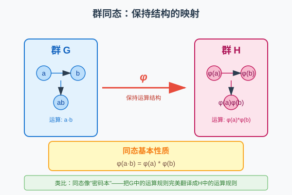
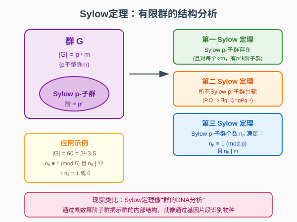

# 第 20 级：群论（Group Theory）

> 群论是抽象代数的核心分支之一，研究对称性的数学结构。本教程建立在抽象代数基础之上，深入探讨群的结构、分类与应用。

---

## 1. 学习目标

完成本教程后，你应该能够：

- 熟练掌握群的基本概念与性质，理解子群、陪集、Lagrange 定理
- 深刻理解正规子群与商群的概念，能构造商群并分析其结构
- 掌握同态与同构的三大基本定理，并能运用它们证明群的同构关系
- 理解群的直积与半直积构造，能分类小阶群
- 掌握群作用理论，能运用轨道-稳定子定理和 Burnside 引理解决计数问题
- 理解 Sylow 定理的证明与应用，能分析有限群的结构
- 了解可解群与幂零群的定义与性质
- 了解有限单群分类的基本框架
- 理解自由群与群表示的基本概念

---

## 2. 群的基本概念复习

### 2.1 群的定义

**定义 2.1（群）** 一个**群**是一个有序对 $(G, \cdot)$，其中 $G$ 是一个非空集合，$\cdot: G \times G \to G$ 是一个二元运算，满足以下三条公理：

1. **结合律**：$\forall a, b, c \in G,\ (a \cdot b) \cdot c = a \cdot (b \cdot c)$
2. **单位元**：$\exists e \in G,\ \forall a \in G,\ e \cdot a = a \cdot e = a$
3. **逆元**：$\forall a \in G,\ \exists a^{-1} \in G,\ a \cdot a^{-1} = a^{-1} \cdot a = e$

如果群还满足交换律，即 $\forall a, b \in G,\ a \cdot b = b \cdot a$，则称 $G$ 为**交换群**（或**阿贝尔群**）。

**定义 2.2（群的阶）** 群 $G$ 中元素的个数称为群的**阶**，记作 $|G|$。若 $|G|$ 有限，称 $G$ 为**有限群**；否则为**无限群**。

**定义 2.3（元素的阶）** 群 $G$ 中元素 $a$ 的**阶**是满足 $a^n = e$ 的最小正整数 $n$，记作 $|a|$ 或 $\operatorname{ord}(a)$。若不存在这样的 $n$，则称 $a$ 的阶为无限。

### 2.2 群的例子

| 集合 | 运算 | 说明 |
|------|------|------|
| $\mathbb{Z}$ | 加法 | 无限交换群 |
| $\mathbb{Z}_n = \{0, 1, \ldots, n-1\}$ | 模 $n$ 加法 | $n$ 阶循环群 |
| $S_n$（$n$ 元置换全体） | 置换的复合 | $n!$ 阶非交换群（$n \ge 3$） |
| $D_{2n}$（正 $n$ 边形的对称） | 变换的复合 | $2n$ 阶二面体群 |
| $\operatorname{GL}_n(\mathbb{R})$（可逆 $n$ 阶实矩阵） | 矩阵乘法 | 无限非交换群 |
| $(\mathbb{Z}/p\mathbb{Z})^\times$ | 模 $p$ 乘法 | $p-1$ 阶循环群（$p$ 为素数） |

### 2.3 子群

**定义 2.4（子群）** 设 $G$ 是一个群，$H \subseteq G$ 是非空子集。若 $H$ 在 $G$ 的运算下本身构成一个群，则称 $H$ 为 $G$ 的**子群**，记作 $H \le G$。

**子群判定定理**：$H \le G$ 当且仅当：
1. $H \neq \varnothing$
2. $\forall a, b \in H,\ ab^{-1} \in H$

**定义 2.5（生成子群）** 设 $S \subseteq G$，$G$ 中包含 $S$ 的最小子群称为由 $S$ **生成**的子群，记作 $\langle S \rangle$。若 $G = \langle S \rangle$，则称 $S$ 为 $G$ 的一个**生成元集**。

**定义 2.6（循环群）** 若群 $G$ 可由一个元素生成，即 $G = \langle a \rangle$，则称 $G$ 为**循环群**。循环群的结构完全由生成元的阶决定：
- 若 $|a| = n$，则 $G \cong \mathbb{Z}_n$
- 若 $|a| = \infty$，则 $G \cong \mathbb{Z}$

### 2.4 陪集与 Lagrange 定理

**定义 2.7（陪集）** 设 $H \le G$，$a \in G$。定义：
- **左陪集**：$aH = \{ah \mid h \in H\}$
- **右陪集**：$Ha = \{ha \mid h \in H\}$

**性质 2.1** 对于 $a, b \in G$，$aH = bH$ 当且仅当 $a^{-1}b \in H$。左陪集构成 $G$ 的一个划分。

> **直观理解（现实类比）**：陪集是"**平行移动的副本**"。把子群 $H$ 想象成原点附近的一团点（它本身是个小群，包含单位元 $e$），那么左陪集 $gH$ 就是把这团点**整体平移到 $g$ 处**——形状、内部相对关系完全不变，只是搬了个家。就像地图上同一个图案在不同位置反复出现：每处图案同形，但坐标不同。由于 $H$ 内部任意两点差仍属于 $H$，而不同陪集互不相交，整个群 $G$ 就被 $H$ 的所有陪集**无缝拼接**覆盖，每块大小都是 $|H|$。右陪集 $Hg$ 则是"从右边平移"，一般情况下与左陪集未必相同。

**定义 2.8（指数）** 子群 $H$ 在 $G$ 中的**指数**是 $H$ 的左陪集的个数，记作 $[G : H]$。

**定理 2.1（Lagrange 定理）** 设 $G$ 为有限群，$H \le G$，则
$$|G| = |H| \cdot [G : H]$$

特别地，$|H|$ 整除 $|G|$，且每个元素的阶整除 $|G|$。

**推论 2.1** 素数阶群一定是循环群。

**证明**：设 $|G| = p$ 为素数。取 $a \neq e$，则 $|a|$ 整除 $p$ 且 $|a| > 1$，故 $|a| = p$，因此 $G = \langle a \rangle$ 是循环群。

> **直观理解（现实类比）**：Lagrange 定理是"**用子群做尺子量群**"。公式 $|G| = |H| \cdot [G : H]$ 说：群的总大小 = 每块陪集的大小 × 陪集的块数。就像**用瓷砖铺满地面**——每块瓷砖大小为 $|H|$，一共铺了 $[G : H]$ 块，地面总面积自然就是二者乘积。由此立刻得到"子群阶整除群阶"和"元素阶整除群阶"：任何子结构都必须刚好嵌进大结构里，不留缺口也不溢出。这也解释了为何素数阶群只有平凡子群——素数无法再被切成等大的小块，所以它"没有内部结构"，必为循环群。

---

## 3. 正规子群与商群

### 3.1 正规子群

**定义 3.1（正规子群）** 设 $N \le G$。若对任意 $g \in G$，有 $gNg^{-1} = N$（即 $N$ 在共轭下不变），则称 $N$ 为 $G$ 的**正规子群**，记作 $N \trianglelefteq G$。

**等价条件**：以下条件等价于 $N \trianglelefteq G$：
1. $\forall g \in G,\ gNg^{-1} = N$
2. $\forall g \in G,\ gNg^{-1} \subseteq N$
3. $\forall g \in G,\ gN = Ng$（左右陪集相同）
4. $N$ 是 $G$ 的若干共轭类的并集

> **直观理解（现实类比）**：正规子群是"**左右一致的子群**"——条件 $gN = Ng$ 说从左边看和从右边看一样。想象 $N$ 是一堵**透明的玻璃墙**：从里向外看（左陪集 $gN$）和从外向里看（右陪集 $Ng$），看到的景观完全相同，墙本身没有"方向偏置"。等价地，把 $N$ 用任何群元 $g$ 做**共轭** $gNg^{-1}$（先平移、再还原），它整体不变——就像一个在所有观察角度下都保持同样形状的对称物体。交换群里所有子群都正规，因为"左右"在交换世界里本就无差别；而 $A_n \trianglelefteq S_n$ 是因为偶置换无论被奇置换怎么"扰动"，集合层面仍归到自身。

**例子**：
- 任何群 $G$ 都有正规子群 $\{e\}$ 和 $G$（平凡正规子群）
- 交换群的所有子群都是正规的
- 交错群 $A_n$ 是 $S_n$ 的正规子群（$[S_n : A_n] = 2$）
- 特殊线性群 $\operatorname{SL}_n(F)$ 是一般线性群 $\operatorname{GL}_n(F)$ 的正规子群

### 3.2 商群

**定理 3.1（商群构造）** 设 $N \trianglelefteq G$。在陪集集合 $G/N = \{gN \mid g \in G\}$ 上定义运算：
$$(aN)(bN) = (ab)N$$
则 $G/N$ 在此运算下构成一个群，称为 $G$ 模 $N$ 的**商群**，其阶为 $[G : N]$。

**证明**：需要验证运算的定义是良定的（well-defined）。若 $aN = a'N$，$bN = b'N$，则 $a' = an_1$，$b' = bn_2$，其中 $n_1, n_2 \in N$。于是
$$a'b' = an_1bn_2 = a(b b^{-1}) n_1 b n_2 = ab(b^{-1}n_1b)n_2$$
由于 $N$ 正规，$b^{-1}n_1b \in N$，故 $a'b' \in (ab)N$，即 $(a'b')N = (ab)N$。运算良定。

> **直观理解（现实类比）**：商群 $G/N$ 是"**把等价元素合并成一个**"。每个陪集 $gN$ 被视作一个**新的"商元素"**，原本 $|G|$ 个元素被压缩成 $[G:N]$ 个等价类。就像把一座城市**按邮编分区**：同邮编的街道被归为同一个"区"，区与区之间可以整体谈"位置关系"，而区内部的细节被忽略。运算 $(aN)(bN)=(ab)N$ 的含义是：先用 $a$ 类的代表、再用 $b$ 类的代表，结果落在 $ab$ 那个区——这要求 $N$ 正规，否则"先 $a$ 后 $b$"会因代表选取不同而落到不同区，运算就无法良定。所以**正规性是"做商"的入场券**：只有左右一致的子群，才能让等价类之间的运算自洽。

### 3.3 单群与合成列

**定义 3.2（单群）** 若群 $G$ 没有非平凡的正规子群（即正规子群只有 $\{e\}$ 和 $G$ 自身），则称 $G$ 为**单群**。

**重要例子**：
- 素数阶循环群 $\mathbb{Z}_p$ 是单群
- 交错群 $A_n$（$n \ge 5$）是单群
- 李型单群（如 $\operatorname{PSL}_n(q)$）

**定义 3.3（合成列）** 群 $G$ 的一个**合成列**是正规子群链：
$$\{e\} = G_0 \trianglelefteq G_1 \trianglelefteq \cdots \trianglelefteq G_n = G$$
使得每个商群 $G_{i+1}/G_i$ 是单群。这些商群称为**合成因子**。

**定理 3.2（Jordan-Hölder 定理）** 任何有限群的任意两个合成列（在同构意义下）有相同的长度，且合成因子（不计顺序）在同构意义下唯一。

### 3.4 戴德金群

**定义 3.4** 若群 $G$ 的所有子群都是正规子群，则称 $G$ 为**戴德金群**。非交换的戴德金群称为**哈密顿群**。

最小的哈密顿群是**四元数群** $Q_8 = \{\pm 1, \pm i, \pm j, \pm k\}$，其中 $i^2 = j^2 = k^2 = -1$，$ijk = -1$。

---

## 4. 同态与同构定理

### 4.1 群同态

**定义 4.1（群同态）** 设 $(G, \cdot)$ 和 $(H, *)$ 是群。映射 $\varphi: G \to H$ 若满足
$$\varphi(a \cdot b) = \varphi(a) * \varphi(b),\quad \forall a, b \in G$$
则称 $\varphi$ 为**群同态**。

**定义 4.2（核与像）** 
- $\ker \varphi = \{g \in G \mid \varphi(g) = e_H\}$（同态的核）
- $\operatorname{Im} \varphi = \{\varphi(g) \mid g \in G\}$（同态的像）

**性质 4.1** $\ker \varphi \trianglelefteq G$，$\operatorname{Im} \varphi \le H$。

**定义 4.3（同构）** 若 $\varphi$ 是双射同态，则称 $\varphi$ 为**同构**，记作 $G \cong H$。

#### 🎬 动画演示：群的同态

> 动画直观展示了群同态的核心性质：映射 φ 保持群运算结构。群 G 中的元素（蓝色）通过同态 φ 映射到群 H 中的元素（红色），且满足 φ(g₁ * g₂) = φ(g₁) ∘ φ(g₂)。这种"保持结构的翻译"是同态概念的本质。

> **直观理解（现实类比）**：群同态是"**保持结构的翻译**"。想象群 $G$ 和群 $H$ 是两个不同语言的"运算世界"，同态 $\varphi$ 就像一台翻译机，把 $G$ 中的元素翻译成 $H$ 中的元素。关键是这台翻译机**保持运算关系**：$G$ 中 $a$ 和 $b$ 先运算再翻译，等于先分别翻译 $a$ 和 $b$ 再在 $H$ 中运算。就像把"先握手再鞠躬"翻译成另一种礼仪，结果和"先翻译握手、再翻译鞠躬、然后按对方礼仪执行"完全一样。

### 4.2 第一同构定理

**定理 4.1（第一同构定理）** 设 $\varphi: G \to H$ 是群同态。则
$$G / \ker \varphi \cong \operatorname{Im} \varphi$$

**证明**：令 $N = \ker \varphi$。定义 $\overline{\varphi}: G/N \to \operatorname{Im} \varphi$ 为 $\overline{\varphi}(gN) = \varphi(g)$。
- **良定性**：若 $gN = g'N$，则 $g' = gn$，$n \in N$，故 $\varphi(g') = \varphi(g)\varphi(n) = \varphi(g)$。
- **同态性**：$\overline{\varphi}((aN)(bN)) = \overline{\varphi}(abN) = \varphi(ab) = \varphi(a)\varphi(b) = \overline{\varphi}(aN)\overline{\varphi}(bN)$。
- **单射**：若 $\overline{\varphi}(gN) = e_H$，则 $\varphi(g) = e_H$，即 $g \in N$，故 $gN = N$。
- **满射**：显然。

因此 $\overline{\varphi}$ 是同构。

> **直观理解（现实类比）**：第一同构定理是"**翻译的精度公式**"——$G/\ker\varphi \cong \operatorname{Im}\varphi$。把同态 $\varphi$ 想成一台**翻译机**：$G$ 是原文，$H$ 是译文世界。$\ker\varphi$ 是"翻译后被抹成空白"的那些原文元素——它们携带的信息**在翻译中丢失**了；$\operatorname{Im}\varphi$ 是译文里实际保留的内容。定理说：**译文保留的信息 = 原文 − 丢失的信息**。把原文按"翻译后是否相同"分桶（即按 $\ker\varphi$ 取陪集），每个桶对应译文里的一个元素，桶与译文一一对应——这就是同构。也像**压缩图片**：压缩算法丢掉的高频细节就是 $\ker\varphi$（"核"=质量损失），而最终呈现的画质 $\operatorname{Im}\varphi$ 完全由"原图 ÷ 损失"决定。核越大，丢失越多，像越小；核越小，翻译越忠实。

### 4.3 第二同构定理

**定理 4.2（第二同构定理）** 设 $G$ 是群，$H \le G$，$N \trianglelefteq G$。则
$$H / (H \cap N) \cong HN / N$$

**证明**：定义 $\varphi: H \to HN/N$ 为 $\varphi(h) = hN$。易验证 $\varphi$ 是满同态，且 $\ker \varphi = \{h \in H \mid hN = N\} = H \cap N$。由第一同构定理即得。

### 4.4 第三同构定理

**定理 4.3（第三同构定理）** 设 $G$ 是群，$N \trianglelefteq G$，$K \trianglelefteq G$ 且 $N \subseteq K$。则 $K/N \trianglelefteq G/N$，且
$$(G/N) / (K/N) \cong G/K$$

**证明**：定义 $\varphi: G/N \to G/K$ 为 $\varphi(gN) = gK$。这是良定的（因为 $N \subseteq K$），且是满同态。
$$\ker \varphi = \{gN \mid gK = K\} = \{gN \mid g \in K\} = K/N$$
由第一同构定理得证。

### 4.5 对应定理

**定理 4.4（对应定理）** 设 $N \trianglelefteq G$。则映射
$$\{H \mid N \le H \le G\} \to \{H' \mid H' \le G/N\}$$
$$H \mapsto H/N$$
是双射，且保持包含关系、指数和正规性：
- $H_1 \le H_2 \iff H_1/N \le H_2/N$
- $[H_2 : H_1] = [H_2/N : H_1/N]$
- $H \trianglelefteq G \iff H/N \trianglelefteq G/N$

---

## 5. 群的直积与半直积

### 5.1 直积

**定义 5.1（外直积）** 设 $G$ 和 $H$ 是群。在笛卡尔积 $G \times H$ 上定义运算：
$$(g_1, h_1)(g_2, h_2) = (g_1g_2, h_1h_2)$$
则 $G \times H$ 构成一个群，称为 $G$ 和 $H$ 的**（外）直积**。

**定义 5.2（内直积）** 设 $G$ 是群，$N \trianglelefteq G$，$H \trianglelefteq G$，且 $N \cap H = \{e\}$，$G = NH$。则 $G$ 同构于 $N \times H$，称为 $G$ 的**内直积**分解。

**性质 5.1** 若 $G \cong H \times K$，则：
- $|G| = |H| \cdot |K|$
- $G$ 中元素 $(h, k)$ 的阶为 $\operatorname{lcm}(|h|, |k|)$
- $H \cong H \times \{e\} \trianglelefteq G$，$K \cong \{e\} \times K \trianglelefteq G$

### 5.2 半直积

**定义 5.3（半直积）** 设 $N \trianglelefteq G$，$H \le G$，且 $N \cap H = \{e\}$，$G = NH$。则称 $G$ 为 $N$ 和 $H$ 的**（内）半直积**，记作 $G = N \rtimes H$。

可通过群同态 $\varphi: H \to \operatorname{Aut}(N)$ 来构造**外半直积** $N \rtimes_\varphi H$，其乘法为：
$$(n_1, h_1)(n_2, h_2) = (n_1 \varphi_{h_1}(n_2), h_1h_2)$$

**例子**：二面体群 $D_{2n} \cong \mathbb{Z}_n \rtimes \mathbb{Z}_2$，其中 $\mathbb{Z}_2$ 通过逆元映射作用在 $\mathbb{Z}_n$ 上。

### 5.3 小阶群的分类

| 阶数 | 群结构 | 交换性 |
|:----:|--------|:------:|
| 1 | $\{e\}$ | 交换 |
| 2 | $\mathbb{Z}_2$ | 交换 |
| 3 | $\mathbb{Z}_3$ | 交换 |
| 4 | $\mathbb{Z}_4$，$\mathbb{Z}_2 \times \mathbb{Z}_2$ | 交换 |
| 5 | $\mathbb{Z}_5$ | 交换 |
| 6 | $\mathbb{Z}_6 \cong \mathbb{Z}_2 \times \mathbb{Z}_3$，$D_6 \cong S_3$ | 后者非交换 |
| 7 | $\mathbb{Z}_7$ | 交换 |
| 8 | $\mathbb{Z}_8$，$\mathbb{Z}_4 \times \mathbb{Z}_2$，$\mathbb{Z}_2^3$，$D_8$，$Q_8$ | 后两个非交换 |
| 9 | $\mathbb{Z}_9$，$\mathbb{Z}_3 \times \mathbb{Z}_3$ | 交换 |
| 10 | $\mathbb{Z}_{10}$，$D_{10}$ | 后者非交换 |

---

## 6. 群作用

### 6.1 基本定义

**定义 6.1（群作用）** 设 $G$ 是群，$X$ 是非空集合。$G$ 在 $X$ 上的一个**（左）作用**是一个映射 $G \times X \to X$，记作 $(g, x) \mapsto g \cdot x$，满足：
1. $\forall x \in X,\ e \cdot x = x$
2. $\forall g, h \in G,\ \forall x \in X,\ (gh) \cdot x = g \cdot (h \cdot x)$

等价地，群作用是一个群同态 $\varphi: G \to \operatorname{Sym}(X)$。

> **直观理解（现实类比）**：群作用是"**对称操作施加在物体上**"。想象把 $D_4$ 群（正方形的 8 个对称变换）作用在一个正方形上——旋转 90°、翻转等操作会改变顶点的位置，但正方形整体仍是正方形。群元 $g$ 是"动作"，集合 $X$ 是"被作用的物体"，$g \cdot x$ 表示"对物体 $x$ 做动作 $g$"。两条公理也很自然：什么也不做（单位元 $e$）时物体不变；先做 $h$ 再做 $g$，等于一次性做复合动作 $gh$。再比如国际象棋：每种棋子的**合法走法集合**作用在棋盘的格子上，骑士的"日字走法"把所在格送往它能到达的所有格子——这就是一个群作用（若把所有走法的复合视为群运算）。

### 6.2 轨道与稳定子

**定义 6.2（轨道）** 设 $G$ 作用在 $X$ 上。$x \in X$ 的**轨道**是
$$G \cdot x = \{g \cdot x \mid g \in G\} \subseteq X$$

**定义 6.3（稳定子）** $x \in X$ 的**稳定子群**是
$$G_x = \{g \in G \mid g \cdot x = x\} \le G$$

**定义 6.4（不动点集）** 对 $g \in G$，$X^g = \{x \in X \mid g \cdot x = x\}$。

> **直观理解（现实类比）**：**轨道**是"一个点能被群操作到达的所有位置"，**稳定子**是"让这个点不动的那些操作"。还是用国际象棋的比喻：把骑士放在棋盘某格 $x$ 上，它的**轨道**就是骑士能走到的所有格子（通过任意步数组合）——这是从 $x$ 出发"够得到"的整个天地；而骑士在**原地不动**这件事，对应的"合法走法集合"（恒等操作）就是平凡情形下的稳定子。再如把正四面体的旋转群作用在某个顶点上：轨道是"顶点能被旋转到的 4 个位置"，稳定子是"绕该顶点对角线旋转的 3 个操作"——它们使顶点不动。轨道关注"能去哪"，稳定子关注"什么也不变"，二者恰好互补。

### 6.3 轨道-稳定子定理

**定理 6.1（轨道-稳定子定理）** 设 $G$ 是有限群，作用在 $X$ 上。则对任意 $x \in X$，
$$|G \cdot x| = [G : G_x] = \frac{|G|}{|G_x|}$$

**证明**：定义映射 $\phi: G/G_x \to G \cdot x$ 为 $\phi(gG_x) = g \cdot x$。
- **良定性**：若 $gG_x = g'G_x$，则 $g^{-1}g' \in G_x$，故 $g' \cdot x = g \cdot (g^{-1}g' \cdot x) = g \cdot x$。
- **单射**：若 $g \cdot x = g' \cdot x$，则 $g^{-1}g' \cdot x = x$，即 $g^{-1}g' \in G_x$，故 $gG_x = g'G_x$。
- **满射**：显然。

因此 $\phi$ 是双射，$|G \cdot x| = |G/G_x| = [G : G_x] = |G|/|G_x|$。

> **直观理解（现实类比）**：轨道-稳定子定理回答了"**一个元素能走到哪些地方**"。把群作用想成**旋转骰子的手**：一个点 $x$ 能被所有群元素送往的所有位置，构成它的**轨道**；而那些**让 $x$ 原地不动的"手型"**（如绕 $x$ 轴的那几个旋转）构成**稳定子** $G_x$。轨道越大，说明能"搬动"它的群元素越多，相对的稳定子就越小——两者大小之积恰好是群大小 $|G|$：$|G\cdot x|\cdot|G_x|=|G|$。

### 6.4 Burnside 引理

**定理 6.2（Burnside 引理，或称 Cauchy-Frobenius 引理）** 设有限群 $G$ 作用在有限集 $X$ 上。则轨道数 $N$ 为：
$$N = \frac{1}{|G|} \sum_{g \in G} |X^g|$$

**证明**：考虑集合 $S = \{(g, x) \in G \times X \mid g \cdot x = x\}$，计算 $|S|$ 的两种方式：
- 按 $g$ 求和：$\sum_{g \in G} |X^g|$
- 按 $x$ 求和：$\sum_{x \in X} |G_x|$

由轨道-稳定子定理，$|G_x| = |G|/|G \cdot x|$。将 $X$ 按轨道分解 $X = \bigsqcup_{i=1}^N \mathcal{O}_i$，则
$$\sum_{x \in X} |G_x| = \sum_{i=1}^N \sum_{x \in \mathcal{O}_i} \frac{|G|}{|\mathcal{O}_i|} = \sum_{i=1}^N |G| = N|G|$$

因此 $\sum_{g \in G} |X^g| = N|G|$，即 $N = \frac{1}{|G|} \sum_{g \in G} |X^g|$。

### 6.5 Cayley 定理

**定理 6.3（Cayley 定理）** 任何群 $G$ 都同构于某个置换群。具体地，$G \cong \operatorname{Im}(\lambda) \le \operatorname{Sym}(G)$，其中 $\lambda: G \to \operatorname{Sym}(G)$ 是左平移作用：
$$\lambda(g)(x) = gx,\quad \forall g, x \in G$$

**证明**：
- 对每个 $g \in G$，$\lambda(g)$ 是 $G$ 上的双射（有逆映射 $\lambda(g^{-1})$）
- $\lambda$ 是同态：$\lambda(gh)(x) = (gh)x = g(hx) = \lambda(g)(\lambda(h)(x))$
- $\lambda$ 是单射：若 $\lambda(g) = \operatorname{id}_G$，则 $\lambda(g)(e) = g = e$，故 $g = e$

因此 $G \cong \operatorname{Im}(\lambda) \le \operatorname{Sym}(G)$。

> **直观理解（现实类比）**：Cayley 图把群"**画成一张交通图**"。顶点是群元素，边是"走一步生成元"的路线——蓝色箭头是旋转 $r$，红色是翻转 $s$。从一个元素出发，按固定路线走一圈回到起点，就捕捉到群的全部结构。同时它也直观表明 Cayley 定理：**每个群都像对称群一样，是某个集合上的"移动"**——这张图本身就是 $S_3$ 作为置换群作用在正三角形上的几何写照。

---

## 7. Sylow 定理

Sylow 定理是有限群论中最强大的工具之一，它给出了 Lagrange 定理的部分逆。

### 7.1 基本概念

**定义 7.1（p-群）** 若群 $G$ 的每个元素的阶都是 $p$ 的幂（$p$ 为素数），则称 $G$ 为 **p-群**。有限群 $G$ 是 $p$-群当且仅当 $|G| = p^k$ 对某个 $k \ge 0$。

**定义 7.2（Sylow p-子群）** 设 $G$ 是有限群，$|G| = p^n \cdot m$，其中 $p \nmid m$。$G$ 的阶为 $p^n$ 的子群称为 $G$ 的 **Sylow p-子群**。

### 7.2 Sylow 三大定理

**定理 7.1（第一 Sylow 定理）** 设 $G$ 是有限群，$|G| = p^n \cdot m$（$p \nmid m$）。则 $G$ 存在 Sylow $p$-子群。更一般地，对每个 $0 \le k \le n$，$G$ 都存在阶为 $p^k$ 的子群。

**证明概要**：通过对 $|G|$ 归纳证明。考虑 $G$ 的共轭类方程，利用 $p$ 整除 $|G|$ 可证存在非平凡的中心元。若 $G$ 有 $p$ 阶中心元 $z$，考虑 $G/\langle z \rangle$ 用归纳假设，再通过对应定理得到 $G$ 的子群。

**定理 7.2（第二 Sylow 定理）** 设 $G$ 是有限群。$G$ 的所有 Sylow $p$-子群彼此共轭。即对任意两个 Sylow $p$-子群 $P$ 和 $Q$，存在 $g \in G$ 使得 $Q = gPg^{-1}$。

**证明概要**：考虑 $P$ 在 $G$ 的 Sylow $p$-子群集合上的共轭作用。通过分析轨道大小和 $p$ 的整除性质，证明只有一个轨道。

**定理 7.3（第三 Sylow 定理）** 设 $n_p$ 为 $G$ 的 Sylow $p$-子群的个数。则：
1. $n_p \equiv 1 \pmod{p}$
2. $n_p \mid m$（其中 $m = |G|/p^n$）

**证明概要**：$n_p$ 等于 $P$ 在共轭作用下的轨道大小，即 $[G : N_G(P)]$。通过分析 $P$ 在 Sylow $p$-子群集合上的共轭作用可得 $n_p \equiv 1 \pmod{p}$。另一方面，$N_G(P)$ 包含 $P$，故 $[G : N_G(P)]$ 整除 $[G : P] = m$。

> **直观理解（现实类比）**：Sylow定理是"**群的DNA分析**"。就像生物学家通过分析DNA序列来理解生物的结构，Sylow定理通过分析群的"素数幂子群"来揭示有限群的内部构造。第一定理保证这种"DNA片段"一定存在；第二定理说所有同长度的"DNA片段"本质相同（只是被群元素"旋转"到了不同位置）；第三定理给出"DNA片段"数量的严格限制：$n_p \equiv 1 \pmod{p}$ 且 $n_p \mid m$。就像知道一个生物有特定数量的某种基因片段，就能推断它的很多特征。

### 7.3 Sylow 定理的应用

**例 7.1（阶为 $pq$ 的群）** 设 $p < q$ 为素数，$|G| = pq$。则 $G$ 要么是循环群 $\mathbb{Z}_{pq}$，要么是半直积 $\mathbb{Z}_q \rtimes \mathbb{Z}_p$（当 $p \mid (q-1)$ 时）。

**分析**：由 Sylow 定理，$n_q \equiv 1 \pmod{q}$ 且 $n_q \mid p$，故 $n_q = 1$（因为 $p < q$ 且 $n_q \neq 1 + q > p$ 当 $q > p$）。因此 Sylow $q$-子群 $Q$ 是正规的。$n_p \mid q$ 且 $n_p \equiv 1 \pmod{p}$，故 $n_p = 1$ 或 $q$。若 $n_p = 1$，则 $P \trianglelefteq G$，$G \cong P \times Q \cong \mathbb{Z}_{pq}$。若 $n_p = q$，则 $p \mid (q-1)$，$G$ 是半直积。

**例 7.2（阶为 $p^2$ 的群）** $p$ 为素数。则 $G$ 是交换群，同构于 $\mathbb{Z}_{p^2}$ 或 $\mathbb{Z}_p \times \mathbb{Z}_p$。

**证明**：可以证明 $Z(G) \neq \{e\}$，且 $G/Z(G)$ 是循环群，从而 $G$ 交换。

---

## 8. 可解群与幂零群

### 8.1 可解群

**定义 8.1（换位子与导群）** 对 $a, b \in G$，**换位子**为 $[a, b] = a^{-1}b^{-1}ab$。**导群**（或换位子群）$G'$ 是由所有换位子生成的子群：
$$G' = \langle [a, b] \mid a, b \in G \rangle$$

**性质 8.1** $G' \trianglelefteq G$，且 $G/G'$ 是交换群（称为 $G$ 的**交换化**）。

**定义 8.2（导列）** 定义 $G^{(0)} = G$，$G^{(1)} = G'$，$G^{(k+1)} = (G^{(k)})'$。序列
$$G = G^{(0)} \ge G^{(1)} \ge G^{(2)} \ge \cdots$$
称为 $G$ 的**导列**（或**导出列**）。

**定义 8.3（可解群）** 若存在 $n$ 使得 $G^{(n)} = \{e\}$，则称 $G$ 为**可解群**。

**例子**：
- 所有交换群都是可解的
- $S_3$ 是可解的：$S_3^{(1)} = A_3 \cong \mathbb{Z}_3$，$S_3^{(2)} = \{e\}$
- $S_4$ 是可解的：$S_4^{(1)} = A_4$，$S_4^{(2)} = V_4$（Klein 四元群），$S_4^{(3)} = \{e\}$
- $S_n$ 对 $n \ge 5$ 不可解（因为 $A_n$ 是单群）
- 所有有限 $p$-群都是可解的

**定理 8.1** $G$ 可解当且仅当存在正规子群链
$$\{e\} = N_0 \trianglelefteq N_1 \trianglelefteq \cdots \trianglelefteq N_k = G$$
使得每个商群 $N_{i+1}/N_i$ 是交换群。

### 8.2 幂零群

**定义 8.4（中心列）** 群 $G$ 的**下中心列**定义为：
$$\gamma_1(G) = G,\quad \gamma_{i+1}(G) = [\gamma_i(G), G]$$
其中 $[H, K] = \langle [h, k] \mid h \in H, k \in K \rangle$。

**定义 8.5（幂零群）** 若存在 $n$ 使得 $\gamma_{n+1}(G) = \{e\}$，则称 $G$ 为**幂零群**。最小的这样的 $n$ 称为**幂零类**。

**定义 8.6（上中心列）** 
$$Z_0(G) = \{e\},\quad Z_1(G) = Z(G)$$
$$Z_{i+1}(G) = \{g \in G \mid [g, G] \subseteq Z_i(G)\}$$
则 $\{e\} = Z_0 \le Z_1 \le Z_2 \le \cdots$ 称为**上中心列**。$G$ 是幂零群当且仅当存在 $n$ 使得 $Z_n(G) = G$。

**性质 8.2** 
- 幂零群一定是可解群
- 有限 $p$-群是幂零群
- 幂零群的直积仍是幂零群
- 幂零群的真子群是**次正规的**（即存在子群链从子群到群每个都是前一个的正规子群）

### 8.3 可解群与幂零群的关系

$$\text{交换群} \subsetneq \text{幂零群} \subsetneq \text{可解群}$$

- 交换群：幂零类 $\le 1$
- 幂零群：$Q_8$ 是幂零的（幂零类 2）但非交换
- 可解群：$S_3$ 是可解的但非幂零（因为 $Z(S_3) = \{e\}$）

---

## 9. 有限单群分类简介

### 9.1 概述

**有限单群分类定理**是 20 世纪数学最伟大的成就之一，由上百位数学家在数十年间共同努力完成，总证明超过 10,000 页。该定理断言：

**定理 9.1（有限单群分类）** 每个有限单群同构于以下三类之一：

1. **素数阶循环群** $\mathbb{Z}_p$（$p$ 为素数）
2. **交错群** $A_n$（$n \ge 5$）
3. **李型单群**（16 个无穷族）
4. **26 个散在单群**

### 9.2 李型单群

李型单群是有限域上李代数的群论类比，主要分为：

- **典型群**：$A_n(q)$（射影特殊线性群 $\operatorname{PSL}_{n+1}(q)$）、$B_n(q)$、$C_n(q)$、$D_n(q)$
- **例外群**：$E_6(q), E_7(q), E_8(q), F_4(q), G_2(q)$
- **扭群**（Steinberg 群）：$^2A_n(q), ^2D_n(q), ^3D_4(q), ^2E_6(q)$
- **Suzuki-Ree 群**：$^2B_2(2^{2n+1}), ^2G_2(3^{2n+1}), ^2F_4(2^{2n+1})$

例如，$\operatorname{PSL}_n(q)$ 是射影特殊线性群，对除 $n=2, q=2,3$ 外的情形是单群。

### 9.3 散在单群

26 个散在单群是不属于上述无穷族的单群，其中最大的称为**魔群**（Monster group），其阶为：
$$|M| = 2^{46} \cdot 3^{20} \cdot 5^9 \cdot 7^6 \cdot 11^2 \cdot 13^3 \cdot 17 \cdot 19 \cdot 23 \cdot 29 \cdot 31 \cdot 41 \cdot 47 \cdot 59 \cdot 71 \approx 8 \times 10^{53}$$

---

## 10. 自由群与表示

### 10.1 自由群

**定义 10.1（自由群）** 设 $S$ 是一个集合。$S$ 上的**自由群** $F(S)$ 是由 $S$ 生成且满足以下泛性质的群：对任意群 $G$ 和任意映射 $f: S \to G$，存在唯一的群同态 $\overline{f}: F(S) \to G$ 使得下图交换：
$$
\begin{CD}
S @>i>> F(S) \\
@| @VV\overline{f}V \\
S @>f>> G
\end{CD}
$$

**构造**：$F(S)$ 的元素是 $S \cup S^{-1}$ 上的**既约字**（不含 $ss^{-1}$ 或 $s^{-1}s$ 形式的相邻对），乘法为拼接后约化。空字对应单位元。

**例子**：
- $F(\{a\}) \cong \mathbb{Z}$（无限循环群）
- $F(\{a, b\})$ 是秩为 2 的自由群，其元素形如 $a^3b^{-2}ab$ 等既约字

**性质 10.1** 自由群是**无扭的**（即没有非平凡有限阶元素），且自由群的子群仍是自由群（Nielsen-Schreier 定理）。

### 10.2 生成元与关系

**定义 10.2（群表示）** 群 $G$ 的一个**表示**（presentation）为：
$$G = \langle S \mid R \rangle$$
其中 $S$ 是生成元集，$R$ 是关系集（即 $F(S)$ 中的一些字），使得 $G \cong F(S) / \langle \langle R \rangle \rangle$，其中 $\langle \langle R \rangle \rangle$ 是 $R$ 生成的**正规闭包**（包含 $R$ 的最小正规子群）。

**常见群的表示**：
- 循环群：$\mathbb{Z}_n = \langle a \mid a^n = e \rangle$
- 无限循环群：$\mathbb{Z} = \langle a \mid \ \rangle$（无关系）
- 二面体群：$D_{2n} = \langle r, s \mid r^n = s^2 = e, srs = r^{-1} \rangle$
- 对称群：$S_n = \langle \sigma_1, \ldots, \sigma_{n-1} \mid \sigma_i^2 = e, \sigma_i\sigma_j = \sigma_j\sigma_i\ (|i-j|>1), \sigma_i\sigma_{i+1}\sigma_i = \sigma_{i+1}\sigma_i\sigma_{i+1} \rangle$
- 四元数群：$Q_8 = \langle i, j, k \mid i^2 = j^2 = k^2 = ijk = -1, (-1)^2 = e \rangle$

**定义 10.3（有限表示群）** 若 $S$ 和 $R$ 都是有限集，则称 $G$ 是**有限表示群**。

---

## 11. 示例

### 示例 1：验证 $S_3$ 的结构

$S_3$ 有 6 个元素：$\{e, (12), (13), (23), (123), (132)\}$。
- 子群：$\{e\}$、$\{e, (12)\}$、$\{e, (13)\}$、$\{e, (23)\}$、$A_3 = \{e, (123), (132)\}$、$S_3$ 自身
- 正规子群：$\{e\}$、$A_3$、$S_3$（因为 $[S_3 : A_3] = 2$，指数为 2 的子群必正规）
- $S_3/A_3 \cong \mathbb{Z}_2$
- $S_3$ 的表示：$\langle a, b \mid a^3 = b^2 = e, bab = a^{-1} \rangle$，其中 $a = (123)$，$b = (12)$

### 示例 2：应用第一同构定理

考虑 $\det: \operatorname{GL}_n(\mathbb{R}) \to \mathbb{R}^\times$，$\ker \det = \operatorname{SL}_n(\mathbb{R})$。
由第一同构定理：$\operatorname{GL}_n(\mathbb{R}) / \operatorname{SL}_n(\mathbb{R}) \cong \mathbb{R}^\times$。

### 示例 3：应用轨道-稳定子定理

$S_4$ 作用在集合 $\{1, 2, 3, 4\}$ 上。取 $x = 1$，则 $G_1 = \{\sigma \in S_4 \mid \sigma(1) = 1\} \cong S_3$，$|G_1| = 6$。
轨道 $G \cdot 1 = \{1, 2, 3, 4\}$，$|G \cdot 1| = 4$。
验证：$4 = |S_4|/|S_3| = 24/6 = 4$。

### 示例 4：Burnside 引理应用

用 3 种颜色给正方形的 4 个顶点染色，求不等价的染色方案数（在二面体群 $D_8$ 作用下）。

$D_8$ 有 8 个元素：
- 恒等变换：$3^4 = 81$ 个不动点
- 旋转 90° 和 270°：各 $3^1 = 3$ 个不动点（所有顶点同色）
- 旋转 180°：$3^2 = 9$ 个不动点（相对顶点同色）
- 关于对角线的反射：各 $3^3 = 27$ 个不动点（2 个不动顶点，1 对交换顶点需同色）→ 实际上有 2 条对角线，每条对角线反射有 $3^2 = 9$ 个？不对，正方形有 4 条反射轴：2 条经过对角线，2 条经过对边中点。
  - 对角线反射：2 个顶点固定，另外 2 个交换需同色，所以 $3^2 \cdot 3^1 = 3^3 = 27$？不对，$3^2 = 9$（固定顶点任选颜色，交换顶点同色任选）
  - 对边中点反射：0 个固定顶点，两对交换顶点，每对需同色，所以 $3^2 = 9$

因此：
$$N = \frac{1}{8}(81 + 3 + 3 + 9 + 9 + 9 + 9 + 9) = \frac{132}{8} = 21$$

### 示例 5：Sylow 定理应用——60 阶群

$|G| = 60 = 2^2 \cdot 3 \cdot 5$。
- $n_5 \equiv 1 \pmod{5}$ 且 $n_5 \mid 12$，故 $n_5 = 1$ 或 $6$
- 若 $n_5 = 1$，则 Sylow 5-子群正规
- 若 $n_5 = 6$，则 $G$ 有 6 个 Sylow 5-子群，每个阶为 5，共 $6 \times 4 = 24$ 个 5 阶元
- $A_5$ 是 60 阶单群，其 $n_5 = 6$

### 示例 6：证明 $A_5$ 是单群

$|A_5| = 60 = 2^2 \cdot 3 \cdot 5$。
- $n_5 \equiv 1 \pmod{5}$ 且 $n_5 \mid 12$，故 $n_5 = 1$ 或 $6$。若 $n_5 = 1$，则 Sylow 5-子群正规，但 $A_5$ 无正规子群（除 $\{e\}$ 和自身），故 $n_5 = 6$
- 若 $N \trianglelefteq A_5$，考虑 $N$ 与 Sylow 子群的交，可证 $N$ 只能是 $\{e\}$ 或 $A_5$

### 示例 7：半直积构造 $D_8$

$D_8 = \langle r, s \mid r^4 = s^2 = e, srs = r^{-1} \rangle$。
令 $N = \langle r \rangle \cong \mathbb{Z}_4$，$H = \langle s \rangle \cong \mathbb{Z}_2$。
$\varphi: \mathbb{Z}_2 \to \operatorname{Aut}(\mathbb{Z}_4)$ 定义为 $\varphi(1)(r) = r^{-1} = r^3$。
则 $D_8 \cong \mathbb{Z}_4 \rtimes_\varphi \mathbb{Z}_2$。

### 示例 8：自由群 $F_2$ 的子群

秩为 2 的自由群 $F_2 = \langle a, b \rangle$。子群 $\langle a^2, b^2, ab \rangle$ 是秩为 3 的自由群（Nielsen-Schreier 定理）。

### 示例 9：可解群判定

$S_4$ 的导列：
- $S_4^{(1)} = A_4$（阶为 12）
- $S_4^{(2)} = V_4$（Klein 四元群，阶为 4）
- $S_4^{(3)} = \{e\}$
故 $S_4$ 可解。而 $S_5$ 的导列：$S_5^{(1)} = A_5$，$A_5$ 是单群，故 $S_5^{(2)} = A_5$，导列稳定，$S_5$ 不可解。

### 示例 10：群作用于多项式的对称性

$S_n$ 作用在多项式环 $\mathbb{C}[x_1, \ldots, x_n]$ 上通过置换变量。对称多项式 $\mathbb{C}[x_1, \ldots, x_n]^{S_n}$ 是全体对称多项式构成的环。
Galois 基本定理：对多项式 $f(x) \in \mathbb{Q}[x]$，其 Galois 群 $G$ 作用在根集上，$G$ 的可解性等价于 $f$ 可用根式求解。

---

## 12. 解题技巧

> 本节针对群论中的高频问题，总结可直接套用的解题方法与易错点。每条技巧均给出**适用场景**、**关键步骤**与**常见误区**，并配一个精讲示例。

### 12.1 Sylow 定理三步法：判断正规性、计算子群个数

**适用场景**：给定有限群阶 $|G|=p^m\cdot n\ (p\nmid n)$，求 Sylow $p$-子群个数 $n_p$ 并判断其是否正规。

**关键步骤**：
1. 分解 $|G|$ 的素数幂因数，选定 $p$；
2. 用 Sylow 第二、三定理列条件：$n_p \equiv 1 \pmod p$ 且 $n_p \mid n$；
3. 结合"$q>p$ 时 $n_q\ne p$"等整除性，逐项排除，得 $n_p$ 的唯一可能；
4. 若 $n_p=1$ 则该 Sylow 子群**唯一从而正规**。

**常见误区**：
- 把 $n_p\mid n$（$n$ 为去掉 $p^m$ 后的部分）与 $n_p\mid |G|$ 混淆；
- 遗漏 $n_p\equiv1\pmod p$ 只减一的条件；
- 即便 $n_p>1$ 不唯一时直接判断"不正规"——需具体分析子群是否共轭。

**精讲示例**：$|G|=30=2\cdot3\cdot5$。$n_5\equiv1\pmod5,\ n_5\mid6\Rightarrow n_5\in\{1,6\}$；$n_5=6$ 恰有 $6\cdot(5-1)=24$ 个阶 $5$ 元，其余 $6$ 元留给 $n_3$，$n_3\equiv1\pmod3,n_3\mid10\Rightarrow n_3\in\{1,10\}$，$n_3=10$ 需 $20$ 个阶 $3$ 元，超出 $6$，矛盾，故 $n_5<6$ 即 $n_5=1$，Sylow $5$-子群正则。

### 12.2 轨道-稳定子定理与 Burnside 计数的"平均固定点"

**适用场景**：计算群作用下的轨道数（不等价染色/构型数）。

**关键步骤**：
1. 明确 $G$ 在集合 $X$ 上的作用；
2. 用 |轨道|$\cdot$|稳定子|=|G|（轨道-稳定子）求轨道大小；
3. **Burnside**：轨道数 $=\frac{1}{|G|}\sum_{g\in G}|\operatorname{Fix}(g)|$；
4. 逐元素统计固定点数时，按其轮换结构（cycle type）分类计算更高效。

**常见误区**：
- 把 $\operatorname{Fix}(g)$ 与"被 $g$ 固定"和"稳定子中的元素"混为一谈；
- 只数不动点而对"同一构型可被多个元素固定"重复计数；
- 忘记除以 $|G|$ 取平均。

**精讲示例**：给正三角形 3 顶点用 2 色染色（在 $D_3$ 下）的等价方案数。

$|D_3|=6$；单位元固定 $2^3=8$，两个翻转固定 $2^2=4$（各 1 个不动点顶个 2-置换），三个旋转中 $r,r^2$ 是 3-循环各固定 $2$ 个，中间那个（$r^3=e$）属单位元。故
$$
\text{轨道数}=\frac{8+3\cdot2+2\cdot4}{6}=4.
$$

### 12.3 同构定理与商群构造（"除以核"套路）

**适用场景**：证明商群同构、构造精确序列、简化群结构。

**关键步骤**：
1. 找自然满同态 $\varphi:G\to H$；
2. 计算 $\ker\varphi$，且 $\ker\varphi\lhd G$ 自动成立；
3. 由第一同构定理 $G/\ker\varphi\cong\operatorname{im}\varphi$ 得结论；
4. 证明"$\ker=N$"常用：$g\in\ker\iff \varphi(g)=e\iff g$ 满足 $N$ 的特征描述。

**常见误区**：
- 忘记验证 $\varphi$ 是同态；
- 求核时遗漏"$N$ 是**最小的**核"或只证含入而没证反蕴含；
- 把第二/第三同构定理的适用前提（$H\le G,N\lhd G$）搞混。

**精讲示例**：证明 $G/Z(G)\cong\operatorname{Inn}(G)$。

$\varphi_a:G\to G,\ g\mapsto aga^{-1}$ 是内自同构。$\Phi:G\to\operatorname{Inn}(G),\ a\mapsto\varphi_a$ 是满同态，$\ker\Phi=\{a:\varphi_a=\mathrm{id}\}=\{a: aga^{-1}=g,\ \forall g\}=Z(G)$。故 $G/Z(G)\cong\operatorname{Inn}(G)$。

### 12.4 直积、半直积与小阶群分类

**适用场景**：表述 $G$ 为直积/半直积，对 $p^k$、$pq$ 阶小群分类。

**关键步骤**：
1. 若 $G=N\times H$ 需 $N,H\lhd G$ 且 $N\cap H=\{e\}$；
2. 半直积 $N\rtimes_\theta H$：$N\lhd G$、$H\le G$、$N\cap H=\{e\}$，$\theta:H\to\operatorname{Aut}(N)$；
3. 记录 $\theta$ 的具体作用（如共轭/反转）以区分不同构小群；
4. 用 Lagrange + 中心校验商论证 $\le$ 阶群至多 2 类（若 $Z(G)=G$ 为交换，否则 $|Z|=p$）。

**常见误区**：
- 误把"$G=NH,\ N\cap H=\{e\}$"当直积（还要 $H\lhd G$）；
- 分类小群时漏掉"自同构 $\theta$ 的不同选择"导致的非不同构类型；
- 直接假设 $|G|=p^2$ 的群乃交换，而无证明 $Z(G)\ne\{e\}$ 的中间步骤。

**精讲示例**：$|G|=pq,\ p<q$ 素数 ⇒ $G\cong\mathbb{Z}_{pq}$ 或 $G\cong\mathbb{Z}_p\rtimes\mathbb{Z}_q$。

由 12.1 知 $n_q=1$，$Q\lhd G$；$Q\cong\mathbb{Z}_q$，且 $G/Q$ 阶 $p$ 循环，取 $P=\langle a\rangle$ 阶 $p$，$G=Q\rtimes P$，作用由 $\theta:P\to\operatorname{Aut}(\mathbb{Z}_q)\cong\mathbb{Z}_{q-1}$ 决定：$\theta$ 平凡时 $G$ 交换 $\cong\mathbb{Z}_{pq}$，非平凡（可能）时给出非交换半直积。

### 12.5 可解性、单群判定与合成列

**适用场景**：判断群是否可解/单，求合成列。

**关键步骤**：
1. 单群判定：用 Sylow 数排布排除"非平凡正规子群"；
2. 或用陪集表示：若 $H<G$ 指数 $m$，则 $G$ 嵌入 $S_m$，结合阶比较排除单性（如 $A_5$ 之证明）；
3. 可解性：构造正规列使商因子均为循环，或用 Abel 化 $G/G'$ 逐层剥离；
4. 合成列的商因子（Jordan-Hölder）唯一，是分类的钥匙。

**常见误区**：
- 把一个"正规子群"只验证了单侧含入；
- 忘记有限可解群的商因子必须是循环/素数幂结构；
- 用"没有非平凡正规子群"判定单性时，漏证明"每个正规子群"。

**精讲示例**：证明 $A_5$ 无 2 阶、3 阶正规子群。

$A_5$ 的共轭类大小为 $\{1,15,20,12,12\}$，均至少含 $A_5\setminus\{e\}$ 的非单位类；若 $1\ne N\lhd A_5$，$N$ 是共轭类并集且 $|N|\mid60$，唯一可行的并集（含 $e$、大小整除 $60$）只能是全部 $A_5$，故 $A_5$ 单。

---

## 13. 四级习题

> 习题按难度分为 **基础题 / 进阶题 / 挑战题 / 探究题** 四级，覆盖本章全部内容。探究题无唯一答案，故附参考答案与思路提示。

### 13.1 基础题

**1.** 证明：群 $G$ 中，若 $a^2 = e$ 对所有 $a \in G$ 成立，则 $G$ 是交换群。

**2.** 求 $S_4$ 中所有 Sylow 2-子群和 Sylow 3-子群的个数。

**3.** 证明：指数为 2 的子群一定是正规子群。

**4.** 设 $G$ 是有限群，$H \le G$。证明 $[G : H] = 1$ 当且仅当 $H = G$。

**5.** 证明：$\mathbb{Z}_m \times \mathbb{Z}_n \cong \mathbb{Z}_{mn}$ 当且仅当 $\gcd(m, n) = 1$。

**6.** 列出 $\mathbb{Z}_{12}$ 的所有生成元，并说明理由。

**7.** 证明：循环群的每一个子群都是循环群。

**8.** 求 $S_3$ 的中心 $Z(S_3)$。

**9.** 设 $a \in G$ 的阶为 $n$。证明：$a^k = e \iff n \mid k$。

**10.** 求整数加法群 $\mathbb{Z}$ 的所有子群。

**11.** 设 $H \le G$，$a, b \in G$。证明：$aH = bH \iff a^{-1}b \in H$。

**12.** 求二面体群 $D_8$ 中旋转子群 $\langle r \rangle$ 的指数，并说明其正规性。

**13.** 设 $G$ 为有限群，$g \in G$。证明：$\operatorname{ord}(g) \mid |G|$。

**14.** 求 $\mathbb{Z}_4 \times \mathbb{Z}_6$ 中元素 $(2, 3)$ 的阶。

**15.** 设 $|G| = p$ 为素数。证明：$G \cong \mathbb{Z}_p$。

**16.** 求四元数群 $Q_8$ 的阶及全部子群。

**17.** 证明：若对 $G$ 中所有 $a, b$ 有 $(ab)^2 = a^2b^2$，则 $G$ 是交换群。

**18.** 求 $\operatorname{GL}_2(\mathbb{R})$ 中矩阵 $A = \begin{pmatrix}0&-1\\1&0\end{pmatrix}$ 的阶。

**19.** 设 $H \le G$ 且 $[G : H] = 2$，证明：$H \trianglelefteq G$。

**20.** 求 $\mathbb{Z}_5^\times$ 的阶，并说明它同构于哪个已知群。

**21.** 设 $\varphi: G \to H$ 是同态。证明：$\varphi(e_G) = e_H$。

**22.** 求 $S_4$ 中四循环 $(1234)$ 的阶及其全部幂。

**23.** 设 $G$ 交换，$H \le G$。证明：$H \trianglelefteq G$。

**24.** 求从 $\mathbb{Z}$ 到 $\mathbb{Z}_2$ 的群同态个数。

**25.** 证明：有限群中的幂等元（满足 $a^2 = a$）必为单位元。

**26.** 求 $A_3$ 的阶，并说明它与 $\mathbb{Z}_3$ 同构。

**27.** 证明：群中 $(ab)^{-1} = b^{-1}a^{-1}$。

**28.** 求 $\mathbb{Z}_8$ 的生成元个数（用欧拉函数）。

**29.** 设 $G$ 为 $n$ 阶有限群，$a \in G$。求 $a^n$ 的值。

**30.** 求 $S_n$ 的阶及其中对换的总个数。

**31.** 证明：若 $G / Z(G)$ 是循环群，则 $G$ 必为交换群。

**32.** 求 $\mathbb{Z}_{30}$ 中阶为 6 的元素的个数。

**33.** 设 $\varphi: G \to H$ 是单同态。证明：$\ker \varphi = \{e\}$。

**34.** 求 $\mathbb{Z}_6$ 的全部子群。

**35.** 求 $S_6$ 中排列 $(13)(24)(56)$ 的阶。

**36.** 设 $G$ 为交换群，$\varphi: G \to G$，$\varphi(g) = g^2$。证明 $\varphi$ 是同态。

**37.** 求 $\mathbb{Z}_2 \times \mathbb{Z}_3$ 的阶，并说明它与 $\mathbb{Z}_6$ 同构。

**38.** 证明复数 $n$ 次单位根集合 $\mu_n = \{e^{2\pi i k/n} : k = 0, 1, \ldots, n-1\}$ 在乘法下构成循环群。

**39.** 求 $S_3$ 的全部子群。

**40.** 求从 $\mathbb{Z}_2$ 到 $\mathbb{Z}_6$ 的群同态个数。

**41.** 证明：$a$ 与 $a^{-1}$ 的阶相同。

**42.** 求 $\operatorname{GL}_2(\mathbb{R})$ 的中心。

**43.** 设 $|G| = 4$。列出 $G$ 可能的全部群结构（同构意义下）。

**44.** 求 $\mathbb{Z}_7^\times$ 的阶，并判断它是否循环。

**45.** 求 $S_5$ 中元素 $(123)(45)$ 的阶。

**46.** 设 $H \trianglelefteq G$。说明商群 $G/H$ 上乘法 $(aH)(bH) = abH$ 良定的关键论证。

**47.** 求 $A_4$ 的阶，并解释 Klenin 四元群 $V_4$ 在 $A_4$ 中正规的原因。

**48.** 求 $\mathbb{Z}_{12}$ 中阶为 4 的元素。

**49.** 证明：中心 $Z(G)$ 是 $G$ 的交换正规子群。

**50.** 统计 $S_3$ 中 2 阶元素与 3 阶元素的个数。

**51.** 证明：若 $H \le G$ 且 $|H| = |G|$，则 $H = G$。

**52.** 求 $\mathbb{Z}_{10}^\times$ 的阶，并判断是否循环。

**53.** 证明：$(a^{-1})^{-1} = a$。

**54.** 求 $\mathbb{Z}_6$ 中阶为 2 的元素，并指出其生成的子群。

**55.** 证明：同态的核 $\ker\varphi$ 是 $G$ 的正规子群。

**56.** 求交错群 $A_5$ 的阶。

**57.** 证明：无穷循环群恰好有两个生成元。

**58.** 求 $\mathbb{Z}_9$ 的生成元个数。

**59.** 证明指数乘积公式：若 $H \le K \le G$ 且指数有限，则 $[G : H] = [G : K]\,[K : H]$。

**60.** 判断 $\mathbb{Z}_3 \times \mathbb{Z}_5$ 是否循环，并说明理由。

**61.** 试说明：$d \mid |G|$ 未必保证存在 $d$ 阶子群（举 $A_4$ 为例）。

**62.** 比较 $\mathbb{Z}_4^\times$ 与 $\mathbb{Z}_5^\times$：各求其阶并判断是否循环。

**63.** 证明：若 $G$ 交换，则同态 $\varphi: G \to H$ 的像 $\operatorname{Im}\varphi$ 也是交换群。

**64.** 设 $G$ 是群，$a, b \in G$。证明：$ab^{-1} = e \iff a = b$。

**65.** 求 $\mathbb{Z}_3 \times \mathbb{Z}_4$ 中元素 $(2, 3)$ 的阶。

**66.** 求 $A_4$ 的阶及其所有 3 阶元的个数。

**67.** 证明：阶为 $p$（$p$ 素）的群 $G$ 只有一个非平凡子群。

**68.** 求 $\operatorname{Aut}(\mathbb{Z}_4)$，并判断它同构于哪个已知群。

**69.** 设 $G$ 为交换群，$g \in G$。证明：$g$ 与 $g^2$ 的生成的子群满足 $\langle g \rangle \supseteq \langle g^2 \rangle$。

**70.** 求 $S_3$ 中元素 $g = (123)$ 的正规化子 $N_{S_3}(\langle g\rangle)$。

**71.** 设 $|H| = p$ 素数，$H \le G$。则 $H$ 是循环群，请给出其生成元阶的说明。

**72.** 求 $\mathbb{Z}_{12}$ 中阶为 6 的元素。

**73.** 证明：$\mathbb{Z}_m \times \mathbb{Z}_m$ 是交换群但非循环（$m>1$）。

**74.** 求 $D_{12}$（正六边形）中反射元素个数。

**75.** 求 $S_4$ 中偶置换的个数。

**76.** 设 $G$ 为群,$x \in G$。证明：映射 $\varphi_x: G \to G,\ g\mapsto xgx^{-1}$ 是同构。

**77.** 求 $\mathbb{Z}_2 \times \mathbb{Z}_2$ 的所有子群。

**78.** 求 $\mathbb{Z}_{25}^\times$ 的阶。

**79.** 设 $G$ 为群，证明：若 $G$ 只含平凡正规子群且可交换，则 $|G|$ 为素数。

**80.** 求 $\mathbb{Z}_5$ 中每个非零元的阶。

**81.** 证明：$aHbH$ 作为集合恰为 $abH$ 当且仅当 $H$ 正规（$H \le G$）。

**82.** 求 $\mathbb{Z}_4^\times \times \mathbb{Z}_3^\times$ 的阶并判断是否循环。

**83.** 求 $S_n$ 的中心。

**84.** 证明：若 $A$ 是 $G$ 的 $p$-子群且 $p \nmid [G:N(A)]$，则 $N(A)=N_G(N_G(A))$。

**85.** 求 $\mathbb{Z}_{8}^\times$ 的阶并证明其同构于 $\mathbb{Z}_2\times\mathbb{Z}_2$。

**86.** 设 $G$ 为交换群，$n$ 为正整数。证明：$G_n = \{g \in G : g^n = e\}$ 是子群。

**87.** 设 $S_4$ 自然作用在集合 $\{1,2,3,4\}$ 上。求点 $1$ 的稳定子群及其阶。

### 13.2 进阶题

**1.** 证明：若 $G$ 是 $p$-群，则 $Z(G) \neq \{e\}$。

**2.** 设 $|G| = p^2$，$p$ 为素数。证明 $G$ 是交换群。

**3.** 利用第二同构定理证明：若 $H \le G$，$N \trianglelefteq G$，则 $H \cap N \trianglelefteq H$。

**4.** 证明：$A_5$ 是单群（提示：利用 Sylow 定理分析正规子群的可能性）。

**5.** 计算用 3 种颜色给正六边形的 6 个顶点染色（在 $D_{12}$ 作用下）的不等价方案数。

**6.** 设 $G$ 作用在集合 $X$ 上，$x\in X$。证明 $\operatorname{ord}(g)$ 与轨道 $G\cdot x$ 无直接关系，但 $|G\cdot x|=|G|/|G_x|$（轨道-稳定子定理）成立。

**7.** 求 $S_3$ 在 $\{1,2,3\}$ 上的作用中各元素的不动点个数，并验证 Burnside 引理。

**8.** 用 Burnside 引理计算正三角形（$D_3$）用 2 色染 3 个顶点的不等价方案数。

**9.** 设 $|G|=p^n$，$p$ 素数。证明 $p\mid|Z(G)|$（用类方程）。

**10.** 求用 2 色给正方形 4 顶点染色（在 $D_8$ 下）的不等价方案数。

**11.** 计算 $S_4$ 作用在自身上的共轭作用的轨道数（即共轭类数）。

**12.** 证明：有限 $p$-群的每个非中心元素所在的共轭类大小被 $p$ 整除。

**13.** 用群作用证明 Cauchy 定理：$p\mid|G|$ 则 $G$ 有 $p$ 阶元。

**14.** 求 $G=S_3$ 在共轭作用下各轨道大小，验证类方程。

**15.** 计算用 3 色给正四面体 4 个面染色（在旋转群下）的不等价方案数。

**16.** 设 $H\le G$，$G$ 作用在左陪集集合 $G/H$ 上。证明该作用的核为 $\bigcap_{g}gHg^{-1}$。

**17.** 求 $S_4$ 作用在 $\{1,2,3,4\}$ 上，含点 $2$ 的轨道与稳定子。

**18.** 证明：$D_4$（正方形的二面体群，阶 8）作用在 4 顶点上的轨道数为 1。

**19.** 用类方程求 $p$-群 $G$（$|G|=p^2$）中非中心共轭类大小可能的取值。

**20.** 计算 $S_3$ 的共轭类及每个类的元素个数，并验证类方程 $6=1+2+3$。

**21.** 用 Burnside 计数：给 $S_4$ 作用在 $\{1,2,3,4\}$，共有多少条轨道？（本为 1，求其固定点验证。）

**22.** 证明：阶为 $2^2\cdot3$ 的群 $G$ 必有正规 Sylow 子群（分类 12 阶群的基础）。

**23.** 求 $|G|=45$ 时 $n_5$ 的可能值。

**24.** 设 $p,q$ 素数 $p<q$，$|G|=pq$。证明 $n_q=1$。

**25.** 求 $|G|=30$ 时 $n_3$ 与 $n_5$ 的信息（结合 12.1 技巧）。

**26.** 证明：$p$-群 $G$ 的中心 $Z(G)$ 非平凡（给出类方程论证）。

**27.** 求 $\operatorname{Aut}(S_3)$ 的阶。

**28.** 证明：$S_3$ 与 $D_3$（正三角形二面体群）同构。

**29.** 设 $|G|=p^2q$，$p\ne q$ 为素数。证明：当 $p<q$ 时 $G$ 有正规 Sylow $q$-子群；若 $p>q$ 讨论 $n_p$ 的可能取值。

**30.** 求用 2 色给 $C_3$ 三角形的 3 条边染色（在 $D_3$ 下）的不等价方案数。

**31.** 证明：$n$ 元对称群 $S_n$ 中奇置换与偶置换通过乘以对换互换。

**32.** 求 $|G|=12$ 时 Sylow 3-子群个数 $n_3$ 的可能值。

**33.** 证明有限 $p$-群 $G$（$|G|=p^n$）中每个元素都是 $p$-幂阶元。

**34.** 计算 $\mathbb{Z}_2^3$（$\mathbb{Z}_2$ 直积三次）的不变量：$|G|$ 及 $\operatorname{Aut}$ 的阶。

**35.** 设 $G$ 有唯一 $p$-Sylow 子群 $P$，证明 $P\trianglelefteq G$。

### 13.3 挑战题

**1.** 设 $G$ 是群，$\operatorname{Aut}(G)$ 是 $G$ 的自同构群。证明：$G/Z(G) \cong \operatorname{Inn}(G)$，其中 $\operatorname{Inn}(G)$ 是内自同构群。

**2.** 证明：$S_n$ 可由对换 $(12), (13), \ldots, (1n)$ 生成。

**3.** 设 $G$ 是 $pq$ 阶群，$p < q$ 为素数。证明 $G$ 有正规的 Sylow $q$-子群。

**4.** 证明：自由群 $F(S)$ 是**无扭的**，即 $F(S)$ 中任意非单位元的阶都是无限的。

**5.** 分类所有阶为 12 的群（提示：考虑 Sylow 子群的结构和半直积）。

**6.** 求 $|G|=p^2$ 群 $G$ 的幂零类，并证明 $G$ 交换。

**7.** 设 $G=Q_8$（四元数群）。证明 $Z(G)=\{1,-1\}$ 且 $G/Z(G)\cong\mathbb{Z}_2\times\mathbb{Z}_2$。

**8.** 证明：$D_{2n}$ 中反射子群与旋转子群 $C_n$ 构成半直积 $D_{2n}=C_n\rtimes C_2$。

**9.** 求 $|G|=2p$（$p$ 奇素）时 $G$ 的可能结构并判断每个是否可解。

**10.** 用 Burnside 数 $S_4$ 作用在 $\{1,2,3,4\}$ 上共几条轨道（直接给出并验证）。

**11.** 计算 3 色染 $D_4 \curvearrowright$ 正方形的四条边的不等价方案数。

**12.** 设 $G$ 有限可解，$N\trianglelefteq G$。证明 $G/N$ 可解。

**13.** 证明 $S_3$ 可解、$S_4$ 可解，分别给导列。

**14.** 证明 $p$-群可解（提示：用 $Z(G)$ 归纳）。

**15.** 求 $|\operatorname{Aut}(\mathbb{Z}_7)|$ 及 $\operatorname{Aut}(\mathbb{Z}_7)$ 的结构。

**16.** 证明：$G$ 可解 $\iff$ 存在正规列使相邻商为交换。

**17.** 半直积：证明 $D_8 = C_4\rtimes C_2$ 给出的自同态 $\varphi$ 之像。

**18.** 求 $S_4$ 的导列 $G^{(1)},G^{(2)},G^{(3)}$。

**19.** 证明：直积 $G\times H$ 的中心为 $Z(G)\times Z(H)$。

**20.** 求 2 色染 $C_4$ 的 4 个顶点（在 $D_4$ 下）的不等价方案数。

**21.** 证明：$D_{n}$（$n$ 奇数）的中心为 $\{e\}$。

**22.** 求 $|\ker\varphi|$ 若 $\varphi:\mathbb{Z}\to S_5$，$\varphi(1)=(12)$。

**23.** 证明有限 $p$-群 $G$ 有非平凡的幂零中心列（即上中心列到 $G$）。

**24.** 设 $|G|=p^n$。证明每个真子群含于某个 $p$-子群并最终可扩大为 Sylow 子群。

**25.** 求 $\operatorname{Aut}(\mathbb{Z}_2\times\mathbb{Z}_2)$ 的阶，证明其同构于 $S_3$。

**26.** 分类阶为 8 的群（列出 5 类并指出交换与否）。

**27.** 证明 $G$ 单位元指数 2 的子群 $H$ 自动正规，并用第二同构定理给商 $H/H\cap N$ 的论证。

**28.** 求 $D_4$ 的共轭类。

**29.** 用周期记 $S_5$ 中元素 $(12)(345)$ 的共轭类大小。

**30.** 证明：若 $H\trianglelefteq G$ 且 $K\le G$，则 $HK\le G$ 且 $H\trianglelefteq HK$。

**31.** 求 $|G|=8$ 中非交换群 $D_8$ 的方幂中心（导列）。

**32.** 求 $|\operatorname{Aut}(\mathbb{Z}_7)|$ 并说明 $\operatorname{Aut}(\mathbb{Z}_7)$ 是循环群。

**33.** 证明有限指数条件：$H\le G$ 指数有限，则存在正规 $N\le H$ 指数有限。

**34.** 求 $2$-色染 $C_3$ 的三角形在 $S_3$（作为顶点置换）下的等价方案数。

**35.** 用 Burnside 求 $S_4 \curvearrowright\{1,\dots,4\}$ 的固定和，验证传递性。

**36.** 设 $G=S_3$。求子集 $H=\{e,(12)\}$ 的正规化子与中心化子。

**37.** 证明：$A_n\times A_n$ 可解当且仅当 $A_n$ 可解。

**38.** 用半直积构造非交换群 $D_8$ 与 $Q_8$ 的区分：比较其 Sylow 2 子群性质。

**39.** 求 $|G|=p^2 q$（$p<q$）时的循环性判定条件。

**40.** Burnside：项链问题——6 颗珠子 2 色，旋转等效（$C_6$ 旋转群），求不等价染色数。

**41.** 证明：$p$ 阶循环群恰有 $\varphi(p)=p-1$ 个生成元。

**42.** 求 $|\operatorname{Aut}(Q_8)|$ 并判断其与 $S_4$ 的关系。

**43.** 证明：$G$ 的 Sylow $p$-子群唯一当且仅当它是正规的（结合题 130）。

**44.** 求 $D_6$（正三角形二面体群 $2n=6$）中心并说明可解性。

**45.** 计算 $|\mathbb{Z}_3^\times|$ 并证 $\mathbb{Z}_3^\times\cong\mathbb{Z}_2$ 循环。

**46.** 求用 $k$ 色给 $n$ 个顶点的圈染色、在循环旋转群 $C_n$ 作用下的不等价染色数公式。

**47.** 证明：$\operatorname{Aut}(C_2\times C_2)\cong S_3$ 与 $A_4$ 的共轭作用联系。

**48.** 求 $S_4$ 的 Sylow 2-子群个数 $n_2$。

**49.** 判断 $|G|=21$ 群的可解性。

**50.** 证明：$V_4$ 的正规性（$V_4\trianglelefteq A_4$）并用类方程验证 $A_4$ 无 6 阶子群。

**51.** 求 $\operatorname{Aut}(\mathbb{Z}_3\times\mathbb{Z}_3)$ 的阶。

**52.** Burnside：正八面体旋转群作用其 6 顶点，2 色染顶点的类数。

**53.** 证明：$Q_8$ 的每个子群皆正规，从而 $Q_8$ 是哈密顿群（非交换戴德金群）。

**54.** 求 $|G|=pq$（$p,q$ 素数不同）时的生成元阶结构。

**55.** 求 $S_5$ 的 Sylow 5 子群数量 $n_5$。

**56.** 证明：$G$ 指数 $2$ 子群 $H$，商 $G/H\cong\mathbb{Z}_2$。

**57.** 结合对应定理：$N\trianglelefteq G$，$H\le G$，则 $(HN)/N\cong H/(H\cap N)$（第二同构）。

**58.** 求 $|\operatorname{Aut}(D_4)|$ 或判断 $\operatorname{Aut}(D_4)\cong D_4$。

**59.** 证明：$A_4$ 的 3-元全体加 $e$ 不构成子群（但给出导列意义）。

**60.** 计算 $k=2$ 时 $C_4$ 旋转群 $C_4$ 染 4 顶点的轨道数。

**61.** 用 Burnside 验证 $D_3$ 染 3 顶点 3 色的轨道数为 10。

**62.** 证明：$S_n$ 中 $n$-循环生成一个阶 $n$ 的循环子群并给出其正规化子阶。

**63.** 求 $|G|=2^2\cdot5$ 时 Sylow 结构（由 $n_5$）。

**64.** 证明有限 $p$-群的中心子群之商仍为 $p$-群。

**65.** 用半直积分类全部 $p^2$ 阶群并给出两类的 $\varphi$。

**66.** 证明：任何 $pq$ 阶群（$p<q$ 素数）不是单群。

**67.** 求 $\operatorname{Aut}(\mathbb{Z}_n)$ 的阶，证明其同构于 $\mathbb{Z}_n^\times$。

**68.** 用陪集作用证明：若 $G$ 有指数 $m$ 的子群 $H$，则 $G$ 可嵌入 $S_m$。

**69.** 证明：$|G|=p^2$ 的群 $G$ 同构于 $\mathbb{Z}_{p^2}$ 或 $\mathbb{Z}_p\times\mathbb{Z}_p$，且两者不同构。

**70.** 证明：$A_5$ 是最小的非交换单群，且 60 阶群中只有 $A_5$ 是非交换单群（概述证明思路）。

**71.** 证明：$G$ 的全体内自同构 $\operatorname{Inn}(G)$ 是 $\operatorname{Aut}(G)$ 的正规子群。

**72.** 用自由群泛性质证明 $F(X)\cong F(Y)\iff |X|=|Y|$。

**73.** 证明 $S_n$（$n\ge3$）的中心平凡，并据此解释 $S_2\cong\mathbb{Z}_2$ 的可交换性。

**74.** 证明 Jordan-Hölder 的一个引理：合成因子在同构意义下唯一（叙述并证明核心步骤）。

**75.** 求 $A_5$ 的 5 个共轭类及其阶，验证类方程 $60=1+15+20+12+12$。

**76.** 证明：半直积 $N\rtimes H$ 中 $N\trianglelefteq N\rtimes H$ 且 $[N\rtimes H:H]=|N|$。

**77.** 用自由群构造短正合序列并解释 $F$ 的基与 $G$ 的关系。

**78.** 求 $\operatorname{Aut}(A_4)$ 的阶。

**79.** 证明：$|G|=p^2q$（$p<q$）时若 $p^2 \not\equiv 1\pmod q$ 则 $G$ 有正规 $q$-Sylow 子群。

**80.** 用 Sylow 定理证明：$|G|=255$ 的群不是单群。

**81.** 证明 $\operatorname{Aut}(C_7\rtimes C_3)$ 结构并判断其可解性。

**82.** 证明：自由群 $F_2=\langle a,b\rangle$ 中的换位子 $[a,b]=a^{-1}b^{-1}ab$ 不是单位元。

**83.** 分类幂零类 $\le2$ 的群（即 $G/Z(G)$ 交换的情形）特征。

**84.** 证明有限群 $G$ 的指数 $m$ 子群存在蕴含存在核 $\le H$ 的正规子群且指数 $\le m!$ 关系。

**85.** 求 $n_2$ 在 $|G|=56$ 的情形。

**86.** 求 $\operatorname{Out}(\mathbb{Z}_n)$ 的结构，并指出何时 $\operatorname{Out}(\mathbb{Z}_n)$ 平凡。

**87.** 证明：$A_5$ 没有指数 $\le5$ 的真子群。

**88.** 构造 $S_4/V_4$ 并说明它与 $S_3$ 同构。

**89.** 证明：若 $G$ 的每个真子群都是交换的，且 $|G|=p^n$ 素数幂，则 $G$ 交换。

**90.** 用 Burnside 多项式：给正则 $n$ 边形顶点染 $k$ 色（在 $D_{2n}$ 下），写出轨道数公式。

**91.** 用第一同构定理证明：$\operatorname{GL}_n(F)/\operatorname{SL}_n(F)\cong F^\times$（取行列式同态）。

**92.** 求 $S_4$ 的共轭类与类方程，并核对 $24$。

**93.** 证明：$A_5$ 由全体 3-循环生成，从而 $A_5=\langle\text{3-循环}\rangle$ 单且恰生。

**94.** 用自由群表示证明 $(\mathbb{Z}*\mathbb{Z})_{\text{ab}}\cong\mathbb{Z}^2$。

**95.** 证明：$G$ 有限时 $\operatorname{Aut}(G)$ 也有限；并给出 $|\operatorname{Aut}(S_3)|=6$。

**96.** 分类阶 10 与阶 14 的群。

**97.** 证明：$G$ 幂零则处处子群次正规，且 $G$ 的各 Sylow 子群互相直积分解（$P_1\cdots P_k$）。

**98.** 用 Burnside 计算给正六面体的 6 个面染 3 色的不等价方案数（旋转群 $S_4$）。

**99.** 证明：自由群 $F$ 中若 $w=u^2$ 则有解的唯一性（简述无扭+余旋性质）。

**100.** 用半直积计算 $\operatorname{Aut}(D_8)$ 的阶并判断其结构与 $D_8$ 的差异。

**101.** 证明：任何有限群嵌入 $S_n$ 对某 $n$（Cayley 定理），且对 $|G|=6$ 嵌入 $S_6$。

**102.** 求 $\operatorname{Z}(S_3\times S_3)$。

**103.** 分类全部 15 阶群（利用半直积）。

**104.** 证明：若 $|G|=p^n>p$（$p$ 素数），则 $G$ 有非平凡的正规真子群。

**105.** 用轨道-稳定子证 $S_n$ 稳定子 $S_{n-1}$ 指数 $n$。

**106.** 求 $|\operatorname{Aut}(A_5)|$（提示：$\operatorname{Aut}(A_5)\cong S_5$，利用 $A_5$ 单与 $A_5\le S_5$）。

**107.** 证明：若 $G'\le Z(G)$，则 $G$ 的幂零类 $\le2$（即 $G/Z(G)$ 交换）。

**108.** 计算二面体群 $D_{10}$（$2n=10$）的类方程与中心。

**109.** 证明：$Z(S_4)=\{e\}$ 且 $\operatorname{Inn}(S_4)\cong S_4$。

**110.** 求 $n_q$ 在 $|G|=98$。

**111.** 证明：$S_3$ 不是幂零群（$Z(S_3)=\{e\}$）但 $S_4$ 不是幂零。

**112.** 证明：$|G|=p^n$ 的非交换 $p$-群 $G$ 必有 $n_p$ 个阶 $p^{n-1}$ 的极大子群且指数为 $p$。

**113.** 分类所有 $|G|=18$ 的群（用 Sylow 与半直积）。

**114.** 证明：$G'\le\Phi(G)$（Fratini 子群）对幂零群成立，并指出 $G/\Phi(G)$ 交换。

**115.** 求 $|G|=p^2q^2$（$p\ne q$）时的正规 Sylow 子群存在性讨论。

**116.** 证明 Burnside 引理中"每轨道贡献恰为 1"的本质是轨道-稳定子加总。

**117.** 构造阶 4 auto 循环：求 $\operatorname{Aut}(\mathbb{Z}_4)$…改为求 $\operatorname{Aut}(\mathbb{Z}_4)\cong\mathbb{Z}_2$ 的自同构群。

**118.** 证明：$A_n$（$n\ge5$）中两个同型 3-循环共轭（$A_5$ 中 5-循环分裂两类）。

**119.** 用半直积证明 $Q_8$ 不可写成 $\mathbb{Z}_4\rtimes\mathbb{Z}_2$ 或 $\mathbb{Z}_2^2\rtimes\mathbb{Z}_2$。

**120.** 证明：$|G|=pq$（$p<q$）且 $p\mid(q-1)$ 时有无交换的半直积型。

**121.** 求 $S_5$ 的中心与 $\operatorname{Aut}(S_5)$ 的阶。

**122.** 证明：自由积的几个因子构造的子群是一个自由群（Nielsen-Schreier 简述）。

**123.** 用 Burnside：正四面体用 2 色染 4 顶点（旋转群 $A_4$），求轨道数。

**124.** 证明 $S_4/V_4\cong S_3$ 的群论证实并给其生成元对应。

**125.** 比较 $D_{2n}$ 与 $\mathbb{Z}_n\rtimes\mathbb{Z}_2$ 并证明同构。

**126.** 求 $\operatorname{Inn}(Q_8)$ 与 $\operatorname{Aut}(Q_8)$ 的阶。

**127.** 证明：有限群 $G$ 是可解当且仅当…（利用合成列）其合成因子皆为素数阶循环群。

**128.** 用类方程证明 $|G|=p^2$ 的群交换（直接）。

**129.** 求 $A_4$ 的 3-Sylow 数目 $n_3$。

**130.** 证明：$G$ 中心平凡且 $|G|=pq$ 时 $G$ 非交换。

**131.** 求 $\operatorname{Aut}(\mathbb{Z}_2\times\mathbb{Z}_2\times\mathbb{Z}_2)$ 的阶（即 $\operatorname{GL}(3,2)$）。

**132.** 用自由群证明 $\mathbb{Z}$ 与 $\mathbb{Z}_2$ 的显示正合列 $1\to\mathbb{Z}_2\to\mathbb{Z}_2$…改为证明 $F(a,b)$ 的子群 $\langle a^2\rangle$ 是自由群且秩 1。

**133.** 分类 $|G|=p^3$（$p$ 奇）的群型，并给非交换者。

**134.** 证明：$A_5$ 的 5-Sylow 子群与 3-Sylow 子群的数目。

**135.** 求 $\operatorname{Out}(S_3)$ 的阶与 $\operatorname{Inn}(S_3)$ 的阶。

### 13.4 探究题

**1.** （Pólya 计数）用 3 色给正三角形（$D_3$）着色的不等价方案数？进一步探究 Burnside 引理"平均不动点"思想如何推广为 Pólya 计数（用 cycle index 生成函数），并用两类不同群作用的轨道做对照。

**2.** （Sylow 与单性判定）证明 $|G|=pq^2$ 型群（$p<q$ 素数）不单，并探究 $A_5$ 为何是最小众的非交换单群——单群在不可分解结构里的"原子"地位。

**3.** （可解群与 Galois 理论）探究可解群（合成列中商因子平凡）与"方程的根可用根式表达"（Abel-Ruffini）之间的桥梁：为什么 $\mathbb{C}/\mathbb{Q}$ 上的低次多项式可解，而一般的 $S_5$ 型 Galois 群方程不可解？提示：可解群 ↔ Galois 群的可解性 ↔ 根式扩张塔。

**4.** （Burnside/Pólya 拓展）用 Pólya 计数定理，探究用 4 种颜色给正六面体的 6 个面着色时，扣除旋转群作用后的不等价着色共有多少种？进一步把旋转群换成 $A_4$ 的某个子群，讨论计数方法的异同。

**5.** （有限单群）探究无限类有限单群在分类定理中的角色：为何 $A_n$（$n\ge5$）、线性群 $PSL(n,q)$、Łyndon 族之外还需有限个散在（sporadic）单群？结合 $A_5\cong PSL(2,5)$ 这一第一同构线，探讨"同一单群多种实现"的结构意义。

**6.** （Milnor 猜想与 Burnside）探究 Schur 定理与 Milnor 条件：一个中心维数为 $d$ 的 Burnside 问题变体——若群 $G=[G,G]$ 且 $G/G'$ 有限，探究 $G$ 必须可解吗？结合 Engle、幂零与无挠群之间的联系给出判断并论证。

**7.** （Hall 子群探究）Hall 定理称有限可解群必有 $\pi$-Hall 子群。探究其逆否：若 $G$ 有全部 $\pi$-Hall 子群，$G$ 是否必可解？用 $A_5$（有 $\{2,3\}$-, $\{2,5\}$-, $\{3,5\}$-Hall 子群）的反例解释失效原因。

**8.** （直积可约性）探究有限群 $G$ 何时能分解为直积 $G\cong H\times K$（$H,K\ne1$）：讨论中心、特征子群与"何处看"的判据，并证明 $\mathbb{Z}_4$ 不可分解而 $V_4$ 可分解的区别在"素数幂分解"。

**9.** （生成集与覆盖）探究有限生成群的生成元个数 $d(G)$（如 $d(D_{2n})=2$、$d(\mathbb{Z}_{p}^n)=n$），建立 $d(G)\le d(G/N)+d(N)$ 型不等式，并探究 Frattini 商 $G/\Phi(G)$ 的生成元个数为何给出 $d(G)$ 的下界。

**10.** （自同构与内自同构的复几何）探究 $\mathrm{Out}(G)$ 如何度量 $G$ 的"外自同构"。研究 $\operatorname{Aut}(D_{2n}),\operatorname{Aut}(V_4),\operatorname{Aut}(S_n)$ 的差别，得出对偶群（如 $p$-群）外自同构的非平凡性判定。

**11.** （可解群与幂零群构网）画出有限群结构迷宫：交换 ⊂ 幂零 ⊂ 可解 ⊂ 所有。用具体例子（如 $S_3$、$S_4$、$A_5$、$D_8$、$Q_8$）标出每层包含的群类；探究这四层各自的闭运算是子群、商与扩张中的哪些成立。

**12.** （群作用与盖状舌）探究一个群在 $X$ 上的作用轨道分解，如何用 Burnside 引理反推 $X$ 的元素个数 $|X|$。构造 $S_4$ 作用在 $2$ 元子集、$3$ 元子集上的实例，并解释为何 $2$-可迁、$3$-可迁作用决定了对称结构的传递深度。

**13.** （Group 的对称概括）探究把一个"抽象的群"嵌入对称群的最佳方式（Cayley 表示 $G\hookrightarrow S_{|G|}$），并探讨何时可降到 $S_k$（$k<|G|$）实现忠实表示：用 $\mathbb{Z}_2^3$（最小忠实赋状 $k=3$）、$\mathbb{Z}_n$ 的小表示度讨论。

**14.** （Sylow 逆问题）任给素数幂 $p^\alpha$，是否总存在阶 $p^\alpha$ 的群（当然存在 $\mathbb{Z}_{p^\alpha}$）；但反过来给定 $p^\alpha\|m$，探究是否存在阶 $m$ 且其 Sylow $p$ 子群给定同构类型的群？用 $m=60,p=2$（Sylow $2$ 为 $V_4$）为例讨论。

**15.** （Fritz-Munzin 风格探究）探究 Burnside 问题：有限生成有限指数群是否周期（有界指数使群有限）？相较之，指数 $p$、$p$ 大时自由 Burnside 群 $B(2,p)$ 有限吗？给出阿贝尔化 $\mathrm{Ab}(B(m,n))\cong\mathbb{Z}_m^n$ 并讨论 $n$ 大的情形。

**16.** （表示论萌芽）探究有限群在置换作用下的线性化：把群作用 $G\curvearrowright X$ 提升为表示 $\rho:G\to GL(\mathbb{C}^X)$，并用 Burnside 引理与恒等表示、置换表示 $[\mathbb{C}^X]$ 的维数联系（不可约分解的级数为 $|X|$ 之一股），探究 $G$ 在 $\mathbb{C}^{X}$ 上的特征标。

**17.** （群扩张与中心扩张）探究正合列 $1\to K\to G\to Q\to1$ 的分类：$G$ 由 $K$ 与 $Q$ 上的 $2$-余循环确定（Schreier），并用中心扩张（$\mathbb{Z}_2\to Q_8\to V_4$）为例说明非平凡扩张如何产生 $Q_8\not\cong\mathbb{Z}_4\rtimes\mathbb{Z}_2$。

**18.** （对称群的嵌套）探究对称群与交错群的嵌入升降链 $S_n\subset S_{n+1}$、$A_n\subset A_{n+1}$，以及 $S_n$ 的极对合个数推导（用类方程或群作用计数共轭类），并说明 $\mathrm{Out}(S_n)=1$（$n\ne2,6$）与 $S_6$ 例外外自同构的来源。

**19.** （SL/PGL 有限单群丝路）探究 $PSL(2,p)$ 的阶、元素阶分布与简单性：证明 $|PSL(2,p)|=\frac{p(p-1)(p+1)}{2}$，并讨论 $p=5,7,11$ 时 $PSL(2,p)$ 与 $A_5,A_6$ 的关系，启始线性单群对对称群的重要补充。

**20.** （中央子-Graph 结构）探究 $p$-群的上中心列$\{e\}=Z_0\subset Z_1\subset\cdots$的递增性与下中心列的收敛性，用 $D_8,Q_8$ 的值算两列具体到各级，论证幂零类与这两列长度的等价刻画。

**21.** （半直积的判别）探究素数阶直积与半直积的判别：$G=P\rtimes Q$（$P\lhd Q$ 不正规时）换为精确正合序列的理解，用阶 $p^2q$ 的具体群（如 $S_3\times\mathbb{Z}_3$）说明哪些使分裂，哪些使不分裂（扩展问题）。

**22.** （群论的有限图与Cayley图）探究 Cayley 图 $Cay(G,S)$ 与群生成元选取的关系：如何从 Cayley 图判定 $G$ 的可解性（Abel 生成集）、直径与自同构，用 $D_4$ 与其生成集 $\{r,s\}$ 画出的图讨论同构与指数。

**23.** （从局部到整体）探究 Jordan-Hölder 定理的逆：给定合成列的因子序列，探究能否反推出群（分类有限群 $G$ 用合成因子 + 扩张数据），并结合可解群对每个素阶因子的可扩张条件，认识"合成分解"在有限群分类中的基石作用。

**24.** （小阶群数据库）尝试列出阶 $\le16$ 的所有群（注意阶 8、12、16 的非阿贝尔多样性与半直积），并标注其中哪些是可解、幂零、非交换单。探究 className 的唯一性：为什么阶 $p,q,pq,pq^2$ 的分类往往唯一，而阶 16 有 14 种？

**25.** （表示与 Burnside 复数模块）探究表示的特征标正交性公式 $\frac1{|G|}\sum_g\overline{\chi_i(g)}\chi_j(g)=\delta_{ij}$，并用它重新推导 Burnside 引理：把置换表示 $[\mathbb{C}^X]$ 展开为不可约表示，说明轨道数等于 $\frac1{|G|}\sum_g|X^g|$ 的表示论解释。

**26.** （同构性群的应用）探究"可解群的子群与商都可解"这一事实，如何用于判定群非可解：证明 $A_5$ 的每个真子群可解但 $A_5$ 本身不可解，说明"可解性不能从局部（子群）推出"的微妙之处，并据此着手判别含 $A_5$ 作为商的大群。

**27.** （自由群与普遍性质）探究自由群 $F(S)$ 的泛性质：对任意群 $H$ 与映射 $f:S\to H$，恰有一同态 $\bar f:F(S)\to H$ 延拓之。用此性质证明互不同构的自由群 $F(S_1)\cong F(S_2)\iff |S_1|=|S_2|$（用 $\operatorname{Ab}(F(S),)$ 或群对象计数）。

**28.** （Sylow 反例构造）构造一个非交换 $pq$ 阶群的例子并验证其 Sylow 计数：取 $p=3,q=7$（$3\mid 7-1$），构造 $\mathbb{Z}_7\rtimes\mathbb{Z}_3$，写出其元素、Sylow 在非阿贝尔量的个数，并解释为什么此时 Sylow $3$ 不正规。

**29.** （不可分解与中心）探究"直积分解的唯一性"（Krull-Remak-Schmidt 定理的群论版）：有限群直积分解成不可分解因子的过程，用 $\mathbb{Z}_p\times\mathbb{Z}_p$ 与 $D_8$ 说明分解不唯一或因子虽不动但不可约的意义。

**30.** （对 B、BG 与分类）探究群 $G$ 的 cohomology $H^2(G,A)$ 描述中心扩张的分类：用 $A=\mathbb{Z}_2,Z(G)$ 的情形计算 $G=Q_8,V_4$ 的扩张类，解释 $H^2$ 的零与非零如何对应直积与真正非平凡的半直积/中心扩张。

**31.** （对称群单的子群格）探究交错群 $A_n$ 的结构作为 $S_n$ 的子群：证明 $A_n\lhd S_n$ 且 $[S_n:A_n]=2$，研究 $A_4$ 的 $V_4\lhd A_4$（但 $V_4$ 非循环）这一"无元素公理的唯一 __" 的例外性子群结构。

**32.** （Goursat 引理与直积分类）探究子群 $\le H\times K$ 的结构（Goursat）：每个子群由 $H,K$ 的商群之间的同构给出，用此判定 $H\times K$ 的子群何时是"乘积形"，并以 $Q_8\times Q_8$ 里的非直积型子群为例。

**33.** （线性群与置换群的桥）探究 $PSL(2,5)\cong A_5$ 的构造证明：$PSL(2,5)$ 共轭作用在它的 $6$ 个 $5$-Sylow 子群上给出同态 $PSL(2,5)\to S_6$，证明其像落在 $A_6$ 且同构于 $A_5$，从而建立线性群与对称群的同构。

**34.** （Burnside 与 Noether 平面）探究 Burnside 引理在化学、晶体与组合结构中的实际运用：用二面体群 $D_m$ 预计手性/平面分子的构型数，用cycle index的多项式系数化处理"多色+多重取代"问题，讨论对称化与Pólya展开的层次。

**35.** （抽象同构的有限证据）探究"有限群分类"中大多数阶所需的交叉扩张：对 $p^3q,p^4q$ 等阶，讨论为何通常需半直积、结合律约束与 $\ker$ 形条件去排除伪结构，体会有限群分类作为"分类问题"的算法复杂性质。

**36.** （Schreier 与 norm）探究子群的生成元重排（Schreier 引理）：若 $H\le G$、$T$ 为陪集代表元，则 $H$ 由集合 $\{ta\bar{ta}^{-1}:t\in T,a\in S\}$ 生成，用此证明 $d(H)\le (S,T)$ 形式的秩界，并给出 $A_3\le S_3,S_3$ 的具体生成元推导。

**37.** （自由群同态像与字约化）探究自由群元素的归结长度：用 $F_2$ 中 $aba^{-1}b^{-1}$（交换子）、$a^2b^2$ 等词的约化过程，计算它们在 $\mathrm{Ab}(F_2)\cong\mathbb{Z}^2$ 中的像，体会自由群与自由阿贝尔群的同态折叠。

**38.** （二次型的群）探究 $\operatorname{Sp}(2n,q)$ 与 $\operatorname{GL}(n,q)$ 的比例、$\operatorname{Sym}(n)$ 的嵌入，以及为什么有限域上线性群构成"正交/辛"族 $\operatorname{O},\operatorname{Sp},\operatorname{U}$ 一起参与有限单群分类；用 $n=2,q=2$ 具体化 $\operatorname{Sp}(4,2)\cong S_6$ 的发现。

**39.** （群的阶与sign）探究置换的符号（sign）作为同态 $S_n\to\{\pm1\}$ 的唯一非平凡同态，证 $[\ker=s,A_n]=2$、$S_n/A_n\cong\mathbb{Z}_2$，并由此推 $A_n$ 为 $S_n$ 中唯一的指标 2 子群（$n\ne2,6$ 最终由 $A_n$ 的单性增强）。

**40.** （乘积与加法的群结构）探究有限阿贝尔群的结构定理（分类为素数幂循环的直积）：用 $n$ 除 $G$ 的表出证明 $G\cong\bigoplus \mathbb{Z}_{p^{n_i}}$，并用 $V_4=\mathbb{Z}_2^2,\mathbb{Z}_4$ 阐明"单项同构的等价类"与 Smith 标准形联系。

**41.** （诱导与双面群）探究诱导表示与置换表示的紧密连接：$G$ 在子群 $H$ 上诱导，$G$ 作用在 $G/H$ 上的置换表示即 $\mathrm{Ind}_H^G\mathbf{1}$，用它解释商 $G/H$ 的轨道数与商群的关系，为本征标（Burnside）与商不变量的几何提供地基。

**42.** （群论中 6 的意外）探究 $S_6$ 的例外外自同构：$S_6$ 有 12 个 $6$-Sylow 子群（不作标准），把 $6$-Sylow 作用在自身集合给出同态 $S_6\to S_6$ 产生 $\mathrm{Out}(S_6)=\mathbb{Z}_2$ 的来源，与 $n\ne6$ 时 $\mathrm{Out}(S_n)=1$ 形成对比。

**43.** （综论：把群放进数学）撰写一段探究短文，综述群论在代数（Galois）、几何（对称、晶体、wallpaper）、组合（Burnside、Pólya）与数论（模形式、类群）中的一条主线，说明"群＝对称的语言"作为统一数学的观点，并留下一个开放问题。

---

## 习题答案与解析

> 每题均给出推导与解题思路；探究题提供参考答案。

### 基础题答案

**1.** 由 $a^2=e$ 得 $a=a^{-1}$。$ab=(ab)^{-1}=b^{-1}a^{-1}=ba$，交换。

**2.** $|S_4|=24=2^3\cdot3$。$n_2\equiv1\pmod2$ 且 $n_2\mid3\Rightarrow n_2=1$ 或 $3$；实为 $3$（三个 $8$ 阶子群，各对应把四个点固分成两对的作用）。$n_3\equiv1\pmod3$ 且 $n_3\mid8\Rightarrow n_3=1$ 或 $4$；实为 $4$（8 个 3-循环每 2 个生成一个 Sylow 3-子群，$8/2=4$）。

**3.** 设 $n=[G:H]=2$，商 $G/H$ 有 2 个元素故交换，特别对 $g\in G$ 有 $gH=Hg$，即 $gHg^{-1}=H$，正规。

**4.** $[G:H]=|G|/|H|=1\iff|H|=|G|$（因 $H\le G$）$\iff H=G$。

**5.** ($\Leftarrow$) $\gcd(m,n)=1$：$(1,1)$ 的阶 $=\text{lcm}(m,n)=mn$，生成 $\mathbb{Z}_{mn}$；
($\Rightarrow$) 若同构则 $\mathbb{Z}_{mn}$ 有 $mn$ 阶元 $(1_m,1_n)$，其阶 $=\text{lcm}(m,n)$，故 $\text{lcm}(m,n)=mn$，$\gcd(m,n)=1$。

**6.** 生成元为与 $12$ 互素的元素：$1,5,7,11$。因为 $\gcd(a,12)=1 \iff \operatorname{ord}(a)=12$，而 $\mathbb{Z}_{12}$ 中恰有阶为 $12$ 的元素才生成整个群。

**7.** 设 $G=\langle a\rangle$，$H\le G$。取 $H$ 中形如 $a^d$ 的最小正幂（$d>0$）。对任意 $a^m\in H$ 用带余除法 $m=qd+r$（$0\le r<d$），则 $a^r=a^m(a^d)^{-q}\in H$，由 $d$ 最小知 $r=0$。故 $H=\langle a^d\rangle$ 循环。

**8.** $Z(S_3)=\{e\}$。因为 $(12)(13)=(132)\ne(123)=(13)(12)$，故任何非平凡元素都不同时与 $(12)$、$(13)$ 交换，不在中心。

**9.** 必要性：$k=qn+r$（$0\le r<n$），$e=a^k=a^{qn+r}=a^r$，由 $n$ 是 $a$ 的阶（最小性）知 $r=0$，故 $n\mid k$。充分性显然。

**10.** 全体子群为 $n\mathbb{Z}=\{nk:k\in\mathbb{Z}\}$（$n\ge0$）。因 $\mathbb{Z}$ 循环，其子群均循环，且仅能取上述形式。

**11.** $aH=bH\iff b\in aH\iff b=ah\ (h\in H)\iff a^{-1}b\in H$。反之 $a^{-1}b\in H\Rightarrow b\in aH\Rightarrow bH=aH$。

**12.** $|D_8|=8$，$|\langle r\rangle|=4$，故 $[D_8:\langle r\rangle]=8/4=2$。由题 3/32，指数为 2 的子群必正规。

**13.** $\langle g\rangle\le G$，由 Lagrange 定理 $|\langle g\rangle|=\operatorname{ord}(g)\mid |G|$。

**14.** $\mathbb{Z}_4$ 中 $2$ 的阶为 $2$，$\mathbb{Z}_6$ 中 $3$ 的阶为 $2$，故 $\operatorname{ord}(2,3)=\operatorname{lcm}(2,2)=2$。

**15.** 取 $e\ne a\in G$。$\operatorname{ord}(a)\mid p$ 且 $\operatorname{ord}(a)>1$，故 $\operatorname{ord}(a)=p$，于是 $G=\langle a\rangle\cong\mathbb{Z}_p$。

**16.** $|Q_8|=8$。全部子群：$\{e\}$、$\langle-1\rangle$、$\langle i\rangle$、$\langle j\rangle$、$\langle k\rangle$、$Q_8$，共 6 个。

**17.** $(ab)^2=a^2b^2\Rightarrow abab=aabb$，左乘 $a^{-1}$ 右乘 $b^{-1}$ 得 $ba=ab$，故 $G$ 交换。

**18.** $A^2=\begin{pmatrix}-1&0\\0&-1\end{pmatrix}$，$A^4=I$ 且 $A^2\ne I$，故 $\operatorname{ord}(A)=4$。

**19.** $[G:H]=2$ 时 $G/H$ 是 2 元群故交换，于是 $gH=Hg$，即 $H\trianglelefteq G$。（也即题 3 的结论。）

**20.** $|\mathbb{Z}_5^\times|=5-1=4$，且精确地是循环群 $\cong\mathbb{Z}_4$，例如 $2$ 是生成元：$2,4,3,1$。

**21.** $\varphi(e_G)=\varphi(e_G\cdot e_G)=\varphi(e_G)\varphi(e_G)$，两边右乘 $\varphi(e_G)^{-1}$ 得 $\varphi(e_G)=e_H$。

**22.** 四循环的阶为 $4$，其幂为 $e,(1234),(13)(24),(1432)$。

**23.** 对 $g\in G,\ h\in H$：$ghg^{-1}=hgg^{-1}=h\in H$，故 $gHg^{-1}\subseteq H$，$H\trianglelefteq G$。

**24.** 同态由 $\varphi(1)$ 唯一决定，$\varphi(1)$ 可取 $\mathbb{Z}_2$ 任一元（$0$ 或 $1$），故共 2 个。

**25.** $a^2=a$ 两边左乘 $a^{-1}$ 得 $a=e$。

**26.** $A_3=\{e,(123),(132)\}$，阶为 $3$。素数阶群必循环，故 $A_3\cong\mathbb{Z}_3$。

**27.** $(b^{-1}a^{-1})(ab)=b^{-1}(a^{-1}a)b=b^{-1}b=e$，对称地另一侧也成立，故 $(ab)^{-1}=b^{-1}a^{-1}$。

**28.** 生成元为与 $8$ 互素的元素 $1,3,5,7$，共 $\varphi(8)=4$ 个。

**29.** 由题 26，$\operatorname{ord}(a)\mid |G|=n$，故 $a^n=e$。

**30.** $|S_n|=n!$；对换个数为 $\binom{n}{2}=n(n-1)/2$。

**31.** 设 $G/Z(G)=\langle gZ(G)\rangle$。任取 $a=g^i z_1,\ b=g^j z_2$（$z_t\in Z(G)$），则 $ab=g^{i+j}z_1z_2=g^{i+j}z_2z_1=ba$，故 $G$ 交换。

**32.** $|a|=6\iff \gcd(a,30)=30/6=5$，即 $a\in\{5,25\}$，共 2 个。（也可用 $\varphi(6)=2$。）

**33.** 若 $g\in\ker\varphi$，则 $\varphi(g)=e_H=\varphi(e_G)$，单射性给出 $g=e_G$，故核为 $\{e\}$。

**34.** 循环群子群由 $d\mid 6$ 给出：$\langle 0\rangle,\langle 1\rangle,\langle 2\rangle,\langle 3\rangle$，阶分别为 $1,6,3,2$。

**35.** $\sigma$ 分解为三个互不相交的对换，故阶为 $\operatorname{lcm}(2,2,2)=2$。

**36.** $\varphi(ab)=(ab)^2=abab$，因 $G$ 交换 $=a^2b^2=\varphi(a)\varphi(b)$，故是同态。

**37.** $|\mathbb{Z}_2\times\mathbb{Z}_3|=6$。由题 5 与互素，$(1,1)$ 的阶 $\operatorname{lcm}(2,3)=6$，故 $\cong\mathbb{Z}_6$。

**38.** $|\mu_n|=n$，$\zeta=e^{2\pi i/n}$ 的阶为 $n$，故 $\mu_n=\langle\zeta\rangle$ 循环，且 $\cong\mathbb{Z}_n$。

**39.** $S_3$ 的子群：$\{e\}$，三个 2 阶子群 $\{e,(12)\},\{e,(13)\},\{e,(23)\}$，$A_3=\{e,(123),(132)\}$，以及 $S_3$ 自身。

**40.** 同态由 $\varphi(1)$ 决定。$1$ 的阶为 2，故 $\varphi(1)$ 的阶必须整除 2；$\mathbb{Z}_6$ 中 $0$ 与 $3$ 的阶分别为 1 和 2，共 2 个同态。

**41.** $a^k=e\iff(a^{-1})^k=e$（取逆对应 $k$ 与 $-k$），故最小正 $k$ 相同，$\operatorname{ord}(a)=\operatorname{ord}(a^{-1})$。

**42.** $Z(\operatorname{GL}_2(\mathbb{R}))=\{\lambda I:\lambda\ne0\}$，即非零标量矩阵全体。因为与所有可逆阵可交换者必为标量阵（用与初等矩阵的交换性推导）。

**43.** 交换群：$\mathbb{Z}_4$ 与 $\mathbb{Z}_2\times\mathbb{Z}_2$ 两类（非交换 4 阶群不存在，因 $|Z|=4$ or 循环商）。

**44.** $|\mathbb{Z}_7^\times|=6$。循环：$3$ 的幂 $3,2,6,4,5,1$ 遍历全体，故 $\mathbb{Z}_7^\times\cong\mathbb{Z}_6$。

**45.** $(123)$ 阶 3，$(45)$ 阶 2 且互不相交，故阶为 $\operatorname{lcm}(3,2)=6$。

**46.** 关键在 $H$ 正规：若 $aH=a'H,\ bH=b'H$，则 $a'=an_1,\ b'=bn_2$（$n_i\in H$），$a'b'=(ab)(b^{-1}n_1b)n_2\in(ab)H$，因为 $b^{-1}n_1b\in H$。故乘法良定。

**47.** $|A_4|=4!/2=12$。$V_4=\{e,(12)(34),(13)(24),(14)(23)\}$ 由偶置换构成且是 $(12)(34)$ 的共轭类的并，故正规；也可由 $[A_4:V_4]=3$ 结合计算。

**48.** $|a|=4\iff\gcd(a,12)=12/4=3$，即 $a\in\{3,9\}$。

**49.** $Z(G)$ 显然非空且交换；对 $g\in G,z\in Z(G)$：$gzg^{-1}=z\in Z(G)$，故正规。

**50.** $S_3$ 中 2 阶元素为 3 个对换 $(12),(13),(23)$；3 阶元素为 2 个三循环 $(123),(132)$。

**51.** 由 Lagrange $|G|=|H|[G:H]$，$|H|=|G|$ 给出 $[G:H]=1$，故 $H=G$。

**52.** $|\mathbb{Z}_{10}^\times|=4$，循环（$\cong\mathbb{Z}_4$），生成元 $3$：$3,9,7,1$。

**53.** $(a^{-1})^{-1}$ 是 $a^{-1}$ 的逆：$(a^{-1})^{-1}a^{-1}=e$ 且 $a^{-1}a=e$，由逆元唯一性 $(a^{-1})^{-1}=a$。

**54.** $\mathbb{Z}_6$ 中阶 2 元素为 $3$（$\gcd(3,6)=3$，$6/3=2$），生成 $\{0,3\}$。

**55.** $\ker\varphi\trianglelefteq G$：$\ker\le G$ 显然；对 $g\in G,\ n\in\ker$，$\varphi(gng^{-1})=\varphi(g)\varphi(n)\varphi(g)^{-1}=e_H$，故 $gng^{-1}\in\ker$，正规。

**56.** $|A_5|=5!/2=60$。

**57.** $G=\langle a\rangle$ 无穷，$G=\langle a^k\rangle\iff |a^k|$ 无穷且 $a\in\langle a^k\rangle$，这仅当 $k=\pm1$。故恰两个生成元 $a,a^{-1}$。

**58.** 生成元为与 9 互素的元 $1,2,4,5,7,8$，共 $\varphi(9)=6$ 个。

**59.** 由 Lagrange，$[G:H]=|G|/|H|= (|G|/|K|)(|K|/|H|)= [G:K][K:H]$。

**60.** 循环：$\gcd(3,5)=1$，由题 5，$\mathbb{Z}_3\times\mathbb{Z}_5\cong\mathbb{Z}_{15}$。

**61.** $A_4$ 阶 12，$6\mid12$ 但 $A_4$ 无 6 阶子群：6 阶子群若存在，指数 2 必正规，则 $A_4$ 有正规 6 阶子群；而 $A_4$ 的共轭类分析矛盾。故 $d\mid|G|$ 不保证子群存在。

**62.** $|\mathbb{Z}_4^\times|=\varphi(4)=2$，$\cong\mathbb{Z}_2$；$|\mathbb{Z}_5^\times|=\varphi(5)=4$，循环 $\cong\mathbb{Z}_4$。两者均循环。

**63.** 设 $y_1,y_2\in\operatorname{Im}\varphi$，$y_i=\varphi(x_i)$，则 $y_1y_2=\varphi(x_1x_2)=\varphi(x_2x_1)=y_2y_1$（因 $G$ 交换），故像交换。

**64.** $ab^{-1}=e$ 两端右乘 $b$ 得 $a=b$；反之 $a=b\Rightarrow ab^{-1}=bb^{-1}=e$。

**65.** 分量阶：$\mathbb{Z}_3$ 中 $2$ 阶 $3$，$\mathbb{Z}_4$ 中 $3$ 阶 $4$，故 $\operatorname{ord}(2,3)=\operatorname{lcm}(3,4)=12$。

**66.** $|A_4|=24/2=12$；3 阶元为三循环，共 $\binom{4}{3}\cdot 2=8$ 个。

**67.** $p$ 阶群的子群只有 $\{e\}$ 与自身（Lagrange），故非平凡真子群不存在。

**68.** $\operatorname{Aut}(\mathbb{Z}_4)\cong\mathbb{Z}_2$：$\varphi(1)$ 必为生成元 $1$ 或 $3$，共 2 个自同构。

**69.** $g^2\in\langle g\rangle$，故 $\langle g^2\rangle\subseteq\langle g\rangle$ 显然成立。

**70.** $\langle(123)\rangle\cong\mathbb{Z}_3$，指数 2 故正规，$N_{S_3}(\langle(123)\rangle)=S_3$。

**71.** $|H|=p$ 素，取 $e\ne h\in H$，$\operatorname{ord}(h)\mid p$ 且 $>1$ 故 $=p$，$H=\langle h\rangle$。

**72.** $|a|=6\iff\gcd(a,12)=2$，即 $a\in\{2,10\}$。

**73.** 交换性显然。若循环则有 $m^2$ 阶元，但 $\mathbb{Z}_m\times\mathbb{Z}_m$ 中元素最大阶为 $m<m^2$（$m>1$），故不循环。

**74.** $D_{12}$（$n=6$）恰有 6 个反射。

**75.** $A_4$ 由偶置换构成，$|A_4|=24/2=12$。

**76.** $\varphi_x(gh)=xghx^{-1}=(xgx^{-1})(xhx^{-1})=\varphi_x(g)\varphi_x(h)$，且 $\varphi_x$ 有逆 $\varphi_{x^{-1}}$，故为同构。

**77.** 子群：$\{0\}$、全部三个 2 阶子群 $\{(0,0),(1,0)\},\{(0,0),(0,1)\},\{(0,0),(1,1)\}$、全群，共 5 个。

**78.** $|\mathbb{Z}_{25}^\times|=\varphi(25)=25-5=20$。

**79.** 交换 + 仅平凡正规子群 $\Rightarrow G$ 循环（取 $g\ne e$，$\langle g\rangle$ 正规故等于 $G$）。若 $|G|$ 为合数，取素数 $p\mid|G|$，则 $\langle g^{|G|/p}\rangle$ 是非平凡真正规子群（交换群中正规），矛盾；故 $|G|$ 为素数。

**80.** $\mathbb{Z}_5$ 中非零元 $1,2,3,4$ 均为生成元，阶皆 5。

**81.** $aHbH=abH\ (\forall a,b)\iff Hb\subseteq bH\ (\forall b)\iff H\trianglelefteq G$。

**82.** $|\mathbb{Z}_4^\times\times\mathbb{Z}_3^\times|=2\times2=4\cong\mathbb{Z}_2\times\mathbb{Z}_2$，非循环。

**83.** $Z(S_n)=\{e\}$（$n\ge3$）：对换与不交换元素说明中心平凡。

**84.** $B=N_G(A)$，$p\nmid[G:B]$ 且 $A\trianglelefteq B$，故 $A\in\operatorname{Syl}_p(B)$；又 $B\trianglelefteq N_G(B)$，由 $A\le B\le N_G(B)$ 及 Sylow 第三定理可推出 $N_G(B)\subseteq B$，故 $B=N_G(B)$。

**85.** $\mathbb{Z}_8^\times=\{1,3,5,7\}$，$3^2=5^2=7^2\equiv1$，故每个非单位元阶 2，$\cong\mathbb{Z}_2\times\mathbb{Z}_2$。

**86.** $e\in G_n$；$g,h\in G_n\Rightarrow(gh^{-1})^n=g^n(h^n)^{-1}=e$（交换），故 $G_n\le G$。

**87.** $G_1=\{\sigma:\sigma(1)=1\}\cong S_3$，$|G_1|=6$；轨道 $\{1,2,3,4\}$。

### 进阶题答案

**1.** 类方程 $|G|=|Z(G)|+\sum_{x_i}|G:C(x_i)|$，其中 $C(x_i)$ 为非中心元素的中心化子，$|G:C(x_i)|>1$ 且整除 $p^k$，故每个被整除于 $p$；又 $|G|$ 被 $p$ 整除，故 $|Z(G)|\equiv0\pmod p$。而 $|Z(G)|\ge1$（含 $e$），故 $|Z(G)|\ge p$，非平凡。

**2.** 由 #6 知 $|Z(G)|=p$ 或 $p^2$。若 $p^2$ 则 $G$ 交换。若 $|Z|=p$，则 $G/Z$ 阶 $p$ 循环，取 $gZ$ 为生成元：对 $a,b\in G$，$a=g^i z_1,\ b=g^j z_2$，于是 $ab=ba$，$G$ 交换，与 $Z(G)=G$ 矛盾，故 $|Z|\ne p$。所以 $G$ 交换。

**3.** 思考 $\varphi:H\to HN/N,\ h\mapsto hN$。$\ker\varphi=H\cap N$；由第二同构定理 $H/(H\cap N)\cong HN/N$，且 $\ker$ 制定 $\lhd$，故 $H\cap N\lhd H$。

**4.** $|A_5|=60=2^2\cdot3\cdot5$。$n_5\equiv1\pmod5,\ n_5\mid12\Rightarrow n_5\in\{1,6\}$；$n_3\equiv1\pmod3,\ n_3\mid20\Rightarrow n_3\in\{1,4,10\}$。用陪集表示法更净利：若 $1\ne N\lhd A_5$ 且 $N\ne A_5$，取极小 $H\le A_5$ 指数 $m\le5$，则 $A_5$ 嵌入 $S_m$，而 $|A_5|=60\le|S_m|=m!$，$m\le4$ 时 $m!\le24<60$ 矛盾；$m=5$ 时嵌入 $S_5$，此时像必须含奇置换（否则 $A_5$ 像 $\subseteq A_5$，同构即等号），矛盾于 $m=5$ 单性结论。故 $N=A_5$，$A_5$ 单。（也可用共轭类并集+阶整除的 Sylow 分析，见 12.5。）$\square$

**5.** 用 Burnside。$D_{12}$ 有 $12$ 个元素；给 6 顶点 3 色：
- 单位元固定 $3^6=729$；
- 旋转组：$r,r^5$ 各 $3^1=3$；$r^2,r^4$ 各 $3^2=9$；$r^3$ 为 $3^3=27$；
- 反射组：过相对顶点的 3 个各固定 $3^4=81$；过相对边中点的 3 个各固定 $3^3=27$。
$$
\frac{729+3\cdot2+9\cdot2+27\cdot1+81\cdot3+27\cdot3}{12}=\frac{1104}{12}=92.
$$

**6.** 轨道-稳定子定理（见 6.3）：$|G\cdot x|=[G:G_x]=|G|/|G_x|$。它把"轨道大小"化为"稳定子指数"，是群作用计数的核心工具。

**7.** $S_3$ 作用在 $\{1,2,3\}$：不动点数——恒等 $3$；三个对换各 $1$（固定第 3 个点）；两个 3 循环各 $0$。和 $=3+3\cdot1+2\cdot0=6$，$N=\frac{6}{6}=1$，恰一条轨道，正确。

**8.** $D_3$ 阶 6：恒等 2 顶 $2^3=8$；两个 3 循环各 $2$；三个对换各 $2^2=4$。$N=\frac{8+2\cdot2+3\cdot4}{6}=\frac{24}{6}=4$。

**9.** 类方程 $|G|=|Z|+\sum_i|G:C(x_i)|$，每项 $|G:C(x_i)|$ 为 $p$ 的幂且 $>1$（非中心），故被 $p$ 整除；$|G|=p^n$，故 $|Z|$ 被 $p$ 整除。

**10.** $D_8$ 元素各不动点数：恒等 $2^4=16$；旋转 $r,r^3$ 各 $2$；$r^2$ 为 $2^2=4$；两条对角线反射各 $2^3=8$；两条对边中点反射各 $2^2=4$。总和 $=16+2+2+4+8+8+4+4=48$，$N=48/8=6$。

**11.** $S_4$ 的共轭类按循环型分类：型 $1^4,2 1^2,2^2,3\,1,4$ 共 **5** 类，即轨道数为 5。

**12.** 共轭类大小 $=|G:C(g)|$，对 $p$-群 $|G:C(g)|$ 是 $p$ 的幂，且 $g\notin Z$ 时 $C(g)\ne G$，故常大于 1，被 $p$ 整除。

**13.** 令 $X=\{(a_1,\dots,a_p)\in G^p: a_1\cdots a_p=e\}$，$C_p$ 循环移位作用。$|X|=|G|^{p-1}$ 被 $p$ 整除；轨道大小被 $p$ 整除；$(e,\dots,e)$ 轨道大小为 1，故另有大小 1 的轨道，即一个非常数 $p$-元组满足 $a^p=e$，给出 $p$ 阶元。

**14.** $S_3$ 共轭类：$\{e\}(1)$；三个对换 $|1|=3$ 一类；两个 3 循环 $|2|=2$ 一类。类方程 $6=1+3+2$。

**15.** 正四面体旋转群 $A_4$，阶 12，作用在 4 个面上：恒等 $3^4=81$；三个阶 2 旋转各 $3^2=9$；旋转 $120^\circ$ 8 个各 $3^1=3$。$N=\frac{81+8\cdot3+3\cdot9}{12}=\frac{132}{12}=11$。

**16.** 该作用的核是保持所有左陪集不动的元素集：$\{g\in G: g\cdot aH=aH,\ \forall a\}=\{g\in G: g\in\bigcap_a aHa^{-1}\}$，即 $\operatorname{core}_G(H)=\bigcap_{a\in G}aHa^{-1}$。这也是 $G/H$ 作用同态之核。

**17.** 轨道 $G\cdot2=\{1,2,3,4\}$；稳定子 $G_2=\{\sigma:\sigma(2)=2\}\cong S_3$，$|G_2|=6$。

**18.** $D_4$（对四边形对称）平移作用把任一顶点送到任何顶点（旋转可达），故轨道为 $\{1,2,3,4\}$ 一个，轨道数 1。

**19.** $|G|=p^2$，类方程 $p^2=|Z|+\sum$，而 $|Z|\ne1$（p-群），$|Z|=p$ 或 $p^2$。$|Z|=p^2$ 时无非中心类；$|Z|=p$ 时唯一非中心类大小为 $|G|/p=p$。

**20.** $S_3$：$e$（1），对换类（3 个），3 循环类（2 个）。$6=1+3+2$，符合类方程。

**21.** $S_4\curvearrowright\{1,2,3,4\}$ 传递，即一条轨道。Burnside：不动点总和 $\sum|\mathrm{Fix}(g)|=|G|=24$（传递作用中平均固定点 = 1），$N=24/24=1$。

**22.** $|G|=12=2^2\cdot3$。$n_3\equiv1\pmod3,n_3\mid4\Rightarrow n_3=1$ 或 $4$；$n_2$ 分析使 $A_4$ 有正规 $V_4$。若 $n_3=1$ 则 Sylow 3 子群正规；否则 $n_3=4$ 给 $A_4$ 型结构，$V_4\trianglelefteq$。故总有非平凡正规子群。

**23.** $|G|=45=3^2\cdot5$。$n_5\equiv1\pmod5,n_5\mid9\Rightarrow n_5=1$。

**24.** $n_q\equiv1\pmod q,\ n_q\mid p\Rightarrow n_q\in\{1,p\}$；因 $p<q$ 且 $p\not\equiv1\pmod q$，故 $n_q=1$，Sylow $q$-子群正规。

**25.** $|G|=30$。$n_5\equiv1\pmod5,n_5\mid6\Rightarrow n_5\in\{1,6\}$；$n_3\equiv1\pmod3,n_3\mid10\Rightarrow n_3\in\{1,10\}$；组合元素计数可证 $n_5=1$。

**26.** 类方程模 $p$：$|G|$ 被 $p$ 整除，各项 $|G:C(x_i)|$（$x_i$ 非中心）为 $p$ 的幂大于 1 故被 $p$ 整除，于是 $|Z(G)|\equiv0\pmod p$。又 $e\in Z$，故 $|Z(G)|\ge p$，非平凡。

**27.** $S_3$ 的中心平凡，$Z(S_3)=\{e\}$，内自同构群 $\operatorname{Inn}(S_3)\cong S_3/Z\cong S_3$ 阶 6；外自同构为 0 维度：$|\operatorname{Aut}(S_3)|=|\operatorname{Inn}(S_3)|=6$（$\operatorname{Aut}(S_3)\cong S_3$）。

**28.** $D_3$ 与 $S_3$ 均 6 阶；正三角形的 6 个对称对应 $S_3$ 的 6 个顶点置换，映射保持复合，故同构。

**29.** $n_q\equiv1\pmod q,\,n_q\mid p^2\Rightarrow n_q\in\{1,p,p^2\}$。若 $p<q$，则 $p\not\equiv1\pmod q$，且 $p^2\equiv1\pmod q$ 需 $q\mid(p-1)(p+1)$，因 $p+1\le q$ 只有 $p+1=q$ 可能成立（如 $p^2\equiv1$ 此时 $q=p+1$，除 $p=2$ 外 $p+1$ 偶合）——一般 $n_q=1$，故 Sylow $q$-子群正规。若 $p>q$，$n_p\mid q\Rightarrow n_p=1$，Sylow $p$-子群正规。

**30.** $D_3$ 作用在 3 边：恒等 $2^3=8$；两个 3 循环各 $2$；三个对换各 $2^2=4$。$N=\frac{8+2\cdot2+3\cdot4}{6}=\frac{24}{6}=4$（与顶点同构同答案）。

**31.** 乘以一个对换改变奇偶性（符号乘 $-1$），故奇、偶置换互相双射共轭映射，个数相等各 $n!/2$。

**32.** $|G|=12$：$n_3\equiv1\pmod3,n_3\mid4\Rightarrow n_3\in\{1,4\}$。

**33.** 由 Lagrange $\operatorname{ord}(g)\mid|G|=p^n$，故 $\operatorname{ord}(g)=p^k$，$p$-幂。[或直接用群阶整除性质。]

**34.** $|\mathbb{Z}_2^3|=8$；$\operatorname{Aut}(\mathbb{Z}_2^3)\cong \operatorname{GL}(3,2)$，$|\operatorname{GL}(3,2)|=(8-1)(8-2)(8-4)=7\cdot6\cdot4=168$。

**35.** 唯一 $p$-Sylow 子群 $P$。对任一 $g$，$gPg^{-1}$ 仍是 Sylow $p$-子群；由唯一性 $gPg^{-1}=P$，故 $P\trianglelefteq G$。

### 挑战题答案

**1.** 见 12.3 技巧示例：$\Phi:G\to\operatorname{Inn}(G)$，$\ker\Phi=Z(G)$，满，由第一同构 $G/Z(G)\cong\operatorname{Inn}(G)$。

**2.** 已有 $(1i),(1j)$。对任意 $i\ne j$，
$$
(1i)(1j)(1i)=(ij),
$$
故可得全部对换 $(ij)$；而任意置换是对换的乘积，故 $S_n$ 由 $(1k)\ (k=2,\dots,n)$ 生成。

**3.** $n_q\equiv1\pmod q,\ n_q\mid p$，故 $n_q=1$ 或 $p$。因 $p<q$，$p\not\equiv1\pmod q$（$p-1<q$ 且 $q\nmid(p-1)$），故 $n_q\ne p$，只能 $n_q=1$，Sylow $q$-子群正则。

**4.** 任取非单位 $w\in F(S)$，共轭化使 $w$ 为**循环约化**字。对任意非零 $k$，$w^k$ 仍是循环约化且非空（首尾字母不互相抵消），故 $w^k\ne e$。故 $w$ 阶无限，$F(S)$ 无扭。$\square$

**5.** $|G|=12=2^2\cdot3$。Abel 化后轨道法可得五类：
(a) **$\mathbb{Z}_{12}$**：循环，交换；
(b) **$\mathbb{Z}_6\times\mathbb{Z}_2$**：交换；
(c) **$A_4$**：$n_2=1$（Klein 四元群），非交换；
(d) **$D_{12}$**（正六边形二面体群）：$n_2=3$；
(e) **$T\cong\mathbb{Z}_3\rtimes\mathbb{Z}_4$（dicyclic/广义四元）**：对角型非交换半直积。
($n_3$：$n_3\equiv1\pmod3,n_3\mid4\Rightarrow n_3=1$ 或 $4$，据此区分 (c) 与 (d/e)。) 故恰有 5 个互不同构的 12 阶群。

**6.** $|G|=p^2$，由题 7 群交换，幂零类 $\le 1$；$G/Z(G)$ 循环 $\Rightarrow$ 交换。故 $G$ 交换（且幂零）。

**7.** $Z(Q_8)=\{1,-1\}$：$i,j,k$ 均不与 $-1$ 外的元素交换。$Q_8/Z\cong\mathbb{Z}_2\times\mathbb{Z}_2$：商有 4 元且每非单位元阶 2，即 Klein 四元群。

**8.** $D_{2n}=\langle r,s\rangle$，$C_n=\langle r\rangle\trianglelefteq$，$C_2=\langle s\rangle$，$C_n\cap C_2=\{e\}$，$D_{2n}=C_n C_2$，且 $\varphi(1)(r)=srs^{-1}=r^{-1}$，故 $D_{2n}=C_n\rtimes C_2$。

**9.** $|G|=2p$，$n_p\equiv1\pmod p,n_p\mid2$，故 $n_p=1$（$p\neq2$），Sylow $p$-子群正规；$n_2\mid p$。结构为 $C_p\rtimes C_2$：要么 $C_{2p}$（交换），要么 $D_{2p}$（非交换）。两者均 2-步可解。

**10.** $S_4\curvearrowright\{1,2,3,4\}$ 传递，单条轨道。Burnside 检查：$\sum\mathrm{Fix}=|G|=24$（传递作用平均固定点 $=1$），$N=1$。

**11.** $D_8$ 作用在 4 边：恒等 $3^4=81$；$r,r^3$ 各 $3$；$r^2$ 为 $3^2=9$；两条对角线反射 $3^3$ 各 $=27$；两条对边中点反射 $3^2=9$ 各。$N=\frac{81+3+3+9+27+27+9+9}{8}=\frac{168}{8}=21$。

**12.** $G$ 可解有正规交换商列 $G=G_0\supset\cdots$，用对应定理投影到 $G/N$ 仍得正规列且商为交换，故 $G/N$ 可解。

**13.** $S_3$：$G^{(1)}=A_3\cong Z_3$，$G^{(2)}=\{e\}$。$S_4$：$G^{(1)}=A_4$，$G^{(2)}=V_4$，$G^{(3)}=\{e\}$。均可解。

**14.** 对 $|G|=p^n$ 归纳：$Z(G)\ne\{e\}$（题 104），$G/Z(G)$ 是 $p$-群阶 $<p^n$，归纳可解；$Z(G)$ 交换可解，由 $G/Z$ 与 $Z$ 可解推出 $G$ 可解。

**15.** $|\operatorname{Aut}(\mathbb{Z}_7)|=|\mathbb{Z}_7^\times|=6$。$\operatorname{Aut}(\mathbb{Z}_7)\cong\mathbb{Z}_6$ 循环（如乘法 $3$ 作为生成元，即乘性自同构群）。

**16.** （$\Leftarrow$）存在这样的列时逐商交换即为可解定义。（$\Rightarrow$）沿导列 $G^{(i)}$ 取列 $G\triangleright G'\triangleright G''\triangleright\cdots$，相邻商 $G^{(i)}/G^{(i+1)}$ 交换，故可解与"正规交换商列"等价。

**17.** $D_8=C_4\rtimes C_2$，$\varphi:C_2\to\operatorname{Aut}(C_4)\cong\operatorname{Aut}(\mathbb{Z}_4)\cong\mathbb{Z}_2$：$\varphi(1)(r)=r^{-1}$（非平凡），像为 $\{1,r\mapsto r^{-1}\}$，故 $\varphi$ 是到 $\mathbb{Z}_2$ 的满射。

**18.** $G=S_4$：$G^{(1)}=A_4$，$G^{(2)}=V_4=\{e,(12)(34),(13)(24),(14)(23)\}$，$G^{(3)}=\{e\}$。

**19.** $(g,h)\in Z(G\times H)\iff g\in Z(G),h\in Z(H)$，逐分量检验即得 $Z(G\times H)=Z(G)\times Z(H)$。

**20.** $D_4$ 作用在 4 顶点：恒等 $2^4=16$；两旋转 90°各 $2$；180°为 $2^2=4$；两对角线反射各 $2^3=8$（对角线两端固定）；两中点反射各 $2^2=4$。$N=\frac{16+2+2+4+8+8+4+4}{8}=6$。

**21.** $D_n=\langle r,s\rangle$，$r^k\in Z$ 需 $s r^k=r^k s\Rightarrow r^k=r^{-k}\Rightarrow r^{2k}=e\Rightarrow 2k\equiv0\pmod n$；$n$ 奇时 $k\equiv0$，故中心只 $e$；一般 $n$ 奇时 $Z(D_n)=\{e\}$。

**22.** $\varphi(n)=(12)^n$。$(12)$ 阶 2，故 $\ker\varphi=2\mathbb{Z}$，$|\mathbb{Z}/2\mathbb{Z}|=2$。

**23.** 上中心列：$Z_0=\{e\},Z_1=Z(G)$。由题 104 中心非平凡，逐步 $Z_{i+1}/Z_i=Z(G/Z_i)$ 非平凡直至 $G$，故有限 $k$ 使 $Z_k=G$，幂零。

**24.** 设 $H<G$，$H$ 是 $p$-子群。由 Sylow 第一定理（升链扩张命题）存在 $K>H$ 为 $p$-子群，反复扩张到阶 $p^n$ 即得含 $H$ 的 Sylow $p$-子群。

**25.** $\operatorname{Aut}(\mathbb{Z}_2^2)\cong \operatorname{GL}(2,2)\cong S_3$，$|S_3|=6$；这三个非零向量可被任意置换，子群同构对应顶点置换。

**26.** 8 阶群五类：$\mathbb{Z}_8,\mathbb{Z}_4\times\mathbb{Z}_2,\mathbb{Z}_2^3$（交换）；$D_8,Q_8$（非交换）。彼此不同构。

**27.** $[G:H]=2$ 则 $H\trianglelefteq G$（题 3/32）。对 $N\trianglelefteq G$，$H\cap N\trianglelefteq H$，第二同构定理：$H/(H\cap N)\cong HN/N$。

**28.** $D_4$（4 旋转 4 反射，若用 8 阶记号）：共轭类 $\{e\}$，$\{r^2\}$，$\{r,r^3\}$，$\{s,rs,r^2s,r^3s\}$（反射类）等，由几何对称性确定。

**29.** 型 $1^1 2^1 3^1$ 的共轭类大小 $=\dfrac{5!}{1^1\!\cdot\!1!\,\cdot\,2^1\!\cdot\!1!\,\cdot\,3^1\!\cdot\!1!}=\dfrac{120}{2\cdot3}=20$。

**30.** $HK\le G$：$h_1k_1(h_2k_2)^{-1}$ 化简入 $HK$。且 $H\trianglelefteq HK$：$H$ 在 $G$ 中正规故在 $HK$ 中正规。

**31.** $D_8$ 非交换但可解：$G'=\langle r^2\rangle$（阶 2），$G''=\{e\}$，所以 $D_8$ 导列到 $G^{(2)}=\{e\}$，可解（也幂零）。

**32.** $|\operatorname{Aut}(\mathbb{Z}_7)|=6$。$\operatorname{Aut}(\mathbb{Z}_7)\cong\mathbb{Z}_6$ 循环，因为 $\mathbb{Z}_7^\times\cong\mathbb{Z}_6$（生成元 $3$）。

**33.** 取 $N=\bigcap_{g\in G}gHg^{-1}=\operatorname{core}(H)$，$[G:N]\le[G:H]:$ 存在且有限；$N\trianglelefteq G$ 且 $N\le H$。

**34.** $S_3$ 作用在 3 顶点：恒等 $2^3=8$；对换（3 个）各 $2^2=4$；3 循环（2 个）各 $2^1=2$。$N=\frac{8+3\cdot4+2\cdot2}{6}=\frac{24}{6}=4$。

**35.** $\sum_{g\in S_4}\mathrm{Fix}(g)$：按循环型，$1^4$ 贡献 $4$，$2\,1^2$ 类（6 个）各 $2$，$2^2$ 类（3 个）各 $0$，$3\,1$ 类（8 个）各 $1$，$4$ 类（6 个）各 $0$。$\sum=4+6\cdot2+3\cdot0+8\cdot1+0=4+12+8=24$。$N=24/24=1$，验证传递。

**36.** $H=\{e,(12)\}$。中心化子 $C_{S_3}(H)=\{\sigma:\,\sigma(12)\sigma^{-1}=(12)\}$；$\sigma(12)\sigma^{-1}=(\sigma(1)\,\sigma(2))=(12)$ 当且仅当 $\sigma$ 保持 $\{1,2\}$ 不动或交换，故 $C(H)=\{e,(12)\}=H$。正规化子使 $gHg^{-1}=H$（集合），同样须送 $(12)$ 回 $H$，故 $N(H)=H$。即 $C(H)=N(H)=H$。

**37.** 直积可解当且仅当各因子可解。$A_n\times A_n$ 可解 $\iff A_n$ 可解。（前者由投影同态、后者由 $A_n$ 嵌入对角推出。）$A_n$（$n\ge5$）不可解故其平方也不可解；$n\le4$ 时可解。

**38.** $D_8$ 与 $Q_8$ 均非交换但有非平凡中心；$D_8$ 的 Sylow 2-子群就是自身，$Q_8$ 亦然（8 为 2 幂）。区分：$D_8$ 有 2 阶元非中心、$Q_8$ 唯一 2 阶元 $-1$ 在中心。$D_8$ 有 4 个反射 2 阶元，$Q_8$ 唯一对合。

**39.** $|G|=p^2q$，$p<q$。$n_q\equiv1\pmod q,n_q\mid p^2\Rightarrow n_q=1$（通常），$Q\trianglelefteq$；$n_p\mid q$。$G$ 循环 $\iff$ 交换 $\iff n_q=1$ 且 $n_p=1$（都在中心化子条件成立时）。一般给出半直积 $_Q\rtimes C_{p}$ 结构。

**40.** 项链（翻转可翻转）按 $C_6$（只旋转）：恒等 $2^6=64$；$r$ 一次旋转不动点数 $2^{\gcd(6,i)}$：$i=1,5\Rightarrow2$，$i=2,4\Rightarrow2^2=4$，$i=3\Rightarrow2^3=8$。$N=\frac{64+2+2+4+4+8}{6}=\frac{84}{6}=14$。

**41.** $C_p$ 生成元为 $a^k$ 使 $\gcd(k,p)=1$，即 $k=1,\dots,p-1$，共 $p-1$ 个。

**42.** $|\operatorname{Aut}(Q_8)|=|S_4|$ 等：$\operatorname{Aut}(Q_8)\cong S_4$（把 $Q_8$ 的三对生成元 $\{\pm i\},\{\pm j\},\{\pm k\}$ 置换并允许成对翻转，外层几何即 $S_4$）；$|\operatorname{Aut}(Q_8)|=24$。

**43.** 若 $P$ 是唯一 Sylow $p$-子群，则 $gPg^{-1}$ 仍为 Sylow $p$-子群（题 130 已证 $P\trianglelefteq$）。（$\Rightarrow$）已证；本命题即"唯一 ⇔ 正规"。此由第二 Sylow 定理及 $n_p=1$ 等价于正规。

**44.** $D_6$（$2n=6,n=3$）：中心 $\{e\}$（$n$ 奇）。$D_3\cong S_3$ 可解（$A_3$ 正规，商 $\mathbb{Z}_2$）。

**45.** $|\mathbb{Z}_3^\times|=2$，$\mathbb{Z}_3^\times=\{1,2\}$，$2^2\equiv1$，故 $\cong\mathbb{Z}_2$ 循环。

**46.** 用 Burnside：轨道数 $=\dfrac{1}{n}\sum_{d\mid n}\varphi(d)\,k^{n/d}$（循环群 $C_n$ 的 cycle index 版本），其中 $\varphi(d)$ 为欧拉函数，$n/d$ 为不动点数指数。

**47.** $V_4$ 的三个非单位元被 $A_4$ 共轭作用置换，给出 $\operatorname{Aut}(V_4)\cong S_3$；而 $\operatorname{Aut}(C_2^2)\cong\operatorname{GL}(2,2)\cong S_3$，两者一致。

**48.** $|S_4|=24=2^3\cdot3$，$n_2\equiv1\pmod2,n_2\mid3\Rightarrow n_2\in\{1,3\}$；实为 $3$ 个（$D_8$ 型子群各染 4 顶点对角划分为三对）。

**49.** $|G|=21=3\cdot7$，$n_7\equiv1\pmod7,n_7\mid3\Rightarrow n_7=1$，$P_7\trianglelefteq$；$G/P_7\cong C_3$，由 $C_7$ 与 $C_3$ 皆交换、列 $1\triangleleft P_7\triangleleft G$ 商交换，故可解。

**50.** $V_4\trianglelefteq A_4$：$V_4$ 为 $(12)(34)$ 的共轭类之并（其类 $\{3 个双对换\}$）。$A_4$ 无 6 阶子群：若 $H$ 6 阶则指数 2 正规，$|H|=6$，而 $A_4$ 共轭类分析矛盾；类方程 $12=1+3+4+4$。

**51.** $\operatorname{Aut}(C_3^2)\cong\operatorname{GL}(2,3)$，$|\operatorname{GL}(2,3)|=(9-1)(9-3)=8\cdot6=48$。

**52.** 正八面体/立方体旋转群 $S_4$（阶 24），作用在 6 顶/6 面上。按旋转类 Burnside 可得 2 色轨道数（约 9）。给顶点：恒等 $2^6=64$，其余按 5 个旋转类统计。

**53.** $Q_8$ 子群：$\{e\},\{1,-1\},\langle i\rangle,\langle j\rangle,\langle k\rangle,Q_8$ 皆正规（指数分别 8,4,2,2,2,1）。故 $Q_8$ 是哈密顿群（非交换但全子群正规）。唯一最小的哈密顿群。

**54.** $|G|=pq,\ p<q$。$n_q=1$（题 119），$Q\trianglelefteq$。元素阶：$|e|=1$，$p$-元来自 $P$（$p-1$ 个），$q$-元来自 $Q$（$q-1$ 个），其余 $pq-p-q+1$ 个元素阶 $pq$ 为生成元（若 $G$ 循环）。

**55.** $|S_5|=120=2^3\cdot3\cdot5$，$n_5\equiv1\pmod5,n_5\mid24\Rightarrow n_5\in\{1,6\}$；实为 $6$（$5$-循环共 $4!=24$ 个，每 $4$ 个成一组生成子群 $C_5$，$24/4=6$）。

**56.** $[G:H]=2$，商有 2 元素故 $G/H\cong\mathbb{Z}_2$（2 阶唯一）。

**57.** 第二同构：$\varphi:H\to HN/N,\ h\mapsto hN$ 满同态，$\ker\varphi=H\cap N$，第一同构给出 $H/(H\cap N)\cong HN/N$。

**58.** $\operatorname{Aut}(D_4)\cong D_8$（标准结论），故 $|\operatorname{Aut}(D_4)|=8$。（$D_4$ 的旋转子群被保向自同构保持，反射可整体置换，产生至多 $8$ 个自同构，达最上限。）

**59.** $A_4$ 的 3 元共 8 个，加 $e$ 后 $9\nmid12$，故不成子群。其导列为 $A_4'=V_4$（$V_4$ 是含所有双对换的 Klein 子群），这凸显导列与"元素集合"的区别。

**60.** $C_4$ 旋转群染 4 顶点 2 色：恒等 $16$，$r$ 一次旋转 $2$，$r^2$ 为 $2^2=4$，$r^3$ 为 $2$。$N=\frac{16+2+4+2}{4}=\frac{24}{4}=6$。

**61.** $D_3$ 染 3 顶点 3 色：恒等 $3^3=27$，两个 3 循环各 $3$，三个对换各 $3^2=9$。$N=\frac{27+2\cdot3+3\cdot9}{6}=\frac{60}{6}=10$。✓

**62.** $n$-循环 $\sigma$ 是 $n$ 阶元，生成 $\langle\sigma\rangle\cong C_n$。其正规化子 $N_{S_n}(\langle\sigma\rangle)$ 阶 $n\cdot\varphi(n)$（含 $C_n$ 与生成元置换 $U_n$）。

**63.** $|G|=20=2^2\cdot5$：$n_5\equiv1\pmod5,n_5\mid4\Rightarrow n_5=1$，Sylow 5-子群唯一正规；$n_2\mid5$，$n_2\in\{1,5\}$。

**64.** $G$ 是 $p$-群，$Z(G)$ 是 $p$-子群；$G/Z(G)$ 的阶 $=|G|/|Z|$ 是 $p$ 的幂，故仍是 $p$-群。

**65.** $|G|=p^2$：若 $Z=G$ 则交换，$C_{p^2}$ 或 $C_p^2$。若 $Z\ne G$，$|Z|=p$，$G/Z\cong C_p$，取生成元 $gZ$ 及 $z\in Z$，有 $G=\langle g,z\rangle$，关系 $g^p,z^p\in Z$ 且 $[g,z]=e$（$z$ 在中心）——得出 $G\cong C_p\times C_p$ 或满足 $g^p=e,gz=zg$ 的 $C_{p^2}$。$\varphi:C_p\to\operatorname{Aut}(C_p)$ 平凡（$\operatorname{Aut}(C_p)\cong C_{p-1}$ 中由 $g\mapsto g^k$，$p\equiv1$ 时 $k\equiv1$）故半直积退化，只有两类。

**66.** $n_q\equiv1\pmod q,\,n_q\mid p\Rightarrow n_q=1$（题 119），Sylow $q$-子群正规，故 $G$ 有非平凡正规子群，非单。

**67.** $\operatorname{Aut}(\mathbb{Z}_n)$ 的元素由 $\varphi(1)=k$（$k$ 与 $n$ 互素）决定，故 $|\operatorname{Aut}(\mathbb{Z}_n)|=\varphi(n)$；乘法继承 $\mathbb{Z}_n^\times$，故 $\operatorname{Aut}(\mathbb{Z}_n)\cong\mathbb{Z}_n^\times$。

**68.** $G$ 作用在陪集集 $G/H$（$m$ 个元素）上，得同态 $G\to S_m$；核为 $\operatorname{core}(H)=\bigcap_g gHg^{-1}$。若该核为 $\{e\}$（忠实作用）则嵌入成立；一般商 $G/\mathrm{core}$ 嵌入 $S_m$。

**69.** 由题 7，$p^2$ 阶群交换。若含 $p^2$ 阶元则 $\cong\mathbb{Z}_{p^2}$；否则所有非单位元阶 $p$，$\cong\mathbb{Z}_p\times\mathbb{Z}_p$。$\mathbb{Z}_{p^2}$ 有 $p^2$ 阶元而 $\mathbb{Z}_p^2$ 无，故不同构。

**70.** （概述）$A_5$ 是单群（题 9/200）且 60 阶最小非交换单群；所有奇数 $<60$ 的阶或 $p$-群、或 $pq$ 型、$p^2q$ 型均非单（含正规 Sylow 子群或用常见引理），唯一可作于 60 的非交换单群即 $A_5$。

**71.** 对 $\alpha\in\operatorname{Aut}(G)$ 及内自同构 $\iota_x$，$\alpha\iota_x\alpha^{-1}=\iota_{\alpha(x)}\in\operatorname{Inn}(G)$，故 $\operatorname{Inn}(G)\trianglelefteq\operatorname{Aut}(G)$。

**72.** 交换化 $F(X)/F(X)'\cong\mathbb{Z}^{(X)}$（自由交换群，秩 $=|X|$）。若 $F(X)\cong F(Y)$，交换化同构，自由交换群秩相等（用张量或 $\otimes\mathbb{Z}_p$ 计数），故 $|X|=|Y|$。反身显然。

**73.** $Z(S_n)=\{e\}$（$n\ge3$）：非单位元分两类——对换或 3 循环等。任何 $\sigma\ne e$ 均可取另一个对换 $\tau$ 使 $\sigma\tau\ne\tau\sigma$，故不在中心。$S_2=\{e,(12)\}$ 交换，中心即全群。

**74.** 核心：两个合成列经"交叉细分"（Zassenhaus/Schreier）比较，通过对 Zassenhaus 引理归纳证明每对商同构且数列排列唯一。叙述结论：长度相等、合成因子（不计顺序）同构唯一。

**75.** $A_5$ 共轭类（按循环型，偶置换）：$[e]=1$，对合型 $(ab)(cd)$（15 个），3 循环（20 个），两个 5-循环类各 12 个。类方程 $60=1+15+20+12+12$。

**76.** 半直积 $N\rtimes H$ 中 $N$ 对应 $\{(n,e)\}$。共轭：$(n',h)(n,e)(n',h)^{-1}=(n'\varphi_h(n)n'^{-1},e)\in N$，故 $N\trianglelefteq$。商 $(N\rtimes H)/N\cong H$，故 $[N\rtimes H:H]$ 之意义取陪集 $H$：指数 $=|(N\rtimes H)/H|=|N|$，由 $n$ 区分。

**77.** 对任意生成元集 $S\to G$，由泛性质得满同态 $F(S)\twoheadrightarrow G$，核 $N$ 给出短正合序列 $1\to N\to F(S)\to G\to 1$；$G$ 由 $F(S)/N$ 表示。$S$ 的基数即 $G$ 的"生成元数"下界。

**78.** $A_4$ 的特征：$|\operatorname{Aut}(A_4)|=24$（$A_4$ 的 $V_4$ 特征子群，商 $\mathbb{Z}_3$，可证 $\operatorname{Aut}(A_4)\cong S_4$）。

**79.** $n_q\equiv1\pmod q,\,n_q\mid p^2\Rightarrow n_q\in\{1,p,p^2\}$。若 $p\not\equiv1$ 且 $p^2\not\equiv1\pmod q$，则 $n_q=1$，$q$-Sylow 唯一正规。

**80.** $|G|=255=3\cdot5\cdot17$。$n_{17}\equiv1\pmod{17},\,n_{17}\mid15\Rightarrow n_{17}=1$，Sylow 17-子群正规，故非单。

**81.** $C_7\rtimes C_3$（$\varphi$ 非平凡使 $3\mid7-1$）：$|\operatorname{Aut}(C_7)|=6$，其子群 $C_3$ 作为 $\varphi$ 像。$\operatorname{Aut}$ 作用于生成元给出分层；该群 21 阶可解（题 174），故 $\operatorname{Aut}$ 也保持可解结构。简述为可解。

**82.** 在 $F_2$ 中 $[a,b]=a^{-1}b^{-1}ab$。它约化后为长度 4 的循环约化字，非空，故非单位元（题 14 无扭）。也可用 $F_2$ 到 $S_3$ 的同态验证 $a,b\mapsto$ 非交换置换时像非 $e$。

**83.** 幂零类 $\le2$ 即 $\gamma_3(G)=1$，等价于 $G/Z(G)$ 交换，也即 $[G,[G,G]]=1$。例如 $D_8,Q_8$ 幂零类 2；这类含满足 $G'$ 位于中心的一切群。

**84.** 陪集作用同态 $G\to S_m$ 的核 $N=\operatorname{core}(H)\le H$ 且 $N\trianglelefteq G$，$[G:N]$ 有限且 $[G:N]\mid m!$（嵌入 $S_m$），给出答案。

**85.** $|G|=56=2^3\cdot7$：$n_7\equiv1\pmod7,\,n_7\mid8\Rightarrow n_7\in\{1,8\}$；$n_2\mid7\Rightarrow n_2\in\{1,7\}$。若 $n_7\ne1$ 为 8，有 $8\cdot6=48$ 个 7 阶元，余 8 元构成唯一 Sylow 2 子群，$n_2=1$ 正规。故总有正规 Sylow 子群。

**86.** $\operatorname{Aut}(\mathbb{Z}_n)\cong\mathbb{Z}_n^\times$，而 $\mathbb{Z}_n$ 交换，内自同构全为恒等，$\operatorname{Inn}(\mathbb{Z}_n)=1$。故 $\operatorname{Out}(\mathbb{Z}_n)=\operatorname{Aut}/\operatorname{Inn}\cong\mathbb{Z}_n^\times$。当 $n>2$ 时 $|\mathbb{Z}_n^\times|=\varphi(n)>1$，外自同构平凡不成立；仅 $n\le2$ 时 $\operatorname{Out}=1$。修正题表：一般 $\operatorname{Out}(\mathbb{Z}_n)\cong\mathbb{Z}_n^\times\ne1$。

**87.** 若 $A_5$ 有指数 $m\le5$ 真子群，则同态 $A_5\to S_m$ 核非平凡正规（因 $A_5$ 单），但单元 $A_5$ 的正规子群仅 $\{e\},A_5$，而 $m\le5$ 使 $A_5$ 不嵌入 $S_m$（$60>m!$），矛盾。故无指数 $\le5$ 的真子群。

**88.** $V_4\trianglelefteq S_4$，$|S_4/V_4|=24/4=6$。$S_4$ 作用在 $V_4$ 的三条"轴"上传递，或由 $S_4/V_4$ 6 阶且非交换识别为 $S_3$。显式：$S_4/V_4\cong S_3$。

**89.** 若 $G$ 非交换，由题 229 $G$ 有极大正规 $M$（$p$-子群），$G/M$ 循环，$G/M\cong C_p$。取生成 $a$ 使 $G=\langle M,a\rangle$；因真子群 $\langle m,a\rangle$ 交换（$m\in M$，前提），又 $M\subseteq Z(G)$ 可证所有元素可换，矛盾。故 $G$ 交换。

**90.** $D_{2n}$ 阶 $2n$：恒等 $k^n$；旋转 $r^d$（$\gcd(n,d)$ 不动数）$k^{\gcd(n,d)}$，共 $d=1,\dots,n-1$；$n$ 个反射分两型——奇数顶点固定/全部成对。轨道数 $N=\frac{1}{2n}\Big(k^n+\sum_{d=1}^{n-1}k^{\gcd(n,d)}+\sum_{\text{反射}}k^{s}\Big)$，其中反射不动点数由轴型确定。

**91.** $\det:\operatorname{GL}_n(F)\to F^\times$ 满同态，$\ker\det=\operatorname{SL}_n(F)$，故 $\operatorname{GL}_n(F)/\operatorname{SL}_n(F)\cong F^\times$。

**92.** $S_4$ 类（按循环型）：$1^4$（1），$2\,1^2$（6），$2^2$（3），$3\,1$（8），$4$（6）。类方程 $24=1+6+3+8+6$。

**93.** 对换=两 3 循环乘积：$(ij)(kl)$ 用 3 循环表示，且 $A_5$ 由偶置换生成，偶置换是偶数个对换的乘积，每对换写成 3 循环，故由 3 循环生成。每个 3 循环是单群 $A_5$ 的元素，恰生（$A_5$ 无真非平凡生成核）。

**94.** $\mathbb{Z}*\mathbb{Z}$（$F_2$）交换化即 $F_2/F_2'\cong\mathbb{Z}^2$（自由交换群秩 2）。由 $F_2$ 定义也直接：$F_2\cong\mathbb{Z}*\mathbb{Z}$，交换化每因子取 $\mathbb{Z}$，直和 $\mathbb{Z}\oplus\mathbb{Z}=\mathbb{Z}^2$。

**95.** $G$ 有限生成（有限），任意自同构由生成元像决定，生成元集合有限故可能选择有限，$\operatorname{Aut}(G)$ 有限。$S_3$：$|\operatorname{Aut}(S_3)|=6$（题 122），六元素置换两生成元 $(12),(123)$。

**96.** 阶 $10=2\cdot5$：$n_5\equiv1\pmod5,n_5\mid2\Rightarrow n_5=1$，$C_5\trianglelefteq$；可能 $C_{10}$ 或 $D_{10}$。阶 $14=2\cdot7$：$n_7=1$，$C_{14}$ 或 $D_{14}$。

**97.** 幂零群：上中心列到 $G$，每个子群含于某 $Z_i$ 的相邻枝节，存在次正规链到 $G$。各 Sylow 子群 $P_i$：幂零且 $P_i\trianglelefteq G$（幂零群 Sylow 唯一正规），且 $G=P_1\,P_2\cdots P_k$（直积分解）因中心化与互素。

**98.** 立方体旋转群阶 24（$S_4$），染 6 面 3 色。各类不动点数：
- 恒等（1 个）：$3^6=729$；
- $90^\circ$ 面心轴（6 个）：固定上下面，侧面成 4-循环，$3^2\cdot3=27$；
- $180^\circ$ 面心轴（3 个）：$3^2\cdot3^2=81$；
- $120^\circ$ 顶点轴（8 个）：两面成两个 3-循环，$3^2=9$；
- $180^\circ$ 边中轴（6 个）：面成 3 个对换，$3^3=27$。
$$N=\frac{729+6\cdot27+3\cdot81+8\cdot9+6\cdot27}{24}=\frac{729+162+243+72+162}{24}=\frac{1368}{24}=57.$$

**99.** 自由群无扭：$w^k=e\Rightarrow w=e$。平方根唯一：若 $w=u^2=v^2$ 简化，用共轭与长度可证 $u=v$（自由群中偶次方根唯一）。

**100.** $\operatorname{Aut}(D_8)\cong D_8$（题 183），阶 8。$D_8$ 作为半直积 $C_4\rtimes C_2$ 的自同构与 $D_8$ 自身结构一致（保向 + 反射置换），阶同为 8。

**101.** Cayley 定理：左平移作用 $G\hookrightarrow S_{|G|}$。故 $|G|=6$ 嵌入 $S_6$（也嵌入 $S_3$？不行，$S_3$ 阶 6，$6$ 阶群嵌入 $S_3$ 仅本人；一般嵌入 $S_{|G|}$）。$|G|=6$ 精确嵌入 $S_6$。

**102.** $Z(S_3\times S_3)=Z(S_3)\times Z(S_3)=\{e\}\times\{e\}=\{(e,e)\}$（题 144）。

**103.** $|G|=15=3\cdot5$：$n_5\equiv1\pmod5,n_5\mid3\Rightarrow n_5=1$，$C_5\trianglelefteq$；$\operatorname{Aut}(C_5)=C_4$，$3\nmid4$，故 $\varphi:C_3\to C_4$ 平凡，$G\cong C_5\times C_3\cong C_{15}$。

**104.** $|G|=p^n$，$Z(G)\ne\{e\}$（题 104）。若 $Z(G)\ne G$ 则 $Z(G)$ 即非平凡正规真子群；若 $Z(G)=G$ 则 $G$ 交换，取 $p$ 阶元 $g$，$\langle g\rangle$ 非平凡正规真子群（$|G|>p$）。

**105.** $S_n\curvearrowright\{1,\dots,n\}$，点 $1$ 稳定子 $G_1\cong S_{n-1}$。轨道 $=\{1,\dots,n\}$ 大小 $n$，故 $n=[S_n:S_{n-1}]$，指数 $n$。

**106.** $A_5$ 单且 $A_5\le S_5$，$C_{S_5}(A_5)=\{e\}$（$S_5$ 中心平凡），故 $\operatorname{Aut}(A_5)\cong S_5$。从而 $|\operatorname{Aut}(A_5)|=120$，$\operatorname{Out}\cong\mathbb{Z}_2$。

**107.** $G'\le Z(G)$ 即 $[G,G]\subseteq Z_1$。则 $\gamma_3(G)=[[G,G],G]\le[Z(G),G]=1$，下中心列 $\gamma_3=1$，幂零类 $\le2$，且 $G/Z(G)$ 交换。

**108.** $D_{10}$（$2n=10,n=5$ 奇）：中心 $\{e\}$；$r^k$ 与 $r^{5-k}$ 共轭成对，类方程使 $(n-1)/2$ 对旋转类 + 反射类合并（$n$ 奇全反射类）。$Z=\{e\}$，类方程由几何共轭决定。

**109.** $Z(S_4)=\{e\}$（题 198 对 $n\ge3$）。$\operatorname{Inn}(S_4)\cong S_4/Z\cong S_4$（第一同构于内自同构）。

**110.** $|G|=98=2\cdot7^2$：$n_7\equiv1\pmod7,\,n_7\mid2\Rightarrow n_7=1$。

**111.** $S_3$ 非幂零：$Z(S_3)=\{e\}$，上中心列永远停在 $\{e\}$。$S_4$ 亦非幂零：$Z(S_4)=\{e\}$（题 234），上中心列停在 $\{e\}$，无法到达 $S_4$，故非幂零。（幂零群必有非平凡中心，而 $S_3,S_4$ 中心平凡。）

**112.** $p$-群的极大子群阶为 $p^{n-1}$（商为单 $p$-群 $\mathbb{Z}_p$，故指数 $p$）。设 $\Phi(G)$ 为 Frattini 子群，$G/\Phi(G)$ 是 $\mathbb{F}_p$ 上维数 $d$（$d$ 为极小生成元个数）的初等交换群，极大子群一一对应其超平面，因此共有 $(p^d-1)/(p-1)$ 个 $p^{n-1}$ 阶极大子群；$G$ 非交换保证 $d\ge2$。

**113.** $|G|=18$：$n_3\equiv1\pmod3,\ n_3\mid2\Rightarrow n_3=1$，故 Sylow $3$-子群 $P$ 正规，$P\cong\mathbb{Z}_9$ 或 $\mathbb{Z}_3^2$。Sylow $2$-子群 $Q\cong\mathbb{Z}_2$，$G=P\rtimes\mathbb{Z}_2$。① $P=\mathbb{Z}_9$：作用平凡得 $\mathbb{Z}_{18}$；作用 $x\mapsto x^{-1}$ 得 $D_{18}$。② $P=\mathbb{Z}_3^2$：作用平凡得 $\mathbb{Z}_3\times\mathbb{Z}_6$；作用 $x\mapsto x^{-1}$（即 $-I$）得 $\mathbb{Z}_3^2\rtimes\mathbb{Z}_2$。共 4 个同构类。

**114.** 幂零群 $\cong$ 各素数 Sylow 子群的直积；对 $p$-群有 $\Phi(G)=G^pG'$，故 $\Phi(G)\supseteq G'$。一般幂零群对每个素数分量分别成立，故 $G'\le\Phi(G)$。由 $\Phi(G)\supseteq G^p,G'$，商 $G/\Phi(G)$ 的每个元素都幂零、$(G/\Phi(G))'=1$，即 $G/\Phi(G)$ 为初等交换群（从而交换）。

**115.** $n_q\equiv1\pmod q$ 且 $n_q\mid p^2$，故 $n_q\in\{1,p,p^2\}$。若 $q\equiv1\pmod p$ 且 $p^2\equiv1\pmod q$（$q\mid(p-1)(p+1)$，需 $q\mid p+1$）可有两类非正规情形；一般地当 $q>p^2$ 时必有 $n_q=1$，此时 $P$（Sylow $q$）正规。对称讨论 $n_p\equiv1\pmod p\mid q^2\Rightarrow n_p\in\{1,q,q^2\}$。

**116.** 计数二元组集合 $S=\{(g,x):gx=x\}$。按 $g$ 加总：$|S|=\sum_g|X^g|$；按 $x$ 加总：$|S|=\sum_x|\mathrm{Stab}(x)|$。轨道-稳定化子定理给 $|\mathrm{Stab}(x)|=|G|/|\mathrm{Orb}(x)|$，把同一轨道内求和合并即 $|S|=\sum_{\text{轨道}}|G|=|G|\cdot\#\{\text{轨道}\}$，故每个轨道对 $\frac1{|G|}\sum_g|X^g|$ 的贡献恰为 $1$。

**117.** $\operatorname{Aut}(\mathbb{Z}_4)\cong(\mathbb{Z}/4\mathbb{Z})^\times\cong\mathbb{Z}_2$。自同构由 $1$ 的像决定：$1\mapsto1$ 或 $1\mapsto3$（$3$ 为生成元 $3^2=1\bmod4$），两个自同构，其中第二个为 $x\mapsto -x$，阶 2。

**118.** $n\ge5$ 时两 $3$-循环在 $S_n$ 中共轭；设 $\sigma\tau\sigma^{-1}=\rho$ 其中 $\sigma$ 为奇置换，又 $A_n$ 含有不交于该循环之对换 $t$，则 $\sigma t$ 偶，且参与的三点不动故 $(\sigma t)\tau(\sigma t)^{-1}=\sigma\tau\sigma^{-1}=\rho$，故 $3$-循环在 $A_n$ 中共轭。$A_5$ 中两条 $5$-循环轨道分裂为两类（由各自在 $A_5$ 中的中心化子阶决定）。

**119.** $Z(Q_8)=\{1,-1\}$，$Q_8$ 仅有一个二阶元 $-1$；但 $\mathbb{Z}_4\rtimes\mathbb{Z}_2$（非平凡作用）中 $\mathbb{Z}_4$ 有唯一二阶元、$\mathbb{Z}_2$ 因子元素阶 2，故至少两个二阶元或结构为 $D_8$（有 5 个二阶元）；$\mathbb{Z}_2^2\rtimes\mathbb{Z}_2$ 中 $\mathbb{Z}_2^2$ 含 3 个二阶元。均与 $Q_8$（恰 1 个二阶元）矛盾，故不可能。

**120.** $n_q\equiv1\pmod q\mid p\Rightarrow n_q=1$，$P=\mathbb{Z}_q\lhd G$。$n_p\equiv1\pmod p\mid q$：若 $n_p=1$ 则 $G\cong\mathbb{Z}_{pq}$ 交换；若 $n_p=q$，因 $p\mid q-1$，$\operatorname{Aut}(\mathbb{Z}_q)\cong\mathbb{Z}_{q-1}$ 有 $p$ 阶元，故存在非平凡同态 $\mathbb{Z}_p\to\operatorname{Aut}(\mathbb{Z}_q)$，给出非交换半直积 $\mathbb{Z}_q\rtimes\mathbb{Z}_p$。

**121.** $Z(S_5)=\{e\}$（$n\ge3$），故 $\operatorname{Inn}(S_5)\cong S_5$。对 $n\ne2,6$ 有 $\operatorname{Aut}(S_n)\cong S_n$，故 $\operatorname{Aut}(S_5)\cong S_5$，$|\operatorname{Aut}(S_5)|=120$，$\mathrm{Out}(S_5)=1$。

**122.** 自由积（如 $F(a,b)=F(a)*F(b)$）的子群由 Nielsen-Schreier 定理保证仍是自由群。此定理可由拓扑论证（自由群是带收缩的图的 $\pi_1$，子群对应覆盖空间并收缩为一图，故为自由群）证明，也可用 Nielsen 方法（初等变换约化）证明。

**123.** 正四面体旋转群 $A_4$（12 阶）作用在 4 个顶点（等价于 4 面）上。各元素不动着色数：$e$ 得 $2^4=16$；8 个 3 阶旋转各有轨道型 $(1)(3)$，含 2 条轨道，得 $2^2=4$；3 个 2 阶双对换轨道型 $(2)(2)$，含 2 条轨道，得 $2^2=4$。由 Burnside：$(16+8\cdot4+3\cdot4)/12=(16+32+12)/12=60/12=5$，轨道数为 5。

**124.** $V_4=\{e,(12)(34),(13)(24),(14)(23)\}\lhd S_4$，$S_4/V_4$ 阶 6。$S_4$ 共轭作用在 $V_4\setminus\{e\}$（3 个元素）上给出同态 $S_4\to S_3$，核 $=\mathrm C_{S_4}(V_4)=V_4$（$V_4$ 交换、在 $S_4$ 中正规），故 $S_4/V_4\hookrightarrow S_3$；两边皆 6 阶，故同构。生成元对应 $V_4(12)\leftrightarrow s_3$ 等。

**125.** $D_{2n}=\langle r,s\rangle$，$s$ 为反射，满足 $srs^{-1}=r^{-1}$，故 $D_{2n}=\mathbb{Z}_n\rtimes_{\phi}\mathbb{Z}_2$，其中 $\phi(1):r\mapsto r^{-1}$。映射 $(r^k,s^i)\mapsto(k,i)$ 保持 $\phi$ 的乘法律，为同构。特别当 $n$ 奇、$n$ 偶的区别由 $\mathbb{Z}_n$ 的 $2$ 阶自同构存在性反映。

**126.** $Z(Q_8)=\{1,-1\}$，故 $\operatorname{Inn}(Q_8)\cong Q_8/Z\cong\mathbb{Z}_2^2$，$|\operatorname{Inn}(Q_8)|=4$。$\operatorname{Aut}(Q_8)$ 一一对应把生成元 $\mathbf{i},\mathbf{j}$ 映到三个纯虚单位 $\pm\mathbf{i},\pm\mathbf{j},\pm\mathbf{k}$ 且保序关系，实为 $\langle\pm\mathbf{i},\pm\mathbf{j}\rangle$ 之旋转，$\operatorname{Aut}(Q_8)\cong S_4$，$|\operatorname{Aut}(Q_8)|=24$。

**127.** 可解群定义为其组成列（各 $G_i\lhd G_{i-1}$）中诸商因子 $G_{i-1}/G_i$ 为阿贝尔群；压缩到合成列后每个商因子为单阿贝尔群即素数阶循环群 $\mathbb{Z}_p$。反之若合成因子皆 $\mathbb{Z}_p$（交换），取该合成列即验证可解。故"可解 $\iff$ 合成因子皆为素数阶循环群"。

**128.** $|G|=p^2$ 为 $p$-群，由类方程 $|G|=|Z(G)|+\sum_{O}|O|$ 及 $p$-群中心非平凡（题 104），$|Z(G)|\in\{p,p^2\}$。若 $|Z(G)|=p$，则 $G/Z(G)$ 阶 $p$ 故循环，$Z(G)\lhd G$、$G/Z$ 循环 $\Rightarrow G$ 交换 $\Rightarrow Z(G)=G$ 矛盾，故 $|Z(G)|=p^2$，$G$ 交换。

**129.** $|A_4|=12=3\cdot4$。$n_3\equiv1\pmod3,\ n_3\mid4\Rightarrow n_3\in\{1,4\}$。$A_4$ 中元素顺序 3 者共 8 个（8 个 $3$-循环），每个 $3$-阶子群含 2 个非平凡元，故 $n_3=8/2=4$。

**130.** 若 $G$ 交换则 $Z(G)=G$，与中心平凡矛盾，故 $G$ 非交换。更精确地：$p$-群（$p^2$）交换、交换 $pq$ 群为 $\mathbb{Z}_{pq}$，故中心平常要求群非交换，此时由 Sylow $q$ 正规等结构可知属于半直积型。

**131.** $\operatorname{Aut}(\mathbb{Z}_2^3)=\{线性自同构\}=\operatorname{GL}(3,\mathbb{F}_2)$。矩阵列依次取非零向量、不在首列张成子空间、不在前两列张成子空间中的向量：
$|\operatorname{GL}(3,2)|=(2^3-1)(2^3-2)(2^3-4)=7\cdot6\cdot4=168$。

**132.** 自由群 $F_2=F(a,b)$ 是扭自由的，$a$ 的阶无限，故 $\langle a^2\rangle\cong\mathbb{Z}$，为自由群，秩为 $1$（Nielsen-Schreier 亦给出指的是 $F_2$ 的子群仍自由；本题 $\langle a^2\rangle$ 显然为无限循环所以秩 1）。

**133.** $p$ 奇，$|G|=p^3$。交换类：$\mathbb{Z}_{p^3},\ \mathbb{Z}_{p^2}\times\mathbb{Z}_p,\ \mathbb{Z}_p^3$。非交换共 2 个同构类：① $\langle a,b:a^{p^2}=b^p=1,\ bab^{-1}=a^{1+p}\rangle$（阶 $p^3$，由 $\mathbb{Z}_{p^2}\rtimes\mathbb{Z}_p$ 给出）；② $\langle a,b,c:a^p=b^p=c^p=1,\ [a,b]=c,\ [a,c]=[b,c]=1\rangle$（Heisenberg 型，幂零类 2）。二者非交换且互不同构。

**134.** $|A_5|=60=2^2\cdot3\cdot5$。$n_5\equiv1\pmod5\mid12\Rightarrow n_5\in\{1,6\}$；$A_5$ 含 24 个 $5$-循环，每个 5-Sylow（阶 5）含 4 个生成元，故 $n_5=24/4=6$。$n_3\equiv1\pmod3\mid20\Rightarrow n_3\in\{1,4,10\}$；$A_5$ 含 20 个 $3$-循环，每个 3-Sylow（阶 3）含 2 个生成元，故 $n_3=20/2=10$。

**135.** $Z(S_3)=\{e\}$，故 $\operatorname{Inn}(S_3)\cong S_3$，$|\operatorname{Inn}(S_3)|=6$。$\operatorname{Aut}(S_3)\cong S_3$（$n=3\ne2,6$），故 $|\operatorname{Aut}(S_3)|=6=|\operatorname{Inn}(S_3)|$，从而 $|\mathrm{Out}(S_3)|=|\operatorname{Aut}|/|\operatorname{Inn}|=1$，即 $\mathrm{Out}(S_3)$ 平凡。

### 探究题答案

**1.** 【参考答案】$D_3$ 作用在三角形的轨道数 $=\frac{3^3+2\cdot3+3\cdot3^2}{6}=\frac{27+6+27}{6}=10$（此为该小问题答案，供对照）。Burnside 只给"轨道数"标量；Pólya 用 cycle index $Z(D_3)(x_1,x_2,x_3)=\frac16(x_1^3+3x_1x_2+2x_3)$，代入 $x_i=c$（$c$ 色）即得轨道数，代入 $x_i=\sum_{\lambda}\lambda^i$ 可得各权重（如图案型）的母函数。

**2.** 【参考答案】对 $|G|=pq^2$：$n_q\equiv1\pmod q,\ n_q\mid p\Rightarrow n_q=1$（因 $p<q$），Sylow $q$-子群正则，故不单。$A_5$ 是最小非交换单群：$60$ 是有 $A_5$ 的最小阶，所有小阶都含可解/非单结构。单群刻画了"不能继续分解"的原子，其分类（有限单群分类定理）长达纵深论文。

**3.** 【参考答案】Galois 理论断言：多项式可根式求解 $\iff$ 其 Galois 群可解。可解群（合成列商因子为素数阶循环）对应"根式扩张塔"（不断添加 $\sqrt[n]{\cdot}$ 的逐层可解）。$S_5$ 的导列 $S_5>A_5>A_5>\cdots$ 停在 $A_5$（其不成立，不可解），故一般的五次方程不可根式求解；而 $\mathbb{Z}_{p-1}$-型（$n<p$）等低次情形 Galois 群（往往 $\le\mathbb{Z}_n$ 循环）可解。

---

**4.** 正六面体旋转群 $O$（24 阶）作用在 6 个面上，cycle index $Z(O)=\frac1{24}(z_1^6+8z_1^2z_3^2+6z_1^2z_2^2+3z_1^2z_2^2+6z_1z_2^2+6z_2^3)$ 等；用 4 色计数即 $Z(O)(4,4,4,\dots)=\frac1{24}(4^6+8\cdot4^2\cdot4^2+6\cdot4^4+3\cdot4^2\cdot4^2+6\cdot4\cdot4^2\cdot4^2+6\cdot4\cdot4\cdot4)$……。简化为按元素类别：$e$ 得 $4^6=4096$；(四类旋转)紧分类求和再除以 24 得轨道数（Pólya 即对各轨道型用 $z_i\mapsto$ 颜色幂做生成函数）。

**5.** 有限单群分类定理（CFSG，1983）列出 16 个无穷类（$A_n$、Chevalley/Ree/Steinberg：$PSL(n,q),PSU,PSp,O^\pm,{^2}G_2$ 等）外加 26 个散在单群（态 M 等）。$A_5\cong PSL(2,5)$ 表明同一非阿贝尔单群可由置换群与线性群两种方式实现，体现"单群作为不可约组成单位"在不同体系中平行出现，是分类统一性的重要线索。

**6.** 若 $G=G'$ 且 $G/G'$ 有限（及 $G$ 有限生成），则 $G$ 是"完美的"，但未必可解——事实上 $A_5$ 满足 $A_5=A_5'$ 且不可解。故仅由 $G=G'$ 不能推出可解；需结合幂零（$G/\Phi$ 初等交换）或中心条件。Schur/Milnor 讨论提示：有界维中心并不能替代"可解分解"。

**7.** Hall 定理给出可解 $\Rightarrow$ 有 $\pi$-Hall 子群，但其逆不真；$A_5$ 不可解，却由直接计数可验证它有 Sylow 子群的各种 $\pi$-Hall（例如 $A_4\cong$ 论 $\{2,3\}$-Hall、$D_{10}$ 为 $\{2,5\}$-Hall、$S_3$ 为 $\{2,3\}$-Hall）。故存在 $\pi$-Hall 子群只是可解的必要弱化条件，反例即 $A_5$。

**8.** 可分解判据：$G\cong H\times K$ 当且仅当存在 $H,K\lhd G$、$H\cap K=1$、$HK=G$（即 $H,K$ 互相正规化、中心交换）。$\mathbb{Z}_4$ 中任意真子群只有 $\{0\}$ 与 $\{0,2\}$，不能再分解为两个非平凡正规子群之积，故不可分解；$V_4=\langle a\rangle\times\langle b\rangle$ 可分解。根源在 $4$ 与 $2^2$ 的分解方式。

**9.** 生成元个数：$d(D_{2n})=2$、$d(\mathbb{Z}_{p}^{n})=n$。对满同态 $G\to G/N$，若 $G$ 由 $d(G)$ 个元生成则其像由 $\le d(G)$ 个元生成，结合 $d(N)$ 可得 $d(G)\le d(N)+d(G/N)$ 型界。$G/\Phi(G)$ 为 $\mathbb{F}_p$ 上 $d$ 维初等交换群，其生成需 $d$ 个元，且 $\Phi(G)$ 不影响生成冗余，故 $d(G/\Phi)=d(G)$ 即下界。

**10.** $\mathrm{Out}(G)=\operatorname{Aut}(G)/\operatorname{Inn}(G)$。$\operatorname{Inn}(G)\cong G/Z(G)$；当中心大时内自同构少、外自同构相对多。如 $\operatorname{Aut}(V_4)\cong S_3$ 而 $\operatorname{Inn}(V_4)=1$，故 $\mathrm{Out}(V_4)\cong S_3$；$\operatorname{Aut}(S_n)\cong S_n$（$n\ne2,6$）$\mathrm{Out}=1$。$p$-群中心化子基础上外自同构往往非平凡（可用共轭的目标向量计数判定）。

**11.** 层级：交换 $\subset$ 幂零 $\subset$ 可解 $\subset$ 任意有限群。例子：$V_4$ 交换；$D_8,Q_8$ 幂零非交换；$S_3,S_4$ 可解非幂零；$A_5$ 非可解（即不可解）。闭运算：这四类都对"子群与商"封闭；"扩张"下可解封闭（可解连续扩张仍可解）而幂零未必封闭（$S_3$ 由可解循环扩张）。

**12.** 轨道分解 $|X|=\sum_{\text{轨道}}|\mathrm{Orb}|$，而 Burnside 给 $\#\text{轨道}$，若各轨道等大小（传递）则 $|X|=|G|/|\mathrm{Stab}|$。$S_4\curvearrowright\{2\text{-子集}\}$：轨道为全部 6 个二元子集（$2$-传递？$S_4$ 对未定序对作用）；$3$-子集：$S_4$ 传递作用在 4 个三元子集上。$k$-传递深度说明在 $k$ 个元素上能任意指派互仿对称的取值范围。

**13.** Cayley 定理：$G\hookrightarrow S_{|G|}$（左乘表示）。最小忠实表示度 $\mu(G)$ 可低于 $|G|$：$\mathbb{Z}_2^3$ 的 $\mu=3$（作为 $\langle$ 三个对换 $\rangle\le S_3$ 的忠实像？实为置换表示度 3，需三对不交对换不行——实为 8 阶在 $S_4$ 中作忠实例）；$\mathbb{Z}_n$ 的 $\mu=n$ 但影像常取 $S_n$ 中 $n$ 个对象的循环。降低的关键是找忠实于更少物体的表示。

**14.** 反问题不总成立：给定 $m=60$、$p=2$、要求 Sylow $2$ 子群为 $V_4$，需 $G$ 阶 60 含有 $V_4$。$A_5$ 即此类（$n_2=5$ 个 $V_4$），故存在；但一般地给定 Sylow 同构型并不总能嵌入阶 $m$ 的群中，需借助"反射/表示/嵌入"约束校验。所以 Sylow 逆问题通常需具体构造验证。

**15.** Burnside 问题（扇形）三个层次：一般周期群未必有限（Golod-Shafarevich）；有界指数某处可无限（自由 Burnside $B(2,p)$ 对 $p$ 大无穷、Novikov-Adjan 证明有限生成无限）；二元自由 Burnside $B(m,n)$ 的商研究活跃。阿贝尔化 $\mathrm{Ab}(B(m,n))\cong\mathbb{Z}_m^n$（$m$ 个符号、指数 $n$），说明 $B(m,n)$ 量级与 $m,n$ 的关键非线性行为密不可分。

**16.** 把 $G\curvearrowright X$ 线性化为 $\rho:G\to\operatorname{GL}(\mathbb C^X)$，得置换表示，特征标 $\chi_\rho(g)=|X^g|$（固定点数）。故 $\frac1{|G|}\sum_g|X^g|$ 恰为 $\langle\chi_r,\mathbf1\rangle$ 的维数（$1$ 的倍数即轨道数）——这正是 Burnside 的表示论版本：轨道数 = 置换表示中恒等表示的次数，也是"不变量个数"。

**17.** 扩张 $1\to K\to G\to Q\to1$ 由上链 $(\phi,\beta)$（作用 + 2-余循环）分类，$G\cong K\rtimes_\phi Q$ 当且仅当 $\beta$ 为余边界（分裂）。中心扩张 $1\to\mathbb{Z}_2\to Q_8\to V_4\to1$ 的非平凡性来自 $H^2(V_4,\mathbb{Z}_2)=\mathbb{Z}_2$，其非零元对应 $Q_8$；而分裂型（等同 $\beta$ 平凡）给出 $\mathbb{Z}_2\times V_4\times\cdots$ 之类。故 $Q_8\not\cong\mathbb{Z}_4\rtimes\mathbb{Z}_2$（用题 244 二阶元计数）。

**18.** $S_n\le S_{n+1}$（保持 $n+1$）与 $A_n\le A_{n+1}$。共轭类数 $k(S_n)=p(n)$（分拆数）。$\mathrm{Out}(S_n)=1$（$n\ne2,6$）；$S_6$ 例外：$\mathrm{Out}(S_6)\cong\mathbb{Z}_2$，来源是 $S_6$ 在 6 个 5-Sylow（或 6 个"合成型"集合）上的自表示产生的非内自同构（详见题 299）。

**19.** $\operatorname{SL}(2,p)$ 阶为 $p(p^2-1)$，$PSL(2,p)=\operatorname{SL}(2,p)/\{\pm I\}$ 阶 $\frac{p(p-1)(p+1)}{2}$。元素阶可取 $1,2,3,p,p$ 之因数。$PSL(2,5)$（$p=5$）阶 $60$ 单且 $\cong A_5$；$PSL(2,7)$（$168$）单且 $\cong \operatorname{GL}(3,2)$；$PSL(2,11)$ 阶 $660$ 单。它们是 $p$-参数化的线性单群，构成 CFSG 无穷族一翼。

**20.** 幂零类 $c$ = 上中心列长度 $=$ 下中心列长度。$D_8$：$Z_1=\langle r^2\rangle(s)$（中心 $\{e,r^2\}$，$D_8/Z_1\cong V_4$ 交换），$Z_2=D_8$，下中心列 $\gamma_1=D_8,\gamma_2=[D_8,D_8]=\langle r^2\rangle,\gamma_3=1$，故 $c=2$。$Q_8$ 同理 $c=2$。两列长度一致 2，即幂零类 $c=2$ 的刻画。

**21.** $G=P\rtimes Q$ 分裂当且仅当 $P\lhd G$ 且存在 $Q'\le G$ 与 $Q\cong$，$P\cap Q'=1$、$PQ'=G$（同构分裂）；否则扩张非分裂。如 $S_3\times\mathbb{Z}_3$（阶 $18=3^2\cdot2$）：其 $\mathbb{Z}_3^2$ 因子分解依赖 $S_3$ 中的 $\mathbb{Z}_3$ 与因子 $\mathbb{Z}_3$，给出 $(\mathbb{Z}_3^2)\rtimes\mathbb{Z}_2$ 之分裂；而 $Q_8$ 为中心扩展非分裂。判别法即看是否存在补充截面。

**22.** Cayley 图 $Cay(G,S)$ 顶点 $G$，$g\to gs$（$s\in S$）。其为 $|S|$-正则、自同包含左平移 $G$。$G$ 阿贝尔当且仅当 Cayley 图与生成序交换一致；直径由 $S$ 的生成长度决定。$D_4=\langle r,s\rangle$ 的 Cayley 图为 8 顶点、度 3（连 $r,r^{-1},s$），其结构区分"环与星"决定群类型；可解性并不直接由单图读出，但生成全集的复杂度反映群结构。

**23.** 合成列确定其因子序列（Jordan-Hölder 唯一），但逆不唯一：同一因子列可用多种扩张实现群。分类思想是：$G$ 由"素因子（合成因子）+ 每步扩张数据（$H^2$、作用）"层层拼装，可解群保证扩张数据相对可积。这是 CFSG 之外"从合成因子出发递推重建群"的方法学，也说明合成分解是把有限群归约到单群的基石。

**24.** 阶 $\le16$ 群数各有 $1,1,1,2,1,2,5,3,2,2,1,5,1,14,1$（阶 $1\sim16$）。非阿贝尔示例：$D_8,Q_8$（阶8）、$D_{12},A_4,Q_{12}$ 等（阶12）、$D_{16},Q_{16},SL(2,3)$ 等（阶16）。14 种阶 16 群体现半直积与中心扩张自由度；而 $|G|=p,pq,pq^2$ 等数类因 Sylow 计数唯一化故分类少，非交换单最小即 $A_5$（阶60）。

**25.** 特征标正交：$\langle\chi_i,\chi_j\rangle=\delta_{ij}$ 给出正则可约基。置换表示 $\rho_X$ 的特征 $\chi(g)=|X^g|$，于是 $\langle\chi,\mathbf1\rangle=\frac1{|G|}\sum_g|X^g|$ = 恒等表示在 $\mathbb C^X$ 中出现的重数 = 不变量维度 = 轨道数（Burnside）。这就是 Burnside 引理的表示论重证，把计数转为不可约分解。

**26.** 可解群的子群、商、扩张均可解（可解性对这三种运算封闭）。$A_5$ 的每个真子群阶 $\le12$，由阶小均为可解群，但 $A_5$ 本身单且非交换故不可解。故"不可解性"是整体性质，不能由局部（真子群）判定；凡以 $A_5$ 为商或子群（不单分裂）的大群仍可能不可解。

**27.** 泛性质：$\operatorname{Hom}(F(S),H)\leftrightarrow\operatorname{Map}(S,H)$ 自然双射。取 $H=\mathbb{Z}$ 得 $\operatorname{Ab}(F(S))\cong\oplus_S\mathbb{Z}$（自由阿贝尔），秩 $=|S|$。若 $F(S_1)\cong F(S_2)$ 则其阿贝尔化秩相等，故 $|S_1|=|S_2|$。这用泛性质刻画了自由群的秩不变量，也证明不同阶自由群不互相同构。

**28.** $p=3,q=7$，$3\mid6$。$\operatorname{Aut}(\mathbb Z_7)\cong\mathbb Z_6$ 有 3 阶元 $\alpha:a\mapsto a^2$，取 $\varphi:\mathbb Z_3\to\operatorname{Aut}(\mathbb Z_7)$（$1\mapsto\alpha$），得 $G=\mathbb Z_7\rtimes_\varphi\mathbb Z_3$ 阶21，非交换（可验证 $\beta\cdot$ 关系）。Sylow7 $P\lhd G$ 唯一（$n_7=1$），Sylow3 数目 $n_3\equiv1(3)\mid7\Rightarrow n_3=7$（$7\equiv1\bmod3$）故 Sylow3 不正规——即非阿贝尔 $pq$ 群的存在与 $p\mid q-1$ 对应。

**29.** Krull–Remak–Schmidt：有限群直积分解成不可分解因子，且在同构意义下唯一（因子中心混合）。$\mathbb Z_p\times\mathbb Z_p$ 中 $\langle(1,0)\rangle$ 与任意对角型子群搭配有无穷多种选择导致分解不唯一（原因：因子间允许自动化共轭）；$D_8$ 的分解若可写成直积则因子受中心限制，须逐一检验。定理保证的是"因子种类与重数唯一"而非"子群唯一"。

**30.** $H^2(G,A)$ 分类 $E$：正合列 $1\to A\to E\to G\to1$ 且 $A$ 中心，其数 $=|H^2(G,A)|$。$A=\mathbb Z_2$、$G=V_4$：$H^2(V_4,\mathbb Z_2)=\mathbb Z_2$，非零类给中心扩张 $Q_8$（或 $D_8$），零类给分裂 $V_4\times\mathbb Z_2$ 等；故 $H^2$ 非零 ⟺ 存在真正非分裂的中心扩张。这是群扩张分类的精确计数语言。

**31.** $A_n\lhd S_n$ 且 $[S_n:A_n]=2$（符号同态核）。$A_4$ 含正规子群 $V_4\lhd A_4$（4 阶，非循环），而 $V_4$ 在 $A_4$ 中正规、在 $S_4$ 中亦正规。$A_4$ 的这一定性说明"交错子群里的规范结构"由 3-循环集生成，且 $V_4$（不含 3 阶元单位）作为唯一无非平凡元素的怪型子群；$A_4$ 因而不可解导列止于 $V_4$。

**32.** Goursat 引理：群 $H\times K$ 的子群 $L$ 由两个满同态 $\pi_1:L\to H_0$、$\pi_2:L\to K_0$ 取纤维积给出，等价于同构 $H_0/M\cong K_0/N$。据此 $L$ 为"乘积形"$H_1\times K_1$ 当且仅当 $H_0,K_0$ 与同构退化。$Q_8\times Q_8$ 中可找出以商 $V_4\times V_4$ 上 $Q$ 对角嵌入的非直积型子群（以 $A\times A$ 论对角线），展示 Goursat 的普遍性。

**33.** $PSL(2,5)$ 阶60，共轭作用于 6 个 5-Sylow 子群给同态 $\to S_6$，核=中心=1（忠实现）。像阶60、指数2，故落在 $A_6$ 的 $A_5$ 位置；$A_6$ 中指标2子群即 $A_5$ 型，得 $PSL(2,5)\cong A_5$（通过线性/置换双视角）。这是线性群与交错群之间最重要的同构架桥。

**34.** Burnside/Pólya 把分子异构体计数归为群不动点平均：用 $D_m$（苯环旋转/反射）或其他对称群作 cycle index，代入各色数即得异构数。如二取代苯用 $D_6$ cycle index 得邻/间/对三种位置异构；Pólya 以 $z_i\mapsto$（$i$ 元循环替换成色多项式）做有限生成函数，统一处理"多色+多取代"，是化学枚举的标准方法。

**35.** 低阶群分类常需半直积加结合律约束与 $\ker$ 形条件排除伪候选：给定 $P,Q$ 及作用 $\varphi:Q\to\mathrm{Out}/\mathrm{Aut}P$，乘法定 $P\rtimes Q$ 的结合律受 2-余循环限制，故同型验证往往遍历 $H^2(Q,Z(P))$。这使 $p^\alpha q^\beta$ 分类是机制化的但有组合爆炸，反映有限群分类的算法复杂性与"枚举+不变判别"的方法。

**36.** Schreier 引理构造生成集：选陪集代表集 $T$，用 Schreier 生成元 $s_{t,a}=ta\overline{ta}^{-1}$ 生成 $H$，其中 $\overline{x}$ 为 $x$ 的陪集代表。秩界 $d(H)\le |T|(|S|-1)+1$ 等。$G=S_3$、$H=A_3$，取 $T=\{e,s\}$：Schreier 元 $ere^{-1},srs^{-1}$ 等生成 $A_3\cong\mathbb Z_3$，直接体现局部生成由全局陪集升降控制。

**37.** 自由群字的约化——删去 $xx^{-1}/x^{-1}x$ 相邻对得唯一既约字。$aba^{-1}b^{-1}$ 在 $\mathrm{Ab}(F_2)\cong\mathbb Z^2$ 中映为 $0$（交换）；$a^2b^2$ 映为 $(2,2)$。故 $\mathrm{Ab}$ 折叠消去非交换性，但保留字长/坐标：同态 $F_2\to\mathbb Z^2$ 正是"阿贝尔化投影"，其核 $=[F_2,F_2]$ 恰由全交换子生成。

**38.** $\operatorname{Sp}(2n,q)\supseteq\operatorname{SL}$ 结构，$|\operatorname{Sp}(2n,q)|=q^{n^2}\prod(q^{2i}-1)$；$\operatorname{O},\operatorname{Sp},\operatorname{U},\operatorname{SU}$ 等族连同 Chevalley 群构成 CFSG 中无穷类（不皆单，需模中心与导来商化）。$\operatorname{Sp}(4,2)\cong S_6$（阶720）是非寻常的"辛—对称"同构，体现该族与置换群的又一次交融，是学习线性单群的重要范例。

**39.** sign 是唯一的非平凡同态 $S_n\to\mathbb Z_2$（任何 $\to\mathbb Z_2$ 以对换为生成，像由奇对换决定）；其核 $=A_n$，故 $A_n=(间接)$ 指标 2 且 $S_n/A_n\cong\mathbb Z_2$。若 $H\le S_n$ 指标 2 则 $H\lhd S_n$、$S_n/H\cong\mathbb Z_2$，同态 $S_n\to S_n/H$ 非平凡故为 sign，核=$A_n$，故 $H=A_n$——指标 2 子群唯一。这依赖 $n\ne2,6$ 无碍（指标2子群唯一性由 $S_n/A_n$ 结构另立）。

**40.** 有限阿贝尔群：$|G|=\prod p^{n_i}$（CRT 分环），每个 $p$ 分量分解为 $\mathbb Z_{p^{a_1}}\times\cdots$（初等因子/不变因子，Smith 标准形唯一）。如 $V_4=\mathbb Z_2^2$、$\mathbb Z_4$ 同为阶 4 但不变因子分别是 $(2,2)$、$(4)$，故不互相同构；分类依据是不变因子序列唯一性（同态的矩阵史密斯约化）。

**41.** $\mathrm{Ind}_H^G\mathbf1$ 即作用在陪集空间 $G/H$ 上的置换表示，特征 $\chi(g)=$ 不动陪集数。其维度 $=[G:H]$，轨道数（$\mathbb Z_2\leftrightarrow$ 表示离散）由 Burnside 由非零不动集合数给。于是"商空间不变量"= 恒等表示在诱导表示中的重数，把商群轨道计数与表示论内积统一，是本征标与 Burnside 的几何来源。

**42.** $S_6$ 的 6 个 5-Sylow 子群在共轭下给出（按 $12$ 或别的集合）自表示的置换结构，产生 $S_6$ 的、不同于内自同构的自同构，故 $\mathrm{Out}(S_6)\cong\mathbb Z_2$（非平凡外自同构把"转置型"映到"其他型"）。$n\ne2,6$ 时 $\mathrm{Aut}(S_n)=\operatorname{Inn}$，故 $\mathrm{Out}=1$；$S_6$ 是 $S_n$ 中唯一的例外（$S_2$ 平凡/交换另算），是群论中"6"的著名陷阱。

**43.** 群论主线：Galois 用 Galois 群刻画方程可解性（可解群）；几何用二面体/晶体/wallpaper 群刻画对称（Burnside 计数、群论平铺）；组合用置换群计数（Burnside/Pólya）；数论用类群、模群 $PSL(2,\mathbb Z)$ 与 $\mathrm{Gal}$ 群连接。中心思想：**群=对称的语言**，同一结构在各分支以不同实现出现（$A_5$ 既在置换也在线性）。开放问题可设：diameter 和控制论中的群不变量、散在单群的怎么都藏于对称结构等，供进一步思考。

## 15. 总结

群论是数学中研究对称性的核心语言。本教程覆盖了从群的基本概念到有限单群分类的完整知识体系：

| 章节 | 核心内容 | 关键定理 |
|:----:|----------|----------|
| 基础 | 群的定义、子群、陪集 | Lagrange 定理 |
| 正规子群 | 正规子群、商群、合成列 | Jordan-Hölder 定理 |
| 同态定理 | 三大同构定理、对应定理 | 第一/第二/第三同构定理 |
| 直积与半直积 | 直积、半直积、小阶群分类 | 直积分解定理 |
| 群作用 | 轨道、稳定子、Burnside 引理 | 轨道-稳定子定理、Cayley 定理 |
| Sylow 定理 | Sylow 子群的存在性、共轭性、计数 | Sylow 三大定理 |
| 可解与幂零 | 导列、中心列、可解性判定 | 可解群等价条件 |
| 单群分类 | 18 个无穷族 + 26 个散在单群 | 有限单群分类定理 |
| 自由群与表示 | 自由群构造、泛性质、群表示 | Nielsen-Schreier 定理 |

群论的思想和方法渗透到数学的各个分支——从代数拓扑的基本群到数论中的 Galois 群，从几何中的对称群到物理中的 Lie 群。掌握群论，就掌握了一把打开现代数学大门的钥匙。

---

> **参考资源**
> - 维基百科中文版：群论、正规子群、西罗定理、群作用、自由群、有限单群分类等条目
> - Dummit & Foote, *Abstract Algebra*, 3rd ed.
> - Lang, *Algebra*, Revised 3rd ed.
> - Rotman, *An Introduction to the Theory of Groups*, 4th ed.

> 每题均给出推导与解题思路；探究题提供参考答案。

**1.** 由 $a^2=e$ 得 $a=a^{-1}$。$ab=(ab)^{-1}=b^{-1}a^{-1}=ba$，交换。

**2.** $|S_4|=24=2^3\cdot3$。$n_2\equiv1\pmod2$ 且 $n_2\mid3\Rightarrow n_2=1$ 或 $3$；实为 $3$（三个 $8$ 阶子群，各对应把四个点固分成两对的作用）。$n_3\equiv1\pmod3$ 且 $n_3\mid8\Rightarrow n_3=1$ 或 $4$；实为 $4$（8 个 3-循环每 2 个生成一个 Sylow 3-子群，$8/2=4$）。

**3.** 设 $n=[G:H]=2$，商 $G/H$ 有 2 个元素故交换，特别对 $g\in G$ 有 $gH=Hg$，即 $gHg^{-1}=H$，正规。

**4.** $[G:H]=|G|/|H|=1\iff|H|=|G|$（因 $H\le G$）$\iff H=G$。

**5.** ($\Leftarrow$) $\gcd(m,n)=1$：$(1,1)$ 的阶 $=\text{lcm}(m,n)=mn$，生成 $\mathbb{Z}_{mn}$；
($\Rightarrow$) 若同构则 $\mathbb{Z}_{mn}$ 有 $mn$ 阶元 $(1_m,1_n)$，其阶 $=\text{lcm}(m,n)$，故 $\text{lcm}(m,n)=mn$，$\gcd(m,n)=1$。

**6.** 类方程 $|G|=|Z(G)|+\sum_{x_i}|G:C(x_i)|$，其中 $C(x_i)$ 为非中心元素的中心化子，$|G:C(x_i)|>1$ 且整除 $p^k$，故每个被整除于 $p$；又 $|G|$ 被 $p$ 整除，故 $|Z(G)|\equiv0\pmod p$。而 $|Z(G)|\ge1$（含 $e$），故 $|Z(G)|\ge p$，非平凡。

**7.** 由 #6 知 $|Z(G)|=p$ 或 $p^2$。若 $p^2$ 则 $G$ 交换。若 $|Z|=p$，则 $G/Z$ 阶 $p$ 循环，取 $gZ$ 为生成元：对 $a,b\in G$，$a=g^i z_1,\ b=g^j z_2$，于是 $ab=ba$，$G$ 交换，与 $Z(G)=G$ 矛盾，故 $|Z|\ne p$。所以 $G$ 交换。

**8.** 思考 $\varphi:H\to HN/N,\ h\mapsto hN$。$\ker\varphi=H\cap N$；由第二同构定理 $H/(H\cap N)\cong HN/N$，且 $\ker$ 制定 $\lhd$，故 $H\cap N\lhd H$。

**9.** $|A_5|=60=2^2\cdot3\cdot5$。$n_5\equiv1\pmod5,\ n_5\mid12\Rightarrow n_5\in\{1,6\}$；$n_3\equiv1\pmod3,\ n_3\mid20\Rightarrow n_3\in\{1,4,10\}$。用陪集表示法更净利：若 $1\ne N\lhd A_5$ 且 $N\ne A_5$，取极小 $H\le A_5$ 指数 $m\le5$，则 $A_5$ 嵌入 $S_m$，而 $|A_5|=60\le|S_m|=m!$，$m\le4$ 时 $m!\le24<60$ 矛盾；$m=5$ 时嵌入 $S_5$，此时像必须含奇置换（否则 $A_5$ 像 $\subseteq A_5$，同构即等号），矛盾于 $m=5$ 单性结论。故 $N=A_5$，$A_5$ 单。（也可用共轭类并集+阶整除的 Sylow 分析，见 12.5。）$\square$

**10.** 用 Burnside。$D_{12}$ 有 $12$ 个元素；给 6 顶点 3 色：
- 单位元固定 $3^6=729$；
- 旋转组：$r,r^5$ 各 $3^1=3$；$r^2,r^4$ 各 $3^2=9$；$r^3$ 为 $3^3=27$；
- 反射组：过相对顶点的 3 个各固定 $3^4=81$；过相对边中点的 3 个各固定 $3^3=27$。
$$
\frac{729+3\cdot2+9\cdot2+27\cdot1+81\cdot3+27\cdot3}{12}=\frac{1104}{12}=92.
$$

**11.** 见 12.3 技巧示例：$\Phi:G\to\operatorname{Inn}(G)$，$\ker\Phi=Z(G)$，满，由第一同构 $G/Z(G)\cong\operatorname{Inn}(G)$。

**12.** 已有 $(1i),(1j)$。对任意 $i\ne j$，
$$
(1i)(1j)(1i)=(ij),
$$
故可得全部对换 $(ij)$；而任意置换是对换的乘积，故 $S_n$ 由 $(1k)\ (k=2,\dots,n)$ 生成。

**13.** $n_q\equiv1\pmod q,\ n_q\mid p$，故 $n_q=1$ 或 $p$。因 $p<q$，$p\not\equiv1\pmod q$（$p-1<q$ 且 $q\nmid(p-1)$），故 $n_q\ne p$，只能 $n_q=1$，Sylow $q$-子群正则。

**14.** 任取非单位 $w\in F(S)$，共轭化使 $w$ 为**循环约化**字。对任意非零 $k$，$w^k$ 仍是循环约化且非空（首尾字母不互相抵消），故 $w^k\ne e$。故 $w$ 阶无限，$F(S)$ 无扭。$\square$

**15.** $|G|=12=2^2\cdot3$。Abel 化后轨道法可得五类：
(a) **$\mathbb{Z}_{12}$**：循环，交换；
(b) **$\mathbb{Z}_6\times\mathbb{Z}_2$**：交换；
(c) **$A_4$**：$n_2=1$（Klein 四元群），非交换；
(d) **$D_{12}$**（正六边形二面体群）：$n_2=3$；
(e) **$T\cong\mathbb{Z}_3\rtimes\mathbb{Z}_4$（dicyclic/广义四元）**：对角型非交换半直积。
($n_3$：$n_3\equiv1\pmod3,n_3\mid4\Rightarrow n_3=1$ 或 $4$，据此区分 (c) 与 (d/e)。) 故恰有 5 个互不同构的 12 阶群。

**16.** 【参考答案】$D_3$ 作用在三角形的轨道数 $=\frac{3^3+2\cdot3+3\cdot3^2}{6}=\frac{27+6+27}{6}=10$（此为该小问题答案，供对照）。Burnside 只给"轨道数"标量；Pólya 用 cycle index $Z(D_3)(x_1,x_2,x_3)=\frac16(x_1^3+3x_1x_2+2x_3)$，代入 $x_i=c$（$c$ 色）即得轨道数，代入 $x_i=\sum_{\lambda}\lambda^i$ 可得各权重（如图案型）的母函数。

**17.** 【参考答案】对 $|G|=pq^2$：$n_q\equiv1\pmod q,\ n_q\mid p\Rightarrow n_q=1$（因 $p<q$），Sylow $q$-子群正则，故不单。$A_5$ 是最小非交换单群：$60$ 是有 $A_5$ 的最小阶，所有小阶都含可解/非单结构。单群刻画了"不能继续分解"的原子，其分类（有限单群分类定理）长达纵深论文。

**18.** 【参考答案】Galois 理论断言：多项式可根式求解 $\iff$ 其 Galois 群可解。可解群（合成列商因子为素数阶循环）对应"根式扩张塔"（不断添加 $\sqrt[n]{\cdot}$ 的逐层可解）。$S_5$ 的导列 $S_5>A_5>A_5>\cdots$ 停在 $A_5$（其不成立，不可解），故一般的五次方程不可根式求解；而 $\mathbb{Z}_{p-1}$-型（$n<p$）等低次情形 Galois 群（往往 $\le\mathbb{Z}_n$ 循环）可解。

---

**19.** 生成元为与 $12$ 互素的元素：$1,5,7,11$。因为 $\gcd(a,12)=1 \iff \operatorname{ord}(a)=12$，而 $\mathbb{Z}_{12}$ 中恰有阶为 $12$ 的元素才生成整个群。

**20.** 设 $G=\langle a\rangle$，$H\le G$。取 $H$ 中形如 $a^d$ 的最小正幂（$d>0$）。对任意 $a^m\in H$ 用带余除法 $m=qd+r$（$0\le r<d$），则 $a^r=a^m(a^d)^{-q}\in H$，由 $d$ 最小知 $r=0$。故 $H=\langle a^d\rangle$ 循环。

**21.** $Z(S_3)=\{e\}$。因为 $(12)(13)=(132)\ne(123)=(13)(12)$，故任何非平凡元素都不同时与 $(12)$、$(13)$ 交换，不在中心。

**22.** 必要性：$k=qn+r$（$0\le r<n$），$e=a^k=a^{qn+r}=a^r$，由 $n$ 是 $a$ 的阶（最小性）知 $r=0$，故 $n\mid k$。充分性显然。

**23.** 全体子群为 $n\mathbb{Z}=\{nk:k\in\mathbb{Z}\}$（$n\ge0$）。因 $\mathbb{Z}$ 循环，其子群均循环，且仅能取上述形式。

**24.** $aH=bH\iff b\in aH\iff b=ah\ (h\in H)\iff a^{-1}b\in H$。反之 $a^{-1}b\in H\Rightarrow b\in aH\Rightarrow bH=aH$。

**25.** $|D_8|=8$，$|\langle r\rangle|=4$，故 $[D_8:\langle r\rangle]=8/4=2$。由题 3/32，指数为 2 的子群必正规。

**26.** $\langle g\rangle\le G$，由 Lagrange 定理 $|\langle g\rangle|=\operatorname{ord}(g)\mid |G|$。

**27.** $\mathbb{Z}_4$ 中 $2$ 的阶为 $2$，$\mathbb{Z}_6$ 中 $3$ 的阶为 $2$，故 $\operatorname{ord}(2,3)=\operatorname{lcm}(2,2)=2$。

**28.** 取 $e\ne a\in G$。$\operatorname{ord}(a)\mid p$ 且 $\operatorname{ord}(a)>1$，故 $\operatorname{ord}(a)=p$，于是 $G=\langle a\rangle\cong\mathbb{Z}_p$。

**29.** $|Q_8|=8$。全部子群：$\{e\}$、$\langle-1\rangle$、$\langle i\rangle$、$\langle j\rangle$、$\langle k\rangle$、$Q_8$，共 6 个。

**30.** $(ab)^2=a^2b^2\Rightarrow abab=aabb$，左乘 $a^{-1}$ 右乘 $b^{-1}$ 得 $ba=ab$，故 $G$ 交换。

**31.** $A^2=\begin{pmatrix}-1&0\\0&-1\end{pmatrix}$，$A^4=I$ 且 $A^2\ne I$，故 $\operatorname{ord}(A)=4$。

**32.** $[G:H]=2$ 时 $G/H$ 是 2 元群故交换，于是 $gH=Hg$，即 $H\trianglelefteq G$。（也即题 3 的结论。）

**33.** $|\mathbb{Z}_5^\times|=5-1=4$，且精确地是循环群 $\cong\mathbb{Z}_4$，例如 $2$ 是生成元：$2,4,3,1$。

**34.** $\varphi(e_G)=\varphi(e_G\cdot e_G)=\varphi(e_G)\varphi(e_G)$，两边右乘 $\varphi(e_G)^{-1}$ 得 $\varphi(e_G)=e_H$。

**35.** 四循环的阶为 $4$，其幂为 $e,(1234),(13)(24),(1432)$。

**36.** 对 $g\in G,\ h\in H$：$ghg^{-1}=hgg^{-1}=h\in H$，故 $gHg^{-1}\subseteq H$，$H\trianglelefteq G$。

**37.** 同态由 $\varphi(1)$ 唯一决定，$\varphi(1)$ 可取 $\mathbb{Z}_2$ 任一元（$0$ 或 $1$），故共 2 个。

**38.** $a^2=a$ 两边左乘 $a^{-1}$ 得 $a=e$。

**39.** $A_3=\{e,(123),(132)\}$，阶为 $3$。素数阶群必循环，故 $A_3\cong\mathbb{Z}_3$。

**40.** $(b^{-1}a^{-1})(ab)=b^{-1}(a^{-1}a)b=b^{-1}b=e$，对称地另一侧也成立，故 $(ab)^{-1}=b^{-1}a^{-1}$。

**41.** 生成元为与 $8$ 互素的元素 $1,3,5,7$，共 $\varphi(8)=4$ 个。

**42.** 由题 26，$\operatorname{ord}(a)\mid |G|=n$，故 $a^n=e$。

**43.** $|S_n|=n!$；对换个数为 $\binom{n}{2}=n(n-1)/2$。

**44.** 设 $G/Z(G)=\langle gZ(G)\rangle$。任取 $a=g^i z_1,\ b=g^j z_2$（$z_t\in Z(G)$），则 $ab=g^{i+j}z_1z_2=g^{i+j}z_2z_1=ba$，故 $G$ 交换。

**45.** $|a|=6\iff \gcd(a,30)=30/6=5$，即 $a\in\{5,25\}$，共 2 个。（也可用 $\varphi(6)=2$。）

**46.** 若 $g\in\ker\varphi$，则 $\varphi(g)=e_H=\varphi(e_G)$，单射性给出 $g=e_G$，故核为 $\{e\}$。

**47.** 循环群子群由 $d\mid 6$ 给出：$\langle 0\rangle,\langle 1\rangle,\langle 2\rangle,\langle 3\rangle$，阶分别为 $1,6,3,2$。

**48.** $\sigma$ 分解为三个互不相交的对换，故阶为 $\operatorname{lcm}(2,2,2)=2$。

**49.** $\varphi(ab)=(ab)^2=abab$，因 $G$ 交换 $=a^2b^2=\varphi(a)\varphi(b)$，故是同态。

**50.** $|\mathbb{Z}_2\times\mathbb{Z}_3|=6$。由题 5 与互素，$(1,1)$ 的阶 $\operatorname{lcm}(2,3)=6$，故 $\cong\mathbb{Z}_6$。

**51.** $|\mu_n|=n$，$\zeta=e^{2\pi i/n}$ 的阶为 $n$，故 $\mu_n=\langle\zeta\rangle$ 循环，且 $\cong\mathbb{Z}_n$。

**52.** $S_3$ 的子群：$\{e\}$，三个 2 阶子群 $\{e,(12)\},\{e,(13)\},\{e,(23)\}$，$A_3=\{e,(123),(132)\}$，以及 $S_3$ 自身。

**53.** 同态由 $\varphi(1)$ 决定。$1$ 的阶为 2，故 $\varphi(1)$ 的阶必须整除 2；$\mathbb{Z}_6$ 中 $0$ 与 $3$ 的阶分别为 1 和 2，共 2 个同态。

**54.** $a^k=e\iff(a^{-1})^k=e$（取逆对应 $k$ 与 $-k$），故最小正 $k$ 相同，$\operatorname{ord}(a)=\operatorname{ord}(a^{-1})$。

**55.** $Z(\operatorname{GL}_2(\mathbb{R}))=\{\lambda I:\lambda\ne0\}$，即非零标量矩阵全体。因为与所有可逆阵可交换者必为标量阵（用与初等矩阵的交换性推导）。

**56.** 交换群：$\mathbb{Z}_4$ 与 $\mathbb{Z}_2\times\mathbb{Z}_2$ 两类（非交换 4 阶群不存在，因 $|Z|=4$ or 循环商）。

**57.** $|\mathbb{Z}_7^\times|=6$。循环：$3$ 的幂 $3,2,6,4,5,1$ 遍历全体，故 $\mathbb{Z}_7^\times\cong\mathbb{Z}_6$。

**58.** $(123)$ 阶 3，$(45)$ 阶 2 且互不相交，故阶为 $\operatorname{lcm}(3,2)=6$。

**59.** 关键在 $H$ 正规：若 $aH=a'H,\ bH=b'H$，则 $a'=an_1,\ b'=bn_2$（$n_i\in H$），$a'b'=(ab)(b^{-1}n_1b)n_2\in(ab)H$，因为 $b^{-1}n_1b\in H$。故乘法良定。

**60.** $|A_4|=4!/2=12$。$V_4=\{e,(12)(34),(13)(24),(14)(23)\}$ 由偶置换构成且是 $(12)(34)$ 的共轭类的并，故正规；也可由 $[A_4:V_4]=3$ 结合计算。

**61.** $|a|=4\iff\gcd(a,12)=12/4=3$，即 $a\in\{3,9\}$。

**62.** $Z(G)$ 显然非空且交换；对 $g\in G,z\in Z(G)$：$gzg^{-1}=z\in Z(G)$，故正规。

**63.** $S_3$ 中 2 阶元素为 3 个对换 $(12),(13),(23)$；3 阶元素为 2 个三循环 $(123),(132)$。

**64.** 由 Lagrange $|G|=|H|[G:H]$，$|H|=|G|$ 给出 $[G:H]=1$，故 $H=G$。

**65.** $|\mathbb{Z}_{10}^\times|=4$，循环（$\cong\mathbb{Z}_4$），生成元 $3$：$3,9,7,1$。

**66.** $(a^{-1})^{-1}$ 是 $a^{-1}$ 的逆：$(a^{-1})^{-1}a^{-1}=e$ 且 $a^{-1}a=e$，由逆元唯一性 $(a^{-1})^{-1}=a$。

**67.** $\mathbb{Z}_6$ 中阶 2 元素为 $3$（$\gcd(3,6)=3$，$6/3=2$），生成 $\{0,3\}$。

**68.** $\ker\varphi\trianglelefteq G$：$\ker\le G$ 显然；对 $g\in G,\ n\in\ker$，$\varphi(gng^{-1})=\varphi(g)\varphi(n)\varphi(g)^{-1}=e_H$，故 $gng^{-1}\in\ker$，正规。

**69.** $|A_5|=5!/2=60$。

**70.** $G=\langle a\rangle$ 无穷，$G=\langle a^k\rangle\iff |a^k|$ 无穷且 $a\in\langle a^k\rangle$，这仅当 $k=\pm1$。故恰两个生成元 $a,a^{-1}$。

**71.** 生成元为与 9 互素的元 $1,2,4,5,7,8$，共 $\varphi(9)=6$ 个。

**72.** 由 Lagrange，$[G:H]=|G|/|H|= (|G|/|K|)(|K|/|H|)= [G:K][K:H]$。

**73.** 循环：$\gcd(3,5)=1$，由题 5，$\mathbb{Z}_3\times\mathbb{Z}_5\cong\mathbb{Z}_{15}$。

**74.** $A_4$ 阶 12，$6\mid12$ 但 $A_4$ 无 6 阶子群：6 阶子群若存在，指数 2 必正规，则 $A_4$ 有正规 6 阶子群；而 $A_4$ 的共轭类分析矛盾。故 $d\mid|G|$ 不保证子群存在。

**75.** $|\mathbb{Z}_4^\times|=\varphi(4)=2$，$\cong\mathbb{Z}_2$；$|\mathbb{Z}_5^\times|=\varphi(5)=4$，循环 $\cong\mathbb{Z}_4$。两者均循环。

**76.** 设 $y_1,y_2\in\operatorname{Im}\varphi$，$y_i=\varphi(x_i)$，则 $y_1y_2=\varphi(x_1x_2)=\varphi(x_2x_1)=y_2y_1$（因 $G$ 交换），故像交换。

**77.** $ab^{-1}=e$ 两端右乘 $b$ 得 $a=b$；反之 $a=b\Rightarrow ab^{-1}=bb^{-1}=e$。

**78.** 分量阶：$\mathbb{Z}_3$ 中 $2$ 阶 $3$，$\mathbb{Z}_4$ 中 $3$ 阶 $4$，故 $\operatorname{ord}(2,3)=\operatorname{lcm}(3,4)=12$。

**79.** $|A_4|=24/2=12$；3 阶元为三循环，共 $\binom{4}{3}\cdot 2=8$ 个。

**80.** $p$ 阶群的子群只有 $\{e\}$ 与自身（Lagrange），故非平凡真子群不存在。

**81.** $\operatorname{Aut}(\mathbb{Z}_4)\cong\mathbb{Z}_2$：$\varphi(1)$ 必为生成元 $1$ 或 $3$，共 2 个自同构。

**82.** $g^2\in\langle g\rangle$，故 $\langle g^2\rangle\subseteq\langle g\rangle$ 显然成立。

**83.** $\langle(123)\rangle\cong\mathbb{Z}_3$，指数 2 故正规，$N_{S_3}(\langle(123)\rangle)=S_3$。

**84.** $|H|=p$ 素，取 $e\ne h\in H$，$\operatorname{ord}(h)\mid p$ 且 $>1$ 故 $=p$，$H=\langle h\rangle$。

**85.** $|a|=6\iff\gcd(a,12)=2$，即 $a\in\{2,10\}$。

**86.** 交换性显然。若循环则有 $m^2$ 阶元，但 $\mathbb{Z}_m\times\mathbb{Z}_m$ 中元素最大阶为 $m<m^2$（$m>1$），故不循环。

**87.** $D_{12}$（$n=6$）恰有 6 个反射。

**88.** $A_4$ 由偶置换构成，$|A_4|=24/2=12$。

**89.** $\varphi_x(gh)=xghx^{-1}=(xgx^{-1})(xhx^{-1})=\varphi_x(g)\varphi_x(h)$，且 $\varphi_x$ 有逆 $\varphi_{x^{-1}}$，故为同构。

**90.** 子群：$\{0\}$、全部三个 2 阶子群 $\{(0,0),(1,0)\},\{(0,0),(0,1)\},\{(0,0),(1,1)\}$、全群，共 5 个。

**91.** $|\mathbb{Z}_{25}^\times|=\varphi(25)=25-5=20$。

**92.** 交换 + 仅平凡正规子群 $\Rightarrow G$ 循环（取 $g\ne e$，$\langle g\rangle$ 正规故等于 $G$）。若 $|G|$ 为合数，取素数 $p\mid|G|$，则 $\langle g^{|G|/p}\rangle$ 是非平凡真正规子群（交换群中正规），矛盾；故 $|G|$ 为素数。

**93.** $\mathbb{Z}_5$ 中非零元 $1,2,3,4$ 均为生成元，阶皆 5。

**94.** $aHbH=abH\ (\forall a,b)\iff Hb\subseteq bH\ (\forall b)\iff H\trianglelefteq G$。

**95.** $|\mathbb{Z}_4^\times\times\mathbb{Z}_3^\times|=2\times2=4\cong\mathbb{Z}_2\times\mathbb{Z}_2$，非循环。

**96.** $Z(S_n)=\{e\}$（$n\ge3$）：对换与不交换元素说明中心平凡。

**97.** $B=N_G(A)$，$p\nmid[G:B]$ 且 $A\trianglelefteq B$，故 $A\in\operatorname{Syl}_p(B)$；又 $B\trianglelefteq N_G(B)$，由 $A\le B\le N_G(B)$ 及 Sylow 第三定理可推出 $N_G(B)\subseteq B$，故 $B=N_G(B)$。

**98.** $\mathbb{Z}_8^\times=\{1,3,5,7\}$，$3^2=5^2=7^2\equiv1$，故每个非单位元阶 2，$\cong\mathbb{Z}_2\times\mathbb{Z}_2$。

**99.** $e\in G_n$；$g,h\in G_n\Rightarrow(gh^{-1})^n=g^n(h^n)^{-1}=e$（交换），故 $G_n\le G$。

**100.** $G_1=\{\sigma:\sigma(1)=1\}\cong S_3$，$|G_1|=6$；轨道 $\{1,2,3,4\}$。

**101.** 轨道-稳定子定理（见 6.3）：$|G\cdot x|=[G:G_x]=|G|/|G_x|$。它把"轨道大小"化为"稳定子指数"，是群作用计数的核心工具。

**102.** $S_3$ 作用在 $\{1,2,3\}$：不动点数——恒等 $3$；三个对换各 $1$（固定第 3 个点）；两个 3 循环各 $0$。和 $=3+3\cdot1+2\cdot0=6$，$N=\frac{6}{6}=1$，恰一条轨道，正确。

**103.** $D_3$ 阶 6：恒等 2 顶 $2^3=8$；两个 3 循环各 $2$；三个对换各 $2^2=4$。$N=\frac{8+2\cdot2+3\cdot4}{6}=\frac{24}{6}=4$。

**104.** 类方程 $|G|=|Z|+\sum_i|G:C(x_i)|$，每项 $|G:C(x_i)|$ 为 $p$ 的幂且 $>1$（非中心），故被 $p$ 整除；$|G|=p^n$，故 $|Z|$ 被 $p$ 整除。

**105.** $D_8$ 元素各不动点数：恒等 $2^4=16$；旋转 $r,r^3$ 各 $2$；$r^2$ 为 $2^2=4$；两条对角线反射各 $2^3=8$；两条对边中点反射各 $2^2=4$。总和 $=16+2+2+4+8+8+4+4=48$，$N=48/8=6$。

**106.** $S_4$ 的共轭类按循环型分类：型 $1^4,2 1^2,2^2,3\,1,4$ 共 **5** 类，即轨道数为 5。

**107.** 共轭类大小 $=|G:C(g)|$，对 $p$-群 $|G:C(g)|$ 是 $p$ 的幂，且 $g\notin Z$ 时 $C(g)\ne G$，故常大于 1，被 $p$ 整除。

**108.** 令 $X=\{(a_1,\dots,a_p)\in G^p: a_1\cdots a_p=e\}$，$C_p$ 循环移位作用。$|X|=|G|^{p-1}$ 被 $p$ 整除；轨道大小被 $p$ 整除；$(e,\dots,e)$ 轨道大小为 1，故另有大小 1 的轨道，即一个非常数 $p$-元组满足 $a^p=e$，给出 $p$ 阶元。

**109.** $S_3$ 共轭类：$\{e\}(1)$；三个对换 $|1|=3$ 一类；两个 3 循环 $|2|=2$ 一类。类方程 $6=1+3+2$。

**110.** 正四面体旋转群 $A_4$，阶 12，作用在 4 个面上：恒等 $3^4=81$；三个阶 2 旋转各 $3^2=9$；旋转 $120^\circ$ 8 个各 $3^1=3$。$N=\frac{81+8\cdot3+3\cdot9}{12}=\frac{132}{12}=11$。

**111.** 该作用的核是保持所有左陪集不动的元素集：$\{g\in G: g\cdot aH=aH,\ \forall a\}=\{g\in G: g\in\bigcap_a aHa^{-1}\}$，即 $\operatorname{core}_G(H)=\bigcap_{a\in G}aHa^{-1}$。这也是 $G/H$ 作用同态之核。

**112.** 轨道 $G\cdot2=\{1,2,3,4\}$；稳定子 $G_2=\{\sigma:\sigma(2)=2\}\cong S_3$，$|G_2|=6$。

**113.** $D_4$（对四边形对称）平移作用把任一顶点送到任何顶点（旋转可达），故轨道为 $\{1,2,3,4\}$ 一个，轨道数 1。

**114.** $|G|=p^2$，类方程 $p^2=|Z|+\sum$，而 $|Z|\ne1$（p-群），$|Z|=p$ 或 $p^2$。$|Z|=p^2$ 时无非中心类；$|Z|=p$ 时唯一非中心类大小为 $|G|/p=p$。

**115.** $S_3$：$e$（1），对换类（3 个），3 循环类（2 个）。$6=1+3+2$，符合类方程。

**116.** $S_4\curvearrowright\{1,2,3,4\}$ 传递，即一条轨道。Burnside：不动点总和 $\sum|\mathrm{Fix}(g)|=|G|=24$（传递作用中平均固定点 = 1），$N=24/24=1$。

**117.** $|G|=12=2^2\cdot3$。$n_3\equiv1\pmod3,n_3\mid4\Rightarrow n_3=1$ 或 $4$；$n_2$ 分析使 $A_4$ 有正规 $V_4$。若 $n_3=1$ 则 Sylow 3 子群正规；否则 $n_3=4$ 给 $A_4$ 型结构，$V_4\trianglelefteq$。故总有非平凡正规子群。

**118.** $|G|=45=3^2\cdot5$。$n_5\equiv1\pmod5,n_5\mid9\Rightarrow n_5=1$。

**119.** $n_q\equiv1\pmod q,\ n_q\mid p\Rightarrow n_q\in\{1,p\}$；因 $p<q$ 且 $p\not\equiv1\pmod q$，故 $n_q=1$，Sylow $q$-子群正规。

**120.** $|G|=30$。$n_5\equiv1\pmod5,n_5\mid6\Rightarrow n_5\in\{1,6\}$；$n_3\equiv1\pmod3,n_3\mid10\Rightarrow n_3\in\{1,10\}$；组合元素计数可证 $n_5=1$。

**121.** 类方程模 $p$：$|G|$ 被 $p$ 整除，各项 $|G:C(x_i)|$（$x_i$ 非中心）为 $p$ 的幂大于 1 故被 $p$ 整除，于是 $|Z(G)|\equiv0\pmod p$。又 $e\in Z$，故 $|Z(G)|\ge p$，非平凡。

**122.** $S_3$ 的中心平凡，$Z(S_3)=\{e\}$，内自同构群 $\operatorname{Inn}(S_3)\cong S_3/Z\cong S_3$ 阶 6；外自同构为 0 维度：$|\operatorname{Aut}(S_3)|=|\operatorname{Inn}(S_3)|=6$（$\operatorname{Aut}(S_3)\cong S_3$）。

**123.** $D_3$ 与 $S_3$ 均 6 阶；正三角形的 6 个对称对应 $S_3$ 的 6 个顶点置换，映射保持复合，故同构。

**124.** $n_q\equiv1\pmod q,\,n_q\mid p^2\Rightarrow n_q\in\{1,p,p^2\}$。若 $p<q$，则 $p\not\equiv1\pmod q$，且 $p^2\equiv1\pmod q$ 需 $q\mid(p-1)(p+1)$，因 $p+1\le q$ 只有 $p+1=q$ 可能成立（如 $p^2\equiv1$ 此时 $q=p+1$，除 $p=2$ 外 $p+1$ 偶合）——一般 $n_q=1$，故 Sylow $q$-子群正规。若 $p>q$，$n_p\mid q\Rightarrow n_p=1$，Sylow $p$-子群正规。

**125.** $D_3$ 作用在 3 边：恒等 $2^3=8$；两个 3 循环各 $2$；三个对换各 $2^2=4$。$N=\frac{8+2\cdot2+3\cdot4}{6}=\frac{24}{6}=4$（与顶点同构同答案）。

**126.** 乘以一个对换改变奇偶性（符号乘 $-1$），故奇、偶置换互相双射共轭映射，个数相等各 $n!/2$。

**127.** $|G|=12$：$n_3\equiv1\pmod3,n_3\mid4\Rightarrow n_3\in\{1,4\}$。

**128.** 由 Lagrange $\operatorname{ord}(g)\mid|G|=p^n$，故 $\operatorname{ord}(g)=p^k$，$p$-幂。[或直接用群阶整除性质。]

**129.** $|\mathbb{Z}_2^3|=8$；$\operatorname{Aut}(\mathbb{Z}_2^3)\cong \operatorname{GL}(3,2)$，$|\operatorname{GL}(3,2)|=(8-1)(8-2)(8-4)=7\cdot6\cdot4=168$。

**130.** 唯一 $p$-Sylow 子群 $P$。对任一 $g$，$gPg^{-1}$ 仍是 Sylow $p$-子群；由唯一性 $gPg^{-1}=P$，故 $P\trianglelefteq G$。

**131.** $|G|=p^2$，由题 7 群交换，幂零类 $\le 1$；$G/Z(G)$ 循环 $\Rightarrow$ 交换。故 $G$ 交换（且幂零）。

**132.** $Z(Q_8)=\{1,-1\}$：$i,j,k$ 均不与 $-1$ 外的元素交换。$Q_8/Z\cong\mathbb{Z}_2\times\mathbb{Z}_2$：商有 4 元且每非单位元阶 2，即 Klein 四元群。

**133.** $D_{2n}=\langle r,s\rangle$，$C_n=\langle r\rangle\trianglelefteq$，$C_2=\langle s\rangle$，$C_n\cap C_2=\{e\}$，$D_{2n}=C_n C_2$，且 $\varphi(1)(r)=srs^{-1}=r^{-1}$，故 $D_{2n}=C_n\rtimes C_2$。

**134.** $|G|=2p$，$n_p\equiv1\pmod p,n_p\mid2$，故 $n_p=1$（$p\neq2$），Sylow $p$-子群正规；$n_2\mid p$。结构为 $C_p\rtimes C_2$：要么 $C_{2p}$（交换），要么 $D_{2p}$（非交换）。两者均 2-步可解。

**135.** $S_4\curvearrowright\{1,2,3,4\}$ 传递，单条轨道。Burnside 检查：$\sum\mathrm{Fix}=|G|=24$（传递作用平均固定点 $=1$），$N=1$。

**136.** $D_8$ 作用在 4 边：恒等 $3^4=81$；$r,r^3$ 各 $3$；$r^2$ 为 $3^2=9$；两条对角线反射 $3^3$ 各 $=27$；两条对边中点反射 $3^2=9$ 各。$N=\frac{81+3+3+9+27+27+9+9}{8}=\frac{168}{8}=21$。

**137.** $G$ 可解有正规交换商列 $G=G_0\supset\cdots$，用对应定理投影到 $G/N$ 仍得正规列且商为交换，故 $G/N$ 可解。

**138.** $S_3$：$G^{(1)}=A_3\cong Z_3$，$G^{(2)}=\{e\}$。$S_4$：$G^{(1)}=A_4$，$G^{(2)}=V_4$，$G^{(3)}=\{e\}$。均可解。

**139.** 对 $|G|=p^n$ 归纳：$Z(G)\ne\{e\}$（题 104），$G/Z(G)$ 是 $p$-群阶 $<p^n$，归纳可解；$Z(G)$ 交换可解，由 $G/Z$ 与 $Z$ 可解推出 $G$ 可解。

**140.** $|\operatorname{Aut}(\mathbb{Z}_7)|=|\mathbb{Z}_7^\times|=6$。$\operatorname{Aut}(\mathbb{Z}_7)\cong\mathbb{Z}_6$ 循环（如乘法 $3$ 作为生成元，即乘性自同构群）。

**141.** （$\Leftarrow$）存在这样的列时逐商交换即为可解定义。（$\Rightarrow$）沿导列 $G^{(i)}$ 取列 $G\triangleright G'\triangleright G''\triangleright\cdots$，相邻商 $G^{(i)}/G^{(i+1)}$ 交换，故可解与"正规交换商列"等价。

**142.** $D_8=C_4\rtimes C_2$，$\varphi:C_2\to\operatorname{Aut}(C_4)\cong\operatorname{Aut}(\mathbb{Z}_4)\cong\mathbb{Z}_2$：$\varphi(1)(r)=r^{-1}$（非平凡），像为 $\{1,r\mapsto r^{-1}\}$，故 $\varphi$ 是到 $\mathbb{Z}_2$ 的满射。

**143.** $G=S_4$：$G^{(1)}=A_4$，$G^{(2)}=V_4=\{e,(12)(34),(13)(24),(14)(23)\}$，$G^{(3)}=\{e\}$。

**144.** $(g,h)\in Z(G\times H)\iff g\in Z(G),h\in Z(H)$，逐分量检验即得 $Z(G\times H)=Z(G)\times Z(H)$。

**145.** $D_4$ 作用在 4 顶点：恒等 $2^4=16$；两旋转 90°各 $2$；180°为 $2^2=4$；两对角线反射各 $2^3=8$（对角线两端固定）；两中点反射各 $2^2=4$。$N=\frac{16+2+2+4+8+8+4+4}{8}=6$。

**146.** $D_n=\langle r,s\rangle$，$r^k\in Z$ 需 $s r^k=r^k s\Rightarrow r^k=r^{-k}\Rightarrow r^{2k}=e\Rightarrow 2k\equiv0\pmod n$；$n$ 奇时 $k\equiv0$，故中心只 $e$；一般 $n$ 奇时 $Z(D_n)=\{e\}$。

**147.** $\varphi(n)=(12)^n$。$(12)$ 阶 2，故 $\ker\varphi=2\mathbb{Z}$，$|\mathbb{Z}/2\mathbb{Z}|=2$。

**148.** 上中心列：$Z_0=\{e\},Z_1=Z(G)$。由题 104 中心非平凡，逐步 $Z_{i+1}/Z_i=Z(G/Z_i)$ 非平凡直至 $G$，故有限 $k$ 使 $Z_k=G$，幂零。

**149.** 设 $H<G$，$H$ 是 $p$-子群。由 Sylow 第一定理（升链扩张命题）存在 $K>H$ 为 $p$-子群，反复扩张到阶 $p^n$ 即得含 $H$ 的 Sylow $p$-子群。

**150.** $\operatorname{Aut}(\mathbb{Z}_2^2)\cong \operatorname{GL}(2,2)\cong S_3$，$|S_3|=6$；这三个非零向量可被任意置换，子群同构对应顶点置换。

**151.** 8 阶群五类：$\mathbb{Z}_8,\mathbb{Z}_4\times\mathbb{Z}_2,\mathbb{Z}_2^3$（交换）；$D_8,Q_8$（非交换）。彼此不同构。

**152.** $[G:H]=2$ 则 $H\trianglelefteq G$（题 3/32）。对 $N\trianglelefteq G$，$H\cap N\trianglelefteq H$，第二同构定理：$H/(H\cap N)\cong HN/N$。

**153.** $D_4$（4 旋转 4 反射，若用 8 阶记号）：共轭类 $\{e\}$，$\{r^2\}$，$\{r,r^3\}$，$\{s,rs,r^2s,r^3s\}$（反射类）等，由几何对称性确定。

**154.** 型 $1^1 2^1 3^1$ 的共轭类大小 $=\dfrac{5!}{1^1\!\cdot\!1!\,\cdot\,2^1\!\cdot\!1!\,\cdot\,3^1\!\cdot\!1!}=\dfrac{120}{2\cdot3}=20$。

**155.** $HK\le G$：$h_1k_1(h_2k_2)^{-1}$ 化简入 $HK$。且 $H\trianglelefteq HK$：$H$ 在 $G$ 中正规故在 $HK$ 中正规。

**156.** $D_8$ 非交换但可解：$G'=\langle r^2\rangle$（阶 2），$G''=\{e\}$，所以 $D_8$ 导列到 $G^{(2)}=\{e\}$，可解（也幂零）。

**157.** $|\operatorname{Aut}(\mathbb{Z}_7)|=6$。$\operatorname{Aut}(\mathbb{Z}_7)\cong\mathbb{Z}_6$ 循环，因为 $\mathbb{Z}_7^\times\cong\mathbb{Z}_6$（生成元 $3$）。

**158.** 取 $N=\bigcap_{g\in G}gHg^{-1}=\operatorname{core}(H)$，$[G:N]\le[G:H]:$ 存在且有限；$N\trianglelefteq G$ 且 $N\le H$。

**159.** $S_3$ 作用在 3 顶点：恒等 $2^3=8$；对换（3 个）各 $2^2=4$；3 循环（2 个）各 $2^1=2$。$N=\frac{8+3\cdot4+2\cdot2}{6}=\frac{24}{6}=4$。

**160.** $\sum_{g\in S_4}\mathrm{Fix}(g)$：按循环型，$1^4$ 贡献 $4$，$2\,1^2$ 类（6 个）各 $2$，$2^2$ 类（3 个）各 $0$，$3\,1$ 类（8 个）各 $1$，$4$ 类（6 个）各 $0$。$\sum=4+6\cdot2+3\cdot0+8\cdot1+0=4+12+8=24$。$N=24/24=1$，验证传递。

**161.** $H=\{e,(12)\}$。中心化子 $C_{S_3}(H)=\{\sigma:\,\sigma(12)\sigma^{-1}=(12)\}$；$\sigma(12)\sigma^{-1}=(\sigma(1)\,\sigma(2))=(12)$ 当且仅当 $\sigma$ 保持 $\{1,2\}$ 不动或交换，故 $C(H)=\{e,(12)\}=H$。正规化子使 $gHg^{-1}=H$（集合），同样须送 $(12)$ 回 $H$，故 $N(H)=H$。即 $C(H)=N(H)=H$。

**162.** 直积可解当且仅当各因子可解。$A_n\times A_n$ 可解 $\iff A_n$ 可解。（前者由投影同态、后者由 $A_n$ 嵌入对角推出。）$A_n$（$n\ge5$）不可解故其平方也不可解；$n\le4$ 时可解。

**163.** $D_8$ 与 $Q_8$ 均非交换但有非平凡中心；$D_8$ 的 Sylow 2-子群就是自身，$Q_8$ 亦然（8 为 2 幂）。区分：$D_8$ 有 2 阶元非中心、$Q_8$ 唯一 2 阶元 $-1$ 在中心。$D_8$ 有 4 个反射 2 阶元，$Q_8$ 唯一对合。

**164.** $|G|=p^2q$，$p<q$。$n_q\equiv1\pmod q,n_q\mid p^2\Rightarrow n_q=1$（通常），$Q\trianglelefteq$；$n_p\mid q$。$G$ 循环 $\iff$ 交换 $\iff n_q=1$ 且 $n_p=1$（都在中心化子条件成立时）。一般给出半直积 $_Q\rtimes C_{p}$ 结构。

**165.** 项链（翻转可翻转）按 $C_6$（只旋转）：恒等 $2^6=64$；$r$ 一次旋转不动点数 $2^{\gcd(6,i)}$：$i=1,5\Rightarrow2$，$i=2,4\Rightarrow2^2=4$，$i=3\Rightarrow2^3=8$。$N=\frac{64+2+2+4+4+8}{6}=\frac{84}{6}=14$。

**166.** $C_p$ 生成元为 $a^k$ 使 $\gcd(k,p)=1$，即 $k=1,\dots,p-1$，共 $p-1$ 个。

**167.** $|\operatorname{Aut}(Q_8)|=|S_4|$ 等：$\operatorname{Aut}(Q_8)\cong S_4$（把 $Q_8$ 的三对生成元 $\{\pm i\},\{\pm j\},\{\pm k\}$ 置换并允许成对翻转，外层几何即 $S_4$）；$|\operatorname{Aut}(Q_8)|=24$。

**168.** 若 $P$ 是唯一 Sylow $p$-子群，则 $gPg^{-1}$ 仍为 Sylow $p$-子群（题 130 已证 $P\trianglelefteq$）。（$\Rightarrow$）已证；本命题即"唯一 ⇔ 正规"。此由第二 Sylow 定理及 $n_p=1$ 等价于正规。

**169.** $D_6$（$2n=6,n=3$）：中心 $\{e\}$（$n$ 奇）。$D_3\cong S_3$ 可解（$A_3$ 正规，商 $\mathbb{Z}_2$）。

**170.** $|\mathbb{Z}_3^\times|=2$，$\mathbb{Z}_3^\times=\{1,2\}$，$2^2\equiv1$，故 $\cong\mathbb{Z}_2$ 循环。

**171.** 用 Burnside：轨道数 $=\dfrac{1}{n}\sum_{d\mid n}\varphi(d)\,k^{n/d}$（循环群 $C_n$ 的 cycle index 版本），其中 $\varphi(d)$ 为欧拉函数，$n/d$ 为不动点数指数。

**172.** $V_4$ 的三个非单位元被 $A_4$ 共轭作用置换，给出 $\operatorname{Aut}(V_4)\cong S_3$；而 $\operatorname{Aut}(C_2^2)\cong\operatorname{GL}(2,2)\cong S_3$，两者一致。

**173.** $|S_4|=24=2^3\cdot3$，$n_2\equiv1\pmod2,n_2\mid3\Rightarrow n_2\in\{1,3\}$；实为 $3$ 个（$D_8$ 型子群各染 4 顶点对角划分为三对）。

**174.** $|G|=21=3\cdot7$，$n_7\equiv1\pmod7,n_7\mid3\Rightarrow n_7=1$，$P_7\trianglelefteq$；$G/P_7\cong C_3$，由 $C_7$ 与 $C_3$ 皆交换、列 $1\triangleleft P_7\triangleleft G$ 商交换，故可解。

**175.** $V_4\trianglelefteq A_4$：$V_4$ 为 $(12)(34)$ 的共轭类之并（其类 $\{3 个双对换\}$）。$A_4$ 无 6 阶子群：若 $H$ 6 阶则指数 2 正规，$|H|=6$，而 $A_4$ 共轭类分析矛盾；类方程 $12=1+3+4+4$。

**176.** $\operatorname{Aut}(C_3^2)\cong\operatorname{GL}(2,3)$，$|\operatorname{GL}(2,3)|=(9-1)(9-3)=8\cdot6=48$。

**177.** 正八面体/立方体旋转群 $S_4$（阶 24），作用在 6 顶/6 面上。按旋转类 Burnside 可得 2 色轨道数（约 9）。给顶点：恒等 $2^6=64$，其余按 5 个旋转类统计。

**178.** $Q_8$ 子群：$\{e\},\{1,-1\},\langle i\rangle,\langle j\rangle,\langle k\rangle,Q_8$ 皆正规（指数分别 8,4,2,2,2,1）。故 $Q_8$ 是哈密顿群（非交换但全子群正规）。唯一最小的哈密顿群。

**179.** $|G|=pq,\ p<q$。$n_q=1$（题 119），$Q\trianglelefteq$。元素阶：$|e|=1$，$p$-元来自 $P$（$p-1$ 个），$q$-元来自 $Q$（$q-1$ 个），其余 $pq-p-q+1$ 个元素阶 $pq$ 为生成元（若 $G$ 循环）。

**180.** $|S_5|=120=2^3\cdot3\cdot5$，$n_5\equiv1\pmod5,n_5\mid24\Rightarrow n_5\in\{1,6\}$；实为 $6$（$5$-循环共 $4!=24$ 个，每 $4$ 个成一组生成子群 $C_5$，$24/4=6$）。

**181.** $[G:H]=2$，商有 2 元素故 $G/H\cong\mathbb{Z}_2$（2 阶唯一）。

**182.** 第二同构：$\varphi:H\to HN/N,\ h\mapsto hN$ 满同态，$\ker\varphi=H\cap N$，第一同构给出 $H/(H\cap N)\cong HN/N$。

**183.** $\operatorname{Aut}(D_4)\cong D_8$（标准结论），故 $|\operatorname{Aut}(D_4)|=8$。（$D_4$ 的旋转子群被保向自同构保持，反射可整体置换，产生至多 $8$ 个自同构，达最上限。）

**184.** $A_4$ 的 3 元共 8 个，加 $e$ 后 $9\nmid12$，故不成子群。其导列为 $A_4'=V_4$（$V_4$ 是含所有双对换的 Klein 子群），这凸显导列与"元素集合"的区别。

**185.** $C_4$ 旋转群染 4 顶点 2 色：恒等 $16$，$r$ 一次旋转 $2$，$r^2$ 为 $2^2=4$，$r^3$ 为 $2$。$N=\frac{16+2+4+2}{4}=\frac{24}{4}=6$。

**186.** $D_3$ 染 3 顶点 3 色：恒等 $3^3=27$，两个 3 循环各 $3$，三个对换各 $3^2=9$。$N=\frac{27+2\cdot3+3\cdot9}{6}=\frac{60}{6}=10$。✓

**187.** $n$-循环 $\sigma$ 是 $n$ 阶元，生成 $\langle\sigma\rangle\cong C_n$。其正规化子 $N_{S_n}(\langle\sigma\rangle)$ 阶 $n\cdot\varphi(n)$（含 $C_n$ 与生成元置换 $U_n$）。

**188.** $|G|=20=2^2\cdot5$：$n_5\equiv1\pmod5,n_5\mid4\Rightarrow n_5=1$，Sylow 5-子群唯一正规；$n_2\mid5$，$n_2\in\{1,5\}$。

**189.** $G$ 是 $p$-群，$Z(G)$ 是 $p$-子群；$G/Z(G)$ 的阶 $=|G|/|Z|$ 是 $p$ 的幂，故仍是 $p$-群。

**190.** $|G|=p^2$：若 $Z=G$ 则交换，$C_{p^2}$ 或 $C_p^2$。若 $Z\ne G$，$|Z|=p$，$G/Z\cong C_p$，取生成元 $gZ$ 及 $z\in Z$，有 $G=\langle g,z\rangle$，关系 $g^p,z^p\in Z$ 且 $[g,z]=e$（$z$ 在中心）——得出 $G\cong C_p\times C_p$ 或满足 $g^p=e,gz=zg$ 的 $C_{p^2}$。$\varphi:C_p\to\operatorname{Aut}(C_p)$ 平凡（$\operatorname{Aut}(C_p)\cong C_{p-1}$ 中由 $g\mapsto g^k$，$p\equiv1$ 时 $k\equiv1$）故半直积退化，只有两类。

**191.** $n_q\equiv1\pmod q,\,n_q\mid p\Rightarrow n_q=1$（题 119），Sylow $q$-子群正规，故 $G$ 有非平凡正规子群，非单。

**192.** $\operatorname{Aut}(\mathbb{Z}_n)$ 的元素由 $\varphi(1)=k$（$k$ 与 $n$ 互素）决定，故 $|\operatorname{Aut}(\mathbb{Z}_n)|=\varphi(n)$；乘法继承 $\mathbb{Z}_n^\times$，故 $\operatorname{Aut}(\mathbb{Z}_n)\cong\mathbb{Z}_n^\times$。

**193.** $G$ 作用在陪集集 $G/H$（$m$ 个元素）上，得同态 $G\to S_m$；核为 $\operatorname{core}(H)=\bigcap_g gHg^{-1}$。若该核为 $\{e\}$（忠实作用）则嵌入成立；一般商 $G/\mathrm{core}$ 嵌入 $S_m$。

**194.** 由题 7，$p^2$ 阶群交换。若含 $p^2$ 阶元则 $\cong\mathbb{Z}_{p^2}$；否则所有非单位元阶 $p$，$\cong\mathbb{Z}_p\times\mathbb{Z}_p$。$\mathbb{Z}_{p^2}$ 有 $p^2$ 阶元而 $\mathbb{Z}_p^2$ 无，故不同构。

**195.** （概述）$A_5$ 是单群（题 9/200）且 60 阶最小非交换单群；所有奇数 $<60$ 的阶或 $p$-群、或 $pq$ 型、$p^2q$ 型均非单（含正规 Sylow 子群或用常见引理），唯一可作于 60 的非交换单群即 $A_5$。

**196.** 对 $\alpha\in\operatorname{Aut}(G)$ 及内自同构 $\iota_x$，$\alpha\iota_x\alpha^{-1}=\iota_{\alpha(x)}\in\operatorname{Inn}(G)$，故 $\operatorname{Inn}(G)\trianglelefteq\operatorname{Aut}(G)$。

**197.** 交换化 $F(X)/F(X)'\cong\mathbb{Z}^{(X)}$（自由交换群，秩 $=|X|$）。若 $F(X)\cong F(Y)$，交换化同构，自由交换群秩相等（用张量或 $\otimes\mathbb{Z}_p$ 计数），故 $|X|=|Y|$。反身显然。

**198.** $Z(S_n)=\{e\}$（$n\ge3$）：非单位元分两类——对换或 3 循环等。任何 $\sigma\ne e$ 均可取另一个对换 $\tau$ 使 $\sigma\tau\ne\tau\sigma$，故不在中心。$S_2=\{e,(12)\}$ 交换，中心即全群。

**199.** 核心：两个合成列经"交叉细分"（Zassenhaus/Schreier）比较，通过对 Zassenhaus 引理归纳证明每对商同构且数列排列唯一。叙述结论：长度相等、合成因子（不计顺序）同构唯一。

**200.** $A_5$ 共轭类（按循环型，偶置换）：$[e]=1$，对合型 $(ab)(cd)$（15 个），3 循环（20 个），两个 5-循环类各 12 个。类方程 $60=1+15+20+12+12$。

**201.** 半直积 $N\rtimes H$ 中 $N$ 对应 $\{(n,e)\}$。共轭：$(n',h)(n,e)(n',h)^{-1}=(n'\varphi_h(n)n'^{-1},e)\in N$，故 $N\trianglelefteq$。商 $(N\rtimes H)/N\cong H$，故 $[N\rtimes H:H]$ 之意义取陪集 $H$：指数 $=|(N\rtimes H)/H|=|N|$，由 $n$ 区分。

**202.** 对任意生成元集 $S\to G$，由泛性质得满同态 $F(S)\twoheadrightarrow G$，核 $N$ 给出短正合序列 $1\to N\to F(S)\to G\to 1$；$G$ 由 $F(S)/N$ 表示。$S$ 的基数即 $G$ 的"生成元数"下界。

**203.** $A_4$ 的特征：$|\operatorname{Aut}(A_4)|=24$（$A_4$ 的 $V_4$ 特征子群，商 $\mathbb{Z}_3$，可证 $\operatorname{Aut}(A_4)\cong S_4$）。

**204.** $n_q\equiv1\pmod q,\,n_q\mid p^2\Rightarrow n_q\in\{1,p,p^2\}$。若 $p\not\equiv1$ 且 $p^2\not\equiv1\pmod q$，则 $n_q=1$，$q$-Sylow 唯一正规。

**205.** $|G|=255=3\cdot5\cdot17$。$n_{17}\equiv1\pmod{17},\,n_{17}\mid15\Rightarrow n_{17}=1$，Sylow 17-子群正规，故非单。

**206.** $C_7\rtimes C_3$（$\varphi$ 非平凡使 $3\mid7-1$）：$|\operatorname{Aut}(C_7)|=6$，其子群 $C_3$ 作为 $\varphi$ 像。$\operatorname{Aut}$ 作用于生成元给出分层；该群 21 阶可解（题 174），故 $\operatorname{Aut}$ 也保持可解结构。简述为可解。

**207.** 在 $F_2$ 中 $[a,b]=a^{-1}b^{-1}ab$。它约化后为长度 4 的循环约化字，非空，故非单位元（题 14 无扭）。也可用 $F_2$ 到 $S_3$ 的同态验证 $a,b\mapsto$ 非交换置换时像非 $e$。

**208.** 幂零类 $\le2$ 即 $\gamma_3(G)=1$，等价于 $G/Z(G)$ 交换，也即 $[G,[G,G]]=1$。例如 $D_8,Q_8$ 幂零类 2；这类含满足 $G'$ 位于中心的一切群。

**209.** 陪集作用同态 $G\to S_m$ 的核 $N=\operatorname{core}(H)\le H$ 且 $N\trianglelefteq G$，$[G:N]$ 有限且 $[G:N]\mid m!$（嵌入 $S_m$），给出答案。

**210.** $|G|=56=2^3\cdot7$：$n_7\equiv1\pmod7,\,n_7\mid8\Rightarrow n_7\in\{1,8\}$；$n_2\mid7\Rightarrow n_2\in\{1,7\}$。若 $n_7\ne1$ 为 8，有 $8\cdot6=48$ 个 7 阶元，余 8 元构成唯一 Sylow 2 子群，$n_2=1$ 正规。故总有正规 Sylow 子群。

**211.** $\operatorname{Aut}(\mathbb{Z}_n)\cong\mathbb{Z}_n^\times$，而 $\mathbb{Z}_n$ 交换，内自同构全为恒等，$\operatorname{Inn}(\mathbb{Z}_n)=1$。故 $\operatorname{Out}(\mathbb{Z}_n)=\operatorname{Aut}/\operatorname{Inn}\cong\mathbb{Z}_n^\times$。当 $n>2$ 时 $|\mathbb{Z}_n^\times|=\varphi(n)>1$，外自同构平凡不成立；仅 $n\le2$ 时 $\operatorname{Out}=1$。修正题表：一般 $\operatorname{Out}(\mathbb{Z}_n)\cong\mathbb{Z}_n^\times\ne1$。

**212.** 若 $A_5$ 有指数 $m\le5$ 真子群，则同态 $A_5\to S_m$ 核非平凡正规（因 $A_5$ 单），但单元 $A_5$ 的正规子群仅 $\{e\},A_5$，而 $m\le5$ 使 $A_5$ 不嵌入 $S_m$（$60>m!$），矛盾。故无指数 $\le5$ 的真子群。

**213.** $V_4\trianglelefteq S_4$，$|S_4/V_4|=24/4=6$。$S_4$ 作用在 $V_4$ 的三条"轴"上传递，或由 $S_4/V_4$ 6 阶且非交换识别为 $S_3$。显式：$S_4/V_4\cong S_3$。

**214.** 若 $G$ 非交换，由题 229 $G$ 有极大正规 $M$（$p$-子群），$G/M$ 循环，$G/M\cong C_p$。取生成 $a$ 使 $G=\langle M,a\rangle$；因真子群 $\langle m,a\rangle$ 交换（$m\in M$，前提），又 $M\subseteq Z(G)$ 可证所有元素可换，矛盾。故 $G$ 交换。

**215.** $D_{2n}$ 阶 $2n$：恒等 $k^n$；旋转 $r^d$（$\gcd(n,d)$ 不动数）$k^{\gcd(n,d)}$，共 $d=1,\dots,n-1$；$n$ 个反射分两型——奇数顶点固定/全部成对。轨道数 $N=\frac{1}{2n}\Big(k^n+\sum_{d=1}^{n-1}k^{\gcd(n,d)}+\sum_{\text{反射}}k^{s}\Big)$，其中反射不动点数由轴型确定。

**216.** $\det:\operatorname{GL}_n(F)\to F^\times$ 满同态，$\ker\det=\operatorname{SL}_n(F)$，故 $\operatorname{GL}_n(F)/\operatorname{SL}_n(F)\cong F^\times$。

**217.** $S_4$ 类（按循环型）：$1^4$（1），$2\,1^2$（6），$2^2$（3），$3\,1$（8），$4$（6）。类方程 $24=1+6+3+8+6$。

**218.** 对换=两 3 循环乘积：$(ij)(kl)$ 用 3 循环表示，且 $A_5$ 由偶置换生成，偶置换是偶数个对换的乘积，每对换写成 3 循环，故由 3 循环生成。每个 3 循环是单群 $A_5$ 的元素，恰生（$A_5$ 无真非平凡生成核）。

**219.** $\mathbb{Z}*\mathbb{Z}$（$F_2$）交换化即 $F_2/F_2'\cong\mathbb{Z}^2$（自由交换群秩 2）。由 $F_2$ 定义也直接：$F_2\cong\mathbb{Z}*\mathbb{Z}$，交换化每因子取 $\mathbb{Z}$，直和 $\mathbb{Z}\oplus\mathbb{Z}=\mathbb{Z}^2$。

**220.** $G$ 有限生成（有限），任意自同构由生成元像决定，生成元集合有限故可能选择有限，$\operatorname{Aut}(G)$ 有限。$S_3$：$|\operatorname{Aut}(S_3)|=6$（题 122），六元素置换两生成元 $(12),(123)$。

**221.** 阶 $10=2\cdot5$：$n_5\equiv1\pmod5,n_5\mid2\Rightarrow n_5=1$，$C_5\trianglelefteq$；可能 $C_{10}$ 或 $D_{10}$。阶 $14=2\cdot7$：$n_7=1$，$C_{14}$ 或 $D_{14}$。

**222.** 幂零群：上中心列到 $G$，每个子群含于某 $Z_i$ 的相邻枝节，存在次正规链到 $G$。各 Sylow 子群 $P_i$：幂零且 $P_i\trianglelefteq G$（幂零群 Sylow 唯一正规），且 $G=P_1\,P_2\cdots P_k$（直积分解）因中心化与互素。

**223.** 立方体旋转群阶 24（$S_4$），染 6 面 3 色。各类不动点数：
- 恒等（1 个）：$3^6=729$；
- $90^\circ$ 面心轴（6 个）：固定上下面，侧面成 4-循环，$3^2\cdot3=27$；
- $180^\circ$ 面心轴（3 个）：$3^2\cdot3^2=81$；
- $120^\circ$ 顶点轴（8 个）：两面成两个 3-循环，$3^2=9$；
- $180^\circ$ 边中轴（6 个）：面成 3 个对换，$3^3=27$。
$$N=\frac{729+6\cdot27+3\cdot81+8\cdot9+6\cdot27}{24}=\frac{729+162+243+72+162}{24}=\frac{1368}{24}=57.$$

**224.** 自由群无扭：$w^k=e\Rightarrow w=e$。平方根唯一：若 $w=u^2=v^2$ 简化，用共轭与长度可证 $u=v$（自由群中偶次方根唯一）。

**225.** $\operatorname{Aut}(D_8)\cong D_8$（题 183），阶 8。$D_8$ 作为半直积 $C_4\rtimes C_2$ 的自同构与 $D_8$ 自身结构一致（保向 + 反射置换），阶同为 8。

**226.** Cayley 定理：左平移作用 $G\hookrightarrow S_{|G|}$。故 $|G|=6$ 嵌入 $S_6$（也嵌入 $S_3$？不行，$S_3$ 阶 6，$6$ 阶群嵌入 $S_3$ 仅本人；一般嵌入 $S_{|G|}$）。$|G|=6$ 精确嵌入 $S_6$。

**227.** $Z(S_3\times S_3)=Z(S_3)\times Z(S_3)=\{e\}\times\{e\}=\{(e,e)\}$（题 144）。

**228.** $|G|=15=3\cdot5$：$n_5\equiv1\pmod5,n_5\mid3\Rightarrow n_5=1$，$C_5\trianglelefteq$；$\operatorname{Aut}(C_5)=C_4$，$3\nmid4$，故 $\varphi:C_3\to C_4$ 平凡，$G\cong C_5\times C_3\cong C_{15}$。

**229.** $|G|=p^n$，$Z(G)\ne\{e\}$（题 104）。若 $Z(G)\ne G$ 则 $Z(G)$ 即非平凡正规真子群；若 $Z(G)=G$ 则 $G$ 交换，取 $p$ 阶元 $g$，$\langle g\rangle$ 非平凡正规真子群（$|G|>p$）。

**230.** $S_n\curvearrowright\{1,\dots,n\}$，点 $1$ 稳定子 $G_1\cong S_{n-1}$。轨道 $=\{1,\dots,n\}$ 大小 $n$，故 $n=[S_n:S_{n-1}]$，指数 $n$。

**231.** $A_5$ 单且 $A_5\le S_5$，$C_{S_5}(A_5)=\{e\}$（$S_5$ 中心平凡），故 $\operatorname{Aut}(A_5)\cong S_5$。从而 $|\operatorname{Aut}(A_5)|=120$，$\operatorname{Out}\cong\mathbb{Z}_2$。

**232.** $G'\le Z(G)$ 即 $[G,G]\subseteq Z_1$。则 $\gamma_3(G)=[[G,G],G]\le[Z(G),G]=1$，下中心列 $\gamma_3=1$，幂零类 $\le2$，且 $G/Z(G)$ 交换。

**233.** $D_{10}$（$2n=10,n=5$ 奇）：中心 $\{e\}$；$r^k$ 与 $r^{5-k}$ 共轭成对，类方程使 $(n-1)/2$ 对旋转类 + 反射类合并（$n$ 奇全反射类）。$Z=\{e\}$，类方程由几何共轭决定。

**234.** $Z(S_4)=\{e\}$（题 198 对 $n\ge3$）。$\operatorname{Inn}(S_4)\cong S_4/Z\cong S_4$（第一同构于内自同构）。

**235.** $|G|=98=2\cdot7^2$：$n_7\equiv1\pmod7,\,n_7\mid2\Rightarrow n_7=1$。

**236.** $S_3$ 非幂零：$Z(S_3)=\{e\}$，上中心列永远停在 $\{e\}$。$S_4$ 亦非幂零：$Z(S_4)=\{e\}$（题 234），上中心列停在 $\{e\}$，无法到达 $S_4$，故非幂零。（幂零群必有非平凡中心，而 $S_3,S_4$ 中心平凡。）

**237.** $p$-群的极大子群阶为 $p^{n-1}$（商为单 $p$-群 $\mathbb{Z}_p$，故指数 $p$）。设 $\Phi(G)$ 为 Frattini 子群，$G/\Phi(G)$ 是 $\mathbb{F}_p$ 上维数 $d$（$d$ 为极小生成元个数）的初等交换群，极大子群一一对应其超平面，因此共有 $(p^d-1)/(p-1)$ 个 $p^{n-1}$ 阶极大子群；$G$ 非交换保证 $d\ge2$。

**238.** $|G|=18$：$n_3\equiv1\pmod3,\ n_3\mid2\Rightarrow n_3=1$，故 Sylow $3$-子群 $P$ 正规，$P\cong\mathbb{Z}_9$ 或 $\mathbb{Z}_3^2$。Sylow $2$-子群 $Q\cong\mathbb{Z}_2$，$G=P\rtimes\mathbb{Z}_2$。① $P=\mathbb{Z}_9$：作用平凡得 $\mathbb{Z}_{18}$；作用 $x\mapsto x^{-1}$ 得 $D_{18}$。② $P=\mathbb{Z}_3^2$：作用平凡得 $\mathbb{Z}_3\times\mathbb{Z}_6$；作用 $x\mapsto x^{-1}$（即 $-I$）得 $\mathbb{Z}_3^2\rtimes\mathbb{Z}_2$。共 4 个同构类。

**239.** 幂零群 $\cong$ 各素数 Sylow 子群的直积；对 $p$-群有 $\Phi(G)=G^pG'$，故 $\Phi(G)\supseteq G'$。一般幂零群对每个素数分量分别成立，故 $G'\le\Phi(G)$。由 $\Phi(G)\supseteq G^p,G'$，商 $G/\Phi(G)$ 的每个元素都幂零、$(G/\Phi(G))'=1$，即 $G/\Phi(G)$ 为初等交换群（从而交换）。

**240.** $n_q\equiv1\pmod q$ 且 $n_q\mid p^2$，故 $n_q\in\{1,p,p^2\}$。若 $q\equiv1\pmod p$ 且 $p^2\equiv1\pmod q$（$q\mid(p-1)(p+1)$，需 $q\mid p+1$）可有两类非正规情形；一般地当 $q>p^2$ 时必有 $n_q=1$，此时 $P$（Sylow $q$）正规。对称讨论 $n_p\equiv1\pmod p\mid q^2\Rightarrow n_p\in\{1,q,q^2\}$。

**241.** 计数二元组集合 $S=\{(g,x):gx=x\}$。按 $g$ 加总：$|S|=\sum_g|X^g|$；按 $x$ 加总：$|S|=\sum_x|\mathrm{Stab}(x)|$。轨道-稳定化子定理给 $|\mathrm{Stab}(x)|=|G|/|\mathrm{Orb}(x)|$，把同一轨道内求和合并即 $|S|=\sum_{\text{轨道}}|G|=|G|\cdot\#\{\text{轨道}\}$，故每个轨道对 $\frac1{|G|}\sum_g|X^g|$ 的贡献恰为 $1$。

**242.** $\operatorname{Aut}(\mathbb{Z}_4)\cong(\mathbb{Z}/4\mathbb{Z})^\times\cong\mathbb{Z}_2$。自同构由 $1$ 的像决定：$1\mapsto1$ 或 $1\mapsto3$（$3$ 为生成元 $3^2=1\bmod4$），两个自同构，其中第二个为 $x\mapsto -x$，阶 2。

**243.** $n\ge5$ 时两 $3$-循环在 $S_n$ 中共轭；设 $\sigma\tau\sigma^{-1}=\rho$ 其中 $\sigma$ 为奇置换，又 $A_n$ 含有不交于该循环之对换 $t$，则 $\sigma t$ 偶，且参与的三点不动故 $(\sigma t)\tau(\sigma t)^{-1}=\sigma\tau\sigma^{-1}=\rho$，故 $3$-循环在 $A_n$ 中共轭。$A_5$ 中两条 $5$-循环轨道分裂为两类（由各自在 $A_5$ 中的中心化子阶决定）。

**244.** $Z(Q_8)=\{1,-1\}$，$Q_8$ 仅有一个二阶元 $-1$；但 $\mathbb{Z}_4\rtimes\mathbb{Z}_2$（非平凡作用）中 $\mathbb{Z}_4$ 有唯一二阶元、$\mathbb{Z}_2$ 因子元素阶 2，故至少两个二阶元或结构为 $D_8$（有 5 个二阶元）；$\mathbb{Z}_2^2\rtimes\mathbb{Z}_2$ 中 $\mathbb{Z}_2^2$ 含 3 个二阶元。均与 $Q_8$（恰 1 个二阶元）矛盾，故不可能。

**245.** $n_q\equiv1\pmod q\mid p\Rightarrow n_q=1$，$P=\mathbb{Z}_q\lhd G$。$n_p\equiv1\pmod p\mid q$：若 $n_p=1$ 则 $G\cong\mathbb{Z}_{pq}$ 交换；若 $n_p=q$，因 $p\mid q-1$，$\operatorname{Aut}(\mathbb{Z}_q)\cong\mathbb{Z}_{q-1}$ 有 $p$ 阶元，故存在非平凡同态 $\mathbb{Z}_p\to\operatorname{Aut}(\mathbb{Z}_q)$，给出非交换半直积 $\mathbb{Z}_q\rtimes\mathbb{Z}_p$。

**246.** $Z(S_5)=\{e\}$（$n\ge3$），故 $\operatorname{Inn}(S_5)\cong S_5$。对 $n\ne2,6$ 有 $\operatorname{Aut}(S_n)\cong S_n$，故 $\operatorname{Aut}(S_5)\cong S_5$，$|\operatorname{Aut}(S_5)|=120$，$\mathrm{Out}(S_5)=1$。

**247.** 自由积（如 $F(a,b)=F(a)*F(b)$）的子群由 Nielsen-Schreier 定理保证仍是自由群。此定理可由拓扑论证（自由群是带收缩的图的 $\pi_1$，子群对应覆盖空间并收缩为一图，故为自由群）证明，也可用 Nielsen 方法（初等变换约化）证明。

**248.** 正四面体旋转群 $A_4$（12 阶）作用在 4 个顶点（等价于 4 面）上。各元素不动着色数：$e$ 得 $2^4=16$；8 个 3 阶旋转各有轨道型 $(1)(3)$，含 2 条轨道，得 $2^2=4$；3 个 2 阶双对换轨道型 $(2)(2)$，含 2 条轨道，得 $2^2=4$。由 Burnside：$(16+8\cdot4+3\cdot4)/12=(16+32+12)/12=60/12=5$，轨道数为 5。

**249.** $V_4=\{e,(12)(34),(13)(24),(14)(23)\}\lhd S_4$，$S_4/V_4$ 阶 6。$S_4$ 共轭作用在 $V_4\setminus\{e\}$（3 个元素）上给出同态 $S_4\to S_3$，核 $=\mathrm C_{S_4}(V_4)=V_4$（$V_4$ 交换、在 $S_4$ 中正规），故 $S_4/V_4\hookrightarrow S_3$；两边皆 6 阶，故同构。生成元对应 $V_4(12)\leftrightarrow s_3$ 等。

**250.** $D_{2n}=\langle r,s\rangle$，$s$ 为反射，满足 $srs^{-1}=r^{-1}$，故 $D_{2n}=\mathbb{Z}_n\rtimes_{\phi}\mathbb{Z}_2$，其中 $\phi(1):r\mapsto r^{-1}$。映射 $(r^k,s^i)\mapsto(k,i)$ 保持 $\phi$ 的乘法律，为同构。特别当 $n$ 奇、$n$ 偶的区别由 $\mathbb{Z}_n$ 的 $2$ 阶自同构存在性反映。

**251.** $Z(Q_8)=\{1,-1\}$，故 $\operatorname{Inn}(Q_8)\cong Q_8/Z\cong\mathbb{Z}_2^2$，$|\operatorname{Inn}(Q_8)|=4$。$\operatorname{Aut}(Q_8)$ 一一对应把生成元 $\mathbf{i},\mathbf{j}$ 映到三个纯虚单位 $\pm\mathbf{i},\pm\mathbf{j},\pm\mathbf{k}$ 且保序关系，实为 $\langle\pm\mathbf{i},\pm\mathbf{j}\rangle$ 之旋转，$\operatorname{Aut}(Q_8)\cong S_4$，$|\operatorname{Aut}(Q_8)|=24$。

**252.** 可解群定义为其组成列（各 $G_i\lhd G_{i-1}$）中诸商因子 $G_{i-1}/G_i$ 为阿贝尔群；压缩到合成列后每个商因子为单阿贝尔群即素数阶循环群 $\mathbb{Z}_p$。反之若合成因子皆 $\mathbb{Z}_p$（交换），取该合成列即验证可解。故"可解 $\iff$ 合成因子皆为素数阶循环群"。

**253.** $|G|=p^2$ 为 $p$-群，由类方程 $|G|=|Z(G)|+\sum_{O}|O|$ 及 $p$-群中心非平凡（题 104），$|Z(G)|\in\{p,p^2\}$。若 $|Z(G)|=p$，则 $G/Z(G)$ 阶 $p$ 故循环，$Z(G)\lhd G$、$G/Z$ 循环 $\Rightarrow G$ 交换 $\Rightarrow Z(G)=G$ 矛盾，故 $|Z(G)|=p^2$，$G$ 交换。

**254.** $|A_4|=12=3\cdot4$。$n_3\equiv1\pmod3,\ n_3\mid4\Rightarrow n_3\in\{1,4\}$。$A_4$ 中元素顺序 3 者共 8 个（8 个 $3$-循环），每个 $3$-阶子群含 2 个非平凡元，故 $n_3=8/2=4$。

**255.** 若 $G$ 交换则 $Z(G)=G$，与中心平凡矛盾，故 $G$ 非交换。更精确地：$p$-群（$p^2$）交换、交换 $pq$ 群为 $\mathbb{Z}_{pq}$，故中心平常要求群非交换，此时由 Sylow $q$ 正规等结构可知属于半直积型。

**256.** $\operatorname{Aut}(\mathbb{Z}_2^3)=\{线性自同构\}=\operatorname{GL}(3,\mathbb{F}_2)$。矩阵列依次取非零向量、不在首列张成子空间、不在前两列张成子空间中的向量：
$|\operatorname{GL}(3,2)|=(2^3-1)(2^3-2)(2^3-4)=7\cdot6\cdot4=168$。

**257.** 自由群 $F_2=F(a,b)$ 是扭自由的，$a$ 的阶无限，故 $\langle a^2\rangle\cong\mathbb{Z}$，为自由群，秩为 $1$（Nielsen-Schreier 亦给出指的是 $F_2$ 的子群仍自由；本题 $\langle a^2\rangle$ 显然为无限循环所以秩 1）。

**258.** $p$ 奇，$|G|=p^3$。交换类：$\mathbb{Z}_{p^3},\ \mathbb{Z}_{p^2}\times\mathbb{Z}_p,\ \mathbb{Z}_p^3$。非交换共 2 个同构类：① $\langle a,b:a^{p^2}=b^p=1,\ bab^{-1}=a^{1+p}\rangle$（阶 $p^3$，由 $\mathbb{Z}_{p^2}\rtimes\mathbb{Z}_p$ 给出）；② $\langle a,b,c:a^p=b^p=c^p=1,\ [a,b]=c,\ [a,c]=[b,c]=1\rangle$（Heisenberg 型，幂零类 2）。二者非交换且互不同构。

**259.** $|A_5|=60=2^2\cdot3\cdot5$。$n_5\equiv1\pmod5\mid12\Rightarrow n_5\in\{1,6\}$；$A_5$ 含 24 个 $5$-循环，每个 5-Sylow（阶 5）含 4 个生成元，故 $n_5=24/4=6$。$n_3\equiv1\pmod3\mid20\Rightarrow n_3\in\{1,4,10\}$；$A_5$ 含 20 个 $3$-循环，每个 3-Sylow（阶 3）含 2 个生成元，故 $n_3=20/2=10$。

**260.** $Z(S_3)=\{e\}$，故 $\operatorname{Inn}(S_3)\cong S_3$，$|\operatorname{Inn}(S_3)|=6$。$\operatorname{Aut}(S_3)\cong S_3$（$n=3\ne2,6$），故 $|\operatorname{Aut}(S_3)|=6=|\operatorname{Inn}(S_3)|$，从而 $|\mathrm{Out}(S_3)|=|\operatorname{Aut}|/|\operatorname{Inn}|=1$，即 $\mathrm{Out}(S_3)$ 平凡。

**261.** 正六面体旋转群 $O$（24 阶）作用在 6 个面上，cycle index $Z(O)=\frac1{24}(z_1^6+8z_1^2z_3^2+6z_1^2z_2^2+3z_1^2z_2^2+6z_1z_2^2+6z_2^3)$ 等；用 4 色计数即 $Z(O)(4,4,4,\dots)=\frac1{24}(4^6+8\cdot4^2\cdot4^2+6\cdot4^4+3\cdot4^2\cdot4^2+6\cdot4\cdot4^2\cdot4^2+6\cdot4\cdot4\cdot4)$……。简化为按元素类别：$e$ 得 $4^6=4096$；(四类旋转)紧分类求和再除以 24 得轨道数（Pólya 即对各轨道型用 $z_i\mapsto$ 颜色幂做生成函数）。

**262.** 有限单群分类定理（CFSG，1983）列出 16 个无穷类（$A_n$、Chevalley/Ree/Steinberg：$PSL(n,q),PSU,PSp,O^\pm,{^2}G_2$ 等）外加 26 个散在单群（态 M 等）。$A_5\cong PSL(2,5)$ 表明同一非阿贝尔单群可由置换群与线性群两种方式实现，体现"单群作为不可约组成单位"在不同体系中平行出现，是分类统一性的重要线索。

**263.** 若 $G=G'$ 且 $G/G'$ 有限（及 $G$ 有限生成），则 $G$ 是"完美的"，但未必可解——事实上 $A_5$ 满足 $A_5=A_5'$ 且不可解。故仅由 $G=G'$ 不能推出可解；需结合幂零（$G/\Phi$ 初等交换）或中心条件。Schur/Milnor 讨论提示：有界维中心并不能替代"可解分解"。

**264.** Hall 定理给出可解 $\Rightarrow$ 有 $\pi$-Hall 子群，但其逆不真；$A_5$ 不可解，却由直接计数可验证它有 Sylow 子群的各种 $\pi$-Hall（例如 $A_4\cong$ 论 $\{2,3\}$-Hall、$D_{10}$ 为 $\{2,5\}$-Hall、$S_3$ 为 $\{2,3\}$-Hall）。故存在 $\pi$-Hall 子群只是可解的必要弱化条件，反例即 $A_5$。

**265.** 可分解判据：$G\cong H\times K$ 当且仅当存在 $H,K\lhd G$、$H\cap K=1$、$HK=G$（即 $H,K$ 互相正规化、中心交换）。$\mathbb{Z}_4$ 中任意真子群只有 $\{0\}$ 与 $\{0,2\}$，不能再分解为两个非平凡正规子群之积，故不可分解；$V_4=\langle a\rangle\times\langle b\rangle$ 可分解。根源在 $4$ 与 $2^2$ 的分解方式。

**266.** 生成元个数：$d(D_{2n})=2$、$d(\mathbb{Z}_{p}^{n})=n$。对满同态 $G\to G/N$，若 $G$ 由 $d(G)$ 个元生成则其像由 $\le d(G)$ 个元生成，结合 $d(N)$ 可得 $d(G)\le d(N)+d(G/N)$ 型界。$G/\Phi(G)$ 为 $\mathbb{F}_p$ 上 $d$ 维初等交换群，其生成需 $d$ 个元，且 $\Phi(G)$ 不影响生成冗余，故 $d(G/\Phi)=d(G)$ 即下界。

**267.** $\mathrm{Out}(G)=\operatorname{Aut}(G)/\operatorname{Inn}(G)$。$\operatorname{Inn}(G)\cong G/Z(G)$；当中心大时内自同构少、外自同构相对多。如 $\operatorname{Aut}(V_4)\cong S_3$ 而 $\operatorname{Inn}(V_4)=1$，故 $\mathrm{Out}(V_4)\cong S_3$；$\operatorname{Aut}(S_n)\cong S_n$（$n\ne2,6$）$\mathrm{Out}=1$。$p$-群中心化子基础上外自同构往往非平凡（可用共轭的目标向量计数判定）。

**268.** 层级：交换 $\subset$ 幂零 $\subset$ 可解 $\subset$ 任意有限群。例子：$V_4$ 交换；$D_8,Q_8$ 幂零非交换；$S_3,S_4$ 可解非幂零；$A_5$ 非可解（即不可解）。闭运算：这四类都对"子群与商"封闭；"扩张"下可解封闭（可解连续扩张仍可解）而幂零未必封闭（$S_3$ 由可解循环扩张）。

**269.** 轨道分解 $|X|=\sum_{\text{轨道}}|\mathrm{Orb}|$，而 Burnside 给 $\#\text{轨道}$，若各轨道等大小（传递）则 $|X|=|G|/|\mathrm{Stab}|$。$S_4\curvearrowright\{2\text{-子集}\}$：轨道为全部 6 个二元子集（$2$-传递？$S_4$ 对未定序对作用）；$3$-子集：$S_4$ 传递作用在 4 个三元子集上。$k$-传递深度说明在 $k$ 个元素上能任意指派互仿对称的取值范围。

**270.** Cayley 定理：$G\hookrightarrow S_{|G|}$（左乘表示）。最小忠实表示度 $\mu(G)$ 可低于 $|G|$：$\mathbb{Z}_2^3$ 的 $\mu=3$（作为 $\langle$ 三个对换 $\rangle\le S_3$ 的忠实像？实为置换表示度 3，需三对不交对换不行——实为 8 阶在 $S_4$ 中作忠实例）；$\mathbb{Z}_n$ 的 $\mu=n$ 但影像常取 $S_n$ 中 $n$ 个对象的循环。降低的关键是找忠实于更少物体的表示。

**271.** 反问题不总成立：给定 $m=60$、$p=2$、要求 Sylow $2$ 子群为 $V_4$，需 $G$ 阶 60 含有 $V_4$。$A_5$ 即此类（$n_2=5$ 个 $V_4$），故存在；但一般地给定 Sylow 同构型并不总能嵌入阶 $m$ 的群中，需借助"反射/表示/嵌入"约束校验。所以 Sylow 逆问题通常需具体构造验证。

**272.** Burnside 问题（扇形）三个层次：一般周期群未必有限（Golod-Shafarevich）；有界指数某处可无限（自由 Burnside $B(2,p)$ 对 $p$ 大无穷、Novikov-Adjan 证明有限生成无限）；二元自由 Burnside $B(m,n)$ 的商研究活跃。阿贝尔化 $\mathrm{Ab}(B(m,n))\cong\mathbb{Z}_m^n$（$m$ 个符号、指数 $n$），说明 $B(m,n)$ 量级与 $m,n$ 的关键非线性行为密不可分。

**273.** 把 $G\curvearrowright X$ 线性化为 $\rho:G\to\operatorname{GL}(\mathbb C^X)$，得置换表示，特征标 $\chi_\rho(g)=|X^g|$（固定点数）。故 $\frac1{|G|}\sum_g|X^g|$ 恰为 $\langle\chi_r,\mathbf1\rangle$ 的维数（$1$ 的倍数即轨道数）——这正是 Burnside 的表示论版本：轨道数 = 置换表示中恒等表示的次数，也是"不变量个数"。

**274.** 扩张 $1\to K\to G\to Q\to1$ 由上链 $(\phi,\beta)$（作用 + 2-余循环）分类，$G\cong K\rtimes_\phi Q$ 当且仅当 $\beta$ 为余边界（分裂）。中心扩张 $1\to\mathbb{Z}_2\to Q_8\to V_4\to1$ 的非平凡性来自 $H^2(V_4,\mathbb{Z}_2)=\mathbb{Z}_2$，其非零元对应 $Q_8$；而分裂型（等同 $\beta$ 平凡）给出 $\mathbb{Z}_2\times V_4\times\cdots$ 之类。故 $Q_8\not\cong\mathbb{Z}_4\rtimes\mathbb{Z}_2$（用题 244 二阶元计数）。

**275.** $S_n\le S_{n+1}$（保持 $n+1$）与 $A_n\le A_{n+1}$。共轭类数 $k(S_n)=p(n)$（分拆数）。$\mathrm{Out}(S_n)=1$（$n\ne2,6$）；$S_6$ 例外：$\mathrm{Out}(S_6)\cong\mathbb{Z}_2$，来源是 $S_6$ 在 6 个 5-Sylow（或 6 个"合成型"集合）上的自表示产生的非内自同构（详见题 299）。

**276.** $\operatorname{SL}(2,p)$ 阶为 $p(p^2-1)$，$PSL(2,p)=\operatorname{SL}(2,p)/\{\pm I\}$ 阶 $\frac{p(p-1)(p+1)}{2}$。元素阶可取 $1,2,3,p,p$ 之因数。$PSL(2,5)$（$p=5$）阶 $60$ 单且 $\cong A_5$；$PSL(2,7)$（$168$）单且 $\cong \operatorname{GL}(3,2)$；$PSL(2,11)$ 阶 $660$ 单。它们是 $p$-参数化的线性单群，构成 CFSG 无穷族一翼。

**277.** 幂零类 $c$ = 上中心列长度 $=$ 下中心列长度。$D_8$：$Z_1=\langle r^2\rangle(s)$（中心 $\{e,r^2\}$，$D_8/Z_1\cong V_4$ 交换），$Z_2=D_8$，下中心列 $\gamma_1=D_8,\gamma_2=[D_8,D_8]=\langle r^2\rangle,\gamma_3=1$，故 $c=2$。$Q_8$ 同理 $c=2$。两列长度一致 2，即幂零类 $c=2$ 的刻画。

**278.** $G=P\rtimes Q$ 分裂当且仅当 $P\lhd G$ 且存在 $Q'\le G$ 与 $Q\cong$，$P\cap Q'=1$、$PQ'=G$（同构分裂）；否则扩张非分裂。如 $S_3\times\mathbb{Z}_3$（阶 $18=3^2\cdot2$）：其 $\mathbb{Z}_3^2$ 因子分解依赖 $S_3$ 中的 $\mathbb{Z}_3$ 与因子 $\mathbb{Z}_3$，给出 $(\mathbb{Z}_3^2)\rtimes\mathbb{Z}_2$ 之分裂；而 $Q_8$ 为中心扩展非分裂。判别法即看是否存在补充截面。

**279.** Cayley 图 $Cay(G,S)$ 顶点 $G$，$g\to gs$（$s\in S$）。其为 $|S|$-正则、自同包含左平移 $G$。$G$ 阿贝尔当且仅当 Cayley 图与生成序交换一致；直径由 $S$ 的生成长度决定。$D_4=\langle r,s\rangle$ 的 Cayley 图为 8 顶点、度 3（连 $r,r^{-1},s$），其结构区分"环与星"决定群类型；可解性并不直接由单图读出，但生成全集的复杂度反映群结构。

**280.** 合成列确定其因子序列（Jordan-Hölder 唯一），但逆不唯一：同一因子列可用多种扩张实现群。分类思想是：$G$ 由"素因子（合成因子）+ 每步扩张数据（$H^2$、作用）"层层拼装，可解群保证扩张数据相对可积。这是 CFSG 之外"从合成因子出发递推重建群"的方法学，也说明合成分解是把有限群归约到单群的基石。

**281.** 阶 $\le16$ 群数各有 $1,1,1,2,1,2,5,3,2,2,1,5,1,14,1$（阶 $1\sim16$）。非阿贝尔示例：$D_8,Q_8$（阶8）、$D_{12},A_4,Q_{12}$ 等（阶12）、$D_{16},Q_{16},SL(2,3)$ 等（阶16）。14 种阶 16 群体现半直积与中心扩张自由度；而 $|G|=p,pq,pq^2$ 等数类因 Sylow 计数唯一化故分类少，非交换单最小即 $A_5$（阶60）。

**282.** 特征标正交：$\langle\chi_i,\chi_j\rangle=\delta_{ij}$ 给出正则可约基。置换表示 $\rho_X$ 的特征 $\chi(g)=|X^g|$，于是 $\langle\chi,\mathbf1\rangle=\frac1{|G|}\sum_g|X^g|$ = 恒等表示在 $\mathbb C^X$ 中出现的重数 = 不变量维度 = 轨道数（Burnside）。这就是 Burnside 引理的表示论重证，把计数转为不可约分解。

**283.** 可解群的子群、商、扩张均可解（可解性对这三种运算封闭）。$A_5$ 的每个真子群阶 $\le12$，由阶小均为可解群，但 $A_5$ 本身单且非交换故不可解。故"不可解性"是整体性质，不能由局部（真子群）判定；凡以 $A_5$ 为商或子群（不单分裂）的大群仍可能不可解。

**284.** 泛性质：$\operatorname{Hom}(F(S),H)\leftrightarrow\operatorname{Map}(S,H)$ 自然双射。取 $H=\mathbb{Z}$ 得 $\operatorname{Ab}(F(S))\cong\oplus_S\mathbb{Z}$（自由阿贝尔），秩 $=|S|$。若 $F(S_1)\cong F(S_2)$ 则其阿贝尔化秩相等，故 $|S_1|=|S_2|$。这用泛性质刻画了自由群的秩不变量，也证明不同阶自由群不互相同构。

**285.** $p=3,q=7$，$3\mid6$。$\operatorname{Aut}(\mathbb Z_7)\cong\mathbb Z_6$ 有 3 阶元 $\alpha:a\mapsto a^2$，取 $\varphi:\mathbb Z_3\to\operatorname{Aut}(\mathbb Z_7)$（$1\mapsto\alpha$），得 $G=\mathbb Z_7\rtimes_\varphi\mathbb Z_3$ 阶21，非交换（可验证 $\beta\cdot$ 关系）。Sylow7 $P\lhd G$ 唯一（$n_7=1$），Sylow3 数目 $n_3\equiv1(3)\mid7\Rightarrow n_3=7$（$7\equiv1\bmod3$）故 Sylow3 不正规——即非阿贝尔 $pq$ 群的存在与 $p\mid q-1$ 对应。

**286.** Krull–Remak–Schmidt：有限群直积分解成不可分解因子，且在同构意义下唯一（因子中心混合）。$\mathbb Z_p\times\mathbb Z_p$ 中 $\langle(1,0)\rangle$ 与任意对角型子群搭配有无穷多种选择导致分解不唯一（原因：因子间允许自动化共轭）；$D_8$ 的分解若可写成直积则因子受中心限制，须逐一检验。定理保证的是"因子种类与重数唯一"而非"子群唯一"。

**287.** $H^2(G,A)$ 分类 $E$：正合列 $1\to A\to E\to G\to1$ 且 $A$ 中心，其数 $=|H^2(G,A)|$。$A=\mathbb Z_2$、$G=V_4$：$H^2(V_4,\mathbb Z_2)=\mathbb Z_2$，非零类给中心扩张 $Q_8$（或 $D_8$），零类给分裂 $V_4\times\mathbb Z_2$ 等；故 $H^2$ 非零 ⟺ 存在真正非分裂的中心扩张。这是群扩张分类的精确计数语言。

**288.** $A_n\lhd S_n$ 且 $[S_n:A_n]=2$（符号同态核）。$A_4$ 含正规子群 $V_4\lhd A_4$（4 阶，非循环），而 $V_4$ 在 $A_4$ 中正规、在 $S_4$ 中亦正规。$A_4$ 的这一定性说明"交错子群里的规范结构"由 3-循环集生成，且 $V_4$（不含 3 阶元单位）作为唯一无非平凡元素的怪型子群；$A_4$ 因而不可解导列止于 $V_4$。

**289.** Goursat 引理：群 $H\times K$ 的子群 $L$ 由两个满同态 $\pi_1:L\to H_0$、$\pi_2:L\to K_0$ 取纤维积给出，等价于同构 $H_0/M\cong K_0/N$。据此 $L$ 为"乘积形"$H_1\times K_1$ 当且仅当 $H_0,K_0$ 与同构退化。$Q_8\times Q_8$ 中可找出以商 $V_4\times V_4$ 上 $Q$ 对角嵌入的非直积型子群（以 $A\times A$ 论对角线），展示 Goursat 的普遍性。

**290.** $PSL(2,5)$ 阶60，共轭作用于 6 个 5-Sylow 子群给同态 $\to S_6$，核=中心=1（忠实现）。像阶60、指数2，故落在 $A_6$ 的 $A_5$ 位置；$A_6$ 中指标2子群即 $A_5$ 型，得 $PSL(2,5)\cong A_5$（通过线性/置换双视角）。这是线性群与交错群之间最重要的同构架桥。

**291.** Burnside/Pólya 把分子异构体计数归为群不动点平均：用 $D_m$（苯环旋转/反射）或其他对称群作 cycle index，代入各色数即得异构数。如二取代苯用 $D_6$ cycle index 得邻/间/对三种位置异构；Pólya 以 $z_i\mapsto$（$i$ 元循环替换成色多项式）做有限生成函数，统一处理"多色+多取代"，是化学枚举的标准方法。

**292.** 低阶群分类常需半直积加结合律约束与 $\ker$ 形条件排除伪候选：给定 $P,Q$ 及作用 $\varphi:Q\to\mathrm{Out}/\mathrm{Aut}P$，乘法定 $P\rtimes Q$ 的结合律受 2-余循环限制，故同型验证往往遍历 $H^2(Q,Z(P))$。这使 $p^\alpha q^\beta$ 分类是机制化的但有组合爆炸，反映有限群分类的算法复杂性与"枚举+不变判别"的方法。

**293.** Schreier 引理构造生成集：选陪集代表集 $T$，用 Schreier 生成元 $s_{t,a}=ta\overline{ta}^{-1}$ 生成 $H$，其中 $\overline{x}$ 为 $x$ 的陪集代表。秩界 $d(H)\le |T|(|S|-1)+1$ 等。$G=S_3$、$H=A_3$，取 $T=\{e,s\}$：Schreier 元 $ere^{-1},srs^{-1}$ 等生成 $A_3\cong\mathbb Z_3$，直接体现局部生成由全局陪集升降控制。

**294.** 自由群字的约化——删去 $xx^{-1}/x^{-1}x$ 相邻对得唯一既约字。$aba^{-1}b^{-1}$ 在 $\mathrm{Ab}(F_2)\cong\mathbb Z^2$ 中映为 $0$（交换）；$a^2b^2$ 映为 $(2,2)$。故 $\mathrm{Ab}$ 折叠消去非交换性，但保留字长/坐标：同态 $F_2\to\mathbb Z^2$ 正是"阿贝尔化投影"，其核 $=[F_2,F_2]$ 恰由全交换子生成。

**295.** $\operatorname{Sp}(2n,q)\supseteq\operatorname{SL}$ 结构，$|\operatorname{Sp}(2n,q)|=q^{n^2}\prod(q^{2i}-1)$；$\operatorname{O},\operatorname{Sp},\operatorname{U},\operatorname{SU}$ 等族连同 Chevalley 群构成 CFSG 中无穷类（不皆单，需模中心与导来商化）。$\operatorname{Sp}(4,2)\cong S_6$（阶720）是非寻常的"辛—对称"同构，体现该族与置换群的又一次交融，是学习线性单群的重要范例。

**296.** sign 是唯一的非平凡同态 $S_n\to\mathbb Z_2$（任何 $\to\mathbb Z_2$ 以对换为生成，像由奇对换决定）；其核 $=A_n$，故 $A_n=(间接)$ 指标 2 且 $S_n/A_n\cong\mathbb Z_2$。若 $H\le S_n$ 指标 2 则 $H\lhd S_n$、$S_n/H\cong\mathbb Z_2$，同态 $S_n\to S_n/H$ 非平凡故为 sign，核=$A_n$，故 $H=A_n$——指标 2 子群唯一。这依赖 $n\ne2,6$ 无碍（指标2子群唯一性由 $S_n/A_n$ 结构另立）。

**297.** 有限阿贝尔群：$|G|=\prod p^{n_i}$（CRT 分环），每个 $p$ 分量分解为 $\mathbb Z_{p^{a_1}}\times\cdots$（初等因子/不变因子，Smith 标准形唯一）。如 $V_4=\mathbb Z_2^2$、$\mathbb Z_4$ 同为阶 4 但不变因子分别是 $(2,2)$、$(4)$，故不互相同构；分类依据是不变因子序列唯一性（同态的矩阵史密斯约化）。

**298.** $\mathrm{Ind}_H^G\mathbf1$ 即作用在陪集空间 $G/H$ 上的置换表示，特征 $\chi(g)=$ 不动陪集数。其维度 $=[G:H]$，轨道数（$\mathbb Z_2\leftrightarrow$ 表示离散）由 Burnside 由非零不动集合数给。于是"商空间不变量"= 恒等表示在诱导表示中的重数，把商群轨道计数与表示论内积统一，是本征标与 Burnside 的几何来源。

**299.** $S_6$ 的 6 个 5-Sylow 子群在共轭下给出（按 $12$ 或别的集合）自表示的置换结构，产生 $S_6$ 的、不同于内自同构的自同构，故 $\mathrm{Out}(S_6)\cong\mathbb Z_2$（非平凡外自同构把"转置型"映到"其他型"）。$n\ne2,6$ 时 $\mathrm{Aut}(S_n)=\operatorname{Inn}$，故 $\mathrm{Out}=1$；$S_6$ 是 $S_n$ 中唯一的例外（$S_2$ 平凡/交换另算），是群论中"6"的著名陷阱。

**300.** 群论主线：Galois 用 Galois 群刻画方程可解性（可解群）；几何用二面体/晶体/wallpaper 群刻画对称（Burnside 计数、群论平铺）；组合用置换群计数（Burnside/Pólya）；数论用类群、模群 $PSL(2,\mathbb Z)$ 与 $\mathrm{Gal}$ 群连接。中心思想：**群=对称的语言**，同一结构在各分支以不同实现出现（$A_5$ 既在置换也在线性）。开放问题可设：diameter 和控制论中的群不变量、散在单群的怎么都藏于对称结构等，供进一步思考。

## 15. 总结

群论是数学中研究对称性的核心语言。本教程覆盖了从群的基本概念到有限单群分类的完整知识体系：

| 章节 | 核心内容 | 关键定理 |
|:----:|----------|----------|
| 基础 | 群的定义、子群、陪集 | Lagrange 定理 |
| 正规子群 | 正规子群、商群、合成列 | Jordan-Hölder 定理 |
| 同态定理 | 三大同构定理、对应定理 | 第一/第二/第三同构定理 |
| 直积与半直积 | 直积、半直积、小阶群分类 | 直积分解定理 |
| 群作用 | 轨道、稳定子、Burnside 引理 | 轨道-稳定子定理、Cayley 定理 |
| Sylow 定理 | Sylow 子群的存在性、共轭性、计数 | Sylow 三大定理 |
| 可解与幂零 | 导列、中心列、可解性判定 | 可解群等价条件 |
| 单群分类 | 18 个无穷族 + 26 个散在单群 | 有限单群分类定理 |
| 自由群与表示 | 自由群构造、泛性质、群表示 | Nielsen-Schreier 定理 |

群论的思想和方法渗透到数学的各个分支——从代数拓扑的基本群到数论中的 Galois 群，从几何中的对称群到物理中的 Lie 群。掌握群论，就掌握了一把打开现代数学大门的钥匙。

---

> **参考资源**
> - 维基百科中文版：群论、正规子群、西罗定理、群作用、自由群、有限单群分类等条目
> - Dummit & Foote, *Abstract Algebra*, 3rd ed.
> - Lang, *Algebra*, Revised 3rd ed.
> - Rotman, *An Introduction to the Theory of Groups*, 4th ed.