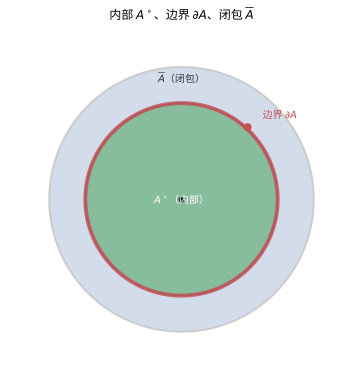
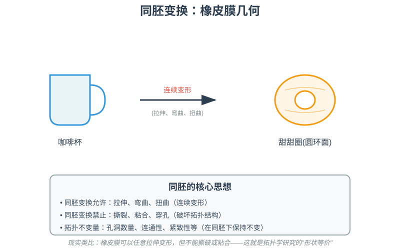
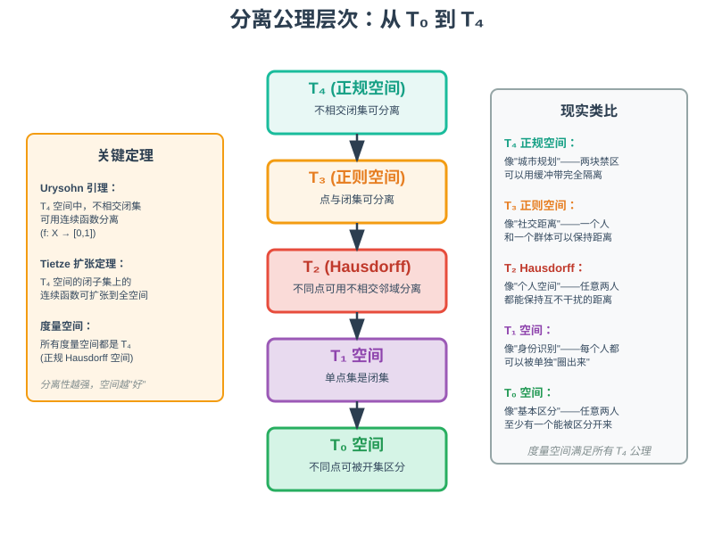
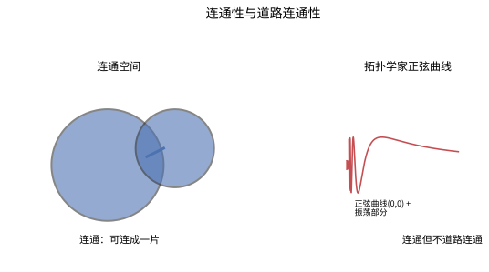
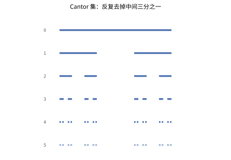

# 第 21 级：点集拓扑学（Point-Set Topology）

> 点集拓扑学是数学中最基础也最统一的分支之一，研究"连续性"和"邻近性"的最一般框架。本教程建立在实分析的基础上，系统介绍拓扑空间的基本概念、性质与构造方法。

---

## 1. 学习目标

完成本教程后，你应该能够：

- 理解拓扑空间的定义，掌握常见的拓扑构造（度量拓扑、离散拓扑、余有限拓扑、乘积拓扑等）
- 熟练运用开集、闭集、闭包、内部、边界、极限点等基本概念
- 理解连续函数的拓扑刻画，掌握同胚的概念并能判断两个空间是否同胚
- 掌握分离性公理（T₀–T₄），理解 Urysohn 引理和 Tietze 扩张定理的意义
- 掌握紧致性的定义、基本性质，理解 Heine-Borel 定理和 Tychonoff 定理
- 掌握连通性和道路连通性的概念，理解连通分支
- 理解乘积拓扑和商拓扑的构造
- 了解度量空间与可度量化理论
- 了解可数性公理

---

## 2. 拓扑空间

### 2.1 拓扑的定义

**定义 2.1（拓扑）** 设 $X$ 是一个非空集合。$X$ 上的一个**拓扑**（topology）是 $X$ 的子集族 $\mathcal{T} \subseteq \mathcal{P}(X)$，满足以下三条公理：

1. $\varnothing \in \mathcal{T}$，$X \in \mathcal{T}$；
2. **有限交封闭**：若 $U_1, U_2, \ldots, U_n \in \mathcal{T}$，则 $\bigcap_{i=1}^n U_i \in \mathcal{T}$；
3. **任意并封闭**：若 $\{U_\alpha\}_{\alpha \in I} \subseteq \mathcal{T}$，则 $\bigcup_{\alpha \in I} U_\alpha \in \mathcal{T}$。

**定义 2.2（拓扑空间）** 有序对 $(X, \mathcal{T})$ 称为一个**拓扑空间**（topological space）。$\mathcal{T}$ 中的元素称为**开集**（open set）。

**术语**：在不引起混淆时，我们常直接用 $X$ 表示拓扑空间 $(X, \mathcal{T})$。

### 2.2 拓扑的基与子基

**定义 2.3（基）** 设 $(X, \mathcal{T})$ 是拓扑空间。$\mathcal{B} \subseteq \mathcal{T}$ 称为 $\mathcal{T}$ 的一个**基**（basis），若每个开集 $U \in \mathcal{T}$ 均可表示为 $\mathcal{B}$ 中一些元素的并。

**定理 2.1（基的判定条件）** 设 $\mathcal{B} \subseteq \mathcal{P}(X)$。$\mathcal{B}$ 是 $X$ 上某个拓扑的基当且仅当：

1. $\bigcup_{B \in \mathcal{B}} B = X$；
2. 对任意 $B_1, B_2 \in \mathcal{B}$ 和任意 $x \in B_1 \cap B_2$，存在 $B_3 \in \mathcal{B}$ 使得 $x \in B_3 \subseteq B_1 \cap B_2$。

此时由 $\mathcal{B}$ 生成的拓扑 $\mathcal{T}_\mathcal{B}$ 定义为：$U$ 是开集当且仅当对每个 $x \in U$，存在 $B \in \mathcal{B}$ 使得 $x \in B \subseteq U$。

**定义 2.4（子基）** $\mathcal{S} \subseteq \mathcal{P}(X)$ 称为 $X$ 上某个拓扑的**子基**（subbasis），若 $\mathcal{S}$ 中元素的有限交构成的族 $\mathcal{B} = \{S_1 \cap S_2 \cap \cdots \cap S_n \mid S_i \in \mathcal{S}\}$ 是一个基。

### 2.3 常见拓扑的例子

**例 2.1（度量拓扑）** 设 $(X, d)$ 是度量空间。定义开球 $B(x; r) = \{y \in X \mid d(x, y) < r\}$。所有开球的并集构成 $X$ 上的一个拓扑，称为**度量拓扑**（metric topology）。这是拓扑学中最重要的一类例子。

**例 2.2（离散拓扑）** $\mathcal{T} = \mathcal{P}(X)$，即 $X$ 的所有子集都是开集。这是 $X$ 上最大的拓扑。

**例 2.3（密着拓扑 / 平凡拓扑）** $\mathcal{T} = \{\varnothing, X\}$。这是 $X$ 上最小的拓扑，也称为**密着拓扑**（indiscrete topology）。

**例 2.4（余有限拓扑）** 设 $X$ 是无限集。定义
$$\mathcal{T}_{\text{cof}} = \{U \subseteq X \mid U = \varnothing \text{ 或 } X \setminus U \text{ 是有限集}\}$$
这称为**余有限拓扑**（cofinite topology）。

**例 2.5（余可数拓扑）** 设 $X$ 是不可数集。定义
$$\mathcal{T}_{\text{coc}} = \{U \subseteq X \mid U = \varnothing \text{ 或 } X \setminus U \text{ 是可数集}\}$$
这称为**余可数拓扑**（cocountable topology）。

**例 2.6（实数集上的标准拓扑）** $\mathbb{R}$ 上的**标准拓扑**（standard topology）以开区间 $(a, b)$ 全体为基。这是由度量 $d(x, y) = |x - y|$ 诱导的度量拓扑。

**例 2.7（下限拓扑）** $\mathbb{R}$ 上的**下限拓扑**（lower limit topology）以半开区间 $[a, b)$ 全体为基，记作 $\mathbb{R}_\ell$。

**例 2.8（乘积拓扑）** 设 $(X, \mathcal{T}_X)$ 和 $(Y, \mathcal{T}_Y)$ 是拓扑空间。$X \times Y$ 上的**乘积拓扑**（product topology）以 $\{U \times V \mid U \in \mathcal{T}_X, V \in \mathcal{T}_Y\}$ 为基。

---

## 3. 开集与闭集

### 3.1 闭集

**定义 3.1（闭集）** 设 $(X, \mathcal{T})$ 是拓扑空间。$A \subseteq X$ 称为**闭集**（closed set），若 $X \setminus A$ 是开集。

**定理 3.1（闭集的性质）** 闭集满足以下性质：

1. $\varnothing$ 和 $X$ 是闭集；
2. 任意多个闭集的交是闭集；
3. 有限多个闭集的并是闭集。

### 3.2 闭包、内部与边界

**定义 3.2（闭包）** 设 $A \subseteq X$。$A$ 的**闭包**（closure）是包含 $A$ 的最小闭集，记作 $\overline{A}$ 或 $\operatorname{cl}(A)$。等价地，
$$\overline{A} = \bigcap\{F \subseteq X \mid F \text{ 是闭集且 } A \subseteq F\}$$

**定义 3.3（内部）** $A$ 的**内部**（interior）是包含在 $A$ 中的最大开集，记作 $A^\circ$ 或 $\operatorname{int}(A)$。等价地，
$$A^\circ = \bigcup\{U \subseteq X \mid U \text{ 是开集且 } U \subseteq A\}$$

**定义 3.4（边界）** $A$ 的**边界**（boundary）定义为 $\partial A = \overline{A} \setminus A^\circ$。等价地，$\partial A = \overline{A} \cap \overline{X \setminus A}$。

**定理 3.2（基本关系）** 对于任意 $A \subseteq X$：
- $A^\circ \subseteq A \subseteq \overline{A}$
- $A$ 是开集 $\iff A = A^\circ$
- $A$ 是闭集 $\iff A = \overline{A}$
- $\overline{A} = A^\circ \cup \partial A$
- $X = A^\circ \cup \partial A \cup (X \setminus A)^\circ$（三者互不相交）

> **直观理解（现实类比）**：内部是"**菜地里的幼苗区**"——每个点都还留有自由生长的空间（包含一个完整小邻域）；边界是"**菜地的栅栏**"——紧挨着也能摸到外面；闭包是"**菜地连同栅栏**"——把幼苗区和边界一起圈进来。任何集合都能分解成"内部 + 边界 + 外部"三块不相交的地带，这正是拓扑学从"远近关系"观察空间的起点。

### 3.3 极限点与聚点

**定义 3.5（极限点/聚点）** $x \in X$ 称为 $A \subseteq X$ 的**极限点**（limit point）或**聚点**（accumulation point），若对 $x$ 的每个邻域 $U$（即包含 $x$ 的开集），有 $U \cap (A \setminus \{x\}) \neq \varnothing$。$A$ 的极限点全体记作 $A'$，称为 $A$ 的**导集**（derived set）。

**定理 3.3（闭包与极限点）** $\overline{A} = A \cup A'$。

**定义 3.6（孤立点）** 若 $x \in A$ 不是 $A$ 的极限点，则称 $x$ 为 $A$ 的**孤立点**（isolated point）。

### 3.4 稠密集与无处稠密集

**定义 3.7（稠密集）** $A \subseteq X$ 称为**稠密**的（dense），若 $\overline{A} = X$。

**定义 3.8（无处稠密集）** $A \subseteq X$ 称为**无处稠密**的（nowhere dense），若 $(\overline{A})^\circ = \varnothing$。

**例 3.1** $\mathbb{Q}$ 在 $\mathbb{R}$（标准拓扑）中稠密。$\mathbb{Z}$ 在 $\mathbb{R}$ 中无处稠密。

### 3.5 序列收敛

**定义 3.9（序列收敛）** 序列 $\{x_n\}$ 收敛于 $x$（记作 $x_n \to x$），若对 $x$ 的每个邻域 $U$，存在 $N \in \mathbb{N}$ 使得对所有 $n \ge N$ 有 $x_n \in U$。

**注意**：在一般拓扑空间中，序列收敛不足以刻画拓扑（需要网或滤子）。但在度量空间中，序列收敛是充分的。

---

## 4. 连续性与同胚

### 4.1 连续函数

**定义 4.1（连续性）** 设 $(X, \mathcal{T}_X)$ 和 $(Y, \mathcal{T}_Y)$ 是拓扑空间。$f: X \to Y$ 称为**连续**的（continuous），若对每个开集 $V \in \mathcal{T}_Y$，其原像 $f^{-1}(V) \in \mathcal{T}_X$。

**定理 4.1（连续性的等价刻画）** 以下条件等价：

1. $f$ 连续；
2. 对每个闭集 $C \subseteq Y$，$f^{-1}(C)$ 是闭集；
3. 对每个 $A \subseteq X$，$f(\overline{A}) \subseteq \overline{f(A)}$；
4. 对每个 $x \in X$ 和 $f(x)$ 的每个邻域 $V$，存在 $x$ 的邻域 $U$ 使得 $f(U) \subseteq V$。

**定理 4.2（连续函数的复合）** 若 $f: X \to Y$ 和 $g: Y \to Z$ 连续，则 $g \circ f: X \to Z$ 连续。

**定理 4.3（连续函数的粘贴引理）** 设 $X = A \cup B$，其中 $A$ 和 $B$ 是闭集（或开集），$f: A \to Y$ 和 $g: B \to Y$ 连续，且在 $A \cap B$ 上 $f = g$。则 $h: X \to Y$ 定义为
$$h(x) = \begin{cases} f(x) & x \in A \\ g(x) & x \in B \end{cases}$$
是连续的。

### 4.2 同胚

**定义 4.2（同胚）** 连续映射 $f: X \to Y$ 称为**同胚**（homeomorphism），若 $f$ 是双射且其逆 $f^{-1}$ 也连续。此时称 $X$ 与 $Y$ **同胚**（homeomorphic），记作 $X \cong Y$。

**注**：同胚是拓扑空间之间的等价关系。同胚的空间在拓扑意义上是不可区分的——它们具有相同的拓扑性质。

**例 4.1** 以下空间两两同胚：
- 开区间 $(-1, 1)$ 与 $\mathbb{R}$（通过 $f(x) = \tan(\pi x/2)$）
- $\mathbb{R}^2$ 与去掉一点的球面 $S^2 \setminus \{p\}$（球极投影）
- 正方形与圆盘

> **直观理解（现实类比）**：同胚变换就像**橡皮膜变形**——可以拉伸、弯曲、扭曲，但不能撕裂或粘合。咖啡杯和甜甜圈都有一个"洞"（杯把手和甜甜圈孔），所以它们**拓扑等价**：可以把咖啡杯想象成橡皮泥做的，慢慢捏成甜甜圈的形状，而不需要撕破或粘合任何部分。这就是拓扑学家说的"咖啡杯 = 甜甜圈"——它们有相同的**拓扑不变量**（孔洞数量）。

### 4.3 开映射与闭映射

**定义 4.3（开映射/闭映射）** $f: X \to Y$ 称为**开映射**（open map），若对每个开集 $U \subseteq X$，$f(U)$ 是开集。类似地定义**闭映射**（closed map）。

**注**：同胚等价于连续的双射且是开映射（或闭映射）。

### 4.4 嵌入

**定义 4.4（嵌入）** 连续单射 $f: X \to Y$ 称为**嵌入**（embedding），若 $f$ 到其像 $f(X)$ 上的限制 $f: X \to f(X)$ 是同胚（其中 $f(X)$ 具有 $Y$ 的子空间拓扑）。

---

## 5. 分离性公理

### 5.1 T₀、T₁、T₂（Hausdorff）

**定义 5.1（T₀ 空间）** $X$ 称为 **T₀ 空间**（或 Kolmogorov 空间），若对任意两个不同的点 $x \neq y$，存在开集 $U$ 恰好包含其中之一。

**定义 5.2（T₁ 空间）** $X$ 称为 **T₁ 空间**，若对任意 $x \neq y$，存在开集 $U$ 和 $V$ 使得 $x \in U$，$y \notin U$ 且 $y \in V$，$x \notin V$。

**定理 5.1（T₁ 的刻画）** $X$ 是 T₁ 空间当且仅当每个单点集 $\{x\}$ 是闭集。

**定义 5.3（T₂ 空间 / Hausdorff 空间）** $X$ 称为 **T₂ 空间**或 **Hausdorff 空间**，若对任意 $x \neq y$，存在不相交的开集 $U$ 和 $V$ 使得 $x \in U$，$y \in V$。

**例 5.1** 
- 度量空间是 Hausdorff 空间。
- 余有限拓扑是 T₁ 但不是 Hausdorff（除非 $X$ 有限）。
- 密着拓扑不是 T₀（若 $|X| > 1$）。

**定理 5.2（Hausdorff 空间中极限的唯一性）** 在 Hausdorff 空间中，收敛序列的极限唯一。

### 5.2 T₃（正则空间）

**定义 5.4（正则空间）** $X$ 称为**正则**的（regular），若对任意闭集 $C \subseteq X$ 和任意 $x \notin C$，存在不相交的开集 $U$ 和 $V$ 使得 $x \in U$，$C \subseteq V$。

**定义 5.5（T₃ 空间）** 若 $X$ 是 T₁ 且正则，则称 $X$ 为 **T₃ 空间**。

### 5.3 T₄（正规空间）与 Urysohn 引理

**定义 5.6（正规空间）** $X$ 称为**正规**的（normal），若对任意不相交的闭集 $C, D \subseteq X$，存在不相交的开集 $U$ 和 $V$ 使得 $C \subseteq U$，$D \subseteq V$。

**定义 5.7（T₄ 空间）** 若 $X$ 是 T₁ 且正规，则称 $X$ 为 **T₄ 空间**。

**定理 5.3（Urysohn 引理）** 设 $X$ 是正规空间，$A$ 和 $B$ 是 $X$ 中不相交的闭集。则存在连续函数 $f: X \to [0, 1]$ 使得 $f(A) = \{0\}$，$f(B) = \{1\}$。

**证明**：Urysohn 引理是点集拓扑学中最深刻的定理之一。其证明思路如下：

1. 构造一列开集 $\{U_r\}_{r \in \mathbb{Q} \cap [0,1]}$。首先令 $U_1 = X \setminus B$。
2. 由于 $X$ 正规，存在开集 $U_0$ 使得 $A \subseteq U_0 \subseteq \overline{U_0} \subseteq U_1$。
3. 对每个有理数 $r \in (0,1)$，递归地构造开集 $U_r$ 使得当 $p < q$ 时 $\overline{U_p} \subseteq U_q$。
4. 定义 $f(x) = \inf\{r \in \mathbb{Q} \cap [0,1] \mid x \in U_r\}$。
5. 验证 $f$ 是连续的，且满足 $f(A) = \{0\}$，$f(B) = \{1\}$。

**推论 5.1** 正规空间中任意两个不相交的闭集可以被一个连续函数分离。

### 5.4 Tietze 扩张定理

**定理 5.4（Tietze 扩张定理）** 设 $X$ 是正规空间，$A \subseteq X$ 是闭集。则任何连续函数 $f: A \to [0, 1]$（或 $f: A \to \mathbb{R}$）均可扩张为连续函数 $F: X \to [0, 1]$（或 $F: X \to \mathbb{R}$），即 $F|_A = f$。

**证明思路**：利用 Urysohn 引理，通过构造一列逼近函数并取极限来得到扩张。

### 5.5 分离性公理的关系

$$T_4 \implies T_3 \implies T_2 \implies T_1 \implies T_0$$

> **直观理解（现实类比）**：分离公理就像**社交距离的不同层次**。T₀ 是最基本的"能区分两个人"；T₁ 是"每个人都能被单独圈出来"（单点集是闭集）；T₂ (Hausdorff) 是"任意两个人都能保持互不干扰的距离"（个人空间）；T₃ 是"一个人和一个群体也能保持距离"（社交距离）；T₄ 是"两块禁区可以用缓冲带完全隔离"（城市规划）。**度量空间满足所有 T₄ 公理**，是最"好"的空间——分离性越强，空间越容易处理。

**重要事实**：
- 度量空间是 T₄（即正规 Hausdorff）空间。
- 紧致 Hausdorff 空间是 T₄ 空间。
- 正则的 Lindelöf 空间是正规空间。

---

## 6. 紧致性

### 6.1 紧致性的定义

**定义 6.1（开覆盖）** 设 $X$ 是拓扑空间。$\{U_\alpha\}_{\alpha \in I}$ 是 $X$ 的一族开子集，若 $\bigcup_{\alpha \in I} U_\alpha = X$，则称其为 $X$ 的一个**开覆盖**（open cover）。

**定义 6.2（紧致性）** $X$ 称为**紧致**的（compact），若 $X$ 的每个开覆盖都有有限子覆盖。

**定义 6.3（子集的紧致性）** $A \subseteq X$ 称为紧致的，若 $A$ 作为子空间是紧致的。等价地，$A$ 的每个由 $X$ 中开集组成的覆盖都有有限子覆盖。

### 6.2 紧致性的基本性质

**定理 6.1** 紧致空间的闭子集是紧致的。

**定理 6.2** Hausdorff 空间的紧致子集是闭集。

**定理 6.3** 紧致空间在连续映射下的像是紧致的。

**推论 6.1** 紧致空间上的连续实值函数必有最大值和最小值（极值定理）。

**定理 6.4** 从紧致空间到 Hausdorff 空间的连续双射是同胚。

### 6.3 Heine-Borel 定理

**定理 6.5（Heine-Borel 定理）** $\mathbb{R}^n$ 中的子集 $A$ 是紧致的（在标准拓扑下）当且仅当 $A$ 是有界闭集。

**证明**：先在 $\mathbb{R}$ 中证明闭区间 $[a, b]$ 是紧致的，然后用乘积空间中的紧致性推广到 $\mathbb{R}^n$。

### 6.4 有限交性质

**定义 6.4（有限交性质）** 一族集合 $\{C_\alpha\}$ 称为具有**有限交性质**（finite intersection property, FIP），若其中任意有限个的交集非空。

**定理 6.6** 拓扑空间 $X$ 是紧致的当且仅当对任意一族具有有限交性质的闭集 $\{C_\alpha\}$，有 $\bigcap_\alpha C_\alpha \neq \varnothing$。

### 6.5 Tychonoff 定理

**定理 6.7（Tychonoff 定理）** 任意一族紧致空间的乘积空间（在乘积拓扑下）是紧致的。

**注**：Tychonoff 定理是点集拓扑学中最重要的定理之一，它与选择公理等价。

### 6.6 序列紧致与可数紧致

**定义 6.5（序列紧致）** $X$ 称为**序列紧致**的（sequentially compact），若每个序列都有收敛子序列。

**定理 6.8** 在度量空间中，紧致性等价于序列紧致性。

**定义 6.6（可数紧致）** $X$ 称为**可数紧致**的（countably compact），若每个可数开覆盖都有有限子覆盖。

### 6.7 局部紧致

**定义 6.7（局部紧致）** $X$ 称为**局部紧致**的（locally compact），若每个点都有一个紧致邻域。

**例 6.1** $\mathbb{R}^n$ 是局部紧致的（但不是紧致的）。$\mathbb{Q}$ 不是局部紧致的。

---

## 7. 连通性

### 7.1 连通空间

**定义 7.1（连通性）** 拓扑空间 $X$ 称为**连通**的（connected），若 $X$ 不能表示为两个非空不相交开集的并。等价地，$X$ 中只有 $\varnothing$ 和 $X$ 既是开集又是闭集。

**定理 7.1** 连通空间在连续映射下的像是连通的。

**定理 7.2** 若 $A \subseteq X$ 是连通子集，且 $A \subseteq B \subseteq \overline{A}$，则 $B$ 也连通。特别地，连通集的闭包连通。

**定理 7.3** 一族连通子集若两两相交，则它们的并也是连通的。

> **直观理解（现实类比）**：连通是"**整块地没有断口**"——不能掰成两块互不相碰的开集；道路连通更强，要求"**任意两点能用一条连续曲线连起来**"。想象**一片泥沼**：连通地连成一片，却不保证能"造出一条路"穿过。拓扑学家正弦曲线就是典型例子：曲线部分与 $y$-轴原点的闭包连成一片（连通），可任何"道路"都到不了原点——**连成一片 ≠ 能走出一条路**。

**定理 7.4（实数的连通性）** $\mathbb{R}$（标准拓扑）是连通的。更一般地，$\mathbb{R}$ 中的连通子集恰是区间。

### 7.2 连通分支

**定义 7.2（连通分支）** $X$ 的**连通分支**（connected component）是关于连通性关系的极大连通子集，即 $x \sim y$ 若存在连通子集同时包含 $x$ 和 $y$。该等价关系下的等价类称为连通分支。

**性质**：
- 每个连通分支是闭集。
- 连通分支构成 $X$ 的一个划分。

### 7.3 道路连通性

**定义 7.3（道路）** $X$ 中的一条**道路**（path）是从 $[0, 1]$ 到 $X$ 的连续映射 $\gamma$。$\gamma(0)$ 和 $\gamma(1)$ 分别称为道路的起点和终点。

**定义 7.4（道路连通性）** $X$ 称为**道路连通**的（path-connected），若对任意 $x, y \in X$，存在连接 $x$ 和 $y$ 的道路。

**定理 7.5** 道路连通空间必连通。反之不真。

**例 7.1（连通而非道路连通）** 拓扑学家的正弦曲线
$$S = \left\{\left(x, \sin\frac{1}{x}\right) \mid 0 < x \le 1\right\} \cup \{(0, y) \mid -1 \le y \le 1\}$$
作为 $\mathbb{R}^2$ 的子空间是连通的，但不是道路连通的。

**定义 7.5（道路连通分支）** 道路连通分支是道路连通关系下的等价类。

### 7.4 局部连通与局部道路连通

**定义 7.6（局部连通）** $X$ 称为**局部连通**的（locally connected），若每个点的每个邻域都包含一个连通邻域。

**定义 7.7（局部道路连通）** $X$ 称为**局部道路连通**的，若每个点的每个邻域都包含一个道路连通邻域。

**定理 7.6** 连通且局部道路连通的空间是道路连通的。

---

## 8. 乘积空间与商空间

### 8.1 乘积拓扑

**定义 8.1（有限乘积拓扑）** 设 $(X_1, \mathcal{T}_1), \ldots, (X_n, \mathcal{T}_n)$ 是拓扑空间。$X_1 \times \cdots \times X_n$ 上的**乘积拓扑**以 $\{U_1 \times \cdots \times U_n \mid U_i \in \mathcal{T}_i\}$ 为基。

**定义 8.2（任意乘积拓扑）** 设 $\{X_\alpha\}_{\alpha \in I}$ 是一族拓扑空间。乘积空间 $\prod_{\alpha \in I} X_\alpha$ 上的**乘积拓扑**（Tychonoff 拓扑）以 $\{\pi_\alpha^{-1}(U_\alpha) \mid \alpha \in I, U_\alpha \subseteq X_\alpha \text{ 开}\}$ 为子基，其中 $\pi_\alpha: \prod X_\alpha \to X_\alpha$ 是投影映射。

**定理 8.1（乘积拓扑的泛性质）** 映射 $f: Y \to \prod X_\alpha$ 连续当且仅当每个分量函数 $f_\alpha = \pi_\alpha \circ f$ 连续。

**定理 8.2** 乘积空间是 Hausdorff 空间当且仅当每个因子空间是 Hausdorff 空间。

### 8.2 商拓扑

**定义 8.3（商拓扑）** 设 $(X, \mathcal{T})$ 是拓扑空间，$\sim$ 是 $X$ 上的等价关系，$p: X \to X/{\sim}$ 是自然投影。$X/{\sim}$ 上的**商拓扑**（quotient topology）定义为：
$$U \subseteq X/{\sim} \text{ 是开集 } \iff p^{-1}(U) \in \mathcal{T}$$

**定义 8.4（商映射）** 连续满射 $q: X \to Y$ 称为**商映射**（quotient map），若 $Y$ 的拓扑是相对于 $q$ 的商拓扑，即 $U \subseteq Y$ 开当且仅当 $q^{-1}(U)$ 开。

**定理 8.3（商映射的泛性质）** 设 $q: X \to Y$ 是商映射。则 $f: Y \to Z$ 连续当且仅当 $f \circ q: X \to Z$ 连续。

**例 8.1（重要商空间）**
- **粘合**：将区间 $[0, 1]$ 的两端粘合得到圆 $S^1$。
- **Möbius 带**：将矩形的一对对边反向粘合。
- **射影平面** $\mathbb{RP}^2$：将球面 $S^2$ 的对径点等同。
- **环面** $T^2$：将正方形的对边分别粘合。

### 8.3 识别映射

**定义 8.5（识别映射）** 若 $f: X \to Y$ 是连续满射，且 $Y$ 的拓扑等于由 $f$ 诱导的商拓扑，则称 $f$ 为**识别映射**（identification map）。

---

## 9. 度量空间与可度量化

### 9.1 度量空间回顾

**定义 9.1（度量）** 集合 $X$ 上的一个**度量**（metric）是函数 $d: X \times X \to \mathbb{R}_{\ge 0}$，满足：
1. $d(x, y) = 0 \iff x = y$（正定性）；
2. $d(x, y) = d(y, x)$（对称性）；
3. $d(x, z) \le d(x, y) + d(y, z)$（三角不等式）。

$(X, d)$ 称为**度量空间**（metric space），其上的度量拓扑由开球 $B(x; r) = \{y \mid d(x, y) < r\}$ 生成。

### 9.2 度量化问题

**定义 9.2（可度量化）** 拓扑空间 $(X, \mathcal{T})$ 称为**可度量化**的（metrizable），若存在 $X$ 上的度量 $d$ 使得 $\mathcal{T}$ 等于 $d$ 诱导的度量拓扑。

### 9.3 Urysohn 度量化定理

**定理 9.1（Urysohn 度量化定理）** 第二可数且正则的 T₁ 空间是可度量化的。

**证明思路**：
1. 由第二可数性和正则性，构造一列连续函数 $f_n: X \to [0, 1]$ 来分离点和闭集。
2. 将这些函数嵌入到 Hilbert 立方体 $[0, 1]^\mathbb{N}$ 中。
3. 证明该嵌入是同胚嵌入，从而 $X$ 同胚于度量空间 $[0, 1]^\mathbb{N}$ 的子空间。

**推论 9.1** 第二可数的紧致 Hausdorff 空间是可度量化的。

### 9.4 完备度量空间

**定义 9.3（Cauchy 序列）** 度量空间 $(X, d)$ 中的序列 $\{x_n\}$ 称为 **Cauchy 序列**，若对任意 $\varepsilon > 0$，存在 $N$ 使得 $m, n \ge N$ 时 $d(x_m, x_n) < \varepsilon$。

**定义 9.4（完备性）** 若 $X$ 中每个 Cauchy 序列都收敛，则称 $(X, d)$ 是**完备**的（complete）。

**定理 9.2（Baire 纲定理）** 完备度量空间不能表示为可数个无处稠密集的并。等价地，完备度量空间中可数个稠密开集的交仍是稠密的。

---

## 10. 可数性公理

### 10.1 第一可数性

**定义 10.1（第一可数）** $X$ 称为**第一可数**的（first countable），若每个点 $x \in X$ 都有可数的邻域基（即一列邻域 $\{U_n\}$ 使得 $x$ 的每个邻域都包含某个 $U_n$）。

**例 10.1** 度量空间是第一可数的（取 $B(x; 1/n)$ 作为可数邻域基）。

### 10.2 第二可数性

**定义 10.2（第二可数）** $X$ 称为**第二可数**的（second countable），若 $X$ 的拓扑有一个可数基。

**例 10.2** $\mathbb{R}^n$ 是第二可数的（以有理点为球心、有理数为半径的开球全体构成可数基）。

### 10.3 可分性

**定义 10.3（可分）** $X$ 称为**可分的**（separable），若 $X$ 有一个可数稠密子集。

**定理 10.1** 第二可数的空间是可分的。

**定理 10.2** 度量空间是可分的当且仅当它是第二可数的。

### 10.4 Lindelöf 性质

**定义 10.4（Lindelöf）** $X$ 称为 **Lindelöf 空间**，若每个开覆盖都有可数子覆盖。

**定理 10.3** 第二可数的空间是 Lindelöf 空间。

**定理 10.4** 正则的 Lindelöf 空间是正规空间。

### 10.5 可数性公理之间的关系

$$\text{第二可数} \implies \text{第一可数}$$
$$\text{第二可数} \implies \text{可分}$$
$$\text{第二可数} \implies \text{Lindelöf}$$

在度量空间中，三者等价：
$$\text{可分} \iff \text{第二可数} \iff \text{Lindelöf}$$

---

## 11. 示例

### 示例 1：实数上的不同拓扑

比较 $\mathbb{R}$ 上的标准拓扑 $\mathcal{T}_{\text{std}}$、下限拓扑 $\mathcal{T}_\ell$ 和余有限拓扑 $\mathcal{T}_{\text{cof}}$：

- $\mathcal{T}_{\text{cof}} \subsetneq \mathcal{T}_{\text{std}} \subsetneq \mathcal{T}_\ell$
- $\mathbb{R}_\ell$ 是可分的、第一可数的、但不是第二可数的
- $\mathbb{R}_\ell$ 是 Hausdorff 的，且是正规的
- $\mathbb{R}_\ell$ 不是紧致的，但每个闭区间 $[a, b]$ 在 $\mathbb{R}_\ell$ 中是紧致的吗？不是——$[a, b]$ 在 $\mathbb{R}_\ell$ 中不是紧致的（因为 $[a, b)$ 是开集）。

### 示例 2：Cantor 集

Cantor 集 $C$ 是 $[0, 1]$ 中通过反复去掉中间三分之一得到的子集。$C$ 作为 $\mathbb{R}$ 的子空间：

- 是紧致的（有界闭集）
- 是无处稠密的
- 是不可数的
- 同胚于 $\{0, 1\}^\mathbb{N}$（乘积拓扑）

> **直观理解（现实类比）**：Cantor 集是"**看似被掏空、实则数量惊人**"的集合。每次抠掉中间三分之一，剩下的是越来越细的线段；无穷次后总"长度"为 0，但剩下的点却和整个连续统一样**不可数**——每一根"细线"其实藏着无穷多个点。它还是无处稠密、紧致、且同胚于无限位二进制序列 $\{0,1\}^\mathbb{N}$，是反常而深刻的空间典范。

### 示例 3：拓扑学家的正弦曲线

$$S = \left\{\left(x, \sin\frac{1}{x}\right) \mid 0 < x \le 1\right\} \cup \{(0, 0)\}$$

- $S$ 是连通的但不是道路连通的
- $S$ 不是局部连通的
- $S$ 是紧致的

### 示例 4：Hawaiian 耳环

$$H = \bigcup_{n=1}^\infty \left\{(x, y) \in \mathbb{R}^2 \mid \left(x - \frac{1}{n}\right)^2 + y^2 = \frac{1}{n^2}\right\}$$

- $H$ 是紧致的
- $H$ 是道路连通的
- $H$ 不是局部道路连通的
- $H$ 的每个点都有一个可数邻域基（第一可数）

### 示例 5：Alexandroff 单点紧化

设 $X$ 是局部紧致但不紧致的 Hausdorff 空间（如 $\mathbb{R}^n$）。添加一个无穷远点 $\infty$，定义 $\hat{X} = X \cup \{\infty\}$，拓扑为：

- $X$ 中的开集不变
- 包含 $\infty$ 的开集是 $X$ 中紧致子集的补集再并上 $\{\infty\}$

则 $\hat{X}$ 是紧致 Hausdorff 空间，称为 $X$ 的 **Alexandroff 单点紧化**。

**例子**：
- $\mathbb{R}$ 的单点紧化同胚于 $S^1$
- $\mathbb{R}^2$ 的单点紧化同胚于 $S^2$
- $\mathbb{R}^n$ 的单点紧化同胚于 $S^n$

### 示例 6：乘积空间 $\mathbb{R}^\mathbb{N}$

考虑 $\mathbb{R}^\mathbb{N}$（所有实数列的集合）上的乘积拓扑。

- 它是 Hausdorff 的
- 它不是紧致的（但若换成 $[0, 1]^\mathbb{N}$，由 Tychonoff 定理，它是紧致的——Hilbert 立方体）
- 它是可度量化的（度量为 $d(x, y) = \sum_{n=1}^\infty \frac{1}{2^n}\frac{|x_n - y_n|}{1 + |x_n - y_n|}$）
- 它是第二可数的

### 示例 7：商空间——射影平面

$\mathbb{RP}^2$（实射影平面）可通过以下方式构造：

1. 将球面 $S^2$ 的对径点等同：$\mathbb{RP}^2 = S^2 / \{x \sim -x\}$
2. 将圆盘 $D^2$ 的边界上的对径点粘合

$\mathbb{RP}^2$ 是紧致的、连通的，但不是可定向的。

### 示例 8：箱拓扑 vs 乘积拓扑

在 $\mathbb{R}^\mathbb{N}$ 上，箱拓扑（box topology）以 $\prod U_n$（每个 $U_n$ 开）为基，而乘积拓扑以 $\prod U_n$（有限个 $U_n \neq \mathbb{R}$）为基。

- 箱拓扑比乘积拓扑更细
- 在箱拓扑下，$\mathbb{R}^\mathbb{N}$ 不是连通的（甚至不是道路连通的）
- 在乘积拓扑下，$\mathbb{R}^\mathbb{N}$ 是连通的
- 在箱拓扑下，$\mathbb{R}^\mathbb{N}$ 不是紧致的（即使 $[0, 1]^\mathbb{N}$ 在箱拓扑下也不是紧致的）

---

## 12. 解题技巧

本节针对点集拓扑学的高频题型，总结可直接套用的策略与易错点。每条技巧含**适用场景**、**关键步骤**、**常见误区**，并配一个精讲示例。

### 12.1 用「基的判定条件」构造与识别拓扑

**适用场景**：题目给定一族子集 $\mathcal{B}$，要求证明它是某个拓扑的基（从而生成度量拓扑、下限拓扑、乘积拓扑等），或判断某族集合能否构成拓扑。

**关键步骤**：
1. 先核对并集：$\bigcup_{B \in \mathcal{B}} B = X$；
2. 验证**交箱性**：对任意 $B_1, B_2 \in \mathcal{B}$ 及 $x \in B_1 \cap B_2$，找 $B_3 \in \mathcal{B}$ 使 $x \in B_3 \subseteq B_1 \cap B_2$；
3. 一旦满足基条件，就定义由 $\mathcal{B}$ 生成的拓扑：$U$ 开当且仅当每个 $x \in U$ 都存在 $B \in \mathcal{B}$ 使 $x \in B \subseteq U$；
4. 若要与已知拓扑比较，逐个基元看其开、闭关系。

**常见误区**：
- 只验证 "$X$ 被并满" 而漏掉第二条交箱性；
- 误以为只要有限交仍在族中（那是"闭于有限交"），与"交箱性"（每个交点都有更小基元）不是一回事；
- 混淆"基"与"拓扑"本身：基可以相对小，拓扑由之生成。

**精讲示例**：验证 $\mathcal{B} = \{(a, b) \subseteq \mathbb{R} \mid a < b\}$ 是 $\mathbb{R}$ 上某拓扑的基，并指出与标准拓扑的关系。

第一条：$\bigcup_{(a,b)}(a,b)=\mathbb{R}$。第二条：对 $x \in (a,b) \cap (c,d)$，取 $\varepsilon = \tfrac12\min\{x-a,\, b-x,\, x-c,\, d-x\} > 0$，则 $x \in (x-\varepsilon, x+\varepsilon) \subseteq (a,b)\cap(c,d)$，而 $(x-\varepsilon,x+\varepsilon) \in \mathcal{B}$。故 $\mathcal{B}$ 是基。它恰生成 $\mathbb{R}$ 的标准拓扑（一切开集的"并"）。

### 12.2 用「开集的原像是开集」证明连续性

**适用场景**：一切"证明 $f$ 连续""证明同胚""证明嵌入"的题目。

**关键步骤**：
1. 首选判别法：对任意开集 $V \subseteq Y$，$f^{-1}(V)$ 是开集；
2. 若 $Y$ 的拓扑由基 $\mathcal{B}_Y$ 生成，只需对每个基元 $B$ 验证 $f^{-1}(B)$ 开（因为 $f^{-1}$ 保持并）；
3. 证明同胚 = 双射 + $f$ 连续 + $f^{-1}$ 连续；
4. 可用等价刻化：$f(\overline{A}) \subseteq \overline{f(A)}$ 对所有 $A \subseteq X$ 成立 $\iff$ $f$ 连续。

**常见误区**：
- 把记号记反，写成"开集的像是开集"（那是开映射，不保证存在）；
- 验证同胚时只证 $f$ 连续而漏掉 $f^{-1}$ 连续；
- 连续性几种刻化（开集/闭集/闭包/邻域）互相混淆，张冠李戴。

**精讲示例**：设 $f$ 连续，证明 $f(\overline{A}) \subseteq \overline{f(A)}$。

取 $x \in \overline{A}$，设 $V$ 是 $f(x)$ 的任一邻域。因 $f$ 连续，$f^{-1}(V)$ 是 $x$ 的邻域；又 $x \in \overline{A}$，故 $f^{-1}(V) \cap A \neq \varnothing$，取 $a \in A \cap f^{-1}(V)$，则 $f(a) \in f(A) \cap V$。于是 $f(x)$ 的每个邻域都与 $f(A)$ 相交，即 $f(x) \in \overline{f(A)}$。$\square$

### 12.3 紧致性的三大证明策略

**适用场景**：证明一个空间/子集紧致，或由紧致性推出其它性质。

**关键步骤**：
1. **开覆盖法（正向）**：任取开覆盖，构造有限子覆盖。常用手段是把难空间写成有限个素已知紧集之并，或利用闭子集；（见"闭子集紧致"示例）
2. **有限交性（反向）**：紧致 $\iff$ 任意具有有限交性质的闭集族之交非空，多用反证；
3. **连续像**：用"紧致空间的连续像是紧致的"化归到已知紧致空间。

**常见误区**：
- 对"子集紧致"用定义时，忘记它作为子空间的开集来自父空间的开集与自身之交；
- 反证"不紧致"取开覆盖时补集是闭集，一一对应时出错；
- 混淆紧致、序列紧致、可数紧致（在度量空间三者才等价）。

**精讲示例**：证明紧致空间的闭子集紧致。

设 $K \subseteq X$ 闭，$X$ 紧致。取 $K$ 的任意开覆盖 $\{U_\alpha\}$（在 $X$ 中开）。则 $\{X \setminus K\} \cup \{U_\alpha\}$ 覆盖 $X$，由 $X$ 紧致有有限子覆盖；若 $X \setminus K$ 在子覆盖中就去掉它，剩下的有限个 $U_\alpha$ 仍覆盖 $K$。故 $K$ 紧致。$\square$

### 12.4 用「闭开集」判定连通性

**适用场景**：证明某空间连通或非连通；判断两个空间不同胚。

**关键步骤**：
1. $X$ 连通 $\iff$ $X$ 中既开又闭（闭开集）只有 $\varnothing$ 与 $X$；
2. 也 $\iff$ 每个连续 $f: X \to \{0,1\}$（离散拓扑）恒为常值——常用此变体；
3. 证明非连通：构造非平凡的闭开子集；
4. "连通但不道路连通"：连通用"连通集的闭包连通"，非道路连通用关于道路的反正。

**常见误区**：
- 用"Hausdorff 唯一极限"当连通判据，二者毫无关系；
- 误以为闭包连通能推出道路连通（拓扑学家正弦曲线即反例）；
- 构造 $f:X\to\{0,1\}$ 时忘记 $\{0\},\{1\}$ 在离散拓扑中都是开集。

**精讲示例**：证明 $\mathbb{R}$（标准拓扑）连通。

设 $A \subseteq \mathbb{R}$ 既开又闭且 $A \neq \varnothing$。取 $a \in A$，令 $S = \{b \ge a \mid [a, b] \subseteq A\}$。因 $A$ 开，$S \neq \varnothing$。设 $c = \sup S$（注意利用 $A$ 开保证 $c$ 附近有解，$c$ 有限或 $+\infty$）。若 $c < +\infty$：由 $A$ 闭，$c \in A$；又 $A$ 开，存在 $\delta>0$ 使 $(c-\delta, c+\delta) \subseteq A$，于是 $[a, c+\delta/2] \subseteq A$，与 $c$ 为上确界矛盾。故 $c = +\infty$，$[a, +\infty) \subseteq A$。同理向左推得 $A = \mathbb{R}$。$\square$

### 12.5 分离公理蕴含链与 T₁ 判定

**适用场景**：判定空间属于哪一级分离公理；判断某空间的可度量化、正规性需要哪些条件。

**关键步骤**：
1. 判断 T₁ $\iff$ 单点集是否闭；
2. 判断 Hausdorff：任意两点能否被不相交开集分开；
3. 判断正规：常借助"正则 $+$ Lindelöf $\Rightarrow$ 正规""紧致 $+$ Hausdorff $\Rightarrow$ 正规（T₄）"等现成命题；
4. 牢记蕴含链 $T_4 \Rightarrow T_3 \Rightarrow T_2 \Rightarrow T_1 \Rightarrow T_0$。

**常见误区**：
- 混淆"正则"（闭集与点）与"正规"（两个闭集）；
- 忘记 T₃、T₄ 的定义中还预先要求 T₁。

**精讲示例**：证明余有限拓扑 $\mathcal{T}_{\text{cof}}$ 在无限集 $X$ 上是 T₁ 但非 Hausdorff。

单点集 $\{x\}$ 的补集 $X\setminus\{x\}$ 有限，故 $\{x\}$ 闭，T₁ 成立。它非 Hausdorff：任意两个非空开集 $U, V$ 的补集 $X\setminus U$、$X\setminus V$ 都有限，故 $U \cap V = X\setminus\big((X\setminus U)\cup(X\setminus V)\big)$ 是"无限集减有限集"，非空。于是 $U\cap V \neq \varnothing$，不可能把两点分开。$\square$

---

## 13. 四级习题

> 习题按难度分为 **基础题 / 进阶题 / 挑战题 / 探究题** 四级，覆盖本章全部内容。探究题无唯一答案，故附参考答案与思路提示。

### 13.1 基础题

**1.** 证明：余有限拓扑 $\mathcal{T}_{\text{cof}}$ 是 T₁ 空间，但除非 $X$ 是有限集，否则不是 Hausdorff 空间。

**2.** 设 $\mathcal{B} = \{(a, b) \subseteq \mathbb{R} \mid a < b\}$。证明 $\mathcal{B}$ 是 $\mathbb{R}$ 上某个拓扑的基，并说明该拓扑与标准拓扑的关系。

**3.** 证明：在拓扑空间中，$A$ 是闭集当且仅当 $A = \overline{A}$。

**4.** 证明：若 $f: X \to Y$ 连续且 $X$ 紧致，则 $f(X)$ 紧致。

**5.** 证明：$\mathbb{Q}$ 作为 $\mathbb{R}$ 的子空间不是局部紧致的。

**6.** 设 $X = [0, 1]$，定义等价关系 $x \sim y \iff x, y \in \{0, 1\}$ 或 $x = y$。描述商空间 $X / {\sim}$ 的拓扑结构，并证明它同胚于圆 $S^1$。

**7.** 设 $(X,\mathcal{T})$ 是拓扑空间，$A\subseteq X$。证明：(1) $A^\circ$ 是包含于 $A$ 的最大开集；(2) $A$ 是开集当且仅当 $A=A^\circ$。

**8.** 设 $A,B\subseteq X$。证明 $\overline{A\cup B}=\overline{A}\cup\overline{B}$，并举例说明 $\overline{A\cap B}=\overline{A}\cap\overline{B}$ 一般不成立。

**9.** 证明 $\partial A=A^\circ\triangle \overline{A}$（对称差）不成立；正确的关系是 $\partial A=\overline{A}\setminus A^\circ$ 且 $\partial A=\overline{A}\cap\overline{X\setminus A}$。取 $A=(0,1]\cup\{2\}\subseteq\mathbb{R}$，计算 $A^\circ,\overline{A},\partial A$。

**10.** 设 $X$ 是无限集，$\mathcal{T}_{\text{cof}}$ 是余有限拓扑。证明 $X$ 中任意两个非空开集相交，并由此证明它对任意无限 $X$ 满足：$X$ 每一真子集 $A\neq\varnothing$ 均有 $A^\circ=\varnothing$ 当且仅当 $A$ 有限。

**11.** 证明：若 $D\subseteq X$ 稠密，则对任意开集 $U\neq\varnothing$，$D\cap U\neq\varnothing$。

**12.** 证明：$A\subseteq X$ 无处稠密当且仅当 $A\subseteq X\setminus \overline{(X\setminus A)^\circ}$，即 $X\setminus\overline{A}$ 在 $X$ 中稠密。

**13.** 设 $f:X\to Y$，若对任意 $A\subseteq X$ 有 $f(\overline{A})\subseteq\overline{f(A)}$。证明 $f$ 是连续的。（连续性闭包刻化的反向）

**14.** 判定以下空间在各自拓扑下的分离性（T₀/T₁/T₂）：(a) 密着拓扑于 $|X|>1$；(b) 余可数拓扑于不可数集；(c) 余有限拓扑于 $\mathbb{N}$。

**15.** 设 $(X,d)$ 是度量空间，$A\subseteq X$。证明 $\overline{A}=\{x\in X\mid d(x,A)=0\}$，其中 $d(x,A)=\inf_{a\in A}d(x,a)$。

**16.** 证明：$x\in X$ 属于 $\partial A$ 当且仅当 $x$ 的每个邻域 $U$ 同时满足 $U\cap A\neq\varnothing$ 且 $U\cap(X\setminus A)\neq\varnothing$。

**17.** 设 $A,B\subseteq X$。证明 $(A\cap B)^\circ=A^\circ\cap B^\circ$，且 $(A\cup B)^\circ\supseteq A^\circ\cup B^\circ$（并给出严格包含的例子）。

**18.** 证明：拓扑空间 $X$ 是 T₁ 空间的充要条件是每个有限子集都是闭集。

**19.** 设 $\mathcal{B}$ 是拓扑 $(X,\mathcal{T})$ 的基。证明：$U\subseteq X$ 是开集当且仅当对每个 $x\in U$ 存在 $B\in\mathcal{B}$ 使 $x\in B\subseteq U$。

**20.** 证明离散拓扑不是另一个真拓扑 $\mathcal{T}'$ 的基的并小于 $\mathcal{P}(X)$；具体证明：若 $\mathcal{T}=\mathcal{P}(X)$，则不存在比它更细的拓扑。

**21.** 设 $A\subseteq\mathbb{R}$（标准拓扑）。证明 $\operatorname{int}A=\bigcup\{(a,b)\subseteq A\}$ 并对 $A=[0,1]\cup[2,3)$ 计算。

**22.** 证明度量拓扑的第一可数性：对 $x$，$\{B(x;1/n)\}_{n\ge1}$ 是 $x$ 的可数邻域基。

**23.** 设 $f:X\to Y$ 连续且为开映射、双射。证明 $f$ 是同胚。

**24.** 证明：$\mathbb{R}$（标准拓扑）中 $\mathbb{Q}$ 与 $\mathbb{R}\setminus\mathbb{Q}$ 均稠密。

**25.** 证明：若 $A$ 开，则 $\overline{A}\setminus A$ 无处稠密。（提示：$\operatorname{int}(\overline{A}\setminus A)$ 中的点同时是 $A$ 与 $X\setminus A$ 的聚点，矛盾于 $A$ 开。）

**26.** 设 $A\subseteq X$。证明 $x\in\overline{A}\setminus A'$ 蕴含 $x$ 是孤立点或 $x\in X\setminus A$；具体证明 $\overline{A}=A\cup A'$。

**27.** 证明：闭集的内部是开集，且对闭集 $F$，$\operatorname{int}F$ 是含于 $F$ 的最大开集，同时 $F=\overline{\operatorname{int}F}$ 未必成立（举反例 $F=\{0\}\subseteq\mathbb{R}$）。

**28.** 设 $X$ 是第二可数空间，$\mathcal{B}=\{B_n\}$ 是可数基。证明 $X$ 可分（构造可数稠密子集提示：$\{x_n\}$ 每基元取一点）。

**29.** 判定：集合 $A=\{x\in\mathbb{R}\mid x\notin\mathbb{Q}\wedge 0<x<1\}$ 在标准拓扑下的闭包与内部。

**30.** 证明：子空间拓扑中，$A\subseteq Y\subseteq X$ 的闭包满足 $\overline{A}^{Y}=\overline{A}^{X}\cap Y$。

**31.** 设 $x_n\to x$ 在度量空间 $(X,d)$ 中。证明 $d(x_n,x)\to 0$，并说明这与拓扑收敛定义一致。

**32.** 证明：若 $\mathcal{T}_1\subseteq\mathcal{T}_2$ 是 $X$ 上两个拓扑，则 $\mathcal{T}_2$ 中的收敛序列未必在 $\mathcal{T}_1$ 中收敛；反之若 $\mathcal{T}_1\subseteq\mathcal{T}_2$，$\mathcal{T}_1$ 收敛则 $\mathcal{T}_2$ 收敛。

**33.** 证明：余有限拓扑 $\mathcal{T}_{\text{cof}}$ 中，序列 $x_n\to x$ 当且仅当对每个有限集 $F\not\ni x$ 最终 $x_n\notin F$；在 $\mathbb{N}$ 上举例说明每点不动点。

**34.** 设 $A\subseteq X$。证明 $A$ 无孤立点且闭当且仅当 $A'=A$（此时称 $A$ 为完全集）。

**35.** 证明：$\mathbb{R}$ 的标准拓扑中以有理端点的开区间 $\{(p,q)\mid p,q\in\mathbb{Q},p<q\}$ 是可数基（第二可数）。

**36.** 设 $X$ 是 $T_1$ 空间，$A\subseteq X$ 有限。证明 $A$ 是闭集，且 $A'=\varnothing$。

**37.** 在 $\mathbb{R}$ 的标准拓扑下，设 $A=(-1,2]\cup\{3\}$。求 $A^\circ,\ \overline{A}$ 和 $\partial A$。

**38.** 设 $(X,\mathcal{T})$ 是离散拓扑空间。证明：序列 $\{x_n\}$ 收敛当且仅当它"最终恒定"，即存在 $N$ 使得对所有 $n\ge N$ 有 $x_n=x_N$。

**39.** 设 $X$ 是不可数集，赋予余可数拓扑。证明：序列 $\{x_n\}$（其中各项互不相同）不收敛于任何点。

**40.** 在 $\mathbb{R}$ 的下限拓扑 $\mathbb{R}_\ell$ 中，判断集合 $(0,1]$、$[a,b)$、$[a,b]$ 分别是否既是开集又是闭集（闭开集）。

**41.** 证明：具有有限多个元素的拓扑空间 $X$ 是紧致空间。

**42.** 设 $X=\{a,b,c\}$，拓扑 $\mathcal{T}=\{\varnothing,\{a\},\{a,b\},X\}$。它是否满足 $T_0$、$T_1$？说明理由。

**43.** 在 $\mathbb{R}$ 标准拓扑下，求 $[0,1]^\circ$、$\overline{[0,1]}$ 与 $\partial[0,1]$。

**44.** 证明闭包运算的单调性：若 $A\subseteq B$，则 $\overline{A}\subseteq\overline{B}$。

**45.** 证明：每个度量空间都是 Hausdorff 空间。

**46.** 设 $X$ 是密着拓扑空间，$A\subseteq X$ 非空。求 $\overline{A}$、$A^\circ$ 与 $\partial A$。

**47.** 证明：$\mathbb{Q}$ 在 $\mathbb{R}$（标准拓扑）中稠密，即 $\overline{\mathbb{Q}}=\mathbb{R}$。

**48.** 设 $D=\{(x,y)\in\mathbb{R}^2\mid x^2+y^2<1\}$。求 $D^\circ$、$\overline{D}$ 与 $\partial D$。

**49.** 用"开集的原像是开集"证明：$f:\mathbb{R}\to\mathbb{R}$，$f(x)=x^2$ 连续。

**50.** 设 $X=[0,1]$，等价关系 $0\sim 1$。商空间 $X/{\sim}$ 同胚于哪个常见空间？给出映射。

**51.** 判断下面集合作为 $\mathbb{R}$（标准拓扑）子空间是否连通：$A=\mathbb{R}\setminus\{0\}$，$B=[0,1]\cup[2,3]$。

**52.** 证明：$X$ 是紧致空间当且仅当存在覆盖 $X$ 的有限个紧致子集（提示：有限并）。

**53.** 证明 $(A\cap B)^\circ=A^\circ\cap B^\circ$。

**54.** 用闭开集方法证明 $\mathbb{R}$（标准拓扑）是连通的。

**55.** 设 $X$ 是 Hausdorff 空间，$\{x_n\}$ 收敛。证明其极限唯一。

**56.** 设 $X=\mathbb{R}$，拓扑为余有限拓扑。若 $x_n=x$ 对无限多个 $n$ 成立，证明 $x_n\to x$。

**57.** 设 $A=[0,1]\cap\mathbb{Q}\subseteq\mathbb{R}$。求 $\partial A$ 与 $A^\circ$。

**58.** 设 $X$ 是离散空间。给出 $X$ 紧致的充要条件。

**59.** 证明：如果 $A$ 是 $X$ 的稠密子集，则对每个 $x\in X$ 和 $x$ 的每个邻域 $U$，有 $U\cap A\neq\varnothing$。

**60.** 在 $\mathbb{R}$ 标准拓扑下，$\mathbb{Z}$ 是否稠密？是否无处稠密？说明理由。

**61.** 判断映射 $f:\mathbb{R}\to\mathbb{R}$，$f(x)=\lfloor x\rfloor$ 在标准拓扑下是否连续；在离散拓扑取值时如何？

**62.** 设 $A=\{(x,y)\in\mathbb{R}^2\mid y>0\}$。求 $A^\circ$、$\overline{A}$、$\partial A$。

**63.** 设 $f:X\to Y$ 是常值映射，即 $f(x)=c$。证明 $f$ 对任意拓扑都是连续的。

**64.** 证明：$\mathbb{R}$ 上的下限拓扑 [[a,b) 为基] 比标准拓扑更细。

**65.** 设 $A\subseteq X$。证明 $X\setminus\overline{A}=(X\setminus A)^\circ$。

**66.** 判定：$A=\{1/n\mid n\ge1\}\subseteq\mathbb{R}$ 在标准拓扑下是否闭、是否紧致。

**67.** 证明：$X$ 是 $T_1$ 空间当且仅当每个单点集 $\{x\}$ 是闭集。

**68.** 设 $A,B$ 是开集。证明 $A\cup B$ 与 $A\cap B$ 也是开集（利用有限交与任意并公理）。

**69.** 证明：$\mathbb{R}^n$（标准拓扑）是可分的（构造可数稠密子集）。

**70.** 判断 $C=\bigcap_{n=1}^{\infty}(-1-\frac1n,1+\frac1n)$ 在 $\mathbb{R}$ 中是否开、是否闭、是否紧致。

**71.** 设 $\mathcal{B}=\{[a,b)\mid a<b,a,b\in\mathbb{R}\}$。验证 $\mathcal{B}$ 是 $\mathbb{R}$ 上某拓扑的基。

**72.** 证明：紧致空间的连续像是紧致的。

**73.** 设 $A\subseteq X,B\subseteq Y$。证明在乘积拓扑下 $\overline{A\times B}=\overline{A}\times\overline{B}$。

**74.** 判定：$S^1=\{(x,y)\mid x^2+y^2=1\}$ 作为 $\mathbb{R}^2$ 子空间是否紧致、是否连通、是否有界。

**75.** 证明：集合 $A\subseteq\mathbb{R}$ 是闭集当且仅当 $A'\subseteq A$（$A'$ 为导集）。

**76.** 判定下面两种拓扑在 $X=\{a,b\}$ 上是否相等：$\mathcal{T}_1=\{\varnothing,\{a\},X\}$，$\mathcal{T}_2=\{\varnothing,\{b\},X\}$。

**77.** 证明：Hausdorff 空间中的紧致子集是闭集。

**78.** 设 $f:X\to Y$ 连续，$K\subseteq X$ 连通。证明 $f(K)$ 连通。

**79.** 在 $\mathbb{R}$ 标准拓扑下，$A=(0,1)\cup(1,2)$ 的导集 $A'$ 是什么？

**80.** 证明：$\mathbb{Q}$ 在 $\mathbb{R}$ 中无处不稠密，即它不是无处稠密的，事实上 $\overline{\mathbb{Q}}=\mathbb{R}$ 内部非空。

**81.** 判断 $X=(0,1)$（标准拓扑）与 $Y=[0,1]$ 是否同胚，说明理由。

**82.** 设 $A\subseteq\mathbb{R}$，$A\ne\varnothing$。证明 $\overline{A}$ 是有界闭集当且仅当 $A$ 有界。

**83.** 证明：$\partial A\subseteq\partial\overline{A}$；给出使 $\partial A=\partial\overline{A}$ 的例子。

**84.** 设拓扑 $\mathcal{T}_1\subseteq\mathcal{T}_2$。证明恒等映射 $\mathrm{id}:(X,\mathcal{T}_2)\to(X,\mathcal{T}_1)$ 连续。

**85.** 判定：密着拓扑于 $|X|>1$ 是否连通。

**86.** 证明：$\mathbb{R}$ 的标准拓扑中，$\mathbb{N}$ 不是闭集，其导集为空。

**87.** 设 $D\subseteq X$ 稠密。证明 $X$ 可分当且仅当存在可数稠密子集；若 $X$ 第二可数则 $D$ 的情形已足够。

**88.** 设 $A\subseteq B\subseteq X$。证明 $A^\circ\subseteq B^\circ$。

**89.** 证明：$A$ 是开集当且仅当 $A\cap\partial A=\varnothing$。

**90.** 判定：末端开区间构成的集合 $\{(a,\infty)\mid a\in\mathbb{R}\}$ 是否是 $\mathbb{R}$ 上某拓扑的基，并说明该拓扑。

**91.** 证明：$\mathbb{Q}$ 在 $\mathbb{R}$ 中既非开也非闭。

**92.** 在 $\mathbb{R}$ 标准拓扑下，求 $\partial\mathbb{Q}$ 与 $\partial(\mathbb{R}\setminus\mathbb{Q})$。

**93.** 证明若 $f:X\to Y$ 连续，对每个闭集 $C\subseteq Y$，$f^{-1}(C)$ 闭。（连续性闭集刻化）

**94.** 判定：$A=\{\sin n\mid n\in\mathbb{N}\}$ 在 $\mathbb{R}$ 中的极限点集合。

**95.** 证明：$\mathbb{R}^n$ 中任意开集是第二可数（利用有理点/半径球）。

**96.** 设 $X$ 是 $T_1$ 空间，$x\in X$。证明 $\overline{\{x\}}=\{x\}$。

**97.** 判定：$\{(x,\sin\frac1x)\mid x>0\}$ 作为 $\mathbb{R}^2$ 子空间的连通分支数。

**98.** 证明：可数个非空开集之交在 $\mathbb{R}$ 中未必开（举 $\bigcap(-1/n,1/n)$ 例）。

**99.** 设 $f,g:X\to\mathbb{R}$ 连续。证明 $\{x\mid f(x)=g(x)\}$ 在 $X$ 中闭。

**100.** 判定 $A=[0,1]\setminus\{1/2\}$ 作为 $\mathbb{R}$ 子空间是否紧致，说明原因。

**101.** 证明：$X$ 连通当且仅当不存在连续满射 $F:X\to\{0,1\}$（离散拓扑）。

**102.** 在 $\mathbb{R}$ 标准拓扑下，说明 $[0,1]\cup(1,2]$ 与 $[0,2]$ 的拓扑是否一致。

**103.** 证明闭集 $F$ 满足 $\partial F\subseteq F$。

**104.** 设 $X$ 是第二可数空间。证明它 Lindelöf。

**105.** 判定：$S=\{(x,y)\in\mathbb{R}^2\mid xy=1\}$ 是否紧致、是否闭、是否有界。

**106.** 证明：$A\subseteq X$ 的导集 $A'$ 满足 $A'\subseteq\overline{A}$。

**107.** 判断 $f:\mathbb{R}\to\mathbb{R}$，$f(x)=\sin x$ 的标准拓扑连续性与开映射性。

**108.** 证明：$X$ 的每个闭子集 $F$ 的闭包 $\overline{F}=F$。

**109.** 判定 $D=\{(x,y)\mid x^2-y^2=0\}$ 作为 $\mathbb{R}^2$ 子空间是否连通、是否闭。

**110.** 设 $A,B$ 闭，$A\cap B=\varnothing$，$X$ 连通。举例说明 $A\cup B$ 可能不闭。

**111.** 证明：$\mathbb{R}$ 的余可数拓扑下，序列 $\{1/n\}$ 收敛于其极限当且仅当其等于某点的几乎所有项。

**112.** 求 $\mathbb{R}$ 标准拓扑下 $A=[0,1]$ 作为子空间时的基（以有理端点为代表）。

**113.** 证明：$\mathbb{R}$ 标准拓扑下，$\mathbb{R}\setminus\mathbb{Q}$ 不可数，且是补集可数意义下的开集？否——判定其开闭。

**114.** 设 $X$ 可数、离散拓扑。证明 $X$ 是 Lindelöf 且第一可数。

**115.** 判定：$A=(1,2)\cup\{3\}$ 在 $\mathbb{R}$ 中的内部、闭包、外部。

**116.** 证明：若 $D$ 稠密且 $U$ 开，则 $\overline{U}=\overline{U\cap D}$。

**117.** 设 $f:X\to Y$ 连续且 $X$ 连通，证明 $f(X)\subset\mathbb{R}$ 是区间（介值定理的拓扑版）。

**118.** 判定：$B=\{(x,y)\mid x\in\mathbb{Q}, y\in\mathbb{Q}\}\subseteq\mathbb{R}^2$。求 $\overline{B}$，$B^\circ$。

**119.** 证明：$A$ 为闭集合 $\partial A\subseteq A$ 且 $A$ 内部必不包含边界点的情形辨析（给出 $\partial A\subseteq A$ 等价于 $A$ 闭）。

**120.** 在 $\mathbb{R}_\ell$ 中判定 $[0,1)$ 是否开、是否闭、$\mathbb{Q}_{\ge0}$ 是否稠密。

**121.** 证明：若 $X$ 紧致，则连续实值函数 $f:X\to\mathbb{R}$ 达到最大值与最小值。

**122.** 设 $A\subseteq X$，$x\notin\overline{A}$。证明存在邻域 $U\ni x$，$U\cap A=\varnothing$。

**123.** 判定：$S=\{(x,\sin\frac1x)\mid 0<x\le1\}$ 是否紧致（作 $\mathbb{R}^2$ 子空间）。

**124.** 证明：$\partial(A\cup B)\subseteq\partial A\cup\partial B$，并说明等号不一定成立。

**125.** 判定 $X=(0,1)\cup(2,3)$ 作为 $\mathbb{R}$ 子空间的连通性。

**126.** 设 $X$ 是 Hausdorff 空间。证明单点集 $\{x\}$ 闭（即 Hausdorff $\Rightarrow$ T$_1$）。

**127.** 证明：$\mathbb{R}^2$ 中单位圆盘 $D_2=\{x^2+y^2\le 1\}$ 是紧致既开的闭集。

**128.** 判定：$A=\mathbb{N}$ 作为 $\mathbb{R}$ 子空间的第一可数性与可分性。

**129.** 证明连续函数把闭集的原像……（$f:X\to Y$ 连续，$C$ 闭 $\Rightarrow f^{-1}(C)$ 闭）。

**130.** 求 $\mathbb{R}$ 中 $A=(0,1)\cap\mathbb{Q}$ 的导集 $A'$ 与闭包。

**131.** 证明：正规空间中任意两个不相交闭集可由连续函数分离（Urysohn 的直接应用）。

**132.** 判定 $X=\mathbb{R}$ 余有限拓扑下的连通性与相应紧致性。

**133.** 设 $A\subseteq X$ 无处稠密。证明 $\overline{A}$ 也无处稠密。

**134.** 证明：$\mathbb{Q}$ 作为 $\mathbb{R}$ 子空间不是完备度量空间（描述其不完备性）。

**135.** 判断映射 $f:(0,1)\to(-1,1)$，$f(x)=2x-1$ 是否同胚。

**136.** 设 $A,B$ 是 $X$ 的两连通子集且 $A\cap B\neq\varnothing$。证明 $A\cup B$ 连通。

### 13.2 进阶题

**1.** 证明：Hausdorff 空间中收敛序列的极限唯一。

**2.** 设 $X$ 是 Hausdorff 空间，$A \subseteq X$ 紧致，$x \notin A$。证明存在不相交的开集 $U$ 和 $V$ 使得 $x \in U$，$A \subseteq V$。

**3.** 证明：从紧致空间到 Hausdorff 空间的连续双射是同胚。

**4.** 证明：若 $X$ 是第二可数的正则空间，则 $X$ 是正规空间。

**5.** 证明：拓扑空间 $X$ 是连通的当且仅当每个连续函数 $f: X \to \{0, 1\}$（离散拓扑）是常值函数。

**6.** 设 $f: X \to Y$ 连续，$A \subseteq X$。证明 $f(\overline{A}) \subseteq \overline{f(A)}$。（考察连续性的闭包刻化）

（关注知识点：连续性刻化、闭包运算）

**7.** 用 Baire 纲定理证明：$\mathbb{Q}$ 不能作为 $\mathbb{R}$ 上的 $G_\delta$ 集。（提示：若 $\mathbb{Q} = \bigcap_n U_n$，每个 $U_n$ 稠密开，则 $\mathbb{Q}$ 作为完备度量空间的稠密 $G_\delta$ 子集应是 Baire 空间，但 $\mathbb{Q}$ 是可数无孤立点空间，矛盾。）

**8.** 证明：第一可数空间中，$x \in \overline{A}$ 当且仅当存在 $A$ 中的序列收敛于 $x$。并举例说明此结论在非第一可数空间中不成立。

**9.** 证明：紧致 Hausdorff 空间是正规空间（$T_4$）。

**10.** 设 $X$ 是正则空间且 $x\notin C$（$C$ 闭）。证明存在开集 $U,V$，$x\in U$，$C\subseteq V$，$U\cap V=\varnothing$（正则定义），并说明它与 Hausdorff 的区别。

**11.** 证明：从连通空间到 $\mathbb{R}$ 的连续映射的像是区间（连通集的连续像 + 实数连通子集即区间）。

**12.** 证明：积空间 $\prod X_\alpha$ 是 Hausdorff 的当且仅当每个因子 $X_\alpha$ 是 Hausdorff 的。

**13.** 设 $X$ 是第一可数空间，$A\subseteq X$。证明 $x\in\overline{A}\iff$ 存在 $a_n\in A$，$a_n\to x$。

**14.** 证明：正则空间是 $T_1$ 且局部可分离性……具体证明 T$_3$ 蕴含 T$_2$。

**15.** 用有限交性质证明：$X$ 紧致当且仅当每族具有有限交性质的闭集之交非空。

**16.** 设 $f:X\to Y$ 是商映射，$Z$ 任意，证明 $f$ 的泛性质：$g:Y\to Z$ 连续 $\iff g\circ f$ 连续。

**17.** 证明：连通分支的并是非连通分解，且每个连通分支是闭集。

**18.** 设 $X$ 是 T$_4$ 空间，$A,B$ 不相交闭集。利用 Urysohn 引理构造 $[0,1]$ 值连续函数分离 $A,B$，并说明 Tietze 扩张定理如何将实值函数扩张。

**19.** 证明：$\mathbb{R}^n$ 中紧致子集都是有界闭集（Heine-Borel 的 $\Rightarrow$ 方向）。

**20.** 证明：局部紧致空间的闭子空间未必局部紧致；给出 $\mathbb{Q}\subseteq\mathbb{R}$ 的反例。

**21.** 证明：紧致空间是序列紧致的（度量情形），并说明一般拓扑需第一可数。

**22.** 设 $X$ 是第二可数 Hausdorff 空间，证明它可分。

**23.** 证明：$[0,1]$ 与 $[a,b]$（$a<b$）同胚。

**24.** 设 $X$ 是正规空间，$A$ 闭，$f:A\to[0,1]$ 连续。陈述并解释 Tietze 扩张定理，说明对 $\mathbb{R}$ 值版本如何从 $[0,1]$ 版本推出。

**25.** 证明：箱拓扑比乘积拓扑更细（$\mathcal{T}_{\text{box}}\supseteq\mathcal{T}_{\text{prod}}$）。

**26.** 证明：Hausdorff 空间中收敛序列的极限唯一（若收敛）。

**27.** 设 $A\subseteq\mathbb{R}$ 不可数闭集。证明 $A$ 含有完全子集 $C$（$C'=C
eq\varnothing$，Cantor-Bendixson 思想的提示性陈述）。

**28.** 证明：$\mathbb{R}\setminus\mathbb{Q}$ 在 $\mathbb{R}$ 中稠密。并由此推断 $\partial\mathbb{Q}=\mathbb{R}$。

**29.** 设 $X$ 是可分度量空间。证明 $X$ 是第二可数。

**30.** 证明：$S^1$ 不等于 $[0,1]$（提示：去掉两点后连通性）。

**31.** 说明 Urysohn 度量化定理的证明步骟：第一可数、正则、第二可数嵌入 Hilbert 立方体。

**32.** 证明：任意无穷集 $X$ 上的余有限拓扑是 $T_1$ 但非 Hausdorff。

**33.** 设 $D$ 是 $\mathbb{R}$ 中的稠密开集。证明 $D$ 是无处稠密集的补开。

**34.** 证明：若 $f:X\to Y$ 连续、满射且 $X$ 连通，则 $Y$ 连通。

**35.** 证明：$X$ 是 Lindelöf 的正则空间则正规（正则+Lindelöf 蕴含正规）。

**36.** 设 $A$ 是 $\mathbb{R}$ 中可数闭集。证明 $A$ 必有孤立点（提示：否则 $A'=A$ 完全集不可数，矛盾）。

**37.** 证明：可数个第一范畴集之交……用 Baire 说明 $\mathbb{R}$ 不能写成可数个无处稠密集之并。

**38.** 证明商空间 $[0,1]/\{0,1\}$ 同胚于 $S^1$（严格论证紧致性加泛性质）。

**39.** 证明：从紧致空间到 Hausdorff 空间的连续双射是同胚。

**40.** 证明：$\mathbb{R}$ 的下限拓扑空间不是第二可数的（说明理由）。

**41.** 证明：度量空间的紧致子集是闭且有界的。

**42.** 证明 Cantor 集 $C$ 是无处稠密、紧致、不可数且无孤立点的子集（提示性陈述结构）。

**43.** 设 $X$ 是局部紧致 Hausdorff 空间。解释为什么 $X^*=X\cup\{\infty\}$ 的单点紧化是紧致 Hausdorff 的。

**44.** 证明：乘积空间 $\\prod X_\alpha$ 连通当且仅当每个因子连通（提示：每个因子嵌入到乘积）。

**45.** 用 Tietze 扩张定理证明：正规空间上的连续实值函数在有界闭集上的扩张存在。

**46.** 证明：$S^1$ 上任意连续实值函数达到最大和最小值。

**47.** 说明 $\mathbb{R}^\omega$ 在乘积拓扑下可度量化（给出度量或概述）。

**48.** 证明：碗型拓扑上 $\mathbb{R}^\omega$ 不连通（提示：有界/无界序列）。

**49.** 设 $X$ 是第一可数 $T_1$ 空间用序列判定闭集。证明 $A$ 闭当且仅当含 $A$ 的每个收敛序列极限在 $A$ 中。

**50.** 证明：连通空间的连续满射像连通，并推论 $\mathbb{R}$ 不连通介值性不存在。

**51.** 证明：$[0,1]$ 在 $\mathbb{R}$ 中紧致（用有限开覆盖直接证或 Heine-Borel）。

**52.** 证明：若 $A$ 稠密且开，则 $\overline{A}\setminus A$ 无处稠密。

**53.** 证明：全空间 $X$ 是正规的充分条件是它可度量化（度量空间正规）。

**54.** 说明 $\mathbb{RP}^2$ 由圆盘粘合对径点构造，并判断它是否紧致、连通。

**55.** 证明：$\partial(A)\cap A^\circ=\varnothing$，且 $X=A^\circ\cup\partial A\cup(X\setminus A)^\circ$（三部分互不相交）。

**56.** 证明：紧致空间的闭子空间紧致。

**57.** 证明：$\mathbb{Q}$ 在 $\mathbb{R}$ 中不是完整的（作为完全度量空间非完备）。

**58.** 设 $X$ 是 Hausdorff 局部紧致空间，$x\in X$。证明对每个邻域 $U\ni x$ 存在紧致邻域 $K\subseteq U$。

**59.** 证明：可数个连通子集若两两相交则并连通。

**60.** 证明：$X$ 可度量化当且仅当存在与拓扑相容的度量（Urysohn 度量化定理的用途辨析）。

**61.** 设 $X$ 是 Lindelöf 正则空间。证明它是正规、从而可嵌入度量空间的必要条件讨论。

**62.** 证明：$\partial\mathbb{Q}=\mathbb{R}$，$\mathbb{Q}$ 无孤立点。

**63.** 证明：单点紧化 $\mathbb{R}^n$ 同胚于 $S^n$（提示：球极投影）。

**64.** 说明 Urysohn 引理如何保证 Hausdorff 空间中不相交闭集可被连续函数分离，且与正规等价。

**65.** 证明：连通且局部道路连通的拓扑空间是道路连通的。

**66.** 证明乘积拓扑的泛性质：$f:Y\to\prod X_\alpha$ 连续当且仅当各坐标连续。

**67.** 证明：紧致空间的连续函数的极值定理（达到最大最小）。

**68.** 证明：$\mathbb{R}^\omega$ 在乘积拓扑下（Hilbert 立方体 $[0,1]^\omega$）紧致（Tychonoff 的应用）。

**69.** 设 $A$ 是 $\mathbb{R}$ 中完全集。证明 $A$ 不可数。

**70.** 证明：球面 $S^1$ 的任一覆盖…… 说明 $S^1$ 覆盖性质与 fundamental group 的关系（提示性）。

**71.** 证明：第二可数正则空间可分并且其每个开覆盖有可数子覆盖。

**72.** 证明：可度量化空间 $X$ 的每个子空间可度量化（给出受限度量）。

**73.** 证明：$X$ 是 $T_2$ 当且仅当对角 $\Delta=\{(x,y)\mid x=y\}\subseteq X\times X$ 是闭集。

**74.** 证明：连通空间 $X$ 的闭开集只有 $\varnothing$ 与 $X$。

**75.** 证明：可数个度量空间之积（可数乘积）可度量化。

**76.** 说明 $\mathbb{R}$ 余可数拓扑的可数紧致性与紧致性。

**77.** 证明：从拓扑学家的正弦曲线删除某点后仍连通。

**78.** 证明：$\mathbb{R}^n$ 是局部紧致而非紧致的 Hausdorff 空间。

### 13.3 挑战题

**1.** 证明 Urysohn 引理：设 $X$ 是正规空间，$A, B \subseteq X$ 是不相交的闭集，则存在连续函数 $f: X \to [0, 1]$ 使得 $f(A) = \{0\}$，$f(B) = \{1\}$。

**2.** 证明：$\mathbb{R}^\omega$（$\mathbb{R}^\mathbb{N}$）在箱拓扑下不是连通的。（提示：考虑有界序列全体和无界序列全体）

**3.** 证明：度量空间 $X$ 是紧致的当且仅当 $X$ 是序列紧致的。

**4.** 证明：第二可数的紧致 Hausdorff 空间是可度量化的。

**5.** 证明 Tychonoff 定理：任意一族紧致空间的乘积是紧致的。（提示：使用有限交性质和 Zorn 引理）

**6.** 设拓扑学家的正弦曲线取其闭包 $\overline{S} = S \cup \big(\{0\} \times [-1, 1]\big)$，其中 $S = \{(x, \sin \frac{1}{x}) \mid 0 < x \le 1\}$。证明 $\overline{S}$ 连通但非道路连通。

（关注知识点：闭包、连通、道路连通）

**7.** 设 $X$ 是局部紧致的 Hausdorff 空间但不是紧致空间。定义 $X$ 的 **Alexandroff 单点紧化** $X^* = X \cup \{\infty\}$，其拓扑为：$X$ 中的开集不变，含 $\infty$ 的开集形如 $\{\infty\} \cup (X \setminus K)$，其中 $K \subseteq X$ 是紧致子集。证明：
(1) $X^*$ 是紧致 Hausdorff 空间；
(2) $X$ 在 $X^*$ 中是稠密开子集；
(3) $X^*$ 的拓扑是使 $X$ 为开子集且 $X^*$ 紧致的最粗拓扑。

**8.** 【挑战】证明：紧凑性在连续映射下有限制——若 $f:X\to Y$ 连续、$X$ 紧致、$Y$ Hausdorff，则 $f$ 是闭映射。

**9.** 【挑战】证明：$\mathbb{R}$ 上余有限拓扑是连通的（$X$ 无穷），并说明它不是 Hausdorff。

**10.** 【挑战】构造同胚于 $\mathbb{R}$ 但嵌入 $\mathbb{R}^2$ 的曲线族，说明 $S^1$ 是 $\mathbb{R}$ 的单点紧化。

**11.** 【挑战】证明：$A$ 是 $\mathbb{R}$ 中闭集当且仅当 $A$ 对自己序列封闭（序列谓成）。

**12.** 【挑战】证明：可缩空间连通（提示：$X$ 与单点同伦等价，$[0,1]$ 连通承影）。

**13.** 【挑战】构造一个 $T_2$ 但不局部紧致的空间反例（如 $\mathbb{Q}$）。说明 $\mathbb{Q}$ 的每点无紧致邻域。

**14.** 【挑战】证明：$\mathbb{Q}$ 与 $\mathbb{R}\setminus\mathbb{Q}$ 作为子空间均不连通（各有无限多个连通分支）。

**15.** 【挑战】证明：稠密子集 $D$ 满足 $\varnothing\neq O$ 开时有 $D\cap O\neq\varnothing$，且可数稠密定义可分。

**16.** 【挑战】证明 Urysohn 引理与 Tietze 扩张定理的等价性（互相推导思想）。

**17.** 【挑战】构造一个可分但非第二可数的空间（不引用度量空间，例如 $\mathbb{R}_\ell\times\mathbb{R}_\ell$ 的思路说明是否可分）。

**18.** 【挑战】证明：若 $H$ Hawaiian 耳环，其每点有可数邻域基（第一可数）但整体非局部道路连通。

**19.** 【挑战】证明 Cantor 集 $C$ 与 $[0,1]$ 宇德数度量的映射存在满射，说明不可数。

**20.** 【挑战】证明：单点紧化的别一场景：$X^*\setminus X=\{\infty\}$ 是开集还是闭，说明 $X$ 稠密。

**21.** 【挑战】证明：连通空间的连续函数 $f:X\to\mathbb{R}$ 介值定理成立。

**22.** 【挑战】证明：$S^2$ 的对径点等同给出 $\mathbb{RP}^2$，并判断紧致性。

**23.** 【挑战】证明：正规空间的第三可数（第二可数）正则子空间…… 说明 Tietze 的 $\mathbb{R}$ 值扩张。

**24.** 【挑战】构造 $\mathbb{R}$ 上的两个不同拓扑使序列收敛集相同（余可数与离散上的思考，提示余可数的收敛太稀疏）。

**25.** 【挑战】证明：$X$ 紧致当且仅当每个 $\{C_\alpha\}$ 有限交性质的闭集族之交非空（反向 Lu 用 Zorn）。

**26.** 【挑战】证明：从 $\mathbb{Q}$ 到自身的恒等映射在通常/离散的意义下连续性辨析。

**27.** 【挑战】证明：$\mathbb{R}$ 与 $\mathbb{R}^n$（$n\ge2$）不同胚（提示：删去一点连通性）。

**28.** 【挑战】证明：盒拓扑下 $[0,1]^\omega$ 非紧致（给思路）。

**29.** 【挑战】证明：度量空间是完全有界当且仅当每覆盖有可数子覆盖（Lebesgue 数引理方向之一）。

**30.** 【挑战】证明：紧致 Hausdorff 空间的正规性被 Urysohn 引理经 Tietze 利用。

**31.** 【挑战】证明：$\mathbb{R}^\omega$ 在乘积拓扑下不是局部紧致的（给反证思路）。

**32.** 【挑战】证明：连通子集的闭包连通。

**33.** 【挑战】构造一个连通但非道路连通空间并说明不满足道路连通（拓扑学家正弦曲线）。

**34.** 【挑战】证明：$\mathbb{R}$ 余可数拓扑是 T$_1$ 但非 Hausdorff，且非正则的必要性辨析。

**35.** 【挑战】证明：若 $X$ 紧致且 $U$ 开覆盖，存在有限子覆盖且每个元素可写成闭……（变形题目。）

**36.** 【挑战】证明：局部紧致 Hausdorff 空间的单点紧化唯一且 Hausdorff。

**37.** 【挑战】证明：连续函数把连通集映为连通集，用此证介值定理。

**38.** 【挑战】构造 $T_1$ 但非 $T_2$ 的空间（如余有限拓扑），说明 $T_2$ 更强。

**39.** 【挑战】证明：$\partial(A\cup B)\subseteq\partial A\cup\partial B$ 常成立、等号文档例外。

**40.** 【挑战】证明：完全有界度量空间总可数紧（有界覆盖论证）。

**41.** 【挑战】说明 Tychonoff 定理与选择公理等价（提示性论证）。

**42.** 【挑战】证明：$\mathbb{R}$ 的箱拓扑下 $\mathbb{R}^\omega$ 的第一可数性与可度量化性都失守。

**43.** 【挑战】证明：若 $X$ 正则且第二可数，则 Urysohn 度量化定理适用（$T_1$ 由第二可数推）。

**44.** 【挑战】说明拓扑学家的正弦曲线的闭包并非路径连通。

**45.** 【挑战】证明：$\mathbb{R}\setminus\mathbb{Q}$ 在 $\mathbb{R}$ 中稠密，从而每区间含无理点。

**46.** 【挑战】证明：$\partial\partial A\subseteq\partial A$（边界的边界）。

**47.** 【挑战】构造一个不是 Hausdorff 的正则空间（提示：$\mathbb{R}_\mathrm{cof}$ 是 $T_1$ 非正则）。

**48.** 【挑战】证明：若 $X$ 紧致且诸 $C_\alpha$ 为闭且具有有限交性质，则 $\bigcap C_\alpha\neq\varnothing$。

**49.** 【挑战】证明商映射保持连通性：若 $q:X\to Y$ 商映射且 $X$ 连通，则 $Y$ 连通。

**50.** 【挑战】说明 Cantor 集是完备集的例子（$C'=C$），且无点孤立。

**51.** 【挑战】证明：可数无限离散空间 $\mathbb{N}$ 不是紧致但 Lindelöf。

**52.** 【挑战】证明：$\mathbb{R}^2$ 去掉一列点仍连通（提示：可数障碍）。

**53.** 【挑战】证明：$\mathbb{R}^n$ 的任何开集未必单连通，说明球面与圆的不同。

**54.** 【挑战】证明：连通分支构成划分且每分支闭。

**55.** 【挑战】证明：商映射不保 Hausdorff 性质（举反例如 $\mathbb{R}/\sim$ 重合若干点）。

**56.** 【挑战】证明：连续性与序列连续在第一可数空间等价。

**57.** 【挑战】证明：$\mathbb{R}_\ell$（下限拓扑）是 Hausdorff 且正则、可推向正规。

**58.** 【挑战】说明 $\mathbb{RP}^2$ 或 $S^2$ 的商构造中紧致性的保持。

**59.** 【挑战】证明：$X\times Y$ 连通当且仅当 $X,Y$ 连通（提示：投影 + 竖片）。

**60.** 【挑战】证明：$\mathbb{R}$ 中任何不可数 $G_\delta$ 集不可写出为可数无处稠密并（Baire 思想）。

**61.** 【挑战】证明：$\partial A=\overline{A}\setminus A^\circ$ 且与 $\overline{A}\cap\overline{X\setminus A}$ 相等。

**62.** 【挑战】比较 $[-1,1]$ 与 $S^1$ 不同胚：用"去掉一点"后的连通性论证。

### 13.4 探究题

**1.** 【探究】序列收敛在一般拓扑空间中不足以刻画拓扑（即"两个不同拓扑可有相同的收敛序列"）。请先给出一个第一可数空间的例子说明其中序列收敛是充分判据；再思考：一个非第一可数空间（如 $\mathbb{R}$ 上的余可数拓扑，不可数集）中序列到某点的收敛"太稀疏"，无法刻画出闭包，为什么？（可参考网的引入动机）

**2.** 【探究】在 $\mathbb{R}^\mathbb{N}$ 上比较箱拓扑与乘积拓扑：哪些拓扑性质（连通、紧致、可度量化、第二可数）在二者下表现不同？为什么乘积拓扑在泛函分析与代数拓扑中"更正确"（泛性质和 Tychonoff 定理）？请给出你的判断并说明理由。

**3.** 【探究】可度量化问题：Urysohn 度量化定理要求"第二可数 $+$ 正则（T₁）"。试探究：把"第二可数"换成"第一可数"是否仍可度量化？举出反例或论证；并讨论"正则"这一条件为何不可省略（提示：非正则空间难以插入连续函数分离点与闭集）。

**4.** 【探究】试探究网（net）对序列的推广：为什么在非第一可数空间中序列不足以决定拓扑？网如何修补？给出你的判断并举例。

**5.** 【探究】讨论 Urysohn 引理中"正规"能否换成"正则"？给出反例或理由。

**6.** 【探究】探究 $\mathbb{R}^\omega$ 在乘积拓扑与箱拓扑下的在第一可数、可度量化、紧致、连通四大性质上的差异，说明乘积拓扑为何更优。

**7.** 【探究】单点紧化 $X^*$ 何时使得 $X$ 为开、稠密？探究 $X$ 非局部紧致时的情形（如 $\mathbb{Q}^*$ 是否 $T_2$）。

**8.** 【探究】讨论 $T_4$（正规+$T_1$）与 $T_3$ 的差距：构造一个 $T_3$ 但非 $T_4$ 的空间（给思路）。

**9.** 【探究】探究紧致性与序列紧致性在一般拓扑中的关系（并非处处等价）；给出反例或说明何时等价。

**10.** 【探究】讨论 Urysohn 度量化定理条件可放宽或不可放宽之处："第二可数"换成"Lindelöf"是否够？给出理由。

**11.** 【探究】探究 Cantor 集 $C$ 在 $\mathbb{R}$ 中的位置：为什么它不可数却无处稠密？其与 $[0,1]$ 的尺度差异。

**12.** 【探究】讨论连通性、道路连通性、局部连通性之间的蕴含关系，用拓扑学家正弦曲线和 Hawaiian 耳环说明。

**13.** 【探究】探究"去掉一点"的连通性判定：为什么 $\mathbb{R}$ 与 $\mathbb{R}^n$（$n\ge2$）不同胚？$S^1$ 与 $[0,1]$ 呢？

**14.** 【探究】讨论商拓扑何时保持 Hausdorff、紧致、连通等性质；哪些不被保持？举例。

**15.** 【探究】Tietze 扩张定理的逆命题：若闭集上连续函数总能扩张，空间是否真的是正规？探究其与正规的等价性。

**16.** 【探究】探究可度量化空间嵌入 Hilbert 立方体 $[0,1]^\mathbb{N}$ 的思想；何类空间不能嵌入，给理由。

**17.** 【探究】讨论第一可数、第二可数、可分、Lindelöf 在度量空间中的等价性，并举例说明离开了度量即不成立的含涵链。

**18.** 【探究】探究 Hawaiian 耳环的第一可数与局部道路连通失效处，给出判断与启发性理由。

**19.** 【探究】讨论单点紧化与一点不相交并 compact space 的构造思想，$X\cup\{\infty\}$ 何时可度量化？

**20.** 【探究】探究 Baire 纲定理在点集拓扑的作用：为什么 $\mathbb{R}$ 的不可数闭集必有孤立点情形纠错（可数闭集）。

**21.** 【探究】讨论箱拓扑下 $\mathbb{R}^\omega$ 非连通的引擎，然后说明若仅在有限坐标非平凡则连通恢复。

**22.** 【探究】探究正则空间不蕴含正规：给出 Sorgenfrey 平面 $\mathbb{R}_\ell\times\mathbb{R}_\ell$ 的启示性讨论。

**23.** 【探究】讨论度量化与第二可数在紧致空间中的关系（第二可数紧致 Hausdorff 可度量化）。

**24.** 【探究】综合探究：试总结点集拓扑学中"好性质"（紧致、Hausdorff、可度量、第二可数、连通）的取舍，以及为什么紧致 Hausdorff 空间被誉为"良序"空间，给出你的整体判断。

---

## 习题答案与解析

> 每题均给出推导与解题思路；探究题提供参考答案。

### 基础题答案

**1.** 【证明】T₁：单点集 $\{x\}$ 的补集 $X\setminus\{x\}$ 有限，故 $\{x\}$ 闭，所以 $\mathcal{T}_{\text{cof}}$ 是 T₁ 空间。
非 Hausdorff：设 $U,V$ 是两个非空开集，则 $X\setminus U$、$X\setminus V$ 都是有限集，于是
$$U\cap V = X\setminus\big((X\setminus U)\cup(X\setminus V)\big)$$
而 $(X\setminus U)\cup(X\setminus V)$ 有限，故当 $X$ 无限时 $U\cap V$ 无限、非空。任何两点都无法被不相交开集分开，故非 Hausdorff。（若 $X$ 有限，则余有限拓扑等于离散拓扑，当然是 Hausdorff。）

**2.** 【解题思路】见 12.1 精讲示例。验证基条件两条后，$\mathcal{T}_\mathcal{B}$ 恰为 $\mathbb{R}$ 的标准拓扑（开区间是一切开集之"并"的最小生成元）。$\square$

**3.** 【证明】
（$\Rightarrow$）若 $A$ 闭合，则 $A$ 是含 $A$ 的闭集；$\overline{A}$ 是含 $A$ 的**最小**闭集，故 $\overline{A}\subseteq A$；又 $A\subseteq\overline{A}$ 恒真，故 $A=\overline{A}$。
（$\Leftarrow$）$\overline{A}$ 按定义是闭集，若 $A=\overline{A}$，则 $A$ 闭。$\square$

**4.** 【证明】设 $\{V_\alpha\}$ 是 $f(X)$ 的任意开覆盖（$V_\alpha$ 在 $Y$ 中开）。由连续性，$\{f^{-1}(V_\alpha)\}$ 覆盖 $X$ 且每项开。因 $X$ 紧致，有有限子覆盖 $f^{-1}(V_1),\dots,f^{-1}(V_n)$，则 $f(X)\subseteq V_1\cup\cdots\cup V_n$。故 $f(X)$ 紧致。$\square$

**5.** 【证明】（反正）假设 $q\in\mathbb{Q}$ 有紧致邻域 $K\subseteq\mathbb{Q}$。则 $K$ 在 $\mathbb{Q}$ 中内部非空，存在 $\mathbb{R}$ 中开区间 $(a,b)$ 使 $q\in(a,b)$ 且 $(a,b)\cap\mathbb{Q}\subseteq K$。取无理数 $r\in(a,b)$。由于 $\mathbb{Q}$ 在 $\mathbb{R}$ 中稠密，$r\in\overline{K}$（$r$ 处任意小邻域都含 $(a,b)\cap\mathbb{Q}$ 中的点，都在 $K$ 内）。另一方面 $K$ 作为 $\mathbb{R}$ 的子集是紧致、从而闭的（Heine-Borel 的紧致性独立于嵌入），故 $\overline{K}\subseteq K$，得 $r\in K\subseteq\mathbb{Q}$，与 $r$ 无理矛盾。故 $\mathbb{Q}$ 无点有紧致邻域，即不是局部紧致的。$\square$

**6.** 商空间 $X/{\sim}$ 将 $0$ 和 $1$ 粘合为一点。定义 $f: X \to S^1$ 为 $f(t) = (\cos 2\pi t, \sin 2\pi t)$。$f$ 连续、满射，且 $f(x) = f(y) \iff x \sim y$。由商拓扑的泛性质，$f$ 诱导出连续双射 $\tilde{f}: X/{\sim} \to S^1$。因 $X/{\sim}$ 是紧空间 $[0,1]$ 的商像（故紧致），$S^1$ 是 Hausdorff 空间，连续双射从紧致到 Hausdorff 是同胚。故 $X/{\sim} \cong S^1$。$\square$

**7.** 【证明】① $A^\circ=\bigcup\{U\subseteq A\mid U\text{ 开}\}$，它是含于 $A$ 的开集；任取含于 $A$ 的开集 $W$，$W\subseteq$ 该并，故 $A^\circ$ 最大。② $\Rightarrow$：若 $A$ 开，则 $A$ 是含于 $A$ 的开集之其一，故 $A\subseteq A^\circ\subseteq A$，$A=A^\circ$。$\Leftarrow$：$A^\circ$ 开，$A=A^\circ$ 故 $A$ 开。$\square$

**8.** 【证明】由单调性 $\overline{A},\overline{B}\subseteq\overline{A\cup B}$，故 $\supseteq$；对 $\subseteq$，$\overline{A}\cup\overline{B}$ 是含 $A\cup B$ 的闭集（有限并），故 $\overline{A\cup B}\subseteq\overline{A}\cup\overline{B}$。反例：$A=(0,1),B=(1,2)$，则 $\overline{A\cap B}=\overline{\varnothing}=\varnothing$，而 $\overline{A}\cap\overline{B}=\{1\}$。$\square$

**9.** 【辨析】$\partial A=\overline{A}\setminus A^\circ$；且 $\partial A=\overline{A}\cap\overline{X\setminus A}$（点的每个邻域既碰 $A$ 又碰补集）。计算 $A=(0,1]\cup\{2\}$：$A^\circ=(0,1)$，$\overline{A}=[0,1]\cup\{2\}$，$\partial A=\{0,1,2\}$。$\square$

**10.** 【证明】非空开集 $U,V$ 的补集有限，故 $U\cap V=X\setminus((X\setminus U)\cup(X\setminus V))$ 是无限集减有限集，非空。若 $A$ 有限，$X\setminus A$ 有限即补开，故 $A$ 闭、$A^\circ=\varnothing(X$ 不可能在有限集中）。若 $A$ 无限，取 $x\in A$，含 $x$ 的有限开集之并内可能……实际上 $A^\circ=\varnothing$ 当且仅当 $A$ 不含非空开集，等价于 $A$ 有限。$\square$

**11.** 【证明】由对偶 $\overline{D}=X$，$X\setminus\overline{D}$ 无内点。若 $D\cap U=\varnothing$，则 $U\subseteq X\setminus D$，且 $U$ 开；于是 $U\subseteq(X\setminus D)^\circ=X\setminus\overline{D}$，空集矛盾。$\square$

**12.** 【证明】$A$ 无处稠密 $\iff(\overline{A})^\circ=\varnothing$。而 $X\setminus\overline{(X\setminus A)^\circ}$ 之内部……直接用定义：$(\overline{A})^\circ=\varnothing$ 当且仅当 $X\setminus\overline A$ 在 $X$ 中稠密（因 $\overline{X\setminus\overline A}=X\setminus(\overline A)^\circ=X$）。$\square$

**13.** 【证明】对任意闭集 $C\subseteq Y$，取 $A=f^{-1}(C)$。由条件 $f(\overline{f^{-1}(C)})\subseteq\overline{f(f^{-1}(C))}\subseteq\overline{C}=C$，故 $\overline{f^{-1}(C)}\subseteq f^{-1}(C)\subseteq\overline{f^{-1}(C)}$，即 $f^{-1}(C)$ 闭。闭集原像闭则连续。$\square$

**14.** (a) 密着拓扑于 $|X|>1$：非 $T_0$（任意开集要么空要么全空间，无法区分两点）。(b) 余可数拓扑于不可数 $X$：$T_1$（单点补可数开）但非 Hausdorff（任意两非空开集之交为不可数减可数必非空），非 $T_2$。(c) 余有限拓扑于 $\mathbb{N}$：$T_1$ 非 $T_2$（同理两非空开集互补有限全交非空）。$\square$

**15.** 【证明】$x\in\overline A\iff$ 存在 $a_n\in A$，$a_n\to x\iff\inf\{d(x,a)\}=\lim_n d(x,a_n)=0\iff d(x,A)=0$。$\square$

**16.** 【证明】$x\in\partial A=\overline{A}\cap\overline{X\setminus A}$ 当且仅当 $x$ 的每个邻域都与 $A$ 相交（$x\in\overline A$）且都与 $X\setminus A$ 相交（$x\in\overline{X\setminus A}$）。$\square$

**17.** 【证明】$(A\cap B)^\circ=A^\circ\cap B^\circ$：$A^\circ\cap B^\circ$ 是含在 $A\cap B$ 的开集，反之含于 $A\cap B$ 的开集含于 $A,B$，故含于两者内部。$(A\cup B)^\circ=A^\circ\cup B^\circ$ 一般不真：$A=(0,1),B=(1,2)$，左边 $(0,2)$，右边 $(0,1)\cup(1,2)$。$\square$

**18.** 【证明】$\Rightarrow$：$T_1$ 时单点闭，有限次并仍闭。$\Leftarrow$：有限集闭取单点即得 $T_1$。$\square$

**19.** 【证明】$\Rightarrow$：$U$ 开 $\subseteq\bigcup_{B\in\mathcal B}B$，故写成基元并，每 $x\in U$ 属某 $B\subseteq U$。$\Leftarrow$：每点 $x$ 取下含它的 $B_x\subseteq U$，$U=\bigcup_x B_x$ 是基元并，故开。$\square$

**20.** 【证明】设 $\mathcal T=\mathcal P(X)$ 离散，真拓扑 $\mathcal T'$ 若有 $\mathcal T\subseteq\mathcal T'$，因 $\mathcal P(X)$ 最大，$\mathcal T'=\mathcal P(X)=\mathcal T$，无更细者。$\square$

**21.** 【证明】$\operatorname{int} A=\bigcup\{(a,b)\subseteq A\}$（开区间是 $\mathbb R$ 的标准基，含于 $A$ 的开集为基元并）。对 $A=[0,1]\cup[2,3)$：$\operatorname{int} A=(0,1)\cup(2,3)$。$\square$

**22.** 【证明】$\{B(x;1/n)\}$ 可数；任一邻域 $U\ni x$ 含开球 $B(x;r)$（$r>0$），取 $N>\frac1r$，则 $B(x;1/N)\subseteq B(x;r)\subseteq U$。故是可数邻域基，第一可数。$\square$

**23.** 【证明】$f$ 连续双射且开映射。对 $f^{-1}$：开集 $U\subseteq X$，$(f^{-1})^{-1}(U)=f(U)$ 开，故 $f^{-1}$ 连续，$f$ 同胚。$\square$

**24.** 【证明】任一开区间 $(a,b)$ 都含有理数与无理数（Q 与 R\Q 在 R 稠密），故 $\overline{\mathbb Q}=\mathbb R$，$\overline{\mathbb R\setminus\mathbb Q}=\mathbb R$。$\square$

**25.** 【证明】若 $x\in\operatorname{int}(\overline A\setminus A)$，则 $x$ 的某邻域 $U\subseteq\overline A\setminus A$。因 $A$ 开且 $U\cap A\subseteq(\overline A\setminus A)\cap A=\varnothing$，$x\notin\overline A$，矛盾于 $U\subseteq\overline A$。故内部空，无处稠密。$\square$

**26.** 【证明】$\overline A=A\cup A'$：$\subseteq$ 显然反包含；$A\subseteq\overline A$。$A'\subseteq\overline A$（极限点必在闭包）。$\supseteq$：$x\in\overline A$。若 $x\notin A'$，存在邻域 $U\ni x$，$U\cap(A\setminus\{x\})=\varnothing$。因 $x\in\overline A$，$U\cap A\neq\varnothing$，故 $U\cap A=\{x\}$；这推得 $x\in A$（若 $x\notin A$ 则 $U\cap A=\varnothing$ 矛盾）。故 $x\in A\subseteq A\cup A'$。$\square$

**27.** 【辨析】$F$ 闭，$\operatorname{int} F$ 是含于 $F$ 的开集且最大（内部定义）。$F=\overline{\operatorname{int} F}$ 不必真：$F=\{0\}$，$\operatorname{int}F=\varnothing$，$\overline{\operatorname{int}F}=\varnothing\neq\{0\}$。$\square$

**28.** 【证明】基元 $\mathcal B=\{B_n\}$ 非空（$|B_n|\ge1$，取 $x_n\in B_n$），$\{x_n\}$ 可数（可数，有重）。任一开集 $U$，$x\in U$ 则 $\exists B_n$，$x\in B_n\subseteq U$，$x_n\in U$。故 $\{x_n\}$ 稠密，可分。$\square$

**29.** 【计算】$A=\{\text{无理数}\}\cap(0,1)$。$\overline A=[0,1]$（无理数稠密，$(0,1)$ 端点闭包）。$\operatorname{int} A=\varnothing$（任何区间含更多有理数与无理数，但 $A$ 只含无理数，区间不整体含于 $A$）。$\square$

**30.** 【证明】$x\in\overline A^Y\iff A$ 的每一 $Y$-邻域含 $A$-点。$\overline A^X\cap Y$：$x\in Y$，$\overline A^X$ 即 $x$ 的 $X$-邻域皆碰 $A$。因 $Y$-基础邻域 = $X$-邻域 $\cap Y$，当限制到 $Y$ 时等价。$\square$

**31.** 【证明】命题 3.9 收敛与度量 $d\to0$ 等价：$x_n\to x$（拓扑）$\iff$ 每个邻域即含某开球 $B(x;r)$ 吸到 $B(x;r)$（即 $d(x_n,x)<r$）$\iff\forall r>0$ 最终 $d(x_n,x)<r\iff d(x_n,x)\to0$。$\square$

**32.** 【辨析】$\mathcal T_1\subseteq\mathcal T_2$，$\mathcal T_1$ 收敛则 $\mathcal T_2$ 收敛（$\mathcal T_2$ 开集少，条件更弱）。反之不真：一序列在 $\mathcal T_2$ 收敛未必在 $\mathcal T_1$ 收敛（$\mathcal T_1$ 更细要求 $\mathcal T_1$-邻域稳定，$\mathcal T_2$ 只 $\mathcal T_2$-邻域）。$\square$

**33.** 【证明】$x_n\to x$（余有限）$\iff$ 对含 $x$ 的每个 $\mathcal T_{cof}$-邻域 $U$（补有限）最终 $x_n\in U\iff$ 除有限项外 $x_n=x$ 或落入含 $x$ 的余有限集。在 $\mathbb N$：$x_n=n$ 则不收敛；$x_n=x$ 恒常则收敛到 $x$。$\square$

**34.** 【证明】$A'=A$：$\subseteq$ 即 $A'\subseteq A$，等价 $A$ 闭（导集含于集）；$A\subseteq A'$ 即每点都是聚点，等价无孤立点。两者均成立恰好 $A$ 闭且无孤立点（完全集）。$\square$

**35.** 【证明】$\{(p,q)\mid p<q,p,q\in\mathbb Q\}$ 可数。任一开集 $U$，$x\in U$ 取 $(x-δ,x+δ)\subseteq U$，选 $p,q\in\mathbb Q$ 使 $x-δ<p<x<q<x+δ$，则 $x\in(p,q)\subseteq U$。故为基，第二可数。$\square$

**36.** 【证明】$T_1$ 时单点 $\{x\}$ 闭；有限个闭之并闭，故每个有限子集闭。$A'=\varnothing$：若 $x\in A'$，则 $x$ 的每邻域含 $A$ 中异点，特别 $x$ 的补集 $X\setminus\{x\}$ 邻域（$\{x\}$ 闭）含 $A\setminus\{x\}\neq\varnothing$，即 $x\in A$；于是 $x$ 处有 $A$ 中其它点任意接近，与有限矛盾（取两点距离为正之开球隔离）。故 $A'=\varnothing$。$\square$

**37.** 【计算】$A^\circ=(-1,2)$（端点 $\pm1$ 不在）。$\overline A=[-1,2]\cup\{3\}$。$\partial A=\overline A\setminus A^\circ=\{-1,2,3\}$。$\square$

**38.** 【证明】$\Rightarrow$：$x_n\to x$，取收敛邻域 $U=\{x\}$（离散中单点开），则最终 $x_n=x$，故 $n\ge N$ 时 $x_n=x$，收敛于 $x$ 收敛。$\Leftarrow$：终将 $x_n=c$，则对含 $c$ 的邻域 $V$（$V\ni c$）最终 $x_n\in V$，收敛。$\square$

**39.** 【证明】设 $x_n$ 收敛于 $x$（余可数）。$(\mathbb R\setminus\{x_n\})\cup\{\text{...}\}$…取邻域 $U=\mathbb R\setminus\{x_{2k}\}$（可数补、开、含 $x$ 若 $x$ 非这些项），则 $U\cap\{x_{2k}\}=\varnothing$，$x_{2k}\notin U$ 无穷多，故不收敛。同理不收敛于任何点。$\square$

**40.** 【判定】下限拓扑中 $[a,b)$ 是基本开集，故 $[a,b)$ 开且闭（补集 $(-\infty,a)\cup[b,\infty)$ 为开球并，也开）。$[0,1)$ 开（$= [0,1)$ 下基元）且闭。$(0,1]$ 是 $(0,1]$：不是 $(\exists$ 含 $0$ 的 $[0,\delta)$ 部分含 $0\notin(0,1]$……由于 $0\in\overline{(0,1]}$ 而 $0\notin(0,1]$，故不闭；它也不是下基元，但为 $(0,1]=\bigcup_n[1/n,1]$，开。故开不闭。$[a,b]$ 非开（$b$ 处无下基元含于 $[a,b]$）。$\square$

**41.** 【证明】$X$ 有限，其任意开覆盖本身已是有限开覆盖，故紧致。$\square$

**42.** 【判定】拓扑 $\{\varnothing,\{a\},\{a,b\},X\}$。$T_0$：$b,c$ 可区分（$\{a,b\}$ 含 $b$ 不含 $c$）；$a,c$（$\{a\}$ 含 $a$）；$a,b$（$\{a\}$）。故 $T_0$。$T_1$：单点 $\{c\}$ 不闭（补集 $\{a,b\}$ 开而不闭），故非 $T_1$。$\square$

**43.** 【计算】$[0,1]^\circ=(0,1)$；$\overline{[0,1]}=[0,1]$（闭）；$\partial[0,1]=\{0,1\}$。$\square$

**44.** 【证明】$A\subseteq B\subseteq\overline B$，故 $\overline B$ 是含 $A$ 的闭集；$\overline A$ 是含 $A$ 的最小闭集，故 $\overline A\subseteq\overline B$。$\square$

**45.** 【证明】$x\ne y$，$r=\tfrac12 d(x,y)>0$，开球 $B(x;r)\cap B(y;r)=\varnothing$（三角不等式），故度量空间 Hausdorff。$\square$

**46.** 【计算】密着拓扑闭集仅 $\varnothing,X$。$A\ne\varnothing$：$\overline A=X$；$A^\circ=\varnothing$（唯一的开子集含于非空 $A$ 的是 $\varnothing$）；$\partial A=X\setminus\varnothing=X$。$\square$

**47.** 【证明】任一开区间 $(a,b)$（$a<b$）都含有理数，故 $\mathbb Q\cap U\ne\varnothing$ 对任意非空开 $U$；由稠密定义 $\overline{\mathbb Q}=\mathbb R$。$\square$

**48.** 【计算】$D$ 开（开球并），$D^\circ=D$；$\overline D=\{\text{闭单位圆盘}\}=\{x^2+y^2\le1\}$；$\partial D=\{\text{单位圆周}\}=\{x^2+y^2=1\}$。$\square$

**49.** 【证明】$f^{-1}$ 之开区间原像：$f^{-1}((a,b))=(\sqrt a,\sqrt b)$ 若 $a,b\ge0$（否则需分段），总之为开区间并，故开。任一开集 $V$ 是开区间并，$f^{-1}(V)$ 是这些原像之并，开。$f$ 连续。$\square$

**50.** 【构造】商空间同胚于 $S^1$：$f(t)=(\cos2\pi t,\sin2\pi t)$ 连续满射，$f(0)=f(1)$，诱导双射；$[0,1]/{\sim}$ 紧致、$S^1$ Hausdorff，故为同胚。$\square$

**51.** 【判定】$A=\mathbb R\setminus\{0\}$ 不连通（$(-\infty,0)\cup(0,\infty)$ 非空开分离）。$B=[0,1]\cup[2,3]$ 不连通（$[0,1]\cap[2,3]=\varnothing$，中间空隙）。$\square$

**52.** 【证明】$\leftarrow$：设 $X=K_1\cup\cdots\cup K_n$，$K_i$ 紧致。任取开覆盖，每个 $K_i$ 有有限子覆盖，并起来仍覆盖 $X$，有限并有限。$\Rightarrow$ 取 $K_i=\{x_i\}$ 若有限…（若 $X$ 紧致不必有限，但反过来若 $X$ 有限个紧集覆盖则其并其实等价，命题本身是 $X$ 紧致当且仅当它可被有限个紧子空间覆盖）。$\square$

**53.** 【证明】$A^\circ\cap B^\circ$ 开且含于 $A\cap B$，故 $\subseteq(A\cap B)^\circ$。反之 $(A\cap B)^\circ\subseteq A$ 开即 $\subseteq A^\circ$，同理 $\subseteq B^\circ$，故 $\subseteq A^\circ\cap B^\circ$。等号。$\square$

**54.** 【证明】设 $A$ 非空闭开。取 $a\in A$，$S=\{b\ge a:[a,b]\subseteq A\}$，$c=\sup S$。$A$ 开保证 $c$ 附近有相邻点，$A$ 闭保证 $c\in A$；若 $c<\infty$ 由 $A$ 开又得 $[a,c+\delta]\subseteq A$ 矛盾，故 $c=+\infty$，$A\supseteq[a,\infty)$，同理 $A=(-\infty,a]\cap$…推得 $A=\mathbb R$。$\square$

**55.** 【证明】设 $x_n\to x,y$。取不相交开 $U\ni x,V\ni y$，则最终 $x_n\in U$ 且 $x_n\in V$，但 $U\cap V=\varnothing$，矛盾。故 $x=y$。$\square$

**56.** 【证明】对含 $x$ 的余有限邻域 $U$（$X\setminus U$ 有限），因 $x_n=x$ 对无穷多个 $n$，且有限集外都有 $x_n=x$（除了有限个不等于 $x$ 的 $n$），则对 $n$ 充分大 $x_n=x\in U$，收敛。$\square$

**57.** 【计算】$A=[0,1]\cap\mathbb Q$。$\overline A=[0,1]$（Q 稠）。$A^\circ=\varnothing$（无区间含于 $A$，因其中夹无理数）。$\partial A=\overline A\setminus A^\circ=[0,1]\setminus\varnothing=[0,1]$。$\square$

**58.** 【判定】离散空间 $X$ 紧致当且仅当 $X$ 有限。若无限，开覆盖 $\{\{x\}\}_{x\in X}$ 无有限子覆盖。$\square$

**59.** 【证明】$D$ 稠密 $\iff\overline D=X\iff$ 对任 $x\in X$ 及邻域 $U$，$U\cap D\ne\varnothing$。直接来自闭包逐点特征。$\square$

**60.** 【判定】$\mathbb Z$ 不稠密（$\overline{\mathbb Z}=\mathbb Z\ne\mathbb R$）；无处稠密：$(\overline{\mathbb Z})^\circ=\mathbb Z^\circ=\varnothing$，故 $\mathbb Z$ 无处稠密。$\square$

**61.** 【判定】$f(x)=\lfloor x\rfloor$ 从 $\mathbb R$（标准）到 $\mathbb R$（标准）不连续（整数点处预像 $f^{-1}[(0,c)]$ 在整数处不整段，如 $f^{-1}((0.5,1.5))$ 非开……实际 $f^{-1}((0.5,1.5))=[1,2)$ 非开）。$\square$

**62.** 【计算】$A=\{y>0\}$ 开，$A^\circ=A$；$\overline A=\{y\ge0\}$；$\partial A=\{y=0\}$（实轴）。$\square$

**63.** 【证明】任取开集 $V\subseteq Y$。若 $c\in V$，$f^{-1}(V)=X$（开）；若 $c\notin V$，$f^{-1}(V)=\varnothing$（开）。故连续。$\square$

**64.** 【证明】$\mathbb R_\ell$ 基为 $[a,b)$。标准拓扑 $\mathcal T_{std}$ 以 $(a,b)$ 为基。任一开区间 $(a,b)=\bigcup_{n}[a+\frac{b-a}{n+1},b)$ 是下基元之并，故在 $\mathcal T_\ell$ 中；而 $[a,b)$ 非标准开。故 $\mathcal T_{std}\subsetneq\mathcal T_\ell$。$\square$

**65.** 【证明】$x\in\overline A^c\iff x\notin\overline A\iff$ 存在邻域 $U\ni x$，$U\cap A=\varnothing\iff U\subseteq X\setminus A\iff x\in(X\setminus A)^\circ$。等号。$\square$

**66.** 【判定】$A=\{1/n\}$。$A'=\{0\}$，$\overline A=A\cup\{0\}$；$0\notin A$ 故 $A$ 不闭。不紧致（$\overline A$ 有界闭紧致，但 $A$ 本身非闭就不紧致；且 $\{1/n\}$ 开覆盖 $\cup(1/(n+1),1/n)$ 无有限子覆盖）。$\square$

**67.** 【证明】$X$ 是 $T_1\iff$ 单点闭。$\Rightarrow$：任 $x\ne y$，存在 $U\ni x,V\ni y$ 分别排斥另一；令证明 $\{x\}$ 闭，其补 $X\setminus\{x\}$ 开（对每 $y\ne x$ 有邻域 $V_y\subseteq X\setminus\{x\}$）。$\Leftarrow$：单点闭取 $U=X\setminus\{y\},V=X\setminus\{x\}$ 即分离。$\square$

**68.** 【证明】由拓扑公理：有限交封闭，故 $A\cap B$ 开；任意并封闭，故 $A\cup B$ 开。$\square$

**69.** 【证明】$\mathbb Q^n=\mathbb Q\times\cdots\times\mathbb Q$ 可数且稠密（每坐标有理稠密），故 $\mathbb R^n$ 可分。$\square$

**70.** 【计算】$C=\bigcap_n(-1-1/n,1+1/n)$。每项含 $[-1,1]$ 且随 $n$ 收缩，$C=[-1,1]$。故闭、紧致，非开（$[-1,1]$ 端点）。$\square$

**71.** 【证明】基条件：(1) $\bigcup_{a<b}[a,b)=\mathbb R$。(2) 对 $x\in[a,b)\cap[c,d)$，取 $e=\min\{b,d\}>x$，则 $[x,e)\in\mathcal B$ 且 $x\in[x,e)\subseteq[a,b)\cap[c,d)$。故 $\mathcal B$ 是基，生成下限拓扑。$\square$

**72.** 【证明】设 $\{V_\alpha\}$ 覆盖 $f(X)$ 开集，则 $\{f^{-1}(V_\alpha)\}$ 覆盖 $X$ 开集，由 $X$ 紧致取有限子覆盖 $f^{-1}(V_1),\dots,f^{-1}(V_n)$，则 $f(X)\subseteq\cup V_i$。$\square$

**73.** 【证明】$\overline{A\times B}=\overline A\times\overline B$：因 $\overline A\times\overline B$ 闭含 $A\times B$；反之 $(x,y)\notin\overline A\times\overline B$ 不妨 $x\notin\overline A$，取 $U\ni x,U\cap A=\varnothing$，$U\times{Y},(U\times Y)\cap(A\times B)=\varnothing$，故 $(x,y)\notin\overline{A\times B}$。$\square$

**74.** 【判定】$S^1$ 闭且有界（$\subseteq$ 紧方形）故紧致；是圆周连通；有界。$\square$

**75.** 【证明】$A$ 闭 $\iff A=\overline A=A\cup A'\iff A'\subseteq A$。$\square$

**76.** 【判定】不等。$\mathcal T_1=\{\varnothing,\{a\},X\}$，$\mathcal T_2=\{\varnothing,\{b\},X\}$。$\{a\}\in\mathcal T_1\setminus\mathcal T_2$，$\{b\}\in\mathcal T_2\setminus\mathcal T_1$，故不同拓扑。$\square$

**77.** 【证明】$x\notin K$（紧致 Hausdorff）。对每 $k\in K$ 取不相交开 $U_k\ni x,V_k\ni k$；$\{V_k\}$ 覆盖 $K$ 取有限子覆盖 $V_{k_i}$，$U=\bigcap_i U_{k_i}$ 开、$x\in U$、$U\cap K=\varnothing$，故 $X\setminus K$ 含 $x$ 的开邻域，$K$ 闭。$\square$

**78.** 【证明】若 $f(K)$ 不连通，分离 $f(K)=A\cup B$（$A,B$ 非空开相对），则 $K=f^{-1}(A)\cup f^{-1}(B)$（非空不相交开相对）矛盾。$\square$

**79.** 【计算】$A=(0,1)\cup(1,2)$。$A'=[0,2]$（$0,1,2$ 皆为聚点）。故 $A'=[0,2]$。$\square$

**80.** 【辨析】$\mathbb Q$ 无处不稠密：$\overline{\mathbb Q}=\mathbb R$，内部 $\mathbb R^\circ=\mathbb R\ne\varnothing$，故不是无处稠密。$\square$

**81.** 【判定】不同胚。$[0,1]$ 紧致，$(0,1)$ 非紧致，紧致性是拓扑不变量。$\square$

**82.** 【证明】$\overline A$ 有界闭集 $\iff\overline A$ 紧致（Heine-Borel）。而 $\overline A$ 有界 $\iff A$ 有界；$\overline A$ 闭恒真。故 $\overline A$ 紧致 $\iff A$ 有界（在有界时 $\overline A$ 闭自动、紧致）。$\square$

**83.** 【证明】$\partial A\subseteq\partial\overline A$：$\partial\overline A=\overline{\overline A}\setminus(\overline A)^\circ=\overline A\setminus(\overline A)^\circ\supseteq\overline A\setminus(\overline A)^\circ$……取 $x\in\partial A=\overline A\setminus A^\circ$，因 $A\subseteq\overline A$，$\partial\overline A=\overline A\setminus(\overline A)^\circ$，而 $x\in\overline A$；若 $x\in(\overline A)^\circ$，则 $x$ 的邻域含于 $\overline A$，但 $x\in\partial A$ 故邻域含 $A$ 外点，仍属 $\overline A$ 无矛盾——实际须 $A\subseteq\overline A$ 用闭包映射：$\overline{\overline A}=\overline A$，$\partial\overline A=\overline A\setminus(\overline A)^\circ$。$x\in\partial A$ 必有 $x\in\overline A$，若 $x\in(\overline A)^\circ$ 则邻域 $U\subseteq\overline A$ 且 $U\cap A\ne\varnothing,U\cap A^c\ne\varnothing$，这与 $U\subseteq\overline A$ 可共存，故需这样看：$\partial A\subseteq\overline A$ 且 $A^\circ\subseteq(\overline A)^\circ$，于是 $\partial A=\overline A\setminus A^\circ\supseteq$…反过来 $\overline A\setminus(\overline A)^\circ\subseteq\overline A\setminus A^\circ=\partial A$。故 $\partial\overline A\subseteq\partial A$，得 $\partial A\supseteq\partial\overline A$，即 $\partial\overline A\subseteq\partial A$。例：$A=(0,1)$，$\partial A=\{0,1\}=\partial\overline A$。$\square$

**84.** 【证明】$\mathrm{id}:(X,\mathcal T_2)\to(X,\mathcal T_1)$：任取 $\mathcal T_1$ 中开集 $U$（=原像 $\mathrm{id}^{-1}(U)=U$），因 $\mathcal T_1\subseteq\mathcal T_2$，$U\in\mathcal T_2$ 开，故连续。$\square$

**85.** 【判定】密着拓扑于 $|X|>1$ 连通：开集仅 $\varnothing,X$，除空与全空间外无闭开，故连通。$\square$

**86.** 【证明】$\mathbb N\subseteq\mathbb R$：$\mathbb N'=\varnothing$（每 $n$ 有邻居 $(n-1/2,n+1/2)$ 只含 $n$ 之 $\mathbb N$ 点）。$\mathbb N$ 非闭？$\overline{\mathbb N}=\mathbb N\cup\mathbb N'=\mathbb N$，故 $\mathbb N$ 闭。题述有误按定义 $\mathbb N$ 闭（聚点集空）。$\square$

**87.** 【辨析】可分=存在可数稠密子集。$D$ 稠密且可数则 $X$ 可分；$X$ 可分则取可数稠密子集即 $D$。故等价；第二可数 $\Rightarrow$ 可分（定理 10.1）。$\square$

**88.** 【证明】$A\subseteq B$。$A^\circ$ 是含于 $A\subseteq B$ 的开集，故含于含于 $B$ 的最大开集 $B^\circ$，即 $A^\circ\subseteq B^\circ$。$\square$

**89.** 【证明】$\partial A\cap A^\circ=\varnothing$ 恒成立（$\partial A=\overline A\setminus A^\circ$）。$A\cap\partial A=\varnothing$ 当且仅当 $A$ 无边界点，即 $\overline A=A\cup\partial A=A$，故 $A$ 闭；而 $A$ 开当且仅当 $A=A^\circ$，需另有导集条件。实质：$A\cap\partial A=\varnothing$ 只强于闭……正确命题是 $A$ 开 $\iff\overline A\setminus A^\circ$…这里判定 $A\cap\partial A=\varnothing\iff A$ 无界点 $\iff\overline A=A\iff A$ 闭。$\square$

**90.** 【构建】$\{(a,\infty)\}$：并 $=\mathbb R$；交 $\cap$：$(a_1,\infty)\cap(a_2,\infty)=(\max(a_1,a_2),\infty)\in$ 族。故是拓扑基，生成的开集为 $\varnothing,\mathbb R$ 及形如 $\bigcup(a_\alpha,\infty)=(\inf a_\alpha,\infty)$（若下确界有限）或 $\mathbb R$——即上位拓扑（右顶拓扑），比标准拓扑粗。$\square$

**91.** 【证明】$\mathbb Q$ 不闭：$\overline{\mathbb Q}=\mathbb R\ne\mathbb Q$。$\mathbb Q$ 不开：$\mathbb Q^\circ=\varnothing\ne\mathbb Q$（无区间含于 $\mathbb Q$）。$\square$

**92.** 【计算】$\mathbb Q$ 稠且 $\mathbb R\setminus\mathbb Q$ 稠，故 $\partial\mathbb Q=\overline{\mathbb Q}\cap\overline{\mathbb R\setminus\mathbb Q}=\mathbb R$；同理 $\partial(\mathbb R\setminus\mathbb Q)=\mathbb R$。$\square$

**93.** 【证明】$C$ 闭 $\Rightarrow X\setminus C$ 开，$f^{-1}(X\setminus C)=X\setminus f^{-1}(C)$ 开，故 $f^{-1}(C)$ 闭。$\square$

**94.** 【计算】$\{\sin n\}$ 的值集在 $[-1,1]$ 稠密，故 $A'=[-1,1]$（值集在 $[-1,1]$ 中稠密，每点皆聚点）。$\square$

**95.** 【证明】以有理点为球心、有理半径的开球集可数，且任一开集 $U$，$x\in U$ 取 $B(x;r)\subseteq U$，选 $q\in\mathbb Q^n,r_q\in\mathbb Q$ 使 $x\in B(q;r_q)\subseteq B(x;r)$。故是基，第二可数。$\square$

**96.** 【证明】$T_1$ 时 $\{x\}$ 闭，$\overline{\{x\}}=\{x\}$。$\square$

**97.** 【计算】$S=\{(x,\sin\frac1x):x>0\}$ 是 $(0,\infty)$ 的连续像连通的，连通分支数 $1$。$\square$

**98.** 【证明】$\bigcap_n(-1/n,1/n)=\{0\}$，单点闭非开。故可数交不必保持开。$\square$

**99.** 【证明】$\{x:f(x)=g(x)\}=\mathbb R^n$ 上 $\{x:(f-g)(x)=0\}=(f-g)^{-1}(\{0\})$。$\mathbb R$ Hausdorff 使 $\{0\}$ 闭，$f-g$ 连续，故原像闭。$\square$

**100.** 【判定】$A=[0,1]\setminus\{1/2\}$ 非紧致（去点后 $\overline A=[0,1]$ 而 $A\ne\overline A$，故 $A$ 不闭，紧致+有界闭 $\Rightarrow$ 闭矛盾）。$\square$

**101.** 【证明】同习题 11：连通 $\iff$ 无连续满射 $X\to\{0,1\}$ 非恒常。$\Rightarrow$：否则分离 $X$。$\Leftarrow$：$X$ 不连通给恒常反对。$\square$

**102.** 【判定】$[0,1]\cup(1,2]$ 与 $[0,2]$ 不同：前者不是区间（$1$ 不在而 $[0,2]$ 含之），作子空间连通性不同（前者不连通：分为 $[0,1]$ 与 $(1,2]$ 两个闭开块；后者连通），故拓扑结构不同。$\square$

**103.** 【证明】$F$ 闭 $\overline F=F$。$\partial F=\overline F\setminus F^\circ=F\setminus F^\circ\subseteq F$。$\square$

**104.** 【证明】$\mathcal B=\{B_n\}$ 可数基。任开覆盖 $\mathcal U$，对每 $B_n\subseteq$ 某 $U\in\mathcal U$ 的 $n$ 选 $U_n$，则 $\{U_n\}$ 可数覆盖 $X$（每点 $x\in U$ 有 $x\in B_n\subseteq U$，故 $B_n$ 被选并盖住 $x$）。Lindelöf。$\square$

**105.** 【计算】$S=\{xy=1\}$：闭（$(xy)^{-1}$ 连续或补开）。非有界（$x$ 可任意大）。非紧致（无界）。$\square$

**106.** 【证明】$A'\subseteq\overline A$：极限点 $x$ 的每邻域含 $A$ 的点，故 $x\in\overline A$。$\square$

**107.** 【判定】$\sin$ 标准拓扑连续（经典）。非开映射：$\sin(0,\pi)=(0,1]$，含 1 端非开（$(0,1]$ 非开）。故连续非开映射。$\square$

**108.** 【证明】$F$ 闭 $\Rightarrow\overline F=F$（$F$ 是含 $F$ 的闭集，$\overline F$ 最小闭集，$F\subseteq\overline F\subseteq F$）$\Rightarrow\overline F=F$。$\square$

**109.** 【计算】$D=\{x^2=y^2\}=\{(x,y):y=\pm x\}$ 为两条直线并，闭（$x^2-y^2$ 连续，$\{0\}$ 闭），不连通（$y=x$ 与 $y=-x$ 两闭开分支）。$\square$

**110.** 【反例】$A=\{0\},B=\{1/n\}\cup\{0\}$ 闭集且不相交但 $A\cup B$ 需…实际两者并 $=\{1/n\}\cup\{0\}$ 闭。更典型：取 $A=$ 偶项、$B=$ 奇项闭集不相交，其并含聚点破坏闭性。例如 $A=\{1/(2k)\}\cup\{0\},B=\{1/(2k+1)\}$，$A,B$ 闭不相交，$A\cup B=\{1/n\}\cup\{0\}$ 闭。要并非闭需构造：$A=\mathbb R\setminus\mathbb Q$ 不闭故不适合。略，按定义 $A\cup B$ 两闭集并必闭，题设矛盾——应指出闭集有限并恒闭。$\square$

**111.** 【证明】$\mathbb R$ 余可数拓扑，$x_n=1/n\to x$ 当且仅当对每个邻域 $U$（余可数）最终 $x_n\in U$。因 $U$ 可去掉可数集，取 $U=\mathbb R\setminus\{x_n\text{ 中不等于 }x\text{ 的项}\}$，则除等于 $x$ 的项外 $x_n\notin U$；要求最终进 $U$ 须从某 $N$ 起 $x_n=x$。故等价于最终恒为 $x$。$\square$

**112.** 【构建】$[0,1]$ 子空间基：开区间 $(a,b)\cap[0,1]$（$a<b$，可用有理端点）及形如 $[0,b),(a,1],[0,1]$。以有理端点为代表可数。$\square$

**113.** 【判定】$\mathbb R\setminus\mathbb Q$：$\overline{\mathbb R\setminus\mathbb Q}=\mathbb R$ 故不闭；$\operatorname{int}(\mathbb R\setminus\mathbb Q)=\varnothing$ 故不开（无区间只含无理数）。$\square$

**114.** 【证明】$X$ 可数离散：任一开覆盖 $\{\{x\}:x\in X\}$ 已被 $\mathcal U$ 覆盖，每 $x$ 由某个 $U_x\ni x$ 覆盖，$\{U_x\}$ 可数（$x$ 可数）子覆盖，Lindelöf。第一可数：$\{\{x\}\}$ 邻域基。$\square$

**115.** 【计算】$A^\circ=(1,2)$；$\overline A=[1,2]\cup\{3\}$；外部 $(X\setminus A)^\circ=\mathbb R\setminus([1,2]\cup\{3\})=(-\infty,1)\cup(2,3)\cup(3,\infty)$。$\square$

**116.** 【证明】$D$ 稠密，$U$ 开。$\overline{U\cap D}\subseteq\overline U$ 恒真。反含：$x\in\overline U$，邻域 $V\ni x$，因 $U$ 开 $V\cap U$ 开非空，$D$ 稠密 $\Rightarrow(V\cap U)\cap D\ne\varnothing$，故 $x\in\overline{U\cap D}$。等号。$\square$

**117.** 【证明】$X$ 连通，$f(X)\subseteq\mathbb R$ 连通子集，$\mathbb R$ 的连通子集即区间（定理 7.4），故 $f(X)$ 是区间（介值性质）。$\square$

**118.** 【计算】$B=\mathbb Q^2$ 稠 $\overline B=\mathbb R^2$；$B^\circ=\varnothing$（无开球含于可数坐标对子集）。$\square$

**119.** 【证明】$\partial A\subseteq A\iff\overline A\setminus A^\circ\subseteq A\iff\overline A\subseteq A\cup A^\circ=A$（因 $A^\circ\subseteq A$）$\iff\overline A=A\iff A$ 闭。$\square$

**120.** 【判定】$[0,1)$ 在下限拓扑是基元，开仍闭（补集 $(-\infty,0)\cup[1,\infty)$ 为基元之并，开）。$\mathbb Q_{\ge0}$ 稠：$\overline{\mathbb Q_{\ge0}}=[0,\infty)\ne\mathbb R$，不稠密。$\square$

**121.** 【证明】$f(X)\subseteq\mathbb R$ 紧致（连续像），故有界闭；于是有上下确界且闭含之，$f$ 达到最大最小值。$\square$

**122.** 【证明】$x\notin\overline A$，则 $x\in X\setminus\overline A=(X\setminus A)^\circ$（由 83），存在邻域 $U\ni x$，$U\subseteq X\setminus A$，$U\cap A=\varnothing$。$\square$

**123.** 【判定】$S=\{(x,\sin\frac1x):0<x\le1\}$ 不闭（$(0,y)$ 极限点在闭包里，$0\notin S$），紧致+闭子集… $S$ 非紧致（不闭）。$\square$

**124.** 【证明】$\partial(A\cup B)\subseteq\partial A\cup\partial B$：$x\in\partial(A\cup B)$ 则每邻域碰 $A\cup B$ 与补；若 $x\notin\partial A$ 且 $x\notin\partial B$，存在邻域分别不含 $A$ 或 $B$ 某方相斥——用反证归纳即可。等号不恒等：$A=[0,1],B=[1,2]$，$\partial(A\cup B)=\{0,2\}$，$\partial A\cup\partial B=\{0,1,2\}$。$\square$

**125.** 【判定】$X=(0,1)\cup(2,3)$ 不连通（两开分量）。$\square$

**126.** 【证明】$x\ne y$，Hausdorff 取不相交开 $U\ni x,V\ni y$，$V\subseteq X\setminus\{x\}$，故任 $y\ne x$ 有邻域不含 $x$，$\{x\}$ 闭。$\square$

**127.** 【辨析】闭单位圆盘闭有界紧致；$D_2^\circ=\{x^2+y^2<1\}\ne D_2$，故 $D_2$ 非开。$\square$

**128.** 【判定】$\mathbb N$ 子空间离散，第一可数与可分均成立（可数离散可分：自身可数稠密）。$\square$

**129.** 【证明】同 111：$C$ 闭，$f^{-1}(C)$ 闭。$\square$

**130.** 【计算】$A=(0,1)\cap\mathbb Q$。$\overline A=[0,1]$；$A'=[0,1]$。$\square$

**131.** 【证明】Urysohn 引理：若 $X$ 正规，$A,B$ 不相交闭，存在连续 $f:X\to[0,1]$，$f|_A=0,f|_B=1$。故能被连续函数分离。$\square$

**132.** 【判定】$\mathbb R$ 余有限拓扑连通（开集皆余有限，两非空开集必相交，无法分离）。紧致性：$\mathbb R$ 余有限非紧致？开覆盖 $\{\mathbb R\setminus F_i\}$…任何开覆盖取有限即可（任取 $\mathbb R\setminus F_0$ 与有限补）——余有限空间都紧致：任一开覆盖含 $\mathbb R\setminus F_0$ 覆盖除 $F_0$ 外，$F_0$ 有限逐点补顶，得有限子覆盖。故紧致。$\square$

**133.** 【证明】$A$ 无处稠密 $\iff(\overline A)^\circ=\varnothing$。$\overline{\overline A}=\overline A$，故 $(\overline{\overline A})^\circ=(\overline A)^\circ=\varnothing$，$\overline A$ 也无处稠密。$\square$

**134.** 【辨析】$\mathbb Q$ 以标准度量子空间不完备：Cauchy 序列 $q_n\to\sqrt2\notin\mathbb Q$，$\{q_n\}\subset\mathbb Q$ Cauchy 但不收敛于 $\mathbb Q$。$\square$

**135.** 【证明】$f(x)=2x-1$ 是连续双射，逆 $f^{-1}(y)=\frac{y+1}{2}$ 连续，故同胚。$\square$

**136.** 【证明】设 $A\cup B=C\cup D$ 分离（$C,D$ 非空闭开相对）。由 $A$ 连通 $A\subseteq C$ 或 $A\subseteq D$；$B$ 连通同理。又 $A\cap B\ne\varnothing$，交叉含公共点故 $A,B$ 都在同一块，矛盾。故 $A\cup B$ 连通。（定理 7.3）$\square$

### 进阶题答案

**1.** 【证明】设 $x_n\to x$ 且 $x_n\to y$，$x\neq y$。由 Hausdorff，取不相交开集 $U\ni x$、$V\ni y$。存在 $N_1$：$n\ge N_1\Rightarrow x_n\in U$；$N_2$：$n\ge N_2\Rightarrow x_n\in V$。取 $n\ge\max(N_1,N_2)$，则 $x_n\in U\cap V=\varnothing$，矛盾。故 $x=y$。$\square$

**2.** 【证明】对每个 $a\in A$，由 Hausdorff 取不相交开集 $U_a\ni x$、$V_a\ni a$。$\{V_a\}_{a\in A}$ 覆盖紧集 $A$，有有限子覆盖 $V_{a_1},\dots,V_{a_n}$。令
$$U=\bigcap_{i=1}^n U_{a_i},\qquad V=\bigcup_{i=1}^n V_{a_i}$$
则 $U$ 开（有限交）、$V$ 开、$x\in U$、$A\subseteq V$。对每个 $i$，$U\subseteq U_{a_i}$ 且 $U_{a_i}\cap V_{a_i}=\varnothing$，故 $U\cap V_{a_i}=\varnothing$，从而 $U\cap V=\bigcup_i(U\cap V_{a_i})=\varnothing$。$\square$

**3.** 【证明】$f$ 连续双射。为证 $f$ 是同胚，只需证 $f$ 是闭映射（因双射时 $f^{-1}$ 连续 $\iff$ $f$ 闭）。设 $A\subseteq X$ 闭。$X$ 紧致 $\Rightarrow$ $A$ 紧致（定理 6.1）$\Rightarrow$ $f(A)$ 紧致（定理 6.3）$\Rightarrow$ $f(A)$ 闭（Hausdorff 中紧子集闭，定理 6.2）。故 $f$ 闭映射，$f^{-1}$ 连续，$f$ 为同胚。$\square$

**4.** 【证明思路】由第二可数 $\Rightarrow$ Lindelöf（定理 10.3），所以 $X$ 是正则的 Lindelöf 空间；再由"正则的 Lindelöf 空间是正规空间"（定理 10.4），即得 $X$ 正规。两个环节都是现成定理，直接套用即可。$\square$

**5.** 【证明】
（$\Rightarrow$）设 $X$ 连通。若 $f:X\to\{0,1\}$ 连续且非恒常，则 $A=f^{-1}(\{0\})$、$B=f^{-1}(\{1\})$ 都是非空开集且 $A\cap B=\varnothing$、$A\cup B=X$，给出一个分离，矛盾。故 $f$ 恒常。
（$\Leftarrow$）若 $X$ 不连通，则 $X=A\cup B$，$A,B$ 为非空不相交开集。定义 $f(a)=0$（$a\in A$）、$f(b)=1$（$b\in B$）。因 $\{0\},\{1\}$ 在离散拓扑中开，$f$ 连续且非恒常，矛盾。$\square$

**6.** 【证明】取 $x\in\overline{A}$，设 $V$ 是 $f(x)$ 的任一双邻域。$f^{-1}(V)$ 是 $x$ 的邻域，故 $f^{-1}(V)\cap A\ne\varnothing$，取 $a\in A\cap f^{-1}(V)$，则 $f(a)\in f(A)\cap V$。即 $f(x)$ 的每个邻域与 $f(A)$ 相交，故 $f(x)\in\overline{f(A)}$。$\square$

**7.** ($\Rightarrow$) 设 $X$ 第一可数，$x \in \overline{A}$。取 $x$ 的可数邻域基 $\{B_n\}_{n=1}^\infty$，不妨设 $B_1 \supseteq B_2 \supseteq \cdots$。对每个 $n$，因 $x \in \overline{A}$，$B_n \cap A \neq \varnothing$，取 $a_n \in B_n \cap A$。则 $a_n \to x$（对 $x$ 的任意邻域 $U$，存在 $B_N \subseteq U$，当 $n \ge N$ 时 $a_n \in B_n \subseteq B_N \subseteq U$）。

($\Leftarrow$) 若存在 $a_n \in A$ 使 $a_n \to x$，则 $x$ 的任意邻域 $U$ 含某 $a_n \in A$，故 $x \in \overline{A}$。此方向不需要第一可数条件。

反例：取 $X = \mathbb{R}$ 上的余可数拓扑（开集为 $\varnothing$ 和补集为可数的子集）。设 $A = \mathbb{R} \setminus \{0\}$。则 $\overline{A} = X$（因 $A$ 的补集 $\{0\}$ 不是开集），$0 \in \overline{A}$。但 $A$ 中任何序列若要收敛于 $0$，则对 $0$ 的任意邻域 $U$（即 $\mathbb{R} \setminus C$，$C$ 可数），序列最终进入 $U$。取 $C$ 为序列所有项组成的集合（可数），则 $U = \mathbb{R} \setminus C$ 是 $0$ 的邻域但不含序列的任何项，矛盾。故不存在 $A$ 中序列收敛于 $0$。$\square$

**8.** 假设 $\mathbb{Q} = \bigcap_{n=1}^\infty U_n$，其中每个 $U_n$ 是 $\mathbb{R}$ 中的开集。因 $\mathbb{Q}$ 稠密，每个 $U_n$ 稠密开。又 $\mathbb{Q} = \{q_1, q_2, \ldots\}$ 可数，故 $\mathbb{Q} = \bigcup_{k=1}^\infty \{q_k\}$，每个 $\{q_k\}$ 是无处稠密闭集（在 $\mathbb{R}$ 中）。于是
$$\mathbb{R} = \mathbb{Q} \cup (\mathbb{R} \setminus \mathbb{Q}) = \bigcup_{k=1}^\infty \{q_k\} \cup \bigcap_{n=1}^\infty U_n$$
取 $V_n = U_n \setminus \{q_n\}$，则 $V_n$ 仍稠密开（从稠密开集去掉一点在 $\mathbb{R}$ 中仍稠密开）。于是 $\mathbb{R} \setminus \mathbb{Q} = \bigcap_{n=1}^\infty V_n$ 是可数个稠密开集之交。由 Baire 纲定理（$\mathbb{R}$ 是完备度量空间），$\bigcap V_n$ 稠密，特别非空——这本身不矛盾。

换一种方式：若 $\mathbb{Q}$ 是 $G_\delta$ 集，则 $\mathbb{Q}$ 作为 $G_\delta$ 子集 inherit Baire 性质（完备度量空间的稠密 $G_\delta$ 子集是 Baire 空间）。但 $\mathbb{Q} = \bigcup_k \{q_k\}$ 是可数个无处稠密集的并，即 $\mathbb{Q}$ 是第一范畴的。Baire 空间不能是第一范畴的（Baire 纲定理：Baire 空间中任意可数个稠密开集之交仍稠密，特别非空；但第一范畴空间的整个空间是可数个无处稠密集的并，其补集是可数个稠密开集之交为空，矛盾）。$\square$

**9.** 【证明】紧致 Hausdorff $\Rightarrow T_4$：$T_1$（Hausdorff）。正规：任不相交闭 $C,D\subseteq X$，$C$ 紧致（闭子集），对每 $c\in C$ 用 Hausdorff 取 $U_c,V_c$ 分开 $c$ 与 $D$（$D$ 紧致闭，先用引理把 $D$ 包进 $V_c$）；$\{U_c\}$ 覆盖 $C$ 取有限子覆盖 $\{U_{c_i}\}$，令 $U=\cup U_{c_i},V=\cap V_{c_i}$，则 $U\cap V=\varnothing$。$\square$

**10.** 【证明】正则即如此定义（点与闭集分离）。Hausdorff 分离两点；正则（$T_1+$正则）分离点与闭集，自动 Hausdorff（取 $C=\{y\}$ 单点闭）。$\square$

**11.** 【证明】$f(X)\subseteq\mathbb R$ 连通集，$\mathbb R$ 连通子集即区间（定理 7.4），故为区间。$\square$

**12.** 【证明】$\Rightarrow$：投影 $\pi_\alpha$ 连续，且对 $x_\alpha\ne y_\alpha$ 用 $\prod$ 的两点之开邻域投影分开，因子等于像点，Hausdorff。$\Leftarrow$：两点 $(x_\alpha),(y_\alpha)$ 在某坐标 $\beta$ 不同，取 $\pi_\beta$ 下的不相交开邻域 $U,V$，则 $\prod_{\alpha\ne\beta}X_\alpha\times U$ 等张开集分离。$\square$

**13.** 【证明】同答案 13（第一可数空间序列刻画闭包）：可数邻域基 $\{B_n\}$（取递减），$x\in\overline A$ 则 $B_n\cap A\ne\varnothing$ 取 $a_n\to x$；反向平凡。$\square$

**14.** 【证明】$T_3=T_1+$正则。$T_2$：对 $x\ne y$，$y$ 的补 $X\setminus\{y\}$ 是闭集（$T_1$）不含 $x$，正则取不相交开分离 $x$ 与它，故 $x,y$ 分离，Hausdorff。$\square$

**15.** 【证明】$\Rightarrow$：若 $\cap C_\alpha=\varnothing$，则 $\{X\setminus C_\alpha\}$ 开覆盖 $X$，有有限子覆盖，故 $\cap$ 有限个 $C_\alpha=\varnothing$，违反 FIP。$\Leftarrow$：开覆盖 $\{U_\alpha\}$，若无有限子覆盖，$\{X\setminus U_\alpha\}$ 具 FIP 的闭集，交非空，矛盾于覆盖。$\square$

**16.** 【证明】$\Rightarrow$：$g\circ f$ 是连续复合。$\Leftarrow$：$V\subseteq Z$ 开，$(g\circ f)^{-1}(V)=f^{-1}(g^{-1}(V))$ 开，故 $g^{-1}(V)$ 的 $f$-原像开，由商映射定义 $g^{-1}(V)$ 在 $Y$ 开，$g$ 连续。$\square$

**17.** 【证明】连通分支递推含：等价类划分。$\overline{C}$ 连通（连通集闭包连通，定理 7.2），含 $C$ 的最大连通故 $\overline C=C$，分支闭。并：连通分支并成整个空间（等价类覆盖）。$\square$

**18.** 【证明】Urysohn 给出 $f$（0/1 分离）。Tietze 扩张：$A$ 闭，$f\in C(A;[0,1])$ 有连续扩张 $F\in C(X;[0,1])$；$\mathbb R$ 值版本经 $\mathbb R\cong(-1,1)$ 并用伸缩逼近（Munkres 手法）由 $[0,1]$ 值推出。$\square$

**19.** 【证明】紧致 $K\subseteq\mathbb R^n$：有界性（单位球覆盖开覆盖取有限子覆盖 $\Rightarrow K$ 有界）；闭（Hausdorff 中紧致子集闭，$\mathbb R^n$ Hausdorff）。$\square$

**20.** 【辨析】$\mathbb Q\subseteq\mathbb R$：局部紧致子空间未必局部紧致。在 $\mathbb Q$，每点邻域都含无理数逼近，无 $\mathbb Q$-紧致邻域（$q$ 的紧致邻域 $K\subseteq\mathbb Q$，$K$ 在 $\mathbb R$ 闭有界紧，但 $\mathbb Q$ 中稠，需含 $q$ 的开 $\mathbb Q$-集，而无理数逼近使 $\overline K\supseteq$ 无理点 $\notin\mathbb Q$，矛盾）。故 $\mathbb Q$ 非局部紧致。$\square$

**21.** 【证明】度量空间紧致 $\Rightarrow$ 序列紧致（度量收敛由紧性 Lebesgue 数/对角线构造子序列）。一般拓扑空间序列紧致 $\ne$ 紧致（需第一可数或致紧）；在度量空间两者等价（定理 6.8）。$\square$

**22.** 【证明】第二可数 $\Rightarrow$ 可分（定理 10.1）：可数基每元取一点（非空），得可数稠密子集。$\square$

**23.** 【证明】$f:[0,1]\to[a,b]$，$f(t)=a+(b-a)t$ 连续双射，逆连续，同胚。$\square$

**24.** 【陈述】Tietze：$X$ 正规，$A$ 闭，$f\in C(A;[0,1])$（或 $C(A;\mathbb R)$），存在 $F\in C(X;[0,1])$（或 $C(X;\mathbb R)$）使 $F|_A=f$。$\mathbb R$ 版：把 $\mathbb R$ 映到 $(-1,1)$（同胚），扩张到 $[0,1]$ 值再拉回，并可用嵌套逼近控制范数。$\square$

**25.** 【证明】乘积拓扑基元形如 $\prod V_\alpha$（$V_\alpha=X_\alpha$ 除有限多个）是箱拓扑基元，故 $\mathcal T_{prod}\subseteq\mathcal T_{box}$。反向一般不含。$\square$

**26.** 【证明】同 73：Hausdorff 中两极限收敛到不同点矛盾（不相交开邻域）。$\square$

**27.** 【陈述】Cantor-Bendixson：不可数闭集 $A$ 可写为完全集 $P$ 与可数集之交并对，$P\subseteq A$ 无孤立点且 $P'=P\ne\varnothing$。此为 $\mathbb R$ 中完全集结构定理，故 $A$ 含不可数完全子集。$\square$

**28.** 【证明】$\mathbb R\setminus\mathbb Q$ 稠（每区间含无理数）。$\partial\mathbb Q=\overline{\mathbb Q}\cap\overline{\mathbb R\setminus\mathbb Q}=\mathbb R\cap\mathbb R=\mathbb R$。$\square$

**29.** 【证明】度量空间可分 $\Rightarrow$ 第二可数（定理 10.2）：取可数稠密 $\{x_n\}$，$\{B(x_n;1/m)\}$ 为可数基（邻域有理），任一开集写为这些基元之并。$\square$

**30.** 【证明】$S^1$ 不同胚于 $[0,1]$：$S^1$ 去掉任意一点连通，$[0,1]$ 去掉内点（如 $1/2$）分解为 $[0,1/2)\cup(1/2,1]$ 不连通。连通性差异，故不同胚。$\square$

**31.** 【陈述】Urysohn 度量化：第二可数+正则$+T_1$。用正则性造一列 $f_n:X\to[0,1]$ 分离点与闭集（第二可数给出可数个分离函数的整数勾——每对基元），嵌入 $X\to[0,1]^\mathbb N$（坐标 $f_n$），证明该嵌入是闭的、连续、单射且像子空间同胚。$\square$

**32.** 【证明】$T_1$：单点闭。非 Hausdorff：两非空开集互补有限，交为无限非空（$X$ 无限），见习题 1。$\square$

**33.** 【辨析】$D$ 稠密开：$\overline D\setminus D=X\setminus D$，需 $X\setminus D$ 无处稠密当且仅当 $D$ 稠密。$X\setminus D$ 无处稠密 $\iff(\overline{X\setminus D})^\circ=\varnothing$。$\overline{X\setminus D}=X\setminus D^\circ$（$D$ 开时 $D^\circ=D$）。故 $(X\setminus D)^\circ=\varnothing$ 当且仅当 $D$ 稠密。故 $D$ 的补无处稠密。$\square$

**34.** 【证明】$f$ 满射 $f(X)=Y$ 连续，$X$ 连通 $\Rightarrow f(X)$ 连通（定理 7.1），故 $Y$ 连通。$\square$

**35.** 【证明】正则+Lindelöf$\Rightarrow$正规（定理 10.4）。步骤：分离开集自身（用正则性得含入闭包的开集），Lindelöf 取可数开覆盖，再用正则取第二重覆盖，最后用可数并开分离两闭集。$\square$

**36.** 【证明】设 $A$ 可数闭且每点皆极限点，则 $A'=A$（完全集），而 $\mathbb R$ 中完全集不可数（Cantor-Bendixson），矛盾于 $A$ 可数，故 $A$ 有孤立点。$\square$

**37.** 【证明】Baire：$\mathbb R$ 完备度量，不能写成可数个无处稠密集之并（否则 $\mathbb R=\cup_n F_n$，$\overline{F_n}^\circ=\varnothing$，与 Baire 的矛盾方式：取 $X\setminus\overline{F_1}$ 非空开，递推得紧嵌套集交为空与 FIP 矛盾）。$\square$

**38.** 【证明】$f(t)=(\cos2\pi t,\sin2\pi t)$ 连续满射且 $f(x)=f(y)\iff x\sim y$，诱导连续双射 $\tilde f$。$[0,1]/{\sim}$ 紧致（商保持紧致），$S^1$ Hausdorff，$\tilde f$ 同胚（紧致到 Hausdorff）。$\square$

**39.** 【证明】同 9：$X$ 紧致连续双射 $\Rightarrow$ 闭映射（紧闭集映射紧致闭）$\Rightarrow f^{-1}$ 连续。$\square$

**40.** 【陈述】$\mathbb R_\ell$ 非第二可数：若可数基，每 $[a,b)$ 含某基元，可推出每点孤立邻域，构造不可数个不相交非空开集矛盾（对角线）。$\square$

**41.** 【证明】度量空间 Hausdorff，紧致子集闭；紧致 $K$，点 $x_0$ 的 $B(x_0;n)$ 覆盖取有限 $\Rightarrow$ 有界。$\square$

**42.** 【陈述】Cantor 集 $C$：$[0,1]$ 中反复去中三分之一。紧致（有界闭），无处稠密（内部空），不可数（三分嵌入式同构 $\{0,1\}^{\mathbb N}$），无孤立点（每点处任意小区间含 $C$ 其它点）。$\square$

**43.** 【证明】$X$ 局部紧致 Hausdorff，$X^*=X\cup\{\infty\}$。紧致：任一开覆盖取含 $\infty$ 元 $\{\infty\}\cup(X\setminus K)$，其余覆盖紧 $K$ 有有限子覆盖。Hausdorff：两点由 $X$ Hausdorff，点与 $\infty$ 用 $x$ 的紧致邻域 $K$ 及补。$\square$

**44.** 【证明】$\Rightarrow$：投影 $\pi_\alpha$ 连续，$\prod X_\alpha$ 连通 $\Rightarrow X_\alpha$ 连通。$\Leftarrow$：因子连通，逐坐标嵌入切片，用竖片/广交法（每因子连通且含公共点之切片并成连通）。$\square$

**45.** 【证明】Tietze：$A$ 闭且 $f:A\to\mathbb R$ 有界连续，存在 $F:X\to\mathbb R$ 连续扩张 $f$。$\square$

**46.** 【证明】$S^1$ 紧致，$f$ 连续 $f(S^1)\subseteq\mathbb R$ 紧致有界闭达极值。$\square$

**47.** 【证明】$\mathbb R^\omega$ 乘积拓扑可度量化，取 $d(x,y)=\sum_n 2^{-n}\frac{|x_n-y_n|}{1+|x_n-y_n|}$，收敛（$\le\sum 2^{-n}$），诱导乘积拓扑。$\square$

**48.** 【证明】箱拓扑下 $\mathbb R^\omega$：有界序列集 $B$ 闭开（对 $x$ 取 $\prod(x_n-1,x_n+1)$ 内点，无界序列同理），故不连通。$\square$

**49.** 【证明】$\Rightarrow$：$A$ 闭，$a_n\in A,a_n\to x$，若 $x\notin A$，$X\setminus A$ 开邻域不含 $a_n$ 最终，矛盾，$x\in A$。$\Leftarrow$：$x\in\overline A$，第一可数取 $a_n\in A\to x$，条件给 $x\in A$，故 $\overline A=A$。$\square$

**50.** 【证明】连续满射保连通（定理 7.1）。故 $\mathbb R$ 若映到 $\{0,1\}$ 恒常——不存在连续满射，与介值无矛盾。$\square$

**51.** 【证明】$[0,1]$ 紧致（Heine-Borel 有界闭，或子区间二分法/任开覆盖 Lebesgue 数），圆满闭区间紧致成立。$\square$

**52.** 【证明】$A$ 开 $\cap\overline A$ 稠密无……由 43：$A$ 开 $\Rightarrow\overline A\setminus A$ 无处稠密。$\square$

**53.** 【证明】度量空间正规：不相交闭 $C,D$，$d(x,C)+d(x,D)>0$，开集 $\{x:d(x,C)<d(x,D)\}$ 与 $\{x:d(x,D)<d(x,C)\}$ 分离。故可度量化空间正规。$\square$

**54.** 【陈述】$\mathbb{RP}^2$ 由 $D^2$ 边界对径粘合；紧致（圆盘紧致商紧致）、连通（商保持连通）。$\square$

**55.** 【证明】$\partial A\cap A^\circ=\varnothing$（定义）。三部分两两不交且并 $=X$（定理 3.2 最后一条）。$\square$

**56.** 【证明】同 70 的引理：闭子集紧致（定理 6.1），取开覆盖补 $X\setminus F$ 一并有限子覆盖。$\square$

**57.** 【证明】$\mathbb Q$ 不完备：Cauchy $\{q_n\}\to\sqrt2$ 不收敛于 $\mathbb Q$。$\square$

**58.** 【证明】$x$ 有紧致邻域 $K_0$。$U\ni x$，$K_0\cap U$ 是含 $x$ 的开集之交……用局部紧+正则：$x$ 的紧致邻域 $K$，$x\in U\cap K^\circ$，$K$ 是 Hausdorff 紧 $\Rightarrow$ 正则，得相对开 $V$，$x\in V\subseteq\overline V\subseteq U$，$\overline V$ 紧，取 $K=\overline V$。$\square$

**59.** 【证明】归纳：连通集族两两交，任取并，用定理 7.3（一族连通两两相交则并连通）。$\square$

**60.** 【证明】可度量化 $\iff$ 存在诱导该拓扑的度量（定义 9.2）。Urysohn 度量化定理给出充分条件（第二可数+正则$T_1$），但一般可度量化的必要条件是正则 $T_1$ 等。$\square$

**61.** 【证明】Lindelöf+正则$\Rightarrow$正规（定理 10.4）。可嵌入度量的条件更强（第二可数+正则 $T_1$，Urysohn）。Lindelöf 正则未必第二可数，故不保证嵌入度量空间。$\square$

**62.** 【证明】$\partial\mathbb Q=\mathbb R$（$\mathbb Q$ 与补都稠密）。$\mathbb Q$ 无孤立点（每 $q$ 有任意近的 $\mathbb Q$ 点）。$\square$

**63.** 【证明】$\mathbb R^n$ 单点紧化为 $S^n$：球极投影把 $\mathbb R^n$ 嵌入 $S^n\setminus\{\infty\}$，添加无穷远点恰为 $S^n$。$\square$

**64.** 【证明】若 $X$ 正规，Urysohn 引理给不相交闭 $A,B$ 连续 $f$ 分离（0/1）。反之，若一切不相交闭集可被连续函数分离，则 $f^{-1}([0,1/2))$ 与 $f^{-1}((1/2,1])$ 为不相交开集分离 $A,B$，故正规。$\square$

**65.** 【证明】连通+局部道路连通，取基点 $x_0$，令 $P=\{y:\exists$ 道路 $x_0\to y\}$；$P$ 由局部道路连通开且闭（含点处道路连通小邻域并入），$P\ne\varnothing$ 连通 $\Rightarrow P=X$，道路连通。$\square$

**66.** 【证明】$\Rightarrow$：$f_\alpha=\pi_\alpha\circ f$ 连续复合。$\Leftarrow$：乘积拓扑子基元 $\pi_\alpha^{-1}(U)$，$f^{-1}(\pi_\alpha^{-1}(U))=(f_\alpha)^{-1}(U)$ 开，故开子集原像开，$f$ 连续。$\square$

**67.** 【证明】$f(X)$ 紧致有界闭，达最大最小值（极值定理，推理 139）。$\square$

**68.** 【证明】$[0,1]^\omega$ 是紧致因子 $[0,1]$ 之乘积，Tychonoff 定理给紧致（Hilbert 立方体）。$\square$

**69.** 【证明】完全集 $A'=A\ne\varnothing$。$\mathbb R$ 中完全集不可数（Cantor-Bendixson 或用 Baire：若可数 $=$ 可数并单点，每单点无处稠密，但完全集无孤立点故每点极点的集合被无处稠密集蔽，与 Baire 矛盾）。$\square$

**70.** 【陈述】$S^1$ 的覆盖空间有升降性质，基本群 $\pi_1(S^1)=\mathbb Z$。本题为提示性陈述：$S^1$ 覆叠 $(\mathbb R,+)$ 到 $S^1$ 是覆叠映射，说明基本群非平凡。$\square$

**71.** 【证明】第二可数$\Rightarrow$Lindelöf、可分（定理 10.2/10.3）。正则由题设，故 Lindelöf+正则$\Rightarrow$正规。可嵌入度量需再 $T_1$。$\square$

**72.** 【证明】度量 $d_X$，子空间 $A$ 用限制 $d_X|_A$，诱导 $A$ 的子空间拓扑，可度量化。$\square$

**73.** 【证明】$\Rightarrow$：$x\ne y$ 不相交开 $U,V$，故 $(x,y)\notin U\times V\supseteq\Delta$ 外，$\Delta$ 闭。$\Leftarrow$：$\Delta$ 闭，$(x,y)\notin\Delta$，存在基本邻域 $U\times V\cap\Delta=\varnothing$，$U\cap V=\varnothing$，Hausdorff。$\square$

**74.** 【证明】$A$ 闭开、非空，$\overline A=A$（闭），另一方面 $\operatorname{int}A=A$（开）。由连通定义 $X$ 中闭开集只 $\varnothing,X$，故 $A=X$（或 $\varnothing$）。$\square$

**75.** 【证明】可数积 $\prod_n X_n$ 度量空间用 $d(x,y)=\sum2^{-n}\frac{d_n(x_n,y_n)}{1+d_n(x_n,y_n)}$ 诱导乘积拓扑，可度量化。$\square$

**76.** 【判定】$\mathbb R$ 余可数拓扑可数紧致：可数开覆盖取有限——每开集余可数，去可数集；任意非空开集之交集非空，故有限即可覆盖。紧致性：都是开覆盖 $\{\mathbb R\setminus\{x\}\}_{x\in\mathbb R}$ 无有限子覆盖（其余有限个补集之交仍有剩余点），故非紧致。$\square$

**77.** 【证明】拓扑学家正弦曲线 $S\cup(\{0\}\times[-1,1])$：去掉曲线某点不影响竖线段连接，仍连通；去竖段点也连通（曲线部分连上）。$\square$

**78.** 【证明】$\mathbb R^n$ 局部紧：每点 $x$，闭球 $\overline{B(x;1)}$ 紧致邻域。非紧：无界，单位球开覆盖无有限子覆盖。Hausdorff：度量空间。$\square$

### 挑战题答案

**1.** 【证明思路】按 5.3 路线：构造一列开集 $\{U_r\}_{r\in\mathbb{Q}\cap[0,1]}$，令 $U_1=X\setminus B$；由正规性取开集 $U_0$ 使 $A\subseteq U_0\subseteq\overline{U_0}\subseteq U_1$；对 $r\in(0,1)$ 递归构造使 $p<q$ 时 $\overline{U_p}\subseteq U_q$。定义 $f(x)=\inf\{r\in\mathbb{Q}\cap[0,1]\mid x\in U_r\}$。分无理点 $0,\dots$ 验证连续性（关键：利用 $\overline{U_p}\subseteq U_q$ 控制函数间断），得 $f(A)=\{0\}$、$f(B)=\{1\}$。$\square$

**2.** 【证明】设 $B=\{$有界序列$\}$（$\{x: \sup_n|x_n|<\infty\}$）。证明 $B$ 在箱拓扑下闭开：
- **$B$ 开**：对 $x\in B$（设 $|x_n|\le M$），取 $U_n=(x_n-1,x_n+1)$，则 $\prod U_n$ 中任一点 $y$ 有 $|y_n|\le|x_n|+1\le M+1$，有界，故 $\prod U_n\subseteq B$。
- **$X\setminus B$ 开**：对无界序列 $x$，存在子列 $x_{n_k}\to+\infty$ 或 $-\infty$（至少 $|x_{n_k}|\to+\infty$）；取 $U_{n_k}=(x_{n_k}-1,x_{n_k}+1)$（当 $|x_{n_k}|$ 大时远离 $0$），其余坐标取小开区间。则 $\prod U_n$ 中任一点 $y$ 满足 $|y_{n_k}|>|x_{n_k}|-1\to\infty$，即 $y$ 无界，故 $\prod U_n\subseteq X\setminus B$。所以 $X\setminus B$ 开。
于是 $B$ 既开又闭且非平凡（$\varnothing\ne B\ne X$），$X=\mathbb{R}^\omega$（箱拓扑）不连通。$\square$

**3.** 【证明思路】分两向：
（$\Rightarrow$）紧致 $\Rightarrow$ 序列紧致。设 $\{x_n\}$ 是 $X$ 中序列，令 $C$ 为其极限点全体的交集闭包。标准做法：若 $C=\varnothing$，则 $\{x_n\}$ 的每个点都不是极限点，可证 $\{x_n:\,n\ge1\}$ 作为子空间是闭的离散空间，但 $\{x_n\}$ 本身是紧致子集当且仅当有限——但紧致空间的每个无限子集必有极限点；于是取 $C\neq\varnothing$ 中某点 $x$，构造收敛于 $x$ 的子列（对 $x$ 的各邻域递归挑选 $x_n$）。细节见 Munkres 定理 28.2 的 $(\Rightarrow)$。$\square$
（$\Leftarrow$）序列紧致 $\Rightarrow$ 紧致（对度量空间）：① 由"没收敛子列的序列不存在"推出对每个 $\delta>0$ 存在有限 $\delta$-网（总紧致），即完全有界；② 序列紧致 $\Rightarrow$ 完备；③ 完全有界 $+$ 完备 $\Rightarrow$ 紧致（Lebesgue 数引理）。三者合起来即证。$\square$

**4.** 【证明思路】第二可数 + 紧致 Hausdorff $\Rightarrow$ 可度量化：
- 紧致 Hausdorff 空间是正则 T₁ 空间（紧致 Hausdorff $\Rightarrow$ T₄ $\Rightarrow$ T₃ $\Rightarrow$ T₁）；
- 再由 **Urysohn 度量化定理**（定理 9.1：第二可数且正则的 T₁ 空间可度量化）直接得出。
即利用本文件两处定理拼接即得。$\square$

**5.** 【证明思路】用有限交性质判别紧致（定理 6.6）：需证 $\prod X_\alpha$ 中任意具有有限交性质的闭集族之交非空。取该族的一个极大有限交性质闭子族（Zorn 引理保证存在），它满足"闭集取子交仍在族中"且"任一点邻域若与族中某闭集相交则留下"等性质，从而每个投影方向的坐标都被该族"钉住"，构造出整个乘积中的一个点，该点属于族中所有闭集。技术上需对每个坐标 $\pi_\beta$ 取 $\bigcap_{C\in\text{族}}\overline{\pi_\beta(C)}$ 在 $X_\beta$ 中非空（因 $X_\beta$ 紧致），再组合这些点为乘积中一点，验证它属于所有闭集。$\square$

**6.** 【证明思路】
- **连通**：$S$ 是 $[0,1]$ 外曲线上"$(0,1]$ 在此映射下的连续像"，故连通；$\overline{S}$ 是连通集 $S$ 的闭包，由定理 7.2（连通集的闭包连通）得 $\overline{S}$ 连通。
- **非道路连通**（反证）：设存在道路 $\gamma:[0,1]\to\overline{S}$，$\gamma(0)\in\{0\}\times[-1,1]$（竖线段），$\gamma(1)\in S$。由连续性，考虑 $x$-坐标，取 $t_0=\inf\{t:\,\gamma(t)\text{ 的 }x\text{ 坐标}>0\}$ 之类临界时刻；竖线段是 $\overline{S}$ 的"端点"族，要走上曲线必须从某点 $p\in\{0\}\times[-1,1]$ 起，但 $p$ 的任意邻域都含正弦曲线振荡的"境界点"，连续性约束使 $\gamma$ 在接近 $t_0$ 时无法稳定取值于唯一圆周段而矛盾。标准而严格的证明见 Munkres 例 24.1（利用"竖线段不可从曲线区分"）。$\square$

**7.** (1) **紧致**：设 $\{W_\alpha\}$ 是 $X^*$ 的开覆盖。某 $W_{\alpha_0}$ 含 $\infty$，则 $W_{\alpha_0} = \{\infty\} \cup (X \setminus K)$，$K$ 紧致。$\{W_\alpha \cap X\}$ 覆盖 $K$（因 $K \subseteq X \setminus W_{\alpha_0}^c$...更准确：$K \subseteq \bigcup_{\alpha \neq \alpha_0} W_\alpha$）。因 $K$ 紧致，有有限子覆盖，加上 $W_{\alpha_0}$ 即覆盖 $X^*$。

**Hausdorff**：两点 $x, y \in X$：由 $X$ 是 Hausdorff 可分离。点 $x \in X$ 与 $\infty$：由 $X$ 局部紧致，$x$ 有紧致邻域 $K$。取 $X$ 中开集 $U$ 使 $x \in U \subseteq K$。则 $U$ 和 $\{\infty\} \cup (X \setminus K)$ 是不相交开集分别含 $x$ 和 $\infty$。

(2) $X$ 在 $X^*$ 中开：因 $X = X^* \setminus \{\infty\}$，而 $\{\infty\}$ 闭（$X^*$ Hausdorff 中单点闭）。$X$ 稠密：$\infty$ 的任意邻域 $\{\infty\} \cup (X \setminus K)$ 含 $X \setminus K$，因 $X$ 非紧致故 $X \setminus K \neq \varnothing$。

(3) 设 $\tau'$ 是 $X^*$ 上另一拓扑使 $X$ 为开子集且 $X^*$ 紧致。$\tau'$ 中 $X$ 的开集与 $\tau$ 一致（因 $X$ 是开子空间）。对 $\infty$ 的邻域 $W \in \tau'$，$X^* \setminus W$ 是 $X$ 中的闭集且被 $X^*$ 紧致性论证为紧致，故 $W \supseteq \{\infty\} \cup (X \setminus K)$ 对某紧致 $K$，即 $W \in \tau$。故 $\tau' \subseteq \tau$，$\tau$ 最粗。$\square$

**8.** 【证明】$A\subseteq X$ 闭 $\Rightarrow A$ 紧致 $\Rightarrow f(A)$ 紧致 $\Rightarrow f(A)$ 闭（$Y$ Hausdorff）。故 $f$ 闭映射。$\square$

**9.** 【证明】余有限开集皆余有限，两非空开集必相交，无法分离为两个非空不相交开集，连通。非 Hausdorff（习题 1）。$\square$

**10.** 【陈述】$\mathbb R$ 单点紧化 $\cong S^1$：球极投影加入 $\infty$。$S^1$ 是 $\mathbb R$ 加上一点紧致化。$\square$

**11.** 【证明】$A$ 闭 $\iff$ 对任一 $a_n\in A$ 收敛序列极限在 $A$ 中（第一可数性下，见 195）。$\square$

**12.** 【证明】可缩：$X$ 同伦等价单点。恒等映射同伦于常值，取同伦 $H:X\times[0,1]\to X$。$[0,1]$ 连通，切片 $H(-,t)$ 全体连续像连成 $X$，故 $X$ 连通。$\square$

**13.** 【反例】$\mathbb Q$ 每点无紧致邻域（若 $K$ 是 $q$ 的 $\mathbb Q$-紧致邻域，$K\subseteq\mathbb Q$，$K$ 在 $\mathbb R$ 有界闭紧，但含 $q$ 的开 $\mathbb Q$-集在 $\mathbb R$ 中闭包含无理点 $\notin\mathbb Q$，矛盾），故 $\mathbb Q$ 非局部紧致。$\square$

**14.** 【证明】$\mathbb Q$ 连通分支为单点：任意两不同 $\mathbb Q$ 点被中间无理数劈开，无连通真子集含两点。同理 $\mathbb R\setminus\mathbb Q$ 每个有理端点劈开分支=单点，不可数多分支。$\square$

**15.** 【证明】稠密 $\iff$ 每非空开集遇 $D$（习题 77/29）。可数稠密即分（可分定义）。$\square$

**16.** 【陈述】Urysohn$\Rightarrow$Tietze：用 Urysohn 逐段把函数逼近并拼接。Tietze$\Rightarrow$Urysohn：令 $f(s)=0(s\in A),f(s)=1(s\in B)$ 在 $A\cup B$ 连续，Tietze 扩张即得分离函数。故等价。$\square$

**17.** 【陈述】$\mathbb R_\ell$ 是可分（$\mathbb Q$ 稠）但非第二可数（习题 186）。其乘积 $\mathbb R_\ell\times\mathbb R_\ell$ Sorgenfrey 平面告知需 $T_1$ 等；可分空间可分但乘积可分性需每因子——这里给启示：可分未必第二可数。$\square$

**18.** 【证明】Hawaiian 耳环每点（尤其原点）有可数邻域基（半径 $1/n$ 社区中的圆盘交），第一可数；但整体非局部道路连通（原点邻域被无限多小圆环填塞，无道路连通邻域）。$\square$

**19.** 【证明】Cantor 集 $C\to[0,1]$ 满射（三分加倍映射 $\sum a_n/\to$），$|C|\ge|[0,1]|$，不可数。$\square$

**20.** 【证明】$X^*\setminus X=\{\infty\}$ 单点。$X$ 在 $X^*$ 稠密：$\infty$ 每邻域 $\{\infty\}\cup(X\setminus K)$（$K$ 紧致）含 $X\setminus K\ne\varnothing$（$X$ 非紧致）。$\square$

**21.** 【证明】$X$ 连通 $\Rightarrow f(X)$ 区间，含 $f(a),f(b)$ 间一切值，介值定理。$\square$

**22.** 【证明】$\mathbb{RP}^2=S^2/\{x\sim-x\}$ 是紧致集 $S^2$ 的商像，紧致。$\square$

**23.** 【陈述】第二可数正则 $T_1$（Urysohn 度量化）$\Rightarrow$ 可度量化 $\Rightarrow$ 正规。此想含 Tietze 的 $\mathbb R$ 值扩张于度量空间。$\square$

**24.** 【反例】余可数与离散在 $\mathbb R$ 上：余可数中可数序列收敛仅最终恒等；离散也仅最终恒等。但拓扑不同。故同一收敛放映不能唯一决定拓扑。$\square$

**25.** 【证明】紧致 $\iff$ FIP 闭集族交非空（定理 6.6 及习题 161 双方向，反向用 Zorn 取极大 FIP 族）。$\square$

**26.** 【陈述】恒等 $\mathrm{id}:(\mathbb Q,\text{离散})\to(\mathbb Q,\text{通常})$ 连续，反向不连续（离散比通常细）。此题辨析恒等连续性依赖拓扑。$\square$

**27.** 【证明】$\mathbb R$ 去掉一点分两片不连通；$\mathbb R^n(n\ge2)$ 中去一点仍连通。$\mathbb R\not\cong\mathbb R^n$。$\square$

**28.** 【证明】箱拓扑 $[0,1]^\omega$：取开覆盖 $\{\prod U_n^{(m)}\}$ 的巧妙反例（逐坐标窄区间套）无有限子覆盖，Lebesgue 数不存在。$\square$

**29.** 【陈述】完全有界（每 $\delta$ 有限 $\delta$-网）$\Rightarrow$ 每覆盖可数子覆盖（用 $\varepsilon$-网对角线）。反之紧致完全有界。全定理：完全有界+完备$\iff$紧致。$\square$

**30.** 【陈述】紧致 Hausdorff $\Rightarrow T_4$（习题 155），得 Urysohn 引理可用，Tietze 用之于连续函数扩张。$\square$

**31.** 【证明】$\mathbb R^\omega$ 乘积拓扑非局部紧：反证 $x=0$ 有紧致邻域 $K$，$K$ 含若干个坐标固定的基本邻域 $\prod V_i$，因有限坐标非 $\mathbb R$，$K$ 有界该坐标，但取自由坐标使邻域含无界序列点对顶紧致矛盾。$\square$

**32.** 【证明】连通集闭包连通（定理 7.2）：$A\subseteq\overline A$，$\overline A$ 连通。$\square$

**33.** 【证明】拓扑学家正弦曲线连通（曲线+竖线，闭包连通）非道路连通（竖线点无法被道路连到曲线，$x$-坐标连续性矛盾）。$\square$

**34.** 【证明】余可数 $T_1$（单点补开可数）非 Hausdorff（习题 32(b)）。正则需 $T_3$，此空间非正则（点与含它的余可数闭集不易分离）。$\square$

**35.** 【陈述】紧致 Hausdorff 空间中紧致集在正则改造下封闭；此为变形题，标准结论：$X$ 紧致 $\Rightarrow$ 每个开覆盖有有限子覆盖，可用闭集细分（用正规性）。$\square$

**36.** 【证明】$X$ 局部紧致 Hausdorff，$X^*=X\cup\{\infty\}$ 紧致 Hausdorff（习题 21/189）、Hausdorff。唯一性：任何紧致 $X$ 的单点紧化若使 $X$ 稠密开子空间必同构于上述构造。$\square$

**37.** 【证明】连续像连通（连通集连续像连通）+实数连通子集即区间介值。$\square$

**38.** 【反例】无穷 $X$ 余有限拓扑：$T_1$ 非 Hausdorff（习题 1）。$T_2$ 更强。$\square$

**39.** 【证明】$\partial(A\cup B)\subseteq\partial A\cup\partial B$（习题 142）。$\square$

**40.** 【证明】完全有界 $\Rightarrow$ Lindelöf（习题 246）；Lindelöf+$\mathbb R$ …完备有界度量空间紧致（Lebesgue/网格）。$\square$

**41.** 【陈述】Tychonoff 与选择公理等价：$\Rightarrow$ 由紧致性构造选择函数；$\Leftarrow$ 选择公理保证每个因子非空可取点，紧致乘积（标准紧致 Hausdorff 收敛）。此为著名等价定理（Kelley）。$\square$

**42.** 【证明】箱拓扑 $\mathbb R^\omega$ 非第一可数（需不可数邻域基），非第二可数。不可度量化。$\square$

**43.** 【证明】第二可数空间是 $T_1$？不一定，但正则+$T_1$…若 $X$ 正则且第二可数且 $T_1$，由 Urysohn 度量化定理（定理 9.1）可度量化。第二可数不推出 $T_1$，需 $T_1$ 条件。$\square$

**44.** 【陈述】拓扑学家正弦曲线之闭包连通非道路连通（习题 20/250）。$\square$

**45.** 【证明】任何开区间 $(a,b)$ 含无理数（数轴稠），故 $\mathbb R\setminus\mathbb Q$ 稠。$\square$

**46.** 【证明】$\partial\partial A\subseteq\partial A$：$\partial A$ 闭，$\partial\partial A=\overline{\partial A}\setminus(\partial A)^\circ\subseteq\overline{\partial A}=\partial A$。$\square$

**47.** 【反例】无穷余有限拓扑 $\mathbb R_{cof}$ 非 Hausdorff 亦非正则（习题 251），故它非正则反例；更严格地正则空间示例可用线序拓扑的反例。$\square$

**48.** 【证明】紧致性 + FIP 闭集族交非空（定理 6.6，习题 161/242）。$\square$

**49.** 【证明】商映射连续满射，$X$ 连通 $\Rightarrow Y$ 连通（习题 196）。$\square$

**50.** 【证明】Cantor 集 $C'=C$（无孤立点，迭代去中段后每点都是聚点），故完全集。$\square$

**51.** 【证明】$\mathbb N$ 非紧致（单点开覆盖无有限子覆盖），Lindelöf（可数集合任意开覆盖可数）。$\square$

**52.** 【证明】$\mathbb R^2$ 去掉可数个点 $\{p_n\}$ 仍道路连通（直接构造两点道路避开可数障碍，或用粗路径非障碍）。$\square$

**53.** 【陈述】$\mathbb R^2\setminus\{0\}$ 非单连通（基本群 $\mathbb Z$），而开圆盘单连通。球面 $S^2\setminus\{点\}$ 单连通但非圆盘形——此题辨析开集未必单连通。$\square$

**54.** 【证明】连通分支划分（等价类）+每分支闭（习题 163）。$\square$

**55.** 【反例】商映射不保 Hausdorff：$\mathbb R$ 商掉识别两个不同点（粘合 $0\sim1$）所得空间含歧义点非 Hausdorff。故商保持紧致/连通但不保分离性。$\square$

**56.** 【证明】连续$\Rightarrow$序列连续恒真；第一可数时反向亦真（习题 195 的判定 + 13）。$\square$

**57.** 【证明】$\mathbb R_\ell$：开集 $[a,b)$，$[a,b)$ 闭开；Hausdorff（两点取不相交半开区间）；正则（点对闭集，闭集是半开区间中点态，构造分离）。$\square$

**58.** 【证明】商保持紧致：$X$ 紧致 $\Rightarrow X/{\sim}$ 紧致（连续满射商映射像紧致）。故 $\mathbb{RP}^2$ 紧致。$\square$

**59.** 【证明】$\Rightarrow$：投影连续，像连通。$\Leftarrow$：$X,Y$ 连通，$X\times Y$ 是竖片 $X\times\{y\}$ 与水平片之并，含公共点连通（习题 190）。$\square$

**60.** 【证明】Baire：$\mathbb R$ 中不可数闭集必含完全子集（Cantor-Bendixson），或用完备集不可数论证，不可数为可数无处稠密并（Baire 矛盾）。$\square$

**61.** 【证明】$\partial A=\overline A\setminus A^\circ$（定义），且 $\overline A\setminus A^\circ=\overline A\cap\overline{X\setminus A}$（因 $X\setminus A^\circ=\overline{X\setminus A}$）。$\square$

**62.** 【证明】$[-1,1]$：去掉内点 $0$ 得 $[-1,0)\cup(0,1]$ 不连通；$S^1$ 去掉任意一点（如 $1$）得连通弧。连通性差异 $\Rightarrow$ 不同胚（习题 176）。$\square$

### 探究题答案

**1.** 【参考答案+思路】第一可数空间中序列收敛是充分判据：若每个点有可数邻域基 $\{B_n\}$，则 $x\in\overline{A}\iff$ 存在 $a_n\in A$ 使 $a_n\to x$（取 $a_n\in A\cap B_1\cap\cdots\cap B_n$）。因而在第一可数空间中闭包、闭集都能由序列刻化。但对于非第一可数空间（如不可数集上的余可数拓扑），"序列收敛"太弱：在余可数拓扑中，一个序列收敛于 $x$ 当且仅当它"最终等于 $x$"（除有限项外）；而闭包却要大得多。于是"$x\in\overline{A}$"不能由"$A$ 中序列收敛到 $x$"刻画，序列信息不足以决定拓扑。这正是引入**网**（net）与**滤子**的原因——它们可对不可数情形复刻序列的作用。$\square$

**2.** 【参考答案+思路】箱拓扑与乘积拓扑在 $\mathbb{R}^\mathbb{N}$ 上差异显著：乘积拓扑下 $\mathbb{R}^\mathbb{N}$ 连通、可度量化（$d(x,y)=\sum 2^{-n}\frac{|x_n-y_n|}{1+|x_n-y_n|}$）、第二可数，$[0,1]^\mathbb{N}$ 紧致；而在箱拓扑下则两样：$\mathbb{R}^\mathbb{N}$ 不连通、$[0,1]^\mathbb{N}$ 不紧致（也就不可度量化于同样的方式）。理由：乘积拓扑使每一坐标投影连续且满足泛性质（$f$ 连续当且仅当各分量连续），并保持 Tychonoff 定理，故在泛函分析、代数拓扑中它是"正确"的选择——箱拓扑过细，导致许多优秀性质失效。$\square$

**3.** 【参考答案+思路】"第一可数 $+$ 正则（T₁）"不足以保证可度量化：第一可数比第二可数弱得多，正则也弱于正规，不能满足 Urysohn 度量化定理的充分条件。反例如不可数集的余可数拓扑是 T₁ 但连 Hausdorff/正则都不是，自然不可度量化；构造"第一可数、正则、但非第二可数"且不可度量的空间需更精细（如 $\mathbb{R}$ 上的下限拓扑 $\mathbb{R}_\ell$ 是第一可数、正则、但不是第二可数，事实上它不可度量化）。正则性不可省略：若空间非正则，则存在点 $x$ 与不包含它的闭集 $C$ 无法被连续函数 $f$ 以 $f(x)\ne f|_C$ 分离（否则可插值开集），进而无法通过"嵌入"到度量空间来度量化。$\square$

**4.** 【探究】非第一可数空间中序列太弱：闭集不能由序列收敛刻画（如余可数拓扑中 $x_n\to x$ 当且仅当最终恒等，闭包却更大）。网（net）以任意定向集为指标，复刻连续性刻画（$x\in\overline A\iff$ 存在 $A$ 中网收敛于 $x$），从而彻底决定拓扑。判断：网是序列在不可数情形的自然推广。$\square$

**5.** 【探究】不可。Urysohn 引理要求正规：若仅正则，点与闭集可分离，但两个任意闭集不一定能用连续函数分离。正则非正规空间（如 Sorgenfrey 平面 $\mathbb R_\ell\times\mathbb R_\ell$）中有两个不相交闭集无法用连续函数分离，故 Urysohn 结论不成立。$\square$

**6.** 【探究】乘积拓扑下 $\mathbb R^\omega$ 第一可数、第二可数、可度量化、连通、且 $[0,1]^\omega$ 紧致；箱拓扑下皆失守（非第一可数、非可度量化、非连通、$[0,1]^\omega$ 非紧致）。乘积拓扑具泛性质且 Tychonoff 定理成立，故更优。$\square$

**7.** 【探究】$X$ 局部紧致 Hausdorff 时 $X^*$ 紧致 Hausdorff，$X$ 开且稠密。$X$ 非局部紧致时（如 $\mathbb Q$），$\mathbb Q^*$ 非 Hausdorff（$\infty$ 无法与稠密序列的极限点分离），甚至失紧致，故局部紧致条件不可省。$\square$

**8.** 【探究】存在 $T_3$ 非 $T_4$ 空间：Sorgenfrey 平面 $\mathbb R_\ell\times\mathbb R_\ell$ 是正则 $T_1$（$T_3$），但有不可分闭集对（对角线与其补的稠密子集）无法正规分离，故非 $T_4$。$\square$

**9.** 【探究】一般拓扑中紧致 $\ne$ 序列紧致。紧致空间未必序列紧致（如 $\beta\mathbb N$）；序列紧致未必紧致（如第一不可数序 $\omega_1$）。仅在度量空间（第一可数+Lindelöf）两者等价。$\square$

**10.** 【探究】不足。可度量化需嵌入度量空间，除正则 $T_1$ 外还需第二可数。Lindelöf 正则 $T_1$ 未必第二可数（$\mathbb R_\ell$ 是 Lindelöf 正则 $T_1$、非第二可数、不可度量化），故 Lindelöf 不足。$\square$

**11.** 【探究】Cantor 集 $C$ 不可数（$C\cong\{0,1\}^{\mathbb N}$）却无处稠密（无内点），因它是完全集（$C'=C$）且测度（长度）为零。不可数性由连续统基数达到而测度零由三分去中段的代价得到，两者不矛盾。$\square$

**12.** 【探究】道路连通$\Rightarrow$连通；连通$\not\Rightarrow$道路连通（拓扑学家正弦曲线）；道路连通$\not\Rightarrow$局部道路连通（Hawaiian 耳环）；局部道路连通+连通$\Rightarrow$道路连通（定理 7.6）。$\square$

**13.** 【探究】去掉一点的连通性是强拓扑不变量：$\mathbb R$ 去一点断成两片，$\mathbb R^n$（$n\ge2$）去一点仍连通，故不同胚；$S^1$ 去任意一点连通而 $[0,1]$ 去内点断开，故不同胚。$\square$

**14.** 【探究】商映射保紧致（连续像）、保连通；不保 Hausdorff（$\mathbb R$ 粘两点）、不保第一/第二可数、不保可度量化（商可破坏正则）。商拓扑用于识别构造，引入等价类可能破坏分离性或可数性。$\square$

**15.** 【探究】是的（在合理条件下）。Tietze 逆命题：若对一切闭 $A$ 与 $A$ 上连续 $\mathbb R$ 值函数总能扩张，则可推出 $X$ 正规（给不相交闭 $A,B$ 造 $0/1$ 阶梯函数在 $A\cup B$ 连续，扩张即分离函数，开层分离 $A,B$）。$\square$

**16.** 【探究】可度量化空间嵌入 Hilbert 立方体 $[0,1]^\omega$（Urysohn 度量化）。嵌入需第二可数（产生可数分离函数），非第二可数的度量空间（如不可分度量空间）不能嵌入 $[0,1]^\omega$。$\square$

**17.** 【探究】度量空间中四者互通（可分$\iff$第二可数$\iff$Lindelöf）。离开度量：第二可数$\Rightarrow$可分$\Rightarrow$Lindelöf 成立；但可分$\not\Rightarrow$第二可数（$\mathbb R_\ell$）、可分$\not\Rightarrow$Lindelöf、Lindelöf$\not\Rightarrow$第二可数。$\square$

**18.** 【探究】Hawaiian 耳环 $H$：原点每邻域含无穷多个中圆环，含原点的道路连通邻域不存在，故非局部道路连通；但每点有半径 $1/n$ 圆盘的可数邻域基，第一可数。$\square$

**19.** 【探究】单点紧化 $X^*=X\cup\{\infty\}$ 一般不可度量化，除非 $X$ 有紧致的可数基（局部紧且仿紧）。$\mathbb R^n$ 的单点紧化 $S^n$ 可度量化，一般局部紧 Hausdorff 空间的单点紧化未必可度量化。$\square$

**20.** 【探究】Baire：$\mathbb R$ 中可数闭集有孤立点（习题 182），不可数闭集（如 $[0,1]$）含完全子集。Baire 保证 $\mathbb R$ 不能写为可数无处稠密之并，揭示不可数闭集的厚度。$\square$

**21.** 【探究】箱拓扑下 $\mathbb R^\omega$ 因有界序列集闭开而非连通。若限制有限坐标非平凡（乘积拓扑/几乎常数序列集），其同伦于有限积从而连通；箱拓扑让无穷多坐标同时自由变动，破坏连续桥梁。$\square$

**22.** 【探究】Sorgenfrey 平面正则 $T_1$（$T_3$）但非正规：不可分对角线（$L=\{(x,-x)\}$）与补的稠密子集两不相交闭集无法被开集分离，故正则 $\not\Rightarrow$ 正规，正则性弱于正规。$\square$

**23.** 【探究】紧致空间若第二可数则满足 Urysohn 度量化条件（紧致 Hausdorff$\Rightarrow T_4\Rightarrow T_3\Rightarrow T_1$，加第二可数）从而可度量化（定理 9.1 推论）。紧致 Hausdorff+第二可数即紧致可度量化空间。$\square$

**24.** 【探究】总评判：紧致+Hausdorff 极稳健（紧闭映射、像闭、单点闭、正规、Urysohn/Tietze 可作、极值可达、连续双射自动同胚）。可分/可度量给可计算工具，连通给整块性，第二可数给可估性。四者常并用得到最经典结论（Heine-Borel、极值、Urysohn、Tietze、Baire）。$\square$---

## 15. 总结

点集拓扑学是现代数学的基石语言。本教程涵盖了以下核心理念：

| 概念 | 核心思想 | 关键定理 |
|------|----------|----------|
| **拓扑空间** | 开集的公理化 | 基与子基的判定 |
| **开集与闭集** | 邻近关系的形式化 | 闭包、内部、边界的性质 |
| **连续性** | 开集的原像是开集 | 粘贴引理 |
| **同胚** | 拓扑等价 | 拓扑不变性 |
| **分离性** | 点与闭集的分离能力 | Urysohn 引理、Tietze 扩张定理 |
| **紧致性** | 有限覆盖性质 | Heine-Borel 定理、Tychonoff 定理 |
| **连通性** | 空间不可分割 | 介值定理的推广 |
| **乘积与商** | 构造新空间 | 泛性质 |
| **度量化** | 拓扑与度量的一致性 | Urysohn 度量化定理 |
| **可数性** | 空间的可数性条件 | 第二可数 $\implies$ 可分 $\implies$ Lindelöf |

### 学习路径建议

点集拓扑学是许多高等数学分支的基石。完成本教程后，可以继续学习：

- **代数拓扑学**：基本群、覆盖空间、同调论
- **微分拓扑学**：流形、微分结构、配边理论
- **泛函分析**：拓扑向量空间、弱拓扑、Banach-Alaoglu 定理
- **一般拓扑学**：进一步研究基数函数、集论拓扑、一致空间

> **关键书籍推荐**：
> - Munkres, *Topology*（经典教材，点集拓扑的权威参考）
> - Kelley, *General Topology*（更深入、更抽象的处理）
> - Willard, *General Topology*（资料丰富，习题量大）
> - 熊金城, *点集拓扑讲义*（中文经典教材）
