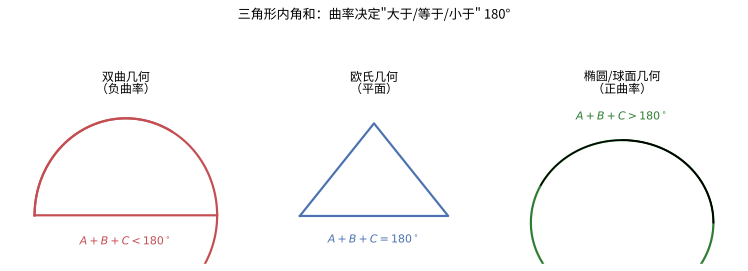
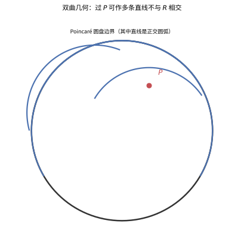
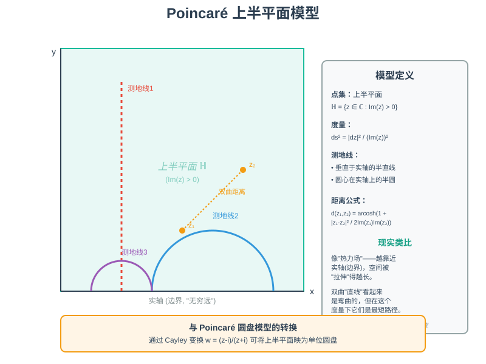
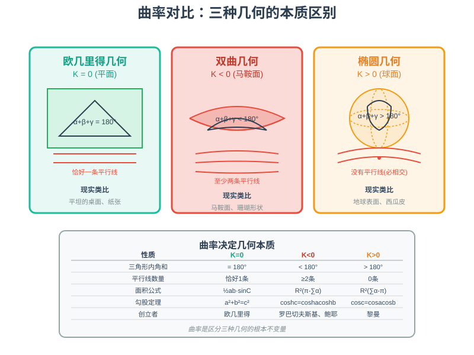

# 第 22 级：非欧几里得几何（Non-Euclidean Geometry）

> 非欧几里得几何是人类思想史上最深刻的概念革命之一。它打破了欧几里得几何两千年的绝对统治，揭示了"几何"可以是多样的——不同的公理系统产生不同的几何世界。本教程系统介绍双曲几何与椭圆几何的基本理论、模型、曲率概念及其核心定理。

---

## 1. 学习目标

完成本教程后，你应该能够：

- 理解欧几里得第五公设的历史地位及其与非欧几何诞生的关系
- 掌握双曲几何的基本概念：平行公设的替代、角度亏、双曲三角形
- 掌握椭圆几何（球面几何）的基本概念：大圆、球面三角形、球面三角学
- 理解 Poincaré 圆盘模型、上半平面模型、Klein 模型和球面模型的构造
- 理解高斯曲率的概念及其对几何分类的关键作用
- 掌握非欧几何中的核心定理，包括三角形内角和公式、面积公式
- 能计算简单的非欧几何问题

---

## 2. 欧几里得几何的第五公设

### 2.1 第五公设的内容

古希腊数学家欧几里得在《几何原本》中提出了五条公设：

1. 从一点向另一点可以引一条直线。
2. 任意线段能无限延伸成一条直线。
3. 给定任意线段，能以其一个端点作为圆心，该线段作为半径作一个圆。
4. 所有直角都相等。
5. **第五公设（平行公设）**：如果一条线段与两条直线相交，在某一侧的内角和小于两直角和，那么这两条直线在不断延伸后，会在内角和小于两直角和的一侧相交。

第五公设有一个更常用的等价表述（Playfair 公理，1795）：

> 过直线外一点，有且只有一条直线与该直线平行（即不相交）。

> **直观理解（现实类比）**：第五公设就像"**铁轨永不相交**"的直觉——过直线外一点只能画一条平行线。但这是"**平面**"的直觉，只在平坦纸面上成立。一旦换到**球面**（如地球）或**马鞍面**上，这条"显然"的真理就会崩塌：球面上所有"直线"最终都会相交，马鞍面上则有无穷多条平行线。两千年来数学家试图证明它，正是因为它"看起来像定理，实则是选择"。

### 2.2 两千年的求索

前四条公设简洁直观，但第五公设显得冗长且不那么显然。数学家们从古希腊时代就开始尝试用前四条公设证明第五公设，试图将其降格为定理。这场持续了两千多年的努力，是数学史上最著名的探索之一。

**主要尝试者**：

- **托勒密（约公元 150 年）**：给出了一个证明，但隐含地使用了第五公设的等价命题。
- **普罗克鲁斯（公元 5 世纪）**：试图证明，但同样依赖于等价假设。
- **纳西尔丁（1201–1274）**：波斯数学家，系统研究了平行线理论。
- **萨凯里（1667–1733）**：意大利数学家，试图用反证法证明。他假设第五公设不成立，推导出一系列结论，本已接近双曲几何，却因认为结论"与直线的性质矛盾"而放弃。
- **兰伯特（1728–1777）**：研究了萨凯里的工作，指出如果第五公设不成立，三角形的内角和会小于或大于 180°，且面积与角度亏（或盈余）成正比。他意识到这可能是一种"锐角假设几何"。

### 2.3 非欧几何的诞生

**罗巴切夫斯基（1792–1856）**：俄国喀山大学教授。他采用反证法，假设"过直线外一点至少可以引两条平行线"，与欧几里得的前四条公设结合，推导出了一系列在逻辑上毫无矛盾但在直觉上匪夷所思的命题。1826 年，他首次公开了这一新几何体系，后被称为**罗巴切夫斯基几何**（即双曲几何）。

**鲍耶·雅诺什（1802–1860）**：匈牙利数学家，几乎同时独立发现了非欧几何。他的父亲——数学家鲍耶·法尔卡什——曾警告他不要研究第五公设，但鲍耶坚持研究，最终在 1832 年以附录形式发表了成果。

**高斯（1777–1855）**：数学王子高斯也发现了第五公设不可证明，并研究了非欧几何。但他害怕教会的打击和迫害，不敢公开发表自己的研究成果，只在书信中提及。

### 2.4 分类

根据对平行公设的不同替换，可以得到三种不同的常曲率几何：

| 几何类型 | 平行公设的替换 | 曲率 | 创立者 |
|:---|:---|:---:|:---|
| **欧几里得几何** | 过直线外一点有且仅有一条平行线 | $K = 0$ | 欧几里得 |
| **双曲几何（罗氏几何）** | 过直线外一点至少有两条平行线 | $K < 0$ | 罗巴切夫斯基、鲍耶 |
| **椭圆几何（黎曼几何）** | 过直线外一点没有平行线 | $K > 0$ | 黎曼 |

---

## 3. 双曲几何

### 3.1 平行公设的替代

在双曲几何中，给定一条直线 $R$ 和线外一点 $P$，至少可以找到两条不同的直线过 $P$ 且不与 $R$ 相交。

更精确地说：

- **渐近线（asymptotic parallels）**：在过 $P$ 且不与 $R$ 相交的所有直线中，存在两条"边界"直线，它们分别从两个方向逐渐逼近 $R$ 但永不相交。这两条线称为 $R$ 的**渐近线**。
- **超平行线（ultraparallels）**：其余过 $P$ 且不与 $R$ 相交的直线称为 $R$ 的**超平行线**，它们与 $R$ 有唯一的公共垂线。

设 $B$ 是 $R$ 上一点使得 $PB \perp R$，记 $PB = p$。则渐近线与 $PB$ 的夹角 $\theta$ 仅依赖于 $p$，称为**渐近角**（angle of parallelism），记作 $\Pi(p)$。满足：

$$
\Pi(p) = 2\arctan(e^{-p})
$$

当 $p \to 0$ 时，$\Pi(p) \to 90^\circ$；当 $p \to \infty$ 时，$\Pi(p) \to 0^\circ$。这意味着点越靠近直线，双曲几何越"像"欧几里得几何。

> **直观理解（现实类比）**：平行角是"**双曲世界中的视角**"——从一点向一条直线作垂线，再从该点引射线，射线与垂线的夹角随距离增大而减小。像**站在铁轨旁看远处铁轨汇聚**：离铁轨越远，能看到铁轨"张角"越小；离得越近，张角越接近 $90°$，越像欧氏几何。这正是公式 $\Pi(p) = 2\arctan(e^{-p})$ 的几何意义——距离 $p$ 越大，平行角越小，双曲几何的"非欧"特征越显著。

### 3.2 双曲平面

双曲平面是一个具有常数负高斯曲率的二维曲面。最经典的例子是**伪球面**（pseudosphere）——由曳物线旋转而成的曲面，具有常数曲率 $K = -1$。但伪球面只能覆盖双曲平面的一个"扇形"区域，无法表示整个双曲平面。

> **直观理解（现实类比）**：双曲几何是"**马鞍面上的几何**"——过直线外一点有无穷多条平行线，三角形内角和小于 $180°$。想象骑在马鞍上：马鞍的中间向下凹、两侧向上翘，从腰上一点向马鞍前后缘的"直线"外看，**左右两边都有逃逸方向**，这些方向上的"直线"都永不与给定直线相交。这就是为什么双曲世界比平面世界"宽敞"得多——平行线不是一条，而是一整把。

### 3.3 双曲三角形

**定理 3.1（三角形内角和）** 在双曲几何中，任何三角形的内角和小于 $180^\circ$（即 $\pi$ 弧度）。

**定义 3.1（角亏）** 三角形的**角亏**（angular defect）定义为

$$
\delta(\triangle) = \pi - (\alpha + \beta + \gamma)
$$

其中 $\alpha, \beta, \gamma$ 是三角形的三个内角。

**定理 3.2（双曲三角形面积）** 在曲率 $K = -1$ 的双曲平面上，三角形的面积等于其角亏：

$$
\text{Area}(\triangle) = \delta(\triangle) = \pi - (\alpha + \beta + \gamma)
$$

更一般地，若曲率为 $K = -1/R^2$，则

$$
\text{Area}(\triangle) = R^2 \cdot \delta(\triangle) = R^2[\pi - (\alpha + \beta + \gamma)]
$$

**推论**：在双曲几何中，三角形面积有上界 $\pi R^2$，当三内角都趋于 $0$ 时达到——此时三角形称为**理想三角形**（ideal triangle），其顶点位于无穷远处。

> **直观理解（现实类比）**：双曲三角形内角和像"**披萨边**"——在双曲平面上画三角形，内角和小于 $180°$，且**面积越大偏差越大**。想象把一块披萨的边沿弧线"拉直"成直线：那条弧原本是弯的，拉直时会损失一点角度，损失的部分正是角亏。三角形越大，边弯得越厉害，损失的角度越多，内角和就越小。极限情况——三个顶点都跑到无穷远——内角和可以趋近 $0°$，而面积达到最大。

**定理 3.3（双曲勾股定理）** 设双曲直角三角形（曲率 $K = -1$）的两直角边长为 $a$ 和 $b$，斜边长为 $c$，则

$$
\cosh c = \cosh a \cdot \cosh b
$$

其中 $\cosh$ 是双曲余弦函数：$\cosh x = \frac{e^x + e^{-x}}{2}$。

### 3.4 双曲三角学

**双曲正弦定理**：在双曲几何中，

$$
\frac{\sinh a}{\sin \alpha} = \frac{\sinh b}{\sin \beta} = \frac{\sinh c}{\sin \gamma}
$$

**双曲余弦定理**：

$$
\cosh c = \cosh a \cosh b - \sinh a \sinh b \cos \gamma
$$

### 3.5 双曲几何中的圆和球

在曲率 $K = -1/R^2$ 的双曲空间中：

- **圆的周长**：$C = 2\pi R \sinh\left(\frac{r}{R}\right)$，其中 $r$ 是双曲半径。
- **圆的面积**：$A = 2\pi R^2\left[\cosh\left(\frac{r}{R}\right) - 1\right]$。
- **球的表面积**：$S = 4\pi R^2 \sinh^2\left(\frac{r}{R}\right)$。
- **球的体积**：$V = \pi R^3 \sinh\left(\frac{2r}{R}\right) - 2\pi R^2 r$。

由于 $\sinh x > x$（对 $x > 0$），双曲几何中圆的周长和面积都大于欧几里得几何中对应值。

> **直观理解（现实类比）**：双曲平面的面积像"**无限大的披萨**"——庞加莱圆盘虽然**看起来有限**（就是个单位圆），但**实际面积无穷大**。越靠近边缘，单位视觉面积对应的实际面积越大，呈 $\frac{1}{(1-r^2)^2}$ 量级爆炸式增长。这就像一张永远摊不开的披萨：你以为伸手就能摸到边，可每往前走一步，边界又退得更远——永远到不了边。所以理想三角形（顶点都在"无穷远"边界上）面积有上限 $\pi R^2$，但双曲平面本身没有上限。

---

## 4. 椭圆几何

### 4.1 球面几何

球面几何是椭圆几何中最简单、最直观的模型。在球面上：

- **点**：球面上的点。
- **直线（测地线）**：大圆（great circle），即球心与球面相交的平面与球面的交线。
- **距离**：两点间的最短距离是大圆上较短的弧长。

> **直观理解（现实类比）**：测地线就是"**最短路径**"——在曲面上两点间走得最省力的曲线。飞机跨洋航线**沿大圆飞**而不是沿纬线飞，正是因为大圆是球面的测地线，飞的距离最短。看世界地图时北京到纽约的航线是弯弯的弧，那不是绕远，恰恰是抄了近道。双曲世界里的测地线"看起来"是圆弧，但那同样是当地居民眼里的"直线"——光沿测地线传播，所以他们看到的物理直线就是圆弧。

### 4.2 大圆的性质

- 任何两个大圆都相交于两点（对跖点）。
- 因此，球面上**没有平行线**——任何两条"直线"都相交。
- 球面上两点间的最短路径是大圆劣弧。

> **直观理解（现实类比）**：椭圆几何是"**球面上的几何**"——过直线外一点**没有平行线**（所有大圆都相交），三角形内角和大于 $180°$。像**地球上所有经线**都交于南北极：任意两条"直线"（大圆）最终都会碰头。在地球仪上，赤道与两条经线围成的三角形，两个底角都是直角，顶角还有富余，内角和明显超过 $180°$。这就是球面世界的"紧绷感"——没有逃逸方向，所有路最终相遇。

### 4.3 球面三角形

**定义 4.1（球面三角形）** 球面上由三条大圆弧围成的区域称为球面三角形。

**定理 4.1（球面三角形内角和）** 球面三角形的内角和大于 $180^\circ$（即 $\pi$ 弧度）。



> **直观理解（现实类比）**：三角形内角和是曲率的"**温度计**"。在平面上（欧氏）恰好 $180°$；在**皮球表面**（正曲率）画三角形，像**在西瓜皮上**画——三条"大圆弧"围成的三角形会**鼓起**，内角和大于 $180°$，多出的部分叫**角盈**；在**马鞍面**（负曲率）上则**凹陷**，内角和小于 $180°$，少掉的部分叫**角亏**。这解释了为什么在球面上"三角形"是鼓起来的。

**定义 4.2（角盈）** 球面三角形的**角盈**（angular excess）定义为

$$
\varepsilon(\triangle) = (\alpha + \beta + \gamma) - \pi
$$

**定理 4.2（球面三角形面积，Girard 定理）** 在单位球面（$R = 1$）上，球面三角形的面积等于其角盈：

$$
\text{Area}(\triangle) = \varepsilon(\triangle) = (\alpha + \beta + \gamma) - \pi
$$

在半径为 $R$ 的球面上：

$$
\text{Area}(\triangle) = R^2 \cdot \varepsilon(\triangle) = R^2[(\alpha + \beta + \gamma) - \pi]
$$

### 4.4 球面三角学

**球面正弦定理**：

$$
\frac{\sin a}{\sin \alpha} = \frac{\sin b}{\sin \beta} = \frac{\sin c}{\sin \gamma}
$$

其中 $a, b, c$ 是球面三角形的边长（以弧度为单位）。

**球面余弦定理**（第一余弦定理）：

$$
\cos a = \cos b \cos c + \sin b \sin c \cos \alpha
$$

以及（第二余弦定理）：

$$
\cos \alpha = -\cos \beta \cos \gamma + \sin \beta \sin \gamma \cos a
$$

### 4.5 球面几何与椭圆几何的区别

严格来说，球面几何与椭圆几何略有不同：

- **球面几何（双椭圆几何）**：两条大圆相交于**两个**对跖点。
- **椭圆几何（单椭圆几何）**：将球面的对跖点视为同一个点，得到实射影平面。此时两条"直线"相交于**一个**点。

椭圆几何可以通过将球体的对跖点识别为单个点来从球面几何推导出来。在椭圆几何中：

- 垂直于同一直线的两条直线必定相交于该直线的**绝对极点**。
- 每个点对应一条**绝对极线**。
- 一对点之间的距离与它们的绝对极线之间的角度成正比。

### 4.6 球面几何的应用

球面几何在航海学和天文学中有重要应用：

- 地球表面的导航路径是大圆航线。
- 天球上的位置关系用球面三角学描述。

---

## 5. 几何模型

双曲几何有多种等价的模型，它们为理解双曲几何提供了不同的视角。

### 5.1 Poincaré 圆盘模型

**定义**：Poincaré 圆盘模型的点集是单位开圆盘 $\mathbb{D} = \{z \in \mathbb{C} : |z| < 1\}$。

**度量**：双曲度量定义为

$$
ds^2 = \frac{4|dz|^2}{(1 - |z|^2)^2}
$$

或等价地，在半径为 $R = 1/\sqrt{-K}$ 时，

$$
ds^2 = \frac{4R^2|dz|^2}{(1 - |z|^2)^2}
$$



> **直观理解（现实类比）**：Poincaré 圆盘把**无限的双曲平面装进一个有限的圆盘**。圆盘边界"无穷远"，越靠近边界，一条线段被拉得越长——就像**在哈哈镜里看世界**：边缘的物体被压缩。双曲"直线"看起来是圆弧，其实是这个度量下的**最短路径**。过圆外一点 $P$ 可作**无穷多条**这样的圆弧不与给定直线相交，直观印证了双曲几何推翻第五公设的结论。

**距离公式**：两点 $u, v \in \mathbb{D}$ 之间的双曲距离为

$$
d(u, v) = \operatorname{arcosh}\left(1 + \frac{2|u - v|^2}{(1 - |u|^2)(1 - |v|^2)}\right)
$$

**测地线**：在 Poincaré 圆盘模型中，测地线是**垂直于单位圆周的圆弧**，或圆盘的直径。

**共形性**：该模型是**共形**（conformal）的——双曲空间中两条曲线相交的角度与在圆盘模型中对应的欧几里得角度相同。

### 5.2 Poincaré 上半平面模型

**定义**：点集是上半平面 $\mathbb{H} = \{z \in \mathbb{C} : \operatorname{Im}(z) > 0\}$。

**度量**：

$$
ds^2 = \frac{|dz|^2}{(\operatorname{Im}(z))^2}
$$

**测地线**：垂直于实轴的半直线，或圆心在实轴上的半圆。

**距离公式**：两点 $z_1, z_2 \in \mathbb{H}$ 之间的双曲距离为

$$
d(z_1, z_2) = \operatorname{arcosh}\left(1 + \frac{|z_1 - z_2|^2}{2\operatorname{Im}(z_1)\operatorname{Im}(z_2)}\right)
$$



> **直观理解（现实类比）**：上半平面模型像一个**热力场**——越靠近实轴（边界），空间被"拉伸"得越长，就像温度越高分子运动越剧烈。双曲"直线"看起来是弯曲的圆弧或垂直线，但在这个度量下它们是最短路径。与圆盘模型通过 **Cayley 变换**互相转换，就像用两种不同的"镜头"看同一个双曲世界。

**与圆盘模型的转换**：通过 Cayley 变换 $w = \frac{z - i}{z + i}$ 可将上半平面映为单位圆盘。

### 5.3 Beltrami-Klein 模型

**定义**：点集是单位开圆盘 $\{x \in \mathbb{R}^2 : \|x\| < 1\}$，但测地线是**直线段**（而非圆弧）。

**度量**：

$$
ds^2 = \frac{(1 - \|x\|^2)\|dx\|^2 + (x \cdot dx)^2}{(1 - \|x\|^2)^2}
$$

**性质**：Klein 模型不是共形的，但具有"直线看起来是直的"的优点。

### 5.4 双曲面模型（Weierstrass 模型/Minkowski 模型）

**定义**：考虑 Minkowski 空间 $\mathbb{R}^{2,1}$，其度量形式为 $ds^2 = dx^2 + dy^2 - dt^2$。双曲面模型取双曲面

$$
t^2 - x^2 - y^2 = 1, \quad t > 0
$$

**测地线**：双曲面与通过原点的平面的交线。

**重要性**：双曲面模型在理论研究中最为方便，因为它是双曲空间的"自然"嵌入，且与 Poincaré 圆盘模型和 Klein 模型通过射影变换相联系。

### 5.5 模型间的关系

```
双曲面模型（Weierstrass 模型）
     ↙              ↘
Klein 模型      Poincaré 圆盘模型
     ↙              ↘
Poincaré 上半平面模型
```

- **双曲面模型 → Klein 模型**：从点 $(t, x, y)$ 向平面 $t = 1$ 作中心投影（以原点为投影中心）。
- **双曲面模型 → Poincaré 圆盘模型**：从点 $(t, x, y)$ 向平面 $t = 0$ 作投影（以点 $(-1, 0, 0)$ 为投影中心，即立体投影）。
- **Poincaré 圆盘模型 ↔ Poincaré 上半平面模型**：通过 Cayley 变换。

---

## 6. 曲率

### 6.1 高斯曲率

**定义 6.1（高斯曲率）** 曲面上一点 $P$ 的高斯曲率 $K$ 定义为该点两个主曲率 $\kappa_1$ 和 $\kappa_2$ 的乘积：

$$
K = \kappa_1 \kappa_2
$$

**高斯绝妙定理（Theorema Egregium）**：高斯曲率是曲面的**内在**性质——它完全由曲面上的距离度量（第一基本形式）决定，与曲面在三维空间中的嵌入方式无关。

### 6.2 三种常曲率几何

| 曲率 | 几何类型 | 三角形内角和 | 平行线数量 |
|:---:|:---|:---:|:---:|
| $K = 0$ | 欧几里得几何 | $= \pi$ | 恰好一条 |
| $K < 0$ | 双曲几何 | $< \pi$ | 至少两条 |
| $K > 0$ | 椭圆几何 | $> \pi$ | 零条 |

### 6.3 曲率与三角形内角和的关系

设 $K$ 为常数曲率，$\triangle$ 为测地三角形，内角为 $\alpha, \beta, \gamma$，面积为 $A$，则

$$
\alpha + \beta + \gamma = \pi + K \cdot A
$$

- 当 $K = 0$：$\alpha + \beta + \gamma = \pi$（欧几里得）
- 当 $K > 0$：$\alpha + \beta + \gamma > \pi$（椭圆）
- 当 $K < 0$：$\alpha + \beta + \gamma < \pi$（双曲）

这是**局部 Gauss-Bonnet 定理**的简单形式。

### 6.4 曲率的几何直观



> **直观理解（现实类比）**：曲率是几何的"**DNA**"——它决定了空间的所有本质性质。想象三种表面：**平坦的桌面**（K=0，欧氏几何）、**马鞍面或珊瑚**（K<0，双曲几何）、**西瓜皮或地球表面**（K>0，椭圆几何）。在马鞍面上画三角形，三条边会"凹陷"，内角和小于180°；在西瓜皮上画三角形，三条边会"鼓起"，内角和大于180°。这就是为什么**曲率是区分三种几何的根本不变量**。

- **$K = 0$（平面）**：曲面的弯曲程度为零，如一张平坦的纸。
- **$K > 0$（椭圆型）**：曲面在每一点都像球面一样"凸出"，沿任何方向弯曲方向相同。
- **$K < 0$（双曲型）**：曲面在每一点都像马鞍面，沿不同方向弯曲方向不同——一个方向向上弯，另一个方向向下弯。

---

## 7. 定理与证明

### 7.1 证明：双曲几何中三角形内角和小于 $\pi$

**证明**（使用 Poincaré 圆盘模型）：

设在 Poincaré 圆盘模型中有三角形 $\triangle ABC$，其边为测地线（垂直于单位圆周的圆弧或直径）。

考虑将三角形的一个顶点 $A$ 通过 Möbius 变换（保持双曲度量）移动到圆盘中心 $O$。由于 Möbius 变换是双曲等距的，内角和保持不变。

移动到中心后，过 $A$ 的两条边变为通过中心的直线段（即直径）。三角形的另外两条边变为垂直于单位圆周的圆弧，它们与直径的夹角就是三角形的内角。

在圆盘中心处，欧几里得角度等于双曲角度（共形性质）。因此，三角形内角和等于欧几里得三角形内角和减去一个正数——因为三角形的"边"实际上是向内弯曲的圆弧。因此，内角和 $< \pi$。

更精确的证明：通过 Gauss-Bonnet 定理，$\alpha + \beta + \gamma = \pi + \iint_{\triangle} K \, dA$。当 $K < 0$ 时，曲面积分为负，故 $\alpha + \beta + \gamma < \pi$。

### 7.2 证明：双曲三角形面积等于角亏

**证明**（利用 Gauss-Bonnet 定理）：

Gauss-Bonnet 定理（局部形式）：对于曲率为 $K$ 的曲面上的测地三角形，

$$
\iint_{\triangle} K \, dA + (\alpha + \beta + \gamma) = \pi
$$

当 $K$ 为常数时：

$$
K \cdot \text{Area}(\triangle) + (\alpha + \beta + \gamma) = \pi
$$

因此：

$$
\text{Area}(\triangle) = \frac{\pi - (\alpha + \beta + \gamma)}{K} = \frac{\delta}{-K}
$$

当 $K = -1$ 时，$\text{Area}(\triangle) = \delta$。当 $K = -1/R^2$ 时，$\text{Area}(\triangle) = R^2 \cdot \delta$。

### 7.3 证明：球面三角形面积等于角盈

**证明**（Girard 定理，直观推导）：

考虑单位球面上的一个球面三角形 $\triangle$，其内角为 $\alpha, \beta, \gamma$。

将三角形的每条边延长得到大圆，球面被分成几个区域。每个顶点处，两个大圆的夹角给出了一个"月牙形"区域（lune）。

- 与顶点 $A$ 对应的月牙面积为 $2\alpha$（因为月牙的面积等于 $2\alpha R^2$，在单位球上为 $2\alpha$）。
- 三个月牙覆盖了球面 $\triangle$ 三次，外加球面的其余部分。

通过组合计数可得：

$$
2\alpha + 2\beta + 2\gamma = 4\pi + 2 \cdot \text{Area}(\triangle)
$$

因此：

$$
\text{Area}(\triangle) = \alpha + \beta + \gamma - \pi
$$

### 7.4 证明：欧几里得第五公设与 Playfair 公理等价

**证明**：

（$\Rightarrow$）假设第五公设成立。设 $P$ 为直线 $l$ 外一点。过 $P$ 作 $l$ 的垂线 $PQ$，再过 $P$ 作 $PQ$ 的垂线 $m$。则 $m \parallel l$（因为内角和为 $90^\circ + 90^\circ = 180^\circ$，两直线不相交）。

假设还有另一条过 $P$ 的直线 $n \neq m$ 与 $l$ 平行（即不相交）。则 $n$ 与 $PQ$ 的夹角要么小于 $90^\circ$ 要么大于 $90^\circ$。若小于 $90^\circ$，则 $n$ 与 $l$ 在 $PQ$ 的某一侧的内角和小于 $180^\circ$，由第五公设，$n$ 与 $l$ 在该侧相交，矛盾。因此 $m$ 是唯一的。

（$\Leftarrow$）假设 Playfair 公理成立。设直线 $l_1, l_2$ 与另一条直线 $l$ 相交，且某一侧的内角和小于 $180^\circ$。过交点作 $l$ 的平行线，通过角度比较可知 $l_1, l_2$ 在该侧相交。因此第五公设成立。

---

## 8. 示例

### 示例 8.1：双曲三角形面积计算

**问题**：在曲率 $K = -1$ 的双曲平面上，一个三角形的内角分别为 $30^\circ$、$45^\circ$ 和 $60^\circ$。求该三角形的面积。

**解**：

内角和：$\alpha + \beta + \gamma = 30^\circ + 45^\circ + 60^\circ = 135^\circ = \frac{3\pi}{4}$ 弧度。

角亏：$\delta = \pi - \frac{3\pi}{4} = \frac{\pi}{4}$。

面积：$\text{Area} = \delta = \frac{\pi}{4} \approx 0.785$（平方单位）。

### 示例 8.2：球面三角形面积计算

**问题**：在地球表面（$R \approx 6371$ km），一个球面三角形的内角分别为 $70^\circ$、$80^\circ$ 和 $90^\circ$。求该三角形的面积。

**解**：

内角和：$70^\circ + 80^\circ + 90^\circ = 240^\circ = \frac{4\pi}{3}$ 弧度。

角盈：$\varepsilon = \frac{4\pi}{3} - \pi = \frac{\pi}{3}$。

面积：$\text{Area} = R^2 \cdot \varepsilon = 6371^2 \times \frac{\pi}{3} \approx 4.25 \times 10^7 \ \text{km}^2$。

### 示例 8.3：Poincaré 圆盘中的距离计算

**问题**：在 Poincaré 圆盘模型（$K = -1$）中，求点 $u = 0$ 到点 $v = \frac{1}{2}$ 的双曲距离。

**解**：

使用距离公式：

$$
d(0, \tfrac{1}{2}) = \operatorname{arcosh}\left(1 + \frac{2|\frac{1}{2} - 0|^2}{(1 - 0)(1 - \frac{1}{4})}\right) = \operatorname{arcosh}\left(1 + \frac{2 \cdot \frac{1}{4}}{1 \cdot \frac{3}{4}}\right)
$$

$$
= \operatorname{arcosh}\left(1 + \frac{1/2}{3/4}\right) = \operatorname{arcosh}\left(1 + \frac{2}{3}\right) = \operatorname{arcosh}\left(\frac{5}{3}\right)
$$

由于 $\cosh^{-1}(5/3) = \ln(5/3 + \sqrt{25/9 - 1}) = \ln(5/3 + 4/3) = \ln 3$。

因此 $d = \ln 3 \approx 1.099$。

### 示例 8.4：双曲勾股定理验证

**问题**：在双曲平面（$K = -1$）上，直角三角形两直角边长为 $a = \ln 2$、$b = \ln 3$，求斜边长 $c$。

**解**：

$\cosh a = \cosh(\ln 2) = \frac{e^{\ln 2} + e^{-\ln 2}}{2} = \frac{2 + 1/2}{2} = \frac{5}{4}$

$\cosh b = \cosh(\ln 3) = \frac{3 + 1/3}{2} = \frac{5}{3}$

由双曲勾股定理：

$$
\cosh c = \cosh a \cdot \cosh b = \frac{5}{4} \times \frac{5}{3} = \frac{25}{12}
$$

因此 $c = \operatorname{arcosh}(25/12) = \ln(25/12 + \sqrt{625/144 - 1}) = \ln(25/12 + \sqrt{481}/12) = \ln\frac{25 + \sqrt{481}}{12} \approx 1.450$。

---

## 10. 解题技巧

本节针对非欧几何的常见题型，总结可直接套用的公式与易错点。每条技巧含**适用场景**、**关键步骤**、**常见误区**，并配一个精讲示例。

### 10.1 用「角亏/角盈」计算三角形面积

**适用场景**：给三个内角求三角形面积；判段两三角形大小；理解面积与曲率的联系。

**关键步骤**：
1. 把内角统一化成弧度；
2. 双曲（$K=-1/R^2$）：$\text{Area}=R^2[\pi-(\alpha+\beta+\gamma)]$（角亏）；椭圆/球面（单位球）：$\text{Area}=\varepsilon=(\alpha+\beta+\gamma)-\pi$（角盈）；
3. 先算内角和，再代入对应公式；
4. 注意曲率半径 $R$ 是否给出（$K=\pm1$ 时 $R=1$ 可忽略）。

**常见误区**：
- 把双曲与球面的"面积公式"方向记反（一个减 $\pi$、一个加 $\pi$）；
- 忘记把角度换成弧度后再算 $\pi-$ 和；
- 给出 $R\neq1$ 时漏乘 $R^2$。

**精讲示例**：$K=-1$ 双曲平面，三角形内角 $30^\circ,45^\circ,60^\circ$。求和 $=135^\circ=\frac{3\pi}{4}$；角亏 $\delta=\pi-\frac{3\pi}{4}=\frac{\pi}{4}$；面积 $=\frac{\pi}{4}$。

### 10.2 模型间的双曲距离计算

**适用场景**：在 Poincaré 圆盘/上半平面模型中求两点双曲距离，或验证勾股/三角公式。

**关键步骤**：
1. 圆盘模型 $u,v$：$d=\operatorname{arcosh}\left(1+\frac{2|u-v|^2}{(1-|u|^2)(1-|v|^2)}\right)$；
2. 上半平面 $z_1,z_2$：$d=\operatorname{arcosh}\left(1+\frac{|z_1-z_2|^2}{2\,\operatorname{Im}z_1\,\operatorname{Im}z_2}\right)$；
3. 化简积分式时常用恒等式：$\operatorname{arcosh}x=\ln(x+\sqrt{x^2-1})$，$\operatorname{arcosh}(1+t)=2\operatorname{arsinh}\sqrt{t/2}$等；
4. 利用半径旋转/平移（等距）把问题化到对称特例（如把一点移到原点/纯虚轴）。

**常见误区**：
- 忘记代入时 $|u-v|$ 是两点差模、分母是各自的 $(1-|u|^2)(1-|v|^2)$；
- 开方化简符号出错；
- 直接套用欧氏距离公式。

**精讲示例**：上半平面中 $i$ 与 $2i$：$|i-2i|=1$，$\operatorname{Im}=1,2$。$d=\operatorname{arcosh}\left(1+\frac{1}{2\cdot1\cdot2}\right)=\operatorname{arcosh}\frac{5}{4}=\ln\frac{5+3}{4}=\ln2$。

### 10.3 双曲三角函数与双曲勾股定理

**适用场景**：给定直角三角形边/角求其余量；验证勾股定理在不同几何中的形式。

**关键步骤**：
1. 双曲余弦/正弦：$\cosh x=\frac{e^x+e^{-x}}2$、$\sinh x=\frac{e^x-e^{-x}}2$；
2. 必记恒等式：$\cosh^2 x-\sinh^2 x=1$、$\cosh^2 x=1+\sinh^2 x$、$\cosh(x+y)=\cosh x\cosh y+\sinh x\sinh y$；
3. 直角三角形（$K=-1$）：$\cosh c=\cosh a\cosh b$；一般三角形用双曲正弦/余弦定理；
4. 求反双曲值：$\operatorname{arcosh}x=\ln(x+\sqrt{x^2-1})$，$\operatorname{arsinh}x=\ln(x+\sqrt{x^2+1})$。

**常见误区**：
- 误用欧氏勾股 $a^2+b^2=c^2$；
- 把 $\sinh$ 当 $\sin$、$\cosh$ 当 $\cos$ 处理；
- 化简 $\operatorname{arcosh}$ 时漏算根号。

**精讲示例**：$a=\ln2,b=\ln3$ 的直角三角形。$\cosh a=\frac{2+1/2}2=\frac54$，$\cosh b=\frac{3+1/3}2=\frac53$，故 $\cosh c=\frac{25}{12}$，$c=\operatorname{arcosh}\frac{25}{12}=\ln\frac{25+\sqrt{481}}{12}$。

### 10.4 用「曲率—内角和」关系识别几何类型

**适用场景**：给一个三角形/空间判断属于欧氏、双曲还是椭圆几何；比较内角和与 $\pi$、平行线数量与曲率。

**关键步骤**：
1. 记三种几何的表格：$K=0$ 内角和 $=\pi$、$K<0$ 内角和 $<\pi$、$K>0$ 内角和 $>\pi$；
2. 由"平行线数量"反推：恰好一条（欧氏）、至少两条（双曲）、零条（椭圆）；
3. 常曲率统一式：$\alpha+\beta+\gamma=\pi+K\cdot A$；
4. 局部 Gauss-Bonnet 给出一般（非平直）曲面上的推广。

**常见误区**：
- 混淆"平行线数量"与"三角形的边是否相交"；
- 忘记球面几何与椭圆几何在"对跖点是否视为同一点"上的区别。

**精讲示例**：一个三角形内角和为 $195^\circ>\pi$，故它必然位于正曲率（椭圆/球面）几何中；若内角和 $=180^\circ\cdot k$ 且 $k<1$，则是双曲背景。

### 10.5 三种几何中的「勾股定理」对照

**适用场景**：在不同曲率空间中求直角三角形第三边；识别题目背景几何。

**关键步骤**：
1. 欧氏：$a^2+b^2=c^2$；
2. 双曲（$K=-1$）：$\cosh c=\cosh a\,\cosh b$；
3. 球面（单位球、直角 $\angle C$）：$\cos c=\cos a\,\cos b$；
4. 先判定曲率再选公式，切勿混用。

**常见误区**：
- 在球面直角三角形中误把 $\cos c=\cos a\cos b$ 与"角的形式"混淆；
- 双曲中用欧氏勾股导致错误。

**精讲示例**：单位球面上直角球面三角形两直角边 $a=b=60^\circ$：$\cos c=\cos 60^\circ\cos 60^\circ=\frac14$，$c=\arccos\frac14$。对比：双曲中若 $a=b=\ln2$ 则 $\cosh c=\frac54\cdot\frac54=\frac{25}{16}$，$c=\operatorname{arcosh}\frac{25}{16}$——可见"勾股"形式随曲率而变。

---

## 11. 四级习题

> 习题按难度分为 **基础题 / 进阶题 / 挑战题 / 探究题** 四级，覆盖本章全部内容。探究题无唯一答案，故附参考答案与思路提示。

### 11.1 基础题

**1.** 在曲率 $K = -1$ 的双曲平面上，三角形的内角分别为 $20^\circ$、$30^\circ$、$40^\circ$。求其面积。

**2.** 在单位球面上，球面三角形的内角分别为 $90^\circ$、$90^\circ$、$90^\circ$。求其面积。

**3.** 在 Poincaré 圆盘模型中，计算点 $u = 0$ 到点 $v = 0.5i$ 的双曲距离。

**4.** 证明：在双曲几何中，不存在面积任意大的三角形（即面积有上界）。

**5.** 在曲率 $K = -1$ 的双曲平面上，一个三角形的两个内角分别为 $30^\circ$ 和 $45^\circ$，它们所对的边长分别为 $a$ 和 $b$。利用双曲正弦定理，求 $\frac{\sinh a}{\sinh b}$ 的值。

### 11.2 进阶题

**6.** 在曲率 $K = -1$ 的双曲平面上，一个直角三角形的两锐角分别为 $30^\circ$ 和 $45^\circ$。求其面积和边长。

**7.** 在球面几何中，证明：等边球面三角形的内角大于 $60^\circ$。

**8.** 使用 Poincaré 上半平面模型，计算点 $z_1 = i$ 到点 $z_2 = 1 + i$ 的双曲距离。

**9.** 证明：在双曲几何中，圆的周长与半径之比大于 $2\pi$，且随半径增大而指数增长。

**10.** 在曲率 $K=-1$ 的双曲平面中，半径 $r=1$ 的圆的周长与面积各是多少？（并验证当 $r$ 很小时周长渐近于 $2\pi r$）

**11.** 在 Poincaré 上半平面模型中，计算点 $i$ 到点 $2i$ 的双曲距离，并与题 7（$i$ 到 $1+i$）比较，说明谁更长。

（关注知识点：模型距离公式）

**12.** 证明：圆柱面 $x^2 + y^2 = 1$ 的高斯曲率为 $0$，尽管它在三维空间中是弯曲的。这说明高斯曲率是曲面的内在性质，与曲面在三维空间中的嵌入方式无关（高斯绝妙定理）。

### 11.3 挑战题

**13.** 在单位球面上，球面三角形 $\triangle ABC$ 的边长分别为 $a = 60^\circ$、$b = 60^\circ$、$c = 90^\circ$。求其三个内角。

**14.** 证明：在 Poincaré 圆盘模型中，通过圆盘中心 $O$ 的直线（直径）是双曲测地线，且经过 $O$ 的任意两条直径的夹角在双曲度量下等于其欧几里得夹角。

**15.** 证明：在曲率 $K=-1$ 的双曲平面中，理想三角形（三个顶点都在无穷远）的面积等于 $\pi$。

**16.** 证明：单位球面上任意球面三角形的面积位于区间 $(0,\,2\pi)$ 内。

（关注知识点：面积有界性、内角和取值范围）

**17.** 比较 Beltrami-Klein 模型和 Poincaré 圆盘模型：
(1) 两种模型的点集都是单位开圆盘 $\mathbb{D} = \{z \in \mathbb{C} : |z| < 1\}$。说明 Poincaré 圆盘模型是共形的（保持角度），而 Beltrami-Klein 模型不是共形的。
(2) 在 Poincaré 圆盘模型中，测地线是垂直于单位圆周的圆弧；在 Beltrami-Klein 模型中，测地线是直线段。证明：通过圆盘中心的直径在两种模型中都是测地线。
(3) 说明为什么 Beltrami-Klein 模型在视觉上更直观（测地线是直的），但在计算中 Poincaré 圆盘模型更方便（共形性保持角度）。

### 11.4 探究题

**18.** 【探究】双曲平面的"圆"面积与周长比欧氏更大，但理想三角形面积却有上界 $\pi$；而双曲平面本身面积无穷。请说明这是否矛盾？"局部越界、整体无限"的根源是什么（提示：区分"测地圆盘半径有限"与"整个平面的半径无上界"）？

**19.** 【探究】Cayley 变换 $w=\frac{z-i}{z+i}$ 将 Poincaré 上半平面映为单位圆盘。请验证：点 $i$ 映到 0、点 $0$（实轴）映到单位圆上的边界点、实轴映到单位圆周；并讨论这个变换为什么是双曲"等距"（保持双曲距离/角度），从而证明两种模型等价。

**20.** 【探究】在球面上沿大圆"平行移动"一个向量一周，回到出发点时方向会旋转一个角度（等于大圆包围的立体角）。这与平行线的"退化"有什么关系？为什么需要黎曼几何/联络的语言来描述曲率（提示：把平行移动与 Gauss-Bonnet 联系）？

---

## 12. 习题答案与解析

> 每题均给出推导与解题思路；证明题给出完整证明思路；探究题提供参考答案与提示。

**1.** 内角和 $=20^\circ+30^\circ+40^\circ=90^\circ=\frac{\pi}{2}$。角亏 $\delta=\pi-\frac{\pi}{2}=\frac{\pi}{2}$。故面积 $=\delta=\frac{\pi}{2}$。

**2.** 内角和 $=270^\circ=\frac{3\pi}{2}$，角盈 $\varepsilon=\frac{3\pi}{2}-\pi=\frac{\pi}{2}$。单位球面积 $=\varepsilon=\frac{\pi}{2}$。

**3.** $|v|=0.5$，$|u|=0$。代入圆盘距离公式：
$$d=\operatorname{arcosh}\left(1+\frac{2\cdot(0.5)^2}{(1-0)(1-0.25)}\right)=\operatorname{arcosh}\left(1+\frac{0.5}{0.75}\right)=\operatorname{arcosh}\frac53=\ln3$$
（距离只与 $|u-v|$ 及两点模有关，故 $v=0.5i$ 与 $v=0.5$ 结果相同。）

**4.** 【证明】$K=-1$ 时面积 $=\delta=\pi-(\alpha+\beta+\gamma)$。因 $\alpha+\beta+\gamma>0$，故面积 $<\pi$；又面积 $>0$（三角形非退化）。所以任意双曲三角形面积落在 $(0,\pi)$ 内，有上界 $\pi$，因而"面积任意大"的三角形不存在。上界只在理想三角形（$\alpha=\beta=\gamma=0$）处趋近。$\square$

**5.** 由双曲正弦定理 $\frac{\sinh a}{\sin\alpha} = \frac{\sinh b}{\sin\beta}$，故
$$\frac{\sinh a}{\sinh b} = \frac{\sin\alpha}{\sin\beta} = \frac{\sin 30^\circ}{\sin 45^\circ} = \frac{1/2}{\sqrt{2}/2} = \frac{1}{\sqrt{2}} = \frac{\sqrt{2}}{2}$$
$\square$

**6.** 内角和 $=30^\circ+45^\circ+90^\circ=165^\circ=\frac{11\pi}{12}$，角亏 $\delta=\pi-\frac{11\pi}{12}=\frac{\pi}{12}$，面积 $=\frac{\pi}{12}$。
求边长：设直角为 $C=90^\circ$，对应斜边 $c$；设 $A=30^\circ,B=45^\circ$。由双曲正弦定理
$$\sinh a=\sin 30^\circ\,\sinh c=\tfrac12\sinh c,\qquad \sinh b=\sin45^\circ\,\sinh c=\tfrac{\sqrt2}{2}\sinh c$$
由双曲勾股 $\cosh c=\cosh a\cosh b$，即 $\sqrt{1+s^2}=\sqrt{1+s^2/4}\,\sqrt{1+s^2/2}$（$s=\sinh c$），平方解得 $s^2=2$，故 $\sinh c=\sqrt2$，$\cosh c=\sqrt3$，$c=\ln(\sqrt3+\sqrt2)$。于是 $\sinh a=\frac{\sqrt2}{2}$，$a=\operatorname{arsinh}\frac{\sqrt2}{2}=\ln\frac{\sqrt2+\sqrt6}{2}$；$\sinh b=1$，$b=\ln(1+\sqrt2)$。$\square$

**7.** 【证明】等边球面三角形三内角相等，设为 $\alpha$。由 Girard 角盈定理，球面三角形内角和 $>\pi$，即 $3\alpha>\pi$，故 $\alpha>\frac{\pi}{3}=60^\circ$。$\square$

**8.** $|z_1-z_2|=|i-(1+i)|=1$，$\operatorname{Im}z_1=\operatorname{Im}z_2=1$。
$$d=\operatorname{arcosh}\left(1+\frac{1}{2\cdot1\cdot1}\right)=\operatorname{arcosh}\frac32=\ln\frac{3+\sqrt5}{2}\approx0.962$$

**9.** 【证明】$K=-1$ 时圆周长 $C=2\pi\sinh r$。因对 $r>0$ 有 $\sinh r>r$，故 $\frac{C}{r}=2\pi\frac{\sinh r}{r}>2\pi$，即周长/半径比大于 $2\pi$。又 $\sinh r=\frac{e^r-e^{-r}}2$，当 $r\to\infty$ 时 $\sinh r\sim\frac{e^r}2$ 指数增长，故 $C$ 随 $r$ 指数增大。$\square$

**10.** $K=-1$，$r=1$：
$$C=2\pi\sinh1=2\pi\cdot\frac{e-e^{-1}}2=\pi(e-e^{-1})\approx7.384$$
$$A=2\pi(\cosh1-1)=2\pi\left(\frac{e+e^{-1}}2-1\right)=\pi(e+e^{-1}-2)\approx3.412$$
其中 $\cosh1=\frac{e+e^{-1}}2\approx1.5431$。小 $r$ 渐近：$\sinh r=r+\frac{r^3}6+\cdots$，故 $\frac{C}{2\pi r}=\frac{\sinh r}{r}\to1$，即 $C\to2\pi r$，回到欧氏。$\square$

**11.** $|i-2i|=1$，$\operatorname{Im}=1,2$：
$$d=\operatorname{arcosh}\left(1+\frac{1}{2\cdot1\cdot2}\right)=\operatorname{arcosh}\frac54=\ln\frac{5+3}{4}=\ln2\approx0.693$$
与题 7（$\approx0.962$）比较：$i$ 到 $2i$ 更短。解释：两条欧氏长度相同的线段，但 $i$ 到 $2i$ 沿虚轴（测地线）垂直离开边界 $(\mathbb{R})$ 方向行进，而 $i$ 到 $1+i$ 平行于边界、全程"贴近"实轴。双曲度量在靠近实轴（小虚部）处被拉伸得厉害，故贴近边界的那条更"贵"。$\square$

**12.** 【证明】圆柱面 $x^2 + y^2 = 1$ 可参数化为 $\mathbf{r}(\theta, z) = (\cos\theta, \sin\theta, z)$。计算第一基本形式：
$$\mathbf{r}_\theta = (-\sin\theta, \cos\theta, 0), \quad \mathbf{r}_z = (0, 0, 1)$$
$$E = \mathbf{r}_\theta \cdot \mathbf{r}_\theta = 1, \quad F = \mathbf{r}_\theta \cdot \mathbf{r}_z = 0, \quad G = \mathbf{r}_z \cdot \mathbf{r}_z = 1$$
故第一基本形式为 $ds^2 = d\theta^2 + dz^2$，这是平坦的欧氏度量。由 $E=1, F=0, G=1$ 可知高斯曲率 $K = 0$。
尽管圆柱面在三维空间中是弯曲的（主曲率 $\kappa_1 = 1$，$\kappa_2 = 0$，故 $K = \kappa_1 \kappa_2 = 0$），但其内在几何是平坦的。这正是高斯绝妙定理的体现：高斯曲率完全由第一基本形式决定，与嵌入方式无关。$\square$

**13.** 【解题思路】用球面余弦（第一）定理。对 $\angle\gamma$（对应边 $c$）：
$$\cos\gamma=\frac{\cos c-\cos a\cos b}{\sin a\sin b}=\frac{0-\frac12\cdot\frac12}{\frac{\sqrt3}{2}\cdot\frac{\sqrt3}{2}}=-\frac13$$
故 $\gamma=\arccos\frac{-1}{3}\approx109.5^\circ$。由球面正弦定理 $\frac{\sin\alpha}{\sin a}=\frac{\sin\gamma}{\sin c}$：
$$\sin\alpha=\sin a\,\frac{\sin\gamma}{\sin c}=\frac{\sqrt3}{2}\cdot\frac{\sqrt{1-\frac19}}{1}=\frac{\sqrt3}{2}\cdot\frac{2\sqrt2}{3}=\frac{\sqrt6}{3}$$
因 $a=b$ 故 $\alpha=\beta=\arcsin\frac{\sqrt6}{3}\approx54.7^\circ$。检核内角和 $\approx218.9^\circ>\pi$，符合球面几何。$\square$

**14.** 【证明】
- 直径过圆心 $O$，圆心处度量与欧氏一致（Poincaré 度量 $ds^2=\frac{4|dz|^2}{(1-|z|^2)^2}$ 在 $z=0$ 处为 $4|dz|^2$，即欧氏尺度），过直径端点均为"垂直于圆周"，故直径是测地线。
- 圆心角：在 $O$ 处双曲角 $=$ 欧氏角（圆盘模型共形）。两条直径在 $O$ 处的夹角，双曲度量等价于其欧氏夹角。$\square$

**15.** 【证明】理想三角形三个顶点在无穷远，三个内角均为 $0$。由双曲面积公式 $\text{Area}=\pi-(\alpha+\beta+\gamma)=\pi-(0+0+0)=\pi$。故任一理想三角形面积恒为 $\pi$（与形状无关）。$\square$

**16.** 【证明】设球面三角形内角 $\alpha,\beta,\gamma\in(0,\pi)$。由 Girard 定理内角和大于 $\pi$，故面积 $A=(\alpha+\beta+\gamma)-\pi>0$。另一方面三个内角均小于 $\pi$，故 $\alpha+\beta+\gamma<3\pi$，$A<2\pi$。因此 $0<A<2\pi$。$\square$

**17.** 【参考答案+思路】
(1) Poincaré 圆盘模型的度量 $ds^2 = \frac{4|dz|^2}{(1-|z|^2)^2}$ 与欧氏度量 $|dz|^2$ 成正比，比例因子 $\frac{4}{(1-|z|^2)^2}$ 只与位置有关、与方向无关，因此是共形的——双曲角度等于模型中的欧氏角度。Beltrami-Klein 模型的度量 $ds^2 = \frac{(1-\|x\|^2)\|dx\|^2 + (x \cdot dx)^2}{(1-\|x\|^2)^2}$ 中，第二项 $(x \cdot dx)^2$ 引入了方向依赖性，因此不是共形的。
(2) 通过圆盘中心的直径在 Poincaré 模型中是过圆心的直线段，属于"垂直于单位圆周的圆弧"的特例（半径为无穷大的圆弧），因此是测地线。在 Beltrami-Klein 模型中，直径就是直线段，直接满足测地线定义。
(3) Beltrami-Klein 模型的测地线是直线段，视觉上更直观——"直线就是直的"，便于理解双曲几何中平行线、超平行线等概念。但它不保角，角度计算需要额外的度量修正。Poincaré 圆盘模型虽然测地线是圆弧，但共形性使得双曲角度直接等于模型中的欧氏角度，在涉及角度计算的问题（如三角形内角、正多边形等）中大大简化了运算。两种模型通过射影变换相联系，描述的是同一个双曲几何。$\square$

**18.** 【参考答案+思路】不矛盾。关键在于定义域：测地圆盘（以某点为中心、有限双曲半径 $r$）的面积 $A=2\pi(\cosh r-1)$ 有限，且随 $r\to\infty$ 趋于无穷——双曲平面是无限个测地圆盘的并，整平面面积无穷。而理想三角形是"以三个无穷远点为顶点"的特定图形，其顶点位于边界（无穷远处），与"有限半径的测地圆盘"是两回事。它面积 $=\pi$，恰是"三零点角"下的角亏极限。根源是：局部上双曲度量使"等半径圆"面积更大，但整体平面无界，二者不构成矛盾。$\square$

**19.** 【参考答案+思路】验证：$w(i)=\frac{i-i}{i+i}=0$；$w(0)=\frac{-i}{i}=-1\in\partial\mathbb D$；对 $z=t\in\mathbb R$（实轴），$w(t)=\frac{t-i}{t+i}$，因 $\overline{w(t)}=w(t)^{-1}$，$|w(t)|=1$，故实轴映到单位圆周。Cayley 变换是 Möbius 变换，它把上半平面边界（实轴 $\cup\{\infty\}$）映为单位圆周，从而整个上半平面映为单位圆盘，且准圆相保；由于它保交角（共形）且把测地线（半圆/半直线）映为测地线（圆弧/直径），故是双曲等距，两种模型等价。$\square$

**20.** 【参考答案+思路】在球面上沿一条闭曲线（如纬线围成的区域或大圆闭合路径）平行移动一个向量一周，回到起点两者夹角等于所围区域的曲率之积分（立体角）。在欧氏平面（$K=0$）中该角为 $0$，说明平行移动不改变方向，平行线概念有意义；在球面上该角非零，正是"两条大圆必相交、没有平行线"的深层原因——曲率使"平行"退化为"在当地微不足道"。若要处处讨论这种方向改变，需要切向量可以"在弯曲空间中行走"，这正是**联络**（connection）的引入动机；而闭合路径上的总角度差与面积/曲率的关系即是 **Gauss-Bonnet 定理**。$\square$

---

## 13. 总结

本教程介绍了非欧几里得几何的核心内容，要点如下：

| 概念 | 欧几里得几何 | 双曲几何 | 椭圆几何 |
|:---|:---:|:---:|:---:|
| 曲率 $K$ | $0$ | $< 0$ | $> 0$ |
| 平行线数量 | 恰好一条 | 至少两条 | 零条 |
| 三角形内角和 | $= \pi$ | $< \pi$ | $> \pi$ |
| 面积公式 | $\frac{1}{2}ab\sin C$ | $R^2(\pi - \sum \alpha)$ | $R^2(\sum \alpha - \pi)$ |
| 勾股定理 | $a^2 + b^2 = c^2$ | $\cosh c = \cosh a \cosh b$ | $\cos c = \cos a \cos b$ |

**关键洞察**：

1. **公理的独立性**：第五公设独立于欧几里得几何的前四条公设，既不能证明也不能证伪——选择不同的公设产生不同的几何。
2. **几何的多样性**：存在多种内在一致且完备的几何体系，它们都是"真实"的数学世界。
3. **曲率作为分类工具**：曲率 $K$ 是区分三种经典几何的根本不变量。
4. **模型的作用**：Poincaré 圆盘模型、上半平面模型、Klein 模型和双曲面模型为双曲几何提供了不同的视觉化工具，它们的等价性证明了双曲几何与欧几里得几何的相容性。

非欧几何的发现不仅深刻改变了数学的面貌，也为爱因斯坦的广义相对论提供了数学语言——物理时空正是黎曼几何中的一个四维伪黎曼流形。