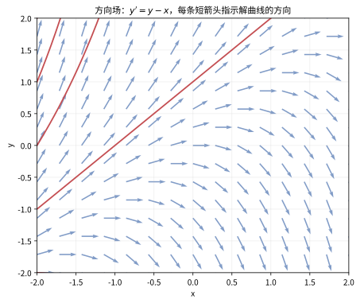
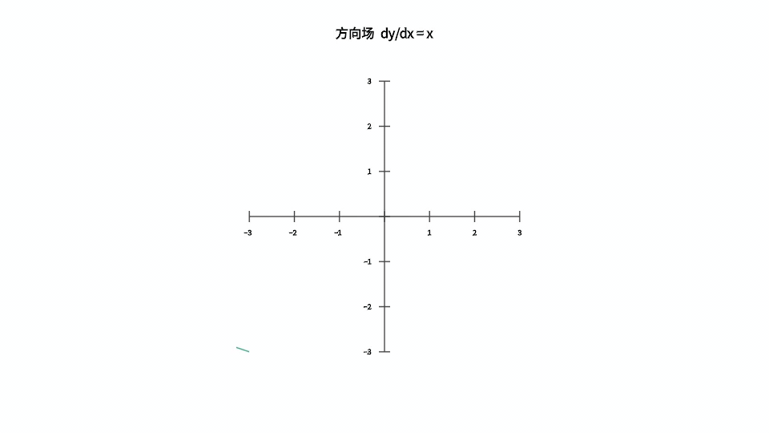
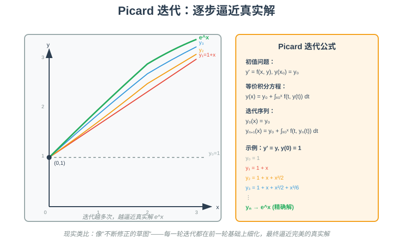
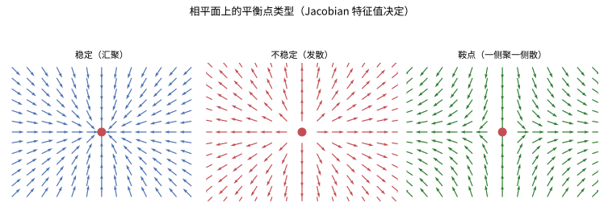
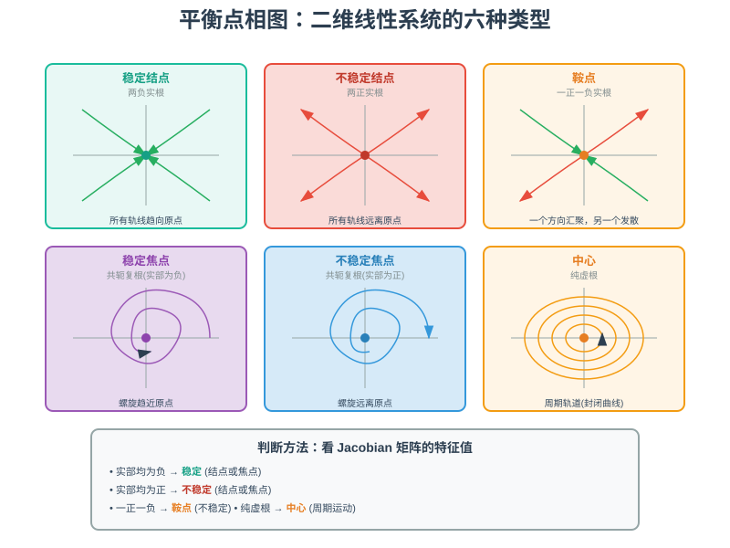

# 第 23 级：常微分方程（Ordinary Differential Equations, ODE）

> 常微分方程是描述自然界中动态系统最基本、最强大的数学工具之一。从牛顿第二定律到种群动力学，从电路分析到化学反应动力学，ODE 无处不在。本教程系统介绍常微分方程的核心理论、求解方法与现代分析工具。

---

## 1. 学习目标

完成本教程后，你应该能够：

- 理解 ODE 的基本概念（阶数、线性/非线性、解的类型、初值问题）
- 熟练求解各类一阶 ODE（可分离变量、恰当方程、积分因子、伯努利方程、齐次方程）
- 理解解的存在唯一性理论（Picard-Lindelöf 定理）并掌握 Picard 迭代
- 掌握高阶线性 ODE 的求解方法（常数变易法、待定系数法、Cauchy-Euler 方程）
- 理解线性 ODE 系统的矩阵解法（矩阵指数、基本矩阵）
- 熟练运用 Laplace 变换求解 ODE
- 掌握幂级数解法与 Frobenius 方法
- 理解 Sturm-Liouville 边值问题与特征函数展开
- 理解稳定性理论的基本概念与 Lyapunov 方法

---

## 2. 基本概念

### 2.1 什么是常微分方程

**定义 2.1（常微分方程）** 一个**常微分方程**（ordinary differential equation, ODE）是包含一个未知函数 $y(x)$ 及其导数的方程，其中 $y$ 仅依赖于一个自变量 $x$。一般形式为：

$$F\left(x, y, y', y'', \ldots, y^{(n)}\right) = 0$$

若方程可以写成最高阶导数显式表达的形式：

$$y^{(n)} = f\left(x, y, y', \ldots, y^{(n-1)}\right)$$

则称为**显式**常微分方程；否则称为**隐式**常微分方程。

> **直观理解（现实类比）**：常微分方程是"**带导数的方程**"——普通代数方程的未知数是一个**数**，而 ODE 的未知数是一个**函数**，方程描述这个函数如何**变化**。就像从"**速度**"反推"**位置**"：已知每个时刻的速度（导数），问位置随时间的整体轨迹。物理学中牛顿第二定律 $F=ma$ 本质上就是关于位置的二阶 ODE——已知力（变化规律），求运动（函数）。所以 ODE 是"**从变化率重建整体**"的数学语言。

> **🧠 思考历程：为什么"世界的法则"，会被写成含导数的方程？**
>
> 常微分方程不是某一天"发明"的，而是"运动如何决定"这个问题被纳入数学的必然结果——**牛顿为了写"力决定加速度"，几乎是不得不端起微分方程**。
>
> - **因果从来是"变化的规律"**。物理里真正的"法则"不是直接告诉你物体在哪，而是告诉你"受什么力、于是它怎么变"。**$F=ma$ 把"加速度"（二阶导数）与人手可测的力相连，等于把自然规律对译成方程。** 想求位置，就要从二阶 ODE 反解。
> - **莱布尼茨与牛顿各自搭起框架**。微积分一诞生，微分方程几乎立刻成了它的"代言人"。牛顿研究行星运动、莱布尼茨研究曲线求曲率，都在暗中解 ODE。**"微积分用来干什么？"答案头一位就是解方程、懂运动。**
> - **"从变化反推整体"是关键心智**。代数方程解的是"谁"，微分方程解的是"什么样的函数其变化被规定成这样"。**给定速度已知，位置并不是唯一——还要外加初值/边界条件（见 2.5）才能锁定**。这正是"解不唯一需要附加条件"的根由，也是初值问题成为核心主题的原因。
> - **它统治了近代科学**。从钟摆、弹簧、电路，到化学反应、生态竞争、流行病模型，凡是"随时间的量受变化律约束"，都能写成 ODE。**"把现象写成微分方程"几乎成了把现实翻译成数学的第一步。**
> - **心路**：ODE 提醒你：**理解世界的钥匙，往往藏在"它如何变化"而非"此刻它在哪"**。学会把一个现实问题翻译成"几个量之间导数关系"的方程，你就拿到了科学建模的入口券。

### 2.2 阶数

**定义 2.2（阶数）** 方程中出现的最高阶导数的阶数称为该方程的**阶**（order）。

**例 2.1** 以下方程的阶数分别为：
- $y' = \cos x$ — 一阶
- $y'' + 3y' + 2y = e^x$ — 二阶
- $y''' + xy' = 0$ — 三阶

### 2.3 线性与非线性

**定义 2.3（线性 ODE）** 一个 $n$ 阶 ODE 称为**线性**的，若它可以写成：

$$a_n(x) y^{(n)} + a_{n-1}(x) y^{(n-1)} + \cdots + a_1(x) y' + a_0(x) y = g(x)$$

其中系数 $a_i(x)$ 和 $g(x)$ 仅依赖于 $x$。若 $g(x) \equiv 0$，称为**齐次**线性 ODE；否则称为**非齐次**线性 ODE。

不满足上述形式的 ODE 称为**非线性**的。

**例 2.2** 判断以下方程是否为线性：
- $y'' + 3y' + 2y = \sin x$ — 线性、非齐次
- $y'' + (\sin x) y = 0$ — 线性、齐次
- $y' + y^2 = 0$ — 非线性（因 $y^2$ 项）
- $y'' + yy' = 0$ — 非线性（因 $yy'$ 乘积项）

### 2.4 解的概念

**定义 2.4（显式解与隐式解）** 
- **显式解**：形如 $y = \phi(x)$ 的函数，代入方程后使其成为恒等式。
- **隐式解**：形如 $\Phi(x, y) = 0$ 的关系式，它隐式地定义了一个函数 $y(x)$，且该函数满足方程。

**定义 2.5（通解与特解）**
- **通解**：包含 $n$ 个独立任意常数的解（$n$ 为方程的阶数）。
- **特解**：通过给定条件确定通解中所有常数后得到的解。

> **直观理解（现实类比）**：方向场是"**没有罗盘却能画出整条河流**"。在每个点 $(x,y)$ 处，方程 $y'=f(x,y)$ 告诉我们曲线的**切线方向**，把这些方向用短箭头画满整个平面，就得到一张"**水流方向地图**"。解曲线就是**顺着箭头走**的路径——像树叶在溪流中随波逐流。即使不求解方程，我们也能从方向场"看出"解的走向，这是数值方法和稳定性分析的直观基础。

#### 🎬 动画演示：方向场与积分曲线

> 这个动画直观展示了方向场（斜率场）的构造：在每个点 $(x,y)$ 处画出方程 $y'=f(x,y)$ 所决定的切线方向，而解曲线就是"顺着箭头走"的路径。它帮助理解即使不求解方程，也能从方向场"看出"解的走向。

### 2.5 初值问题

**定义 2.6（初值问题）** 一个 $n$ 阶 ODE 连同 $n$ 个初始条件：

$$y(x_0) = y_0,\quad y'(x_0) = y_1,\quad \ldots,\quad y^{(n-1)}(x_0) = y_{n-1}$$

称为一个**初值问题**（initial value problem, IVP）。

---

## 3. 一阶常微分方程

一阶 ODE 的一般形式为 $F(x, y, y') = 0$，或 $y' = f(x, y)$。

### 3.1 可分离变量方程

**定义 3.1** 形如 $y' = g(x)h(y)$ 的方程称为**可分离变量**方程。

**解法**：将方程改写为 $\frac{dy}{dx} = g(x)h(y)$，分离变量：

$$\frac{dy}{h(y)} = g(x) \, dx$$

两边积分：

$$\int \frac{dy}{h(y)} = \int g(x) \, dx + C$$

> **直观理解（现实类比）**：分离变量法是"**把混在一起的东西分开**"——方程 $y'=g(x)h(y)$ 里 $x$ 和 $y$ 纠缠在一起，我们把含 $y$ 的部分（$\frac{dy}{h(y)}$）挪到左边、含 $x$ 的部分（$g(x)dx$）挪到右边，让两边各管各的，然后**分别积分**。就像**筛子分离不同大小的颗粒**：$y$ 的颗粒落入左盘，$x$ 的颗粒落入右盘。这种"分而治之"之所以可行，是因为可分离变量方程中 $x$ 和 $y$ 的影响是**乘性独立**的——各自的变化率不互相耦合。

**例 3.1** 求解 $y' = xy$。

**解**：分离变量得 $\frac{dy}{y} = x \, dx$，积分得 $\ln|y| = \frac{x^2}{2} + C$，故 $y = Ce^{x^2/2}$。

### 3.2 恰当方程与积分因子

**定义 3.2（恰当方程）** 将一阶 ODE 写成微分形式：

$$M(x, y) \, dx + N(x, y) \, dy = 0$$

若存在某个函数 $\Phi(x, y)$ 使得 $d\Phi = M \, dx + N \, dy$，即 $\frac{\partial \Phi}{\partial x} = M$，$\frac{\partial \Phi}{\partial y} = N$，则称该方程为**恰当方程**（exact equation）。此时通解为 $\Phi(x, y) = C$。

**定理 3.1（恰当性条件）** 若 $M, N$ 在单连通区域 $D$ 上连续可微，则方程 $M \, dx + N \, dy = 0$ 是恰当方程当且仅当：

$$\frac{\partial M}{\partial y} = \frac{\partial N}{\partial x}$$

**证明**：若方程是恰当的，则存在 $\Phi$ 使得 $\frac{\partial \Phi}{\partial x} = M$，$\frac{\partial \Phi}{\partial y} = N$。由混合偏导数的对称性（Clairaut 定理）：

$$\frac{\partial M}{\partial y} = \frac{\partial^2 \Phi}{\partial y \partial x} = \frac{\partial^2 \Phi}{\partial x \partial y} = \frac{\partial N}{\partial x}$$

反之，若 $\frac{\partial M}{\partial y} = \frac{\partial N}{\partial x}$，构造 $\Phi(x, y) = \int_{x_0}^x M(t, y) \, dt + \int_{y_0}^y N(x_0, s) \, ds$，可验证 $d\Phi = M \, dx + N \, dy$。$\square$

**例 3.2** 求解 $(2xy + 1) \, dx + (x^2 + 2y) \, dy = 0$。

**解**：$M = 2xy + 1$，$N = x^2 + 2y$。$\frac{\partial M}{\partial y} = 2x$，$\frac{\partial N}{\partial x} = 2x$，满足恰当条件。求 $\Phi$：

$$\frac{\partial \Phi}{\partial x} = 2xy + 1 \Rightarrow \Phi = x^2y + x + g(y)$$

$$\frac{\partial \Phi}{\partial y} = x^2 + g'(y) = x^2 + 2y \Rightarrow g'(y) = 2y \Rightarrow g(y) = y^2$$

故通解为 $x^2y + x + y^2 = C$。

### 3.3 积分因子

当方程不是恰当方程时，有时可以找到一个**积分因子**（integrating factor）$\mu(x, y)$，使得乘以 $\mu$ 后的方程成为恰当方程。

**定理 3.2** 若 $\frac{\partial M}{\partial y} - \frac{\partial N}{\partial x}$ 仅依赖于 $x$，即

$$\frac{\frac{\partial M}{\partial y} - \frac{\partial N}{\partial x}}{N} = h(x)$$

则积分因子为 $\mu(x) = e^{\int h(x) \, dx}$。

类似地，若 $\frac{\frac{\partial N}{\partial x} - \frac{\partial M}{\partial y}}{M} = k(y)$，则 $\mu(y) = e^{\int k(y) \, dy}$。

> **直观理解（现实类比）**：积分因子是"**配凑法**"——一阶线性 ODE $y'+P(x)y=Q(x)$ 看起来不直接可积，但乘以一个特殊函数 $\mu(x)=e^{\int P\,dx}$ 后，左边就**恰好**变成 $(\mu y)'$ 的全微分形式，于是两边直接积分即可求解。这就像代数中的**配方**：把表达式凑成"**完全平方式**"以简化问题；也像**用钥匙开锁**——积分因子就是那把让方程"咔嗒"一下解开的钥匙。关键在于 $\mu$ 抵消了 $y$ 项的"歪斜"，让方程重新恢复"对称性"（恰当性）。

**例 3.3** 求解 $(3xy + y^2) + (x^2 + xy) y' = 0$。

**解**：$M = 3xy + y^2$，$N = x^2 + xy$。$\frac{\partial M}{\partial y} = 3x + 2y$，$\frac{\partial N}{\partial x} = 2x + y$，二者不等。计算：

$$\frac{M_y - N_x}{N} = \frac{(3x + 2y) - (2x + y)}{x^2 + xy} = \frac{x + y}{x(x + y)} = \frac{1}{x}$$

故 $\mu(x) = e^{\int \frac{1}{x} \, dx} = x$。乘以 $\mu$ 得：

$$(3x^2y + xy^2) \, dx + (x^3 + x^2y) \, dy = 0$$

此时 $\tilde{M}_y = 3x^2 + 2xy = \tilde{N}_x$，方程为恰当方程。解得通解为 $x^3y + \frac{1}{2}x^2y^2 = C$。

### 3.4 伯努利方程

**定义 3.3（伯努利方程）** 形如

$$y' + P(x)y = Q(x) y^n$$

的方程称为**伯努利方程**（Bernoulli equation），其中 $n \neq 0, 1$（$n = 0$ 或 $1$ 时已是线性方程）。

**解法**：令 $u = y^{1-n}$，则 $u' = (1-n) y^{-n} y'$。代入原方程得到关于 $u$ 的线性方程：

$$u' + (1-n)P(x) u = (1-n)Q(x)$$

**例 3.4** 求解 $y' + \frac{1}{x} y = x^2 y^2$。

**解**：这是 $n = 2$ 的伯努利方程。令 $u = y^{-1}$，则 $u' = -y^{-2} y'$。代入得：

$$-y^{-2} y' - \frac{1}{x} y^{-1} = -x^2$$

即 $u' - \frac{1}{x} u = -x^2$。这是一阶线性方程，积分因子 $\mu = e^{-\int \frac{1}{x} \, dx} = \frac{1}{x}$。乘以 $\mu$ 得：

$$\frac{u'}{x} - \frac{u}{x^2} = -x \Rightarrow \frac{d}{dx}\left(\frac{u}{x}\right) = -x$$

积分得 $\frac{u}{x} = -\frac{x^2}{2} + C$，故 $u = -\frac{x^3}{2} + Cx$，$y = \frac{1}{u} = \frac{1}{Cx - x^3/2}$。

### 3.5 齐次方程

**定义 3.4（齐次方程）** 若函数 $f(x, y)$ 满足 $f(tx, ty) = t^n f(x, y)$，则称 $f$ 为 $n$ 次**齐次函数**。形如 $y' = f(x, y)$，其中 $f$ 是零次齐次函数（即 $f(tx, ty) = f(x, y)$），称为**齐次微分方程**。

**解法**：令 $u = y/x$，则 $y = ux$，$y' = u + xu'$。代入后方程化为关于 $u$ 的可分离变量方程。

**例 3.5** 求解 $y' = \frac{y}{x} + \frac{x^2 + y^2}{xy}$。

**解**：整理得 $y' = \frac{y}{x} + \frac{x}{y} + \frac{y}{x}$，即 $y' = 2\frac{y}{x} + \frac{x}{y}$。令 $u = y/x$，$y' = u + xu'$，代入：

$$u + xu' = 2u + \frac{1}{u} \Rightarrow xu' = u + \frac{1}{u} = \frac{u^2 + 1}{u}$$

分离变量：$\frac{u \, du}{u^2 + 1} = \frac{dx}{x}$，积分得 $\frac{1}{2}\ln(u^2 + 1) = \ln|x| + C$，即 $u^2 + 1 = Kx^2$。代回 $u = y/x$ 得 $y^2 + x^2 = Kx^4$。

---

## 4. 存在唯一性定理

### 4.1 Picard-Lindelöf 定理（柯西-利普希茨定理）

**定理 4.1（局部存在唯一性）** 考虑初值问题：

$$y' = f(x, y), \quad y(x_0) = y_0$$

若 $f$ 在矩形区域 $R = [x_0 - a, x_0 + a] \times [y_0 - b, y_0 + b]$ 上满足：
1. $f$ 关于 $x$ 连续；
2. $f$ 关于 $y$ 满足 Lipschitz 条件：存在常数 $L > 0$，使得对任意 $(x, y_1), (x, y_2) \in R$，有

$$|f(x, y_1) - f(x, y_2)| \leq L |y_1 - y_2|$$

则在区间 $[x_0 - h, x_0 + h]$ 上存在唯一解，其中 $h = \min\{a, \frac{b}{M}\}$，$M = \max_{(x,y) \in R} |f(x, y)|$。

> **直观理解（现实类比）**：存在唯一性定理是"**天气预报的可靠性保证**"——只要变化规律（导数 $f$）足够**平滑**（满足 Lipschitz 条件，没有无穷振荡或断裂），且**初始状态确定**（$y(x_0)=y_0$），那么未来（或过去）的轨迹就**唯一确定**。这正是物理学**决定论**的数学基础：拉普拉斯妖之所以能预测未来，正是因为 ODE 解的唯一性。Lipschitz 条件的本质是"**变化率不能太敏感地依赖于当前状态**"——否则相邻轨迹会快速分离，未来就不可预测了（这是混沌的萌芽）。

**证明思路（Picard 迭代）**：

1. **等价积分方程**：初值问题等价于积分方程

$$y(x) = y_0 + \int_{x_0}^x f(t, y(t)) \, dt$$

2. **Picard 迭代序列**：定义函数序列 $\{y_n(x)\}$：

$$y_0(x) = y_0$$
$$y_{n+1}(x) = y_0 + \int_{x_0}^x f(t, y_n(t)) \, dt$$

3. **压缩映射**：定义算子 $T: y \mapsto y_0 + \int_{x_0}^x f(t, y(t)) \, dt$。在带有适当范数的函数空间上，由 Lipschitz 条件可证 $T$ 是压缩映射（当 $h$ 足够小时）。

4. **Banach 不动点定理**：压缩映射在完备度量空间中有唯一不动点，该不动点即为方程的解。

5. **误差估计**：由迭代可得

$$|y_n(x) - y(x)| \leq \frac{M}{L} \frac{(Lh)^{n+1}}{(n+1)!} e^{Lh}$$

当 $n \to \infty$ 时一致收敛到零。$\square$

> **🧠 思考历程：怎么"保证一个有解"？Picard 的妙招是"硬凑、再取不动点"**
>
> 很多 ODE 根本算不出显式解（如 $y'=x^2+y^2$），但科学家仍敢用数值去逼近。这背后全靠存在唯一性在兜底——**先想办法造一列越来越准的近似，再证明它们收敛到唯一的真解**。这个思路来自想象与严谨的完美结合。
>
> - **初值问题怕"解不存在或不止一个"**。若先不保证存在唯一，数值算法可能"捉鬼"。于是 19 世纪柯西等人追问：何时能保证至少有解、且只有一个解？答案的关键，是对 $f$ 加两个常见条件：**连续 + 对 $y$ 的 Lipschitz 条件**（变化不会"抖得太凶"）。
> - **Picard 的巧思：把方程变成"等价的积分形式"**。把 $y'=f(x,y)$ 两边积分回去，得到 $y(x)=y_0+\int_{x_0}^x f(t,y(t))dt$。**求一个函数 $y$ 使得自己等于"某个对它的积分"**——这天然适合"先猜一个再不断修正"。
> - **迭代逼近"原地踏步逼近不动点"**。任取 $y_0$（通常取初值），定义 $y_{n+1}=y_0+\int f(t,y_n)$。每迭代一次就"靠近"真解一点；Lipschitz 条件保证这个序列不会乱跑、误差按阶乘快速缩小。**极限点就是满足方程的那个"不动点"**——相当于闭着眼睛摸墙，摸到那堵墙（不动点）就是解。
> - **Banach 不动点定理是它的理论后盾**。压缩映射原理断言：如果操作 $T$ 是"压缩"（每步把距离缩小固定比例），在完备空间中必有唯一不动点。**Picard 正是把"解 ODE"翻译成"给 $T$ 找不动点"**——数值上相当于放着不动点定理不用，直接迭代逼近。
> - **心路**：Picard-Lindelöf 定理提醒你：**"有没有解"的问题，常被"造一列近似看它收敛到哪"漂亮地回答**。当一道题"没有公式可解"时，别放弃——先证明它能被逼近，答案往往就在逼近的极限里浮现。

### 4.2 Picard 迭代示例

**例 4.1** 用 Picard 迭代求解 $y' = y$，$y(0) = 1$ 的前几项近似。

**解**：$y_0(x) = 1$

$$y_1(x) = 1 + \int_0^x 1 \, dt = 1 + x$$

$$y_2(x) = 1 + \int_0^x (1 + t) \, dt = 1 + x + \frac{x^2}{2}$$

$$y_3(x) = 1 + \int_0^x \left(1 + t + \frac{t^2}{2}\right) dt = 1 + x + \frac{x^2}{2} + \frac{x^3}{6}$$

可见 $y_n(x) = \sum_{k=0}^n \frac{x^k}{k!} \to e^x$，恰为精确解。

> **直观理解（现实类比）**：Picard 迭代就像**不断修正的草图**——每一轮迭代都在前一轮基础上细化，最终逼近完美的真实解。从最简单的水平线 y₀=1 开始，逐步加入 x、x²/2、x³/6 等高阶项，曲线越来越接近 e^x。这个过程保证了在 Lipschitz 条件下，初值问题的解不仅存在，而且是唯一的——因为所有迭代都收敛到同一个不动点。

### 4.3 Gronwall 不等式

**引理 4.1（Gronwall 不等式）** 设 $u(x)$ 是非负连续函数，满足

$$u(x) \leq \alpha + \int_{x_0}^x \beta(t) u(t) \, dt, \quad \alpha \geq 0, \beta(t) \geq 0$$

则

$$u(x) \leq \alpha \exp\left(\int_{x_0}^x \beta(t) \, dt\right)$$

**证明**：令 $v(x) = \alpha + \int_{x_0}^x \beta(t) u(t) \, dt$，则 $v'(x) = \beta(x) u(x) \leq \beta(x) v(x)$。于是

$$\frac{d}{dx}\left[v(x) \exp\left(-\int_{x_0}^x \beta(t) \, dt\right)\right] \leq 0$$

积分即得结论。$\square$

Gronwall 不等式在证明解对初值的连续依赖性方面至关重要。

---

## 5. 高阶线性常微分方程

### 5.1 齐次线性方程

考虑 $n$ 阶齐次线性 ODE：

$$y^{(n)} + p_{n-1}(x) y^{(n-1)} + \cdots + p_1(x) y' + p_0(x) y = 0$$

**定理 5.1（叠加原理）** 若 $y_1, y_2, \ldots, y_k$ 是齐次线性方程的解，则它们的任意线性组合 $c_1 y_1 + c_2 y_2 + \cdots + c_k y_k$ 也是解。

**定理 5.2（解空间结构）** $n$ 阶齐次线性 ODE 的解空间是 $n$ 维向量空间。即存在 $n$ 个线性无关的解 $y_1, \ldots, y_n$，使得通解为：

$$y = c_1 y_1 + c_2 y_2 + \cdots + c_n y_n$$

### 5.2 Wronskian 行列式

**定义 5.1（Wronskian）** 函数组 $y_1, y_2, \ldots, y_n$ 的 Wronskian 定义为：

$$W(y_1, \ldots, y_n) = \det\begin{pmatrix}
y_1 & y_2 & \cdots & y_n \\
y_1' & y_2' & \cdots & y_n' \\
\vdots & \vdots & \ddots & \vdots \\
y_1^{(n-1)} & y_2^{(n-1)} & \cdots & y_n^{(n-1)}
\end{pmatrix}$$

**定理 5.3** 若 $y_1, \ldots, y_n$ 是齐次线性 ODE 的解，则 $W \equiv 0$ 当且仅当它们线性相关；$W \neq 0$ 当且仅当它们线性无关。

**定理 5.4（Liouville 公式）** Wronskian 满足：

$$W(x) = W(x_0) \exp\left(-\int_{x_0}^x p_{n-1}(t) \, dt\right)$$

### 5.3 常系数齐次线性方程

对于常系数方程 $y^{(n)} + a_{n-1} y^{(n-1)} + \cdots + a_0 y = 0$，设 $y = e^{rx}$ 代入，得到**特征方程**：

$$r^n + a_{n-1} r^{n-1} + \cdots + a_0 = 0$$

根据特征根的类型，解的对应形式为：

| 特征根类型 | 解的形式 |
|:---|:---|
| 单实根 $r$ | $Ce^{rx}$ |
| $k$ 重实根 $r$ | $(C_0 + C_1 x + \cdots + C_{k-1} x^{k-1}) e^{rx}$ |
| 共轭复根 $\alpha \pm i\beta$ | $e^{\alpha x}(C_1 \cos \beta x + C_2 \sin \beta x)$ |
| $k$ 重复根 $\alpha \pm i\beta$ | $e^{\alpha x}[(C_0 + \cdots + C_{k-1} x^{k-1}) \cos \beta x + (D_0 + \cdots + D_{k-1} x^{k-1}) \sin \beta x]$ |

> **直观理解（现实类比）**：二阶线性常系数 ODE $y''+py'+qy=0$ 是"**弹簧振子**"的数学化身——$y$ 是位移、$y'$ 是速度（阻尼项）、$y''$ 是加速度（惯性项）。**特征方程的根**决定了运动类型：两个**实根**对应**过阻尼**（泥潭里的弹簧，缓缓回归，不振荡）；**共轭复根** $\alpha\pm i\beta$ 对应**阻尼振荡**（$\alpha<0$ 时振幅衰减如门帘摆动，$\alpha=0$ 时是无阻尼周期振荡如理想钟摆）；**重根**对应**临界阻尼**（恰好处在振荡与不振荡的边界，回归最快而不 overshoot）。判别式 $p^2-4q$ 的正负，就是"会不会振荡"的分水岭。

### 5.4 待定系数法

对于非齐次方程 $y^{(n)} + a_{n-1} y^{(n-1)} + \cdots + a_0 y = g(x)$，当 $g(x)$ 具有特殊形式时，可用**待定系数法**（method of undetermined coefficients）求特解。

设 $y_h$ 为齐次通解，$y_p$ 为一个特解，则非齐次通解为 $y = y_h + y_p$。

| $g(x)$ 的形式 | 特解的形式（假设不与齐次解重合） |
|:---|:---|
| $P_m(x)$（$m$ 次多项式） | $x^s Q_m(x)$，其中 $Q_m$ 是 $m$ 次多项式 |
| $P_m(x) e^{\alpha x}$ | $x^s Q_m(x) e^{\alpha x}$ |
| $P_m(x) e^{\alpha x} \cos \beta x$ 或 $P_m(x) e^{\alpha x} \sin \beta x$ | $x^s e^{\alpha x}[Q_m(x) \cos \beta x + R_m(x) \sin \beta x]$ |

其中 $s$ 是特征根重合的次数（即 $\alpha$ 或 $\alpha \pm i\beta$ 作为特征根的重数）。

### 5.5 常数变易法

**常数变易法**（variation of parameters）适用于任意非齐次项 $g(x)$。对于二阶方程 $y'' + p(x) y' + q(x) y = g(x)$，设齐次方程的两个线性无关解为 $y_1, y_2$，则特解为：

$$y_p(x) = -y_1(x) \int \frac{y_2(x) g(x)}{W(x)} \, dx + y_2(x) \int \frac{y_1(x) g(x)}{W(x)} \, dx$$

其中 $W(x) = y_1 y_2' - y_2 y_1'$ 是 Wronskian。

**例 5.1** 用常数变易法求解 $y'' + y = \sec x$。

**解**：齐次方程 $y'' + y = 0$ 的通解为 $y_h = c_1 \cos x + c_2 \sin x$。$W = \cos x \cdot \cos x - \sin x \cdot (-\sin x) = 1$。

$$y_p = -\cos x \int \frac{\sin x \cdot \sec x}{1} \, dx + \sin x \int \frac{\cos x \cdot \sec x}{1} \, dx$$
$$= -\cos x \int \tan x \, dx + \sin x \int 1 \, dx$$
$$= -\cos x \cdot (-\ln|\cos x|) + \sin x \cdot x = \cos x \ln|\cos x| + x \sin x$$

故通解为 $y = c_1 \cos x + c_2 \sin x + \cos x \ln|\cos x| + x \sin x$。

### 5.6 Cauchy-Euler 方程

**定义 5.2（Cauchy-Euler 方程）** 形如

$$a_n x^n y^{(n)} + a_{n-1} x^{n-1} y^{(n-1)} + \cdots + a_1 x y' + a_0 y = g(x)$$

的方程称为**Cauchy-Euler 方程**（或欧拉方程）。

**解法**：做代换 $x = e^t$（或 $t = \ln x$），则

$$x y' = \frac{dy}{dt}, \quad x^2 y'' = \frac{d^2 y}{dt^2} - \frac{dy}{dt}$$

代入后方程化为关于 $t$ 的常系数线性方程。

对于二阶齐次 Cauchy-Euler 方程 $ax^2 y'' + b x y' + c y = 0$，设 $y = x^r$ 代入得到**指标方程**：

$$ar(r-1) + br + c = 0$$

| 根的情况 | 通解形式 |
|:---|:---|
| 两个不同实根 $r_1 \neq r_2$ | $y = C_1 x^{r_1} + C_2 x^{r_2}$ |
| 重根 $r_1 = r_2$ | $y = (C_1 + C_2 \ln x) x^{r_1}$ |
| 共轭复根 $r = \alpha \pm i\beta$ | $y = x^\alpha [C_1 \cos(\beta \ln x) + C_2 \sin(\beta \ln x)]$ |

---

## 6. 线性常微分方程组

### 6.1 一阶线性方程组

一个 $n$ 维一阶线性 ODE 系统可写为：

$$\mathbf{y}' = A(x) \mathbf{y} + \mathbf{b}(x)$$

其中 $\mathbf{y} = (y_1, y_2, \ldots, y_n)^T$，$A(x)$ 是 $n \times n$ 矩阵，$\mathbf{b}(x)$ 是 $n$ 维向量。

### 6.2 常系数系统与矩阵指数

对于常系数齐次系统 $\mathbf{y}' = A \mathbf{y}$，解可表示为：

$$\mathbf{y}(x) = e^{Ax} \mathbf{c}$$

其中 $e^{Ax}$ 是**矩阵指数**（matrix exponential），定义为：

$$e^{A} = \sum_{k=0}^{\infty} \frac{A^k}{k!}$$

**性质**：
- $\frac{d}{dx} e^{Ax} = A e^{Ax} = e^{Ax} A$
- 若 $AB = BA$，则 $e^{A+B} = e^A e^B$
- $\det(e^A) = e^{\operatorname{tr}(A)}$
- $e^{A}$ 总是可逆的，且 $(e^{A})^{-1} = e^{-A}$

**计算矩阵指数的方法**：

1. **对角化**：若 $A = PDP^{-1}$，则 $e^A = P e^D P^{-1}$，其中 $e^D = \operatorname{diag}(e^{\lambda_1}, \ldots, e^{\lambda_n})$
2. **Jordan 标准形**：若 $A = PJP^{-1}$，则 $e^A = P e^J P^{-1}$
3. **Laplace 变换**：$e^{Ax} = \mathcal{L}^{-1}\{(sI - A)^{-1}\}$

### 6.3 基本矩阵

**定义 6.1（基本矩阵）** 若 $n$ 个解向量 $\mathbf{y}_1(x), \ldots, \mathbf{y}_n(x)$ 线性无关（即 Wronskian $\det Y(x) \neq 0$），则矩阵

$$Y(x) = [\mathbf{y}_1(x) \; \mathbf{y}_2(x) \; \cdots \; \mathbf{y}_n(x)]$$

称为**基本矩阵**（fundamental matrix）。齐次系统的通解为 $\mathbf{y} = Y(x) \mathbf{c}$。

对于非齐次系统 $\mathbf{y}' = A(x) \mathbf{y} + \mathbf{b}(x)$，**常数变易法**给出：

$$\mathbf{y}(x) = Y(x) Y^{-1}(x_0) \mathbf{y}_0 + Y(x) \int_{x_0}^x Y^{-1}(t) \mathbf{b}(t) \, dt$$

### 6.4 相图分析

对于二维自治系统 $\mathbf{y}' = A\mathbf{y}$，平衡点（$\mathbf{y} = 0$）的类型由特征值决定：

| 特征值 | 平衡点类型 | 相图特征 |
|:---|:---|:---|
| 两负实根 | 稳定结点 | 所有轨线趋向原点 |
| 两正实根 | 不稳定结点 | 所有轨线远离原点 |
| 一正一负 | 鞍点 | 不稳定 |
| 共轭复根（实部为负） | 稳定焦点 | 螺旋趋近原点 |
| 共轭复根（实部为正） | 不稳定焦点 | 螺旋远离原点 |
| 纯虚根 | 中心 | 周期轨道 |

---

## 7. Laplace 变换

### 7.1 定义

**定义 7.1（Laplace 变换）** 函数 $f(t)$（$t \geq 0$）的 Laplace 变换定义为：

$$F(s) = \mathcal{L}\{f(t)\} = \int_0^\infty e^{-st} f(t) \, dt$$

其中 $s = \sigma + i\omega$ 是复数，积分在 $s$ 的某个半平面内收敛。

### 7.2 基本性质

| 性质 | 公式 |
|:---|:---|
| 线性性 | $\mathcal{L}\{af + bg\} = a\mathcal{L}\{f\} + b\mathcal{L}\{g\}$ |
| 一阶导数 | $\mathcal{L}\{f'\} = sF(s) - f(0)$ |
| 二阶导数 | $\mathcal{L}\{f''\} = s^2 F(s) - sf(0) - f'(0)$ |
| $n$ 阶导数 | $\mathcal{L}\{f^{(n)}\} = s^n F(s) - \sum_{k=0}^{n-1} s^{n-1-k} f^{(k)}(0)$ |
| 位移定理 | $\mathcal{L}\{e^{at} f(t)\} = F(s - a)$ |
| 延迟定理 | $\mathcal{L}\{f(t - a) u(t - a)\} = e^{-as} F(s)$ |
| 相似定理 | $\mathcal{L}\{f(at)\} = \frac{1}{a} F\left(\frac{s}{a}\right)$ |
| 卷积定理 | $\mathcal{L}\{f * g\} = F(s) G(s)$，其中 $(f * g)(t) = \int_0^t f(\tau) g(t - \tau) \, d\tau$ |
| 终值定理 | $\lim_{t \to \infty} f(t) = \lim_{s \to 0} sF(s)$（若极限存在） |
| 初值定理 | $\lim_{t \to 0^+} f(t) = \lim_{s \to \infty} sF(s)$ |

### 7.3 常用 Laplace 变换表

| $f(t)$ | $F(s) = \mathcal{L}\{f(t)\}$ |
|:---|:---|
| $1$ | $\frac{1}{s}$，$s > 0$ |
| $t^n$ ($n \in \mathbb{N}$) | $\frac{n!}{s^{n+1}}$，$s > 0$ |
| $e^{at}$ | $\frac{1}{s - a}$，$s > a$ |
| $\sin at$ | $\frac{a}{s^2 + a^2}$，$s > 0$ |
| $\cos at$ | $\frac{s}{s^2 + a^2}$，$s > 0$ |
| $\sinh at$ | $\frac{a}{s^2 - a^2}$，$s > |a|$ |
| $\cosh at$ | $\frac{s}{s^2 - a^2}$，$s > |a|$ |
| $t^n e^{at}$ | $\frac{n!}{(s - a)^{n+1}}$，$s > a$ |
| $e^{at} \sin bt$ | $\frac{b}{(s - a)^2 + b^2}$ |
| $e^{at} \cos bt$ | $\frac{s - a}{(s - a)^2 + b^2}$ |
| $u(t - a)$（单位阶跃） | $\frac{e^{-as}}{s}$，$s > 0$ |
| $\delta(t - a)$（Dirac delta） | $e^{-as}$ |

### 7.4 逆 Laplace 变换

逆 Laplace 变换定义为：

$$\mathcal{L}^{-1}\{F(s)\} = \frac{1}{2\pi i} \int_{\gamma - i\infty}^{\gamma + i\infty} e^{st} F(s) \, ds$$

在实际应用中，通常通过部分分式分解和查表来求逆变换。

**例 7.1** 求 $\mathcal{L}^{-1}\left\{\frac{s + 1}{s^2 + 2s + 5}\right\}$。

**解**：配方法：

$$\frac{s + 1}{s^2 + 2s + 5} = \frac{s + 1}{(s + 1)^2 + 4} = \frac{s + 1}{(s + 1)^2 + 2^2}$$

查表得 $\mathcal{L}^{-1}\left\{\frac{s + 1}{(s + 1)^2 + 2^2}\right\} = e^{-t} \cos 2t$。

### 7.5 用 Laplace 变换求解 ODE

**步骤**：
1. 对 ODE 两边取 Laplace 变换，利用导数性质将微分方程化为代数方程
2. 解出 $Y(s) = \mathcal{L}\{y(t)\}$
3. 对 $Y(s)$ 做逆 Laplace 变换得到 $y(t)$

**例 7.2** 求解 $y'' + 4y = \sin 3t$，$y(0) = 0$，$y'(0) = 0$。

**解**：取 Laplace 变换：

$$s^2 Y(s) - s y(0) - y'(0) + 4Y(s) = \frac{3}{s^2 + 9}$$

$$(s^2 + 4)Y(s) = \frac{3}{s^2 + 9}$$

$$Y(s) = \frac{3}{(s^2 + 4)(s^2 + 9)}$$

部分分式分解：

$$\frac{3}{(s^2 + 4)(s^2 + 9)} = \frac{A}{s^2 + 4} + \frac{B}{s^2 + 9}$$

解得 $A = \frac{3}{5}$，$B = -\frac{3}{5}$，故

$$Y(s) = \frac{3}{5} \cdot \frac{1}{s^2 + 4} - \frac{3}{5} \cdot \frac{1}{s^2 + 9}$$

取逆变换：

$$y(t) = \frac{3}{5} \cdot \frac{1}{2} \sin 2t - \frac{3}{5} \cdot \frac{1}{3} \sin 3t = \frac{3}{10} \sin 2t - \frac{1}{5} \sin 3t$$

---

## 8. 幂级数解法

### 8.1 常点处的幂级数解法

对于二阶线性 ODE $y'' + p(x) y' + q(x) y = 0$，若 $p(x)$ 和 $q(x)$ 在 $x_0$ 处解析（即可展开为幂级数），则 $x_0$ 称为**常点**（ordinary point）。此时解可在 $x_0$ 附近展开为幂级数：

$$y(x) = \sum_{n=0}^\infty a_n (x - x_0)^n$$

**例 8.1** 求 $y'' + y = 0$ 在 $x_0 = 0$ 处的幂级数解。

**解**：设 $y = \sum_{n=0}^\infty a_n x^n$，则 $y'' = \sum_{n=2}^\infty n(n-1) a_n x^{n-2}$。代入：

$$\sum_{n=2}^\infty n(n-1) a_n x^{n-2} + \sum_{n=0}^\infty a_n x^n = 0$$

令 $k = n-2$，第一项变为 $\sum_{k=0}^\infty (k+2)(k+1) a_{k+2} x^k$，于是：

$$\sum_{n=0}^\infty [(n+2)(n+1) a_{n+2} + a_n] x^n = 0$$

递推关系：$a_{n+2} = -\frac{a_n}{(n+2)(n+1)}$。由 $a_0, a_1$ 任意，可得：

$$a_{2k} = \frac{(-1)^k}{(2k)!} a_0, \quad a_{2k+1} = \frac{(-1)^k}{(2k+1)!} a_1$$

故 $y = a_0 \sum_{k=0}^\infty \frac{(-1)^k}{(2k)!} x^{2k} + a_1 \sum_{k=0}^\infty \frac{(-1)^k}{(2k+1)!} x^{2k+1} = a_0 \cos x + a_1 \sin x$。

### 8.2 Frobenius 方法与正则奇点

**定义 8.1（正则奇点）** 对于方程 $y'' + p(x) y' + q(x) y = 0$，若 $x_0$ 是 $p(x)$ 或 $q(x)$ 的奇点，但 $(x - x_0) p(x)$ 和 $(x - x_0)^2 q(x)$ 在 $x_0$ 处解析，则 $x_0$ 称为**正则奇点**（regular singular point）。

**Frobenius 方法**：在正则奇点 $x_0$ 附近，方程至少有一个形如以下形式的解：

$$y(x) = (x - x_0)^r \sum_{n=0}^\infty a_n (x - x_0)^n, \quad a_0 \neq 0$$

代入方程后，$r$ 的最低次幂给出**指标方程**（indicial equation），确定 $r$ 的值。

### 8.3 Legendre 方程

**Legendre 方程**：$(1 - x^2) y'' - 2x y' + n(n+1) y = 0$

这是一个在 $x = 0$（常点）处有幂级数解的重要方程。当 $n$ 为非负整数时，多项式解为 **Legendre 多项式** $P_n(x)$：

$$P_0(x) = 1, \quad P_1(x) = x, \quad P_2(x) = \frac{1}{2}(3x^2 - 1), \quad P_3(x) = \frac{1}{2}(5x^3 - 3x), \ldots$$

Rodrigues 公式：$P_n(x) = \frac{1}{2^n n!} \frac{d^n}{dx^n} (x^2 - 1)^n$

### 8.4 Bessel 方程

**Bessel 方程**：$x^2 y'' + x y' + (x^2 - \nu^2) y = 0$

其中 $\nu$ 是常数（阶数）。$x = 0$ 是正则奇点。指标方程为 $r^2 - \nu^2 = 0$，故 $r = \pm \nu$。

当 $\nu$ 不是整数时，两个线性无关解为：

$$J_\nu(x) = \sum_{k=0}^\infty \frac{(-1)^k}{k! \, \Gamma(k + \nu + 1)} \left(\frac{x}{2}\right)^{2k + \nu}$$

$$J_{-\nu}(x) = \sum_{k=0}^\infty \frac{(-1)^k}{k! \, \Gamma(k - \nu + 1)} \left(\frac{x}{2}\right)^{2k - \nu}$$

其中 $J_\nu(x)$ 称为 $\nu$ 阶第一类 Bessel 函数。

---

## 9. 边值问题与 Sturm-Liouville 理论

### 9.1 边值问题

**定义 9.1（边值问题）** 一个 $n$ 阶 ODE 连同在两个端点处的边界条件称为**边值问题**（boundary value problem, BVP）。

例如，二阶边值问题的一般形式为：

$$y'' + p(x) y' + q(x) y = g(x), \quad a \leq x \leq b$$

$$\alpha_1 y(a) + \alpha_2 y'(a) = \alpha, \quad \beta_1 y(b) + \beta_2 y'(b) = \beta$$

### 9.2 Sturm-Liouville 问题

**定义 9.2（Sturm-Liouville 问题）** 一个**正则 Sturm-Liouville 问题**形如：

$$-\frac{d}{dx}\left[p(x) \frac{dy}{dx}\right] + q(x) y = \lambda w(x) y, \quad a < x < b$$

$$\alpha_1 y(a) + \alpha_2 y'(a) = 0, \quad \beta_1 y(b) + \beta_2 y'(b) = 0$$

其中 $p(x) > 0$，$w(x) > 0$，$p, q, w$ 连续，且边界条件为齐次。

**定理 9.1（Sturm-Liouville 定理）** 正则 Sturm-Liouville 问题具有以下性质：

1. 存在可数无穷多个实特征值 $\lambda_1 < \lambda_2 < \lambda_3 < \cdots$，且 $\lambda_n \to \infty$。
2. 每个特征值 $\lambda_n$ 对应一个（至多相差常数倍）特征函数 $y_n(x)$。
3. **正交性**：不同特征值对应的特征函数在区间 $[a, b]$ 上关于权函数 $w(x)$ 正交：

$$\int_a^b y_m(x) y_n(x) w(x) \, dx = 0, \quad m \neq n$$

4. 全体特征函数构成 $L^2_w([a, b])$ 的一组完备正交基。

### 9.3 应用

任意满足边界条件的函数 $f(x)$ 可展开为广义 Fourier 级数：

$$f(x) = \sum_{n=1}^\infty c_n y_n(x)$$

其中

$$c_n = \frac{\int_a^b f(x) y_n(x) w(x) \, dx}{\int_a^b y_n^2(x) w(x) \, dx}$$

**例 9.1** 考虑 $y'' + \lambda y = 0$，$y(0) = 0$，$y(\pi) = 0$。这是 $p(x) = 1$，$q(x) = 0$，$w(x) = 1$ 的 Sturm-Liouville 问题。特征值为 $\lambda_n = n^2$，特征函数为 $y_n(x) = \sin(nx)$。这正是 Fourier 正弦级数的理论基础。

---

## 10. 稳定性理论

### 10.1 基本概念

考虑自治系统 $\mathbf{x}' = \mathbf{f}(\mathbf{x})$，其中 $\mathbf{f}(\mathbf{x}^*) = 0$，即 $\mathbf{x}^*$ 是**平衡点**（equilibrium point）。

**定义 10.1（稳定性）**
- **Lyapunov 稳定**：对任意 $\varepsilon > 0$，存在 $\delta > 0$，使得若 $\|\mathbf{x}(0) - \mathbf{x}^*\| < \delta$，则对所有 $t \geq 0$ 有 $\|\mathbf{x}(t) - \mathbf{x}^*\| < \varepsilon$。
- **渐近稳定**：平衡点是 Lyapunov 稳定的，且存在 $\delta > 0$，使得若 $\|\mathbf{x}(0) - \mathbf{x}^*\| < \delta$，则 $\lim_{t \to \infty} \mathbf{x}(t) = \mathbf{x}^*$。
- **不稳定**：不是 Lyapunov 稳定的。

### 10.2 相平面分析

对于二维自治系统：

$$x' = f(x, y), \quad y' = g(x, y)$$

**线性化**：在平衡点 $(x_0, y_0)$ 处，Jacobian 矩阵为：

$$J = \begin{pmatrix}
f_x & f_y \\
g_x & g_y
\end{pmatrix}$$

若 $J$ 的特征值实部均不为零，则平衡点称为**双曲的**（hyperbolic），其稳定性与线性化系统一致（Hartman-Grobman 定理）。

> **直观理解（现实类比）**：相平面把"**系统的历史轨迹**"画在一张坐标图上（横轴 $x$、纵轴 $y$），箭头是"时间的流向"。平衡点就是**箭头汇聚或散开的中心**：**稳定**像**山谷底**——水滴都向它汇聚；**不稳定**像**山顶**——水滴都向外滑走；**鞍点**像**马鞍中间**——一个方向汇聚、另一个方向发散。判断办法看 Jacobian 矩阵的特征值：实部为负则稳定、为正则不稳定、一正一负是鞍点。

### 10.3 Lyapunov 函数

**定义 10.2（Lyapunov 函数）** 设 $\mathbf{x}^* = 0$ 是自治系统 $\mathbf{x}' = \mathbf{f}(\mathbf{x})$ 的平衡点。连续可微函数 $V: \mathbb{R}^n \to \mathbb{R}$ 称为**Lyapunov 函数**，若在包含原点的某邻域 $U$ 内：

1. $V(0) = 0$，且对 $x \neq 0$，$V(x) > 0$（正定性）
2. $\dot{V}(x) = \nabla V(x) \cdot \mathbf{f}(x) \leq 0$（沿轨线不增）

> **直观理解（现实类比）**：Lyapunov 函数是"**能量 Landscape**"——构造一个类能量函数 $V(x)$，把状态空间想象成一片**地形**，$V$ 的值是"海拔"。如果沿系统轨线 $V$ **单调递减**（$\dot V\leq 0$），说明系统像**水总是从高处往低处流**，最终必然停留在最低点（平衡点），这就是**稳定**；若 $V$ **严格递减**（$\dot V<0$），水流不仅下降还不停歇，必然**渐近**汇入谷底（渐近稳定）。妙处在于：无需解出 ODE，只要找到这样一个"递减的能量"，就能判定稳定性——像不用跟踪每滴水，只看地形坡度就知道水会往哪流。

**定理 10.1（Lyapunov 稳定性定理）** 设 $\mathbf{x}^* = 0$ 是自治系统 $\mathbf{x}' = \mathbf{f}(\mathbf{x})$ 的平衡点。

1. 若存在 Lyapunov 函数 $V$，则平衡点是**稳定**的。
2. 若进一步有 $\dot{V}(x) < 0$ 对所有 $x \neq 0$ 成立（严格负定），则平衡点是**渐近稳定**的。
3. 若存在函数 $V$ 满足 $V(0) = 0$，且在任意邻域内 $V$ 可取正值，且 $\dot{V} > 0$（正定），则平衡点是**不稳定**的。

**证明**：我们证明第 2 部分（渐近稳定性）。

1. **稳定性**：任取 $\varepsilon > 0$ 使得闭球 $\overline{B}(0, \varepsilon) \subseteq U$。令 $m = \min_{\|x\| = \varepsilon} V(x) > 0$（由正定性和紧集上的连续性）。由 $V$ 的连续性，存在 $\delta > 0$ 使得 $\|x\| < \delta$ 时 $V(x) < m$。若 $\|x(0)\| < \delta$，则对任意 $t \geq 0$，由于 $\dot{V} \leq 0$，$V(x(t)) \leq V(x(0)) < m$，故 $\|x(t)\| \neq \varepsilon$，从而 $\|x(t)\| < \varepsilon$ 对所有 $t$ 成立。此即稳定性。

2. **渐近性**：设 $\|x(0)\| < \delta$。由 $\dot{V} < 0$，$V(x(t))$ 严格递减且有下界，故 $\lim_{t \to \infty} V(x(t)) = L \geq 0$。若 $L > 0$，则轨线 $\{x(t)\}$ 停留在紧集 $\{x: L \leq V(x) \leq V(x(0))\} \cap \overline{B}(0, \varepsilon)$ 中。在该紧集上，$-\dot{V}(x) \geq \eta > 0$（由连续性），则

$$V(x(t)) - V(x(0)) = \int_0^t \dot{V}(x(s)) \, ds \leq -\eta t \to -\infty$$

矛盾。故 $L = 0$，从而由 $V$ 的正定性，$x(t) \to 0$。$\square$

**例 10.1** 分析系统 $x' = -y - x^3$，$y' = x - y^3$ 在原点的稳定性。

**解**：取 $V(x, y) = \frac{1}{2}(x^2 + y^2)$。则

$$\dot{V} = x x' + y y' = x(-y - x^3) + y(x - y^3) = -x^4 - y^4 \leq 0$$

且 $\dot{V} = 0$ 仅在原点。由 Lyapunov 定理，原点渐近稳定。

### 10.4 线性化稳定性

**定理 10.2** 考虑系统 $\mathbf{x}' = A\mathbf{x} + \mathbf{g}(\mathbf{x})$，其中 $\mathbf{g}(\mathbf{x}) = O(\|\mathbf{x}\|^2)$。

- 若 $A$ 的所有特征值均有负实部，则原点渐近稳定。
- 若 $A$ 有特征值具有正实部，则原点不稳定。
- 若 $A$ 有纯虚特征值（而其他特征值均有负实部），则线性化无法判断，需考虑非线性项。

---

## 11. 示例

### 示例 1：可分离变量方程

**问题**：求解 $y' = \frac{x^2}{y^2}$，$y(0) = 2$。

**解**：分离变量得 $y^2 \, dy = x^2 \, dx$，积分得 $\frac{y^3}{3} = \frac{x^3}{3} + C$，即 $y^3 = x^3 + 3C$。代入初始条件 $y(0) = 2$ 得 $8 = 0 + 3C$，$C = \frac{8}{3}$。故 $y^3 = x^3 + 8$，$y = \sqrt[3]{x^3 + 8}$。

### 示例 2：恰当方程

**问题**：求解 $(e^x \sin y + 2y) \, dx + (e^x \cos y + 2x) \, dy = 0$。

**解**：$M = e^x \sin y + 2y$，$N = e^x \cos y + 2x$。$\frac{\partial M}{\partial y} = e^x \cos y + 2$，$\frac{\partial N}{\partial x} = e^x \cos y + 2$，满足恰当条件。求 $\Phi$：

$$\frac{\partial \Phi}{\partial x} = e^x \sin y + 2y \Rightarrow \Phi = e^x \sin y + 2xy + g(y)$$

$$\frac{\partial \Phi}{\partial y} = e^x \cos y + 2x + g'(y) = e^x \cos y + 2x \Rightarrow g'(y) = 0 \Rightarrow g(y) = C$$

故通解为 $e^x \sin y + 2xy = C$。

### 示例 3：积分因子法

**问题**：求解 $y^2 \, dx + (xy + 1) \, dy = 0$。

**解**：$M = y^2$，$N = xy + 1$。$\frac{\partial M}{\partial y} = 2y$，$\frac{\partial N}{\partial x} = y$，不相等。

$$\frac{M_y - N_x}{N} = \frac{2y - y}{xy + 1} = \frac{y}{xy + 1}$$

不依赖于 $x$。计算 $\frac{N_x - M_y}{M} = \frac{y - 2y}{y^2} = -\frac{1}{y}$，故 $\mu(y) = e^{\int -\frac{1}{y} \, dy} = \frac{1}{y}$。乘以 $\mu$ 得：

$$y \, dx + \left(x + \frac{1}{y}\right) \, dy = 0$$

此时 $\tilde{M} = y$，$\tilde{N} = x + \frac{1}{y}$，$\tilde{M}_y = 1 = \tilde{N}_x$。解得 $\Phi = xy + \ln|y| = C$。

### 示例 4：伯努利方程

**问题**：求解 $y' + 2xy = 2x^3 y^3$。

**解**：$n = 3$。令 $u = y^{-2}$，$u' = -2y^{-3} y'$。代入得：

$$-\frac{y^{-3}}{2} u' + 2xy^{-2} = 2x^3$$

整理得 $u' - 4x u = -4x^3$。这是一阶线性方程，积分因子 $\mu = e^{\int -4x \, dx} = e^{-2x^2}$。乘以 $\mu$ 得：

$$\frac{d}{dx}(u e^{-2x^2}) = -4x^3 e^{-2x^2}$$

积分得 $u e^{-2x^2} = -\int 4x^3 e^{-2x^2} \, dx$。令 $t = x^2$，则

$$\int 4x^3 e^{-2x^2} \, dx = \int 2t e^{-2t} \, dt = -\left(t + \frac{1}{2}\right) e^{-2t} + C = -\left(x^2 + \frac{1}{2}\right) e^{-2x^2} + C$$

故 $u e^{-2x^2} = \left(x^2 + \frac{1}{2}\right) e^{-2x^2} + C$，$u = x^2 + \frac{1}{2} + C e^{2x^2}$，$y = \pm \frac{1}{\sqrt{u}}$。

### 示例 5：二阶常系数线性 ODE

**问题**：求解 $y'' - 3y' + 2y = 0$，$y(0) = 1$，$y'(0) = 0$。

**解**：特征方程 $r^2 - 3r + 2 = 0$，$r_1 = 1$，$r_2 = 2$。通解 $y = c_1 e^x + c_2 e^{2x}$。代入初始条件：

$$y(0) = c_1 + c_2 = 1, \quad y'(0) = c_1 + 2c_2 = 0$$

解得 $c_1 = 2$，$c_2 = -1$。故 $y = 2e^x - e^{2x}$。

### 示例 6：待定系数法

**问题**：求解 $y'' - 3y' + 2y = e^{3x}$。

**解**：齐次通解 $y_h = c_1 e^x + c_2 e^{2x}$。非齐次项 $g(x) = e^{3x}$，$3$ 不是特征根，故设 $y_p = A e^{3x}$。代入：

$$9A e^{3x} - 9A e^{3x} + 2A e^{3x} = e^{3x} \Rightarrow 2A = 1 \Rightarrow A = \frac{1}{2}$$

故 $y_p = \frac{1}{2} e^{3x}$，通解 $y = c_1 e^x + c_2 e^{2x} + \frac{1}{2} e^{3x}$。

### 示例 7：常数变易法

**问题**：求解 $y'' - 2y' + y = \frac{e^x}{x}$。

**解**：特征方程 $r^2 - 2r + 1 = (r - 1)^2 = 0$，$r = 1$（二重根）。齐次解 $y_1 = e^x$，$y_2 = xe^x$。Wronskian：

$$W = \begin{vmatrix} e^x & xe^x \\ e^x & e^x + xe^x \end{vmatrix} = e^x(e^x + xe^x) - xe^x \cdot e^x = e^{2x}$$

由常数变易法公式：

$$y_p = -e^x \int \frac{xe^x \cdot e^x/x}{e^{2x}} \, dx + xe^x \int \frac{e^x \cdot e^x/x}{e^{2x}} \, dx$$
$$= -e^x \int 1 \, dx + xe^x \int \frac{1}{x} \, dx = -xe^x + xe^x \ln|x| = xe^x (\ln|x| - 1)$$

故通解为 $y = (c_1 + c_2 x) e^x + xe^x (\ln|x| - 1)$。

### 示例 8：Cauchy-Euler 方程

**问题**：求解 $x^2 y'' - 3xy' + 3y = 0$。

**解**：设 $y = x^r$，代入得指标方程 $r(r-1) - 3r + 3 = r^2 - 4r + 3 = 0$，$r_1 = 1$，$r_2 = 3$。故通解 $y = c_1 x + c_2 x^3$。

### 示例 9：线性 ODE 系统

**问题**：求解 $\mathbf{y}' = \begin{pmatrix} 1 & 1 \\ 4 & 1 \end{pmatrix} \mathbf{y}$。

**解**：特征方程 $\det(A - \lambda I) = (1-\lambda)^2 - 4 = \lambda^2 - 2\lambda - 3 = 0$，$\lambda_1 = 3$，$\lambda_2 = -1$。

$\lambda_1 = 3$：$(A - 3I)v = \begin{pmatrix} -2 & 1 \\ 4 & -2 \end{pmatrix} v = 0$，得 $v_1 = \begin{pmatrix} 1 \\ 2 \end{pmatrix}$。

$\lambda_2 = -1$：$(A + I)v = \begin{pmatrix} 2 & 1 \\ 4 & 2 \end{pmatrix} v = 0$，得 $v_2 = \begin{pmatrix} 1 \\ -2 \end{pmatrix}$。

故通解为 $\mathbf{y} = c_1 \begin{pmatrix} 1 \\ 2 \end{pmatrix} e^{3x} + c_2 \begin{pmatrix} 1 \\ -2 \end{pmatrix} e^{-x}$。

### 示例 10：Laplace 变换

**问题**：用 Laplace 变换求解 $y'' + 2y' + y = te^{-t}$，$y(0) = 0$，$y'(0) = 0$。

**解**：取 Laplace 变换：

$$(s^2 Y(s) - s y(0) - y'(0)) + 2(sY(s) - y(0)) + Y(s) = \frac{1}{(s+1)^2}$$

$$(s^2 + 2s + 1) Y(s) = \frac{1}{(s+1)^2}$$

$$Y(s) = \frac{1}{(s+1)^4}$$

查表知 $\mathcal{L}^{-1}\left\{\frac{1}{s^4}\right\} = \frac{t^3}{6}$，由位移定理：

$$y(t) = \mathcal{L}^{-1}\left\{\frac{1}{(s+1)^4}\right\} = e^{-t} \cdot \frac{t^3}{6}$$

### 示例 11：幂级数解法

**问题**：求 $y'' - xy = 0$（Airy 方程）在 $x = 0$ 处的幂级数解。

**解**：设 $y = \sum_{n=0}^\infty a_n x^n$，$y'' = \sum_{n=2}^\infty n(n-1) a_n x^{n-2}$。代入：

$$\sum_{n=2}^\infty n(n-1) a_n x^{n-2} - x \sum_{n=0}^\infty a_n x^n = 0$$

$$\sum_{n=2}^\infty n(n-1) a_n x^{n-2} - \sum_{n=0}^\infty a_n x^{n+1} = 0$$

令 $k = n-2$ 于第一项，$k = n+1$ 于第二项：

$$\sum_{k=0}^\infty (k+2)(k+1) a_{k+2} x^k - \sum_{k=1}^\infty a_{k-1} x^k = 0$$

提取常数项（$k = 0$）：$2 \cdot 1 \cdot a_2 = 0 \Rightarrow a_2 = 0$。

对 $k \geq 1$：$(k+2)(k+1) a_{k+2} - a_{k-1} = 0$，即 $a_{k+2} = \frac{a_{k-1}}{(k+2)(k+1)}$。

递推得到：

$$a_3 = \frac{a_0}{3 \cdot 2}, \quad a_4 = \frac{a_1}{4 \cdot 3}, \quad a_5 = \frac{a_2}{5 \cdot 4} = 0, \quad a_6 = \frac{a_3}{6 \cdot 5} = \frac{a_0}{6 \cdot 5 \cdot 3 \cdot 2}, \ldots$$

故 $y = a_0\left(1 + \frac{x^3}{3\cdot 2} + \frac{x^6}{6\cdot 5\cdot 3\cdot 2} + \cdots\right) + a_1\left(x + \frac{x^4}{4\cdot 3} + \frac{x^7}{7\cdot 6\cdot 4\cdot 3} + \cdots\right)$。

### 示例 12：Lyapunov 稳定性

**问题**：分析系统 $x' = -x^3 + xy$，$y' = -y - x^2$ 在原点的稳定性。

**解**：选取 $V(x, y) = \frac{1}{2}(x^2 + y^2)$。则

$$\dot{V} = x(-x^3 + xy) + y(-y - x^2) = -x^4 + x^2 y - y^2 - x^2 y = -x^4 - y^2 \leq 0$$

且 $\dot{V} = 0$ 仅当 $x = 0$ 且 $y = 0$。故原点渐近稳定。

---

## 12. 解题技巧

### 12.1 一阶方程类型的辨识与求解

**适用场景**：面对一个形如 $y' = f(x, y)$ 或 $M \, dx + N \, dy = 0$ 的一阶方程，先判断它属于哪一类，再选用对应解法。

**关键步骤**：
1. **先试分离变量**：能否把 $y' = g(x)h(y)$ 写成 $\frac{dy}{h(y)} = g(x)\,dx$？
2. **再判恰当性**：写成 $M\,dx + N\,dy = 0$，计算 $M_y$ 与 $N_x$ 是否相等；若不等，试试 $\frac{M_y - N_x}{N}$ 是否只依赖 $x$、或 $\frac{N_x - M_y}{M}$ 是否只依赖 $y$，从而求积分因子；
3. **识别结构**：含 $y^n$ 的高次项→伯努利（令 $u=y^{1-n}$）；$f$ 是零次齐次函数→齐次方程（令 $u=y/x$）；
4. **一阶线性**：$y' + P(x)y = Q(x)$ 用积分因子 $\mu = e^{\int P\,dx}$。

**常见误区**：
- 把伯努利/齐次方程误当成可分离方程硬解；
- 验恰当性时漏写 $M_y$ 与 $N_x$ 的负号、或把偏导误当全导数；
- 求积分因子后忘记回代变换变量（$u=y^{1-n}$ 未还原成 $y$）。

**精讲示例**：求解 $y' - \frac{2y}{x} = x^2 y^2$。
这是 $n=2$ 的伯努利方程。令 $u = y^{-1}$，则 $u' = -y^{-2}y'$。除以 $y^2$ 得
$$-y^{-2}y' + \frac{2}{x}y^{-1} = -x^2 \quad\Rightarrow\quad u' - \frac{2}{x} u = x^2$$
这是线性方程，积分因子 $\mu = e^{\int -\frac{2}{x}dx} = x^{-2}$，故
$$\frac{d}{dx}(u x^{-2}) = x^2 \cdot x^{-2} = 1 \quad\Rightarrow\quad u x^{-2} = x + C$$
即 $u = Cx^2 + x^3$，还原 $y = \frac{1}{Cx^2 + x^3}$。

### 12.2 存在唯一性判断与 Picard 迭代

**适用场景**：题目要求判断初值问题是否有唯一解（直接考 Picard-Lindelöf 定理），或要求构造逐次逼近作近似解。

**关键步骤**：
1. 写下 $f(x, y)$，检查 $f$ 关于 $y$ 是否满足 **Lipschitz 条件**（等价于 $f_y$ 连续且有界）；
2. 若 $f$ 在 $(x_0, y_0)$ 邻域连续且对 $y$ Lipschitz，则存在唯一的局部解；
3. 需要近似时用 Picard 迭代：$y_{n+1}(x) = y_0 + \int_{x_0}^x f(t, y_n(t)) \, dt$，从常函数 $y_0(x)=y_0$ 出发迭代到期望精度；
4. 若 $f$ 只连续而 **不 Lipschitz**（如 $f=\sqrt{y}$ 在 $y=0$ 处），解可能不唯一。

**常见误区**：
- 只检验连续性而漏了 Lipschitz 条件，导致误判唯一性；
- 迭代时把 $f(t, y_n(t))$ 中的 $y_n$ 误写成 $y$，积分方向/下限搞错；
- 忽视"局部"二字，错误地以为解在整个 $\mathbb{R}$ 上唯一存在。

**精讲示例**：判断 $y' = y^2$，$y(0) = 1$ 解的唯一性。
$f(x,y)=y^2$ 关于 $y$ 可导，$f_y = 2y$ 在 $(0,1)$ 邻域连续有界，故 Lipschitz 成立，存在唯一局部解。精确解由分离变量得到：$\frac{dy}{y^2}=dx \Rightarrow -\frac1y = x - 1$，即 $y(x) = \frac{1}{1-x}$，在 $x<1$ 上定义，$x\to1^-$ 时爆裂（blow-up）——佐证了结论的"局部"性。

### 12.3 二阶常系数线性方程的三步走

**适用场景**：$y'' + ay' + by = g(x)$，先求齐次通解，再补一个特解，最后拼成通解 $y = y_h + y_p$。

**关键步骤**：
1. **特征方程**：$r^2 + ar + b = 0$，按判别式正负分三类写 $y_h$（两实根、重根 $xe^{rx}$、共轭复根 $e^{\alpha x}(C_1\cos\beta x + C_2\sin\beta x)$）；
2. **求特解**：$g$ 是多项式/$e^{\alpha x}$/$\sin\beta x$ 等特殊型→**待定系数法**（先乘 $x^s$，$s$ 为与特征根重合重数）；$g$ 任意→**常数变易法**；
3. **定常数**：如有初值，代 $y$、$y'$ 解线性方程组。

**常见误区**：
- 复根情形把 $\alpha$ 当 $\beta$、漏写 $\sin$ 项；
- 待定系数法遇到 $g$ 与齐次解重合（如 $g=e^{rx}$ 恰为特征根）时忘记乘 $x^s$；
- 常数变易法公式里 $y_1, y_2$ 顺序颠倒或 Wronskian 符号弄错。

**精讲示例**：求解 $y'' - 2y' + y = e^x$。
特征方程 $r^2 - 2r + 1 = (r-1)^2=0$，重根 $r=1$，故 $y_h = (C_1 + C_2 x)e^x$。非齐次项 $e^x$ 与特征根重合（重数 $s=2$），故设 $y_p = A x^2 e^x$。$y_p' = A e^x(x^2+2x)$，$y_p'' = A e^x(x^2+4x+2)$。代入：
$$A e^x[(x^2+4x+2) - 2(x^2+2x) + x^2] = A e^x \cdot 2 = e^x \Rightarrow A = \tfrac12$$
故 $y_p = \frac12 x^2 e^x$，通解 $y = (C_1 + C_2 x + \frac12 x^2)e^x$。

### 12.4 用 Laplace 变换解 IVP

**适用场景**：带初值条件 $y(0), y'(0)$ 的线性 ODE，尤其当非齐次项含**阶跃 / Dirac 脉冲 / 分段**函数时，Laplace 变换是最自然的选择。

**关键步骤**：
1. 对方程两端取 $\mathcal{L}$，用导数性质 $\mathcal{L}\{y'\}=sY - y(0)$、$\mathcal{L}\{y''\}=s^2Y - sy(0) - y'(0)$ 把微分方程化为关于 $Y(s)$ 的**代数方程**；
2. 解出 $Y(s)$（通常需要**部分分式分解**）；
3. 查表 + 位移/卷积定理求 $\mathcal{L}^{-1}$，得到 $y(t)$。

**常见误区**：
- 代入初值时遗漏项或符号错误（如 $y''$ 项漏掉 $-sy(0)-y'(0)$）；
- 逆变换时四个部分分式项漏配平方（$s^2+a^2$ 的分子应为 1 对应 $\frac1a\sin at$）；
- 遇到阶跃/脉冲时忘记因式分解 $\frac{1}{1-e^{-as}}$ 型因子。

**精讲示例**：用 Laplace 求解 $y'' + y = \delta(t-2)$，$y(0)=0, y'(0)=0$。
取变换：$(s^2+1)Y(s) = e^{-2s}$，故 $Y(s) = \frac{e^{-2s}}{s^2+1}$。由延迟定理
$$y(t) = \mathcal{L}^{-1}\left\{\frac{e^{-2s}}{s^2+1}\right\} = u(t-2)\,\sin(t-2)。$$

### 12.5 幂级数与 Frobenius 方法

**适用场景**：变系数线性 ODE 无法用初等方法求解时，在常规点 $x_0$ 设 $y=\sum a_n(x-x_0)^n$；在正则奇点 $x_0$ 处设 $y=(x-x_0)^r\sum a_n(x-x_0)^n$。

**关键步骤**：
1. **分类**：$p(x), q(x)$ 在 $x_0$ 解析→常规点；$(x-x_0)p(x)$ 与 $(x-x_0)^2q(x)$ 解析→正则奇点；
2. 代入幂级数，把移位后的和号统一到同一幂次，比较系数得**递推关系**；
3. Frobenius：先由最低次项解**指标方程**定 $r$（常为两个根），再把每个 $r$ 代回递推求系数；
4. 遇到 Legendre（$P_n$）、Bessel（$J_\nu$）等经典方程，直接套收敛半径与已知函数结论。

**常见误区**：
- 统一下标时平移出错（用旧下标 $n$ 写新项）；
- 正则奇点处直接设 $r=0$ 而漏掉指标方程；
- 常数项（最低幂次）未单独处理。

**精讲示例**：Airy 方程 $y'' - xy = 0$（$x_0=0$ 为常规点）的级数解。
设 $y=\sum_{n\ge0}a_nx^n$，代入得 $\sum_{n\ge2}n(n-1)a_nx^{n-2} - \sum_{n\ge0}a_nx^{n+1}=0$。同步下标后：$k=0$ 给 $a_2=0$；对 $k\ge1$，$(k+2)(k+1)a_{k+2} = a_{k-1}$。于是 $a_3=\frac{a_0}{3\cdot2}$、$a_4=\frac{a_1}{4\cdot3}$、$a_6=\frac{a_0}{6\cdot5\cdot3\cdot2}$，$a_5=0$ 等，得两组线性无关级数（见前文示例 11）。

### 12.6 用 Lyapunov 方法判断稳定性

**适用场景**：非线性自治系统 $\mathbf{x}'=\mathbf{f}(\mathbf{x})$，需判断某平衡点是否稳定/渐近稳定，但解析解未知。

**关键步骤**：
1. 平移使平衡点为原点，写出系统；
2. 先看线性部分 $A=D\mathbf{f}(0)$ 的特征值：全为负实部→渐近稳定；有正实部→不稳定；纯虚→需非线性项定夺；
3. 需要时构造 **Lyapunov 函数** $V>0$ 且 $\dot V=\nabla V\cdot\mathbf{f} \le 0$（常取 $V=\tfrac12(x^2+y^2)$ 或二次型 $V=\mathbf{x}^T P\mathbf{x}$）；
4. 由 $\dot V$ 的符号（负半定/负定）判定稳定/渐近稳定。

**常见误区**：
- 直接对非线性系统只用线性化就下结论（纯虚特征值时失效）；
- 取 $V$ 后求 $\dot V$ 忘记用链式法则（把 $\frac{\partial V}{\partial x}$ 当 $\frac{dV}{dx}$）；
- 忽略"$\dot V=0$ 仅在原点"这一条件就断言渐近稳定。

**精讲示例**：判断 $x' = -y - x^3,\ y' = x - y^3$ 原点的稳定性。
取 $V=\frac12(x^2+y^2)$，则
$$\dot V = x(-y-x^3) + y(x-y^3) = -x^4 - y^4 \le 0,$$
且 $\dot V=0$ 仅当 $x=y=0$。由 Lyapunov 定理（$\dot V$ 负定），原点**渐近稳定**。

---

## 13. 四级习题

### 13.1 基础题

**习题 1**（可分离变量）求解 $y' = \frac{1 + y^2}{1 + x^2}$。

**习题 2**（恰当方程）验证 $(2x \sin y + y^3 e^x) \, dx + (x^2 \cos y + 3y^2 e^x) \, dy = 0$ 是恰当方程，并求其通解。

**习题 3**（伯努利方程）求解 $y' + \frac{2}{x} y = x^2 y^3$。

**习题 4**（常系数齐次）求解 $y'' - y = 0$，$y(0) = 1$，$y'(0) = 1$。

**习题 5**（待定系数法）求方程 $y'' - 3y' + 2y = 2x^2$ 的一个特解。

**习题 6**（Cauchy-Euler 方程）求解 $x^2 y'' + xy' - y = 0$。

**习题 7**（齐次方程）求解齐次方程 $y' = \frac{x^2 + y^2}{2xy}$。
**习题 8**（可分离变量）求解 $y' = xy$，$y(0) = 1$。

**习题 9**（可分离变量）求解 $\frac{dy}{dx} = 2xy^2$，$y(0) = 1$。

**习题 10**（可分离变量）求解 $y' = x e^{-y}$。

**习题 11**（可分离变量）求解 $y' = \frac{1 + y^2}{x}$。

**习题 12**（可分离变量）求解 $x\,dy = y\,dx$，$y(1) = 2$。

**习题 13**（可分离变量）求解 $\frac{dy}{dx} = -\frac{x}{y}$。

**习题 14**（可分离变量）求解 $y' = e^{x-y}$。

**习题 15**（可分离变量）求解 $\frac{dy}{dx} = y \tan x$。

**习题 16**（可分离变量）求解 $y' = x\sqrt{y}$，$y(0) = 1$。

**习题 17**（可分离变量）求解 $\frac{dy}{dx} = y^2 e^x$。

**习题 18**（可分离变量）求解 $y' = x^2 y$，$y(0) = 3$。

**习题 19**（一阶线性）求解 $y' + 2y = e^{-x}$。

**习题 20**（一阶线性）求解 $y' - y = x$，$y(0) = 0$。

**习题 21**（一阶线性）求解 $x y' + y = x^2$。

**习题 22**（一阶线性）求解 $y' + y = \sin x$。

**习题 23**（一阶线性）求解 $y' + 2y = 4$，$y(0) = 1$。

**习题 24**（一阶线性）求解 $\frac{dy}{dx} - \frac{2}{x}y = x^3$。

**习题 25**（一阶线性）求解 $y' + \frac{1}{x}y = 3x$，$y(1) = 1$。

**习题 26**（恰当方程）求解 $(2x + y)\,dx + (x + 2y)\,dy = 0$。

**习题 27**（恰当方程）求解 $(e^x + y)\,dx + (x + e^y)\,dy = 0$。

**习题 28**（恰当方程）求解 $3x^2 y\,dx + (x^3 + 2y)\,dy = 0$。

**习题 29**（恰当方程）求解 $(2xy + x)\,dx + (x^2 - y)\,dy = 0$。

**习题 30**（恰当方程）求解 $(\cos x + y)\,dx + (x + 2y)\,dy = 0$。

**习题 31**（恰当方程）求解 $(e^y + 1)\,dx + x e^y\,dy = 0$。

**习题 32**（恰当方程）求解 $(2x + 3y)\,dx + (3x - 2y)\,dy = 0$。

**习题 33**（积分因子）用积分因子求解 $2y\,dx + x\,dy = 0$。

**习题 34**（积分因子）用积分因子求解 $y^2\,dx + (xy + 1)\,dy = 0$。

**习题 35**（积分因子）用积分因子求解 $xy\,dx + x^2\,dy = 0$。

**习题 36**（伯努利方程）求解 $y' + y = y^2$。

**习题 37**（伯努利方程）求解 $y' - 2y = e^{2x} y^2$。

**习题 38**（伯努利方程）求解 $y' + \frac{1}{x}y = x^2 y^2$。

**习题 39**（伯努利方程）求解 $y' - y = x y^3$。

**习题 40**（齐次方程）求解 $y' = \frac{x + y}{x}$。

**习题 41**（齐次方程）求解 $y' = \frac{x^2 + y^2}{xy}$。

**习题 42**（齐次方程）求解 $y' = \frac{y - x}{y + x}$。

**习题 43**（可分离变量）求解 $\frac{dy}{dx} = \frac{xy}{x^2 + 1}$。

**习题 44**（可分离变量）求解 $\frac{dy}{dx} = \frac{y}{x \ln x}$。

**习题 45**（二阶常系数齐次）求解 $y'' - 5y' + 6y = 0$。

**习题 46**（二阶常系数齐次）求解 $y'' + 9y = 0$。

**习题 47**（二阶常系数齐次）求解 $y'' + 6y' + 9y = 0$。

**习题 48**（二阶常系数齐次）求解 $y'' - 2y' + 3y = 0$。

**习题 49**（初值问题）求解 $y'' + y' - 2y = 0$，$y(0) = 1$，$y'(0) = 1$。

**习题 50**（初值问题）求解 $y'' + 4y = 0$，$y(0) = 2$，$y'(0) = 0$。

**习题 51**（待定系数法）求 $y'' - 4y = e^{2x}$ 的特解。

**习题 52**（待定系数法）求 $y'' + y' - 2y = 3x$ 的特解。

**习题 53**（待定系数法）求 $y'' - 3y' + 2y = 2e^{3x}$ 的特解。

**习题 54**（待定系数法）求 $y'' - 2y' + y = x^2$ 的特解。

**习题 55**（待定系数法，共振）求 $y'' + y = 2\sin x$ 的特解。

**习题 56**（待定系数法）求 $y'' - 4y' + 4y = e^{2x}$ 的特解。

**习题 57**（Cauchy-Euler）求解 $x^2 y'' + 4xy' + 2y = 0$。

**习题 58**（Cauchy-Euler）求解 $x^2 y'' + 3xy' + 4y = 0$。

**习题 59**（Cauchy-Euler）求解 $x^2 y'' - 3xy' + 4y = 0$。

**习题 60**（Cauchy-Euler）求解 $x^2 y'' - 4xy' + 6y = 0$。

**习题 61**（二阶常系数）求解 $y'' + 3y' = 0$。

**习题 62**（降阶/线性相关）验证 $y_1 = e^x$ 是 $y'' - 3y' + 2y = 0$ 的解，并求其通解。

**习题 63**（线性系统）求 $\mathbf{y}' = \begin{pmatrix} 1 & 0 \\ 0 & 2 \end{pmatrix}\mathbf{y}$ 的通解。

**习题 64**（线性系统）求 $\mathbf{y}' = \begin{pmatrix} 0 & 1 \\ -1 & 0 \end{pmatrix}\mathbf{y}$ 的通解，并判断平衡点类型。

**习题 65**（线性系统）求 $\mathbf{y}' = \begin{pmatrix} -1 & 0 \\ 0 & -2 \end{pmatrix}\mathbf{y}$ 的通解，并判断平衡点类型。

**习题 66**（Laplace 变换）求 $\mathcal{L}\{t^2\}$。

**习题 67**（Laplace 变换）求 $\mathcal{L}\{e^{2t}\}$。

**习题 68**（Laplace 变换）求 $\mathcal{L}\{\sin 3t\}$。

**习题 69**（Laplace 变换）求 $\mathcal{L}\{\cos 4t\}$。

**习题 70**（逆 Laplace 变换）求 $\mathcal{L}^{-1}\left\{\frac{1}{s-3}\right\}$。

**习题 71**（逆 Laplace 变换）求 $\mathcal{L}^{-1}\left\{\frac{2}{s^2 + 4}\right\}$。

**习题 72**（逆 Laplace 变换）求 $\mathcal{L}^{-1}\left\{\frac{s}{s^2 + 9}\right\}$。

**习题 73**（Laplace 解 IVP）用 Laplace 变换求解 $y'' - y = e^t$，$y(0) = 0$，$y'(0) = 0$。

**习题 74**（Laplace 解 IVP）用 Laplace 变换求解 $y'' + 4y = 12$，$y(0) = 0$，$y'(0) = 0$。

**习题 75**（存在唯一性）判断初值问题 $y' = 1 + y^2$，$y(0) = 0$ 局部解的存在唯一性，并求出解及其存在区间。

**习题 76**（存在唯一性）指出 $y' = \sqrt{y}$，$y(0) = 0$ 在 $y = 0$ 附近不满足 Lipschitz 条件，且解不唯一；至少写出两条解。

**习题 77**（属性判断）指出方程 $y'' + (\sin y) y' = 0$ 的阶数和线性性。

**习题 78**（Wronskian）计算 $W(\cos x, \sin x)$ 并判断 $y'' + y = 0$ 两个解的线性相关性。

**习题 79**（待定系数法）求 $y'' + y' = 2x$ 的特解。

**习题 80**（可分离变量）求解 $y' = \frac{y \ln y}{x}$，$y(1) = e$。

**习题 81**（一阶线性）求解 $\frac{dy}{dx} + \frac{3}{x}y = x^2$，$y(1) = 1$。

**习题 82**（初值问题）求解 $y'' - 2y' + y = 0$，$y(0) = 2$，$y'(0) = 1$。

**习题 83**（Cauchy-Euler 初值）求解 $x^2 y'' - 2xy' + 2y = 0$，$y(1) = 1$，$y'(1) = 1$。

**习题 84**（线性系统）求 $\mathbf{y}' = \begin{pmatrix} -2 & 0 \\ 0 & 3 \end{pmatrix}\mathbf{y}$ 的通解并判断平衡点类型。

**习题 85**（Laplace 解 IVP）用 Laplace 变换求解 $y'' + y = t$，$y(0) = 0$，$y'(0) = 0$。

**习题 86**（可分离变量）求解 $\frac{dy}{dx} = \frac{2y}{x+1}$，$y(0) = 1$。

**习题 87**（伯努利方程）求解 $y' + y = e^{2x} y^{-1}$。

**习题 88**（可分离变量）求解 $\frac{dy}{dx} = \frac{x}{\cos y}$。

**习题 89**（一阶线性）求解 $y' - y = e^{2x}$，$y(0) = 0$。

**习题 90**（恰当方程）求解 $(y + 2x)\,dx + (x - 1)\,dy = 0$。

**习题 91**（可分离变量）求解 $y' = \dfrac{x^2}{y^3}$。

**习题 92**（可分离变量·初值）求解 $y' = \dfrac{3x^2}{y^2}$，$y(1)=2$。

**习题 93**（可分离变量）求解 $yy' = x$。

**习题 94**（一阶线性）求解 $y' + 2xy = x$。

**习题 95**（一阶线性·初值）求解 $y' + y = e^{-x}$，$y(0)=0$。

**习题 96**（恰当方程）求解 $(x+y)\,dx + (x-y)\,dy = 0$。

**习题 97**（恰当方程）求解 $(2x+3y)\,dx + (3x+2y)\,dy = 0$。

**习题 98**（齐次方程）求解 $y' = \dfrac{y}{x} + \dfrac{x}{y}$。

**习题 99**（伯努利方程）求解 $y' - y = x\, y^3$。

**习题 100**（伯努利方程）求解 $y' + \dfrac{1}{x} y = y^2$。

**习题 101**（一阶线性/积分因子）求解 $y' + 3y = e^{-x}$。

**习题 102**（可分离·logistic）求解 $y' = y(1-y)$，$y(0)=\tfrac12$。

**习题 103**（二阶常系数齐次）求解 $y'' - y' - 2y = 0$。

**习题 104**（二阶常系数齐次·复根）求解 $y'' + 2y' + 3y = 0$。

**习题 105**（二阶常系数齐次·重根）求解 $y'' + 4y' + 4y = 0$。

**习题 106**（二阶初值）求解 $y'' + 4y = 0$，$y(0)=0$，$y'(0)=2$。

**习题 107**（待定系数法）求 $y'' - y = 2x$ 的特解。

**习题 108**（待定系数法）求 $y'' + 4y = 3\sin x$ 的特解。

**习题 109**（待定系数法·共振）求 $y'' + y = \sin x$ 的特解。

**习题 110**（二阶初值·重根）求解 $y'' + 2y' + y = 0$，$y(0)=1$，$y'(0)=1$。

**习题 111**（Cauchy-Euler）求解 $x^2 y'' + x y' - y = 0$。

**习题 112**（Cauchy-Euler）求解 $x^2 y'' - 3x y' + 3y = 0$。

**习题 113**（Laplace 变换）求 $\mathcal{L}\{t e^{2t}\}$。

**习题 114**（逆 Laplace）求 $\mathcal{L}^{-1}\left\{\dfrac{1}{s^3}\right\}$。

**习题 115**（Laplace 解 IVP）用 Laplace 变换求解 $y' + y = 1$，$y(0) = 0$。

**习题 116**（线性系统）求 $\mathbf y' = \begin{pmatrix}-1&0\\0&-3\end{pmatrix}\mathbf y$ 的通解并判断平衡点类型。

**习题 117**（存在唯一性）判断 $y' = \sin y$，$y(0)=1$ 解的存在唯一性。

**习题 118**（Wronskian）计算 $W(e^x, e^{2x})$ 并判断 $y''-3y'+2y=0$ 两个解是否线性无关。

**习题 119**（可分离变量）求解 $y' = (1+y^2)\,x$。

**习题 120**（一阶线性）求解 $y' - \dfrac{1}{x} y = x^2$。

**习题 121**（恰当方程）求解 $(2x + e^y)\,dx + (x e^y + 2y)\,dy = 0$。

**习题 122**（齐次方程）求解 $y' = \dfrac{y^2}{x^2} + \dfrac{y}{x}$。

**习题 123**（伯努利方程）求解 $y' + \dfrac{1}{x}y = x y^2$。

**习题 124**（二阶常系数齐次）求解 $y'' - 4y' + 13y = 0$。

**习题 125**（待定系数法）求 $y'' + y = 2x + 3$ 的特解。

**习题 126**（待定系数法）求 $y'' + 9y = 18 e^{3x}$ 的特解。

**习题 127**（二阶初值·重根）求解 $y'' + 2y' + y = 0$，$y(0)=1$，$y'(0)=-1$。

**习题 128**（Cauchy-Euler·复根）求解 $x^2 y'' + 3x y' + 4y = 0$。

**习题 129**（Laplace·单位阶跃）求 $\mathcal{L}\{u(t-2)\}$。

**习题 130**（逆 Laplace·位移）求 $\mathcal{L}^{-1}\left\{\dfrac{1}{(s-1)^2}\right\}$。

**习题 131**（Laplace 解 IVP）用 Laplace 变换求解 $y'' + y = 1$，$y(0)=0$，$y'(0)=0$。

**习题 132**（线性系统）求 $\mathbf y' = \begin{pmatrix}-2&0\\0&-4\end{pmatrix}\mathbf y$ 的通解并判断平衡点类型。

**习题 133**（Wronskian）计算 $W(1, x)$ 并说明 $y''=0$ 的基础解系。

**习题 134**（可分离变量）求解 $y' = x(y+1)$。

**习题 135**（伯努利方程）求解 $y' + y = e^x y^3$。

**习题 136**（牛顿冷却）物体冷却满足 $T' = -0.1(T-20)$，$T(0)=90$，求 $T(t)$。单位：摄氏度，时间分钟。

**习题 137**（混合问题）盐水箱满足 $\dfrac{dx}{dt} + \dfrac{1}{10}x = 2$，$x(0)=0$（$x$ 为盐量千克），求 $x(t)$。

**习题 138**（弹簧振子）求解 $y'' + 16y = 0$，$y(0)=1$，$y'(0)=0$（$y$ 为位移）。

**习题 139**（logistic 建模）求解 $y' = 0.2\,y\left(1-\dfrac{y}{100}\right)$，$y(0)=50$。

**习题 140**（齐次方程·初值）求解 $y' = \dfrac{y}{x} + \dfrac{x}{y}$，$y(1)=2$。

**习题 141**（可分离·含三角）求解 $y' = x\cos^2 y$。

**习题 142**（一阶线性·三角右端）求解 $y' + y = \cos x$。

**习题 143**（逆 Laplace·延迟）求 $\mathcal{L}^{-1}\left\{\dfrac{e^{-2s}}{s+1}\right\}$。

**习题 144**（待定系数法）求 $y'' - 4y = 8$ 的特解。

**习题 145**（Cauchy-Euler·初值）求解 $x^2 y'' + x y' - y = 0$，$y(1)=1$，$y'(1)=1$。

**习题 146**（线性系统·鞍点）求 $\mathbf y' = \begin{pmatrix}1&0\\0&-1\end{pmatrix}\mathbf y$ 的通解并判断平衡点类型。

**习题 147**（恰当方程）求解 $(y e^x + 1)\,dx + (e^x + \cos y)\,dy = 0$。

**习题 148**（可分离·logistic 通解）求解 $y' = y(1-y)$ 并写成关于 $C$ 的孤元形式。

**习题 149**（二阶初值·复根）求解 $y'' - 2y' + 2y = 0$，$y(0)=0$，$y'(0)=1$。

**习题 150**（逆 Laplace·配方法）求 $\mathcal{L}^{-1}\left\{\dfrac{s}{s^2+2s+5}\right\}$。

### 13.2 进阶题

**习题 1**（常数变易法）用常数变易法求解 $y'' + y = \tan x$。

**习题 2**（Laplace 变换）用 Laplace 变换求解 $y'' + 4y = \cos 2t$，$y(0) = 0$，$y'(0) = 1$。

**习题 3**（线性系统）求线性系统 $\mathbf{y}' = \begin{pmatrix} 2 & -1 \\ 3 & -2 \end{pmatrix} \mathbf{y}$ 的通解。

**习题 4**（幂级数）求 $y'' - xy' + y = 0$ 在 $x = 0$ 处的幂级数解（至少写出前六项）。

**习题 5**（Sturm-Liouville）考虑 Sturm-Liouville 问题 $y'' + \lambda y = 0$，$y(0) = 0$，$y(1) = 0$，求特征值和特征函数。

**习题 6**（稳定性）分析系统 $x' = -x - y + xy$，$y' = x - y + x^2$ 在原点的稳定性。

**习题 7**（相图分析）分析线性系统 $\mathbf{y}' = \begin{pmatrix} 2 & 1 \\ -1 & 0 \end{pmatrix} \mathbf{y}$ 的平衡点类型，并描述相图的定性特征。
**习题 8**（常数变易法）用常数变易法求解 $y'' + 2y' + y = \dfrac{e^{-x}}{x}$。

**习题 9**（常数变易法）用常数变易法求解 $y'' + y = \csc x$。

**习题 10**（阻尼振荡·非齐次）求解 $y'' + 2y' + 2y = e^{-x}$，$y(0)=0$，$y'(0)=0$。

**习题 11**（待定系数·共振）求 $y'' + 2y' + 1y = e^{-x}$ 的特解。

**习题 12**（线性系统·特征向量）求 $\mathbf y' = \begin{pmatrix}-2&1\\1&-2\end{pmatrix}\mathbf y$ 的通解并判断平衡点类型。

**习题 13**（线性系统·重特征值）求 $\mathbf y' = \begin{pmatrix}3&-1\\1&1\end{pmatrix}\mathbf y$ 的通解并描述相图。

**习题 14**（幂级数解法）求 $y'' - 2x y' + y = 0$ 在 $x=0$ 处的幂级数解（前几项）。

**习题 15**（Sturm-Liouville·Neumann）求 $y'' + \lambda y = 0$，$y'(0)=0$，$y'(\pi)=0$ 的特征值与特征函数。

**习题 16**（非齐次 Cauchy-Euler）求解 $x^2 y'' - 2x y' + 2y = x^3$。

**习题 17**（Laplace·阶跃右端）用 Laplace 变换求解 $y'' + 4y = u(t-1)$，$y(0)=0$，$y'(0)=0$。

**习题 18**（Laplace·Dirac 脉冲）用 Laplace 变换求解 $y'' + 2y' + 2y = \delta(t-\pi)$，$y(0)=0$，$y'(0)=0$。

**习题 19**（卷积表示）证明 $y'' + y = f(t)$，$y(0)=y'(0)=0$ 的解可写为 $y=\int_0^t f(\tau)\sin(t-\tau)\,d\tau$，并求 $f(t)=t$ 时的解。

**习题 20**（RC 电路）一阶 RC 电路满足 $y' + \dfrac{1}{RC}y = \dfrac{V}{RC}$，$y(0)=0$（$y$ 为电容电压），求 $y(t)$。

**习题 21**（阻尼振动初值）求解 $y'' + 2y' + 10y = 0$，$y(0)=0$，$y'(0)=6$。

**习题 22**（待定系数·共振）求 $y'' - 4y = e^{2x}$ 的特解。

**习题 23**（三角线性系统）求 $\mathbf y' = \begin{pmatrix}-2&1\\0&-3\end{pmatrix}\mathbf y$ 的通解。

**习题 24**（逆 Laplace·极点）求 $\mathcal{L}^{-1}\left\{\dfrac{1}{s^2(s+1)}\right\}$。

**习题 25**（边值问题）求解 $y'' + y = 0$，$y(0)=0$，$y(\pi/2)=1$。

**习题 26**（Bessel·半整数阶）求解 $x^2 y'' + x y' + \left(x^2 - \tfrac14\right)y = 0$ 的两个线性无关解。

**习题 27**（幂级数·验证）用幂级数法求解 $y' = 2y$ 并说明它还原为 $y = a_0 e^{2x}$。

**习题 28**（相平面·复特征值）分析 $\mathbf y' = \begin{pmatrix}-1&2\\-2&-1\end{pmatrix}\mathbf y$ 在原点平衡点的类型与稳定性。

**习题 29**（Gronwall·微分形式）若非负 $u(t)$ 满足 $u'\le C u$，证明 $u(t)\le u(0)e^{Ct}$。

**习题 30**（存在唯一·爆裂）求解 $y' = y^2$，$y(0)=1$，指出解的存在区间。

**习题 31**（积分因子·依赖 $y$）求 $(2y)\,dx + (3x)\,dy = 0$ 的积分因子并求解。

**习题 32**（Laplace·多项式右端）用 Laplace 变换求解 $y'' + y = t^2$，$y(0)=0$，$y'(0)=0$。

**习题 33**（线性化稳定性）用线性化判断系统 $x' = -x + 2y$，$y' = -2x - y$ 在原点的稳定性。

**习题 34**（Laplace 解 IVP）用 Laplace 变换求解 $y'' + 4y = t$，$y(0)=0$，$y'(0)=1$。

**习题 35**（高阶线性方程）求解 $y''' - 3y' + 2y = 0$。

**习题 36**（降阶求第二解）已知 $y_1 = e^{2x}$ 是 $y'' - 4y' + 4y = 0$ 的解，用降阶法求第二个线性无关解。

**习题 37**（线性系统·广义特征向量）求 $\mathbf y' = \begin{pmatrix}1&2\\0&1\end{pmatrix}\mathbf y$ 的通解。

**习题 38**（积分微分方程）求解 $y'(t) + \int_0^t y(\tau)\,d\tau = t$，$y(0)=0$。

**习题 39**（待定系数·常数右端）求解 $y'' + 2y' + 5y = 5$。

**习题 40**（相平面·不稳定焦点）分析 $\mathbf y' = \begin{pmatrix}1&2\\-1&1\end{pmatrix}\mathbf y$ 的原点平衡点类型。

**习题 41**（存在唯一·不唯一）说明 $y' = y^{1/3}$，$y(0)=0$ 解不唯一，并给出两条解。

**习题 42**（边值·无解）说明 $y'' + y = 0$，$y(0)=0$，$y(\pi)=1$ 无解。

**习题 43**（Laplace·分段右端）用 Laplace 变换求解 $y' - 2y = 1 - u(t-3)$，$y(0)=1$。

**习题 44**（Laplace·阶跃右端）用 Laplace 变换求解 $y'' + 4y = 3u(t-1)$，$y(0)=0$，$y'(0)=0$。

**习题 45**（受迫振动·非共振）求解 $y'' + 4y = 6\sin t$，$y(0)=0$，$y'(0)=0$。

**习题 46**（齐次方程·识别）求解 $y' = \dfrac{y}{x - y}$。

**习题 47**（非齐次 Cauchy-Euler）求解 $x^2 y'' + x y' - 4y = x^2$。

**习题 48**（Frobenius·正则奇点）求解 $x^2 y'' + 3x y' + y = 0$。

**习题 49**（正交性）证明 $\int_0^\pi \sin(nx)\sin(mx)\,dx = 0$，$n\neq m$。

**习题 50**（特征函数展开）将 $f(x)=x$ 在 $(0,\pi)$ 上展开为正弦级数。

**习题 51**（RLC 电路分析）RLC 电路满足 $y'' + \dfrac{R}{L}y' + \dfrac{1}{LC}y = 0$，讨论阻尼类型与判别式的关系。

**习题 52**（矩阵指数·对角）求 $A=\begin{pmatrix}2&0\\0&3\end{pmatrix}$ 的 $e^{At}$。

**习题 53**（矩阵指数·幂零）求 $A=\begin{pmatrix}0&1\\0&0\end{pmatrix}$ 的 $e^{At}$。

**习题 54**（矩阵指数·可对角化）求 $A=\begin{pmatrix}1&0\\1&2\end{pmatrix}$ 的 $e^{At}$。

**习题 55**（自治标量·平衡点）求 $y' = y(2-y)$ 的平衡点并判别稳定性。

**习题 56**（Lyapunov 函数）用 $V=\tfrac12(x^2+y^2)$ 分析 $x'=-2y-x^3$，$y'= 2x - y^3$ 原点的稳定性。

**习题 57**（线性化稳定性）用 Jacobian 分析 $x' = -x + xy$，$y' = -2y + x^2$ 原点的稳定性。

**习题 58**（Sturm-Liouville·混合边值）求 $y'' + \lambda y = 0$，$y(0)=0$，$y'(1)=0$ 的特征值特征函数。

**习题 59**（卷积计算）计算 $(e^t * \sin t)(t)$。

**习题 60**（相平面·非对角化结点）分析 $\mathbf y' = \begin{pmatrix}3&1\\0&3\end{pmatrix}\mathbf y$ 的平衡点。

**习题 61**（Picard 迭代）用 Picard 迭代求 $y' = y^2$，$y(0)=1$ 的前两轮近似。

**习题 62**（二阶初值·复根）求解 $y'' - 2y' + 5y = 0$，$y(0)=3$，$y'(0)=1$。

**习题 63**（相平面·鞍点）分析 $\mathbf y' = \begin{pmatrix}2&-3\\1&-2\end{pmatrix}\mathbf y$ 的平衡点类型。

**习题 64**（逆 Laplace·配方法）求 $\mathcal{L}^{-1}\left\{\dfrac{s}{s^2+4s+13}\right\}$。

**习题 65**（降阶·重根）已知 $y_1 = e^{3x}$ 是 $y'' - 6y' + 9y = 0$ 的解，用降阶法求第二个线性无关解 $y_2$。

**习题 66**（非齐次 Cauchy-Euler）求解 $x^2 y'' + x y' = x$。

**习题 67**（积分方程）求解 $y(t) = 3 + \int_0^t y(\tau)\,d\tau$。

**习题 68**（线性系统·对称）求 $\mathbf y' = \begin{pmatrix}2&1\\1&2\end{pmatrix}\mathbf y$ 满足 $\mathbf y(0)=\begin{pmatrix}1\\0\end{pmatrix}$ 的解。

**习题 69**（共振·特解）求 $y'' + y = \cos t$，$y(0)=y'(0)=0$ 的解，说明共振现象。

**习题 70**（收获模型）求解 $y' = 0.1y - 1$，$y(0)=20$。

**习题 71**（混合·有限容器）容器以速率 $3$ L/min 流入，内糖量 $y$ 满足 $y' + \dfrac{3}{100}y = 0.6$，$y(0)=0$，求 $y(t)$。

**习题 72**（Frobenius·指标方程）求 $x^2 y'' + x y' + (x^2 - \nu^2)y = 0$ 的指标方程与指标根。

**习题 73**（Liouville 公式）设 $y_1 = e^{-x}$ 是 $y'' + 4y' + 3y = 0$ 的解，用 Liouville 公式求 $W$ 及第二个解。

**习题 74**（Laplace 解 IVP）用 Laplace 变换求解 $y'' - 4y = e^{2t}$，$y(0)=1$，$y'(0)=0$。

**习题 75**（摆·建模）小摆角摆满足 $\theta'' + \dfrac{g}{L}\theta = 0$，写出运动解并求周期 $T$。

**习题 76**（化成系统）把 $y'' + 2y' + y = 0$ 化成一阶系统并求解。

**习题 77**（综合·受迫阻尼）求解 $y'' + 4y' + 4y = 8$，$y(0)=0$，$y'(0)=0$。

### 13.3 挑战题

**习题 1**（证明）若 $y_1$ 和 $y_2$ 是 $y'' + p(x) y' + q(x) y = 0$ 的两个解，证明它们的 Wronskian 满足 $W' = -p(x) W$。

**习题 2**（Picard 迭代）用 Picard 迭代求 $y' = x + y$，$y(0) = 1$ 的前三次近似，并求精确解。

**习题 3**（矩阵指数）设 $A$ 是 $n \times n$ 矩阵，证明 $\frac{d}{dt} e^{At} = A e^{At}$。

**习题 4**（Frobenius/构造）求解 $\nu=0$ 阶 Bessel 方程 $x^2 y'' + x y' + x^2 y = 0$ 在正则奇点 $x=0$ 附近的幂级数解，鉴别其两个线性无关解的形式，并写出第一类 Bessel 函数 $J_0(x)$ 的前几项显式。

**习题 5**（Gronwall 不等式）设 $u(x)$ 是非负连续函数，满足 $u(x) \leq 1 + \int_0^x 2t \cdot u(t) \, dt$，利用 Gronwall 不等式证明 $u(x) \leq e^{x^2}$。
**习题 6**（高阶·不同实根）求解 $y''' - 6y'' + 11y' - 6y = 0$。

**习题 7**（四阶·重根）求解 $y^{(4)} - 4y''' + 4y'' = 0$。

**习题 8**（高阶 Cauchy-Euler）求解 $x^3 y''' + x^2 y'' = 0$。

**习题 9**（待定系数·多项与指数混合）求 $y'' - 2y' - 3y = e^{2x} + x$ 的通解。

**习题 10**（常数变易·sec）用常数变易法求 $y'' + y = \sec x$ 的通解。

**习题 11**（线性系统·复特征值）求 $\mathbf y' = \begin{pmatrix}1&-1\\1&1\end{pmatrix}\mathbf y$ 的通解并判断平衡点类型。

**习题 12**（矩阵指数·证明）设 $A=\begin{pmatrix}2&1\\0&2\end{pmatrix}$，证明 $e^{At} = e^{2t}\begin{pmatrix}1&t\\0&1\end{pmatrix}$。

**习题 13**（Sturm-Liouville·Dirichlet-Neumann）求 $y''+\lambda y=0$，$y(0)=0$，$y'(\pi)=0$ 的特征值与特征函数。

**习题 14**（正交性·余弦）证明 $\int_0^\pi \cos(nx)\cos(mx)\,dx = 0$（$n\neq m$ 为正整数）。

**习题 15**（共振·特征根重合）求 $y'' + 2y' + y = F_0 e^{-t}$ 的一个特解（$F_0$ 为常数）。

**习题 16**（Laplace·共振）用 Laplace 变换求解 $y'' + y = \sin t$，$y(0)=y'(0)=0$。

**习题 17**（卷积·积分表示）用卷积把 $y'' + 3y' + 2y = f(t)$，$y(0)=y'(0)=0$ 的解写成积分形式。

**习题 18**（线性系统·初值）求 $\mathbf y' = \begin{pmatrix}0&1\\-2&-3\end{pmatrix}\mathbf y$，$\mathbf y(0)=\begin{pmatrix}1\\0\end{pmatrix}$。

**习题 19**（极坐标转化）把平面系统 $x' = y - x(x^2+y^2)$，$y' = -x - y(x^2+y^2)$ 化为极坐标形式。

**习题 20**（Lyapunov 函数）用 $V = x^2 + y^2$ 证明 $x' = -x + 2y$，$y' = -2x - y^3$ 的原点渐近稳定。

**习题 21**（边值·非齐次）求解 $y'' = x$，$y(0)=0$，$y(1)=0$。

**习题 22**（Bessel·ν=1）写出 $\nu=1$ 阶 Bessel 方程 $x^2y'' + xy' + (x^2-1)y = 0$ 在 $x=0$ 附近的通解形式。

**习题 23**（Legendre·多项式）求 $(1-x^2)y'' - 2xy' + 6y = 0$（即 $n=2$）的幂级数解，并指出其多项式解。

**习题 24**（Sturm-Liouville·对称区间）求 $y''+\lambda y=0$，$y(-1)=y(1)=0$ 的特征值与特征函数。

**习题 25**（Laplace·重根初值）用 Laplace 变换求解 $y'' - 2y' + y = t$，$y(0)=y'(0)=0$。

**习题 26**（基本矩阵）求 $\mathbf y' = \begin{pmatrix}0&1\\-1&0\end{pmatrix}\mathbf y$ 的基本矩阵 $\Phi(t)$。

**习题 27**（存在唯一·爆裂）说明 $y' = 1 + y^2$ 的解为何只能局部存在，并求其通解。

**习题 28**（解空间维数·证明）设 $p,q$ 连续，证明 $y''+p(x)y'+q(x)y=0$ 的解空间是 2 维向量空间。

**习题 29**（系统·对角化初值）求 $\mathbf y' = \begin{pmatrix}1&1\\0&2\end{pmatrix}\mathbf y$，$\mathbf y(0)=\begin{pmatrix}0\\1\end{pmatrix}$。

**习题 30**（高阶·三重共振）求 $y''' - 3y'' + 3y' - y = e^x$ 的一个特解。

**习题 31**（Laplace·初值）用 Laplace 变换求解 $y'' - y = e^{2t}$，$y(0)=1$，$y'(0)=-1$。

**习题 32**（矩阵指数·复特征值）求 $A=\begin{pmatrix}2&-1\\1&2\end{pmatrix}$ 的 $e^{At}$。

**习题 33**（守恒量）证明系统 $x'=y$，$y'=-x$ 的能量 $H=\tfrac12(x^2+y^2)$ 沿解为常数。

**习题 34**（线性化失效）说明 $x' = -x^3$ 在原点：线性化不能判定，但实际渐近稳定。

**习题 35**（特征函数·应用）求解 $y'' + \pi^2 y = 0$，$y(0)=y(1)=0$ 的边值问题的解集。

**习题 36**（待定系数·混合共振）求 $y'' - 6y' + 9y = e^{3x} + x$ 的通解。

**习题 37**（系统·退化结点）分析 $\mathbf y' = \begin{pmatrix}0&1\\-4&-4\end{pmatrix}\mathbf y$ 的平衡点类型。

**习题 38**（Laplace·脉冲）用 Laplace 变换求解 $y'' + 4y = \delta(t-3)$，$y(0)=y'(0)=0$。

**习题 39**（存在唯一·全局）验证 $y' = xy$ 的解在 $\mathbb{R}$ 上整体存在，并给出通解。

**习题 40**（RL 电路·建模）RL 电路满足 $y' + \frac{R}{L}y = \frac{V}{L}$，$y(0)=0$，求电流 $y(t)$ 及稳态值。

**习题 41**（待定系数·非共振指数）求 $y'' + 2y' + y = 4e^{x}$ 的一个特解。

**习题 42**（Sturm·振荡）叙述 Sturm 振荡（比较）定理大意，并用它说明 $y''+4y=0$ 的任意非平凡解在长度 $\tfrac{\pi}{2}$ 的区间内必含零点。

**习题 43**（谐振子·能量建模）振子满足 $my''+ky=0$，定义机械能 $E=\tfrac12 my'^2+\tfrac12 ky^2$，证明 $E$ 沿解守恒。

**习题 44**（数值·稳定性）对 $y'=-5y$ 用 Euler 法求解，说明步长 $h$ 需满足什么条件才稳定。

**习题 45**（系统·特征值分类）判断 $\mathbf y' = \begin{pmatrix}3&-2\\4&-1\end{pmatrix}\mathbf y$ 的平衡点类型。

**习题 46**（齐次·隐式解）求解 $y' = \frac{y^2 - x^2}{2xy}$。

**习题 47**（积分因子·依赖 x）求 $(x^2+y^2)\,dx + xy\,dy = 0$ 的积分因子并求解。

**习题 48**（系统·鞍点）分析 $\mathbf y' = \begin{pmatrix}1&4\\2&3\end{pmatrix}\mathbf y$ 的平衡点类型。

**习题 49**（Picard 迭代·估计）用 Picard 迭代求 $y'=2xy$，$y(0)=1$ 的解并说明其收敛。

**习题 50**（建立系统·摆）把数学摆 $\theta''+\tfrac{g}{L}\sin\theta=0$ 化为 $2\times2$ 一阶系统并求平衡点及稳定性。

### 13.4 探究题

**习题 1**（提示）考察 $y' = \sqrt{|y|}$，$y(0) = 0$。验证它不满足 Lipschitz 条件，并说明此时初值问题的解不唯一：请至少写出两条不同的解曲线。

**习题 2**（提示）研究强迫振荡 $y'' + \omega_0^2 y = \cos \omega t$。当 $\omega \neq \omega_0$ 时写出特解并观察振幅；当 $\omega \to \omega_0$ 时发生了什么？在 $\omega = \omega_0$ 处用待定系数法（注意特征根重合）得到怎样的解？解释"共振"。

**习题 3**（提示）数值方法（如 Euler 法）求解 $y' = f(x,y)$，若用固定步长 $h$ 逼近精确解，截断误差与整体误差各随 $h$ 怎样变化？结合存在唯一性与 Lipschitz 常数讨论：为什么步长 $h$ 过大会导致数值爆裂（不稳定）？

**习题 4**（提示，化一阶系统）说明如何把任意高阶 ODE 化为一阶系统，并写出 $y'''+y''+y'+y=0$ 的等价一阶系统及特征根。

**习题 5**（提示，Gronwall 的锐性）解释 Gronwall 不等式的界为何通常"最优"，并说明等号何时成立。

**习题 6**（提示，非线性摆）比较线性摆与真实摆 $\theta''+\omega_0^2\sin\theta=0$ 的周期，说明其是否与振幅有关及线性化何时失效。

**习题 7**（提示，Laplace 的局限）讨论 Laplace 变换法对非线性 ODE 不适用或失效的原因，并举反例。

**习题 8**（提示，积分因子非唯一）讨论积分因子不唯一性：同一方程可有多个积分因子，为何最终给出的隐式解一致。

**习题 9**（提示，幂级数收敛半径）对 $y''+y=0$ 用幂级数法求系数，并解释其在 $x=0$ 处收敛半径为何为 $\infty$。

**习题 10**（提示，指标差整数）Frobenius 方法当指标根之差为整数时，第二线性无关解常含 $\ln x$ 项的原因与例子。

**习题 11**（提示，阻尼与振幅）讨论增大阻尼 $\gamma$ 对受迫谐振子稳态响应振幅与共振峰的影响。

**习题 12**（提示，S-L 完备性）叙述 Sturm-Liouville 特征函数的正交与完备概念，及其与 Fourier 级数的关系。

**习题 13**（提示，建模与参数识别）在 Newton 冷却模型 $T'=-k(T-T_a)$ 中，写出两种由实验确定冷却系数 $k$ 的方法。

**习题 14**（提示，隐式方法稳定）解释为什么刚性问题需改用隐式（如后退 Euler）方法才算数值稳定。

**习题 15**（提示，能量面与相图）解释自治系统守恒量（能量层）如何把相平面分层，并据此读取周期与平衡。

**习题 16**（提示，自治 vs 非自治）对比自治系统与非自治系统在相平面/奇点理论上的本质差异。

**习题 17**（提示，周期特征系统）用分离变量求解 $y''+\lambda y=0$ 在周期边值下的特征系统，说明其与 Fourier 基底的关系。

**习题 18**（提示，误差传播）解释单步局部误差 $O(h^{k+1})$ 为何导致整体误差 $O(h^k)$，并说明二阶 Runge-Kutta 的整体精度。

**习题 19**（提示，Bessel 的物理来源）说明 Bessel 函数为何频繁出现在圆形区域问题中，写出圆形膜分离变量得到的径向方程。

**习题 20**（提示，Lagrange-Dirichlet）叙述力学中"势能极小即稳定平衡"的 Lagrange–Dirichlet 思想的严格化要点。

**习题 21**（提示，唯一性条件）总结保证 IVP 解唯一的充分条件，给出不满足 Lipschitz 却仍（可）唯一的边界情形。

**习题 22**（提示，脉冲与阶跃）比较 $\delta$ 脉冲与单位阶跃对线性系统响应的区别，并说明 Green 函数思想。

**习题 23**（提示，综合建模）自选一个物理或生物现象写成 ODE，指明类型、求解思路、平衡点及其实际意义（开放式）。

---

## 14. 习题答案与解析

### 基础题

**习题 1 解**：分离变量得
$$\frac{dy}{1+y^2} = \frac{dx}{1+x^2}\;\Longrightarrow\; \arctan y = \arctan x + C$$
故通解为 $y = \tan(\arctan x + C) = \frac{x + \tan C}{1 - x\tan C}$（第二个式子为两角差的正切展开；也可直接保留隐式）。

**习题 2 解**：$M = 2x\sin y + y^3 e^x$，$N = x^2\cos y + 3y^2 e^x$。计算
$$M_y = 2x\cos y + 3y^2 e^x = N_x$$
满足恰当性条件。取 $\Phi$ 满足 $\Phi_x = M$：
$$\Phi = x^2 \sin y + y^3 e^x + g(y)$$
由 $\Phi_y = x^2\cos y + 3y^2 e^x + g'(y) = N$ 得 $g'(y)=0$。通解为 $x^2\sin y + y^3 e^x = C$。

**习题 3 解**：$n=3$，令 $u = y^{-2}$，$u' = -2y^{-3}y'$。方程两边乘 $y^{-3}$：
$$-y^{-3}y' - \frac{2}{x}y^{-2} = -x^2\quad\Rightarrow\quad \frac{u'}2 - \frac{2}{x}u = -x^2 \Rightarrow u' - \frac{4}{x}u = -2x^2$$
积分因子 $\mu = e^{-\int \frac4x dx} = x^{-4}$，故
$$\frac{d}{dx}(u x^{-4}) = -2x^{-2}\;\Rightarrow\; u x^{-4} = \frac{2}{x} + C \;\Rightarrow\; u = 2x^3 + Cx^4$$
还原得 $y = \pm\frac{1}{\sqrt{2x^3 + Cx^4}}$。

**习题 4 解**：特征方程 $r^2 - 1 = 0$，$r=\pm1$，通解 $y = c_1e^x + c_2e^{-x}$。由 $y(0)=c_1+c_2=1$、$y'(0)=c_1-c_2=1$ 解得 $c_1=1,c_2=0$。故 $y = e^x$。

**习题 5 解**：齐次方程特征根 $r=1,2$，$y_h=c_1e^x+c_2e^{2x}$。因 $0$ 不是特征根，设 $y_p = Ax^2 + Bx + C$。代入：
$$y_p'' - 3y_p' + 2y_p = 2A - 3(2Ax+B) + 2(Ax^2+Bx+C) = 2Ax^2 + (-6A+2B)x + (2A-3B+2C)$$
与 $2x^2$ 比较系数：$2A=2\Rightarrow A=1$；$-6A+2B=0\Rightarrow B=3$；$2A-3B+2C=0\Rightarrow C=\frac72$。特解 $y_p = x^2 + 3x + \frac72$。

**习题 6 解**：设 $y=x^r$ 代入，指标方程 $r(r-1)+r-1 = r^2 - 1 = 0$，$r=\pm1$。通解 $y = c_1 x + c_2 x^{-1}$。

**习题 7 解**：方程右边 $f(x,y) = \frac{x^2 + y^2}{2xy} = \frac{x}{2y} + \frac{y}{2x}$ 是零次齐次函数。令 $u = y/x$，则 $y = ux$，$y' = u + xu'$。代入：
$$u + xu' = \frac{1}{2u} + \frac{u}{2} = \frac{1 + u^2}{2u}$$
$$xu' = \frac{1 + u^2}{2u} - u = \frac{1 + u^2 - 2u^2}{2u} = \frac{1 - u^2}{2u}$$
分离变量：
$$\frac{2u \, du}{1 - u^2} = \frac{dx}{x}$$
积分得 $-\ln|1 - u^2| = \ln|x| + C$，即 $|1 - u^2| = \frac{K}{|x|}$。代回 $u = y/x$：
$$\left|1 - \frac{y^2}{x^2}\right| = \frac{K}{|x|} \quad\Longrightarrow\quad |x^2 - y^2| = K|x|$$
故通解为 $x^2 - y^2 = Cx$（$C$ 为任意常数）。
**习题 8 解**：分离变量 $\frac{dy}{y}=x\,dx$，得 $\ln|y|=\frac{x^2}{2}+C$，即 $y=Ce^{x^2/2}$。由 $y(0)=1$ 得 $C=1$，故 $y=e^{x^2/2}$。

**习题 9 解**：$\frac{dy}{y^2}=2x\,dx$，得 $-\frac1y=x^2+C$，$y=-\frac1{x^2+C}$。由 $y(0)=1$ 得 $C=-1$，故 $y=\frac1{1-x^2}$。

**习题 10 解**：$e^y\,dy=x\,dx$，得 $e^y=\frac{x^2}{2}+C$，故 $y=\ln\left(\frac{x^2}{2}+C\right)$。

**习题 11 解**：$\frac{dy}{1+y^2}=\frac{dx}{x}$，得 $\arctan y=\ln|x|+C$，故 $y=\tan(\ln|x|+C)$。

**习题 12 解**：$\frac{dy}{y}=\frac{dx}{x}$，得 $y=Cx$。由 $y(1)=2$ 得 $C=2$，故 $y=2x$。

**习题 13 解**：$y\,dy=-x\,dx$，得 $\frac{y^2}{2}=-\frac{x^2}{2}+C$，即 $x^2+y^2=C$。

**习题 14 解**：$e^y\,dy=e^x\,dx$，得 $e^y=e^x+C$，故 $y=\ln(e^x+C)$。

**习题 15 解**：$\frac{dy}{y}=\tan x\,dx$，得 $\ln|y|=-\ln|\cos x|+C$，故 $y=C\sec x$。

**习题 16 解**：$\int y^{-1/2}dy=\int x\,dx$，得 $2\sqrt y=\frac{x^2}{2}+C$。由 $y(0)=1$ 得 $C=2$，于是 $\sqrt y=\frac{x^2}{4}+1$，$y=\left(\frac{x^2}{4}+1\right)^2$。

**习题 17 解**：$\frac{dy}{y^2}=e^x\,dx$，得 $-\frac1y=e^x+C$，故 $y=-\frac1{e^x+C}$。

**习题 18 解**：$\frac{dy}{y}=x^2\,dx$，得 $\ln|y|=\frac{x^3}{3}+C$，$y=Ce^{x^3/3}$。由 $y(0)=3$ 得 $C=3$，故 $y=3e^{x^3/3}$。

**习题 19 解**：积分因子 $\mu=e^{2x}$，$(ye^{2x})'=e^{x}$，故 $ye^{2x}=e^x+C$，$y=e^{-x}+Ce^{-2x}$。

**习题 20 解**：$\mu=e^{-x}$，$(ye^{-x})'=xe^{-x}$，故 $ye^{-x}=-(x+1)e^{-x}+C$，$y=-(x+1)+Ce^x$。由 $y(0)=0$ 得 $C=1$，故 $y=e^x-x-1$。

**习题 21 解**：$(xy)'=x^2$，故 $xy=\frac{x^3}{3}+C$，$y=\frac{x^2}{3}+\frac{C}{x}$。

**习题 22 解**：$\mu=e^x$，$(ye^x)'=e^x\sin x$，故 $ye^x=\frac{e^x}{2}(\sin x-\cos x)+C$，$y=\frac{\sin x-\cos x}{2}+Ce^{-x}$。

**习题 23 解**：$\mu=e^{2x}$，$(ye^{2x})'=4e^{2x}$，故 $y=2+Ce^{-2x}$。由 $y(0)=1$ 得 $C=-1$，故 $y=2-e^{-2x}$。

**习题 24 解**：$\mu=x^{-2}$，$(yx^{-2})'=x$，故 $yx^{-2}=\frac{x^2}{2}+C$，$y=\frac{x^4}{2}+Cx^2$。

**习题 25 解**：$\mu=x$，$(xy)'=3x^2$，故 $xy=x^3+C$，$y=x^2+\frac{C}{x}$。由 $y(1)=1$ 得 $C=0$，故 $y=x^2$。

**习题 26 解**：$M_y=1=N_x$，为恰当方程。$\Phi=\int(2x+y)dx=x^2+xy+g(y)$；$\Phi_y=x+g'(y)=x+2y$，得 $g'=2y$，$g=y^2$。通解 $x^2+xy+y^2=C$。

**习题 27 解**：$M_y=1=N_x$。$\Phi=e^x+xy+g(y)$；$\Phi_y=x+g'(y)=x+e^y$，$g'=e^y$，$g=e^y$。通解 $e^x+xy+e^y=C$。

**习题 28 解**：$M_y=3x^2=N_x$。$\Phi=x^3y+g(y)$；$\Phi_y=x^3+g'=x^3+2y$，$g'=2y$，$g=y^2$。通解 $x^3y+y^2=C$。

**习题 29 解**：$M_y=2x=N_x$。$\Phi=x^2y+\frac{x^2}{2}+g(y)$；$\Phi_y=x^2+g'=x^2-y$，$g'=-y$，$g=-\frac{y^2}{2}$。通解 $x^2y+\frac{x^2}{2}-\frac{y^2}{2}=C$。

**习题 30 解**：$M_y=1=N_x$。$\Phi=\sin x+xy+g(y)$；$\Phi_y=x+g'=x+2y$，$g'=2y$，$g=y^2$。通解 $\sin x+xy+y^2=C$。

**习题 31 解**：$M_y=e^y=N_x$。$\Phi=xe^y+x+g(y)$；$\Phi_y=xe^y+g'=xe^y$，$g'=0$。通解 $x(e^y+1)=C$。

**习题 32 解**：$M_y=3=N_x$。$\Phi=x^2+3xy+g(y)$；$\Phi_y=3x+g'=3x-2y$，$g'=-2y$，$g=-y^2$。通解 $x^2+3xy-y^2=C$。

**习题 33 解**：$M=2y,N=x$。$\frac{M_y-N_x}{N}=\frac{2-1}{x}=\frac1x$，$\mu=e^{\int dx/x}=x$。乘以 $x$：$2xy\,dx+x^2\,dy=0$，$\Phi=x^2y$，通解 $x^2y=C$，即 $y=\frac{C}{x^2}$。

**习题 34 解**：$M=y^2,N=xy+1$。$\frac{N_x-M_y}{M}=\frac{y-2y}{y^2}=-\frac1y$，$\mu=1/y$。乘以 $\frac1y$：$y\,dx+(x+\frac1y)dy=0$，$M_y=1=N_x$，$\Phi=xy+\ln|y|$，通解 $xy+\ln|y|=C$。

**习题 35 解**：$M=xy,N=x^2$。$\frac{M_y-N_x}{N}=\frac{x-2x}{x^2}=-\frac1x$，$\mu=1/x$。乘以 $\frac1x$：$y\,dx+x\,dy=0=d(xy)$，通解 $xy=C$。

**习题 36 解**：$n=2$，令 $u=y^{-1}$，$u'=-y^{-2}y'$。除以 $y^2$：$y^{-2}y'+y^{-1}=1$，即 $-u'+u=1$，$u'-u=-1$，$u=1+Ce^x$。故 $y=\frac1{1+Ce^x}$。

**习题 37 解**：$n=2$，$u=y^{-1}$。除以 $y^2$：$y^{-2}y'-2y^{-1}=e^{2x}$，即 $-u'-2u=e^{2x}$，$u'+2u=-e^{2x}$。$\mu=e^{2x}$：$(ue^{2x})'=-e^{4x}$，$ue^{2x}=-\frac{e^{4x}}{4}+C$，$u=Ce^{-2x}-\frac{e^{2x}}{4}$。故 $y=\frac1{Ce^{-2x}-\frac{e^{2x}}4}$。

**习题 38 解**：$n=2$，$u=y^{-1}$。除以 $y^2$：$-u'+\frac1xu=x^2$，$u'-\frac1xu=-x^2$。$\mu=\frac1x$：$(\frac{u}{x})'=-x$，$\frac ux=-\frac{x^2}{2}+C$，$u=Cx-\frac{x^3}{2}$。故 $y=\frac1{Cx-\frac{x^3}{2}}$。

**习题 39 解**：$n=3$，$u=y^{-2}$。除以 $y^3$：$y^{-3}y'-y^{-2}=x$，即 $-\frac{u'}2-u=x$，$u'+2u=-2x$。$\mu=e^{2x}$：$(ue^{2x})'=-2xe^{2x}$，$u=Ce^{-2x}-x+\frac12$。故 $y=\pm\left(Ce^{-2x}-x+\frac12\right)^{-1/2}$。

**习题 40 解**：令 $u=y/x$，$y=ux$，$y'=u+xu'$。$u+xu'=1+u$，$xu'=1$，$u=\ln|x|+C$。故 $y=x\ln|x|+Cx$。

**习题 41 解**：$f=\frac{x^2+y^2}{xy}=\frac1u+u$。$u+xu'=\frac1u+u$，$xu'=\frac1u$，$u\,du=\frac{dx}{x}$，$\frac{u^2}{2}=\ln|x|+C$。故 $y^2=x^2(2\ln|x|+C)$。

**习题 42 解**：$f=\frac{u-1}{u+1}$。$xu'=\frac{u-1}{u+1}-u=-\frac{u^2+1}{u+1}$。$-\frac{u+1}{u^2+1}du=\frac{dx}{x}$，得 $-\arctan u-\frac12\ln(u^2+1)=\ln|x|+C$，代回 $u=y/x$。

**习题 43 解**：$\frac{dy}{y}=\frac{x\,dx}{x^2+1}$，$\ln|y|=\frac12\ln(x^2+1)+C$，故 $y=C\sqrt{x^2+1}$。

**习题 44 解**：$\frac{dy}{y}=\frac{dx}{x\ln x}$，$\ln|y|=\ln|\ln x|+C$，故 $y=C\ln x$。

**习题 45 解**：特征方程 $r^2-5r+6=0$，$r=2,3$。通解 $y=C_1e^{2x}+C_2e^{3x}$。

**习题 46 解**：$r^2+9=0$，$r=\pm3i$。通解 $y=C_1\cos3x+C_2\sin3x$。

**习题 47 解**：$(r+3)^2=0$，$r=-3$（二重）。通解 $y=(C_1+C_2x)e^{-3x}$。

**习题 48 解**：$r^2-2r+3=0$，$r=1\pm\sqrt2\,i$。通解 $y=e^x(C_1\cos\sqrt2x+C_2\sin\sqrt2x)$。

**习题 49 解**：$r^2+r-2=0$，$r=1,-2$，$y=C_1e^x+C_2e^{-2x}$。$y(0)=C_1+C_2=1$，$y'(0)=C_1-2C_2=1$，得 $C_1=1,C_2=0$。故 $y=e^x$。

**习题 50 解**：$y=C_1\cos2x+C_2\sin2x$。$y(0)=C_1=2$，$y'(0)=2C_2=0$，$C_2=0$。故 $y=2\cos2x$。

**习题 51 解**：特征根 $r=\pm2$，$2$ 为特征根，设 $y_p=Ax e^{2x}$。$y_p''-4y_p=2Ae^{2x}=e^{2x}$，$A=\frac12$。故 $y_p=\frac{x}{2}e^{2x}$。

**习题 52 解**：设 $y_p=Ax+B$，$y_p''+y_p'-2y_p=-2Ax+(A-2B)=3x$。$-2A=3\Rightarrow A=-\frac32$；$A-2B=0\Rightarrow B=-\frac34$。$y_p=-\frac32x-\frac34$。

**习题 53 解**：特征根 $r=1,2$，$3$ 非特征根，设 $y_p=Ae^{3x}$。$(9-9+2)Ae^{3x}=2Ae^{3x}=2e^{3x}$，$A=1$。$y_p=e^{3x}$。

**习题 54 解**：设 $y_p=Ax^2+Bx+C$。代入 $y_p''-2y_p'+y_p=Ax^2+(-4A+B)x+(2A-2B+C)=x^2$。得 $A=1,B=4,C=6$。$y_p=x^2+4x+6$。

**习题 55 解**：特征根 $r=\pm i$，与强迫项 $e^{0}\sin x$ 重合，设 $y_p=x(A\cos x+B\sin x)$。$y_p''+y_p=2B\cos x-2A\sin x=2\sin x$，$A=-1,B=0$。$y_p=-x\cos x$。

**习题 56 解**：特征根 $r=2$（二重），设 $y_p=Ax^2e^{2x}$。$(D-2)^2(Ax^2e^{2x})=2Ae^{2x}=e^{2x}$，$A=\frac12$。$y_p=\frac{x^2}{2}e^{2x}$。

**习题 57 解**：指标方程 $r(r-1)+4r+2=r^2+3r+2=0$，$r=-1,-2$。通解 $y=\frac{C_1}{x}+\frac{C_2}{x^2}$。

**习题 58 解**：$r^2+2r+4=0$，$r=-1\pm\sqrt3\,i$。通解 $y=x^{-1}[C_1\cos(\sqrt3\ln x)+C_2\sin(\sqrt3\ln x)]$。

**习题 59 解**：$r^2-4r+4=0$，$r=2$（二重）。通解 $y=(C_1+C_2\ln x)x^2$。

**习题 60 解**：$r^2-5r+6=0$，$r=2,3$。通解 $y=C_1x^2+C_2x^3$。

**习题 61 解**：$r(r+3)=0$，$r=0,-3$。通解 $y=C_1+C_2e^{-3x}$。

**习题 62 解**：$y_1=e^x\Rightarrow y_1'=y_1''=e^x$，代入 $e^x-3e^x+2e^x=0$ ✓。特征方程 $r^2-3r+2=0$，$r=1,2$，通解 $y=C_1e^x+C_2e^{2x}$。

**习题 63 解**：对角矩阵，分量解耦：$x'=x\Rightarrow x=C_1e^t$，$y'=2y\Rightarrow y=C_2e^{2t}$。通解 $\mathbf{y}=(C_1e^t,\,C_2e^{2t})^T$。

**习题 64 解**：$A=\begin{pmatrix}0&1\\-1&0\end{pmatrix}$，特征值 $\lambda=\pm i$（纯虚）。平衡点 $(0,0)$ 为**中心**（稳定但不渐近）。通解 $x=C_1\cos t+C_2\sin t$，$y=-C_1\sin t+C_2\cos t$。

**习题 65 解**：$x=C_1e^{-t}$，$y=C_2e^{-2t}$。特征值 $-1,-2$ 均负，平衡点 $(0,0)$ 为**稳定结点**（渐近稳定）。

**习题 66 解**：$\mathcal{L}\{t^2\}=\frac{2!}{s^3}=\frac2{s^3}$。

**习题 67 解**：$\mathcal{L}\{e^{2t}\}=\frac1{s-2}$（$s>2$）。

**习题 68 解**：$\mathcal{L}\{\sin3t\}=\frac3{s^2+9}$。

**习题 69 解**：$\mathcal{L}\{\cos4t\}=\frac{s}{s^2+16}$。

**习题 70 解**：$\mathcal{L}^{-1}\left\{\frac1{s-3}\right\}=e^{3t}$。

**习题 71 解**：$\frac2{s^2+4}=\mathcal{L}\{\sin2t\}$，故反演为 $\sin2t$。

**习题 72 解**：$\frac{s}{s^2+9}=\mathcal{L}\{\cos3t\}$，故反演为 $\cos3t$。

**习题 73 解**：取 Laplace 变换：$s^2Y-Y=\frac1{s-1}$，$Y=\frac1{(s-1)(s^2-1)}=\frac1{(s-1)^2(s+1)}$。部分分式 $-\frac14\frac1{s-1}+\frac12\frac1{(s-1)^2}+\frac14\frac1{s+1}$，故 $y=-\frac14e^t+\frac12te^t+\frac14e^{-t}$。

**习题 74 解**：$(s^2+4)Y=\frac{12}{s}$，$Y=\frac{12}{s(s^2+4)}=\frac3s-\frac{3s}{s^2+4}$。故 $y=3-3\cos2t$。

**习题 75 解**：$f=1+y^2$ 在 $(0,0)$ 邻域连续且 $f_y=2y$ 连续有界，Lipschitz 成立，解局部唯一。由 $\arctan y=x$ 得 $y=\tan x$，存在区间 $(-\frac{\pi}2,\frac{\pi}2)$（两端爆裂）。

**习题 76 解**：$f=\sqrt y$ 在 $y=0$ 处 $\frac{df}{dy}=\frac1{2\sqrt y}\to\infty$，不满足 Lipschitz。至少两条解：$y\equiv0$ 与 $y=\frac{x^2}{4}$（代入 $y'=\frac x2=\sqrt{x^2/4}$，$y(0)=0$）。

**习题 77 解**：最高阶导数为 $y''$，故二阶；因含 $\sin y$（$y$ 的非线性项），为**非线性**方程。

**习题 78 解**：$W=\cos x\cdot\cos x-\sin x\cdot(-\sin x)=\cos^2x+\sin^2x=1\neq0$，故 $y_1=\cos x,y_2=\sin x$ 线性无关。

**习题 79 解**：设 $y_p=Ax^2+Bx+C$，$y_p''+y_p'=2A+2Ax+B=2x$。$2A=2\Rightarrow A=1$；$2A+B=0\Rightarrow B=-2$。$y_p=x^2-2x$。

**习题 80 解**：$\frac{dy}{y\ln y}=\frac{dx}{x}$，$\ln(\ln y)=\ln|x|+C$，$\ln y=Cx$，$y=e^{Cx}$。$y(1)=e\Rightarrow C=1$，$y=e^x$。

**习题 81 解**：$\mu=x^3$，$(yx^3)'=x^5$，$yx^3=\frac{x^6}{6}+C$，$y=\frac{x^3}{6}+\frac{C}{x^3}$。$y(1)=\frac16+C=1\Rightarrow C=\frac56$，$y=\frac{x^3}{6}+\frac5{6x^3}$。

**习题 82 解**：$(r-1)^2=0$ 二重根，$y=(C_1+C_2x)e^x$。$y(0)=C_1=2$；$y'=(C_2+C_1+C_2x)e^x$，$y'(0)=C_2+C_1=1\Rightarrow C_2=-1$。故 $y=(2-x)e^x$。

**习题 83 解**：$r^2-3r+2=0$，$r=1,2$，$y=C_1x+C_2x^2$。$y(1)=C_1+C_2=1$，$y'(1)=C_1+2C_2=1$，得 $C_2=0,C_1=1$。故 $y=x$。

**习题 84 解**：$x=C_1e^{-2t}$，$y=C_2e^{3t}$。特征值 $-2,+3$ 一正一负，平衡点 $(0,0)$ 为**鞍点**（不稳定）。

**习题 85 解**：$(s^2+1)Y=\frac1{s^2}$，$Y=\frac1{s^2(s^2+1)}=\frac1{s^2}-\frac1{s^2+1}$。故 $y=t-\sin t$。

**习题 86 解**：$\frac{dy}{y}=\frac{2dx}{x+1}$，$\ln|y|=2\ln(x+1)+C$，$y=C(x+1)^2$。$y(0)=C=1$，故 $y=(x+1)^2$（$x>-1$）。

**习题 87 解**：$n=-1$，令 $u=y^{1-(-1)}=y^2$，$u'=2yy'$。乘以 $2y$：$u'+2u=2e^{2x}$。$\mu=e^{2x}$：$(ue^{2x})'=2e^{4x}$，$u=\frac{e^{2x}}2+Ce^{-2x}$。故 $y=\pm\sqrt{\frac{e^{2x}}2+Ce^{-2x}}$。

**习题 88 解**：$\cos y\,dy=x\,dx$，得 $\sin y=\frac{x^2}{2}+C$。

**习题 89 解**：$\mu=e^{-x}$，$(ye^{-x})'=e^{x}$，$ye^{-x}=e^x+C$，$y=e^{2x}+Ce^x$。$y(0)=1+C=0\Rightarrow C=-1$，$y=e^{2x}-e^x$。

**习题 90 解**：$M_y=1=N_x$。$\Phi=xy+x^2+g(y)$；$\Phi_y=x+g'=x-1$，$g'=-1$，$g=-y$。通解 $xy+x^2-y=C$。

**习题 91 解**：分离变量 $y^3\,dy = x^2\,dx$，积分 $\dfrac{y^4}{4} = \dfrac{x^3}{3} + C$，即 $3y^4 = 4x^3 + C$。

**习题 92 解**：$y^2\,dy = 3x^2\,dx$，得 $\dfrac{y^3}{3} = x^3 + C$。由 $y(1)=2$ 得 $\dfrac83 = 1 + C\Rightarrow C=\dfrac53$。故 $y^3 = 3x^3 + 5$。

**习题 93 解**：$y\,dy = x\,dx$，$\dfrac{y^2}{2}=\dfrac{x^2}{2}+C$，即 $y^2 = x^2 + C$。

**习题 94 解**：积分因子 $\mu=e^{\int 2x dx}=e^{x^2}$，$(y e^{x^2})'=x e^{x^2}$，故 $y e^{x^2}=\tfrac12 e^{x^2}+C$，$y=\tfrac12 + C e^{-x^2}$。

**习题 95 解**：$\mu=e^x$，$(ye^x)' = 1$，$ye^x = x+C$，$y(0)=0\Rightarrow C=0$，故 $y = x e^{-x}$。

**习题 96 解**：$M_y=1=N_x$，恰当。$\Phi=\frac{x^2}{2}+xy+g(y)$，$\Phi_y=x+g'=x-y$，$g'=-y$，$g=-\frac{y^2}{2}$。通解 $x^2+2xy-y^2=C$。

**习题 97 解**：$M_y=3=N_x$。$\Phi=x^2+3xy+g$，$\Phi_y=3x+g'=3x+2y$，$g'=2y$，$g=y^2$。通解 $x^2+3xy+y^2=C$。

**习题 98 解**：令 $u=y/x$，$y'=u+xu'$。$u+xu'=u+\frac1u$，$xu'=\frac1u$，$u\,du=\frac{dx}{x}$，$\frac{u^2}{2}=\ln|x|+C$。故 $y^2 = x^2(2\ln|x|+C)$。

**习题 99 解**：$n=3$，$u=y^{-2}$。除以 $y^3$：$-u'/2 - u = x$，即 $u'+2u=-2x$。$\mu=e^{2x}$：$(u e^{2x})'=-2x e^{2x}$，故 $u e^{2x}=e^{2x}(-x+\frac12)+C$，$y^{-2} = -x+\tfrac12 + C e^{-2x}$。

**习题 100 解**：$n=2$，$u=y^{-1}$。乘以 $y^{-2}$：$-u'+\frac1x u=1$，即 $u'-\frac1x u=-1$。$\mu=1/x$：$(\frac u x)'=-\frac1x$，$\frac u x=-\ln|x|+C$，$u=x(C-\ln x)$，$y=\frac1{x(C-\ln x)}$。

**习题 101 解**：$\mu=e^{3x}$，$(ye^{3x})'=e^{2x}$，$ye^{3x}=\frac{e^{2x}}2+C$，$y=\frac12 e^{-x}+C e^{-3x}$。

**习题 102 解**：$\frac{dy}{y(1-y)}=dx$，$\frac1{y(1-y)}=\frac1y+\frac1{1-y}$，$\ln\frac{y}{1-y}=x+C$。由 $y(0)=\frac12$ 得 $\frac{1/2}{1/2}=1=C'$，$\frac y{1-y}=e^x$，故 $y=\frac{e^x}{1+e^x}$。

**习题 103 解**：特征方程 $r^2-r-2=0$，$r=2,-1$。通解 $y=C_1e^{2x}+C_2e^{-x}$。

**习题 104 解**：$r^2+2r+3=0$，$r=-1\pm i\sqrt2$。通解 $y=e^{-x}(C_1\cos\sqrt2 x + C_2\sin\sqrt2 x)$。

**习题 105 解**：$(r+2)^2=0$，$r=-2$ 二重。通解 $y=(C_1+C_2x)e^{-2x}$。

**习题 106 解**：$r^2+4=0$，$r=\pm2i$，$y=C_1\cos2x+C_2\sin2x$。$y(0)=C_1=0$，$y'=2C_2\cos2x$，$y'(0)=2C_2=2$，$C_2=1$。故 $y=\sin2x$。

**习题 107 解**：$y_h=C_1e^x+C_2e^{-x}$。$0$ 非特征根，设 $y_p=Ax+B$。$y_p''-y_p=-Ax-B=2x$，$A=-2,B=0$。特解 $y_p=-2x$。

**习题 108 解**：$y_h=C_1\cos2x+C_2\sin2x$。$\pm i$ 非特征根，设 $y_p=A\sin x+B\cos x$。$y_p''+4y_p=3A\sin x+3B\cos x=3\sin x$，$A=1,B=0$。特解 $y_p=\sin x$。

**习题 109 解**：$\pm i$ 为特征根（共振），设 $y_p=x(A\cos x+B\sin x)$。代入得 $y_p''+y_p=-2A\sin x+2B\cos x=\sin x$，$A=-\frac12,B=0$，$y_p=-\frac{x}{2}\cos x$。

**习题 110 解**：$(r+1)^2=0$ 二重根，$y=(C_1+C_2x)e^{-x}$。$y(0)=C_1=1$，$y'= (C_2-C_1-C_2x)e^{-x}$，$y'(0)=C_2-1=1$，$C_2=2$。故 $y=(1+2x)e^{-x}$。

**习题 111 解**：指标方程 $r(r-1)+r-1=r^2-1=0$，$r=\pm1$。通解 $y=C_1x+\frac{C_2}{x}$。

**习题 112 解**：$r(r-1)-3r+3=r^2-4r+3=0$，$r=1,3$。通解 $y=C_1x+C_2x^3$。

**习题 113 解**：$\mathcal{L}\{t e^{2t}\}=\frac{1}{(s-2)^2}$。

**习题 114 解**：$\frac{1}{s^3}=\mathcal{L}\{\frac{t^2}{2}\}$，故反演为 $\frac{t^2}{2}$。

**习题 115 解**：$sY+Y=\frac1s$，$Y=\frac1{s(s+1)}=\frac1s-\frac1{s+1}$，故 $y=1-e^{-t}$。

**习题 116 解**：对角，$y_1=C_1e^{-t}$，$y_2=C_2e^{-3t}$。特征值 $-1,-3$ 均负，$(0,0)$ 为稳定结点（渐近稳定）。

**习题 117 解**：$f=\sin y$，$f_y=\cos y$ 有界（$\le 1$），故 $f$ 关于 $y$ 满足 Lipschitz 条件。由 Picard-Lindelöf 定理，解存在且唯一。

**习题 118 解**：$W(e^x,e^{2x})=e^x\cdot 2e^{2x} - e^{2x}\cdot e^x = e^{3x}\neq0$，线性无关。

**习题 119 解**：$\frac{dy}{1+y^2}=x\,dx$，$\arctan y=\frac{x^2}{2}+C$，故 $y=\tan(\frac{x^2}{2}+C)$。

**习题 120 解**：$\mu=e^{-\int\frac1x dx}=1/x$，$(y/x)'=x$，$\frac yx=\frac{x^2}{2}+C$，$y=\frac{x^3}{2}+Cx$。

**习题 121 解**：$M_y=e^y=N_x$。$\Phi=x^2+xe^y+g(y)$，$\Phi_y=xe^y+g'=xe^y+2y$，$g'=2y$，$g=y^2$。通解 $x^2+xe^y+y^2=C$。

**习题 122 解**：令 $u=y/x$，$y'=u+xu'$。$u+xu'=u^2+u$，$xu'=u^2$，$\frac{du}{u^2}=\frac{dx}{x}$，$-\frac1u=\ln|x|+C$。故 $y=-\frac{x}{\ln|x|+C}$。

**习题 123 解**：$n=2$，$u=y^{-1}$。乘以 $y^{-2}$：$-u'+\frac1x u=x$，即 $u'-\frac1x u=-x$。$\mu=1/x$：$\frac ux=-x+C$，$u=-x^2+Cx$，故 $y=\frac1{Cx-x^2}$。

**习题 124 解**：$r^2-4r+13=0$，$r=2\pm3i$。通解 $y=e^{2x}(C_1\cos3x+C_2\sin3x)$。

**习题 125 解**：$0$ 非特征根，设 $y_p=Ax+B$。$y_p''+y_p=Ax+B=2x+3$，$A=2,B=3$，$y_p=2x+3$。

**习题 126 解**：$3$ 非特征根，设 $y_p=Ae^{3x}$。$y_p''+9y_p=18Ae^{3x}=18e^{3x}$，$A=1$，$y_p=e^{3x}$。

**习题 127 解**：$(r+1)^2=0$，$y=(C_1+C_2x)e^{-x}$。$y(0)=C_1=1$，$y'(0)=C_2-C_1=-1$，$C_2=0$。故 $y=e^{-x}$。

**习题 128 解**：$r(r-1)+3r+4=r^2+2r+4=0$，$r=-1\pm i\sqrt3$。通解 $y=x^{-1}\left[C_1\cos(\sqrt3\ln x)+C_2\sin(\sqrt3\ln x)\right]$。

**习题 129 解**：$\mathcal{L}\{u(t-2)\}=\frac{e^{-2s}}{s}$。

**习题 130 解**：$\frac{1}{(s-1)^2}=\mathcal{L}\{t e^{t}\}$，反演为 $t e^{t}$。

**习题 131 解**：$s^2Y+Y=\frac1s$，$Y=\frac1{s(s^2+1)}=\frac1s-\frac{s}{s^2+1}$，故 $y=1-\cos t$。

**习题 132 解**：$y_1=C_1e^{-2t}$，$y_2=C_2e^{-4t}$，特征值 $-2,-4$ 均负，$(0,0)$ 为稳定结点。

**习题 133 解**：$W(1,x)=1\cdot1-x\cdot0=1\neq0$，$y_1=1$，$y_2=x$ 线性无关，构成 $y''=0$ 的基础解系。

**习题 134 解**：$\frac{dy}{y+1}=x\,dx$，$\ln|y+1|=\frac{x^2}{2}+C$，故 $y=C e^{x^2/2}-1$。

**习题 135 解**：$n=3$，$u=y^{-2}$。乘以 $y^{-3}$：$-u'/2+u=e^x$，即 $u'-2u=-2e^x$。$\mu=e^{-2x}$：$(u e^{-2x})'=-2e^{-x}$，$u e^{-2x}=2e^{-x}+C$，$y^{-2}=2e^x+C e^{2x}$。

**习题 136 解**：分离变量 $\frac{dT}{T-20}=-0.1\,dt$，$\ln|T-20|=-0.1t+C$，$T=20+C' e^{-0.1t}$。$T(0)=90$ 得 $C'=70$，故 $T(t)=20+70e^{-0.1t}$。

**习题 137 解**：线性方程，$\mu=e^{t/10}$，$(x e^{t/10})'=2e^{t/10}$，$x e^{t/10}=20e^{t/10}+C$，$x=20+C e^{-t/10}$。$x(0)=0$ 得 $C=-20$，故 $x(t)=20(1-e^{-t/10})$。

**习题 138 解**：特征方程 $r^2+16=0$，$r=\pm4i$。$y=C_1\cos4t+C_2\sin4t$。$y(0)=1$，$y'(0)=4C_2=0$，故 $y=\cos4t$。

**习题 139 解**：令 $u=y/100$，$\frac{du}{u(1-u)}=0.2\,dt$，$\ln\frac{u}{1-u}=0.2t+C$。$u(0)=0.5$ 得 $\frac{u}{1-u}=e^{0.2t}$，故 $y(t)=\frac{100e^{0.2t}}{1+e^{0.2t}}$。

**习题 140 解**：由习题 113，$y^2=x^2(2\ln|x|+C)$。$y(1)=2$ 得 $4=1\cdot(0+C)$，$C=4$，故 $y^2=x^2(2\ln x+4)$。

**习题 141 解**：$\frac{dy}{\cos^2 y}=x\,dx$，$\tan y=\frac{x^2}{2}+C$，故 $y=\arctan(\frac{x^2}{2}+C)$。

**习题 142 解**：$\mu=e^x$，$(ye^x)'=e^x\cos x$，$ye^x=\frac{e^x}{2}(\sin x+\cos x)+C$，故 $y=\frac12(\sin x+\cos x)+C e^{-x}$。

**习题 143 解**：用延迟定理 $\mathcal{L}^{-1}\{e^{-2s}F(s)\}=u(t-2)f(t-2)$，$F(s)=\frac1{s+1}$，$f(t)=e^{-t}$，故反演为 $u(t-2)e^{-(t-2)}$。

**习题 144 解**：$0$ 非特征根，设 $y_p=A$。$y_p''-4y_p=-4A=8$，$A=-2$，$y_p=-2$。

**习题 145 解**：由习题 126，$y=C_1x+\frac{C_2}{x}$。$y(1)=C_1+C_2=1$，$y'=C_1-\frac{C_2}{x^2}$，$y'(1)=C_1-C_2=1$，解得 $C_1=1,C_2=0$。故 $y=x$。

**习题 146 解**：$y_1=C_1e^{t}$，$y_2=C_2e^{-t}$，特征值 $1,-1$ 一正一负，$(0,0)$ 为鞍点（不稳定）。

**习题 147 解**：$M_y=e^x=N_x$。$\Phi=ye^x+x+g(y)$，$\Phi_y=e^x+g'=e^x+\cos y$，$g'=\cos y$，$g=\sin y$。通解 $ye^x+x+\sin y=C$。

**习题 148 解**：$\frac{dy}{y(1-y)}=dx$ 得 $\ln\frac{y}{1-y}=x+C'$，即 $y=\frac{C e^x}{1+C e^x}=\frac{1}{1+C e^{-x}}$。

**习题 149 解**：$r^2-2r+2=0$，$r=1\pm i$。$y=e^x(C_1\cos x+C_2\sin x)$。$y(0)=C_1=0$，$y'=e^x(C_2\cos x-C_2\sin x)$，$y'(0)=C_2=1$，故 $y=e^x\sin x$。

**习题 150 解**：$\frac{s}{s^2+2s+5}=\frac{s+1-1}{(s+1)^2+4}=\frac{s+1}{(s+1)^2+4}-\frac{1}{(s+1)^2+4}$，反演得 $e^{-t}\cos2t-\frac12 e^{-t}\sin2t$。

### 进阶题

**习题 1 解**：$y_h = c_1\cos x + c_2\sin x$，$W = 1$。由常数变易法（$y_1=\cos x$，$y_2=\sin x$，$g=\tan x$）：
$$y_p = -\cos x\int \sin x\tan x\,dx + \sin x\int \cos x\tan x\,dx$$
$$\int \sin x\tan x\,dx = \int \frac{\sin^2 x}{\cos x}dx = \int(\sec x - \cos x)dx = \ln|\sec x+\tan x| - \sin x$$
$$\int \cos x\tan x\,dx = \int \sin x\,dx = -\cos x$$
于是
$$y_p = -\cos x(\ln|\sec x+\tan x| - \sin x) + \sin x(-\cos x) = -\cos x\ln|\sec x+\tan x|$$
通解 $y = c_1\cos x + c_2\sin x - \cos x\ln|\sec x + \tan x|$。

**习题 2 解**：取 Laplace 变换（$y(0)=0,y'(0)=1$）：
$$s^2Y - 1 + 4Y = \frac{s}{s^2+4}\;\Rightarrow\; Y(s) = \frac{1}{s^2+4} + \frac{s}{(s^2+4)^2}$$
查表（利用 $\mathcal{L}\{t\sin 2t\} = \frac{4s}{(s^2+4)^2}$）：
$$y(t) = \frac12\sin 2t + \frac14 t\sin 2t。$$

**习题 3 解**：特征方程 $\det(A-\lambda I) = (2-\lambda)(-2-\lambda) + 3 = \lambda^2 - 1 = 0$，$\lambda=\pm1$。$\lambda=1$：$(A-I)v = \begin{pmatrix}1&-1\\3&-3\end{pmatrix}v=0$，$v_1=\begin{pmatrix}1\\1\end{pmatrix}$；$\lambda=-1$：$(A+I)v = \begin{pmatrix}3&-1\\3&-1\end{pmatrix}v=0$，$v_2=\begin{pmatrix}1\\3\end{pmatrix}$。故
$$\mathbf{y} = c_1\begin{pmatrix}1\\1\end{pmatrix} e^{t} + c_2\begin{pmatrix}1\\3\end{pmatrix} e^{-t}。$$

**习题 4 解**：设 $y=\sum a_n x^n$，$xy' = \sum n a_n x^n$，$y''=\sum_{n\ge2}n(n-1)a_nx^{n-2}$。代入比较系数，$x^n$ 项为
$$(n+2)(n+1)a_{n+2} - n a_n + a_n = 0 \;\Rightarrow\; a_{n+2} = \frac{n-1}{(n+1)(n+2)}a_n$$
由 $a_0,a_1$ 任意：
$$a_2 = -\frac{a_0}{2},\ a_3=0,\ a_4=-\frac{a_0}{24},\ a_5=0,\ a_6=-\frac{a_0}{240}$$
故前六项 $y = a_0(1 - \frac{x^2}{2} - \frac{x^4}{24} - \frac{x^6}{240} + \cdots) + a_1 x$。

**习题 5 解**：考虑 $\lambda$ 分情形。$\lambda>0$：$y = A\sin(\sqrt\lambda x) + B\cos(\sqrt\lambda x)$，$y(0)=B=0$；$y(1)=A\sin\sqrt\lambda=0$，须 $\sqrt\lambda = n\pi$。故
$$\lambda_n = n^2\pi^2,\qquad y_n(x) = \sin(n\pi x),\quad n=1,2,3,\ldots$$
（$\lambda\le 0$ 时仅得平凡解。）这正是 Sturm-Liouville 定理的实例：无穷多个特征值与完备正交基 $\{\sin(n\pi x)\}$。

**习题 6 解**：线性化于原点：$A = \begin{pmatrix}-1&-1\\1&-1\end{pmatrix}$，特征方程 $(\lambda+1)^2+1=0$，$\lambda=-1\pm i$，实部 $-1<0$。由线性化稳定性定理，原点**渐近稳定**。

**习题 7 解**：特征方程 $\det(A - \lambda I) = \begin{vmatrix} 2-\lambda & 1 \\ -1 & -\lambda \end{vmatrix} = (2-\lambda)(-\lambda) + 1 = \lambda^2 - 2\lambda + 1 = (\lambda - 1)^2 = 0$，得二重特征根 $\lambda = 1$。

由于特征值为正实数（二重根），平衡点 $\mathbf{y} = 0$ 是**不稳定结点**（退化结点）。

相图定性特征：
- 所有轨线从原点向外发散（因为 $\lambda > 0$）
- 由于是二重根，需检查几何重数。$A - I = \begin{pmatrix} 1 & 1 \\ -1 & -1 \end{pmatrix}$，秩为 1，故几何重数为 1（小于代数重数 2），矩阵不可对角化
- 相图中轨线沿特征向量方向 $\begin{pmatrix} 1 \\ -1 \end{pmatrix}$ 离开原点，但存在广义特征向量导致的"剪切"效应
**习题 8 解**：$r=-1$ 二重，$y_1=e^{-x}$，$y_2=xe^{-x}$，$W=e^{-2x}$。由公式 $y_p=-y_1\!\int\frac{y_2g}{W}dx+y_2\!\int\frac{y_1g}{W}dx$：$y_p=-e^{-x}\int\frac{x e^{-x}\cdot e^{-x}/x}{e^{-2x}}dx+x e^{-x}\int\frac{e^{-x}\cdot e^{-x}/x}{e^{-2x}}dx=-e^{-x}\int1\,dx+x e^{-x}\int\frac1x dx=x e^{-x}(\ln x-1)$。

**习题 9 解**：$y_1=\cos x,y_2=\sin x,W=1$。$y_p=-\cos x\int\sin x\csc x\,dx+\sin x\int\cos x\csc x\,dx=-\cos x\int1dx+\sin x\int\cot x\,dx=-x\cos x+\sin x\ln|\sin x|$。

**习题 10 解**：$r=-1\pm i$，$y_h=e^{-x}(C_1\cos x+C_2\sin x)$。设 $y_p=Ae^{-x}$，代入 $Ae^{-x}-2Ae^{-x}+2Ae^{-x}=Ae^{-x}=e^{-x}\Rightarrow A=1$。通解 $y=e^{-x}(C_1\cos x+C_2\sin x+1)$。由 $y(0)=C_1+1=0\Rightarrow C_1=-1$；$y'=e^{-x}(-C_1\cos x-C_2\sin x-C_1\sin x+C_2\cos x-1)$，$y'(0)=-C_1+C_2-1=0\Rightarrow C_2=0$。故 $y=e^{-x}(1-\cos x)$。

**习题 11 解**：$(r+1)^2=0$ 二重根 $r=-1$，共振重数 $s=2$。设 $y_p=Ax^2e^{-x}$，$y_p''+2y_p'+y_p=2Ae^{-x}=e^{-x}\Rightarrow A=\tfrac12$。故 $y_p=\tfrac12 x^2 e^{-x}$。

**习题 12 解**：特征方程 $(\lambda+2)^2-1=0$，$\lambda=-1,-3$。$\lambda=-1$：$(A+I)v=\begin{pmatrix}-1&1\\1&-1\end{pmatrix}v=0$，$v=(1,1)$；$\lambda=-3$：$(A+3I)v=\begin{pmatrix}1&1\\1&1\end{pmatrix}v=0$，$v=(1,-1)$。通解 $\mathbf y=c_1(1,1)e^{-t}+c_2(1,-1)e^{-3t}$。特征值均负，$(0,0)$ 为稳定结点。

**习题 13 解**：特征方程 $(\lambda-2)^2=0$，$\lambda=2$ 二重，代数重数 2。$(A-2I)=\begin{pmatrix}1&-1\\1&-1\end{pmatrix}$ 秩 1，特征向量 $v=(1,1)$。广义特征向量解 $(A-2I)w=v$：$w=(1,0)$。通解 $\mathbf y=c_1(1,1)e^{2t}+c_2\big[(1,1)t+(1,0)\big]e^{2t}$。特征值正，$(0,0)$ 为不稳定（退化）结点。

**习题 14 解**：设 $y=\sum a_nx^n$，代入比较系数：$x^0$：$2a_2+a_0=0\Rightarrow a_2=-\frac{a_0}{2}$。对 $n\ge1$：$(n+2)(n+1)a_{n+2}-2n a_n+a_n=0\Rightarrow a_{n+2}=\frac{2n-1}{(n+1)(n+2)}a_n$。故 $a_3=\frac{a_1}{6}$，$a_4=-\frac{a_0}{8}$。前几项 $y=a_0(1-\frac{x^2}{2}-\frac{x^4}{8}+\cdots)+a_1(x+\frac{x^3}{6}+\cdots)$。

**习题 15 解**：$\lambda>0$ 时 $y=A\cos(\sqrt\lambda x)+B\sin(\sqrt\lambda x)$，$y'=-\sqrt\lambda A\sin(\sqrt\lambda x)+\sqrt\lambda B\cos(\sqrt\lambda x)$。$y'(0)=\sqrt\lambda B=0\Rightarrow B=0$；$y'(\pi)=-\sqrt\lambda A\sin(\sqrt\lambda\pi)=0\Rightarrow\sqrt\lambda=n$。故 $\lambda_n=n^2$，$y_n(x)=\cos(nx)$，$n=0,1,2,\ldots$（另含常函数 $n=0$）。

**习题 16 解**：齐次方程指标方程 $r(r-1)-2r+2=r^2-3r+2=0$，$r=1,2$，$y_h=C_1x+C_2x^2$。设 $y_p=Ax^3$：$x^2(6Ax)-2x(3Ax^2)+2Ax^3=2Ax^3=x^3\Rightarrow A=\tfrac12$，$y_p=\tfrac12 x^3$。通解 $y=C_1x+C_2x^2+\tfrac12 x^3$。

**习题 17 解**：$(s^2+4)Y=\frac{e^{-s}}s$，$Y=\frac{e^{-s}}{s(s^2+4)}$。$\frac{1}{s(s^2+4)}=\frac14\left(\frac1s-\frac{s}{s^2+4}\right)$，反演 $\frac14(1-\cos2t)$。由延迟定理 $y=\frac14 u(t-1)\big(1-\cos2(t-1)\big)$。

**习题 18 解**：$(s^2+2s+2)Y=e^{-\pi s}$，$Y=\frac{e^{-\pi s}}{(s+1)^2+1}$。$\mathcal{L}^{-1}\{\frac1{(s+1)^2+1}\}=e^{-t}\sin t$，故 $y=u(t-\pi)e^{-(t-\pi)}\sin(t-\pi)$。

**习题 19 解**：取变换 $(s^2+1)Y=F(s)$，$Y=F(s)\cdot\frac1{s^2+1}$。因 $\mathcal{L}\{\sin t\}=\frac1{s^2+1}$，由卷积定理 $y=f(t)*\sin t=\int_0^t f(\tau)\sin(t-\tau)d\tau$。$f=t$：$Y=\frac1{s^2}\cdot\frac1{s^2+1}=\frac1{s^2}-\frac1{s^2+1}$，故 $y=t-\sin t$。

**习题 20 解**：线性方程，$\mu=e^{t/(RC)}$，$(ye^{t/(RC)})'=\frac{V}{RC}e^{t/(RC)}$，$ye^{t/(RC)}=Ve^{t/(RC)}+C$，$y=V+Ce^{-t/(RC)}$。$y(0)=V+C=0\Rightarrow C=-V$，故 $y(t)=V(1-e^{-t/(RC)})$。

**习题 21 解**：$r^2+2r+10=0$，$r=-1\pm3i$。$y=e^{-t}(C_1\cos3t+C_2\sin3t)$。$y(0)=C_1=0$，$y'=e^{-t}(3C_2\cos3t-3C_2\sin3t-C_2\sin3t)$，$y'(0)=3C_2=6\Rightarrow C_2=2$。故 $y=2e^{-t}\sin3t$。

**习题 22 解**：特征根 $r=\pm2$，$2$ 为一重特征根，设 $y_p=Ax e^{2x}$。$y_p'=A(1+2x)e^{2x}$，$y_p''=A(4+4x)e^{2x}$，代入 $y_p''-4y_p=4Ae^{2x}=e^{2x}\Rightarrow A=\tfrac14$。$y_p=\tfrac{x}{4}e^{2x}$。

**习题 23 解**：$y_2'=-3y_2\Rightarrow y_2=C_2e^{-3t}$。$y_1'=-2y_1+y_2=-2y_1+C_2e^{-3t}$，$\mu=e^{2t}$：$(y_1e^{2t})'=C_2e^{-t}\Rightarrow y_1e^{2t}=-C_2e^{-t}+C_1\Rightarrow y_1=C_1e^{-2t}-C_2e^{-3t}$。通解 $\mathbf y=(C_1e^{-2t}-C_2e^{-3t},\;C_2e^{-3t})^T$。

**习题 24 解**：部分分式 $\frac1{s^2(s+1)}=\frac{-1}{s}+\frac1{s^2}+\frac1{s+1}$，反演得 $-1+t+e^{-t}$。

**习题 25 解**：$y=C_1\cos x+C_2\sin x$，$y(0)=C_1=0$，$y(\pi/2)=C_2=1$，故 $y=\sin x$（唯一的解析解）。

**习题 26 解**：指标方程 $r^2-\frac14=0$，$r=\pm\frac12$（$\nu=\frac12$，非整数），两个线性无关解为 $J_{1/2}(x)=\sqrt{\frac2{\pi x}}\sin x$ 与 $J_{-1/2}(x)=\sqrt{\frac2{\pi x}}\cos x$。通解 $y=C_1\sqrt{\frac2{\pi x}}\sin x+C_2\sqrt{\frac2{\pi x}}\cos x$。

**习题 27 解**：设 $y=\sum_{n\ge0}a_nx^n$，$y'=\sum_{n\ge1}na_nx^{n-1}$，代入 $y'=2y$：$a_{n+1}=\frac{2}{n+1}a_n$，故 $a_n=\frac{2^n}{n!}a_0$，$y=a_0\sum\frac{(2x)^n}{n!}=a_0e^{2x}$。

**习题 28 解**：特征方程 $(\lambda+1)^2+4=0$，$\lambda=-1\pm2i$，实部 $-1<0$ 且共轭复根。$(0,0)$ 为稳定焦点（渐近稳定，螺旋趋于原点）。

**习题 29 解**：由 $u'\le Cu$ 得 $(u e^{-Ct})' = (u'-Cu)e^{-Ct}\le0$，故 $u(t)e^{-Ct}\le u(0)$，即 $u(t)\le u(0)e^{Ct}$。$\square$（亦可视为 Gronwall 的退化形式。）

**习题 30 解**：$\frac{dy}{y^2}=dx$，$-\frac1y=x+C$，$y=-\frac1{x-1}=\frac1{1-x}$（取 $C=-1$）。$y(0)=1$。解在 $x<1$ 上有定义，$x\to1^-$ 时 $y\to\infty$，爆裂。存在唯一性只在局部成立。

**习题 31 解**：$M=2y,N=3x$，$M_y=2\neq N_x=3$。$\frac{N_x-M_y}{M}=\frac1{2y}$ 只依赖 $y$，$\mu(y)=e^{\int\frac1{2y}dy}=y^{1/2}$。乘以 $\mu$ 得 $2y^{3/2}dx+3xy^{1/2}dy=0$，$\tilde M_y=3y^{1/2}=\tilde N_x$。$\Phi=2xy^{3/2}$，通解 $2xy^{3/2}=C$。

**习题 32 解**：$(s^2+1)Y=\frac2{s^3}$，$Y=\frac{2}{s^3(s^2+1)}$。部分分式 $\frac1{s^3(s^2+1)}=\frac1{s^3}-\frac1s+\frac{s}{s^2+1}$，故 $y=t^2-2+2\cos t$。

**习题 33 解**：Jacobian $A=\begin{pmatrix}-1&2\\-2&-1\end{pmatrix}$，特征值 $\lambda=-1\pm2i$，实部负。由线性化稳定性定理，原点渐近稳定（稳定焦点）。

**习题 34 解**：$(s^2+4)Y=s\cdot0+1+\frac1{s^2}$，故 $Y=\frac1{s^2+4}+\frac1{s^2(s^2+4)}$。$\frac1{s^2(s^2+4)}=\frac14\left(\frac1{s^2}-\frac1{s^2+4}\right)$。反演 $y=\frac12\sin2t+\frac14 t-\frac18\sin2t=\frac38\sin2t+\frac14 t$。

**习题 35 解**：特征方程 $r^3-3r+2=(r-1)^2(r+2)=0$，根 $1,1,-2$。通解 $y=(C_1+C_2x)e^{x}+C_3e^{-2x}$。

**习题 36 解**：$y_2=y_1\int\frac{e^{-\int p\,dx}}{y_1^2}dx$，$p=-4$，$\int p\,dx=-4x$，$e^{-\int p dx}=e^{4x}$。$y_2=e^{2x}\int\frac{e^{4x}}{e^{4x}}dx=e^{2x}\int1dx=x e^{2x}$。

**习题 37 解**：特征值 $\lambda=1$ 二重，$(A-I)=\begin{pmatrix}0&2\\0&0\end{pmatrix}$，特征向量 $v=(1,0)$。广义特征向量 $(A-I)w=v$：$2w_2=1\Rightarrow w=(0,\tfrac12)$。通解 $\mathbf y=c_1(1,0)e^{t}+c_2\big[(1,0)t+(0,\tfrac12)\big]e^{t}$。

**习题 38 解**：取变换 $sY-Y(0)+\frac{Y}{s}=\frac1{s^2}$，$Y\left(s+\frac1s\right)=\frac1{s^2}\Rightarrow Y=\frac1{s(s^2+1)}=\frac1s-\frac{s}{s^2+1}$，故 $y=1-\cos t$。

**习题 39 解**：$y_h=e^{-x}(C_1\cos2x+C_2\sin2x)$。设 $y_p=A$，代入 $5A=5\Rightarrow A=1$。通解 $y=e^{-x}(C_1\cos2x+C_2\sin2x)+1$。

**习题 40 解**：特征方程 $(1-\lambda)^2+2=0$，$\lambda=1\pm i\sqrt2$，实部正。$(0,0)$ 为不稳定焦点。

**习题 41 解**：$f(y)=y^{1/3}$ 在 $y=0$ 处导数为 $\frac1{3y^{2/3}}\to\infty$，不满足 Lipschitz，解不唯一。两个解：$y\equiv0$，及 $y=\left(\frac23\right)^{3/2}x^{3/2}$（验证：$y'=\left(\frac23\right)^{3/2}\cdot\frac32x^{1/2}=y^{1/3}$，且 $y(0)=0$）。

**习题 42 解**：约束条件 $y(0)=0$ 迫使 $C_1=0$，故 $y=C_2\sin x$，于是 $y(\pi)=0$，不可能等于 1。故 BVP 无解。

**习题 43 解**：$sY-1-2Y=\frac{1-e^{-3s}}s$，$(s-2)Y=1+\frac1s-\frac{e^{-3s}}s$。$\frac1{s(s-2)}=\frac12(\frac1{s-2}-\frac1s)$。$y=e^{2t}+\frac12(e^{2t}-1)-\frac12u(t-3)\big(e^{2(t-3)}-1\big)$。

**习题 44 解**：$(s^2+4)Y=\frac{3e^{-s}}s$，$Y=\frac{3e^{-s}}{s(s^2+4)}$，$\frac1{s(s^2+4)}=\frac14(\frac1s-\frac{s}{s^2+4})$，故 $y=\frac34u(t-1)\big(1-\cos2(t-1)\big)$。

**习题 45 解**：$y_h=C_1\cos2t+C_2\sin2t$。设 $y_p=A\sin t+B\cos t$，$y_p''+4y_p=3A\sin t+3B\cos t=6\sin t\Rightarrow A=2,B=0$。通解 $y=2\sin t+C_1\cos2t+C_2\sin2t$。$y(0)=C_1=0$，$y'(0)=2+2C_2=0\Rightarrow C_2=-1$。故 $y=2\sin t-\sin2t$。

**习题 46 解**：$f=\frac{y}{x-y}$ 零次齐次，令 $u=y/x$：$u+xu'=\frac{u}{1-u}$，$xu'=\frac{u^2}{1-u}$。分离变量 $\frac{1-u}{u^2}du=\frac{dx}{x}$，$-\frac1u-\ln|u|=\ln|x|+C$。代回 $u=y/x$。

**习题 47 解**：齐次 $r(r-1)+r-4=r^2-4=0$，$r=\pm2$，$y_h=C_1x^2+C_2x^{-2}$。$x^2$ 与特征根重合，设 $y_p=Ax^2\ln x$，计算 $x^2y_p''+xy_p'-4y_p=4Ax^2=x^2\Rightarrow A=\frac14$。通解 $y=C_1x^2+C_2x^{-2}+\frac14x^2\ln x$。

**习题 48 解**：$x=0$ 为正则奇点，设 $y=x^r\sum a_nx^n$，指标方程 $r(r-1)+3r+1=r^2+2r+1=(r+1)^2=0$，$r=-1$ 二重。通解 $y=x^{-1}(C_1+C_2\ln x)$。

**习题 49 解**：$\int_0^\pi\sin(nx)\sin(mx)dx=\frac12\int_0^\pi[\cos(n-m)x-\cos(n+m)x]dx=\frac12\left[\frac{\sin(n-m)x}{n-m}-\frac{\sin(n+m)x}{n+m}\right]_0^\pi=0$（$n\neq m$，$n+m\neq0$）。$\square$

**习题 50 解**：正弦系数 $c_n=\frac2\pi\int_0^\pi x\sin(nx)dx=\frac2\pi\left[-\frac{x\cos nx}{n}+\frac{\sin nx}{n^2}\right]_0^\pi=\frac2\pi\cdot\frac{-\pi\cos n\pi}{n}=-\frac{2(-1)^n}{n}=\frac{2(-1)^{n+1}}{n}$。故 $x=\sum_{n=1}^\infty\frac{2(-1)^{n+1}}{n}\sin(nx)$。

**习题 51 解**：特征方程 $\lambda^2+\frac RL\lambda+\frac1{LC}=0$，判别式 $\Delta=\left(\frac RL\right)^2-\frac4{LC}$。$\Delta>0$：过阻尼（两实根，单调回归，不振荡）；$\Delta=0$：临界阻尼（重根）；$\Delta<0$：欠阻尼（共轭复根，阻尼振荡，频率 $\omega=\sqrt{\frac1{LC}-\frac{R^2}{4L^2}}$）。

**习题 52 解**：$A$ 为对角阵，$e^{At}=\begin{pmatrix}e^{2t}&0\\0&e^{3t}\end{pmatrix}$。

**习题 53 解**：$A$ 幂零（$A^2=0$），$e^{At}=I+At=\begin{pmatrix}1&t\\0&1\end{pmatrix}$。

**习题 54 解**：特征值 $1,2$。$P=\begin{pmatrix}1&0\\-1&1\end{pmatrix}$，$D=\operatorname{diag}(1,2)$，$P^{-1}=\begin{pmatrix}1&0\\1&1\end{pmatrix}$。$e^{At}=P e^{Dt}P^{-1}=\begin{pmatrix}e^t&0\\-e^t+e^{2t}&e^{2t}\end{pmatrix}$。

**习题 55 解**：平衡点 $y=0,2$。$y'=f(y)$，$f'(y)=2-2y$。$f'(0)=2>0$（不稳定），$f'(2)=-2<0$（渐近稳定）。即 $y=0$ 不稳定平衡，$y=2$ 稳定平衡。

**习题 56 解**：$\dot V=xx'+yy'=x(-2y-x^3)+y(2x-y^3)=-x^4-y^4\le0$，且 $\dot V=0$ 仅当 $x=y=0$。由 Lyapunov 定理，原点渐近稳定。

**习题 57 解**：Jacobian $A=\begin{pmatrix}-1&0\\0&-2\end{pmatrix}$，特征值为 $-1,-2$ 均负。由线性化稳定性定理，原点渐近稳定。（非线性项 $xy,x^2$ 为 $O(\|x\|^2)$，不影响结论。）

**习题 58 解**：$\lambda>0$：$y=A\sin(\sqrt\lambda x)+B\cos(\sqrt\lambda x)$，$y(0)=B=0$；$y'=\sqrt\lambda A\cos(\sqrt\lambda x)$，$y'(1)=\sqrt\lambda A\cos\sqrt\lambda=0\Rightarrow\sqrt\lambda=\frac{(2n+1)\pi}{2}$。故 $\lambda_n=\left(\frac{(2n+1)\pi}{2}\right)^2$，$y_n(x)=\sin\frac{(2n+1)\pi x}{2}$，$n=0,1,2,\ldots$。

**习题 59 解**：$\mathcal{L}\{e^t*\sin t\}=\frac1{s-1}\cdot\frac1{s^2+1}=\frac{1}{(s-1)(s^2+1)}=\frac12\frac1{s-1}-\frac12\frac{s}{s^2+1}-\frac12\frac1{s^2+1}$，反演得 $e^t*\sin t=\frac12(e^t-\cos t-\sin t)$。

**习题 60 解**：特征值 $\lambda=3$ 二重，$(A-3I)=\begin{pmatrix}0&1\\0&0\end{pmatrix}$ 秩 1，特征向量 $v=(1,0)$ 仅一只，不可对角化（退化结点）。$\lambda=3>0$，$(0,0)$ 为不稳定结点（非对角化/退化）。

**习题 61 解**：$y_0=1$；$y_1=1+\int_0^x 1^2dt=1+x$；$y_2=1+\int_0^x(1+t)^2dt=1+x+x^2+\frac{x^3}{3}$。

**习题 62 解**：$r^2-2r+5=0$，$r=1\pm2i$。$y=e^x(C_1\cos2x+C_2\sin2x)$。$y(0)=C_1=3$。$y'=e^x(C_1\cos2x+C_2\sin2x)+e^x(-2C_1\sin2x+2C_2\cos2x)$，$y'(0)=C_1+2C_2=3+2C_2=1\Rightarrow C_2=-1$。故 $y=e^x(3\cos2x-\sin2x)$。

**习题 63 解**：特征方程 $\lambda^2-1=0$，$\lambda=\pm1$ 一正一负，$(0,0)$ 为鞍点（不稳定）。

**习题 64 解**：$s^2+4s+13=(s+2)^2+9$，$\frac{s}{(s+2)^2+9}=\frac{s+2}{(s+2)^2+9}-\frac{2}{(s+2)^2+9}$，反演得 $e^{-2t}\cos3t-\frac23 e^{-2t}\sin3t$。

**习题 65 解**：$p=-6$。$y_2=e^{3x}\int\frac{e^{\int6dx}}{e^{6x}}dx=e^{3x}\int\frac{e^{6x}}{e^{6x}}dx=e^{3x}\int1dx=x e^{3x}$。通解 $y=(C_1+C_2x)e^{3x}$。

**习题 66 解**：$x^2y''+xy'=0$ 的指标方程 $r^2=0$，$y_h=C_1+C_2\ln x$。设 $u=y'$，$x^2u'+xu=x$，$(xu)'=1\Rightarrow xu=x+C\Rightarrow u=1+\frac Cx$，故 $y=x+C_2\ln x+C_1$。通解 $y=x+C_1+C_2\ln x$。

**习题 67 解**：求导（或由 $y(0)=3$）$y'=y$，$y=Ce^{t}$，$y(0)=C=3$。故 $y=3e^t$。

**习题 68 解**：特征值 $1,3$。$\lambda=3$：$(A-3I)v=\begin{pmatrix}-1&1\\1&-1\end{pmatrix}v=0$，$v=(1,1)$；$\lambda=1$：$(A-I)v=\begin{pmatrix}1&1\\1&1\end{pmatrix}v=0$，$v=(1,-1)$。通解 $\mathbf y=c_1(1,1)e^{3t}+c_2(1,-1)e^{t}$。$\mathbf y(0)=(c_1+c_2,\,c_1-c_2)=(1,0)$，得 $c_1=c_2=\frac12$。$\mathbf y=\frac12(1,1)e^{3t}+\frac12(1,-1)e^{t}$。

**习题 69 解**：特征根 $\pm i$ 与强迫频率重合（共振），由 $\mathcal{L}$：$Y=\frac{s}{(s^2+1)^2}$，而 $\mathcal{L}\{\frac t2\sin t\}=\frac{s}{(s^2+1)^2}$，故 $y=\frac t2\sin t$。振幅随 $t$ 线性增长——共振。

**习题 70 解**：线性方程，$\mu=e^{-0.1t}$，$(ye^{-0.1t})'=-e^{-0.1t}$，$ye^{-0.1t}=10e^{-0.1t}+C$，$y=10+Ce^{0.1t}$。$y(0)=10+C=20\Rightarrow C=10$，故 $y=10+10e^{0.1t}$。

**习题 71 解**：线性方程，$\mu=e^{3t/100}$，$(ye^{3t/100})'=0.6e^{3t/100}$，$ye^{3t/100}=20e^{3t/100}+C$，$y=20+Ce^{-3t/100}$。$y(0)=0\Rightarrow C=-20$，故 $y(t)=20(1-e^{-3t/100})$。

**习题 72 解**：设 $y=x^r\sum a_nx^n$ 代入，最低次项（$x^r$）给出指标方程 $r(r-1)+r-\nu^2=r^2-\nu^2=0$，指标根 $r=\pm\nu$。

**习题 73 解**：$p=4$，Liouville 公式 $W(x)=W(0)e^{-\int_0^x 4dt}=W(0)e^{-4x}$。$W(0)=e^0\cdot(-1)-e^0\cdot1=-2$（用 $y_1=e^{-x}$，$y_2$ 待定），取 $W(0)=-2$。第二解 $y_2=e^{-x}\int\frac{e^{\int4dx}}{e^{-2x}}dx=e^{-x}\int e^{6x}dx=e^{-x}\cdot\frac16e^{6x}=\frac16e^{5x}\propto e^{-3x}$。故第二个解为 $e^{-3x}$（与 $y_1=e^{-x}$ 线性无关）。

**习题 74 解**：$(s^2-4)Y-s= \frac1{s-2}$，$Y=\frac{s}{(s-2)(s+2)}+\frac1{(s-2)^2(s+2)}$。前者 $\frac12(\frac1{s-2}+\frac1{s+2})$ 反演 $\cosh2t$；后者 $\frac{-1/16}{s-2}+\frac{1/4}{(s-2)^2}+\frac{1/16}{s+2}$。故 $y=\frac14 t e^{2t}+\frac7{16}e^{2t}+\frac9{16}e^{-2t}$。

**习题 75 解**：特征方程 $\lambda^2+\frac gL=0$，$\lambda=\pm i\sqrt{g/L}$。$\theta=C_1\cos\left(\sqrt{\tfrac gL}t\right)+C_2\sin\left(\sqrt{\tfrac gL}t\right)$，角频率 $\omega=\sqrt{g/L}$，周期 $T=\frac{2\pi}{\omega}=2\pi\sqrt{\frac Lg}$。

**习题 76 解**：令 $x_1=y$，$x_2=y'$，则 $\begin{pmatrix}x_1\\x_2\end{pmatrix}'=\begin{pmatrix}0&1\\-1&-2\end{pmatrix}\begin{pmatrix}x_1\\x_2\end{pmatrix}$。特征方程 $\lambda^2+2\lambda+1=(\lambda+1)^2=0$，$\lambda=-1$ 二重。方程组解得 $y=(C_1+C_2t)e^{-t}$。

**习题 77 解**：$y_h=(C_1+C_2t)e^{-2t}$。设 $y_p=A$：$4A=8\Rightarrow A=2$。$y=(C_1+C_2t)e^{-2t}+2$。$y(0)=C_1+2=0\Rightarrow C_1=-2$；$y'(0)=C_2-2C_1=C_2+4=0\Rightarrow C_2=-4$。故 $y=2-(2+4t)e^{-2t}$。

### 挑战题

**习题 1 解**：$W = y_1y_2' - y_2y_1'$，故
$$W' = y_1'y_2' + y_1y_2'' - y_2'y_1' - y_2y_1'' = y_1y_2'' - y_2y_1''$$
由方程 $y_i'' = -p y_i' - q y_i$ 代入：
$$W' = y_1(-p y_2' - qy_2) - y_2(-p y_1' - qy_1) = -p(y_1y_2' - y_2y_1') = -p W$$
$\square$

**习题 2 解**：迭代 $y_{n+1}=1+\int_0^x(t+y_n)dt$。
$$y_0 = 1,\quad y_1 = 1 + x + \tfrac{x^2}{2},\quad y_2 = 1 + x + x^2 + \tfrac{x^3}{6}$$
精确解：一阶线性 $y' - y = x$，积分因子 $e^{-x}$，$(ye^{-x})' = xe^{-x}$，故 $ye^{-x} = -(x+1)e^{-x} + C$，$y = -(x+1) + Ce^x$。由 $y(0)=1$ 得 $C=2$，精确解 $y = 2e^x - x - 1$。（可见迭代项逐步逼近 $2e^x$ 的 Taylor 展开）

**习题 3 解**：由定义 $e^{At} = \sum_{k=0}^\infty \frac{(At)^k}{k!}$。对矩阵幂级数逐项求导（在 $\|A\|\|t\|$ 有界时一致收敛，可交换求导与求和）：
$$\frac{d}{dt} e^{At} = \sum_{k=1}^\infty \frac{A^k k t^{k-1}}{k!} = A\sum_{k=1}^\infty \frac{t^{k-1}A^{k-1}}{(k-1)!} = A e^{At}$$
$\square$

**习题 4 解**：$x=0$ 是正则奇点，设 $y=x^r\sum_{n\ge0}a_nx^n$。最低次项 $x^r$ 给指标方程 $r^2 = 0$，二重根 $r=0$（故只得到一族解）。代回递推得奇次项系数全为 0，偶次项 $a_{2k} = \frac{(-1)^k}{(k!)^2}\frac{a_0}{2^{2k}}$。取 $a_0=1$ 得
$$J_0(x) = \sum_{k=0}^\infty \frac{(-1)^k}{(k!)^2}\left(\frac{x}{2}\right)^{2k} = 1 - \frac{x^2}{4} + \frac{x^4}{64} - \frac{x^6}{2304} + \cdots$$
它即第一类零阶 Bessel 函数；另一个线性无关解是第二类 Bessel 函数 $Y_0(x)$（含 $\ln x$ 项，因指标为二重根，需用含对数的 Frobenius 解）。

**习题 5 解**：这是 Gronwall 不等式的直接应用。已知 $u(x) \leq \alpha + \int_{x_0}^x \beta(t) u(t) \, dt$，其中 $\alpha = 1$，$\beta(t) = 2t$，$x_0 = 0$。

由 Gronwall 不等式（引理 4.1）：
$$u(x) \leq \alpha \exp\left(\int_{x_0}^x \beta(t) \, dt\right) = 1 \cdot \exp\left(\int_0^x 2t \, dt\right) = \exp\left[t^2\right]_0^x = e^{x^2}$$

故 $u(x) \leq e^{x^2}$ 对所有 $x \geq 0$ 成立。$\square$
**习题 6 解**：特征方程 $r^3-6r^2+11r-6=(r-1)(r-2)(r-3)=0$，根 $r=1,2,3$。通解 $y=C_1e^x+C_2e^{2x}+C_3e^{3x}$。

**习题 7 解**：$r^4-4r^3+4r^2=r^2(r-2)^2=0$，根 $r=0,0,2,2$。通解 $y=C_1+C_2x+C_3e^{2x}+C_4xe^{2x}$。

**习题 8 解**：设 $y=x^r$：$r(r-1)(r-2)+r(r-1)=r(r-1)[(r-2)+1]=r(r-1)^2=0$，根 $r=0,1,1$。通解 $y=C_1+C_2x+C_3x\ln x$。

**习题 9 解**：$r^2-2r-3=0$，$r=3,-1$，$y_h=C_1e^{3x}+C_2e^{-x}$。$e^{2x}$ 与 $x$ 均非对应特征根：$y_{p1}=Ae^{2x}$，$(4-4-3)A=1\Rightarrow A=-\frac13$；$y_{p2}=Bx+C$，$-3Bx+(-2B-3C)=x\Rightarrow B=-\frac13,\ C=\frac29$。故 $y=C_1e^{3x}+C_2e^{-x}-\frac13e^{2x}-\frac13x+\frac29$。

**习题 10 解**：$y_h=C_1\cos x+C_2\sin x$，$W=1$。由变易公式：$y_p=-\cos x\!\int\sin x\sec x\,dx+\sin x\!\int\cos x\sec x\,dx=\cos x\ln|\cos x|+x\sin x$。通解 $y=C_1\cos x+C_2\sin x+\cos x\ln|\cos x|+x\sin x$。

**习题 11 解**：特征 $(\lambda-1)^2+1=0$，$\lambda=1\pm i$，实部 $>0$ 且共轭，$(0,0)$ 为不稳定焦点。通解 $\mathbf y=e^{t}\begin{pmatrix}C_1\cos t-C_2\sin t\\C_1\sin t+C_2\cos t\end{pmatrix}$。

**习题 12 解**：$A=2I+N$，$N=\begin{pmatrix}0&1\\0&0\end{pmatrix}$，$N^2=0$，且 $2I$ 与 $N$ 可交换。$e^{At}=e^{2It}\,e^{Nt}=e^{2t}(I+Nt)=e^{2t}\begin{pmatrix}1&t\\0&1\end{pmatrix}$。

**习题 13 解**：$\lambda>0$ 时 $y=A\sin\sqrt\lambda x+B\cos\sqrt\lambda x$，$y(0)=B=0$；$y'=\sqrt\lambda A\cos\sqrt\lambda x$，$y'(\pi)=0\Rightarrow\cos(\sqrt\lambda\,\pi)=0\Rightarrow\sqrt\lambda=n+\tfrac12$。故 $\lambda_n=(n+\tfrac12)^2$，$y_n=\sin\big((n+\tfrac12)x\big)$，$n=0,1,2,\ldots$。

**习题 14 解**：$\cos nx\cos mx=\tfrac12[\cos(n+m)x+\cos(n-m)x]$。因 $n\neq m$ 使 $N=n+m$、$N=n-m$ 均为非零整数，$\int_0^\pi\cos(Nx)\,dx=\frac{\sin N\pi}{N}=0$，故原积分为 $0$。$\square$

**习题 15 解**：$r=-1$ 为二重特征根，共振重数 $s=2$，设 $y_p=At^2e^{-t}$。$y_p''+2y_p'+y_p=2Ae^{-t}=F_0e^{-t}\Rightarrow A=\tfrac{F_0}{2}$，故 $y_p=\tfrac{F_0}{2}t^2e^{-t}$。

**习题 16 解**：$(s^2+1)Y=\frac1{s^2+1}$，$Y=\frac1{(s^2+1)^2}$。因 $\mathcal L\{\tfrac12(\sin t-t\cos t)\}=\frac1{(s^2+1)^2}$，故 $y=\tfrac12(\sin t-t\cos t)$（共振，振幅随 $t$ 线性增长）。

**习题 17 解**：$(s^2+3s+2)Y=F(s)$，$Y=\frac{F(s)}{(s+1)(s+2)}=\frac{F(s)}{s+1}-\frac{F(s)}{s+2}$。反演并用卷积定理，$y=(e^{-t}-e^{-2t})*f=\int_0^t\big(e^{-(t-\tau)}-e^{-2(t-\tau)}\big)f(\tau)\,d\tau$。

**习题 18 解**：特征 $\lambda^2+3\lambda+2=0$，$\lambda=-1,-2$，$\mathbf y=C_1(1,-1)e^{-t}+C_2(1,-2)e^{-2t}$。$\mathbf y(0)=(C_1+C_2,\,-C_1-2C_2)=(1,0)\Rightarrow C_1=2,\ C_2=-1$。故 $\mathbf y=2(1,-1)e^{-t}-(1,-2)e^{-2t}$。

**习题 19 解**：设 $r^2=x^2+y^2$。$rr'=xx'+yy'=x(y-xr^2)+y(-x-yr^2)=-(x^2+y^2)^2=-r^4\Rightarrow r'=-r^3$；又 $xy'-yx'=x(-x-yr^2)-y(y-xr^2)=-(x^2+y^2)=-r^2\Rightarrow \dot\theta=-1$。故 $\begin{cases}r'=-r^3\\\theta'=-1\end{cases}$。

**习题 20 解**：$\dot V=2x(-x+2y)+2y(-2x-y^3)=-2x^2+4xy-4xy-2y^4=-2x^2-2y^4\le0$，等号仅当 $x=y=0$。由 Lyapunov 渐近稳定定理，原点渐近稳定。$\square$

**习题 21 解**：积分两次：$y'=\frac{x^2}{2}+C_1$，$y=\frac{x^3}{6}+C_1x+C_2$。$y(0)=C_2=0$，$y(1)=\frac16+C_1=0\Rightarrow C_1=-\frac16$。唯一解 $y=\frac{x^3-x}{6}$。

**习题 22 解**：指标方程 $r^2-\nu^2=r^2-1=0$，$r=\pm1$（非整数），两支线性无关解为第一类 Bessel 函数 $J_1(x)=\sum_{k=0}^\infty\frac{(-1)^k}{k!(k+1)!}\left(\frac x2\right)^{2k+1}$ 与 $J_{-1}(x)$。通解 $y=C_1J_1(x)+C_2J_{-1}(x)$。

**习题 23 解**：设 $y=\sum a_nx^n$，递推 $a_{k+2}=\frac{k(k+1)-6}{(k+1)(k+2)}a_k$。偶数支 $a_2=-3a_0,\ a_4=0$；奇数支一般无穷（$a_3=-\frac23a_1,\ldots$）。取 $a_0\ne0,a_1=0$ 得多项式 $y=a_0(1-3x^2)$。归一化 $P_2(x)=\tfrac12(3x^2-1)$（$2$ 阶 Legendre 多项式）。

**习题 24 解**：偶解 $y=B\cos\sqrt\lambda x$，$y(1)=B\cos\sqrt\lambda=0\Rightarrow\sqrt\lambda=(n+\tfrac12)\pi$。特征值 $\lambda_n=(n+\tfrac12)^2\pi^2$，偶特征函数 $\cos((n+\tfrac12)\pi x)$（奇解族 $\sin$ 同理，$\sin\sqrt\lambda=0\Rightarrow\sqrt\lambda=n\pi$ 给出另一族 $y_n=\sin(n\pi x)$）。二者共同构成正交基。

**习题 25 解**：$(s-1)^2Y=\frac1{s^2}$，$Y=\frac1{s^2(s-1)^2}$。部分分式 $=\frac2s+\frac1{s^2}-\frac2{s-1}+\frac1{(s-1)^2}$，故 $y=2+t-2e^t+te^t$。

**习题 26 解**：$A^2=-I$，故 $e^{At}=I\cos t+A\sin t=\begin{pmatrix}\cos t&\sin t\\-\sin t&\cos t\end{pmatrix}$，即基本矩阵 $\Phi(t)=e^{At}$（$\Phi(0)=I$）。

**习题 27 解**：$f=1+y^2$ 在 $\mathbb R$ 上 $C^1$（局部 Lipschitz），局部解存在唯一。分离变量 $\arctan y=x+C$，$y=\tan(x+C)$。对 $y(0)=y_0$，$y=\tan(x+\arctan y_0)$ 在宽度为 $\pi$ 的开区间上有定义，两端 $y\to\pm\infty$ 于有限时刻爆裂，故不能整体延拓。

**习题 28 解**：由 Picard-Lindelöf，两初值问题 $y(a)=1,y'(a)=0$ 与 $y(a)=0,y'(a)=1$ 各唯一解 $y_1,y_2$，且 $W(a)=1\ne0$，故线性无关。任意解 $y$ 令 $c_1=y(a),c_2=y'(a)$，则 $\tilde y=c_1y_1+c_2y_2$ 满足同一初值，由唯一性 $y=\tilde y$。故解空间维数为 $2$。$\square$

**习题 29 解**：特征值 $1,2$。$\lambda=1$：$(A-I)v=0\Rightarrow v=(1,-1)$；$\lambda=2$：$(A-2I)v=0\Rightarrow v=(1,0)$。$\mathbf y=C_1(1,-1)e^t+C_2(1,0)e^{2t}$。$\mathbf y(0)=(C_1+C_2,\ -C_1)=(0,1)\Rightarrow C_1=-1,\ C_2=1$。$\mathbf y=-(1,-1)e^t+(1,0)e^{2t}$。

**习题 30 解**：特征根 $r=1$ 三重，共振重数 $s=3$，设 $y_p=Ax^3e^x$。因 $(D-1)^3(Ax^3e^x)=6Ae^x=e^x\Rightarrow A=\tfrac16$，故 $y_p=\tfrac{x^3}{6}e^x$。

**习题 31 解**：$s^2Y-s+1-Y=\frac1{s-2}$，$Y=\frac{s-1}{s^2-1}+\frac1{(s-2)(s^2-1)}=\frac1{s+1}+\frac{1/3}{s-2}-\frac{1/2}{s-1}+\frac{1/6}{s+1}$。故 $y=\frac13e^{2t}-\frac12e^t+\frac76e^{-t}$。

**习题 32 解**：特征值 $2\pm i$。$e^{At}=e^{2t}\Big(\cos t\begin{pmatrix}1&0\\0&1\end{pmatrix}+\sin t\begin{pmatrix}0&-1\\1&0\end{pmatrix}\Big)=e^{2t}\begin{pmatrix}\cos t&-\sin t\\\sin t&\cos t\end{pmatrix}$。

**习题 33 解**：$H'=\tfrac{d}{dt}\big(\tfrac12x^2+\tfrac12y^2\big)=xx'+yy'=x\cdot y+y\cdot(-x)=0$。故 $H$ 沿任意解为常数，总机械能守恒。$\square$

**习题 34 解**：线性化于原点 $f'(0)=0$ 得 $x'=0$，特征值 $0$，线性化无法判定。但由 $x'=-x^3$：$\frac{dx}{x^3}=-dt\Rightarrow-\frac1{2x^2}=-t+C\Rightarrow x(t)=\frac{x_0}{\sqrt{1+2tx_0^2}}\to0$（$t\to\infty$）。故原点渐近稳定，尽管线性化失败。

**习题 35 解**：$y=C_1\cos\pi x+C_2\sin\pi x$，$y(0)=C_1=0$，而 $y(1)=C_2\sin\pi=0$ 恒成立。解集为整族 $y=C_2\sin\pi x$。$\pi^2$ 为特征值，故该 BVP 有无穷多个解（不唯一、解张成 1 维子空间）。

**习题 36 解**：$(r-3)^2=0$，$y_h=(C_1+C_2x)e^{3x}$。$e^{3x}$ 为二重特征根（$s=2$）：$y_{p1}=Ax^2e^{3x}$，$2A=1\Rightarrow A=\tfrac12$；$x$ 非特征根：$y_{p2}=Bx+C$，$9(Bx+C)=x\Rightarrow B=\frac19,\ C=0$。$y=(C_1+C_2x)e^{3x}+\tfrac12x^2e^{3x}+\tfrac19x$。

**习题 37 解**：特征 $\lambda^2+4\lambda+4=(\lambda+2)^2=0$，$\lambda=-2$ 二重。$(A+2I)=\begin{pmatrix}2&1\\-4&-2\end{pmatrix}$ 秩 $1$，只有一个特征向量，不可对角化，为退化结点。$\lambda<0$，故 $(0,0)$ 为稳定（Asymptotically stable）退化结点。

**习题 38 解**：$(s^2+4)Y=e^{-3s}$，$Y=\frac{e^{-3s}}{s^2+4}$。$\mathcal L^{-1}\{\frac1{s^2+4}\}=\tfrac12\sin2t$，由延迟定理 $y=\tfrac12u(t-3)\sin\big(2(t-3)\big)$。

**习题 39 解**：$\frac{dy}{y}=x\,dx$，$\ln|y|=\frac{x^2}{2}+C$，$y=Ce^{x^2/2}$。右端 $xy$ 处处连续且对 $y$ Lipschitz，通解对一切 $x\in\mathbb R$ 有定义（无爆裂），故整体存在。

**习题 40 解**：线性方程，$\mu=e^{(R/L)t}$，$(ye^{(R/L)t})'=\frac VL e^{(R/L)t}$，积分得 $ye^{(R/L)t}=\frac VR e^{(R/L)t}+C$，即 $y=\frac VR+Ce^{-(R/L)t}$。$y(0)=0\Rightarrow C=-\frac VR$，故 $y(t)=\frac VR\big(1-e^{-(R/L)t}\big)$，稳态值 $\lim_{t\to\infty}y=\frac VR$（即欧姆定律）。

**习题 41 解**：$r=-1$ 二重（$y_h=(C_1+C_2x)e^{-x}$），$1$ 非特征根，设 $y_p=Ae^x$。$(1+2+1)A=4A=4\Rightarrow A=1$，特解 $y_p=e^x$。

**习题 42 解**：Sturm 振荡定理：$y''+q(x)y=0$，若 $q(x)\ge m^2>0$，则任意非平凡解在任意长度超过 $\pi/m$ 的区间内至少有一个零点（零点间距 $\le\pi/m$，即振荡频率不低于比较方程 $y''+m^2y=0$）。对 $y''+4y=0$，$m=2$，其解如 $\sin 2x$ 零点间距恰为 $\tfrac{\pi}{2}$，故任意长度为 $\tfrac{\pi}{2}$ 的区间内必含零点（比较定理的下界）。

**习题 43 解**：$E'=my'y''+kyy'=y'(my''+ky)=y'\cdot0=0$（因 $my''+ky=0$）。故机械能 $E$ 沿解守恒。$\square$

**习题 44 解**：Euler 法放大因子 $|1+h\lambda|$，$\lambda=-5$：$|1-5h|<1\Rightarrow-1<1-5h<1\Rightarrow0<h<\tfrac25$。故步长必须满足 $h<0.4=\frac25$ 才能数值稳定，否则误差被放大而爆裂。

**习题 45 解**：矩阵 $\begin{pmatrix}3&-2\\4&-1\end{pmatrix}$ 迹得 $\lambda^2-2\lambda+5=0$（迹 $2$、行列式 $5$），$\lambda=1\pm2i$，实部 $1>0$ 且共轭复根。$(0,0)$ 为不稳定焦点。

**习题 46 解**：$f=\frac{y^2-x^2}{2xy}$ 零次齐次，令 $u=y/x$：$u+xu'=\frac{u^2-1}{2u}$，$xu'=-\frac{u^2+1}{2u}$。$\frac{2u\,du}{u^2+1}=-\frac{dx}{x}$，$\ln(u^2+1)=-\ln|x|+C$，故 $u^2+1=\frac{C}{x}$，即隐式解 $x^2+y^2=Cx$（过原点的圆族）。

**习题 47 解**：$M_y=2y,\ N_x=y$。$\frac{M_y-N_x}{N}=\frac{y}{xy}=\frac1x$ 只依赖 $x$，积分因子 $\mu=e^{\int\frac1x dx}=x$。乘以 $x$：$(x^3+xy^2)dx+x^2y\,dy=0$，$\tilde M_y=2xy=\tilde N_x$ 恰当，$\Phi=\frac{x^4}{4}+\frac{x^2y^2}{2}$，通解 $x^4+2x^2y^2=C$。

**习题 48 解**：迹 $4$、行列式 $-5$，特征方程 $\lambda^2-4\lambda-5=0$，$\lambda=5,-1$ 一正一负。$(0,0)$ 为鞍点（不稳定）。

**习题 49 解**：精确解 $y=e^{x^2}$。Picard 迭代 $y_{n+1}=1+\int_0^x2t\,y_n(t)dt$：$y_0=1,\ y_1=1+x^2,\ y_2=1+x^2+\frac{x^4}2,\ y_3=1+x^2+\frac{x^4}2+\frac{x^6}6,\ldots$，$y_n$ 趋于 $e^{x^2}=\sum_{k\ge0}\frac{x^{2k}}{k!}$，收敛半径 $\infty$（因 $\beta(x)=2x$ 事先有界于有界区间）。

**习题 50 解**：令 $x_1=\theta,\ x_2=\theta'$：$\begin{cases}x_1'=x_2\\x_2'=-\frac gL\sin x_1\end{cases}$。平衡点由 $x_2=0,\ \sin x_1=0$ 得 $(n\pi,0),n\in\mathbb Z$。$(0,0)$（最低点）稳定平衡；$(\pm\pi,0)$（倒立点）线性化 Jacobian $\begin{pmatrix}0&1\\ \pm\frac gL&0\end{pmatrix}$ 有正特征值，为鞍点不稳定。

### 探究题

**习题 1 解**：$f(y)=\sqrt{|y|}$ 在 $y=0$ 处连续但不满足 Lipschitz（$|\sqrt{|y_1|}-\sqrt{|y_2|}|$ 无法被 $L|y_1-y_2|$ 控制，因为导数 $\frac{1}{2\sqrt{|y|}}\to\infty$）。至少两条解：$y(x)\equiv 0$；以及 $y(x)=\frac{x^2}{4}$（代入：$y'=\frac x2=\sqrt{x^2/4}$，$y(0)=0$ 成立）。实际上还有一族"冻结"解 $y\equiv0\ (x\le c)$，$y=\frac{(x-c)^2}{4}\ (x>c)$。这说明 Lipschitz 条件对唯一性至关重要。

**习题 2 解**：当 $\omega\neq\omega_0$，设 $y_p = A\cos\omega t + B\sin\omega t$。因齐次特征根为 $\pm i\omega_0$，可设 $y_p=A\cos\omega t$，代入得 $(-\omega^2+\omega_0^2)A\cos\omega t=\cos\omega t$，故 $A=\frac{1}{\omega_0^2-\omega^2}$。振幅 $|A|=\frac1{|\omega_0^2-\omega^2|}$ 随 $\omega\to\omega_0$ 时趋于 $\infty$。当 $\omega=\omega_0$，特征根 $\pm i\omega_0$ 与强迫项重合，待定系数需乘 $t^1$，设 $y_p = t(A\cos\omega_0t + B\sin\omega_0t)$，解得 $y_p = \frac{t}{2\omega_0}\sin\omega_0 t$——振幅随 $t$ 线性增长，即"共振"。它解释了结构物在接近固有频率的外力下会强烈振动的物理现象。

**习题 3 解**：Euler 法 $y_{n+1}=y_n+ h f(x_n,y_n)$ 的单步局部截断误差为 $O(h^2)$，在区间长度固定时累积的整体误差为 $O(h)$（一阶方法），故减小 $h$ 通常提高精度。然而若线性化特征值实部为正（不稳定平衡点）或步长 $h$ 超过稳定域（如 $h>\frac{2}{|\lambda|}$ 使 $|1+h\lambda|>1$），数值误差被不断放大导致爆裂（数值不稳定）。这与解析解的存在唯一性无关，而是离散格式的固有性质——这也解释了为什么强刚性系统需改用隐式方法。

**习题 4 解**：设 $x_1=y,\ x_2=y',\ x_3=y''$，得一阶系统 $\begin{pmatrix}x_1\\x_2\\x_3\end{pmatrix}'=\begin{pmatrix}0&1&0\\0&0&1\\-1&-1&-1\end{pmatrix}\begin{pmatrix}x_1\\x_2\\x_3\end{pmatrix}$。特征多项式 $r^3+r^2+r+1=(r+1)(r^2+1)=0$，特征根 $r=-1,\pm i$，故 $y=C_1e^{-x}+C_2\cos x+C_3\sin x$。此法把任意高阶线性方程化成标准一阶系统统一处理。

**习题 5 解**：Gronwall 不等式 $u(t)\le\alpha\exp(\int_{t_0}^t\beta)$ 的等号恰在 $u'=\beta u$（即原不等号取等）时达到，此时 $u(t)=\alpha e^{\int\beta}$。该界"最优"是指它只依赖右端函数 $\beta$ 与初值 $\alpha$、不依赖 $u$ 的具体形状，且不可普遍改进——它是把积分不等式转成显式上界的关键工具。

**习题 6 解**：线性摆 $\theta''+\omega_0^2\theta=0$ 周期 $T=2\pi/\omega_0$ 与振幅无关。真实摆周期 $T=4\sqrt{\tfrac L{2g}}\int_0^{\theta_0}\frac{d\theta}{\sqrt{\cos\theta-\cos\theta_0}}$（第一类椭圆积分），随振幅 $\theta_0$ 增大而增长（大摆角周期变长）。线性化 $\sin\theta\approx\theta$ 仅在 $|\theta|$ 很小时精确，大摆角或高精度计时时失效。

**习题 7 解**：Laplace 变换为线性算子，非线性项无简单运算规则：$\mathcal L\{y^2\}\neq(\mathcal L y)^2$、$\mathcal L\{\sin y\}$ 无初等闭式。反例 $y'=y^2$：变换得 $sY-y_0=\mathcal L\{y^2\}$，右侧仍含非线性未知量，无法直接代数求解 $Y(s)$。故 Laplace 法主要适用于线性常系数方程（尤其阶跃/脉冲/分段右端的情形）。

**习题 8 解**：若 $\mu$ 使 $\mu(Mdx+Ndy)$ 有势 $\Phi$（即 $d\Phi$ 为该式），则对任意单变量可微函数 $h$，$\mu h(\Phi)$ 仍是积分因子：$h(\Phi)\mu(Mdx+Ndy)=h(\Phi)\,d\Phi=d\big(\int h\,d\Phi\big)=dG$ 仍恰当。它们对应不同势 $G$，但隐式解都由 $\Phi=C$ 决定（只要 $h\ne0$），故解曲线一致——这解释了积分因子的非唯一性。

**习题 9 解**：设 $y=\sum a_nx^n$，代入得 $a_{n+2}=-\frac{a_n}{(n+1)(n+2)}$。取 $a_0=1,a_1=0$：$a_{2k}=\frac{(-1)^k}{(2k)!}$，$y=\sum\frac{(-1)^kx^{2k}}{(2k)!}=\cos x$；取 $a_0=0,a_1=1$ 得 $\sin x$，二者线性无关。比值检验收敛半径 $\varlimsup|\frac{a_{n+2}x^{n+2}}{a_nx^n}|=\frac{|x|^2}{(n+1)(n+2)}\to0$（任何有限 $x$），故 $R=\infty$：$y''+y=0$ 处处解析，无有限奇点。

**习题 10 解**：Frobenius 指标根 $r_1\ge r_2$，若 $r_1-r_2$ 为非零整数，第二解一般不能是 $x^{r_2}\sum$ 纯幂形式，需改设 $y_2=C y_1\ln x+x^{r_2}\sum b_nx^n$。$\ln$ 项可理解为把对应 $r_1$ 的解作为特例、对指标做解析延拓时所产生。典型例子是 $\nu=0$ Bessel 方程（$r=0,0$ 相等）其第二解 $Y_0(x)$ 含 $\ln x$。

**习题 11 解**：欠阻尼受迫振子 $y''+\gamma y'+\omega_0^2y=F\cos\omega t$ 稳态振幅 $A(\omega)=\frac{F}{\sqrt{(\omega_0^2-\omega^2)^2+(\gamma\omega)^2}}$（质量取 $1$）。分母含 $(\gamma\omega)^2$，故增大 $\gamma$ 会在 $\omega$ 处放大分母、压低共振峰、降低峰值并展宽共振曲线；阻尼越小共振峰越尖锐。工程上靠增加阻尼抑制有害共振。

**习题 12 解**：Sturm-Liouville 理论：正则 S-L 问题 $-(py')'+qy=\lambda w y$（权重 $w>0$）的特征值 $\lambda_n$ 单调趋于 $+\infty$ 离散排列，特征函数 $y_n$ 关于权重 $w$ 两两正交，并在平方可积函数空间中完备，任意（分段光滑）函数可按 $y_n$ 展开为广义 Fourier 级数，系数由内积 $\int_a^b f y_n w\,dx$ 给出。经典 Fourier 级数正是 $y''+\lambda y=0$（$p=w=1$）在 Dirichlet/周期边值下的特例。

**习题 13 解**：(i) 测量两时刻 $t_1<t_2$ 的温度 $T_1,T_2$，由 $\ln\frac{T_1-T_a}{T_2-T_a}=-k(t_1-t_2)$ 解出 $k$；(ii) 多次采样 $T(t)$，作 $\ln(T-T_a)$ 对 $t$ 的散点，直线斜率即 $-k$（数据多更稳）。二者都依据模型 $T'=-k(T-T_a)$ 的线性对数量关系。

**习题 14 解**：对 $y'=\lambda y$（$\mathrm{Re}\,\lambda<0$，快衰减即刚性），Euler 法放大因子 $|1+h\lambda|$ 在 $h>\frac2{|\lambda|}$ 时 $>1$ 而数值爆裂。后退（隐式）Euler 放大因子 $|1/(1-h\lambda)|<1$ 对任何 $h>0$ 成立，故无条件稳定（A 稳定）。这就是刚性问题须用隐式方法的原因。

**习题 15 解**：平面自治系统若有守恒量 $H$（沿解 $dH/dt=0$），则每条轨道含于水平集 $H(x,y)=C$（能量层），相平面被这些不变曲线分层。可据 $H$ 等高线直接读出：闭合等高线对应周期轨道（振荡）、临界点对应平衡、鞍点处等高线呈 X 型（不稳定方向）等，无需显式求解。

**习题 16 解**：自治 $\dot x=f(x)$ 右端不含 $t$，解具平移不变性（$t\to t+h$ 仍是解），故可用相平面整体刻画平衡点、奇点与极限环。非自治 $\dot x=f(t,x)$ 失去此对称性，"平衡点"概念需重新理解，不能靠相平面直接研究，常需引入周期驱动、时变 Lyapunov 或先把 $t$ 并入增广系统。奇点/线性化理论基本针对自治情形。

**习题 17 解**：考虑 $y''+\lambda y=0$ 在 $[-\pi,\pi]$ 周期边值 $y(-\pi)=y(\pi),\ y'(-\pi)=y'(\pi)$。$\lambda=n^2$（$n=0,1,2,\ldots$）为特征值，特征函数为 $\{1,\ \cos nx,\ \sin nx\}_{n\ge1}$（$n=0$ 对应常数 $1$）。它们彼此正交并构成周期函数空间的 Fourier 基底——把 $2\pi$ 周期函数展开为正弦/余弦级数正是这一特征展开。

**习题 18 解**：固定区间 $[a,b]$ 内分 $n=\frac{b-a}{h}$ 步，单步局部误差 $O(h^{k+1})$ 逐步累积，整体误差 $\sim n\cdot h^{k+1}=\frac{b-a}{h}h^{k+1}=O(h^k)$。故 $k$ 阶方法整体误差 $O(h^k)$（一阶 $O(h)$）。Runge-Kutta 二阶（中点法）单步误差 $O(h^3)$，因而整体误差 $O(h^2)$。提高阶数需更高阶的单步构造（更多求值点/高阶 Taylor）。

**习题 19 解**：圆形膜振动满足 $\partial_{tt}u=c^2\nabla^2u$，极坐标 $\nabla^2=\partial_{rr}+\frac1r\partial_r+\frac1{r^2}\partial_{\theta\theta}$。分离 $u=R(r)\Theta(\theta)T(t)$ 后，$\Theta''+\mu\Theta=0$ 得 $\Theta=\cos/\sin m\theta$（$m$ 整数），径向部分成为 $R''+\frac1rR'+(\alpha^2-\frac{m^2}{r^2})R=0$，令 $z=\alpha r$ 即 $\nu=m$ 阶 Bessel 方程。圆对称 $m=0$ 时即 $\nu=0$ 阶——故 Bessel 函数普遍出现在圆、圆柱、轴对称等物理问题中。

**习题 20 解**：Lagrange–Dirichlet 定理：若平衡点 $x_0$ 处势能 $V$ 严格局部极小且动能 $T$ 正定，则该平衡是 Lyapunov 稳定的。证明要点：总能 $E=T+V$ 沿解守恒（$\dot E=0$），用 $E(x_0)$ 附近的小能量邻域界定解相空间中的小邻域——能量略高于 $E(x_0)$ 的轨道被限制在势阱内。这是"低势能点即稳定平衡"这一力学直觉的严格化。

**习题 21 解**：保证唯一性的充分条件：右端 $f$ 在 $(t_0,y_0)$ 邻域关于 $y$ 满足 Lipschitz 条件（或更强的 $C^1$ 正则性）。该条件只是充分而非必要：非 Lipschitz 通常导致不唯一（如 $y'=y^{2/3}$、$y(0)=0$，除 $y\equiv0$ 外还有一族 $y=\big(\frac{t-t_0}3\big)^3$-型解），但在初值取于非 Lipschitz 点之外时仍可保持局部 Lipschitz 而唯一（如 $y'=\sqrt{|y|}$ 在 $y_0>0$ 处）。总结：判唯一以 Lipschitz 为准，但别误认为它是唯一性的精确刻画。

**习题 22 解**：对线性时不变系统，单位脉冲 $\delta(t-\tau)$ 的响应即 Green/脉冲响应 $g(t-\tau)$；单位阶跃 $u$ 的响应是脉冲响应的时间积分（$\mathcal L$ 下对应乘以 $\frac1s$），它反映"阶跃是脉冲的累积"。Green 函数法把任意激励 $f$ 的解写为 $y=\int g(t-\tau)f(\tau)d\tau$（叠加原理），是"把点源响应推广为一般源响应"的核心思想，直接奠定偏微分方程 Green 函数与冲量法的雏形。

**习题 23 解**（开放式示例）：房屋温度 $T'=-k(T-T_a)+q(t)$——一阶线性，平衡点 $T_a+q/k$，指数收敛，$k$ 由实测辨识。RC 放电 $RC\,v'+v=0$——一阶齐次线性，$v=v_0e^{-t/RC}$，时间常数 $RC$。阻尼摆 $\theta''+2\gamma\theta'+\omega_0^2\theta=0$——二阶常系数，过/临界/欠阻尼三态由 $\gamma$ 与 $\omega_0$ 判别。logistic 种群见前述。要求书写能辨识方程类型、选求解方法、指出平衡点并联系实际解释即可。

---

## 15. 总结

本教程系统地介绍了常微分方程的核心理论：

1. **基本概念**：ODE 的阶数、线性/非线性、解的分类、初值问题构成了理论的基础框架。

2. **一阶 ODE**：可分离变量方程、恰当方程（含恰当性条件的证明）、积分因子、伯努利方程和齐次方程覆盖了大部分可解析求解的一阶方程类型。

3. **存在唯一性**：Picard-Lindelöf 定理保证了在 Lipschitz 条件下初值问题局部解的存在唯一性，其证明基于 Picard 迭代和 Banach 不动点定理。Gronwall 不等式是研究解对初值依赖性的关键工具。

4. **高阶线性 ODE**：叠加原理、Wronskian、待定系数法和常数变易法构成了完整的求解体系。Cauchy-Euler 方程通过变量代换化为常系数方程。

5. **线性系统**：矩阵指数和基本矩阵为线性 ODE 系统提供了统一的代数框架。

6. **Laplace 变换**：将微分方程转化为代数方程，特别适合处理带有不连续或脉冲输入的 ODE。

7. **幂级数解法**：Frobenius 方法处理正则奇点附近的解，Legendre 和 Bessel 方程是物理学中最重要的二阶线性 ODE。

8. **Sturm-Liouville 理论**：将边值问题与特征函数展开联系起来，为 Fourier 分析和量子力学奠定了数学基础。

9. **稳定性理论**：Lyapunov 方法提供了不依赖精确解来判断平衡点稳定性的强大工具。

常微分方程不仅是数学理论的核心分支，更是连接数学与物理、工程、生物、经济等领域的桥梁。掌握 ODE 理论，就掌握了描述和预测动态世界的基本语言。
