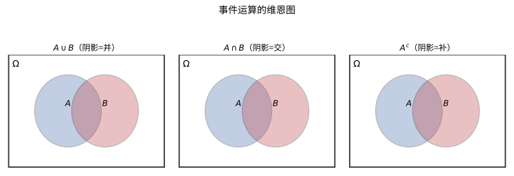
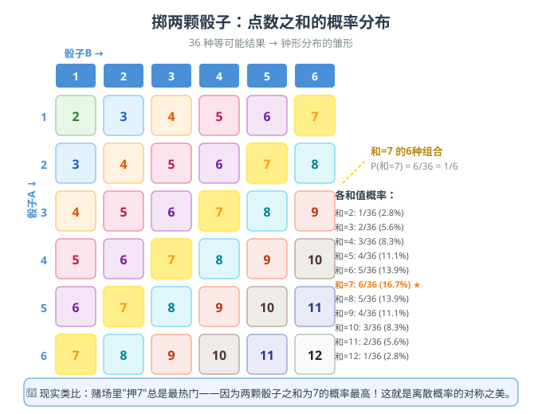
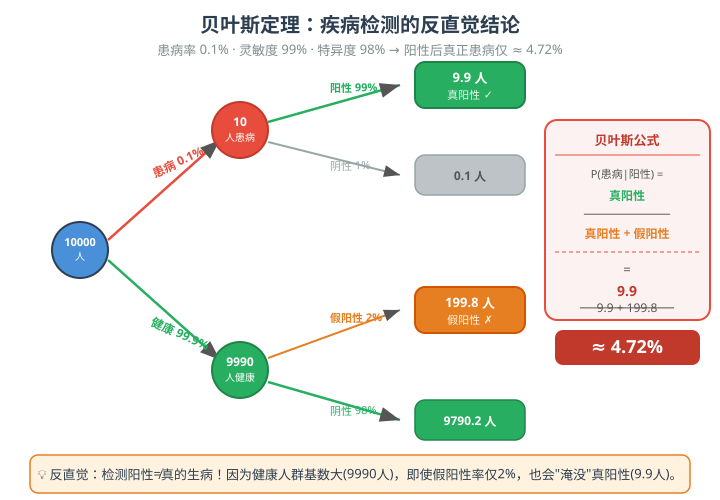
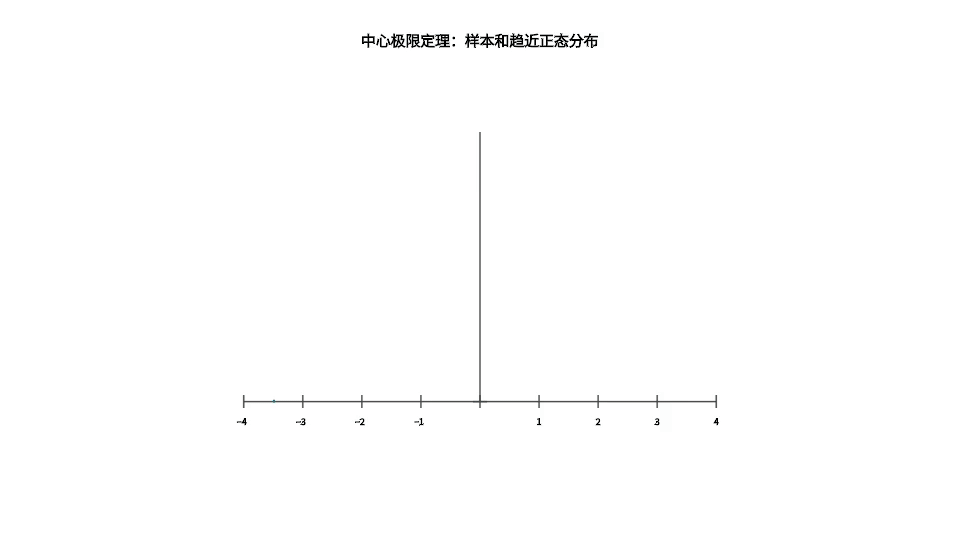

# 第 24 级：概率论基础 (Probability Theory)

## 一、学习目标

完成本教程后，你应当能够：

1. **理解概率的公理化体系**——掌握样本空间、事件、σ-代数、概率测度的定义，理解 Kolmogorov 公理。
2. **熟练运用条件概率与 Bayes 公式**——掌握乘法公式、全概率公式、Bayes 定理及其证明，理解事件的独立性与条件独立性。
3. **掌握随机变量的概念**——区分离散与连续随机变量，熟练运用概率质量函数、概率密度函数与累积分布函数。
4. **计算期望与方差**——掌握期望与方差的定义与性质，理解矩与矩母函数，能够证明 Markov 与 Chebyshev 不等式。
5. **熟悉常用概率分布**——掌握 Bernoulli、二项、Poisson、几何、均匀、正态、指数、Gamma 等分布的定义、性质与相互关系。
6. **处理多维随机变量**——掌握联合分布、边缘分布、条件分布、协方差与相关系数的概念，理解随机变量变换的方法。
7. **理解大数定律**——掌握弱大数定律的 Chebyshev 证明，理解强大数定律的陈述与 Bernoulli 大数定律。
8. **理解中心极限定理**——掌握 CLT 的 MGF 证明思路，理解 De Moivre-Laplace 定理及其应用。
9. **了解特征函数理论**——掌握特征函数的定义、基本性质，理解唯一性定理与连续性定理。
10. **能够应用概率论解决实际问题**——通过大量示例与习题，建立概率直觉与严谨推导能力。

---

## 二、样本空间与事件

### 2.1 样本空间 (Sample Space)

**定义**：一个随机试验的所有可能结果构成的集合称为**样本空间**，记作 $\Omega$（或 $S$）。样本空间中的每一个元素 $\omega \in \Omega$ 称为一个**样本点**。

**示例**：
- 掷一枚硬币：$\Omega = \{H, T\}$（正面、反面）。
- 掷一颗骰子：$\Omega = \{1, 2, 3, 4, 5, 6\}$。
- 测量某地的每日气温：$\Omega = [-\infty, \infty)$ 或 $\Omega = \mathbb{R}$。

### 2.2 事件 (Events)

**定义**：样本空间 $\Omega$ 的某个子集 $A \subseteq \Omega$ 称为一个**事件**。若试验的结果 $\omega \in A$，则称事件 $A$ 发生。

**事件运算**：
- 并集：$A \cup B$ —— $A$ 与 $B$ 至少有一个发生。
- 交集：$A \cap B$ —— $A$ 与 $B$ 同时发生。

> **直观理解（现实类比）**：掷两颗骰子是最经典的概率入门场景。6×6 的网格展示了全部 **36 种等可能结果**，每种组合概率相同（1/36）。但"点数之和"这个事件却呈现出漂亮的对称分布——和为 7 的组合最多（6种），概率 1/6；和为 2 或 12 的组合最少（各1种），概率仅 1/36。这就像**赌场里"押7"总是最热门**：不是因为骰子偏心，而是因为"7"恰好拥有最多的"路径"。离散概率的对称之美，从这里开始。

> **直观理解（现实类比）**：事件就是样本空间的"**区域**"，事件运算就是区域的**拼、叠、挖**。$A\cup B$ 是"至少踩进 $A$ 或 $B$ 一块地"（并）；$A\cap B$ 是"同时踩进两块地"（交）；$A^c$ 是"完全躲开 $A$"（补）。用**两块橡皮泥**：并是把两块捏在一起，交是只留重叠部分，补是切走要扔掉的那块。这为用面积解释概率打下基础。

**事件代数**：事件的运算满足以下性质（布尔代数）：
- 补集：$A^c = \Omega \setminus A$ —— $A$ 不发生。
- 差集：$A \setminus B = A \cap B^c$ —— $A$ 发生而 $B$ 不发生。

**互斥事件**：若 $A \cap B = \varnothing$，则称 $A$ 与 $B$ 互斥（互不相容）。

### 2.3 σ-代数 (σ-Algebra)

为了严格定义概率，我们需要限定哪些子集可以作为事件。并非 $\Omega$ 的所有子集都能被赋予概率（涉及不可测集问题），因此我们需要一个事件族。

**定义**：设 $\Omega$ 为非空集合。$\mathcal{F}$ 是 $\Omega$ 的子集族，若满足：
1. $\Omega \in \mathcal{F}$；
2. 若 $A \in \mathcal{F}$，则 $A^c \in \mathcal{F}$（对补运算封闭）；
3. 若 $A_1, A_2, \dots \in \mathcal{F}$，则 $\bigcup_{i=1}^{\infty} A_i \in \mathcal{F}$（对可数并封闭）。

则称 $\mathcal{F}$ 为 $\Omega$ 上的一个 **σ-代数**（或 σ-域）。称 $(\Omega, \mathcal{F})$ 为一个**可测空间**。

**性质**：由定义可推出 $\varnothing \in \mathcal{F}$，且 $\mathcal{F}$ 对可数交也封闭。

**Borel σ-代数**：$\mathbb{R}$ 上由所有开区间生成的 σ-代数称为 Borel σ-代数，记作 $\mathcal{B}(\mathbb{R})$。它包含所有开集、闭集、半开半闭区间等。

### 2.4 概率测度 (Probability Measure)

**定义 (Kolmogorov 公理)**：设 $(\Omega, \mathcal{F})$ 是一个可测空间。称函数 $P: \mathcal{F} \to [0, 1]$ 为一个**概率测度**，若满足：

1. **非负性**：对所有 $A \in \mathcal{F}$，$P(A) \ge 0$。
2. **规范性**：$P(\Omega) = 1$。
3. **可列可加性 (σ-可加性)**：若 $\{A_n\}_{n=1}^{\infty}$ 是一列两两互斥的事件（即 $A_i \cap A_j = \varnothing$ 对 $i \neq j$），则
   $$P\left(\bigcup_{n=1}^{\infty} A_n\right) = \sum_{n=1}^{\infty} P(A_n).$$

三元组 $(\Omega, \mathcal{F}, P)$ 称为一个**概率空间**。

> **🧠 思考历程：掷骰子的"有多少概率"，凭什么也搭建起一座严格大厦？**
>
> 概率最早是赌场里"赢面多大"的算计，到了 20 世纪初却摇身一变成可严格公理化的数学——**柯尔莫哥洛夫（Kolmogorov）1933 年那本《概率论基础》，把"随机性"从经验之说提升为公理体系**。这是一场把"运气"办成"数学"的手续。
>
> - **旧的"概率"争论了几百年**。古典概率定义"有利情况/总情况"只对等可能情形适用；频率观点"频率收敛到概率"又依赖极限究竟何时存在。**"概率到底是什么"一度没有标准答案，可各家用它得的结果却惊人的准，这本身就诡异。**
> - **柯尔莫哥洛夫的决定一着：重新说"概率是一种测度"**。既然概率要"可为 1、非负、可加"，它就是一个取值 $[0,1]$ 的**测度**——和"长度""面积""体积"是同一个家族的亲戚。**干脆用测度论那套已被磨得极严谨的工具来承载随机性**，正是他把概率"落实"的办法。
> - **σ-代数为何"折腾"？** 因为不是每个子集都一定有"可加的测度"（§2.3 讲过不可测集）。**把"能谈概率的事件"收进一个 σ-代数 $\mathcal{F}$，才能保证可列可加性不打架**——这看似繁琐，却是让"无穷多个小概率事件"也能正确处理的前提。
> - **一套公理，万般皆稳**。大数定律、中心极限定理、随机游走，全都能从"非负 + 规范性 + 可列可加"这三条出发严格推导，不再靠"经验像真会这样"。**概率从此数学化，也为之后的鞅、测度论概率、随机微分方程铺平了路。**
> - **心路**：柯尔莫哥洛夫的公理化提醒你：**一个很有用的直觉概念，若能重新用更基础、更严谨的语言（这里是测度）来表达，威力会成倍增张**。把"概率"当"测度"看，随机和确定之间的那道隔阂，要被数学重新焊牢了。

### 2.5 概率的基本性质

从 Kolmogorov 公理可推导出以下重要性质：

1. **空集概率为零**：$P(\varnothing) = 0$。
2. **有限可加性**：若 $A_1, \dots, A_n$ 两两互斥，则 $P(\bigcup_{i=1}^n A_i) = \sum_{i=1}^n P(A_i)$。
3. **单调性**：若 $A \subseteq B$，则 $P(A) \le P(B)$。
4. **减法公式**：$P(B \setminus A) = P(B) - P(A \cap B)$。
5. **加法公式**：$P(A \cup B) = P(A) + P(B) - P(A \cap B)$。
6. **补集公式**：$P(A^c) = 1 - P(A)$。
7. **容斥原理 (推广)**：
   $$P\left(\bigcup_{i=1}^{n} A_i\right) = \sum_{i} P(A_i) - \sum_{i<j} P(A_i \cap A_j) + \sum_{i<j<k} P(A_i \cap A_j \cap A_k) - \cdots + (-1)^{n+1} P(A_1 \cap \cdots \cap A_n).$$

**证明示例 (加法公式)**：
$$P(A \cup B) = P(A) + P(B \setminus A) = P(A) + [P(B) - P(A \cap B)] = P(A) + P(B) - P(A \cap B).$$
其中第一步利用了 $A \cup B = A \cup (B \setminus A)$ 且 $A$ 与 $B\setminus A$ 互斥，第二步利用了 $B = (B \cap A) \cup (B \setminus A)$ 且两项互斥。

---

## 三、条件概率与独立性

### 3.1 条件概率 (Conditional Probability)

**定义**：设 $(\Omega, \mathcal{F}, P)$ 为概率空间，$A, B \in \mathcal{F}$ 且 $P(B) > 0$。在事件 $B$ 已发生的条件下，事件 $A$ 发生的**条件概率**定义为：
$$P(A \mid B) = \frac{P(A \cap B)}{P(B)}.$$

**直观理解**：条件概率将样本空间缩小为 $B$，在新空间上重新衡量 $A$ 的"占比"。

### 3.2 乘法公式 (Multiplication Rule)

由条件概率定义直接可得：
$$P(A \cap B) = P(B) \cdot P(A \mid B) = P(A) \cdot P(B \mid A).$$

推广到 $n$ 个事件：
$$P(A_1 \cap A_2 \cap \cdots \cap A_n) = P(A_1) \cdot P(A_2 \mid A_1) \cdot P(A_3 \mid A_1 \cap A_2) \cdots P(A_n \mid A_1 \cap \cdots \cap A_{n-1}).$$

### 3.3 全概率公式 (Law of Total Probability)

**定理**：设 $\{B_1, B_2, \dots, B_n\}$ 是 $\Omega$ 的一个划分（即 $B_i$ 两两互斥且 $\bigcup_{i=1}^n B_i = \Omega$），且 $P(B_i) > 0$ 对所有 $i$ 成立。则对任意事件 $A$，有：
$$P(A) = \sum_{i=1}^{n} P(B_i) \cdot P(A \mid B_i).$$

**证明**：由于 $\{B_i\}$ 是划分，$A = A \cap \Omega = A \cap \left(\bigcup_{i=1}^n B_i\right) = \bigcup_{i=1}^n (A \cap B_i)$，且这些项互斥。由可加性：
$$P(A) = \sum_{i=1}^n P(A \cap B_i) = \sum_{i=1}^n P(B_i) \cdot P(A \mid B_i). \quad \square$$

### 3.4 贝叶斯定理 (Bayes' Theorem)

**定理**：设 $\{B_1, B_2, \dots, B_n\}$ 是 $\Omega$ 的一个划分，$P(B_i) > 0$，且 $P(A) > 0$。则对任意 $k$，有：
$$P(B_k \mid A) = \frac{P(B_k) \cdot P(A \mid B_k)}{\sum_{i=1}^{n} P(B_i) \cdot P(A \mid B_i)}.$$

**证明**：由条件概率定义和乘法公式：
$$P(B_k \mid A) = \frac{P(B_k \cap A)}{P(A)} = \frac{P(B_k) \cdot P(A \mid B_k)}{P(A)}.$$
再由全概率公式 $P(A) = \sum_{i=1}^{n} P(B_i) \cdot P(A \mid B_i)$ 代入分母即得。$\square$

**Bayes 定理的直观**：
- $P(B_k)$ 称为**先验概率** (prior)，即在观察到 $A$ 之前对 $B_k$ 的信念。
- $P(B_k \mid A)$ 称为**后验概率** (posterior)，即在观察到 $A$ 之后对 $B_k$ 的更新信念。
- $P(A \mid B_k)$ 称为**似然** (likelihood)。

**示例**：一种疾病的患病率为 0.1%，检测方法的灵敏度为 99%（患者检测为阳性的概率），特异度为 98%（健康人检测为阴性的概率）。若某人检测结果为阳性，问其真正患病的概率是多少？

设 $B$ = "患病"，$A$ = "检测阳性"。则：
$$P(B \mid A) = \frac{P(B) \cdot P(A \mid B)}{P(B) \cdot P(A \mid B) + P(B^c) \cdot P(A \mid B^c)} = \frac{0.001 \times 0.99}{0.001 \times 0.99 + 0.999 \times 0.02} \approx \frac{0.00099}{0.00099 + 0.01998} \approx 0.0472.$$

即检测阳性者真正患病的概率仅为约 4.72%。这体现了"先验概率极低时，即使检测准确率很高，后验概率仍然不高"这一反直觉结论。

> **直观理解（现实类比）**：这棵树形图揭示了一个**反直觉的真相**：假设某种罕见病的患病率仅 0.1%（万人中约 10 人），即使检测方法的灵敏度高达 99%、特异度 98%，拿到阳性报告的人中真正患病的也仅约 **4.72%**。原因很简单——健康人群的基数（9990人）远远大于患病人群（10人），即使假阳性率只有 2%，"假阳性大军"（约200人）也会把"真阳性小队"（约10人）淹没。这就是为什么**体检阳性不必恐慌**——需要做第二次检测来缩小"嫌疑池"。贝叶斯定理告诉我们：**先验概率（基础发病率）决定了后验概率的上限**。

### 3.5 事件的独立性 (Independence)

**定义**：两个事件 $A$ 和 $B$ 称为**相互独立**，若
$$P(A \cap B) = P(A) \cdot P(B).$$

若 $P(B) > 0$，则独立性等价于 $P(A \mid B) = P(A)$，即 $B$ 的发生不影响 $A$ 的概率。

**多个事件的独立性**：事件族 $\{A_i\}_{i \in I}$ 称为相互独立的，若对任意有限子集 $\{i_1, \dots, i_k\} \subseteq I$，有
$$P(A_{i_1} \cap A_{i_2} \cap \cdots \cap A_{i_k}) = P(A_{i_1}) \cdot P(A_{i_2}) \cdots P(A_{i_k}).$$

**注意**：两两独立 (pairwise independence) 不能推出联合独立。例如，考虑 $\Omega = \{1,2,3,4\}$ 上的均匀分布，设 $A = \{1,2\}$，$B = \{1,3\}$，$C = \{1,4\}$。则 $P(A)=P(B)=P(C)=1/2$，且 $P(A \cap B) = P(\{1\}) = 1/4 = P(A)P(B)$，同理 $A$ 与 $C$、$B$ 与 $C$ 均两两独立。但 $P(A \cap B \cap C) = P(\{1\}) = 1/4 \neq 1/8 = P(A)P(B)P(C)$，故三者不相互独立。

### 3.6 条件独立性

**定义**：给定事件 $C$（$P(C) > 0$），称 $A$ 与 $B$ 在 $C$ 下**条件独立**，若
$$P(A \cap B \mid C) = P(A \mid C) \cdot P(B \mid C).$$

条件独立并不蕴含独立，独立也不蕴含条件独立。

---

## 四、随机变量

### 4.1 随机变量的定义

**定义**：设 $(\Omega, \mathcal{F}, P)$ 为概率空间。函数 $X: \Omega \to \mathbb{R}$ 称为一个**随机变量**，若对任意 $x \in \mathbb{R}$，有
$$\{\omega \in \Omega \mid X(\omega) \le x\} \in \mathcal{F},$$
即 $X$ 是 $\mathcal{F}$-可测的。

直观地说，随机变量是将随机试验的结果数值化的函数。

### 4.2 离散随机变量与概率质量函数

**定义**：若随机变量 $X$ 的取值集合为有限集或可数无限集，则称 $X$ 为**离散随机变量**。其**概率质量函数 (PMF)** 定义为：
$$p_X(x) = P(X = x).$$

PMF 满足：
1. $p_X(x) \ge 0$ 对所有 $x$ 成立；
2. $\sum_{x} p_X(x) = 1$，其中求和遍及 $X$ 的所有可能取值。

### 4.3 连续随机变量与概率密度函数

**定义**：若存在非负可积函数 $f_X: \mathbb{R} \to [0, \infty)$，使得对任意 $a \le b$，有
$$P(a \le X \le b) = \int_a^b f_X(x) \, dx,$$
则称 $X$ 为**连续随机变量**，$f_X$ 称为 $X$ 的**概率密度函数 (PDF)**。

PDF 满足：
1. $f_X(x) \ge 0$ 对所有 $x \in \mathbb{R}$ 成立；
2. $\int_{-\infty}^{\infty} f_X(x) \, dx = 1$。

**注意**：对连续随机变量，$P(X = a) = 0$ 对任意单点 $a$ 成立。

### 4.4 累积分布函数 (CDF)

**定义**：随机变量 $X$ 的**累积分布函数**定义为：
$$F_X(x) = P(X \le x), \quad x \in \mathbb{R}.$$

**性质**：
1. $F_X$ 是单调不减的：若 $x_1 < x_2$，则 $F_X(x_1) \le F_X(x_2)$。
2. $F_X$ 是右连续的：$\lim_{t \to x^+} F_X(t) = F_X(x)$。
3. $\lim_{x \to -\infty} F_X(x) = 0$，$\lim_{x \to \infty} F_X(x) = 1$。
4. 对离散随机变量：$F_X(x) = \sum_{t \le x} p_X(t)$。
5. 对连续随机变量：$F_X(x) = \int_{-\infty}^x f_X(t) \, dt$，且 $F_X'(x) = f_X(x)$（在 $f_X$ 连续点处）。

---

## 五、期望与方差

### 5.1 期望 (Expectation)

**定义**：随机变量 $X$ 的**期望**（或均值）定义为：
- 若 $X$ 是离散的：$\displaystyle E[X] = \sum_{x} x \cdot p_X(x)$。
- 若 $X$ 是连续的：$\displaystyle E[X] = \int_{-\infty}^{\infty} x \cdot f_X(x) \, dx$。
- 更一般地，$E[X] = \int_{\Omega} X(\omega) \, dP(\omega)$（Lebesgue 积分）。

要求级数绝对收敛或积分绝对可积，否则期望不存在。

**性质**：
1. **线性性**：$E[aX + bY] = aE[X] + bE[Y]$，对任意常数 $a, b$ 成立。
2. **单调性**：若 $X \le Y$ 几乎必然，则 $E[X] \le E[Y]$。
3. 若 $c$ 为常数，则 $E[c] = c$。
4. **函数的期望**：$E[g(X)] = \sum_x g(x) p_X(x)$（离散）或 $E[g(X)] = \int_{-\infty}^{\infty} g(x) f_X(x) \, dx$（连续）。

### 5.2 方差 (Variance)

**定义**：$X$ 的**方差**定义为：
$$\operatorname{Var}(X) = E[(X - E[X])^2] = E[X^2] - (E[X])^2.$$

**性质**：
1. $\operatorname{Var}(X) \ge 0$，且 $\operatorname{Var}(X) = 0$ 当且仅当 $X$ 几乎必然为常数。
2. $\operatorname{Var}(aX + b) = a^2 \operatorname{Var}(X)$，对任意常数 $a, b$ 成立。
3. 标准差：$\sigma_X = \sqrt{\operatorname{Var}(X)}$。

### 5.3 矩与矩母函数 (Moments and Moment Generating Functions)

**定义**：$X$ 的 **$k$ 阶矩**为 $\mu_k = E[X^k]$，**$k$ 阶中心矩**为 $E[(X - \mu)^k]$，其中 $\mu = E[X]$。

**定义**：$X$ 的**矩母函数 (MGF)** 定义为：
$$M_X(t) = E[e^{tX}],$$
要求存在 $h > 0$ 使得对 $t \in (-h, h)$ 有 $M_X(t) < \infty$。

**性质**：
1. $M_X(0) = 1$。
2. $M_X^{(k)}(0) = E[X^k]$，即 $M_X$ 在 $0$ 处的 $k$ 阶导数等于 $X$ 的 $k$ 阶矩。
3. 若 $Y = aX + b$，则 $M_Y(t) = e^{bt} M_X(at)$。
4. 若 $X$ 与 $Y$ 独立，则 $M_{X+Y}(t) = M_X(t) \cdot M_Y(t)$。
5. **唯一性**：若 MGF 在 $0$ 的邻域内存在，则它唯一确定分布。

### 5.4 Markov 不等式

**定理**：设 $X$ 为非负随机变量，则对任意 $a > 0$，
$$P(X \ge a) \le \frac{E[X]}{a}.$$

**证明**：
$$E[X] = \int_0^{\infty} x f_X(x) \, dx \ge \int_a^{\infty} x f_X(x) \, dx \ge \int_a^{\infty} a f_X(x) \, dx = a \cdot P(X \ge a).$$
两边除以 $a$ 即得。$\square$

### 5.5 Chebyshev 不等式

**定理**：设 $X$ 的期望为 $\mu$，方差为 $\sigma^2 < \infty$，则对任意 $k > 0$，
$$P(|X - \mu| \ge k\sigma) \le \frac{1}{k^2}.$$
等价地，对任意 $\varepsilon > 0$，
$$P(|X - \mu| \ge \varepsilon) \le \frac{\sigma^2}{\varepsilon^2}.$$

**证明**：令 $Y = (X - \mu)^2$，则 $Y \ge 0$ 且 $E[Y] = \sigma^2$。对 $Y$ 应用 Markov 不等式（取 $a = \varepsilon^2$）：
$$P(|X - \mu| \ge \varepsilon) = P((X - \mu)^2 \ge \varepsilon^2) \le \frac{E[(X - \mu)^2]}{\varepsilon^2} = \frac{\sigma^2}{\varepsilon^2}. \quad \square$$

**推论**：Chebyshev 不等式给出了随机变量偏离其均值的概率上界，适用于任何具有有限方差的分布。它不依赖于分布的具体形式，因此是概率论中极有用的工具。

---

## 六、常用分布

### 6.1 Bernoulli 分布 (伯努利分布)

记作 $X \sim \operatorname{Bern}(p)$，$0 \le p \le 1$。

- **描述**：单次试验，成功概率为 $p$，失败概率为 $1-p$。
- **PMF**：$P(X = 1) = p$，$P(X = 0) = 1-p$。
- **期望**：$E[X] = p$。
- **方差**：$\operatorname{Var}(X) = p(1-p)$。
- **MGF**：$M_X(t) = 1 - p + pe^t$。

### 6.2 二项分布 (Binomial Distribution)

记作 $X \sim \operatorname{Bin}(n, p)$，$n \in \mathbb{N}$，$0 \le p \le 1$。

- **描述**：$n$ 次独立 Bernoulli 试验中的成功次数。
- **PMF**：$P(X = k) = \binom{n}{k} p^k (1-p)^{n-k}$，$k = 0, 1, \dots, n$。
- **期望**：$E[X] = np$。
- **方差**：$\operatorname{Var}(X) = np(1-p)$。
- **MGF**：$M_X(t) = (1 - p + pe^t)^n$。
- **可加性**：若 $X \sim \operatorname{Bin}(n, p)$，$Y \sim \operatorname{Bin}(m, p)$ 且独立，则 $X + Y \sim \operatorname{Bin}(n+m, p)$。

### 6.3 Poisson 分布 (泊松分布)

记作 $X \sim \operatorname{Poi}(\lambda)$，$\lambda > 0$。

- **描述**：用于建模单位时间内随机事件发生的次数。
- **PMF**：$P(X = k) = \frac{\lambda^k e^{-\lambda}}{k!}$，$k = 0, 1, 2, \dots$。
- **期望**：$E[X] = \lambda$。
- **方差**：$\operatorname{Var}(X) = \lambda$。
- **MGF**：$M_X(t) = e^{\lambda(e^t - 1)}$。
- **可加性**：若 $X \sim \operatorname{Poi}(\lambda_1)$，$Y \sim \operatorname{Poi}(\lambda_2)$ 且独立，则 $X + Y \sim \operatorname{Poi}(\lambda_1 + \lambda_2)$。
- **Poisson 逼近（稀有事件定律）**：当 $n$ 很大、$p$ 很小且 $np \to \lambda$ 时，$\operatorname{Bin}(n, p)$ 近似于 $\operatorname{Poi}(\lambda)$。

### 6.4 几何分布 (Geometric Distribution)

记作 $X \sim \operatorname{Geom}(p)$，$0 < p \le 1$。

- **描述**：首次成功所需的试验次数。有两种常见定义：
  - 版本 1（支持集 $\{1, 2, \dots\}$）：$P(X = k) = (1-p)^{k-1} p$，$E[X] = 1/p$，$\operatorname{Var}(X) = (1-p)/p^2$。
  - 版本 2（支持集 $\{0, 1, \dots\}$）：$P(Y = k) = (1-p)^k p$，$E[Y] = (1-p)/p$。
- **无记忆性**：$P(X > n + m \mid X > m) = P(X > n)$，即几何分布是唯一的离散无记忆分布。

### 6.5 均匀分布 (Uniform Distribution)

- **离散均匀分布**：$X \sim \operatorname{Unif}\{1, 2, \dots, n\}$，$P(X = k) = 1/n$，$E[X] = (n+1)/2$，$\operatorname{Var}(X) = (n^2 - 1)/12$。
- **连续均匀分布**：$X \sim \operatorname{Unif}(a, b)$，$a < b$。
  - **PDF**：$f_X(x) = \frac{1}{b-a}$，$a \le x \le b$。
  - **CDF**：$F_X(x) = \frac{x - a}{b - a}$，$a \le x \le b$。
  - **期望**：$E[X] = \frac{a + b}{2}$。
  - **方差**：$\operatorname{Var}(X) = \frac{(b-a)^2}{12}$。
  - **MGF**：$M_X(t) = \frac{e^{tb} - e^{ta}}{t(b-a)}$（$t \neq 0$）。

### 6.6 正态分布 (Normal/Gaussian Distribution)

记作 $X \sim N(\mu, \sigma^2)$，$\mu \in \mathbb{R}$，$\sigma > 0$。

- **描述**：自然界中最常见的分布，中心极限定理的极限分布。
- **PDF**：$f_X(x) = \frac{1}{\sqrt{2\pi}\sigma} e^{-\frac{(x - \mu)^2}{2\sigma^2}}$，$x \in \mathbb{R}$。
- **CDF**：$F_X(x) = \Phi\left(\frac{x - \mu}{\sigma}\right)$，其中 $\Phi(z) = \frac{1}{\sqrt{2\pi}} \int_{-\infty}^z e^{-t^2/2} dt$ 是标准正态 CDF。
- **期望**：$E[X] = \mu$。
- **方差**：$\operatorname{Var}(X) = \sigma^2$。
- **MGF**：$M_X(t) = e^{\mu t + \sigma^2 t^2 / 2}$。
- **标准正态分布**：$Z = \frac{X - \mu}{\sigma} \sim N(0, 1)$。
- **可加性**：若 $X \sim N(\mu_1, \sigma_1^2)$，$Y \sim N(\mu_2, \sigma_2^2)$ 且独立，则 $X + Y \sim N(\mu_1 + \mu_2, \sigma_1^2 + \sigma_2^2)$。
- **线性变换**：若 $X \sim N(\mu, \sigma^2)$，则 $aX + b \sim N(a\mu + b, a^2\sigma^2)$。
- **3σ 法则**：$P(|X - \mu| < \sigma) \approx 0.6827$，$P(|X - \mu| < 2\sigma) \approx 0.9545$，$P(|X - \mu| < 3\sigma) \approx 0.9973$。

> **直观理解（现实类比）**：正态分布是"**大自然最钟爱的钟形**"，也叫高斯分布。它描述大量独立随机因素叠加的结果——人的身高、测量误差、IQ 都近似服从它。**均值 $\mu$ 决定山峰的位置**，**标准差 $\sigma$ 决定山脊的胖瘦**：$\sigma$ 越小越瘦高、越集中。68-95-99.7 法则（3σ 法则）正是"**多数数据都挤在平均值附近**"的量化：约 95% 的数据落在均值 ± 2 个标准差内。

### 6.7 指数分布 (Exponential Distribution)

记作 $X \sim \operatorname{Exp}(\lambda)$，$\lambda > 0$。

- **描述**：用于建模等待时间、寿命等。
- **PDF**：$f_X(x) = \lambda e^{-\lambda x}$，$x \ge 0$。
- **CDF**：$F_X(x) = 1 - e^{-\lambda x}$，$x \ge 0$。
- **期望**：$E[X] = 1/\lambda$。
- **方差**：$\operatorname{Var}(X) = 1/\lambda^2$。
- **MGF**：$M_X(t) = \frac{\lambda}{\lambda - t}$，$t < \lambda$。
- **无记忆性**：$P(X > s + t \mid X > s) = P(X > t)$，即指数分布是唯一的连续无记忆分布。
- **与 Poisson 分布的关系**：若单位时间内事件发生次数服从 $\operatorname{Poi}(\lambda)$，则事件间的时间间隔服从 $\operatorname{Exp}(\lambda)$。

### 6.8 Gamma 分布 (伽马分布)

记作 $X \sim \operatorname{Gamma}(\alpha, \beta)$，$\alpha > 0$（形状参数），$\beta > 0$（速率参数）。

- **描述**：指数分布的推广，用于建模 $k$ 个独立同分布指数随机变量之和。
- **PDF**：$f_X(x) = \frac{\beta^\alpha}{\Gamma(\alpha)} x^{\alpha - 1} e^{-\beta x}$，$x \ge 0$。
- **期望**：$E[X] = \alpha / \beta$。
- **方差**：$\operatorname{Var}(X) = \alpha / \beta^2$。
- **MGF**：$M_X(t) = \left(\frac{\beta}{\beta - t}\right)^\alpha$，$t < \beta$。
- **特殊情形**：
  - $\alpha = 1$ 时退化为 $\operatorname{Exp}(\beta)$。
  - $\alpha = n/2$，$\beta = 1/2$ 时称为 $\chi^2(n)$（自由度为 $n$ 的卡方分布）。
- **可加性**：若 $X \sim \operatorname{Gamma}(\alpha_1, \beta)$，$Y \sim \operatorname{Gamma}(\alpha_2, \beta)$ 且独立，则 $X + Y \sim \operatorname{Gamma}(\alpha_1 + \alpha_2, \beta)$。

### 6.9 负二项分布 (Negative Binomial Distribution)

**模型**：进行独立重复试验，每次成功概率为 $p$。$X$ = 第 $r$ 次成功前失败的次数。
$$
P(X = k) = \binom{k + r - 1}{k} p^r (1-p)^k, \quad k = 0, 1, 2, \dots
$$
**均值与方差**：$E[X] = \frac{r(1-p)}{p}$，$\operatorname{Var}(X) = \frac{r(1-p)}{p^2}$。

> **💡 直观理解**：二项分布问"固定试验次数里的成功数"，负二项分布问"固定成功次数后需要的失败数"，两者视角相反。$r = 1$ 时退化为几何分布。

### 6.10 超几何分布 (Hypergeometric Distribution)

**模型**：从 $N$ 个物品（其中 $K$ 个"特殊"）中不放回抽取 $n$ 个，$X$ = 抽到的特殊品个数。
$$
P(X = k) = \frac{\binom{K}{k} \binom{N-K}{n-k}}{\binom{N}{n}}, \quad \max(0, n-N+K) \le k \le \min(n, K).
$$
**均值**：$E[X] = n\frac{K}{N}$。当 $N$ 很大时，超几何分布趋近二项分布。

> **💡 直观理解**：超几何是"不放回"的抽样（每抽一次整体变化），二项是"放回"的抽样（每次独立同分布）。例如质检抽检、扑克牌抽牌都用到超几何分布。

### 6.11 Beta 分布 (Beta Distribution)

**定义**：$X \sim \operatorname{Beta}(\alpha, \beta)$，密度为
$$
f(x) = \frac{x^{\alpha-1}(1-x)^{\beta-1}}{B(\alpha, \beta)}, \quad 0 < x < 1.
$$
**均值与方差**：$E[X] = \frac{\alpha}{\alpha+\beta}$，$\operatorname{Var}(X) = \frac{\alpha\beta}{(\alpha+\beta)^2(\alpha+\beta+1)}$。

> **💡 直观理解**：Beta 分布定义在 $(0,1)$ 上，是描述"比例/概率"的理想分布。$\alpha=\beta=1$ 时退化为均匀分布。它是贝叶斯推断中二项分布参数的共轭先验。

### 6.12 对数正态分布 (Lognormal Distribution)

**定义**：若 $\ln X \sim \mathcal{N}(\mu, \sigma^2)$，则 $X$ 服从**对数正态分布**，密度为
$$
f(x) = \frac{1}{x\sigma\sqrt{2\pi}} e^{-\frac{(\ln x - \mu)^2}{2\sigma^2}}, \quad x > 0.
$$
**均值与方差**：$E[X] = e^{\mu + \sigma^2/2}$，$\operatorname{Var}(X) = (e^{\sigma^2}-1)e^{2\mu+\sigma^2}$。

> **💡 直观理解**：对数正态分布用于描述"只取正值且偏态"的量，如股票价格、收入、生物尺寸。它由大量小比例的乘法效应累积而成，是中心极限定理的乘法版本。

---

## 七、多维随机变量

### 7.1 联合分布 (Joint Distribution)

**定义**：设 $X$ 和 $Y$ 是定义在同一概率空间上的随机变量。它们的**联合累积分布函数**为：
$$F_{X,Y}(x, y) = P(X \le x, Y \le y).$$

**离散情形**：联合 PMF 为 $p_{X,Y}(x, y) = P(X = x, Y = y)$，满足 $\sum_x \sum_y p_{X,Y}(x, y) = 1$。

**连续情形**：若存在 $f_{X,Y}(x, y) \ge 0$ 使得
$$F_{X,Y}(x, y) = \int_{-\infty}^x \int_{-\infty}^y f_{X,Y}(s, t) \, dt \, ds,$$
则 $f_{X,Y}$ 称为联合 PDF，满足 $\int_{-\infty}^\infty \int_{-\infty}^\infty f_{X,Y}(x, y) \, dx \, dy = 1$。

### 7.2 边缘分布 (Marginal Distribution)

**离散情形**：
$$p_X(x) = \sum_{y} p_{X,Y}(x, y), \quad p_Y(y) = \sum_{x} p_{X,Y}(x, y).$$

**连续情形**：
$$f_X(x) = \int_{-\infty}^{\infty} f_{X,Y}(x, y) \, dy, \quad f_Y(y) = \int_{-\infty}^{\infty} f_{X,Y}(x, y) \, dx.$$

### 7.3 条件分布 (Conditional Distribution)

**离散情形**：给定 $Y = y$（$p_Y(y) > 0$），$X$ 的条件 PMF 为：
$$p_{X \mid Y}(x \mid y) = \frac{p_{X,Y}(x, y)}{p_Y(y)}.$$

**连续情形**：给定 $Y = y$（$f_Y(y) > 0$），$X$ 的条件 PDF 为：
$$f_{X \mid Y}(x \mid y) = \frac{f_{X,Y}(x, y)}{f_Y(y)}.$$

**条件期望**：$E[X \mid Y = y] = \sum_x x \cdot p_{X \mid Y}(x \mid y)$（离散）或 $\int_{-\infty}^\infty x \cdot f_{X \mid Y}(x \mid y) \, dx$（连续）。它是 $y$ 的函数，记为 $g(y)$。

**条件期望的性质**：
1. **线性性**：$E[aX_1 + bX_2 \mid Y] = aE[X_1 \mid Y] + bE[X_2 \mid Y]$。
2. **全期望公式**（塔性质）：$E[X] = E[E[X \mid Y]]$。
3. **取出已知量**：若 $X$ 在给定 $Y$ 下是"已知的"（即 $X$ 是 $Y$ 的函数），则 $E[XY \mid Y] = Y\, E[X \mid Y]$。
4. 若 $X$ 与 $Y$ **独立**，则 $E[X \mid Y] = E[X]$。

**条件方差与全方差公式**:定义条件方差 $\operatorname{Var}(X \mid Y) = E[X^2 \mid Y] - (E[X \mid Y])^2$，则
$$
\operatorname{Var}(X) = E[\operatorname{Var}(X \mid Y)] + \operatorname{Var}(E[X \mid Y]).
$$

> **💡 直观理解**：全期望公式把"总平均"拆成"各组内平均的加权平均"；全方差公式把"总波动"拆成"组内波动的平均 + 组间均值的波动"。这就像分析一个班的总成绩：波动来自每个学生自身的不稳定（组内）与不同水平小组之间的差异（组间）。

**例**：掷两枚骰子，$X$ 为点数之和，$Y$ 为第一枚的点数。则 $E[X \mid Y=y] = y + 3.5$，由全期望公式 $E[X] = E[Y] + 3.5 = 7$。

### 7.4 协方差与相关系数

**定义**：$X$ 与 $Y$ 的**协方差**为：
$$\operatorname{Cov}(X, Y) = E[(X - E[X])(Y - E[Y])] = E[XY] - E[X]E[Y].$$

**性质**：
1. $\operatorname{Cov}(X, Y) = \operatorname{Cov}(Y, X)$。
2. $\operatorname{Cov}(aX + b, cY + d) = ac \cdot \operatorname{Cov}(X, Y)$。
3. $\operatorname{Var}(X + Y) = \operatorname{Var}(X) + \operatorname{Var}(Y) + 2\operatorname{Cov}(X, Y)$。
4. 若 $X$ 与 $Y$ 独立，则 $\operatorname{Cov}(X, Y) = 0$（但反之不成立）。

**定义**：$X$ 与 $Y$ 的**Pearson 相关系数**为：
$$\rho_{X,Y} = \frac{\operatorname{Cov}(X, Y)}{\sqrt{\operatorname{Var}(X) \operatorname{Var}(Y)}}.$$

**性质**：
1. $-1 \le \rho_{X,Y} \le 1$（Cauchy-Schwarz 不等式）。
2. $|\rho_{X,Y}| = 1$ 当且仅当 $Y = aX + b$ 几乎必然（线性相关）。
3. $\rho_{X,Y} = 0$ 表示 $X$ 与 $Y$ 不相关（但不一定独立）。

### 7.5 协方差矩阵与多元正态分布

**协方差矩阵**：对 $n$ 维随机向量 $\boldsymbol{X} = (X_1, \dots, X_n)^{\mathsf{T}}$，其**均值向量**与**协方差矩阵**分别为
$$
\boldsymbol{\mu} = E[\boldsymbol{X}] = (E[X_1], \dots, E[X_n])^{\mathsf{T}}, \qquad
\Sigma = \operatorname{Cov}(\boldsymbol{X}) = E[(\boldsymbol{X}-\boldsymbol{\mu})(\boldsymbol{X}-\boldsymbol{\mu})^{\mathsf{T}}],
$$
其中 $\Sigma$ 是 $n \times n$ 对称矩阵，第 $(i,j)$ 元为 $\operatorname{Cov}(X_i, X_j)$，对角线元为 $\operatorname{Var}(X_i)$。

> **💡 直观理解**：均值向量给出"中心"，协方差矩阵给出"散布的形状"。对角线衡量每个分量自身的波动，非对角线衡量两分量的联动方向（正=同涨同跌，负=此消彼长）。

**性质**：对确定的矩阵 $A, B$，$\operatorname{Cov}(A\boldsymbol{X} + B) = A\Sigma A^{\mathsf{T}}$。

**多元正态分布**：$n$ 维随机向量 $\boldsymbol{X}$ 服从**多元正态分布** $\mathcal{N}(\boldsymbol{\mu}, \Sigma)$，其联合密度为
$$
f(\boldsymbol{x}) = \frac{1}{(2\pi)^{n/2}|\det\Sigma|^{1/2}} \exp\left[-\frac{1}{2}(\boldsymbol{x}-\boldsymbol{\mu})^{\mathsf{T}}\Sigma^{-1}(\boldsymbol{x}-\boldsymbol{\mu})\right], \quad \Sigma \succ 0.
$$

**关键性质**：多元正态分量的**不相关 ⟺ 独立**（对正态而言，协方差为 0 即独立）。这是正态分布特有的性质，也是线性回归、多元统计分析的基础。

**例**：设 $\boldsymbol{X} \sim \mathcal{N}(\boldsymbol{\mu}, \Sigma)$，$\boldsymbol{a}$ 为常数向量，则 $\boldsymbol{a}^{\mathsf{T}}\boldsymbol{X} \sim \mathcal{N}(\boldsymbol{a}^{\mathsf{T}}\boldsymbol{\mu},\, \boldsymbol{a}^{\mathsf{T}}\Sigma\boldsymbol{a})$。

### 7.6 随机变量的变换

**单变量变换**：若 $X$ 有 PDF $f_X$，$Y = g(X)$ 是严格单调可微函数，则 $Y$ 的 PDF 为：
$$f_Y(y) = f_X(g^{-1}(y)) \cdot \left| \frac{d}{dy} g^{-1}(y) \right|.$$

**多变量变换**：若 $(X_1, X_2)$ 有联合 PDF $f_{X_1, X_2}$，变换 $(Y_1, Y_2) = (g_1(X_1, X_2), g_2(X_1, X_2))$ 是一一对应且可微的，则 $(Y_1, Y_2)$ 的联合 PDF 为：
$$f_{Y_1, Y_2}(y_1, y_2) = f_{X_1, X_2}(g_1^{-1}(y_1, y_2), g_2^{-1}(y_1, y_2)) \cdot |\det J|,$$
其中 $J$ 是 Jacobi 矩阵 $\frac{\partial(x_1, x_2)}{\partial(y_1, y_2)}$。

---

## 八、大数定律

### 8.0 Borel-Cantelli 引理

**引理 (Borel-Cantelli)**：设 $\{A_n\}$ 是事件序列。
1. 若 $\sum_{n=1}^{\infty} P(A_n) < \infty$，则 $P(\text{无穷多个 } A_n \text{ 发生}) = 0$；
2. 若 $A_n$ 相互独立，且 $\sum_{n=1}^{\infty} P(A_n) = \infty$，则 $P(\text{无穷多个 } A_n \text{ 发生}) = 1$。

这里"无穷多个 $A_n$ 发生"记为 $\limsup A_n = \bigcap_{m}\bigcup_{n\ge m} A_n$，即 $A_n$ 无限次出现。

> **💡 直观理解**：第一段说"概率之和有限的事件，几乎不会无限次发生"；第二段说"独立事件概率之和发散，则几乎必然无限次发生"。它把"无穷级数收敛性"与"事件是否无限次出现"联系起来，是强大数定律和几乎必然收敛的基石。

> **🔑 数学思路**：几乎所有"几乎必然"型结论（如 $P(X_i \ne \mu \text{ 无限次}) = 0$）都可以归结为用 Borel-Cantelli 引理验证某条级数收敛。

### 8.1 弱大数定律 (Weak Law of Large Numbers, WLLN)

**定理**：设 $X_1, X_2, \dots$ 是独立同分布 (i.i.d.) 的随机变量，期望 $E[X_i] = \mu$，方差 $\operatorname{Var}(X_i) = \sigma^2 < \infty$。定义样本均值 $\bar{X}_n = \frac{1}{n} \sum_{i=1}^n X_i$。则对任意 $\varepsilon > 0$，
$$\lim_{n \to \infty} P(|\bar{X}_n - \mu| \ge \varepsilon) = 0.$$
这称为 $\bar{X}_n$ **依概率收敛**于 $\mu$，记作 $\bar{X}_n \xrightarrow{p} \mu$。

**证明（使用 Chebyshev 不等式）**：
$$E[\bar{X}_n] = \frac{1}{n} \sum_{i=1}^n E[X_i] = \mu,$$
$$\operatorname{Var}(\bar{X}_n) = \frac{1}{n^2} \sum_{i=1}^n \operatorname{Var}(X_i) = \frac{\sigma^2}{n}.$$
由 Chebyshev 不等式：
$$P(|\bar{X}_n - \mu| \ge \varepsilon) \le \frac{\operatorname{Var}(\bar{X}_n)}{\varepsilon^2} = \frac{\sigma^2}{n \varepsilon^2} \to 0 \quad (n \to \infty). \quad \square$$

### 8.2 强大数定律 (Strong Law of Large Numbers, SLLN)

**定理**：设 $X_1, X_2, \dots$ 是独立同分布的随机变量，$E[X_i] = \mu < \infty$（即期望有限）。则样本均值 $\bar{X}_n$ **几乎必然收敛**于 $\mu$：
$$P\left(\lim_{n \to \infty} \bar{X}_n = \mu\right) = 1.$$
记作 $\bar{X}_n \xrightarrow{\text{a.s.}} \mu$。

**说明**：强大数定律比弱大数定律更强——几乎必然收敛蕴含依概率收敛，但反之不成立。强大数定律的证明需要更精细的工具（如 Kolmogorov 不等式或截断方法），此处从略。

### 8.3 Bernoulli 大数定律

**定理**：设 $S_n$ 是 $n$ 次独立 Bernoulli 试验中的成功次数，每次成功概率为 $p$。则对任意 $\varepsilon > 0$，
$$\lim_{n \to \infty} P\left(\left|\frac{S_n}{n} - p\right| \ge \varepsilon\right) = 0.$$
即频率 $\frac{S_n}{n}$ 依概率收敛于概率 $p$。

**证明**：这是弱大数定律的直接推论，因为 $S_n \sim \operatorname{Bin}(n, p)$，$E[S_n/n] = p$，$\operatorname{Var}(S_n/n) = p(1-p)/n \to 0$。

---

## 九、中心极限定理

### 9.1 中心极限定理 (Central Limit Theorem, CLT)

**定理**：设 $X_1, X_2, \dots, X_n$ 是独立同分布的随机变量，$E[X_i] = \mu$，$\operatorname{Var}(X_i) = \sigma^2 \in (0, \infty)$。令
$$Z_n = \frac{\bar{X}_n - \mu}{\sigma / \sqrt{n}} = \frac{\sum_{i=1}^n X_i - n\mu}{\sigma \sqrt{n}}.$$
则 $Z_n$ 的分布函数收敛于标准正态分布函数：
$$\lim_{n \to \infty} P(Z_n \le z) = \Phi(z) = \frac{1}{\sqrt{2\pi}} \int_{-\infty}^z e^{-t^2/2} \, dt, \quad \forall z \in \mathbb{R}.$$

> **直观理解（现实类比）**：中心极限定理是概率论的"**镇山之宝**"：**无论个体分布多么"歪瓜裂枣"，只要独立同分布且方差有限，它们的样本均值在 $n$ 足够大时就"长得像"正态分布**。就像**掷很多次公平硬币**——单次结果只有 0/1 两个尖峰，但掷 30 次的均值分布已是一个漂亮的钟形。这解释了统计中大量"近似正态"现象，是参数估计和假设检验的基石。

#### 🎬 动画演示：中心极限定理的收敛过程

> 这个动画直观展示了中心极限定理的核心结论：随着样本量 $n$ 不断增大，独立同分布随机变量的样本均值（或标准化和）的分布逐渐逼近钟形正态分布，无论原始分布多么"歪瓜裂枣"。

### 9.2 证明思路 (MGF 方法)

**证明概要**：假设 $X_i$ 的 MGF $M_X(t)$ 在 $0$ 的邻域内存在。不失一般性，设 $\mu = 0$，$\sigma^2 = 1$（否则标准化）。考虑标准化和：
$$Z_n = \frac{1}{\sqrt{n}} \sum_{i=1}^n X_i.$$
$Z_n$ 的 MGF 为：
$$M_{Z_n}(t) = E\left[e^{t Z_n}\right] = E\left[\exp\left(\frac{t}{\sqrt{n}} \sum_{i=1}^n X_i\right)\right] = \left[E\left(e^{\frac{t}{\sqrt{n}} X_1}\right)\right]^n = \left[M_X\left(\frac{t}{\sqrt{n}}\right)\right]^n.$$

对 $M_X$ 在 $0$ 附近做 Taylor 展开：
$$M_X(s) = M_X(0) + M_X'(0) s + \frac{1}{2} M_X''(0) s^2 + o(s^2) = 1 + \frac{1}{2} s^2 + o(s^2),$$
其中利用了 $M_X(0)=1$，$M_X'(0)=E[X]=0$，$M_X''(0)=E[X^2]=1$。

代入 $s = t/\sqrt{n}$：
$$M_{Z_n}(t) = \left[1 + \frac{t^2}{2n} + o\left(\frac{t^2}{n}\right)\right]^n \to e^{t^2/2} \quad (n \to \infty).$$
而 $e^{t^2/2}$ 正是标准正态分布的 MGF。由 MGF 的连续性定理（若 MGF 逐点收敛到某分布的 MGF，则分布函数也收敛），得证。$\square$

**注**：上述证明假设 MGF 存在。更一般的情形（如 MGF 不存在但仍服从 CLT）需使用特征函数方法。

### 9.3 De Moivre-Laplace 定理

**定理**：设 $S_n \sim \operatorname{Bin}(n, p)$，$0 < p < 1$，则当 $n \to \infty$ 时，
$$\frac{S_n - np}{\sqrt{np(1-p)}} \xrightarrow{d} N(0, 1).$$

这是中心极限定理在二项分布上的特例。

**实际应用**：当 $n$ 足够大时，可用正态分布近似二项分布概率：
$$P(a \le S_n \le b) \approx \Phi\left(\frac{b + 0.5 - np}{\sqrt{np(1-p)}}\right) - \Phi\left(\frac{a - 0.5 - np}{\sqrt{np(1-p)}}\right),$$
其中 $\pm 0.5$ 是**连续性校正** (continuity correction)。

### 9.4 CLT 的应用

1. **置信区间估计**：基于样本均值 $\bar{X}_n$ 构造总体均值 $\mu$ 的置信区间：
   $$\bar{X}_n \pm z_{\alpha/2} \cdot \frac{\sigma}{\sqrt{n}},$$
   其中 $z_{\alpha/2}$ 是标准正态分布的 $\alpha/2$ 上分位数。

2. **假设检验**：在样本量足够大时，可用正态分布近似检验统计量的分布。

3. **蒙特卡洛方法**：利用 CLT 估计蒙特卡洛模拟的误差。

---

## 十、特征函数

### 10.1 特征函数的定义

**定义**：随机变量 $X$ 的**特征函数**定义为：
$$\varphi_X(t) = E[e^{itX}] = E[\cos(tX)] + i E[\sin(tX)], \quad t \in \mathbb{R}.$$

其中 $i = \sqrt{-1}$ 是虚数单位。

**与 MGF 的关系**：特征函数总是存在（对任意 $t$，$|e^{itX}| = 1$ 有界），而 MGF 不一定存在。

### 10.2 基本性质

1. $\varphi_X(0) = 1$。
2. $|\varphi_X(t)| \le 1$ 对所有 $t$ 成立。
3. $\varphi_X(-t) = \overline{\varphi_X(t)}$（共轭对称）。
4. 若 $Y = aX + b$，则 $\varphi_Y(t) = e^{itb} \varphi_X(at)$。
5. 若 $X$ 与 $Y$ 独立，则 $\varphi_{X+Y}(t) = \varphi_X(t) \cdot \varphi_Y(t)$。
6. 若 $E[|X|^k] < \infty$，则 $\varphi_X$ 在 $0$ 处 $k$ 次可微，且 $\varphi_X^{(k)}(0) = i^k E[X^k]$。

### 10.3 常见分布的特征函数

| 分布 | 特征函数 $\varphi(t)$ |
|:---|:---|
| $\operatorname{Bern}(p)$ | $1 - p + pe^{it}$ |
| $\operatorname{Bin}(n, p)$ | $(1 - p + pe^{it})^n$ |
| $\operatorname{Poi}(\lambda)$ | $e^{\lambda(e^{it} - 1)}$ |
| $N(\mu, \sigma^2)$ | $e^{i\mu t - \sigma^2 t^2 / 2}$ |
| $\operatorname{Exp}(\lambda)$ | $\frac{\lambda}{\lambda - it}$ |
| $\operatorname{Unif}(a, b)$ | $\frac{e^{itb} - e^{ita}}{it(b-a)}$ |

### 10.4 唯一性定理 (Uniqueness Theorem)

**定理**：随机变量的分布函数由其特征函数唯一确定。即，若 $\varphi_X(t) = \varphi_Y(t)$ 对所有 $t \in \mathbb{R}$ 成立，则 $X$ 和 $Y$ 同分布。

**反演公式**：若 $\varphi_X$ 绝对可积，则 $X$ 有 PDF：
$$f_X(x) = \frac{1}{2\pi} \int_{-\infty}^{\infty} e^{-itx} \varphi_X(t) \, dt.$$

### 10.5 连续性定理 (Continuity Theorem / Lévy's Convergence Theorem)

**定理**：设 $\{X_n\}$ 是一列随机变量，$\varphi_n$ 是相应的特征函数。若 $\varphi_n(t) \to \varphi(t)$ 对每个 $t$ 成立，且 $\varphi$ 在 $t=0$ 处连续，则 $\varphi$ 是某个随机变量 $X$ 的特征函数，且 $X_n \xrightarrow{d} X$（依分布收敛）。

**重要性**：这是中心极限定理的标准证明工具（当 MGF 不存在时）。

### 10.6 Lévy 连续性定理 (Lévy's Convergence Theorem)

Lévy 连续性定理正是上一节所述的连续性定理。它建立了特征函数的逐点收敛与分布函数弱收敛之间的等价关系（在极限函数于 $0$ 处连续的前提下），是概率论中最重要的工具之一。

---

## 十一、解题技巧

本节针对概率论中的高频问题，总结可直接套用的解题思路与易错点。每条技巧均给出**适用场景**、**关键步骤**与**常见误区**，并配一个精讲示例（含推导）。

### 11.1 古典概型："分步选出样本空间"法

**适用场景**：等可能的离散有限样本空间，尤其是抽球、掷骰、排座次等组合计数型概率题。

**关键步骤**：
1. 明确试验的"基本事件"是否等可能——**第一次抛硬币与"同时"抛硬币在计数上等价**，但要选定统一的计数口径；
2. 按"有放回/不放回、有序/无序"选取统一的样本空间 $\Omega$ 与事件 $A$ 的计数方式；
3. 计算 $P(A) = |A|/|\Omega|$，注意分母、分子使用**同一种计数口径**（都用有序 or 都用无序）。

**常见误区**：
- 分子用组合、分母用排列，导致口径不一致；
- 把"不放回"当成"放回"或反过来；
- 未检查样本是否等可能（例如把掷两颗骰子的和当作等可能事件）。

**精讲示例**：袋中有 4 白 6 黑，不放回取 3 个，求恰有 2 个白的概率。

统一用"组合"口径：样本总数 $\binom{10}{3}$。"恰 2 白 1 黑"的取法为 $\binom{4}{2}\binom{6}{1}$，故
$$
P = \frac{\binom{4}{2}\binom{6}{1}}{\binom{10}{3}} = \frac{6\times 6}{120} = \frac{3}{10}.
$$

### 11.2 条件概率与 Bayes 反向推理

**适用场景**：出现"在……发生的前提下"、已知结果反推原因（疾病检测、工厂批次、嫌疑人等）的题目。

**关键步骤**：
1. 找出**划分**（互斥且覆盖 $\Omega$ 的事件 $B_1,\dots,B_n$）；
2. 已知 $P(B_i)$（先验）与 $P(A\mid B_i)$（似然）；
3. 用**全概率公式**求 $P(A)=\sum_i P(B_i)P(A\mid B_i)$；
4. 用 **Bayes 公式**求后验 $P(B_k\mid A)$；
5. 判断结果是否违反直觉（先验过小时后验往往远小于灵敏度的直觉）。

**常见误区**：
- 混淆 $P(A\mid B)$ 与 $P(B\mid A)$——**条件概率不可对调**；
- 计算全概率时漏项或忘乘 $P(B_i)$；
- 错误地以为灵敏度高就意味阳性即患病。

**精讲示例**：患病率 $0.1\%$，灵敏度 $99\%$，特异度 $98\%$，阳性的患病概率？
$$
P(B\mid A)=\frac{P(B)P(A\mid B)}{P(B)P(A\mid B)+P(B^c)P(A\mid B^c)}=\frac{0.001\times 0.99}{0.001\times0.99+0.999\times0.02}\approx 0.0472.
$$
即约 $4.72\%$，体现了"先验极低时后验不高"的反直觉结论。

### 11.3 用 MGF/特征函数求和与求矩

**适用场景**：求随机变量和的分布（可加性、CLT）、利用矩母函数求各阶矩、判断极限分布。

**关键步骤**：
1. 若 $X_1,\dots,X_n$ 独立，则 $M_{\sum X_i}(t)=\prod M_{X_i}(t)$（独立时期望可分离）；
2. 由卷积/展开结果"反查"对应分布的 MGF；
3. 求矩：$E[X^k]=M_X^{(k)}(0)$；
4. 证 CLT 时先把指数内拆成 $\frac{t}{\sqrt n}\sum X_i$，再对单个 $M_X$ 做 Taylor 展开到二阶。

**常见误区**：
- 在期望里错误地令 $E[e^{X+Y}]=E[e^X]E[e^Y]$（**仅当独立时成立**）；
- 求导求 $k$ 阶矩时漏乘项或记号错位；
- 把 MGF 与特征函数混用（特征函数恒存在，MGF 未必）。

**精讲示例**：若 $X\sim N(\mu_1,\sigma_1^2)$、$Y\sim N(\mu_2,\sigma_2^2)$ 独立，证 $X+Y\sim N(\mu_1+\mu_2,\sigma_1^2+\sigma_2^2)$。
$$
M_{X+Y}(t)=M_X(t)M_Y(t)=e^{\mu_1 t+\frac12\sigma_1^2 t^2}\,e^{\mu_2 t+\frac12\sigma_2^2 t^2}=e^{(\mu_1+\mu_2)t+\frac12(\sigma_1^2+\sigma_2^2)t^2},
$$
正是 $N(\mu_1+\mu_2,\sigma_1^2+\sigma_2^2)$ 的 MGF。由 MGF 唯一性得证。

### 11.4 随机变量的分布变换

**适用场景**：求 $Y=g(X)$ 或 $(Y_1,Y_2)=g(X_1,X_2)$ 的分布（幂、指数、对数、极差、$\chi^2$、可加性等）。

**关键步骤**：
1. **分布函数法**（万能）：求 $F_Y(y)=P(g(X)\le y)$，再对连续型求导得 $f_Y$；
2. **Jacobian 法**（$g$ 严格单调可微时）：
   $$f_Y(y)=f_X(g^{-1}(y))\cdot\left|\frac{d}{dy}g^{-1}(y)\right|,$$
   多变元时乘 $|\det J|$；
3. 明确 $g$ 的反分支且不可逆时需分段求和；
4. 最后写清 $Y$ 的支撑集。

**常见误区**：
- 忘记乘 Jacobian 的绝对值；
- 变换后支撑集未重新确定（例如 $Y=-\ln X$ 的密度只在 $y>0$ 有意义）；
- 直接写 $f_Y(y)=f_X(g(y))$ 而未用反函数。

**精讲示例**：$X\sim U(0,1)$，$Y=-\ln X$，求 $Y$ 的分布。
$g^{-1}(y)=e^{-y}$，$\left|\frac{d}{dy}e^{-y}\right|=e^{-y}$。$X\sim U(0,1)$ 密度为 $f_X(x)=1\ (0<x<1)$，故对 $y>0$：
$$
f_Y(y)=f_X(e^{-y})\,e^{-y}=e^{-y},\quad y>0,
$$
即 $Y\sim \operatorname{Exp}(1)$。

### 11.5 用全期望/全方差作条件分解

**适用场景**：随机变量由两步随机机制生成（两阶段抽样、混合分布、随机和的矩），或求方差难时。

**关键步骤**：
1. 写下**全期望公式** $E[X]=E[\,E[X\mid Y]\,]$；
2. 写下**全方差公式** $\mathrm{Var}(X)=E[\,\mathrm{Var}(X\mid Y)\,]+\mathrm{Var}(\,E[X\mid Y]\,)$；
3. 先算内层（条件）矩，再对 $Y$ 求期望/方差；
4. 判断条件独立处可简化 $E[X\mid Y]=E[X]$。

**常见误区**：
- 用 $E[XY\mid Y]=Y\,E[X\mid Y]$ 时误把 $Y$ 当作常数提出作用域；
- 全方差公式少加 $\mathrm{Var}(E[X\mid Y])$ 这一项；
- 把有限可数的混合错当成连续混合。

**精讲示例**：$X\mid N\sim \operatorname{Bin}(N,p)$，$N\sim \operatorname{Poi}(\lambda)$，求 $E[X]$ 与 $\mathrm{Var}(X)$。
$$
E[X]=E[E[X\mid N]]=E[Np]=p\lambda,
$$
$$
\mathrm{Var}(X)=E[\mathrm{Var}(X\mid N)]+\mathrm{Var}(E[X\mid N])=E[Np(1-p)]+\mathrm{Var}(Np)=p(1-p)\lambda+p^2\lambda=\lambda p.
$$
于是 $X$ 的边缘分布为一混合 Poisson（且事实上 $X\sim\operatorname{Poi}(\lambda p)$）。

---

## 十二、示例

### 示例 1：掷骰子的概率

掷一颗均匀的六面骰子，求点数为偶数的概率。

**解**：样本空间 $\Omega = \{1, 2, 3, 4, 5, 6\}$，$P(\{\omega\}) = 1/6$。事件 $A = \{2, 4, 6\}$，故 $P(A) = 3/6 = 1/2$。

---

### 示例 2：条件概率与乘法公式

袋中有 3 个红球和 2 个蓝球。不放回地取出两个球，求两次都取到红球的概率。

**解**：设 $A_1$ = 第一次取到红球，$A_2$ = 第二次取到红球。则
$$P(A_1 \cap A_2) = P(A_1) \cdot P(A_2 \mid A_1) = \frac{3}{5} \cdot \frac{2}{4} = \frac{3}{10}.$$

---

### 示例 3：全概率公式

有两个工厂生产同一种产品。工厂 A 生产 60% 的产品，次品率为 2%；工厂 B 生产 40% 的产品，次品率为 5%。求随机抽取一件产品是次品的概率。

**解**：设 $A$ = "产品来自工厂 A"，$B$ = "产品来自工厂 B"，$D$ = "产品为次品"。
$$P(D) = P(A)P(D \mid A) + P(B)P(D \mid B) = 0.6 \times 0.02 + 0.4 \times 0.05 = 0.012 + 0.02 = 0.032.$$

---

### 示例 4：Bayes 定理

接上例。若随机抽取一件产品发现是次品，求它来自工厂 A 的概率。

**解**：
$$P(A \mid D) = \frac{P(A)P(D \mid A)}{P(D)} = \frac{0.6 \times 0.02}{0.032} = \frac{0.012}{0.032} = 0.375.$$

---

### 示例 5：期望与方差的计算

设 $X$ 的 PMF 为 $P(X = -1) = 0.2$，$P(X = 0) = 0.5$，$P(X = 2) = 0.3$。求 $E[X]$ 和 $\operatorname{Var}(X)$。

**解**：
$$E[X] = (-1) \times 0.2 + 0 \times 0.5 + 2 \times 0.3 = -0.2 + 0 + 0.6 = 0.4.$$
$$E[X^2] = 1 \times 0.2 + 0 \times 0.5 + 4 \times 0.3 = 0.2 + 0 + 1.2 = 1.4.$$
$$\operatorname{Var}(X) = E[X^2] - (E[X])^2 = 1.4 - 0.16 = 1.24.$$

---

### 示例 6：Chebyshev 不等式的应用

已知某随机变量 $X$ 的期望 $\mu = 50$，方差 $\sigma^2 = 4$。估计 $P(40 < X < 60)$ 的下界。

**解**：$P(|X - 50| \ge 10) \le \frac{4}{100} = 0.04$，故
$$P(40 < X < 60) = P(|X - 50| < 10) \ge 1 - 0.04 = 0.96.$$

---

### 示例 7：二项分布

某人投篮命中率为 0.7，独立投篮 10 次，求恰好命中 7 次的概率。

**解**：$X \sim \operatorname{Bin}(10, 0.7)$，
$$P(X = 7) = \binom{10}{7} (0.7)^7 (0.3)^3 = 120 \times 0.08235 \times 0.027 \approx 0.2668.$$

---

### 示例 8：Poisson 分布

某网站平均每分钟收到 2 次访问请求。假设请求次数服从 Poisson 分布，求一分钟内恰好收到 3 次请求的概率。

**解**：$X \sim \operatorname{Poi}(2)$，
$$P(X = 3) = \frac{2^3 e^{-2}}{3!} = \frac{8 \times e^{-2}}{6} \approx \frac{8 \times 0.1353}{6} \approx 0.1804.$$

---

### 示例 9：正态分布的应用

某校学生考试成绩服从 $N(70, 100)$。求：
(1) 成绩在 60 到 80 之间的概率；
(2) 若学校要录取前 10% 的学生，最低录取分数线是多少？

**解**：
(1) 标准化：$Z = \frac{X - 70}{10} \sim N(0, 1)$。
$$P(60 < X < 80) = P\left(-1 < Z < 1\right) = \Phi(1) - \Phi(-1) = 2\Phi(1) - 1 \approx 2 \times 0.8413 - 1 = 0.6826.$$

(2) 设分数线为 $x$，则 $P(X > x) = 0.1$，即 $P\left(Z > \frac{x - 70}{10}\right) = 0.1$。
查表得 $\Phi^{-1}(0.9) \approx 1.28$，故 $\frac{x - 70}{10} = 1.28$，$x = 70 + 12.8 = 82.8$。

---

### 示例 10：指数分布的无记忆性

某电子元件的寿命（小时）服从 $\operatorname{Exp}(0.001)$。已知该元件已工作了 500 小时，问它还能再工作至少 500 小时的概率。

**解**：由无记忆性，
$$P(X > 1000 \mid X > 500) = P(X > 500) = e^{-0.001 \times 500} = e^{-0.5} \approx 0.6065.$$

---

### 示例 11：弱大数定律的应用

抛一枚均匀硬币 $n$ 次，记 $S_n$ 为正面次数。由 WLLN，$S_n/n \xrightarrow{p} 1/2$。问 $n$ 至少多大才能使 $P(|S_n/n - 1/2| \ge 0.01) \le 0.05$？

**解**：$\operatorname{Var}(S_n/n) = \frac{1/4}{n} = \frac{1}{4n}$。由 Chebyshev 不等式：
$$P\left(\left|\frac{S_n}{n} - \frac{1}{2}\right| \ge 0.01\right) \le \frac{1/(4n)}{(0.01)^2} = \frac{1}{4n \times 10^{-4}} = \frac{2500}{n} \le 0.05 \implies n \ge 50000.$$

因此至少要抛 50000 次。注意 Chebyshev 不等式给出的界通常比较保守，实际需要的样本量可能小得多。

---

### 示例 12：中心极限定理的应用

某保险公司有 10000 个客户，每位客户出险的概率为 0.005，出险时赔偿金为 10000 元。用 CLT 估计公司总赔偿金超过 550000 元的概率。

**解**：设 $X_i \sim \operatorname{Bern}(0.005)$ 为第 $i$ 个客户是否出险，总赔偿金 $S = 10000 \times \sum_{i=1}^{10000} X_i$。
$E[S] = 10000 \times 10000 \times 0.005 = 500000$，
$\operatorname{Var}(S) = 10000^2 \times 10000 \times 0.005 \times 0.995 = 10^8 \times 49.75 = 4.975 \times 10^9$，
$\sigma_S = \sqrt{4.975 \times 10^9} \approx 70534$。
$$P(S > 550000) = P\left(\frac{S - 500000}{70534} > \frac{50000}{70534}\right) \approx P(Z > 0.709) \approx 1 - \Phi(0.709) \approx 0.239.$$

---

## 十三、习题

本节分为 **基础题 / 进阶题 / 挑战题 / 探究题** 四级难度，覆盖样本空间、条件概率与 Bayes、随机变量、期望方差、常用分布、多维随机变量、极限定理与特征函数等全部知识点。前三级在原「习题」基础上整理扩展，探究题为开放性题目。

### 13.1 基础题

**13.1.1**（样本空间）掷两颗均匀的骰子，求点数之和为 7 的概率。

**13.1.2**（古典概型）袋中有 4 个白球和 6 个黑球，不放回地取 3 个球，求恰好取到 2 个白球的概率。

**13.1.3**（事件运算）设 $P(A) = 0.4$，$P(B) = 0.3$，$P(A \cup B) = 0.6$。求 $P(A \cap B)$ 和 $P(A \mid B)$。

**13.1.4**（指数分布）设 $X \sim \operatorname{Exp}(0.5)$，求 $P(X > 3)$ 和 $P(X > 5 \mid X > 2)$。

**13.1.5**（正态分布）设 $X \sim N(100, 15^2)$，求 $P(85 \le X \le 115)$ 和 $P(X \le 70)$。

**13.1.6**（Poisson 分布）某手机品牌平均每月售出 3 部故障手机。假设故障数服从 Poisson 分布，求一个月内售出至少 5 部故障手机的概率。

**13.1.7**（几何分布）某学生参加驾照考试，每次通过的概率为 $p = 0.6$，各次考试相互独立。设 $X$ 为首次通过所需的考试次数。
(1) 求 $X$ 的分布，并计算 $P(X = 3)$；
(2) 已知该学生第一次考试未通过，求他总共需要参加至少 4 次考试才能通过的概率。

**13.1.8**（古典概型）同时掷两枚均匀硬币，求至少出现一枚正面的概率。

**13.1.9**（样本空间）从一副 52 张扑克牌中任抽一张，求抽到红桃的概率，以及抽到人头牌（J、Q、K）的概率。

**13.1.10**（事件运算）设 $P(A)=0.5$，$P(B)=0.3$，$P(A\cup B)=0.7$。求 $P(A\cap B)$ 与 $P(A^c\cap B)$。

**13.1.11**（条件概率）袋中有 3 红 5 白，不放回取 2 球。已知第一球为红，求第二球也为红的概率。

**13.1.12**（全概率）甲厂占市场 60%、次品率 5%；乙厂占 40%、次品率 3%。任抽一件为次品的概率是多少？

**13.1.13**（Bayes）接上题，已知抽到的产品是次品，求它来自乙厂的概率。

**13.1.14**（Bernoulli 分布）设 $X\sim \operatorname{Bern}(0.3)$，求 $E[X]$、$\operatorname{Var}(X)$ 与 MGF $M_X(t)$。

**13.1.15**（二项分布）设 $X\sim \operatorname{Bin}(4,0.5)$，求 $P(X=2)$ 与 $P(X\le 1)$。

**13.1.16**（几何分布）设 $X\sim \operatorname{Geom}(0.25)$（版本 1，支持集 $\{1,2,\dots\}$），求 $E[X]$、$\operatorname{Var}(X)$ 与 $P(X>4)$。

**13.1.17**（离散均匀分布）设 $X$ 从 $\{1,2,3,4,5,6\}$ 中均匀取值，求 $E[X]$ 与 $\operatorname{Var}(X)$。

**13.1.18**（连续均匀分布）设 $X\sim \operatorname{Unif}(2,6)$，求 $P(3\le X\le 5)$、$E[X]$ 与 $\operatorname{Var}(X)$。

**13.1.19**（指数分布）设 $X\sim \operatorname{Exp}(2)$，求 $P(X>1)$ 与 $P(X>3 \mid X>1)$。

**13.1.20**（标准正态）设 $Z\sim N(0,1)$，已知 $\Phi(1.5)\approx 0.9332$，求 $P(-1.5<Z<1.5)$。

**13.1.21**（正态标准化）设 $X\sim N(50,16)$，求 $P(X>58)$（已知 $\Phi(2)\approx 0.9772$）。

**13.1.22**（期望与方差）设 $P(X=0)=0.2$、$P(X=1)=0.3$、$P(X=2)=0.5$。求 $E[X]$、$E[X^2]$ 与 $\operatorname{Var}(X)$。

**13.1.23**（方差性质）设 $\operatorname{Var}(X)=4$，求 $\operatorname{Var}(3X+2)$ 与 $\operatorname{Var}(X-5)$。

**13.1.24**（Poisson 可加性）设 $X\sim\operatorname{Poi}(2)$、$Y\sim\operatorname{Poi}(3)$ 独立，求 $X+Y$ 的分布及 $P(X+Y=0)$。

**13.1.25**（正态可加性）设 $X\sim N(1,4)$、$Y\sim N(2,9)$ 独立，写出 $X+Y$ 所服从的分布。

**13.1.26**（CDF）设 $X\sim \operatorname{Unif}(0,2)$，写出 $F_X(x)$ 并求 $P(X>1.5)$。

**13.1.27**（3σ 法则）设 $X\sim N(\mu,\sigma^2)$，$P(|X-\mu|<2\sigma)$ 约等于多少？

**13.1.28**（Bernoulli 分解）投掷一枚均匀骰子一次，记 $X$ 为"是否出现 6 点"。写出 $X$ 的分布；再做 60 次独立试验，记 $Y$ 为出现 6 点的次数，写出 $Y$ 的分布并求 $E[Y]$。

**13.1.29**（乘法公式）袋中 2 红 3 蓝，不放回取 2 球，求两次都取到红球的概率。

**13.1.30**（事件运算）设 $P(A)=0.6$，$P(A\cup B)=0.8$，$P(A\cap B)=0.2$，求 $P(B)$。

**13.1.31**（古典概型·排列）5 人随机排成一列，求甲、乙两人相邻的概率。

**13.1.32**（古典概型·组合）从 10 名学生中随机选 3 名，求某两名特定学生同时入选的概率。

**13.1.33**（容斥原理）设 $P(A)=0.3,P(B)=0.4,P(C)=0.2$，且 $A\cap B\cap C=\varnothing$、$P(A\cap B)=0.1,P(B\cap C)=0.05,P(A\cap C)=0$，求 $P(A\cup B\cup C)$。

**13.1.34**（条件概率·骰子）掷两颗骰子，已知点数之和为 9，求其中至少有一颗为 6 点的概率。

**13.1.35**（全概率·盒子）三个盒子分别装球：盒 1 有 2 红 3 白，盒 2 有 4 红 1 白，盒 3 有 1 红 4 白。等概率选择一个盒子并任取一球，求取到红球的概率。

**13.1.36**（Bayes·盒子）接上题，若取出的是红球，求它来自盒 1 的概率。

**13.1.37**（Poisson 求值）设 $X\sim\operatorname{Poi}(1)$，求 $P(X=1)$、$P(X\le 1)$ 与 $P(X=0)/P(X=1)$。

**13.1.38**（期望函数）设 $X$ 从 $\{1,2,3\}$ 均匀取值，求 $E[X]$ 与 $E[X^2]$。

**13.1.39**（二项期望）设 $X\sim\operatorname{Bin}(20,0.4)$，求 $E[X]$、$\operatorname{Var}(X)$ 与标准差。

**13.1.40**（指数·中位数）设 $X\sim\operatorname{Exp}(\lambda)$，求其中位数 $m$（满足 $P(X\le m)=1/2$）。

**13.1.41**（正态·百分位）设 $X\sim N(10,4)$，已知 $\Phi(1.645)\approx0.95$，求常数 $c$ 使 $P(X\le c)=0.95$。

**13.1.42**（均匀·线性变换）设 $X\sim\operatorname{Unif}(0,4)$，求 $E[2X+3]$、$\operatorname{Var}(2X)$。

**13.1.43**（连续均匀·区间）设 $X\sim\operatorname{Unif}(1,3)$，求 $P(X>2.5)$ 与 $E[X^2]$。

**13.1.44**（由 PDF 求 CDF）设 $X$ 的密度为 $f(x)=2x\ (0<x<1)$，求 $F_X(x)$ 与 $P(X<0.5)$。

**13.1.45**（归一化）设 $P(X=k)=c\cdot 3^{-k}$，$k=1,2,\dots$，求常数 $c$。

**13.1.46**（几何·无记忆）设 $X\sim\operatorname{Geom}(0.5)$（版本 1），求 $P(X>3)$ 与 $P(X>6\mid X>3)$。

**13.1.47**（期望·线性）设 $E[X]=2,E[Y]=5$，求 $E[3X-2Y+4]$。

**13.1.48**（方差·线性）设 $\operatorname{Var}(X)=9$，求 $\operatorname{Var}((X-3)/3)$ 与 $\operatorname{Var}(2-4X)$。

**13.1.49**（标准正态·对称）设 $Z\sim N(0,1)$，求 $P(Z>-1)$（给出含 $\Phi(1)$ 的表达式）。

**13.1.50**（二项·精确值）设 $X\sim\operatorname{Bin}(3,0.5)$，写出 $X$ 的可能取值及对应概率。

**13.1.51**（Poisson·至少）设 $X\sim\operatorname{Poi}(2)$，用 $e^{-2}\approx0.1353$ 求 $P(X\le2)$ 的数值。

**13.1.52**（均匀·超几何类比）从 1 到 100 中随机取一个整数，求取到偶数的概率。

**13.1.53**（事件·独立判断）掷一颗骰子，事件 $A$="奇数"，事件 $B$="小于 4"。判断 $A$ 与 $B$ 是否独立。

**13.1.54**（样本空间·点数）掷两颗骰子，求点数之积为偶数的概率。

**13.1.55**（事件·减法公式）设 $P(A)=0.5$，$P(B\setminus A)=0.2$，$P(A\cap B)=0.1$，求 $P(B)$。

**13.1.56**（条件概率·雨天）某地明天下雨概率 0.6，若下雨则航班延误概率 0.8，不雨则延误概率 0.1。求航班延误的概率。

**13.1.57**（Bayes·航班）接上题，已知航班延误，求当天确实下雨的概率。

**13.1.58**（Poisson·期望方差）设 $X\sim\operatorname{Poi}(4)$，求 $E[X]$、$\operatorname{Var}(X)$ 与 $P(X=4)$ 的表达式。

**13.1.59**（独立·乘积）设 $P(A)=0.5,P(B)=0.4$ 且独立，求 $P(A^c\cap B)$ 与 $P(A\cup B)$。

**13.1.60**（指数·方差）设 $X\sim\operatorname{Exp}(1)$，求 $E[X]$、$\operatorname{Var}(X)$ 与 $P(X>1)$。

**13.1.61**（正态·标准化判断）若 $P(X<\mu-2\sigma)=\Phi(-2)\approx0.0228$，请说明 $X$ 属于哪类分布。

**13.1.62**（均匀·对称）设 $X\sim\operatorname{Unif}(0,10)$，求 $P(X<2)$ 与 $P(X>8)$。

**13.1.63**（二项·至少）设 $X\sim\operatorname{Bin}(5,0.2)$，求 $P(X\ge1)$ 的数值。

**13.1.64**（几何·期望检验）设 $X\sim\operatorname{Geom}(0.2)$（版本 1），求 $P(X=5)$。

**13.1.65**（期望·独立函数）设 $X,Y$ 独立，$E[X]=3,E[Y]=4$，求 $E[XY]$。

**13.1.66**（方差·独立和）设 $X,Y$ 独立，$\operatorname{Var}(X)=1,\operatorname{Var}(Y)=2$，求 $\operatorname{Var}(X+Y)$。

**13.1.67**（CDF·性质）$F_X(x)$ 若是某随机变量的 CDF，其必须满足哪三条基本性质？

**13.1.68**（PMF·合法检验）判断 $p(1)=0.3,p(2)=0.2,p(3)=0.6$ 是否能作为某个离散变量的 PMF。

**13.1.69**（Bernoulli·多试验）某次射门命中率 0.8，独立射 3 次，求至少命中 2 次的概率。

**13.1.70**（均匀·条件）设 $X\sim\operatorname{Unif}(0,1)$，已知 $X<0.6$，求 $P(X<0.3\mid X<0.6)$。

**13.1.71**（正态·双侧）设 $Z\sim N(0,1)$，利用 $\Phi(2)\approx0.9772$ 求 $P(|Z|>2)$。

**13.1.72**（事件·德摩根）写出 $(A\cap B)^c$ 与 $(A\cup B)^c$ 的 De Morgan 展开式。

**13.1.73**（古典·生日简化）设一年 365 天，求 3 人生日各不相同的概率（保留含 365 的乘积式）。

**13.1.74**（期望·常数性质）设 $X$ 恒等于常数 $c$，求 $E[X]$ 与 $\operatorname{Var}(X)$。

**13.1.75**（均匀·四分位）设 $X\sim\operatorname{Uniform}\{1,2,3,4\}$，求 $P(X\le2)$。

**13.1.76**（指数·期望线性）设 $X\sim\operatorname{Exp}(0.5)$，求 $E[2X+1]$ 与 $\operatorname{Var}(2X)$。

**13.1.77**（条件·链式）三个事件满足 $P(A)=0.5,P(B\mid A)=0.4,P(C\mid A\cap B)=0.5$，求 $P(A\cap B\cap C)$。

**13.1.78**（补充·互斥）设 $A,B$ 互斥且 $P(A)=0.3,P(B)=0.5$，求 $P(A\cup B)$ 与 $P(A\mid B)$。

**13.1.79**（扑克·组合）从一副 52 张扑克中任抽 2 张（不放回），求恰好抽到 2 张 A 的概率。

**13.1.80**（有放回·二项）袋中有 3 红 2 蓝，有放回地取 3 次，求恰好取到 2 次红球的概率。

**13.1.81**（独立·系统）两相互独立部件正常工作的概率分别 0.9、0.85。求串联系统（两者都正常）与并联系统（至少一个正常）正常工作的概率。

**13.1.82**（全概率·产线）某厂三条产线产量占比 50%、30%、20%，次品率分别 2%、3%、4%。任抽一件为次品的概率是多少？

**13.1.83**（Bayes·产线）接上题，若抽到的产品是次品，求它来自第 1 条产线的概率。

**13.1.84**（期望·线性）设 $X\sim\operatorname{Bin}(5,0.2)$，求 $E[3X+1]$。

**13.1.85**（方差·二项）设 $X\sim\operatorname{Bin}(6,1/3)$，求 $\operatorname{Var}(X)$。

**13.1.86**（几何·求值）设 $X\sim\operatorname{Geom}(1/3)$（版本 1），求 $P(X=2)$ 与 $P(X>2)$。

**13.1.87**（Poisson·零事件）某路口平均每分钟 0.5 辆车超速，超速数 $X\sim\operatorname{Poi}(0.5)$，求一分钟内无超速的概率。

**13.1.88**（指数·CDF）设 $X\sim\operatorname{Exp}(0.5)$，求 $P(X\le 2)$。

**13.1.89**（期望·二阶矩）设 $X\sim\operatorname{Unif}(0,1)$，求 $E[4X^2]$。

**13.1.90**（正态·尾概率）设 $Z\sim N(0,1)$，已知 $\Phi(1.28)\approx0.8997$，求 $P(Z>1.28)$。

**13.1.91**（正态·线性变换）设 $X\sim N(2,9)$，求 $Y=2X+3$ 的分布。

**13.1.92**（方差·独立组合）设 $X,Y$ 独立，$\operatorname{Var}(X)=3,\operatorname{Var}(Y)=5$，求 $\operatorname{Var}(2X+3Y)$。

**13.1.93**（协方差·定义）若 $E[XY]=10$，$E[X]=2$，$E[Y]=3$，求 $\operatorname{Cov}(X,Y)$。

**13.1.94**（指示变量·矩）掷一颗均匀骰子，令 $I=\mathbf1\{\text{点数}\ge5\}$，求 $E[I]$ 与 $\operatorname{Var}(I)$。

**13.1.95**（Beta·矩）设 $X\sim\operatorname{Beta}(2,3)$，求 $E[X]$ 与 $\operatorname{Var}(X)$。

**13.1.96**（对数正态·均值）设 $X$ 服从对数正态且 $\ln X\sim N(0,1)$，求 $E[X]$。

**13.1.97**（超几何·概率）5 红 5 蓝共 10 球，不放回抽 2 个，求 2 个全为红球的概率。

**13.1.98**（负二项·均值）设 $X\sim\operatorname{NegBin}(2,0.5)$（失败次数定义），求 $E[X]$。

**13.1.99**（全期望·入门）设 $X\mid Y\sim\operatorname{Bin}(Y,0.5)$，$Y\sim\operatorname{Poi}(2)$，求 $E[X]$。

**13.1.100**（正态·中位数）设 $X\sim N(5,4)$，求其中位数。

**13.1.101**（指数·分布函数）设 $X\sim\operatorname{Exp}(2)$，求 $P(X>\ln 2)$。

**13.1.102**（直觉·CLT）用自己的话简述中心极限定理的核心思想。

**13.1.103**（独立·硬币）掷三枚公平硬币，求三枚全为正面的概率。

**13.1.104**（加法·互斥）设 $A,B,C$ 两两互斥，$P(A)=0.2,P(B)=0.3,P(C)=0.4$，求 $P(A\cup B\cup C)$。

**13.1.105**（条件概率·硬币）同时掷两枚硬币，已知至少有一枚正面，求两枚都为正面的概率。

**13.1.106**（Gamma·矩）设 $X\sim\operatorname{Gamma}(3,2)$，求 $E[X]$ 与 $\operatorname{Var}(X)$。

**13.1.107**（指数·生存）电子元件寿命 $X\sim\operatorname{Exp}(0.01)$，求 $P(X>100)$。

**13.1.108**（均匀·最小值）$X,Y$ 独立均服从 $\operatorname{Unif}(0,1)$，求 $P(\min(X,Y)>0.5)$。

### 13.2 进阶题

**13.2.1**（Bayes 定理）某种疾病的患病率为 0.5%。检测的灵敏度为 98%，特异度为 97%。若某人检测结果为阳性，求其真正患病的概率。

**13.2.2**（概率归一化）设 $X$ 的 PMF 为 $P(X = k) = c / k^2$，$k = 1, 2, 3, \dots$。求常数 $c$，并判断 $E[X]$ 是否存在。

**13.2.3**（多维随机变量）设 $X$ 与 $Y$ 的联合 PDF 为 $f_{X,Y}(x, y) = 6x^2 y$，$0 \le x \le 1$，$0 \le y \le 1$。求边缘密度 $f_X(x)$、$f_Y(y)$ 以及 $P(X < 0.5, Y < 0.5)$。

**13.2.4**（中心极限定理）设 $X_1, \dots, X_{100}$ 是独立同分布的随机变量，$E[X_i] = 5$，$\operatorname{Var}(X_i) = 4$。用 CLT 估计 $P(490 < \sum_{i=1}^{100} X_i < 510)$。

**13.2.5**（Chebyshev 不等式）用 Chebyshev 不等式估计：若 $X$ 的期望为 0，方差为 1，求 $P(|X| \ge 3)$ 的上界。并与正态分布的实际概率比较。

**13.2.6**（条件独立性）设 $A, B, C$ 为三个事件，$P(C) > 0$。已知：
- $P(A \mid C) = 0.8$，$P(B \mid C) = 0.6$；
- $P(A \cap B \mid C) = 0.48$。

(1) 判断 $A$ 与 $B$ 在给定 $C$ 的条件下是否条件独立；
(2) 若 $P(C) = 0.5$，$P(A \cap C) = 0.3$，$P(B \cap C) = 0.25$，求 $P(A \cup B \mid C)$。

**13.2.7**（正态·标准化）设 $X\sim N(80,25)$。求 $P(75<X<85)$ 与 $P(X>90)$。

**13.2.8**（MGF·求矩）设 $X\sim\operatorname{Poi}(\lambda)$，写出 $M_X(t)$，并由 $M_X''(0)$ 验证 $\operatorname{Var}(X)=\lambda$。

**13.2.9**（边缘分布）$X$ 与 $Y$ 的联合 PMF 为 $p(0,0)=0.1,p(0,1)=0.2,p(1,0)=0.3,p(1,1)=0.4$。求边缘分布 $p_X,p_Y$ 与 $P(X>Y)$。

**13.2.10**（协方差）接上题，求 $E[XY]$、$\operatorname{Cov}(X,Y)$ 与相关系数 $\rho$。

**13.2.11**（Chebyshev·反推）设 $X$ 期望 $\mu=5$，由 Chebyshev 不等式 $P(3<X<7)\ge0.75$，求 $\operatorname{Var}(X)$ 的最大可能值。

**13.2.12**（CLT·比例）设支持某政策的真实比例为 $p=0.4$，随机调查 2500 人。用 CLT 求样本比例 $\hat p$ 落在 $(0.35,0.45)$ 的概率。

**13.2.13**（Poisson 逼近）一箱器件独立出次品概率 0.01，每箱 300 件。用 Poisson 逼近求次品数 $\ge 5$ 的近似概率。

**13.2.14**（条件期望·离散）在 13.2.9 的联合分布下，求 $E[X\mid Y=1]$。

**13.2.15**（全方差）设 $X\mid Y\sim\operatorname{Bin}(Y,p)$，$Y\sim\operatorname{Poi}(\lambda)$，求 $E[X]$ 与 $\operatorname{Var}(X)$。

**13.2.16**（变量变换·分布函数法）设 $X\sim\operatorname{Unif}(0,1)$，用分布函数法求 $Y=X^2$ 的密度。

**13.2.17**（正态·线性组合）设 $X\sim N(0,1)$，$Y\sim N(2,4)$ 独立，求 $Z=2X+3Y$ 的分布。

**13.2.18**（指数·独立最小值）$X,Y$ 独立均服从 $\operatorname{Exp}(\lambda)$，求 $M=\min(X,Y)$ 的分布及 $E[M]$。

**13.2.19**（特征函数·对称性）说明对称分布的特征函数是实值函数。

**13.2.20**（不相关却不独立）构造两随机变量 $X,Y$，使 $\operatorname{Cov}(X,Y)=0$ 但 $X,Y$ 不独立（提示：$X$ 服从对称分布，$Y=X^2$）。

**13.2.21**（对数正态·矩）设 $X$ 服从对数正态，$\ln X\sim N(0,1)$，求 $E[X]$ 与 $\operatorname{Var}(X)$。

**13.2.22**（Beta·众数）设 $X\sim\operatorname{Beta}(3,2)$，求密度取最大值的点（众数）。

**13.2.23**（超几何·期望）含 5 白 5 黑共 10 球，不放回抽 4 个，求抽出白球数的期望。

**13.2.24**（负二项·方差）设 $X\sim \operatorname{NegBin}(r,p)$，写出 $E[X]$ 与 $\operatorname{Var}(X)$ 并说明 $r=1$ 时的退化。

**13.2.25**（卷积·连续和）$X,Y$ 独立均服从 $\operatorname{Unif}(0,1)$，求 $S=X+Y$ 的密度（三角分布）。

**13.2.26**（Markov 不等式）设 $X\ge0$ 且 $E[X]=2$，求 $P(X\ge10)$ 的上界。

**13.2.27**（相关系数）设 $X$ 满足 $E[X]=0,E[X^2]=4$，求 $\operatorname{Corr}(X,-2X)$。

**13.2.28**（条件方差公式）用全方差公式给出：若条件于 $Y$ 时 $\operatorname{Var}(X\mid Y)=Y$，$E[X\mid Y]=Y$，且 $Y\sim\operatorname{Exp}(1)$，求 $\operatorname{Var}(X)$。

**13.2.29**（MGF·可加辨识）设 $X_i$ i.i.d. $\sim N(0,1)$，求 $M_{\sum X_i}(t)$ 并由此写出 $\sum_{i=1}^n X_i$ 的分布。

**13.2.30**（条件分布·连续）设 $(X,Y)$ 在三角形 $\{0\le x\le y\le1\}$ 上均匀，求 $f_X(x)$ 与 $f_{Y\mid X}(y\mid x)$。

**13.2.31**（期望·几何）设 $X\sim\operatorname{Geom}(p)$（版本 1），用概率生成函数或级数求和求 $E[X]$。

**13.2.32**（正态·变换）设 $X\sim N(0,1)$，求 $Y=e^{X}$ 的分布名称与 $E[Y]$。

**13.2.33**（Gamma·可加）$X\sim\operatorname{Gamma}(2,1)$，$Y\sim\operatorname{Gamma}(3,1)$ 独立，求 $X+Y$ 的分布。

**13.2.34**（分布函数·分段）设 $X$ 的 CDF 为 $F(x)=0\ (x<0)$，$F(x)=x^2\ (0\le x<1)$，$F(x)=1\ (x\ge1)$，求密度 $f(x)$。

**13.2.35**（Chebyshev·下界）设 $X$ 期望 10、方差 9，求 $P(4<X<16)$ 的下界。

**13.2.36**（特征函数·可加）设 $X\sim\operatorname{Poi}(\lambda)$，写出 $\varphi_X(t)$，并由独立性导出 $\varphi_{X_1+\cdots+X_n}(t)$。

**13.2.37**（独立和·方差 Cauchy）设 $X,Y$ 独立且 $X\sim N(0,1),Y\sim N(0,1)$，求 $\operatorname{Var}(X+Y)$ 与 $X+Y$ 的分布。

**13.2.38**（期望·对数）设 $X\sim\operatorname{Unif}(1,e)$，求 $E[\ln X]$。

**13.2.39**（条件期望·函数）设 $E[X\mid Y]=a+bY$，若 $Y\sim N(0,1)$ 且 $E[X]=2$，求 $a$。

**13.2.40**（Poisson·条件）设 $X,Y$ 独立，$X\sim\operatorname{Poi}(\lambda)$，$Y\sim\operatorname{Poi}(\mu)$，求 $P(X=k\mid X+Y=n)$。

**13.2.41**（中心极限·和）设 $X_i$ i.i.d. $\sim\operatorname{Unif}(0,1)$，$n=80$，用 CLT 求 $P(\sum X_i >42)$ 的近似值。

**13.2.42**（方差·和）设 $X_1,\dots,X_n$ 独立，$\operatorname{Var}(X_i)=\sigma^2$，求 $\operatorname{Var}(\bar X)$。

**13.2.43**（正态·乘积期望）设 $X,Y$ 独立 $N(0,1)$，求 $E[XY]$ 与 $E[X^2Y^2]$。

**13.2.44**（MGF·均匀）设 $X\sim\operatorname{Unif}(0,1)$，求 $M_X(t)$ 并通过展开求 $E[X]$。

**13.2.45**（中位数·分布）设 $X$ 分布对称（$f$ 关于 $m$ 对称），说明其中位数等于 $m$。

**13.2.46**（几何·期望性质）利用"无记忆性"推导 $E[X]=1/p$（几何分布版本 1）。

**13.2.47**（CLT·样本均值）$X_i$ i.i.d. 均值 5、方差 4，$n=100$，求 $P(|\bar X-5|>0.4)$ 的近似值。

**13.2.48**（特征函数·纯跳跃）说明为何 $\varphi(t)$ 恒有界 $|\varphi(t)|\le 1$。

**13.2.49**（边缘·由联合到边缘）设联合 PDF $f(x,y)=e^{-y}$，$0\le x\le y$，求 $f_Y(y)$。

**13.2.50**（大数·抽样均值）从期望 5、方差 4 的总体抽样 $n=10000$，用 Chebyshev 给 $P(|\bar X-5|<0.1)$ 的下界。

**13.2.51**（元素变换·Jacobian）设 $U=\min(X,Y)$，$V=\max(X,Y)$，$X,Y$ 独立 $\operatorname{Unif}(0,1)$，求 $P(U>\frac12)$。

**13.2.52**（Chebyshev·反例说明）说明为何 Chebyshev 不等式给出的界可能过松，并各举一例说明其只能给出上界而非精确概率。

**13.2.53**（正态·分位数）设 $X\sim N(0,1)$，用 $\Phi$ 的组合表示 $P(-1\le X\le 2)$。

**13.2.54**（独立·多事件说明）说明三个事件两两独立但不联合独立的典型反例的构造思想。

**13.2.55**（CLT·德莫佛-拉普拉斯）设 $S_n\sim\operatorname{Bin}(400,0.5)$，近似 $P(190\le S_n\le 210)$。

**13.2.56**（似然·Bayes 直观）某种病的先验患病率从 0.1% 提到 1%，其余条件不变，判断阳性后验概率如何变化并简要说明。

**13.2.57**（刻画·离散矩）设 $X$ 取值为 $1,2,3$，$E[X]=2$，能否唯一确定其分布？说明理由。

**13.2.58**（可加性·逆命题）两个独立实数值变量方差有限，若它们的和有关能被唯一识别，说明其必要性，引出"特征函数唯一性"的用途。

**13.2.59**（大数·伯努利）抛公平硬币 $n=10^4$ 次，用 Chebyshev 估计 $P\left(\left|\frac{S_n}{n}-\frac12\right|\ge0.01\right)$ 的上界。

**13.2.60**（Beta·预测）设 $X\sim\operatorname{Beta}(1,2)$，求 $E[X]$ 与 $P(X>\frac12)$。

**13.2.61**（期望·指示变量）掷两颗骰子，用指示变量法求点数之和为偶数的期望分量。

**13.2.62**（正态·区间覆盖）若 $X_i$ i.i.d. $\sim N(0,1)$，$P(\max\{X_1,\dots,X_4\}\le 0)$？

**13.2.63**（调和·Cauchy 小心）为何 $E[X]$ 对 Cauchy 分布不存在？用重积分说明。

**13.2.64**（条件·塔性质验证）验证 $E[E[X\mid Y]]=E[X]$ 在 $Y$ 为常数时的平凡情形。

**13.2.65**（分布·双指数）设 $X$ 有密度 $f(x)=\frac12 e^{-|x|}$，求 $E[X]$ 与 $\operatorname{Var}(X)$。

**13.2.66**（CLT·求和区间）$X_i$ i.i.d. 均值 2 方差 3，$n=75$，求 $P(145<\sum X_i<155)$ 的近似。

**13.2.67**（MGF·条件期望）设 $N\sim\operatorname{Geom}(p)$（版本 1），$X_1,\dots$ i.i.d. 均值 $\mu$，求 $E[\sum_{i=1}^N X_i]$。

**13.2.68**（特征函数·和与差）设 $X,Y$ 独立同分布，说明 $\varphi_{X-Y}(t)$ 与 $\varphi_X(t)$ 的关系。

**13.2.69**（方差·线性组合最简）给定 $\operatorname{Var}(X)=\operatorname{Var}(Y)=1$，$\operatorname{Cov}(X,Y)=0.5$，求 $\operatorname{Var}(2X-Y)$。

**13.2.70**（条件分布·连续性）设 $Y\mid X=x\sim N(x,1)$ 且 $X\sim N(0,1)$，求 $E[Y]$。

**13.2.71**（期望·指示与超几何）从 5 白 5 黑中不放回抽 3 个，用指示变量求白球数的期望。

**13.2.72**（大数·收敛类型辨析）对比"依概率收敛"与"几乎必然收敛"，说明为何后者蕴含前者。

**13.2.73**（MGF·二项识别）设 $X_1,\dots,X_n$ i.i.d. $\sim\operatorname{Bern}(p)$，用矩母函数证明 $S=\sum_{i=1}^n X_i\sim\operatorname{Bin}(n,p)$。

**13.2.74**（特征函数·正态和）$X,Y$ 独立均服从 $N(0,1)$，用特征函数求 $X+Y$ 的分布。

**13.2.75**（联合·区域均匀）设 $(X,Y)$ 在区域 $\{0<x<y<1\}$ 上均匀，求联合密度之常数 $c$ 与边缘密度 $f_X(x)$。

**13.2.76**（全方差·混合 Poisson）设 $X\mid N\sim\operatorname{Poi}(N)$，$N\sim\operatorname{Poi}(\lambda)$，求 $E[X]$ 与 $\operatorname{Var}(X)$。

**13.2.77**（建模·排队）某银行每分钟到店人数 $X\sim\operatorname{Poi}(3)$。求 2 分钟内至少到 5 人的概率表达式。

**13.2.78**（MGF·指数求矩）设 $X\sim\operatorname{Exp}(\lambda)$，用 $M_X(t)$ 的导数求 $E[X]$ 与 $\operatorname{Var}(X)$。

**13.2.79**（协方差·相关性）设 $E[X]=E[Y]=0$，$E[X^2]=5$，$E[Y^2]=10$，$E[XY]=-2$。求 $\operatorname{Cov}(X,Y)$ 与相关系数 $\rho$。

**13.2.80**（全期望·两阶段）设 $X\mid\Theta\sim\operatorname{Unif}(0,\Theta)$，$\Theta\sim\operatorname{Unif}(0,1)$，求 $E[X]$。

**13.2.81**（指数可加·Gamma）$X_i$ i.i.d. $\sim\operatorname{Exp}(\lambda)$（$i=1,\dots,n$），求 $T=\sum_{i=1}^n X_i$ 的分布。

**13.2.82**（CLT·置信区间）设总体标准差 $\sigma=2$，样本量 $n=25$，样本均值 $\bar X$。写出 $\mu$ 的 $95\%$ 置信区间（$z_{0.025}=1.96$）。

**13.2.83**（CLT·求和）称重误差 $X_i$ i.i.d. 均值为 0、方差为 4，50 次之和 $S=\sum_{i=1}^{50}X_i$，求 $P(|S|<10)$ 的近似值。

**13.2.84**（矩母·期望线性）设 $X\sim\operatorname{Exp}(2)$，用期望线性求 $E[3X-1]$ 与 $\operatorname{Var}(X/2)$。

**13.2.85**（条件独立·反例）给出两个事件间"条件独立推不出无条件独立"的一个简单反例并说明。

**13.2.86**（Beta·边际积分）设 $X\sim\operatorname{Beta}(2,1)$，求 $E[X^2]$。

**13.2.87**（Poisson·可加验证）用特征函数证明两个独立 Poisson（参数 $\lambda,\mu$）之和仍为 Poisson，并写出参数。

**13.2.88**（几何·无记忆应用）某射手每次命中率 0.4，求首次命中发生在第 3 次试射之后的概率。

**13.2.89**（超几何·方差近似）说明当总体很大时超几何分布为何可近似为二项分布。

**13.2.90**（随机和·Wald）设 $N\sim\operatorname{Poi}(\lambda)$，$X_i$ i.i.d. 均值 $\mu$，$S=\sum_{i=1}^N X_i$，用条件期望求 $E[S]$。

**13.2.91**（正态·线性组合一般）$X\sim N(1,2)$，$Y\sim N(2,3)$ 独立，求 $Z=3X-2Y$ 的分布。

**13.2.92**（极值·独立均匀）$X_1,\dots,X_n$ i.i.d. $\sim\operatorname{Unif}(0,1)$，求 $P(\max_i X_i\le x)$。

**13.2.93**（CLT·比例近似）某校男生占 0.5，随机抽查 100 名，用正态近似求男生人数落在 $[40,60]$ 的概率。

**13.2.94**（联合·归一化）设 $(X,Y)$ 联合密度 $f(x,y)=cxy$（$0<x<1,0<y<1$），求 $c$ 与 $E[X]$。

**13.2.95**（Markov·尾部）设 $X\ge0$ 且 $E[X]=3$，用 Markov 不等式求 $P(X\ge6)$ 的上界。

**13.2.96**（矩母·可加辨识）设 $X_i$ i.i.d. $\sim\operatorname{Exp}(1)$，写出 $S_n=X_1+\cdots+X_n$ 的 MGF 并识别分布。

**13.2.97**（伽马·卡方近似）说明当 $n$ 很大时 $\chi^2(n)$ 近似服从 $N(n,2n)$，并给出理由（CLT）。

**13.2.98**（条件方差不减）用全方差公式说明：$\operatorname{Var}(X)\ge E[\operatorname{Var}(X\mid Y)]$。

**13.2.99**（对数正态·方差）$X$ 对数正态，$\ln X\sim N(1,4)$，求 $E[X]$ 与 $\operatorname{Var}(X)$。

**13.2.100**（大数·抽样检验）某元件合格率 $p=0.8$，抽取 $n$ 个，用 Chebyshev 求使合格频率与 0.8 偏差小于 0.02 的概率至少为 0.95 的 $n$ 的大致下界。

**13.2.101**（特征函数·指数和）写出 $n$ 个独立 $\operatorname{Exp}(\lambda)$ 之和的特征函数，并识别对应分布。

**13.2.102**（综合·随机变量变换）设 $X\sim\operatorname{Exp}(1)$，用分布函数法求 $Y=X/2$ 的密度。

### 13.3 挑战题

**13.3.1**（证明）设 $X$ 与 $Y$ 独立，证明 $\operatorname{Var}(X + Y) = \operatorname{Var}(X) + \operatorname{Var}(Y)$。

**13.3.2**（分布变换）设 $X \sim \operatorname{Unif}(0, 1)$，$Y = -\ln X$。求 $Y$ 的分布，并由此求 $E[Y]$。

**13.3.3**（二项分布）设 $X \sim \operatorname{Bin}(n, p)$，证明 $E[X] = np$，$\operatorname{Var}(X) = np(1-p)$。

**13.3.4**（几何概率）从 $[0, 1]$ 上均匀随机地取两个数 $X$ 和 $Y$，求 $P(X + Y \le 1)$。

**13.3.5**（CLT 应用）某保险公司有 10000 个客户，每位客户出险的概率为 0.005，出险时赔偿金为 10000 元。用 CLT 估计公司总赔偿金超过 550000 元的概率。

**13.3.6**（特征函数）设 $X_1, X_2, \dots, X_n$ 为独立同分布的随机变量，$X_i \sim \operatorname{Exp}(\lambda)$。
(1) 利用特征函数求 $S_n = \sum_{i=1}^n X_i$ 的特征函数 $\varphi_{S_n}(t)$，并由此识别 $S_n$ 服从的分布；
(2) 利用 $S_n$ 的特征函数，求 $E[S_n]$ 与 $\operatorname{Var}(S_n)$。

**13.3.7**（证明·Chebyshev）设 $X$ 期望 $\mu$、方差 $\sigma^2$，证明 Chebyshev 不等式 $P(|X-\mu|\ge\varepsilon)\le\frac{\sigma^2}{\varepsilon^2}$。

**13.3.8**（参数化·几何）设 $X$ 服从版本 2 的几何分布（支持集 $\{0,1,2,\dots\}$），写出它与版本 1 的关系及 $E[X]$。

**13.3.9**（证明·Poisson 极限）设 $X_n\sim\operatorname{Bin}(n,\frac{\lambda}{n})$，证明当 $n\to\infty$ 时 $X_n\xrightarrow{d}\operatorname{Poi}(\lambda)$。

**13.3.10**（变换·缩放）设 $X\sim\operatorname{Exp}(\lambda)$，求 $Y=aX$（$a>0$）的分布。

**13.3.11**（极值分布）$X_1,\dots,X_n$ i.i.d. $\sim\operatorname{Unif}(0,\theta)$，求 $M_n=\max X_i$ 的 CDF 与 $P(M_n\le m)$。

**13.3.12**（Gamma·卡方关系）设 $X\sim\operatorname{Gamma}(n/2,1/2)$，说明 $X$ 即为 $\chi^2(n)$ 并写出其特征函数。

**13.3.13**（正态·二次）设 $X\sim N(0,1)$，用矩关系或 MGF 求 $Y=X^2$ 的期望。

**13.3.14**（特征函数·求矩）设 $\varphi_X(t)$ 已知且在 0 处可导，写出用 $\varphi_X$ 求 $E[X]$ 与 $\operatorname{Var}(X)$ 的公式。

**13.3.15**（证明·Cauchy-Schwarz）证明对任意随机变量 $X,Y$ 有 $|\operatorname{Cov}(X,Y)|\le\sqrt{\operatorname{Var}(X)\operatorname{Var}(Y)}$。

**13.3.16**（WLLN·样本量）$X_i$ i.i.d. 方差 $4$，用 Chebyshev 求使 $P(|\bar X_n-\mu|<0.2)\ge0.95$ 的 $n$ 下界。

**13.3.17**（条件期望·投影）证明 $g(Y)=E[X\mid Y]$ 在 $E[(X-g(Y))^2]$ 意义上最优（贝叶斯估计）。

**13.3.18**（CLT·另一应用）某测量误差 $X_i$ 独立同分布，均值为 0、标准差 3。求 100 次测量均值落在 $(-0.6,0.6)$ 的概率近似。

**13.3.19**（序统计·均匀）$X_{(1)}<X_{(2)}<\dots<X_{(n)}$ 为 $n$ 个独立 $\operatorname{Unif}(0,1)$ 的次序统计量，求 $X_{(k)}$ 的密度。

**13.3.20**（证明·Bernoulli 大数）用 Chebyshev 证明频率依概率收敛于 $p$。

**13.3.21**（证明·全方差）由方差定义与全期望公式证明 $\operatorname{Var}(X)=E[\operatorname{Var}(X\mid Y)]+\operatorname{Var}(E[X\mid Y])$。

**13.3.22**（Cauchy·特征函数）$X$ 服从标准 Cauchy（密度 $\frac1{\pi(1+x^2)}$），给出其特征函数并说明其与均值的联系。

**13.3.23**（可测·σ-代数）对可测空间 $(\Omega,\mathcal F)$，说明若 $A\in\mathcal F$，则 $A^c,\varnothing,\Omega$ 均在 $\mathcal F$。

**13.3.24**（协方差·线性）由定义证明 $\operatorname{Cov}(aX+b,cY+d)=ac\operatorname{Cov}(X,Y)$。

**13.3.25**（相关系数·极值）证明 $|\rho|=1$ 当且仅当 $Y=aX+b$ 几乎必然成立。

**13.3.26**（几何概率·两点）在 $[0,1]\times[0,1]$ 内均匀取 $(X,Y)$，求 $P(|X-Y|<0.3)$。

**13.3.27**（期望线性·无独立）用定义证明 $E[aX+bY]=aE[X]+bE[Y]$ 即使 $X,Y$ 不独立也成立。

**13.3.28**（方差·组合恒等式）证明 $\operatorname{Var}(X)=\operatorname{Cov}(X,X)$，并由此求 $\operatorname{Var}(X-Y)$（不假设独立）。

**13.3.29**（CLT·中心）$n$ 个独立变量同分布，均值 $\mu$，方差 $\sigma^2$，标准化和 $Z_n$ 的极限分布为何，写出标准化公式。

**13.3.30**（条件独立·构造）构造事件说明"独立推不出条件独立"（即便给定某 $C$）。

**13.3.31**（分布·Rayleigh）$X,Y$ 独立 $N(0,\sigma^2)$，求 $R=\sqrt{X^2+Y^2}$ 的分布。

**13.3.32**（MGF·负指数混合独立性）说明若 $X,Y$ 独立则 $M_{X+Y}=M_XM_Y$ 的证明核心一步。

**13.3.33**（大数·类型）一个依概率收敛但不几乎必然收敛的例子思想（构造"稀疏事件"）。

**13.3.34**（特征·稳定性）设 $X_1,\dots,X_n$ i.i.d. 特征函数 $\varphi$，写出标准化和的 $n\to\infty$ 下的特征函数极限形式。

**13.3.35**（条件分布·贝叶斯连续）设 $Y\mid \Theta\sim\operatorname{Exp}(\Theta)$，$\Theta$ 有先验密度 $\pi(\theta)$，写出后验密度 $\pi(\theta\mid y)$ 的表达式。

**13.3.36**（Beta·均匀次序）说明第 $k$ 个次序统计量（均匀）服从 $\operatorname{Beta}(k,n-k+1)$。

**13.3.37**（变换·对数均匀）设 $X\sim\operatorname{Unif}(0,1)$，求 $Y=-\frac1\lambda\ln X$ 的分布。

**13.3.38**（联合·和差）$X,Y$ 独立 $N(0,1)$，求 $U=X+Y,V=X-Y$ 的联合分布并求 $\operatorname{Cov}(U,V)$。

**13.3.39**（证明·期望线性）证明 $E[X+Y]=E[X]+E[Y]$ 即使 $X,Y$ 不独立也成立。

**13.3.40**（证明·方差双线性）证明 $\operatorname{Var}(aX+bY)=a^2\operatorname{Var}(X)+2ab\operatorname{Cov}(X,Y)+b^2\operatorname{Var}(Y)$。

**13.3.41**（MGF·Poisson 求矩）用矩母函数验证 $X\sim\operatorname{Poi}(\lambda)$ 时 $\operatorname{Var}(X)=\lambda$。

**13.3.42**（特征函数·均匀求矩）设 $X\sim\operatorname{Unif}(0,1)$，用特征函数 $\varphi(t)=\frac{e^{it}-1}{it}$ 求 $E[X]$。

**13.3.43**（分布生成·Box-Muller）设 $U_1,U_2$ 独立 $\sim\operatorname{Unif}(0,1)$，说明 $Z=\sqrt{-2\ln U_1}\,\cos(2\pi U_2)\sim N(0,1)$。

**13.3.44**（CLT·MGF 证明框架）写出用矩母函数证明中心极限定理的关键推导步骤（Taylor 展开到二阶）。

**13.3.45**（序统计·最大值期望）$X_1,\dots,X_n$ i.i.d. $\sim\operatorname{Unif}(0,1)$，求 $E[X_{(n)}]$（最大值）。

**13.3.46**（Chebyshev·两形式等价）说明 $P(|X-\mu|\ge k\sigma)\le 1/k^2$ 与 $P(|X-\mu|\ge\varepsilon)\le\sigma^2/\varepsilon^2$ 等价。

**13.3.47**（建模·保险聚合）$n$ 个独立风险 $X_i$ 均方差有限，说明保险公司总赔付 $S=\sum X_i$ 为何近似正态。

**13.3.48**（变换·卡方）设 $Z\sim N(0,1)$，求 $W=Z^2$ 的分布并写出其密度。

**13.3.49**（贝叶斯·共轭先验）似然 $X\mid\theta\sim\operatorname{Bin}(n,\theta)$，先验 $\theta\sim\operatorname{Beta}(\alpha,\beta)$，求 $\theta$ 的后验分布。

**13.3.50**（大数·蒙特卡洛）用 Bernoulli 大数定律说明蒙特卡洛积分 $E[g(X)]$ 近似为何可行。

**13.3.51**（条件期望·线性）若 $E[X\mid Y]=Y$ 且 $E[Y]=0$，求 $E[X]$ 并说明用了哪条公式。

**13.3.52**（方差·一般和式）对任意 $n$ 个随机变量，写出 $\operatorname{Var}\big(\sum_{i=1}^n a_iX_i\big)$ 的一般表达式（含协方差）。

**13.3.53**（正态·90% 置信）测量误差 $X_i\sim N(\mu,\sigma^2)$，$n$ 次得均值 $\bar X$，写出 $\mu$ 的 $90\%$ 置信区间。

**13.3.54**（CLT·样本量决策）$\sigma=1$，要使 $P(|\bar X-\mu|<0.1)\approx0.95$，求 $n$ 至少多大。

**13.3.55**（特征函数·正态族）写出 $N(\mu,\sigma^2)$ 的特征函数，并解释正态族为何对加法封闭。

**13.3.56**（比率·指数分布）$X,Y$ 独立 $\sim\operatorname{Exp}(\lambda)$，求 $R=X/Y$ 的密度。

**13.3.57**（随机和·Wald 方差）$N\sim\operatorname{Poi}(\lambda)$，$X_i$ i.i.d. 均值 $\mu$、方差 $\sigma^2$，求 $\operatorname{Var}\big(\sum_{i=1}^N X_i\big)$。

**13.3.58**（证明·Cauchy-Schwarz）证明 $|E[XY]|\le\sqrt{E[X^2]\,E[Y^2]}$。

**13.3.59**（正态·平方和）$Z_1,\dots,Z_4$ i.i.d. $N(0,1)$，求 $W=\sum_{i=1}^4Z_i^2$ 的分布与 $E[W]$。

**13.3.60**（极值·收敛）$X_i\in\operatorname{Unif}(0,1)$，讨论 $M_n=\max_i X_i$ 对 1 的收敛方式。

**13.3.61**（联合·协方差为正）$p(0,0)=0.4,p(0,1)=0.1,p(1,0)=0.1,p(1,1)=0.4$，求相关系数 $\rho$。

**13.3.62**（建模·质检）产品合格率 0.98，抽检 1000 件，用正态近似求次品数不超过 30 的概率。

**13.3.63**（随机过程·独立增量）说明泊松过程在不相交时间区间上的增量相互独立且服从 $\operatorname{Poi}(\lambda\cdot\text{长度})$。

**13.3.64**（证明·独立乘积期望）若 $X,Y$ 独立且可积，证明 $E[XY]=E[X]E[Y]$。

**13.3.65**（变换·对数正态矩）$U\sim N(\mu,\sigma^2)$，$S=e^U$，写出 $E[S]$ 与 $\operatorname{Var}(S)$。

**13.3.66**（CLT·连续性校正）用连续性校正近似求 $\operatorname{Bin}(50,0.5)$ 中 $P(20\le X\le30)$。

**13.3.67**（几何·指数对应）说明几何分布与指数分布为何分别被称为"离散/连续的无记忆分布"。

**13.3.68**（开放·逆变换法）说明如何用逆变换法从 $\operatorname{Unif}(0,1)$ 随机数生成指数分布样本。

### 13.4 探究题

**13.4.1**（独立性）设 $A_1, A_2, \dots$ 为独立事件且 $\sum_{n=1}^\infty P(A_n)$ 发散。证明 $P(\text{无穷多个 } A_n \text{ 发生}) = 1$。
**提示**：考虑补事件 $\prod_{n=1}^N (1 - P(A_n))$，利用 $1-x \le e^{-x}$ 与发散假设，令 $N \to \infty$。

**13.4.2**（特征函数）设 $X \sim N(0, 1)$，求 $Y = X^2$ 的特征函数并识别 $Y$ 服从的分布。
**提示**：直接算 $E[e^{itX^2}] = \frac{1}{\sqrt{2\pi}}\int e^{itx^2 - x^2/2}\,dx$，配方后用 Gauss 积分；结果对应 $\chi^2_1$ 的特征函数。

**13.4.3**（强大数定律）沿用抛硬币模型，证明正面出现的频率 $\bar{X}_n$ 几乎必然收敛于 $\tfrac12$。
**提示**：视其为 i.i.d. Bernoulli 变量，直接套用节 8.2 的强大数定律。

**13.4.4**（全期望 / 全方差）设 $N \sim \operatorname{Poisson}(\lambda)$，$X_1, X_2, \dots$ 为 i.i.d. 且 $E[X_i] = \mu$、$\operatorname{Var}(X_i)=\sigma^2$，令 $S = \sum_{i=1}^{N} X_i$。求 $E[S]$ 与 $\operatorname{Var}(S)$。
**提示**：条件于 $N$，用 $E[S] = E[E[S \mid N]]$ 与 $\operatorname{Var}(S) = E[\operatorname{Var}(S\mid N)] + \operatorname{Var}(E[S \mid N])$。

**13.4.5**（对称随机游走·返回原点）设 $S_n$ 为一维简单对称随机游走（$X_i$ 等概率取 $\pm1$）。求 $P(S_{2n}=0)$，再用 Stirling 近似估计它，并讨论「$S_n=0$ 对无限多个 $n$ 成立」的概率。
**提示**：$S_{2n}=0$ 含 $n$ 个 $+1$ 与 $n$ 个 $-1$；对无限事件用第二 Borel–Cantelli 引理。

**13.4.6**（券收集问题）购买包含 $m$ 种等概率贴纸，求集齐全部种类所需的平均购买次数 $E_m$，并给出 $m$ 较大时的渐近近似。
**提示**：把「差第 $k$ 种新贴纸」阶段建模为几何分布，$E_m=\sum_{k=1}^m\frac{m}{k}$。

**13.4.7**（Monty Hall 变体）三扇门，主持人知道奖门。你初次选门后，主持人在其余两门中打开一扇空门（若有两条空门可选则以概率 $p$ 开其中一扇）。计算「换门」与「留下」的胜率，并讨论 $p$ 的影响。
**提示**：按你初选是否中奖分两类，用全概率公式。

**13.4.8**（指数分布与排队）设理发师服务时间 $T\sim \text{Exp}(\mu)$ 独立于已等待时间。证明无记忆性 $P(T>s+t\mid T>s)=P(T>t)$，并说明为何它使排队 / 马尔科夫过程的建模大为简化。
**提示**：$P(T>s)=e^{-\mu s}$，分子分母同约去 $e^{-\mu s}$。

**13.4.9**（CLT 收敛阶与 Edgeworth）简述 Berry–Esseen 定理（给出均匀误差 $O(1/\sqrt n)$ 的界而不证明），并指出它对「标准化和逼近正态」的误差量级意味着什么。
**提示**：回答需含第三阶绝对矩有界这一前提及 $O(1/\sqrt n)$ 的量级结论。

**13.4.10**（Poisson→正态·特征函数法）设 $X_n\sim \text{Poisson}(n)$，用连续性定理证明 $\frac{X_n-n}{\sqrt n}\overset d\to N(0,1)$。
**提示**：写出 Poisson$(n)$ 的特征函数并作标准化展开 $e^{it/\sqrt n}=1+\frac{it}{\sqrt n}-\frac{t^2}{2n}+o(1/n)$。

**13.4.11**（收敛模式）给出「依概率收敛但不几乎必然收敛」的随机变量序列例子，并画出逻辑关系图说明几乎必然、依概率、依分布三种收敛的强弱关系。
**提示**：用一列在概率 $1/n$ 时取 $1$、其余取 $0$ 的变量构造。

**13.4.12**（保险破产模型·直观）用风险理论与大数定律 / CLT 的视角，定性讨论初始资本 $u$ 越大、保费率相对索赔均值越高时，破产概率越低，并说明粗略的指数衰减直觉（Cramér–Lundberg 定性结论）。
**提示**：结合 Poisson 计数过程与盈余过程 $U(t)=u+ct-S(t)$ 讨论。

**13.4.13**（马尔可夫链遍历性）解释为什么正则（不可约、非周期）有限马尔可夫链会收敛到唯一的平稳分布，可用耦合方法或转移矩阵谱半径给出直观论据。
**提示**：指出非周期使转移矩阵有唯一单位模特征值 $1$，其余特征值模 $<1$。

**13.4.14**（重要性采样）近似计算 $\theta=E[f(X)]$，$X\sim N(0,1)$。以 $[0,1]$ 上均匀分布为提议分布 $g$，写出权重 $w(x)=p(x)/g(x)$，并说明方差比盲目模拟可能更低的条件及应用要点。
**提示**：$\hat\theta=\frac1m\sum f(U_i)w(U_i)$；当 $f$ 有界、在 $[0,1]$ 外 $p$ 很小而 $|f|$ 大时适用。

**13.4.15**（熵不等式）对取值 $1,\dots,n$ 的离散变量 $X$，证明信息熵 $H(X)\le\log n$，且等号成立当且仅当 $X$ 均匀分布。
**提示**：对 $q_i=1/n$ 用 Gibbs 不等式 $\sum p_i\ln(p_i/q_i)\ge 0$。

**13.4.16**（二项→Poisson）证明 $\text{Binomial}(n,\lambda/n)\overset d\to\text{Poisson}(\lambda)$，用矩母函数。
**提示**：Binomial$(n,p)$ 的 MGF 为 $(1-p+pe^t)^n$，令 $p=\lambda/n$ 取极限。

**13.4.17**（条件期望 = 最优预测）设 $E[X^2],E[Y^2]<\infty$。证明在 $g(X)=E[Y\mid X]$ 时均方误差 $E[(Y-g(X))^2]$ 最小。
**提示**：利用正交性 $E[(Y-E[Y\mid X])h(X)]=0$。

**13.4.18**（诊断测试·Bayes）患病率 $p$、灵敏度 $\alpha$、特异度 $\beta$ 给定（定义清楚），推导阳性预测值 PPV，并分析患病率很低时 PPV 的变化。
**提示**：用 Bayes 定理 $P(D^+\mid T^+)=\frac{\alpha p}{\alpha p+(1-\beta)(1-p)}$。

**13.4.19**（重对数律·启发式）对称随机游走满足重对数律 $P(\limsup_{n}\frac{S_n}{\sqrt{2n\log\log n}}=1)=1$。给出一个启发式论证并从直观上解释 $\sqrt{2n\log\log n}$ 的出现。
**提示**：结合 CLT（$\sqrt n$ 量级）与 Borel–Cantelli 的双向律刻划。

**13.4.20**（不相关≠独立）构造一个「边缘均正态但联合非正态」的分布，并借此说明不相关与独立的本质区别。
**提示**：取 $Z\sim N(0,1)$，$V$ 以概率平分取 $\pm1$ 且与 $Z$ 独立，令 $(X,Y)=(Z,VZ)$。

**13.4.21**（CLT 的边界）说明经典 CLT 成立需二阶矩有限；给出二阶矩无穷（如 Cauchy）的随机变量，其标准化和仍可收敛但极限为同一稳定分布而非正态的例证思路。
**提示**：Cauchy 的特征函数为 $e^{-|t|}$，写出样本均值的特征函数看其是否仍为同一分布。

**13.4.22**（CLT 与置信区间）用 CLT 推导总体均值 $\mu$、总体标准差 $\sigma$ 已知时样本均值 $\bar X$ 的 $95\%$ 近似置信区间，并与 Chebyshev 给出的界比较精确程度。
**提示**：$P\big(-1.96\le\frac{\bar X-\mu}{\sigma/\sqrt n}\le1.96\big)\approx0.95$。

---

## 十四、习题答案与解析

### 13.1 基础题

**13.1.1**　掷两颗骰子共有 $6\times 6=36$ 个等可能的基本事件。点数之和为 7 的取法为 $(1,6),(2,5),(3,4),(4,3),(5,2),(6,1)$ 共 6 种，故
$$
P(\text{和为 }7) = \frac{6}{36} = \frac{1}{6}.
$$

**13.1.2**　统一用「组合」口径计数：样本总数 $\binom{10}{3}=120$，事件「恰 2 白 1 黑」取法 $\binom{4}{2}\binom{6}{1}=6\times 6=36$，故
$$
P = \frac{36}{120} = \frac{3}{10}.
$$

**13.1.3**　由加法公式 $P(A \cup B) = P(A) + P(B) - P(A \cap B)$，得
$$
P(A \cap B) = 0.4 + 0.3 - 0.6 = 0.1.
$$
再由条件概率定义：
$$
P(A \mid B) = \frac{P(A \cap B)}{P(B)} = \frac{0.1}{0.3} = \frac{1}{3}.
$$

**13.1.4**　$X \sim \operatorname{Exp}(0.5)$，即 $f(x) = 0.5 e^{-0.5x}$（$x>0$），可靠度函数 $P(X>x) = e^{-0.5x}$。
$$
P(X > 3) = e^{-0.5\times 3} = e^{-1.5} \approx 0.2231.
$$
指数分布具有**无记忆性**（节 6.7），故
$$
P(X > 5 \mid X > 2) = P(X > 3) = e^{-1.5} \approx 0.2231.
$$

**13.1.5**　标准化 $Z = (X-100)/15 \sim N(0,1)$。
$$
P(85 \le X \le 115) = P\Big(\tfrac{85-100}{15} \le Z \le \tfrac{115-100}{15}\Big) = P(-1 \le Z \le 1) = 2\Phi(1)-1 \approx 0.6826,
$$
$$
P(X \le 70) = P\Big(Z \le \tfrac{70-100}{15}\Big) = P(Z \le -2) = \Phi(-2) = 1-\Phi(2) \approx 0.0228.
$$

**13.1.6**　$X \sim \operatorname{Poisson}(3)$。$P(X \ge 5) = 1 - P(X \le 4)$，而
$$
P(X \le 4) = e^{-3}\sum_{k=0}^{4}\frac{3^k}{k!} = e^{-3}\Big(1+3+\tfrac{9}{2}+4.5+\tfrac{81}{24}\Big) = 0.04979 \times 16.375 \approx 0.8153.
$$
故 $P(X \ge 5) = 1 - 0.8153 = 0.1847$。

**13.1.7** (1) 每次考试通过概率 $p = 0.6$，$X$ 为首次通过所需考试次数，则 $X \sim \operatorname{Geom}(0.6)$，其 PMF 为
$$
P(X = k) = (1-p)^{k-1} p = 0.4^{k-1} \times 0.6, \quad k = 1, 2, 3, \dots
$$
故
$$
P(X = 3) = 0.4^{2} \times 0.6 = 0.16 \times 0.6 = 0.096.
$$

(2) 几何分布具有**无记忆性**（节 6.4）：$P(X > n + m \mid X > m) = P(X > n)$。已知第一次未通过即 $X > 1$，要求"总共至少 4 次"即 $X \ge 4$，等价于 $X > 3$。由无记忆性：
$$
P(X \ge 4 \mid X > 1) = P(X > 3 \mid X > 1) = P(X > 2) = (1-p)^2 = 0.4^2 = 0.16.
$$

**13.1.8**　掷两枚硬币共 $2^2=4$ 种等可能结果。"至少一枚正面"的补事件为"两枚全反面"，概率 $1/4$，故
$$P=\frac{3}{4}.$$

**13.1.9**　红桃共 13 张，$P(\text{红桃})=\frac{13}{52}=\frac14$。人头牌共 $4\times 3=12$ 张，$P(\text{人头牌})=\frac{12}{52}=\frac{3}{13}$。

**13.1.10**　由加法公式 $P(A\cup B)=P(A)+P(B)-P(A\cap B)$：
$$P(A\cap B)=0.5+0.3-0.7=0.1.$$
而 $A^c\cap B=B\setminus A$，由减法公式 $P(A^c\cap B)=P(B)-P(A\cap B)=0.3-0.1=0.2$。

**13.1.11**　第一球取红后，袋中剩 2 红 5 白共 7 球，故
$$P(\text{第二红}\mid\text{第一红})=\frac{2}{7}.$$

**13.1.12**　记 $M$=来自甲厂，$B$=来自乙厂，$D$=次品。由全概率公式：
$$P(D)=P(M)P(D\mid M)+P(B)P(D\mid B)=0.6\times0.05+0.4\times0.03=0.03+0.012=0.042.$$

**13.1.13**　由 Bayes 定理：
$$P(B\mid D)=\frac{P(B)P(D\mid B)}{P(D)}=\frac{0.4\times0.03}{0.042}=\frac{0.012}{0.042}=\frac{2}{7}\approx0.2857.$$

**13.1.14**　$E[X]=p=0.3$；$\operatorname{Var}(X)=p(1-p)=0.3\times0.7=0.21$；$M_X(t)=1-p+pe^t=0.7+0.3e^t$。

**13.1.15**　
$$P(X=2)=\binom{4}{2}(0.5)^4=6\times\frac1{16}=\frac{3}{8},$$
$$P(X\le1)=P(0)+P(1)=\frac1{16}+4\times\frac1{16}=\frac{5}{16}.$$

**13.1.16**　$E[X]=1/p=4$；$\operatorname{Var}(X)=(1-p)/p^2=0.75/0.0625=12$；$P(X>4)=(1-p)^4=0.75^4=\frac{81}{256}\approx0.3164$。

**13.1.17**　$E[X]=(n+1)/2=3.5$；$\operatorname{Var}(X)=(n^2-1)/12=(36-1)/12=\frac{35}{12}$。

**13.1.18**　$P(3\le X\le5)=\frac{5-3}{6-2}=\frac24=\frac12$；$E[X]=(a+b)/2=4$；$\operatorname{Var}(X)=(b-a)^2/12=16/12=\frac43$。

**13.1.19**　指数分布的可靠度 $P(X>x)=e^{-\lambda x}=e^{-2x}$。故 $P(X>1)=e^{-2}$，又由无记忆性
$$P(X>3\mid X>1)=P(X>2)=e^{-4}.$$

**13.1.20**　由标准正态对称性，
$$P(-1.5<Z<1.5)=2\Phi(1.5)-1=2\times0.9332-1=0.8664.$$

**13.1.21**　标准化 $Z=(X-50)/4$，则
$$P(X>58)=P(Z>2)=1-\Phi(2)\approx1-0.9772=0.0228.$$

**13.1.22**　$E[X]=0\times0.2+1\times0.3+2\times0.5=0+0.3+1.0=1.3$；$E[X^2]=0+1\times0.3+4\times0.5=2.3$；$\operatorname{Var}(X)=2.3-1.3^2=2.3-1.69=0.61$。

**13.1.23**　$\operatorname{Var}(3X+2)=3^2\operatorname{Var}(X)=9\times4=36$；$\operatorname{Var}(X-5)=\operatorname{Var}(X)=4$。

**13.1.24**　由 Poisson 可加性，$X+Y\sim\operatorname{Poi}(5)$；$P(X+Y=0)=e^{-5}$。

**13.1.25**　由正态可加性，$X+Y\sim N(1+2,4+9)=N(3,13)$。

**13.1.26**　$F_X(x)=0\ (x\le0)$，$F_X(x)=x/2\ (0<x\le2)$，$F_X(x)=1\ (x>2)$。$P(X>1.5)=1-F_X(1.5)=1-0.75=0.25$。

**13.1.27**　由 3σ 法则，$P(|X-\mu|<2\sigma)\approx0.9545$。

**13.1.28**　$X\sim\operatorname{Bern}(\frac16)$，$P(X=1)=\frac16,P(X=0)=\frac56$；$Y\sim\operatorname{Bin}(60,\frac16)$，$E[Y]=60\times\frac16=10$。

**13.1.29**　由乘法公式：
$$P=\frac25\times\frac14=\frac1{10}.$$

**13.1.30**　由加法公式 $P(A\cup B)=P(A)+P(B)-P(A\cap B)$：
$$P(B)=0.8-0.6+0.2=0.4.$$

**13.1.31**　把甲乙看作一个整体，则整体加其余 3 人共 4 个对象的排列数为 $4!$，甲乙内部可互换 $2!$，故
$$P=\frac{4!\times2!}{5!}=\frac{48}{120}=\frac{2}{5}.$$

**13.1.32**　选组总数 $\binom{10}{3}=120$；两名特定学生同时入选需再从剩余 8 人选 1，共 $\binom{8}{1}=8$ 种，故
$$P=\frac{8}{120}=\frac{1}{15}.$$

**13.1.33**　由容斥原理：
$$P(A\cup B\cup C)=0.3+0.4+0.2-0.1-0\qquad-0.05-0+0 =\;0.75.$$

**13.1.34**　和为 9 的组合有 $(3,6),(4,5),(5,4),(6,3)$ 共 4 种（等可能）。其中含 6 的有 $(3,6),(6,3)$ 共 2 种，故
$$P=\frac{2}{4}=\frac12.$$

**13.1.35**　由全概率公式，$P(\text{红})=\frac13\times\frac25+\frac13\times\frac45+\frac13\times\frac15=\frac13\left(\frac25+\frac45+\frac15\right)=\frac13\times\frac75=\frac{7}{15}.$

**13.1.36**　
$$P(\text{盒1}\mid\text{红})=\frac{\frac13\times\frac25}{7/15}=\frac{2/15}{7/15}=\frac{2}{7}.$$

**13.1.37**　$P(X=1)=\frac{1^1e^{-1}}{1!}=e^{-1}$；$P(X\le1)=e^{-1}+e^{-1}=2e^{-1}$；$P(X=0)/P(X=1)=e^{-1}/e^{-1}=1$。

**13.1.38**　$E[X]=\frac{1+2+3}{3}=2$；$E[X^2]=\frac{1+4+9}{3}=\frac{14}{3}$。

**13.1.39**　$E[X]=np=20\times0.4=8$；$\operatorname{Var}(X)=np(1-p)=20\times0.4\times0.6=4.8$；标准差 $\sqrt{4.8}\approx2.19$。

**13.1.40**　由 $P(X\le m)=1-e^{-\lambda m}$，令其等于 $1/2$ 得
$$m=\frac{\ln 2}{\lambda}.$$

**13.1.41**　$Z=(X-10)/2$，有 $P(X\le c)=P(Z\le(c-10)/2)=0.95$，故 $(c-10)/2=1.645$，得 $c=10+3.29=13.29$。

**13.1.42**　$E[X]=2$，故 $E[2X+3]=2\times2+3=7$；$\operatorname{Var}(X)=(4-0)^2/12=16/12=4/3$，$\operatorname{Var}(2X)=4\times4/3=16/3$。

**13.1.43**　$P(X>2.5)=\frac{3-2.5}{3-1}=0.25$；$E[X^2]=\int_1^3 \frac{x^2}{2}dx=\frac{1}{2}\cdot\frac{3^3-1}{3}=\frac{26}{6}=\frac{13}{3}$。

**13.1.44**　$F_X(x)=0\ (x\le0)$；$F_X(x)=\int_0^x 2t\,dt=x^2\ (0<x<1)$；$F_X(x)=1\ (x\ge1)$。$P(X<0.5)=F_X(0.5)=0.25$。

**13.1.45**　归一化 $\sum_{k\ge1} c3^{-k}=1$，几何级数 $\sum_{k\ge1}3^{-k}=\frac{1/3}{1-1/3}=\frac12$，故 $c=2$。

**13.1.46**　$P(X>3)=(1-p)^3=0.5^3=\frac18$；由无记忆性 $P(X>6\mid X>3)=P(X>3)=\frac18$。

**13.1.47**　由线性性，$E[3X-2Y+4]=3E[X]-2E[Y]+4=3\times2-2\times5+4=6-10+4=0$。

**13.1.48**　$\operatorname{Var}((X-3)/3)=\operatorname{Var}(X/3)=\frac19\operatorname{Var}(X)=1$；$\operatorname{Var}(2-4X)=16\operatorname{Var}(X)=144$。

**13.1.49**　$P(Z>-1)=P(Z<1)=\Phi(1)$。

**13.1.50**　$P(0)=\binom30(0.5)^3=1/8$；$P(1)=\binom31/8=3/8$；$P(2)=3/8$；$P(3)=1/8$。

**13.1.51**　
$$P(X\le2)=e^{-2}\left(1+2+\frac{2^2}{2}\right)=e^{-2}(1+2+2)=5e^{-2}\approx5\times0.1353=0.6765.$$

**13.1.52**　1 到 100 中偶数共 50 个，故 $P=\frac{50}{100}=\frac12$。

**13.1.53**　$A=\{1,3,5\}$，$B=\{1,2,3\}$，$A\cap B=\{1,3\}$。$P(A)=\frac12,P(B)=\frac12,P(A\cap B)=\frac26=\frac13$。因 $\frac13\ne\frac12\times\frac12$，故 $A$ 与 $B$ **不独立**。

**13.1.54**　反之求积为奇数：两骰子都须为奇数，概率 $\frac36\times\frac36=\frac14$，故积为偶数概率 $1-\frac14=\frac34$。

**13.1.55**　$A\cap B$ 与 $B\setminus A$ 互斥且并为 $B$，故 $P(B)=P(A\cap B)+P(B\setminus A)=0.1+0.2=0.3$。

**13.1.56**　由全概率公式：
$$P(\text{延误})=0.6\times0.8+0.4\times0.1=0.48+0.04=0.52.$$

**13.1.57**　由 Bayes 定理：
$$P(\text{雨}\mid\text{延误})=\frac{0.6\times0.8}{0.52}=\frac{0.48}{0.52}=\frac{12}{13}\approx0.923.$$

**13.1.58**　$E[X]=\lambda=4$，$\operatorname{Var}(X)=\lambda=4$，$P(X=4)=\frac{4^4e^{-4}}{4!}$。

**13.1.59**　$A^c,B$ 独立，$P(A^c\cap B)=0.5\times0.4=0.2$；$P(A\cup B)=0.5+0.4-0.5\times0.4=0.7$。

**13.1.60**　$E[X]=1/\lambda=1$，$\operatorname{Var}(X)=1/\lambda^2=1$，$P(X>1)=e^{-1}$。

**13.1.61**　该表示式是正态分布的分布函数形式，故 $X$ 服从正态族 $N(\mu,\sigma^2)$。

**13.1.62**　$P(X<2)=2/10=0.2$；$P(X>8)=(10-8)/10=0.2$。

**13.1.63**　$P(X\ge1)=1-P(X=0)=1-(0.8)^5=1-0.32768=0.67232$。

**13.1.64**　$P(X=5)=(1-p)^{4}p=0.8^4\times0.2=0.4096\times0.2=0.08192$。

**13.1.65**　因 $X,Y$ 独立，$E[XY]=E[X]E[Y]=3\times4=12$。

**13.1.66**　$X,Y$ 独立故协方差为 0，$\operatorname{Var}(X+Y)=1+2=3$。

**13.1.67**　① 单调不减；② 右连续 $\lim_{t\to x^+}F(t)=F(x)$；③ $\lim_{x\to-\infty}F=0$，$\lim_{x\to+\infty}F=1$。

**13.1.68**　$\sum p(k)=0.3+0.2+0.6=1.1\ne1$，且各项非负，故**不能**作为 PMF。

**13.1.69**　$X\sim\operatorname{Bin}(3,0.8)$，$P(X\ge2)=P(2)+P(3)=\binom32(0.8)^2(0.2)+\binom33(0.8)^3=0.384+0.512=0.896$。

**13.1.70**　均匀分布条件化后仍均匀，$P(X<0.3\mid X<0.6)=\frac{0.3}{0.6}=\frac12$。

**13.1.71**　$P(|Z|>2)=2(1-\Phi(2))\approx2(1-0.9772)=0.0456$。

**13.1.72**　$(A\cap B)^c=A^c\cup B^c$；$(A\cup B)^c=A^c\cap B^c$。

**13.1.73**　
$$P=\frac{365}{365}\cdot\frac{364}{365}\cdot\frac{363}{365}.$$

**13.1.74**　$E[X]=c$；$\operatorname{Var}(X)=0$。

**13.1.75**　$P(X\le2)=2/4=\frac12$。

**13.1.76**　$E[X]=1/\lambda=2$，故 $E[2X+1]=4+1=5$；$\operatorname{Var}(X)=1/\lambda^2=4$，$\operatorname{Var}(2X)=4\times4=16$。

**13.1.77**　由乘法公式（链式法则）：
$$P(A\cap B\cap C)=P(A)P(B\mid A)P(C\mid A\cap B)=0.5\times0.4\times0.5=0.1.$$

**13.1.78**　互斥且并 ⇒ $P(A\cup B)=0.3+0.5=0.8$；$A\cap B=\varnothing$，故 $P(A\mid B)=0$。

**13.1.79**　用组合口径：样本总数 $\binom{52}{2}=1326$，事件「2 张 A」为 $\binom{4}{2}=6$ 种，故
$$P=\frac{\binom{4}{2}}{\binom{52}{2}}=\frac{6}{1326}=\frac{1}{221}.$$

**13.1.80**　有放回等价于 3 次独立试验，每次取到红球概率 $3/5$，故 $X\sim\operatorname{Bin}(3,3/5)$，
$$P(X=2)=\binom{3}{2}\left(\frac35\right)^2\left(\frac25\right)=3\times\frac9{25}\times\frac25=\frac{54}{125}.$$

**13.1.81**　串联系统需两者均正常（独立性）：
$$P(\text{串联})=0.9\times0.85=0.765.$$
并联系统正常即至少一正常，用补事件：
$$P(\text{并联})=1-(1-0.9)(1-0.85)=1-0.1\times0.15=0.985.$$

**13.1.82**　设 $L_i$ 为来自第 $i$ 条产线，$D$ 为次品。由全概率公式：
$$P(D)=0.5\times0.02+0.3\times0.03+0.2\times0.04=0.01+0.009+0.008=0.027.$$

**13.1.83**　由 Bayes 定理：
$$P(L_1\mid D)=\frac{0.5\times0.02}{0.027}=\frac{0.01}{0.027}=\frac{10}{27}\approx0.3704.$$

**13.1.84**　$E[X]=np=5\times0.2=1$，由期望线性 $E[3X+1]=3\times1+1=4$。

**13.1.85**　$\operatorname{Var}(X)=np(1-p)=6\times\frac13\times\frac23=\frac{12}{9}=\frac43$。

**13.1.86**　$P(X=2)=(1-p)^{2-1}p=\frac23\times\frac13=\frac29$；$P(X>2)=(1-p)^2=\left(\frac23\right)^2=\frac49$。

**13.1.87**　$X\sim\operatorname{Poi}(0.5)$，$P(X=0)=e^{-0.5}$（约 $0.6065$）。

**13.1.88**　由指数 CDF，$P(X\le2)=1-e^{-\lambda x}=1-e^{-0.5\times2}=1-e^{-1}$。

**13.1.89**　$E[X^2]=\int_0^1 x^2\,dx=\frac13$，故 $E[4X^2]=4\times\frac13=\frac43$。

**13.1.90**　$P(Z>1.28)=1-\Phi(1.28)=1-0.8997=0.1003$。

**13.1.91**　由正态线性变换 $Y=aX+b\sim N(a\mu+b,a^2\sigma^2)$：
$$Y\sim N(2\times2+3,\;2^2\times9)=N(7,36).$$

**13.1.92**　$X,Y$ 独立故协方差为 0，$\operatorname{Var}(2X+3Y)=4\operatorname{Var}(X)+9\operatorname{Var}(Y)=4\times3+9\times5=57$。

**13.1.93**　$\operatorname{Cov}(X,Y)=E[XY]-E[X]E[Y]=10-2\times3=4$。

**13.1.94**　点数 $\ge5$ 的概率 $\frac26=\frac13$，故 $E[I]=\frac13$，$\operatorname{Var}(I)=\frac13\times\frac23=\frac29$。

**13.1.95**　$E[X]=\frac{\alpha}{\alpha+\beta}=\frac{2}{5}$；
$$\operatorname{Var}(X)=\frac{\alpha\beta}{(\alpha+\beta)^2(\alpha+\beta+1)}=\frac{2\times3}{5^2\times6}=\frac{6}{150}=\frac1{25}.$$

**13.1.96**　$E[X]=e^{\mu+\sigma^2/2}=e^{0+1/2}=\sqrt e$。

**13.1.97**　$\displaystyle P=\frac{\binom{5}{2}}{\binom{10}{2}}=\frac{10}{45}=\frac29$。

**13.1.98**　负二项（失败次数定义）$E[X]=\frac{r(1-p)}{p}=\frac{2\times0.5}{0.5}=2$。

**13.1.99**　由全期望公式 $E[X]=E[E[X\mid Y]]=E[0.5Y]=0.5\times2=1$。

**13.1.100**　正态分布关于均值对称，故中位数 $=$ 均值 $=5$。

**13.1.101**　$P(X>\ln2)=e^{-\lambda \ln2}=e^{-2\ln2}=e^{-\ln4}=\frac14$。

**13.1.102**　中心极限定理指出：当 $n$ 充分大时，$n$ 个独立同分布（且方差有限）随机变量的标准化和（或样本均值）近似服从标准正态分布，而不论每个变量本身的分布形状如何。

**13.1.103**　三枚互相独立，$P=\left(\frac12\right)^3=\frac18$。

**13.1.104**　两两互斥故并的概率为各项之和：$P=0.2+0.3+0.4=0.9$。

**13.1.105**　已知至少一正面，样本空间缩减为 $\{\text{正正},\text{正反},\text{反正}\}$ 三个等可能结果，其中「正正」一份，故 $P=\frac13$。

**13.1.106**　$E[X]=\frac{\alpha}{\beta}=\frac32$；$\operatorname{Var}(X)=\frac{\alpha}{\beta^2}=\frac34$。

**13.1.107**　$P(X>100)=e^{-0.01\times100}=e^{-1}$。

**13.1.108**　$P(\min(X,Y)>0.5)=P(X>0.5)\,P(Y>0.5)=\frac12\times\frac12=\frac14$。

### 13.2 进阶题

**13.2.1**　记 $D$ = 患病，$T$ = 检测阳性。$P(D)=0.005$，$P(T\mid D)=0.98$，$P(T^c \mid D^c)=0.97 \Rightarrow P(T\mid D^c)=0.03$。由全概率公式，
$$
P(T) = P(D)P(T\mid D) + P(D^c)P(T\mid D^c) = 0.005(0.98) + 0.995(0.03) = 0.0049 + 0.02985 = 0.03475.
$$
由 Bayes 定理，
$$
P(D \mid T) = \frac{P(D)P(T \mid D)}{P(T)} = \frac{0.0049}{0.03475} \approx 0.141.
$$
即约为 $14.1\%$。

**13.2.2**　归一化条件 $\sum_{k\ge1} P(X=k) = 1$：
$$
c\sum_{k=1}^{\infty}\frac{1}{k^2} = 1 \quad\Rightarrow\quad c = \frac{1}{\zeta(2)} = \frac{6}{\pi^2}.
$$
期望 $E[X] = c\sum_{k\ge1} k \cdot \frac{1}{k^2} = \frac{6}{\pi^2}\sum_{k\ge1}\frac{1}{k}$。由于调和级数 $\sum_{k\ge1} 1/k$ 发散，故 $E[X]$ **不存在**（为 $+\infty$）。

**13.2.3**　边缘密度分别积分掉一个变量：
$$
f_X(x) = \int_0^1 6x^2 y\,dy = 6x^2 \cdot \frac{1}{2} = 3x^2,\quad 0\le x\le 1,
$$
$$
f_Y(y) = \int_0^1 6x^2 y\,dx = 6y \cdot \frac{1}{3} = 2y,\quad 0\le y\le 1.
$$
$$
P(X<0.5,Y<0.5) = \int_0^{0.5}\int_0^{0.5} 6x^2 y\,dy\,dx
= 6 \cdot \left(\int_0^{0.5} x^2\,dx\right)\left(\int_0^{0.5} y\,dy\right)
= 6 \cdot \frac{0.5^3}{3} \cdot \frac{0.5^2}{2}.
$$
计算 $\frac{0.5^3}{3}=\frac{1}{24}$，$\frac{0.5^2}{2}=\frac{1}{8}$，故 $6 \times \frac{1}{24}\times \frac{1}{8}=\frac{6}{192}=\frac{1}{32}$。

**13.2.4**　令 $S = \sum_{i=1}^{100} X_i$。则 $E[S] = 100\times 5 = 500$，$\operatorname{Var}(S) = 100\times 4 = 400$，$\sigma_S = 20$。由 CLT，
$$
P(490 < S < 510) = P\Big(\frac{490-500}{20} < Z < \frac{510-500}{20}\Big) = P(-0.5 < Z < 0.5) = 2\Phi(0.5)-1 \approx 2(0.6915)-1 = 0.3830.
$$

**13.2.5**　由 Chebyshev 不等式，$\operatorname{Var}(X)=1$，
$$
P(|X| \ge 3) \le \frac{\operatorname{Var}(X)}{3^2} = \frac{1}{9} \approx 0.111.
$$
若 $X \sim N(0,1)$，实际概率 $2(1-\Phi(3)) \approx 2(0.00135) = 0.0027$。可见 Chebyshev 上界远松于正态实际值（说明其只保证一个较宽的通用界）。

**13.2.6** (1) 由条件独立性定义（节 3.6），$A$ 与 $B$ 在给定 $C$ 下条件独立当且仅当 $P(A \cap B \mid C) = P(A \mid C) \cdot P(B \mid C)$。计算：
$$
P(A \mid C) \cdot P(B \mid C) = 0.8 \times 0.6 = 0.48.
$$
而 $P(A \cap B \mid C) = 0.48$，两者相等，故 $A$ 与 $B$ 在给定 $C$ 的条件下**条件独立**。

(2) 由条件概率定义，$P(A \mid C) = \frac{P(A \cap C)}{P(C)}$，故
$$
P(A \mid C) = \frac{0.3}{0.5} = 0.6, \quad P(B \mid C) = \frac{0.25}{0.5} = 0.5.
$$
由加法公式：
$$
P(A \cup B \mid C) = P(A \mid C) + P(B \mid C) - P(A \cap B \mid C).
$$
由 (1) 知条件独立，故 $P(A \cap B \mid C) = P(A \mid C) \cdot P(B \mid C) = 0.6 \times 0.5 = 0.3$。代入得
$$
P(A \cup B \mid C) = 0.6 + 0.5 - 0.3 = 0.8.
$$

**13.2.7**　标准化 $Z=(X-80)/5$。故
$$P(75<X<85)=P(-1<Z<1)=2\Phi(1)-1\approx0.6826,$$
$$P(X>90)=P(Z>2)=1-\Phi(2)\approx0.0228.$$

**13.2.8**　$M_X(t)=e^{\lambda(e^t-1)}$。$M_X'(t)=\lambda e^t\,e^{\lambda(e^t-1)}$，$M_X''(t)=(\lambda e^t+\lambda^2e^{2t})e^{\lambda(e^t-1)}$。故 $M_X''(0)=\lambda+\lambda^2$，即 $E[X^2]=\lambda+\lambda^2$，得 $\operatorname{Var}(X)=E[X^2]-\lambda^2=\lambda$。

**13.2.9**　$p_X(0)=0.3,p_X(1)=0.7$；$p_Y(0)=0.4,p_Y(1)=0.6$。$P(X>Y)=p(1,0)=0.3$。

**13.2.10**　$E[X]=0.7,E[Y]=0.6$；$E[XY]=p(1,1)=0.4$，故 $\operatorname{Cov}(X,Y)=0.4-0.7\times0.6=0.4-0.42=-0.02$。又 $\operatorname{Var}(X)=0.7-0.49=0.21$，$\operatorname{Var}(Y)=0.6-0.36=0.24$，故
$$\rho=\frac{-0.02}{\sqrt{0.21\times0.24}}\approx-0.089.$$

**13.2.11**　$P(3<X<7)=P(|X-5|<2)\ge1-\frac{\operatorname{Var}(X)}{4}$。令 $1-\frac{\operatorname{Var}(X)}{4}=0.75$ 得 $\operatorname{Var}(X)=1$，故最大可能值为 $1$。

**13.2.12**　$\hat p=S/n$，$E[\hat p]=0.4$，$\operatorname{Var}(\hat p)=\frac{0.4\times0.6}{2500}=\frac{0.24}{2500}=9.6\times10^{-5}$，$\sigma_{\hat p}\approx0.0098$。
$$P(0.35<\hat p<0.45)=P\left(|Z|<\frac{0.05}{0.0098}\right)\approx P(|Z|<5.1)\approx1.$$

**13.2.13**　用 $\lambda=np=3$ 的 Poisson 逼近：$P(X\le4)=\sum_{k=0}^4\frac{3^ke^{-3}}{k!}$，且 $P(X\ge5)=1-P(X\le4)$。由 Poisson 表知 $P(X\le4)\approx0.8153$，故 $P(X\ge5)\approx0.1847$。

**13.2.14**　给定 $Y=1$：$P(X=0\mid Y=1)=p(0,1)/p_Y(1)=0.2/0.6=\frac13$，$P(X=1\mid Y=1)=\frac{0.4}{0.6}=\frac23$。故 $E[X\mid Y=1]=0\times\frac13+1\times\frac23=\frac23$。

**13.2.15**　$E[X\mid Y]=Yp$，$\operatorname{Var}(X\mid Y)=Yp(1-p)$。故
$$E[X]=E[Yp]=p\lambda,\qquad \operatorname{Var}(X)=E[Yp(1-p)]+\operatorname{Var}(Yp)=p(1-p)\lambda+p^2\lambda=\lambda p.$$

**13.2.16**　$F_Y(y)=P(X^2\le y)=P(X\le\sqrt{y})=\sqrt{y}\ (0<y<1)$，故
$$f_Y(y)=\frac{d}{dy}\sqrt{y}=\frac{1}{2\sqrt{y}},\quad 0<y<1.$$

**13.2.17**　由正态线性组合，$Z=2X+3Y$ 仍正态：$E[Z]=2\times0+3\times2=6$，$\operatorname{Var}(Z)=4\times1+9\times4=40$，故 $Z\sim N(6,40)$。

**13.2.18**　$P(M>m)=P(X>m)P(Y>m)=e^{-2\lambda m}$，故 $M\sim\operatorname{Exp}(2\lambda)$，$E[M]=1/(2\lambda)$。

**13.2.19**　若 $-X$ 与 $X$ 同分布，则 $\varphi_X(t)=E[e^{itX}]=E[e^{-itX}]=\varphi_X(-t)=\overline{\varphi_X(t)}$，故 $\varphi_X(t)$ 为实数。

**13.2.20**　取 $X$ 关于 0 对称（如 $N(0,1)$），令 $Y=X^2$。则 $E[X]=0$，$E[XY]=E[X^3]=0$（奇函数积分），故 $\operatorname{Cov}(X,Y)=0$；但 $Y$ 是 $X$ 的函数，二者并非独立。

**13.2.21**　$\ln X\sim N(0,1)$，故
$$E[X]=e^{0+1/2}=\sqrt{e},\qquad \operatorname{Var}(X)=(e^1-1)e^{2\cdot0+1}=(e-1)e.$$

**13.2.22**　密度 $f(x)\propto x^{\alpha-1}(1-x)^{\beta-1}=x^2(1-x)$。求导令零：$\frac{d}{dx}[x^2(1-x)]=2x(1-x)-x^2=2x-3x^2=0$，得 $x=2/3$（众数）。

**13.2.23**　超几何期望 $E[X]=n\frac{K}{N}=4\times\frac5{10}=2$。

**13.2.24**　$E[X]=\frac{r(1-p)}{p}$，$\operatorname{Var}(X)=\frac{r(1-p)}{p^2}$；当 $r=1$ 时退化为几何分布 $\operatorname{Geom}(p)$。

**13.2.25**　$S=X+Y$ 的密度为二者密度的卷积：
$$f_S(s)=s\ (0\le s\le1),\qquad f_S(s)=2-s\ (1\le s\le2).$$

**13.2.26**　由 Markov 不等式，$P(X\ge10)\le\frac{E[X]}{10}=\frac{2}{10}=0.2$。

**13.2.27**　$\operatorname{Cov}(X,-2X)=-2\operatorname{Var}(X)$，$\operatorname{Var}(-2X)=4\operatorname{Var}(X)$，故
$$\rho=\frac{-2\operatorname{Var}(X)}{\sqrt{\operatorname{Var}(X)\cdot4\operatorname{Var}(X)}}=\frac{-2}{2}=-1.$$

**13.2.28**　由全方差公式：
$$\operatorname{Var}(X)=E[\operatorname{Var}(X\mid Y)]+\operatorname{Var}(E[X\mid Y])=E[Y]+\operatorname{Var}(Y)=1+1=2.$$

**13.2.29**　$M_{X_i}(t)=e^{t^2/2}$，独立之和 $M_{\sum X_i}(t)=(e^{t^2/2})^n=e^{n t^2/2}$，这正是 $N(0,n)$ 的 MGF。由 MGF 唯一性，$\sum_{i=1}^n X_i\sim N(0,n)$。

**13.2.30**　三角形面积 $1/2$ 故 $f=2$。$f_X(x)=\int_{x}^{1}2\,dy=2(1-x),\ 0\le x\le1$。条件密度
$$f_{Y\mid X}(y\mid x)=\frac{2}{2(1-x)}=\frac1{1-x},\quad x\le y\le1.$$

**13.2.31**　
$$E[X]=\sum_{k\ge1}k(1-p)^{k-1}p=p\sum_{k\ge1}k r^{k-1}=\frac{p}{(1-r)^2}=\frac{p}{p^2}=\frac1p.$$

**13.2.32**　$Y=e^X$ 服从对数正态分布，$E[Y]=e^{\mu+\sigma^2/2}=e^{0+1/2}=\sqrt{e}$。

**13.2.33**　由 Gamma 可加性，$X+Y\sim\operatorname{Gamma}(2+3,1)=\operatorname{Gamma}(5,1)$。

**13.2.34**　在连续那段 $f(x)=F'(x)=2x\ (0\le x<1)$，其余部分 $f(x)=0$。

**13.2.35**　$P(|X-10|\ge6)\le\frac9{36}=\frac14$，故 $P(4<X<16)=P(|X-10|<6)\ge1-\frac14=\frac34$。

**13.2.36**　$\varphi_X(t)=e^{\lambda(e^{it}-1)}$。独立和的特征函数为乘积：
$$\varphi_{X_1+\cdots+X_n}(t)=\prod_{j=1}^n \varphi_{X_j}(t)=e^{n\lambda(e^{it}-1)},$$
即 $X_1+\cdots+X_n\sim\operatorname{Poi}(n\lambda)$。

**13.2.37**　$\operatorname{Var}(X+Y)=1+1=2$，且由正态可加性 $X+Y\sim N(0,2)$。

**13.2.38**　$E[\ln X]=\int_1^e \frac{\ln x}{e-1}dx=\frac1{e-1}[x\ln x-x]_1^e=\frac1{e-1}\cdot1=\frac1{e-1}$。

**13.2.39**　由全期望 $E[X]=E[E[X\mid Y]]=a+bE[Y]=a$，故 $a=E[X]=2$。

**13.2.40**　对 $k\le n$，
$$P(X=k\mid X+Y=n)=\frac{P(X=k)P(Y=n-k)}{P(X+Y=n)}=\binom{n}{k}\left(\frac{\lambda}{\lambda+\mu}\right)^k\left(\frac{\mu}{\lambda+\mu}\right)^{n-k},$$
即条件分布为 $\operatorname{Bin}(n,\lambda/(\lambda+\mu))$。

**13.2.41**　$E[X_i]=1/2,\operatorname{Var}(X_i)=1/12$，故 $E[\sum]=40$，$\sigma_{\sum}=\sqrt{80/12}\approx2.582$。
$$P(\sum>42)=P(Z>(42-40)/2.582)\approx P(Z>0.775)\approx0.219.$$

**13.2.42**　$\operatorname{Var}(\bar X)=\frac1{n^2}\sum\operatorname{Var}(X_i)=\frac{\sigma^2}{n}$。

**13.2.43**　$E[XY]=E[X]E[Y]=0$；$E[X^2Y^2]=E[X^2]E[Y^2]=1\cdot1=1$。

**13.2.44**　$M_X(t)=\frac{e^t-1}{t}=1+\frac t2+\frac{t^2}{6}+\cdots$，故 $E[X]=M_X'(0)=\frac12$。

**13.2.45**　对称性给出 $P(X\le m)=P(X\ge m)=\frac12$（若分布连续），故 $m$ 正是中位数。

**13.2.46**　记 $E[X]=m$。若首次成功（概率 $p$），$X=1$；若首次失败（概率 $1-p$），剩余与 $X$ 同分布。故 $m=p\cdot1+(1-p)(1+m)$，解得 $m=1/p$。

**13.2.47**　$\bar X$ 近似 $N(5,4/100)$，$\sigma_{\bar X}=0.2$。
$$P(|\bar X-5|>0.4)=P(|Z|>2)\approx2(1-\Phi(2))=0.0456.$$

**13.2.48**　$|\varphi(t)|=|E[e^{itX}]|\le E[|e^{itX}|]=E[1]=1$（期望的三角不等式）。

**13.2.49**　$f_Y(y)=\int_0^y e^{-y}\,dx=y e^{-y},\ y\ge0$，即 $Y\sim\operatorname{Gamma}(2,1)$。

**13.2.50**　$\operatorname{Var}(\bar X)=4/10000=4\times10^{-4}$。由 Chebyshev，
$$P(|\bar X-5|<0.1)\ge1-\frac{\operatorname{Var}(\bar X)}{0.1^2}=1-\frac{0.0004}{0.01}=1-0.04=0.96.$$

**13.2.51**　$P(U>\frac12)=P(X>\frac12,Y>\frac12)=\frac12\times\frac12=\frac14$。

**13.2.52**　Chebyshev 只依赖均值方差，对分布形状一无所知；例如对尖峰分布 $3\sigma$ 未必比界小得多。它保证的是一个保守上界，实际值可能远小（如正态 $3\sigma$ 仅约 0.27%）。

**13.2.53**　$P(-1\le X\le2)=\Phi(2)-\Phi(-1)=\Phi(2)-(1-\Phi(1))=\Phi(2)+\Phi(1)-1$。

**13.2.54**　取 $X_1,X_2$ 独立 Bernoulli($1/2$)，令 $X_3=X_1\oplus X_2$（模 2 和）。则任意两两独立，但三者不全独立，因为 $X_3$ 由 $X_1,X_2$ 决定。

**13.2.55**　$\mu=np=200$，$\sigma=\sqrt{400\times0.25}=10$。
$$P(190\le S_n\le210)=P\left(\frac{189.5-200}{10}\le Z\le\frac{210.5-200}{10}\right)\approx P(-1.05\le Z\le1.05)=2\Phi(1.05)-1\approx0.706.$$

**13.2.56**　先验提高使阳性后验上升（保持灵敏度特异度不变时，阳性预测值增大）。因 $P(D\mid T)$ 随 $P(D)$ 增大而增大，故患病率大幅上升会显著提高阳性后验概率。

**13.2.57**　不能。仅有一阶矩约束 $p_1+2p_2+3p_3=2$ 与归一化两个方程，三个未知量下解不唯一，仍需二阶矩或更多信息才能定分布。

**13.2.58**　由唯一性：若 $X,Y$ 独立，和的 MGF/特征函数是各自的乘积；从和的特征函数可分解出各变量的特征函数，从而唯一确定各分布。这正是唯一性定理的价值。

**13.2.59**　$\operatorname{Var}(S_n/n)=\frac14/10^4=2.5\times10^{-5}$。
$$P\left(\left|\frac{S_n}{n}-\frac12\right|\ge0.01\right)\le\frac{2.5\times10^{-5}}{10^{-4}}=0.25.$$

**13.2.60**　$E[X]=\frac{\alpha}{\alpha+\beta}=\frac13$；$P(X>\frac12)=\frac{1}{B(1,2)}\int_{1/2}^1(1-x)dx$，因 $B(1,2)=1/2$，$\int_{1/2}^1(1-x)dx=1/8$，故 $P=\frac{1/8}{1/2}=\frac14$。

**13.2.61**　记 $X_i$ 为第 $i$ 颗骰子点数。"和为偶数"的指示变量 $I$，$E[I]=P(\text{和为偶数})=1/2$（奇偶对称都有 18 种）。所有期望分量求和即得，与求和法等价。

**13.2.62**　独立同分布对称，$P(X_i\le0)=1/2$，故
$$P(\max\le0)=\prod P(X_i\le0)=\left(\frac12\right)^4=\frac1{16}.$$

**13.2.63**　Cauchy 密度 $\propto\frac1{1+x^2}$，$\int x f(x)dx$ 在正负两段分别发散（$\int x/(1+x^2)$ 发散至无穷且级数不绝对收敛），故期望不存在。

**13.2.64**　当 $Y\equiv c$ 常数时，$E[X\mid Y]=E[X]$ 为常数，故 $E[E[X\mid Y]]=E[E[X]]=E[X]$，平凡地成立。

**13.2.65**　密度对称故 $E[X]=0$；$\operatorname{Var}(X)=E[X^2]=2\int_0^\infty\frac{x^2}{2}e^{-x}dx=\Gamma(3)=2$。

**13.2.66**　$E[\sum]=150$，$\operatorname{Var}(\sum)=75\times3=225$，$\sigma=15$。
$$P(145<\sum<155)=P\left(\frac{145-150}{15}<Z<\frac{155-150}{15}\right)=P(-1/3<Z<1/3)\approx0.263.$$

**13.2.67**　条件于 $N$，$E[\sum_{i=1}^N X_i\mid N]=N\mu$，故 $E[\sum]=E[N]\mu=\frac{\mu}{p}$。

**13.2.68**　因 $Y$ 与 $X$ 同分布且独立，$\varphi_{X-Y}(t)=\varphi_X(t)\varphi_{-Y}(t)=\varphi_X(t)\overline{\varphi_X(t)}=|\varphi_X(t)|^2$。

**13.2.69**　$\operatorname{Var}(2X-Y)=4\operatorname{Var}(X)+\operatorname{Var}(Y)-4\operatorname{Cov}(X,Y)=4+1-4(0.5)=5-2=3$。

**13.2.70**　$E[Y]=E[E[Y\mid X]]=E[X]=0$。

**13.2.71**　令 $X_i$ 为"第 $i$ 个白球是否被抽中"的指示变量，$P(\text{抽中})=\frac3{10}$。故 $E[X]=\sum_{i=1}^5\frac3{10}=\frac32$。

**13.2.72**　几乎必然收敛 $\bar X_n\to\mu$ 意味着以概率 1 收敛，从而对任意 $\varepsilon>0$ 有 $P(|\bar X_n-\mu|\ge\varepsilon)\to0$，即为依概率收敛；而依概率收敛不一定几乎必然（如事件虽零星偏离但概率趋零）。

**13.2.73**　$\operatorname{Bern}(p)$ 的 MGF 为 $M_{X_i}(t)=1-p+pe^t$。因 $X_i$ 独立，和的 MGF 是各自的乘积：
$$M_S(t)=\prod_{i=1}^n(1-p+pe^t)=(1-p+pe^t)^n,$$
这正是 $\operatorname{Bin}(n,p)$ 的 MGF，由 MGF 唯一性得 $S\sim\operatorname{Bin}(n,p)$。

**13.2.74**　$N(0,1)$ 的特征函数 $\varphi_X(t)=e^{-t^2/2}$。由独立性，
$$\varphi_{X+Y}(t)=\varphi_X(t)\varphi_Y(t)=e^{-t^2/2}e^{-t^2/2}=e^{-t^2},$$
即 $N(0,2)$ 的特征函数，故 $X+Y\sim N(0,2)$。

**13.2.75**　区域面积 $=\int_0^1\int_x^1 dy\,dx=\int_0^1(1-x)dx=\frac12$，故 $c=2$。边缘
$$f_X(x)=\int_x^1 2\,dy=2(1-x),\quad 0<x<1.$$

**13.2.76**　条件于 $N$：$E[X\mid N]=N$，$\operatorname{Var}(X\mid N)=N$。故
$$E[X]=E[N]=\lambda,\qquad \operatorname{Var}(X)=E[N]+\operatorname{Var}(N)=\lambda+\lambda=2\lambda.$$

**13.2.77**　2 分钟内到店人数 $X'\sim\operatorname{Poi}(6)$（Poisson 可加性），
$$P(X'\ge5)=1-\sum_{k=0}^{4}\frac{6^k e^{-6}}{k!}.$$

**13.2.78**　$M(t)=\frac{\lambda}{\lambda-t}$。$M'(t)=\frac{\lambda}{(\lambda-t)^2}$，$M''(t)=\frac{2\lambda}{(\lambda-t)^3}$，故
$$E[X]=M'(0)=\frac1\lambda,\quad E[X^2]=M''(0)=\frac{2}{\lambda^2},\quad \operatorname{Var}(X)=\frac{2}{\lambda^2}-\frac1{\lambda^2}=\frac1{\lambda^2}.$$

**13.2.79**　$\operatorname{Cov}(X,Y)=E[XY]-E[X]E[Y]=-2-0=-2$。又 $\operatorname{Var}(X)=5$，$\operatorname{Var}(Y)=10$，故
$$\rho=\frac{-2}{\sqrt{5\times10}}=\frac{-2}{\sqrt{50}}=-\frac{\sqrt2}{5}\approx-0.283.$$

**13.2.80**　$E[X\mid\Theta]=\Theta/2$，故 $E[X]=E[\Theta/2]=\frac12\cdot\frac12=\frac14$。

**13.2.81**　$n$ 个独立指数（参数同 $\lambda$）之和服从 Gamma：$T\sim\operatorname{Gamma}(n,\lambda)$，$E[T]=n/\lambda$，$\operatorname{Var}(T)=n/\lambda^2$。

**13.2.82**　$\mu$ 的 $95\%$ 置信区间为
$$\bar X\pm z_{0.025}\frac{\sigma}{\sqrt n}=\bar X\pm1.96\times\frac{2}{5}=\bar X\pm0.784.$$

**13.2.83**　$S\sim N(0,50\times4)=N(0,200)$，$\sigma_S=\sqrt{200}\approx14.14$。
$$P(|S|<10)=P\left(|Z|<\frac{10}{14.14}\right)\approx P(|Z|<0.707)=2\Phi(0.707)-1\approx0.52.$$

**13.2.84**　$E[X]=1/2$，$E[3X-1]=3\times\frac12-1=\frac12$；$\operatorname{Var}(X)=1/4$，$\operatorname{Var}(X/2)=\frac14\operatorname{Var}(X)=\frac1{16}$。

**13.2.85**　取 $C=+1$（概率 $1/2$）、$-1$（概率 $1/2$），给定 $C=c$ 时令 $A,B$ 独立且各服从 $\operatorname{Bernoulli}((1+c)/2)$。给定 $C$ 时 $A\perp\!\!\!\perp B$，但无条件地 $P(A=1)=E[(1+C)/2]=1/2$，而
$$P(A=1,B=1)=E\left[\left(\frac{1+C}{2}\right)^2\right]=\frac12\ne\frac14=P(A)P(B),$$
故若无条件（$C$ 被积分掉）$A,B$ 不独立——条件独立推不出无条件独立。

**13.2.86**　$X\sim\operatorname{Beta}(2,1)$，密度 $f(x)=2x$（$0<x<1$），故
$$E[X^2]=\int_0^1 x^2\cdot 2x\,dx=2\int_0^1 x^3dx=2\times\frac14=\frac12.$$

**13.2.87**　$\varphi_X(t)=e^{\lambda(e^{it}-1)}$，$\varphi_Y(t)=e^{\mu(e^{it}-1)}$。独立和的特征函数为乘积：
$$\varphi_{X+Y}(t)=e^{(\lambda+\mu)(e^{it}-1)},$$
即 $\operatorname{Poi}(\lambda+\mu)$ 的特征函数，故 $X+Y\sim\operatorname{Poi}(\lambda+\mu)$。

**13.2.88**　"首次命中发生在第 3 次之后"即前 3 次全未命中：
$$P=(1-0.4)^3=0.6^3=0.216.$$

**13.2.89**　不放回与放回的差别来自逐步抽走导致的概率微调，当总体容量 $N\to\infty$（且 $\frac KN\to p$）时，超几何的 PMF 逐点趋于 $\operatorname{Bin}(n,p)$ 的 PMF；因此对足够大的总体，不放回可近似当作放回（二项）处理。

**13.2.90**　条件于 $N$：$E[S\mid N]=N\mu$，由全期望公式
$$E[S]=E[N\mu]=\mu\,E[N]=\lambda\mu.$$

**13.2.91**　正态线性组合仍正态：$Z=3X-2Y$，
$$E[Z]=3\times1-2\times2=-1,\quad \operatorname{Var}(Z)=9\times2+4\times3=30,$$
故 $Z\sim N(-1,30)$。

**13.2.92**　$\max_i X_i\le x$ 等价于所有 $X_i\le x$，由独立性
$$P(\max_i X_i\le x)=\prod_{i=1}^n x=x^n,\quad 0\le x\le1.$$

**13.2.93**　$S\sim\operatorname{Bin}(100,0.5)$，$\mu=50$，$\sigma=\sqrt{100\times0.25}=5$。用 CLT 加连续性修正：
$$P(40\le S\le60)=\Phi\left(\frac{60.5-50}{5}\right)-\Phi\left(\frac{39.5-50}{5}\right)=\Phi(2.1)-\Phi(-2.1)=2\Phi(2.1)-1\approx0.9642.$$

**13.2.94**　归一化：$\int_0^1\int_0^1 cxy\,dy\,dx=c\cdot\frac12\cdot\frac12=\frac c4=1$，故 $c=4$。边缘 $f_X(x)=\int_0^1 4xy\,dy=2x$，故
$$E[X]=\int_0^1 x\cdot2x\,dx=\frac23.$$

**13.2.95**　由 Markov 不等式，$P(X\ge6)\le\frac{E[X]}{6}=\frac36=\frac12$。

**13.2.96**　$\operatorname{Exp}(1)$ 的 MGF 为 $\frac1{1-t}$，独立和的 MGF：
$$M_{S_n}(t)=\left(\frac{1}{1-t}\right)^n=(1-t)^{-n},$$
即 $\operatorname{Gamma}(n,1)$ 的 MGF，故 $S_n\sim\operatorname{Gamma}(n,1)$。

**13.2.97**　$\chi^2(n)=Z_1^2+\cdots+Z_n^2$，$Z_i$ i.i.d. $N(0,1)$。每个 $Z_i^2$ 均值 1、方差 2，由 CLT，这 $n$ 个独立同分布项之和（经标准化）趋于 $N(0,1)$，即 $\chi^2(n)\approx N(n,2n)$。

**13.2.98**　由全方差公式 $\operatorname{Var}(X)=E[\operatorname{Var}(X\mid Y)]+\operatorname{Var}(E[X\mid Y])$。因 $\operatorname{Var}(E[X\mid Y])\ge0$，故 $\operatorname{Var}(X)\ge E[\operatorname{Var}(X\mid Y)]$。

**13.2.99**　$\ln X\sim N(1,4)$，故
$$E[X]=e^{1+4/2}=e^3,\qquad \operatorname{Var}(X)=(e^4-1)e^{2\cdot1+4}=(e^4-1)e^6.$$

**13.2.100**　合格频率 $f_n=S_n/n$，$\operatorname{Var}(f_n)=\frac{p(1-p)}{n}=\frac{0.16}{n}$。由 Chebyshev：
$$P(|f_n-0.8|<0.02)\ge1-\frac{0.16}{n\times(0.02)^2}=1-\frac{400}{n}\ge0.95\ \Rightarrow\ n\ge8000.$$

**13.2.101**　$\operatorname{Exp}(\lambda)$ 的特征函数为 $\frac{\lambda}{\lambda-it}$，独立和的特征函数为
$$\varphi_{T}(t)=\left(\frac{\lambda}{\lambda-it}\right)^n,$$
即 $\operatorname{Gamma}(n,\lambda)$ 的特征函数，故 $T\sim\operatorname{Gamma}(n,\lambda)$。

**13.2.102**　$Y=X/2$，$X\sim\operatorname{Exp}(1)$。分布函数法：
$$F_Y(y)=P(X\le2y)=1-e^{-2y}\ (y\ge0),\quad f_Y(y)=F_Y'(y)=2e^{-2y},$$
即 $Y\sim\operatorname{Exp}(2)$。

### 13.3 挑战题

**13.3.1**　利用方差定义展开：
$$
\operatorname{Var}(X+Y) = E[(X+Y)^2] - (E[X]+E[Y])^2
= \big(E[X^2]-E[X]^2\big) + \big(E[Y^2]-E[Y]^2\big) + 2\big(E[XY]-E[X]E[Y]\big).
$$
因 $X,Y$ 独立故 $E[XY]=E[X]E[Y]$（即协方差 $\operatorname{Cov}(X,Y)=0$），于是交叉项消失，得
$$
\operatorname{Var}(X+Y) = \operatorname{Var}(X) + \operatorname{Var}(Y).
$$

**13.3.2**　用单调变换公式：$y = -\ln x$ 反解 $x = e^{-y}$，$|dx/dy| = e^{-y}$（$y>0$）。因 $f_X(x)=1$，
$$
f_Y(y) = f_X(e^{-y})\,e^{-y} = e^{-y},\quad y>0,
$$
即 $Y \sim \operatorname{Exp}(1)$。故 $E[Y] = 1/\lambda = 1$。（也可由 $E[Y]=E[-\ln X]=-\int_0^1 \ln x\,dx=1$ 验证。）

**13.3.3**　把 $X = Z_1+\cdots+Z_n$ 表示成 $n$ 个独立 Bernoulli 变量之和，其中 $P(Z_i=1)=p$。因 $E[Z_i]=p$、$\operatorname{Var}(Z_i)=p(1-p)$，由期望线性与独立方差可加（节 5.1 / 5.2），
$$
E[X] = \sum_{i=1}^n E[Z_i] = np,\qquad \operatorname{Var}(X) = \sum_{i=1}^n \operatorname{Var}(Z_i) = np(1-p).
$$

**13.3.4**　点 $(X,Y)$ 在单位正方形 $[0,1]^2$ 内均匀分布。事件 $X+Y\le 1$ 对应的区域为三角形 $\{(x,y): 0\le x,y\le1,\ x+y\le1\}$，其面积为 $\frac12$，故
$$
P(X+Y\le1) = \frac{\text{三角形面积}}{\text{正方形面积}} = \frac{1/2}{1} = \frac12.
$$

**13.3.5**　设 $X_i \sim \operatorname{Bern}(0.005)$ 为第 $i$ 个客户是否出险，总赔偿 $S = 10000\sum_{i=1}^{10000}X_i$。
$$
E[S] = 10000 \times 10000 \times 0.005 = 500000,\quad \operatorname{Var}(S) = 10000^2\cdot 10000(0.005)(0.995) = 4.975\times 10^{9},\ \sigma_S\approx 70534.
$$
$$
P(S > 550000) = P\Big(Z > \frac{550000-500000}{70534}\Big) = P(Z > 0.709) \approx 1-\Phi(0.709) \approx 0.239.
$$

**13.3.6** (1) 由指数分布的特征函数（节 10.3），$X_i \sim \operatorname{Exp}(\lambda)$ 的特征函数为
$$
\varphi_{X_i}(t) = \frac{\lambda}{\lambda - it}.
$$
由于 $X_1, X_2, \dots, X_n$ 相互独立，由特征函数的性质（节 10.2 第 5 条），$S_n = \sum_{i=1}^n X_i$ 的特征函数为
$$
\varphi_{S_n}(t) = \prod_{i=1}^n \varphi_{X_i}(t) = \left(\frac{\lambda}{\lambda - it}\right)^n.
$$
这正是参数为 $(n, \lambda)$ 的 Gamma 分布的特征函数（节 10.3），故 $S_n \sim \operatorname{Gamma}(n, \lambda)$。

(2) 利用特征函数求矩（节 10.2 第 6 条）：$E[S_n^k] = \frac{1}{i^k} \varphi_{S_n}^{(k)}(0)$。

先求一阶导数：
$$
\varphi_{S_n}'(t) = \frac{d}{dt}\left[\lambda^n (\lambda - it)^{-n}\right] = \lambda^n \cdot (-n)(\lambda - it)^{-n-1} \cdot (-i) = in\lambda^n (\lambda - it)^{-n-1}.
$$
在 $t = 0$ 处：
$$
\varphi_{S_n}'(0) = in\lambda^n \cdot \lambda^{-n-1} = \frac{in}{\lambda}.
$$
故
$$
E[S_n] = \frac{1}{i} \varphi_{S_n}'(0) = \frac{1}{i} \cdot \frac{in}{\lambda} = \frac{n}{\lambda}.
$$

再求二阶导数：
$$
\varphi_{S_n}''(t) = \frac{d}{dt}\left[in\lambda^n (\lambda - it)^{-n-1}\right] = in\lambda^n \cdot (-(n+1))(\lambda - it)^{-n-2} \cdot (-i) = -n(n+1)\lambda^n (\lambda - it)^{-n-2}.
$$
在 $t = 0$ 处：
$$
\varphi_{S_n}''(0) = -n(n+1)\lambda^n \cdot \lambda^{-n-2} = -\frac{n(n+1)}{\lambda^2}.
$$
故
$$
E[S_n^2] = \frac{1}{i^2} \varphi_{S_n}''(0) = \frac{1}{-1} \cdot \left(-\frac{n(n+1)}{\lambda^2}\right) = \frac{n(n+1)}{\lambda^2}.
$$
因此
$$
\operatorname{Var}(S_n) = E[S_n^2] - (E[S_n])^2 = \frac{n(n+1)}{\lambda^2} - \frac{n^2}{\lambda^2} = \frac{n}{\lambda^2}.
$$

**13.3.7**　令 $Y=(X-\mu)^2\ge0$，$E[Y]=\sigma^2$。由 Markov 不等式对 $Y$ 取 $a=\varepsilon^2$：
$$P(|X-\mu|\ge\varepsilon)=P(Y\ge\varepsilon^2)\le\frac{E[Y]}{\varepsilon^2}=\frac{\sigma^2}{\varepsilon^2}.\quad\square$$

**13.3.8**　若 $Y$ 版本 2（支持 $\{0,1,\dots\}$），则 $Y=X-1$ 其中 $X$ 为版本 1。$E[Y]=(1-p)/p$，且 $P(Y=k)=(1-p)^k p$。

**13.3.9**　$X_n$ 的 MGF 为 $\left(1-\frac{\lambda}{n}+\frac{\lambda}{n}e^t\right)^n$。取对数展开：
$$\ln M=\ln\left(1+\frac{\lambda(e^t-1)}{n}\right)^n=n\ln\left(1+\frac{\lambda(e^t-1)}{n}\right)\to\lambda(e^t-1),$$
即 $M\to e^{\lambda(e^t-1)}$，即 $\operatorname{Poi}(\lambda)$ 的 MGF，由唯一性定理得证。

**13.3.10**　$Y=aX$，$X$ 密度 $\lambda e^{-\lambda x}$。反解 $x=y/a$，$|dx/dy|=1/a$，故
$$f_Y(y)=\lambda e^{-\lambda y/a}\cdot\frac1a=\frac{\lambda}{a}e^{-\lambda y/a},\quad y\ge0,$$
即 $Y\sim\operatorname{Exp}(\lambda/a)$。

**13.3.11**　$P(M_n\le m)=P(\text{所有}X_i\le m)=(m/\theta)^n$，$0\le m\le\theta$，故 $F_{M}(m)=(m/\theta)^n$。

**13.3.12**　$\chi^2(n)=\operatorname{Gamma}(n/2,1/2)$，其特征函数（由 Gamma）
$$\varphi_{\chi^2(n)}(t)=\left(\frac{1}{1-2it}\right)^{n/2}=(1-2it)^{-n/2}.$$

**13.3.13**　$E[X^2]=\operatorname{Var}(X)=1$，故 $E[Y]=1$；也可由 $\varphi_{X^2}(t)=(1-2it)^{-1/2}$ 求矩。

**13.3.14**　$E[X]=\frac1i\varphi_X'(0)$；$E[X^2]=\frac1{i^2}\varphi_X''(0)=-\varphi_X''(0)$；$\operatorname{Var}(X)=-\varphi_X''(0)-(\varphi_X'(0)/i)^2$。

**13.3.15**　对任意实数 $t$，$\operatorname{Var}(tX-Y)=t^2\operatorname{Var}(X)-2t\operatorname{Cov}(X,Y)+\operatorname{Var}(Y)\ge0$。该关于 $t$ 的二次式判别式 $\le0$，即
$$\big(2\operatorname{Cov}(X,Y)\big)^2-4\operatorname{Var}(X)\operatorname{Var}(Y)\le0\Rightarrow|\operatorname{Cov}(X,Y)|\le\sqrt{\operatorname{Var}(X)\operatorname{Var}(Y)}.\ \square$$

**13.3.16**　$\operatorname{Var}(\bar X_n)=4/n$。需求 $1-\frac{4/n}{0.2^2}\ge0.95$，即 $\frac{4/n}{0.04}\le0.05$，$\frac{100}{n}\le0.05$，$n\ge2000$。

**13.3.17**　对任意 $g$，设 $T=E[X\mid Y]$。正交性 $E[(X-T)h(Y)]=0$，令 $h=g-T$：
$$E[(X-g)^2]=E[(X-T)^2]+2E[(X-T)(T-g)]+E[(T-g)^2]=E[(X-T)^2]+E[(T-g)^2]\ge E[(X-T)^2],$$
故 $T$ 使均方误差最小。$\square$

**13.3.18**　$\bar X\sim N(0,(3/10)^2)$，$\sigma_{\bar X}=0.3$。
$$P(-0.6<\bar X<0.6)=P(|Z|<2)=2\Phi(2)-1\approx0.9545.$$

**13.3.19**　
$$f_{X_{(k)}}(x)=n\binom{n-1}{k-1}x^{k-1}(1-x)^{n-k},\quad 0\le x\le1.$$

**13.3.20**　$S_n\sim\operatorname{Bin}(n,p)$，$\operatorname{Var}(S_n/n)=\frac{p(1-p)}{n}$。由 Chebyshev，
$$P\left(\left|\frac{S_n}{n}-p\right|\ge\varepsilon\right)\le\frac{p(1-p)}{n\varepsilon^2}\to0.$$

**13.3.21**　由条件期望，$E[X]=E[E[X\mid Y]]$，且
$$\operatorname{Var}(X)=E[X^2]-(E[X])^2=E[E[X^2\mid Y]]-E[E[X\mid Y]]^2.$$
把右端拆成 $E[\operatorname{Var}(X\mid Y)]+E[E[X\mid Y]^2]-E[E[X\mid Y]]^2=E[\operatorname{Var}(X\mid Y)]+\operatorname{Var}(E[X\mid Y])$。$\square$

**13.3.22**　标准 Cauchy 的特征函数为 $\varphi(t)=e^{-|t|}$。因 $E[X]$ 不存在（积分不绝对收敛），故虽 $\varphi$ 在 0 处不可导（尖点），特征函数仍存在。

**13.3.23**　由 σ-代数定义：$A\in\mathcal F$ 蕴含 $A^c\in\mathcal F$；又 $\varnothing=(A^c)\cap\cdots$ 实际取 $\Omega\in\mathcal F$ 且 $A\cap A^c=\varnothing$；由可列并封闭与 $\Omega\in\mathcal F$ 得一切均成立。

**13.3.24**　利用协方差双线性：
$$\operatorname{Cov}(aX+b,cY+d)=ac\operatorname{Cov}(X,Y)+ad\operatorname{Cov}(X,1)+bc\operatorname{Cov}(1,Y)+bd\operatorname{Cov}(1,1)=ac\operatorname{Cov}(X,Y).$$

**13.3.25**　由 Cauchy-Schwarz 等式成立条件：存在 $t$ 使 $tX-Y$ 方差为 0，即 $Y=aX+b$ 几乎必然。此时 $|\rho|=1$。

**13.3.26**　三角形区域 $|X-Y|<0.3$ 是单位正方形去掉两角，面积为 $1-(0.7)^2=0.51$，故 $P=0.51$。

**13.3.27**　由期望线性是积分 (求和) 的线性：
$$E[aX+bY]=aE[X]+bE[Y]$$
仅需各期望有限，无需独立。独立性只用于乘积的期望分解。

**13.3.28**　$\operatorname{Var}(X)=E[(X-\mu_X)^2]=E[(X-\mu_X)(X-\mu_X)]=\operatorname{Cov}(X,X)$；且
$$\operatorname{Var}(X-Y)=\operatorname{Var}(X)+\operatorname{Var}(Y)-2\operatorname{Cov}(X,Y).$$

**13.3.29**　$Z_n=\frac{\sum X_i-n\mu}{\sigma\sqrt n}$ 依分布收敛于 $N(0,1)$（CLT）。

**13.3.30**　设 $C$ 为"掷硬币正"且 $C$ 固定时商定结果依赖 $A$ 与 $B$，如 $A=B=C$ 且彼此相关。则给定 $C$ 时 $A,B$ 完全耦合，条件独立可能破坏——构造：$A,B$ 独立但 $A\cup C=B$ 之类可令条件独立失败。

**13.3.31**　$R^2=X^2+Y^2\sim\chi^2(2)=\operatorname{Exp}(1/2)$，则 $R$ 的可靠度 $P(R>r)=e^{-r^2/(2\sigma^2)}$，密度
$$f_R(r)=\frac{r}{\sigma^2}e^{-\frac{r^2}{2\sigma^2}},\quad r\ge0\ (\text{Rayleigh}).$$

**13.3.32**　核心一步：$X,Y$ 独立时 $E[e^{t(X+Y)}]=E[e^{tX}e^{tY}]=E[e^{tX}]E[e^{tY}]$，其中乘积的期望分解正依赖独立性。

**13.3.33**　构造 $Y_n$：除极稀疏时刻取 $n$、其余取 0，且取 $n$ 的概率足够小使 Chebyshev 证 $\bar X_n\to0$ 依概率，但这些稀疏大值使轨迹永不稳定收敛（概率 1 上无限多"跳变"）。

**13.3.34**　设零均值方差 1，$Z_n=\frac1{\sqrt n}\sum X_i$，其特征函数
$$\varphi_{Z_n}(t)=\left[\varphi\left(\frac{t}{\sqrt n}\right)\right]^n\to e^{-t^2/2}\ (n\to\infty),$$
即标准正态的特征函数（Lévy 连续性定理）。

**13.3.35**　后验 $\pi(\theta\mid y)\propto \theta e^{-\theta y}\,\pi(\theta)$，归一化即为后验密度（Bayes 连续形式）。

**13.3.36**　第 $k$ 个次序统计量 $X_{(k)}\sim\operatorname{Beta}(k,n-k+1)$，其密度由 $n\binom{n-1}{k-1}x^{k-1}(1-x)^{n-k}$ 等价地写为正则化 Beta 密度。

**13.3.37**　$x=-\frac1\lambda\ln y$... 等价 $Y=-\frac1\lambda\ln X$，则 $P(Y>y)=P(X<e^{-\lambda y})=e^{-\lambda y}$，故 $Y\sim\operatorname{Exp}(\lambda)$。

**13.3.38**　$(U,V)$ 是正态向量（线性变换），$U\sim N(0,2)$，$V\sim N(0,2)$。$\operatorname{Cov}(U,V)=E[(X+Y)(X-Y)]=E[X^2]-E[Y^2]=0$，故 $U,V$ 独立。

**13.3.39**　期望是积分（求和）的线性算子，按定义展开不依赖独立性：
$$E[X+Y]=\int (x+y)\,dP=\int x\,dP+\int y\,dP=E[X]+E[Y].$$
独立性只用于把 $E[XY]$ 拆成 $E[X]E[Y]$，而线性这一事实恒成立。

**13.3.40**　把 $aX+bY$ 代方差定义并用期望线性展开：
$$\operatorname{Var}(aX+bY)=E[(aX+bY)^2]-(aE[X]+bE[Y])^2=a^2\operatorname{Var}(X)+b^2\operatorname{Var}(Y)+2ab\operatorname{Cov}(X,Y).$$

**13.3.41**　$M(t)=e^{\lambda(e^t-1)}$。$M''(t)=(\lambda e^t+\lambda^2e^{2t})e^{\lambda(e^t-1)}$，故 $E[X^2]=M''(0)=\lambda+\lambda^2$，而 $E[X]=\lambda$，于是 $\operatorname{Var}(X)=E[X^2]-\lambda^2=\lambda$。

**13.3.42**　$\varphi'(t)=iE[Xe^{itX}]$，故 $E[X]=\varphi'(0)/i$。把 $e^{it}=1+it-\frac{t^2}2+O(t^3)$ 代入 $\varphi(t)=\frac{e^{it}-1}{it}$：
$$\varphi(t)=1+\frac{it}{2}-\frac{t^2}{6}+O(t^3)\ \Rightarrow\ \varphi'(0)=\frac i2,\qquad E[X]=\frac{i/2}{i}=\frac12.$$

**13.3.43**　由逆变换，$R^2=-2\ln U_1$ 即 $R=\sqrt{-2\ln U_1}$，且 $R^2\sim\chi^2(2)\sim\operatorname{Exp}(1/2)$；$\Theta=2\pi U_2$ 在 $(0,2\pi)$ 均匀。极坐标 $(R,\Theta)$ 正是二维标准正态 $(X,Y)$ 的极坐标表示，故 $X=R\cos\Theta\sim N(0,1)$。

**13.3.44**　设均值 0、方差 1，$Z_n=\frac1{\sqrt n}\sum X_i$。则
$$M_{Z_n}(t)=\left[M_X\left(\frac t{\sqrt n}\right)\right]^n.$$
由 Taylor 展开 $M_X(s)=1+\frac{s^2}{2}+o(s^2)$，代入 $s=t/\sqrt n$ 得
$$\left[1+\frac{t^2}{2n}+o\!\left(\frac{t^2}{n}\right)\right]^n\to e^{t^2/2},$$
即标准正态的 MGF，由连续性/唯一性定理由分布收敛。

**13.3.45**　$X_{(n)}\sim\operatorname{Beta}(n,1)$，密度 $nx^{n-1}$，故 $E[X_{(n)}]=\int_0^1 n x^n dx=\frac{n}{n+1}$。

**13.3.46**　令 $\varepsilon=k\sigma$，则 $\frac{\sigma^2}{\varepsilon^2}=\frac{\sigma^2}{k^2\sigma^2}=\frac1{k^2}$，$|X-\mu|\ge k\sigma\iff |X-\mu|\ge\varepsilon$，两形式完全一致，只是把偏差换成"以标准差为单位"的 $k$。

**13.3.47**　$S=\sum_{i=1}^n X_i$ 是 $n$ 个独立同（或近似同）分布且方差有限的变量之和，由 CLT，$S$ 近似服从 $N(\Sigma\mu_i,\Sigma\sigma_i^2)$。故即便单个风险剧烈波动，聚合后的总赔付仍是钟形正态，这是大数保险定价的依据。

**13.3.48**　由 $\chi^2(1)=\operatorname{Gamma}(1/2,1/2)$，其密度为
$$f_W(w)=\frac{(1/2)^{1/2}}{\Gamma(1/2)}w^{-1/2}e^{-w/2}=\frac{1}{\sqrt{2\pi}}w^{-1/2}e^{-w/2},\quad w>0.$$

**13.3.49**　后验 $\propto$ 似然 $\times$ 先验
$$\pi(\theta\mid x)\propto \theta^{\alpha+x-1}(1-\theta)^{\beta+n-x-1},$$
即 $X\mid\theta\sim\operatorname{Binomial}(n,\theta)$（此处 $x$ 为成功数）下后验仍是 Beta：$\theta\mid x\sim\operatorname{Beta}(\alpha+x,\ \beta+n-x)$，说明 Beta 是二项似然的共轭先验。

**13.3.50**　蒙特卡洛用大量独立同分布随机数 $X_i\sim f_X$ 生成样本，由大数定律，样本均值 $\frac1n\sum g(X_i)\xrightarrow{p}E[g(X)]=\int g(x)f_X(x)dx$，故当 $n$ 足够大时蒙特卡洛估计收敛于真实积分值。

**13.3.51**　由全期望公式（塔性质）$E[X]=E[E[X\mid Y]]=E[Y]=0$。

**13.3.52**　一般地
$$\operatorname{Var}\!\Big(\sum_{i=1}^n a_iX_i\Big)=\sum_{i=1}^n a_i^2\operatorname{Var}(X_i)+2\sum_{1\le i<j\le n}a_ia_j\operatorname{Cov}(X_i,X_j).$$

**13.3.53**　$\mu$ 的 $90\%$ 置信区间为 $\bar X\pm z_{0.05}\frac{\sigma}{\sqrt n}$（其中 $z_{0.05}=\Phi^{-1}(0.95)\approx1.645$）。

**13.3.54**　$\bar X\sim N(\mu,\sigma^2/n)$，需 $z_{0.025}\frac{\sigma}{\sqrt n}=1.96\times\frac1{\sqrt n}<0.1$，即 $\sqrt n>19.6$，$n>384.16$，故 $n\ge385$。

**13.3.55**　$N(\mu,\sigma^2)$ 的特征函数为 $\varphi(t)=e^{i\mu t-\sigma^2t^2/2}$。两个独立正态（参数 $(\mu_1,\sigma_1^2)$、$(\mu_2,\sigma_2^2)$）之和的特征函数相乘仍为同形 $e^{i(\mu_1+\mu_2)t-(\sigma_1^2+\sigma_2^2)t^2/2}$，故正态族对加法封闭。

**13.3.56**　对 $r>0$，
$$F_R(r)=P(X<rY)=\int_0^\infty \lambda e^{-\lambda y}\big(1-e^{-\lambda ry}\big)dy=1-\frac{1}{1+r}=\frac{r}{1+r},$$
求导得密度 $f_R(r)=\frac1{(1+r)^2}$，$r>0$（与 $\lambda$ 无关的 $F$ 分布特例）。

**13.3.57**　由全方差公式 $E[S\mid N]=N\mu$，$\operatorname{Var}(S\mid N)=N\sigma^2$：
$$\operatorname{Var}(S)=E[N\sigma^2]+\operatorname{Var}(N\mu)=\lambda\sigma^2+\lambda\mu^2=\lambda(\sigma^2+\mu^2).$$

**13.3.58**　对任意实数 $t$，$E[(tX+Y)^2]=t^2E[X^2]+2tE[XY]+E[Y^2]\ge0$。作为 $t$ 的二次式，其判别式非正：
$$\big(2E[XY]\big)^2-4E[X^2]E[Y^2]\le0\ \Rightarrow\ |E[XY]|\le\sqrt{E[X^2]E[Y^2]}.\ \square$$

**13.3.59**　各 $Z_i^2\sim\chi^2(1)$，独立，故 $W\sim\chi^2(4)\sim\operatorname{Gamma}(2,1/2)$。$\chi^2(k)$ 均值为 $k$，故 $E[W]=4$。

**13.3.60**　对 $0<\varepsilon<1$，$P(M_n<1-\varepsilon)=(1-\varepsilon)^n\to0$，故 $M_n\xrightarrow{p}1$；又由 Borel-Cantelli/单调性可知实际上也几乎必然收敛到 1（因为 $P(M_n<1-1/n)\to0$ 且 $\sum P$ 收敛）。

**13.3.61**　$E[X]=E[Y]=0.5$，$E[XY]=p(1,1)=0.4$，故 $\operatorname{Cov}=0.4-0.25=0.15$；$\operatorname{Var}(X)=\operatorname{Var}(Y)=0.25$。于是
$$\rho=\frac{0.15}{\sqrt{0.25\times0.25}}=\frac{0.15}{0.25}=0.6.$$

**13.3.62**　次品数 $X\sim\operatorname{Bin}(1000,0.02)$，$\mu=20$，$\sigma=\sqrt{1000\times0.02\times0.98}\approx4.427$。由 CLT 加校正：
$$P(X\le30)=\Phi\left(\frac{30.5-20}{4.427}\right)=\Phi(2.372)\approx0.991.$$

**13.3.63**　泊松过程 $\{N(t)\}$ 的定义性性质：对任意互不相交区间，其增量相互独立（独立增量）；且任一长度为 $h$ 的区间内事件数服从 $\operatorname{Poi}(\lambda h)$。这两条正是它建模"随机到达"的基础。

**13.3.64**　$X,Y$ 独立故联合密度可分离 $f(x,y)=f_X(x)f_Y(y)$：
$$E[XY]=\iint xy\,f_X(x)f_Y(y)\,dx\,dy=\Big(\int x f_X dx\Big)\Big(\int y f_Y dy\Big)=E[X]E[Y].$$

**13.3.65**　$S=e^U$ 服从对数正态：
$$E[S]=e^{\mu+\sigma^2/2},\qquad \operatorname{Var}(S)=(e^{\sigma^2}-1)e^{2\mu+\sigma^2}.$$

**13.3.66**　$\mu=25$，$\sigma=\sqrt{50\times0.25}\approx3.536$，加连续性校正：
$$P(20\le X\le30)\approx\Phi\left(\frac{30.5-25}{3.536}\right)-\Phi\left(\frac{19.5-25}{3.536}\right)=\Phi(1.556)-\Phi(-1.556)=2\Phi(1.556)-1\approx0.880.$$

**13.3.67**　两者都满足无记忆性 $P(X>s+t\mid X>s)=P(X>t)$。几何分布是该性质在离散时间（试验次数）下的唯一解，指数分布则是在连续时间下的唯一解，故分别称为离散/连续无记忆分布。

**13.3.68**　逆变换法：若 $U\sim\operatorname{Unif}(0,1)$，令 $X=F_X^{-1}(U)$，则 $X$ 的 CDF 恰为 $F_X$。对指数 $F_X(x)=1-e^{-\lambda x}$，反解 $x=-\frac1\lambda\ln(1-u)$；因 $1-U$ 仍服从 $\operatorname{Unif}(0,1)$，实用上取 $X=-\frac1\lambda\ln U\sim\operatorname{Exp}(\lambda)$ 即可。

### 13.4 探究题（解题思路）

**13.4.1**　设 $E$ = 无穷多个$A_n$发生，则其补事件为「仅有有限多个 $A_n$ 发生」。对任意 $N$，$E_N^c=\{A_{N+1},A_{N+2},\dots \text{ 均不发生}\}$，由独立性
$$
P(E \subseteq E_N) \le \prod_{n=N+1}^{\infty} (1-P(A_n)) \le \exp\!\Big(-\sum_{n=N+1}^{\infty}P(A_n)\Big) \to 0\ \ (N\to\infty),
$$
故 $P(E)=1$。此为第二 Borel-Cantelli 引理的简化情形。

**13.4.2**　$\varphi_Y(t) = \frac1{\sqrt{2\pi}}\int_{\mathbb{R}} e^{itx^2}e^{-x^2/2}dx$。令 $a=1/2-it$，则由 Gauss 积分
$$
\varphi_Y(t) = \frac{1}{\sqrt{2\pi}}\cdot \sqrt{\frac{\pi}{1/2-it}} = (1-2it)^{-1/2}.
$$
这正是 $\chi^2_1$ （Gamma$(1/2, 2)$）的特征函数，故 $Y\sim\chi^2_1$。
**思路**：借助「特征函数唯一性」识别分布，是求随机变量函数分布的常用途径。

**13.4.3**　设 $X_i$ i.i.d. 且 $P(X_i=1)=P(X_i=0)=1/2$，频率 $\bar X_n = \frac1n\sum_{i=1}^n X_i$。$E[X_i]=1/2$ 且 $E[X_i^4]$ 有界（条件满足节 8.2 的定理前提），由强大数定律 $\bar X_n \overset{\text{a.s.}}{\longrightarrow} 1/2$。

**13.4.4**　条件于 $N$ 时，$E[S\mid N] = N\mu$，$\operatorname{Var}(S\mid N) = N\sigma^2$。由迭代期望公式与全方差公式：
$$
E[S] = E[N\mu] = \lambda\mu,\qquad \operatorname{Var}(S) = E[N\sigma^2] + \operatorname{Var}(N\mu) = \lambda\sigma^2 + \mu^2\lambda = \lambda(\sigma^2+\mu^2).
$$

**13.4.5**　$S_{2n}=0$ 意味着 $2n$ 步中恰有 $n$ 个 $+1$，故 $P(S_{2n}=0)=\binom{2n}{n}2^{-2n}$。由 Stirling $n!\sim\sqrt{2\pi n}\,(n/e)^n$：
$$
\binom{2n}{n}2^{-2n}=\frac{(2n)!}{(n!)^2\,4^n}\sim \frac{1}{\sqrt{\pi n}}.
$$
于是 $\sum_{n}P(S_{2n}=0)=\infty$，由第二 Borel–Cantelli 引理，$S_n=0$ 对无限多个 $n$ 成立的概率为 $1$（对称随机游走常返）。

**13.4.6**　设 $X_k$ 为已收集 $k-1$ 种后再得到一种新贴纸所需的购买次数，则 $X_k\sim\text{Geo}(\frac{m-k+1}{m})$，几何分布的期望为 $\frac{m}{m-k+1}$。故
$$
E_m=\sum_{k=1}^{m}\frac{m}{m-k+1}=m\sum_{j=1}^{m}\frac1j=m H_m.
$$
当 $m$ 较大时 $E_m\approx m\ln m+\gamma m$（$\gamma\approx0.577$ 为 Euler–Mascheroni 常数）。

**13.4.7**　按你初选是否中奖分两类。(i) 初选中奖门（概率 $1/3$）：换门必败、留门必胜，与主持人开门方式无关。(ii) 初选空门（概率 $2/3$）：奖门是剩下两扇之一，主持人只能开唯一空门，故换门必胜。由全概率公式，换门胜率 $=\frac13\cdot0+\frac23\cdot1=\frac23$，留门胜率 $=\frac13$。主持人的心情参数 $p$ 仅在两条空门都可开时影响「开哪一扇」，不改变换门与否的胜率；若主持人可能刻意误导，则需另行建模。

**13.4.8**　$P(T>t)=e^{-\mu t}$，故
$$
P(T>s+t\mid T>s)=\frac{P(T>s+t)}{P(T>s)}=\frac{e^{-\mu(s+t)}}{e^{-\mu s}}=e^{-\mu t}=P(T>t).
$$
此即无记忆性：已等待 $s$ 不改变剩余服务时间的分布。于是系统状态只需记录「是否正在服务」，无需记录已服务时长，从而排队系统可用连续时间马尔科夫链（如 M/M/1 生死过程）准确刻画，转移速率不依赖已过去时间。

**13.4.9**　Berry–Esseen 定理：设 $X_i$ i.i.d.，$E[X_i]=0$，$E[X_i^2]=\sigma^2$，且 $\rho=E|X_i|^3<\infty$，则对标准化和 $Z_n=\frac{\bar X-\mu}{\sigma/\sqrt n}$ 与标准正态 CDF $\Phi$，
$$
\sup_x\big|F_{Z_n}(x)-\Phi(x)\big|\le C\frac{\rho}{\sigma^3\sqrt n},\qquad C\text{ 为绝对常数}.
$$
含义：只要第三阶绝对矩有限，逼近误差以 $1/\sqrt n$ 量级均匀衰减，并依赖 $\rho/\sigma^3$（刻画分布偏度与"厚尾"程度）。这给 CLT 提供定量、均匀的收敛阶，是构造近似置信区间与统计推断误差的理论基础。

**13.4.10**　Poisson$(n)$ 的特征函数为 $\varphi_{X_n}(t)=\exp\big(n(e^{it}-1)\big)$。标准化 $Z_n=\frac{X_n-n}{\sqrt n}$ 的特征函数
$$
\varphi_{Z_n}(t)=e^{-it\sqrt n}\exp\!\Big(n(e^{it/\sqrt n}-1)\Big).
$$
展开 $e^{it/\sqrt n}=1+\frac{it}{\sqrt n}-\frac{t^2}{2n}+o(1/n)$，得 $n(e^{it/\sqrt n}-1)=it\sqrt n-\frac{t^2}{2}+o(1)$，代入得 $\varphi_{Z_n}(t)\to e^{-t^2/2}$。由 Lévy 连续性定理，$Z_n\overset d\to N(0,1)$。

**13.4.11**　取独立事件 $A_n$ 满足 $P(A_n)=1/n$，令 $X_n=\mathbf 1_{A_n}$，$X\equiv0$。则 $P(|X_n-0|\ge\varepsilon)=P(X_n=1)=1/n\to0$，故 $X_n\overset P\to0$。但 $\sum P(A_n)=\infty$ 且独立，由第二 Borel–Cantelli 引理，无限多个 $A_n$ 发生概率为 $1$，故 $X_n\not\to0$ a.s.。强弱关系：几乎必然收敛 $\Rightarrow$ 依概率收敛 $\Rightarrow$ 依分布收敛；反方向一般不成立（本题即一例，依分布收敛最弱）。

**13.4.12**　盈余过程 $U(t)=u+ct-S(t)$，$S(t)$ 为累计索赔。由大数定律 $\frac{S(t)}{t}\to\lambda E[\xi]$（索赔强度×平均单笔索赔），安全运行要求 $c>\lambda E[\xi]$，否则长期必然破产。当 $c$ 高于该值时盈余呈正漂移，CLT 给出 $U(t)\approx u+(c-\lambda E\xi)t+\sigma\sqrt t\,N(0,1)$。破产需负扰动在长时间内吞掉初始资本，故概率随 $u$ 大致以 $\exp(-Ru)$ 指数衰减，$R>0$ 为调节系数（Cramér–Lundberg 定性结论）。结论：初始资本越大、安全负荷越高，破产概率越小且呈指数级下降。

**13.4.13**　正则链不可约且非周期，转移矩阵 $P$ 为随机矩阵：特征值以 $1$ 为模，且非周期性保证 $1$ 是唯一单位模特征值，其余 $\lambda$ 满足 $|\lambda|<1$。于是 $P^n\to \mathbf 1\,\pi^T$，其中平稳分布 $\pi$ 满足 $\pi P=\pi$。耦合论据：两条从不同初态出发的正则链可构造同拷贝（coupling），它们相遇耦合的概率随时间趋于 $1$，此后按同一路径同步运行，故边际分布逐点收敛到共同极限，即唯一平稳分布 $\pi$。这解释了遍历极限的存在性与初态无关性。

**13.4.14**　目标密度 $p(x)=\frac1{\sqrt{2\pi}}e^{-x^2/2}$，提议密度 $g=\mathbf 1_{[0,1]}$，权重 $w(x)=p(x)/g(x)=\frac{p(x)}{\mathbf 1_{[0,1]}(x)}$。重要性采样估计
$$
\hat\theta=\frac1m\sum_{i=1}^{m}f(U_i)\frac{p(U_i)}{g(U_i)}=\frac1m\sum_{i=1}^{m}f(U_i)\cdot\sqrt{2\pi}\,e^{-U_i^2/2}.
$$
$E[\hat\theta]=\theta$。当 $f$ 有界、$[0,1]$ 上 $|f|p$ 变化平缓时权重 $w$ 处处有界、方差小，可能优于直接模拟 $N(0,1)$；若 $f$ 在 $[0,1]$ 外取大值而提议采样不到，方差反而大增。要点：使提议集中于 $|f|p$ 大的区域以压低权重方差。

**13.4.15**　设 $q_i=1/n$（对所有 $i$ 为正），对 $\ln$ 的凹性（Gibbs 不等式）$\sum_i p_i\ln\frac{p_i}{q_i}\ge0$：
$$
H(X)-\ln n=\sum_i p_i\ln\frac1{p_i}-\ln n=\sum_{i:p_i>0}p_i\ln\frac{p_i}{1/n}=\sum_{p_i>0}p_i\ln\frac{p_i}{q_i}\ge0,
$$
故 $H(X)\le\ln n$。$q_i=1/n$ 已使得第一项 $\sum q_i=1$ 满足 $\sum p_i=1$ 的约束，等号当且仅当对所有 $p_i>0$ 有 $p_i=1/n$，即 $X$ 均匀分布。（以 2 为底时同理 $H(X)\le\log_2 n$。）

**13.4.16**　Binomial$(n,p)$ 的矩母函数 $M(t)=(1-p+pe^t)^n=\big(1+p(e^t-1)\big)^n$。取 $p=\lambda/n$：
$$
M_n(t)=\Big(1+\frac{\lambda(e^t-1)}{n}\Big)^n\xrightarrow{n\to\infty} e^{\lambda(e^t-1)}=M_{\text{Poisson}(\lambda)}(t).
$$
矩母函数在原点邻域逐点收敛到 Poisson$(\lambda)$ 的矩母函数，对应分布收敛，故 $\text{Binomial}(n,\lambda/n)\overset d\to\text{Poisson}(\lambda)$。这是泊松逼近二项的严格证明。

**13.4.17**　$E[(Y-g(X))^2]=E[Y^2]-2E[Yg(X)]+E[g(X)^2]$。$g_0=E[Y\mid X]$ 满足（条件期望正交性质）：对任意可测 $h(X)$，$E[(Y-g_0)h(X)]=0$。于是取 $h=g-g_0$：
$$
E[(Y-g)^2]-E[(Y-g_0)^2]=E[(g-g_0)^2]\ge0.
$$
故均方误差在 $g_0$ 处取最小。$g_0$ 即 $Y$ 到由 $X$ 张成的 $L^2$ 子空间上的正交投影，这给出「条件期望是最优预测」的几何解释。

**13.4.18**　设患病 $D^+$、检测阳性 $T^+$，灵敏度 $\alpha=P(T^+\mid D^+)$、特异度 $\beta=P(T^-\mid D^-)$。由 Bayes 定理：
$$
\text{PPV}=P(D^+\mid T^+)=\frac{P(T^+\mid D^+)P(D^+)}{P(T^+)}=\frac{\alpha p}{\alpha p+(1-\beta)(1-p)}.
$$
当 $p$ 很小（低患病率筛查）且 $1-\beta$（假阳率）不太小时，分母中 $(1-\beta)(1-p)\approx1-\beta$ 常远超 $\alpha p$，使 PPV 很小——即使灵敏度很高，阳性结果中多数仍是假阳性。故低患病率下需复查或采用特异度更高的检测手段。

**13.4.19**　启发式论证：由 CLT，$P(S_n>\sqrt{2n\log\log n})\approx 1-\Phi(\sqrt{2\log\log n})\approx \frac{\text{const}}{\sqrt{\log n}\cdot\sqrt{2\log\log n}}$。沿 $n=2^k$ 取子序列，极大概率的总和因 $1/\sqrt{\log n}$ 部分和发散，配合第二 Borel–Cantelli 引理，$\limsup$ 至少为 $1$；再用 $1-\Phi$ 的上界配合第一 Borel–Cantelli 得到严格上界≤$1$，二者合成 $\limsup_{n}\frac{S_n}{\sqrt{2n\log\log n}}=1$ a.s.。直观上 $\sqrt n$ 来自 CLT 的涨落量级，$\log\log n$ 源于反复"抽取"极端偏差形成的 $\sqrt{\log n}$ 校正，二者复合给出 $\sqrt{2n\log\log n}$ 的边界尺度。

**13.4.20**　取 $Z\sim N(0,1)$，$V$ 与 $Z$ 独立且 $P(V=1)=P(V=-1)=1/2$，令 $X=Z$，$Y=VZ$。$Y$ 的边缘分布对称化后仍为 $N(0,1)$，故两边缘均正态。$\operatorname{Cov}(X,Y)=E[VZ^2]-E[X]E[Y]=E[V]E[Z^2]=0$，故不相关。但 $P(|X|=|Y|)=1$，联合分布集中在对角线 $\{y=x\}\cup\{y=-x\}$ 上；若 $X,Y$ 独立（联合为两个 $N(0,1)$ 之积），该事件概率应为 $0$，矛盾。故不相关只是线性关系为零，独立性要求联合能完全分解，二者本质不同。

**13.4.21**　经典 CLT 的基本假设是 $E[X_i^2]<\infty$，否则 $S_n/\sqrt n$ 的方差发散、尺度 $\sqrt n$ 不再合适。对 Cauchy 分布 $f(x)=\frac1{\pi(1+x^2)}$，其特征函数 $\varphi(t)=e^{-|t|}$，二阶矩不存在。样本均值
$$
\varphi_{\bar X_n}(t)=\Big(e^{-|t/n|}\Big)^n=e^{-|t|},
$$
即样本均值与单个变量（以及总体）同分布，仍是 Cauchy，标准化和不会收敛到正态。这展示重尾分布落入 Lévy 稳定分布吸引域而非正态吸引域的情形，说明 CLT 的稳定性依赖有限二阶矩。

**13.4.22**　由 CLT，$\bar X\approx N(\mu,\sigma^2/n)$，故 $Z=\frac{\bar X-\mu}{\sigma/\sqrt n}\approx N(0,1)$，$P(|Z|\le1.96)\approx0.95$。解得近似 $95\%$ 置信区间
$$
\bar X\pm 1.96\frac{\sigma}{\sqrt n}.
$$
Chebyshev 给出 $P(|\bar X-\mu|\ge c)\le\frac{\sigma^2}{nc^2}$，令 $\frac{\sigma^2}{nc^2}=0.05$ 得半宽 $c=\sigma\sqrt{\frac{20}{n}}\approx4.47\,\sigma/\sqrt n$，约为 $1.96\sigma/\sqrt n$ 的 $2.3$ 倍。故样本量足够大时，利用分布形状的正态近似（CLT）比普遍适用的 Chebyshev 界精确得多，这正是 CLT 在统计推断中的实用价值。

---

## 十五、总结

概率论是研究随机现象的数学分支，其核心框架由 Kolmogorov 在 20 世纪 30 年代建立。

| 主题 | 核心内容 |
|:---|:---|
| **公理化体系** | 样本空间 $\Omega$、σ-代数 $\mathcal{F}$、概率测度 $P$ 构成概率空间 $(\Omega, \mathcal{F}, P)$，满足非负性、规范性与可列可加性三条公理 |
| **条件概率与独立性** | 条件概率 $P(A \mid B) = P(A \cap B)/P(B)$，Bayes 定理 $P(B_k \mid A) = P(B_k)P(A \mid B_k) / \sum P(B_i)P(A \mid B_i)$，独立性 $P(A \cap B) = P(A)P(B)$ |
| **随机变量** | 从样本空间到实数的可测函数，由 CDF $F_X(x) = P(X \le x)$ 完全刻画，离散型用 PMF、连续型用 PDF 描述 |
| **期望与方差** | 期望 $E[X]$ 是概率加权平均，方差 $\operatorname{Var}(X) = E[(X-\mu)^2]$ 衡量离散程度，Markov 与 Chebyshev 不等式给出尾部概率上界 |
| **常用分布** | Bernoulli、二项、Poisson、几何、均匀、正态、指数、Gamma 是概率论与统计中最基本的分布族 |
| **多维随机变量** | 联合分布、边缘分布、条件分布、协方差与相关系数，随机变量变换需使用 Jacobi 方法 |
| **大数定律** | 样本均值依概率收敛（WLLN）或几乎必然收敛（SLLN）于总体均值，是统计推断的理论基础 |
| **中心极限定理** | 独立同分布随机变量的标准化和依分布收敛于标准正态分布，是统计中最重要的极限定理 |
| **特征函数** | 特征函数 $\varphi_X(t) = E[e^{itX}]$ 总是存在，唯一确定分布，Lévy 连续性定理是证明极限分布的核心工具 |

概率论不仅是数理统计的基础，也是物理、工程、计算机科学、金融、生物信息学等领域不可或缺的数学工具。掌握概率论的公理体系、核心概念与极限定理，是进一步学习随机过程、数理统计、随机微分方程等高级课程的前提。