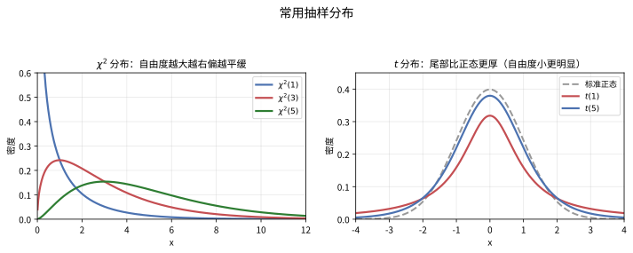
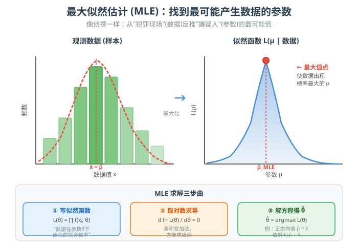
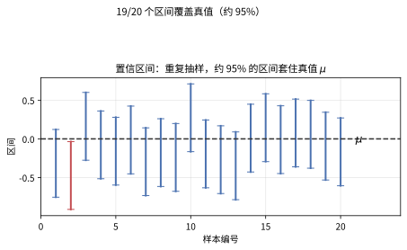
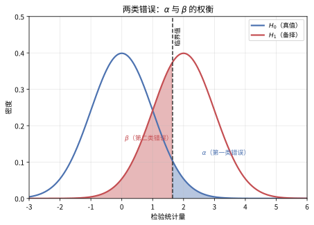
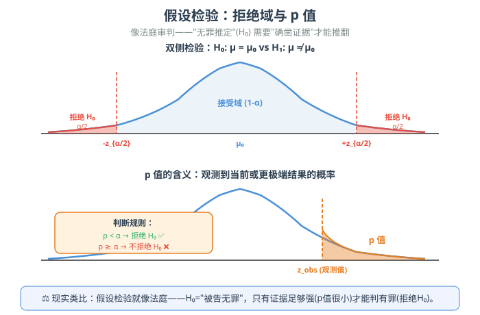

# 第 25 级：数理统计 (Mathematical Statistics)

---

## 1. 学习目标

完成本教程后，你将能够：

1. 理解总体与样本的区别，掌握描述性统计量的计算方法
2. 掌握三大抽样分布（χ²分布、t分布、F分布）的定义与性质
3. 理解点估计的基本概念，掌握矩估计法和最大似然估计法
4. 掌握区间估计方法，能构造常见参数的置信区间
5. 理解假设检验的框架，熟练进行各类常见检验
6. 理解 Neyman-Pearson 引理、Rao-Cramér 下界等核心定理
7. 能独立分析和解决实际统计问题

---

## 2. 描述统计

### 2.1 总体与样本

**总体**（Population）是研究对象的全体。**样本**（Sample）是从总体中抽取的部分个体。

- 总体大小 $N$，样本大小 $n$
- 样本独立同分布（i.i.d.）：$X_1, X_2, \dots, X_n \overset{\text{i.i.d.}}{\sim} F$

> **💡 直观理解（类比）**：**总体**是"全体人群 / 全部产品"，**样本**只是"抽其中一部分来观察"。就像要知道一锅汤的味道（总体），不可能喝光全锅，只需舀一勺尝（样本），再借这勺去推断整锅的咸淡。i.i.d. 表示"每一勺都独立、且都来自同一锅"，保证抽样有代表性。

### 2.2 样本均值与样本方差

**样本均值**（Sample Mean）：

$$
\bar{X} = \frac{1}{n}\sum_{i=1}^{n} X_i
$$

**样本方差**（Sample Variance）：

$$
S^2 = \frac{1}{n-1}\sum_{i=1}^{n} (X_i - \bar{X})^2
$$

分母为 $n-1$ 而非 $n$，这是为了得到无偏估计（即 $\mathbb{E}[S^2] = \sigma^2$）。

**样本标准差**：$S = \sqrt{S^2}$

> **💡 直观理解（类比）**：样本均值 $\bar X$ 是"把整组样本加起来除以个数"的**平均中心**；样本方差 $S^2$ 则度量"数据围绕均值散开的程度"（离均差平方后再平均）。分母用 $n-1$ 而非 $n$，是为了给"先用样本估均值、又在同一批数据上算波动"造成的低估作补偿——平均来看，$S^2$ 才恰好等于真实总体方差 $\sigma^2$（无偏）。

### 2.3 顺序统计量

将样本 $X_1, \dots, X_n$ 按从小到大排序得到：

$$
X_{(1)} \le X_{(2)} \le \cdots \le X_{(n)}
$$

- $X_{(k)}$ 称为第 $k$ 个**顺序统计量**
- $X_{(1)}$ 为**样本最小值**，$X_{(n)}$ 为**样本最大值**
- **样本中位数**：$\tilde{X} = \begin{cases} X_{((n+1)/2)} & n \text{为奇数} \\ \frac{1}{2}(X_{(n/2)} + X_{(n/2+1)}) & n \text{为偶数} \end{cases}$

> **💡 直观理解（类比）**：顺序统计量就是"**把样本按大小排队后，再按位次点名**"：排序后第 $k$ 位的 $X_{(k)}$ 就是第 $k$ 个顺序统计量，$X_{(1)}$ 最小、$X_{(n)}$ 最大。**中位数**是站在队伍正中间的那一位——它不像均值那样被极端值拉扯，好比一群身高中"站中间的那个人"，比"平均身高"更能扛住个别巨人的干扰。

### 2.4 经验分布函数

**经验分布函数**（Empirical Distribution Function, EDF）：

$$
\hat{F}_n(x) = \frac{1}{n}\sum_{i=1}^{n} \mathbf{1}_{\{X_i \le x\}}
$$

性质：
- $\hat{F}_n(x)$ 是 $F(x)$ 的无偏估计
- 由 Glivenko-Cantelli 定理：$\sup_{x} |\hat{F}_n(x) - F(x)| \xrightarrow{\text{a.s.}} 0$

> **💡 直观理解（类比）**：经验分布函数 $\hat F_n(x)$ 就是"**看样本里有百分之多少不超过 $x$**"，它像用样本画出的"经验累积分布曲线"，一步步逼近真实的总体分布 $F$。好比没见过全年级（总体）的身高分布，就拿抽到的样本画一条逐段上升的阶梯曲线去近似它；样本越多（Glivenko-Cantelli 定理），这条阶梯就越贴紧真实曲线。

---

## 3. 抽样分布

### 3.1 抽样分布的概念

**抽样分布**（Sampling Distribution）是统计量的概率分布。它是统计推断的基础。

> **直观理解（现实类比）**：抽样分布描述"**统计量（如样本均值）自身会怎么波动**"。$\chi^2$ 分布像"**平方和"的分布**——若干标准正态的平方相加，自由度越大越靠右、越平缓；$t$ 分布是"**估计均值时,方差未知**"用的分布，比正态**尾部更厚**（更常出现"极端值"），因为它把"样本波动的额外不确定性"也算了进去。自由度越大，$t$ 越接近正态。

### 3.2 χ²分布（卡方分布）

**定义**：设 $Z_1, Z_2, \dots, Z_k \overset{\text{i.i.d.}}{\sim} N(0,1)$，则

$$
\chi^2_k = \sum_{i=1}^{k} Z_i^2 \sim \chi^2(k)
$$

其中 $k$ 为**自由度**。

**概率密度函数**：

$$
f(x; k) = \frac{1}{2^{k/2}\Gamma(k/2)} x^{k/2-1} e^{-x/2}, \quad x > 0
$$

**性质**：
- $\mathbb{E}[\chi^2_k] = k$
- $\operatorname{Var}(\chi^2_k) = 2k$
- 若 $X \sim \chi^2(m)$, $Y \sim \chi^2(n)$ 独立，则 $X + Y \sim \chi^2(m+n)$

> **💡 直观理解（类比）**：$\chi^2$ 分布是"**标准正态的平方和**"的分布——把 $k$ 个独立的标准正态分别平方再相加。它恒为正，$k$（自由度）越大分布越靠右、越平缓，均值与方差分别是 $k$ 和 $2k$；"两个 $\chi^2$ 相加仍是 $\chi^2$（自由度相加）"（可加性），就像把两份"平方和账本"并成一份。它常用来刻画"平方量"的波动与"拟合好坏"（见 7.5、5.5）。

### 3.3 t分布（学生氏分布）

**定义**：设 $Z \sim N(0,1)$, $U \sim \chi^2(k)$ 且相互独立，则

$$
t_k = \frac{Z}{\sqrt{U/k}} \sim t(k)
$$

**概率密度函数**：

$$
f(x; k) = \frac{\Gamma((k+1)/2)}{\sqrt{k\pi}\,\Gamma(k/2)} \left(1 + \frac{x^2}{k}\right)^{-(k+1)/2}
$$

**性质**：
- 当 $k \to \infty$ 时，$t_k \xrightarrow{d} N(0,1)$
- $k > 1$ 时 $\mathbb{E}[t_k] = 0$；$k > 2$ 时 $\operatorname{Var}(t_k) = \frac{k}{k-2}$

> **💡 直观理解（类比）**：$t$ 分布是"$t = Z/\sqrt{U/k}$"——一个标准正态除以（开根后的）$\chi^2$ 修正量，专在**方差未知、样本量小**时替代正态。它比正态**尾部更厚**（更常出现极端值），因为把"用样本估计方差带来的不确定性"也算进去了；样本量越大（$k\to\infty$），$t$ 越贴近标准正态。它就像"尺子没完全校准时用的一把更'糊'的尺"，估计均值时把余量放大一点。

### 3.4 F分布

**定义**：设 $U \sim \chi^2(m)$, $V \sim \chi^2(n)$ 且相互独立，则

$$
F_{m,n} = \frac{U/m}{V/n} \sim F(m, n)
$$

**性质**：
- 若 $T \sim t(k)$，则 $T^2 \sim F(1, k)$
- $\mathbb{E}[F_{m,n}] = \frac{n}{n-2}$（$n > 2$）

> **💡 直观理解（类比）**：$F$ 分布是"**两个 $\chi^2$ 各自除以自由度后的比值**"$F=(U/m)/(V/n)$，用来比较两组"平方和账本"的比例是否合理。若 $T\sim t(k)$，则 $T^2\sim F(1,k)$——一个 $t$ 值的平方也会落进 $F$ 分布。它常见于比较两组方差（7.6）和 ANOVA（7.7）。

### 3.5 中心极限定理的应用

**中心极限定理**（CLT）：设 $X_1, \dots, X_n$ 是 i.i.d. 样本，$\mathbb{E}[X_i] = \mu$，$\operatorname{Var}(X_i) = \sigma^2 < \infty$，则

$$
\frac{\sqrt{n}(\bar{X} - \mu)}{\sigma} \xrightarrow{d} N(0, 1)
$$

这意味着当样本量足够大时，样本均值的分布近似于正态分布，无论总体分布形态如何。

> **💡 直观理解（类比）**：中心极限定理是统计学的"**奇迹定律**"：不论总体长得多么奇特，只要样本 $n$ 够大，样本均值的分布就近似正态。就像**把很多枚长相不规则的硬币总和起来**——单枚再不规则，一堆加总总是摆动成一条钟形曲线。它给"用正态近似任何均值"提供了理论保障。

---

## 4. 点估计

### 4.1 基本概念

**估计量**（Estimator）：用于估计未知参数 $\theta$ 的统计量 $\hat{\theta} = T(X_1, \dots, X_n)$。

**估计值**（Estimate）：估计量在具体样本下的取值。

> **💡 直观理解（类比）**：**估计量**是"由样本数据算出某个未知参数的'规则'"（如 $\hat\theta = \bar X$），**估计值**是把具体样本代进去得到的那个数值。就像"估一批人的平均身高"：估算法则是估计量，而这次算出的 170cm 是估计值。一句话：**估计量是函数，估计值是数字**。

### 4.2 偏差、方差与均方误差

**偏差**（Bias）：

$$
\operatorname{Bias}(\hat{\theta}) = \mathbb{E}[\hat{\theta}] - \theta
$$

**无偏估计**：若 $\operatorname{Bias}(\hat{\theta}) = 0$，则称 $\hat{\theta}$ 是 $\theta$ 的无偏估计。

**方差**（Variance）：

$$
\operatorname{Var}(\hat{\theta}) = \mathbb{E}[(\hat{\theta} - \mathbb{E}[\hat{\theta}])^2]
$$

**均方误差**（Mean Squared Error, MSE）：

$$
\operatorname{MSE}(\hat{\theta}) = \mathbb{E}[(\hat{\theta} - \theta)^2] = \operatorname{Var}(\hat{\theta}) + [\operatorname{Bias}(\hat{\theta})]^2
$$

> **💡 直观理解（类比）**：**偏差**＝"估计量长期平均下来的偏离"（$\mathbb{E}[\hat\theta]-\theta$），偏差为 0 就是**无偏**——平均来看不偏不倚。**方差**衡量"反复抽样时估计值抖得多厉害"，**均方误差 MSE** 则是"偏差的平方＋方差"，堆叠成**总误差**。好比手电筒照靶子：偏差是"瞄得准不准"，方差是"手抖不抖"，MSE 是两者合起来的"综合打偏程度"。

### 4.3 矩估计法

**矩估计法**（Method of Moments, MoM）的基本思想：用样本矩估计总体矩。

**步骤**：
1. 计算总体矩：$\mu_k = \mathbb{E}[X^k]$
2. 令样本矩等于总体矩：$\frac{1}{n}\sum_{i=1}^{n} X_i^k = \mu_k$
3. 解方程得到参数估计

**示例**：对正态分布 $N(\mu, \sigma^2)$：
- 一阶矩：$\bar{X} = \hat{\mu}$
- 二阶矩：$\frac{1}{n}\sum X_i^2 = \hat{\mu}^2 + \hat{\sigma}^2 \Rightarrow \hat{\sigma}^2 = \frac{1}{n}\sum (X_i - \bar{X})^2$

> **💡 直观理解（类比）**：矩估计的思想很直接：**"样本的『平均感觉』应与总体的『平均感觉』配得上"**——令样本矩（如 $\frac1n\sum X_i^k$）等于总体矩（如 $\mathbb{E}[X^k]$），再解方程反推参数。好比想知道口袋重量的平均值，就多摸几个样本求平均，再倒推出总体参数。它简单直观，常作为 MLE 的"快速第一版"。

### 4.4 最大似然估计

**最大似然估计**（Maximum Likelihood Estimation, MLE）的基本思想：选择参数 $\theta$，使得观测到当前样本的概率最大。

**似然函数**：

$$
L(\theta; x_1, \dots, x_n) = \prod_{i=1}^{n} f(x_i; \theta)
$$

**对数似然函数**：

$$
\ell(\theta) = \ln L(\theta) = \sum_{i=1}^{n} \ln f(x_i; \theta)
$$

**MLE**：$\hat{\theta}_{\text{MLE}} = \arg\max_{\theta} L(\theta)$，通常通过解 $\frac{\partial \ell(\theta)}{\partial \theta} = 0$ 得到。

> **直观理解（现实类比）**：MLE 就像**侦探破案**——犯罪现场（数据）已经摆在那里，侦探要反推嫌疑人（参数）的最可能值。左图是观测到的数据直方图，右图是"似然函数"——它回答的问题是：**"如果参数取某个值，这组数据出现的概率有多大？"** MLE 就是找到那个让数据"最可能出现"的参数值。比如你看到一组身高数据集中在 170cm 附近，MLE 会告诉你"最可能的均值就是样本均值 $\bar{x}$"——就像侦探说"最可能的嫌疑人就是出现在现场最多的人"。

#### 示例：正态分布的 MLE

设 $X_1, \dots, X_n \overset{\text{i.i.d.}}{\sim} N(\mu, \sigma^2)$

$$
\ell(\mu, \sigma^2) = -\frac{n}{2}\ln(2\pi) - \frac{n}{2}\ln\sigma^2 - \frac{1}{2\sigma^2}\sum_{i=1}^{n}(X_i - \mu)^2
$$

解方程：
- $\frac{\partial \ell}{\partial \mu} = \frac{1}{\sigma^2}\sum(X_i - \mu) = 0 \Rightarrow \hat{\mu} = \bar{X}$
- $\frac{\partial \ell}{\partial \sigma^2} = -\frac{n}{2\sigma^2} + \frac{1}{2\sigma^4}\sum(X_i - \mu)^2 = 0 \Rightarrow \hat{\sigma}^2 = \frac{1}{n}\sum(X_i - \bar{X})^2$

#### 示例：伯努利分布的 MLE

设 $X_1, \dots, X_n \overset{\text{i.i.d.}}{\sim} \operatorname{Ber}(p)$

$$
L(p) = \prod_{i=1}^{n} p^{X_i}(1-p)^{1-X_i} = p^{\sum X_i}(1-p)^{n-\sum X_i}
$$

$$
\ell(p) = (\sum X_i)\ln p + (n - \sum X_i)\ln(1-p)
$$

$$
\frac{d\ell}{dp} = \frac{\sum X_i}{p} - \frac{n - \sum X_i}{1-p} = 0 \Rightarrow \hat{p} = \bar{X}
$$

> **🧠 思考历程："哪个参数最'有可能'说出这批数据？"——极大似然的直觉**
>
> MLE（最大似然估计）是整个统计推断的心脏，它的提问方式很朴素：**给定一堆已经看到的数据，哪一个参数值最"解释得通"这些数据？** 答案往往就是那个参数的最优估计。
>
> - **反过来的"先看数据、再猜参数"**。一般概率问题先给参数求事件概率；极大似然把它倒过来——**把已观测数据当作既成事实，反过来问"如果参数是 $\theta$，看到这些数据的概率（似然）是多少"，再让这个概率最大**。谁让数据"看起来最合理"，谁就胜出。
> - **费希尔的"似然"命名之道**。统计学家费希尔（Fisher，1912）系统提出"最大似然"，强调与其纠结经典的"无偏性"直觉，不如认定**"能最大概率生成手头样本的参数，最像真相"**。他说服统计界：研究"观察到的现在是怎样的"往往比"假设未来是怎样"更能贴近实际。
> - **取对数是化简的艺术**。似然是许多概率之积（$\prod$），直接求导麻烦；取对数后乘法变加法、单调且极大值点不变，于是"$-\ln L$"的凸优化成为常态——**这纯粹是计算便利，却让 MLE 的数值求解放开了双手**。
> - **它的地位为何如此高**。在相当宽的条件（正则性）下，MLE 具有相合性（一致）、渐近正态性（8.1）并到达 Cramér-Rao 下界（8.2）——**"好估计"的许多理想属性，MLE 都在大样本下自动拥有**。于是它几乎成为"你可以先上手"的第一默认估计。
> - **心路**：极大似然告诉你：**面对不确定，最高效的信念校准方式，常常是问一句"哪种假设最能解释眼前的证据"**。把"看数据反推参数"练熟了，你就抓住了统计推断那条最常用的主脉。

### 4.5 一致性

**一致性**（Consistency）：若 $\hat{\theta}_n \xrightarrow{p} \theta$，即 $\forall \varepsilon > 0, \lim_{n\to\infty} P(|\hat{\theta}_n - \theta| > \varepsilon) = 0$，则称 $\hat{\theta}_n$ 是 $\theta$ 的一致估计。

> **💡 直观理解（类比）**：**一致性**说"**样本越多，估计越逼近真相**"：$n\to\infty$ 时 $\hat\theta_n$ 依概率收敛到 $\theta$。就像称体重，称一次有误差，但多称几次、取平均，结果就越接近真实体重。这是好估计量必须满足的最基本"底线"——连一致都不满足的估计很难让人放心。

### 4.6 有效性

**有效性**（Efficiency）：对于两个无偏估计 $\hat{\theta}_1$ 和 $\hat{\theta}_2$，若 $\operatorname{Var}(\hat{\theta}_1) \le \operatorname{Var}(\hat{\theta}_2)$，则称 $\hat{\theta}_1$ 比 $\hat{\theta}_2$ 更有效。

> **💡 直观理解（类比）**：**有效性**在"**两个都无偏**"的估计量之间比高下：方差越小的越**有效**。就像两把都瞄得很准的枪，但一把手更稳、抖动更小，同样的瞄准，它命中的分布更集中、误差更小。所以"无偏"之后还要看方差，方差越小越高效。

---

## 5. 区间估计

### 5.1 基本概念

**置信区间**（Confidence Interval）：对参数 $\theta$，若统计量 $L$ 和 $U$ 满足

$$
P(L \le \theta \le U) = 1 - \alpha
$$

则称 $[L, U]$ 为 $\theta$ 的置信水平为 $1-\alpha$ 的置信区间。

> **直观理解（现实类比）**：置信区间是"**对未知参数套一个'估计罩'**"。$95\%$ 置信区间不是说"$\theta$ 有 95% 概率落进这个区间"（$\theta$ 是固定的），而是：**反复抽样构造区间，约 95% 的区间会罩住 $\theta$**。就像**用网兜接球**：单次不一定接住，但用了 100 次网兜，约 95 次能接中。区间越窄，估计越精确；置信水平越高，区间越宽。

### 5.2 均值的置信区间（方差已知）

设 $X_1, \dots, X_n \overset{\text{i.i.d.}}{\sim} N(\mu, \sigma^2)$，$\sigma^2$ 已知。

由 $\frac{\bar{X} - \mu}{\sigma/\sqrt{n}} \sim N(0, 1)$ 得：

$$
\bar{X} \pm z_{\alpha/2} \cdot \frac{\sigma}{\sqrt{n}}
$$

其中 $z_{\alpha/2}$ 是标准正态分布的 $\alpha/2$ 上侧分位数。

> **💡 直观理解（类比）**：方差已知时，用标准正态分位 $z_{\alpha/2}$ 构造区间 $\bar X \pm z_{\alpha/2}\frac{\sigma}{\sqrt n}$。其中 $\frac{\sigma}{\sqrt n}$ 是"样本均值自身波动的大小"（标准误），$n$ 越大区间越窄、估计越精。它告诉我们：$\sigma$ 给定时，样本均值周围多远能把 $\mu$ 罩住。

### 5.3 均值的置信区间（方差未知）

当 $\sigma^2$ 未知时，用 $S$ 代替 $\sigma$：

由 $\frac{\bar{X} - \mu}{S/\sqrt{n}} \sim t(n-1)$ 得：

$$
\bar{X} \pm t_{\alpha/2}(n-1) \cdot \frac{S}{\sqrt{n}}
$$

> **💡 直观理解（类比）**：$\sigma^2$ 未知时，我们用样本标准差 $S$ 顶替 $\sigma$，于是正态换成了 $t(n-1)$——因为多出"用样本估方差"的这层不确定性，区间被**放宽**一点（$t$ 尾部更厚、更保守）。这就是"方差未知时用 $t$ 分位、区间更宽"的原因。

### 5.4 比例的置信区间

设 $X \sim \operatorname{Bin}(n, p)$，样本比例 $\hat{p} = X/n$。

当 $n$ 较大时，由 CLT 得近似置信区间：

$$
\hat{p} \pm z_{\alpha/2} \sqrt{\frac{\hat{p}(1-\hat{p})}{n}}
$$

> **💡 直观理解（类比）**：比例 $p$ 的区间靠中心极限定理：$\hat p \pm z_{\alpha/2}\sqrt{\hat p(1-\hat p)/n}$，$n$ 大时样本比例近似正态。就像掷大量硬币，样本里"正面比例 $\hat p$"会在真值 $p$ 附近呈钟形波动，据此估算 $\hat p$ 周围多远能盖住 $p$。

### 5.5 方差的置信区间

设 $X_1, \dots, X_n \overset{\text{i.i.d.}}{\sim} N(\mu, \sigma^2)$。

由 $\frac{(n-1)S^2}{\sigma^2} \sim \chi^2(n-1)$ 得：

$$
\left[ \frac{(n-1)S^2}{\chi^2_{\alpha/2}(n-1)}, \frac{(n-1)S^2}{\chi^2_{1-\alpha/2}(n-1)} \right]
$$

> **💡 直观理解（类比）**：方差区间以 $\frac{(n-1)S^2}{\sigma^2}\sim\chi^2(n-1)$ 为枢轴量反解，得到 $\sigma^2$ 落在以 $S^2$ 为中心的区间。因为 $\chi^2$ 是关于"平方和"的分布，正好用来描述"方差这种平方量"的波动；且 $\chi^2$ 曲线不左右对称，所以得到的区间通常也是**不对称**的。

### 5.6 均值差的置信区间

设 $X_1, \dots, X_m \overset{\text{i.i.d.}}{\sim} N(\mu_X, \sigma_X^2)$，$Y_1, \dots, Y_n \overset{\text{i.i.d.}}{\sim} N(\mu_Y, \sigma_Y^2)$ 且独立。

**方差相等时**（$\sigma_X^2 = \sigma_Y^2 = \sigma^2$）：

$$
(\bar{X} - \bar{Y}) \pm t_{\alpha/2}(m+n-2) \cdot S_p \sqrt{\frac{1}{m} + \frac{1}{n}}
$$

其中 $S_p^2 = \frac{(m-1)S_X^2 + (n-1)S_Y^2}{m+n-2}$ 为合并方差。

> **💡 直观理解（类比）**：比较两个总体均值差时，若假设两组方差相等，就把两份样本"拧成一股"，用**合并方差 $S_p^2$** 统一估计波动，再用 $t(m+n-2)$ 构造 $(\bar X-\bar Y)$ 的区间。这样能借更多数据压低方差，得到更可靠的均值差区间，回答"两个总体的均值差究竟落在哪儿"。

---

## 6. 假设检验

### 6.1 基本概念

**原假设**（Null Hypothesis, $H_0$）：需要检验的假设，通常为"无差异"或"无效果"。

**备择假设**（Alternative Hypothesis, $H_1$）：与原假设对立的假设。

**检验统计量**：用于检验的统计量。

**拒绝域**（Rejection Region）：使 $H_0$ 被拒绝的样本空间区域。

> **💡 直观理解（类比）**：**原假设 $H_0$** 通常是"无差异 / 无效果"（相当于默认"无罪"），**备择假设 $H_1$** 与它对立（"有罪"）。**检验统计量**是由样本算出的"裁判分数"，**拒绝域**是"分数一落进去就判 $H_0$ 有罪"的极端取样区域。要想推翻默认的"无辜"，证据必须足够极端、落入拒绝域才行。

### 6.2 两类错误

| 决策 | $H_0$ 为真 | $H_0$ 为假 |
|------|-----------|-----------|
| 接受 $H_0$ | ✅ 正确 | ❌ 第二类错误（Type II Error, $\beta$） |
| 拒绝 $H_0$ | ❌ 第一类错误（Type I Error, $\alpha$） | ✅ 正确 |

- **显著性水平**（Significance Level）：$\alpha = P(\text{拒绝 } H_0 \mid H_0 \text{ 为真})$
- **检验功效**（Power）：$1 - \beta = P(\text{拒绝 } H_0 \mid H_0 \text{ 为假})$

> **直观理解（现实类比）**：两类错误是"**判案的两种冤枉**"。**第一类错误（$\alpha$）**：$H_0$ 其实为真，你却误判有罪（**错杀无辜**）——通常设为 0.05；**第二类错误（$\beta$）**：$H_0$ 其实为假，你却放过了罪人（**纵容漏网**）。两者此消彼长：把"定罪门槛"提得越高，越不会错杀（$\alpha$ 小），但越容易漏网（$\beta$ 大）。好的检验希望 $\alpha$ 小、功效 $1-\beta$ 大，Neyman-Pearson 引理正是寻找最优折中。

**功效函数与样本量的确定**（Power Function & Sample Size）

> **先看一个问题**：研发人员想把"痊愈率从 50% 提到 60%"，用 $H_0: p = 0.5$ vs $H_1: p = 0.6$ 来检验。$\alpha$ 定了，但心里还有一个更难答的问题：**"假如新药真有效，我有多大把握检验得出来？"** 这问的正是**功效（Power）$1-\beta$**。它不关心"错杀多少"，而关心"该抓的抓没抓住"——功效太低，样本相当于白做。

**功效函数**：设检验的拒绝域为 $R$，则**功效函数**定义为
$$\pi(\theta) = P_\theta(\text{拒绝 } H_0) = P_\theta(\boldsymbol{X} \in R).$$
对 $\theta \in \Theta_0$，$\pi(\theta) \le \alpha$（第一类错误被压住）；对 $\theta \in \Theta_1$，$\pi(\theta) = 1 - \beta(\theta)$（功效），$\beta$ 是第二类错误。

> **🔑 推理链（该抓的抓没抓住，靠什么决定？）**：功效大小取决于三个关键因素——**真实差距 $\Delta$、样本量 $n$、显著性水平 $\alpha$**。以方差已知的 $z$ 检验单侧 $H_0:\mu=\mu_0$ vs $H_1:\mu=\mu_1>\mu_0$ 为例，拒绝域 $Z=\frac{\bar X-\mu_0}{\sigma/\sqrt n} > z_\alpha$。在真实均值 $\mu_1$ 下，把 $\bar X\sim N(\mu_1,\sigma^2/n)$ 标准化：
$$
\pi(\mu_1) \triangleq 1-\beta = P\!\left(Z > z_\alpha \mid \mu=\mu_1\right)
= P\!\left(\underbrace{\frac{\bar X-\mu_1}{\sigma/\sqrt n}}_{N(0,1)} > z_\alpha - \underbrace{\frac{\mu_1-\mu_0}{\sigma/\sqrt n}}_{\Delta\sqrt n/\sigma} \right)
= \Phi\!\left(\frac{\Delta\sqrt n}{\sigma} - z_\alpha\right).
$$
于是：
> - 真实差距 $\Delta=\mu_1-\mu_0$ 越大 → $\Delta\sqrt n/\sigma$ 越大 → 拒绝线的"偏移量"越大 → 功效越高（明显的事当然容易查出来）；
> - 样本量 $n$ 越大 → $\Delta\sqrt n/\sigma$ 越大 → 分布越"尖"、两分布重叠越小 → 功效越高；
> - 显著性水平 $\alpha$ 越小 → $z_\alpha$ 越大 → 拒绝线越靠右、越难跨过 → 功效越低（越要铁证越易漏网）。

**最小样本量**：反解上式，给定想达到的功效 $1-\beta$、要检测的差距 $\Delta$ 与显著性水平 $\alpha$，所需样本量为
$$
n = \left(\frac{(z_\alpha + z_\beta)\,\sigma}{\Delta}\right)^2.
$$

**示例**：设 $\sigma = 10$，$\alpha = 0.05$（$z_\alpha = 1.645$），要检测差距 $\Delta = 5$ 且达到功效 0.8（$z_\beta = z_{0.2} = 0.84$），则 $n = \left(\frac{(1.645+0.84)\times 10}{5}\right)^2 = (4.97)^2 \approx 24.7$，取 $n = 25$。

> **⚠️ 常见坑**：功效是"在 $H_1$ 下的拒绝概率 $\pi(\theta_1)=1-\beta$"，不要把功效与显著性水平 $\alpha$ 混为一谈。双侧检验的功效要把两侧都算上、且 $z_\alpha$ 换成 $z_{\alpha/2}$。另外，"功效低"≠"检验无效"，它只说明"这个样本量抓这么小的差距把握不足"——正确做法是**据此增大样本量**，而不是改宽松 $\alpha$ 去"凑出显著"。

### 6.3 p值

**p值**（p-value）：在原假设成立下，观测到当前结果或更极端结果的概率。

- 若 $p\text{-value} < \alpha$，拒绝 $H_0$

> **直观理解（现实类比）**：假设检验就像**法庭审判**。原假设 $H_0$ 是"被告无罪"（无罪推定），备择假设 $H_1$ 是"被告有罪"。上图中的正态曲线就是"假设无罪时，证据应该长什么样"。**拒绝域**（红色区域）是"极端到不可能由巧合解释"的证据区域——只有证据落入这里，才能判有罪（拒绝 $H_0$）。**p 值**就是"假设无罪时，出现这么极端证据的概率"——p 值越小，巧合越难解释，定罪越有把握。设定 $\alpha = 0.05$ 就像说"除非证据的巧合概率低于 5%，否则宁可放过"。这就是为什么**"统计显著"不等于"实际重要"**——就像"法律有罪"不等于"道德有罪"。

### 6.4 Neyman-Pearson 引理

**定理**：对于简单假设检验 $H_0: \theta = \theta_0$ vs $H_1: \theta = \theta_1$，似然比检验

$$
\phi(x) = \begin{cases}
1 & \text{若 } \frac{L(\theta_1; x)}{L(\theta_0; x)} > k \\
\gamma & \text{若 } \frac{L(\theta_1; x)}{L(\theta_0; x)} = k \\
0 & \text{若 } \frac{L(\theta_1; x)}{L(\theta_0; x)} < k
\end{cases}
$$

是给定显著性水平 $\alpha$ 下**最优势检验**（Most Powerful Test），其中 $k$ 和 $\gamma$ 由 $\mathbb{E}_{H_0}[\phi(X)] = \alpha$ 确定。

> **💡 直观理解（类比）**：Neyman-Pearson 引理说的是：在两个简单假设 $H_0$ vs $H_1$ 之间，**似然比检验是最"强"的检验**——在给定的显著性水平 $\alpha$（第一类错误上限）下，它的功效（$1-\beta$）最大，任何其他检验都超不过它。它把样本丢到"更像 $H_1$ 还是更像 $H_0$"的天平上（看两个似然的比值），比值明显偏向 $H_1$ 就拒绝 $H_0$。它给出了这类检验中"最好的那把尺子"。

**证明**：

设 $\phi$ 是上述似然比检验，$\phi'$ 是任意一个满足 $\mathbb{E}_{H_0}[\phi'(X)] \le \alpha$ 的检验函数。

考虑差值：

$$
[\phi(x) - \phi'(x)][f_1(x) - k f_0(x)]
$$

其中 $f_1(x) = L(\theta_1; x)$，$f_0(x) = L(\theta_0; x)$。

当 $f_1(x) > k f_0(x)$ 时，$\phi(x) = 1$，所以 $\phi(x) - \phi'(x) \ge 0$，从而乘积非负。

当 $f_1(x) < k f_0(x)$ 时，$\phi(x) = 0$，所以 $\phi(x) - \phi'(x) \le 0$，乘积仍非负。

当 $f_1(x) = k f_0(x)$ 时，乘积为 0。

因此 $[\phi(x) - \phi'(x)][f_1(x) - k f_0(x)] \ge 0$ 处处成立。

两边积分：

$$
\int [\phi(x) - \phi'(x)]f_1(x)dx \ge k\int [\phi(x) - \phi'(x)]f_0(x)dx
$$

即

$$
\mathbb{E}_{H_1}[\phi(X)] - \mathbb{E}_{H_1}[\phi'(X)] \ge k(\mathbb{E}_{H_0}[\phi(X)] - \mathbb{E}_{H_0}[\phi'(X)]) \ge 0
$$

所以 $\mathbb{E}_{H_1}[\phi(X)] \ge \mathbb{E}_{H_1}[\phi'(X)]$，即 $\phi$ 的检验功效不低于 $\phi'$。$\square$

### 6.5 似然比检验

**似然比检验**（Likelihood Ratio Test, LRT）用于复合假设检验。

检验 $H_0: \theta \in \Theta_0$ vs $H_1: \theta \in \Theta_1$，似然比统计量为：

$$
\lambda(x) = \frac{\sup_{\theta \in \Theta_0} L(\theta; x)}{\sup_{\theta \in \Theta} L(\theta; x)}
$$

其中 $\Theta = \Theta_0 \cup \Theta_1$。

在适当正则条件下，$-2\ln\lambda(x) \xrightarrow{d} \chi^2(\dim\Theta - \dim\Theta_0)$。

---

> **💡 直观理解（类比）**：似然比检验是把 Neyman-Pearson 推广到复合假设：$\lambda(x)=\frac{\text{受限 ($\Theta_0$：$H_0$ 成立) 下的最大似然}}{\text{全体 ($\Theta$) 下的最大似然}}$。比值越接近 1，说明 $H_0$ 已经"解释得足够好"；比值越小，说明 $H_0$ 越"憋屈"、越应拒绝。大样本下 $-2\ln\lambda$ 近似 $\chi^2$，方便定出临界值。

## 7. 常见检验

### 7.1 z检验

**适用**：总体方差已知，检验均值

**统计量**：

$$
Z = \frac{\bar{X} - \mu_0}{\sigma/\sqrt{n}} \sim N(0, 1)
$$

**双侧检验**：$H_0: \mu = \mu_0$ vs $H_1: \mu \ne \mu_0$，拒绝域：$|Z| > z_{\alpha/2}$

> **💡 直观理解（类比）**：$z$ 检验在**总体方差已知**时检验均值，统计量 $Z = \frac{\bar X-\mu_0}{\sigma/\sqrt n}\sim N(0,1)$——把样本均值标准化成"离 $\mu_0$ 差了几个标准误"。$|Z|$ 越大，说明 $\mu_0$ 越不像真的，一旦落入拒绝域（$|Z|>z_{\alpha/2}$）就拒绝 $H_0$。

### 7.2 t检验（单样本）

**适用**：总体方差未知，检验均值

**统计量**：

$$
T = \frac{\bar{X} - \mu_0}{S/\sqrt{n}} \sim t(n-1)
$$

> **💡 直观理解（类比）**：单样本 $t$ 检验在**方差未知**时检验均值，$T=\frac{\bar X-\mu_0}{S/\sqrt n}\sim t(n-1)$——把 $z$ 式中的 $\sigma$ 换成样本标准差 $S$，分布由正态改成 $t$。它适合"不知道波动大小、样本又不大"的现实场景，比 $z$ 更保守。

### 7.3 双样本t检验

**适用**：比较两个独立总体的均值

**统计量**（方差相等时）：

$$
T = \frac{\bar{X} - \bar{Y}}{S_p\sqrt{1/m + 1/n}} \sim t(m+n-2)
$$

> **💡 直观理解（类比）**：双样本 $t$ 检验比较两个独立总体的均值，用合并方差 $S_p$ 统一刻画两组的波动：$T=\frac{\bar X-\bar Y}{S_p\sqrt{1/m+1/n}}\sim t(m+n-2)$。它就是比较"两组均值的差 $\bar X-\bar Y$"是否大到远超它们各自随机波动的程度。

### 7.4 配对t检验

**适用**：配对数据，检验差值均值

统计量 $T = \frac{\bar{D} - \mu_0}{S_D/\sqrt{n}} \sim t(n-1)$

> **💡 直观理解（类比）**：配对 $t$ 检验针对"**同一批对象的前后测 / 一一配对**"的数据，先把每个对象的差值 $D_i$ 算出来，再对这批差值做单样本 $t$ 检验。比如减肥药前后对比：每个人自己做自己的对照，剔除了个体差异，只检验"前后差"是否显著非零，因而比独立两样本更灵敏。

### 7.5 χ²检验（拟合优度检验）

**适用**：检验分类数据的分布

**统计量**：

$$
\chi^2 = \sum_{i=1}^{k} \frac{(O_i - E_i)^2}{E_i} \sim \chi^2(k-1-p)
$$

其中 $O_i$ 为观测频数，$E_i$ 为期望频数，$p$ 为估计的参数个数。

> **💡 直观理解（类比）**：$\chi^2$ 拟合优度检验比较"**实际观测频数 $O_i$**"与"**理论期望频数 $E_i$**"：$\chi^2=\sum (O_i-E_i)^2/E_i$。若模型正确（如骰子均匀），各 $O_i$ 与 $E_i$ 应相近、$\chi^2$ 很小；$\chi^2$ 太大说明理论站不住脚，就拒绝"数据服从该分布"的假设。

### 7.6 F检验（方差齐性检验）

**适用**：比较两个总体的方差

**统计量**：

$$
F = \frac{S_X^2}{S_Y^2} \sim F(m-1, n-1)
$$

检验 $H_0: \sigma_X^2 = \sigma_Y^2$ vs $H_1: \sigma_X^2 \ne \sigma_Y^2$

> **💡 直观理解（类比）**：F 检验比较两个总体的方差：$F=\frac{S_X^2}{S_Y^2}\sim F(m-1,n-1)$，检验 $H_0:\sigma_X^2=\sigma_Y^2$。若两组样本方差的比值明显远离 1，就有理由认为总体方差不相等。因为这里是"**比值**"而非"差值"的比较，所以用 F（而非 t）。

### 7.7 单因素方差分析（ANOVA）

**适用**：比较多个总体的均值是否相等

**模型**：$X_{ij} = \mu + \alpha_i + \varepsilon_{ij}$，$i=1,\dots,k$，$j=1,\dots,n_i$

**检验**：$H_0: \alpha_1 = \alpha_2 = \cdots = \alpha_k = 0$

**平方和分解**：

$$
SS_T = SS_B + SS_W
$$

其中：
- $SS_T = \sum_i\sum_j (X_{ij} - \bar{X}_{\cdot\cdot})^2$ —— 总平方和
- $SS_B = \sum_i n_i(\bar{X}_{i\cdot} - \bar{X}_{\cdot\cdot})^2$ —— 组间平方和
- $SS_W = \sum_i\sum_j (X_{ij} - \bar{X}_{i\cdot})^2$ —— 组内平方和

**F统计量**：

$$
F = \frac{SS_B/(k-1)}{SS_W/(N-k)} \sim F(k-1, N-k)
$$

**ANOVA 表**：

| 来源 | 平方和 | 自由度 | 均方 | F值 |
|------|--------|-------|------|-----|
| 组间 | $SS_B$ | $k-1$ | $MS_B = SS_B/(k-1)$ | $MS_B/MS_W$ |
| 组内 | $SS_W$ | $N-k$ | $MS_W = SS_W/(N-k)$ | |
| 总计 | $SS_T$ | $N-1$ | | |

> **💡 直观理解（类比）**：单因素 ANOVA 比较多个总体的均值是否全相等，核心是**平方和分解** $SS_T = SS_B + SS_W$：把数据的总体波动拆成"**组与组之间的差异 $SS_B$**"与"**各组内部的随机误差 $SS_W$**"。若 $SS_B$ 相对 $SS_W$ 明显偏大（$F$ 很大），说明真有组间差异、各组的均值并不都相同。ANOVA 表就像流水账，把"组间、组内、总计"的账一行行算清。

### 7.8 简单线性回归

**模型**：研究响应 $Y$ 与预测变量 $x$ 的线性关系
$$
Y = \beta_0 + \beta_1 x + \varepsilon, \qquad \varepsilon \sim \mathcal{N}(0, \sigma^2) \text{ i.i.d.}
$$

**最小二乘估计 (OLS)**：最小化 $\sum_i (y_i - \beta_0 - \beta_1 x_i)^2$，得
$$
\hat{\beta}_1 = \frac{\sum_i (x_i - \bar{x})(y_i - \bar{y})}{\sum_i (x_i - \bar{x})^2}, \qquad
\hat{\beta}_0 = \bar{y} - \hat{\beta}_1 \bar{x}.
$$

**回归显著性检验**：$H_0: \beta_1 = 0$，检验统计量
$$
t = \frac{\hat{\beta}_1}{\hat{\sigma}/\sqrt{\sum_i (x_i-\bar{x})^2}} \sim t(n-2),
$$
其中 $\hat{\sigma}^2 = \frac{1}{n-2}\sum_i (y_i - \hat{y}_i)^2$ 为残差方差的无偏估计。

**决定系数**：$R^2 = 1 - \frac{SS_{res}}{SS_T}$，表示 $x$ 能解释 $y$ 变异的比例，$0 \le R^2 \le 1$。

> **💡 直观理解**：回归就是"找一条穿过散点云的直线"，使得各点到直线的竖直距离平方和最小。$R^2$ 回答"这条直线解释了多少数据波动"——$R^2=1$ 表示数据完全落在直线上，$R^2=0$ 表示直线毫无解释力。

### 7.9 独立性检验（列联表）

**适用**：判断两个分类变量是否独立。

**列联表**：把数据按两个分类变量交叉计数成 $r \times s$ 表，$O_{ij}$ 为观测频数。

**期望频数**（在 $H_0$：独立 下）：$E_{ij} = \frac{\text{第 } i \text{ 行合计} \times \text{第 } j \text{ 列合计}}{N}$。

**检验统计量**：
$$
\chi^2 = \sum_{i=1}^{r}\sum_{j=1}^{s} \frac{(O_{ij} - E_{ij})^2}{E_{ij}} \sim \chi^2((r-1)(s-1)).
$$

> **💡 直观理解**：独立性检验比较"实际观察到的频数"与"若两变量无关时应有的频数"相差多大。差别越大，$\chi^2$ 越大，越有把握拒绝"两变量独立"的假设。例如判断"性别"与"是否购买"是否相关。

---

## 8. 定理与证明

### 8.1 大样本下 MLE 的渐近正态性

**定理**：在适当正则条件下，MLE $\hat{\theta}_n$ 满足：

$$
\sqrt{n}(\hat{\theta}_n - \theta) \xrightarrow{d} N(0, I(\theta)^{-1})
$$

其中 $I(\theta)$ 为 Fisher 信息量：

$$
I(\theta) = \mathbb{E}\left[ \left( \frac{\partial}{\partial\theta} \ln f(X; \theta) \right)^2 \right] = -\mathbb{E}\left[ \frac{\partial^2}{\partial\theta^2} \ln f(X; \theta) \right]
$$

这意味着 MLE 是**渐近正态**、**渐近无偏**、**渐近有效**的。

> **💡 直观理解（类比）**：大样本下 MLE 自动变成"**正态、无偏、最有效率**"的估计量：$\sqrt n(\hat\theta_n-\theta)\to N(0,I(\theta)^{-1})$。也就是说，样本越多，$\hat\theta_n$ 越像一个围绕真值 $\theta$ 正态散布、方差由 Fisher 信息 $I(\theta)$ 决定的好估计。Fisher 信息衡量"数据里究竟藏着多少关于 $\theta$ 的信息"，信息越多、估计就越集中。

### 8.2 Rao-Cramér 下界（Cramér-Rao Lower Bound）

**定理**：设 $\hat{\theta}$ 是 $\theta$ 的无偏估计，在适当正则条件下：

$$
\operatorname{Var}(\hat{\theta}) \ge \frac{1}{n I(\theta)}
$$

其中 $I(\theta)$ 是 Fisher 信息量。

> **💡 直观理解（类比）**：Rao-Cramér 下界给出了估计"成绩"的理论下限：**任何无偏估计的方差都不可能小于 $\frac{1}{nI(\theta)}$**。Fisher 信息越高，这个下限越低，估计越能做得精细；能达到此下界的估计称为"有效估计"。就像考试有理论满分，估计量的误差也有个"不可能再小"的极限。

**证明**：

设 $X_1, \dots, X_n \overset{\text{i.i.d.}}{\sim} f(x; \theta)$，联合密度为 $f(\mathbf{x}; \theta) = \prod_{i=1}^{n} f(x_i; \theta)$。

由于 $\hat{\theta}$ 是无偏的，$\mathbb{E}[\hat{\theta}] = \theta$，即

$$
\int \hat{\theta}(\mathbf{x}) f(\mathbf{x}; \theta) d\mathbf{x} = \theta
$$

两边对 $\theta$ 求导：

$$
\int \hat{\theta}(\mathbf{x}) \frac{\partial f(\mathbf{x}; \theta)}{\partial\theta} d\mathbf{x} = 1
$$

将 $\frac{\partial f}{\partial\theta} = f \cdot \frac{\partial \ln f}{\partial\theta}$ 代入：

$$
\int \hat{\theta}(\mathbf{x}) \frac{\partial \ln f(\mathbf{x}; \theta)}{\partial\theta} f(\mathbf{x}; \theta) d\mathbf{x} = 1
$$

即 $\mathbb{E}\left[ \hat{\theta} \cdot \frac{\partial \ln f}{\partial\theta} \right] = 1$。

同时，$\mathbb{E}\left[ \frac{\partial \ln f}{\partial\theta} \right] = 0$，所以

$$
\operatorname{Cov}\left( \hat{\theta}, \frac{\partial \ln f}{\partial\theta} \right) = 1
$$

由 Cauchy-Schwarz 不等式：

$$
\operatorname{Var}(\hat{\theta}) \cdot \operatorname{Var}\left( \frac{\partial \ln f}{\partial\theta} \right) \ge 1
$$

而 $\operatorname{Var}\left( \frac{\partial \ln f}{\partial\theta} \right) = n I(\theta)$，因此

$$
\operatorname{Var}(\hat{\theta}) \ge \frac{1}{n I(\theta)} \quad \square
$$

### 8.3 Neyman-Pearson 引理

已在 6.4 节中给出完整陈述和证明。

---

## 9. 解题技巧

本节针对数理统计中高频问题（描述统计、抽样分布、点估计、区间估计、假设检验）给出可直接套用的操作方法。每条包含**适用场景**、**关键步骤**、**常见误区**并配精讲示例。

### 9.1 描述统计："求和-平方和"两步法

**适用场景**：给出一组样本，需要计算样本均值 $\bar{x}$ 与样本方差 $s^2$。

**关键步骤**：
1. 计算 $S_1 = \sum x_i$，得 $\bar{x} = S_1/n$；
2. 计算平方和 $S_2 = \sum x_i^2$，用公式 $s^2 = \frac{1}{n-1}\left(S_2 - \frac{S_1^2}{n}\right)$，分母取 $n-1$（无偏）；
3. 需要时写出顺序统计量与经验分布函数。

**常见误区**：
- 用 $n$ 作分母（得到的是有偏的总体方差估计）；
- 两步分别计算 $x_i^2$ 与 $(\bar x)^2$ 时符号混淆；量级很大时建议直接代入公式而非逐项求差。

**精讲示例**：样本 $3,5,7,9,11$。
$$
S_1 = 3+5+7+9+11 = 35,\ \bar x = 7,\quad S_2 = 9+25+49+81+121=285,\quad s^2 = \frac{285-35^2/5}{4} = \frac{285-245}{4}=10.
$$

### 9.2 点估计："先矩后似然"双通道

**适用场景**：对参数 $\theta$ 做点估计。

**关键步骤**：
1. **矩估计**：令样本矩等于总体矩，即 $\frac1n\sum_{i=1}^n X_i^k = E[X^k]$，解出 $\theta$；
2. **最大似然（MLE）**：写出似然 $L(\theta)=\prod f(x_i;\theta)$，取对数 $\ell=\ln L$，令 $\partial\ell/\partial\theta=0$ 求驻点，必要时校验二阶条件；
3. 一般 MLE 优于矩估计（渐近有效）；若想判断最优，进一步算 Fisher 信息 $I(\theta)$ 并与 Rao-Cramér 下界比较。

**常见误区**：
- 混淆矩估计与 MLE、漏取对数导致求导困难；
- 把 $S^2$（样本方差）直接当总体方差；`(n-1)`修正被忽略；
- Fisher 信息量是对参数求导的期望，忘了对数内部项整体处理。

**精讲示例**：$X_i \stackrel{\text{i.i.d.}}{\sim} \operatorname{Exp}(\lambda)$（密度 $\lambda e^{-\lambda x}$）。
矩：$E[X]=1/\lambda \Rightarrow \hat\lambda_{M}=1/\bar x$。MLE：$\ell = n\ln\lambda - \lambda\sum x_i$，令 $\partial\ell/\partial\lambda = n/\lambda - \sum x_i=0\Rightarrow \hat\lambda = 1/\bar x$，两者在此一致。

### 9.3 区间估计："枢轴量"法

**适用场景**：构造 $\mu$、$\sigma^2$、$p$ 或 $\mu_1-\mu_2$ 的置信区间。

**关键步骤**：
1. 找**枢轴量**（不含未知参数、分布已知）：
   - 方差已知：$\frac{\bar X-\mu}{\sigma/\sqrt n}\sim N(0,1)$；
   - 方差未知：$\frac{\bar X-\mu}{S/\sqrt n}\sim t_{n-1}$；
   - 方差：$\frac{(n-1)S^2}{\sigma^2}\sim\chi^2_{n-1}$；
   - 比例：$\frac{\hat p-p}{\sqrt{\hat p(1-\hat p)/n}}\approx N(0,1)$；
2. 由 $P(L<Z<U)=1-\alpha$ 反解出参数的区间；
3. 三个界限公式：均值（方差已知用 $z$，未知用 $t$）、方差（$\chi^2$）、两个均值差。

**常见误区**：
- 方差未知仍用 $z$ 界而非 $t$ 界；
- 分位点方向记错：$\chi^2$ 区间用 $\chi^2_{n-1,\alpha/2}$ 与 $\chi^2_{n-1,1-\alpha/2}$ 上下分位；比例用 $\hat p$ 而非 $p$ 做标准误。

**精讲示例**：$n=16,\bar x=10,s=2$，95% 置信区间（$t_{15,0.025}=2.131$）：
$$
\mu \in \bar x \pm t_{15,0.025} \frac{s}{\sqrt n} = 10 \pm 2.131 \times \frac{2}{4} = 10 \pm 1.066 = (8.934, 11.066).
$$

### 9.4 假设检验："五步流程"

**适用场景**：给出数据和显著性水平，需要进行参数或非参数检验。

**关键步骤**：
1. 写出零假设 $H_0$ 与备择假设 $H_1$（单双尾分清）；
2. 选择检验统计量与拒绝域（$z$/$t$/$F$/$\chi^2$，依据方差已知与否及检验类型）；
3. 计算检验统计量数值；
4. 与临界值比较，或计算 $p$ 值并判断 $p<\alpha$ 是否成立；
5. 用统计语言给出结论（拒绝或不能拒绝 $H_0$）。

**常见误区**：
- 双边（two-sided）时错用单边临界值；
- 把「不能拒绝 $H_0$」等同于「接受 $H_0$」；
- 混淆两类错误：$\alpha$（弃真）与 $\beta$（存伪），$1-\beta$ 是功效。

**精讲示例**：$H_0:\mu=100$，$H_1:\mu\ne100$，$n=36,\bar x=102,\sigma=9$。
$$
z = \frac{102-100}{9/6}=1.33,\quad p = 2(1-\Phi(1.33))=2\times0.0918=0.184.
$$
$0.184>0.05$，不能拒绝 $H_0$。

### 9.5 用定理工具分解复杂统计量

**适用场景**：涉及卡方分布、F 分布、MLE 渐近正态、Rao-Cramér 下界、Neyman-Pearson 引理的题目。

**关键步骤**：
1. 识别标准统计量：标准化样本方差、均值与方差独立、$F = S_1^2/S_2^2$ 之比等；
2. 用 `(n-1)S²/σ² ~ χ²(n-1)`、方差比构成 $F$、均值方差比构成 $t$ 等基本分解；
3. MLE 渐近正态：$\hat\theta \approx N(\theta, 1/(n I(\theta)))$；Rao-Cramér 下界 $\operatorname{Var}(\hat\theta)\ge 1/(nI(\theta))$。

**常见误区**：
- 忘记正则条件（如 Fisher 信息存在、密度成立）只谈下界；独立性与方差可加性概念混淆。

**精讲示例**：对 $X_i\stackrel{\text{i.i.d.}}{\sim}N(\mu,\sigma^2)$，由 $\frac{(n-1)S^2}{\sigma^2}\sim\chi^2_{n-1}$ 知 $E[1/(n-1)S^2/\sigma^2]=1$，从而 $E[S^2]=\sigma^2$，即 $S^2$ 无偏——这解释了 9.1 中 $n-1$ 的由来。

---

## 10. 示例

### 示例 1：样本均值的计算

**问题**：从某总体中抽取样本：3, 5, 7, 9, 11。计算样本均值和样本方差。

**解**：

$$
\bar{x} = \frac{3+5+7+9+11}{5} = 7
$$

$$
s^2 = \frac{1}{4}[(3-7)^2 + (5-7)^2 + (7-7)^2 + (9-7)^2 + (11-7)^2] = \frac{1}{4}[16+4+0+4+16] = 10
$$

### 示例 2：指数分布的矩估计

**问题**：设 $X_1, \dots, X_n \overset{\text{i.i.d.}}{\sim} \operatorname{Exp}(\lambda)$，密度 $f(x; \lambda) = \lambda e^{-\lambda x}$，$x > 0$。求 $\lambda$ 的矩估计。

**解**：总体均值 $\mathbb{E}[X] = 1/\lambda$。令 $\bar{X} = 1/\hat{\lambda}$，得 $\hat{\lambda} = 1/\bar{X}$。

### 示例 3：泊松分布的 MLE

**问题**：设 $X_1, \dots, X_n \overset{\text{i.i.d.}}{\sim} \operatorname{Poi}(\lambda)$，$P(X=x) = \frac{\lambda^x e^{-\lambda}}{x!}$。求 $\lambda$ 的 MLE。

**解**：

$$
L(\lambda) = \prod_{i=1}^{n} \frac{\lambda^{x_i} e^{-\lambda}}{x_i!} = \frac{\lambda^{\sum x_i} e^{-n\lambda}}{\prod x_i!}
$$

$$
\ell(\lambda) = (\sum x_i)\ln\lambda - n\lambda - \ln(\prod x_i!)
$$

$$
\frac{d\ell}{d\lambda} = \frac{\sum x_i}{\lambda} - n = 0 \Rightarrow \hat{\lambda} = \bar{X}
$$

### 示例 4：置信区间构造

**问题**：从正态总体 $N(\mu, 4)$ 中抽取 $n=16$ 的样本，得到 $\bar{x}=10$。构造 $\mu$ 的 95% 置信区间。

**解**：$\sigma = 2$，$z_{0.025} = 1.96$

$$
10 \pm 1.96 \times \frac{2}{\sqrt{16}} = 10 \pm 0.98 = [9.02, 10.98]
$$

### 示例 5：方差未知的置信区间

**问题**：从正态总体中抽取 $n=25$ 的样本，得到 $\bar{x}=50$，$s=8$。构造 $\mu$ 的 95% 置信区间。

**解**：$t_{0.025}(24) \approx 2.064$

$$
50 \pm 2.064 \times \frac{8}{\sqrt{25}} = 50 \pm 3.302 = [46.698, 53.302]
$$

### 示例 6：单样本 t 检验

**问题**：某品牌声称其产品平均重量为 500g。抽取 10 个样品，测得 $\bar{x}=495$，$s=8$。在 $\alpha=0.05$ 下检验该声明。

**解**：
- $H_0: \mu = 500$ vs $H_1: \mu \ne 500$
- $T = \frac{495 - 500}{8/\sqrt{10}} = -1.976$
- $t_{0.025}(9) = 2.262$
- $|T| = 1.976 < 2.262$，不能拒绝 $H_0$

### 示例 7：双样本 t 检验

**问题**：比较两种肥料的效果。肥料 A 施用于 12 株植物，平均高度 85cm，标准差 6cm；肥料 B 施用于 10 株植物，平均高度 78cm，标准差 5cm。在 $\alpha=0.05$ 下检验两种肥料是否有显著差异。

**解**：
- $H_0: \mu_A = \mu_B$ vs $H_1: \mu_A \ne \mu_B$
- $S_p^2 = \frac{11\times 36 + 9\times 25}{20} = \frac{621}{20} = 31.05$
- $T = \frac{85 - 78}{\sqrt{31.05}\sqrt{1/12 + 1/10}} = \frac{7}{5.573\times 0.428} = 2.937$
- $t_{0.025}(20) = 2.086$
- $T > 2.086$，拒绝 $H_0$，两种肥料效果有显著差异

### 示例 8：配对 t 检验

**问题**：8 名受试者服用减肥药前后的体重（kg）如下：

| 受试者 | 1 | 2 | 3 | 4 | 5 | 6 | 7 | 8 |
|--------|---|---|---|---|---|---|---|---|
| 前 | 80 | 75 | 90 | 85 | 70 | 95 | 78 | 82 |
| 后 | 78 | 73 | 86 | 84 | 68 | 91 | 76 | 79 |

检验该药物是否有效（$\alpha = 0.05$）。

**解**：差值 $d_i$：2, 2, 4, 1, 2, 4, 2, 3

$\bar{d} = 2.5$，$s_d = 1.069$

$T = \frac{2.5}{1.069/\sqrt{8}} = 6.614$

$t_{0.05}(7) = 1.895$（单侧）

$T > 1.895$，拒绝 $H_0$，药物有效。

### 示例 9：单因素方差分析

**问题**：三种教学方法下学生的成绩：

| 方法 A | 方法 B | 方法 C |
|--------|--------|--------|
| 85, 90, 88 | 78, 82, 80 | 92, 95, 90 |

检验三种方法是否有显著差异（$\alpha = 0.05$）。

**解**：
- $\bar{x}_A = 87.67$，$\bar{x}_B = 80$，$\bar{x}_C = 92.33$
- 总均值 $\bar{x} = 86.67$
- $SS_B = 3(87.67-86.67)^2 + 3(80-86.67)^2 + 3(92.33-86.67)^2 = 3 + 133.33 + 48 = 184.33$
- $SS_W = [(85-87.67)^2 + (90-87.67)^2 + (88-87.67)^2] + \cdots = 19.33$
- $F = \frac{184.33/2}{19.33/6} = \frac{92.17}{3.22} = 28.62$
- $F_{0.05}(2, 6) = 5.14$
- $F > 5.14$，拒绝 $H_0$，三种方法有显著差异

### 示例 10：χ² 拟合优度检验

**问题**：投掷一枚骰子 60 次，结果如下：

| 点数 | 1 | 2 | 3 | 4 | 5 | 6 |
|------|---|---|---|---|---|---|
| 频数 | 8 | 12 | 9 | 11 | 10 | 10 |

检验该骰子是否均匀（$\alpha = 0.05$）。

**解**：
- $H_0$：骰子均匀，各点概率 $p_i = 1/6$
- 期望频数 $E_i = 60 \times 1/6 = 10$
- $\chi^2 = \frac{(8-10)^2}{10} + \frac{(12-10)^2}{10} + \frac{(9-10)^2}{10} + \frac{(11-10)^2}{10} + \frac{(10-10)^2}{10} + \frac{(10-10)^2}{10}$
- $\chi^2 = 0.4 + 0.4 + 0.1 + 0.1 + 0 + 0 = 1.0$
- $\chi^2_{0.05}(5) = 11.07$
- $\chi^2 = 1.0 < 11.07$，不能拒绝 $H_0$，骰子均匀

---

## 11. 习题

本节按难度分为 **基础 / 进阶 / 挑战 / 探究** 四级，覆盖描述统计、抽样分布、点估计、区间估计、假设检验与相关定理，前三级在原「习题」基础上整理扩展。

### 11.1 基础题

**11.1.1**（无偏估计）设总体 $X \sim N(\mu, \sigma^2)$，$X_1, \dots, X_n$ 为样本。证明 $\bar{X}$ 是 $\mu$ 的无偏估计，且 $\operatorname{Var}(\bar{X}) = \sigma^2/n$。

**11.1.2**（描述统计）样本为 3, 5, 7, 9, 11，求样本均值与样本方差。

**11.1.3**（置信区间，方差已知）从正态总体 $N(\mu, 9)$ 中抽取 $n=36$ 的样本，$\bar{x}=22$。构造 $\mu$ 的 99% 置信区间（$z_{0.005} = 2.576$）。

**11.1.4**（置信区间，方差未知）$n=16$，$\bar x=10$，$s=2$，构造 $\mu$ 的 95% 置信区间（$t_{15,0.025}=2.131$）。

**11.1.5**（z 检验）已知正态总体标准差 $\sigma=9$，$n=36$，$\bar x=102$。在 $\alpha=0.05$ 下检验 $H_0:\mu=100$（双边）。

**11.1.6**（顺序统计量）设 $X_1, X_2, X_3, X_4, X_5 \overset{\text{i.i.d.}}{\sim} U(0,1)$ 为来自均匀分布的样本。求第 3 个顺序统计量 $X_{(3)}$（即样本中位数）的概率密度函数，并计算 $P(X_{(3)} > 0.5)$。

**11.1.7**（样本均值与中位数）样本为 $4,8,6,10,2,6$，求样本均值 $\bar x$、样本方差 $s^2$ 与样本中位数。

**11.1.8**（矩估计：均匀分布）设 $X_1,\dots,X_n\overset{\text{i.i.d.}}{\sim}\operatorname{Unif}(0,\theta)$，用一阶矩求 $\theta$ 的矩估计 $\hat\theta$。

**11.1.9**（矩估计：指数分布）设 $X_1,\dots,X_n\overset{\text{i.i.d.}}{\sim}\operatorname{Exp}(\lambda)$，用一阶矩求 $\lambda$ 的矩估计。

**11.1.10**（矩估计：泊松分布）设 $X_1,\dots,X_n\overset{\text{i.i.d.}}{\sim}\operatorname{Poi}(\lambda)$，用一阶矩求 $\lambda$ 的矩估计。

**11.1.11**（MLE：指数分布）设 $X_1,\dots,X_n\overset{\text{i.i.d.}}{\sim}\operatorname{Exp}(\lambda)$（密度 $\lambda e^{-\lambda x},x>0$），求 $\lambda$ 的极大似然估计 $\hat\lambda_{MLE}$。

**11.1.12**（MLE：泊松分布）设 $X_1,\dots,X_n\overset{\text{i.i.d.}}{\sim}\operatorname{Poi}(\lambda)$，求 $\lambda$ 的极大似然估计。

**11.1.13**（MLE：伯努利分布）设 $X_1,\dots,X_n\overset{\text{i.i.d.}}{\sim}\operatorname{Ber}(p)$，求 $p$ 的极大似然估计。

**11.1.14**（无偏性×）设 $X_1,\dots,X_n\overset{\text{i.i.d.}}{\sim}(\mu,\sigma^2)$，问 $\frac1n\sum_{i=1}^n(X_i-\bar X)^2$ 是否为 $\sigma^2$ 的无偏估计？给出其期望表达式。

**11.1.15**（偏差与均方误差）设估计量 $\hat\theta$ 满足 $\mathbb{E}[\hat\theta]=\theta+b$、$\operatorname{Var}(\hat\theta)=v$，写出 $\operatorname{MSE}(\hat\theta)$。

**11.1.16**（一致性）设 $X_1,\dots,X_n\overset{\text{i.i.d.}}{\sim}\operatorname{Unif}(0,\theta)$，矩估计 $\hat\theta=2\bar X$。求 $\mathbb{E}[\hat\theta]$ 与 $\operatorname{Var}(\hat\theta)$，并说明其一致性。

**11.1.17**（卡方性质）设 $X\sim\chi^2(6)$，求 $\mathbb{E}[X]$ 与 $\operatorname{Var}(X)$。

**11.1.18**（卡方可加性）设 $X\sim\chi^2(3)$、$Y\sim\chi^2(5)$ 独立，求 $X+Y$ 的分布。

**11.1.19**（t 分布矩）设 $T\sim t(7)$，求 $\mathbb{E}[T]$ 与 $\operatorname{Var}(T)$。

**11.1.20**（t² 与 F）设 $T\sim t(9)$，则 $T^2$ 服从什么分布？

**11.1.21**（F 的倒数）设 $F\sim F(5,7)$，则 $1/F$ 服从什么分布？

**11.1.22**（样本均值分布）设 $X_1,\dots,X_{16}\overset{\text{i.i.d.}}{\sim}N(2,4)$，求 $\bar X$ 的分布并以 $\Phi$ 表达 $P(\bar X>2.5)$。

**11.1.23**（方差置信区间）从 $N(\mu,\sigma^2)$ 取 $n=20$，$s^2=6$，构造 $\sigma^2$ 的 95% 置信区间（$\chi^2_{0.025}(19)=32.85$，$\chi^2_{0.975}(19)=8.91$）。

**11.1.24**（均值置信区间，σ未知）$n=25$，$\bar x=50$，$s=8$，构造 $\mu$ 的 95% 置信区间（$t_{0.025}(24)=2.064$）。

**11.1.25**（比例置信区间）$n=400$，成功数 $X=60$，构造 $p$ 的 95% 近似置信区间（$z_{0.025}=1.96$）。

**11.1.26**（两类错误概念）某检验取 $\alpha=0.05$。请说明第二类错误 $\beta$ 的含义，并写出检验功效。

**11.1.27**（z 检验）已知 $\sigma=3$，$n=36$，$\bar x=51$，在 $\alpha=0.05$ 下双边检验 $H_0:\mu=50$（$z_{0.025}=1.96$）。

**11.1.28**（t 检验）$n=10$，$\bar x=105$，$s=9$，$\alpha=0.05$ 检验 $H_0:\mu=100$ 对 $H_1:\mu\ne100$（$t_{0.025}(9)=2.262$）。

**11.1.29**（顺序统计量密度）设 $X_1,\dots,X_4\overset{\text{i.i.d.}}{\sim}\operatorname{Unif}(0,1)$，求最大值 $X_{(4)}$ 的密度函数。

**11.1.30**（经验分布函数）样本 $1,3,3,5$，写出 $\hat F_n(x)$ 并求 $\hat F_4(3)$ 与 $\hat F_4(4)$。
**11.1.31**（样本方差计算）样本 $1,2,4,5,8$，求 $\sum(x_i-\bar x)^2$ 与样本方差 $s^2$。

**11.1.32**（样本均值线性变换）若 $\bar x=10$，令 $y_i=2x_i+3$，求 $\bar y$ 与 $s_y^2$（记原样本方差为 $s_x^2$）。

**11.1.33**（MLE：均匀分布）设 $X_1,\dots,X_n\overset{\text{i.i.d.}}{\sim}\operatorname{Unif}(0,\theta)$，求 $\theta$ 的 MLE。

**11.1.34**（MLE：泊松，已知和）设 $X_1,\dots,X_n\overset{\text{i.i.d.}}{\sim}\operatorname{Poi}(\lambda)$ 且 $\sum X_i=42$，$n=21$，求 $\hat\lambda_{MLE}$。

**11.1.35**（无偏性：S²）设 $X_1,\dots,X_n\overset{\text{i.i.d.}}{\sim}N(\mu,\sigma^2)$，简述为何 $S^2$ 用 $n-1$ 作分母可保证无偏。

**11.1.36**（方差置信区间化简）$n=10$，$s=2$，自由度为 9，求 $\sigma^2$ 的 95% 置信区间（$\chi^2_{0.025}(9)=19.02,\chi^2_{0.975}(9)=2.70$）。

**11.1.37**（CLT 应用）$X_i\overset{\text{i.i.d.}}{\sim}\operatorname{Ber}(0.2)$，$n=100$，用 CLT 近似 $P(\bar X\le0.25)$（$z_{0.894}=1.25$）。

**11.1.38**（卡方分位记号）$\chi^2_{\alpha}(k)$ 表示什么？写出 $\chi^2$ 区间估计上下限所用的两个分位点。

**11.1.39**（比例检验）$n=100$，成功 $55$ 次，检验 $H_0:p=0.5$ 对 $H_1:p>0.5$，$\alpha=0.05$，求 $z$ 并判断（$z_{0.05}=1.645$）。

**11.1.40**（单侧 vs 双侧）同一 $\alpha$ 下单侧检验的临界值为何小于双侧？用 $z$ 分位说明。

**11.1.41**（配对检验概念）说明配对 t 检验与独立两样本 t 检验的区别。

**11.1.42**（回归斜率）对数据 $(1,3),(2,6),(3,9)$，直接写出回归斜率 $\hat\beta_1$。

**11.1.43**（决定系数）若 $SS_{res}=10$，$SS_T=40$，求 $R^2$。

**11.1.44**（卡方拟合自由度）$k$ 类别的拟合优度检验，估计 $m$ 个参数时自由度为？

**11.1.45**（F 检验）$s_1^2=8,s_2^2=4$，$m=n=10$，检验两种方差相等，求 $F$ 统计量及自由度。

**11.1.46**（验证统计量是枢轴量）说明 $\frac{\bar X-\mu}{S/\sqrt n}$ 为什么是 $\mu$ 的枢轴量。

**11.1.47**（估计量无偏性）设 $X\sim\operatorname{Unif}(0,\theta)$，$n=1$，问 $2X$ 是否 $\theta$ 的无偏估计？$\mathbb{E}[2X]=?$

**11.1.48**（shrink 估计量偏差）设 $\hat\theta$ 无偏，比较估计量 $\lambda\hat\theta$（$0<\lambda<1$）的偏差符号。

**11.1.49**（t 分位关系）写出 $t_{\alpha}(k)$ 与 $t_{1-\alpha}(k)$ 的关系。

**11.1.50**（卡方与正态平方）设 $Z\sim N(0,1)$，问 $Z^2$ 符合什么分布。

**11.1.51**（负二项/几何 MLE 指数）略。改用：设 $X_1,\dots,X_n\overset{\text{i.i.d.}}{\sim}\operatorname{Gamma}(2,\lambda)$（密度 $\lambda^2 x e^{-\lambda x}$），求 $\lambda$ 的 MLE。

**11.1.52**（两比例合并）$X_1=30,X_2=40,n_1=60,n_2=80$，求合并比例 $\hat p$。

**11.1.53**（置信区间宽度）方差已知时，$n$ 增大到 4 倍，置信区间宽度变为原来的多少？

**11.1.54**（样本标准差无偏性）$S=\sqrt{S^2}$ 是否为 $\sigma$ 的无偏估计？给出结论。

**11.1.55**（t 分布自由度）单样本 t 检验统计量 $\frac{\bar X-\mu_0}{S/\sqrt n}$ 服从 $t$ 分布的自由度为？

**11.1.56**（拒绝域判断）$H_0:\mu=\mu_0$ 对 $H_1:\mu>\mu_0$，显著性水平 $\alpha$，方差已知，写出拒绝域。

**11.1.57**（经验分布无偏）说明 $\hat F_n(x)$ 是 $F(x)$ 的无偏估计。

**11.1.58**（卡方可加性应用）$X\sim\chi^2(4)$ 与 $Y\sim\chi^2(6)$ 独立，求 $P$ — 写出 $X+Y$ 分布即可（无需查表）。

**11.1.59**（顺序统计量推广）第 $k$ 个顺序统计量 $X_{(k)}$ 在 $\operatorname{Unif}(0,1)$ 下服从什么分布？

**11.1.60**（小数报告）若 $X=0.05,n=100$ 成功 5 次，求 $\hat p\pm z_{0.025}\sqrt{\hat p(1-\hat p)/n}$（$z_{0.025}=1.96$）。
**11.1.61**（MLE：正态均值）设 $X_1,\dots,X_n\overset{\text{i.i.d.}}{\sim}N(\mu,\sigma^2)$，求 $\mu$ 的 MLE。

**11.1.62**（MLE：正态方差）同题条件，求 $\sigma^2$ 的 MLE。

**11.1.63**（两独立正态方差比）$m=10,n=12$，$s_1^2=9,s_2^2=4$，检验 $H_0:\sigma_1^2=\sigma_2^2$，求 $F$ 及自由度。

**11.1.64**（卡方统计量的 WLLN）为何 $\frac{(n-1)S^2}{\sigma^2}\sim\chi^2(n-1)$ 要求总体正态？说明不满足时失效。

**11.1.65**（置信区间与可信度）$n$ 相同下，99% 与 95% 置信区间哪个宽？为什么？

**11.1.66**（t 检验公式）写出单样本 t 检验统计量及其在原假设下的分布。

**11.1.67**（样本比例中心极限）设 $X_i\overset{\text{i.i.d.}}{\sim}\operatorname{Ber}(p)$，$n$ 大时 $\sqrt n(\hat p-p)/\sqrt{p(1-p)}$ 近似服从什么？

**11.1.68**（配对方差）配对差值 $d_i$，写出配对检验统计量。

**11.1.69**（MSE 表达）估计量 $\hat\theta$：$\operatorname{Var}=3$，Bias$=2$，求 MSE。

**11.1.70**（无偏但低效实例比较）$\bar X$ 与 $X_1$ 都是 $\mu$ 的无偏估计，比较其方差。

**11.1.71**（缩小量）若 $T$ 是 $\mu$ 的无偏估计，证明 $aT+b$ 与无偏条件，何时无偏。

**11.1.72**（指数 MLE 方差）$\hat\lambda=\frac{n-1}{\sum X_i}$ 与 $\frac1{\bar X}$ 相比偏差？简要说明 $\frac{n-1}{\sum X_i}$ 无偏。

**11.1.73**（卡方 95 上下分位表述）写出 $\sigma^2$ 95% 置信区间的分位点选择。

**11.1.74**（z 检验已知σ vs t）方差未知时为何不能直接用 $z$？后果是？

**11.1.75**（效率）说两个无偏估计哪个更有效。

**11.1.76**（中心极限定理条件）写出 CLT 对 $X_i$ 的矩条件。

**11.1.77**（均值的 CLT）$n=100,\mu=10,\sigma=4$，近似 $P(|\bar X-10|<0.5)$（用 $\Phi$）。

**11.1.78**（决定系数的界）$R^2$ 的取值范围。

**11.1.79**（残差平方和）用 $y_i,\hat y_i$ 写出 $SS_{res}$ 的定义式。

**11.1.80**（t 的极限分布）$t(k)$ 当 $k\to\infty$ 的极限分布。

**11.1.81**（F 期望小注）若 $F\sim F(m,n)$ 且 $n\le2$，$\mathbb{E}[F]$ 如何？

**11.1.82**（经验分布右连续）$\hat F_n$ 是右连续还是左连续？

**11.1.83**（均值方差未知的枢轴）写出构造 $\mu$ 置信区间（σ未知）所用的枢轴量。

**11.1.84**（卡方分位与自由度的关系）自由度 $k$ 增大时，$\chi^2_{0.05}(k)$ 大致如何变化？

**11.1.85**（样本均值的无偏）$\bar X$ 对总体均值 $EY$（一般分布）是否始终无偏？

**11.1.86**（检验统计量的正负）$z$ 检验单侧 $H_1:\mu<\mu_0$ 时拒绝域为？

**11.1.87**（方差已知的枢轴）写出 σ 已知时 $\mu$ 的枢轴量。

**11.1.88**（比例与 CLT条件）构造比例区间对 $n\hat p,n(1-\hat p)$ 的通常要求。

**11.1.89**（估计一致性的充分条件）给出一致性的充分条件（矩条件）。

**11.1.90**（点点估计的定义）区分"估计量"与"估计值"。
**11.1.91**（极差与四分位数）数据 $3,5,5,6,7,9,9,12$，求极差 $R$、下四分位数 $Q_1$、上四分位数 $Q_3$ 与四分位距 $\operatorname{IQR}$。

**11.1.92**（数据平移）将样本每个观测 $x_i$ 都加上常数 $c$ 得 $y_i=x_i+c$。$\bar y$ 与 $s_y^2$ 相对 $\bar x,s_x^2$ 如何变化？

**11.1.93**（中位数稳健性）样本 $1,2,3,4,100$，求均值、中位数，并说明哪个更稳健。

**11.1.94**（卡方矩一般式）设 $X\sim\chi^2(k)$，写出 $\mathbb{E}[X]$ 与 $\operatorname{Var}(X)$ 关于 $k$ 的公式。

**11.1.95**（t分位对称性）$t_{0.025}(15)=2.131$，求 $t_{0.975}(15)$，并说明依据。

**11.1.96**（样本比例统计量）设 $X_1,\dots,X_n\overset{\text{i.i.d.}}{\sim}\operatorname{Ber}(p)$，$\hat p=\bar X$。求 $\mathbb{E}[\hat p]$ 与 $\operatorname{Var}(\hat p)$。

**11.1.97**（泊松样本均值）$X_i\overset{\text{i.i.d.}}{\sim}\operatorname{Poi}(\lambda)$，$n$ 大时样本均值 $\bar X$ 的近似分布及标准化量的极限分布。

**11.1.98**（左单尾z检验）已知 $\sigma$，检验 $H_0:\mu=\mu_0$ 对 $H_1:\mu<\mu_0$，写出 $\alpha$ 下的拒绝域与 $p$ 值的定义。

**11.1.99**（区间与检验对偶）$n=36,\bar x=22,\sigma=3$，$\mu$ 的 95% 置信区间为 $(21.02,22.98)$。对 $H_0:\mu=21.5$（双侧），应拒绝还是不拒绝？

**11.1.100**（R² 与相关系数）#$^2$ 在简单线性回归中，证明决定系数 $R^2$ 等于样本相关系数 $r$ 的平方。

### 11.2 进阶题

**11.2.1**（比例检验）某工厂声称其产品不合格率不超过 3%。随机抽取 200 件产品，发现 10 件不合格。在 $\alpha=0.05$ 下检验该声明。

**11.2.2**（双样本 t 检验）比较 A、B 两种药物的降压效果。A 组 15 人，平均降压 12mmHg，标准差 3mmHg；B 组 15 人，平均降压 9mmHg，标准差 4mmHg。在 $\alpha=0.05$ 下检验 A 药是否优于 B 药。

**11.2.3**（χ² 拟合优度）某遗传学模型预测四种表型的比例为 9:3:3:1。观测 160 个个体，实际频数为 85, 35, 30, 10。在 $\alpha=0.05$ 下检验模型是否成立。

**11.2.4**（两比例检验）方案 A 展示 100 次，点击 12 次；方案 B 展示 120 次，点击 8 次。在 $\alpha=0.05$ 下检验两种方案的点击率是否有显著差异。

**11.2.5**（配对 t 检验）为评价训练效果，对 10 名运动员训练前后的成绩之差（before-after）作配对检验。已知差值的均值 $\bar d=2.3$、标准差 $s_d=2.0$。在 $\alpha=0.05$ 下检验训练是否有显著效果（$t_{9,0.025}=2.262$）。

**11.2.6**（简单线性回归）某研究者收集 5 组数据 $(x_i, y_i)$：$(1,2), (2,4), (3,5), (4,4), (5,5)$。求简单线性回归方程 $\hat{y} = \hat{\beta}_0 + \hat{\beta}_1 x$，计算决定系数 $R^2$，并在 $\alpha=0.05$ 下检验回归系数 $\beta_1$ 是否显著（$t_{3,0.025}=3.182$）。

**11.2.7**（两比例检验）A 组 150 次展示点击 15 次，B 组 180 次点击 10 次。检验两点击率是否有显著差异（$\alpha=0.05$，$z_{0.025}=1.96$）。

**11.2.8**（两比例差区间）$\hat p_1=0.13\ (n_1=200)$，$\hat p_2=0.09\ (n_2=250)$。构造 $p_1-p_2$ 的 95% 置信区间。

**11.2.9**（比例单侧检验）$n=300$，成功 84 次。检验 $H_0:p=0.25$ 对 $H_1:p>0.25$（$z_{0.05}=1.645$）。

**11.2.10**（两均值 z 检验）A 组 $\bar x_1=80,\sigma_1=8,n_1=40$；B 组 $\bar x_2=76,\sigma_2=10,n_2=50$。检验 $\mu_1=\mu_2$（双侧，$z_{0.025}=1.96$）。

**11.2.11**（Welch t）A 组 $\bar x_1=10,s_1=2,n_1=12$；B 组 $\bar x_2=9,s_2=3,n_2=15$。用 Welch 检验 $\mu_1=\mu_2$（双侧）。

**11.2.12**（配对 t）前后差值 $d$：$2,-1,3,0,4,-2,1,1$（8 人）。检验 $H_0:\mu_d=0$（双侧，$t_{7,0.025}=2.365$）。

**11.2.13**（均值差区间，方差已知）$\bar x_1=50,\sigma_1^2=36,n_1=30$；$\bar x_2=46,\sigma_2^2=64,n_2=40$。构造 $\mu_1-\mu_2$ 的 95% 置信区间。

**11.2.14**（单样本比例区间）$n=800$，支持率为 0.42。构造 90% 置信区间（$z_{0.05}=1.645$）。

**11.2.15**（χ² 拟合优度）骰子掷 120 次，各点频数 $20,18,22,20,21,19$。检验是否均匀（$\chi^2_{5,0.05}=11.07$）。

**11.2.16**（χ² 独立性）$2\times3$ 表：行1 $[30,20,10]$，行2 $[10,20,30]$。检验独立性（$\chi^2_{2,0.05}=5.99$）。

**11.2.17**（卡方拟合孟德尔比例）观测 $90,35,30,25$（四类，理论 9:3:3:1），$n=180$。检验模型（$\chi^2_{3,0.05}=7.81$）。

**11.2.18**（方差置信区间）$n=25$，$s^2=16$。构造 $\sigma^2$ 的 95% 置信区间（$\chi^2_{0.025}(24)=39.36,\chi^2_{0.975}(24)=12.40$）。

**11.2.19**（方差比 F 检验）$s_1^2=20\ (n_1=11)$，$s_2^2=8\ (n_2=13)$。检验 $\sigma_1^2=\sigma_2^2$ 对 $\sigma_1^2>\sigma_2^2$（$F_{0.05}(10,12)=2.75$）。

**11.2.20**（单样本 t 置信区间）$n=20,\bar x=18,s=3$。构造 $\mu$ 的 95% 置信区间（$t_{19,0.025}=2.093$）。

**11.2.21**（回归预测）回归 $\hat y=1+0.8x$，$x=10$ 时求 $\hat y$，若斜率标准误 0.1，$n=30$，检验 $\beta_1=0.5$ 对 $\beta_1\ne0.5$（$t_{28,0.025}=2.048$）。

**11.2.22**（决定系数由相关得）$r=-0.6$，求 $R^2$。

**11.2.23**（方差已知功效）$n=49,\sigma=7$，检验 $H_0:\mu=100$ 对 $H_1:\mu>100$，$\alpha=0.05$，真实 $\mu=103$。求功效（$z_{0.05}=1.645$）。

**11.2.24**（样本量：单侧）$\alpha=0.05$，功效 $0.8$，$\sigma=10$，$\delta=4$，单侧检验（$z_{0.05}=1.645$，$z_{0.8}=0.84$）。求 $n$。

**11.2.25**（两比例合并区间）$X_1=20,n_1=200$；$X_2=12,n_2=150$。构造 $p_1-p_2$ 的 90% 置信区间（$z_{0.05}=1.645$）。

**11.2.26**（ANOVA 单因素）三组 $n=5$，组均值 $10,14,16$，组内 $SS_E=48$。检验组均值相等（$F_{2,12,0.05}=3.89$）。

**11.2.27**（ANOVA 给出 MS）$MS_{tr}=120$（df=3），$MS_E=20$（df=20）。检验（$F_{3,20,0.05}=3.10$）。

**11.2.28**（卡方拟合均匀）120 个观测分 4 类，频数 $40,25,30,25$。检验是否等概率（$\chi^2_{3,0.05}=7.81$）。

**11.2.29**（独立两样本 t，合并方差）$n_1=16,\bar x_1=22,s_1=3$；$n_2=16,\bar x_2=20,s_2=4$。合并方差法检验（双侧，$\nu=30$）。

**11.2.30**（配对检验，给定 $\bar d,s_d$）$\bar d=3.2,s_d=2.5,n=12$，检验 $\mu_d>0$（$t_{11,0.05}=1.796$）。

**11.2.31**（比例检验双侧）$n=400$，成功 180 次，检验 $H_0:p=0.5$（$z_{0.025}=1.96$）。

**11.2.32**（置信区间宽度）$n=100,\sigma=5$，构造 $\mu$ 的 99% 置信区间宽度（$z_{0.005}=2.576$），并与 95%（$z=1.96$）比较。

**11.2.33**（两均值的置信区间所需 n）要使 $\mu_1-\mu_2$ 的 95% 区间宽度 $\le 2$，$\sigma_1=\sigma_2=3$，$n_1=n_2=n$。求 $n$。

**11.2.34**（回归斜率区间）$\hat\beta_1=2.5,\mathrm{se}=0.4,n=20$。构造 $\beta_1$ 的 95% 置信区间（$t_{18,0.025}=2.101$）。

**11.2.35**（检验功效 θ）方差已知，$n=64,\sigma=8$，$H_0:\mu=50$ vs $H_1:\mu>50$，$\alpha=0.05$。求 $\mu=52$ 时的功效（$z_{0.05}=1.645$）。

**11.2.36**（配对区间）$\bar d=-1.5,s_d=1.2,n=10$。构造 $\mu_d$ 的 95% 区间（$t_{9,0.025}=2.262$），并据此判断 $H_0:\mu_d=0$。

**11.2.37**（卡方拟合）某分布的期望频数 $E=[40,30,20,10]$，观测频数 $O=[45,28,18,9]$，$n=100$。检验该模型是否成立（$\chi^2_{3,0.05}=7.81$）。

**11.2.38**（两比例，合并检验单侧）$X_1=24,n_1=200$；$X_2=12,n_2=150$，检验 $p_1>p_2$（$z_{0.05}=1.645$）。

**11.2.39**（方差已知区间 vs t 区间差异）$n=15,\bar x=50,s=4$。给出用 $z$（$\sigma=4$ 已知假设）与用 $t$（$\nu=14$，$t_{14,0.025}=2.145$）的 95% 区间，比较。

**11.2.40**（回归，由数据计算）数据 $(1,1),(2,3),(3,2),(4,5),(5,4)$。求 $\hat\beta_1$ 与 $R^2$。

**11.2.41**（CLT 概率）$X_i$ iid 均 5 方差 4，$n=64$。近似 $P(\bar X>5.4)$（$z_{0.945}=1.60$）。

**11.2.42**（χ² 卡方统计量部分）若 $O=[60,40]$，$E=[50,50]$，$n=100$，求 $\chi^2$ 并与 $\chi^2_{1,0.05}=3.841$ 比较。

**11.2.43**（比例推断与 CLT 条件）$n=50$，成功 5 次。检验 $H_0:p=0.2$ 是否满足正态近似条件，说明是否可用 z 检验。

**11.2.44**（回归系数 t，给出 t 值判断）$t=2.3$，$n=15$，检验 $\beta_1=0$（$t_{13,0.025}=2.160$）。判断并求 $p$ 的大致范围。

**11.2.45**（两独立正态方差已知的检验，双侧）$\bar x_1=5.2,s$ 已知 $\sigma_1=1$，$n_1=25$；$\bar x_2=4.8,\sigma_2=1,n_2=25$。检验 $H_0:\mu_1=\mu_2$（$z_{0.025}=1.96$）。

**11.2.46**（方差单侧检验）$n=20,s^2=9$，检验 $H_0:\sigma^2=4$ 对 $H_1:\sigma^2>4$（$\chi^2_{0.05}(19)=30.14$）。

**11.2.47**（置信区间长与样本量的反比）证据要求 95% 区间宽度减半，$n$ 需变多少？

**11.2.48**（方差比双侧 F 检验）$s_1^2=6,\ s_2^2=4,\ n_1=n_2=21$，双侧检验 $H_0:\sigma_1^2=\sigma_2^2$ 对 $H_1:\sigma_1^2\ne\sigma_2^2$（$\alpha=0.05$）。

**11.2.49**（ANOVA 双因素概念）说明单因素与两因素 ANOVA 的差别，因子数与总观测的分解。

**11.2.50**（卡方拟合自由度）一组 5 类别的观测频数，拟合时估计了 1 个参数。该 $\chi^2$ 拟合优度检验的自由度是多少？

**11.2.51**（泊松假设检验）观测 $X_1,\dots,X_{30}$ 均泊松，$\bar x=2.4$，检验 $H_0:\lambda=2$ 对 $H_1:\lambda>2$（$z=(\bar x-2)/\sqrt{2/30}$）。

**11.2.52**（回归区间预测）$n=10,\hat\sigma^2=1,\sum(x_i-\bar x)^2=20$，$x_0=\bar x$，构造 $E[Y|x_0]$ 的 90% 区间（$t_{8,0.05}=1.860$）。

**11.2.53**（均值之差 t，合并方差广义）$\bar x_1=100,s_1^2=64,n_1=25$；$\bar x_2=96,s_2^2=100,n_2=36$。合并方差法检验（$\nu=59$）。

**11.2.54**（比例检验 p 值）$H_0:p=0.4,n=100,\hat p=0.5$，单侧 $H_1:p>0.4$，求 $z$ 与 $p$ 值（$\Phi(2.04)=0.979$）。

**11.2.55**（单样本 t 区间）$n=9,\bar x=12,s=2$，构造 90% 置信区间（$t_{8,0.05}=1.860$）。

**11.2.56**（两比例差与检验联系）$\hat p_1-\hat p_2=0.03,\mathrm{se}=0.018$。构造 95% 区间，并判断 $H_0:p_1=p_2$（$z=0.03/0.018=1.667$）。

**11.2.57**（CLT 二项概率）掷硬币 1000 次，近似 $P(\text{正面}\ge525)$（$z_{0.943}=1.58$）。

**11.2.58**（回归相关显著性）$r=0.6,n=20$。检验 $H_0:\rho=0$（$t=\frac{r\sqrt{n-2}}{\sqrt{1-r^2}}$，$t_{18,0.025}=2.101$）。

**11.2.59**（方差已知 z 区间单侧）$n=36,\bar x=45,\sigma=6$。构造 $\mu$ 的 95% 单侧上界置信区间（下界 $-\infty$）。

**11.2.60**（Pearson 相关与回归系数）$S_{xx}=50,S_{yy}=72,S_{xy}=42$。求 $\hat\beta_1,r,R^2$。

**11.2.61**（卡方拟合均匀）6 组观测频数 $[18,25,30,22,15,10]$（共 120），检验各组是否等概率（$\chi^2_{5,0.05}=11.07$）。

**11.2.62**（两独立 t 合并方差数值）$n_1=10,\bar x_1=21,s_1=2$；$n_2=10,\bar x_2=19,s_2=3$。合并方差检验（$\nu=18$，$t_{18,0.025}=2.101$）。

**11.2.63**（比例单样本小样本连续性校正）$n=20$，成功 4 次，检验 $H_0:p=0.1$（双侧，校正）。

**11.2.64**（方差区间与 σ 值）$n=20,s=3$。构造 $\sigma^2$ 的 95% 区间并给出 $\sigma$ 的区间近似（$\chi^2_{0.025}(19)=32.85,\chi^2_{0.975}(19)=8.91$）。

**11.2.65**（回归预测与均值区间比较）说明 $n=10$、$x_0=\bar x$ 时预测区间 vs 置信区间的宽度倍数（同一 $\alpha$）。

**11.2.66**（两比例大样本 z 普通近似 vs 校正）$n_1=n_2=40$，$X_1=3,X_2=9$，检验 $p_1=p_2$。用合并检验并给出结论（近似满足条件吗？）。

**11.2.67**（卡方独立性 3×3 部分）$3\times3$ 表内部频数 $[10,20,5;15,10,10;5,10,15]$，边缘自由度为 $(3-1)(3-1)=4$。检验（$\chi^2_{4,0.05}=9.49$）。

**11.2.68**（均值差置信区间用 t）$\bar x_1=8.0,s_1=1,n_1=10$；$\bar x_2=7.0,s_2=1.2,n_2=12$，合并方差，构造 $\mu_1-\mu_2$ 的 95% 区间（$\nu=20$，$t_{20,0.025}=2.086$）。

**11.2.69**（CLT 样本比例）$p=0.3,n=200$。近似 $P(\hat p<0.26)$（$z_{0.89}=1.23$）。

**11.2.70**（回归斜率 t 直接给）$n=18,\hat\beta_1=0.7,\mathrm{se}=0.2$，检验 $H_0:\beta_1=0$（$t_{16,0.025}=2.120$），求 t 与结论。

**11.2.71**（方差已知双尾功效）$\sigma=5,n=25$，$H_0:\mu=20$ vs $H_1:\mu\ne20$，$\alpha=0.05$，$\mu=22$。求功效（$z_{0.975}=1.96$）。

**11.2.72**（样本量比例）95% 置信、误差 $\pm0.02$，先验 $\hat p=0.2$（$z_{0.025}=1.96$）。求 $n$。

**11.2.73**（卡方拟合：泊松）观测频数 $[40,38,15,7]$（共 100），估计 $\lambda$ 后用拟合优度检验泊松分布。若算得 $\chi^2=3.0$，在 $\alpha=0.05$ 下结论如何？（估计 1 个参数，自由度 $=4-1-1=2$，$\chi^2_{2,0.05}=5.99$）

**11.2.74**（两样本配对 vs 独立数据）给定配对差值均值 1.2、sd 1.5、n=20，做配对 t；若视为独立样本则方差会多大（假定配对前 $s_1=s_2=1.5$，相关 $\rho=0.7$）？

**11.2.75**（回归截距置信区间）$\hat\beta_0=3,\mathrm{se}(\hat\beta_0)=0.5,n=15$。构造 $\beta_0$ 的 95% 区间（$t_{13,0.025}=2.160$）。

**11.2.76**（比例差，非合并区间）$\hat p_1=0.35,\hat p_2=0.25,n_1=n_2=100$。构造 $p_1-p_2$ 的 95% Wald 区间。

**11.2.77**（方差比的 F 双侧）$s_1^2=8,s_2^2=2,n_1=n_2=10$。双侧检验 $\sigma_1^2=\sigma_2^2$（$\alpha=0.05$，$F_{0.975}(9,9)$ 用 $1/F_{0.025}(9,9)$）。

**11.2.78**（卡方拟合独立性 2×2 计算）$[35,15;25,25]$。检验独立性（$\chi^2_{1,0.05}=3.841$）。

**11.2.79**（回归抽检验的 F）$n=30$，$SS_R=18,SS_E=12$。求 $F=MS_R/MS_E$ 并检验（$F_{1,28,0.05}=4.20$），对照 $t^2$。

**11.2.80**（均值差区间，已知方差）$\bar x_1=12,\sigma_1=2,n_1=16$；$\bar x_2=10,\sigma_2=2,n_2=16$。90% 区间 $\mu_1-\mu_2$（$z_{0.05}=1.645$）。

**11.2.81**（配对检验功效）配对差值 $\sigma_d=2$，$n=25$，$H_0:\delta=0$ vs $\delta>0$，$\alpha=0.05$，$\delta_{\text{true}}=1$。求功效（$z_{0.05}=1.645$）。

**11.2.82**（卡方拟合均匀计算）6 组观测频数 $[16,24,20,18,14,28]$（共 120），检验是否等概率（$\chi^2_{5,0.05}=11.07$）。

**11.2.83**（回归误差方差估计）$SS_{res}=30$，$n=20$。求 $\hat\sigma^2$ 与 $\hat\sigma$。

**11.2.84**（两比例检验的合并 vs 非合并）说明何时用合并比例、何时用 Wald 非合并。

**11.2.85**（方差已知的单侧置信界）$n=25,\bar x=30,\sigma=5$，$\mu$ 的 95% 单侧下界。

**11.2.86**（CLT 近似样本均值区间）$n=50,\bar x=25,s=3$（用 t 大样本近似正态 $z$），构造 95% 区间。

**11.2.87**（卡方独立性广义）$3\times2$ 表 $[20,10;15,15;10,20]$。求自由度并检验（$\chi^2_{2,0.05}=5.99$）。

**11.2.88**（配对 vs 独立，功效比较）说明配对使方差从 $2\sigma^2$ 降到 $2\sigma^2(1-\rho)$，功效提升的含义。

**11.2.89**（回归区间与检验综合）$n=30,\hat\beta_1=1.2,\mathrm{se}=0.3$。检验 $H_0:\beta_1=0$（$t_{28,0.025}=2.048$）并给 95% 区间。

**11.2.90**（综合：两组均值与比例）A 成功率 $0.4\ (n=60)$，B $0.3\ (n=50)$，检验差（$H_1:p_A>p_B$，$z_{0.05}=1.645$）。

### 11.3 挑战题

**11.3.1**（矩估计 + MLE）设 $X_1, \dots, X_n \overset{\text{i.i.d.}}{\sim} \operatorname{Unif}(0, \theta)$。求 $\theta$ 的矩估计和 MLE。

**11.3.2**（Rao-Cramér 下界）设 $X_1, \dots, X_n \overset{\text{i.i.d.}}{\sim} \operatorname{Exp}(\lambda)$。求 $\lambda$ 的 MLE，并计算其 Fisher 信息量 $I(\lambda)$ 和 Rao-Cramér 下界。

**11.3.3**（抽样分布证明）设 $X_1, \dots, X_n \overset{\text{i.i.d.}}{\sim} N(\mu, \sigma^2)$。证明 $\frac{(n-1)S^2}{\sigma^2} \sim \chi^2(n-1)$。

**11.3.4**（Bernoulli MLE 与最优性）设 $X_1, \dots, X_n \overset{\text{i.i.d.}}{\sim} \operatorname{Ber}(p)$。(a) 求 $p$ 的 MLE $\hat{p}$；(b) 计算 $\operatorname{Var}(\hat{p})$；(c) 验证 $\hat{p}$ 是否达到 Rao-Cramér 下界。

**11.3.5**（独立性证明）证明：对于正态总体 $N(\mu, \sigma^2)$，样本均值 $\bar{X}$ 与样本方差 $S^2$ 相互独立。

**11.3.6**（似然比检验）设 $X_1, \dots, X_n \overset{\text{i.i.d.}}{\sim} N(\mu, \sigma^2)$，其中 $\sigma^2$ 已知。使用似然比检验方法检验 $H_0: \mu = \mu_0$ vs $H_1: \mu \neq \mu_0$。推导似然比统计量 $\lambda$ 的表达式，并证明 $-2\ln\lambda$ 服从 $\chi^2(1)$ 分布。

**11.3.7**（MLE + delta 方法）设 $X_1,\dots,X_n\overset{\text{i.i.d.}}{\sim}\operatorname{Ber}(p)$。求 $g(p)=p(1-p)$ 的 MLE，并用 delta 方法求其渐近方差。

**11.3.8**（矩估计 vs MLE）设 $X_1,\dots,X_9$ 为来自 $N(\mu,\sigma^2)$ 的样本，$\sum(X_i-\bar X)^2=32$。求 $\sigma^2$ 的 MLE 与矩估计，并比较二者的偏差与 MSE。

**11.3.9**（MLE：均匀区间 $[\theta,\theta+1]$）设 $X_1,\dots,X_n\overset{\text{i.i.d.}}{\sim}\operatorname{Unif}[\theta,\theta+1]$。求 $\theta$ 的 MLE。

**11.3.10**（两总体方差比区间）设 $S_1^2$（$m$ 个观测）、$S_2^2$（$n$ 个观测）来自两个独立正态总体。构造 $\sigma_1^2/\sigma_2^2$ 的 95% 置信区间（用 $F(m-1,n-1)$ 分位）。

**11.3.11**（均值差区间，方差已知）A 组 $n_1=30,\bar x_1=75,\sigma_1=6$；B 组 $n_2=40,\bar x_2=70,\sigma_2=8$。构造 $\mu_1-\mu_2$ 的 95% 置信区间（$z_{0.025}=1.96$）。

**11.3.12**（配对 t 置信区间）10 名受试的配对差值 $\bar d=2.3,s_d=2.0$。构造总体均值差 $\mu_d$ 的 95% 置信区间（$t_{9,0.025}=2.262$）。

**11.3.13**（泊松均值近似区间）设 $X_1,\dots,X_n\overset{\text{i.i.d.}}{\sim}\operatorname{Poi}(\lambda)$，$n=25$，$\sum X_i=50$。用正态近似给出 $\lambda$ 的置信区间。

**11.3.14**（Neyman-Pearson：指数）设 $X_1,\dots,X_n\overset{\text{i.i.d.}}{\sim}\operatorname{Exp}(\lambda)$。检验 $H_0:\lambda=\lambda_0$ 对 $H_1:\lambda=\lambda_1>\lambda_0$。写出 NP 最优势检验的形式（用 $\sum X_i$ 表达拒绝域）。

**11.3.15**（MLE：伽马已知形状）设 $X_1,\dots,X_n\overset{\text{i.i.d.}}{\sim}\operatorname{Gamma}(k,\lambda)$（形状 $k$ 已知，密度 $\frac{\lambda^k}{\Gamma(k)}x^{k-1}e^{-\lambda x}$）。求 $\lambda$ 的 MLE。

**11.3.16**（功效）检验 $H_0:\mu=\mu_0$ 对 $H_1:\mu>\mu_0$，方差 $4$，$n=25$。若真实均值偏移 $\delta=1$，求 $\alpha=0.05$ 下的功效（$z_{0.05}=1.645$）。

**11.3.17**（由功效反解 n）检验 $H_0:\mu=\mu_0$ 对 $H_1:\mu\neq\mu_0$，$\sigma=2$，要求 $\alpha=0.05$、功效 $0.9$ 在 $\delta=0.5$ 下（$z_{0.975}=1.96,z_{0.9}=1.282$）。求 $n$。

**11.3.18**（BLUE）设三个独立样本 $X_1,X_2,X_3$（均值 $\mu$、同方差 $\sigma^2$）。在 $T=a_1X_1+a_2X_2+a_3X_3$（$\sum a_i=1$）中求方差最小者，即 BLUE。

**11.3.19**（充分 + Lehmann-Scheffé）设 $X_1,\dots,X_n\overset{\text{i.i.d.}}{\sim}\operatorname{Ber}(p)$。利用充分完备统计量求 $\tau(p)=p(1-p)$ 的 UMVUE。

**11.3.20**（UMVUE of $e^{-\lambda}$）设 $X_1,\dots,X_n\overset{\text{i.i.d.}}{\sim}\operatorname{Poi}(\lambda)$。用充分完备统计量 $T=\sum X_i$ 求 $e^{-\lambda}$ 的 UMVUE。

**11.3.21**（Rao-Cramér 达到性）证明样本均值 $\bar X$ 达到 $N(\mu,\sigma^2)$（$\sigma^2$ 已知）下 $\mu$ 的 Rao-Cramér 下界。

**11.3.22**（MLE 渐近区间）$X_1,\dots,X_{40}\overset{\text{i.i.d.}}{\sim}\operatorname{Poi}(\lambda)$，$\sum X_i=120$。求 $\hat\lambda$ 及其 95% 渐近置信区间（$I(\lambda)=1/\lambda$）。

**11.3.23**（χ² 拟合泊松）某过程事件数服从泊松，观测频数为 $N_0=45,N_1=38,N_2=12,N_{\ge3}=5$（共 100）。估计 $\lambda$ 后拟合检验的自由度？若算得 $\chi^2=2.1$，给出结论（$\chi^2_{2,0.05}=5.99$）。

**11.3.24**（列联表独立性）$2\times2$ 列联表频数为 $\begin{smallmatrix}20&30\\40&10\end{smallmatrix}$。检验两变量是否独立（$\chi^2_{1,0.05}=3.841$）。

**11.3.25**（ANOVA 完整计算）三组各 $n=5$：A $=[3,5,7,5,5]$，B $=[8,9,7,10,11]$，C $=[6,4,5,5,5]$。计算组间/组内平方和与 $F$，检验组均值是否相等（$F_{2,12,0.05}=3.89$）。

**11.3.26**（回归系数显著性）$n=20$，$\hat\beta_1=1.2$，$\mathrm{se}(\hat\beta_1)=0.4$。检验 $H_0:\beta_1=0$ 对 $H_1:\beta_1\neq0$（$t_{18,0.025}=2.101$）。

**11.3.27**（均值置信区间）一元回归 $n=15$，$\hat y=2+3x$，$\hat\sigma^2=4$，$\sum(x_i-\bar x)^2=20$。在 $x_0=\bar x$ 处给出 $\mathbb{E}[Y\mid x_0]$ 的 95% 置信区间（$t_{13,0.025}=2.160$）。

**11.3.28**（第二类错误数值）$n=36$，$\sigma=6$，检验 $H_0:\mu=50$ 对 $H_1:\mu>50$，$\alpha=0.05$。求当 $\mu=53$ 时的 $\beta$（$z_{0.05}=1.645$）。

**11.3.29**（R² 与 F 关系）说明一元回归中 $t^2=F$，并用 $R^2$ 写出 $F=MS_R/MS_E$ 的表达式。

**11.3.30**（均匀最大值的无偏修正）$X_1,\dots,X_n\overset{\text{i.i.d.}}{\sim}\operatorname{Unif}(0,\theta)$，$M=\max X_i$。求 $E[M]$ 并构造 $\theta$ 的无偏估计。

**11.3.31**（MSE 比较）比较 MLE $\hat\theta_1=M$ 与无偏修正 $\hat\theta_2=\frac{n+1}{n}M$ 对 $\operatorname{Unif}(0,\theta)$ 参数的 MSE，哪个更小？

**11.3.32**（指数均值 UMVUE）$X_1,\dots,X_n\overset{\text{i.i.d.}}{\sim}\operatorname{Exp}(\lambda)$。求均值 $1/\lambda$ 的 UMVUE 及其方差，并与 Rao-Cramér 下界比较。

**11.3.33**（似然比：指数单边）设 $X_1,\dots,X_n\overset{\text{i.i.d.}}{\sim}\operatorname{Exp}(\lambda)$，检验 $H_0:\lambda=\lambda_0$ 对 $H_1:\lambda\ne\lambda_0$。写出似然比统计量 $-2\ln\lambda_{LR}$ 的大样本形式。

**11.3.34**（UMP：泊松单侧）设 $X_1,\dots,X_n\overset{\text{i.i.d.}}{\sim}\operatorname{Poi}(\lambda)$。由单调似然比说明 $H_1:\lambda>\lambda_0$ 的最优势拒绝域为 $\{\sum X_i>c\}$。

**11.3.35**（delta 方法）$X_1,\dots,X_n\overset{\text{i.i.d.}}{\sim}\operatorname{Poi}(\lambda)$。用 delta 方法求 $\ln\bar X$ 的渐近方差。

**11.3.36**（比例差 Wald 区间）两组比例 $X_1=14,n_1=100$；$X_2=6,n_2=100$。构造 $p_1-p_2$ 的 95% Wald 置信区间（$z_{0.025}=1.96$）。

**11.3.37**（配对 vs 独立功效）说明配对设计在受试差异大时为何比独立两样本更有效（用方差公式）。

**11.3.38**（方差检验双边）$n=16$，$s^2=9$。检验 $H_0:\sigma^2=4$ 对 $H_1:\sigma^2\ne4$（$\chi^2_{0.025}(15)=27.49,\ \chi^2_{0.975}(15)=6.26$）。

**11.3.39**（比例样本量）某比例估计，希望 95% 置信、误差 $\pm0.05$（$z_{0.025}=1.96$）。用保守 $p=0.5$ 求 $n$。

**11.3.40**（功效精确性）说明功效计算把 $H_1$ 下 $\bar X$ 看作正态是否精确，何时是近似。

**11.3.41**（双侧功效一般式）写出 $H_0:\mu=\mu_0$ 对 $H_1:\mu\ne\mu_0$ 在偏移 $\delta$ 下的功效函数 $\pi(\delta)$。

**11.3.42**（MLE 尺度不变）$X_1,\dots,X_n\overset{\text{i.i.d.}}{\sim}N(\mu,\sigma^2)$，$\sigma^2$ 的 MLE 为 $T=\frac1n\sum(X_i-\bar X)^2$。若数据乘以常数 $c$，$T$ 如何变？

**11.3.43**（充分性条件分布）用条件分布与 $\theta$ 无关的定义，对 $\operatorname{Ber}(p)$ 验证 $T=\sum X_i$ 充分。

**11.3.44**（位置指数 MLE）$f(x\mid\theta)=e^{-(x-\theta)}$，$x\ge\theta$。求 $\theta$ 的 MLE（提示：顺序统计量）。

**11.3.45**（计数过程 MLE）到达间隔 $X_i\overset{\text{i.i.d.}}{\sim}\operatorname{Exp}(\lambda)$，总时间 $T=\sum X_i$。求 $\lambda$ 的 MLE 及其渐近方差。

**11.3.46**（似然比与 Wald 等价）$n=64,\sigma=4$，观测 $\bar x=101.2$，检验 $H_0:\mu=100$（双侧）。求 Wald $z^2$，并与 $-2\ln\lambda_{LR}$ 对比。

**11.3.47**（复合假设似然比）说明为何单点备择时似然比检验退化为 NP 引理，复合备择时用广义似然比。

**11.3.48**（Fisher 信息两法）设 $X_i\overset{\text{i.i.d.}}{\sim}\operatorname{Poi}(\lambda)$，$n$ 个。用得分方差与二阶导期望两种方法计算总信息 $I_n(\lambda)$，验证一致。

**11.3.49**（t 检验与置信区间对偶）$n=16,\bar x=101,s=4$，检验 $H_0:\mu=100$（双侧，$t_{15,0.025}=2.131$），并说明由 95% 置信区间可得同样结论。

**11.3.50**（Welch 与合并方差）A 组 $n_1=50,s_1^2=64$；B 组 $n_2=50,s_2^2=16$。计算 Welch 自由度并与 $n_1+n_2-2$ 比较。

**11.3.51**（χ² 合并单元）拟合优度检验中若某期望频数很小（$<1$），应如何处理？给出一股合并规则。

**11.3.52**（由 R² 推 F）一元回归 $n=25$，$R^2=0.64$。求 $F$ 及 $t$，并检验斜率（$t_{23,0.025}=2.069$）。

**11.3.53**（置信区间 vs 预测区间）写出 $x_0$ 处 $\mathbb{E}[Y\mid x_0]$ 的置信区间与 $Y_0$ 预测区间，说明后者为何更宽。

**11.3.54**（寿命指数检验）产品寿命 $X\sim\operatorname{Exp}(\lambda)$，$n=16$。检验 $H_0:\lambda=\lambda_0$ 对 $H_1:\lambda>\lambda_0$（$\alpha=0.05$）。写出拒绝域，并说明用 $2\lambda_0\sum X_i\sim\chi^2(32)$ 确定临界值的方法。

**11.3.55**（比例连续性校正）$n=30$，成功 6 次，检验 $H_0:p=0.3$（双侧）。分别计算校正与否的 $z$，比较并判断（$z_{0.025}=1.96$）。

**11.3.56**（两参数指数 MLE）$X_i\overset{\text{i.i.d.}}{\sim}\operatorname{Exp}(\lambda,\theta_0)$（密度 $\lambda e^{-\lambda(x-\theta_0)}\mathbf 1_{x\ge\theta_0}$）。求 $\theta_0$ 与 $\lambda$ 的 MLE。

**11.3.57**（对数似然曲率）用 $\operatorname{Ber}(p)$ 说明 Fisher 信息 $-E[\ell'']$ 越大估计越精确，$p$ 在何处信息最大。

**11.3.58**（达到 CR ⇒ UMVUE）若某无偏估计方差达到 Rao-Cramér 下界，证明它必是 UMVUE。

**11.3.59**（偏差-方差权衡）某无偏估计方差 $0.36$；收缩估计 $\hat\theta_{0.9}$（$\mathbb{E}=0.9\theta$）方差 $0.25$。求二者 MSE 相等时 $\theta$ 的边界，说明何时收缩有利。

**11.3.60**（覆盖概率）解释为何 95% 置信区间不是“以 95% 概率包含真值”，其频率含义是什么。

**11.3.61**（似然比单调）对 $\operatorname{Ber}(p)$ 且 $p_1>p_0$，说明似然比是 $\sum X_i$ 的增函数，从而拒绝域可用 $\{\sum X_i>c\}$。

**11.3.62**（F 检验）$n_1=9,s_1^2=12.0$；$n_2=9,s_2^2=4.0$。检验 $H_0:\sigma_1^2=\sigma_2^2$ 对 $H_1:\sigma_1^2>\sigma_2^2$（$F_{0.05}(8,8)=3.44$）。

**11.3.63**（R² 与相关系数）$\sum(x_i-\bar x)^2=40$，$\sum(y_i-\bar y)^2=90$，$\sum(x_i-\bar x)(y_i-\bar y)=48$。求 $r$、$r^2$ 与 $\hat\beta_1$。

**11.3.64**（功效对称性）说明双侧功效 $\pi(\delta)$ 是否关于 $\delta=0$ 对称；单侧（右尾）检验的功效如何随 $\delta$ 变化？

**11.3.65**（相关与独立）$(X_i,Y_i)\overset{\text{i.i.d.}}{\sim}$ 双变量正态。样本相关系数 $r$ 是否为 $\rho$ 的 MLE？当 $X,Y$ 独立时 $\hat\rho$ 趋于什么？

**11.3.66**（σ 已知时分布）$X_i\overset{\text{i.i.d.}}{\sim}N(\mu,\sigma^2)$：求 $\frac{\sum(X_i-\mu)^2}{\sigma^2}$ 的分布及 $\sum(X_i-\mu)^2$ 的抽样分布。

**11.3.67**（正态性 QQ 图）说明正态概率图为何能检验正态性，点偏离直线的形态代表什么分布特征。

**11.3.68**（样本均值与 CR）对正态样本写出 $\operatorname{Var}(\bar X)$ 并与 Rao-Cramér 下界对照。

**11.3.69**（回归系数区间综合）$n=30$，$\hat\beta_1=1.5$，$\mathrm{se}=0.3$。构造 $\beta_1$ 的 95% 置信区间并说明与 $H_0:\beta_1=0$ 检验的联系（$t_{28,0.025}=2.048$）。

**11.3.70**（综合两样本）两独立正态样本 $n_1=20,\bar x_1=10.0,s_1=2.0$；$n_2=20,\bar x_2=9.4,s_2=2.2$。检验 $H_0:\mu_1=\mu_2$（合并方差 t，双侧，$t_{38,0.025}\approx2.024$），并给出 $\mu_1-\mu_2$ 的 95% 置信区间。
### 11.4 探究题

**11.4.1**（最优性）说明为什么 MLE 通常能取到 Rao-Cramér 下界，而矩估计一般不能。给出能够达到下界的分布族特征。
**提示**：检验 $\frac{\partial\ell}{\partial\theta}$ 是否可写成 $I(\theta)\cdot W(\mathbf x)$ 的形式（指数族 $W$ 取充分统计量）。

**11.4.2**（p 值的分布）若 $H_0$ 为真且检验统计量连续，证明 p 值在 $[0,1]$ 上服从均匀分布。其实际意义是什么？
**提示**：对连续型统计量 $p=F_0(T)$，利用概率积分变换性质。

**11.4.3**（自由度的意义）解释为什么样本方差用 $n-1$ 作分母。若已知真实均值 $\mu$，`(n-1)` 会变成 $n$，说明自由度损失的来源。
**提示**：样本约束 $\sum (X_i - \bar X)=0$ 使自由度减 1。

**11.4.4**（检验功效）设检验 $H_0:\mu=\mu_0$ 对 $H_1:\mu=\mu_0+\delta$，方差已知。写出在样本量 $n$ 下以 $z$ 检验的**功效函数**。
**提示**：功效 $=P(\text{拒绝 }H_0 \mid H_1)$，把 $\bar X$ 在 $H_1$ 下的分布标准化代入拒绝域。

---

**11.4.5**（功效反解样本量）由 $\pi(\delta)=1-\Phi(z_{1-\alpha/2}-\delta\sqrt n/\sigma)$（忽略左尾项），求达到规定功效 $\pi$ 所需样本量 $n$ 的近似公式。

**11.4.6**（MLE 的多峰性）对数似然函数若有多个局部极大值，MLE 应如何选取？这对数值优化有何启示？

**11.4.7**（充分统计量）定义充分统计量 $T(\mathbf x)$，并利用因式分解定理证明：对于指数族 $f(x\mid\theta)=h(x)\exp(\eta(\theta)T(x)-A(\theta))$，$T=\sum_i T(x_i)$ 是充分统计量。

**11.4.8**（因式分解判充分）用因式分解定理判断 $T=\max_i X_i$ 是否为 $\operatorname{Unif}(0,\theta)$ 样本的充分统计量。

**11.4.9**（Bootstrap 思想）说明自助法（bootstrap）重抽样为何能在未知总体分布时近似得到统计量的抽样分布。

**11.4.10**（枢轴量的存在性）何时可以构造枢轴量来得到精确置信区间？当分布含多余参数（nuisance）时通常采用什么策略？

**11.4.11**（LRT 与大样本）说明在大样本下似然比（LRT）检验与基于 MLE 的 z 检验（Wald 检验）在拒绝域上的一阶等价性。

**11.4.12**（ANOVA 平方和分解）解释单因素方差分析中总平方和 $SS_T=SS_{tr}+SS_E$ 的含义，以及 $F$ 统计量分子分母各自的期望。

**11.4.13**（回归中交换变量）对同一数据交换 $x$ 与 $y$ 重新回归，斜率与 $R^2$ 如何变化？为什么此时斜率不是原来的倒数？

**11.4.14**（t 检验稳健性）当总体非正态时单样本 t 检验的大样本表现如何？何时会严重失效？

**11.4.15**（p 值的常见误读）$p=0.03$ 常被误读为“原假设为真的概率为 3%”，请指出正确解释及该说法为何错误。

**11.4.16**（两类错误权衡）固定样本量 $n$ 时，降低第一类错误 $\alpha$ 对第二类错误 $\beta$ 有何影响？结合拒绝域说明。

**11.4.17**（UMP 检验）指数族单侧假设检验满足什么条件时存在一致最优势（UMP）检验？Neyman-Pearson 引理如何推广到复合假设？

**11.4.18**（抽样分布推导）从 $\frac{\bar X-\mu}{S/\sqrt n}$ 与 $\frac{\sum_i(X_i-\bar X)^2}{\sigma^2}$ 的独立性出发，梳理 t 统计量服从 $t(n-1)$ 的完整推理链条。

**11.4.19**（矩估计非唯一）构造一个总体矩条件为非线性方程时矩估计可能不唯一或受初始值影响的例子，并讨论 MLE 是否也可能不唯一。

**11.4.20**（MLE 的不变性）若 $\hat\theta$ 是 $\theta$ 的 MLE，证明对任意 g（可逆单射）$g(\hat\theta)$ 是 $g(\theta)$ 的 MLE。这一性质是矩估计所没有的。

**11.4.21**（方差不等时的 t 检验）两组方差明显不等时合并方差 t 检验会怎样？说明 Welch-Satterthwaite 修正为何有效。

**11.4.22**（经验分布与分位数）说明经验 CDF $\hat F_n$ 与样本分位数估计的关系，以及如何用其估计分位数（如中位数）。

**11.4.23**（CLT 收敛速度）总体分布极不对称时，用 CLT 作正态近似需要更大 $n$，为何？可以引入分布的偏度作粗略说明。

**11.4.24**（完备性与 Basu）简要解释“完备充分统计量”与辅助统计量（ancillary）的概念，以及 Basu 定理如何推出它们独立。

**11.4.25**（样本量规划实例）若想让原假设与备择差值 $\delta=\sigma/2$ 在 $\alpha=0.05$、功效 $0.8$ 下被检出（双侧），用 $n=(z_{0.975}+z_{0.8})^2\sigma^2/\delta^2$ 估计 $n$。

**11.4.26**（缺失数据与 EM）简述 EM 算法的期望步与极大步思想，并说明它为何能在含潜变量时得到 MLE。

**11.4.27**（列联表自由度）独立性的 $\chi^2$ 检验在 $r\times c$ 列联表中的自由度为何是 $(r-1)(c-1)$？

**11.4.28**（残差诊断）回归诊断中残差对拟合值 $\hat y$ 的散点图呈喇叭状，说明存在什么问题？应如何处理？

**11.4.29**（多重检验）同时检验 20 个独立假设，每个用 $\alpha=0.05$，则至少出现一次假阳性（全部原假设为真时）的概率是多少？给出用 Bonferroni 校正后的单次水平建议。

**11.4.30**（频率 vs 贝叶斯）用共轭先验（如 $\operatorname{Beta}(a,b)$ 对 $p$）说明后验 $\operatorname{Beta}(a+X,b+n-X)$ 的推导，并比较贝叶斯点估计与 MLE。

**11.4.31**（Fisher 信息可加性）说明样本量为 $n$ 的总 Fisher 信息 $I_n(\theta)$ 与单观测信息 $I_1(\theta)$ 的关系，并解释其直觉。

**11.4.32**（一致 vs 渐近正态）区分估计量的“一致性”与“渐近正态性”两个概念，分别给一个只满足其中一个的例子。

**11.4.33**（置换检验）解释置换检验（permutation test）的无分布（distribution-free）原理，及其与参数检验的取舍。

**11.4.34**（拟合优度与独立性的联系）说明 $\chi^2$ 拟合优度检验与列联表独立性检验在计算与自由度上的异同。

**11.4.35**（功效函数与 OC 曲线）画出功效曲线与操作特征（OC）曲线，说明随着备择与 $H_0$ 距离增大二者如何变化。

**11.4.36**（检验的置信区间对偶）说明“区间估计”与“假设检验”在决定论与置信度上的对偶，并举一个二者结论不一致时的正当情形。

**11.4.37**（MLE 数值求解）对数似然无闭式解时，说明牛顿-拉弗森迭代如何收敛到 MLE，及 Fisher 评分法（用期望信息替换观测信息）的优势。

**11.4.38**（充分统计量的压缩）说明充分统计量对数据压缩的意义，并用 $\operatorname{Ber}(p)$ 的 $\sum X_i$ 为例说明不损失关于 $p$ 的信息。

**11.4.39**（混合分布可识别性）密度 $p f_1+(1-p)f_2$ 若 $f_1,f_2$ 高度重叠，为什么参数 $p,f_1,f_2$ 难以识别？和 MLE 的数值稳定性有何联系。

**11.4.40**（自由度几何解释）给出"自由度=n-1"的线性代数解释：$(X_i-\bar X)$ 向量为何落在 $n-1$ 维超平面中。

### 11.5 补充练习（功效计算与推断串联）

**基础题**

**11.5.1**（功效的定义）设 $H_0:\mu=\mu_0$ vs $H_1:\mu=\mu_1>\mu_0$，$\sigma$ 已知。写出拒绝域 $Z=\frac{\bar X-\mu_0}{\sigma/\sqrt n}>z_\alpha$ 下，在真实均值 $\mu_1$ 时的功效 $\pi(\mu_1)=1-\beta$ 的表达式，并指出功效随 $n$ 与随 $\Delta=\mu_1-\mu_0$ 的变化趋势。

**11.5.2**（功效的计算）设 $X\sim N(\mu,\sigma^2)$，$\sigma=12$，检验 $H_0:\mu=100$ vs $H_1:\mu=110$（单侧），$\alpha=0.05$，样本量 $n=36$。求此检验的功效 $1-\beta$。（$z_{0.05}=1.645$，$\Phi(0.855)\approx0.80$，$\Phi(1.16)\approx0.877$。）

**进阶题**

**11.5.3**（反解样本量）沿用题 11.5.2 的设置，若要使功效达到 $0.9$（$z_\beta=z_{0.1}=1.28$），至少需多大样本量 $n$？

**11.5.4**（双侧检验功效）对双侧检验 $H_0:\mu=\mu_0$ vs $H_1:\mu\ne\mu_0$（$\sigma$ 已知），写出功效函数 $\pi(\mu_1)$（忽略一侧小尾项后给出近似），并说明此时 $z_\alpha$ 应换成什么分位。

**11.5.5**（直觉辨析）"功效低说明这项检验没用。"——这句话对吗？请结合"真实差距太小"与"样本量不足"两种情形说明正解应对。

**挑战题**

**11.5.6**（设计实验的样本量权衡）某厂希望以水平 $\alpha=0.01$、功效 $0.95$，检测均值偏移 $\Delta = 0.25\sigma$（标准差已知）。利用 $n=(z_\alpha+z_\beta)^2(\sigma/\Delta)^2$ 求所需样本量并解释为何如此之大；若改为 $\alpha=0.05$、功效 $0.8$，样本量又变为多少（$z_{0.01}=2.326$，$z_{0.05}=1.645$，$z_{0.05/0.8}=1.28$，$z_{0.2}=0.84$）？

## 12. 习题答案与解析

### 11.1 基础题

**11.1.1**　由线性期望，$E[\bar X]=E[\frac1n\sum X_i]=\frac1n\sum E[X_i]=\mu$，无偏。独立性下
$$
\operatorname{Var}(\bar X)=\frac{1}{n^2}\sum_{i=1}^n \operatorname{Var}(X_i)=\frac{n\sigma^2}{n^2}=\frac{\sigma^2}{n}.
$$

**11.1.2**　$\bar x=\frac{3+5+7+9+11}{5}=7$，$s^2=\frac{(9+25+49+81+121)-35^2/5}{4}=\frac{285-245}{4}=10$。

**11.1.3**　$\sigma=3$，$\sqrt n=6$，$z_{0.005}=2.576$。$\mu$ 的 99% 区间为
$$
22 \pm 2.576\times\frac{3}{6} = 22\pm 1.288 = (20.71,\ 23.29).
$$

**11.1.4**　方差未知用 $t$ 分布：
$$
\mu \in \bar x \pm t_{15,0.025}\frac{s}{\sqrt n}=10\pm 2.131\times\frac{2}{4}=10\pm1.066=(8.93,\ 11.07).
$$

**11.1.5** 检验统计量 $z=\frac{\bar x-\mu_0}{\sigma/\sqrt n}=\frac{102-100}{9/6}=\frac{2}{1.5}=1.33$。双边检验临界 $z_{0.025}=1.96$，$|1.33|<1.96$（且 $p=2(1-\Phi(1.33))=0.184>0.05$），**不能拒绝 $H_0$**。

**11.1.6** 对于 $X_1,\dots,X_5 \overset{\text{i.i.d.}}{\sim} U(0,1)$，第 $k$ 个顺序统计量 $X_{(k)}$ 的密度为
$$
f_{X_{(k)}}(x) = \frac{n!}{(k-1)!(n-k)!}\, x^{k-1}(1-x)^{n-k}, \quad 0 < x < 1.
$$
取 $n=5$，$k=3$：
$$
f_{X_{(3)}}(x) = \frac{5!}{2!\,2!}\, x^2(1-x)^2 = 30\,x^2(1-x)^2, \quad 0 < x < 1.
$$
即 $X_{(3)} \sim \operatorname{Beta}(3,3)$。由于 $\operatorname{Beta}(3,3)$ 关于 $x=0.5$ 对称，故
$$
P(X_{(3)} > 0.5) = \frac{1}{2}.
$$

**11.1.7**　$\bar x=\frac{4+8+6+10+2+6}{6}=6$；排序 $2,4,6,6,8,10$，$\tilde x=\tfrac{6+6}{2}=6$。$\sum x=36,\sum x^2=256$，$s^2=\frac{1}{5}(256-36^2/6)=\frac{1}{5}(256-216)=8$。

**11.1.8**　$\mathbb{E}[X]=\theta/2$，令 $\bar X=\theta/2$ 得 $\hat\theta=2\bar X$。

**11.1.9**　$\mathbb{E}[X]=1/\lambda$，令 $\bar X=1/\lambda$ 得 $\hat\lambda=1/\bar X$。

**11.1.10**　$\mathbb{E}[X]=\lambda$，令 $\bar X=\lambda$ 得 $\hat\lambda=\bar X$。

**11.1.11**　似然 $L=\lambda^n e^{-\lambda\sum x}$，$\ell=n\ln\lambda-\lambda\sum x_i$，$\frac{d\ell}{d\lambda}=\frac n\lambda-\sum x_i=0\Rightarrow\hat\lambda_{MLE}=1/\bar X$。

**11.1.12**　$\ell=(\sum x_i)\ln\lambda-n\lambda$，$\frac{d\ell}{d\lambda}=\frac{\sum x_i}{\lambda}-n=0\Rightarrow\hat\lambda_{MLE}=\bar X$。

**11.1.13**　$\ell=(\sum x_i)\ln p+(n-\sum x_i)\ln(1-p)$，$\frac{d\ell}{dp}=\frac{\sum x_i}{p}-\frac{n-\sum x_i}{1-p}=0\Rightarrow\hat p=\bar X$。

**11.1.14**　不是。$\mathbb{E}[\frac1n\sum(X_i-\bar X)^2]=\frac{n-1}{n}\sigma^2<\sigma^2$，有偏；只有 $S^2=\frac{1}{n-1}\sum(X_i-\bar X)^2$ 才是无偏的。

**11.1.15**　$\operatorname{MSE}(\hat\theta)=\operatorname{Var}(\hat\theta)+[\operatorname{Bias}(\hat\theta)]^2=v+b^2$。

**11.1.16**　$\mathbb{E}[\hat\theta]=2\cdot\frac{\theta}{2}=\theta$（无偏）；$\operatorname{Var}(\hat\theta)=4\cdot\frac{\theta^2}{12n}=\frac{\theta^2}{3n}\to0$。由"均方收敛$\Rightarrow$依概率收敛"，$\hat\theta\xrightarrow{p}\theta$，故一致。

**11.1.17**　$\mathbb{E}[X]=6$，$\operatorname{Var}(X)=2\times6=12$。

**11.1.18**　若 $X\perp Y$，则 $X+Y\sim\chi^2(3+5)=\chi^2(8)$。

**11.1.19**　$k=7>2$：$\mathbb{E}[T]=0$，$\operatorname{Var}(T)=\frac{7}{7-2}=\frac{7}{5}$。

**11.1.20**　$T^2\sim F(1,9)$（因 $t(k)^2=F(1,k)$）。

**11.1.21**　$1/F\sim F(7,5)$（分子分母自由度互换）。

**11.1.22**　$\bar X\sim N(2,\frac{4}{16})=N(2,\frac14)$；$P(\bar X>2.5)=1-\Phi\bigl(\frac{2.5-2}{0.5}\bigr)=1-\Phi(1)$。

**11.1.23**　$$[(n-1)s^2/\chi^2_{0.025},(n-1)s^2/\chi^2_{0.975}]=[19\times6/32.85,\ 19\times6/8.91]=[3.47,\ 12.79].$$

**11.1.24**　$$\bar x\pm t_{0.025}(24)\frac{s}{\sqrt n}=50\pm2.064\frac{8}{5}=50\pm3.302=[46.70,\ 53.30].$$

**11.1.25**　$\hat p=60/400=0.15$；$$0.15\pm1.96\sqrt{0.15\times0.85/400}=0.15\pm1.96\times0.01785=[0.115,\ 0.185].$$

**11.1.26**　第二类错误 $\beta=P(\text{接受 }H_0\mid H_0\text{ 为假})$（存伪）；检验功效 $1-\beta=P(\text{拒绝 }H_0\mid H_0\text{ 为假})$。$\alpha$ 与 $\beta$ 呈此消彼长。

**11.1.27**　$z=\frac{51-50}{3/6}=2$；$|z|=2>1.96$，**拒绝 $H_0$**。

**11.1.28**　$t=\frac{105-100}{9/\sqrt{10}}=\frac{5}{2.846}=1.757$；$|t|=1.757<2.262$，**不能拒绝 $H_0$**。

**11.1.29**　最大值密度 $f_{(4)}(x)=n x^{n-1}\Big|_{n=4}=4x^3,\ 0<x<1$。

**11.1.30**　$$\hat F_n(x)=\begin{cases}0,&x<1\\ \frac14,&1\le x<3\\ \frac34,&3\le x<5\\ 1,&x\ge5\end{cases},\quad \hat F_4(3)=\frac34,\ \hat F_4(4)=\frac34.$$
**11.1.31**　$\bar x=\frac{1+2+4+5+8}{5}=4$；$\sum(x_i-4)^2=9+4+0+1+16=30$，$s^2=\frac{30}{4}=7.5$。

**11.1.32**　线性变换下 $\bar y=2\bar x+3=23$；$s_y^2=2^2 s_x^2=4s_x^2$。

**11.1.33**　$L=\theta^{-n}\mathbf 1_{\{\theta\ge X_{(n)}\}}$ 在 $\theta\ge X_{(n)}$ 上递减，故 $\hat\theta_{MLE}=X_{(n)}=\max X_i$。

**11.1.34**　$\hat\lambda_{MLE}=\bar X=\frac{42}{21}=2$。

**11.1.35**　因 $\mathbb{E}[\frac1n\sum(X_i-\bar X)^2]=\frac{n-1}{n}\sigma^2$，需除以 $n-1$ 抵消因子 $\frac{n-1}{n}$ 才得 $\sigma^2$，即 $\mathbb{E}[S^2]=\sigma^2$。

**11.1.36**　$$[(n-1)s^2/\chi^2_{0.025},\ (n-1)s^2/\chi^2_{0.975}]=[9\times4/19.02,\ 9\times4/2.70]=[1.89,\ 13.33].$$

**11.1.37**　$\sqrt{100}(\bar X-0.2)/\sqrt{0.2\times0.8}\approx N(0,1)$；$P(\bar X\le0.25)=P(Z\le\frac{0.05}{\sqrt{0.0016}})=P(Z\le1.25)\approx0.894$。

**11.1.38**　$\chi^2_\alpha(k)$ 是使 $P(\chi^2(k)>\chi^2_\alpha(k))=\alpha$ 的上侧分位点。区间两端用 $\chi^2_{1-\alpha/2}$ 与 $\chi^2_{\alpha/2}$。

**11.1.39**　$\hat p=0.55$，$z=\frac{0.55-0.5}{\sqrt{0.5\times0.5/100}}=\frac{0.05}{0.05}=1.0$；$z=1.0<1.645$，**不能拒绝 $H_0$**。

**11.1.40**　以标准正态为例：单侧用 $z_{\alpha}$，双侧用 $z_{\alpha/2}$。因 $\alpha/2<\alpha$，$z_{\alpha/2}>z_{\alpha}$，故单侧临界值更小（每侧尾概率只分到 $\alpha/2$）。

**11.1.41**　配对检验先对每对求差 $d_i$，再对差值做单样本检验（自由度 $n-1$）；独立两样本检验直接用两个样本均值的差（自由度 $n+m-2$）。配对消除个体间差异，提高功效。

**11.1.42**　数据完全共线：$\bar x=2,\bar y=6$，$\hat\beta_1=\frac{\sum(x-\bar x)(y-\bar y)}{\sum(x-\bar x)^2}=\frac{2+0+2}{1+0+1}=2$。

**11.1.43**　$R^2=1-\frac{SS_{res}}{SS_T}=1-\frac{10}{40}=0.75$。

**11.1.44**　$k-1-m$（类别数减一，再减去估计参数个数）。

**11.1.45**　$F=\frac{s_1^2}{s_2^2}=\frac{8}{4}=2$，自由度 $(m-1,n-1)=(9,9)$。

**11.1.46**　$\frac{\bar X-\mu}{S/\sqrt n}\sim t(n-1)$，其分布不含未知的 $\mu,\sigma$，且只含已知样本量 $n$，故为关于 $\mu$ 的枢轴量。

**11.1.47**　是。$\mathbb{E}[2X]=2\cdot\frac{\theta}{2}=\theta$，无偏。

**11.1.48**　$\mathbb{E}[\lambda\hat\theta]=\lambda\theta$，偏差 $=\lambda\theta-\theta=(\lambda-1)\theta$。当 $\theta>0$ 时偏差为负（$0<\lambda<1$）。

**11.1.49**　对称性：$t_{1-\alpha}(k)=-t_{\alpha}(k)$。

**11.1.50**　$Z^2\sim\chi^2(1)$。

**11.1.51**　$\ell=n\cdot2\ln\lambda+\sum\ln x_i-\lambda\sum x_i$，$\frac{d\ell}{d\lambda}=\frac{2n}{\lambda}-\sum x_i=0\Rightarrow\hat\lambda_{MLE}=\frac{2}{\bar X}$。

**11.1.52**　$\hat p=\frac{30+40}{60+80}=\frac{70}{140}=0.5$。

**11.1.53**　宽度 $\propto z_{\alpha/2}\sigma/\sqrt n$；$n$ 扩为 4 倍时 $\sqrt n$ 增为 2 倍，宽度减为 $\tfrac12$。

**11.1.54**　一般不是。$S$ 是 $\sigma$ 的有偏估计（$\mathbb{E}[S]=\sqrt{\frac{2}{n-1}}\frac{\Gamma(n/2)}{\Gamma((n-1)/2)}\sigma\neq\sigma$），$S^2$ 无偏但 $S$ 不无偏。

**11.1.55**　$n-1$。

**11.1.56**　单侧（$\mu>\mu_0$）：拒绝域 $\{\frac{\bar X-\mu_0}{\sigma/\sqrt n}>z_\alpha\}$。

**11.1.57**　$\mathbb{E}[\hat F_n(x)]=\frac1n\sum P(X_i\le x)=P(X_1\le x)=F(x)$，故无偏。

**11.1.58**　$X+Y\sim\chi^2(10)$。

**11.1.59**　$\operatorname{Beta}(k,n-k+1)$。

**11.1.60**　$\hat p=0.05$，$\sqrt{0.05\times0.95/100}=0.02179$；$\hat p\pm1.96\times0.02179=0.05\pm0.0427=[0.0073,\ 0.0927]$。
**11.1.61**　$\hat\mu_{MLE}=\bar X$（对 $\mu$ 求导令零）。

**11.1.62**　$\hat\sigma^2_{MLE}=\frac1n\sum(X_i-\bar X)^2$（除以 $n$，是有偏的）。

**11.1.63**　$F=\frac{s_1^2}{s_2^2}=\frac94=2.25$，自由度 $(m-1,n-1)=(9,11)$。

**11.1.64**　只有正态总体才保证 $\bar X$ 与 $X_i-\bar X$ 独立、$\frac{(n-1)S^2}{\sigma^2}$ 才是标准卡方；非正态时该结论一般不再成立，只能依靠 CLT 作近似。

**11.1.65**　99% 更宽。置信水平越高需覆盖更大的概率质量，分位点 $z_{0.005}>z_{0.025}$，区间变宽。

**11.1.66**　$T=\frac{\bar X-\mu_0}{S/\sqrt n}\sim t(n-1)$（在 $H_0$ 下）。

**11.1.67**　近似 $N(0,1)$（CLT 对比例）。

**11.1.68**　$T=\frac{\bar D}{S_D/\sqrt n}\sim t(n-1)$，其中 $S_D$ 是差值的样本标准差。

**11.1.69**　$\operatorname{MSE}=\operatorname{Var}+\operatorname{Bias}^2=3+4=7$。

**11.1.70**　$\operatorname{Var}(\bar X)=\sigma^2/n$，$\operatorname{Var}(X_1)=\sigma^2$。当 $n>1$ 时 $\operatorname{Var}(\bar X)<\operatorname{Var}(X_1)$，$\bar X$ 更有效。

**11.1.71**　$\mathbb{E}[aT+b]=a\mu+b$。无偏好要求 $a\mu+b=\mu$ 对全部 $\mu$ 恒成立，即 $a=1,b=0$。

**11.1.72**　$\mathbb{E}[\sum X_i]=n/\lambda$，故 $\mathbb{E}[\frac{n-1}{\sum X_i}]=\lambda$（用到 $\sum X_i\sim\operatorname{Gamma}(n,\lambda)$ 与积分关系），$\frac{n-1}{\sum X_i}$ 是 $\lambda$ 的无偏估计；而 $\frac1{\bar X}$ 有偏且渐近无偏。

**11.1.73**　上端 $\chi^2_{\alpha/2}$（较大分位），下端 $\chi^2_{1-\alpha/2}$（较小分位）：$[\frac{(n-1)s^2}{\chi^2_{\alpha/2}},\frac{(n-1)s^2}{\chi^2_{1-\alpha/2}}]$。

**11.1.74**　用 $S$ 代替 $\sigma$ 会引入额外波动，直接套 $z$ 会使实际第一类错误率偏大；正确应使用 $t(n-1)$ 的临界值（对 $\alpha$ 校正）。

**11.1.75**　两无偏估计中方差较小者更有效；等价于 MSE 较小者（因无偏时 MSE=方差）。

**11.1.76**　$X_i$ i.i.d.，且 $\mathbb{E}[X_i]=\mu$、$\operatorname{Var}(X_i)=\sigma^2<\infty$。

**11.1.77**　$\bar X\approx N(10,16/100)$，故 $P(|\bar X-10|<0.5)=P(|Z|<0.5/0.4)=P(|Z|<1.25)=2\Phi(1.25)-1$。

**11.1.78**　$0\le R^2\le1$。

**11.1.79**　$SS_{res}=\sum_i(y_i-\hat y_i)^2=\sum_i (y_i-\hat\beta_0-\hat\beta_1 x_i)^2$。

**11.1.80**　$t(k)\xrightarrow{d}N(0,1)$（$k$ 足够大时近似标准正态）。

**11.1.81**　若 $n\le2$，$\mathbb{E}[F]$ 不存在（为 $\infty$）；$\mathbb{E}[F]=\frac{n}{n-2}$ 仅当 $n>2$。

**11.1.82**　右连续（在每个样本取值处右连续、左不连续）。

**11.1.83**　$\frac{\bar X-\mu}{S/\sqrt n}\sim t(n-1)$。

**11.1.84**　$k$ 增大（均值 $=k$ 变大、分布右移并变宽），$\chi^2_{0.05}(k)$ 大致随之增大。

**11.1.85**　是。$\mathbb{E}[\bar X]=\frac1n\sum\mathbb{E}[X_i]=E[X]$，对任意（有限期望）分布都无偏。

**11.1.86**　拒绝域 $\{\frac{\bar X-\mu_0}{\sigma/\sqrt n}<-z_{\alpha}\}$（左单尾）。

**11.1.87**　$Z=\frac{\bar X-\mu}{\sigma/\sqrt n}\sim N(0,1)$。

**11.1.88**　通常要求 $n\hat p\ge5$ 且 $n(1-\hat p)\ge5$（正态近似较可靠）。

**11.1.89**　若 $\lim_{n}\operatorname{Bias}(\hat\theta_n)=0$ 且 $\lim_{n}\operatorname{Var}(\hat\theta_n)=0$，则 $\hat\theta_n\xrightarrow{p}\theta$（充分条件），即 MSE$\to0$ 蕴含一致。

**11.1.90**　估计量（estimator）是样本的确定性函数 $\hat\theta=T(X_1,\dots,X_n)$（随机量）；估计值（estimate）是估计量在具体样本上的取值。
**11.1.91**　排序 $3,5,5,6,7,9,9,12$。$R=12-3=9$；$Q_1$ 为下半部 $(3,5,5,6)$ 的中位数 $=5$，$Q_3$ 为上半部 $(7,9,9,12)$ 的中位数 $=9$；$\operatorname{IQR}=Q_3-Q_1=9-5=4$。

**11.1.92**　$\bar y=\bar x+c$；平移不改变离散程度，故 $s_y^2=s_x^2$（方差/标准差不变）。

**11.1.93**　$\bar x=\frac{1+2+3+4+100}{5}=22$；中位数 $=3$（排序后第 3 个）。极端值 100 将均值拉高至 22，而中位数仍为 3，故中位数更稳健（对离群值不敏感）。

**11.1.94**　由 $\chi^2(k)=Z_1^2+\dots+Z_k^2$（$Z_i\overset{\text{i.i.d.}}{\sim}N(0,1)$），$\mathbb{E}[X]=k$，$\operatorname{Var}(X)=2k$。

**11.1.95**　$t_{0.975}(15)=-t_{0.025}(15)=-2.131$。依据：$t$ 分布关于 0 对称，故 $t_{1-\alpha}(k)=-t_{\alpha}(k)$。

**11.1.96**　$\mathbb{E}[\hat p]=p$（无偏）；$\operatorname{Var}(\hat p)=p(1-p)/n$。

**11.1.97**　$\mathbb{E}[\bar X]=\lambda$、$\operatorname{Var}(\bar X)=\lambda/n$。由 CLT，$\bar X\dot\sim N(\lambda,\lambda/n)$，标准化 $Z=\frac{\bar X-\lambda}{\sqrt{\lambda/n}}\dot\sim N(0,1)$。

**11.1.98**　拒绝域 $\left\{\frac{\bar X-\mu_0}{\sigma/\sqrt n}<-z_{\alpha}\right\}$。$p=P(Z\le z_0)$，其中 $z_0$ 为样本算得的检验统计量值；当 $z_0<-z_{\alpha}$（或 $p<\alpha$）时拒绝 $H_0$。

**11.1.99**　$\mu_0=21.5$ 落入 $(21.02,22.98)$，位于置信区间内，等价于检验统计量不落入拒绝域，故**不能拒绝 $H_0$**。这正是区间估计与双侧检验的对偶关系。

**11.1.100**　$R^2=1-\frac{SS_{res}}{SS_T}=\frac{SS_{reg}}{SS_T}$，而 $SS_{reg}=\frac{[\sum(x_i-\bar x)(y_i-\bar y)]^2}{\sum(x_i-\bar x)^2}$，故
$$
R^2=\frac{[\sum(x_i-\bar x)(y_i-\bar y)]^2}{\sum(x_i-\bar x)^2\sum(y_i-\bar y)^2}=r^2.
$$

### 11.2 进阶题

**11.2.1**　$H_0:p\le0.03$，$H_1:p>0.03$，$\hat p=10/200=0.05$。
$$
z=\frac{\hat p-p_0}{\sqrt {p_0(1-p_0)/n}}=\frac{0.05-0.03}{\sqrt{0.03\times0.97/200}}=\frac{0.02}{0.01206}\approx1.659.
$$
单边临界 $z_{0.05}\approx1.645$，$1.659>1.645$，**拒绝 $H_0$**，即有证据表明不合格率超过 3%。

**11.2.2**　合并方差法。$s_p^2=\frac{(15-1)3^2+(15-1)4^2}{15+15-2}= \frac{126+224}{28}=12.5$，
$$
t=\frac{12-9}{s_p\sqrt{1/15+1/15}}=\frac{3}{\sqrt{12.5}\times0.3651}\approx\frac{3}{2.135}\approx1.405.
$$
与 $t_{28,0.05}=1.701$（单边）比较，$1.405<1.701$，**不能拒绝 $H_0$**，无充分证据表明 A 药优于 B 药。

**11.2.3**　按 9:3:3:1 期望频数 $E=(90,30,30,10)$。计算
$$
\chi^2=\frac{(85-90)^2}{90}+\frac{(35-30)^2}{30}+\frac{(30-30)^2}{30}+\frac{(10-10)^2}{10}=\frac{25}{90}+\frac{25}{30}+0+0=0.278+0.833=1.111.
$$
自由度为 $4-1=3$，$\chi^2_{3,0.05}=7.81$，$1.111<7.81$，**不能拒绝 $H_0$**，模型成立。

**11.2.4**　$\hat p_1=0.12,\hat p_2=8/120=0.0667$，合并 $\hat p=\frac{12+8}{220}=0.0909$。
$$
z=\frac{0.12-0.0667}{\sqrt{\hat p(1-\hat p)(1/100+1/120)}}=\frac{0.0533}{\sqrt{0.0909\times0.9091\times0.01833}}=\frac{0.0533}{0.0389}\approx1.371.
$$
$|z|=1.371<1.96$，**不能拒绝 $H_0$**。

**11.2.5** $H_0:\mu_d=0$，$H_1:\mu_d>0$。
$$
t=\frac{\bar d}{s_d/\sqrt n}=\frac{2.3}{2.0/\sqrt{10}}=\frac{2.3}{0.632}=3.64.
$$
$t>t_{9,0.05}=1.833$，**拒绝 $H_0$**，训练效果显著。

**11.2.6** 计算基本统计量：$\bar x = 3$，$\bar y = 4$。
$$
\sum(x_i-\bar x)^2 = (1-3)^2+(2-3)^2+(3-3)^2+(4-3)^2+(5-3)^2 = 4+1+0+1+4 = 10
$$
$$
\sum(x_i-\bar x)(y_i-\bar y) = (-2)(-2)+(-1)(0)+(0)(1)+(1)(0)+(2)(1) = 4+0+0+0+2 = 6
$$
回归系数：
$$
\hat\beta_1 = \frac{\sum(x_i-\bar x)(y_i-\bar y)}{\sum(x_i-\bar x)^2} = \frac{6}{10} = 0.6
$$
$$
\hat\beta_0 = \bar y - \hat\beta_1\bar x = 4 - 0.6\times3 = 4 - 1.8 = 2.2
$$
回归方程：$\hat y = 2.2 + 0.6x$。

计算决定系数 $R^2$：
$$
SS_T = \sum(y_i-\bar y)^2 = (-2)^2+0^2+1^2+0^2+1^2 = 4+0+1+0+1 = 6
$$
$$
SS_{res} = \sum(y_i-\hat y_i)^2 = (2-2.8)^2+(4-3.4)^2+(5-4)^2+(4-4.6)^2+(5-5.2)^2
$$
$$
= 0.64+0.36+1+0.36+0.04 = 2.4
$$
$$
R^2 = 1 - \frac{SS_{res}}{SS_T} = 1 - \frac{2.4}{6} = 1 - 0.4 = 0.6
$$

检验 $\beta_1$ 的显著性：
$$
\hat\sigma^2 = \frac{SS_{res}}{n-2} = \frac{2.4}{3} = 0.8
$$
$$
t = \frac{\hat\beta_1}{\hat\sigma/\sqrt{\sum(x_i-\bar x)^2}} = \frac{0.6}{\sqrt{0.8}/\sqrt{10}} = \frac{0.6}{\sqrt{0.08}} = \frac{0.6}{0.283} \approx 2.12
$$
临界值 $t_{3,0.025}=3.182$，$|t|=2.12 < 3.182$，**不能拒绝 $H_0$**，即回归系数 $\beta_1$ 在 $\alpha=0.05$ 水平下不显著。

**11.2.7**　$\hat p_1=15/150=0.1$，$\hat p_2=10/180=0.0556$，合并 $\hat p=\frac{15+10}{150+180}=\frac{25}{330}\approx0.0758$。
$$
z=\frac{0.1-0.0556}{\sqrt{\hat p(1-\hat p)(1/150+1/180)}}=\frac{0.0444}{\sqrt{0.0758\times0.9242\times0.012222}}=\frac{0.0444}{0.02925}\approx1.52.
$$
两比例需用双侧。$|z|=1.52<1.96$，**不能拒绝 $H_0$**，无显著差异。

**11.2.8**　$p_1-p_2$ 的非合并标准误：
$$
\mathrm{SE}=\sqrt{\frac{\hat p_1(1-\hat p_1)}{n_1}+\frac{\hat p_2(1-\hat p_2)}{n_2}}=\sqrt{\frac{0.1131}{200}+\frac{0.0819}{250}}=\sqrt{0.0008931}\approx0.02989.
$$
差 $\hat p_1-\hat p_2=0.04$，95% 区间：
$$
0.04\pm1.96\times0.02989=0.04\pm0.0586=(-0.0186,\;0.0986).
$$
区间含 0，不能认为 $p_1\ne p_2$。

**11.2.9**　$\hat p=84/300=0.28$，$H_0:p=0.25$，$H_1:p>0.25$。
$$
z=\frac{0.28-0.25}{\sqrt{0.25\times0.75/300}}=\frac{0.03}{\sqrt{0.000625}}=\frac{0.03}{0.025}=1.2.
$$
单侧临界 $z_{0.05}=1.645$，$1.2<1.645$，**不能拒绝 $H_0$**，无证据表明 $p>0.25$。

**11.2.10**　方差已知两均值 z 检验：
$$
z=\frac{\bar x_1-\bar x_2}{\sqrt{\sigma_1^2/n_1+\sigma_2^2/n_2}}=\frac{80-76}{\sqrt{64/40+100/50}}=\frac{4}{\sqrt{3.6}}\approx\frac{4}{1.897}\approx2.11.
$$
双侧临界 $z_{0.025}=1.96$，$|z|=2.11>1.96$，**拒绝 $H_0$**，两均值有显著差异。

**11.2.11**　Welch 检验，$t=\frac{10-9}{\sqrt{2^2/12+3^2/15}}=\frac{1}{\sqrt{0.3333+0.6}}=\frac{1}{\sqrt{0.9333}}\approx1.035$。
自由度（Welch–Satterthwaite）：
$$
\nu=\frac{(v_1+v_2)^2}{v_1^2/(n_1-1)+v_2^2/(n_2-1)}=\frac{(0.3333+0.6)^2}{0.3333^2/11+0.6^2/14}=\frac{0.8711}{0.03582}\approx24.3.
$$
取 $\nu=24$，$t_{24,0.025}\approx2.064$，$|t|=1.035<2.064$，**不能拒绝 $H_0$**。

**11.2.12**　$\bar d=(2-1+3+0+4-2+1+1)/8=8/8=1$。离差平方和 $\sum(d_i-\bar d)^2=28$，$s_d^2=28/7=4$，$s_d=2$。
$$
t=\frac{\bar d}{s_d/\sqrt n}=\frac{1}{2/\sqrt8}=\frac{1}{0.7071}\approx1.414.
$$
临界 $t_{7,0.025}=2.365$，$|t|=1.414<2.365$，**不能拒绝 $H_0$**，差值均值不显著异于 0。

**11.2.13**　方差已知，$\mathrm{SE}=\sqrt{36/30+64/40}=\sqrt{1.2+1.6}=\sqrt{2.8}\approx1.673$。
$$
\mu_1-\mu_2\in(50-46)\pm1.96\times1.673=4\pm3.279=(0.72,\;7.28).
$$

**11.2.14**　$\hat p=0.42,n=800$，$\mathrm{SE}=\sqrt{0.42\times0.58/800}=\sqrt{0.0003045}\approx0.01745$。
$$
90\%:\;0.42\pm1.645\times0.01745=0.42\pm0.0287=(0.391,\;0.449).
$$

**11.2.15**　$n=120$，均匀时每单元格期望 $E=20$。
$$
\chi^2=\frac{(20-20)^2+(18-20)^2+(22-20)^2+(20-20)^2+(21-20)^2+(19-20)^2}{20}=\frac{0+4+4+0+1+1}{20}=0.5.
$$
$df=5$，$\chi^2_{5,0.05}=11.07$，$0.5<11.07$，**不能拒绝**，骰子均匀。

**11.2.16**　行列边际：行 $60,60$；列 $40,40,40$；总 $120$。每单元格期望 $E=\frac{60\times40}{120}=20$（全是 20）。
$$
\chi^2=\frac{10^2}{20}+\frac{0^2}{20}+\frac{10^2}{20}+\frac{10^2}{20}+\frac{0^2}{20}+\frac{10^2}{20}=5+0+5+5+0+5=20.
$$
$df=(2-1)(3-1)=2$，$\chi^2_{2,0.05}=5.99$，$20>5.99$，**拒绝 $H_0$**，两变量相关。

**11.2.17**　按 9:3:3:1，$n=180$，期望频数 $E=(101.25,33.75,33.75,11.25)$。
$$
\chi^2=\frac{(90-101.25)^2}{101.25}+\frac{(35-33.75)^2}{33.75}+\frac{(30-33.75)^2}{33.75}+\frac{(25-11.25)^2}{11.25}=1.25+0.046+0.417+16.806\approx18.52.
$$
$df=4-1=3$，$\chi^2_{3,0.05}=7.81$，$18.52>7.81$，**拒绝 $H_0$**，9:3:3:1 模型不成立。

**11.2.18**　$\sigma^2$ 的区间：
$$
\left(\frac{(n-1)s^2}{\chi^2_{0.025}(24)},\;\frac{(n-1)s^2}{\chi^2_{0.975}(24)}\right)=\left(\frac{24\times16}{39.36},\;\frac{24\times16}{12.40}\right)=(9.756,\;30.968).
$$

**11.2.19**　$F=\frac{s_1^2}{s_2^2}=\frac{20}{8}=2.5$，$df=(10,12)$。$F_{0.05}(10,12)=2.75$，$2.5<2.75$，**不能拒绝 $H_0$**，无证据表明 $\sigma_1^2>\sigma_2^2$。

**11.2.20**　$\mathrm{SE}=s/\sqrt n=3/\sqrt{20}\approx0.671$。
$$
\mu\in18\pm2.093\times0.671=18\pm1.404=(16.60,\;19.40).
$$

**11.2.21**　$x=10$ 时 $\hat y=1+0.8\times10=9$。检验 $\beta_1=0.5$：
$$
t=\frac{0.8-0.5}{\mathrm{se}}=\frac{0.3}{0.1}=3.0.
$$
临界 $t_{28,0.025}=2.048$，$|t|=3.0>2.048$，**拒绝 $H_0$**，$\beta_1\ne0.5$。

**11.2.22**　$R^2=r^2=(-0.6)^2=0.36$。回归可解释 36% 的变差（但方向为负相关）。

**11.2.23**　$\mathrm{SE}=\sigma/\sqrt n=7/\sqrt{49}=1$。临界值 $\bar x_c=100+1.645\times1=101.645$。
$$
\text{power}=P(\bar X>101.645\mid\mu=103)=P\left(Z>\frac{101.645-103}{1}\right)=P(Z>-1.355)\approx\Phi(1.355)\approx0.912.
$$

**11.2.24**　单侧样本量：
$$
n=\frac{(z_\alpha+z_\beta)^2\sigma^2}{\delta^2}=\frac{(1.645+0.84)^2\times10^2}{4^2}=\frac{6.175\times100}{16}\approx38.6.
$$
取 $n=39$。

**11.2.25**　$\hat p_1=20/200=0.10,\ \hat p_2=12/150=0.08$。
$$
\mathrm{SE}=\sqrt{\frac{0.1\times0.9}{200}+\frac{0.08\times0.92}{150}}=\sqrt{0.0009407}\approx0.0307.
$$
差 $0.02$，90% 区间 $0.02\pm1.645\times0.0307=0.02\pm0.0505=(-0.031,\;0.071)$，含 0，无显著差异。

**11.2.26**　总均值 $\bar{\bar{x}}=(10+14+16)/3=13.333$。
$$
SS_{tr}=5\big[(10-13.33)^2+(14-13.33)^2+(16-13.33)^2\big]=5(11.111+0.444+7.111)=93.333
$$
$MS_{tr}=\frac{93.333}{2}=46.667$，$MS_E=\frac{48}{15-3}=4$，$F=\frac{46.667}{4}=11.67$。$F_{2,12,0.05}=3.89$，$11.67>3.89$，**拒绝 $H_0$**，组均值不全相等。

**11.2.27**　$F=\frac{MS_{tr}}{MS_E}=\frac{120}{20}=6$，$df=(3,20)$。$F_{3,20,0.05}=3.10$，$6>3.10$，**拒绝 $H_0$**。

**11.2.28**　等概率时期望 $E=120/4=30$。
$$
\chi^2=\frac{(10)^2+(-5)^2+(0)^2+(-5)^2}{30}=\frac{100+25+0+25}{30}=5.
$$
$df=3$，$\chi^2_{3,0.05}=7.81$，$5<7.81$，**不能拒绝 $H_0$**，可认为等概率。

**11.2.29**　$s_p^2=\frac{15\times9+15\times16}{30}=\frac{375}{30}=12.5$。
$$
t=\frac{22-20}{\sqrt{12.5}\,\sqrt{1/16+1/16}}=\frac{2}{3.536\times0.3536}=\frac{2}{1.25}=1.6.
$$
$df=30$，$t_{30,0.025}\approx2.042$，$|t|=1.6<2.042$，**不能拒绝 $H_0$**。

**11.2.30**　$t=\frac{\bar d}{s_d/\sqrt n}=\frac{3.2}{2.5/\sqrt{12}}=\frac{3.2}{0.7217}\approx4.43$。单侧临界 $t_{11,0.05}=1.796$，$4.43>1.796$，**拒绝 $H_0$**，$\mu_d>0$ 成立。

**11.2.31**　$\hat p=180/400=0.45$，$H_0:p=0.5$。
$$
z=\frac{0.45-0.50}{\sqrt{0.5\times0.5/400}}=\frac{-0.05}{\sqrt{0.000625}}=\frac{-0.05}{0.025}=-2.0.
$$
双侧临界 $z_{0.025}=1.96$，$|z|=2.0>1.96$，**拒绝 $H_0$**。

**11.2.32**　99% 区间宽度 $=2z_{0.005}\frac{\sigma}{\sqrt n}=2\times2.576\times\frac{5}{10}=2.576$；95% 宽度 $=2\times1.96\times0.5=1.96$。可见 $2.576/1.96\approx1.314$，置信水平越高、区间越宽。

**11.2.33**　区间宽度 $W=2z_{0.025}\sigma\sqrt{2/n}=2\times1.96\times3\sqrt{2/n}=11.76\sqrt{2/n}$。令 $W\le2$：
$$
\sqrt{2/n}\le\frac{2}{11.76}=0.1701\;\Rightarrow\;\frac{2}{n}\le0.02894\;\Rightarrow\;n\ge69.1.
$$
取每组 $n=70$。

**11.2.34**　$\beta_1$ 的 95% 区间：$2.5\pm2.101\times0.4=2.5\pm0.840=(1.66,\;3.34)$。

**11.2.35**　$\mathrm{SE}=\sigma/\sqrt n=8/\sqrt{64}=1$。临界 $\bar x_c=50+1.645\times1=51.645$。
$$
\text{power}=P(\bar X>51.645\mid\mu=52)=P\left(Z>\frac{51.645-52}{1}\right)=P(Z>-0.355)=\Phi(0.355)\approx0.639.
$$

**11.2.36**　$\mathrm{SE}=s_d/\sqrt n=1.2/\sqrt{10}=0.3795$。
$$
\mu_d\in-1.5\pm2.262\times0.3795=-1.5\pm0.858=(-2.358,\;-0.642).
$$
区间不含 0，**拒绝 $H_0:\mu_d=0$**，差值均值显著异于 0。

**11.2.37**　$\chi^2=\frac{(45-40)^2}{40}+\frac{(28-30)^2}{30}+\frac{(18-20)^2}{20}+\frac{(9-10)^2}{10}=\frac{25}{40}+\frac{4}{30}+\frac{4}{20}+\frac{1}{10}=0.625+0.133+0.2+0.1=1.058$。$df=3$，$\chi^2_{3,0.05}=7.81$，$1.058<7.81$，**不能拒绝 $H_0$**，模型成立。

**11.2.38**　$\hat p_1=0.12,\ \hat p_2=0.08$，合并 $\hat p=\frac{24+12}{350}=0.1029$。
$$
z=\frac{0.12-0.08}{\sqrt{0.1029\times0.8971(1/200+1/150)}}=\frac{0.04}{\sqrt{0.001076}}\approx\frac{0.04}{0.0328}\approx1.22.
$$
单侧临界 $z_{0.05}=1.645$，$1.22<1.645$，**不能拒绝 $H_0$**，无证据表明 $p_1>p_2$。

**11.2.39**　$\mathrm{SE}=4/\sqrt{15}=1.033$。用 $z$：$50\pm1.96\times1.033=50\pm2.024=(47.98,\;52.02)$。用 $t$（$df=14$）：$50\pm2.145\times1.033=50\pm2.216=(47.78,\;52.22)$。$t$ 区间更宽，因小样本下 $t$ 分位数更大。

**11.2.40**　$\bar x=3,\ \bar y=3$；$\sum(x_i-\bar x)^2=10$，$\sum(x_i-\bar x)(y_i-\bar y)=8$。
$$
\hat\beta_1=\frac{8}{10}=0.8,\qquad \hat\beta_0=3-0.8\times3=0.6,\qquad \hat y=0.6+0.8x.
$$
$SS_T=10$，$SS_{res}=3.6$（拟合值 $1.4,2.2,3.0,3.8,4.6$），$R^2=1-\frac{3.6}{10}=0.64$。

**11.2.41**　$\bar X$ 近似 $N(5,\;4/64)$，$\mathrm{sd}=2/8=0.25$。
$$
P(\bar X>5.4)=P\left(Z>\frac{5.4-5}{0.25}\right)=P(Z>1.6)=1-\Phi(1.6)=1-0.945=0.055.
$$

**11.2.42**　$\chi^2=\frac{(60-50)^2}{50}+\frac{(40-50)^2}{50}=\frac{100}{50}+\frac{100}{50}=4$。$df=1$，$\chi^2_{1,0.05}=3.841$，$4>3.841$，**拒绝 $H_0$**，比例不是 1:1。

**11.2.43**　检验 $H_0:p=0.2$：$np_0=50\times0.2=10$，$n(1-p_0)=40$，均 $\ge5$；又 $\min(n\hat p,n(1-\hat p))=\min(5,45)=5$，正态近似条件基本满足，可用 z 检验。
$$
z=\frac{0.1-0.2}{\sqrt{0.2\times0.8/50}}=\frac{-0.1}{\sqrt{0.0032}}=\frac{-0.1}{0.0566}\approx-1.77.
$$
$|z|=1.77<1.96$，**不能拒绝 $H_0$**。注意 $n\hat p=5$ 较低，结论宜谨慎。

**11.2.44**　$df=15-2=13$，$t_{13,0.025}=2.160$，$|t|=2.3>2.160$，**拒绝 $H_0$**，$\beta_1\ne0$。$p$ 介于 $2(0.01)$ 与 $2(0.025)$ 之间，即 $0.02<p<0.05$。

**11.2.45**　$z=\frac{5.2-4.8}{\sqrt{1/25+1/25}}=\frac{0.4}{\sqrt{0.08}}=\frac{0.4}{0.2828}\approx1.41$。$|z|=1.41<1.96$，**不能拒绝 $H_0$**。

**11.2.46**　$\chi^2=\frac{(n-1)s^2}{\sigma_0^2}=\frac{19\times9}{4}=42.75$。$df=19$，$\chi^2_{0.05}(19)=30.14$，$42.75>30.14$，**拒绝 $H_0$**，$\sigma^2>4$。

**11.2.47**　区间宽度正比于 $\sigma/\sqrt n$。要使宽度减半，需 $\sqrt n$ 加倍、$n$ 变为原来的 4 倍。

**11.2.48**　$F=\frac{s_1^2}{s_2^2}=\frac{6}{4}=1.5$，$df=(20,20)$。双侧临界上界 $F_{0.025}(20,20)\approx2.46$，$F=1.5<2.46$，**不能拒绝 $H_0$**。

**11.2.49**　单因素 ANOVA 只有一个因子，总平方和分解为 $SS_T=SS_{tr}+SS_E$；两因素 ANOVA 有两个因子及交互，$SS_T=SS_A+SS_B+SS_{AB}+SS_E$。因子数和自由度相应增加，可同时检验两因子主效应及交互作用。

**11.2.50**　类别数 $k=5$，估计参数 $m=1$，自由度 $=k-1-m=5-1-1=3$。

**11.2.51**　对泊松近似检验，$z=\frac{\bar x-2}{\sqrt{2/30}}=\frac{0.4}{\sqrt{0.0667}}\approx\frac{0.4}{0.2582}\approx1.55$。与 $z_{0.05}=1.645$ 比较，$1.55<1.645$，**不能拒绝 $H_0$**，无证据表明 $\lambda>2$。

**11.2.52**　$x_0=\bar x$ 时均值响应估计量的方差 $\operatorname{Var}(\hat y_0)=\sigma^2\!\left(\frac1n+\frac{(x_0-\bar x)^2}{S_{xx}}\right)=\frac{\sigma^2}{n}$。故
$$
\mathrm{se}=\sqrt{\frac{\hat\sigma^2}{n}}=\sqrt{\frac{1}{10}}\approx0.316，
\qquad E[Y|x_0]\in\hat y_0\pm1.860\times0.316=\hat y_0\pm0.588.
$$

**11.2.53**　$s_p^2=\frac{24\times64+35\times100}{59}=\frac{5036}{59}=85.36$。
$$
t=\frac{100-96}{\sqrt{85.36(1/25+1/36)}}=\frac{4}{\sqrt{85.36\times0.06778}}=\frac{4}{2.406}\approx1.66.
$$
$df=59$，$t_{59,0.025}\approx2.00$，$|t|=1.66<2.00$，**不能拒绝 $H_0$**。

**11.2.54**　$z=\frac{0.5-0.4}{\sqrt{0.4\times0.6/100}}=\frac{0.1}{0.0490}\approx2.04$，$p=1-\Phi(2.04)=1-0.979=0.021$。$p<0.05$，单侧检验**拒绝 $H_0$**。

**11.2.55**　$t$ 区间，$df=8$，$\mathrm{SE}=2/\sqrt9=0.667$：$12\pm1.860\times0.667=12\pm1.24=(10.76,\;13.24)$。

**11.2.56**　95% 区间：$0.03\pm1.96\times0.018=0.03\pm0.0353=(-0.005,\;0.065)$，含 0，不能拒绝 $H_0:p_1=p_2$。检验 $z=1.667<1.96$ 亦不显著，与区间一致。

**11.2.57**　令 $X\sim\operatorname{Bin}(1000,0.5)$，均值 500、标准差 $\sqrt{250}=15.811$。用正态近似（含连续性校正）：$z=\frac{524.5-500}{15.811}=1.549$（不含校正 $z=\frac{525-500}{15.811}=1.581$）。
$$
P(X\ge525)\approx1-\Phi(1.58)\approx1-0.943=0.057.
$$

**11.2.58**　$t=\frac{r\sqrt{n-2}}{\sqrt{1-r^2}}=\frac{0.6\sqrt{18}}{\sqrt{1-0.36}}=\frac{0.6\times4.243}{0.8}\approx3.18$。$df=18$，$t_{18,0.025}=2.101$，$3.18>2.101$，**拒绝 $H_0$**，$\rho\ne0$ 显著。

**11.2.59**　$\mu$ 的 95% 单侧上界：$\bar x+z_{0.05}\frac{\sigma}{\sqrt n}=45+1.645\times\frac{6}{6}=46.645$，即 $(-\infty,\;46.645]$。

**11.2.60**　$\hat\beta_1=\frac{S_{xy}}{S_{xx}}=\frac{42}{50}=0.84$；$r=\frac{S_{xy}}{\sqrt{S_{xx}S_{yy}}}=\frac{42}{\sqrt{50\times72}}=0.7$；$R^2=r^2=0.49$。

**11.2.61**　$E=120/6=20$：
$$
\chi^2=\frac{(18-20)^2+(25-20)^2+(30-20)^2+(22-20)^2+(15-20)^2+(10-20)^2}{20}=\frac{4+25+100+4+25+100}{20}=12.9.
$$
$df=5$，$\chi^2_{5,0.05}=11.07$，$12.9>11.07$，**拒绝 $H_0$**，非等概率。

**11.2.62**　$s_p^2=\frac{9\times4+9\times9}{18}=\frac{117}{18}=6.5$。
$$
t=\frac{21-19}{\sqrt{6.5(1/10+1/10)}}=\frac{2}{\sqrt{1.3}}\approx\frac{2}{1.140}\approx1.75.
$$
$df=18$，$t_{18,0.025}=2.101$，$1.75<2.101$，**不能拒绝 $H_0$**。

**11.2.63**　$\hat p=4/20=0.2$，$p_0=0.1$，含连续性校正下 $z=\frac{|\hat p-p_0|-\frac{1}{2n}}{\sqrt{p_0(1-p_0)/n}}=\frac{0.1-\frac{1}{40}}{\sqrt{0.09/20}}=\frac{0.075}{\sqrt{0.0045}}\approx1.12$。$|z|=1.12<1.96$，**不能拒绝 $H_0$**。因 $n\hat p_0=2<5$，严格上正态近似条件不足，结论宜谨慎。

**11.2.64**　$\sigma^2$ 的 95% 区间：
$$
\left(\frac{19\times9}{32.85},\;\frac{19\times9}{8.91}\right)=\left(\frac{171}{32.85},\;\frac{171}{8.91}\right)=(5.21,\;19.19).
$$
故 $\sigma\in(2.28,\;4.38)$。

**11.2.65**　在 $x_0=\bar x$ 处，均值置信区间标准误 $\mathrm{se}=\sigma/\sqrt n$，而单个观测预测区间标准误 $\mathrm{se}_{pred}=\sigma\sqrt{1+\frac1n}$。两者宽度之比 $\approx\sqrt{n+1}$。$n=10$ 时预测区间约为置信区间的 $\sqrt{11}\approx3.3$ 倍，故对新观测的预测远不如对均值的估计精确。

**11.2.66**　$\hat p_1=3/40=0.075,\ \hat p_2=9/40=0.225$，合并 $\hat p=12/80=0.15$。合并下 $n\hat p=80\times0.15=12\ge5$，$n(1-\hat p)=68\ge5$，条件尚可。
$$
z=\frac{0.075-0.225}{\sqrt{0.15\times0.85(1/40+1/40)}}=\frac{-0.15}{\sqrt{0.1275\times0.05}}=\frac{-0.15}{0.0798}\approx-1.88.
$$
$|z|=1.88<1.96$，**不能拒绝 $H_0$**，两比例无显著差异。$\hat p_2 n=9$ 本身就偏小，结果宜谨慎。

**11.2.67**　$df=(3-1)(3-1)=4$。期望频数由行$\times$列计算，例如 $E_{11}=35\times30/100=10.5$，其余依次为 $14,10.5,10.5,14,10.5,9,12,9$。
$$
\chi^2=\frac{(10-10.5)^2}{10.5}+\frac{(20-14)^2}{14}+\frac{(5-10.5)^2}{10.5}+\frac{(15-10.5)^2}{10.5}+\frac{(10-14)^2}{14}+\frac{(10-10.5)^2}{10.5}+\frac{(5-9)^2}{9}+\frac{(10-12)^2}{12}+\frac{(15-9)^2}{9}\approx14.68.
$$
$\chi^2_{4,0.05}=9.49$，$14.68>9.49$，**拒绝 $H_0$**，不独立。

**11.2.68**　$s_p^2=\frac{9\times1^2+11\times1.2^2}{20}=\frac{9+15.84}{20}=1.242$。
$$
\mathrm{SE}=\sqrt{1.242(1/10+1/12)}=\sqrt{1.242\times0.1833}\approx0.4772.
$$
$$
\mu_1-\mu_2\in(8-7)\pm2.086\times0.4772=1\pm0.995=(0.005,\;1.995).
$$
区间几乎不含 0，差异边缘显著。

**11.2.69**　$\hat p$ 标准差 $=\sqrt{0.3\times0.7/200}=\sqrt{0.00105}=0.0324$。
$$
P(\hat p<0.26)=P\!\left(Z<\frac{0.26-0.3}{0.0324}\right)=P(Z<-1.234)=\Phi(-1.23)\approx0.109.
$$

**11.2.70**　$t=\frac{\hat\beta_1}{\mathrm{se}}=\frac{0.7}{0.2}=3.5$，$df=16$，$t_{16,0.025}=2.120$，$3.5>2.120$，**拒绝 $H_0$**，$\beta_1\ne0$ 显著。

**11.2.71**　$\mathrm{SE}=\sigma/\sqrt n=5/5=1$。拒绝域 $\bar x<18.04$ 或 $\bar x>21.96$。
$$
\text{power}=P(\bar X<18.04\mid22)+P(\bar X>21.96\mid22)\approx0+P\!\left(Z>\frac{21.96-22}{1}\right)=P(Z>-0.04)=\Phi(0.04)\approx0.516.
$$

**11.2.72**　$n=\frac{z^2\hat p(1-\hat p)}{E^2}=\frac{1.96^2\times0.2\times0.8}{0.02^2}=\frac{3.8416\times0.16}{0.0004}\approx1536.6$。取 $n=1537$。

**11.2.73**　$df=k-1-$（估计参数数）$=4-1-1=2$。$\chi^2=3.0<\chi^2_{2,0.05}=5.99$，**不能拒绝 $H_0$**，泊松分布模型可以接受。

**11.2.74**　配对 $t=\frac{\bar d}{s_d/\sqrt n}=\frac{1.2}{1.5/\sqrt{20}}=\frac{1.2}{0.3354}\approx3.58$，$df=19$，与 $t_{19,0.025}\approx2.093$ 比较，$3.58>2.093$，配对检验**拒绝 $H_0$**。若误当作独立两样本，则 $\operatorname{Var}(\bar X_1-\bar X_2)$ 对应 $\operatorname{Var}(X-Y)=\sigma_1^2+\sigma_2^2=2\times2.25=4.5$（$s=2.12$），而配对 $\operatorname{Var}(d)=2\sigma^2(1-\rho)=2\times2.25\times0.3=1.35$（$s=1.16$）。可见把配对数据当独立样本会高估方差、降低功效。

**11.2.75**　$\beta_0$ 的 95% 区间：$3\pm2.160\times0.5=3\pm1.08=(1.92,\;4.08)$。

**11.2.76**　Wald 区间：
$$
\mathrm{SE}=\sqrt{0.35\times0.65/100+0.25\times0.75/100}=\sqrt{0.002275+0.001875}\approx0.0644.
$$
$$
p_1-p_2\in0.10\pm1.96\times0.0644=0.10\pm0.126=(-0.026,\;0.226).
$$

**11.2.77**　$F=\frac{s_1^2}{s_2^2}=\frac{8}{2}=4$，$df=(9,9)$。双侧 $\alpha=0.05$ 临界上界 $F_{0.025}(9,9)\approx4.03$，$F=4<4.03$，**不能拒绝 $H_0$**（边缘情形，结论极接近显著）。

**11.2.78**　边际：行 $50,50$；列 $60,40$；$n=100$。期望 $E=(30,20,30,20)$。
$$
\chi^2=\frac{(35-30)^2}{30}+\frac{(15-20)^2}{20}+\frac{(25-30)^2}{30}+\frac{(25-20)^2}{20}=\frac{25}{30}+\frac{25}{20}+\frac{25}{30}+\frac{25}{20}\approx4.17.
$$
$df=1$，$\chi^2_{1,0.05}=3.841$，$4.17>3.841$，**拒绝 $H_0$**，两分类不独立。

**11.2.79**　$MS_R=\frac{SS_R}{1}=18$，$MS_E=\frac{SS_E}{n-2}=\frac{12}{28}=\frac37$，
$$
F=\frac{MS_R}{MS_E}=\frac{18}{3/7}=42.
$$
$df=(1,28)$，$F_{1,28,0.05}=4.20$，$42>4.20$，**拒绝 $H_0$**。对应单侧 t（斜率检验）有 $t^2=F=42$，$t=\sqrt{42}\approx6.48$，两者一致。

**11.2.80**　$\mathrm{SE}=\sqrt{4/16+4/16}=\sqrt{0.5}\approx0.7071$。
$$
\mu_1-\mu_2\in(12-10)\pm1.645\times0.7071=2\pm1.163=(0.837,\;3.163).
$$

**11.2.81**　$\mathrm{SE}=\sigma_d/\sqrt n=2/5=0.4$，临界 $\bar d_c=0+1.645\times0.4=0.658$。
$$
\text{power}=P(\bar d>0.658\mid\delta=1)=P\!\left(Z>\frac{0.658-1}{0.4}\right)=P(Z>-0.855)=\Phi(0.855)\approx0.80.
$$

**11.2.82**　$E=120/6=20$：
$$
\chi^2=\frac{(16-20)^2+(24-20)^2+(20-20)^2+(18-20)^2+(14-20)^2+(28-20)^2}{20}=\frac{16+16+0+4+36+64}{20}=6.8.
$$
$df=5$，$\chi^2_{5,0.05}=11.07$，$6.8<11.07$，**不能拒绝 $H_0$**，可认为等概率。

**11.2.83**　$\hat\sigma^2=\frac{SS_{res}}{n-2}=\frac{30}{18}=1.667$，$\hat\sigma=\sqrt{1.667}\approx1.291$。

**11.2.84**　合并比例 $\hat p=\frac{X_1+X_2}{n_1+n_2}$ 仅在原假设 $H_0:p_1=p_2$ 下使用，标准误用 $\hat p(1-\hat p)(1/n_1+1/n_2)$，用于两类检验的 $z$ 值；而两比例之差的置信区间应使用非合并（Wald）标准误 $\sqrt{\frac{\hat p_1(1-\hat p_1)}{n_1}+\frac{\hat p_2(1-\hat p_2)}{n_2}}$，因为它刻画的是 $p_1-p_2$ 的变异，二者在原假设下的期望不同。

**11.2.85**　$\mu$ 的 95% 单侧下界：$\bar x-z_{0.05}\frac{\sigma}{\sqrt n}=30-1.645\times\frac{5}{5}=28.355$，即 $[28.355,\;\infty)$。

**11.2.86**　$n=50$ 可作大样本正态近似：$\bar x\pm1.96\frac{s}{\sqrt n}=25\pm1.96\times\frac{3}{\sqrt{50}}=25\pm1.96\times0.4243=25\pm0.832=(24.17,\;25.83)$。

**11.2.87**　$df=(3-1)(2-1)=2$。边际：行 $30,30,30$；列 $45,45$；$n=90$。每格期望 $E=\frac{30\times45}{90}=15$。
$$
\chi^2=\frac{(20-15)^2+(10-15)^2+(15-15)^2+(15-15)^2+(10-15)^2+(20-15)^2}{15}=\frac{25+25+0+0+25+25}{15}=\frac{100}{15}\approx6.67.
$$
$\chi^2_{2,0.05}=5.99$，$6.67>5.99$，**拒绝 $H_0$**，两变量不独立。

**11.2.88**　配对设计将差值方差由独立样本的 $\operatorname{Var}(X-Y)=\sigma_X^2+\sigma_Y^2$（等方差时 $=2\sigma^2$）降为 $\operatorname{Var}(d)=2\sigma^2(1-\rho)$。当正相关 $\rho>0$ 时 $2\sigma^2(1-\rho)<2\sigma^2$，标准误变小、检验统计量绝对值变大，功效随之提升；故在能配对时（同一对象前后、匹配对等），配对通常优于独立设计。

**11.2.89**　$t=\frac{\hat\beta_1}{\mathrm{se}}=\frac{1.2}{0.3}=4.0$，$df=28$，$t_{28,0.025}=2.048$，$4.0>2.048$，**拒绝 $H_0$**，$\beta_1\ne0$。95% 区间：$1.2\pm2.048\times0.3=1.2\pm0.614=(0.586,\;1.814)$。

**11.2.90**　$p_A=0.4$，$p_B=0.3$，$X_A=24,X_B=15$，合并 $\hat p=\frac{39}{110}=0.3545$。
$$
z=\frac{0.4-0.3}{\sqrt{0.3545\times0.6455(1/60+1/50)}}=\frac{0.1}{\sqrt{0.2288\times0.03667}}=\frac{0.1}{0.0916}\approx1.09.
$$
单侧临界 $z_{0.05}=1.645$，$1.09<1.645$，**不能拒绝 $H_0$**，无充分证据表明 $p_A>p_B$。

### 11.3 挑战题

**11.3.1**　矩估计：$E[X]=\theta/2$，令 $\bar X=\theta/2$，得 $\hat\theta_{M}=2\bar X$。MLE：似然 $L=\theta^{-n}\cdot\mathbf 1_{\max X_i\le\theta}$，在 $\theta\ge\max X_i$ 上递减，故 $\hat\theta_{MLE}=\max_i X_i$，即样本最大值。

**11.3.2**　$\ell=n\ln\lambda-\lambda n\bar x$，$\frac{\partial\ell}{\partial\lambda}=\frac n\lambda - n\bar x=0\Rightarrow\hat\lambda=1/\bar x$。Fisher 信息 $I(\lambda)=-E[\partial^2\ell/\partial\lambda^2]/n$。因 $\partial^2\ell/\partial\lambda^2=-n/\lambda^2$，故
$$
I(\lambda)=\frac{1}{n}\cdot\frac{n}{\lambda^2}=\frac{1}{\lambda^2},
$$
Rao-Cramér 下界 $\operatorname{Var}(\hat\lambda)\ge 1/(nI(\lambda))=\lambda^2/n$。

**11.3.3**　$\sum_{i=1}^n(\frac{X_i-\mu}{\sigma})^2\sim\chi^2_n$，且可分解为
$$
\sum\Big(\frac{X_i-\bar X}{\sigma}\Big)^2+\Big(\frac{\sqrt n(\bar X-\mu)}{\sigma}\Big)^2.
$$
第二项为 $Z^2\sim\chi^2_1$，第一项与第二项独立（协方差为 0 的正态向量独立），由 $\chi^2$ 可加性得 $\sum(\frac{X_i-\bar X}{\sigma})^2\sim\chi^2_{n-1}$，即 $\frac{(n-1)S^2}{\sigma^2}\sim\chi^2_{n-1}$。

**11.3.4**　(a) $\hat p=\bar X$（$p$ 的 MLE）。实际推导：$\ell=n_1\ln p+(n-n_1)\ln(1-p)$，$\partial\ell/\partial p=n_1/p-(n-n_1)/(1-p)=0\Rightarrow \hat p=n_1/n=\bar X$。
(b) $\operatorname{Var}(\hat p)=\operatorname{Var}(\bar X)=p(1-p)/n$。
(c) Bernoulli 的 Fisher 信息 $I(p)=1/(p(1-p))$，Rao-Cramér 下界为 $p(1-p)/n$，与 $\operatorname{Var}(\hat p)$ 相等，故 $\hat p$ **渐近有效、达到下界**。

**11.3.5**　先证 $\bar X$ 与 $X_i-\bar X$（$i=1,\dots,n-1$ 个独立分量）协方差为 0：
$$
\operatorname{Cov}(\bar X,\, X_i-\bar X)=\operatorname{Cov}(\bar X,X_i)-\operatorname{Var}(\bar X)=\frac{\sigma^2}{n}-\frac{\sigma^2}{n}=0.
$$
正态向量中不相关即独立，故 $\bar X$ 与 $\sum_i(X_i-\bar X)^2$（从而 $S^2$）独立。（严格证明可引入正交矩阵将 $\mathbf X$ 旋转为 ($\sqrt n\bar X, V_2,\dots,V_n$)，分量独立。）

**11.3.6** 似然函数为
$$
L(\mu) = (2\pi\sigma^2)^{-n/2}\exp\left\{-\frac{1}{2\sigma^2}\sum_{i=1}^n(X_i-\mu)^2\right\}.
$$
在 $\Theta_0 = \{\mu_0\}$ 下，$\sup_{\mu\in\Theta_0} L(\mu) = L(\mu_0)$。在全参数空间 $\Theta = \mathbb{R}$ 下，MLE 为 $\hat\mu = \bar X$，故 $\sup_{\mu\in\Theta} L(\mu) = L(\bar X)$。似然比统计量为
$$
\lambda = \frac{L(\mu_0)}{L(\bar X)} = \frac{\exp\left\{-\frac{1}{2\sigma^2}\sum(X_i-\mu_0)^2\right\}}{\exp\left\{-\frac{1}{2\sigma^2}\sum(X_i-\bar X)^2\right\}}.
$$
利用平方和分解 $\sum(X_i-\mu_0)^2 = \sum(X_i-\bar X)^2 + n(\bar X-\mu_0)^2$，得
$$
\lambda = \exp\left\{-\frac{n(\bar X-\mu_0)^2}{2\sigma^2}\right\}.
$$
因此
$$
-2\ln\lambda = \frac{n(\bar X-\mu_0)^2}{\sigma^2} = \left(\frac{\bar X-\mu_0}{\sigma/\sqrt{n}}\right)^2.
$$
在 $H_0$ 下，$\frac{\bar X-\mu_0}{\sigma/\sqrt{n}} \sim N(0,1)$，其平方服从 $\chi^2(1)$，故 $-2\ln\lambda \sim \chi^2(1)$。这与一般理论一致：$\dim\Theta - \dim\Theta_0 = 1 - 0 = 1$。

**11.3.7**　MLE 不变性：$\hat g=g(\hat p)=\hat p(1-\hat p)$。$g'(p)=1-2p$，由 delta 方法
$$
\operatorname{Var}(\hat g)\approx\frac{[g'(p)]^2\,p(1-p)}{n}=\frac{(1-2p)^2p(1-p)}{n}.
$$

**11.3.8**　数字相同：$\hat\sigma^2_{MM}=\hat\sigma^2_{MLE}=\frac1n\sum(X_i-\bar X)^2=\frac{32}{9}\approx3.56$。$\mathbb{E}[\hat\sigma^2]=\frac{n-1}{n}\sigma^2$，偏差 $b=-\sigma^2/9$；$\operatorname{Var}=\frac{2(n-1)}{n^2}\sigma^4=\frac{16}{81}\sigma^4$，故
$$
\mathrm{MSE}=\operatorname{Var}+b^2=\frac{16}{81}\sigma^4+\frac{1}{81}\sigma^4=\frac{17}{81}\sigma^4.
$$

**11.3.9**　$L(\theta)=1\cdot\mathbf 1_{\theta\le\min X_i}\mathbf 1_{\theta\ge\max X_i-1}$。故 $\theta$ 的 MLE 为区间 $[\max_i X_i-1,\min_i X_i]$（当 $\max-\min\le1$ 时非空），区间内任意 $\theta$ 均使似然达到最大值 1。

**11.3.10**　枢轴量 $\frac{S_1^2/\sigma_1^2}{S_2^2/\sigma_2^2}\sim F(m-1,n-1)$，故
$$
\frac{\sigma_1^2}{\sigma_2^2}\in\left(\frac{S_1^2}{S_2^2}\frac1{F_{0.975}(m-1,n-1)},\ \frac{S_1^2}{S_2^2}\frac1{F_{0.025}(m-1,n-1)}\right).
$$

**11.3.11**　$\bar x_1-\bar x_2=5$，$\mathrm{se}=\sqrt{\frac{36}{30}+\frac{64}{40}}=\sqrt{1.2+1.6}=\sqrt{2.8}=1.673$，$5\pm1.96\times1.673=5\pm3.28$，区间 $(1.72,8.28)$。

**11.3.12**　$t_{9,0.025}\frac{s_d}{\sqrt{10}}=2.262\times\frac{2.0}{3.162}=1.431$，$\mu_d\in2.3\pm1.431=(0.87,3.73)$。

**11.3.13**　$\hat\lambda=\bar X=50/25=2$。设 $\bar X$ 依 CLT 近似正态，$\mathrm{se}(\hat\lambda)\approx\sqrt{\lambda/n}$，用 $\hat\lambda$ 代，$\sqrt{2/25}=0.283$，95% 区间 $2\pm1.96\times0.283=(1.45,2.55)$。

**11.3.14**　$\frac{L(\lambda_1)}{L(\lambda_0)}=\left(\frac{\lambda_1}{\lambda_0}\right)^n e^{-(\lambda_1-\lambda_0)\sum x_i}$。因 $\lambda_1>\lambda_0$，它是 $\sum x_i$ 的递减函数。由 NP 引理，最优势检验拒绝域 $\left\{\sum_{i=1}^n X_i<c\right\}$，$c$ 由 $P_{H_0}(\sum X_i<c)=\alpha$ 确定（利用 $2\lambda_0\sum X_i\sim\chi^2_{2n}$ 的下尾分位）。

**11.3.15**　$\ell=n(k\ln\lambda-\ln\Gamma(k))+(k-1)\sum\ln x_i-\lambda\sum x_i$，$\frac{\partial\ell}{\partial\lambda}=\frac{nk}{\lambda}-\sum x_i=0\Rightarrow\hat\lambda=\frac{nk}{\sum x_i}=\frac{k}{\bar x}$。

**11.3.16**　$\sigma=2$，$\sigma/\sqrt n=2/5=0.4$，拒绝域 $\bar X>\mu_0+z_{0.05}\frac{\sigma}{\sqrt n}=50+1.645\times0.4=50.658$。$H_1$ 下 $\bar X\sim N(53,0.16)$，$Z=\frac{50.658-53}{0.4}=-5.855$，功效 $\pi=P(\bar X>50.658)=P(Z>-5.855)\approx1$。

**11.3.17**　$n=\frac{(z_{0.975}+z_{0.9})^2\sigma^2}{\delta^2}=\frac{(1.96+1.282)^2\times4}{0.5^2}=\frac{3.242^2\times4}{0.25}=\frac{42.05}{0.25}=168.2$，取 $n=169$。

**11.3.18**　无偏要求 $\sum a_i=1$，方差 $=\sigma^2\sum a_i^2$。由柯西不等式 $\sum a_i^2\ge\frac1n=\frac13$，等号当且仅当 $a_1=a_2=a_3=\frac13$。故 BLUE 为 $T=\frac13(X_1+X_2+X_3)=\bar X$，方差 $\sigma^2/3$。

**11.3.19**　$T=\sum X_i\sim\operatorname{Bin}(n,p)$ 是完备充分统计量。$\mathbf 1_{\{X_1=1,X_2=0\}}$ 满足 $E[\mathbf 1_{\{X_1=1,X_2=0\}}]=p(1-p)$，是 $\tau$ 的一个无偏估计。由 Lehmann-Scheffé，
$$
\widehat{p(1-p)}=E[\mathbf 1_{\{X_1=1,X_2=0\}}\mid T=t]=\frac{\binom{n-2}{t-1}}{\binom{n}{t}}=\frac{t(n-t)}{n(n-1)}\quad(n\ge2),
$$
即 $\widehat{p(1-p)}=\frac{T(n-T)}{n(n-1)}$，UMVUE。

**11.3.20**　$E[\mathbf 1_{\{X_1=0\}}]=e^{-\lambda}$。$X_1\mid T=t\sim\operatorname{Bin}(t,1/n)$，故
$$
\widehat{e^{-\lambda}}=E[\mathbf 1_{\{X_1=0\}}\mid T=t]=P(X_1=0\mid T=t)=\left(1-\frac1n\right)^t=\left(1-\frac1n\right)^{\sum X_i}.
$$

**11.3.21**　$I(\mu)=1/\sigma^2$，CR 下界 $=\frac{1}{nI}=\sigma^2/n$。$\operatorname{Var}(\bar X)=\sigma^2/n$，达到下界。且得分 $\frac{\partial\ell}{\partial\mu}=\frac{n}{\sigma^2}(\bar X-\mu)=nI(\mu)(\bar X-\mu)$ 恰为下界达到的充要形式。

**11.3.22**　$\hat\lambda=\bar X=120/40=3$，总信息 $I_n=40/3$，渐近方差 $3/40=0.075$，$\mathrm{se}\approx0.274$，95% 区间 $3\pm1.96\times0.274=(2.46,3.54)$。

**11.3.23**　估计 $\lambda$（1 个参数），$k=4$ 类，自由度 $=k-1-m=4-1-1=2$。$\chi^2=2.1<\chi^2_{2,0.05}=5.99$，**不能拒绝泊松假设**。

**11.3.24**　边缘行和 $50,50$，列和 $60,40$，总 $100$，期望 $E=(25,25,25,25)$：
$$
\chi^2=\frac{(20-25)^2}{25}+\frac{(30-25)^2}{25}+\frac{(40-25)^2}{25}+\frac{(10-25)^2}{25}=\frac{25+25+225+225}{25}=20.
$$
$20>\chi^2_{1,0.05}=3.841$，拒绝独立。

**11.3.25**　组均值 $\bar y_A=5,\ \bar y_B=9,\ \bar y_C=5$，总均值 $95/15=19/3$。组内 $SS_E=(8)+(10)+(2)=20$；组间 $SS_{tr}=5\left[(-4/3)^2+(8/3)^2+(-4/3)^2\right]=5\times\frac{96}{9}=\frac{160}{3}=53.33$。$MS_{tr}=26.67$，$MS_E=20/12=1.667$，
$$
F=\frac{MS_{tr}}{MS_E}=\frac{26.67}{1.667}=16.0>F_{2,12,0.05}=3.89,
$$
**拒绝组均值相等**。

**11.3.26**　$t=\hat\beta_1/\mathrm{se}=1.2/0.4=3.0>t_{18,0.025}=2.101$，拒绝 $H_0$，斜率显著非零。

**11.3.27**　$x_0=\bar x$ 时 $\hat y_0=2+3\bar x$，$\mathrm{se}(\hat y_0)=\hat\sigma\sqrt{1/n}=\sqrt4\times\sqrt{1/15}=2\times0.258=0.516$。95% 区间 $\hat y_0\pm t_{13,0.025}\mathrm{se}$；取 $\bar x=3$ 看相对偏移，$\hat y_0=11$，区间 $11\pm2.160\times0.516=11\pm1.115=(9.89,12.12)$。一般地定义为 $\hat\beta_0+\hat\beta_1x_0$ 处的区间。

**11.3.28**　临界值 $\bar X_c=50+1.645\times\frac{6}{6}=51.645$。$H_1$ 下 $\bar X\sim N(53,1)$，$\beta=P(\bar X\le51.645)=\Phi(-1.355)\approx0.088$，功效 $=1-\beta\approx0.912$。

**11.3.29**　一元回归中检验斜率 $t=\frac{\hat\beta_1}{\mathrm{se}(\hat\beta_1)}$，而 $F=\frac{MS_R}{MS_E}$，二者给出同一检验且 $t^2=F$。又 $SS_R+SS_E=SS_T$、$R^2=SS_R/SS_T$，故
$$
F=\frac{SS_R/1}{SS_E/(n-2)}=\frac{R^2/1}{(1-R^2)/(n-2)}.
$$

**11.3.30**　$F_M(t)=(t/\theta)^n$，密度 $\frac{nt^{n-1}}{\theta^n}$，$E[M]=\frac{n}{n+1}\theta$。故 $\hat\theta=\frac{n+1}{n}M$ 是 $\theta$ 的无偏估计。

**11.3.31**　MLE 的 $\mathrm{MSE}=E[(M-\theta)^2]=\frac{2}{(n+1)(n+2)}\theta^2$；修正估计 $\mathrm{MSE}=\operatorname{Var}\left(\frac{n+1}{n}M\right)=\frac{\theta^2}{n(n+2)}$。因 $\frac{2}{n+1}>\frac1n$，MLE 的 MSE 更大，故修正估计在 MSE 意义下更优（$n\to\infty$ 时二者同阶于 $O(1/n^2)$）。

**11.3.32**　均值 $1/\lambda$ 的 UMVUE 为充分完备统计量的函数，即 $\bar X$（$=\frac{T}{n}$），方差 $\operatorname{Var}(\bar X)=\lambda^2/n$。又 $\tau(\lambda)=1/\lambda$ 之导数 $|\tau'|=1/\lambda^2$，$I(\lambda)=1/\lambda^2$，Rao-Cramér 下界
$$
\frac{|\tau'|^2}{nI(\lambda)}=\frac{1/\lambda^4}{n/\lambda^2}=\frac{\lambda^2}{n},
$$
等于 $\operatorname{Var}(\bar X)$，故 $\bar X$ 达到下界（指数族正则条件满足）。

**11.3.33**　$\hat\lambda=1/\bar X$，广义似然比 $\lambda_{LR}=\frac{L(\lambda_0)}{L(\hat\lambda)}$，且 $-2\ln\lambda_{LR}\xrightarrow{d}\chi^2_1$，拒绝域 $\{-2\ln\lambda_{LR}>\chi^2_{1,\alpha}\}$。

**11.3.34**　似然比 $\propto\left(\frac{\lambda_1}{\lambda_0}\right)^{\sum X_i}e^{-(\lambda_1-\lambda_0)\sum X_i}$，当 $\lambda_1>\lambda_0$ 时可整理为 $\sum X_i$ 的增函数（单调似然比）。由 UMP 理论，$H_1:\lambda>\lambda_0$ 存在 UMP，拒绝域 $\{\sum X_i>c\}$。

**11.3.35**　$g(\lambda)=\ln\lambda$，$g'(\lambda)=1/\lambda$。$\operatorname{Var}(\bar X)=\lambda/n$，故 $\operatorname{Var}(\ln\bar X)\approx\frac{1}{n\lambda}$。

**11.3.36**　$\hat p_1=0.14,\ \hat p_2=0.06$，差 $0.08$，$\mathrm{se}=\sqrt{\frac{0.14\times0.86}{100}+\frac{0.06\times0.94}{100}}=\sqrt{0.001768}=0.042$，区间 $0.08\pm1.96\times0.042=(-0.002,0.162)$。

**11.3.37**　独立两样本：$\operatorname{Var}(\bar X_1-\bar X_2)=2\sigma^2/n$；配对（同方差 $\sigma^2$、前后相关 $\rho$）：$\operatorname{Var}(\bar d)=\frac{2\sigma^2}{n}(1-\rho)$。当受试间差异大（$\sigma^2$ 大）但同一受试前后高度相关（$\rho$ 接近 1）时，$(1-\rho)$ 因子显著压缩方差，故配对设计功效更高、所需样本更少。

**11.3.38**　$\chi^2=\frac{(n-1)s^2}{\sigma_0^2}=\frac{15\times9}{4}=33.75>\chi^2_{0.025}(15)=27.49$，拒绝 $H_0$，认为 $\sigma^2\ne4$。

**11.3.39**　用 $p=0.5$（方差最大，保守）：$n=\frac{z^2p(1-p)}{ME^2}=\frac{1.96^2\times0.25}{0.05^2}=\frac{0.9604}{0.0025}=384.2$，取 $n=385$。

**11.3.40**　方差已知时 $H_1$ 下 $\bar X\sim N(\mu_0+\delta,\sigma^2/n)$ 精确，故 z 检验的功效是精确的；仅当用估计 $s$ 替换 $\sigma$（t 情形密度不同，功效略近似）或对比例/泊松用 CLT 时才为近似。

**11.3.41**　
$$
\pi(\delta)=P\left(\left|\frac{\bar X-\mu_0}{\sigma/\sqrt n}\right|>z_{1-\alpha/2}\right)=1-\Phi\left(z_{1-\alpha/2}-\frac{\delta\sqrt n}{\sigma}\right)+\Phi\left(-z_{1-\alpha/2}-\frac{\delta\sqrt n}{\sigma}\right).
$$

**11.3.42**　$T'=\frac1n\sum(cX_i-c\bar X)^2=c^2T$，即尺度化为 $c^2$；等价地 $\hat\sigma'=c\hat\sigma$（尺度参数与数据同尺度缩放）。

**11.3.43**　给定 $T=t$，含 $t$ 个 1 的序列位置等可能：$P(\mathbf x\mid T=t)=\binom{n}{t}^{-1}$，与 $p$ 无关，故 $T=\sum X_i$ 充分（定义验证）。

**11.3.44**　$L=e^{-n(\bar x-\theta)}\mathbf 1_{\min X_i\ge\theta}$，在 $\theta\le\min X_i$ 上随 $\theta$ 递增，故 $\hat\theta=\min_i X_i=X_{(1)}$。

**11.3.45**　$\hat\lambda=n/T=1/\bar X$；由指数 Fisher 信息 $I(\lambda)=1/\lambda^2$，渐近方差 $\operatorname{Var}(\hat\lambda)\approx\frac{1}{nI(\lambda)}=\lambda^2/n$。

**11.3.46**　$z=\frac{101.2-100}{4/\sqrt{64}}=\frac{1.2}{0.5}=2.4$，$z^2=5.76$。正态方差已知时 $-2\ln\lambda_{LR}=z^2=5.76$（平方和分解下二者精确相等），$>3.84$，拒绝 $H_0$。

**11.3.47**　简单对简单时 $\lambda_{LR}=L(\theta_1)/L(\theta_0)$，NP 引理给出最优势检验；复合备择时用广义似然比 $\frac{\sup_{\Theta}L}{\sup_{\Theta_0}L}$，对多个方向偏离都敏感，是 NP 思想的推广。

**11.3.48**　$\ell'=\frac{\sum X_i}{\lambda}-n$，$\ell''=-\frac{\sum X_i}{\lambda^2}$。二阶导期望：$-E[\ell'']=\frac{n\lambda}{\lambda^2}=\frac n\lambda$；得分方差：$\operatorname{Var}(\ell')=\frac{n\lambda}{\lambda^2}=\frac n\lambda$。两种方法都得 $I_n=n/\lambda$（每观测 $I_1=1/\lambda$），一致。

**11.3.49**　$t=\frac{\bar x-\mu_0}{s/\sqrt n}=\frac{1}{4/4}=1.0<2.131$，不拒绝。95% 区间 $101\pm2.131\times1=(98.87,103.13)$，$100$ 在区间内 ⇒ 不拒绝，二者对偶一致。

**11.3.50**　Welch 方差项 $V=64/50+16/50=1.6$，自由度
$$
\nu=\frac{V^2}{\frac{(64/50)^2}{49}+\frac{(16/50)^2}{49}}=\frac{2.56}{\frac{1.6384+0.1024}{49}}=\frac{2.56}{0.03553}\approx72.1,
$$
比合并方差的 $\nu=n_1+n_2-2=98$ 明显偏小，因两组方差 64 与 16 悬殊，Satterthwaite 近似按方差占比折损了自由度。

**11.3.51**　期望频数过小（$<1$，常用 $<5$）时 $\chi^2$ 近似失效，应将相邻同类单元合并使 $E\ge5$（至少 $\ge1$），并相应减少自由度。

**11.3.52**　$F=\frac{0.64/1}{0.36/23}=\frac{0.64}{0.01565}=40.9$，$t=\sqrt{F}=6.40>t_{23,0.025}=2.069$，拒绝，斜率显著。

**11.3.53**　均值置信区间 $=\hat y_0\pm t_{n-2,\alpha/2}\hat\sigma\sqrt{\frac1n+\frac{(x_0-\bar x)^2}{\sum(x_i-\bar x)^2}}$；单个新观测的预测区间在根号内多一项 $+1$（观测噪声 $\epsilon_0$），故预测区间更宽。

**11.3.54**　$H_1$（$\lambda$ 更大→寿命更短→和偏小）拒绝域 $\{\sum X_i<c\}$。$H_0$ 下 $2\lambda_0\sum X_i\sim\chi^2(32)$，取下尾分位：$2\lambda_0 c=\chi^2_{0.05;\text{下}}(32)\approx20.1$，故 $c=\frac{20.1}{2\lambda_0}$；当 $\sum X_i<c$ 时拒绝（失效率偏高）。

**11.3.55**　$\hat p=0.2$，$p_0(1-p_0)/n=0.3\times0.7/30=0.007$。未校正 $z=\frac{0.2-0.3}{\sqrt{0.007}}=-1.195$；连续性校正 $z_c=\frac{0.3-0.2-\frac{1}{60}}{\sqrt{0.007}}=\frac{0.0833}{0.0837}=0.995$。两者 $|z|<1.96$ 均不拒绝；校正使 $|z|$ 更小、更保守。

**11.3.56**　由 $E[X]=\theta_0+1/\lambda$ 与 MLE：$\hat\theta_0=\min_i X_i=X_{(1)}$，$X_i-X_{(1)}$ 为标准指数（位移归零），故 $\hat\lambda=\frac{n}{\sum(X_i-X_{(1)})}=\frac1{\bar X-X_{(1)}}$。

**11.3.57**　$\ell''=-\frac{\sum X_i}{p^2}-\frac{n-\sum X_i}{(1-p)^2}$，$-E[\ell'']=\frac{n}{p(1-p)}$。$p$ 越接近 0 或 1，$p(1-p)$ 越小、信息越大、$\hat p$ 方差 $p(1-p)/n$ 越小；$p=0.5$ 时信息最小、估计最不稳。

**11.3.58**　若 $\operatorname{Var}(T)=\mathrm{CRLB}$，因 CRLB 是全体无偏估计方差的公共下界，对任一其他无偏估计 $U$ 有 $\operatorname{Var}(U)\ge\mathrm{CRLB}=\operatorname{Var}(T)$，故 $T$ 方差最小、是 UMVUE。

**11.3.59**　无偏估计 $\mathrm{MSE}=0.36$；收缩估计 $\mathrm{MSE}=0.25+0.01\theta^2$。令 $0.25+0.01\theta^2<0.36\Rightarrow\theta^2<11\Rightarrow\theta<3.32$。即参数值较小时收缩有利（偏差-方差权衡），参数大时偏差项 $0.01\theta^2$ 占优、无偏估计更好。

**11.3.60**　$\theta$ 是固定非随机参数，“以 95% 概率包含真值”无意义（真值固定，区间端点随机）。正确频率解释：重复抽样构造大量区间，约 95% 的区间会覆盖 $\theta$。

**11.3.61**　$\lambda_{LR}=\left(\frac{p_1(1-p_0)}{p_0(1-p_1)}\right)^{\sum X_i}$，$p_1>p_0$ 时底数 $>1$，故为 $\sum X_i$ 的严格增函数。于是 $\{\lambda_{LR}>c\}\Leftrightarrow\{\sum X_i>c'\}$，单侧最优势拒绝域可用和的形式。

**11.3.62**　$F=\frac{s_1^2}{s_2^2}=\frac{12}{4}=3.0$，df $(8,8)$，$3.0<F_{0.05}(8,8)=3.44$，不能拒绝 $H_0$（右单尾）。

**11.3.63**　$r=\frac{48}{\sqrt{40\times90}}=\frac{48}{60}=0.8$，$r^2=0.64$，$\hat\beta_1=\frac{48}{40}=1.2$。

**11.3.64**　双侧功效中两项为 $\Phi(z_{1-\alpha/2}-\delta\sqrt n/\sigma)$ 与 $\Phi(-z_{1-\alpha/2}-\delta\sqrt n/\sigma)$，$\delta\to-\delta$ 时二者互换，故 $\pi(-\delta)=\pi(\delta)$ 关于 0 对称。单侧右尾 $\pi(\delta)=1-\Phi(z_{1-\alpha}-\delta\sqrt n/\sigma)$ 随 $\delta$ 单调递增、不对称。

**11.3.65**　双变量正态下样本相关系数 $r=\frac{S_{xy}}{\sqrt{S_{xx}S_{yy}}}$ 是 $\rho$ 的 MLE（也即矩估计，一致）。当 $X,Y$ 独立（$\rho=0$）时 $r=\hat\rho\xrightarrow{p}0$，与 MLE 保持一致性。

**11.3.66**　$\frac{\sum(X_i-\mu)^2}{\sigma^2}=\sum_{i=1}^n\left(\frac{X_i-\mu}{\sigma}\right)^2\sim\chi^2_n$（$\mu$ 已知，$n$ 个标准正态平方）。故 $\sum(X_i-\mu)^2\sim\sigma^2\chi^2_n$。

**11.3.67**　正态时样本分位点与理论分位近似成正比，QQ 图近直线；点向上/向下弯或呈 S 形提示偏态或重尾、远离直线提示非正态。据此结合离群点诊断正态性。

**11.3.68**　$\operatorname{Var}(\bar X)=\sigma^2/n$。$N(\mu,\sigma^2)$ 的信息 $I(\mu)=1/\sigma^2$，CR 下界 $=\sigma^2/n$，相等，故 $\bar X$ 达到下界，是 $\mu$ 的 UMVUE。

**11.3.69**　$\beta_1\in\hat\beta_1\pm t_{28,0.025}\mathrm{se}=1.5\pm2.048\times0.3=1.5\pm0.614=(0.886,2.114)$。$0$ 不在区间内 ⇒ 拒绝 $H_0:\beta_1=0$，斜率显著（区间估计与双侧检验对偶）。

**11.3.70**　$s_p^2=\frac{19\times4+19\times4.84}{38}=\frac{167.96}{38}=4.42$，$s_p=2.103$，
$$
t=\frac{\bar x_1-\bar x_2}{s_p\sqrt{\frac1{n_1}+\frac1{n_2}}}=\frac{0.6}{2.103\times0.316}=\frac{0.6}{0.665}=0.90<2.024,
$$
不能拒绝 $H_0$。95% 区间 $0.6\pm2.024\times0.665=0.6\pm1.346=(-0.746,1.946)$，含 0，与检验一致。
### 11.4 探究题（解题思路）

**11.4.1**　达到下界等价于 $\frac{\partial\ell}{\partial\theta}=I(\theta)(\hat\theta-\theta)+$校正项中方差为下界。对指数族 $f(x\mid\theta)=h(x)\exp(\eta(\theta)T(x)-A(\theta))$，对数分数 $\frac{\partial\ell}{\partial\theta}=\eta'(\theta)\sum T(x_i)-nA'(\theta)$ 恰为林 $I(\theta)$ 倍的充分统计量函数，故 MLE 达到下界。矩估计常为 $W$ 的非线性函数，分数非比例于 $W$，故达不到。

**11.4.2**　若 $T$ 连续，在 $H_0$ 下 $T$ 的 CDF 为 $F_0$，则 $p=F_0(T)$ 满足 $P(p\le u)=u$，故 $p\sim U(0,1)$。意义：多次试验所得 p 值在 $H_0$ 下均匀散布，不应人为挑「好看」的 p 值。

**11.4.3**　样本均值给 $\sum(X_i-\bar X)^2$ 施加一个线性约束（$\sum(X_i-\bar X)=0$），使独立平方和自由度由 $n$ 减为 $n-1$。类比 $\chi^2_n$ 中一项贡献给样本均值，故方差用 $n-1$ 才是无偏；若 $\mu$ 已知则直接对 $\mu$ 求差，无需估计，自由度仍是 $n$。

**11.4.4**　拒绝域为 $|\bar X-\mu_0|/\sqrt{\sigma^2/n}>z_{1-\alpha/2}$。在 $H_1$ 下 $\bar X\sim N(\mu_0+\delta, \sigma^2/n)$，标准化得功效
$$
\pi(\delta)=1-\Phi\Big(z_{1-\alpha/2}-\frac{\delta\sqrt n}{\sigma}\Big)+\Phi\Big(-z_{1-\alpha/2}-\frac{\delta\sqrt n}{\sigma}\Big).
$$
可见 $\delta\sqrt n/\sigma$ 越大功效越高，据此可做**样本量规划**。

**11.4.5**　令 $1-\Phi(z_{1-\alpha/2}-\delta\sqrt n/\sigma)=\pi$，即 $\Phi(z_{1-\alpha/2}-\delta\sqrt n/\sigma)=1-\pi$，故 $z_{1-\alpha/2}-\delta\sqrt n/\sigma=z_{1-\pi}$，
$$
n=\left(\frac{z_{1-\alpha/2}+z_{\pi}\;\sigma}{\delta}\right)^2 \approx \frac{(z_{1-\alpha/2}+z_{\pi})^2\sigma^2}{\delta^2}.
$$
用作样本量规划（功效 $\pi$、显著性水平 $\alpha$）。

**11.4.6**　若 $\ell$ 有多个极大值，应比较各局部极大值对应的似然，取最大的那个为全局 MLE；这提示数值优化应从多个初值出发、结合网格或拟退火，避免陷入局部极大。一维可用画图确认。

**11.4.7**　充分统计量 $T(\mathbf x)$ 是指 $\mathbf X\mid T$ 的条件分布与 $\theta$ 无关。由分解定理，若 $f(\mathbf x\mid\theta)=h(\mathbf x)g(T(\mathbf x);\theta)$，则 $T$ 充分。对指数族，
$$
f(\mathbf x\mid\theta)=\Big(\prod h(x_i)\Big)\exp\Big(\eta(\theta)\sum_i T(x_i)-nA(\theta)\Big),
$$
其中 $g(T;\theta)=\exp(\eta T-nA)$，$h=\prod h(x_i)$，故 $T=\sum T(x_i)$ 充分。

**11.4.8**　$f(\mathbf x\mid\theta)=\theta^{-n}\mathbf 1_{\{\max_i x_i\le\theta\}}\cdot\mathbf 1_{\{x_i\ge0\}}$，取 $g(T;\theta)=\theta^{-n}\mathbf 1_{\{T\le\theta\}}$、$h(\mathbf x)=\mathbf 1_{\{x_i\ge0,;\forall i\}}$，由因式分解定理 $T=\max_i X_i$ 充分。

**11.4.9**　总体的分布可用经验分布 $\hat F_n$ 近似；把重抽样本（有放回）当作来自 $\hat F_n$ 的新“样本”，反复重抽样即可近似统计量在原分布下的抽样分布。当 $n$ 足够大时 $\hat F_n\to F$（Glivenko-Cantelli），故 bootstrap 分布逼近真实抽样分布，无需假设参数分布。

**11.4.10**　当分布仅含目标参数、且存在与 $\theta$ 无关的有限样本分布（如正态的 $Z$ 或 $t$）时可得精确枢轴量。含多余参数时，用“恰好无偏/枢轴化”思路（如 Student 化消去 $\sigma$），或用充分统计量、Profile 似然、大样本近似构造近似枢轴量。

**11.4.11**　在 $H_0$ 邻域内，$-2\ln\lambda\approx\left(\frac{\hat\theta-\theta_0}{\mathrm{se}(\hat\theta)}\right)^2$，即 Wald 统计量平方；由大样本理论 $-2\ln\lambda\xrightarrow{d}\chi^2_1$，而 Wald 平方也以 $\chi^2_1$ 为极限。故两者拒绝域渐近等价。

**11.4.12**　$SS_T=\sum_i\sum_j(y_{ij}-\bar y_{..})^2$ 分解为组间 $SS_{tr}=\sum_i n_i(\bar y_{i.}-\bar y_{..})^2$ 与组内 $SS_E=\sum_{ij}(y_{ij}-\bar y_{i.})^2$。$H_0$ 下 $E[MS_{tr}]=E[MS_E]=\sigma^2$；备择下 $E[MS_{tr}]>E[MS_E]$，故 $F=MS_{tr}/MS_E$ 偏大可拒绝。

**11.4.13**　$\hat\beta_{yx}=\frac{S_{xy}}{S_{xx}}$，而 $\hat\beta_{xy}=\frac{S_{xy}}{S_{yy}}$，一般 $\hat\beta_{yx}\neq 1/\hat\beta_{xy}$，除非 $S_{xx}=S_{yy}$。$R^2=\frac{S_{xy}^2}{S_{xx}S_{yy}}$ 对交换对称，故 $R^2$ 不变。原因：回归最小化残差方向不同，不是几何互逆。

**11.4.14**　大样本下由 CLT 与 Slutsky，$t$ 统计量仍渐近正态（$t(k)\to N(0,1)$），故对非正态总体 t 检验是近似有效的。严重失效情形：小样本且总体重尾/强偏态，此时 $t$ 的真实水平与标称差距大，应换用稳健或非参数方法。

**11.4.15**　正确解释：在 $H_0$ 为真的前提下，得到与观测数据一样或更极端统计量的概率是 $p=0.03$。说“原假设为真的概率”混淆了频率主义的条件与主观后验概率——原假设成立与否是固定的，不对应随机概率（除非在贝叶斯框架）。

**11.4.16**　降低 $\alpha$ 使拒绝域变小，更难拒绝 $H_0$，故 $\beta$ 增大（功效降低）。即 $\alpha$ 与 $\beta$ 此消彼长；样本量 $n$ 增大可同时降低两者。

**11.4.17**　对指数族 $f(x\mid\theta)=h(x)\exp(\eta(\theta)T(x)-A(\theta))$ 且 $\eta$ 单调，单侧检验 $H_0:\theta\le\theta_0$ vs $H_1:\theta>\theta_0$ 存在 UMP，拒绝域为 $\{T>c\}$。Neyman-Pearson 给简单对简单的最优势检验，利用充分统计量可把复合对复合化归为单参数，再由单调似然比（MLR）得到 UMP。

**11.4.18**　独立关键：$\bar X$ 与 $\sum(X_i-\bar X)^2$ 独立（正交旋转）。则 $Z=\frac{\bar X-\mu}{\sigma/\sqrt n}\sim N(0,1)$ 与 $V=\frac{(n-1)S^2}{\sigma^2}\sim\chi^2_{n-1}$ 独立，由 $t=\frac{Z}{\sqrt{V/(n-1)}}=$ 形为 $t_{n-1}$，得 $\frac{\bar X-\mu}{S/\sqrt n}\sim t(n-1)$。

**11.4.19**　例如两参数矩方程联立为非线性时可能出现多解或需选合理根；变换如 $\mu=\sigma^2$ 的模型矩估计可能不唯一。MLE 也可能不唯一（如均匀分布 $[\theta,\theta+1]$ 的区间，或似然在连线上平坦），需用边界或附加正则条件。

**11.4.20**　设 $\hat\theta$ 最大化 $L(\theta)$，$g$ 单射，则 $\theta=g^{-1}(\eta)$，待估 $\eta$ 的似然 $L(g^{-1}(\eta))$ 在 $\eta=g(\hat\theta)$ 处最大（因对应恰为 $\theta=\hat\theta$），故 $g(\hat\theta)$ 是 $g(\theta)$ 的 MLE。矩估计对非线性变换一般不保持无偏，故不具此不变性。

**11.4.21**　方差不等时合并方差 t 检验会低估方差的自由度、水平不准；Welch 用 $s_1^2/n_1+s_2^2/n_2$ 作方差并用 Satterthwaite 自由度 $\nu=\frac{(s_1^2/n_1+s_2^2/n_2)^2}{\frac{s_1^4}{n_1^2(n_1-1)}+\frac{s_2^4}{n_2^2(n_2-1)}}$ 近似，修正了自由度、使检验更稳健。

**11.4.22**　$\hat F_n$ 是阶梯函数，其逆函数即样本分位数 $\hat q_p=\inf\{x:\hat F_n(x)\ge p\}$；中位数估计为 $\hat q_{0.5}$（样本中位数）。$\hat F_n$ 以概率一致收敛于 $F$，故分位数估计一致。

**11.4.23**　CLT 的误差与小样本的偏度有关：偏度大时，正态近似需更大 $n$ 才把标准化和分布修到近似正态。可用 Edgeworth 展开直观看出误差含偏度项 $O(1/\sqrt n)$，系数随偏度增大；样本比例 $p$ 接近 0 或 1 时尤甚。

**11.4.24**　完备充分统计量是极大充分统计量（无其他通过它的充分统计量仍容纳无偏估计族）。辅助统计量的分布与 $\theta$ 无关。Basu 定理：若 $T$ 完备充分且 $U$ 辅助，则 $T$ 与 $U$ 独立。例如正态样本 $\bar X$（完备充分）与样本极差（辅助）独立。

**11.4.25**　$z_{0.975}=1.96,\ z_{0.8}=0.84$，$n=(1.96+0.84)^2\sigma^2/(\sigma/2)^2=(2.8)^2\cdot4=31.36\approx32$，取 $n=32$。

**11.4.26**　E 步：以当前参数计算潜变量（缺失数据）的条件期望，填充完整似然的充分统计量；M 步：在该期望下极大化参数。反复迭代使完整数据对数似然的期望上升，从而收敛到 MLE 的驻点。适用于数据缺失、混合模型等。

**11.4.27**　在固定边缘合计时，$r\times c$ 表中只有 $(r-1)(c-1)$ 个格子可自由变化（其余由行、列和决定）。$\chi^2=\sum\frac{(O-E)^2}{E}$ 渐近 $\chi^2_{(r-1)(c-1)}$。

**11.4.28**　喇叭状残差图表示方差随 $\hat y$ 增大而增大（异方差），违反 $\sigma^2$ 常数假设。处理：对 $y$ 做方差稳定变换（如 $\log y$、$\sqrt y$），或用加权最小二乘（权重 $1/\sigma_i^2$）。

**11.4.29**　$P(\text{至少一假阳})=1-(1-0.05)^{20}=1-0.95^{20}\approx1-0.358=0.642$。Bonferroni: 每次用 $\alpha/20=0.0025$，使总体误差不超过 $0.05$。

**11.4.30**　后验密度 $\propto p^{a+X-1}(1-p)^{b+n-X-1}$，即 $\operatorname{Beta}(a+X,b+n-X)$（共轭）。贝叶斯后验均值 $\hat p_B=\frac{a+X}{a+b+n}$ 是 MLE $X/n$ 的收缩估计；当 $a,b\to0$ 时趋于 MLE。体现了先验的作用。

**11.4.31**　独立性下 $I_n(\theta)=n I_1(\theta)$：总信息随样本线性累加（每个观测独立提供相同信息量）。直觉是被 $n$ 个独立观测提供的信息相加；这也使 MLE 渐近方差 $\propto 1/n$。

**11.4.32**　一致性：$\hat\theta_n\xrightarrow{p}\theta$（随 $n$ 趋近真值）；渐近正态性：$\sqrt n(\hat\theta_n-\theta)\xrightarrow{d}N(0,V)$（分布形状）。例：MLE 同时满足二者；样本中位数一致且渐近正态但不一定渐近有效；某些估计量渐近正态但不一致（如 $\bar X+1/n$ 微小偏差仍一致，修正）。

**11.4.33**　置换检验在原假设下把观测标签随机打乱，比较原统计量与大量随机重排的零分布，从而得到经验 p 值，不依赖总体分布假设。当样本小、分布未知且参数假设不可靠时更稳健，但计算量大、对特定效应不如参数检验灵敏。

**11.4.34**　二者都用 $\chi^2=\sum\frac{(O-E)^2}{E}$，但拟合优度比较观测频数与理论模型期望，自由度 $k-m-1$（$m$ 为估计参数）；独立性检验在列联表中比较行、列边缘乘积的期望，自由度 $(r-1)(c-1)$。前者检验分布假设，后者检验两分类变量无关。

**11.4.35**　功效曲线 $\pi(\delta)$ 随 $|\delta|$ 增大而上升，在 $\delta=0$ 处等于 $\alpha$（$H_0$ 下）；OC 曲线 $\beta(\delta)$ 随 $|\delta|$ 减小而增大、当 $\delta=0$ 时 $=1-\alpha$。二者互为补（$\pi=1-\beta$），随样本量增大曲线更陡。

**11.4.36**　对偶：检验“$\mu_0$ 是否被拒绝”等价于“$\mu_0$ 是否落在置信区间外”，置信水平与显著性水平互补。正当不一致情形：单侧检验与双侧置信区间对应关系不完全；或检验基于不同枢轴量、可行性不同时，结论可能略有出入，应统一二者口径。

**11.4.37**　牛顿迭代 $\theta^{(k+1)}=\theta^{(k)}-[\ell''(\theta^{(k)})]^{-1}\ell'(\theta^{(k)})$ 可二次收敛到 MLE。Fisher 评分法用 $E[\ell'']=-I(\theta)$ 替代观测二阶导，规避了二阶导的随机波动、数值更稳定，且无需对每个样本存二阶信息，利于大样本与缺失数据（如 EM 的推广）。

**11.4.38**　充分统计量把数据压缩到只含关于 $\theta$ 的全部信息的最小子集而不损失信息。$\operatorname{Ber}(p)$ 的 $\sum X_i$：条件分布由 $T$ 完全刻画（组合数只依赖 $T$ 与 $n$），与 $p$ 无关，故 $\sum X_i$ 充分，压缩了 $n$ 个数到 $1$ 个和。

**11.4.39**　当 $f_1,f_2$ 高度重叠，混合权重 $p$ 与分别平移/缩放的参数高度相关，似然沿某些方向几乎平坦，故参数几乎不可识别，Fisher 信息矩阵奇异、MLE 数值不收敛或方差极大。需加强约束（分离度、正则化）或增加信息。

**11.4.40**　线性约束 $\sum_{i=1}^n(X_i-\bar X)=0$，等价于向量 $(X_1-\bar X,\dots,X_n-\bar X)$ 落在正交于全一向量 $\mathbf 1$ 的 $n-1$ 维超平面内。其内均匀分布的“球面”有 $n-1$ 个独立方向，故 $\sum(X_i-\bar X)^2/\sigma^2\sim\chi^2_{n-1}$（类比单位球在低一维截面）。

### 11.5 补充练习（功效计算与推断串联）（答案）

**11.5.1**　拒绝域 $Z=\frac{\bar X-\mu_0}{\sigma/\sqrt n}>z_\alpha$。在真实均值 $\mu_1$ 下 $\bar X\sim N(\mu_1,\sigma^2/n)$，标准化得功效
$$
\pi(\mu_1)=1-\beta=P\Big(\frac{\bar X-\mu_0}{\sigma/\sqrt n}>z_\alpha\Big)=P\Big(\frac{\bar X-\mu_1}{\sigma/\sqrt n}>z_\alpha-\frac{\Delta\sqrt n}{\sigma}\Big)=\Phi\Big(\frac{\Delta\sqrt n}{\sigma}-z_\alpha\Big),
$$
其中 $\Delta=\mu_1-\mu_0$。功效随 $n$ 增大而上升（$\Delta\sqrt n/\sigma$ 变大、拒域被“越过”的概率变大），随 $\Delta$ 增大同样上升（差距越明显越容易查出）。

**11.5.2**　$n=36$，$\Delta=10$，$\sigma=12$，$\frac{\Delta\sqrt n}{\sigma}=\frac{10\times 6}{12}=5$。功效
$$
1-\beta=\Phi\big(\frac{\Delta\sqrt n}{\sigma}-z_{0.05}\big)=\Phi(5-1.645)=\Phi(3.355)\approx0.9996.
$$
功效几乎满格（$99.96\%$）——因为 $\Delta=10$ 相当于 $5$ 个标准误（$\sigma/\sqrt n=12/6=2$），真实均值早已远在拒绝线右侧、轻轻松松就超过 $z_{0.05}=1.645$。这个例子说明：**当效应相对标准误足够大时，功效自然逼近 1**；反之，若效应只有零点几标准误或 $n$ 很小，功效才会明显下掉，那时就要按 11.5.3 的公式加大样本量。

**11.5.3**　$z_{0.1}=1.28$。由 $n=\big(\frac{(z_\alpha+z_\beta)\sigma}{\Delta}\big)^2$：
$$
n=\Big(\frac{(1.645+1.28)\times 12}{10}\Big)^2=\Big(\frac{2.925\times 12}{10}\Big)^2=(3.51)^2\approx12.3.
$$
取 $n=13$ 即可使在 $\mu=110$、差距 10、$\sigma=12$ 下达到约 0.9 的功效。（说明补齐样本量才是提升功效的根本途径。）

**11.5.4**　对双侧 $H_0:\mu=\mu_0$，拒绝域 $|Z|>z_{\alpha/2}$。在真实 $\mu_1$ 下，近似忽略远离的左侧小尾项，可得
$$
\pi(\mu_1)\approx P\Big(Z>z_{\alpha/2}-\frac{\Delta\sqrt n}{\sigma}\Big)=\Phi\Big(\frac{\Delta\sqrt n}{\sigma}-z_{\alpha/2}\Big),
$$
即把单侧式中的 $z_\alpha$ 换成 $z_{\alpha/2}$（双侧双侧分位）。严格表达式应加回左侧 $\Phi(-z_{\alpha/2}-\Delta\sqrt n/\sigma)$ 项；当 $\Delta\sqrt n/\sigma$ 较大时该项可忽略。

**11.5.5**　不完全对。功效低首先要看造成低的原因：
- 真实差距 $\Delta$ 本身极小（效应太弱）：并非检验“错了”，而是“这种大小的效应本就不容易在给定样本下被抓住”，正确应对是增大样本量或明确该效应是否值得检测；
- 样本量 $n$ 不足或 $\alpha$ 过严：可通过加大 $n$、或（在可接受的第一类错误风险内）适当放宽 $\alpha$ 来提高功效。
所以“功效低”提示的是**设计层面的不足**，而不是检验方法“没用”——应基于功效/样本量公式重做实验设计，而非从数据里“挖”出显著。

**11.5.6**　第一种（$\alpha=0.01,z_\alpha=2.326$；功效 0.95 即 $z_{0.05}=1.645$；$\Delta=0.25\sigma$ 即 $\sigma/\Delta=4$）：
$$
n=(z_\alpha+z_\beta)^2\big(\frac{\sigma}{\Delta}\big)^2=(2.326+1.645)^2\cdot4^2=3.971^2\times16\approx15.77\times16\approx252.
$$
第二种（$\alpha=0.05,z_\alpha=1.645$；功效 0.8 即 $z_{0.2}=0.84$；$\sigma/\Delta=4$）：
$$
n=(1.645+0.84)^2\cdot4^2=2.485^2\times16\approx6.18\times16\approx98.9\approx99.
$$
可见：想用更严的水平（$\alpha=0.01$）与更高功效（0.95）去抓 $0.25\sigma$ 这般小差距，需约 252 个样本；改为常用设置（$\alpha=0.05$、功效 0.8）则降到约 99。差异揭示了**严水平/高效功/小差距三者对样本量的放大效应**，这就是实验前必须先算好样本量的原因。

---

## 12. 总结

数理统计是统计学的基础理论，主要包括以下几个方面：

### 核心概念
- **描述统计**：通过样本均值、方差、顺序统计量、经验分布函数等描述数据特征
- **抽样分布**：χ²分布、t分布、F分布是统计推断的三大基石
- **中心极限定理**：保证了在大样本下正态近似的合理性

### 统计推断的两大分支
- **估计**：包括点估计（矩估计、MLE）和区间估计（置信区间）
- **假设检验**：包括参数检验（z检验、t检验、F检验、χ²检验）和非参数检验

### 重要定理
- **Neyman-Pearson 引理**：给出了最优势检验的构造方法
- **Rao-Cramér 下界**：给出了无偏估计方差的理论下限
- **MLE 渐近正态性**：保证了 MLE 在大样本下的优良性质

### 学科意义
数理统计是数据分析、机器学习、人工智能等领域的理论基础。掌握数理统计的核心概念和方法，对于理解现代数据科学至关重要。

---

> **参考文献**：
> 1. Casella, G., & Berger, R. L. (2002). *Statistical Inference* (2nd ed.). Duxbury.
> 2. Lehmann, E. L., & Romano, J. P. (2022). *Testing Statistical Hypotheses* (4th ed.). Springer.
> 3. Rice, J. A. (2007). *Mathematical Statistics and Data Analysis* (3rd ed.). Duxbury.
> 4. 频率学派推断. 维基百科.
> 5. 假說檢定. 维基百科.
> 6. 卡方分佈. 维基百科.
> 7. 司徒頓t分布. 维基百科.