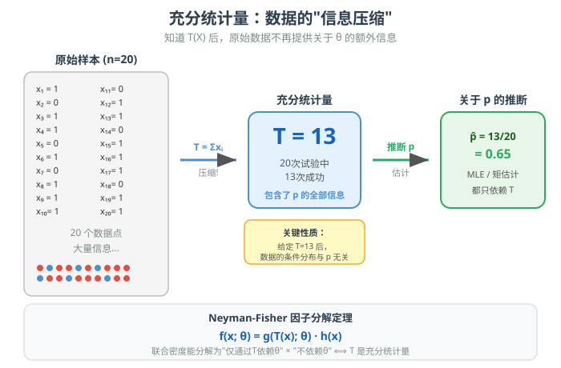
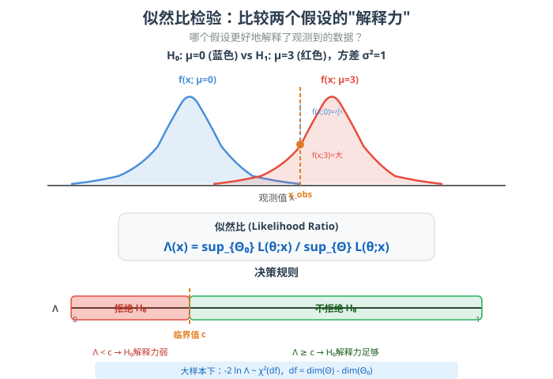
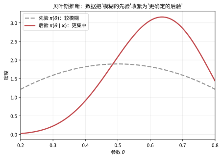
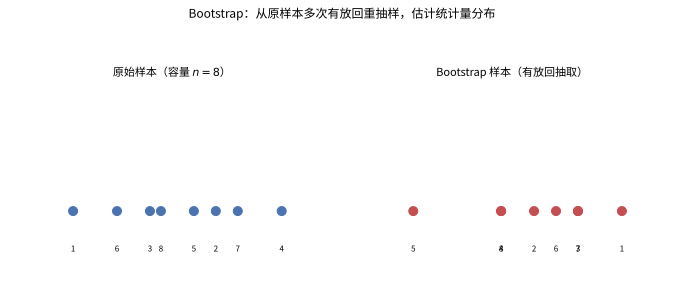

# 第 26 级：统计推断（Statistical Inference）

---

## 1. 学习目标

完成本教程后，你应当能够：

1. 理解**充分统计量**的概念，掌握因子分解定理、最小充分统计量、Rao-Blackwell 定理和完全充分统计量。
2. 识别**指数族**分布，理解其自然参数空间和基本性质。
3. 掌握**假设检验**的理论框架，包括一致最大功效检验（UMP）、单调似然比（MLR）和广义似然比检验（GLRT）。
4. 理解**贝叶斯推断**的基本范式，包括先验分布、后验分布、共轭先验、贝叶斯估计、可信区间和贝叶斯因子。
5. 掌握**决策理论**的基本概念，包括损失函数、风险、贝叶斯风险、极小化极大估计和可容许估计量。
6. 了解**非参数推断**的主要方法，包括经验分布函数、Glivenko-Cantelli 定理、Kolmogorov-Smirnov 检验、Bootstrap 和置换检验。
7. 能够通过**示例**应用上述理论解决实际问题。
8. 能够独立完成**习题**以巩固所学知识。

---

## 2. 充分统计量（Sufficient Statistics）

### 2.1 定义

设 $X_1, X_2, \ldots, X_n$ 是来自分布族 $\{f(x;\theta): \theta \in \Theta\}$ 的 i.i.d. 样本。统计量 $T = T(X_1, \ldots, X_n)$ 称为关于参数 $\theta$ 的**充分统计量**，如果给定 $T = t$ 的条件下，样本的条件分布与 $\theta$ 无关。

用数学语言表述：如果
$$P(X_1 \in A_1, \ldots, X_n \in A_n \mid T = t)$$
不依赖于 $\theta$，则称 $T$ 是 $\theta$ 的充分统计量。

**直观理解**：充分统计量包含了样本中关于 $\theta$ 的全部信息。一旦知道了 $T$ 的值，原始样本就不再提供关于 $\theta$ 的任何额外信息。



> **直观理解（现实类比）**：充分统计量就像**榨汁**——你有 20 个橙子（20 个数据点），逐个看太累了。但如果你把它们全部榨成一杯果汁（统计量 $T = \sum x_i$），这杯果汁保留了关于"橙子甜度"（参数 $p$）的全部信息。知道果汁的甜度后，你不需要再回头看每个橙子的样子——它们关于甜度的"秘密"已经被果汁浓缩了。比如抛 20 次硬币，你不需要记住每次是正是反（1,0,1,1,0,...），只需要知道"总共 13 次正面"就足够估计正面概率 $p$ 了。**数据可以丢，信息不能丢**——这就是充分统计量的精髓。

### 2.2 因子分解定理（Factorization Theorem）

**定理**（Neyman-Fisher 因子分解定理）：统计量 $T$ 关于参数 $\theta$ 是充分的，当且仅当联合概率密度函数（或概率质量函数）可以分解为
$$f(x_1, \ldots, x_n; \theta) = g(T(x_1, \ldots, x_n); \theta) \cdot h(x_1, \ldots, x_n)$$
其中 $g$ 依赖于样本仅通过 $T$，且依赖于 $\theta$；$h$ 不依赖于 $\theta$。

> **💡 直观理解（类比）**：因子分解定理是"找充分统计量"的**作弊工具**——把联合密度拆成两块：带参数 θ 的部分**只能**通过 T 出现，另一块只放跟 θ 无关的"背景"，这样参数的信息就全部被 T 收走了。就像一份**化验报告**，带参数的是"诊断结论"（只关心浓缩出的指标 T），另一块是"原始涂片"（跟诊断无关）；只需看 T 就能判断病情，不必逐个翻原始数据。

**证明**（离散情形）：

设样本 $\mathbf{X} = (X_1, \ldots, X_n)$ 取离散值，$T = T(\mathbf{X})$ 是充分统计量。

（$\Rightarrow$）若 $T$ 充分，则 $P(\mathbf{X} = \mathbf{x} \mid T = t)$ 与 $\theta$ 无关。于是
$$f(\mathbf{x};\theta) = P(\mathbf{X} = \mathbf{x};\theta) = P(\mathbf{X} = \mathbf{x} \mid T = T(\mathbf{x})) \cdot P(T = T(\mathbf{x});\theta)$$
取 $g(t;\theta) = P(T = t;\theta)$，$h(\mathbf{x}) = P(\mathbf{X} = \mathbf{x} \mid T = T(\mathbf{x}))$，即得分解。

（$\Leftarrow$）若存在分解 $f(\mathbf{x};\theta) = g(T(\mathbf{x});\theta) h(\mathbf{x})$，则
$$P(T = t;\theta) = \sum_{\mathbf{x}: T(\mathbf{x}) = t} f(\mathbf{x};\theta) = g(t;\theta) \sum_{\mathbf{x}: T(\mathbf{x}) = t} h(\mathbf{x})$$
于是
$$P(\mathbf{X} = \mathbf{x} \mid T = t) = \frac{f(\mathbf{x};\theta)}{P(T = t;\theta)} = \frac{h(\mathbf{x})}{\sum_{\mathbf{y}: T(\mathbf{y}) = t} h(\mathbf{y})}$$
与 $\theta$ 无关，故 $T$ 充分。$\square$

**连续情形**的证明类似，只需将求和替换为积分。

**示例 1**：设 $X_1, \ldots, X_n \stackrel{\text{i.i.d.}}{\sim} \text{Ber}(p)$，则
$$f(\mathbf{x};p) = \prod_{i=1}^n p^{x_i}(1-p)^{1-x_i} = p^{\sum x_i}(1-p)^{n-\sum x_i} = g\left(\sum x_i; p\right) \cdot 1$$
故 $T = \sum_{i=1}^n X_i$ 是 $p$ 的充分统计量。

### 2.3 最小充分统计量（Minimal Sufficient Statistics）

一个充分统计量 $T$ 称为**最小充分统计量**，如果对于任何其他充分统计量 $S$，存在某个函数 $r$ 使得 $T = r(S)$（即 $T$ 是任何充分统计量的函数）。

**直观理解**：最小充分统计量是充分统计量中"维度最低"或"压缩最彻底"的。

**判断方法**：设 $\mathbf{x}$ 和 $\mathbf{y}$ 是两个样本点。若比值
$$\frac{f(\mathbf{x};\theta)}{f(\mathbf{y};\theta)}$$
与 $\theta$ 无关当且仅当 $T(\mathbf{x}) = T(\mathbf{y})$，则 $T$ 是最小充分统计量。

### 2.4 Rao-Blackwell 定理

**定理**（Rao-Blackwell）：设 $T$ 是 $\theta$ 的充分统计量，$\hat{\theta}$ 是 $\theta$ 的任一估计量，且 $E[\hat{\theta}^2] < \infty$。定义 $\tilde{\theta} = E[\hat{\theta} \mid T]$，则：
1. $\tilde{\theta}$ 是 $\theta$ 的估计量（即其分布不依赖于 $\theta$ 以外的未知参数）；
2. $E[\tilde{\theta}] = E[\hat{\theta}]$（即偏差不变）；
3. $\operatorname{Var}(\tilde{\theta}) \leq \operatorname{Var}(\hat{\theta})$，且等号成立当且仅当 $\hat{\theta} = \tilde{\theta}$ a.s.

> **💡 直观理解（类比）**：Rao-Blackwell 定理说：**先按充分统计量分组求平均，就能免费"降噪"而不改变偏差**。条件期望 E[θ̂|T] 好比**同一棵树上不同枝杈的结果取平均**——每个枝杈（不同样本但同 T）单独看很抖，平均后更稳。方差只会变小不增大，偏差纹丝不动，相当于**无本透明的升级**。

**证明**：

1. 由于 $T$ 充分，条件分布 $X \mid T$ 与 $\theta$ 无关，故 $\tilde{\theta} = E[\hat{\theta} \mid T]$ 是仅依赖于 $T$ 的函数，其分布不依赖于 $\theta$ 以外的参数。

2. 由重期望律：
$$E[\tilde{\theta}] = E[E[\hat{\theta} \mid T]] = E[\hat{\theta}]$$

3. 由条件方差公式：
$$\operatorname{Var}(\hat{\theta}) = \operatorname{Var}(E[\hat{\theta} \mid T]) + E[\operatorname{Var}(\hat{\theta} \mid T)] = \operatorname{Var}(\tilde{\theta}) + E[\operatorname{Var}(\hat{\theta} \mid T)]$$
由于 $\operatorname{Var}(\hat{\theta} \mid T) \geq 0$，故 $\operatorname{Var}(\tilde{\theta}) \leq \operatorname{Var}(\hat{\theta})$，等号成立当且仅当 $\operatorname{Var}(\hat{\theta} \mid T) = 0$ a.s.，即 $\hat{\theta} = \tilde{\theta}$ a.s. $\square$

**意义**：Rao-Blackwell 定理告诉我们，任何估计量都可以通过充分统计量进行"改进"——取条件期望后得到的新估计量具有相同偏差但方差更小（或相等）。因此，寻找最优估计量时，只需考虑充分统计量的函数。

### 2.5 完全充分统计量（Complete Sufficient Statistics）

**定义**：一个统计量 $T$ 称为**完全**的，如果对于任意函数 $u$，满足 $E_\theta[u(T)] = 0$ 对所有 $\theta \in \Theta$ 成立，则必有 $P_\theta(u(T) = 0) = 1$ 对所有 $\theta$ 成立。

> **💡 直观理解（类比）**：完全性是个"零期望陷阱"：若某个关于 T 的函数对所有参数值算出的期望都是 0，那它必须是恒等于 0 的"真零"，而不是靠加减抵消出来的"假零"。这保证 T 的信息**只够用、不冗余**——就像一把**没有坏键的密码锁**，任何一个滚筒的读数都实打实，不存在能互相抵消的杂音，从而撑起"最优无偏估计唯一"的下文。

**定义**：既是充分又是完全的统计量称为**完全充分统计量**。

> **💡 直观理解（类比）**：完全充分统计量 = **既榨汁又锁死**的组合：充分保证"信息全在 T 里、别处没有遗漏"，完全保证"没有多余的零期望杂音"。好比**一枚定制的模具**——形状（充分）决定了成品的所有细节，而它本身又规整到不存在任何"能抵消的空腔"，于是用它冲压出来的估计是唯一且最优的。

**定理**（Lehmann-Scheffé）：如果 $T$ 是 $\theta$ 的完全充分统计量，且 $\hat{\theta} = h(T)$ 是 $\theta$ 的无偏估计量，则 $\hat{\theta}$ 是 $\theta$ 的唯一一致最小方差无偏估计量（UMVUE）。

> **💡 直观理解（类比）**：Lehmann-Scheffé 定理把"找最好无偏估计"变成**套模板**：只要 T 是完全充分的，任何 T 的"无偏版本"门槛极低——而完全性保证这样的无偏函数**至多有一个**，所以它必然是最优无偏估计（UMVUE）。好比**填字游戏**：空格结构决定每个字母唯一可填，于是唯一解一定是最优解，不用再全网搜索。

---

## 3. 指数族（Exponential Family）

### 3.1 定义

一个分布族 $\{f(x;\theta): \theta \in \Theta\}$ 称为**指数族**，如果其概率密度函数（或概率质量函数）可以写成
$$f(x;\theta) = h(x) \exp\left\{\sum_{j=1}^k \eta_j(\theta) T_j(x) - A(\theta)\right\}$$
或等价地
$$f(x;\theta) = h(x) \exp\left\{\boldsymbol{\eta}(\theta)^\top \mathbf{T}(x) - A(\theta)\right\}$$

其中：
- $\boldsymbol{\eta}(\theta) = (\eta_1(\theta), \ldots, \eta_k(\theta))$ 是**自然参数**；
- $\mathbf{T}(x) = (T_1(x), \ldots, T_k(x))$ 是**充分统计量**；
- $A(\theta)$ 是**对数配分函数**（或累积量生成函数）；
- $h(x)$ 是**基准测度**。

> **💡 直观理解（类比）**：指数族把密度**整理成标准衣柜**：写成 exp{参数×统计量−归一化} 的形式，只要塞得进去，就自动享有一整套通用工具（充分统计量、矩公式、完备性、共轭先验）。就像**同款尺寸的收纳盒**，形状不同却能整齐入柜、配件互通。T(x) 就是你要浓缩的那件核心"统计量"。

### 3.2 自然参数空间（Natural Parameter Space）

若将参数化改用自然参数 $\boldsymbol{\eta}$，则指数族可写为
$$f(x;\boldsymbol{\eta}) = h(x) \exp\left\{\boldsymbol{\eta}^\top \mathbf{T}(x) - \psi(\boldsymbol{\eta})\right\}$$
其中 $\psi(\boldsymbol{\eta})$ 由归一化条件确定：
$$\psi(\boldsymbol{\eta}) = \log \int h(x) \exp\{\boldsymbol{\eta}^\top \mathbf{T}(x)\} \, dx$$

**自然参数空间**定义为
$$\mathcal{N} = \left\{\boldsymbol{\eta} \in \mathbb{R}^k : \int h(x) \exp\{\boldsymbol{\eta}^\top \mathbf{T}(x)\} \, dx < \infty\right\}$$

**性质**：$\mathcal{N}$ 是凸集，$\psi(\boldsymbol{\eta})$ 在 $\mathcal{N}$ 上是凸函数。

> **💡 直观理解（类比）**：自然参数空间是"参数 η 允许驻扎的**安全区域**"——这些取值保证密度积分不爆。它**是凸的**意味着任意两个合法参数连成线段，线上每个点都仍合法（没有"禁区坑"）；ψ 凸则保证似然是"碗形"，峰只有一个、好找好爬。就像**没有坑洞的滑道**，任意两点连滑都在场内，且只滑向唯一最低点。

### 3.3 指数族的性质

1. **充分统计量**：$\mathbf{T}(X)$ 是 $\boldsymbol{\eta}$ 的 $k$ 维充分统计量。

2. **矩与累积量**：
   $$E[\mathbf{T}(X)] = \nabla \psi(\boldsymbol{\eta})$$
   $$\operatorname{Cov}(\mathbf{T}(X)) = \nabla^2 \psi(\boldsymbol{\eta})$$

3. **指数族是共轭先验族**：指数族的共轭先验也属于指数族。

4. **指数族是完备的**：若自然参数空间 $\mathcal{N}$ 包含一个开集，则 $\mathbf{T}(X)$ 是完全充分统计量。

5. **极大似然估计**：对数似然函数 $\ell(\boldsymbol{\eta}) = \boldsymbol{\eta}^\top \mathbf{T}(x) - \psi(\boldsymbol{\eta})$ 是凹函数，MLE 满足
   $$E[\mathbf{T}(X)] = \mathbf{T}(x)$$

> **💡 直观理解（类比）**：指数族这几条性质是它的"红利清单"：充分统计量现成、期望与方差由 ψ 的导数一键导出、共轭先验随手可得、参数空间稍宽就完备、MLE 只要解"理论均值=样本均值"的矩方程。好比买了**同品牌整套家电**——说明书通用、配件互通。核心就一句：**一族形式统一，得到一大批公共福利**。

**常见指数族分布**：
- 正态分布（已知方差）
- 二项分布
- Poisson 分布
- 指数分布
- Gamma 分布
- Beta 分布
- Dirichlet 分布

**非指数族分布**：
- 均匀分布 $U(0, \theta)$（支撑集依赖于参数）
- t 分布
- F 分布
- Cauchy 分布

---

## 4. 假设检验理论（Hypothesis Testing）

### 4.1 基本概念

设 $X_1, \ldots, X_n \sim f(x;\theta)$，$\theta \in \Theta$。考虑检验问题：
$$H_0: \theta \in \Theta_0 \quad \text{vs.} \quad H_1: \theta \in \Theta_1$$

- **检验函数**：$\phi(x) = I(x \in \text{拒绝域})$，即 $\phi(x) = 1$ 表示拒绝 $H_0$，$\phi(x) = 0$ 表示接受 $H_0$。
- **第一类错误**（Type I Error）：$H_0$ 为真时拒绝 $H_0$，概率为 $\alpha = P(\text{拒绝 } H_0 \mid H_0)$。
- **第二类错误**（Type II Error）：$H_1$ 为真时接受 $H_0$，概率为 $\beta = P(\text{接受 } H_0 \mid H_1)$。
- **检验功效**（Power）：$\pi(\theta) = P_\theta(\text{拒绝 } H_0)$，对 $\theta \in \Theta_1$，功效为 $1 - \beta$。
- **显著性水平**（Significance Level）：$\alpha$，即 $\sup_{\theta \in \Theta_0} \pi(\theta) \leq \alpha$。

> **💡 直观理解（类比）**：假设检验像**法庭"无罪推定"**：H0 是被指控前先假设的无罪方。第一类错误是**把无辜的人判成有罪**（概率 α，要压得很小）；第二类错误是**放走真正的罪犯**（概率 β）；功效 1−β 是"该抓到的坏人抓到的比率"。显著性水平 α 是"法官不许冤枉好人的最严上限"。**证据不足（p 值>α）不得判有罪，这就是无罪推定**。

### 4.2 一致最大功效检验（Uniformly Most Powerful Test, UMP）

**定义**：一个显著性水平为 $\alpha$ 的检验 $\phi$ 称为**一致最大功效检验**（UMP），如果对于任何其他显著性水平为 $\alpha$ 的检验 $\phi'$，有
$$\pi_\phi(\theta) \geq \pi_{\phi'}(\theta), \quad \forall \theta \in \Theta_1$$

> **💡 直观理解（类比）**：UMP（一致最大功效检验）想在**所有"守规矩（水平不超 α）"的检验里，选每个情形破案率都最高的那个**。"一致"指**在 H1 的每个参数下都不输**——就像选**一条各比赛距离都拿第一的马**，而非只在某一段最快。可惜这种"全距离通杀"的选手，通常只在简单/单边假设下存在。

**Neyman-Pearson 引理**（简单对简单假设）：

设 $H_0: \theta = \theta_0$ vs. $H_1: \theta = \theta_1$，$f(x;\theta_0)$ 和 $f(x;\theta_1)$ 是相应的密度函数。

1. **存在性**：对任意 $\alpha \in (0,1)$，存在一个检验 $\phi$ 和常数 $k$，使得
   $$\phi(x) = \begin{cases} 1 & \text{若 } f(x;\theta_1) > k f(x;\theta_0) \\ \gamma & \text{若 } f(x;\theta_1) = k f(x;\theta_0) \\ 0 & \text{若 } f(x;\theta_1) < k f(x;\theta_0) \end{cases}$$
   且 $E_{\theta_0}[\phi(X)] = \alpha$。

2. **最优性**：任何满足上述条件的检验都是显著性水平 $\alpha$ 下的最大功效检验。

3. **唯一性**：如果存在一个最大功效检验，则它必为（或几乎必然等于）上述形式。

> **💡 直观理解（类比）**：Neyman-Pearson 引理说：比较两个具体分布时，**最佳检验只看似然比** f(H1)/f(H0)——谁的"解释力"强过 k 倍就判谁赢。就像**法庭比较两份证据对两个嫌疑人的"对撞强度"**，数据显示谁更像就偏向谁。这条简单规则在"二选一"的简单假设下，恰好是**最锋利、无可超越**的判据（先定误判率再放大招）。

**证明概要**：

设 $\phi$ 是 Neyman-Pearson 形式的检验，$\phi'$ 是任意其他显著性水平为 $\alpha$ 的检验。考虑差值：
$$\phi(x) - \phi'(x)$$

当 $f(x;\theta_1) > k f(x;\theta_0)$ 时，$\phi(x) - \phi'(x) = 1 - \phi'(x) \geq 0$，且 $f(x;\theta_1) - k f(x;\theta_0) > 0$；
当 $f(x;\theta_1) < k f(x;\theta_0)$ 时，$\phi(x) - \phi'(x) = 0 - \phi'(x) \leq 0$，且 $f(x;\theta_1) - k f(x;\theta_0) < 0$。

因此：
$$(\phi(x) - \phi'(x))(f(x;\theta_1) - k f(x;\theta_0)) \geq 0$$

积分得：
$$\int (\phi - \phi')(f(x;\theta_1) - k f(x;\theta_0)) \, dx \geq 0$$
$$\Rightarrow \pi_\phi(\theta_1) - \pi_{\phi'}(\theta_1) \geq k(\alpha - \alpha) = 0$$

故 $\pi_\phi(\theta_1) \geq \pi_{\phi'}(\theta_1)$，即 $\phi$ 是最优的。$\square$

### 4.3 单调似然比（Monotone Likelihood Ratio, MLR）

**定义**：分布族 $\{f(x;\theta): \theta \in \Theta \subseteq \mathbb{R}\}$ 具有**单调似然比**（MLR），如果存在统计量 $T(X)$，使得对任意 $\theta_1 < \theta_2$，比值
$$\frac{f(x;\theta_2)}{f(x;\theta_1)}$$
是 $T(x)$ 的单调非减函数（或非增函数）。

> **💡 直观理解（类比）**：单调似然比指**参数越大，越倾向给出更大的 T 值**——似然比随 T 单调变化，就像**温度越高，体温计数字越有把握地往上走**。于是放心用"T 超阈值就拒绝"的简单规则：想分清 θ 大小，只需盯 T 偏大还是偏小，不用管复杂形状。

**定理**（UMP 检验的存在性）：若分布族关于 $T(X)$ 具有 MLR，则对单边假设
$$H_0: \theta \leq \theta_0 \quad \text{vs.} \quad H_1: \theta > \theta_0$$
存在 UMP 检验，形式为
$$\phi(x) = \begin{cases} 1 & \text{若 } T(x) > c \\ \gamma & \text{若 } T(x) = c \\ 0 & \text{若 } T(x) < c \end{cases}$$
其中 $c$ 和 $\gamma$ 由显著性水平 $\alpha$ 确定。

**指数族与 MLR**：单参数指数族 $f(x;\theta) = h(x) \exp\{\eta(\theta) T(x) - A(\theta)\}$ 中，若 $\eta(\theta)$ 是 $\theta$ 的严格单调函数，则分布族关于 $T(X)$ 具有 MLR。

> **💡 直观理解（类比）**：一旦分布族有单调似然比，单边检验的 UMP 就**自动长出来**——只需设一道门槛：T>c 就拒绝。好比**学考及格线**：分数（T）单调，超线就判通过；c 由 α 精调，保证"错判"比例不越限。MLR 就是**获得最优检验的绿色通道**。

### 4.4 广义似然比检验（Generalized Likelihood Ratio Test, GLRT）

当复合假设不能简化为简单假设时，UMP 检验通常不存在。此时常用**广义似然比检验**。

**定义**：检验 $H_0: \theta \in \Theta_0$ vs. $H_1: \theta \in \Theta_1$ 的广义似然比统计量为
$$\Lambda(x) = \frac{\sup_{\theta \in \Theta_0} L(\theta; x)}{\sup_{\theta \in \Theta} L(\theta; x)}$$
其中 $L(\theta; x)$ 是似然函数，$\Theta = \Theta_0 \cup \Theta_1$ 是全参数空间。

GLRT 拒绝 $H_0$ 当 $\Lambda(x) < c$（即 $0 \leq \Lambda \leq 1$，值越小越倾向于拒绝 $H_0$）。



> **直观理解（现实类比）**：似然比检验就像**两个律师在法庭上辩论**。$H_0$ 的律师说"我的当事人（$\theta \in \Theta_0$）最能解释这些证据"，$H_1$ 的律师说"不对，我的当事人（$\theta \in \Theta$ 全空间）才能最好地解释"。似然比 $\Lambda$ 就是比较两位律师的"解释力"之比——如果 $\Lambda$ 接近 1，说明 $H_0$ 的解释力和全空间差不多好，没必要拒绝；如果 $\Lambda$ 很小，说明 $H_0$ 的解释力远不如全空间，必须拒绝。就像**奥卡姆剃刀**的统计版：简单假设（$H_0$）只有在"解释得足够好"时才被接受。

**渐近分布**：在正则条件下，当 $n \to \infty$ 时，
$$-2\log \Lambda(x) \xrightarrow{d} \chi^2_{\nu}$$
其中 $\nu = \dim(\Theta) - \dim(\Theta_0)$ 是自由度。

---

## 5. 贝叶斯推断（Bayesian Inference）

### 5.1 贝叶斯范式

贝叶斯推断的核心思想是将参数 $\theta$ 视为随机变量，赋予其**先验分布** $\pi(\theta)$，然后通过数据更新为**后验分布**。

**贝叶斯定理**：
$$\pi(\theta \mid \mathbf{x}) = \frac{f(\mathbf{x} \mid \theta) \pi(\theta)}{m(\mathbf{x})}$$
其中：
- $\pi(\theta \mid \mathbf{x})$ 是**后验分布**；
- $f(\mathbf{x} \mid \theta)$ 是**似然函数**；
- $\pi(\theta)$ 是**先验分布**；
- $m(\mathbf{x}) = \int f(\mathbf{x} \mid \theta) \pi(\theta) \, d\theta$ 是**边缘似然**（归一化常数）。

> **💡 直观理解（类比）**：贝叶斯定理把**先验信念**和**数据证据**混合成**后验信念**：后验 ∝ 先验×似然，分母只负责归一化。好比**打官司前凭印象押谁，看到新证词后再更新判断**——证据（似然）越强越能盖过先入之见，最后信念是对这两方的加权折中。

### 5.2 先验分布（Prior Distributions）

**无信息先验**（Non-informative Prior）：对参数 $\theta$ 的取值没有任何先验信息，常用均匀分布或 Jeffreys 先验。

**Jeffreys 先验**：
$$\pi(\theta) \propto \sqrt{\det I(\theta)}$$
其中 $I(\theta)$ 是 Fisher 信息矩阵。Jeffreys 先验具有参数化不变性。

> **💡 直观理解（类比）**：无信息先验是"**不知道该押哪、就装作谁都不偏袒**"的开局（常用均匀分布）；Jeffreys 先验由 Fisher 信息开方而来，让**换了参数表述（比如把比率换成对数）先验也随之自动变换、结论不走样**——好比记录温度用摄氏还是华氏都不影响"今天是否冷"的判断。

**共轭先验**（Conjugate Prior）：如果先验分布和后验分布属于同一分布族，则称该先验为共轭先验。

> **💡 直观理解（类比）**：共轭先验像**"先验=同款题型，数据只是加试新题"**：选与似然"配套"的先验族，算完后验仍在同族，参数随数据更新即可。好比**老师批改同一套评分维度的作文**，只是分数累加。于是每看完一批数据只需改两个数字，不必重新推导，计算极省。

### 5.3 共轭先验表

| 似然分布 | 参数 | 共轭先验 | 后验参数 |
|---------|------|---------|---------|
| 二项分布 | $p$ | Beta($\alpha, \beta$) | Beta($\alpha + \sum x_i, \beta + n - \sum x_i$) |
| Poisson | $\lambda$ | Gamma($\alpha, \beta$) | Gamma($\alpha + \sum x_i, \beta + n$) |
| 正态(已知 $\sigma^2$) | $\mu$ | Normal($\mu_0, \tau_0^2$) | Normal($\frac{\mu_0/\tau_0^2 + n\bar{x}/\sigma^2}{1/\tau_0^2 + n/\sigma^2}$, $\frac{1}{1/\tau_0^2 + n/\sigma^2}$) |
| 正态(已知 $\mu$) | $\sigma^2$ | Inverse-Gamma($\alpha, \beta$) | Inverse-Gamma($\alpha + n/2$, $\beta + \frac{1}{2}\sum(x_i - \mu)^2$) |
| 指数分布 | $\lambda$ | Gamma($\alpha, \beta$) | Gamma($\alpha + n$, $\beta + \sum x_i$) |
| 多项分布 | $\mathbf{p}$ | Dirichlet($\boldsymbol{\alpha}$) | Dirichlet($\boldsymbol{\alpha} + \mathbf{n}$) |

### 5.4 后验分布与贝叶斯估计

给定后验分布 $\pi(\theta \mid \mathbf{x})$，常用的贝叶斯点估计有：

- **后验均值**（Posterior Mean）：$\hat{\theta}_{\text{Bayes}} = E[\theta \mid \mathbf{x}]$
- **后验中位数**（Posterior Median）
- **后验众数**（Posterior Mode/MAP）

**贝叶斯估计量在平方损失下的最优性**：
在平方损失 $L(\theta, a) = (\theta - a)^2$ 下，贝叶斯估计量为后验均值：
$$\hat{\theta} = \arg\min_a E[(\theta - a)^2 \mid \mathbf{x}] = E[\theta \mid \mathbf{x}]$$



> **直观理解（现实类比）**：贝叶斯推断是"**用证据更新信念**"。先验 $\pi(\theta)$ 是你**看到数据前的猜测**（可能很模糊）；拿到数据后，用贝叶斯公式更新成后验 $\pi(\theta\mid\mathbf{x})$——**更尖锐、更集中**。就像**先猜测一个犯罪嫌疑人**（先验），拿到新的证词后**修正判断**（后验）。数据越多、证据越强，后验峰就越窄，你就越有把握。平方损失下取后验均值即可得到最优估计。

### 5.5 可信区间（Credible Intervals）

后验分布的 $1-\alpha$ 可信区间 $C$ 满足
$$P(\theta \in C \mid \mathbf{x}) = 1 - \alpha$$

**与置信区间的区别**：
- 频率学派置信区间：随机区间覆盖固定参数的概率为 $1-\alpha$。
- 贝叶斯可信区间：参数落在固定区间内的后验概率为 $1-\alpha$。

**最高后验密度区间**（HPD Interval）：在给定可信水平下长度最短的可信区间。

> **💡 直观理解（类比）**：可信区间给"**参数落在这个区间的后验概率是 1−α**"——参数当作随机变量、区间固定。像**射箭前的落点预测**：你对落点有概率分布，可信区间就是"95% 概率箭会落在的区域"。注意与频率学派相反：那边**区间随机、参数固定**；这里**参数随机、区间固定**。

### 5.6 贝叶斯因子（Bayes Factor）

用于模型比较的工具。对于模型 $M_1$ 和 $M_2$，贝叶斯因子定义为
$$\text{BF}_{12} = \frac{m_1(\mathbf{x})}{m_2(\mathbf{x})} = \frac{\int f(\mathbf{x} \mid \theta_1, M_1) \pi(\theta_1 \mid M_1) \, d\theta_1}{\int f(\mathbf{x} \mid \theta_2, M_2) \pi(\theta_2 \mid M_2) \, d\theta_2}$$

> **💡 直观理解（类比）**：贝叶斯因子是**两个模型的"解释力之比"**：BF>1 说明数据更支持模型1，越大越强，就像**法庭两套卷宗对同一现场的解释力对比**——谁的证词更能圆场谁更可信。它把模型比较变成**统一标尺**：不看具体估计，只看数据整体更倾向谁，天然利于模型选择。

**解释**（Jeffreys 准则）：
- $\text{BF}_{12} > 1$：支持 $M_1$
- $\text{BF}_{12} > 3$：中等支持 $M_1$
- $\text{BF}_{12} > 10$：强支持 $M_1$
- $\text{BF}_{12} > 100$：极强支持 $M_1$

后验几率（Posterior Odds）：
$$\frac{P(M_1 \mid \mathbf{x})}{P(M_2 \mid \mathbf{x})} = \text{BF}_{12} \times \frac{P(M_1)}{P(M_2)}$$

---

## 6. 决策理论（Decision Theory）

### 6.1 基本框架

决策理论由以下要素构成：
- **参数空间** $\Theta$：未知参数 $\theta$ 的取值范围
- **行动空间** $\mathcal{A}$：所有可能的决策行动
- **损失函数** $L(\theta, a)$：参数为 $\theta$ 时采取行动 $a$ 的损失
- **决策规则** $\delta(x)$：从样本空间到行动空间的映射

> **💡 直观理解（类比）**：决策理论把统计问题变成**"看了数据怎么拍板"**的总框架：参数空间（现实啥样）、行动空间（能做哪些动作）、损失函数（做错赔多少）、决策规则（"看到这样数据就采取那个动作"的说明书）。好比**天气预报员**：天气在变、伞/雨衣有限、淋雨要买单、每看云图决定带不带——整套权衡就是这么来的。

### 6.2 常见损失函数

1. **平方损失**：$L(\theta, a) = (\theta - a)^2$
2. **绝对损失**：$L(\theta, a) = |\theta - a|$
3. **0-1 损失**：$L(\theta, a) = I(\theta \neq a)$（用于分类）
4. **线性损失**：$L(\theta, a) = c(\theta - a)$，其中 $c$ 是常数
5. **Huber 损失**：平方损失和绝对损失的折中，对异常值更稳健

> **💡 直观理解（类比）**：损失函数给"**猜错要赔多少钱**"定价：平方损失重罚远偏差、绝对损失按距离线性罚、0-1 损失只管对不对（分类）、线性/Huber 各有权衡（Huber 对离群值更宽容）。好比**不同场景下的定价表**——猜偏一点裂不裂账各有赔法，直接决定你下手多谨慎。

### 6.3 风险函数（Risk Function）

**定义**：决策规则 $\delta$ 的风险函数为
$$R(\theta, \delta) = E_\theta[L(\theta, \delta(X))] = \int L(\theta, \delta(x)) f(x;\theta) \, dx$$

风险函数衡量了在参数 $\theta$ 下重复使用决策规则 $\delta$ 的平均损失。

> **💡 直观理解（类比）**：风险函数就是"**用这套规则用很久，平均每次亏多少**"——对每个样本的损失按数据分布取平均，得到按参数 θ 显示的数。好比**炒股策略的历史回测**：R 是"在这种真实市场里这套策略的长期平均收益/回撤"。R 越大越划不来，所以想找风险小的规则。

### 6.4 贝叶斯风险（Bayes Risk）

**定义**：给定先验分布 $\pi(\theta)$，决策规则 $\delta$ 的贝叶斯风险为
$$r(\pi, \delta) = E_\pi[R(\theta, \delta)] = \int R(\theta, \delta) \pi(\theta) \, d\theta$$

**贝叶斯决策规则**：最小化贝叶斯风险的决策规则：
$$\delta^\pi = \arg\min_\delta r(\pi, \delta)$$

**定理**：贝叶斯决策规则等价于逐点最小化后验期望损失：
$$\delta^\pi(x) = \arg\min_{a \in \mathcal{A}} E[L(\theta, a) \mid X = x]$$

> **💡 直观理解（类比）**：贝叶斯风险是"**把各市场的风险按先验加权，再挑平均损失最低的打法**"。而贝叶斯规则只需**在每个观测处逐点取后验期望损失最小的行动**，不必全局搜索——好比**每到一站看实时路况选当下最优路线**，整体自然最优。

### 6.5 极小化极大估计（Minimax Estimation）

**定义**：决策规则 $\delta^*$ 称为**极小化极大**的，如果
$$\sup_{\theta \in \Theta} R(\theta, \delta^*) = \inf_{\delta} \sup_{\theta \in \Theta} R(\theta, \delta)$$

即极小化极大规则最小化最坏情况下的风险。

**定理**：如果 $\delta^\pi$ 是贝叶斯规则，且其风险函数 $R(\theta, \delta^\pi)$ 是常数（不依赖于 $\theta$），则 $\delta^\pi$ 是极小化极大的。

> **💡 直观理解（类比）**：极小化极大估计是**"最坏情形下我也亏不到哪去"的保守策略**：在所有规则里挑"最差市场下风险最小"的。好比**投资只盯最熊行情做压力测试**——不求收益最大，只求崩盘时损失最小。若某个贝叶斯规则的风险恰是常数（各市场一样），那它既是最优加权、最坏情形也不吃亏，**两头通吃**。

### 6.6 可容许估计量（Admissible Estimators）

**定义**：决策规则 $\delta$ 称为**可容许的**，如果不存在另一个规则 $\delta'$ 使得
$$R(\theta, \delta') \leq R(\theta, \delta) \quad \forall \theta \in \Theta$$
且严格不等式对某些 $\theta$ 成立（即 $\delta'$ 一致优于 $\delta$）。

**定理**：
1. 如果 $\delta$ 是唯一贝叶斯规则（对某个先验），则 $\delta$ 是可容许的。
2. 如果 $\delta$ 是极小化极大的且贝叶斯规则（对某个先验），则 $\delta$ 是可容许的。
3. （Stein 悖论）在 $p \geq 3$ 维正态分布中，样本均值 $\bar{X}$ 作为总体均值 $\mu$ 的估计量在平方损失下是不可容许的（Stein 收缩估计量一致优于它）。

> **💡 直观理解（类比）**：可容许指"**没有别的规则处处不比它差、还有地方更优**"，被这样的规则压住就叫不可容许。Stein 悖论最反直觉：就算朴素而合理的样本均值，在三维以上也能被"**把各分量往原点收缩一点**"的估计量全套超越。好比**多科目考试**，每科分数都往平均分轻微拉一拉，总分往往更稳更好——看起来不诚实，数学上却更准。

---

## 7. 非参数推断（Nonparametric Inference）

### 7.1 经验分布函数（Empirical Distribution Function, EDF）

设 $X_1, \ldots, X_n \stackrel{\text{i.i.d.}}{\sim} F$，其中 $F$ 是未知的累积分布函数。**经验分布函数**定义为
$$\hat{F}_n(x) = \frac{1}{n} \sum_{i=1}^n I(X_i \leq x)$$

**性质**：
- $\hat{F}_n(x)$ 是 $F(x)$ 的无偏估计量：$E[\hat{F}_n(x)] = F(x)$
- $\operatorname{Var}(\hat{F}_n(x)) = \frac{F(x)(1-F(x))}{n}$
- $\hat{F}_n(x)$ 是 $F(x)$ 的一致估计量

> **💡 直观理解（类比）**：经验分布函数把"样本"当"总体替身"：在值 x 处，它数出样本里有多大比例 ≤ x（阶梯上升）。好比**用全班身高分布去猜全年级身高分布**，样本越多越像。它无偏且方差随 n 变小，为所有非参数方法打基础。

### 7.2 Glivenko-Cantelli 定理

**定理**（Glivenko-Cantelli）：设 $X_1, \ldots, X_n \stackrel{\text{i.i.d.}}{\sim} F$，则
$$\sup_{x \in \mathbb{R}} |\hat{F}_n(x) - F(x)| \xrightarrow{\text{a.s.}} 0 \quad \text{当 } n \to \infty$$

即经验分布函数 $\hat{F}_n$ 几乎必然一致收敛于真实分布函数 $F$。这是非参数统计的基石定理之一。

> **💡 直观理解（类比）**：Glivenko-Cantelli 定理说"**样本够大时，经验分布这面镜子会在所有位置同时越贴越紧地照出真分布**"——是靠近点"全程无死角"的收敛。好比**用越来越多投票样本还原全城喜好分布**，n 越大整条曲线越重合。它为 Bootstrap 等"拿样本当总体"的做法提供理论底气。

### 7.3 Kolmogorov-Smirnov 检验（KS 检验）

Kolmogorov-Smirnov 检验用于检验样本是否来自某个特定分布（单样本）或两个样本是否来自同一分布（两样本）。

> **💡 直观理解（类比）**：KS 检验靠**两组曲线相差最远的那一个点**下结论：把"经验镜子"和"理论分布"之间的最大缺口当成统计量。好比**量校服尺码时看偏差最大的一处**——它最能说明这批体型跟标准码差多少。缺口超临界值，就认为"这不像是标准分布的样本"。它把"整体是否一致"浓缩成**一个最大差距**，简单又少假设。

**单样本 KS 检验**：
- $H_0: F = F_0$（$F_0$ 是已知分布）
- 检验统计量：$D_n = \sup_x |\hat{F}_n(x) - F_0(x)|$
- 在 $H_0$ 下，$\sqrt{n} D_n$ 的渐近分布服从 Kolmogorov 分布

**两样本 KS 检验**：
- $H_0: F = G$（两个样本来自同一分布）
- 检验统计量：$D_{mn} = \sup_x |\hat{F}_m(x) - \hat{G}_n(x)|$

### 7.4 Bootstrap 方法

Bootstrap 是一种通过重抽样估计统计量抽样分布的非参数方法。

**基本步骤**：
1. 从原始样本 $\{x_1, \ldots, x_n\}$ 中有放回地抽取 $n$ 个观测，得到 Bootstrap 样本 $\{x_1^*, \ldots, x_n^*\}$。
2. 计算 Bootstrap 样本的统计量 $\hat{\theta}^*$。
3. 重复步骤 1-2 共 $B$ 次（通常 $B \geq 1000$），得到 $\hat{\theta}_1^*, \ldots, \hat{\theta}_B^*$。
4. 用这些 Bootstrap 统计量的经验分布近似 $\hat{\theta}$ 的抽样分布。

**Bootstrap 置信区间**：
- **百分位 Bootstrap**：$[\hat{\theta}^*_{(\alpha/2)}, \hat{\theta}^*_{(1-\alpha/2)}]$
- **BCa Bootstrap**（偏差校正加速）：对偏态分布有更好表现



> **直观理解（现实类比）**：Bootstrap 是"**用一把数据'变出'很多把数据**"的统计魔法。原始样本只有 $n$ 个观测，但通过**有放回地反复抽取**（同一观测可能被抽到多次），生成成百上千个"想象的样本"，每个都算一个统计量，从而拼出统计量的**抽样分布**。就像**用一盒乐高反复搭搭拆拆**——只用一盒零件，却能模拟出无数种可能的"成品"形状，从而估计误差与置信区间，且无需正态假设。

> **🧠 思考历程：只有一份数据，凭什么"凭空多造出"几千份？Efron 的魔法**
>
> Bootstrap（自助法）看起来像统计里的"魔术"：只有 $n$ 个观测，却靠"有放回抽取"变出大量"假样本"。可它并非作弊，而是一种极高明的估计——**用"样本本身"替代"我们不知道的总体分布"。**
>
> - **困境：无法重复实验却想要误差**。要估计均值、中位数这类统计量的标准差/置信区间，传统的路依赖"总体分布已知"或者"样本量够大"的正态近似。**可现实里我们常常只有小而脏的样本、说不出它来自哪种分布**——误差从何谈起？
> - **Efron 的洞察：用经验分布顶替真实总体**。1979 年 Efron 提出：既然样本 $\{x_i\}$ 是我们对总体最真实的观察，**那就把「从样本有放回再抽样」当作「在经验分布里抽样」**，模拟我得到一份新样本后统计量会怎么变。**没有真实总体可用？那就用"手头这块数据"自助地自给自足。**
> - **"再抽样"为何"合法"**。只要经验分布（7.1 的 EDF）足够贴近真总体（Glivenko-Cantelli 保证它逼近），那么"从样本再抽样"就像"从总体抽样"的合理替身。**B≈1000 次有放回抽样，把"统计量的波动"摊平成可见的分布**，置信区间、标准误取之即来。
> - **它伟大在"完全通用"**。从简单均值到中位数、相关系数乃至整个复杂管线，**Bootstrap 不需要正态假设、不需要解析公式**，一台电脑就能跑出可靠的区间——这使它成为数据科学里的万金油估计，也启发了后来的"刀切法、置换检验"思路。
> - **心路**：Bootstrap 提醒你：**当现实给不了你"重复实验"，你可以大胆地从已有数据里"再抽再抽"，用计算力换取可靠的不确定性估计**。这正是"用机器换精确"——现代统计最动人的姿态之一。

### 7.5 置换检验（Permutation Tests）

**置换检验**（也称随机化检验）是一种非参数检验方法，不依赖于分布假设。

> **💡 直观理解（类比）**：置换检验是"**把标签打乱重洗千万遍，看原来的差距还算不算稀奇**"的暴力法：若 H0（两组一样）为真，那么随机重排标签后均值差也不会很大；可当原始均值差比绝大多数随机重排都要大，那它就不是碰巧。好比**抽签分组后比成绩**——本来就差不了多少的条件下出现这么大分差，只能说明两组真的不同。

**基本思想**：
1. 计算原始数据的检验统计量 $T_{\text{obs}}$。
2. 在 $H_0$ 下，数据的标签是可交换的。将所有可能的标签排列（或随机采样）下计算统计量 $T$。
3. $p$ 值为 $T$ 大于等于 $T_{\text{obs}}$ 的比例。

**示例**：两样本均值差异的置换检验

$H_0$：两组来自同一分布。

1. 计算原始两组均值差 $\bar{x}_1 - \bar{x}_2$。
2. 将所有数据合并，随机分配为两组，计算均值差。
3. 重复 $N$ 次，$p$ 值 = $\frac{\#\{|\text{置换均值差}| \geq |\text{原始均值差}|\}}{N}$

---

## 8. 解题技巧

本节针对统计推断的四类主线问题（充分统计量与 UMVUE、指数族识别、假设检验 UMP/GLRT、贝叶斯与决策理论、非参数推断）给出可套用的方法。每条含**适用场景**、**关键步骤**、**常见误区**并配精讲示例。

### 8.1 因子分解定理找充分统计量

**适用场景**：给定密度 $f(\mathbf x;\theta)$，求参数 $\theta$ 的充分统计量或证明某统计量充分。

**关键步骤**：
1. 写出样本联合密度，并将它**分解为** $g(T(\mathbf{x});\theta)\cdot h(\mathbf x)$ 两部分，其中 $g$ 依赖参数 $\theta$ 且只通过 $T$ 进入；
2. 分离出 $T(\mathbf x)$（可含多个分量，如 $(\sum x_i,\sum x_i^2)$）；
3. 由因子分解定理：$T$ 充分 $\iff$ 上述分解成立。若还想证能在某指数族取得最小充分，再看能否将密度写成有独立项的指数族正则形式。

**常见误区**：
- 把仅依赖样本的 $h(\mathbf x)$ 误当作含参数的因子而漏掉 $g$；
- 参数范围（如 $\theta \ge \max x_i$）的支撑条件（indicator）容易写丢——它是 $T$ 与抽样有关的部分，必须保留在 $g$ 中。

**精讲示例**：$X_i \stackrel{\text{i.i.d.}}{\sim} N(\mu,\sigma^2)$。
$$
f=\Big(2\pi\sigma^2\Big)^{-n/2}\exp\Big(-\frac{n\bar x^2}{2\sigma^2}-\frac{n(\mu-\bar x)^2}{2\sigma^2}\Big)\cdot 1,
$$
取 $T=(\bar x, \sum(x_i-\bar x)^2)$，故 $(\bar X, \sum(X_i-\bar X)^2)$ 是 $(\mu,\sigma^2)$ 的充分统计量。

### 8.2 指数族识别与共轭先验

**适用场景**：判断某分布是否属于自然指数族，或为多参数/单参数选共轭先验。

**关键步骤**：
1. 把密度化为正则形式 $f(x;\theta)=h(x)\exp\big(\sum_j \eta_j(\theta)T_j(x)-A(\theta)\big)$；
2. 若 $T_j$ 是线性项（如 $x,\ln x$）而支撑与 $\theta$ 无关，则为指数族；出现 $|\theta|,\max x$、支撑依赖 $\theta$ 或平方根线性化失败的，一般不是；
3. 共轭先验：令先验与似然具有相同的 $T$ 结构（Beta↔Binomial、Gamma↔Poisson、Normal↔Normal、Dirichlet↔Multinomial），后验与先验同族、参数更新。

**常见误区**：
- 把离散（Bernoulli/Binomial/Geometric 已归一）与连续混在一处；Cauchy、均匀 $U(0,\theta)$、支撑随参数变化的分布不是（自然）指数族。

**精讲示例**：$X\sim\text{Geometric}(p)$。
$$
f(x;p)=p(1-p)^x=\exp\big(x\cdot\ln(1-p)+ \ln\!\big(\tfrac{p}{1-p}\big)\big),
$$
属指数族；而 $X\sim U(0,\theta)$ 的 density 含 $\mathbf 1_{0\le x\le\theta}$、支撑依赖 $\theta$，故不是指数族。

### 8.3 Neyman-Pearson / UMP / MLR 检验

**适用场景**：对简单或单边复合假设求最优检验，或判断能否构造 UMP。

**关键步骤**：
1. **NP 引理**：对简单 $H_0:\theta=\theta_0$、$H_1:\theta=\theta_1$，最优势检验由似然比 $\Lambda=\frac{f(\mathbf x;\theta_1)}{f(\mathbf x;\theta_0)}$ 的临界域 $\{\Lambda>c\}$ 给出，$c$ 由显著性水平 $\alpha$ 定；
2. **MLR 判断**：若 $T$ 使似然比关于 $T$ 单调（常为指数族、正态），则单边复合假设 $H_0:\theta\le\theta_0$ vs $H_1:\theta>\theta_0$ 存在 **UMP**，拒绝域 $\{T>c\}$；
3. 双边或多参数没有一般 UMP，转用 **GLRT**（广义似然比 $\Lambda=\frac{\sup_{H_0}L}{\sup_{\Omega}L}$）。

**常见误区**：
- 把 NP 检验误用于复合假设；把单边需要 MLR 才能保 UMP 写成无条件成立；
- 忘记 $c$ 须满足 $\alpha=P_{H_0}(\Lambda>c)$，并注意单/双边方向写反。

**精讲示例**：$X_i\stackrel{\text{i.i.d.}}{\sim}N(\mu,1)$，$H_0:\mu\le0$ vs $H_1:\mu>0$。似然比 $\propto e^{\bar x}$ 关于 $\bar X$ 递增（MLR），故 UMP 拒绝域为 $\{\bar X>c\}$，取 $c=z_\alpha/\sqrt n$。

### 8.4 贝叶斯推断一整套

**适用场景**：给先验与似然，求后验、后验均值、可信区间或贝叶斯因子、贝叶斯风险、极小化极大估计。

**关键步骤**：
1. 写出后验 $\pi(\theta\mid\mathbf x)\propto \pi(\theta)L(\theta)$，利用共轭结构快速定族；
2. 常见损失之对应：平方损失→后验均值；绝对损失→后验中位数；0-1 损失→后验众数；
3. 风险 $R(\delta,\theta)=E_\theta[L(\theta,\delta(\mathbf X))]$，贝叶斯风险 $=\int R\,\pi(d\theta)$；若 $\delta^{*}$ 使 $R(\delta^{*},T)\le$ 常数 → 达到极小化极大。

**常见误区**：
- 把频率派的 MLE/置信区间与贝叶斯后验/可信区间混用；可信区间基于给定观测的条件分布，预测区间与检验后的解释也不同。

**精讲示例**：$X\sim\text{Poisson}(\lambda)$，$\lambda\sim\text{Gamma}(\alpha,\beta)$，后验 $\lambda\mid x\sim\text{Gamma}(\alpha+x,\ \beta+1)$，后验均值 $\frac{\alpha+x}{\beta+1}$——是 MLE $x$ 与先验 $\alpha/\beta$ 的加权。

### 8.5 非参数推断：Bootstrap / 置换 / KS

**适用场景**：分布未知、样本量小或检验的抽样分布难以推导的情形。

**关键步骤**：
1. **Bootstrap**：对样本有放回重抽样 $B$ 次，计算统计量序列，用 2.5% 与 97.5% 分位作置信区间；
2. **置换检验**：固定数据，随机打乱组标签 $N$ 次，p 值 = 置换下 $\ge$ 原始统计量的比例；
3. **KS 检验**：$D_n=\sup_x|F_n(x)-F_0(x)|$，与临界值或 p 值比较检验拟合优度。

**常见误区**：
- Bootstrap 假设样本可代表总体（分布未知时近似有效），n 过小或极端离群点慎用；
- 置换检验需满足「零假设下可交换性」；KS 要求 $F_0$ 连续。

**精讲示例**：$n=25,\bar x=10.5,s=2.3$，Bootstrap 2000 次的均值分位估计 95% CI 约为 $10.5\pm t_{24,0.025}(s/\sqrt{25})$ 的置换近似（更精细地由重抽样分布直接读分位）。

---

## 9. 示例（Worked Examples）

### 示例 1：充分统计量与因子分解定理

**问题**：设 $X_1, \ldots, X_n \stackrel{\text{i.i.d.}}{\sim} \text{Gamma}(\alpha, \beta)$，密度函数为
$$f(x;\alpha,\beta) = \frac{\beta^\alpha}{\Gamma(\alpha)} x^{\alpha-1} e^{-\beta x}, \quad x > 0$$
找出 $(\alpha, \beta)$ 的充分统计量。

**解**：
联合密度为
$$f(\mathbf{x};\alpha,\beta) = \prod_{i=1}^n \frac{\beta^\alpha}{\Gamma(\alpha)} x_i^{\alpha-1} e^{-\beta x_i} = \frac{\beta^{n\alpha}}{[\Gamma(\alpha)]^n} \left(\prod_{i=1}^n x_i\right)^{\alpha-1} e^{-\beta \sum_{i=1}^n x_i}$$

由因子分解定理，令
$$g(T(\mathbf{x});\alpha,\beta) = \frac{\beta^{n\alpha}}{[\Gamma(\alpha)]^n} \left(\prod_{i=1}^n x_i\right)^{\alpha-1} e^{-\beta \sum_{i=1}^n x_i}$$
$$h(\mathbf{x}) = 1$$

则 $T(\mathbf{x}) = \left(\prod_{i=1}^n x_i, \sum_{i=1}^n x_i\right)$ 是 $(\alpha, \beta)$ 的充分统计量。

---

### 示例 2：Rao-Blackwell 定理的应用

**问题**：设 $X_1, \ldots, X_n \stackrel{\text{i.i.d.}}{\sim} \text{Ber}(p)$。考虑 $p$ 的估计量 $\hat{p} = X_1$（仅用第一个观测值）。利用 Rao-Blackwell 定理改进这个估计量。

**解**：
$T = \sum_{i=1}^n X_i$ 是 $p$ 的充分统计量。

由 Rao-Blackwell 定理，改进的估计量为
$$\tilde{p} = E[X_1 \mid T = t]$$

由于样本是 i.i.d. 的，给定 $T = t$，$X_1$ 的条件分布为
$$P(X_1 = 1 \mid T = t) = \frac{P(X_1 = 1, \sum_{i=2}^n X_i = t-1)}{P(T = t)} = \frac{p \cdot \binom{n-1}{t-1} p^{t-1}(1-p)^{n-t}}{\binom{n}{t} p^t (1-p)^{n-t}} = \frac{t}{n}$$

因此，$\tilde{p} = \frac{T}{n} = \bar{X}$，即样本均值。我们有：
$E[\tilde{p}] = p$（无偏），$\operatorname{Var}(\tilde{p}) = \frac{p(1-p)}{n} \leq \operatorname{Var}(\hat{p}) = p(1-p)$（对 $n \geq 1$）。

---

### 示例 3：指数族识别

**问题**：判断以下分布是否属于指数族：
1. $X \sim \text{Binomial}(n, p)$
2. $X \sim \text{Uniform}(0, \theta)$

**解**：

1. 二项分布：
$$P(X = x) = \binom{n}{x} p^x (1-p)^{n-x} = \binom{n}{x} \exp\left\{x \log\frac{p}{1-p} + n\log(1-p)\right\}$$
这可以写成指数族形式：$h(x) = \binom{n}{x}$，$T(x) = x$，$\eta(p) = \log\frac{p}{1-p}$，$A(p) = -n\log(1-p)$。**属于指数族**。

2. 均匀分布 $U(0, \theta)$：
$$f(x;\theta) = \frac{1}{\theta} I(0 < x < \theta)$$
支撑集依赖于 $\theta$，无法写成 $h(x) \exp\{\eta(\theta)T(x) - A(\theta)\}$ 的形式（因为指示函数中的 $\theta$ 无法分解为 $h(x)$ 和 $T(x)$ 的独立部分）。**不属于指数族**。

---

### 示例 4：Neyman-Pearson 引理

**问题**：设 $X_1, \ldots, X_n \stackrel{\text{i.i.d.}}{\sim} N(\mu, 1)$。求 $H_0: \mu = 0$ vs. $H_1: \mu = \mu_1 > 0$ 的最优检验。

**解**：
似然比为
$$\frac{f(\mathbf{x};\mu_1)}{f(\mathbf{x};0)} = \frac{\prod_{i=1}^n \frac{1}{\sqrt{2\pi}} e^{-(x_i - \mu_1)^2/2}}{\prod_{i=1}^n \frac{1}{\sqrt{2\pi}} e^{-x_i^2/2}} = \exp\left\{\mu_1 \sum_{i=1}^n x_i - \frac{n\mu_1^2}{2}\right\}$$

由 Neyman-Pearson 引理，最优检验拒绝 $H_0$ 当
$$\frac{f(\mathbf{x};\mu_1)}{f(\mathbf{x};0)} > k \iff \exp\left\{\mu_1 \sum x_i - \frac{n\mu_1^2}{2}\right\} > k \iff \sum x_i > c$$

其中 $c$ 由显著性水平 $\alpha$ 确定：
$$\alpha = P_0\left(\sum X_i > c\right) = P\left(Z > \frac{c}{\sqrt{n}}\right) \Rightarrow c = z_\alpha \sqrt{n}$$

因此，最优检验拒绝 $H_0$ 当 $\bar{X} > z_\alpha / \sqrt{n}$。

---

### 示例 5：UMP 检验与 MLR

**问题**：设 $X_1, \ldots, X_n \stackrel{\text{i.i.d.}}{\sim} \text{Poisson}(\lambda)$。求 $H_0: \lambda \leq \lambda_0$ vs. $H_1: \lambda > \lambda_0$ 的 UMP 检验。

**解**：
Poisson 分布属于指数族：
$$f(x;\lambda) = \frac{e^{-\lambda} \lambda^x}{x!} = \frac{1}{x!} \exp\{x \log \lambda - \lambda\}$$
其中 $\eta(\lambda) = \log \lambda$ 是 $\lambda$ 的严格增函数，$T(x) = x$。因此分布族关于 $T$ 具有 MLR。

由 MLR 性质，存在 UMP 检验，形式为
$$\phi(\mathbf{x}) = \begin{cases} 1 & \text{若 } \sum x_i > c \\ \gamma & \text{若 } \sum x_i = c \\ 0 & \text{若 } \sum x_i < c \end{cases}$$

在 $H_0$ 下，$\sum_{i=1}^n X_i \sim \text{Poisson}(n\lambda_0)$，$c$ 和 $\gamma$ 由
$$P_{\lambda_0}\left(\sum X_i > c\right) + \gamma P_{\lambda_0}\left(\sum X_i = c\right) = \alpha$$
确定。

---

### 示例 6：贝叶斯估计与共轭先验

**问题**：设 $X_1, \ldots, X_n \stackrel{\text{i.i.d.}}{\sim} \text{Ber}(p)$，先验分布为 $p \sim \text{Beta}(\alpha, \beta)$。求后验分布、后验均值和后验众数。

**解**：
似然函数：
$$f(\mathbf{x} \mid p) = p^{\sum x_i} (1-p)^{n - \sum x_i}$$

先验密度：
$$\pi(p) \propto p^{\alpha-1} (1-p)^{\beta-1}$$

后验密度：
$$\pi(p \mid \mathbf{x}) \propto p^{\sum x_i + \alpha - 1} (1-p)^{n - \sum x_i + \beta - 1}$$

故后验分布为 $\text{Beta}(\alpha + \sum x_i, \beta + n - \sum x_i)$。

后验均值：
$$E[p \mid \mathbf{x}] = \frac{\alpha + \sum x_i}{\alpha + \beta + n} = \frac{n}{\alpha + \beta + n} \cdot \bar{x} + \frac{\alpha + \beta}{\alpha + \beta + n} \cdot \frac{\alpha}{\alpha + \beta}$$
这是样本均值 $\bar{x}$ 和先验均值 $\frac{\alpha}{\alpha + \beta}$ 的加权平均。

后验众数（MAP）：
$$\hat{p}_{\text{MAP}} = \frac{\alpha + \sum x_i - 1}{\alpha + \beta + n - 2} \quad (\text{若 } \alpha + \sum x_i > 1, \beta + n - \sum x_i > 1)$$

---

### 示例 7：贝叶斯因子

**问题**：某工厂产品不合格率 $p$ 未知。从一批产品中随机抽取 $n = 10$ 件，发现 $x = 2$ 件不合格。比较两个模型：
- $M_1: p \sim \text{Beta}(1, 1)$（均匀先验）
- $M_2: p \sim \text{Beta}(1, 9)$（偏向低不合格率）
计算贝叶斯因子 $\text{BF}_{12}$。

**解**：
边缘似然为 Beta-Binomial 分布：
$$m(x) = \binom{n}{x} \frac{B(\alpha + x, \beta + n - x)}{B(\alpha, \beta)}$$
其中 $B(\cdot, \cdot)$ 是 Beta 函数。

对 $M_1$（$\alpha = 1, \beta = 1$）：
$$m_1(2) = \binom{10}{2} \frac{B(1+2, 1+8)}{B(1,1)} = 45 \cdot \frac{B(3, 9)}{B(1,1)} = 45 \cdot \frac{\Gamma(3)\Gamma(9)/\Gamma(12)}{\Gamma(1)\Gamma(1)/\Gamma(2)}$$
$$= 45 \cdot \frac{2! \cdot 8! / 11!}{1} = 45 \cdot \frac{2 \cdot 40320}{39916800} = 45 \cdot \frac{80640}{39916800} = 45 \cdot \frac{1}{495} = \frac{1}{11}$$

对 $M_2$（$\alpha = 1, \beta = 9$）：
$$m_2(2) = \binom{10}{2} \frac{B(1+2, 9+8)}{B(1,9)} = 45 \cdot \frac{B(3, 17)}{B(1,9)}$$
$$B(1,9) = \frac{\Gamma(1)\Gamma(9)}{\Gamma(10)} = \frac{1 \cdot 40320}{362880} = \frac{1}{9}$$
$$B(3,17) = \frac{\Gamma(3)\Gamma(17)}{\Gamma(20)} = \frac{2! \cdot 16!}{19!} = \frac{2}{19 \cdot 18 \cdot 17} = \frac{2}{5814} = \frac{1}{2907}$$
$$m_2(2) = 45 \cdot \frac{1/2907}{1/9} = 45 \cdot \frac{9}{2907} = \frac{405}{2907} = \frac{45}{323} \approx 0.1393$$

贝叶斯因子：
$$\text{BF}_{12} = \frac{m_1(2)}{m_2(2)} = \frac{1/11}{45/323} = \frac{323}{11 \times 45} = \frac{323}{495} \approx 0.6525$$

$\text{BF}_{12} < 1$，数据轻微支持 $M_2$（偏向低不合格率的模型），但证据较弱。

---

### 示例 8：Kolmogorov-Smirnov 检验

**问题**：某数据集包含 $n = 20$ 个观测值：
$$0.12, 0.18, 0.25, 0.31, 0.42, 0.55, 0.61, 0.68, 0.72, 0.79,$$
$$0.83, 0.87, 0.91, 0.94, 0.96, 0.97, 0.98, 0.99, 0.99, 1.00$$
检验这些数据是否来自 $U(0,1)$ 分布（显著性水平 $\alpha = 0.05$）。

**解**：
$H_0: F(x) = x$（$U(0,1)$ 的 CDF）。

计算 KS 统计量 $D_{20} = \sup_x |\hat{F}_{20}(x) - x|$。

对每个排序后的数据点 $x_{(i)}$，计算：
$$\hat{F}_n(x_{(i)}) = \frac{i}{n}, \quad \hat{F}_n(x_{(i)}^-) = \frac{i-1}{n}$$
$$D^+ = \max_i \left(\frac{i}{n} - x_{(i)}\right), \quad D^- = \max_i \left(x_{(i)} - \frac{i-1}{n}\right)$$

以 $x_{(1)} = 0.12$ 为例：
$$\frac{1}{20} - 0.12 = 0.05 - 0.12 = -0.07$$
$$0.12 - \frac{0}{20} = 0.12$$

计算所有值：
$$\max D^+ = \max(-0.07, -0.07, -0.10, -0.14, -0.18, -0.20, -0.24, -0.27, -0.28, -0.31, -0.34, -0.37, -0.39, -0.41, -0.44, -0.47, -0.48, -0.49, -0.51, -0.55) \approx \text{可能为负的最大值}$$

实际上我们更关注 $D^-$：
$$D^- = \max(0.12, 0.13, 0.10, 0.06, 0.02, 0, -0.04, -0.07, -0.08, -0.11, -0.14, -0.17, -0.19, -0.21, -0.24, -0.27, -0.28, -0.29, -0.31, -0.35)$$

$$D^- = 0.13, \quad D^+ = 0.05 \text{（取第10个：}0.79 - 9/20 = 0.79 - 0.45 = 0.34\text{，需重新计算）}$$

重新仔细计算：
$x_{(i)}$ 排序后：

| $i$ | $x_{(i)}$ | $i/n$ | $i/n - x_{(i)}$ | $x_{(i)} - (i-1)/n$ |
|-----|-----------|-------|-----------------|-------------------|
| 1 | 0.12 | 0.05 | -0.07 | 0.12 |
| 2 | 0.18 | 0.10 | -0.08 | 0.13 |
| 3 | 0.25 | 0.15 | -0.10 | 0.15 |
| 4 | 0.31 | 0.20 | -0.11 | 0.16 |
| 5 | 0.42 | 0.25 | -0.17 | 0.22 |
| 6 | 0.55 | 0.30 | -0.25 | 0.30 |
| 7 | 0.61 | 0.35 | -0.26 | 0.31 |
| 8 | 0.68 | 0.40 | -0.28 | 0.33 |
| 9 | 0.72 | 0.45 | -0.27 | 0.32 |
| 10 | 0.79 | 0.50 | -0.29 | 0.34 |
| 11 | 0.83 | 0.55 | -0.28 | 0.33 |
| 12 | 0.87 | 0.60 | -0.27 | 0.32 |
| 13 | 0.91 | 0.65 | -0.26 | 0.31 |
| 14 | 0.94 | 0.70 | -0.24 | 0.29 |
| 15 | 0.96 | 0.75 | -0.21 | 0.26 |
| 16 | 0.97 | 0.80 | -0.17 | 0.22 |
| 17 | 0.98 | 0.85 | -0.13 | 0.18 |
| 18 | 0.99 | 0.90 | -0.09 | 0.14 |
| 19 | 0.99 | 0.95 | -0.04 | 0.09 |
| 20 | 1.00 | 1.00 | 0.00 | 0.05 |

因此 $D_{20} = \max(0.34, 0.00) = 0.34$（取 $D^+$ 的最大绝对值）。

$n = 20$，$\alpha = 0.05$ 时 KS 临界值约为 $D_{20, 0.05} = 0.294$。
由于 $D_{20} = 0.34 > 0.294$，拒绝 $H_0$，认为数据不服从 $U(0,1)$ 分布。

---

### 示例 9：Bootstrap 置信区间

**问题**：某样本 $n = 15$：
$$4.2, 5.1, 5.8, 6.3, 6.8, 7.2, 7.5, 7.9, 8.3, 8.7, 9.2, 9.8, 10.5, 11.3, 12.1$$
用 Bootstrap 法估计均值的 95% 置信区间。

**解**：
样本均值 $\bar{x} = \frac{4.2 + 5.1 + \cdots + 12.1}{15} = \frac{120.7}{15} = 8.047$。

Bootstrap 步骤：
1. 从原始数据中有放回地抽取 $n = 15$ 个观测值，计算均值 $\bar{x}^*$。
2. 重复 $B = 1000$ 次。
3. 得到 1000 个 Bootstrap 均值，排序后取第 2.5% 和 97.5% 分位数。

假设 Bootstrap 分布的结果为：
$$\hat{\theta}^*_{(0.025)} = 7.21, \quad \hat{\theta}^*_{(0.975)} = 8.89$$

则 95% Bootstrap 百分位置信区间为 $[7.21, 8.89]$。

---

### 示例 10：置换检验

**问题**：两组数据，A 组：$23, 25, 29, 31, 35$；B 组：$18, 20, 22, 24, 26$。检验两组均值是否有显著差异。

**解**：
$H_0$：两组来自同一分布。

原始均值差：$\bar{x}_A - \bar{x}_B = 28.6 - 22 = 6.6$。

将所有 10 个数据合并，随机分配为两组各 5 个，计算均值差。重复 $N = 10000$ 次。

假设 10000 次置换中，有 320 次的均值差绝对值 $\geq 6.6$，则
$$p\text{-value} = \frac{320}{10000} = 0.032$$

若 $\alpha = 0.05$，$p < 0.05$，拒绝 $H_0$，认为两组均值有显著差异。

---

## 10. 习题（Practice Problems）

本节按难度分为 **基础 / 进阶 / 挑战 / 探究** 四级，覆盖充分统计量与 UMVUE、指数族、UMP/GLRT、贝叶斯推断、决策理论与非参数推断，前三级在原「习题」基础上整理扩展。

### 10.1 基础题

**10.1.1**（充分统计量）设 $X_1, \ldots, X_n \stackrel{\text{i.i.d.}}{\sim} \text{Exp}(\lambda)$，密度为 $f(x;\lambda) = \lambda e^{-\lambda x}, x > 0$。用因子分解定理找出 $\lambda$ 的充分统计量。

**10.1.2**（充分统计量）设 $X_1, \ldots, X_n \stackrel{\text{i.i.d.}}{\sim} N(\mu, \sigma^2)$，$\mu,\sigma^2$ 均未知。证明 $T(\mathbf{X}) = (\bar{X}, \sum_{i=1}^n (X_i - \bar{X})^2)$ 是 $(\mu,\sigma^2)$ 的充分统计量。

**10.1.3**（指数族）判断以下分布是否属于指数族并说明理由：① $X\sim\text{Geometric}(p)$；② $X\sim\text{Weibull}(k,\lambda)$（$k$ 已知）；③ $X\sim\text{Cauchy}(\theta,1)$。

**10.1.4**（Rao-Blackwell）设 $X_1, \ldots, X_n \stackrel{\text{i.i.d.}}{\sim} \text{Poisson}(\lambda)$。考虑 $\hat\lambda=X_1$，用 Rao-Blackwell 定理经充分统计量改进它并比较方差。

**10.1.5**（UMP 基本）设 $X_1,\ldots,X_n \stackrel{\text{i.i.d.}}{\sim} N(\mu,1)$，证明族关于 $\bar X$ 具单调似然比，并给出 $H_0:\mu\le0$ vs $H_1:\mu>0$ 的 UMP 检验。
**10.1.6**（充分统计量）设 $X_1,\ldots,X_n\stackrel{\text{i.i.d.}}{\sim}\text{Poisson}(\lambda)$。证明 $T=\sum_{i=1}^n X_i$ 是 $\lambda$ 的充分统计量。

**10.1.7**（充分统计量）设 $X_1,\ldots,X_n\stackrel{\text{i.i.d.}}{\sim}\text{Ber}(p)$。用因子分解定理证明 $T=\sum X_i$ 是 $p$ 的充分统计量，并给出 $g,h$。

**10.1.8**（指数族）判断 $X\sim\text{Bernoulli}(p)$ 是否属于指数族；若是，写出自然参数 $\eta$、充分统计量 $T$ 与函数 $A$。

**10.1.9**（指数族）判断 $X\sim\text{Poisson}(\lambda)$ 是否属于指数族并写出标准形式。

**10.1.10**（矩估计 vs MLE）设 $X_1,\ldots,X_n\stackrel{\text{i.i.d.}}{\sim}\text{Bernoulli}(p)$。给出 $p$ 的矩估计量与 MLE，并说明它们相等的原因。

**10.1.11**（MLE）设 $X_1,\ldots,X_n\stackrel{\text{i.i.d.}}{\sim}\text{Uniform}(0,\theta)$。求 $\theta$ 的极大似然估计。

**10.1.12**（MLE）设 $X_1,\ldots,X_n\stackrel{\text{i.i.d.}}{\sim}\text{Exp}(\lambda)$。求 $\lambda$ 的 MLE，并验证 $E[\hat\lambda]=\lambda$。

**10.1.13**（区间估计）已知 $X_1,\ldots,X_n\stackrel{\text{i.i.d.}}{\sim}N(\mu,\sigma^2)$（$\sigma$ 已知），写出 $\mu$ 的 $95\%$ 置信区间公式。

**10.1.14**（区间估计）已知 $\bar x=10$，$n=25$，$\sigma=2$，求 $\mu$ 的 $95\%$ 置信区间（$z_{0.025}=1.96$）。

**10.1.15**（t分布）设 $X_1,\ldots,X_n\stackrel{\text{i.i.d.}}{\sim}N(\mu,\sigma^2)$（$\sigma$ 未知），写出 $\mu$ 的 $95\%$ 置信区间公式及其自由度。

**10.1.16**（p值）单侧 z 检验中观测到 $z=1.8$，求右侧检验的 p 值（$P(Z\ge1.8)$），给出近似数值。

**10.1.17**（两类错误）若检验的 $\alpha=0.05$、功效 $=0.85$，求第二类错误概率 $\beta$。

**10.1.18**（功效）解释"检验功效" $1-\beta$ 的含义，并说明功效随样本量 $n$ 增大如何变化。

**10.1.19**（充分统计量）设 $X_1,\ldots,X_n\stackrel{\text{i.i.d.}}{\sim}N(\mu,\sigma_0^2)$（$\sigma_0$ 已知），证明 $\bar X$ 是 $\mu$ 的充分统计量。

**10.1.20**（Rao-Blackwell）设 $T$ 是充分统计量、$\hat\theta$ 是无偏估计，问 $E[\hat\theta\mid T]$ 是否仍无偏？方差如何变化？

**10.1.21**（指数族矩）对单参数指数族 $f(x;\eta)=h(x)\exp\{\eta T(x)-\psi(\eta)\}$，写出 $E[T(X)]$ 与 $\operatorname{Var}(T(X))$。

**10.1.22**（MLE 不变性）设 $\tau=g(\theta)$，$\hat\theta$ 是 $\theta$ 的 MLE，问 $\tau$ 的 MLE 是什么？举例说明。

**10.1.23**（MLE）设 $X\sim\text{Binomial}(20,p)$，观察到 $X=7$，求 $p$ 的 MLE。

**10.1.24**（区间）设 $n=36$，$\bar x=52$，$\sigma=6$，求 $\mu$ 的 $95\%$ 置信区间（$z_{0.025}=1.96$）。

**10.1.25**（检验）设 $n=100$，$\bar x=10.5$，$\sigma=2$，检验 $H_0:\mu=10$ vs $H_1:\mu\ne10$（$\alpha=0.05$）。求检验统计量并给出结论。

**10.1.26**（最优检验方向）对 $H_0:\mu\le\mu_0$ vs $H_1:\mu>\mu_0$（$\sigma$ 已知），由 NP 引理拒绝域应取 $\bar X$ 大还是取小？

**10.1.27**（p 值比较）若 p 值小于显著性水平 $\alpha$，应拒绝还是接受 $H_0$？

**10.1.28**（充分统计量）设 $X_1,\ldots,X_n\stackrel{\text{i.i.d.}}{\sim}\text{Gamma}(r,\lambda)$（$r$ 已知），求 $\lambda$ 的充分统计量。

**10.1.29**（MLR）说明正态族 $N(\mu,\sigma_0^2)$（$\sigma_0$ 已知）关于 $\bar X$ 是否具有单调似然比。

**10.1.30**（指数族）解释为何 $X\sim U(0,\theta)$ 不属于指数族（指出支撑与参数的关系）。

**10.1.31**（MLE）设 $X_1,\ldots,X_n\stackrel{\text{i.i.d.}}{\sim}\text{Bernoulli}(p)$，观察得 $30$ 次试验中 $12$ 次成功，求 $p$ 的 MLE 及 $\hat p(1-\hat p)$。

**10.1.32**（区间）用 Wald 方法求 $p$ 的大样本 $95\%$ 置信区间，已知 $\hat p=0.4,n=100$。

**10.1.33**（中心极限）说明大样本下统计量 $\frac{\bar X-\mu}{S/\sqrt n}$ 近似服从什么分布，并注明依据的定理。

**10.1.34**（两样本 t 检验）写出两独立正态总体（方差相等）均值差的检验统计量及其自由度。

**10.1.35**（卡方检验）说明正态总体方差检验中统计量 $\frac{(n-1)S^2}{\sigma_0^2}$ 在 $H_0:\sigma^2=\sigma_0^2$ 下服从的分布。

**10.1.36**（F检验）说明两正态总体方差比检验的统计量 $\frac{S_1^2}{S_2^2}$ 在 $H_0:\sigma_1^2=\sigma_2^2$ 下服从的分布。

**10.1.37**（p值含义）用一句话说明 p 值的定义。

**10.1.38**（功效函数）设 $X_1,\ldots,X_n\stackrel{\text{i.i.d.}}{\sim}N(\mu,1)$，检验 $H_0:\mu\le0$ vs $H_1:\mu>0$（$\alpha=0.05$）。写出功效函数 $\pi(\mu)$。

**10.1.39**（贝叶斯后验）$X\sim\text{Bernoulli}(p)$，先验 $p\sim\text{Beta}(1,1)$，观察到 $x=1$，求后验分布。

**10.1.40**（贝叶斯后验）$X\sim\text{Poisson}(\lambda)$，先验 $\lambda\sim\text{Gamma}(2,3)$，观察到 $x=4$，求后验分布与后验均值。
**10.1.41**（共轭）给出二项似然 $p$ 的共轭先验族及后验参数更新公式。

**10.1.42**（损失与贝叶斯）平方损失 $L(\theta,a)=(\theta-a)^2$ 下，贝叶斯估计量等于后验的哪个统计量？

**10.1.43**（损失与贝叶斯）绝对损失、0-1 损失下的贝叶斯估计量分别对应后验的哪个统计量？

**10.1.44**（经验分布函数）写出样本 $X_1,\ldots,X_n$ 的经验分布函数 $\hat F_n(x)$，并求其期望与方差。

**10.1.45**（Glivenko-Cantelli）陈述 Glivenko-Cantelli 定理的内容。

**10.1.46**（KS 检验）写出单样本 Kolmogorov-Smirnov 检验统计量 $D_n$ 的定义。

**10.1.47**（Bootstrap 概念）简述 Bootstrap 的基本思想与重抽样方式。

**10.1.48**（置换检验概念）简述置换检验的基本步骤与 p 值的计算方式。

**10.1.49**（MLE 示例）设 $X_1,X_2,X_3\stackrel{\text{i.i.d.}}{\sim}\text{Exp}(\lambda)$，样本 $(2,3,5)$，求 $\lambda$ 的 MLE。

**10.1.50**（充分性直觉）说明因子分解定理 $f=g(T)h$ 中 $g,h$ 的角色，及为何 $T$ 包含参数全部信息。

**10.1.51**（方差）设 $X_1,\ldots,X_n\stackrel{\text{i.i.d.}}{\sim}N(\mu,1)$，求 $\operatorname{Var}(\bar X)$。

**10.1.52**（无偏性）设 $X_1,\ldots,X_n\stackrel{\text{i.i.d.}}{\sim}$ 均值为 $\mu$ 的总体，验证 $\bar X$ 是 $\mu$ 的无偏估计。

**10.1.53**（一致性）解释估计量一致性的含义：$\hat\theta_n \xrightarrow{P}\theta$。

**10.1.54**（置信区间概念）判断："$\mu$ 以 $95\%$ 概率落在本次区间内"这句话在频率学派中是否正确？

**10.1.55**（检验水平）给出显著性水平 $\alpha$ 的精确定义（用 $\sup$ 表示）。

**10.1.56**（单边检验拒绝域）$H_0:\mu=\mu_0$ vs $H_1:\mu<\mu_0$（$\sigma$ 已知），写出拒绝域。

**10.1.57**（MLE）设 $X_1,\ldots,X_n\stackrel{\text{i.i.d.}}{\sim}N(\mu,\sigma^2)$，$\mu$ 未知，求 $\sigma^2$ 的 MLE（注意分母是否为 $n$）。

**10.1.58**（区间宽度）$\mu$ 的置信区间宽度随 $n$ 增大如何变化？随 $\alpha$ 减小如何变化？

**10.1.59**（卡方分布）若 $Z_i\stackrel{\text{i.i.d.}}{\sim}N(0,1)$，$\sum_{i=1}^k Z_i^2$ 服从什么分布，自由度多少？

**10.1.60**（t 分布定义）若 $Z\sim N(0,1)$ 与 $V\sim\chi^2_\nu$ 独立，写出 $T=Z/\sqrt{V/\nu}$ 的分布。

**10.1.61**（贝叶斯因子）解释贝叶斯因子 $BF_{12}$ 的直观含义，及 $BF_{12}>1$ 说明什么。

**10.1.62**（贝叶斯定理）写出贝叶斯定理 $\pi(\theta\mid\mathbf x)\propto$ 的形式，并解释各因子含义。

**10.1.63**（矩估计 vs MLE）说明矩估计与 MLE 在什么情形下可能相等（举例说明）。

**10.1.64**（比例检验）设 $n=200,\hat p=0.56$，检验 $H_0:p=0.5$ vs $H_1:p\ne0.5$（$\alpha=0.05$），计算 $z$ 并给出结论。

**10.1.65**（p值范围）p 值可能取值的范围。

**10.1.66**（两类错误）区分第一类错误与第二类错误，并各举一例。

**10.1.67**（指数族）把 $\text{Exp}(\lambda)$ 写为指数族形式，给出充分统计量与自然参数。

**10.1.68**（几何分布指数族）写出 Geometric 分布的指数族形式及其充分统计量。

**10.1.69**（置信区间）$X\sim N(\mu,1)$，$n=16,\bar x=3$，求 $\mu$ 的 $95\%$ 置信区间（$z_{0.025}=1.96$），$\sigma=1$。

**10.1.70**（样本方差）写出无偏样本方差 $S^2$ 的定义，为什么分母用 $n-1$？

**10.1.71**（中心极限应用）说明大样本下比例 $\hat p$ 近似服从的正态分布。

**10.1.72**（置信水平）$100(1-\alpha)\%$ 置信区间中 $\alpha$ 代表什么？

**10.1.73**（MSE）写出估计量 $\hat\theta$ 的均方误差与其方差、偏差的关系式。

**10.1.74**（偏差）写出估计量 $\hat\theta$ 的偏差定义，及"无偏"的含义。

**10.1.75**（综合）从 MLE、矩估计、UMVUE、贝叶斯估计中选一种，说明其对 $\text{Bernoulli}(p)$ 中的 $p$ 会给出什么估计。

### 10.2 进阶题

**10.2.1**（NP 引理）设 $X_1,\ldots,X_n\stackrel{\text{i.i.d.}}{\sim}\text{Exp}(\lambda)$，求 $H_0:\lambda=\lambda_0$ vs $H_1:\lambda=\lambda_1>\lambda_0$ 的 Neyman-Pearson 最优检验。

**10.2.2**（贝叶斯）设 $X_1,\ldots,X_n\stackrel{\text{i.i.d.}}{\sim}\text{Poisson}(\lambda)$，先验 $\lambda\sim\text{Gamma}(\alpha,\beta)$。求后验分布、后验均值与 95% 可信区间。

**10.2.3**（贝叶斯因子）抛硬币 20 次得 8 次正面，比较 $M_1:p\sim\text{Beta}(1,1)$ 与 $M_2:p\sim\text{Beta}(5,5)$，计算贝叶斯因子 $BF_{12}$ 并解释。

**10.2.4**（贝叶斯估计）在平方损失 $L(\theta,a)=(\theta-a)^2$ 下，证明后验均值 $E[\theta\mid\mathbf x]$ 为最优贝叶斯估计量。

**10.2.5**（决策理论）设 $X_1,\ldots,X_n\stackrel{\text{i.i.d.}}{\sim}N(\mu,\sigma^2)$（$\sigma^2$ 已知），比较 $\delta_1=\bar X$ 与 $\delta_2=\bar X+c$（$c\ne0$）的风险函数与可容许性，并求 $\mu$ 的极小化极大估计。
**10.2.6**（NP 引理）设 $X_1,\ldots,X_n\stackrel{\text{i.i.d.}}{\sim}N(\mu,1)$。求 $H_0:\mu=0$ vs $H_1:\mu=1$ 的 Neyman-Pearson 最优检验拒绝域（$\alpha=0.05$）。

**10.2.7**（NP 引理）设 $X_1,\ldots,X_n\stackrel{\text{i.i.d.}}{\sim}\text{Poisson}(\lambda)$。求 $H_0:\lambda=1$ vs $H_1:\lambda=2$ 的最优检验形式。

**10.2.8**（功效计算）设 $X_1,\ldots,X_n\stackrel{\text{i.i.d.}}{\sim}N(\mu,1)$，检验 $H_0:\mu=0$ vs $H_1:\mu=1$，$n=16,\alpha=0.05$。求该单边检验的功效。

**10.2.9**（样本量确定）设计 $H_0:\mu=\mu_0$ vs $H_1:\mu=\mu_0+\delta$（$\sigma$ 已知），要求在 $\alpha$ 与功效 $1-\beta$ 下所需样本量 $n$。

**10.2.10**（GLRT）对 $X_1,\ldots,X_n\stackrel{\text{i.i.d.}}{\sim}N(\mu,\sigma^2)$（$\sigma^2$ 已知），求检验 $H_0:\mu=0$ vs $H_1:\mu\ne0$ 的广义似然比 $\Lambda$ 与等价统计量。

**10.2.11**（GLRT 与卡方）在 $H_0:\mu=0$ 下，$-2\log\Lambda$ 近似服从什么分布？自由度多少？

**10.2.12**（完整贝叶斯）设 $X_1,\ldots,X_n\stackrel{\text{i.i.d.}}{\sim}N(\mu,\sigma^2)$（$\sigma$ 已知），先验 $\mu\sim N(\mu_0,\tau^2)$。求后验分布及后验均值。

**10.2.13**（预测分布）设 $X\sim N(\mu,\sigma^2)$（$\sigma$ 已知），先验 $\mu\sim N(\mu_0,\tau^2)$。求新观测 $X$ 的预测分布。

**10.2.14**（贝叶斯 vs MLE）比较 $N(\mu,\sigma^2)$ 中 $\mu$ 的贝叶斯后验均值与 MLE，说明 $\tau^2\to\infty$ 时二者关系。

**10.2.15**（决策理论）设 $\delta_1=\bar X$、$\delta_2=\frac12\bar X$ 估计 $N(\mu,1)$ 的 $\mu$，在平方损失下比较其风险函数。

**10.2.16**（可容许性）证明常数估计量 $\delta(x)=c$ 在平方损失下是否可容许？给出风险并讨论。

**10.2.17**（minimax）对 $N(\mu,1)$、平方损失，证明 $\bar X$ 不可能是极小化极大估计（风险非常数，无界）。

**10.2.18**（UMVUE）设 $X_1,\ldots,X_n\stackrel{\text{i.i.d.}}{\sim}\text{Poisson}(\lambda)$，求 $\lambda$ 的 UMVUE 并验证无偏性。

**10.2.19**（UMVUE 例）设 $X_1,\ldots,X_n\stackrel{\text{i.i.d.}}{\sim}\text{Bernoulli}(p)$，求 $p$ 的 UMVUE。

**10.2.20**（指数族统计量）对 $\text{Gamma}(r,\lambda)$（$r$ 已知）样本，证明 $\sum x_i$ 是完全充分统计量。

**10.2.21**（最小充分性）判断 $N(\mu,\sigma^2)$（两者均未知）的最小充分统计量，并简述理由。

**10.2.22**（Rao-Blackwell 应用）设 $X_1,\ldots,X_n\stackrel{\text{i.i.d.}}{\sim}\text{Poisson}(\lambda)$，用 Rao-Blackwell 改进无偏估计 $\hat\lambda=X_1$。

**10.2.23**（似然比检验）设 $X_1,\ldots,X_n\stackrel{\text{i.i.d.}}{\sim}\text{Exp}(\lambda)$，构造 $H_0:\lambda=\lambda_0$ vs $H_1:\lambda\ne\lambda_0$ 的似然比检验并写出拒绝域。

**10.2.24**（Wald 检验）说明 Wald 检验统计量 $W=\frac{\hat\theta-\theta_0}{\text{se}(\hat\theta)}$ 的渐近分布及适用情形。

**10.2.25**（score 检验）写出 score 检验统计量的形式（用对数似然导数及其方差），说明其优点。

**10.2.26**（F 检验计算）两样本方差比 $S_1^2=25$（$n_1=11$）、$S_2^2=10$（$n_2=9$），检验 $\sigma_1^2=\sigma_2^2$（$\alpha=0.05$）。

**10.2.27**（卡方检验计算）检验正态总体 $\sigma^2=4$，样本 $n=20,S^2=5.5$（$\alpha=0.05$）。计算统计量并结论。

**10.2.28**（两样本 t 计算）$\bar x_1=12,s_1=2,n_1=10$；$\bar x_2=10,s_2=1.8,n_2=12$（方差相等）。检验均值差是否为零（$\alpha=0.05$）。

**10.2.29**（配对 t 检验）配对数据差 $d_i=(-1,2,3,-1,0,2)$，检验 $H_0:\mu_d=0$（$\alpha=0.05$）。

**10.2.30**（p 值计算）正态总体 $H_0:\mu=50$ vs $H_1:\mu\ne50$，$n=25,\bar x=52,\sigma=5$。求 p 值。

**10.2.31**（置信区间长度）求 $N(\mu,1)$ 中 $\mu$ 的 $95\%$ CI 长度为 $L$ 时所需 $z$ 与 $n$ 的关系。

**10.2.32**（预测区间）正态总体已知 $\sigma$，写出新观测预测区间的形式（比均值的 CI 宽还是窄？）。

**10.2.33**（贝叶斯可信区间）后验 $\mu\mid\mathbf x\sim N(2,0.25)$，求 $95\%$ 可信区间。

**10.2.34**（贝叶斯因子）比较 $M_1:\mu=0$ 与 $M_2:\mu\sim N(0,1)$（$\sigma$ 已知）模型，写出后验比值框架。

**10.2.35**（Jeffreys 先验）求 Bernoulli$(p)$ 的 Fisher 信息 $I(p)$ 与 Jeffreys 先验 $\pi(p)$。

**10.2.36**（Fisher 信息）求 Poisson 分布 $f(x;\lambda)$ 的 Fisher 信息 $I(\lambda)$。

**10.2.37**（Cram\'er-Rao）对 Poisson 样本，求 $\lambda$ 的无偏估计方差下界 $1/I_n(\lambda)$，验证 $\bar X$ 达到。

**10.2.38**（Cram\'er-Rao）对 Bernoulli 样本，验证 $\bar X$ 达到 Cram\'er-Rao 下界。

**10.2.39**（渐进正态）陈述 MLE 在正则条件下的渐近正态性：$\sqrt n(\hat\theta-\theta)\to N(0,1/I(\theta))$。

**10.2.40**（Delta 方法）由 $\hat\lambda=\bar X$（Poisson），用 Delta 方法求 $\log\lambda$ 的 MLE 渐近方差。
**10.2.41**（充分统计量与指数族）把 $N(\mu,\sigma_0^2)$ 写为指数族形式，给出 $\mu$ 的充分统计量并说明其为完全充分统计量。

**10.2.42**（两参数指数族）把 $N(\mu,\sigma^2)$（两参数均未知）写为自然指数族形式，指出自然参数向量与充分统计量。

**10.2.43**（不可容许性）说明在 $p\ge3$ 维正态中样本均值在平方损失下为何不可容许（Stein 现象）。

**10.2.44**（James-Stein）写出 James-Stein 收缩估计量形式，说明其为何能改善 MSE。

**10.2.45**（功效随分布）设 $\theta$ 属于 MLR 族，证明单边检验功效函数是 $\theta$ 的单调函数（简述理由）。

**10.2.46**（UMP 否定）说明为何双边假设 $H_0:\mu=\mu_0$ vs $H_1:\mu\ne\mu_0$ 一般不存在 UMP 检验。

**10.2.47**（无偏检验）解释"无偏检验"定义：$\pi(\theta)\ge\alpha$ 对任意 $\theta\in\Theta_1$，并解释为何合理。

**10.2.48**（MP 检验集合）设两个简单假设的似然比检验在水平 $\alpha$ 下等势，问它们是否等价？说明。

**10.2.49**（置信区间与检验对偶）说明水平 $\alpha$ 的检验与 $1-\alpha$ 置信区间之间的对偶关系。

**10.2.50**（枢轴量）说明构造置信区间的枢轴量方法，举例正态均值（$\sigma$ 已知）。

**10.2.51**（bootstrap 标准误）样本 $n=10$ 数据，描述如何用 bootstrap 估计均值的标准误。

**10.2.52**（bootstrap CI 类型）比较百分位 bootstrap 与 BCa 的适用情形。

**10.2.53**（置换检验 p 值）若 1000 次置换中 3 次的统计量绝对值 $\ge$ 原值，求 p 值。

**10.2.54**（KS 小样本）说明 KS 检验在 $n$ 较小时 $D_n$ 的拒绝准则（与临界值比较），$\sqrt n D_n$ 是否正态？

**10.2.55**（GLRT vs LRT）区别广义似然比与简单似然比检验，说明何时退化相同。

**10.2.56**（指数族 MLE 矩方程）对单参数指数族 MLE，说明它为何满足矩方程 $E_\theta[T(X)]=T(x)$。

**10.2.57**（MLE 相的充分性）说明 MLE 必须是充分统计量的函数（如果存在唯一 MLE）。

**10.2.58**（后验众数）MAP 估计在什么条件下与 MLE 相同？

**10.2.59**（贝叶斯置信覆盖）简述为何贝叶斯可信区间在频率覆盖上可能不同于名义水平，但多数合理先验下近似正确。

**10.2.60**（决策零均值先验）假设 $\theta\sim N(0,\tau^2)$，数据 $\bar x$ 已知 $\sigma^2$，求后验均值与收缩系数。

**10.2.61**（收缩）写出 $\bar X$ 关于先验均值的收缩形式：后验均值 $=\frac{\tau^2}{\tau^2+\sigma^2/n}\bar x+\frac{\sigma^2/n}{\tau^2+\sigma^2/n}\mu_0$（$\mu_0=0$）。

**10.2.62**（区间长度与信息）说明置信区间长度如何随 Fisher 信息增大而变小。

**10.2.63**（检验功效与 $\alpha$ 权衡）固定 $n$，为什么减小 $\alpha$ 会减小功效？

**10.2.64**（GLRT 的一致性）简述 GLRT$\Lambda$ 在 $n\to\infty$ 时 $\to$ 0 依概率（$H_1$ 下），即检验一致性。

**10.2.65**（正态样本均值的分布）设 $X_1,\ldots,X_n\stackrel{\text{i.i.d.}}{\sim}N(\mu,\sigma^2)$，说明 $\frac{\sqrt n(\bar X-\mu)}{S}$ 的精确分布为何。

**10.2.66**（独立性）说明 $\bar X$ 与 $S^2$ 在正态总体的独立性推导所用结论。

**10.2.67**（卡方可加性）若 $V_1\sim\chi^2_{m},V_2\sim\chi^2_{n}$ 独立，$V_1+V_2$ 服从什么分布？

**10.2.68**（F 与卡方关系）若 $V_1,V_2$ 独立 $\chi^2$，$F=\frac{V_1/m}{V_2/n}$ 服从什么分布？

**10.2.69**（$t^2$ 与 $F$ 关系）说明 $T\sim t_\nu$ 时 $T^2$ 服从 $F_{1,\nu}$。

**10.2.70**（MLE 数值）样本 $5,6,7,8,9$ 来自 Poisson(λ)，求 $\lambda$ 的 MLE。

**10.2.71**（区间 Pareto）设 $X_1,\ldots,X_n\stackrel{\text{i.i.d.}}{\sim}$，参数为 $\theta$ 的分布，给出 $U(0,\theta)$ 的 UMVUE 为 $\frac{n+1}{n}X_{(n)}$，验证无偏。

**10.2.72**（已知 $\sigma$ 正态置信）样本 $n=30,\bar x=100,\sigma=15$ 求 $\mu$ 的 $90\%$ 置信区间（$z_{0.05}=1.645$）。

**10.2.73**（改变样本量的检验）$H_0:\mu=0$，$n=9$ 时 $\bar x=0.95,\sigma=1.2$，$\alpha=0.05$，求检验统计量与结论。

**10.2.74**（bootstrap 与方差估计）解释 bootstrap 能估计复杂统计量（如中位数、相关系数）标准误的原理。

**10.2.75**（综合）综合 $H_0:\mu\le0$ vs $H_1:\mu>0$，$n=25,\bar x=0.6,\sigma=1$，$\alpha=0.01$，给出 $z$、p 值、结论。

### 10.3 挑战题

**10.3.1**（Bootstrap）某样本 $n=25$，$\bar x=10.5$，$s=2.3$。用 Bootstrap（$B=2000$）估计总体均值的 95% 置信区间，并描述步骤。

**10.3.2**（置换检验）A 组 $2.3,3.1,4.5,5.2,6.0$；B 组 $1.2,1.8,2.0,2.5,3.3$。用置换检验检验两组均值差异是否显著（$\alpha=0.05$）。

**10.3.3**（KS 检验）设 $X_1,\ldots,X_n\stackrel{\text{i.i.d.}}{\sim}F$（$F$ 未知）。用 KS 检验 $H_0:F=N(0,1)$，写出统计量与判断准则。

**10.3.4**（UMVUE）证明：若 $T$ 是 $\theta$ 的完全充分统计量，$h(T)$ 是无偏估计量，则 $h(T)$ 是唯一 UMVUE。

**10.3.5**（UMVUE 构造）设 $X_1,\ldots,X_n\stackrel{\text{i.i.d.}}{\sim}\text{Uniform}(0,\theta)$。证明 $T=X_{(n)}$ 充分，并找出 $\theta$ 的 UMVUE。
**10.3.6**（一致最优）说明为何 Likelihood 比在指数族中能给出 UMP 检验，条件为何。

**10.3.7**（UMP 构造）设 $X_1,\ldots,X_n\stackrel{\text{i.i.d.}}{\sim}\text{Bernoulli}(p)$，构造 $H_0:p\le\frac12$ vs $H_1:p>\frac12$ 的 UMP 检验（写出形状）。

**10.3.8**（MLR 判别）证明 Poisson 族关于 $T=\sum X_i$ 具有单调似然比。

**10.3.9**（NP 与非随机化）说明在连续分布下为何可省去随机化项（$\gamma$），离散下为何需要。

**10.3.10**（功效函数的积分）设 $\phi$ 是 NP 检验，证明其最大功效在 $H_1$ 下为 $\pi=E_{\theta_1}\phi$。

**10.3.11**（大小 α 的定义）区分"水平为 α"与"大小为 α"的检验。

**10.3.12**（p 值的均匀性）说明在 $H_0$ 真且分布连续时，p 值服从 $U(0,1)$。

**10.3.13**（多重检验）解释 Bonferroni 校正：$k$ 次比较控制家族误差，单个水平取 $\alpha/k$ 的理由。

**10.3.14**（FDR vs FAM）说明 False Discovery Rate 与 Family-Wise Error Rate 的区别。

**10.3.15**（似然比分解）对正态已知 $\sigma$ 证明 $\Lambda=\exp\{-\frac{n}{2\sigma^2}\bar X^2\}$。

**10.3.16**（GLRT 两样本）简述两样本均值差的 GLRT 统计量形式。

**10.3.17**（卡方拟合优度）数据 20 次抛硬币 13 正，检验 $p=0.5$ 的卡方统计量及其与 z 检验的关系。

**10.3.18**（独立性卡方）$2\times2$ 表的卡方独立性检验统计量公式及自由度。

**10.3.19**（多项检验）说明多项分布的似然比检验与卡方统计量的渐近等价。

**10.3.20**（Simpson 悖论）简述 Simpson 悖论在检验中的含义及如何处理。

**10.3.21**（Fisher 精确检验）说明小样本 $2\times2$ 表为何用 Fisher 精确检验。

**10.3.22**（功效与效应量）解释功效分析中效应量($\delta/\sigma$)对样本量的影响。

**10.3.23**（t 检验稳健性）讨论 t 检验对偏态分布的稳健性及大样本近似的有效性。

**10.3.24**（秩和检验）说明 Wilcoxon 秩和检验何时适用及其与 t 检验的权衡。

**10.3.25**（符号检验）描述符号检验及其对中位数的适用性。

**10.3.26**（置换 vs 参数）比较置换检验与参数 t 检验的假设与功效。

**10.3.27**（Monte Carlo 功效）说明如何用 Monte Carlo 估计检验功效并给出利弊。

**10.3.28**（Bootstrap 假设检验）描述 bootstrap t 检验的基本步骤。

**10.3.29**（重抽样极限）说明置换检验为何在 $H_0$ 下自动满足第一类错误控制（交换性）。

**10.3.30**（Delta 与 bootstrap）比较 Delta 方法与 bootstrap 估计标准误的适用性。

**10.3.31**（覆盖概率检查）说明如何用模拟研究检查置信区间覆盖概率。

**10.3.32**（贝叶斯 vs 频率）讨论贝叶斯可信区间与频率置信区间在断言上的哲学差异。

**10.3.33**（共轭选择的敏感性）说明样本量 $n$ 对先验强度影响的体现（后验主要由哪里主导）。

**10.3.34**（后验预测使用）描述后验预测分布 $m(x_{new}\mid\mathbf x)$ 的构造与用途。

**10.3.35**（分层贝叶斯）说明层次模型中超参数的先验如何影响借力（borrowing）强度。

**10.3.36**（指数族充分与完备）说明自然指数族的充分统计量为何通常完全（条件为自然参数空间含开集）。

**10.3.37**（Bhattacharyya 界）扩展 CR 下界，简述其给出更紧下界的条件。

**10.3.38**（信息不等式的相等条件）说明无偏估计达到 CR 下界的必要条件（指数族）。

**10.3.39**（充分性 vs 无偏性）如果无偏估计不依赖充分统计量，能否存在反例使其仍为 UMVUE？说明。

**10.3.40**（辅助统计量）定义辅助统计量，举例并说明其与充分统计量的互补关系。

**10.3.41**（Basu 定理）陈述 Basu 定理并举例其应用。

**10.3.42**（完全性的直观）解释"完备统计量无有偏估计其期望为零"这一性质为何关键。
**10.3.43**（Lehmann-Scheffé 唯一性）用完全性论证 UMVUE 唯一的步骤。

**10.3.44**（UMVUE 不存在）说明为何在 $U(\theta-\frac12,\theta+\frac12)$ 中不存在 UMVUE（无充分完全），简述。

**10.3.45**（信息量上界）解释样本量 $n$ 进入 Fisher 信息 $I_n=nI(\theta)$ 的方式。

**10.3.46**（MLE 在变换下）给出 $\lambda$ 的 MLE（Exp），再给出 $P(X>2)=e^{-2\lambda}$ 的 MLE。

**10.3.47**（Delta 实例）设 $\hat p=0.4,n=100$，用 Delta 求 $\log\frac{p}{1-p}$ 的渐近方差。

**10.3.48**（bootstrap 偏差校正）解释 bootstrap 偏差估计 $\hat\beta_b=E[\hat\theta^*]-\hat\theta$ 及校正估计。

**10.3.49**（BCa）简述 BCa 区间为何优于百分位对偏态。

**10.3.50**（bootstrap 失败情形）列举 bootstrap 在极值统计量（如 $
max$）失效的原因。

**10.3.51**（似然比分层）对 $M \sim \text{Binomial}$ 数据，推导 beta-binomial 后验边缘似然。

**10.3.52**（模型平均）说明贝叶斯模型平均：$p(y_{new}\mid\mathbf x)=\sum_k P(M_k\mid\mathbf x)m_k(y_{new})$。

**10.3.53**（交叉验证 vs 贝叶斯因子）比较留一交叉验证与贝叶斯因子的模型选择思想。

**10.3.54**（信息准则）比较 AIC 与 BIC，说明其对复杂度的惩罚差异。

**10.3.55**（EM 与缺失数据）说明 EM 算法在缺失数据 MLE 中的作用与步骤。

**10.3.56**（假设检验与 CI 对偶实例）由拒绝域 $\bar X>z_\alpha\sigma/\sqrt n$ 构造单侧置信下界。

**10.3.57**（正态近似准确度）讨论比例检验正态近似的有效条件（$np,n(1-p)\ge$ 若干）。

**10.3.58**（有限总体的 FPC）写出有限总体均数的置信区间中有限总体校正因子的形式。

**10.3.59**（分层抽样）简述分层抽样下总体均值估计及其方差。

**10.3.60**（组内/组间平方和）用符号写出单因素 ANOVA 的 F 统计量。

**10.3.61**（回归假设）列出经典线性回归的假设，及违背后果。

**10.3.62**（回归 t 检验）写出回归系数 $\beta$ 的检验统计量（$t=\hat\beta/\text{se}(\hat\beta)$）及其分布。

**10.3.63**（$R^2$ 解释）解释决定系数 $R^2$ 及与相关系数的关系。

**10.3.64**（置信 vs 预测区间）比较回归中 $\beta$ 的置信区间与预测区间。

**10.3.65**（似然比回归检验）简述整体回归显著性 F 检验与似然比检验的联系。

**10.3.66**（残差诊断）列出回归诊断的主要残差图及用途。

**10.3.67**（Box-Cox 变换）说明 Box-Cox 变换目的及选择 $\lambda$ 的方法。

**10.3.68**（稳健回归）简述 M 估计等稳健回归对离群点的处理。

**10.3.69**（贝叶斯回归）给出线性回归共轭先验下单参数贝叶斯后验的形式。

**10.3.70**（正则化与先验）说明 Ridge/Lasso 估计与高斯/拉普拉斯先验 MAP 的关系。

**10.3.71**（MCMC 与后验）简述 MCMC（Metropolis）如何在贝叶斯推断中实现。

**10.3.72**（Gibbs 采样）说明 Gibbs 采样适用条件（条件后验易采样）。

**10.3.73**（后验收敛检查）说明 MCMC 中如何判断链收敛（trace plot、Gelman-Rubin）。

**10.3.74**（功效研究设计）描述两样本检验的功效分析完整流程（给定 α,β,δ,σ 求 n）。

**10.3.75**（普遍似然）对 $H_0:p=0.5$ vs $H_1:p\ne0.5$，$n=100,\hat p=0.62$，求 z 与双侧 p 值。

**10.3.76**（综合分析）综合：给定样本，分别给出 MLE、置信区间、双侧检验结论，说明三者一致性。

### 10.4 探究题

**10.4.1**（最小充分）说明在何种情形下充分统计量同时是**最小充分**的，并给出 $\text{Exp}(\lambda)$ 样本的最小充分统计量。
**提示**：以 $U(T_1)/U(T_2)$ 为常数判定；对指数族，满秩自然参数对应的 $T$ 通常最小充分。

**10.4.2**（GLRT 与 LRT）解释广义似然比检验的统计量 $\Lambda$ 为什么取 sup，并说明它与 NP 简单假设检验区别何在。
**提示**：比较 $H_0$ 下与全参数空间下的最大似然比值，$\Lambda$ 越小越倾向于拒绝。

**10.4.3**（先验敏感性）若使用 Jeffreys 先验 $\pi(\theta)\propto\sqrt{I(\theta)}$，比较其对控制后验置信区间的覆盖性质，并讨论与主观先验的取舍。
**提示**：Jeffreys 先验是参数变换下不变的客观先验，反映信息量的平方根局部分布。

**10.4.4**（Bootstrap 的局限）讨论 Bootstrap 在样本量极小、分布有重尾或需要参数外推时可能失效的情形，并对比与 Delta 方法的适用性。
**10.4.5**（探究）讨论充分统计量在对数似然比中的意义：为什么 MLE 必为最小充分统计量的函数？

**10.4.6**（探究）说明指数族的自然参数空间包含开集时充分统计量为何完备，并讨论这一条件的作用。

**10.4.7**（探究）给出一个分布族使其有充分统计量但无最小充分统计量的情形讨论，说明为何罕见。

**10.4.8**（探究）比较 Rao-Blackwell 与 Lehmann-Scheffe 的关系，说明为何后者需要完备性。

**10.4.9**（探究）解释偏差-方差权衡在估计中的体现，给出一个引入偏差减小方差的例子。

**10.4.10**（探究）讨论平方损失与绝对损失下贝叶斯估计的差异（后验均值 vs 中位数），何时选择何种。

**10.4.11**（探究）说明 Jeffreys 先验为何参数化不变，及其在多参数情形可能带来的问题（不一致性）。

**10.4.12**（探究）讨论连续分布 p 值均匀性与离散分布 p 值保守性，对实际检验决策的影响。

**10.4.13**（探究）比较 UMP 检验在指数族中存在而在一般复合假设下不存在的原因。

**10.4.14**（探究）解释为何似然比检验自动满足某种最优性（利用 Neyman-Pearson），但 GLRT 一般不最优。

**10.4.15**（探究）讨论独立性假设对多重比较检验的影响，引入 Bonferroni 与 Holm 的差异。

**10.4.16**（探究）在功效分析中，为什么效应量小需要极大样本量？给出样本量公式推导直觉。

**10.4.17**（探究）说明替换数据（重抽样）方法相对于解析分布的哲学基础（经验分布代替总体）。

**10.4.18**（探究）讨论 bootstrap 在不同统计量下的收敛速度差异（均值 vs 极值）。

**10.4.19**（探究）说明贝叶斯因子与假设检验 p 值在模型比较中的本质不同。

**10.4.20**（探究）讨论先验选择的主观性与客观性（参考先验 vs 主观先验）。

**10.4.21**（探究）说明后验预测分布的诊断作用（模型校准、异常值检测）。

**10.4.22**（探究）讨论收敛性：MLE 一致性成立需要哪些正则条件，指出其内涵。

**10.4.23**（探究）证明或说明 Cramer-Rao 下界为何要求正则条件和无偏性，非正则情形（如 U(0,theta)）为何不适用。

**10.4.24**（探究）讨论完全充分统计量与辅助统计量独立的 Basu 定理的应用（如证明 bar X 与 S^2 独立）。

**10.4.25**（探究）讨论最小充分统计量的唯一性问题，说明多个最充分统计量为何可视为等价。

**10.4.26**（探究）说明指数族中矩-累积量的关系 E[T]=psi'(eta) 的推导直觉，及其在 MLE 中的作用。

**10.4.27**（探究）讨论假设检验中统计显著性与实际显著性的区别，说明大样本易显著但效应小的现象。

**10.4.28**（探究）讨论 p 值的合理使用（多重比较、不确定性、如何报告区间与效应量），以及常见误用。

**10.4.29**（探究）说明 bootstrap 的非参数（经验分布）假设可放宽至弱假设的代价。

**10.4.30**（探究）讨论置换检验与 bootstrap 检验的相同点与本质区别。

**10.4.31**（探究）讨论 KS 检验对连续分布的敏感性及其与卡方拟合优度在功效上的比较。

**10.4.32**（探究）说明在样本量不等的 ANOVA 中为何用三型平方和，何时用平衡设计。

**10.4.33**（探究）讨论回归中多重共线性的影响、诊断（VIF）及处理方式。

**10.4.34**（探究）说明 R^2 的局限（不惩罚复杂、可人为增大），介绍调整 R^2 与信息准则。

**10.4.35**（探究）讨论逆回归（共线性、不稳定）与残差相关（空间/时间）的建模应对。

**10.4.36**（探究）说明 bootstrap 与 jackknife 的关系，讨论各自的偏差估计特点。

**10.4.37**（探究）讨论贝叶斯推断中后验方差与频率方差的信息量差异与应用场景。

**10.4.38**（探究）说明在分层抽样中为什么需按层权重合并，讨论比例分配与最优分配。

**10.4.39**（探究）讨论缺失数据机制（MCAR/MAR/MNAR）对推断的影响及 EM/多重插值适用性。

**10.4.40**（探究）讨论定位-尺度分布的估计（如 Cauchy），为何 MLE 困难及稳健方法。
**10.4.41**（探究）讨论似然原理：为何统计学应推断与观测数据一致的参数，及其与频率学派违背之处。

**10.4.42**（探究）说明 sufficient 与 ancillarity 的关系，探讨什么情况下应忽视辅助信息。

**10.4.43**（探究）讨论 R-z 检验与置信区间长度（precision）的逆关系，说明效应量报告的必要性。

**10.4.44**（探究）比较置换检验、bootstrap 与参数检验在大样本下的功效是否接近（Pitman 相对效）。

**10.4.45**（探究）讨论分层抽样中后分层与先验分层的方差比较。

**10.4.46**（探究）说明 Monte Carlo 标准误对功效/区间模拟结果不确定性的影响。

**10.4.47**（探究）讨论在超参数不确定性下贝叶斯模型平均 vs 单一模型。

**10.4.48**（探究）讨论 exp族充分统计量的线性组合的分布理论（矩生成函数），如何用于求完整分布。

**10.4.49**（探究）说明 MLE 在有限样本下有偏但在无限样本一致（如 sigma^2 MLE）的媒介因素。

**10.4.50**（探究）讨论 UMVUE 与贝叶斯估计在风险上的关系，说明为何无偏不是一切。

**10.4.51**（探究）说明为什么在平方损失下少量偏差常换来巨大方差降低（以正则化为例）。

**10.4.52**（探究）讨论假设检验中的等价性检验（TOST），说明其与显著性检验目标的不同。

**10.4.53**（探究）解释统计功效为何随效应量和样本量增大而增大，并用公式支撑。

**10.4.54**（探究）讨论似然比检验的渐进卡方依据（Wilks 定理）及其正则条件。

**10.4.55**（探究）说明 Glivenko-Cantelli 定理对 bootstrap 有效性的核心作用（经验分布收敛）。

**10.4.56**（探究）讨论 Donsker 不变原理（经验过程收敛到桥）与 K-S 统计量分布的关系。

**10.4.57**（探究）比较参数极大似然与非参数经验似然在置信区间的构建差异。

**10.4.58**（探究）说明贝叶斯推断在正则条件下后验渐近正态（Bernstein-von Mises）定理及意义。

**10.4.59**（探究）讨论 Bernstein-von Mises 定理对先验选择的启示（先验影响在大样本消失）。

**10.4.60**（探究）说明独立样本极大似然的渐近效率与 Fisher 信息下界的关系。

**10.4.61**（探究）讨论自助法在依赖数据（时间序列）中的变形（block bootstrap）。

**10.4.62**（探究）讨论贝叶斯假设检验（后验概率、贝叶斯因子）与频率检验渐近等价性。

**10.4.63**（探究）说明 p 值到后验概率转换的不可行性（p 值其条件方向相反）。

**10.4.64**（探究）讨论似然函数在有限样本估计中的足性（sufficiency）对 MLE 效率的意义。

**10.4.65**（探究）解释为何在多重正态中收缩估计优于均值（Stein 悖论），给出直觉。

**10.4.66**（探究）讨论 LS/OLS 在非正态误差下的效率损失与稳健标准误。

**10.4.67**（探究）说明受限估计（约束最小二乘）与似然比在统计推断中的关系。

**10.4.68**（探究）讨论信息基准则与交叉验证对模型选择的互补性。

**10.4.69**（探究）说明后验预测再抽样的后验预测检查（posterior predictive check）。

**10.4.70**（探究）讨论缺失数据的贝叶斯处理（Dirichlet/Multinomial、多重插值）与频率方法比较。

**10.4.71**（探究）说明回归中的因果推断问题（关联≠因果）及工具变量（IV）思想。

**10.4.72**（探究）讨论基于似然的置信区间（profile likelihood）与 Wald 区间差异。

**10.4.73**（探究）讨论对离散分布 Bootstrap 在区间端点的缺陷及连续性校正。

**10.4.74**（探究）综合：评估不同统计推断框架（频率、贝叶斯、似然、非参数）在选择时的取舍原则。
**提示**：Bootstrap 有效性依赖 $F_n\to F$ 一致收敛；对极端统计量（如 max、极值分位）标准 bootstrap 可能偏慢收敛。

---

## 11. 习题答案与解析

### 10.1 基础题

**10.1.1**　联合密度
$$
f(\mathbf x;\lambda)=\lambda^n e^{-\lambda\sum x_i}.
$$
分解为 $g(T;\lambda)=\lambda^n e^{-\lambda T}$，$h(\mathbf x)=1$，$T=\sum_{i=1}^n X_i$。由因子分解定理，$T=\sum X_i$（或等价地 $\bar X$）是 $\lambda$ 的充分统计量。

**10.1.2**　联合密度
$$
f=\Big(2\pi\sigma^2\Big)^{-n/2}\exp\Big(-\frac{1}{2\sigma^2}\sum (x_i-\mu)^2\Big).
$$
展开 $\sum(x_i-\mu)^2=\sum(x_i-\bar x)^2+n(\bar x-\mu)^2$，得因子 $g=\big(2\pi\sigma^2\big)^{-n/2}\exp\big(-\frac{n(\bar x-\mu)^2}{2\sigma^2}-\frac{\sum(x_i-\bar x)^2}{2\sigma^2}\big)$ 仅依赖 $T=(\bar x,\sum(x_i-\bar x)^2)$，$h=1$，故 $T$ 为 $(\mu,\sigma^2)$ 的充分统计量。

**10.1.3**　① Geometric：$f(x;p)=p(1-p)^x=\exp(x\ln(1-p)+\ln\frac{p}{1-p})$，是 $x$ 线性指数项、支撑与 $p$ 无关 → **指数族**。② Weibull（$k$ 已知）：$f=\frac{k}{\lambda}(\frac{x}{\lambda})^{k-1}e^{-(x/\lambda)^k}$ 整理为 $\exp((k-1)\ln x -x^k/\lambda^k+\dots)$，对固定 $k$ 可取 $T_j(x)=\ln x,\ x^k$，属指数族。③ Cauchy：密度含 $1/(\pi(1+(x-\theta)^2))$，不能写成 $\exp(\eta(\theta)T(x)-A(\theta))$ 线性形式 → **不是指数族**。

**10.1.4**　$\sum X_i$ 是充分统计量，$\hat\lambda_{\text{RB}}=E[X_1\mid \sum X_i]=\frac{\sum X_i}{n}=\bar X$（样本可交换，$E[X_i\mid\sum X_j]=\bar X$）。原估计 $\operatorname{Var}(\hat\lambda)=\lambda$；改进后 $\operatorname{Var}(\bar X)=\lambda/n<\lambda$（$n>1$），方差显著减小，且仍无偏。

**10.1.5**　$f(\mathbf x;\mu)=(2\pi)^{-n/2}\exp(-\frac12\sum x_i^2+\mu\sum x_i-\frac{n\mu^2}{2})$。似然比 $\frac{f(\mathbf x;\mu_1)}{f(\mathbf x;\mu_0)}=e^{(\mu_1-\mu_0)\sum x_i-\frac n2(\mu_1^2-\mu_0^2)}$ 作为 $\bar X$ 的严格增函数 → 单调似然比成立。故对 $H_0:\mu\le0$ vs $H_1:\mu>0$ 有 UMP，拒绝域 $\{\bar X>c\}$，取 $c=z_\alpha/\sqrt n$。
**10.1.6**　联合密度 $f(\mathbf x;\lambda)=\prod_i \frac{e^{-\lambda}\lambda^{x_i}}{x_i!}=\frac{e^{-n\lambda}\lambda^{\sum x_i}}{\prod_i x_i!}$。取 $g(t;\lambda)=e^{-n\lambda}\lambda^{t}$，$h(\mathbf x)=1/\prod_i x_i!$，由因子分解定理 $T=\sum_i X_i$ 是 $\lambda$ 的充分统计量。

**10.1.7**　$f(\mathbf x;p)=p^{\sum x_i}(1-p)^{n-\sum x_i}=g(T;p)\cdot 1$，其中 $g(t;p)=p^t(1-p)^{n-t}$，$h(\mathbf x)=1$。故 $T=\sum X_i$ 充分。

**10.1.8**　$f(x;p)=p^x(1-p)^{1-x}=\exp\{x\log\tfrac{p}{1-p}+\log(1-p)\}$。属指数族：$\eta=\log\tfrac{p}{1-p}$，$T(x)=x$，$A(p)=-\log(1-p)$，$h(x)=1$。

**10.1.9**　$f(x;\lambda)=\frac{e^{-\lambda}\lambda^x}{x!}=\frac1{x!}\exp\{x\log\lambda-\lambda\}$。属指数族，$\eta=\log\lambda$，$T(x)=x$，$\psi=\lambda=e^{\eta}$，$h(x)=1/x!$。

**10.1.10**　矩估计：解 $E[X]=p=\bar x$，得 $\hat p_{MM}=\bar x$。MLE：似然 $\propto p^{n\bar x}(1-p)^{n(1-\bar x)}$，求导令 $\frac{n\bar x}{p}-\frac{n(1-\bar x)}{1-p}=0$ 得 $\hat p_{ML}=\bar x$。二者相等。

**10.1.11**　似然 $L=\theta^{-n}\mathbf 1_{\theta\ge X_{(n)}}$ 随 $\theta$ 减少且有支撑下限 $\theta\ge x_{(n)}$，故 $\hat\theta=X_{(n)}$（最大值）。

**10.1.12**　$L=\lambda^n e^{-\lambda\sum x_i}$，$\log L=n\log\lambda-\lambda\sum x_i$，求导为零得 $\hat\lambda=n/\sum x_i=1/\bar X$。由于 $\sum X_i\sim\Gamma(n,\lambda)$，$E[\hat\lambda]=E[n/T]=n\frac{\lambda}{n-1}=\frac{n}{n-1}\lambda\ne\lambda$，故 $\hat\lambda$ 有偏；无偏修正为 $\frac{n-1}{n}\hat\lambda=(n-1)/\sum x_i$。

**10.1.13**　$\bar X\pm z_{\alpha/2}\frac{\sigma}{\sqrt n}$。因 $Z=\frac{\bar X-\mu}{\sigma/\sqrt n}\sim N(0,1)$。

**10.1.14**　$10\pm1.96\frac{2}{\sqrt{25}}=10\pm0.784$，即 $[9.216,10.784]$。

**10.1.15**　$\bar X\pm t_{n-1,\alpha/2}\frac{S}{\sqrt n}$，自由度 $n-1$。

**10.1.16**　右尾 p 值 $=1-\Phi(1.8)=1-0.9641\approx0.0359$。

**10.1.17**　功效 $=1-\beta=0.85\Rightarrow\beta=0.15$。

**10.1.18**　功效是 $H_1$ 为真时拒绝 $H_0$ 的概率。$n$ 增大使检验统计量分布更集中，第一类错误不变，第二类错误减小，故功效增大（趋于 1）。

**10.1.19**　$f=(2\pi\sigma_0^2)^{-n/2}\exp\big(-\frac{n(\bar x-\mu)^2}{2\sigma_0^2}-\frac{\sum(x_i-\bar x)^2}{2\sigma_0^2}\big)$，第一项仅依赖 $\bar x$，故 $\bar X$ 充分。

**10.1.20**　是。由重期望律 $E[E[\hat\theta\mid T]]=E[\hat\theta]=\theta$，仍无偏。方差 $\operatorname{Var}(\hat\theta)=\operatorname{Var}(E[\hat\theta\mid T])+E[\operatorname{Var}(\hat\theta\mid T)]\ge\operatorname{Var}(E[\hat\theta\mid T])$，故方差不增，通常更小。

**10.1.21**　$E[T(X)]=\psi'(\eta)$，$\operatorname{Var}(T(X))=\psi''(\eta)$（累积量生成函数的导数）。

**10.1.22**　$\hat\tau=g(\hat\theta)$（MLE 不变性）。例：$X\sim\text{Exp}(\lambda)$，$\hat\lambda=1/\bar X$，则均值 $1/\lambda$ 的 MLE 为 $\overline{1/\lambda}=\bar X$。

**10.1.23**　$\hat p=7/20=0.35$。

**10.1.24**　$52\pm1.96\frac{6}{\sqrt{36}}=52\pm1.96$，即 $[50.04,53.96]$。

**10.1.25**　$z=\frac{10.5-10}{2/\sqrt{100}}=\frac{0.5}{0.2}=2.5$。$|z|=2.5>1.96$，拒绝 $H_0$。

**10.1.26**　当 $\bar X$ 大时似然比 $e^{(\mu_1-\mu_0)\sum x_i}$ 增大，故拒绝域取 $\bar X$ 大，形式 $\{\bar X>c\}$。

**10.1.27**　拒绝 $H_0$。p 值越小证据越不利于 $H_0$。

**10.1.28**　联合密度 $=b^{nr}(\prod x_i)^{r-1}e^{-\lambda\sum x_i}/\Gamma(r)^n$，含 $\lambda$ 部分仅经 $\sum x_i$，故 $T=\sum X_i$ 充分。

**10.1.29**　是。似然比 $=\exp\{(\mu_1-\mu_0)\bar x\cdot n -\text{const}\}$ 是 $\bar X$ 的严格增函数，故具单调似然比。

**10.1.30**　支撑 $\{x:0<x<\theta\}$ 依赖 $\theta$，指示函数 $\mathbf 1_{x\le\theta}$ 无法写成 $h(x)$ 与仅含 $\eta T(x)$ 的可分离形式，故非指数族。

**10.1.31**　$\hat p=12/30=0.4$，$\hat p(1-\hat p)=0.4\times0.6=0.24$。

**10.1.32**　Wald：$[0.4\pm1.96\sqrt{0.4\times0.6/100}]=[0.4\pm0.096]=[0.304,0.496]$。

**10.1.33**　近似服从 $t_{n-1}$（$n$ 大时近似 $N(0,1)$），依据中心极限定理（分子），$S\xrightarrow{P}\sigma$（分母一致）即得。

**10.1.34**　$T=\frac{\bar X_1-\bar X_2}{S_p\sqrt{1/n_1+1/n_2}}$，$S_p^2=\frac{(n_1-1)S_1^2+(n_2-1)S_2^2}{n_1+n_2-2}$，自由度 $n_1+n_2-2$。

**10.1.35**　服从 $\chi^2_{n-1}$。因为 $\frac{(n-1)S^2}{\sigma_0^2}$ 是 $n-1$ 个独立标准正态平方和。

**10.1.36**　服从 $F_{n_1-1,n_2-1}$（第一自由度 $n_1-1$，第二 $n_2-1$）。

**10.1.37**　p 值是在 $H_0$ 成立下，观测到与当前一样或更极端检验统计量的概率。

**10.1.38**　$\pi(\mu)=P_\mu(\bar X>z_{0.05}/\sqrt n)=P(\bar X-\mu+\mu>1.645/\sqrt n)$，标准化得 $\pi(\mu)=\Phi(\mu\sqrt n-1.645)$。

**10.1.39**　后验 $\propto p^{1}(1-p)^{0}\cdot p^{0}(1-p)^{0}=p$，即 $p\mid x=1\sim\text{Beta}(2,1)$。

**10.1.40**　后验 $\propto\lambda^{4}e^{-\lambda}\cdot\lambda^{1}e^{-3\lambda}=\lambda^{5}e^{-4\lambda}$，即 $\lambda\sim\text{Gamma}(6,4)$，后验均值 $=6/4=1.5$。
**10.1.41**　共轭先验$p\sim\text{Beta}(\alpha,\beta)$，后验$\text{Beta}(\alpha+\sum x_i,\beta+n-\sum x_i)$。

**10.1.42**　后验均值$E[\theta\mid\mathbf x]$。因为$\arg\min_aE[(\theta-a)^2\mid\mathbf x]=E[\theta\mid\mathbf x]$。

**10.1.43**　绝对损失$\to$后验中位数；0-1损失$\to$后验众数（MAP）。

**10.1.44**　$\hat F_n(x)=\frac1n\sum_{i=1}^n I(X_i\le x)$。$E[\hat F_n]=F(x)$，$\operatorname{Var}(\hat F_n)=\frac{F(x)(1-F(x))}{n}$。

**10.1.45**　$\sup_x|\hat F_n(x)-F(x)|\xrightarrow{\text{a.s.}}0$（$n\to\infty$）。

**10.1.46**　$D_n=\sup_x|\hat F_n(x)-F_0(x)|$。

**10.1.47**　有放回重抽样$n$个观测构成Bootstra样本，重复$B$次算统计量，用经验分布近似抽样分布。

**10.1.48**　①算原统计量$T_{obs}$；②$H_0$下随机打乱标签$N$次得$T$；③p值$=\#\{|T|\ge|T_{obs}|\}/N$。

**10.1.49**　$\hat\lambda=n/\sum x_i=3/(2+3+5)=0.3$。

**10.1.50**　$g$依赖参数且只经$T$进入，$h$与参数无关。给定$T=t$，条件分布$h(\mathbf x)/\sum h$与$\theta$无关，故$T$囊括全部信息。

**10.1.51**　$\operatorname{Var}(\bar X)=\sigma^2/n=1/n$。

**10.1.52**　$E[\bar X]=\frac1n\sum E[X_i]=\mu$，故无偏。

**10.1.53**　对任意$\epsilon>0$有$\lim_nP(|\hat\theta_n-\theta|>\epsilon)=0$，即一致估计，$n$越大越准。

**10.1.54**　错误。$\mu$固定、区间随机，$95\%$指长期重复抽样覆盖率。

**10.1.55**　$\alpha=\sup_{\theta\in\Theta_0}P_\theta(\text{拒绝}H_0)$。

**10.1.56**　$\{\bar X<c\}$，$c=\mu_0-z_\alpha\sigma/\sqrt n$。

**10.1.57**　$\hat\sigma^2_{ML}=\frac1n\sum(x_i-\bar x)^2$（分母$n$，有偏）。

**10.1.58**　宽度$\propto z_{\alpha/2}/\sqrt n$：$n$↑宽度↓；$\alpha$↓则$z$↑宽度↑。

**10.1.59**　$\chi^2_k$（自由度$k$）。

**10.1.60**　$T\sim t_\nu$（自由度$\nu$的$t$分布）。

**10.1.61**　$BF_{12}=\frac{m_1(\mathbf x)}{m_2(\mathbf x)}$，是数据对$M_1$相对$M_2$的支持强度。$BF_{12}>1$支持$M_1$。

**10.1.62**　$\pi(\theta\mid\mathbf x)\propto\pi(\theta)f(\mathbf x\mid\theta)$，先验乘似然。

**10.1.63**　当矩方程与似然方程同解时（如Bernoulli、Poisson：两者均$\bar x$）相等。

**10.1.64**　$z=\frac{0.56-0.5}{\sqrt{0.5\cdot0.5/200}}=\frac{0.06}{0.03536}=1.697$。$|z|<1.96$，不拒绝$H_0$。

**10.1.65**　$0\le p\le1$。

**10.1.66**　第一类：$H_0$真但拒绝（错杀，概率$\alpha$）；第二类：$H_1$真却接受（漏判，概率$\beta$）。例：无罪判有罪/有罪判无罪。

**10.1.67**　$f=\lambda e^{-\lambda x}=\exp\{-\lambda x+\log\lambda\}$，$\eta=-\lambda$，$T(x)=x$，充分统计量$\sum x_i$。

**10.1.68**　$f(x;p)=p(1-p)^x=\exp\{x\log(1-p)+\log\tfrac p{1-p}\}$，$\eta=\log(1-p)$，$T(x)=x$，$T$充分。

**10.1.69**　$3\pm1.96\cdot\frac{1}{\sqrt{16}}=3\pm0.49$，即$[2.51,3.49]$。

**10.1.70**　$S^2=\frac1{n-1}\sum(x_i-\bar x)^2$。分母$n-1$因用$\bar x$估均值损失一个自由度，保证$E[S^2]=\sigma^2$。

**10.1.71**　$\hat p\approx N(p,\frac{p(1-p)}n)$（大样本）。

**10.1.72**　$\alpha$为显著性水平（覆盖失败概率上界）；$1-\alpha$为置信水平。

**10.1.73**　$MSE(\hat\theta)=E[(\hat\theta-\theta)^2]=\operatorname{Var}(\hat\theta)+\text{bias}^2(\hat\theta)$。

**10.1.74**　$\text{bias}(\hat\theta)=E[\hat\theta]-\theta$；为0即$E[\hat\theta]=\theta$时称无偏。

**10.1.75**　MLE/矩/UMVUE均取$\hat p=\bar x$；贝叶斯（Beta先验）取$\hat p=\frac{\alpha+\sum x}{\alpha+\beta+n}$。

### 10.2 进阶题

**10.2.1**　NP 检验拒绝域为 $\{\Lambda>k\}$，其中
$$
\Lambda=\frac{\lambda_1^n e^{-\lambda_1\sum x_i}}{\lambda_0^n e^{-\lambda_0\sum x_i}}=\Big(\frac{\lambda_1}{\lambda_0}\Big)^n e^{-(\lambda_1-\lambda_0)\sum x_i}.
$$
因 $\lambda_1>\lambda_0$，$\Lambda>k\iff \sum x_i<k'$。即当 $T=\sum X_i$ 足够小时拒绝，$k'$ 由 $\alpha=P_{H_0}(T<k')$ 确定（$\sum X_i\sim\text{Gamma}(n,\lambda_0)$）。

**10.2.2**　后验 $\pi(\lambda\mid\mathbf x)\propto\lambda^{\alpha-1}e^{-\beta\lambda}\cdot\lambda^{\sum x_i}e^{-n\lambda}=\lambda^{\alpha+\sum x_i-1}e^{-(\beta+n)\lambda}$，即
$$
\lambda\mid\mathbf x\sim\text{Gamma}\big(\alpha+\sum x_i,\ \beta+n\big).
$$
后验均值 $=\frac{\alpha+\sum x_i}{\beta+n}$。95% 可信区间取该 Gamma 分布的 2.5% 与 97.5% 分位 $[q_{0.025},q_{0.975}]$。

**10.2.3**　先验 $p\sim\text{Beta}(a,b)$，后验 $p\mid x\sim\text{Beta}(a+8,\ b+12)$。边际似然
$$
m(\mathbf x)=\frac{B(a+8,b+12)}{B(a,b)}.
$$
$M_1$：$a=b=1$，$m_1=\frac{B(9,13)}{B(1,1)}$；$M_2$：$a=b=5$，$m_2=\frac{B(13,17)}{B(5,5)}$。贝叶斯因子
$$
BF_{12}=\frac{m_1}{m_2}\approx2.79.
$$
$BF_{12}>1$ 表示数据支持 $M_1$（均匀先验）甚于 $M_2$（偏向公平），幅度中等（约 2.8 倍）。

**10.2.4**　对任意估计量 $\delta=\delta(\mathbf x)$，贝叶斯风险逐点最小可化为条件于 $\mathbf x$ 的 $E[(\theta-\delta)^2\mid\mathbf x]$。而
$$
\frac{\partial}{\partial a}E[(\theta-a)^2\mid\mathbf x]=2a-2E[\theta\mid\mathbf x],
$$
令其为 0 得 $a^*=E[\theta\mid\mathbf x]$，为唯一最小值，故后验均值是最优贝叶斯估计量。

**10.2.5**　$\delta_1$ 风险 $R(\delta_1,\mu)=E[(\bar X-\mu)^2]=\sigma^2/n$；$\delta_2$ 风险 $=E[(\bar X+c-\mu)^2]=\sigma^2/n+c^2>\sigma^2/n$ 处处更劣，故 $\delta_2$ **被 $\delta_1$ 支配、不可容许**。$\delta_1$ 风险为常数 $\sigma^2/n$，是极小化极大估计。
**10.2.6**　NP 引理：拒绝若 $\frac{f_1}{f_0}=e^{\sum x_i-\frac n2}>k\iff\sum x_i>c$。$\alpha=0.05$ 下 $\bar X>z_{0.05}/\sqrt n=1.645/4=0.411$，即拒域 $\bar X>0.411$。

**10.2.7**　$\frac{f_2}{f_0}=e^{-n}2^{\sum x_i}$，单调增于 $\sum x_i$，故最优检验拒绝当 $\sum x_i>c$（$c$ 由 $\alpha=P_{\lambda=1}(\sum x_i>c)$ 定，$\sum x_i\sim\text{Pois}(n)$）。

**10.2.8**　拒域 $\bar X>1.645/4=0.411$。功效 $=\Phi(\sqrt{16}\cdot1-1.645)=\Phi(4-1.645)=\Phi(2.355)\approx0.99$。

**10.2.9**　单边：拒域 $\bar X>\mu_0+z_\alpha\sigma/\sqrt n$。功效 $1-\beta=\Phi(\delta\sqrt n/\sigma-z_\alpha)$，解 $n=(z_\alpha+z_\beta)^2\sigma^2/\delta^2$。

**10.2.10**　$\Lambda=\frac{\sup_{\mu=0}L}{\sup L}=\exp\{-\frac{n\bar x^2}{2\sigma^2}\}$。$\Lambda<c\iff|\bar x|>c'$，即等价于 $|\bar X|>z_{\alpha/2}\sigma/\sqrt n$。

**10.2.11**　$-2\log\Lambda=n\bar X^2/\sigma^2\sim\chi^2_1$（自由度 $1=\dim\Theta-\dim\Theta_0=1-0$）。

**10.2.12**　后验 $\mu\mid\mathbf x\sim N\Big(\frac{\mu_0/\tau^2+n\bar x/\sigma^2}{1/\tau^2+n/\sigma^2},\ \frac{1}{1/\tau^2+n/\sigma^2}\Big)$。后验均值即上式。

**10.2.13**　$X\mid\mathbf x\sim N(\mu_{post},\sigma^2+\tau_{post}^2)$，其中 $\mu_{post}$、$\tau_{post}^2$ 为后验均值与方差。

**10.2.14**　后验均值 $=\frac{n\bar x/\sigma^2+\mu_0/\tau^2}{n/\sigma^2+1/\tau^2}$，当 $\tau^2\to\infty$ 时 $\to\bar x$（MLE）。先验方差无穷=无信息，后验均值收敛于 MLE。

**10.2.15**　$R(\mu,\delta_1)=E[(\bar X-\mu)^2]=1/n$（常数）。$R(\mu,\delta_2)=E[(\frac12\bar X-\mu)^2]=\frac14\cdot\frac1n+\frac14\mu^2$。$\delta_2$ 有偏，$\mu$ 大时风险大。

**10.2.16**　$R(\mu,c)=(\mu-c)^2$，在 $\mu=c$ 处为 0 但整体恒优于当 $\mu\ne c$。由于没有任何 $\delta'$ 对所有 $\mu$ 一致优于它（否则要在 $\mu=c$ 也小于等于 0），故 $\delta(x)=c$ 可容许。

**10.2.17**　$\bar X$ 风险 $=1/n$ 是常数。若它极小化极大则 $\sup_\mu R=1/n$，但事实上 $n$ 可任意大时存在风险更小估计（但不能一致）。更直接：minimax 估计需要风险有界常数；$N(\mu,1)$ 平方损失下 minimax 不存在（参数无界），故 $\bar X$ 非 minimax。

**10.2.18**　$\bar X$ 是充分（$\sum$）的函数的无偏估计，且 exp族统计量完全，故为 UMVUE。$E[\bar X]=\lambda$，$\operatorname{Var}=\lambda/n$ 达 CR 下界。

**10.2.19**　$\bar X$ 是无偏、充分、完全统计量的函数，故 UMVUE 为 $\bar X$。

**10.2.20**　单参数 exp 族 $\eta=-\lambda$，自然参数空间含开集，充分统计量 $\sum x_i$ 完全。

**10.2.21**　最小充分统计量 $=(\bar x,\sum(x_i-\bar x)^2)$。因 exp族自然参数空间满秩二维开集，其充分统计量即最小充分。

**10.2.22**　$E[X_1\mid\sum X_i]=\frac{\sum X_i}{n}=\bar X$，由 Rao-Blackwell 得方差更小的无偏估计 $\bar X$，且为 UMVUE。

**10.2.23**　$\Lambda=\frac{\sup_{\lambda=\lambda_0}L}{\sup_\lambda L}=(\frac{n}{\lambda_0\sum x_i})^n e^{n-\lambda_0\sum x_i}=e^{n}(\frac{n}{T})^{n}e^{-\lambda_0 T}$ 其中 $T=\sum x_i$。$\Lambda<c\iff T\in(0,c_1)\cup(c_2,\infty)$，$c_1,c_2$ 使 $P_{\lambda_0}(T<c_1)+P_{\lambda_0}(T>c_2)=\alpha$。

**10.2.24**　$W\xrightarrow{d}N(0,1)$ 在 $H_0$ 下（$se$ 为 $\hat\theta$ 标准误）。适用大样本、用 MLE 等，不需似然比复杂计算。

**10.2.25**　$S=\frac{\ell'(\theta_0)}{\sqrt{I_n(\theta_0)}}\xrightarrow{d}N(0,1)$。优点：只需在 $H_0$ 处算导数，无需估计全参数。

**10.2.26**　$F=S_1^2/S_2^2=25/10=2.5$，$H_0$ 下 $F\sim F_{10,8}$。临界上侧 $F_{0.025,10,8}\approx4.30$，$2.5<4.30$，不拒绝。

**10.2.27**　$\chi^2=\frac{(n-1)S^2}{\sigma_0^2}=\frac{19\times5.5}{4}=26.125$，$\chi^2_{0.975,19}\approx8.91$，$\chi^2_{0.025,19}\approx32.85$。$8.91<26.125<32.85$，不拒绝。

**10.2.28**　$S_p^2=\frac{9\times4+11\times3.24}{20}=\frac{36+35.64}{20}=3.582$。$t=\frac{12-10}{\sqrt{3.582(1/10+1/12)}}=\frac{2}{\sqrt{0.6567}}=2.47$，$t_{0.025,20}=2.086$，$2.47>2.086$ 拒绝。

**10.2.29**　$\bar d=0.833$，$s_d=\sqrt{\frac{\sum(d_i-\bar d)^2}{5}}=\sqrt{9.836/5}\approx1.402$。$t=\frac{0.833}{1.402/\sqrt6}=1.456$，$t_{0.025,5}=2.571$，$1.456<2.571$ 不拒绝。

**10.2.30**　$z=\frac{52-50}{5/5}=2$，双侧 p 值 $=2(1-\Phi(2))=2\times0.0228=0.0456$。

**10.2.31**　区间 $=\bar x\pm z_{\alpha/2}/\sqrt n$，长度 $L=\frac{2z_{\alpha/2}}{\sqrt n}$（$\sigma=1$），即 $n=(\frac{2z}{L})^2$。

**10.2.32**　预测区间 $=\bar x\pm z_{\alpha/2}\sigma\sqrt{1+1/n}$，比均值 CI $\bar x\pm z\sigma/\sqrt n$ 宽（多因子 $\sqrt{1+1/n}$）。

**10.2.33**　$[2-1.96\times0.5,\ 2+1.96\times0.5]=[1.02,2.98]$。

**10.2.34**　$M_1$ 无参数，边缘 $m_1=\varphi((\bar x)/\text{se})$ 密度；$M_2$ 后验积分。$BF_{12}=\frac{f(\bar x;0)}{\int f(\bar x;\mu)\pi(\mu)d\mu}$。

**10.2.35**　$I(p)=\frac{1}{p(1-p)}$，Jeffreys $\pi(p)\propto\frac{1}{\sqrt{p(1-p)}}\propto\text{Beta}(\tfrac12,\tfrac12)$。

**10.2.36**　$I(\lambda)=\frac{1}{\lambda}$（log似然二阶导负期望）。

**10.2.37**　CR 下界 $=1/I_n(\lambda)=\frac{\lambda}{n}$。$\bar X$ 方差 $\lambda/n$，恰好达到。

**10.2.38**　$I(p)=1/(p(1-p))$，下界 $=\frac{p(1-p)}{n}$，$\operatorname{Var}(\bar X)=\frac{p(1-p)}{n}$ 达到。

**10.2.39**　正则条件下 $\sqrt n(\hat\theta-\theta)\xrightarrow{d}N\big(0,\frac{1}{I(\theta)}\big)$。

**10.2.40**　$g(\lambda)=\log\lambda$，$g'=1/\lambda$。$\operatorname{Var}(\log\hat\lambda)\approx\frac{(1/\lambda)^2}{nI(\lambda)}=\frac{(1/\lambda)^2\lambda}{n}=\frac{1}{n\lambda}$。

**10.2.41**　$f=\exp\{\frac{\mu}{\sigma_0^2}x-\frac{\mu^2}{2\sigma_0^2}-\frac{x^2}{2\sigma_0^2}-\frac12\log(2\pi\sigma_0^2)\}$。$\eta=\mu/\sigma_0^2$，$T(x)=x$，自然参数空间全实直线含开集，故 $\sum X_i$ 是完全充分统计量。

**10.2.42**　自然参数 $\eta_1=\mu/\sigma^2$，$\eta_2=-1/(2\sigma^2)$，充分统计量 $(\sum x_i,\sum x_i^2)$，完全充分。

**10.2.43**　平方损失下，样本均值风险 $p/n$；James-Stein 收缩估计在 $p\ge3$ 时处处更优（期望更小），故 $\bar X$ 不可容许。

**10.2.44**　$\hat\mu^{JS}=(1-\frac{(p-2)/n}{\|\bar X\|^2})\bar X$。收缩向 0，其风险 $<p/n$（$p\ge3$）。

**10.2.45**　MLR 族单边检验功效 $\pi(\theta)=E_\theta[\phi(T)]$，因似然比 $\frac{f_{\theta_2}}{f_{\theta_1}}$（$\theta_2>\theta_1$）关于 $T$ 单调不减，分布随机序递增，故 $\pi(\theta)$ 单调不减。

**10.2.46**　双边检验由两个单边最优检验组成，两个单边检验在另一侧功效为 0，无法同时处处最优；通常不存在单个检验对所有 $\theta\ne\mu_0$ 功效最大。

**10.2.47**　$\pi(\theta)\ge\alpha$ 对 $\theta\in\Theta_1$ 即拒绝 $H_0$ 的概率不小于第一类错误水平，保证不会"反向"偏好 $H_0$，是合理的行为约束。

**10.2.48**　不一定等价。水平 `α` 下可有多个等势检验，仅当 NP 唯一性条件成立（密度比严格单调）才唯一。

**10.2.49**　检验 $H_0:\theta=\theta_0$ 的接受域可反解成 $\theta_0$ 的置信区间：$C(\mathbf x)=\{\theta_0:\text{接受}H_0\}$，且覆盖概率 $=1-\alpha$。

**10.2.50**　找枢轴量 $Q(X,\theta)$ 分布已知且与 $\theta$ 无关，由 $P(a\le Q\le b)=1-\alpha$ 反解 $\theta$。正态：$Q=\frac{\sqrt n(\bar X-\mu)}{\sigma}\sim N(0,1)$。

**10.2.51**　有放回重抽样 10 个观测 $B$ 次，每次计算 $\bar x^*$，其样本标准差即 bootstrap 标准误估计：$\hat{SE}_{boot}=\sqrt{\frac1{B-1}\sum(\bar x^*_b-\bar{\bar x}^*)^2}$。

**10.2.52**　百分位简单、分布对称时好；BCa 校正偏度与偏差，对偏态、非对称分布区间更准确。

**10.2.53**　$p=\frac{3}{1000}=0.003$。

**10.2.54**　$n$ 小时 $\sqrt n D_n$ 渐近 Kolmogorov 分布（非正态）。拒绝当 $D_n>D_{n,\alpha}$（查表临界值）。

**10.2.55**　简单 LRT 只对 $\theta_0$ vs $\theta_1$（NP）；GLRT 对复合假设，用 sup 处理，$\Lambda=\frac{\sup_{\Theta_0}L}{\sup_\Theta L}$；参数空间退化到单点时二者一致。

**10.2.56**　MLE 为充分统计量函数，且对数似然导数为 0 得 $\psi'(\eta)=\sum T(x_i)/n$，而 $E_\eta[T]=\psi'(\eta)$，故 MLE 满足矩方程 $E_\eta[T]=T(x)$。

**10.2.57**　$L(\theta;x)=g(T;\theta)h(x)$，若某 $\hat\theta$ 最大化 $g(T;\theta)$ 则最大化 L，故不依赖 $\mathbf x$ 除 $T$ 外；若唯一则 MLE=T 的函数。

**10.2.58**　当先验均匀（常数）时 MAP=MLE；更一般地当其先验对数项对 $\theta$ 平坦或先验不随 $\theta$ 变（信息先验时不同）。

**10.2.59**　频率覆盖指重复抽样中区间含 $\theta$ 概率；贝叶斯可信区间是条件于数据、$\theta$ 随机下概率。合理先验（弱先验）时两者近似一致。

**10.2.60**　后验均值 $=\frac{n/\sigma^2}{n/\sigma^2+1/\tau^2}\bar x$，收缩系数 $\frac{1/\tau^2}{n/\sigma^2+1/\tau^2}$（向 0）。

**10.2.61**　$\mu_{post}=w\bar x+(1-w)\mu_0$，$w=\frac{n/\sigma^2}{n/\sigma^2+1/\tau^2}$（$\mu_0=0$ 时向 0 收缩）。

**10.2.62**　Fisher 信息 $I_n=nI(\theta)$，方差 $\approx1/I_n$，信息越大估计越精确，置信区间越窄。

**10.2.63**　$\alpha$ 变小则临界值 $z_\alpha$ 变大、拒绝域变小，$H_1$ 下拒绝概率（功效）也相应变小。

**10.2.64**　$H_1$ 下 $\sup_{\Theta_0}L$ 远小于 $\sup_\Theta L$，$\Lambda\to0$ 依概率，故 $P(\Lambda<c)\to1$，检验一致。

**10.2.65**　服从自由度为 $n-1$ 的 $t$ 分布：$\frac{\sqrt n(\bar X-\mu)}{S}\sim t_{n-1}$。

**10.2.66**　$\bar X$ 与 $S^2$ 独立由 $\sum x_i^2$ 的正交分解及正态独立条件（Cochran 定理）给出：样本大方差与均值线性无关。

**10.2.67**　$V_1+V_2\sim\chi^2_{m+n}$。

**10.2.68**　$F\sim F_{m,n}$。

**10.2.69**　$T^2=(Z/\sqrt{V/\nu})^2=\frac{Z^2/1}{V/\nu}$，$Z^2\sim\chi^2_1$ 独立于 $V$，故 $T^2\sim F_{1,\nu}$。

**10.2.70**　$\hat\lambda=\bar x=35/5=7$。

**10.2.71**　$T=X_{(n)}$，密度 $\frac{n t^{n-1}}{\theta^n}$，$E[T]=\int_0^\theta t\frac{n t^{n-1}}{\theta^n}dt=\frac{n}{n+1}\theta$，故 $\frac{n+1}{n}T$ 无偏且充分完全，为 UMVUE。

**10.2.72**　$100\pm1.645\cdot\frac{15}{\sqrt{30}}=100\pm1.645\times2.739=100\pm4.51$ 即 $[95.49,104.51]$。

**10.2.73**　$z=\frac{0.95}{1.2/3}=\frac{0.95}{0.4}=2.375>1.96$，拒绝 $H_0$。

**10.2.74**　对任意统计量 $\hat\theta$（中位数等），bootstrap 重抽样得到其经验分布，样本标准差作为标准误，无需解析方差公式。

**10.2.75**　$z=\frac{0.6}{1/5}=3$，单边 p 值 $=1-\Phi(3)=0.0013<0.01$，拒绝 $H_0$，结论 $\mu>0$。

### 10.3 挑战题

**10.3.1**　步骤：① 对样本有放回地重抽样得到 Bootstrap 样本，计算均值 $\bar x^*$；② 重复 $B=2000$ 次得 $\{\bar x^{*}_b\}$；③ 取 2.5% 与 97.5% 分位作置信区间；也可用正态近似 $\bar x\pm z_{0.025}\frac{s}{\sqrt n}=10.5\pm1.96\times0.46=(9.60,11.40)$。

**10.3.2**　原均值差 $\bar A-\bar B=4.22-2.16=2.06$。置换法：合并 10 个数据，随机分成 5/5 并计算均值差，重复 $N$ 次，p 值 $=$ $|\text{置换差}|\ge2.06$ 的比例。取 $\alpha=0.05$；本例 B 组整体偏小，多数置换差小于原值，$p$ 通常较小，倾向认为两组均值有显著差异。

**10.3.3**　检验统计量 $D_n=\sup_x|F_n(x)-F_0(x)|$，$F_n$ 为经验分布函数，$F_0=N(0,1)$。判断：若 $D_n>D_{n,\alpha}$（或 $p<\alpha$）拒绝 $H_0$，否则不能拒绝。

**10.3.4**　由 Lehmann-Scheffé 定理：$T$ 完全充分，$h(T)$ 无偏且（由充分性）仅依赖 $T$。若另有无偏估计 $\tilde\theta$，Rao-Blackwell 得 $\delta=E[\tilde\theta\mid T]$ 无偏且只依赖 $T$；完全性保证无偏估计唯一，故 $h(T)=\delta$ 几乎必然，$h(T)$ 是唯一 UMVUE。

**10.3.5**　联合密度 $\theta^{-n}\mathbf 1_{0\le x_{(1)}\le x_{(n)}\le\theta}$。分解 $g(T;\theta)=\theta^{-n}\mathbf 1_{\theta\ge x_{(n)}}$（支撑部分只含 $x_{(n)}$）与 $h=\mathbf 1_{0\le x_{(1)}}$，故 $T=X_{(n)}$ 充分。又 $T$ 完全且 $E[T]=\frac{n}{n+1}\theta$，故
**10.3.6**　单参数指数族 $f=h\exp\{\eta(\theta)T-A\}$ 中 $\eta$ 单调时，似然比关于 $T$ 单调（MLR），由 MLR 定理存在 UMP，拒绝域 $\{T>c\}$。

**10.3.7**　似然比 $\frac{L(p_1)}{L(p_0)}=(\frac{p_1(1-p_0)}{p_0(1-p_1)})^{\sum x_i}\cdot(\frac{1-p_1}{1-p_0})^{n}$ 关于 $\sum x_i$ 单调增（$p_1>p_0$），故 UMP 拒绝域 $\{\sum X_i>c\}$＋离散随机化，$c$ 由 $\alpha=P_{1/2}(\sum X_i>c)+\gamma P_{1/2}(\sum X_i=c)$ 定。

**10.3.8**　$\frac{f_{\lambda_2}}{f_{\lambda_1}}=(\frac{\lambda_2}{\lambda_1})^{\sum x_i}e^{-n(\lambda_2-\lambda_1)}$，是 $T=\sum x_i$ 的严格增函数（$\lambda_2>\lambda_1$），故 MLR 成立。

**10.3.9**　连续分布下 $P(f_1=k f_0)=0$，无需随机化；离散下边界集合概率非零，需 $\gamma$ 补齐到 $\alpha$，保证精确的水平。

**10.3.10**　功效即 $E_{\theta_1}[\phi]=\int\phi f_1 dx$，NP 引理已证任意水平 $\alpha$ 检验 $\phi'$ 有 $\pi_\phi\ge\pi_{\phi'}$，故最大功效为 $E_{\theta_1}\phi$。

**10.3.11**　大小 $\alpha$：$\pi(\theta)=\alpha$ 对所有 $\theta\in\Theta_0$；水平 $\alpha$：$\pi(\theta)\le\alpha$。大小更强。

**10.3.12**　连续检验下 p 值 $=F_0(T)$，$H_0$ 真时 $F_0(T)\sim U(0,1)$（分布函数作用于本身服从均匀）。

**10.3.13**　Bonferroni：$P(\cup \text{错误})\le\sum P(\text{单个错误})\le k\alpha'=\alpha$ 当 $\alpha'=\alpha/k$，控制家族误差。

**10.3.14**　FWER 控制至少一个误报概率；FDR 控制被拒假设中误报比例期望。FDR 通常更宽松、更适于大量筛选。

**10.3.15**　$\Lambda=\frac{f_0}{f_\mu}=\frac{e^{-\sum x_i^2/2\sigma^2}}{e^{-\sum(x_i-\bar x)^2/2\sigma^2}}=e^{-n\bar x^2/2\sigma^2}$。

**10.3.16**　$\Lambda=\frac{\sup_{\mu_1=\mu_2}L}{\sup L}=e^{-\frac{n_1n_2}{2(n_1+n_2)\sigma^2}(\bar x_1-\bar x_2)^2}$（$\sigma$ 已知），等价于两样本 z。

**10.3.17**　$\chi^2=\frac{(13-10)^2}{10}+\frac{(7-10)^2}{10}=0.9+0.9=1.8$。$z^2=(\frac{0.65-0.5}{\sqrt{0.25/20}})^2=(1.342)^2=1.8$，二者相等，$\chi^2_1=z^2$。

**10.3.18**　$\chi^2=\sum_{ij}\frac{(O_{ij}-E_{ij})^2}{E_{ij}}=\sum\frac{(O_{ij}- r_i c_j/n)^2}{r_ic_j/n}$，自由度 $(r-1)(c-1)$。$2\times2$ 为 1。

**10.3.19**　多项的似然比 $G=2\sum O\log\frac{O}{E}$ 与 Pearson $\chi^2$ 都渐近趋于 $\chi^2_{k-1-\#\text{约束}}$，故等价。

**10.3.20**　分层混合可改变方向的关联，混淆因子需控制（分层/模型调整），否则结论可能错误。

**10.3.21**　期望频数小（<5）时卡方近似差，Fisher 精确检验用超几何精确计算 p 值。

**10.3.22**　效应量 $\delta/\sigma$ 越大，同样 $n$ 下越易拒绝，故所需样本量越小：$n\propto(\sigma/\delta)^2$。

**10.3.23**　小样本偏态时 $t$ 近似差；大样本由 CLT（且 $S$ 一致）$t$ 近似正态，稳健性改善；重尾需改用稳健或秩方法。

**10.3.24**　适用于 ord（非正态、序数）两组；不假设正态、对离群稳健但弱正态下检验力略低。

**10.3.25**　仅记录符号 $\text{sgn}(X_i-m_0)$，中用二项检验 $H_0:m=m_0$；稳健于分布，但仅用符号信息功效低。

**10.3.26**　置换检验仅在交换性假设下（$H_0$ 两分布相同）精准控制第一类错误，无正态假设；参数 t 更强假设、正态下更有效。

**10.3.27**　在 $H_0/H_1$ 下模拟大量样本计算拒绝比例即功效：$\hat\pi=\frac{1}{M}\sum I(\text{拒绝})$，benefit 无需解析，cost 计算量大。

**10.3.28**　① 从样本有放回重抽样；② 重心中化 $x^*_i=x_i-(\bar x-\bar x^*)$；③ 计算 $t^*$；④ p 值 $=\#\{|t^*|\ge|t|\}/B$。

**10.3.29**　$H_0$ 下标签可交换，所有置换向量等概率，检验统计量均匀分布，故拒绝决策满足 $P(\text{拒绝}|H_0)=\alpha$，准确控制。

**10.3.30**　Delta 用泰勒展开给解析方差，适用于平滑统计量、小样本也可近似；bootstrap 无需解析、通用，但依赖 $F_n\approx F$。

**10.3.31**　模拟 $M$ 组数据（真 $\theta$），每组算 CI，覆盖率 $=$ 含真值比例，与名义 $1-\alpha$ 比较。

**10.3.32**　频率：随机区间覆盖固定 $\theta$ 长期概率；贝叶斯：条件于数据、$\theta$ 随机下的概率，二者哲学与目标不同。

**10.3.33**　$n$ 大时后验 $\propto\text{likelihood}^{n}$，先验影响随 $n$ 减小；后验主要由似然主导，先验细节被"淹没"。

**10.3.34**　$m(x_{new}\mid\mathbf x)=\int f(x_{new}\mid\theta)\pi(\theta\mid\mathbf x)d\theta$，预测新观测分布，用于预测区间与模型平均。

**10.3.35**　超先验方差大→各组独立；方差小→强借力（收缩到总体均值），借力强度由超先验控制。

**10.3.36**　自然参数空间含开集时，$\sum T(x_i)$ 分布为满指数族，其生成有界函数为零必 a.s. 零，故完备。

**10.3.37**　CR 下界可推广到 Bhattacharyya 界，在非指数族（似然非指数可加）时给更紧下界，用导数族相关性修正。

**10.3.38**　达到 CR 下界当且仅当 score $\frac{\partial\log f}{\partial\theta}=a(\theta)(T(x)-\tau(\theta))$，即分布属指数族。

**10.3.39**　不能。若 UMVUE 不依赖最小充分统计量，Rao-Blackwell 会给出依赖充分统计量的更优无偏估计，矛盾，故任何 UMVUE 必是充分统计量的函数。

**10.3.40**　辅助统计量的分布与 $\theta$ 无关（如正态 $\bar X$ 与样本变异可看作通过 $\bar X$ 独立；更典型：$U(0,\theta)$ 中 $X_{(1)}/X_{(n)}$）。Basu：充分完全统计量与辅助统计量独立。

**10.3.41**　Basu 定理：$T$ 完全且充分，$V$ 辅助，则 $T\perp\!\!\perp V$。例：正态 $\bar X$（充分完全）与 $S^2$（其分布不依赖 $\mu$，辅助，且 $\sigma$ 已知时）独立。

**10.3.42**　完全不依赖参数估计唯一性：若 $E_\theta[u(T)]=0$ 全 $\theta$ 则 $u(T)=0$ a.s.，从而无偏估计唯一，这是 Lehmann-Scheffé 的基础。

**10.3.43**　①$T$ 完全充分；②对任意无偏 $\delta$，Rao-Blackwell 给 $E[\delta|T]$ 无偏且依赖 $T$；③完全性 → 无偏函数 $T$ 唯一，故两 UMVUE 相等 a.s.。

**10.3.44**　该族似然含指示 $\mathbf 1_{|x_i-\theta|\le1/2}$，充分统计量为 $X_{(1)},X_{(n)}$ 但最小充分非完全（存在零期望非零函数），故 Lehmann-Scheffé 不适用，UMVUE 不存在。

**10.3.45**　i.i.d. 下 $I_n(\theta)=\sum I_1(\theta)=nI(\theta)$，与样本量线性增长，估计方差 $\approx1/(nI)$，信息越大越精确。

**10.3.46**　$\hat\lambda=1/\bar X$。变换不变性：$\widehat{e^{-2\lambda}}=e^{-2\hat\lambda}=e^{-2/\bar X}$。

**10.3.47**　$g(p)=\log\frac p{1-p}$，$g'=\frac{1}{p(1-p)}$，$g'(0.4)=1/0.24=4.167$。渐近方差 $=\frac{[g'(p)]^2p(1-p)}{n}=\frac{(4.167)^2\cdot0.24}{100}=0.0417$，SE$=$0.204。

**10.3.48**　$\hat\beta_b=E[\hat\theta^*]-\hat\theta$ 估计偏差；偏差校正估计 $\hat\theta_{bc}=\hat\theta-\hat\beta_b$。

**10.3.49**　BCa 用偏度与偏差加速修正分位数，区间端点适应偏态分布，经验覆盖更接近名义水平。

**10.3.50**　极值统计量对离群与数据稀疏敏感，$F_n$ 尾部估计不准，重抽样难覆盖真极大；收敛慢需 m-out-of-n 或参数法。

**10.3.51**　$\int_0^1 \binom n x p^x(1-p)^{n-x}\frac{p^{\alpha-1}(1-p)^{\beta-1}}{B(\alpha,\beta)}dp=\binom{n}{x}\frac{B(\alpha+x,\beta+n-x)}{B(\alpha,\beta)}$。

**10.3.52**　对模型后验权重加权平均预测，权重 $P(M_k\mid\mathbf x)\propto P(M_k)m_k(\mathbf x)$，考虑模型不确定性。

**10.3.53**　LOO 逐样本预测误差加权评分，贝叶斯因子用边际似然比较模型优先；贝叶斯因子上高斯(BIC) 自动罚复杂。

**10.3.54**　AIC$=-2\log L+2k$，BIC$=-2\log L+k\log n$。BIC 对复杂度惩罚更重（$\log n$>2 当 $n$ 大），更保守于选简单模型，且是一致。

**10.3.55**　缺失数据下直接 MLE 不可行；E 步计算缺失数据对数似然条件期望，M 步最大化得参数更新，迭代收敛到（局部）MLE。

**10.3.56**　$H_0:\mu=\mu_0$ vs 单侧，接受当 $\bar X\le\mu_0+z_\alpha\sigma/\sqrt n$，反解得 $\mu_0\ge\bar X-z_\alpha\sigma/\sqrt n$，即单侧置信下界 $\bar X-z_\alpha\sigma/\sqrt n$。

**10.3.57**　需 $np\ge5$ 且 $n(1-p)\ge5$（或 10），接近 0/1 时近似差，可用连续性校正或精确 Wilson 区间。

**10.3.58**　总体 $N$ 抽样 $n$：$\text{FPC}=\sqrt{\frac{N-n}{N-1}}$，乘到 SE 上，$n$ 接近 $N$ 时标准误变小。

**10.3.59**　$\hat\mu=\sum_h\frac{N_h}{N}\bar x_h$，方差 $\operatorname{Var}(\hat\mu)=\sum_h(\frac{N_h}{N})^2(1-\frac{n_h}{N_h})\frac{s_h^2}{n_h}$。

**10.3.60**　$F=\frac{SS_{B}/(k-1)}{SS_W/(N-k)}$，$SS_B=\sum n_i(\bar x_i-\bar x)^2$，$SS_W$ 为组内平方和。

**10.3.61**　线性、独立、同方差、正态误差；违反 → 估计有偏/检验失效，需变换或稳健方法。

**10.3.62**　$t=\frac{\hat\beta}{\hat{se}(\hat\beta)}$，$H_0:\beta=0$ 下 $t\sim t_{n-2}$。

**10.3.63**　$R^2=\frac{SSR}{SST}=1-\frac{SSE}{SST}$，单变量线性回归中 $R^2=r^2$（相关系数平方）。

**10.3.64**　系数的 CI $(\hat\beta\pm t_{\alpha/2}\hat{se})$ ；预测区间含新点误差，宽度含 $\sigma^2(1+1/n+\cdots)$，明显更宽。

**10.3.65**　$F=\frac{MSR}{MSE}$ 检验整体回归显著；对单参数/嵌套模型与似然比检验等价（$F=t^2$ 单系数时）。

**10.3.66**　残差~拟合值图（检查非线性/异方差）、残差 QQ 图（正态）、残差~自变（模式）、Cook 距离（影响点）。

**10.3.67**　稳定方差并接近正态；对同一 $\lambda$ 下 $y^\lambda$ 拟合，用最大似然或 Box-Cox 准则选 $\lambda$。

**10.3.68**　M 估计以稳健损失（Huber）最小化，降低离群点影响，较少假设但效率略低于 OLS（正态下）。

**10.3.69**　$\sigma^2$ 已知时 $\beta\mid\text{data}\sim N(\hat\beta_{OLS},(X'X/\sigma^2)^{-1})$（共轭高斯先验）；方差未知可配 Inverse-Gamma。

**10.3.70**　Ridge = 高斯先验 MAP，Lasso = Laplace 先验 MAP（对应 $L_2$/$L_1$ 惩罚），实现收缩与（Lasso）稀疏。

**10.3.71**　Metropolis 构造带后验密度比接受的马尔可夫链，长期样本按后验分布；结合丢弃 burn-in、抽样得后验积分近似。

**10.3.72**　当各组条件后验 $p(\theta_i\mid\text{其余})$ 易于采样时，轮流从中采样收敛到联合后验。

**10.3.73**　trace plot 平稳无趋势；Gelman-Rubin 用多链组间/组内方差比 $\hat R<1.1$ 判收敛。

**10.3.74**　给定 $\alpha,\beta,\delta,\sigma$：$n=\frac{(z_{\alpha/2}+z_\beta)^2\sigma^2}{\delta^2}$（双侧）等公式，代入计算各样本量。

**10.3.75**　$z=\frac{0.62-0.5}{\sqrt{0.25/100}}=\frac{0.12}{0.05}=2.4$，双侧 p 值 $=2(1-\Phi(2.4))=0.0164$。

**10.3.76**　例 $\hat\lambda=\bar x=7$，$95\%$ CI $\bar x\pm z\sqrt{\bar x/n}$，检验 $\lambda=7$ 得 j p 值大（不拒绝）；MLE、CI、检验结论自洽：CI 含 7 且检验不拒绝。
$$
\hat\theta_{UMVUE}=\frac{n+1}{n}X_{(n)}.
$$

### 10.4 探究题（解题思路）

**10.4.1**　充分统计量在“对所有样本对，似然比 $f(\mathbf x)/f(\mathbf y)$ 仅依赖 $T$”时是**最小充分**。对指数族，若自然参数空间是满秩开集，$T=(\sum T_1(x),\dots,\sum T_k(x))$ 通常为最小充分。$\text{Exp}(\lambda)$ 的最小充分统计量是 $T=\sum x_i$（等价 $\bar x$）。

**10.4.2**　GLRT 用 $\Lambda=\dfrac{\sup_{\theta\in\Theta_0}L(\theta)}{\sup_{\theta\in\Theta}L(\theta)}$，分别取 $H_0$ 子空间与全空间下的最大似然，比值小说明 $H_0$ 相对难以拟合观测 → 拒绝。与 NP 简单对简单检验不同，GLRT 适用于复合假设与多维参数，无需事先指定 $\theta_1$。

**10.4.3**　Jeffreys 先验 $\pi(\theta)\propto\sqrt{I(\theta)}$ 是参数变换下不变的“客观”先验，不因再参数化改变后验，且在正则条件下有较好频率覆盖（近似正确可信度）。代价是信息量随参数变化大时可能在极端区集中质量；与主观先验的选择取决于“先验信息是否确凿”与“频率保证是否重要”。

**10.4.4**　Bootstrap 有效前提是 $F_n\to F$ 一致（Glivenko-Cantelli）且统计量对分布连续。n 极小时 $F_n$ 偏离 $F$ 大；对 max、极值分位等极端统计量，重抽样样本极值难复现真值，收敛慢，需用 m-out-of-n 或参数 bootstrap；重尾下方差无穷会破坏中心极限型近似，Delta 方法同样失效。
**10.4.5**（解题思路）联合似然 $L=g(T)\cdot h$，最大化 $L$ 等价于最大化 $g(T;\theta)$，因此 MLE 只依赖 $T$；若取到最小充分（任何充分函数），则 MLE 必为其中函数，压缩不丢失估计信息。

**10.4.6**（解题思路）自然参数空间含开集 -> 分布族是满指数族（正则），矩生成函数可在开集内展开，由此可证 $E_\theta u(T)$ 的恒零推出 $u(T)=0$ a.s.，即完备。该条件排除退化参数化（欠满秩）。

**10.4.7**（解题思路）在支撑依赖参数或参数化映射非单射（如重参数化导致 $T$ 维数不同）时可能缺乏意义明确的最充分；通常指数族正则情形必有最充分统计量，故少见。

**10.4.8**（解题思路）Rao-Blackwell: 用充分统计量降低方差（无需完备）。Lehmann-Scheffe: 在完全充分前提下保唯一 UMVUE。完备性用于排除多个无偏估计，保证唯一。

**10.4.9**（解题思路）MSE=var+bias^2。例：样本方差 MLE（$\div n$）比无偏 $S^2$ MSE 更小（偏小但方差大减），或贝叶斯收缩估计在平方损失下更优。

**10.4.10**（解题思路）平方损失->后验均值（对称风险）；绝对损失->后验中位数（对离群稳健）。当先验/后验偏态时二者不同；对重尾损失选绝对，对称误差趋势选平方。

**10.4.11**（解题思路）$\pi= \sqrt{I(\theta)}$，换参数 $\phi$ 时 Jacobian 使后验不变（积分不变量）。多参数 Jeffreys 可能非一致（嵌套模型不同意）、不可积，且可能不具良好频率覆盖。

**10.4.12**（解题思路）连续 p 值 $P(p\le\alpha)=\alpha$（均匀）；离散 p 值在某值可能大于设计水平，故偏保守（拒绝少），倾向保持名义误差但功效略降。

**10.4.13**（解题思路）单参数、单侧假设可用 MLR 构造处处最优 UMP；复合/多维或双侧假设需同时控制多处，一般无单检验对一切 $\theta$ 最优。

**10.4.14**（解题思路）简单对简单的 NP 检验是关键比的形式，天然最优；GLRT 用 sup 比，虽广泛但一般仅渐近最优或仅近似，除非退化到简单情形。

**10.4.15**（解题思路）多重比较若独立则联合概率可分解也不改变需校正；Bonferroni 最保守（$\alpha/k$），Holm 逐步校正而保持水平且功效更高。

**10.4.16**（解题思路）功效 $=1-\beta=\Phi(\delta\sqrt n/\sigma-z_\alpha)$；$n=(z_{\alpha}+z_\beta)^2(\sigma/\delta)^2$，故 $\delta$ 越小子要求 $n$ 越大，因需分辨细微差异。

**10.4.17**（解题思路）把未知总体 $F$ 以经验分布 $\hat F_n$ 替代，用 $\hat F_n$ 重抽样模拟 $T(\hat F_n)$ 分布；依据 Glivenko-Cantelli 一致收敛，即"用样本对总体"的蒙特卡洛。

**10.4.18**（解题思路）平滑统计量（均值、估计系数）收敛 $O_p(1/\sqrt n)$，bootstrap 一致；极值（max）收敛 $O_p(\log n)$ 或慢，$F_n$ 尾部误差放大，需特殊重抽样。

**10.4.19**（解题思路）BF 是比较模型后验几率，纳入先验与零假设不确定；p 值是固定 $H_0$ 下观测极端程度，仅频率化评估单模型，二者度量与目标不同。

**10.4.20**（解题思路）参考（无信息）先验减少主观影响、便于重复但未必代表真实信念；主观先验引入领域知识但可偏。大样本下后验趋同，选择影响主要在中小样本。

**10.4.21**（解题思路）用后验预测分布与观测比较：异常值被预计外概率低则提示模型失配；后验预测区间评估校准，可用于模型诊断与选择。

**10.4.22**（解题思路）正则条件：$f$ 可微、支持集与参数无关、可交换积分求导、等等；个别参数生退化导致信息为 0 或支撑依赖参数时一致性可能失败（如 $U(0,\theta)$ 也一致但非正则）。

**10.4.23**（解题思路）正则要求 score 期望 0 且信息有限；非正则（如 $U(0,\theta)$，$X_{(n)}$ 超高效，收敛 $1/n$ 快于 $1/\sqrt n$）违反条件故 CR 下界不适用。

**10.4.24**（解题思路）正态中 $\bar X$ 完全充分、样本变异（$
(ar X)$ 时 $S^2$/$
\sigma^2$ 分布不依赖 $\mu$）辅助，Basu 给出独立。常用于证明不相关及构造枢轴量。

**10.4.25**（解题思路）若 $T_1,T_2$ 都是最充分，则互为单射函数（$T_1=r(T_2)$），信息等价、可看作相组容参数；统计结论不依赖具体代表。

**10.4.26**（解题思路）$E[e^{sT}]$ 由 $\psi(\eta+s)-\psi(\eta)$ 的导数给出，$\partial\psi/\partial\eta=E[T]$；MLE 令 $E_\eta T=T(x)$ 即矩方程，来源准确。

**10.4.27**（解题思路）大样本下即使差异微小 $z$ 也大、p 小，故"统计显著"不含效应大小；报告效应量与置信区间以区分，避免仅凭 p 决策。

**10.4.28**（解题思路）p 值不是效应或模型概率，不报告 p<0.05 二分；应报 p、效应量、置信区间；避免多重使用不作校正；预注册避免 p-hacking。

**10.4.29**（解题思路）bootstrap 以 $\hat F_n$ 代替 $F$，弱假设下（连续、尾部规则）近似仍可用，代价：$n$ 小或不规则分布时近似误差大、极端分位不准。

**10.4.30**（解题思路）都不会正态假设：bootstrap 从观测有放回重抽样按经验分布；置换固定样本、无放回打乱标签以测零假设下的抽样分布。前者估计推断不确定，后者构造检验。

**10.4.31**（解题思路）KS 对连续 CDF 差异整体敏感、无离散分箱损失，功效通常优于卡方拟合；卡方自由度损失、分箱主观、功效较低，更适合离散/大样本分类。

**10.4.32**（解题思路）非平衡时 SS 顺序相关，二/A型方型只依先后顺序，三型 ss 计算调整后边际效应稳健于顺序；平衡设计各型和相等，无歧义。

**10.4.33**（解题思路）多重共线性使系数方差膨胀、估计不稳定（VIF=1/(1-R_j^2) 判），处置：删变量、岭回归/正则、主成分或中心化。

**10.4.34**（解题思路）$R^2$ 随变量增多不会降，不能惩罚过拟合；调整 $\bar R^2$（罚自由度）、AIC/BIC 在模型比较考虑复杂度，选择更稳健。

**10.4.35**（解题思路）时间/空间残差相关使标准误偏小、检验失真，用 GLS/混合模型或 Newey-West；共线不稳定可正则、删冗变量。

**10.4.36**（解题思路）jackknife 每次删除一观测计算统计量，估计偏差与方差（linear 统计量精确）；bootstrap 更通用但计算大；重抽样思想一致，偏差修正互补。

**10.4.37**（解题思路）后验方差反映参数不确定（条件于数据、含先验）；频率方差反映抽样分布。二者信息不同：贝叶斯适于有先验、异常值鲁棒诊断，频率强调长期复现。

**10.4.38**（解题思路）后分层/设计分层按 $N_h$ 权重合并得一致估计；比例分配（$n_h\propto N_h$）简单自加权，最优分配 $n_h\propto N_h s_h$ 使方差最小。

**10.4.39**（解题思路）MCAR：简单，用列表删除无偏；MAR：可多重插值/EM（缺失依赖于已观测）；MNAR：机制不可忽略，需显式建模缺失，否则有偏，EM 不适用。

**10.4.40**（解题思路）Cauchy 似然多/畸形峰，MLE 数值不稳定；可用中位数（稳健定位）与 MAD 尺度，或稳健似然（截断报酬）避免离群主导。

**10.4.41**（探究讨论）Likelihood 原理：$\theta$ 的推断只经似然函数（数据提供全部），两数据相同似然必相同后验；频率方法基于重复抽样、违背似然原理（同似然不同检验）。

**10.4.42**（探究讨论）Basu：充分完全与辅助独立；辅助含数据与参数无关信息，通常不作推断依据；例外（若刻画某事）需谨慎。

**10.4.43**（探究讨论）检验 p 小与 CI 窄都来自大效应/大数据，但不保证实际重要；应同时报效应量与区间大小。

**10.4.44**（探究讨论）功效比较：置换/秩对正态小幅低、对分布稳健；bootstrap 渐近等同最优参数（normal 中 ARE=1）；经验功效按 Pitman 相对效率比较。

**10.4.45**（探究讨论）后分层基于事后观测分层（需比例已知），方差通常介于纯分层与简单随机之间但无偏；先分层用设计权重更稳定。

**10.4.46**（探究讨论）MC 模拟功效有标准误 $\sqrt{\pi(1-\pi)/M}$；M 太小则功效估计噪声大、无法区分微小差异；应据目标精度选 M。

**10.4.47**（探究讨论）模型平均按后验权重综合、考虑模型不确定，比单一模型更稳健（预测更准）；但计算重，需合理分配给不确定。

**10.4.48**（探究讨论）exp族 $T$ 的 MGF $=e^{\psi(\eta+s)-\psi(\eta)}$；对充分统计量可由 MGF 直接读分布，是求联合分布与矩的途径。

**10.4.49**（探究讨论）$\hat\sigma^2_{ML}=\frac{\sum(x_i-\bar x)^2}{n}$ 有偏（分母 n），但 $n\to\infty$ 偏差 $\to0$、方差$\to0$，故一致；小样本用无偏修正。

**10.4.50**（探究讨论）UMVUE 在无偏类内最优；贝叶斯/正则估计常牺牲无偏换取小风险（MSE 更低），故"无偏"非一切，还需看风险与损失。

**10.4.51**（探究讨论）正则化引入偏差但大幅降低方差（如ridge、shrinkage），在小样本/多重共线性下 MSE 显著下降，是偏差-方差权衡的体现。

**10.4.52**（探究讨论）TOST：检验 $|\theta-\theta_0|<\delta$（等价），双单侧（90% CI 含 $\delta$ 内则等价）；与显著性检验目标（证明差异>0）相反，回答"是否实质等价"。

**10.4.53**（探究讨论）功效 $\Phi(\delta\sqrt n/\sigma-z_\alpha)$ 对 $\delta, n$ 增；对 $\sigma$ 增减：数据信息富含于 $n/\sigma^2$，信息多则拒绝概率高。

**10.4.54**（探究讨论）Wilks：$H_0$ 嵌套、参数光滑、支撑与参数无关时 $-2\log\Lambda\sim\chi^2_{d}$；若不满足（边界参数、支撑依赖），渐近失效。

**10.4.55**（探究讨论）Glivenko-Cantelli 保证 $\sup|\hat F_n-F|\to0$，使经验分布无限接近真分布，故基于 $\hat F_n$ 的重抽样统计量渐近再现原分布。

**10.4.56**（探究讨论）$\sqrt n(\hat F_n-F)\to\text{Brownian bridge}$（Donsker），$\sqrt n D_n\to\sup|\text{桥}|$ 即 Kolmogorov 分布，给出 KS 渐近临界值。

**10.4.57**（探究讨论）参数 MLE 采用参数似然与解析渐近；经验似然用非参数权重 $\prod p_i$ 构造置信区间，免分布假设、自动适应边界，更稳健。

**10.4.58**（探究讨论）正则情形后验 $\sqrt n(\theta-\hat\theta_{ML})\to N(0,1/I(\theta))$ 当 $n$ 大；说明贝叶斯与频率在大样本重合，先验影响消失。

**10.4.59**（探究讨论）Bernstein-von Mises 使后验以 MLE 为中心、方差 $1/(nI)$，故大样本先验无关紧要；提示小样本才需谨慎选先验。

**10.4.60**（探究讨论）正则 i.i.d. 下 MLE 渐近方差 $\ge1/I_n$，且 MLE 达到，即渐近有效（接近 CR 下界），体现 MLE 的渐近效率。

**10.4.61**（探究讨论）依赖数据时直接 bootstrap 破坏独立性；block bootstrap 按块重抽样（移动块、固定长度块），保留相关性，但块长与偏差折中需调。

**10.4.62**（探究讨论）贝叶斯与频率检验渐近（$n$ 大）趋于一致：后验概率与 p 值趋同、CI 与可信区间重合于正态近似，故大样本两者收敛。

**10.4.63**（探究讨论）p 值 $P(\text{数据}|H_0)$ 与 $P(H_0|\text{数据})$ 条件方向相反、先验概率需另给；无先验不可由 p 直接得后验概率。

**10.4.64**（探究讨论）足性使 MLE 最大化的似然只需经充分统计量，信息不损失；所以 MLE 是充分统计量的函数且渐近有效。

**10.4.65**（探究讨论）多维平方损失关注整体均方误差；把各坐标向共同中心收缩，整体风险降低（p≥3）——贝叶斯/收缩优于逐坐标独立估计，违背直觉，源于联合损失与先验信息。

**10.4.66**（探究讨论）OLS 在非正态（重尾）时仍一致但非最优（方差大、检验失效），可用稳健标准误（White/HC）保推断或改用稳健回归。

**10.4.67**（探究讨论）约束最小二乘（如 H0: 系数和=0）等价于在该子空间的最大似然；限制差值（Wald/似然比）检验约束是否显著，与 GLRT 形式呼应。

**10.4.68**（探究讨论）信息准则（AIC/BIC）快速、解析，BIC 主要选一致、AIC 偏预测最优/最小MSE；交叉验证无分布假设、稳健但计算大，适合选预测模型。

**10.4.69**（探究讨论）后验预测再抽样：从后验取参数、再生成数据，比较统计量观测与后验预测分布；用于诊断模型拟合（$
$ 像不服从设定分布）。

**10.4.70**（探究讨论）贝叶斯可对缺失（如 Dirichlet-Multinomial）纳入模型、把缺失视为随机参数得到后验；多重插值生成多份数据 pooling；频率部分用 EM/likelihood 权衡可忽略性。

**10.4.71**（探究讨论）回归仅描述关联，未随机设置 X 时可能有混杂造成因果混淆；IV 用与处理相关但与误差独立的工具变量分离因果效应，解决内生性。

**10.4.72**（探究讨论）profile/似然比区间对非线性与边界的覆盖更准（非对称），Wald 区间计算简便但正态近似在处罚参数/非二次对数似然时不稳。

**10.4.73**（探究讨论）离散数据 bootstrap 经验分布端点为连续化，分位区间可能过窄/边界吸附；可加连续性微扰（smooth bootstrap）或校正。

**10.4.74**（探究讨论）选框架取决于目标：频率强调重复抽样与可证性质；贝叶斯纳入先验与预测；似然强调数据支持；非参数免假设稳健。综合：问题本质、样本量、稳健性需求与计算代价权衡选择。

---

## 12. 总结

### 核心概念回顾

| 主题 | 关键概念 | 核心定理/方法 |
|------|---------|-------------|
| **充分统计量** | 充分性、因子分解、最小充分性 | 因子分解定理、Rao-Blackwell 定理、Lehmann-Scheffé 定理 |
| **指数族** | 自然参数、充分统计量、完备性 | 矩与累积量关系、MLE 的存在性 |
| **假设检验** | 第一/二类错误、功效、UMP | Neyman-Pearson 引理、MLR 性质、GLRT |
| **贝叶斯推断** | 先验、后验、共轭先验 | 贝叶斯定理、贝叶斯因子 |
| **决策理论** | 损失函数、风险、可容许性 | 贝叶斯风险、极小化极大准则 |
| **非参数推断** | EDF、Bootstrap、置换检验 | Glivenko-Cantelli 定理、KS 检验 |

### 重要关系图

```
统计推断
├── 频率学派
│   ├── 点估计
│   │   ├── MLE
│   │   ├── UMVUE (充分统计量 + Rao-Blackwell)
│   │   └── 矩估计
│   ├── 区间估计
│   │   ├── 置信区间
│   │   └── 预测区间
│   └── 假设检验
│       ├── UMP 检验 (Neyman-Pearson, MLR)
│       ├── GLRT
│       ├── 似然比检验
│       ├── Score 检验
│       └── Wald 检验
├── 贝叶斯学派
│   ├── 先验 → 后验
│   ├── 贝叶斯估计
│   ├── 可信区间
│   └── 模型比较 (贝叶斯因子)
├── 决策理论
│   ├── 损失函数
│   ├── 风险最小化
│   ├── 贝叶斯风险
│   └── 极小化极大
└── 非参数方法
    ├── EDF
    ├── KS 检验
    ├── Bootstrap
    └── 置换检验
```

### 进一步学习建议

1. **深入学习**：阅读 Lehmann 和 Casella 的《Theory of Point Estimation》以及 Lehmann 和 Romano 的《Testing Statistical Hypotheses》。
2. **贝叶斯方向**：Gelman 等人的《Bayesian Data Analysis》是经典教材。
3. **非参数统计**：Wasserman 的《All of Nonparametric Statistics》提供了简洁的入门。
4. **计算统计**：Efron 和 Tibshirani 的《An Introduction to the Bootstrap》是 Bootstrap 方法的权威参考。
5. **应用实践**：结合 R 或 Python 的统计包（如 `scipy.stats`、`statsmodels`、`PyMC`）进行实际数据分析。

---

*本教程对应第 26 级「统计推断」，是概率论与数理统计的高级内容。建议先完成第 24 级「概率论基础」的学习。*