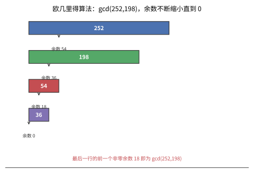
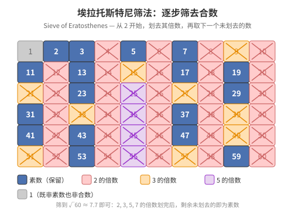
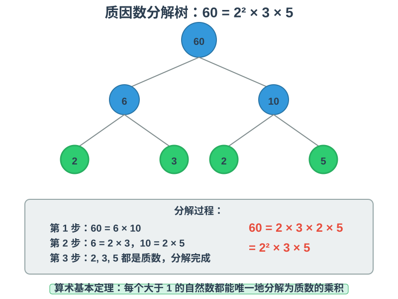
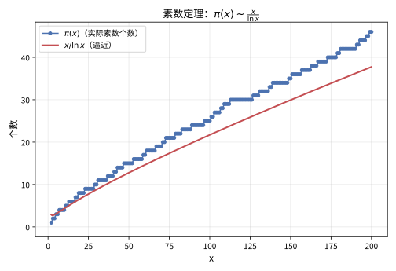
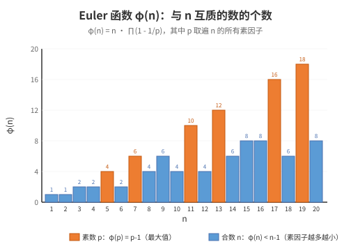
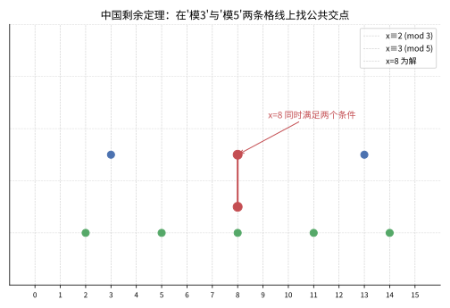

# 第 27 级：初等数论 (Elementary Number Theory)

## 一、学习目标

完成本教程后，你应当能够：

1. **理解整除性与最大公因数**——掌握带余除法、Euclid 算法及其正确性证明，理解最小公倍数与最大公因数的关系。
2. **掌握素数理论**——理解素数的定义，掌握 Euclid 关于素数无穷的经典证明，理解并证明算术基本定理（唯一分解定理），了解素数分布与素数定理的直观含义。
3. **熟练运用同余理论**——理解同余关系的基本性质，掌握完全剩余系与简化剩余系，理解 Euler 函数的定义与性质。
4. **证明与运用数论核心定理**——掌握 Euclid 算法、算术基本定理、费马小定理、Euler 定理、Wilson 定理、中国剩余定理的证明，以及二次互反律的表述与应用。
5. **解同余方程**——掌握一次同余方程的解法，运用中国剩余定理，理解二次剩余与 Legendre 符号。
6. **理解数论函数**——掌握 Euler 函数 φ、Möbius 函数 μ、除数函数 d(n)、除数和函数 σ(n) 的定义与性质，理解 Dirichlet 卷积与 Möbius 反演公式。
7. **了解原根与指数**——理解阶的概念与性质，掌握原根的定义与存在性条件。
8. **了解连分数**——理解简单连分数的表示，收敛与渐进分数，以及 Pell 方程的求解。

---

## 二、整除性

### 2.1 整除的定义

**定义**：设 $a, b \in \mathbb{Z}$，$b \neq 0$。若存在整数 $q$ 使得 $a = bq$，则称 **$b$ 整除 $a$**，记作 $b \mid a$。否则称 $b$ 不整除 $a$，记作 $b \nmid a$。

**基本性质**：
- 若 $a \mid b$ 且 $b \mid c$，则 $a \mid c$（传递性）。
- 若 $a \mid b$ 且 $a \mid c$，则 $a \mid (b \pm c)$。
- 若 $a \mid b$，则 $a \mid bc$ 对任意整数 $c$ 成立。
- 若 $a \mid b$ 且 $b \mid a$，则 $a = \pm b$。

### 2.2 带余除法（Division Algorithm）

> **定理（带余除法）**：设 $a, b \in \mathbb{Z}$，$b > 0$，则存在唯一的整数 $q$ 和 $r$，使得
> $$a = bq + r, \quad 0 \le r < b.$$

**证明**：令 $q = \lfloor a/b \rfloor$（向下取整），$r = a - bq$，则 $0 \le r < b$。唯一性：若有两组表示 $a = bq_1 + r_1 = bq_2 + r_2$，则 $b(q_1 - q_2) = r_2 - r_1$，由于 $|r_2 - r_1| < b$，必有 $q_1 = q_2$，$r_1 = r_2$。$\square$

### 2.3 最大公因数（Greatest Common Divisor）

**定义**：设 $a, b$ 不全为零。$a$ 和 $b$ 的**最大公因数**是能同时整除 $a$ 和 $b$ 的最大正整数，记作 $\gcd(a, b)$ 或 $(a, b)$。

**性质**：
- $\gcd(a, b) = \gcd(b, a)$。
- $\gcd(a, b) = \gcd(a, b - a)$。
- $\gcd(a, b) = \gcd(a, b \bmod a)$。
- 若 $d = \gcd(a, b)$，则存在整数 $x, y$ 使得 $d = ax + by$（Bézout 恒等式）。

### 2.4 欧几里得算法（Euclidean Algorithm）

欧几里得算法（辗转相除法）是求两个整数最大公因数的高效方法。

**算法描述**：给定 $a, b \in \mathbb{Z}^+$，$a \ge b$，反复应用带余除法：

$$
\begin{aligned}
a &= bq_1 + r_1, \quad 0 \le r_1 < b, \\
b &= r_1q_2 + r_2, \quad 0 \le r_2 < r_1, \\
r_1 &= r_2q_3 + r_3, \quad 0 \le r_3 < r_2, \\
&\ \vdots \\
r_{n-2} &= r_{n-1}q_n + r_n, \quad 0 \le r_n < r_{n-1}, \\
r_{n-1} &= r_nq_{n+1}.
\end{aligned}
$$

则 $\gcd(a, b) = r_n$（最后一个非零余数）。

**正确性证明**：

我们证明：若 $a = bq + r$，则 $\gcd(a, b) = \gcd(b, r)$。

设 $d = \gcd(a, b)$，则 $d \mid a$ 且 $d \mid b$。由 $r = a - bq$ 得 $d \mid r$，故 $d$ 是 $b$ 和 $r$ 的公因数，从而 $d \le \gcd(b, r)$。

反之，设 $d' = \gcd(b, r)$，则 $d' \mid b$ 且 $d' \mid r$。由 $a = bq + r$ 得 $d' \mid a$，故 $d'$ 是 $a$ 和 $b$ 的公因数，从而 $d' \le \gcd(a, b) = d$。

因此 $d = d'$，即 $\gcd(a, b) = \gcd(b, r)$。

由带余除法，余数序列严格递减：$b > r_1 > r_2 > \cdots \ge 0$，故算法必在有限步内终止于某 $r_n = 0$。此时 $\gcd(a, b) = \gcd(r_{n-1}, 0) = r_{n-1}$。$\square$

**示例**：求 $\gcd(252, 198)$。

$$
\begin{aligned}
252 &= 198 \times 1 + 54, \\
198 &= 54 \times 3 + 36, \\
54 &= 36 \times 1 + 18, \\
36 &= 18 \times 2 + 0.
\end{aligned}
$$

故 $\gcd(252, 198) = 18$。

> **直观理解（现实类比）**：欧几里得算法像"**用一块长砖反复量一块短砖**"。求 $\gcd(252,198)$ 时，先用 $252$ 减去 $198$ 的若干倍，剩下的 $54$ 比 $198$ 短；再用 $198$ 量 $54$，剩 $36$……每一次都把"要量的长度"变小，直到量得整整齐齐（余数为 $0$）。最后那块"能同时铺满两者的最短砖"就是最大公因数。就像**用大桶往小桶里倒水找两者的公约容量**——先看大桶能装满几个小桶，余下的水再继续量。

**扩展欧几里得算法**：在计算过程中回代，可求得 Bézout 系数 $x, y$ 使得 $ax + by = \gcd(a, b)$。

继续上例：$18 = 54 - 36 \times 1 = 54 - (198 - 54 \times 3) = 4 \times 54 - 198 = 4 \times (252 - 198) - 198 = 4 \times 252 - 5 \times 198$，故 $x = 4$, $y = -5$。

### 2.5 最小公倍数（Least Common Multiple）

**定义**：$a$ 和 $b$ 的**最小公倍数**是同时被 $a$ 和 $b$ 整除的最小正整数，记作 $\operatorname{lcm}(a, b)$ 或 $[a, b]$。

**定理**：$\gcd(a, b) \cdot \operatorname{lcm}(a, b) = |ab|$。

**证明**：设 $d = \gcd(a, b)$，令 $a = da_1$，$b = db_1$，其中 $\gcd(a_1, b_1) = 1$。则 $\operatorname{lcm}(a, b) = da_1b_1$，故 $\gcd(a, b) \cdot \operatorname{lcm}(a, b) = d \cdot (da_1b_1) = d^2 a_1 b_1 = (da_1)(db_1) = ab$。$\square$

---

## 三、素数

### 3.1 素数的定义

**定义**：大于 $1$ 的自然数 $p$ 称为**素数**（质数），若它的正因数只有 $1$ 和 $p$ 本身。否则称为**合数**。

**注**：$1$ 既不是素数也不是合数。

### 3.2 素数的无穷性（Euclid 的证明）

> **定理（Euclid）**：素数有无穷多个。

**证明**：假设只有有限个素数 $p_1, p_2, \dots, p_k$。考虑数
$$N = p_1 p_2 \cdots p_k + 1.$$
$N$ 大于 $1$，故必有素因子 $q$。若 $q$ 是某个 $p_i$，则 $q \mid (p_1p_2\cdots p_k)$，且 $q \mid N$，从而 $q \mid (N - p_1p_2\cdots p_k) = 1$，矛盾。因此 $q$ 是新的素数，与假设矛盾。故素数无穷。$\square$

> **直观理解（现实类比）**：Eratosthenes 筛法像**用筛子筛选金子**。把 1 到 n 的自然数排成网格，先从 2 开始——2 是素数，把 2 的所有倍数（4, 6, 8, ...）都筛掉；然后找下一个没被筛掉的数 3——3 也是素数，把 3 的所有倍数（6, 9, 12, ...）都筛掉；接着是 5、7、11……每筛一次，剩下的就都是素数。这就像**淘金时用水冲走沙子**，最后留在筛子里的就是"数字金子"——素数。虽然这个方法对大数很慢，但它直观地展示了素数的"不可分解性"：每个素数都"躲过了"所有比它小的素数的筛选。

### 3.3 算术基本定理（Fundamental Theorem of Arithmetic）

> **定理（算术基本定理）**：每个大于 $1$ 的正整数 $n$ 都可以唯一地分解为素数的乘积（不计顺序）：
> $$n = p_1^{\alpha_1} p_2^{\alpha_2} \cdots p_k^{\alpha_k},$$
> 其中 $p_1 < p_2 < \cdots < p_k$ 是素数，$\alpha_i \ge 1$ 是正整数。

**存在性证明（强归纳法）**：
- $n = 2$ 是素数，成立。
- 假设所有小于 $n$ 的大于 $1$ 的整数都能分解为素数之积。若 $n$ 是素数，则分解即为自身。若 $n$ 是合数，则存在 $1 < a, b < n$ 使得 $n = ab$。由归纳假设，$a$ 和 $b$ 均可分解，故 $n$ 也可分解。$\square$

**唯一性证明**：
假设 $n$ 有两种分解：
$$n = p_1 p_2 \cdots p_r = q_1 q_2 \cdots q_s,$$
其中 $p_i, q_j$ 均为素数（计重数）。

对 $r$ 进行归纳。$r = 1$ 时，$n = p_1$ 是素数，唯一性显然。

设 $r \ge 2$。由 $p_1 \mid n = q_1 q_2 \cdots q_s$，根据 Euclid 引理（若素数 $p \mid ab$ 则 $p \mid a$ 或 $p \mid b$），$p_1$ 必整除某个 $q_j$。由于 $q_j$ 是素数，$p_1 = q_j$。约去 $p_1$ 和 $q_j$，得到
$$p_2 p_3 \cdots p_r = q_1 \cdots q_{j-1} q_{j+1} \cdots q_s.$$
由归纳假设，两边的素数计重数后相同，故原分解唯一。$\square$

**Euclid 引理的证明**：若素数 $p \nmid a$，则 $\gcd(p, a) = 1$，存在 $x, y$ 使 $px + ay = 1$。两边乘以 $b$ 得 $pbx + aby = b$。因 $p \mid ab$，故 $p \mid (pbx + aby) = b$。$\square$

### 3.4 素数的分布

**素数定理（Prime Number Theorem）**：设 $\pi(x)$ 表示不超过 $x$ 的素数个数，则
$$\pi(x) \sim \frac{x}{\ln x} \quad (x \to \infty).$$
即 $\displaystyle \lim_{x \to \infty} \frac{\pi(x)}{x/\ln x} = 1$。

这个定理由 Hadamard 和 de la Vallée-Poussin 于 1896 年独立证明，是解析数论的核心成果之一。

> **直观理解（现实类比）**：素数定理说，不超过 $x$ 的素数个数大约等于 $x/\ln x$。这就像**在一条越来越长的街道上每隔一段就有一盏路灯**——数字越大，附近出现下一个素数的"间隔"平均越宽（约 $\ln x$），但整体上路灯依然无穷无尽。它把素数从"散落的神秘点"变成了"有宏观统计规律的现象"：虽然单个素数的位置像随机，但 100 个里大约有 $\frac{100}{\ln 100}\approx 22$ 个素数，稳定可预测。

**推论**：第 $n$ 个素数 $p_n \sim n \ln n$。

**Chebyshev 定理**：存在常数 $c_1, c_2$ 使得
$$c_1 \frac{x}{\ln x} \le \pi(x) \le c_2 \frac{x}{\ln x}.$$

---

## 四、同余

### 4.1 同余的定义与基本性质

**定义**：设 $m > 0$ 是正整数。若 $m \mid (a - b)$，则称 $a$ 与 $b$ **模 $m$ 同余**，记作
$$a \equiv b \pmod{m}.$$

**基本性质**：
- **自反性**：$a \equiv a \pmod{m}$。
- **对称性**：若 $a \equiv b \pmod{m}$，则 $b \equiv a \pmod{m}$。
- **传递性**：若 $a \equiv b \pmod{m}$ 且 $b \equiv c \pmod{m}$，则 $a \equiv c \pmod{m}$。
- **加法**：若 $a \equiv b \pmod{m}$，$c \equiv d \pmod{m}$，则 $a \pm c \equiv b \pm d \pmod{m}$。
- **乘法**：若 $a \equiv b \pmod{m}$，$c \equiv d \pmod{m}$，则 $ac \equiv bd \pmod{m}$。
- **幂运算**：若 $a \equiv b \pmod{m}$，则 $a^k \equiv b^k \pmod{m}$ 对任意正整数 $k$ 成立。
- **消去律**：若 $ac \equiv bc \pmod{m}$ 且 $\gcd(c, m) = 1$，则 $a \equiv b \pmod{m}$。

### 4.2 完全剩余系与简化剩余系

**定义**：模 $m$ 的**完全剩余系**是一个包含 $m$ 个整数的集合，它们两两模 $m$ 不同余。通常取 $\{0, 1, 2, \dots, m-1\}$。

**定义**：模 $m$ 的**简化剩余系**（缩系）是由所有与 $m$ 互质的剩余类组成的集合，共有 $\varphi(m)$ 个元素，其中 $\varphi$ 是 Euler 函数。

**示例**：模 $12$ 的完全剩余系为 $\{0, 1, 2, \dots, 11\}$，简化剩余系为 $\{1, 5, 7, 11\}$（与 $12$ 互质的剩余类）。

### 4.3 Euler 函数

**定义**：Euler 函数 $\varphi(n)$ 表示不超过 $n$ 且与 $n$ 互质的正整数的个数。

**性质**：
- 若 $p$ 是素数，则 $\varphi(p) = p - 1$。
- 若 $p$ 是素数，$k \ge 1$，则 $\varphi(p^k) = p^k - p^{k-1} = p^k(1 - 1/p)$。
- 若 $\gcd(m, n) = 1$，则 $\varphi(mn) = \varphi(m)\varphi(n)$（**积性函数**）。
- 一般公式：若 $n = p_1^{\alpha_1} p_2^{\alpha_2} \cdots p_k^{\alpha_k}$，则
  $$\varphi(n) = n\prod_{i=1}^k \left(1 - \frac{1}{p_i}\right).$$

> **直观理解（现实类比）**：Euler 函数 $\varphi(n)$ 像**测量一个数字的"社交能力"**——$\varphi(n)$ 越大，说明 $n$ 与越多的数"互质"（即没有公共因子）。素数的 $\varphi$ 值最大（$\varphi(p) = p-1$），因为素数只与 1 和自身有公因子，就像**社交达人**与所有人都能相处；而合数的 $\varphi$ 值较小，因为它们有较多因子，与更多数"有共同语言"。图中可以看到，素数（蓝色柱）总是比相邻的合数（橙色柱）高得多。这个函数在密码学中至关重要——RSA 加密的安全性就依赖于 $\varphi(n)$ 的计算。

---

## 五、定理与证明

### 5.1 欧几里得算法（Euclidean Algorithm）

**定理**（已在 2.4 节给出，此处重述核心结论）：

给定正整数 $a, b$，反复应用带余除法，最后一个非零余数即为 $\gcd(a, b)$。

**证明**：见 2.4 节。

### 5.2 算术基本定理（Fundamental Theorem of Arithmetic）

**定理**（已在 3.3 节给出，此处重述核心结论）：

每个大于 $1$ 的整数可唯一分解为素数之积。

**证明**：见 3.3 节。

### 5.3 费马小定理（Fermat's Little Theorem）

> **定理**：设 $p$ 为素数，$a$ 为整数，则
> $$a^p \equiv a \pmod{p}.$$
> 若 $p \nmid a$，则
> $$a^{p-1} \equiv 1 \pmod{p}.$$

**证明**：考虑 $p-1$ 个数 $a, 2a, 3a, \dots, (p-1)a$ 模 $p$。由于 $\gcd(a, p) = 1$，这些数两两不同余（若 $ia \equiv ja \pmod{p}$ 则 $p \mid (i-j)a$，因 $p \nmid a$ 得 $p \mid (i-j)$，故 $i \equiv j \pmod{p}$），且均不为 $0$ 模 $p$。因此它们构成模 $p$ 的一个简化剩余系，即
$$\{a, 2a, \dots, (p-1)a\} \equiv \{1, 2, \dots, p-1\} \pmod{p}.$$
将两边所有数相乘：
$$a^{p-1} \cdot (p-1)! \equiv (p-1)! \pmod{p}.$$
由于 $\gcd((p-1)!, p) = 1$，两边消去 $(p-1)!$ 得 $a^{p-1} \equiv 1 \pmod{p}$。$\square$

**示例**：$2^{10} = 1024$，$11 \mid 1023$，故 $2^{10} \equiv 1 \pmod{11}$。

### 5.4 欧拉定理（Euler's Theorem）

> **定理**：设 $m \ge 1$ 为正整数，$\gcd(a, m) = 1$，则
> $$a^{\varphi(m)} \equiv 1 \pmod{m}.$$

**证明**：设 $r_1, r_2, \dots, r_{\varphi(m)}$ 是模 $m$ 的一个简化剩余系。由于 $\gcd(a, m) = 1$，$ar_1, ar_2, \dots, ar_{\varphi(m)}$ 也是模 $m$ 的一个简化剩余系（两两不同余且均与 $m$ 互质）。因此
$$\prod_{i=1}^{\varphi(m)} (ar_i) \equiv \prod_{i=1}^{\varphi(m)} r_i \pmod{m}.$$
即
$$a^{\varphi(m)} \prod_{i=1}^{\varphi(m)} r_i \equiv \prod_{i=1}^{\varphi(m)} r_i \pmod{m}.$$
由于每个 $r_i$ 与 $m$ 互质，其乘积也与 $m$ 互质，故可消去，得 $a^{\varphi(m)} \equiv 1 \pmod{m}$。$\square$

**注**：费马小定理是 Euler 定理在 $m = p$（素数）时的特例，因为 $\varphi(p) = p-1$。

### 5.5 威尔逊定理（Wilson's Theorem）

> **定理**：$p$ 是素数当且仅当
> $$(p-1)! \equiv -1 \pmod{p}.$$

**证明**（必要性）：设 $p$ 是素数。考虑集合 $\{1, 2, \dots, p-1\}$。对每个 $a \in \{1, 2, \dots, p-1\}$，方程 $ax \equiv 1 \pmod{p}$ 有唯一解 $a^{-1}$（模 $p$ 意义下）。若 $a = a^{-1}$，则 $a^2 \equiv 1 \pmod{p}$，即 $p \mid (a-1)(a+1)$，故 $a \equiv 1$ 或 $a \equiv p-1 \pmod{p}$。因此 $\{2, 3, \dots, p-2\}$ 中的元素两两配对（每对互为逆元），它们的乘积模 $p$ 为 $1$。于是
$$(p-1)! \equiv 1 \cdot (p-1) \cdot 1 \equiv -1 \pmod{p}.$$

（充分性）：若 $n$ 是合数，则 $n$ 有素因子 $q < n$。若 $q < n$，则 $q \mid (n-1)!$，故 $(n-1)! \equiv 0 \pmod{q}$，而 $-1 \not\equiv 0 \pmod{q}$，矛盾。若 $n = 4$，$(3)! = 6 \equiv 2 \pmod{4} \neq -1$。故 $n$ 必为素数。$\square$

**示例**：$p = 7$，$(6)! = 720 \equiv 720 - 7 \times 103 = 720 - 721 = -1 \pmod{7}$。

### 5.6 中国剩余定理（Chinese Remainder Theorem）

> **定理（中国剩余定理）**：设 $m_1, m_2, \dots, m_k$ 是两两互质的正整数，$M = \prod_{i=1}^k m_i$。则对任意整数 $a_1, a_2, \dots, a_k$，同余方程组
> $$
> \begin{cases}
> x \equiv a_1 \pmod{m_1}, \\
> x \equiv a_2 \pmod{m_2}, \\
> \quad \vdots \\
> x \equiv a_k \pmod{m_k}
> \end{cases}
> $$
> 在模 $M$ 意义下有唯一解。

**构造性证明**：

1. 令 $M = m_1 m_2 \cdots m_k$，$M_i = M / m_i$（$i = 1, 2, \dots, k$）。
2. 由于 $\gcd(M_i, m_i) = 1$，$M_i$ 在模 $m_i$ 下有乘法逆元，即存在 $t_i$ 使得
   $$M_i t_i \equiv 1 \pmod{m_i}.$$
3. 构造
   $$x = \sum_{i=1}^k a_i M_i t_i.$$
   验证：对任意 $i$，
   $$x \equiv a_i M_i t_i \equiv a_i \cdot 1 \equiv a_i \pmod{m_i},$$
   因为 $j \neq i$ 时 $M_j$ 含有因子 $m_i$，故 $a_j M_j t_j \equiv 0 \pmod{m_i}$。
4. 唯一性：若 $x$ 和 $y$ 都是解，则 $x - y \equiv 0 \pmod{m_i}$ 对所有 $i$ 成立。由于 $m_i$ 两两互质，$M \mid (x - y)$，即 $x \equiv y \pmod{M}$。$\square$

**示例**（物不知数）：求解
$$
\begin{cases}
x \equiv 2 \pmod{3}, \\
x \equiv 3 \pmod{5}, \\
x \equiv 2 \pmod{7}.
\end{cases}
$$

解：$M = 3 \times 5 \times 7 = 105$，$M_1 = 35$，$M_2 = 21$，$M_3 = 15$。

求逆元：$35 \times 2 \equiv 1 \pmod{3}$（$t_1 = 2$），$21 \times 1 \equiv 1 \pmod{5}$（$t_2 = 1$），$15 \times 1 \equiv 1 \pmod{7}$（$t_3 = 1$）。

故 $x = 2 \times 35 \times 2 + 3 \times 21 \times 1 + 2 \times 15 \times 1 = 140 + 63 + 30 = 233 \equiv 233 - 2 \times 105 = 23 \pmod{105}$。

> **直观理解（现实类比）**：中国剩余定理就像**在一张纵横交错的日历上找"同时满足多个星期"的日子**。一个数 $x$ 同时满足 $x\equiv a_1\pmod{m_1}$ 和 $x\equiv a_2\pmod{m_2}$，等价于它在"模 $m_1$ 的格线"和"模 $m_2$ 的格线"上同时出现——两条线必有一个唯一交点，且每 $m_1m_2$ 重复一次。上面图中，满足 $x\equiv2\pmod3$ 的点与满足 $x\equiv3\pmod5$ 的点在 $x=8$ 处相交。这正是**多个独立约束共同锁定一个答案**的直观体现。

### 5.7 二次互反律（Quadratic Reciprocity Law）

> **定理（二次互反律，Gauss）**：设 $p$ 和 $q$ 为不同的奇素数，则
> $$\left(\frac{p}{q}\right)\left(\frac{q}{p}\right) = (-1)^{\frac{p-1}{2} \cdot \frac{q-1}{2}},$$
> 其中 $\left(\frac{a}{p}\right)$ 是 Legendre 符号。

等价地：
$$\left(\frac{p}{q}\right) = \begin{cases}
\left(\frac{q}{p}\right), & \text{若 } p \equiv 1 \pmod{4} \text{ 或 } q \equiv 1 \pmod{4}, \\
-\left(\frac{q}{p}\right), & \text{若 } p \equiv q \equiv 3 \pmod{4}.
\end{cases}$$

**补充公式**：
- $\left(\frac{-1}{p}\right) = (-1)^{\frac{p-1}{2}} = \begin{cases} 1, & p \equiv 1 \pmod{4}, \\ -1, & p \equiv 3 \pmod{4}. \end{cases}$
- $\left(\frac{2}{p}\right) = (-1)^{\frac{p^2-1}{8}} = \begin{cases} 1, & p \equiv \pm 1 \pmod{8}, \\ -1, & p \equiv \pm 3 \pmod{8}. \end{cases}$

**示例**：判断 $x^2 \equiv 5 \pmod{19}$ 是否有解。

计算 Legendre 符号：
$$\left(\frac{5}{19}\right) = \left(\frac{19}{5}\right) \cdot (-1)^{\frac{5-1}{2} \cdot \frac{19-1}{2}} = \left(\frac{19}{5}\right) \cdot (-1)^{2 \cdot 9} = \left(\frac{19}{5}\right) = \left(\frac{4}{5}\right) = \left(\frac{2^2}{5}\right) = 1.$$
故有解。事实上，$9^2 = 81 \equiv 5 \pmod{19}$。

---

## 六、同余方程

### 6.1 一次同余方程

**定义**：形如 $ax \equiv b \pmod{m}$ 的方程称为一次同余方程。

**解的存在性**：方程 $ax \equiv b \pmod{m}$ 有解当且仅当 $\gcd(a, m) \mid b$。

**解的个数**：若有解，则模 $m$ 下有 $\gcd(a, m)$ 个解。

**解法**：设 $d = \gcd(a, m)$。先解 $ax \equiv b \pmod{m}$ 等价于解 $ax + my = b$，用扩展欧几里得算法求得特解 $x_0$，则通解为
$$x = x_0 + \frac{m}{d} \cdot t, \quad t = 0, 1, \dots, d-1.$$

### 6.2 中国剩余定理的应用

中国剩余定理的核心应用是将模一个大合数的问题拆解为模其素因子幂的问题。典型应用包括：

1. **大整数运算**：通过 CRT 将大整数模运算分解为多个小模数运算，再合并结果。
2. **RSA 解密加速**：利用 CRT 将模 $n = pq$ 的指数运算拆分为模 $p$ 和模 $q$ 的运算，速度提升约 4 倍。
3. **求解同余方程组**：如 5.6 节中的示例。

### 6.3 二次剩余

**定义**：设 $p$ 为奇素数，$\gcd(a, p) = 1$。若 $x^2 \equiv a \pmod{p}$ 有解，则称 $a$ 为模 $p$ 的**二次剩余**，否则称为**二次非剩余**。

**Legendre 符号**：
$$\left(\frac{a}{p}\right) = \begin{cases}
1, & \text{若 } a \text{ 是模 } p \text{ 的二次剩余}, \\
-1, & \text{若 } a \text{ 是模 } p \text{ 的二次非剩余}, \\
0, & \text{若 } p \mid a.
\end{cases}$$

**Euler 判别法**：
$$\left(\frac{a}{p}\right) \equiv a^{\frac{p-1}{2}} \pmod{p}.$$

**证明**：由费马小定理，$a^{p-1} \equiv 1 \pmod{p}$，故 $(a^{\frac{p-1}{2}} - 1)(a^{\frac{p-1}{2}} + 1) \equiv 0 \pmod{p}$。若 $a$ 是二次剩余，即 $a \equiv x^2$，则 $a^{\frac{p-1}{2}} \equiv x^{p-1} \equiv 1 \pmod{p}$。若 $a$ 是二次非剩余，则 $a^{\frac{p-1}{2}} \equiv -1 \pmod{p}$。$\square$

**性质**：
- $\left(\frac{ab}{p}\right) = \left(\frac{a}{p}\right)\left(\frac{b}{p}\right)$。
- 模 $p$ 的二次剩余恰好有 $(p-1)/2$ 个，二次非剩余也有 $(p-1)/2$ 个。

### 6.4 二次互反律的应用

二次互反律提供了计算 Legendre 符号的高效方法，从而判断二次同余方程的可解性。

**示例**：判断 $x^2 \equiv 7 \pmod{29}$ 是否有解。

$$
\left(\frac{7}{29}\right) = \left(\frac{29}{7}\right) \cdot (-1)^{\frac{7-1}{2} \cdot \frac{29-1}{2}} = \left(\frac{29}{7}\right) \cdot (-1)^{3 \cdot 14} = \left(\frac{29}{7}\right) = \left(\frac{1}{7}\right) = 1.
$$
有解。事实上，$12^2 = 144 \equiv 144 - 29 \times 4 = 144 - 116 = 28 \equiv -1 \pmod{29}$，不对… 检查：$8^2 = 64 \equiv 64 - 58 = 6 \pmod{29}$，$10^2 = 100 \equiv 100 - 87 = 13 \pmod{29}$，$13^2 = 169 \equiv 169 - 145 = 24 \pmod{29}$，$15^2 = 225 \equiv 225 - 203 = 22 \pmod{29}$，$16^2 = 256 \equiv 256 - 232 = 24 \pmod{29}$，$20^2 = 400 \equiv 400 - 377 = 23 \pmod{29}$，$23^2 = 529 \equiv 529 - 522 = 7 \pmod{29}$。是的，$23^2 \equiv 7 \pmod{29}$。

---

## 七、数论函数

### 7.1 Euler 函数 $\varphi(n)$

已在 4.3 节介绍。$\varphi(n)$ 是积性函数，且
$$\varphi(n) = n \prod_{p \mid n} \left(1 - \frac{1}{p}\right).$$

**性质**：$\sum_{d \mid n} \varphi(d) = n$。

**证明**：考虑 $1$ 到 $n$ 的整数，按它们与 $n$ 的最大公因数 $d$ 分组。对每个 $d \mid n$，满足 $\gcd(k, n) = d$ 的 $k$ 的个数等于 $\varphi(n/d)$。故 $n = \sum_{d \mid n} \varphi(n/d) = \sum_{d \mid n} \varphi(d)$。$\square$

### 7.2 Möbius 函数 $\mu(n)$

**定义**：
$$\mu(n) = \begin{cases}
1, & \text{若 } n = 1, \\
0, & \text{若 } n \text{ 有平方因子}, \\
(-1)^k, & \text{若 } n = p_1 p_2 \cdots p_k \text{ 是 } k \text{ 个不同素数之积}.
\end{cases}$$

**性质**：$\mu(n)$ 是积性函数。且
$$\sum_{d \mid n} \mu(d) = \begin{cases}
1, & n = 1, \\
0, & n > 1.
\end{cases}$$

### 7.3 除数函数 $d(n)$ 与 $\sigma(n)$

**定义**：
- $d(n)$（或 $\tau(n)$）：$n$ 的正因数个数。
- $\sigma(n)$：$n$ 的所有正因数之和。

**公式**：若 $n = p_1^{\alpha_1} p_2^{\alpha_2} \cdots p_k^{\alpha_k}$，则
$$d(n) = \prod_{i=1}^k (\alpha_i + 1),$$
$$\sigma(n) = \prod_{i=1}^k \frac{p_i^{\alpha_i + 1} - 1}{p_i - 1}.$$

**示例**：$n = 12 = 2^2 \cdot 3$，$d(12) = (2+1)(1+1) = 6$（因数为 $1,2,3,4,6,12$），$\sigma(12) = \frac{2^3-1}{2-1} \cdot \frac{3^2-1}{3-1} = 7 \cdot 4 = 28$。

### 7.4 Dirichlet 卷积

**定义**：两个数论函数 $f$ 和 $g$ 的 Dirichlet 卷积定义为
$$(f * g)(n) = \sum_{d \mid n} f(d) \, g\!\left(\frac{n}{d}\right).$$

**性质**：
- 交换律：$f * g = g * f$。
- 结合律：$(f * g) * h = f * (g * h)$。
- 单位元：$\varepsilon(n) = \lfloor 1/n \rfloor$（即 $\varepsilon(1) = 1$，$\varepsilon(n) = 0$ 对 $n > 1$）。
- 若 $f$ 和 $g$ 都是积性函数，则 $f * g$ 也是积性函数。

**重要卷积关系**：
- $d = 1 * 1$，即 $d(n) = \sum_{d \mid n} 1$。
- $\sigma = 1 * \operatorname{id}$，即 $\sigma(n) = \sum_{d \mid n} d$。
- $\varphi = \mu * \operatorname{id}$，即 $\varphi(n) = \sum_{d \mid n} \mu(d) \cdot \frac{n}{d}$。
- $\varepsilon = \mu * 1$，即 $\sum_{d \mid n} \mu(d) = \varepsilon(n)$。

### 7.5 Möbius 反演公式

> **定理（Möbius 反演公式）**：设 $f$ 和 $g$ 是数论函数，则
> $$g(n) = \sum_{d \mid n} f(d) \quad \text{对所有 } n \ge 1$$
> 当且仅当
> $$f(n) = \sum_{d \mid n} \mu(d) \, g\!\left(\frac{n}{d}\right) \quad \text{对所有 } n \ge 1.$$

**证明**：用 Dirichlet 卷积的语言，$g = f * 1$。两边与 $\mu$ 卷积：
$$g * \mu = (f * 1) * \mu = f * (1 * \mu) = f * \varepsilon = f.$$
即 $f = g * \mu$，展开即 $f(n) = \sum_{d \mid n} \mu(d) g(n/d)$。反向推导类似。$\square$

**示例**：由 $\varphi * 1 = \operatorname{id}$（即 $\sum_{d \mid n} \varphi(d) = n$），应用 Möbius 反演得
$$\varphi(n) = \sum_{d \mid n} \mu(d) \cdot \frac{n}{d} = n \sum_{d \mid n} \frac{\mu(d)}{d}.$$

---

## 八、原根与指数

### 8.1 阶（Order）

**定义**：设 $\gcd(a, m) = 1$。使 $a^k \equiv 1 \pmod{m}$ 的最小正整数 $k$ 称为 $a$ 模 $m$ 的**阶**，记作 $\operatorname{ord}_m(a)$。

**性质**：
- $a^n \equiv 1 \pmod{m}$ 当且仅当 $\operatorname{ord}_m(a) \mid n$。
- $\operatorname{ord}_m(a) \mid \varphi(m)$（由 Euler 定理）。
- 若 $\operatorname{ord}_m(a) = r$，则 $a^0, a^1, \dots, a^{r-1}$ 模 $m$ 两两不同余。

### 8.2 原根（Primitive Root）

**定义**：若 $\gcd(g, m) = 1$ 且 $\operatorname{ord}_m(g) = \varphi(m)$，则称 $g$ 是模 $m$ 的一个**原根**。

**存在性**：模 $m$ 存在原根当且仅当 $m = 2, 4, p^k, 2p^k$，其中 $p$ 为奇素数，$k \ge 1$。

**性质**：若 $g$ 是模 $m$ 的原根，则 $\{g^0, g^1, \dots, g^{\varphi(m)-1}\}$ 构成模 $m$ 的简化剩余系。

**示例**：$3$ 是模 $7$ 的原根，因为 $\varphi(7) = 6$，且 $3^1 \equiv 3$，$3^2 \equiv 2$，$3^3 \equiv 6$，$3^4 \equiv 4$，$3^5 \equiv 5$，$3^6 \equiv 1 \pmod{7}$，阶为 $6$。

### 8.3 指数（Index / Discrete Logarithm）

**定义**：设 $g$ 是模 $m$ 的原根。对任意与 $m$ 互质的 $a$，存在唯一的 $0 \le r \le \varphi(m)-1$ 使得 $g^r \equiv a \pmod{m}$，称 $r$ 为 $a$ 以 $g$ 为底的**指数**（离散对数），记作 $\operatorname{ind}_g(a)$。

**性质**：
- $\operatorname{ind}_g(ab) \equiv \operatorname{ind}_g(a) + \operatorname{ind}_g(b) \pmod{\varphi(m)}$。
- $\operatorname{ind}_g(a^k) \equiv k \cdot \operatorname{ind}_g(a) \pmod{\varphi(m)}$。

---

## 九、连分数

### 9.1 简单连分数

**定义**：形如
$$a_0 + \cfrac{1}{a_1 + \cfrac{1}{a_2 + \cfrac{1}{\ddots}}}$$
的表达式称为**连分数**。若 $a_0, a_1, a_2, \dots$ 均为整数且 $a_1, a_2, \dots > 0$，则称为**简单连分数**，记作 $[a_0; a_1, a_2, \dots]$。

**有限连分数**：有理数可以表示为有限连分数。例如：
$$\frac{17}{7} = 2 + \frac{1}{2 + \frac{1}{2 + \frac{1}{2}}} = [2; 2, 2, 2].$$

**无限连分数**：无理数可以表示为无限连分数。例如：
$$\sqrt{2} = [1; 2, 2, 2, \dots] = 1 + \frac{1}{2 + \frac{1}{2 + \frac{1}{\ddots}}}.$$

### 9.2 收敛（Convergents）

**定义**：连分数 $[a_0; a_1, a_2, \dots]$ 的第 $k$ 个**收敛**（渐进分数）是截断取前 $k+1$ 项得到的分数 $\frac{p_k}{q_k}$。

**递推公式**：
$$
\begin{aligned}
p_{-2} &= 0, \quad p_{-1} = 1, \quad p_k = a_k p_{k-1} + p_{k-2}, \\
q_{-2} &= 1, \quad q_{-1} = 0, \quad q_k = a_k q_{k-1} + q_{k-2}.
\end{aligned}
$$

**性质**：
- $\frac{p_k}{q_k}$ 是最简分数（$\gcd(p_k, q_k) = 1$）。
- $p_k q_{k-1} - p_{k-1} q_k = (-1)^{k-1}$。
- 收敛交替逼近真实值：$\frac{p_0}{q_0} < \frac{p_2}{q_2} < \cdots < \alpha < \cdots < \frac{p_3}{q_3} < \frac{p_1}{q_1}$。

### 9.3 Pell 方程

**定义**：形如 $x^2 - Dy^2 = 1$ 的方程称为 **Pell 方程**，其中 $D$ 是非完全平方的正整数。

**求解方法**：展开 $\sqrt{D}$ 为连分数 $\sqrt{D} = [a_0; \overline{a_1, a_2, \dots, a_n}]$，则 Pell 方程的基本解由第 $n-1$ 个收敛给出（若 $n$ 为偶数）或第 $2n-1$ 个收敛给出（若 $n$ 为奇数）。

**示例**：求解 $x^2 - 2y^2 = 1$。

$\sqrt{2} = [1; 2, 2, 2, \dots]$，周期 $n = 1$（奇数）。收敛：
$$\frac{p_0}{q_0} = \frac{1}{1}, \frac{p_1}{q_1} = \frac{3}{2}, \frac{p_2}{q_2} = \frac{7}{5}, \frac{p_3}{q_3} = \frac{17}{12}, \dots$$
基本解为 $(3, 2)$，验证 $3^2 - 2 \cdot 2^2 = 9 - 8 = 1$。所有解由 $(3 + 2\sqrt{2})^k$ 给出。

---

## 十、示例

### 示例 1：求最大公因数

求 $\gcd(12345, 678)$ 并表示为 Bézout 组合。

**解**：
$$
\begin{aligned}
12345 &= 678 \times 18 + 141, \\
678 &= 141 \times 4 + 114, \\
141 &= 114 \times 1 + 27, \\
114 &= 27 \times 4 + 6, \\
27 &= 6 \times 4 + 3, \\
6 &= 3 \times 2 + 0.
\end{aligned}
$$
故 $\gcd(12345, 678) = 3$。

回代求 Bézout 系数：
$$
\begin{aligned}
3 &= 27 - 6 \times 4 = 27 - (114 - 27 \times 4) \times 4 = 27 \times 17 - 114 \times 4 \\
&= (141 - 114) \times 17 - 114 \times 4 = 141 \times 17 - 114 \times 21 \\
&= 141 \times 17 - (678 - 141 \times 4) \times 21 = 141 \times 101 - 678 \times 21 \\
&= (12345 - 678 \times 18) \times 101 - 678 \times 21 = 12345 \times 101 - 678 \times 1839.
\end{aligned}
$$
因此 $3 = 12345 \times 101 + 678 \times (-1839)$。

### 示例 2：Euler 函数计算

计算 $\varphi(360)$。

**解**：$360 = 2^3 \times 3^2 \times 5$。
$$\varphi(360) = 360 \times \left(1 - \frac{1}{2}\right) \times \left(1 - \frac{1}{3}\right) \times \left(1 - \frac{1}{5}\right) = 360 \times \frac{1}{2} \times \frac{2}{3} \times \frac{4}{5} = 96.$$

### 示例 3：费马小定理应用

求 $2^{1000000} \bmod 13$。

**解**：$13$ 是素数，由费马小定理 $2^{12} \equiv 1 \pmod{13}$。$1000000 = 12 \times 83333 + 4$，故
$$2^{1000000} \equiv 2^{12 \times 83333 + 4} \equiv (2^{12})^{83333} \cdot 2^4 \equiv 1^{83333} \cdot 16 \equiv 3 \pmod{13}.$$

### 示例 4：Euler 定理应用

求 $7^{222} \bmod 10$。

**解**：$\gcd(7, 10) = 1$，$\varphi(10) = \varphi(2) \cdot \varphi(5) = 1 \times 4 = 4$。由 Euler 定理，$7^4 \equiv 1 \pmod{10}$。$222 = 4 \times 55 + 2$，故
$$7^{222} \equiv (7^4)^{55} \cdot 7^2 \equiv 1^{55} \cdot 49 \equiv 9 \pmod{10}.$$

### 示例 5：Wilson 定理验证

验证 $p = 11$ 时 Wilson 定理成立。

**解**：$(10)! = 3628800$。$3628800 \div 11 = 329890 \cdots 10$，余数为 $10 \equiv -1 \pmod{11}$，成立。

### 示例 6：中国剩余定理应用

求解：
$$
\begin{cases}
x \equiv 1 \pmod{4}, \\
x \equiv 2 \pmod{5}, \\
x \equiv 3 \pmod{7}.
\end{cases}
$$

**解**：$M = 4 \times 5 \times 7 = 140$，$M_1 = 35$，$M_2 = 28$，$M_3 = 20$。
- $35 \times t_1 \equiv 1 \pmod{4} \Rightarrow 3 \times t_1 \equiv 1 \pmod{4} \Rightarrow t_1 = 3$。
- $28 \times t_2 \equiv 1 \pmod{5} \Rightarrow 3 \times t_2 \equiv 1 \pmod{5} \Rightarrow t_2 = 2$。
- $20 \times t_3 \equiv 1 \pmod{7} \Rightarrow 6 \times t_3 \equiv 1 \pmod{7} \Rightarrow t_3 = 6$。

$$x = 1 \times 35 \times 3 + 2 \times 28 \times 2 + 3 \times 20 \times 6 = 105 + 112 + 360 = 577 \equiv 577 - 4 \times 140 = 17 \pmod{140}.$$

### 示例 7：二次互反律应用

判断 $x^2 \equiv 3 \pmod{17}$ 是否有解。

**解**：
$$\left(\frac{3}{17}\right) = \left(\frac{17}{3}\right) \cdot (-1)^{\frac{3-1}{2} \cdot \frac{17-1}{2}} = \left(\frac{17}{3}\right) \cdot (-1)^{1 \cdot 8} = \left(\frac{2}{3}\right) = -1.$$
故无解。

### 示例 8：Möbius 反演

已知 $\sum_{d \mid n} \varphi(d) = n$，用 Möbius 反演求 $\varphi(n)$。

**解**：令 $g(n) = n$，$f(n) = \varphi(n)$，则 $g = f * 1$。由 Möbius 反演，
$$\varphi(n) = \sum_{d \mid n} \mu(d) \cdot \frac{n}{d} = n \sum_{d \mid n} \frac{\mu(d)}{d}.$$

### 示例 9：原根

验证 $2$ 是否是模 $13$ 的原根。

**解**：$\varphi(13) = 12$。计算 $2$ 的幂模 $13$：
$$2^1 \equiv 2, 2^2 \equiv 4, 2^3 \equiv 8, 2^4 \equiv 3, 2^5 \equiv 6, 2^6 \equiv 12, 2^7 \equiv 11, 2^8 \equiv 9, 2^9 \equiv 5, 2^{10} \equiv 10, 2^{11} \equiv 7, 2^{12} \equiv 1 \pmod{13}.$$
阶为 $12$，故 $2$ 是模 $13$ 的原根。

### 示例 10：连分数与 Pell 方程

求解 Pell 方程 $x^2 - 3y^2 = 1$。

**解**：$\sqrt{3} = [1; 1, 2, 1, 2, \dots]$，周期 $n = 2$（偶数）。前几个收敛：
$$\frac{p_0}{q_0} = \frac{1}{1}, \frac{p_1}{q_1} = \frac{2}{1}, \frac{p_2}{q_2} = \frac{5}{3}, \frac{p_3}{q_3} = \frac{7}{4}, \frac{p_4}{q_4} = \frac{19}{11}, \dots$$
基本解由第 $n-1 = 1$ 个收敛给出：$(2, 1)$，验证 $2^2 - 3 \cdot 1^2 = 1$。

---

## 十一、习题

1. 求 $\gcd(123456, 7890)$ 并表示为 Bézout 组合。

2. 证明：若 $a \mid b$ 且 $c \mid d$，则 $ac \mid bd$。

3. 计算 $\varphi(2024)$ 和 $\varphi(2025)$。

4. 用 Euclid 方法证明：$\gcd(a, b) = \gcd(a, b - a)$。

5. 求 $3^{500} \bmod 17$。

6. 判断 $x^2 \equiv 10 \pmod{31}$ 是否有解，若有，求出一个解。

7. 求解同余方程组：
   $$
   \begin{cases}
   x \equiv 3 \pmod{7}, \\
   x \equiv 5 \pmod{9}, \\
   x \equiv 2 \pmod{11}.
   \end{cases}
   $$

8. 证明：若 $p$ 是奇素数，则 $1^2 \cdot 3^2 \cdot 5^2 \cdots (p-2)^2 \equiv (-1)^{\frac{p+1}{2}} \pmod{p}$。

9. 计算 $d(2024)$ 和 $\sigma(2024)$。

10. 用 Möbius 反演公式推导：$\sum_{d \mid n} \mu(d) \tau(n/d) = 1$。

11. 找出模 $23$ 的一个原根，并验证。

12. 用连分数求解 Pell 方程 $x^2 - 5y^2 = 1$ 的最小正整数解。

13. 证明：若 $p$ 是素数，$a$ 是整数，则 $a^p \equiv a \pmod{p}$（费马小定理的另一种形式）。

14. 判断 $x^2 \equiv 6 \pmod{37}$ 是否有解。

15. 设 $p$ 为奇素数，证明：$\sum_{k=1}^{p-1} \left(\frac{k}{p}\right) = 0$。

---

## 十二、总结

初等数论是数学中最古老也最基础的分支之一，其核心研究对象是整数的性质。本教程从整除性出发，依次介绍了：

1. **整除性与 Euclid 算法**：带余除法、最大公因数、Euclid 算法及其正确性证明、最小公倍数。
2. **素数理论**：素数的定义、Euclid 关于素数无穷的经典证明、算术基本定理的存在性与唯一性完整证明、素数定理的陈述。
3. **同余理论**：同余的基本性质、完全剩余系与简化剩余系、Euler 函数。
4. **核心定理**：Euclid 算法、算术基本定理、费马小定理、Euler 定理、Wilson 定理、中国剩余定理、二次互反律，每个定理都给出了严格的证明或陈述。
5. **同余方程**：一次同余方程的解法、中国剩余定理的广泛应用、二次剩余与 Legendre 符号、Euler 判别法。
6. **数论函数**：Euler 函数 $\varphi$、Möbius 函数 $\mu$、除数函数 $d$ 与 $\sigma$，Dirichlet 卷积与 Möbius 反演公式。
7. **原根与指数**：阶的概念与性质、原根的定义与存在性条件、离散对数。
8. **连分数**：简单连分数、收敛的递推公式、Pell 方程的求解。

初等数论不仅是纯数学的重要分支，也在现代密码学（RSA、Diffie-Hellman）、计算机科学（哈希函数、随机数生成）、编码理论等领域有着广泛的应用。掌握这些基础概念和工具，将为进一步学习解析数论、代数数论等更深层次的理论奠定坚实的基础。