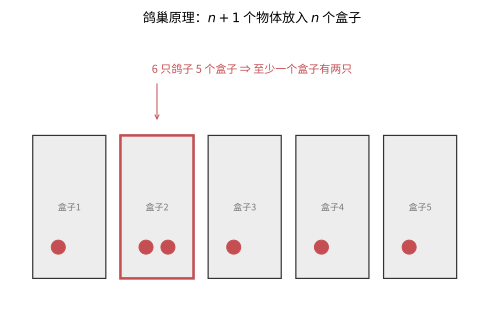
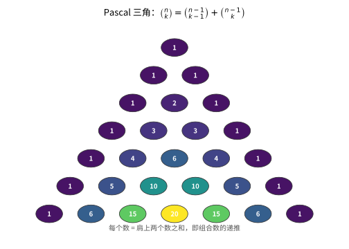
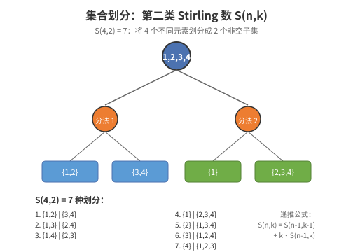
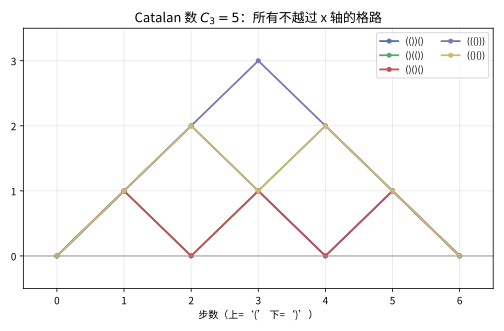
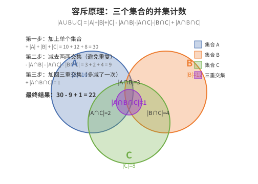

# 第 28 级：组合数学 (Combinatorics)

## 一、学习目标

完成本教程后，你应当能够：

1. **掌握基本计数原理**——熟练运用加法原理、乘法原理、双射原理、鸽巢原理及其证明，理解双重计数的思想。
2. **熟练运用排列与组合**——掌握排列、组合、可重组合的计算公式，理解 Stirling 数、Bell 数、Catalan 数的定义与性质。
3. **理解生成函数方法**——掌握普通生成函数与指数型生成函数的定义与运算，能够用生成函数求解递推关系。
4. **求解递推关系**——掌握常系数线性递推的特征方程法、分治递推的主定理法。
5. **掌握容斥原理**——能够证明容斥原理，并应用于错排、Euler 函数等经典问题。
6. **理解 Polya 计数理论**——掌握 Burnside 引理、Polya 枚举定理、环指标，能够计算对称性下的计数问题。
7. **了解组合设计**——理解区组设计、拉丁方、Steiner 系统、有限射影平面的基本概念。
8. **掌握偏序集理论**——理解偏序集、链、反链的概念，能够证明 Dilworth 定理与 Sperner 定理。
9. **能够解决实际计数问题**——通过大量示例与习题，建立组合数学直觉与严谨推导能力。

---

## 二、基本计数原理

### 2.1 加法原理 (Sum Rule / Addition Principle)

**定理**：若事件 $A$ 有 $m$ 种方式发生，事件 $B$ 有 $n$ 种方式发生，且 $A$ 与 $B$ 互斥（即不能同时发生），则事件"$A$ 或 $B$"有 $m + n$ 种方式发生。

**推广**：若 $A_1, A_2, \dots, A_k$ 两两互斥，则
$$
|A_1 \cup A_2 \cup \cdots \cup A_k| = |A_1| + |A_2| + \cdots + |A_k|.
$$

**示例**：从北京到上海，可以选择飞机（3 个航班）、高铁（4 趟）、大巴（2 趟），则共有 $3 + 4 + 2 = 9$ 种方式。

### 2.2 乘法原理 (Product Rule / Multiplication Principle)

**定理**：若事件 $A$ 有 $m$ 种方式发生，事件 $B$ 有 $n$ 种方式发生，且 $A$ 与 $B$ 相互独立（即 $A$ 的选择不影响 $B$ 的选择），则事件"$A$ 且 $B$"有 $m \times n$ 种方式发生。

**推广**：若一个过程由 $k$ 个步骤组成，第 $i$ 步有 $n_i$ 种选择，则整个过程共有 $n_1 \times n_2 \times \cdots \times n_k$ 种方式。

**示例**：餐厅有 3 种开胃菜、5 种主菜、2 种甜点，则一套完整的套餐有 $3 \times 5 \times 2 = 30$ 种组合。

### 2.3 双射原理 (Bijection Principle)

**定理**：若存在一个双射（一一对应）$f: A \to B$，则 $|A| = |B|$。

**说明**：双射原理是组合计数中最强大的工具之一——当我们难以直接计算某个集合的大小时，可以构造一个双射将其映射到另一个容易计数的集合。

**示例**：证明 $n$ 元集合的子集个数为 $2^n$。构造双射：每个子集对应一个长度为 $n$ 的 0-1 序列（第 $i$ 位为 1 表示第 $i$ 个元素在子集中）。长度为 $n$ 的 0-1 序列有 $2^n$ 个，故子集也有 $2^n$ 个。

### 2.4 鸽巢原理 (Pigeonhole Principle)

**定理 (鸽巢原理)**：若将 $n+1$ 个物体放入 $n$ 个盒子中，则至少有一个盒子中含有至少两个物体。

**证明**：反证法。假设每个盒子至多含有一个物体，则 $n$ 个盒子最多容纳 $n$ 个物体，与有 $n+1$ 个物体矛盾。$\square$

**推广 (广义鸽巢原理)**：若将 $N$ 个物体放入 $k$ 个盒子中，则至少有一个盒子中含有至少 $\lceil N/k \rceil$ 个物体。

**证明**：反证法。假设每个盒子至多含有 $\lceil N/k \rceil - 1$ 个物体，则总物体数不超过 $k(\lceil N/k \rceil - 1) < k \cdot (N/k) = N$，矛盾。$\square$

**示例 1**：在任意 367 人中，至少有两人生日相同（因为一年最多 366 天）。



> **直观理解（现实类比）**：鸽巢原理就像**把 6 只鸽子塞进 5 个窝**——窝不够多，就必然有一个窝装了两只。它看似平凡，却常用来证明"某种重复必然存在"。比如 367 人生日、13 人必有两人同属一个星座。关键是把抽象问题翻译成"**物体数 > 盒子数**"，重复就无处可逃。

**示例 2**：从 1, 2, \dots, 100 中任选 51 个数，则必有两个数互质。因为相邻两数必互质，将 $\{1,2\}, \{3,4\}, \dots, \{99,100\}$ 分为 50 组，选 51 个数则必有一组被选两个数。

### 2.5 双重计数 (Double Counting)

**原理**：对同一个量用两种不同的方式计数，所得结果相等。双重计数是组合数学中极为重要的证明技巧。

**示例**：证明
$$
\sum_{k=0}^n \binom{n}{k} = 2^n.
$$
左边：按子集大小 $k$ 计数；右边：每个元素可选或不选，共 $2^n$ 种方式。

**示例 (握手引理)**：在任意图中，所有顶点的度数之和等于边数的两倍。
$$
\sum_{v \in V} \deg(v) = 2|E|.
$$
左边：按顶点计数相邻边；右边：按边计数其两个端点。

---

## 三、排列与组合

### 3.1 排列 (Permutations)

**定义**：从 $n$ 个不同元素中选出 $k$ 个按顺序排列，称为 $n$ 选 $k$ 的排列，记作 $P(n,k)$ 或 $A_n^k$。

$$
P(n,k) = n \times (n-1) \times \cdots \times (n-k+1) = \frac{n!}{(n-k)!}.
$$

**特别地**，$n$ 个元素的全排列数为 $P(n,n) = n!$。

**示例**：5 个人排成一排，有 $5! = 120$ 种排法。

### 3.2 组合 (Combinations)

**定义**：从 $n$ 个不同元素中选出 $k$ 个（不考虑顺序），称为 $n$ 选 $k$ 的组合，记作 $\binom{n}{k}$ 或 $C_n^k$。

$$
\binom{n}{k} = \frac{P(n,k)}{k!} = \frac{n!}{k!(n-k)!}.
$$

**性质**：
- $\binom{n}{k} = \binom{n}{n-k}$（对称性）
- $\binom{n}{k} = \binom{n-1}{k} + \binom{n-1}{k-1}$（Pascal 恒等式）
- $\binom{n}{0} + \binom{n}{1} + \cdots + \binom{n}{n} = 2^n$
- $\sum_{k=0}^n (-1)^k \binom{n}{k} = 0$（$n \ge 1$）



> **直观理解（现实类比）**：Pascal 三角像**一层层垒起来的积木**——顶层的 1 是种子的起点，每一层的每个格子都等于它正上方两个数之和。这正对应组合公式 $\binom{n}{k}=\binom{n-1}{k-1}+\binom{n-1}{k}$：要选 $k$ 个，要么不选最后一个元素（从前 $n-1$ 个里选 $k$ 个），要么选它（从前 $n-1$ 个里选 $k-1$ 个），两种互斥情况加起来即可。整张三角表就是"**逐步累加**"的计数日记。

### 3.3 可重组合 (Combinations with Repetition)

**问题**：从 $n$ 种物品中选出 $k$ 个，每种物品可以选任意多次（即允许重复），且不考虑顺序，有多少种选法？

**定理**：可重组合数等于 $\binom{n+k-1}{k}$。

**证明**：设 $n$ 种物品的编号为 $1, 2, \dots, n$。设选出的 $k$ 个物品中，第 $i$ 种物品选了 $x_i$ 个（$x_i \ge 0$），则 $x_1 + x_2 + \cdots + x_n = k$。令 $y_i = x_i + 1$，则 $y_i \ge 1$ 且 $y_1 + \cdots + y_n = n + k$。问题转化为将 $n+k$ 个相同球放入 $n$ 个盒子中（每个盒子至少一个），即 $\binom{n+k-1}{n-1} = \binom{n+k-1}{k}$。$\square$

**示例**：4 种口味的冰淇淋，选 6 个球（可重复），有 $\binom{4+6-1}{6} = \binom{9}{6} = 84$ 种选法。

### 3.4 第一类 Stirling 数 (Stirling Numbers of the First Kind)

**定义**：第一类 Stirling 数 $s(n,k)$（或 $c(n,k)$，或 $\left[{n \atop k}\right]$）表示将 $n$ 个不同元素排成 $k$ 个非空循环排列（轮换）的方案数。

**递推关系**：
$$
s(n,k) = s(n-1,k-1) + (n-1) \cdot s(n-1,k),
$$
边界条件：$s(0,0)=1$，$s(n,0)=0\;(n>0)$，$s(n,n)=1$。

**解释**：考虑最后一个元素 $n$，要么单独构成一个轮换（$s(n-1,k-1)$ 种），要么插入到已有轮换中某个元素之后（有 $n-1$ 个位置可插入，$s(n-1,k)$ 种）。

**与阶乘多项式的关系**：
$$
(x)_n = x(x-1)(x-2)\cdots(x-n+1) = \sum_{k=0}^n s(n,k) x^k,
$$
其中 $(x)_n$ 是递降阶乘。

**示例**：$s(4,2) = 11$。

### 3.5 第二类 Stirling 数 (Stirling Numbers of the Second Kind)

**定义**：第二类 Stirling 数 $S(n,k)$（或 $\left\{{n \atop k}\right\}$）表示将 $n$ 个不同的元素划分成 $k$ 个非空不可区分子集的方案数。

**递推关系**：
$$
S(n,k) = S(n-1,k-1) + k \cdot S(n-1,k),
$$
边界条件：$S(0,0)=1$，$S(n,0)=0\;(n>0)$，$S(n,n)=1$。

**解释**：考虑最后一个元素 $n$，要么单独构成一个子集（$S(n-1,k-1)$ 种），要么放入已有的 $k$ 个子集中之一（$k \cdot S(n-1,k)$ 种）。

**闭式公式**：
$$
S(n,k) = \frac{1}{k!} \sum_{i=0}^k (-1)^i \binom{k}{i} (k-i)^n.
$$

**与幂和的关系**：
$$
x^n = \sum_{k=0}^n S(n,k) (x)_k,
$$
其中 $(x)_k = x(x-1)\cdots(x-k+1)$。

**示例**：$S(4,2) = 7$，$S(5,3) = 25$。



> **直观理解（现实类比）**：第二类 Stirling 数 $S(n,k)$ 像**把 n 个不同的球放进 k 个相同的盒子**——盒子没有标签，所以 $\{\{1,2\},\{3,4\}\}$ 和 $\{\{3,4\},\{1,2\}\}$ 是同一种划分。图中展示了 $S(4,2)=7$ 的所有划分方式：从根节点 $\{1,2,3,4\}$ 出发，要么让元素 4 单独成一组（左边分支），要么让 4 加入已有的某一组（右边分支）。这就像**分房间**：4 个人住 2 个房间，要么 1 人单住、3 人合住（1 种），要么 2 人一间、2 人一间（3 种，因为要选哪两个人住一起），再加上其他分配方式，总共 7 种。递推公式 $S(n,k) = S(n-1,k-1) + k \cdot S(n-1,k)$ 正是这个思路的数学表达。

### 3.6 Bell 数 (Bell Numbers)

**定义**：Bell 数 $B_n$ 表示将 $n$ 个不同元素划分成任意多个非空子集的方案总数。

$$
B_n = \sum_{k=0}^n S(n,k).
$$

**递推关系**：
$$
B_{n+1} = \sum_{k=0}^n \binom{n}{k} B_k,
$$
边界条件 $B_0 = 1$。

**前几项**：$B_0=1, B_1=1, B_2=2, B_3=5, B_4=15, B_5=52, B_6=203, \dots$

**示例**：将 3 个不同元素（$a,b,c$）划分，有 5 种方式：
- $\{\{a,b,c\}\}$（1 个块）
- $\{\{a\}, \{b,c\}\}, \{\{b\}, \{a,c\}\}, \{\{c\}, \{a,b\}\}$（2 个块）
- $\{\{a\}, \{b\}, \{c\}\}$（3 个块）

### 3.7 Catalan 数 (Catalan Numbers)

**定义**：Catalan 数 $C_n$ 是组合数学中极为常见的一类数列，其通项公式为：
$$
C_n = \frac{1}{n+1} \binom{2n}{n}.
$$

**递推关系**：
$$
C_0 = 1, \quad C_{n+1} = \sum_{i=0}^n C_i C_{n-i}.
$$

**前几项**：$1, 1, 2, 5, 14, 42, 132, 429, 1430, \dots$

**Catalan 数的经典组合解释**：
1. **括号匹配**：$n$ 对括号的正确匹配方式数。
2. **二叉树**：$n$ 个节点的不同二叉树的个数。
3. **Dyck 路径**：从 $(0,0)$ 到 $(2n,0)$ 的不低于 $x$ 轴的格路，步长为 $(1,1)$ 和 $(1,-1)$。
4. **凸多边形三角剖分**：$n+2$ 边形的三角形剖分方式数。
5. **出栈序列**：$n$ 个元素依次入栈，不同的出栈序列数。

**示例**：$n=3$ 时，Catalan 数 $C_3 = 5$，对应 3 对括号的 5 种匹配方式：
`((()))`, `(()())`, `(())()`, `()(())`, `()()()`



> **直观理解（现实类比）**：Catalan 数计数的是一类"**永远不把自己'套牢'的走法**"。把"左括号/上一步"看作爬山、右括号/下一步看作下山，一条合法的 Dyck 路径必须**始终不跌到地平线以下**（高度 $h \ge 0$），终点恰好回到原点。这就像**一场永远不借债的登山**——每一步都先保证账面上还有盈余。正因为多了这个约束，$C_n$（$= \frac{1}{n+1}\binom{2n}{n}$）比无约束的 $\binom{2n}{n}$ 小得多，恰好是它的 $\frac{1}{n+1}$。

---

## 四、生成函数

### 4.1 普通生成函数 (Ordinary Generating Function, OGF)

**定义**：给定数列 $\{a_n\}_{n=0}^\infty$，其普通生成函数（OGF）定义为形式幂级数：
$$
A(x) = \sum_{n=0}^\infty a_n x^n.
$$

**示例**：
- 数列 $a_n = 1$ 的 OGF：$\displaystyle \sum_{n=0}^\infty x^n = \frac{1}{1-x}$。
- 数列 $a_n = \binom{n}{k}$（固定 $k$）的 OGF：$\displaystyle \sum_{n=k}^\infty \binom{n}{k} x^n = \frac{x^k}{(1-x)^{k+1}}$。

### 4.2 指数型生成函数 (Exponential Generating Function, EGF)

**定义**：数列 $\{a_n\}_{n=0}^\infty$ 的指数型生成函数（EGF）定义为：
$$
\hat{A}(x) = \sum_{n=0}^\infty a_n \frac{x^n}{n!}.
$$

**说明**：EGF 常用于处理涉及排列的计数问题，因为排列数 $n!$ 与分母 $n!$ 经常产生简洁的形式。

**示例**：
- 数列 $a_n = 1$ 的 EGF：$\displaystyle \sum_{n=0}^\infty \frac{x^n}{n!} = e^x$。
- 数列 $a_n = n!$ 的 EGF：$\displaystyle \sum_{n=0}^\infty \frac{x^n}{1} = \frac{1}{1-x}$。

### 4.3 生成函数的运算

设 $A(x) = \sum a_n x^n$, $B(x) = \sum b_n x^n$。

| 运算 | 结果 | 数列对应 |
|------|------|----------|
| 数乘 | $cA(x)$ | $\{c a_n\}$ |
| 加法 | $A(x) + B(x)$ | $\{a_n + b_n\}$ |
| 乘积 (卷积) | $A(x)B(x)$ | $\displaystyle \left\{\sum_{k=0}^n a_k b_{n-k}\right\}$ |
| 移位 | $x^m A(x)$ | $\{a_{n-m}\}$（$n \ge m$） |
| 微分 | $A'(x)$ | $\{(n+1)a_{n+1}\}$ |
| 积分 | $\int_0^x A(t)\,dt$ | $\{a_{n-1}/n\}$（$n \ge 1$） |

### 4.4 用生成函数求解递推关系

**示例：求解 Fibonacci 数列**

Fibonacci 数列：$F_0 = 0, F_1 = 1, F_n = F_{n-1} + F_{n-2}\;(n \ge 2)$。

设 $F(x) = \sum_{n=0}^\infty F_n x^n$。

由递推关系：
$$
F(x) = F_0 + F_1 x + \sum_{n=2}^\infty (F_{n-1} + F_{n-2}) x^n = 0 + x + x(F(x) - F_0) + x^2 F(x).
$$

整理得：
$$
F(x) = x + xF(x) + x^2 F(x) \quad\Rightarrow\quad F(x) = \frac{x}{1 - x - x^2}.
$$

部分分式分解：
$$
\frac{x}{1 - x - x^2} = \frac{1}{\sqrt{5}} \left( \frac{1}{1 - \phi x} - \frac{1}{1 - \hat{\phi} x} \right),
$$
其中 $\phi = \frac{1+\sqrt{5}}{2}$, $\hat{\phi} = \frac{1-\sqrt{5}}{2}$。

展开得闭式：
$$
F_n = \frac{\phi^n - \hat{\phi}^n}{\sqrt{5}}.
$$

---

## 五、递推关系

### 5.1 常系数线性递推关系

**形式**：
$$
a_n = c_1 a_{n-1} + c_2 a_{n-2} + \cdots + c_k a_{n-k} + f(n),
$$
其中 $c_1, c_2, \dots, c_k$ 为常数。

**齐次解**：对于齐次递推 $a_n = c_1 a_{n-1} + \cdots + c_k a_{n-k}$，设 $a_n = r^n$，代入得特征方程：
$$
r^k - c_1 r^{k-1} - c_2 r^{k-2} - \cdots - c_k = 0.
$$

- 若特征根 $r_1, r_2, \dots, r_k$ 互异，则通解为 $a_n = \alpha_1 r_1^n + \cdots + \alpha_k r_k^n$。
- 若 $r$ 是 $m$ 重根，则贡献项为 $(\alpha_0 + \alpha_1 n + \cdots + \alpha_{m-1} n^{m-1}) r^n$。

**特解**：根据 $f(n)$ 的形式设定待定系数（如 $f(n)$ 为多项式、指数函数、三角函数等）。

**示例**：求解 $a_n = 5a_{n-1} - 6a_{n-2}$，$a_0 = 1, a_1 = 2$。

特征方程：$r^2 - 5r + 6 = 0$，得 $r_1 = 2, r_2 = 3$。
通解：$a_n = \alpha \cdot 2^n + \beta \cdot 3^n$。
代入初始条件：
- $n=0$: $\alpha + \beta = 1$
- $n=1$: $2\alpha + 3\beta = 2$

解得 $\alpha = 1, \beta = 0$，故 $a_n = 2^n$。

### 5.2 分治递推与主定理 (Master Theorem)

**形式**：$T(n) = a T(n/b) + f(n)$，其中 $a \ge 1, b > 1$。

**主定理**：设 $T(n) = a T(n/b) + f(n)$，比较 $n^{\log_b a}$ 与 $f(n)$ 的增长率：

1. 若 $f(n) = O(n^{\log_b a - \varepsilon})$ 对某个 $\varepsilon > 0$，则 $T(n) = \Theta(n^{\log_b a})$。
2. 若 $f(n) = \Theta(n^{\log_b a})$，则 $T(n) = \Theta(n^{\log_b a} \log n)$。
3. 若 $f(n) = \Omega(n^{\log_b a + \varepsilon})$ 对某个 $\varepsilon > 0$，且 $a f(n/b) \le c f(n)$ 对某个 $c < 1$ 和足够大的 $n$ 成立（正则条件），则 $T(n) = \Theta(f(n))$。

**示例**：二分查找 $T(n) = T(n/2) + O(1)$，$a=1, b=2$，$\log_b a = 0$，$f(n) = O(1) = \Theta(n^0)$，属于情况 2，故 $T(n) = \Theta(\log n)$。

**示例**：归并排序 $T(n) = 2T(n/2) + O(n)$，$a=2, b=2$，$\log_b a = 1$，$f(n) = \Theta(n)$，属于情况 2，故 $T(n) = \Theta(n \log n)$。

### 5.3 反演公式 (Inversion Formulas)

**二项式反演**：若数列满足互逆关系
$$
b_n = \sum_{k=0}^{n}\binom{n}{k} a_k \quad \Longleftrightarrow \quad a_n = \sum_{k=0}^{n}(-1)^{n-k}\binom{n}{k} b_k.
$$

> **💡 直观理解**：反演公式是"互逆的变换对"。就像傅里叶变换与逆变换互相还原，二项式反演把"由 $a$ 生成 $b$"倒过来"由 $b$ 还原 $a$"。它常用于把"至少"型计数转化为"恰好"型计数。

**例**：错排数 $D_n$。记 $b_n = n!$（所有排列数），$a_k$ = 恰好 $k$ 个元素在原位的排列数。由"至少"到"恰好"：
$$
n! = \sum_{k=0}^{n}\binom{n}{k} D_{n-k} \quad\Longrightarrow\quad D_n = \sum_{k=0}^{n}(-1)^k \binom{n}{k}(n-k)! = n!\sum_{k=0}^{n}\frac{(-1)^k}{k!}.
$$

**Möbius 反演**（偏序集上）：设 $P$ 是局部有限偏序集，$\zeta$ 为 zeta 函数（$\zeta(x,y)=1$ 当 $x\le y$，否则 0），其矩阵逆为 **Möbius 函数** $\mu$。若
$$
f(x) = \sum_{y \le x} g(y), \quad \text{则} \quad g(x) = \sum_{y \le x} \mu(y, x) f(y).
$$
在"整除"偏序（$y \mid x$）上，$\mu(y,x) = \mu(x/y)$ 恰为算术中的 Möbius 函数，由此得到经典数论公式如 $\sum_{d\mid n}\mu(d) = [n=1]$。

> **🔑 数学思路**：Möbius 反演是"整除/包含"结构上的降维工具，把求解 $g$ 的问题转化为对 $f$ 做加权求和。它在数论、容斥、组合设计中无处不在。

### 5.4 整数分拆 (Integer Partitions)

**定义**：正整数 $n$ 的**分拆**是把 $n$ 表示成若干个正整数的和（顺序不计），分拆的个数记为 $p(n)$。例如 $p(4)=5$，因为
$$
4 = 4 = 3+1 = 2+2 = 2+1+1 = 1+1+1+1.
$$

**生成函数**：
$$
\sum_{n=0}^{\infty} p(n) x^n = \prod_{k=1}^{\infty}\frac{1}{1-x^k}.
$$

**Ferrers 图与共轭**：把分拆 $n = \lambda_1+\cdots+\lambda_r$（$\lambda_1\ge\cdots\ge\lambda_r$）画成左对齐的方格行，得到 Ferrers 图；将其转置得到的共轭分拆对应另一个分拆。这给出了大量双射恒等式，例如"$n$ 分成至多 $m$ 部分的分拆数 = 每部分不超过 $m$ 的分拆数"。

**五边形数定理**（Euler）：
$$
\prod_{k=1}^{\infty}(1-x^k) = \sum_{k=-\infty}^{\infty}(-1)^k x^{k(3k-1)/2},
$$
由此可快速递推计算 $p(n)$。

> **💡 直观理解**：整数分拆研究"把一个数拆成几份有几种拆法"，是组合数学中最"简单却深刻"的计数问题。它和多项式、生成函数、模形式都有联系，是研究 $p(n)$ 庞大理论体系（Hardy-Ramanujan 渐近公式 $p(n)\sim\frac{e^{\pi\sqrt{2n/3}}}{4n\sqrt{3}}$）的入口。

---

## 六、容斥原理

### 6.1 容斥原理 (Inclusion-Exclusion Principle)

**定理**：设 $A_1, A_2, \dots, A_n$ 为有限集合，则
$$
\left|\bigcup_{i=1}^n A_i\right| = \sum_{i=1}^n |A_i| - \sum_{1 \le i < j \le n} |A_i \cap A_j| + \sum_{1 \le i < j < k \le n} |A_i \cap A_j \cap A_k| - \cdots + (-1)^{n+1} |A_1 \cap A_2 \cap \cdots \cap A_n|.
$$

**证明**：对任意元素 $x \in \bigcup_{i=1}^n A_i$，设 $x$ 恰好属于 $m$ 个集合（$1 \le m \le n$）。在右式中：
- $\sum |A_i|$ 贡献 $\binom{m}{1}$ 次
- $\sum |A_i \cap A_j|$ 贡献 $\binom{m}{2}$ 次
- $\cdots$
- $(-1)^{k+1} \sum |A_{i_1} \cap \cdots \cap A_{i_k}|$ 贡献 $(-1)^{k+1} \binom{m}{k}$ 次

因此 $x$ 在右式中被计数的总次数为：
$$
\sum_{k=1}^m (-1)^{k+1} \binom{m}{k} = 1 - \sum_{k=0}^m (-1)^k \binom{m}{k} = 1 - (1-1)^m = 1.
$$
故每个元素恰被计数一次，左右相等。$\square$



> **直观理解（现实类比）**：容斥原理像**数 overlapping 的圆圈**。要算三个圆圈的总面积，先把三个圆单独加起来（$|A|+|B|+|C|$），但两两重叠的部分被算了两次，所以要减掉（$-|A\cap B|-|A\cap C|-|B\cap C|$），可中间那块三个圆都重叠的部分被减了三次，得加回来（$+|A\cap B\cap C|$）。这就像**统计班级里会编程、会设计、会写作的人数**——直接加会重复计算"多面手"，容斥原理通过"加-减-加-减"的交替，确保每个人只被数一次。图中数字展示了这个精确的计数过程。

### 6.2 错排 (Derangements)

**定义**：错排 $D_n$ 是 $\{1, 2, \dots, n\}$ 的排列中，没有元素出现在其原始位置（即无不动点）的排列数。

**用容斥原理求解**：设 $A_i$ 为第 $i$ 个元素在原始位置上的排列集合。则
$$
D_n = n! - \left|\bigcup_{i=1}^n A_i\right|.
$$

由容斥原理：
$$
D_n = \sum_{k=0}^n (-1)^k \binom{n}{k} (n-k)! = n! \sum_{k=0}^n \frac{(-1)^k}{k!}.
$$

**递推关系**：$D_n = (n-1)(D_{n-1} + D_{n-2})$，$D_1 = 0, D_2 = 1$。

**前几项**：$D_1=0, D_2=1, D_3=2, D_4=9, D_5=44, D_6=265$。

### 6.3 Euler 函数 (Euler's Totient Function)

**定义**：$\varphi(n)$ 表示小于等于 $n$ 且与 $n$ 互质的正整数个数。

**用容斥原理求 $\varphi(n)$**：设 $n = p_1^{e_1} p_2^{e_2} \cdots p_k^{e_k}$。令 $A_i$ 为被 $p_i$ 整除的数的集合，则
$$
\varphi(n) = n - \left|\bigcup_{i=1}^k A_i\right|.
$$

由容斥原理：
$$
\varphi(n) = n - \sum_i \frac{n}{p_i} + \sum_{i<j} \frac{n}{p_i p_j} - \cdots + (-1)^k \frac{n}{p_1 p_2 \cdots p_k}.
$$

这等价于：
$$
\varphi(n) = n \prod_{i=1}^k \left(1 - \frac{1}{p_i}\right).
$$

**示例**：$\varphi(12) = 12 \times (1 - 1/2) \times (1 - 1/3) = 12 \times 1/2 \times 2/3 = 4$，即与 12 互质的数为 1, 5, 7, 11。

---

## 七、Polya 计数理论

### 7.1 Burnside 引理 (Burnside's Lemma)

**引理**：设群 $G$ 作用在集合 $X$ 上，则 $X$ 在 $G$ 作用下的轨道数（即本质上不同的着色方案数）为：
$$
\frac{1}{|G|} \sum_{g \in G} |\text{Fix}(g)|,
$$
其中 $\text{Fix}(g) = \{x \in X \mid g(x) = x\}$ 是在群元素 $g$ 作用下不变的着色方案数。

**证明**：考虑集合 $\{(g, x) \in G \times X \mid g(x) = x\}$ 的双重计数。
- 按 $g$ 求和：$\sum_{g \in G} |\text{Fix}(g)|$。
- 按 $x$ 求和：$\sum_{x \in X} |\text{Stab}(x)|$。
由轨道-稳定子定理 $|\text{Stab}(x)| \cdot |\text{Orb}(x)| = |G|$，得
$$
\sum_{x \in X} |\text{Stab}(x)| = \sum_{x \in X} \frac{|G|}{|\text{Orb}(x)|} = |G| \sum_{\text{轨道}} \sum_{x \in \text{轨道}} \frac{1}{|\text{轨道}|} = |G| \cdot (\text{轨道数}).
$$
因此轨道数 $= \frac{1}{|G|} \sum_{g \in G} |\text{Fix}(g)|$。$\square$

**示例**：用 2 种颜色给正方形的 4 个顶点着色，旋转等价下的不同着色方案数。

正方形旋转群 $D_4$ 有 4 个旋转：
- 恒等旋转：$2^4 = 16$ 种着色不变。
- 旋转 90° 或 270°：所有顶点必须同色，$2$ 种着色不变。
- 旋转 180°：对边顶点成对同色，$2^2 = 4$ 种着色不变。

由 Burnside 引理，轨道数 $= \frac{1}{4}(16 + 2 + 4 + 2) = 6$。

### 7.2 Polya 枚举定理 (Polya Enumeration Theorem)

**定理**：设群 $G$ 作用在 $n$ 个对象上，用 $m$ 种颜色着色，则本质上不同的着色方案数为：
$$
\frac{1}{|G|} \sum_{g \in G} m^{c(g)},
$$
其中 $c(g)$ 是 $g$ 在置换分解中轮换（循环）的个数。

**推广（Polya 枚举定理的一般形式）**：设 $G$ 作用在 $X$ 上，$Y$ 为颜色集，权重函数 $w: Y \to \mathbb{R}$ 赋予颜色权重。定义颜色生成函数 $W(x) = \sum_{y \in Y} w(y)$。则所有着色方案的轨道计数生成函数为：
$$
Z_G(W(x), W(x^2), \dots, W(x^n)) = \frac{1}{|G|} \sum_{g \in G} \prod_{i=1}^n W(x^i)^{c_i(g)},
$$
其中 $c_i(g)$ 是 $g$ 中长度为 $i$ 的轮换个数，$Z_G$ 是群 $G$ 的**环指标**（Cycle Index）。

### 7.3 环指标 (Cycle Index)

**定义**：群 $G$ 作用在 $n$ 个对象上的环指标为：
$$
Z_G(x_1, x_2, \dots, x_n) = \frac{1}{|G|} \sum_{g \in G} x_1^{c_1(g)} x_2^{c_2(g)} \cdots x_n^{c_n(g)},
$$
其中 $c_i(g)$ 是 $g$ 中长度为 $i$ 的轮换个数。

**示例：正三角形旋转群 $C_3$ 的环指标**：
- 恒等：$(1)(2)(3)$ → $x_1^3$
- 旋转 120°：$(1\;2\;3)$ → $x_3^1$
- 旋转 240°：$(1\;3\;2)$ → $x_3^1$

$$
Z_{C_3} = \frac{1}{3}(x_1^3 + 2x_3).
$$

用 3 种颜色给三角形顶点着色，代入 $x_i = 3$（即 $W(x^i) = 3$）得：
$$
\frac{1}{3}(3^3 + 2 \times 3) = \frac{1}{3}(27 + 6) = 11.
$$

---

## 八、组合设计

### 8.1 区组设计 (Block Designs)

**定义**：一个 $(v, k, \lambda)$-平衡不完全区组设计 (BIBD) 满足：
- 有 $v$ 个点。
- 有若干区组（子集），每个区组恰含 $k$ 个点。
- 任意两个不同的点恰好在 $\lambda$ 个区组中同时出现。
- 每个点出现在 $r$ 个区组中（$r$ 由参数决定）。

**基本关系**：
- $bk = vr$，其中 $b$ 是区组数。
- $r(k-1) = \lambda(v-1)$。

**Fisher 不等式**：若 $k < v$，则 $b \ge v$（区组数不少于点数）。

### 8.2 拉丁方 (Latin Squares)

**定义**：一个 $n \times n$ 的拉丁方是一个由 $n$ 种符号填充的方阵，使得每行每列中每种符号恰出现一次。

**示例（$3 \times 3$ 拉丁方）**：
```
1 2 3
2 3 1
3 1 2
```

**正交拉丁方**：两个 $n \times n$ 拉丁方 $L_1$ 和 $L_2$ 称为正交的，若将两个方阵对应位置的有序对 $(L_1[i][j], L_2[i][j])$ 收集起来，恰好得到 $n^2$ 个不同的有序对。

**定理**：当 $n$ 为质数幂时，存在 $n-1$ 个两两正交的 $n$ 阶拉丁方。当 $n=6$ 时，不存在一对正交的拉丁方（Euler 的 36 军官问题）。

### 8.3 Steiner 系统 (Steiner Systems)

**定义**：Steiner 系统 $S(t, k, v)$ 是一个 $v$ 元集上的区组设计，使得任意 $t$ 个不同的点恰好在唯一的区组中。

**重要的 Steiner 系统**：
- $S(2, 3, v)$：Steiner 三元系，简称 STS(v)。存在当且仅当 $v \equiv 1$ 或 $3 \pmod{6}$。
- $S(2, 4, v)$：Steiner 四元系。
- $S(5, 8, 24)$：著名的 Witt 设计，与 Mathieu 群 $M_{24}$ 密切相关。

### 8.4 有限射影平面 (Finite Projective Planes)

**定义**：有限射影平面是一个点-线结构，满足：
1. 任意两点恰在一条线上。
2. 任意两条线恰交于一点。
3. 存在四个点，其中任意三点不共线。

**性质**：若有限射影平面的每条线上有 $q+1$ 个点，则总点数为 $q^2 + q + 1$，总线条数也为 $q^2 + q + 1$，每个点在 $q+1$ 条线上。$q$ 称为该射影平面的阶。

**存在性**：当 $q$ 为质数幂时，存在 $q$ 阶有限射影平面（由有限域 $\text{GF}(q)$ 构造）。当 $q=6$ 时，不存在有限射影平面。一般 $q$ 非质数幂时的存在性仍是未解决的开放问题。

---

## 九、偏序集与链

### 9.1 偏序集 (Partially Ordered Sets, Posets)

**定义**：集合 $P$ 上的偏序关系 $\le$ 满足：
1. **自反性**：$\forall x \in P, x \le x$。
2. **反对称性**：若 $x \le y$ 且 $y \le x$，则 $x = y$。
3. **传递性**：若 $x \le y$ 且 $y \le z$，则 $x \le z$。

$(P, \le)$ 称为一个偏序集。

**可比性**：若 $x \le y$ 或 $y \le x$，则称 $x$ 与 $y$ 可比；否则称不可比。

**链 (Chain)**：偏序集中的全序子集，即任意两个元素都可比。

**反链 (Antichain)**：偏序集中的子集，其中任意两个元素都不可比。

**Hasse 图**：偏序集的图形表示，省略自反性和传递性边。

### 9.2 Dilworth 定理 (Dilworth's Theorem)

**定理**：在有限偏序集中，将集合划分成链所需的最少链数等于最大反链的大小。

**证明**：设 $P$ 为有限偏序集。记 $m$ 为最小链划分中的链数，$M$ 为最大反链大小。

首先证明 $m \ge M$：反链中的任意两个元素不能属于同一条链，因此至少需要 $M$ 条链来覆盖整个反链，故 $m \ge M$。

其次证明 $m \le M$：对 $|P|$ 进行归纳。
- $|P| = 0$ 或 $1$ 时显然。
- 假设对小于 $|P|$ 的偏序集成立。考虑 $P$ 中的最大元 $x$。设 $A$ 是 $P \setminus \{x\}$ 的最大反链。
  - 若 $|A| < M$，则 $P \setminus \{x\}$ 可被 $|A| + 1 \le M$ 条链覆盖，加上 $\{x\}$ 作为一条新链即可。
  - 若 $|A| = M$，则 $A$ 也是 $P$ 的最大反链。定义：
    - $A^+ = \{p \in P \mid \exists a \in A, a \le p\}$（$A$ 上方元素集）
    - $A^- = \{p \in P \mid \exists a \in A, p \le a\}$（$A$ 下方元素集）
    由于 $A$ 是最大反链，$P = A^+ \cup A^-$。由归纳假设，$A^+$ 和 $A^-$ 均可被 $M$ 条链覆盖，且 $A$ 中的元素同时出现在 $A^+$ 和 $A^-$ 的链划分中。将 $A^+$ 和 $A^-$ 的链通过 $A$ 中的元素配对，即可得到 $P$ 的 $M$ 条链覆盖。$\square$

### 9.3 Sperner 定理 (Sperner's Theorem)

**定理**：在 $n$ 元集 $S$ 的幂集（按包含关系构成偏序集）中，最大反链的大小为 $\binom{n}{\lfloor n/2 \rfloor}$。即不存在比所有中间大小子集构成的族更大的反链。

**证明 (Lubell–Yamamoto–Meshalkin 方法)**：考虑 $S$ 的所有 $n!$ 个全排列。对于每个排列 $\pi = (s_1, s_2, \dots, s_n)$，定义其前缀集合链：
$$
\varnothing \subset \{s_1\} \subset \{s_1, s_2\} \subset \cdots \subset \{s_1, \dots, s_n\} = S.
$$
这是一个长度为 $n+1$ 的链，包含每个大小各一个子集。

设 $\mathcal{F}$ 是一个反链。对于任意 $A \in \mathcal{F}$，有多少个排列使得 $A$ 出现在该排列的前缀链中？答案是 $|A|! (n - |A|)!$（先排列 $A$ 中元素，再排列 $A$ 外元素）。

由于 $\mathcal{F}$ 是反链，任意两个不同的 $A, B \in \mathcal{F}$ 不可能出现在同一条前缀链中（因为链中的集合两两可比）。因此所有 $A \in \mathcal{F}$ 对应的排列总数互不相交，且不超过总排列数 $n!$：
$$
\sum_{A \in \mathcal{F}} |A|! (n - |A|)! \le n!.
$$

两边除以 $n!$：
$$
\sum_{A \in \mathcal{F}} \frac{1}{\binom{n}{|A|}} \le 1.
$$

由于 $\binom{n}{k}$ 在 $k = \lfloor n/2 \rfloor$ 处取最大值，$\frac{1}{\binom{n}{|A|}} \ge \frac{1}{\binom{n}{\lfloor n/2 \rfloor}}$，因此
$$
\frac{|\mathcal{F}|}{\binom{n}{\lfloor n/2 \rfloor}} \le \sum_{A \in \mathcal{F}} \frac{1}{\binom{n}{|A|}} \le 1,
$$
故 $|\mathcal{F}| \le \binom{n}{\lfloor n/2 \rfloor}$。$\square$

---

## 十、解题技巧

本节针对组合数学高频题型（基本计数、排列组合与 Stirling/Catalan 数、生成函数、递推、容斥与错排、Burnside/Polya 计数、偏序与 Dilworth/Sperner）给出可套用的方法与易错点。每条含**适用场景**、**关键步骤**、**常见误区**并配精讲示例。

### 10.1 计数模型选择：先判"顺序 + 重复"

**适用场景**：排列组合、可重组合、分配问题等计数题。

**关键步骤**：
1. 先判断**是否有序**（排列 $P(n,k)$ vs 组合 $\binom nk$）；
2. 再判断**是否可重复**：可重排列 $n^k$，可重组合 $\binom{n+k-1}{k}$；
3. 分配问题统一化为：把 $k$ 个相同物品放入 $n$ 个盒子（隔板法 $\binom{k-1}{n-1}$）或不同盒子（$n^k$）。

**常见误区**：
- 把可重组合与不可重混淆；隔板法中盒子可否为空会改变式子（空盒用 $\binom{k+n-1}{n-1}$）。

**精讲示例**：方程 $x_1+x_2+x_3=10$ 的正整数解数 = 把 10 分成 3 个正整数部分，等价于 10 个球与 2 个隔板（隔板间非空）→ $\binom{10-1}{3-1}=\binom{9}{2}=36$。

### 10.2 生成函数：线圈选取转化为幂级数乘积

**适用场景**：可重/受限选取的计数、求解递推、整数分拆。

**关键步骤**：
1. 令每个"选择自由度"对应一个因子：选 0..k 次取 $\sum x^j$，奇数次取 $x+x^3+\dots$；
2. 整体计数 = 各因子相乘后 $x^n$ 的系数 $[x^n]$；
3. 递推求解：定义 OGF $G(x)=\sum a_nx^n$，用递推建立方程解出 $G$，再展开成幂级数。

**常见误区**：
- 把 OGF 与 EGF 混用（序列序重要则用 EGF $\sum a_n x^n/n!$）；忘记初始条件代入常数项。

**精讲示例**：用 $\frac{1}{1-x}$ 作为"选任意多次"的生成 $\sum x^k$，三变量正整数解数 = $[x^{10}](\frac{x}{1-x})^3=[x^7](1-x)^{-3}=\binom{7+2}{2}=36$。

### 10.3 递推关系：特征根法 与 代入消元

**适用场景**：常系数线性递推求通项。

**关键步骤**：
1. 由 $a_n=c_1a_{n-1}+c_2a_{n-2}$ 写特征方程 $\lambda^2-c_1\lambda-c_2=0$；
2. 两相异根 $\lambda_1,\lambda_2$：$a_n=A\lambda_1^n+B\lambda_2^n$；重根 $\lambda$：$a_n=(A+Bn)\lambda^n$；
3. 用初值 $a_0,a_1$ 定 $A,B$。非齐次项用待定系数法处理。

**常见误区**：
- 重根时漏乘 $n$；初值从 $n=0$ 而通项系数不对齐；特征根写反符号。

**精讲示例**：$a_n=5a_{n-1}-6a_{n-2}$，$a_0=1,a_1=5$。特征 $\lambda^2-5\lambda+6=0\Rightarrow\lambda=2,3$。$a_n=A2^n+B3^n$：$n=0:A+B=1$；$n=1:2A+3B=5$，得 $A=-2,B=3$。故 $a_n=3^{n+1}-2^{n+1}$。

### 10.4 容斥与错排：从"全集"出发减交集

**适用场景**：多重条件互斥、错排、与 $n$ 互素计数。

**关键步骤**：
1. 设全集 $U$，坏事件 $A_i$，数量 $N(\text{无 }A)=|U|+\sum(-1)^{|S|}|\cap_{i\in S}A_i|$；
2. 错排数 $D_n=n!\sum_{k=0}^n\frac{(-1)^k}{k!}$；
3. Euler 函数巧用 $\varphi(n)=n\prod_{p\mid n}(1-\frac1p)$。

**常见误区**：
- 交错和的符号与项数写反；对"至少满足某条件"用错方向（应补集）。

**精讲示例**：求 $1..200$ 中与 $6$ 互素个数。坏条件为被 2、被 3 整除：
$$
200-\Big(\lfloor200/2\rfloor+\lfloor200/3\rfloor\Big)+\lfloor200/6\rfloor=200-100-66+33=67.
$$
（也可直接 $\lfloor200/2\rfloor\cdots$ 用欧拉函数型思路：$\varphi$ 由素数分解给出。）

### 10.5 Burnside / Polya：按置换的环分解计数

**适用场景**：旋转/反射等对称等价下着色方案数。

**关键步骤**：
1. 列出对象上的所有等价置换（如旋转 $0^\circ,90^\circ,180^\circ,270^\circ$）；
2. 对每个置换统计其**环分解**中环的个数 $c(g)$，以及各环长度的多重性；
3. 平均：Burnside 给出 $\frac1{|G|}\sum_g m^{c(g)}$；Polya 用环指标多项式，颜色带次数区分。

**常见误区**：
- 漏计数某个对称变换，或把颜色数当作环个数的底数写反；忽略固定配置数须依环长一致。

**精讲示例**：用 3 色给正方形 4 顶点着色（旋转等价）。置换：恒等 $c=4$；$90^\circ,270^\circ$ 各 $c=1$；$180^\circ$ 的 $c=2$。
$$
\frac14\big(3^4+3^1+3^1+3^2\big)=\frac14(81+3+3+9)=\frac{96}{4}=24.
$$

---

## 十一、示例

### 示例 1：加法与乘法原理

**问题**：从 A 地到 B 地有 3 条路，从 B 地到 C 地有 4 条路，从 A 地直接到 C 地有 2 条路。问从 A 到 C 共有多少种走法？

**解**：分两类：
- 经过 B：$3 \times 4 = 12$ 种。
- 直接：$2$ 种。
总数为 $12 + 2 = 14$ 种。

---

### 示例 2：鸽巢原理

**问题**：证明在任意 6 个人中，要么有 3 个人两两相识，要么有 3 个人两两不相识。

**解**：固定一个人 $A$，其余 5 人中，由鸽巢原理，至少有 $\lceil 5/2 \rceil = 3$ 人与 $A$ 相识或与 $A$ 不相识。
- 若至少有 3 人与 $A$ 相识，若其中两人相识，则这两人与 $A$ 构成三人相识组；否则这三人两两不相识。
- 若至少有 3 人与 $A$ 不相识，同理可证。
这是 Ramsey 数 $R(3,3) = 6$ 的经典证明。

---

### 示例 3：可重组合

**问题**：方程 $x_1 + x_2 + x_3 + x_4 = 10$ 有多少组非负整数解？

**解**：这等价于从 4 种物品中选 10 个（可重复）。由可重组合公式：
$$
\binom{4+10-1}{10} = \binom{13}{10} = 286.
$$

---

### 示例 4：第二类 Stirling 数

**问题**：将 5 个不同的球放入 3 个相同的盒子（盒子非空），有多少种放法？

**解**：这就是 $S(5,3)$。由递推：
- $S(5,1) = 1$
- $S(5,2) = 2^{4} - 1 = 15$（或由递推 $S(5,2) = S(4,1) + 2S(4,2) = 1 + 2 \times 7 = 15$）
- $S(5,3) = S(4,2) + 3S(4,3) = 7 + 3 \times 6 = 25$

或者直接使用公式：
$$
S(5,3) = \frac{1}{3!} \sum_{i=0}^3 (-1)^i \binom{3}{i} (3-i)^5 = \frac{1}{6}(3^5 - 3 \cdot 2^5 + 3 \cdot 1^5) = \frac{1}{6}(243 - 96 + 3) = 25.
$$

---

### 示例 5：Catalan 数

**问题**：$n$ 个节点可以构成多少种不同的二叉树？

**解**：设 $C_n$ 为 $n$ 个节点的二叉树个数。选择根节点，左子树有 $k$ 个节点，右子树有 $n-1-k$ 个节点，则
$$
C_n = \sum_{k=0}^{n-1} C_k C_{n-1-k}, \quad C_0 = 1.
$$
因此 $C_n$ 即为 Catalan 数，$C_n = \frac{1}{n+1} \binom{2n}{n}$。

例如 $n=3$ 时，$C_3 = \frac{1}{4} \binom{6}{3} = 5$。

---

### 示例 6：生成函数求解递推

**问题**：用生成函数求解 $a_n = 3a_{n-1} - 2a_{n-2}$，$a_0 = 1, a_1 = 3$。

**解**：设 $A(x) = \sum_{n=0}^\infty a_n x^n$。
$$
A(x) = a_0 + a_1 x + \sum_{n=2}^\infty (3a_{n-1} - 2a_{n-2}) x^n = 1 + 3x + 3x(A(x) - a_0) - 2x^2 A(x).
$$
整理得：
$$
A(x) = 1 + 3x + 3x(A(x) - 1) - 2x^2 A(x) = 1 + 3x + 3xA(x) - 3x - 2x^2 A(x) = 1 + 3xA(x) - 2x^2 A(x).
$$
因此 $A(x)(1 - 3x + 2x^2) = 1$，即 $A(x) = \frac{1}{1 - 3x + 2x^2} = \frac{1}{(1-x)(1-2x)}$。

部分分式分解：
$$
\frac{1}{(1-x)(1-2x)} = \frac{2}{1-2x} - \frac{1}{1-x}.
$$

展开得 $a_n = 2 \cdot 2^n - 1 = 2^{n+1} - 1$。

---

### 示例 7：容斥原理

**问题**：求 1 到 1000 中不能被 2、3、5 中任何一个整除的数的个数。

**解**：设 $A_2, A_3, A_5$ 分别表示能被 2、3、5 整除的数的集合。
- $|A_2| = \lfloor 1000/2 \rfloor = 500$
- $|A_3| = \lfloor 1000/3 \rfloor = 333$
- $|A_5| = \lfloor 1000/5 \rfloor = 200$
- $|A_2 \cap A_3| = \lfloor 1000/6 \rfloor = 166$
- $|A_2 \cap A_5| = \lfloor 1000/10 \rfloor = 100$
- $|A_3 \cap A_5| = \lfloor 1000/15 \rfloor = 66$
- $|A_2 \cap A_3 \cap A_5| = \lfloor 1000/30 \rfloor = 33$

由容斥原理：
$$
|A_2 \cup A_3 \cup A_5| = 500 + 333 + 200 - 166 - 100 - 66 + 33 = 734.
$$

因此不能被 2、3、5 中任何一个整除的数的个数为 $1000 - 734 = 266$。

---

### 示例 8：错排问题

**问题**：将 5 封信放入 5 个已写好地址的信封，求没有一封信装对的概率。

**解**：错排数 $D_5 = 5! \sum_{k=0}^5 \frac{(-1)^k}{k!} = 120 \left(1 - 1 + \frac{1}{2} - \frac{1}{6} + \frac{1}{24} - \frac{1}{120}\right)$。
$$
D_5 = 120 \left(\frac{60 - 20 + 5 - 1}{120}\right) = 60 - 20 + 5 - 1 = 44.
$$
概率为 $D_5 / 5! = 44/120 = 11/30 \approx 0.367$。

---

### 示例 9：Burnside 引理

**问题**：用 3 种颜色给正四面体的 4 个面着色，旋转等价下的不同着色方案数。

**解**：正四面体的旋转群同构于 $A_4$，有 12 个元素：
- 恒等旋转：1 个，$3^4 = 81$ 种着色不变。
- 绕顶点到对面中心的轴旋转 120° 或 240°：有 4 个顶点，每个顶点对应 2 个非平凡旋转，共 8 个。每个旋转将四面体的面分成 3 个轮换（一个面不动，其余三个面循环），因此 $3^{1+1} = 3^2 = 9$ 种着色不变（不动面 3 种颜色，循环的 3 个面同色，3 种颜色）。
- 绕对边中点的轴旋转 180°：有 3 组对边，每组对应 1 个旋转，共 3 个。每个旋转将 4 个面分成 2 个轮换（每对对面交换），因此 $3^2 = 9$ 种着色不变。

由 Burnside 引理：
$$
\text{方案数} = \frac{1}{12}(1 \times 81 + 8 \times 9 + 3 \times 9) = \frac{1}{12}(81 + 72 + 27) = \frac{180}{12} = 15.
$$

---

### 示例 10：Dilworth 定理

**问题**：在集合 $\{1, 2, 3, 4, 5, 6\}$ 上定义偏序：$a \le b$ 当且仅当 $a$ 整除 $b$。求最大反链的大小。

**解**：偏序集 Hasse 图如下：
```
     6
    / \
   4   3   5
    \ /   /
     2   1
      \ /
       1
```
实际上层次为：
- 层 0：1
- 层 1：2, 3, 5（素数，除 1 外无其他因子）
- 层 2：4, 6（是素数的乘积）
- 以上各层内的元素两两不可比（因为整除关系不成立），因此每层都是一个反链。

最大反链在层 1：$\{2, 3, 5\}$，大小为 3。根据 Dilworth 定理，最少需要 3 条链覆盖所有元素。一种覆盖方式：$\{1, 2, 4\}, \{3, 6\}, \{5\}$。

---

## 十二、习题

本节按难度分为 **基础 / 进阶 / 挑战 / 探究** 四级，覆盖基本计数原理、排列组合与 Stirling/Catalan 数、生成函数、递推、容斥与错排、Burnside/Polya 计数、偏序与 Dilworth/Sperner，前三级在原「习题」基础上整理扩展。

### 12.1 基础题

**12.1.1**（组合）从 10 名候选人中选出 3 名组成委员会，有多少种选法？若其中一人必须当选，有多少种选法？

**12.1.2**（可重组合）方程 $x_1 + x_2 + x_3 + x_4 + x_5 = 20$ 有多少组正整数解？

**12.1.3**（双重计数）计算 $\binom{100}{0} + \binom{100}{1} + \cdots + \binom{100}{100}$ 的值。

**12.1.4**（容斥）用容斥原理求 1 到 200 中与 6 互质的数的个数。

**12.1.5**（Burnside 基础）用 4 种颜色给正方形的 4 个顶点着色，计算旋转等价下的不同方案数。

**12.1.6**（第一类 Stirling 数）利用递推关系 $s(n,k) = s(n-1,k-1) + (n-1)\cdot s(n-1,k)$，计算 $s(5,2)$ 的值，并说明 $s(5,2)$ 的组合意义（即将 5 个不同元素排成 2 个非空循环排列的方案数）。

### 12.2 进阶题

**12.2.1**（Stirling 数）求 $S(6, 3)$ 和 $S(6, 4)$ 的值。

**12.2.2**（Bell 数）证明 $n$ 个元素集合划分成任意多个非空子集的方式数 $B_n$ 满足 $B_{n+1} = \sum_{k=0}^n \binom{n}{k} B_k$。

**12.2.3**（递推）求递推 $a_n = 4a_{n-1} - 4a_{n-2}$ 的通项公式，其中 $a_0 = 1, a_1 = 2$。

**12.2.4**（Catalan）证明 Catalan 数 $C_n = \frac{1}{n+1} \binom{2n}{n}$ 满足递推 $C_{n+1} = \sum_{i=0}^n C_i C_{n-i}$。

**12.2.5**（鸽巢原理）证明：从 $1, 2, \dots, 2n$ 中任选 $n+1$ 个数，必有一个数整除另一个。

**12.2.6**（指数型生成函数）设 $a_n$ 表示将 $n$ 个不同元素排成若干个非空循环排列（轮换）的方案数（即 $a_n = n!$）。利用指数型生成函数（EGF）$\hat{A}(x) = \sum_{n=0}^\infty a_n \frac{x^n}{n!}$，证明 $\hat{A}(x) = \frac{1}{1-x}$，并由此说明 $\sum_{k=0}^n \left[{n \atop k}\right] = n!$（即第一类 Stirling 数对 $k$ 求和等于 $n!$）。

### 12.3 挑战题

**12.3.1**（生成函数）用生成函数求解 Fibonacci 数列的通项公式，并用数学归纳法验证。

**12.3.2**（Sperner 定理）证明：$n$ 元集合幂集上的包含偏序集中，最大反链大小为 $\binom{n}{\lfloor n/2 \rfloor}$。

**12.3.3**（Polya 定理）用 Polya 枚举定理计算用 3 种颜色给正六面体的 6 个面着色的不同方案数（旋转等价）。

**12.3.4**（素数性质）证明：若 $n$ 是质数，则 $\binom{n}{k} \equiv 0 \pmod{n}$ 对 $1 \le k \le n-1$ 成立。

**12.3.5**（错排）求 $n$ 个元素的所有排列中，恰好有 $k$ 个不动点的排列数。

**12.3.6**（整数分拆与五边形数定理）利用五边形数定理 $\prod_{k=1}^{\infty}(1-x^k) = \sum_{k=-\infty}^{\infty}(-1)^k x^{k(3k-1)/2}$，推导整数分拆数 $p(n)$ 的递推公式，并计算 $p(6)$ 的值（已知 $p(0)=1, p(1)=1, p(2)=2, p(3)=3, p(4)=5, p(5)=7$）。提示：利用 $\left(\sum_{n=0}^{\infty} p(n) x^n\right) \cdot \left(\sum_{k=-\infty}^{\infty}(-1)^k x^{k(3k-1)/2}\right) = 1$，比较 $x^n$ 的系数。

### 12.4 探究题

**12.4.1**（生成函数的封闭形式）推导 $\sum_{n\ge0}C_n x^n$ 的封闭形式，并说明它与 $C_n=\frac1{n+1}\binom{2n}{n}$ 的关系。
**提示**：由 $C_0=1,\ C_{n+1}=\sum C_iC_{n-i}$ 得 $C(x)=1+xC(x)^2$。

**12.4.2**（Dilworth 与 Hall）说明 Dilworth 定理与 Hall 婚配定理的联系，并把反链覆盖转化为链分解下界。
**提示**：反链大小 $\le$ 链分解秩，Dilworth 取等；可借极小链分解构造反链。

**12.4.3**（Birkhoff-von Neumann）解释双重计数在证明组合等式/不等式中的威力，举一个用双射原理证明的例。
**提示**：同一集合用两种方式计数同量；双射建立一一对应的计数等式。

**12.4.4**（组合设计探索）研究 $n=7$ 的有限射影平面（Fano 平面）：验证其为 $2-(7,3,1)$ 设计，并说明与 Steiner 三重系 $S(2,3,7)$ 相同。
**提示**：检查任意两点恰好确定一边、总共 7 条线、每条线 3 点、任两点恰共一线。

---

## 十三、习题答案与解析

### 12.1 基础题

**12.1.1**　无限制选法 $\binom{10}{3}=120$。若某固定人选必选，则从其剩余 9 人中再选 2 人：$\binom{9}{2}=36$。

**12.1.2**　正整数解等价于把 20 个 1 分成 5 个非空部分（隔板法）：
$$
\binom{20-1}{5-1}=\binom{19}{4}=\frac{19\cdot18\cdot17\cdot16}{24}=3876.
$$

**12.1.3**　由二项式定理 $(1+1)^{100}=\sum_{k=0}^{100}\binom{100}{k}=2^{100}$。

**12.1.4**　与 $6$ 互素即与 2、3 均互素。由容斥：
$$
200-\lfloor200/2\rfloor-\lfloor200/3\rfloor+\lfloor200/6\rfloor=200-100-66+33=67.
$$

**12.1.5** 置换群为旋转群 $C_4$。恒等 $c=4$：$4^4=256$；$90^\circ,270^\circ$ 各 $c=1$：$4^1=4$；$180^\circ$：$c=2$，$4^2=16$。Burnside：
$$
\frac14(256+4+4+16)=\frac{280}{4}=70.
$$

**12.1.6** 利用递推关系 $s(n,k) = s(n-1,k-1) + (n-1) \cdot s(n-1,k)$，边界条件 $s(0,0)=1$，$s(n,0)=0$（$n>0$），$s(n,n)=1$。逐步计算：
- $s(1,1) = 1$
- $s(2,1) = s(1,0) + 1 \cdot s(1,1) = 0 + 1 = 1$
- $s(2,2) = 1$
- $s(3,1) = s(2,0) + 2 \cdot s(2,1) = 0 + 2 = 2$
- $s(3,2) = s(2,1) + 2 \cdot s(2,2) = 1 + 2 = 3$
- $s(4,1) = s(3,0) + 3 \cdot s(3,1) = 0 + 6 = 6$
- $s(4,2) = s(3,1) + 3 \cdot s(3,2) = 2 + 9 = 11$
- $s(5,2) = s(4,1) + 4 \cdot s(4,2) = 6 + 44 = 50$

故 $s(5,2) = 50$。

**组合意义**：第一类 Stirling 数 $s(n,k)$（无符号）表示将 $n$ 个不同元素排成 $k$ 个非空循环排列（轮换）的方案数。所谓"循环排列"，是指将元素排成一个圆圈，旋转后相同的排列视为等价。例如，$(1,2,3)$、$(2,3,1)$、$(3,1,2)$ 是同一个循环排列。$s(5,2) = 50$ 表示将 5 个不同元素排成 2 个非空循环排列共有 50 种方案。

### 12.2 进阶题

**12.2.1**　用递推 $S(n,k)=kS(n-1,k)+S(n-1,k-1)$。逐步：$S(3,1)=1,S(3,2)=3,S(3,3)=1$。$S(4,2)=7,S(4,3)=6$；$S(5,3)=3\cdot6+7=25$；$S(6,3)=3\cdot25+S(5,2)$，而 $S(5,2)=15$，故 $S(6,3)=75+15=90$。$S(6,4)=4\cdot S(5,4)+S(5,3)=4\cdot10+25=65$（其中 $S(5,4)=10$）。

**12.2.2**　把 $B_{n+1}$ 与「$B_{n+1}$ 个元素中标记第一个元素所在块」关联：设元素 $1$ 所在块含 $k$ 个元素（$k\ge1$），从其余 $n$ 个元素中选 $k-1$ 个与之同块（$\binom{n}{k-1}$），再把剩下 $n-k+1$ 个元素任意划分（$B_{n-k+1}$）。令 $j=k-1$ 得
$$
B_{n+1}=\sum_{j=0}^n \binom{n}{j}B_{n-j}=\sum_{k=0}^n\binom{n}{k}B_k.
$$

**12.2.3**　特征方程 $\lambda^2-4\lambda+4=0\Rightarrow\lambda=2$（二重根）。故 $a_n=(A+Bn)2^n$。由 $a_0=1:A=1$；$a_1=2:(A+B)\cdot2=2\Rightarrow A+B=1\Rightarrow B=0$。故 $a_n=2^n$。

**12.2.4**　用生成函数：$C^n$ 的计数意义。$C_{n+1}=\sum_{i=0}^n C_iC_{n-i}$ 表示以「相邻配对」（如括号）把 $n+1$ 个对象在位置 $i$ 处劈开，左边 $i$ 个、右边 $n-i$ 个各形成合法结构。结合 $C_n=\frac1{n+1}\binom{2n}{n}$ 并从封闭方程 $C(x)=1+xC^2$ 可同时验证二者一致。

**12.2.5** 把 $1,\dots,2n$ 按「只含奇数素结构」分组：对每个奇数 $m\in\{1,3,\dots,2n-1\}$，取 $m,2m,4m,\dots$ 中不超过 $2n$ 的数为一组，共 $n$ 组；每组内任意两数必有一个整除另一个（同组形如 $m2^i,m2^j$）。由鸽巢原理，选 $n+1$ 个数必有两个落入同一组，其中一个整除另一个。

**12.2.6** **第一步：求单个循环的 EGF。** 将 $n$ 个不同元素排成 $1$ 个循环排列的方案数为 $(n-1)!$（$n \ge 1$），其 EGF 为
$$
C(x) = \sum_{n=1}^\infty (n-1)! \cdot \frac{x^n}{n!} = \sum_{n=1}^\infty \frac{x^n}{n} = \ln\frac{1}{1-x}.
$$

**第二步：用指数公式求任意多个循环的 EGF。** 每个排列可唯一分解为若干个循环排列的并。由指数公式（EGF 的复合），将 $n$ 个不同元素排成任意多个循环排列的方案数 $a_n$ 的 EGF 为
$$
\hat{A}(x) = \exp(C(x)) = \exp\!\left(\ln\frac{1}{1-x}\right) = \frac{1}{1-x}.
$$

**第三步：提取系数得到恒等式。** 由 $\hat{A}(x) = \frac{1}{1-x} = \sum_{n=0}^\infty x^n$，比较 $\frac{x^n}{n!}$ 的系数得 $a_n = n!$。

另一方面，将 $n$ 个不同元素排成恰好 $k$ 个循环排列的方案数为第一类 Stirling 数 $\left[{n \atop k}\right]$，对所有 $k$ 求和即为全部排列数：
$$
a_n = \sum_{k=0}^n \left[{n \atop k}\right] = n!.
$$

**组合实例验证（$n=3$）**：将 $\{1,2,3\}$ 排成循环排列，按循环个数 $k$ 分类：
- $k=1$（1 个循环）：$(1\,2\,3)$ 和 $(1\,3\,2)$，共 $(3-1)! = 2$ 种；
- $k=2$（2 个循环）：$(1)(2\,3)$、$(2)(1\,3)$、$(3)(1\,2)$，共 $3$ 种；
- $k=3$（3 个循环）：$(1)(2)(3)$，共 $1$ 种。

合计 $2 + 3 + 1 = 6 = 3!$，即 $\left[{3 \atop 1}\right] + \left[{3 \atop 2}\right] + \left[{3 \atop 3}\right] = 2 + 3 + 1 = 6 = 3!$，与 EGF 结论一致。

### 12.3 挑战题

**12.3.1**　Fibonacci $F_{n}=F_{n-1}+F_{n-2}$，$F_0=0,F_1=1$。设 OGF $G=\sum F_nx^n$：$G=x+xG+x^2G$，故
$$
G=\frac{x}{1-x-x^2}.
$$
特征根 $\phi,\psi$（$\phi=\frac{1+\sqrt5}{2}$），$F_n=\frac{\phi^n-\psi^n}{\sqrt5}$。将其代入递推与初值可归纳验证。

**12.3.2**　用 LYM 不等式：对反链 $\mathcal F$，$\sum_{A\in\mathcal F}\frac1{\binom n{|A|}}\le1$，且层 $\binom n{\lfloor n/2\rfloor}$ 最大，故 $|\mathcal F|\le\binom n{\lfloor n/2\rfloor}$，达到上界的中心层即最大反链（Sperner 定理）。

**12.3.3**　正六面体旋转群共 24 个元素，按环分解统计（作用于 6 个面）：
- 恒等：$1$ 个，环型 $1^6$；
- 绕相对面中心轴 $90^\circ/270^\circ$：$3\times2=6$ 个，环型 $1^2 4^1$（3 环）；
- 绕相对面中心轴 $180^\circ$：$3$ 个，环型 $1^2 2^2$（4 环）；
- 绕相对棱中点轴 $180^\circ$：$6$ 个，环型 $2^3$（3 环）；
- 绕相对顶点（体对角线）$120^\circ/240^\circ$：$4\times2=8$ 个，环型 $3^2$（2 环）。
对 3 色，对每个环代入 $z_k=3$，Polya 得
$$
\frac1{24}\Big(3^6+6\cdot3^3+3\cdot3^4+6\cdot3^3+8\cdot3^2\Big)=\frac1{24}(729+162+243+162+72)=\frac{1368}{24}=57.
$$

**12.3.4**　$\binom{n}{k}=\frac{n!}{k!(n-k)!}=\frac nk\binom{n-1}{k-1}$，故 $k\binom{n}{k}=n\binom{n-1}{k-1}$，$n\mid k\binom nk$。因 $n$ 为素数且 $1\le k\le n-1$ 时 $\gcd(n,k)=1$，故 $n\mid\binom nk$，即 $\binom nk\equiv0\pmod n$。

**12.3.5** 先选恰有 $k$ 个不动点的位置：$\binom nk$；其余 $n-k$ 个元素作错排 $D_{n-k}$。故答案为 $\binom nk D_{n-k}=\binom nk (n-k)!\sum_{j=0}^{n-k}\frac{(-1)^j}{j!}=\frac{n!}{k!}\sum_{j=0}^{n-k}\frac{(-1)^j}{j!}$。

**12.3.6** **第一步：建立生成函数关系。** 整数分拆的生成函数为 $P(x) = \sum_{n=0}^{\infty} p(n) x^n = \prod_{k=1}^{\infty} \frac{1}{1-x^k}$。由五边形数定理，$\prod_{k=1}^{\infty}(1-x^k) = \sum_{k=-\infty}^{\infty}(-1)^k x^{k(3k-1)/2}$，因此：
$$
P(x) \cdot \sum_{k=-\infty}^{\infty}(-1)^k x^{k(3k-1)/2} = 1.
$$

**第二步：展开五边形数级数。** 广义五边形数 $g_k = k(3k-1)/2$ 的前几个值为：
| $k$ | $0$ | $1$ | $-1$ | $2$ | $-2$ | $3$ | $-3$ |
|-----|-----|-----|------|-----|------|-----|------|
| $g_k$ | $0$ | $1$ | $2$ | $5$ | $7$ | $12$ | $15$ |
| $(-1)^k$ | $+$ | $-$ | $-$ | $+$ | $+$ | $-$ | $-$ |

因此 $\sum_{k=-\infty}^{\infty}(-1)^k x^{g_k} = 1 - x - x^2 + x^5 + x^7 - x^{12} - x^{15} + \cdots$

**第三步：比较系数得递推。** 由 $P(x) \cdot (1 - x - x^2 + x^5 + x^7 - \cdots) = 1$，比较 $x^n$（$n \ge 1$）的系数：
$$
p(n) - p(n-1) - p(n-2) + p(n-5) + p(n-7) - \cdots = 0,
$$
即：
$$
p(n) = p(n-1) + p(n-2) - p(n-5) - p(n-7) + \cdots
$$
（当 $n-k < 0$ 时 $p(n-k) = 0$，求和终止。）

**第四步：计算 $p(6)$。** 对于 $n=6$，涉及的五边形数 $g_k \le 6$ 的有 $0, 1, 2, 5$，因此：
$$
p(6) = p(5) + p(4) - p(1) = 7 + 5 - 1 = 11.
$$
（$p(6-5) = p(1) = 1$，而 $p(6-7) = p(-1) = 0$，后续项均为零。）

**结构性质说明**：$p(6) = 11$ 的结果深刻体现了五边形数定理的结构：
1. **稀疏性**：递推中仅涉及五边形数 $1, 2, 5$ 对应的项，而非所有 $p(5), p(4), p(3), p(2), p(1)$。这正是五边形数定理的核心——无穷乘积 $\prod(1-x^k)$ 展开后仅有 $O(\sqrt{n})$ 个非零项，使得计算 $p(n)$ 的复杂度从 $O(n^2)$ 降至 $O(n\sqrt{n})$。
2. **符号交替模式**：系数符号为 $+, +, -, -$ 的周期性交替（对应 $k = 1, -1, 2, -2, \dots$），这反映了五边形数定理中 $(-1)^k$ 的符号规律。
3. **验证**：$6$ 的全部 $11$ 种分拆为 $6,\; 5{+}1,\; 4{+}2,\; 4{+}1{+}1,\; 3{+}3,\; 3{+}2{+}1,\; 3{+}1{+}1{+}1,\; 2{+}2{+}2,\; 2{+}2{+}1{+}1,\; 2{+}1{+}1{+}1{+}1,\; 1{+}1{+}1{+}1{+}1{+}1$，与递推结果一致。

### 12.4 探究题（解题思路）

**12.4.1**　设 $C(x)=\sum_{n\ge0}C_nx^n$。由 $C_0=1$ 与 $C_{n+1}=\sum C_iC_{n-i}$ 得 $xC(x)^2=C(x)-1$，即 $C(x)=\frac{1-\sqrt{1-4x}}{2x}$。展开 $\frac12-\frac12(1-4x)^{1/2}/x$ 并提取 $x^n$ 系数可得 $C_n=\frac1{n+1}\binom{2n}{n}$。

**12.4.2**　把偏序分解为链等价于把图着色相邻相异等可转化为匹配问题。Dilworth：最大反链 = 最小链分解。可将偏序的传递闭包构造二分图，用 Hall 定理（完全匹配）证明覆盖数，从而得到 Dilworth 结论。

**12.4.3**　双重计数即用两种方式统计同一对象两次。例：计算 $k$-组合时，先按「是否含特定元素」分类得到 $\binom nk=\binom{n-1}{k}+\binom{n-1}{k-1}$；或用生成函数两方面展开同一幂级数。双射法（如组合恒等式的一一对应）同样是把“计数”转化为“双射下数量不变”。

**12.4.4**　Yes：Fano 平面含 7 点、7 条线，每条线 3 点，任意 2 点恰好确定一线。这正是 Steiner 三重系 $S(2,3,7)$，同时也是 $2-(7,3,1)$ 设计（$b=\binom{7}{2}/1=21$，每点度 $r=3$）。

---

## 十四、总结

本教程系统介绍了组合数学的核心内容，从基本计数原理出发，逐步深入到排列组合、生成函数、递推关系、容斥原理、Polya 计数理论、组合设计以及偏序集理论。

**核心要点回顾**：

1. **基本计数原理**是组合数学的基石，加法原理、乘法原理、双射原理和鸽巢原理构成了几乎所有计数问题的基础。

2. **排列与组合**是计数问题的核心工具，可重组合、Stirling 数、Bell 数、Catalan 数等特殊数列在组合数学中有着广泛的应用。

3. **生成函数**将数列问题转化为函数问题，为求解递推关系和组合恒等式提供了强大的代数方法。

4. **递推关系**是组合数学中描述数列的重要方式，常系数线性递推的特征方程法和分治递推的主定理法是两个核心工具。

5. **容斥原理**通过"先包含再排除"的策略，解决了重叠计数问题，其应用包括错排、Euler 函数等经典问题。

6. **Polya 计数理论**通过群论方法处理对称性下的计数问题，Burnside 引理和 Polya 枚举定理是解决此类问题的标准工具。

7. **组合设计**研究满足特定条件的集合系统，与有限几何、编码理论、实验设计等领域密切相关。

8. **偏序集理论**中的 Dilworth 定理和 Sperner 定理是组合数学中极具美感的成果，揭示了链与反链的深刻对偶关系。

组合数学不仅是数学理论的重要组成部分，在计算机科学（算法分析、数据结构、密码学）、统计学（实验设计）、物理学（统计力学）等领域都有着广泛的应用。掌握本教程的内容，将为后续更深入的学习和研究打下坚实的基础。