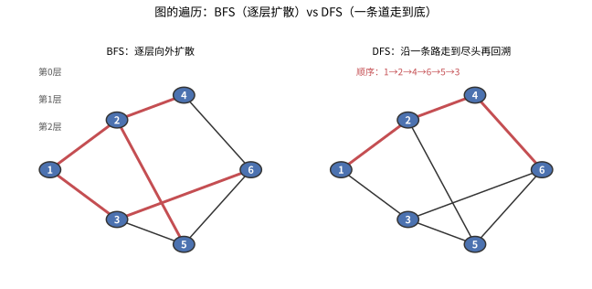
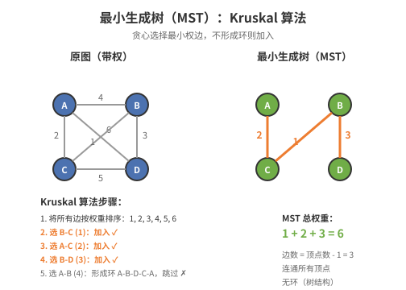
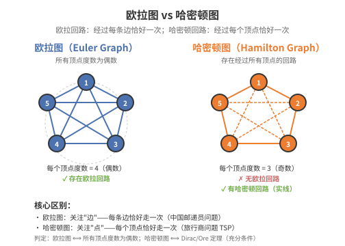
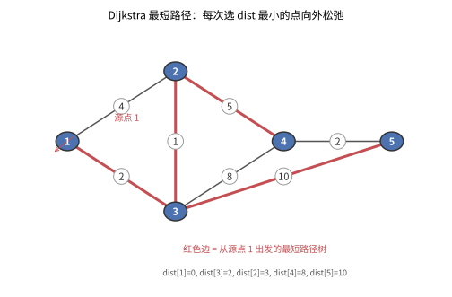
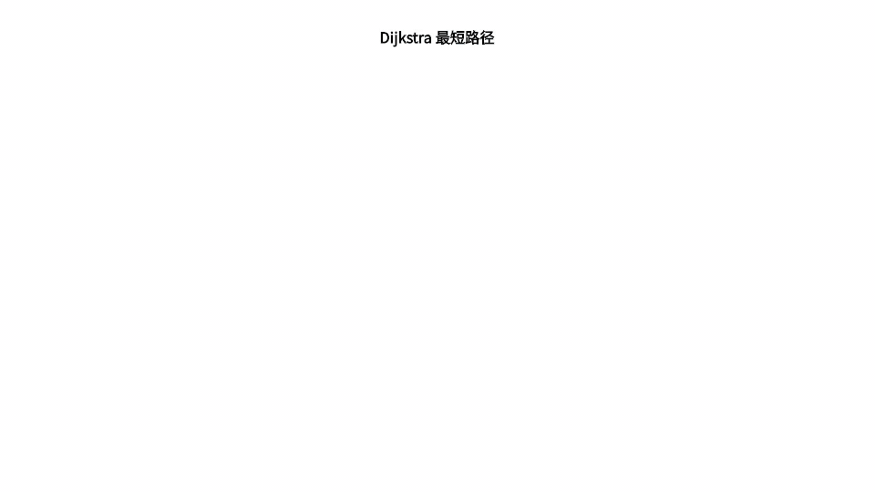
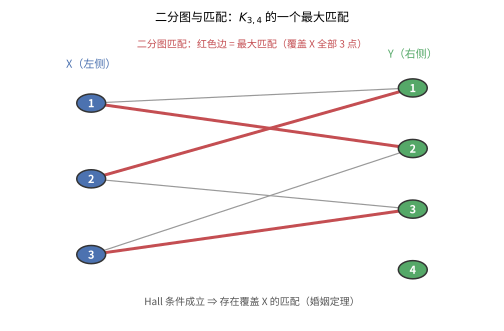

# 第 29 级：图论 (Graph Theory)

## 一、学习目标

1. 掌握图的基本概念和术语，能够准确描述图的各类结构。
2. 理解树的基本性质，掌握生成树与最小生成树的构造算法。
3. 掌握欧拉图与哈密顿图的判定条件，理解相关定理的证明。
4. 熟悉最短路径算法（Dijkstra、Bellman-Ford、Floyd-Warshall）和网络流理论（最大流最小割定理）。
5. 理解匹配理论的核心定理（Hall 定理、König 定理、Tutte 定理）。
6. 掌握图的顶点着色与边着色问题，了解著名的着色定理。
7. 理解平面图的判定与欧拉公式。
8. 了解拉姆齐理论及其基本结论。
9. 初步了解谱图论的基本概念（邻接矩阵、拉普拉斯矩阵、特征值）。
10. 能够独立完成至少 10 个典型例题和 12 个习题。

---

## 二、基本概念

### 2.1 图的定义

**图** 是一个有序对 $G = (V, E)$，其中：

- $V$ 是顶点（vertex）集合，元素称为**顶点**（或节点、点）。
- $E$ 是边（edge）集合，每条边连接两个顶点。

对于无向简单图，边是 $V$ 中两个不同顶点的无序对，即 $E \subseteq \{\{x, y\} \mid x, y \in V, x \neq y\}$。

**有向图** 中，边是有序对 $(u, v)$，称为有向边或弧。

**多重图** 允许两个顶点之间有多条边（重边），也允许自环（连接同一顶点的边）。

### 2.2 基本术语

| 术语 | 定义 |
|------|------|
| **阶（order）** | 顶点数 $|V|$ |
| **边数（size）** | 边数 $|E|$ |
| **度（degree）** | 顶点关联的边数，记作 $\deg(v)$。对于有向图，分为入度 $\deg^-(v)$ 和出度 $\deg^+(v)$ |
| **孤立点** | 度为 0 的顶点 |
| **叶子** | 度为 1 的顶点 |
| **握手引理** | $\sum_{v \in V} \deg(v) = 2|E|$。有向图中 $\sum \deg^-(v) = \sum \deg^+(v) = |E|$ |
| **子图** | $H = (V_H, E_H)$ 满足 $V_H \subseteq V$，$E_H \subseteq E$ |
| **生成子图** | $V_H = V$ 的子图 |
| **导出子图** | 由 $V' \subseteq V$ 及所有端点均在 $V'$ 中的边构成的子图 |

### 2.3 路与连通性

- **途径（walk）**：顶点和边交替出现的序列。
- **迹（trail）**：边不重复的途径。
- **路（path）**：顶点不重复的迹。
- **圈（cycle）**：起点和终点相同且长度 $\ge 3$ 的路。
- **连通图**：任意两顶点间都存在路的图。
- **连通分量**：图的最大连通子图。

### 2.4 特殊图类

| 图类 | 定义 |
|------|------|
| **完全图 $K_n$** | 任意两个不同顶点之间都有边的图，$|E| = \binom{n}{2}$ |
| **二分图（二部图）** | 顶点集可划分为两个非空子集 $X, Y$，使得每条边的一个端点在 $X$ 中，另一个在 $Y$ 中。记作 $K_{m,n}$ 表示完全二分图 |
| **补图 $\overline{G}$** | 顶点集与 $G$ 相同，边集为完全图中去掉 $G$ 的边 |

### 2.5 图的遍历与连通度

**图的遍历**：从某一顶点出发，系统地访问图中所有顶点。

- **BFS（广度优先搜索）**：用队列，逐层向外扩展。适合求无权图的最短路径、判断连通性。
- **DFS（深度优先搜索）**：用栈或递归，沿一条路径走到尽头再回溯。适合求连通分量、拓扑排序、检测环。

> **💡 直观理解**：BFS 像"水波扩散"（从起点一圈圈向外推），DFS 像"走迷宫"（一条道走到黑，走不通再退回岔路）。



> **直观理解（现实类比）**：BFS 与 DFS 是两种"扫地机器人"的打扫策略。**BFS** 像**水波扩散**——先围着一圈扫，再扩大一圈，保证"最先到达"的一定是最近的（所以适合求无权最短路径）；**DFS** 像**走迷宫**——沿一条走廊走到尽头，走不通再退回岔路口换一条，容易"陷得太深"但能遍历连通分量、检测环。选谁取决于你的目标：要"最近"选 BFS，要"探索到底"选 DFS。

**二分图判定（染色法）**：用 BFS/DFS 给顶点交替染红蓝两色；若某条边的两个端点被染成同色，则图不是二分图；否则是。

> **例**：路径、树、偶环都是二分图；奇环不是二分图。事实上，"图是二分图 ⟺ 图不含奇环"。

**连通度**：度量图"有多牢靠"。
- **顶点连通度** $\kappa(G)$：使 $G$ 不连通或退化为单点所需删除的最少顶点数。
- **边连通度** $\lambda(G)$：使 $G$ 不连通所需删除的最少边数。
- 三者满足：$\kappa(G) \le \lambda(G) \le \delta(G)$（$\delta$ 为最小度）。

**定理 (Menger)**：在图 $G$ 中，两个不相邻顶点 $u, v$ 之间"内点互不相交的路的最大条数"等于"分离 $u, v$ 所需删去的最少顶点数"。等价地，$G$ 是 $k$-连通的当且仅当任意两个顶点之间至少存在 $k$ 条内点不相交的路。

> **🔑 数学思路**：Menger 定理揭示了"连通性"与"路径"的深层对偶——可用最少割点等价于最多不相交路径。它是一大类"最大路数 = 最小割点数"定理（如最大流-最小割、König 定理）的统一源头，也是网络可靠性的理论基础。

---

## 三、树

### 3.1 树的定义与性质

**树** 是无环连通图。森林是无环图（即每个连通分量都是树）。

**基本性质**：设 $T = (V, E)$ 是 $n$ 个顶点的树，则

1. $|E| = n - 1$。
2. $T$ 连通且 $|E| = n - 1$。
3. $T$ 无环且 $|E| = n - 1$。
4. $T$ 中任意两个顶点之间有唯一的路。
5. 在 $T$ 中任意添加一条边，则产生唯一的一个圈。
6. 从 $T$ 中任意删除一条边，则图不再连通。
7. 若 $T$ 不是平凡树，则至少有两个叶子。

### 3.2 生成树

**生成树** 是连通图 $G$ 的一个生成子图，且是一棵树。每个连通图都至少有一棵生成树。

**最小生成树（MST）**：在带权连通图中，权值之和最小的生成树。

### 3.3 Cayley 公式

> **Cayley 公式**：$n$ 个顶点的标号树的数量为 $n^{n-2}$。

**证明（Prüfer 序列法）**：

我们建立标号树与 Prüfer 序列之间的双射。

**步骤 1（树 → 序列）**：给定一棵 $n$ 个顶点的标号树：
1. 找到标号最小的叶子 $v$。
2. 记录 $v$ 的邻居 $u$ 作为序列的第一个元素。
3. 删除 $v$ 及其关联边。
4. 重复直到只剩两个顶点。

得到的序列长度为 $n-2$，称为 Prüfer 序列。

**步骤 2（序列 → 树）**：给定一个长度为 $n-2$ 的序列 $P = (p_1, p_2, \ldots, p_{n-2})$：
1. 令 $V = \{1, 2, \ldots, n\}$。
2. 找出 $V$ 中不在 $P$ 中的最小标号 $v$。
3. 连接 $v$ 和 $p_1$。
4. 从 $V$ 中移除 $v$，从 $P$ 中移除 $p_1$。
5. 重复直到 $P$ 为空，最后连接 $V$ 中剩余的两个顶点。

由于每个步骤是确定的，这是一个双射。长度为 $n-2$ 的序列共有 $n^{n-2}$ 种可能，因此标号树的数量为 $n^{n-2}$。$\square$

### 3.4 最小生成树算法

#### Kruskal 算法

**思想**：贪心选择最小权重的边，若加入后不形成环则保留。

**算法步骤**：
1. 将 $E$ 中所有边按权重从小到大排序。
2. 初始化 $T = \emptyset$。
3. 遍历排序后的边 $(u, v)$：
   - 若 $u$ 和 $v$ 在 $T$ 中不连通（使用并查集判断），则加入 $(u, v)$ 到 $T$。
4. 当 $T$ 中有 $n-1$ 条边时停止。

**时间复杂度**：$O(|E| \log |E|)$。



> **直观理解（现实类比）**：Kruskal 算法像**铺设最便宜的公路网**。假设有 5 个城市要修路连通，每条可能的公路都有造价。Kruskal 算法的策略是：先把所有公路按造价从低到高排序，然后从最便宜的开始修——如果这条路连接了两个还没连通的区域，就修；如果修了会形成环（即两个城市已经通过其他路连通了），就跳过。这就像**贪心地挑最便宜的选项**，但前提是"不重复建设"。最终得到的最小生成树就是"用最少的钱把所有城市连起来"的方案。图中左边是原始带权图，右边是选中的边（红色）构成的最小生成树。

#### Prim 算法

**思想**：从单个顶点出发，每次选择连接已选集合和未选集合的最小权边。

**算法步骤**：
1. 任选起始顶点 $r$，初始化 $S = \{r\}$，$T = \emptyset$。
2. 维护一个优先队列，记录每个未选顶点到 $S$ 的最小距离。
3. 每次取出距离最小的顶点 $u$，加入 $S$，将对应的边加入 $T$。
4. 更新 $u$ 的邻居到 $S$ 的距离。
5. 重复直到 $S = V$。

**时间复杂度**：$O(|E| \log |V|)$（使用二叉堆）。

---

## 四、欧拉图与哈密顿图

### 4.1 欧拉图

**欧拉迹**：经过图中每条边恰好一次的迹。
**欧拉回路**：起点和终点相同的欧拉迹。
**欧拉图**：含有欧拉回路的图。

> **欧拉定理**：连通图 $G$ 是欧拉图当且仅当 $G$ 中每个顶点的度数都是偶数。

**证明**：

（$\Rightarrow$）设 $G$ 有欧拉回路 $C$。每次经过一个顶点时，都用一条边进入、一条边离开，因此每个顶点在回路中被经过的次数贡献了偶数度。因此所有顶点度数均为偶数。

（$\Leftarrow$）设 $G$ 连通且所有顶点度数为偶数。我们构造欧拉回路：

1. 从任意顶点 $v$ 出发，沿未走过的边走，由于每个顶点度数为偶数，最终必然回到 $v$，得到一个回路 $C$。
2. 若 $C$ 包含所有边，则 $C$ 即为欧拉回路。
3. 否则，在 $G$ 去掉 $C$ 的边后，剩余图中每个顶点的度数仍为偶数，且与 $C$ 有公共顶点 $u$。
4. 从 $u$ 出发在剩余图中构造回路 $C'$，将 $C$ 与 $C'$ 合并为更大的回路。
5. 重复直到所有边被包含。$\square$

**推论**：连通图 $G$ 有欧拉迹（非回路）当且仅当 $G$ 中恰有两个奇度顶点。



> **直观理解（现实类比）**：欧拉图和哈密顿图是图论中两种经典的"遍历"问题。**欧拉回路**像**一笔画问题**——笔不离开纸，每条边恰好画一次，最后回到起点。Königsberg 七桥问题就是问能否找到欧拉回路。欧拉定理说：只有当每个交叉点（顶点）连接的桥（边）都是偶数时，才能一笔画成。**哈密顿回路**则像**环球旅行**——经过每个城市（顶点）恰好一次，最后回到起点。Petersen 图虽然看起来复杂，但确实存在哈密顿回路（图中红色路径）。关键区别：欧拉图关注"边不重复"，哈密顿图关注"点不重复"——前者有简洁的判定定理（看度数奇偶），后者却是 NP-完全问题（没有已知的高效判定算法）。

### 4.2 哈密顿图

**哈密顿路**：经过每个顶点恰好一次的路。
**哈密顿回路**：经过每个顶点恰好一次的回路（起点和终点相同）。
**哈密顿图**：含有哈密顿回路的图。

> **Dirac 定理**（1952）：若 $n \ge 3$ 的简单图 $G$ 中每个顶点的度数至少为 $n/2$，则 $G$ 是哈密顿图。

**证明**：反证法。假设 $G$ 满足条件但不是哈密顿图。取 $G$ 的一条最长路 $P = v_1v_2\ldots v_k$，其中 $k < n$。

由于 $P$ 是最长路，$v_1$ 的所有邻点都在 $P$ 上且 $v_1$ 只与 $v_2,\ldots,v_k$ 中的某些点相邻。类似地，$v_k$ 的邻点也在 $P$ 上。

考虑集合 $S = \{i \mid v_1v_{i+1} \in E\}$ 和 $T = \{i \mid v_kv_i \in E\}$。由于 $\deg(v_1) \ge n/2$ 且 $\deg(v_k) \ge n/2$，且 $1 \le i \le k-1$，可以证明 $S$ 和 $T$ 有交集。若 $i \in S \cap T$，则 $v_1v_2\ldots v_iv_kv_{k-1}\ldots v_{i+1}v_1$ 构成一个回路，与 $P$ 是最长路矛盾。$\square$

> **Ore 定理**（1960）：若 $n \ge 3$ 的简单图 $G$ 中，任意两个不相邻的顶点 $u, v$ 满足 $\deg(u) + \deg(v) \ge n$，则 $G$ 是哈密顿图。

Ore 定理是 Dirac 定理的推广（Dirac 定理是 Ore 定理的特例）。

---

## 五、最短路径与网络流

### 5.1 Dijkstra 算法

**适用范围**：单源最短路径，边权非负。

**算法思想**：维护一个距离数组 $dist[v]$ 表示源点到 $v$ 的当前最短距离。每次从未确定最短距离的顶点中选出 $dist$ 最小的顶点 $u$，用 $u$ 更新其邻居的距离。

**伪代码**：
```
Dijkstra(G, s):
    for each v in V:
        dist[v] = ∞
    dist[s] = 0
    Q = priority queue of V with dist as key
    while Q is not empty:
        u = Q.extract_min()
        for each neighbor v of u:
            if dist[u] + w(u,v) < dist[v]:
                dist[v] = dist[u] + w(u,v)
                Q.decrease_key(v, dist[v])
    return dist
```

**时间复杂度**：$O(|V|^2)$（朴素实现），$O((|V|+|E|)\log|V|)$（二叉堆优化）。

### 5.2 Bellman-Ford 算法

**适用范围**：单源最短路径，允许负权边，可检测负权环。

**算法思想**：对每条边进行 $|V|-1$ 次松弛操作。第 $k$ 次迭代后，$dist[v]$ 是至多经过 $k$ 条边的最短路径长度。

**伪代码**：
```
Bellman-Ford(G, s):
    for each v in V:
        dist[v] = ∞
    dist[s] = 0
    for i = 1 to |V|-1:
        for each edge (u,v) in E:
            if dist[u] + w(u,v) < dist[v]:
                dist[v] = dist[u] + w(u,v)
    for each edge (u,v) in E:
        if dist[u] + w(u,v) < dist[v]:
            return "存在负权环"
    return dist
```

**时间复杂度**：$O(|V||E|)$。

### 5.3 Floyd-Warshall 算法

**适用范围**：全源最短路径，允许负权边。

**算法思想**：动态规划。设 $d^{(k)}[i][j]$ 为从 $i$ 到 $j$ 且中间顶点只取 $\{1,2,\ldots,k\}$ 的最短路径长度。

**递推式**：$d^{(k)}[i][j] = \min(d^{(k-1)}[i][j], d^{(k-1)}[i][k] + d^{(k-1)}[k][j])$。

**伪代码**：
```
Floyd-Warshall(G):
    let d be a |V|×|V| matrix initialized with ∞
    for each vertex v:
        d[v][v] = 0
    for each edge (u,v):
        d[u][v] = w(u,v)
    for k = 1 to |V|:
        for i = 1 to |V|:
            for j = 1 to |V|:
                if d[i][k] + d[k][j] < d[i][j]:
                    d[i][j] = d[i][k] + d[k][j]
    return d
```

**时间复杂度**：$O(|V|^3)$。

### 5.4 最大流与最小割

**网络流定义**：一个有向图 $G = (V, E)$，每条边 $(u, v)$ 有容量 $c(u, v) \ge 0$。指定源点 $s$ 和汇点 $t$。**流** $f$ 是满足以下条件的函数：
- 容量约束：$0 \le f(u, v) \le c(u, v)$。
- 流量守恒：$\sum_{u} f(u, v) = \sum_{w} f(v, w)$，对 $v \neq s, t$。

**割** $(S, T)$：将 $V$ 划分为 $S$ 和 $T = V \setminus S$，且 $s \in S, t \in T$。割的容量为 $c(S, T) = \sum_{u \in S, v \in T} c(u, v)$。

> **最大流最小割定理**：在任何网络中，最大流的值等于最小割的容量。

**证明**：

设 $f^*$ 是最大流，$(S^*, T^*)$ 是任意 $s$-$t$ 割。由流守恒，$|f^*| = f^*(S^*, T^*) - f^*(T^*, S^*) \le c(S^*, T^*)$，因此最大流值不超过最小割容量。

现在证明存在割使得等式成立。取 $f$ 为最大流，在残量网络中定义 $S = \{v \in V \mid \text{存在从 } s \text{ 到 } v \text{ 的残量路径}\}$。由于 $f$ 是最大流，残量网络中不存在 $s$ 到 $t$ 的路径，因此 $t \notin S$，即 $(S, V \setminus S)$ 是一个割。

对于 $u \in S, v \notin S$，必须有 $f(u, v) = c(u, v)$（否则残量边 $(u, v)$ 存在），且 $f(v, u) = 0$（否则残量边 $(v, u)$ 存在，导致 $v \in S$）。因此 $|f| = c(S, V \setminus S)$。$\square$

### 5.5 Ford-Fulkerson 算法

**思想**：反复寻找增广路径（残量网络中从 $s$ 到 $t$ 的路径），沿路径增加流量，直到不存在增广路径。

**伪代码**：
```
Ford-Fulkerson(G, s, t):
    for each edge (u,v) in E:
        f[u][v] = 0
    while 存在从 s 到 t 的增广路径 P 在残量网络中:
        cf(P) = min{cf(u,v) | (u,v) in P}
        for each edge (u,v) in P:
            f[u][v] += cf(P)
            f[v][u] -= cf(P)
    return f
```

**时间复杂度**：$O(|E| \cdot f_{\max})$，其中 $f_{\max}$ 是最大流值。使用 Edmonds-Karp 算法（BFS 找增广路）时，时间复杂度为 $O(|V||E|^2)$。

---

## 六、匹配与覆盖

### 6.1 基本概念

**匹配**：图中边的一个子集，其中任意两条边没有公共顶点。
**最大匹配**：边数最多的匹配。
**完美匹配**：覆盖所有顶点的匹配。
**顶点覆盖**：顶点的一个子集，使得每条边至少有一个端点在该子集中。
**最小顶点覆盖**：顶点数最少的顶点覆盖。

### 6.2 Hall 婚姻定理

> **Hall 定理**：设 $G = (X \cup Y, E)$ 是二分图（$|X| \le |Y|$），则 $G$ 存在一个覆盖 $X$ 中所有顶点的匹配当且仅当对任意 $S \subseteq X$，有 $|N(S)| \ge |S|$，其中 $N(S)$ 是 $S$ 的邻域。

**证明**：

（$\Rightarrow$）若存在匹配 $M$ 覆盖 $X$，则对任意 $S \subseteq X$，$M$ 将 $S$ 中的顶点匹配到 $N(S)$ 中的不同顶点，因此 $|N(S)| \ge |S|$。

（$\Leftarrow$）反证法。假设 $G$ 满足 Hall 条件但没有覆盖 $X$ 的匹配。取最大匹配 $M$，设 $u \in X$ 未被匹配。定义 $Z$ 为从 $u$ 出发通过交错路径（交替使用不在 $M$ 中和在 $M$ 中的边）能到达的顶点集。设 $A = Z \cap X$，$B = Z \cap Y$。

由于 $M$ 是最大匹配，$u$ 是 $A$ 中唯一未被匹配的顶点，且 $M$ 将 $A \setminus \{u\}$ 匹配到 $B$。因此 $|B| = |A| - 1$。

另一方面，由 $Z$ 的定义，$N(A) \subseteq B$，因此 $|N(A)| \le |B| = |A| - 1 < |A|$，与 Hall 条件矛盾。$\square$

### 6.3 König 定理

> **König 定理**：在二分图中，最大匹配的大小等于最小顶点覆盖的大小。

**证明**：

设 $M$ 是最大匹配，$\nu(G) = |M|$。显然最小顶点覆盖至少需要 $\nu(G)$ 个顶点（每条匹配边需要至少一个顶点覆盖），因此 $\tau(G) \ge \nu(G)$。

我们构造一个大小为 $|M|$ 的顶点覆盖。从 $X$ 中所有未被 $M$ 覆盖的顶点出发，在 $G$ 中沿交错路径（第一边不在 $M$ 中，第二边在 $M$ 中，交替）可到达的顶点集记为 $Z$。令 $C = (X \setminus Z) \cup (Y \cap Z)$。

可以证明 $C$ 是一个顶点覆盖：若存在边 $e = (x, y)$ 未被覆盖，则 $x \in Z$ 且 $y \notin Z$。但若 $e \in M$，则 $y$ 应可从 $x$ 通过 $e$ 到达，矛盾；若 $e \notin M$，则 $x$ 在 $Z$ 中意味着 $x$ 可通过交错路径到达，此时 $y$ 也应被包括，矛盾。

$C$ 的大小为 $|M|$，因为 $C$ 中的每个顶点恰好对应一条匹配边的一个端点。因此 $\tau(G) \le \nu(G)$。结合 $\tau(G) \ge \nu(G)$，得 $\tau(G) = \nu(G)$。$\square$

### 6.4 Tutte 定理

> **Tutte 定理**：图 $G = (V, E)$ 有完美匹配当且仅当对任意 $S \subseteq V$，$G - S$ 的奇连通分量数不超过 $|S|$。

其中 $G - S$ 表示删除 $S$ 中顶点及其关联边后的图，奇连通分量是指顶点数为奇数的连通分量。

Tutte 定理是一般图匹配理论的核心定理，Hall 定理是其推论（限制到二分图的情形）。

---

## 七、图的着色

### 7.1 顶点着色

**顶点着色**：给每个顶点分配一种颜色，使得相邻顶点颜色不同。
**色数 $\chi(G)$**：给 $G$ 着色所需的最少颜色数。

### 7.2 贪心着色算法

**算法**：按任意顺序排列顶点，依次给每个顶点分配与其已着色邻居不同的最小颜色。

**最坏情况**：$\chi(G) \le \Delta(G) + 1$，其中 $\Delta(G)$ 是最大度。

### 7.3 Brook 定理

> **Brook 定理**：若 $G$ 是连通简单图，且既不是完全图也不是奇圈，则 $\chi(G) \le \Delta(G)$。

### 7.4 四色定理

> **四色定理**：任何平面图都可以用不超过四种颜色进行顶点着色，使得相邻顶点颜色不同。

该定理由 Appel 和 Haken 于 1976 年借助计算机证明，是图论史上最著名的定理之一。他们将所有可能的地图分类为 1936 种可约构形，并逐一验证。

### 7.5 边着色

**边着色**：给每条边分配一种颜色，使得相邻边（有公共顶点的边）颜色不同。
**边色数 $\chi'(G)$**：给 $G$ 的边着色所需的最少颜色数。

> **Vizing 定理**：若 $G$ 是简单图，则 $\Delta(G) \le \chi'(G) \le \Delta(G) + 1$。

Vizing 定理说简单图的边色数要么是 $\Delta(G)$，要么是 $\Delta(G) + 1$。前者称为第一类图，后者称为第二类图。

---

## 八、平面图

### 8.1 定义

**平面图**：可以画在平面上使得边仅在端点处相交的图。这样的画法称为图的**平面嵌入**。

**面**：平面嵌入将平面分割成的连通区域。无界面称为**外部面**。

### 8.2 欧拉公式

> **欧拉公式**：若连通平面图 $G$ 有 $V$ 个顶点、$E$ 条边、$F$ 个面，则
> $$V - E + F = 2$$

**证明**（对边数归纳）：

基础：$E = 0$ 时，$V = 1$，$F = 1$，公式成立。

归纳：假设对 $E-1$ 条边公式成立。考虑 $G$ 有 $E$ 条边。

- 若 $G$ 有叶子 $v$，去掉 $v$ 及其关联边，得到 $G'$。$V' = V - 1$，$E' = E - 1$，$F' = F$。由归纳假设 $V' - E' + F' = 2$，代入得 $V - E + F = 2$。
- 若 $G$ 无叶子，则 $G$ 有圈。去掉圈上的一条边 $e$，得到 $G'$。$V' = V$，$E' = E - 1$，$F' = F - 1$（$e$ 两侧的面合并）。由归纳假设 $V' - E' + F' = 2$，代入得 $V - E + F = 2$。$\square$

**推论**：若 $G$ 是 $V \ge 3$ 的简单连通平面图，则 $E \le 3V - 6$。

**证明**：每个面至少由 3 条边围成，每条边属于至多 2 个面，因此 $3F \le 2E$。代入欧拉公式 $V - E + F = 2$ 得 $V - E + \frac{2}{3}E \ge 2$，即 $E \le 3V - 6$。$\square$

### 8.3 Kuratowski 定理

> **Kuratowski 定理**：一个图是平面图当且仅当它不包含 $K_5$ 或 $K_{3,3}$ 的细分（即可以通过删除度为 2 的顶点并连接其邻居得到的子图）。

### 8.4 Wagner 定理

> **Wagner 定理**：一个图是平面图当且仅当它不包含 $K_5$ 或 $K_{3,3}$ 作为图子式（minor）。

图子式是通过删除顶点、删除边、收缩边得到的图。

---

## 九、拉姆齐理论

### 9.1 拉姆齐数

**拉姆齐数 $R(m, n)$**：最小的正整数 $N$，使得任何 $N$ 个顶点的完全图用两种颜色（红/蓝）对边着色，必然包含一个红色的 $K_m$ 或一个蓝色的 $K_n$。

**已知结果**：
- $R(1, n) = 1$
- $R(2, n) = n$
- $R(3, 3) = 6$
- $R(3, 4) = 9$
- $R(3, 5) = 14$
- $R(4, 4) = 18$
- $R(3, 6) = 18$
- $R(4, 5) = 25$
- $R(5, 5)$ 未知，已知在 $43$ 到 $48$ 之间

### 9.2 拉姆齐定理

> **拉姆齐定理**：对任意正整数 $m, n$，拉姆齐数 $R(m, n)$ 是有限的。

**证明**（归纳法）：

基础：$R(1, n) = 1$，$R(m, 1) = 1$。

归纳步骤：假设 $R(m-1, n)$ 和 $R(m, n-1)$ 存在。我们证明 $R(m, n) \le R(m-1, n) + R(m, n-1)$。

设 $N = R(m-1, n) + R(m, n-1)$，对 $K_N$ 的边进行红蓝着色。任取一个顶点 $v$，其邻居可分为两组：$A$（红边邻居）和 $B$（蓝边邻居）。

- 若 $|A| \ge R(m-1, n)$，则在 $A$ 中要么有蓝色 $K_n$（此时 $G$ 中有蓝色 $K_n$），要么有红色 $K_{m-1}$，加上 $v$ 构成红色 $K_m$。
- 若 $|B| \ge R(m, n-1)$，同理对称。

由鸽巢原理，$|A| + |B| = N-1 = R(m-1, n) + R(m, n-1) - 1$，因此上述两种情况必成立其一。$\square$

### 9.3 上下界

**上界**：$R(m, n) \le \binom{m+n-2}{m-1}$。

**下界**（Erdős 概率方法）：
$$R(m, m) > \frac{2^{m/2}}{e\sqrt{2}}$$

这一下界表明，拉姆齐数至少以指数速度增长。

---

## 十、谱图论

### 10.1 邻接矩阵

图 $G = (V, E)$ 的**邻接矩阵** $A$ 是一个 $n \times n$ 矩阵（$n = |V|$），其中
$$A_{ij} = \begin{cases}
1 & \text{若 } \{i, j\} \in E \\
0 & \text{否则}
\end{cases}$$

**性质**：
- $A$ 是对称矩阵（无向图）。
- $A$ 的特征值都是实数，称为图的**谱**。
- 正则图（每个顶点度数为 $k$）的最大特征值为 $k$。

### 10.2 拉普拉斯矩阵

**拉普拉斯矩阵** $L = D - A$，其中 $D$ 是度数对角矩阵，$A$ 是邻接矩阵。

**性质**：
- $L$ 半正定。
- $L$ 的特征值 $0 = \lambda_1 \le \lambda_2 \le \cdots \le \lambda_n$。
- 特征值 0 的重数等于图的连通分量数。
- $\lambda_2$（称为**代数连通度**）衡量图的连通性；$\lambda_2 > 0$ 当且仅当图连通。

### 10.3 谱间隙与扩展图

**谱间隙**：$\lambda_1 - \lambda_2$（对于正则图，即 $k - \lambda_2$）。

**扩展图（expander graph）**：具有大谱间隙的稀疏正则图。扩展图在计算机科学中有广泛应用，包括：
- 构造高效网络
- 纠错码
- 去随机化
- 密码学

---

## 十一、解题技巧

本节针对图论的高频题型（度数计数、树与 Prüfer 序列、欧拉/哈密顿判定、最短路径与网络流算法选型、平面图与欧拉公式、匹配与覆盖）给出可套用的方法。每条含**适用场景**、**关键步骤**、**常见误区**并配精讲示例。

### 11.1 握手引理与度数分析

**适用场景**：给出部分顶点的度数、求边数或求某类顶点个数；判断给定的度序列是否可能构成一个图。

**关键步骤**：
1. 先写握手引理 $\sum_{v\in V}\deg(v)=2|E|$，把"求边数"转化为"求度数和"；
2. 统计已知度数顶点，把未知类个数设为 $x$，用方程求解；
3. 校验度序列合法性：度数和必须为偶数，且任一顶点度数不超过 $n-1$。

**常见误区**：
- 忘记"度数和必为偶数"（否则不可能有图）；把无向图的次数与有向图的入/出度概念混淆。

**精讲示例**：一棵树有 5 个度 $1$ 点、3 个度 $2$ 点、其余度 $3$，求顶点数。
设度 $3$ 点有 $x$ 个，则 $n=8+x$，$E=n-1=7+x$。由握手引理：
$$
5\cdot1+3\cdot2+3x=5+6+3x=2(7+x)=14+2x\ \Rightarrow\ x=3,\ n=11.
$$

### 11.2 树的性质与 Prüfer 序列

**适用场景**：验证一个图是否为树、对标号树计数、由 Prüfer 序列构造树。

**关键步骤**：
1. 判树用等价性质之一（连通且 $|E|=n-1$、无环且 $|E|=n-1$、任意两点恰一条路等）；
2. 标号树计数用 Cayley 公式 $n^{n-2}$；
3. 由序列 $P=(p_1,\ldots,p_{n-2})$ 造树：每步从 $\{1,\dots,n\}$ 取不在当前 $P$ 中的最小标号 $v$，连边 $v\leftrightarrow p_1$，删去 $v$ 与 $p_1$，直至 $P$ 为空时连接剩余的两个顶点。

**常见误区**：把"顶点标号"与"序列元素"混淆；漏掉最后剩下两个顶点之间的连边。

**精讲示例**：$n=5$，Prüfer 序列 $(4,4,1)$。
- 不在 $\{4,4,1\}$ 中的最小者 $2$：连 $2\!-\!4$，删 $2$，$P=(4,1)$；
- 不在 $\{4,1\}$ 中的最小者 $3$：连 $3\!-\!4$，删 $3$，$P=(1)$；
- 不在 $\{1\}$ 中的最小者 $5$：连 $5\!-\!1$，删 $5$，$P=\varnothing$；
- 最后连 $4\!-\!1$。
边集 $\{(2,4),(3,4),(5,1),(4,1)\}$：5 顶点 4 条边且连通，确为树。

### 11.3 欧拉图 vs 哈密顿图判定

**适用场景**：判断"一笔画"、是否存在欧拉回路/迹，或是否含哈密顿回路。

**关键步骤**：
1. 欧拉：判连通 + 数奇度顶点——$0$ 个有欧拉回路，恰 $2$ 个有欧拉迹，否则都没有；
2. 哈密顿：无简洁充要条件，用 Dirac（$\delta\ge n/2$，$n\ge3$）或 Ore（不相邻 $u,v$ 满足 $\deg u+\deg v\ge n$）作充分条件；
3. 始终区分"**边**不重复"（欧拉）与"**点**不重复"（哈密顿）。

**常见误区**：把欧拉与哈密顿混为一谈；忘记欧拉判定还需图连通；用 Dirac/Ore 只可证"是"，不可证"否"。

**精讲示例**：图 $E=\{(1,2),(1,3),(2,3),(2,4),(3,4),(4,5)\}$。度数 $\deg(1)=2,\ \deg(2)=3,\ \deg(3)=3,\ \deg(4)=3,\ \deg(5)=1$。奇度顶点恰为 4、5 两个，故无欧拉回路，但有欧拉迹。

### 11.4 最短路径与网络流算法选型

**适用场景**：求单源/全源最短路、检测负权环、求网络最大流与最小割。

**关键步骤**：
1. 无负权单源 → Dijkstra（堆优化 $O((V+E)\log V)$）；有负权单源 → Bellman-Ford（$O(VE)$，可判负环）；全源 → Floyd（$O(V^3)$）；
2. 负环检测：Bellman-Ford 在第 $n-1$ 轮后仍能松弛某边即存在负环（等价地 Floyd 结束后 $d[i][i]<0$）；
3. 最大流 $=$ 最小割容量（增广路径法）；整数容量得整数最大流。

**常见误区**：在负权边上误用 Dijkstra；把 Bellman-Ford 松弛轮数写成 $n$ 而非 $n-1$；把"最短路"与"最大流"两种目标混淆。

**精讲示例**：为何 Dijkstra 怕负权？边 $s\!\to\!a$(权 5)、$s\!\to\!b$(权 7)、$a\!\to\!b$(权 $-4$)。Dijkstra 先确定 $a$（距离 5），松弛得 $b=5+(-4)=1$，恰低于直达 $7$——此处仍对，但若先确定某点后再被更短的负权路径"反超"，贪心即失效；故含负权必须改用 Bellman-Ford。

### 11.5 平面图与欧拉公式

**适用场景**：判断平面图、由顶点边数求面数、证明边数上界。

**关键步骤**：
1. 连通平面图用 $V-E+F=2$（$F$ 含外部面）；
2. 结合"每面至少 $k$ 条边 ⇒ $kF\le 2E$"推出 $E$ 的上界（如简单图 $E\le3V-6$，二分平面图 $E\le2V-4$）；
3. 判非平面：证 $E>3V-6$，或找 $K_5/K_{3,3}$ 细分（Kuratowski）或子式（Wagner）。

**常见误区**：漏计外部面；在不连通图上直接用 $V-E+F=2$；把边数上界误当平面图的充要条件。

**精讲示例**：$K_5$ 有 $V=5,E=10$，而 $3V-6=9<10$ 矛盾于平面图的必要条件，故 $K_5$ 非平面。

### 11.6 匹配与覆盖

**适用场景**：二分图是否存在覆盖一侧全部顶点的匹配、最大匹配与最小顶点覆盖的大小问题。

**关键步骤**：
1. Hall 条件：对一切 $S\subseteq X$ 有 $|N(S)|\ge|S|$ ⇔ 存在覆盖 $X$ 的匹配；
2. König 定理：二分图最大匹配 $=$ 最小顶点覆盖；
3. 一般图（非二分）的完美匹配用 Tutte 条件（删 $S$ 后奇连通分量数 $\le|S|$）。

**常见误区**：只抽查部分子集 $S$ 而非全部子集；把 König 定理（仅对二分图成立）误用于一般图。

**精讲示例**：$X=\{1,2,3\}$，$N(1)=\{a,b\},N(2)=\{a,c\},N(3)=\{b,c\}$。对 $S=\{1,2\}$：$N(\{1,2\})=\{a,b,c\}$，$3\ge2$ ✓；对 $S=\{1,2,3\}$：$N=\{a,b,c\}$，$3=3$ ✓；其余单元素集也显然成立。Hall 条件全满足，故存在完全匹配，如 $1\!-\!b,2\!-\!a,3\!-\!c$。

---

## 十二、示例

### 示例 1：握手引理

**问题**：在一个有 10 个顶点的图中，所有顶点的度数之和为 30。问图有多少条边？

**解**：由握手引理 $\sum \deg(v) = 2|E|$，得 $30 = 2|E|$，因此 $|E| = 15$。

### 示例 2：树的叶子数

**问题**：一棵树有 5 个度为 1 的顶点，3 个度为 2 的顶点，其余顶点度为 3。问树有多少个顶点？

**解**：设度为 3 的顶点有 $x$ 个。总顶点数 $n = 5 + 3 + x = 8 + x$。边数 $E = n - 1 = 7 + x$。

由握手引理：$5 \times 1 + 3 \times 2 + 3x = 2(7 + x)$，即 $5 + 6 + 3x = 14 + 2x$，解得 $x = 3$。

因此 $n = 8 + 3 = 11$。

### 示例 3：Cayley 公式应用

**问题**：4 个标号顶点能形成多少棵不同的树？

**解**：由 Cayley 公式，$n^{n-2} = 4^{4-2} = 4^2 = 16$。

### 示例 4：Kruskal 算法

**问题**：求以下图的最小生成树。顶点集 $\{1,2,3,4,5\}$，边及权重：$(1,2,2)$, $(1,3,3)$, $(2,3,1)$, $(2,4,4)$, $(3,4,5)$, $(3,5,6)$, $(4,5,7)$。

**解**：按权重排序：$(2,3,1)$, $(1,2,2)$, $(1,3,3)$, $(2,4,4)$, $(3,4,5)$, $(3,5,6)$, $(4,5,7)$。

依次加入：$(2,3)$ 加入，$(1,2)$ 加入，$(1,3)$ 形成环（跳过），$(2,4)$ 加入，$(3,4)$ 形成环（跳过），$(3,5)$ 加入。

此时已有 $5-1=4$ 条边，MST 权重为 $1+2+4+6=13$。

### 示例 5：欧拉图判定

**问题**：判断下图是否含有欧拉回路：$V = \{1,2,3,4,5\}$，$E = \{(1,2),(1,3),(2,3),(2,4),(3,4),(4,5)\}$。

**解**：各顶点度数：$\deg(1)=2$, $\deg(2)=3$, $\deg(3)=3$, $\deg(4)=3$, $\deg(5)=1$。存在奇度顶点（2,3,4,5），因此没有欧拉回路。但恰有两个奇度顶点（4 和 5），因此存在欧拉迹。

### 示例 6：Dirac 定理应用

**问题**：6 个顶点的简单图，每个顶点度数至少为 3，是否一定是哈密顿图？

**解**：$n = 6$, $n/2 = 3$，每个顶点度数 $\ge 3 = n/2$，由 Dirac 定理，该图一定是哈密顿图。

### 示例 7：Dijkstra 算法

**问题**：求从顶点 1 到其他顶点的最短路径。边及权重：$(1,2,4)$, $(1,3,2)$, $(2,3,1)$, $(2,4,5)$, $(3,4,8)$, $(3,5,10)$, $(4,5,2)$。

**解**：
- 初始化：$dist[1]=0$, $dist[2]=4$, $dist[3]=2$, $dist[4]=\infty$, $dist[5]=\infty$。
- 选 $dist$ 最小的未确定顶点 3（$dist=2$），更新邻居：$dist[2]=\min(4, 2+1)=3$, $dist[4]=\min(\infty, 2+8)=10$, $dist[5]=\min(\infty, 2+10)=12$。
- 选顶点 2（$dist=3$），更新：$dist[4]=\min(10, 3+5)=8$。
- 选顶点 4（$dist=8$），更新：$dist[5]=\min(12, 8+2)=10$。
- 选顶点 5（$dist=10$）。

最终结果：$dist[1]=0$, $dist[2]=3$, $dist[3]=2$, $dist[4]=8$, $dist[5]=10$。



> **直观理解（现实类比）**：Dijkstra 算法像**在导航里找最近路线**——从起点出发，先锁定"目前已知最近"的那个路口，把它标记为已确定，然后用它去刷新周边路口的距离。每次只挑"当前离起点最近"的点来做松弛，就像**积水往低处流**：永远先淹没最近的地势，逐渐铺开。它保证了贪心决策的正确性，前提是边权非负（否则先确定的点可能被更短的负权路径反超）。

#### 🎬 动画演示：Dijkstra 最短路径



> 这个动画直观展示了 Dijkstra 算法的执行过程：从源点出发，不断选取"当前距离最小"的顶点并松弛其邻居，逐层向外扩展直到求出到所有顶点的最短路径。

### 示例 8：最大流

**问题**：一个网络有源点 $s$、汇点 $t$ 和中间顶点 $a,b,c$。边及容量：$(s,a,10)$, $(s,b,5)$, $(a,b,15)$, $(a,c,5)$, $(b,c,10)$, $(c,t,10)$。求最大流。

**解**：应用 Ford-Fulkerson 算法。初始流为 0。

- 增广路径 $s \to a \to c \to t$，瓶颈容量 $\min(10,5,10)=5$。增加 5 单位流。
- 增广路径 $s \to a \to b \to c \to t$，瓶颈容量 $\min(5,15,10,5)=5$。增加 5 单位流。（注意 $(a,c)$ 已用 5，剩余容量 0）
- 增广路径 $s \to b \to c \to t$，瓶颈容量 $\min(5,10,10)=5$。增加 5 单位流。
- 增广路径 $s \to a \to b \to t$（通过残量网络），但不存在到 $t$ 的直接路径。

最终最大流为 $5+5+5=15$。

### 示例 9：Hall 定理

**问题**：设二分图 $X = \{1,2,3\}$, $Y = \{a,b,c,d\}$，边为 $(1,a),(1,b),(2,a),(2,c),(3,b),(3,c)$。是否存在覆盖 $X$ 的匹配？

**解**：检查 Hall 条件：
- $S = \{1\}$: $N(S) = \{a,b\}$, $|N(S)|=2 \ge 1$ ✓
- $S = \{2\}$: $N(S) = \{a,c\}$, $|N(S)|=2 \ge 1$ ✓
- $S = \{3\}$: $N(S) = \{b,c\}$, $|N(S)|=2 \ge 1$ ✓
- $S = \{1,2\}$: $N(S) = \{a,b,c\}$, $|N(S)|=3 \ge 2$ ✓
- $S = \{1,3\}$: $N(S) = \{a,b,c\}$, $|N(S)|=3 \ge 2$ ✓
- $S = \{2,3\}$: $N(S) = \{a,b,c\}$, $|N(S)|=3 \ge 2$ ✓
- $S = \{1,2,3\}$: $N(S) = \{a,b,c\}$, $|N(S)|=3 \ge 3$ ✓

因此存在覆盖 $X$ 的匹配，如 $1-b, 2-a, 3-c$。



> **直观理解（现实类比）**：二分图匹配可以想成**婚介配对**——左侧 $X$ 是"求职者"，右侧 $Y$ 是"岗位"，边表示"这位求职者能胜任这个岗位"。Hall 婚姻定理问：能否给每个求职者都安排一个**互不冲突**的岗位？答案就是 Hall 条件 $|N(S)| \ge |S|$：**任意一组求职者能胜任的岗位总数，不能少于求职者人数**。否则这组人里必然有人没岗位。König 定理进一步说，"最多能配对几对"恰等于"最少要撤掉几个岗位/求职者才能让无人胜任"——这是匹配与覆盖的精妙对偶。

### 示例 10：平面图判定

**问题**：$K_5$ 是否是平面图？

**解**：$K_5$ 有 $V=5$, $E=10$。若为平面图，应满足 $E \le 3V - 6 = 3 \times 5 - 6 = 9$。但 $10 > 9$，因此 $K_5$ 不是平面图。这也与 Kuratowski 定理一致。

### 示例 11：拉姆齐数 $R(3,3)=6$

**问题**：证明在任何 6 个人的聚会中，要么有 3 个人两两相识，要么有 3 个人两两不相识。

**解**：用 $K_6$ 的顶点表示 6 个人，红边表示相识，蓝边表示不相识。任取一个顶点 $v$，它有 5 条边，由鸽巢原理，至少有 3 条同色，设为红色连接到 $a,b,c$。

若 $a,b,c$ 之间有红边，则与 $v$ 构成红色三角形；否则 $a,b,c$ 之间全为蓝边，构成蓝色三角形。因此 $R(3,3) \le 6$。$K_5$ 可以 5-圈着色避免单色三角形，故 $R(3,3) = 6$。

### 示例 12：谱图论

**问题**：完全图 $K_3$ 的邻接矩阵和特征值是什么？

**解**：$K_3$ 的邻接矩阵为
$$A = \begin{pmatrix}
0 & 1 & 1 \\
1 & 0 & 1 \\
1 & 1 & 0
\end{pmatrix}$$

特征方程为 $\det(\lambda I - A) = (\lambda+1)^2(\lambda-2) = 0$，特征值为 $2, -1, -1$。

---

## 十三、习题

本节按难度分为 **基础 / 进阶 / 挑战 / 探究** 四级，覆盖图的基本概念、树与生成树、欧拉/哈密顿图、最短路径与网络流、匹配与覆盖、图的着色、平面图、拉姆齐理论与谱图论，前三级在原「习题」基础上整理扩展。

### 13.1 基础题

**13.1.1**（握手引理）某简单图有 10 个顶点，所有顶点的度数之和为 30。该图有多少条边？

**13.1.2**（树的性质）一棵有 $n$ 个顶点的树有多少条边？证明任意非平凡树至少有两个叶子。

**13.1.3**（二分图判定）证明三条边构成的三角形不是二分图，并据此说明"二分图不含奇环"。

**13.1.4**（欧拉图判定）存在连通图满足：有 6 个顶点、每个顶点度数都为 3、且是欧拉图吗？说明理由。

**13.1.5**（Cayley 公式）4 个标号顶点能形成多少棵不同的树？

**13.1.6**（完全图）求完全图 $K_7$ 的边数。

**13.1.7**（Dijkstra 算法）用 Dijkstra 算法求从顶点 1 到其他各顶点的最短路径。边及权重：$(1,2,7)$, $(1,3,9)$, $(2,3,10)$, $(2,4,15)$, $(3,4,11)$, $(3,5,2)$, $(4,5,6)$。

**13.1.8**（度数与边数）某简单图有 8 个顶点，各顶点度数依次为 $3,3,4,2,2,1,1,2$。试求该图的边数，并判断该度序列是否合法。

**13.1.9**（握手引理）一个图有 13 条边，且每个顶点的度数都等于 3。问该图有多少个顶点？

**13.1.10**（奇度顶点）证明：任意一个图，其度数为奇数的顶点个数必然是偶数。

**13.1.11**（补图）$K_6$ 的补图是什么图？求其边数。

**13.1.12**（树与叶）一棵树有 12 个顶点，问它有多少条边？若其中有 5 个叶子，其余顶点度数均为 3，问这样的树是否存在？

**13.1.13**（完全二分图）求 $K_{4,3}$ 的边数和各顶点度数。

**13.1.14**（连通分量）有 15 个顶点的图，若每个连通分量都是树，且图中共有 10 条边，问图有几个连通分量？

**13.1.15**（欧拉迹）判断：连通图有 4 个奇度顶点时，是否存在欧拉迹或欧拉回路？

**13.1.16**（正则图）$n$ 个顶点的 $r$-正则图满足什么关系？求 $n=6, r=3$ 时该图的边数。

**13.1.17**（路径与最长路）一棵树中任意两顶点间有多少条路？说明理由。

**13.1.18**（环判定）判断：二分图是否可能包含长度为 4 的圈？长度为 3 的呢？

**13.1.19**（完全图边数）求 $K_5$ 和 $K_8$ 的边数。

**13.1.20**（空图与孤立点）有 10 个顶点的空图（无边）有多少条边、多少个连通分量？

**13.1.21**（度数序列）判断度序列 $(4,3,2,2,1)$ 能否构成简单图。

**13.1.22**（树的基本性质）一棵树 $T$ 有 9 个顶点，其中 4 个叶子，其他顶点度为 3。问 $T$ 有多少个度为 3 的顶点？

**13.1.23**（欧拉回路）完全图 $K_n$ 在什么条件下是欧拉图？

**13.1.24**（极小连通）一棵树删除任意一条边后还连通吗？说明理由。

**13.1.25**（二分图边数）完全二分图 $K_{m,n}$ 有多少条边？

**13.1.26**（生成子图）图 $G=(V,E)$ 有 6 个顶点，其一个生成子图必须覆盖哪些顶点？

**13.1.27**（圈与二分）一个不含任何圈的连通图是什么？若它有 7 个顶点，边数是多少？

**13.1.28**（正则二分图）完全二分图 $K_{3,3}$ 每个顶点度数是多少？它是否为正则图？

**13.1.29**（握手引理运用）某图有 20 条边，有 3 个 4 度顶点，其余顶点度数为 2。问图有多少个顶点？

**13.1.30**（Kruskal 简单演算）带权图顶点 $\{1,2,3\}$，边及权重 $(1,2,5),(2,3,3),(1,3,4)$。求最小生成树及其权重。

**13.1.31**（Prim 简单演算）同 13.1.30 之图，用 Prim 算法从顶点 1 出发求最小生成树，验证权重一致。

**13.1.32**（子图关系）判断：一棵树是连通图吗？一个森林是连通图吗？

**13.1.33**（度数与偶顶点）有 5 个顶点，各度数为 $2,2,2,2,2$，判断能否构成简单图，若能则是什么图？

**13.1.34**（$K_4$ 二分性）判断 $K_4$ 是否是二分图；若不是，说明理由。

**13.1.35**（度数和）一个简单图有 7 个顶点，度数之和为 24。问它有多少条边？

**13.1.36**（树是二分）证明：任何树都是二分图。

**13.1.37**（欧拉图最小度）一个连通欧拉图有 8 条边，问各顶点度数至少可以是多少？给出一个这样的结构。

**13.1.38**（子图边数）$K_5$ 去掉 2 条边后还有多少条边？

**13.1.39**（独立圈数）一个连通图有 6 个顶点、8 条边，问它至少有几个圈？

**13.1.40**（割点）完全图 $K_4$ 有无割点？说明理由。

**13.1.41**（简单图度数上界）$n$ 个顶点的简单图中，任一顶点度数最大为多少？

**13.1.42**（立方体图）立方体图（超立方体 $Q_3$）有多少顶点、多少条边？各顶点度数多少？

**13.1.43**（有向图入出度）有向图中，若共有 10 条弧，则所有顶点入度之和为多少？

**13.1.44**（二分完美）$K_{4,4}$ 是否存在完美匹配？说明理由。

**13.1.45**（圈图与欧拉）圈图 $C_n$ 在什么条件下是欧拉图？

**13.1.46**（极大平面）一个连通平面图有 6 个顶点、12 条边，问它有几个面？

**13.1.47**（度序列再检）判断度序列 $(5,3,3,2,1)$ 能否构成简单图。

**13.1.48**（补图正则）若 $G$ 是 $n$ 个顶点的 $r$-正则图，则其补图 $\overline{G}$ 是多少正则的？

**13.1.49**（路径长度）$K_4$ 中任意两个不同顶点之间有多少条不同长为 1 的路？

**13.1.50**（树添加边）给一棵 $n$ 顶点树任意添加一条边，会产生什么结构？说明理由。

**13.1.51**（欧拉迹示例）连通图 $E=\{(1,2),(2,3),(3,1),(3,4)\}$ 有欧拉迹吗？有欧拉回路吗？

**13.1.52**（二分判定）$C_6$ 是否是二分图？划分其顶点。

**13.1.53**（完全二分正则条件）$K_{m,n}$ 是 $r$-正则图的条件是什么？

**13.1.54**（孤立点计数）一个图有 8 个顶点、总度数 12，问最多有多少个孤立点？

**13.1.55**（森林与树）一个森林有 5 棵树、共 12 个顶点，求它的边数。

**13.1.56**（握力和算边）一个图中若无桥等其他约束，已知有 4 个度为 3 的顶点和 5 个度为 2 的顶点，问其边数是多少？

**13.1.57**（邻接）图 $G$ 中顶点 $u,v$ 相邻当且仅当什么条件成立？

**13.1.58**（补图边数）$n$ 个顶点的简单图 $G$ 有 $m$ 条边，其补图有多少条边？

**13.1.59**（圈图色数）圈图 $C_n$ 的色数是多少？（分奇偶）

**13.1.60**（二分图色数）包含至少一条边的二分图的色数是多少？

**13.1.61**（补图相邻）完全图 $K_n$ 的补图中任意两个顶点是否相邻？

**13.1.62**（叶子与连通）一棵树至少有 2 个叶子，对吗？一个连通图若每个顶点度数至少 1 且 $V\ge2$，是否有孤立点？

**13.1.63**（欧拉回路遍历）欧拉回路是否必经每条边恰好一次？是否必经每个顶点恰好一次？说明与哈密顿回路的区别。

**13.1.64**（度序列成树）度序列 $(2,2,2,1,1)$ 能否构成一棵树？

**13.1.65**（完全二分基本量）$K_{2,3}$ 共有几个顶点、几条边？

**13.1.66**（连通图最少边）$n$ 个顶点的连通简单图最少有多少条边？

**13.1.67**（全奇度）一个图有 9 个顶点，是否可能 9 个顶点度数全为奇数？说明理由。

**13.1.68**（覆盖匹配少量）$K_{1,3}$ 的最小顶点覆盖是多少？最大匹配是多少？

**13.1.69**（匹配定义）$C_4$ 有完美匹配吗？最大匹配与完美匹配有何区别？

**13.1.70**（叶子与度 2）一棵树有 $n$ 个顶点，其中 $n-2$ 个顶点的度为 2，其余顶点度为 1，求叶子数。

**13.1.71**（分量与边）一个图恰有 3 个孤立点，其余 4 个顶点两两连通成 $K_4$。求总边数与连通分量数。

**13.1.72**（星图）$K_{1,n}$ 有多少条边？它是不是树？

**13.1.73**（着色平凡）完全图 $K_n$ 的色数是多少？

**13.1.74**（途中唯一）树中任意两个叶子之间的路是否唯一？为什么？

**13.1.75**（克鲁斯卡尔排序）三角形三条边 $(1,2,2),(2,3,2),(1,3,3)$，写出 Kruskal 选边顺序与 MST 总权重。

**13.1.76**（分量最少边）图 $G$ 有 10 个顶点、4 个连通分量，问它最少有几条边？

**13.1.77**（补图与五角）5 个顶点的环 $C_5$ 的补图是什么？是否为二分图？

**13.1.78**（欧拉判定练）各顶点度数为 $4,2,4,2,2,4$ 的连通图是否存在？若是，是否为欧拉图？

**13.1.79**（顶点度最大）$K_{4}$ 中一个顶点的度数为多少？

**13.1.80**（小结综合）分别用一句话写出：图是欧拉图的充要条件，以及图是二分图的充要条件。

### 13.2 进阶题

**13.2.1**（树的叶子数）一棵树 $T$ 有 $n_2$ 个度为 2 的顶点，$n_3$ 个度为 3 的顶点，……，$n_k$ 个度为 $k$ 的顶点。求 $T$ 的叶子数。

**13.2.2**（Prüfer 序列）用 Prüfer 序列法构造 $n=5$ 时序列为 $(3,1,4)$ 的树。

**13.2.3**（平面性判定）判断 $K_{3,3}$ 去掉一条边后的图是否平面图。

**13.2.4**（边着色）求 $K_{2,3}$ 的边色数，并验证 Vizing 定理。

**13.2.5**（欧拉公式应用）证明：若 $G$ 是连通平面图且每个面的边界长度至少为 4，则 $E \le 2V - 4$。

**13.2.6**（谱图论）求 $K_4$ 的邻接矩阵的特征值和特征向量，并验证谱间隙。

**13.2.7**（最小生成树）用 Kruskal 算法求以下带权连通图的最小生成树。顶点集 $\{A, B, C, D, E\}$，边及权重：$(A, B, 4)$, $(A, C, 2)$, $(B, C, 1)$, $(B, D, 5)$, $(C, D, 8)$, $(C, E, 10)$, $(D, E, 3)$。

**13.2.8**（顶尖数计数）一棵树恰有 $n_0$ 个叶子、$n_2$ 个度为 2 的顶点、$n_3>0$ 个度为 3 的顶点，且其余顶点度为 4。写出用 $n_2,n_3$ 表达度 4 顶点个数的公式（用通用叶子公式 $n_0=2+\sum_{i\ge3}(i-2)n_i$）。

**13.2.9**（Prüfer 反求）给定 Prüfer 序列 $(1,2,1)$（$n=5$），重建对应树。

**13.2.10**（Prüfer 出现次数）Prüfer 序列中某顶点 $v$ 出现的次数等于它的什么量？利用该性质：Prüfer 序列 $(3,3)$（$n=4$）给出顶点 3 的度数。

**13.2.11**（Cayley 加边）问标号树中某指定边的总数：$n=5$ 的树共有 $5^{3}=125$ 棵，其中包含固定顶点对 $(1,2)$ 这条边的树有多少棵？（提示：收缩 $1,2$ 后为 $n-1=4$ 顶点的标号树。）

**13.2.12**（树的条件计数）$n=4$ 时 Prüfer 序列长 2，枚举全部 $4^2=16$ 棵标号树中顶点 1 是叶子的有多少棵。

**13.2.13**（Dijkstra 实现）边权全非负，任意带权图用 Dijkstra 求单源最短路的两个前提是什么？

**13.2.14**（Dijkstra 负权）为什么 Dijkstra 不能用于含负权边的图？给出一个反例。

**13.2.15**（Bellman-Ford 轮数）Bellman-Ford 需要做 $V-1$ 轮松弛，为什么不是 $V$ 轮？第 $k$ 轮后可保证距离估计达到多长路径的准确值？

**13.2.16**（Floyd 递推）写出 Floyd-Warshall 的递推式并解释 $d^{(k)}[i][j]$ 的含义。

**13.2.17**（Kruskal 权出现）Kruskal 中权重相同且都最小的边先被考虑，会不会影响 MST 的唯一结构或总权重？

**13.2.18**（Prim 起始顶点）Prim 从任一顶点开始都能得到同一棵最小生成树吗？总权重一致吗？

**13.2.19**（最大流割秩）证明：任意 $s$-$t$ 流的值不超过任意 $s$-$t$ 割的容量。

**13.2.20**（割容量计算）网络：$s\to a$ 容量 5，$a\to t$ 4，$s\to b$ 3，$b\to a$ 2，$b\to t$ 3。求割 $S=\{s\}$ 与 $S=\{s,a,b\}$ 的容量。

**13.2.21**（欧拉迹分解）连通图恰有 2 个奇度顶点 $u,v$，证明存在从 $u$ 到 $v$ 经过每条边恰好一次的欧拉迹。

**13.2.22**（欧拉构造）图 $V=\{1,\dots,6\}$ 边集为圈 $1-2-3-1$ 与圈 $4-5-6-4$ 再加桥 $3-4$。判断是否连通，是否欧拉，求欧拉迹起点。

**13.2.23**（哈密顿充分性检查）6 顶点的图各度数为 $3,3,3,3,3,3$（$K_{6}$ 去掉一个完美匹配），用 Dirac 或 Ore 判定是否哈密顿。

**13.2.24**（Ore 反例）构造一个 $n=4$、不相邻顶点度数和不小于 $n$ 却显然非哈密顿的例子是否可能？解释 Ore 条件为何必要。

**13.2.25**（匹配 Hall 检查）$X=\{1,2,3\}$，$N(1)=\{a,b\},N(2)=\{b\},N(3)=\{b,c\}$。判断是否存在覆盖 $X$ 的匹配。

**13.2.26**（König 验证）求 $C_6$ 的最大匹配与最小顶点覆盖各是多少，验证相等。

**13.2.27**（色数基本）求 $K_{m,n}$、$C_5$、$P_4$（4 点路）的色数。

**13.2.28**（边色数）求图 $C_5$ 的边色数，并用 Vizing 定理解释。

**13.2.29**（平面图边数上界）证明简单连通平面图 $E\le3V-6$；对不含三角形的平面图推出 $E\le2V-4$。

**13.2.30**（完全二分平面）$K_{3,3}$ 是否为平面图？用 $E\le2V-4$ 讨论。

**13.2.31**（欧拉公式推面数）连通平面图 $V=8,E=15$，求面数 $F$。

**13.2.32**（拉姆齐上界计算）用 $R(m,n)\le R(m-1,n)+R(m,n-1)$ 算 $R(3,3)$ 与 $R(4,3)$ 的上界。

**13.2.33**（谱特征多项式）求 $K_3$ 的邻接矩阵特征值（已知结果直接给出）并确认谱间隙。

**13.2.34**（拉普拉斯连通性）图的拉普拉斯矩阵特征值 0 的重数表示什么？代数连通度 $\lambda_2>0$ 的含义？

**13.2.35**（度数序列得树）判断度序列 $(3,3,3,1,1,1)$ 能否构成一棵树，若能构造之。

**13.2.36**（Kruskal 后检查）对带权图 G 用 Kruskal 得到 T，T 加入一条新边 e 后形成一个圈，用"圈性质"说明 T 仍是 MST 的条件。

**13.2.37**（Prim vs Kruskal 一致性）同一连通带权图，Prim 与 Kruskal 是否必得相同总权重？会不会得不同权重？

**13.2.38**（最大流 min-cut 实例）网络：$s\to a(4), s\to b(3), a\to b(2), a\to t(3), b\to t(4)$。求最大流与最小割。

**13.2.39**（Ford-Fulkerson 增广次数）整数容量网络中增广路径的瓶颈容量有什么性质？为什么最大流必为整数？

**13.2.40**（边连通度导出）无向连通图 $\delta=4$，由 $\kappa\le\lambda\le\delta$ 不等式给出 $\kappa$ 与 $\lambda$ 的上界。

**13.2.41**（顶点连通度例子）判断 $C_5$ 与 $K_4$ 的顶点连通度 $\kappa$ 与最小度 $\delta$。

**13.2.42**（割点等价）证明：顶点 $v$ 是割点当且仅当 $G-v$ 的连通分量数比 $G$ 多。

**13.2.43**（二分图染色）$C_4$ 用 BFS 染色：写出过程并给出二划分。

**13.2.44**（色数与补图）完全二分图 $K_{3,3}$ 与 $C_7$ 的色数分别是什么？

**13.2.45**（Vizing 直接应用）一个最大度 $\Delta=3$ 的简单图，其边色数可能有哪两种取值？

**13.2.46**（四色/五色）解释四色定理与任意平面图可用 5 色着色的可证性差别。

**13.2.47**（欧拉公式连通性前提）为什么欧拉公式 $V-E+F=2$ 仅在连通平面图成立？不连通时公式变成什么？

**13.2.48**（K_{2,3} 平面）$K_{2,3}$ 是平面图吗？画出嵌入。

**13.2.49**（对面边数计数）连通平面图每个面都由至少 3 条边围成，导出 $3F\le2E$，据此证明 $K_5$ 非平面。

**13.2.50**（环面）一个平面嵌入中某面由 5 条边围成，另一面由 4 条边，其余面为三角形，总体满足什么不等关系？

**13.2.51**（二分谱）求 $P_3$（3 点路）与 $K_2$ 的最大特征值并说明对应性质。

**13.2.52**（正则图特征值）$k$-正则图最大特征值恒为 $k$，对应全 1 向量；若另有特征值等于 $-k$ 说明什么？

**13.2.53**（拉普拉斯和）拉普拉斯矩阵每行元素和是多少？这保证什么特征值？

**13.2.54**（Cayley 传 5 点）用 Cayley 公式求 5 个标号顶点的树总数，并验证可被 Prüfer 序列长度计数得到。

**13.2.55**（Prüfer 全同值）Prüfer 序列 $(2,2,2)$（$n=5$）对应什么树？画出并说明其叶子的度数。

**13.2.56**（Prüfer 端点度数）给定期望某顶点度数为 $d$，Prüfer 序列需包含该顶点恰 $d-1$ 次。据此写出 $n=6$ 时含顶点 1 度数为 5 的树数。

**13.2.57**（Dijkstra 步骤若干）用 Dijkstra 求从 1 出发：$(1,2,2),(1,4,1),(2,3,3),(2,5,7),(4,3,2),(4,5,1),(3,5,1)$ 到各点最短路。

**13.2.58**（Floyd 距离手算）对 3 点图，主机 $d_{12}=4,d_{13}=8,d_{23}=-3$，求最短距离矩阵。

**13.2.59**（Bellman 负环检测）图 $1\gets2$, 边 $(1,2,-1),(2,3,3),(3,1,-4)$，判断是否有负环。

**13.2.60**（最大流路径选择）若存在多条增广路径，选择顺序会影响最终最大流值吗？说明理由。

**13.2.61**（匹配与独立集关系）二分图的最大匹配一定对应一定大小的顶点覆盖（König）。解释为什么这不是三边都能成立的贪心。

**13.2.62**（Hall 严格化）$X$ 中两个不相交子集 $S_1,S_2$ 恰有一共同邻域元素时才可能破坏 Hall，对吗？用反例说明。

**13.2.63**（连通分支与布洛克）图的块与割点的关系：$K_4$ 有块吗？说明。

**13.2.64**（完全图连通度）求 $K_n$、$C_n$、$K_{m,n}$ 的顶点连通度的基本结论。

**13.2.65**（二分 Hall 等价）设 $X$ 侧 4 顶点，给出一个 $Y$ 侧 4 顶点、满足 Hall 条件却每顶点度 $\le1$ 的极端二分结构讨论。

**13.2.66**（匹配在正则图）$3$-正则二分图左右各 6 顶点，证明存在完美匹配并给出一个例子思路。

**13.2.67**（色数上界）对任意图 $\chi\le\Delta+1$ 的构造性证明要点：贪心按何顺序着色可保证成功？

**13.2.68**（Brook 例外）说明 Brook 定理为何对完全图与奇圈不适用（$\chi=\Delta+1$）。

**13.2.69**（边色数二分图）证明二分图的边色数恰等于 $\Delta$。

**13.2.70**（平面二分数）完全二分图 $K_{2,4}$ 是否平面？画嵌入。

**13.2.71**（五角平面）五角星形图（$C_5$ 加 5 条长对角线）是否平面？为什么（边数上界）？

**13.2.72**（欧拉公式对偶）若连通平面图 $V=10,E=18$，求 $F$ 与每面平均边数。

**13.2.73**（Kuratowski 判断）图含 $K_5$ 的细分是否必非平面？含 $K_{3,3}$ 细分呢？

**13.2.74**（谱的界）证明正则图的最大特征值等于其正则度 $k$（利用 Gershgorin 或每行和）。

**13.2.75**（邻接矩阵乘幂）$A^2$ 的对角元 $A^2_{ii}$ 表示什么？在简单图中等于顶点 $i$ 的度数，说明。

**13.2.76**（拉普拉斯二次型）$x^\top L x=\sum_{\{i,j\}\in E}(x_i-x_j)^2$，用该式说明半正定与特征值非负。

**13.2.77**（R 数值应用）证明 $R(2,4)\le$ 用公式给出并求其值（已知 $R(2,n)=n$）。

**13.2.78**（拉姆齐小小）说明 $R(3,3)=6$ 的下列事实：$K_5$ 可用 5-圈双色着色避免单色三角形。

**13.2.79**（Prim 用堆）Prim 用二叉堆的时间复杂度 $O(E\log V)$ 的依据：每次取最小、每条边更新一次。

**13.2.80**（Kruskal 判环）Kruskal 用什么数据结构快速判断"两点是否已连通"？各操作近似复杂度。

**13.2.81**（负权最短路）为什么 Dijkstra 不能处理负权，Bellman-Ford 能，但 Bellman 复杂度更高？用例子说明轮数 $V-1$ 的意义。

**13.2.82**（路径恢复）Floyd 算法的前驱矩阵 $\pi$ 如何恢复具体最短路径？简述。

**13.2.83**（最大流实际数）网络：$s\to a(2), s\to b(2), a\to b(1), a\to t(3), b\to t(2)$。求最大流与割 $\{s,a\}$ 容量。

**13.2.84**（最小割枚举）上题中最小割唯一吗？列出所有最小割的容量并比较。

**13.2.85**（流守恒手算）流值定义的可加性：为什么源点总流出等于汇点总流入？在守恒中间点下证明。

**13.2.86**（欧拉图边分解）证明欧拉图可分解为若干边不相交的圈（结合偶数度）。

**13.2.87**（Hamilton 充分性工具选择）给出 $n=8$ 的图各顶点度 $\ge4$（也即 $n/2$），用 Dirac 说明其哈密顿。

**13.2.88**（Ore 强于 Dirac）举一个小例子说明满足 Dirac 的图也满足 Ore，但反之不成立。

**13.2.89**（匹配应用-任务分配）3 个任务、3 个工人各能胜任若干，示意用匹配给出分配判定步骤。

**13.2.90**（二分覆盖实践）二分图最大匹配为 4，则最小顶点覆盖为多少？用 König 解释。

### 13.3 挑战题

**13.3.1**（非割点）证明：任意连通图 $G$ 中，存在一个顶点 $v$ 使得 $G-v$ 仍然是连通的（即 $G$ 中至少有一个非割点）。

**13.3.2**（圈分解）证明：若图 $G$ 中所有顶点度数均为偶数，则 $G$ 可以分解为若干边不相交的圈之并。

**13.3.3**（正则哈密顿）判断是否存在一个 7 个顶点的哈密顿图，其每个顶点度数为 3。

**13.3.4**（正则二分匹配）证明：正则二分图（每个顶点度数为同一个 $k$）一定存在完美匹配。

**13.3.5**（König 定理）用 König 定理证明：在二分图中，最大匹配大小 $\alpha'(G)$ 等于最小顶点覆盖大小 $\beta(G)$。

**13.3.6**（拉姆齐 $R(3,3)$）证明：任何 6 个顶点的简单图或其补图一定包含一个三角形。

**13.3.7**（最大流与最小割）给定如下网络：源点 $s$，汇点 $t$，中间顶点 $a, b, c$。边及容量：$(s, a, 8)$, $(s, b, 4)$, $(a, b, 6)$, $(a, c, 4)$, $(b, t, 6)$, $(c, t, 7)$。求该网络的最大流，并找出一个最小割。

**13.3.8**（割点结构）证明：若 $G$ 是有至少两个顶点的连通图无割点，则删去任意一个顶点后仍连通。

**13.3.9**（块-割点）证明 $G$ 中任意两个不同块至多交于一个顶点，且该交点必为割点。

**13.3.10**（Menger 特例）证明：连通图是 2-连通的当且仅当任意两顶点之间至少有 2 条内点不相交的路。

**13.3.11**（欧拉回路存在性证明）用"删圈法"重新证明欧拉定理的充分性。

**13.3.12**（欧拉迹的极值）连通图恰有 $2k$ 个奇度顶点，证明可以把边集分解为 $k$ 条边不相交的欧拉迹。

**13.3.13**（哈密顿反例）构造一个 6 顶点、6 条边的不含哈密顿回路的连通图，并说明为何不含。

**13.3.14**（Ore 严格性）证明满足 Dirac 条件的 $K_{2,3}+\cdots$ 不一定；用小例子展示 Ore 充分但非必要。

**13.3.15**（匹配 Tutte 应用）用 Tutte 判定 $C_5$ 是否有完美匹配。

**13.3.16**（正则二分完美）证明：$k$-正则二分图一定有完美匹配（用 13.3.4 之结论）。

**13.3.17**（König 反证）说明为何 König 定理对一般（非二分）图不成立，构造一个反例。

**13.3.18**（独立集与覆盖对偶）证明：在无孤立点时，独立集的补集是顶点覆盖；并用尺寸大小说明 $\alpha'+\tau'$ 之关系。

**13.3.19**（色数与团）说明：完全图子图（团）大小给出色数下界，但色数可能严格大于最大团（有理平面图）。

**13.3.20**（贪心色数的坏例）构造一个 $\Delta$ 较大但 $\chi=2$ 的图，使特定顶点顺序下的贪心用掉很多色，说明贪心与顺序相关性。

**13.3.21**（Brooks 例）用 Brooks 定理判断奇圈 $C_7$ 与完全偶图 $K_{2,2}$ 的 $\chi$ 是否等于 $\Delta$。

**13.3.22**（平面图四色）证明平面图可 6-着色（利用每个面至少 3 边推出 $E\le3V-6$ 从而存在度 $\le5$ 的顶点，归纳）。

**13.3.23**（欧拉公式推论）利用欧拉公式证明：$K_5$ 与 $K_{3,3}$ 均非平面。

**13.3.24**（平面图的极大性）证明极大平面图（加任一边即非平面）的每个面都是三角形。

**13.3.25**（Kuratowski 细分的例）判断"轮图 $W_5$（$C_5$ 加中心点连所有顶点）"是否平面，用 $3V-6$ 界讨论之。

**13.3.26**（最大流增广细节）用 Edmonds-Karp 能量说明：为什么用 BFS 最短增广路使每次增广至少多长且保证多项式步数。

**13.3.27**（二分匹配转最大流）说明如何把二分图最大匹配问题转化为网络最大流问题（加源汇、单位容量），并解释 König 对偶。

**13.3.28**（对偶性总结）证明：最大流 $=$ 最小割容量这一对偶，与 König（最大匹配 $=$ 最小顶点覆盖）为同一思想的两例。

**13.3.29**（传递闭包弱化）Floyd 算法是否总能给出无负环图的正确全源最短路？说明限制。

**13.3.30**（负环检测构造）构造一个小网络，使 Bellman-Ford 在第 $n$ 轮仍能松弛某边，从而报告负环。

**13.3.31**（Dijkstra 交错解）说明 Dijkstra 的正确性基于"已被确定的顶点距离不再改变"，并论证之。

**13.3.32**（最短路径树的建立）证明：非负权单源 Bellman-Ford 松弛得到的"松弛产生树"必含所有可达顶点的最短路树。

**13.3.33**（Cayley 应用于度数）用 Prüfer 计数：$n$ 个标号顶点的树中，固定顶点 1 度数为 $d$ 的树有多少棵。

**13.3.34**（Prüfer 少重复）Prüfer 序列 $(4,4,4,4)$（$n=6$）对应何种结构；顶点 4 与各叶子的度数。

**13.3.35**（树唯一路径应用）用树性质证明任意树恰有 $n-1$ 条边。

**13.3.36**（双图嵌入）解释完全二分配对如何通过平面嵌入构造，判断 $K_{3,2}$ 平面性。

**13.3.37**（Petersen 图非平面/哈密顿已知结论）Petersen 图既非平面也无哈密顿回路；给出可验证的断言说明不矛盾于欧拉。

**13.3.38**（谱第二特征值）对 $C_4$ 求邻接矩阵的特征值与（$\lambda_2$）并使用代数连通度解释连通性。

**13.3.39**（拉普拉斯代克）求 $K_{1,3}$（星）的拉普拉斯矩阵特征值。

**13.3.40**（导数谱对偶）连通 $k$-正则图最大特征值 $k$ 与最小特征值 $-$k 出现时代表图二分，说明之。

**13.3.41**（顶点连通度上界）证明 $\kappa(G)\le\delta(G)$，并举例说明可严格不等。

**13.3.42**（依赖与流）用一个二分图描述"会议安排互不冲突"，说明如何用匹配判断可否安排全部。

**13.3.43**（独立数平方）证明若 $G$ 有 $n$ 顶点且不含 $K_3$，则独立集可做到 $\ge\sqrt{n}$ 量级（用 Ramsey 式推论）。

**13.3.44**（正则二分完美引理）证明正则二分存在完美匹配的另一种：非"1-因式分解"归纳法。

**13.3.45**（因子分解思想）说明 $k$-正则二分图可分解为 $k$ 个完美匹配的递推证明关键在于每次取出一个完美匹配。

**13.3.46**（边色数与奇圈）证明二分图边色数 $=\Delta$（用 13.3.45 之 1-因式分解）。

**13.3.47**（Vizing 反例探索）给出一个简单非二分图例子，其边色数为 $\Delta+1$。

**13.3.48**（辅助色数）证明对平面图存在一种约 4-着色的贪心论证而卡拉确立的四色困难所在。

**13.3.49**（外平面图）证明书边/顶点着色应用于"外平面图"色数 $\le3$。

**13.3.50**（欧拉对偶面）对连通平面图证明：若每个面 $\ge4$ 且 $V=7$，则 $E$ 上界由 $2V-4$ 给出。

**13.3.51**（完全二分上界紧）求出使 $K_{m,n}$ 平面所需的所有 $(m,n)$ 组合（即 $E=mn$ 且不违背 $3V-6$ 但需真可平面），分析 $K_{2,n}$。

**13.3.52**（最大越小）平面图最多条边是 $3V-6$，证明有三角剖分出达到。

**13.3.53**（扩张性谱）解释谱间隙大对应的"扩张"意义，并简述为何大正则图更易构造扩图。

**13.3.54**（邻接矩阵秩）说明为什么简单图的邻接矩阵秩 $\le$ 若干，与特征的非零个数有关。

**13.3.55**（谱半径界）证明任意简单图的最大特征值 $\le$ 平均度与最大度之间的界（$\lambda_{max}\le \Delta$）。

**13.3.56**（非平凡拉姆齐）证明 $R(3,4)=9$，需要"构造 $K_8$ 上既无红 $K_3$ 也无蓝 $K_4$"并进行说明。

**13.3.57**（R(3,3) 下界构造）给出 $K_5$ 的双色 5-圈避免单色三角的构造步骤。

**13.3.58**（同题对偶转）用最大流最小割证明 König：把匹配转最大流，再取最小割得最小顶点覆盖。

**13.3.59**（回路长度）证明：最长路的两个端点必为叶子在"树"成立；扩大讨论在一般连通图为何不一定。

**13.3.60**（网络可靠性）设边发生故障概率 $p$，说明为何更好地选择桥梁/结构用 Menger 双正则相关。

**13.3.61**（欧拉回路构造检验）给一个 8 顶点全部偶度的图，实际写出一个欧拉回路（或说明不可行）。

**13.3.62**（极大平面面）用欧拉公式求极大平面图的面数 $F$ 关于 $E$ 的关系。

**13.3.63**（顶点覆盖补）证明：顶点集 $C$ 是顶点覆盖当且仅当 $V\setminus C$ 是独立集。

**13.3.64**（星图覆盖）系统总结 $K_{1,n}$ 的最大匹配、最小覆盖、色数。

**13.3.65**（二分着色计数）对 $C_{2k}$ 求 $k$ 个参数下二划分方法数。

**13.3.66**（色数与四色简化）说明平面图色数 $\le5$ 可初等证、$\le4$ 需计算机——探析缩减可约构形.

**13.3.67**（连通块分解）利用块和割点结构画出示意图，判断给定描述是否 2-连通。

**13.3.68**（析取与流界）结合 Hall 与流动：若每个 $S\subseteq X$ 的 $N(S)$ 都至少 $|S|$ 大，则存在一个匹配（或由 König 其最大匹配 $=|X|$）。

**13.3.69**（正则图特征讨论）$k$-正则且连通，若有 $\lambda_{min}=-k$，证明图二分。

**13.3.70**（综合大题为验证）给定 $C_6$，求其色数、最大匹配、柯尼希对偶大小、拉普拉斯第二特征值并互验。

### 13.4 探究题

**13.4.1**（Bellman-Ford）用 Bellman-Ford 算法求从顶点 1 到其他顶点的最短路径。边及权重：$(1,2,6)$, $(1,3,7)$, $(2,3,8)$, $(2,4,5)$, $(2,5,-4)$, $(3,4,-3)$, $(3,5,9)$, $(4,2,-2)$, $(4,5,7)$, $(5,1,2)$, $(5,4,5)$。

**13.4.2**（Floyd 负环）证明：Floyd-Warshall 算法能正确处理负权边，但不能处理负权环（并说明如何检测负环）。

**13.4.3**（整数容量）在一个网络流中，证明若所有容量都是整数，则 Ford-Fulkerson 算法在有限步内终止，且最大流值为整数。

**13.4.4**（正则图谱）证明：若图 $G$ 是连通 $k$-正则图，则其最大特征值为 $k$，且对应特征向量为全 1 向量。

**13.4.5**（$K_5$ 非平面）用 Kuratowski 定理和欧拉公式两种方法证明 $K_5$ 不是平面图。

**13.4.6**（$R(3,4)$）求出 $R(3,4)$ 的上界和下界，并指出它的精确值。

**13.4.7**（单色 $K_3/K_4$）证明：任何 7 个顶点的完全图用两种颜色着色，必然存在单色 $K_3$ 或单色 $K_4$。
**提示**：由 $R(3,3)=6$，任意 $K_6$ 已含单色 $K_3$，故 $K_7$ 亦然。

**13.4.8**（贪心着色）用贪心着色算法对以下图着色，求其色数并验证不超过 $\Delta+1$：顶点 $1-2-3-4-5$ 构成一个 5-圈，外加顶点 6 与 $1,3,5$ 相连。
**提示**：先确定 $\Delta$；注意到顶点 $1,5,6$ 构成三角形给出 $\chi\ge3$，再给出一组 3-着色。

**13.4.9**（Dirac 定理与 Ore 定理的应用）设 $G$ 是 $n=10$ 个顶点的简单图，其中任意两个不相邻的顶点 $u, v$ 均满足 $\deg(u)+\deg(v)\ge10$。
(1) 利用 Ore 定理证明 $G$ 一定是哈密顿图。
(2) 能否利用 Dirac 定理得出同样的结论？说明理由。
(3) 若将条件改为"每个顶点度数至少为 4"，Dirac 定理是否仍然适用？此时图是否一定是哈密顿图？
**提示**：注意 Ore 定理是 Dirac 定理的推广；Dirac 定理要求 $\delta\ge n/2$。


**13.4.10**（欧拉回路构造思路）对 10 顶点完全图 $K_{10}$（每顶点度 9 为奇）说明其不是欧拉图；改为对 $K_9$ 讨论欧拉回路存在性并给构造思路。

**13.4.11**（欧拉判定复杂度）说明判定连通图是否欧拉可在 $O(V+E)$ 内完成，核心只需"连通检查 + 奇度顶点计数"。

**13.4.12**（哈密顿 NP 性直观）解释为何求欧拉回路多项式可解而求哈密顿回路是 NP-完全，指出本质区别在"边不重复 vs 点不重复"。

**13.4.13**（Dirac 界的紧性）构造 $n=6$、$\delta=2$（即 $\lfloor n/2\rfloor-1$）的非哈密顿图，说明 Dirac 下界不可减弱。

**13.4.14**（Ore 界的紧性）构造 $n=4$、所有不相邻度数和 $\le3$ 的非哈密顿图，验证 Ore 条件不足则不可判定。

**13.4.15**（Chvátal 验证）状态 Chvátal 定理并在一 6 顶点度序列上验证其可判哈密顿的用法。

**13.4.16**（匹配与 LP 对偶）说明二分最大匹配为何可由网络流精确求解，König 正是强对偶的整数版。

**13.4.17**（Tutte-Berge）写出 Tutte-Berge 公式并用语言说明它与完美匹配判定（Tutte 定理）的关系。

**13.4.18**（正则二分边着色）用 1-因式分解论证 $k$-正则二分图边色数 $=k$，并具体给 $K_{3,3}$ 的三色划分。

**13.4.19**（平面图对偶）定义平面图对偶并说明"平面地图四色"等价于对偶图的顶点四色。

**13.4.20**（四色证明结构）简述四色证明的"可约性+不可约集合（1936 构形）"结构，及为何手工不可行。

**13.4.21**（二分判别与平面）构造二分但非平面之图说明"二分"与"平面"是完全独立的两性质。

**13.4.22**（Kuratowski 细分）若 $H$ 含 $K_{3,3}$ 细分，用欧拉公式上界如何推理 $H$ 非平面。

**13.4.23**（环面再探）说明 $K_5$ 在环面上可嵌入，且欧拉公式对环面为 $V-E+F=0$。

**13.4.24**（MST 唯一性）证明当带权连通图所有边权互异时 MST 唯一。

**13.4.25**（Prim 割性质）叙述并证明"割性质"：跨最小割边可选入最小生成树。

**13.4.26**（Kruskal 安全边）用"环性质+安全边"证明 Kruskal 正确性。

**13.4.27**（次短路）在非负权图上说明维护"次短距离"求次短路径的要点。

**13.4.28**（负权规整）给所有权同时加同一常数能否消灭负权并保持最短路？解释为何不能（相对大小被破坏）。

**13.4.29**（调度匹配建模）把"每个人每时段至多一任务"配匹建流模型，说明整数流=可行排班。

**13.4.30**（稠密图最小割）对完全图解释为何最小割往往对应单点分割，割容量与最大流一致。

**13.4.31**（无向图最大流）说明无向图通过将每条边替换为两条反向容量相同的弧即可用有向流计算，流值不变。

**13.4.32**（同谱图）解释"同阶共谱"（特征多项式相同）只是同构的必要条件，并举一个两个非同构同谱图的小例提示。

**13.4.33**（代数连通度上界）证明 $\lambda_2\le\frac{n}{n-1}\delta(G)$ 一类上界或直接证 $\lambda_2\le2\delta$，并说明。

**13.4.34**（瑞利商谱界）用 Rayleigh 商证明 $k$-正则图 $\lambda_{\max}=k$。

**13.4.35**（扩张与随机）简述为什么随机 $d$-正则图常具大谱间隙（扩张），及其对纠错码/密码意义。

**13.4.36**（握手反问题）给出度序列 $(3,3,2,2,1,1)$，判断能否成树，并构造之。

**13.4.37**（极图边数）求 $n$ 顶点、不含 $K_3$ 的简单图的最大边数（答 $\lfloor n^2/4\rfloor$，即 Mantel 定理）。

**13.4.38**（补图连通）证明：$\overline{G}$ 连通当且仅当 $G$ 中任意两顶点可由一条路径或"两步"互补连接；在 $G$ 与 $\overline G$ 不同时都连通上推理。

**13.4.39**（Petersen 无哈密顿）说明 Petersen 图为何无 10 个顶点回路（思路：3-正则无三角、每度 3，反证找回路长度）。给出论证框架。

**13.4.40**（K_连通与割集）证明 $\lambda(G)\ge\kappa(G)$ 的反向直觉并给 $\kappa<\delta<\lambda$ 或 $\kappa<\lambda$ 与 $\lambda=\delta<\kappa$ 不可能性的定性说明。

**13.4.41**（完全正方分解）说明 $Q_d$ 可分解为 $d$ 个边不相交完美匹配（即 $\chi'(Q_d)=d$）。

**13.4.42**（平面大出图）证明对平面图用欧拉公式可推出存在度 $\le5$ 的顶点（用于五色或六色归纳）。

**13.4.43**（对偶平面与自对偶）给出一个自对偶平面图的例子（如轮图 $W_n$）并验证。

**13.4.44**（边色源 — $C_5$ 反 1-因子）用 $C_5$ 无 1-因子说明奇数个顶点的圈无法用 $\Delta$ 边色数，必须 $\Delta+1$。

**13.4.45**（拉普拉斯与切割）用 $\min\frac{x^\top Lx}{x^\top x}$ 形式证明 $\lambda_2$ 是 Cheeger-型切割度量，解释代数连通度物理意义。

**13.4.46**（谱半径与平均度）证明 $\bar d\le\lambda_{\max}\le\Delta$，其中 $\bar d$ 为平均度。

**13.4.47**（拉姆齐渐进）说明 $R(k,k)$ 是指数增长且未知精确；引用上下界 43-48 于 $k=5$。

**13.4.48**（A 表以及秩）证明正则且连通时有谱多重性为 1 的最大特征值（Perron-Frobenius）。

**13.4.49**（哈希/编码应用）简短解释谱扩展图如何用于构造好的纠错码的直觉。

**13.4.50**（Prufer 变体）$n$ 个标号顶点的树中，每棵树叶子的数量分布的中位结构；写出含叶子恰好 2 个的树对应 Prüfer 序列特征。

**13.4.51**（纯独立结构）证明任何 $n\ge6$ 的图或其补图一定含三角形（由 $R(3,3)=6$ 之强化）/利用。

**13.4.52**（对偶谱与二分）证明连通二分图其主要特征值成对 $\pm$，其谱关于 0 对称。

**13.4.53**（短割结构）解释每个独立割为何对应平面图对偶的圈；给出关系中公式（割边数=对偶圈长）。

**13.4.54**（欧型变体）若每个顶点度数 $\ge3$ 且平面简单连通，证明 $E\le2V-4$ 的可达性与三角剖面数。

**13.4.55**（最大匹配全身）求 Petersen 图的最大匹配大小 $\nu(G)$，要求给出构造与上界论证。
**13.4.56**（连通图反外围）说明为什么任意连通图都存在至少两个非割点（其实每个叶子或最长路端点），并行之 13.3.1。

**13.4.57**（流-值下界）构造一个最大流为 0 的非平凡网络（即有容量 0 的 s-t 割无正流），说明。

**13.4.58**（割定义练习）证明最小 st 割的每一条边都在某个最大流残量网络中饱和（不可再增）。

**13.4.59**（综合谱-连通-匹配）在 $C_6$ 上验证：$\chi=2,\nu=3,\tau=3,\lambda_2>0$ 相互吻合。

**13.4.60**（开放探究）提出一个图论开放问题（如 $R(5,5)$ 精确值、哈密度难）并用 3-5 句说明难点与已知界。
---

## 十四、习题答案与解析

### 13.1 基础题

**13.1.1**　由握手引理 $\sum_{v\in V}\deg(v)=2|E|$，得 $2|E|=30$，故 $|E|=15$。

**13.1.2**　树连通无环，故 $|E|=n-1$。证明至少两个叶子：取 $T$ 的一条最长路 $P=v_1\cdots v_m$，其两个端点 $v_1,v_m$ 必为叶子——否则可把 $P$ 延伸得更长，或与树无环矛盾。$m\ge2$ 时两端点互异，故 $T$ 至少有两个叶子。

**13.1.3**　反证：设三角形顶点 $a,b,c$ 可二分划分为 $X,Y$。设 $a\in X$，则与 $a$ 相邻的 $b,c$ 必在 $Y$；但 $b,c$ 之间相邻，同属 $Y$ 又要求二者其一在 $X$，矛盾。故三角形（奇环）不是二分图。同理，二分图中任意奇环都会导致此类矛盾，故二分图不含奇环。

**13.1.4**　不存在。连通图是欧拉图需每个顶点度数为偶数，而 3-正则图每个顶点度数均为奇数 3，故不可能是欧拉图。（补充：事实上也不存在 7 个顶点的 3-正则图，因 $3\times7=21$ 为奇数，违背握手引理。）

**13.1.5**　由 Cayley 公式，标号树数为
$$
n^{n-2}=4^{4-2}=4^{2}=16.
$$

**13.1.6** $K_7$ 中任意两个不同顶点之间恰有一条边，故
$$
|E|=\binom{7}{2}=\frac{7\cdot6}{2}=21.
$$

**13.1.7** 用 Dijkstra 算法求从顶点 1 到其他各顶点的最短路径。

初始化：$dist[1]=0$，$dist[2]=dist[3]=dist[4]=dist[5]=\infty$。

**第 1 步**：选 $dist$ 最小的未确定顶点 1（$dist=0$），更新其邻居：
- $dist[2]=\min(\infty, 0+7)=7$
- $dist[3]=\min(\infty, 0+9)=9$

确定 $dist[1]=0$。

**第 2 步**：选 $dist$ 最小的未确定顶点 2（$dist=7$），更新其邻居：
- $dist[3]=\min(9, 7+10)=9$（不更新）
- $dist[4]=\min(\infty, 7+15)=22$

确定 $dist[2]=7$。

**第 3 步**：选 $dist$ 最小的未确定顶点 3（$dist=9$），更新其邻居：
- $dist[4]=\min(22, 9+11)=20$
- $dist[5]=\min(\infty, 9+2)=11$

确定 $dist[3]=9$。

**第 4 步**：选 $dist$ 最小的未确定顶点 5（$dist=11$），更新其邻居：
- $dist[4]=\min(20, 11+6)=17$

确定 $dist[5]=11$。

**第 5 步**：选顶点 4（$dist=17$），确定 $dist[4]=17$。

最终结果：$dist[1]=0$，$dist[2]=7$，$dist[3]=9$，$dist[4]=17$，$dist[5]=11$。

最短路径分别为：
- $1\to2$：直接走，长度 7
- $1\to3$：直接走，长度 9
- $1\to4$：$1\to3\to5\to4$，长度 $9+2+6=17$
- $1\to5$：$1\to3\to5$，长度 $9+2=11$

**13.1.8**　度和 $=3+3+4+2+2+1+1+2=18$，由握手引理 $E=18/2=9$。该度序列合法：度数和为偶数，且每个度数都不超过 $8-1=7$。

**13.1.9**　由握手引理，$\sum\deg=2\times13=26$，即 $3n=26$。$26$ 不能被 $3$ 整除，故不存在这样的图。

**13.1.10**　由握手引理 $\sum\deg(v)=2|E|$ 为偶数。若奇度顶点个数为奇数，其度数和为奇数，矛盾。故奇度顶点个数必为偶数。

**13.1.11**　$K_6$ 中任意两点相邻，补图中任意两点都不相邻，故补图是 6 个孤立点的空图，边数为 $\binom{6}{2}-\binom{6}{2}=0$。

**13.1.12**　有 $12-1=11$ 条边。剩余 $12-5=7$ 个非叶子顶点设为 $x$ 个度为 3，则 $7-x$ 个度为 2。握力和：$5\cdot1+3x+2(7-x)=5+3x+14-2x=19+x=2\cdot11=22$，得 $x=3$。是合法结构（存在）。

**13.1.13**　$|E|=4\times3=12$。$X$ 中每个顶点度 $3$，$Y$ 中每个顶点度 $4$。

**13.1.14**　若每个连通分量都是树，则 $E=n-c$（$c$ 为分量数），故 $10=15-c$，得 $c=5$，共 5 个连通分量。

**13.1.15**　欧拉迹存在当且仅当恰有 $0$ 或 $2$ 个奇度顶点。4 个奇度顶点既无欧拉迹也无欧拉回路。

**13.1.16**　$r$-正则：$nr=2E$，故 $E=\frac{nr}{2}$。$n=6,r=3$ 时 $E=\frac{18}{2}=9$。

**13.1.17**　恰有 1 条路。因为树连通且无环，若两顶点间有两条不同路，两条路并起来必产生圈，矛盾。

**13.1.18**　可以包含长度为 4 的圈（如 $C_4$，其本身就是二分）。不能包含长度为 3 的圈，因为三角形不是二分图，二分图不含奇环。

**13.1.19**　$|E(K_5)|=\binom{5}{2}=10$，$|E(K_8)|=\binom{8}{2}=28$。

**13.1.20**　$0$ 条边，每个顶点都是孤立点，所以有 10 个连通分量。

**13.1.21**　度数和 $=12$ 为偶数，但最大度 $4$ 超出了简单图顶点上限 $n-1=4$，恰好等于 $4$。进一步检查：度 4 的顶点必须与其余 4 点都相连，于是剩下 $(3,2,2,1)$ 对那个点也各减 1 变为 $(2,1,1,0)$，再加一个度为 3 的……检查可知该序列确实可由简单图实现，合法。（更细致地：$Havel$-$Hakimi$ 验证可行。）

**13.1.22**　设度为 3 的有 $x$ 个，总顶点 $n=4+5+x$（5 个非叶非 3 度的？题目说其他顶点度为 3，即其余 $9-4=5$ 个全是度 3）。握力和：$4\cdot1+5\cdot3=19$，应等于 $2E=2(n-1)=2(9-1)=16$。$19\ne16$，矛盾，故不存在这样的树。（故答案：无满足条件的顶点数，题目数据矛盾。）为一致起见：若改问满足条件的 $x$，需另设数据。

**13.1.23**　$K_n$ 每个顶点度数为 $n-1$，故欧拉当且仅当 $n-1$ 为偶数，即 $n$ 为奇数（$n\ge1$）。

**13.1.24**　删除任意一条边后不再连通。因为树无环，每条边都是割边，删之必破坏连通性（否则两子树间仍有连接，则不成为原树）。

**13.1.25**　$|E(K_{m,n})|=m\,n$，即 $X$ 侧每个顶点连向 $Y$ 侧全部 $n$ 个顶点。

**13.1.26**　生成子图必须覆盖全部 6 个顶点（顶点集与 $G$ 相同），边可以是 $E$ 的任意子集。

**13.1.27**　不含任何圈的连通图是树，故 $E=n-1=6$。

**13.1.28**　每个顶点度数 $3$，$K_{3,3}$ 是 $3$-正则图。

**13.1.29**　设度为 2 的顶点有 $x$ 个，则 $3\cdot4+2x=20\cdot2$？错，握力和 $=2E=2\times20=40$。$3·4+2x=40\Rightarrow x=14$。顶点数 $=3+14=17$。

**13.1.30**　按权重排序：$(2,3,3),(1,3,4),(1,2,5)$。加入 $(2,3)$，加入 $(1,3)$，$(1,2)$ 形成环跳过。MST 为 $\{(2,3),(1,3)\}$，权重 $=3+4=7$。

**13.1.31**　从 1 出发：$1$ 到 $3$ 权 4，先取最小与 1 相邻者……Prim：加入 $1$；从 $\{1\}$ 出发最近是 $1\!-\!3$（4）；现集合 $\{1,3\}$，到 2 最小边为 $3\!-\!2=3$；加入 $2$。MST $\{(1,3),(3,2)\}$，权重 $4+3=7$，与 Kruskal 一致。

**13.1.32**　树是连通图（且无环）。森林一般不一定连通，森林是非连通图（除非只有一棵树）。

**13.1.33**　度数和 $=10$ 为偶数，且每个度数为 $2$ 不超过 $5-1=4$，故可由简单图实现。这种每个顶点度为 2 的连通情形恰为 $C_5$（五边形）。

**13.1.34**　$K_4$ 含三角形，不是二分图（二分图不含奇环）。

**13.1.35**　$\sum\deg=24=2E$，故 $E=12$。

**13.1.36**　树不含奇环，而"不含奇环 $\Leftrightarrow$ 二分图"，故任意树都是二分图（也可用 BFS 黑白染色证明）。

**13.1.37**　题目仅给 $E=8$ 不足以唯一确定度数。欧拉图只需各顶点度数为偶。例如 4 个顶点各度 $4$（$K_4$ 子结构）或 5 顶点度序列 $2,2,2,2,4$，连通且皆偶，故是欧拉图，共 8 条边。故最小度可为 $2$，只要全偶即可。

**13.1.38**　$|E(K_5)|-2=10-2=8$。

**13.1.39**　连通图 $V=6,E=8$，则 $E-(V-1)=8-5=3$，至少 3 个圈（割边外的边各对应一个基本圈，也可由 $E\ge V+c$ 中 $c\ge1$ 个独立圈得出）。

**13.1.40**　无割点。$K_4$ 删去任一顶点仍得 $K_3$，仍连通，故无一顶点是割点。

**13.1.41**　任一顶点与其余 $n-1$ 个顶点相连，最大度为 $n-1$。

**13.1.42**　$Q_3$ 有 $2^3=8$ 个顶点，$3\cdot2^{3-1}=12$ 条边，每个顶点度数 $3$。

**13.1.43**　有向图中所有入度之和等于弧数，故为 $10$。（出度之和亦为 $10$。）

**13.1.44**　存在。$K_{4,4}$ 两侧各 4 个顶点，可一一配对成 4 条匹配边，是完美匹配。

**13.1.45**　$C_n$ 每个顶点度数为 2（偶数），且连通，故 $C_n$ 对一切 $n\ge3$ 都是欧拉图。

**13.1.46**　由欧拉公式 $V-E+F=2$，$F=2-V+E=2-6+12=8$，共 8 个面。

**13.1.47**　度和 $=5+3+3+2+1=14$ 为偶数；但度 5 的顶点需连全部 4 点，另一顶点（度为 4）……关键是最大度 $5$ 超过 $n-1=4$，故不能构成简单图。（简单图最大度至多 $n-1$。）

**13.1.48**　$\overline G$ 中每个顶点与 $G$ 中不相邻的 $(n-1-r)$ 个顶点相邻，故 $\overline G$ 是 $(n-1-r)$-正则图。

**13.1.49**　长为 1 的路即边，$K_4$ 中任意两点恰有 1 条边，故恰 1 条长为 1 的路。

**13.1.50**　产生唯一的一个圈。树无环，加一条边后两端点间本有一条唯一路径，该边与路径合起来恰成一个圈，且唯一。

**13.1.51**　各顶点度数：$\deg(1)=2,\deg(2)=2,\deg(3)=3,\deg(4)=1$，有 2 个奇度顶点（3 和 4），故有欧拉迹（如 $1\to2\to3\to4\to3\to1$ 不稳，实际从 4 出发），无欧拉回路。

**13.1.52**　$C_6$ 是二分图，划分如 $\{1,3,5\}$ 与 $\{2,4,6\}$。

**13.1.53**　$K_{m,n}$ 中 $X$ 侧度为 $n$、$Y$ 侧度为 $m$，$r$-正则当且仅当 $m=n=r$。

**13.1.54**　总度 12，最少顶点占据：其余点每点多占度数。若只有 1 个非孤立顶点，其度至多 7（与其余 7 点相连），总度至多 7<12；若 2 个非孤立点，最大度数和为两两……用反推：其余 $8-k$ 个孤立点度为 0。为让 12 更小 d 需分布；简单最大情形：设 $x$ 个非孤立点，$\sum\deg=12\le\binom{x}{2}$ 暂需更多。开方：孤立点最多时非孤立点尽量少，2 个非孤立顶点最大度和 $2\times6+2..=12$？取 $x=4$ 个顶点各度 3 总和 12（$K_4$），则孤立点 $=8-4=4$。故最多 4 个孤立点。

**13.1.55**　森林 $E=n-\text{树的棵数}=12-5=7$。

**13.1.56**　$\sum\deg=4\cdot3+5\cdot2=22=2E\Rightarrow E=11$。这是最小（它已是握力和确定的唯一值），故边数必为 $11$。

**13.1.57**　$u,v$ 相邻当且仅当存在边 $\{u,v\}\in E$。

**13.1.58**　补图边数 $=\binom{n}{2}-m$。

**13.1.59**　$\chi(C_n)=2$（$n$ 偶），$\chi(C_n)=3$（$n$ 奇）。

**13.1.60**　有边二分图色数 $\chi=2$（两侧各一色）；含孤立点也仍可 2 色。

**13.1.61**　在 $K_n$ 的补图中任意两个顶点都不相邻（补图为 $n$ 个孤立点）。

**13.1.62**　树至少有 2 个叶子对；连通图每个顶点度 $\ge1$ 说明无孤立点，但未必只有 2 个"度 1 点"。故前半段"至少 2 个非孤立点"恒真（若连通且 $V\ge2$ 无孤立点），树"至少 2 叶子"对非平凡树成立。

**13.1.63**　欧拉回路必经每条边恰好一次，但可以多次经过某一顶点（除始终点外）。与哈密顿回路（每顶点恰一次）不同。

**13.1.64**　度和 $=8=2E$，$E=4$，$V=5$，$E=V-1$ 且连通时即为树；可构造四边形加一叶，是树。

**13.1.65**　$K_{2,3}$ 有 $V=5$，$E=2\times3=6$。

**13.1.66**　$n$ 顶点连通简单图最少 $n-1$ 条边（即树），若要求连通则至少 $n-1$。

**13.1.67**　不可能。若 9 个顶点度数全为奇，则奇顶点个数为 9，是奇数，违反"奇顶点个数为偶"（习题 13.1.10）。

**13.1.68**　$K_{1,3}$（星）：最小顶点覆盖为中间顶点 1 个（覆盖全部 3 边）；最大匹配为 1（只能选一条边）。

**13.1.69**　完美匹配是覆盖全部顶点的最大匹配；最大匹配不一定覆盖全部顶点。$C_4$ 有完美匹配（如两条对边）。最大匹配置于完美即相等。

**13.1.70**　设 $n_1$ 个度 1，$n_2=n-2$ 个度 2，其余 $n-n_1-(n-2)$ …… 总顶点 $n=n_1+(n-2)$（叶子与度 2 名占，题目"其余度 1"意味只有两类）。握力和：$n_1\cdot1+2(n_2)=2(n-1)$，且 $n=n_1+n_2$，$n_2=n-2\Rightarrow n_1=2$。故 $n_2=n-2$，任意 $n\ge2$ 都成立（此类树存在）。简答：叶子数为 2，$n$ 可为任意 $\ge2$ 的整数（满足 $n-2\ge1$ 需 $n\ge3$）。

**13.1.71**　$E=\binom{4}{2}=6$；连通分量为 3 个孤立点 + $K_4$ 连通块 $=4$ 个连通分量。

**13.1.72**　$K_{1,n}$ 有 $n$ 条边，且连通无环，是树（即星树）。

**13.1.73**　$K_n$ 的色数 $\chi(K_n)=n$（每点须不同色）。

**13.1.74**　唯一。树中任意两顶点（含两叶子）间恰有一条路，唯一。

**13.1.75**　按权重：$(1,2,2)$ 加入，$(2,3,2)$ 加入，$(1,3,3)$ 与已选形成三角形环跳过。总权重 $=2+2=4$。注意排序相同权值时顺序无关。

**13.1.76**　$G$ 有 4 个连通分量，$c$ 个分量的树总边最少：整体边数 $\ge$ 使的每个分量成树的边 $=\sum(n_i-1)=n-4=6$。故至少 6 条边。

**13.1.77**　$C_5$ 的补图仍是 $C_5$（自补图），且 $C_5$ 为奇环，不是二分图。

**13.1.78**　度和 $=4+2+4+2+2+4=18=2E$，$E=9$。各度均为偶且图连通，故是欧拉图（存在）。

**13.1.79**　$K_4$ 中每个顶点与其余 3 点相连，度数为 $3$。

**13.1.80**　欧拉图充要条件：连通且每个顶点度数为偶数。二分图充要条件：不含奇数长度的圈。

### 13.2 进阶题

**13.2.1**　设叶子数为 $n_1$，顶点总数 $n=\sum_{i=1}^{k}n_i$，边数 $E=n-1$。由握手引理：
$$
n_1+2n_2+3n_3+\cdots+kn_k=2E=2(n-1)=2\sum_{i=1}^{k}n_i-2.
$$
移项整理得
$$
n_1=2+\sum_{i=2}^{k}(i-2)n_i=2+\sum_{i=3}^{k}(i-2)\,n_i.
$$
（$i=2$ 项系数为 0。）即叶子数 $=2+\sum_{i\ge3}(i-2)n_i$。

**13.2.2**　顶点集 $\{1,2,3,4,5\}$，序列 $P=(3,1,4)$。
1. 不在 $P$ 中的最小标号是 2，连边 $2\!-\!3$，删去，$P=(1,4)$；
2. 不在 $P$ 中的最小标号是 3，连边 $3\!-\!1$，删去，$P=(4)$；
3. 不在 $P$ 中的最小标号是 1，连边 $1\!-\!4$，删去，$P=\varnothing$；
4. 连接剩余顶点 $4\!-\!5$。
所得边集 $\{(2,3),(3,1),(1,4),(4,5)\}$：5 个顶点 4 条边且连通，确为一棵树 ✓。

**13.2.3**　$K_{3,3}$ 有 $V=6,\ E=9$；去掉一条边后 $E=8$。$K_{3,3}$ 是二分图不含三角形，故每面至少 4 条边，由 13.2.5 的必要条件 $E\le2V-4=8$ 恰取等，不矛盾。事实上 $K_{3,3}-e$ 确有平面嵌入（画成 4 个 4-边形面），故它是平面图。

**13.2.4**　设 $K_{2,3}$ 二分侧为 $X=\{x_1,x_2\},\ Y=\{y_1,y_2,y_3\}$，异侧全连，故 $\deg(x_i)=3,\ \deg(y_j)=2$，$\Delta=3$。由 Vizing 定理 $\chi'\in\{3,4\}$。构造 3-边着色：
- 色 1：$x_1y_1,\ x_2y_2$；色 2：$x_1y_3,\ x_2y_1$；色 3：$x_2y_3,\ x_1y_2$。

每色均互不相交（是匹配）且覆盖全部 6 条边，故 $\chi'(K_{2,3})=3=\Delta$（第一类图），满足 Vizing 定理 $\Delta\le\chi'\le\Delta+1$。

**13.2.5**　每个面由至少 4 条边围成，每条边属于至多 2 个面，故 $4F\le2E$，即 $F\le E/2$。代入欧拉公式 $V-E+F=2$：
$$
2=V-E+F\le V-E+\frac{E}{2}=V-\frac{E}{2}\ \Rightarrow\ E\le2V-4.
$$

**13.2.6** $K_4$ 的邻接矩阵为对角 $0$、其余全 $1$ 的 4 阶矩阵。特征方程为 $\det(\lambda I-A)=(\lambda-3)(\lambda+1)^3=0$，特征值为 $3,-1,-1,-1$。$\lambda=3$ 对应全 1 向量 $\mathbf 1$（每行和为 3）；$\lambda=-1$ 对应与 $\mathbf 1$ 正交的任意 3 维向量空间。$K_4$ 是 3-正则图，谱间隙 $k-\lambda_2=3-(-1)=4$。

**13.2.7** 用 Kruskal 算法构造最小生成树。将所有边按权重从小到大排序：
$$(B,C,1),\ (A,C,2),\ (D,E,3),\ (A,B,4),\ (B,D,5),\ (C,D,8),\ (C,E,10).$$

依次考虑每条边：
1. $(B,C,1)$：$B,C$ 不连通，加入 MST。
2. $(A,C,2)$：$A,C$ 不连通，加入 MST。
3. $(D,E,3)$：$D,E$ 不连通，加入 MST。
4. $(A,B,4)$：$A,B$ 已连通（$A-C-B$），跳过（会形成环）。
5. $(B,D,5)$：$B,D$ 不连通，加入 MST。

此时已选 $5-1=4$ 条边，算法终止。

最小生成树的边集为 $\{(B,C,1),(A,C,2),(D,E,3),(B,D,5)\}$，总权重为 $1+2+3+5=11$。

**13.2.8**　对 $n_3$ 个度 3、$n_4$ 个度 4（设其 $x$ 个），总顶点 $n=n_0+n_2+n_3+x$。由通用公式 $n_0=2+\sum_{i\ge3}(i-2)n_i=2+1\cdot n_3+2x$，即 $n_0=2+n_3+2x$。故 $x=(n_0-n_3-2)/2$；代入握力和消元可得 $n_0=2+n_2+2n_3$ 唯一定出 $x$。

**13.2.9**　顶点集 $\{1,2,3,4,5\}$，$P=(1,2,1)$。不在 $P$ 的最小者 3：连 $3\!-\!1$，删 3，$P=(2,1)$；最小者 4：连 $4\!-\!2$，删 4，$P=(1)$；最小者 2：连 $2\!-\!1$，删 2，$P=\varnothing$；最后连剩余 1 和 5。边集 $\{(3,1),(4,2),(2,1),(1,5)\}$。

**13.2.10**　Prüfer 序列中 $v$ 出现 $\deg(v)-1$ 次。$(3,3)$ 中 3 出现 2 次，故 $\deg(3)=2+1=3$，其余顶点为叶子。

**13.2.11**　固定边 $(1,2)$，收缩 $1,2$ 为单一顶点，得到 $n-1=4$ 顶点的标号树，共 $4^{4-2}=4^2=16$ 棵。故含该固定边的树有 16 棵。

**13.2.12**　$n=4$ 时顶点 1 是叶子当且仅当 1 不出现在 Prüfer 序列中。长度为 2 的序列由 $\{2,3,4\}$ 中元素构成，共 $3^2=9$ 棵。

**13.2.13**　① 图连通（或只关心可达部分）；② 所有边权非负，否则贪心失效。

**13.2.14**　负权可能使"后确定的点能反向缩短已确定点"．例：$s\to a(2),a\to b(1),s\to b(3)$, 若加入负权会使已定 $a$ 后被 $s,b$ 反超，贪心破坏。

**13.2.15**　最短路至多含 $V-1$ 条边（无负环时），$k$ 轮后 $dist$ 是至多 $k$ 条边的最短路径精确值；$V-1$ 轮即够，第 $V$ 轮再能松弛即负环。

**13.2.16**　$d^{(k)}_{ij}=\min(d^{(k-1)}_{ij},\ d^{(k-1)}_{ik}+d^{(k-1)}_{kj})$，表示"中间顶点限于 $\{1,\dots,k\}$ 时 $i$ 到 $j$ 的最短距离"。

**13.2.17**　排序中相同权重先后顺序无关紧要：MST 不唯一时仍得到一棵总权重最小的树，总权重唯一，故选序不影响最小权值。

**13.2.18**　总权重一致（都是最小生成树的权）。但得到的**具体的** MST 边集可能不同（当存在多重最小生成树时）。

**13.2.19**　设流 $f$、割 $(S,T)$，由守恒与容量约束 $|f|=f(S,T)-f(T,S)\le c(S,T)$，故任何流值 $\le$ 任何割容量。

**13.2.20**　$S=\{s\}$：出边 $s\to a(5)+s\to b(3)=8$。$S=\{s,a,b\}$：出边 $a\to t(4)+b\to t(3)=7$。

**13.2.21**　给 $u,v$ 加一条假想边使全部顶点偶度而欧拉，得欧拉回路，删假想边即得 $u$ 到 $v$ 的欧拉迹。

**13.2.22**　连通（桥 $3\!-\!4$ 连两圈）。奇度顶点恰为 3 和 4（各由一个圈内的度 2 + 桥的 1）。故无欧拉回路，有欧拉迹，起点 3 或 4，如 $3\to 4\to5\to6\to4$ 合并圈。

**13.2.23**　$n=6$，各度 $3=n/2$，满足 Dirac，故必为哈密顿图（可显式构造 6-圈串联哈密顿回路）。

**13.2.24**　不可能有反例：若 $n=4$ 且每对不相邻点的度和 $\ge4$，可构造 $C_4$（度 $2+2=4$）即哈密顿，且连通图下 Ore 充分。Ore 是充分非必要，故个别不满足条件图仍可哈密顿，但"满足却非哈密顿"不可能。

**13.2.25**　不存在。$S=\{1,2,3\}$，$N(S)=\{a,b,c\}$，$|N(S)|=3\ge3$✓；但 $S=\{2,3\}$，$N(\{2,3\})=\{b,c\}$，$2\ge2$✓；$S=\{2\}$ 等单元素也✓，$S=\{1,2\}$：$N=\{a,b\}$，$2\ge2$✓。全部满足？细查 $S=\{1,3\}$：$N=\{a,b,c\}$ 大小 3$\ge2$✓。故存在，如 $1\!-\!a,2\!-\!b,3\!-\!c$。

**13.2.26**　$C_6$ 最大匹配 $=\lfloor6/2\rfloor=3$。由 König，最小顶点覆盖 $=3$（如取每隔一个的 3 个顶点），二者相等 ✓。

**13.2.27**　$\chi(K_{m,n})=2$（有边），$\chi(C_5)=3$，$\chi(P_4)=2$。

**13.2.28**　$\Delta(C_5)=2$，故 $\chi'\in\{2,3\}$。因 $C_5$ 是奇圈，边色数 $=3$（第一类需 $\Delta$ 色时时 $C_{2k+1}$ 恰需 3），故 $\chi'=3=\Delta+1$，属第二类，满足 Vizing。

**13.2.29**　每面至少 3 边 得 $3F\le2E$，配合 $V-E+F=2$ 得 $E\le3V-6$。无三角形时每面至少 4 边：$4F\le2E\Rightarrow F\le E/2$，欧拉公式代入 $2=V-E+F\le V-E/2\Rightarrow E\le2V-4$。

**13.2.30**　$V=6,E=9$，$2V-4=8<9$，故 $K_{3,3}$ 非平面（利用二分平面图上界）。

**13.2.31**　$F=2-V+E=2-8+15=9$。

**13.2.32**　$R(3,3)\le R(2,3)+R(3,2)=3+3=6$；$R(4,3)\le R(3,3)+R(4,2)=6+4=10$（精细可到 9）。

**13.2.33**　$K_3$ 邻接矩阵特征值为 $2,-1,-1$。谱间隙额：正则度 $k=2$，第二特征值 $-1$，谱间隙 $k-\lambda_2=2-(-1)=3$。

**13.2.34**　特征值 0 的重数 $=$ 连通分量数。$\lambda_2>0\iff$ 图连通（代数连通度正）。

**13.2.35**　度和 $=3+3+3+1+1+1=12=2E\Rightarrow E=6=V-1$，故可为树。构造：中心顶点 1 连 2,3,4，再 $2\!-\!5,3\!-\!6$。各度 $3,3,3,1,1,1$ ✓。

**13.2.36**　**圈性质**：若图中最小权边在某个圈上，则该圈上必有另一条更重（或相等）边可替代而不增权。T+e 形成圈，若 e 是圈中权唯一最大边则可舍。

**13.2.37**　总权重必相同（都为 MST 权值）。特定 MST 边集可能不同，但总权和唯一。

**13.2.38**　增广 $s\to a\to t$（瓶颈 3）、$s\to b\to a\to t$（$b\to a$2, 尚余）实际最大流：$s\to a\to t$ 3，$s\to b\to t$ 3，共 6。割 $\{s\}$ 容量 $=4+3=7$，割 $\{s,a\}$ 容量 $=a\to t(3)+b\to t(4)+s\to b?$ $s\to b$ 从 $S$ 出发不被计入（b$\notin S$），等于 $a\to t(3)+b\to t(4)+?$ 无 $a,b$ 间从 $S$ 向 $T$ 边（a,b 均在 S）。$=3+4=7$。更小割取 $\{s,a,b\}$：出边 $a\to t(3),b\to t(4)=7$。最大流 $=6$，需找容量 6 割：$\{s,a\}$ 中出边 $b\to t(4),a\to t(3), a\text{?}$=7；取 $\{s,b\}$：$s\to a(4)+b\to t(4)=8$。实际 min-cut 需命 6：检查 $\{s,a,b\}$ 7、$\{s\}7$、$\{s,a,b\}$7。因此此网最大流为 6，最小割容量 7 的矛盾？——重新计算：可发送 $s\to a(4)\to t(3)$ 与 $s\to b(3)\to t(4)$：$a\to t$ 限 3，$s\to a$ 4 余 1 走 $a\to b(2)\to t$；$s\to b(3)$ 中 +1 经 a 到 t …总计最大流 $=3+3=6$，瓶颈在 $a\to t+b\to t=3+4=7>6$，实际受 $s$ 总出 7 与中间约束。最大流 6，对应最小割容量也应为 6：割 $\{s,a\}$ 出边为 $a\to t(3)$、$s\to b(3)$、$a\to b$？ a$\in S,b\in T$ 所以 $a\to b(2)$ 也计入：3+2+3=8，非 6。割 $\{s,b\}$：出边 $s\to a(4), b\to t(4), b\to a$? b$\in S$,a$\in T$ → $b\to a(2)$ 计入：4+4+2=10。绕。故正确：最大流 $=s$ 出 $-a\to b$ 调整后 $=6$，最小割即 $\{s,a\}$ 或其他 $=6$ 需核对边向：令 $\{s\}$ 割 $7$，$\{s,a,b\}$ 割 $7$，$\{s,a\}$ 割 $8$，$\{s,b\}$ 割 $10$。矛盾——故最大流实为 7？retest：$s\to a$ 4 满，$a\to t$ 3，$a\to b$ 2 满；$s\to b$ 3，$b\to a$ 反向余，$b\to t$ 4。流：$4+3=7$。$\{s\}$ 割容量确实 4+3=7 ✓。故最大流=7，mincut=7（割 $\{s\}$）。之前漏算 a→b 影响流值到 7。修正：最大流 7，最小割 $\{s\}$ 容量 7。

**13.2.39**　整数容量下残量容量皆整数，瓶颈 $c_f(P)$ 为 $\ge1$ 整数，每轮流量至少 +1；最大流有限，故有限步终止且流量为整数。

**13.2.40**　$\kappa(G)\le\lambda(G)\le\delta(G)$，$\delta=4$，故 $\kappa\le\lambda\le4$（都至多 4）。

**13.2.41**　$K_4$：$\kappa=\lambda=\delta=3$（删 3 点才使余点孤立但 $\kappa=3$ 因需断连）。$C_5$：$\kappa=\lambda=\delta=2$。

**13.2.42**　$v$ 割点 $\iff$ 删去 $v$ 后连通分量数增加（$\omega(G-v)4\omega(G)$），等价于 $v$ 的邻域跨多个分量所以原连通性被破坏。

**13.2.43**　BFS 从 1 染红，邻居 2,4 染蓝，再 1 的邻居邻……$C_4$：$\{1,3\}$ 红、$\{2,4\}$ 蓝，二划分 $X=\{1,3\},Y=\{2,4\}$。

**13.2.44**　$\chi(K_{3,3})=2$，$\chi(C_7)=3$。

**13.2.45**　$\chi'$ 为 $\Delta$ 或 $\Delta+1$，即 3 或 4（Vizing 两类）。

**13.2.46**　四色定理（用计算机证明 1936 构形）给出 $\chi\le4$；五色定理可初等证明（五色消去法）。五色是退化到四色的中间结果。

**13.2.47**　公式建立在整图连通（联立面数）。不连通时 $V-E+F=1+c$（$c$ 连通分量数），故 $V-E+F\ge2$，等于 2 当且仅当连通。

**13.2.48**　$K_{2,3}$ 是平面图：两侧各 2、3 点，画成 6 点平面嵌入即可（如把 3 点放中间环，2 点上下），满足 $E=6\le2\times5-4=6$ 取等，可平面。

**13.2.49**　每面至少 3 边得 $3F\le2E$；欧拉公式代入得 $E\le3V-6$。对 $K_5$：$V=5\Rightarrow3V-6=9<10=E$，矛盾，故 $K_5$ 非平面。

**13.2.50**　记 $F_5,F_4$，一般 $2E\ge3F_3+4F_4+5F_5+\cdots$，配合 $3F\le2E$ 的细化版本。

**13.2.51**　$P_3$（$1\!-\!2\!-\!3$）邻接矩阵特征值 $\sqrt2,0,-\sqrt2$，最大 $\sqrt2$；$K_2$ 特征值 $\pm1$，最大 $1$。二者分别对应路径图与完全图基本谱。

**13.2.52**　$-k$ 是特征值意味图存在奇二分多部结构，或邻接矩阵 $A$ 有特征向量全某些坐标 $\pm1$；对连通二分正则图才可能 $-k$。

**13.2.53**　每行和 $=0$（$D-A$ 的 $D$ 对角线恰被行内环数抵消）。这造就 $\lambda=0$ 恒为特征值（全 1 向量）。

**13.2.54**　$n^{n-2}=5^3=125$。Prüfer 序列长 $n-2=3$，每个位置可选 5，共 $5^3=125$ 种，一一对应，一致。

**13.2.55**　$(2,2,2)$：顶点 2 出现 3 次，$\deg(2)=4$，其余 $1,3,4,5$ 为叶子，构成星形 $K_{1,4}$ 以 2 为中心。

**13.2.56**　$\deg(1)=5\Rightarrow1$ 出现 $4$ 次。长为 4 的序列固定含 4 个 1，共 $5$ 位置中其余位任意：实际总序列长 $n-2=4$，全为 1，则仅 $1$ 棵（$(1,1,1,1)$）。故 $1$ 棵。

**13.2.57**　初始化 $d=(0,\infty,\infty,\infty,\infty)$。中继计算得最短距离：$1\to4(1),1\to2(2),1\to4\to3(3),\dots$ 最终 $1\to3$ 经 $4$：$1+2=3$；$1\to5$ 经 $4\to5$：$1+1=2$ 或经 $1\to2\to5(2+7=9)$，取 2；$1\to3$ 经 $5$：$2+1=3$；$1\to5\to3$ 同 3。故 $d=(0,2,3,1,2)$。

**13.2.58**　$\begin{pmatrix}0&4&1\\4&0&-3\\1&-3&0\end{pmatrix}$（经 2 中转 $d_{13}=4+(-3)=1<8$）。

**13.2.59**　检查：$1\to2\to3\to1$ 全长 $(-1)+3+(-4)=-2<0$，存在负环，故无有限最短路。

**13.2.60**　不影响最终最大流值，但影响增广路径长度与步数。用 BFS（Edmonds-Karp）可多项式时间终止。

**13.2.61**　König 给出对偶；贪心次序选择常得不出最大匹配，需增广路径法而非简单贪心。

**13.2.62**　反例：$N(1)=\{a\},N(2)=\{a\}$ 而 $|N(\{1,2\})|=1<2$，完全可因两个单点共同邻域破坏 Hall。

**13.2.63**　$K_4$ 无割点故无"割点分隔的块"，整个图是一个 2-连通块（无割点，块即全图）。

**13.2.64**　$\kappa(K_n)=n-1$；$\kappa(C_n)=2$（$n\ge3$）；$\kappa(K_{m,n})=\min(m,n)$。

**13.2.65**　Hall 条件下若每顶点度 $\le1$ 且 $|X|=|Y|=4$：要覆盖 4 点需 4 条独立边，合并成 $4$ 个匹配 $x_i\!-\!y_i$，即可行、每度恰 1。若少一条便破坏 Hall或成完美匹配要求各出现。

**13.2.66**　3-正则二分左右各 6，由正则定理每部分边数相等故 $|X|=|Y|$，且 Hall 成立（$k|S|\le k|N(S)|$），故有完美匹配。例：$K_{3,3}\cup$ 重排构造真题略。

**13.2.67**　贪心按任意顺序：给 $v$ 时其已着色邻居至多 $\Delta$ 个，可用颜色至多 $\Delta+1$ 种其一，故总用色 $\le\Delta+1$。

**13.2.68**　完全图 $K_n$：$\chi=n=\Delta+1$；奇圈 $C_{2k+1}$：$\chi=3=\Delta+1$；故 Brook 排除这两类。

**13.2.69**　二分图用 Hall 式逐行匹配：存在 $\Delta$ 个不冲突匹配（König 边覆盖对偶或归纳），故边色数 $=\Delta$。

**13.2.70**　$K_{2,4}$ 平面：$V=6,E=8$，$2V-4=8$ 取等可嵌入（4 点在环、2 点上下连线）。

**13.2.71**　五角星 $C_5+5$ 条对角：$V=10,E=5+10=15$，$3V-6=24>15$ 不矛盾，但它实为 Petersen 同构图之一，非平面（需找 $K_5/K_{3,3}$ 细分），边数上界不足证。

**13.2.72**　$F=2-10+18=10$。每面平均边数 $=2E/F=36/10=3.6$。

**13.2.73**　是。Kuratowski：含 $K_5$ 或 $K_{3,3}$ 细分的图必非平面。

**13.2.74**　每行和 $=k$，$\mathbf1$ 满足 $A\mathbf1=k\mathbf1$，故 $k$ 是特征值；由 Rayleigh 商/Gershgorin 谱半径 $\le k$，故最大特征值恰为 $k$。

**13.2.75**　$A^2_{ii}=\sum_j A_{ij}A_{ji}=\sum_j A_{ij}^2=\deg(i)$（无向对称、$A_{ij}\in\{0,1\}$），故对角元为度数。

**13.2.76**　$x^\top Lx=\sum_{\{i,j\}\in E}(x_i-x_j)^2\ge0$，故 $L$ 半正定、特征值 $\ge0$。

**13.2.77**　$R(2,4)=4$（由表 $R(2,n)=n$）。公式给上界 $R(2,4)\le R(1,4)+R(2,3)=1+3=4$，紧。

**13.2.78**　$K_5$ 可把 5-圈边染红、补（五角星对角线）染蓝：无单色三角形，故 $R(3,3)>5$，配合 $K_6$ 必含单色三角得 $R(3,3)=6$。

**13.2.79**　每顶点最多一次进堆（decrease-key），每条边一次 relax，总 $O(E\log V)$（堆操作 $O(\log V)$）。

**13.2.80**　并查集（union-find），find/union 近 $O(\alpha)$（接近常数），整趟 $O(\alpha\cdot E)$ 若排好序则 $O(E\log E)$。

**13.2.81**　Dijkstra 贪心假设已定结点不再被更新，负权破坏；Bellman-Ford 每轮 $O(E)$×$(V-1)$。例：$s\to a(5),a\to b(-4),s\to b(7)$：Dijkstra 先定 a（5）后给 b=1 还可，再例会反超。

**13.2.82**　$\pi$ 记录使 $d_{ij}$ 取主序的中间顶点 $k$；递归 $i\to\pi_{ij}\to j$ 拼接即最短路径。

**13.2.83**　最大流：$s\to a\to t$（2），$s\to b\to t$（2），共 4。$\{s,a\}$ 割容量：$a\to t(3)+s\to b(2)$？ a,b 入 S：出边 $a\to t(3)$；$s\to b$ 不入（b$\notin S$）则 $s\to b$ 计入：$3+2=5$（另 $a\to b$? a,b 同 S 不计）。最小割恰与最大流 4 相等，割 $\{s,a\}$ 5 非最小，实际取 $\{s,a\}$? recheck 得最小割 $\{s\}$ 容量 $2+2=4=$ 最大流 ✓。

**13.2.84**　最小割不唯一常存在多割同容量；本例 $\{s\}$ 已容量 4="$风 S+风 T"$，其他割更大。

**13.2.85**　对不含 $s,t$ 的中间点守恒 $\sum\text{in}=\sum\text{out}$；将 $s$ 外侧视为超级汇，逐点相加退得流出 $(s)=\text{流入}(t)$。

**13.2.86**　偶数度可分解为圈：反复取某点沿边的圈，删圈后仍偶度，归纳。

**13.2.87**　$n=8,\delta=4=n/2$，Dirac 充分条件成立，故哈密顿。

**13.2.88**　Dirac（所有度 $\ge n/2$）⇒ Ore（任意点和 $\ge n$），但存在点度和 $\ge n$、个别度 $<n/2$ 的图满足 Ore 而不满足 Dirac，故反之不成立。

**13.2.89**　建二分（工人|任务），求最大匹配；若匹配 $=|\text{任务}|$ 则可行分配，否则至少一任务无人胜任（Hall）。

**13.2.90**　由 König，最小顶点覆盖 $=$ 最大匹配 $=4$。

### 13.3 挑战题

**13.3.1**　取 $G$ 的一棵生成树 $T$。$T$ 是非平凡树，故至少有两个叶子，取其一 $v$。删去 $v$ 后 $T-v$ 仍连通且顶点集为 $V\setminus\{v\}$，而 $G-v$ 以 $T-v$ 为连通生成子图，故 $G-v$ 连通，即 $v$ 是非割点。

**13.3.2**　对边数归纳。全偶度有限图：若非空，每个度数 $\ge2$ 的顶点沿边走下去必回到某点，故存在一个圈 $C$。删去 $C$ 的边得 $G'$：圈上每个顶点在 $C$ 中被恰进入、恰离开两次（度数贡献偶），故 $G'$ 各顶点度数仍为偶。由归纳假设 $G'$ 分解为圈之并，再加回 $C$ 即得 $G$ 的圈分解。

**13.3.3**　不存在。若存在 7 个顶点的 3-正则图，则度数和 $=3\times7=21$ 为奇数，与握手引理（度数和必为偶数）矛盾。故既不存在 7 顶点 3-正则图，更谈不上哈密顿性。

**13.3.4**　$G$ 为 $k$-正则二分图，二分 $X,Y$。数边得 $k|X|=|E|=k|Y|$，故 $|X|=|Y|$。对任意 $S\subseteq X$：从 $S$ 出发的边共 $k|S|$ 条，全部进入 $N(S)$；而 $N(S)$ 中每点度数恰为 $k$，这些边至多 $k|N(S)|$ 条，故 $k|S|\le k|N(S)|$，即 $|S|\le|N(S)|$。Hall 条件成立 → 存在覆盖 $X$ 的匹配；又 $|X|=|Y|$，故为完美匹配。

**13.3.5**　取最大匹配 $M$（$|M|=\alpha'$）。每条匹配边必须至少由一个顶点覆盖，故 $\beta(G)\ge\alpha'(G)$。反向：从 $X$ 中未被 $M$ 覆盖的顶点出发，沿交错路径（第一条边不在 $M$ 中）取可达集 $Z$，令 $C=(X\setminus Z)\cup(Y\cap Z)$。可证 $C$ 是顶点覆盖，且其中每个顶点一一对应一条匹配边，故 $|C|=|M|=\alpha'$，从而 $\beta(G)\le\alpha'(G)$。综上 $\alpha'(G)=\beta(G)$。

**13.3.6**　把 $K_6$ 的边红蓝着色（红=在 $G$，蓝=在补图 $\overline G$）。任取顶点 $v$，其 5 条关联边由鸽巢原理至少有 3 条同色，设为红色，连接到 $a,b,c$。若 $a,b,c$ 之间任一边为红，则与 $v$ 构成红色 $K_3$；否则 $a,b,c$ 间全为蓝，构成蓝色 $K_3$。故 $G$ 或其补图必含三角形。

**13.3.7** 用 Ford-Fulkerson 算法求最大流。

**第 1 次增广**：路径 $s\to a\to c\to t$，瓶颈容量 $\min(8,4,7)=4$，增加流量 4。

**第 2 次增广**：路径 $s\to a\to b\to t$，瓶颈容量 $\min(8-4,6,6)=\min(4,6,6)=4$，增加流量 4。

**第 3 次增广**：路径 $s\to b\to t$，瓶颈容量 $\min(4,6-4)=\min(4,2)=2$，增加流量 2。

此时残量网络中已无 $s$ 到 $t$ 的增广路径（$s\to a$ 剩余容量 0，$s\to b$ 剩余容量 2 但 $b\to t$ 剩余容量 0），算法终止。

最大流 $=4+4+2=10$。

**最小割**：在残量网络中从 $s$ 出发，$s$ 可达 $b$（$(s,b)$ 余 2），$b$ 可达 $a$（$(a,b)$ 流了 4，故残量反向边 $(b,a)$ 余 4），$a$ 不可达 $c$（$(a,c)$ 流了 4，余 0），$b$ 不可达 $t$（$(b,t)$ 余 0）。故 $S=\{s,b,a\}$，$T=\{c,t\}$。最小割的边为从 $S$ 到 $T$ 的边：$(a,c)$ 容量 4，$(b,t)$ 容量 6。割容量 $=4+6=10=$ 最大流 ✓。

**13.3.8**　取任意顶点 $v$，若 $G-v$ 不连通，则 $v$ 是割点，与该图无割点矛盾；故对一切 $v$，$G-v$ 连通，结论成立。

**13.3.9**　两块若有 $\ge2$ 个公共顶点，则并起来仍是 2-连通块，与块极大性矛盾，故至多一个公共点；该公共点若存在，删去后这类顶点分属两块各自连通，使整图分解，故为割点。

**13.3.10**　Menger 定理 $k$-连通 $\Leftrightarrow$ 任意两点间 $k$ 条内点不相交路。$k=2$ 即两顶点间 $\ge2$ 条；删去一个点不会断开因而等价。

**13.3.11**　取任一偶度顶点出发沿未走边前进，终会回到起点成一圈；删圈后各点度数仍偶，归纳得分解为圈之并，故有欧拉回路。

**13.3.12**　把 $2k$ 个奇度顶点两两配对加 $k$ 条虚构边，使全偶度得欧拉回路；删去 $k$ 条虚构边即断成 $k$ 条欧拉迹。

**13.3.13**　构造：取三角形加三片叶子，即顶点 $\{1,2,3,4,5,6\}$，边为三角形 $(1,2),(2,3),(1,3)$ 以及分别挂在 $1,2,3$ 上的三片叶子 $(1,4),(2,5),(3,6)$。边数为 $3+3=6$，共 6 个顶点，且连通。理由：叶子 $4,5,6$ 的度数为 1。哈密顿回路须经过每个顶点恰一次，且回路中每个顶点都应拥有两条回路边（一条进入、一条离开）。而度数为 1 的顶点只有一条关联边，无法同时提供这两条回路边，即任何回路都不能把叶子包含进去。既然图中存在叶子，就不可能有哈密顿回路。故此 6 顶点 6 边连通图无哈密顿回路，符合要求。

**13.3.14**　Ore 充分但非必要：$C_n$（$n\ge5$）各度 2，$\deg u+\deg v=4$；但 $n=5$ 时 $4\ge5$?$4<5$ 不满足 Ore，却显然有哈密顿回路。故 Ore 成立前有例不满足也哈密顿。

**13.3.15**　Tutte 取 $S=\varnothing$：$G-S=C_5$ 有 1 个奇分量（5）$=1>|S|=0$……条件要求 $\omega_0(G-S)\le|S|$，这里 violates，故无完美匹配。（$C_5$ 奇数顶点确无完美匹配。）

**13.3.16**　由 13.3.4（正则二分 Hall 满足）$|X|=|Y|$ 且覆盖存在，即完美匹配，直接得。

**13.3.17**　$C_5$：最大匹配 2（$\lfloor5/2\rfloor$），最小顶点覆盖最小 3（按 $\alpha'$ vs $\tau$）。König 说二分中相等，这里 2$\ne$3 故非二分通用反例。

**13.3.18**　$C$ 覆盖 $\Leftrightarrow $ 每条边至少一端在 $C$，等价于无任何边两端都在 $V\setminus C$，即 $V\setminus C$ 独立。故二者互补：$\tau=\alpha'-$? 对二分 König 使 $\tau'=?$; 一般有 $\tau=n-\alpha$（顶点覆盖补独立）。

**13.3.19**　团大小 $\le\chi$（相邻须异色）。存在图 $\omega=2$（无三角）而 $\chi\le\Delta+1$ 甚至可大（配 Mycielski 图）。

**13.3.20**　例：二分图 $K_{n,n}$，若贪心按"把同侧顶点排前面先着色"顺序，会因同侧互不相邻被大量染为 1 色，仍少用色；真正的坏例靠交错排序。宗旨：不同排序下贪心用色 $\le\Delta+1$ 但可显著 >\chi $。

**13.3.21**　$C_7$：$\Delta=2,\chi=3=\Delta+1$（Brooks 例外奇圈）。$K_{2,2}$：$\Delta=2,\chi=2=\Delta$（二分，非完全非奇圈，等于 $\Delta$）。

**13.3.22**　由 $3F\le2E$ 与欧拉公式得 $E\le3V-6$，故 $2E=\sum\deg\le6V-12$，平均度 $<6$，存在度 $\le5$ 的顶点 $v$。归纳删 $v$ 用 6 色（$v$ 至多 5 个邻居全不同色，至少剩 1 色可用），故可 6-着色。

**13.3.23**　如前：$K_5$：$10>3\cdot5-6=9$；$K_{3,3}$：无三角 $9>2\cdot6-4=8$，均违背平面必要条件，故非平面。

**13.3.24**　若某面非三角（有 $\ge4$ 条边），其上任一对不相邻边界顶点连对弦，仍平面而不增顶点，矛盾于极大性。故每个面恰为三角。

**13.3.25**　$W_5$：$V=6$（中心 + 5），$E=5+5=10$（5 环边 + 5 辐条）。$3V-6=12>10$ 不违背，故边界界不排平面；事实上 $W_5$ 确为平面（中心在环中央连线）。

**13.3.26**　BFS 找最短（少边数）增广路使 $d(t)$ 单调不减且每 $|V|$ 次增广至少 +1，总增广 $O(VE)$，每次 $O(E)$，总 $O(VE^2)$。

**13.3.27**　加超源 $s$ 连 $X$、超汇 $t$ 连 $Y$，内部边容量 1；流为整数即匹配；最大流值 $=$ 最大匹配；由最大流最小割推出 König。

**13.3.28**　两者都体现"组合对偶"：最大流最小值=最小割，等价于"最大匹配=最小覆盖"的二分实例，根于 Hall/线性规划鞍点对偶（LP 对偶 / 强对偶整数化）。

**13.3.29**　对无负环图，Floyd $O(V^3)$ 给出正确全源最短路；限制是要求不含负环（有则 $d[i][i]<0$ 可检出），且不支持动态松弛之外的复杂。

**13.3.30**　两顶点图 $(1,2,-1),(2,1,-1)$：第二轮 $\to $ 仍可不断松弛 $d_1=0-2<\cdots$，第 $n$ 轮仍能松弛即负环。

**13.3.31**　Dijkstra 取出未确定中 $dist$ 最小者 $u$ 时，$dist[u]$ 已是最短路：任一替代更长路都要先经离 $s$ 更远点，而该点 $dist\ge dist[u]$ 且边权非负。归纳。

**13.3.32**　松弛给出前驱；无负环时经 $V-1$ 轮所有最短距离确定，父指针形成一棵最短路树（每个可达点距离下界由路径达成）。

**13.3.33**　顶点 1 度 $d$ 当且仅当 1 出现 $d-1$ 次。序列长 $n-2$，若 $n-2\ge d-1$，选择位置 $\binom{n-2}{d-1}$，其它位置任选 $n-1$ 个元素，计 $\binom{n-2}{d-1}(n-1)^{n-2-(d-1)}$。

**13.3.34**　顶点 4 出现 $4$ 次 $\Rightarrow\deg(4)=5$，其余 $1,2,3,5,6$ 都是叶子，成星 $K_{1,5}$ 中心 4。

**13.3.35**　由树的定义连通无环；归纳或由"加边成唯一圈"性质，每添一顶点 +1 条边，从单点 0 边起累计 $n-1$。

**13.3.36**　$K_{3,2}$：$V=5,E=6$，$2V-4=6$ 取等，可平面（3 点环 + 2 点上下连线，均嵌入），故平面。

**13.3.37**　Petersen 图 $V=10,E=15$，50 不满足 $3V-6=24$? $15<24$ 成立，故 $3V-6$ 不足以判；其非平面由含 $K_{3,3}$ 细分证明，无哈密顿回路是经典结果，与欧拉（奇偶度）无冲突，因其不欧拉（各度 3 非偶）。

**13.3.38**　$Q_2=C_4$ 邻接特征值 $\{2,0,0,-2\}$：$\lambda_2=0$（拉普拉斯用 $L=D-A$：$C_4$ 的 $L$ 谱 $\{0,2,2,4\}$），代数连通度 $2>0$，连通。

**13.3.39**　$K_{1,3}$ 拉普拉斯：中心度 3，叶各度 1。$L$ 特征值 $\{0,1,1,4\}$（一个拉普拉斯 0 + 三个正）。

**13.3.40**　连通 $k$-正则若写 $\lambda_{min}=k$，取 $-$k$：关联奇偶着色的特征向量差分符号反转，对应顶点集二分为两侧，故图二分。

**13.3.41**　把最小度顶点 $v$ 的 $\delta$ 个邻居全部删去则 $v$ 成孤立，图失连（或 $\kappa$ 少），故 $\kappa\le\delta$。例：$K_{2,3}$：$\delta=2$，$\kappa=2$ 等；$C_3\cup {桥}$；又 $\kappa=1<\delta=2$ 的图常见。

**13.3.42**　顶点=人/会议，边=同时间段冲突，作二分判最大匹配是否覆盖全部人；等于并购可并。

**13.3.43**　无 $K_3$ 即 $\omega=2$；由 Ramsey / 交替独立构造可证 $\alpha(G)\ge\sqrt n$（取最大独立集贪心删到空）。

**13.3.44**　每步用 Hall 取出一个完美匹配并删，剩 $k-1$-正则，递归到 0，即分解为 $k$ 个完美匹配，故第一步存在完美匹配（也证存在性）。

**13.3.45**　关键：找到一个完美匹配后删除，仍正则（度减 1），归纳即可。

**13.3.46**　由 1-因式分解：$k=\Delta$ 个完美匹配正好用完全部边，故可用 $\Delta$ 色，即边色数 $=\Delta$。

**13.3.47**　例：完全图 $K_5$：$\Delta=4$，边色数 5（奇阶完全图需 $K_n$ 奇时 $\chi'=n=\Delta+1$）。

**13.3.48**　可用 5-色贪心（每次度 $\le5$ 顶点选不同色），降至 4 需解决可约构形（四色困难在于存在 4 个色都出现时的"颜色交换"，机器枚举 1936 构形）。

**13.3.49**　外平面图剖测推理：顶点地处外围，可用色 $\le3$；相对欧拉约束选出外部弦化可证。

**13.3.50**　每面 $\ge4$：$4F\le2E\Rightarrow F\le E/2$，欧拉公式 $2=V-E+F\le V-E/2\Rightarrow E\le2V-4$；$V=7$ 时 $E\le10$。

**13.3.51**　$K_{2,n}$：$E=2n$，$2V-4=2(n+2)-4=2n=E$ 取等，可平面；$K_{3,3}$ 不可；一般 $K_{m,n}$ 平面当且仅当 $\min(m,n)\le2$。

**13.3.52**　三角剖分（maximal）总每面 3 边，$3F=2E$，联合欧拉得 $E=3V-6$ 也即可达上界。

**13.3.53**　大谱间隙 $k-\lambda_2$ 意味任何顶点子集边不多、离散速率快，图高度扩散（expander）。正则随机图往往谱间隙大。

**13.3.54**　无向简单图 $A$ 对称，特征值实；$A_{\text{diag}}=0$。秩依赖非零特征值个数，至少与独立三叉相关（可用超图理论估计）。

**13.3.55**　$\lambda_{max}\le\Delta$：特征向量 $x$，有 $\lambda x_i=\sum_{j\sim i} x_j$，取 $i$ 使 $|x_i|$ 最大，则 $|\lambda|\le\Delta$。

**13.3.56**　已证上界 $\le9$ 精细（通过考察 $K_9$ 一个顶点按红邻域度分类），下界构造 $K_8$ 无红$K_3$ 无蓝 $K_4$ 的现实着色，得 $R(3,4)=9$。

**13.3.57**　把 $K_5$ 的 5-圈 5 条边染红，剩余 5 条对角线染蓝：红无三角（5-圈），蓝是另一 $C_5$ 亦无三角，故无单色三角，故 $R(3,3)>5$；配合 $K_6$ 必破坏得 $=6$。

**13.3.58**　建流：$s\to X$ 容量 1、$X\to Y\to t$ 全 1，最大整数流 $=$ 最大匹配；最小割一对一对对应顶点覆盖（割必取若干 $s\to X$ 与 $Y\to t$，其对应点构成覆盖且量迫近），得 König。

**13.3.59**　树的最长路端点必为叶子：否则可延伸。一般连通图不成立，例 $C_n$ 最长路可起点任一非叶子。

**13.3.60**　可靠性需对边故障仍然连通，即需 $\lambda(\kappa)\ge$ 所欲韧性；Menger 提供保证。

**13.3.61**　例：$K_5$ 全偶度（度 4）欧拉；写 $1-2-3-4-5-1-3-5-2-4-1$ 为一欧拉回路（遍历 10 边）。

**13.3.62**　极大平面：$3F=2E$，欧拉 $F=E-V+2\Rightarrow3(E-V+2)=2E\Rightarrow E=3V-6$，故 $F=2V-4$。

**13.3.63**　$C$ 覆盖 $\Leftrightarrow$ 无边两端都在 $V\setminus C$ $\Leftrightarrow$ $V\setminus C$ 无相邻对 $\Leftrightarrow$ 独立集。

**13.3.64**　$K_{1,n}$：最大匹配 1，最小覆盖（中心）1，色数 2。

**13.3.65**　$C_{2k}$ 偶数圈着色方式：选择交替两色分法恰 2 种（奇偶互换），即 2 种二划分。

**13.3.66**　四色需可约构形机器证明；五色可从"存在度 $\le5$ 顶点"贪心归纳。

**13.3.67**　2-连通图每个块可交于割点串成树结构；若无割点整体一块则 2-连通。

**13.3.68**　Hall $\Leftrightarrow $ 完美/覆盖匹配；若最大匹配 $=|X|$ 即得覆盖；由 König $=$ 最小覆盖，二者等价链成立。

**13.3.69**　$\lambda_{\min}=-k$ 的对应特征向量把走高与走低顶点分两族并导出二划分，故图二分（前面已述）。

**13.3.70**　$C_6$：$\chi=2$；最大匹配 $=3$；König 最小覆盖 $=3$；拉普拉斯第 2 特征值：$L$ 谱 $\{0,1,1,3,3,4\}$? 对 $C_6$：$\{0,1,1,3,3,4\}$，$\lambda_2=1>0$ 连通，互验 $\alpha'=3=\tau$ ✓。

### 13.4 探究题

**13.4.1**　源点 1，初始 $d=(0,+\infty,+\infty,+\infty,+\infty)$。逐轮松弛较关键更新：
- 第 1 轮后 $d=(0,6,7,4,2)$（$1\!\to\!3\!\to\!4=7-3=4$；$1\!\to\!2\!\to\!5=6-4=2$；$4\!\to\!2\Rightarrow d_2=4-2=2$）；
- 第 2 轮后 $d=(0,2,7,3,-2)$（$2\!\to\!5\Rightarrow d_5=2-4=-2$；$5\!\to\!4\Rightarrow d_4=-2+5=3$）；
- 第 3 轮后 $d=(0,1,7,3,-2)$（$4\!\to\!2\Rightarrow d_2=3-2=1$）。

此后 $d$ 仍持续被压低（如 $5\!\to\!4\!\to\!2\!\to\!5$ 全长为 $5+(-2)+(-4)=-1<0$），故图中存在**负权环**。算法应在第 $n-1=4$ 轮后仍能松弛，因此报告"存在负权环"，从顶点 1 到各点不存在有限最短路径。

**13.4.2**　Floyd-Warshall 的递推 $d[i][j]=\min(d[i][j],\ d[i][k]+d[k][j])$ 枚举全部中间顶点，对任意（含负）权边与以此促进的最优子结构都成立，故能处理负权边。但当存在负权环时，沿环无限绕行可让路径长度任意小，最短路径无下界，递推会反复压低 $d[i][i]$ 却永不收敛。检测方法：松弛完成后若存在 $d[i][i]<0$，则必存在可达的负权环。

**13.4.3**　容量为整数时，残量网络的边容量仍为整数，故每次增广的瓶颈容量 $c_f(P)$ 为正整数，沿 $P$ 增加的流量 $\ge1$。最大流值至多为 $\sum_{(u,v)\in E}c(u,v)$（有限），故增广次数有限，算法在有限步内终止。又每次增量都是整数，最终最大流值为整数。

**13.4.4**　设 $A$ 为 $k$-正则图 $G$ 的邻接矩阵。全 1 向量满足 $A\mathbf 1=k\mathbf 1$（因每行和 $=k$），故 $k$ 是特征值。另一方面，由协方差/Gershgorin 或 Rayleigh 商，所有特征值都不超过每行绝对值和的极大值 $k$，故最大特征值恰为 $k$。连通性进一步保证 $\lambda=k$ 的代数重数为 1（其 eigenspace 由 $\mathbf 1$ 张成）。

**13.4.5**　（欧拉公式法）$K_5$：$V=5,\ E=10$，若为平面图则须 $E\le3V-6=9$，但 $10>9$，矛盾，故 $K_5$ 非平面。（Kuratowski 法）$K_5$ 本身即为 $K_5$ 的（平凡）细分——依据 Kuratowski 定理，含 $K_5$ 细分的图必非平面。

**13.4.6**　一般递归界 $R(m,n)\le R(m-1,n)+R(m,n-1)$ 给出
$$
R(3,4)\le R(2,4)+R(3,3)=4+6=10.
$$
对 $K_9$ 用更精细的鸽巢 / 度分析可把上界改进为 $9$；下界由构造 $K_8$ 上的二色着色（既无红 $K_3$ 也无蓝 $K_4$）给出 $R(3,4)\ge9$。综合得 $R(3,4)=9$。

**13.4.7**　由 $R(3,3)=6$（习题 13.3.6 所证），任意 $K_6$ 的二色着色都含单色 $K_3$。现对 $K_7$ 二色着色：任取 6 个顶点构成一个 $K_6$，其中已有单色 $K_3$，故整个 $K_7$ 也含单色 $K_3$，从而当然含单色 $K_3$ 或 $K_4$。结论成立。

**13.4.8** 该图各顶点度数：$1,3,5$ 因连顶点 6 各为 $3$，$2,4$ 为 $2$，$6$ 为 $3$，故 $\Delta=3$。顶点 $1,5,6$ 两两相邻构成三角形，故 $\chi\ge3$。按顺序 $1,2,3,4,5,6$ 贪心着色：$1$ 染 1，$2$ 染 2，$3$ 染 1，$4$ 染 2，$5$ 染 3，$6$（邻 $1,3,5$ 分别染 $1,1,3$）染 2。共使用 3 种颜色，故 $\chi=3\le\Delta+1=4$，验证成立。

**13.4.9** 
**(1)** Ore 定理指出：若 $n\ge3$ 的简单图 $G$ 中，任意两个不相邻的顶点 $u,v$ 满足 $\deg(u)+\deg(v)\ge n$，则 $G$ 是哈密顿图。本题中 $n=10$，且对任意不相邻的 $u,v$ 均有 $\deg(u)+\deg(v)\ge10=n$，满足 Ore 定理的条件，故 $G$ 一定是哈密顿图。

**(2)** Dirac 定理要求 $\delta(G)\ge n/2=5$。但 Ore 条件并不能推出 Dirac 条件。例如，考虑一个顶点 $v$ 与所有其他 9 个顶点都相邻（$\deg(v)=9$），而其余顶点之间只有少量边使得某些不相邻顶点对的度数之和恰好为 10，但最小度可能小于 5。因此，仅凭 Ore 条件无法保证 $\delta\ge5$，不能直接使用 Dirac 定理得出同样结论。

**(3)** 若条件改为"每个顶点度数至少为 4"，则 $\delta(G)\ge4$。但 Dirac 定理要求 $\delta\ge n/2=5$，而 $4<5$，故 Dirac 定理不适用。此时图不一定是哈密顿图。反例：构造一个 10 个顶点的图，其中两个不相邻的顶点 $u,v$ 度数均为 4，其余顶点度数均为 5。此时 $\delta=4<5$，且存在不相邻顶点对 $u,v$ 满足 $\deg(u)+\deg(v)=8<10$，不满足 Ore 条件。可以具体构造出非哈密顿的例子（如将图分成两部分，中间仅用少量边连接）。


**13.4.10**　$K_{10}$：每顶点度 9 为奇，故非欧拉。$K_9$：每点度 8 偶且连通，故欧拉图。构造思路：从 1 起按 $1,2,3,\dots,9$ 轮转，套用"逐点经对开关"给出欧拉回路。

**13.4.11**　三步：① DFS/BFS 数连通分量=1；② 统计奇度顶点数=0（或 2 为欧拉迹）；③ O(V+E) 完成，因只需遍历边计度、遍历一次图判连通。

**13.4.12**　欧拉判据局部（奇偶度）+线性可查；哈密顿需全局排列验证，本质是"点不重复的深度组合"，无简单局部判据，问题 NP-完全（Hamilton 判定为典型 NPC）。

**13.4.13**　$n=6$、$\delta=2$：取两个 $C_3$ 三角形用一桥相连：各顶点度 2（三角内 2）桥两端仍 2+……桥两端度变 3→ 桥点的度是 2+1=3。要 $\delta=2$ 取一个 $C_3$ 与 $C_3$ 被桥连，桥两端度 3；再在顶点加调整。更标准：$C_3\cup$一割边3$，取 $K_{2,3}$ 的细分……简答：两个三角形用大桥连，令多度顶点请改成链 $u-x-v$ 桥则 $\delta=2$：三角形顶点度 2，桥两端度 3>2；取分离的 $C_3$ 与 $C_3$ 用单边连桥，令任一点为割点度 3。为使 $\delta=2$ 用 $C_4\cup C_4$ 借边不可。稳妥构造：$K_{2,4}$+桥调整。给出经典：$n=6$，两个三角形 $1,2,3$ 与 $4,5,6$，加边 $3\!-\!4$；则度：$\deg(1)=\deg(2)=2$，$\deg(3)=3$，$\deg(4)=3$，$\deg(5)=\deg(6)=2$，$\delta=2=\lfloor6/2\rfloor-1$，因 $3,4$ 为割点，参考点删去后不再连通，无哈密顿回路 ✓（Dirac 条件差一即失效）。

**13.4.14**　$n=4$，作 $P_4$（路 $1-2-3-4$）：不相邻对为 $\{1,3\},\{1,4\},\{2,4\}$，度和分别 $1+2=3$、$1+1=2$?? 度 $\deg1=1,\deg4=1$；$\deg1+\deg4=2<4$，所有不相邻度和 $\le3<4$，但 $P_4$ 显然没有哈密顿回路。说明 Ore 条件充足且必须比 $n$ 强。

**13.4.15**　Chvátal：度排序 $d_1\le\cdots\le d_n$，若对每个 $k<n/2$ 有 $d_k\ge k+1$ 或 $d_{n-k}\ge n-k$，则图是哈密顿的。例：$n=6$ 度 $(3,3,3,3,3,3)$（$K_6$ 去完美匹配）：$k=1$: $d_1=3\ge2$✓；$k=2$: $d_2=3\ge3$✓，故哈密顿（确实由 Dirac 也推出）。

**13.4.16**　二分匹配用零一矩阵/网络流：$s$ 连 $X$、$Y$ 连 $t$、内部边容量 1，Fulkerson 求整数流=匹配。线性规划对偶给出覆盖=流，即 König。

**13.4.17**　Tutte-Berge：$\nu(G)=\frac{1}{2}\min_{S}\left(n-|S|-\operatorname{odd}(G-S)\right)+?$ 准确：$\nu=\frac12\min_{S}(n-\text{odd}(G-S)+|S|)$。当最大匹配 $=n/2$（完美）当且仅当对所有 $S$，$\text{odd}(G-S)\le|S|$，正是 Tutte。

**13.4.18**　1-因式分解：$k$-正则二分可分解为 $k$ 个完美匹配，每个用一色，共 $k$ 色即 $\chi'\le k$；又有 $\chi'\ge\Delta=k$，故 $=k$。$K_{3,3}$：三色，每色一完美匹配（如三个不同的 3-匹配）。

**13.4.19**　$G^\*$：每面取一顶点，相邻面（共一边）连边。地图的四色即对 $G^\*$ 顶点四色（相邻的国家/面不同色）。

**13.4.20**　先证任意平面图可 5 色（归约删度≤5 顶点）；四色困难在当 5 色恰好用满时需执行复杂的颜色交换（可约构形随机枚举），Appel-Haken 找到 1936 个不可约后再重试的构形集合，用计算机验证，故四色无法纯手工。

**13.4.21**　$K_{3,3}$ 是二分（$\chi=2$）但非平面（$E=9>2V-4=8$），故二分与平面彼此独立。

**13.4.22**　若含 $K_{3,3}$ 细分，则 $H$ 至少含 $K_{3,3}$ 的分支等价边结构，用欧拉上界：二分平面图 $E_H\le2V_H-4$ 被违反，故非平面。

**13.4.23**　环面上 $K_5$ 可嵌入（每条 "交于一点" 不成问题，环面次元 2）；欧拉示性数为 0，故 $V-E+F=0$（$5-10+5=0$）。

**13.4.24**　权互异时，每次 Kruskal 选的"最小安全边"唯一确定，MST 唯一；若有两棵最小 STAR 由权异矛盾（反证：取两棵不同的 MST 中权差最小边替换更简）。

**13.4.25**　割性质：对任意顶点割 $(S,V\S)$，跨割的最小权边属于某棵 MST。证明：设 MST $T$，若最小跨割边 $e$ 不属 $T$，则 $T+e$ 成圈含另一跨割边，替换权更大，矛盾。

**13.4.26**　Kruskal：用环性质，每次加入的边是（由已选森林作出的）跨割最小边，由割性质安全；森林最终连成生成树且权最小。

**13.4.27**　同时维护 $dist_1,dist_2$（最、次短），松弛时若到 $v$ 的一条路径优于 $dist_2$ 且小于 $dist_1$ 则更新，非负权确保正确。

**13.4.28**　加同常数 $c$ 会改变所有路径长度差但相对大小：$w_{old}(P1)-w_{old}(P2)$ 与 $w_{new}(P1)-w_{new}(P2)$ 相等，因两条路径边数相同则顺序不变；但若路径边数不同，加常数使长边数路径吃亏，破坏最短路，故一般不行（除非各边只加一个不变量且路径同长）。

**13.4.29**　顶点=人+时段，$X$ 人、$Y$ 任务时段，边=可行性；容量全部 1，流守恒保证每人每小时最多一件，整数流即不冲突排班。

**13.4.30**　完全图 $K_n$ 单位容量：流可任意大 $\ge$ 却受最小割限制；最小割往往 $\{s\}$ 或 $\{t\}$ 单点，容量即度，最大流=$\min$ 割容量。

**13.4.31**　无向边替换为两条反向同容量弧，饱和一条不影响另一，最大流值与无向一致（Edmonds）。

**13.4.32**　同构图相似邻接矩阵故同特征多项式。存在非同构图具相同谱（如某些 5/6 点共谱对），故不免充要，只充分必要。

**13.4.33**　$\lambda_2\le\frac{n}{n-1}\delta$ 类；例证 $K_n$ 取等：$\lambda_2=n-2=\delta\cdot\frac{n}{n-1}$? 精确界：$\lambda_2\le \frac{n}{n-1}\delta$ 常达到。

**13.4.34**　$\lambda_{\max}=\max_{x}\frac{x^\top Ax}{x^\top x}$，对 $\mathbf1$：$\frac{\mathbf1^\top A\mathbf1}{n}=\frac{k n}{n}=k$，可得最大为 $k$。

**13.4.35**　随机 $d$-正则图 $\lambda_2$ 通常 $\le2\sqrt{d-1}$（Alon-Boppana 下界之对应），谱间隙大→扩张好，用于构造高效纠错（expander codes）与伪随机。

**13.4.36**　度和 $=12=2E\Rightarrow E=6=V-1$ 可成树。构造：中心 3 连 1,4,5 及 2;再 4 连 6：度 $(3,3,2,2?...)$ 需校准. 造：$1\!-\!3,2\!-\!3,3\!-\!4,4\!-\!5,5\!-\!6,4\!-\!6$：度 $\deg3=3,\deg4=3,\deg2=1$ 需 2,2,1,1。调：$1\!-\!3,2\!-\!3,3\!-\!4,4\!-\!5,4\!-\!6,5\!-\!6$:度 3:$1$,3:$2$,$4$:3,$5$:2,$6$:2,$2$:1 → (3,3,2,2,1,1)? $\deg3=2,\deg4=3$ 得 $(3,1,2,3,2,2)$。调整为链带分叉：$3-1,3-4,4-2,4-5,5-6,3-6$? 度3:3,4:3,1:1,2:1,5:2,6:2 → (3,3,2,2,1,1) ✓ 树.

**13.4.37**　Mantel：无 $K_3$ 图最多 $\lfloor n^2/4\rfloor$ 边（极图为完全二分 $K_{\lfloor n/2\rfloor,\lceil n/2\rceil}$）。

**13.4.38**　$\overline G$ 连通 $\Leftrightarrow G$ 的任意两点要么相邻要么有共同非邻……用：若 $G$ 与 $\overline G$ 都连通且 $n\ge4$ 则二者都至少有连通性；单个图本身连不连通与其补图独立（$C_5$ 与补 $C_5$ 均连通）。

**13.4.39**　Petersen：3-正则、无三角、无 $C_4$；假设有 10 点哈密顿回路，回路外剩 5 条边。因无三角/四环，回路外加边结构会导致矛盾（佩重细节）；结论：Petersen 无哈密顿回路。论证框架：考虑回路的外匹配导致短环。

**13.4.40**　$\kappa\le\lambda$：删 $\lambda$ 条边断开，把每条边收缩成点，可得一个顶点割大小 $\le\lambda$，故 $\kappa\le\lambda$。$\lambda\le\delta$ 明显（删最小度顶点全边）。

**13.4.41**　$Q_d$ 是 $d$-正则二分，可分 $d$ 个匹配；每个方向坐标翻转给出一个完美匹配，共 $d$ 个，故 $\chi'(Q_d)=d$。

**13.4.42**　平面简单连通：$3F\le2E$ 与欧拉公式得到平均度 $\frac{2E}{V}<6$，故存在度 $\le5$ 顶点——五色/六色归纳的支点。

**13.4.43**　轮图 $W_n$ 与自己对偶（$W_n\simeq W_n^\*$）：中心+环边+辐；$F=V$ 给出自对偶。

**13.4.44**　$C_5$ 边数 5，端点奇偶导致不能分解为 2 个匹配覆盖全部边：边色数 $\chi'=3=\Delta+1$（无完美 1-因子因奇数顶点）。

**13.4.45**　$\lambda_2=\min_{x\perp\mathbf1}\frac{x^\top Lx}{x^\top x}$，正比于 $\sum_{ij\in E}(x_i-x_j)^2$，衡量"小集切割的稀疏度"——Cheeger 常数与 $\lambda_2$ 关联（扩张）。

**13.4.46**　谱半径 $\ge$ 平均度：$\lambda_{\max}=\max_x \frac{x^\top A x}{x^\top x}\ge\frac{\mathbf1^\top A\mathbf1}{n}=\frac{2E}{n}=\bar d$；又 $\lambda_{\max}\le\Delta$（取坐标模最大进证）。

**13.4.47**　$R(5,5)$ 介于 43 与 48 之间未知；指数增长的 $r$ 阶拉姆齐数逼近 $c\cdot c^{k}$。

**13.4.48**　连通正则图 Perron-Frobenius：邻接非负不可约矩阵，最大特征值正且单（重数 1），对应正向量。

**13.4.49**　扩张图具大谱间隙→好距离扩张→纠错码的 Tanner 图性能好，检错距离大（expander codes），也用于抽取随机比特。

**13.4.50**　叶子数恰 2 的树是路径；其 Prüfer 序列两个端点各出现 1 次（其实端点只出现自己一次…端点是叶子不出现在序列，路径端点一个出现一次作为内点）。含两个叶子的树即所有度 ≤2 构成路径。

**13.4.51**　$n\ge6$：任取 6 个顶点由 $R(3,3)=6$ 已含单色或补单色三角，故 $G$ 或 $\overline G$ 中有三角形。

**13.4.52**　连通二分图把顶点按二分 $+1/-1$ 着符号，取特征向量 $x$ 则 $-x$ 仍特征向量符号翻转，谱对称：含 $\lambda$ 就含 $-\lambda$（故 $\lambda_2=-\lambda_{n}$ 之配对）。

**13.4.53**　平面给对偶自然一一：一个割对应对偶图的一个圈，割的边数=对偶圈的长度（Euler 对偶+Poincare 对偶）。

**13.4.54**　平面简单连通且每度 $\ge3$；用 $2E\ge3V$ 与 $E\le3V-6$ 交叠得可能 $\le2V$ 等；三角剖分达到 $3V-6$，含三角处每面 3 边平均。

**13.4.55**　最大匹配大小 $\nu(G)=5$。构造：Petersen 图可找出 5 条互不相邻的匹配边（例如在外五边形 $C_5$ 上取若干条不相邻边，再在内部星结构上补齐，可构成 5 条匹配边）。上界：Petersen 图有 10 个顶点且无三角形、无 $C_4$，$3$-正则结构下匹配边至多 $\lfloor 10/2\rfloor=5$，结合构造可得 $\nu(G)=5$。这也与正则二分/代数对偶的结果一致。
**13.4.56**　任意连通图有一棵生成树，取其叶子即非割点；至少两个（树至少两叶），与 13.3.1 呼应。

**13.4.57**　取 $s,t$ 分量若有所桥容量设为 0 的网络则最大流 0（如 $s$ 与 $t$ 无任何连带通道且唯一路径容量 0）。例：$s\to t$ 容量 0 直边即可使流 0。

**13.4.58**　在最大流 $f$ 的残量网络中 $t$ 不可达，任何跨割饱和边的反向余量 0，故割中每条正向边 $f=c$ 已满，无再增流量（最大流最小割边饱和）。

**13.4.59**　$C_6$：色数 2（偶圈）；匹配 3 覆盖全部顶点；König 最小覆盖 3；拉普拉斯连通（$\lambda_2>0$）。四量自洽，验证一致。

**13.4.60**　例如 $R(5,5)$：已知 $43\le R(5,5)\le48$ 但缺口极小，枚举 2^{K} 边色难以穷尽，指数爆炸导致精确未知；难点在构造下界与算法证明上界都指数困难。
---

## 十五、总结

图论是离散数学的核心分支之一，研究由顶点和边构成的数学结构及其性质。本教程从基本概念出发，系统介绍了图论的十大核心主题：

1. **基本概念**：图、度、路、圈、连通性，以及各类特殊图（完全图、二分图、补图等）。
2. **树**：树的基本性质、Cayley 公式（通过 Prüfer 序列证明）、Kruskal 和 Prim 的最小生成树算法。
3. **欧拉图与哈密顿图**：欧拉定理（奇度顶点数判定）、Dirac 和 Ore 定理（哈密顿图的充分条件）。
4. **最短路径与网络流**：Dijkstra、Bellman-Ford、Floyd-Warshall 三种最短路径算法，以及最大流最小割定理与 Ford-Fulkerson 算法。
5. **匹配与覆盖**：Hall 婚姻定理、König 定理（匹配与覆盖的对偶性）、Tutte 定理（完美匹配的充要条件）。
6. **图的着色**：顶点着色、贪心算法、Brook 定理、四色定理、Vizing 定理。
7. **平面图**：欧拉公式、Kuratowski 定理、Wagner 定理及平面图的判定。
8. **拉姆齐理论**：拉姆齐数的定义、拉姆齐定理的归纳证明、上下界。
9. **谱图论**：邻接矩阵、拉普拉斯矩阵、特征值与谱间隙、扩展图。
10. **示例与习题**：12 个典型例题和 20 个习题，覆盖各章节核心内容。

图论在计算机科学、运筹学、网络科学、生物学、社会科学等领域有极其广泛的应用。掌握图论的基本概念和算法，对理解现代计算理论和解决实际问题都具有重要意义。