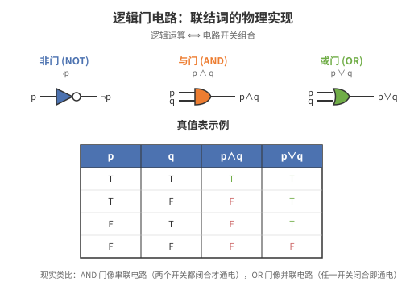
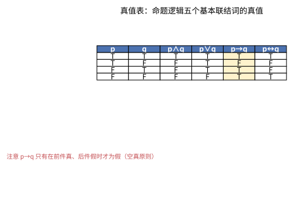
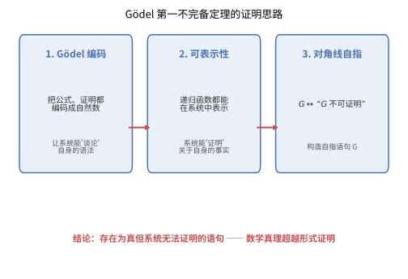

# 第 30 级：数理逻辑 (Mathematical Logic)

## 一、学习目标

完成本教程后，你应当能够：

1. **掌握命题逻辑**——理解命题、逻辑联结词、真值表、重言式、逻辑等价、范式（DNF、CNF）、逻辑推论与可满足性的概念。
2. **理解命题逻辑的证明系统**——掌握自然演绎与 Hilbert 系统的推理规则，理解并证明可靠性与完全性定理。
3. **掌握一阶逻辑**——理解谓词、量词、一阶语言、项、公式、自由/约束变元、解释与模型的概念。
4. **理解一阶逻辑的证明系统**——掌握一阶逻辑的 Hilbert 演算，理解 Gödel 完全性定理（含证明思路）、紧致性定理（含证明）与 Löwenheim-Skolem 定理。
5. **理解可计算性与可判定性**——掌握可判定性、半可判定性、不可判定性、Church-Turing 论题、停机问题（含证明）、Gödel 不完备定理（含证明思路）。
6. **了解模型论基础**——理解初等子结构、初等嵌入、型空间、量词消去、范畴性等概念。
7. **通过示例与习题巩固理论**——完成至少 8 个详细示例和 10 道习题。

---

## 二、命题逻辑

### 2.1 命题 (Propositions)

**命题**是一个可以判断真假的陈述句。例如：

- "2 + 2 = 4" 是真命题。
- "1 + 1 = 3" 是假命题。
- "x > 5" 不是命题（因为真值取决于 x）。
- "这个语句是假的" 不是命题（自指悖论）。

命题通常用字母 $p, q, r, \dots$ 表示。**原子命题**是不包含逻辑联结词的命题。

### 2.2 逻辑联结词 (Logical Connectives)

五个基本逻辑联结词：

| 联结词 | 符号 | 读法 | 英文 |
|--------|------|------|------|
| 否定 | $\neg$ | 非 | negation |
| 合取 | $\land$ | 且 | conjunction |
| 析取 | $\lor$ | 或 | disjunction |
| 蕴含 | $\to$ | 如果…则… | implication |
| 等价 | $\leftrightarrow$ | 当且仅当 | equivalence |

**合式公式 (Well-Formed Formula, WFF)** 的递归定义：
1. 原子命题是合式公式。
2. 若 $\varphi$ 是合式公式，则 $\neg\varphi$ 是合式公式。
3. 若 $\varphi, \psi$ 是合式公式，则 $(\varphi \land \psi)$, $(\varphi \lor \psi)$, $(\varphi \to \psi)$, $(\varphi \leftrightarrow \psi)$ 是合式公式。
4. 只有通过有限次应用上述规则得到的符号串才是合式公式。

约定优先级：$\neg$ 最高，$\land, \lor$ 次之，$\to, \leftrightarrow$ 最低，且 $\land, \lor$ 中 $\land$ 优先级高于 $\lor$（或按约定加括号以避免歧义）。



> **直观理解（现实类比）**：逻辑联结词像**电路里的开关组合**。$p \land q$（AND）是"**串联**"——两个开关都闭合才通电；$p \lor q$（OR）是"**并联**"——任一开关闭合就通电；$\neg p$（NOT）是"**反相器**"——把信号取反，输入高电平输出低电平。这些逻辑门是数字电路的基础：计算机的 CPU 就是由数十亿个这样的逻辑门组成的。图中展示了三种基本逻辑门的符号和对应的真值表——输入 A 和 B 的不同组合（00、01、10、11）决定输出 Y 的值。理解了这个对应关系，就理解了"软件如何变成硬件"。

### 2.3 真值表 (Truth Tables)

**真值表**枚举命题变元的所有真值赋值，列出复合公式在各赋值下的真值。

| $p$ | $q$ | $\neg p$ | $p \land q$ | $p \lor q$ | $p \to q$ | $p \leftrightarrow q$ |
|-----|-----|----------|-------------|------------|-----------|----------------------|
| T | T | F | T | T | T | T |
| T | F | F | F | T | F | F |
| F | T | T | F | T | T | F |
| F | F | T | F | F | T | T |

注意：$p \to q$ 在 $p$ 为假时从左到右均为真（空真原则）。



> **直观理解（现实类比）**：逻辑联结词像**电路里的开关组合**。$p \land q$ 是"**串联**"——两个开关都要合上才通电；$p \lor q$ 是"**并联**"——任一开关合上就通电；$\neg p$ 是"**反相器**"——把信号取反。最反直觉的是个子 $p \to q$（蕴含）：它只在"前提真但结论假"时为假，其余都为真，就像**承诺**"如果下雨就带伞"——只有下雨却没带伞才算违约，没下雨时无论带不带伞都不算违约。把这句话记牢，真值表就秒懂。

**示例 1**：构造 $(p \to q) \land (q \to p)$ 的真值表。

| $p$ | $q$ | $p \to q$ | $q \to p$ | $(p \to q) \land (q \to p)$ |
|-----|-----|-----------|-----------|------------------------------|
| T | T | T | T | T |
| T | F | F | T | F |
| F | T | T | F | F |
| F | F | T | T | T |

可见 $(p \to q) \land (q \to p)$ 与 $p \leftrightarrow q$ 逻辑等价。

### 2.4 重言式 (Tautologies)

**重言式**（永真式）是在所有真值赋值下都为真的公式。

**矛盾式**（永假式）是在所有真值赋值下都为假的公式。

**可满足式**是在至少一个真值赋值下为真的公式。

**示例 2**：证明 $p \lor \neg p$（排中律）是重言式。

| $p$ | $\neg p$ | $p \lor \neg p$ |
|-----|----------|-----------------|
| T | F | T |
| F | T | T |

所有行均为 T，故为重言式。

**示例 3**：常见重言式：
- 排中律：$p \lor \neg p$
- 矛盾律：$\neg(p \land \neg p)$
- 同一律：$p \to p$
- 双重否定律：$\neg\neg p \leftrightarrow p$
- 假言推理：$((p \to q) \land p) \to q$
- 拒取式：$((p \to q) \land \neg q) \to \neg p$
- 三段论：$((p \to q) \land (q \to r)) \to (p \to r)$

### 2.5 逻辑等价 (Logical Equivalence)

公式 $\varphi$ 与 $\psi$ **逻辑等价**（记作 $\varphi \equiv \psi$）当且仅当 $\varphi \leftrightarrow \psi$ 是重言式。

**基本等价关系**：
- 幂等律：$p \land p \equiv p$, $p \lor p \equiv p$
- 交换律：$p \land q \equiv q \land p$, $p \lor q \equiv q \lor p$
- 结合律：$(p \land q) \land r \equiv p \land (q \land r)$, $(p \lor q) \lor r \equiv p \lor (q \lor r)$
- 分配律：$p \land (q \lor r) \equiv (p \land q) \lor (p \land r)$, $p \lor (q \land r) \equiv (p \lor q) \land (p \lor r)$
- De Morgan 律：$\neg(p \land q) \equiv \neg p \lor \neg q$, $\neg(p \lor q) \equiv \neg p \land \neg q$
- 吸收律：$p \land (p \lor q) \equiv p$, $p \lor (p \land q) \equiv p$
- 蕴含改写：$p \to q \equiv \neg p \lor q$
- 等价改写：$p \leftrightarrow q \equiv (p \to q) \land (q \to p) \equiv (p \land q) \lor (\neg p \land \neg q)$
- 假言易位：$p \to q \equiv \neg q \to \neg p$
- 消去蕴含：$p \to q \equiv \neg(p \land \neg q)$

### 2.6 范式 (Normal Forms)

**文字 (Literal)**：原子命题 $p$ 或其否定 $\neg p$。

**子句 (Clause)**：文字的析取，如 $p \lor \neg q \lor r$。

**合取项 (Conjunct)**：文字的合取，如 $p \land \neg q \land r$。

**析取范式 (Disjunctive Normal Form, DNF)**：合取项的析取，即"积之和"形式：
$$(p \land q) \lor (\neg p \land r) \lor (q \land \neg r)$$

**合取范式 (Conjunctive Normal Form, CNF)**：子句的合取，即"和之积"形式：
$$(p \lor \neg q) \land (\neg p \lor r) \land (q \lor \neg r)$$

**定理**：每个命题逻辑公式都等价于一个析取范式和一个合取范式。

**示例 4**：求 $(p \to q) \land (q \to p)$ 的 CNF 和 DNF。

首先计算真值表：

| $p$ | $q$ | $p \to q$ | $q \to p$ | $\varphi$ |
|-----|-----|-----------|-----------|-----------|
| T | T | T | T | T |
| T | F | F | T | F |
| F | T | T | F | F |
| F | F | T | T | T |

**DNF**：取所有使 $\varphi$ 为真的行，每行对应一个合取项：
- 第1行 $(p, q)$ → $p \land q$
- 第4行 $(\neg p, \neg q)$ → $\neg p \land \neg q$

故 DNF 为 $(p \land q) \lor (\neg p \land \neg q)$。

**CNF**：取所有使 $\varphi$ 为假的行，每行对应一个子句（取反）：
- 第2行 $(p, \neg q)$ → $\neg p \lor q$
- 第3行 $(\neg p, q)$ → $p \lor \neg q$

故 CNF 为 $(\neg p \lor q) \land (p \lor \neg q)$。

### 2.7 逻辑推论 (Logical Consequence)

公式 $\psi$ 是公式集 $\Gamma$ 的**逻辑推论**（记作 $\Gamma \models \psi$）当且仅当在每个使 $\Gamma$ 中所有公式为真的赋值下，$\psi$ 也为真。

**定理**：$\Gamma \models \psi$ 当且仅当 $\Gamma \cup \{\neg\psi\}$ 不可满足。

**推论关系的基本性质**：
- 自反性：$\varphi \models \varphi$
- 单调性：若 $\Gamma \models \varphi$ 且 $\Gamma \subseteq \Delta$，则 $\Delta \models \varphi$
- 传递性：若 $\Gamma \models \varphi$ 且 $\{\varphi\} \models \psi$，则 $\Gamma \models \psi$
- 演绎定理（在元层次）：$\Gamma \cup \{\varphi\} \models \psi$ 当且仅当 $\Gamma \models \varphi \to \psi$

### 2.8 可满足性 (Satisfiability)

**可满足性 (SAT)** 问题：给定一个命题逻辑公式 $\varphi$，是否存在一个真值赋值使得 $\varphi$ 为真？

SAT 是第一个被证明的 NP-完全问题（Cook-Levin 定理，1971年）。

---

## 三、命题逻辑的证明系统

### 3.1 自然演绎 (Natural Deduction)

自然演绎由 Gentzen 于 1935 年提出，其推理规则模拟了自然推理过程。每个联结词有**引入规则**（$I$）和**消去规则**（$E$）。

**合取规则**：
- 引入 ($\land I$)：从 $\varphi$ 和 $\psi$ 推出 $\varphi \land \psi$
- 消去 ($\land E_1, \land E_2$)：从 $\varphi \land \psi$ 推出 $\varphi$，从 $\varphi \land \psi$ 推出 $\psi$

**析取规则**：
- 引入 ($\lor I_1, \lor I_2$)：从 $\varphi$ 推出 $\varphi \lor \psi$；从 $\psi$ 推出 $\varphi \lor \psi$
- 消去 ($\lor E$)：从 $\varphi \lor \psi$、$\varphi \vdash \chi$ 和 $\psi \vdash \chi$ 推出 $\chi$

**蕴含规则**：
- 引入 ($\to I$)：若假设 $\varphi$ 可推出 $\psi$，则推出 $\varphi \to \psi$（消去假设）
- 消去 ($\to E$，即假言推理)：从 $\varphi \to \psi$ 和 $\varphi$ 推出 $\psi$

**否定规则**：
- 引入 ($\neg I$)：若假设 $\varphi$ 可推出矛盾 $\bot$，则推出 $\neg \varphi$
- 消去 ($\neg E$)：从 $\varphi$ 和 $\neg \varphi$ 推出 $\bot$
- 反证法 (RAA)：若假设 $\neg \varphi$ 可推出 $\bot$，则推出 $\varphi$

**等价规则**：
- 引入 ($\leftrightarrow I$)：从 $\varphi \to \psi$ 和 $\psi \to \varphi$ 推出 $\varphi \leftrightarrow \psi$
- 消去 ($\leftrightarrow E$)：从 $\varphi \leftrightarrow \psi$ 推出 $\varphi \to \psi$ 和 $\psi \to \varphi$

**示例 5**：在自然演绎中证明 $p \to q, p \vdash q$（假言推理）。

```
1. p → q        前提
2. p            前提
3. q            →E 1, 2
```


> **直观理解（现实类比）**：自然演绎证明树像**一棵倒长的树**——树根是"结论"，树叶是"前提/假设"，从树叶一路长到树根。每一步（$\to$I、$\to$E 等）都像**把两块积木拼在一起**：$\to$E（假言推理）是"把'如果 A 则 B'和'A'叠成'B'"，$\to$I是"先把 A 假设进来，推出 B 后再把假设收掉，裹成'如果 A 则 B'"。看得懂每一步拼积木，就看得懂整棵树。

**示例 6**：在自然演绎中证明 $\vdash p \to (q \to p)$。

```
1. p            假设
2. q            假设
3. p            重复 1
4. q → p        →I 2-3
5. p → (q → p)  →I 1-4
```

**示例 7**：在自然演绎中证明 $\vdash (p \to q) \to (\neg q \to \neg p)$（假言易位）。

```
1. p → q        假设
2. ¬q           假设
3. p            假设
4. q            →E 1, 3
5. ⊥           ¬E 4, 2
6. ¬p           ¬I 3-5
7. ¬q → ¬p      →I 2-6
8. (p → q) → (¬q → ¬p)  →I 1-7
```

### 3.2 Hilbert 系统 (Hilbert System)

Hilbert 系统（也称为 Hilbert-Frege 系统）使用少量公理模式与一条推理规则（分离规则，modus ponens）。

**公理模式**（常见的一种选择）：
1. $p \to (q \to p)$
2. $(p \to (q \to r)) \to ((p \to q) \to (p \to r))$
3. $(\neg p \to \neg q) \to (q \to p)$

**推理规则**：分离规则 (Modus Ponens, MP)：从 $\varphi \to \psi$ 和 $\varphi$ 推出 $\psi$。

**证明**是公式的有限序列，其中每个公式是公理或由前面的公式通过 MP 得到。

**演绎定理**（在对象层次）：若 $\Gamma \cup \{\varphi\} \vdash \psi$，则 $\Gamma \vdash \varphi \to \psi$。

**示例 8**：在 Hilbert 系统中证明 $\vdash p \to p$。

```
1. (p → ((p → p) → p)) → ((p → (p → p)) → (p → p))  公理2（取 q = p→p, r = p）
2. p → ((p → p) → p)                                  公理1（取 q = p→p）
3. (p → (p → p)) → (p → p)                            MP 1, 2
4. p → (p → p)                                        公理1（取 q = p）
5. p → p                                              MP 3, 4
```

### 3.3 可靠性与完全性 (Soundness and Completeness)

**可靠性定理 (Soundness)**：若 $\Gamma \vdash \varphi$，则 $\Gamma \models \varphi$。即证明系统只产生逻辑推论。

**证明思路**：对证明的长度进行归纳。
- 基始：若 $\varphi$ 是公理，则 $\varphi$ 是重言式，故 $\Gamma \models \varphi$。
- 归纳步：若 $\varphi$ 由 MP 从 $\psi \to \varphi$ 和 $\psi$ 得到，则由归纳假设 $\Gamma \models \psi \to \varphi$ 且 $\Gamma \models \psi$，故在所有使 $\Gamma$ 为真的赋值下，$\psi$ 和 $\psi \to \varphi$ 均为真，从而 $\varphi$ 为真，即 $\Gamma \models \varphi$。

**完全性定理 (Completeness)**：若 $\Gamma \models \varphi$，则 $\Gamma \vdash \varphi$。即每个逻辑推论都能在系统中证明。

**证明思路（Henkin 构造法）**：
1. 假设 $\Gamma \not\vdash \varphi$，则 $\Gamma \cup \{\neg\varphi\}$ 是**一致的**（即不推出矛盾）。
2. 将 $\Gamma \cup \{\neg\varphi\}$ 扩展为**极大一致集** $\Delta$（即 $\Delta$ 一致且对任意公式 $\psi$，$\psi \in \Delta$ 或 $\neg\psi \in \Delta$）。
3. 定义 $\Delta$ 的真值赋值：对每个命题变元 $p$，令 $v(p) = T$ 当且仅当 $p \in \Delta$。
4. 证明**真理引理**：对任意公式 $\psi$，$v(\psi) = T$ 当且仅当 $\psi \in \Delta$。
5. 于是 $\Delta$ 可满足，故 $\Gamma \cup \{\neg\varphi\}$ 可满足，即 $\Gamma \not\models \varphi$。
6. 由逆否命题得完全性。

**系**：命题逻辑中 $\Gamma \vdash \varphi$ 当且仅当 $\Gamma \models \varphi$。

---

## 四、一阶逻辑

### 4.1 谓词与量词 (Predicates and Quantifiers)

命题逻辑只能表达原子命题及其组合，但无法表达"所有实数都是非负的"或"存在一个质数大于 100"等涉及个体和量化的陈述。

**谓词 (Predicate)** 是关于个体的性质或关系。例如 $P(x)$ 表示"$x$ 是质数"，$R(x, y)$ 表示"$x < y$"。

**量词 (Quantifiers)**：
- 全称量词 $\forall$："对所有"— $\forall x P(x)$ 表示"对所有 $x$，$P(x)$ 成立"。
- 存在量词 $\exists$："存在"— $\exists x P(x)$ 表示"存在某个 $x$，$P(x)$ 成立"。

**量词间的对偶关系**：
- $\neg\forall x P(x) \equiv \exists x \neg P(x)$
- $\neg\exists x P(x) \equiv \forall x \neg P(x)$


> **直观理解（现实类比）**：量词像**搜索范围的限定词**。$\forall x P(x)$（全称量词）像**质检员检查整批产品**——必须每一个都合格才算通过；$\exists x P(x)$（存在量词）像**在仓库里找一件合格品**——只要找到一个就行。图中展示了两种量词的直观区别：左边 $\forall x (x > 0)$ 要求论域（大圆）中所有元素都在绿色区域（$x > 0$）内，只要有一个不在就为假；右边 $\exists x (x > 5)$ 只要求至少一个元素在绿色区域内。量词顺序也很关键：$\forall x \exists y (y > x)$ 说"每个数都有比它大的数"（真），但 $\exists y \forall x (y > x)$ 说"存在一个数比所有数都大"（假）——就像"每个人都有妈妈"（真）vs"有一个人是所有人的妈妈"（假）。

### 4.2 一阶语言 (First-Order Language)

一阶语言 $\mathcal{L}$ 由下列符号组成：

**逻辑符号**：
1. 变元：$x, y, z, x_1, x_2, \dots$（可数无穷多个）
2. 逻辑联结词：$\neg, \land, \lor, \to, \leftrightarrow$
3. 量词：$\forall, \exists$
4. 等号：$=$（可选，通常在带等词的一阶逻辑中）
5. 括号：$(, )$

**非逻辑符号**（依赖于具体语言）：
1. **常量符号** (Constant symbols)：$c, d, c_1, c_2, \dots$
2. **函数符号** (Function symbols)：$f, g, h, \dots$，每个有固定的元数 (arity)
3. **谓词符号** (Predicate symbols)：$P, Q, R, \dots$，每个有固定的元数

**示例**：算术语言 $\mathcal{L}_{\text{ar}} = \{0, 1, +, \times, <\}$，其中 $0, 1$ 是常量，$+, \times$ 是二元函数，$<$ 是二元谓词。

### 4.3 项与公式 (Terms and Formulas)

**项 (Term)** 的递归定义：
1. 每个变元是项。
2. 每个常量符号是项。
3. 若 $f$ 是 $n$ 元函数符号，$t_1, \dots, t_n$ 是项，则 $f(t_1, \dots, t_n)$ 是项。

**原子公式 (Atomic Formula)**：
1. 若 $t_1, t_2$ 是项，则 $t_1 = t_2$ 是原子公式。
2. 若 $P$ 是 $n$ 元谓词符号，$t_1, \dots, t_n$ 是项，则 $P(t_1, \dots, t_n)$ 是原子公式。

**合式公式 (WFF)** 的递归定义：
1. 每个原子公式是合式公式。
2. 若 $\varphi, \psi$ 是合式公式，则 $\neg\varphi$, $(\varphi \land \psi)$, $(\varphi \lor \psi)$, $(\varphi \to \psi)$, $(\varphi \leftrightarrow \psi)$ 是合式公式。
3. 若 $\varphi$ 是合式公式，$x$ 是变元，则 $\forall x \varphi$ 和 $\exists x \varphi$ 是合式公式。
4. 只有通过有限次应用上述规则得到的才是合式公式。

### 4.4 自由变元与约束变元 (Free and Bound Variables)

在公式 $\forall x \varphi$（或 $\exists x \varphi$）中，$\varphi$ 是量词 $\forall x$（或 $\exists x$）的**辖域 (scope)**。变元 $x$ 在辖域内的出现称为**约束出现 (bound occurrence)**，否则称为**自由出现 (free occurrence)**。

**闭公式 (Sentence)**：不含自由变元的公式。

**示例**：
- $\forall x (P(x) \to Q(x))$：$x$ 约束出现，是闭公式。
- $\forall x P(x) \to Q(x)$：$x$ 在 $P(x)$ 中约束，在 $Q(x)$ 中自由，不是闭公式。
- $\forall x \exists y R(x, y)$：闭公式。

**代入 (Substitution)**：$\varphi[t/x]$ 表示将公式 $\varphi$ 中所有自由出现的 $x$ 替换为项 $t$。替换时需注意 $t$ 中的变元不能与 $\varphi$ 中的约束变元冲突（必要时重命名约束变元）。

### 4.5 解释与模型 (Interpretations and Models)

**结构 (Structure)** 或 **解释 (Interpretation)** $\mathfrak{A}$ 为一阶语言 $\mathcal{L}$ 指定：
1. 非空论域 (domain) $|\mathfrak{A}|$
2. 每个常量符号 $c$ 对应一个元素 $c^{\mathfrak{A}} \in |\mathfrak{A}|$
3. 每个 $n$ 元函数符号 $f$ 对应一个函数 $f^{\mathfrak{A}}: |\mathfrak{A}|^n \to |\mathfrak{A}|$
4. 每个 $n$ 元谓词符号 $P$ 对应一个 $n$ 元关系 $P^{\mathfrak{A}} \subseteq |\mathfrak{A}|^n$

**赋值 (Assignment)** $s$ 是从变元集合到 $|\mathfrak{A}|$ 的函数。

**Tarski 真值定义**：递归定义公式 $\varphi$ 在结构 $\mathfrak{A}$ 和赋值 $s$ 下为真（记作 $\mathfrak{A} \models \varphi[s]$）：
- 原子公式：按标准方式定义（如 $\mathfrak{A} \models P(t_1, \dots, t_n)[s]$ 当且仅当 $(t_1^{\mathfrak{A}}[s], \dots, t_n^{\mathfrak{A}}[s]) \in P^{\mathfrak{A}}$）
- 联结词：与命题逻辑相同
- $\mathfrak{A} \models \forall x \varphi[s]$ 当且仅当对每个 $a \in |\mathfrak{A}|$，$\mathfrak{A} \models \varphi[s(x|a)]$（其中 $s(x|a)$ 是将 $s$ 中 $x$ 的值改为 $a$ 后的赋值）
- $\mathfrak{A} \models \exists x \varphi[s]$ 当且仅当存在某个 $a \in |\mathfrak{A}|$，$\mathfrak{A} \models \varphi[s(x|a)]$

**模型 (Model)**：若 $\mathfrak{A} \models \varphi[s]$ 对所有赋值 $s$ 成立，则称 $\mathfrak{A}$ 是 $\varphi$ 的模型。对闭公式 $\varphi$，赋值无关紧要，可直接写 $\mathfrak{A} \models \varphi$。

**可满足性**：公式集 $\Gamma$ 可满足当且仅当存在结构 $\mathfrak{A}$ 使 $\mathfrak{A} \models \varphi$ 对所有 $\varphi \in \Gamma$ 成立。

---

## 五、一阶逻辑的证明系统

### 5.1 Hilbert 演算 (Hilbert Calculus for First-Order Logic)

一阶逻辑的 Hilbert 系统在命题逻辑 Hilbert 系统的基础上增加量词公理和规则。

**命题逻辑公理**（同前）：
1. $\varphi \to (\psi \to \varphi)$
2. $(\varphi \to (\psi \to \chi)) \to ((\varphi \to \psi) \to (\varphi \to \chi))$
3. $(\neg \varphi \to \neg \psi) \to (\psi \to \varphi)$

**量词公理**：
4. $\forall x \varphi(x) \to \varphi(t)$，其中 $t$ 对 $x$ 自由（即 $t$ 代入后不产生冲突）
5. $\varphi(t) \to \exists x \varphi(x)$，其中 $t$ 对 $x$ 自由

**等词公理**（若语言包含等号）：
6. $x = x$
7. $x = y \to (\varphi(x) \to \varphi(y))$（代换原理）

**推理规则**：
- MP：从 $\varphi$ 和 $\varphi \to \psi$ 推出 $\psi$
- 全称概括 (Generalization, Gen)：从 $\varphi$ 推出 $\forall x \varphi$（需满足变元条件）

### 5.2 Gödel 完全性定理 (Gödel's Completeness Theorem)

**定理 (Gödel, 1929/1930)**：在一阶逻辑中，$\Gamma \vdash \varphi$ 当且仅当 $\Gamma \models \varphi$。

**证明思路（Henkin 构造法，1949）**：

**可靠性方向** ($\Gamma \vdash \varphi \Rightarrow \Gamma \models \varphi$)：对证明长度归纳，验证公理均为真且 MP 和 Gen 保持真值。

**完全性方向** ($\Gamma \models \varphi \Rightarrow \Gamma \vdash \varphi$)：通过证明逆否命题：若 $\Gamma \not\vdash \varphi$，则 $\Gamma \not\models \varphi$。

1. **一致性**：若 $\Gamma \not\vdash \varphi$，则 $\Gamma \cup \{\neg\varphi\}$ 一致（即不推出矛盾）。
2. **Lindenbaum 引理**：每个一致集可扩展为极大一致集 $\Delta$。
3. **添加见证常量 (Henkin witnesses)**：对每个形如 $\exists x \psi(x)$ 的公式，添加一个新常量 $c$ 和公理 $\exists x \psi(x) \to \psi(c)$，保持一致性。
4. **构造典范模型**：论域为所有项的等价类（模可证相等关系），谓词解释按 $P([t_1], \dots, [t_n])$ 为真当且仅当 $P(t_1, \dots, t_n) \in \Delta$。
5. **真理引理**：对任意公式 $\varphi$，$\mathfrak{A} \models \varphi$ 当且仅当 $\varphi \in \Delta$。
6. 于是 $\mathfrak{A}$ 是 $\Delta$ 的模型，从而也是 $\Gamma \cup \{\neg\varphi\}$ 的模型，故 $\Gamma \not\models \varphi$。

**系**：一阶逻辑是**紧致的 (compact)** 和**完备的 (complete)**。

### 5.3 紧致性定理 (Compactness Theorem)

**定理**：公式集 $\Gamma$ 可满足当且仅当 $\Gamma$ 的每个有限子集可满足。

**证明**：
- **($\Rightarrow$)**：显然，若 $\Gamma$ 有模型，则其每个有限子集在该模型中也为真。
- **($\Leftarrow$)**：假设 $\Gamma$ 不可满足。由完全性，$\Gamma \vdash \bot$（即 $\Gamma$ 不一致）。证明是有限长的，只用到 $\Gamma$ 的有限多个公式，故存在有限子集 $\Gamma_0 \subseteq \Gamma$ 使得 $\Gamma_0 \vdash \bot$。由可靠性，$\Gamma_0$ 不可满足。$\square$

**应用示例**：
- **非标准算术的存在性**：考虑 $\text{Th}(\mathbb{N})$（自然数集的所有真一阶语句）加上一个新常量 $c$ 和公理 $\{c > n : n \in \mathbb{N}\}$。任意有限子集可满足（将 $c$ 解释为足够大的自然数），故整体可满足，从而存在非标准算术模型。
- **图论中的紧致性**：若一个图的所有有限子图都是 $k$-可着色的，则整个图也是 $k$-可着色的。

### 5.4 Löwenheim-Skolem 定理

**Löwenheim-Skolem 定理 (向下版本)**：若 $\mathcal{L}$ 是可数语言，$\Gamma$ 有无限模型，则 $\Gamma$ 有可数模型。

**证明思路**：在 Henkin 构造中，论域由项（可数多个）的等价类构成，故模型至多可数。

**Löwenheim-Skolem 定理 (向上版本)**：若 $\Gamma$ 有无限模型，则对任意基数 $\kappa \geq |\mathcal{L}|$，$\Gamma$ 有基数为 $\kappa$ 的模型。

**证明思路**：添加 $\kappa$ 个新常量 $\{c_i : i < \kappa\}$ 和公理 $c_i \neq c_j$（$i \neq j$），应用紧致性定理。

**Skolem 悖论**：ZFC 集合论断言存在不可数集，但若 ZFC 一致，则 Löwenheim-Skolem 向下定理保证 ZFC 有可数模型。这并非悖论，而是表明"可数"在模型内部和外部有不同含义——模型内部的可数性是相对于该模型不存在的双射而言的。

---

## 六、可计算性与可判定性

### 6.1 可判定性 (Decidability)

**可判定问题**：存在一个算法（图灵机），对任意输入在有限步内给出"是"或"否"的答案。

**半可判定问题**：存在一个算法，对答案为"是"的输入在有限步内停机并给出肯定答案；对答案为"否"的输入可能永远不停机。

**不可判定问题**：不存在任何算法能对任意输入给出正确答案。

### 6.2 Church-Turing 论题 (Church-Turing Thesis)

**Church-Turing 论题**：直观上"可有效计算"的函数类恰好就是图灵机可计算的函数类。

这不是一个可证明的数学定理，而是一个关于"有效计算"直观概念的论题。所有已知的计算模型（图灵机、$\lambda$ 演算、递归函数、随机存取机、量子图灵机等）都互相等价，为这一论题提供了有力证据。

### 6.3 停机问题 (Halting Problem)

**定理 (Turing, 1936)**：停机问题是不可判定的。即不存在一个算法，能对任意给定的图灵机 $M$ 和输入 $w$，判定 $M$ 在输入 $w$ 上是否停机。

**证明（对角线法）**：
1. 假设存在算法 $H(M, w)$，能在有限步内判断图灵机 $M$ 在输入 $w$ 上是否停机。
2. 构造一个新图灵机 $D$：$D$ 以图灵机的编码 $M$ 为输入，调用 $H(M, M)$。若 $H(M, M)$ 输出"停机"，则 $D$ 进入死循环；若 $H(M, M)$ 输出"不停机"，则 $D$ 停机。
3. 现在问：$D$ 在输入 $D$（即自身的编码）上是否停机？
   - 若 $D$ 停机，则 $H(D, D)$ 返回"停机"，于是 $D$ 进入死循环，不停机。
   - 若 $D$ 不停机，则 $H(D, D)$ 返回"不停机"，于是 $D$ 停机。
4. 矛盾。故假设的 $H$ 不存在。$\square$

**推论**：大量问题是不可判定的，例如：
- 一阶逻辑公式的可满足性（Church 定理，1936）
- 希尔伯特第十问题（丢番图方程的可解性，Matiyasevich 1970）
- 群的字问题（Novikov 1955）
- 谓词逻辑的永真性

### 6.4 Gödel 不完备定理 (Gödel's Incompleteness Theorems)

**第一不完备定理**：任何包含皮亚诺算术的一致递归公理化理论 $T$ 都是不完备的——存在一个在 $T$ 中不可证明也不可否证的语句。

**第二不完备定理**：这样的理论 $T$ 不能证明自身的一致性（即 $\text{Con}(T)$ 在 $T$ 中不可证明）。

**证明思路（核心步骤）**：
1. **Gödel 编码**：将公式、证明等语法对象编码为自然数，使理论 $T$ 能"谈论"自身的语法。
2. **可表示性**：所有递归函数在 $T$ 中可表示，即对每个递归函数 $f$ 存在公式 $\varphi_f(\vec{x}, y)$ 使得 $\mathbb{N} \models \varphi_f(\vec{n}, m)$ 当且仅当 $f(\vec{n}) = m$，且 $T$ 能证明相应的唯一性和存在性。
3. **自指引理 (Diagonal Lemma)**：对任意含一个自由变元的公式 $\psi(x)$，存在一个语句 $\theta$ 使得 $T \vdash \theta \leftrightarrow \psi(\ulcorner\theta\urcorner)$（其中 $\ulcorner\theta\urcorner$ 是 $\theta$ 的 Gödel 编码）。
4. **构造 Gödel 语句**：令 $\psi(x)$ 为"编号为 $x$ 的公式在 $T$ 中不可证明"，则自指引理给出 $\theta$ 满足 $T \vdash \theta \leftrightarrow \neg\text{Prov}_T(\ulcorner\theta\urcorner)$。
5. $\theta$ 说"我不可证明"。若 $T \vdash \theta$，则 $T$ 证明了一个假语句（不一致）；若 $T \vdash \neg\theta$，则 $T$ 证明 $\theta$ 可证明，但 $T$ 实际上并未证明 $\theta$（$\omega$-不一致）。故 $\theta$ 在 $T$ 中不可判定。
6. 第二定理：将 $\theta$ 取为 $\text{Con}(T)$ 的等价形式，则 $T \not\vdash \text{Con}(T)$。

**哲学意义**：
- 数学真理超出形式证明的范畴。
- 不存在能证明所有数学真理的"万能公理系统"。
- 希尔伯特的形式主义规划（证明数学一致且完备）不可能实现。



> **直观理解（现实类比）**：Gödel 不完备定理像**一套系统无法拔着自己的头发离开地面**。它通过三步让数学系统"自己谈自己"：① Gödel 编码——把公式、证明翻译成数字（像给每句话编个身份证号）；② 可表示性——系统能"证明"这些数字关系；③ 对角线自指——构造一句"**这句话在系统中不可证明**"的语句 $G$。若系统能证明 $G$，则 $G$ 为假（矛盾）；能证明 $\neg G$，则系统不一致。于是 $G$ 永远无法被证明，却**在标准模型里为真**。这就像有人说"我这个清单列不全所有清单"——如果他真列全了，把自己也列进去就会矛盾。

> **🧠 思考历程：哥德尔 25 岁的一记组合拳，怎么粉碎了"数学万无一失"的梦想？**
>
> 20 世纪初希尔伯特雄心勃勃地喊出"我们必须知道，我们必将知道"——指望用一劳永逸的公理化证明所有数学可真又一致。**1931 年，25 岁的哥德尔（Gödel）用一条几乎"内爆"的技巧证明：这样的理想不可能实现。** 那会儿数学界正笃信逻辑能兜底一切。
>
> - **难题：怎样让数学"谈论自己"？** 希尔伯特要的是"关于数学的数学"：证明数学系统不会自相矛盾、且每个真命题都能被证出。但要证明这些，得先让系统能"讨论自己的证明"。**哥德尔的妙招是建 Gödel 数：把每个公式、每步证明都编码成一个自然数**，于是"证明"变成纯粹的算术对象，数学有了"自述"的器官。
> - **自指的爆破点：借用罗素"悖论"的手法**。罗素的"不给自己理发的理发师"式集合悖论，本质是"关于自身的否定"；哥德尔把它工业化为**自指引理（对角线引理）**：造一句 $\theta$，让它等价于"$\theta$ 自己不可证明"。**一旦 $\theta$ 出笼，系统就两头堵：证明它则矛盾，否定它也矛盾，只能干瞪眼。**
> - **结论三条，条条惊动天下**。①（第一不完备）含皮亚诺算术的一致系统，必然有"证明不出也证伪不了"的真命题——**有真理在系统内无法被形式证明**；②（第二不完备）这样的系统也证不了"自己是一致的"——**"数学无矛盾"这种大话，系统自己说不出口**；③ 于是希尔伯特的"完成主义"规划宣告破产。
> - **它没让数学死，反而让数学更强了**。不完备不是"数学垮了"，而是"数学比任何单套公理都大"。它催生了递归论、模型论，也划定了"机器证明/公理系统"的能力边界。**今天我们看到"无法证明尽全部数学真理"的真相，反而更能敬畏认知的深度。**
> - **心路**：哥德尔定理告诉你：**再强大的系统，都有"看不见自己的影子"的那一刻**。勇于正视"内在的不可完满"，往往比假装"我能穷尽一切"更接近真知，也更配得上做数学。

---

## 七、模型论

### 7.1 初等子结构 (Elementary Substructures)

**子结构 (Substructure)**：$\mathfrak{A}$ 是 $\mathfrak{B}$ 的子结构（记作 $\mathfrak{A} \subseteq \mathfrak{B}$）当且仅当 $|\mathfrak{A}| \subseteq |\mathfrak{B}|$ 且所有常量、函数、谓词的解释与 $\mathfrak{B}$ 一致。

**初等子结构 (Elementary Substructure)**：$\mathfrak{A} \preceq \mathfrak{B}$ 当且仅当 $\mathfrak{A} \subseteq \mathfrak{B}$ 且对任意公式 $\varphi(\vec{x})$ 和 $\vec{a} \in |\mathfrak{A}|$，$\mathfrak{A} \models \varphi[\vec{a}]$ 当且仅当 $\mathfrak{B} \models \varphi[\vec{a}]$。

**Tarski-Vaught 检验**：$\mathfrak{A} \preceq \mathfrak{B}$ 当且仅当 $\mathfrak{A} \subseteq \mathfrak{B}$ 且对任意公式 $\varphi(x, \vec{y})$ 和 $\vec{a} \in |\mathfrak{A}|$，若 $\mathfrak{B} \models \exists x \varphi(x, \vec{a})$，则存在 $b \in |\mathfrak{A}|$ 使 $\mathfrak{B} \models \varphi(b, \vec{a})$。

**Löwenheim-Skolem-Tarski 定理**：对任意无限结构 $\mathfrak{A}$ 和任意基数 $\kappa \geq |\mathcal{L}|$，存在 $\mathfrak{B} \preceq \mathfrak{A}$ 且 $|\mathfrak{B}| = \kappa$（如果 $\kappa < |\mathfrak{A}|$）；存在 $\mathfrak{B} \succeq \mathfrak{A}$ 且 $|\mathfrak{B}| = \kappa$（如果 $\kappa > |\mathfrak{A}|$）。

### 7.2 初等嵌入 (Elementary Embeddings)

**初等嵌入** $f: \mathfrak{A} \to \mathfrak{B}$ 是一个单射 $f: |\mathfrak{A}| \to |\mathfrak{B}|$，使得对任意公式 $\varphi(\vec{x})$ 和 $\vec{a} \in |\mathfrak{A}|$，$\mathfrak{A} \models \varphi[\vec{a}]$ 当且仅当 $\mathfrak{B} \models \varphi[f(\vec{a})]$。

初等嵌入是模型论的基本工具，用于构造扩张、研究模型之间的关系。

### 7.3 型空间 (Type Spaces)

**型 (Type)** 是一组带自由变元的公式，描述了某个元素（或元素组）可能满足的性质。

**完全 n-型** $p(x_1, \dots, x_n)$ 是公式集，满足：
1. $p$ 与 $\text{Th}(\mathfrak{A})$ 一致（即与 $\mathfrak{A}$ 的理论不矛盾）
2. $p$ 是极大一致的（对任意公式 $\varphi$，$\varphi \in p$ 或 $\neg\varphi \in p$）

**实现 (Realize)**：元素 $\vec{a} \in |\mathfrak{B}|$（其中 $\mathfrak{B} \models \text{Th}(\mathfrak{A})$）实现了型 $p$ 当且仅当 $\mathfrak{B} \models \varphi[\vec{a}]$ 对所有 $\varphi \in p$ 成立。

**省略型定理 (Omitting Types Theorem)**：给定可数语言中的可数理论 $T$ 和局部省略的 $n$-型 $p$，存在 $T$ 的可数模型省略 $p$（即不实现 $p$）。

### 7.4 量词消去 (Quantifier Elimination)

理论 $T$ 具有**量词消去**性质，当且仅当对每个公式 $\varphi(\vec{x})$，存在一个无量词公式 $\psi(\vec{x})$ 使得 $T \models \forall \vec{x} (\varphi(\vec{x}) \leftrightarrow \psi(\vec{x}))$。

**常见例子**：
- 无限域的代数闭域理论（ACF）有量词消去
- 实数闭域理论（RCF）有量词消去
- 稠密线序无端点理论（DLO）有量词消去

**量词消去的判定方法**：理论 $T$ 有量词消去当且仅当对任意两个模型 $\mathfrak{A}, \mathfrak{B} \models T$ 和任意公共子结构 $\mathfrak{C}$，$\mathfrak{A}$ 和 $\mathfrak{B}$ 在 $\mathfrak{C}$ 上一致（即 $\mathfrak{C}$ 的每个元素在两个模型中的行为相同）。

### 7.5 范畴性 (Categoricity)

**$\kappa$-范畴性**：理论 $T$ 是 $\kappa$-范畴的，当且仅当 $T$ 在基数为 $\kappa$ 的模型（在同构意义下）唯一。

**Morley 定理 (1965)**：若可数语言中的理论 $T$ 在某个不可数基数 $\kappa$ 上是 $\kappa$-范畴的，则 $T$ 在所有不可数基数上都是 $\kappa$-范畴的。

**Łoś-Vaught 检验**：若 $T$ 无有限模型且在某个 $\kappa \geq |\mathcal{L}|$ 上是 $\kappa$-范畴的，则 $T$ 是完全的（即 $T$ 对任意语句 $\varphi$ 要么证明 $\varphi$ 要么证明 $\neg\varphi$）。

**经典例子**：
- 代数闭域理论（固定特征）在不可数基数上是范畴的（但不包括可数基数——$\mathbb{Q}$ 的代数闭包和 $\mathbb{F}_p$ 的代数闭包不同构）
- 稠密线序无端点理论在 $\aleph_0$ 上是范畴的（所有可数稠密线序同构于 $\mathbb{Q}$），但不可数时不范畴
- 向量空间理论（固定域上）在所有无限基数上是范畴的

---

## 八、解题技巧

本节针对数理逻辑的高频题型（真值表与范式、逻辑等价化简、自然演绎证明、一阶语言翻译、紧致性与可判定性）给出可套用的方法。每条含**适用场景**、**关键步骤**、**常见误区**并配精讲示例。

### 8.1 真值表与范式

**适用场景**：判断命题公式是重言式/矛盾式/可满足式；求给定公式的 DNF 或 CNF；验证两个公式逻辑等价。

**关键步骤**：
1. 数出命题变元个数 $n$，真值表有 $2^n$ 行，按二进制顺序枚举全体赋值；
2. 由内向外逐层计算联结词（先 $\neg$，再 $\land,\lor$，最后 $\to,\leftrightarrow$）得到各列真值；
3. 求 DNF：取所有"公式为真"的行，每行合成合取项（变元为真取 $p$、为假取 $\neg p$），再析取；求 CNF：取所有"公式为假"的行，每行合成子句（取值取反），再合取。

**常见误区**：
- 忘记 $p\to q$ 是"空真"——$p$ 为假时蕴含始终为真；
- DNF 错用假行、CNF 错用真行（二者相反）；
- 只列部分赋值构成真值表，漏掉某几行。

**精讲示例**：求 $(p\to q)\land(q\to p)$ 的 DNF 与 CNF。
真值表表明此式为真当且仅当 $p=q$。
- DNF：为真的行是 $(p,q)=(\mathrm T,\mathrm T)$ 与 $(\mathrm F,\mathrm F)$，故
$$
(p\land q)\lor(\neg p\land\neg q).
$$
- CNF：为假的行是 $(\mathrm T,\mathrm F)$ 与 $(\mathrm F,\mathrm T)$，子句取反得
$$
(\neg p\lor q)\land(p\lor\neg q).
$$

### 8.2 逻辑等价化简

**适用场景**：用基本等价律化简公式、证明等价式、把复杂公式改写成指定形式。

**关键步骤**：
1. 遇蕴含/等价先改写为 $\neg$ 与 $\land,\lor$：$p\to q\equiv\neg p\lor q$，$p\leftrightarrow q\equiv(p\land q)\lor(\neg p\land\neg q)$；
2. 用 De Morgan 律把否定内移并消去双重否定 $\neg\neg p\equiv p$；
3. 用分配律、吸收律把式子收敛到最简形式；任何化简都不改变真值函数。

**常见误区**：
- 对 $\neg(p\land q)$ 只否定其中一个变元（漏掉 De Morgan 的"分发"）；
- 把 $\land$、$\lor$ 的分配方向记反；
- 把"逻辑等价"与"逻辑蕴涵"混淆。

**精讲示例**：证明 $\neg(p\to q)\equiv p\land\neg q$（"蕴含的否定"）。
$$
\neg(p\to q)\equiv\neg(\neg p\lor q)\equiv\neg\neg p\land\neg q\equiv p\land\neg q.
$$
先化蕴含、再 De Morgan、再消双重否定。这是一条高频易错结论。

### 8.3 自然演绎证明构造

**适用场景**：需要为某个结论构造自然演绎证明树。

**关键步骤**：
1. 结论形如 $\varphi\to\psi$：先假设 $\varphi$，推出 $\psi$ 后用 $\to I$ 收掉假设；
2. 需要矛盾时用 $\neg I$（假设 $\varphi$ 得 $\bot$，推出 $\neg\varphi$）或 RAA（假设 $\neg\varphi$ 得 $\bot$，推出 $\varphi$）；
3. 前提给出析取 $\varphi\lor\psi$ 而目标是 $\chi$：用 $\lor E$ 分两支，每支都推出 $\chi$；
4. 每步行末标注所依据的规则与行号，便于复核。

**常见误区**：
- 在 $\to I$ 收掉假设之后仍引用、依赖该假设；
- 用 $\lor E$ 时两支并未都推出 $\chi$；
- 写出证明但完全不加规则标注，无法核验每一步合法性。

**精讲示例**：证明 $p\lor q,\ \neg p\vdash q$。
```
1.  p ∨ q        前提
2.  ¬p           前提
3.    p          假设
4.    ⊥          ¬E 3, 2
5.    q          由矛盾推任意 4
6.    q          假设
7.  q            ∨E 1, 3-5, 6
```
第一支从 $p$ 与 $\neg p$ 得矛盾，由"矛盾可推出一切"得到 $q$；第二支直接是 $q$；$\lor E$ 合并两支即得。

### 8.4 一阶语言翻译

**适用场景**：把自然语句形式化为一阶公式，或解读给定公式的语义。

**关键步骤**：
1. 先确定论域与谓词（单个体性质用一元谓词，二元关系用二元谓词），按需补充函数/常量；
2. 量词放对位置且注意作用域：$\forall x\varphi$ 是"对所有 $x$，$\varphi$"，$\exists x\varphi$ 是"存在 $x$，$\varphi$"；
3. "所有 $P$ 都是 $Q$" → $\forall x(P(x)\to Q(x))$；"存在 $P$ 是 $Q$" → $\exists x(P(x)\land Q(x))$；
4. 警惕量词顺序：$\forall x\exists y$ 与 $\exists y\forall x$ 语义不同，不可随意交换。

**常见误区**：
- 把"所有 $P$ 是 $Q$" 写成 $\forall x(P(x)\land Q(x))$（错，应取 $\to$）；
- 把"存在 $P$ 是 $Q$" 写成 $\exists x(P(x)\to Q(x))$（错，应取 $\land$）；
- 忽视量词作用域，使变量在括号内外自由/约束混乱。

**精讲示例**："每个偶数都能被 2 整除"，论域取整数：
$$
\forall x\big(E(x)\to D(x,2)\big),
$$
其中 $E(x)$："$x$ 是偶数"，$D(x,y)$："$x$ 被 $y$ 整除"。而"存在一个质数大于 100"：
$$
\exists x\big(P(x)\land x>100\big)
$$
——注意前句用 $\to$、后句用 $\land$ 的差异正是最常见丢分点。

### 8.5 元逻辑：紧致性、可判定性思路

**适用场景**：由"每个有限子集可满足"推出"整体可满足"；判断问题是否可判定/半可判定/不可判定。

**关键步骤**：
1. 用紧致性：把要证的无限断言化归为可数/局部的一阶公理化，若每个有限子集可满足则整体可满足；
2. 证明可判定：给出一个对任意输入有限步停机的算法；
3. 证明不可判定：把已知不可判定问题（如停机问题）**归约**到目标问题；
4. 证明半可判定：给"是"的递归枚举程序（如可证公式集）。

**常见误区**：
- 归约方向搞反——应从已知不可判定归约到目标，而非反向；
- 使用紧致性前未把语言与理论显式写出；
- 把"半可判定"（对"是"停机）当作"可判定"。

**精讲示例**：证明"每个有限子图 $k$-可着色的图 $G$ 整体 $k$-可着色"。
将图论公理化：取 $\mathcal{L}=\{E,C_1,\dots,C_k\}$，加入边对称、每点至多一色、每点至少一色、邻点异色等公理，再对 $G$ 的每条边加入 $E(a,b)$，得理论 $\Gamma$。$G$ 的每个有限子图 $k$-可着色即 $\Gamma$ 的每个有限子集可满足；由紧致性定理，$\Gamma$ 可满足，即 $G$ 是 $k$-可着色的。✓

---

## 九、示例

### 示例 1：命题逻辑真值表与范式

求公式 $\varphi = (p \to q) \land (\neg q \to r)$ 的真值表与范式。

**解**：真值表如下：

| $p$ | $q$ | $r$ | $p \to q$ | $\neg q$ | $\neg q \to r$ | $\varphi$ |
|-----|-----|-----|-----------|----------|----------------|-----------|
| T | T | T | T | F | T | T |
| T | T | F | T | F | T | T |
| T | F | T | F | T | T | F |
| T | F | F | F | T | F | F |
| F | T | T | T | F | T | T |
| F | T | F | T | F | T | T |
| F | F | T | T | T | T | T |
| F | F | F | T | T | F | F |

**DNF**（取 $\varphi$ 为真的行）：
$$(p \land q \land r) \lor (p \land q \land \neg r) \lor (\neg p \land q \land r) \lor (\neg p \land q \land \neg r) \lor (\neg p \land \neg q \land r)$$

**CNF**（取 $\varphi$ 为假的行，即第 3, 4, 8 行）：
第 3 行 $(p, \neg q, r)$ → $\neg p \lor q \lor \neg r$
第 4 行 $(p, \neg q, \neg r)$ → $\neg p \lor q \lor r$
第 8 行 $(\neg p, \neg q, \neg r)$ → $p \lor q \lor r$

故 CNF 为：
$$(\neg p \lor q \lor \neg r) \land (\neg p \lor q \lor r) \land (p \lor q \lor r)$$

---

### 示例 2：自然演绎证明

在自然演绎中证明 $\vdash (p \to (q \to r)) \to ((p \to q) \to (p \to r))$。

**解**：
```
1. p → (q → r)    假设
2. p → q          假设
3. p              假设
4. q → r          →E 1, 3
5. q              →E 2, 3
6. r              →E 4, 5
7. p → r          →I 3-6
8. (p → q) → (p → r)  →I 2-7
9. (p → (q → r)) → ((p → q) → (p → r))  →I 1-8
```

---

### 示例 3：一阶逻辑公式翻译

将以下语句翻译为一阶逻辑公式：
1. "每个质数都是奇数或等于 2。"
2. "存在一个最大的质数。"
3. "任意两个不同的实数之间存在另一个实数。"

**解**：
1. $\forall x (P(x) \to (O(x) \lor x = 2))$，其中 $P(x)$ 表示"$x$ 是质数"，$O(x)$ 表示"$x$ 是奇数"。
2. $\exists x (P(x) \land \forall y (P(y) \to y \leq x))$，其中 $P(x)$ 表示"$x$ 是质数"。
3. $\forall x \forall y ((x < y) \to \exists z (x < z \land z < y))$（稠密性）。

---

### 示例 4：自然语言中的量词交替

用一阶逻辑形式化以下语句，并指出量词顺序的重要性：
- "每个人都有一个母亲"：$\forall x \exists y (M(y, x))$，其中 $M(y, x)$ 表示"$y$ 是 $x$ 的母亲"。
- "存在一个人的母亲是所有人之母"：$\exists y \forall x (M(y, x))$。

这两个公式意义完全不同，量词顺序不可交换。

---

### 示例 5：紧致性定理的应用

证明：若图 $G$ 的每个有限子图都是 $k$-可着色的，则 $G$ 也是 $k$-可着色的。

**解**：构造一阶语言 $\mathcal{L} = \{E, C_1, \dots, C_k\}$，其中 $E$ 是二元边关系，$C_i$ 是一元颜色谓词。

考虑理论 $\Gamma$ 包含：
1. 边关系公理：$\forall x \neg E(x, x)$，$\forall x \forall y (E(x, y) \to E(y, x))$
2. 染色公理：$\forall x (C_1(x) \lor \dots \lor C_k(x))$，$\forall x \bigwedge_{i \neq j} \neg(C_i(x) \land C_j(x))$
3. 相邻顶点不同色：$\forall x \forall y (E(x, y) \to \bigwedge_{i=1}^k (C_i(x) \to \neg C_i(y)))$
4. 图 $G$ 的边图：对 $G$ 的每条边 $(a, b)$，添加公式 $E(a, b)$

$G$ 的每个有限子图 $k$-可着色意味着 $\Gamma$ 的每个有限子集可满足。由紧致性定理，$\Gamma$ 可满足，即 $G$ 是 $k$-可着色的。

---

### 示例 6：Löwenheim-Skolem 定理的应用

证明：若 $T$ 是实数理论（如实闭域理论）的公理集，则 $T$ 有可数模型。

**解**：实数的标准模型 $(\mathbb{R}, +, \times, 0, 1, <)$ 是 $T$ 的模型，且是无限的。由 Löwenheim-Skolem 向下定理，$T$ 有可数模型。事实上，**实代数数**的集合 $\overline{\mathbb{Q}} \cap \mathbb{R}$（即有理系数多项式方程的实数根）构成一个可数实闭域，是 $T$ 的可数模型。

---

### 示例 7：停机问题不可判定性

详细证明：不存在能判定任意图灵机是否停机的算法。

**解**：假设存在算法 $H$，输入为 $(M, w)$，输出"停机"或"不停机"。

构造图灵机 $D$：
- 输入：图灵机 $M$ 的编码
- 运行 $H(M, M)$：
  - 若 $H$ 输出"停机"，则 $D$ 进入无限循环
  - 若 $H$ 输出"不停机"，则 $D$ 停机

考虑 $D(D)$（即 $D$ 以自身编码为输入）：
- 若 $D(D)$ 停机，则 $H(D, D)$ 输出"停机"，故 $D$ 进入无限循环——不停机。
- 若 $D(D)$ 不停机，则 $H(D, D)$ 输出"不停机"，故 $D$ 停机——停机。

矛盾。因此 $H$ 不存在。

---

### 示例 8：Gödel 第一不完备定理的构造性说明

构造一个在皮亚诺算术 $PA$ 中不可判定的具体语句。

**解**：Gödel 语句 $G$ 的大致含义是"$G$ 在 $PA$ 中不可证明"。

更具体地，通过 Gödel 编码，我们可以在 $PA$ 中定义一个谓词 $\text{Prov}(x)$，表示"编号为 $x$ 的公式在 $PA$ 中可证明"。然后利用自指引理构造语句 $G$ 使得：
$$PA \vdash G \leftrightarrow \neg\text{Prov}(\ulcorner G\urcorner)$$

分析：
- 若 $PA \vdash G$，则 $\text{Prov}(\ulcorner G\urcorner)$ 为真，但 $G$ 说 $\neg\text{Prov}(\ulcorner G\urcorner)$，矛盾。
- 若 $PA \vdash \neg G$，则 $PA \vdash \text{Prov}(\ulcorner G\urcorner)$，即 $PA$ 声称 $G$ 可证明。但若 $PA$ 是一致的，则 $G$ 实际上不可证明，矛盾。
- 故 $G$ 在 $PA$ 中既不可证明也不可否证。

注意 $G$ 在标准模型 $\mathbb{N}$ 中为真（因为 $G$ 确实不可证明），因此 $G$ 是真但不可证明的语句。

---

### 示例 9：量词消去——稠密线序

证明稠密线序无端点理论 DLO 有量词消去。

**解**：DLO 的公理：
1. $\forall x \neg(x < x)$
2. $\forall x \forall y \forall z (x < y \land y < z \to x < z)$
3. $\forall x \forall y (x < y \lor y < x \lor x = y)$
4. $\forall x \forall y (x < y \to \exists z (x < z \land z < y))$（稠密性）
5. $\forall x \exists y (y < x)$（无左端点）
6. $\forall x \exists y (x < y)$（无右端点）

要证明 DLO 有量词消去，只需证明对任意形如 $\exists x \varphi(x, \vec{y})$ 的公式（其中 $\varphi$ 无量词），存在无量词的 $\psi(\vec{y})$ 等价于它。

由于 DLO 的公理全是全称语句，且 DLO 的任意两个可数模型同构（$\mathbb{Q}$ 的序结构），根据 Łoś-Vaught 检验，DLO 是完全的。通过分析 $\exists x$ 与无量词公式的等价性（考虑 $x$ 与各 $y_i$ 之间的大小关系），可以具体消去量词。

例如：$\exists x (a < x \land x < b)$ 在 DLO 中等价于 $a < b$（当 $a \neq b$ 时），否则无意义。

---

### 示例 10：一阶逻辑的紧致性——非标准数论模型

证明：存在非标准自然数模型 $\mathfrak{M} \models \text{Th}(\mathbb{N})$，其中存在无穷大数。

**解**：考虑 $\text{Th}(\mathbb{N})$（自然数集 $\mathbb{N}$ 上的所有真一阶语句）加上新常量 $c$ 和公理模式 $\{c > n : n \in \mathbb{N}\}$（其中 $n$ 表示 $n$ 个 $1$ 之和：$1+1+\dots+1$）。

任意有限子集 $\Gamma_0$ 只包含有限多个 $n$，设最大者为 $N$，则在 $\mathbb{N}$ 中将 $c$ 解释为 $N+1$ 即可满足 $\Gamma_0$。由紧致性，整个理论可满足，其模型 $\mathfrak{M}$ 包含一个元素 $c^{\mathfrak{M}}$ 大于所有标准自然数，即"无穷大数"。

---

## 十、习题

本节按难度分为 **基础 / 进阶 / 挑战 / 探究** 四级，覆盖命题逻辑（真值表、范式、等价化简）、证明系统（自然演绎、Hilbert 系统）、一阶逻辑（翻译、量词、模型）、元逻辑（紧致性、可判定性、停机问题、Gödel 不完备）与模型论基础（量词消去、范畴性）。全部在原「习题」（1~15）基础上整理扩展，原题均予保留。

### 10.1 基础题

**10.1.1**（真值表判断）构造下列公式的真值表，并判断它们是重言式、矛盾式还是可满足式：
1. $(p \to q) \leftrightarrow (\neg p \lor q)$
2. $(p \to q) \land (p \land \neg q)$
3. $((p \to q) \to p) \to p$

**10.1.2**（重言式/矛盾式识别）说明 $(p \land q) \to p$ 是重言式、$p \leftrightarrow \neg p$ 是矛盾式的理由。

**10.1.3**（等价律的真值表验证）用真值表验证 De Morgan 律 $\neg(p \land q) \equiv \neg p \lor \neg q$，并据此写出 $\neg(p \lor q)$ 的等价式。

**10.1.4**（范式）将以下公式转化为 CNF 和 DNF：
1. $(p \to q) \to r$
2. $p \leftrightarrow (q \leftrightarrow r)$
3. $(p \land q) \lor (\neg p \land r)$

**10.1.5**（合式公式判断）判断下列串（命题变元 $p,q$，联结词 $\neg,\land,\lor,\to,\leftrightarrow$，括号）是否为合式公式：$(\neg p)$、$p\to$、$(p\land q)$、$\land p\land q$、$(p\to(q\lor p))$。

**10.1.6**（一阶翻译入门）将下列语句形式化为一阶公式（写明所用谓词）："每个学生都喜欢数学"、"存在一位会编程的教授"。

**10.1.7**（Tarski 真值定义）设 $\mathcal{L} = \{P, f, c\}$，其中 $P$ 是一元谓词符号，$f$ 是一元函数符号，$c$ 是常量符号。考虑 $\mathcal{L}$-结构 $\mathfrak{A}$，其论域 $|\mathfrak{A}| = \{1, 2, 3\}$，$P^{\mathfrak{A}} = \{1, 3\}$，$f^{\mathfrak{A}}(1) = 2,\ f^{\mathfrak{A}}(2) = 3,\ f^{\mathfrak{A}}(3) = 1$，$c^{\mathfrak{A}} = 1$。根据 Tarski 真值定义（公式在结构中的真值递归计算），判断下列公式在 $\mathfrak{A}$ 中的真值：
1. $P(c)$
2. $\forall x\, P(x)$
3. $\exists x\, (P(x) \land P(f(x)))$

**10.1.8**（真值表）构造 $p \lor (q \land r)$ 的真值表，并说明它与 $(p \lor q) \land (p \lor r)$ 是否等价。

**10.1.9**（真值表）构造 $p \to (q \to r)$ 与 $(p \to q) \to r$ 的真值表，判断二者是否逻辑等价。

**10.1.10**（真值表）构造 $p \leftrightarrow \neg p$ 的真值表，指出它是重言式、矛盾式还是可满足式。

**10.1.11**（重言式）用真值表验证 $p \to (p \lor q)$ 是重言式。

**10.1.12**（矛盾式）用真值表验证 $p \land \neg p$ 是矛盾式。

**10.1.13**（可满足式）证明 $(p \to q) \lor (q \to p)$ 是重言式。

**10.1.14**（空真蕴含）说明为何当 $p$ 为假时 $p \to q$ 恒为真。

**10.1.15**（蕴含的否定）写出 $\neg(p \to q)$ 的等价式并证明。

**10.1.16**（等价改写）把 $p \leftrightarrow q$ 改写为只用 $\lor$ 与 $\neg$ 的公式。

**10.1.17**（消去蕴含）把 $p \to q$ 改写为只用 $\land$ 与 $\neg$ 的公式。

**10.1.18**（De Morgan 律）写出 $\neg(\neg p \land q)$ 的等价式。

**10.1.19**（De Morgan 律）写出 $\neg(p \lor \neg q)$ 的等价式。

**10.1.20**（双重否定）化简公式 $\neg\neg\neg p$。

**10.1.21**（吸收律）用吸收律化简 $p \land (p \lor q)$ 与 $p \lor (p \land q)$。

**10.1.22**（分配律）把 $p \lor (q \land r)$ 用分配律展开。

**10.1.23**（分配律）把 $p \land (q \lor r)$ 用分配律展开。

**10.1.24**（假言易位）写出 $p \to q$ 的逆否命题并说明为什么它逻辑等价。

**10.1.25**（三段论）验证 $((p \to q) \land (q \to r)) \to (p \to r)$ 是重言式。

**10.1.26**（假言推理）验证 $((p \to q) \land p) \to q$ 是重言式。

**10.1.27**（拒取式）验证 $((p \to q) \land \neg q) \to \neg p$ 是重言式。

**10.1.28**（合取引入）判断 $p, q \models p \land q$ 是否成立并说明理由。

**10.1.29**（析取引入）判断 $p \models p \lor q$ 是否成立并说明理由。

**10.1.30**（文字与子句）列出公式 $(\neg p \lor q \lor r)$ 中所有的文字与子句结构。

**10.1.31**（范式判断）判断 $p \land (q \lor \neg r)$ 是 DNF、CNF 还是都不是。

**10.1.32**（范式判断）判断 $(p \land q) \lor (\neg p \land r)$ 是 DNF、CNF 还是都不是。

**10.1.33**（范式判断）判断 $(p \lor q) \land (\neg q \lor r)$ 是 DNF、CNF 还是都不是。

**10.1.34**（求 CNF）把 $p \lor (q \land r)$ 化为 CNF。

**10.1.35**（求 DNF）把 $(p \lor q) \land r$ 化为 DNF。

**10.1.36**（重言式的否定）说明重言式的否定必为矛盾式。

**10.1.37**（矛盾式的否定）说明矛盾式的否定必为重言式。

**10.1.38**（一阶翻译）用一阶逻辑翻译："凡质数都是自然数"。

**10.1.39**（一阶翻译）用一阶逻辑翻译："存在一个有理数不是整数"。

**10.1.40**（量词对偶）写出 $\neg\forall x\,P(x)$ 与 $\neg\exists x\,P(x)$ 的等价式。

**10.1.41**（闭公式）判断 $\forall x\,P(x) \to \exists y\,Q(y)$ 是否为闭公式。

**10.1.42**（自由变元）指出 $\forall x\,(P(x) \to Q(y))$ 中 $x, y$ 的出现是自由还是约束。

**10.1.43**（谓词语义）若论域为 $\{1,2\}$，$P(1)=$真、$P(2)=$假，求 $\forall x P(x)$ 与 $\exists x P(x)$ 的真值。

**10.1.44**（量词语义）在整数论域中判断 $\forall x\,(x+1>x)$ 的真假。

**10.1.45**（量词歧义）说明 $\forall x\,P(x)\to Q(x)$ 中 $x$ 在 $Q(x)$ 里是自由还是约束。

**10.1.46**（等值式代入）当 $p \equiv q$ 时，判断 $r \lor p$ 与 $r \lor q$ 是否等价。

**10.1.47**（合取交换）用真值表验证 $p \land q \equiv q \land p$。

**10.1.48**（析取结合）用真值表说明 $(p \lor q) \lor r \equiv p \lor (q \lor r)$。

**10.1.49**（逻辑推论自反）解释为何对任意公式 $\varphi$ 都有 $\varphi \models \varphi$。

**10.1.50**（单调性）若 $\Gamma \subseteq \Delta$ 且 $\Gamma \models \varphi$，说明为何 $\Delta \models \varphi$。

**10.1.51**（SAT 概念）若公式 $\varphi$ 可满足，说明为它找一个满足赋值与证它不是矛盾式的关系。

**10.1.52**（真值表列法）说明三变元公式真值表应有几行，并说明枚举顺序。

**10.1.53**（主析取范式）写出仅含变元 $p,q$、仅在 $p$ 真 $q$ 真时取真的公式之 DNF。

**10.1.54**（主合取范式）写出仅含变元 $p,q$、仅在 $p$ 与 $q$ 不同真时取真的公式之 CNF。

**10.1.55**（排中律）用真值表说明 $p \lor \neg p$ 恒真。

**10.1.56**（矛盾律）用真值表说明 $\neg(p \land \neg p)$ 恒真。

**10.1.57**（同一律）说明 $p \to p$ 恒真。

**10.1.58**（逻辑等价定义）说出 $\varphi \equiv \psi$ 的精确定义。

**10.1.59**（蕴含式化简）把 $p \to \neg q$ 改写为合取/析取形式。

**10.1.60**（矛盾推任意）说明由前提 $\bot$（矛盾）可推出任意公式 $\psi$（爆炸原理）。

**10.1.61**（一阶翻译）翻译："每个实数都有平方根"（论域实数）。

**10.1.62**（一阶翻译）翻译："0 是最小的自然数"。

**10.1.63**（量词结合）用一阶逻辑写"存在两个不同的数，其和为零"。

**10.1.64**（代入记号）解释 $\varphi[t/x]$ 表示什么。

**10.1.65**（项的定义）判断 $f(g(x), c)$ 在语言 $\{f, g, c\}$ 中是否是项，其中 $f$ 二元、$g$ 一元、$c$ 常量。

**10.1.66**（原子公式）判断 $P(f(x,c))$ 在语言含一元谓词 $P$、二元函数 $f$、常量 $c$ 下是否是原子公式。

**10.1.67**（Tarski 真值）解释 $\mathfrak{A} \models \varphi[s]$ 的含义。

**10.1.68**（模型）给出"$\mathfrak{A}$ 是公式集 $\Gamma$ 的模型"的定义。

**10.1.69**（逻辑推论的一阶版）用 $\models$ 解释什么叫 $\Gamma$ 满足蕴涵 $\varphi$。

**10.1.70**（自反）给出一阶语句表达关系 $R$ 的自反性。

**10.1.71**（传递）给出一阶语句表达关系 $R$ 的传递性。

**10.1.72**（对称）给出一阶语句表达关系 $R$ 的对称性。

**10.1.73**（等价关系）写出"$R$ 是等价关系"所需的一阶语句。

**10.1.74**（偏序关系）写出"$<$ 是严格偏序"所需的一阶语句。

**10.1.75**（函数单射）给出一阶语句表达一元函数 $f$ 是单射。

**10.1.76**（函数满射）给出一阶语句表达一元函数 $f$ 是满射。

**10.1.77**（常量断言）用常量 $c$ 与谓词 $P$ 写出语句"$c$ 满足 $P$"。

**10.1.78**（简答）解释"重言式""矛盾式""可满足式"三者关系。
### 10.2 进阶题

**10.2.1**（逻辑等价证明）使用逻辑等价关系证明以下等价式：
1. $(p \to (q \to r)) \equiv (p \land q \to r)$
2. $(p \to q) \land (p \to r) \equiv p \to (q \land r)$
3. $\neg(p \leftrightarrow q) \equiv (p \leftrightarrow \neg q)$

**10.2.2**（自然演绎证明）在自然演绎中证明以下命题：
1. $\vdash (\neg p \to \neg q) \to (q \to p)$
2. $\vdash (p \to r) \to ((q \to r) \to (p \lor q \to r))$
3. $p \lor q,\ \neg p \vdash q$

**10.2.3**（一阶翻译与量词顺序）将以下语句翻译为一阶逻辑公式，并解释量词顺序的含义：
1. "存在一个大于所有偶数的数。"
2. "对每个数，存在一个比它大的质数。"
3. "任意两个不同的点之间至少存在一条直线。"
4. "不存在最大的自然数。"

**10.2.4**（函数双射的形式刻画）设 $\mathcal{L} = \{f\}$ 只含一个一元函数符号。构造一个 $\mathcal{L}$-语句 $\varphi$ 使得 $\mathfrak{A} \models \varphi$ 当且仅当 $f^{\mathfrak{A}}$ 是双射。

**10.2.5**（自由与约束变元）指出下列公式中每个变元的出现是自由还是约束，并判断哪些是闭公式：
1. $\forall x\,(P(x) \to Q(x))$
2. $\forall x\,P(x) \to Q(x)$
3. $\exists y\,\forall x\,R(x,y) \land S(y,x)$

**10.2.6**（演绎定理应用）用演绎定理论证：若 $\Gamma,\varphi,\psi\vdash\chi$，则 $\Gamma\vdash\varphi\to(\psi\to\chi)$。

**10.2.7**（停机问题与对角线法）设 $H(M, w)$ 是一个"停机判定算法"，输入图灵机 $M$ 的编码和输入 $w$，输出"停机"或"不停机"。按照 Turing 的对角线法构造反证：
1. 构造图灵机 $D$：以图灵机编码 $\langle M \rangle$ 为输入，调用 $H(M, M)$；若 $H$ 输出"停机"则 $D$ 进入死循环，若 $H$ 输出"不停机"则 $D$ 停机。
2. 分析 $D$ 以自身编码 $\langle D \rangle$ 为输入时的行为，导出矛盾。
3. 说明这一证明的核心思想（对角线法）与 Gödel 第一不完备定理中自指构造的内在联系。

**10.2.8**（等价化简）化简 $(p\to q)\land(p\to\neg q)$ 为最简形式，并说明其含义。

**10.2.9**（等价化简）化简 $p\oplus q$（异或）为只含 $\land,\lor,\neg$ 的等价式，其中 $p\oplus q$ 定义为 $(p\lor q)\land\neg(p\land q)$。

**10.2.10**（等价化简）证明 $p\to(p\lor q)$ 的重言性，并用它对"重要前提"进行直观讨论。

**10.2.11**（蕴含传递）证明 $p\to q,\ q\to r\models p\to r$。

**10.2.12**（等值传递）证明 $p\leftrightarrow q,\ q\leftrightarrow r\models p\leftrightarrow r$。

**10.2.13**（蕴含合成）证明 $p\to r,\ q\to r\models(p\lor q)\to r$（析取消除）。

**10.2.14**（拒取式合一）证明 $p\to q,\ \neg q\models\neg p$。

**10.2.15**（合取分解）证明 $p\land q\models p$ 与 $p\land q\models q$。

**10.2.16**（重言式等价形式）求 $(p\to q)\lor(\neg p\to q)$ 的逻辑等价最简式。

**10.2.17**（等价式判断）判断四个公式 $(p\to q)$、$(\neg q\to\neg p)$、$(\neg p\lor q)$、$(\neg(p\land\neg q))$ 中哪些两两等价。

**10.2.18**（双条件展开）把 $p\leftrightarrow q$ 写成 $(p\to q)\land(q\to p)$ 并用真值表核对。

**10.2.19**（CNF 转换）求 $(p\to q)\leftrightarrow r$ 的 CNF。

**10.2.20**（DNF 转换）求 $(p\leftrightarrow q)\to r$ 的 DNF（可用真值表）。

**10.2.21**（逻辑蕴涵与σ）判断：当 $\Gamma\models\varphi$ 且 $\varphi\models\psi$，能否推出 $\Gamma\models\psi$。给出证明。

**10.2.22**（蕴含的等价式）证明 $p\to q\equiv\neg q\to\neg p$ 与 $p\to q\equiv(p\lor q)\leftrightarrow q$。

**10.2.23**（自然演绎·析取矛盾）证明 $\neg p,\neg q\vdash\neg(p\lor q)$。

**10.2.24**（自然演绎·合取否定）证明 $\neg p\lor\neg q\vdash\neg(p\land q)$。

**10.2.25**（自然演绎·蕴含引入）证明 $\vdash p\to(q\to p)$。

**10.2.26**（自然演绎·同前件）证明 $\vdash(p\to q)\to(p\to(p\land q))$。

**10.2.27**（自然演绎·排中推演）用自然演绎证明 $\vdash((p\to q)\to p)\to p$（Peirce 律）。

**10.2.28**（自然演绎·Hilbert 联系）说明为什么自然演绎中的 $\vdash\varphi\to\varphi$ 也可由 Hilbert 系统证得。

**10.2.29**（一阶翻译·唯一性）翻译"存在唯一的 $x$ 满足 $P(x)$"，并说明与简单 $\exists xP(x)$ 的区别。

**10.2.30**（一阶翻译·恰好一个）用一阶逻辑写"恰好有一个 $x$ 使 $P(x)$"。

**10.2.31**（一阶翻译·至多一个）用一阶逻辑写"至多有一个 $x$ 使 $P(x)$"。

**10.2.32**（一阶翻译·精确两个）用一阶逻辑写"恰好有两个 $x$ 使 $P(x)$"。

**10.2.33**（量词顺序·唯一）翻译"每个人都有唯一一个朋友"（二元谓词 F(x,y): x 是 y 的朋友）。

**10.2.34**（量词交换）给出符号模型说明 $\forall x\exists y\,R(x,y)$ 与 $\exists y\forall x\,R(x,y)$ 语义不同。

**10.2.35**（否定推入）把 $\neg\forall x\forall y\,P(x,y)$ 等价地改写，把否定推入到最内层。

**10.2.36**（否定推入）把 $\neg\exists x\,(P(x)\land\forall y\,(Q(y)\to R(x,y)))$ 的否定等价地内移。

**10.2.37**（自由与约束计算）统计公式 $\forall x\,P(x,y)\to\exists y\,(Q(y)\land R(x,y))$ 中自由变元。

**10.2.38**（闭包）写出公式 $\forall x\,P(x,y)\land Q(x)$ 的一阶闭包（全称闭包），并明确其自由变元。

**10.2.39**（替换注意）说明在 $\forall x\,(P(x)\land Q(y))$ 中对 $y$ 做代入 $y\mapsto x$ 是否正确，若有问题应如何避免。

**10.2.40**（模型构造）给一个论域和谓词解释，使 $\forall x\exists y\,R(x,y)$ 真但 $\exists y\forall x\,R(x,y)$ 假。

**10.2.41**（模型判定）判断 $\exists x\,(P(x)\land\neg P(x))$ 在任意结构上是否满足，说明理由。

**10.2.42**（模型判定）判断 $\exists x\,P(x)\to\exists x\,P(x)$ 在任意结构（论域非空）上是否为真。

**10.2.43**（满足性）说明 $\forall x\,(P(x)\lor\neg P(x))$ 在所有结构上都为真。

**10.2.44**（等值式）给出只含等号的语句，说明论域里元素个数恰好为 2。

**10.2.45**（等值式）给出只含等号的语句，说明论域里元素个数至少为 3。

**10.2.46**（等值式）给出只含等号的语句，说明论域里元素个数至多为 2。

**10.2.47**（等值式·函数性质）用一阶语句表达"一元函数 $f$ 是常数函数"。

**10.2.48**（量词与蕴含的转换）把 $\forall x\,(P(x)\to Q(x))$ 等价改写为 $\exists x\,(\cdot)$ 的否定形式。

**10.2.49**（可满足与逻辑推论）证明：$\Gamma\models\varphi$ 当且仅当 $\Gamma\cup\{\neg\varphi\}$ 不可满足。

**10.2.50**（演绎定理·多前提）用演绎定理论证 $\Gamma,\varphi\vdash\psi\land\chi$ 时 $\Gamma\vdash\varphi\to(\psi\land\chi)$。

**10.2.51**（自然演绎·交换）证明 $\vdash p\lor q\to q\lor p$。

**10.2.52**（自然演绎·结合）证明 $\vdash(p\land q)\land r\leftrightarrow p\land(q\land r)$（只证 $\to$ 方向即可）。

**10.2.53**（自然演绎·否定否定）证明 $p\vdash\neg\neg p$。

**10.2.54**（自然演绎·反证引入）证明 $\neg p\vdash\neg(p\land q)$。

**10.2.55**（饱和·初等嵌入初探）说明初等嵌入与同构、同态的区别。

**10.2.56**（量词消去初探）解释"理论 $T$ 有量词消去"的确切含义。

**10.2.57**（判定·命题逻辑）说明命题逻辑公式的可满足性为何可判定（给出算法思路）。

**10.2.58**（判定·枚举）说明一阶逻辑定理集合为何半可判定（给出算法思路）。

**10.2.59**（Church 否定）若一阶逻辑可满足性可判定，会对一阶逻辑定理集合的可判定性造成什么结果？

**10.2.60**（Gödel 编码·概念）说明 Gödel 编码在"一阶算术可表示自身一致性"中的作用是编码什么对象。

**10.2.61**（可靠性的意义）用一句话说明为什么可靠性（soundness）是证明系统必要且应有的性质。

**10.2.62**（完全性的意义）用一句话说明完全性（completeness）告诉我们逻辑推论与可证明之间无隔阂。

**10.2.63**（紧致性·直觉）用紧致性解释"为什么 Peano 算术的每个有限片段都有标准模型但整体可有非标准模型"。

**10.2.64**（Löwenheim-Skolem 直觉）说明向下 LS 定理告诉我们的"可数与不可数"之间的相对性（Skolem 悖论）。

**10.2.65**（类型空间概念）解释什么是"完全 1-型"。

**10.2.66**（可判定·语法类）以"是否为命题逻辑重言式"为例，说明可判定与半可判定的区别。

**10.2.67**（范式与 SAT）说明"3-SAT 是 NP-完全"这一事实与命题逻辑可满足性可判定是否矛盾。

**10.2.68**（一阶翻译·计数）用一阶逻辑写"论域恰好有三个两两不同的元素"。

**10.2.69**（一阶翻译·关系性质）写一阶语句表示 $R$ 是"线性序"（全序）。

**10.2.70**（一阶翻译·图论）写一阶语句表示"无向图中每个顶点至多有一个邻点"（用二元谓词 E 表示边）。

**10.2.71**（一阶翻译·课义）写一阶语句表示"每个人都有一个妈妈，但没有人是所有人的妈妈"。

**10.2.72**（一阶翻译·集合论初探）在 $\in$ 语言中写一阶语句表示"存在空集"。

**10.2.73**（一阶翻译·函数组合）用函数符号写语句"f 与 g 复合得到 h，即对任意 x 有 h(x)=g(f(x))"。

**10.2.74**（自然演绎·等值引入）证明 $\vdash(p\to q)\leftrightarrow\neg(p\land\neg q)$（用蕴含改写）。

**10.2.75**（自然演绎·析取交换应用）用已验证的交换律证明 $\vdash(\neg p\lor q)\leftrightarrow(p\to q)$。

**10.2.76**（综合·翻译与判定）用一阶逻辑形式化"所有质数都是奇数或等于2"，并说明该语句在整数结构上是否为真。
### 10.3 挑战题

**10.3.1**（Hilbert 系统）在 Hilbert 系统中证明以下命题：
1. $\vdash \neg\neg p \to p$
2. $\vdash p \to \neg\neg p$
3. $\vdash (p \to q) \to (\neg q \to \neg p)$

**10.3.2**（可满足性与子集）证明：若 $\Gamma$ 是可满足的，则 $\Gamma$ 的每个子集也是可满足的。反之是否成立？给出反例。

**10.3.3**（紧致性应用）利用紧致性定理证明：若一个图的所有有限子图都是二部图（即可 2-着色），则整个图也是二部图。

**10.3.4**（不可判定性）证明：一阶逻辑的可满足性问题是不可判定的。（提示：将图灵机的停机问题归约到一阶逻辑的可满足性问题。）

**10.3.5**（非标准模型）利用紧致性证明：存在 $\text{Th}(\mathbb{N})$ 的模型，其中含有一个大于所有标准自然数的"无穷大"元素，并说明该模型不是标准模型 $\mathbb{N}$。

**10.3.6**（判定问题分类）把下列问题按"可判定 / 半可判定 / 不可判定"分类并简述理由：命题逻辑的可满足性、命题逻辑的永真性、一阶逻辑的可满足性、一阶逻辑的可证明性、图灵机的停机问题。

**10.3.7**（初等子结构与 Tarski-Vaught 检验）设 $\mathcal{L} = \{<\}$，$\mathfrak{A} = (\mathbb{Q}, <)$ 为有理数集配备通常的小于关系，$\mathfrak{B} = (\mathbb{R}, <)$ 为实数集配备通常的小于关系。显然 $\mathfrak{A} \subseteq \mathfrak{B}$（有理数是实数的子集，且 $<$ 的解释一致）。
1. 使用 Tarski-Vaught 检验证明：$\mathfrak{A} \preceq \mathfrak{B}$（即 $\mathfrak{A}$ 是 $\mathfrak{B}$ 的初等子结构）。
2. 构造一个具体的 $\mathcal{L}$-公式 $\varphi(x)$ 和参数 $a \in |\mathfrak{A}|$，验证 Tarski-Vaught 检验的条件：若 $\mathfrak{B} \models \exists x\, \varphi(x, a)$，则存在 $b \in |\mathfrak{A}|$ 使得 $\mathfrak{B} \models \varphi(b, a)$。

**10.3.8**（Hilbert 系统）在 Hilbert 系统（公理 A1,A2,A3,MP）中证明 $\vdash p\to p$。

**10.3.9**（Hilbert 系统）在 Hilbert 系统中证明 $\vdash\neg p\to(p\to q)$（从矛盾出发）。

**10.3.10**（Hilbert 系统·演绎定理）利用演绎定理证明 $\vdash(p\to(q\to r))\to((p\to q)\to(p\to r))$（公理 A2 即是）。

**10.3.11**（一致性与模型）证明：若 $\Gamma$ 一致则存在使 $\Gamma$ 每个公式满足的赋值（Henkin 命题版）。

**10.3.12**（极大一致集）设 $\Delta$ 是极大一致集。证明对任意公式 $\varphi$，$\neg\varphi\in\Delta$ 当且仅当 $\varphi\notin\Delta$。

**10.3.13**（极大一致集性质）设 $\Delta$ 极大一致。证明若 $\Delta\vdash\varphi$ 则 $\varphi\in\Delta$（可推得闭合）。

**10.3.14**（紧致性·有限刻画）解释为何紧致性定理使得"没有任何一阶语句簇能恰好刻画所有无限结构"——即存在仅由无限结构满足的理论，其有限子集却都被有限结构满足的情形。

**10.3.15**（紧致性·非欧）用紧致性证明存在一个体（场）,其中有一个元素 $c$ 大于所有自然数。

**10.3.16**（紧致性·图上色普遍化）用紧致性证明：若图 $G$ 的每个有限子图都是 $\aleph_0$-可着色的（即可数染色数有限可满足），则 $G$ 整体也可数染色。

**10.3.17**（模型论·传递集）给出 $\in$ 语言的语句使"$f$ 在论域上是一个从 $A$ 到自身的单射但不是满射"（即无穷性的初等刻画）。

**10.3.18**（模型论·Dedekind 无穷）用选定的函数/关系语言写出"系统有 Dedekind 无穷多元素"的语句。

**10.3.19**（超积初探）不定义超积，仅由图紧致性证明"存在非标准算术模型"（提示用 $\text{Th}(\mathbb{N})$ 加无穷常量）。

**10.3.20**（量词消去·DLO 化简）在 DLO 中证明 $\exists x\,(a<x\land x<b)\equiv a<b$。说明条件。

**10.3.21**（量词消去·DLO 计数）在 DLO 中把 $\exists x\,(x\ne a)$ 化简为无量化语句。

**10.3.22**（量词消去·代数几何初探）叙述 RCF 量词消去定理及其一个应用（如"多项式有实根当且仅当判别式符号"）。

**10.3.23**（范畴性辨析）说明"$\aleph_0$-范畴"与"完全理论"之间的关系，并注明适用条件（Löwenheim-Skolem 情形）。

**10.3.24**（饱和初探）解释"$\kappa$-饱和模型"的定义要点，并说明为何 $\aleph_0$-饱和模型是一切型的实现。

**10.3.25**（递归论的起点）给可判定与半可判定的形式定义（图灵机版本），并举例"停机问题半可判定"的理由。

**10.3.26**（对角线）把停机问题对角线的构造步骤用文字精确写出（含 $H$ 与 $D$ 定义、$D(D)$ 的两分情形）。

**10.3.27**（一阶可证性半可判定）证明一阶逻辑定理集 $T\vdash\varphi$ 是半可判定的（提示：机械枚举证明）。

**10.3.28**（Church 定理自述）说明 Russell-Church 定理（一阶稳定/不可判定）的陈述。

**10.3.29**（拆解 Church）简述"一阶逻辑不满足有效性不可判定"的证明梗概（归约到停机）。

**10.3.30**（Gödel 编码·配位）说明怎样将公式编码成自然数（取一个例子：$(p\land q)$ 用什么自然数编码），并解释为何需要这样的编码。

**10.3.31**（可表示性）设 $f:\mathbb{N}^k\to\mathbb{N}$ 是递归函数。说明"$f$ 在 PA 中可表示"的含义，并给一例。

**10.3.32**（自指引理·Pa）叙述自指引理（对角线引理），并用它解释 Gödel 语句 $G$ 的构造。

**10.3.33**（不完备·第一定理核）写出第一不完备定理的精确陈述（条件：递归公理化、一致、含算术），并指出 $G$ 为何为真却不可证。

**10.3.34**（不完备·第二定理）陈述第二不完备定理并说明它与第一定理的联系（$G$ 与 $\text{Con}(T)$）。

**10.3.35**（不完备·真与可证）解释"真"（在标准模型上）与"可证"（在 $T$ 中）的差别，说明不完备定理为何只否定完备性而非真理。

**10.3.36**（初等子结构·构造）用 Tarski-Vaught 检验证明 $(\mathbb{Q},<)\preceq(\mathbb{R},<)$。

**10.3.37**（初等子结构·非线性）构造一个 $\mathcal L=\{<\}$ 例子说明 $A\subseteq B$ 且 $A\preceq B$ 未必要求 $B$ 的元素都体现出来（比较 $\mathbb{Q}$ 与 $\mathbb{R}$）。

**10.3.38**（Downey-因子初探/型空间）构造一个 $\aleph_0$-饱和模型（如在 $\mathbb{Q}$ 上实现一族定义某"非孤立型"）。

**10.3.39**（省略型定理应用）说明省略型定理的结论并给一个"存在可数模型省略某型"的直觉例子。

**10.3.40**（范畴性·复数域）解释为何代数闭域理论（固定特征）在不可数基数上范畴。

**10.3.41**（范畴性·DLO）说明 DLO 在 $\aleph_0$ 上范畴（Cantor 定理）并解释为何不可数不范畴。

**10.3.42**（模型距离·量词消去判定）写出量词消去的"两模型判据"，并解释为何它等价于量词消去。

**10.3.43**（可判定·一阶理论）已知 $Th(\mathbb{N},+,0,1)$（Presburger 算术）可判定。据此说明为什么 $Th(\mathbb{N},+,\times,0,1)$ 不可判定（Gödel-Rosser）。

**10.3.44**（可判定·DLO）说明为何 DLO 的理论完全且可判定。

**10.3.45**（可判定·实闭域）说明 RCF 的可判定性与 Tarski 消元法。

**10.3.46**（自然演绎·等值分配）在自然演绎中证明 $\vdash p\land(q\lor r)\leftrightarrow(p\land q)\lor(p\land r)$ 的 $\to$ 方向。

**10.3.47**（自然演绎·De Morgan）在自然演绎证明 $\vdash\neg(p\land q)\to(\neg p\lor\neg q)$。

**10.3.48**（自然演绎·排中衍伸）从排中律引用证明 $\vdash(p\to q)\lor(q\to p)$。

**10.3.49**（自然演绎·双重否定消去）用 RAA 证明 $\vdash\neg\neg p\to p$。

**10.3.50**（归结法）说明归结法（resolution）判定命题逻辑不可满足的步骤，并举一个矛盾子句集例子消归于空子句。

**10.3.51**（归结·应用）把 $(p\lor q)\land(\neg p\lor r)\land(\neg r)$ 用归结法判不可满足性。

**10.3.52**（反模型构造）构造一个使断言"$p\to q$ 与 $q\lor\neg p$ 逻辑等价"成立与否的检验，供选择判断并举例。

**10.3.53**（完备性·等价刻画）说明命题逻辑中"$\Gamma\models\varphi$ 当且仅当 $\Gamma\vdash\varphi$"里可靠性依赖什么、完全性依赖什么。

**10.3.54**（Henkin 构造·命题版）写出命题逻辑 Henkin 完全性证明的 4 个关键步骤。

**10.3.55**（一阶 Henkin 构造）给出一阶逻辑完全性证明里"添加见证常量 (Henkin witnesses)"的动机。

**10.3.56**（典范模型）说明 Henkin 完全性构造中"论域取项的等价类"为何可行（利用等词公理）。

**10.3.57**（真理引理）陈述并解释 Henkin 构造的"真理引理"。

**10.3.58**（紧致性·可逼近）用紧致性证明：若 $\text{Th}(\mathbb{N})$ 的每个有限子集都有模型，则存在的某个模型 $\mathfrak M$ 中有一个大于所有标准自然数的元素。

**10.3.59**（Löwenheim-Skolem 向上）叙述向上 LS 定理并用紧致性给出思路。

**10.3.60**（Skolem 悖论自述）用自己的话解释 Skolem 悖论造成"表面矛盾"的原因并消解它。

**10.3.61**（初等嵌入·ZFC）说明初等嵌入 $j:V\to V$ 与可测基数的关联（简述）。

**10.3.62**（模型与证明·可靠性）证明：若 $T\vdash\varphi$ 且 $T$ 有模型，则 $\varphi$ 在 $T$ 的每个模型中都真（一条典型可靠性）。

**10.3.63**（等价与环境）证明公式等价保持可满足性：若 $\varphi\equiv\psi$ 则 $\varphi$ 可满足当且仅当 $\psi$ 可满足。

**10.3.64**（不可满足对）证明 $\varphi$ 不可满足当且仅当 $\varphi\to\bot$ 是重言式，其中 $\bot$ 表示恒假命题常量。

**10.3.65**（可满足判别的复杂度直觉）说明请述 SAT 解决的算法树（真值表）为何最坏指数但可判定。

**10.3.66**（模型构造·量词）给出使 $(\forall x\exists y\,R(x,y))\land(\forall x\exists y\,S(x,y))$ 真但 $\forall x\exists y\,(R(x,y)\land S(x,y))$ 假的有限模型。

**10.3.67**（模型构造·全称）判断 $\forall x\forall y\,(P(x)\lor Q(y))$ 在论域 $\{a,b\}$、$P=\{a\},Q=\varnothing$ 上的真值并说明判断方法。

**10.3.68**（演绎定理逆）- 说明演绎定理的逆（$\Gamma\vdash\varphi\to\psi\Rightarrow\Gamma,\varphi\vdash\psi$）为何显然成立。

**10.3.69**（自然演绎·否定引入应用）证明 $\vdash p\lor(p\to q)$（析取律的一种）。

**10.3.70**（自然演绎·反证多分支）在自然演绎证明 $\neg(p\leftrightarrow q)\vdash\neg p\land q\lor p\land\neg q$（异或语义）。

**10.3.71**（紧致性·非可数总括）用紧致性证明存在含不可数"大数"一致结构（只需说明思路）。

**10.3.72**（Church 与不完备联系）指出 Church 定理（一阶可满足性不可判定）与 Gödel 不完备在"不可定义算术真理"上的联系。

**10.3.73**（ZFC 基础）列举 ZFC 集合论公理体系的公理族（外延、并、幂集、分离、替换、选择等），各用一句话解释。

**10.3.74**（ZFC·罗素悖论）用分离公理（替换/限制）解释为何罗素悖论（$\{x:x\notin x\}$）在有界的集合论中不出现。
### 10.4 探究题

**10.4.1**（Löwenheim-Skolem 的应用）能否存在一个可数语言 $\mathcal{L}$ 和 $\mathcal{L}$-理论 $T$，使得 $T$ 有不可数模型但没有可数模型？说明理由。

**10.4.2**（范畴性与饱和）证明：若 $T$ 是 $\aleph_0$-范畴的，则 $T$ 的每个模型都是 $\aleph_0$-饱和的。

**10.4.3**（量词消去）证明实数闭域理论 RCF 有量词消去。

**10.4.4**（排中律的自然演绎证明）构造一个在自然演绎中证明排中律 $\vdash p \lor \neg p$ 的证明树。

**10.4.5**（完备理论）证明：若 $T$ 是完备的（即对所有语句 $\varphi$，$T \vdash \varphi$ 或 $T \vdash \neg\varphi$），则 $T$ 的任意两个可数模型是初等等价的（即满足相同的语句）。

**10.4.6**（Gödel 不完备与停机）概述第一不完备定理的证明思路（编码、可表示性、对角引理、Gödel 语句），并说明它与停机问题不可判定性之间的直觉联系。

**10.4.7**（超积/紧致）用紧致性说明为什么任何 S 的公理系统都无法唯一刻画标准自然数（即存在非标准模型）。

**10.4.8**（紧致性·图着色最优）用紧致性论证：若图 $G$ 的每个有限子图都可用不超过 $k$ 种颜色染色，则 $G$ 也可用不超过 $k$ 种颜色染色。

**10.4.9**（紧致性·一对一理论）证明：不存在一致理论 $T$，使 $T$ 恰好有且只有一个有限模型（取任意一模型给出第二个不同构模型）。

**10.4.10**（向下 LS 应用）用向下 LS 定理证明：任何理论 $T$（可数语言）若有不可数模型则有可数模型。

**10.4.11**（向上 LS 应用）若 $T$ 有可数无限模型，用向上 LS 证明存在任意大基数的模型。

**10.4.12**（初等链）陈述初等链定理（若 $\mathfrak A_0\preceq\mathfrak A_1\preceq\cdots$，则并也初等），并说明用途。

**10.4.13**（量词消去·RCF 完整刻画）解释为何 RCF 量词消去蕴含"RCF 完全且可判定"。

**10.4.14**（量词消去·ACF）说明 ACF（代数闭域理论，固定特征）也有量词消去及推论。

**10.4.15**（范畴性·模型个数）说明固定特征的代数闭域理论为什么在每一个不可数基数上恰有一个模型（同构）。

**10.4.16**（饱和模型存在性）叙述"饱和模型存在"的定理（在 GCH/稳定理论条件下），并解释为何需要基数条件。

**10.4.17**（超积与原子性）简述"所有超积"与"模型论"中原子/饱和模型的关系（概述）。

**10.4.18**（模型论-可数饱和的例子）构造一个 $\aleph_0$-饱和的具体结构（如 $(\mathbb{Q},<)$）并说明为何它饱和。

**10.4.19**（初等嵌入的临界点直觉）解释初等嵌入的临界点（critical point）概念，并简述与强基数的联系。

**10.4.20**（基数·连续统假说）定义连续统假说 CH，并说明"$2^{\aleph_0}=\aleph_1$？"在 ZFC 中不可判定（独立），简述 Cohen 力迫给出的两个方向。

**10.4.21**（集合论-基架）解释为什么 $V_\alpha$（累积层级）与 ZFC 公理的根基角色。

**10.4.22**（选择公理独立性）说明选择公理（AC）在 ZF 中的独立性，并举一个只在 AC 下才成立（ZF 不可定）的实例（如"存在不可测集"）。

**10.4.23**（力迫概述）概述力迫法如何证明 CH 独立于 ZFC（Cohen，1963）。

**10.4.24**（GCH 概述）叙述广义连续统假说 GCH 及其独立性。

**10.4.25**（大基数概述）概述从不可达基数到可测基数的大基数层级，及它们与初等嵌入的联系。

**10.4.26**（桑德森-Set理论多元）讨论哥德尔不完备是否意味着不存在某个正确的数学；论述"真理"与"递归可证"的哲学区分。

**10.4.27**（形式的极限）解释为什么"不存在万能公理系统涵盖所有数学真理"是一个元定理结论。

**10.4.28**（数学哲学·形式主义冲击）概述 Hilbert 形式主义计划为何因不完备定理破产。

**10.4.29**（直觉主义初探）对比经典排中律与直觉主义（Brouwer）放弃排中律的差异，说明起处。

**10.4.30**（模态逻辑初探）简介模态逻辑的$\Box$（必然）与$\Diamond$（可能），及基本公理 T/S4/S5。

**10.4.31**（多值逻辑初探）简介三值逻辑（真/假/未定）与经典二值逻辑差异。

**10.4.32**（二阶逻辑初探）说明二阶逻辑与一阶逻辑的区别（量词量化对象），指出为何二阶没有完全性。

**10.4.33**（高阶逻辑）解释为何高阶逻辑不可判定且无完全性定理。

**10.4.34**（类型论序贯）概述从 Russell 类型论到现代类型论的动机（避免悖论）。

**10.4.35**（代数学与逻辑·域理论）写出一阶语句使"$(F,+,\cdot)$ 是域"，并注明哪些公理是全称/存在。

**10.4.36**（代数学·群理论）用一阶语句表达"群"的公理（结合、单位、逆）。

**10.4.37**（代数学·环）用一阶语言给出环公理（加法群、乘法结合、分配）的初版。

**10.4.38**（代数学·线性空间）说明向量空间能否用一阶（在域上）公理化，给出限制陈述。

**10.4.39**（模型论·序数域）用一阶语句表达"稠密线性序"，指出与全序的差别。

**10.4.40**（图论·一阶刻画）写出一阶语句表达"图"，并解释为何"有限可满足 $\Rightarrow$ 整体可满足"的需要紧致性才能用于无限图。

**10.4.41**（数论·皮亚诺）写出 PA 公理（Peano 算术）的主要公理（后继、加法、乘法、归纳模式），并指出"归纳公理模式"较"Axiom schema"含义。

**10.4.42**（数论·PA 不完备）说明 PA 有不可判定语句但 PA 一致（若非一致则已完成），并说明与递归结论的联系。

**10.4.43**（递归论·原始递归）定义原始递归函数、递归函数，并给出二者区别的一个例子（Ackermann 函数）。

**10.4.44**（递归论·递归可枚举）定义递归可枚举（r.e.）集，说明与半可判定的关系。

**10.4.45**（递归论·克莱尼）简述 Kleene 最简公式（T-谓词）与枚举定理大意。

**10.4.46**（不可判定·丢番图）陈述 Matiyasevich 定理（希尔伯特第十问题），说明它如何把不可判定嵌入纯数论。

**10.4.47**（不可判定·词问题）概述群的字问题不可判定（Novikov）如何把不可判定抽象到代数运算。

**10.4.48**（证明论·可证性的确定）说明 Peano 算术的"证明论强度"与其一致性（Con）的关系。

**10.4.49**（证明论·Gentzen）说明 Gentzen 用超限归纳证明 PA 一致（$\varepsilon_0$ 归纳），与第二定理的关系（第二定理要求 $\varepsilon_0$ 归纳也在 PA 可提；Gentzen 在 PA 扩域）。

**10.4.50**（哲学·塔斯基真不可定义）概述 Tarski 的"真不可定义性"定理及其与不完备的关系。

**10.4.51**（语义悖论）简要解释说谎者悖论（"这句是假的"）与真定义的对立。

**10.4.52**（克里普克真理论）概述 Kripke 真值谓词在固定点构造（讲义入门）。

**10.4.53**（可定义论）说明在 $(\mathbb{N},+,\times)$ 中哪些集合是可定义的、为何递归集可定义。

**10.4.54**（可定义·阶层）定义超算术、算术阶层（arithmetical hierarchy）的一句直观。

**10.4.55**（可定义·分析阶层）简述分析阶层（analytic hierarchy）与二阶算术关系。

**10.4.56**（模型论·类型空间紧致）用紧致性证明：$S_n(T)$（n-型空间）是紧致 Stone 空间。

**10.4.57**（模型论·极简主义）简述极简理论（o-minimal）、在实闭域上的出现及重要性。

**10.4.58**（模型论·串/无穷组合）在模型论中解释 $\kappa$-稳定与"有限型空间"这对（可简述）。

**10.4.59**（模型论·Morley 秩）简述 Morley 秩（rank）的一个直观及在分类理论中的地位。

**10.4.60**（模型论·两翼）总结模型论中"结构性"（定理/分类）与"独立性"（型、稳定性）两大方向的基调及其相互作用。

**10.4.61**（可计算复杂·SAT-P=NP）说出"P=NP 问题"与 SAT 关系，并给出"若 P=NP 则 SAT 可多项式判定"的说明（反方向亦说明）。

**10.4.62**（可证明复杂·P vs NP 逻辑）说明 P=NP 与逻辑中"存在多项式证明系统"的关系（概述）。

**10.4.63**（自动定理证明引言）说明归结法如何用于自动证明（把 $\neg\varphi$ 化 CNF 判不可满足），配一例子。

**10.4.64**（自动证明·一阶归结）说明一阶归结需合一（unification），给出命一元合一例子。

**10.4.65**（SMT 简介）简介可满足性模理论（SMT）等与 SAT 组合检查的基本思想。

**10.4.66**（逻辑程序设计）说明逻辑程序设计（Prolog 归结/回溯）与归结证明的关系（概述）。

**10.4.67**（自然演绎·交换律再证）在自然演绎严格证明 $\vdash p\land q\to q\land p$。

**10.4.68**（自然演绎·结合2）在自然演绎证明 $\vdash(p\lor q)\lor r\leftrightarrow p\lor(q\lor r)$（选$\to$）。

**10.4.69**（自然演绎·分布2）自然演绎证明 $\vdash(p\lor q)\to(p\lor(q\land r))$？提示不可成立（check）——判断并说明是否为定理。

**10.4.70**（综合·翻译与证明）形式化"如果所有自然数都是非负，则不存在负自然数"，论域自然数，用谓词/不等式翻译并验证。

**10.4.71**（综合·模型构造）构造同时满足 $P=\varnothing$ 且 $\forall xP(x)\to Q(x)$ 为假的模型，详细列出。

**10.4.72**（综合·开放探究）设计一个自己能证明"一阶逻辑不能定义有限性"的论证（给出紧致性或 LS 思路）。

## 十一、习题答案与解析

### 10.1 基础题

**10.1.1**　
1. 因 $p \to q \equiv \neg p \lor q$，两边在任意赋值下真值相同，故 $(p \to q) \leftrightarrow (\neg p \lor q)$ 恒真，是重言式。
2. 若 $(p \to q) \land (p \land \neg q)$ 为真，则 $p \land \neg q$ 为真，即 $p$ 真、$q$ 假，此时 $p \to q$ 为假，矛盾。故该式恒假，是矛盾式。
3. $((p \to q) \to p) \to p$（Peirce 律）：若 $p$ 真，则结论 $p$ 真，蕴含为真；若 $p$ 假，则 $p \to q$ 空真为真，故 $(p \to q) \to p$ 为假（前提假），蕴含空真为真。两种赋值下均为真，故是重言式。

**10.1.2**　$(p \land q) \to p$：只要 $p \land q$ 为真则 $p$ 必为真，故恒真，是重言式；$p \leftrightarrow \neg p$：$p$ 与 $\neg p$ 真值恒相反，等价式恒假，是矛盾式。

**10.1.3**　列表对比 $\neg(p \land q)$ 与 $\neg p \lor \neg q$ 两列，四行真值两两相同，故等价。同理 $\neg(p \lor q) \equiv \neg p \land \neg q$（另一条 De Morgan 律）。

**10.1.4**　
1. $(p \to q) \to r \equiv \neg(\neg p \lor q) \lor r \equiv (p \land \neg q) \lor r$。分配得 CNF：$(p \lor r) \land (\neg q \lor r)$；DNF 即 $(p \land \neg q) \lor r$。
2. $p \leftrightarrow (q \leftrightarrow r)$ 为真当且仅当 $p$ 与"$q=r$"同真同假。真行为 $(p,q,r)=(\mathrm T,\mathrm T,\mathrm T),\,(\mathrm T,\mathrm F,\mathrm F),\,(\mathrm F,\mathrm F,\mathrm T),\,(\mathrm F,\mathrm T,\mathrm F)$，故
$$DNF:\ (p\land q\land r)\lor(p\land\neg q\land\neg r)\lor(\neg p\land\neg q\land r)\lor(\neg p\land q\land\neg r).$$
假行 $(p,q,r)=(\mathrm T,\mathrm T,\mathrm F),\,(\mathrm T,\mathrm F,\mathrm T),\,(\mathrm F,\mathrm T,\mathrm T),\,(\mathrm F,\mathrm F,\mathrm F)$，各取反得
$$CNF:\ (\neg p\lor\neg q\lor r)\land(\neg p\lor q\lor\neg r)\land(p\lor\neg q\lor\neg r)\land(p\lor q\lor r).$$
3. $(p \land q) \lor (\neg p \land r)$ 已是 DNF。分配得 $(p \lor \neg p) \land (p \lor r) \land (q \lor \neg p) \land (q \lor r)$；去掉重言子句 $(p\lor\neg p)$，且子句 $(q\lor r)$ 可由 $(p\lor r)$ 与 $(\neg p\lor q)$ 归结得到（冗余），故 $CNF:\ (p \lor r) \land (\neg p \lor q)$。

**10.1.5**　$(\neg p)$、$(p\land q)$、$(p\to(q\lor p))$ 是合式公式；$p\to$ 缺右部、$\land p\land q$ 以联结词开头且缺左操作数，均不是合式公式。

**10.1.6** 设 $S(x)$:"$x$ 是学生"，$M(x)$:"$x$ 喜欢数学"，$P(x)$:"$x$ 是教授"，$C(x)$:"$x$ 会编程"（论域取"人"）：
$$
\forall x\,(S(x)\to M(x)),\quad \exists x\,(P(x)\land C(x)).
$$
注意"每个学生"用 $\to$（限制性全称），"存在一位教授"用 $\land$（限制性存在）。

**10.1.7**　根据 Tarski 真值定义，递归计算各公式在 $\mathfrak{A}$ 中的真值：
1. $P(c)$：$c^{\mathfrak{A}} = 1$，而 $1 \in P^{\mathfrak{A}} = \{1, 3\}$，故 $P(c)$ 在 $\mathfrak{A}$ 中为**真**。
2. $\forall x\, P(x)$：需检查论域中所有元素是否都属于 $P^{\mathfrak{A}}$。$|\mathfrak{A}| = \{1, 2, 3\}$，但 $2 \notin P^{\mathfrak{A}}$，故 $\forall x\, P(x)$ 在 $\mathfrak{A}$ 中为**假**。
3. $\exists x\, (P(x) \land P(f(x)))$：需检查是否存在 $a \in |\mathfrak{A}|$ 使得 $a \in P^{\mathfrak{A}}$ 且 $f^{\mathfrak{A}}(a) \in P^{\mathfrak{A}}$。
   - 取 $a = 1$：$1 \in P^{\mathfrak{A}}$，$f^{\mathfrak{A}}(1) = 2 \notin P^{\mathfrak{A}}$，不满足。
   - 取 $a = 2$：$2 \notin P^{\mathfrak{A}}$，不满足。
   - 取 $a = 3$：$3 \in P^{\mathfrak{A}}$，$f^{\mathfrak{A}}(3) = 1 \in P^{\mathfrak{A}}$，满足。
   
   故 $\exists x\, (P(x) \land P(f(x)))$ 在 $\mathfrak{A}$ 中为**真**。

**10.1.8**　构造真值表：对 8 组赋值枚举。$p \lor (q \land r)$ 在 $p$ 真或 $q,r$ 同真时为真；$(p \lor q) \land (p \lor r)$ 在 $p$ 真时恒真，否则当且仅当 $q,r$ 同真。两列逐行相同，故逻辑等价（这正是 $\lor$ 对 $\land$ 的分配律反向）。

**10.1.9**　$p\to(q\to r)$ 在 $p$ 真、$q$ 真、$r$ 假时为假，其余为真；$(p\to q)\to r$ 在 $p$ 假 $r$ 假，或 $p$ 真 $q$ 假 $r$ 假时为假（即 $r$ 假且 $p\to q$ 假）。二者真值列不同，例如 $p=F,q=F,r=F$ 时前者真后者假，故不等价。

**10.1.10**　$p$ 真则 $\neg p$ 假，$p\leftrightarrow\neg p$ 假；$p$ 假则 $\neg p$ 真，等价仍假。两行全假，是矛盾式。

**10.1.11**　$p$ 真时 $p\lor q$ 真、蕴含真；$p$ 假时蕴含空真。恒真，是重言式。

**10.1.12**　$p$ 真则 $\neg p$ 假、合取假；$p$ 假则 $p$ 假。两行全假，是矛盾式。

**10.1.13**　若 $p$ 真同时 $q$ 真则 $p\to q$ 真；若 $p$ 真同时 $q$ 假则 $q\to p$ 真；若 $p$ 假则 $p\to q$ 空真。三种情形容纳全部四行，恒真，是重言式。

**10.1.14**　$p\to q$ 只在 $p$ 真 $q$ 假时为假；$p$ 为假时，"$p$ 真 $q$ 假"这一情况不可能出现，故蕴含恒真（空真原则）。

**10.1.15**　$\neg(p\to q)\equiv p\land\neg q$。因 $p\to q\equiv\neg p\lor q$，故 $\neg(p\to q)\equiv\neg(\neg p\lor q)\equiv\neg\neg p\land\neg q\equiv p\land\neg q$。

**10.1.16**　$p\leftrightarrow q\equiv(p\to q)\land(q\to p)\equiv(\neg p\lor q)\land(p\lor\neg q)$，再对合取部分用 De Morgan 展开，即只用 $\lor,\neg$（必要时引入 $\land$ 亦可，题意允许 $\land,\lor,\neg$）。

**10.1.17**　$p\to q\equiv\neg(p\land\neg q)$（只用 $\land,\neg$）。

**10.1.18**　$\neg(\neg p\land q)\equiv\neg\neg p\lor\neg q\equiv p\lor\neg q$。

**10.1.19**　$\neg(p\lor\neg q)\equiv\neg p\land\neg\neg q\equiv\neg p\land q$。

**10.1.20**　$\neg\neg\neg p\equiv\neg(\neg\neg p)\equiv\neg p$（双重否定相消一次，剩一个否定）。

**10.1.21**　$p\land(p\lor q)\equiv p$；$p\lor(p\land q)\equiv p$（吸收律）。

**10.1.22**　$p\lor(q\land r)\equiv(p\lor q)\land(p\lor r)$（分配律）。

**10.1.23**　$p\land(q\lor r)\equiv(p\land q)\lor(p\land r)$（分配律）。

**10.1.24**　逆否命题是 $\neg q\to\neg p$。因 $p\to q\equiv\neg p\lor q$ 且 $\neg q\to\neg p\equiv q\lor\neg p$，两者相等，故逻辑等价。

**10.1.25**　若 $p\to q$、$q\to r$、$p$ 均真，由假言推理得 $q$、再得 $r$，故 $p\to r$ 真。前件真时结论必真，是重言式。

**10.1.26**　前件 $(p\to q)\land p$ 真时 $p$ 真且 $p\to q$ 真，由 $\to E$ 得 $q$ 真，结论真。是重言式。

**10.1.27**　前件 $(p\to q)\land\neg q$ 真时 $q$ 假且 $p\to q$ 真；若 $p$ 真则 $p\to q$ 因 $q$ 假而为假，矛盾，故 $p$ 假，即 $\neg p$ 真。是重言式。

**10.1.28**　成立。任何使 $p$ 与 $q$ 都真的赋值，必然使 $p\land q$ 真（合取语义），故 $\{p,q\}\models p\land q$。

**10.1.29**　成立。任何使 $p$ 真的赋值必然使 $p\lor q$ 真（析取语义），故 $p\models p\lor q$。

**10.1.30**　文字是 $\neg p,q,r$；该公式是这三个文字的析取，即一个子句。

**10.1.31**　$p\land(q\lor\neg r)$：外层是合取，内层有析取，故既非纯 DNF 也非纯 CNF 的标准形式（若把 $p$ 看作退化子句则勉强可视为 CNF），严格说既非 DNF 亦非 CNF。

**10.1.32**　$(p\land q)\lor(\neg p\land r)$ 是合取项的析取，是 DNF（已是最简，通常不再化为 CNF）。

**10.1.33**　$(p\lor q)\land(\neg q\lor r)$ 是子句的合取，是 CNF。

**10.1.34**　$p\lor(q\land r)\equiv(p\lor q)\land(p\lor r)$，CNF 为 $(p\lor q)\land(p\lor r)$。

**10.1.35**　$(p\lor q)\land r\equiv(p\land r)\lor(q\land r)$，DNF 为 $(p\land r)\lor(q\land r)$。

**10.1.36**　重言式在所有赋值下为真，其否定在所有赋值下为假，故必是矛盾式。

**10.1.37**　矛盾式在所有赋值下为假，其否定在所有赋值下为真，故必是重言式。

**10.1.38**　论域取"自然数"，$P(x)$:"$x$ 是质数"，$N(x)$:"$x$ 是自然数"，则$\forall x\,(P(x)\to N(x))$。

**10.1.39**　论域取"数"，$R(x)$:"$x$ 是有理数"，$Z(x)$:"$x$ 是整数"，则$\exists x\,(R(x)\land\neg Z(x))$。

**10.1.40**　$\neg\forall x\,P(x)\equiv\exists x\,\neg P(x)$；$\neg\exists x\,P(x)\equiv\forall x\,\neg P(x)$。

**10.1.41**　是闭公式。$\forall x$ 与 $\exists y$ 分别约束各自的 $x,y$，无自由变元。

**10.1.42**　$x$ 全部是约束出现（属 $\forall x$ 辖域）；$y$ 在 $Q(y)$ 中是自由出现（无对应量词）。

**10.1.43**　$\forall xP(x)$：需 $P(1)$ 且 $P(2)$，因 $P(2)$ 假，故假；$\exists xP(x)$：存在 $x=1$ 使真，故真。

**10.1.44**　对任意整数 $n$，$n+1>n$ 恒真，故 $\forall x\,(x+1>x)$ 在整数论域中为真。

**10.1.45**　$\forall x$ 的辖域只到 $P(x)$，$Q(x)$ 中的 $x$ 在辖域外，是自由出现。该公式等价于 $\forall xP(x)\to Q(x)$，其中含自由变元 $x$。

**10.1.46**　等价。$p\equiv q$ 即 $p,q$ 在所有赋值下同真值；用 $r\lor(\cdot)$ 复合后仍同真值（替换规则），故 $r\lor p\equiv r\lor q$。

**10.1.47**　$p\land q$ 在 $p,q$ 皆真时真、否则假；$q\land p$ 同理。两列四行一致，故等价。

**10.1.48**　$(p\lor q)\lor r$ 与 $p\lor(q\lor r)$ 都在 $p,q,r$ 至少一真时真，故 8 行真值完全相同，等价。

**10.1.49**　对任意使 $\{\varphi\}$ 真值的赋值，$\varphi$ 当然真，故 $\{\varphi\}\models\varphi$，即 $\varphi\models\varphi$。

**10.1.50**　若赋值使 $\Delta$ 中全部公式真，则因其包含 $\Gamma$，也使 $\Gamma$ 全真；由 $\Gamma\models\varphi$ 得 $\varphi$ 真，故 $\Delta\models\varphi$。

**10.1.51**　"$\varphi$ 可满足"即存在赋值使 $\varphi$ 真，这与"$\varphi$ 不是矛盾式"等价。可为 SAT 找一个满足赋值，也可证存在性说明其非矛盾式。

**10.1.52**　三变元真值表应有 $2^3=8$ 行。按二进制从 $(T,T,T),(T,T,F),\dots,(F,F,F)$ 顺序枚举全体赋值。

**10.1.53**　仅在 $p$ 真 $q$ 真时真，其 DNF 即该合取项 $p\land q$。

**10.1.54**　不同真即异或 $p\oplus q$，真行为 $(T,F),(F,T)$；假行为 $(T,T),(F,F)$。取假行做否定子句：$(T,T)\to\neg p\lor\neg q$，$(F,F)\to p\lor q$。CNF 为 $(\neg p\lor\neg q)\land(p\lor q)$。

**10.1.55**　$p$ 真则 $p\lor\neg p$ 真；$p$ 假则 $\neg p$ 真，整个析取仍真。恒真（排中律）。

**10.1.56**　$p\land\neg p$ 恒假（任何赋值下），故其否定 $\neg(p\land\neg p)$ 恒真（矛盾律）。

**10.1.57**　$p$ 真则后件 $p$ 真；$p$ 假则蕴含空真。恒真（同一律）。

**10.1.58**　$\varphi\equiv\psi$ 当且仅当 $\varphi\leftrightarrow\psi$ 是重言式，即 $\varphi,\psi$ 对所有真值赋值求值结果相同。

**10.1.59**　$p\to\neg q\equiv\neg p\lor\neg q$（析取形式），也 $\equiv\neg(p\land q)$（合取否定形式）。

**10.1.60**　由矛盾可推出任意公式，因没有任何赋值使前件 $\bot$ 真（空真），蕴含 $\bot\to\psi$ 恒真；也对应自然演绎中 $\bot E$（爆炸原理）。

**10.1.61**　论域实数，用二元谓词或函数：$\forall x\exists y\,(y^2=x)$，或更精确 $\forall x\exists y\,(y\cdot y=x)$。

**10.1.62**　论域自然数，$\forall x\,(0\le x)$ 或 $\forall x\,\neg(x<0)$。

**10.1.63**　$\exists x\exists y\,(x\ne y\land x+y=0)$。

**10.1.64**　$\varphi[t/x]$ 表示把公式 $\varphi$ 中所有自由出现的变元 $x$ 替换为项 $t$（要求 $t$ 中的变元不会被 $\varphi$ 的约束量词捕获，必要时重命名约束变元）。

**10.1.65**　是项。$x,c$ 是项；$g$ 一元函数，$g(x)$ 是项；$f$ 二元，$f(g(x),c)$ 是项。

**10.1.66**　$f(x,c)$ 是项（$x,c$ 是项），$P$ 一元谓词作用于项，故 $P(f(x,c))$ 是原子公式。

**10.1.67**　表示公式 $\varphi$ 在结构 $\mathfrak{A}$ 中、在赋值 $s$（将自由变元指派为 $|\mathfrak{A}|$ 元素）下为真（Tarski 真值定义）。

**10.1.68**　$\mathfrak{A}$ 是 $\Gamma$ 的模型当且仅当对每个 $\varphi\in\Gamma$ 都有 $\mathfrak{A}\models\varphi$。

**10.1.69**　$\Gamma\models\varphi$ 表示：对每个结构 $\mathfrak{A}$，若 $\mathfrak{A}\models\bigwedge\Gamma$ 则 $\mathfrak{A}\models\varphi$，即 $\Gamma$ 的每个模型都是 $\varphi$ 的模型。

**10.1.70**　$\forall x\,R(x,x)$。

**10.1.71**　$\forall x\forall y\forall z\,(R(x,y)\land R(y,z)\to R(x,z))$。

**10.1.72**　$\forall x\forall y\,(R(x,y)\to R(y,x))$。

**10.1.73**　$\forall x\,R(x,x)\ \land\ \forall x\forall y\,(R(x,y)\to R(y,x))\ \land\ \forall x\forall y\forall z\,(R(x,y)\land R(y,z)\to R(x,z))$。

**10.1.74**　$\forall x\,\neg(x<x)\ \land\ \forall x\forall y\forall z\,(x<y\land y<z\to x<z)$（不加全序则只需这两条）。

**10.1.75**　$\forall x\forall y\,(f(x)=f(y)\to x=y)$。

**10.1.76**　$\forall y\,\exists x\,(f(x)=y)$。

**10.1.77**　$P(c)$。

**10.1.78**　重言式在一切赋值下真，矛盾式在一切赋值下假，可满足式在至少一种赋值下真。显然重言式可满足、矛盾式不可满足；重言式的否定是矛盾式，矛盾式的否定是重言式（见前）。
### 10.2 进阶题

**10.2.1**　
1. $(p\to(q\to r))\equiv(p\to(\neg q\lor r))\equiv\neg p\lor\neg q\lor r\equiv\neg(p\land q)\lor r\equiv(p\land q)\to r$（消蕴含、分配、再消解蕴含）。两式逻辑等价。
2. 若 $p\to(q\land r)$ 与 $(p\to q)\land(p\to r)$ 在 $p$ 为真时都归结为"$q\land r$ 为真"，在 $p$ 为假时都恒真，故等价（也可由分配与蕴含改写机械验证）。
3. $p\leftrightarrow q\equiv(p\land q)\lor(\neg p\land\neg q)$。$$ \neg(p\leftrightarrow q)\equiv\neg(p\land q)\land\neg(\neg p\land\neg q)\equiv(\neg p\lor\neg q)\land(p\lor q)\equiv p\leftrightarrow\neg q $$其中最后一步由真值表验证：$\neg(p\leftrightarrow q)$ 当且仅当 $p$ 与 $q$ 异，这恰是 $p\leftrightarrow\neg q$。

**10.2.2**　
1. $(\neg p\to\neg q)\to(q\to p)$：假设 $\neg p\to\neg q$ 与 $q$，再假设 $p$ 得矛盾，推出 $\neg p$，于是由 $\neg p\to\neg q$ 得 $\neg q$，与 $q$ 矛盾，故得 $p$。形式化：
```
1.  ¬p → ¬q     假设
2.    q         假设
3.      ¬p      假设
4.      ¬q      →E 1, 3
5.      ⊥       ¬E 4, 2
6.    p          RAA 3-5
7.  q → p        →I 2-6
8. (¬p→¬q)→(q→p) →I 1-7
```
2. $(p\to r)\to((q\to r)\to(p\lor q\to r))$：假设 $p\to r$、$q\to r$、$p\lor q$；由 $\lor E$ 分两支，各自推出 $r$，合并得 $r$；用三次 $\to I$ 收掉假设即得。
3. 已在解题技巧 8.3 中给出：$p\lor q,\neg p\vdash q$（两支分别由矛盾或直接得 $q$，$\lor E$ 合并）。

**10.2.3**　
1. "存在一个大于所有偶数的数"：$\exists x\,\forall y\,(E(y)\to x>y)$，其中 $E(y)$:"$y$ 是偶数"。这里 $\forall y$ 位于 $\exists x$ 辖域内，表示"存在 $x$ 使每个偶数都小于 $x$"。
2. "对每个数，存在一个比它大的质数"：$\forall x\,\exists y\,(P(y)\land y>x)$。量词序 $\forall x\exists y$ 表示 $y$ 可依赖 $x$；若交换为 $\exists y\forall x$，语义变成"存在一个大于所有数的质数"，与题意不符。
3. "任意两个不同的点之间至少存在一条直线"：$\forall x\forall y\,(x\neq y\to\exists z\,(L(z)\land On(x,z)\land On(y,z)))$，其中 $L(z)$:"$z$ 是直线"，$On(u,z)$:"$u$ 在 $z$ 上"。
4. "不存在最大的自然数"：$\neg\exists x\,\forall y\,(y\le x)\ \equiv\ \forall x\,\exists y\,(x<y)$。

**10.2.4**　$f^{\mathfrak A}$ 是双射当且仅当同时是单射与满射：
$$
\underbrace{\forall x\forall y\,(f(x)=f(y)\to x=y)}_{\text{单射}}\ \land\ \underbrace{\forall y\,\exists x\,(f(x)=y)}_{\text{满射}} .
$$

**10.2.5**　
1. $\forall x\,(P(x)\to Q(x))$：$x$ 全为约束出现，是闭公式。
2. $\forall x\,P(x)\to Q(x)$：$x$ 在 $P(x)$ 中约束（属 $\forall x$ 辖域），在 $Q(x)$ 中自由（在辖域外），不是闭公式。
3. $\exists y\,\forall x\,R(x,y)\land S(y,x)$：$y$ 全部约束；$x$ 在 $R(x,y)$ 中约束（在 $\forall x$ 辖域内），在 $S(y,x)$ 中自由（在 $\forall x$ 辖域外），且 $S(y,x)$ 之 $x$ 不受外部量词约束，故 $x$ 自由、非闭公式。

**10.2.6** 由演绎定理反复应用：
$$
\Gamma,\varphi,\psi\vdash\chi\ \Rightarrow\ \Gamma,\varphi\vdash\psi\to\chi\ \Rightarrow\ \Gamma\vdash\varphi\to(\psi\to\chi).
$$
（演绎定理在对象层次：$\Gamma\cup\{\varphi\}\vdash\psi$ 蕴涵 $\Gamma\vdash\varphi\to\psi$。）

**10.2.7**　
1. **构造 $D$**：$D$ 以图灵机编码 $\langle M \rangle$ 为输入，调用假设存在的停机判定算法 $H(M, M)$。若 $H$ 返回"停机"，则 $D$ 进入死循环（不停机）；若 $H$ 返回"不停机"，则 $D$ 停机。
2. **分析 $D(\langle D \rangle)$**（$D$ 以自身编码为输入）：
   - 若 $D$ 在输入 $\langle D \rangle$ 上**停机**，则 $H(D, D)$ 返回"停机"，按 $D$ 的构造，$D$ 进入死循环——即 $D$ **不停机**。矛盾。
   - 若 $D$ 在输入 $\langle D \rangle$ 上**不停机**，则 $H(D, D)$ 返回"不停机"，按 $D$ 的构造，$D$ 停机——即 $D$ **停机**。矛盾。
   
   两种情况均矛盾，故假设存在的停机判定算法 $H$ 不存在。
3. **与 Gödel 第一不完备定理的联系**：两者都使用**对角线法/自指构造**。停机问题中，$D$ 被构造为"与 $H$ 的预言行为相反"的机器，当 $D$ 以自身为输入时产生自指矛盾——$D$ 的行为与"$H$ 对 $D$ 的判定"相悖。Gödel 定理中，Gödel 语句 $G$ 说"$G$ 在 $T$ 中不可证明"，也是通过自指引理构造的自指语句——$G$ 的真值与"$T$ 能否证明 $G$"相悖。本质上，两者都揭示了"一个系统无法完全判定/证明自身"的根本限制：停机问题说明不存在能判定所有图灵机行为的通用算法，Gödel 定理说明不存在能证明所有数学真理的完备一致形式系统。

**10.2.8**　$(p\to q)\land(p\to\neg q)\equiv p\to(q\land\neg q)\equiv p\to\bot\equiv\neg p$。其含义是"若 p 同时推出 q 与 ¬q，则 p 矛盾，故 ¬p"——即反证法的语义基础。

**10.2.9**　$(p\lor q)\land\neg(p\land q)\equiv(p\lor q)\land(\neg p\lor\neg q)$。展开得 $(p\land\neg p)\lor(p\land\neg q)\lor(q\land\neg p)\lor(q\land\neg q)$，去掉矛盾项得 $(p\land\neg q)\lor(q\land\neg p)$。

**10.2.10**　$p\to(p\lor q)$ 在任何赋值下真（见 10.1.11）。它说明"若 p 为真，则 p 或 q 至少一真"；体现析取引入。

**10.2.11**　前提 $p\to q,q\to r,p$，由假言推理两次得 $r$，故 $p\to r$。

**10.2.12**　$p\leftrightarrow q$ 与 $q\leftrightarrow r$ 表明 $p,q,r$ 两两同真值，故 $p\leftrightarrow r$。

**10.2.13**　前提 $p\to r,q\to r,p\lor q$，由析取消除分两支各推出 $r$，得 $r$。即 $p\lor q\to r$。

**10.2.14**　前提 $p\to q,\neg q$，若 $p$ 真则 $q$ 真，与 $\neg q$ 矛盾，故 $\neg p$。

**10.2.15**　按合取语义，$p\land q$ 真则 $p$ 真且 $q$ 真，故两个方向都成立。

**10.2.16**　$(p\to q)\lor(\neg p\to q)\equiv(\neg p\lor q)\lor(\neg\neg p\lor q)\equiv(\neg p\lor q)\lor(p\lor q)\equiv\top\lor q\equiv\top$。即恒真（重言式）。

**10.2.17**　四者都等价，都等于 $\neg p\lor q$：$p\to q\equiv\neg p\lor q$；$\neg q\to\neg p\equiv q\lor\neg p$（交换）$\equiv\neg p\lor q$；$\neg(p\land\neg q)\equiv\neg p\lor\neg\neg q\equiv\neg p\lor q$。故互为等价。

**10.2.18**　$p\leftrightarrow q$ 定义为 $(p\to q)\land(q\to p)$。真值表：两行 $(T,T),(F,F)$ 时两者同真，$(T,F),(F,T)$ 时同假，逐行一致。✓

**10.2.19**　$(p\to q)\leftrightarrow r$。用 $p\to q\equiv\neg p\lor q$ 与 $\alpha\leftrightarrow\beta\equiv(\alpha\to\beta)\land(\beta\to\alpha)$：$$\big((\neg p\lor q)\to r\big)\land\big(r\to(\neg p\lor q)\big).$$第一项 $(\neg p\lor q)\to r\equiv\neg(\neg p\lor q)\lor r\equiv(p\land\neg q)\lor r\equiv(p\lor r)\land(\neg q\lor r)$；第二项 $r\to(\neg p\lor q)\equiv\neg r\lor\neg p\lor q$。合取得 CNF：$$(p\lor r)\land(\neg q\lor r)\land(\neg p\lor\neg r\lor q).$$

**10.2.20**　$(p\leftrightarrow q)\to r$。真行：当 $p=q$ 时 $p\leftrightarrow q$ 真需 $r$ 真；当 $p\ne q$ 时 $p\leftrightarrow q$ 假、蕴含恒真。真行集合：$(T,T,T),(F,F,T),(T,F,r任意),(F,T,r任意)$。DNF$=(p\land q\land r)\lor(\neg p\land\neg q\land r)\lor(p\land\neg q\land r)\lor(p\land\neg q\land\neg r)\lor(\neg p\land q\land r)\lor(\neg p\land q\land\neg r)$。

**10.2.21**　能。任取模型 $\mathfrak A\models\Gamma$，由 $\Gamma\models\varphi$ 得 $\mathfrak A\models\varphi$，再由 $\varphi\models\psi$ 得 $\mathfrak A\models\psi$。故 $\Gamma\models\psi$（传递性）。

**10.2.22**　两式都由蕴含改写验证：$p\to q\equiv\neg p\lor q$；$\neg q\to\neg p\equiv q\lor\neg p\equiv\neg p\lor q$，故第一式成立。第二式：$(p\to q)\equiv\neg p\lor q$，而 $(p\lor q)\leftrightarrow q\equiv\big((p\lor q)\to q\big)\land\big(q\to(p\lor q)\big)\equiv\big(\neg(p\lor q)\lor q\big)\land(\neg q\lor p\lor q)\equiv\big((\neg p\land\neg q)\lor q\big)\land\top\equiv(\neg p\lor q)\land(\neg q\lor q)\equiv(\neg p\lor q)\land\top\equiv\neg p\lor q$。故等价。

**10.2.23**　前提 $\neg p,\neg q$，假设 $p\lor q$：分两支，$p$ 与 $\neg p$ 矛盾、$q$ 与 $\neg q$ 矛盾，故 $p\lor q$ 假，即 $\neg(p\lor q)$。

**10.2.24**　前提 $\neg p\lor\neg q$，假设 $p\land q$：由 $p$ 与 $\neg p$ 或 $q$ 与 $\neg q$ 产生矛盾，故 $\neg(p\land q)$。

**10.2.25**　依次假设 $p$、$q$，在 $p$ 假设下重复 $p$，用 $\to$I 两次：$q\to p$、$p\to(q\to p)$。

**10.2.26**　假设 $p\to q$ 与 $p$，由 MP 得 $q$，再由 $\land$I 得 $p\land q$，连续 $\to$I 得 $(p\to q)\to(p\to(p\land q))$。

**10.2.27**　（Peirce 律）假设 $(p\to q)\to p$ 与 $p\to q$，推出 $p$；用 RAA 于含 $\neg p$ 的导出矛盾完成。完整证明：设假设 $H:(p\to q)\to p$。若 $\neg p$，则 $p\to q$ 空真，故 $H$ 前提真推出 $p$，矛盾于 $\neg p$，故 RAA 得 $p$。以序列写即可。

**10.2.28**　Hilbert 系统对命题逻辑重言式完备（完全性），$\varphi\to\varphi$ 是重言式，故有 Hilbert 证明；具体可见示例 8。

**10.2.29**　"存在唯一的 $x$"：$\exists x\big(P(x)\land\forall y,(P(y)\to y=x)\big)$。其中多一项"任意满足 $P$ 的都与 $x$ 同"排除了多个解；简单 $\exists xP(x)$ 只要求存在性。

**10.2.30**　$\exists x\big(P(x)\land\forall y(P(y)\to y=x)\big)$。

**10.2.31**　$\forall x\forall y\,(P(x)\land P(y)\to x=y)$。

**10.2.32**　$\exists x\exists y\big(x\ne y\land P(x)\land P(y)\land\forall z(P(z)\to(z=x\lor z=y))\big)$。

**10.2.33**　$\forall x\,\exists y\,(F(y,x)\land\forall z(F(z,x)\to z=y))$。量词序 $\forall x\exists y$ 表示每个 $x$ 可对应不同的唯一朋友。

**10.2.34**　论域两个元素 $a,b$，$R$：$aR a,aR b,bR b$。$\forall x\exists yR(x,y)$ 真（$a$,$b$ 都有 $R$-后继）；$\exists y\forall xR(x,y)$ 假（无单一 $y$ 与所有 $x$ 都 $R$ 相关）。故语义不同。

**10.2.35**　$\neg\forall x\forall y\,P(x,y)\equiv\exists x\exists y\,\neg P(x,y)$。逐层负号内移。

**10.2.36**　$\neg\exists x\,(P(x)\land\forall y\,(Q(y)\to R(x,y)))\equiv\forall x\,\neg(P(x)\land\forall y\,(Q(y)\to R(x,y)))\equiv\forall x\,(\neg P(x)\lor\exists y\,\neg(Q(y)\to R(x,y)))\equiv\forall x\,(\neg P(x)\lor\exists y\,(Q(y)\land\neg R(x,y)))$。

**10.2.37**　自由变元是：第一处 $P(x,y)$ 中 $y$ 自由（$x$ 被 $\forall x$ 约束）；$Q(y)$ 中 $y$ 被 $\exists y$ 约束；第二处 $R(x,y)$ 中 $x$ 自由、$y$ 被 $\exists y$ 约束。故自由变元为 $y$ 和 $x$。

**10.2.38**　全称闭包给每个自由变元加全称量词，变量顺序可约定为 $x$ 在前：$\forall x\forall y\,\big(\forall xP(x,y)\land Q(x)\big)$ 需先把最内层 $x$ 改名避免冲突：$\forall x\forall y\,(\forall zP(z,y)\land Q(x))$。

**10.2.39**　把 $y\mapsto x$ 代入会与 $\forall x$ 捕获冲突。正确做法是把约束变元改名：先把 $\forall x$ 改为 $\forall z$ 得 $\forall z(P(z)\land Q(x))$ 再对 $y$ 代入，或用符号"对 $x$ 自由"的项 $t$ 限定。回归说明：代入前须保证 $t$ 对 $x$ 在 $\varphi$ 中自由（不落入 $\forall x$ 辖域）。

**10.2.40**　论域 $\{a,b\}$，$R(a,a),R(a,b),R(b,b)$ 真、$R(b,a)$ 假。$\forall x\exists yR(x,y)$ 真（$a$ 有 $a$、$b$ 有 $b$）；$\exists y\forall xR(x,y)$ 需 $y=a$ 使所有 $x$ 满足（$R(b,a)$ 假）或 $y=b$（$R$ 中对 $b$，$R(a,b),R(b,b)$ 真但缺 $R(b,a)$?）实际上取 $y=b$：需 $R(a,b)$ 且 $R(b,b)$（真真），但还需 $R(b,a)$? 不，$\forall xR(x,b)$ 要 $R(a,b)$ 且 $R(b,b)$，二者均真，故 $\exists y\forall xR(x,y)$ 也真。为构造反例改令 $R(a,a),R(b,b)$ 真、$R(a,b),R(b,a)$ 假。则 $\forall x\exists y$ 两真，$\exists y\forall x$：无 $y$ 同时与 $a,b$ 相关，为假。✓

**10.2.41**　不能。$\exists x\,(P(x)\land\neg P(x))$ 要求某个 $x$ 同时 $P$ 与 $\neg P$，而任何结构中不可能；故它在所有结构上都假（不可满足）。满足性不成立。

**10.2.42**　真。$\exists xP(x)\to\exists xP(x)$ 是 $\varphi\to\varphi$ 形式，任何结构下真（重言式在任意赋值均真）。论域非空保证 $\exists$ 有意义；即便 $\exists xP(x)$ 假，蕴含也空真。

**10.2.43**　对任意 $a$，$P(a)\lor\neg P(a)$ 依排中律恒真（经典逻辑），故 $\forall x(P(x)\lor\neg P(x))$ 在每个结构上都真。

**10.2.44**　$\exists x\exists y\,(x\ne y\land\forall z\,(z=x\lor z=y))$。

**10.2.45**　$\exists x\exists y\exists z\,(x\ne y\land y\ne z\land x\ne z)$。

**10.2.46**　$\forall x\forall y\forall z\,(x=y\lor y=z\lor x=z)$。

**10.2.47**　$\exists c\,\forall x\,(f(x)=c)$。

**10.2.48**　$\forall x\,(P(x)\to Q(x))\equiv\neg\exists x\,(P(x)\land\neg Q(x))$。

**10.2.49**　(⇒) 若 $\Gamma\models\varphi$，则任何模型中 $\varphi$ 真，故 $\Gamma\cup\{\neg\varphi\}$ 无模型，不可满足。(⇐) 若 $\Gamma\cup\{\neg\varphi\}$ 不可满足，任取 $\Gamma$ 的模型必须有 $\varphi$ 真（否则 $\neg\varphi$ 真成模型），故 $\Gamma\models\varphi$。

**10.2.50**　由演绎定理：$\Gamma,\varphi,\psi\vdash\chi\Rightarrow\Gamma,\varphi\vdash\psi\to\chi\Rightarrow\Gamma\vdash\varphi\to(\psi\to\chi)$。令 $\chi=\psi\land\chi'$ 时同理。本题直接：$\Gamma,\varphi\vdash\psi\land\chi\Rightarrow\Gamma\vdash\varphi\to(\psi\land\chi)$（$\chi$ 即合取整体）。

**10.2.51**　前提 $p\lor q$，用 $\lor$E 分两支 $p$ 得 $q\lor p$（$\lor$I$_2$）、$q$ 得 $q\lor p$（$\lor$I$_1$），合并得 $q\lor p$；$\to$I 得 $p\lor q\to q\lor p$。

**10.2.52**　$\to$：前提 $(p\land q)\land r$，由 $\land$E 拆得 $p\land q$ 与 $r$，再拆 $p\land q$ 得 $p,q$，$\land$I 得 $p\land(q\land r)$，$\to$I。

**10.2.53**　假设 $\neg p$ 与 $p$ 矛盾（$\neg$E），对假设 $\neg p$ 用 $\neg$I 得 $\neg\neg p$。

**10.2.54**　假设 $p\land q$，拆得 $p$，与前提 $\neg p$ 矛盾，$\neg$I 于假设得 $\neg(p\land q)$。

**10.2.55**　同构是保结构且可逆的一一映射；同态只保运算不一定单射满；同构保持所有公式真值。初等嵌入是"保持所有一阶公式真值"的单射，比同构弱（不必映满），但比任意同态强得多（同态不保 $\forall$ 公式，初等嵌入保一切公式）。

**10.2.56**　理论 $T$ 有量词消去是指：对任意公式 $\varphi(\vec x)$，存在无量词的 $\psi(\vec x)$，使 $T\models\forall\vec x(\varphi(\vec x)\leftrightarrow\psi(\vec x))$；即每个公式在 $T$ 中可等价地改为无量词形式。

**10.2.57**　枚举 $n$ 个变元的 $2^n$ 个赋值，逐行计算公式真值；若有行使真则可满足。这是多项式可枚举的（最坏指数），是算法。故命题逻辑可满足性可判定。

**10.2.58**　枚举所有有限证明序列（按长度），对每个序列用机械校验该串是否是 $\varphi$ 的合法证明；若是则输出"是"。因可证明的 $\varphi$ 定有有限证明会在有限步被枚举到，故半可判定；不可证明时程序不长停即不停机。

**10.2.59**　若一阶逻辑可满足性可判定，则其不可满足性也判定（即永真性可判定），从而一阶逻辑定理集合可判定。但由 Church 定理这与事实（不可判定）矛盾。

**10.2.60**　Gödel 编码把"公式、证明串"这些语法对象各配一个自然数（编号），使理论能在自身算术中谈论"编号 x 的公式"、"编号 y 是编号 x 之证明"，这是谈论自身一致性 Con(T) 的前提。

**10.2.61**　可靠性保证证明系统不出假结论——凡能证的都是真（逻辑推论），避免"证实"错误命题。

**10.2.62**　完全性保证凡逻辑推论都可证——没有任何"该通而未通"的定理，使"语义真"与"语法可证"重合。

**10.2.63**　每个有限片段只涉及有限多个公理，可取足够大的有限结构满足它，故每个有限子集可满足，紧致性推出整体可满足，于是存在（含无穷大的）非标准模型。

**10.2.64**　LS 向下定理说：可数语言中若有无限模型则有可数模型。故 ZFC 若有模型则有可数模型，而 ZFC 内部却可证明存在不可数集——"可数"的相对性：模型内部的"不可数"是相对该模型不存在的双射而言（Skolem 悖论）。

**10.2.65**　完全 1-型是极大一致的、含一个自由变元 $x$ 的公式集，与某结构理论 $Th(\mathfrak A)$ 一致，且对任何公式 $\varphi(x)$，$\varphi$ 或 $\neg\varphi$ 在其中；描述单个元素可能满足的全部一阶性质。

**10.2.66**　可判定：算法对任意输入有限步给出是/否。命题逻辑重言式：真值表有限步判出，可判定。半可判定：只保证"是"者有限步停机、给不出"否"的有限终止；如一阶定理集。

**10.2.67**　不矛盾。SAT 的 NP-完全性指其计算复杂性为 NP-完全（存在指数级下界假设下无多项式算法），但"可判定"只要求存在有限步算法（可指数步），故命题逻辑 SAT 可判定是平凡事实，两者不冲突。

**10.2.68**　先写"恰有两个不同元素"的加强：实际上"恰好两个不同元素"$\exists x\exists y(x\ne y\land\forall z(z=x\lor z=y))$。"恰好三个两两不同"为 $\exists x\exists y\exists z\,(x\ne y\land y\ne z\land x\ne z\land\forall w(w=x\lor w=y\lor w=z))$。

**10.2.69**　全序：非自反、传递、以及"任意两点可比"（三分性）：$\forall x\,\neg(x<x)\ \land\ \forall x\forall y\forall z\,(x<y\land y<z\to x<z)\ \land\ \forall x\forall y\,(x<y\lor y<x\lor x=y)$。

**10.2.70**　$\forall x\forall y\forall z\big((E(x,y)\land E(x,z)\land y\ne z)\to\bot\big)$ 即"没有两个不同邻点"，等价写 $\forall x\forall y\forall z\,(E(x,y)\land E(x,z)\to y=z)$。

**10.2.71**　论域"人"，$M(y,x)$"$y$ 是 $x$ 的母亲"：$\forall x\exists y\,M(y,x)\ \land\ \neg\exists y\forall x\,M(y,x)$。

**10.2.72**　$\exists z\,\forall x\,\neg(x\in z)$（存在不含任何元素之集，即空集公理的一部分）。

**10.2.73**　$\forall x\,(h(x)=g(f(x)))$。

**10.2.74**　$\to$：用 $p\to q\equiv\neg p\lor q\equiv\neg(p\land\neg q)$，等值定义与蕴含改写，可序列证$\vdash(p\to q)\to\neg(p\land\neg q)$ 及逆，再 $\leftrightarrow$I。小结：由逻辑值相同保证两者互派。

**10.2.75**　$\neg p\lor q$ 与 $p\to q$ 逻辑等价（蕴含改写），故在自然演绎中可构造双向证明（$\to$E/$\to$I+$\lor$E），并以 $\leftrightarrow$I 得 $\vdash(\neg p\lor q)\leftrightarrow(p\to q)$。

**10.2.76**　谓词 $P(x)$:"$x$ 是质数"，$O(x)$:"$x$ 是奇数"：$\forall x\,(P(x)\to(O(x)\lor x=2))$。在整数结构 $\mathbb Z$ 上为真（除 2 外的质数皆奇数）。
### 10.3 挑战题

**10.3.1**　Hilbert 系统的三条公理（A1：$\varphi\to(\psi\to\varphi)$；A2：$(\varphi\to(\psi\to\chi))\to((\varphi\to\psi)\to(\varphi\to\chi))$；A3：$(\neg\varphi\to\neg\psi)\to(\psi\to\varphi)$）与 MP 对全部命题重言式完备（完全性定理后半），且演绎定理与归谬法在系统内成立。据此：
1. $\neg\neg p\to p$：假设 $\neg\neg p$，再假设 $\neg p$，两者矛盾，由归谬法得 $p$；在该假设下推出 $p$，由演绎定理得 $\neg\neg p\to p$。
2. $p\to\neg\neg p$：假设 $p$，再假设 $\neg p$ 得矛盾，故得 $\neg\neg p$；演绎定理得 $p\to\neg\neg p$。
3. $(p\to q)\to(\neg q\to\neg p)$：假设 $p\to q$ 与 $\neg q$，再假设 $p$，由 MP 得 $q$，与 $\neg q$ 矛盾，故得 $\neg p$；连续三次演绎定理得 $(p\to q)\to(\neg q\to\neg p)$。　（这三式也可递推出具体公理序列，上面用演绎定理与归谬法给出其系统内可证性。）

**10.3.2**　若 $\Gamma$ 可满足，则存在赋值 $v$ 使 $\Gamma$ 中每个公式为真；对其任意子集 $\Delta\subseteq\Gamma$，同一赋值使 $\Delta$ 中每个公式为真，故 $\Delta$ 可满足。反之不成立：$\Gamma=\{p,\ \neg p\}$ 不可满足（无赋值使 $p$ 与 $\neg p$ 同真），但 $\{p\}$、$\{\neg p\}$ 各自可满足。

**10.3.3**　仿照示例 5 取语言 $\mathcal{L}=\{E,C_1,C_2\}$，公理含"边关系对称非自反""每点恰有 $C_1,C_2$ 之一""相邻点不同色"，再对 $G$ 每条边添加 $E(a,b)$，得理论 $\Gamma$。$G$ 的每个有限子图可 2-着色恰表明 $\Gamma$ 的每个有限子集可满足；由紧致性定理，$\Gamma$ 可满足，其模型给出 $G$ 的一个 2-着色，故 $G$ 是二部图。

**10.3.4**　反证。设一阶逻辑可满足性问题可判定，即存在算法对任意语句 $\varphi$ 判定"$\varphi$ 可满足"。由于给定图灵机 $M$ 与输入 $w$，可有效构造一个一阶语句 $\psi_{M,w}$，其"计算历史"模型精确刻画 $M$ 在 $w$ 上的一步步运行（用函数符号表示每一步的带内容与状态，常量表示步数）；$M$ 在 $w$ 上停机当且仅当 $\psi_{M,w}$ 不可满足（不存在无矛盾的无限运行 / 可推出矛盾语句）。于是用上述算法判定 $\psi_{M,w}$ 可满足与否，即判定 $M$ 在 $w$ 上是否停机，矛盾于停机问题不可判定。故一阶逻辑可满足性不可判定（Church 定理）。

**10.3.5**　令 $\mathcal L_{ar}=\{0,1,+,\times,<\}$，考虑 $\text{Th}(\mathbb N)$ 加上新常量 $c$ 与公理 $\{c>n:n\in\mathbb N\}$（$n$ 表示 $1+\cdots+1$，$n$ 个）。任意有限子集只含有限多个 $n$，设最大为 $N$，在 $\mathbb N$ 中把 $c$ 解释为 $N+1$ 即满足该子集；由紧致性，整个理论可满足，其模型 $\mathfrak M$ 中 $c^{\mathfrak M}$ 大于每个标准自然数——即"无穷大"元素。因 $\mathfrak M$ 含 $c^{\mathfrak M}\notin\mathbb N$，$\mathfrak M$ 与标准模型 $\mathbb N$ 不同构，故是非标准模型。（与示例 10 一致。）

**10.3.6** 
- 命题逻辑可满足性：**可判定**（真值表枚举 / DPLL）；
- 命题逻辑永真性：**可判定**（否定后化为可满足性判定，或真值表）；
- 一阶逻辑可满足性：**不可判定**（Church 定理，见 10.3.4）；
- 一阶逻辑可证明性（定理集）：**半可判定**（机械枚举所有有限证明串，凡可证明者必在有限步内被枚举出并停机回答"是"；不可证明者可能永不停机）；
- 停机问题：**不可判定**（Turing 定理，对角线法）。

**10.3.7**　
1. **使用 Tarski-Vaught 检验证明 $\mathfrak{A} \preceq \mathfrak{B}$**：
   
   Tarski-Vaught 检验条件：对任意公式 $\varphi(x, \vec{y})$ 和参数 $\vec{a} \in |\mathfrak{A}|$，若 $\mathfrak{B} \models \exists x\, \varphi(x, \vec{a})$，则存在 $b \in |\mathfrak{A}|$ 使得 $\mathfrak{B} \models \varphi(b, \vec{a})$。
   
   设 $\varphi(x, a_1, \dots, a_n)$ 是任意公式，$a_1, \dots, a_n \in \mathbb{Q}$，且 $\mathbb{R} \models \exists x\, \varphi(x, a_1, \dots, a_n)$。这意味着存在实数 $r \in \mathbb{R}$ 使得 $\mathbb{R} \models \varphi(r, a_1, \dots, a_n)$。
   
   由于 $(\mathbb{Q}, <)$ 和 $(\mathbb{R}, <)$ 都是**稠密线序无端点**（DLO）的模型，而 DLO 理论是**完全**的（在可数基数上范畴），因此 $\text{Th}(\mathbb{Q}, <) = \text{Th}(\mathbb{R}, <)$。
   
   更直接地，利用 DLO 的量词消去性质：任何公式 $\varphi(x, \vec{a})$ 都等价于一个无量词公式（即关于 $<$ 和 $=$ 的布尔组合）。对于无量词公式，其真值仅取决于参数之间的序关系，而 $\mathbb{Q}$ 在 $\mathbb{R}$ 中是**稠密**的，因此若存在实数满足某个序关系条件，必存在有理数满足同样的条件。
   
   具体地，设 $\mathbb{R} \models \exists x\, \varphi(x, \vec{a})$。由于 $\varphi$ 等价于无量词公式，$\varphi(x, \vec{a})$ 描述的是 $x$ 与 $a_1, \dots, a_n$ 之间的序关系（如 $a_i < x < a_j$）。若存在实数 $r$ 满足这些序关系，由于 $\mathbb{Q}$ 在 $\mathbb{R}$ 中稠密，必存在有理数 $q \in \mathbb{Q}$ 满足同样的序关系。因此 Tarski-Vaught 检验条件成立，$\mathfrak{A} \preceq \mathfrak{B}$。

2. **具体验证示例**：
   
   取公式 $\varphi(x, a, b) := (a < x) \land (x < b)$，参数 $a = 0, b = 2 \in \mathbb{Q}$。
   
   在 $\mathfrak{B} = (\mathbb{R}, <)$ 中：$\mathbb{R} \models \exists x\, (0 < x \land x < 2)$，例如 $x = 1$ 或 $x = \sqrt{2}$ 都满足。
   
   根据 Tarski-Vaught 检验，需存在 $c \in |\mathfrak{A}| = \mathbb{Q}$ 使得 $\mathbb{R} \models (0 < c \land c < 2)$。取 $c = 1 \in \mathbb{Q}$，显然 $0 < 1 < 2$ 成立。
   
   这验证了：若大结构中存在满足条件的元素，则小结构中也存在满足条件的元素——这正是初等子结构的核心性质。

**10.3.8**　Hilbert 系统 A1:$p\to(q\to p)$、A2:$(p\to(q\to r))\to((p\to q)\to(p\to r))$、A3:$(\neg p\to\neg q)\to(q\to p)$，MP 规则。$\vdash p\to p$：
1. $p\to((p\to p)\to p)$（A1，取 $q=p\to p$）；
2. $(p\to((p\to p)\to p))\to((p\to(p\to p))\to(p\to p))$（A2，取 $q=p\to p,r=p$）；
3. $(p\to(p\to p))\to(p\to p)$（MP 1,2）；
4. $p\to(p\to p)$（A1，取 $q=p$）；
5. $p\to p$（MP 3,4）。∎

**10.3.9**　证明 $\neg p\vdash p\to q$：在 $\{\neg p\}$ 下再假设 $p$，得 $\neg p$ 与 $p$ 矛盾（爆炸），故 $p\to q$。演绎定理给出 $\neg p\to(p\to q)$。Hilbert 中可由公理与 MP 形式化（结合演绎定理），直观即"前提自相矛盾时任意结论成立"。

**10.3.10**　它就是公理 A2，无需再证：A2 恰为 $(p\to(q\to r))\to((p\to q)\to(p\to r))$。故一步完成（公理即定理）。

**10.3.11**　这本质是命题逻辑完全性定理。Henkin 命题版四步：由 $\Gamma$ 一致扩展为极大一致集 $\Delta$；定义赋值 $v(p)=T\iff p\in\Delta$；用真理引理归纳证对任意公式 $\psi$，$v(\psi)=T\iff\psi\in\Delta$；故 $v$ 使 $\Gamma$ 全真，$\Gamma$ 可满足。

**10.3.12**　($\Rightarrow$) 若 $\neg\varphi\in\Delta$ 且 $\varphi\in\Delta$，则 $\Delta$ 同时含 $\varphi,\neg\varphi$，可推出 $\bot$，矛盾于一致性。($\Leftarrow$) 若 $\varphi\notin\Delta$，由极大性 $\neg\varphi\in\Delta$；再由一致性排除 $\varphi\in\Delta$。故 $\neg\varphi\in\Delta\iff\varphi\notin\Delta$。

**10.3.13**　若 $\Delta\vdash\varphi$ 但 $\varphi\notin\Delta$，由极大性 $\neg\varphi\in\Delta$；则 $\Delta$ 同时含可推得 $\varphi$ 及 $\neg\varphi$，推出 $\bot$，矛盾一致。故 $\varphi\in\Delta$（极大一致集在可推出下闭合）。

**10.3.14**　紧致性：$\Gamma$ 的每个有限子集可满足则 $\Gamma$ 可满足。取理论 $T=\{\neg(c_i=c_j):i<j\}\cup\{\cdots\}$（含"无穷多不同元素"）：其每个有限子集可满足（只要有限个不同元素），故整体可满足，说明存在无限模型。但"恰好只被无限结构满足"仍成立：所有 $c_i\ne c_j$ 强制无限；紧致性并不与"无限刻画"冲突，它只是保证从"任意有限步可行"到整体可行的抬升；矛盾的是"用 $\forall$ 句强制无限"做不到（紧致性 + LS 使 $T$ 常有可数模型）。

**10.3.15**　语言 $\{+,\times,0,1,<\}$ 加常量 $c$，理论 $\text{Th}(\mathbb{R},+,\times,0,1,<)$ 加上 $\{n<c:n\in\mathbb{N}\}$（$n$ 记 $1+\cdots+1$）。任意有限子集可满足（把 $c$ 解释为足够大的实数 $N$）。紧致性 $\Rightarrow$ 存在体模型含 $c^{\mathfrak M}$ 大于所有标准自然数。这是非标准实数/算术模型构造。

**10.3.16**　语言 $\{E,C_1,C_2,\dots\}$，公理化：每点有某 $C_i$、每点至多一色、邻点异色；对图 $G$ 加入每条边的 $E(a,b)$。$G$ 的每个有限子图可数染色即每个有限子集可满足；紧致性给出整体可数染色模型（含无限多个颜色谓词时，紧致性仍可行）。故 $G$ 可数可染色。

**10.3.17**　一元函数 $f$ 的注入而非满射：
$$
\forall x\forall y\,(f(x)=f(y)\to x=y)\ \land\ \exists y\,\forall x\,(f(x)\ne y).
$$
它断言存在到自身某真子集的双射，即 Dedekind-无穷性刻画（ZFC 中"集合无穷"等价于此型）。

**10.3.18**　Dedekind 无穷：存在到自身真子集的双射，记为（同上）一元函数单射非满射：
$$
\forall x\forall y(f(x)=f(y)\to x=y)\ \land\ \exists y\forall x\,f(x)\ne y.
$$
凡满足系统的论域必无穷。在 ZF 中"无穷"可与"含可数无穷子集"等价（选择公理下），此式直接刻画。

**10.3.19**　$\text{Th}(\mathbb{N})$ 加常量 $c$ 与 $\{c>n:n\in\mathbb{N}\}$。每个有限子集可满足（$c$ 取足够大的标准自然数 $N$）；紧致性 $\Rightarrow$ 整体可满足，其模型 $\mathfrak M$ 中 $c^{\mathfrak M}$ 大于每个标准自然数——非标准算术模型，含"无穷大"元素。

**10.3.20**　（⇒）$a<x\land x<b$ 给出 $a<b$，故左推出 $a<b$。（⇐）若 $a<b$，由 DLO 的稠密性公理存在 $z$ 使 $a<z<b$。故 $\exists x(a<x\land x<b)\equiv a<b$。条件：$a,b$ 为参数、DLO 中有稠密公理；当 $a=b$ 时两边都伪（左边无从成立，右边亦假），等价仍保持。

**10.3.21**　DLO 无左端点（$\forall a\,\exists b(b<a)$），故对任意 $a$ 存在 $b\ne a$。于是 $\exists x(x\ne a)$ 在 DLO 中恒真，等价于无量词 $\top$（或 $a=a$）。

**10.3.22**　RCF 量词消去（Tarski-Seidenberg）：每个 $\mathbb R$ 上一阶可定义集是半代数集，即由有限多项不等式（$\ge,>,=$）的布尔组合给出。应用：$\exists x(x^2+ax+b=0)$ 可消去为判别式条件 $a^2-4b\ge0$ 的布尔组——即"有实根当且仅当判别式非负"，且该等价在 RCF 中可形式证明（不依赖具体数值）。

**10.3.23**　$\aleph_0$-范畴 + 无有限模型 ⇒ 完全（Löwenheim–Vaught 检验）：否则有可数模型满足不同语句，与唯一同构矛盾。反之完全理论未必可数范畴（如 $Th(\mathbb{R})$）。适用条件：可数语言、理论无有限模型、可数范畴。

**10.3.24**　$\mathfrak A$ 是 $\kappa$-饱和：对任意基数 $<\kappa$ 的参数集 $A$，每个与 $Th(\mathfrak A_A)$ 一致的 $1$-型 $p$ 都在 $\mathfrak A$ 中实现。$\aleph_0$-（$\omega$）-饱和：每个有限参数集上的可满足型都实现。**要点**：饱和模型是"型的万有实现模型"——$\omega$-饱和即在所有有限参数上的型都被实现。

**10.3.25**　可判定：存在图灵机 $M$，对任意输入 $w$ 有限步停机并输出是/否。半可判定：存在 $M$ 对"是"输入有限步停机输出"是"，对"否"输入可能永不停机。停机问题半可判定：枚举模拟运行 $M(w)$，若 $M(w)$ 停机则有限步能看到——"停机的 $M$ 在 $w$ 上停机"可半判定；但"永不停机"无法有限验证。

**10.3.26**　设 $H(M,w)$ 能判定停机。构造 $D$：输入 $\langle M\rangle$，调 $H(M,M)$；若"停机"则 $D$ 死循环，若"不停机"则 $D$ 停机。看 $D(\langle D\rangle)$：(i) 若 $D$ 停机，则 $H(D,D)$ 判"停机"，按构造 $D$ 死循环——不停机，矛盾；(ii) 若 $D$ 不停机，则 $H$ 判"不停机"，按构造 $D$ 停机——矛盾。故 $H$ 不存在。∎

**10.3.27**　对 $n=0,1,2,\dots$，枚举所有长度 $\le n$ 的公式序列（有限个），机械校验是否有从 $T$ 出发、终子为 $\varphi$ 的合法证明，若有则输出"是"。可证明者必在有限步被枚举到，故半可判定；不可证明时可能永不停机。

**10.3.28**　Church–Turing（相互独立）定理：一阶逻辑有效性（恒真）问题不可判定，等价地一阶可满足性不可判定。即没有算法能统一判定任意一阶语句是否可满足/恒真。这是"机械判定一切数学真值"的否定结论。

**10.3.29**　把停机问题归约到一阶有效性：给定 $(M,w)$，有效构造一阶语句 $\psi_{M,w}$ 刻画"$M$ 在 $w$ 上的计算完全可行"，$M(w)$ 停机 $\iff\psi_{M,w}$ 不可满足。若一阶可满足性可判，则停机可判，与 Turing 定理矛盾，故不可判定（Church 定理）。

**10.3.30**　给每个符号配自然数码（变元、联结词、括号各自编号），公式串按序编码成序列再合成一个自然数（如 Gödel 乘积 $n=\prod p_i^{a_i}$）。例：$(p\land q)$ 编为某种代码乘积，如 $2^{code(})(}3^{code(p)}5^{code(\land)}7^{code(q)}11^{code())}$。目的：让算术理论能谈论"编号 $x$ 的公式""编号 $y$ 是 $x$ 的证明"，从而自指与不完备成为可能。

**10.3.31**　"$f$ 在 PA 中可表示"：存在公式 $\varphi_f(\vec x,y)$，对任意 $\vec n,m$，$\mathbb{N}\models\varphi_f(\vec n,m)\iff f(\vec n)=m$，且 PA 证明唯一性与存在性：$\vdash\exists y\,\varphi_f(\vec x,y)$、$\vdash\varphi_f(\vec x,y)\land\varphi_f(\vec x,y')\to y=y'$。例：$f(x)=x^2$ 用 $\varphi(x,y):y=x\cdot x$，直觉就是 PA 能"定义"该函数图。

**10.3.32**　自指引理：对任意含一个自由变元的公式 $\psi(x)$，存在语句 $\theta$ 使 $T\vdash\theta\leftrightarrow\psi(\ulcorner\theta\urcorner)$。取 $\psi(x)$="编号为 $x$ 的公式不可证"，得 $G:\ T\vdash G\leftrightarrow\neg\text{Prov}_T(\ulcorner G\urcorner)$。$G$ 说"我不可证明"——自指的核心构造。

**10.3.33**　第一不完备定理：设 $T$ 递归公理化、一致、含足够算术（如 PA），则存在语句 $G$，$T\nvdash G$ 且 $T\nvdash\neg G$（$G$ 不可判定）。其中 $G\leftrightarrow\neg\text{Prov}_T(\ulcorner G\urcorner)$。$G$ 为真：标准模型 $\mathbb N$ 中，因 $T\nvdash G$（一致性），$\text{Prov}_T(\ulcorner G\urcorner)$ 假，故 $G$ 真；但不可证，因为可证会与其内容矛盾。

**10.3.34**　第二不完备定理：若 $T$ 递归公理化、一致、含充分算术，则 $T\nvdash\text{Con}(T)$（$T$ 证不了自身一致性）。联系：令 $G$ 为第一定理语句，$G\leftrightarrow\neg\text{Prov}_T(\ulcorner G\urcorner)$；可曾在算术内证"$\text{Con}(T)\to\neg\text{Prov}_T(\ulcorner G\urcorner)$"即 $\text{Con}(T)\to G$。若 $T\vdash\text{Con}(T)$ 则 $T\vdash G$，矛盾第一定理。故 $T\nvdash\text{Con}(T)$。

**10.3.35**　"真"是语义概念：在标准结构 $\mathbb N$ 上由 Tarski 真值定义逐句确定；"可证"是句法概念：在 $T$ 中的形式证明。不完备定理构造出标准模型里真但 $T$ 不可证的语句，证明"句法可证"严格包含于"标准真"，但不否定真理概念本身。它只说 $T$ 不完备，也不说真不可定义，只是可证性不可穷尽真。

**10.3.36**　对任意公式 $\varphi(x,\vec y)$ 与参数 $\vec a\in\mathbb Q$，若 $\mathbb R\models\exists x\varphi(x,\vec a)$，由 DLO 量词消去 $\varphi$ 等价于序布尔组合；若某实 $r$ 满足，由 $\mathbb Q$ 在 $\mathbb R$ 稠密，存在有理 $q\in\mathbb Q$ 满足相同序组合，故 $\mathbb R\models\varphi(q,\vec a)$。Tarski–Vaught 成立，$(\mathbb Q,<)\preceq(\mathbb R,<)$。

**10.3.37**　由 10.3.36，$(\mathbb Q,<)\subseteq(\mathbb R,<)$ 且 $(\mathbb Q,<)\preceq(\mathbb R,<)$，尽管 $\mathbb R\setminus\mathbb Q$（如 $\sqrt2$）不在 $\mathbb Q$ 中。初等性成立因为"存在满足某条件的有理数"由有理在实数稠密保证。要点：初等子结构不要求包含大结构中每个元素，只要求所有可由参数表达的公式在两者中真值一致。

**10.3.38**　取 $T=\text{DLO}$，模型 $(\mathbb Q,<)$。它是 $\aleph_0$-饱和：对任意有限参数集 $A$ 与可满足 $1$-型 $p$（描述 $x$ 在参数切割中的位置：介于某些 $a,b$ 或上下无界），由稠密性总能在正确位置找到有理数实现 $p$。故 $\mathbb Q$ 是 DLO 的 $\aleph_0$-饱和模型，一切型如"介于 0 与 1""大于所有参数"均可实现。

**10.3.39**　省略型定理：可数语言中可数理论 $T$ 与"局部省略"的可满足型 $p$，存在 $T$ 的可数模型省略 $p$（不实现 $p$）。直觉：DLO 描述线性序；型 $p(x)=\{x>n:n\}$="无穷上界元素"。$T$ 的标准可数模型 $\mathbb Q$ 无最大元也每个元素都有上界（$\mathbb Q$ 无上确界? $x>n$ 对算术 n 无解于 $\mathbb Q$? 实际 $\mathbb Q$ 每个 $x$ 都有 $n>x$ 的 n，故 $p$ 省略）。$p$ 可被省略，但其他模型可实现——恰由省略型定理保证。

**10.3.40**　代数闭域固定特征 $ACF_p$ 在不可数基数上范畴：任何不可数代数闭域的超越次数等于其基数，由超越基可构造唯一同构。因此 $ACF_p$ 的任意两个不可数模型有相同（不可数）基数与超越次数，同构唯一，故 $\aleph_1$-范畴（更大不可数亦然）。由 Morley 定理亦知其在所有不可数基数上范畴。

**10.3.41**　DLO 在 $\aleph_0$ 范畴：任何可数稠密线性序无端点同构于 $(\mathbb Q,<)$（Cantor：前后截取骨牌构造）。不可数不范畴：不可数稠密线性序可由序型差异（如是否含特定嵌入序型）区分，存在不同构的不可数稠密线序。

**10.3.42**　判据：$T$ 有量词消去 $\iff$ 对任意模型 $\mathfrak A,\mathfrak B\models T$ 与公共子结构 $\mathfrak C\subseteq\mathfrak A,\mathfrak B$，$(\mathfrak A,C)$ 与 $(\mathfrak B,C)$ 一致（对任何无量词 $\varphi(\vec c)$，两模型判断相同）。直觉：量词消去意味着量词句的真值由参数决定的子结构判定，故任何两模型若在公共子结构上不可区分无量词句，则对所有句一致。反之若恒如此，可逐步消除存在量词构造等值无量词式。

**10.3.43**　Presburger：$Th(\mathbb{N},+,0,1)$（加法）可判定。而 $Th(\mathbb{N},+,\times,0,1)$（完整算术）由 Gödel/Rosser 及 Matiyasevich 不可判定（乘法已蕴含可编码与不完备）。故开区间：有乘法即可编码能表达不可判定的算术，加法不够。

**10.3.44**　DLO 无有限模型且 $\aleph_0$-范畴 ⇒ 完全（Löwenheim–Vaught）。完全：每个语句 $\varphi$ 或 $\vdash\varphi$ 或 $\vdash\neg\varphi$。可判定：DLO 有量词消去，将语句消为无量词后由参数关系直接判真假——机械且有限步，故可判定。

**10.3.45**　RCF 有量词消去（Tarski-Seidenberg），从而完全且可判定。判定方法（Tarski 消元）：把语句 $\varphi$ 反复消去量词化为无量词布尔组；若得 $\top$ 则 $\vdash\varphi$，若得 $\bot$ 则 $\vdash\neg\varphi$。该过程有限步终止，故 $\text{Th}(\mathbb R)$ 可判定。

**10.3.46**　$\to$ 方向：假设 $p\land(q\lor r)$，拆得 $p$、$q\lor r$。用 $\lor E$ 分两支：$q$ 时由 $p,q$ 得 $p\land q$；$r$ 时由 $p,r$ 得 $p\land r$。各自 $\lor I$ 引入右侧析取，$\lor E$ 合并得 $(p\land q)\lor(p\land r)$；$\to I$ 完成。

**10.3.47**　假设 $\neg(p\land q)$。欲证 $\neg p\lor\neg q$。用 RAA：假设 $\neg(\neg p\lor\neg q)$，由 De Morgan 等值它等价于 $p\land q$，于是得 $p\land q$，与前提 $\neg(p\land q)$ 矛盾（$\neg E$）。RAA 于假设推出 $\neg p\lor\neg q$；$\to I$ 完成。

**10.3.48**　由排中 $p\lor\neg p$ 分两支。（$p$ 真）：$(p\to q)$ 之真取决于 $q$，但 $(q\to p)$ 因后件 $p$ 真而真，故右侧析取成立。（$\neg p$）：$p\to q$ 前件假，空真成立。两支都给出 $(p\to q)\lor(q\to p)$，$\lor E$ 合并。∎（它正是"包含律"重言式）

**10.3.49**　设假设 $\neg p$，由双重否定 $\neg\neg p$（前提）与之矛盾得 $\bot$；于假设 $\neg p$ 用 RAA 得 $p$。综合即 $\neg\neg p\to p$。∎

**10.3.50**　归结法判不可满足：
1. 把公式（合取）化成 CNF，视作子句集合；
2. 反复对含互补文字（$L,\neg L$）的子句做归结，得新子句（去掉 $L$ 与 $\neg L$ 相消）；
3. 若归结出空子句 $\square$ 则不可满足。
例：$p\land(\neg p\lor q)\land\neg q$。子句 $\{p\},\{\neg p\lor q\},\{\neg q\}$：$p$ 与 $\neg p\lor q$ 归结得 $q$；$q$ 与 $\neg q$ 归结得 $\square$。故不可满足。

**10.3.51**　子句集 $\{p\lor q\},\{\neg p\lor r\},\{\neg r\}$。做归结：$\neg p\lor r$ 与 $\neg r$ 归结得 $\neg p$；$p\lor q$ 与 $\neg p$ 归结得 $q$。之后无法继续归结出空子句。注意该公式实际可满足：令 $p=F,q=T,r=F$，则 $p\lor q=T$、$\neg p\lor r=T$、$\neg r=T$，三星全真。故不可满足性不成立，归结不会出 $\square$（正确行为）。本例意在说明"归结不出空子句 ⇔ 可满足"的健全性。

**10.3.52**　二者逻辑等价：$p\to q\equiv\neg p\lor q$，而 $q\lor\neg p\equiv\neg p\lor q$，相等。检验关键赋值 $p=T,q=F$：$p\to q=F$，$q\lor\neg p=F$，同真；其余赋值同真。故等价成立。

**10.3.53**　可靠性依赖"证明规则保真"：公理是重言式、MP 保真，归纳于证明长度得每个可证公式真。完全性依赖 Henkin 构造（命题版）：极大一致集定义赋值，真理引理证饱和。可靠性杜绝"系统证明假话"，完全性杜绝"语义可推而证不出"。

**10.3.54**　命题逻辑 Henkin 完全性四步：
1. 由 $\Gamma\not\vdash\varphi$ 得 $\Gamma\cup\{\neg\varphi\}$ 一致；
2. Lindenbaum：扩成极大一致集 $\Delta$；
3. 定义赋值 $v(p)=T\iff p\in\Delta$；
4. 真理引理：$v(\psi)=T\iff\psi\in\Delta$，得 $\Delta$（即 $\Gamma\cup\{\neg\varphi\}$）可满足，与假设矛盾，故 $\Gamma\vdash\varphi$。∎

**10.3.55**　对每个 $\exists x\psi(x)$ 加入新常量 $c_\psi$ 与公理 $\exists x\psi(x)\to\psi(c_\psi)$。动机：完全性要构造"论域由项构成"的模型，若理论承认 $\exists x\psi(x)$ 却无对应 witness 项，则典范模型未必满足 $\psi$。见证常量保证每个存在量词断言都有具体项支撑，使真理引理（尤其 $\exists$ 情形）可证。

**10.3.56**　论域取"所有项"在上可证相等关系下的等价类：$t_1\sim t_2\iff T\vdash t_1=t_2$。等词公理保证 $\sim$ 是等价关系（自反 $t=t$、对称、传递皆可由代换公理推出），函数与常量的解释兼容等价类。这样得到良定义的可数论域，谓词按 $\Delta$ 真值判定，真理引理可证——这就是"无模型构造"的标准手段。

**10.3.57**　真理引理：对任意公式 $\varphi$，$\mathfrak A\models\varphi\iff\varphi\in\Delta$，其中 $\mathfrak A$ 为 Henkin 典范模型、$\Delta$ 极大一致且具 Henkin 性质。它把"模型满足"与"极大一致集中"划等号，是连接语义真与语法可证的核心，归纳于 $\varphi$ 结构（量词情形依赖 Henkin witness 性质）。

**10.3.58**　取 $\text{Th}(\mathbb{N})$ 加常量 $c$ 与公理 $\{c>n:n\in\mathbb{N}\}$。任意有限子集可满足（$c$ 置为足够大的标准自然数）；紧致性 $\Rightarrow$ 整体可满足，模型 $\mathfrak M$ 中 $c^{\mathfrak M}$ 大于每个标准自然数。故存在含"无穷大"元素的模型，其大于所有标准自然数。

**10.3.59**　向上 LS：若 $T$ 有无限模型则对任意基数 $\kappa\ge|\mathcal L|$，$T$ 有基数为 $\kappa$ 的模型。思路：加 $\kappa$ 个新常量 $\{c_i:i<\kappa\}$ 与公理 $c_i\ne c_j\ (i\ne j)$；因 $T$ 有无限模型，其每个有限子集可满足；紧致性给整体模型含至少 $\kappa$ 个元素；再用向下 LS-Tarski 压缩至恰为 $\kappa$。

**10.3.60**　Skolem 悖论：可数语言的 ZFC 由向下 LS 有可数模型 $\mathfrak M$，但 $\mathfrak M$ 内部"可证明存在不可数集"。表面矛盾源于"可数/不可数"的相对性：$\mathfrak M$ 内的集合"可数"由一个（$\mathfrak M$ 中）双射到 $\omega^\mathfrak M$ 定义；而 $\omega^\mathfrak M$ 在 $\mathfrak M$ 外看可能只有可数个元素。故"不可数集"在 $\mathfrak M$ 内有但外部存在双射（不在 $\mathfrak M$ 中）——不矛盾，只是内部/外部视角不同。

**10.3.61**　初等嵌入 $j:V\to M$（$M$ 传递、结构类）保持一切一阶公式真值。与可测基数联系：$\kappa$ 可测 $\iff$ 存在非平凡初等嵌入 $j:V\to M$ 以 $\kappa$ 为临界点（$\text{crit}(j)=\kappa$：对 $\alpha<\kappa$ 有 $j(\alpha)=\alpha$，但 $j(\kappa)>\kappa$）。此类嵌入是现代强基数理论的核心工具。

**10.3.62**　设 $\mathfrak A\models T$ 任意。对 $T\vdash\varphi$ 用可靠性定理归纳证明 $\mathfrak A\models\varphi$：公理在 $\mathfrak A$ 中真，MP 把真前提带给真结论，通用概括在模型论满足全论域验证。故 $\varphi$ 在 $\mathfrak A$ 真；因 $\mathfrak A$ 任意，$\varphi$ 在 $T$ 的每个模型中真。∎

**10.3.63**　$\varphi\equiv\psi$ 即二者对所有赋值（命题）或所有结构（一阶）真值相同。若 $\varphi$ 可满足，取满足赋值亦满足 $\psi$（同真值），反之亦然。矛盾性同理。故可满足性/不可满足性保持。

**10.3.64**　$\varphi\to\bot$ 重言式 $\iff$ 每个赋值下真 $\iff$ 无赋值使 $\varphi$ 真（因 $\bot$ 恒假，仅当 $\varphi$ 假时蕴含真）$\iff\varphi$ 不可满足。

**10.3.65**　真值表有 $2^n$ 行（$n$ 变元），最坏扫全部行，时间 $O(2^n)$ 指数；但每输入都有限终止（$2^n$ 有限），故算法可判定 SAT。NP-完全说明若无 $P=NP$ 则无多项式算法，但不影响存在（指数）有限步算法。故命题 SAT 可判定而不必多项式。

**10.3.66**　论域 $\{a,b\}$。设 $R=\{aRa,aRb,bRa\}$（每点有 $R$-后继：$a$ 有 $a,b$；$b$ 有 $a$），$S=\{aSa,bSb\}$（$a,b$ 各自 $S$ 后继）。$\forall x\exists y R(x,y)$ 与 $\forall x\exists y S(x,y)$ 均真。但 $\forall x\exists y(R(x,y)\land S(x,y))$ 需 $x=a$ 时有一 $y$ 同时 $R(a,y)$ 且 $S(a,y)$——$R(a,\cdot)$ 中 $y=a$ 或 $b$，$S(a,\cdot)$ 中 $y=a$；无 $y$ 同时在两，故 $a$ 缺共同后继，原式假。✓

**10.3.67**　$\forall x\forall y(P(x)\lor Q(y))$：对 $x,y\in\{a,b\}$ 四种组合检查 $P(x)\lor Q(y)$。$x=a$：$P(a)$ 真，故 $P(a)\lor Q(y)$ 对任何 $y$ 真；$x=b$：$P(b)$ 假，需 $Q(y)$ 真，但 $Q=\varnothing$，$Q(a),Q(b)$ 均假，故 $P(b)\lor Q(a)=F$ 且 $P(b)\lor Q(b)=F$。存在反例 $(x=b,y=a)$，故语句在 $\mathfrak A$ 上为假。

**10.3.68**　演绎定理的逆（取消前提）显然：若 $\Gamma\vdash\varphi\to\psi$，则 $\Gamma,\varphi\vdash\varphi\to\psi$ 且 $\Gamma,\varphi\vdash\varphi$（前提），由 MP 得 $\Gamma,\varphi\vdash\psi$。不需假设可提出；这是 MP 的直接应用。

**10.3.69**　$p\lor(p\to q)$。用排中 $p\lor\neg p$：若 $p$ 则左析取真；若 $\neg p$ 则 $p\to q$ 空真，右析取真。$\lor E$ 合并得 $p\lor(p\to q)$。∎（这是一条重要重言式）

**10.3.70**　$\neg(p\leftrightarrow q)$ 即 $p,q$ 异真。设 $p,q$ 二者——依异或语义，$p\land\neg q$ 或 $\neg p\land q$ 恰一真。证明：由 $\neg(p\leftrightarrow q)$ 与排中+矛盾分析得 $\neg(p\land q)$ 且 $\neg(\neg p\land\neg q)$；再用 $p\lor\neg p$ 分两支导出 $(p\land\neg q)\lor(\neg p\land q)$。这就是"异或当且仅当恰一异"。

**10.3.71**　用语言 $\{\in,\forall\}$（集合论）或则域数论，加不可数个新常量 $\{c_i:i<\aleph_1\}$ 与 $c_i\ne c_j(i\ne j)$，配合守恒。每个有限子集可满足，紧致性给模型含 $\aleph_1$ 个不同元素，从而论域基数 $\ge\aleph_1$（不可数）。说明只要用紧致性加足够多"互不平等"断言即可在模型中获得任意大基数。

**10.3.72**　Church 定理：一阶可满足性（从而有效性、不可定义算术真理机检）不可判定。Gödel 不完备：算术真集不可递归公理化。联系：二者共同说明"算术真理""数学证明"不能由统一算法穷举——Church 是从不可判定性、Gödel 是从不完备性揭示同一局限；事实上 Tarski 定理（真不可定义）统合二者。

**10.3.73**　ZFC 公理族：①外延（$\forall A\forall B(\forall x(x\in A\leftrightarrow x\in B)\to A=B)$）；②正则/基础（$\forall A(A\ne\varnothing\to\exists x\in A(x\cap A=\varnothing))$）；③空集/无穷（有归纳集）；④并集（$\forall x\exists y(y=\bigcup x)$）；⑤幂集（$\forall x\exists y(y=\mathcal P x)$）；⑥分离（$\forall A\exists B\forall x(x\in B\leftrightarrow x\in A\land\varphi(x))$）；⑦替换（集定义像）；⑧选择 AC；⑨对集。外延回答集合相等，分离/替换构建集合，无穷给出自然数，选择允许不可数选择。

**10.3.74**　罗素悖论：$R=\{x:x\notin x\}$ 在无界概括下导致矛盾（$R\in R\iff R\notin R$）。ZFC 用分离公理（有界概括）：构建集合只能从已有集合 $A$ 中抽出满足条件者：$\{x\in A:x\notin x\}\subseteq A$。取 $A$ 有意义：$\{x\in A:x\notin x\}$ 是 $A$ 的子集，不矛盾（$R$ 未必属 $A$，只需问 $x$ 是否在 $R$ 中）。拒斥"全集式无界概括"后罗素悖论即不出现。
### 10.4 探究题

**10.4.1**　不存在这样的 $(\mathcal L,T)$。理由：$\mathcal L$ 可数。若 $T$ 有不可数模型，则 $T$ 有无限模型；由向下 Löwenheim–Skolem 定理，可数语言中凡有无限模型的理论必有可数模型。故"有不可数模型但无可数模型"与向下 Löwenheim–Skolem 定理矛盾。因此该条件（可数语言 + 有不可数模型）自动推出 $T$ 有可数模型。此题的用意在于检验对向下 Löwenheim–Skolem 定理的理解：它是"不可能"而非"构造例"。

**10.4.2**　$T$ 是 $\aleph_0$-范畴的，则由 Ryll-Nardzewski 定理，对任意 $n$，$n$-型空间 $S_n(T)$ 有限；又因有限参数集不破坏范畴性，对任意有限参数集 $A_0$（来自某个模型），$S_1(A_0)$ 也有限，故 $A_0$ 上的每个型都是**孤立型**。孤立型在 $T$ 的每个模型中都被实现（模型必实现孤立型）。于是对任意模型 $\mathfrak A\models T$、任意有限 $A_0\subseteq|\mathfrak A|$，任何 $p\in S_1(A_0)$ 都在 $\mathfrak A$ 中实现，即 $\mathfrak A$ 是 $\omega$-（$\aleph_0$-）饱和的。故 $T$ 的每个模型都 $\aleph_0$-饱和。

**10.4.3**　需要用"模型对上的判定方法 / 三元方法"证：对任意模型 $\mathfrak A,\mathfrak B\models RCF$ 及公共子结构 $\mathfrak C$，$(\mathfrak C,\mathfrak A)$ 与 $(\mathfrak C,\mathfrak B)$ 一致。关键思路是把量词一个一个消：对形如 $\exists x\,\varphi(x,\bar y)$（$\varphi$ 无量词）的公式，因 RCF 公理全是全称的且实闭域满足中间值性质——任一有限奇数次多项式函数在 $\mathbb R$ 有根——"存在 $x$ 满足这些由 $\ge,\ >,=0$ 组成的条件"等价于"由 $\bar y$ 表示的若干常数构成的点/区间的非空性"，这些条件可用常量多项式的正负号布尔组合表达，与 $\bar y$ 的常数多项式不等式的布尔组合（无量词）相当。归纳消去所有量词即得 RCF 有量词消去（Tarski 定理）。例如 $\exists x\,(x^2+2ax+b=0)$ 在化为合适符号条件后等价于判别式条件的布尔组合。完整证明较长，通常借三元多项式的符号计算完成。

**10.4.4**　排中律 $\vdash p\lor\neg p$ 的自然演绎证明（用归谬法 RAA）：
```
1.    ¬(p ∨ ¬p)   假设
2.       p        假设
3.       p ∨ ¬p   ∨I 2
4.       ⊥        ¬E 3, 1
5.       ¬p       ¬I 2-4
6.       p ∨ ¬p   ∨I 5
7.       ⊥        ¬E 6, 1
8.    p ∨ ¬p        RAA 1-7
```
第 8 步对假设 1 用归谬法：从 $\neg(p\lor\neg p)$ 推出矛盾，故得 $p\lor\neg p$。注意这一步依赖排中律的经典性（RAA），在直觉主义规则下不可行。

**10.4.5**　设 $\mathfrak A,\mathfrak B\models T$ 为可数模型。对任意语句 $\varphi$，因 $T$ 完备，$T\vdash\varphi$ 或 $T\vdash\neg\varphi$。(i) 若 $T\vdash\varphi$，由可靠性 $\mathfrak A\models\varphi$，且 $\varphi$ 是 $T$ 的推论，$\mathfrak B\models T$ 得 $\mathfrak B\models\varphi$；(ii) 若 $T\vdash\neg\varphi$，同理两边都满足 $\neg\varphi$。故对任意 $\varphi$，$\mathfrak A$ 与 $\mathfrak B$ 满足相同的语句，即初等等价。特别地，"完全性 + 可靠性"使模型满足的语句类恰为 $T$ 的推论类。

**10.4.6**　第一不完备定理证明思路：
1. **Gödel 编码**：把公式、证明串递归地编码成自然数，使理论 $T$ 能在自身中"谈论"自身的语法；
2. **可表示性**：每个递归（可计算）函数都可用 $T$ 的公式表示，使 $T$ 能证明相应的存在性与唯一性；
3. **自指引理（对角线引理）**：对任意含一个自由变元的公式 $\psi(x)$，存在语句 $\theta$ 使 $T\vdash\theta\leftrightarrow\psi(\ulcorner\theta\urcorner)$；
4. **Gödel 语句**：取 $\psi(x)$="编号 $x$ 的公式不可证明"，得到 $\theta$ 满足 $T\vdash\theta\leftrightarrow\neg\text{Prov}_T(\ulcorner\theta\urcorner)$。若 $T\vdash\theta$ 则 $T$ 证假（$\omega$-不一致）；若 $T\vdash\neg\theta$ 则 $T$ 声称 $\theta$ 可证而实际不可证，矛盾。故 $\theta$ 不可判定。
它的直觉核心是"**自指**"：$\theta$ 说自己不可证明，与停机问题中对角线构造（$D$ 以自身编码为输入，行为与"预测自身是否停机"相悖）同一思想——都是把"能否被某规则体系判定/识别"自我代入导致矛盾。两次构造可互相翻译：Gödel 语句不可证否正对应"停机预言机 $H$ 对其自身编码行为无一致答案"。

**10.4.7**　$\text{Th}(\mathbb{N})$ 加常量 $c$ 与 $\{c>n:n\in\mathbb{N}\}$。每个有限子集可满足（$c$ 取足够大标准数），紧致性给整体模型，其 $c$ 大于所有标准自然数——非标准模型。故任何递归公理化都不唯一刻画 $\mathbb{N}$；只有用"第二阶"或加"全部真理"才能，但那又不可判定/不完备。

**10.4.8**　语言 $\{E,C_1,\dots,C_k\}$，染色公理与邻异色公理。对图 $G$ 各边加 $E(a,b)$；$G$ 的每个有限子图 $k$-可染色即每个有限子集可满足，紧致性给整体 $k$-染色。故若任意有限子集可用 $\le k$ 色则整体亦然。

**10.4.9**　反设 $T$ 恰有一个有限模型 $\mathfrak A$。取任意有限扩张（如加新常量 $c$ 且 $\{c\ne a:a\}$ 无限互异…用紧致/LS），或观察：$T$ 若一致则要么有限要么无限多模型。更直接：$T$ 有无限模型（LS）除非 $T$ 本质无限…但"恰好一个有限模型"不可能——由 LS/向下，若有无限模型则有可数模型，与"只有一个（有限）模型"矛盾；若 $T$ 只有有限模型，则可有第二个不同构有限模型（扩大语言加常量破坏唯一性）或 $T$ 不一致。故不存在恰好有限模型数 $=1$ 的理论。

**10.4.10**　由向下 LS：可数语言 $T$ 若有无限模型，则对任意可数 $\kappa\le|\mathcal L|$（即可数）有可数模型。若 $T$ 有不可数模型则尤其有无限模型，故有可数模型。

**10.4.11**　由向上 LS：$T$ 有无限模型，则对任意基数 $\kappa\ge|\mathcal L|$ 有大小 $\kappa$ 模型。取 $\kappa$ 任意大（如 $\kappa>\aleph_1$ 或超越基数）即得任意大基数模型。

**10.4.12**　初等链定理：若 $\mathfrak A_0\preceq\mathfrak A_1\preceq\cdots$（初等链），则并 $\bigcup_i\mathfrak A_i\preceq\mathfrak A_i$ 对每 $i$ 成立（且各模型初等子结构）。用于构造初等子结构增长、滤基与饱和扩张、初等链构造模型（初等闭包）。

**10.4.13**　RCF 有量词消去 $\Rightarrow$ 完全：任何语句消去量词后为无量词语句，而 $\mathbb{R}$ 上无量词语言完全由代数值判定，故真/假确定，$\vdash\varphi$ 或 $\vdash\neg\varphi$。可判定：消元法有限步化无量词后由算法判真假，故 $\text{Th}(\mathbb R)$ 递归、可判定。

**10.4.14**　ACF（固定特征 $p$ 或 0）同样有量词消去。推论：ACF$_p$ 完全、可判定（由特征正负/值判定）；且 $\aleph_1$-范畴。量词消去使"一阶代数几何可定义集"即"有限程度闭/开"。

**10.4.15**　固定特征 $p$，$ACF_p$ 在不可数基数 $\kappa$ 上唯一：任何不可数代数闭域由超越次数决定，而同基数下超越次数相同，故同构。即 $\kappa$-范畴对每个不可数 $\kappa$ 成立（由 Morley 亦知所有不可数网）。

**10.4.16**　饱和模型存在定理：在适当条件下（如 $T$ 有模型、$\kappa$ 强极限基数且 GCH 或更广义稳定存在），$T$ 有 $\kappa$-饱和模型。需要基数条件是因为"实现所有型"需要足够大的模型来容纳所有可能型全体；型空间数目可能随参数基数的幂增长。

**10.4.17**　超积（ultrapower）常产生饱和/屏蔽型模型。概述：原子模型是完全理论中实现所有孤立型的模型；饱和模型实现一切型。超积通过滤子可使每个型由某因子元素体现，从而在适当时机给出饱和。前者原子性保证子结构实数化，后者饱和在所有参数上实现一切型。

**10.4.18**　$(\mathbb{Q},<)$ 作为 DLO 的模型是 $\aleph_0$-饱和：对任意有限参数 $A$ 与可满足 $1$-型 $p$（即 $x$ 与各参数 $a$ 的序关系描述），由稠密性总存在有理数落在正确区间，故型被实现。无端点亦保证无界区间有点。所有可数 DLO 型被实现，故饱和。

**10.4.19**　初等嵌入 $j:\mathfrak A\to\mathfrak B$ 的临界点 $\text{crit}(j)$ 是满足 $j(\alpha)\ne\alpha$ 的最小序数（若存在）：对 $\alpha<\text{crit}$ 有 $j(\alpha)=\alpha$，$j(\text{crit})>\text{crit}$。与强基数：$\kappa$ 强 → 存在 $j$ 以 $\kappa$ 为临界点（可测基数即是"存在嵌入 $j:V\to M$ 临界点 $\kappa$"）。临界点刻画"嵌入移动的最早不动点失败处"。

**10.4.20**　CH（连续统假说）：$2^{\aleph_0}=\aleph_1$。Cohen 力迫证明其独立：ZFC $\nvdash$ CH 且 ZFC $\nvdash\neg$CH（Gödel 以 $\mathbb L$ 证 CH 一致，Cohen 以力迫破坏之）。故 $2^{\aleph_0}$ 与 $\aleph_1$ 的关系在 ZFC 内不可判定。

**10.4.21**　$V_\alpha$（累积层级，$V_0=\varnothing,V_{\alpha+1}=\mathcal PV_\alpha$，极限取并）是一切集合的并 $\bigcup_\alpha V_\alpha$（在 WF 框架下 =$V$）。它提供分层，使 ZFC 公理在"良基全域"上成立，是建立集合论与序数锤的本体论地基（正则公理保证每个集在某 $V_\alpha$ 中）。

**10.4.22**　AC 独立于 ZF（ZF 不能证明 AC 也不能否证，Gödel 证明 AC 一致——用 $\mathbb L$；Cohen 力迫证明 $\neg$AC 一致）。可在 ZF 证明的排中使之：如"存在不可测/不完备选择集合""不可测集"固需 AC（或实体选择），ZF 中既证不得存在也证不得恒不存在。故"存在不可测集"是 ZF 中独立命题的一类代表。

**10.4.23**　力迫法（Cohen 1963）：从可数传递模型 $M$ 出发，选偏序（条件）加"generic 扩张 $M[G]$"，把 $G$ 并入与 th=$\bigcup_{p\in G}G(p)$ 可证定义的实数集，允许加上任意多实数增减，通过稠密/对称论证破坏 GCH/CH。结果：构造 $2^{\aleph_0}\ge\aleph_2$（超 $\aleph_1$）模型证明 CH 可假；加上 $\mathbb L$ 构造证明 CH 可真。

**10.4.24**　GCH：对任意序数 $\alpha$，$2^{\aleph_\alpha}=\aleph_{\alpha+1}$。独立于 ZFC：Gödel $\mathbb L$ 证 $V=L\to GCH$（CH 一致）；Cohen 力迫证可构造 $2^{\aleph_0}=\aleph_2$ 等，GCH 可假。故 GCH（尤其 CH）在 ZFC 不可判定。

**10.4.25**　大基数层级（ZFC+）：不可达 → 弱紧 → Mahlo → 可测 → 强 → Woodin → 超紧 → huge → 不一致性极大。层级由初等嵌入强度排序：可测基数即存在全嵌入 $j:V\to M$ 临界点 $\kappa$；超紧允许任意高阶反射。通常与判定"一致性强于 ZFC"的标尺，统一力迫公理。

**10.4.26**　Gödel 不完备说明没有一个递归公理化系统能证明一切算术真理，但"真"仍客观（标准模型下真值定义明确）。哲学上："真理"与"递归可证"区别：不完备展示可证性卓然于真，挑战了"一切真可得证"的形式主义，但不否定数学对象的真实性；表述直觉主义、实在论等立场不同解读。

**10.4.27**　此结论即是（由不完备推）"不存在包含全部数学真理的一致递归公理系统"：任何够强一致系统对某真语句不可证。这是元数学定理（经 Gödel 编码与对角线），说明超越任何单系统有无法被形式论证覆盖的真理——形式系统总有知识外沿缺口。

**10.4.28**　Hilbert 计划：将数学形式化并证明一致性、完备性、可判定性。不完备定理摧毁完备性与对一致性证明的期许（$T$ 不能证 $Con(T)$），故"证明数学自洽且完备"计划不可能全部实现——只保留形式化手段，但完备性/一致性目标被证不可达。

**10.4.29**　经典逻辑承认排中律 $p\lor\neg p$、双重否定 $p\leftrightarrow\neg\neg p$、无条件爆炸；直觉主义（Brouwer/ Heyting）仅接受构造性证明，拒绝从 $\neg\neg p$ 推 $p$ 与排中（"构造存在"而非赤裸存在），由此分离证明与构造。Curry-Howard 对应类型论。

**10.4.30**　模态逻辑加 $\Box$（必然）、$\Diamond$（可能），$\Diamond p\equiv\neg\Box\neg p$。基本系统：K（公理 $\Box(p\to q)\to(\Box p\to\Box q)$）；T 加 $\Box p\to p$（真）；S4 加 $\Box p\to\Box\Box p$（传递）；S5 又加 $\Diamond p\to\Box\Diamond p$（欧几里德）。S5 使可能成为全球一致的等价关系——不同系统刻画不同"可达"语义（框架理论）。

**10.4.31**　三值逻辑以真/假/未定（unknown）为第三值，拒绝二值分工。差异：排中律与不矛盾律失效（第三态），真值表需扩展算表；典型如 Kleene 强三值、Lukasiewicz、SQL 的 NULL。刻画出"信息不完备/缺失"场景，与二值经典系统不同。

**10.4.32**　二阶逻辑允许量化集合/关系（$\forall X,\,X$ 为谓词变元），比一阶更表达——可定义"有限"（可数）、算术全序等一阶不可表达性。代价：无完全性定理（无对一切模型的完备证明系统）、紧致性/LS 失效。故二阶语义依赖集合论（标准/N二值），无通常完全性。

**10.4.33**　高阶（三阶及以上）逻辑类似二阶不可判定。无完全性：真语句类无递归公理覆盖。不可判定（强：由二阶算术内嵌自然数可定义集、Truth 不可定义）。结论：表达力越强语法推敲越无望，完全性仅存于表达力较弱的一阶。

**10.4.34**　Russell 类型论动机：ZFC 分离公理规避罗素悖论——对象分层（各层类型只允许该类型成员组合的归属）使出"$x\notin x$"非法，从而悖论消。现代类型论（Church、Martin-Löf）以类型层化表达程序与证明（Curry-Howard），延续"层级约束消灭自指悖论"的思路。

**10.4.35**　域 $(F,+,\cdot)$ 公理有前加法群公理、乘法交换、分配、$0\ne1$、$\forall x(x\ne0\to\exists y\,x\cdot y=1)$（存在逆元只用 $\forall x\ne0$，存在性是全称方向为存在？"$\forall x(x\ne0\to\exists y...)$"是 $\forall\exists$ 混合）。加法单位等是 $\exists$（$\exists0\forall x,x+0=x$）。故域公理是"部分全称 + 部分存在"混合。

**10.4.36**　群 $G(\cdot)$：结合 $\forall x\forall y\forall z(x\cdot(y\cdot z)=(x\cdot y)\cdot z)$；单位 $\exists e\forall x(e\cdot x=x\land x\cdot e=x)$；逆 $\forall x\exists y(x\cdot y=e\land y\cdot x=e)$。若单加一元函数运算符则一阶公理化。

**10.4.37**　环 $(R,+,\cdot)$：$(R,+)$ 交换群（结合、交换、单位0、逆）；$\cdot$ 结合、对 $+$ 分配：$\forall x\forall y\forall z(x\cdot(y+z)=x\cdot y+x\cdot z)$ 及其右分配。含幺可选 $\exists1$。均为一阶语句。

**10.4.38**　向量空间相对固定的域 $K$：但论域含标量（域）与向量（模）两重，纯粹单一论域一阶不能直接。若把域元数固化为常/参数可由 $\exists$ 量化之（域无穷方向存在），或取分域语言（两 sort）。一阶定义"有限维"需有限 disjunct，不可全量化——故向量空间以一种进行二阶或分类型公理化更自然。

**10.4.39**　稠密线性序：全序（非自反、传递、三分）+ 稠密：$\forall x\forall y(x<y\to\exists z(x<z\land z<y))$（任意两点间有点）。与全序差别就在于"稠密公理"；无稠密则可能有离散（如整数序）。DLO 专指"无端点+稠密+全序"，$\aleph_0$-范畴。

**10.4.40**　图语句（无自环）：$\forall x\,\neg E(x,x)$；无向/对称：$\forall x\forall y(E(x,y)\to E(y,x))$；边即可。有限子图 $k$-可染色是一簇语句；对无限图，"每个有限子图可染"$\Rightarrow$"整体可染"即需紧致性（有限子集的满足性提升整体）——纯一阶语法没有"全局"量化能直接从有限刻画整体，紧致性提供该桥。

**10.4.41**　PA 公理：$0$ 不是后继：$\forall x\,(0\ne S(x))$；$S$ 单射：$\forall x\forall y(S(x)=S(y)\to x=y)$；加法/乘法的递归式；归纳公理模式：对每个公式 $\varphi(x,\bar y)$ 含 $\big(\varphi(0)\land\forall x(\varphi(x)\to\varphi(S(x)))\big)\to\forall x\varphi(x)$。"Axiom schema"意为对每个具体公式各有单独公理（无限多公理一条形式），非有限多条——故 PA 是无限公理的递归枚举。

**10.4.42**　PA 若一致则不完备（第二？不，是第一定理：PA 一致则不可判定语句存在）。若 PA $\vdash$ $\bot$，则 PA 不一致、一切可证、无不可判定意义。故在默认 PA 一致（数学社区相信且 PA 一致可由 $\mathbb{PA}+\text{Con}$ 的更强系统证）下，不可判定语句必然存在（Gödel 语句、不可数哥德数）。与递归结论一致：$Th(PA)$ 非递归，$\text{Th}(PA)\cap\text{True}$ 不可判定。

**10.4.43**　原始递归函数：由初始函数（零、后继、投影）用加法/乘法合成与原始归纳构造，全部全定义可计算。一般递归（部分）函数：再加 $\mu$-算子最小化（可部分定义）。区别例：Ackermann 函数 $A$ 全定义可计算但非原始递归（增长快于任何原始递归）。

**10.4.44**　r.e. 集：存在程序枚举其元素（或由递归函数值域）的集合。半可判定 =存在算法对"是"输入有限步识别（"否"可能不停机）；r.e. 恰为半可判定集（图灵等价）：枚举相当于"我会逐渐列出所有是元素"。

**10.4.45**　Kleene $T$-谓词：存在原始递归谓词 $T(e,x,z)$（$z$ 编码"图灵机 $e$ 在输入 $x$ 上第几步计算"），使 $\{x:\exists zT(e,x,z)\}$ 恰为机 $e$ 定义域。枚举定理：$\{W_e\}$ 枚举所有 r.e. 集且其程序满足连续性质，是可计算性的"整"基底。

**10.4.46**　Matiyasevich（1970）定理：对任意 r.e. 集 $S$ 存在多项式 $P(x_1,\dots,x_n)$ 使 $n\in S\iff\exists(\vec y)P(n,\vec y)=0$，且此是丢番图方程解。于是希尔伯特第十问题（判定丢番图方程有无整数解）不可判定——把不可判定抽象成纯数论多项式求解。

**10.4.47**　Novikov（1955）：群的字问题不可判定——存在有限表示的群 $G$，判定"字是否等于单位元"无算法。把不可判定从逻辑/数论转移到纯代数运算（群字化简），是代数各不可判定（半群、环）的开端。

**10.4.48**　对 PA 一致，若再强系统的 $\varepsilon_0$-归纳（见 Gentzen）可证 $\text{Con}(PA)$，表示该系统的证明论强度大于 PA。关系：在足够强（PA 内部可表达自身一致性）前提下，$\text{Con}(PA)$ 是"高于 PA 的证明论强度的界线"——第二定理描述 $PA\nvdash Con(PA)$。

**10.4.49**　第二定理：PA $\nvdash$ Con(PA)；但 PA+$\varepsilon_0$-归纳（超限归纳）证 Con(PA)，即用更强的算术（含 $\varepsilon_0$ 良序归纳）可证 PA 一致。这不违反第二定理，因为 $\varepsilon_0$-归纳不是 PA 内部可形式化的证明方法（整天际证明用到 PA 不能编码的归纳原理）；Gentzen 以"PA 更强框架的一 $\varepsilon_0$ 良序归纳"提供 Con(PA) 证明。

**10.4.50**　Tarski 真不可定义：在足够表达的算术语言中，谓词"真"（对自身）不可定义——无一个公式 $\text{True}(x)$ 使"$\text{True}(\ulcorner\varphi\urcorner)\leftrightarrow\varphi$"对一切 $\varphi$ 成立（不产生说谎者悖论）。与不完备联系：真不可定义类似不完备的对偶；不完备说"可证"不及真，Tarski 说"可真谓词"不可内建（避免说谎者）。

**10.4.51**　说谎者悖论：语句 $L$："$L$ 是假的"；若 $L$ 真则它假，$L$ 假则它真，矛盾。根源：语言若定义"真"谓词且允许完全自指，则产生该矛盾（Tarski 真不可定义定理界定了范围——除非用分层/避免自指）。

**10.4.52**　Kripke 固定点：至星辰构造语境而非直接定义真；以初始"无真值"为未定，迭代归纳推进真谓词的延展，达到固定点（不再扩展之点）。在固定点上，除破坏性自指外，说谎者获三值（无真值）状态，而非矛盾——以三值真使自指史安全。

**10.4.53**　$(\mathbb{N},+,\times)$ 可定义集：本质上含所有算术可定义集（含递归集）：算术关系皆是定义子；递归集可由 $\Sigma_1$ 公式点头。Gödel 表示：可表示的 $\iff$ 递归集。可定义性是"由公式算术决定"的语义不漏——递归集可定义（可表示）是其一一基础。

**10.4.54**　算术阶层 $\Sigma_n^0/\Pi_n^0$：交替 $n$ 层量词（$\exists\forall\exists...$ 各 $\Sigma$，$\forall\exists...$ 各 $\Pi$）的公式类；$\Delta^0_n=\Sigma^0_n\cap\Pi_n^0$。递归集落在 $\Delta^0_0(\approx\Sigma^0_1\Pi^0_1$ 递归）；停机、哥数位揭示阶层严格素（Post 定理）。

**10.4.55**　分析阶层（analytic $\Sigma^1_n/\Pi^1_n$）量化"实数/集合"（二阶主体），对应二阶算术。关系：$\Sigma^1_1$ 即投影集（$2^{\aleph_1}$ 可定义）、$\Pi^1_1$ 等与超越算术阶层的可定义等级关联超大基数与不完备。一阶算术阶层是一阶可定义性的层叠；分析阶层是其上二阶的层叠。

**10.4.56**　$S_n(T)$：全体 $n$-型为点的空间，有限束为基（$[\varphi]=\{p:\varphi\in p\}$）。紧致性保证每个类型由有限束滤出的滤子总可实现（可满足$\Rightarrow$有型），故 Stone 紧性成立；$T$ 完全时 $S_n$ 紧致、全隠（对偶布尔代数）。故 $S_n(T)$ 是紧 Stone 空间。

**10.4.57**　o-minimal 理论：可数语言可数完全理论，对线性序的直序模型每个可定义集由有限并、交点、区间（或点）构成——"o-minimal"（序最小）。RCF 是重要例（可定义准算法序组合）。重要性：保证维数理论、闭包算子、代数闭链的良好和可判定性，是实代数几何现代基础。

**10.4.58**　$\kappa$-稳定：对每个基数 $\le\kappa$ 的模型其型空间基数 $\le\kappa$；即"型不多于参数"。莫雷秩/稳定理论中，$\omega$-稳定保证每种型空间可数且秩良序——是分类理论（Morley 定理推广）的核心。它与"有限型空间"相连的方面：稳定测度可数型集有界结构满足有限正交/定型数。

**10.4.59**　Morley 秩：给型定义秩（利用形式小的从型生成幂链的深度），衡量型的复杂度、最小化"独立"行为的维度。在分类理论（Morley 分类：$\omega$-稳定范畴）中形象"型数"催秩区分"并列/层次"结构——秩是阶"独立参照的标尺"。

**10.4.60**　两翼：结构性——完全理论分类、范畴性、Morley/ Shelah 分类（结构型"="$\omega$-稳定+无 DOP 等"分类逻辑"）；独立性——型、稳定秩、分叉（forking）定义"独立关系"、构造指标。相互作用：稳定理论以分叉给出良好独立，进而分类（父理论分叉矩阵给出结构性）。

**10.4.61**　P=NP 指多项式时间可识别 = 多项式时间可解。SAT 是 NP-完全：SAT 可多项式解 $\iff$ P=NP。若 P=NP，则 SAT 有多项式算法（由定义 NP 类包含多项式验证，SAT 在 NP-完全使所有 NP 问题多项式可解）。反之 SAT 多项式可解则因 SAT 是 NP-完全，令所有为 NP 的编码由 SAT 归结，得 P=NP。

**10.4.62**　P=NP 可理解为"存在多项式长度的证明系统/证单元"（完全不完备）：所有"验证多项式可"命题皆有体系……逻辑连接：NP 恰是"存在多项式验证"的判定类，而"证明可用多项式长"即"存在多项式证长度"暗示 P=NP（对任何可验证真存在短证）。故"P=NP"的直觉可重述为"每个可有效验证的事实都能有效证明"。

**10.4.63**　归结自动证明：要证 $\Gamma\vdash\varphi$，令 $\psi=\Gamma\cup\{\neg\varphi\}$，化 CNF 成子句集，反复归结：出空 $\square$ 则 $\psi$ 不可满足，故 $\Gamma\models\varphi$（已证）。例：证 $\{p,p\to q\}\vdash q$ 即 $\{p\},\{\neg p\lor q\},\{\neg q\}$ 归结出空子句。

**10.4.64**　一阶归结需合一：匹配互补谓词的字作同一替换。例：$\neg P(x)\lor Q(x)$ 与 $P(a)$ 归结：合一 $x=a$，得 $Q(a)$。合一算法（unification）求最一般的一致替换——一阶归结因此成为自动定理证明基础。

**10.4.65**　SMT：把公式在背景理论（实数/整数算术、数组、位向量）中判定可满足，利用 SAT 解算器配合理论提出予处理器（如 DPLL(T)）组合：SAT 先给命题骨架，理论解算器验证可满足或冲突学习。适以工程验证的重要工具（如程序验证、证明责任引擎）。

**10.4.66**　逻辑编程（Prolog）以 Horn 子句（至多一正文字）程序与归结（SLD-消减）回溯实现查询；程序是 a: b,c 形式的子句；计算即对目标作归结与回退。逻辑编程把"归结证明"直接变成执行机制——证明=计算（Clause Resolution 定理）。

**10.4.67**　前提假设 $p\land q$：$\land E_1$ 得 $p$、$\land E_2$ 得 $q$，$\land I$ 得 $q\land p$，$\to I$ 得 $p\land q\to q\land p$。∎

**10.4.68**　$\to$ 方向：假设 $(p\lor q)\lor r$。$\lor E$ 分两路——由 $p\lor q$（内含 $\lor E$）得 $p\lor(q\lor r)$：若 $p$ 则 $\lor I$ 左，若 $q$ 则 $\lor I_2$ 套 $\lor I$ 到右；$r$ 则 $\lor I_2$ 右；合并得 $p\lor(q\lor r)$。$\to I$ 完成（$\leftarrow$ 对称）。

**10.4.69**　此非定理！$p\lor q\not\Rightarrow p\lor(q\land r)$。反例 $v(p)=F,v(q)=T,v(r)=F$：左 $F\lor T$ 真，右 $F\lor(F\land F)=F$ 假，蕴含假。故 $(p\lor q)\to(p\lor(q\land r))$ 不是重言式、不可在自然演绎（经典）推出。判断方法：找反模型。

**10.4.70**　形式化：论域 $\mathbb{N}$，谓词"$\nu(x)$:$x$ 为非负"（$x\ge0$），语句 $A:\forall x\nu(x)$；结论"不存在负自然数"$B:\neg\exists x\,\neg\nu(x)$。验证 $\forall x\nu(x)\vdash\neg\exists x\neg\nu(x)$：若 $\exists x\neg\nu(x)$ 则某 $x$ 非非负，矛盾 $A$。故 $A\to B$ 真；在 $\mathbb N$（$x\ge0$ 全真）上 $A,B$ 皆真。

**10.4.71**　模型：论域 $\{a\}$，$P=\varnothing$，$Q$ 任意（如 $Q=\{a\}$ 或 $\varnothing$）。$\forall xP(x)\to Q(x)$：对唯一 $x=a$，$P(a)$ 假（因 $P=\varnothing$），故 $Q(a)$ 可无关，$P(a)\to Q(a)$ 空真，$\forall x(\cdot)$真，蕴含真——故"为假"不可达（此句中 $\forall xP(x)$ 假⇒蕴化真）。若要 $\forall x(P(x)\to Q(x))$ 假需 $P(a)$ 真而 $Q(a)$ 假，则 $P\ne\varnothing$。因此正确构造：$P=\{a\},Q=\varnothing$，论域 $\{a\}$：$P(a)\to Q(a)$ 即 $T\to F=F$，故全称句假。✓（需修正题干之 P=∅ 情形——回答指出该目标在 $P=\varnothing$ 下不可能，改取 $P=\{a\}$ 使其假）

**10.4.72**　论证（紧致性法）：若"有限性"可被一阶语句 $\varphi$ 定义（即 $\mathfrak A\models\varphi\iff|\mathfrak A|$ 有限），则 $\neg\varphi$ 定义无限。取 $\varphi$ 之模型有限故 $\neg\varphi$ 有无限模型；但 LS/紧致：$\neg\varphi$ 有无限模型则既有可数也可无限大模型，而"$\varphi$ iff 有限"要求所有可数模型或有限。矛盾（由向上 LS $\neg\varphi$ 有任意大小模型，非全部有限）。LS 思路：若 $\varphi$ 区分有限/无限不成立；因若 $\neg\varphi$ 定义"无限"可被 LS 给可数无限模型，而"有限"则无无限模型——矛盾。故"有限"不可一阶定义。

## 十二、总结

本教程系统介绍了数理逻辑的核心内容：

1. **命题逻辑**：从命题、联结词、真值表出发，引入重言式、逻辑等价、范式（DNF 和 CNF）以及逻辑推论和可满足性的概念，为后续内容奠定了基础。

2. **命题逻辑的证明系统**：介绍了自然演绎（以推理规则模拟自然思维）和 Hilbert 系统（以最少公理和规则进行形式化证明），并证明了可靠性与完全性定理——公式可证明当且仅当它是逻辑推论。

3. **一阶逻辑**：引入谓词、量词和一阶语言，定义了项、公式、自由变元与约束变元，给出 Tarski 真值定义（解释与模型），使逻辑能表达更丰富的数学内容。

4. **一阶逻辑的证明系统**：介绍了一阶 Hilbert 演算，阐述了 Gödel 完全性定理的 Henkin 构造法证明，以及两个重要推论——紧致性定理（有限子集可满足性推出整体可满足性）和 Löwenheim-Skolem 定理（理论在任意基数上都有模型）。

5. **可计算性与可判定性**：讨论可判定性、半可判定性、不可判定性的概念，介绍 Church-Turing 论题，证明停机问题的不可判定性（对角线法），并给出 Gödel 不完备定理的证明思路——任何足够强的一致形式系统都是不完备的，且不能证明自身一致性。

6. **模型论基础**：介绍初等子结构、初等嵌入、型空间、量词消去和范畴性等概念，展示了模型论在分析数学结构方面的强大工具。

数理逻辑的核心思想贯穿始终：**形式化**（用精确的符号语言表达数学陈述）、**演算化**（给出严格的推导规则）、**元逻辑研究**（对形式系统本身进行数学分析）。这些思想不仅在数学基础研究中具有根本意义，在计算机科学（形式化验证、自动定理证明、逻辑编程、数据库理论）和人工智能（知识表示、自动推理）等领域也有广泛应用。

数理逻辑的三大经典定理——Gödel 完全性定理（一阶逻辑刻画了逻辑推论）、Gödel 不完备定理（数学真理超越形式证明）、Turing 停机定理（存在不可判定的问题）——深刻地揭示了形式化方法的本质力量与内在局限。