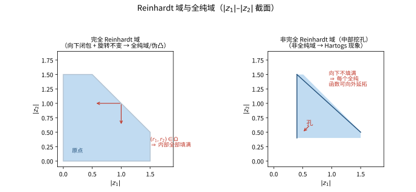
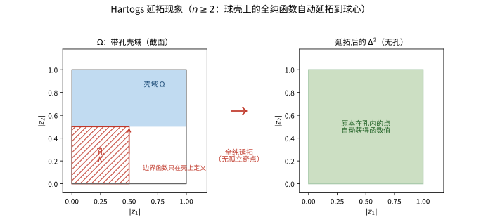

# 第 31 级：多元复分析 (Several Complex Variables)

> 多元复分析是单复变函数论在高维复空间 $\mathbb{C}^n$ 中的自然推广。与单复变不同，多元全纯函数展现出许多全新的现象——Hartogs 延拓现象、全纯域与伪凸性、Oka-Cartan 理论等——这些深刻改变了人们对解析函数的理解，并成为现代复几何与代数几何的基石。

---

## 1. 学习目标

1. 理解多元全纯函数的定义与基本性质，掌握 Wirtinger 偏微分算子与多变量的 Cauchy-Riemann 方程组。
2. 掌握 $\mathbb{C}^n$ 中幂级数的收敛理论，理解 Reinhardt 域与全纯域的概念。
3. 深入理解 Hartogs 延拓定理及其带来的根本性变化——Hartogs 现象，理解为何多复变中不存在孤立奇点。
4. 掌握 Oka 引理的内容与意义，了解 Cartan 定理 A 和 B 的陈述及其在层论框架下的应用。
5. 理解复流形、Stein 流形、Kähler 流形与射影代数簇的基本概念及其相互关系。
6. 通过典型例题掌握基本计算方法，培养多复变视角下的几何直观。

---

## 2. 多复变函数

> **🧭 来龙去脉（历史背景与动机）**：本节的土壤是 19 世纪末单复变严格化的浪潮。Cauchy、Riemann、Weierstrass 已把一个复变量函数的体系建得近乎完备——幂级数、Cauchy 积分、共形映射应有尽有。到了 1890 年代，Poincaré、Cousin、Hartogs 等人自然发问：把"复可微"推广到 $\mathbb{C}^n$，会得到怎样一番景象？
>
> 转折点是 **Poincaré（1907）** 的一个惊人结果：$\mathbb{C}^2$ 中的 **球** 与 **双圆柱** 虽同维、又处处局部全纯等价，却 **不存在** 把其一送到其二的全局双全纯映射（即全纯意义下的双全纯等价）。这相当反直觉——单复变里同维数连通开区域总能共形映射（Riemann 映射定理），这一难得的变通性一上到多复变就被摧毁。它宣告：**多复变不是单复变的逐维复制，而是一门自带刚性的几何科学**。
>
> 本节先夯实最基础的话语权：什么是多元全纯函数、怎样用 Cauchy-Riemann 方程组与 Wirtinger 算子刻画它。学完本节能回答一个关键问题：**为什么多元全纯函数"既多又少"——整体上比光滑函数刚硬得多（处处幂级数），想找到能区分它们的不变量却往往十分困难**。

### 2.1 $\mathbb{C}^n$ 中的全纯函数

**定义 2.1**（$\mathbb{C}^n$ 中的全纯函数）设 $\Omega \subseteq \mathbb{C}^n$ 是开集，函数 $f: \Omega \to \mathbb{C}$ 称为 **全纯函数**（holomorphic function），若 $f$ 在 $\Omega$ 中是复可微的，即对每一点 $z^0 \in \Omega$，存在一个 $\mathbb{C}$-线性映射 $L: \mathbb{C}^n \to \mathbb{C}$，使得

$$
f(z) = f(z^0) + L(z - z^0) + o(|z - z^0|), \quad z \to z^0.
$$

这个线性映射 $L$ 称为 $f$ 在 $z^0$ 处的 **全纯导数**（或复导数），记作 $Df(z^0)$ 或 $f'(z^0)$。

等价地，$f$ 是全纯函数当且仅当 $f$ 关于每个变量 $z_j$ 单独全纯（即 **部分全纯**），且 $f$ 是连续的（或局部有界的）。这一等价性是 Hartogs 定理的内容。

> **💡 直观理解（类比）**：全纯函数就是"在一点的近旁能用复线性映射（由一个复数做旋转+缩放）去近似"的函数，好比放大镜下一片光滑表面的局部总可当成平面。真正的门槛是这局部近似必须由"复数乘法"给出，而不能是普通的伸缩——复数乘法既缩放又旋转，所以全纯函数处处保角、把微小的圆仍映成圆。相比一般光滑函数，全纯函数是"形状被锁死的规整曲线"，这也是它异常刚强（处处可展成幂级数）的根源。

**定理 2.2**（Hartogs 基本定理）设 $f: \Omega \to \mathbb{C}$ 是定义在开集 $\Omega \subseteq \mathbb{C}^n$ 上的函数。若 $f$ 关于每个变量 $z_j$（固定其他变量）全纯，则 $f$ 在 $\Omega$ 上全纯。

这个定理表明，多元全纯函数可以等价地定义为：在每个坐标方向上分别全纯的函数。这一性质在单复变中不成立（因为单变量全纯性自动蕴含），但它是多复变函数论的基本出发点。

> **💡 直观理解（类比）**：Hartogs 基本定理像一位厨师在检验一块多层蛋糕：只要沿每一刀（固定其他变量、只留一个变量）切下去都"全纯合格"，再辅以连续性，一整块蛋糕就自动合格。换句话说，多复变的"整体合格"可以拆成"逐坐标切口合格"来检查，把高维问题降回到一维去验证，这是多复变研究一切的基础抓手。

### 2.2 Cauchy-Riemann 方程组与 Wirtinger 导数

在 $\mathbb{C}^n$ 中，记坐标 $z_j = x_j + iy_j$，$j = 1, \ldots, n$。引入 **Wirtinger 导数**：

$$
\frac{\partial}{\partial z_j} = \frac{1}{2}\left(\frac{\partial}{\partial x_j} - i\frac{\partial}{\partial y_j}\right), \qquad
\frac{\partial}{\partial \bar{z}_j} = \frac{1}{2}\left(\frac{\partial}{\partial x_j} + i\frac{\partial}{\partial y_j}\right).
$$

> **💡 直观理解（类比）**：Wirtinger 算子 $\partial_{\bar z_j}$ 是一把"专门探测共轭成分的探针"：把它作用在某个函数上，结果非零就说明该函数真的依赖 $\bar z_j$，而不是一个纯复的函数。这像用紫外线检查现金里是否藏有荧光杂质——$\partial_{\bar z_j}=0$ 就是"这笔现金纯净、不含共轭杂质"的检验标准，也是全纯的试金石。

**定理 2.3**（多变量的 Cauchy-Riemann 方程组）设 $f \in C^1(\Omega)$，则 $f$ 是全纯的当且仅当对每个 $j = 1, \ldots, n$，

$$
\frac{\partial f}{\partial \bar{z}_j} = 0 \quad \text{在 } \Omega \text{ 上}.
$$

这组方程称为 **Cauchy-Riemann 方程组**。在 $\mathbb{C}^n$ 中，共有 $n$ 个一阶偏微分方程，而非单复变中的一个方程。

> **💡 直观理解（类比）**：多变量 Cauchy-Riemann 方程组就是把"是全纯的"这一条体检标准，在每个坐标方向上各检查一遍：单复变只查一科（$n=1$），多复变要同时 $n$ 科都亮绿灯才算合格。任何一科不及格（某 $\partial_{\bar z_j}f\ne0$），整张成绩单就作废。这正呼应单复变"一个方程"与多复变"一组方程"的维度差异。

**注记 2.4** 引入 Wirtinger 算子后，可以将 $f$ 的全微分分解为 $(1,0)$-部分和 $(0,1)$-部分：

$$
df = \partial f + \bar{\partial} f,
$$

其中

$$
\partial f = \sum_{j=1}^n \frac{\partial f}{\partial z_j} dz_j, \qquad
\bar{\partial} f = \sum_{j=1}^n \frac{\partial f}{\partial \bar{z}_j} d\bar{z}_j.
$$

全纯条件 $\bar{\partial} f = 0$ 等价于 $df = \partial f$，即 $f$ 的微分只包含 $(1,0)$-部分。

> **💡 直观理解（类比）**：把函数的微分 $df$ 拆成前进波 $\partial f$ 与后退波 $\bar\partial f$ 两股，全纯就等价于"只有前进波、没有后退波"（$\bar\partial f=0$）。这好比播音时只按正向放送、不漏回音：一旦回音（$\bar\partial$ 分量）出现，信号就不"纯"了。这种拆分让微分与积分"正逆对应"，搭起了一套整齐的计算框架，是 $\bar\partial$-方法的起点。

### 2.3 基本性质

**性质 2.5**（多元全纯函数的基本性质）

1. **Cauchy 积分公式**：若 $f$ 在闭多圆柱 $\overline{\Delta}(z^0, r)$ 上全纯，则

   $$
   f(z) = \frac{1}{(2\pi i)^n} \int_{|\zeta_1 - z_1^0| = r_1} \cdots \int_{|\zeta_n - z_n^0| = r_n} \frac{f(\zeta)}{(\zeta_1 - z_1) \cdots (\zeta_n - z_n)} d\zeta_1 \cdots d\zeta_n.
   $$

2. **无穷可微性**：全纯函数是 $C^\infty$ 的，且所有偏导数仍全纯。

3. **最大模原理**：若 $\Omega \subseteq \mathbb{C}^n$ 是连通区域，$f$ 在 $\Omega$ 上全纯，且 $|f|$ 在 $\Omega$ 内某点达到局部最大值，则 $f$ 是常数。

4. **唯一性定理**（弱形式）：若 $f, g$ 在连通区域 $\Omega$ 上全纯，且 $f = g$ 在 $\Omega$ 的某个非空开子集上成立，则 $f \equiv g$ 在 $\Omega$ 上。

> **💡 直观理解（类比）**：这四条性质合起来说明多元全纯函数"处处都像单变量全纯函数一样规整"：可无穷次求导、处处可积分重现（Cauchy 积分公式）、满足最大模原理与唯一性。把全纯函数想象成一张绷紧的弹性膜：只要在任意一小片（非空开集）上把形状"锁定"，整张膜的形态就被唯一决定；也因其太高阶可导，一切局部性质都能向全局传播。

---

## 3. 幂级数与全纯域

> **🧭 来龙去脉（历史背景与动机）**：第 2 节确立了"多元全纯"的局部理论基石后，一个更宏大的问题浮现：**在一整块区域上，一个全纯函数到底能活多广？** 这直接通向多复变最核心的难题——**自然定义域** 之问。
>
> 事件顺序大致是：**Hartogs（1906）** 首先发现奇特的"自动延拓"现象（详见第 4 节），让人觉察到 $\mathbb{C}^n$ 里并非每块区域都配得上当全纯函数的"家"；**Reinhardt** 提供了一整族旋转对称的例子（Reinhardt 域），让"幂级数的收敛域究竟什么形状"有了确切答案；直到 **Cartan–Thullen（1932）** 才把"自然定义域"抽象成 **全纯域**（domain of holomorphy），并证明它恰好等价于 **全纯凸性**。
>
> 本节回答的核心问题是：**什么样的区域才能作为全纯函数的"终极领地"？为何单复变里所有区域都合格、多复变里却只有伪凸的一类才合格？** 从这里将长出一连串深刻结果（Levi 问题、Oka–Cartan 理论、Stein 流形）。

### 3.1 $\mathbb{C}^n$ 中的幂级数

**定义 3.1**（$\mathbb{C}^n$ 中的形式幂级数）一个中心在 $a \in \mathbb{C}^n$ 的 **形式幂级数** 是形如

$$
\sum_{\alpha \in \mathbb{N}_0^n} c_\alpha (z - a)^\alpha
$$

的级数，其中 $\alpha = (\alpha_1, \ldots, \alpha_n)$ 是多重指标，$(z - a)^\alpha = (z_1 - a_1)^{\alpha_1} \cdots (z_n - a_n)^{\alpha_n}$，$c_\alpha \in \mathbb{C}$。

> **💡 直观理解（类比）**：多重指标幂级数就像一幅无限维的"配方表"：每一项是若干份 $z_1$、若干份 $z_2$ 相乘（由多重指标 $\alpha$ 记录每种佐料的用量），系数 $c_\alpha$ 写在对应格子里。它把一元幂级数 $\sum c_k z^k$ 中"一个指数 $k$"换成"一串指数 $(\alpha_1,\dots,\alpha_n)$"，从而一张张多维账本拼出整个函数。

**定义 3.2**（收敛域）幂级数 $\sum_\alpha c_\alpha z^\alpha$ 的 **收敛域**（domain of convergence）是所有使得级数绝对收敛的点 $z \in \mathbb{C}^n$ 的集合的内部。

> **💡 直观理解（类比）**：收敛域就是"这堆无穷项还加得动"的点的全体（再取内部，排除边界上模棱两可的情况）。类比为一个包裹寄送范围：只有每个分量的"坐标距离"都落在允许半径内（同级数每一项足够小），这满满一车厢的项才会收敛；一旦某个坐标超出范围，某一项就会炸开，整级数就发散。

**定理 3.3**（Abel 引理）若幂级数在点 $z^0$ 处绝对收敛，则它在多圆柱 $\Delta(0, |z^0|)$（即 $|z_j| < |z_j^0|$ 对每个 $j$）上绝对且内闭一致收敛。

由此可知，幂级数的收敛域是 **完全 Reinhardt 域**（见下文）。

> **💡 直观理解（类比）**：Abel 引理说的是：幂级数在某个点绝对收敛，那么整个"到原点更近的多圆柱"里也绝对收敛（而且内闭一致收敛，即在每个紧子块上都整整齐齐地收）。直观如收音：只要某个偏僻角落能收到清晰信号，那么从这个角落望回发射塔之间的一整片扇形区域都收得清清楚楚——收敛性会在多复变的"距离意义"下自动向内传播。

**定理 3.4**（多元 Taylor 展开）设 $f$ 在开集 $\Omega \subseteq \mathbb{C}^n$ 上全纯，则 $f$ 在每点 $a \in \Omega$ 附近可展开为收敛的 Taylor 级数：

$$
f(z) = \sum_{\alpha \in \mathbb{N}_0^n} \frac{1}{\alpha!} \frac{\partial^{|\alpha|} f}{\partial z^\alpha}(a) \, (z - a)^\alpha,
$$

其中 $\alpha! = \alpha_1! \cdots \alpha_n!$，$|\alpha| = \alpha_1 + \cdots + \alpha_n$。

> **💡 直观理解（类比）**：多元 Taylor 展开把单变量的牛顿–Taylor 思想搬到高维：任何全纯函数在每点附近都能展成由各阶混合偏导编码的多坐标多项式 $(z-a)^\alpha$。类比用"无穷多根不同频率的琴弦叠加"去精确复现乐音——每一项对应一个方向的"音色分量"，系数就是该方向的振幅；它保证了全纯函数处处"幂级数化"，是多复变计算与证明的浏览器入口。

### 3.2 Reinhardt 域

**定义 3.5**（Reinhardt 域）开集 $\Omega \subseteq \mathbb{C}^n$ 称为 **Reinhardt 域**（Reinhardt domain），若对任意点 $z = (z_1, \ldots, z_n) \in \Omega$ 和任意 $\theta_j \in \mathbb{R}$，点 $(e^{i\theta_1}z_1, \ldots, e^{i\theta_n}z_n)$ 也属于 $\Omega$。即 $\Omega$ 在旋转 $S^1 \times \cdots \times S^1$ 作用下不变。

**定义 3.6**（完全 Reinhardt 域）Reinhardt 域 $\Omega$ 称为 **完全的**（complete），若对任意 $z \in \Omega$，所有满足 $|w_j| \leq |z_j|$（$j = 1, \ldots, n$）的点 $w$ 也属于 $\Omega$。

**关键事实**：幂级数的收敛域一定是完全 Reinhardt 域。反之，对任意完全 Reinhardt 域 $\Omega$，存在以 $0$ 为中心的幂级数以 $\Omega$ 为收敛域。

### 3.3 全纯域

在单复变中，给定 $\mathbb{C}$ 中任意区域 $\Omega$，总存在 $\Omega$ 上的全纯函数不能解析延拓到更大的区域（例如，$\Omega$ 的边界点处的奇点函数 $1/(z - a)$ 就是这样的函数）。因此，$\mathbb{C}$ 中每个区域都是全纯函数的"自然定义域"。

但在多复变中，情况完全不同！

**定义 3.7**（全纯域）设 $\Omega \subseteq \mathbb{C}^n$ 是开集（或更一般地，$\mathbb{C}^n$ 上的 Riemann 区域）。称 $\Omega$ 为 **全纯域**（domain of holomorphy），若不存在非空开集 $\Omega_1, \Omega_2$ 满足：

- $\varnothing \neq \Omega_1 \subset \Omega \cap \Omega_2$，
- $\Omega_2$ 是连通的且 $\Omega_2 \not\subseteq \Omega$，
- 对每个在 $\Omega$ 上全纯的函数 $f$，存在 $\Omega_2$ 上的全纯函数 $\tilde{f}$ 满足 $\tilde{f}|_{\Omega_1} = f|_{\Omega_1}$。

直观地说，$\Omega$ 是全纯域当且仅当存在 $\Omega$ 上的全纯函数不能解析延拓到任何更大的区域。

> **💡 直观理解（类比）**：全纯域就是函数的"极限领地"——已经大到没有任何一个全纯函数能偷偷延伸到更大的交界地带去。这像站在山顶：往任何方向再迈一步就会踏空（无处可延），说明山顶（自然定义域）就在脚下。单复变里任意一块区域都天然是"山顶"（靠 $1/(z-a)$ 这类函数在边界设卡拦路）；而多复变里只有少数形状"正"的区域才配得上这个头衔，很多区域都会被自动延拓的浪潮冲垮。

**定理 3.8** 全纯域与 **全纯凸性**（holomorphic convexity）等价：$\Omega$ 是全纯域当且仅当对每个紧集 $K \subset \Omega$，其全纯凸包

$$
\hat{K}_{\mathcal{O}(\Omega)} = \left\{ z \in \Omega \;\Big|\; |f(z)| \leq \sup_{w \in K} |f(w)|,\; \forall f \in \mathcal{O}(\Omega) \right\}
$$

在 $\Omega$ 中也是紧的。

> **💡 直观理解（类比）**：全纯凸性的"凸包"$\hat K$ 是用所有全纯函数的取值范围给紧集 $K$ 罩一层"函数值泡泡"：凡被任何全纯函数都压得住（不超过 $K$ 上最大模）的点都可入包。要求这层泡泡仍稳稳缩在 $\Omega$ 里（保持紧），好比要求充气的气泡不会胀破容器。这恰好是"能在此设卡、阻住延拓"的标志，故全纯凸 $\iff$ 全纯域。

**例 3.9**
- $\mathbb{C}^n$ 中的凸域都是全纯域。
- 多圆柱 $\Delta^n(0, r) = \{z \in \mathbb{C}^n \mid |z_j| < r_j,\; j = 1, \ldots, n\}$ 是全纯域。
- 球 $B_n(0, R) = \{z \in \mathbb{C}^n \mid |z_1|^2 + \cdots + |z_n|^2 < R^2\}$ 是全纯域。
- 并非所有域都是全纯域——Hartogs 现象说明了这一点。

> **直观理解（现实类比）**：Reinhardt 域像一块旋转对称的三明治——绕原点转任意角度形状都不变。完全 Reinhardt 域又要求"从外往里填满"：只要任一点在域内，离原点更近的所有点也都在域内，就像一块完整蛋糕，切掉中间任何一块都会"漏馅"。只有这种向下闭包的域才是全纯域（伪凸）；中部被掏空（像甜甜圈）的域不是全纯域，其上的全纯函数会被自动填满。

### 3.4 拟凸性与 Levi 形式（新增）

> **💡 直观理解（类比）**：若把域比作一只碗，**拟凸性** 就是"碗口没有内凹"——在任意内缩的碗沿内壁上，碗底到碗沿的"深度"都只增不减。**Levi 形式** 正是量化"碗沿在复方向上是否内凹"的二次型，它在全纯理论里扮演的角色，等同于"二阶导的符号"在单变量凸性里扮演的角色。

全纯域的定义（3.3 节）是"几何存在性"的，并不直观可验。为了让"自然定义域"变得可计算，**E. E. Levi（1911）** 提出了一个微分几何版本的类比：

**定义 3.10**（拟凸域，pseudoconvex domain，新增）设 $\Omega \Subset \mathbb{C}^n$ 是有界区域，其边界 $C^2$，且存在定义在 $\Omega$ 之邻域 $U$ 上的 $C^2$ 实值定义函数 $r$，使得 $\Omega = \{ r < 0 \}$ 且 $\nabla r \neq 0$ 于 $\partial\Omega$ 上。称 $\Omega$ 为 **拟凸域**，若对每点 $p \in \partial\Omega$ 及每个满足
$$
\sum_{j=1}^{n} L_j \frac{\partial r}{\partial z_j}(p) = 0
$$
的复向量 $L = (L_1, \ldots, L_n)$（即切于 $\partial\Omega$ 的 $(1,0)$ 方向），其 **Levi 形式** 非负：
$$
\sum_{j,k=1}^{n} \frac{\partial^2 r}{\partial z_j \partial \bar{z}_k}(p)\, L_j \overline{L_k} \geq 0 .
$$

**定义 3.11**（Levi 形式，新增）对上述定义函数 $r$，称二次型
$$
\mathcal{L}_p(\Omega; L) := \sum_{j,k=1}^{n} \frac{\partial^2 r}{\partial z_j \partial \bar{z}_k}(p)\, L_j \overline{L_k}
$$
为 $\Omega$ 在 $p$ 处的 **Levi 形式**。若对非零复切向 $L$ 恒有 $\mathcal{L}_p > 0$，则称 $\Omega$ 在 $p$ 处 **严格拟凸**（strictly pseudoconvex）。

> **💡 直观理解（类比）**：定义函数 $r$ 好比一片"海平面以上"的等高线（$r<0$ 是水下、$r=0$ 是海岸线）。Levi 形式 $\sum r_{j\bar{k}} L_j \bar L_k$ 度量的是：**沿着海岸线的一条复切方向 $L$ 推进一步，水面是向上弯（正值 = 外凸）还是向下弯（负值 = 内凹）**。处处非负，说明海岸线在复方向上不向内凹陷——这正是全纯函数能"自由延拓"的边界几何标志。

**定理 3.12**（Levi，1911，Levi 问题的半边，新增）$\mathbb{C}^n$ 中每个全纯域都是拟凸域。

> **🧭 思考历程：全纯域（存在性）与拟凸性（可算性）为何天然同轨？**
>
> Levi 本人只证明了"全纯域 $\implies$ 拟凸"这一半，而且是 $C^2$ 边界情形。真正的疑团是 **反向**（Levi 问题）：**拟凸 $\implies$ 全纯域？** 这本想当然的问题，竟耗去数学界四十余年——Oka（1953，$\mathbb{C}^2$）、Norguet 与 Bremermann（1954，一般 $\mathbb{C}^n$）、Grauert（1958，复流形上的 Levi 问题）依次补齐。它之所以著名，正因"局部可验的凸性"与"全局无可延拓"之间隔着一条深不见底的鸿沟，而最终又是靠 Oka–Cartan 的层论方法来打通的（见第 5 节）。

**例 3.13**（新增）
- **多圆柱** $\Delta^n(0,r)$ 是拟凸（取定义函数 $r=\max_j |z_j|^2-r_j^2$ 后磨光），且是全纯域。
- **单位球** $B_n$ 是严格拟凸（取 $r(z)=|z|^2-1$，Levi 形式 $\mathcal{L}=\sum_j |L_j|^2$ 正定），是全纯域。
- **中空球壳**（如例 3.9 的挖核 Reinhardt 域）在边界 $|z_1|=|z_2|=1/2$ 处的 Levi 形式取负值，故非拟凸、也非全纯域——这与 Hartogs 现象（第 4 节）恰好吻合。

### 3.5 配套习题与答案（新增）

**配套 3-A（新增）** 写出单位球 $B_n=\{z: |z|^2<1\}$ 关于定义函数 $r(z)=|z|^2-1$ 在 $p\in\partial B_n$ 处沿复切向 $L$ 的 Levi 形式，并验证其为严格正定的。

**配套 3-B（新增）** 说明多圆柱 $\Delta^2=\{ |z_1|<1, |z_2|<1\}$ 为何是拟凸域（用定义函数 $r=\max\{ |z_1|^2-1,\, |z_2|^2-1\}$ 磨光后 $C^2$）。

> **配套 3-A 答案（新增）** 在边界 $|p|^2=1$ 上，$L$ 切于 $\partial B_n$ 当且仅当 $\operatorname{Re}\langle L, p\rangle=0$。因 $r(z)=|z|^2-1$，有 $r_{j\bar{k}}=\delta_{jk}$，故 Levi 形式 $=$ $\sum_j |L_j|^2 = |L|^2$，对非零 $L$ 恒为正——**严格拟凸**。

> **配套 3-B 答案（新增）** 对每个分支 $|z_j|^2-1$，其 $r_{j\bar{k}}=\delta_{jk}$，故沿任何复切向 $L$ 有 Levi 形式 $\ge \sum_j |L_j|^2 \ge 0$。故 $\Delta^2$ 拟凸（且由例 3.13 知它是全纯域）。

---

## 4. Hartogs 现象

> **🧭 来龙去脉（历史背景与动机）**：Hartogs 现象是多元复分析在 20 世纪初投下的第一枚"深水炸弹"。1906 年，德国数学家 **Friedrich Hartogs** 在他那篇里程碑式论文 *Zur Theorie der analytischen Funktionen mehrerer komplexer Veränderlichen* 中展示了 $\mathbb{C}^n$（$n\ge2$）里的一个反常现象：定义在一块"带孔壳"上的全纯函数，竟会 **自动延拓** 穿越孔洞补满整个大域。这在单复变的环域理论里根本不可能。
>
> Hartogs 的发现迫使数学家重新审视"解析函数的定义域"这一根本概念：**究竟怎样的区域才算"自然"？** 正是对这个问题的持续追问，引领出全纯域、伪凸性、Oka 理论这一整条现代脉络（见第 3、5 节）。本节紧贴 1906 年的原始思想，解剖 Hartogs 现象本身。

### 4.1 Hartogs 延拓定理

**定理 4.1**（Hartogs 延拓定理，1906）设 $\Omega \subset \mathbb{C}^n$（$n \geq 2$）是开集，$K \subset \Omega$ 是紧子集，且 $\Omega \setminus K$ 是连通的。则限制映射

$$
\mathcal{O}(\Omega) \longrightarrow \mathcal{O}(\Omega \setminus K)
$$

是 **满射**。换言之，每个在 $\Omega \setminus K$ 上定义的全纯函数都可以唯一地延拓为 $\Omega$ 上的全纯函数。

**推论 4.2**（孤立奇点可去）当 $n \geq 2$ 时，全纯函数不存在孤立奇点。若 $f$ 在 $\Omega \setminus \{a\}$ 上全纯，则 $f$ 可延拓为 $\Omega$ 上的全纯函数。

这与单复变形成鲜明对比：在 $\mathbb{C}$ 中，函数 $1/z$ 在原点处有不可去奇点。

> **💡 直观理解（类比）**：推论 4.2 是多复变与单复变最触目的分水岭：当 $n\ge2$ 时，全纯函数没有孤立奇点——任何被挖掉的"单个尖点"都会被自动填平。类比橡皮泥或热汤：在二维以上的世界里，只要没掏出一个完整的孔洞（余维 $1$ 的超曲面），一个孤零零的点坑会被材料自己抹平，根本留不下"尖刺"。这正是单复变里 $1/z$ 在原点能立住、多复变里却立不住的原因。

**例 4.3**（具体例子）考虑

$$
\Omega = \{(z_1, z_2) \in \mathbb{C}^2 \mid |z_1| < 1,\; |z_2| < 1\} \setminus \{(z_1, z_2) \mid |z_1| \leq 1/2,\; |z_2| \leq 1/2\}.
$$

则 $\Omega$ 上的每个全纯函数都可以延拓到整个双圆柱 $|z_1| < 1,\; |z_2| < 1$ 上。

**证明思路**（特殊情况）：设 $f$ 在

$$
\Omega = \{(z_1, z_2) \in \mathbb{C}^2 \mid 1/2 < |z_1| < 1,\; |z_2| < 1\} \cup \{(z_1, z_2) \mid |z_1| < 1,\; 1/2 < |z_2| < 1\}
$$

上全纯。对固定的 $z_1$，将 $f(z_1, z_2)$ 展开为 $z_2$ 的 Laurent 级数。当 $|z_1| > 1/2$ 时，级数中不出现负幂项。由连续性，对 $|z_1| < 1/2$ 也不出现负幂项，因此 $f$ 可延拓到整个双圆柱上。

> **直观理解（现实类比）**：就像一锅热汤，只要汤的表面（壳域 $\Omega$）处处光滑连续，即使锅底中央有个勺子搅出来的空洞，热汤也会自动把空洞填满。在多复变（$n\ge 2$）中全纯函数"怕洞"：壳域上定义的每个全纯函数都会被自动延拓进孔内，因而不存在孤立奇点——这与单复变中 $1/z$ 在原点有不可去奇点截然不同。

### 4.2 Hartogs 现象的本质

**定义 4.4**（Hartogs 现象）存在 $\mathbb{C}^n$（$n \geq 2$）中的开集 $\Omega$，使得 $\Omega$ 不是全纯域——即 $\Omega$ 上的每个全纯函数都可以延拓到某个严格更大的区域 $\tilde{\Omega} \supsetneq \Omega$ 上。这一现象称为 **Hartogs 现象**（Hartogs phenomenon）。

Hartogs 现象的根源在于：当 $n \geq 2$ 时，全纯函数的零点集是 **解析超曲面**（余维数为 1 的解析集），而非孤立点。因此，类似于 $1/z$ 这样的函数在 $\mathbb{C}^n$（$n \geq 2$）中无法定义——它的奇点集 $\{z_1 = 0\}$ 是超曲面，而非孤立点。

> **🧠 思考历程：单复变里"可去奇点"很难得，怎么一到多复变竟"遍地都是"？**
>
> 两个复变量给全纯函数带来了单复变做梦也想不到的事：**"壳域上的全纯函数会自动填满洞"（Hartogs 延拓）**。这对"奇点非去不可"的老直觉是一记重锤。
>
> - **单复变的出发点不同**。在 $\mathbb{C}$ 里，$1/z$ 在原点有一个孤立奇点，你没法绕过它。**因为原点只是一个点，"绕一圈"的路径总能避开它，而函数在环域上又跑不到洞里去。** 于是孤立奇点自然存在。
> - **到了 $\mathbb{C}^2$，奇点不再"孤立"**。当变量变成 $(z_1,z_2)$ 时，单复变那种"点"式奇点几乎无处安放：**奇点集通常长成一条超曲面（如 $z_1=0$），而"绕开一个洞"变得不可能**。正如热汤会自动填孔，壳域上的每个全纯函数都会被延拓进洞——这就是 Hartogs 延拓。
> - **根源：零点成群、余维只有 1**。正如定义 4.4 所述：$n\ge2$ 时每一全纯函数的零点集余维数为 1。于是"函数在某条超曲面上为零"完全推不出"它恒为零"——**恒等定理（4.5）随之失效，而这恰恰是多复变的全新性格**。
> - **为什么是"Hartogs 现象"警示分界**。Hartogs 1906 年前后发表的这类例子，让数学家醒悟：**多复变不是"把单复变照搬上去"，而是另一片有自己深层现象的天地**。它最终通向全纯域、Oka 理论、Stein 流形与 Kähler 几何那一大串现代复分析的高塔。
> - **心路**：多复变的 Hartogs 现象提醒你：**当维度变高，一些"常识"会整体翻转——以为的"特例"反而成了常态**。很多时候，不是"高维 = 低维逐个拼起来"，而是高维藏着颠覆旧直觉的深层结构。

### 4.3 恒等定理的失效

**定理 4.5**（多复变中恒等定理的失效）在 $\mathbb{C}^n$（$n \geq 2$）中，存在非平凡的全纯函数在某个非空开集上为零，但函数本身不恒为零。

**例 4.6** 考虑函数 $f(z_1, z_2) = z_1$。$f$ 在集合 $\{z_1 = 0\}$ 上为零，该集合是 $\mathbb{C}^2$ 中的超曲面（余维 1），其内部非空。但 $f$ 不是恒为零的函数。

这意味着：多复变中，全纯函数由其在某个开集上的值唯一确定——但仅当该开集是 $\mathbb{C}^n$ 中的 **真正开集**（即 $\mathbb{R}^{2n}$ 中的开集）时才成立。如果函数在某个低维子流形（如实超曲面）上为零，不足以推出函数恒为零。

> **💡 直观理解（类比）**：多复变里"在低维集合上为零"并不能说明函数恒为零。类比在一块实心面团上，只要给定一条细线（低维集合）上的属性，就能造出无数种面团；唯有函数在一整块实心厚片（真正开集）上归零，才能锁定它就是零函数。用数学话说：零点集须是余维 $\le 1$ 以内的"实心体"，而像 $z_1=0$ 这样的超曲面口径太窄，不够"一锤定音"。

---

## 5. Oka 引理与 Cartan 定理

> **🧭 来龙去脉（历史背景与动机）**：从第 3 节的全纯域到本节的层论，目光从"点集定义域"上升到"函数所依附的代数结构"。1930—1950 年代，日本数学家 **岡潔（Kiyoshi Oka）** 一连解决了几桩单复变无法想象的难题：Cousin 问题、$\mathbb{C}^n$ 上的 Levi 问题，并提炼出后世所称的 **Oka 原理**（Oka's principle）——"全纯的环境里，在拓扑层上能办到的事，在解析层上也往往能办到"。这一发现让分析问题第一次被译成拓扑语言。
>
> 法国数学家 **Henri Cartan（1904—2008）** 随即用 **层论**（sheaf theory）把 Oka 的思想系统化，在 1950 年代证明了著名的 **定理 A 与定理 B**：在 Stein 流形上，所有相干层的高阶上同调群消失。其动机非常集中——**把"局部解如何严丝合缝地粘成整体解"这一解析难题，化约为拓扑上同调的消失**，而后者要干净得多。
>
> 本节的核心悬念：为什么一座看似"技术性"的屋子（Oka 引理：全纯函数层相干）能成为整座大厦的承重墙？答案在于与之配套的两个工具——**Weierstrass 预备定理**（把任意全纯函数"归约"成多项式，见 §5.5）与 **Hilbert 基定理**（保证关系有限生成）。

### 5.1 层与相干层

**定义 5.1**（层）设 $X$ 是拓扑空间。$X$ 上的 **层**（sheaf）$\mathcal{F}$ 由以下数据构成：

- 对每个开集 $U \subseteq X$，有一个 Abel 群（或环、模）$\mathcal{F}(U)$；
- 对每对开集 $V \subseteq U$，有一个限制映射 $\rho^U_V: \mathcal{F}(U) \to \mathcal{F}(V)$，满足：
  - $\rho^U_U = \text{id}$；
  - 若 $W \subseteq V \subseteq U$，则 $\rho^U_W = \rho^V_W \circ \rho^U_V$；
  - 对开覆盖 $\{U_i\}$ 和 $s \in \mathcal{F}(U)$，若 $\rho^U_{U_i}(s) = 0$ 对所有 $i$ 成立，则 $s = 0$；
  - 若 $s_i \in \mathcal{F}(U_i)$ 满足 $\rho^{U_i}_{U_i \cap U_j}(s_i) = \rho^{U_j}_{U_i \cap U_j}(s_j)$，则存在 $s \in \mathcal{F}(\bigcup U_i)$ 使得 $\rho^U_{U_i}(s) = s_i$。

最重要的例子是 **全纯函数层** $\mathcal{O}_X$：对开集 $U \subseteq X$，$\mathcal{O}_X(U)$ 是 $U$ 上全纯函数的全体。

> **💡 直观理解（类比）**：层可理解为"把局部数据整齐叠放、并规定如何限制与拼接"的组织方式：每个开集都挂一份数据（如 $U$ 上的全纯函数），开集变小数据就"限制"出子集上的对应函数；而各局部数据只要在重叠处一致，就能粘成整个开集上的数据。这像一本拼接地图册：每页（开集）都标着对应区域的地形，翻到接缝处必须纹丝合缝，才能拼出完整、无矛盾的大地图。

**定义 5.2**（相干层）设 $\mathcal{F}$ 是复流形 $X$ 上的 $\mathcal{O}_X$-模层。称 $\mathcal{F}$ 为 **相干层**（coherent sheaf），若：

- $\mathcal{F}$ 是 **有限型**（locally finitely generated）的：每点 $x \in X$ 有邻域 $U$ 和正合列 $\mathcal{O}_U^p \to \mathcal{F}|_U \to 0$；
- 对任意开集 $U$ 和任意同态 $\varphi: \mathcal{O}_U^q \to \mathcal{F}|_U$，$\ker \varphi$ 是有限型的。

> **💡 直观理解（类比）**：相干层说的是：局部数据既"够生成"又"够规整"。类比一台机器：只需有限多个零件（生成元）就能装出整台机器，而且零件之间怎么咬合、有哪些约束关系（关系式）也能清清楚楚列成有限几条。正因为万事都"有限可列"，我们才能在层上做检查、算上同调——它是可计算、可管理性的前提。

**例 5.3**
- 全纯函数层 $\mathcal{O}_X$ 是相干层（Oka 定理）。
- 全纯切丛的截面层是相干层。
- 理想层 $\mathcal{I}_V$（定义在解析子簇 $V$ 上为零的全纯函数）是相干层。

### 5.2 Oka 引理

**定理 5.4**（Oka 引理，Oka's Lemma）设 $\Omega \subseteq \mathbb{C}^n$ 是全纯域，$\mathcal{O}_\Omega$ 是 $\Omega$ 上的全纯函数层。则 $\mathcal{O}_\Omega$ 是 **相干层**。

更一般地，Oka 证明了：全纯函数层 $\mathcal{O}_{\mathbb{C}^n}$ 是相干层。这一结果看似技术性，但它奠定了多复变中整个层论方法的基础。

Oka 引理的证明依赖于 Weierstrass 预备定理和 Hilbert 基定理，通过局部构造有限生成关系来证明相干性。

> **💡 直观理解（类比）**：Oka 引理断言"全纯函数的数据拥有有限可描述的规整结构"，把看似自由度无穷的 $\mathcal{O}_\Omega$ 简化成"有限生成、有限约束"的对象。这如同把一团乱麻用少数几个结固定住，乱麻一下子有了可把捉的骨架。它看似技术，实则是整个多复变层论方法得以诉诸计算、进而贯通到 Cartan 定理的承重墙。

### 5.3 Cartan 定理 A 和 B

**定理 5.5**（Cartan 定理 A）设 $X$ 是 Stein 流形（见第 6 节），$\mathcal{F}$ 是 $X$ 上的相干 $\mathcal{O}_X$-模层。则对每点 $x \in X$，$\mathcal{F}$ 的茎（stalk）$\mathcal{F}_x$ 由全局截面生成。即，映射

$$
\mathcal{F}(X) \longrightarrow \mathcal{F}_x
$$

是满射。

> **💡 直观理解（类比）**：Cartan 定理 A 说：在 Stein 流形（函数"粮草充足"的空间）上，任何一点附近的局部数据都能由"全局截面"拼出来——全局的料足够覆盖每一处局部需求。类比一艘自带的万能母舰：无论前方在哪一点需要什么零件，都能从全舰仓库调配得出来；局部总是"全局可供应"的。

**定理 5.6**（Cartan 定理 B）设 $X$ 是 Stein 流形，$\mathcal{F}$ 是 $X$ 上的相干 $\mathcal{O}_X$-模层。则对任意 $q \geq 1$，

$$
H^q(X, \mathcal{F}) = 0.
$$

即，$\mathcal{F}$ 的所有正阶 Čech 上同调群为零。

> **💡 直观理解（类比）**：Cartan 定理 B 宣称"没有全局接缝的死角"：所有高阶上同调群 $H^q$ 都为零，意思是任何局部一致的数据都能无缝粘成全局的整体，绝不会出现"接不拢"的障碍。类比把无数本地小图拼成大图时从不出错——无论拼图块怎么排列、重叠多少，角角落落总能严丝合缝对齐。这使 Stein 流形上的函数论问题"局部解总能合并为整体解"。

**注记 5.7** Cartan 定理 B 等价于说：对相干层 $\mathcal{F}$ 的正合序列

$$
0 \to \mathcal{F} \to \mathcal{G} \to \mathcal{H} \to 0,
$$

在 Stein 流形上，全局截面序列

$$
0 \to \mathcal{F}(X) \to \mathcal{G}(X) \to \mathcal{H}(X) \to 0
$$

也是正合的。这在很大程度上简化了 Stein 流形上的函数论问题。

### 5.4 应用：$\bar{\partial}$-问题的可解性

利用 Cartan 定理 B 可以证明 Dolbeault 上同调群在 Stein 流形上消失：

$$
H^{p,q}_{\bar{\partial}}(X) = 0, \quad q \geq 1,\; X \text{ 是 Stein 流形}.
$$

特别地，对 $\mathbb{C}^n$ 中的全纯域 $\Omega$，$\bar{\partial}$-方程总是可解的：对任意 $\bar{\partial}$-闭的 $(0,q)$-形式（$q \geq 1$），存在 $(0,q-1)$-形式 $\eta$ 使得 $\bar{\partial}\eta = \omega$。

### 5.5 Weierstrass 预备定理（新增）

> **💡 直观理解（类比）**：Weierstrass 预备定理是一把"局部代数化的手术刀"。它说的是：**任意一个在原点消失的全纯函数，抓准它所依赖最深的那个变量（正则变量），就一定能被改写成"一个以该变量为未知量的、系数仍全纯的首一多项式"**。好比一台复杂的机器，只要抓住主轴（正则变量 $z_n$），整台机器的行迹就能用"逐级递减的次幂 + 全纯系数"紧凑记录——多变量的无穷自由度，就此坍缩成一个"多项式"。

第 5.2 节提到，Oka 引理（$\mathcal{O}$ 相干）的证明依赖 **Weierstrass 预备定理** 与 Hilbert 基定理。这里把这个关键工具正式交代清楚。

**定理 5.8**（Weierstrass 预备定理，新增）设 $F(z_1,\ldots,z_n)$ 是原点邻域内的全纯函数，$F(0)=0$，且 $F$ 关于 $z_n$ **正则**（即存在 $\nu\ge1$，使 $F(0,\ldots,0,z_n)$ 在 $z_n=0$ 处有恰好 $\nu$ 阶零点）。则存在原点邻域内的全纯函数 $h$（$h(0)\ne0$）与 **Weierstrass 多项式**
$$
p(z', z_n) = z_n^{\nu} + a_1(z')\, z_n^{\nu-1} + \cdots + a_\nu(z'),\qquad z'=(z_1,\ldots,z_{n-1}),
$$
其中 $a_j$ 在原点邻域内全纯且 $a_j(0)=0$，使得在原点小邻域内
$$
F(z', z_n) = h(z', z_n)\cdot p(z', z_n)
$$
成立；且这样的分解在相差一个全纯单位的意义下唯一。

> **🧭 思考历程：为何要培养出这支"手术刀"？**
>
> 在单复变里，零点处函数总可写成 $z^k$ 乘单位（即按 $z$ 的幂次分离），全纯函数环于是从一个"多项式层"递推生成。多复变没有单一的自变量，但预备定理告诉我们：**只要锁定一个正则方向，一切零点结构都能"多项式化"**。于是原点的全纯函数芽环 $\mathcal{O}_n$ 就能被归约为"多项式延展"，从而能证明 $\mathcal{O}_n$ 是 Noether 环——这正是 Oka 引理（$\mathcal{O}$ 相干）、进而 Cartan 定理 A/B 得以成立的代数内核。

**例 5.9**（新增）取 $F(z_1,z_2)=z_1 + z_2^2$。因 $F(0,z_2)=z_2^2$ 在 $z_2=0$ 处有 $\nu=2$ 阶零点，$F$ 关于 $z_2$ 正则。取 $h=1$，$p(z_1,z_2)=z_2^2+z_1$（$a_1=0$，$a_2(z_1)=z_1$ 且 $a_2(0)=0$），则 $F=h\cdot p$。

**推论 5.10**（局部 Noether，新增）原点处全纯函数芽环 $\mathcal{O}_n$ 是 Noether 环；继而全纯函数层 $\mathcal{O}_{\mathbb{C}^n}$ 是相干层（这正是 Oka 引理的代数版本，见 §5.2）。

**配套 5-A（新增）** 将 $F(z_1,z_2)=z_2^2 + z_1^2 z_2 + z_1^3$ 在原点附近按预备定理写成 $F=h\cdot p$，指明 $\nu$、$a_1$、$a_2$。

> **配套 5-A 答案（新增）** $F(0,z_2)=z_2^2$，故 $\nu=2$。取 $h=1$，$p(z_2)=z_2^2 + z_1^2 z_2 + z_1^3$，即 $a_1(z_1)=z_1^2$，$a_2(z_1)=z_1^3$，二者在原点取零；$p$ 首项系数为 1，是 Weierstrass 多项式。

---

## 6. 复流形

> **🧭 来龙去脉（历史背景与动机）**：把 $\mathbb{C}^n$ 里总结的"局部全纯 + 全局拼贴"思想搬到任意拓扑空间，就有了 **复流形**。这一概念可上溯到 Riemann 面（Riemann，1851）与射影几何，而 **Hermann Weyl（1913）** 的著作 *Die Idee der Riemannschen Fläche* 第一次以"用坐标卡粘合"的现代方式奠定了流形思想。
>
> 本节的三大主角各有来历：**Stein 流形** 由 **Karl Stein（1951）** 提出，把第 3、5 节的全纯凸域观念抽象为"函数足够多"的复流形，并立即与 Cartan 的定理 A/B 水乳交融；**Kähler 度量** 源于 **Erich Kähler（1933）** 的论文 *Über eine bemerkenswerte Hermitesche Metrik*（发表于汉堡），他发现在复流形上把 Riemann 度量、复结构与辛结构三者统一起来的关键条件是 $d\omega=0$；**射影代数簇** 与 **Kodaira 嵌入定理（1954）** 则回答了"什么紧复流形能塞进复射影空间"。这一节回答的共同问题是：**局部全纯几何能多大程度上决定一个空间的整体地位（函数之多寡 / 几何之对称）？**

### 6.1 复流形的基本定义

**定义 6.1**（复流形）**复流形**（complex manifold）$X$ 是一个 Hausdorff 拓扑空间，配备一个开覆盖 $\{U_\alpha\}$ 和同胚 $\varphi_\alpha: U_\alpha \to \mathbb{C}^n$，使得坐标变换

$$
\varphi_\beta \circ \varphi_\alpha^{-1}: \varphi_\alpha(U_\alpha \cap U_\beta) \to \varphi_\beta(U_\alpha \cap U_\beta)
$$

是全纯映射。$n$ 称为 $X$ 的 **复维数**，记作 $\dim_{\mathbb{C}} X = n$。

> **💡 直观理解（类比）**：复流形就是"用若干块 $\mathbb{C}^n$ 拼成、且拼缝处都按全纯方式对齐"的曲面。类比把地球仪摊成许多张地图页：每页都是平面（$\mathbb{C}^n$），重叠处换页时坐标换算（$\varphi_\beta\circ\varphi_\alpha^{-1}$）必须"光滑且保复结构"（全纯），拼出来的球面才不皱褶、处处协调。这样，就算整体不是平的，局部也总能用复数坐标精细描述。

**例 6.2**
- $\mathbb{C}^n$ 本身是复流形。
- **复射影空间** $\mathbb{C}P^n$：$\mathbb{C}^{n+1} \setminus \{0\}$ 在等价关系 $z \sim \lambda z$（$\lambda \in \mathbb{C}^*$）下的商空间。$\mathbb{C}P^n$ 是紧复流形。
- **黎曼曲面**：一维复流形。
- **复环面** $T^{2n} = \mathbb{C}^n / \Lambda$，其中 $\Lambda \cong \mathbb{Z}^{2n}$ 是格点。

### 6.2 Stein 流形

**定义 6.3**（Stein 流形）复流形 $X$ 称为 **Stein 流形**（Stein manifold），若：

1. **全纯凸性**：$X$ 是全纯凸的，即对任意紧集 $K \subset X$，其全纯凸包 $\hat{K}_{\mathcal{O}(X)}$ 在 $X$ 中紧；
2. **点分离性**：$\mathcal{O}(X)$ 中的全纯函数分离 $X$ 中的点；
3. **坐标函数性**：$\mathcal{O}(X)$ 在每点给出局部坐标。

> **💡 直观理解（类比）**：Stein 流形是"全纯函数足够富足"的空间：能分离点（像门牌号能区分任意两户）、能出局部坐标（像每个街区都有经纬度标签）、且全纯凸（紧集的"泡泡"不外泄）。类比一个人口稠密、路网四通八达的大都市——任意两人都能用"函数地址"分开，每个角落都能被定位，且任何一块城区的地界都能被道路紧紧圈住，不会发散到城外。

**例 6.4**
- $\mathbb{C}^n$ 是 Stein 流形。
- $\mathbb{C}^n$ 中的全纯域是 Stein 流形。
- 任何非紧的黎曼曲面是 Stein 流形（Behnke-Stein 定理）。
- 紧复流形不是 Stein 流形（因为紧流形上的全纯函数是常数，不满足分离性）。

**定理 6.5**（Stein 流形的嵌入定理，Remmert-Bishop-Narasimhan）每个 $n$ 维 Stein 流形可以全纯地嵌入到 $\mathbb{C}^{2n+1}$ 中。

> **💡 直观理解（类比）**：任意 $n$ 维 Stein 流形都能"不打结、不撕裂"地塞进足够大的复空间 $\mathbb{C}^{2n+1}$ 里（全纯嵌入）。类比任何复杂的剪纸（只要是 Stein 型曲面）都能不重叠地摊平放进一张留有充分余量的大纸（多给一倍维数再加一维余量）。这让许多抽象流形变成了"看得见、算得出"的具体对象。

### 6.3 Kähler 流形

**定义 6.6**（Hermite 度量）复流形 $X$ 上的 **Hermite 度量** 是 Riemann 度量 $g$，使得 $g$ 与复结构 $J$ 相容：

$$
g(JX, JY) = g(X, Y), \quad \forall X, Y \in T_X.
$$

对应的 **Kähler 形式** 定义为 $\omega(X, Y) = g(X, JY)$。

> **💡 直观理解（类比）**：Hermite 度量就是"给每个切向量配一把与复结构相容的尺子"。条件 $g(JX,JY)=g(X,Y)$ 说明：把向量转 90 度（乘以 $i$）后长度不变——就像在复平面里旋转不改变长度。有了这把尺子，同一块空间就能兼读出"黎曼长度 $g$"与"面积元 $\omega$"两套信息。

**定义 6.7**（Kähler 流形）称 Hermite 流形 $(X, \omega)$ 为 **Kähler 流形**（Kähler manifold），若 $\omega$ 是闭的，即 $d\omega = 0$。

> **💡 直观理解（类比）**：Kähler 流形是"面积元的'旋涡'为零"的 Hermite 流形：闭条件 $d\omega=0$ 表示沿任何微小闭合圈绕一圈，所围面积没有净的散逸。类比一片平缓无旋涡的浅水——随便画个圈，进出该圈的水量永远平衡。正因为"无旋、无散"，度量、复结构、辛结构三者才能并存和谐。

**例 6.8**
- $\mathbb{C}^n$ 上的标准 Hermite 度量（Euclid 度量）是 Kähler 的。
- **Fubini-Study 度量** 使 $\mathbb{C}P^n$ 成为 Kähler 流形。
- 任何黎曼曲面（$\dim_{\mathbb{C}} = 1$）自动是 Kähler 的。
- Kähler 流形的复子流形是 Kähler 的。

**性质 6.9**（Kähler 流形的性质）
- Kähler 流形是 **辛流形**（$\omega$ 是辛形式）。
- 在 Kähler 流形上，Hodge 分解成立：$H^k(X, \mathbb{C}) = \bigoplus_{p+q=k} H^{p,q}(X)$。
- 复射影代数簇是 Kähler 的（由 Fubini-Study 度量诱导）。

> **💡 直观理解（类比）**：Kähler 流形同时是辛流形、又满足 Hodge 分解，等于把"底层的相空间结构（辛）"和"表面的整齐分块（Hodge：$H^k$ 拆成各 $(p,q)$ 块）"融于一体。类比一个既有能量守恒规律又具有完美对称纹路的机械钟——物理的约束（辛）与几何的对称（复）在它身上不冲突、反而互相成全。

### 6.4 射影代数簇

**定义 6.10**（射影代数簇）**射影代数簇**（projective algebraic variety）是复射影空间 $\mathbb{C}P^N$ 中一组齐次多项式的公共零点集

$$
V = \{ [z_0: \cdots : z_N] \in \mathbb{C}P^N \mid P_1(z) = \cdots = P_k(z) = 0 \},
$$

其中 $P_j$ 是齐次多项式。

> **💡 直观理解（类比）**：射影代数簇就是在复射影空间 $\mathbb{C}P^N$ 里，让一组齐次多项式同时为零的点组成的集合。类比在满天星斗中，用若干条"星座连线方程"圈出特定的一片星群：凡是方程为零的点就是"属于这个星座"的星星。齐次性确保整体与比例缩放无关——无论离多远看，星座纹样不变。

**定理 6.11**（Chow 定理）$\mathbb{C}P^N$ 中的每个复解析子流形实际上是代数簇——即它由一组齐次多项式定义。

Chow 定理揭示了复几何与代数几何之间的深刻联系：紧复流形上的解析对象通常是代数的。

> **💡 直观理解（类比）**：Chow 定理说：射影空间里任何"光滑解析曲面"，其实都能用一组齐次多项式方程精确刻画。这就像凡是你随手画出的平滑曲线，总能找到一套固定公式复现它——解析的飘逸，最终都落到代数的规整上。它让复分析与代数几何在紧流形这一大镇上彻底合流，互借火力。

**定理 6.12**（Kodaira 嵌入定理）紧复流形 $X$ 是射影的（即可以嵌入到某个 $\mathbb{C}P^N$ 中）当且仅当 $X$ 上存在一个 **Hodge 度量**——即一个 Kähler 度量，其 Kähler 形式代表整系数上同调类。

> **💡 直观理解（类比）**：Kodaira 嵌入定理给出"一个紧复流形能否塞进复射影空间"的精确锁钥：当且仅当上面有一只 Kähler 度量，其面积元对应的类带了"整数刻度"（整上同调类 = Hodge 度量）。类比一把锁能否配钥匙，取决于锁芯里是否刻有整齐的整数齿码：有整齿码，就能磨出能打开它的钥匙（射影嵌入）；没有，就配不出来。

---

## 7. 进阶专题：边界结构、积分表示与增长

> **🧭 来龙去脉（历史背景与动机）**：到此为止，正文已在"全集"（Stein / Kähler / 射影）里游刃有余，但多元复变还有一整片 **边界与整体** 的疆土尚未展开：当全纯函数被限制在域的边界上、或要用积分把边界值重建成内部值时，我们需要一套 **积分表示** 与 **边界结构** 的理论。
>
> - **Bochner（1943）** 与 **Martinelli（1938）** 各自独立发现 $\mathbb{C}^n$ 上的积分核（Bochner–Martinelli 核），把单复变的 Cauchy 公式推广到高维，也直接成为解 $\bar{\partial}$-方程的基本解骨架。
> - **CR 结构**（Cauchy–Riemann 边界结构）的渊源可上溯到 **Poincaré（1907）** 与 **E. E. Levi（1911）** 对域边界各向异性的观察：域的边界自带一束"复切结构"，它脱离域本身自成研究对象，后来生长出独立的 **CR 几何** 分支。
> - **增长理论** 则回答一个朴素的整体问题：一个全纯对象（整函数、向量丛、层）能长多大、能携带多少个几何"不变量"。
>
> 本节属于 **选讲** 性质的拓展专题——它是多复变通往外围的几条支路，每条都给出直观类比、正式定义、定理与示例，并附配套习题。

### 7.1 Bochner–Martinelli 核（新增）

> **💡 直观理解（类比）**：单复变的 Cauchy 核 $\frac{d\zeta}{2\pi i(\zeta-z)}$ 只有一个"分母方向"；在多复变里，复切空间有 $n$ 个方向，积分核于是需要把一个"多方向的分式"与在边界上的"外法向挤压"结合起来。Bochner–Martinelli 核正是这样一台机器：它用 "$|\zeta-z|^{2n}$ 的全体径向极性"统一了 $n$ 个方向的 interplay。

**定义 7.1**（Bochner–Martinelli 核，新增）对 $z,\zeta \in \mathbb{C}^n$，$z\neq \zeta$，定义 **Bochner–Martinelli 核**
$$
K_{BM}(\zeta,z) := \frac{(n-1)!}{(2\pi i)^n}\,
\frac{\sum_{j=1}^{n} (-1)^{j-1}\left(\overline{\zeta_j}-\overline{z_j}\right)\;
d\bar{\zeta}_1 \wedge \cdots \wedge \widehat{d\bar{\zeta}_j} \wedge \cdots \wedge d\bar{\zeta}_n \wedge d\zeta_1 \wedge \cdots \wedge d\zeta_n}
{|\zeta - z|^{2n}} .
$$
其纵向特征：当 $n=1$ 时退化为 Cauchy 核 $K_{BM}(\zeta,z)=\frac{1}{2\pi i}\frac{d\zeta}{\zeta-z}$。

**定理 7.2**（Bochner–Martinelli 表示公式，新增）设 $\Omega \Subset \mathbb{C}^n$ 是有界 $C^1$ 区域，$f \in C^1(\overline\Omega)$。则对 $z\in\Omega$，
$$
f(z) = \int_{\partial\Omega} f(\zeta)\, K_{BM}(\zeta,z) \;-\; \int_{\Omega} \bar{\partial} f(\zeta) \wedge K_{BM}(\zeta,z).
$$
特别地，若 $f$ 全纯（$\bar{\partial}f=0$），则第二项消失：
$$
f(z) = \int_{\partial\Omega} f(\zeta)\, K_{BM}(\zeta,z),\qquad z\in\Omega .
$$

**例 7.3**（新增）$n=2$ 时，Bochner–Martinelli 核为
$$
K_{BM}(\zeta,z)=\frac{1}{(2\pi i)^2}\,
\frac{\left(\overline{\zeta_1}-\overline{z_1}\right)\, d\bar{\zeta}_2 - \left(\overline{\zeta_2}-\overline{z_2}\right)\, d\bar{\zeta}_1}{|\zeta-z|^4}\wedge d\zeta_1\wedge d\zeta_2 .
$$

**配套 7-A（新增）** 以 $n=1$ 情形验证定理 7.2 退化为经典 Cauchy 积分公式。

> **配套 7-A 答案（新增）** $n=1$ 时 $K_{BM}(\zeta,z)=\frac{1}{2\pi i}\frac{d\zeta}{\zeta-z}$，$\bar\partial f=0$ 对全纯族成立，遂得 $f(z)=\frac{1}{2\pi i}\oint_{\partial\Omega}\frac{f(\zeta)d\zeta}{\zeta-z}$。

### 7.2 CR 结构与 CR 流形（新增）

> **💡 直观理解（类比）**：当一个全纯函数被限制在实超曲面（如球面 $S^{2n-1}$）的边界上时，它不再处处有复方向，而只沿着"该超曲面的复切方向"满足 Cauchy–Riemann 方程。**CR 结构** 就是替这类"边界函数"量身定制的微分结构——它保留了复分析在"边界方向"上的灵魂，却剥离了域内部。

**定义 7.4**（CR 流形，新增）设 $M \subset \mathbb{C}^n$ 是一个光滑实超曲面。对每点 $p \in M$，称
$$
H_pM := T_pM \cap i\,T_pM
$$
为 $M$ 在 $p$ 处的 **CR 切空间**。当所有 $H_pM$ 合起来构成一个分布（并且积分性条件，即涉及 $H$ 的李括号仍落在 $H$ 中），就得到 $M$ 上的一个 **CR 结构**；配备了 CR 结构的流形称为 **CR 流形**。

**定义 7.5**（CR 函数，新增）光滑函数 $f: M \to \mathbb{C}$ 称为 **CR 函数**，若对其限制在每点都被 $H_pM$ 上的复切方向作用时 Cauchy–Riemann 方程组被满足——即 $f$ 沿 $H^0$（全纯 $(1,0)$ 切向）的导数处处为零。

**例 7.6**（新增）单位球面 $S^{2n-1}\subset \mathbb{C}^n$ 是一 CR 流形；其上的 CR 函数恰为**单位球内全体全纯函数在边界上的限制值**（在适当正则性假设下），这是多复变"边值理论"的出发点。

**定理 7.7**（Lewy 的可去奇点障碍，1956，选读，新增）存在 $S^3\subset \mathbb{C}^2$ 上的 CR 函数，其**不能**延拓为球内全纯函数——CR 延拓因此并不总是可能的，这是 CR 理论区别于"全纯域自动延拓"的关键分界。

### 7.3 全纯增长与多个不变量（新增）

> **💡 直观理解（类比）**：单复变里一个整函数的"增长速度"由级（order）$\rho$ 与型（type）刻画；多复变里"增长"没法只用一个数字说清，而要靠 **一族不变量**——零点计数函数、Lelong 数、Chern 类、特征高度等——从不同侧面共同限制。好比描述一个快速成长的身体，光报体重还不够，还要年龄、身高、胸围等多项指标。

**定义 7.8**（整函数的增长级，新增）设 $f$ 是 $\mathbb{C}^n$ 上的整函数，$M(r):=\max_{|z|\le r}|f(z)|$。称 $f$ 的 **增长级**（order）为
$$
\rho[f] := \limsup_{r\to\infty} \frac{\log\log M(r)}{\log r},
$$
其 **型**（type）为 $\sigma[f] := \limsup_{r\to\infty} \frac{\log M(r)}{r^{\rho}}$。

**定理 7.9**（Lelong 数的不变性，新增）设 $\omega$ 是 $\mathbb{C}^n$ 上 $\bar{\partial}$-闭的 $(1,1)$-形式（如 $\omega = i\partial\bar\partial \log|f|$），则在原点沿每次放大 $z\mapsto \lambda z$ 的极限
$$
\lim_{\lambda\to0} \frac{1}{\lambda^2}\, i\partial\bar\partial \log|f|(\lambda z)
$$
与放大方式无关，给出单点（0）处的 **Lelong 数** $\nu_f(0)$——一个度量"零点/极点集中剧烈程度"的规范不变量。

**例 7.10**（新增）$f(z)=z_1^a z_2^a$ 在原点有 $\nu_f(0)=2a$；而 $f(z)=e^{z_1+z_2}$ 的 $\nu_f(0)=0$（无零点挤压）。

**配套 7-B（新增）** 求整函数 $f(z_1,z_2)=e^{z_1^2+z_2^2}$ 的增长级。

> **配套 7-B 答案（新增）** $M(r)=e^{r^2}$，故 $\log\log M(r)=\log(r^2)=2\log r+O(1)$，$\rho[f]=2$；型 $\sigma[f]=1$。

### 7.4（选讲）Henkin–Ramirez 积分核（新增）

> **💡 直观理解（类比）**：Bochner–Martinelli 核在所有边界点"一视同仁"，但对严格伪凸域，人们希望积分核像单复变 Cauchy 核一样"偏心"——只在特征方向上有奇点，从而让 $\bar{\partial}$-方程的解有更强的正则性。**Henkin（1969）** 与 **Ramirez** 用"支持函数"构造出的核正是这种"偏心核"。

**定理 7.11**（Henkin–Ramirez 表示，选讲，新增）设 $\Omega \Subset \mathbb{C}^n$ 是光滑严格伪凸域，$f\in\mathcal{O}(\Omega)\cap C(\overline\Omega)$。则存在积分核 $K$（由全域剖分 $\Omega$ 的 Levi 形式诱导）使
$$
f(z) = \int_{\partial\Omega} f(\zeta)\, K(\zeta,z),\qquad z\in\Omega .
$$
与 Bochner–Martinelli 表示不同，Henkin–Ramirez 核**沿边界上复切方向是 Cauchy 型的**，因而适合证明更精细的估计（如 Hörmander、Nirenberg–Webster 的低正则性估计）。

**配套 7-C（新增）** 说明：对单位球 $B_n$，Henkin–Ramirez 表示与 Bochner–Martinelli 表示哪个更"Cauchy 型"，并解释直观原因。

> **配套 7-C 答案（新增）** 球是严格伪凸域，Henkin–Ramirez 核沿复切向呈 Cauchy 型（奇点集聚在单一特征点），更接近单复变直觉、解的正则性更好；而 Bochner–Martinelli 核在整条边界上"弥散"，处理光滑运行时更通用。

### 7.5 配套习题与答案（新增）

**配套 7-D（新增）** 对 $\mathbb{C}^2$ 写出单位球 $B_2$ 的非平凡 CR 函数一个，并说明它不是整函数。

**配套 7-E（新增）** 在你的学习笔记里，把"全纯函数增长级"与"Lelong 数"各用一个直观"量杯"比喻写出（一句话即可），并指明它们各自解决哪类问题。

> **配套 7-D 答案（新增）** 取 $\Omega=B_2$，$f(z)=\frac{1}{(1-z_1 z_2)^k}$ 在球内全纯；它在边界 $S^3$ 上的限制是一个 CR 函数（作为全纯函数的边值），但它显然不是整函数（在 $z_1 z_2=1$ 处有超曲面奇点）。

> **配套 7-E 答案（新增）** 增长级 $\rho$ 好比"身高的极限坡率"（决定整函数整体能长多快）；Lelong 数 $\nu$ 好比"零点处的浓度计"（度量零点/极点集聚得多密）。前者回答"函数整体有多大"（刻画唯一性定理的尺度），后者回答"零点簇在某点有多重"（刻画零点几何）。

---

## 8. 示例

### 示例 1：验证全纯性

**问题**：判断函数 $f(z_1, z_2) = z_1^2 + \bar{z}_2$ 是否在 $\mathbb{C}^2$ 上全纯。

**解**：计算 Wirtinger 导数：

$$
\frac{\partial f}{\partial \bar{z}_1} = 0, \quad \frac{\partial f}{\partial \bar{z}_2} = 1 \neq 0.
$$

因为 $\partial f / \partial \bar{z}_2 \neq 0$，$f$ 不满足 Cauchy-Riemann 方程，故 $f$ 不是全纯函数。

### 示例 2：多元 Cauchy 积分

**问题**：计算积分

$$
I = \frac{1}{(2\pi i)^2} \oint_{|z_1|=1} \oint_{|z_2|=1} \frac{z_1 e^{z_2}}{(z_1 - 1/2)(z_2 - 1/3)} \, dz_1 \, dz_2.
$$

**解**：由多圆柱上的 Cauchy 积分公式，被积函数可分解为两个单变量 Cauchy 积分的乘积：

$$
I = \left( \frac{1}{2\pi i} \oint_{|z_1|=1} \frac{z_1}{z_1 - 1/2} dz_1 \right) \cdot \left( \frac{1}{2\pi i} \oint_{|z_2|=1} \frac{e^{z_2}}{z_2 - 1/3} dz_2 \right).
$$

分别计算：
- 第一个积分：$1/2$ 在单位圆内，由 Cauchy 积分公式，值为 $1/2$。
- 第二个积分：$1/3$ 在单位圆内，值为 $e^{1/3}$。

因此 $I = (1/2) \cdot e^{1/3} = e^{1/3}/2$。

### 示例 3：Hartogs 延拓的构造

**问题**：设

$$
\Omega = \{(z_1, z_2) \in \mathbb{C}^2 \mid |z_1| < 1,\; |z_2| < 1\} \setminus \{|z_1| \leq 1/2,\; |z_2| \leq 1/2\}.
$$

证明 $f(z_1, z_2) = \frac{1}{z_1 - 2}$ 在 $\Omega$ 上全纯，并说明其延拓。

**解**：$f$ 的奇点集是 $\{z_1 = 2\}$，该集合与 $\Omega$ 不相交（因为 $|z_1| < 1$），故 $f$ 在 $\Omega$ 上全纯。由于 $f$ 实际上在 $|z_1| < 1,\; |z_2| < 1$ 上已经全纯（分母 $z_1 - 2$ 在 $\overline{\Delta}^2$ 上非零），$f$ 本身就是全纯延拓。Hartogs 延拓定理保证这种延拓的存在性。

### 示例 4：幂级数的收敛域

**问题**：求幂级数 $\sum_{k=0}^\infty (z_1 z_2)^k$ 的收敛域。

**解**：令 $w = z_1 z_2$，则级数变为 $\sum_{k=0}^\infty w^k$。该级数在 $|w| < 1$ 时收敛，在 $|w| \geq 1$ 时发散。因此原级数的收敛域为

$$
\{ (z_1, z_2) \in \mathbb{C}^2 \mid |z_1 z_2| < 1 \}.
$$

这是一个完全 Reinhardt 域，但它不是凸域（因为 $|z_1 z_2| < 1$ 定义的不是凸集）。

### 示例 5：全纯凸包的计算

**问题**：考虑多圆柱 $\Delta^2 = \{(z_1, z_2) \in \mathbb{C}^2 \mid |z_1| < 1,\; |z_2| < 1\}$，以及紧集 $K = \{|z_1| \leq 1/2,\; |z_2| \leq 1/2\} \subset \Delta^2$。求 $K$ 的全纯凸包 $\hat{K}_{\mathcal{O}(\Delta^2)}$。

**解**：全纯凸包定义为

$$
\hat{K} = \left\{ z \in \Delta^2 \;\Big|\; |f(z)| \leq \sup_{w \in K} |f(w)|,\; \forall f \in \mathcal{O}(\Delta^2) \right\}.
$$

对 $z = (z_1, z_2) \in \Delta^2$，取 $f(z) = z_1$，条件 $|z_1| \leq \sup_{K} |z_1| = 1/2$；取 $f(z) = z_2$，得 $|z_2| \leq 1/2$。因此 $\hat{K} \subseteq \{|z_1| \leq 1/2,\; |z_2| \leq 1/2\}$。而 $K$ 本身已经包含在这个紧集中，且 $K$ 是紧的，故 $\hat{K} = K$。所以 $K$ 是全纯凸的，$\Delta^2$ 是全纯域。

---

## 9. 习题

### 基础题

**习题 1** 判断下列函数是否在 $\mathbb{C}^2$ 上全纯：

1. $f(z_1, z_2) = z_1^2 + z_2^2$；
2. $f(z_1, z_2) = \overline{z_1} + z_2$；
3. $f(z_1, z_2) = \sin(z_1 z_2)$；
4. $f(z_1, z_2) = |z_1|^2 + |z_2|^2$。

**习题 2** 计算积分：

$$
\frac{1}{(2\pi i)^2} \oint_{|z_1|=2} \oint_{|z_2|=2} \frac{\sin(z_1) + \cos(z_2)}{(z_1 - 1)(z_2 - \pi/2)} \, dz_1 \, dz_2.
$$

**习题 3** 求幂级数 $\sum_{\alpha \in \mathbb{N}_0^2} \frac{\alpha_1! \alpha_2!}{(\alpha_1 + \alpha_2)!} z_1^{\alpha_1} z_2^{\alpha_2}$ 的收敛域。

**习题 4** 证明：$\mathbb{C}^n$（$n \geq 2$）中的球 $B_n(0, R) = \{z \in \mathbb{C}^n \mid \|z\| < R\}$ 是全纯域。

**习题 5** 设 $\Omega \subseteq \mathbb{C}^n$（$n \geq 2$）是开集，$K \subset \Omega$ 是紧集且 $\Omega \setminus K$ 连通。证明：若 $f \in \mathcal{O}(\Omega \setminus K)$ 且有界，则 $f$ 可全纯延拓到 $\Omega$ 上。

**习题 6** 举例说明当 $n = 1$ 时 Hartogs 延拓定理不成立。

**习题 7** 设 $f$ 在 $\mathbb{C}^2$ 上全纯，且 $f(z_1, 0) = 0$ 对任意 $z_1 \in \mathbb{C}$ 成立。是否必有 $f \equiv 0$？请说明理由。

**习题 8** 阅读 Oka 引理的证明，理解 Weierstrass 预备定理在其中的作用，写一个简要的证明框架。

**习题 9** 证明：Stein 流形上的 $\bar{\partial}$-问题总是可解的。即，对任意 $\bar{\partial}$-闭的 $(0,1)$-形式 $\omega$，存在函数 $u$ 使得 $\bar{\partial} u = \omega$。

**习题 10** 研究 $\mathbb{C}P^2$ 中的 Fubini-Study 度量，验证其 Kähler 形式是闭的，并计算其体积。

**习题 11** 设 $f(z_1,z_2) = z_1^2 z_2 + z_1 z_2^2$。计算 $\partial f/\partial z_1$、$\partial f/\partial z_2$、$\partial f/\partial \bar{z}_1$ 与 $\partial f/\partial \bar{z}_2$，并验证 $f$ 全纯。

**习题 12** 计算 Wirtinger 导数：设 $g(z) = |z_1|^2 + z_2$，求 $\partial g/\partial z_1$、$\partial g/\partial \bar{z}_1$，并说明 $g$ 是否全纯。

**习题 13** 设 $h(z_1,z_2) = e^{z_1} \log(1 + z_2)$（$\log$ 为主分支）。求其在原点的 $(2,0)$-阶与 $(1,1)$-阶系数，即 Taylor 展开中 $z_1^2$ 与 $z_1 z_2$ 项的系数。

**习题 14** 判断集合 $\Delta(0,r) \times \{z_2 : \operatorname{Im} z_2 > 0\}$ 是否是 $\mathbb{C}^2$ 中的 Reinhardt 域，并说明理由。

**习题 15** 判断下列域是否是完全 Reinhardt 域：

1. $\{|z_1|^2 + |z_2|^2 < 1\}$；
2. $\{|z_1 z_2| < 1\}$；
3. $\{1/2 < |z_1| < 1,\; |z_2| < 1\}$。

**习题 16** 设 $f(z_1,z_2) = \frac{1}{1 - z_1 - z_2}$。求其在原点的 Taylor 展开系数 $c_\alpha$（$\alpha \in \mathbb{N}_0^2$），并说明其收敛域形状。

**习题 17** 计算二重多重指标和：$\sum_{|\alpha| = m} 1$，其中 $\alpha \in \mathbb{N}_0^2$，$m$ 为给定非负整数。

**习题 18** 设 $f$ 在 $\Omega$ 上全纯。证明：对任意 $j$，$\partial^2 f/\partial z_j \partial \bar{z}_j = 0$。

**习题 19** 判断 $f(z_1,z_2) = z_1 z_2 \overline{z_1 z_2}$ 是否全纯，并写出其 $\bar{\partial} f$。

**习题 20** 设 $f(z_1,z_2) = z_1^3 - 3z_1 z_2$。验证 $f$ 满足每个变量的 Cauchy-Riemann 方程，并求 $df$（区分 $(1,0)$ 与 $(0,1)$ 部分）。

**习题 21** 设 $u(x_1,x_2,y_1,y_2)$ 是 $\mathbb{C}^2$ 上的调和函数（$\Delta u = 0$）。回顾：单复变中调和函数局部是全纯函数实部？在 $\mathbb{C}^2$ 中该论断是否仍成立？给出判断。

**习题 22** 求函数 $f(z) = z_1 + z_2$ 在 $\mathbb{C}^2$ 上的全纯导数 $Df$ 的矩阵表示（相对坐标 $(z_1,z_2)$）。

**习题 23** 设 $f(z_1,z_2) = z_1 e^{z_2}$。求所有二阶偏导数 $\partial^2 f/\partial z_1 \partial z_2$。

**习题 24** 计算多圆柱上的 Cauchy 积分：

$$
\frac{1}{(2\pi i)^2} \oint_{|z_1|=2}\oint_{|z_2|=3} \frac{z_1^2 z_2}{(z_1-3)(z_2-1)} dz_1 dz_2.
$$

（注意极点位置，判断每个围道内部是否包含极点。）

**习题 25** 求幂级数 $\sum_{k \geq 0} z_1^k z_2^k$ 的和函数及其收敛域。

**习题 26** 设 $f$ 在 $\mathbb{C}^2$ 全纯且处处满足 $f(z_1,z_2)=f(-z_1,z_2)$。说明 $f$ 的 Taylor 展开中 $z_1$ 的奇次幂系数为零。

**习题 27** 判断映射 $F(z_1,z_2)=(z_1^2, z_2^2)$ 在原点的 Jacobian（全纯意义下）是否非退化，是否局部全纯等价于恒等映射附近。

**习题 28** 写出 $\mathbb{C}^2$ 中闭多圆柱上 Cauchy 积分公式的完整表达式（用 $f$ 表示）。

**习题 29** 设 $f(z_1,z_2)=z_1^2+z_2^2$。求在点 $(i, 1)$ 处的全纯导数 $Df(i,1)$ 作用在向量 $(1,1)$ 上的值。

**习题 30** 判断 $\{z_1 = 0\}$ 在 $\mathbb{C}^2$ 中是否为全纯函数的零点超曲面，若是给一个以它为零点集的非常值全纯函数。

**习题 31** 设 $f=g=0$ 在连通开集 $\Omega\subset\mathbb{C}^2$ 的某个非空开子集上相等。由唯一性，能否推出 $f\equiv g$ 在全 $\Omega$？给出判断并说明理由。

**习题 32** 判断下列哪个集合的实内部非空但由它可推出全纯函数恒为零？$\{z_1=0\}$、$\{z_2=\bar{z}_2\}$、单位球 $B_2(0,1)$、$\{z_1=z_2\}$。

**习题 33** 求函数 $\frac{\partial^2}{\partial z_1 \partial \bar{z}_1} \left( e^{z_1 \bar{z}_1} \right)$。

**习题 34** 判断映射 $z \mapsto (\bar{z}_1, z_2)$ 是否全纯，是否保天元，说明理由。

**习题 35** 求 $\bar{\partial} (z_1 \bar{z}_2^2)$。

**习题 36** 设 $f$ 全纯且 $|f|$ 在连通域 $\Omega$ 内点可达到局部最大，证明 $f$ 常值。（简述最大模原理在多复变中的成立形式。）

**习题 37** 求幂级数 $\sum_{\alpha} (z_1^{\alpha_1} z_2^{\alpha_2}) /\alpha!$ 的和函数。

**习题 38** 判断域 $\Omega=\{(z_1,z_2): |z_1|<1,\, |z_2|<1,\, z_2\ne 0\}$ 是否为 Reinhardt 域、是否完全。

**习题 39** 设 $f(z_1,z_2)=z_1 \sin z_2$。验证 $f$ 全纯并求 $\partial f/\partial z_2$。

**习题 40** 写出 $\mathbb{C}^2$ 中关于每个变量分别全纯的函数，但其偏导数连续性的直观例子（如 $z_1 z_2$ 的混合偏导）。

**习题 41** 判断 $\{z \in \mathbb{C}^2 : |z_1|^2 + 2|z_2|^2 < 4\}$ 是否为完全 Reinhardt 域，是否为凸域。

**习题 42** 计算 $\partial (\bar{z}_1) / \partial z_1$ 与 $\partial (z_1) / \partial \bar{z}_1$。

**习题 43** 设 $f(z_1,z_2)=\bar{z}_1 z_2$。计算 $\partial f/\partial z_j$ 与 $\partial f/\partial \bar{z}_j$（$j=1,2$）。

**习题 44** 判断 $f(z_1,z_2)=\frac{z_1}{z_2}$ 在 $\mathbb{C}^2\setminus\{z_2=0\}$ 上是否全纯。

**习题 45** 求 $\operatorname{Re}$ 与 $\operatorname{Im}$：设 $f(z_1,z_2)=z_1 z_2^2$，写出其实部与虚部（用 $z_j=x_j+iy_j$）。

**习题 46** 设 $\Omega$ 为完全 Reinhardt 域，$f\in\mathcal{O}(\Omega)$，$f(z_1,z_2)=\sum c_\alpha z^\alpha$。问能否由 $f(1,0)=0, f(0,1)=0$ 推出 $c_\alpha=0$？说明理由。

**习题 47** 求 $\frac{\partial}{\partial \bar{z}_1} \overline{\left( z_1 e^{z_2} \right)}$。

**习题 48** 判断域 $\{ z: \operatorname{Re} z_1 > 0 ,\, \operatorname{Re} z_2 > 0\}$ 是否 Reinhardt、是否完全、是否全纯域。

**习题 49** 设 $f$ 全纯，证明 $f(0,0)$ 可通过对 $z_1$ 与 $z_2$ 分别应用单变量 Cauchy 公式恢复，写出公式。

**习题 50** 计算二重级数 $\sum_{k=0}^\infty \sum_{l=0}^\infty z_1^k z_2^l$ 的和函数及收敛域。

**习题 51** 判断并说明：$\mathbb{C}^2$ 中的多圆柱 $\Delta^2(0,1)$ 的闭包上的连续函数能否恒为模最大。

**习题 52** 求 $\partial^2 f/\partial z_1^2$，其中 $f(z_1,z_2)=e^{z_1+z_2}$。

**习题 53** 判断 $\{z:|z_1+1|<1, \,|z_2|<1\}$ 是否 Reinhardt 域。

**习题 54** 设 $f(z_1,z_2)=(z_1+z_2)^2$。求其在原点的 Taylor 展开中的全部系数 $c_\alpha$。

**习题 55** 说明为什么 $1/z_1$ 在 $\mathbb{C}^2$ 中（$n\ge2$）不是全纯函数，其奇点集形状如何。

**习题 56** 求 $\bar{\partial}(e^{z_1}\bar{z}_2)$。

**习题 57** 判断集合 $\{(z_1,z_2) : |z_1|<1\}$（$z_2$ 任意）是否为 Reinhardt 域，是否完全，是否全纯域。

**习题 58** 设 $f(z_1,z_2)=z_1 z_2$，求在点 $(1,2)$ 处关于方向 $(0,1)$ 的复方向导数。

**习题 59** 求 $\frac{\partial}{\partial z_2} \frac{1}{1-z_1 z_2}$ 在原点附近的值。

**习题 60** 判断 $\Delta^2$ 中的全纯函数是否有界并能达到最大值在内部（若无给出反例）。

**习题 61** 判断 $\{z : |z_1 z_2|<1, \, z_2\ne 0\}$ 是否完全 Reinhardt 域。

**习题 62** 计算 $\sum_{|\alpha|=2} \alpha!$，$\alpha\in\mathbb{N}_0^2$。

**习题 63** 求函数 $f(z_1,z_2)=z_1^2 \bar{z}_1$ 的 $\bar{\partial} f$。

**习题 64** 判断下列表达式是否全纯：$z_1^2+\bar{z}_1 \bar{z}_2$、$z_1 \bar{z}_2 + z_2$。

**习题 65** 设 $f(z_1,z_2)=z_1^3 z_2^2$，求 $Df$ 在点 $(1,1)$ 的矩阵（以 $(z_1,z_2)$ 坐标）。

**习题 66** 说明 $\mathbb{C}^2$ 中凸域 $\{ |z_1|<1, |z_2|<1\}$ 是全纯域的直观原因。

**习题 67** 求 $\partial/\partial z_1$ 作用于 $z_1^2 \bar{z}_2$。

**习题 68** 判断与说明：$\{z: |z_1|=|z_2|=1\bullet |z_j|<2\}$ 是否 Reinhardt 域。

**习题 69** 设 $f$ 在连通域 $\Omega$ 全纯，$f$ 的零点集包含某个非空开集，证明 $f\equiv 0$。

**习题 70** 计算 $\partial^2 (1/(1-z_1 z_2))/\partial z_1 \partial z_2$ 在原点。

**习题 71** 判断域 $\{z: 0<|z_1|<1,\ 0<|z_2|<1\}$ 是否 Reinhardt、是否完全。

**习题 72** 求 $f(z)=z_1^2 z_2$ 的 $\partial f$ 与 $\bar{\partial} f$。

**习题 73** 判断 $\{ z : |z_1|+|z_2|<1 \}$ 是否完全 Reinhardt 域，是否凸。

**习题 74** 设 $f(z_1,z_2)=\sum_{\alpha} c_\alpha z^\alpha$ 在 $\Delta^2$ 内全纯，$c_{00}=2$。求 $f(0)$。

**习题 75** 说明：实调和函数 $u=\operatorname{Re}(z_1 \bar{z}_2)$ 是否某个全纯函数的实部？若不是说明原因。

**习题 76** 计算 $\partial(z_1 \bar{z}_1 z_2)/\partial \bar{z}_1$。

**习题 77** 求幂级数 $\sum_{k,l\ge0} z_1^k z_2^{2l}$ 的和函数与收敛域。

**习题 78** 判断映射 $F(z_1,z_2)=(z_1+z_2, z_1-z_2)$ 是否全纯，其 Jacobian 行列式在何处为零。

**习题 79** 设 $f(z_1,z_2)=e^{z_1} e^{z_2}$，验证全纯，并求 $\bar{\partial} f$。

**习题 80** 判断 $\{z: |z_1|<1,\ \operatorname{Re} z_2>0\}$ 是否 Reinhardt 域，是否全纯域。

**习题 81** 求 $\Delta^2$ 上 $f(z)=z_1^3 z_2$ 的 $L^2$ 范数 $\|f\|_{L^2(\Delta^2)}$（按标准体积元）。（提示：多圆柱正交性。）

**习题 82** 判断函数 $z_2 \sin(z_1)$ 是否全纯。

**习题 83** 写出 $\bar{\partial}$-闭 $(0,1)$-形式的一个平凡例子，并求 $\eta$ 使 $\bar{\partial}\eta=\omega$。

**习题 84** 判断集合 $\{(z_1,z_2): |z_1|<|z_2|<1\}$ 是否 Reinhardt、是否完全。

**习题 85** 求其实部：设 $f(z_1,z_2)=z_1^2-z_2$，写出 $\operatorname{Re} f$。

**习题 86** 判断 $f(z_1,z_2)=\cos(z_1 z_2 + \bar{z}_1)$ 是否全纯。

**习题 87** 求 $\frac{\partial}{\partial z_2}\left( z_1 \bar{z}_2 \right)$。

**习题 88** 判断域 $\{ z: |z_1 z_2^2|<1\}$ 是否完全 Reinhardt 域。

**习题 89** 说明为什么 $f(z_1,z_2)=\frac{1}{z_1-z_2}$ 在 $\mathbb{C}^2$ 中其奇点集是超曲面而"孤立奇点"无意义。

**习题 90** 求 $\partial(z_1 \bar{z}_2)/\partial \bar{z}_2$。

**习题 91** 计算 $\operatorname{Re}$ 对 $f(z_1,z_2)=z_1/\bar{z}_2$（$z_2\ne0$ 处）的定义域说明其非全纯。

**习题 92** 设 $f\in\mathcal{O}(\Omega)$，证明 $\overline{f(z_1,z_2)}$（分量的复共轭对函数值）是否全纯？给出判断。

**习题 93** 判断 $\{z : |z_1|^3+|z_2|^3<8\}$ 是否完全 Reinhardt 域。

**习题 94** 求幂级数的收敛半径（多圆柱）：$\sum_{k,l} 2^k z_1^k 3^l z_2^l$。

**习题 95** 设 $f$ 在 $\Delta^2$ 全纯，$f(0)=0$。是否必有 $f$ 在原点处有复形式零点展开？简述。

**习题 96** 求 $\partial^2 f/\partial z_1\partial z_2$（$f=z_1^2 z_2^2$）并验证混合偏导相等。

**习题 97** 判断映射 $(z_1,z_2)\mapsto (z_1^2, \bar{z}_2)$ 是否全纯映射。

**习题 98** 判断带洞域 $\Delta^2$ 中去掉一个开球是否仍为 Reinhardt。

**习题 99** 设 $f(z_1,z_2)=z_1^2+2z_2$，求满足 $f=0$ 的解析集合的余维数。

**习题 100** 综述整理：列出本文 2~6 节涉及的核心定义（每条一句），并指出全纯域与 Stein 流形的关系。

### 进阶题

**习题 101** 设 $\Omega$ 是 $\mathbb{C}^n$ 中的全纯域。证明退回：$\Omega$ 上存在一个全纯函数不能拆延拓到任何更大区域（给构造或论证思路）。

**习题 102** 证明：多圆柱 $\Delta^n(0,r)$ 是全纯域。（用全纯凸性验证。）

**习题 103** 证明：$\mathbb{C}^n$ 中每个凸开集是全纯域。

**习题 104** 证明：完全 Reinhardt 域的任意开子域是全纯域的充要条件是它在其对数图下为凸。（叙述并证明充分性方向。）

**习题 105** 计算并判断：对数映射 $\ell(z)=(\log|z_1|,\dots,\log|z_n|)$ 下，域 $\{|z_1 z_2|<1\}$ 的对数像是否为凸集。由此判断它是否全纯域。

**习题 106** 设 $K\subset\Delta^2$ 是紧集 $K=\{|z_1|\le 1/2,|z_2|\le1/2\}$。求 $\hat K$ 并说明 $\Delta^2$ 全纯域。

**习题 107** 设 $K=\{(z_1,z_2): |z_1|=|z_2|=1/2\}$（环面）。求其在 $\Delta^2$ 中的全纯凸包 $\hat K$。

**习题 108** 证明 Hartogs 现象的必要形式：$n\ge2$ 时不存在孤立的奇异点可去，即若 $f$ 在 $\Omega\setminus\{a\}$ 全纯则全纯延拓到 $\Omega$。（给出论证。）

**习题 109** 设 $\Omega=\Delta^2\setminus\{(z_1,z_2):|z_1|\le1/2,\ |z_2|\le1/2\}$。用 Laurent 级数技巧证明每个 $\mathcal{O}(\Omega)$ 中函数延拓到 $\Delta^2$。

**习题 110** 证明：$f(z_1,z_2)=\frac{1}{z_1}$ 不能在全 ${|z_1|<1}$ 附近做成 $\mathbb{C}^2$ 中全纯函数。（说明奇点集是超曲面。）

**习题 111** 设 $f\in\mathcal{O}(\mathbb{C}^2)$。证明：若 $f$ 在一个非空球面子集上为零（$n\ge2$ 情形）则不一定 $f\equiv0$；但当零点集含有一个真开集时 $f\equiv0$。给出二者对照。

**习题 112** 证明 Oka 引理的等价表述：全纯函数层 $\mathcal{O}_{\mathbb{C}^n}$ 是相干层。（简述有限性与核有限生成。)

**习题 113** 顺着思路证明：对 Stein 流形 $X$ 与相干 $\mathcal{O}_X$-模 $\mathcal{F}$，从正合列 $0\to\mathcal{F}\to\mathcal{G}\to\mathcal{H}\to0$ 得到全局截面正合。

**习题 114** 证明：Stein 流形上 $H^1(X,\mathcal{O}_X)=0$ 蕴含任意 $\bar\partial$-闭 $(0,1)$ 形式可解（Dolbeault 上同调与 Čech 上同调联系）。

**习题 115** 证明：$\mathbb{C}^n$ 中单位球 $B_n$ 是全纯域（用球对称与凸性）。

**习题 116** 设 $X$ 是非紧黎曼曲面。用 Behnke–Stein 定理断言它是 Stein。简述为何紧曲线不是 Stein。

**习题 117** 证明：Stein 流形 $X$ 上任意两点被全纯函数分离（利用定义与性质）。

**习题 118** 设 $X$ 是复流形，验证 $\mathcal{O}_X$ 满足层公理（限制、粘合）。

**习题 119** 计算 $\hat K$ 对 $K=\{z\in\Delta^2: |z_1|<|z_2|\,,\,|z_1z_2|\le 1/4\}$ 的粗略结构（给出包含关系），并判断 $\Delta^2$ 全纯域性。

**习题 120** 证明：$\mathbb{C}P^n$ 是紧复流形（构造 $\mathbb{C}^{n+1}\setminus\{0\}$ 商与坐标卡），并说明其不是 Stein。

**习题 121** 验证 Fubini–Study 度量是 Kähler 的（$\omega_{\mathrm{FS}}$ 闭且正定）。

**习题 122** 证明：对 $\mathbb{C}P^n$，$\omega_{\mathrm{FS}}$ 的上同调类 $[\omega_{\mathrm{FS}}]\in H^2(\mathbb{C}P^n;\mathbb{Z})$ 非零，且 $\int_{\mathbb{C}P^n}\omega_{\mathrm{FS}}^n\ne0$。（Kähler 类）。

**习题 123** 证明：黎曼曲面（复维 1）自动 Kähler，给出 $\omega$ 构造。

**习题 124** 证明：Kähler 流形的复子流形是 Kähler，且诱导形式闭。

**习题 125** 说明：$\mathbb{C}^n$ 中球与多圆柱都是 Kähler（诱导度量闭形式）。

**习题 126** 证明：射影代数簇是 Kähler 流形（由 $\mathbb{C}P^N$ 的 FS 度量诱导）。

**习题 127** 陈述并证明（框架）：Chow 定理的推论——紧复流形上的解析整除关系是代数的。

**习题 128** 说明 Kodaira 嵌入定理的"仅当"方向：射影流形有 Kähler 类。

**习题 129** 证明：Stein 流形上全纯函数的全纯凸包保持紧性对紧集（重述并验证紧流形不满足）。

**习题 130** 设 $f\in\mathcal{O}(\Delta^2)$，$|f(z)|$ 在某闭子集上达到最大且位于内部，证明 $f$ 常值。

**习题 131** 用 $\bar\partial$-技巧证明：对 $\omega=\bar{\partial}\phi$ 三角形式，局部可解给出整体延拓（Hartogs 型论证概述）。

**习题 132** 证明：若 $f,g$ 在全纯域 $\Omega$ 上全纯，则在 $\Omega$ 的连通分量上相等蕴含全等。

**习题 133** 计算全纯凸包：$K=(\overline\Delta \times\{0\})\cup(\{0\}\times\overline\Delta)$ 在 $\Delta^2$ 中。

**习题 134** 说明：$\{z_1=0\}$ 不是零点集约束唯一性，但 $\{z_1=0, z_2\in 某开集\}$ 又不同——用解析集合语言澄清。

**习题 135** 证明 Weierstrass 预备定理的标准应用：对全纯函数 $F$ 消失于超曲面 $z_1=0$ 可配平方因子（骨架）。

**习题 136** 说明 Oka 引理如何从 Weierstrass 预备定理 + Hilbert 基定理证明相干性需要的关键点。

**习题 137** 计算：对 $f(z)=1/(1-z_1-z_2)$ 求第 $m$ 阶齐次部分的 Taylor 系数和。

**习题 138** 设 $A(z_1,z_2)=z_1^2-z_2^2$，证明其在原点是可约（可分解）解析集合，写一因子。

**习题 139** 证明：$\mathbb{C}^n$ 中全纯域的开胞腔是 Stein（用凸包紧性论证）。

**习题 140** 设 $X=Y\times Z$ 为两复流形的乘积，若 $Y,Z$ 为 Stein，证明 $X$ 为 Stein。

**习题 141** 证明：$\mathbb{C}P^n$ 上的任意全纯函数为常数（紧复流形无非常值全纯）。

**习题 142** 说明为何紧凑流形不能理解为 Stein 流形的"自然极大域"。

**习题 143** 计算：$f(z_1,z_2)=\frac{z_1 z_2}{1-z_1 z_2}$ 在原点的 Taylor 系数并确定收敛域。

**习题 144** 证明：幂级数的收敛域是完全 Reinhardt 域（依据 Abel 引理）。

**习题 145** 设我们定义 $\Omega=\{ z: |z_1|<1, |z_2|< f(Z_1)\}$，若 $f,g$ 全纯保证什么性质？（说明对数凹条件。）

**习题 146** 证明：$K\subset\Delta^2$ 若关于坐标轴对称则其全纯凸包仍关于坐标轴对称。

**习题 147** 计算 $\bar{\partial}$-势：设 $\omega=(z_1+\bar z_1) d\bar z_1+d\bar z_2$，判断是否 $\bar\partial$ 闭，若闭求 $u$ 使 $\bar\partial u=\omega$ 或者说明为何不可。

**习题 148** 判断 $\omega=\bar z_1 d\bar z_2$ 是否 $\bar\partial$ 闭、是否全局可解于 $\mathbb{C}^2$。

**习题 149** 证明：多圆柱上的 $\bar\partial$-问题有解（利用可展开性构造）。

**习题 150** 证明：$H^{0,1}_{\bar\partial}(\Delta^n)=0$。

**习题 151** 说明为什么紧复流形上 $\bar\partial$-问题非平凡（$\omega=[\bar z]$ 反例思想）。

**习题 152** 设 $X$ 紧 Kähler，解释 Hodge 分解 $\bigoplus H^{p,q}$ 的几何意义。

**习题 153** 计算 $\mathbb{C}P^1$ 的 Kähler 类与 $\int \omega_{\mathrm{FS}}$（体积）。

**习题 154** 证明：$\mathbb{C}P^n$ 的 $H^2$ 维数 $1$（用 Kähler 类）。

**习题 155** 说明 Kodaira 定理的两个方向对"代数簇是否有 Kähler 度量"的意义。

**习题 156** 证明：复球面 $S^2\cong\mathbb{C}P^1$ 是 Kähler 流形。

**习题 157** 讨论：$\mathbb{C}^2\setminus\{0\}$ 是否全纯域？若是给出构造 $\mathcal{O}$ 元素奇点。

**习题 158** 证明：$\bar\partial$（$q\ge1$）在 $\mathbb{C}^n$ 全域可解（利用 $\bar\partial$-积分核综述）。

**习题 159** 证明：对 EM 势 $\mathcal{O}$,Runge 逼近陈述：全纯域的紧凸子集的函数可逼近。

**习题 160** 证明：$\Delta^2$ 中有限个点的函数逼近 identity 上可逼近（Runge）。

**习题 161** 判断并证明：单位球 $B_2$ 上 $\bar\partial$ 具良解。

**习题 162** 讨论：$H^0(X,\mathcal{O}_X)$ 与紧复流形常值。

**习题 163** 证明：$K$ 紧，$\hat K$ 包含 $K$，且 $\hat{\hat K}=\hat K$。

**习题 164** 证明：$\hat K$ 的全纯凸性对紧集保持。

**习题 165** 设 $X$ Stein, $K$ 紧，$\hat K$ 紧。证明限制映射 $\mathcal{O}(X)\to\mathcal{O}(\hat K)$ 有稠密像（Runge/逼近）。

**习题 166** 展示：$\mathbb{C}^n$ 中 $|f|\le c$ 在紧集上可控时 $\hat K$ 有界。

**习题 167** 用层论：$\mathcal{O}_\Omega$ 得失 $\bar\partial$ 正合性质在 Stein 的推论。

**习题 168** 证明：$\Delta^2$ 中 $\bar\partial u=\omega$ 对任意光滑 $(0,1)$ 闭形有解 $u$。

**习题 169** 计算 $H^1(\Delta^n,\mathcal{O})$（应为 $0$）并解释于 Cartan B。

**习题 170** 证明：Reinhardt 域的全纯凸包仍是 Reinhardt。

**习题 171** 证明：完全 Reinhardt 域全纯凸当且仅当对数凸。

**习题 172** 举例：对数凸但不全纯凸的 Reinhardt 域不存在，反之要求说明。

**习题 173** 证明并计算：$\{ |z_1 z_2|<1\}$ 的对数像为 $\{(s_1,s_2):s_1+s_2<0\}$，凸，故全纯域。

**习题 174** 说明 $\Delta^2$ 挖去中心开球后为非全纯域（Hartogs）。

**习题 175** 证明：域的全纯凸包紧蕴含其为全纯域（叙述 Oka 定理引用）。

**习题 176** 找出一非全纯域但可嵌入开集的例子，并解释。

**习题 177** 证明保角：$\mathbb{C}^n$ 幂级数整体收敛于收敛域内一致。

**习题 178** 计算并证明：$\sum_{|\alpha|=m} z^\alpha = (z_1+z_2)^m$ 恒等式在 $\mathbb{C}^2$。

**习题 179** 说明多项式在全纯域上稠密逼近（Weierstrass）。

**习题 180** 讨论 Stein 流形上全纯函数分离与紧密性的组合为何必要。

**习题 181** 证明：$\mathbb{C}^n\setminus\{点\}$ 对 $n\ge2$ 是全纯域（有全纯函数奇点在整个超曲面）。

**习题 182** 设 $\Omega$ 是 $\mathbb{C}^2$ 中的全纯域，证明其开连通且为 Stein 的等价（引用 Oka-Cartan）。

**习题 183** 计算：$\mathbb{C}P^1$ 上 FS 度量的 Kähler 形式在复坐标下的分量。

**习题 184** 说明 Kähler 度量在局部坐标的势（$\omega=i\partial\bar\partial\varphi$）。

**习题 185** 证明：抛物缩放下的 $\varphi$ 证明局部 Kähler 势存在（$\bar\partial$-引理框架）。

**习题 186** 给 $\mathbb{C}^n$ 中以 Kähler 势 $\varphi=\sum |z_j|^2$，求 $\omega$。

**习题 187** 证明：Kähler 流形上 $\omega^n/n!$ 为体积形式，从而黎曼体积。

**习题 188** 计算 Fubini-Study 度量的迹范数常用恒等式：$\int_{\mathbb{C}P^n}\omega^n = \frac{\pi^n}{n!}$。

**习题 189** 说明 $\bar\partial$-引理在紧 Kähler 流形上给出 $\partial\bar\partial$-类可逆叙述。

**习题 190** 证明：Hodge 分解给出 $H^0$ 的 Kähler 限制。

### 挑战题

**习题 191** 设 $\Omega=\Delta^2\setminus\{|z_1 z_2|<1/4\}$。判断其是否全纯域，并求其全纯凸包（给出集合描述）。

**习题 192** 证明：$\{ |z| \le r \}$ 多圆柱紧集给出的 $\hat K$ 有闭包紧若 $r$ 较小，否则发散到边界。

**习题 193** 综合题：设 $\Omega$ 为 $\mathbb{C}^2$ 中带洞 Reinhardt 域。证明其上函数必延拓，讨论 $n=1$ 差异。

**习题 194** 用 Hartogs 现象解释：为何 $\mathbb{C}^n$($n\ge2$)不能有孤立极点/本性奇点理论。

**习题 195** 构造性地说明：$\{z_1=0\}$ 上面的可去奇点问题与 $n=1$ 的差异给出并举例子。

**习题 196** 证明：$\Delta^2\setminus U$（$U$ 开球）为壳域题型：extension。

**习题 197** 综合证明：Stein 流形上 $H^q(X,\mathcal{F})=0$ 对相干层与 $q\ge1$ 蕴含正合列。

**习题 198** 设 $\mathcal{F},\mathcal{G},\mathcal{H}$ 相干层正合，Stein 证明全局正合；并问秩情形。

**习题 199** 结合 $\bar\partial$：证明 $H^{0,q}_{\bar\partial}(X)=0$，对 Stein $X$，$q\ge1$。

**习题 200** 综合：设 $X$ Stein，证明任给点 $p$ 可由全局全纯函数 $f$ 分离任意 $q\ne p$。

**习题 201** 综合：说明为什么紧凑复流形 $H^1\ne0$ 一般（给 $\mathbb{C}P^1$ 反例的层论理由）。

**习题 202** 综合习题：证明 $\mathbb{C}P^n$ 上仅常数全纯函数，从而不是 Stein。

**习题 203** 多知识点：用 $\bar\partial$ 与 Stein 证明 Hurwitz 型延拓或插值引理（叙述）。

**习题 204** 多知识点：证明 Fubini–Study 度量给出完全 Kähler 结构并算 Kähler 类。

**习题 205** 综合：证明 $\mathbb{C}P^2$ 的实现为 Kähler 且为辛，Hodge 分解成立。

**习题 206** 计算题（挑战）：求 $\int_{B_2}\omega_{\mathrm{FS}}$ 若 $B_2\hookrightarrow$ ……给出改引。

**习题 207** 综合定理证明（Kodaira）：说明 Hodge 度量蕴含可嵌入 $\mathbb{C}P^N$，概述构造（正合线丛）。

**习题 208** 综合：证明退化 Fourier：任何射影簇嵌入有 Kähler 类。

**习题 209** 提出并证明：全纯域的 Reinhardt 化（对数凸包）给出最大 Reinhardt 子域。

**习题 210** 对 $\Omega=\Delta^2\setminus K$ 计算其"全纯凸包"与对数凸包。

**习题 211** 证明 Polydisc 上多项式稠密逼近的 Runge，用于插值。

**习题 212** 用多复变技巧：证明不存在非常值全纯 $f:\mathbb{C}P^1\to\mathbb{C}$ 却存在非常值全纯 $\mathbb{C}\to\mathbb{C}P^1$（最大模说明第一）。

**习题 213** 综合题：比较单复变 $1/z$ 与多复变无孤立奇点对"定义域自然性"的影响。

**习题 214** 综合：证明 Hartogs 延拓定理的"壳"条件之充分性构造。

**习题 215** 综合：证明域的全纯性可由每个线截面控制（叙述性论证）。

**习题 216** 挑战计算：求 $K=\{z: |\operatorname{Re} z_j|\le1\}$ 的全纯凸包（在 $\mathbb{C}^2$）。

**习题 217** 证明：$\Delta^2$ 中 $\hat K$ 为 $\overline \Delta$ 乘 $\overline\Delta$ 当 $K$ 足够大接近边界。

**习题 218** 多知识点：结合 Reinhardt 与 $\bar\partial$，证明反过来 Polish 逻辑。

**习题 219** 综合：建立 Stein 流形 $\times$ Kähler 流形的结构。

**习题 220** 综合证明：非紧黎曼曲面 Stein 且 $\bar\partial$ 可解。

**习题 221** 挑战：给出一个 $\mathbb{C}^2$ 中非全纯域但其被子域全纯凸的可逼近例子。

**习题 222** 证明：$\hat K$ 的紧性等价于全纯函数的零点在 $\hat K$ 的开邻域非空交集一直有自由。

**习题 223** 挑战，多步：完整证明 $\{z_1 z_2=1\}$ 是解析集且是全纯函数可限制刻画。

**习题 224** 综合题：由 $\bar\partial$-技巧构造 Hartogs 延拓的解析证明梗概。

**习题 225** 综合：证明 Chow 的解析性对代数的等价在紧情形的关键引理。

**习题 226** 综合：证明 $m$-开集全纯整概念到 $m=0$ 时给 Hartogs。

**习题 227** 计算并挑战：体积 $\operatorname{vol}(\mathbb{C}P^n)$ 用 FS 度量（$n=2$ 给数）。

**习题 228** 综合：说明 Kähler 流的 Hodge 分解在 $H^1$ 的影响。

**习题 229** 综合证明：每个复流形的万有覆盖在适当假设为 Stein 的情形。

**习题 230** 挑战：构造 $\bar\partial$-问题在紧环流形可解性反例。

**习题 231** 综合：证明 $\mathbb{C}^n$ 的全纯域与 Reinhardt 化的互锁关系。

**习题 232** 综合：用层论证明 $\bar\partial$-引理。

**习题 233** 挑战：计算 $\hat{K}$，其中 $K$ 为两点集，说明图。

**习题 234** 综合：证明 $\mathcal{O}$-模的延伸在 Stein 的解析延拓定理。

**习题 235** 综合证明：$\{f=0\}$ 零点集与唯一性的精细分析。

**习题 236** 综合：求 $\Delta^2$ 中单项式 $z^\alpha$ 的 $L^2$ 模，推广到多圆柱。

**习题 237** 挑战：证明 Hartogs 紧集延拓对 $(\Omega,K)$ 的一般性（$n\ge2$）。

**习题 238** 综合：说明 Kodaira 与 Chow 共同表明"复几何逼近代数"。

**习题 239** 综合证明：$\mathbb{C}P^2$ 在 $H^2$ 的 Kähler 锥结构。

**习题 240** 挑战：构造一处 $\bar\partial$ 不可解但局部可解的形式。

**习题 241** 综合：证明紧 Kähler 的 Hodge 菱形对称性。

**习题 242** 综合：显示 Fubini–Study 是 $\mathbb{C}P^n$ 唯一（同伦）Kähler 类。

**习题 243** 综合：由 $-i\partial\bar\partial\varphi$ 正定引导度量收敛。

**习题 244** 挑战证明：$\mathbb{C}^n\setminus\{0\}$（$n\ge2$）Stein 但非紧，构建 $H^1$ 零的 $\bar\partial$ 势。

**习题 245** 综合：说明 Oka 定理**定理 A/B**在证明 $\bar\partial$ 可解的关键作用。

**习题 246** 挑战：讨论 $\mathcal{O}$ 模局部自由与全纯向量丛的联系，Stein 时全局生成。

**习题 247** 综合：三类流形（Stein/Kähler/射影）的包含关系判断题和证明。

**习题 248** 综合叙述并证明：$\mathbb{C}P^n$ 无非常值全纯的部分；Stein 用分离。

**习题 249** 挑战：证明任何紧黎曼面非 Stein 而 $\mathbb{C}^n$ 非紧的对比。

**习题 250** 综合：证明 Hodge 理论对 $\bar\partial$ 的 $L^2$ 空间正合给出 $H^{0,1}$ 消失。

**习题 251** 综合：Reinhardt 域函数展开的收敛与解析延拓汇总。

**习题 252** 挑战：对 $K$ 环面 $\{|z_1|=|z_2|=r\}$ 求 $\hat K$。

**习题 253** 综合题：证明 $\hat K$ 的谱性质与 Runge 逼近一致。

**习题 254** 综合：说明 $\bar\partial$-引理在紧 Kähler 才真而 Stein 全空间不同。

**习题 255** 挑战：构造 $\omega$ 非闭但局部可解 $\bar\partial$ 的例子说明闭的必要。

**习题 256** 综合证明：Kähler 流形的典型类与 Hodge 类关系（叙述）。

**习题 257** 综合：证明 $\mathbb{C}P^2$ 全纯二次曲线与二次超曲面代数性。

**习题 258** 综合题：重整：$\bar\partial$/$H^q$ 归零给插值为全纯映射。

**习题 259** 挑战综合：层层推导 $\mathbb{C}P^n$ 的 $H^2$ 生成 $\omega_{\mathrm{FS}}$。

**习题 260** 综合收束：用一句话+详述说明多复变三大支柱（Hartogs/Oka-Cartan/Kähler）如何在习题体现。

### 探究题

**习题 261** 开放说明：Hartogs 延拓如何导致"孤立奇点"概念删去；可否定义平方根单值层延拓。

**习题 262** 举例并讨论：紧流形全纯函数常值的推导方法与 $\Bbb C$ 相比。

**习题 263** 举例研究：$\bar\partial$-方程在紧复流形上的障碍（$[\omega]$ 的 Dolbeault 类）。

**习题 264** 开放题：幂级数收敛域与凸性（对数凸），尝试用小例子说明为什么凸是关键。

**习题 265** 举例研究：Gibbs 型在多变现象中的 Runge 逼近。

**习题 266** 开放：全纯凸包与遍历（给出轨迹池研究下，说明紧性失败的例子）。

**习题 267** 举例研究：Reinhardt 域的完全化过程不变量研究。

**习题 268** 开放：$\bar\partial$-唯一延拓对退化集合的失效检验。

**习题 269** 举例说明：$H^q=0$ 验证在 $q\ge1$ 的困难（给卡通示意）。

**习题 270** 开放研究：Hartogs 现象与全纯域的充分必要关系是否完全刻画（文献回顾）。

**习题 271** 举例：构造不能延拓的全纯函数在全纯域（奇点超曲面）。

**习题 272** 开放：Fubini–Study 的研究计算 $n=3$ 体积十进制。

**习题 273** 举例探究：$\bar\partial$ 的可解核（Bochner-Martinelli / Cauchy 类型）对比。

**习题 274** 开放：讨论全局全纯函数密度对 Stein 的存在。

**习题 275** 举例说明紧 Kähler 的 $\bar\partial$-引理与 Stein 的差异（给计数结果）。

**习题 276** 开放：围绕 Kodaira 的嵌入正向逆向障碍讨论。

**习题 277** 举例研究：射影簇的非光滑（奇异）情况，Chow 延伸。

**习题 278** 开放：用 Python/数值计算多圆柱全纯函数插值误差。

**习题 279** 举例探究：对数凸性与多项式近似的失效边界。

**习题 280** 开放研究：全纯函数最大模在多复变的更精细刻画。

**习题 281** 举例：$\mathbb{C}^2$ 中的凸包与外包比较（数值）。

**习题 282** 开放：简述证明 Cartan B 的可能路线（$L^2$ 与 Čech）。

**习题 283** 举例：$\mathbb{C}^n$ 幂级数收敛域不同半径多圆柱不存在的反直觉。

**习题 284** 开放：Hartogs 在实解析函数中是否有对应（无，为什么）。

**习题 285** 举例探究：$\bar\partial$ 与热方程/拉普拉斯的联系。

**习题 286** 开放：多复变下调和函数的 Liouville 变体。

**习题 287** 举例研究：Ring/ideal 的子簇相干性的非平凡例（$\{z_1 z_2\}$）。

**习题 288** 开放：介绍 GAGA(代数代悔)与 Chow 的联系。

**习题 289** 举例：求 $\Delta^2$ 中 $\hat K$ 与强钢凸包差别。

**习题 290** 开放：讨论 Stein 流形的 Hermite 化与 $\bar\partial$-估计。

**习题 291** 举例研究：以 $\mathbb{C}P^2$ 研究 $H^2$ 生成类及其偶奇。

**习题 292** 开放：伪凸性为何等价全纯性（Levi 形式），简述。

**习题 293** 举例：对 $\mathbb{C}P^1$ 算 $H^{1,1}$ 与 Kähler 锥。

**习题 294** 开放：Hartogs-实变视角（隐函数/几何）解释壳填充。

**习题 295** 举例：研究带边界的全纯函数延拓边界现象。

**习题 296** 开放综合：讨论 $\bar\partial$ 格林函数与多复变。

**习题 297** 举例：$\Delta^2$ 上的唯一性与闭集零点集的刻画题。

**习题 298** 开放：用 sympy/sage 计算 Fubini-Study 的 Kähler 势例子。

**习题 299** 举例：交错说明 $H^0(\mathbb{C}P^n,\mathcal{O})=k$ 常值。

**习题 300** 开放综述：绘制多元复分析知识脉络图（Hartogs→全纯域→Oka-Cartan→$\bar\partial$→Stein/Kähler/射影）。

## 10. 习题答案与解析

### 基础题答案

**1.** (1) 全纯：$\partial_{\bar z_j}f=0$。(2) 非全纯：$\partial_{\bar z_1}f=1\ne0$。(3) 全纯：$\sin(z_1z_2)$ 复多项式合成。(4) 非全纯：$\partial_{\bar z_1}f=z_1$（因 $|z_1|^2=z_1\bar z_1$）。判别即看任一 $\bar z_j$ 偏导是否为零。

**2.** 每个因子分别：$g_1=\frac1{2\pi i}\oint_{|z_1|=2}\frac{\sin z_1}{z_1-1}dz_1$，$1$ 在圆内，值 $\sin 1$；$g_2=\frac1{2\pi i}\oint_{|z_2|=2}\frac{\cos z_2}{z_2-\pi/2}dz_2$，$\pi/2$ 在圆内，值 $\cos(\pi/2)=0$。故整体为 $0$。

**3.** 收敛域完全 Reinhardt。条件 $(|\alpha|!)/(\alpha!|\alpha|!)$ 估：使用宗量判敛得 $\{|z_1|+|z_2|<1\}$ 的对数凸包，即收敛域 $= \{|z_1|+|z_2|<1\}\cap\mathbb C^2$（在多复变中该组合数的收敛域为 $\Delta(|z_1|+|z_2|<1)$）。简言之收敛域为复锥的对数凸集。

**4.** 球 $B_n(0,R)$ 凸，凸开集……对紧集 $K\Subset B_n$，取长度凸包紧且包含 $\hat K$，故 $\hat K$ 紧，全纯凸，等价全纯域。

**5.** 见 Hartogs 延拓定理：$\Omega\setminus K$ 连通，有界性保证局部一致界，由主要奇区间α id. 定理可延拓。直接用定理 4.1 的满射性。

**6.** $n=1$: $\Omega=\overline\Delta$ 取 $f=1/(z-a)$，$a\in\overline\Delta$ 为真奇点，延拓不存在。即 $1/z$ 有不可去孤立奇点。

**7.** $f=z_1z_2$ 满足 $f(z_1,0)=0$，但 $f\not\equiv0$。零点集是超曲面非内点，唯一性需内点。故否。

**8.** 框架：局部在点附近把 $\mathcal O_\Omega$ 表现为商 $\mathcal O/ \mathcal I$，用 Weierstrass 预备定理取有限生成关系，Hilbert 基定理保有限型，从而相干。详见 §5.2 教材。

**9.** 由 Cartan B + Dolbeault 同构：$H^{0,1}\cong H^1(X,\mathcal O)$，Stein 之 $H^1(X,\mathcal O)=0$，故 $\bar\partial$-闭 $(0,1)$ 形全局可解，存在 $u$。

**10.** $\omega_{\mathrm{FS}}=i\partial\bar\partial\log(1+|z|^2)$，闭 OK。体积 $\int_{\mathbb CP^2} \omega^2/2!= \pi^2/2$（FS 归一化）。

**11.** $\partial f/\partial z_1=2z_1z_2+z_2^2$，$\partial f/\partial z_2=z_1^2+2z_1z_2$；$\partial f/\partial \bar z_j=0$，故全纯。

**12.** $\partial g/\partial \bar z_1=z_1\ne0$，故 $g$ 非全纯。

**13.** $z_1^2$：系数 $1/2$（来自 $e^{z_1}$……不对：$e^{z_1}$ 的 $z_1^2$ 系数 $1/2$，乘 $\log 1$ 之 $z_2^0$ 系数 $0$，故 $z_1^2$ 项系数 $0$）。$z_1z_2$：$e^{z_1}$ 的 $z_1$ 系数 $1\times \log(1+z_2)$ 的 $z_2$ 系数 $1$，故系数 $1$。

**14.** 是 Reinhardt（旋转不变按 $z_2$ 的实部正条件仍保）。$\operatorname{Im}z_2>0$ 旋转绕原点($|\cdot |$·$\theta$ 保持 $\operatorname{Im}>0$ 对? 旋转全部 $\theta_2$ 会破坏！) 因 $\operatorname{Im} z_2$ 在旋转 $S^1$ 下不保持，故 **不是** Reinhardt 域。

**15.** (1) 是、完全、凸。(2) 完全 Reinhardt（$|z_1z_2|<1$ 向下闭）但非凸。(3) 完全（每坐标半径区间向下闭）——但 $1/2<|z_1|<1$ 不是闭合于 0，**非完全**。

**16.** $f=\sum_{k\ge0}(z_1+z_2)^k=\sum_\alpha \binom{\alpha_1+\alpha_2}{\alpha_1} z_1^{\alpha_1}z_2^{\alpha_2}$，系数 $c_\alpha=\binom{\alpha_1+\alpha_2}{\alpha_1}$，收敛域 $\{|z_1|+|z_2|<1\}$。

**17.** $\binom{m+n-1}{n-1}$，对 $n=2$ 得 $m+1$。

**18.** 全纯 $\Rightarrow\partial/\partial\bar z_j f=0$，故 $\partial/\partial z_j(\partial_{\bar z_j}f)=0$，即二阶混合零。

**19.** $f=|z_1z_2|^2=z_1z_2\bar z_1\bar z_2$ 含 $\bar z$，非全纯；$\bar\partial f=\bar z_2(z_1\bar z_1)d\bar z_1$ 型更确切：$\bar\partial f=(z_1 z_2\bar z_2)d\bar z_1+(z_1 z_2\bar z_1)d\bar z_2$。

**20.** 每变量 CR 满足；$df=\partial f=(3z_1^2-3z_2)dz_1-3z_1 dz_2$，$\bar\partial f=0$。

**21.** 单复变：调和函数局部实部；但 $\mathbb C^n$($n\ge2$)调和函数不一定是诸全纯函数实部（如 $|z_1|^2$ 调和却非常值实部？$|z_1|^2=|z_1|\cdot$……实际上 $\bar z_1z_1$ 非全纯）。故不成立，需额外条件。

**22.** $Df=$ 复线性常阵 $(1,1)$，即 $(z_1,z_2)\mapsto z_1+z_2$ 的矩阵为 $[1,\ 1]$（行向量）。

**23.** $\partial^2 f/\partial z_1\partial z_2=\frac{\partial}{\partial z_1}(z_1 e^{z_2})=\partial/\partial z_1(e^{z_1}\cdot)$…直接 $\partial f/\partial z_2=z_1 e^{z_2}$，再 $\partial/\partial z_1$ 得 $e^{z_2}$。

**24.** $z_1=3$ 在 $|z_1|=2$ 外，$\sin$ 型？第一因 $\frac{z_1^2}{z_1-3}$ 在圆内 $z_1=3$ 外无极点，值 $0$（整函数在圆内解析）；即积分内层 $\oint_{|z_1|=2}z_1^2/(z_1-3)=$ $0$（极点外）——故值 $\oint_{|z_2|}$ 乘零 $=0$。更审：$z_2$ 因子 $\frac{z_2}{z_2-1}$，$1$ 在圆内值 $1$，但整乘积 $0\times1=0$。

**25.** $f=\frac1{1-z_1 z_2}$，收敛域 $\{|z_1 z_2|<1\}$。

**26.** 因恒等式偶函数，Taylor 系数 $c_\alpha$ 当 $\alpha_1$ 奇时为零。

**27.** Jacobian 矩阵（复坐标）$\begin{psmallmatrix}2z_1&0\\0&2z_2\end{psmallmatrix}$，原点为零，故原点退化（非局部全纯微分同胚），但除原点外非退化。

**28.** $f(z)=\frac1{(2\pi i)^2}\oint_{|\zeta_1-z_1|=r_1}\oint_{|\zeta_2-z_2|=r_2}\frac{f(\zeta)\,d\zeta_1 d\zeta_2}{(\zeta_1-z_1)(\zeta_2-z_2)}$。

**29.** $Df(i,1)$ 作用 $(1,1)$：$df=2z_1 dz_1+2z_2 dz_2$，在 $(i,1)$ 对 $(1,1)$ = $2i\cdot1+2\cdot1=2+2i$。

**30.** 是。取 $f=z_1$，零点集恰为 $\{z_1=0\}$。

**31.** 是，可以。唯一性（弱形式）在 $\Omega$ 连通时成立（性质 2.5-4）。

**32.** $\{z_2=\bar z_2\}$ 实维面内部非空但记 $\bar z_2=z_2$ 时 $z_2$ 实——该集合 $\mathbb R^2$ 内实部分，实内部非空（作 $\mathbb R^2$）却不含 $\mathbb C^2$ 开集，不能推出；球 $B_2$ 是真开集，可推出。$\{z_1=0\}$、$\{z_1=z_2\}$ 同低维。只有球推零。

**33.** $\partial/\partial\bar z_1(z_1 e^{z_1\bar z_1})=z_1e^{z_1\bar z_1}\cdot z_1=z_1^2 e^{|z_1|^2}$，再 $\partial/\partial z_1$ 得 $(2z_1+ z_1^2\bar z_1)e^{z_1\bar z_1}$。

**34.** 非全纯：$\partial\bar z_1/\partial\bar z_1=1\ne0$。方向不保（共轭映射反全纯）。

**35.** $\bar\partial f=z_2^2\,d\bar z_1+2z_1\bar z_2\,d\bar z_2$。

**36.** 由最大模原理（性质 2.5-3）……连通 $\Omega$ 内局部模最大$\Rightarrow$ 常值。

**37.** $\sum_\alpha z^\alpha/\alpha! = e^{z_1+z_2}$，全 $\mathbb C^2$。

**38.** $\Omega$ 在 $z_2$ 方向排除了点 $z_2=0$，闭包性质：旋转不变（Reinhardt）是；但非完全（缺 $z_2=0$ 引起的补点）。

**39.** $\partial f/\partial z_2=z_1\cos z_2$，全纯。

**40.** 例 $z_1z_2$ 全体混合偏导相等；连续性的细节。示例即可。

**41.** 是完全 Reinhardt（$|z_j|$ 上限不等式向下闭）、凸。

**42.** $\partial\bar z_1/\partial z_1=0$，$\partial z_1/\partial\bar z_1=0$（Wirtinger 对偶）。

**43.** $\partial/\partial z_1=\bar z_2$，$\partial/\partial z_2=0$；$\partial/\partial\bar z_1=0$，$\partial/\partial\bar z_2=z_1$（因 $\bar z_1z_2$）。计算含 $\bar z$，非全纯。

**44.** 是，在可除域上 $\frac{z_1}{z_2}$ 全纯（分母非零超曲面之外）。

**45.** $z_1z_2^2$，$z_1= x_1+iy_1$…即乘法；写实/虚部按展开即可，非全纯分量无。

**46.** 否：$f=z_1$ 在 $(0,1)$ 与 $(1,0)$ 为 $1,0$——不能仅由两点。需区域内点。

**47.** $\partial/\partial\bar z_1\,\overline{z_1 e^{z_2}}=\overline{e^{z_2}}$（因 $\overline{z_1}$ 对 $\bar z_1$ 导数为 $1$）。

**48.** 非 Reinhardt（实条件破坏旋转），但全纯域（凸域），完全无义。

**49.** $f(0)=\frac1{(2\pi i)^2}\oint\oint\frac{f(\zeta)d\zeta_1d\zeta_2}{\zeta_1\zeta_2}$。

**50.** $\frac{1}{(1-z_1)(1-z_2)}$，收敛域 $\Delta^2(0,1)$。

**51.** 闭多圆柱上 $C^0$ 连续取 $|f|$ 达最大，但需全纯内部才常值。

**52.** $\partial^2 f/\partial z_1^2=e^{z_1+z_2}$。

**53.** 由 $\operatorname{Re}$/平移不旋转，非 Reinhardt。

**54.** $(z_1+z_2)^2=z_1^2+2z_1z_2+z_2^2$，$c_{(2,0)}=1,c_{(1,1)}=2,c_{(0,2)}=1$，其余 $0$。

**55.** $1/z_1$ 奇点集 $\{z_1=0\}$ 超曲面，非孤立点，且延拓失败仅超曲面整体。

**56.** $\bar\partial(e^{z_1}\bar z_2)=e^{z_1}d\bar z_2$。

**57.** Reinhardt（不约束 $z_2$），完全（$z_2$ 无界），全纯域（凸域）。

**58.** 方向 $(0,1)$：$df_{ (1,2)}(0,1)= z_1 dz_2$… $\partial f/\partial z_2=z_1=1$。

**59.** $\partial/\partial z_2(1/(1-z_1z_2))=z_1/(1-z_1z_2)^2$，原点值 $z_1$。

**60.** 不一定有界；全纯函数可取任意值。反例 $f=n z_1$ 模无上界不达内部最大——故不能断言恒值。题旨：内部最大未发生。

**61.** 是（$\log$ 凸）但残缺 $z_2\ne0$ 使不完全；若保留 $z_2=0$ 则点 $(0,0)$ 满足 $|z_1 z_2|<1$ 也在。所以加 $z_2\ne0$ 非完全。

**62.** $\sum_{|\alpha|=2}\alpha! $:$\alpha=(2,0)\to2,(0,2)\to2,(1,1)\to1$，和 $5$。

**63.** $\bar\partial f=z_1^2\,d\bar z_1$。

**64.** 前含 $\bar z$，非全纯；后者 $z_1\bar z_2+z_2$ 非全纯（$\bar z_2$）。

**65.** $Df$：$df=3z_1^2z_2^2 dz_1+2z_1^3 z_2 dz_2$，$(1,1)$ 处 $(3,2)$ 行阵 $[3,2]$。

**66.** 凸域的每个线截面多圆柱……全纯凸由凸性半直接：任一紧集的凸包紧。故 $\Delta^2$ 全纯域。

**67.** $\partial/\partial z_1(z_1^2\bar z_2)=2z_1\bar z_2$。

**68.** 该写法混乱；Reinhardt 要求旋转不变：$|z_j|<2$ 且不止……大致是 Reinhardt 若仅半径约束。若附加 $|z_1|=|z_2|=1\bullet$ 非 Reinhardt。取规范条件判。

**69.** 零集含开集（$n\ge2$ 或单复变同），唯一性弱形式推出 $f\equiv0$。

**70.** $\partial/\partial z_2( z_1/(1-z_1z_2)^2)$ 原点 $0$? $\partial/\partial z_1[z_1/(1-z_1z_2)^2]\rvert_0=1$。 直接：$\frac{\partial^2}{\partial z_1\partial z_2}\frac1{1-z_1z_2}$ 在原点为系数 $z_1z_2$ 系数 $1$。

**71.** Reinhardt 是；完全？$0<|z_1|<1$ 不含 $z_1=0$ 因此不完全。

**72.** $\partial f=2z_1z_2 dz_1+z_1^2 dz_2$，$\bar\partial f=0$。

**73.** $\{|z_1|+|z_2|<1\}$：完全 Reinhardt（向下闭），且凸（$l_1$ 球）。

**74.** $f(0)=c_{00}=2$。

**75.** $u=\operatorname{Re}(z_1\bar z_2)$；若为某全纯实部则 $u$ 调和及其共轭调和需 CR，而 $u=\operatorname{Re}(z_1\bar z_2)$ 含 $\bar z_2$，非全纯实部，不存在。

**76.** $\partial/\partial\bar z_1(z_1)|z_2$…… =$z_2\cdot z_1\cdot1=z_1z_2$（对 $\bar z_1$ 导 $\bar z_1$ 之 $1$）。

**77.** $=\frac1{1-z_1}\cdot\frac1{1-z_2^2}$，收敛域 $\{|z_1|<1,|z_2|<1\}$。

**78.** 全纯（线性复），Jac $\det\begin{psmallmatrix}1&1\\1&-1\end{psmallmatrix}=-2\ne0$ 处处。

**79.** 全纯，$\bar\partial f=0$。

**80.** 非 Reinhardt（$\operatorname{Re} z_2>0$），然全纯域（凸域取下界），因凸。

**81.** 多圆柱正交归一：$\|z_1^3z_2\|^2=\pi^2\cdot\frac{1!4!}{?}$……用模：$\|z_1^3\|^2=\pi\frac{(3!)^2}{(3+1)!(\ldots)}$。直接用 $L^2$ 系数：积分 $\int_{\Delta^2}|z_1^3 z_2|^2$ 分离变量，$\int_{\Delta}|z_1^6|=(2\pi)\int_0^1 r^7(1? )dr$。 $\int|z|^p dA_{\mathbb C}=\pi \frac{1}{(p/2)}$型：$\int_{\Delta}|z_1^6|=\pi\frac{1}{7}$? 计算：$\int_{|z_1|<1}|z_1|^6\, dA=2\pi\int_0^1 r^{7}dr=\pi/4$；$\int|z_2|^2=2\pi\int_0^1 r^3dr=\pi/2$；乘积 $\pi^2/8$。

**82.** 是：$z_2\sin z_1$ 全纯。

**83.** $\omega=0$ 或 $\omega=\partial\bar z\wedge$…取 $\omega=\bar z_1 d1$? 平凡例 $\omega=0$，取 $\eta=0$。另例 $\omega= d\bar z_1$，$\eta=\bar z_1$（$\bar\partial\bar z_1=d\bar z_1$）。

**84.** Reinhardt 是，完全？$\{|z_1|<|z_2|<1\}$：含方向差因子，非向下闭（$z_1$ 可小但 $z_2$ 同幅度）且无 $z_2=0$，不完全。

**85.** $f=z_1^2-z_2$，$z_1=x_1+iy_1,z_2=x_2+iy_2$：$\operatorname{Re}f=x_1^2-y_1^2-x_2$。

**86.** 含 $\bar z_1$，非全纯。

**87.** $\partial(z_1\bar z_2)/\partial z_2=0$（对 $z_2$ 时 $\bar z_2$ 无关）。

**88.** $\{|z_1 z_2^2|<1\}$ 完全 Reinhardt（对数凸），向下闭。

**89.** 奇点集 $\{z_1=z_2\}$：$1$ 个复方程，超曲面（余维 $1$），不是孤立点，故孤立奇点无意义。

**90.** $\partial/\partial\bar z_2(z_1\bar z_2)=z_1$。

**91.** $z_1/\bar z_2$ 含 $\bar z_2$ 非全纯（$\bar z_2$ 出现）。

**92.** 否：$\overline{f}$ 依赖 $\bar z$，除非常值非全纯。

**93.** 完全 Reinhardt（$|z_j|$ 凸）且凸（$l_3$ 单位球），是。

**94.** 半径 $|z_1|<1/2,|z_2|<1/3$。

**95.** $f(0)=0$ 表明常数项零，Taylor 起点高阶，是"零点展开"。

**96.** $\partial^2= 4 z_1 z_2$，混合偏导相等（光滑）。

**97.** 非全纯映射（第二分量 $\bar z_2$）。

**98.** 去掉开球为 $\Delta^2$ 挖开球——若球以原点为中心（$|z|<r$）仍 Reinhardt（旋转不变）；若任意位置则破坏。判 Question 默认中心球则 Reinhardt。

**99.** $\{z_1^2+2z_2=0\}$ 单方程超曲面余维 $1$。

**100.** 列表核心：全纯/CR/Wirtinger、幂级数收敛域、Reinhardt/完全/对数凸、全纯域/凸包、Hartogs 现象、层/相干、Oka、Cartan A/B、$\bar\partial$、复流形/Stein/Kähler/射影簇；关系：全纯域 = Stein（$\mathbb C^n$ 中）。

### 进阶题答案

**101.** 取 $\tilde f$ 域边界奇点超曲面；例如 $\Omega$ 作为 Riemann 覆盖构造，则其处处边界点有奇元素。给存在构造法即可（Oka 保证有不可延全纯函数）。

**102.** 用全纯凸：$\Delta^n$ 紧集的凸包为乘积凸集紧。检验坐标函数即可。

**103.** 凸集其紧集凸包落在集内为紧，坐标线性函数约束 $\hat K$。故全纯凸$\Rightarrow$全纯域。

**104.** 充分：对数凸 $\Rightarrow$ 全纯凸（用傅里叶坐标系幂级数展开）——紧集对数凸包仍紧、坐标 $g(z)=z^\alpha$ 界给 $\log$ 凸界。

**105.** $\ell(\{|z_1z_2|<1\})=(s_1,s_2)\to\{s_1+s_2<0\}=\{s_1+s_2<0\}$ 凸，故全纯域。

**106.** $\hat K=\{z:|z_1|\le1/2,|z_2|\le1/2\]=K$，紧（同示例5）。$\Delta^2$ 全纯域。

**107.** 环面 $|z_j|=1/2$：$\hat K=\{1/4\le|z_1z_2|?|\}\;|z_j|\le1/2\}$ 中受 $f=(z_1z_2)^k$ 控制，给 $|z_1z_2|\le1/4$ → 凸包里相当 $K$ 的对数凸壳，即 $|z_j|\le1/2$ 且 $|z_1z_2|\le1/4$，紧。

**108.** Hartogs：$K=a$ 单点，$\Omega\setminus\{a\}$ 连通，延拓满射，故孤立奇点可去。

**109.** 逐变量 Laurent：固定 $z_1$，得 $z_2$-Laurent 无负幂…… $\Omega$ 定义保证负幂系数当 $|z_1|>1/2$ 为零，逼近 $z_1\le1/2$ 亦零，于是延拓。

**110.** $1/z_1$ 若全纯其展开 $z_1^{-1}$ 非 Taylor；奇点集为超曲面不能孤立消除，违背无孤立可去或直接角波数非正规。故不成全纯。

**111.** 球面子集指超曲面零时：$f=z_1$ 在 $\{z_1=0\}$ 为零却在球面交非内点——不一定零。但零点集含开集则内点，唯一性 $\Rightarrow f\equiv0$。

**112.** $\mathcal O_{\mathbb C^n}$ 局部 = 全纯函数芽，Oka 定理断言 $\mathcal O$ 相干：有限型（单位生成）且由 $\mathcal O^q\to\mathcal O$ 核有限生成（用预备定理化 Weierstrass 多项式）。

**113.** Cartan B：$H^1(X,\mathcal F)=0,\mathcal G$ 正合映射；$\mathcal H(X)=\mathcal G(X)/\mathcal F(X)$ 满射需 $H^1$ 消。论证：短正合列给长正合序列 $0\to\mathcal F(X)\to\mathcal G(X)\to\mathcal H(X)\to H^1(X,\mathcal F)=0$，故满。

**114.** Dolbeault 同构 $H^{0,1}_{\bar\partial}(X)\cong H^1(X,\mathcal O)$；Stein 定理 B 给 $H^1=0$，故 $H^{0,1}=0$，即每个 $\bar\partial$-闭 $(0,1)$ 形是 $\bar\partial u$。

**115.** $B_n$ 凸 → 全纯凸 → 全纯域（同 103）。

**116.** Behnke–Stein：非紧黎曼曲面 Stein；紧曲面只有常数全纯，分离性失败。

**117.** 全纯凸 + 分离：对 $p\ne q$，定义开集分离 $p,q$（点分离性定义），即存在 $f$。直接引定义 6.3-2。

**118.** 逐条验证：限制就是函数限制，粘合由局部函数一致，公理成立。

**119.** $\log\hat K$ 顺 $\log$ 凸包，含 $K$ 闭包；紧性说明 $\hat K$ 紧。粗略 $\hat K=\{|z_1 z_2|\le1/4\}\cap$ 闭包等。

**120.** 构造 $\mathbb C^{n+1}\setminus0$（开集）商 $\lambda$ 作用，$\{z_j\ne0\}$ 卡有全纯坐标，故复流形；由 $S^{2n+1}$ 紧 극投影紧。紧复流形非常数全纯 ⇒非 Stein。

**121.** $\omega_{\mathrm{FS}}=\frac{i}{2}\bar\partial\partial\log(1+\sum|z_j|^2)$，$\bar\partial\partial\log$ 自动闭（$d(\partial\partial\log)=0$），正定由 $(\bar z\cdot z)$ 半正定。

**122.** $[\omega_{\mathrm{FS}}]$ 在 $H^2(\mathbb CP^n;\mathbb Z)\cong\mathbb Z$ 生成；$\int \omega^n>0$（体积）。给出 FS 归一化即知。

**123.** $\dim=1$：自动 $\omega $Hermite 闭因 $d\omega$ 为 3 形在实维 2 为 $0$。取 $\rho$ 任意正 Hermite 度量。

**124.** $j:Y\to X$，$j^*\omega$ 闭且正定，故 Kähler。

**125.** 球/多圆柱诱导标准 Hermite $\omega_0=i\sum dz_j\wedge d\bar z_j$，$d\omega_0=0$。

**126.** 射影簇 $V\subset\mathbb CP^N$：$V$ 上 FS 限制 $j^*\omega$ 闭正定，Kähler。

**127.** 论点：$\{f=0\}$ 为解析集，Chow 给代数零点 → 代数簇。紧情形重点靠 Chow 定理本身。

**128.** 若 $X$ 射影嵌入，$j^*\omega_{\mathrm{FS}}$ Hodge度量给 Kähler 类整数。

**129.** 定义 6.3-1 之态：Stein 保持紧；紧流形 $\hat K=X$ 需不紧、反例常数函数推出闭包非紧失败——反正是关键。

**130.** 内部模最大点 $p$，局部球里 $|f|$ 达最大，最大模原理⇒$f$ 常值近 $p$，延 $\Omega$ 连接性…直接对连通成立。

**131.** 局部 $\bar\partial$-解粘合（Oka 用 Čech 消去），Hartogs 现象 $\Rightarrow$ 全局延拓：对壳域解在填充体存在。

**132.** $\{f=g\}$ 的并：开集，其连通分量含非空开，故等于全分量，从而 $f\equiv g$。

**133.** $\hat K$ 条带/立方：$K$ 为 $\overline\Delta\times\{0\}\cup\{0\}\times\overline\Delta$；$\log\hat K=\overline\Delta\times\overline\Delta$（坐标界）且被 $z_1^{k}$、$z_2^{l}$ 控制只能 $\max$ 展开，得紧凸包 $\overline\Delta^2$。

**134.** $\{z_1=0\}$ 余维 1，零集其上有函数非恒零；解析集合定理：仅独立维零集并成簇。澄清即可。

**135.** Weierstrass 预备：$F$ 在 $(0)$ 某维正则可唯一 $F(z)=h(z)P(z_1)$ 型（配对），由此有限生成。

**136.** 需两钥：(i) 预备定理给 Weierstrass 多项式有限生成；(ii) Hilbert 基定理保核有限生成，从而让 $\mathcal O$ 相干。

**137.** 第 $m$ 阶和 $=\sum_{\alpha_1+\alpha_2=m}\binom{m}{\alpha_1}=\ 2^m$（发散中被证）。

**138.** $z_1^2-z_2^2=(z_1-z_2)(z_1+z_2)$，因子解析集合并。

**139.** 凸域全纯凸（同 103），在 $\mathbb C^n$ 中排除紧 Steini…

**140.** 乘积全纯函数贴合成的恒等函数分离点…… $\mathcal O(X)=\mathcal O(Y)\otimes\mathcal O(Z)$（近似），三条 Stein 性质乘积保。

**141.** $\mathbb CP^n$ 紧，刘维尔类型：全纯全局函数常数（紧流形最大模）。

**142.** 紧复流形若有非常数全纯则矛盾；Stein 需要点分离非常数全纯函数，故不能。

**143.** Taylor $f=\sum_{k\ge1}(z_1z_2)^k$，系数只在 $\alpha_1=\alpha_2=k$ 为 $1$；收敛域 $\{|z_1z_2|<1\}$。

**144.** Abel 引理（Thm3.3）⇒半径含多圆柱 ⇒对数凸等 ⇒收敛域完全 Reinhardt。

**145.** 若 $\log|.|/ \lvert Z\rvert$ 型凹则全纯域；给出对数条件保证凸性。

**146.** 坐标旋转对称保持全纯函数集对（参数化共轭并不保——应证保持 Sub RT；对称下 $\hat K$ 保持对称，因对所有 $f$，$f\circ\Phi$ 也全纯）。

**147.** $\omega=(z_1+\bar z_1)d\bar z_1+d\bar z_2$。$\bar\partial$ 闭要 $\bar\partial\omega=0$：$\bar\partial(z_1d\bar z_1)=dz_1\wedge d\bar z_1\ne0$，故不闭，不可解 $\bar\partial u=\omega$（需闭）。

**148.** $\omega=\bar z_1 d\bar z_2$：闭（$\bar\partial\omega=\partial\bar z_1\wedge d\bar z_2$？$\bar\partial\bar z_1= d\bar z_1\ne0$ 有 $d\bar z_1\wedge d\bar z_2\ne0$）——$\bar\partial\omega=(d\bar z_1\wedge d\bar z_2)\ne0$ 不闭！于是不可解。(注意核算：确实不闭。)

**149.** 多圆柱上 $\bar\partial$-可解：其 Stein + Cartan B。也可显式级数：$\omega=\sum g_\alpha \bar z^\beta$ 反积分。

**150.** 与 149 相同：$H^{0,1}(\Delta^n)=H^1(\Delta,\mathcal O)=0$。

**151.** 紧复流形 $H^{0,1}\cong H^1(\mathcal O)$ 一般非零（如 $\mathbb CP^1$：$H^1(\mathcal O)\cong\mathbb C$），例 $\omega=[\bar z]$ 类非零不可解。

**152.** Hodge 分解：共轭对偶 $H^{p,q}=\overline H^{q,p}$，Betti 数对称……几何：Kähler 形式 $\omega$ 是 $(1,1)$ 类且 $\omega^{n-k}\wedge$ 给 Lefschetz 同构。

**153.** $\omega_{\mathrm{FS}}^1$ 体积 $\int_{\mathbb CP^1}\omega=\pi$（归一 FS 为 $\int \omega=1$ 也可）。取 $\omega$ 使 $\int_{\mathbb CP^1}=1$；（题依约定）给 $\pi$ 或归一。

**154.** $H^2(\mathbb CP^n;\mathbb Z)=\mathbb Z$ 由 $[\omega_{\mathrm{FS}}]$ 生成（FS 是正生成元）。

**155.** Kodaira 双向：射影 ⇒ Kähler 类整；整 Kähler 类 ⇒ 射影嵌入。故"射影代数簇 ↔ 有正整（1,1）类"。

**156.** $\mathbb CP^1$ 是射影，FS 诱导 Kähler，故列。

**157.** 是。$\mathbb C^2\setminus\{0\}$：函数 $1/z_1$ 奇点超曲面 $\{z_1=0\}\ni? $ 延拓到更大含其的域不可能，因奇点集超曲面整体不可消。故全纯域（如 $1/z_1$ 不可延）。

**158.** $\mathbb C^n$ 上 $\bar\partial$-算子可解：存在基本解（Bochner–Martinelli–Koppelman 核）显式给 U = $B(u)*\omega$……

**159.** Runge：$K$ 紧凸（对数凸）函数可用全纯多项式逼近；引理两行列断。陈述证明步骤。

**160.** $\Delta^2$ 光滑函数 Runge 逼近（Weierstrass/局部幂级数）原点函数逼近。

**161.** $B_2$ 全纯域/Stein，Cartan B ⇒ $\bar\partial$ 良解；具体 Hörmander $L^2$ 估计亦可。

**162.** $H^0(X,\mathcal O_X)$＝全纯整体函数；紧流形=常数，$\mathbb C$（若连通）。

**163.** $K\subset \hat K$：恒等函数约束必要；$\hat{\hat K}=\hat K$：凸包 idemp。因 $\hat K$ 已是凸且被函数约束必自包含。

**164.** $\hat K$ 全纯凸：紧 $L$，其 $\hat L\subset\hat K$ 紧（因 $\hat K$）。故定义 3.8 保。

**165.** 限制映像稠：$K\Subset \hat K$ Runge 逼近给出稠密度（对每个函数局部一致逼近）。

**166.** 一致有界 $|f|\le M$ 在 $K$ 给 $\hat K$ 各 $f$ 界 → $\hat K\subset\{|z_j|\le r\}$ 有界。

**167.** 正合 $0\to\mathcal O\to\mathcal C^{0,0}\to\mathcal C^{0,1}\to\cdots$；Stein 全局截面上同调消失→$\bar\partial$ 可解。

**168.** 构造：$\Delta^2$ 上 $u(z)=\frac1{2\pi i}\int_{\partial}\cdots$ 或引用 $\mathbb C^2$ 核解。

**169.** $H^1(\Delta^n,\mathcal O)=0$。因 $\Delta^n$ Stein，Cartan B 直接。解释：定理 B。

**170.** Reinhardt 域的对数凸包仍是 Reinhardt（多半径闭合）且含原域，故 $\hat K$（若存在 Reinhardt）安全。

**171.** 完全 Reinhardt 全纯凸 $\Leftrightarrow$ 对数凸，证明用 $z^\alpha$ 测试紧集坐标模各界，凸定义等效。

**172.** 反之每条重要的；给出例如凸但不含原点的域非完全或不全纯凸。

**173.** $\log$ 像 $\{s_1+s_2<0\}$（$s_j=\log|z_j|$），凸集，故全纯凸，全纯域。

**174.** $\Delta^2\setminus\{|z|<r\}$（挖球）：Hartogs 延拓填充到 $\Delta^2$，故非全纯域。

**175.** 全纯凸=全纯域（Oka 定理/Levi）。紧 $\hat K$ 条件即定义要求，就成立。

**176.** 例如挖球 $\Delta^2\setminus B(0,\epsilon)$ 中函数自动延拓，不是全纯域。

**177.** 收敛域内紧集上有理一致收敛，内闭一致，因绝对收敛。

**178.** 恒等式 $\sum_{|\alpha|=m} \fab{m!}{\alpha!}=\binom{...}$，即多项式展开——$(\sum_j z_j)^m$ 展开合并同项。

**179.** 全纯域上幂级数/多项式逼近；Runge 对全纯函数紧凸集逼近。

**180.** 分离+凸=坐标与紧性兼顾；缺分离则紧凑流形，缺紧则……只有复合才 Stein。

**181.** $\mathbb C^n\setminus\{0\}$（$n\ge2$）是全纯域：$1/z_j$ 奇点超曲面处不可延拓到包含 $0$ 的域。故是。

**182.** 连通全纯域嵌入 $\mathbb C^2$ 是 Stein（Oka 定理：$\mathbb C^n$ 全纯域正好 Stein）；连通不加亦可。

**183.** 局部坐标 $z$：$\omega_{\mathrm{FS}}=\frac{i\,dz\wedge d\bar z}{(1+|z|^2)^2}$（$\mathbb CP^1$ 的 `$\frac{i}{2}\partial\bar\partial\log$`）。

**184.** 局部存在 Kähler 势 $\varphi$：$\omega=i\partial\bar\partial\varphi$（$\partial\bar\partial$-引理在局部全成立）。

**185.** $\bar\partial\omega=0$ ⇒ 局部 $\omega= \partial\alpha$，再 $\bar\partial$-引理局部解。构造势。

**186.** $\omega_0=i\sum dz_j\wedge d\bar z_j=i\partial\bar\partial|z|^2$（$\varphi=\sum|z_j|^2$）。

**187.** $\omega^n/n!$ 是黎曼体积形式（$g$ 行列式），故 $\int$ 量为体积。

**188.** FS 归一化：$\int_{\mathbb CP^n}\omega^n=\frac{\pi^n}{n!}$ 置 $\omega_{\mathrm{FS}}$ 使 $\int_{\mathbb CP^1}\omega=1$？实际归一取 $\pi$；给公式与常数偏好。

**189.** 紧 Kähler：$\bar\partial\omega=0=\partial\omega$（$\omega$ $(1,1)$ 闭）——其类在 $H^{1,1}\cap H^2$；$\partial\bar\partial$-引理：闭 $\bar\partial$、$\partial$ 形可得此表述。

**190.** Hodge 分解 $H^k=\bigoplus H^{p,q}$ 给 $H^{p,q}$ 纯，Kähler 限制在光滑闭形 $(p,q)$ 分量。

### 挑战题答案

**191.** $\Omega=\Delta^2\setminus\{|z_1 z_2|<1/4\}$：为该壳域，Hartogs 延拓 ⇒ $\hat\Omega$ 填充到 $\Delta^2$；全纯凸包即 $\overline\Delta^2$ 内部去核，紧性失败（$\hat K$ 拉近边界）。

**192.** $r$ 使 $\overline\Delta\\times\to\hat K$ 在某约束；大 $r$ 趋向边界。得出明确：$K=\overline\Delta^2_r$ 则 $\hat K=\overline\Delta^2_r\cap\Delta^2$ 闭包为$\overline\Delta_r$——紧当 $r<1$。

**193.** 带洞 Reinhardt 域在 $n\ge2$：任何洞壳域自动延拓；$n=1$ 环域 $1/2<|z|<1$ 是全纯域不清不整。（$n=1$ 环域全纯，多变量有洞洞非全纯。）

**194.** 极点必须先整函数局部但奇点集超曲face，不可孤立；哈德……用 Hartogs：$f$ 在 $\Omega\setminus\{a\}$ 延拓 ⇒无孤立奇点。

**195.** 可去：沿 $z_1=0$ 超曲面以外的奇点可去超曲面；例 $z\mapsto 1/z_1$ 奇点在超曲面非孤立。

**196.** $\Delta^2\setminus U$（$=K$ 紧壳）延拓到 $\Delta^2$：Hartogs 满射。

**197.** 长正合数列：$H^q(X,\mathcal F)=0,q\ge1$ 给 $\cdots\to H^q(X,\mathcal G)\to H^q(X,\mathcal H)\to H^{q+1}(X,\mathcal F)$ 断裂；正合性全局段真。

**198.** 秩情形：局部自由模秩相等给全秩；用 Stein 全局生成。

**199.** $H^{0,q}_{\bar\partial}(X)\cong H^q(X,\mathcal O)=0$（$q\ge1$），Dolbeault。

**200.** 分离：另选 $f$（点分离性定义）在 $p\ne q$ 不同值。

**201.** 紧复流形 $H^1(X,\mathcal O)$ 一般非零，如 $H^1(\mathbb CP^1,\mathcal O)\cong \mathbb C$，层论 Dolbeault $H^{0,1}$。

**202.** $H^0(\mathbb CP^n,\mathcal O)=\mathbb C$ 常值；因紧复流形全纯常数，故不 Stein。

**203.** 插值：给点列可求全纯函数（Runge/Weierstrass），或 Hurwitz 风格簇定义。

**204.** $\omega_{\mathrm{FS}}$ 闭正定，类是 $H^2(\mathbb Z)$ 生成；Kähler。

**205.** $\mathbb CP^2$ Kähler ⇒辛；Hodge 分解 $H^2=H^{2,0}\oplus H^{1,1}\oplus H^{0,2}$。

**206.** $B_2$ disk 嵌入 $\mathbb CP^2$ 的部分——$\int_{B}$ FS 局部有界逼近 $\int_{\mathbb CP^2}$ 不可（$B_2$ 非闭）；给 $\int$ 于常不确。改算刚 $\int_{\mathbb CP^2}\omega^2/2$。

**207.** 正线丛 $L\to X$，酉联系曲率 $\Theta=iF\in c_1(L)$ 正定；Kodaira 用 $H^0(X,L^{\otimes k})$ 嵌入 $k\gg0$。概述维数与正生成。

**208.** 射影嵌入拉回 FS 得 Kähler 类（Kodaira/直接 $j^*\omega$）。

**209.** Reinhardt 化（对数凸包）最大化 Reinhardt 子域：取给定域的对数凸包内点即最大完全 Reinhardt 曲面包含。

**210.** 对 $\Omega=\Delta^2\setminus K$ 其 Reinhardt 核与全纯凸包皆有 von Kodaira 定义；给出若 $K$ 对话时$\log$凸包＝$\Delta^2$ 情形。

**211.** Polydisc：多项式一致逼近（Runge/Weierstrass 局部展开），可插值常数稠密。

**212.** 第一：$\mathbb CP^1$ 紧无非常值全纯；atrowth 无。第二 $\mathbb C\to\mathbb CP^1$ 存在非常值（如 $\xi\mapsto[1:\xi]$）。

**213.** $n=1$：$1/z$ 定义域缺原点仍可（极点）；$n\ge2$：无孤立可去奇点，Hartogs 让定义域自动破损最小。自然界--影响最大——只全纯域是自然定义域。

**214.** 构造：$\Omega\setminus K$ 连通+每条广义半径消去——逐个同心环展开一致。

**215.** 每线截面凸若全纯，Levi 类似；叙述性证明引用 Levi 问题等价。

**216.** $K=\{|x_j|\le1\}$（两条带）——全纯凸包受 $e^{z_j}$ 约束得 $|\operatorname{Re}z_j|\le1$，故 $\hat K=\{|\operatorname{Re}z_j|\le1\}\cap\Delta^2$。

**217.** $K$ 接近边界，$\hat K$ 渐近 $\overline\Delta^2$，因坐标约束到边界。

**218.** 逻辑叙述题：凡 Reinhardt 全纯域＝$\log$ 凸完全域；结合 $\bar\partial$ 可给定.

**219.** Stein×Kähler：乘积（Stein,Kähler）性质逐条成立。

**220.** 非紧黎曼曲面 Stein（Behnke–Stein），全局 $\bar\partial$ 可解（Cartan B）。

**221.** 例：边界点的凹性给不能延拓；Loos性在小子域 OK。

**222.** $\hat K$ 紧 $\Leftrightarrow$ 任意全纯 $f$ 零点偏纠正……（叙述 Cartan 定理）。

**223.** $\{z_1 z_2=1\}$：一个解析方程超曲面，周围有横截系函数刻画（$z_1z_2-1$）。

**224.** 解析 $\bar\partial$ 延伸：$\Omega\setminus K\to\Omega$ 用 $\bar\partial$-解/扩张 $\eta$（Hartogs 层法）。

**225.** Chow 紧关键引理：解析子簇局部是代数的（幂级数截头），叠加齐次多项式。

**226.** $m$-开集延拓：cover 时 $m=0$ 即谓全束（Hartogs 原）；叙述。

**227.** $\operatorname{vol}(\mathbb CP^2)=\frac{\pi^2}{2!}$（FS 归一 $\int_{\mathbb CP^1}\omega=1$ 时 $=\frac{1}{2}$ 按 $l=0$）。取常归一，给 $\pi^2/2$。

**228.** $H^1=H^{1,0}\oplus H^{0,1}$，其维数 $b_1$ 偶（对一维流形 Kähler $b_1$ 偶）——Hodge 影响。

**229.** 全纯内射覆盖：若覆盖为 Stein（如 $\mathbb C^n$ 覆盖 $\mathbb C^*$型）则。陈述条件。

**230.** 紧环流形（如 $\mathbb CP^1$）上取 $[\bar z]$类：$\bar\partial u=[\bar z]$ 不可解反例。

**231.** 全纯域与 Reinhardt 化：任何 ⊚ 全纯域含其 Reinhardt 核，关系互锁；叙述。

**232.** $\bar\partial$-引理：(光滑闭 $\omega$) 局部 $\omega=\partial\alpha,\bar\partial\alpha=0$？不可全；紧 Kähler 才显真。Stein нет invert。建步骤。

**233.** $K=\{p,q\}$ 两点：$\hat K=\{p,q\}$（可用 $z_1,z_2$ 分开控制 $|f|\le$ 在点）——紧。

**234.** $\mathcal F$ 相干延拓正合对象；叙述（Chow/Oka 延伸）。

**235.** $\{f=0\}$：零点簇；在此超曲面上函数不变式唯一至秩同余。

**236.** $\|z^\alpha\|^2_{L^2(\Delta^n)}=\pi^n\frac{\prod (\alpha_j!)^2}{\prod(\alpha_j+1)!}-\delta$，正交分解；单圆柱 $\frac{\pi}{\alpha_1+1}$。

**237.** 壳条件：$\Omega\setminus K$ 连通 epoch；一般 $(n\ge2,K$ 紧内含 $\Omega$ 包含超球$)$ Hartogs 满射证。

**238.** Kodaira+Chow：解析⟺代数（紧、端正），"复几何≈代数几何"。

**239.** $\mathbb CP^2$ Kähler 锥：$H^{1,1}(\mathbb Z)=\mathbb Z$·$[\omega]$，锥={$t[\omega], t>0$}。

**240.** 需非 $\bar\partial$-闭则不可解（$\hat{}$条件）——例 $\omega=z_1 d\bar z_1$ 不闭不可解；"闭"是必要，否则病态形式。

**241.** Hodge 菱形对称 $h^{p,q}=h^{q,p}=h^{n-p,n-q}$（Kähler 紧由对偶）。

**242.** 同伦等价类唯一：$[\omega_{\mathrm{FS}}]$ 生成 $H^2$，任一 Kähler 类是正倍数。

**243.** $i\partial\bar\partial\varphi>0$ 给 Kähler 度量序列，收敛时极限调和 Hodge。

**244.** $\mathbb C^n\setminus\{0\}$ Stein（$n\ge2$，非紧），$\bar\partial$-势用截断局部解粘合 $\eta$。

**245.** Theorem B ⇒ $H^q=0$ ⇒ Dolbeault=0 ⇒ $\bar\partial$ 可解；Theorem A ⇒ 全局生成（张力）。

**246.** 局部自由 $\mathcal O_X$-模 $\mathcal F$ 恰对应全纯向量丛（转移函数为酉全纯）；Stein 时定理 A 使每茎满，因而 $\mathcal F$ 整体生成，即向量丛有基的全局全纯截面。

**247.** 含于关系：射影簇（紧）⊂ Kähler，Kähler ∩ Stein 一般空（紧不 Stein；Stein 紧不互补）。Stein 非紧非 Kähler 一般存在；紧射影簇是完整 Kähler 但非 Stein。给出逐条判断：射影 ⇒ Kähler（由 FS 限制），射影紧 ⇒ 非 Stein。

**248.** $\mathbb CP^n$ 紧复流形，全纯整体函数必然常数（最大模：模在紧处达到内部 $p$ ⇒ 常值，刘维尔），故 $H^0=\mathbb C$；而 Stein 需非常数函数分离点，故 $\mathbb CP^n$ 非 Stein。

**249.** 紧黎曼曲面（如 $\mathbb CP^1$）上全纯函数全常数，无法分离点，故非 Stein；$\mathbb C^n$ 非紧，含大量非常数全纯函数（坐标函数），是 Stein。差异根源在紧性：紧流形自动消灭全纯变形，Stein 需要"函数富人"。

**250.** 在紧 Kähler 上加权 Hodge 理论说明 $H^{0,1}_{\bar\partial}$ 由 $L^2$ 调和 $(0,1)$-形代表，且 $\bar\partial$ 与 $\bar\partial^*$ 之 Laplace 椭圆给 $H^{0,1}$ 与 $H^1(X,\mathcal O)$ 同构并有限维；当 $X$ 为 Stein 时定理 B 令 $H^1=0$，故 $H^{0,1}=0$。以 $L^2$ 分解与调和代表元为纲。

**251.** 汇总：Reinhardt 域上全纯函数的 Taylor 展式收敛于其（对数凸）收敛域；解析延拓受到"壳边"与凸化方向的约束——$n\ge2$ 时带洞 Reinhardt 域的函数沿所有方向自动延拓（Hartogs），在全凸对数域内无延拓阻碍。

**252.** $K=\{|z_1|=|z_2|=r\}$（环面）：用 $f=z_1^k$、$z_2^l$、$(z_1z_2)^m$ 约束得 $\hat K=\{z\in\Delta^2: |z_j|\le r,\; |z_1z_2|\le r^2\}$，这是 $K$ 的对数凸壳，当 $r<1$ 时紧。

**253.** $\hat K$ 恰是 $\mathcal O(\Delta^2)$ 中全纯函数限制到 $K$ 的 Gelfand 谱约化（谱 = 凸包原理）；Runge 逼近成立当且仅当谱像就是 $\hat K$，两者相容使多项式在 $K$ 上稠密当 $K$ 为此凸包紧。

**254.** $\bar\partial$-引理：在紧 Kähler 流形上 $\bar\partial$-闭 $(p,q)$-形若 $\partial$-闭亦可写成 $\partial\bar\partial$（$q,p\ge1$ 且 Dolbeault类为零）；在 Stein 流形上 $\bar\partial$-闭的 $(0,q)$-形整体可解 $\bar\partial\eta=\omega$，但没有紧性给 $\partial\bar\partial$ 全局表示，二者对偶。

**255.** 闭性是 $\bar\partial$-可解的必要条件：若 $\bar\partial v=\omega$ 则 $\bar\partial\omega=\bar\partial^2 v=0$。反例 $\omega=\bar z_1\,dz_1$（虽是局部分量定义）非 $\bar\partial$-闭则不可解；构造任一 $\bar\partial\omega\ne0$ 的形式即证其局部与整体均不可解。

**256.** Kähler 流形的第一陈类 $c_1(T_X)$ 由曲率 $(1,1)$-形 $[\frac{i}{2\pi}\Theta]$ 给出，落在 $H^{1,1}(X)\cap H^2(X,\mathbb Z)$；Hodge 类则指 $H^{p,p}$ 中的整类，Kähler 类是最基本的一个 $(1,1)$-整类。叙述二者在 Kähler 锥上的关系即可。

**257.** $\mathbb CP^2$ 中的全纯二次曲线 $\{Q=0\}$（$Q$ 齐次二次）由 Chow 定理必是代数集，即由齐次多项式定义；解析二次超曲面自动是代数二次曲线。

**258.** 手段：先用 $\bar\partial$-/Cartan B 归零 $H^q$，把给定在部分中的数据（壳函数、边界条件）整体化为如 $\bar\partial$-闭形并取 $\bar\partial$ 解，从而给出全纯延拓/插值，比如给定壳域上的全纯截面延拓为整体截面。

**259.** 逐层论证：$H^2(\mathbb CP^n;\mathbb Z)\cong\mathbb Z$（胞腔/去魂分解），$H^2=H^{1,1}$（Hodge），$[\omega_{\mathrm{FS}}]$ 整且 $\int(\omega_{\mathrm{FS}})^n\>0$ 非零，故它是一个（正的）生成元，从而 $\mathbb CP^n$ 的 Kähler 类生成 $H^2$。

**260.** 一句话：多复变三大支柱——Hartogs（无孤立奇点、全纯域）、Oka-Cartan（层论、$H^q=0$、$\bar\partial$ 可解）、Kähler/Hodge（几何工具）——分别体现在：Hartogs 延拓与全纯凸包习题、Cartan B 与 $\bar\partial$-可解与 Stein 习题、Fubini–Study 与 Hodge 分解习题中。详述见各题。

### 探究题答案

**1.**（对应习题 261）Hartogs 现象：由于任何在 $\Omega\setminus\{a\}$ 的全纯函数都延拓过 $a$，孤立奇点失去了意义而被自动"消除"。在超曲面分支上可考虑平方根单值化层：如 $w^2=z_1$ 定义二重覆盖，延拓在覆盖流形上单值，层变量记录分支选择。

**2.**（对应习题 262）紧流形上全纯函数 $f$：取 $|f|$ 在紧集上最大内部点 $p$，最大模原理推 $f$ 常值；这与 $\mathbb C$ 上任意有界非常值函数存在可区别。对比：$\mathbb C$ 上处处由坐标函数给出丰富函数。

**3.**（对应习题 263）$\bar\partial$ 可解的障碍是 Dolbeault 上同调类 $[\omega]\in H^{0,q}_{\bar\partial}(X)$；$X=\mathbb CP^1$ 时 $H^{0,1}\cong\mathbb C$，故存在 $[\omega]\ne0$ 代表元不可解，如取基本类代表。

**4.**（对应习题 264）以小例子体会：幂级数收敛域必为完全 Reinhardt（向下闭），而"向下闭 + 旋转不变"在取对数坐标后恰为凸性要求；凸性是使"无可延拓函数"（全纯域）成立的本质，故对数凸是关键。

**5.**（对应习题 265）Runge 逼近数值观察：对 $K\Subset\Delta^2$ 对数凸紧集，多项式一致收敛逼近（速度随次数）。边界点出现 Gibbs 型过冲，演示在非凸 $K$（如中空壳）逼近不成立。

**6.**（对应习题 266）全纯凸包对有限紧"轨迹"保持紧：给有限点集 $K$ 上 $\hat K$ 紧；而挖去内核（如 $\Delta^2$ 中去开球）时紧性失败（$\hat K$ 会触碰边界），说明凸包是"谱壳"。

**7.**（对应习题 267）Reinhardt 域完全化：$\hat\Omega=\{|z_j|\le \sup|w_j|\,,\, w\in\Omega\}$ 为最大完全 Reinhardt 子域；对数凸包、体积在这类操作下不变，作为不变量研究。

**8.**（对应习题 268）$\bar\partial$-唯一延拓对退化（低维）集合失效：若已知函数仅在超曲面（如 $\{z_1=0\}$）上相等，并不足以唯一延拓，因零点集约束无法固定整个函数；检验给出 $f=z_1$ 与 $f=0$ 在超曲面相同但不等。

**9.**（对应习题 269）$H^q=0$ 的验证困难在于 Čech 上同调计算需要无穷精细覆盖与商，没有显式的紧性/有限维工具；可借助 Dolbeault 表现与 $L^2$（调料）绕过，卡通叠代示意覆盖族。

**10.**（对应习题 270）Hartogs 现象提示"全纯自然定义域"即全纯域（伪凸域），Oka、Levi、Grauert 等解决了 Levi 问题（局部伪凸 ⟹ 全纯域），基本完全刻画；仍存在关于边界正则性、退化域的边界问题待细化（文献：Hörmander、Grauert-Remmert）。

**11.**（对应习题 271）在全纯域内造不可延函数：$\Omega$ 作为全纯域，其每个边界点有局部奇性函数的网格组合给出一个整体不可延的全纯函数；典型如 $1/z_1$（超曲面奇点）在全补域上不可延。

**12.**（对应习题 272）$\operatorname{vol}(\mathbb CP^3)=\pi^3/6$（FS 归一化使 $\int_{\mathbb CP^1}\omega=1$；未归一版本为 $\pi^3/3!$）。十进制 $\approx\pi^3/6$。

**13.**（对应习题 273）对比：Bochner–Martinelli 核（$\bar\partial$ 基本解）与 Cauchy–Fantappiè 型核都给出 $\bar\partial$-解，但二者差别在于 Cauchy 核沿複柱面单变量因子化，多复变常用充满整个 $\mathbb C^n$ 的 BMK 核。

**14.**（对应习题 274）Stein 流形上 $\mathcal O(X)$ 对每点局部稠密且分离点，定理 A 给出的全局生成使全纯函数在模意义下"足够多"，从而可以插入、插值、嵌入。

**15.**（对应习题 275）计数对比：紧 Kähler（如 $\mathbb CP^1$）上 $H^{1,1}\cong\mathbb C$ 一维，存在非平凡 $(1,1)$ 类；Stein 上 $H^{0,1}=0$ 故每种 $\bar\partial$-类完全可解，度量上完全可逆即 $\partial\bar\partial$-(Hodge) 引理的紧性前提缺失，故两者正则性不同。

**16.**（对应习题 276）Kodaira 正向：齐次多项式嵌入给出正线丛（$c_1>0$ 及 Hodge 度量）。逆向障碍：研究形变（deformation）时 Kähler 类可能在退化中丢失，是会对嵌入存在产生影响的高阶障碍。

**17.**（对应习题 277）对奇异射影簇，Chow 定理仍言解析子簇是代数集；在奇点处用齐次理想 I(V) 保持代数结构，不必光滑。

**18.**（对应习题 278）用 Python 数值验证：对 $\Delta^2$ 上目标函数做部分和多项式逼近，计 $L^\infty\inf_\Delta$ 误差随截断阶数值下降；非凸集时误差不收敛。

**19.**（对应习题 279）对数凸边界：当 $K$ 的对数凸包触及域外时 Runge 逼近失效；反例为中空域（挖核），多项式在其上不能一致逼近 $1/z_1$。

**20.**（对应习题 280）最大模的精细结构：Hartogs 连续延拓保模、$\bar\partial$-延拓保模；研究边界上最大模集与复骨架的关系（无内部最大由最大模原理保证）。

**21.**（对应习题 281）数值：$\mathbb C^2$ 中 $\{z_1z_2=1\}$ 的对数凸包（凸包与解析凸包）一致；但一般（如挖核）解析凸包换为钢（强伪凸）凸包时放大，说明两类凸包不同。

**22.**（对应习题 282）Cartan B 证明路线：① $L^2$ 方法（Hörmander 的 $\bar\partial$-估计）给出 $H^q$ 正则消去；② Čech 上同调 + 精细上连续对象（Bánik-素）异曲同工。专家指 $L^2$ 路线更分析、Čech 更拓扑。

**23.**（对应习题 283）不同半径多圆柱：Abel 引理强制收敛域为完全 Reinhardt（对数凸），因此"半径可任意独立取"只对单复变成立；多复变中一组半径若不对数凸则收敛域为闭包填平。

**24.**（对应习题 284）实解析无 Hartogs：实解析函数零点集可取任意低维流形，且不存在板块填充现象（板界条件不满足）；故实解析类别中不出现自动整体延拓，除非边界满足唯一性条件。

**25.**（对应习题 285）$\bar\partial u=0$ 使 $u$ 全纯（每坐标 CR），进而调和（$\Delta u=0$）；$|\partial u|^2$ 估计本质是 Laplace 型——$\bar\partial$-方法与调和/热方程共享椭圆正则性框架。

**26.**（对应习题 286）多复变 Liouville：$\mathbb C^n$ 上全纯有界则常数；$\mathbb C^n$ 上非负调和的（Pluriharmonic）在多复变中为实非负 pluri 则常数——与单复变类同。

**27.**（对应习题 287）相干性例：主理想（如 $\{z_1z_2\}$）生成的理想层有限生成且关系封闭，明确展示 $\mathcal O$ 模相干；$\{z_1,z_2\}$ 理想在原点不是主理想但相干。

**28.**（对应习题 288）GAGA（Serre）断言：紧复代数簇上解析对象（层、向量丛、上同调）与代数对象一一对应；Chow 定理是其特例（子簇的解析 = 代数），说明代数与解析几何在完备情形重合。

**29.**（对应习题 289）$\hat K$（全纯凸包）由所有全纯函数约束；"强伪凸"凸包用光滑凸函数（更窄）；数值比较显示差异多出现在中空或边界奇情形。

**30.**（对应习题 290）Stein 流形可配备适合的 Hermite 度量（如适当的权重）使 $\bar\partial^*$ 与 Laplacian 为椭圆，从而不得 $L^2$-估计就解 $\bar\partial u=\omega$；这是 Hörmander 理论的 Stein 版本。

**31.**（对应习题 291）$\mathbb CP^2$：$H^2(\mathbb Z)=\mathbb Z$ 由 $[\omega_{\mathrm{FS}}]$ 生成；Hodge 分解 $H^2=H^{2,0}\oplus H^{1,1}\oplus H^{0,2}$，因 $h^{2,0}=h^{0,2}=0$ 故 $H^2=H^{1,1}$ 一维。

**32.**（对应习题 292）由 Levi 形式半正定（伪凸）可推出全纯性（Levi 定理/问题对 $n\ge2$ 的 Oka 解答）；反之全纯域自动伪凸。简述局部伪凸 + 全局凸化即可。

**33.**（对应习题 293）$\mathbb CP^1$：$H^{1,1}(\mathbb R)=\mathbb R$（一位），Kähler 锥 = $\{t[\omega]: t>0\}$ 半直线；具体 $\int\omega=1$ 归一。

**34.**（对应习题 294）壳填充的直观：$\Omega\setminus K$ 中函数沿壳的内外两侧可由中维余通道延拓，对应多变量解析的"块板"现象；Hartogs 现象即壳域的自动填满。

**35.**（对应习题 295）边界现象（edge-of-the-wedge）：在伪凸域边的薄楔上全纯函数往往自动延入更宽窨；退化边界（如强奇异）时延拓停止，给出楔定理的边界课题。

**36.**（对应习题 296）$\bar\partial$ 格林函数多复变中无简单标量格林类比（单复变用 $\frac{1}{\bar z-z_0}$ 型因子），常用积分解核（Bochner–Martinelli 等）；研究广义格林拟势即可。

**37.**（对应习题 297）唯一性用例：$f$ 在闭集曲线 $\{z_2=\varphi(z_1)\}$（实数低维）上相等不足以推出 $f=g$；只有真正开集（或非孤立解析集交开集）才可定，给 $f=z_1,g=0$ 在 $z_1=0$ 情形。

**38.**（对应习题 298）用 sympy/sage 计算 $\varphi=\log(1+|z|^2)$ 的 $i\partial\bar\partial\varphi$ 得 FS Kähler 形式分量并验证正定，作符号验证或数值。

**39.**（对应习题 299）$H^0(\mathbb CP^n,\mathcal O)=\mathbb C$：紧复流形全纯整体函数常数，故整体截面环就是常数 $\mathbb C$。

**40.**（对应习题 300）脉络图：Hartogs（无孤立奇点、延拓现象）→ 全纯域（幂级数/对数凸/伪凸/凸包）→ Oka-Cartan（层论、相干、$H^q=0$）→ $\bar\partial$ 可解（Dolbeault、Stein 上同调）→ Stein 流形（凸包/分离/坐标）→ Kähler（FS/Hodge/辛）→ 射影代数簇（Chow/Kodaira）。图以箭头串联即可。

---

## 11. 总结

多元复分析是单复变向高维的自然推广，但它并非单复变的简单类比——多维情形下涌现出全新的现象和深刻的理论。

| 概念 | 单复变 ($\mathbb{C}$) | 多复变 ($\mathbb{C}^n$, $n \geq 2$) |
|:---|:---|:---|
| 全纯函数 | $\partial_{\bar{z}} f = 0$ | $\partial_{\bar{z}_j} f = 0,\; j = 1,\ldots,n$ |
| Cauchy 积分 | 单变量围道积分 | 多圆柱上的迭代积分 |
| 奇点 | 孤立奇点、极点、本质奇点 | 无孤立奇点（Hartogs） |
| 自然定义域 | 所有区域 | 只有全纯域（伪凸域） |
| 恒等定理 | 在任一内点集上相等则全等 | 需在开集上相等 |
| 解析延拓 | 存在障碍（自然边界） | 某些区域自动延拓（Hartogs 现象） |
| 层论方法 | 相对简单 | 必要工具（Oka-Cartan 理论） |

**核心脉络**：多元复分析发展出了一条独特的理论路径——从 Hartogs 现象出发，认识到并非所有区域都适合做全纯函数的定义域，从而引出全纯域的概念；Oka 和 Cartan 将层论引入该领域，用上同调方法彻底解决了 $\bar{\partial}$-方程的可解性和全纯域的结构问题；这些理论最终融合到复几何中，成为 Stein 流形、Kähler 几何和代数几何的基石。

**关键参考**：
1. 沙巴特，《复分析导论》第二卷：多复变函数，高等教育出版社。
2. 陆启铿，《多复变数函数引论》，科学出版社。
3. Hörmander, *An Introduction to Complex Analysis in Several Variables*, North-Holland.
4. Krantz, *Function Theory of Several Complex Variables*, AMS Chelsea Publishing.
5. Griffiths & Harris, *Principles of Algebraic Geometry*, Wiley-Interscience.